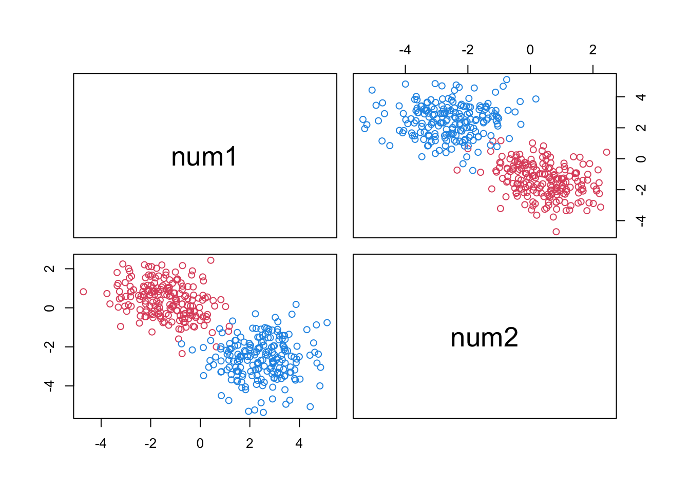

Simulating Clusters with Both Continuous and Categorical Variables
================
2022-08-11

## Continuous Variables

Convex clusters of continuous variables can be generated simply as
multivariate Gaussians.

``` r
# load packages

library(mvtnorm) # for function rmvnorm
library(clusterGeneration) # for function rcorrmatrix
```

    ## Loading required package: MASS

Generate two clusters.

To generate a Gaussian cluster, we need to specify the cluster mean
vector and the cluster covariance matrix.

The mean vectors are generated by random sampling from a continuous
uniform distribution. The distance between the cluster means is a
function of the interval length of the uniform distribution: a shorter
interval leads to clusters that are closer to each other.

The `rcorrmatrix` function from the package `clusterGeneration`
generates random correlation matrices and is used to generate the
covariance matrices for the clusters.

The randomly generated mean vector and covariance matrix are then inputs
to the `rmvnorm` function from the `mvtnorm` package which outputs the
desired number of cluster datapoints.

``` r
gen_2_clusters <- function(cluster_points = c(200, 200), num_vars = 2, num_min_max = 3, seed = 100){
  
  # cluster_points: points per cluster
  # num_vars: how many continuous variables?
  # num_min_max:determines distance between cluster centers; clusters closer if smaller
  
  set.seed(seed)
  
  cl1 <- rmvnorm(cluster_points[1], 
                 mean = runif(num_vars, min = -num_min_max, max = num_min_max), 
                 sigma = rcorrmatrix(num_vars)) 
  cl2 <- rmvnorm(cluster_points[2], 
                 mean = runif(num_vars, min = -num_min_max, max = num_min_max), 
                 sigma = rcorrmatrix(num_vars))
  
  clust_labels <- c(rep(2, cluster_points[1]), rep(4, cluster_points[2]))
  
  z_con <- as.data.frame(rbind(cl1, cl2))
  names(z_con) <- paste0('num', 1:num_vars)
  
  return(list(data = z_con, labels = clust_labels))
  
}
```

Let’s look at the clusters

``` r
z <- gen_2_clusters(num_vars = 3, seed = 777)
pairs(~ ., col = z$labels, data = z$data)
```



## Categorical Variables

Two clusters of categorical variables. Each categorical variable can
take on 3 values drawn from discrete uniform distributions. For low
overlap, categorical variable A takes on values 1, 2, 3, 4, 5 in Cluster
1 and values 5, 6, 7, 8, 9 in Cluster 2. For medium overlap, categorical
variable A takes on values 1, 2, 3, 4, 5 in Cluster 1 and values 4, 5,
6, 7, 8 in Cluster 2. For high overlap, categorical variable A takes on
values 1, 2, 3, 4, 5 in Cluster 1 and values 3, 4, 5, 6, 7 in Cluster 2.

**why not one-hot encode?**

``` r
table(ceiling(runif(100000, min = 0, max = 5)))
```

    ## 
    ##     1     2     3     4     5 
    ## 19758 20261 19973 20189 19819

``` r
R.Version()
```

    ## $platform
    ## [1] "x86_64-apple-darwin13.4.0"
    ## 
    ## $arch
    ## [1] "x86_64"
    ## 
    ## $os
    ## [1] "darwin13.4.0"
    ## 
    ## $system
    ## [1] "x86_64, darwin13.4.0"
    ## 
    ## $status
    ## [1] ""
    ## 
    ## $major
    ## [1] "4"
    ## 
    ## $minor
    ## [1] "1.3"
    ## 
    ## $year
    ## [1] "2022"
    ## 
    ## $month
    ## [1] "03"
    ## 
    ## $day
    ## [1] "10"
    ## 
    ## $`svn rev`
    ## [1] "81868"
    ## 
    ## $language
    ## [1] "R"
    ## 
    ## $version.string
    ## [1] "R version 4.1.3 (2022-03-10)"
    ## 
    ## $nickname
    ## [1] "One Push-Up"

``` r
R.version
```

    ##                _                           
    ## platform       x86_64-apple-darwin13.4.0   
    ## arch           x86_64                      
    ## os             darwin13.4.0                
    ## system         x86_64, darwin13.4.0        
    ## status                                     
    ## major          4                           
    ## minor          1.3                         
    ## year           2022                        
    ## month          03                          
    ## day            10                          
    ## svn rev        81868                       
    ## language       R                           
    ## version.string R version 4.1.3 (2022-03-10)
    ## nickname       One Push-Up

``` r
version
```

    ##                _                           
    ## platform       x86_64-apple-darwin13.4.0   
    ## arch           x86_64                      
    ## os             darwin13.4.0                
    ## system         x86_64, darwin13.4.0        
    ## status                                     
    ## major          4                           
    ## minor          1.3                         
    ## year           2022                        
    ## month          03                          
    ## day            10                          
    ## svn rev        81868                       
    ## language       R                           
    ## version.string R version 4.1.3 (2022-03-10)
    ## nickname       One Push-Up

## R Markdown

This is an R Markdown document. Markdown is a simple formatting syntax
for authoring HTML, PDF, and MS Word documents. For more details on
using R Markdown see <http://rmarkdown.rstudio.com>.

When you click the **Knit** button a document will be generated that
includes both content as well as the output of any embedded R code
chunks within the document. You can embed an R code chunk like this:

``` r
summary(cars)
```

    ##      speed           dist       
    ##  Min.   : 4.0   Min.   :  2.00  
    ##  1st Qu.:12.0   1st Qu.: 26.00  
    ##  Median :15.0   Median : 36.00  
    ##  Mean   :15.4   Mean   : 42.98  
    ##  3rd Qu.:19.0   3rd Qu.: 56.00  
    ##  Max.   :25.0   Max.   :120.00

## Including Plots

You can also embed plots, for example:


Note that the `echo = FALSE` parameter was added to the code chunk to
prevent printing of the R code that generated the plot.
