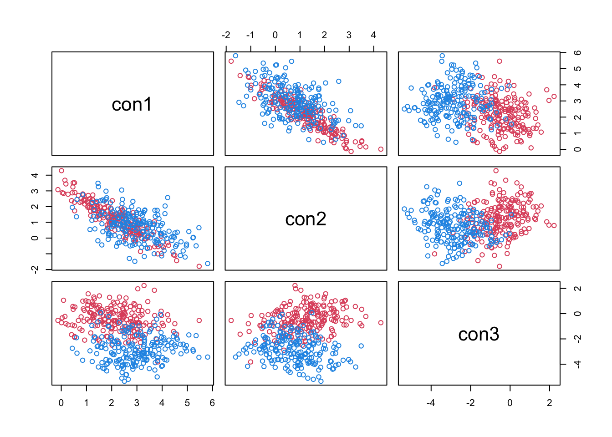

Simulating Clusters with Both Continuous and Categorical Variables
================
2022-08-11

## Continuous Variables

Convex clusters of continuous variables can be generated simply as
multivariate Gaussians.

``` r
# load packages

library(mvtnorm) # for function rmvnorm
library(clusterGeneration) # for function rcorrmatrix
```

Generate two clusters.

To generate a Gaussian cluster, we need to specify the cluster mean
vector and the cluster covariance matrix.

The mean vectors are generated by random sampling from a continuous
uniform distribution. The distance between the cluster means is a
function of the interval length of the uniform distribution: a shorter
interval leads to clusters that are closer to each other.

The `rcorrmatrix` function from the package `clusterGeneration`
generates random correlation matrices and is used to generate the
covariance matrices for the clusters.

The randomly generated mean vector and covariance matrix are then inputs
to the `rmvnorm` function from the `mvtnorm` package which outputs the
desired number of cluster datapoints.

``` r
gen_2_clusters_con <- function(cluster_points = c(200, 200), con_vars = 2, con_dist = 3, seed = 100){
  
  # cluster_points: points per cluster
  # con_vars: how many continuous variables?
  # con_dist: determines distance between cluster centers; clusters closer if smaller
  
  # load required packages

  library(mvtnorm) # for function rmvnorm
  library(clusterGeneration) # for function rcorrmatrix
  
  set.seed(seed)
  
  cl1 <- rmvnorm(cluster_points[1], 
                 mean = runif(con_vars, min = -con_dist, max = con_dist), 
                 sigma = rcorrmatrix(con_vars)) 
  cl2 <- rmvnorm(cluster_points[2], 
                 mean = runif(con_vars, min = -con_dist, max = con_dist), 
                 sigma = rcorrmatrix(con_vars))
  
  clust_labels <- c(rep(2, cluster_points[1]), rep(4, cluster_points[2]))
  
  z_con <- as.data.frame(rbind(cl1, cl2))
  names(z_con) <- paste0('con', 1:con_vars)
  
  return(list(data = z_con, labels = clust_labels))
  
}
```

Let’s look at the clusters

``` r
z <- gen_2_clusters_con(con_vars = 3, seed = 7777)
pairs(~ ., col = z$labels, data = z$data)
```



## Categorical Variables

Two clusters of categorical variables. Each categorical variable can
take on 5 levels drawn from a discrete uniform distribution. For low
overlap, categorical variable A has five levels 1, 2, 3, 4, 5 in Cluster
1 and five levels 5, 6, 7, 8, 9 in Cluster 2. For medium overlap,
categorical variable A has five levels 1, 2, 3, 4, 5 in Cluster 1 and
has five levels 4, 5, 6, 7, 8 in Cluster 2. For high overlap,
categorical variable A has five levels 1, 2, 3, 4, 5 in Cluster 1 and
has five levels 3, 4, 5, 6, 7 in Cluster 2.

**why not one-hot encode?**

Is it faster to generate the categorical variables by: calling
`ceiling(runif(...))` once and then distributing the result to say three
categorical variables? or calling `ceiling(runif(...))` three times,
once for each categorical variable?

``` r
# table(ceiling(runif(100000, min = 0, max = 5)))

system.time({
  for (i in 1:3000000){
    x <- ceiling(runif(1200, min = 0, max = 5))
    x1 <- x[1:400]
    x2 <- x[401:800]
    x3 <- x[801:1200]
  }
})
```

    ##    user  system elapsed 
    ##  77.723   8.165  85.954

``` r
system.time({
  for (i in 1:3000000){
    x1 <- ceiling(runif(400, min = 0, max = 5))
    x2 <- ceiling(runif(400, min = 0, max = 5))
    x3 <- ceiling(runif(400, min = 0, max = 5))
  }
})
```

    ##    user  system elapsed 
    ##  65.383   4.870  70.282

Calling `ceiling(runif(...))` multiple times is faster by \~15%

``` r
gen_2_clusters_cat <- function(cluster_points = c(200, 200), cat_vars = 2, overlap = "low", seed = 100){
  # cluster_points: points per cluster
  # cat_vars: how many categorical variables?
  # overlap: ('low', 'medium', 'high') determines overlap in categorical variables; Each categorical variable can take on 5 levels drawn from a discrete uniform distribution.For low overlap, categorical variable A has five levels 1, 2, 3, 4, 5 in Cluster 1 and five levels 5, 6, 7, 8, 9 in Cluster 2. For medium overlap, categorical variable A has five levels 1, 2, 3, 4, 5 in Cluster 1 and has five levels 4, 5, 6, 7, 8 in Cluster 2. For high overlap, categorical variable A has five levels 1, 2, 3, 4, 5 in Cluster 1 and has five levels 3, 4, 5, 6, 7 in Cluster 2.
  
  set.seed(seed)
  
  if (!(overlap %in% c("low", "medium", "high"))){
    stop("overlap must be one of 'low', 'medium', 'high'")
  }
  
  M <- matrix(nrow = sum(cluster_points), ncol = cat_vars)
  
  lo <- function(){
    for (i in 1:cat_vars){
      M[, i] <<- c(ceiling(runif(cluster_points[1], min = 0, max = 5)), 
                  ceiling(runif(cluster_points[2], min = 4, max = 9)))
    }
  }
  
  med <- function(){
    for (i in 1:cat_vars){
      M[, i] <<- c(ceiling(runif(cluster_points[1], min = 0, max = 5)), 
                  ceiling(runif(cluster_points[2], min = 3, max = 8)))
    }
  }
  
  hi <- function(){
    for (i in 1:cat_vars){
      M[, i] <<- c(ceiling(runif(cluster_points[1], min = 0, max = 5)), 
                  ceiling(runif(cluster_points[2], min = 2, max = 7)))
    }
  }
  
  switch(overlap,
         low = lo(),
         medium = med(),
         high = hi(), 
         stop("overlap must be one of 'low', 'medium', 'high'"))
  
  clust_labels <- c(rep(2, cluster_points[1]), rep(4, cluster_points[2]))
  
  z_cat <- as.data.frame(M)
  names(z_cat) <- paste0('cat', 1:cat_vars)
  
  return(list(data = z_cat, labels = clust_labels))
}

z <- gen_2_clusters_cat()
pairs(jitter(as.matrix(z$data)), col = z$labels)
```


Let’s look at the clusters

``` r
z <- gen_2_clusters_cat(overlap = "medium")
pairs(jitter(as.matrix(z$data)), col = z$labels)
```


``` r
z <- gen_2_clusters_cat(overlap = "high")
pairs(jitter(as.matrix(z$data)), col = z$labels)
```


Now generate 2 mixed-data clusters (both continuous and categorical
variables)

``` r
gen_2_clusters_mixed <- function(cluster_points = c(200, 200), con_vars = 2, con_dist = 3, seed = 7777, cat_vars = 2, overlap = "low"){
  # combines the functions gen_2_clusters_con and gen_2_clusters_cat
  
  z_con <- gen_2_clusters_con(cluster_points, con_vars, con_dist, seed)
  z_cat <- gen_2_clusters_cat(cluster_points, cat_vars, overlap, seed)
  
  return(list(data = cbind(z_con$data, z_cat$data), labels = z_con$labels))
}

z <- gen_2_clusters_mixed()
str(z)
```

    ## List of 2
    ##  $ data  :'data.frame':  400 obs. of  4 variables:
    ##   ..$ con1: num [1:400] 1.042 0.278 -1.087 -1.766 -0.194 ...
    ##   ..$ con2: num [1:400] 0.607 0.786 1.903 2.286 0.363 ...
    ##   ..$ cat1: num [1:400] 1 3 4 5 2 5 5 4 3 4 ...
    ##   ..$ cat2: num [1:400] 3 4 2 3 4 4 4 4 3 2 ...
    ##  $ labels: num [1:400] 2 2 2 2 2 2 2 2 2 2 ...

``` r
pairs(~ ., col = z$labels, data = z$data)
```


Session info

``` r
R.Version()
```

    ## $platform
    ## [1] "x86_64-apple-darwin13.4.0"
    ## 
    ## $arch
    ## [1] "x86_64"
    ## 
    ## $os
    ## [1] "darwin13.4.0"
    ## 
    ## $system
    ## [1] "x86_64, darwin13.4.0"
    ## 
    ## $status
    ## [1] ""
    ## 
    ## $major
    ## [1] "4"
    ## 
    ## $minor
    ## [1] "1.3"
    ## 
    ## $year
    ## [1] "2022"
    ## 
    ## $month
    ## [1] "03"
    ## 
    ## $day
    ## [1] "10"
    ## 
    ## $`svn rev`
    ## [1] "81868"
    ## 
    ## $language
    ## [1] "R"
    ## 
    ## $version.string
    ## [1] "R version 4.1.3 (2022-03-10)"
    ## 
    ## $nickname
    ## [1] "One Push-Up"

``` r
R.version
```

    ##                _                           
    ## platform       x86_64-apple-darwin13.4.0   
    ## arch           x86_64                      
    ## os             darwin13.4.0                
    ## system         x86_64, darwin13.4.0        
    ## status                                     
    ## major          4                           
    ## minor          1.3                         
    ## year           2022                        
    ## month          03                          
    ## day            10                          
    ## svn rev        81868                       
    ## language       R                           
    ## version.string R version 4.1.3 (2022-03-10)
    ## nickname       One Push-Up

``` r
version
```

    ##                _                           
    ## platform       x86_64-apple-darwin13.4.0   
    ## arch           x86_64                      
    ## os             darwin13.4.0                
    ## system         x86_64, darwin13.4.0        
    ## status                                     
    ## major          4                           
    ## minor          1.3                         
    ## year           2022                        
    ## month          03                          
    ## day            10                          
    ## svn rev        81868                       
    ## language       R                           
    ## version.string R version 4.1.3 (2022-03-10)
    ## nickname       One Push-Up

``` r
sessionInfo()
```

    ## R version 4.1.3 (2022-03-10)
    ## Platform: x86_64-apple-darwin13.4.0 (64-bit)
    ## Running under: macOS Big Sur/Monterey 10.16
    ## 
    ## Matrix products: default
    ## BLAS/LAPACK: /Users/felix.mbuga/opt/anaconda3/envs/rstud/lib/libopenblasp-r0.3.20.dylib
    ## 
    ## locale:
    ## [1] en_US.UTF-8/en_US.UTF-8/en_US.UTF-8/C/en_US.UTF-8/en_US.UTF-8
    ## 
    ## attached base packages:
    ## [1] stats     graphics  grDevices utils     datasets  methods   base     
    ## 
    ## other attached packages:
    ## [1] clusterGeneration_1.3.7 MASS_7.3-58.1           mvtnorm_1.1-3          
    ## 
    ## loaded via a namespace (and not attached):
    ##  [1] digest_0.6.29   magrittr_2.0.3  evaluate_0.16   highr_0.9      
    ##  [5] rlang_1.0.5     stringi_1.7.8   cli_3.4.1       rstudioapi_0.14
    ##  [9] rmarkdown_2.16  tools_4.1.3     stringr_1.4.1   xfun_0.33      
    ## [13] yaml_2.3.5      fastmap_1.1.0   compiler_4.1.3  htmltools_0.5.3
    ## [17] knitr_1.40
