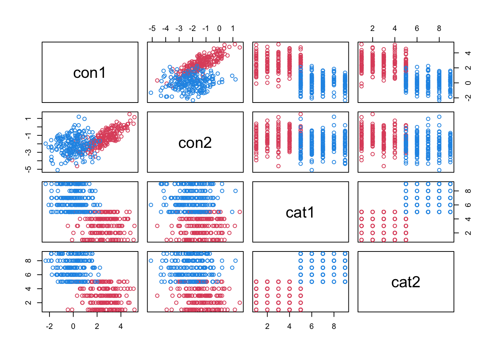
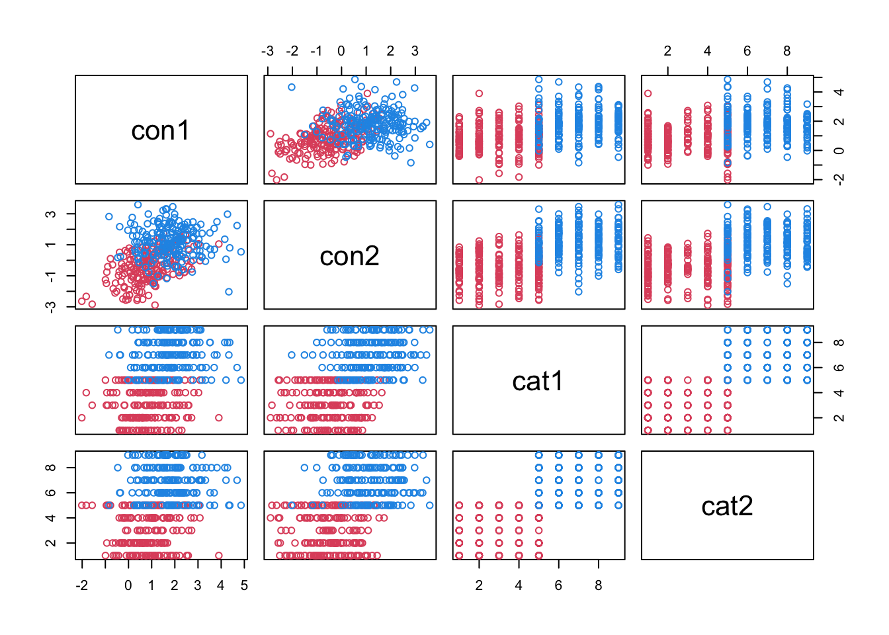

Comparing Clustering Methods on 2-Cluster Mixed Data
================
2022-09-08

The goal of the project was to compare established methods of clustering
mixed data (data with both continuous and categorical variables) to our
implementation of spectral clustering for mixed data.

The established methods chosen were `KAMILA` and `kprototypes`.

``` r
rm(list = ls())
gc()
```

    ##          used (Mb) gc trigger (Mb) max used (Mb)
    ## Ncells 484371 25.9    1050257 56.1   667320 35.7
    ## Vcells 894965  6.9    8388608 64.0  1829388 14.0

``` r
# Load KAMILA and kprototypes
library(kamila) # kamila
library(clustMixType) # kproto
library(MixGHD) # ARI

# load functions for mixed data generation

file_to_load <- "/Users/felix.mbuga/Library/Mobile Documents/com~apple~CloudDocs/GitHub/projects/Clustering/functions_gen_2_clusters.R"
source(file_to_load)
ls()
```

    ## [1] "file_to_load"         "gen_2_clusters_cat"   "gen_2_clusters_con"  
    ## [4] "gen_2_clusters_mixed"

``` r
# load function for spectral clustering of mixed data

file_to_load <- "/Users/felix.mbuga/Library/Mobile Documents/com~apple~CloudDocs/GitHub/projects/Clustering/function_speClusMixed.R"
source(file_to_load)
ls()
```

    ## [1] "file_to_load"         "gen_2_clusters_cat"   "gen_2_clusters_con"  
    ## [4] "gen_2_clusters_mixed" "speClusMixed"

Generate dataset and visualize

``` r
z <- gen_2_clusters_mixed(seed = 42)
str(z)
```

    ## List of 2
    ##  $ data  :'data.frame':  400 obs. of  4 variables:
    ##   ..$ con1: num [1:400] 3.49 1.9 2.83 3.44 2.25 ...
    ##   ..$ con2: num [1:400] -0.792 -1.326 -1.591 -1.601 -2.171 ...
    ##   ..$ cat1: Factor w/ 9 levels "1","2","3","4",..: 5 5 2 5 4 3 4 1 4 4 ...
    ##   ..$ cat2: Factor w/ 9 levels "1","2","3","4",..: 1 3 4 3 5 1 5 2 1 2 ...
    ##  $ labels: num [1:400] 2 2 2 2 2 2 2 2 2 2 ...

``` r
pairs(~ ., col = z$labels, data = z$data)
```



Cluster dataset with `kamila` and with `kproto`

``` r
z_kam <- kamila(Filter(is.numeric, z$data), Filter(is.factor, z$data), numClust = 2, numInit = 100)
print(paste('kamila ARI:', round(ARI(z$labels, z_kam$finalMemb), 3)))
```

    ## [1] "kamila ARI: 0.931"

``` r
z_kproto <-kproto(z$data, k = 2, nstart = 100, verbose = FALSE)
print(paste('kproto ARI:', round(ARI(z$labels, z_kproto$cluster), 3)))
```

    ## [1] "kproto ARI: 0.577"

``` r
z_speclus <- speClusMixed(z)
print(paste('speclus ARI:', round(z_speclus$ARI['ARI'], 3)))
```

    ## [1] "speclus ARI: 0.96"

Another dataset

``` r
z <- gen_2_clusters_mixed(con_dist = 2, seed = sample(1000, 1))

pairs(~ ., col = z$labels, data = z$data)
```



``` r
z_kam <- kamila(Filter(is.numeric, z$data), Filter(is.factor, z$data), numClust = 2, numInit = 100)
print(paste('kamila ARI:', round(ARI(z$labels, z_kam$finalMemb), 3)))
```

    ## [1] "kamila ARI: 0.865"

``` r
z_kproto <-kproto(z$data, k = 2, nstart = 100, verbose = FALSE)
print(paste('kproto ARI:', round(ARI(z$labels, z_kproto$cluster), 3)))
```

    ## [1] "kproto ARI: 0.371"

``` r
z_speclus <- speClusMixed(z)
print(paste('speclus ARI:', round(z_speclus$ARI['ARI'], 3)))
```

    ## [1] "speclus ARI: 0"

Generate multiple (4,800) datasets to compare the three methods on.

Number of continuous-categorical variables 1-3, 2-2, 3-1 Number of
levels in categorical variables 3, 5 Degree of overlap in variables
lo-lo, lo-hi, hi-lo, hi-hi Clusters balanced? (points per cluster)
200-200, 320-80

``` r
##### Step 1: Create the Datasets

## 4800 datasets

# load functions for mixed data generation

file_to_load <- "/Users/felix.mbuga/Library/Mobile Documents/com~apple~CloudDocs/GitHub/projects/Clustering/functions_gen_2_clusters.R"
source(file_to_load)
ls()
```

    ## [1] "file_to_load"         "gen_2_clusters_cat"   "gen_2_clusters_con"  
    ## [4] "gen_2_clusters_mixed" "speClusMixed"         "z"                   
    ## [7] "z_kam"                "z_kproto"             "z_speclus"

``` r
# create list with 4 continuous-categorical olap types low-low, low-high, high-low, high-high
data_4800 <- vector(mode = 'list', length = 4) # 4 overlap profiles, 20 datasets each, 80 datasets total
names(data_4800) <- c('low_low', 'low_high', 'high_low', 'high_high')
#str(data_4800)

# for each olap type, number of continuous-categorical variables: 3-1, 2-2, 1-3
for (i in 1:length(data_4800)) {
    #print(i)
    #str(i)
    data_4800[[i]] <- vector(mode = 'list', length = 3)
    names(data_4800[[i]]) <- c('con_3_cat_1', 'con_2_cat_2', 'con_1_cat_3')
}
#str(data_4800)

# for each con-cat ratio, 2 categorical level types: 3 & 5
for (i in 1:4) { # 4 olap types
    for (j in 1:3) { # 3 con-cat ratios
        data_4800[[i]][[j]] <- vector(mode = 'list', length = 2)
        names(data_4800[[i]][[j]]) <- c('3_cat_levs', '5_cat_levs')
    }
}
#str(data_4800)

# for each cat level type, 2 balance levels: 200/200 & 320/80
for (i in 1:4) { # 4 olap types
    for (j in 1:3) { # 3 con-cat ratios
        for (k in 1:2) { # 2 cat-lev types
            data_4800[[i]][[j]][[k]] <- vector(mode = 'list', length = 2)
            names(data_4800[[i]][[j]][[k]]) <- c('200_200', '320_80')
        }
    }
}
#str(data_4800)

# under each dataset type, have 100 lists, 1 for each of 100 datasets
for (i in 1:4) { # 4 olap types
    for (j in 1:3) { # 3 con-cat ratios
        for (k in 1:2) { # 2 cat-lev types
            for (l in 1:2) { # 2 balance levels
                data_4800[[i]][[j]][[k]][[l]] <- vector(mode = 'list', length = 100)
                names(data_4800[[i]][[j]][[k]][[l]]) <- as.character(1:100)
            }       
        }
    }
}
#str(data_4800)


# under each dataset, store 4 items
    # - the dataset & cluster labels
    # - the kamila output
    # - the k-prototypes output
    # - the speclus output
for (i in 1:4) { # 4 olap types
    for (j in 1:3) { # 3 con-cat ratios
        for (k in 1:2) { # 2 cat-lev types
            for (l in 1:2) { # 2 balance levels
                for (m in 1:100) { # 100 datasets
                    data_4800[[i]][[j]][[k]][[l]][[m]] <- vector(mode = 'list', length = 4)
                    names(data_4800[[i]][[j]][[k]][[l]][[m]]) <- c('dataset', 'kamila', 'kproto', 'speclus')
                }           
            }       
        }
    }
}
#str(data_4800)

data_4800[[i]][[j]][[k]][[l]][[m]]  # list of 4 items: c('dataset', 'kamila', 'kproto', 'speclus')
```

    ## $dataset
    ## NULL
    ## 
    ## $kamila
    ## NULL
    ## 
    ## $kproto
    ## NULL
    ## 
    ## $speclus
    ## NULL

``` r
##### %%% next step: make the 4800 datasets to populate data_4800

# make the 4800 datasets; calculate kamila & kproto ARI
set.seed(4800)

con_dists <- c(2, 2, 1, 1)
cat_overlaps <- c("low", "high", "low", "high")
(olaps <- data.frame(con_dists, cat_overlaps))
```

    ##   con_dists cat_overlaps
    ## 1         2          low
    ## 2         2         high
    ## 3         1          low
    ## 4         1         high

``` r
(con_cat_ratio <- matrix(c(3, 1, 2, 2, 1, 3), nrow = 3, byrow = TRUE))
```

    ##      [,1] [,2]
    ## [1,]    3    1
    ## [2,]    2    2
    ## [3,]    1    3

``` r
(cat_lev_types <- c(3, 5))
```

    ## [1] 3 5

``` r
(bal_levs <- matrix(c(200, 200, 320, 80), nrow = 2, byrow=TRUE))
```

    ##      [,1] [,2]
    ## [1,]  200  200
    ## [2,]  320   80

``` r
count <- 0
for (i in 1:4) { # 4 olap types
    for (j in 1:3) { # 3 con-cat ratios
        for (k in 1:2) { # 2 cat-lev types
            for (l in 1:2) { # 2 balance levels
                for (m in 1:100) { # 100 datasets
                    z <- data_4800[[i]][[j]][[k]][[l]][[m]]$dataset <- 
                      gen_2_clusters_mixed(cluster_points = c(bal_levs[l, 1], bal_levs[l, 2]), 
                                           con_vars =  con_cat_ratio[j, 1],
                                           con_dist =  olaps[i, 1], 
                                           seed = count,
                                           cat_vars = con_cat_ratio[j, 2], 
                                           cat_overlap = olaps[i, 2])
                    count = count + 1
                    #print(count)
                }           
            }       
        }
    }
}
```

``` r
str(data_4800)
```

    ## List of 4
    ##  $ low_low  :List of 3
    ##   ..$ con_3_cat_1:List of 2
    ##   .. ..$ 3_cat_levs:List of 2
    ##   .. .. ..$ 200_200:List of 100
    ##   .. .. .. ..$ 1  :List of 4
    ##   .. .. .. .. ..$ dataset:List of 2
    ##   .. .. .. .. .. ..$ data  :'data.frame':    400 obs. of  4 variables:
    ##   .. .. .. .. .. .. ..$ con1: num [1:400] 1.338 2.555 3.244 0.243 1.627 ...
    ##   .. .. .. .. .. .. ..$ con2: num [1:400] 1.15 2.61 2.76 1.92 2.61 ...
    ##   .. .. .. .. .. .. ..$ con3: num [1:400] 0.977 0.0502 -0.5466 1.4685 1.3756 ...
    ##   .. .. .. .. .. .. ..$ cat1: Factor w/ 9 levels "1","2","3","4",..: 5 2 2 3 5 2 5 5 4 4 ...
    ##   .. .. .. .. .. ..$ labels: num [1:400] 2 2 2 2 2 2 2 2 2 2 ...
    ##   .. .. .. .. ..$ kamila : NULL
    ##   .. .. .. .. ..$ kproto : NULL
    ##   .. .. .. .. ..$ speclus: NULL
    ##   .. .. .. ..$ 2  :List of 4
    ##   .. .. .. .. ..$ dataset:List of 2
    ##   .. .. .. .. .. ..$ data  :'data.frame':    400 obs. of  4 variables:
    ##   .. .. .. .. .. .. ..$ con1: num [1:400] 0.46 1.455 1.203 1.658 0.509 ...
    ##   .. .. .. .. .. .. ..$ con2: num [1:400] 0.0518 3.0508 -0.323 0.3326 1.1469 ...
    ##   .. .. .. .. .. .. ..$ con3: num [1:400] -0.273 1.469 -0.086 0.638 -0.872 ...
    ##   .. .. .. .. .. .. ..$ cat1: Factor w/ 9 levels "1","2","3","4",..: 2 2 3 5 2 5 5 4 4 1 ...
    ##   .. .. .. .. .. ..$ labels: num [1:400] 2 2 2 2 2 2 2 2 2 2 ...
    ##   .. .. .. .. ..$ kamila : NULL
    ##   .. .. .. .. ..$ kproto : NULL
    ##   .. .. .. .. ..$ speclus: NULL
    ##   .. .. .. ..$ 3  :List of 4
    ##   .. .. .. .. ..$ dataset:List of 2
    ##   .. .. .. .. .. ..$ data  :'data.frame':    400 obs. of  4 variables:
    ##   .. .. .. .. .. .. ..$ con1: num [1:400] -0.726 0.301 -1.386 -0.976 -0.39 ...
    ##   .. .. .. .. .. .. ..$ con2: num [1:400] 0.633 0.314 0.439 0.401 1.304 ...
    ##   .. .. .. .. .. .. ..$ con3: num [1:400] -0.97934 -1.88341 -0.00136 -0.7948 -1.16625 ...
    ##   .. .. .. .. .. .. ..$ cat1: Factor w/ 9 levels "1","2","3","4",..: 1 4 3 1 5 5 1 5 3 3 ...
    ##   .. .. .. .. .. ..$ labels: num [1:400] 2 2 2 2 2 2 2 2 2 2 ...
    ##   .. .. .. .. ..$ kamila : NULL
    ##   .. .. .. .. ..$ kproto : NULL
    ##   .. .. .. .. ..$ speclus: NULL
    ##   .. .. .. ..$ 4  :List of 4
    ##   .. .. .. .. ..$ dataset:List of 2
    ##   .. .. .. .. .. ..$ data  :'data.frame':    400 obs. of  4 variables:
    ##   .. .. .. .. .. .. ..$ con1: num [1:400] -1.194 -0.732 -3.192 -0.422 -1.447 ...
    ##   .. .. .. .. .. .. ..$ con2: num [1:400] -0.927 -0.545 -1.497 -0.541 -1.099 ...
    ##   .. .. .. .. .. .. ..$ con3: num [1:400] 0.437 -0.368 1.351 -0.143 -0.469 ...
    ##   .. .. .. .. .. .. ..$ cat1: Factor w/ 9 levels "1","2","3","4",..: 1 5 2 2 4 4 1 2 3 4 ...
    ##   .. .. .. .. .. ..$ labels: num [1:400] 2 2 2 2 2 2 2 2 2 2 ...
    ##   .. .. .. .. ..$ kamila : NULL
    ##   .. .. .. .. ..$ kproto : NULL
    ##   .. .. .. .. ..$ speclus: NULL
    ##   .. .. .. ..$ 5  :List of 4
    ##   .. .. .. .. ..$ dataset:List of 2
    ##   .. .. .. .. .. ..$ data  :'data.frame':    400 obs. of  4 variables:
    ##   .. .. .. .. .. .. ..$ con1: num [1:400] -1.058 0.563 3.126 2.081 1.25 ...
    ##   .. .. .. .. .. .. ..$ con2: num [1:400] 0.715 1.706 1.551 1.863 3.454 ...
    ##   .. .. .. .. .. .. ..$ con3: num [1:400] 3.941 2.457 1.783 0.791 1.625 ...
    ##   .. .. .. .. .. .. ..$ cat1: Factor w/ 9 levels "1","2","3","4",..: 3 1 2 2 5 2 4 5 5 1 ...
    ##   .. .. .. .. .. ..$ labels: num [1:400] 2 2 2 2 2 2 2 2 2 2 ...
    ##   .. .. .. .. ..$ kamila : NULL
    ##   .. .. .. .. ..$ kproto : NULL
    ##   .. .. .. .. ..$ speclus: NULL
    ##   .. .. .. ..$ 6  :List of 4
    ##   .. .. .. .. ..$ dataset:List of 2
    ##   .. .. .. .. .. ..$ data  :'data.frame':    400 obs. of  4 variables:
    ##   .. .. .. .. .. .. ..$ con1: num [1:400] -1.015 -0.947 0.897 1.106 -1.602 ...
    ##   .. .. .. .. .. .. ..$ con2: num [1:400] 1.673 2.968 0.399 1.326 1.916 ...
    ##   .. .. .. .. .. .. ..$ con3: num [1:400] 1.8 3.17 1.5 1.45 1.81 ...
    ##   .. .. .. .. .. .. ..$ cat1: Factor w/ 9 levels "1","2","3","4",..: 2 4 5 2 1 4 3 5 5 1 ...
    ##   .. .. .. .. .. ..$ labels: num [1:400] 2 2 2 2 2 2 2 2 2 2 ...
    ##   .. .. .. .. ..$ kamila : NULL
    ##   .. .. .. .. ..$ kproto : NULL
    ##   .. .. .. .. ..$ speclus: NULL
    ##   .. .. .. ..$ 7  :List of 4
    ##   .. .. .. .. ..$ dataset:List of 2
    ##   .. .. .. .. .. ..$ data  :'data.frame':    400 obs. of  4 variables:
    ##   .. .. .. .. .. .. ..$ con1: num [1:400] 0.656 1.067 2.844 3.488 3.096 ...
    ##   .. .. .. .. .. .. ..$ con2: num [1:400] 2.42 1.36 0.51 1.19 2.85 ...
    ##   .. .. .. .. .. .. ..$ con3: num [1:400] -0.231 0.649 -0.577 -1.435 -1.929 ...
    ##   .. .. .. .. .. .. ..$ cat1: Factor w/ 9 levels "1","2","3","4",..: 4 5 2 2 5 5 5 4 3 1 ...
    ##   .. .. .. .. .. ..$ labels: num [1:400] 2 2 2 2 2 2 2 2 2 2 ...
    ##   .. .. .. .. ..$ kamila : NULL
    ##   .. .. .. .. ..$ kproto : NULL
    ##   .. .. .. .. ..$ speclus: NULL
    ##   .. .. .. ..$ 8  :List of 4
    ##   .. .. .. .. ..$ dataset:List of 2
    ##   .. .. .. .. .. ..$ data  :'data.frame':    400 obs. of  4 variables:
    ##   .. .. .. .. .. .. ..$ con1: num [1:400] -0.8896 -3.0051 -0.0188 -0.7383 -0.9218 ...
    ##   .. .. .. .. .. .. ..$ con2: num [1:400] 1.729 -0.506 3.075 1.829 1.859 ...
    ##   .. .. .. .. .. .. ..$ con3: num [1:400] -2.263 -0.695 -3.07 -1.792 -0.77 ...
    ##   .. .. .. .. .. .. ..$ cat1: Factor w/ 9 levels "1","2","3","4",..: 5 2 1 1 2 4 2 5 1 3 ...
    ##   .. .. .. .. .. ..$ labels: num [1:400] 2 2 2 2 2 2 2 2 2 2 ...
    ##   .. .. .. .. ..$ kamila : NULL
    ##   .. .. .. .. ..$ kproto : NULL
    ##   .. .. .. .. ..$ speclus: NULL
    ##   .. .. .. ..$ 9  :List of 4
    ##   .. .. .. .. ..$ dataset:List of 2
    ##   .. .. .. .. .. ..$ data  :'data.frame':    400 obs. of  4 variables:
    ##   .. .. .. .. .. .. ..$ con1: num [1:400] -0.388 0.644 -0.726 -0.553 -1.464 ...
    ##   .. .. .. .. .. .. ..$ con2: num [1:400] 0.449 1.066 1.526 2.67 1.827 ...
    ##   .. .. .. .. .. .. ..$ con3: num [1:400] 0.874 1.175 2.733 1.663 2.38 ...
    ##   .. .. .. .. .. .. ..$ cat1: Factor w/ 9 levels "1","2","3","4",..: 3 2 4 4 2 4 2 5 4 4 ...
    ##   .. .. .. .. .. ..$ labels: num [1:400] 2 2 2 2 2 2 2 2 2 2 ...
    ##   .. .. .. .. ..$ kamila : NULL
    ##   .. .. .. .. ..$ kproto : NULL
    ##   .. .. .. .. ..$ speclus: NULL
    ##   .. .. .. ..$ 10 :List of 4
    ##   .. .. .. .. ..$ dataset:List of 2
    ##   .. .. .. .. .. ..$ data  :'data.frame':    400 obs. of  4 variables:
    ##   .. .. .. .. .. .. ..$ con1: num [1:400] 2.366 -0.898 -1.934 -0.699 0.749 ...
    ##   .. .. .. .. .. .. ..$ con2: num [1:400] -3.1985 1.3624 -1.5285 0.0438 -0.1066 ...
    ##   .. .. .. .. .. .. ..$ con3: num [1:400] 1.094 0.164 1.996 2.227 2.073 ...
    ##   .. .. .. .. .. .. ..$ cat1: Factor w/ 9 levels "1","2","3","4",..: 2 1 2 2 3 1 2 2 4 5 ...
    ##   .. .. .. .. .. ..$ labels: num [1:400] 2 2 2 2 2 2 2 2 2 2 ...
    ##   .. .. .. .. ..$ kamila : NULL
    ##   .. .. .. .. ..$ kproto : NULL
    ##   .. .. .. .. ..$ speclus: NULL
    ##   .. .. .. ..$ 11 :List of 4
    ##   .. .. .. .. ..$ dataset:List of 2
    ##   .. .. .. .. .. ..$ data  :'data.frame':    400 obs. of  4 variables:
    ##   .. .. .. .. .. .. ..$ con1: num [1:400] -0.941 -0.619 -0.398 -2.153 1.036 ...
    ##   .. .. .. .. .. .. ..$ con2: num [1:400] -0.762 -1.612 -1.311 -1.204 -0.332 ...
    ##   .. .. .. .. .. .. ..$ con3: num [1:400] 0.583 1.286 1.105 -1.007 2.506 ...
    ##   .. .. .. .. .. .. ..$ cat1: Factor w/ 9 levels "1","2","3","4",..: 3 2 3 4 1 2 2 2 4 3 ...
    ##   .. .. .. .. .. ..$ labels: num [1:400] 2 2 2 2 2 2 2 2 2 2 ...
    ##   .. .. .. .. ..$ kamila : NULL
    ##   .. .. .. .. ..$ kproto : NULL
    ##   .. .. .. .. ..$ speclus: NULL
    ##   .. .. .. ..$ 12 :List of 4
    ##   .. .. .. .. ..$ dataset:List of 2
    ##   .. .. .. .. .. ..$ data  :'data.frame':    400 obs. of  4 variables:
    ##   .. .. .. .. .. .. ..$ con1: num [1:400] -2.12 -1.42 -1.19 -3.63 -3.04 ...
    ##   .. .. .. .. .. .. ..$ con2: num [1:400] -0.662 -1.311 -1.32 -0.649 -0.385 ...
    ##   .. .. .. .. .. .. ..$ con3: num [1:400] 1.8839 1.5377 1.6807 0.107 0.0445 ...
    ##   .. .. .. .. .. .. ..$ cat1: Factor w/ 9 levels "1","2","3","4",..: 2 1 3 1 1 5 1 2 5 1 ...
    ##   .. .. .. .. .. ..$ labels: num [1:400] 2 2 2 2 2 2 2 2 2 2 ...
    ##   .. .. .. .. ..$ kamila : NULL
    ##   .. .. .. .. ..$ kproto : NULL
    ##   .. .. .. .. ..$ speclus: NULL
    ##   .. .. .. ..$ 13 :List of 4
    ##   .. .. .. .. ..$ dataset:List of 2
    ##   .. .. .. .. .. ..$ data  :'data.frame':    400 obs. of  4 variables:
    ##   .. .. .. .. .. .. ..$ con1: num [1:400] -3.78 -1.33 -0.75 -2.4 -1.3 ...
    ##   .. .. .. .. .. .. ..$ con2: num [1:400] 2.17 0.148 0.347 1.874 1.839 ...
    ##   .. .. .. .. .. .. ..$ con3: num [1:400] -1.492 -2.908 -2.283 -0.513 -0.393 ...
    ##   .. .. .. .. .. .. ..$ cat1: Factor w/ 9 levels "1","2","3","4",..: 1 5 5 2 1 1 1 4 1 1 ...
    ##   .. .. .. .. .. ..$ labels: num [1:400] 2 2 2 2 2 2 2 2 2 2 ...
    ##   .. .. .. .. ..$ kamila : NULL
    ##   .. .. .. .. ..$ kproto : NULL
    ##   .. .. .. .. ..$ speclus: NULL
    ##   .. .. .. ..$ 14 :List of 4
    ##   .. .. .. .. ..$ dataset:List of 2
    ##   .. .. .. .. .. ..$ data  :'data.frame':    400 obs. of  4 variables:
    ##   .. .. .. .. .. .. ..$ con1: num [1:400] -1.001 -0.201 0.238 0.412 1.678 ...
    ##   .. .. .. .. .. .. ..$ con2: num [1:400] 1.8813 1.2009 1.1345 1.386 0.0697 ...
    ##   .. .. .. .. .. .. ..$ con3: num [1:400] 2.536 2.065 1.68 1.331 -0.287 ...
    ##   .. .. .. .. .. .. ..$ cat1: Factor w/ 9 levels "1","2","3","4",..: 4 2 2 1 5 1 3 4 5 1 ...
    ##   .. .. .. .. .. ..$ labels: num [1:400] 2 2 2 2 2 2 2 2 2 2 ...
    ##   .. .. .. .. ..$ kamila : NULL
    ##   .. .. .. .. ..$ kproto : NULL
    ##   .. .. .. .. ..$ speclus: NULL
    ##   .. .. .. ..$ 15 :List of 4
    ##   .. .. .. .. ..$ dataset:List of 2
    ##   .. .. .. .. .. ..$ data  :'data.frame':    400 obs. of  4 variables:
    ##   .. .. .. .. .. .. ..$ con1: num [1:400] 1.06 2.13 1.36 2.44 2.22 ...
    ##   .. .. .. .. .. .. ..$ con2: num [1:400] -0.546 0.161 0.312 -2.062 -1.339 ...
    ##   .. .. .. .. .. .. ..$ con3: num [1:400] 0.3092 0.0341 0.5122 -1.5905 -0.9035 ...
    ##   .. .. .. .. .. .. ..$ cat1: Factor w/ 9 levels "1","2","3","4",..: 2 4 5 3 5 3 5 3 3 2 ...
    ##   .. .. .. .. .. ..$ labels: num [1:400] 2 2 2 2 2 2 2 2 2 2 ...
    ##   .. .. .. .. ..$ kamila : NULL
    ##   .. .. .. .. ..$ kproto : NULL
    ##   .. .. .. .. ..$ speclus: NULL
    ##   .. .. .. ..$ 16 :List of 4
    ##   .. .. .. .. ..$ dataset:List of 2
    ##   .. .. .. .. .. ..$ data  :'data.frame':    400 obs. of  4 variables:
    ##   .. .. .. .. .. .. ..$ con1: num [1:400] 2.303 2.451 2.04 0.138 0.113 ...
    ##   .. .. .. .. .. .. ..$ con2: num [1:400] -0.333 1.01 -2.079 -1.425 -0.679 ...
    ##   .. .. .. .. .. .. ..$ con3: num [1:400] 1.5298 2.4518 0.4031 0.0248 0.8325 ...
    ##   .. .. .. .. .. .. ..$ cat1: Factor w/ 9 levels "1","2","3","4",..: 4 1 5 4 2 5 5 2 4 5 ...
    ##   .. .. .. .. .. ..$ labels: num [1:400] 2 2 2 2 2 2 2 2 2 2 ...
    ##   .. .. .. .. ..$ kamila : NULL
    ##   .. .. .. .. ..$ kproto : NULL
    ##   .. .. .. .. ..$ speclus: NULL
    ##   .. .. .. ..$ 17 :List of 4
    ##   .. .. .. .. ..$ dataset:List of 2
    ##   .. .. .. .. .. ..$ data  :'data.frame':    400 obs. of  4 variables:
    ##   .. .. .. .. .. .. ..$ con1: num [1:400] -2.811 -1.706 -1.076 -0.385 -1.064 ...
    ##   .. .. .. .. .. .. ..$ con2: num [1:400] 1.38 1.72 1.29 1.56 1.41 ...
    ##   .. .. .. .. .. .. ..$ con3: num [1:400] 2.302 0.451 1.506 1.764 2.118 ...
    ##   .. .. .. .. .. .. ..$ cat1: Factor w/ 9 levels "1","2","3","4",..: 4 2 3 2 5 2 1 5 5 1 ...
    ##   .. .. .. .. .. ..$ labels: num [1:400] 2 2 2 2 2 2 2 2 2 2 ...
    ##   .. .. .. .. ..$ kamila : NULL
    ##   .. .. .. .. ..$ kproto : NULL
    ##   .. .. .. .. ..$ speclus: NULL
    ##   .. .. .. ..$ 18 :List of 4
    ##   .. .. .. .. ..$ dataset:List of 2
    ##   .. .. .. .. .. ..$ data  :'data.frame':    400 obs. of  4 variables:
    ##   .. .. .. .. .. .. ..$ con1: num [1:400] -1.005 0.575 -1.304 -0.9 -1.226 ...
    ##   .. .. .. .. .. .. ..$ con2: num [1:400] -3.682 -2.373 -0.513 -2.027 -1.801 ...
    ##   .. .. .. .. .. .. ..$ con3: num [1:400] 2.027 1.34 -0.185 -0.546 1.631 ...
    ##   .. .. .. .. .. .. ..$ cat1: Factor w/ 9 levels "1","2","3","4",..: 1 5 3 4 3 3 2 1 4 1 ...
    ##   .. .. .. .. .. ..$ labels: num [1:400] 2 2 2 2 2 2 2 2 2 2 ...
    ##   .. .. .. .. ..$ kamila : NULL
    ##   .. .. .. .. ..$ kproto : NULL
    ##   .. .. .. .. ..$ speclus: NULL
    ##   .. .. .. ..$ 19 :List of 4
    ##   .. .. .. .. ..$ dataset:List of 2
    ##   .. .. .. .. .. ..$ data  :'data.frame':    400 obs. of  4 variables:
    ##   .. .. .. .. .. .. ..$ con1: num [1:400] -1.231 -2.497 -0.936 -0.666 -1.054 ...
    ##   .. .. .. .. .. .. ..$ con2: num [1:400] 0.219 -2.397 1.156 -0.384 0.401 ...
    ##   .. .. .. .. .. .. ..$ con3: num [1:400] -0.9236 -3.0509 -0.0604 -0.8485 -0.6232 ...
    ##   .. .. .. .. .. .. ..$ cat1: Factor w/ 9 levels "1","2","3","4",..: 5 4 5 1 1 3 2 3 2 2 ...
    ##   .. .. .. .. .. ..$ labels: num [1:400] 2 2 2 2 2 2 2 2 2 2 ...
    ##   .. .. .. .. ..$ kamila : NULL
    ##   .. .. .. .. ..$ kproto : NULL
    ##   .. .. .. .. ..$ speclus: NULL
    ##   .. .. .. ..$ 20 :List of 4
    ##   .. .. .. .. ..$ dataset:List of 2
    ##   .. .. .. .. .. ..$ data  :'data.frame':    400 obs. of  4 variables:
    ##   .. .. .. .. .. .. ..$ con1: num [1:400] -0.173 0.359 0.384 -0.761 -0.332 ...
    ##   .. .. .. .. .. .. ..$ con2: num [1:400] 0.153 0.102 0.653 0.272 0.79 ...
    ##   .. .. .. .. .. .. ..$ con3: num [1:400] 2.77 2.4 1.64 1.65 2 ...
    ##   .. .. .. .. .. .. ..$ cat1: Factor w/ 9 levels "1","2","3","4",..: 1 3 4 1 2 2 2 3 5 4 ...
    ##   .. .. .. .. .. ..$ labels: num [1:400] 2 2 2 2 2 2 2 2 2 2 ...
    ##   .. .. .. .. ..$ kamila : NULL
    ##   .. .. .. .. ..$ kproto : NULL
    ##   .. .. .. .. ..$ speclus: NULL
    ##   .. .. .. ..$ 21 :List of 4
    ##   .. .. .. .. ..$ dataset:List of 2
    ##   .. .. .. .. .. ..$ data  :'data.frame':    400 obs. of  4 variables:
    ##   .. .. .. .. .. .. ..$ con1: num [1:400] -1.981 -2.655 -2.81 0.459 -3.052 ...
    ##   .. .. .. .. .. .. ..$ con2: num [1:400] -1.255 -2.994 -3.566 -0.407 -2.233 ...
    ##   .. .. .. .. .. .. ..$ con3: num [1:400] -0.0352 0.268 -0.8012 -2.1254 0.9187 ...
    ##   .. .. .. .. .. .. ..$ cat1: Factor w/ 9 levels "1","2","3","4",..: 5 4 2 3 5 5 1 1 2 2 ...
    ##   .. .. .. .. .. ..$ labels: num [1:400] 2 2 2 2 2 2 2 2 2 2 ...
    ##   .. .. .. .. ..$ kamila : NULL
    ##   .. .. .. .. ..$ kproto : NULL
    ##   .. .. .. .. ..$ speclus: NULL
    ##   .. .. .. ..$ 22 :List of 4
    ##   .. .. .. .. ..$ dataset:List of 2
    ##   .. .. .. .. .. ..$ data  :'data.frame':    400 obs. of  4 variables:
    ##   .. .. .. .. .. .. ..$ con1: num [1:400] -0.32 -3.444 -1.196 -0.796 -1.186 ...
    ##   .. .. .. .. .. .. ..$ con2: num [1:400] 0.486 -2.338 0.286 -0.655 -1.668 ...
    ##   .. .. .. .. .. .. ..$ con3: num [1:400] 2.2 2.79 2.92 1.77 1.67 ...
    ##   .. .. .. .. .. .. ..$ cat1: Factor w/ 9 levels "1","2","3","4",..: 4 2 4 1 5 5 1 1 5 5 ...
    ##   .. .. .. .. .. ..$ labels: num [1:400] 2 2 2 2 2 2 2 2 2 2 ...
    ##   .. .. .. .. ..$ kamila : NULL
    ##   .. .. .. .. ..$ kproto : NULL
    ##   .. .. .. .. ..$ speclus: NULL
    ##   .. .. .. ..$ 23 :List of 4
    ##   .. .. .. .. ..$ dataset:List of 2
    ##   .. .. .. .. .. ..$ data  :'data.frame':    400 obs. of  4 variables:
    ##   .. .. .. .. .. .. ..$ con1: num [1:400] -0.141 -0.707 -0.313 3.292 0.124 ...
    ##   .. .. .. .. .. .. ..$ con2: num [1:400] 1.863 0.164 2.517 -0.33 -1.424 ...
    ##   .. .. .. .. .. .. ..$ con3: num [1:400] 0.719 -0.815 1.332 -1.957 -2.507 ...
    ##   .. .. .. .. .. .. ..$ cat1: Factor w/ 9 levels "1","2","3","4",..: 2 3 5 3 5 4 4 4 3 2 ...
    ##   .. .. .. .. .. ..$ labels: num [1:400] 2 2 2 2 2 2 2 2 2 2 ...
    ##   .. .. .. .. ..$ kamila : NULL
    ##   .. .. .. .. ..$ kproto : NULL
    ##   .. .. .. .. ..$ speclus: NULL
    ##   .. .. .. ..$ 24 :List of 4
    ##   .. .. .. .. ..$ dataset:List of 2
    ##   .. .. .. .. .. ..$ data  :'data.frame':    400 obs. of  4 variables:
    ##   .. .. .. .. .. .. ..$ con1: num [1:400] 4.583 0.735 1.013 3.21 0.997 ...
    ##   .. .. .. .. .. .. ..$ con2: num [1:400] 2.61 2.06 2.6 2.8 2.55 ...
    ##   .. .. .. .. .. .. ..$ con3: num [1:400] -0.0837 2.0032 2.3026 0.2911 2.8125 ...
    ##   .. .. .. .. .. .. ..$ cat1: Factor w/ 9 levels "1","2","3","4",..: 3 2 2 4 5 3 5 5 5 5 ...
    ##   .. .. .. .. .. ..$ labels: num [1:400] 2 2 2 2 2 2 2 2 2 2 ...
    ##   .. .. .. .. ..$ kamila : NULL
    ##   .. .. .. .. ..$ kproto : NULL
    ##   .. .. .. .. ..$ speclus: NULL
    ##   .. .. .. ..$ 25 :List of 4
    ##   .. .. .. .. ..$ dataset:List of 2
    ##   .. .. .. .. .. ..$ data  :'data.frame':    400 obs. of  4 variables:
    ##   .. .. .. .. .. .. ..$ con1: num [1:400] -1.553 0.87 -0.673 -0.226 -1.825 ...
    ##   .. .. .. .. .. .. ..$ con2: num [1:400] 0.912 -0.9881 0.0504 -0.7331 0.4981 ...
    ##   .. .. .. .. .. .. ..$ con3: num [1:400] 1.717 -0.37 1.481 0.203 1.593 ...
    ##   .. .. .. .. .. .. ..$ cat1: Factor w/ 9 levels "1","2","3","4",..: 2 2 4 3 4 5 2 4 5 2 ...
    ##   .. .. .. .. .. ..$ labels: num [1:400] 2 2 2 2 2 2 2 2 2 2 ...
    ##   .. .. .. .. ..$ kamila : NULL
    ##   .. .. .. .. ..$ kproto : NULL
    ##   .. .. .. .. ..$ speclus: NULL
    ##   .. .. .. ..$ 26 :List of 4
    ##   .. .. .. .. ..$ dataset:List of 2
    ##   .. .. .. .. .. ..$ data  :'data.frame':    400 obs. of  4 variables:
    ##   .. .. .. .. .. .. ..$ con1: num [1:400] 0.056 -0.241 0.2 0.581 -0.794 ...
    ##   .. .. .. .. .. .. ..$ con2: num [1:400] -1.051 -0.279 -1.431 -1.191 -0.763 ...
    ##   .. .. .. .. .. .. ..$ con3: num [1:400] -1.64 -1.8 -1.89 -1.74 -2.4 ...
    ##   .. .. .. .. .. .. ..$ cat1: Factor w/ 9 levels "1","2","3","4",..: 3 4 1 5 1 5 4 2 1 2 ...
    ##   .. .. .. .. .. ..$ labels: num [1:400] 2 2 2 2 2 2 2 2 2 2 ...
    ##   .. .. .. .. ..$ kamila : NULL
    ##   .. .. .. .. ..$ kproto : NULL
    ##   .. .. .. .. ..$ speclus: NULL
    ##   .. .. .. ..$ 27 :List of 4
    ##   .. .. .. .. ..$ dataset:List of 2
    ##   .. .. .. .. .. ..$ data  :'data.frame':    400 obs. of  4 variables:
    ##   .. .. .. .. .. .. ..$ con1: num [1:400] 2.39 0.81 1.48 1.96 -1.25 ...
    ##   .. .. .. .. .. .. ..$ con2: num [1:400] -0.643 1.21 0.865 0.325 3.512 ...
    ##   .. .. .. .. .. .. ..$ con3: num [1:400] -3.1627 -0.0354 0.0527 -0.9253 -0.1282 ...
    ##   .. .. .. .. .. .. ..$ cat1: Factor w/ 9 levels "1","2","3","4",..: 1 2 5 4 2 3 4 4 2 4 ...
    ##   .. .. .. .. .. ..$ labels: num [1:400] 2 2 2 2 2 2 2 2 2 2 ...
    ##   .. .. .. .. ..$ kamila : NULL
    ##   .. .. .. .. ..$ kproto : NULL
    ##   .. .. .. .. ..$ speclus: NULL
    ##   .. .. .. ..$ 28 :List of 4
    ##   .. .. .. .. ..$ dataset:List of 2
    ##   .. .. .. .. .. ..$ data  :'data.frame':    400 obs. of  4 variables:
    ##   .. .. .. .. .. .. ..$ con1: num [1:400] -1.637 -2.394 -0.977 -2.731 -2.144 ...
    ##   .. .. .. .. .. .. ..$ con2: num [1:400] -1.39 -3.17 -1.69 -2.73 -2.28 ...
    ##   .. .. .. .. .. .. ..$ con3: num [1:400] -0.941 -2.996 -1.954 -1.999 -1.485 ...
    ##   .. .. .. .. .. .. ..$ cat1: Factor w/ 9 levels "1","2","3","4",..: 5 1 5 2 2 3 1 1 1 1 ...
    ##   .. .. .. .. .. ..$ labels: num [1:400] 2 2 2 2 2 2 2 2 2 2 ...
    ##   .. .. .. .. ..$ kamila : NULL
    ##   .. .. .. .. ..$ kproto : NULL
    ##   .. .. .. .. ..$ speclus: NULL
    ##   .. .. .. ..$ 29 :List of 4
    ##   .. .. .. .. ..$ dataset:List of 2
    ##   .. .. .. .. .. ..$ data  :'data.frame':    400 obs. of  4 variables:
    ##   .. .. .. .. .. .. ..$ con1: num [1:400] -0.596 -2.497 -2.007 -1.576 -1.543 ...
    ##   .. .. .. .. .. .. ..$ con2: num [1:400] 0.959 2.089 1.185 0.591 1.638 ...
    ##   .. .. .. .. .. .. ..$ con3: num [1:400] 1.5551 0.069 -0.0902 -0.1196 0.3766 ...
    ##   .. .. .. .. .. .. ..$ cat1: Factor w/ 9 levels "1","2","3","4",..: 1 1 3 5 1 4 1 5 3 5 ...
    ##   .. .. .. .. .. ..$ labels: num [1:400] 2 2 2 2 2 2 2 2 2 2 ...
    ##   .. .. .. .. ..$ kamila : NULL
    ##   .. .. .. .. ..$ kproto : NULL
    ##   .. .. .. .. ..$ speclus: NULL
    ##   .. .. .. ..$ 30 :List of 4
    ##   .. .. .. .. ..$ dataset:List of 2
    ##   .. .. .. .. .. ..$ data  :'data.frame':    400 obs. of  4 variables:
    ##   .. .. .. .. .. .. ..$ con1: num [1:400] 0.8 2.253 0.745 2.676 2.255 ...
    ##   .. .. .. .. .. .. ..$ con2: num [1:400] 1.382 0.942 3.286 0.555 0.327 ...
    ##   .. .. .. .. .. .. ..$ con3: num [1:400] -1.23 -1.57 -2.6 -1.98 -1.4 ...
    ##   .. .. .. .. .. .. ..$ cat1: Factor w/ 9 levels "1","2","3","4",..: 1 2 1 2 3 1 5 5 1 2 ...
    ##   .. .. .. .. .. ..$ labels: num [1:400] 2 2 2 2 2 2 2 2 2 2 ...
    ##   .. .. .. .. ..$ kamila : NULL
    ##   .. .. .. .. ..$ kproto : NULL
    ##   .. .. .. .. ..$ speclus: NULL
    ##   .. .. .. ..$ 31 :List of 4
    ##   .. .. .. .. ..$ dataset:List of 2
    ##   .. .. .. .. .. ..$ data  :'data.frame':    400 obs. of  4 variables:
    ##   .. .. .. .. .. .. ..$ con1: num [1:400] 0.982 2.454 1.844 0.88 1.621 ...
    ##   .. .. .. .. .. .. ..$ con2: num [1:400] -1.017 -0.759 -1.554 -0.869 -0.793 ...
    ##   .. .. .. .. .. .. ..$ con3: num [1:400] 2.79 1.93 1.43 1.02 1.67 ...
    ##   .. .. .. .. .. .. ..$ cat1: Factor w/ 9 levels "1","2","3","4",..: 1 3 2 3 2 1 5 2 5 1 ...
    ##   .. .. .. .. .. ..$ labels: num [1:400] 2 2 2 2 2 2 2 2 2 2 ...
    ##   .. .. .. .. ..$ kamila : NULL
    ##   .. .. .. .. ..$ kproto : NULL
    ##   .. .. .. .. ..$ speclus: NULL
    ##   .. .. .. ..$ 32 :List of 4
    ##   .. .. .. .. ..$ dataset:List of 2
    ##   .. .. .. .. .. ..$ data  :'data.frame':    400 obs. of  4 variables:
    ##   .. .. .. .. .. .. ..$ con1: num [1:400] 1.88 0.95 2.34 1.87 2.14 ...
    ##   .. .. .. .. .. .. ..$ con2: num [1:400] -0.216 -1.297 -1.254 -2.805 -0.479 ...
    ##   .. .. .. .. .. .. ..$ con3: num [1:400] 0.167 1.308 0.241 1.732 0.775 ...
    ##   .. .. .. .. .. .. ..$ cat1: Factor w/ 9 levels "1","2","3","4",..: 3 5 3 3 5 3 5 1 5 2 ...
    ##   .. .. .. .. .. ..$ labels: num [1:400] 2 2 2 2 2 2 2 2 2 2 ...
    ##   .. .. .. .. ..$ kamila : NULL
    ##   .. .. .. .. ..$ kproto : NULL
    ##   .. .. .. .. ..$ speclus: NULL
    ##   .. .. .. ..$ 33 :List of 4
    ##   .. .. .. .. ..$ dataset:List of 2
    ##   .. .. .. .. .. ..$ data  :'data.frame':    400 obs. of  4 variables:
    ##   .. .. .. .. .. .. ..$ con1: num [1:400] 1.01 2.1 2.92 1.35 1.53 ...
    ##   .. .. .. .. .. .. ..$ con2: num [1:400] 1.198 1.573 0.931 1.952 1.757 ...
    ##   .. .. .. .. .. .. ..$ con3: num [1:400] 1.133 2.045 2.662 1.628 0.288 ...
    ##   .. .. .. .. .. .. ..$ cat1: Factor w/ 9 levels "1","2","3","4",..: 3 3 5 4 1 5 4 5 4 2 ...
    ##   .. .. .. .. .. ..$ labels: num [1:400] 2 2 2 2 2 2 2 2 2 2 ...
    ##   .. .. .. .. ..$ kamila : NULL
    ##   .. .. .. .. ..$ kproto : NULL
    ##   .. .. .. .. ..$ speclus: NULL
    ##   .. .. .. ..$ 34 :List of 4
    ##   .. .. .. .. ..$ dataset:List of 2
    ##   .. .. .. .. .. ..$ data  :'data.frame':    400 obs. of  4 variables:
    ##   .. .. .. .. .. .. ..$ con1: num [1:400] -1.17 0.226 -2.125 -0.861 -1.118 ...
    ##   .. .. .. .. .. .. ..$ con2: num [1:400] -1.199 -0.994 -0.941 -1.267 -1.735 ...
    ##   .. .. .. .. .. .. ..$ con3: num [1:400] -1.864 -1.109 -0.548 -1.029 -0.436 ...
    ##   .. .. .. .. .. .. ..$ cat1: Factor w/ 9 levels "1","2","3","4",..: 3 2 3 5 5 3 3 2 1 1 ...
    ##   .. .. .. .. .. ..$ labels: num [1:400] 2 2 2 2 2 2 2 2 2 2 ...
    ##   .. .. .. .. ..$ kamila : NULL
    ##   .. .. .. .. ..$ kproto : NULL
    ##   .. .. .. .. ..$ speclus: NULL
    ##   .. .. .. ..$ 35 :List of 4
    ##   .. .. .. .. ..$ dataset:List of 2
    ##   .. .. .. .. .. ..$ data  :'data.frame':    400 obs. of  4 variables:
    ##   .. .. .. .. .. .. ..$ con1: num [1:400] -1.0021 0.179 0.7206 -0.0861 -0.9089 ...
    ##   .. .. .. .. .. .. ..$ con2: num [1:400] 0.0704 -1.1946 0.7477 1.313 -0.5735 ...
    ##   .. .. .. .. .. .. ..$ con3: num [1:400] -1.95 -1.084 1.133 0.692 -0.986 ...
    ##   .. .. .. .. .. .. ..$ cat1: Factor w/ 9 levels "1","2","3","4",..: 3 5 5 2 2 5 2 4 2 3 ...
    ##   .. .. .. .. .. ..$ labels: num [1:400] 2 2 2 2 2 2 2 2 2 2 ...
    ##   .. .. .. .. ..$ kamila : NULL
    ##   .. .. .. .. ..$ kproto : NULL
    ##   .. .. .. .. ..$ speclus: NULL
    ##   .. .. .. ..$ 36 :List of 4
    ##   .. .. .. .. ..$ dataset:List of 2
    ##   .. .. .. .. .. ..$ data  :'data.frame':    400 obs. of  4 variables:
    ##   .. .. .. .. .. .. ..$ con1: num [1:400] 1.746 0.59 0.757 0.903 0.886 ...
    ##   .. .. .. .. .. .. ..$ con2: num [1:400] 1.122 1.353 0.403 0.768 1.337 ...
    ##   .. .. .. .. .. .. ..$ con3: num [1:400] 1.67 1.96 1.68 1.51 1.32 ...
    ##   .. .. .. .. .. .. ..$ cat1: Factor w/ 9 levels "1","2","3","4",..: 5 1 3 5 3 1 3 3 5 5 ...
    ##   .. .. .. .. .. ..$ labels: num [1:400] 2 2 2 2 2 2 2 2 2 2 ...
    ##   .. .. .. .. ..$ kamila : NULL
    ##   .. .. .. .. ..$ kproto : NULL
    ##   .. .. .. .. ..$ speclus: NULL
    ##   .. .. .. ..$ 37 :List of 4
    ##   .. .. .. .. ..$ dataset:List of 2
    ##   .. .. .. .. .. ..$ data  :'data.frame':    400 obs. of  4 variables:
    ##   .. .. .. .. .. .. ..$ con1: num [1:400] 1.83 1.63 1.56 2.47 1.14 ...
    ##   .. .. .. .. .. .. ..$ con2: num [1:400] -0.504 -1.72 0.363 -0.19 -0.498 ...
    ##   .. .. .. .. .. .. ..$ con3: num [1:400] -3.02 -2.85 -1.84 -1.38 -2.11 ...
    ##   .. .. .. .. .. .. ..$ cat1: Factor w/ 9 levels "1","2","3","4",..: 4 4 5 2 4 1 5 3 1 2 ...
    ##   .. .. .. .. .. ..$ labels: num [1:400] 2 2 2 2 2 2 2 2 2 2 ...
    ##   .. .. .. .. ..$ kamila : NULL
    ##   .. .. .. .. ..$ kproto : NULL
    ##   .. .. .. .. ..$ speclus: NULL
    ##   .. .. .. ..$ 38 :List of 4
    ##   .. .. .. .. ..$ dataset:List of 2
    ##   .. .. .. .. .. ..$ data  :'data.frame':    400 obs. of  4 variables:
    ##   .. .. .. .. .. .. ..$ con1: num [1:400] -0.852 0.111 0.633 0.827 -0.288 ...
    ##   .. .. .. .. .. .. ..$ con2: num [1:400] -0.43 -1.493 0.484 -2.156 -2.286 ...
    ##   .. .. .. .. .. .. ..$ con3: num [1:400] -3.641 -0.636 -1.457 -2.603 -3.105 ...
    ##   .. .. .. .. .. .. ..$ cat1: Factor w/ 9 levels "1","2","3","4",..: 3 1 4 3 4 5 2 2 2 1 ...
    ##   .. .. .. .. .. ..$ labels: num [1:400] 2 2 2 2 2 2 2 2 2 2 ...
    ##   .. .. .. .. ..$ kamila : NULL
    ##   .. .. .. .. ..$ kproto : NULL
    ##   .. .. .. .. ..$ speclus: NULL
    ##   .. .. .. ..$ 39 :List of 4
    ##   .. .. .. .. ..$ dataset:List of 2
    ##   .. .. .. .. .. ..$ data  :'data.frame':    400 obs. of  4 variables:
    ##   .. .. .. .. .. .. ..$ con1: num [1:400] 1.172 -0.409 -0.339 -0.155 1.416 ...
    ##   .. .. .. .. .. .. ..$ con2: num [1:400] -0.256 -1.76 -2.309 -0.38 -0.497 ...
    ##   .. .. .. .. .. .. ..$ con3: num [1:400] -2.254 -0.531 -0.607 -2.67 -1.511 ...
    ##   .. .. .. .. .. .. ..$ cat1: Factor w/ 9 levels "1","2","3","4",..: 2 1 1 2 4 4 3 3 1 5 ...
    ##   .. .. .. .. .. ..$ labels: num [1:400] 2 2 2 2 2 2 2 2 2 2 ...
    ##   .. .. .. .. ..$ kamila : NULL
    ##   .. .. .. .. ..$ kproto : NULL
    ##   .. .. .. .. ..$ speclus: NULL
    ##   .. .. .. ..$ 40 :List of 4
    ##   .. .. .. .. ..$ dataset:List of 2
    ##   .. .. .. .. .. ..$ data  :'data.frame':    400 obs. of  4 variables:
    ##   .. .. .. .. .. .. ..$ con1: num [1:400] -1.147 1.074 0.178 -2.077 -0.522 ...
    ##   .. .. .. .. .. .. ..$ con2: num [1:400] -0.595 0.267 -0.866 -1.505 -1.022 ...
    ##   .. .. .. .. .. .. ..$ con3: num [1:400] 0.551 0.39 1.772 0.395 0.71 ...
    ##   .. .. .. .. .. .. ..$ cat1: Factor w/ 9 levels "1","2","3","4",..: 3 2 1 1 2 4 2 3 4 3 ...
    ##   .. .. .. .. .. ..$ labels: num [1:400] 2 2 2 2 2 2 2 2 2 2 ...
    ##   .. .. .. .. ..$ kamila : NULL
    ##   .. .. .. .. ..$ kproto : NULL
    ##   .. .. .. .. ..$ speclus: NULL
    ##   .. .. .. ..$ 41 :List of 4
    ##   .. .. .. .. ..$ dataset:List of 2
    ##   .. .. .. .. .. ..$ data  :'data.frame':    400 obs. of  4 variables:
    ##   .. .. .. .. .. .. ..$ con1: num [1:400] -2.359 -0.082 -1.525 -0.86 -2.503 ...
    ##   .. .. .. .. .. .. ..$ con2: num [1:400] 0.639 2.447 0.521 1.018 -0.985 ...
    ##   .. .. .. .. .. .. ..$ con3: num [1:400] -1.464 0.247 -0.324 -0.891 -0.558 ...
    ##   .. .. .. .. .. .. ..$ cat1: Factor w/ 9 levels "1","2","3","4",..: 4 5 4 1 1 3 2 3 2 1 ...
    ##   .. .. .. .. .. ..$ labels: num [1:400] 2 2 2 2 2 2 2 2 2 2 ...
    ##   .. .. .. .. ..$ kamila : NULL
    ##   .. .. .. .. ..$ kproto : NULL
    ##   .. .. .. .. ..$ speclus: NULL
    ##   .. .. .. ..$ 42 :List of 4
    ##   .. .. .. .. ..$ dataset:List of 2
    ##   .. .. .. .. .. ..$ data  :'data.frame':    400 obs. of  4 variables:
    ##   .. .. .. .. .. .. ..$ con1: num [1:400] 2.031 3.143 2.306 0.978 3.617 ...
    ##   .. .. .. .. .. .. ..$ con2: num [1:400] 0.568 -1.452 0.389 0.184 0.309 ...
    ##   .. .. .. .. .. .. ..$ con3: num [1:400] 0.613 -0.219 0.951 1.66 -0.301 ...
    ##   .. .. .. .. .. .. ..$ cat1: Factor w/ 9 levels "1","2","3","4",..: 2 5 3 1 5 5 5 3 5 4 ...
    ##   .. .. .. .. .. ..$ labels: num [1:400] 2 2 2 2 2 2 2 2 2 2 ...
    ##   .. .. .. .. ..$ kamila : NULL
    ##   .. .. .. .. ..$ kproto : NULL
    ##   .. .. .. .. ..$ speclus: NULL
    ##   .. .. .. ..$ 43 :List of 4
    ##   .. .. .. .. ..$ dataset:List of 2
    ##   .. .. .. .. .. ..$ data  :'data.frame':    400 obs. of  4 variables:
    ##   .. .. .. .. .. .. ..$ con1: num [1:400] 0.888 -0.245 1.813 1.281 1.612 ...
    ##   .. .. .. .. .. .. ..$ con2: num [1:400] 0.227 1.067 0.706 1.564 -0.116 ...
    ##   .. .. .. .. .. .. ..$ con3: num [1:400] 1.11 -0.889 0.679 0.126 -0.226 ...
    ##   .. .. .. .. .. .. ..$ cat1: Factor w/ 9 levels "1","2","3","4",..: 5 5 2 5 4 3 4 1 4 4 ...
    ##   .. .. .. .. .. ..$ labels: num [1:400] 2 2 2 2 2 2 2 2 2 2 ...
    ##   .. .. .. .. ..$ kamila : NULL
    ##   .. .. .. .. ..$ kproto : NULL
    ##   .. .. .. .. ..$ speclus: NULL
    ##   .. .. .. ..$ 44 :List of 4
    ##   .. .. .. .. ..$ dataset:List of 2
    ##   .. .. .. .. .. ..$ data  :'data.frame':    400 obs. of  4 variables:
    ##   .. .. .. .. .. .. ..$ con1: num [1:400] 1.741 0.976 1.676 0.759 -1.09 ...
    ##   .. .. .. .. .. .. ..$ con2: num [1:400] -0.542 -0.118 -1.542 0.297 0.498 ...
    ##   .. .. .. .. .. .. ..$ con3: num [1:400] -1.21 -1.893 -0.923 -2.02 -1.927 ...
    ##   .. .. .. .. .. .. ..$ cat1: Factor w/ 9 levels "1","2","3","4",..: 3 5 1 4 2 3 4 3 1 5 ...
    ##   .. .. .. .. .. ..$ labels: num [1:400] 2 2 2 2 2 2 2 2 2 2 ...
    ##   .. .. .. .. ..$ kamila : NULL
    ##   .. .. .. .. ..$ kproto : NULL
    ##   .. .. .. .. ..$ speclus: NULL
    ##   .. .. .. ..$ 45 :List of 4
    ##   .. .. .. .. ..$ dataset:List of 2
    ##   .. .. .. .. .. ..$ data  :'data.frame':    400 obs. of  4 variables:
    ##   .. .. .. .. .. .. ..$ con1: num [1:400] -1.775 -1.273 -0.673 0.999 -1.372 ...
    ##   .. .. .. .. .. .. ..$ con2: num [1:400] -5.254 -2.126 -1.839 -0.762 -1.846 ...
    ##   .. .. .. .. .. .. ..$ con3: num [1:400] -2.252 -2.458 -2.061 -0.598 -2.555 ...
    ##   .. .. .. .. .. .. ..$ cat1: Factor w/ 9 levels "1","2","3","4",..: 4 2 3 3 1 1 3 1 1 3 ...
    ##   .. .. .. .. .. ..$ labels: num [1:400] 2 2 2 2 2 2 2 2 2 2 ...
    ##   .. .. .. .. ..$ kamila : NULL
    ##   .. .. .. .. ..$ kproto : NULL
    ##   .. .. .. .. ..$ speclus: NULL
    ##   .. .. .. ..$ 46 :List of 4
    ##   .. .. .. .. ..$ dataset:List of 2
    ##   .. .. .. .. .. ..$ data  :'data.frame':    400 obs. of  4 variables:
    ##   .. .. .. .. .. .. ..$ con1: num [1:400] -3.477 -1.515 -1.645 -0.569 -0.123 ...
    ##   .. .. .. .. .. .. ..$ con2: num [1:400] 1.061 -0.677 0.909 -0.349 0.485 ...
    ##   .. .. .. .. .. .. ..$ con3: num [1:400] -1.89 -1.72 -2.84 -1.45 -1.66 ...
    ##   .. .. .. .. .. .. ..$ cat1: Factor w/ 9 levels "1","2","3","4",..: 4 2 2 2 2 2 2 3 1 1 ...
    ##   .. .. .. .. .. ..$ labels: num [1:400] 2 2 2 2 2 2 2 2 2 2 ...
    ##   .. .. .. .. ..$ kamila : NULL
    ##   .. .. .. .. ..$ kproto : NULL
    ##   .. .. .. .. ..$ speclus: NULL
    ##   .. .. .. ..$ 47 :List of 4
    ##   .. .. .. .. ..$ dataset:List of 2
    ##   .. .. .. .. .. ..$ data  :'data.frame':    400 obs. of  4 variables:
    ##   .. .. .. .. .. .. ..$ con1: num [1:400] 3.136 2.303 0.91 0.753 3.819 ...
    ##   .. .. .. .. .. .. ..$ con2: num [1:400] -1.478 -0.785 -0.297 0.629 -0.795 ...
    ##   .. .. .. .. .. .. ..$ con3: num [1:400] 0.215 1.589 0.667 2.174 2.004 ...
    ##   .. .. .. .. .. .. ..$ cat1: Factor w/ 9 levels "1","2","3","4",..: 1 2 3 2 2 4 5 3 5 5 ...
    ##   .. .. .. .. .. ..$ labels: num [1:400] 2 2 2 2 2 2 2 2 2 2 ...
    ##   .. .. .. .. ..$ kamila : NULL
    ##   .. .. .. .. ..$ kproto : NULL
    ##   .. .. .. .. ..$ speclus: NULL
    ##   .. .. .. ..$ 48 :List of 4
    ##   .. .. .. .. ..$ dataset:List of 2
    ##   .. .. .. .. .. ..$ data  :'data.frame':    400 obs. of  4 variables:
    ##   .. .. .. .. .. .. ..$ con1: num [1:400] 1.074 -0.37 -0.957 -1.533 -0.987 ...
    ##   .. .. .. .. .. .. ..$ con2: num [1:400] 1.13 -0.982 -1.022 -0.459 -0.298 ...
    ##   .. .. .. .. .. .. ..$ con3: num [1:400] 0.716 -0.122 -0.335 -0.211 1.952 ...
    ##   .. .. .. .. .. .. ..$ cat1: Factor w/ 9 levels "1","2","3","4",..: 5 2 4 5 3 4 2 3 3 5 ...
    ##   .. .. .. .. .. ..$ labels: num [1:400] 2 2 2 2 2 2 2 2 2 2 ...
    ##   .. .. .. .. ..$ kamila : NULL
    ##   .. .. .. .. ..$ kproto : NULL
    ##   .. .. .. .. ..$ speclus: NULL
    ##   .. .. .. ..$ 49 :List of 4
    ##   .. .. .. .. ..$ dataset:List of 2
    ##   .. .. .. .. .. ..$ data  :'data.frame':    400 obs. of  4 variables:
    ##   .. .. .. .. .. .. ..$ con1: num [1:400] 1.8014 3.3133 1.2892 0.5802 -0.0373 ...
    ##   .. .. .. .. .. .. ..$ con2: num [1:400] -2.19 -1.11 -3.07 -1.78 -2.88 ...
    ##   .. .. .. .. .. .. ..$ con3: num [1:400] 1.437 0.613 2.508 0.943 2.124 ...
    ##   .. .. .. .. .. .. ..$ cat1: Factor w/ 9 levels "1","2","3","4",..: 3 1 1 2 2 1 5 1 4 3 ...
    ##   .. .. .. .. .. ..$ labels: num [1:400] 2 2 2 2 2 2 2 2 2 2 ...
    ##   .. .. .. .. ..$ kamila : NULL
    ##   .. .. .. .. ..$ kproto : NULL
    ##   .. .. .. .. ..$ speclus: NULL
    ##   .. .. .. ..$ 50 :List of 4
    ##   .. .. .. .. ..$ dataset:List of 2
    ##   .. .. .. .. .. ..$ data  :'data.frame':    400 obs. of  4 variables:
    ##   .. .. .. .. .. .. ..$ con1: num [1:400] 0.106 -2.71 0.517 -1.36 -0.715 ...
    ##   .. .. .. .. .. .. ..$ con2: num [1:400] -1.89 -2.25 -1.09 -2.65 -1.54 ...
    ##   .. .. .. .. .. .. ..$ con3: num [1:400] 1.003 -0.937 1.481 0.27 0.326 ...
    ##   .. .. .. .. .. .. ..$ cat1: Factor w/ 9 levels "1","2","3","4",..: 2 3 2 4 1 2 2 1 3 5 ...
    ##   .. .. .. .. .. ..$ labels: num [1:400] 2 2 2 2 2 2 2 2 2 2 ...
    ##   .. .. .. .. ..$ kamila : NULL
    ##   .. .. .. .. ..$ kproto : NULL
    ##   .. .. .. .. ..$ speclus: NULL
    ##   .. .. .. ..$ 51 :List of 4
    ##   .. .. .. .. ..$ dataset:List of 2
    ##   .. .. .. .. .. ..$ data  :'data.frame':    400 obs. of  4 variables:
    ##   .. .. .. .. .. .. ..$ con1: num [1:400] -0.4084 1.2664 0.0908 0.1207 1.1091 ...
    ##   .. .. .. .. .. .. ..$ con2: num [1:400] 0.163 0.584 1.295 0.215 0.808 ...
    ##   .. .. .. .. .. .. ..$ con3: num [1:400] -2.94 -2.7 -1.65 -1.91 -1.43 ...
    ##   .. .. .. .. .. .. ..$ cat1: Factor w/ 9 levels "1","2","3","4",..: 4 3 2 4 3 1 4 4 1 1 ...
    ##   .. .. .. .. .. ..$ labels: num [1:400] 2 2 2 2 2 2 2 2 2 2 ...
    ##   .. .. .. .. ..$ kamila : NULL
    ##   .. .. .. .. ..$ kproto : NULL
    ##   .. .. .. .. ..$ speclus: NULL
    ##   .. .. .. ..$ 52 :List of 4
    ##   .. .. .. .. ..$ dataset:List of 2
    ##   .. .. .. .. .. ..$ data  :'data.frame':    400 obs. of  4 variables:
    ##   .. .. .. .. .. .. ..$ con1: num [1:400] -0.129 0.633 0.383 1.514 -0.22 ...
    ##   .. .. .. .. .. .. ..$ con2: num [1:400] -0.0823 -0.7291 -2.0036 -0.4268 -1.2828 ...
    ##   .. .. .. .. .. .. ..$ con3: num [1:400] 0.909 0.734 2.198 2.789 1.129 ...
    ##   .. .. .. .. .. .. ..$ cat1: Factor w/ 9 levels "1","2","3","4",..: 4 2 2 5 2 5 4 3 5 1 ...
    ##   .. .. .. .. .. ..$ labels: num [1:400] 2 2 2 2 2 2 2 2 2 2 ...
    ##   .. .. .. .. ..$ kamila : NULL
    ##   .. .. .. .. ..$ kproto : NULL
    ##   .. .. .. .. ..$ speclus: NULL
    ##   .. .. .. ..$ 53 :List of 4
    ##   .. .. .. .. ..$ dataset:List of 2
    ##   .. .. .. .. .. ..$ data  :'data.frame':    400 obs. of  4 variables:
    ##   .. .. .. .. .. .. ..$ con1: num [1:400] -1.32 1.343 1.424 0.298 3.323 ...
    ##   .. .. .. .. .. .. ..$ con2: num [1:400] -0.643 -2.239 -3.044 -0.877 -3.728 ...
    ##   .. .. .. .. .. .. ..$ con3: num [1:400] 0.449 -1.287 -0.53 -1.899 -2.04 ...
    ##   .. .. .. .. .. .. ..$ cat1: Factor w/ 9 levels "1","2","3","4",..: 1 5 2 1 5 3 5 1 1 1 ...
    ##   .. .. .. .. .. ..$ labels: num [1:400] 2 2 2 2 2 2 2 2 2 2 ...
    ##   .. .. .. .. ..$ kamila : NULL
    ##   .. .. .. .. ..$ kproto : NULL
    ##   .. .. .. .. ..$ speclus: NULL
    ##   .. .. .. ..$ 54 :List of 4
    ##   .. .. .. .. ..$ dataset:List of 2
    ##   .. .. .. .. .. ..$ data  :'data.frame':    400 obs. of  4 variables:
    ##   .. .. .. .. .. .. ..$ con1: num [1:400] -1.386 -0.997 -2.635 -1.399 -1.42 ...
    ##   .. .. .. .. .. .. ..$ con2: num [1:400] -2.25 -0.83 -1.76 -2.27 -1.88 ...
    ##   .. .. .. .. .. .. ..$ con3: num [1:400] -0.508 -1.198 0.113 0.253 -0.312 ...
    ##   .. .. .. .. .. .. ..$ cat1: Factor w/ 9 levels "1","2","3","4",..: 3 1 1 4 4 4 1 2 2 4 ...
    ##   .. .. .. .. .. ..$ labels: num [1:400] 2 2 2 2 2 2 2 2 2 2 ...
    ##   .. .. .. .. ..$ kamila : NULL
    ##   .. .. .. .. ..$ kproto : NULL
    ##   .. .. .. .. ..$ speclus: NULL
    ##   .. .. .. ..$ 55 :List of 4
    ##   .. .. .. .. ..$ dataset:List of 2
    ##   .. .. .. .. .. ..$ data  :'data.frame':    400 obs. of  4 variables:
    ##   .. .. .. .. .. .. ..$ con1: num [1:400] 3.84 -0.693 0.762 1.236 0.799 ...
    ##   .. .. .. .. .. .. ..$ con2: num [1:400] 2.968 -1.667 0.38 -0.475 0.481 ...
    ##   .. .. .. .. .. .. ..$ con3: num [1:400] 2.014 -0.605 1.763 0.287 -0.404 ...
    ##   .. .. .. .. .. .. ..$ cat1: Factor w/ 9 levels "1","2","3","4",..: 5 4 4 1 2 4 5 4 5 5 ...
    ##   .. .. .. .. .. ..$ labels: num [1:400] 2 2 2 2 2 2 2 2 2 2 ...
    ##   .. .. .. .. ..$ kamila : NULL
    ##   .. .. .. .. ..$ kproto : NULL
    ##   .. .. .. .. ..$ speclus: NULL
    ##   .. .. .. ..$ 56 :List of 4
    ##   .. .. .. .. ..$ dataset:List of 2
    ##   .. .. .. .. .. ..$ data  :'data.frame':    400 obs. of  4 variables:
    ##   .. .. .. .. .. .. ..$ con1: num [1:400] -2.831 -0.694 -0.599 -0.379 -3.338 ...
    ##   .. .. .. .. .. .. ..$ con2: num [1:400] -1.906 0.538 -1.102 -1.131 -0.998 ...
    ##   .. .. .. .. .. .. ..$ con3: num [1:400] 0.443 -1.065 0.228 0.467 0.871 ...
    ##   .. .. .. .. .. .. ..$ cat1: Factor w/ 9 levels "1","2","3","4",..: 3 2 1 4 3 1 1 2 3 1 ...
    ##   .. .. .. .. .. ..$ labels: num [1:400] 2 2 2 2 2 2 2 2 2 2 ...
    ##   .. .. .. .. ..$ kamila : NULL
    ##   .. .. .. .. ..$ kproto : NULL
    ##   .. .. .. .. ..$ speclus: NULL
    ##   .. .. .. ..$ 57 :List of 4
    ##   .. .. .. .. ..$ dataset:List of 2
    ##   .. .. .. .. .. ..$ data  :'data.frame':    400 obs. of  4 variables:
    ##   .. .. .. .. .. .. ..$ con1: num [1:400] -0.917 -1.425 -1.371 -2.351 -1.187 ...
    ##   .. .. .. .. .. .. ..$ con2: num [1:400] -1.649 -0.457 -2.327 -1.859 -1.71 ...
    ##   .. .. .. .. .. .. ..$ con3: num [1:400] 1.99 -0.291 1.655 1.625 2.187 ...
    ##   .. .. .. .. .. .. ..$ cat1: Factor w/ 9 levels "1","2","3","4",..: 3 4 2 4 2 1 2 1 4 3 ...
    ##   .. .. .. .. .. ..$ labels: num [1:400] 2 2 2 2 2 2 2 2 2 2 ...
    ##   .. .. .. .. ..$ kamila : NULL
    ##   .. .. .. .. ..$ kproto : NULL
    ##   .. .. .. .. ..$ speclus: NULL
    ##   .. .. .. ..$ 58 :List of 4
    ##   .. .. .. .. ..$ dataset:List of 2
    ##   .. .. .. .. .. ..$ data  :'data.frame':    400 obs. of  4 variables:
    ##   .. .. .. .. .. .. ..$ con1: num [1:400] 1.52 2.39 2.33 1.72 3.74 ...
    ##   .. .. .. .. .. .. ..$ con2: num [1:400] -0.537 -2.015 -1.344 0.24 -0.637 ...
    ##   .. .. .. .. .. .. ..$ con3: num [1:400] 0.3 1.493 0.367 0.874 0.289 ...
    ##   .. .. .. .. .. .. ..$ cat1: Factor w/ 9 levels "1","2","3","4",..: 2 3 1 1 4 4 5 2 3 2 ...
    ##   .. .. .. .. .. ..$ labels: num [1:400] 2 2 2 2 2 2 2 2 2 2 ...
    ##   .. .. .. .. ..$ kamila : NULL
    ##   .. .. .. .. ..$ kproto : NULL
    ##   .. .. .. .. ..$ speclus: NULL
    ##   .. .. .. ..$ 59 :List of 4
    ##   .. .. .. .. ..$ dataset:List of 2
    ##   .. .. .. .. .. ..$ data  :'data.frame':    400 obs. of  4 variables:
    ##   .. .. .. .. .. .. ..$ con1: num [1:400] -0.963 -1.372 -1.091 -1.726 -1.162 ...
    ##   .. .. .. .. .. .. ..$ con2: num [1:400] 1.296 1.118 0.139 0.219 1.036 ...
    ##   .. .. .. .. .. .. ..$ con3: num [1:400] -0.797 -1.528 -0.113 0.445 -1.301 ...
    ##   .. .. .. .. .. .. ..$ cat1: Factor w/ 9 levels "1","2","3","4",..: 2 1 4 5 5 2 2 4 2 3 ...
    ##   .. .. .. .. .. ..$ labels: num [1:400] 2 2 2 2 2 2 2 2 2 2 ...
    ##   .. .. .. .. ..$ kamila : NULL
    ##   .. .. .. .. ..$ kproto : NULL
    ##   .. .. .. .. ..$ speclus: NULL
    ##   .. .. .. ..$ 60 :List of 4
    ##   .. .. .. .. ..$ dataset:List of 2
    ##   .. .. .. .. .. ..$ data  :'data.frame':    400 obs. of  4 variables:
    ##   .. .. .. .. .. .. ..$ con1: num [1:400] 1.119 1.55 1.673 1.635 0.435 ...
    ##   .. .. .. .. .. .. ..$ con2: num [1:400] -0.6417 -0.1597 0.0246 -0.1578 0.0906 ...
    ##   .. .. .. .. .. .. ..$ con3: num [1:400] 1.5 2.78 2.06 2.35 2.58 ...
    ##   .. .. .. .. .. .. ..$ cat1: Factor w/ 9 levels "1","2","3","4",..: 1 3 5 4 4 4 5 2 5 1 ...
    ##   .. .. .. .. .. ..$ labels: num [1:400] 2 2 2 2 2 2 2 2 2 2 ...
    ##   .. .. .. .. ..$ kamila : NULL
    ##   .. .. .. .. ..$ kproto : NULL
    ##   .. .. .. .. ..$ speclus: NULL
    ##   .. .. .. ..$ 61 :List of 4
    ##   .. .. .. .. ..$ dataset:List of 2
    ##   .. .. .. .. .. ..$ data  :'data.frame':    400 obs. of  4 variables:
    ##   .. .. .. .. .. .. ..$ con1: num [1:400] 0.3204 0.0847 -0.3235 -0.6944 -2.5708 ...
    ##   .. .. .. .. .. .. ..$ con2: num [1:400] 1.06 1.48 1.64 1.61 1.59 ...
    ##   .. .. .. .. .. .. ..$ con3: num [1:400] -2.09 -2.2 -1.64 -2.12 -2.83 ...
    ##   .. .. .. .. .. .. ..$ cat1: Factor w/ 9 levels "1","2","3","4",..: 4 2 4 4 2 1 3 5 1 5 ...
    ##   .. .. .. .. .. ..$ labels: num [1:400] 2 2 2 2 2 2 2 2 2 2 ...
    ##   .. .. .. .. ..$ kamila : NULL
    ##   .. .. .. .. ..$ kproto : NULL
    ##   .. .. .. .. ..$ speclus: NULL
    ##   .. .. .. ..$ 62 :List of 4
    ##   .. .. .. .. ..$ dataset:List of 2
    ##   .. .. .. .. .. ..$ data  :'data.frame':    400 obs. of  4 variables:
    ##   .. .. .. .. .. .. ..$ con1: num [1:400] 0.13 0.301 0.698 2.126 1.167 ...
    ##   .. .. .. .. .. .. ..$ con2: num [1:400] -2.261 -2.813 -3.11 -2.259 -0.956 ...
    ##   .. .. .. .. .. .. ..$ con3: num [1:400] -1.937 -1.921 -1.745 0.187 -1.888 ...
    ##   .. .. .. .. .. .. ..$ cat1: Factor w/ 9 levels "1","2","3","4",..: 2 5 2 1 1 1 4 1 1 2 ...
    ##   .. .. .. .. .. ..$ labels: num [1:400] 2 2 2 2 2 2 2 2 2 2 ...
    ##   .. .. .. .. ..$ kamila : NULL
    ##   .. .. .. .. ..$ kproto : NULL
    ##   .. .. .. .. ..$ speclus: NULL
    ##   .. .. .. ..$ 63 :List of 4
    ##   .. .. .. .. ..$ dataset:List of 2
    ##   .. .. .. .. .. ..$ data  :'data.frame':    400 obs. of  4 variables:
    ##   .. .. .. .. .. .. ..$ con1: num [1:400] 1.0019 -0.0138 -0.6671 0.242 -0.3416 ...
    ##   .. .. .. .. .. .. ..$ con2: num [1:400] 1.155 -0.166 -1.815 -0.541 -1.229 ...
    ##   .. .. .. .. .. .. ..$ con3: num [1:400] 2.178 0.433 2.59 1.97 1.482 ...
    ##   .. .. .. .. .. .. ..$ cat1: Factor w/ 9 levels "1","2","3","4",..: 4 2 4 4 1 1 3 2 5 4 ...
    ##   .. .. .. .. .. ..$ labels: num [1:400] 2 2 2 2 2 2 2 2 2 2 ...
    ##   .. .. .. .. ..$ kamila : NULL
    ##   .. .. .. .. ..$ kproto : NULL
    ##   .. .. .. .. ..$ speclus: NULL
    ##   .. .. .. ..$ 64 :List of 4
    ##   .. .. .. .. ..$ dataset:List of 2
    ##   .. .. .. .. .. ..$ data  :'data.frame':    400 obs. of  4 variables:
    ##   .. .. .. .. .. .. ..$ con1: num [1:400] -4.09 -1.47 -1.91 -2.36 -1.58 ...
    ##   .. .. .. .. .. .. ..$ con2: num [1:400] -3.6626 0.0153 -1.2955 -1.4278 -2.0888 ...
    ##   .. .. .. .. .. .. ..$ con3: num [1:400] 2.975 0.263 1.043 1.685 1.157 ...
    ##   .. .. .. .. .. .. ..$ cat1: Factor w/ 9 levels "1","2","3","4",..: 5 1 1 1 4 4 1 2 4 1 ...
    ##   .. .. .. .. .. ..$ labels: num [1:400] 2 2 2 2 2 2 2 2 2 2 ...
    ##   .. .. .. .. ..$ kamila : NULL
    ##   .. .. .. .. ..$ kproto : NULL
    ##   .. .. .. .. ..$ speclus: NULL
    ##   .. .. .. ..$ 65 :List of 4
    ##   .. .. .. .. ..$ dataset:List of 2
    ##   .. .. .. .. .. ..$ data  :'data.frame':    400 obs. of  4 variables:
    ##   .. .. .. .. .. .. ..$ con1: num [1:400] -1.474 0.498 -0.734 -1.111 0.713 ...
    ##   .. .. .. .. .. .. ..$ con2: num [1:400] 1.814 0.487 1.082 1.548 0.313 ...
    ##   .. .. .. .. .. .. ..$ con3: num [1:400] -1.633 -0.524 -0.883 -1.235 -0.647 ...
    ##   .. .. .. .. .. .. ..$ cat1: Factor w/ 9 levels "1","2","3","4",..: 1 5 1 5 1 5 5 4 3 3 ...
    ##   .. .. .. .. .. ..$ labels: num [1:400] 2 2 2 2 2 2 2 2 2 2 ...
    ##   .. .. .. .. ..$ kamila : NULL
    ##   .. .. .. .. ..$ kproto : NULL
    ##   .. .. .. .. ..$ speclus: NULL
    ##   .. .. .. ..$ 66 :List of 4
    ##   .. .. .. .. ..$ dataset:List of 2
    ##   .. .. .. .. .. ..$ data  :'data.frame':    400 obs. of  4 variables:
    ##   .. .. .. .. .. .. ..$ con1: num [1:400] -0.221 -1.794 -1.442 -1.548 -0.764 ...
    ##   .. .. .. .. .. .. ..$ con2: num [1:400] -1.573 -0.493 0.893 0.183 -1.962 ...
    ##   .. .. .. .. .. .. ..$ con3: num [1:400] 2.987 1.455 -0.373 0.637 2.113 ...
    ##   .. .. .. .. .. .. ..$ cat1: Factor w/ 9 levels "1","2","3","4",..: 1 4 1 1 4 2 1 3 4 5 ...
    ##   .. .. .. .. .. ..$ labels: num [1:400] 2 2 2 2 2 2 2 2 2 2 ...
    ##   .. .. .. .. ..$ kamila : NULL
    ##   .. .. .. .. ..$ kproto : NULL
    ##   .. .. .. .. ..$ speclus: NULL
    ##   .. .. .. ..$ 67 :List of 4
    ##   .. .. .. .. ..$ dataset:List of 2
    ##   .. .. .. .. .. ..$ data  :'data.frame':    400 obs. of  4 variables:
    ##   .. .. .. .. .. .. ..$ con1: num [1:400] -1.281 -1.163 -0.447 -2.582 -0.956 ...
    ##   .. .. .. .. .. .. ..$ con2: num [1:400] 2.869 1.168 0.896 0.656 3.506 ...
    ##   .. .. .. .. .. .. ..$ con3: num [1:400] -1.4336 -1.6015 -0.0834 -2.2587 -0.7866 ...
    ##   .. .. .. .. .. .. ..$ cat1: Factor w/ 9 levels "1","2","3","4",..: 5 5 3 3 4 2 3 5 2 5 ...
    ##   .. .. .. .. .. ..$ labels: num [1:400] 2 2 2 2 2 2 2 2 2 2 ...
    ##   .. .. .. .. ..$ kamila : NULL
    ##   .. .. .. .. ..$ kproto : NULL
    ##   .. .. .. .. ..$ speclus: NULL
    ##   .. .. .. ..$ 68 :List of 4
    ##   .. .. .. .. ..$ dataset:List of 2
    ##   .. .. .. .. .. ..$ data  :'data.frame':    400 obs. of  4 variables:
    ##   .. .. .. .. .. .. ..$ con1: num [1:400] 0.402 -0.574 0.722 0.354 -0.398 ...
    ##   .. .. .. .. .. .. ..$ con2: num [1:400] 0.763 -0.298 -0.328 0.224 0.381 ...
    ##   .. .. .. .. .. .. ..$ con3: num [1:400] -1.60648 -1.21999 -0.43283 0.00177 -1.67921 ...
    ##   .. .. .. .. .. .. ..$ cat1: Factor w/ 9 levels "1","2","3","4",..: 5 1 3 5 1 4 3 3 1 4 ...
    ##   .. .. .. .. .. ..$ labels: num [1:400] 2 2 2 2 2 2 2 2 2 2 ...
    ##   .. .. .. .. ..$ kamila : NULL
    ##   .. .. .. .. ..$ kproto : NULL
    ##   .. .. .. .. ..$ speclus: NULL
    ##   .. .. .. ..$ 69 :List of 4
    ##   .. .. .. .. ..$ dataset:List of 2
    ##   .. .. .. .. .. ..$ data  :'data.frame':    400 obs. of  4 variables:
    ##   .. .. .. .. .. .. ..$ con1: num [1:400] -0.561 1.571 1.598 1.22 -0.12 ...
    ##   .. .. .. .. .. .. ..$ con2: num [1:400] -2.592 -0.898 -0.52 -0.625 -3.102 ...
    ##   .. .. .. .. .. .. ..$ con3: num [1:400] -0.77 -0.442 -1.375 0.101 -0.597 ...
    ##   .. .. .. .. .. .. ..$ cat1: Factor w/ 9 levels "1","2","3","4",..: 5 4 3 4 2 4 4 1 2 1 ...
    ##   .. .. .. .. .. ..$ labels: num [1:400] 2 2 2 2 2 2 2 2 2 2 ...
    ##   .. .. .. .. ..$ kamila : NULL
    ##   .. .. .. .. ..$ kproto : NULL
    ##   .. .. .. .. ..$ speclus: NULL
    ##   .. .. .. ..$ 70 :List of 4
    ##   .. .. .. .. ..$ dataset:List of 2
    ##   .. .. .. .. .. ..$ data  :'data.frame':    400 obs. of  4 variables:
    ##   .. .. .. .. .. .. ..$ con1: num [1:400] -3.402 -1.827 -2.371 -0.809 -1.431 ...
    ##   .. .. .. .. .. .. ..$ con2: num [1:400] 0.674 1.564 0.591 0.839 1.647 ...
    ##   .. .. .. .. .. .. ..$ con3: num [1:400] -2.25283 -0.55373 -2.20969 0.00582 -1.3203 ...
    ##   .. .. .. .. .. .. ..$ cat1: Factor w/ 9 levels "1","2","3","4",..: 3 4 4 5 2 5 1 4 1 1 ...
    ##   .. .. .. .. .. ..$ labels: num [1:400] 2 2 2 2 2 2 2 2 2 2 ...
    ##   .. .. .. .. ..$ kamila : NULL
    ##   .. .. .. .. ..$ kproto : NULL
    ##   .. .. .. .. ..$ speclus: NULL
    ##   .. .. .. ..$ 71 :List of 4
    ##   .. .. .. .. ..$ dataset:List of 2
    ##   .. .. .. .. .. ..$ data  :'data.frame':    400 obs. of  4 variables:
    ##   .. .. .. .. .. .. ..$ con1: num [1:400] 0.238 -2.469 -0.946 -2.523 -0.933 ...
    ##   .. .. .. .. .. .. ..$ con2: num [1:400] 0.392 -1.613 -1.953 -0.638 -0.672 ...
    ##   .. .. .. .. .. .. ..$ con3: num [1:400] 1.261 -1.79 -1.542 -2.076 -0.608 ...
    ##   .. .. .. .. .. .. ..$ cat1: Factor w/ 9 levels "1","2","3","4",..: 1 5 4 1 5 5 2 3 1 2 ...
    ##   .. .. .. .. .. ..$ labels: num [1:400] 2 2 2 2 2 2 2 2 2 2 ...
    ##   .. .. .. .. ..$ kamila : NULL
    ##   .. .. .. .. ..$ kproto : NULL
    ##   .. .. .. .. ..$ speclus: NULL
    ##   .. .. .. ..$ 72 :List of 4
    ##   .. .. .. .. ..$ dataset:List of 2
    ##   .. .. .. .. .. ..$ data  :'data.frame':    400 obs. of  4 variables:
    ##   .. .. .. .. .. .. ..$ con1: num [1:400] 0.547 1.576 0.182 0.123 -1.129 ...
    ##   .. .. .. .. .. .. ..$ con2: num [1:400] 2.181 2.116 0.881 2.769 2.823 ...
    ##   .. .. .. .. .. .. ..$ con3: num [1:400] -0.0701 0.8037 -0.7503 -0.6432 -1.8392 ...
    ##   .. .. .. .. .. .. ..$ cat1: Factor w/ 9 levels "1","2","3","4",..: 2 3 2 2 2 5 4 5 2 3 ...
    ##   .. .. .. .. .. ..$ labels: num [1:400] 2 2 2 2 2 2 2 2 2 2 ...
    ##   .. .. .. .. ..$ kamila : NULL
    ##   .. .. .. .. ..$ kproto : NULL
    ##   .. .. .. .. ..$ speclus: NULL
    ##   .. .. .. ..$ 73 :List of 4
    ##   .. .. .. .. ..$ dataset:List of 2
    ##   .. .. .. .. .. ..$ data  :'data.frame':    400 obs. of  4 variables:
    ##   .. .. .. .. .. .. ..$ con1: num [1:400] 1.8 2.45 1.99 3.98 0.97 ...
    ##   .. .. .. .. .. .. ..$ con2: num [1:400] 1.151 1.195 2.154 3.568 0.968 ...
    ##   .. .. .. .. .. .. ..$ con3: num [1:400] 0.379 1.084 3.123 3.611 1.309 ...
    ##   .. .. .. .. .. .. ..$ cat1: Factor w/ 9 levels "1","2","3","4",..: 5 5 5 5 3 4 5 4 4 4 ...
    ##   .. .. .. .. .. ..$ labels: num [1:400] 2 2 2 2 2 2 2 2 2 2 ...
    ##   .. .. .. .. ..$ kamila : NULL
    ##   .. .. .. .. ..$ kproto : NULL
    ##   .. .. .. .. ..$ speclus: NULL
    ##   .. .. .. ..$ 74 :List of 4
    ##   .. .. .. .. ..$ dataset:List of 2
    ##   .. .. .. .. .. ..$ data  :'data.frame':    400 obs. of  4 variables:
    ##   .. .. .. .. .. .. ..$ con1: num [1:400] 0.46 1.2 -1.068 0.997 -0.957 ...
    ##   .. .. .. .. .. .. ..$ con2: num [1:400] 2.612 3.102 0.854 2.444 1.44 ...
    ##   .. .. .. .. .. .. ..$ con3: num [1:400] -0.47 -3.37 -1.38 0.27 -2.4 ...
    ##   .. .. .. .. .. .. ..$ cat1: Factor w/ 9 levels "1","2","3","4",..: 3 1 4 4 3 1 3 5 1 4 ...
    ##   .. .. .. .. .. ..$ labels: num [1:400] 2 2 2 2 2 2 2 2 2 2 ...
    ##   .. .. .. .. ..$ kamila : NULL
    ##   .. .. .. .. ..$ kproto : NULL
    ##   .. .. .. .. ..$ speclus: NULL
    ##   .. .. .. ..$ 75 :List of 4
    ##   .. .. .. .. ..$ dataset:List of 2
    ##   .. .. .. .. .. ..$ data  :'data.frame':    400 obs. of  4 variables:
    ##   .. .. .. .. .. .. ..$ con1: num [1:400] -0.626 -1.372 -2.234 -1.985 -1.721 ...
    ##   .. .. .. .. .. .. ..$ con2: num [1:400] 1.733 1.002 0.197 1.579 0.594 ...
    ##   .. .. .. .. .. .. ..$ con3: num [1:400] 0.674 0.131 0.977 1.085 2.174 ...
    ##   .. .. .. .. .. .. ..$ cat1: Factor w/ 9 levels "1","2","3","4",..: 4 3 1 5 5 2 1 5 4 5 ...
    ##   .. .. .. .. .. ..$ labels: num [1:400] 2 2 2 2 2 2 2 2 2 2 ...
    ##   .. .. .. .. ..$ kamila : NULL
    ##   .. .. .. .. ..$ kproto : NULL
    ##   .. .. .. .. ..$ speclus: NULL
    ##   .. .. .. ..$ 76 :List of 4
    ##   .. .. .. .. ..$ dataset:List of 2
    ##   .. .. .. .. .. ..$ data  :'data.frame':    400 obs. of  4 variables:
    ##   .. .. .. .. .. .. ..$ con1: num [1:400] -0.235 -1.227 -1.515 -0.391 0.15 ...
    ##   .. .. .. .. .. .. ..$ con2: num [1:400] 1.65 2.29 1.3 1.73 3.29 ...
    ##   .. .. .. .. .. .. ..$ con3: num [1:400] 2.131 1.729 0.166 1.812 4.177 ...
    ##   .. .. .. .. .. .. ..$ cat1: Factor w/ 9 levels "1","2","3","4",..: 2 1 4 2 1 1 3 5 5 2 ...
    ##   .. .. .. .. .. ..$ labels: num [1:400] 2 2 2 2 2 2 2 2 2 2 ...
    ##   .. .. .. .. ..$ kamila : NULL
    ##   .. .. .. .. ..$ kproto : NULL
    ##   .. .. .. .. ..$ speclus: NULL
    ##   .. .. .. ..$ 77 :List of 4
    ##   .. .. .. .. ..$ dataset:List of 2
    ##   .. .. .. .. .. ..$ data  :'data.frame':    400 obs. of  4 variables:
    ##   .. .. .. .. .. .. ..$ con1: num [1:400] -0.324 -0.667 -0.384 -0.945 1.197 ...
    ##   .. .. .. .. .. .. ..$ con2: num [1:400] 2.0674 0.2529 1.9381 -0.0156 1.6217 ...
    ##   .. .. .. .. .. .. ..$ con3: num [1:400] 0.307 0.257 0.686 -1.415 -0.84 ...
    ##   .. .. .. .. .. .. ..$ cat1: Factor w/ 9 levels "1","2","3","4",..: 4 4 3 1 3 4 2 4 2 4 ...
    ##   .. .. .. .. .. ..$ labels: num [1:400] 2 2 2 2 2 2 2 2 2 2 ...
    ##   .. .. .. .. ..$ kamila : NULL
    ##   .. .. .. .. ..$ kproto : NULL
    ##   .. .. .. .. ..$ speclus: NULL
    ##   .. .. .. ..$ 78 :List of 4
    ##   .. .. .. .. ..$ dataset:List of 2
    ##   .. .. .. .. .. ..$ data  :'data.frame':    400 obs. of  4 variables:
    ##   .. .. .. .. .. .. ..$ con1: num [1:400] 1.728 1.676 2.53 0.918 0.167 ...
    ##   .. .. .. .. .. .. ..$ con2: num [1:400] 2.678 1.162 1.157 0.866 1.819 ...
    ##   .. .. .. .. .. .. ..$ con3: num [1:400] -1.309 -1.608 -0.132 0.467 1.745 ...
    ##   .. .. .. .. .. .. ..$ cat1: Factor w/ 9 levels "1","2","3","4",..: 2 4 5 5 4 3 5 5 3 3 ...
    ##   .. .. .. .. .. ..$ labels: num [1:400] 2 2 2 2 2 2 2 2 2 2 ...
    ##   .. .. .. .. ..$ kamila : NULL
    ##   .. .. .. .. ..$ kproto : NULL
    ##   .. .. .. .. ..$ speclus: NULL
    ##   .. .. .. ..$ 79 :List of 4
    ##   .. .. .. .. ..$ dataset:List of 2
    ##   .. .. .. .. .. ..$ data  :'data.frame':    400 obs. of  4 variables:
    ##   .. .. .. .. .. .. ..$ con1: num [1:400] -1.1001 -0.0356 -1.9088 -0.9154 -0.4767 ...
    ##   .. .. .. .. .. .. ..$ con2: num [1:400] -0.385 -0.215 -0.597 -1.138 1.167 ...
    ##   .. .. .. .. .. .. ..$ con3: num [1:400] -1.138 -2.227 0.239 -2.723 -1.784 ...
    ##   .. .. .. .. .. .. ..$ cat1: Factor w/ 9 levels "1","2","3","4",..: 4 5 4 4 5 3 2 2 1 3 ...
    ##   .. .. .. .. .. ..$ labels: num [1:400] 2 2 2 2 2 2 2 2 2 2 ...
    ##   .. .. .. .. ..$ kamila : NULL
    ##   .. .. .. .. ..$ kproto : NULL
    ##   .. .. .. .. ..$ speclus: NULL
    ##   .. .. .. ..$ 80 :List of 4
    ##   .. .. .. .. ..$ dataset:List of 2
    ##   .. .. .. .. .. ..$ data  :'data.frame':    400 obs. of  4 variables:
    ##   .. .. .. .. .. .. ..$ con1: num [1:400] -1.146 -0.967 -2.463 -2.089 -1.463 ...
    ##   .. .. .. .. .. .. ..$ con2: num [1:400] -0.21 0.982 0.329 0.587 -0.781 ...
    ##   .. .. .. .. .. .. ..$ con3: num [1:400] 2.99 2.387 2.301 2.927 0.641 ...
    ##   .. .. .. .. .. .. ..$ cat1: Factor w/ 9 levels "1","2","3","4",..: 5 3 4 4 3 2 2 4 5 4 ...
    ##   .. .. .. .. .. ..$ labels: num [1:400] 2 2 2 2 2 2 2 2 2 2 ...
    ##   .. .. .. .. ..$ kamila : NULL
    ##   .. .. .. .. ..$ kproto : NULL
    ##   .. .. .. .. ..$ speclus: NULL
    ##   .. .. .. ..$ 81 :List of 4
    ##   .. .. .. .. ..$ dataset:List of 2
    ##   .. .. .. .. .. ..$ data  :'data.frame':    400 obs. of  4 variables:
    ##   .. .. .. .. .. .. ..$ con1: num [1:400] 1.268 -0.297 0.117 0.559 0.349 ...
    ##   .. .. .. .. .. .. ..$ con2: num [1:400] -0.0532 -0.0725 0.243 0.0768 -0.745 ...
    ##   .. .. .. .. .. .. ..$ con3: num [1:400] 1.041 1.598 -0.67 0.261 -0.865 ...
    ##   .. .. .. .. .. .. ..$ cat1: Factor w/ 9 levels "1","2","3","4",..: 3 3 4 1 4 1 4 4 3 4 ...
    ##   .. .. .. .. .. ..$ labels: num [1:400] 2 2 2 2 2 2 2 2 2 2 ...
    ##   .. .. .. .. ..$ kamila : NULL
    ##   .. .. .. .. ..$ kproto : NULL
    ##   .. .. .. .. ..$ speclus: NULL
    ##   .. .. .. ..$ 82 :List of 4
    ##   .. .. .. .. ..$ dataset:List of 2
    ##   .. .. .. .. .. ..$ data  :'data.frame':    400 obs. of  4 variables:
    ##   .. .. .. .. .. .. ..$ con1: num [1:400] 1.2209 0.4722 0.6704 1.2709 -0.0322 ...
    ##   .. .. .. .. .. .. ..$ con2: num [1:400] -0.703 -0.232 -0.287 1.653 0.727 ...
    ##   .. .. .. .. .. .. ..$ con3: num [1:400] 0.441 -0.349 1.069 0.66 1.101 ...
    ##   .. .. .. .. .. .. ..$ cat1: Factor w/ 9 levels "1","2","3","4",..: 1 5 4 1 5 4 4 4 4 3 ...
    ##   .. .. .. .. .. ..$ labels: num [1:400] 2 2 2 2 2 2 2 2 2 2 ...
    ##   .. .. .. .. ..$ kamila : NULL
    ##   .. .. .. .. ..$ kproto : NULL
    ##   .. .. .. .. ..$ speclus: NULL
    ##   .. .. .. ..$ 83 :List of 4
    ##   .. .. .. .. ..$ dataset:List of 2
    ##   .. .. .. .. .. ..$ data  :'data.frame':    400 obs. of  4 variables:
    ##   .. .. .. .. .. .. ..$ con1: num [1:400] -1.52 -2.57 -2.36 -1.31 -1.51 ...
    ##   .. .. .. .. .. .. ..$ con2: num [1:400] -2.818 -1.531 -1.061 -2.094 -0.661 ...
    ##   .. .. .. .. .. .. ..$ con3: num [1:400] 0.583 -2.223 -1.058 0.148 0.212 ...
    ##   .. .. .. .. .. .. ..$ cat1: Factor w/ 9 levels "1","2","3","4",..: 1 1 4 3 2 4 1 2 3 2 ...
    ##   .. .. .. .. .. ..$ labels: num [1:400] 2 2 2 2 2 2 2 2 2 2 ...
    ##   .. .. .. .. ..$ kamila : NULL
    ##   .. .. .. .. ..$ kproto : NULL
    ##   .. .. .. .. ..$ speclus: NULL
    ##   .. .. .. ..$ 84 :List of 4
    ##   .. .. .. .. ..$ dataset:List of 2
    ##   .. .. .. .. .. ..$ data  :'data.frame':    400 obs. of  4 variables:
    ##   .. .. .. .. .. .. ..$ con1: num [1:400] 2.152 -0.919 1.387 1.24 1.144 ...
    ##   .. .. .. .. .. .. ..$ con2: num [1:400] -2.3 0.673 -1.069 -1.226 -1.3 ...
    ##   .. .. .. .. .. .. ..$ con3: num [1:400] 2.91 2.36 1.26 1.79 0.37 ...
    ##   .. .. .. .. .. .. ..$ cat1: Factor w/ 9 levels "1","2","3","4",..: 1 2 3 5 3 3 3 3 5 5 ...
    ##   .. .. .. .. .. ..$ labels: num [1:400] 2 2 2 2 2 2 2 2 2 2 ...
    ##   .. .. .. .. ..$ kamila : NULL
    ##   .. .. .. .. ..$ kproto : NULL
    ##   .. .. .. .. ..$ speclus: NULL
    ##   .. .. .. ..$ 85 :List of 4
    ##   .. .. .. .. ..$ dataset:List of 2
    ##   .. .. .. .. .. ..$ data  :'data.frame':    400 obs. of  4 variables:
    ##   .. .. .. .. .. .. ..$ con1: num [1:400] -1.413 -2.342 -1.421 -0.149 0.466 ...
    ##   .. .. .. .. .. .. ..$ con2: num [1:400] 2.629 -1.2108 1.0868 -0.9516 0.0728 ...
    ##   .. .. .. .. .. .. ..$ con3: num [1:400] 2.354 -0.0793 1.8497 1.074 2.6796 ...
    ##   .. .. .. .. .. .. ..$ cat1: Factor w/ 9 levels "1","2","3","4",..: 4 2 5 4 2 2 1 2 4 1 ...
    ##   .. .. .. .. .. ..$ labels: num [1:400] 2 2 2 2 2 2 2 2 2 2 ...
    ##   .. .. .. .. ..$ kamila : NULL
    ##   .. .. .. .. ..$ kproto : NULL
    ##   .. .. .. .. ..$ speclus: NULL
    ##   .. .. .. ..$ 86 :List of 4
    ##   .. .. .. .. ..$ dataset:List of 2
    ##   .. .. .. .. .. ..$ data  :'data.frame':    400 obs. of  4 variables:
    ##   .. .. .. .. .. .. ..$ con1: num [1:400] -0.14 -2.823 -2.636 -1.825 0.283 ...
    ##   .. .. .. .. .. .. ..$ con2: num [1:400] -1.168 -0.113 -0.734 -2.851 -1.321 ...
    ##   .. .. .. .. .. .. ..$ con3: num [1:400] 0.0753 -0.3312 -2.5645 -0.8718 -0.7748 ...
    ##   .. .. .. .. .. .. ..$ cat1: Factor w/ 9 levels "1","2","3","4",..: 3 1 2 4 3 5 1 1 1 5 ...
    ##   .. .. .. .. .. ..$ labels: num [1:400] 2 2 2 2 2 2 2 2 2 2 ...
    ##   .. .. .. .. ..$ kamila : NULL
    ##   .. .. .. .. ..$ kproto : NULL
    ##   .. .. .. .. ..$ speclus: NULL
    ##   .. .. .. ..$ 87 :List of 4
    ##   .. .. .. .. ..$ dataset:List of 2
    ##   .. .. .. .. .. ..$ data  :'data.frame':    400 obs. of  4 variables:
    ##   .. .. .. .. .. .. ..$ con1: num [1:400] -0.9049 -0.2465 -0.9427 -1.6667 -0.0617 ...
    ##   .. .. .. .. .. .. ..$ con2: num [1:400] -1.451 -1.362 -1.523 -2.693 -0.841 ...
    ##   .. .. .. .. .. .. ..$ con3: num [1:400] 1.28971 0.25199 -0.01295 -0.35675 0.00277 ...
    ##   .. .. .. .. .. .. ..$ cat1: Factor w/ 9 levels "1","2","3","4",..: 4 3 5 2 3 5 2 2 4 3 ...
    ##   .. .. .. .. .. ..$ labels: num [1:400] 2 2 2 2 2 2 2 2 2 2 ...
    ##   .. .. .. .. ..$ kamila : NULL
    ##   .. .. .. .. ..$ kproto : NULL
    ##   .. .. .. .. ..$ speclus: NULL
    ##   .. .. .. ..$ 88 :List of 4
    ##   .. .. .. .. ..$ dataset:List of 2
    ##   .. .. .. .. .. ..$ data  :'data.frame':    400 obs. of  4 variables:
    ##   .. .. .. .. .. .. ..$ con1: num [1:400] -1.56 -1.97 -2.1 -1.86 -1.13 ...
    ##   .. .. .. .. .. .. ..$ con2: num [1:400] -0.0475 -0.0352 -0.3621 0.1413 -0.689 ...
    ##   .. .. .. .. .. .. ..$ con3: num [1:400] 1.86 1.11 1.15 1.35 2.04 ...
    ##   .. .. .. .. .. .. ..$ cat1: Factor w/ 9 levels "1","2","3","4",..: 1 2 1 5 1 1 1 2 5 3 ...
    ##   .. .. .. .. .. ..$ labels: num [1:400] 2 2 2 2 2 2 2 2 2 2 ...
    ##   .. .. .. .. ..$ kamila : NULL
    ##   .. .. .. .. ..$ kproto : NULL
    ##   .. .. .. .. ..$ speclus: NULL
    ##   .. .. .. ..$ 89 :List of 4
    ##   .. .. .. .. ..$ dataset:List of 2
    ##   .. .. .. .. .. ..$ data  :'data.frame':    400 obs. of  4 variables:
    ##   .. .. .. .. .. .. ..$ con1: num [1:400] 0.262 -2.655 -1.7 -1.672 -2.617 ...
    ##   .. .. .. .. .. .. ..$ con2: num [1:400] 1.462 1.437 2.502 0.931 2.569 ...
    ##   .. .. .. .. .. .. ..$ con3: num [1:400] -1.046 1.572 1.049 0.693 1.8 ...
    ##   .. .. .. .. .. .. ..$ cat1: Factor w/ 9 levels "1","2","3","4",..: 3 1 4 3 5 5 1 4 4 5 ...
    ##   .. .. .. .. .. ..$ labels: num [1:400] 2 2 2 2 2 2 2 2 2 2 ...
    ##   .. .. .. .. ..$ kamila : NULL
    ##   .. .. .. .. ..$ kproto : NULL
    ##   .. .. .. .. ..$ speclus: NULL
    ##   .. .. .. ..$ 90 :List of 4
    ##   .. .. .. .. ..$ dataset:List of 2
    ##   .. .. .. .. .. ..$ data  :'data.frame':    400 obs. of  4 variables:
    ##   .. .. .. .. .. .. ..$ con1: num [1:400] -1.6534 -0.0837 -1.5257 -0.2077 -1.6265 ...
    ##   .. .. .. .. .. .. ..$ con2: num [1:400] -1.64 -3.42 -1.58 -3.2 -2.42 ...
    ##   .. .. .. .. .. .. ..$ con3: num [1:400] 2.13 1.61 2.06 1.77 2.23 ...
    ##   .. .. .. .. .. .. ..$ cat1: Factor w/ 9 levels "1","2","3","4",..: 1 5 4 5 5 4 2 1 5 2 ...
    ##   .. .. .. .. .. ..$ labels: num [1:400] 2 2 2 2 2 2 2 2 2 2 ...
    ##   .. .. .. .. ..$ kamila : NULL
    ##   .. .. .. .. ..$ kproto : NULL
    ##   .. .. .. .. ..$ speclus: NULL
    ##   .. .. .. ..$ 91 :List of 4
    ##   .. .. .. .. ..$ dataset:List of 2
    ##   .. .. .. .. .. ..$ data  :'data.frame':    400 obs. of  4 variables:
    ##   .. .. .. .. .. .. ..$ con1: num [1:400] -1.133 -1.7306 0.0662 -0.3072 -1.8199 ...
    ##   .. .. .. .. .. .. ..$ con2: num [1:400] -2.575 -0.454 -1.053 1.107 -0.493 ...
    ##   .. .. .. .. .. .. ..$ con3: num [1:400] 1.3339 0.3067 1.5257 0.0672 0.5517 ...
    ##   .. .. .. .. .. .. ..$ cat1: Factor w/ 9 levels "1","2","3","4",..: 3 5 3 5 1 4 2 2 4 3 ...
    ##   .. .. .. .. .. ..$ labels: num [1:400] 2 2 2 2 2 2 2 2 2 2 ...
    ##   .. .. .. .. ..$ kamila : NULL
    ##   .. .. .. .. ..$ kproto : NULL
    ##   .. .. .. .. ..$ speclus: NULL
    ##   .. .. .. ..$ 92 :List of 4
    ##   .. .. .. .. ..$ dataset:List of 2
    ##   .. .. .. .. .. ..$ data  :'data.frame':    400 obs. of  4 variables:
    ##   .. .. .. .. .. .. ..$ con1: num [1:400] 2.44 3.87 1.12 2.97 3.35 ...
    ##   .. .. .. .. .. .. ..$ con2: num [1:400] -2.3465 -0.0376 -1.2547 -1.3965 -1.8192 ...
    ##   .. .. .. .. .. .. ..$ con3: num [1:400] -1.749 -2.592 -0.715 -2.264 -2.68 ...
    ##   .. .. .. .. .. .. ..$ cat1: Factor w/ 9 levels "1","2","3","4",..: 3 3 3 4 5 3 5 2 1 4 ...
    ##   .. .. .. .. .. ..$ labels: num [1:400] 2 2 2 2 2 2 2 2 2 2 ...
    ##   .. .. .. .. ..$ kamila : NULL
    ##   .. .. .. .. ..$ kproto : NULL
    ##   .. .. .. .. ..$ speclus: NULL
    ##   .. .. .. ..$ 93 :List of 4
    ##   .. .. .. .. ..$ dataset:List of 2
    ##   .. .. .. .. .. ..$ data  :'data.frame':    400 obs. of  4 variables:
    ##   .. .. .. .. .. .. ..$ con1: num [1:400] -2.5 -1.55 -1.35 -2.07 -1.74 ...
    ##   .. .. .. .. .. .. ..$ con2: num [1:400] 0.301 -0.889 -0.868 0.473 0.222 ...
    ##   .. .. .. .. .. .. ..$ con3: num [1:400] -0.882 -0.515 -1.667 -2.365 -0.739 ...
    ##   .. .. .. .. .. .. ..$ cat1: Factor w/ 9 levels "1","2","3","4",..: 1 4 2 4 5 5 1 3 1 1 ...
    ##   .. .. .. .. .. ..$ labels: num [1:400] 2 2 2 2 2 2 2 2 2 2 ...
    ##   .. .. .. .. ..$ kamila : NULL
    ##   .. .. .. .. ..$ kproto : NULL
    ##   .. .. .. .. ..$ speclus: NULL
    ##   .. .. .. ..$ 94 :List of 4
    ##   .. .. .. .. ..$ dataset:List of 2
    ##   .. .. .. .. .. ..$ data  :'data.frame':    400 obs. of  4 variables:
    ##   .. .. .. .. .. .. ..$ con1: num [1:400] 0.339 1.245 1.699 1.628 -0.351 ...
    ##   .. .. .. .. .. .. ..$ con2: num [1:400] -1.157 -1.673 -2.741 -1.84 -0.102 ...
    ##   .. .. .. .. .. .. ..$ con3: num [1:400] 2.5133 0.0325 1.6438 -0.2123 1.3645 ...
    ##   .. .. .. .. .. .. ..$ cat1: Factor w/ 9 levels "1","2","3","4",..: 2 2 2 2 4 1 5 1 4 2 ...
    ##   .. .. .. .. .. ..$ labels: num [1:400] 2 2 2 2 2 2 2 2 2 2 ...
    ##   .. .. .. .. ..$ kamila : NULL
    ##   .. .. .. .. ..$ kproto : NULL
    ##   .. .. .. .. ..$ speclus: NULL
    ##   .. .. .. ..$ 95 :List of 4
    ##   .. .. .. .. ..$ dataset:List of 2
    ##   .. .. .. .. .. ..$ data  :'data.frame':    400 obs. of  4 variables:
    ##   .. .. .. .. .. .. ..$ con1: num [1:400] 0.7527 0.0111 1.4281 0.5085 1.1591 ...
    ##   .. .. .. .. .. .. ..$ con2: num [1:400] 1.525 1.186 0.521 0.879 2.481 ...
    ##   .. .. .. .. .. .. ..$ con3: num [1:400] -3.093 -2.989 -0.721 -1.931 -1.552 ...
    ##   .. .. .. .. .. .. ..$ cat1: Factor w/ 9 levels "1","2","3","4",..: 5 3 4 4 1 3 5 5 1 3 ...
    ##   .. .. .. .. .. ..$ labels: num [1:400] 2 2 2 2 2 2 2 2 2 2 ...
    ##   .. .. .. .. ..$ kamila : NULL
    ##   .. .. .. .. ..$ kproto : NULL
    ##   .. .. .. .. ..$ speclus: NULL
    ##   .. .. .. ..$ 96 :List of 4
    ##   .. .. .. .. ..$ dataset:List of 2
    ##   .. .. .. .. .. ..$ data  :'data.frame':    400 obs. of  4 variables:
    ##   .. .. .. .. .. .. ..$ con1: num [1:400] -1.134 -0.424 -2.647 0.384 -2.957 ...
    ##   .. .. .. .. .. .. ..$ con2: num [1:400] -0.2319 0.0499 -0.1608 -1.7765 0.1905 ...
    ##   .. .. .. .. .. .. ..$ con3: num [1:400] 1.469 0.549 1.752 2.683 0.474 ...
    ##   .. .. .. .. .. .. ..$ cat1: Factor w/ 9 levels "1","2","3","4",..: 1 3 1 1 3 1 2 2 5 2 ...
    ##   .. .. .. .. .. ..$ labels: num [1:400] 2 2 2 2 2 2 2 2 2 2 ...
    ##   .. .. .. .. ..$ kamila : NULL
    ##   .. .. .. .. ..$ kproto : NULL
    ##   .. .. .. .. ..$ speclus: NULL
    ##   .. .. .. ..$ 97 :List of 4
    ##   .. .. .. .. ..$ dataset:List of 2
    ##   .. .. .. .. .. ..$ data  :'data.frame':    400 obs. of  4 variables:
    ##   .. .. .. .. .. .. ..$ con1: num [1:400] 1.1 1.93 1.35 3.38 1.57 ...
    ##   .. .. .. .. .. .. ..$ con2: num [1:400] 0.186 2.158 -0.114 0.723 1.975 ...
    ##   .. .. .. .. .. .. ..$ con3: num [1:400] -0.478 0.504 -0.78 -1.445 0.789 ...
    ##   .. .. .. .. .. .. ..$ cat1: Factor w/ 9 levels "1","2","3","4",..: 3 5 5 1 5 2 5 4 3 2 ...
    ##   .. .. .. .. .. ..$ labels: num [1:400] 2 2 2 2 2 2 2 2 2 2 ...
    ##   .. .. .. .. ..$ kamila : NULL
    ##   .. .. .. .. ..$ kproto : NULL
    ##   .. .. .. .. ..$ speclus: NULL
    ##   .. .. .. ..$ 98 :List of 4
    ##   .. .. .. .. ..$ dataset:List of 2
    ##   .. .. .. .. .. ..$ data  :'data.frame':    400 obs. of  4 variables:
    ##   .. .. .. .. .. .. ..$ con1: num [1:400] 1.448 2.433 0.149 1.679 3.363 ...
    ##   .. .. .. .. .. .. ..$ con2: num [1:400] 1.134 0.439 2.586 0.315 -0.706 ...
    ##   .. .. .. .. .. .. ..$ con3: num [1:400] -0.857 -1.938 0.44 -1.429 -2.058 ...
    ##   .. .. .. .. .. .. ..$ cat1: Factor w/ 9 levels "1","2","3","4",..: 1 3 5 1 5 5 5 5 2 1 ...
    ##   .. .. .. .. .. ..$ labels: num [1:400] 2 2 2 2 2 2 2 2 2 2 ...
    ##   .. .. .. .. ..$ kamila : NULL
    ##   .. .. .. .. ..$ kproto : NULL
    ##   .. .. .. .. ..$ speclus: NULL
    ##   .. .. .. ..$ 99 :List of 4
    ##   .. .. .. .. ..$ dataset:List of 2
    ##   .. .. .. .. .. ..$ data  :'data.frame':    400 obs. of  4 variables:
    ##   .. .. .. .. .. .. ..$ con1: num [1:400] -2.667 -0.891 -1.96 -3.103 -1.721 ...
    ##   .. .. .. .. .. .. ..$ con2: num [1:400] 0.382 -0.891 1.881 -1.226 -0.684 ...
    ##   .. .. .. .. .. .. ..$ con3: num [1:400] 0.441 0.494 1.409 0.368 1.605 ...
    ##   .. .. .. .. .. .. ..$ cat1: Factor w/ 9 levels "1","2","3","4",..: 3 2 2 3 2 2 1 3 4 2 ...
    ##   .. .. .. .. .. ..$ labels: num [1:400] 2 2 2 2 2 2 2 2 2 2 ...
    ##   .. .. .. .. ..$ kamila : NULL
    ##   .. .. .. .. ..$ kproto : NULL
    ##   .. .. .. .. ..$ speclus: NULL
    ##   .. .. .. .. [list output truncated]
    ##   .. .. ..$ 320_80 :List of 100
    ##   .. .. .. ..$ 1  :List of 4
    ##   .. .. .. .. ..$ dataset:List of 2
    ##   .. .. .. .. .. ..$ data  :'data.frame':    400 obs. of  4 variables:
    ##   .. .. .. .. .. .. ..$ con1: num [1:400] 0.112 1.75 1.67 2.543 2.721 ...
    ##   .. .. .. .. .. .. ..$ con2: num [1:400] 0.7935 -0.9274 0.0103 -1.2268 0.4284 ...
    ##   .. .. .. .. .. .. ..$ con3: num [1:400] -0.0366 0.6746 -0.7202 1.6463 0.6042 ...
    ##   .. .. .. .. .. .. ..$ cat1: Factor w/ 9 levels "1","2","3","4",..: 2 2 3 1 3 3 5 2 3 1 ...
    ##   .. .. .. .. .. ..$ labels: num [1:400] 2 2 2 2 2 2 2 2 2 2 ...
    ##   .. .. .. .. ..$ kamila : NULL
    ##   .. .. .. .. ..$ kproto : NULL
    ##   .. .. .. .. ..$ speclus: NULL
    ##   .. .. .. ..$ 2  :List of 4
    ##   .. .. .. .. ..$ dataset:List of 2
    ##   .. .. .. .. .. ..$ data  :'data.frame':    400 obs. of  4 variables:
    ##   .. .. .. .. .. .. ..$ con1: num [1:400] 0.6972 0.2827 2.1225 -0.0849 -0.5975 ...
    ##   .. .. .. .. .. .. ..$ con2: num [1:400] 0.139 -1.778 -0.323 -0.321 0.96 ...
    ##   .. .. .. .. .. .. ..$ con3: num [1:400] 2.0435 -1.3032 1.7257 0.0634 1.401 ...
    ##   .. .. .. .. .. .. ..$ cat1: Factor w/ 9 levels "1","2","3","4",..: 2 1 4 4 2 2 3 2 4 3 ...
    ##   .. .. .. .. .. ..$ labels: num [1:400] 2 2 2 2 2 2 2 2 2 2 ...
    ##   .. .. .. .. ..$ kamila : NULL
    ##   .. .. .. .. ..$ kproto : NULL
    ##   .. .. .. .. ..$ speclus: NULL
    ##   .. .. .. ..$ 3  :List of 4
    ##   .. .. .. .. ..$ dataset:List of 2
    ##   .. .. .. .. .. ..$ data  :'data.frame':    400 obs. of  4 variables:
    ##   .. .. .. .. .. .. ..$ con1: num [1:400] 1.65 3.55 2.01 2.24 3.23 ...
    ##   .. .. .. .. .. .. ..$ con2: num [1:400] -0.306 -0.743 -0.48 -0.473 -0.994 ...
    ##   .. .. .. .. .. .. ..$ con3: num [1:400] 1.45 2.94 1.47 2.52 2.73 ...
    ##   .. .. .. .. .. .. ..$ cat1: Factor w/ 9 levels "1","2","3","4",..: 3 3 4 3 1 3 5 2 5 3 ...
    ##   .. .. .. .. .. ..$ labels: num [1:400] 2 2 2 2 2 2 2 2 2 2 ...
    ##   .. .. .. .. ..$ kamila : NULL
    ##   .. .. .. .. ..$ kproto : NULL
    ##   .. .. .. .. ..$ speclus: NULL
    ##   .. .. .. ..$ 4  :List of 4
    ##   .. .. .. .. ..$ dataset:List of 2
    ##   .. .. .. .. .. ..$ data  :'data.frame':    400 obs. of  4 variables:
    ##   .. .. .. .. .. .. ..$ con1: num [1:400] -0.198 -1.265 0.247 1.143 -1.777 ...
    ##   .. .. .. .. .. .. ..$ con2: num [1:400] -1.567 -1.492 -0.985 -0.291 0.985 ...
    ##   .. .. .. .. .. .. ..$ con3: num [1:400] -1.23 -2.73 -0.67 -0.15 -1.26 ...
    ##   .. .. .. .. .. .. ..$ cat1: Factor w/ 9 levels "1","2","3","4",..: 2 1 3 3 1 1 3 1 1 2 ...
    ##   .. .. .. .. .. ..$ labels: num [1:400] 2 2 2 2 2 2 2 2 2 2 ...
    ##   .. .. .. .. ..$ kamila : NULL
    ##   .. .. .. .. ..$ kproto : NULL
    ##   .. .. .. .. ..$ speclus: NULL
    ##   .. .. .. ..$ 5  :List of 4
    ##   .. .. .. .. ..$ dataset:List of 2
    ##   .. .. .. .. .. ..$ data  :'data.frame':    400 obs. of  4 variables:
    ##   .. .. .. .. .. .. ..$ con1: num [1:400] -0.311 -1.593 1.148 -0.824 -2.88 ...
    ##   .. .. .. .. .. .. ..$ con2: num [1:400] -1.5 -2.98 -3.13 -1.36 -0.31 ...
    ##   .. .. .. .. .. .. ..$ con3: num [1:400] -0.152 1.601 -0.794 2.338 3.554 ...
    ##   .. .. .. .. .. .. ..$ cat1: Factor w/ 9 levels "1","2","3","4",..: 2 4 4 5 4 2 2 2 5 2 ...
    ##   .. .. .. .. .. ..$ labels: num [1:400] 2 2 2 2 2 2 2 2 2 2 ...
    ##   .. .. .. .. ..$ kamila : NULL
    ##   .. .. .. .. ..$ kproto : NULL
    ##   .. .. .. .. ..$ speclus: NULL
    ##   .. .. .. ..$ 6  :List of 4
    ##   .. .. .. .. ..$ dataset:List of 2
    ##   .. .. .. .. .. ..$ data  :'data.frame':    400 obs. of  4 variables:
    ##   .. .. .. .. .. .. ..$ con1: num [1:400] 0.833 2.047 1.622 2.077 -0.027 ...
    ##   .. .. .. .. .. .. ..$ con2: num [1:400] -0.789 -2.572 -3.986 -2.394 -2.874 ...
    ##   .. .. .. .. .. .. ..$ con3: num [1:400] 0.6893 0.0807 0.1527 -0.7902 1.0178 ...
    ##   .. .. .. .. .. .. ..$ cat1: Factor w/ 9 levels "1","2","3","4",..: 1 5 2 2 3 4 5 5 3 1 ...
    ##   .. .. .. .. .. ..$ labels: num [1:400] 2 2 2 2 2 2 2 2 2 2 ...
    ##   .. .. .. .. ..$ kamila : NULL
    ##   .. .. .. .. ..$ kproto : NULL
    ##   .. .. .. .. ..$ speclus: NULL
    ##   .. .. .. ..$ 7  :List of 4
    ##   .. .. .. .. ..$ dataset:List of 2
    ##   .. .. .. .. .. ..$ data  :'data.frame':    400 obs. of  4 variables:
    ##   .. .. .. .. .. .. ..$ con1: num [1:400] 0.783 1.921 2.382 2.181 1.131 ...
    ##   .. .. .. .. .. .. ..$ con2: num [1:400] -1.64 -2.81 -3.13 -1.51 -2.03 ...
    ##   .. .. .. .. .. .. ..$ con3: num [1:400] -0.828 0.416 0.777 1.172 -0.14 ...
    ##   .. .. .. .. .. .. ..$ cat1: Factor w/ 9 levels "1","2","3","4",..: 1 5 2 2 3 1 4 1 3 2 ...
    ##   .. .. .. .. .. ..$ labels: num [1:400] 2 2 2 2 2 2 2 2 2 2 ...
    ##   .. .. .. .. ..$ kamila : NULL
    ##   .. .. .. .. ..$ kproto : NULL
    ##   .. .. .. .. ..$ speclus: NULL
    ##   .. .. .. ..$ 8  :List of 4
    ##   .. .. .. .. ..$ dataset:List of 2
    ##   .. .. .. .. .. ..$ data  :'data.frame':    400 obs. of  4 variables:
    ##   .. .. .. .. .. .. ..$ con1: num [1:400] -2.188 -0.175 -0.817 0.183 -0.923 ...
    ##   .. .. .. .. .. .. ..$ con2: num [1:400] -0.844 1.146 -0.261 1.029 0.417 ...
    ##   .. .. .. .. .. .. ..$ con3: num [1:400] -1.497 -1.097 -0.829 -0.705 -0.74 ...
    ##   .. .. .. .. .. .. ..$ cat1: Factor w/ 9 levels "1","2","3","4",..: 3 1 3 1 1 3 2 4 2 1 ...
    ##   .. .. .. .. .. ..$ labels: num [1:400] 2 2 2 2 2 2 2 2 2 2 ...
    ##   .. .. .. .. ..$ kamila : NULL
    ##   .. .. .. .. ..$ kproto : NULL
    ##   .. .. .. .. ..$ speclus: NULL
    ##   .. .. .. ..$ 9  :List of 4
    ##   .. .. .. .. ..$ dataset:List of 2
    ##   .. .. .. .. .. ..$ data  :'data.frame':    400 obs. of  4 variables:
    ##   .. .. .. .. .. .. ..$ con1: num [1:400] 0.0379 -0.1385 0.5554 1.1266 -0.0578 ...
    ##   .. .. .. .. .. .. ..$ con2: num [1:400] -1.52 -1.26 -1.86 -3.42 -1.81 ...
    ##   .. .. .. .. .. .. ..$ con3: num [1:400] 0.879 -1.616 0.779 1.302 0.354 ...
    ##   .. .. .. .. .. .. ..$ cat1: Factor w/ 9 levels "1","2","3","4",..: 3 3 2 4 3 1 3 2 3 3 ...
    ##   .. .. .. .. .. ..$ labels: num [1:400] 2 2 2 2 2 2 2 2 2 2 ...
    ##   .. .. .. .. ..$ kamila : NULL
    ##   .. .. .. .. ..$ kproto : NULL
    ##   .. .. .. .. ..$ speclus: NULL
    ##   .. .. .. ..$ 10 :List of 4
    ##   .. .. .. .. ..$ dataset:List of 2
    ##   .. .. .. .. .. ..$ data  :'data.frame':    400 obs. of  4 variables:
    ##   .. .. .. .. .. .. ..$ con1: num [1:400] -2.179 -0.805 -1.332 -1.331 -0.562 ...
    ##   .. .. .. .. .. .. ..$ con2: num [1:400] 0.7786 0.4671 0.6315 2.4884 0.0845 ...
    ##   .. .. .. .. .. .. ..$ con3: num [1:400] 2.3058 -0.52 0.2742 -2.8912 0.0324 ...
    ##   .. .. .. .. .. .. ..$ cat1: Factor w/ 9 levels "1","2","3","4",..: 1 3 5 5 3 4 5 5 1 4 ...
    ##   .. .. .. .. .. ..$ labels: num [1:400] 2 2 2 2 2 2 2 2 2 2 ...
    ##   .. .. .. .. ..$ kamila : NULL
    ##   .. .. .. .. ..$ kproto : NULL
    ##   .. .. .. .. ..$ speclus: NULL
    ##   .. .. .. ..$ 11 :List of 4
    ##   .. .. .. .. ..$ dataset:List of 2
    ##   .. .. .. .. .. ..$ data  :'data.frame':    400 obs. of  4 variables:
    ##   .. .. .. .. .. .. ..$ con1: num [1:400] 1.741 0.659 1.862 2.352 1.03 ...
    ##   .. .. .. .. .. .. ..$ con2: num [1:400] 1.22 1.644 0.541 2.605 2.001 ...
    ##   .. .. .. .. .. .. ..$ con3: num [1:400] 0.685 0.472 -0.504 0.322 1.356 ...
    ##   .. .. .. .. .. .. ..$ cat1: Factor w/ 9 levels "1","2","3","4",..: 4 2 5 4 4 1 5 5 4 3 ...
    ##   .. .. .. .. .. ..$ labels: num [1:400] 2 2 2 2 2 2 2 2 2 2 ...
    ##   .. .. .. .. ..$ kamila : NULL
    ##   .. .. .. .. ..$ kproto : NULL
    ##   .. .. .. .. ..$ speclus: NULL
    ##   .. .. .. ..$ 12 :List of 4
    ##   .. .. .. .. ..$ dataset:List of 2
    ##   .. .. .. .. .. ..$ data  :'data.frame':    400 obs. of  4 variables:
    ##   .. .. .. .. .. .. ..$ con1: num [1:400] -3.42 -1.91 -2.59 -2.5 -1.9 ...
    ##   .. .. .. .. .. .. ..$ con2: num [1:400] 0.433 1.899 -0.151 0.319 0.592 ...
    ##   .. .. .. .. .. .. ..$ con3: num [1:400] -2.088 -0.204 -0.756 -0.336 0.433 ...
    ##   .. .. .. .. .. .. ..$ cat1: Factor w/ 9 levels "1","2","3","4",..: 3 4 2 3 2 3 1 3 3 1 ...
    ##   .. .. .. .. .. ..$ labels: num [1:400] 2 2 2 2 2 2 2 2 2 2 ...
    ##   .. .. .. .. ..$ kamila : NULL
    ##   .. .. .. .. ..$ kproto : NULL
    ##   .. .. .. .. ..$ speclus: NULL
    ##   .. .. .. ..$ 13 :List of 4
    ##   .. .. .. .. ..$ dataset:List of 2
    ##   .. .. .. .. .. ..$ data  :'data.frame':    400 obs. of  4 variables:
    ##   .. .. .. .. .. .. ..$ con1: num [1:400] -0.81 -1.074 -2.599 -0.629 -3.716 ...
    ##   .. .. .. .. .. .. ..$ con2: num [1:400] -0.504 -0.849 -1.699 0.191 0.701 ...
    ##   .. .. .. .. .. .. ..$ con3: num [1:400] 0.172 -0.491 -1.478 -0.85 -3.458 ...
    ##   .. .. .. .. .. .. ..$ cat1: Factor w/ 9 levels "1","2","3","4",..: 2 5 5 5 2 1 1 4 1 2 ...
    ##   .. .. .. .. .. ..$ labels: num [1:400] 2 2 2 2 2 2 2 2 2 2 ...
    ##   .. .. .. .. ..$ kamila : NULL
    ##   .. .. .. .. ..$ kproto : NULL
    ##   .. .. .. .. ..$ speclus: NULL
    ##   .. .. .. ..$ 14 :List of 4
    ##   .. .. .. .. ..$ dataset:List of 2
    ##   .. .. .. .. .. ..$ data  :'data.frame':    400 obs. of  4 variables:
    ##   .. .. .. .. .. .. ..$ con1: num [1:400] -0.92 -0.337 -1.186 -0.911 -1.603 ...
    ##   .. .. .. .. .. .. ..$ con2: num [1:400] 0.0105 1.6541 1.2213 1.6532 0.5905 ...
    ##   .. .. .. .. .. .. ..$ con3: num [1:400] -1.604 -1.216 -0.778 0.348 -1.201 ...
    ##   .. .. .. .. .. .. ..$ cat1: Factor w/ 9 levels "1","2","3","4",..: 3 4 5 2 4 2 1 4 2 4 ...
    ##   .. .. .. .. .. ..$ labels: num [1:400] 2 2 2 2 2 2 2 2 2 2 ...
    ##   .. .. .. .. ..$ kamila : NULL
    ##   .. .. .. .. ..$ kproto : NULL
    ##   .. .. .. .. ..$ speclus: NULL
    ##   .. .. .. ..$ 15 :List of 4
    ##   .. .. .. .. ..$ dataset:List of 2
    ##   .. .. .. .. .. ..$ data  :'data.frame':    400 obs. of  4 variables:
    ##   .. .. .. .. .. .. ..$ con1: num [1:400] 2.952 3.367 1.006 2.307 0.369 ...
    ##   .. .. .. .. .. .. ..$ con2: num [1:400] -4.074 -2.675 -2.181 -0.952 0.165 ...
    ##   .. .. .. .. .. .. ..$ con3: num [1:400] -0.104 0.783 0.264 2.327 0.902 ...
    ##   .. .. .. .. .. .. ..$ cat1: Factor w/ 9 levels "1","2","3","4",..: 3 1 5 3 2 5 5 1 3 5 ...
    ##   .. .. .. .. .. ..$ labels: num [1:400] 2 2 2 2 2 2 2 2 2 2 ...
    ##   .. .. .. .. ..$ kamila : NULL
    ##   .. .. .. .. ..$ kproto : NULL
    ##   .. .. .. .. ..$ speclus: NULL
    ##   .. .. .. ..$ 16 :List of 4
    ##   .. .. .. .. ..$ dataset:List of 2
    ##   .. .. .. .. .. ..$ data  :'data.frame':    400 obs. of  4 variables:
    ##   .. .. .. .. .. .. ..$ con1: num [1:400] -1.386 1.303 -0.487 -1.192 0.704 ...
    ##   .. .. .. .. .. .. ..$ con2: num [1:400] 0.524 -0.131 -0.546 -1.56 -0.76 ...
    ##   .. .. .. .. .. .. ..$ con3: num [1:400] 1.719 -0.352 -0.162 -0.163 -0.601 ...
    ##   .. .. .. .. .. .. ..$ cat1: Factor w/ 9 levels "1","2","3","4",..: 4 1 4 2 4 3 3 2 3 1 ...
    ##   .. .. .. .. .. ..$ labels: num [1:400] 2 2 2 2 2 2 2 2 2 2 ...
    ##   .. .. .. .. ..$ kamila : NULL
    ##   .. .. .. .. ..$ kproto : NULL
    ##   .. .. .. .. ..$ speclus: NULL
    ##   .. .. .. ..$ 17 :List of 4
    ##   .. .. .. .. ..$ dataset:List of 2
    ##   .. .. .. .. .. ..$ data  :'data.frame':    400 obs. of  4 variables:
    ##   .. .. .. .. .. .. ..$ con1: num [1:400] 2.9064 -0.0622 0.646 1.119 2.2335 ...
    ##   .. .. .. .. .. .. ..$ con2: num [1:400] -0.709 -3.598 -3.221 -1.546 -2.648 ...
    ##   .. .. .. .. .. .. ..$ con3: num [1:400] -1.534 1.827 0.928 0.409 -0.551 ...
    ##   .. .. .. .. .. .. ..$ cat1: Factor w/ 9 levels "1","2","3","4",..: 4 2 1 2 5 3 5 1 3 4 ...
    ##   .. .. .. .. .. ..$ labels: num [1:400] 2 2 2 2 2 2 2 2 2 2 ...
    ##   .. .. .. .. ..$ kamila : NULL
    ##   .. .. .. .. ..$ kproto : NULL
    ##   .. .. .. .. ..$ speclus: NULL
    ##   .. .. .. ..$ 18 :List of 4
    ##   .. .. .. .. ..$ dataset:List of 2
    ##   .. .. .. .. .. ..$ data  :'data.frame':    400 obs. of  4 variables:
    ##   .. .. .. .. .. .. ..$ con1: num [1:400] -2.42 -1.87 -5.27 -2.95 -4.34 ...
    ##   .. .. .. .. .. .. ..$ con2: num [1:400] -2.2 -2.1 -3.66 -1.94 -2.65 ...
    ##   .. .. .. .. .. .. ..$ con3: num [1:400] 0.43499 0.48132 -0.2298 0.00452 1.4216 ...
    ##   .. .. .. .. .. .. ..$ cat1: Factor w/ 9 levels "1","2","3","4",..: 4 1 3 3 4 1 1 1 3 3 ...
    ##   .. .. .. .. .. ..$ labels: num [1:400] 2 2 2 2 2 2 2 2 2 2 ...
    ##   .. .. .. .. ..$ kamila : NULL
    ##   .. .. .. .. ..$ kproto : NULL
    ##   .. .. .. .. ..$ speclus: NULL
    ##   .. .. .. ..$ 19 :List of 4
    ##   .. .. .. .. ..$ dataset:List of 2
    ##   .. .. .. .. .. ..$ data  :'data.frame':    400 obs. of  4 variables:
    ##   .. .. .. .. .. .. ..$ con1: num [1:400] -2.763 -2.245 -0.592 -2.197 -2.714 ...
    ##   .. .. .. .. .. .. ..$ con2: num [1:400] 0.699 -0.946 1.829 -1.276 -0.11 ...
    ##   .. .. .. .. .. .. ..$ con3: num [1:400] 0.0629 -1.5237 -0.4466 -0.3892 -1.5008 ...
    ##   .. .. .. .. .. .. ..$ cat1: Factor w/ 9 levels "1","2","3","4",..: 1 5 3 4 3 4 4 1 1 2 ...
    ##   .. .. .. .. .. ..$ labels: num [1:400] 2 2 2 2 2 2 2 2 2 2 ...
    ##   .. .. .. .. ..$ kamila : NULL
    ##   .. .. .. .. ..$ kproto : NULL
    ##   .. .. .. .. ..$ speclus: NULL
    ##   .. .. .. ..$ 20 :List of 4
    ##   .. .. .. .. ..$ dataset:List of 2
    ##   .. .. .. .. .. ..$ data  :'data.frame':    400 obs. of  4 variables:
    ##   .. .. .. .. .. .. ..$ con1: num [1:400] 2.2307 0.0307 1.2533 2.703 1.0985 ...
    ##   .. .. .. .. .. .. ..$ con2: num [1:400] -1.834 0.448 -0.564 -1.982 0.452 ...
    ##   .. .. .. .. .. .. ..$ con3: num [1:400] 1.491 0.469 0.553 -0.588 2.67 ...
    ##   .. .. .. .. .. .. ..$ cat1: Factor w/ 9 levels "1","2","3","4",..: 1 1 3 5 2 3 4 3 3 4 ...
    ##   .. .. .. .. .. ..$ labels: num [1:400] 2 2 2 2 2 2 2 2 2 2 ...
    ##   .. .. .. .. ..$ kamila : NULL
    ##   .. .. .. .. ..$ kproto : NULL
    ##   .. .. .. .. ..$ speclus: NULL
    ##   .. .. .. ..$ 21 :List of 4
    ##   .. .. .. .. ..$ dataset:List of 2
    ##   .. .. .. .. .. ..$ data  :'data.frame':    400 obs. of  4 variables:
    ##   .. .. .. .. .. .. ..$ con1: num [1:400] 2.8 1.08 1.52 1.54 3.27 ...
    ##   .. .. .. .. .. .. ..$ con2: num [1:400] 0.114 -1.34 -0.528 -1.967 -1.952 ...
    ##   .. .. .. .. .. .. ..$ con3: num [1:400] 0.84 0.405 0.808 1.377 1.762 ...
    ##   .. .. .. .. .. .. ..$ cat1: Factor w/ 9 levels "1","2","3","4",..: 2 1 2 4 1 3 5 1 5 5 ...
    ##   .. .. .. .. .. ..$ labels: num [1:400] 2 2 2 2 2 2 2 2 2 2 ...
    ##   .. .. .. .. ..$ kamila : NULL
    ##   .. .. .. .. ..$ kproto : NULL
    ##   .. .. .. .. ..$ speclus: NULL
    ##   .. .. .. ..$ 22 :List of 4
    ##   .. .. .. .. ..$ dataset:List of 2
    ##   .. .. .. .. .. ..$ data  :'data.frame':    400 obs. of  4 variables:
    ##   .. .. .. .. .. .. ..$ con1: num [1:400] -0.787 -0.745 -2.148 -1.027 0.313 ...
    ##   .. .. .. .. .. .. ..$ con2: num [1:400] 1.248 0.819 0.792 -1.041 -1.004 ...
    ##   .. .. .. .. .. .. ..$ con3: num [1:400] -2.144 -0.318 -1.473 -2.698 0.374 ...
    ##   .. .. .. .. .. .. ..$ cat1: Factor w/ 9 levels "1","2","3","4",..: 2 5 3 4 3 3 3 4 2 2 ...
    ##   .. .. .. .. .. ..$ labels: num [1:400] 2 2 2 2 2 2 2 2 2 2 ...
    ##   .. .. .. .. ..$ kamila : NULL
    ##   .. .. .. .. ..$ kproto : NULL
    ##   .. .. .. .. ..$ speclus: NULL
    ##   .. .. .. ..$ 23 :List of 4
    ##   .. .. .. .. ..$ dataset:List of 2
    ##   .. .. .. .. .. ..$ data  :'data.frame':    400 obs. of  4 variables:
    ##   .. .. .. .. .. .. ..$ con1: num [1:400] 0.7206 -0.7434 -0.1032 0.0633 1.7887 ...
    ##   .. .. .. .. .. .. ..$ con2: num [1:400] -2.309 -2.303 -4.258 -2.622 -0.736 ...
    ##   .. .. .. .. .. .. ..$ con3: num [1:400] -1.42 -2.37 -1.78 -1.55 -1.14 ...
    ##   .. .. .. .. .. .. ..$ cat1: Factor w/ 9 levels "1","2","3","4",..: 5 5 1 1 3 4 4 1 1 3 ...
    ##   .. .. .. .. .. ..$ labels: num [1:400] 2 2 2 2 2 2 2 2 2 2 ...
    ##   .. .. .. .. ..$ kamila : NULL
    ##   .. .. .. .. ..$ kproto : NULL
    ##   .. .. .. .. ..$ speclus: NULL
    ##   .. .. .. ..$ 24 :List of 4
    ##   .. .. .. .. ..$ dataset:List of 2
    ##   .. .. .. .. .. ..$ data  :'data.frame':    400 obs. of  4 variables:
    ##   .. .. .. .. .. .. ..$ con1: num [1:400] -0.038 0.8381 -0.2827 -0.0333 1.1929 ...
    ##   .. .. .. .. .. .. ..$ con2: num [1:400] 1.456 -0.62 3.816 0.326 1.435 ...
    ##   .. .. .. .. .. .. ..$ con3: num [1:400] 0.433 1.346 0.111 1.38 -0.853 ...
    ##   .. .. .. .. .. .. ..$ cat1: Factor w/ 9 levels "1","2","3","4",..: 2 4 3 5 5 1 3 5 3 3 ...
    ##   .. .. .. .. .. ..$ labels: num [1:400] 2 2 2 2 2 2 2 2 2 2 ...
    ##   .. .. .. .. ..$ kamila : NULL
    ##   .. .. .. .. ..$ kproto : NULL
    ##   .. .. .. .. ..$ speclus: NULL
    ##   .. .. .. ..$ 25 :List of 4
    ##   .. .. .. .. ..$ dataset:List of 2
    ##   .. .. .. .. .. ..$ data  :'data.frame':    400 obs. of  4 variables:
    ##   .. .. .. .. .. .. ..$ con1: num [1:400] -0.428 -1.727 0.495 -0.188 0.812 ...
    ##   .. .. .. .. .. .. ..$ con2: num [1:400] 1.236 1.134 -0.394 -0.062 1.275 ...
    ##   .. .. .. .. .. .. ..$ con3: num [1:400] 2.653 -0.417 0.916 1.059 3.539 ...
    ##   .. .. .. .. .. .. ..$ cat1: Factor w/ 9 levels "1","2","3","4",..: 1 3 3 2 2 2 3 3 5 2 ...
    ##   .. .. .. .. .. ..$ labels: num [1:400] 2 2 2 2 2 2 2 2 2 2 ...
    ##   .. .. .. .. ..$ kamila : NULL
    ##   .. .. .. .. ..$ kproto : NULL
    ##   .. .. .. .. ..$ speclus: NULL
    ##   .. .. .. ..$ 26 :List of 4
    ##   .. .. .. .. ..$ dataset:List of 2
    ##   .. .. .. .. .. ..$ data  :'data.frame':    400 obs. of  4 variables:
    ##   .. .. .. .. .. .. ..$ con1: num [1:400] 1.2683 0.0357 1.2845 -0.6285 0.8809 ...
    ##   .. .. .. .. .. .. ..$ con2: num [1:400] 0.22 0.634 -0.858 -3.223 -0.32 ...
    ##   .. .. .. .. .. .. ..$ con3: num [1:400] -0.672 1.157 -0.927 0.168 -0.487 ...
    ##   .. .. .. .. .. .. ..$ cat1: Factor w/ 9 levels "1","2","3","4",..: 5 1 2 2 5 5 3 2 4 4 ...
    ##   .. .. .. .. .. ..$ labels: num [1:400] 2 2 2 2 2 2 2 2 2 2 ...
    ##   .. .. .. .. ..$ kamila : NULL
    ##   .. .. .. .. ..$ kproto : NULL
    ##   .. .. .. .. ..$ speclus: NULL
    ##   .. .. .. ..$ 27 :List of 4
    ##   .. .. .. .. ..$ dataset:List of 2
    ##   .. .. .. .. .. ..$ data  :'data.frame':    400 obs. of  4 variables:
    ##   .. .. .. .. .. .. ..$ con1: num [1:400] 2.376 2.355 2.268 0.332 3.155 ...
    ##   .. .. .. .. .. .. ..$ con2: num [1:400] 0.638 1.806 1.643 2.488 2.856 ...
    ##   .. .. .. .. .. .. ..$ con3: num [1:400] -0.9093 -1.3158 -0.0573 -0.4792 0.8129 ...
    ##   .. .. .. .. .. .. ..$ cat1: Factor w/ 9 levels "1","2","3","4",..: 4 3 4 4 2 5 5 5 2 5 ...
    ##   .. .. .. .. .. ..$ labels: num [1:400] 2 2 2 2 2 2 2 2 2 2 ...
    ##   .. .. .. .. ..$ kamila : NULL
    ##   .. .. .. .. ..$ kproto : NULL
    ##   .. .. .. .. ..$ speclus: NULL
    ##   .. .. .. ..$ 28 :List of 4
    ##   .. .. .. .. ..$ dataset:List of 2
    ##   .. .. .. .. .. ..$ data  :'data.frame':    400 obs. of  4 variables:
    ##   .. .. .. .. .. .. ..$ con1: num [1:400] 0.7178 -0.4854 -0.3991 0.2734 -0.0857 ...
    ##   .. .. .. .. .. .. ..$ con2: num [1:400] -1.329 -1.523 0.741 -1.7 -0.276 ...
    ##   .. .. .. .. .. .. ..$ con3: num [1:400] 0.6989 0.0844 0.4246 2.9506 3.3756 ...
    ##   .. .. .. .. .. .. ..$ cat1: Factor w/ 9 levels "1","2","3","4",..: 2 1 2 1 2 4 3 2 4 5 ...
    ##   .. .. .. .. .. ..$ labels: num [1:400] 2 2 2 2 2 2 2 2 2 2 ...
    ##   .. .. .. .. ..$ kamila : NULL
    ##   .. .. .. .. ..$ kproto : NULL
    ##   .. .. .. .. ..$ speclus: NULL
    ##   .. .. .. ..$ 29 :List of 4
    ##   .. .. .. .. ..$ dataset:List of 2
    ##   .. .. .. .. .. ..$ data  :'data.frame':    400 obs. of  4 variables:
    ##   .. .. .. .. .. .. ..$ con1: num [1:400] -0.788 -1.601 -1.025 1.086 -0.957 ...
    ##   .. .. .. .. .. .. ..$ con2: num [1:400] -2.147 -1.576 -3.521 -0.734 -1.934 ...
    ##   .. .. .. .. .. .. ..$ con3: num [1:400] 1.163 2.458 0.283 1.127 2.397 ...
    ##   .. .. .. .. .. .. ..$ cat1: Factor w/ 9 levels "1","2","3","4",..: 4 5 4 5 5 5 3 2 5 1 ...
    ##   .. .. .. .. .. ..$ labels: num [1:400] 2 2 2 2 2 2 2 2 2 2 ...
    ##   .. .. .. .. ..$ kamila : NULL
    ##   .. .. .. .. ..$ kproto : NULL
    ##   .. .. .. .. ..$ speclus: NULL
    ##   .. .. .. ..$ 30 :List of 4
    ##   .. .. .. .. ..$ dataset:List of 2
    ##   .. .. .. .. .. ..$ data  :'data.frame':    400 obs. of  4 variables:
    ##   .. .. .. .. .. .. ..$ con1: num [1:400] -3.85 -1.31 -3.66 -0.94 -1.12 ...
    ##   .. .. .. .. .. .. ..$ con2: num [1:400] -0.0287 -0.8129 0.5168 -0.5815 -0.0205 ...
    ##   .. .. .. .. .. .. ..$ con3: num [1:400] -0.0207 1.9429 0.9645 2.498 2.5413 ...
    ##   .. .. .. .. .. .. ..$ cat1: Factor w/ 9 levels "1","2","3","4",..: 1 2 1 2 1 3 1 2 5 1 ...
    ##   .. .. .. .. .. ..$ labels: num [1:400] 2 2 2 2 2 2 2 2 2 2 ...
    ##   .. .. .. .. ..$ kamila : NULL
    ##   .. .. .. .. ..$ kproto : NULL
    ##   .. .. .. .. ..$ speclus: NULL
    ##   .. .. .. ..$ 31 :List of 4
    ##   .. .. .. .. ..$ dataset:List of 2
    ##   .. .. .. .. .. ..$ data  :'data.frame':    400 obs. of  4 variables:
    ##   .. .. .. .. .. .. ..$ con1: num [1:400] -0.942 -2.523 0.168 -0.257 -2.514 ...
    ##   .. .. .. .. .. .. ..$ con2: num [1:400] -0.501 -1.972 1.227 0.679 -1.61 ...
    ##   .. .. .. .. .. .. ..$ con3: num [1:400] -1.42 -2.167 -0.515 -1.233 -2.45 ...
    ##   .. .. .. .. .. .. ..$ cat1: Factor w/ 9 levels "1","2","3","4",..: 5 2 2 2 3 5 1 2 1 4 ...
    ##   .. .. .. .. .. ..$ labels: num [1:400] 2 2 2 2 2 2 2 2 2 2 ...
    ##   .. .. .. .. ..$ kamila : NULL
    ##   .. .. .. .. ..$ kproto : NULL
    ##   .. .. .. .. ..$ speclus: NULL
    ##   .. .. .. ..$ 32 :List of 4
    ##   .. .. .. .. ..$ dataset:List of 2
    ##   .. .. .. .. .. ..$ data  :'data.frame':    400 obs. of  4 variables:
    ##   .. .. .. .. .. .. ..$ con1: num [1:400] 1.5766 -0.5605 0.5832 0.0566 -0.5902 ...
    ##   .. .. .. .. .. .. ..$ con2: num [1:400] -1.724 -0.416 -1.287 -1.839 -1.668 ...
    ##   .. .. .. .. .. .. ..$ con3: num [1:400] -1.394 -0.735 -1.146 -0.558 -0.53 ...
    ##   .. .. .. .. .. .. ..$ cat1: Factor w/ 9 levels "1","2","3","4",..: 2 1 2 2 5 3 3 2 2 5 ...
    ##   .. .. .. .. .. ..$ labels: num [1:400] 2 2 2 2 2 2 2 2 2 2 ...
    ##   .. .. .. .. ..$ kamila : NULL
    ##   .. .. .. .. ..$ kproto : NULL
    ##   .. .. .. .. ..$ speclus: NULL
    ##   .. .. .. ..$ 33 :List of 4
    ##   .. .. .. .. ..$ dataset:List of 2
    ##   .. .. .. .. .. ..$ data  :'data.frame':    400 obs. of  4 variables:
    ##   .. .. .. .. .. .. ..$ con1: num [1:400] 2.339 1.172 2.031 0.909 2.797 ...
    ##   .. .. .. .. .. .. ..$ con2: num [1:400] 0.0728 -1.5175 -0.1681 -1.5577 -1.2632 ...
    ##   .. .. .. .. .. .. ..$ con3: num [1:400] -1.991 -0.332 -2.347 -1.832 -1.878 ...
    ##   .. .. .. .. .. .. ..$ cat1: Factor w/ 9 levels "1","2","3","4",..: 4 5 2 3 3 2 5 1 2 4 ...
    ##   .. .. .. .. .. ..$ labels: num [1:400] 2 2 2 2 2 2 2 2 2 2 ...
    ##   .. .. .. .. ..$ kamila : NULL
    ##   .. .. .. .. ..$ kproto : NULL
    ##   .. .. .. .. ..$ speclus: NULL
    ##   .. .. .. ..$ 34 :List of 4
    ##   .. .. .. .. ..$ dataset:List of 2
    ##   .. .. .. .. .. ..$ data  :'data.frame':    400 obs. of  4 variables:
    ##   .. .. .. .. .. .. ..$ con1: num [1:400] 1.301 0.109 1.999 0.278 -0.474 ...
    ##   .. .. .. .. .. .. ..$ con2: num [1:400] -0.0332 -0.4047 0.2222 1.4483 0.3535 ...
    ##   .. .. .. .. .. .. ..$ con3: num [1:400] 0.908 0.988 3.001 1.707 1.554 ...
    ##   .. .. .. .. .. .. ..$ cat1: Factor w/ 9 levels "1","2","3","4",..: 3 5 4 3 2 4 4 2 5 5 ...
    ##   .. .. .. .. .. ..$ labels: num [1:400] 2 2 2 2 2 2 2 2 2 2 ...
    ##   .. .. .. .. ..$ kamila : NULL
    ##   .. .. .. .. ..$ kproto : NULL
    ##   .. .. .. .. ..$ speclus: NULL
    ##   .. .. .. ..$ 35 :List of 4
    ##   .. .. .. .. ..$ dataset:List of 2
    ##   .. .. .. .. .. ..$ data  :'data.frame':    400 obs. of  4 variables:
    ##   .. .. .. .. .. .. ..$ con1: num [1:400] 0.5376 -0.7167 -0.0577 -0.079 -0.3479 ...
    ##   .. .. .. .. .. .. ..$ con2: num [1:400] -0.1005 2.1763 -0.0288 -0.571 -0.6055 ...
    ##   .. .. .. .. .. .. ..$ con3: num [1:400] -1.76 -1.15 -2.2 -2.57 -3.25 ...
    ##   .. .. .. .. .. .. ..$ cat1: Factor w/ 9 levels "1","2","3","4",..: 2 4 5 2 4 1 2 4 1 5 ...
    ##   .. .. .. .. .. ..$ labels: num [1:400] 2 2 2 2 2 2 2 2 2 2 ...
    ##   .. .. .. .. ..$ kamila : NULL
    ##   .. .. .. .. ..$ kproto : NULL
    ##   .. .. .. .. ..$ speclus: NULL
    ##   .. .. .. ..$ 36 :List of 4
    ##   .. .. .. .. ..$ dataset:List of 2
    ##   .. .. .. .. .. ..$ data  :'data.frame':    400 obs. of  4 variables:
    ##   .. .. .. .. .. .. ..$ con1: num [1:400] 2.832 0.854 0.906 2.674 2.453 ...
    ##   .. .. .. .. .. .. ..$ con2: num [1:400] -1.301 1.565 0.523 -0.531 0.288 ...
    ##   .. .. .. .. .. .. ..$ con3: num [1:400] -2.347 -2.511 -1.288 -0.402 -1.291 ...
    ##   .. .. .. .. .. .. ..$ cat1: Factor w/ 9 levels "1","2","3","4",..: 2 1 2 3 3 2 5 3 1 5 ...
    ##   .. .. .. .. .. ..$ labels: num [1:400] 2 2 2 2 2 2 2 2 2 2 ...
    ##   .. .. .. .. ..$ kamila : NULL
    ##   .. .. .. .. ..$ kproto : NULL
    ##   .. .. .. .. ..$ speclus: NULL
    ##   .. .. .. ..$ 37 :List of 4
    ##   .. .. .. .. ..$ dataset:List of 2
    ##   .. .. .. .. .. ..$ data  :'data.frame':    400 obs. of  4 variables:
    ##   .. .. .. .. .. .. ..$ con1: num [1:400] 2.58 1.78 2.86 2.74 -1.03 ...
    ##   .. .. .. .. .. .. ..$ con2: num [1:400] -1.413 -0.611 -0.559 0.454 0.134 ...
    ##   .. .. .. .. .. .. ..$ con3: num [1:400] -0.607 -0.943 -2.22 -1.918 -2.542 ...
    ##   .. .. .. .. .. .. ..$ cat1: Factor w/ 9 levels "1","2","3","4",..: 2 2 3 5 3 3 5 3 1 4 ...
    ##   .. .. .. .. .. ..$ labels: num [1:400] 2 2 2 2 2 2 2 2 2 2 ...
    ##   .. .. .. .. ..$ kamila : NULL
    ##   .. .. .. .. ..$ kproto : NULL
    ##   .. .. .. .. ..$ speclus: NULL
    ##   .. .. .. ..$ 38 :List of 4
    ##   .. .. .. .. ..$ dataset:List of 2
    ##   .. .. .. .. .. ..$ data  :'data.frame':    400 obs. of  4 variables:
    ##   .. .. .. .. .. .. ..$ con1: num [1:400] 1.21 1.17 1.67 1.16 2.23 ...
    ##   .. .. .. .. .. .. ..$ con2: num [1:400] 2.122 1.052 0.307 1.516 -1.165 ...
    ##   .. .. .. .. .. .. ..$ con3: num [1:400] 1.413 1.404 -0.994 1.976 -1.093 ...
    ##   .. .. .. .. .. .. ..$ cat1: Factor w/ 9 levels "1","2","3","4",..: 4 3 5 4 2 5 5 4 4 2 ...
    ##   .. .. .. .. .. ..$ labels: num [1:400] 2 2 2 2 2 2 2 2 2 2 ...
    ##   .. .. .. .. ..$ kamila : NULL
    ##   .. .. .. .. ..$ kproto : NULL
    ##   .. .. .. .. ..$ speclus: NULL
    ##   .. .. .. ..$ 39 :List of 4
    ##   .. .. .. .. ..$ dataset:List of 2
    ##   .. .. .. .. .. ..$ data  :'data.frame':    400 obs. of  4 variables:
    ##   .. .. .. .. .. .. ..$ con1: num [1:400] 1.554 0.439 1.45 0.965 -0.174 ...
    ##   .. .. .. .. .. .. ..$ con2: num [1:400] 0.725 0.77 -0.903 0.966 1.58 ...
    ##   .. .. .. .. .. .. ..$ con3: num [1:400] -1.21 -1.3 -1.68 -1.66 -1.79 ...
    ##   .. .. .. .. .. .. ..$ cat1: Factor w/ 9 levels "1","2","3","4",..: 3 1 4 1 1 2 5 4 2 4 ...
    ##   .. .. .. .. .. ..$ labels: num [1:400] 2 2 2 2 2 2 2 2 2 2 ...
    ##   .. .. .. .. ..$ kamila : NULL
    ##   .. .. .. .. ..$ kproto : NULL
    ##   .. .. .. .. ..$ speclus: NULL
    ##   .. .. .. ..$ 40 :List of 4
    ##   .. .. .. .. ..$ dataset:List of 2
    ##   .. .. .. .. .. ..$ data  :'data.frame':    400 obs. of  4 variables:
    ##   .. .. .. .. .. .. ..$ con1: num [1:400] -1.326 -1.651 -0.896 -1.236 -0.862 ...
    ##   .. .. .. .. .. .. ..$ con2: num [1:400] 0.878 -0.494 0.945 0.331 1.716 ...
    ##   .. .. .. .. .. .. ..$ con3: num [1:400] 0.9675 0.6346 0.0486 0.1616 -0.3628 ...
    ##   .. .. .. .. .. .. ..$ cat1: Factor w/ 9 levels "1","2","3","4",..: 3 2 3 1 1 1 1 3 3 3 ...
    ##   .. .. .. .. .. ..$ labels: num [1:400] 2 2 2 2 2 2 2 2 2 2 ...
    ##   .. .. .. .. ..$ kamila : NULL
    ##   .. .. .. .. ..$ kproto : NULL
    ##   .. .. .. .. ..$ speclus: NULL
    ##   .. .. .. ..$ 41 :List of 4
    ##   .. .. .. .. ..$ dataset:List of 2
    ##   .. .. .. .. .. ..$ data  :'data.frame':    400 obs. of  4 variables:
    ##   .. .. .. .. .. .. ..$ con1: num [1:400] 2.91 1.29 3.31 1.63 3.51 ...
    ##   .. .. .. .. .. .. ..$ con2: num [1:400] -1.2 -2.021 -1.091 -1.674 -0.627 ...
    ##   .. .. .. .. .. .. ..$ con3: num [1:400] 1.32 2.15 2.9 1.69 1.65 ...
    ##   .. .. .. .. .. .. ..$ cat1: Factor w/ 9 levels "1","2","3","4",..: 5 5 4 4 5 5 4 2 5 1 ...
    ##   .. .. .. .. .. ..$ labels: num [1:400] 2 2 2 2 2 2 2 2 2 2 ...
    ##   .. .. .. .. ..$ kamila : NULL
    ##   .. .. .. .. ..$ kproto : NULL
    ##   .. .. .. .. ..$ speclus: NULL
    ##   .. .. .. ..$ 42 :List of 4
    ##   .. .. .. .. ..$ dataset:List of 2
    ##   .. .. .. .. .. ..$ data  :'data.frame':    400 obs. of  4 variables:
    ##   .. .. .. .. .. .. ..$ con1: num [1:400] -0.293 -0.74 -0.328 0.482 -0.883 ...
    ##   .. .. .. .. .. .. ..$ con2: num [1:400] -0.6491 -1.0257 -1.3784 2.6375 -0.0384 ...
    ##   .. .. .. .. .. .. ..$ con3: num [1:400] 0.917 2.7144 0.5006 0.4004 -0.0155 ...
    ##   .. .. .. .. .. .. ..$ cat1: Factor w/ 9 levels "1","2","3","4",..: 4 1 3 3 3 3 2 2 4 4 ...
    ##   .. .. .. .. .. ..$ labels: num [1:400] 2 2 2 2 2 2 2 2 2 2 ...
    ##   .. .. .. .. ..$ kamila : NULL
    ##   .. .. .. .. ..$ kproto : NULL
    ##   .. .. .. .. ..$ speclus: NULL
    ##   .. .. .. ..$ 43 :List of 4
    ##   .. .. .. .. ..$ dataset:List of 2
    ##   .. .. .. .. .. ..$ data  :'data.frame':    400 obs. of  4 variables:
    ##   .. .. .. .. .. .. ..$ con1: num [1:400] -0.5624 -0.805 0.47 -0.0257 -1.1631 ...
    ##   .. .. .. .. .. .. ..$ con2: num [1:400] 1.663 0.399 1.176 1.335 1.153 ...
    ##   .. .. .. .. .. .. ..$ con3: num [1:400] 0.431 -1.012 -0.279 0.578 1.038 ...
    ##   .. .. .. .. .. .. ..$ cat1: Factor w/ 9 levels "1","2","3","4",..: 5 4 5 3 5 5 2 4 3 3 ...
    ##   .. .. .. .. .. ..$ labels: num [1:400] 2 2 2 2 2 2 2 2 2 2 ...
    ##   .. .. .. .. ..$ kamila : NULL
    ##   .. .. .. .. ..$ kproto : NULL
    ##   .. .. .. .. ..$ speclus: NULL
    ##   .. .. .. ..$ 44 :List of 4
    ##   .. .. .. .. ..$ dataset:List of 2
    ##   .. .. .. .. .. ..$ data  :'data.frame':    400 obs. of  4 variables:
    ##   .. .. .. .. .. .. ..$ con1: num [1:400] -0.42 0.816 1.112 0.426 1.512 ...
    ##   .. .. .. .. .. .. ..$ con2: num [1:400] -0.604 0.356 1.126 0.721 1.673 ...
    ##   .. .. .. .. .. .. ..$ con3: num [1:400] -0.307 0.196 1.742 -0.292 2.215 ...
    ##   .. .. .. .. .. .. ..$ cat1: Factor w/ 9 levels "1","2","3","4",..: 5 1 4 3 1 5 4 3 3 2 ...
    ##   .. .. .. .. .. ..$ labels: num [1:400] 2 2 2 2 2 2 2 2 2 2 ...
    ##   .. .. .. .. ..$ kamila : NULL
    ##   .. .. .. .. ..$ kproto : NULL
    ##   .. .. .. .. ..$ speclus: NULL
    ##   .. .. .. ..$ 45 :List of 4
    ##   .. .. .. .. ..$ dataset:List of 2
    ##   .. .. .. .. .. ..$ data  :'data.frame':    400 obs. of  4 variables:
    ##   .. .. .. .. .. .. ..$ con1: num [1:400] -0.585 -3.291 -3.637 -1.415 0.421 ...
    ##   .. .. .. .. .. .. ..$ con2: num [1:400] -0.5268 1.6846 2.2467 -0.0291 -0.3526 ...
    ##   .. .. .. .. .. .. ..$ con3: num [1:400] -2.924 -1.94 -0.338 -2.68 -1.538 ...
    ##   .. .. .. .. .. .. ..$ cat1: Factor w/ 9 levels "1","2","3","4",..: 1 4 4 3 2 4 1 4 1 5 ...
    ##   .. .. .. .. .. ..$ labels: num [1:400] 2 2 2 2 2 2 2 2 2 2 ...
    ##   .. .. .. .. ..$ kamila : NULL
    ##   .. .. .. .. ..$ kproto : NULL
    ##   .. .. .. .. ..$ speclus: NULL
    ##   .. .. .. ..$ 46 :List of 4
    ##   .. .. .. .. ..$ dataset:List of 2
    ##   .. .. .. .. .. ..$ data  :'data.frame':    400 obs. of  4 variables:
    ##   .. .. .. .. .. .. ..$ con1: num [1:400] 3.243 0.92 1.726 0.109 0.689 ...
    ##   .. .. .. .. .. .. ..$ con2: num [1:400] 0.455 1.167 2.238 -0.338 1.998 ...
    ##   .. .. .. .. .. .. ..$ con3: num [1:400] 0.779 0.997 1.703 0.183 2.584 ...
    ##   .. .. .. .. .. .. ..$ cat1: Factor w/ 9 levels "1","2","3","4",..: 4 3 5 5 4 4 5 5 5 5 ...
    ##   .. .. .. .. .. ..$ labels: num [1:400] 2 2 2 2 2 2 2 2 2 2 ...
    ##   .. .. .. .. ..$ kamila : NULL
    ##   .. .. .. .. ..$ kproto : NULL
    ##   .. .. .. .. ..$ speclus: NULL
    ##   .. .. .. ..$ 47 :List of 4
    ##   .. .. .. .. ..$ dataset:List of 2
    ##   .. .. .. .. .. ..$ data  :'data.frame':    400 obs. of  4 variables:
    ##   .. .. .. .. .. .. ..$ con1: num [1:400] -1.734 -0.533 -2.557 -2.948 -1.528 ...
    ##   .. .. .. .. .. .. ..$ con2: num [1:400] 0.8923 -1.8683 1.1933 -0.5864 0.0154 ...
    ##   .. .. .. .. .. .. ..$ con3: num [1:400] 1.5155 0.7261 -0.0202 -0.3416 0.5092 ...
    ##   .. .. .. .. .. .. ..$ cat1: Factor w/ 9 levels "1","2","3","4",..: 1 4 2 4 3 4 1 3 4 4 ...
    ##   .. .. .. .. .. ..$ labels: num [1:400] 2 2 2 2 2 2 2 2 2 2 ...
    ##   .. .. .. .. ..$ kamila : NULL
    ##   .. .. .. .. ..$ kproto : NULL
    ##   .. .. .. .. ..$ speclus: NULL
    ##   .. .. .. ..$ 48 :List of 4
    ##   .. .. .. .. ..$ dataset:List of 2
    ##   .. .. .. .. .. ..$ data  :'data.frame':    400 obs. of  4 variables:
    ##   .. .. .. .. .. .. ..$ con1: num [1:400] 1.912 2.125 0.979 0.309 2.379 ...
    ##   .. .. .. .. .. .. ..$ con2: num [1:400] -1.176 0.119 -1.039 -0.615 -0.255 ...
    ##   .. .. .. .. .. .. ..$ con3: num [1:400] -0.00377 -1.1361 -0.83377 -2.21146 -1.94093 ...
    ##   .. .. .. .. .. .. ..$ cat1: Factor w/ 9 levels "1","2","3","4",..: 3 3 2 5 2 2 5 2 2 3 ...
    ##   .. .. .. .. .. ..$ labels: num [1:400] 2 2 2 2 2 2 2 2 2 2 ...
    ##   .. .. .. .. ..$ kamila : NULL
    ##   .. .. .. .. ..$ kproto : NULL
    ##   .. .. .. .. ..$ speclus: NULL
    ##   .. .. .. ..$ 49 :List of 4
    ##   .. .. .. .. ..$ dataset:List of 2
    ##   .. .. .. .. .. ..$ data  :'data.frame':    400 obs. of  4 variables:
    ##   .. .. .. .. .. .. ..$ con1: num [1:400] 2.932 0.376 1.954 1.894 1.844 ...
    ##   .. .. .. .. .. .. ..$ con2: num [1:400] 1.79 3.382 0.838 2.228 2.268 ...
    ##   .. .. .. .. .. .. ..$ con3: num [1:400] -1.754 -0.816 0.475 -1.975 -1.642 ...
    ##   .. .. .. .. .. .. ..$ cat1: Factor w/ 9 levels "1","2","3","4",..: 1 2 2 2 5 5 5 5 2 5 ...
    ##   .. .. .. .. .. ..$ labels: num [1:400] 2 2 2 2 2 2 2 2 2 2 ...
    ##   .. .. .. .. ..$ kamila : NULL
    ##   .. .. .. .. ..$ kproto : NULL
    ##   .. .. .. .. ..$ speclus: NULL
    ##   .. .. .. ..$ 50 :List of 4
    ##   .. .. .. .. ..$ dataset:List of 2
    ##   .. .. .. .. .. ..$ data  :'data.frame':    400 obs. of  4 variables:
    ##   .. .. .. .. .. .. ..$ con1: num [1:400] -2.13 -1.57 -2.38 -2 -1.12 ...
    ##   .. .. .. .. .. .. ..$ con2: num [1:400] 0.602 1.027 1.67 2.738 2.247 ...
    ##   .. .. .. .. .. .. ..$ con3: num [1:400] 0.505 1.663 -0.783 -0.685 0.267 ...
    ##   .. .. .. .. .. .. ..$ cat1: Factor w/ 9 levels "1","2","3","4",..: 4 2 1 5 2 3 1 2 1 5 ...
    ##   .. .. .. .. .. ..$ labels: num [1:400] 2 2 2 2 2 2 2 2 2 2 ...
    ##   .. .. .. .. ..$ kamila : NULL
    ##   .. .. .. .. ..$ kproto : NULL
    ##   .. .. .. .. ..$ speclus: NULL
    ##   .. .. .. ..$ 51 :List of 4
    ##   .. .. .. .. ..$ dataset:List of 2
    ##   .. .. .. .. .. ..$ data  :'data.frame':    400 obs. of  4 variables:
    ##   .. .. .. .. .. .. ..$ con1: num [1:400] -0.301 1.186 -0.735 0.154 -1.414 ...
    ##   .. .. .. .. .. .. ..$ con2: num [1:400] 0.09795 -2.06421 -1.30193 -0.769 -0.00688 ...
    ##   .. .. .. .. .. .. ..$ con3: num [1:400] -0.388 -0.6283 -0.0704 0.4944 -1.3115 ...
    ##   .. .. .. .. .. .. ..$ cat1: Factor w/ 9 levels "1","2","3","4",..: 1 3 3 5 2 2 2 2 2 5 ...
    ##   .. .. .. .. .. ..$ labels: num [1:400] 2 2 2 2 2 2 2 2 2 2 ...
    ##   .. .. .. .. ..$ kamila : NULL
    ##   .. .. .. .. ..$ kproto : NULL
    ##   .. .. .. .. ..$ speclus: NULL
    ##   .. .. .. ..$ 52 :List of 4
    ##   .. .. .. .. ..$ dataset:List of 2
    ##   .. .. .. .. .. ..$ data  :'data.frame':    400 obs. of  4 variables:
    ##   .. .. .. .. .. .. ..$ con1: num [1:400] 1.5851 0.0508 1.9017 -0.2251 0.5949 ...
    ##   .. .. .. .. .. .. ..$ con2: num [1:400] 0.984 0.766 1.591 1.324 2.759 ...
    ##   .. .. .. .. .. .. ..$ con3: num [1:400] 0.3487 -1.3334 0.2248 0.3483 -0.0692 ...
    ##   .. .. .. .. .. .. ..$ cat1: Factor w/ 9 levels "1","2","3","4",..: 3 5 4 3 3 4 3 5 2 5 ...
    ##   .. .. .. .. .. ..$ labels: num [1:400] 2 2 2 2 2 2 2 2 2 2 ...
    ##   .. .. .. .. ..$ kamila : NULL
    ##   .. .. .. .. ..$ kproto : NULL
    ##   .. .. .. .. ..$ speclus: NULL
    ##   .. .. .. ..$ 53 :List of 4
    ##   .. .. .. .. ..$ dataset:List of 2
    ##   .. .. .. .. .. ..$ data  :'data.frame':    400 obs. of  4 variables:
    ##   .. .. .. .. .. .. ..$ con1: num [1:400] -1.73 -3.11 -2.2 -1.69 -1.53 ...
    ##   .. .. .. .. .. .. ..$ con2: num [1:400] -0.0985 -0.9036 -0.2548 -0.2006 0.3074 ...
    ##   .. .. .. .. .. .. ..$ con3: num [1:400] -1.182 0.462 -2.74 -2.681 -1.351 ...
    ##   .. .. .. .. .. .. ..$ cat1: Factor w/ 9 levels "1","2","3","4",..: 5 2 2 4 4 2 1 3 1 4 ...
    ##   .. .. .. .. .. ..$ labels: num [1:400] 2 2 2 2 2 2 2 2 2 2 ...
    ##   .. .. .. .. ..$ kamila : NULL
    ##   .. .. .. .. ..$ kproto : NULL
    ##   .. .. .. .. ..$ speclus: NULL
    ##   .. .. .. ..$ 54 :List of 4
    ##   .. .. .. .. ..$ dataset:List of 2
    ##   .. .. .. .. .. ..$ data  :'data.frame':    400 obs. of  4 variables:
    ##   .. .. .. .. .. .. ..$ con1: num [1:400] -4.06 -1.28 -1.16 -2.04 -1.03 ...
    ##   .. .. .. .. .. .. ..$ con2: num [1:400] -2.997 -0.606 -0.543 -1.18 -0.473 ...
    ##   .. .. .. .. .. .. ..$ con3: num [1:400] 1.432 -2.4 -2.237 -0.152 -1.905 ...
    ##   .. .. .. .. .. .. ..$ cat1: Factor w/ 9 levels "1","2","3","4",..: 5 3 2 2 5 1 1 2 2 1 ...
    ##   .. .. .. .. .. ..$ labels: num [1:400] 2 2 2 2 2 2 2 2 2 2 ...
    ##   .. .. .. .. ..$ kamila : NULL
    ##   .. .. .. .. ..$ kproto : NULL
    ##   .. .. .. .. ..$ speclus: NULL
    ##   .. .. .. ..$ 55 :List of 4
    ##   .. .. .. .. ..$ dataset:List of 2
    ##   .. .. .. .. .. ..$ data  :'data.frame':    400 obs. of  4 variables:
    ##   .. .. .. .. .. .. ..$ con1: num [1:400] 1.64 0.73 1.8 2.91 1.31 ...
    ##   .. .. .. .. .. .. ..$ con2: num [1:400] 0.0604 1.7331 0.6779 1.8651 0.5437 ...
    ##   .. .. .. .. .. .. ..$ con3: num [1:400] -0.3922 -0.8833 -0.0375 -1.4034 -0.5763 ...
    ##   .. .. .. .. .. .. ..$ cat1: Factor w/ 9 levels "1","2","3","4",..: 4 4 1 4 5 1 5 4 2 3 ...
    ##   .. .. .. .. .. ..$ labels: num [1:400] 2 2 2 2 2 2 2 2 2 2 ...
    ##   .. .. .. .. ..$ kamila : NULL
    ##   .. .. .. .. ..$ kproto : NULL
    ##   .. .. .. .. ..$ speclus: NULL
    ##   .. .. .. ..$ 56 :List of 4
    ##   .. .. .. .. ..$ dataset:List of 2
    ##   .. .. .. .. .. ..$ data  :'data.frame':    400 obs. of  4 variables:
    ##   .. .. .. .. .. .. ..$ con1: num [1:400] 0.816 1.809 0.666 0.371 2.036 ...
    ##   .. .. .. .. .. .. ..$ con2: num [1:400] -0.6107 0.369 -0.5451 0.7587 0.0215 ...
    ##   .. .. .. .. .. .. ..$ con3: num [1:400] -0.282 -0.718 -0.307 -0.102 0.724 ...
    ##   .. .. .. .. .. .. ..$ cat1: Factor w/ 9 levels "1","2","3","4",..: 4 3 4 4 3 2 4 3 3 3 ...
    ##   .. .. .. .. .. ..$ labels: num [1:400] 2 2 2 2 2 2 2 2 2 2 ...
    ##   .. .. .. .. ..$ kamila : NULL
    ##   .. .. .. .. ..$ kproto : NULL
    ##   .. .. .. .. ..$ speclus: NULL
    ##   .. .. .. ..$ 57 :List of 4
    ##   .. .. .. .. ..$ dataset:List of 2
    ##   .. .. .. .. .. ..$ data  :'data.frame':    400 obs. of  4 variables:
    ##   .. .. .. .. .. .. ..$ con1: num [1:400] -0.243 -1.393 0.788 -1.594 -0.62 ...
    ##   .. .. .. .. .. .. ..$ con2: num [1:400] -1.6529 -0.498 -2.2357 0.0235 -1.3918 ...
    ##   .. .. .. .. .. .. ..$ con3: num [1:400] 2.821 1.304 2.097 -0.117 1.8 ...
    ##   .. .. .. .. .. .. ..$ cat1: Factor w/ 9 levels "1","2","3","4",..: 1 2 1 4 3 2 3 1 5 2 ...
    ##   .. .. .. .. .. ..$ labels: num [1:400] 2 2 2 2 2 2 2 2 2 2 ...
    ##   .. .. .. .. ..$ kamila : NULL
    ##   .. .. .. .. ..$ kproto : NULL
    ##   .. .. .. .. ..$ speclus: NULL
    ##   .. .. .. ..$ 58 :List of 4
    ##   .. .. .. .. ..$ dataset:List of 2
    ##   .. .. .. .. .. ..$ data  :'data.frame':    400 obs. of  4 variables:
    ##   .. .. .. .. .. .. ..$ con1: num [1:400] 2.75 1.7 2.24 1.64 2.47 ...
    ##   .. .. .. .. .. .. ..$ con2: num [1:400] -2.3694 -2.5491 -4.7558 0.0739 -2.2025 ...
    ##   .. .. .. .. .. .. ..$ con3: num [1:400] 1.59 2.337 2.519 2.299 0.775 ...
    ##   .. .. .. .. .. .. ..$ cat1: Factor w/ 9 levels "1","2","3","4",..: 3 1 4 3 4 5 5 1 5 5 ...
    ##   .. .. .. .. .. ..$ labels: num [1:400] 2 2 2 2 2 2 2 2 2 2 ...
    ##   .. .. .. .. ..$ kamila : NULL
    ##   .. .. .. .. ..$ kproto : NULL
    ##   .. .. .. .. ..$ speclus: NULL
    ##   .. .. .. ..$ 59 :List of 4
    ##   .. .. .. .. ..$ dataset:List of 2
    ##   .. .. .. .. .. ..$ data  :'data.frame':    400 obs. of  4 variables:
    ##   .. .. .. .. .. .. ..$ con1: num [1:400] -0.802 -1.493 -1.263 -1.291 -0.14 ...
    ##   .. .. .. .. .. .. ..$ con2: num [1:400] 2.778 0.717 1.143 1.056 2.199 ...
    ##   .. .. .. .. .. .. ..$ con3: num [1:400] 1.148 1.768 2.042 0.371 1.445 ...
    ##   .. .. .. .. .. .. ..$ cat1: Factor w/ 9 levels "1","2","3","4",..: 4 5 4 3 2 3 1 4 4 3 ...
    ##   .. .. .. .. .. ..$ labels: num [1:400] 2 2 2 2 2 2 2 2 2 2 ...
    ##   .. .. .. .. ..$ kamila : NULL
    ##   .. .. .. .. ..$ kproto : NULL
    ##   .. .. .. .. ..$ speclus: NULL
    ##   .. .. .. ..$ 60 :List of 4
    ##   .. .. .. .. ..$ dataset:List of 2
    ##   .. .. .. .. .. ..$ data  :'data.frame':    400 obs. of  4 variables:
    ##   .. .. .. .. .. .. ..$ con1: num [1:400] -2.64 -2.38 -2.34 -2.45 -2.03 ...
    ##   .. .. .. .. .. .. ..$ con2: num [1:400] 2.52 1.83 1.03 1.39 1.54 ...
    ##   .. .. .. .. .. .. ..$ con3: num [1:400] -0.69 -1.611 -2.171 -1.422 -0.901 ...
    ##   .. .. .. .. .. .. ..$ cat1: Factor w/ 9 levels "1","2","3","4",..: 1 4 4 1 1 1 1 5 2 1 ...
    ##   .. .. .. .. .. ..$ labels: num [1:400] 2 2 2 2 2 2 2 2 2 2 ...
    ##   .. .. .. .. ..$ kamila : NULL
    ##   .. .. .. .. ..$ kproto : NULL
    ##   .. .. .. .. ..$ speclus: NULL
    ##   .. .. .. ..$ 61 :List of 4
    ##   .. .. .. .. ..$ dataset:List of 2
    ##   .. .. .. .. .. ..$ data  :'data.frame':    400 obs. of  4 variables:
    ##   .. .. .. .. .. .. ..$ con1: num [1:400] 0.361 1.269 0.464 -0.506 -1.435 ...
    ##   .. .. .. .. .. .. ..$ con2: num [1:400] 2.87 2.54 1.31 1.52 1.33 ...
    ##   .. .. .. .. .. .. ..$ con3: num [1:400] -0.5939 -1.3798 -0.4154 0.3807 -0.0773 ...
    ##   .. .. .. .. .. .. ..$ cat1: Factor w/ 9 levels "1","2","3","4",..: 4 4 1 3 5 2 4 5 2 3 ...
    ##   .. .. .. .. .. ..$ labels: num [1:400] 2 2 2 2 2 2 2 2 2 2 ...
    ##   .. .. .. .. ..$ kamila : NULL
    ##   .. .. .. .. ..$ kproto : NULL
    ##   .. .. .. .. ..$ speclus: NULL
    ##   .. .. .. ..$ 62 :List of 4
    ##   .. .. .. .. ..$ dataset:List of 2
    ##   .. .. .. .. .. ..$ data  :'data.frame':    400 obs. of  4 variables:
    ##   .. .. .. .. .. .. ..$ con1: num [1:400] -0.0333 1.5516 2.4044 1.2599 2.149 ...
    ##   .. .. .. .. .. .. ..$ con2: num [1:400] -0.4705 0.0706 -2.3075 -1.6427 -2.8981 ...
    ##   .. .. .. .. .. .. ..$ con3: num [1:400] -0.436 0.636 0.197 -0.751 -1.234 ...
    ##   .. .. .. .. .. .. ..$ cat1: Factor w/ 9 levels "1","2","3","4",..: 2 2 5 4 1 1 5 1 2 1 ...
    ##   .. .. .. .. .. ..$ labels: num [1:400] 2 2 2 2 2 2 2 2 2 2 ...
    ##   .. .. .. .. ..$ kamila : NULL
    ##   .. .. .. .. ..$ kproto : NULL
    ##   .. .. .. .. ..$ speclus: NULL
    ##   .. .. .. ..$ 63 :List of 4
    ##   .. .. .. .. ..$ dataset:List of 2
    ##   .. .. .. .. .. ..$ data  :'data.frame':    400 obs. of  4 variables:
    ##   .. .. .. .. .. .. ..$ con1: num [1:400] -2.4 -2.87 -2.64 -2.12 -2.35 ...
    ##   .. .. .. .. .. .. ..$ con2: num [1:400] -3.107 -2.241 -0.196 -2.401 -3.539 ...
    ##   .. .. .. .. .. .. ..$ con3: num [1:400] 0.217 1.56 0.6 0.77 -1.627 ...
    ##   .. .. .. .. .. .. ..$ cat1: Factor w/ 9 levels "1","2","3","4",..: 5 1 4 1 3 3 1 1 4 2 ...
    ##   .. .. .. .. .. ..$ labels: num [1:400] 2 2 2 2 2 2 2 2 2 2 ...
    ##   .. .. .. .. ..$ kamila : NULL
    ##   .. .. .. .. ..$ kproto : NULL
    ##   .. .. .. .. ..$ speclus: NULL
    ##   .. .. .. ..$ 64 :List of 4
    ##   .. .. .. .. ..$ dataset:List of 2
    ##   .. .. .. .. .. ..$ data  :'data.frame':    400 obs. of  4 variables:
    ##   .. .. .. .. .. .. ..$ con1: num [1:400] -1.155 -3.51 0.594 -1.733 -2.536 ...
    ##   .. .. .. .. .. .. ..$ con2: num [1:400] 0.1948 1.0108 0.0725 -1.8216 -0.4062 ...
    ##   .. .. .. .. .. .. ..$ con3: num [1:400] 0.514 0.202 -1.154 0.177 0.821 ...
    ##   .. .. .. .. .. .. ..$ cat1: Factor w/ 9 levels "1","2","3","4",..: 2 4 3 3 4 1 1 3 2 4 ...
    ##   .. .. .. .. .. ..$ labels: num [1:400] 2 2 2 2 2 2 2 2 2 2 ...
    ##   .. .. .. .. ..$ kamila : NULL
    ##   .. .. .. .. ..$ kproto : NULL
    ##   .. .. .. .. ..$ speclus: NULL
    ##   .. .. .. ..$ 65 :List of 4
    ##   .. .. .. .. ..$ dataset:List of 2
    ##   .. .. .. .. .. ..$ data  :'data.frame':    400 obs. of  4 variables:
    ##   .. .. .. .. .. .. ..$ con1: num [1:400] -2.493 -2.217 -1.331 -1.808 -0.273 ...
    ##   .. .. .. .. .. .. ..$ con2: num [1:400] 2.572 0.811 0.367 0.645 -0.551 ...
    ##   .. .. .. .. .. .. ..$ con3: num [1:400] 2.257 0.659 0.494 0.429 -0.979 ...
    ##   .. .. .. .. .. .. ..$ cat1: Factor w/ 9 levels "1","2","3","4",..: 3 1 5 5 5 3 1 5 4 1 ...
    ##   .. .. .. .. .. ..$ labels: num [1:400] 2 2 2 2 2 2 2 2 2 2 ...
    ##   .. .. .. .. ..$ kamila : NULL
    ##   .. .. .. .. ..$ kproto : NULL
    ##   .. .. .. .. ..$ speclus: NULL
    ##   .. .. .. ..$ 66 :List of 4
    ##   .. .. .. .. ..$ dataset:List of 2
    ##   .. .. .. .. .. ..$ data  :'data.frame':    400 obs. of  4 variables:
    ##   .. .. .. .. .. .. ..$ con1: num [1:400] 0.91 1.677 1.436 1.154 -0.566 ...
    ##   .. .. .. .. .. .. ..$ con2: num [1:400] 0.538 -0.927 -0.551 0.53 0.279 ...
    ##   .. .. .. .. .. .. ..$ con3: num [1:400] 1.575 1.928 0.684 2.078 2.495 ...
    ##   .. .. .. .. .. .. ..$ cat1: Factor w/ 9 levels "1","2","3","4",..: 1 3 5 4 4 3 4 1 4 3 ...
    ##   .. .. .. .. .. ..$ labels: num [1:400] 2 2 2 2 2 2 2 2 2 2 ...
    ##   .. .. .. .. ..$ kamila : NULL
    ##   .. .. .. .. ..$ kproto : NULL
    ##   .. .. .. .. ..$ speclus: NULL
    ##   .. .. .. ..$ 67 :List of 4
    ##   .. .. .. .. ..$ dataset:List of 2
    ##   .. .. .. .. .. ..$ data  :'data.frame':    400 obs. of  4 variables:
    ##   .. .. .. .. .. .. ..$ con1: num [1:400] -0.538 -0.963 -2.561 -1.423 -1.841 ...
    ##   .. .. .. .. .. .. ..$ con2: num [1:400] -0.136 0.228 1.024 1.531 1.575 ...
    ##   .. .. .. .. .. .. ..$ con3: num [1:400] 2.88 2.43 1.83 1.52 0.82 ...
    ##   .. .. .. .. .. .. ..$ cat1: Factor w/ 9 levels "1","2","3","4",..: 2 4 3 4 3 4 2 4 5 4 ...
    ##   .. .. .. .. .. ..$ labels: num [1:400] 2 2 2 2 2 2 2 2 2 2 ...
    ##   .. .. .. .. ..$ kamila : NULL
    ##   .. .. .. .. ..$ kproto : NULL
    ##   .. .. .. .. ..$ speclus: NULL
    ##   .. .. .. ..$ 68 :List of 4
    ##   .. .. .. .. ..$ dataset:List of 2
    ##   .. .. .. .. .. ..$ data  :'data.frame':    400 obs. of  4 variables:
    ##   .. .. .. .. .. .. ..$ con1: num [1:400] -1.054 -0.413 -1.099 1.154 0.628 ...
    ##   .. .. .. .. .. .. ..$ con2: num [1:400] 1.58 1.34 1.26 -0.71 -1.68 ...
    ##   .. .. .. .. .. .. ..$ con3: num [1:400] 1.231 -0.028 -1.035 -1.596 -1.248 ...
    ##   .. .. .. .. .. .. ..$ cat1: Factor w/ 9 levels "1","2","3","4",..: 1 4 3 3 3 3 3 4 3 1 ...
    ##   .. .. .. .. .. ..$ labels: num [1:400] 2 2 2 2 2 2 2 2 2 2 ...
    ##   .. .. .. .. ..$ kamila : NULL
    ##   .. .. .. .. ..$ kproto : NULL
    ##   .. .. .. .. ..$ speclus: NULL
    ##   .. .. .. ..$ 69 :List of 4
    ##   .. .. .. .. ..$ dataset:List of 2
    ##   .. .. .. .. .. ..$ data  :'data.frame':    400 obs. of  4 variables:
    ##   .. .. .. .. .. .. ..$ con1: num [1:400] -2.248 -0.631 -0.868 -1.207 0.846 ...
    ##   .. .. .. .. .. .. ..$ con2: num [1:400] 2.518 0.564 1.455 1.605 2.594 ...
    ##   .. .. .. .. .. .. ..$ con3: num [1:400] 3.86 1.14 2.56 1.59 -1.04 ...
    ##   .. .. .. .. .. .. ..$ cat1: Factor w/ 9 levels "1","2","3","4",..: 2 5 4 5 5 3 2 4 4 2 ...
    ##   .. .. .. .. .. ..$ labels: num [1:400] 2 2 2 2 2 2 2 2 2 2 ...
    ##   .. .. .. .. ..$ kamila : NULL
    ##   .. .. .. .. ..$ kproto : NULL
    ##   .. .. .. .. ..$ speclus: NULL
    ##   .. .. .. ..$ 70 :List of 4
    ##   .. .. .. .. ..$ dataset:List of 2
    ##   .. .. .. .. .. ..$ data  :'data.frame':    400 obs. of  4 variables:
    ##   .. .. .. .. .. .. ..$ con1: num [1:400] 1.206 1.178 1.812 0.491 1.91 ...
    ##   .. .. .. .. .. .. ..$ con2: num [1:400] -1.868 -2.331 -1.663 -0.929 -3.222 ...
    ##   .. .. .. .. .. .. ..$ con3: num [1:400] -1.909 -2.063 -2.284 -0.763 -3.143 ...
    ##   .. .. .. .. .. .. ..$ cat1: Factor w/ 9 levels "1","2","3","4",..: 2 5 5 4 5 4 5 1 1 2 ...
    ##   .. .. .. .. .. ..$ labels: num [1:400] 2 2 2 2 2 2 2 2 2 2 ...
    ##   .. .. .. .. ..$ kamila : NULL
    ##   .. .. .. .. ..$ kproto : NULL
    ##   .. .. .. .. ..$ speclus: NULL
    ##   .. .. .. ..$ 71 :List of 4
    ##   .. .. .. .. ..$ dataset:List of 2
    ##   .. .. .. .. .. ..$ data  :'data.frame':    400 obs. of  4 variables:
    ##   .. .. .. .. .. .. ..$ con1: num [1:400] -2.841 -0.932 -1.823 -2.134 -1.999 ...
    ##   .. .. .. .. .. .. ..$ con2: num [1:400] -0.213 1.206 1.015 0.434 0.14 ...
    ##   .. .. .. .. .. .. ..$ con3: num [1:400] -1.742 -0.281 1.239 -0.359 -0.204 ...
    ##   .. .. .. .. .. .. ..$ cat1: Factor w/ 9 levels "1","2","3","4",..: 5 2 4 1 3 1 1 4 3 2 ...
    ##   .. .. .. .. .. ..$ labels: num [1:400] 2 2 2 2 2 2 2 2 2 2 ...
    ##   .. .. .. .. ..$ kamila : NULL
    ##   .. .. .. .. ..$ kproto : NULL
    ##   .. .. .. .. ..$ speclus: NULL
    ##   .. .. .. ..$ 72 :List of 4
    ##   .. .. .. .. ..$ dataset:List of 2
    ##   .. .. .. .. .. ..$ data  :'data.frame':    400 obs. of  4 variables:
    ##   .. .. .. .. .. .. ..$ con1: num [1:400] -2.5266 -1.5262 -1.3168 0.0358 -2.5354 ...
    ##   .. .. .. .. .. .. ..$ con2: num [1:400] -1.53 -2.8 -1.21 -2.16 -2.06 ...
    ##   .. .. .. .. .. .. ..$ con3: num [1:400] 2.113 1.821 0.926 0.234 2.644 ...
    ##   .. .. .. .. .. .. ..$ cat1: Factor w/ 9 levels "1","2","3","4",..: 1 4 3 4 5 2 1 1 5 1 ...
    ##   .. .. .. .. .. ..$ labels: num [1:400] 2 2 2 2 2 2 2 2 2 2 ...
    ##   .. .. .. .. ..$ kamila : NULL
    ##   .. .. .. .. ..$ kproto : NULL
    ##   .. .. .. .. ..$ speclus: NULL
    ##   .. .. .. ..$ 73 :List of 4
    ##   .. .. .. .. ..$ dataset:List of 2
    ##   .. .. .. .. .. ..$ data  :'data.frame':    400 obs. of  4 variables:
    ##   .. .. .. .. .. .. ..$ con1: num [1:400] -0.655 -0.943 -1.574 -2.321 -1.266 ...
    ##   .. .. .. .. .. .. ..$ con2: num [1:400] 0.106 -1.492 -1.877 -0.908 -0.167 ...
    ##   .. .. .. .. .. .. ..$ con3: num [1:400] 2.079 0.265 -0.955 1.607 1.281 ...
    ##   .. .. .. .. .. .. ..$ cat1: Factor w/ 9 levels "1","2","3","4",..: 3 2 5 3 4 3 2 2 4 4 ...
    ##   .. .. .. .. .. ..$ labels: num [1:400] 2 2 2 2 2 2 2 2 2 2 ...
    ##   .. .. .. .. ..$ kamila : NULL
    ##   .. .. .. .. ..$ kproto : NULL
    ##   .. .. .. .. ..$ speclus: NULL
    ##   .. .. .. ..$ 74 :List of 4
    ##   .. .. .. .. ..$ dataset:List of 2
    ##   .. .. .. .. .. ..$ data  :'data.frame':    400 obs. of  4 variables:
    ##   .. .. .. .. .. .. ..$ con1: num [1:400] -0.346 -1.682 -0.823 0.155 -0.914 ...
    ##   .. .. .. .. .. .. ..$ con2: num [1:400] -0.107 -1.219 -0.249 0.321 0.997 ...
    ##   .. .. .. .. .. .. ..$ con3: num [1:400] -0.2097 1.04523 0.00717 0.22147 1.1998 ...
    ##   .. .. .. .. .. .. ..$ cat1: Factor w/ 9 levels "1","2","3","4",..: 5 5 2 4 5 4 2 3 4 3 ...
    ##   .. .. .. .. .. ..$ labels: num [1:400] 2 2 2 2 2 2 2 2 2 2 ...
    ##   .. .. .. .. ..$ kamila : NULL
    ##   .. .. .. .. ..$ kproto : NULL
    ##   .. .. .. .. ..$ speclus: NULL
    ##   .. .. .. ..$ 75 :List of 4
    ##   .. .. .. .. ..$ dataset:List of 2
    ##   .. .. .. .. .. ..$ data  :'data.frame':    400 obs. of  4 variables:
    ##   .. .. .. .. .. .. ..$ con1: num [1:400] -2.63 -0.476 -1.924 -1.768 -1.951 ...
    ##   .. .. .. .. .. .. ..$ con2: num [1:400] 0.698 3.909 2.669 1.87 1.746 ...
    ##   .. .. .. .. .. .. ..$ con3: num [1:400] 1.173 1.389 0.421 1.646 0.611 ...
    ##   .. .. .. .. .. .. ..$ cat1: Factor w/ 9 levels "1","2","3","4",..: 5 4 3 2 5 2 1 5 3 3 ...
    ##   .. .. .. .. .. ..$ labels: num [1:400] 2 2 2 2 2 2 2 2 2 2 ...
    ##   .. .. .. .. ..$ kamila : NULL
    ##   .. .. .. .. ..$ kproto : NULL
    ##   .. .. .. .. ..$ speclus: NULL
    ##   .. .. .. ..$ 76 :List of 4
    ##   .. .. .. .. ..$ dataset:List of 2
    ##   .. .. .. .. .. ..$ data  :'data.frame':    400 obs. of  4 variables:
    ##   .. .. .. .. .. .. ..$ con1: num [1:400] -1.842 -2.706 -0.688 -2.248 -0.583 ...
    ##   .. .. .. .. .. .. ..$ con2: num [1:400] -2.64 -2.51 -2.38 -2.87 -3.11 ...
    ##   .. .. .. .. .. .. ..$ con3: num [1:400] 1.4549 1.2506 -0.0315 1.3966 0.4491 ...
    ##   .. .. .. .. .. .. ..$ cat1: Factor w/ 9 levels "1","2","3","4",..: 4 5 3 2 5 3 2 1 4 2 ...
    ##   .. .. .. .. .. ..$ labels: num [1:400] 2 2 2 2 2 2 2 2 2 2 ...
    ##   .. .. .. .. ..$ kamila : NULL
    ##   .. .. .. .. ..$ kproto : NULL
    ##   .. .. .. .. ..$ speclus: NULL
    ##   .. .. .. ..$ 77 :List of 4
    ##   .. .. .. .. ..$ dataset:List of 2
    ##   .. .. .. .. .. ..$ data  :'data.frame':    400 obs. of  4 variables:
    ##   .. .. .. .. .. .. ..$ con1: num [1:400] -1.2 -1.8 -1.41 -2.12 -2 ...
    ##   .. .. .. .. .. .. ..$ con2: num [1:400] -1.3429 -0.4194 -1.2124 0.6704 0.0994 ...
    ##   .. .. .. .. .. .. ..$ con3: num [1:400] 0.399 1.123 -0.333 2.122 0.762 ...
    ##   .. .. .. .. .. .. ..$ cat1: Factor w/ 9 levels "1","2","3","4",..: 1 2 3 1 4 3 1 3 4 2 ...
    ##   .. .. .. .. .. ..$ labels: num [1:400] 2 2 2 2 2 2 2 2 2 2 ...
    ##   .. .. .. .. ..$ kamila : NULL
    ##   .. .. .. .. ..$ kproto : NULL
    ##   .. .. .. .. ..$ speclus: NULL
    ##   .. .. .. ..$ 78 :List of 4
    ##   .. .. .. .. ..$ dataset:List of 2
    ##   .. .. .. .. .. ..$ data  :'data.frame':    400 obs. of  4 variables:
    ##   .. .. .. .. .. .. ..$ con1: num [1:400] -1.382 -0.269 -0.846 -1.126 -0.527 ...
    ##   .. .. .. .. .. .. ..$ con2: num [1:400] 0.671 -1.784 -1.349 -1.93 -3.245 ...
    ##   .. .. .. .. .. .. ..$ con3: num [1:400] 0.5874 -1.593 0.3909 0.0292 -1.7357 ...
    ##   .. .. .. .. .. .. ..$ cat1: Factor w/ 9 levels "1","2","3","4",..: 1 1 5 1 3 2 1 2 4 4 ...
    ##   .. .. .. .. .. ..$ labels: num [1:400] 2 2 2 2 2 2 2 2 2 2 ...
    ##   .. .. .. .. ..$ kamila : NULL
    ##   .. .. .. .. ..$ kproto : NULL
    ##   .. .. .. .. ..$ speclus: NULL
    ##   .. .. .. ..$ 79 :List of 4
    ##   .. .. .. .. ..$ dataset:List of 2
    ##   .. .. .. .. .. ..$ data  :'data.frame':    400 obs. of  4 variables:
    ##   .. .. .. .. .. .. ..$ con1: num [1:400] 0.7281 0.0879 2.0338 0.694 1.9776 ...
    ##   .. .. .. .. .. .. ..$ con2: num [1:400] 1.062 0.614 2.498 1.037 2.711 ...
    ##   .. .. .. .. .. .. ..$ con3: num [1:400] -0.6266 -0.4018 0.9492 0.2836 -0.0557 ...
    ##   .. .. .. .. .. .. ..$ cat1: Factor w/ 9 levels "1","2","3","4",..: 5 2 4 1 1 1 5 5 3 2 ...
    ##   .. .. .. .. .. ..$ labels: num [1:400] 2 2 2 2 2 2 2 2 2 2 ...
    ##   .. .. .. .. ..$ kamila : NULL
    ##   .. .. .. .. ..$ kproto : NULL
    ##   .. .. .. .. ..$ speclus: NULL
    ##   .. .. .. ..$ 80 :List of 4
    ##   .. .. .. .. ..$ dataset:List of 2
    ##   .. .. .. .. .. ..$ data  :'data.frame':    400 obs. of  4 variables:
    ##   .. .. .. .. .. .. ..$ con1: num [1:400] 0.0656 -1.667 -1.1864 -0.667 -2.0454 ...
    ##   .. .. .. .. .. .. ..$ con2: num [1:400] 1.966 3.031 0.775 0.27 0.803 ...
    ##   .. .. .. .. .. .. ..$ con3: num [1:400] 1.693 0.841 -0.902 0.16 -0.232 ...
    ##   .. .. .. .. .. .. ..$ cat1: Factor w/ 9 levels "1","2","3","4",..: 4 5 4 5 1 1 1 5 3 5 ...
    ##   .. .. .. .. .. ..$ labels: num [1:400] 2 2 2 2 2 2 2 2 2 2 ...
    ##   .. .. .. .. ..$ kamila : NULL
    ##   .. .. .. .. ..$ kproto : NULL
    ##   .. .. .. .. ..$ speclus: NULL
    ##   .. .. .. ..$ 81 :List of 4
    ##   .. .. .. .. ..$ dataset:List of 2
    ##   .. .. .. .. .. ..$ data  :'data.frame':    400 obs. of  4 variables:
    ##   .. .. .. .. .. .. ..$ con1: num [1:400] 0.00762 -1.88373 0.26206 -0.03946 -0.2483 ...
    ##   .. .. .. .. .. .. ..$ con2: num [1:400] -1.097 -0.875 -1.21 -0.413 -0.513 ...
    ##   .. .. .. .. .. .. ..$ con3: num [1:400] -0.333 0.75 -1.28 -0.142 0.839 ...
    ##   .. .. .. .. .. .. ..$ cat1: Factor w/ 9 levels "1","2","3","4",..: 2 5 4 2 5 1 3 2 2 4 ...
    ##   .. .. .. .. .. ..$ labels: num [1:400] 2 2 2 2 2 2 2 2 2 2 ...
    ##   .. .. .. .. ..$ kamila : NULL
    ##   .. .. .. .. ..$ kproto : NULL
    ##   .. .. .. .. ..$ speclus: NULL
    ##   .. .. .. ..$ 82 :List of 4
    ##   .. .. .. .. ..$ dataset:List of 2
    ##   .. .. .. .. .. ..$ data  :'data.frame':    400 obs. of  4 variables:
    ##   .. .. .. .. .. .. ..$ con1: num [1:400] 2.033 0.948 2.806 1.417 1.632 ...
    ##   .. .. .. .. .. .. ..$ con2: num [1:400] -0.1649 0.0827 -1.0875 0.8709 2.0275 ...
    ##   .. .. .. .. .. .. ..$ con3: num [1:400] 0.922 0.113 0.76 1.006 1.258 ...
    ##   .. .. .. .. .. .. ..$ cat1: Factor w/ 9 levels "1","2","3","4",..: 2 5 3 2 4 2 5 4 4 3 ...
    ##   .. .. .. .. .. ..$ labels: num [1:400] 2 2 2 2 2 2 2 2 2 2 ...
    ##   .. .. .. .. ..$ kamila : NULL
    ##   .. .. .. .. ..$ kproto : NULL
    ##   .. .. .. .. ..$ speclus: NULL
    ##   .. .. .. ..$ 83 :List of 4
    ##   .. .. .. .. ..$ dataset:List of 2
    ##   .. .. .. .. .. ..$ data  :'data.frame':    400 obs. of  4 variables:
    ##   .. .. .. .. .. .. ..$ con1: num [1:400] 1.856 1.059 0.145 1.546 2.177 ...
    ##   .. .. .. .. .. .. ..$ con2: num [1:400] -0.467 -0.836 -1.917 -1.113 0.205 ...
    ##   .. .. .. .. .. .. ..$ con3: num [1:400] -1.014 2.505 0.405 -1.311 1.238 ...
    ##   .. .. .. .. .. .. ..$ cat1: Factor w/ 9 levels "1","2","3","4",..: 5 3 3 1 4 2 4 1 4 5 ...
    ##   .. .. .. .. .. ..$ labels: num [1:400] 2 2 2 2 2 2 2 2 2 2 ...
    ##   .. .. .. .. ..$ kamila : NULL
    ##   .. .. .. .. ..$ kproto : NULL
    ##   .. .. .. .. ..$ speclus: NULL
    ##   .. .. .. ..$ 84 :List of 4
    ##   .. .. .. .. ..$ dataset:List of 2
    ##   .. .. .. .. .. ..$ data  :'data.frame':    400 obs. of  4 variables:
    ##   .. .. .. .. .. .. ..$ con1: num [1:400] -0.8149 -0.1066 -3.0479 0.0681 0.4731 ...
    ##   .. .. .. .. .. .. ..$ con2: num [1:400] 1.339 2.563 0.448 2.211 1.289 ...
    ##   .. .. .. .. .. .. ..$ con3: num [1:400] -1.294 -1.197 -0.765 -1.653 1.627 ...
    ##   .. .. .. .. .. .. ..$ cat1: Factor w/ 9 levels "1","2","3","4",..: 4 1 2 1 1 5 2 5 2 4 ...
    ##   .. .. .. .. .. ..$ labels: num [1:400] 2 2 2 2 2 2 2 2 2 2 ...
    ##   .. .. .. .. ..$ kamila : NULL
    ##   .. .. .. .. ..$ kproto : NULL
    ##   .. .. .. .. ..$ speclus: NULL
    ##   .. .. .. ..$ 85 :List of 4
    ##   .. .. .. .. ..$ dataset:List of 2
    ##   .. .. .. .. .. ..$ data  :'data.frame':    400 obs. of  4 variables:
    ##   .. .. .. .. .. .. ..$ con1: num [1:400] -1.498 -1.078 -0.133 0.354 -0.391 ...
    ##   .. .. .. .. .. .. ..$ con2: num [1:400] 2.942 1.459 2.042 1.843 0.514 ...
    ##   .. .. .. .. .. .. ..$ con3: num [1:400] 2.202 2.177 0.772 1.193 0.728 ...
    ##   .. .. .. .. .. .. ..$ cat1: Factor w/ 9 levels "1","2","3","4",..: 2 1 4 4 4 3 3 5 4 1 ...
    ##   .. .. .. .. .. ..$ labels: num [1:400] 2 2 2 2 2 2 2 2 2 2 ...
    ##   .. .. .. .. ..$ kamila : NULL
    ##   .. .. .. .. ..$ kproto : NULL
    ##   .. .. .. .. ..$ speclus: NULL
    ##   .. .. .. ..$ 86 :List of 4
    ##   .. .. .. .. ..$ dataset:List of 2
    ##   .. .. .. .. .. ..$ data  :'data.frame':    400 obs. of  4 variables:
    ##   .. .. .. .. .. .. ..$ con1: num [1:400] 1.615 1.28 0.903 -0.245 0.369 ...
    ##   .. .. .. .. .. .. ..$ con2: num [1:400] -2.5798 -1.728 -1.6332 0.0369 -1.0376 ...
    ##   .. .. .. .. .. .. ..$ con3: num [1:400] -1.258 -3.037 -2.171 0.523 -0.674 ...
    ##   .. .. .. .. .. .. ..$ cat1: Factor w/ 9 levels "1","2","3","4",..: 1 4 4 5 4 5 4 1 2 4 ...
    ##   .. .. .. .. .. ..$ labels: num [1:400] 2 2 2 2 2 2 2 2 2 2 ...
    ##   .. .. .. .. ..$ kamila : NULL
    ##   .. .. .. .. ..$ kproto : NULL
    ##   .. .. .. .. ..$ speclus: NULL
    ##   .. .. .. ..$ 87 :List of 4
    ##   .. .. .. .. ..$ dataset:List of 2
    ##   .. .. .. .. .. ..$ data  :'data.frame':    400 obs. of  4 variables:
    ##   .. .. .. .. .. .. ..$ con1: num [1:400] -0.359 0.51 -0.245 -2.486 -1.185 ...
    ##   .. .. .. .. .. .. ..$ con2: num [1:400] -1.145 -2.677 -1.946 -0.192 -1.252 ...
    ##   .. .. .. .. .. .. ..$ con3: num [1:400] 0.2431 -0.0283 1.807 2.602 1.2964 ...
    ##   .. .. .. .. .. .. ..$ cat1: Factor w/ 9 levels "1","2","3","4",..: 1 3 2 2 5 1 2 1 5 3 ...
    ##   .. .. .. .. .. ..$ labels: num [1:400] 2 2 2 2 2 2 2 2 2 2 ...
    ##   .. .. .. .. ..$ kamila : NULL
    ##   .. .. .. .. ..$ kproto : NULL
    ##   .. .. .. .. ..$ speclus: NULL
    ##   .. .. .. ..$ 88 :List of 4
    ##   .. .. .. .. ..$ dataset:List of 2
    ##   .. .. .. .. .. ..$ data  :'data.frame':    400 obs. of  4 variables:
    ##   .. .. .. .. .. .. ..$ con1: num [1:400] 1.0067 -0.0125 -1.5565 -0.8643 1.2784 ...
    ##   .. .. .. .. .. .. ..$ con2: num [1:400] 0.801 0.196 0.795 0.896 0.775 ...
    ##   .. .. .. .. .. .. ..$ con3: num [1:400] -3.17 -2.59 -2.83 -2.53 -2.79 ...
    ##   .. .. .. .. .. .. ..$ cat1: Factor w/ 9 levels "1","2","3","4",..: 2 1 4 2 3 5 3 5 1 5 ...
    ##   .. .. .. .. .. ..$ labels: num [1:400] 2 2 2 2 2 2 2 2 2 2 ...
    ##   .. .. .. .. ..$ kamila : NULL
    ##   .. .. .. .. ..$ kproto : NULL
    ##   .. .. .. .. ..$ speclus: NULL
    ##   .. .. .. ..$ 89 :List of 4
    ##   .. .. .. .. ..$ dataset:List of 2
    ##   .. .. .. .. .. ..$ data  :'data.frame':    400 obs. of  4 variables:
    ##   .. .. .. .. .. .. ..$ con1: num [1:400] -0.855 0.651 1.111 -1.292 0.175 ...
    ##   .. .. .. .. .. .. ..$ con2: num [1:400] 0.268 -1.299 -1.647 0.669 -0.372 ...
    ##   .. .. .. .. .. .. ..$ con3: num [1:400] -0.5503 0.0262 0.5732 -0.028 0.8798 ...
    ##   .. .. .. .. .. .. ..$ cat1: Factor w/ 9 levels "1","2","3","4",..: 1 1 3 3 1 2 3 3 3 4 ...
    ##   .. .. .. .. .. ..$ labels: num [1:400] 2 2 2 2 2 2 2 2 2 2 ...
    ##   .. .. .. .. ..$ kamila : NULL
    ##   .. .. .. .. ..$ kproto : NULL
    ##   .. .. .. .. ..$ speclus: NULL
    ##   .. .. .. ..$ 90 :List of 4
    ##   .. .. .. .. ..$ dataset:List of 2
    ##   .. .. .. .. .. ..$ data  :'data.frame':    400 obs. of  4 variables:
    ##   .. .. .. .. .. .. ..$ con1: num [1:400] -0.874 -1.567 0.342 0.183 -1.535 ...
    ##   .. .. .. .. .. .. ..$ con2: num [1:400] 0.3193 -1.8827 0.8615 -0.8133 -0.0147 ...
    ##   .. .. .. .. .. .. ..$ con3: num [1:400] 0.508 -0.261 1.247 -0.227 -0.279 ...
    ##   .. .. .. .. .. .. ..$ cat1: Factor w/ 9 levels "1","2","3","4",..: 4 3 3 4 2 1 3 3 3 1 ...
    ##   .. .. .. .. .. ..$ labels: num [1:400] 2 2 2 2 2 2 2 2 2 2 ...
    ##   .. .. .. .. ..$ kamila : NULL
    ##   .. .. .. .. ..$ kproto : NULL
    ##   .. .. .. .. ..$ speclus: NULL
    ##   .. .. .. ..$ 91 :List of 4
    ##   .. .. .. .. ..$ dataset:List of 2
    ##   .. .. .. .. .. ..$ data  :'data.frame':    400 obs. of  4 variables:
    ##   .. .. .. .. .. .. ..$ con1: num [1:400] 0.5988 -0.682 -1.8376 -1.2686 -0.0876 ...
    ##   .. .. .. .. .. .. ..$ con2: num [1:400] 1.291 0.56 -0.328 0.669 0.882 ...
    ##   .. .. .. .. .. .. ..$ con3: num [1:400] -1.45 -1.27 -1.25 -1.08 -0.62 ...
    ##   .. .. .. .. .. .. ..$ cat1: Factor w/ 9 levels "1","2","3","4",..: 4 4 1 5 5 4 5 5 2 4 ...
    ##   .. .. .. .. .. ..$ labels: num [1:400] 2 2 2 2 2 2 2 2 2 2 ...
    ##   .. .. .. .. ..$ kamila : NULL
    ##   .. .. .. .. ..$ kproto : NULL
    ##   .. .. .. .. ..$ speclus: NULL
    ##   .. .. .. ..$ 92 :List of 4
    ##   .. .. .. .. ..$ dataset:List of 2
    ##   .. .. .. .. .. ..$ data  :'data.frame':    400 obs. of  4 variables:
    ##   .. .. .. .. .. .. ..$ con1: num [1:400] -0.536 0.835 0.552 1.972 0.32 ...
    ##   .. .. .. .. .. .. ..$ con2: num [1:400] -2.92 -4.33 -2 -1.41 -3.17 ...
    ##   .. .. .. .. .. .. ..$ con3: num [1:400] 0.616 -1.876 -0.207 -0.603 -0.791 ...
    ##   .. .. .. .. .. .. ..$ cat1: Factor w/ 9 levels "1","2","3","4",..: 3 1 4 1 5 3 3 1 4 2 ...
    ##   .. .. .. .. .. ..$ labels: num [1:400] 2 2 2 2 2 2 2 2 2 2 ...
    ##   .. .. .. .. ..$ kamila : NULL
    ##   .. .. .. .. ..$ kproto : NULL
    ##   .. .. .. .. ..$ speclus: NULL
    ##   .. .. .. ..$ 93 :List of 4
    ##   .. .. .. .. ..$ dataset:List of 2
    ##   .. .. .. .. .. ..$ data  :'data.frame':    400 obs. of  4 variables:
    ##   .. .. .. .. .. .. ..$ con1: num [1:400] -0.0491 -1.0626 0.2661 -0.6258 -0.0253 ...
    ##   .. .. .. .. .. .. ..$ con2: num [1:400] 0.3396 -0.0886 2.1011 1.8789 1.0048 ...
    ##   .. .. .. .. .. .. ..$ con3: num [1:400] -1.58 -3.26 -1.59 -1.12 -1.37 ...
    ##   .. .. .. .. .. .. ..$ cat1: Factor w/ 9 levels "1","2","3","4",..: 5 1 3 2 4 2 2 4 1 4 ...
    ##   .. .. .. .. .. ..$ labels: num [1:400] 2 2 2 2 2 2 2 2 2 2 ...
    ##   .. .. .. .. ..$ kamila : NULL
    ##   .. .. .. .. ..$ kproto : NULL
    ##   .. .. .. .. ..$ speclus: NULL
    ##   .. .. .. ..$ 94 :List of 4
    ##   .. .. .. .. ..$ dataset:List of 2
    ##   .. .. .. .. .. ..$ data  :'data.frame':    400 obs. of  4 variables:
    ##   .. .. .. .. .. .. ..$ con1: num [1:400] -0.996 -0.744 -1.927 -0.612 1.409 ...
    ##   .. .. .. .. .. .. ..$ con2: num [1:400] -0.367 0.753 1.552 1.061 0.428 ...
    ##   .. .. .. .. .. .. ..$ con3: num [1:400] 1.438 1.245 1.728 0.801 -0.293 ...
    ##   .. .. .. .. .. .. ..$ cat1: Factor w/ 9 levels "1","2","3","4",..: 3 1 2 1 5 3 3 4 4 1 ...
    ##   .. .. .. .. .. ..$ labels: num [1:400] 2 2 2 2 2 2 2 2 2 2 ...
    ##   .. .. .. .. ..$ kamila : NULL
    ##   .. .. .. .. ..$ kproto : NULL
    ##   .. .. .. .. ..$ speclus: NULL
    ##   .. .. .. ..$ 95 :List of 4
    ##   .. .. .. .. ..$ dataset:List of 2
    ##   .. .. .. .. .. ..$ data  :'data.frame':    400 obs. of  4 variables:
    ##   .. .. .. .. .. .. ..$ con1: num [1:400] 2.237 2.052 0.992 0.633 2.216 ...
    ##   .. .. .. .. .. .. ..$ con2: num [1:400] 0.128 -0.576 1.666 0.395 -0.842 ...
    ##   .. .. .. .. .. .. ..$ con3: num [1:400] 1.95 2.19 1.74 1.14 2.67 ...
    ##   .. .. .. .. .. .. ..$ cat1: Factor w/ 9 levels "1","2","3","4",..: 2 4 3 3 1 2 4 2 4 5 ...
    ##   .. .. .. .. .. ..$ labels: num [1:400] 2 2 2 2 2 2 2 2 2 2 ...
    ##   .. .. .. .. ..$ kamila : NULL
    ##   .. .. .. .. ..$ kproto : NULL
    ##   .. .. .. .. ..$ speclus: NULL
    ##   .. .. .. ..$ 96 :List of 4
    ##   .. .. .. .. ..$ dataset:List of 2
    ##   .. .. .. .. .. ..$ data  :'data.frame':    400 obs. of  4 variables:
    ##   .. .. .. .. .. .. ..$ con1: num [1:400] -1.55 -2.13 -1.61 -2.2 -1.81 ...
    ##   .. .. .. .. .. .. ..$ con2: num [1:400] -0.138 -0.282 -2.068 -0.76 -0.763 ...
    ##   .. .. .. .. .. .. ..$ con3: num [1:400] 0.558 0.533 0.599 -0.362 0.252 ...
    ##   .. .. .. .. .. .. ..$ cat1: Factor w/ 9 levels "1","2","3","4",..: 1 1 3 5 3 2 1 2 3 4 ...
    ##   .. .. .. .. .. ..$ labels: num [1:400] 2 2 2 2 2 2 2 2 2 2 ...
    ##   .. .. .. .. ..$ kamila : NULL
    ##   .. .. .. .. ..$ kproto : NULL
    ##   .. .. .. .. ..$ speclus: NULL
    ##   .. .. .. ..$ 97 :List of 4
    ##   .. .. .. .. ..$ dataset:List of 2
    ##   .. .. .. .. .. ..$ data  :'data.frame':    400 obs. of  4 variables:
    ##   .. .. .. .. .. .. ..$ con1: num [1:400] 1.73 1.34 3.73 1.18 2.34 ...
    ##   .. .. .. .. .. .. ..$ con2: num [1:400] -1.25 -1.44 -1.67 -3.12 -2.21 ...
    ##   .. .. .. .. .. .. ..$ con3: num [1:400] -0.33 -0.427 -3.309 -1.659 -2.233 ...
    ##   .. .. .. .. .. .. ..$ cat1: Factor w/ 9 levels "1","2","3","4",..: 4 1 4 3 5 5 5 1 1 5 ...
    ##   .. .. .. .. .. ..$ labels: num [1:400] 2 2 2 2 2 2 2 2 2 2 ...
    ##   .. .. .. .. ..$ kamila : NULL
    ##   .. .. .. .. ..$ kproto : NULL
    ##   .. .. .. .. ..$ speclus: NULL
    ##   .. .. .. ..$ 98 :List of 4
    ##   .. .. .. .. ..$ dataset:List of 2
    ##   .. .. .. .. .. ..$ data  :'data.frame':    400 obs. of  4 variables:
    ##   .. .. .. .. .. .. ..$ con1: num [1:400] 1.345 2.753 0.702 0.862 -0.224 ...
    ##   .. .. .. .. .. .. ..$ con2: num [1:400] -0.716 -0.855 -0.625 -0.78 -1.434 ...
    ##   .. .. .. .. .. .. ..$ con3: num [1:400] 0.734 -0.14 1.247 1.159 2.318 ...
    ##   .. .. .. .. .. .. ..$ cat1: Factor w/ 9 levels "1","2","3","4",..: 4 3 1 1 5 3 4 2 4 3 ...
    ##   .. .. .. .. .. ..$ labels: num [1:400] 2 2 2 2 2 2 2 2 2 2 ...
    ##   .. .. .. .. ..$ kamila : NULL
    ##   .. .. .. .. ..$ kproto : NULL
    ##   .. .. .. .. ..$ speclus: NULL
    ##   .. .. .. ..$ 99 :List of 4
    ##   .. .. .. .. ..$ dataset:List of 2
    ##   .. .. .. .. .. ..$ data  :'data.frame':    400 obs. of  4 variables:
    ##   .. .. .. .. .. .. ..$ con1: num [1:400] -0.194 -0.439 -2.298 -2.658 -0.173 ...
    ##   .. .. .. .. .. .. ..$ con2: num [1:400] 0.392 0.585 -1.398 -1.406 -0.314 ...
    ##   .. .. .. .. .. .. ..$ con3: num [1:400] -0.0218 -1.5487 -0.6095 -1.3789 0.6979 ...
    ##   .. .. .. .. .. .. ..$ cat1: Factor w/ 9 levels "1","2","3","4",..: 5 2 3 2 1 5 2 3 3 4 ...
    ##   .. .. .. .. .. ..$ labels: num [1:400] 2 2 2 2 2 2 2 2 2 2 ...
    ##   .. .. .. .. ..$ kamila : NULL
    ##   .. .. .. .. ..$ kproto : NULL
    ##   .. .. .. .. ..$ speclus: NULL
    ##   .. .. .. .. [list output truncated]
    ##   .. ..$ 5_cat_levs:List of 2
    ##   .. .. ..$ 200_200:List of 100
    ##   .. .. .. ..$ 1  :List of 4
    ##   .. .. .. .. ..$ dataset:List of 2
    ##   .. .. .. .. .. ..$ data  :'data.frame':    400 obs. of  4 variables:
    ##   .. .. .. .. .. .. ..$ con1: num [1:400] 0.0852 0.2498 -0.2717 0.7081 0.09 ...
    ##   .. .. .. .. .. .. ..$ con2: num [1:400] -1.23 -2.72 -0.29 -1.65 -1.33 ...
    ##   .. .. .. .. .. .. ..$ con3: num [1:400] 0.621 0.461 -0.199 -0.804 2.066 ...
    ##   .. .. .. .. .. .. ..$ cat1: Factor w/ 9 levels "1","2","3","4",..: 3 3 3 4 4 5 4 1 3 2 ...
    ##   .. .. .. .. .. ..$ labels: num [1:400] 2 2 2 2 2 2 2 2 2 2 ...
    ##   .. .. .. .. ..$ kamila : NULL
    ##   .. .. .. .. ..$ kproto : NULL
    ##   .. .. .. .. ..$ speclus: NULL
    ##   .. .. .. ..$ 2  :List of 4
    ##   .. .. .. .. ..$ dataset:List of 2
    ##   .. .. .. .. .. ..$ data  :'data.frame':    400 obs. of  4 variables:
    ##   .. .. .. .. .. .. ..$ con1: num [1:400] -2.32 -1.82 -1.63 -1.77 -1.46 ...
    ##   .. .. .. .. .. .. ..$ con2: num [1:400] -0.115 -1.159 -0.245 -0.662 -1.338 ...
    ##   .. .. .. .. .. .. ..$ con3: num [1:400] -1.64 -1.57 -1.12 -1.88 -2.76 ...
    ##   .. .. .. .. .. .. ..$ cat1: Factor w/ 9 levels "1","2","3","4",..: 4 1 2 1 4 1 1 2 1 2 ...
    ##   .. .. .. .. .. ..$ labels: num [1:400] 2 2 2 2 2 2 2 2 2 2 ...
    ##   .. .. .. .. ..$ kamila : NULL
    ##   .. .. .. .. ..$ kproto : NULL
    ##   .. .. .. .. ..$ speclus: NULL
    ##   .. .. .. ..$ 3  :List of 4
    ##   .. .. .. .. ..$ dataset:List of 2
    ##   .. .. .. .. .. ..$ data  :'data.frame':    400 obs. of  4 variables:
    ##   .. .. .. .. .. .. ..$ con1: num [1:400] -0.505 -2.289 -1.28 -1.885 -0.369 ...
    ##   .. .. .. .. .. .. ..$ con2: num [1:400] -2.0179 -0.3468 -0.8168 -0.0763 -1.5058 ...
    ##   .. .. .. .. .. .. ..$ con3: num [1:400] 0.523 -1.38 -0.471 -1.278 -0.117 ...
    ##   .. .. .. .. .. .. ..$ cat1: Factor w/ 9 levels "1","2","3","4",..: 1 4 2 2 2 4 1 2 3 4 ...
    ##   .. .. .. .. .. ..$ labels: num [1:400] 2 2 2 2 2 2 2 2 2 2 ...
    ##   .. .. .. .. ..$ kamila : NULL
    ##   .. .. .. .. ..$ kproto : NULL
    ##   .. .. .. .. ..$ speclus: NULL
    ##   .. .. .. ..$ 4  :List of 4
    ##   .. .. .. .. ..$ dataset:List of 2
    ##   .. .. .. .. .. ..$ data  :'data.frame':    400 obs. of  4 variables:
    ##   .. .. .. .. .. .. ..$ con1: num [1:400] -1.996 0.981 0.144 1.374 1.048 ...
    ##   .. .. .. .. .. .. ..$ con2: num [1:400] 2.866 0.981 2.553 2.546 0.358 ...
    ##   .. .. .. .. .. .. ..$ con3: num [1:400] -0.838 -4.659 -2.275 -1.753 -0.987 ...
    ##   .. .. .. .. .. .. ..$ cat1: Factor w/ 9 levels "1","2","3","4",..: 1 3 3 1 3 2 4 5 1 1 ...
    ##   .. .. .. .. .. ..$ labels: num [1:400] 2 2 2 2 2 2 2 2 2 2 ...
    ##   .. .. .. .. ..$ kamila : NULL
    ##   .. .. .. .. ..$ kproto : NULL
    ##   .. .. .. .. ..$ speclus: NULL
    ##   .. .. .. ..$ 5  :List of 4
    ##   .. .. .. .. ..$ dataset:List of 2
    ##   .. .. .. .. .. ..$ data  :'data.frame':    400 obs. of  4 variables:
    ##   .. .. .. .. .. .. ..$ con1: num [1:400] -1.082 0.348 -0.148 -0.774 -0.846 ...
    ##   .. .. .. .. .. .. ..$ con2: num [1:400] -0.738 0.601 0.309 0.575 1.64 ...
    ##   .. .. .. .. .. .. ..$ con3: num [1:400] 0.0956 1.815 0.2897 0.0605 1.3982 ...
    ##   .. .. .. .. .. .. ..$ cat1: Factor w/ 9 levels "1","2","3","4",..: 3 1 1 5 4 1 4 1 2 3 ...
    ##   .. .. .. .. .. ..$ labels: num [1:400] 2 2 2 2 2 2 2 2 2 2 ...
    ##   .. .. .. .. ..$ kamila : NULL
    ##   .. .. .. .. ..$ kproto : NULL
    ##   .. .. .. .. ..$ speclus: NULL
    ##   .. .. .. ..$ 6  :List of 4
    ##   .. .. .. .. ..$ dataset:List of 2
    ##   .. .. .. .. .. ..$ data  :'data.frame':    400 obs. of  4 variables:
    ##   .. .. .. .. .. .. ..$ con1: num [1:400] -0.5942 -2.9125 -0.0846 -2.8961 -1.7421 ...
    ##   .. .. .. .. .. .. ..$ con2: num [1:400] 1.838 0.233 2.593 0.346 1.493 ...
    ##   .. .. .. .. .. .. ..$ con3: num [1:400] 0.3945 0.7227 -0.0794 2.0171 3.4878 ...
    ##   .. .. .. .. .. .. ..$ cat1: Factor w/ 9 levels "1","2","3","4",..: 5 1 3 4 4 2 1 5 5 5 ...
    ##   .. .. .. .. .. ..$ labels: num [1:400] 2 2 2 2 2 2 2 2 2 2 ...
    ##   .. .. .. .. ..$ kamila : NULL
    ##   .. .. .. .. ..$ kproto : NULL
    ##   .. .. .. .. ..$ speclus: NULL
    ##   .. .. .. ..$ 7  :List of 4
    ##   .. .. .. .. ..$ dataset:List of 2
    ##   .. .. .. .. .. ..$ data  :'data.frame':    400 obs. of  4 variables:
    ##   .. .. .. .. .. .. ..$ con1: num [1:400] 1.486 -0.371 0.292 -0.948 0.789 ...
    ##   .. .. .. .. .. .. ..$ con2: num [1:400] 1.854 1.748 0.504 1.761 1.965 ...
    ##   .. .. .. .. .. .. ..$ con3: num [1:400] 1.106 -0.466 -0.011 -1.14 0.327 ...
    ##   .. .. .. .. .. .. ..$ cat1: Factor w/ 9 levels "1","2","3","4",..: 5 3 5 1 1 2 3 4 2 5 ...
    ##   .. .. .. .. .. ..$ labels: num [1:400] 2 2 2 2 2 2 2 2 2 2 ...
    ##   .. .. .. .. ..$ kamila : NULL
    ##   .. .. .. .. ..$ kproto : NULL
    ##   .. .. .. .. ..$ speclus: NULL
    ##   .. .. .. ..$ 8  :List of 4
    ##   .. .. .. .. ..$ dataset:List of 2
    ##   .. .. .. .. .. ..$ data  :'data.frame':    400 obs. of  4 variables:
    ##   .. .. .. .. .. .. ..$ con1: num [1:400] -2.605 -0.15 -0.367 -1.295 -0.594 ...
    ##   .. .. .. .. .. .. ..$ con2: num [1:400] -1.158 -1.832 -1.362 -2.282 -0.257 ...
    ##   .. .. .. .. .. .. ..$ con3: num [1:400] -2.7172 -0.0823 0.4928 -0.3205 1.2404 ...
    ##   .. .. .. .. .. .. ..$ cat1: Factor w/ 9 levels "1","2","3","4",..: 2 5 4 1 1 2 1 2 2 3 ...
    ##   .. .. .. .. .. ..$ labels: num [1:400] 2 2 2 2 2 2 2 2 2 2 ...
    ##   .. .. .. .. ..$ kamila : NULL
    ##   .. .. .. .. ..$ kproto : NULL
    ##   .. .. .. .. ..$ speclus: NULL
    ##   .. .. .. ..$ 9  :List of 4
    ##   .. .. .. .. ..$ dataset:List of 2
    ##   .. .. .. .. .. ..$ data  :'data.frame':    400 obs. of  4 variables:
    ##   .. .. .. .. .. .. ..$ con1: num [1:400] 0.488 1.261 -0.451 -1.213 0.597 ...
    ##   .. .. .. .. .. .. ..$ con2: num [1:400] 1.32 1.46 2.94 -0.12 2 ...
    ##   .. .. .. .. .. .. ..$ con3: num [1:400] 0.376 -0.101 -0.119 -0.414 1.965 ...
    ##   .. .. .. .. .. .. ..$ cat1: Factor w/ 9 levels "1","2","3","4",..: 4 3 5 5 3 3 1 3 2 5 ...
    ##   .. .. .. .. .. ..$ labels: num [1:400] 2 2 2 2 2 2 2 2 2 2 ...
    ##   .. .. .. .. ..$ kamila : NULL
    ##   .. .. .. .. ..$ kproto : NULL
    ##   .. .. .. .. ..$ speclus: NULL
    ##   .. .. .. ..$ 10 :List of 4
    ##   .. .. .. .. ..$ dataset:List of 2
    ##   .. .. .. .. .. ..$ data  :'data.frame':    400 obs. of  4 variables:
    ##   .. .. .. .. .. .. ..$ con1: num [1:400] 0.524 -2.329 -2.144 -2.939 -2.604 ...
    ##   .. .. .. .. .. .. ..$ con2: num [1:400] 0.51 -1.61 -1.36 -1.53 -1.44 ...
    ##   .. .. .. .. .. .. ..$ con3: num [1:400] -0.429 -0.203 -0.499 -1.125 -1.524 ...
    ##   .. .. .. .. .. .. ..$ cat1: Factor w/ 9 levels "1","2","3","4",..: 5 3 3 3 1 3 1 2 2 5 ...
    ##   .. .. .. .. .. ..$ labels: num [1:400] 2 2 2 2 2 2 2 2 2 2 ...
    ##   .. .. .. .. ..$ kamila : NULL
    ##   .. .. .. .. ..$ kproto : NULL
    ##   .. .. .. .. ..$ speclus: NULL
    ##   .. .. .. ..$ 11 :List of 4
    ##   .. .. .. .. ..$ dataset:List of 2
    ##   .. .. .. .. .. ..$ data  :'data.frame':    400 obs. of  4 variables:
    ##   .. .. .. .. .. .. ..$ con1: num [1:400] -1.859 0.229 -1.629 -0.704 -0.301 ...
    ##   .. .. .. .. .. .. ..$ con2: num [1:400] -2.74 -0.76 -3.17 -2.49 -2.52 ...
    ##   .. .. .. .. .. .. ..$ con3: num [1:400] -1.3775 -0.1128 -1.0669 -1.7252 -0.0682 ...
    ##   .. .. .. .. .. .. ..$ cat1: Factor w/ 9 levels "1","2","3","4",..: 3 5 5 3 2 1 2 1 3 2 ...
    ##   .. .. .. .. .. ..$ labels: num [1:400] 2 2 2 2 2 2 2 2 2 2 ...
    ##   .. .. .. .. ..$ kamila : NULL
    ##   .. .. .. .. ..$ kproto : NULL
    ##   .. .. .. .. ..$ speclus: NULL
    ##   .. .. .. ..$ 12 :List of 4
    ##   .. .. .. .. ..$ dataset:List of 2
    ##   .. .. .. .. .. ..$ data  :'data.frame':    400 obs. of  4 variables:
    ##   .. .. .. .. .. .. ..$ con1: num [1:400] -2.181 -2.701 0.103 -3.475 -0.737 ...
    ##   .. .. .. .. .. .. ..$ con2: num [1:400] 1.669 2.195 0.61 2.302 0.458 ...
    ##   .. .. .. .. .. .. ..$ con3: num [1:400] 1.46 1.53 2.43 1.76 0.81 ...
    ##   .. .. .. .. .. .. ..$ cat1: Factor w/ 9 levels "1","2","3","4",..: 2 5 5 2 2 1 1 4 5 3 ...
    ##   .. .. .. .. .. ..$ labels: num [1:400] 2 2 2 2 2 2 2 2 2 2 ...
    ##   .. .. .. .. ..$ kamila : NULL
    ##   .. .. .. .. ..$ kproto : NULL
    ##   .. .. .. .. ..$ speclus: NULL
    ##   .. .. .. ..$ 13 :List of 4
    ##   .. .. .. .. ..$ dataset:List of 2
    ##   .. .. .. .. .. ..$ data  :'data.frame':    400 obs. of  4 variables:
    ##   .. .. .. .. .. .. ..$ con1: num [1:400] 1.076 3.151 2.882 3.349 0.747 ...
    ##   .. .. .. .. .. .. ..$ con2: num [1:400] 1.435 0.949 -0.94 0.487 1.736 ...
    ##   .. .. .. .. .. .. ..$ con3: num [1:400] -1.155 0.644 -0.53 0.475 -1.17 ...
    ##   .. .. .. .. .. .. ..$ cat1: Factor w/ 9 levels "1","2","3","4",..: 3 5 4 1 1 1 5 5 2 3 ...
    ##   .. .. .. .. .. ..$ labels: num [1:400] 2 2 2 2 2 2 2 2 2 2 ...
    ##   .. .. .. .. ..$ kamila : NULL
    ##   .. .. .. .. ..$ kproto : NULL
    ##   .. .. .. .. ..$ speclus: NULL
    ##   .. .. .. ..$ 14 :List of 4
    ##   .. .. .. .. ..$ dataset:List of 2
    ##   .. .. .. .. .. ..$ data  :'data.frame':    400 obs. of  4 variables:
    ##   .. .. .. .. .. .. ..$ con1: num [1:400] -1.75 -2.06 -1.31 -2.06 -2.36 ...
    ##   .. .. .. .. .. .. ..$ con2: num [1:400] -0.403 0.449 -1.465 -0.17 0.171 ...
    ##   .. .. .. .. .. .. ..$ con3: num [1:400] -1.797 3.201 0.25 0.955 1.449 ...
    ##   .. .. .. .. .. .. ..$ cat1: Factor w/ 9 levels "1","2","3","4",..: 1 2 4 3 3 5 1 2 4 4 ...
    ##   .. .. .. .. .. ..$ labels: num [1:400] 2 2 2 2 2 2 2 2 2 2 ...
    ##   .. .. .. .. ..$ kamila : NULL
    ##   .. .. .. .. ..$ kproto : NULL
    ##   .. .. .. .. ..$ speclus: NULL
    ##   .. .. .. ..$ 15 :List of 4
    ##   .. .. .. .. ..$ dataset:List of 2
    ##   .. .. .. .. .. ..$ data  :'data.frame':    400 obs. of  4 variables:
    ##   .. .. .. .. .. .. ..$ con1: num [1:400] 2.014 1.614 1.802 0.758 2.755 ...
    ##   .. .. .. .. .. .. ..$ con2: num [1:400] 0.102 -0.614 0.233 1.401 -2.302 ...
    ##   .. .. .. .. .. .. ..$ con3: num [1:400] -0.366 0.124 0.655 0.151 -0.593 ...
    ##   .. .. .. .. .. .. ..$ cat1: Factor w/ 9 levels "1","2","3","4",..: 2 5 3 3 5 4 5 2 4 3 ...
    ##   .. .. .. .. .. ..$ labels: num [1:400] 2 2 2 2 2 2 2 2 2 2 ...
    ##   .. .. .. .. ..$ kamila : NULL
    ##   .. .. .. .. ..$ kproto : NULL
    ##   .. .. .. .. ..$ speclus: NULL
    ##   .. .. .. ..$ 16 :List of 4
    ##   .. .. .. .. ..$ dataset:List of 2
    ##   .. .. .. .. .. ..$ data  :'data.frame':    400 obs. of  4 variables:
    ##   .. .. .. .. .. .. ..$ con1: num [1:400] 0.779 2.339 1.25 2.992 1.104 ...
    ##   .. .. .. .. .. .. ..$ con2: num [1:400] 1.518 0.837 2 1.531 1.462 ...
    ##   .. .. .. .. .. .. ..$ con3: num [1:400] -0.624 -1.766 -0.833 -2.052 -0.813 ...
    ##   .. .. .. .. .. .. ..$ cat1: Factor w/ 9 levels "1","2","3","4",..: 4 2 1 5 5 4 5 5 2 1 ...
    ##   .. .. .. .. .. ..$ labels: num [1:400] 2 2 2 2 2 2 2 2 2 2 ...
    ##   .. .. .. .. ..$ kamila : NULL
    ##   .. .. .. .. ..$ kproto : NULL
    ##   .. .. .. .. ..$ speclus: NULL
    ##   .. .. .. ..$ 17 :List of 4
    ##   .. .. .. .. ..$ dataset:List of 2
    ##   .. .. .. .. .. ..$ data  :'data.frame':    400 obs. of  4 variables:
    ##   .. .. .. .. .. .. ..$ con1: num [1:400] 1.046 -1.981 -0.198 0.339 -0.156 ...
    ##   .. .. .. .. .. .. ..$ con2: num [1:400] 2.141 0.946 1.138 1.639 0.997 ...
    ##   .. .. .. .. .. .. ..$ con3: num [1:400] 2.269 1.424 -0.4 0.438 0.07 ...
    ##   .. .. .. .. .. .. ..$ cat1: Factor w/ 9 levels "1","2","3","4",..: 5 1 5 5 3 3 2 4 3 5 ...
    ##   .. .. .. .. .. ..$ labels: num [1:400] 2 2 2 2 2 2 2 2 2 2 ...
    ##   .. .. .. .. ..$ kamila : NULL
    ##   .. .. .. .. ..$ kproto : NULL
    ##   .. .. .. .. ..$ speclus: NULL
    ##   .. .. .. ..$ 18 :List of 4
    ##   .. .. .. .. ..$ dataset:List of 2
    ##   .. .. .. .. .. ..$ data  :'data.frame':    400 obs. of  4 variables:
    ##   .. .. .. .. .. .. ..$ con1: num [1:400] -1.1612 0.0677 0.8775 1.5367 0.4409 ...
    ##   .. .. .. .. .. .. ..$ con2: num [1:400] 3.546 0.665 3.532 1.118 2.195 ...
    ##   .. .. .. .. .. .. ..$ con3: num [1:400] -1.102 0.939 0.839 2.135 0.263 ...
    ##   .. .. .. .. .. .. ..$ cat1: Factor w/ 9 levels "1","2","3","4",..: 3 1 2 5 1 4 4 5 4 1 ...
    ##   .. .. .. .. .. ..$ labels: num [1:400] 2 2 2 2 2 2 2 2 2 2 ...
    ##   .. .. .. .. ..$ kamila : NULL
    ##   .. .. .. .. ..$ kproto : NULL
    ##   .. .. .. .. ..$ speclus: NULL
    ##   .. .. .. ..$ 19 :List of 4
    ##   .. .. .. .. ..$ dataset:List of 2
    ##   .. .. .. .. .. ..$ data  :'data.frame':    400 obs. of  4 variables:
    ##   .. .. .. .. .. .. ..$ con1: num [1:400] 1.937 0.286 1.805 0.335 0.487 ...
    ##   .. .. .. .. .. .. ..$ con2: num [1:400] 0.243 -1.662 -0.598 -0.861 -0.476 ...
    ##   .. .. .. .. .. .. ..$ con3: num [1:400] -2.805 -0.233 -1.662 -0.726 -2.389 ...
    ##   .. .. .. .. .. .. ..$ cat1: Factor w/ 9 levels "1","2","3","4",..: 5 5 1 4 3 3 5 3 1 4 ...
    ##   .. .. .. .. .. ..$ labels: num [1:400] 2 2 2 2 2 2 2 2 2 2 ...
    ##   .. .. .. .. ..$ kamila : NULL
    ##   .. .. .. .. ..$ kproto : NULL
    ##   .. .. .. .. ..$ speclus: NULL
    ##   .. .. .. ..$ 20 :List of 4
    ##   .. .. .. .. ..$ dataset:List of 2
    ##   .. .. .. .. .. ..$ data  :'data.frame':    400 obs. of  4 variables:
    ##   .. .. .. .. .. .. ..$ con1: num [1:400] 1.135 2.396 -0.288 1.246 1.4 ...
    ##   .. .. .. .. .. .. ..$ con2: num [1:400] 1.774 0.488 2.705 1.77 0.111 ...
    ##   .. .. .. .. .. .. ..$ con3: num [1:400] -2.172 -0.891 -3.407 -1.29 -0.64 ...
    ##   .. .. .. .. .. .. ..$ cat1: Factor w/ 9 levels "1","2","3","4",..: 1 2 1 3 1 5 4 4 1 4 ...
    ##   .. .. .. .. .. ..$ labels: num [1:400] 2 2 2 2 2 2 2 2 2 2 ...
    ##   .. .. .. .. ..$ kamila : NULL
    ##   .. .. .. .. ..$ kproto : NULL
    ##   .. .. .. .. ..$ speclus: NULL
    ##   .. .. .. ..$ 21 :List of 4
    ##   .. .. .. .. ..$ dataset:List of 2
    ##   .. .. .. .. .. ..$ data  :'data.frame':    400 obs. of  4 variables:
    ##   .. .. .. .. .. .. ..$ con1: num [1:400] 0.801 1.274 3.138 1.452 0.58 ...
    ##   .. .. .. .. .. .. ..$ con2: num [1:400] 0.479 -1.447 -2.222 -1.927 -1.044 ...
    ##   .. .. .. .. .. .. ..$ con3: num [1:400] 0.888 -0.499 -0.379 -1.338 -0.978 ...
    ##   .. .. .. .. .. .. ..$ cat1: Factor w/ 9 levels "1","2","3","4",..: 1 5 5 2 1 4 5 1 2 3 ...
    ##   .. .. .. .. .. ..$ labels: num [1:400] 2 2 2 2 2 2 2 2 2 2 ...
    ##   .. .. .. .. ..$ kamila : NULL
    ##   .. .. .. .. ..$ kproto : NULL
    ##   .. .. .. .. ..$ speclus: NULL
    ##   .. .. .. ..$ 22 :List of 4
    ##   .. .. .. .. ..$ dataset:List of 2
    ##   .. .. .. .. .. ..$ data  :'data.frame':    400 obs. of  4 variables:
    ##   .. .. .. .. .. .. ..$ con1: num [1:400] -2.25 -0.794 -0.381 -0.691 -2.498 ...
    ##   .. .. .. .. .. .. ..$ con2: num [1:400] 0.3064 -1.3468 0.6363 -0.0709 -0.4495 ...
    ##   .. .. .. .. .. .. ..$ con3: num [1:400] 0.171 0.827 1.504 2.04 1.028 ...
    ##   .. .. .. .. .. .. ..$ cat1: Factor w/ 9 levels "1","2","3","4",..: 4 1 4 4 2 2 1 2 3 2 ...
    ##   .. .. .. .. .. ..$ labels: num [1:400] 2 2 2 2 2 2 2 2 2 2 ...
    ##   .. .. .. .. ..$ kamila : NULL
    ##   .. .. .. .. ..$ kproto : NULL
    ##   .. .. .. .. ..$ speclus: NULL
    ##   .. .. .. ..$ 23 :List of 4
    ##   .. .. .. .. ..$ dataset:List of 2
    ##   .. .. .. .. .. ..$ data  :'data.frame':    400 obs. of  4 variables:
    ##   .. .. .. .. .. .. ..$ con1: num [1:400] -2.328 -2.454 -1.659 -0.171 0.35 ...
    ##   .. .. .. .. .. .. ..$ con2: num [1:400] -2.056 -2.589 -0.463 0.821 1.113 ...
    ##   .. .. .. .. .. .. ..$ con3: num [1:400] 1.0134 -0.0787 2.1545 0.8642 0.1342 ...
    ##   .. .. .. .. .. .. ..$ cat1: Factor w/ 9 levels "1","2","3","4",..: 5 1 3 1 5 5 2 3 3 1 ...
    ##   .. .. .. .. .. ..$ labels: num [1:400] 2 2 2 2 2 2 2 2 2 2 ...
    ##   .. .. .. .. ..$ kamila : NULL
    ##   .. .. .. .. ..$ kproto : NULL
    ##   .. .. .. .. ..$ speclus: NULL
    ##   .. .. .. ..$ 24 :List of 4
    ##   .. .. .. .. ..$ dataset:List of 2
    ##   .. .. .. .. .. ..$ data  :'data.frame':    400 obs. of  4 variables:
    ##   .. .. .. .. .. .. ..$ con1: num [1:400] 1.365 -0.254 1.253 0.595 1.391 ...
    ##   .. .. .. .. .. .. ..$ con2: num [1:400] -0.489 -1.019 -1.53 -0.558 -0.763 ...
    ##   .. .. .. .. .. .. ..$ con3: num [1:400] -0.0467 1.9321 2.2302 0.4442 0.6537 ...
    ##   .. .. .. .. .. .. ..$ cat1: Factor w/ 9 levels "1","2","3","4",..: 5 2 1 3 3 5 4 2 4 5 ...
    ##   .. .. .. .. .. ..$ labels: num [1:400] 2 2 2 2 2 2 2 2 2 2 ...
    ##   .. .. .. .. ..$ kamila : NULL
    ##   .. .. .. .. ..$ kproto : NULL
    ##   .. .. .. .. ..$ speclus: NULL
    ##   .. .. .. ..$ 25 :List of 4
    ##   .. .. .. .. ..$ dataset:List of 2
    ##   .. .. .. .. .. ..$ data  :'data.frame':    400 obs. of  4 variables:
    ##   .. .. .. .. .. .. ..$ con1: num [1:400] 0.474 -0.579 -1.091 -1.743 -0.82 ...
    ##   .. .. .. .. .. .. ..$ con2: num [1:400] -1.953 -2.102 -2.276 -1.573 -0.975 ...
    ##   .. .. .. .. .. .. ..$ con3: num [1:400] -0.44 -0.976 -0.934 0.55 -1.611 ...
    ##   .. .. .. .. .. .. ..$ cat1: Factor w/ 9 levels "1","2","3","4",..: 4 3 2 5 4 2 2 1 3 5 ...
    ##   .. .. .. .. .. ..$ labels: num [1:400] 2 2 2 2 2 2 2 2 2 2 ...
    ##   .. .. .. .. ..$ kamila : NULL
    ##   .. .. .. .. ..$ kproto : NULL
    ##   .. .. .. .. ..$ speclus: NULL
    ##   .. .. .. ..$ 26 :List of 4
    ##   .. .. .. .. ..$ dataset:List of 2
    ##   .. .. .. .. .. ..$ data  :'data.frame':    400 obs. of  4 variables:
    ##   .. .. .. .. .. .. ..$ con1: num [1:400] -0.6288 1.1745 2.0766 1.5332 -0.0737 ...
    ##   .. .. .. .. .. .. ..$ con2: num [1:400] 1.194 -0.847 -1.395 -0.389 -0.254 ...
    ##   .. .. .. .. .. .. ..$ con3: num [1:400] -0.386 -1.176 -1.523 -0.67 -2.178 ...
    ##   .. .. .. .. .. .. ..$ cat1: Factor w/ 9 levels "1","2","3","4",..: 1 1 4 1 1 2 3 3 1 2 ...
    ##   .. .. .. .. .. ..$ labels: num [1:400] 2 2 2 2 2 2 2 2 2 2 ...
    ##   .. .. .. .. ..$ kamila : NULL
    ##   .. .. .. .. ..$ kproto : NULL
    ##   .. .. .. .. ..$ speclus: NULL
    ##   .. .. .. ..$ 27 :List of 4
    ##   .. .. .. .. ..$ dataset:List of 2
    ##   .. .. .. .. .. ..$ data  :'data.frame':    400 obs. of  4 variables:
    ##   .. .. .. .. .. .. ..$ con1: num [1:400] 0.568 1.914 0.503 0.649 0.834 ...
    ##   .. .. .. .. .. .. ..$ con2: num [1:400] 1.936 0.441 0.683 2.893 2.751 ...
    ##   .. .. .. .. .. .. ..$ con3: num [1:400] -1.156 -0.249 -0.204 -0.278 -0.382 ...
    ##   .. .. .. .. .. .. ..$ cat1: Factor w/ 9 levels "1","2","3","4",..: 1 2 2 5 2 3 4 5 1 3 ...
    ##   .. .. .. .. .. ..$ labels: num [1:400] 2 2 2 2 2 2 2 2 2 2 ...
    ##   .. .. .. .. ..$ kamila : NULL
    ##   .. .. .. .. ..$ kproto : NULL
    ##   .. .. .. .. ..$ speclus: NULL
    ##   .. .. .. ..$ 28 :List of 4
    ##   .. .. .. .. ..$ dataset:List of 2
    ##   .. .. .. .. .. ..$ data  :'data.frame':    400 obs. of  4 variables:
    ##   .. .. .. .. .. .. ..$ con1: num [1:400] 2.056 -0.551 1.187 0.947 1.22 ...
    ##   .. .. .. .. .. .. ..$ con2: num [1:400] -2.099 -1.895 -0.742 -2.034 -1.501 ...
    ##   .. .. .. .. .. .. ..$ con3: num [1:400] 1.2296 0.0533 1.8332 0.9783 0.7783 ...
    ##   .. .. .. .. .. .. ..$ cat1: Factor w/ 9 levels "1","2","3","4",..: 4 1 2 2 2 2 4 2 4 5 ...
    ##   .. .. .. .. .. ..$ labels: num [1:400] 2 2 2 2 2 2 2 2 2 2 ...
    ##   .. .. .. .. ..$ kamila : NULL
    ##   .. .. .. .. ..$ kproto : NULL
    ##   .. .. .. .. ..$ speclus: NULL
    ##   .. .. .. ..$ 29 :List of 4
    ##   .. .. .. .. ..$ dataset:List of 2
    ##   .. .. .. .. .. ..$ data  :'data.frame':    400 obs. of  4 variables:
    ##   .. .. .. .. .. .. ..$ con1: num [1:400] -0.61 -1.65 -2.04 -1.45 -1.91 ...
    ##   .. .. .. .. .. .. ..$ con2: num [1:400] -3.15 -2.485 -0.468 -1.331 -1.8 ...
    ##   .. .. .. .. .. .. ..$ con3: num [1:400] -2.7395 -3.6442 -0.0233 -1.6634 -2.0084 ...
    ##   .. .. .. .. .. .. ..$ cat1: Factor w/ 9 levels "1","2","3","4",..: 1 4 4 3 2 3 1 1 1 3 ...
    ##   .. .. .. .. .. ..$ labels: num [1:400] 2 2 2 2 2 2 2 2 2 2 ...
    ##   .. .. .. .. ..$ kamila : NULL
    ##   .. .. .. .. ..$ kproto : NULL
    ##   .. .. .. .. ..$ speclus: NULL
    ##   .. .. .. ..$ 30 :List of 4
    ##   .. .. .. .. ..$ dataset:List of 2
    ##   .. .. .. .. .. ..$ data  :'data.frame':    400 obs. of  4 variables:
    ##   .. .. .. .. .. .. ..$ con1: num [1:400] -1.8 -2.34 -2.01 -2.69 -3.58 ...
    ##   .. .. .. .. .. .. ..$ con2: num [1:400] -1.819 -1.208 0.651 0.183 -1.044 ...
    ##   .. .. .. .. .. .. ..$ con3: num [1:400] 4.1771 1.1093 -0.4848 1.2675 0.0913 ...
    ##   .. .. .. .. .. .. ..$ cat1: Factor w/ 9 levels "1","2","3","4",..: 4 3 3 4 3 2 1 3 5 4 ...
    ##   .. .. .. .. .. ..$ labels: num [1:400] 2 2 2 2 2 2 2 2 2 2 ...
    ##   .. .. .. .. ..$ kamila : NULL
    ##   .. .. .. .. ..$ kproto : NULL
    ##   .. .. .. .. ..$ speclus: NULL
    ##   .. .. .. ..$ 31 :List of 4
    ##   .. .. .. .. ..$ dataset:List of 2
    ##   .. .. .. .. .. ..$ data  :'data.frame':    400 obs. of  4 variables:
    ##   .. .. .. .. .. .. ..$ con1: num [1:400] -0.517 0.991 -0.322 0.933 0.6 ...
    ##   .. .. .. .. .. .. ..$ con2: num [1:400] -0.398 -0.1 -1.597 -1.991 -1.413 ...
    ##   .. .. .. .. .. .. ..$ con3: num [1:400] 0.411 0.124 2.267 1.191 2.042 ...
    ##   .. .. .. .. .. .. ..$ cat1: Factor w/ 9 levels "1","2","3","4",..: 3 1 3 2 4 1 4 2 4 1 ...
    ##   .. .. .. .. .. ..$ labels: num [1:400] 2 2 2 2 2 2 2 2 2 2 ...
    ##   .. .. .. .. ..$ kamila : NULL
    ##   .. .. .. .. ..$ kproto : NULL
    ##   .. .. .. .. ..$ speclus: NULL
    ##   .. .. .. ..$ 32 :List of 4
    ##   .. .. .. .. ..$ dataset:List of 2
    ##   .. .. .. .. .. ..$ data  :'data.frame':    400 obs. of  4 variables:
    ##   .. .. .. .. .. .. ..$ con1: num [1:400] 0.0418 -0.4078 1.9673 -0.6686 1.0133 ...
    ##   .. .. .. .. .. .. ..$ con2: num [1:400] 1.498 1.212 0.573 0.63 -0.128 ...
    ##   .. .. .. .. .. .. ..$ con3: num [1:400] -1.7657 -1.3181 -0.3946 -0.98 0.0617 ...
    ##   .. .. .. .. .. .. ..$ cat1: Factor w/ 9 levels "1","2","3","4",..: 2 2 1 4 1 2 4 4 2 3 ...
    ##   .. .. .. .. .. ..$ labels: num [1:400] 2 2 2 2 2 2 2 2 2 2 ...
    ##   .. .. .. .. ..$ kamila : NULL
    ##   .. .. .. .. ..$ kproto : NULL
    ##   .. .. .. .. ..$ speclus: NULL
    ##   .. .. .. ..$ 33 :List of 4
    ##   .. .. .. .. ..$ dataset:List of 2
    ##   .. .. .. .. .. ..$ data  :'data.frame':    400 obs. of  4 variables:
    ##   .. .. .. .. .. .. ..$ con1: num [1:400] -1.412 -1.155 -0.168 -1.15 0.177 ...
    ##   .. .. .. .. .. .. ..$ con2: num [1:400] 2.314 1.112 0.729 1.222 1.281 ...
    ##   .. .. .. .. .. .. ..$ con3: num [1:400] -0.179 0.385 1.684 1.075 1.381 ...
    ##   .. .. .. .. .. .. ..$ cat1: Factor w/ 9 levels "1","2","3","4",..: 5 5 1 3 4 5 3 1 3 4 ...
    ##   .. .. .. .. .. ..$ labels: num [1:400] 2 2 2 2 2 2 2 2 2 2 ...
    ##   .. .. .. .. ..$ kamila : NULL
    ##   .. .. .. .. ..$ kproto : NULL
    ##   .. .. .. .. ..$ speclus: NULL
    ##   .. .. .. ..$ 34 :List of 4
    ##   .. .. .. .. ..$ dataset:List of 2
    ##   .. .. .. .. .. ..$ data  :'data.frame':    400 obs. of  4 variables:
    ##   .. .. .. .. .. .. ..$ con1: num [1:400] -0.0338 -2.5807 -0.0348 -0.1352 -1.9768 ...
    ##   .. .. .. .. .. .. ..$ con2: num [1:400] 2.985 -0.317 2.082 0.635 0.27 ...
    ##   .. .. .. .. .. .. ..$ con3: num [1:400] 2.13 0.22 -1.44 -1.13 -1.32 ...
    ##   .. .. .. .. .. .. ..$ cat1: Factor w/ 9 levels "1","2","3","4",..: 5 2 4 5 2 4 1 4 2 4 ...
    ##   .. .. .. .. .. ..$ labels: num [1:400] 2 2 2 2 2 2 2 2 2 2 ...
    ##   .. .. .. .. ..$ kamila : NULL
    ##   .. .. .. .. ..$ kproto : NULL
    ##   .. .. .. .. ..$ speclus: NULL
    ##   .. .. .. ..$ 35 :List of 4
    ##   .. .. .. .. ..$ dataset:List of 2
    ##   .. .. .. .. .. ..$ data  :'data.frame':    400 obs. of  4 variables:
    ##   .. .. .. .. .. .. ..$ con1: num [1:400] 1.91 2.32 2.33 2.44 2.19 ...
    ##   .. .. .. .. .. .. ..$ con2: num [1:400] -0.597 0.133 -0.724 -1.553 -1.546 ...
    ##   .. .. .. .. .. .. ..$ con3: num [1:400] -0.039 -0.419 -0.444 0.396 0.166 ...
    ##   .. .. .. .. .. .. ..$ cat1: Factor w/ 9 levels "1","2","3","4",..: 4 4 1 4 1 4 5 4 5 2 ...
    ##   .. .. .. .. .. ..$ labels: num [1:400] 2 2 2 2 2 2 2 2 2 2 ...
    ##   .. .. .. .. ..$ kamila : NULL
    ##   .. .. .. .. ..$ kproto : NULL
    ##   .. .. .. .. ..$ speclus: NULL
    ##   .. .. .. ..$ 36 :List of 4
    ##   .. .. .. .. ..$ dataset:List of 2
    ##   .. .. .. .. .. ..$ data  :'data.frame':    400 obs. of  4 variables:
    ##   .. .. .. .. .. .. ..$ con1: num [1:400] 1 -0.401 0.804 -1.244 -0.135 ...
    ##   .. .. .. .. .. .. ..$ con2: num [1:400] -1.65 -1.04 -1.99 -2.41 -1.13 ...
    ##   .. .. .. .. .. .. ..$ con3: num [1:400] -3.02 -2.36 -2.44 -0.79 -1.35 ...
    ##   .. .. .. .. .. .. ..$ cat1: Factor w/ 9 levels "1","2","3","4",..: 5 4 4 1 2 3 5 5 3 1 ...
    ##   .. .. .. .. .. ..$ labels: num [1:400] 2 2 2 2 2 2 2 2 2 2 ...
    ##   .. .. .. .. ..$ kamila : NULL
    ##   .. .. .. .. ..$ kproto : NULL
    ##   .. .. .. .. ..$ speclus: NULL
    ##   .. .. .. ..$ 37 :List of 4
    ##   .. .. .. .. ..$ dataset:List of 2
    ##   .. .. .. .. .. ..$ data  :'data.frame':    400 obs. of  4 variables:
    ##   .. .. .. .. .. .. ..$ con1: num [1:400] -0.181 0.49 0.453 3.391 0.958 ...
    ##   .. .. .. .. .. .. ..$ con2: num [1:400] 0.679 1.148 1.245 0.641 0.57 ...
    ##   .. .. .. .. .. .. ..$ con3: num [1:400] -0.907 -1.282 -1.673 0.904 -0.351 ...
    ##   .. .. .. .. .. .. ..$ cat1: Factor w/ 9 levels "1","2","3","4",..: 2 4 1 3 2 3 5 3 2 1 ...
    ##   .. .. .. .. .. ..$ labels: num [1:400] 2 2 2 2 2 2 2 2 2 2 ...
    ##   .. .. .. .. ..$ kamila : NULL
    ##   .. .. .. .. ..$ kproto : NULL
    ##   .. .. .. .. ..$ speclus: NULL
    ##   .. .. .. ..$ 38 :List of 4
    ##   .. .. .. .. ..$ dataset:List of 2
    ##   .. .. .. .. .. ..$ data  :'data.frame':    400 obs. of  4 variables:
    ##   .. .. .. .. .. .. ..$ con1: num [1:400] -0.147 0.827 0.729 -2.229 -0.774 ...
    ##   .. .. .. .. .. .. ..$ con2: num [1:400] -2.544 -0.625 -0.633 -2.427 -0.902 ...
    ##   .. .. .. .. .. .. ..$ con3: num [1:400] 1.62 1.66 2.27 0.39 0.69 ...
    ##   .. .. .. .. .. .. ..$ cat1: Factor w/ 9 levels "1","2","3","4",..: 3 3 3 2 3 5 3 1 4 3 ...
    ##   .. .. .. .. .. ..$ labels: num [1:400] 2 2 2 2 2 2 2 2 2 2 ...
    ##   .. .. .. .. ..$ kamila : NULL
    ##   .. .. .. .. ..$ kproto : NULL
    ##   .. .. .. .. ..$ speclus: NULL
    ##   .. .. .. ..$ 39 :List of 4
    ##   .. .. .. .. ..$ dataset:List of 2
    ##   .. .. .. .. .. ..$ data  :'data.frame':    400 obs. of  4 variables:
    ##   .. .. .. .. .. .. ..$ con1: num [1:400] -2.868 -1.776 -2.072 -1.22 -0.898 ...
    ##   .. .. .. .. .. .. ..$ con2: num [1:400] -1.186 0.947 0.588 1.259 -0.676 ...
    ##   .. .. .. .. .. .. ..$ con3: num [1:400] 0.919 1.703 1.231 2.518 2.239 ...
    ##   .. .. .. .. .. .. ..$ cat1: Factor w/ 9 levels "1","2","3","4",..: 4 4 3 3 1 4 1 3 5 1 ...
    ##   .. .. .. .. .. ..$ labels: num [1:400] 2 2 2 2 2 2 2 2 2 2 ...
    ##   .. .. .. .. ..$ kamila : NULL
    ##   .. .. .. .. ..$ kproto : NULL
    ##   .. .. .. .. ..$ speclus: NULL
    ##   .. .. .. ..$ 40 :List of 4
    ##   .. .. .. .. ..$ dataset:List of 2
    ##   .. .. .. .. .. ..$ data  :'data.frame':    400 obs. of  4 variables:
    ##   .. .. .. .. .. .. ..$ con1: num [1:400] 1.078 0.383 0.182 0.791 1.591 ...
    ##   .. .. .. .. .. .. ..$ con2: num [1:400] -0.502 -1.533 -0.24 -0.823 -0.266 ...
    ##   .. .. .. .. .. .. ..$ con3: num [1:400] -1.962 0.209 -1.691 -1.121 -1.294 ...
    ##   .. .. .. .. .. .. ..$ cat1: Factor w/ 9 levels "1","2","3","4",..: 4 5 3 1 3 4 4 3 1 4 ...
    ##   .. .. .. .. .. ..$ labels: num [1:400] 2 2 2 2 2 2 2 2 2 2 ...
    ##   .. .. .. .. ..$ kamila : NULL
    ##   .. .. .. .. ..$ kproto : NULL
    ##   .. .. .. .. ..$ speclus: NULL
    ##   .. .. .. ..$ 41 :List of 4
    ##   .. .. .. .. ..$ dataset:List of 2
    ##   .. .. .. .. .. ..$ data  :'data.frame':    400 obs. of  4 variables:
    ##   .. .. .. .. .. .. ..$ con1: num [1:400] -3.64 -1.185 -0.752 -2.385 -2.226 ...
    ##   .. .. .. .. .. .. ..$ con2: num [1:400] -1.363 -0.47 0.817 -1.174 0.47 ...
    ##   .. .. .. .. .. .. ..$ con3: num [1:400] 1.033 1.128 -0.163 1.087 -0.968 ...
    ##   .. .. .. .. .. .. ..$ cat1: Factor w/ 9 levels "1","2","3","4",..: 3 5 3 2 2 4 1 2 4 1 ...
    ##   .. .. .. .. .. ..$ labels: num [1:400] 2 2 2 2 2 2 2 2 2 2 ...
    ##   .. .. .. .. ..$ kamila : NULL
    ##   .. .. .. .. ..$ kproto : NULL
    ##   .. .. .. .. ..$ speclus: NULL
    ##   .. .. .. ..$ 42 :List of 4
    ##   .. .. .. .. ..$ dataset:List of 2
    ##   .. .. .. .. .. ..$ data  :'data.frame':    400 obs. of  4 variables:
    ##   .. .. .. .. .. .. ..$ con1: num [1:400] 0.196 0.605 0.455 0.89 1.208 ...
    ##   .. .. .. .. .. .. ..$ con2: num [1:400] -0.7995 -2.081 -0.5931 -0.2214 0.0114 ...
    ##   .. .. .. .. .. .. ..$ con3: num [1:400] 1.433 0.602 0.566 -0.112 -0.807 ...
    ##   .. .. .. .. .. .. ..$ cat1: Factor w/ 9 levels "1","2","3","4",..: 3 2 1 4 4 4 4 1 4 2 ...
    ##   .. .. .. .. .. ..$ labels: num [1:400] 2 2 2 2 2 2 2 2 2 2 ...
    ##   .. .. .. .. ..$ kamila : NULL
    ##   .. .. .. .. ..$ kproto : NULL
    ##   .. .. .. .. ..$ speclus: NULL
    ##   .. .. .. ..$ 43 :List of 4
    ##   .. .. .. .. ..$ dataset:List of 2
    ##   .. .. .. .. .. ..$ data  :'data.frame':    400 obs. of  4 variables:
    ##   .. .. .. .. .. .. ..$ con1: num [1:400] 0.822 1.924 1.285 0.869 -1.876 ...
    ##   .. .. .. .. .. .. ..$ con2: num [1:400] -0.0899 2.0416 1.2888 1.3768 0.1696 ...
    ##   .. .. .. .. .. .. ..$ con3: num [1:400] -1.415 -1.143 -1.916 -0.913 -1.414 ...
    ##   .. .. .. .. .. .. ..$ cat1: Factor w/ 9 levels "1","2","3","4",..: 4 1 2 4 4 4 4 5 1 4 ...
    ##   .. .. .. .. .. ..$ labels: num [1:400] 2 2 2 2 2 2 2 2 2 2 ...
    ##   .. .. .. .. ..$ kamila : NULL
    ##   .. .. .. .. ..$ kproto : NULL
    ##   .. .. .. .. ..$ speclus: NULL
    ##   .. .. .. ..$ 44 :List of 4
    ##   .. .. .. .. ..$ dataset:List of 2
    ##   .. .. .. .. .. ..$ data  :'data.frame':    400 obs. of  4 variables:
    ##   .. .. .. .. .. .. ..$ con1: num [1:400] -0.315 -1.7895 -1.3704 -0.0719 -3.3626 ...
    ##   .. .. .. .. .. .. ..$ con2: num [1:400] 1.508 0.809 -0.644 -0.852 -0.198 ...
    ##   .. .. .. .. .. .. ..$ con3: num [1:400] -2.693 -0.975 -0.17 -2.407 0.494 ...
    ##   .. .. .. .. .. .. ..$ cat1: Factor w/ 9 levels "1","2","3","4",..: 2 3 2 4 4 4 1 3 2 5 ...
    ##   .. .. .. .. .. ..$ labels: num [1:400] 2 2 2 2 2 2 2 2 2 2 ...
    ##   .. .. .. .. ..$ kamila : NULL
    ##   .. .. .. .. ..$ kproto : NULL
    ##   .. .. .. .. ..$ speclus: NULL
    ##   .. .. .. ..$ 45 :List of 4
    ##   .. .. .. .. ..$ dataset:List of 2
    ##   .. .. .. .. .. ..$ data  :'data.frame':    400 obs. of  4 variables:
    ##   .. .. .. .. .. .. ..$ con1: num [1:400] 0.797 -0.5 -0.462 -0.449 1.068 ...
    ##   .. .. .. .. .. .. ..$ con2: num [1:400] -1.664 -0.812 -0.714 0.281 0.33 ...
    ##   .. .. .. .. .. .. ..$ con3: num [1:400] 2.129 0.158 0.694 0.717 0.996 ...
    ##   .. .. .. .. .. .. ..$ cat1: Factor w/ 9 levels "1","2","3","4",..: 1 5 2 1 1 1 3 3 4 3 ...
    ##   .. .. .. .. .. ..$ labels: num [1:400] 2 2 2 2 2 2 2 2 2 2 ...
    ##   .. .. .. .. ..$ kamila : NULL
    ##   .. .. .. .. ..$ kproto : NULL
    ##   .. .. .. .. ..$ speclus: NULL
    ##   .. .. .. ..$ 46 :List of 4
    ##   .. .. .. .. ..$ dataset:List of 2
    ##   .. .. .. .. .. ..$ data  :'data.frame':    400 obs. of  4 variables:
    ##   .. .. .. .. .. .. ..$ con1: num [1:400] 1.43 1.51 2.27 1.25 2.56 ...
    ##   .. .. .. .. .. .. ..$ con2: num [1:400] 2.0238 -0.0324 1.2408 0.9667 1.5097 ...
    ##   .. .. .. .. .. .. ..$ con3: num [1:400] -3.75 -0.82 -1.63 -2.48 -1.53 ...
    ##   .. .. .. .. .. .. ..$ cat1: Factor w/ 9 levels "1","2","3","4",..: 5 3 2 4 1 2 5 4 1 2 ...
    ##   .. .. .. .. .. ..$ labels: num [1:400] 2 2 2 2 2 2 2 2 2 2 ...
    ##   .. .. .. .. ..$ kamila : NULL
    ##   .. .. .. .. ..$ kproto : NULL
    ##   .. .. .. .. ..$ speclus: NULL
    ##   .. .. .. ..$ 47 :List of 4
    ##   .. .. .. .. ..$ dataset:List of 2
    ##   .. .. .. .. .. ..$ data  :'data.frame':    400 obs. of  4 variables:
    ##   .. .. .. .. .. .. ..$ con1: num [1:400] -2.8 -1.43 -1.84 -1.75 -1.55 ...
    ##   .. .. .. .. .. .. ..$ con2: num [1:400] -3.27 -2.39 -3.8 -2.48 -1.34 ...
    ##   .. .. .. .. .. .. ..$ con3: num [1:400] -2.093 0.198 -0.649 1.195 0.751 ...
    ##   .. .. .. .. .. .. ..$ cat1: Factor w/ 9 levels "1","2","3","4",..: 4 2 3 2 2 4 1 1 3 2 ...
    ##   .. .. .. .. .. ..$ labels: num [1:400] 2 2 2 2 2 2 2 2 2 2 ...
    ##   .. .. .. .. ..$ kamila : NULL
    ##   .. .. .. .. ..$ kproto : NULL
    ##   .. .. .. .. ..$ speclus: NULL
    ##   .. .. .. ..$ 48 :List of 4
    ##   .. .. .. .. ..$ dataset:List of 2
    ##   .. .. .. .. .. ..$ data  :'data.frame':    400 obs. of  4 variables:
    ##   .. .. .. .. .. .. ..$ con1: num [1:400] -0.6 0.49 -0.345 0.827 0.3 ...
    ##   .. .. .. .. .. .. ..$ con2: num [1:400] -2.03 -1.073 -1.42 -1.41 -0.754 ...
    ##   .. .. .. .. .. .. ..$ con3: num [1:400] 1.38 2.068 0.865 3.217 2.464 ...
    ##   .. .. .. .. .. .. ..$ cat1: Factor w/ 9 levels "1","2","3","4",..: 3 5 4 3 1 4 3 1 5 2 ...
    ##   .. .. .. .. .. ..$ labels: num [1:400] 2 2 2 2 2 2 2 2 2 2 ...
    ##   .. .. .. .. ..$ kamila : NULL
    ##   .. .. .. .. ..$ kproto : NULL
    ##   .. .. .. .. ..$ speclus: NULL
    ##   .. .. .. ..$ 49 :List of 4
    ##   .. .. .. .. ..$ dataset:List of 2
    ##   .. .. .. .. .. ..$ data  :'data.frame':    400 obs. of  4 variables:
    ##   .. .. .. .. .. .. ..$ con1: num [1:400] 0.8442 0.0214 1.251 0.0206 0.2994 ...
    ##   .. .. .. .. .. .. ..$ con2: num [1:400] -0.604 0.374 1.469 -0.134 -1.493 ...
    ##   .. .. .. .. .. .. ..$ con3: num [1:400] 2.427 0.955 1.162 1.271 2.582 ...
    ##   .. .. .. .. .. .. ..$ cat1: Factor w/ 9 levels "1","2","3","4",..: 3 1 2 4 1 5 4 3 5 3 ...
    ##   .. .. .. .. .. ..$ labels: num [1:400] 2 2 2 2 2 2 2 2 2 2 ...
    ##   .. .. .. .. ..$ kamila : NULL
    ##   .. .. .. .. ..$ kproto : NULL
    ##   .. .. .. .. ..$ speclus: NULL
    ##   .. .. .. ..$ 50 :List of 4
    ##   .. .. .. .. ..$ dataset:List of 2
    ##   .. .. .. .. .. ..$ data  :'data.frame':    400 obs. of  4 variables:
    ##   .. .. .. .. .. .. ..$ con1: num [1:400] 2.79 1.57 1.84 1.92 1.18 ...
    ##   .. .. .. .. .. .. ..$ con2: num [1:400] 2.018 2.024 0.136 1.39 0.927 ...
    ##   .. .. .. .. .. .. ..$ con3: num [1:400] 0.929 1.57 2.663 -0.162 1.534 ...
    ##   .. .. .. .. .. .. ..$ cat1: Factor w/ 9 levels "1","2","3","4",..: 1 3 2 3 4 4 5 5 4 5 ...
    ##   .. .. .. .. .. ..$ labels: num [1:400] 2 2 2 2 2 2 2 2 2 2 ...
    ##   .. .. .. .. ..$ kamila : NULL
    ##   .. .. .. .. ..$ kproto : NULL
    ##   .. .. .. .. ..$ speclus: NULL
    ##   .. .. .. ..$ 51 :List of 4
    ##   .. .. .. .. ..$ dataset:List of 2
    ##   .. .. .. .. .. ..$ data  :'data.frame':    400 obs. of  4 variables:
    ##   .. .. .. .. .. .. ..$ con1: num [1:400] 2.422 0.211 1.847 2.599 0.696 ...
    ##   .. .. .. .. .. .. ..$ con2: num [1:400] -1.705 -1.592 -1.725 -4.424 -0.957 ...
    ##   .. .. .. .. .. .. ..$ con3: num [1:400] -0.8045 0.0944 0.8575 2.2209 -0.7776 ...
    ##   .. .. .. .. .. .. ..$ cat1: Factor w/ 9 levels "1","2","3","4",..: 2 4 1 5 4 5 5 1 3 5 ...
    ##   .. .. .. .. .. ..$ labels: num [1:400] 2 2 2 2 2 2 2 2 2 2 ...
    ##   .. .. .. .. ..$ kamila : NULL
    ##   .. .. .. .. ..$ kproto : NULL
    ##   .. .. .. .. ..$ speclus: NULL
    ##   .. .. .. ..$ 52 :List of 4
    ##   .. .. .. .. ..$ dataset:List of 2
    ##   .. .. .. .. .. ..$ data  :'data.frame':    400 obs. of  4 variables:
    ##   .. .. .. .. .. .. ..$ con1: num [1:400] -2.348 0.196 -1.303 -0.926 -2.984 ...
    ##   .. .. .. .. .. .. ..$ con2: num [1:400] -0.3238 -0.9966 -0.0208 1.1468 0.8246 ...
    ##   .. .. .. .. .. .. ..$ con3: num [1:400] -0.1727 1.4519 -0.0877 1.0344 0.5427 ...
    ##   .. .. .. .. .. .. ..$ cat1: Factor w/ 9 levels "1","2","3","4",..: 1 2 2 4 2 4 1 3 5 2 ...
    ##   .. .. .. .. .. ..$ labels: num [1:400] 2 2 2 2 2 2 2 2 2 2 ...
    ##   .. .. .. .. ..$ kamila : NULL
    ##   .. .. .. .. ..$ kproto : NULL
    ##   .. .. .. .. ..$ speclus: NULL
    ##   .. .. .. ..$ 53 :List of 4
    ##   .. .. .. .. ..$ dataset:List of 2
    ##   .. .. .. .. .. ..$ data  :'data.frame':    400 obs. of  4 variables:
    ##   .. .. .. .. .. .. ..$ con1: num [1:400] -0.2153 0.409 -0.8609 -0.0583 -0.8279 ...
    ##   .. .. .. .. .. .. ..$ con2: num [1:400] 0.411 0.498 0.904 -0.479 -0.624 ...
    ##   .. .. .. .. .. .. ..$ con3: num [1:400] -2.26 -2.54 -1.15 2.08 -2.69 ...
    ##   .. .. .. .. .. .. ..$ cat1: Factor w/ 9 levels "1","2","3","4",..: 5 4 2 4 4 2 3 3 2 2 ...
    ##   .. .. .. .. .. ..$ labels: num [1:400] 2 2 2 2 2 2 2 2 2 2 ...
    ##   .. .. .. .. ..$ kamila : NULL
    ##   .. .. .. .. ..$ kproto : NULL
    ##   .. .. .. .. ..$ speclus: NULL
    ##   .. .. .. ..$ 54 :List of 4
    ##   .. .. .. .. ..$ dataset:List of 2
    ##   .. .. .. .. .. ..$ data  :'data.frame':    400 obs. of  4 variables:
    ##   .. .. .. .. .. .. ..$ con1: num [1:400] 0.622 -2.492 -0.984 -0.188 -0.316 ...
    ##   .. .. .. .. .. .. ..$ con2: num [1:400] -0.8583 -0.6073 -0.8961 -0.0479 0.3303 ...
    ##   .. .. .. .. .. .. ..$ con3: num [1:400] 2.458 0.236 1.513 0.92 1.556 ...
    ##   .. .. .. .. .. .. ..$ cat1: Factor w/ 9 levels "1","2","3","4",..: 4 3 3 1 2 1 2 2 4 5 ...
    ##   .. .. .. .. .. ..$ labels: num [1:400] 2 2 2 2 2 2 2 2 2 2 ...
    ##   .. .. .. .. ..$ kamila : NULL
    ##   .. .. .. .. ..$ kproto : NULL
    ##   .. .. .. .. ..$ speclus: NULL
    ##   .. .. .. ..$ 55 :List of 4
    ##   .. .. .. .. ..$ dataset:List of 2
    ##   .. .. .. .. .. ..$ data  :'data.frame':    400 obs. of  4 variables:
    ##   .. .. .. .. .. .. ..$ con1: num [1:400] -0.4711 -1.3164 -0.7165 -0.4303 -0.0196 ...
    ##   .. .. .. .. .. .. ..$ con2: num [1:400] 2.339 0.924 2.083 0.36 2.225 ...
    ##   .. .. .. .. .. .. ..$ con3: num [1:400] 3.348 0.593 2.683 1.706 2.24 ...
    ##   .. .. .. .. .. .. ..$ cat1: Factor w/ 9 levels "1","2","3","4",..: 2 1 5 3 3 5 2 4 5 4 ...
    ##   .. .. .. .. .. ..$ labels: num [1:400] 2 2 2 2 2 2 2 2 2 2 ...
    ##   .. .. .. .. ..$ kamila : NULL
    ##   .. .. .. .. ..$ kproto : NULL
    ##   .. .. .. .. ..$ speclus: NULL
    ##   .. .. .. ..$ 56 :List of 4
    ##   .. .. .. .. ..$ dataset:List of 2
    ##   .. .. .. .. .. ..$ data  :'data.frame':    400 obs. of  4 variables:
    ##   .. .. .. .. .. .. ..$ con1: num [1:400] -0.2936 1.2523 -1.751 -0.6292 0.0503 ...
    ##   .. .. .. .. .. .. ..$ con2: num [1:400] 1.051 2.191 0.38 0.173 1.07 ...
    ##   .. .. .. .. .. .. ..$ con3: num [1:400] 0.134 0.567 2.404 1.418 0.869 ...
    ##   .. .. .. .. .. .. ..$ cat1: Factor w/ 9 levels "1","2","3","4",..: 3 3 3 3 3 3 1 3 5 5 ...
    ##   .. .. .. .. .. ..$ labels: num [1:400] 2 2 2 2 2 2 2 2 2 2 ...
    ##   .. .. .. .. ..$ kamila : NULL
    ##   .. .. .. .. ..$ kproto : NULL
    ##   .. .. .. .. ..$ speclus: NULL
    ##   .. .. .. ..$ 57 :List of 4
    ##   .. .. .. .. ..$ dataset:List of 2
    ##   .. .. .. .. .. ..$ data  :'data.frame':    400 obs. of  4 variables:
    ##   .. .. .. .. .. .. ..$ con1: num [1:400] -0.579 1.478 -0.249 -0.157 1.015 ...
    ##   .. .. .. .. .. .. ..$ con2: num [1:400] -0.3072 -0.9025 -0.2433 0.1245 0.0138 ...
    ##   .. .. .. .. .. .. ..$ con3: num [1:400] -1.362 -0.063 -3.134 -3.231 -1.666 ...
    ##   .. .. .. .. .. .. ..$ cat1: Factor w/ 9 levels "1","2","3","4",..: 3 2 1 3 1 5 4 2 1 1 ...
    ##   .. .. .. .. .. ..$ labels: num [1:400] 2 2 2 2 2 2 2 2 2 2 ...
    ##   .. .. .. .. ..$ kamila : NULL
    ##   .. .. .. .. ..$ kproto : NULL
    ##   .. .. .. .. ..$ speclus: NULL
    ##   .. .. .. ..$ 58 :List of 4
    ##   .. .. .. .. ..$ dataset:List of 2
    ##   .. .. .. .. .. ..$ data  :'data.frame':    400 obs. of  4 variables:
    ##   .. .. .. .. .. .. ..$ con1: num [1:400] -0.988 -0.221 -0.352 -1.71 -1.094 ...
    ##   .. .. .. .. .. .. ..$ con2: num [1:400] 2 2.84 1.82 1.01 2.09 ...
    ##   .. .. .. .. .. .. ..$ con3: num [1:400] 1.93 3.5 3.03 2.01 3.09 ...
    ##   .. .. .. .. .. .. ..$ cat1: Factor w/ 9 levels "1","2","3","4",..: 4 5 5 5 2 4 1 4 5 4 ...
    ##   .. .. .. .. .. ..$ labels: num [1:400] 2 2 2 2 2 2 2 2 2 2 ...
    ##   .. .. .. .. ..$ kamila : NULL
    ##   .. .. .. .. ..$ kproto : NULL
    ##   .. .. .. .. ..$ speclus: NULL
    ##   .. .. .. ..$ 59 :List of 4
    ##   .. .. .. .. ..$ dataset:List of 2
    ##   .. .. .. .. .. ..$ data  :'data.frame':    400 obs. of  4 variables:
    ##   .. .. .. .. .. .. ..$ con1: num [1:400] 0.3089 2.3716 1.1575 0.0161 0.5154 ...
    ##   .. .. .. .. .. .. ..$ con2: num [1:400] 0.681 2.043 1.326 0.202 1.135 ...
    ##   .. .. .. .. .. .. ..$ con3: num [1:400] 0.98 -0.949 -0.121 0.61 1.707 ...
    ##   .. .. .. .. .. .. ..$ cat1: Factor w/ 9 levels "1","2","3","4",..: 5 5 3 3 5 2 5 5 3 1 ...
    ##   .. .. .. .. .. ..$ labels: num [1:400] 2 2 2 2 2 2 2 2 2 2 ...
    ##   .. .. .. .. ..$ kamila : NULL
    ##   .. .. .. .. ..$ kproto : NULL
    ##   .. .. .. .. ..$ speclus: NULL
    ##   .. .. .. ..$ 60 :List of 4
    ##   .. .. .. .. ..$ dataset:List of 2
    ##   .. .. .. .. .. ..$ data  :'data.frame':    400 obs. of  4 variables:
    ##   .. .. .. .. .. .. ..$ con1: num [1:400] -0.0245 1.3551 -1.7924 -2.6432 -0.722 ...
    ##   .. .. .. .. .. .. ..$ con2: num [1:400] 1.478 0.639 3.893 1.536 0.332 ...
    ##   .. .. .. .. .. .. ..$ con3: num [1:400] 2.614 0.508 5.254 1.875 1.878 ...
    ##   .. .. .. .. .. .. ..$ cat1: Factor w/ 9 levels "1","2","3","4",..: 2 5 4 1 3 2 2 5 5 4 ...
    ##   .. .. .. .. .. ..$ labels: num [1:400] 2 2 2 2 2 2 2 2 2 2 ...
    ##   .. .. .. .. ..$ kamila : NULL
    ##   .. .. .. .. ..$ kproto : NULL
    ##   .. .. .. .. ..$ speclus: NULL
    ##   .. .. .. ..$ 61 :List of 4
    ##   .. .. .. .. ..$ dataset:List of 2
    ##   .. .. .. .. .. ..$ data  :'data.frame':    400 obs. of  4 variables:
    ##   .. .. .. .. .. .. ..$ con1: num [1:400] 0.418 -1.759 -1.422 -2.402 -1.433 ...
    ##   .. .. .. .. .. .. ..$ con2: num [1:400] -1.148 -0.265 -1.268 0.521 -0.713 ...
    ##   .. .. .. .. .. .. ..$ con3: num [1:400] -0.3192 1.388 1.1962 -0.2212 -0.0467 ...
    ##   .. .. .. .. .. .. ..$ cat1: Factor w/ 9 levels "1","2","3","4",..: 3 4 1 4 3 2 2 3 3 5 ...
    ##   .. .. .. .. .. ..$ labels: num [1:400] 2 2 2 2 2 2 2 2 2 2 ...
    ##   .. .. .. .. ..$ kamila : NULL
    ##   .. .. .. .. ..$ kproto : NULL
    ##   .. .. .. .. ..$ speclus: NULL
    ##   .. .. .. ..$ 62 :List of 4
    ##   .. .. .. .. ..$ dataset:List of 2
    ##   .. .. .. .. .. ..$ data  :'data.frame':    400 obs. of  4 variables:
    ##   .. .. .. .. .. .. ..$ con1: num [1:400] -1.702 -0.878 -2.344 -0.921 -0.227 ...
    ##   .. .. .. .. .. .. ..$ con2: num [1:400] -0.338 0.773 0.864 3.261 -0.923 ...
    ##   .. .. .. .. .. .. ..$ con3: num [1:400] -0.2 -0.371 -0.766 0.967 -0.443 ...
    ##   .. .. .. .. .. .. ..$ cat1: Factor w/ 9 levels "1","2","3","4",..: 4 3 4 2 2 5 2 3 2 2 ...
    ##   .. .. .. .. .. ..$ labels: num [1:400] 2 2 2 2 2 2 2 2 2 2 ...
    ##   .. .. .. .. ..$ kamila : NULL
    ##   .. .. .. .. ..$ kproto : NULL
    ##   .. .. .. .. ..$ speclus: NULL
    ##   .. .. .. ..$ 63 :List of 4
    ##   .. .. .. .. ..$ dataset:List of 2
    ##   .. .. .. .. .. ..$ data  :'data.frame':    400 obs. of  4 variables:
    ##   .. .. .. .. .. .. ..$ con1: num [1:400] 1.68 -0.182 -0.772 -0.176 -1.346 ...
    ##   .. .. .. .. .. .. ..$ con2: num [1:400] -1.3364 0.0741 -0.8042 -2.7433 -1.0609 ...
    ##   .. .. .. .. .. .. ..$ con3: num [1:400] 3.049 1.256 0.992 2.138 1.946 ...
    ##   .. .. .. .. .. .. ..$ cat1: Factor w/ 9 levels "1","2","3","4",..: 2 5 2 3 1 5 2 2 4 5 ...
    ##   .. .. .. .. .. ..$ labels: num [1:400] 2 2 2 2 2 2 2 2 2 2 ...
    ##   .. .. .. .. ..$ kamila : NULL
    ##   .. .. .. .. ..$ kproto : NULL
    ##   .. .. .. .. ..$ speclus: NULL
    ##   .. .. .. ..$ 64 :List of 4
    ##   .. .. .. .. ..$ dataset:List of 2
    ##   .. .. .. .. .. ..$ data  :'data.frame':    400 obs. of  4 variables:
    ##   .. .. .. .. .. .. ..$ con1: num [1:400] 1.03 2.23 1.14 1.09 3.05 ...
    ##   .. .. .. .. .. .. ..$ con2: num [1:400] 2.851 1.414 0.385 -1.234 0.692 ...
    ##   .. .. .. .. .. .. ..$ con3: num [1:400] -0.54946 0.00763 0.02384 0.4193 0.81772 ...
    ##   .. .. .. .. .. .. ..$ cat1: Factor w/ 9 levels "1","2","3","4",..: 2 3 2 3 1 3 5 4 3 2 ...
    ##   .. .. .. .. .. ..$ labels: num [1:400] 2 2 2 2 2 2 2 2 2 2 ...
    ##   .. .. .. .. ..$ kamila : NULL
    ##   .. .. .. .. ..$ kproto : NULL
    ##   .. .. .. .. ..$ speclus: NULL
    ##   .. .. .. ..$ 65 :List of 4
    ##   .. .. .. .. ..$ dataset:List of 2
    ##   .. .. .. .. .. ..$ data  :'data.frame':    400 obs. of  4 variables:
    ##   .. .. .. .. .. .. ..$ con1: num [1:400] 1.427 0.777 0.124 -0.313 1.544 ...
    ##   .. .. .. .. .. .. ..$ con2: num [1:400] 3.214 1.908 0.853 0.238 3.004 ...
    ##   .. .. .. .. .. .. ..$ con3: num [1:400] -2.211 -2.253 -1.712 -0.287 -2.786 ...
    ##   .. .. .. .. .. .. ..$ cat1: Factor w/ 9 levels "1","2","3","4",..: 5 3 2 1 2 2 4 5 1 3 ...
    ##   .. .. .. .. .. ..$ labels: num [1:400] 2 2 2 2 2 2 2 2 2 2 ...
    ##   .. .. .. .. ..$ kamila : NULL
    ##   .. .. .. .. ..$ kproto : NULL
    ##   .. .. .. .. ..$ speclus: NULL
    ##   .. .. .. ..$ 66 :List of 4
    ##   .. .. .. .. ..$ dataset:List of 2
    ##   .. .. .. .. .. ..$ data  :'data.frame':    400 obs. of  4 variables:
    ##   .. .. .. .. .. .. ..$ con1: num [1:400] 0.829 0.974 0.125 0.87 0.954 ...
    ##   .. .. .. .. .. .. ..$ con2: num [1:400] -1.234 0.69 -2.019 -0.332 1.718 ...
    ##   .. .. .. .. .. .. ..$ con3: num [1:400] -0.443 -0.327 -0.412 -0.187 -1.293 ...
    ##   .. .. .. .. .. .. ..$ cat1: Factor w/ 9 levels "1","2","3","4",..: 3 1 1 5 1 1 4 3 2 4 ...
    ##   .. .. .. .. .. ..$ labels: num [1:400] 2 2 2 2 2 2 2 2 2 2 ...
    ##   .. .. .. .. ..$ kamila : NULL
    ##   .. .. .. .. ..$ kproto : NULL
    ##   .. .. .. .. ..$ speclus: NULL
    ##   .. .. .. ..$ 67 :List of 4
    ##   .. .. .. .. ..$ dataset:List of 2
    ##   .. .. .. .. .. ..$ data  :'data.frame':    400 obs. of  4 variables:
    ##   .. .. .. .. .. .. ..$ con1: num [1:400] 0.865 2.397 0.205 1.834 0.486 ...
    ##   .. .. .. .. .. .. ..$ con2: num [1:400] 1.16 3.58 3.08 3.54 1.55 ...
    ##   .. .. .. .. .. .. ..$ con3: num [1:400] -0.792 0.125 -0.375 0.217 -1.599 ...
    ##   .. .. .. .. .. .. ..$ cat1: Factor w/ 9 levels "1","2","3","4",..: 4 1 5 2 1 3 4 5 3 3 ...
    ##   .. .. .. .. .. ..$ labels: num [1:400] 2 2 2 2 2 2 2 2 2 2 ...
    ##   .. .. .. .. ..$ kamila : NULL
    ##   .. .. .. .. ..$ kproto : NULL
    ##   .. .. .. .. ..$ speclus: NULL
    ##   .. .. .. ..$ 68 :List of 4
    ##   .. .. .. .. ..$ dataset:List of 2
    ##   .. .. .. .. .. ..$ data  :'data.frame':    400 obs. of  4 variables:
    ##   .. .. .. .. .. .. ..$ con1: num [1:400] -0.796 -1.846 0.306 -0.167 0.471 ...
    ##   .. .. .. .. .. .. ..$ con2: num [1:400] 3.618 2.713 1.677 1.913 0.678 ...
    ##   .. .. .. .. .. .. ..$ con3: num [1:400] 3.65 1.74 2.32 2.07 2.69 ...
    ##   .. .. .. .. .. .. ..$ cat1: Factor w/ 9 levels "1","2","3","4",..: 2 3 3 5 2 1 2 5 5 3 ...
    ##   .. .. .. .. .. ..$ labels: num [1:400] 2 2 2 2 2 2 2 2 2 2 ...
    ##   .. .. .. .. ..$ kamila : NULL
    ##   .. .. .. .. ..$ kproto : NULL
    ##   .. .. .. .. ..$ speclus: NULL
    ##   .. .. .. ..$ 69 :List of 4
    ##   .. .. .. .. ..$ dataset:List of 2
    ##   .. .. .. .. .. ..$ data  :'data.frame':    400 obs. of  4 variables:
    ##   .. .. .. .. .. .. ..$ con1: num [1:400] 0.186 -0.723 0.302 -0.948 0.791 ...
    ##   .. .. .. .. .. .. ..$ con2: num [1:400] 1.622 1.099 2.303 0.448 1.659 ...
    ##   .. .. .. .. .. .. ..$ con3: num [1:400] -0.00615 -0.75102 -0.34638 -1.51478 -2.7234 ...
    ##   .. .. .. .. .. .. ..$ cat1: Factor w/ 9 levels "1","2","3","4",..: 4 3 3 2 4 4 3 3 2 4 ...
    ##   .. .. .. .. .. ..$ labels: num [1:400] 2 2 2 2 2 2 2 2 2 2 ...
    ##   .. .. .. .. ..$ kamila : NULL
    ##   .. .. .. .. ..$ kproto : NULL
    ##   .. .. .. .. ..$ speclus: NULL
    ##   .. .. .. ..$ 70 :List of 4
    ##   .. .. .. .. ..$ dataset:List of 2
    ##   .. .. .. .. .. ..$ data  :'data.frame':    400 obs. of  4 variables:
    ##   .. .. .. .. .. .. ..$ con1: num [1:400] 1.209 0.423 1.671 -0.115 3.13 ...
    ##   .. .. .. .. .. .. ..$ con2: num [1:400] -2.12 -2.14 -1.06 -1.23 -2.53 ...
    ##   .. .. .. .. .. .. ..$ con3: num [1:400] -2.765 -2.751 -0.957 -2.915 -2.601 ...
    ##   .. .. .. .. .. .. ..$ cat1: Factor w/ 9 levels "1","2","3","4",..: 1 5 1 2 5 1 2 2 4 2 ...
    ##   .. .. .. .. .. ..$ labels: num [1:400] 2 2 2 2 2 2 2 2 2 2 ...
    ##   .. .. .. .. ..$ kamila : NULL
    ##   .. .. .. .. ..$ kproto : NULL
    ##   .. .. .. .. ..$ speclus: NULL
    ##   .. .. .. ..$ 71 :List of 4
    ##   .. .. .. .. ..$ dataset:List of 2
    ##   .. .. .. .. .. ..$ data  :'data.frame':    400 obs. of  4 variables:
    ##   .. .. .. .. .. .. ..$ con1: num [1:400] -1.3 -0.322 -0.327 0.939 0.192 ...
    ##   .. .. .. .. .. .. ..$ con2: num [1:400] 3.12 2.59 1.27 3.08 2.05 ...
    ##   .. .. .. .. .. .. ..$ con3: num [1:400] -0.0755 1.7044 0.541 2.582 1.8833 ...
    ##   .. .. .. .. .. .. ..$ cat1: Factor w/ 9 levels "1","2","3","4",..: 3 2 1 5 3 5 1 4 3 5 ...
    ##   .. .. .. .. .. ..$ labels: num [1:400] 2 2 2 2 2 2 2 2 2 2 ...
    ##   .. .. .. .. ..$ kamila : NULL
    ##   .. .. .. .. ..$ kproto : NULL
    ##   .. .. .. .. ..$ speclus: NULL
    ##   .. .. .. ..$ 72 :List of 4
    ##   .. .. .. .. ..$ dataset:List of 2
    ##   .. .. .. .. .. ..$ data  :'data.frame':    400 obs. of  4 variables:
    ##   .. .. .. .. .. .. ..$ con1: num [1:400] -1.2232 -0.4552 0.5274 0.0592 0.1675 ...
    ##   .. .. .. .. .. .. ..$ con2: num [1:400] -0.204 -1.54 -1.363 -0.313 -0.735 ...
    ##   .. .. .. .. .. .. ..$ con3: num [1:400] 2.2 1.31 3.64 1.78 2.38 ...
    ##   .. .. .. .. .. .. ..$ cat1: Factor w/ 9 levels "1","2","3","4",..: 2 3 2 2 3 1 3 2 5 2 ...
    ##   .. .. .. .. .. ..$ labels: num [1:400] 2 2 2 2 2 2 2 2 2 2 ...
    ##   .. .. .. .. ..$ kamila : NULL
    ##   .. .. .. .. ..$ kproto : NULL
    ##   .. .. .. .. ..$ speclus: NULL
    ##   .. .. .. ..$ 73 :List of 4
    ##   .. .. .. .. ..$ dataset:List of 2
    ##   .. .. .. .. .. ..$ data  :'data.frame':    400 obs. of  4 variables:
    ##   .. .. .. .. .. .. ..$ con1: num [1:400] 1.171 1.009 0.595 1.786 0.761 ...
    ##   .. .. .. .. .. .. ..$ con2: num [1:400] 1.209 -0.202 0.677 0.387 -0.135 ...
    ##   .. .. .. .. .. .. ..$ con3: num [1:400] -1.45 0.94 0.233 -1.583 -1.856 ...
    ##   .. .. .. .. .. .. ..$ cat1: Factor w/ 9 levels "1","2","3","4",..: 5 4 2 5 4 3 5 4 2 1 ...
    ##   .. .. .. .. .. ..$ labels: num [1:400] 2 2 2 2 2 2 2 2 2 2 ...
    ##   .. .. .. .. ..$ kamila : NULL
    ##   .. .. .. .. ..$ kproto : NULL
    ##   .. .. .. .. ..$ speclus: NULL
    ##   .. .. .. ..$ 74 :List of 4
    ##   .. .. .. .. ..$ dataset:List of 2
    ##   .. .. .. .. .. ..$ data  :'data.frame':    400 obs. of  4 variables:
    ##   .. .. .. .. .. .. ..$ con1: num [1:400] 0.18 0.381 0.27 0.859 0.773 ...
    ##   .. .. .. .. .. .. ..$ con2: num [1:400] 0.373 -1.262 0.849 -0.533 -1.374 ...
    ##   .. .. .. .. .. .. ..$ con3: num [1:400] 0.199 0.73 -0.17 -0.813 0.503 ...
    ##   .. .. .. .. .. .. ..$ cat1: Factor w/ 9 levels "1","2","3","4",..: 2 3 1 4 5 1 4 3 2 2 ...
    ##   .. .. .. .. .. ..$ labels: num [1:400] 2 2 2 2 2 2 2 2 2 2 ...
    ##   .. .. .. .. ..$ kamila : NULL
    ##   .. .. .. .. ..$ kproto : NULL
    ##   .. .. .. .. ..$ speclus: NULL
    ##   .. .. .. ..$ 75 :List of 4
    ##   .. .. .. .. ..$ dataset:List of 2
    ##   .. .. .. .. .. ..$ data  :'data.frame':    400 obs. of  4 variables:
    ##   .. .. .. .. .. .. ..$ con1: num [1:400] -0.188 1.446 -0.577 1.085 1.604 ...
    ##   .. .. .. .. .. .. ..$ con2: num [1:400] -0.554 2.293 1.841 1.001 2.044 ...
    ##   .. .. .. .. .. .. ..$ con3: num [1:400] -3.184 -0.321 -1.328 -2.274 -3.542 ...
    ##   .. .. .. .. .. .. ..$ cat1: Factor w/ 9 levels "1","2","3","4",..: 4 1 3 5 3 4 4 4 1 2 ...
    ##   .. .. .. .. .. ..$ labels: num [1:400] 2 2 2 2 2 2 2 2 2 2 ...
    ##   .. .. .. .. ..$ kamila : NULL
    ##   .. .. .. .. ..$ kproto : NULL
    ##   .. .. .. .. ..$ speclus: NULL
    ##   .. .. .. ..$ 76 :List of 4
    ##   .. .. .. .. ..$ dataset:List of 2
    ##   .. .. .. .. .. ..$ data  :'data.frame':    400 obs. of  4 variables:
    ##   .. .. .. .. .. .. ..$ con1: num [1:400] -0.119 2.051 2.035 1.651 1.212 ...
    ##   .. .. .. .. .. .. ..$ con2: num [1:400] -1.477 -2.514 -0.62 -2.204 -0.479 ...
    ##   .. .. .. .. .. .. ..$ con3: num [1:400] 0.166 -0.925 0.325 -0.507 1.541 ...
    ##   .. .. .. .. .. .. ..$ cat1: Factor w/ 9 levels "1","2","3","4",..: 3 3 4 3 5 2 4 1 4 1 ...
    ##   .. .. .. .. .. ..$ labels: num [1:400] 2 2 2 2 2 2 2 2 2 2 ...
    ##   .. .. .. .. ..$ kamila : NULL
    ##   .. .. .. .. ..$ kproto : NULL
    ##   .. .. .. .. ..$ speclus: NULL
    ##   .. .. .. ..$ 77 :List of 4
    ##   .. .. .. .. ..$ dataset:List of 2
    ##   .. .. .. .. .. ..$ data  :'data.frame':    400 obs. of  4 variables:
    ##   .. .. .. .. .. .. ..$ con1: num [1:400] -0.815 -1.057 -1.2 -0.653 -0.975 ...
    ##   .. .. .. .. .. .. ..$ con2: num [1:400] 0.949 -0.247 0.398 2.01 -0.112 ...
    ##   .. .. .. .. .. .. ..$ con3: num [1:400] -0.976 -0.934 -1.038 1.203 -1.139 ...
    ##   .. .. .. .. .. .. ..$ cat1: Factor w/ 9 levels "1","2","3","4",..: 2 1 5 3 1 4 2 3 2 4 ...
    ##   .. .. .. .. .. ..$ labels: num [1:400] 2 2 2 2 2 2 2 2 2 2 ...
    ##   .. .. .. .. ..$ kamila : NULL
    ##   .. .. .. .. ..$ kproto : NULL
    ##   .. .. .. .. ..$ speclus: NULL
    ##   .. .. .. ..$ 78 :List of 4
    ##   .. .. .. .. ..$ dataset:List of 2
    ##   .. .. .. .. .. ..$ data  :'data.frame':    400 obs. of  4 variables:
    ##   .. .. .. .. .. .. ..$ con1: num [1:400] 0.882 1.126 0.333 1.856 0.979 ...
    ##   .. .. .. .. .. .. ..$ con2: num [1:400] -0.792 -0.301 -0.903 0.319 -0.545 ...
    ##   .. .. .. .. .. .. ..$ con3: num [1:400] -2.686 -0.872 -3.313 -0.117 -1.586 ...
    ##   .. .. .. .. .. .. ..$ cat1: Factor w/ 9 levels "1","2","3","4",..: 5 3 5 1 2 2 5 3 1 2 ...
    ##   .. .. .. .. .. ..$ labels: num [1:400] 2 2 2 2 2 2 2 2 2 2 ...
    ##   .. .. .. .. ..$ kamila : NULL
    ##   .. .. .. .. ..$ kproto : NULL
    ##   .. .. .. .. ..$ speclus: NULL
    ##   .. .. .. ..$ 79 :List of 4
    ##   .. .. .. .. ..$ dataset:List of 2
    ##   .. .. .. .. .. ..$ data  :'data.frame':    400 obs. of  4 variables:
    ##   .. .. .. .. .. .. ..$ con1: num [1:400] -0.813 0.168 -1.942 -1.203 -0.888 ...
    ##   .. .. .. .. .. .. ..$ con2: num [1:400] 3.832 1.12 2.407 2.53 0.742 ...
    ##   .. .. .. .. .. .. ..$ con3: num [1:400] -2.8784 -0.0823 -1.0079 -0.7976 0.2955 ...
    ##   .. .. .. .. .. .. ..$ cat1: Factor w/ 9 levels "1","2","3","4",..: 3 1 1 3 4 3 1 5 2 4 ...
    ##   .. .. .. .. .. ..$ labels: num [1:400] 2 2 2 2 2 2 2 2 2 2 ...
    ##   .. .. .. .. ..$ kamila : NULL
    ##   .. .. .. .. ..$ kproto : NULL
    ##   .. .. .. .. ..$ speclus: NULL
    ##   .. .. .. ..$ 80 :List of 4
    ##   .. .. .. .. ..$ dataset:List of 2
    ##   .. .. .. .. .. ..$ data  :'data.frame':    400 obs. of  4 variables:
    ##   .. .. .. .. .. .. ..$ con1: num [1:400] 0.986 -0.385 -1.283 -1.651 0.148 ...
    ##   .. .. .. .. .. .. ..$ con2: num [1:400] 0.1436 -1.1529 2.2773 0.6525 -0.0597 ...
    ##   .. .. .. .. .. .. ..$ con3: num [1:400] 1.995 3.235 0.422 2.23 2.215 ...
    ##   .. .. .. .. .. .. ..$ cat1: Factor w/ 9 levels "1","2","3","4",..: 1 1 2 5 4 2 3 3 5 5 ...
    ##   .. .. .. .. .. ..$ labels: num [1:400] 2 2 2 2 2 2 2 2 2 2 ...
    ##   .. .. .. .. ..$ kamila : NULL
    ##   .. .. .. .. ..$ kproto : NULL
    ##   .. .. .. .. ..$ speclus: NULL
    ##   .. .. .. ..$ 81 :List of 4
    ##   .. .. .. .. ..$ dataset:List of 2
    ##   .. .. .. .. .. ..$ data  :'data.frame':    400 obs. of  4 variables:
    ##   .. .. .. .. .. .. ..$ con1: num [1:400] -0.77 -1.051 -1.907 0.464 -1.731 ...
    ##   .. .. .. .. .. .. ..$ con2: num [1:400] 0.53 1.13 1.98 3.85 1.49 ...
    ##   .. .. .. .. .. .. ..$ con3: num [1:400] -0.0305 1.7948 0.7765 0.732 1.1613 ...
    ##   .. .. .. .. .. .. ..$ cat1: Factor w/ 9 levels "1","2","3","4",..: 2 3 3 3 3 2 2 5 3 3 ...
    ##   .. .. .. .. .. ..$ labels: num [1:400] 2 2 2 2 2 2 2 2 2 2 ...
    ##   .. .. .. .. ..$ kamila : NULL
    ##   .. .. .. .. ..$ kproto : NULL
    ##   .. .. .. .. ..$ speclus: NULL
    ##   .. .. .. ..$ 82 :List of 4
    ##   .. .. .. .. ..$ dataset:List of 2
    ##   .. .. .. .. .. ..$ data  :'data.frame':    400 obs. of  4 variables:
    ##   .. .. .. .. .. .. ..$ con1: num [1:400] 2.836 0.365 -1.331 1.601 -0.77 ...
    ##   .. .. .. .. .. .. ..$ con2: num [1:400] -0.96 0.368 -2.316 1.195 -1.671 ...
    ##   .. .. .. .. .. .. ..$ con3: num [1:400] -3.913 -0.525 -0.604 -0.829 -0.963 ...
    ##   .. .. .. .. .. .. ..$ cat1: Factor w/ 9 levels "1","2","3","4",..: 4 1 4 3 5 5 5 3 1 5 ...
    ##   .. .. .. .. .. ..$ labels: num [1:400] 2 2 2 2 2 2 2 2 2 2 ...
    ##   .. .. .. .. ..$ kamila : NULL
    ##   .. .. .. .. ..$ kproto : NULL
    ##   .. .. .. .. ..$ speclus: NULL
    ##   .. .. .. ..$ 83 :List of 4
    ##   .. .. .. .. ..$ dataset:List of 2
    ##   .. .. .. .. .. ..$ data  :'data.frame':    400 obs. of  4 variables:
    ##   .. .. .. .. .. .. ..$ con1: num [1:400] -1.8901 -0.0242 -0.5582 -0.3295 -0.1006 ...
    ##   .. .. .. .. .. .. ..$ con2: num [1:400] 1.793 1.393 0.847 -0.204 0.801 ...
    ##   .. .. .. .. .. .. ..$ con3: num [1:400] 0.269 -1.15 0.987 -0.499 0.914 ...
    ##   .. .. .. .. .. .. ..$ cat1: Factor w/ 9 levels "1","2","3","4",..: 2 5 2 5 4 4 2 5 3 2 ...
    ##   .. .. .. .. .. ..$ labels: num [1:400] 2 2 2 2 2 2 2 2 2 2 ...
    ##   .. .. .. .. ..$ kamila : NULL
    ##   .. .. .. .. ..$ kproto : NULL
    ##   .. .. .. .. ..$ speclus: NULL
    ##   .. .. .. ..$ 84 :List of 4
    ##   .. .. .. .. ..$ dataset:List of 2
    ##   .. .. .. .. .. ..$ data  :'data.frame':    400 obs. of  4 variables:
    ##   .. .. .. .. .. .. ..$ con1: num [1:400] 1.766 1.297 2.362 -0.117 1.434 ...
    ##   .. .. .. .. .. .. ..$ con2: num [1:400] -1.76779 0.00514 -0.6553 -2.12529 -0.77414 ...
    ##   .. .. .. .. .. .. ..$ con3: num [1:400] -1.455 -2.158 -3.641 -0.33 -0.393 ...
    ##   .. .. .. .. .. .. ..$ cat1: Factor w/ 9 levels "1","2","3","4",..: 5 1 3 4 2 3 4 1 1 5 ...
    ##   .. .. .. .. .. ..$ labels: num [1:400] 2 2 2 2 2 2 2 2 2 2 ...
    ##   .. .. .. .. ..$ kamila : NULL
    ##   .. .. .. .. ..$ kproto : NULL
    ##   .. .. .. .. ..$ speclus: NULL
    ##   .. .. .. ..$ 85 :List of 4
    ##   .. .. .. .. ..$ dataset:List of 2
    ##   .. .. .. .. .. ..$ data  :'data.frame':    400 obs. of  4 variables:
    ##   .. .. .. .. .. .. ..$ con1: num [1:400] 0.96 3.32 3.85 1.92 1.42 ...
    ##   .. .. .. .. .. .. ..$ con2: num [1:400] -0.975 -1.912 -0.816 -2.509 -0.993 ...
    ##   .. .. .. .. .. .. ..$ con3: num [1:400] 0.876 -2.028 -0.403 -1.535 -0.695 ...
    ##   .. .. .. .. .. .. ..$ cat1: Factor w/ 9 levels "1","2","3","4",..: 3 4 3 3 4 1 5 2 2 2 ...
    ##   .. .. .. .. .. ..$ labels: num [1:400] 2 2 2 2 2 2 2 2 2 2 ...
    ##   .. .. .. .. ..$ kamila : NULL
    ##   .. .. .. .. ..$ kproto : NULL
    ##   .. .. .. .. ..$ speclus: NULL
    ##   .. .. .. ..$ 86 :List of 4
    ##   .. .. .. .. ..$ dataset:List of 2
    ##   .. .. .. .. .. ..$ data  :'data.frame':    400 obs. of  4 variables:
    ##   .. .. .. .. .. .. ..$ con1: num [1:400] -2.5394 -1.9299 0.0125 -2.4051 -2.5718 ...
    ##   .. .. .. .. .. .. ..$ con2: num [1:400] -2.21 -0.424 -0.254 -0.294 -0.503 ...
    ##   .. .. .. .. .. .. ..$ con3: num [1:400] 0.405 0.184 -0.514 1.783 1.09 ...
    ##   .. .. .. .. .. .. ..$ cat1: Factor w/ 9 levels "1","2","3","4",..: 4 2 3 5 5 4 1 2 4 2 ...
    ##   .. .. .. .. .. ..$ labels: num [1:400] 2 2 2 2 2 2 2 2 2 2 ...
    ##   .. .. .. .. ..$ kamila : NULL
    ##   .. .. .. .. ..$ kproto : NULL
    ##   .. .. .. .. ..$ speclus: NULL
    ##   .. .. .. ..$ 87 :List of 4
    ##   .. .. .. .. ..$ dataset:List of 2
    ##   .. .. .. .. .. ..$ data  :'data.frame':    400 obs. of  4 variables:
    ##   .. .. .. .. .. .. ..$ con1: num [1:400] 1.321 2.163 -0.377 1.321 1.862 ...
    ##   .. .. .. .. .. .. ..$ con2: num [1:400] -0.3846 0.2679 0.4648 -0.2553 -0.0243 ...
    ##   .. .. .. .. .. .. ..$ con3: num [1:400] -0.735 -0.829 -0.958 -0.732 -0.408 ...
    ##   .. .. .. .. .. .. ..$ cat1: Factor w/ 9 levels "1","2","3","4",..: 1 4 3 1 2 2 5 3 2 2 ...
    ##   .. .. .. .. .. ..$ labels: num [1:400] 2 2 2 2 2 2 2 2 2 2 ...
    ##   .. .. .. .. ..$ kamila : NULL
    ##   .. .. .. .. ..$ kproto : NULL
    ##   .. .. .. .. ..$ speclus: NULL
    ##   .. .. .. ..$ 88 :List of 4
    ##   .. .. .. .. ..$ dataset:List of 2
    ##   .. .. .. .. .. ..$ data  :'data.frame':    400 obs. of  4 variables:
    ##   .. .. .. .. .. .. ..$ con1: num [1:400] -1.66 -1.157 -1.947 0.431 -0.38 ...
    ##   .. .. .. .. .. .. ..$ con2: num [1:400] -2.769 -2.82 -2.674 -0.257 -1.768 ...
    ##   .. .. .. .. .. .. ..$ con3: num [1:400] 1.094 1.791 0.798 -0.249 -0.468 ...
    ##   .. .. .. .. .. .. ..$ cat1: Factor w/ 9 levels "1","2","3","4",..: 5 5 1 1 2 2 2 1 4 1 ...
    ##   .. .. .. .. .. ..$ labels: num [1:400] 2 2 2 2 2 2 2 2 2 2 ...
    ##   .. .. .. .. ..$ kamila : NULL
    ##   .. .. .. .. ..$ kproto : NULL
    ##   .. .. .. .. ..$ speclus: NULL
    ##   .. .. .. ..$ 89 :List of 4
    ##   .. .. .. .. ..$ dataset:List of 2
    ##   .. .. .. .. .. ..$ data  :'data.frame':    400 obs. of  4 variables:
    ##   .. .. .. .. .. .. ..$ con1: num [1:400] 0.308 1.036 0.349 0.2 2.371 ...
    ##   .. .. .. .. .. .. ..$ con2: num [1:400] -0.4384 -1.2106 -1.93 0.0304 -1.6869 ...
    ##   .. .. .. .. .. .. ..$ con3: num [1:400] -1.959 -0.552 -2.866 -0.978 1.198 ...
    ##   .. .. .. .. .. .. ..$ cat1: Factor w/ 9 levels "1","2","3","4",..: 1 4 2 4 1 1 4 2 2 4 ...
    ##   .. .. .. .. .. ..$ labels: num [1:400] 2 2 2 2 2 2 2 2 2 2 ...
    ##   .. .. .. .. ..$ kamila : NULL
    ##   .. .. .. .. ..$ kproto : NULL
    ##   .. .. .. .. ..$ speclus: NULL
    ##   .. .. .. ..$ 90 :List of 4
    ##   .. .. .. .. ..$ dataset:List of 2
    ##   .. .. .. .. .. ..$ data  :'data.frame':    400 obs. of  4 variables:
    ##   .. .. .. .. .. .. ..$ con1: num [1:400] -1.6967 0.3866 -1.7017 -0.0852 -0.9938 ...
    ##   .. .. .. .. .. .. ..$ con2: num [1:400] 2.39 1.16 2.35 1.7 2.28 ...
    ##   .. .. .. .. .. .. ..$ con3: num [1:400] 1.725 -1.405 0.712 -1.192 -1.004 ...
    ##   .. .. .. .. .. .. ..$ cat1: Factor w/ 9 levels "1","2","3","4",..: 2 2 2 2 4 2 3 5 2 1 ...
    ##   .. .. .. .. .. ..$ labels: num [1:400] 2 2 2 2 2 2 2 2 2 2 ...
    ##   .. .. .. .. ..$ kamila : NULL
    ##   .. .. .. .. ..$ kproto : NULL
    ##   .. .. .. .. ..$ speclus: NULL
    ##   .. .. .. ..$ 91 :List of 4
    ##   .. .. .. .. ..$ dataset:List of 2
    ##   .. .. .. .. .. ..$ data  :'data.frame':    400 obs. of  4 variables:
    ##   .. .. .. .. .. .. ..$ con1: num [1:400] -1.543 -2.601 -1.365 -1.878 -0.959 ...
    ##   .. .. .. .. .. .. ..$ con2: num [1:400] 0.221 0.102 0.233 0.646 1.282 ...
    ##   .. .. .. .. .. .. ..$ con3: num [1:400] 1.47 3.29 2.19 3.1 2.42 ...
    ##   .. .. .. .. .. .. ..$ cat1: Factor w/ 9 levels "1","2","3","4",..: 4 5 2 4 5 4 1 3 5 2 ...
    ##   .. .. .. .. .. ..$ labels: num [1:400] 2 2 2 2 2 2 2 2 2 2 ...
    ##   .. .. .. .. ..$ kamila : NULL
    ##   .. .. .. .. ..$ kproto : NULL
    ##   .. .. .. .. ..$ speclus: NULL
    ##   .. .. .. ..$ 92 :List of 4
    ##   .. .. .. .. ..$ dataset:List of 2
    ##   .. .. .. .. .. ..$ data  :'data.frame':    400 obs. of  4 variables:
    ##   .. .. .. .. .. .. ..$ con1: num [1:400] 2.965 2.8 5.02 3.655 0.148 ...
    ##   .. .. .. .. .. .. ..$ con2: num [1:400] 0.9526 0.8895 -1.0777 0.0312 3.3366 ...
    ##   .. .. .. .. .. .. ..$ con3: num [1:400] 0.105 1.298 0.569 0.277 -1.606 ...
    ##   .. .. .. .. .. .. ..$ cat1: Factor w/ 9 levels "1","2","3","4",..: 1 4 1 5 4 4 5 5 3 5 ...
    ##   .. .. .. .. .. ..$ labels: num [1:400] 2 2 2 2 2 2 2 2 2 2 ...
    ##   .. .. .. .. ..$ kamila : NULL
    ##   .. .. .. .. ..$ kproto : NULL
    ##   .. .. .. .. ..$ speclus: NULL
    ##   .. .. .. ..$ 93 :List of 4
    ##   .. .. .. .. ..$ dataset:List of 2
    ##   .. .. .. .. .. ..$ data  :'data.frame':    400 obs. of  4 variables:
    ##   .. .. .. .. .. .. ..$ con1: num [1:400] -2.5506 -1.3254 -1.9874 -0.0158 -1.9755 ...
    ##   .. .. .. .. .. .. ..$ con2: num [1:400] 0.229 2.281 -0.781 0.6 -0.267 ...
    ##   .. .. .. .. .. .. ..$ con3: num [1:400] 1.505 1.091 2.309 0.874 2.565 ...
    ##   .. .. .. .. .. .. ..$ cat1: Factor w/ 9 levels "1","2","3","4",..: 2 2 3 2 4 5 2 3 5 1 ...
    ##   .. .. .. .. .. ..$ labels: num [1:400] 2 2 2 2 2 2 2 2 2 2 ...
    ##   .. .. .. .. ..$ kamila : NULL
    ##   .. .. .. .. ..$ kproto : NULL
    ##   .. .. .. .. ..$ speclus: NULL
    ##   .. .. .. ..$ 94 :List of 4
    ##   .. .. .. .. ..$ dataset:List of 2
    ##   .. .. .. .. .. ..$ data  :'data.frame':    400 obs. of  4 variables:
    ##   .. .. .. .. .. .. ..$ con1: num [1:400] 2.31 4.533 1.006 0.308 2.473 ...
    ##   .. .. .. .. .. .. ..$ con2: num [1:400] -1.259 -0.551 -1.65 -2.003 -1.448 ...
    ##   .. .. .. .. .. .. ..$ con3: num [1:400] 0.781 0.75 -0.634 -0.795 0.113 ...
    ##   .. .. .. .. .. .. ..$ cat1: Factor w/ 9 levels "1","2","3","4",..: 5 1 1 5 4 5 2 4 5 2 ...
    ##   .. .. .. .. .. ..$ labels: num [1:400] 2 2 2 2 2 2 2 2 2 2 ...
    ##   .. .. .. .. ..$ kamila : NULL
    ##   .. .. .. .. ..$ kproto : NULL
    ##   .. .. .. .. ..$ speclus: NULL
    ##   .. .. .. ..$ 95 :List of 4
    ##   .. .. .. .. ..$ dataset:List of 2
    ##   .. .. .. .. .. ..$ data  :'data.frame':    400 obs. of  4 variables:
    ##   .. .. .. .. .. .. ..$ con1: num [1:400] 1.1533 -0.993 -1.2143 -0.0412 -0.3688 ...
    ##   .. .. .. .. .. .. ..$ con2: num [1:400] -1.802 -0.216 0.476 -1.2 -0.301 ...
    ##   .. .. .. .. .. .. ..$ con3: num [1:400] -1.7684 0.0489 -0.5296 -2.3514 -1.197 ...
    ##   .. .. .. .. .. .. ..$ cat1: Factor w/ 9 levels "1","2","3","4",..: 2 2 4 4 5 5 2 3 2 5 ...
    ##   .. .. .. .. .. ..$ labels: num [1:400] 2 2 2 2 2 2 2 2 2 2 ...
    ##   .. .. .. .. ..$ kamila : NULL
    ##   .. .. .. .. ..$ kproto : NULL
    ##   .. .. .. .. ..$ speclus: NULL
    ##   .. .. .. ..$ 96 :List of 4
    ##   .. .. .. .. ..$ dataset:List of 2
    ##   .. .. .. .. .. ..$ data  :'data.frame':    400 obs. of  4 variables:
    ##   .. .. .. .. .. .. ..$ con1: num [1:400] 1.937 1.813 1.407 -0.114 -0.816 ...
    ##   .. .. .. .. .. .. ..$ con2: num [1:400] 0.103 -0.19 -1.264 -1.884 0.24 ...
    ##   .. .. .. .. .. .. ..$ con3: num [1:400] -0.121 -0.063 -1.755 -2.566 -1.925 ...
    ##   .. .. .. .. .. .. ..$ cat1: Factor w/ 9 levels "1","2","3","4",..: 4 3 5 5 2 1 3 3 1 5 ...
    ##   .. .. .. .. .. ..$ labels: num [1:400] 2 2 2 2 2 2 2 2 2 2 ...
    ##   .. .. .. .. ..$ kamila : NULL
    ##   .. .. .. .. ..$ kproto : NULL
    ##   .. .. .. .. ..$ speclus: NULL
    ##   .. .. .. ..$ 97 :List of 4
    ##   .. .. .. .. ..$ dataset:List of 2
    ##   .. .. .. .. .. ..$ data  :'data.frame':    400 obs. of  4 variables:
    ##   .. .. .. .. .. .. ..$ con1: num [1:400] -0.0507 1.001 0.4097 -0.7018 -1.1563 ...
    ##   .. .. .. .. .. .. ..$ con2: num [1:400] 0.789 0.433 -0.606 0.334 -1.021 ...
    ##   .. .. .. .. .. .. ..$ con3: num [1:400] 0.401 -0.159 0.363 -1.558 -0.513 ...
    ##   .. .. .. .. .. .. ..$ cat1: Factor w/ 9 levels "1","2","3","4",..: 4 3 1 5 3 2 3 1 2 2 ...
    ##   .. .. .. .. .. ..$ labels: num [1:400] 2 2 2 2 2 2 2 2 2 2 ...
    ##   .. .. .. .. ..$ kamila : NULL
    ##   .. .. .. .. ..$ kproto : NULL
    ##   .. .. .. .. ..$ speclus: NULL
    ##   .. .. .. ..$ 98 :List of 4
    ##   .. .. .. .. ..$ dataset:List of 2
    ##   .. .. .. .. .. ..$ data  :'data.frame':    400 obs. of  4 variables:
    ##   .. .. .. .. .. .. ..$ con1: num [1:400] -1.94 -3.41 -3.76 -1.07 -2.48 ...
    ##   .. .. .. .. .. .. ..$ con2: num [1:400] 2.67 0.318 0.732 0.883 1.051 ...
    ##   .. .. .. .. .. .. ..$ con3: num [1:400] -0.173 1.484 1.401 1.85 1.142 ...
    ##   .. .. .. .. .. .. ..$ cat1: Factor w/ 9 levels "1","2","3","4",..: 3 3 1 3 4 1 1 4 4 3 ...
    ##   .. .. .. .. .. ..$ labels: num [1:400] 2 2 2 2 2 2 2 2 2 2 ...
    ##   .. .. .. .. ..$ kamila : NULL
    ##   .. .. .. .. ..$ kproto : NULL
    ##   .. .. .. .. ..$ speclus: NULL
    ##   .. .. .. ..$ 99 :List of 4
    ##   .. .. .. .. ..$ dataset:List of 2
    ##   .. .. .. .. .. ..$ data  :'data.frame':    400 obs. of  4 variables:
    ##   .. .. .. .. .. .. ..$ con1: num [1:400] -2.18 -1.19 -1.78 -1.08 -2.72 ...
    ##   .. .. .. .. .. .. ..$ con2: num [1:400] 2.45 -0.2 3.26 3.05 1.23 ...
    ##   .. .. .. .. .. .. ..$ con3: num [1:400] 1.157 2.47 1.009 0.499 2.122 ...
    ##   .. .. .. .. .. .. ..$ cat1: Factor w/ 9 levels "1","2","3","4",..: 3 4 2 3 4 4 1 5 5 2 ...
    ##   .. .. .. .. .. ..$ labels: num [1:400] 2 2 2 2 2 2 2 2 2 2 ...
    ##   .. .. .. .. ..$ kamila : NULL
    ##   .. .. .. .. ..$ kproto : NULL
    ##   .. .. .. .. ..$ speclus: NULL
    ##   .. .. .. .. [list output truncated]
    ##   .. .. ..$ 320_80 :List of 100
    ##   .. .. .. ..$ 1  :List of 4
    ##   .. .. .. .. ..$ dataset:List of 2
    ##   .. .. .. .. .. ..$ data  :'data.frame':    400 obs. of  4 variables:
    ##   .. .. .. .. .. .. ..$ con1: num [1:400] 2.016 3.196 0.298 1.881 0.751 ...
    ##   .. .. .. .. .. .. ..$ con2: num [1:400] 0.1846 1.2728 -1.9192 0.0229 -0.0228 ...
    ##   .. .. .. .. .. .. ..$ con3: num [1:400] -0.0145 0.0691 -2.5366 0.2436 0.4987 ...
    ##   .. .. .. .. .. .. ..$ cat1: Factor w/ 9 levels "1","2","3","4",..: 5 4 5 4 4 1 4 3 3 5 ...
    ##   .. .. .. .. .. ..$ labels: num [1:400] 2 2 2 2 2 2 2 2 2 2 ...
    ##   .. .. .. .. ..$ kamila : NULL
    ##   .. .. .. .. ..$ kproto : NULL
    ##   .. .. .. .. ..$ speclus: NULL
    ##   .. .. .. ..$ 2  :List of 4
    ##   .. .. .. .. ..$ dataset:List of 2
    ##   .. .. .. .. .. ..$ data  :'data.frame':    400 obs. of  4 variables:
    ##   .. .. .. .. .. .. ..$ con1: num [1:400] 0.163 -0.444 -0.594 -0.315 0.196 ...
    ##   .. .. .. .. .. .. ..$ con2: num [1:400] 1.343 2.039 1.491 0.103 1.382 ...
    ##   .. .. .. .. .. .. ..$ con3: num [1:400] 1.403 1.698 1.171 0.161 1.296 ...
    ##   .. .. .. .. .. .. ..$ cat1: Factor w/ 9 levels "1","2","3","4",..: 3 1 1 4 4 3 4 5 3 5 ...
    ##   .. .. .. .. .. ..$ labels: num [1:400] 2 2 2 2 2 2 2 2 2 2 ...
    ##   .. .. .. .. ..$ kamila : NULL
    ##   .. .. .. .. ..$ kproto : NULL
    ##   .. .. .. .. ..$ speclus: NULL
    ##   .. .. .. ..$ 3  :List of 4
    ##   .. .. .. .. ..$ dataset:List of 2
    ##   .. .. .. .. .. ..$ data  :'data.frame':    400 obs. of  4 variables:
    ##   .. .. .. .. .. .. ..$ con1: num [1:400] 2.063 1.61 2.491 1.511 0.631 ...
    ##   .. .. .. .. .. .. ..$ con2: num [1:400] 1.1554 -0.9076 -1.1937 0.0981 -0.5785 ...
    ##   .. .. .. .. .. .. ..$ con3: num [1:400] 1.6119 1.8925 0.0439 -0.1414 -0.3405 ...
    ##   .. .. .. .. .. .. ..$ cat1: Factor w/ 9 levels "1","2","3","4",..: 3 5 4 2 2 3 5 3 4 3 ...
    ##   .. .. .. .. .. ..$ labels: num [1:400] 2 2 2 2 2 2 2 2 2 2 ...
    ##   .. .. .. .. ..$ kamila : NULL
    ##   .. .. .. .. ..$ kproto : NULL
    ##   .. .. .. .. ..$ speclus: NULL
    ##   .. .. .. ..$ 4  :List of 4
    ##   .. .. .. .. ..$ dataset:List of 2
    ##   .. .. .. .. .. ..$ data  :'data.frame':    400 obs. of  4 variables:
    ##   .. .. .. .. .. .. ..$ con1: num [1:400] -0.341 -0.619 0.561 -0.723 -0.358 ...
    ##   .. .. .. .. .. .. ..$ con2: num [1:400] 0.943 -0.69 -0.862 -0.409 -0.635 ...
    ##   .. .. .. .. .. .. ..$ con3: num [1:400] -2.451 -0.408 -0.718 -2.358 -0.899 ...
    ##   .. .. .. .. .. .. ..$ cat1: Factor w/ 9 levels "1","2","3","4",..: 2 5 4 4 4 5 3 3 2 2 ...
    ##   .. .. .. .. .. ..$ labels: num [1:400] 2 2 2 2 2 2 2 2 2 2 ...
    ##   .. .. .. .. ..$ kamila : NULL
    ##   .. .. .. .. ..$ kproto : NULL
    ##   .. .. .. .. ..$ speclus: NULL
    ##   .. .. .. ..$ 5  :List of 4
    ##   .. .. .. .. ..$ dataset:List of 2
    ##   .. .. .. .. .. ..$ data  :'data.frame':    400 obs. of  4 variables:
    ##   .. .. .. .. .. .. ..$ con1: num [1:400] 2.966 -0.147 0.794 2.02 2.474 ...
    ##   .. .. .. .. .. .. ..$ con2: num [1:400] 2.723 -0.543 0.476 1.31 2.119 ...
    ##   .. .. .. .. .. .. ..$ con3: num [1:400] -2.43 0.79 -0.2 -1.21 -1.84 ...
    ##   .. .. .. .. .. .. ..$ cat1: Factor w/ 9 levels "1","2","3","4",..: 5 4 1 2 5 1 5 4 2 3 ...
    ##   .. .. .. .. .. ..$ labels: num [1:400] 2 2 2 2 2 2 2 2 2 2 ...
    ##   .. .. .. .. ..$ kamila : NULL
    ##   .. .. .. .. ..$ kproto : NULL
    ##   .. .. .. .. ..$ speclus: NULL
    ##   .. .. .. ..$ 6  :List of 4
    ##   .. .. .. .. ..$ dataset:List of 2
    ##   .. .. .. .. .. ..$ data  :'data.frame':    400 obs. of  4 variables:
    ##   .. .. .. .. .. .. ..$ con1: num [1:400] 1.146 -1.977 0.382 -1.291 -1.078 ...
    ##   .. .. .. .. .. .. ..$ con2: num [1:400] -1.212 -0.598 0.167 -2.554 -1.84 ...
    ##   .. .. .. .. .. .. ..$ con3: num [1:400] 3.729 -0.833 -0.435 1.687 0.604 ...
    ##   .. .. .. .. .. .. ..$ cat1: Factor w/ 9 levels "1","2","3","4",..: 5 5 3 3 2 5 3 2 4 5 ...
    ##   .. .. .. .. .. ..$ labels: num [1:400] 2 2 2 2 2 2 2 2 2 2 ...
    ##   .. .. .. .. ..$ kamila : NULL
    ##   .. .. .. .. ..$ kproto : NULL
    ##   .. .. .. .. ..$ speclus: NULL
    ##   .. .. .. ..$ 7  :List of 4
    ##   .. .. .. .. ..$ dataset:List of 2
    ##   .. .. .. .. .. ..$ data  :'data.frame':    400 obs. of  4 variables:
    ##   .. .. .. .. .. .. ..$ con1: num [1:400] 2.0091 -0.1562 1.4357 1.9925 -0.0751 ...
    ##   .. .. .. .. .. .. ..$ con2: num [1:400] 1.1213 2.4531 2.1843 -0.6012 0.0234 ...
    ##   .. .. .. .. .. .. ..$ con3: num [1:400] -0.291 1.302 1.068 -1.539 0.758 ...
    ##   .. .. .. .. .. .. ..$ cat1: Factor w/ 9 levels "1","2","3","4",..: 3 2 5 4 5 1 4 5 4 4 ...
    ##   .. .. .. .. .. ..$ labels: num [1:400] 2 2 2 2 2 2 2 2 2 2 ...
    ##   .. .. .. .. ..$ kamila : NULL
    ##   .. .. .. .. ..$ kproto : NULL
    ##   .. .. .. .. ..$ speclus: NULL
    ##   .. .. .. ..$ 8  :List of 4
    ##   .. .. .. .. ..$ dataset:List of 2
    ##   .. .. .. .. .. ..$ data  :'data.frame':    400 obs. of  4 variables:
    ##   .. .. .. .. .. .. ..$ con1: num [1:400] -1.8 -1.97 -1.27 -1.99 -1.24 ...
    ##   .. .. .. .. .. .. ..$ con2: num [1:400] 0.993 0.593 3.107 1.673 2.119 ...
    ##   .. .. .. .. .. .. ..$ con3: num [1:400] 2.39 2.72 1.09 1.79 2.31 ...
    ##   .. .. .. .. .. .. ..$ cat1: Factor w/ 9 levels "1","2","3","4",..: 4 3 2 1 1 5 1 5 5 4 ...
    ##   .. .. .. .. .. ..$ labels: num [1:400] 2 2 2 2 2 2 2 2 2 2 ...
    ##   .. .. .. .. ..$ kamila : NULL
    ##   .. .. .. .. ..$ kproto : NULL
    ##   .. .. .. .. ..$ speclus: NULL
    ##   .. .. .. ..$ 9  :List of 4
    ##   .. .. .. .. ..$ dataset:List of 2
    ##   .. .. .. .. .. ..$ data  :'data.frame':    400 obs. of  4 variables:
    ##   .. .. .. .. .. .. ..$ con1: num [1:400] 0.13 1.74 2.08 1.66 2.64 ...
    ##   .. .. .. .. .. .. ..$ con2: num [1:400] 0.5745 0.00119 -0.20543 0.03274 -1.13971 ...
    ##   .. .. .. .. .. .. ..$ con3: num [1:400] -2.448 -1.17 -0.346 -1.085 0.85 ...
    ##   .. .. .. .. .. .. ..$ cat1: Factor w/ 9 levels "1","2","3","4",..: 3 1 2 3 1 4 5 3 1 1 ...
    ##   .. .. .. .. .. ..$ labels: num [1:400] 2 2 2 2 2 2 2 2 2 2 ...
    ##   .. .. .. .. ..$ kamila : NULL
    ##   .. .. .. .. ..$ kproto : NULL
    ##   .. .. .. .. ..$ speclus: NULL
    ##   .. .. .. ..$ 10 :List of 4
    ##   .. .. .. .. ..$ dataset:List of 2
    ##   .. .. .. .. .. ..$ data  :'data.frame':    400 obs. of  4 variables:
    ##   .. .. .. .. .. .. ..$ con1: num [1:400] 1.605 0.849 -0.869 -1.676 -0.378 ...
    ##   .. .. .. .. .. .. ..$ con2: num [1:400] 2.292 2.553 -0.511 1.213 0.774 ...
    ##   .. .. .. .. .. .. ..$ con3: num [1:400] -0.819 -0.82 1.105 2.022 -0.33 ...
    ##   .. .. .. .. .. .. ..$ cat1: Factor w/ 9 levels "1","2","3","4",..: 3 1 2 1 4 4 4 4 3 5 ...
    ##   .. .. .. .. .. ..$ labels: num [1:400] 2 2 2 2 2 2 2 2 2 2 ...
    ##   .. .. .. .. ..$ kamila : NULL
    ##   .. .. .. .. ..$ kproto : NULL
    ##   .. .. .. .. ..$ speclus: NULL
    ##   .. .. .. ..$ 11 :List of 4
    ##   .. .. .. .. ..$ dataset:List of 2
    ##   .. .. .. .. .. ..$ data  :'data.frame':    400 obs. of  4 variables:
    ##   .. .. .. .. .. .. ..$ con1: num [1:400] 1.631 0.516 4.106 0.902 -1.554 ...
    ##   .. .. .. .. .. .. ..$ con2: num [1:400] -1.3552 0.0452 -2.4263 -0.1079 0.2189 ...
    ##   .. .. .. .. .. .. ..$ con3: num [1:400] 1.128 2.916 0.531 1.099 2.21 ...
    ##   .. .. .. .. .. .. ..$ cat1: Factor w/ 9 levels "1","2","3","4",..: 1 5 5 5 3 5 4 2 5 4 ...
    ##   .. .. .. .. .. ..$ labels: num [1:400] 2 2 2 2 2 2 2 2 2 2 ...
    ##   .. .. .. .. ..$ kamila : NULL
    ##   .. .. .. .. ..$ kproto : NULL
    ##   .. .. .. .. ..$ speclus: NULL
    ##   .. .. .. ..$ 12 :List of 4
    ##   .. .. .. .. ..$ dataset:List of 2
    ##   .. .. .. .. .. ..$ data  :'data.frame':    400 obs. of  4 variables:
    ##   .. .. .. .. .. .. ..$ con1: num [1:400] -0.908 -3.336 -2.651 -0.966 -0.774 ...
    ##   .. .. .. .. .. .. ..$ con2: num [1:400] 2.965 -0.663 1.967 1.997 1.777 ...
    ##   .. .. .. .. .. .. ..$ con3: num [1:400] 1.01 -1.52 1.05 1.21 0.84 ...
    ##   .. .. .. .. .. .. ..$ cat1: Factor w/ 9 levels "1","2","3","4",..: 4 5 4 5 2 5 1 5 3 4 ...
    ##   .. .. .. .. .. ..$ labels: num [1:400] 2 2 2 2 2 2 2 2 2 2 ...
    ##   .. .. .. .. ..$ kamila : NULL
    ##   .. .. .. .. ..$ kproto : NULL
    ##   .. .. .. .. ..$ speclus: NULL
    ##   .. .. .. ..$ 13 :List of 4
    ##   .. .. .. .. ..$ dataset:List of 2
    ##   .. .. .. .. .. ..$ data  :'data.frame':    400 obs. of  4 variables:
    ##   .. .. .. .. .. .. ..$ con1: num [1:400] -1.1449 -2.2403 0.0525 -0.6948 0.201 ...
    ##   .. .. .. .. .. .. ..$ con2: num [1:400] -0.831 -0.693 -2.199 -0.567 -0.612 ...
    ##   .. .. .. .. .. .. ..$ con3: num [1:400] -1.139 -0.501 -2.17 -0.678 -1.869 ...
    ##   .. .. .. .. .. .. ..$ cat1: Factor w/ 9 levels "1","2","3","4",..: 4 4 5 3 5 4 2 3 3 3 ...
    ##   .. .. .. .. .. ..$ labels: num [1:400] 2 2 2 2 2 2 2 2 2 2 ...
    ##   .. .. .. .. ..$ kamila : NULL
    ##   .. .. .. .. ..$ kproto : NULL
    ##   .. .. .. .. ..$ speclus: NULL
    ##   .. .. .. ..$ 14 :List of 4
    ##   .. .. .. .. ..$ dataset:List of 2
    ##   .. .. .. .. .. ..$ data  :'data.frame':    400 obs. of  4 variables:
    ##   .. .. .. .. .. .. ..$ con1: num [1:400] -1.134 -0.353 -0.701 0.702 -1.173 ...
    ##   .. .. .. .. .. .. ..$ con2: num [1:400] -0.744 0.672 0.443 -0.854 -1.401 ...
    ##   .. .. .. .. .. .. ..$ con3: num [1:400] 0.702 1.059 2.02 -0.74 -0.426 ...
    ##   .. .. .. .. .. .. ..$ cat1: Factor w/ 9 levels "1","2","3","4",..: 3 1 4 2 4 4 1 3 5 4 ...
    ##   .. .. .. .. .. ..$ labels: num [1:400] 2 2 2 2 2 2 2 2 2 2 ...
    ##   .. .. .. .. ..$ kamila : NULL
    ##   .. .. .. .. ..$ kproto : NULL
    ##   .. .. .. .. ..$ speclus: NULL
    ##   .. .. .. ..$ 15 :List of 4
    ##   .. .. .. .. ..$ dataset:List of 2
    ##   .. .. .. .. .. ..$ data  :'data.frame':    400 obs. of  4 variables:
    ##   .. .. .. .. .. .. ..$ con1: num [1:400] -0.00269 -1.3429 -0.85149 -2.74624 -0.48188 ...
    ##   .. .. .. .. .. .. ..$ con2: num [1:400] -2.044 -0.469 -0.991 0.493 -1.183 ...
    ##   .. .. .. .. .. .. ..$ con3: num [1:400] -0.82 -0.211 0.242 0.349 1.199 ...
    ##   .. .. .. .. .. .. ..$ cat1: Factor w/ 9 levels "1","2","3","4",..: 1 2 4 2 2 2 2 2 3 4 ...
    ##   .. .. .. .. .. ..$ labels: num [1:400] 2 2 2 2 2 2 2 2 2 2 ...
    ##   .. .. .. .. ..$ kamila : NULL
    ##   .. .. .. .. ..$ kproto : NULL
    ##   .. .. .. .. ..$ speclus: NULL
    ##   .. .. .. ..$ 16 :List of 4
    ##   .. .. .. .. ..$ dataset:List of 2
    ##   .. .. .. .. .. ..$ data  :'data.frame':    400 obs. of  4 variables:
    ##   .. .. .. .. .. .. ..$ con1: num [1:400] -0.309 -2.6122 -1.3318 -0.0114 -2.4012 ...
    ##   .. .. .. .. .. .. ..$ con2: num [1:400] -1.187 0.118 -1.293 0.185 -0.529 ...
    ##   .. .. .. .. .. .. ..$ con3: num [1:400] -3.48 -2.44 -4.14 -3.54 -1.38 ...
    ##   .. .. .. .. .. .. ..$ cat1: Factor w/ 9 levels "1","2","3","4",..: 3 5 4 3 4 3 1 3 1 5 ...
    ##   .. .. .. .. .. ..$ labels: num [1:400] 2 2 2 2 2 2 2 2 2 2 ...
    ##   .. .. .. .. ..$ kamila : NULL
    ##   .. .. .. .. ..$ kproto : NULL
    ##   .. .. .. .. ..$ speclus: NULL
    ##   .. .. .. ..$ 17 :List of 4
    ##   .. .. .. .. ..$ dataset:List of 2
    ##   .. .. .. .. .. ..$ data  :'data.frame':    400 obs. of  4 variables:
    ##   .. .. .. .. .. .. ..$ con1: num [1:400] -1.64 -1.67 -1.56 -1.54 -1.3 ...
    ##   .. .. .. .. .. .. ..$ con2: num [1:400] 2.572 2.91 0.218 1.397 1.464 ...
    ##   .. .. .. .. .. .. ..$ con3: num [1:400] 0.697 1.815 0.645 2.057 1.573 ...
    ##   .. .. .. .. .. .. ..$ cat1: Factor w/ 9 levels "1","2","3","4",..: 2 4 2 2 2 2 1 5 4 3 ...
    ##   .. .. .. .. .. ..$ labels: num [1:400] 2 2 2 2 2 2 2 2 2 2 ...
    ##   .. .. .. .. ..$ kamila : NULL
    ##   .. .. .. .. ..$ kproto : NULL
    ##   .. .. .. .. ..$ speclus: NULL
    ##   .. .. .. ..$ 18 :List of 4
    ##   .. .. .. .. ..$ dataset:List of 2
    ##   .. .. .. .. .. ..$ data  :'data.frame':    400 obs. of  4 variables:
    ##   .. .. .. .. .. .. ..$ con1: num [1:400] -2.402 -1.367 -1.301 -2.494 -0.148 ...
    ##   .. .. .. .. .. .. ..$ con2: num [1:400] 2.359 0.597 -1.077 1.321 -0.161 ...
    ##   .. .. .. .. .. .. ..$ con3: num [1:400] -0.405 0.102 -0.797 -1.412 -1.3 ...
    ##   .. .. .. .. .. .. ..$ cat1: Factor w/ 9 levels "1","2","3","4",..: 3 1 3 5 3 2 1 4 2 1 ...
    ##   .. .. .. .. .. ..$ labels: num [1:400] 2 2 2 2 2 2 2 2 2 2 ...
    ##   .. .. .. .. ..$ kamila : NULL
    ##   .. .. .. .. ..$ kproto : NULL
    ##   .. .. .. .. ..$ speclus: NULL
    ##   .. .. .. ..$ 19 :List of 4
    ##   .. .. .. .. ..$ dataset:List of 2
    ##   .. .. .. .. .. ..$ data  :'data.frame':    400 obs. of  4 variables:
    ##   .. .. .. .. .. .. ..$ con1: num [1:400] -0.094 -3.165 -2.747 -2.415 -2.843 ...
    ##   .. .. .. .. .. .. ..$ con2: num [1:400] -2.817 0.588 0.319 -0.266 -1.369 ...
    ##   .. .. .. .. .. .. ..$ con3: num [1:400] 1.468 -1.615 -1.007 -0.503 -0.769 ...
    ##   .. .. .. .. .. .. ..$ cat1: Factor w/ 9 levels "1","2","3","4",..: 1 4 2 4 2 5 1 2 3 5 ...
    ##   .. .. .. .. .. ..$ labels: num [1:400] 2 2 2 2 2 2 2 2 2 2 ...
    ##   .. .. .. .. ..$ kamila : NULL
    ##   .. .. .. .. ..$ kproto : NULL
    ##   .. .. .. .. ..$ speclus: NULL
    ##   .. .. .. ..$ 20 :List of 4
    ##   .. .. .. .. ..$ dataset:List of 2
    ##   .. .. .. .. .. ..$ data  :'data.frame':    400 obs. of  4 variables:
    ##   .. .. .. .. .. .. ..$ con1: num [1:400] -1.094 0.367 1.114 -0.251 -0.323 ...
    ##   .. .. .. .. .. .. ..$ con2: num [1:400] -1.54 -1.705 -0.722 -1.642 -1.363 ...
    ##   .. .. .. .. .. .. ..$ con3: num [1:400] -0.897 -0.608 -1.327 -0.753 0.432 ...
    ##   .. .. .. .. .. .. ..$ cat1: Factor w/ 9 levels "1","2","3","4",..: 5 5 3 3 1 4 3 5 3 1 ...
    ##   .. .. .. .. .. ..$ labels: num [1:400] 2 2 2 2 2 2 2 2 2 2 ...
    ##   .. .. .. .. ..$ kamila : NULL
    ##   .. .. .. .. ..$ kproto : NULL
    ##   .. .. .. .. ..$ speclus: NULL
    ##   .. .. .. ..$ 21 :List of 4
    ##   .. .. .. .. ..$ dataset:List of 2
    ##   .. .. .. .. .. ..$ data  :'data.frame':    400 obs. of  4 variables:
    ##   .. .. .. .. .. .. ..$ con1: num [1:400] 0.67 0.251 -0.302 2.808 1.237 ...
    ##   .. .. .. .. .. .. ..$ con2: num [1:400] -1.2252 -0.8716 -0.0877 -3.6526 -2.2717 ...
    ##   .. .. .. .. .. .. ..$ con3: num [1:400] -2.4566 -1.1204 -1.4625 0.0832 -0.5599 ...
    ##   .. .. .. .. .. .. ..$ cat1: Factor w/ 9 levels "1","2","3","4",..: 1 4 1 5 2 1 4 1 2 4 ...
    ##   .. .. .. .. .. ..$ labels: num [1:400] 2 2 2 2 2 2 2 2 2 2 ...
    ##   .. .. .. .. ..$ kamila : NULL
    ##   .. .. .. .. ..$ kproto : NULL
    ##   .. .. .. .. ..$ speclus: NULL
    ##   .. .. .. ..$ 22 :List of 4
    ##   .. .. .. .. ..$ dataset:List of 2
    ##   .. .. .. .. .. ..$ data  :'data.frame':    400 obs. of  4 variables:
    ##   .. .. .. .. .. .. ..$ con1: num [1:400] -0.2198 -0.3441 -0.3976 0.0909 0.0978 ...
    ##   .. .. .. .. .. .. ..$ con2: num [1:400] -0.271 1.437 1.908 1.507 -0.641 ...
    ##   .. .. .. .. .. .. ..$ con3: num [1:400] -0.293 2.682 0.191 2.832 0.676 ...
    ##   .. .. .. .. .. .. ..$ cat1: Factor w/ 9 levels "1","2","3","4",..: 5 5 2 2 2 2 3 2 3 5 ...
    ##   .. .. .. .. .. ..$ labels: num [1:400] 2 2 2 2 2 2 2 2 2 2 ...
    ##   .. .. .. .. ..$ kamila : NULL
    ##   .. .. .. .. ..$ kproto : NULL
    ##   .. .. .. .. ..$ speclus: NULL
    ##   .. .. .. ..$ 23 :List of 4
    ##   .. .. .. .. ..$ dataset:List of 2
    ##   .. .. .. .. .. ..$ data  :'data.frame':    400 obs. of  4 variables:
    ##   .. .. .. .. .. .. ..$ con1: num [1:400] 2.76 2.37 1.9 3.13 2.41 ...
    ##   .. .. .. .. .. .. ..$ con2: num [1:400] -1.1 -2.27 -1.14 -2.2 -2.16 ...
    ##   .. .. .. .. .. .. ..$ con3: num [1:400] -0.809 -0.535 -1.718 -0.605 -1.019 ...
    ##   .. .. .. .. .. .. ..$ cat1: Factor w/ 9 levels "1","2","3","4",..: 3 2 1 5 1 4 5 1 1 4 ...
    ##   .. .. .. .. .. ..$ labels: num [1:400] 2 2 2 2 2 2 2 2 2 2 ...
    ##   .. .. .. .. ..$ kamila : NULL
    ##   .. .. .. .. ..$ kproto : NULL
    ##   .. .. .. .. ..$ speclus: NULL
    ##   .. .. .. ..$ 24 :List of 4
    ##   .. .. .. .. ..$ dataset:List of 2
    ##   .. .. .. .. .. ..$ data  :'data.frame':    400 obs. of  4 variables:
    ##   .. .. .. .. .. .. ..$ con1: num [1:400] 0.103 0.498 -0.785 0.487 -0.832 ...
    ##   .. .. .. .. .. .. ..$ con2: num [1:400] 2.542 1.02 1.759 -0.826 2.53 ...
    ##   .. .. .. .. .. .. ..$ con3: num [1:400] 2.47 1.007 0.609 0.49 2.329 ...
    ##   .. .. .. .. .. .. ..$ cat1: Factor w/ 9 levels "1","2","3","4",..: 2 5 5 2 4 3 3 5 5 3 ...
    ##   .. .. .. .. .. ..$ labels: num [1:400] 2 2 2 2 2 2 2 2 2 2 ...
    ##   .. .. .. .. ..$ kamila : NULL
    ##   .. .. .. .. ..$ kproto : NULL
    ##   .. .. .. .. ..$ speclus: NULL
    ##   .. .. .. ..$ 25 :List of 4
    ##   .. .. .. .. ..$ dataset:List of 2
    ##   .. .. .. .. .. ..$ data  :'data.frame':    400 obs. of  4 variables:
    ##   .. .. .. .. .. .. ..$ con1: num [1:400] 0.984 0.73 0.438 -0.282 0.181 ...
    ##   .. .. .. .. .. .. ..$ con2: num [1:400] -0.8 -1.066 -0.224 -1.303 -2.536 ...
    ##   .. .. .. .. .. .. ..$ con3: num [1:400] -0.681 -0.256 -1.016 0.513 1.263 ...
    ##   .. .. .. .. .. .. ..$ cat1: Factor w/ 9 levels "1","2","3","4",..: 4 3 3 1 4 4 4 1 2 3 ...
    ##   .. .. .. .. .. ..$ labels: num [1:400] 2 2 2 2 2 2 2 2 2 2 ...
    ##   .. .. .. .. ..$ kamila : NULL
    ##   .. .. .. .. ..$ kproto : NULL
    ##   .. .. .. .. ..$ speclus: NULL
    ##   .. .. .. ..$ 26 :List of 4
    ##   .. .. .. .. ..$ dataset:List of 2
    ##   .. .. .. .. .. ..$ data  :'data.frame':    400 obs. of  4 variables:
    ##   .. .. .. .. .. .. ..$ con1: num [1:400] -1.455 -1.954 -1.542 -0.665 -2.187 ...
    ##   .. .. .. .. .. .. ..$ con2: num [1:400] -2.26 -0.241 -0.573 -1.37 -1.058 ...
    ##   .. .. .. .. .. .. ..$ con3: num [1:400] 0.719 -0.505 0.567 1.349 -0.387 ...
    ##   .. .. .. .. .. .. ..$ cat1: Factor w/ 9 levels "1","2","3","4",..: 2 4 1 1 1 3 2 1 4 2 ...
    ##   .. .. .. .. .. ..$ labels: num [1:400] 2 2 2 2 2 2 2 2 2 2 ...
    ##   .. .. .. .. ..$ kamila : NULL
    ##   .. .. .. .. ..$ kproto : NULL
    ##   .. .. .. .. ..$ speclus: NULL
    ##   .. .. .. ..$ 27 :List of 4
    ##   .. .. .. .. ..$ dataset:List of 2
    ##   .. .. .. .. .. ..$ data  :'data.frame':    400 obs. of  4 variables:
    ##   .. .. .. .. .. .. ..$ con1: num [1:400] 0.4408 -0.411 0.7546 -0.0881 1.3022 ...
    ##   .. .. .. .. .. .. ..$ con2: num [1:400] -0.975 -2.55 -2.283 -2.563 -0.775 ...
    ##   .. .. .. .. .. .. ..$ con3: num [1:400] 0.952 1.503 1.747 1.056 1.482 ...
    ##   .. .. .. .. .. .. ..$ cat1: Factor w/ 9 levels "1","2","3","4",..: 3 4 3 3 5 2 4 1 4 3 ...
    ##   .. .. .. .. .. ..$ labels: num [1:400] 2 2 2 2 2 2 2 2 2 2 ...
    ##   .. .. .. .. ..$ kamila : NULL
    ##   .. .. .. .. ..$ kproto : NULL
    ##   .. .. .. .. ..$ speclus: NULL
    ##   .. .. .. ..$ 28 :List of 4
    ##   .. .. .. .. ..$ dataset:List of 2
    ##   .. .. .. .. .. ..$ data  :'data.frame':    400 obs. of  4 variables:
    ##   .. .. .. .. .. .. ..$ con1: num [1:400] -0.0487 -1.048 -1.4615 -0.8569 -0.9625 ...
    ##   .. .. .. .. .. .. ..$ con2: num [1:400] -0.155 1.789 0.12 2.211 0.277 ...
    ##   .. .. .. .. .. .. ..$ con3: num [1:400] -2.361 1.043 -0.418 0.934 -0.762 ...
    ##   .. .. .. .. .. .. ..$ cat1: Factor w/ 9 levels "1","2","3","4",..: 5 2 4 5 5 2 2 5 3 3 ...
    ##   .. .. .. .. .. ..$ labels: num [1:400] 2 2 2 2 2 2 2 2 2 2 ...
    ##   .. .. .. .. ..$ kamila : NULL
    ##   .. .. .. .. ..$ kproto : NULL
    ##   .. .. .. .. ..$ speclus: NULL
    ##   .. .. .. ..$ 29 :List of 4
    ##   .. .. .. .. ..$ dataset:List of 2
    ##   .. .. .. .. .. ..$ data  :'data.frame':    400 obs. of  4 variables:
    ##   .. .. .. .. .. .. ..$ con1: num [1:400] -1.491 0.195 -2.355 0.362 -3.032 ...
    ##   .. .. .. .. .. .. ..$ con2: num [1:400] 0.244 0.103 2.897 0.72 -0.599 ...
    ##   .. .. .. .. .. .. ..$ con3: num [1:400] 2.329 3.578 0.115 2.352 0.801 ...
    ##   .. .. .. .. .. .. ..$ cat1: Factor w/ 9 levels "1","2","3","4",..: 4 4 1 5 2 5 2 4 5 2 ...
    ##   .. .. .. .. .. ..$ labels: num [1:400] 2 2 2 2 2 2 2 2 2 2 ...
    ##   .. .. .. .. ..$ kamila : NULL
    ##   .. .. .. .. ..$ kproto : NULL
    ##   .. .. .. .. ..$ speclus: NULL
    ##   .. .. .. ..$ 30 :List of 4
    ##   .. .. .. .. ..$ dataset:List of 2
    ##   .. .. .. .. .. ..$ data  :'data.frame':    400 obs. of  4 variables:
    ##   .. .. .. .. .. .. ..$ con1: num [1:400] -2.761 -0.311 -2.216 -1.204 -0.629 ...
    ##   .. .. .. .. .. .. ..$ con2: num [1:400] -3.169 -2.822 -3.568 -1.46 -0.452 ...
    ##   .. .. .. .. .. .. ..$ con3: num [1:400] -0.742 -1.991 -0.858 -1.46 -1.679 ...
    ##   .. .. .. .. .. .. ..$ cat1: Factor w/ 9 levels "1","2","3","4",..: 4 3 3 3 5 2 1 1 1 1 ...
    ##   .. .. .. .. .. ..$ labels: num [1:400] 2 2 2 2 2 2 2 2 2 2 ...
    ##   .. .. .. .. ..$ kamila : NULL
    ##   .. .. .. .. ..$ kproto : NULL
    ##   .. .. .. .. ..$ speclus: NULL
    ##   .. .. .. ..$ 31 :List of 4
    ##   .. .. .. .. ..$ dataset:List of 2
    ##   .. .. .. .. .. ..$ data  :'data.frame':    400 obs. of  4 variables:
    ##   .. .. .. .. .. .. ..$ con1: num [1:400] 1.6933 1.3893 1.029 -0.0568 0.09 ...
    ##   .. .. .. .. .. .. ..$ con2: num [1:400] 0.956 0.653 0.719 -0.852 -0.418 ...
    ##   .. .. .. .. .. .. ..$ con3: num [1:400] 1.016 0.806 1.391 -0.368 0.416 ...
    ##   .. .. .. .. .. .. ..$ cat1: Factor w/ 9 levels "1","2","3","4",..: 5 4 5 5 3 4 4 4 4 4 ...
    ##   .. .. .. .. .. ..$ labels: num [1:400] 2 2 2 2 2 2 2 2 2 2 ...
    ##   .. .. .. .. ..$ kamila : NULL
    ##   .. .. .. .. ..$ kproto : NULL
    ##   .. .. .. .. ..$ speclus: NULL
    ##   .. .. .. ..$ 32 :List of 4
    ##   .. .. .. .. ..$ dataset:List of 2
    ##   .. .. .. .. .. ..$ data  :'data.frame':    400 obs. of  4 variables:
    ##   .. .. .. .. .. .. ..$ con1: num [1:400] 1.024 0.807 0.686 1.968 1.086 ...
    ##   .. .. .. .. .. .. ..$ con2: num [1:400] -1.21 -0.561 -0.53 1.533 1.089 ...
    ##   .. .. .. .. .. .. ..$ con3: num [1:400] -0.976 -1.422 -1.555 -3.556 -1.604 ...
    ##   .. .. .. .. .. .. ..$ cat1: Factor w/ 9 levels "1","2","3","4",..: 5 5 4 3 1 1 5 1 5 3 ...
    ##   .. .. .. .. .. ..$ labels: num [1:400] 2 2 2 2 2 2 2 2 2 2 ...
    ##   .. .. .. .. ..$ kamila : NULL
    ##   .. .. .. .. ..$ kproto : NULL
    ##   .. .. .. .. ..$ speclus: NULL
    ##   .. .. .. ..$ 33 :List of 4
    ##   .. .. .. .. ..$ dataset:List of 2
    ##   .. .. .. .. .. ..$ data  :'data.frame':    400 obs. of  4 variables:
    ##   .. .. .. .. .. .. ..$ con1: num [1:400] -0.593 -0.31 -0.874 -0.169 -0.288 ...
    ##   .. .. .. .. .. .. ..$ con2: num [1:400] -0.977 0.911 0.504 0.974 0.555 ...
    ##   .. .. .. .. .. .. ..$ con3: num [1:400] 0.939 1.706 1.029 0.478 0.195 ...
    ##   .. .. .. .. .. .. ..$ cat1: Factor w/ 9 levels "1","2","3","4",..: 3 2 3 5 4 4 3 3 4 2 ...
    ##   .. .. .. .. .. ..$ labels: num [1:400] 2 2 2 2 2 2 2 2 2 2 ...
    ##   .. .. .. .. ..$ kamila : NULL
    ##   .. .. .. .. ..$ kproto : NULL
    ##   .. .. .. .. ..$ speclus: NULL
    ##   .. .. .. ..$ 34 :List of 4
    ##   .. .. .. .. ..$ dataset:List of 2
    ##   .. .. .. .. .. ..$ data  :'data.frame':    400 obs. of  4 variables:
    ##   .. .. .. .. .. .. ..$ con1: num [1:400] 0.0671 1.3094 -1.1808 -0.5449 -0.0164 ...
    ##   .. .. .. .. .. .. ..$ con2: num [1:400] -0.506 -0.745 -1.761 0.127 -1.626 ...
    ##   .. .. .. .. .. .. ..$ con3: num [1:400] -1.59 -1.58 -3.34 -1.38 -2.83 ...
    ##   .. .. .. .. .. .. ..$ cat1: Factor w/ 9 levels "1","2","3","4",..: 3 1 5 3 1 4 4 2 1 2 ...
    ##   .. .. .. .. .. ..$ labels: num [1:400] 2 2 2 2 2 2 2 2 2 2 ...
    ##   .. .. .. .. ..$ kamila : NULL
    ##   .. .. .. .. ..$ kproto : NULL
    ##   .. .. .. .. ..$ speclus: NULL
    ##   .. .. .. ..$ 35 :List of 4
    ##   .. .. .. .. ..$ dataset:List of 2
    ##   .. .. .. .. .. ..$ data  :'data.frame':    400 obs. of  4 variables:
    ##   .. .. .. .. .. .. ..$ con1: num [1:400] -1.94 -2.05 -2.83 -1.43 -1.74 ...
    ##   .. .. .. .. .. .. ..$ con2: num [1:400] 0.6698 0.8763 -0.8212 0.6362 0.0559 ...
    ##   .. .. .. .. .. .. ..$ con3: num [1:400] -0.839 0.4616 -0.0416 -1.958 -1.5178 ...
    ##   .. .. .. .. .. .. ..$ cat1: Factor w/ 9 levels "1","2","3","4",..: 5 3 1 5 4 3 3 1 1 4 ...
    ##   .. .. .. .. .. ..$ labels: num [1:400] 2 2 2 2 2 2 2 2 2 2 ...
    ##   .. .. .. .. ..$ kamila : NULL
    ##   .. .. .. .. ..$ kproto : NULL
    ##   .. .. .. .. ..$ speclus: NULL
    ##   .. .. .. ..$ 36 :List of 4
    ##   .. .. .. .. ..$ dataset:List of 2
    ##   .. .. .. .. .. ..$ data  :'data.frame':    400 obs. of  4 variables:
    ##   .. .. .. .. .. .. ..$ con1: num [1:400] -1.16 -1.56 -2.3 -1.98 -2.61 ...
    ##   .. .. .. .. .. .. ..$ con2: num [1:400] -0.0687 -1.5488 0.7663 -1.5116 1.1828 ...
    ##   .. .. .. .. .. .. ..$ con3: num [1:400] 2.04 0.216 -0.717 -1.069 0.165 ...
    ##   .. .. .. .. .. .. ..$ cat1: Factor w/ 9 levels "1","2","3","4",..: 1 3 2 1 1 1 2 2 5 1 ...
    ##   .. .. .. .. .. ..$ labels: num [1:400] 2 2 2 2 2 2 2 2 2 2 ...
    ##   .. .. .. .. ..$ kamila : NULL
    ##   .. .. .. .. ..$ kproto : NULL
    ##   .. .. .. .. ..$ speclus: NULL
    ##   .. .. .. ..$ 37 :List of 4
    ##   .. .. .. .. ..$ dataset:List of 2
    ##   .. .. .. .. .. ..$ data  :'data.frame':    400 obs. of  4 variables:
    ##   .. .. .. .. .. .. ..$ con1: num [1:400] -0.338 -2.501 -2.001 -1.662 -1.618 ...
    ##   .. .. .. .. .. .. ..$ con2: num [1:400] -0.602 0.166 0.071 0.083 -0.38 ...
    ##   .. .. .. .. .. .. ..$ con3: num [1:400] -1.656 0.951 -0.613 -0.521 -1.175 ...
    ##   .. .. .. .. .. .. ..$ cat1: Factor w/ 9 levels "1","2","3","4",..: 4 3 3 5 5 1 2 2 1 4 ...
    ##   .. .. .. .. .. ..$ labels: num [1:400] 2 2 2 2 2 2 2 2 2 2 ...
    ##   .. .. .. .. ..$ kamila : NULL
    ##   .. .. .. .. ..$ kproto : NULL
    ##   .. .. .. .. ..$ speclus: NULL
    ##   .. .. .. ..$ 38 :List of 4
    ##   .. .. .. .. ..$ dataset:List of 2
    ##   .. .. .. .. .. ..$ data  :'data.frame':    400 obs. of  4 variables:
    ##   .. .. .. .. .. .. ..$ con1: num [1:400] 2.321 2.113 1.184 0.171 1.54 ...
    ##   .. .. .. .. .. .. ..$ con2: num [1:400] -0.22 1.554 0.517 -0.435 0.13 ...
    ##   .. .. .. .. .. .. ..$ con3: num [1:400] 2.817 -1.108 -0.908 -0.411 1.129 ...
    ##   .. .. .. .. .. .. ..$ cat1: Factor w/ 9 levels "1","2","3","4",..: 5 4 1 5 1 3 5 3 4 4 ...
    ##   .. .. .. .. .. ..$ labels: num [1:400] 2 2 2 2 2 2 2 2 2 2 ...
    ##   .. .. .. .. ..$ kamila : NULL
    ##   .. .. .. .. ..$ kproto : NULL
    ##   .. .. .. .. ..$ speclus: NULL
    ##   .. .. .. ..$ 39 :List of 4
    ##   .. .. .. .. ..$ dataset:List of 2
    ##   .. .. .. .. .. ..$ data  :'data.frame':    400 obs. of  4 variables:
    ##   .. .. .. .. .. .. ..$ con1: num [1:400] 0.197 -1.627 -0.191 1.361 -0.801 ...
    ##   .. .. .. .. .. .. ..$ con2: num [1:400] -0.438 -2.391 0.155 -1.891 -2.392 ...
    ##   .. .. .. .. .. .. ..$ con3: num [1:400] 1.401 2.325 2.025 -0.248 1.465 ...
    ##   .. .. .. .. .. .. ..$ cat1: Factor w/ 9 levels "1","2","3","4",..: 2 3 5 1 5 4 3 2 5 3 ...
    ##   .. .. .. .. .. ..$ labels: num [1:400] 2 2 2 2 2 2 2 2 2 2 ...
    ##   .. .. .. .. ..$ kamila : NULL
    ##   .. .. .. .. ..$ kproto : NULL
    ##   .. .. .. .. ..$ speclus: NULL
    ##   .. .. .. ..$ 40 :List of 4
    ##   .. .. .. .. ..$ dataset:List of 2
    ##   .. .. .. .. .. ..$ data  :'data.frame':    400 obs. of  4 variables:
    ##   .. .. .. .. .. .. ..$ con1: num [1:400] -2.096 1.96 1.103 -0.248 -0.735 ...
    ##   .. .. .. .. .. .. ..$ con2: num [1:400] 0.095 2.637 3.707 1.2 0.905 ...
    ##   .. .. .. .. .. .. ..$ con3: num [1:400] -0.929 -1.343 -3.552 -1.324 -1.48 ...
    ##   .. .. .. .. .. .. ..$ cat1: Factor w/ 9 levels "1","2","3","4",..: 5 1 1 5 1 2 3 5 1 1 ...
    ##   .. .. .. .. .. ..$ labels: num [1:400] 2 2 2 2 2 2 2 2 2 2 ...
    ##   .. .. .. .. ..$ kamila : NULL
    ##   .. .. .. .. ..$ kproto : NULL
    ##   .. .. .. .. ..$ speclus: NULL
    ##   .. .. .. ..$ 41 :List of 4
    ##   .. .. .. .. ..$ dataset:List of 2
    ##   .. .. .. .. .. ..$ data  :'data.frame':    400 obs. of  4 variables:
    ##   .. .. .. .. .. .. ..$ con1: num [1:400] -0.762 2.753 1.4 1.859 1.428 ...
    ##   .. .. .. .. .. .. ..$ con2: num [1:400] 0.84 0.207 -0.156 -0.071 -0.377 ...
    ##   .. .. .. .. .. .. ..$ con3: num [1:400] 0.0894 1.6676 2.6981 0.2093 0.8281 ...
    ##   .. .. .. .. .. .. ..$ cat1: Factor w/ 9 levels "1","2","3","4",..: 3 3 1 1 1 2 5 3 4 1 ...
    ##   .. .. .. .. .. ..$ labels: num [1:400] 2 2 2 2 2 2 2 2 2 2 ...
    ##   .. .. .. .. ..$ kamila : NULL
    ##   .. .. .. .. ..$ kproto : NULL
    ##   .. .. .. .. ..$ speclus: NULL
    ##   .. .. .. ..$ 42 :List of 4
    ##   .. .. .. .. ..$ dataset:List of 2
    ##   .. .. .. .. .. ..$ data  :'data.frame':    400 obs. of  4 variables:
    ##   .. .. .. .. .. .. ..$ con1: num [1:400] -2.003 0.589 -1.564 -2.872 -3.392 ...
    ##   .. .. .. .. .. .. ..$ con2: num [1:400] -2.699 -0.771 -0.891 -0.533 -0.378 ...
    ##   .. .. .. .. .. .. ..$ con3: num [1:400] 2.58 -2.01 1.82 1.85 2.16 ...
    ##   .. .. .. .. .. .. ..$ cat1: Factor w/ 9 levels "1","2","3","4",..: 1 5 2 1 5 4 1 2 4 1 ...
    ##   .. .. .. .. .. ..$ labels: num [1:400] 2 2 2 2 2 2 2 2 2 2 ...
    ##   .. .. .. .. ..$ kamila : NULL
    ##   .. .. .. .. ..$ kproto : NULL
    ##   .. .. .. .. ..$ speclus: NULL
    ##   .. .. .. ..$ 43 :List of 4
    ##   .. .. .. .. ..$ dataset:List of 2
    ##   .. .. .. .. .. ..$ data  :'data.frame':    400 obs. of  4 variables:
    ##   .. .. .. .. .. .. ..$ con1: num [1:400] 0.393 -0.517 1.352 0.832 -0.407 ...
    ##   .. .. .. .. .. .. ..$ con2: num [1:400] 2.64 1.017 1.724 0.718 2.428 ...
    ##   .. .. .. .. .. .. ..$ con3: num [1:400] 0.052791 1.619523 -0.000105 1.972991 1.009257 ...
    ##   .. .. .. .. .. .. ..$ cat1: Factor w/ 9 levels "1","2","3","4",..: 2 5 1 4 5 5 3 5 4 5 ...
    ##   .. .. .. .. .. ..$ labels: num [1:400] 2 2 2 2 2 2 2 2 2 2 ...
    ##   .. .. .. .. ..$ kamila : NULL
    ##   .. .. .. .. ..$ kproto : NULL
    ##   .. .. .. .. ..$ speclus: NULL
    ##   .. .. .. ..$ 44 :List of 4
    ##   .. .. .. .. ..$ dataset:List of 2
    ##   .. .. .. .. .. ..$ data  :'data.frame':    400 obs. of  4 variables:
    ##   .. .. .. .. .. .. ..$ con1: num [1:400] -3.608 -1.283 -1.935 -1.475 -0.462 ...
    ##   .. .. .. .. .. .. ..$ con2: num [1:400] 0.947 -1.496 -1.419 -0.884 -1.488 ...
    ##   .. .. .. .. .. .. ..$ con3: num [1:400] -0.809 -0.125 -0.1 0.11 -0.424 ...
    ##   .. .. .. .. .. .. ..$ cat1: Factor w/ 9 levels "1","2","3","4",..: 1 3 4 4 3 5 1 1 2 1 ...
    ##   .. .. .. .. .. ..$ labels: num [1:400] 2 2 2 2 2 2 2 2 2 2 ...
    ##   .. .. .. .. ..$ kamila : NULL
    ##   .. .. .. .. ..$ kproto : NULL
    ##   .. .. .. .. ..$ speclus: NULL
    ##   .. .. .. ..$ 45 :List of 4
    ##   .. .. .. .. ..$ dataset:List of 2
    ##   .. .. .. .. .. ..$ data  :'data.frame':    400 obs. of  4 variables:
    ##   .. .. .. .. .. .. ..$ con1: num [1:400] 1.837 2.816 0.587 0.726 2.918 ...
    ##   .. .. .. .. .. .. ..$ con2: num [1:400] 1.8486 2.2173 0.0772 -1.3239 1.07 ...
    ##   .. .. .. .. .. .. ..$ con3: num [1:400] 1.893 2.238 0.147 -1.077 1.116 ...
    ##   .. .. .. .. .. .. ..$ cat1: Factor w/ 9 levels "1","2","3","4",..: 5 5 5 2 2 3 5 3 4 2 ...
    ##   .. .. .. .. .. ..$ labels: num [1:400] 2 2 2 2 2 2 2 2 2 2 ...
    ##   .. .. .. .. ..$ kamila : NULL
    ##   .. .. .. .. ..$ kproto : NULL
    ##   .. .. .. .. ..$ speclus: NULL
    ##   .. .. .. ..$ 46 :List of 4
    ##   .. .. .. .. ..$ dataset:List of 2
    ##   .. .. .. .. .. ..$ data  :'data.frame':    400 obs. of  4 variables:
    ##   .. .. .. .. .. .. ..$ con1: num [1:400] -2.1 -1.49 1.6 -1.22 1.29 ...
    ##   .. .. .. .. .. .. ..$ con2: num [1:400] 3.1927 0.9134 0.0349 1.7125 1.0225 ...
    ##   .. .. .. .. .. .. ..$ con3: num [1:400] -0.0435 0.9348 0.9282 -0.4622 0.7814 ...
    ##   .. .. .. .. .. .. ..$ cat1: Factor w/ 9 levels "1","2","3","4",..: 2 2 2 4 3 5 2 5 3 1 ...
    ##   .. .. .. .. .. ..$ labels: num [1:400] 2 2 2 2 2 2 2 2 2 2 ...
    ##   .. .. .. .. ..$ kamila : NULL
    ##   .. .. .. .. ..$ kproto : NULL
    ##   .. .. .. .. ..$ speclus: NULL
    ##   .. .. .. ..$ 47 :List of 4
    ##   .. .. .. .. ..$ dataset:List of 2
    ##   .. .. .. .. .. ..$ data  :'data.frame':    400 obs. of  4 variables:
    ##   .. .. .. .. .. .. ..$ con1: num [1:400] 0.516 1.877 1.797 0.922 0.579 ...
    ##   .. .. .. .. .. .. ..$ con2: num [1:400] -1.188 1.205 0.465 0.39 -0.643 ...
    ##   .. .. .. .. .. .. ..$ con3: num [1:400] -1.135 -1.163 -2.319 0.395 -2.015 ...
    ##   .. .. .. .. .. .. ..$ cat1: Factor w/ 9 levels "1","2","3","4",..: 4 1 3 4 4 1 4 3 2 3 ...
    ##   .. .. .. .. .. ..$ labels: num [1:400] 2 2 2 2 2 2 2 2 2 2 ...
    ##   .. .. .. .. ..$ kamila : NULL
    ##   .. .. .. .. ..$ kproto : NULL
    ##   .. .. .. .. ..$ speclus: NULL
    ##   .. .. .. ..$ 48 :List of 4
    ##   .. .. .. .. ..$ dataset:List of 2
    ##   .. .. .. .. .. ..$ data  :'data.frame':    400 obs. of  4 variables:
    ##   .. .. .. .. .. .. ..$ con1: num [1:400] -1.48 -2.14 -2.37 -1.22 -1.24 ...
    ##   .. .. .. .. .. .. ..$ con2: num [1:400] 0.372 -0.947 -0.429 1.922 -0.31 ...
    ##   .. .. .. .. .. .. ..$ con3: num [1:400] 1.168 1.457 1.288 0.407 1.99 ...
    ##   .. .. .. .. .. .. ..$ cat1: Factor w/ 9 levels "1","2","3","4",..: 3 1 1 4 1 4 2 4 5 2 ...
    ##   .. .. .. .. .. ..$ labels: num [1:400] 2 2 2 2 2 2 2 2 2 2 ...
    ##   .. .. .. .. ..$ kamila : NULL
    ##   .. .. .. .. ..$ kproto : NULL
    ##   .. .. .. .. ..$ speclus: NULL
    ##   .. .. .. ..$ 49 :List of 4
    ##   .. .. .. .. ..$ dataset:List of 2
    ##   .. .. .. .. .. ..$ data  :'data.frame':    400 obs. of  4 variables:
    ##   .. .. .. .. .. .. ..$ con1: num [1:400] -2.55 -3.37 -2.62 -1.08 -2.88 ...
    ##   .. .. .. .. .. .. ..$ con2: num [1:400] 0.4507 0.0942 1.9166 1.4557 -0.6502 ...
    ##   .. .. .. .. .. .. ..$ con3: num [1:400] -0.878 -1.15 -0.566 -1.128 -1.92 ...
    ##   .. .. .. .. .. .. ..$ cat1: Factor w/ 9 levels "1","2","3","4",..: 3 5 5 4 4 2 1 4 2 2 ...
    ##   .. .. .. .. .. ..$ labels: num [1:400] 2 2 2 2 2 2 2 2 2 2 ...
    ##   .. .. .. .. ..$ kamila : NULL
    ##   .. .. .. .. ..$ kproto : NULL
    ##   .. .. .. .. ..$ speclus: NULL
    ##   .. .. .. ..$ 50 :List of 4
    ##   .. .. .. .. ..$ dataset:List of 2
    ##   .. .. .. .. .. ..$ data  :'data.frame':    400 obs. of  4 variables:
    ##   .. .. .. .. .. .. ..$ con1: num [1:400] -1.0224 -0.0814 0.4896 -0.7572 0.531 ...
    ##   .. .. .. .. .. .. ..$ con2: num [1:400] 0.754 2.239 2.135 1.785 1.173 ...
    ##   .. .. .. .. .. .. ..$ con3: num [1:400] 0.781 2.702 2.047 0.763 1.389 ...
    ##   .. .. .. .. .. .. ..$ cat1: Factor w/ 9 levels "1","2","3","4",..: 2 2 3 3 2 2 3 5 4 1 ...
    ##   .. .. .. .. .. ..$ labels: num [1:400] 2 2 2 2 2 2 2 2 2 2 ...
    ##   .. .. .. .. ..$ kamila : NULL
    ##   .. .. .. .. ..$ kproto : NULL
    ##   .. .. .. .. ..$ speclus: NULL
    ##   .. .. .. ..$ 51 :List of 4
    ##   .. .. .. .. ..$ dataset:List of 2
    ##   .. .. .. .. .. ..$ data  :'data.frame':    400 obs. of  4 variables:
    ##   .. .. .. .. .. .. ..$ con1: num [1:400] -0.654 -1.144 -1.86 -0.959 -1.871 ...
    ##   .. .. .. .. .. .. ..$ con2: num [1:400] -0.752 -1.311 -1.072 -0.357 0.363 ...
    ##   .. .. .. .. .. .. ..$ con3: num [1:400] 0.887 1.346 2.053 0.659 2.063 ...
    ##   .. .. .. .. .. .. ..$ cat1: Factor w/ 9 levels "1","2","3","4",..: 1 1 5 2 4 4 2 3 5 3 ...
    ##   .. .. .. .. .. ..$ labels: num [1:400] 2 2 2 2 2 2 2 2 2 2 ...
    ##   .. .. .. .. ..$ kamila : NULL
    ##   .. .. .. .. ..$ kproto : NULL
    ##   .. .. .. .. ..$ speclus: NULL
    ##   .. .. .. ..$ 52 :List of 4
    ##   .. .. .. .. ..$ dataset:List of 2
    ##   .. .. .. .. .. ..$ data  :'data.frame':    400 obs. of  4 variables:
    ##   .. .. .. .. .. .. ..$ con1: num [1:400] 0.808 1.249 1.73 0.142 3.192 ...
    ##   .. .. .. .. .. .. ..$ con2: num [1:400] -0.733 0.462 0.566 -0.355 1.996 ...
    ##   .. .. .. .. .. .. ..$ con3: num [1:400] 2.723 2.021 0.774 3.416 -0.389 ...
    ##   .. .. .. .. .. .. ..$ cat1: Factor w/ 9 levels "1","2","3","4",..: 5 1 1 3 5 1 4 4 5 4 ...
    ##   .. .. .. .. .. ..$ labels: num [1:400] 2 2 2 2 2 2 2 2 2 2 ...
    ##   .. .. .. .. ..$ kamila : NULL
    ##   .. .. .. .. ..$ kproto : NULL
    ##   .. .. .. .. ..$ speclus: NULL
    ##   .. .. .. ..$ 53 :List of 4
    ##   .. .. .. .. ..$ dataset:List of 2
    ##   .. .. .. .. .. ..$ data  :'data.frame':    400 obs. of  4 variables:
    ##   .. .. .. .. .. .. ..$ con1: num [1:400] 0.888 4.041 0.612 0.481 1.038 ...
    ##   .. .. .. .. .. .. ..$ con2: num [1:400] -1.87 -1.8 -1.45 -1.23 -1.19 ...
    ##   .. .. .. .. .. .. ..$ con3: num [1:400] -1.46 -1.29 -2.19 -2.41 -2.54 ...
    ##   .. .. .. .. .. .. ..$ cat1: Factor w/ 9 levels "1","2","3","4",..: 4 4 1 1 1 2 4 1 1 3 ...
    ##   .. .. .. .. .. ..$ labels: num [1:400] 2 2 2 2 2 2 2 2 2 2 ...
    ##   .. .. .. .. ..$ kamila : NULL
    ##   .. .. .. .. ..$ kproto : NULL
    ##   .. .. .. .. ..$ speclus: NULL
    ##   .. .. .. ..$ 54 :List of 4
    ##   .. .. .. .. ..$ dataset:List of 2
    ##   .. .. .. .. .. ..$ data  :'data.frame':    400 obs. of  4 variables:
    ##   .. .. .. .. .. .. ..$ con1: num [1:400] 2.03 1.97 2.6 2.13 1.27 ...
    ##   .. .. .. .. .. .. ..$ con2: num [1:400] -1.84 -1.92 -2.71 -1.22 -2.19 ...
    ##   .. .. .. .. .. .. ..$ con3: num [1:400] -0.713 -0.657 -1.446 -2.293 -1.386 ...
    ##   .. .. .. .. .. .. ..$ cat1: Factor w/ 9 levels "1","2","3","4",..: 2 1 1 5 2 2 5 1 1 4 ...
    ##   .. .. .. .. .. ..$ labels: num [1:400] 2 2 2 2 2 2 2 2 2 2 ...
    ##   .. .. .. .. ..$ kamila : NULL
    ##   .. .. .. .. ..$ kproto : NULL
    ##   .. .. .. .. ..$ speclus: NULL
    ##   .. .. .. ..$ 55 :List of 4
    ##   .. .. .. .. ..$ dataset:List of 2
    ##   .. .. .. .. .. ..$ data  :'data.frame':    400 obs. of  4 variables:
    ##   .. .. .. .. .. .. ..$ con1: num [1:400] -0.257 1.67 1.904 -0.989 1.726 ...
    ##   .. .. .. .. .. .. ..$ con2: num [1:400] 1.76 1.44 -1.13 2.23 -1.11 ...
    ##   .. .. .. .. .. .. ..$ con3: num [1:400] -3.445 -1.033 -0.346 -3.504 -1.902 ...
    ##   .. .. .. .. .. .. ..$ cat1: Factor w/ 9 levels "1","2","3","4",..: 3 4 3 3 1 5 5 3 1 1 ...
    ##   .. .. .. .. .. ..$ labels: num [1:400] 2 2 2 2 2 2 2 2 2 2 ...
    ##   .. .. .. .. ..$ kamila : NULL
    ##   .. .. .. .. ..$ kproto : NULL
    ##   .. .. .. .. ..$ speclus: NULL
    ##   .. .. .. ..$ 56 :List of 4
    ##   .. .. .. .. ..$ dataset:List of 2
    ##   .. .. .. .. .. ..$ data  :'data.frame':    400 obs. of  4 variables:
    ##   .. .. .. .. .. .. ..$ con1: num [1:400] -0.677 -0.837 1.43 -1.45 -0.965 ...
    ##   .. .. .. .. .. .. ..$ con2: num [1:400] -2.21 -1.238 -2.462 -0.606 -1.978 ...
    ##   .. .. .. .. .. .. ..$ con3: num [1:400] -0.091 0.8425 0.3111 1.463 -0.0373 ...
    ##   .. .. .. .. .. .. ..$ cat1: Factor w/ 9 levels "1","2","3","4",..: 1 1 5 1 1 5 2 1 4 2 ...
    ##   .. .. .. .. .. ..$ labels: num [1:400] 2 2 2 2 2 2 2 2 2 2 ...
    ##   .. .. .. .. ..$ kamila : NULL
    ##   .. .. .. .. ..$ kproto : NULL
    ##   .. .. .. .. ..$ speclus: NULL
    ##   .. .. .. ..$ 57 :List of 4
    ##   .. .. .. .. ..$ dataset:List of 2
    ##   .. .. .. .. .. ..$ data  :'data.frame':    400 obs. of  4 variables:
    ##   .. .. .. .. .. .. ..$ con1: num [1:400] 2.1 1.92 -1.64 -0.61 -1.81 ...
    ##   .. .. .. .. .. .. ..$ con2: num [1:400] 1.851 1.314 0.186 1.526 1.853 ...
    ##   .. .. .. .. .. .. ..$ con3: num [1:400] 2.007 2.503 1.793 0.846 -0.112 ...
    ##   .. .. .. .. .. .. ..$ cat1: Factor w/ 9 levels "1","2","3","4",..: 4 1 1 3 2 5 2 4 5 5 ...
    ##   .. .. .. .. .. ..$ labels: num [1:400] 2 2 2 2 2 2 2 2 2 2 ...
    ##   .. .. .. .. ..$ kamila : NULL
    ##   .. .. .. .. ..$ kproto : NULL
    ##   .. .. .. .. ..$ speclus: NULL
    ##   .. .. .. ..$ 58 :List of 4
    ##   .. .. .. .. ..$ dataset:List of 2
    ##   .. .. .. .. .. ..$ data  :'data.frame':    400 obs. of  4 variables:
    ##   .. .. .. .. .. .. ..$ con1: num [1:400] 3.9174 0.38 2.2862 0.0165 1.3974 ...
    ##   .. .. .. .. .. .. ..$ con2: num [1:400] 0.28 2.52 -0.61 2.89 1.91 ...
    ##   .. .. .. .. .. .. ..$ con3: num [1:400] 0.333 0.708 1.936 2.17 0.302 ...
    ##   .. .. .. .. .. .. ..$ cat1: Factor w/ 9 levels "1","2","3","4",..: 1 1 2 2 4 3 5 4 4 5 ...
    ##   .. .. .. .. .. ..$ labels: num [1:400] 2 2 2 2 2 2 2 2 2 2 ...
    ##   .. .. .. .. ..$ kamila : NULL
    ##   .. .. .. .. ..$ kproto : NULL
    ##   .. .. .. .. ..$ speclus: NULL
    ##   .. .. .. ..$ 59 :List of 4
    ##   .. .. .. .. ..$ dataset:List of 2
    ##   .. .. .. .. .. ..$ data  :'data.frame':    400 obs. of  4 variables:
    ##   .. .. .. .. .. .. ..$ con1: num [1:400] 1.2483 -0.6264 -0.4596 0.0249 0.408 ...
    ##   .. .. .. .. .. .. ..$ con2: num [1:400] 1.337 0.961 0.8 1.048 0.768 ...
    ##   .. .. .. .. .. .. ..$ con3: num [1:400] 0.0763 0.5302 1.7868 0.1658 0.6517 ...
    ##   .. .. .. .. .. .. ..$ cat1: Factor w/ 9 levels "1","2","3","4",..: 5 2 2 5 3 4 3 4 4 5 ...
    ##   .. .. .. .. .. ..$ labels: num [1:400] 2 2 2 2 2 2 2 2 2 2 ...
    ##   .. .. .. .. ..$ kamila : NULL
    ##   .. .. .. .. ..$ kproto : NULL
    ##   .. .. .. .. ..$ speclus: NULL
    ##   .. .. .. ..$ 60 :List of 4
    ##   .. .. .. .. ..$ dataset:List of 2
    ##   .. .. .. .. .. ..$ data  :'data.frame':    400 obs. of  4 variables:
    ##   .. .. .. .. .. .. ..$ con1: num [1:400] -2.566 -0.395 -2.192 -3.266 -2.1 ...
    ##   .. .. .. .. .. .. ..$ con2: num [1:400] -3.094 0.234 -0.55 -4.35 -1.739 ...
    ##   .. .. .. .. .. .. ..$ con3: num [1:400] 1.341 0.399 -0.925 0.714 0.133 ...
    ##   .. .. .. .. .. .. ..$ cat1: Factor w/ 9 levels "1","2","3","4",..: 5 5 2 3 1 5 1 1 4 2 ...
    ##   .. .. .. .. .. ..$ labels: num [1:400] 2 2 2 2 2 2 2 2 2 2 ...
    ##   .. .. .. .. ..$ kamila : NULL
    ##   .. .. .. .. ..$ kproto : NULL
    ##   .. .. .. .. ..$ speclus: NULL
    ##   .. .. .. ..$ 61 :List of 4
    ##   .. .. .. .. ..$ dataset:List of 2
    ##   .. .. .. .. .. ..$ data  :'data.frame':    400 obs. of  4 variables:
    ##   .. .. .. .. .. .. ..$ con1: num [1:400] -1.995 -1.157 -0.288 -0.601 -0.329 ...
    ##   .. .. .. .. .. .. ..$ con2: num [1:400] 0.306 2.63 2.191 1.803 2.603 ...
    ##   .. .. .. .. .. .. ..$ con3: num [1:400] -1.067 0.964 0.369 -0.257 -0.201 ...
    ##   .. .. .. .. .. .. ..$ cat1: Factor w/ 9 levels "1","2","3","4",..: 5 3 4 3 3 3 1 5 3 3 ...
    ##   .. .. .. .. .. ..$ labels: num [1:400] 2 2 2 2 2 2 2 2 2 2 ...
    ##   .. .. .. .. ..$ kamila : NULL
    ##   .. .. .. .. ..$ kproto : NULL
    ##   .. .. .. .. ..$ speclus: NULL
    ##   .. .. .. ..$ 62 :List of 4
    ##   .. .. .. .. ..$ dataset:List of 2
    ##   .. .. .. .. .. ..$ data  :'data.frame':    400 obs. of  4 variables:
    ##   .. .. .. .. .. .. ..$ con1: num [1:400] -0.0697 -0.0147 -0.1241 1.6489 -2.1904 ...
    ##   .. .. .. .. .. .. ..$ con2: num [1:400] 1.25 -1.29 1.18 1.25 -1.56 ...
    ##   .. .. .. .. .. .. ..$ con3: num [1:400] 0.608 -1.107 -0.785 1.234 -0.492 ...
    ##   .. .. .. .. .. .. ..$ cat1: Factor w/ 9 levels "1","2","3","4",..: 4 3 4 3 2 4 3 4 3 2 ...
    ##   .. .. .. .. .. ..$ labels: num [1:400] 2 2 2 2 2 2 2 2 2 2 ...
    ##   .. .. .. .. ..$ kamila : NULL
    ##   .. .. .. .. ..$ kproto : NULL
    ##   .. .. .. .. ..$ speclus: NULL
    ##   .. .. .. ..$ 63 :List of 4
    ##   .. .. .. .. ..$ dataset:List of 2
    ##   .. .. .. .. .. ..$ data  :'data.frame':    400 obs. of  4 variables:
    ##   .. .. .. .. .. .. ..$ con1: num [1:400] -2.24 -1.46 -1.73 -2.22 -1.3 ...
    ##   .. .. .. .. .. .. ..$ con2: num [1:400] -0.235 0.644 0.536 -1.178 -1.399 ...
    ##   .. .. .. .. .. .. ..$ con3: num [1:400] -0.493 0.12 1.056 3.311 1.353 ...
    ##   .. .. .. .. .. .. ..$ cat1: Factor w/ 9 levels "1","2","3","4",..: 4 5 3 3 2 1 1 3 4 2 ...
    ##   .. .. .. .. .. ..$ labels: num [1:400] 2 2 2 2 2 2 2 2 2 2 ...
    ##   .. .. .. .. ..$ kamila : NULL
    ##   .. .. .. .. ..$ kproto : NULL
    ##   .. .. .. .. ..$ speclus: NULL
    ##   .. .. .. ..$ 64 :List of 4
    ##   .. .. .. .. ..$ dataset:List of 2
    ##   .. .. .. .. .. ..$ data  :'data.frame':    400 obs. of  4 variables:
    ##   .. .. .. .. .. .. ..$ con1: num [1:400] -0.956 -0.174 -0.734 -1.556 -1.054 ...
    ##   .. .. .. .. .. .. ..$ con2: num [1:400] -0.7017 -0.0041 -0.7241 -1.5568 -1.5497 ...
    ##   .. .. .. .. .. .. ..$ con3: num [1:400] -0.43 -0.234 0.522 -0.56 1.009 ...
    ##   .. .. .. .. .. .. ..$ cat1: Factor w/ 9 levels "1","2","3","4",..: 5 4 4 1 1 3 2 2 3 2 ...
    ##   .. .. .. .. .. ..$ labels: num [1:400] 2 2 2 2 2 2 2 2 2 2 ...
    ##   .. .. .. .. ..$ kamila : NULL
    ##   .. .. .. .. ..$ kproto : NULL
    ##   .. .. .. .. ..$ speclus: NULL
    ##   .. .. .. ..$ 65 :List of 4
    ##   .. .. .. .. ..$ dataset:List of 2
    ##   .. .. .. .. .. ..$ data  :'data.frame':    400 obs. of  4 variables:
    ##   .. .. .. .. .. .. ..$ con1: num [1:400] 0.45 -2.789 0.326 -1.341 -1.035 ...
    ##   .. .. .. .. .. .. ..$ con2: num [1:400] -1.54 -2.14 -3.36 -1.29 -1.88 ...
    ##   .. .. .. .. .. .. ..$ con3: num [1:400] -2.681 0.705 -1.94 -1.531 -0.794 ...
    ##   .. .. .. .. .. .. ..$ cat1: Factor w/ 9 levels "1","2","3","4",..: 4 1 3 4 5 3 1 1 3 5 ...
    ##   .. .. .. .. .. ..$ labels: num [1:400] 2 2 2 2 2 2 2 2 2 2 ...
    ##   .. .. .. .. ..$ kamila : NULL
    ##   .. .. .. .. ..$ kproto : NULL
    ##   .. .. .. .. ..$ speclus: NULL
    ##   .. .. .. ..$ 66 :List of 4
    ##   .. .. .. .. ..$ dataset:List of 2
    ##   .. .. .. .. .. ..$ data  :'data.frame':    400 obs. of  4 variables:
    ##   .. .. .. .. .. .. ..$ con1: num [1:400] 0.341 1.579 0.244 0.521 -0.356 ...
    ##   .. .. .. .. .. .. ..$ con2: num [1:400] 0.995 3.683 1.641 2.965 0.669 ...
    ##   .. .. .. .. .. .. ..$ con3: num [1:400] 0.942 1.867 0.509 0.168 2.208 ...
    ##   .. .. .. .. .. .. ..$ cat1: Factor w/ 9 levels "1","2","3","4",..: 4 1 2 1 3 3 3 5 4 4 ...
    ##   .. .. .. .. .. ..$ labels: num [1:400] 2 2 2 2 2 2 2 2 2 2 ...
    ##   .. .. .. .. ..$ kamila : NULL
    ##   .. .. .. .. ..$ kproto : NULL
    ##   .. .. .. .. ..$ speclus: NULL
    ##   .. .. .. ..$ 67 :List of 4
    ##   .. .. .. .. ..$ dataset:List of 2
    ##   .. .. .. .. .. ..$ data  :'data.frame':    400 obs. of  4 variables:
    ##   .. .. .. .. .. .. ..$ con1: num [1:400] -1.4324 0.5532 -1.8181 0.5602 -0.0165 ...
    ##   .. .. .. .. .. .. ..$ con2: num [1:400] -1.071 1.174 1.099 0.262 -0.233 ...
    ##   .. .. .. .. .. .. ..$ con3: num [1:400] -3.362 -0.214 -1.634 -0.444 -1.444 ...
    ##   .. .. .. .. .. .. ..$ cat1: Factor w/ 9 levels "1","2","3","4",..: 2 2 4 1 2 4 2 4 1 1 ...
    ##   .. .. .. .. .. ..$ labels: num [1:400] 2 2 2 2 2 2 2 2 2 2 ...
    ##   .. .. .. .. ..$ kamila : NULL
    ##   .. .. .. .. ..$ kproto : NULL
    ##   .. .. .. .. ..$ speclus: NULL
    ##   .. .. .. ..$ 68 :List of 4
    ##   .. .. .. .. ..$ dataset:List of 2
    ##   .. .. .. .. .. ..$ data  :'data.frame':    400 obs. of  4 variables:
    ##   .. .. .. .. .. .. ..$ con1: num [1:400] 2.673 0.645 -0.213 -0.597 1.939 ...
    ##   .. .. .. .. .. .. ..$ con2: num [1:400] -0.9913 1.2249 2.2411 2.3396 -0.0415 ...
    ##   .. .. .. .. .. .. ..$ con3: num [1:400] -2.426 -0.665 0.153 0.484 -2.156 ...
    ##   .. .. .. .. .. .. ..$ cat1: Factor w/ 9 levels "1","2","3","4",..: 1 3 5 2 4 3 4 4 3 5 ...
    ##   .. .. .. .. .. ..$ labels: num [1:400] 2 2 2 2 2 2 2 2 2 2 ...
    ##   .. .. .. .. ..$ kamila : NULL
    ##   .. .. .. .. ..$ kproto : NULL
    ##   .. .. .. .. ..$ speclus: NULL
    ##   .. .. .. ..$ 69 :List of 4
    ##   .. .. .. .. ..$ dataset:List of 2
    ##   .. .. .. .. .. ..$ data  :'data.frame':    400 obs. of  4 variables:
    ##   .. .. .. .. .. .. ..$ con1: num [1:400] -2.574 -0.791 -0.195 -2.019 -2.341 ...
    ##   .. .. .. .. .. .. ..$ con2: num [1:400] -1.398 0.185 0.279 -0.792 -1.536 ...
    ##   .. .. .. .. .. .. ..$ con3: num [1:400] -0.832 -1.685 -0.134 -0.383 1.409 ...
    ##   .. .. .. .. .. .. ..$ cat1: Factor w/ 9 levels "1","2","3","4",..: 5 3 3 1 3 1 1 3 3 1 ...
    ##   .. .. .. .. .. ..$ labels: num [1:400] 2 2 2 2 2 2 2 2 2 2 ...
    ##   .. .. .. .. ..$ kamila : NULL
    ##   .. .. .. .. ..$ kproto : NULL
    ##   .. .. .. .. ..$ speclus: NULL
    ##   .. .. .. ..$ 70 :List of 4
    ##   .. .. .. .. ..$ dataset:List of 2
    ##   .. .. .. .. .. ..$ data  :'data.frame':    400 obs. of  4 variables:
    ##   .. .. .. .. .. .. ..$ con1: num [1:400] 0.656 1.627 1.804 1.913 0.987 ...
    ##   .. .. .. .. .. .. ..$ con2: num [1:400] 0.907 -2.723 -0.873 0.157 -1.303 ...
    ##   .. .. .. .. .. .. ..$ con3: num [1:400] -0.853 -1.39 -1.943 -0.656 -0.673 ...
    ##   .. .. .. .. .. .. ..$ cat1: Factor w/ 9 levels "1","2","3","4",..: 2 1 5 4 4 2 4 3 2 3 ...
    ##   .. .. .. .. .. ..$ labels: num [1:400] 2 2 2 2 2 2 2 2 2 2 ...
    ##   .. .. .. .. ..$ kamila : NULL
    ##   .. .. .. .. ..$ kproto : NULL
    ##   .. .. .. .. ..$ speclus: NULL
    ##   .. .. .. ..$ 71 :List of 4
    ##   .. .. .. .. ..$ dataset:List of 2
    ##   .. .. .. .. .. ..$ data  :'data.frame':    400 obs. of  4 variables:
    ##   .. .. .. .. .. .. ..$ con1: num [1:400] -0.455 -0.35 -0.269 1.1 -0.968 ...
    ##   .. .. .. .. .. .. ..$ con2: num [1:400] 0.169 -1.157 -0.753 0.604 -1.743 ...
    ##   .. .. .. .. .. .. ..$ con3: num [1:400] 1.296 0.709 0.418 -1.489 1.337 ...
    ##   .. .. .. .. .. .. ..$ cat1: Factor w/ 9 levels "1","2","3","4",..: 2 1 1 5 4 1 2 2 3 4 ...
    ##   .. .. .. .. .. ..$ labels: num [1:400] 2 2 2 2 2 2 2 2 2 2 ...
    ##   .. .. .. .. ..$ kamila : NULL
    ##   .. .. .. .. ..$ kproto : NULL
    ##   .. .. .. .. ..$ speclus: NULL
    ##   .. .. .. ..$ 72 :List of 4
    ##   .. .. .. .. ..$ dataset:List of 2
    ##   .. .. .. .. .. ..$ data  :'data.frame':    400 obs. of  4 variables:
    ##   .. .. .. .. .. .. ..$ con1: num [1:400] 2.74 2.18 1.24 1.87 1.98 ...
    ##   .. .. .. .. .. .. ..$ con2: num [1:400] -1.129 -2.591 0.339 0.658 -0.192 ...
    ##   .. .. .. .. .. .. ..$ con3: num [1:400] -1.379 0.132 -0.905 -2.446 -0.963 ...
    ##   .. .. .. .. .. .. ..$ cat1: Factor w/ 9 levels "1","2","3","4",..: 2 2 2 4 5 1 5 2 3 5 ...
    ##   .. .. .. .. .. ..$ labels: num [1:400] 2 2 2 2 2 2 2 2 2 2 ...
    ##   .. .. .. .. ..$ kamila : NULL
    ##   .. .. .. .. ..$ kproto : NULL
    ##   .. .. .. .. ..$ speclus: NULL
    ##   .. .. .. ..$ 73 :List of 4
    ##   .. .. .. .. ..$ dataset:List of 2
    ##   .. .. .. .. .. ..$ data  :'data.frame':    400 obs. of  4 variables:
    ##   .. .. .. .. .. .. ..$ con1: num [1:400] -1.417 -0.153 -0.818 -1.579 0.254 ...
    ##   .. .. .. .. .. .. ..$ con2: num [1:400] 0.5403 -0.8005 -0.0433 -0.0263 -1.0904 ...
    ##   .. .. .. .. .. .. ..$ con3: num [1:400] 0.0205 -1.8519 -0.9151 -0.9964 -2.0257 ...
    ##   .. .. .. .. .. .. ..$ cat1: Factor w/ 9 levels "1","2","3","4",..: 3 2 5 3 5 3 1 3 2 4 ...
    ##   .. .. .. .. .. ..$ labels: num [1:400] 2 2 2 2 2 2 2 2 2 2 ...
    ##   .. .. .. .. ..$ kamila : NULL
    ##   .. .. .. .. ..$ kproto : NULL
    ##   .. .. .. .. ..$ speclus: NULL
    ##   .. .. .. ..$ 74 :List of 4
    ##   .. .. .. .. ..$ dataset:List of 2
    ##   .. .. .. .. .. ..$ data  :'data.frame':    400 obs. of  4 variables:
    ##   .. .. .. .. .. .. ..$ con1: num [1:400] -1.749 -2.181 -1.601 -1.74 0.418 ...
    ##   .. .. .. .. .. .. ..$ con2: num [1:400] 0.667 1.977 1.902 2.34 3.888 ...
    ##   .. .. .. .. .. .. ..$ con3: num [1:400] -0.0864 0.2555 -1.9667 -0.6016 -1.299 ...
    ##   .. .. .. .. .. .. ..$ cat1: Factor w/ 9 levels "1","2","3","4",..: 5 4 3 5 4 5 1 5 2 4 ...
    ##   .. .. .. .. .. ..$ labels: num [1:400] 2 2 2 2 2 2 2 2 2 2 ...
    ##   .. .. .. .. ..$ kamila : NULL
    ##   .. .. .. .. ..$ kproto : NULL
    ##   .. .. .. .. ..$ speclus: NULL
    ##   .. .. .. ..$ 75 :List of 4
    ##   .. .. .. .. ..$ dataset:List of 2
    ##   .. .. .. .. .. ..$ data  :'data.frame':    400 obs. of  4 variables:
    ##   .. .. .. .. .. .. ..$ con1: num [1:400] 1.51 2.55 2.21 1.65 2.73 ...
    ##   .. .. .. .. .. .. ..$ con2: num [1:400] -2.67 -1.26 -1.44 -1.87 -3.16 ...
    ##   .. .. .. .. .. .. ..$ con3: num [1:400] 1.5 -1.336 -0.286 -0.28 -1.762 ...
    ##   .. .. .. .. .. .. ..$ cat1: Factor w/ 9 levels "1","2","3","4",..: 1 5 3 3 3 2 3 3 5 1 ...
    ##   .. .. .. .. .. ..$ labels: num [1:400] 2 2 2 2 2 2 2 2 2 2 ...
    ##   .. .. .. .. ..$ kamila : NULL
    ##   .. .. .. .. ..$ kproto : NULL
    ##   .. .. .. .. ..$ speclus: NULL
    ##   .. .. .. ..$ 76 :List of 4
    ##   .. .. .. .. ..$ dataset:List of 2
    ##   .. .. .. .. .. ..$ data  :'data.frame':    400 obs. of  4 variables:
    ##   .. .. .. .. .. .. ..$ con1: num [1:400] -0.9409 -1.4891 0.0314 0.1587 0.9649 ...
    ##   .. .. .. .. .. .. ..$ con2: num [1:400] -2.774 -2.789 -1.275 -1.651 -0.979 ...
    ##   .. .. .. .. .. .. ..$ con3: num [1:400] 0.472 -2.018 -0.642 -0.609 -0.761 ...
    ##   .. .. .. .. .. .. ..$ cat1: Factor w/ 9 levels "1","2","3","4",..: 5 4 4 5 1 5 3 1 2 1 ...
    ##   .. .. .. .. .. ..$ labels: num [1:400] 2 2 2 2 2 2 2 2 2 2 ...
    ##   .. .. .. .. ..$ kamila : NULL
    ##   .. .. .. .. ..$ kproto : NULL
    ##   .. .. .. .. ..$ speclus: NULL
    ##   .. .. .. ..$ 77 :List of 4
    ##   .. .. .. .. ..$ dataset:List of 2
    ##   .. .. .. .. .. ..$ data  :'data.frame':    400 obs. of  4 variables:
    ##   .. .. .. .. .. .. ..$ con1: num [1:400] 2.802 2.882 0.484 1.927 2.022 ...
    ##   .. .. .. .. .. .. ..$ con2: num [1:400] 2.64 1.84 0.45 1.11 1.49 ...
    ##   .. .. .. .. .. .. ..$ con3: num [1:400] 0.763 0.872 1.537 1.449 1.876 ...
    ##   .. .. .. .. .. .. ..$ cat1: Factor w/ 9 levels "1","2","3","4",..: 5 1 2 2 4 4 5 5 4 4 ...
    ##   .. .. .. .. .. ..$ labels: num [1:400] 2 2 2 2 2 2 2 2 2 2 ...
    ##   .. .. .. .. ..$ kamila : NULL
    ##   .. .. .. .. ..$ kproto : NULL
    ##   .. .. .. .. ..$ speclus: NULL
    ##   .. .. .. ..$ 78 :List of 4
    ##   .. .. .. .. ..$ dataset:List of 2
    ##   .. .. .. .. .. ..$ data  :'data.frame':    400 obs. of  4 variables:
    ##   .. .. .. .. .. .. ..$ con1: num [1:400] -1.94 -1.22 -1.22 -1.01 -1.82 ...
    ##   .. .. .. .. .. .. ..$ con2: num [1:400] -0.4555 -0.0571 0.2461 1.667 -0.2559 ...
    ##   .. .. .. .. .. .. ..$ con3: num [1:400] 0.384 1.749 1.099 1.118 0.318 ...
    ##   .. .. .. .. .. .. ..$ cat1: Factor w/ 9 levels "1","2","3","4",..: 5 5 5 4 2 4 2 5 5 4 ...
    ##   .. .. .. .. .. ..$ labels: num [1:400] 2 2 2 2 2 2 2 2 2 2 ...
    ##   .. .. .. .. ..$ kamila : NULL
    ##   .. .. .. .. ..$ kproto : NULL
    ##   .. .. .. .. ..$ speclus: NULL
    ##   .. .. .. ..$ 79 :List of 4
    ##   .. .. .. .. ..$ dataset:List of 2
    ##   .. .. .. .. .. ..$ data  :'data.frame':    400 obs. of  4 variables:
    ##   .. .. .. .. .. .. ..$ con1: num [1:400] -1.0792 0.2674 -1.476 -0.7355 0.0622 ...
    ##   .. .. .. .. .. .. ..$ con2: num [1:400] -0.477 1.46 2.475 0.68 -1.51 ...
    ##   .. .. .. .. .. .. ..$ con3: num [1:400] 1.386 2.658 3.879 3.02 0.794 ...
    ##   .. .. .. .. .. .. ..$ cat1: Factor w/ 9 levels "1","2","3","4",..: 2 5 5 4 5 2 3 3 5 1 ...
    ##   .. .. .. .. .. ..$ labels: num [1:400] 2 2 2 2 2 2 2 2 2 2 ...
    ##   .. .. .. .. ..$ kamila : NULL
    ##   .. .. .. .. ..$ kproto : NULL
    ##   .. .. .. .. ..$ speclus: NULL
    ##   .. .. .. ..$ 80 :List of 4
    ##   .. .. .. .. ..$ dataset:List of 2
    ##   .. .. .. .. .. ..$ data  :'data.frame':    400 obs. of  4 variables:
    ##   .. .. .. .. .. .. ..$ con1: num [1:400] -1.515 0.485 -0.715 -0.275 -2.046 ...
    ##   .. .. .. .. .. .. ..$ con2: num [1:400] 1.633 0.757 0.482 1.357 2.623 ...
    ##   .. .. .. .. .. .. ..$ con3: num [1:400] 0.606 -0.665 -0.335 1.219 -1.443 ...
    ##   .. .. .. .. .. .. ..$ cat1: Factor w/ 9 levels "1","2","3","4",..: 1 3 3 2 4 1 3 4 2 1 ...
    ##   .. .. .. .. .. ..$ labels: num [1:400] 2 2 2 2 2 2 2 2 2 2 ...
    ##   .. .. .. .. ..$ kamila : NULL
    ##   .. .. .. .. ..$ kproto : NULL
    ##   .. .. .. .. ..$ speclus: NULL
    ##   .. .. .. ..$ 81 :List of 4
    ##   .. .. .. .. ..$ dataset:List of 2
    ##   .. .. .. .. .. ..$ data  :'data.frame':    400 obs. of  4 variables:
    ##   .. .. .. .. .. .. ..$ con1: num [1:400] 1.21 2.94 3.45 1.46 2.42 ...
    ##   .. .. .. .. .. .. ..$ con2: num [1:400] 2.922 1.403 -0.106 0.59 1.363 ...
    ##   .. .. .. .. .. .. ..$ con3: num [1:400] -1.758 -0.877 -2.757 -1.205 -0.759 ...
    ##   .. .. .. .. .. .. ..$ cat1: Factor w/ 9 levels "1","2","3","4",..: 3 2 3 5 2 4 5 4 1 1 ...
    ##   .. .. .. .. .. ..$ labels: num [1:400] 2 2 2 2 2 2 2 2 2 2 ...
    ##   .. .. .. .. ..$ kamila : NULL
    ##   .. .. .. .. ..$ kproto : NULL
    ##   .. .. .. .. ..$ speclus: NULL
    ##   .. .. .. ..$ 82 :List of 4
    ##   .. .. .. .. ..$ dataset:List of 2
    ##   .. .. .. .. .. ..$ data  :'data.frame':    400 obs. of  4 variables:
    ##   .. .. .. .. .. .. ..$ con1: num [1:400] -1.9841 -0.0249 -0.827 -3.1832 -2.8475 ...
    ##   .. .. .. .. .. .. ..$ con2: num [1:400] -2.44 -3.65 -2.68 -2.02 -3.09 ...
    ##   .. .. .. .. .. .. ..$ con3: num [1:400] 0.813 -0.677 -1.166 0.596 1.345 ...
    ##   .. .. .. .. .. .. ..$ cat1: Factor w/ 9 levels "1","2","3","4",..: 2 3 2 2 5 1 2 1 1 4 ...
    ##   .. .. .. .. .. ..$ labels: num [1:400] 2 2 2 2 2 2 2 2 2 2 ...
    ##   .. .. .. .. ..$ kamila : NULL
    ##   .. .. .. .. ..$ kproto : NULL
    ##   .. .. .. .. ..$ speclus: NULL
    ##   .. .. .. ..$ 83 :List of 4
    ##   .. .. .. .. ..$ dataset:List of 2
    ##   .. .. .. .. .. ..$ data  :'data.frame':    400 obs. of  4 variables:
    ##   .. .. .. .. .. .. ..$ con1: num [1:400] 1.545 1.288 1.037 1.763 0.955 ...
    ##   .. .. .. .. .. .. ..$ con2: num [1:400] -1.69 -0.67 1.093 -1.4 -0.996 ...
    ##   .. .. .. .. .. .. ..$ con3: num [1:400] 1.78 1.284 -0.495 1.411 1.495 ...
    ##   .. .. .. .. .. .. ..$ cat1: Factor w/ 9 levels "1","2","3","4",..: 1 4 3 2 5 3 4 2 5 4 ...
    ##   .. .. .. .. .. ..$ labels: num [1:400] 2 2 2 2 2 2 2 2 2 2 ...
    ##   .. .. .. .. ..$ kamila : NULL
    ##   .. .. .. .. ..$ kproto : NULL
    ##   .. .. .. .. ..$ speclus: NULL
    ##   .. .. .. ..$ 84 :List of 4
    ##   .. .. .. .. ..$ dataset:List of 2
    ##   .. .. .. .. .. ..$ data  :'data.frame':    400 obs. of  4 variables:
    ##   .. .. .. .. .. .. ..$ con1: num [1:400] 1.66 1.59 1.51 2.87 2.44 ...
    ##   .. .. .. .. .. .. ..$ con2: num [1:400] 0.6614 0.5791 0.4247 -0.9964 -0.0411 ...
    ##   .. .. .. .. .. .. ..$ con3: num [1:400] -1.46 -1.73 -1.09 1.12 -2.03 ...
    ##   .. .. .. .. .. .. ..$ cat1: Factor w/ 9 levels "1","2","3","4",..: 1 5 4 4 3 4 5 5 2 3 ...
    ##   .. .. .. .. .. ..$ labels: num [1:400] 2 2 2 2 2 2 2 2 2 2 ...
    ##   .. .. .. .. ..$ kamila : NULL
    ##   .. .. .. .. ..$ kproto : NULL
    ##   .. .. .. .. ..$ speclus: NULL
    ##   .. .. .. ..$ 85 :List of 4
    ##   .. .. .. .. ..$ dataset:List of 2
    ##   .. .. .. .. .. ..$ data  :'data.frame':    400 obs. of  4 variables:
    ##   .. .. .. .. .. .. ..$ con1: num [1:400] -2.64 -1.545 -2.561 -3.447 -0.505 ...
    ##   .. .. .. .. .. .. ..$ con2: num [1:400] -1.742 -1.588 0.486 0.571 0.576 ...
    ##   .. .. .. .. .. .. ..$ con3: num [1:400] -0.328 -0.282 -2.656 -2.822 -1.852 ...
    ##   .. .. .. .. .. .. ..$ cat1: Factor w/ 9 levels "1","2","3","4",..: 3 4 1 2 1 5 1 3 1 1 ...
    ##   .. .. .. .. .. ..$ labels: num [1:400] 2 2 2 2 2 2 2 2 2 2 ...
    ##   .. .. .. .. ..$ kamila : NULL
    ##   .. .. .. .. ..$ kproto : NULL
    ##   .. .. .. .. ..$ speclus: NULL
    ##   .. .. .. ..$ 86 :List of 4
    ##   .. .. .. .. ..$ dataset:List of 2
    ##   .. .. .. .. .. ..$ data  :'data.frame':    400 obs. of  4 variables:
    ##   .. .. .. .. .. .. ..$ con1: num [1:400] -1.241 -0.877 -1.553 -2.28 -1.476 ...
    ##   .. .. .. .. .. .. ..$ con2: num [1:400] -1.6809 -0.9876 -1.3186 -0.1438 0.0247 ...
    ##   .. .. .. .. .. .. ..$ con3: num [1:400] -0.932 -0.16 -0.616 -1.49 -1.355 ...
    ##   .. .. .. .. .. .. ..$ cat1: Factor w/ 9 levels "1","2","3","4",..: 5 3 5 5 2 4 2 5 2 3 ...
    ##   .. .. .. .. .. ..$ labels: num [1:400] 2 2 2 2 2 2 2 2 2 2 ...
    ##   .. .. .. .. ..$ kamila : NULL
    ##   .. .. .. .. ..$ kproto : NULL
    ##   .. .. .. .. ..$ speclus: NULL
    ##   .. .. .. ..$ 87 :List of 4
    ##   .. .. .. .. ..$ dataset:List of 2
    ##   .. .. .. .. .. ..$ data  :'data.frame':    400 obs. of  4 variables:
    ##   .. .. .. .. .. .. ..$ con1: num [1:400] -1.22 -1.36 -0.6 -1.28 -1.57 ...
    ##   .. .. .. .. .. .. ..$ con2: num [1:400] -0.796 0.976 -0.639 -0.166 -0.056 ...
    ##   .. .. .. .. .. .. ..$ con3: num [1:400] -0.0756 -1.4759 0.353 -0.1832 0.4746 ...
    ##   .. .. .. .. .. .. ..$ cat1: Factor w/ 9 levels "1","2","3","4",..: 5 5 2 1 3 1 1 2 3 5 ...
    ##   .. .. .. .. .. ..$ labels: num [1:400] 2 2 2 2 2 2 2 2 2 2 ...
    ##   .. .. .. .. ..$ kamila : NULL
    ##   .. .. .. .. ..$ kproto : NULL
    ##   .. .. .. .. ..$ speclus: NULL
    ##   .. .. .. ..$ 88 :List of 4
    ##   .. .. .. .. ..$ dataset:List of 2
    ##   .. .. .. .. .. ..$ data  :'data.frame':    400 obs. of  4 variables:
    ##   .. .. .. .. .. .. ..$ con1: num [1:400] -0.241 1.967 0.861 2.894 2.688 ...
    ##   .. .. .. .. .. .. ..$ con2: num [1:400] 0.523 1.985 0.55 2.395 2.878 ...
    ##   .. .. .. .. .. .. ..$ con3: num [1:400] 1.1111 -0.185 0.0935 -0.9848 0.1222 ...
    ##   .. .. .. .. .. .. ..$ cat1: Factor w/ 9 levels "1","2","3","4",..: 1 5 3 3 4 2 5 2 5 5 ...
    ##   .. .. .. .. .. ..$ labels: num [1:400] 2 2 2 2 2 2 2 2 2 2 ...
    ##   .. .. .. .. ..$ kamila : NULL
    ##   .. .. .. .. ..$ kproto : NULL
    ##   .. .. .. .. ..$ speclus: NULL
    ##   .. .. .. ..$ 89 :List of 4
    ##   .. .. .. .. ..$ dataset:List of 2
    ##   .. .. .. .. .. ..$ data  :'data.frame':    400 obs. of  4 variables:
    ##   .. .. .. .. .. .. ..$ con1: num [1:400] 2.3538 1.1247 0.0394 2.641 -0.1517 ...
    ##   .. .. .. .. .. .. ..$ con2: num [1:400] 1.413 -1.941 -1.26 -0.262 1.004 ...
    ##   .. .. .. .. .. .. ..$ con3: num [1:400] 0.454 -1.109 -2.723 -2.059 -1.928 ...
    ##   .. .. .. .. .. .. ..$ cat1: Factor w/ 9 levels "1","2","3","4",..: 3 1 4 4 2 2 4 3 1 5 ...
    ##   .. .. .. .. .. ..$ labels: num [1:400] 2 2 2 2 2 2 2 2 2 2 ...
    ##   .. .. .. .. ..$ kamila : NULL
    ##   .. .. .. .. ..$ kproto : NULL
    ##   .. .. .. .. ..$ speclus: NULL
    ##   .. .. .. ..$ 90 :List of 4
    ##   .. .. .. .. ..$ dataset:List of 2
    ##   .. .. .. .. .. ..$ data  :'data.frame':    400 obs. of  4 variables:
    ##   .. .. .. .. .. .. ..$ con1: num [1:400] -0.776 -2.589 -3.218 -1.406 -2.961 ...
    ##   .. .. .. .. .. .. ..$ con2: num [1:400] -0.3848 -1.1949 -0.7808 -0.7111 -0.0245 ...
    ##   .. .. .. .. .. .. ..$ con3: num [1:400] -1.231 0.599 -1.352 0.602 -1.81 ...
    ##   .. .. .. .. .. .. ..$ cat1: Factor w/ 9 levels "1","2","3","4",..: 4 2 3 2 3 3 1 2 3 5 ...
    ##   .. .. .. .. .. ..$ labels: num [1:400] 2 2 2 2 2 2 2 2 2 2 ...
    ##   .. .. .. .. ..$ kamila : NULL
    ##   .. .. .. .. ..$ kproto : NULL
    ##   .. .. .. .. ..$ speclus: NULL
    ##   .. .. .. ..$ 91 :List of 4
    ##   .. .. .. .. ..$ dataset:List of 2
    ##   .. .. .. .. .. ..$ data  :'data.frame':    400 obs. of  4 variables:
    ##   .. .. .. .. .. .. ..$ con1: num [1:400] -0.471 -1.113 -0.882 -0.526 -1.537 ...
    ##   .. .. .. .. .. .. ..$ con2: num [1:400] -1.0282 -0.6371 0.0218 1.2168 -1.1748 ...
    ##   .. .. .. .. .. .. ..$ con3: num [1:400] 2.03 1.83 1.49 2.24 1.43 ...
    ##   .. .. .. .. .. .. ..$ cat1: Factor w/ 9 levels "1","2","3","4",..: 5 1 5 1 1 4 2 3 5 5 ...
    ##   .. .. .. .. .. ..$ labels: num [1:400] 2 2 2 2 2 2 2 2 2 2 ...
    ##   .. .. .. .. ..$ kamila : NULL
    ##   .. .. .. .. ..$ kproto : NULL
    ##   .. .. .. .. ..$ speclus: NULL
    ##   .. .. .. ..$ 92 :List of 4
    ##   .. .. .. .. ..$ dataset:List of 2
    ##   .. .. .. .. .. ..$ data  :'data.frame':    400 obs. of  4 variables:
    ##   .. .. .. .. .. .. ..$ con1: num [1:400] -3.454 -0.213 -2.246 -0.795 -2.438 ...
    ##   .. .. .. .. .. .. ..$ con2: num [1:400] -0.4846 1.2795 0.0806 0.8036 -0.0702 ...
    ##   .. .. .. .. .. .. ..$ con3: num [1:400] -2.559 -3.167 -0.726 -1.835 -1.103 ...
    ##   .. .. .. .. .. .. ..$ cat1: Factor w/ 9 levels "1","2","3","4",..: 2 3 1 2 3 1 1 3 1 1 ...
    ##   .. .. .. .. .. ..$ labels: num [1:400] 2 2 2 2 2 2 2 2 2 2 ...
    ##   .. .. .. .. ..$ kamila : NULL
    ##   .. .. .. .. ..$ kproto : NULL
    ##   .. .. .. .. ..$ speclus: NULL
    ##   .. .. .. ..$ 93 :List of 4
    ##   .. .. .. .. ..$ dataset:List of 2
    ##   .. .. .. .. .. ..$ data  :'data.frame':    400 obs. of  4 variables:
    ##   .. .. .. .. .. .. ..$ con1: num [1:400] -1.53 -2.44 -1.53 -1.04 -2.08 ...
    ##   .. .. .. .. .. .. ..$ con2: num [1:400] -0.359 -1.283 -0.769 0.844 1.568 ...
    ##   .. .. .. .. .. .. ..$ con3: num [1:400] 0.116 0.432 0.367 1.051 2.982 ...
    ##   .. .. .. .. .. .. ..$ cat1: Factor w/ 9 levels "1","2","3","4",..: 3 2 5 2 5 1 1 3 4 3 ...
    ##   .. .. .. .. .. ..$ labels: num [1:400] 2 2 2 2 2 2 2 2 2 2 ...
    ##   .. .. .. .. ..$ kamila : NULL
    ##   .. .. .. .. ..$ kproto : NULL
    ##   .. .. .. .. ..$ speclus: NULL
    ##   .. .. .. ..$ 94 :List of 4
    ##   .. .. .. .. ..$ dataset:List of 2
    ##   .. .. .. .. .. ..$ data  :'data.frame':    400 obs. of  4 variables:
    ##   .. .. .. .. .. .. ..$ con1: num [1:400] -1.398 -0.624 -2.125 -2.264 0.376 ...
    ##   .. .. .. .. .. .. ..$ con2: num [1:400] 2.0931 0.2166 -0.0564 2.0055 0.4299 ...
    ##   .. .. .. .. .. .. ..$ con3: num [1:400] -0.0809 0.2838 -0.1399 -0.8225 -2.5743 ...
    ##   .. .. .. .. .. .. ..$ cat1: Factor w/ 9 levels "1","2","3","4",..: 2 4 3 3 4 4 2 5 2 3 ...
    ##   .. .. .. .. .. ..$ labels: num [1:400] 2 2 2 2 2 2 2 2 2 2 ...
    ##   .. .. .. .. ..$ kamila : NULL
    ##   .. .. .. .. ..$ kproto : NULL
    ##   .. .. .. .. ..$ speclus: NULL
    ##   .. .. .. ..$ 95 :List of 4
    ##   .. .. .. .. ..$ dataset:List of 2
    ##   .. .. .. .. .. ..$ data  :'data.frame':    400 obs. of  4 variables:
    ##   .. .. .. .. .. .. ..$ con1: num [1:400] -0.46 0.593 1.583 0.44 1.58 ...
    ##   .. .. .. .. .. .. ..$ con2: num [1:400] -2.1785 0.0384 0.1607 -0.9524 -1.5344 ...
    ##   .. .. .. .. .. .. ..$ con3: num [1:400] 1.3 3.04 2.18 3.67 1.11 ...
    ##   .. .. .. .. .. .. ..$ cat1: Factor w/ 9 levels "1","2","3","4",..: 4 2 4 3 4 5 4 1 5 1 ...
    ##   .. .. .. .. .. ..$ labels: num [1:400] 2 2 2 2 2 2 2 2 2 2 ...
    ##   .. .. .. .. ..$ kamila : NULL
    ##   .. .. .. .. ..$ kproto : NULL
    ##   .. .. .. .. ..$ speclus: NULL
    ##   .. .. .. ..$ 96 :List of 4
    ##   .. .. .. .. ..$ dataset:List of 2
    ##   .. .. .. .. .. ..$ data  :'data.frame':    400 obs. of  4 variables:
    ##   .. .. .. .. .. .. ..$ con1: num [1:400] 3.63 1.14 1.18 1.08 1.45 ...
    ##   .. .. .. .. .. .. ..$ con2: num [1:400] -3.479 -0.945 -2.856 -2.585 -3.155 ...
    ##   .. .. .. .. .. .. ..$ con3: num [1:400] 3.825 2.297 0.36 0.363 -0.411 ...
    ##   .. .. .. .. .. .. ..$ cat1: Factor w/ 9 levels "1","2","3","4",..: 1 1 2 4 1 3 4 1 4 5 ...
    ##   .. .. .. .. .. ..$ labels: num [1:400] 2 2 2 2 2 2 2 2 2 2 ...
    ##   .. .. .. .. ..$ kamila : NULL
    ##   .. .. .. .. ..$ kproto : NULL
    ##   .. .. .. .. ..$ speclus: NULL
    ##   .. .. .. ..$ 97 :List of 4
    ##   .. .. .. .. ..$ dataset:List of 2
    ##   .. .. .. .. .. ..$ data  :'data.frame':    400 obs. of  4 variables:
    ##   .. .. .. .. .. .. ..$ con1: num [1:400] 2.3 -1.09 2.37 1.16 1.35 ...
    ##   .. .. .. .. .. .. ..$ con2: num [1:400] -3.481 0.528 -3.063 -1.894 -1.746 ...
    ##   .. .. .. .. .. .. ..$ con3: num [1:400] -1.96 -0.953 -1.621 0.306 -1.74 ...
    ##   .. .. .. .. .. .. ..$ cat1: Factor w/ 9 levels "1","2","3","4",..: 1 4 3 5 1 4 5 1 2 4 ...
    ##   .. .. .. .. .. ..$ labels: num [1:400] 2 2 2 2 2 2 2 2 2 2 ...
    ##   .. .. .. .. ..$ kamila : NULL
    ##   .. .. .. .. ..$ kproto : NULL
    ##   .. .. .. .. ..$ speclus: NULL
    ##   .. .. .. ..$ 98 :List of 4
    ##   .. .. .. .. ..$ dataset:List of 2
    ##   .. .. .. .. .. ..$ data  :'data.frame':    400 obs. of  4 variables:
    ##   .. .. .. .. .. .. ..$ con1: num [1:400] -0.6456 -0.8955 -1.0187 0.0572 -0.9421 ...
    ##   .. .. .. .. .. .. ..$ con2: num [1:400] 0.229 0.354 -0.382 -0.611 0.214 ...
    ##   .. .. .. .. .. .. ..$ con3: num [1:400] -1.8 -3.09 -2.95 -2.1 -2.91 ...
    ##   .. .. .. .. .. .. ..$ cat1: Factor w/ 9 levels "1","2","3","4",..: 1 5 3 1 3 2 3 2 1 3 ...
    ##   .. .. .. .. .. ..$ labels: num [1:400] 2 2 2 2 2 2 2 2 2 2 ...
    ##   .. .. .. .. ..$ kamila : NULL
    ##   .. .. .. .. ..$ kproto : NULL
    ##   .. .. .. .. ..$ speclus: NULL
    ##   .. .. .. ..$ 99 :List of 4
    ##   .. .. .. .. ..$ dataset:List of 2
    ##   .. .. .. .. .. ..$ data  :'data.frame':    400 obs. of  4 variables:
    ##   .. .. .. .. .. .. ..$ con1: num [1:400] -1.50007 0.00695 -0.30921 -2.13298 -1.46804 ...
    ##   .. .. .. .. .. .. ..$ con2: num [1:400] -0.24 1.626 0.417 -0.957 -0.504 ...
    ##   .. .. .. .. .. .. ..$ con3: num [1:400] 1.277 -0.186 0.566 0.765 1.111 ...
    ##   .. .. .. .. .. .. ..$ cat1: Factor w/ 9 levels "1","2","3","4",..: 1 5 5 2 1 5 4 3 3 4 ...
    ##   .. .. .. .. .. ..$ labels: num [1:400] 2 2 2 2 2 2 2 2 2 2 ...
    ##   .. .. .. .. ..$ kamila : NULL
    ##   .. .. .. .. ..$ kproto : NULL
    ##   .. .. .. .. ..$ speclus: NULL
    ##   .. .. .. .. [list output truncated]
    ##   ..$ con_2_cat_2:List of 2
    ##   .. ..$ 3_cat_levs:List of 2
    ##   .. .. ..$ 200_200:List of 100
    ##   .. .. .. ..$ 1  :List of 4
    ##   .. .. .. .. ..$ dataset:List of 2
    ##   .. .. .. .. .. ..$ data  :'data.frame':    400 obs. of  4 variables:
    ##   .. .. .. .. .. .. ..$ con1: num [1:400] -1.48 -1.04 -1.18 -1.86 -1.17 ...
    ##   .. .. .. .. .. .. ..$ con2: num [1:400] 0.824 0.407 1.123 2.217 1.195 ...
    ##   .. .. .. .. .. .. ..$ cat1: Factor w/ 9 levels "1","2","3","4",..: 1 1 4 2 5 3 2 3 2 2 ...
    ##   .. .. .. .. .. .. ..$ cat2: Factor w/ 9 levels "1","2","3","4",..: 3 4 1 4 5 3 2 4 2 5 ...
    ##   .. .. .. .. .. ..$ labels: num [1:400] 2 2 2 2 2 2 2 2 2 2 ...
    ##   .. .. .. .. ..$ kamila : NULL
    ##   .. .. .. .. ..$ kproto : NULL
    ##   .. .. .. .. ..$ speclus: NULL
    ##   .. .. .. ..$ 2  :List of 4
    ##   .. .. .. .. ..$ dataset:List of 2
    ##   .. .. .. .. .. ..$ data  :'data.frame':    400 obs. of  4 variables:
    ##   .. .. .. .. .. .. ..$ con1: num [1:400] 1.9214 1.2255 0.0406 -0.5982 1.7207 ...
    ##   .. .. .. .. .. .. ..$ con2: num [1:400] 1.153 1.477 0.383 2.59 -0.428 ...
    ##   .. .. .. .. .. .. ..$ cat1: Factor w/ 9 levels "1","2","3","4",..: 3 5 5 4 5 2 2 3 4 3 ...
    ##   .. .. .. .. .. .. ..$ cat2: Factor w/ 9 levels "1","2","3","4",..: 3 3 5 5 2 3 4 4 4 2 ...
    ##   .. .. .. .. .. ..$ labels: num [1:400] 2 2 2 2 2 2 2 2 2 2 ...
    ##   .. .. .. .. ..$ kamila : NULL
    ##   .. .. .. .. ..$ kproto : NULL
    ##   .. .. .. .. ..$ speclus: NULL
    ##   .. .. .. ..$ 3  :List of 4
    ##   .. .. .. .. ..$ dataset:List of 2
    ##   .. .. .. .. .. ..$ data  :'data.frame':    400 obs. of  4 variables:
    ##   .. .. .. .. .. .. ..$ con1: num [1:400] 1.96 2.08 0.54 3.07 1.17 ...
    ##   .. .. .. .. .. .. ..$ con2: num [1:400] 0.5957 0.9528 -0.7505 1.6738 -0.0828 ...
    ##   .. .. .. .. .. .. ..$ cat1: Factor w/ 9 levels "1","2","3","4",..: 5 4 2 5 3 3 5 4 5 5 ...
    ##   .. .. .. .. .. .. ..$ cat2: Factor w/ 9 levels "1","2","3","4",..: 4 2 2 1 5 3 4 4 2 4 ...
    ##   .. .. .. .. .. ..$ labels: num [1:400] 2 2 2 2 2 2 2 2 2 2 ...
    ##   .. .. .. .. ..$ kamila : NULL
    ##   .. .. .. .. ..$ kproto : NULL
    ##   .. .. .. .. ..$ speclus: NULL
    ##   .. .. .. ..$ 4  :List of 4
    ##   .. .. .. .. ..$ dataset:List of 2
    ##   .. .. .. .. .. ..$ data  :'data.frame':    400 obs. of  4 variables:
    ##   .. .. .. .. .. .. ..$ con1: num [1:400] 0.187 -0.391 -0.645 -0.99 -0.796 ...
    ##   .. .. .. .. .. .. ..$ con2: num [1:400] -1.79 -2.04 -1.8 -1.12 -1.27 ...
    ##   .. .. .. .. .. .. ..$ cat1: Factor w/ 9 levels "1","2","3","4",..: 3 2 2 5 1 2 4 4 1 1 ...
    ##   .. .. .. .. .. .. ..$ cat2: Factor w/ 9 levels "1","2","3","4",..: 1 5 3 2 1 2 4 5 5 1 ...
    ##   .. .. .. .. .. ..$ labels: num [1:400] 2 2 2 2 2 2 2 2 2 2 ...
    ##   .. .. .. .. ..$ kamila : NULL
    ##   .. .. .. .. ..$ kproto : NULL
    ##   .. .. .. .. ..$ speclus: NULL
    ##   .. .. .. ..$ 5  :List of 4
    ##   .. .. .. .. ..$ dataset:List of 2
    ##   .. .. .. .. .. ..$ data  :'data.frame':    400 obs. of  4 variables:
    ##   .. .. .. .. .. .. ..$ con1: num [1:400] 0.545 -1.937 1.389 1.041 0.506 ...
    ##   .. .. .. .. .. .. ..$ con2: num [1:400] -0.153 -0.767 2.092 0.154 0.851 ...
    ##   .. .. .. .. .. .. ..$ cat1: Factor w/ 9 levels "1","2","3","4",..: 4 3 3 4 2 2 2 1 1 3 ...
    ##   .. .. .. .. .. .. ..$ cat2: Factor w/ 9 levels "1","2","3","4",..: 4 4 3 3 1 2 2 3 5 1 ...
    ##   .. .. .. .. .. ..$ labels: num [1:400] 2 2 2 2 2 2 2 2 2 2 ...
    ##   .. .. .. .. ..$ kamila : NULL
    ##   .. .. .. .. ..$ kproto : NULL
    ##   .. .. .. .. ..$ speclus: NULL
    ##   .. .. .. ..$ 6  :List of 4
    ##   .. .. .. .. ..$ dataset:List of 2
    ##   .. .. .. .. .. ..$ data  :'data.frame':    400 obs. of  4 variables:
    ##   .. .. .. .. .. .. ..$ con1: num [1:400] -2.937 0.832 -0.662 -2.696 -0.844 ...
    ##   .. .. .. .. .. .. ..$ con2: num [1:400] 0.107 1.252 2.099 0.655 1.203 ...
    ##   .. .. .. .. .. .. ..$ cat1: Factor w/ 9 levels "1","2","3","4",..: 5 1 4 1 2 3 2 5 4 2 ...
    ##   .. .. .. .. .. .. ..$ cat2: Factor w/ 9 levels "1","2","3","4",..: 1 4 4 5 3 5 2 5 4 2 ...
    ##   .. .. .. .. .. ..$ labels: num [1:400] 2 2 2 2 2 2 2 2 2 2 ...
    ##   .. .. .. .. ..$ kamila : NULL
    ##   .. .. .. .. ..$ kproto : NULL
    ##   .. .. .. .. ..$ speclus: NULL
    ##   .. .. .. ..$ 7  :List of 4
    ##   .. .. .. .. ..$ dataset:List of 2
    ##   .. .. .. .. .. ..$ data  :'data.frame':    400 obs. of  4 variables:
    ##   .. .. .. .. .. .. ..$ con1: num [1:400] -0.4014 0.8423 -0.0189 -1.2067 0.3994 ...
    ##   .. .. .. .. .. .. ..$ con2: num [1:400] 1.692 2.311 1.886 0.415 2.152 ...
    ##   .. .. .. .. .. .. ..$ cat1: Factor w/ 9 levels "1","2","3","4",..: 5 3 5 1 5 5 2 5 5 3 ...
    ##   .. .. .. .. .. .. ..$ cat2: Factor w/ 9 levels "1","2","3","4",..: 1 1 5 3 4 1 5 2 3 2 ...
    ##   .. .. .. .. .. ..$ labels: num [1:400] 2 2 2 2 2 2 2 2 2 2 ...
    ##   .. .. .. .. ..$ kamila : NULL
    ##   .. .. .. .. ..$ kproto : NULL
    ##   .. .. .. .. ..$ speclus: NULL
    ##   .. .. .. ..$ 8  :List of 4
    ##   .. .. .. .. ..$ dataset:List of 2
    ##   .. .. .. .. .. ..$ data  :'data.frame':    400 obs. of  4 variables:
    ##   .. .. .. .. .. .. ..$ con1: num [1:400] -0.122 3.007 1.263 1.82 3.11 ...
    ##   .. .. .. .. .. .. ..$ con2: num [1:400] 0.576 2.764 1.324 0.621 2.514 ...
    ##   .. .. .. .. .. .. ..$ cat1: Factor w/ 9 levels "1","2","3","4",..: 4 5 5 1 2 2 4 5 3 5 ...
    ##   .. .. .. .. .. .. ..$ cat2: Factor w/ 9 levels "1","2","3","4",..: 3 5 4 4 1 1 4 2 2 5 ...
    ##   .. .. .. .. .. ..$ labels: num [1:400] 2 2 2 2 2 2 2 2 2 2 ...
    ##   .. .. .. .. ..$ kamila : NULL
    ##   .. .. .. .. ..$ kproto : NULL
    ##   .. .. .. .. ..$ speclus: NULL
    ##   .. .. .. ..$ 9  :List of 4
    ##   .. .. .. .. ..$ dataset:List of 2
    ##   .. .. .. .. .. ..$ data  :'data.frame':    400 obs. of  4 variables:
    ##   .. .. .. .. .. .. ..$ con1: num [1:400] -2.1298 -0.7642 -3.6361 -0.0591 -1.1495 ...
    ##   .. .. .. .. .. .. ..$ con2: num [1:400] 0.779 -0.177 2.078 -1.171 -0.177 ...
    ##   .. .. .. .. .. .. ..$ cat1: Factor w/ 9 levels "1","2","3","4",..: 1 1 4 1 2 2 4 5 1 4 ...
    ##   .. .. .. .. .. .. ..$ cat2: Factor w/ 9 levels "1","2","3","4",..: 3 5 3 3 4 1 4 5 1 3 ...
    ##   .. .. .. .. .. ..$ labels: num [1:400] 2 2 2 2 2 2 2 2 2 2 ...
    ##   .. .. .. .. ..$ kamila : NULL
    ##   .. .. .. .. ..$ kproto : NULL
    ##   .. .. .. .. ..$ speclus: NULL
    ##   .. .. .. ..$ 10 :List of 4
    ##   .. .. .. .. ..$ dataset:List of 2
    ##   .. .. .. .. .. ..$ data  :'data.frame':    400 obs. of  4 variables:
    ##   .. .. .. .. .. .. ..$ con1: num [1:400] -0.866 -1.496 -2.905 -0.494 -2.611 ...
    ##   .. .. .. .. .. .. ..$ con2: num [1:400] 2.055 2.307 -0.611 3.979 1.184 ...
    ##   .. .. .. .. .. .. ..$ cat1: Factor w/ 9 levels "1","2","3","4",..: 4 1 5 4 4 4 5 3 5 5 ...
    ##   .. .. .. .. .. .. ..$ cat2: Factor w/ 9 levels "1","2","3","4",..: 2 1 5 2 5 1 2 1 2 3 ...
    ##   .. .. .. .. .. ..$ labels: num [1:400] 2 2 2 2 2 2 2 2 2 2 ...
    ##   .. .. .. .. ..$ kamila : NULL
    ##   .. .. .. .. ..$ kproto : NULL
    ##   .. .. .. .. ..$ speclus: NULL
    ##   .. .. .. ..$ 11 :List of 4
    ##   .. .. .. .. ..$ dataset:List of 2
    ##   .. .. .. .. .. ..$ data  :'data.frame':    400 obs. of  4 variables:
    ##   .. .. .. .. .. .. ..$ con1: num [1:400] -2.13 -0.447 -2.502 -2.077 -0.296 ...
    ##   .. .. .. .. .. .. ..$ con2: num [1:400] 0.3267 -0.0813 0.9991 0.9441 0.3112 ...
    ##   .. .. .. .. .. .. ..$ cat1: Factor w/ 9 levels "1","2","3","4",..: 4 2 3 1 2 4 4 4 4 2 ...
    ##   .. .. .. .. .. .. ..$ cat2: Factor w/ 9 levels "1","2","3","4",..: 5 5 1 5 4 3 1 3 5 1 ...
    ##   .. .. .. .. .. ..$ labels: num [1:400] 2 2 2 2 2 2 2 2 2 2 ...
    ##   .. .. .. .. ..$ kamila : NULL
    ##   .. .. .. .. ..$ kproto : NULL
    ##   .. .. .. .. ..$ speclus: NULL
    ##   .. .. .. ..$ 12 :List of 4
    ##   .. .. .. .. ..$ dataset:List of 2
    ##   .. .. .. .. .. ..$ data  :'data.frame':    400 obs. of  4 variables:
    ##   .. .. .. .. .. .. ..$ con1: num [1:400] 0.6161 1.5339 1.5072 0.2792 -0.0421 ...
    ##   .. .. .. .. .. .. ..$ con2: num [1:400] -1.315 -0.616 0.269 -1.869 -1.928 ...
    ##   .. .. .. .. .. .. ..$ cat1: Factor w/ 9 levels "1","2","3","4",..: 4 3 2 4 4 2 1 5 2 3 ...
    ##   .. .. .. .. .. .. ..$ cat2: Factor w/ 9 levels "1","2","3","4",..: 4 3 4 4 1 1 1 2 1 3 ...
    ##   .. .. .. .. .. ..$ labels: num [1:400] 2 2 2 2 2 2 2 2 2 2 ...
    ##   .. .. .. .. ..$ kamila : NULL
    ##   .. .. .. .. ..$ kproto : NULL
    ##   .. .. .. .. ..$ speclus: NULL
    ##   .. .. .. ..$ 13 :List of 4
    ##   .. .. .. .. ..$ dataset:List of 2
    ##   .. .. .. .. .. ..$ data  :'data.frame':    400 obs. of  4 variables:
    ##   .. .. .. .. .. .. ..$ con1: num [1:400] 1.491 1.675 0.814 3.353 1.88 ...
    ##   .. .. .. .. .. .. ..$ con2: num [1:400] 1.416 -0.689 2.002 -0.361 1.374 ...
    ##   .. .. .. .. .. .. ..$ cat1: Factor w/ 9 levels "1","2","3","4",..: 2 5 4 3 2 4 1 3 5 1 ...
    ##   .. .. .. .. .. .. ..$ cat2: Factor w/ 9 levels "1","2","3","4",..: 5 1 5 5 3 1 1 1 3 2 ...
    ##   .. .. .. .. .. ..$ labels: num [1:400] 2 2 2 2 2 2 2 2 2 2 ...
    ##   .. .. .. .. ..$ kamila : NULL
    ##   .. .. .. .. ..$ kproto : NULL
    ##   .. .. .. .. ..$ speclus: NULL
    ##   .. .. .. ..$ 14 :List of 4
    ##   .. .. .. .. ..$ dataset:List of 2
    ##   .. .. .. .. .. ..$ data  :'data.frame':    400 obs. of  4 variables:
    ##   .. .. .. .. .. .. ..$ con1: num [1:400] 1.119 1.437 0.364 -0.393 -0.123 ...
    ##   .. .. .. .. .. .. ..$ con2: num [1:400] 0.331 0.194 1.338 3.584 1.424 ...
    ##   .. .. .. .. .. .. ..$ cat1: Factor w/ 9 levels "1","2","3","4",..: 3 3 4 5 4 2 3 5 5 2 ...
    ##   .. .. .. .. .. .. ..$ cat2: Factor w/ 9 levels "1","2","3","4",..: 1 2 5 2 2 2 5 4 4 4 ...
    ##   .. .. .. .. .. ..$ labels: num [1:400] 2 2 2 2 2 2 2 2 2 2 ...
    ##   .. .. .. .. ..$ kamila : NULL
    ##   .. .. .. .. ..$ kproto : NULL
    ##   .. .. .. .. ..$ speclus: NULL
    ##   .. .. .. ..$ 15 :List of 4
    ##   .. .. .. .. ..$ dataset:List of 2
    ##   .. .. .. .. .. ..$ data  :'data.frame':    400 obs. of  4 variables:
    ##   .. .. .. .. .. .. ..$ con1: num [1:400] 0.615 1.067 1.014 0.835 1.032 ...
    ##   .. .. .. .. .. .. ..$ con2: num [1:400] 2.4 2.67 2.41 1.6 1.35 ...
    ##   .. .. .. .. .. .. ..$ cat1: Factor w/ 9 levels "1","2","3","4",..: 4 4 5 3 3 4 1 4 4 4 ...
    ##   .. .. .. .. .. .. ..$ cat2: Factor w/ 9 levels "1","2","3","4",..: 5 5 5 5 5 3 4 4 2 5 ...
    ##   .. .. .. .. .. ..$ labels: num [1:400] 2 2 2 2 2 2 2 2 2 2 ...
    ##   .. .. .. .. ..$ kamila : NULL
    ##   .. .. .. .. ..$ kproto : NULL
    ##   .. .. .. .. ..$ speclus: NULL
    ##   .. .. .. ..$ 16 :List of 4
    ##   .. .. .. .. ..$ dataset:List of 2
    ##   .. .. .. .. .. ..$ data  :'data.frame':    400 obs. of  4 variables:
    ##   .. .. .. .. .. .. ..$ con1: num [1:400] 0.558 1.411 1.13 0.321 -0.229 ...
    ##   .. .. .. .. .. .. ..$ con2: num [1:400] -1.621 -0.782 -0.617 -0.288 -0.986 ...
    ##   .. .. .. .. .. .. ..$ cat1: Factor w/ 9 levels "1","2","3","4",..: 3 4 2 3 5 2 3 4 5 4 ...
    ##   .. .. .. .. .. .. ..$ cat2: Factor w/ 9 levels "1","2","3","4",..: 3 4 5 2 5 1 5 1 4 1 ...
    ##   .. .. .. .. .. ..$ labels: num [1:400] 2 2 2 2 2 2 2 2 2 2 ...
    ##   .. .. .. .. ..$ kamila : NULL
    ##   .. .. .. .. ..$ kproto : NULL
    ##   .. .. .. .. ..$ speclus: NULL
    ##   .. .. .. ..$ 17 :List of 4
    ##   .. .. .. .. ..$ dataset:List of 2
    ##   .. .. .. .. .. ..$ data  :'data.frame':    400 obs. of  4 variables:
    ##   .. .. .. .. .. .. ..$ con1: num [1:400] 0.633 -2.029 1.082 -3.456 0.897 ...
    ##   .. .. .. .. .. .. ..$ con2: num [1:400] 0.17 0.456 -1.345 -2.215 -0.256 ...
    ##   .. .. .. .. .. .. ..$ cat1: Factor w/ 9 levels "1","2","3","4",..: 3 4 2 4 5 5 1 1 2 5 ...
    ##   .. .. .. .. .. .. ..$ cat2: Factor w/ 9 levels "1","2","3","4",..: 1 1 5 5 1 1 5 5 5 5 ...
    ##   .. .. .. .. .. ..$ labels: num [1:400] 2 2 2 2 2 2 2 2 2 2 ...
    ##   .. .. .. .. ..$ kamila : NULL
    ##   .. .. .. .. ..$ kproto : NULL
    ##   .. .. .. .. ..$ speclus: NULL
    ##   .. .. .. ..$ 18 :List of 4
    ##   .. .. .. .. ..$ dataset:List of 2
    ##   .. .. .. .. .. ..$ data  :'data.frame':    400 obs. of  4 variables:
    ##   .. .. .. .. .. .. ..$ con1: num [1:400] -1.57 -0.965 -0.78 -0.588 -2.769 ...
    ##   .. .. .. .. .. .. ..$ con2: num [1:400] -0.866 -0.694 -0.505 -0.374 -1.881 ...
    ##   .. .. .. .. .. .. ..$ cat1: Factor w/ 9 levels "1","2","3","4",..: 5 1 1 1 1 5 3 3 1 4 ...
    ##   .. .. .. .. .. .. ..$ cat2: Factor w/ 9 levels "1","2","3","4",..: 2 1 2 5 2 2 4 3 1 4 ...
    ##   .. .. .. .. .. ..$ labels: num [1:400] 2 2 2 2 2 2 2 2 2 2 ...
    ##   .. .. .. .. ..$ kamila : NULL
    ##   .. .. .. .. ..$ kproto : NULL
    ##   .. .. .. .. ..$ speclus: NULL
    ##   .. .. .. ..$ 19 :List of 4
    ##   .. .. .. .. ..$ dataset:List of 2
    ##   .. .. .. .. .. ..$ data  :'data.frame':    400 obs. of  4 variables:
    ##   .. .. .. .. .. .. ..$ con1: num [1:400] 0.467 0.835 -0.36 2.5 0.227 ...
    ##   .. .. .. .. .. .. ..$ con2: num [1:400] -1.64 -0.982 -2.767 -4.259 -1.496 ...
    ##   .. .. .. .. .. .. ..$ cat1: Factor w/ 9 levels "1","2","3","4",..: 3 4 1 3 2 4 3 4 1 5 ...
    ##   .. .. .. .. .. .. ..$ cat2: Factor w/ 9 levels "1","2","3","4",..: 3 5 1 4 4 1 2 1 4 3 ...
    ##   .. .. .. .. .. ..$ labels: num [1:400] 2 2 2 2 2 2 2 2 2 2 ...
    ##   .. .. .. .. ..$ kamila : NULL
    ##   .. .. .. .. ..$ kproto : NULL
    ##   .. .. .. .. ..$ speclus: NULL
    ##   .. .. .. ..$ 20 :List of 4
    ##   .. .. .. .. ..$ dataset:List of 2
    ##   .. .. .. .. .. ..$ data  :'data.frame':    400 obs. of  4 variables:
    ##   .. .. .. .. .. .. ..$ con1: num [1:400] -1.464 0.751 -1.846 -3.234 0.11 ...
    ##   .. .. .. .. .. .. ..$ con2: num [1:400] 0.659 2.388 0.347 -1.15 1.735 ...
    ##   .. .. .. .. .. .. ..$ cat1: Factor w/ 9 levels "1","2","3","4",..: 5 2 5 2 2 3 4 5 2 3 ...
    ##   .. .. .. .. .. .. ..$ cat2: Factor w/ 9 levels "1","2","3","4",..: 5 1 1 3 4 1 4 1 3 5 ...
    ##   .. .. .. .. .. ..$ labels: num [1:400] 2 2 2 2 2 2 2 2 2 2 ...
    ##   .. .. .. .. ..$ kamila : NULL
    ##   .. .. .. .. ..$ kproto : NULL
    ##   .. .. .. .. ..$ speclus: NULL
    ##   .. .. .. ..$ 21 :List of 4
    ##   .. .. .. .. ..$ dataset:List of 2
    ##   .. .. .. .. .. ..$ data  :'data.frame':    400 obs. of  4 variables:
    ##   .. .. .. .. .. .. ..$ con1: num [1:400] 1.94 2.24 2.36 2.77 1.11 ...
    ##   .. .. .. .. .. .. ..$ con2: num [1:400] -0.159 -1.248 -2.092 -2.164 -1.861 ...
    ##   .. .. .. .. .. .. ..$ cat1: Factor w/ 9 levels "1","2","3","4",..: 4 5 1 3 4 5 2 4 4 3 ...
    ##   .. .. .. .. .. .. ..$ cat2: Factor w/ 9 levels "1","2","3","4",..: 1 4 1 5 1 5 1 1 1 3 ...
    ##   .. .. .. .. .. ..$ labels: num [1:400] 2 2 2 2 2 2 2 2 2 2 ...
    ##   .. .. .. .. ..$ kamila : NULL
    ##   .. .. .. .. ..$ kproto : NULL
    ##   .. .. .. .. ..$ speclus: NULL
    ##   .. .. .. ..$ 22 :List of 4
    ##   .. .. .. .. ..$ dataset:List of 2
    ##   .. .. .. .. .. ..$ data  :'data.frame':    400 obs. of  4 variables:
    ##   .. .. .. .. .. .. ..$ con1: num [1:400] -1.72 -1.21 -1.59 -1.55 -1.68 ...
    ##   .. .. .. .. .. .. ..$ con2: num [1:400] 1.213 0.237 1.35 0.969 -0.133 ...
    ##   .. .. .. .. .. .. ..$ cat1: Factor w/ 9 levels "1","2","3","4",..: 4 1 4 2 5 4 5 4 3 2 ...
    ##   .. .. .. .. .. .. ..$ cat2: Factor w/ 9 levels "1","2","3","4",..: 1 5 5 2 3 1 1 5 4 2 ...
    ##   .. .. .. .. .. ..$ labels: num [1:400] 2 2 2 2 2 2 2 2 2 2 ...
    ##   .. .. .. .. ..$ kamila : NULL
    ##   .. .. .. .. ..$ kproto : NULL
    ##   .. .. .. .. ..$ speclus: NULL
    ##   .. .. .. ..$ 23 :List of 4
    ##   .. .. .. .. ..$ dataset:List of 2
    ##   .. .. .. .. .. ..$ data  :'data.frame':    400 obs. of  4 variables:
    ##   .. .. .. .. .. .. ..$ con1: num [1:400] 1.484 2.091 0.566 1.58 1.115 ...
    ##   .. .. .. .. .. .. ..$ con2: num [1:400] 1.694 2.178 0.724 3.302 2.642 ...
    ##   .. .. .. .. .. .. ..$ cat1: Factor w/ 9 levels "1","2","3","4",..: 3 5 5 3 1 3 4 4 1 4 ...
    ##   .. .. .. .. .. .. ..$ cat2: Factor w/ 9 levels "1","2","3","4",..: 3 3 1 2 2 4 5 2 5 4 ...
    ##   .. .. .. .. .. ..$ labels: num [1:400] 2 2 2 2 2 2 2 2 2 2 ...
    ##   .. .. .. .. ..$ kamila : NULL
    ##   .. .. .. .. ..$ kproto : NULL
    ##   .. .. .. .. ..$ speclus: NULL
    ##   .. .. .. ..$ 24 :List of 4
    ##   .. .. .. .. ..$ dataset:List of 2
    ##   .. .. .. .. .. ..$ data  :'data.frame':    400 obs. of  4 variables:
    ##   .. .. .. .. .. .. ..$ con1: num [1:400] 1.11852 0.58147 0.00162 0.6263 1.39229 ...
    ##   .. .. .. .. .. .. ..$ con2: num [1:400] 1.57215 2.75468 1.29832 1.90821 -0.00772 ...
    ##   .. .. .. .. .. .. ..$ cat1: Factor w/ 9 levels "1","2","3","4",..: 1 3 5 4 2 3 4 5 1 5 ...
    ##   .. .. .. .. .. .. ..$ cat2: Factor w/ 9 levels "1","2","3","4",..: 2 3 2 1 1 3 4 5 3 2 ...
    ##   .. .. .. .. .. ..$ labels: num [1:400] 2 2 2 2 2 2 2 2 2 2 ...
    ##   .. .. .. .. ..$ kamila : NULL
    ##   .. .. .. .. ..$ kproto : NULL
    ##   .. .. .. .. ..$ speclus: NULL
    ##   .. .. .. ..$ 25 :List of 4
    ##   .. .. .. .. ..$ dataset:List of 2
    ##   .. .. .. .. .. ..$ data  :'data.frame':    400 obs. of  4 variables:
    ##   .. .. .. .. .. .. ..$ con1: num [1:400] -1.2295 -0.4024 -1.9383 -2.2341 -0.0916 ...
    ##   .. .. .. .. .. .. ..$ con2: num [1:400] -1.84 -1.74 -3.5 -2.55 -1.34 ...
    ##   .. .. .. .. .. .. ..$ cat1: Factor w/ 9 levels "1","2","3","4",..: 5 3 1 1 2 3 2 4 3 2 ...
    ##   .. .. .. .. .. .. ..$ cat2: Factor w/ 9 levels "1","2","3","4",..: 3 5 2 3 3 4 1 3 3 1 ...
    ##   .. .. .. .. .. ..$ labels: num [1:400] 2 2 2 2 2 2 2 2 2 2 ...
    ##   .. .. .. .. ..$ kamila : NULL
    ##   .. .. .. .. ..$ kproto : NULL
    ##   .. .. .. .. ..$ speclus: NULL
    ##   .. .. .. ..$ 26 :List of 4
    ##   .. .. .. .. ..$ dataset:List of 2
    ##   .. .. .. .. .. ..$ data  :'data.frame':    400 obs. of  4 variables:
    ##   .. .. .. .. .. .. ..$ con1: num [1:400] 2.82 1.48 2.55 2.08 2.75 ...
    ##   .. .. .. .. .. .. ..$ con2: num [1:400] 1.79225 -0.38193 0.24902 1.18944 -0.00219 ...
    ##   .. .. .. .. .. .. ..$ cat1: Factor w/ 9 levels "1","2","3","4",..: 4 5 3 5 4 5 2 3 4 2 ...
    ##   .. .. .. .. .. .. ..$ cat2: Factor w/ 9 levels "1","2","3","4",..: 3 5 4 4 5 1 3 1 4 2 ...
    ##   .. .. .. .. .. ..$ labels: num [1:400] 2 2 2 2 2 2 2 2 2 2 ...
    ##   .. .. .. .. ..$ kamila : NULL
    ##   .. .. .. .. ..$ kproto : NULL
    ##   .. .. .. .. ..$ speclus: NULL
    ##   .. .. .. ..$ 27 :List of 4
    ##   .. .. .. .. ..$ dataset:List of 2
    ##   .. .. .. .. .. ..$ data  :'data.frame':    400 obs. of  4 variables:
    ##   .. .. .. .. .. .. ..$ con1: num [1:400] -1.517 -1.545 -1.17 -0.516 -1.73 ...
    ##   .. .. .. .. .. .. ..$ con2: num [1:400] 3.02 1.52 2.87 1.8 1.81 ...
    ##   .. .. .. .. .. .. ..$ cat1: Factor w/ 9 levels "1","2","3","4",..: 5 1 5 2 3 5 2 3 5 2 ...
    ##   .. .. .. .. .. .. ..$ cat2: Factor w/ 9 levels "1","2","3","4",..: 5 3 3 5 1 1 2 5 1 3 ...
    ##   .. .. .. .. .. ..$ labels: num [1:400] 2 2 2 2 2 2 2 2 2 2 ...
    ##   .. .. .. .. ..$ kamila : NULL
    ##   .. .. .. .. ..$ kproto : NULL
    ##   .. .. .. .. ..$ speclus: NULL
    ##   .. .. .. ..$ 28 :List of 4
    ##   .. .. .. .. ..$ dataset:List of 2
    ##   .. .. .. .. .. ..$ data  :'data.frame':    400 obs. of  4 variables:
    ##   .. .. .. .. .. .. ..$ con1: num [1:400] -0.9972 -0.0823 -0.3022 -0.519 -0.0612 ...
    ##   .. .. .. .. .. .. ..$ con2: num [1:400] -0.981 -1.836 -1.525 -1.244 -1.433 ...
    ##   .. .. .. .. .. .. ..$ cat1: Factor w/ 9 levels "1","2","3","4",..: 1 3 1 1 5 3 4 2 1 2 ...
    ##   .. .. .. .. .. .. ..$ cat2: Factor w/ 9 levels "1","2","3","4",..: 4 3 3 1 5 4 4 4 1 1 ...
    ##   .. .. .. .. .. ..$ labels: num [1:400] 2 2 2 2 2 2 2 2 2 2 ...
    ##   .. .. .. .. ..$ kamila : NULL
    ##   .. .. .. .. ..$ kproto : NULL
    ##   .. .. .. .. ..$ speclus: NULL
    ##   .. .. .. ..$ 29 :List of 4
    ##   .. .. .. .. ..$ dataset:List of 2
    ##   .. .. .. .. .. ..$ data  :'data.frame':    400 obs. of  4 variables:
    ##   .. .. .. .. .. .. ..$ con1: num [1:400] -0.797 -0.867 0.405 -1.486 -1.554 ...
    ##   .. .. .. .. .. .. ..$ con2: num [1:400] 0.00615 -0.36431 0.56669 -0.41356 -0.79415 ...
    ##   .. .. .. .. .. .. ..$ cat1: Factor w/ 9 levels "1","2","3","4",..: 5 2 2 3 4 4 5 4 1 3 ...
    ##   .. .. .. .. .. .. ..$ cat2: Factor w/ 9 levels "1","2","3","4",..: 4 5 4 1 4 3 3 1 3 5 ...
    ##   .. .. .. .. .. ..$ labels: num [1:400] 2 2 2 2 2 2 2 2 2 2 ...
    ##   .. .. .. .. ..$ kamila : NULL
    ##   .. .. .. .. ..$ kproto : NULL
    ##   .. .. .. .. ..$ speclus: NULL
    ##   .. .. .. ..$ 30 :List of 4
    ##   .. .. .. .. ..$ dataset:List of 2
    ##   .. .. .. .. .. ..$ data  :'data.frame':    400 obs. of  4 variables:
    ##   .. .. .. .. .. .. ..$ con1: num [1:400] -0.195 -1.295 -1.764 -0.848 -1.683 ...
    ##   .. .. .. .. .. .. ..$ con2: num [1:400] -0.683 -0.109 1.456 0.308 -0.534 ...
    ##   .. .. .. .. .. .. ..$ cat1: Factor w/ 9 levels "1","2","3","4",..: 4 1 3 5 1 1 5 4 1 2 ...
    ##   .. .. .. .. .. .. ..$ cat2: Factor w/ 9 levels "1","2","3","4",..: 2 3 5 3 4 2 1 4 2 1 ...
    ##   .. .. .. .. .. ..$ labels: num [1:400] 2 2 2 2 2 2 2 2 2 2 ...
    ##   .. .. .. .. ..$ kamila : NULL
    ##   .. .. .. .. ..$ kproto : NULL
    ##   .. .. .. .. ..$ speclus: NULL
    ##   .. .. .. ..$ 31 :List of 4
    ##   .. .. .. .. ..$ dataset:List of 2
    ##   .. .. .. .. .. ..$ data  :'data.frame':    400 obs. of  4 variables:
    ##   .. .. .. .. .. .. ..$ con1: num [1:400] 0.515 0.018 -0.337 -0.203 0.713 ...
    ##   .. .. .. .. .. .. ..$ con2: num [1:400] -1.411 -1.369 -0.892 0.765 -1.044 ...
    ##   .. .. .. .. .. .. ..$ cat1: Factor w/ 9 levels "1","2","3","4",..: 1 4 2 2 5 2 5 1 4 1 ...
    ##   .. .. .. .. .. .. ..$ cat2: Factor w/ 9 levels "1","2","3","4",..: 2 2 2 4 5 4 2 5 3 1 ...
    ##   .. .. .. .. .. ..$ labels: num [1:400] 2 2 2 2 2 2 2 2 2 2 ...
    ##   .. .. .. .. ..$ kamila : NULL
    ##   .. .. .. .. ..$ kproto : NULL
    ##   .. .. .. .. ..$ speclus: NULL
    ##   .. .. .. ..$ 32 :List of 4
    ##   .. .. .. .. ..$ dataset:List of 2
    ##   .. .. .. .. .. ..$ data  :'data.frame':    400 obs. of  4 variables:
    ##   .. .. .. .. .. .. ..$ con1: num [1:400] 0.8629 -1.0476 1.5376 0.8377 0.0783 ...
    ##   .. .. .. .. .. .. ..$ con2: num [1:400] 0.324 2.002 3.655 1.11 -0.777 ...
    ##   .. .. .. .. .. .. ..$ cat1: Factor w/ 9 levels "1","2","3","4",..: 4 3 5 5 4 1 2 1 2 5 ...
    ##   .. .. .. .. .. .. ..$ cat2: Factor w/ 9 levels "1","2","3","4",..: 3 1 1 3 1 3 3 1 2 1 ...
    ##   .. .. .. .. .. ..$ labels: num [1:400] 2 2 2 2 2 2 2 2 2 2 ...
    ##   .. .. .. .. ..$ kamila : NULL
    ##   .. .. .. .. ..$ kproto : NULL
    ##   .. .. .. .. ..$ speclus: NULL
    ##   .. .. .. ..$ 33 :List of 4
    ##   .. .. .. .. ..$ dataset:List of 2
    ##   .. .. .. .. .. ..$ data  :'data.frame':    400 obs. of  4 variables:
    ##   .. .. .. .. .. .. ..$ con1: num [1:400] -3.13 -2.953 -1.314 -1.432 -0.462 ...
    ##   .. .. .. .. .. .. ..$ con2: num [1:400] 3.38 3.5 1.82 2.05 1.69 ...
    ##   .. .. .. .. .. .. ..$ cat1: Factor w/ 9 levels "1","2","3","4",..: 2 1 5 1 4 5 4 2 4 5 ...
    ##   .. .. .. .. .. .. ..$ cat2: Factor w/ 9 levels "1","2","3","4",..: 4 1 4 4 4 3 1 3 3 2 ...
    ##   .. .. .. .. .. ..$ labels: num [1:400] 2 2 2 2 2 2 2 2 2 2 ...
    ##   .. .. .. .. ..$ kamila : NULL
    ##   .. .. .. .. ..$ kproto : NULL
    ##   .. .. .. .. ..$ speclus: NULL
    ##   .. .. .. ..$ 34 :List of 4
    ##   .. .. .. .. ..$ dataset:List of 2
    ##   .. .. .. .. .. ..$ data  :'data.frame':    400 obs. of  4 variables:
    ##   .. .. .. .. .. .. ..$ con1: num [1:400] -0.567 -2.771 0.62 -1.323 -2.969 ...
    ##   .. .. .. .. .. .. ..$ con2: num [1:400] -0.782 -2.172 0.184 0.479 -0.849 ...
    ##   .. .. .. .. .. .. ..$ cat1: Factor w/ 9 levels "1","2","3","4",..: 3 1 2 4 3 2 4 1 1 1 ...
    ##   .. .. .. .. .. .. ..$ cat2: Factor w/ 9 levels "1","2","3","4",..: 2 3 2 1 2 4 2 4 4 1 ...
    ##   .. .. .. .. .. ..$ labels: num [1:400] 2 2 2 2 2 2 2 2 2 2 ...
    ##   .. .. .. .. ..$ kamila : NULL
    ##   .. .. .. .. ..$ kproto : NULL
    ##   .. .. .. .. ..$ speclus: NULL
    ##   .. .. .. ..$ 35 :List of 4
    ##   .. .. .. .. ..$ dataset:List of 2
    ##   .. .. .. .. .. ..$ data  :'data.frame':    400 obs. of  4 variables:
    ##   .. .. .. .. .. .. ..$ con1: num [1:400] -0.761 -0.249 1.06 1.516 -0.296 ...
    ##   .. .. .. .. .. .. ..$ con2: num [1:400] 1.33 1.42 1.22 2.01 1.32 ...
    ##   .. .. .. .. .. .. ..$ cat1: Factor w/ 9 levels "1","2","3","4",..: 3 3 4 2 1 4 4 2 4 4 ...
    ##   .. .. .. .. .. .. ..$ cat2: Factor w/ 9 levels "1","2","3","4",..: 3 5 4 4 2 1 1 5 4 3 ...
    ##   .. .. .. .. .. ..$ labels: num [1:400] 2 2 2 2 2 2 2 2 2 2 ...
    ##   .. .. .. .. ..$ kamila : NULL
    ##   .. .. .. .. ..$ kproto : NULL
    ##   .. .. .. .. ..$ speclus: NULL
    ##   .. .. .. ..$ 36 :List of 4
    ##   .. .. .. .. ..$ dataset:List of 2
    ##   .. .. .. .. .. ..$ data  :'data.frame':    400 obs. of  4 variables:
    ##   .. .. .. .. .. .. ..$ con1: num [1:400] 1.0717 -0.7844 0.0754 0.9525 -1.4543 ...
    ##   .. .. .. .. .. .. ..$ con2: num [1:400] -0.60831 -1.20268 0.00785 1.51555 -1.47778 ...
    ##   .. .. .. .. .. .. ..$ cat1: Factor w/ 9 levels "1","2","3","4",..: 4 3 2 5 2 3 4 1 3 3 ...
    ##   .. .. .. .. .. .. ..$ cat2: Factor w/ 9 levels "1","2","3","4",..: 1 4 5 5 5 3 2 4 4 5 ...
    ##   .. .. .. .. .. ..$ labels: num [1:400] 2 2 2 2 2 2 2 2 2 2 ...
    ##   .. .. .. .. ..$ kamila : NULL
    ##   .. .. .. .. ..$ kproto : NULL
    ##   .. .. .. .. ..$ speclus: NULL
    ##   .. .. .. ..$ 37 :List of 4
    ##   .. .. .. .. ..$ dataset:List of 2
    ##   .. .. .. .. .. ..$ data  :'data.frame':    400 obs. of  4 variables:
    ##   .. .. .. .. .. .. ..$ con1: num [1:400] 0.922 -0.0826 -1.6547 0.1717 -3.3126 ...
    ##   .. .. .. .. .. .. ..$ con2: num [1:400] 1.518 0.7901 -1.0061 0.0148 -2.4357 ...
    ##   .. .. .. .. .. .. ..$ cat1: Factor w/ 9 levels "1","2","3","4",..: 5 1 2 5 1 5 5 4 5 5 ...
    ##   .. .. .. .. .. .. ..$ cat2: Factor w/ 9 levels "1","2","3","4",..: 2 4 1 1 4 5 3 5 1 2 ...
    ##   .. .. .. .. .. ..$ labels: num [1:400] 2 2 2 2 2 2 2 2 2 2 ...
    ##   .. .. .. .. ..$ kamila : NULL
    ##   .. .. .. .. ..$ kproto : NULL
    ##   .. .. .. .. ..$ speclus: NULL
    ##   .. .. .. ..$ 38 :List of 4
    ##   .. .. .. .. ..$ dataset:List of 2
    ##   .. .. .. .. .. ..$ data  :'data.frame':    400 obs. of  4 variables:
    ##   .. .. .. .. .. .. ..$ con1: num [1:400] 2.107 -1.155 1.289 0.808 -0.409 ...
    ##   .. .. .. .. .. .. ..$ con2: num [1:400] 1.468 0.788 -0.829 0.907 0.707 ...
    ##   .. .. .. .. .. .. ..$ cat1: Factor w/ 9 levels "1","2","3","4",..: 3 4 3 5 1 5 5 1 2 4 ...
    ##   .. .. .. .. .. .. ..$ cat2: Factor w/ 9 levels "1","2","3","4",..: 2 1 5 2 5 4 5 3 1 3 ...
    ##   .. .. .. .. .. ..$ labels: num [1:400] 2 2 2 2 2 2 2 2 2 2 ...
    ##   .. .. .. .. ..$ kamila : NULL
    ##   .. .. .. .. ..$ kproto : NULL
    ##   .. .. .. .. ..$ speclus: NULL
    ##   .. .. .. ..$ 39 :List of 4
    ##   .. .. .. .. ..$ dataset:List of 2
    ##   .. .. .. .. .. ..$ data  :'data.frame':    400 obs. of  4 variables:
    ##   .. .. .. .. .. .. ..$ con1: num [1:400] -1.377 -0.453 -0.699 -0.632 -0.104 ...
    ##   .. .. .. .. .. .. ..$ con2: num [1:400] -1.264 0.468 -0.143 -1.092 -1.263 ...
    ##   .. .. .. .. .. .. ..$ cat1: Factor w/ 9 levels "1","2","3","4",..: 4 1 1 3 5 3 4 4 3 5 ...
    ##   .. .. .. .. .. .. ..$ cat2: Factor w/ 9 levels "1","2","3","4",..: 2 3 2 2 4 4 5 1 1 1 ...
    ##   .. .. .. .. .. ..$ labels: num [1:400] 2 2 2 2 2 2 2 2 2 2 ...
    ##   .. .. .. .. ..$ kamila : NULL
    ##   .. .. .. .. ..$ kproto : NULL
    ##   .. .. .. .. ..$ speclus: NULL
    ##   .. .. .. ..$ 40 :List of 4
    ##   .. .. .. .. ..$ dataset:List of 2
    ##   .. .. .. .. .. ..$ data  :'data.frame':    400 obs. of  4 variables:
    ##   .. .. .. .. .. .. ..$ con1: num [1:400] 2.18 1.28 1.98 0.35 1.19 ...
    ##   .. .. .. .. .. .. ..$ con2: num [1:400] 3.28 2.87 2.42 1.09 1.9 ...
    ##   .. .. .. .. .. .. ..$ cat1: Factor w/ 9 levels "1","2","3","4",..: 5 5 5 3 2 5 4 2 4 5 ...
    ##   .. .. .. .. .. .. ..$ cat2: Factor w/ 9 levels "1","2","3","4",..: 4 1 1 1 3 4 1 5 3 5 ...
    ##   .. .. .. .. .. ..$ labels: num [1:400] 2 2 2 2 2 2 2 2 2 2 ...
    ##   .. .. .. .. ..$ kamila : NULL
    ##   .. .. .. .. ..$ kproto : NULL
    ##   .. .. .. .. ..$ speclus: NULL
    ##   .. .. .. ..$ 41 :List of 4
    ##   .. .. .. .. ..$ dataset:List of 2
    ##   .. .. .. .. .. ..$ data  :'data.frame':    400 obs. of  4 variables:
    ##   .. .. .. .. .. .. ..$ con1: num [1:400] -0.554 1.037 -0.11 0.567 -0.112 ...
    ##   .. .. .. .. .. .. ..$ con2: num [1:400] -3.11 -1.1 -2.88 -1.67 -2.82 ...
    ##   .. .. .. .. .. .. ..$ cat1: Factor w/ 9 levels "1","2","3","4",..: 5 4 1 1 3 2 3 1 4 5 ...
    ##   .. .. .. .. .. .. ..$ cat2: Factor w/ 9 levels "1","2","3","4",..: 4 3 2 3 4 1 4 4 4 3 ...
    ##   .. .. .. .. .. ..$ labels: num [1:400] 2 2 2 2 2 2 2 2 2 2 ...
    ##   .. .. .. .. ..$ kamila : NULL
    ##   .. .. .. .. ..$ kproto : NULL
    ##   .. .. .. .. ..$ speclus: NULL
    ##   .. .. .. ..$ 42 :List of 4
    ##   .. .. .. .. ..$ dataset:List of 2
    ##   .. .. .. .. .. ..$ data  :'data.frame':    400 obs. of  4 variables:
    ##   .. .. .. .. .. .. ..$ con1: num [1:400] -1.422 -0.981 -2.324 -0.326 -0.707 ...
    ##   .. .. .. .. .. .. ..$ con2: num [1:400] 0.7006 1.0606 0.0448 3.1639 1.9463 ...
    ##   .. .. .. .. .. .. ..$ cat1: Factor w/ 9 levels "1","2","3","4",..: 5 1 4 5 5 2 1 5 1 2 ...
    ##   .. .. .. .. .. .. ..$ cat2: Factor w/ 9 levels "1","2","3","4",..: 4 1 1 1 1 3 2 2 4 2 ...
    ##   .. .. .. .. .. ..$ labels: num [1:400] 2 2 2 2 2 2 2 2 2 2 ...
    ##   .. .. .. .. ..$ kamila : NULL
    ##   .. .. .. .. ..$ kproto : NULL
    ##   .. .. .. .. ..$ speclus: NULL
    ##   .. .. .. ..$ 43 :List of 4
    ##   .. .. .. .. ..$ dataset:List of 2
    ##   .. .. .. .. .. ..$ data  :'data.frame':    400 obs. of  4 variables:
    ##   .. .. .. .. .. .. ..$ con1: num [1:400] 0.625 1.13 1.355 -1.338 0.124 ...
    ##   .. .. .. .. .. .. ..$ con2: num [1:400] -1.366 -2.551 -2.462 0.71 0.424 ...
    ##   .. .. .. .. .. .. ..$ cat1: Factor w/ 9 levels "1","2","3","4",..: 1 4 1 2 4 4 3 2 1 2 ...
    ##   .. .. .. .. .. .. ..$ cat2: Factor w/ 9 levels "1","2","3","4",..: 2 5 5 4 2 5 3 5 4 3 ...
    ##   .. .. .. .. .. ..$ labels: num [1:400] 2 2 2 2 2 2 2 2 2 2 ...
    ##   .. .. .. .. ..$ kamila : NULL
    ##   .. .. .. .. ..$ kproto : NULL
    ##   .. .. .. .. ..$ speclus: NULL
    ##   .. .. .. ..$ 44 :List of 4
    ##   .. .. .. .. ..$ dataset:List of 2
    ##   .. .. .. .. .. ..$ data  :'data.frame':    400 obs. of  4 variables:
    ##   .. .. .. .. .. .. ..$ con1: num [1:400] 1.775 1.852 1.247 1.659 0.557 ...
    ##   .. .. .. .. .. .. ..$ con2: num [1:400] 1.134 2.968 0.865 1.266 0.562 ...
    ##   .. .. .. .. .. .. ..$ cat1: Factor w/ 9 levels "1","2","3","4",..: 4 4 4 4 1 3 1 4 5 5 ...
    ##   .. .. .. .. .. .. ..$ cat2: Factor w/ 9 levels "1","2","3","4",..: 4 1 2 4 2 5 4 4 1 5 ...
    ##   .. .. .. .. .. ..$ labels: num [1:400] 2 2 2 2 2 2 2 2 2 2 ...
    ##   .. .. .. .. ..$ kamila : NULL
    ##   .. .. .. .. ..$ kproto : NULL
    ##   .. .. .. .. ..$ speclus: NULL
    ##   .. .. .. ..$ 45 :List of 4
    ##   .. .. .. .. ..$ dataset:List of 2
    ##   .. .. .. .. .. ..$ data  :'data.frame':    400 obs. of  4 variables:
    ##   .. .. .. .. .. .. ..$ con1: num [1:400] -1.65 -2.541 -1.427 -0.551 -1.932 ...
    ##   .. .. .. .. .. .. ..$ con2: num [1:400] -0.1381 -0.4132 -0.974 0.3108 0.0223 ...
    ##   .. .. .. .. .. .. ..$ cat1: Factor w/ 9 levels "1","2","3","4",..: 1 1 2 2 1 3 3 1 5 2 ...
    ##   .. .. .. .. .. .. ..$ cat2: Factor w/ 9 levels "1","2","3","4",..: 3 2 5 5 3 5 3 2 5 4 ...
    ##   .. .. .. .. .. ..$ labels: num [1:400] 2 2 2 2 2 2 2 2 2 2 ...
    ##   .. .. .. .. ..$ kamila : NULL
    ##   .. .. .. .. ..$ kproto : NULL
    ##   .. .. .. .. ..$ speclus: NULL
    ##   .. .. .. ..$ 46 :List of 4
    ##   .. .. .. .. ..$ dataset:List of 2
    ##   .. .. .. .. .. ..$ data  :'data.frame':    400 obs. of  4 variables:
    ##   .. .. .. .. .. .. ..$ con1: num [1:400] 0.427 1.177 0.158 1.207 0.522 ...
    ##   .. .. .. .. .. .. ..$ con2: num [1:400] -1.92 -1.59 -1.5 -1.71 -1.14 ...
    ##   .. .. .. .. .. .. ..$ cat1: Factor w/ 9 levels "1","2","3","4",..: 3 5 1 2 2 3 1 3 1 3 ...
    ##   .. .. .. .. .. .. ..$ cat2: Factor w/ 9 levels "1","2","3","4",..: 2 2 5 5 2 3 3 4 3 3 ...
    ##   .. .. .. .. .. ..$ labels: num [1:400] 2 2 2 2 2 2 2 2 2 2 ...
    ##   .. .. .. .. ..$ kamila : NULL
    ##   .. .. .. .. ..$ kproto : NULL
    ##   .. .. .. .. ..$ speclus: NULL
    ##   .. .. .. ..$ 47 :List of 4
    ##   .. .. .. .. ..$ dataset:List of 2
    ##   .. .. .. .. .. ..$ data  :'data.frame':    400 obs. of  4 variables:
    ##   .. .. .. .. .. .. ..$ con1: num [1:400] 0.191 -0.254 -0.29 1.076 0.456 ...
    ##   .. .. .. .. .. .. ..$ con2: num [1:400] -2.684 -3.069 -2.549 -0.884 -1.588 ...
    ##   .. .. .. .. .. .. ..$ cat1: Factor w/ 9 levels "1","2","3","4",..: 5 4 1 3 5 1 5 3 1 1 ...
    ##   .. .. .. .. .. .. ..$ cat2: Factor w/ 9 levels "1","2","3","4",..: 5 5 5 4 5 4 2 4 5 2 ...
    ##   .. .. .. .. .. ..$ labels: num [1:400] 2 2 2 2 2 2 2 2 2 2 ...
    ##   .. .. .. .. ..$ kamila : NULL
    ##   .. .. .. .. ..$ kproto : NULL
    ##   .. .. .. .. ..$ speclus: NULL
    ##   .. .. .. ..$ 48 :List of 4
    ##   .. .. .. .. ..$ dataset:List of 2
    ##   .. .. .. .. .. ..$ data  :'data.frame':    400 obs. of  4 variables:
    ##   .. .. .. .. .. .. ..$ con1: num [1:400] 1.378 -0.751 1.885 -0.31 1.426 ...
    ##   .. .. .. .. .. .. ..$ con2: num [1:400] 0.2481 2.7443 -0.3147 -0.0382 -0.2345 ...
    ##   .. .. .. .. .. .. ..$ cat1: Factor w/ 9 levels "1","2","3","4",..: 2 4 4 4 3 3 1 1 1 5 ...
    ##   .. .. .. .. .. .. ..$ cat2: Factor w/ 9 levels "1","2","3","4",..: 5 1 1 2 3 1 1 4 1 2 ...
    ##   .. .. .. .. .. ..$ labels: num [1:400] 2 2 2 2 2 2 2 2 2 2 ...
    ##   .. .. .. .. ..$ kamila : NULL
    ##   .. .. .. .. ..$ kproto : NULL
    ##   .. .. .. .. ..$ speclus: NULL
    ##   .. .. .. ..$ 49 :List of 4
    ##   .. .. .. .. ..$ dataset:List of 2
    ##   .. .. .. .. .. ..$ data  :'data.frame':    400 obs. of  4 variables:
    ##   .. .. .. .. .. .. ..$ con1: num [1:400] 0.0992 -0.3321 0.0355 0.5039 -0.2024 ...
    ##   .. .. .. .. .. .. ..$ con2: num [1:400] -0.606 -1.313 -2.673 -1.304 -1.346 ...
    ##   .. .. .. .. .. .. ..$ cat1: Factor w/ 9 levels "1","2","3","4",..: 3 3 1 4 3 5 5 3 4 4 ...
    ##   .. .. .. .. .. .. ..$ cat2: Factor w/ 9 levels "1","2","3","4",..: 3 3 2 2 2 2 3 4 3 1 ...
    ##   .. .. .. .. .. ..$ labels: num [1:400] 2 2 2 2 2 2 2 2 2 2 ...
    ##   .. .. .. .. ..$ kamila : NULL
    ##   .. .. .. .. ..$ kproto : NULL
    ##   .. .. .. .. ..$ speclus: NULL
    ##   .. .. .. ..$ 50 :List of 4
    ##   .. .. .. .. ..$ dataset:List of 2
    ##   .. .. .. .. .. ..$ data  :'data.frame':    400 obs. of  4 variables:
    ##   .. .. .. .. .. .. ..$ con1: num [1:400] -0.5825 0.9211 -0.0355 -0.2878 -0.4531 ...
    ##   .. .. .. .. .. .. ..$ con2: num [1:400] 0.739 1.589 1.708 1.69 0.657 ...
    ##   .. .. .. .. .. .. ..$ cat1: Factor w/ 9 levels "1","2","3","4",..: 2 4 5 1 2 1 3 4 1 3 ...
    ##   .. .. .. .. .. .. ..$ cat2: Factor w/ 9 levels "1","2","3","4",..: 3 5 4 1 5 3 2 3 1 3 ...
    ##   .. .. .. .. .. ..$ labels: num [1:400] 2 2 2 2 2 2 2 2 2 2 ...
    ##   .. .. .. .. ..$ kamila : NULL
    ##   .. .. .. .. ..$ kproto : NULL
    ##   .. .. .. .. ..$ speclus: NULL
    ##   .. .. .. ..$ 51 :List of 4
    ##   .. .. .. .. ..$ dataset:List of 2
    ##   .. .. .. .. .. ..$ data  :'data.frame':    400 obs. of  4 variables:
    ##   .. .. .. .. .. .. ..$ con1: num [1:400] 0.674 0.68 -0.618 1.096 1.014 ...
    ##   .. .. .. .. .. .. ..$ con2: num [1:400] 0.115 -0.724 -0.883 -1.096 -1.328 ...
    ##   .. .. .. .. .. .. ..$ cat1: Factor w/ 9 levels "1","2","3","4",..: 5 4 3 2 3 4 1 3 3 2 ...
    ##   .. .. .. .. .. .. ..$ cat2: Factor w/ 9 levels "1","2","3","4",..: 1 2 5 3 1 5 1 2 3 2 ...
    ##   .. .. .. .. .. ..$ labels: num [1:400] 2 2 2 2 2 2 2 2 2 2 ...
    ##   .. .. .. .. ..$ kamila : NULL
    ##   .. .. .. .. ..$ kproto : NULL
    ##   .. .. .. .. ..$ speclus: NULL
    ##   .. .. .. ..$ 52 :List of 4
    ##   .. .. .. .. ..$ dataset:List of 2
    ##   .. .. .. .. .. ..$ data  :'data.frame':    400 obs. of  4 variables:
    ##   .. .. .. .. .. .. ..$ con1: num [1:400] -0.854 -0.268 -1.352 -1.008 -1.578 ...
    ##   .. .. .. .. .. .. ..$ con2: num [1:400] 1.445 0.63 1.482 0.813 1.687 ...
    ##   .. .. .. .. .. .. ..$ cat1: Factor w/ 9 levels "1","2","3","4",..: 1 2 4 4 5 4 5 4 5 3 ...
    ##   .. .. .. .. .. .. ..$ cat2: Factor w/ 9 levels "1","2","3","4",..: 4 3 2 2 1 4 3 5 3 4 ...
    ##   .. .. .. .. .. ..$ labels: num [1:400] 2 2 2 2 2 2 2 2 2 2 ...
    ##   .. .. .. .. ..$ kamila : NULL
    ##   .. .. .. .. ..$ kproto : NULL
    ##   .. .. .. .. ..$ speclus: NULL
    ##   .. .. .. ..$ 53 :List of 4
    ##   .. .. .. .. ..$ dataset:List of 2
    ##   .. .. .. .. .. ..$ data  :'data.frame':    400 obs. of  4 variables:
    ##   .. .. .. .. .. .. ..$ con1: num [1:400] 3.895 0.646 3.422 0.678 0.488 ...
    ##   .. .. .. .. .. .. ..$ con2: num [1:400] -2.197 2.197 -3.233 0.216 0.205 ...
    ##   .. .. .. .. .. .. ..$ cat1: Factor w/ 9 levels "1","2","3","4",..: 1 5 3 5 5 1 5 5 3 5 ...
    ##   .. .. .. .. .. .. ..$ cat2: Factor w/ 9 levels "1","2","3","4",..: 4 5 1 3 3 5 3 5 5 2 ...
    ##   .. .. .. .. .. ..$ labels: num [1:400] 2 2 2 2 2 2 2 2 2 2 ...
    ##   .. .. .. .. ..$ kamila : NULL
    ##   .. .. .. .. ..$ kproto : NULL
    ##   .. .. .. .. ..$ speclus: NULL
    ##   .. .. .. ..$ 54 :List of 4
    ##   .. .. .. .. ..$ dataset:List of 2
    ##   .. .. .. .. .. ..$ data  :'data.frame':    400 obs. of  4 variables:
    ##   .. .. .. .. .. .. ..$ con1: num [1:400] -2.07 -3.75 -2.07 -2.62 -1.25 ...
    ##   .. .. .. .. .. .. ..$ con2: num [1:400] 1.195 2.53 1.194 1.296 0.726 ...
    ##   .. .. .. .. .. .. ..$ cat1: Factor w/ 9 levels "1","2","3","4",..: 1 1 4 2 5 3 5 1 3 4 ...
    ##   .. .. .. .. .. .. ..$ cat2: Factor w/ 9 levels "1","2","3","4",..: 4 4 1 2 2 1 4 1 3 5 ...
    ##   .. .. .. .. .. ..$ labels: num [1:400] 2 2 2 2 2 2 2 2 2 2 ...
    ##   .. .. .. .. ..$ kamila : NULL
    ##   .. .. .. .. ..$ kproto : NULL
    ##   .. .. .. .. ..$ speclus: NULL
    ##   .. .. .. ..$ 55 :List of 4
    ##   .. .. .. .. ..$ dataset:List of 2
    ##   .. .. .. .. .. ..$ data  :'data.frame':    400 obs. of  4 variables:
    ##   .. .. .. .. .. .. ..$ con1: num [1:400] -1.396 -3.599 -0.408 -2.843 -1.615 ...
    ##   .. .. .. .. .. .. ..$ con2: num [1:400] -2.041 -1.058 -1.177 -1.59 0.188 ...
    ##   .. .. .. .. .. .. ..$ cat1: Factor w/ 9 levels "1","2","3","4",..: 2 1 1 3 4 2 4 1 5 3 ...
    ##   .. .. .. .. .. .. ..$ cat2: Factor w/ 9 levels "1","2","3","4",..: 4 4 5 3 2 3 4 4 1 2 ...
    ##   .. .. .. .. .. ..$ labels: num [1:400] 2 2 2 2 2 2 2 2 2 2 ...
    ##   .. .. .. .. ..$ kamila : NULL
    ##   .. .. .. .. ..$ kproto : NULL
    ##   .. .. .. .. ..$ speclus: NULL
    ##   .. .. .. ..$ 56 :List of 4
    ##   .. .. .. .. ..$ dataset:List of 2
    ##   .. .. .. .. .. ..$ data  :'data.frame':    400 obs. of  4 variables:
    ##   .. .. .. .. .. .. ..$ con1: num [1:400] 1.5677 1.2556 1.348 1.4767 -0.0899 ...
    ##   .. .. .. .. .. .. ..$ con2: num [1:400] 0.986 0.265 0.0899 0.5099 -0.7361 ...
    ##   .. .. .. .. .. .. ..$ cat1: Factor w/ 9 levels "1","2","3","4",..: 5 4 3 4 5 5 3 4 4 3 ...
    ##   .. .. .. .. .. .. ..$ cat2: Factor w/ 9 levels "1","2","3","4",..: 3 3 3 5 5 5 5 3 3 1 ...
    ##   .. .. .. .. .. ..$ labels: num [1:400] 2 2 2 2 2 2 2 2 2 2 ...
    ##   .. .. .. .. ..$ kamila : NULL
    ##   .. .. .. .. ..$ kproto : NULL
    ##   .. .. .. .. ..$ speclus: NULL
    ##   .. .. .. ..$ 57 :List of 4
    ##   .. .. .. .. ..$ dataset:List of 2
    ##   .. .. .. .. .. ..$ data  :'data.frame':    400 obs. of  4 variables:
    ##   .. .. .. .. .. .. ..$ con1: num [1:400] -0.03 -1.52 -2.28 -0.76 -1.92 ...
    ##   .. .. .. .. .. .. ..$ con2: num [1:400] 0.0625 0.9356 2.1097 0.648 1.7076 ...
    ##   .. .. .. .. .. .. ..$ cat1: Factor w/ 9 levels "1","2","3","4",..: 1 2 4 5 4 2 1 2 2 2 ...
    ##   .. .. .. .. .. .. ..$ cat2: Factor w/ 9 levels "1","2","3","4",..: 4 2 5 3 3 2 2 5 3 1 ...
    ##   .. .. .. .. .. ..$ labels: num [1:400] 2 2 2 2 2 2 2 2 2 2 ...
    ##   .. .. .. .. ..$ kamila : NULL
    ##   .. .. .. .. ..$ kproto : NULL
    ##   .. .. .. .. ..$ speclus: NULL
    ##   .. .. .. ..$ 58 :List of 4
    ##   .. .. .. .. ..$ dataset:List of 2
    ##   .. .. .. .. .. ..$ data  :'data.frame':    400 obs. of  4 variables:
    ##   .. .. .. .. .. .. ..$ con1: num [1:400] -0.815 -0.0651 -0.3343 -2.1494 -0.9283 ...
    ##   .. .. .. .. .. .. ..$ con2: num [1:400] -2.787 -1.71 -2.952 -0.931 -3.992 ...
    ##   .. .. .. .. .. .. ..$ cat1: Factor w/ 9 levels "1","2","3","4",..: 1 1 1 3 5 1 2 5 1 4 ...
    ##   .. .. .. .. .. .. ..$ cat2: Factor w/ 9 levels "1","2","3","4",..: 2 4 3 1 4 1 2 2 4 2 ...
    ##   .. .. .. .. .. ..$ labels: num [1:400] 2 2 2 2 2 2 2 2 2 2 ...
    ##   .. .. .. .. ..$ kamila : NULL
    ##   .. .. .. .. ..$ kproto : NULL
    ##   .. .. .. .. ..$ speclus: NULL
    ##   .. .. .. ..$ 59 :List of 4
    ##   .. .. .. .. ..$ dataset:List of 2
    ##   .. .. .. .. .. ..$ data  :'data.frame':    400 obs. of  4 variables:
    ##   .. .. .. .. .. .. ..$ con1: num [1:400] -0.92 -0.1325 -0.0614 0.4989 -1.1329 ...
    ##   .. .. .. .. .. .. ..$ con2: num [1:400] -0.944 -0.47 -2.161 -1.039 -0.28 ...
    ##   .. .. .. .. .. .. ..$ cat1: Factor w/ 9 levels "1","2","3","4",..: 2 2 3 2 5 2 3 4 5 3 ...
    ##   .. .. .. .. .. .. ..$ cat2: Factor w/ 9 levels "1","2","3","4",..: 4 3 5 2 5 3 1 5 3 4 ...
    ##   .. .. .. .. .. ..$ labels: num [1:400] 2 2 2 2 2 2 2 2 2 2 ...
    ##   .. .. .. .. ..$ kamila : NULL
    ##   .. .. .. .. ..$ kproto : NULL
    ##   .. .. .. .. ..$ speclus: NULL
    ##   .. .. .. ..$ 60 :List of 4
    ##   .. .. .. .. ..$ dataset:List of 2
    ##   .. .. .. .. .. ..$ data  :'data.frame':    400 obs. of  4 variables:
    ##   .. .. .. .. .. .. ..$ con1: num [1:400] 1.518 1.09 0.919 -0.599 -1.463 ...
    ##   .. .. .. .. .. .. ..$ con2: num [1:400] 2.0896 0.0182 0.8246 3.1335 0.7479 ...
    ##   .. .. .. .. .. .. ..$ cat1: Factor w/ 9 levels "1","2","3","4",..: 2 3 5 5 4 5 1 4 3 1 ...
    ##   .. .. .. .. .. .. ..$ cat2: Factor w/ 9 levels "1","2","3","4",..: 5 4 4 5 4 1 4 3 3 4 ...
    ##   .. .. .. .. .. ..$ labels: num [1:400] 2 2 2 2 2 2 2 2 2 2 ...
    ##   .. .. .. .. ..$ kamila : NULL
    ##   .. .. .. .. ..$ kproto : NULL
    ##   .. .. .. .. ..$ speclus: NULL
    ##   .. .. .. ..$ 61 :List of 4
    ##   .. .. .. .. ..$ dataset:List of 2
    ##   .. .. .. .. .. ..$ data  :'data.frame':    400 obs. of  4 variables:
    ##   .. .. .. .. .. .. ..$ con1: num [1:400] -0.187 0.608 0.674 -1.366 -1.257 ...
    ##   .. .. .. .. .. .. ..$ con2: num [1:400] -0.175 -1.488 -0.785 -0.498 0.99 ...
    ##   .. .. .. .. .. .. ..$ cat1: Factor w/ 9 levels "1","2","3","4",..: 3 2 2 4 4 5 4 5 5 3 ...
    ##   .. .. .. .. .. .. ..$ cat2: Factor w/ 9 levels "1","2","3","4",..: 1 1 2 4 1 5 1 4 5 3 ...
    ##   .. .. .. .. .. ..$ labels: num [1:400] 2 2 2 2 2 2 2 2 2 2 ...
    ##   .. .. .. .. ..$ kamila : NULL
    ##   .. .. .. .. ..$ kproto : NULL
    ##   .. .. .. .. ..$ speclus: NULL
    ##   .. .. .. ..$ 62 :List of 4
    ##   .. .. .. .. ..$ dataset:List of 2
    ##   .. .. .. .. .. ..$ data  :'data.frame':    400 obs. of  4 variables:
    ##   .. .. .. .. .. .. ..$ con1: num [1:400] 0.857 0.811 -0.285 -1.639 0.678 ...
    ##   .. .. .. .. .. .. ..$ con2: num [1:400] 0.293 1.271 -1.486 -0.888 -0.616 ...
    ##   .. .. .. .. .. .. ..$ cat1: Factor w/ 9 levels "1","2","3","4",..: 4 3 2 5 1 5 5 4 2 5 ...
    ##   .. .. .. .. .. .. ..$ cat2: Factor w/ 9 levels "1","2","3","4",..: 4 1 4 2 3 3 4 2 5 5 ...
    ##   .. .. .. .. .. ..$ labels: num [1:400] 2 2 2 2 2 2 2 2 2 2 ...
    ##   .. .. .. .. ..$ kamila : NULL
    ##   .. .. .. .. ..$ kproto : NULL
    ##   .. .. .. .. ..$ speclus: NULL
    ##   .. .. .. ..$ 63 :List of 4
    ##   .. .. .. .. ..$ dataset:List of 2
    ##   .. .. .. .. .. ..$ data  :'data.frame':    400 obs. of  4 variables:
    ##   .. .. .. .. .. .. ..$ con1: num [1:400] -0.617 -1.3831 0.0798 -0.516 -2.0488 ...
    ##   .. .. .. .. .. .. ..$ con2: num [1:400] 0.606 0.509 0.521 0.314 0.827 ...
    ##   .. .. .. .. .. .. ..$ cat1: Factor w/ 9 levels "1","2","3","4",..: 5 1 3 5 1 3 4 3 2 4 ...
    ##   .. .. .. .. .. .. ..$ cat2: Factor w/ 9 levels "1","2","3","4",..: 1 5 3 3 2 4 2 4 3 1 ...
    ##   .. .. .. .. .. ..$ labels: num [1:400] 2 2 2 2 2 2 2 2 2 2 ...
    ##   .. .. .. .. ..$ kamila : NULL
    ##   .. .. .. .. ..$ kproto : NULL
    ##   .. .. .. .. ..$ speclus: NULL
    ##   .. .. .. ..$ 64 :List of 4
    ##   .. .. .. .. ..$ dataset:List of 2
    ##   .. .. .. .. .. ..$ data  :'data.frame':    400 obs. of  4 variables:
    ##   .. .. .. .. .. .. ..$ con1: num [1:400] -1.9291 -0.0728 1.7157 1.5311 0.6287 ...
    ##   .. .. .. .. .. .. ..$ con2: num [1:400] -1.84 -2.61 -1.33 -2.98 -2.3 ...
    ##   .. .. .. .. .. .. ..$ cat1: Factor w/ 9 levels "1","2","3","4",..: 3 4 1 1 4 3 5 1 4 2 ...
    ##   .. .. .. .. .. .. ..$ cat2: Factor w/ 9 levels "1","2","3","4",..: 4 1 2 4 3 1 4 1 3 3 ...
    ##   .. .. .. .. .. ..$ labels: num [1:400] 2 2 2 2 2 2 2 2 2 2 ...
    ##   .. .. .. .. ..$ kamila : NULL
    ##   .. .. .. .. ..$ kproto : NULL
    ##   .. .. .. .. ..$ speclus: NULL
    ##   .. .. .. ..$ 65 :List of 4
    ##   .. .. .. .. ..$ dataset:List of 2
    ##   .. .. .. .. .. ..$ data  :'data.frame':    400 obs. of  4 variables:
    ##   .. .. .. .. .. .. ..$ con1: num [1:400] -3.486 -0.679 -0.973 -3.951 -1.887 ...
    ##   .. .. .. .. .. .. ..$ con2: num [1:400] -0.0241 0.3061 -0.0477 -1.1058 0.4169 ...
    ##   .. .. .. .. .. .. ..$ cat1: Factor w/ 9 levels "1","2","3","4",..: 4 1 3 1 4 3 5 5 2 3 ...
    ##   .. .. .. .. .. .. ..$ cat2: Factor w/ 9 levels "1","2","3","4",..: 5 4 5 2 3 5 2 5 2 1 ...
    ##   .. .. .. .. .. ..$ labels: num [1:400] 2 2 2 2 2 2 2 2 2 2 ...
    ##   .. .. .. .. ..$ kamila : NULL
    ##   .. .. .. .. ..$ kproto : NULL
    ##   .. .. .. .. ..$ speclus: NULL
    ##   .. .. .. ..$ 66 :List of 4
    ##   .. .. .. .. ..$ dataset:List of 2
    ##   .. .. .. .. .. ..$ data  :'data.frame':    400 obs. of  4 variables:
    ##   .. .. .. .. .. .. ..$ con1: num [1:400] 0.964 1.204 0.289 -0.633 1.248 ...
    ##   .. .. .. .. .. .. ..$ con2: num [1:400] 1.44 2.359 1.897 -0.185 1.71 ...
    ##   .. .. .. .. .. .. ..$ cat1: Factor w/ 9 levels "1","2","3","4",..: 5 4 5 3 5 2 1 3 5 4 ...
    ##   .. .. .. .. .. .. ..$ cat2: Factor w/ 9 levels "1","2","3","4",..: 1 5 3 5 4 4 3 3 2 4 ...
    ##   .. .. .. .. .. ..$ labels: num [1:400] 2 2 2 2 2 2 2 2 2 2 ...
    ##   .. .. .. .. ..$ kamila : NULL
    ##   .. .. .. .. ..$ kproto : NULL
    ##   .. .. .. .. ..$ speclus: NULL
    ##   .. .. .. ..$ 67 :List of 4
    ##   .. .. .. .. ..$ dataset:List of 2
    ##   .. .. .. .. .. ..$ data  :'data.frame':    400 obs. of  4 variables:
    ##   .. .. .. .. .. .. ..$ con1: num [1:400] 1.407 0.84 0.138 2.051 0.232 ...
    ##   .. .. .. .. .. .. ..$ con2: num [1:400] 0.118 -2.334 -2.47 -0.65 -1.107 ...
    ##   .. .. .. .. .. .. ..$ cat1: Factor w/ 9 levels "1","2","3","4",..: 3 4 1 5 1 5 4 4 2 2 ...
    ##   .. .. .. .. .. .. ..$ cat2: Factor w/ 9 levels "1","2","3","4",..: 5 2 3 1 3 2 3 4 5 1 ...
    ##   .. .. .. .. .. ..$ labels: num [1:400] 2 2 2 2 2 2 2 2 2 2 ...
    ##   .. .. .. .. ..$ kamila : NULL
    ##   .. .. .. .. ..$ kproto : NULL
    ##   .. .. .. .. ..$ speclus: NULL
    ##   .. .. .. ..$ 68 :List of 4
    ##   .. .. .. .. ..$ dataset:List of 2
    ##   .. .. .. .. .. ..$ data  :'data.frame':    400 obs. of  4 variables:
    ##   .. .. .. .. .. .. ..$ con1: num [1:400] -4.05 -1.71 -2.27 -2.4 -1.48 ...
    ##   .. .. .. .. .. .. ..$ con2: num [1:400] 2.054 -1.991 -0.585 0.863 0.391 ...
    ##   .. .. .. .. .. .. ..$ cat1: Factor w/ 9 levels "1","2","3","4",..: 2 1 2 1 3 5 5 2 2 1 ...
    ##   .. .. .. .. .. .. ..$ cat2: Factor w/ 9 levels "1","2","3","4",..: 2 3 5 2 5 3 4 5 2 1 ...
    ##   .. .. .. .. .. ..$ labels: num [1:400] 2 2 2 2 2 2 2 2 2 2 ...
    ##   .. .. .. .. ..$ kamila : NULL
    ##   .. .. .. .. ..$ kproto : NULL
    ##   .. .. .. .. ..$ speclus: NULL
    ##   .. .. .. ..$ 69 :List of 4
    ##   .. .. .. .. ..$ dataset:List of 2
    ##   .. .. .. .. .. ..$ data  :'data.frame':    400 obs. of  4 variables:
    ##   .. .. .. .. .. .. ..$ con1: num [1:400] -0.658 -0.744 -2.294 -0.136 -1.137 ...
    ##   .. .. .. .. .. .. ..$ con2: num [1:400] 0.395 0.461 -1.352 1.925 0.449 ...
    ##   .. .. .. .. .. .. ..$ cat1: Factor w/ 9 levels "1","2","3","4",..: 4 3 4 2 1 2 4 2 2 3 ...
    ##   .. .. .. .. .. .. ..$ cat2: Factor w/ 9 levels "1","2","3","4",..: 1 3 2 5 5 5 1 1 4 1 ...
    ##   .. .. .. .. .. ..$ labels: num [1:400] 2 2 2 2 2 2 2 2 2 2 ...
    ##   .. .. .. .. ..$ kamila : NULL
    ##   .. .. .. .. ..$ kproto : NULL
    ##   .. .. .. .. ..$ speclus: NULL
    ##   .. .. .. ..$ 70 :List of 4
    ##   .. .. .. .. ..$ dataset:List of 2
    ##   .. .. .. .. .. ..$ data  :'data.frame':    400 obs. of  4 variables:
    ##   .. .. .. .. .. .. ..$ con1: num [1:400] -0.481 -0.0617 0.1992 -0.6583 -0.3097 ...
    ##   .. .. .. .. .. .. ..$ con2: num [1:400] 2.871 0.5459 2.0454 0.5566 -0.0703 ...
    ##   .. .. .. .. .. .. ..$ cat1: Factor w/ 9 levels "1","2","3","4",..: 4 3 5 2 5 5 3 4 2 1 ...
    ##   .. .. .. .. .. .. ..$ cat2: Factor w/ 9 levels "1","2","3","4",..: 3 4 3 1 5 2 3 3 2 3 ...
    ##   .. .. .. .. .. ..$ labels: num [1:400] 2 2 2 2 2 2 2 2 2 2 ...
    ##   .. .. .. .. ..$ kamila : NULL
    ##   .. .. .. .. ..$ kproto : NULL
    ##   .. .. .. .. ..$ speclus: NULL
    ##   .. .. .. ..$ 71 :List of 4
    ##   .. .. .. .. ..$ dataset:List of 2
    ##   .. .. .. .. .. ..$ data  :'data.frame':    400 obs. of  4 variables:
    ##   .. .. .. .. .. .. ..$ con1: num [1:400] -1.0262 -1.5563 -0.2034 -0.2439 -0.0294 ...
    ##   .. .. .. .. .. .. ..$ con2: num [1:400] -1.833 -0.532 1.12 1.978 -0.286 ...
    ##   .. .. .. .. .. .. ..$ cat1: Factor w/ 9 levels "1","2","3","4",..: 4 2 3 3 4 1 3 1 4 2 ...
    ##   .. .. .. .. .. .. ..$ cat2: Factor w/ 9 levels "1","2","3","4",..: 5 1 4 5 5 4 2 4 2 4 ...
    ##   .. .. .. .. .. ..$ labels: num [1:400] 2 2 2 2 2 2 2 2 2 2 ...
    ##   .. .. .. .. ..$ kamila : NULL
    ##   .. .. .. .. ..$ kproto : NULL
    ##   .. .. .. .. ..$ speclus: NULL
    ##   .. .. .. ..$ 72 :List of 4
    ##   .. .. .. .. ..$ dataset:List of 2
    ##   .. .. .. .. .. ..$ data  :'data.frame':    400 obs. of  4 variables:
    ##   .. .. .. .. .. .. ..$ con1: num [1:400] -0.526 -2.22 -0.811 -1.377 -1.532 ...
    ##   .. .. .. .. .. .. ..$ con2: num [1:400] 0.00805 1.32746 0.16349 1.25078 0.88993 ...
    ##   .. .. .. .. .. .. ..$ cat1: Factor w/ 9 levels "1","2","3","4",..: 1 1 4 5 3 2 1 1 4 2 ...
    ##   .. .. .. .. .. .. ..$ cat2: Factor w/ 9 levels "1","2","3","4",..: 1 1 3 4 1 3 5 1 1 5 ...
    ##   .. .. .. .. .. ..$ labels: num [1:400] 2 2 2 2 2 2 2 2 2 2 ...
    ##   .. .. .. .. ..$ kamila : NULL
    ##   .. .. .. .. ..$ kproto : NULL
    ##   .. .. .. .. ..$ speclus: NULL
    ##   .. .. .. ..$ 73 :List of 4
    ##   .. .. .. .. ..$ dataset:List of 2
    ##   .. .. .. .. .. ..$ data  :'data.frame':    400 obs. of  4 variables:
    ##   .. .. .. .. .. .. ..$ con1: num [1:400] 1.965 0.373 -0.26 2.836 0.958 ...
    ##   .. .. .. .. .. .. ..$ con2: num [1:400] 1.58502 -0.00122 -0.59684 2.14861 0.67952 ...
    ##   .. .. .. .. .. .. ..$ cat1: Factor w/ 9 levels "1","2","3","4",..: 5 4 4 4 2 4 1 2 1 2 ...
    ##   .. .. .. .. .. .. ..$ cat2: Factor w/ 9 levels "1","2","3","4",..: 3 1 1 1 2 3 2 3 1 2 ...
    ##   .. .. .. .. .. ..$ labels: num [1:400] 2 2 2 2 2 2 2 2 2 2 ...
    ##   .. .. .. .. ..$ kamila : NULL
    ##   .. .. .. .. ..$ kproto : NULL
    ##   .. .. .. .. ..$ speclus: NULL
    ##   .. .. .. ..$ 74 :List of 4
    ##   .. .. .. .. ..$ dataset:List of 2
    ##   .. .. .. .. .. ..$ data  :'data.frame':    400 obs. of  4 variables:
    ##   .. .. .. .. .. .. ..$ con1: num [1:400] 0.619 -0.905 -0.773 1.5 -0.554 ...
    ##   .. .. .. .. .. .. ..$ con2: num [1:400] -0.0688 0.0183 -0.4163 0.5353 0.7168 ...
    ##   .. .. .. .. .. .. ..$ cat1: Factor w/ 9 levels "1","2","3","4",..: 4 2 3 5 5 2 4 2 1 3 ...
    ##   .. .. .. .. .. .. ..$ cat2: Factor w/ 9 levels "1","2","3","4",..: 3 2 1 4 1 1 1 3 2 4 ...
    ##   .. .. .. .. .. ..$ labels: num [1:400] 2 2 2 2 2 2 2 2 2 2 ...
    ##   .. .. .. .. ..$ kamila : NULL
    ##   .. .. .. .. ..$ kproto : NULL
    ##   .. .. .. .. ..$ speclus: NULL
    ##   .. .. .. ..$ 75 :List of 4
    ##   .. .. .. .. ..$ dataset:List of 2
    ##   .. .. .. .. .. ..$ data  :'data.frame':    400 obs. of  4 variables:
    ##   .. .. .. .. .. .. ..$ con1: num [1:400] -0.0613 0.7036 0.2372 0.9343 1.5503 ...
    ##   .. .. .. .. .. .. ..$ con2: num [1:400] 1.501 0.467 0.306 -0.696 0.966 ...
    ##   .. .. .. .. .. .. ..$ cat1: Factor w/ 9 levels "1","2","3","4",..: 2 4 3 2 2 5 3 3 1 4 ...
    ##   .. .. .. .. .. .. ..$ cat2: Factor w/ 9 levels "1","2","3","4",..: 3 2 1 5 5 3 4 2 3 2 ...
    ##   .. .. .. .. .. ..$ labels: num [1:400] 2 2 2 2 2 2 2 2 2 2 ...
    ##   .. .. .. .. ..$ kamila : NULL
    ##   .. .. .. .. ..$ kproto : NULL
    ##   .. .. .. .. ..$ speclus: NULL
    ##   .. .. .. ..$ 76 :List of 4
    ##   .. .. .. .. ..$ dataset:List of 2
    ##   .. .. .. .. .. ..$ data  :'data.frame':    400 obs. of  4 variables:
    ##   .. .. .. .. .. .. ..$ con1: num [1:400] 0.0456 -1.5161 1.0035 -0.4981 -0.3356 ...
    ##   .. .. .. .. .. .. ..$ con2: num [1:400] -1.21 -1.34 -1.62 -1.91 -1.37 ...
    ##   .. .. .. .. .. .. ..$ cat1: Factor w/ 9 levels "1","2","3","4",..: 5 3 2 3 2 3 4 1 4 4 ...
    ##   .. .. .. .. .. .. ..$ cat2: Factor w/ 9 levels "1","2","3","4",..: 1 1 4 3 3 1 2 2 3 4 ...
    ##   .. .. .. .. .. ..$ labels: num [1:400] 2 2 2 2 2 2 2 2 2 2 ...
    ##   .. .. .. .. ..$ kamila : NULL
    ##   .. .. .. .. ..$ kproto : NULL
    ##   .. .. .. .. ..$ speclus: NULL
    ##   .. .. .. ..$ 77 :List of 4
    ##   .. .. .. .. ..$ dataset:List of 2
    ##   .. .. .. .. .. ..$ data  :'data.frame':    400 obs. of  4 variables:
    ##   .. .. .. .. .. .. ..$ con1: num [1:400] 0.862 2.395 1.554 1.472 0.265 ...
    ##   .. .. .. .. .. .. ..$ con2: num [1:400] -2.251 -0.916 -0.58 -1.679 0.766 ...
    ##   .. .. .. .. .. .. ..$ cat1: Factor w/ 9 levels "1","2","3","4",..: 2 4 2 3 2 1 2 5 1 3 ...
    ##   .. .. .. .. .. .. ..$ cat2: Factor w/ 9 levels "1","2","3","4",..: 5 4 4 4 2 5 2 1 3 4 ...
    ##   .. .. .. .. .. ..$ labels: num [1:400] 2 2 2 2 2 2 2 2 2 2 ...
    ##   .. .. .. .. ..$ kamila : NULL
    ##   .. .. .. .. ..$ kproto : NULL
    ##   .. .. .. .. ..$ speclus: NULL
    ##   .. .. .. ..$ 78 :List of 4
    ##   .. .. .. .. ..$ dataset:List of 2
    ##   .. .. .. .. .. ..$ data  :'data.frame':    400 obs. of  4 variables:
    ##   .. .. .. .. .. .. ..$ con1: num [1:400] 2.93 1.31 2.89 2.4 3.39 ...
    ##   .. .. .. .. .. .. ..$ con2: num [1:400] -0.9369 -0.2847 -0.0742 0.8193 -0.9605 ...
    ##   .. .. .. .. .. .. ..$ cat1: Factor w/ 9 levels "1","2","3","4",..: 3 5 2 5 5 2 1 2 4 4 ...
    ##   .. .. .. .. .. .. ..$ cat2: Factor w/ 9 levels "1","2","3","4",..: 2 3 2 5 5 2 4 3 3 1 ...
    ##   .. .. .. .. .. ..$ labels: num [1:400] 2 2 2 2 2 2 2 2 2 2 ...
    ##   .. .. .. .. ..$ kamila : NULL
    ##   .. .. .. .. ..$ kproto : NULL
    ##   .. .. .. .. ..$ speclus: NULL
    ##   .. .. .. ..$ 79 :List of 4
    ##   .. .. .. .. ..$ dataset:List of 2
    ##   .. .. .. .. .. ..$ data  :'data.frame':    400 obs. of  4 variables:
    ##   .. .. .. .. .. .. ..$ con1: num [1:400] -1.108 -1.055 -1.6 -0.119 -1.794 ...
    ##   .. .. .. .. .. .. ..$ con2: num [1:400] -0.115 -2.827 -1.905 -2.069 -3.103 ...
    ##   .. .. .. .. .. .. ..$ cat1: Factor w/ 9 levels "1","2","3","4",..: 3 1 1 4 2 5 4 4 1 1 ...
    ##   .. .. .. .. .. .. ..$ cat2: Factor w/ 9 levels "1","2","3","4",..: 3 1 1 4 4 4 3 1 5 3 ...
    ##   .. .. .. .. .. ..$ labels: num [1:400] 2 2 2 2 2 2 2 2 2 2 ...
    ##   .. .. .. .. ..$ kamila : NULL
    ##   .. .. .. .. ..$ kproto : NULL
    ##   .. .. .. .. ..$ speclus: NULL
    ##   .. .. .. ..$ 80 :List of 4
    ##   .. .. .. .. ..$ dataset:List of 2
    ##   .. .. .. .. .. ..$ data  :'data.frame':    400 obs. of  4 variables:
    ##   .. .. .. .. .. .. ..$ con1: num [1:400] 0.157 -1.848 -0.233 -0.752 0.88 ...
    ##   .. .. .. .. .. .. ..$ con2: num [1:400] -1.297 -2.689 -1.946 -2.296 0.725 ...
    ##   .. .. .. .. .. .. ..$ cat1: Factor w/ 9 levels "1","2","3","4",..: 5 2 1 5 2 2 5 2 4 2 ...
    ##   .. .. .. .. .. .. ..$ cat2: Factor w/ 9 levels "1","2","3","4",..: 5 2 1 5 4 5 4 2 3 4 ...
    ##   .. .. .. .. .. ..$ labels: num [1:400] 2 2 2 2 2 2 2 2 2 2 ...
    ##   .. .. .. .. ..$ kamila : NULL
    ##   .. .. .. .. ..$ kproto : NULL
    ##   .. .. .. .. ..$ speclus: NULL
    ##   .. .. .. ..$ 81 :List of 4
    ##   .. .. .. .. ..$ dataset:List of 2
    ##   .. .. .. .. .. ..$ data  :'data.frame':    400 obs. of  4 variables:
    ##   .. .. .. .. .. .. ..$ con1: num [1:400] -1.145 -2.47 0.491 0.332 -1.256 ...
    ##   .. .. .. .. .. .. ..$ con2: num [1:400] -1.6174 -0.2456 1.1414 0.0195 -1.6122 ...
    ##   .. .. .. .. .. .. ..$ cat1: Factor w/ 9 levels "1","2","3","4",..: 3 2 2 3 4 1 3 1 1 3 ...
    ##   .. .. .. .. .. .. ..$ cat2: Factor w/ 9 levels "1","2","3","4",..: 4 5 4 4 1 5 5 1 3 1 ...
    ##   .. .. .. .. .. ..$ labels: num [1:400] 2 2 2 2 2 2 2 2 2 2 ...
    ##   .. .. .. .. ..$ kamila : NULL
    ##   .. .. .. .. ..$ kproto : NULL
    ##   .. .. .. .. ..$ speclus: NULL
    ##   .. .. .. ..$ 82 :List of 4
    ##   .. .. .. .. ..$ dataset:List of 2
    ##   .. .. .. .. .. ..$ data  :'data.frame':    400 obs. of  4 variables:
    ##   .. .. .. .. .. .. ..$ con1: num [1:400] -0.8726 -0.0702 -1.7444 0.195 -0.5965 ...
    ##   .. .. .. .. .. .. ..$ con2: num [1:400] 1.407 -1.18 1.6313 0.0426 2.3499 ...
    ##   .. .. .. .. .. .. ..$ cat1: Factor w/ 9 levels "1","2","3","4",..: 2 3 5 2 5 3 5 3 2 1 ...
    ##   .. .. .. .. .. .. ..$ cat2: Factor w/ 9 levels "1","2","3","4",..: 5 4 1 4 5 5 2 1 2 5 ...
    ##   .. .. .. .. .. ..$ labels: num [1:400] 2 2 2 2 2 2 2 2 2 2 ...
    ##   .. .. .. .. ..$ kamila : NULL
    ##   .. .. .. .. ..$ kproto : NULL
    ##   .. .. .. .. ..$ speclus: NULL
    ##   .. .. .. ..$ 83 :List of 4
    ##   .. .. .. .. ..$ dataset:List of 2
    ##   .. .. .. .. .. ..$ data  :'data.frame':    400 obs. of  4 variables:
    ##   .. .. .. .. .. .. ..$ con1: num [1:400] 2.571 1.115 0.794 0.949 1.707 ...
    ##   .. .. .. .. .. .. ..$ con2: num [1:400] 0.417 -2.216 0.394 -1.711 -0.914 ...
    ##   .. .. .. .. .. .. ..$ cat1: Factor w/ 9 levels "1","2","3","4",..: 2 4 2 5 3 5 4 3 5 1 ...
    ##   .. .. .. .. .. .. ..$ cat2: Factor w/ 9 levels "1","2","3","4",..: 3 2 4 5 5 3 5 5 4 4 ...
    ##   .. .. .. .. .. ..$ labels: num [1:400] 2 2 2 2 2 2 2 2 2 2 ...
    ##   .. .. .. .. ..$ kamila : NULL
    ##   .. .. .. .. ..$ kproto : NULL
    ##   .. .. .. .. ..$ speclus: NULL
    ##   .. .. .. ..$ 84 :List of 4
    ##   .. .. .. .. ..$ dataset:List of 2
    ##   .. .. .. .. .. ..$ data  :'data.frame':    400 obs. of  4 variables:
    ##   .. .. .. .. .. .. ..$ con1: num [1:400] -2.2625 -0.0766 -2.1161 -4.2908 -3.5451 ...
    ##   .. .. .. .. .. .. ..$ con2: num [1:400] -1.609 -2.46 0.164 0.767 -0.828 ...
    ##   .. .. .. .. .. .. ..$ cat1: Factor w/ 9 levels "1","2","3","4",..: 2 1 1 2 3 2 4 5 4 2 ...
    ##   .. .. .. .. .. .. ..$ cat2: Factor w/ 9 levels "1","2","3","4",..: 1 1 5 5 4 1 4 2 2 2 ...
    ##   .. .. .. .. .. ..$ labels: num [1:400] 2 2 2 2 2 2 2 2 2 2 ...
    ##   .. .. .. .. ..$ kamila : NULL
    ##   .. .. .. .. ..$ kproto : NULL
    ##   .. .. .. .. ..$ speclus: NULL
    ##   .. .. .. ..$ 85 :List of 4
    ##   .. .. .. .. ..$ dataset:List of 2
    ##   .. .. .. .. .. ..$ data  :'data.frame':    400 obs. of  4 variables:
    ##   .. .. .. .. .. .. ..$ con1: num [1:400] 3.709 1.565 0.287 0.685 0.917 ...
    ##   .. .. .. .. .. .. ..$ con2: num [1:400] -0.835 -0.242 0.837 0.964 1.136 ...
    ##   .. .. .. .. .. .. ..$ cat1: Factor w/ 9 levels "1","2","3","4",..: 1 4 4 5 2 2 4 3 4 1 ...
    ##   .. .. .. .. .. .. ..$ cat2: Factor w/ 9 levels "1","2","3","4",..: 3 5 1 3 4 4 1 5 3 4 ...
    ##   .. .. .. .. .. ..$ labels: num [1:400] 2 2 2 2 2 2 2 2 2 2 ...
    ##   .. .. .. .. ..$ kamila : NULL
    ##   .. .. .. .. ..$ kproto : NULL
    ##   .. .. .. .. ..$ speclus: NULL
    ##   .. .. .. ..$ 86 :List of 4
    ##   .. .. .. .. ..$ dataset:List of 2
    ##   .. .. .. .. .. ..$ data  :'data.frame':    400 obs. of  4 variables:
    ##   .. .. .. .. .. .. ..$ con1: num [1:400] 0.0257 -0.2059 0.657 -0.4446 -0.7446 ...
    ##   .. .. .. .. .. .. ..$ con2: num [1:400] -2.237 -2.347 -2.288 -0.861 -2.314 ...
    ##   .. .. .. .. .. .. ..$ cat1: Factor w/ 9 levels "1","2","3","4",..: 1 3 1 3 2 2 2 2 2 2 ...
    ##   .. .. .. .. .. .. ..$ cat2: Factor w/ 9 levels "1","2","3","4",..: 3 4 4 4 3 3 3 3 1 1 ...
    ##   .. .. .. .. .. ..$ labels: num [1:400] 2 2 2 2 2 2 2 2 2 2 ...
    ##   .. .. .. .. ..$ kamila : NULL
    ##   .. .. .. .. ..$ kproto : NULL
    ##   .. .. .. .. ..$ speclus: NULL
    ##   .. .. .. ..$ 87 :List of 4
    ##   .. .. .. .. ..$ dataset:List of 2
    ##   .. .. .. .. .. ..$ data  :'data.frame':    400 obs. of  4 variables:
    ##   .. .. .. .. .. .. ..$ con1: num [1:400] -1.77 -1.39 -1.15 -1.82 -1.34 ...
    ##   .. .. .. .. .. .. ..$ con2: num [1:400] -0.8938 -0.0395 0.3859 0.4748 -1.6611 ...
    ##   .. .. .. .. .. .. ..$ cat1: Factor w/ 9 levels "1","2","3","4",..: 2 1 3 2 4 2 4 4 3 4 ...
    ##   .. .. .. .. .. .. ..$ cat2: Factor w/ 9 levels "1","2","3","4",..: 3 5 3 5 5 2 4 2 1 5 ...
    ##   .. .. .. .. .. ..$ labels: num [1:400] 2 2 2 2 2 2 2 2 2 2 ...
    ##   .. .. .. .. ..$ kamila : NULL
    ##   .. .. .. .. ..$ kproto : NULL
    ##   .. .. .. .. ..$ speclus: NULL
    ##   .. .. .. ..$ 88 :List of 4
    ##   .. .. .. .. ..$ dataset:List of 2
    ##   .. .. .. .. .. ..$ data  :'data.frame':    400 obs. of  4 variables:
    ##   .. .. .. .. .. .. ..$ con1: num [1:400] -1.109 0.345 0.104 -0.678 -0.466 ...
    ##   .. .. .. .. .. .. ..$ con2: num [1:400] 1.135 0.139 1.395 1.248 0.876 ...
    ##   .. .. .. .. .. .. ..$ cat1: Factor w/ 9 levels "1","2","3","4",..: 4 2 4 2 1 3 5 5 1 1 ...
    ##   .. .. .. .. .. .. ..$ cat2: Factor w/ 9 levels "1","2","3","4",..: 4 1 4 5 1 2 5 1 3 4 ...
    ##   .. .. .. .. .. ..$ labels: num [1:400] 2 2 2 2 2 2 2 2 2 2 ...
    ##   .. .. .. .. ..$ kamila : NULL
    ##   .. .. .. .. ..$ kproto : NULL
    ##   .. .. .. .. ..$ speclus: NULL
    ##   .. .. .. ..$ 89 :List of 4
    ##   .. .. .. .. ..$ dataset:List of 2
    ##   .. .. .. .. .. ..$ data  :'data.frame':    400 obs. of  4 variables:
    ##   .. .. .. .. .. .. ..$ con1: num [1:400] 2.63 1.82 2.44 2.44 1.43 ...
    ##   .. .. .. .. .. .. ..$ con2: num [1:400] 0.287 1.619 2.339 2.31 1.076 ...
    ##   .. .. .. .. .. .. ..$ cat1: Factor w/ 9 levels "1","2","3","4",..: 3 5 4 5 4 2 1 3 1 4 ...
    ##   .. .. .. .. .. .. ..$ cat2: Factor w/ 9 levels "1","2","3","4",..: 5 5 2 3 4 5 3 4 4 3 ...
    ##   .. .. .. .. .. ..$ labels: num [1:400] 2 2 2 2 2 2 2 2 2 2 ...
    ##   .. .. .. .. ..$ kamila : NULL
    ##   .. .. .. .. ..$ kproto : NULL
    ##   .. .. .. .. ..$ speclus: NULL
    ##   .. .. .. ..$ 90 :List of 4
    ##   .. .. .. .. ..$ dataset:List of 2
    ##   .. .. .. .. .. ..$ data  :'data.frame':    400 obs. of  4 variables:
    ##   .. .. .. .. .. .. ..$ con1: num [1:400] -0.3411 0.825 0.0514 -0.8624 -0.73 ...
    ##   .. .. .. .. .. .. ..$ con2: num [1:400] 0.7087 1.1018 0.9776 0.0449 0.6105 ...
    ##   .. .. .. .. .. .. ..$ cat1: Factor w/ 9 levels "1","2","3","4",..: 5 3 4 2 1 4 3 4 3 3 ...
    ##   .. .. .. .. .. .. ..$ cat2: Factor w/ 9 levels "1","2","3","4",..: 4 1 1 5 2 5 2 5 5 4 ...
    ##   .. .. .. .. .. ..$ labels: num [1:400] 2 2 2 2 2 2 2 2 2 2 ...
    ##   .. .. .. .. ..$ kamila : NULL
    ##   .. .. .. .. ..$ kproto : NULL
    ##   .. .. .. .. ..$ speclus: NULL
    ##   .. .. .. ..$ 91 :List of 4
    ##   .. .. .. .. ..$ dataset:List of 2
    ##   .. .. .. .. .. ..$ data  :'data.frame':    400 obs. of  4 variables:
    ##   .. .. .. .. .. .. ..$ con1: num [1:400] -0.339 -0.835 1.445 -0.142 0.601 ...
    ##   .. .. .. .. .. .. ..$ con2: num [1:400] -1.973 -0.16 0.261 -0.859 -1.177 ...
    ##   .. .. .. .. .. .. ..$ cat1: Factor w/ 9 levels "1","2","3","4",..: 5 3 2 4 1 1 3 1 2 4 ...
    ##   .. .. .. .. .. .. ..$ cat2: Factor w/ 9 levels "1","2","3","4",..: 2 4 4 1 2 3 2 1 5 3 ...
    ##   .. .. .. .. .. ..$ labels: num [1:400] 2 2 2 2 2 2 2 2 2 2 ...
    ##   .. .. .. .. ..$ kamila : NULL
    ##   .. .. .. .. ..$ kproto : NULL
    ##   .. .. .. .. ..$ speclus: NULL
    ##   .. .. .. ..$ 92 :List of 4
    ##   .. .. .. .. ..$ dataset:List of 2
    ##   .. .. .. .. .. ..$ data  :'data.frame':    400 obs. of  4 variables:
    ##   .. .. .. .. .. .. ..$ con1: num [1:400] 0.783 1.399 -0.346 0.935 0.797 ...
    ##   .. .. .. .. .. .. ..$ con2: num [1:400] -0.627 -1.589 -0.795 0.466 0.368 ...
    ##   .. .. .. .. .. .. ..$ cat1: Factor w/ 9 levels "1","2","3","4",..: 4 5 3 2 4 1 4 4 4 1 ...
    ##   .. .. .. .. .. .. ..$ cat2: Factor w/ 9 levels "1","2","3","4",..: 1 5 3 1 4 5 2 3 2 3 ...
    ##   .. .. .. .. .. ..$ labels: num [1:400] 2 2 2 2 2 2 2 2 2 2 ...
    ##   .. .. .. .. ..$ kamila : NULL
    ##   .. .. .. .. ..$ kproto : NULL
    ##   .. .. .. .. ..$ speclus: NULL
    ##   .. .. .. ..$ 93 :List of 4
    ##   .. .. .. .. ..$ dataset:List of 2
    ##   .. .. .. .. .. ..$ data  :'data.frame':    400 obs. of  4 variables:
    ##   .. .. .. .. .. .. ..$ con1: num [1:400] -1.1729 2.6203 0.885 0.0723 0.5655 ...
    ##   .. .. .. .. .. .. ..$ con2: num [1:400] -0.579 3.513 -0.914 0.44 -1.013 ...
    ##   .. .. .. .. .. .. ..$ cat1: Factor w/ 9 levels "1","2","3","4",..: 4 4 3 1 2 2 4 5 3 5 ...
    ##   .. .. .. .. .. .. ..$ cat2: Factor w/ 9 levels "1","2","3","4",..: 3 4 4 2 5 4 3 1 4 1 ...
    ##   .. .. .. .. .. ..$ labels: num [1:400] 2 2 2 2 2 2 2 2 2 2 ...
    ##   .. .. .. .. ..$ kamila : NULL
    ##   .. .. .. .. ..$ kproto : NULL
    ##   .. .. .. .. ..$ speclus: NULL
    ##   .. .. .. ..$ 94 :List of 4
    ##   .. .. .. .. ..$ dataset:List of 2
    ##   .. .. .. .. .. ..$ data  :'data.frame':    400 obs. of  4 variables:
    ##   .. .. .. .. .. .. ..$ con1: num [1:400] -0.264 -0.84 -0.839 -0.241 -1.433 ...
    ##   .. .. .. .. .. .. ..$ con2: num [1:400] -1.26 -1.72 -1.72 -2.21 -1.42 ...
    ##   .. .. .. .. .. .. ..$ cat1: Factor w/ 9 levels "1","2","3","4",..: 2 2 1 4 2 4 5 3 4 2 ...
    ##   .. .. .. .. .. .. ..$ cat2: Factor w/ 9 levels "1","2","3","4",..: 5 3 4 3 5 2 5 5 3 4 ...
    ##   .. .. .. .. .. ..$ labels: num [1:400] 2 2 2 2 2 2 2 2 2 2 ...
    ##   .. .. .. .. ..$ kamila : NULL
    ##   .. .. .. .. ..$ kproto : NULL
    ##   .. .. .. .. ..$ speclus: NULL
    ##   .. .. .. ..$ 95 :List of 4
    ##   .. .. .. .. ..$ dataset:List of 2
    ##   .. .. .. .. .. ..$ data  :'data.frame':    400 obs. of  4 variables:
    ##   .. .. .. .. .. .. ..$ con1: num [1:400] -2.0841 -4.1413 -1.7928 0.0368 -1.3894 ...
    ##   .. .. .. .. .. .. ..$ con2: num [1:400] -0.484 2.065 0.523 -2.264 -1.517 ...
    ##   .. .. .. .. .. .. ..$ cat1: Factor w/ 9 levels "1","2","3","4",..: 1 1 2 1 2 2 2 1 5 5 ...
    ##   .. .. .. .. .. .. ..$ cat2: Factor w/ 9 levels "1","2","3","4",..: 1 5 4 3 4 2 1 1 5 2 ...
    ##   .. .. .. .. .. ..$ labels: num [1:400] 2 2 2 2 2 2 2 2 2 2 ...
    ##   .. .. .. .. ..$ kamila : NULL
    ##   .. .. .. .. ..$ kproto : NULL
    ##   .. .. .. .. ..$ speclus: NULL
    ##   .. .. .. ..$ 96 :List of 4
    ##   .. .. .. .. ..$ dataset:List of 2
    ##   .. .. .. .. .. ..$ data  :'data.frame':    400 obs. of  4 variables:
    ##   .. .. .. .. .. .. ..$ con1: num [1:400] 0.641 -3.24 -1.494 -1.957 -0.675 ...
    ##   .. .. .. .. .. .. ..$ con2: num [1:400] 0.0653 -1.5536 -0.3476 -0.6405 -2.3682 ...
    ##   .. .. .. .. .. .. ..$ cat1: Factor w/ 9 levels "1","2","3","4",..: 2 1 2 5 3 5 5 1 4 1 ...
    ##   .. .. .. .. .. .. ..$ cat2: Factor w/ 9 levels "1","2","3","4",..: 1 4 5 3 2 3 1 2 3 3 ...
    ##   .. .. .. .. .. ..$ labels: num [1:400] 2 2 2 2 2 2 2 2 2 2 ...
    ##   .. .. .. .. ..$ kamila : NULL
    ##   .. .. .. .. ..$ kproto : NULL
    ##   .. .. .. .. ..$ speclus: NULL
    ##   .. .. .. ..$ 97 :List of 4
    ##   .. .. .. .. ..$ dataset:List of 2
    ##   .. .. .. .. .. ..$ data  :'data.frame':    400 obs. of  4 variables:
    ##   .. .. .. .. .. .. ..$ con1: num [1:400] 1.808 0.229 1.834 1.069 -0.413 ...
    ##   .. .. .. .. .. .. ..$ con2: num [1:400] -0.1768 1.2554 -0.9929 -0.0412 0.1291 ...
    ##   .. .. .. .. .. .. ..$ cat1: Factor w/ 9 levels "1","2","3","4",..: 2 4 4 5 3 2 2 2 3 4 ...
    ##   .. .. .. .. .. .. ..$ cat2: Factor w/ 9 levels "1","2","3","4",..: 4 3 1 2 3 2 5 5 4 5 ...
    ##   .. .. .. .. .. ..$ labels: num [1:400] 2 2 2 2 2 2 2 2 2 2 ...
    ##   .. .. .. .. ..$ kamila : NULL
    ##   .. .. .. .. ..$ kproto : NULL
    ##   .. .. .. .. ..$ speclus: NULL
    ##   .. .. .. ..$ 98 :List of 4
    ##   .. .. .. .. ..$ dataset:List of 2
    ##   .. .. .. .. .. ..$ data  :'data.frame':    400 obs. of  4 variables:
    ##   .. .. .. .. .. .. ..$ con1: num [1:400] -1.48 1.06 -1.62 -1.48 -2.81 ...
    ##   .. .. .. .. .. .. ..$ con2: num [1:400] -0.926 -0.622 -0.871 -0.521 -1.078 ...
    ##   .. .. .. .. .. .. ..$ cat1: Factor w/ 9 levels "1","2","3","4",..: 4 2 3 2 5 2 2 5 5 1 ...
    ##   .. .. .. .. .. .. ..$ cat2: Factor w/ 9 levels "1","2","3","4",..: 5 5 3 2 3 1 1 1 4 1 ...
    ##   .. .. .. .. .. ..$ labels: num [1:400] 2 2 2 2 2 2 2 2 2 2 ...
    ##   .. .. .. .. ..$ kamila : NULL
    ##   .. .. .. .. ..$ kproto : NULL
    ##   .. .. .. .. ..$ speclus: NULL
    ##   .. .. .. ..$ 99 :List of 4
    ##   .. .. .. .. ..$ dataset:List of 2
    ##   .. .. .. .. .. ..$ data  :'data.frame':    400 obs. of  4 variables:
    ##   .. .. .. .. .. .. ..$ con1: num [1:400] -1.02 -1.65 -3.1 -2.54 -3.63 ...
    ##   .. .. .. .. .. .. ..$ con2: num [1:400] -1.364 -1.912 -1.095 0.409 -1.004 ...
    ##   .. .. .. .. .. .. ..$ cat1: Factor w/ 9 levels "1","2","3","4",..: 3 1 2 5 4 3 2 4 4 2 ...
    ##   .. .. .. .. .. .. ..$ cat2: Factor w/ 9 levels "1","2","3","4",..: 2 2 3 3 3 3 1 1 1 5 ...
    ##   .. .. .. .. .. ..$ labels: num [1:400] 2 2 2 2 2 2 2 2 2 2 ...
    ##   .. .. .. .. ..$ kamila : NULL
    ##   .. .. .. .. ..$ kproto : NULL
    ##   .. .. .. .. ..$ speclus: NULL
    ##   .. .. .. .. [list output truncated]
    ##   .. .. ..$ 320_80 :List of 100
    ##   .. .. .. ..$ 1  :List of 4
    ##   .. .. .. .. ..$ dataset:List of 2
    ##   .. .. .. .. .. ..$ data  :'data.frame':    400 obs. of  4 variables:
    ##   .. .. .. .. .. .. ..$ con1: num [1:400] 0.531 2.447 1.711 0.386 0.593 ...
    ##   .. .. .. .. .. .. ..$ con2: num [1:400] 1.1 2.94 1.43 1.94 2.48 ...
    ##   .. .. .. .. .. .. ..$ cat1: Factor w/ 9 levels "1","2","3","4",..: 5 4 5 3 5 2 3 5 5 4 ...
    ##   .. .. .. .. .. .. ..$ cat2: Factor w/ 9 levels "1","2","3","4",..: 1 5 5 3 4 2 2 2 3 5 ...
    ##   .. .. .. .. .. ..$ labels: num [1:400] 2 2 2 2 2 2 2 2 2 2 ...
    ##   .. .. .. .. ..$ kamila : NULL
    ##   .. .. .. .. ..$ kproto : NULL
    ##   .. .. .. .. ..$ speclus: NULL
    ##   .. .. .. ..$ 2  :List of 4
    ##   .. .. .. .. ..$ dataset:List of 2
    ##   .. .. .. .. .. ..$ data  :'data.frame':    400 obs. of  4 variables:
    ##   .. .. .. .. .. .. ..$ con1: num [1:400] -1.373 1.341 -2.163 -0.649 -1.828 ...
    ##   .. .. .. .. .. .. ..$ con2: num [1:400] 0.642 3.137 0.162 0.706 1.377 ...
    ##   .. .. .. .. .. .. ..$ cat1: Factor w/ 9 levels "1","2","3","4",..: 4 2 4 2 4 3 3 5 1 5 ...
    ##   .. .. .. .. .. .. ..$ cat2: Factor w/ 9 levels "1","2","3","4",..: 4 4 1 3 3 4 4 5 4 5 ...
    ##   .. .. .. .. .. ..$ labels: num [1:400] 2 2 2 2 2 2 2 2 2 2 ...
    ##   .. .. .. .. ..$ kamila : NULL
    ##   .. .. .. .. ..$ kproto : NULL
    ##   .. .. .. .. ..$ speclus: NULL
    ##   .. .. .. ..$ 3  :List of 4
    ##   .. .. .. .. ..$ dataset:List of 2
    ##   .. .. .. .. .. ..$ data  :'data.frame':    400 obs. of  4 variables:
    ##   .. .. .. .. .. .. ..$ con1: num [1:400] 1.797 0.658 2.451 0.266 2.11 ...
    ##   .. .. .. .. .. .. ..$ con2: num [1:400] -2.85 -1.38 -3.88 -2.23 -1.03 ...
    ##   .. .. .. .. .. .. ..$ cat1: Factor w/ 9 levels "1","2","3","4",..: 4 5 1 4 5 1 2 1 2 4 ...
    ##   .. .. .. .. .. .. ..$ cat2: Factor w/ 9 levels "1","2","3","4",..: 1 2 1 2 3 1 2 1 4 3 ...
    ##   .. .. .. .. .. ..$ labels: num [1:400] 2 2 2 2 2 2 2 2 2 2 ...
    ##   .. .. .. .. ..$ kamila : NULL
    ##   .. .. .. .. ..$ kproto : NULL
    ##   .. .. .. .. ..$ speclus: NULL
    ##   .. .. .. ..$ 4  :List of 4
    ##   .. .. .. .. ..$ dataset:List of 2
    ##   .. .. .. .. .. ..$ data  :'data.frame':    400 obs. of  4 variables:
    ##   .. .. .. .. .. .. ..$ con1: num [1:400] -1.939 -1.711 -0.237 -2.034 0.375 ...
    ##   .. .. .. .. .. .. ..$ con2: num [1:400] -1.157 -0.266 -0.538 -0.266 0.429 ...
    ##   .. .. .. .. .. .. ..$ cat1: Factor w/ 9 levels "1","2","3","4",..: 4 1 2 2 2 3 5 2 4 5 ...
    ##   .. .. .. .. .. .. ..$ cat2: Factor w/ 9 levels "1","2","3","4",..: 5 2 5 4 4 2 1 4 4 3 ...
    ##   .. .. .. .. .. ..$ labels: num [1:400] 2 2 2 2 2 2 2 2 2 2 ...
    ##   .. .. .. .. ..$ kamila : NULL
    ##   .. .. .. .. ..$ kproto : NULL
    ##   .. .. .. .. ..$ speclus: NULL
    ##   .. .. .. ..$ 5  :List of 4
    ##   .. .. .. .. ..$ dataset:List of 2
    ##   .. .. .. .. .. ..$ data  :'data.frame':    400 obs. of  4 variables:
    ##   .. .. .. .. .. .. ..$ con1: num [1:400] 0.358 1.167 1.74 0.936 0.185 ...
    ##   .. .. .. .. .. .. ..$ con2: num [1:400] 2.572 -0.505 1.237 3.548 2.401 ...
    ##   .. .. .. .. .. .. ..$ cat1: Factor w/ 9 levels "1","2","3","4",..: 2 5 5 2 5 4 3 2 2 1 ...
    ##   .. .. .. .. .. .. ..$ cat2: Factor w/ 9 levels "1","2","3","4",..: 3 2 3 5 3 2 4 3 5 3 ...
    ##   .. .. .. .. .. ..$ labels: num [1:400] 2 2 2 2 2 2 2 2 2 2 ...
    ##   .. .. .. .. ..$ kamila : NULL
    ##   .. .. .. .. ..$ kproto : NULL
    ##   .. .. .. .. ..$ speclus: NULL
    ##   .. .. .. ..$ 6  :List of 4
    ##   .. .. .. .. ..$ dataset:List of 2
    ##   .. .. .. .. .. ..$ data  :'data.frame':    400 obs. of  4 variables:
    ##   .. .. .. .. .. .. ..$ con1: num [1:400] -1.526 -0.819 -0.428 -0.439 0.62 ...
    ##   .. .. .. .. .. .. ..$ con2: num [1:400] -0.338 -1.609 -1.9 -0.55 -1.747 ...
    ##   .. .. .. .. .. .. ..$ cat1: Factor w/ 9 levels "1","2","3","4",..: 1 3 1 1 1 4 1 1 2 2 ...
    ##   .. .. .. .. .. .. ..$ cat2: Factor w/ 9 levels "1","2","3","4",..: 5 3 2 4 1 5 4 4 5 5 ...
    ##   .. .. .. .. .. ..$ labels: num [1:400] 2 2 2 2 2 2 2 2 2 2 ...
    ##   .. .. .. .. ..$ kamila : NULL
    ##   .. .. .. .. ..$ kproto : NULL
    ##   .. .. .. .. ..$ speclus: NULL
    ##   .. .. .. ..$ 7  :List of 4
    ##   .. .. .. .. ..$ dataset:List of 2
    ##   .. .. .. .. .. ..$ data  :'data.frame':    400 obs. of  4 variables:
    ##   .. .. .. .. .. .. ..$ con1: num [1:400] 0.984 1.359 2.211 1.382 3.22 ...
    ##   .. .. .. .. .. .. ..$ con2: num [1:400] -1.016 -1.452 -0.123 -1.998 -0.696 ...
    ##   .. .. .. .. .. .. ..$ cat1: Factor w/ 9 levels "1","2","3","4",..: 3 4 1 3 5 5 4 4 4 4 ...
    ##   .. .. .. .. .. .. ..$ cat2: Factor w/ 9 levels "1","2","3","4",..: 2 5 5 3 3 1 5 5 1 1 ...
    ##   .. .. .. .. .. ..$ labels: num [1:400] 2 2 2 2 2 2 2 2 2 2 ...
    ##   .. .. .. .. ..$ kamila : NULL
    ##   .. .. .. .. ..$ kproto : NULL
    ##   .. .. .. .. ..$ speclus: NULL
    ##   .. .. .. ..$ 8  :List of 4
    ##   .. .. .. .. ..$ dataset:List of 2
    ##   .. .. .. .. .. ..$ data  :'data.frame':    400 obs. of  4 variables:
    ##   .. .. .. .. .. .. ..$ con1: num [1:400] -1.03349 -0.00873 -0.27193 -1.27001 -0.1496 ...
    ##   .. .. .. .. .. .. ..$ con2: num [1:400] 1.728 1.191 1.225 0.289 0.795 ...
    ##   .. .. .. .. .. .. ..$ cat1: Factor w/ 9 levels "1","2","3","4",..: 5 2 5 2 5 4 1 5 2 2 ...
    ##   .. .. .. .. .. .. ..$ cat2: Factor w/ 9 levels "1","2","3","4",..: 5 1 2 5 3 3 4 2 2 5 ...
    ##   .. .. .. .. .. ..$ labels: num [1:400] 2 2 2 2 2 2 2 2 2 2 ...
    ##   .. .. .. .. ..$ kamila : NULL
    ##   .. .. .. .. ..$ kproto : NULL
    ##   .. .. .. .. ..$ speclus: NULL
    ##   .. .. .. ..$ 9  :List of 4
    ##   .. .. .. .. ..$ dataset:List of 2
    ##   .. .. .. .. .. ..$ data  :'data.frame':    400 obs. of  4 variables:
    ##   .. .. .. .. .. .. ..$ con1: num [1:400] -0.506 2.923 3.198 1.576 1.416 ...
    ##   .. .. .. .. .. .. ..$ con2: num [1:400] -0.402 -1.859 -2.304 -1.711 -1.769 ...
    ##   .. .. .. .. .. .. ..$ cat1: Factor w/ 9 levels "1","2","3","4",..: 2 5 1 1 5 4 5 5 1 2 ...
    ##   .. .. .. .. .. .. ..$ cat2: Factor w/ 9 levels "1","2","3","4",..: 4 4 2 2 3 3 2 5 5 3 ...
    ##   .. .. .. .. .. ..$ labels: num [1:400] 2 2 2 2 2 2 2 2 2 2 ...
    ##   .. .. .. .. ..$ kamila : NULL
    ##   .. .. .. .. ..$ kproto : NULL
    ##   .. .. .. .. ..$ speclus: NULL
    ##   .. .. .. ..$ 10 :List of 4
    ##   .. .. .. .. ..$ dataset:List of 2
    ##   .. .. .. .. .. ..$ data  :'data.frame':    400 obs. of  4 variables:
    ##   .. .. .. .. .. .. ..$ con1: num [1:400] -0.946 0.548 -0.289 -0.183 1.067 ...
    ##   .. .. .. .. .. .. ..$ con2: num [1:400] -2.67 -2.2 -3.39 -2.25 -1.3 ...
    ##   .. .. .. .. .. .. ..$ cat1: Factor w/ 9 levels "1","2","3","4",..: 4 3 1 1 2 2 2 4 4 2 ...
    ##   .. .. .. .. .. .. ..$ cat2: Factor w/ 9 levels "1","2","3","4",..: 2 2 2 1 1 1 1 5 4 3 ...
    ##   .. .. .. .. .. ..$ labels: num [1:400] 2 2 2 2 2 2 2 2 2 2 ...
    ##   .. .. .. .. ..$ kamila : NULL
    ##   .. .. .. .. ..$ kproto : NULL
    ##   .. .. .. .. ..$ speclus: NULL
    ##   .. .. .. ..$ 11 :List of 4
    ##   .. .. .. .. ..$ dataset:List of 2
    ##   .. .. .. .. .. ..$ data  :'data.frame':    400 obs. of  4 variables:
    ##   .. .. .. .. .. .. ..$ con1: num [1:400] -0.19 -0.506 0.58 -1.452 -0.621 ...
    ##   .. .. .. .. .. .. ..$ con2: num [1:400] -0.194 -0.26 0.551 -1.438 -0.548 ...
    ##   .. .. .. .. .. .. ..$ cat1: Factor w/ 9 levels "1","2","3","4",..: 5 3 3 4 2 2 3 1 2 5 ...
    ##   .. .. .. .. .. .. ..$ cat2: Factor w/ 9 levels "1","2","3","4",..: 2 5 5 5 1 2 5 5 4 1 ...
    ##   .. .. .. .. .. ..$ labels: num [1:400] 2 2 2 2 2 2 2 2 2 2 ...
    ##   .. .. .. .. ..$ kamila : NULL
    ##   .. .. .. .. ..$ kproto : NULL
    ##   .. .. .. .. ..$ speclus: NULL
    ##   .. .. .. ..$ 12 :List of 4
    ##   .. .. .. .. ..$ dataset:List of 2
    ##   .. .. .. .. .. ..$ data  :'data.frame':    400 obs. of  4 variables:
    ##   .. .. .. .. .. .. ..$ con1: num [1:400] -0.59 -1.63 -2.404 -1.224 0.274 ...
    ##   .. .. .. .. .. .. ..$ con2: num [1:400] 3.363 1.628 -0.176 2.117 3.618 ...
    ##   .. .. .. .. .. .. ..$ cat1: Factor w/ 9 levels "1","2","3","4",..: 3 1 4 4 2 5 2 2 1 5 ...
    ##   .. .. .. .. .. .. ..$ cat2: Factor w/ 9 levels "1","2","3","4",..: 1 2 2 1 2 5 4 4 4 5 ...
    ##   .. .. .. .. .. ..$ labels: num [1:400] 2 2 2 2 2 2 2 2 2 2 ...
    ##   .. .. .. .. ..$ kamila : NULL
    ##   .. .. .. .. ..$ kproto : NULL
    ##   .. .. .. .. ..$ speclus: NULL
    ##   .. .. .. ..$ 13 :List of 4
    ##   .. .. .. .. ..$ dataset:List of 2
    ##   .. .. .. .. .. ..$ data  :'data.frame':    400 obs. of  4 variables:
    ##   .. .. .. .. .. .. ..$ con1: num [1:400] 0.118 -0.522 -0.992 -1.938 -0.58 ...
    ##   .. .. .. .. .. .. ..$ con2: num [1:400] -1.191 -0.269 0.761 -0.38 -1.273 ...
    ##   .. .. .. .. .. .. ..$ cat1: Factor w/ 9 levels "1","2","3","4",..: 2 1 3 5 4 1 5 5 1 3 ...
    ##   .. .. .. .. .. .. ..$ cat2: Factor w/ 9 levels "1","2","3","4",..: 4 4 2 5 3 2 3 2 2 2 ...
    ##   .. .. .. .. .. ..$ labels: num [1:400] 2 2 2 2 2 2 2 2 2 2 ...
    ##   .. .. .. .. ..$ kamila : NULL
    ##   .. .. .. .. ..$ kproto : NULL
    ##   .. .. .. .. ..$ speclus: NULL
    ##   .. .. .. ..$ 14 :List of 4
    ##   .. .. .. .. ..$ dataset:List of 2
    ##   .. .. .. .. .. ..$ data  :'data.frame':    400 obs. of  4 variables:
    ##   .. .. .. .. .. .. ..$ con1: num [1:400] 1.503 3.029 0.219 0.88 -0.404 ...
    ##   .. .. .. .. .. .. ..$ con2: num [1:400] 0.572 0.514 -0.52 -0.113 -0.225 ...
    ##   .. .. .. .. .. .. ..$ cat1: Factor w/ 9 levels "1","2","3","4",..: 5 4 3 4 5 4 2 5 3 2 ...
    ##   .. .. .. .. .. .. ..$ cat2: Factor w/ 9 levels "1","2","3","4",..: 2 1 2 3 3 2 5 2 2 1 ...
    ##   .. .. .. .. .. ..$ labels: num [1:400] 2 2 2 2 2 2 2 2 2 2 ...
    ##   .. .. .. .. ..$ kamila : NULL
    ##   .. .. .. .. ..$ kproto : NULL
    ##   .. .. .. .. ..$ speclus: NULL
    ##   .. .. .. ..$ 15 :List of 4
    ##   .. .. .. .. ..$ dataset:List of 2
    ##   .. .. .. .. .. ..$ data  :'data.frame':    400 obs. of  4 variables:
    ##   .. .. .. .. .. .. ..$ con1: num [1:400] -0.291 1.207 1.58 1.534 2.385 ...
    ##   .. .. .. .. .. .. ..$ con2: num [1:400] -2.731 -1.283 -0.923 -1.004 -0.013 ...
    ##   .. .. .. .. .. .. ..$ cat1: Factor w/ 9 levels "1","2","3","4",..: 5 4 1 1 5 3 5 4 5 4 ...
    ##   .. .. .. .. .. .. ..$ cat2: Factor w/ 9 levels "1","2","3","4",..: 1 1 5 1 2 2 2 5 5 2 ...
    ##   .. .. .. .. .. ..$ labels: num [1:400] 2 2 2 2 2 2 2 2 2 2 ...
    ##   .. .. .. .. ..$ kamila : NULL
    ##   .. .. .. .. ..$ kproto : NULL
    ##   .. .. .. .. ..$ speclus: NULL
    ##   .. .. .. ..$ 16 :List of 4
    ##   .. .. .. .. ..$ dataset:List of 2
    ##   .. .. .. .. .. ..$ data  :'data.frame':    400 obs. of  4 variables:
    ##   .. .. .. .. .. .. ..$ con1: num [1:400] -0.7664 -1.2051 -1.0558 -2.5651 -0.0715 ...
    ##   .. .. .. .. .. .. ..$ con2: num [1:400] 0.741 1.555 1.84 2.197 1.203 ...
    ##   .. .. .. .. .. .. ..$ cat1: Factor w/ 9 levels "1","2","3","4",..: 1 2 5 3 1 2 5 3 4 4 ...
    ##   .. .. .. .. .. .. ..$ cat2: Factor w/ 9 levels "1","2","3","4",..: 2 5 5 3 5 4 5 2 2 5 ...
    ##   .. .. .. .. .. ..$ labels: num [1:400] 2 2 2 2 2 2 2 2 2 2 ...
    ##   .. .. .. .. ..$ kamila : NULL
    ##   .. .. .. .. ..$ kproto : NULL
    ##   .. .. .. .. ..$ speclus: NULL
    ##   .. .. .. ..$ 17 :List of 4
    ##   .. .. .. .. ..$ dataset:List of 2
    ##   .. .. .. .. .. ..$ data  :'data.frame':    400 obs. of  4 variables:
    ##   .. .. .. .. .. .. ..$ con1: num [1:400] 0.759 1.957 -0.779 0.937 0.759 ...
    ##   .. .. .. .. .. .. ..$ con2: num [1:400] -1.175 -3.292 -0.783 -2.48 -3.01 ...
    ##   .. .. .. .. .. .. ..$ cat1: Factor w/ 9 levels "1","2","3","4",..: 1 3 1 5 1 4 2 5 4 1 ...
    ##   .. .. .. .. .. .. ..$ cat2: Factor w/ 9 levels "1","2","3","4",..: 2 1 5 4 2 3 2 4 1 3 ...
    ##   .. .. .. .. .. ..$ labels: num [1:400] 2 2 2 2 2 2 2 2 2 2 ...
    ##   .. .. .. .. ..$ kamila : NULL
    ##   .. .. .. .. ..$ kproto : NULL
    ##   .. .. .. .. ..$ speclus: NULL
    ##   .. .. .. ..$ 18 :List of 4
    ##   .. .. .. .. ..$ dataset:List of 2
    ##   .. .. .. .. .. ..$ data  :'data.frame':    400 obs. of  4 variables:
    ##   .. .. .. .. .. .. ..$ con1: num [1:400] 2.001 -0.789 -2.637 -0.933 -2.357 ...
    ##   .. .. .. .. .. .. ..$ con2: num [1:400] -1.497 -0.334 -0.916 -1.879 -0.186 ...
    ##   .. .. .. .. .. .. ..$ cat1: Factor w/ 9 levels "1","2","3","4",..: 2 2 1 5 1 4 2 4 2 5 ...
    ##   .. .. .. .. .. .. ..$ cat2: Factor w/ 9 levels "1","2","3","4",..: 4 5 3 2 5 4 1 4 5 1 ...
    ##   .. .. .. .. .. ..$ labels: num [1:400] 2 2 2 2 2 2 2 2 2 2 ...
    ##   .. .. .. .. ..$ kamila : NULL
    ##   .. .. .. .. ..$ kproto : NULL
    ##   .. .. .. .. ..$ speclus: NULL
    ##   .. .. .. ..$ 19 :List of 4
    ##   .. .. .. .. ..$ dataset:List of 2
    ##   .. .. .. .. .. ..$ data  :'data.frame':    400 obs. of  4 variables:
    ##   .. .. .. .. .. .. ..$ con1: num [1:400] 0.203 1.422 -1.915 -0.451 -1.216 ...
    ##   .. .. .. .. .. .. ..$ con2: num [1:400] -0.385 -0.975 1.907 0.588 1.507 ...
    ##   .. .. .. .. .. .. ..$ cat1: Factor w/ 9 levels "1","2","3","4",..: 1 2 4 4 4 1 1 5 1 1 ...
    ##   .. .. .. .. .. .. ..$ cat2: Factor w/ 9 levels "1","2","3","4",..: 2 3 1 4 2 2 2 2 4 5 ...
    ##   .. .. .. .. .. ..$ labels: num [1:400] 2 2 2 2 2 2 2 2 2 2 ...
    ##   .. .. .. .. ..$ kamila : NULL
    ##   .. .. .. .. ..$ kproto : NULL
    ##   .. .. .. .. ..$ speclus: NULL
    ##   .. .. .. ..$ 20 :List of 4
    ##   .. .. .. .. ..$ dataset:List of 2
    ##   .. .. .. .. .. ..$ data  :'data.frame':    400 obs. of  4 variables:
    ##   .. .. .. .. .. .. ..$ con1: num [1:400] 3.325 1.202 0.538 1.557 2.834 ...
    ##   .. .. .. .. .. .. ..$ con2: num [1:400] 1.39 2.72 2.06 2.03 1.8 ...
    ##   .. .. .. .. .. .. ..$ cat1: Factor w/ 9 levels "1","2","3","4",..: 2 5 5 5 3 3 1 2 5 5 ...
    ##   .. .. .. .. .. .. ..$ cat2: Factor w/ 9 levels "1","2","3","4",..: 5 3 2 4 3 5 5 5 3 2 ...
    ##   .. .. .. .. .. ..$ labels: num [1:400] 2 2 2 2 2 2 2 2 2 2 ...
    ##   .. .. .. .. ..$ kamila : NULL
    ##   .. .. .. .. ..$ kproto : NULL
    ##   .. .. .. .. ..$ speclus: NULL
    ##   .. .. .. ..$ 21 :List of 4
    ##   .. .. .. .. ..$ dataset:List of 2
    ##   .. .. .. .. .. ..$ data  :'data.frame':    400 obs. of  4 variables:
    ##   .. .. .. .. .. .. ..$ con1: num [1:400] -1.632 -0.849 -0.399 0.545 0.286 ...
    ##   .. .. .. .. .. .. ..$ con2: num [1:400] -0.811 -1.372 -2.357 -1.941 -1.885 ...
    ##   .. .. .. .. .. .. ..$ cat1: Factor w/ 9 levels "1","2","3","4",..: 1 3 1 1 1 3 3 1 2 3 ...
    ##   .. .. .. .. .. .. ..$ cat2: Factor w/ 9 levels "1","2","3","4",..: 4 4 2 3 4 3 5 5 2 2 ...
    ##   .. .. .. .. .. ..$ labels: num [1:400] 2 2 2 2 2 2 2 2 2 2 ...
    ##   .. .. .. .. ..$ kamila : NULL
    ##   .. .. .. .. ..$ kproto : NULL
    ##   .. .. .. .. ..$ speclus: NULL
    ##   .. .. .. ..$ 22 :List of 4
    ##   .. .. .. .. ..$ dataset:List of 2
    ##   .. .. .. .. .. ..$ data  :'data.frame':    400 obs. of  4 variables:
    ##   .. .. .. .. .. .. ..$ con1: num [1:400] 0.108 0.554 2.052 -0.803 0.67 ...
    ##   .. .. .. .. .. .. ..$ con2: num [1:400] -1.9953 -2.5101 -0.0755 -2.9267 -1.6789 ...
    ##   .. .. .. .. .. .. ..$ cat1: Factor w/ 9 levels "1","2","3","4",..: 5 4 1 2 5 4 5 4 3 1 ...
    ##   .. .. .. .. .. .. ..$ cat2: Factor w/ 9 levels "1","2","3","4",..: 3 5 1 5 3 1 4 3 1 5 ...
    ##   .. .. .. .. .. ..$ labels: num [1:400] 2 2 2 2 2 2 2 2 2 2 ...
    ##   .. .. .. .. ..$ kamila : NULL
    ##   .. .. .. .. ..$ kproto : NULL
    ##   .. .. .. .. ..$ speclus: NULL
    ##   .. .. .. ..$ 23 :List of 4
    ##   .. .. .. .. ..$ dataset:List of 2
    ##   .. .. .. .. .. ..$ data  :'data.frame':    400 obs. of  4 variables:
    ##   .. .. .. .. .. .. ..$ con1: num [1:400] 1.249 2.27 0.647 -0.367 0.587 ...
    ##   .. .. .. .. .. .. ..$ con2: num [1:400] 1.822 1.643 1.189 0.306 1.159 ...
    ##   .. .. .. .. .. .. ..$ cat1: Factor w/ 9 levels "1","2","3","4",..: 4 4 4 4 2 4 2 5 3 3 ...
    ##   .. .. .. .. .. .. ..$ cat2: Factor w/ 9 levels "1","2","3","4",..: 4 4 4 5 3 4 3 5 2 1 ...
    ##   .. .. .. .. .. ..$ labels: num [1:400] 2 2 2 2 2 2 2 2 2 2 ...
    ##   .. .. .. .. ..$ kamila : NULL
    ##   .. .. .. .. ..$ kproto : NULL
    ##   .. .. .. .. ..$ speclus: NULL
    ##   .. .. .. ..$ 24 :List of 4
    ##   .. .. .. .. ..$ dataset:List of 2
    ##   .. .. .. .. .. ..$ data  :'data.frame':    400 obs. of  4 variables:
    ##   .. .. .. .. .. .. ..$ con1: num [1:400] 3.244 2.136 2.145 0.608 2.138 ...
    ##   .. .. .. .. .. .. ..$ con2: num [1:400] -0.296 -0.28 1.29 3.074 0.511 ...
    ##   .. .. .. .. .. .. ..$ cat1: Factor w/ 9 levels "1","2","3","4",..: 1 5 4 5 3 1 3 2 3 1 ...
    ##   .. .. .. .. .. .. ..$ cat2: Factor w/ 9 levels "1","2","3","4",..: 5 2 2 3 4 4 3 5 2 3 ...
    ##   .. .. .. .. .. ..$ labels: num [1:400] 2 2 2 2 2 2 2 2 2 2 ...
    ##   .. .. .. .. ..$ kamila : NULL
    ##   .. .. .. .. ..$ kproto : NULL
    ##   .. .. .. .. ..$ speclus: NULL
    ##   .. .. .. ..$ 25 :List of 4
    ##   .. .. .. .. ..$ dataset:List of 2
    ##   .. .. .. .. .. ..$ data  :'data.frame':    400 obs. of  4 variables:
    ##   .. .. .. .. .. .. ..$ con1: num [1:400] 0.793 1.043 -0.795 0.175 -0.291 ...
    ##   .. .. .. .. .. .. ..$ con2: num [1:400] 1.847 2.619 0.634 0.371 -0.251 ...
    ##   .. .. .. .. .. .. ..$ cat1: Factor w/ 9 levels "1","2","3","4",..: 5 3 4 4 2 4 1 3 5 5 ...
    ##   .. .. .. .. .. .. ..$ cat2: Factor w/ 9 levels "1","2","3","4",..: 4 4 1 1 1 4 3 3 2 4 ...
    ##   .. .. .. .. .. ..$ labels: num [1:400] 2 2 2 2 2 2 2 2 2 2 ...
    ##   .. .. .. .. ..$ kamila : NULL
    ##   .. .. .. .. ..$ kproto : NULL
    ##   .. .. .. .. ..$ speclus: NULL
    ##   .. .. .. ..$ 26 :List of 4
    ##   .. .. .. .. ..$ dataset:List of 2
    ##   .. .. .. .. .. ..$ data  :'data.frame':    400 obs. of  4 variables:
    ##   .. .. .. .. .. .. ..$ con1: num [1:400] 1.685 1.44 1.478 0.64 -0.114 ...
    ##   .. .. .. .. .. .. ..$ con2: num [1:400] -0.41 -1.74 -3.01 -2.39 -1.55 ...
    ##   .. .. .. .. .. .. ..$ cat1: Factor w/ 9 levels "1","2","3","4",..: 4 5 1 4 1 5 4 4 2 2 ...
    ##   .. .. .. .. .. .. ..$ cat2: Factor w/ 9 levels "1","2","3","4",..: 2 2 1 3 4 2 1 4 4 1 ...
    ##   .. .. .. .. .. ..$ labels: num [1:400] 2 2 2 2 2 2 2 2 2 2 ...
    ##   .. .. .. .. ..$ kamila : NULL
    ##   .. .. .. .. ..$ kproto : NULL
    ##   .. .. .. .. ..$ speclus: NULL
    ##   .. .. .. ..$ 27 :List of 4
    ##   .. .. .. .. ..$ dataset:List of 2
    ##   .. .. .. .. .. ..$ data  :'data.frame':    400 obs. of  4 variables:
    ##   .. .. .. .. .. .. ..$ con1: num [1:400] -1.287 -2.922 -0.306 -1.87 -1.047 ...
    ##   .. .. .. .. .. .. ..$ con2: num [1:400] -1.323 -1.432 -1.761 -1.856 -0.984 ...
    ##   .. .. .. .. .. .. ..$ cat1: Factor w/ 9 levels "1","2","3","4",..: 3 1 1 3 5 4 3 1 5 4 ...
    ##   .. .. .. .. .. .. ..$ cat2: Factor w/ 9 levels "1","2","3","4",..: 1 1 3 4 5 5 1 2 3 2 ...
    ##   .. .. .. .. .. ..$ labels: num [1:400] 2 2 2 2 2 2 2 2 2 2 ...
    ##   .. .. .. .. ..$ kamila : NULL
    ##   .. .. .. .. ..$ kproto : NULL
    ##   .. .. .. .. ..$ speclus: NULL
    ##   .. .. .. ..$ 28 :List of 4
    ##   .. .. .. .. ..$ dataset:List of 2
    ##   .. .. .. .. .. ..$ data  :'data.frame':    400 obs. of  4 variables:
    ##   .. .. .. .. .. .. ..$ con1: num [1:400] -2.053 -0.703 -3.079 -1.474 -0.543 ...
    ##   .. .. .. .. .. .. ..$ con2: num [1:400] 1.695 1.185 1.24 0.467 1.117 ...
    ##   .. .. .. .. .. .. ..$ cat1: Factor w/ 9 levels "1","2","3","4",..: 1 3 3 1 3 5 1 3 3 5 ...
    ##   .. .. .. .. .. .. ..$ cat2: Factor w/ 9 levels "1","2","3","4",..: 5 2 2 4 4 3 2 2 2 4 ...
    ##   .. .. .. .. .. ..$ labels: num [1:400] 2 2 2 2 2 2 2 2 2 2 ...
    ##   .. .. .. .. ..$ kamila : NULL
    ##   .. .. .. .. ..$ kproto : NULL
    ##   .. .. .. .. ..$ speclus: NULL
    ##   .. .. .. ..$ 29 :List of 4
    ##   .. .. .. .. ..$ dataset:List of 2
    ##   .. .. .. .. .. ..$ data  :'data.frame':    400 obs. of  4 variables:
    ##   .. .. .. .. .. .. ..$ con1: num [1:400] 2.128 -0.715 1.352 1.485 -0.303 ...
    ##   .. .. .. .. .. .. ..$ con2: num [1:400] 0.0628 -2.6473 -0.7491 -1.7964 -0.6932 ...
    ##   .. .. .. .. .. .. ..$ cat1: Factor w/ 9 levels "1","2","3","4",..: 4 4 1 4 4 5 2 1 3 1 ...
    ##   .. .. .. .. .. .. ..$ cat2: Factor w/ 9 levels "1","2","3","4",..: 5 3 1 2 1 1 1 1 1 5 ...
    ##   .. .. .. .. .. ..$ labels: num [1:400] 2 2 2 2 2 2 2 2 2 2 ...
    ##   .. .. .. .. ..$ kamila : NULL
    ##   .. .. .. .. ..$ kproto : NULL
    ##   .. .. .. .. ..$ speclus: NULL
    ##   .. .. .. ..$ 30 :List of 4
    ##   .. .. .. .. ..$ dataset:List of 2
    ##   .. .. .. .. .. ..$ data  :'data.frame':    400 obs. of  4 variables:
    ##   .. .. .. .. .. .. ..$ con1: num [1:400] 2.231 -0.995 0.132 1.05 -0.207 ...
    ##   .. .. .. .. .. .. ..$ con2: num [1:400] 0.00186 2.21192 1.97838 0.59383 1.11446 ...
    ##   .. .. .. .. .. .. ..$ cat1: Factor w/ 9 levels "1","2","3","4",..: 1 4 4 5 2 3 1 1 4 5 ...
    ##   .. .. .. .. .. .. ..$ cat2: Factor w/ 9 levels "1","2","3","4",..: 3 5 4 1 2 4 2 3 5 4 ...
    ##   .. .. .. .. .. ..$ labels: num [1:400] 2 2 2 2 2 2 2 2 2 2 ...
    ##   .. .. .. .. ..$ kamila : NULL
    ##   .. .. .. .. ..$ kproto : NULL
    ##   .. .. .. .. ..$ speclus: NULL
    ##   .. .. .. ..$ 31 :List of 4
    ##   .. .. .. .. ..$ dataset:List of 2
    ##   .. .. .. .. .. ..$ data  :'data.frame':    400 obs. of  4 variables:
    ##   .. .. .. .. .. .. ..$ con1: num [1:400] -0.7767 -1.4942 0.0987 -2.0287 0.2231 ...
    ##   .. .. .. .. .. .. ..$ con2: num [1:400] 1.91 1.72 2.28 1.01 2.12 ...
    ##   .. .. .. .. .. .. ..$ cat1: Factor w/ 9 levels "1","2","3","4",..: 5 2 5 3 5 4 5 1 2 4 ...
    ##   .. .. .. .. .. .. ..$ cat2: Factor w/ 9 levels "1","2","3","4",..: 3 5 5 4 2 4 5 3 4 4 ...
    ##   .. .. .. .. .. ..$ labels: num [1:400] 2 2 2 2 2 2 2 2 2 2 ...
    ##   .. .. .. .. ..$ kamila : NULL
    ##   .. .. .. .. ..$ kproto : NULL
    ##   .. .. .. .. ..$ speclus: NULL
    ##   .. .. .. ..$ 32 :List of 4
    ##   .. .. .. .. ..$ dataset:List of 2
    ##   .. .. .. .. .. ..$ data  :'data.frame':    400 obs. of  4 variables:
    ##   .. .. .. .. .. .. ..$ con1: num [1:400] -0.4675 -0.0805 0.0893 -0.463 1.5432 ...
    ##   .. .. .. .. .. .. ..$ con2: num [1:400] -0.0746 -0.4568 -0.6559 -0.1074 -2.1043 ...
    ##   .. .. .. .. .. .. ..$ cat1: Factor w/ 9 levels "1","2","3","4",..: 1 3 2 3 1 5 4 4 2 4 ...
    ##   .. .. .. .. .. .. ..$ cat2: Factor w/ 9 levels "1","2","3","4",..: 4 5 4 2 5 1 2 3 3 2 ...
    ##   .. .. .. .. .. ..$ labels: num [1:400] 2 2 2 2 2 2 2 2 2 2 ...
    ##   .. .. .. .. ..$ kamila : NULL
    ##   .. .. .. .. ..$ kproto : NULL
    ##   .. .. .. .. ..$ speclus: NULL
    ##   .. .. .. ..$ 33 :List of 4
    ##   .. .. .. .. ..$ dataset:List of 2
    ##   .. .. .. .. .. ..$ data  :'data.frame':    400 obs. of  4 variables:
    ##   .. .. .. .. .. .. ..$ con1: num [1:400] 0.0764 0.1826 0.228 -0.4996 0.0702 ...
    ##   .. .. .. .. .. .. ..$ con2: num [1:400] -1.34 -1.3 -1.34 -2.03 -1.42 ...
    ##   .. .. .. .. .. .. ..$ cat1: Factor w/ 9 levels "1","2","3","4",..: 5 3 1 3 1 4 2 4 2 3 ...
    ##   .. .. .. .. .. .. ..$ cat2: Factor w/ 9 levels "1","2","3","4",..: 5 1 5 5 4 2 3 4 2 5 ...
    ##   .. .. .. .. .. ..$ labels: num [1:400] 2 2 2 2 2 2 2 2 2 2 ...
    ##   .. .. .. .. ..$ kamila : NULL
    ##   .. .. .. .. ..$ kproto : NULL
    ##   .. .. .. .. ..$ speclus: NULL
    ##   .. .. .. ..$ 34 :List of 4
    ##   .. .. .. .. ..$ dataset:List of 2
    ##   .. .. .. .. .. ..$ data  :'data.frame':    400 obs. of  4 variables:
    ##   .. .. .. .. .. .. ..$ con1: num [1:400] 1.375 1.671 1.983 -0.694 1.203 ...
    ##   .. .. .. .. .. .. ..$ con2: num [1:400] -0.44 0.431 0.912 -0.762 -0.535 ...
    ##   .. .. .. .. .. .. ..$ cat1: Factor w/ 9 levels "1","2","3","4",..: 5 4 3 4 2 2 3 4 2 4 ...
    ##   .. .. .. .. .. .. ..$ cat2: Factor w/ 9 levels "1","2","3","4",..: 2 3 1 4 1 5 5 5 4 1 ...
    ##   .. .. .. .. .. ..$ labels: num [1:400] 2 2 2 2 2 2 2 2 2 2 ...
    ##   .. .. .. .. ..$ kamila : NULL
    ##   .. .. .. .. ..$ kproto : NULL
    ##   .. .. .. .. ..$ speclus: NULL
    ##   .. .. .. ..$ 35 :List of 4
    ##   .. .. .. .. ..$ dataset:List of 2
    ##   .. .. .. .. .. ..$ data  :'data.frame':    400 obs. of  4 variables:
    ##   .. .. .. .. .. .. ..$ con1: num [1:400] 0.193 -2.709 -1.319 -1.821 -0.365 ...
    ##   .. .. .. .. .. .. ..$ con2: num [1:400] 1.014 2.76 1.157 1.137 0.768 ...
    ##   .. .. .. .. .. .. ..$ cat1: Factor w/ 9 levels "1","2","3","4",..: 2 1 4 5 2 3 2 1 2 5 ...
    ##   .. .. .. .. .. .. ..$ cat2: Factor w/ 9 levels "1","2","3","4",..: 4 5 2 2 2 5 2 1 3 5 ...
    ##   .. .. .. .. .. ..$ labels: num [1:400] 2 2 2 2 2 2 2 2 2 2 ...
    ##   .. .. .. .. ..$ kamila : NULL
    ##   .. .. .. .. ..$ kproto : NULL
    ##   .. .. .. .. ..$ speclus: NULL
    ##   .. .. .. ..$ 36 :List of 4
    ##   .. .. .. .. ..$ dataset:List of 2
    ##   .. .. .. .. .. ..$ data  :'data.frame':    400 obs. of  4 variables:
    ##   .. .. .. .. .. .. ..$ con1: num [1:400] -1.562 -1.73 -3.19 -1.461 0.609 ...
    ##   .. .. .. .. .. .. ..$ con2: num [1:400] 2.35 2.94 3.7 2.66 1.34 ...
    ##   .. .. .. .. .. .. ..$ cat1: Factor w/ 9 levels "1","2","3","4",..: 1 2 5 2 3 3 2 2 4 5 ...
    ##   .. .. .. .. .. .. ..$ cat2: Factor w/ 9 levels "1","2","3","4",..: 1 3 4 2 5 2 3 5 1 4 ...
    ##   .. .. .. .. .. ..$ labels: num [1:400] 2 2 2 2 2 2 2 2 2 2 ...
    ##   .. .. .. .. ..$ kamila : NULL
    ##   .. .. .. .. ..$ kproto : NULL
    ##   .. .. .. .. ..$ speclus: NULL
    ##   .. .. .. ..$ 37 :List of 4
    ##   .. .. .. .. ..$ dataset:List of 2
    ##   .. .. .. .. .. ..$ data  :'data.frame':    400 obs. of  4 variables:
    ##   .. .. .. .. .. .. ..$ con1: num [1:400] -0.0154 -0.7131 -0.1479 -0.4227 -2.2155 ...
    ##   .. .. .. .. .. .. ..$ con2: num [1:400] 0.716 1.8 1.551 0.735 2.703 ...
    ##   .. .. .. .. .. .. ..$ cat1: Factor w/ 9 levels "1","2","3","4",..: 2 2 5 4 1 1 4 3 1 3 ...
    ##   .. .. .. .. .. .. ..$ cat2: Factor w/ 9 levels "1","2","3","4",..: 4 4 5 3 4 5 5 2 2 5 ...
    ##   .. .. .. .. .. ..$ labels: num [1:400] 2 2 2 2 2 2 2 2 2 2 ...
    ##   .. .. .. .. ..$ kamila : NULL
    ##   .. .. .. .. ..$ kproto : NULL
    ##   .. .. .. .. ..$ speclus: NULL
    ##   .. .. .. ..$ 38 :List of 4
    ##   .. .. .. .. ..$ dataset:List of 2
    ##   .. .. .. .. .. ..$ data  :'data.frame':    400 obs. of  4 variables:
    ##   .. .. .. .. .. .. ..$ con1: num [1:400] 1.223 0.901 -0.469 1.124 1.213 ...
    ##   .. .. .. .. .. .. ..$ con2: num [1:400] -0.185 -0.636 -1.396 -2.413 -1.662 ...
    ##   .. .. .. .. .. .. ..$ cat1: Factor w/ 9 levels "1","2","3","4",..: 4 4 2 3 1 4 5 2 2 3 ...
    ##   .. .. .. .. .. .. ..$ cat2: Factor w/ 9 levels "1","2","3","4",..: 1 4 1 4 5 5 4 1 1 5 ...
    ##   .. .. .. .. .. ..$ labels: num [1:400] 2 2 2 2 2 2 2 2 2 2 ...
    ##   .. .. .. .. ..$ kamila : NULL
    ##   .. .. .. .. ..$ kproto : NULL
    ##   .. .. .. .. ..$ speclus: NULL
    ##   .. .. .. ..$ 39 :List of 4
    ##   .. .. .. .. ..$ dataset:List of 2
    ##   .. .. .. .. .. ..$ data  :'data.frame':    400 obs. of  4 variables:
    ##   .. .. .. .. .. .. ..$ con1: num [1:400] 0.484 1.016 0.204 1.218 2.669 ...
    ##   .. .. .. .. .. .. ..$ con2: num [1:400] 1.783 1.45 2.142 1.091 -0.397 ...
    ##   .. .. .. .. .. .. ..$ cat1: Factor w/ 9 levels "1","2","3","4",..: 1 4 5 3 5 3 5 5 1 4 ...
    ##   .. .. .. .. .. .. ..$ cat2: Factor w/ 9 levels "1","2","3","4",..: 2 5 5 5 3 2 5 1 4 1 ...
    ##   .. .. .. .. .. ..$ labels: num [1:400] 2 2 2 2 2 2 2 2 2 2 ...
    ##   .. .. .. .. ..$ kamila : NULL
    ##   .. .. .. .. ..$ kproto : NULL
    ##   .. .. .. .. ..$ speclus: NULL
    ##   .. .. .. ..$ 40 :List of 4
    ##   .. .. .. .. ..$ dataset:List of 2
    ##   .. .. .. .. .. ..$ data  :'data.frame':    400 obs. of  4 variables:
    ##   .. .. .. .. .. .. ..$ con1: num [1:400] 3.03 1.7 1.64 2.48 1.41 ...
    ##   .. .. .. .. .. .. ..$ con2: num [1:400] 2.72 0.728 2.621 1.411 2.909 ...
    ##   .. .. .. .. .. .. ..$ cat1: Factor w/ 9 levels "1","2","3","4",..: 3 5 5 5 3 4 5 3 4 1 ...
    ##   .. .. .. .. .. .. ..$ cat2: Factor w/ 9 levels "1","2","3","4",..: 2 4 3 2 1 2 5 4 2 3 ...
    ##   .. .. .. .. .. ..$ labels: num [1:400] 2 2 2 2 2 2 2 2 2 2 ...
    ##   .. .. .. .. ..$ kamila : NULL
    ##   .. .. .. .. ..$ kproto : NULL
    ##   .. .. .. .. ..$ speclus: NULL
    ##   .. .. .. ..$ 41 :List of 4
    ##   .. .. .. .. ..$ dataset:List of 2
    ##   .. .. .. .. .. ..$ data  :'data.frame':    400 obs. of  4 variables:
    ##   .. .. .. .. .. .. ..$ con1: num [1:400] 1.201 0.638 1.038 3.202 1.223 ...
    ##   .. .. .. .. .. .. ..$ con2: num [1:400] 1.022 2.036 0.333 -0.954 0.951 ...
    ##   .. .. .. .. .. .. ..$ cat1: Factor w/ 9 levels "1","2","3","4",..: 1 5 4 2 5 2 4 3 5 5 ...
    ##   .. .. .. .. .. .. ..$ cat2: Factor w/ 9 levels "1","2","3","4",..: 3 4 3 3 2 1 3 1 4 5 ...
    ##   .. .. .. .. .. ..$ labels: num [1:400] 2 2 2 2 2 2 2 2 2 2 ...
    ##   .. .. .. .. ..$ kamila : NULL
    ##   .. .. .. .. ..$ kproto : NULL
    ##   .. .. .. .. ..$ speclus: NULL
    ##   .. .. .. ..$ 42 :List of 4
    ##   .. .. .. .. ..$ dataset:List of 2
    ##   .. .. .. .. .. ..$ data  :'data.frame':    400 obs. of  4 variables:
    ##   .. .. .. .. .. .. ..$ con1: num [1:400] -0.41 3.28 2.42 2.12 2.58 ...
    ##   .. .. .. .. .. .. ..$ con2: num [1:400] -0.0739 2.9078 0.9277 3.042 3.2059 ...
    ##   .. .. .. .. .. .. ..$ cat1: Factor w/ 9 levels "1","2","3","4",..: 5 4 4 1 1 2 1 5 1 5 ...
    ##   .. .. .. .. .. .. ..$ cat2: Factor w/ 9 levels "1","2","3","4",..: 4 5 3 4 4 5 1 2 5 4 ...
    ##   .. .. .. .. .. ..$ labels: num [1:400] 2 2 2 2 2 2 2 2 2 2 ...
    ##   .. .. .. .. ..$ kamila : NULL
    ##   .. .. .. .. ..$ kproto : NULL
    ##   .. .. .. .. ..$ speclus: NULL
    ##   .. .. .. ..$ 43 :List of 4
    ##   .. .. .. .. ..$ dataset:List of 2
    ##   .. .. .. .. .. ..$ data  :'data.frame':    400 obs. of  4 variables:
    ##   .. .. .. .. .. .. ..$ con1: num [1:400] -2.75 -2.75 -3.22 -2.92 -1.87 ...
    ##   .. .. .. .. .. .. ..$ con2: num [1:400] 0.742 1.712 1.202 1.035 2.409 ...
    ##   .. .. .. .. .. .. ..$ cat1: Factor w/ 9 levels "1","2","3","4",..: 5 1 5 3 3 1 3 1 1 4 ...
    ##   .. .. .. .. .. .. ..$ cat2: Factor w/ 9 levels "1","2","3","4",..: 3 4 1 5 2 5 2 2 5 5 ...
    ##   .. .. .. .. .. ..$ labels: num [1:400] 2 2 2 2 2 2 2 2 2 2 ...
    ##   .. .. .. .. ..$ kamila : NULL
    ##   .. .. .. .. ..$ kproto : NULL
    ##   .. .. .. .. ..$ speclus: NULL
    ##   .. .. .. ..$ 44 :List of 4
    ##   .. .. .. .. ..$ dataset:List of 2
    ##   .. .. .. .. .. ..$ data  :'data.frame':    400 obs. of  4 variables:
    ##   .. .. .. .. .. .. ..$ con1: num [1:400] 0.686 0.29 1.163 2.881 1.108 ...
    ##   .. .. .. .. .. .. ..$ con2: num [1:400] 0.751 -0.555 0.312 1.931 0.625 ...
    ##   .. .. .. .. .. .. ..$ cat1: Factor w/ 9 levels "1","2","3","4",..: 5 5 3 1 4 5 3 2 1 2 ...
    ##   .. .. .. .. .. .. ..$ cat2: Factor w/ 9 levels "1","2","3","4",..: 2 4 3 3 4 3 5 4 2 4 ...
    ##   .. .. .. .. .. ..$ labels: num [1:400] 2 2 2 2 2 2 2 2 2 2 ...
    ##   .. .. .. .. ..$ kamila : NULL
    ##   .. .. .. .. ..$ kproto : NULL
    ##   .. .. .. .. ..$ speclus: NULL
    ##   .. .. .. ..$ 45 :List of 4
    ##   .. .. .. .. ..$ dataset:List of 2
    ##   .. .. .. .. .. ..$ data  :'data.frame':    400 obs. of  4 variables:
    ##   .. .. .. .. .. .. ..$ con1: num [1:400] -0.368 -0.501 1.412 1.431 -0.318 ...
    ##   .. .. .. .. .. .. ..$ con2: num [1:400] -2.902 -0.888 -1.103 -2.319 -1.343 ...
    ##   .. .. .. .. .. .. ..$ cat1: Factor w/ 9 levels "1","2","3","4",..: 3 3 1 2 4 1 5 2 2 5 ...
    ##   .. .. .. .. .. .. ..$ cat2: Factor w/ 9 levels "1","2","3","4",..: 4 4 3 1 3 3 5 1 1 2 ...
    ##   .. .. .. .. .. ..$ labels: num [1:400] 2 2 2 2 2 2 2 2 2 2 ...
    ##   .. .. .. .. ..$ kamila : NULL
    ##   .. .. .. .. ..$ kproto : NULL
    ##   .. .. .. .. ..$ speclus: NULL
    ##   .. .. .. ..$ 46 :List of 4
    ##   .. .. .. .. ..$ dataset:List of 2
    ##   .. .. .. .. .. ..$ data  :'data.frame':    400 obs. of  4 variables:
    ##   .. .. .. .. .. .. ..$ con1: num [1:400] 1.575 1.658 2.663 2.226 0.986 ...
    ##   .. .. .. .. .. .. ..$ con2: num [1:400] 1.27 1.43 1.32 1.16 2.05 ...
    ##   .. .. .. .. .. .. ..$ cat1: Factor w/ 9 levels "1","2","3","4",..: 4 5 4 3 2 4 1 3 2 4 ...
    ##   .. .. .. .. .. .. ..$ cat2: Factor w/ 9 levels "1","2","3","4",..: 3 4 2 4 2 3 4 3 1 5 ...
    ##   .. .. .. .. .. ..$ labels: num [1:400] 2 2 2 2 2 2 2 2 2 2 ...
    ##   .. .. .. .. ..$ kamila : NULL
    ##   .. .. .. .. ..$ kproto : NULL
    ##   .. .. .. .. ..$ speclus: NULL
    ##   .. .. .. ..$ 47 :List of 4
    ##   .. .. .. .. ..$ dataset:List of 2
    ##   .. .. .. .. .. ..$ data  :'data.frame':    400 obs. of  4 variables:
    ##   .. .. .. .. .. .. ..$ con1: num [1:400] -1.049 -2.086 0.511 -0.307 -1.596 ...
    ##   .. .. .. .. .. .. ..$ con2: num [1:400] -1.991 -0.987 -1.893 -2.543 -1.023 ...
    ##   .. .. .. .. .. .. ..$ cat1: Factor w/ 9 levels "1","2","3","4",..: 1 2 1 3 5 2 1 1 1 3 ...
    ##   .. .. .. .. .. .. ..$ cat2: Factor w/ 9 levels "1","2","3","4",..: 1 4 5 2 2 4 2 4 5 1 ...
    ##   .. .. .. .. .. ..$ labels: num [1:400] 2 2 2 2 2 2 2 2 2 2 ...
    ##   .. .. .. .. ..$ kamila : NULL
    ##   .. .. .. .. ..$ kproto : NULL
    ##   .. .. .. .. ..$ speclus: NULL
    ##   .. .. .. ..$ 48 :List of 4
    ##   .. .. .. .. ..$ dataset:List of 2
    ##   .. .. .. .. .. ..$ data  :'data.frame':    400 obs. of  4 variables:
    ##   .. .. .. .. .. .. ..$ con1: num [1:400] 1.003 0.649 0.348 -0.465 0.838 ...
    ##   .. .. .. .. .. .. ..$ con2: num [1:400] 1.812 0.576 -0.73 1.872 2.092 ...
    ##   .. .. .. .. .. .. ..$ cat1: Factor w/ 9 levels "1","2","3","4",..: 4 3 4 4 3 5 3 4 5 3 ...
    ##   .. .. .. .. .. .. ..$ cat2: Factor w/ 9 levels "1","2","3","4",..: 4 1 1 2 3 3 1 3 4 2 ...
    ##   .. .. .. .. .. ..$ labels: num [1:400] 2 2 2 2 2 2 2 2 2 2 ...
    ##   .. .. .. .. ..$ kamila : NULL
    ##   .. .. .. .. ..$ kproto : NULL
    ##   .. .. .. .. ..$ speclus: NULL
    ##   .. .. .. ..$ 49 :List of 4
    ##   .. .. .. .. ..$ dataset:List of 2
    ##   .. .. .. .. .. ..$ data  :'data.frame':    400 obs. of  4 variables:
    ##   .. .. .. .. .. .. ..$ con1: num [1:400] -1.9933 -0.9306 -0.0804 -1.4361 -0.8073 ...
    ##   .. .. .. .. .. .. ..$ con2: num [1:400] 0.526 1.119 -0.233 0.327 1.051 ...
    ##   .. .. .. .. .. .. ..$ cat1: Factor w/ 9 levels "1","2","3","4",..: 2 2 3 1 2 3 4 3 2 5 ...
    ##   .. .. .. .. .. .. ..$ cat2: Factor w/ 9 levels "1","2","3","4",..: 1 1 3 4 1 2 1 3 5 1 ...
    ##   .. .. .. .. .. ..$ labels: num [1:400] 2 2 2 2 2 2 2 2 2 2 ...
    ##   .. .. .. .. ..$ kamila : NULL
    ##   .. .. .. .. ..$ kproto : NULL
    ##   .. .. .. .. ..$ speclus: NULL
    ##   .. .. .. ..$ 50 :List of 4
    ##   .. .. .. .. ..$ dataset:List of 2
    ##   .. .. .. .. .. ..$ data  :'data.frame':    400 obs. of  4 variables:
    ##   .. .. .. .. .. .. ..$ con1: num [1:400] 1.926 0.626 1.728 2.546 1.361 ...
    ##   .. .. .. .. .. .. ..$ con2: num [1:400] -1.317 -2.836 -0.906 -1.532 -2.166 ...
    ##   .. .. .. .. .. .. ..$ cat1: Factor w/ 9 levels "1","2","3","4",..: 2 5 2 4 3 3 1 1 5 1 ...
    ##   .. .. .. .. .. .. ..$ cat2: Factor w/ 9 levels "1","2","3","4",..: 4 5 5 4 1 1 2 1 3 2 ...
    ##   .. .. .. .. .. ..$ labels: num [1:400] 2 2 2 2 2 2 2 2 2 2 ...
    ##   .. .. .. .. ..$ kamila : NULL
    ##   .. .. .. .. ..$ kproto : NULL
    ##   .. .. .. .. ..$ speclus: NULL
    ##   .. .. .. ..$ 51 :List of 4
    ##   .. .. .. .. ..$ dataset:List of 2
    ##   .. .. .. .. .. ..$ data  :'data.frame':    400 obs. of  4 variables:
    ##   .. .. .. .. .. .. ..$ con1: num [1:400] 0.65 0.992 -0.141 0.696 0.151 ...
    ##   .. .. .. .. .. .. ..$ con2: num [1:400] 0.191 1.852 2.618 2.921 1.53 ...
    ##   .. .. .. .. .. .. ..$ cat1: Factor w/ 9 levels "1","2","3","4",..: 4 4 5 4 5 1 5 4 2 3 ...
    ##   .. .. .. .. .. .. ..$ cat2: Factor w/ 9 levels "1","2","3","4",..: 1 2 3 1 2 2 1 5 3 2 ...
    ##   .. .. .. .. .. ..$ labels: num [1:400] 2 2 2 2 2 2 2 2 2 2 ...
    ##   .. .. .. .. ..$ kamila : NULL
    ##   .. .. .. .. ..$ kproto : NULL
    ##   .. .. .. .. ..$ speclus: NULL
    ##   .. .. .. ..$ 52 :List of 4
    ##   .. .. .. .. ..$ dataset:List of 2
    ##   .. .. .. .. .. ..$ data  :'data.frame':    400 obs. of  4 variables:
    ##   .. .. .. .. .. .. ..$ con1: num [1:400] -2.497 -1.237 -2.788 -1.466 -0.427 ...
    ##   .. .. .. .. .. .. ..$ con2: num [1:400] -1.173 -0.115 -0.791 0.629 1.162 ...
    ##   .. .. .. .. .. .. ..$ cat1: Factor w/ 9 levels "1","2","3","4",..: 4 1 3 2 4 1 1 3 2 2 ...
    ##   .. .. .. .. .. .. ..$ cat2: Factor w/ 9 levels "1","2","3","4",..: 5 5 5 4 2 2 2 4 1 3 ...
    ##   .. .. .. .. .. ..$ labels: num [1:400] 2 2 2 2 2 2 2 2 2 2 ...
    ##   .. .. .. .. ..$ kamila : NULL
    ##   .. .. .. .. ..$ kproto : NULL
    ##   .. .. .. .. ..$ speclus: NULL
    ##   .. .. .. ..$ 53 :List of 4
    ##   .. .. .. .. ..$ dataset:List of 2
    ##   .. .. .. .. .. ..$ data  :'data.frame':    400 obs. of  4 variables:
    ##   .. .. .. .. .. .. ..$ con1: num [1:400] 1.374 -1.071 -0.936 -1.301 1.02 ...
    ##   .. .. .. .. .. .. ..$ con2: num [1:400] -1.588 0.553 -0.133 0.1 -1.828 ...
    ##   .. .. .. .. .. .. ..$ cat1: Factor w/ 9 levels "1","2","3","4",..: 2 2 3 5 2 1 1 3 4 4 ...
    ##   .. .. .. .. .. .. ..$ cat2: Factor w/ 9 levels "1","2","3","4",..: 1 5 5 5 4 1 3 2 5 3 ...
    ##   .. .. .. .. .. ..$ labels: num [1:400] 2 2 2 2 2 2 2 2 2 2 ...
    ##   .. .. .. .. ..$ kamila : NULL
    ##   .. .. .. .. ..$ kproto : NULL
    ##   .. .. .. .. ..$ speclus: NULL
    ##   .. .. .. ..$ 54 :List of 4
    ##   .. .. .. .. ..$ dataset:List of 2
    ##   .. .. .. .. .. ..$ data  :'data.frame':    400 obs. of  4 variables:
    ##   .. .. .. .. .. .. ..$ con1: num [1:400] 1.423 1.897 0.705 -0.578 1.676 ...
    ##   .. .. .. .. .. .. ..$ con2: num [1:400] 2.302 1.846 -0.303 -0.54 2.981 ...
    ##   .. .. .. .. .. .. ..$ cat1: Factor w/ 9 levels "1","2","3","4",..: 3 4 5 4 3 5 2 5 2 4 ...
    ##   .. .. .. .. .. .. ..$ cat2: Factor w/ 9 levels "1","2","3","4",..: 3 3 1 1 4 2 1 3 3 3 ...
    ##   .. .. .. .. .. ..$ labels: num [1:400] 2 2 2 2 2 2 2 2 2 2 ...
    ##   .. .. .. .. ..$ kamila : NULL
    ##   .. .. .. .. ..$ kproto : NULL
    ##   .. .. .. .. ..$ speclus: NULL
    ##   .. .. .. ..$ 55 :List of 4
    ##   .. .. .. .. ..$ dataset:List of 2
    ##   .. .. .. .. .. ..$ data  :'data.frame':    400 obs. of  4 variables:
    ##   .. .. .. .. .. .. ..$ con1: num [1:400] 1.191 0.791 -1.465 1.815 0.835 ...
    ##   .. .. .. .. .. .. ..$ con2: num [1:400] -0.623 -2.696 -4.156 0.87 -1.042 ...
    ##   .. .. .. .. .. .. ..$ cat1: Factor w/ 9 levels "1","2","3","4",..: 4 4 1 3 3 4 1 4 2 1 ...
    ##   .. .. .. .. .. .. ..$ cat2: Factor w/ 9 levels "1","2","3","4",..: 3 1 4 2 5 5 1 3 1 5 ...
    ##   .. .. .. .. .. ..$ labels: num [1:400] 2 2 2 2 2 2 2 2 2 2 ...
    ##   .. .. .. .. ..$ kamila : NULL
    ##   .. .. .. .. ..$ kproto : NULL
    ##   .. .. .. .. ..$ speclus: NULL
    ##   .. .. .. ..$ 56 :List of 4
    ##   .. .. .. .. ..$ dataset:List of 2
    ##   .. .. .. .. .. ..$ data  :'data.frame':    400 obs. of  4 variables:
    ##   .. .. .. .. .. .. ..$ con1: num [1:400] 1.856 0.581 0.803 2.179 3.283 ...
    ##   .. .. .. .. .. .. ..$ con2: num [1:400] -1.014 1.892 0.703 -0.257 -1.002 ...
    ##   .. .. .. .. .. .. ..$ cat1: Factor w/ 9 levels "1","2","3","4",..: 2 5 4 3 4 1 5 2 1 5 ...
    ##   .. .. .. .. .. .. ..$ cat2: Factor w/ 9 levels "1","2","3","4",..: 5 5 2 4 3 1 2 2 1 3 ...
    ##   .. .. .. .. .. ..$ labels: num [1:400] 2 2 2 2 2 2 2 2 2 2 ...
    ##   .. .. .. .. ..$ kamila : NULL
    ##   .. .. .. .. ..$ kproto : NULL
    ##   .. .. .. .. ..$ speclus: NULL
    ##   .. .. .. ..$ 57 :List of 4
    ##   .. .. .. .. ..$ dataset:List of 2
    ##   .. .. .. .. .. ..$ data  :'data.frame':    400 obs. of  4 variables:
    ##   .. .. .. .. .. .. ..$ con1: num [1:400] -0.507 -1.387 -1.168 -0.123 0.382 ...
    ##   .. .. .. .. .. .. ..$ con2: num [1:400] -1.2799 -1.1883 -1.5667 0.0543 1.095 ...
    ##   .. .. .. .. .. .. ..$ cat1: Factor w/ 9 levels "1","2","3","4",..: 3 2 2 3 1 2 4 2 3 2 ...
    ##   .. .. .. .. .. .. ..$ cat2: Factor w/ 9 levels "1","2","3","4",..: 5 1 4 3 5 5 5 3 1 5 ...
    ##   .. .. .. .. .. ..$ labels: num [1:400] 2 2 2 2 2 2 2 2 2 2 ...
    ##   .. .. .. .. ..$ kamila : NULL
    ##   .. .. .. .. ..$ kproto : NULL
    ##   .. .. .. .. ..$ speclus: NULL
    ##   .. .. .. ..$ 58 :List of 4
    ##   .. .. .. .. ..$ dataset:List of 2
    ##   .. .. .. .. .. ..$ data  :'data.frame':    400 obs. of  4 variables:
    ##   .. .. .. .. .. .. ..$ con1: num [1:400] -0.912 -0.595 -3.542 -1.549 -1 ...
    ##   .. .. .. .. .. .. ..$ con2: num [1:400] 1.313 -0.697 1.54 -0.793 0.769 ...
    ##   .. .. .. .. .. .. ..$ cat1: Factor w/ 9 levels "1","2","3","4",..: 2 2 3 4 1 5 1 3 3 2 ...
    ##   .. .. .. .. .. .. ..$ cat2: Factor w/ 9 levels "1","2","3","4",..: 3 2 1 4 2 5 1 3 4 1 ...
    ##   .. .. .. .. .. ..$ labels: num [1:400] 2 2 2 2 2 2 2 2 2 2 ...
    ##   .. .. .. .. ..$ kamila : NULL
    ##   .. .. .. .. ..$ kproto : NULL
    ##   .. .. .. .. ..$ speclus: NULL
    ##   .. .. .. ..$ 59 :List of 4
    ##   .. .. .. .. ..$ dataset:List of 2
    ##   .. .. .. .. .. ..$ data  :'data.frame':    400 obs. of  4 variables:
    ##   .. .. .. .. .. .. ..$ con1: num [1:400] -0.0664 -0.7891 -0.7563 0.3767 0.4981 ...
    ##   .. .. .. .. .. .. ..$ con2: num [1:400] -0.82 -0.773 -2.182 -1.263 -2.161 ...
    ##   .. .. .. .. .. .. ..$ cat1: Factor w/ 9 levels "1","2","3","4",..: 3 4 1 2 5 4 4 1 1 5 ...
    ##   .. .. .. .. .. .. ..$ cat2: Factor w/ 9 levels "1","2","3","4",..: 2 5 1 4 2 3 2 1 1 1 ...
    ##   .. .. .. .. .. ..$ labels: num [1:400] 2 2 2 2 2 2 2 2 2 2 ...
    ##   .. .. .. .. ..$ kamila : NULL
    ##   .. .. .. .. ..$ kproto : NULL
    ##   .. .. .. .. ..$ speclus: NULL
    ##   .. .. .. ..$ 60 :List of 4
    ##   .. .. .. .. ..$ dataset:List of 2
    ##   .. .. .. .. .. ..$ data  :'data.frame':    400 obs. of  4 variables:
    ##   .. .. .. .. .. .. ..$ con1: num [1:400] 2.831 1.871 0.834 3.89 2.987 ...
    ##   .. .. .. .. .. .. ..$ con2: num [1:400] 1.094 0.364 -0.59 2.631 1.582 ...
    ##   .. .. .. .. .. .. ..$ cat1: Factor w/ 9 levels "1","2","3","4",..: 5 5 4 5 5 2 4 3 5 2 ...
    ##   .. .. .. .. .. .. ..$ cat2: Factor w/ 9 levels "1","2","3","4",..: 5 2 4 3 4 3 3 1 3 4 ...
    ##   .. .. .. .. .. ..$ labels: num [1:400] 2 2 2 2 2 2 2 2 2 2 ...
    ##   .. .. .. .. ..$ kamila : NULL
    ##   .. .. .. .. ..$ kproto : NULL
    ##   .. .. .. .. ..$ speclus: NULL
    ##   .. .. .. ..$ 61 :List of 4
    ##   .. .. .. .. ..$ dataset:List of 2
    ##   .. .. .. .. .. ..$ data  :'data.frame':    400 obs. of  4 variables:
    ##   .. .. .. .. .. .. ..$ con1: num [1:400] 0.115 -0.975 0.898 0.292 0.889 ...
    ##   .. .. .. .. .. .. ..$ con2: num [1:400] -1.2127 -0.5971 0.1947 0.0442 -1.6305 ...
    ##   .. .. .. .. .. .. ..$ cat1: Factor w/ 9 levels "1","2","3","4",..: 3 3 3 3 2 1 3 1 4 2 ...
    ##   .. .. .. .. .. .. ..$ cat2: Factor w/ 9 levels "1","2","3","4",..: 2 2 2 4 3 1 3 3 2 1 ...
    ##   .. .. .. .. .. ..$ labels: num [1:400] 2 2 2 2 2 2 2 2 2 2 ...
    ##   .. .. .. .. ..$ kamila : NULL
    ##   .. .. .. .. ..$ kproto : NULL
    ##   .. .. .. .. ..$ speclus: NULL
    ##   .. .. .. ..$ 62 :List of 4
    ##   .. .. .. .. ..$ dataset:List of 2
    ##   .. .. .. .. .. ..$ data  :'data.frame':    400 obs. of  4 variables:
    ##   .. .. .. .. .. .. ..$ con1: num [1:400] 0.179 -1.887 -1.34 -0.783 -0.12 ...
    ##   .. .. .. .. .. .. ..$ con2: num [1:400] -1.735 -1.224 -1.166 -0.744 -2.101 ...
    ##   .. .. .. .. .. .. ..$ cat1: Factor w/ 9 levels "1","2","3","4",..: 2 2 2 4 1 1 4 1 4 2 ...
    ##   .. .. .. .. .. .. ..$ cat2: Factor w/ 9 levels "1","2","3","4",..: 5 3 2 3 1 5 3 5 3 4 ...
    ##   .. .. .. .. .. ..$ labels: num [1:400] 2 2 2 2 2 2 2 2 2 2 ...
    ##   .. .. .. .. ..$ kamila : NULL
    ##   .. .. .. .. ..$ kproto : NULL
    ##   .. .. .. .. ..$ speclus: NULL
    ##   .. .. .. ..$ 63 :List of 4
    ##   .. .. .. .. ..$ dataset:List of 2
    ##   .. .. .. .. .. ..$ data  :'data.frame':    400 obs. of  4 variables:
    ##   .. .. .. .. .. .. ..$ con1: num [1:400] -2.868 -2.679 -1.652 -0.921 -0.32 ...
    ##   .. .. .. .. .. .. ..$ con2: num [1:400] -0.0261 -0.2324 -3.0137 -1.911 -3.7791 ...
    ##   .. .. .. .. .. .. ..$ cat1: Factor w/ 9 levels "1","2","3","4",..: 2 1 1 1 2 5 5 1 2 5 ...
    ##   .. .. .. .. .. .. ..$ cat2: Factor w/ 9 levels "1","2","3","4",..: 5 4 4 5 3 2 2 4 2 1 ...
    ##   .. .. .. .. .. ..$ labels: num [1:400] 2 2 2 2 2 2 2 2 2 2 ...
    ##   .. .. .. .. ..$ kamila : NULL
    ##   .. .. .. .. ..$ kproto : NULL
    ##   .. .. .. .. ..$ speclus: NULL
    ##   .. .. .. ..$ 64 :List of 4
    ##   .. .. .. .. ..$ dataset:List of 2
    ##   .. .. .. .. .. ..$ data  :'data.frame':    400 obs. of  4 variables:
    ##   .. .. .. .. .. .. ..$ con1: num [1:400] 0.195 -2.106 -2.063 -0.657 -2.681 ...
    ##   .. .. .. .. .. .. ..$ con2: num [1:400] -0.388 -1.168 -0.623 -1.206 -1.644 ...
    ##   .. .. .. .. .. .. ..$ cat1: Factor w/ 9 levels "1","2","3","4",..: 4 1 1 5 2 5 3 2 2 4 ...
    ##   .. .. .. .. .. .. ..$ cat2: Factor w/ 9 levels "1","2","3","4",..: 1 4 5 1 3 2 5 4 1 1 ...
    ##   .. .. .. .. .. ..$ labels: num [1:400] 2 2 2 2 2 2 2 2 2 2 ...
    ##   .. .. .. .. ..$ kamila : NULL
    ##   .. .. .. .. ..$ kproto : NULL
    ##   .. .. .. .. ..$ speclus: NULL
    ##   .. .. .. ..$ 65 :List of 4
    ##   .. .. .. .. ..$ dataset:List of 2
    ##   .. .. .. .. .. ..$ data  :'data.frame':    400 obs. of  4 variables:
    ##   .. .. .. .. .. .. ..$ con1: num [1:400] -1.059 -3.2657 0.0728 1.135 -0.143 ...
    ##   .. .. .. .. .. .. ..$ con2: num [1:400] -3.2495 -0.7304 -0.478 -0.0582 -2.1946 ...
    ##   .. .. .. .. .. .. ..$ cat1: Factor w/ 9 levels "1","2","3","4",..: 4 2 2 3 2 1 4 1 1 5 ...
    ##   .. .. .. .. .. .. ..$ cat2: Factor w/ 9 levels "1","2","3","4",..: 5 1 4 2 4 2 2 1 1 4 ...
    ##   .. .. .. .. .. ..$ labels: num [1:400] 2 2 2 2 2 2 2 2 2 2 ...
    ##   .. .. .. .. ..$ kamila : NULL
    ##   .. .. .. .. ..$ kproto : NULL
    ##   .. .. .. .. ..$ speclus: NULL
    ##   .. .. .. ..$ 66 :List of 4
    ##   .. .. .. .. ..$ dataset:List of 2
    ##   .. .. .. .. .. ..$ data  :'data.frame':    400 obs. of  4 variables:
    ##   .. .. .. .. .. .. ..$ con1: num [1:400] -0.2478 -1.7547 -1.1543 2.8313 0.0233 ...
    ##   .. .. .. .. .. .. ..$ con2: num [1:400] 1.3276 1.7996 1.8413 -0.0926 -0.3211 ...
    ##   .. .. .. .. .. .. ..$ cat1: Factor w/ 9 levels "1","2","3","4",..: 4 3 4 2 4 5 2 1 4 5 ...
    ##   .. .. .. .. .. .. ..$ cat2: Factor w/ 9 levels "1","2","3","4",..: 2 4 1 5 3 2 3 1 1 4 ...
    ##   .. .. .. .. .. ..$ labels: num [1:400] 2 2 2 2 2 2 2 2 2 2 ...
    ##   .. .. .. .. ..$ kamila : NULL
    ##   .. .. .. .. ..$ kproto : NULL
    ##   .. .. .. .. ..$ speclus: NULL
    ##   .. .. .. ..$ 67 :List of 4
    ##   .. .. .. .. ..$ dataset:List of 2
    ##   .. .. .. .. .. ..$ data  :'data.frame':    400 obs. of  4 variables:
    ##   .. .. .. .. .. .. ..$ con1: num [1:400] -1.2148 0.0702 1.394 0.416 -0.5205 ...
    ##   .. .. .. .. .. .. ..$ con2: num [1:400] 3.612 1.345 0.565 1.302 2.23 ...
    ##   .. .. .. .. .. .. ..$ cat1: Factor w/ 9 levels "1","2","3","4",..: 1 3 5 2 2 5 4 4 3 3 ...
    ##   .. .. .. .. .. .. ..$ cat2: Factor w/ 9 levels "1","2","3","4",..: 1 1 4 1 2 2 5 1 1 5 ...
    ##   .. .. .. .. .. ..$ labels: num [1:400] 2 2 2 2 2 2 2 2 2 2 ...
    ##   .. .. .. .. ..$ kamila : NULL
    ##   .. .. .. .. ..$ kproto : NULL
    ##   .. .. .. .. ..$ speclus: NULL
    ##   .. .. .. ..$ 68 :List of 4
    ##   .. .. .. .. ..$ dataset:List of 2
    ##   .. .. .. .. .. ..$ data  :'data.frame':    400 obs. of  4 variables:
    ##   .. .. .. .. .. .. ..$ con1: num [1:400] 1.299 1.557 0.978 0.191 0.986 ...
    ##   .. .. .. .. .. .. ..$ con2: num [1:400] -0.154 0.626 0.601 0.789 0.447 ...
    ##   .. .. .. .. .. .. ..$ cat1: Factor w/ 9 levels "1","2","3","4",..: 4 5 4 3 2 2 1 3 3 3 ...
    ##   .. .. .. .. .. .. ..$ cat2: Factor w/ 9 levels "1","2","3","4",..: 3 4 3 5 1 3 3 4 1 4 ...
    ##   .. .. .. .. .. ..$ labels: num [1:400] 2 2 2 2 2 2 2 2 2 2 ...
    ##   .. .. .. .. ..$ kamila : NULL
    ##   .. .. .. .. ..$ kproto : NULL
    ##   .. .. .. .. ..$ speclus: NULL
    ##   .. .. .. ..$ 69 :List of 4
    ##   .. .. .. .. ..$ dataset:List of 2
    ##   .. .. .. .. .. ..$ data  :'data.frame':    400 obs. of  4 variables:
    ##   .. .. .. .. .. .. ..$ con1: num [1:400] -4.52 -1.15 -1.84 -2.76 -3.59 ...
    ##   .. .. .. .. .. .. ..$ con2: num [1:400] 2.14 1.23 1.31 3.27 1.6 ...
    ##   .. .. .. .. .. .. ..$ cat1: Factor w/ 9 levels "1","2","3","4",..: 3 1 5 1 4 4 2 4 1 2 ...
    ##   .. .. .. .. .. .. ..$ cat2: Factor w/ 9 levels "1","2","3","4",..: 1 5 4 5 5 5 4 1 3 4 ...
    ##   .. .. .. .. .. ..$ labels: num [1:400] 2 2 2 2 2 2 2 2 2 2 ...
    ##   .. .. .. .. ..$ kamila : NULL
    ##   .. .. .. .. ..$ kproto : NULL
    ##   .. .. .. .. ..$ speclus: NULL
    ##   .. .. .. ..$ 70 :List of 4
    ##   .. .. .. .. ..$ dataset:List of 2
    ##   .. .. .. .. .. ..$ data  :'data.frame':    400 obs. of  4 variables:
    ##   .. .. .. .. .. .. ..$ con1: num [1:400] -0.939 -0.341 -0.693 1.251 -1.125 ...
    ##   .. .. .. .. .. .. ..$ con2: num [1:400] 0.376 -0.463 -0.16 -1.996 0.486 ...
    ##   .. .. .. .. .. .. ..$ cat1: Factor w/ 9 levels "1","2","3","4",..: 1 3 2 2 1 5 4 1 3 2 ...
    ##   .. .. .. .. .. .. ..$ cat2: Factor w/ 9 levels "1","2","3","4",..: 2 4 2 3 5 1 4 5 4 5 ...
    ##   .. .. .. .. .. ..$ labels: num [1:400] 2 2 2 2 2 2 2 2 2 2 ...
    ##   .. .. .. .. ..$ kamila : NULL
    ##   .. .. .. .. ..$ kproto : NULL
    ##   .. .. .. .. ..$ speclus: NULL
    ##   .. .. .. ..$ 71 :List of 4
    ##   .. .. .. .. ..$ dataset:List of 2
    ##   .. .. .. .. .. ..$ data  :'data.frame':    400 obs. of  4 variables:
    ##   .. .. .. .. .. .. ..$ con1: num [1:400] -1.33 -2.72 -1.99 -0.54 -2.2 ...
    ##   .. .. .. .. .. .. ..$ con2: num [1:400] -1.034 -2.119 -0.815 -0.862 -0.306 ...
    ##   .. .. .. .. .. .. ..$ cat1: Factor w/ 9 levels "1","2","3","4",..: 3 1 2 3 5 2 5 1 5 1 ...
    ##   .. .. .. .. .. .. ..$ cat2: Factor w/ 9 levels "1","2","3","4",..: 4 3 4 2 4 3 4 1 3 3 ...
    ##   .. .. .. .. .. ..$ labels: num [1:400] 2 2 2 2 2 2 2 2 2 2 ...
    ##   .. .. .. .. ..$ kamila : NULL
    ##   .. .. .. .. ..$ kproto : NULL
    ##   .. .. .. .. ..$ speclus: NULL
    ##   .. .. .. ..$ 72 :List of 4
    ##   .. .. .. .. ..$ dataset:List of 2
    ##   .. .. .. .. .. ..$ data  :'data.frame':    400 obs. of  4 variables:
    ##   .. .. .. .. .. .. ..$ con1: num [1:400] 2.568 0.379 5.206 1.878 3.33 ...
    ##   .. .. .. .. .. .. ..$ con2: num [1:400] -2.874 -0.375 -3.485 -2.097 -2.907 ...
    ##   .. .. .. .. .. .. ..$ cat1: Factor w/ 9 levels "1","2","3","4",..: 1 5 1 3 3 1 4 1 3 5 ...
    ##   .. .. .. .. .. .. ..$ cat2: Factor w/ 9 levels "1","2","3","4",..: 4 2 3 3 5 1 5 3 1 5 ...
    ##   .. .. .. .. .. ..$ labels: num [1:400] 2 2 2 2 2 2 2 2 2 2 ...
    ##   .. .. .. .. ..$ kamila : NULL
    ##   .. .. .. .. ..$ kproto : NULL
    ##   .. .. .. .. ..$ speclus: NULL
    ##   .. .. .. ..$ 73 :List of 4
    ##   .. .. .. .. ..$ dataset:List of 2
    ##   .. .. .. .. .. ..$ data  :'data.frame':    400 obs. of  4 variables:
    ##   .. .. .. .. .. .. ..$ con1: num [1:400] -1.48 -2.4 -1.7 -2.54 -2.85 ...
    ##   .. .. .. .. .. .. ..$ con2: num [1:400] 1.12362 0.00269 -0.39773 -0.51495 -0.88657 ...
    ##   .. .. .. .. .. .. ..$ cat1: Factor w/ 9 levels "1","2","3","4",..: 5 1 4 3 2 4 3 2 5 3 ...
    ##   .. .. .. .. .. .. ..$ cat2: Factor w/ 9 levels "1","2","3","4",..: 2 2 3 3 5 2 3 5 1 5 ...
    ##   .. .. .. .. .. ..$ labels: num [1:400] 2 2 2 2 2 2 2 2 2 2 ...
    ##   .. .. .. .. ..$ kamila : NULL
    ##   .. .. .. .. ..$ kproto : NULL
    ##   .. .. .. .. ..$ speclus: NULL
    ##   .. .. .. ..$ 74 :List of 4
    ##   .. .. .. .. ..$ dataset:List of 2
    ##   .. .. .. .. .. ..$ data  :'data.frame':    400 obs. of  4 variables:
    ##   .. .. .. .. .. .. ..$ con1: num [1:400] -1.32 -2.224 -0.612 -2.046 -1.223 ...
    ##   .. .. .. .. .. .. ..$ con2: num [1:400] -2.176 -0.531 -0.829 -1.75 -2.811 ...
    ##   .. .. .. .. .. .. ..$ cat1: Factor w/ 9 levels "1","2","3","4",..: 2 1 2 2 5 1 4 1 5 3 ...
    ##   .. .. .. .. .. .. ..$ cat2: Factor w/ 9 levels "1","2","3","4",..: 3 1 2 4 2 2 1 5 4 3 ...
    ##   .. .. .. .. .. ..$ labels: num [1:400] 2 2 2 2 2 2 2 2 2 2 ...
    ##   .. .. .. .. ..$ kamila : NULL
    ##   .. .. .. .. ..$ kproto : NULL
    ##   .. .. .. .. ..$ speclus: NULL
    ##   .. .. .. ..$ 75 :List of 4
    ##   .. .. .. .. ..$ dataset:List of 2
    ##   .. .. .. .. .. ..$ data  :'data.frame':    400 obs. of  4 variables:
    ##   .. .. .. .. .. .. ..$ con1: num [1:400] -2.862 -1.292 -2.23 -1.924 0.434 ...
    ##   .. .. .. .. .. .. ..$ con2: num [1:400] 0.265 1.833 0.82 1.185 3.662 ...
    ##   .. .. .. .. .. .. ..$ cat1: Factor w/ 9 levels "1","2","3","4",..: 5 1 5 2 4 1 3 4 2 3 ...
    ##   .. .. .. .. .. .. ..$ cat2: Factor w/ 9 levels "1","2","3","4",..: 4 3 1 4 3 3 4 2 1 5 ...
    ##   .. .. .. .. .. ..$ labels: num [1:400] 2 2 2 2 2 2 2 2 2 2 ...
    ##   .. .. .. .. ..$ kamila : NULL
    ##   .. .. .. .. ..$ kproto : NULL
    ##   .. .. .. .. ..$ speclus: NULL
    ##   .. .. .. ..$ 76 :List of 4
    ##   .. .. .. .. ..$ dataset:List of 2
    ##   .. .. .. .. .. ..$ data  :'data.frame':    400 obs. of  4 variables:
    ##   .. .. .. .. .. .. ..$ con1: num [1:400] -0.287 1.07 0.443 1.114 1.324 ...
    ##   .. .. .. .. .. .. ..$ con2: num [1:400] -2.237 0.631 -1.727 -0.942 -0.129 ...
    ##   .. .. .. .. .. .. ..$ cat1: Factor w/ 9 levels "1","2","3","4",..: 5 5 2 1 5 1 3 1 5 5 ...
    ##   .. .. .. .. .. .. ..$ cat2: Factor w/ 9 levels "1","2","3","4",..: 4 3 1 4 3 4 4 4 3 3 ...
    ##   .. .. .. .. .. ..$ labels: num [1:400] 2 2 2 2 2 2 2 2 2 2 ...
    ##   .. .. .. .. ..$ kamila : NULL
    ##   .. .. .. .. ..$ kproto : NULL
    ##   .. .. .. .. ..$ speclus: NULL
    ##   .. .. .. ..$ 77 :List of 4
    ##   .. .. .. .. ..$ dataset:List of 2
    ##   .. .. .. .. .. ..$ data  :'data.frame':    400 obs. of  4 variables:
    ##   .. .. .. .. .. .. ..$ con1: num [1:400] 0.142 -2.397 -1.313 -3.508 -2.111 ...
    ##   .. .. .. .. .. .. ..$ con2: num [1:400] 2.491 0.152 1.215 -0.547 0.175 ...
    ##   .. .. .. .. .. .. ..$ cat1: Factor w/ 9 levels "1","2","3","4",..: 5 1 4 5 4 4 5 2 5 2 ...
    ##   .. .. .. .. .. .. ..$ cat2: Factor w/ 9 levels "1","2","3","4",..: 1 5 1 3 2 1 5 5 4 3 ...
    ##   .. .. .. .. .. ..$ labels: num [1:400] 2 2 2 2 2 2 2 2 2 2 ...
    ##   .. .. .. .. ..$ kamila : NULL
    ##   .. .. .. .. ..$ kproto : NULL
    ##   .. .. .. .. ..$ speclus: NULL
    ##   .. .. .. ..$ 78 :List of 4
    ##   .. .. .. .. ..$ dataset:List of 2
    ##   .. .. .. .. .. ..$ data  :'data.frame':    400 obs. of  4 variables:
    ##   .. .. .. .. .. .. ..$ con1: num [1:400] -1.7246 0.9364 -0.0441 -0.9328 1.0358 ...
    ##   .. .. .. .. .. .. ..$ con2: num [1:400] -1.6948 -2.6907 -2.6682 -0.9188 0.0717 ...
    ##   .. .. .. .. .. .. ..$ cat1: Factor w/ 9 levels "1","2","3","4",..: 3 3 1 1 4 2 2 4 5 1 ...
    ##   .. .. .. .. .. .. ..$ cat2: Factor w/ 9 levels "1","2","3","4",..: 1 3 1 3 2 3 3 2 4 5 ...
    ##   .. .. .. .. .. ..$ labels: num [1:400] 2 2 2 2 2 2 2 2 2 2 ...
    ##   .. .. .. .. ..$ kamila : NULL
    ##   .. .. .. .. ..$ kproto : NULL
    ##   .. .. .. .. ..$ speclus: NULL
    ##   .. .. .. ..$ 79 :List of 4
    ##   .. .. .. .. ..$ dataset:List of 2
    ##   .. .. .. .. .. ..$ data  :'data.frame':    400 obs. of  4 variables:
    ##   .. .. .. .. .. .. ..$ con1: num [1:400] 2.128 1.407 -1.339 0.891 1.187 ...
    ##   .. .. .. .. .. .. ..$ con2: num [1:400] -0.472 0.63 -0.13 2.576 0.536 ...
    ##   .. .. .. .. .. .. ..$ cat1: Factor w/ 9 levels "1","2","3","4",..: 3 3 4 5 3 1 5 5 3 3 ...
    ##   .. .. .. .. .. .. ..$ cat2: Factor w/ 9 levels "1","2","3","4",..: 1 1 2 2 1 1 1 1 4 5 ...
    ##   .. .. .. .. .. ..$ labels: num [1:400] 2 2 2 2 2 2 2 2 2 2 ...
    ##   .. .. .. .. ..$ kamila : NULL
    ##   .. .. .. .. ..$ kproto : NULL
    ##   .. .. .. .. ..$ speclus: NULL
    ##   .. .. .. ..$ 80 :List of 4
    ##   .. .. .. .. ..$ dataset:List of 2
    ##   .. .. .. .. .. ..$ data  :'data.frame':    400 obs. of  4 variables:
    ##   .. .. .. .. .. .. ..$ con1: num [1:400] -0.689 -2.646 -2.646 -2.089 -2.656 ...
    ##   .. .. .. .. .. .. ..$ con2: num [1:400] 0.937 1.474 2.408 2.548 4.055 ...
    ##   .. .. .. .. .. .. ..$ cat1: Factor w/ 9 levels "1","2","3","4",..: 1 1 5 4 5 2 2 1 4 2 ...
    ##   .. .. .. .. .. .. ..$ cat2: Factor w/ 9 levels "1","2","3","4",..: 3 5 1 2 3 1 5 3 2 2 ...
    ##   .. .. .. .. .. ..$ labels: num [1:400] 2 2 2 2 2 2 2 2 2 2 ...
    ##   .. .. .. .. ..$ kamila : NULL
    ##   .. .. .. .. ..$ kproto : NULL
    ##   .. .. .. .. ..$ speclus: NULL
    ##   .. .. .. ..$ 81 :List of 4
    ##   .. .. .. .. ..$ dataset:List of 2
    ##   .. .. .. .. .. ..$ data  :'data.frame':    400 obs. of  4 variables:
    ##   .. .. .. .. .. .. ..$ con1: num [1:400] -2.058 -2.483 -0.689 -1.651 -2.448 ...
    ##   .. .. .. .. .. .. ..$ con2: num [1:400] -0.15741 1.4753 -0.13489 -0.00461 3.85734 ...
    ##   .. .. .. .. .. .. ..$ cat1: Factor w/ 9 levels "1","2","3","4",..: 3 1 5 2 2 1 1 1 1 3 ...
    ##   .. .. .. .. .. .. ..$ cat2: Factor w/ 9 levels "1","2","3","4",..: 3 2 4 3 1 1 3 1 4 1 ...
    ##   .. .. .. .. .. ..$ labels: num [1:400] 2 2 2 2 2 2 2 2 2 2 ...
    ##   .. .. .. .. ..$ kamila : NULL
    ##   .. .. .. .. ..$ kproto : NULL
    ##   .. .. .. .. ..$ speclus: NULL
    ##   .. .. .. ..$ 82 :List of 4
    ##   .. .. .. .. ..$ dataset:List of 2
    ##   .. .. .. .. .. ..$ data  :'data.frame':    400 obs. of  4 variables:
    ##   .. .. .. .. .. .. ..$ con1: num [1:400] -0.365 -2.619 1.08 -0.542 0.716 ...
    ##   .. .. .. .. .. .. ..$ con2: num [1:400] -3.18 -2.51 -2.35 -1.42 -3.97 ...
    ##   .. .. .. .. .. .. ..$ cat1: Factor w/ 9 levels "1","2","3","4",..: 2 1 1 5 4 1 4 1 4 1 ...
    ##   .. .. .. .. .. .. ..$ cat2: Factor w/ 9 levels "1","2","3","4",..: 5 1 1 4 1 5 1 3 4 3 ...
    ##   .. .. .. .. .. ..$ labels: num [1:400] 2 2 2 2 2 2 2 2 2 2 ...
    ##   .. .. .. .. ..$ kamila : NULL
    ##   .. .. .. .. ..$ kproto : NULL
    ##   .. .. .. .. ..$ speclus: NULL
    ##   .. .. .. ..$ 83 :List of 4
    ##   .. .. .. .. ..$ dataset:List of 2
    ##   .. .. .. .. .. ..$ data  :'data.frame':    400 obs. of  4 variables:
    ##   .. .. .. .. .. .. ..$ con1: num [1:400] 0.0184 0.8483 0.0578 1.7391 0.3468 ...
    ##   .. .. .. .. .. .. ..$ con2: num [1:400] -1.947 -0.523 -1.208 -0.353 -1.851 ...
    ##   .. .. .. .. .. .. ..$ cat1: Factor w/ 9 levels "1","2","3","4",..: 5 4 1 2 3 3 3 2 2 5 ...
    ##   .. .. .. .. .. .. ..$ cat2: Factor w/ 9 levels "1","2","3","4",..: 4 4 4 5 2 5 2 5 2 5 ...
    ##   .. .. .. .. .. ..$ labels: num [1:400] 2 2 2 2 2 2 2 2 2 2 ...
    ##   .. .. .. .. ..$ kamila : NULL
    ##   .. .. .. .. ..$ kproto : NULL
    ##   .. .. .. .. ..$ speclus: NULL
    ##   .. .. .. ..$ 84 :List of 4
    ##   .. .. .. .. ..$ dataset:List of 2
    ##   .. .. .. .. .. ..$ data  :'data.frame':    400 obs. of  4 variables:
    ##   .. .. .. .. .. .. ..$ con1: num [1:400] 1.568 0.342 0.15 0.639 3.955 ...
    ##   .. .. .. .. .. .. ..$ con2: num [1:400] -0.797 -1.35 0.154 -2.063 -3.239 ...
    ##   .. .. .. .. .. .. ..$ cat1: Factor w/ 9 levels "1","2","3","4",..: 1 4 2 5 5 3 4 1 1 1 ...
    ##   .. .. .. .. .. .. ..$ cat2: Factor w/ 9 levels "1","2","3","4",..: 2 1 1 5 4 4 1 4 3 3 ...
    ##   .. .. .. .. .. ..$ labels: num [1:400] 2 2 2 2 2 2 2 2 2 2 ...
    ##   .. .. .. .. ..$ kamila : NULL
    ##   .. .. .. .. ..$ kproto : NULL
    ##   .. .. .. .. ..$ speclus: NULL
    ##   .. .. .. ..$ 85 :List of 4
    ##   .. .. .. .. ..$ dataset:List of 2
    ##   .. .. .. .. .. ..$ data  :'data.frame':    400 obs. of  4 variables:
    ##   .. .. .. .. .. .. ..$ con1: num [1:400] 1.148 1.595 2.288 -0.338 -0.376 ...
    ##   .. .. .. .. .. .. ..$ con2: num [1:400] -0.127 -2.12 -0.12 -1.488 -1.624 ...
    ##   .. .. .. .. .. .. ..$ cat1: Factor w/ 9 levels "1","2","3","4",..: 4 4 1 3 1 5 1 5 1 1 ...
    ##   .. .. .. .. .. .. ..$ cat2: Factor w/ 9 levels "1","2","3","4",..: 5 1 2 5 5 3 3 3 3 3 ...
    ##   .. .. .. .. .. ..$ labels: num [1:400] 2 2 2 2 2 2 2 2 2 2 ...
    ##   .. .. .. .. ..$ kamila : NULL
    ##   .. .. .. .. ..$ kproto : NULL
    ##   .. .. .. .. ..$ speclus: NULL
    ##   .. .. .. ..$ 86 :List of 4
    ##   .. .. .. .. ..$ dataset:List of 2
    ##   .. .. .. .. .. ..$ data  :'data.frame':    400 obs. of  4 variables:
    ##   .. .. .. .. .. .. ..$ con1: num [1:400] -0.798 -0.828 -1.351 -1.191 -0.184 ...
    ##   .. .. .. .. .. .. ..$ con2: num [1:400] 0.624 0.336 1.617 -0.785 2.408 ...
    ##   .. .. .. .. .. .. ..$ cat1: Factor w/ 9 levels "1","2","3","4",..: 4 2 5 3 2 1 4 3 1 1 ...
    ##   .. .. .. .. .. .. ..$ cat2: Factor w/ 9 levels "1","2","3","4",..: 3 2 4 3 4 1 5 4 5 5 ...
    ##   .. .. .. .. .. ..$ labels: num [1:400] 2 2 2 2 2 2 2 2 2 2 ...
    ##   .. .. .. .. ..$ kamila : NULL
    ##   .. .. .. .. ..$ kproto : NULL
    ##   .. .. .. .. ..$ speclus: NULL
    ##   .. .. .. ..$ 87 :List of 4
    ##   .. .. .. .. ..$ dataset:List of 2
    ##   .. .. .. .. .. ..$ data  :'data.frame':    400 obs. of  4 variables:
    ##   .. .. .. .. .. .. ..$ con1: num [1:400] -0.89 1.082 1.106 0.937 1.666 ...
    ##   .. .. .. .. .. .. ..$ con2: num [1:400] 1.245 -0.67 -1.053 0.466 -0.898 ...
    ##   .. .. .. .. .. .. ..$ cat1: Factor w/ 9 levels "1","2","3","4",..: 1 4 3 1 3 4 5 2 3 2 ...
    ##   .. .. .. .. .. .. ..$ cat2: Factor w/ 9 levels "1","2","3","4",..: 4 3 2 2 3 2 4 4 3 5 ...
    ##   .. .. .. .. .. ..$ labels: num [1:400] 2 2 2 2 2 2 2 2 2 2 ...
    ##   .. .. .. .. ..$ kamila : NULL
    ##   .. .. .. .. ..$ kproto : NULL
    ##   .. .. .. .. ..$ speclus: NULL
    ##   .. .. .. ..$ 88 :List of 4
    ##   .. .. .. .. ..$ dataset:List of 2
    ##   .. .. .. .. .. ..$ data  :'data.frame':    400 obs. of  4 variables:
    ##   .. .. .. .. .. .. ..$ con1: num [1:400] 0.1818 -0.6702 -1.2316 -0.0591 0.6603 ...
    ##   .. .. .. .. .. .. ..$ con2: num [1:400] -0.1582 -0.1082 0.0328 -0.5663 -1.5671 ...
    ##   .. .. .. .. .. .. ..$ cat1: Factor w/ 9 levels "1","2","3","4",..: 1 3 3 4 5 4 5 2 3 2 ...
    ##   .. .. .. .. .. .. ..$ cat2: Factor w/ 9 levels "1","2","3","4",..: 1 5 2 3 2 3 5 5 2 1 ...
    ##   .. .. .. .. .. ..$ labels: num [1:400] 2 2 2 2 2 2 2 2 2 2 ...
    ##   .. .. .. .. ..$ kamila : NULL
    ##   .. .. .. .. ..$ kproto : NULL
    ##   .. .. .. .. ..$ speclus: NULL
    ##   .. .. .. ..$ 89 :List of 4
    ##   .. .. .. .. ..$ dataset:List of 2
    ##   .. .. .. .. .. ..$ data  :'data.frame':    400 obs. of  4 variables:
    ##   .. .. .. .. .. .. ..$ con1: num [1:400] 2.97 2.81 1.2 2.35 1.42 ...
    ##   .. .. .. .. .. .. ..$ con2: num [1:400] -1.892 -1.601 0.634 0.384 0.226 ...
    ##   .. .. .. .. .. .. ..$ cat1: Factor w/ 9 levels "1","2","3","4",..: 3 5 3 5 5 1 1 5 1 1 ...
    ##   .. .. .. .. .. .. ..$ cat2: Factor w/ 9 levels "1","2","3","4",..: 4 1 2 1 4 3 2 4 1 2 ...
    ##   .. .. .. .. .. ..$ labels: num [1:400] 2 2 2 2 2 2 2 2 2 2 ...
    ##   .. .. .. .. ..$ kamila : NULL
    ##   .. .. .. .. ..$ kproto : NULL
    ##   .. .. .. .. ..$ speclus: NULL
    ##   .. .. .. ..$ 90 :List of 4
    ##   .. .. .. .. ..$ dataset:List of 2
    ##   .. .. .. .. .. ..$ data  :'data.frame':    400 obs. of  4 variables:
    ##   .. .. .. .. .. .. ..$ con1: num [1:400] 1.95 2.06 1.81 2.85 1.89 ...
    ##   .. .. .. .. .. .. ..$ con2: num [1:400] -1.078 -0.592 -1.563 -3.144 -0.865 ...
    ##   .. .. .. .. .. .. ..$ cat1: Factor w/ 9 levels "1","2","3","4",..: 3 5 1 3 2 4 1 3 2 5 ...
    ##   .. .. .. .. .. .. ..$ cat2: Factor w/ 9 levels "1","2","3","4",..: 5 4 1 2 2 4 2 2 5 5 ...
    ##   .. .. .. .. .. ..$ labels: num [1:400] 2 2 2 2 2 2 2 2 2 2 ...
    ##   .. .. .. .. ..$ kamila : NULL
    ##   .. .. .. .. ..$ kproto : NULL
    ##   .. .. .. .. ..$ speclus: NULL
    ##   .. .. .. ..$ 91 :List of 4
    ##   .. .. .. .. ..$ dataset:List of 2
    ##   .. .. .. .. .. ..$ data  :'data.frame':    400 obs. of  4 variables:
    ##   .. .. .. .. .. .. ..$ con1: num [1:400] 1.303 1.695 1.888 0.958 1.154 ...
    ##   .. .. .. .. .. .. ..$ con2: num [1:400] -0.0715 -0.6165 -0.3662 -0.9419 -0.5421 ...
    ##   .. .. .. .. .. .. ..$ cat1: Factor w/ 9 levels "1","2","3","4",..: 1 4 3 4 1 4 3 5 1 3 ...
    ##   .. .. .. .. .. .. ..$ cat2: Factor w/ 9 levels "1","2","3","4",..: 1 4 5 4 4 1 5 2 5 5 ...
    ##   .. .. .. .. .. ..$ labels: num [1:400] 2 2 2 2 2 2 2 2 2 2 ...
    ##   .. .. .. .. ..$ kamila : NULL
    ##   .. .. .. .. ..$ kproto : NULL
    ##   .. .. .. .. ..$ speclus: NULL
    ##   .. .. .. ..$ 92 :List of 4
    ##   .. .. .. .. ..$ dataset:List of 2
    ##   .. .. .. .. .. ..$ data  :'data.frame':    400 obs. of  4 variables:
    ##   .. .. .. .. .. .. ..$ con1: num [1:400] 0.341 1.538 2.363 2.356 2.563 ...
    ##   .. .. .. .. .. .. ..$ con2: num [1:400] 0.786 2.02 0.559 2.579 1.252 ...
    ##   .. .. .. .. .. .. ..$ cat1: Factor w/ 9 levels "1","2","3","4",..: 3 4 4 2 3 2 4 4 1 4 ...
    ##   .. .. .. .. .. .. ..$ cat2: Factor w/ 9 levels "1","2","3","4",..: 2 5 5 1 2 2 3 5 1 3 ...
    ##   .. .. .. .. .. ..$ labels: num [1:400] 2 2 2 2 2 2 2 2 2 2 ...
    ##   .. .. .. .. ..$ kamila : NULL
    ##   .. .. .. .. ..$ kproto : NULL
    ##   .. .. .. .. ..$ speclus: NULL
    ##   .. .. .. ..$ 93 :List of 4
    ##   .. .. .. .. ..$ dataset:List of 2
    ##   .. .. .. .. .. ..$ data  :'data.frame':    400 obs. of  4 variables:
    ##   .. .. .. .. .. .. ..$ con1: num [1:400] 0.917 1.577 0.67 1.348 2.543 ...
    ##   .. .. .. .. .. .. ..$ con2: num [1:400] -0.2843 -1.0403 -2.5182 -0.3758 -0.0724 ...
    ##   .. .. .. .. .. .. ..$ cat1: Factor w/ 9 levels "1","2","3","4",..: 5 5 2 2 4 4 5 4 2 1 ...
    ##   .. .. .. .. .. .. ..$ cat2: Factor w/ 9 levels "1","2","3","4",..: 1 5 5 1 3 3 3 4 5 1 ...
    ##   .. .. .. .. .. ..$ labels: num [1:400] 2 2 2 2 2 2 2 2 2 2 ...
    ##   .. .. .. .. ..$ kamila : NULL
    ##   .. .. .. .. ..$ kproto : NULL
    ##   .. .. .. .. ..$ speclus: NULL
    ##   .. .. .. ..$ 94 :List of 4
    ##   .. .. .. .. ..$ dataset:List of 2
    ##   .. .. .. .. .. ..$ data  :'data.frame':    400 obs. of  4 variables:
    ##   .. .. .. .. .. .. ..$ con1: num [1:400] -1.8 -1.08 -2.54 -1.21 -1.36 ...
    ##   .. .. .. .. .. .. ..$ con2: num [1:400] 1.946 2.137 0.425 1.362 2.263 ...
    ##   .. .. .. .. .. .. ..$ cat1: Factor w/ 9 levels "1","2","3","4",..: 5 1 5 2 1 5 4 3 2 4 ...
    ##   .. .. .. .. .. .. ..$ cat2: Factor w/ 9 levels "1","2","3","4",..: 4 3 3 3 1 4 3 3 2 4 ...
    ##   .. .. .. .. .. ..$ labels: num [1:400] 2 2 2 2 2 2 2 2 2 2 ...
    ##   .. .. .. .. ..$ kamila : NULL
    ##   .. .. .. .. ..$ kproto : NULL
    ##   .. .. .. .. ..$ speclus: NULL
    ##   .. .. .. ..$ 95 :List of 4
    ##   .. .. .. .. ..$ dataset:List of 2
    ##   .. .. .. .. .. ..$ data  :'data.frame':    400 obs. of  4 variables:
    ##   .. .. .. .. .. .. ..$ con1: num [1:400] 0.851 -0.039 0.622 0.809 1.19 ...
    ##   .. .. .. .. .. .. ..$ con2: num [1:400] 1.171 0.591 0.364 0.352 0.392 ...
    ##   .. .. .. .. .. .. ..$ cat1: Factor w/ 9 levels "1","2","3","4",..: 1 4 4 4 4 4 4 1 2 2 ...
    ##   .. .. .. .. .. .. ..$ cat2: Factor w/ 9 levels "1","2","3","4",..: 5 3 2 4 2 2 3 2 3 1 ...
    ##   .. .. .. .. .. ..$ labels: num [1:400] 2 2 2 2 2 2 2 2 2 2 ...
    ##   .. .. .. .. ..$ kamila : NULL
    ##   .. .. .. .. ..$ kproto : NULL
    ##   .. .. .. .. ..$ speclus: NULL
    ##   .. .. .. ..$ 96 :List of 4
    ##   .. .. .. .. ..$ dataset:List of 2
    ##   .. .. .. .. .. ..$ data  :'data.frame':    400 obs. of  4 variables:
    ##   .. .. .. .. .. .. ..$ con1: num [1:400] -0.522 -3.04 -1.074 -0.159 -0.925 ...
    ##   .. .. .. .. .. .. ..$ con2: num [1:400] 0.8472 1.8183 -0.0695 0.5174 -0.483 ...
    ##   .. .. .. .. .. .. ..$ cat1: Factor w/ 9 levels "1","2","3","4",..: 2 2 5 4 4 2 4 1 2 2 ...
    ##   .. .. .. .. .. .. ..$ cat2: Factor w/ 9 levels "1","2","3","4",..: 5 3 5 3 3 4 2 4 1 1 ...
    ##   .. .. .. .. .. ..$ labels: num [1:400] 2 2 2 2 2 2 2 2 2 2 ...
    ##   .. .. .. .. ..$ kamila : NULL
    ##   .. .. .. .. ..$ kproto : NULL
    ##   .. .. .. .. ..$ speclus: NULL
    ##   .. .. .. ..$ 97 :List of 4
    ##   .. .. .. .. ..$ dataset:List of 2
    ##   .. .. .. .. .. ..$ data  :'data.frame':    400 obs. of  4 variables:
    ##   .. .. .. .. .. .. ..$ con1: num [1:400] -0.0624 1.5159 -0.9145 -1.6574 -0.6927 ...
    ##   .. .. .. .. .. .. ..$ con2: num [1:400] -0.465 0.185 0.607 3.343 0.603 ...
    ##   .. .. .. .. .. .. ..$ cat1: Factor w/ 9 levels "1","2","3","4",..: 2 2 4 3 3 1 5 5 2 2 ...
    ##   .. .. .. .. .. .. ..$ cat2: Factor w/ 9 levels "1","2","3","4",..: 5 4 1 3 4 3 2 2 2 3 ...
    ##   .. .. .. .. .. ..$ labels: num [1:400] 2 2 2 2 2 2 2 2 2 2 ...
    ##   .. .. .. .. ..$ kamila : NULL
    ##   .. .. .. .. ..$ kproto : NULL
    ##   .. .. .. .. ..$ speclus: NULL
    ##   .. .. .. ..$ 98 :List of 4
    ##   .. .. .. .. ..$ dataset:List of 2
    ##   .. .. .. .. .. ..$ data  :'data.frame':    400 obs. of  4 variables:
    ##   .. .. .. .. .. .. ..$ con1: num [1:400] -1.99 -0.563 -0.239 0.177 -0.217 ...
    ##   .. .. .. .. .. .. ..$ con2: num [1:400] -0.804 0.726 0.514 2.383 0.48 ...
    ##   .. .. .. .. .. .. ..$ cat1: Factor w/ 9 levels "1","2","3","4",..: 5 2 4 2 1 1 4 3 1 2 ...
    ##   .. .. .. .. .. .. ..$ cat2: Factor w/ 9 levels "1","2","3","4",..: 5 2 3 4 1 2 2 4 4 2 ...
    ##   .. .. .. .. .. ..$ labels: num [1:400] 2 2 2 2 2 2 2 2 2 2 ...
    ##   .. .. .. .. ..$ kamila : NULL
    ##   .. .. .. .. ..$ kproto : NULL
    ##   .. .. .. .. ..$ speclus: NULL
    ##   .. .. .. ..$ 99 :List of 4
    ##   .. .. .. .. ..$ dataset:List of 2
    ##   .. .. .. .. .. ..$ data  :'data.frame':    400 obs. of  4 variables:
    ##   .. .. .. .. .. .. ..$ con1: num [1:400] 1.541 0.506 3.955 1.567 2.33 ...
    ##   .. .. .. .. .. .. ..$ con2: num [1:400] -0.104 -1.052 -2.222 -1.193 -0.686 ...
    ##   .. .. .. .. .. .. ..$ cat1: Factor w/ 9 levels "1","2","3","4",..: 1 5 2 3 3 5 5 1 4 2 ...
    ##   .. .. .. .. .. .. ..$ cat2: Factor w/ 9 levels "1","2","3","4",..: 4 3 1 3 2 2 5 3 1 5 ...
    ##   .. .. .. .. .. ..$ labels: num [1:400] 2 2 2 2 2 2 2 2 2 2 ...
    ##   .. .. .. .. ..$ kamila : NULL
    ##   .. .. .. .. ..$ kproto : NULL
    ##   .. .. .. .. ..$ speclus: NULL
    ##   .. .. .. .. [list output truncated]
    ##   .. ..$ 5_cat_levs:List of 2
    ##   .. .. ..$ 200_200:List of 100
    ##   .. .. .. ..$ 1  :List of 4
    ##   .. .. .. .. ..$ dataset:List of 2
    ##   .. .. .. .. .. ..$ data  :'data.frame':    400 obs. of  4 variables:
    ##   .. .. .. .. .. .. ..$ con1: num [1:400] 0.1886 1.2816 1.0624 1.9945 0.0764 ...
    ##   .. .. .. .. .. .. ..$ con2: num [1:400] 0.2701 -1.1285 1.3546 0.0561 0.6299 ...
    ##   .. .. .. .. .. .. ..$ cat1: Factor w/ 9 levels "1","2","3","4",..: 1 4 3 2 4 3 3 4 3 1 ...
    ##   .. .. .. .. .. .. ..$ cat2: Factor w/ 9 levels "1","2","3","4",..: 3 1 5 5 1 4 5 5 1 5 ...
    ##   .. .. .. .. .. ..$ labels: num [1:400] 2 2 2 2 2 2 2 2 2 2 ...
    ##   .. .. .. .. ..$ kamila : NULL
    ##   .. .. .. .. ..$ kproto : NULL
    ##   .. .. .. .. ..$ speclus: NULL
    ##   .. .. .. ..$ 2  :List of 4
    ##   .. .. .. .. ..$ dataset:List of 2
    ##   .. .. .. .. .. ..$ data  :'data.frame':    400 obs. of  4 variables:
    ##   .. .. .. .. .. .. ..$ con1: num [1:400] 0.228 -0.203 -0.944 0.152 -0.7 ...
    ##   .. .. .. .. .. .. ..$ con2: num [1:400] 1.578 1.892 2.263 0.274 1.051 ...
    ##   .. .. .. .. .. .. ..$ cat1: Factor w/ 9 levels "1","2","3","4",..: 3 3 5 3 3 2 2 2 2 3 ...
    ##   .. .. .. .. .. .. ..$ cat2: Factor w/ 9 levels "1","2","3","4",..: 5 5 3 4 2 3 5 2 4 5 ...
    ##   .. .. .. .. .. ..$ labels: num [1:400] 2 2 2 2 2 2 2 2 2 2 ...
    ##   .. .. .. .. ..$ kamila : NULL
    ##   .. .. .. .. ..$ kproto : NULL
    ##   .. .. .. .. ..$ speclus: NULL
    ##   .. .. .. ..$ 3  :List of 4
    ##   .. .. .. .. ..$ dataset:List of 2
    ##   .. .. .. .. .. ..$ data  :'data.frame':    400 obs. of  4 variables:
    ##   .. .. .. .. .. .. ..$ con1: num [1:400] -2.184 -1.468 1.377 -0.416 1.692 ...
    ##   .. .. .. .. .. .. ..$ con2: num [1:400] 1.734 -1.101 -0.687 0.16 -2.072 ...
    ##   .. .. .. .. .. .. ..$ cat1: Factor w/ 9 levels "1","2","3","4",..: 1 3 3 1 1 5 2 1 2 1 ...
    ##   .. .. .. .. .. .. ..$ cat2: Factor w/ 9 levels "1","2","3","4",..: 1 4 3 2 1 5 1 3 3 5 ...
    ##   .. .. .. .. .. ..$ labels: num [1:400] 2 2 2 2 2 2 2 2 2 2 ...
    ##   .. .. .. .. ..$ kamila : NULL
    ##   .. .. .. .. ..$ kproto : NULL
    ##   .. .. .. .. ..$ speclus: NULL
    ##   .. .. .. ..$ 4  :List of 4
    ##   .. .. .. .. ..$ dataset:List of 2
    ##   .. .. .. .. .. ..$ data  :'data.frame':    400 obs. of  4 variables:
    ##   .. .. .. .. .. .. ..$ con1: num [1:400] 2.333 1.414 1.68 1.723 0.801 ...
    ##   .. .. .. .. .. .. ..$ con2: num [1:400] 0.346 -0.426 0.318 -0.27 -1.207 ...
    ##   .. .. .. .. .. .. ..$ cat1: Factor w/ 9 levels "1","2","3","4",..: 5 4 2 5 3 4 5 4 3 3 ...
    ##   .. .. .. .. .. .. ..$ cat2: Factor w/ 9 levels "1","2","3","4",..: 3 4 3 4 3 1 3 3 3 2 ...
    ##   .. .. .. .. .. ..$ labels: num [1:400] 2 2 2 2 2 2 2 2 2 2 ...
    ##   .. .. .. .. ..$ kamila : NULL
    ##   .. .. .. .. ..$ kproto : NULL
    ##   .. .. .. .. ..$ speclus: NULL
    ##   .. .. .. ..$ 5  :List of 4
    ##   .. .. .. .. ..$ dataset:List of 2
    ##   .. .. .. .. .. ..$ data  :'data.frame':    400 obs. of  4 variables:
    ##   .. .. .. .. .. .. ..$ con1: num [1:400] -2.666 0.26 -0.476 -1.912 -1.317 ...
    ##   .. .. .. .. .. .. ..$ con2: num [1:400] 1.954 0.18 0.945 1.762 1.78 ...
    ##   .. .. .. .. .. .. ..$ cat1: Factor w/ 9 levels "1","2","3","4",..: 1 1 5 1 3 1 5 5 4 2 ...
    ##   .. .. .. .. .. .. ..$ cat2: Factor w/ 9 levels "1","2","3","4",..: 5 4 3 2 5 5 4 4 1 4 ...
    ##   .. .. .. .. .. ..$ labels: num [1:400] 2 2 2 2 2 2 2 2 2 2 ...
    ##   .. .. .. .. ..$ kamila : NULL
    ##   .. .. .. .. ..$ kproto : NULL
    ##   .. .. .. .. ..$ speclus: NULL
    ##   .. .. .. ..$ 6  :List of 4
    ##   .. .. .. .. ..$ dataset:List of 2
    ##   .. .. .. .. .. ..$ data  :'data.frame':    400 obs. of  4 variables:
    ##   .. .. .. .. .. .. ..$ con1: num [1:400] -2.105 0.8505 -1.7153 -0.0439 -2.4989 ...
    ##   .. .. .. .. .. .. ..$ con2: num [1:400] -0.756 -1.578 -1.753 -2.608 -2.279 ...
    ##   .. .. .. .. .. .. ..$ cat1: Factor w/ 9 levels "1","2","3","4",..: 2 2 1 1 1 5 3 5 5 4 ...
    ##   .. .. .. .. .. .. ..$ cat2: Factor w/ 9 levels "1","2","3","4",..: 3 3 2 4 1 3 2 1 5 3 ...
    ##   .. .. .. .. .. ..$ labels: num [1:400] 2 2 2 2 2 2 2 2 2 2 ...
    ##   .. .. .. .. ..$ kamila : NULL
    ##   .. .. .. .. ..$ kproto : NULL
    ##   .. .. .. .. ..$ speclus: NULL
    ##   .. .. .. ..$ 7  :List of 4
    ##   .. .. .. .. ..$ dataset:List of 2
    ##   .. .. .. .. .. ..$ data  :'data.frame':    400 obs. of  4 variables:
    ##   .. .. .. .. .. .. ..$ con1: num [1:400] 2.207 2.149 -0.591 0.221 0.266 ...
    ##   .. .. .. .. .. .. ..$ con2: num [1:400] 1.101 -1.751 -0.966 -0.379 -2.711 ...
    ##   .. .. .. .. .. .. ..$ cat1: Factor w/ 9 levels "1","2","3","4",..: 3 5 1 4 1 5 3 5 2 2 ...
    ##   .. .. .. .. .. .. ..$ cat2: Factor w/ 9 levels "1","2","3","4",..: 4 5 2 4 5 2 5 1 5 3 ...
    ##   .. .. .. .. .. ..$ labels: num [1:400] 2 2 2 2 2 2 2 2 2 2 ...
    ##   .. .. .. .. ..$ kamila : NULL
    ##   .. .. .. .. ..$ kproto : NULL
    ##   .. .. .. .. ..$ speclus: NULL
    ##   .. .. .. ..$ 8  :List of 4
    ##   .. .. .. .. ..$ dataset:List of 2
    ##   .. .. .. .. .. ..$ data  :'data.frame':    400 obs. of  4 variables:
    ##   .. .. .. .. .. .. ..$ con1: num [1:400] 1.12 2.87 2.25 1.99 3.33 ...
    ##   .. .. .. .. .. .. ..$ con2: num [1:400] 0.842 0.247 1.409 0.673 0.792 ...
    ##   .. .. .. .. .. .. ..$ cat1: Factor w/ 9 levels "1","2","3","4",..: 1 5 5 1 3 1 5 4 2 1 ...
    ##   .. .. .. .. .. .. ..$ cat2: Factor w/ 9 levels "1","2","3","4",..: 2 1 1 2 3 5 4 2 3 4 ...
    ##   .. .. .. .. .. ..$ labels: num [1:400] 2 2 2 2 2 2 2 2 2 2 ...
    ##   .. .. .. .. ..$ kamila : NULL
    ##   .. .. .. .. ..$ kproto : NULL
    ##   .. .. .. .. ..$ speclus: NULL
    ##   .. .. .. ..$ 9  :List of 4
    ##   .. .. .. .. ..$ dataset:List of 2
    ##   .. .. .. .. .. ..$ data  :'data.frame':    400 obs. of  4 variables:
    ##   .. .. .. .. .. .. ..$ con1: num [1:400] 0.37 2.044 0.891 2.666 0.962 ...
    ##   .. .. .. .. .. .. ..$ con2: num [1:400] 0.31 0.827 3.215 2.399 0.558 ...
    ##   .. .. .. .. .. .. ..$ cat1: Factor w/ 9 levels "1","2","3","4",..: 3 5 5 2 2 1 4 4 4 1 ...
    ##   .. .. .. .. .. .. ..$ cat2: Factor w/ 9 levels "1","2","3","4",..: 4 1 1 2 3 2 1 3 1 1 ...
    ##   .. .. .. .. .. ..$ labels: num [1:400] 2 2 2 2 2 2 2 2 2 2 ...
    ##   .. .. .. .. ..$ kamila : NULL
    ##   .. .. .. .. ..$ kproto : NULL
    ##   .. .. .. .. ..$ speclus: NULL
    ##   .. .. .. ..$ 10 :List of 4
    ##   .. .. .. .. ..$ dataset:List of 2
    ##   .. .. .. .. .. ..$ data  :'data.frame':    400 obs. of  4 variables:
    ##   .. .. .. .. .. .. ..$ con1: num [1:400] -3.017 -0.387 0.668 -0.231 -1.805 ...
    ##   .. .. .. .. .. .. ..$ con2: num [1:400] 2.633 -0.271 -1.135 -0.016 1.4 ...
    ##   .. .. .. .. .. .. ..$ cat1: Factor w/ 9 levels "1","2","3","4",..: 1 2 4 1 5 5 3 2 1 1 ...
    ##   .. .. .. .. .. .. ..$ cat2: Factor w/ 9 levels "1","2","3","4",..: 1 4 5 3 4 3 5 3 4 1 ...
    ##   .. .. .. .. .. ..$ labels: num [1:400] 2 2 2 2 2 2 2 2 2 2 ...
    ##   .. .. .. .. ..$ kamila : NULL
    ##   .. .. .. .. ..$ kproto : NULL
    ##   .. .. .. .. ..$ speclus: NULL
    ##   .. .. .. ..$ 11 :List of 4
    ##   .. .. .. .. ..$ dataset:List of 2
    ##   .. .. .. .. .. ..$ data  :'data.frame':    400 obs. of  4 variables:
    ##   .. .. .. .. .. .. ..$ con1: num [1:400] 1.53 2.54 1.81 2.48 1.54 ...
    ##   .. .. .. .. .. .. ..$ con2: num [1:400] 0.873 1.228 2.123 0.245 -0.327 ...
    ##   .. .. .. .. .. .. ..$ cat1: Factor w/ 9 levels "1","2","3","4",..: 4 5 4 3 3 4 4 5 3 4 ...
    ##   .. .. .. .. .. .. ..$ cat2: Factor w/ 9 levels "1","2","3","4",..: 1 5 3 2 1 5 2 2 2 1 ...
    ##   .. .. .. .. .. ..$ labels: num [1:400] 2 2 2 2 2 2 2 2 2 2 ...
    ##   .. .. .. .. ..$ kamila : NULL
    ##   .. .. .. .. ..$ kproto : NULL
    ##   .. .. .. .. ..$ speclus: NULL
    ##   .. .. .. ..$ 12 :List of 4
    ##   .. .. .. .. ..$ dataset:List of 2
    ##   .. .. .. .. .. ..$ data  :'data.frame':    400 obs. of  4 variables:
    ##   .. .. .. .. .. .. ..$ con1: num [1:400] 0.701 0.668 0.478 0.823 0.603 ...
    ##   .. .. .. .. .. .. ..$ con2: num [1:400] 2.1384 -0.0677 0.4793 -0.1488 0.3382 ...
    ##   .. .. .. .. .. .. ..$ cat1: Factor w/ 9 levels "1","2","3","4",..: 2 4 4 4 3 5 2 3 1 1 ...
    ##   .. .. .. .. .. .. ..$ cat2: Factor w/ 9 levels "1","2","3","4",..: 1 2 3 4 5 4 1 3 4 1 ...
    ##   .. .. .. .. .. ..$ labels: num [1:400] 2 2 2 2 2 2 2 2 2 2 ...
    ##   .. .. .. .. ..$ kamila : NULL
    ##   .. .. .. .. ..$ kproto : NULL
    ##   .. .. .. .. ..$ speclus: NULL
    ##   .. .. .. ..$ 13 :List of 4
    ##   .. .. .. .. ..$ dataset:List of 2
    ##   .. .. .. .. .. ..$ data  :'data.frame':    400 obs. of  4 variables:
    ##   .. .. .. .. .. .. ..$ con1: num [1:400] -0.901 -0.689 1.094 -0.167 -1.863 ...
    ##   .. .. .. .. .. .. ..$ con2: num [1:400] -1.0602 -1.4443 -0.0609 -1.2204 -0.8405 ...
    ##   .. .. .. .. .. .. ..$ cat1: Factor w/ 9 levels "1","2","3","4",..: 4 3 2 1 1 3 3 2 5 2 ...
    ##   .. .. .. .. .. .. ..$ cat2: Factor w/ 9 levels "1","2","3","4",..: 1 3 1 5 1 4 3 4 5 3 ...
    ##   .. .. .. .. .. ..$ labels: num [1:400] 2 2 2 2 2 2 2 2 2 2 ...
    ##   .. .. .. .. ..$ kamila : NULL
    ##   .. .. .. .. ..$ kproto : NULL
    ##   .. .. .. .. ..$ speclus: NULL
    ##   .. .. .. ..$ 14 :List of 4
    ##   .. .. .. .. ..$ dataset:List of 2
    ##   .. .. .. .. .. ..$ data  :'data.frame':    400 obs. of  4 variables:
    ##   .. .. .. .. .. .. ..$ con1: num [1:400] 3.449 2.711 1.102 1.912 0.811 ...
    ##   .. .. .. .. .. .. ..$ con2: num [1:400] 0.156 -0.987 -2.382 -1.73 -2.265 ...
    ##   .. .. .. .. .. .. ..$ cat1: Factor w/ 9 levels "1","2","3","4",..: 5 5 1 5 2 5 3 5 1 3 ...
    ##   .. .. .. .. .. .. ..$ cat2: Factor w/ 9 levels "1","2","3","4",..: 1 4 5 3 5 2 3 4 4 5 ...
    ##   .. .. .. .. .. ..$ labels: num [1:400] 2 2 2 2 2 2 2 2 2 2 ...
    ##   .. .. .. .. ..$ kamila : NULL
    ##   .. .. .. .. ..$ kproto : NULL
    ##   .. .. .. .. ..$ speclus: NULL
    ##   .. .. .. ..$ 15 :List of 4
    ##   .. .. .. .. ..$ dataset:List of 2
    ##   .. .. .. .. .. ..$ data  :'data.frame':    400 obs. of  4 variables:
    ##   .. .. .. .. .. .. ..$ con1: num [1:400] -1.452 0.149 -2.82 -0.865 -1.296 ...
    ##   .. .. .. .. .. .. ..$ con2: num [1:400] 2 3.586 -0.118 2.065 1.529 ...
    ##   .. .. .. .. .. .. ..$ cat1: Factor w/ 9 levels "1","2","3","4",..: 5 1 5 2 5 4 1 5 1 5 ...
    ##   .. .. .. .. .. .. ..$ cat2: Factor w/ 9 levels "1","2","3","4",..: 3 2 1 2 2 1 3 1 4 3 ...
    ##   .. .. .. .. .. ..$ labels: num [1:400] 2 2 2 2 2 2 2 2 2 2 ...
    ##   .. .. .. .. ..$ kamila : NULL
    ##   .. .. .. .. ..$ kproto : NULL
    ##   .. .. .. .. ..$ speclus: NULL
    ##   .. .. .. ..$ 16 :List of 4
    ##   .. .. .. .. ..$ dataset:List of 2
    ##   .. .. .. .. .. ..$ data  :'data.frame':    400 obs. of  4 variables:
    ##   .. .. .. .. .. .. ..$ con1: num [1:400] -0.1243 0.0631 -0.0244 -0.4232 0.9481 ...
    ##   .. .. .. .. .. .. ..$ con2: num [1:400] -0.681 -0.662 -0.22 -0.895 -0.375 ...
    ##   .. .. .. .. .. .. ..$ cat1: Factor w/ 9 levels "1","2","3","4",..: 4 3 2 2 3 4 1 2 4 4 ...
    ##   .. .. .. .. .. .. ..$ cat2: Factor w/ 9 levels "1","2","3","4",..: 2 1 3 2 1 4 2 1 1 4 ...
    ##   .. .. .. .. .. ..$ labels: num [1:400] 2 2 2 2 2 2 2 2 2 2 ...
    ##   .. .. .. .. ..$ kamila : NULL
    ##   .. .. .. .. ..$ kproto : NULL
    ##   .. .. .. .. ..$ speclus: NULL
    ##   .. .. .. ..$ 17 :List of 4
    ##   .. .. .. .. ..$ dataset:List of 2
    ##   .. .. .. .. .. ..$ data  :'data.frame':    400 obs. of  4 variables:
    ##   .. .. .. .. .. .. ..$ con1: num [1:400] 2.804 3.517 1.684 0.765 2.275 ...
    ##   .. .. .. .. .. .. ..$ con2: num [1:400] 2.503 2.88 1.253 0.141 2.071 ...
    ##   .. .. .. .. .. .. ..$ cat1: Factor w/ 9 levels "1","2","3","4",..: 5 5 4 4 2 5 4 5 2 4 ...
    ##   .. .. .. .. .. .. ..$ cat2: Factor w/ 9 levels "1","2","3","4",..: 2 4 5 1 2 3 4 1 1 3 ...
    ##   .. .. .. .. .. ..$ labels: num [1:400] 2 2 2 2 2 2 2 2 2 2 ...
    ##   .. .. .. .. ..$ kamila : NULL
    ##   .. .. .. .. ..$ kproto : NULL
    ##   .. .. .. .. ..$ speclus: NULL
    ##   .. .. .. ..$ 18 :List of 4
    ##   .. .. .. .. ..$ dataset:List of 2
    ##   .. .. .. .. .. ..$ data  :'data.frame':    400 obs. of  4 variables:
    ##   .. .. .. .. .. .. ..$ con1: num [1:400] 0.235 0.78 2.157 2.529 1.43 ...
    ##   .. .. .. .. .. .. ..$ con2: num [1:400] 1.12 2.95 1.85 2 1.51 ...
    ##   .. .. .. .. .. .. ..$ cat1: Factor w/ 9 levels "1","2","3","4",..: 4 4 5 2 5 2 1 2 5 5 ...
    ##   .. .. .. .. .. .. ..$ cat2: Factor w/ 9 levels "1","2","3","4",..: 3 4 4 5 5 3 5 3 1 1 ...
    ##   .. .. .. .. .. ..$ labels: num [1:400] 2 2 2 2 2 2 2 2 2 2 ...
    ##   .. .. .. .. ..$ kamila : NULL
    ##   .. .. .. .. ..$ kproto : NULL
    ##   .. .. .. .. ..$ speclus: NULL
    ##   .. .. .. ..$ 19 :List of 4
    ##   .. .. .. .. ..$ dataset:List of 2
    ##   .. .. .. .. .. ..$ data  :'data.frame':    400 obs. of  4 variables:
    ##   .. .. .. .. .. .. ..$ con1: num [1:400] 0.321 2.595 1.576 2.158 -1.191 ...
    ##   .. .. .. .. .. .. ..$ con2: num [1:400] -0.966 -3.316 -2.12 -2.854 0.676 ...
    ##   .. .. .. .. .. .. ..$ cat1: Factor w/ 9 levels "1","2","3","4",..: 1 5 1 2 3 5 3 4 3 1 ...
    ##   .. .. .. .. .. .. ..$ cat2: Factor w/ 9 levels "1","2","3","4",..: 4 2 2 4 3 2 1 2 1 1 ...
    ##   .. .. .. .. .. ..$ labels: num [1:400] 2 2 2 2 2 2 2 2 2 2 ...
    ##   .. .. .. .. ..$ kamila : NULL
    ##   .. .. .. .. ..$ kproto : NULL
    ##   .. .. .. .. ..$ speclus: NULL
    ##   .. .. .. ..$ 20 :List of 4
    ##   .. .. .. .. ..$ dataset:List of 2
    ##   .. .. .. .. .. ..$ data  :'data.frame':    400 obs. of  4 variables:
    ##   .. .. .. .. .. .. ..$ con1: num [1:400] 0.532 0.358 0.16 2.608 0.396 ...
    ##   .. .. .. .. .. .. ..$ con2: num [1:400] 0.586 0.447 -0.318 2.196 1.464 ...
    ##   .. .. .. .. .. .. ..$ cat1: Factor w/ 9 levels "1","2","3","4",..: 4 4 4 3 3 2 2 3 3 2 ...
    ##   .. .. .. .. .. .. ..$ cat2: Factor w/ 9 levels "1","2","3","4",..: 4 3 4 4 5 3 2 4 4 4 ...
    ##   .. .. .. .. .. ..$ labels: num [1:400] 2 2 2 2 2 2 2 2 2 2 ...
    ##   .. .. .. .. ..$ kamila : NULL
    ##   .. .. .. .. ..$ kproto : NULL
    ##   .. .. .. .. ..$ speclus: NULL
    ##   .. .. .. ..$ 21 :List of 4
    ##   .. .. .. .. ..$ dataset:List of 2
    ##   .. .. .. .. .. ..$ data  :'data.frame':    400 obs. of  4 variables:
    ##   .. .. .. .. .. .. ..$ con1: num [1:400] -2.941 -0.396 0.128 -1.019 -0.352 ...
    ##   .. .. .. .. .. .. ..$ con2: num [1:400] 0.578 -0.928 -0.758 -0.507 -2.076 ...
    ##   .. .. .. .. .. .. ..$ cat1: Factor w/ 9 levels "1","2","3","4",..: 1 2 2 1 2 5 2 4 1 4 ...
    ##   .. .. .. .. .. .. ..$ cat2: Factor w/ 9 levels "1","2","3","4",..: 4 3 4 2 4 1 3 5 4 1 ...
    ##   .. .. .. .. .. ..$ labels: num [1:400] 2 2 2 2 2 2 2 2 2 2 ...
    ##   .. .. .. .. ..$ kamila : NULL
    ##   .. .. .. .. ..$ kproto : NULL
    ##   .. .. .. .. ..$ speclus: NULL
    ##   .. .. .. ..$ 22 :List of 4
    ##   .. .. .. .. ..$ dataset:List of 2
    ##   .. .. .. .. .. ..$ data  :'data.frame':    400 obs. of  4 variables:
    ##   .. .. .. .. .. .. ..$ con1: num [1:400] -2.12 -3.21 -1.64 -1.84 -1.63 ...
    ##   .. .. .. .. .. .. ..$ con2: num [1:400] -1.679 0.699 -0.953 -3.553 -0.691 ...
    ##   .. .. .. .. .. .. ..$ cat1: Factor w/ 9 levels "1","2","3","4",..: 4 1 1 2 5 2 2 1 1 5 ...
    ##   .. .. .. .. .. .. ..$ cat2: Factor w/ 9 levels "1","2","3","4",..: 3 5 1 1 1 4 4 3 4 1 ...
    ##   .. .. .. .. .. ..$ labels: num [1:400] 2 2 2 2 2 2 2 2 2 2 ...
    ##   .. .. .. .. ..$ kamila : NULL
    ##   .. .. .. .. ..$ kproto : NULL
    ##   .. .. .. .. ..$ speclus: NULL
    ##   .. .. .. ..$ 23 :List of 4
    ##   .. .. .. .. ..$ dataset:List of 2
    ##   .. .. .. .. .. ..$ data  :'data.frame':    400 obs. of  4 variables:
    ##   .. .. .. .. .. .. ..$ con1: num [1:400] 0.192 0.474 -0.24 1.122 0.819 ...
    ##   .. .. .. .. .. .. ..$ con2: num [1:400] -0.6484 0.0161 0.2726 -0.415 -1.8241 ...
    ##   .. .. .. .. .. .. ..$ cat1: Factor w/ 9 levels "1","2","3","4",..: 2 4 3 2 3 2 1 3 2 4 ...
    ##   .. .. .. .. .. .. ..$ cat2: Factor w/ 9 levels "1","2","3","4",..: 5 3 1 2 4 4 5 2 5 3 ...
    ##   .. .. .. .. .. ..$ labels: num [1:400] 2 2 2 2 2 2 2 2 2 2 ...
    ##   .. .. .. .. ..$ kamila : NULL
    ##   .. .. .. .. ..$ kproto : NULL
    ##   .. .. .. .. ..$ speclus: NULL
    ##   .. .. .. ..$ 24 :List of 4
    ##   .. .. .. .. ..$ dataset:List of 2
    ##   .. .. .. .. .. ..$ data  :'data.frame':    400 obs. of  4 variables:
    ##   .. .. .. .. .. .. ..$ con1: num [1:400] -0.687 1.82 -1.22 0.142 0.861 ...
    ##   .. .. .. .. .. .. ..$ con2: num [1:400] -0.6817 1.5272 0.7401 0.0402 1.3457 ...
    ##   .. .. .. .. .. .. ..$ cat1: Factor w/ 9 levels "1","2","3","4",..: 4 3 4 2 2 1 3 5 4 4 ...
    ##   .. .. .. .. .. .. ..$ cat2: Factor w/ 9 levels "1","2","3","4",..: 1 3 3 5 3 5 4 3 4 2 ...
    ##   .. .. .. .. .. ..$ labels: num [1:400] 2 2 2 2 2 2 2 2 2 2 ...
    ##   .. .. .. .. ..$ kamila : NULL
    ##   .. .. .. .. ..$ kproto : NULL
    ##   .. .. .. .. ..$ speclus: NULL
    ##   .. .. .. ..$ 25 :List of 4
    ##   .. .. .. .. ..$ dataset:List of 2
    ##   .. .. .. .. .. ..$ data  :'data.frame':    400 obs. of  4 variables:
    ##   .. .. .. .. .. .. ..$ con1: num [1:400] 0.677 0.29 -0.276 -0.654 -0.333 ...
    ##   .. .. .. .. .. .. ..$ con2: num [1:400] 0.0729 -0.8591 -1.8823 -1.7385 -0.7615 ...
    ##   .. .. .. .. .. .. ..$ cat1: Factor w/ 9 levels "1","2","3","4",..: 5 2 1 4 2 5 4 5 3 4 ...
    ##   .. .. .. .. .. .. ..$ cat2: Factor w/ 9 levels "1","2","3","4",..: 3 1 3 3 1 1 3 5 2 1 ...
    ##   .. .. .. .. .. ..$ labels: num [1:400] 2 2 2 2 2 2 2 2 2 2 ...
    ##   .. .. .. .. ..$ kamila : NULL
    ##   .. .. .. .. ..$ kproto : NULL
    ##   .. .. .. .. ..$ speclus: NULL
    ##   .. .. .. ..$ 26 :List of 4
    ##   .. .. .. .. ..$ dataset:List of 2
    ##   .. .. .. .. .. ..$ data  :'data.frame':    400 obs. of  4 variables:
    ##   .. .. .. .. .. .. ..$ con1: num [1:400] -0.223 -0.5301 1.474 0.0235 -0.64 ...
    ##   .. .. .. .. .. .. ..$ con2: num [1:400] 1.578 -0.156 1.612 1.552 2.436 ...
    ##   .. .. .. .. .. .. ..$ cat1: Factor w/ 9 levels "1","2","3","4",..: 2 3 4 3 2 4 2 2 3 1 ...
    ##   .. .. .. .. .. .. ..$ cat2: Factor w/ 9 levels "1","2","3","4",..: 5 1 1 1 2 4 2 2 1 2 ...
    ##   .. .. .. .. .. ..$ labels: num [1:400] 2 2 2 2 2 2 2 2 2 2 ...
    ##   .. .. .. .. ..$ kamila : NULL
    ##   .. .. .. .. ..$ kproto : NULL
    ##   .. .. .. .. ..$ speclus: NULL
    ##   .. .. .. ..$ 27 :List of 4
    ##   .. .. .. .. ..$ dataset:List of 2
    ##   .. .. .. .. .. ..$ data  :'data.frame':    400 obs. of  4 variables:
    ##   .. .. .. .. .. .. ..$ con1: num [1:400] -0.819 -3.107 -1.036 -3.309 -0.989 ...
    ##   .. .. .. .. .. .. ..$ con2: num [1:400] 0.295 -1.865 -0.957 -0.673 -0.449 ...
    ##   .. .. .. .. .. .. ..$ cat1: Factor w/ 9 levels "1","2","3","4",..: 3 1 3 5 3 4 1 1 3 1 ...
    ##   .. .. .. .. .. .. ..$ cat2: Factor w/ 9 levels "1","2","3","4",..: 4 5 2 1 2 3 5 5 1 3 ...
    ##   .. .. .. .. .. ..$ labels: num [1:400] 2 2 2 2 2 2 2 2 2 2 ...
    ##   .. .. .. .. ..$ kamila : NULL
    ##   .. .. .. .. ..$ kproto : NULL
    ##   .. .. .. .. ..$ speclus: NULL
    ##   .. .. .. ..$ 28 :List of 4
    ##   .. .. .. .. ..$ dataset:List of 2
    ##   .. .. .. .. .. ..$ data  :'data.frame':    400 obs. of  4 variables:
    ##   .. .. .. .. .. .. ..$ con1: num [1:400] -0.667 -2.01 -3.407 -2.805 0.245 ...
    ##   .. .. .. .. .. .. ..$ con2: num [1:400] -3.153 -0.387 0.273 -0.749 -0.882 ...
    ##   .. .. .. .. .. .. ..$ cat1: Factor w/ 9 levels "1","2","3","4",..: 2 1 1 5 3 1 5 3 1 5 ...
    ##   .. .. .. .. .. .. ..$ cat2: Factor w/ 9 levels "1","2","3","4",..: 5 5 2 3 4 1 1 3 3 3 ...
    ##   .. .. .. .. .. ..$ labels: num [1:400] 2 2 2 2 2 2 2 2 2 2 ...
    ##   .. .. .. .. ..$ kamila : NULL
    ##   .. .. .. .. ..$ kproto : NULL
    ##   .. .. .. .. ..$ speclus: NULL
    ##   .. .. .. ..$ 29 :List of 4
    ##   .. .. .. .. ..$ dataset:List of 2
    ##   .. .. .. .. .. ..$ data  :'data.frame':    400 obs. of  4 variables:
    ##   .. .. .. .. .. .. ..$ con1: num [1:400] 2.984 0.912 -0.134 2.907 1.067 ...
    ##   .. .. .. .. .. .. ..$ con2: num [1:400] 0.186 3.361 1.664 1.382 2.176 ...
    ##   .. .. .. .. .. .. ..$ cat1: Factor w/ 9 levels "1","2","3","4",..: 4 4 5 5 4 1 3 2 2 5 ...
    ##   .. .. .. .. .. .. ..$ cat2: Factor w/ 9 levels "1","2","3","4",..: 2 2 3 3 5 2 4 4 3 1 ...
    ##   .. .. .. .. .. ..$ labels: num [1:400] 2 2 2 2 2 2 2 2 2 2 ...
    ##   .. .. .. .. ..$ kamila : NULL
    ##   .. .. .. .. ..$ kproto : NULL
    ##   .. .. .. .. ..$ speclus: NULL
    ##   .. .. .. ..$ 30 :List of 4
    ##   .. .. .. .. ..$ dataset:List of 2
    ##   .. .. .. .. .. ..$ data  :'data.frame':    400 obs. of  4 variables:
    ##   .. .. .. .. .. .. ..$ con1: num [1:400] -0.609 -0.373 -0.377 -1.61 -0.773 ...
    ##   .. .. .. .. .. .. ..$ con2: num [1:400] 2.48 1.5 1.4 1.54 0.86 ...
    ##   .. .. .. .. .. .. ..$ cat1: Factor w/ 9 levels "1","2","3","4",..: 3 2 5 3 3 5 3 4 5 3 ...
    ##   .. .. .. .. .. .. ..$ cat2: Factor w/ 9 levels "1","2","3","4",..: 5 5 5 2 2 2 5 4 1 2 ...
    ##   .. .. .. .. .. ..$ labels: num [1:400] 2 2 2 2 2 2 2 2 2 2 ...
    ##   .. .. .. .. ..$ kamila : NULL
    ##   .. .. .. .. ..$ kproto : NULL
    ##   .. .. .. .. ..$ speclus: NULL
    ##   .. .. .. ..$ 31 :List of 4
    ##   .. .. .. .. ..$ dataset:List of 2
    ##   .. .. .. .. .. ..$ data  :'data.frame':    400 obs. of  4 variables:
    ##   .. .. .. .. .. .. ..$ con1: num [1:400] 2.1654 1.7149 1.7423 0.0839 -0.686 ...
    ##   .. .. .. .. .. .. ..$ con2: num [1:400] 2.852 3.037 2.335 1.993 -0.161 ...
    ##   .. .. .. .. .. .. ..$ cat1: Factor w/ 9 levels "1","2","3","4",..: 4 4 5 5 1 5 4 4 5 5 ...
    ##   .. .. .. .. .. .. ..$ cat2: Factor w/ 9 levels "1","2","3","4",..: 1 2 4 2 3 4 2 3 1 3 ...
    ##   .. .. .. .. .. ..$ labels: num [1:400] 2 2 2 2 2 2 2 2 2 2 ...
    ##   .. .. .. .. ..$ kamila : NULL
    ##   .. .. .. .. ..$ kproto : NULL
    ##   .. .. .. .. ..$ speclus: NULL
    ##   .. .. .. ..$ 32 :List of 4
    ##   .. .. .. .. ..$ dataset:List of 2
    ##   .. .. .. .. .. ..$ data  :'data.frame':    400 obs. of  4 variables:
    ##   .. .. .. .. .. .. ..$ con1: num [1:400] 1.141 -0.634 -0.403 1.091 0.631 ...
    ##   .. .. .. .. .. .. ..$ con2: num [1:400] 1.07 2.71 2.17 1.5 3.35 ...
    ##   .. .. .. .. .. .. ..$ cat1: Factor w/ 9 levels "1","2","3","4",..: 2 4 5 4 5 2 4 1 4 4 ...
    ##   .. .. .. .. .. .. ..$ cat2: Factor w/ 9 levels "1","2","3","4",..: 2 3 1 3 2 1 5 4 3 4 ...
    ##   .. .. .. .. .. ..$ labels: num [1:400] 2 2 2 2 2 2 2 2 2 2 ...
    ##   .. .. .. .. ..$ kamila : NULL
    ##   .. .. .. .. ..$ kproto : NULL
    ##   .. .. .. .. ..$ speclus: NULL
    ##   .. .. .. ..$ 33 :List of 4
    ##   .. .. .. .. ..$ dataset:List of 2
    ##   .. .. .. .. .. ..$ data  :'data.frame':    400 obs. of  4 variables:
    ##   .. .. .. .. .. .. ..$ con1: num [1:400] -0.3337 0.0191 -2.0493 -0.2451 -0.2448 ...
    ##   .. .. .. .. .. .. ..$ con2: num [1:400] -0.371 -1.668 -1.361 -0.511 -0.239 ...
    ##   .. .. .. .. .. .. ..$ cat1: Factor w/ 9 levels "1","2","3","4",..: 5 2 2 4 2 4 2 5 2 1 ...
    ##   .. .. .. .. .. .. ..$ cat2: Factor w/ 9 levels "1","2","3","4",..: 5 4 2 5 4 3 2 3 4 2 ...
    ##   .. .. .. .. .. ..$ labels: num [1:400] 2 2 2 2 2 2 2 2 2 2 ...
    ##   .. .. .. .. ..$ kamila : NULL
    ##   .. .. .. .. ..$ kproto : NULL
    ##   .. .. .. .. ..$ speclus: NULL
    ##   .. .. .. ..$ 34 :List of 4
    ##   .. .. .. .. ..$ dataset:List of 2
    ##   .. .. .. .. .. ..$ data  :'data.frame':    400 obs. of  4 variables:
    ##   .. .. .. .. .. .. ..$ con1: num [1:400] -0.522 -2.427 -1.621 -2.223 -0.208 ...
    ##   .. .. .. .. .. .. ..$ con2: num [1:400] 1.214 -0.875 -0.806 -0.693 1.182 ...
    ##   .. .. .. .. .. .. ..$ cat1: Factor w/ 9 levels "1","2","3","4",..: 5 1 2 4 1 5 3 2 5 3 ...
    ##   .. .. .. .. .. .. ..$ cat2: Factor w/ 9 levels "1","2","3","4",..: 2 3 2 1 5 5 2 2 2 4 ...
    ##   .. .. .. .. .. ..$ labels: num [1:400] 2 2 2 2 2 2 2 2 2 2 ...
    ##   .. .. .. .. ..$ kamila : NULL
    ##   .. .. .. .. ..$ kproto : NULL
    ##   .. .. .. .. ..$ speclus: NULL
    ##   .. .. .. ..$ 35 :List of 4
    ##   .. .. .. .. ..$ dataset:List of 2
    ##   .. .. .. .. .. ..$ data  :'data.frame':    400 obs. of  4 variables:
    ##   .. .. .. .. .. .. ..$ con1: num [1:400] -2.505 -3.332 -0.376 -2.12 -1.682 ...
    ##   .. .. .. .. .. .. ..$ con2: num [1:400] -0.573 0.696 1.119 0.311 -0.112 ...
    ##   .. .. .. .. .. .. ..$ cat1: Factor w/ 9 levels "1","2","3","4",..: 3 1 3 2 5 2 2 1 5 4 ...
    ##   .. .. .. .. .. .. ..$ cat2: Factor w/ 9 levels "1","2","3","4",..: 3 1 2 5 3 1 1 4 1 5 ...
    ##   .. .. .. .. .. ..$ labels: num [1:400] 2 2 2 2 2 2 2 2 2 2 ...
    ##   .. .. .. .. ..$ kamila : NULL
    ##   .. .. .. .. ..$ kproto : NULL
    ##   .. .. .. .. ..$ speclus: NULL
    ##   .. .. .. ..$ 36 :List of 4
    ##   .. .. .. .. ..$ dataset:List of 2
    ##   .. .. .. .. .. ..$ data  :'data.frame':    400 obs. of  4 variables:
    ##   .. .. .. .. .. .. ..$ con1: num [1:400] -0.756 -1.615 -1.055 -1.676 -0.734 ...
    ##   .. .. .. .. .. .. ..$ con2: num [1:400] -1.087 -1.44 -1.206 0.459 -1.882 ...
    ##   .. .. .. .. .. .. ..$ cat1: Factor w/ 9 levels "1","2","3","4",..: 1 2 2 3 4 3 3 1 5 1 ...
    ##   .. .. .. .. .. .. ..$ cat2: Factor w/ 9 levels "1","2","3","4",..: 2 1 1 5 5 4 5 1 5 4 ...
    ##   .. .. .. .. .. ..$ labels: num [1:400] 2 2 2 2 2 2 2 2 2 2 ...
    ##   .. .. .. .. ..$ kamila : NULL
    ##   .. .. .. .. ..$ kproto : NULL
    ##   .. .. .. .. ..$ speclus: NULL
    ##   .. .. .. ..$ 37 :List of 4
    ##   .. .. .. .. ..$ dataset:List of 2
    ##   .. .. .. .. .. ..$ data  :'data.frame':    400 obs. of  4 variables:
    ##   .. .. .. .. .. .. ..$ con1: num [1:400] -2.012 -1.509 -0.597 -2.823 0.151 ...
    ##   .. .. .. .. .. .. ..$ con2: num [1:400] 1.8 1.213 0.415 2.601 -0.387 ...
    ##   .. .. .. .. .. .. ..$ cat1: Factor w/ 9 levels "1","2","3","4",..: 1 2 4 3 4 5 2 2 4 3 ...
    ##   .. .. .. .. .. .. ..$ cat2: Factor w/ 9 levels "1","2","3","4",..: 4 3 1 5 5 2 4 3 1 5 ...
    ##   .. .. .. .. .. ..$ labels: num [1:400] 2 2 2 2 2 2 2 2 2 2 ...
    ##   .. .. .. .. ..$ kamila : NULL
    ##   .. .. .. .. ..$ kproto : NULL
    ##   .. .. .. .. ..$ speclus: NULL
    ##   .. .. .. ..$ 38 :List of 4
    ##   .. .. .. .. ..$ dataset:List of 2
    ##   .. .. .. .. .. ..$ data  :'data.frame':    400 obs. of  4 variables:
    ##   .. .. .. .. .. .. ..$ con1: num [1:400] -1.925 -0.578 -1.884 0.523 -1.932 ...
    ##   .. .. .. .. .. .. ..$ con2: num [1:400] 2.724 1.1083 1.8743 0.0585 2.9868 ...
    ##   .. .. .. .. .. .. ..$ cat1: Factor w/ 9 levels "1","2","3","4",..: 1 2 5 2 5 5 2 4 5 3 ...
    ##   .. .. .. .. .. .. ..$ cat2: Factor w/ 9 levels "1","2","3","4",..: 4 4 5 5 1 1 4 4 2 5 ...
    ##   .. .. .. .. .. ..$ labels: num [1:400] 2 2 2 2 2 2 2 2 2 2 ...
    ##   .. .. .. .. ..$ kamila : NULL
    ##   .. .. .. .. ..$ kproto : NULL
    ##   .. .. .. .. ..$ speclus: NULL
    ##   .. .. .. ..$ 39 :List of 4
    ##   .. .. .. .. ..$ dataset:List of 2
    ##   .. .. .. .. .. ..$ data  :'data.frame':    400 obs. of  4 variables:
    ##   .. .. .. .. .. .. ..$ con1: num [1:400] -0.739 -0.208 -1.065 -0.644 -2.112 ...
    ##   .. .. .. .. .. .. ..$ con2: num [1:400] 3.387 3.924 2.201 1.301 0.206 ...
    ##   .. .. .. .. .. .. ..$ cat1: Factor w/ 9 levels "1","2","3","4",..: 3 1 5 4 4 5 4 5 4 5 ...
    ##   .. .. .. .. .. .. ..$ cat2: Factor w/ 9 levels "1","2","3","4",..: 1 1 2 4 3 5 5 2 2 3 ...
    ##   .. .. .. .. .. ..$ labels: num [1:400] 2 2 2 2 2 2 2 2 2 2 ...
    ##   .. .. .. .. ..$ kamila : NULL
    ##   .. .. .. .. ..$ kproto : NULL
    ##   .. .. .. .. ..$ speclus: NULL
    ##   .. .. .. ..$ 40 :List of 4
    ##   .. .. .. .. ..$ dataset:List of 2
    ##   .. .. .. .. .. ..$ data  :'data.frame':    400 obs. of  4 variables:
    ##   .. .. .. .. .. .. ..$ con1: num [1:400] 0.589 -1.194 1.904 0.415 1.368 ...
    ##   .. .. .. .. .. .. ..$ con2: num [1:400] 0.601 -1.272 1.419 0.613 0.732 ...
    ##   .. .. .. .. .. .. ..$ cat1: Factor w/ 9 levels "1","2","3","4",..: 5 3 3 4 2 4 5 1 1 2 ...
    ##   .. .. .. .. .. .. ..$ cat2: Factor w/ 9 levels "1","2","3","4",..: 4 2 1 4 5 4 5 2 2 1 ...
    ##   .. .. .. .. .. ..$ labels: num [1:400] 2 2 2 2 2 2 2 2 2 2 ...
    ##   .. .. .. .. ..$ kamila : NULL
    ##   .. .. .. .. ..$ kproto : NULL
    ##   .. .. .. .. ..$ speclus: NULL
    ##   .. .. .. ..$ 41 :List of 4
    ##   .. .. .. .. ..$ dataset:List of 2
    ##   .. .. .. .. .. ..$ data  :'data.frame':    400 obs. of  4 variables:
    ##   .. .. .. .. .. .. ..$ con1: num [1:400] -0.555 0.622 -2.212 -1.833 -1.182 ...
    ##   .. .. .. .. .. .. ..$ con2: num [1:400] 1.0675 0.0603 3.1221 1.2493 1.8849 ...
    ##   .. .. .. .. .. .. ..$ cat1: Factor w/ 9 levels "1","2","3","4",..: 2 1 4 4 1 4 2 5 4 2 ...
    ##   .. .. .. .. .. .. ..$ cat2: Factor w/ 9 levels "1","2","3","4",..: 5 5 4 3 1 5 1 4 3 5 ...
    ##   .. .. .. .. .. ..$ labels: num [1:400] 2 2 2 2 2 2 2 2 2 2 ...
    ##   .. .. .. .. ..$ kamila : NULL
    ##   .. .. .. .. ..$ kproto : NULL
    ##   .. .. .. .. ..$ speclus: NULL
    ##   .. .. .. ..$ 42 :List of 4
    ##   .. .. .. .. ..$ dataset:List of 2
    ##   .. .. .. .. .. ..$ data  :'data.frame':    400 obs. of  4 variables:
    ##   .. .. .. .. .. .. ..$ con1: num [1:400] -1.12 -3.137 -0.523 -2.112 -2.526 ...
    ##   .. .. .. .. .. .. ..$ con2: num [1:400] 2.212 0.288 2.138 1.441 1.625 ...
    ##   .. .. .. .. .. .. ..$ cat1: Factor w/ 9 levels "1","2","3","4",..: 5 1 5 4 3 3 3 1 1 1 ...
    ##   .. .. .. .. .. .. ..$ cat2: Factor w/ 9 levels "1","2","3","4",..: 5 3 3 3 5 2 3 4 3 5 ...
    ##   .. .. .. .. .. ..$ labels: num [1:400] 2 2 2 2 2 2 2 2 2 2 ...
    ##   .. .. .. .. ..$ kamila : NULL
    ##   .. .. .. .. ..$ kproto : NULL
    ##   .. .. .. .. ..$ speclus: NULL
    ##   .. .. .. ..$ 43 :List of 4
    ##   .. .. .. .. ..$ dataset:List of 2
    ##   .. .. .. .. .. ..$ data  :'data.frame':    400 obs. of  4 variables:
    ##   .. .. .. .. .. .. ..$ con1: num [1:400] 1.3993 1.4137 0.5778 1.0435 -0.0911 ...
    ##   .. .. .. .. .. .. ..$ con2: num [1:400] 0.0194 0.7822 -2.0539 0.0117 -2.2949 ...
    ##   .. .. .. .. .. .. ..$ cat1: Factor w/ 9 levels "1","2","3","4",..: 4 4 2 4 2 4 3 4 4 5 ...
    ##   .. .. .. .. .. .. ..$ cat2: Factor w/ 9 levels "1","2","3","4",..: 5 2 1 4 1 3 1 3 4 4 ...
    ##   .. .. .. .. .. ..$ labels: num [1:400] 2 2 2 2 2 2 2 2 2 2 ...
    ##   .. .. .. .. ..$ kamila : NULL
    ##   .. .. .. .. ..$ kproto : NULL
    ##   .. .. .. .. ..$ speclus: NULL
    ##   .. .. .. ..$ 44 :List of 4
    ##   .. .. .. .. ..$ dataset:List of 2
    ##   .. .. .. .. .. ..$ data  :'data.frame':    400 obs. of  4 variables:
    ##   .. .. .. .. .. .. ..$ con1: num [1:400] 1.3895 2.8803 -0.0899 1.0663 2.5651 ...
    ##   .. .. .. .. .. .. ..$ con2: num [1:400] 1.1561 2.8997 0.0356 0.3589 2.9622 ...
    ##   .. .. .. .. .. .. ..$ cat1: Factor w/ 9 levels "1","2","3","4",..: 5 5 5 3 3 2 4 5 2 5 ...
    ##   .. .. .. .. .. .. ..$ cat2: Factor w/ 9 levels "1","2","3","4",..: 3 4 1 3 5 2 5 4 5 5 ...
    ##   .. .. .. .. .. ..$ labels: num [1:400] 2 2 2 2 2 2 2 2 2 2 ...
    ##   .. .. .. .. ..$ kamila : NULL
    ##   .. .. .. .. ..$ kproto : NULL
    ##   .. .. .. .. ..$ speclus: NULL
    ##   .. .. .. ..$ 45 :List of 4
    ##   .. .. .. .. ..$ dataset:List of 2
    ##   .. .. .. .. .. ..$ data  :'data.frame':    400 obs. of  4 variables:
    ##   .. .. .. .. .. .. ..$ con1: num [1:400] 1.491 0.106 -1.647 1.463 0.676 ...
    ##   .. .. .. .. .. .. ..$ con2: num [1:400] 0.434 0.879 2.125 0.461 0.971 ...
    ##   .. .. .. .. .. .. ..$ cat1: Factor w/ 9 levels "1","2","3","4",..: 2 3 5 5 2 1 3 2 5 1 ...
    ##   .. .. .. .. .. .. ..$ cat2: Factor w/ 9 levels "1","2","3","4",..: 2 4 3 3 3 2 2 5 1 5 ...
    ##   .. .. .. .. .. ..$ labels: num [1:400] 2 2 2 2 2 2 2 2 2 2 ...
    ##   .. .. .. .. ..$ kamila : NULL
    ##   .. .. .. .. ..$ kproto : NULL
    ##   .. .. .. .. ..$ speclus: NULL
    ##   .. .. .. ..$ 46 :List of 4
    ##   .. .. .. .. ..$ dataset:List of 2
    ##   .. .. .. .. .. ..$ data  :'data.frame':    400 obs. of  4 variables:
    ##   .. .. .. .. .. .. ..$ con1: num [1:400] 0.843 -0.147 -0.789 -0.249 -0.382 ...
    ##   .. .. .. .. .. .. ..$ con2: num [1:400] -1.354 0.567 0.515 -1.934 -0.165 ...
    ##   .. .. .. .. .. .. ..$ cat1: Factor w/ 9 levels "1","2","3","4",..: 2 4 2 3 2 2 1 2 3 5 ...
    ##   .. .. .. .. .. .. ..$ cat2: Factor w/ 9 levels "1","2","3","4",..: 4 3 4 2 1 2 5 5 5 2 ...
    ##   .. .. .. .. .. ..$ labels: num [1:400] 2 2 2 2 2 2 2 2 2 2 ...
    ##   .. .. .. .. ..$ kamila : NULL
    ##   .. .. .. .. ..$ kproto : NULL
    ##   .. .. .. .. ..$ speclus: NULL
    ##   .. .. .. ..$ 47 :List of 4
    ##   .. .. .. .. ..$ dataset:List of 2
    ##   .. .. .. .. .. ..$ data  :'data.frame':    400 obs. of  4 variables:
    ##   .. .. .. .. .. .. ..$ con1: num [1:400] -2.834 -2.715 -0.131 -1.482 -2.695 ...
    ##   .. .. .. .. .. .. ..$ con2: num [1:400] 1.9222 2.5139 -0.0309 0.7143 2.1226 ...
    ##   .. .. .. .. .. .. ..$ cat1: Factor w/ 9 levels "1","2","3","4",..: 1 1 4 1 5 3 4 2 1 5 ...
    ##   .. .. .. .. .. .. ..$ cat2: Factor w/ 9 levels "1","2","3","4",..: 2 4 4 1 2 5 4 5 4 5 ...
    ##   .. .. .. .. .. ..$ labels: num [1:400] 2 2 2 2 2 2 2 2 2 2 ...
    ##   .. .. .. .. ..$ kamila : NULL
    ##   .. .. .. .. ..$ kproto : NULL
    ##   .. .. .. .. ..$ speclus: NULL
    ##   .. .. .. ..$ 48 :List of 4
    ##   .. .. .. .. ..$ dataset:List of 2
    ##   .. .. .. .. .. ..$ data  :'data.frame':    400 obs. of  4 variables:
    ##   .. .. .. .. .. .. ..$ con1: num [1:400] 2.77 2.02 2.4 1.38 2.5 ...
    ##   .. .. .. .. .. .. ..$ con2: num [1:400] 0.335 -0.368 -1.798 -1.569 0.284 ...
    ##   .. .. .. .. .. .. ..$ cat1: Factor w/ 9 levels "1","2","3","4",..: 5 5 2 5 4 5 5 4 4 4 ...
    ##   .. .. .. .. .. .. ..$ cat2: Factor w/ 9 levels "1","2","3","4",..: 4 4 3 1 3 3 3 2 4 2 ...
    ##   .. .. .. .. .. ..$ labels: num [1:400] 2 2 2 2 2 2 2 2 2 2 ...
    ##   .. .. .. .. ..$ kamila : NULL
    ##   .. .. .. .. ..$ kproto : NULL
    ##   .. .. .. .. ..$ speclus: NULL
    ##   .. .. .. ..$ 49 :List of 4
    ##   .. .. .. .. ..$ dataset:List of 2
    ##   .. .. .. .. .. ..$ data  :'data.frame':    400 obs. of  4 variables:
    ##   .. .. .. .. .. .. ..$ con1: num [1:400] 1.04 1.231 0.964 1.788 1.587 ...
    ##   .. .. .. .. .. .. ..$ con2: num [1:400] 0.564 0.646 1.43 1.974 2.296 ...
    ##   .. .. .. .. .. .. ..$ cat1: Factor w/ 9 levels "1","2","3","4",..: 5 5 5 3 1 1 3 4 3 1 ...
    ##   .. .. .. .. .. .. ..$ cat2: Factor w/ 9 levels "1","2","3","4",..: 3 1 4 3 1 3 4 4 4 5 ...
    ##   .. .. .. .. .. ..$ labels: num [1:400] 2 2 2 2 2 2 2 2 2 2 ...
    ##   .. .. .. .. ..$ kamila : NULL
    ##   .. .. .. .. ..$ kproto : NULL
    ##   .. .. .. .. ..$ speclus: NULL
    ##   .. .. .. ..$ 50 :List of 4
    ##   .. .. .. .. ..$ dataset:List of 2
    ##   .. .. .. .. .. ..$ data  :'data.frame':    400 obs. of  4 variables:
    ##   .. .. .. .. .. .. ..$ con1: num [1:400] -0.836 -1.581 -2.482 -4.16 -1.217 ...
    ##   .. .. .. .. .. .. ..$ con2: num [1:400] 0.873 0.475 -0.2624 0.0624 1.2664 ...
    ##   .. .. .. .. .. .. ..$ cat1: Factor w/ 9 levels "1","2","3","4",..: 4 1 4 5 4 3 1 4 3 2 ...
    ##   .. .. .. .. .. .. ..$ cat2: Factor w/ 9 levels "1","2","3","4",..: 3 3 5 1 1 3 3 4 4 2 ...
    ##   .. .. .. .. .. ..$ labels: num [1:400] 2 2 2 2 2 2 2 2 2 2 ...
    ##   .. .. .. .. ..$ kamila : NULL
    ##   .. .. .. .. ..$ kproto : NULL
    ##   .. .. .. .. ..$ speclus: NULL
    ##   .. .. .. ..$ 51 :List of 4
    ##   .. .. .. .. ..$ dataset:List of 2
    ##   .. .. .. .. .. ..$ data  :'data.frame':    400 obs. of  4 variables:
    ##   .. .. .. .. .. .. ..$ con1: num [1:400] 0.713 -0.8521 -0.0718 -0.6743 0.956 ...
    ##   .. .. .. .. .. .. ..$ con2: num [1:400] 1.4192 2.8865 -0.2253 0.0516 1.6624 ...
    ##   .. .. .. .. .. .. ..$ cat1: Factor w/ 9 levels "1","2","3","4",..: 3 3 4 4 5 5 5 1 1 5 ...
    ##   .. .. .. .. .. .. ..$ cat2: Factor w/ 9 levels "1","2","3","4",..: 5 4 5 1 5 1 4 3 1 3 ...
    ##   .. .. .. .. .. ..$ labels: num [1:400] 2 2 2 2 2 2 2 2 2 2 ...
    ##   .. .. .. .. ..$ kamila : NULL
    ##   .. .. .. .. ..$ kproto : NULL
    ##   .. .. .. .. ..$ speclus: NULL
    ##   .. .. .. ..$ 52 :List of 4
    ##   .. .. .. .. ..$ dataset:List of 2
    ##   .. .. .. .. .. ..$ data  :'data.frame':    400 obs. of  4 variables:
    ##   .. .. .. .. .. .. ..$ con1: num [1:400] -1.39 -0.39 -1.57 -2.47 -1.37 ...
    ##   .. .. .. .. .. .. ..$ con2: num [1:400] 0.925 0.232 -1.151 2.46 1.558 ...
    ##   .. .. .. .. .. .. ..$ cat1: Factor w/ 9 levels "1","2","3","4",..: 2 2 4 2 5 3 4 4 4 2 ...
    ##   .. .. .. .. .. .. ..$ cat2: Factor w/ 9 levels "1","2","3","4",..: 1 3 4 5 3 5 1 2 5 5 ...
    ##   .. .. .. .. .. ..$ labels: num [1:400] 2 2 2 2 2 2 2 2 2 2 ...
    ##   .. .. .. .. ..$ kamila : NULL
    ##   .. .. .. .. ..$ kproto : NULL
    ##   .. .. .. .. ..$ speclus: NULL
    ##   .. .. .. ..$ 53 :List of 4
    ##   .. .. .. .. ..$ dataset:List of 2
    ##   .. .. .. .. .. ..$ data  :'data.frame':    400 obs. of  4 variables:
    ##   .. .. .. .. .. .. ..$ con1: num [1:400] 0.874 -0.469 0.355 1.334 1.066 ...
    ##   .. .. .. .. .. .. ..$ con2: num [1:400] 2.544 1.284 1.026 2.776 0.419 ...
    ##   .. .. .. .. .. .. ..$ cat1: Factor w/ 9 levels "1","2","3","4",..: 2 4 5 4 3 5 1 1 5 1 ...
    ##   .. .. .. .. .. .. ..$ cat2: Factor w/ 9 levels "1","2","3","4",..: 2 1 3 5 3 5 5 4 4 1 ...
    ##   .. .. .. .. .. ..$ labels: num [1:400] 2 2 2 2 2 2 2 2 2 2 ...
    ##   .. .. .. .. ..$ kamila : NULL
    ##   .. .. .. .. ..$ kproto : NULL
    ##   .. .. .. .. ..$ speclus: NULL
    ##   .. .. .. ..$ 54 :List of 4
    ##   .. .. .. .. ..$ dataset:List of 2
    ##   .. .. .. .. .. ..$ data  :'data.frame':    400 obs. of  4 variables:
    ##   .. .. .. .. .. .. ..$ con1: num [1:400] -1.276 -2.815 -1.289 -2.452 0.143 ...
    ##   .. .. .. .. .. .. ..$ con2: num [1:400] -1.075 -2.991 0.144 -3.062 0.692 ...
    ##   .. .. .. .. .. .. ..$ cat1: Factor w/ 9 levels "1","2","3","4",..: 4 1 2 4 5 3 5 1 2 1 ...
    ##   .. .. .. .. .. .. ..$ cat2: Factor w/ 9 levels "1","2","3","4",..: 3 5 3 5 2 2 5 4 2 1 ...
    ##   .. .. .. .. .. ..$ labels: num [1:400] 2 2 2 2 2 2 2 2 2 2 ...
    ##   .. .. .. .. ..$ kamila : NULL
    ##   .. .. .. .. ..$ kproto : NULL
    ##   .. .. .. .. ..$ speclus: NULL
    ##   .. .. .. ..$ 55 :List of 4
    ##   .. .. .. .. ..$ dataset:List of 2
    ##   .. .. .. .. .. ..$ data  :'data.frame':    400 obs. of  4 variables:
    ##   .. .. .. .. .. .. ..$ con1: num [1:400] -0.2194 -0.0514 1.0235 1.4041 1.3576 ...
    ##   .. .. .. .. .. .. ..$ con2: num [1:400] -0.949 0.368 -1.904 0.165 1.068 ...
    ##   .. .. .. .. .. .. ..$ cat1: Factor w/ 9 levels "1","2","3","4",..: 2 4 2 1 5 2 3 1 3 4 ...
    ##   .. .. .. .. .. .. ..$ cat2: Factor w/ 9 levels "1","2","3","4",..: 3 1 2 1 2 4 3 4 1 4 ...
    ##   .. .. .. .. .. ..$ labels: num [1:400] 2 2 2 2 2 2 2 2 2 2 ...
    ##   .. .. .. .. ..$ kamila : NULL
    ##   .. .. .. .. ..$ kproto : NULL
    ##   .. .. .. .. ..$ speclus: NULL
    ##   .. .. .. ..$ 56 :List of 4
    ##   .. .. .. .. ..$ dataset:List of 2
    ##   .. .. .. .. .. ..$ data  :'data.frame':    400 obs. of  4 variables:
    ##   .. .. .. .. .. .. ..$ con1: num [1:400] 1.478 -1.032 -1.224 -0.116 -1.67 ...
    ##   .. .. .. .. .. .. ..$ con2: num [1:400] 2.107 -0.141 0.389 1.875 -0.27 ...
    ##   .. .. .. .. .. .. ..$ cat1: Factor w/ 9 levels "1","2","3","4",..: 4 2 4 5 3 5 1 3 1 2 ...
    ##   .. .. .. .. .. .. ..$ cat2: Factor w/ 9 levels "1","2","3","4",..: 3 5 5 5 2 1 2 5 4 3 ...
    ##   .. .. .. .. .. ..$ labels: num [1:400] 2 2 2 2 2 2 2 2 2 2 ...
    ##   .. .. .. .. ..$ kamila : NULL
    ##   .. .. .. .. ..$ kproto : NULL
    ##   .. .. .. .. ..$ speclus: NULL
    ##   .. .. .. ..$ 57 :List of 4
    ##   .. .. .. .. ..$ dataset:List of 2
    ##   .. .. .. .. .. ..$ data  :'data.frame':    400 obs. of  4 variables:
    ##   .. .. .. .. .. .. ..$ con1: num [1:400] 0.228 0.891 -1.016 -0.16 1.735 ...
    ##   .. .. .. .. .. .. ..$ con2: num [1:400] 0.341 -0.563 0.742 -0.44 -1.712 ...
    ##   .. .. .. .. .. .. ..$ cat1: Factor w/ 9 levels "1","2","3","4",..: 1 3 3 4 4 4 4 4 4 3 ...
    ##   .. .. .. .. .. .. ..$ cat2: Factor w/ 9 levels "1","2","3","4",..: 3 4 5 1 3 1 3 5 4 1 ...
    ##   .. .. .. .. .. ..$ labels: num [1:400] 2 2 2 2 2 2 2 2 2 2 ...
    ##   .. .. .. .. ..$ kamila : NULL
    ##   .. .. .. .. ..$ kproto : NULL
    ##   .. .. .. .. ..$ speclus: NULL
    ##   .. .. .. ..$ 58 :List of 4
    ##   .. .. .. .. ..$ dataset:List of 2
    ##   .. .. .. .. .. ..$ data  :'data.frame':    400 obs. of  4 variables:
    ##   .. .. .. .. .. .. ..$ con1: num [1:400] 0.926 2.348 3.279 1.361 2.898 ...
    ##   .. .. .. .. .. .. ..$ con2: num [1:400] -0.906 -1.173 -1.301 -1.32 -0.015 ...
    ##   .. .. .. .. .. .. ..$ cat1: Factor w/ 9 levels "1","2","3","4",..: 3 5 1 2 5 4 1 4 3 3 ...
    ##   .. .. .. .. .. .. ..$ cat2: Factor w/ 9 levels "1","2","3","4",..: 5 3 1 3 5 4 3 5 3 4 ...
    ##   .. .. .. .. .. ..$ labels: num [1:400] 2 2 2 2 2 2 2 2 2 2 ...
    ##   .. .. .. .. ..$ kamila : NULL
    ##   .. .. .. .. ..$ kproto : NULL
    ##   .. .. .. .. ..$ speclus: NULL
    ##   .. .. .. ..$ 59 :List of 4
    ##   .. .. .. .. ..$ dataset:List of 2
    ##   .. .. .. .. .. ..$ data  :'data.frame':    400 obs. of  4 variables:
    ##   .. .. .. .. .. .. ..$ con1: num [1:400] -0.889 -2.553 -0.905 -1.282 -1.451 ...
    ##   .. .. .. .. .. .. ..$ con2: num [1:400] 1.11 -0.905 0.173 0.579 0.951 ...
    ##   .. .. .. .. .. .. ..$ cat1: Factor w/ 9 levels "1","2","3","4",..: 2 1 4 4 4 4 5 1 5 1 ...
    ##   .. .. .. .. .. .. ..$ cat2: Factor w/ 9 levels "1","2","3","4",..: 5 2 3 4 4 2 1 4 3 5 ...
    ##   .. .. .. .. .. ..$ labels: num [1:400] 2 2 2 2 2 2 2 2 2 2 ...
    ##   .. .. .. .. ..$ kamila : NULL
    ##   .. .. .. .. ..$ kproto : NULL
    ##   .. .. .. .. ..$ speclus: NULL
    ##   .. .. .. ..$ 60 :List of 4
    ##   .. .. .. .. ..$ dataset:List of 2
    ##   .. .. .. .. .. ..$ data  :'data.frame':    400 obs. of  4 variables:
    ##   .. .. .. .. .. .. ..$ con1: num [1:400] -1.31 -1.22 -1.15 -1.51 -2.37 ...
    ##   .. .. .. .. .. .. ..$ con2: num [1:400] 1.488 2.457 1.518 1.115 0.468 ...
    ##   .. .. .. .. .. .. ..$ cat1: Factor w/ 9 levels "1","2","3","4",..: 4 1 5 3 5 3 4 3 3 5 ...
    ##   .. .. .. .. .. .. ..$ cat2: Factor w/ 9 levels "1","2","3","4",..: 2 2 2 1 4 5 4 2 4 4 ...
    ##   .. .. .. .. .. ..$ labels: num [1:400] 2 2 2 2 2 2 2 2 2 2 ...
    ##   .. .. .. .. ..$ kamila : NULL
    ##   .. .. .. .. ..$ kproto : NULL
    ##   .. .. .. .. ..$ speclus: NULL
    ##   .. .. .. ..$ 61 :List of 4
    ##   .. .. .. .. ..$ dataset:List of 2
    ##   .. .. .. .. .. ..$ data  :'data.frame':    400 obs. of  4 variables:
    ##   .. .. .. .. .. .. ..$ con1: num [1:400] -2.04 -2.34 -1.35 -1.83 -2.9 ...
    ##   .. .. .. .. .. .. ..$ con2: num [1:400] 2.41 1.63 1.95 2.3 2.52 ...
    ##   .. .. .. .. .. .. ..$ cat1: Factor w/ 9 levels "1","2","3","4",..: 4 1 5 2 4 5 4 1 3 3 ...
    ##   .. .. .. .. .. .. ..$ cat2: Factor w/ 9 levels "1","2","3","4",..: 4 2 2 2 3 4 3 2 4 4 ...
    ##   .. .. .. .. .. ..$ labels: num [1:400] 2 2 2 2 2 2 2 2 2 2 ...
    ##   .. .. .. .. ..$ kamila : NULL
    ##   .. .. .. .. ..$ kproto : NULL
    ##   .. .. .. .. ..$ speclus: NULL
    ##   .. .. .. ..$ 62 :List of 4
    ##   .. .. .. .. ..$ dataset:List of 2
    ##   .. .. .. .. .. ..$ data  :'data.frame':    400 obs. of  4 variables:
    ##   .. .. .. .. .. .. ..$ con1: num [1:400] 2.677 1.119 0.369 2.003 1.204 ...
    ##   .. .. .. .. .. .. ..$ con2: num [1:400] 2.645 -0.286 1.517 0.659 -0.366 ...
    ##   .. .. .. .. .. .. ..$ cat1: Factor w/ 9 levels "1","2","3","4",..: 4 4 5 5 4 5 5 4 3 1 ...
    ##   .. .. .. .. .. .. ..$ cat2: Factor w/ 9 levels "1","2","3","4",..: 2 2 3 1 5 2 4 3 5 4 ...
    ##   .. .. .. .. .. ..$ labels: num [1:400] 2 2 2 2 2 2 2 2 2 2 ...
    ##   .. .. .. .. ..$ kamila : NULL
    ##   .. .. .. .. ..$ kproto : NULL
    ##   .. .. .. .. ..$ speclus: NULL
    ##   .. .. .. ..$ 63 :List of 4
    ##   .. .. .. .. ..$ dataset:List of 2
    ##   .. .. .. .. .. ..$ data  :'data.frame':    400 obs. of  4 variables:
    ##   .. .. .. .. .. .. ..$ con1: num [1:400] -1.35 -1.85 -2.68 -2.62 -1.39 ...
    ##   .. .. .. .. .. .. ..$ con2: num [1:400] 0.146 0.685 0.171 0.416 2.092 ...
    ##   .. .. .. .. .. .. ..$ cat1: Factor w/ 9 levels "1","2","3","4",..: 5 2 5 3 2 1 4 1 4 2 ...
    ##   .. .. .. .. .. .. ..$ cat2: Factor w/ 9 levels "1","2","3","4",..: 1 4 3 4 3 5 2 5 3 1 ...
    ##   .. .. .. .. .. ..$ labels: num [1:400] 2 2 2 2 2 2 2 2 2 2 ...
    ##   .. .. .. .. ..$ kamila : NULL
    ##   .. .. .. .. ..$ kproto : NULL
    ##   .. .. .. .. ..$ speclus: NULL
    ##   .. .. .. ..$ 64 :List of 4
    ##   .. .. .. .. ..$ dataset:List of 2
    ##   .. .. .. .. .. ..$ data  :'data.frame':    400 obs. of  4 variables:
    ##   .. .. .. .. .. .. ..$ con1: num [1:400] -1.43338 -0.98704 0.00734 -2.09302 -2.56705 ...
    ##   .. .. .. .. .. .. ..$ con2: num [1:400] 1.968 1.928 0.69 0.205 1.576 ...
    ##   .. .. .. .. .. .. ..$ cat1: Factor w/ 9 levels "1","2","3","4",..: 4 3 5 1 2 4 4 2 4 4 ...
    ##   .. .. .. .. .. .. ..$ cat2: Factor w/ 9 levels "1","2","3","4",..: 4 5 2 1 1 2 2 3 1 4 ...
    ##   .. .. .. .. .. ..$ labels: num [1:400] 2 2 2 2 2 2 2 2 2 2 ...
    ##   .. .. .. .. ..$ kamila : NULL
    ##   .. .. .. .. ..$ kproto : NULL
    ##   .. .. .. .. ..$ speclus: NULL
    ##   .. .. .. ..$ 65 :List of 4
    ##   .. .. .. .. ..$ dataset:List of 2
    ##   .. .. .. .. .. ..$ data  :'data.frame':    400 obs. of  4 variables:
    ##   .. .. .. .. .. .. ..$ con1: num [1:400] 0.995 0.65 -0.649 -0.422 0.524 ...
    ##   .. .. .. .. .. .. ..$ con2: num [1:400] -1.75 -2.191 -1.976 -1.701 -0.884 ...
    ##   .. .. .. .. .. .. ..$ cat1: Factor w/ 9 levels "1","2","3","4",..: 4 3 1 4 2 2 5 4 4 1 ...
    ##   .. .. .. .. .. .. ..$ cat2: Factor w/ 9 levels "1","2","3","4",..: 3 3 1 3 2 4 4 3 2 4 ...
    ##   .. .. .. .. .. ..$ labels: num [1:400] 2 2 2 2 2 2 2 2 2 2 ...
    ##   .. .. .. .. ..$ kamila : NULL
    ##   .. .. .. .. ..$ kproto : NULL
    ##   .. .. .. .. ..$ speclus: NULL
    ##   .. .. .. ..$ 66 :List of 4
    ##   .. .. .. .. ..$ dataset:List of 2
    ##   .. .. .. .. .. ..$ data  :'data.frame':    400 obs. of  4 variables:
    ##   .. .. .. .. .. .. ..$ con1: num [1:400] 2.566 2.216 0.113 2.167 2.607 ...
    ##   .. .. .. .. .. .. ..$ con2: num [1:400] -0.873 -0.33 0.843 -1.107 -1.269 ...
    ##   .. .. .. .. .. .. ..$ cat1: Factor w/ 9 levels "1","2","3","4",..: 1 4 3 5 2 3 4 5 5 4 ...
    ##   .. .. .. .. .. .. ..$ cat2: Factor w/ 9 levels "1","2","3","4",..: 4 4 4 5 4 3 3 3 3 2 ...
    ##   .. .. .. .. .. ..$ labels: num [1:400] 2 2 2 2 2 2 2 2 2 2 ...
    ##   .. .. .. .. ..$ kamila : NULL
    ##   .. .. .. .. ..$ kproto : NULL
    ##   .. .. .. .. ..$ speclus: NULL
    ##   .. .. .. ..$ 67 :List of 4
    ##   .. .. .. .. ..$ dataset:List of 2
    ##   .. .. .. .. .. ..$ data  :'data.frame':    400 obs. of  4 variables:
    ##   .. .. .. .. .. .. ..$ con1: num [1:400] -1.8264 -1.3999 -3.5633 -0.0118 -1.2177 ...
    ##   .. .. .. .. .. .. ..$ con2: num [1:400] 2.297 1.294 0.275 3.348 2.134 ...
    ##   .. .. .. .. .. .. ..$ cat1: Factor w/ 9 levels "1","2","3","4",..: 4 1 5 2 2 4 5 3 1 2 ...
    ##   .. .. .. .. .. .. ..$ cat2: Factor w/ 9 levels "1","2","3","4",..: 5 5 5 2 2 2 5 5 4 4 ...
    ##   .. .. .. .. .. ..$ labels: num [1:400] 2 2 2 2 2 2 2 2 2 2 ...
    ##   .. .. .. .. ..$ kamila : NULL
    ##   .. .. .. .. ..$ kproto : NULL
    ##   .. .. .. .. ..$ speclus: NULL
    ##   .. .. .. ..$ 68 :List of 4
    ##   .. .. .. .. ..$ dataset:List of 2
    ##   .. .. .. .. .. ..$ data  :'data.frame':    400 obs. of  4 variables:
    ##   .. .. .. .. .. .. ..$ con1: num [1:400] 0.000375 0.914293 1.600366 -0.4687 0.528593 ...
    ##   .. .. .. .. .. .. ..$ con2: num [1:400] 2.194 0.762 -0.753 2.183 0.54 ...
    ##   .. .. .. .. .. .. ..$ cat1: Factor w/ 9 levels "1","2","3","4",..: 1 3 4 4 5 5 4 5 2 3 ...
    ##   .. .. .. .. .. .. ..$ cat2: Factor w/ 9 levels "1","2","3","4",..: 4 1 4 5 4 3 5 4 3 5 ...
    ##   .. .. .. .. .. ..$ labels: num [1:400] 2 2 2 2 2 2 2 2 2 2 ...
    ##   .. .. .. .. ..$ kamila : NULL
    ##   .. .. .. .. ..$ kproto : NULL
    ##   .. .. .. .. ..$ speclus: NULL
    ##   .. .. .. ..$ 69 :List of 4
    ##   .. .. .. .. ..$ dataset:List of 2
    ##   .. .. .. .. .. ..$ data  :'data.frame':    400 obs. of  4 variables:
    ##   .. .. .. .. .. .. ..$ con1: num [1:400] 1.04 2.17 1.22 1.83 1.48 ...
    ##   .. .. .. .. .. .. ..$ con2: num [1:400] 0.733 0.849 0.377 0.516 1.36 ...
    ##   .. .. .. .. .. .. ..$ cat1: Factor w/ 9 levels "1","2","3","4",..: 1 5 5 2 2 1 4 5 5 3 ...
    ##   .. .. .. .. .. .. ..$ cat2: Factor w/ 9 levels "1","2","3","4",..: 1 3 5 3 1 1 1 4 3 5 ...
    ##   .. .. .. .. .. ..$ labels: num [1:400] 2 2 2 2 2 2 2 2 2 2 ...
    ##   .. .. .. .. ..$ kamila : NULL
    ##   .. .. .. .. ..$ kproto : NULL
    ##   .. .. .. .. ..$ speclus: NULL
    ##   .. .. .. ..$ 70 :List of 4
    ##   .. .. .. .. ..$ dataset:List of 2
    ##   .. .. .. .. .. ..$ data  :'data.frame':    400 obs. of  4 variables:
    ##   .. .. .. .. .. .. ..$ con1: num [1:400] -0.703 -0.611 0.595 -0.917 -0.971 ...
    ##   .. .. .. .. .. .. ..$ con2: num [1:400] 1.085 0.927 0.117 1.823 1.121 ...
    ##   .. .. .. .. .. .. ..$ cat1: Factor w/ 9 levels "1","2","3","4",..: 1 3 4 2 2 3 3 2 1 2 ...
    ##   .. .. .. .. .. .. ..$ cat2: Factor w/ 9 levels "1","2","3","4",..: 4 4 4 4 3 1 5 1 5 4 ...
    ##   .. .. .. .. .. ..$ labels: num [1:400] 2 2 2 2 2 2 2 2 2 2 ...
    ##   .. .. .. .. ..$ kamila : NULL
    ##   .. .. .. .. ..$ kproto : NULL
    ##   .. .. .. .. ..$ speclus: NULL
    ##   .. .. .. ..$ 71 :List of 4
    ##   .. .. .. .. ..$ dataset:List of 2
    ##   .. .. .. .. .. ..$ data  :'data.frame':    400 obs. of  4 variables:
    ##   .. .. .. .. .. .. ..$ con1: num [1:400] 0.0818 0.6968 -0.0242 -0.8908 0.8491 ...
    ##   .. .. .. .. .. .. ..$ con2: num [1:400] -0.59818 -0.41596 0.5779 1.03067 0.00536 ...
    ##   .. .. .. .. .. .. ..$ cat1: Factor w/ 9 levels "1","2","3","4",..: 1 3 3 3 4 1 4 5 1 2 ...
    ##   .. .. .. .. .. .. ..$ cat2: Factor w/ 9 levels "1","2","3","4",..: 4 3 1 1 2 2 3 3 3 2 ...
    ##   .. .. .. .. .. ..$ labels: num [1:400] 2 2 2 2 2 2 2 2 2 2 ...
    ##   .. .. .. .. ..$ kamila : NULL
    ##   .. .. .. .. ..$ kproto : NULL
    ##   .. .. .. .. ..$ speclus: NULL
    ##   .. .. .. ..$ 72 :List of 4
    ##   .. .. .. .. ..$ dataset:List of 2
    ##   .. .. .. .. .. ..$ data  :'data.frame':    400 obs. of  4 variables:
    ##   .. .. .. .. .. .. ..$ con1: num [1:400] -1.547 -0.981 -1.296 0.131 -0.111 ...
    ##   .. .. .. .. .. .. ..$ con2: num [1:400] -1.688 -1.448 -1.605 -1.12 -0.788 ...
    ##   .. .. .. .. .. .. ..$ cat1: Factor w/ 9 levels "1","2","3","4",..: 2 2 1 2 5 3 2 3 3 4 ...
    ##   .. .. .. .. .. .. ..$ cat2: Factor w/ 9 levels "1","2","3","4",..: 3 1 1 2 1 4 2 4 3 1 ...
    ##   .. .. .. .. .. ..$ labels: num [1:400] 2 2 2 2 2 2 2 2 2 2 ...
    ##   .. .. .. .. ..$ kamila : NULL
    ##   .. .. .. .. ..$ kproto : NULL
    ##   .. .. .. .. ..$ speclus: NULL
    ##   .. .. .. ..$ 73 :List of 4
    ##   .. .. .. .. ..$ dataset:List of 2
    ##   .. .. .. .. .. ..$ data  :'data.frame':    400 obs. of  4 variables:
    ##   .. .. .. .. .. .. ..$ con1: num [1:400] -1.0375 1.1929 -1.3345 -0.0264 -0.1869 ...
    ##   .. .. .. .. .. .. ..$ con2: num [1:400] -0.421 1.602 0.335 1.245 0.511 ...
    ##   .. .. .. .. .. .. ..$ cat1: Factor w/ 9 levels "1","2","3","4",..: 5 2 3 4 5 1 4 5 2 4 ...
    ##   .. .. .. .. .. .. ..$ cat2: Factor w/ 9 levels "1","2","3","4",..: 1 3 3 3 1 3 2 3 5 5 ...
    ##   .. .. .. .. .. ..$ labels: num [1:400] 2 2 2 2 2 2 2 2 2 2 ...
    ##   .. .. .. .. ..$ kamila : NULL
    ##   .. .. .. .. ..$ kproto : NULL
    ##   .. .. .. .. ..$ speclus: NULL
    ##   .. .. .. ..$ 74 :List of 4
    ##   .. .. .. .. ..$ dataset:List of 2
    ##   .. .. .. .. .. ..$ data  :'data.frame':    400 obs. of  4 variables:
    ##   .. .. .. .. .. .. ..$ con1: num [1:400] -1.413 -0.662 -0.856 0.198 -1.166 ...
    ##   .. .. .. .. .. .. ..$ con2: num [1:400] 0.865 1.609 1.746 0.855 0.91 ...
    ##   .. .. .. .. .. .. ..$ cat1: Factor w/ 9 levels "1","2","3","4",..: 5 3 5 1 1 3 4 1 2 4 ...
    ##   .. .. .. .. .. .. ..$ cat2: Factor w/ 9 levels "1","2","3","4",..: 2 5 5 2 2 4 1 5 2 2 ...
    ##   .. .. .. .. .. ..$ labels: num [1:400] 2 2 2 2 2 2 2 2 2 2 ...
    ##   .. .. .. .. ..$ kamila : NULL
    ##   .. .. .. .. ..$ kproto : NULL
    ##   .. .. .. .. ..$ speclus: NULL
    ##   .. .. .. ..$ 75 :List of 4
    ##   .. .. .. .. ..$ dataset:List of 2
    ##   .. .. .. .. .. ..$ data  :'data.frame':    400 obs. of  4 variables:
    ##   .. .. .. .. .. .. ..$ con1: num [1:400] -2.24 -0.868 -0.66 -1.018 -0.791 ...
    ##   .. .. .. .. .. .. ..$ con2: num [1:400] -0.554 -1.477 -1.092 -0.499 -3.512 ...
    ##   .. .. .. .. .. .. ..$ cat1: Factor w/ 9 levels "1","2","3","4",..: 3 2 1 1 5 5 1 3 3 3 ...
    ##   .. .. .. .. .. .. ..$ cat2: Factor w/ 9 levels "1","2","3","4",..: 3 5 3 1 5 3 1 3 3 4 ...
    ##   .. .. .. .. .. ..$ labels: num [1:400] 2 2 2 2 2 2 2 2 2 2 ...
    ##   .. .. .. .. ..$ kamila : NULL
    ##   .. .. .. .. ..$ kproto : NULL
    ##   .. .. .. .. ..$ speclus: NULL
    ##   .. .. .. ..$ 76 :List of 4
    ##   .. .. .. .. ..$ dataset:List of 2
    ##   .. .. .. .. .. ..$ data  :'data.frame':    400 obs. of  4 variables:
    ##   .. .. .. .. .. .. ..$ con1: num [1:400] 0.6719 -0.4591 -1.3847 -0.2443 -0.0174 ...
    ##   .. .. .. .. .. .. ..$ con2: num [1:400] -2.41 -2.13 -2.2 -2.83 -2.86 ...
    ##   .. .. .. .. .. .. ..$ cat1: Factor w/ 9 levels "1","2","3","4",..: 4 3 1 4 2 1 4 2 3 2 ...
    ##   .. .. .. .. .. .. ..$ cat2: Factor w/ 9 levels "1","2","3","4",..: 5 4 4 1 3 1 1 1 1 1 ...
    ##   .. .. .. .. .. ..$ labels: num [1:400] 2 2 2 2 2 2 2 2 2 2 ...
    ##   .. .. .. .. ..$ kamila : NULL
    ##   .. .. .. .. ..$ kproto : NULL
    ##   .. .. .. .. ..$ speclus: NULL
    ##   .. .. .. ..$ 77 :List of 4
    ##   .. .. .. .. ..$ dataset:List of 2
    ##   .. .. .. .. .. ..$ data  :'data.frame':    400 obs. of  4 variables:
    ##   .. .. .. .. .. .. ..$ con1: num [1:400] 1.14 -0.997 0.167 -1.943 -0.455 ...
    ##   .. .. .. .. .. .. ..$ con2: num [1:400] 1.45 2.73 1.02 3.42 3.25 ...
    ##   .. .. .. .. .. .. ..$ cat1: Factor w/ 9 levels "1","2","3","4",..: 1 3 5 5 1 3 4 2 5 4 ...
    ##   .. .. .. .. .. .. ..$ cat2: Factor w/ 9 levels "1","2","3","4",..: 2 1 1 3 5 4 1 4 3 1 ...
    ##   .. .. .. .. .. ..$ labels: num [1:400] 2 2 2 2 2 2 2 2 2 2 ...
    ##   .. .. .. .. ..$ kamila : NULL
    ##   .. .. .. .. ..$ kproto : NULL
    ##   .. .. .. .. ..$ speclus: NULL
    ##   .. .. .. ..$ 78 :List of 4
    ##   .. .. .. .. ..$ dataset:List of 2
    ##   .. .. .. .. .. ..$ data  :'data.frame':    400 obs. of  4 variables:
    ##   .. .. .. .. .. .. ..$ con1: num [1:400] -1.6533 0.0313 -0.9716 -0.1868 -1.0362 ...
    ##   .. .. .. .. .. .. ..$ con2: num [1:400] 1.615 1.833 3.187 0.584 1.917 ...
    ##   .. .. .. .. .. .. ..$ cat1: Factor w/ 9 levels "1","2","3","4",..: 3 3 5 1 4 3 4 3 5 3 ...
    ##   .. .. .. .. .. .. ..$ cat2: Factor w/ 9 levels "1","2","3","4",..: 1 4 1 4 2 3 3 3 1 1 ...
    ##   .. .. .. .. .. ..$ labels: num [1:400] 2 2 2 2 2 2 2 2 2 2 ...
    ##   .. .. .. .. ..$ kamila : NULL
    ##   .. .. .. .. ..$ kproto : NULL
    ##   .. .. .. .. ..$ speclus: NULL
    ##   .. .. .. ..$ 79 :List of 4
    ##   .. .. .. .. ..$ dataset:List of 2
    ##   .. .. .. .. .. ..$ data  :'data.frame':    400 obs. of  4 variables:
    ##   .. .. .. .. .. .. ..$ con1: num [1:400] 0.428 0.188 1.648 1.224 0.926 ...
    ##   .. .. .. .. .. .. ..$ con2: num [1:400] 1.986 1.295 1.157 1.646 0.619 ...
    ##   .. .. .. .. .. .. ..$ cat1: Factor w/ 9 levels "1","2","3","4",..: 2 4 5 3 4 4 1 2 1 3 ...
    ##   .. .. .. .. .. .. ..$ cat2: Factor w/ 9 levels "1","2","3","4",..: 1 2 1 4 5 1 5 4 3 1 ...
    ##   .. .. .. .. .. ..$ labels: num [1:400] 2 2 2 2 2 2 2 2 2 2 ...
    ##   .. .. .. .. ..$ kamila : NULL
    ##   .. .. .. .. ..$ kproto : NULL
    ##   .. .. .. .. ..$ speclus: NULL
    ##   .. .. .. ..$ 80 :List of 4
    ##   .. .. .. .. ..$ dataset:List of 2
    ##   .. .. .. .. .. ..$ data  :'data.frame':    400 obs. of  4 variables:
    ##   .. .. .. .. .. .. ..$ con1: num [1:400] -0.551 -0.485 -1.163 -2.326 -2.154 ...
    ##   .. .. .. .. .. .. ..$ con2: num [1:400] 0.6453 0.3744 1.3667 1.59 -0.0585 ...
    ##   .. .. .. .. .. .. ..$ cat1: Factor w/ 9 levels "1","2","3","4",..: 2 1 4 5 5 3 2 5 5 3 ...
    ##   .. .. .. .. .. .. ..$ cat2: Factor w/ 9 levels "1","2","3","4",..: 4 2 3 1 2 2 5 3 5 4 ...
    ##   .. .. .. .. .. ..$ labels: num [1:400] 2 2 2 2 2 2 2 2 2 2 ...
    ##   .. .. .. .. ..$ kamila : NULL
    ##   .. .. .. .. ..$ kproto : NULL
    ##   .. .. .. .. ..$ speclus: NULL
    ##   .. .. .. ..$ 81 :List of 4
    ##   .. .. .. .. ..$ dataset:List of 2
    ##   .. .. .. .. .. ..$ data  :'data.frame':    400 obs. of  4 variables:
    ##   .. .. .. .. .. .. ..$ con1: num [1:400] 1.529 1.714 -1.633 1.698 -0.824 ...
    ##   .. .. .. .. .. .. ..$ con2: num [1:400] -0.102 0.171 3.443 0.916 2.546 ...
    ##   .. .. .. .. .. .. ..$ cat1: Factor w/ 9 levels "1","2","3","4",..: 1 3 5 4 1 1 2 5 4 1 ...
    ##   .. .. .. .. .. .. ..$ cat2: Factor w/ 9 levels "1","2","3","4",..: 5 2 4 2 5 5 5 5 3 4 ...
    ##   .. .. .. .. .. ..$ labels: num [1:400] 2 2 2 2 2 2 2 2 2 2 ...
    ##   .. .. .. .. ..$ kamila : NULL
    ##   .. .. .. .. ..$ kproto : NULL
    ##   .. .. .. .. ..$ speclus: NULL
    ##   .. .. .. ..$ 82 :List of 4
    ##   .. .. .. .. ..$ dataset:List of 2
    ##   .. .. .. .. .. ..$ data  :'data.frame':    400 obs. of  4 variables:
    ##   .. .. .. .. .. .. ..$ con1: num [1:400] -3.182 -2.825 -0.866 -0.941 -1.304 ...
    ##   .. .. .. .. .. .. ..$ con2: num [1:400] 0.734 0.129 -1.531 -1.642 -0.751 ...
    ##   .. .. .. .. .. .. ..$ cat1: Factor w/ 9 levels "1","2","3","4",..: 1 2 1 1 1 5 4 1 5 5 ...
    ##   .. .. .. .. .. .. ..$ cat2: Factor w/ 9 levels "1","2","3","4",..: 3 5 5 1 3 1 3 1 4 4 ...
    ##   .. .. .. .. .. ..$ labels: num [1:400] 2 2 2 2 2 2 2 2 2 2 ...
    ##   .. .. .. .. ..$ kamila : NULL
    ##   .. .. .. .. ..$ kproto : NULL
    ##   .. .. .. .. ..$ speclus: NULL
    ##   .. .. .. ..$ 83 :List of 4
    ##   .. .. .. .. ..$ dataset:List of 2
    ##   .. .. .. .. .. ..$ data  :'data.frame':    400 obs. of  4 variables:
    ##   .. .. .. .. .. .. ..$ con1: num [1:400] -1.837 -3.257 -1.036 -3.619 -0.978 ...
    ##   .. .. .. .. .. .. ..$ con2: num [1:400] -0.993 -2.633 -0.869 -1.848 -0.483 ...
    ##   .. .. .. .. .. .. ..$ cat1: Factor w/ 9 levels "1","2","3","4",..: 5 1 2 2 2 2 3 1 5 1 ...
    ##   .. .. .. .. .. .. ..$ cat2: Factor w/ 9 levels "1","2","3","4",..: 3 3 3 5 5 3 2 2 4 4 ...
    ##   .. .. .. .. .. ..$ labels: num [1:400] 2 2 2 2 2 2 2 2 2 2 ...
    ##   .. .. .. .. ..$ kamila : NULL
    ##   .. .. .. .. ..$ kproto : NULL
    ##   .. .. .. .. ..$ speclus: NULL
    ##   .. .. .. ..$ 84 :List of 4
    ##   .. .. .. .. ..$ dataset:List of 2
    ##   .. .. .. .. .. ..$ data  :'data.frame':    400 obs. of  4 variables:
    ##   .. .. .. .. .. .. ..$ con1: num [1:400] -0.712 -1.416 0.657 -0.63 -0.604 ...
    ##   .. .. .. .. .. .. ..$ con2: num [1:400] 1.138 -1.344 0.835 -3.046 -1.215 ...
    ##   .. .. .. .. .. .. ..$ cat1: Factor w/ 9 levels "1","2","3","4",..: 4 1 1 3 2 5 1 3 3 3 ...
    ##   .. .. .. .. .. .. ..$ cat2: Factor w/ 9 levels "1","2","3","4",..: 4 2 2 2 3 2 2 5 2 4 ...
    ##   .. .. .. .. .. ..$ labels: num [1:400] 2 2 2 2 2 2 2 2 2 2 ...
    ##   .. .. .. .. ..$ kamila : NULL
    ##   .. .. .. .. ..$ kproto : NULL
    ##   .. .. .. .. ..$ speclus: NULL
    ##   .. .. .. ..$ 85 :List of 4
    ##   .. .. .. .. ..$ dataset:List of 2
    ##   .. .. .. .. .. ..$ data  :'data.frame':    400 obs. of  4 variables:
    ##   .. .. .. .. .. .. ..$ con1: num [1:400] -0.0633 -0.6849 -1.6914 0.2866 -0.3777 ...
    ##   .. .. .. .. .. .. ..$ con2: num [1:400] 0.785 0.307 -0.948 1.054 0.378 ...
    ##   .. .. .. .. .. .. ..$ cat1: Factor w/ 9 levels "1","2","3","4",..: 5 3 4 3 4 3 2 2 5 3 ...
    ##   .. .. .. .. .. .. ..$ cat2: Factor w/ 9 levels "1","2","3","4",..: 1 5 2 2 2 5 5 2 4 5 ...
    ##   .. .. .. .. .. ..$ labels: num [1:400] 2 2 2 2 2 2 2 2 2 2 ...
    ##   .. .. .. .. ..$ kamila : NULL
    ##   .. .. .. .. ..$ kproto : NULL
    ##   .. .. .. .. ..$ speclus: NULL
    ##   .. .. .. ..$ 86 :List of 4
    ##   .. .. .. .. ..$ dataset:List of 2
    ##   .. .. .. .. .. ..$ data  :'data.frame':    400 obs. of  4 variables:
    ##   .. .. .. .. .. .. ..$ con1: num [1:400] 0.14 -1.154 -2.521 -1.568 -0.675 ...
    ##   .. .. .. .. .. .. ..$ con2: num [1:400] 1.673 1.677 2.069 0.552 0.842 ...
    ##   .. .. .. .. .. .. ..$ cat1: Factor w/ 9 levels "1","2","3","4",..: 3 1 4 5 5 5 5 3 2 5 ...
    ##   .. .. .. .. .. .. ..$ cat2: Factor w/ 9 levels "1","2","3","4",..: 3 2 2 5 3 4 3 5 3 5 ...
    ##   .. .. .. .. .. ..$ labels: num [1:400] 2 2 2 2 2 2 2 2 2 2 ...
    ##   .. .. .. .. ..$ kamila : NULL
    ##   .. .. .. .. ..$ kproto : NULL
    ##   .. .. .. .. ..$ speclus: NULL
    ##   .. .. .. ..$ 87 :List of 4
    ##   .. .. .. .. ..$ dataset:List of 2
    ##   .. .. .. .. .. ..$ data  :'data.frame':    400 obs. of  4 variables:
    ##   .. .. .. .. .. .. ..$ con1: num [1:400] -1.288 0.277 -1.883 -1.386 -0.61 ...
    ##   .. .. .. .. .. .. ..$ con2: num [1:400] -1.63 -2.23 -1.14 -2.22 -3.19 ...
    ##   .. .. .. .. .. .. ..$ cat1: Factor w/ 9 levels "1","2","3","4",..: 3 2 1 2 5 3 4 5 2 2 ...
    ##   .. .. .. .. .. .. ..$ cat2: Factor w/ 9 levels "1","2","3","4",..: 5 5 4 4 1 5 1 4 1 2 ...
    ##   .. .. .. .. .. ..$ labels: num [1:400] 2 2 2 2 2 2 2 2 2 2 ...
    ##   .. .. .. .. ..$ kamila : NULL
    ##   .. .. .. .. ..$ kproto : NULL
    ##   .. .. .. .. ..$ speclus: NULL
    ##   .. .. .. ..$ 88 :List of 4
    ##   .. .. .. .. ..$ dataset:List of 2
    ##   .. .. .. .. .. ..$ data  :'data.frame':    400 obs. of  4 variables:
    ##   .. .. .. .. .. .. ..$ con1: num [1:400] -2.89 -1.11 -2.7 -2.83 -2.22 ...
    ##   .. .. .. .. .. .. ..$ con2: num [1:400] -0.676 -0.808 -0.449 0.529 0.486 ...
    ##   .. .. .. .. .. .. ..$ cat1: Factor w/ 9 levels "1","2","3","4",..: 4 1 4 1 4 1 5 5 5 1 ...
    ##   .. .. .. .. .. .. ..$ cat2: Factor w/ 9 levels "1","2","3","4",..: 3 5 2 2 1 3 5 4 5 5 ...
    ##   .. .. .. .. .. ..$ labels: num [1:400] 2 2 2 2 2 2 2 2 2 2 ...
    ##   .. .. .. .. ..$ kamila : NULL
    ##   .. .. .. .. ..$ kproto : NULL
    ##   .. .. .. .. ..$ speclus: NULL
    ##   .. .. .. ..$ 89 :List of 4
    ##   .. .. .. .. ..$ dataset:List of 2
    ##   .. .. .. .. .. ..$ data  :'data.frame':    400 obs. of  4 variables:
    ##   .. .. .. .. .. .. ..$ con1: num [1:400] 1.292 -0.598 -0.549 -1.447 0.507 ...
    ##   .. .. .. .. .. .. ..$ con2: num [1:400] -2.55 -1.1 -1.85 -2.31 -2.18 ...
    ##   .. .. .. .. .. .. ..$ cat1: Factor w/ 9 levels "1","2","3","4",..: 2 2 1 5 2 2 4 4 2 4 ...
    ##   .. .. .. .. .. .. ..$ cat2: Factor w/ 9 levels "1","2","3","4",..: 5 3 4 2 1 2 4 5 3 5 ...
    ##   .. .. .. .. .. ..$ labels: num [1:400] 2 2 2 2 2 2 2 2 2 2 ...
    ##   .. .. .. .. ..$ kamila : NULL
    ##   .. .. .. .. ..$ kproto : NULL
    ##   .. .. .. .. ..$ speclus: NULL
    ##   .. .. .. ..$ 90 :List of 4
    ##   .. .. .. .. ..$ dataset:List of 2
    ##   .. .. .. .. .. ..$ data  :'data.frame':    400 obs. of  4 variables:
    ##   .. .. .. .. .. .. ..$ con1: num [1:400] -0.739 -0.313 0.191 -0.226 0.172 ...
    ##   .. .. .. .. .. .. ..$ con2: num [1:400] -2.089 -1.391 -1.2 -0.92 -0.664 ...
    ##   .. .. .. .. .. .. ..$ cat1: Factor w/ 9 levels "1","2","3","4",..: 5 2 1 4 4 2 3 4 4 4 ...
    ##   .. .. .. .. .. .. ..$ cat2: Factor w/ 9 levels "1","2","3","4",..: 3 1 4 1 2 5 4 4 5 4 ...
    ##   .. .. .. .. .. ..$ labels: num [1:400] 2 2 2 2 2 2 2 2 2 2 ...
    ##   .. .. .. .. ..$ kamila : NULL
    ##   .. .. .. .. ..$ kproto : NULL
    ##   .. .. .. .. ..$ speclus: NULL
    ##   .. .. .. ..$ 91 :List of 4
    ##   .. .. .. .. ..$ dataset:List of 2
    ##   .. .. .. .. .. ..$ data  :'data.frame':    400 obs. of  4 variables:
    ##   .. .. .. .. .. .. ..$ con1: num [1:400] 1.006 1.112 -0.593 1.996 1.264 ...
    ##   .. .. .. .. .. .. ..$ con2: num [1:400] -1.872 -1.076 -0.721 -1.765 2.413 ...
    ##   .. .. .. .. .. .. ..$ cat1: Factor w/ 9 levels "1","2","3","4",..: 3 5 2 2 1 1 5 3 4 2 ...
    ##   .. .. .. .. .. .. ..$ cat2: Factor w/ 9 levels "1","2","3","4",..: 2 2 5 2 3 2 5 3 5 5 ...
    ##   .. .. .. .. .. ..$ labels: num [1:400] 2 2 2 2 2 2 2 2 2 2 ...
    ##   .. .. .. .. ..$ kamila : NULL
    ##   .. .. .. .. ..$ kproto : NULL
    ##   .. .. .. .. ..$ speclus: NULL
    ##   .. .. .. ..$ 92 :List of 4
    ##   .. .. .. .. ..$ dataset:List of 2
    ##   .. .. .. .. .. ..$ data  :'data.frame':    400 obs. of  4 variables:
    ##   .. .. .. .. .. .. ..$ con1: num [1:400] -0.8492 -0.4153 1.0551 2.9805 0.0861 ...
    ##   .. .. .. .. .. .. ..$ con2: num [1:400] -1.1 -0.984 -1.605 -1.156 -0.368 ...
    ##   .. .. .. .. .. .. ..$ cat1: Factor w/ 9 levels "1","2","3","4",..: 3 3 1 1 2 5 1 2 3 5 ...
    ##   .. .. .. .. .. .. ..$ cat2: Factor w/ 9 levels "1","2","3","4",..: 2 3 4 2 1 4 5 5 2 1 ...
    ##   .. .. .. .. .. ..$ labels: num [1:400] 2 2 2 2 2 2 2 2 2 2 ...
    ##   .. .. .. .. ..$ kamila : NULL
    ##   .. .. .. .. ..$ kproto : NULL
    ##   .. .. .. .. ..$ speclus: NULL
    ##   .. .. .. ..$ 93 :List of 4
    ##   .. .. .. .. ..$ dataset:List of 2
    ##   .. .. .. .. .. ..$ data  :'data.frame':    400 obs. of  4 variables:
    ##   .. .. .. .. .. .. ..$ con1: num [1:400] -1.324 -1.407 0.449 -0.169 1.045 ...
    ##   .. .. .. .. .. .. ..$ con2: num [1:400] -0.4303 0.3027 -1.4445 -0.0923 -0.3161 ...
    ##   .. .. .. .. .. .. ..$ cat1: Factor w/ 9 levels "1","2","3","4",..: 1 2 3 2 5 1 2 2 2 3 ...
    ##   .. .. .. .. .. .. ..$ cat2: Factor w/ 9 levels "1","2","3","4",..: 3 1 1 2 4 1 4 5 5 2 ...
    ##   .. .. .. .. .. ..$ labels: num [1:400] 2 2 2 2 2 2 2 2 2 2 ...
    ##   .. .. .. .. ..$ kamila : NULL
    ##   .. .. .. .. ..$ kproto : NULL
    ##   .. .. .. .. ..$ speclus: NULL
    ##   .. .. .. ..$ 94 :List of 4
    ##   .. .. .. .. ..$ dataset:List of 2
    ##   .. .. .. .. .. ..$ data  :'data.frame':    400 obs. of  4 variables:
    ##   .. .. .. .. .. .. ..$ con1: num [1:400] -2.139 -1.718 -1.984 -1.674 -0.206 ...
    ##   .. .. .. .. .. .. ..$ con2: num [1:400] -0.397 0.148 -0.137 -1.171 -0.448 ...
    ##   .. .. .. .. .. .. ..$ cat1: Factor w/ 9 levels "1","2","3","4",..: 4 1 3 2 1 3 4 3 5 4 ...
    ##   .. .. .. .. .. .. ..$ cat2: Factor w/ 9 levels "1","2","3","4",..: 5 3 5 4 4 5 1 2 1 1 ...
    ##   .. .. .. .. .. ..$ labels: num [1:400] 2 2 2 2 2 2 2 2 2 2 ...
    ##   .. .. .. .. ..$ kamila : NULL
    ##   .. .. .. .. ..$ kproto : NULL
    ##   .. .. .. .. ..$ speclus: NULL
    ##   .. .. .. ..$ 95 :List of 4
    ##   .. .. .. .. ..$ dataset:List of 2
    ##   .. .. .. .. .. ..$ data  :'data.frame':    400 obs. of  4 variables:
    ##   .. .. .. .. .. .. ..$ con1: num [1:400] 3.052 0.862 0.908 0.873 0.987 ...
    ##   .. .. .. .. .. .. ..$ con2: num [1:400] 2.103 0.568 1.285 2.648 1.802 ...
    ##   .. .. .. .. .. .. ..$ cat1: Factor w/ 9 levels "1","2","3","4",..: 3 5 4 5 4 4 3 2 3 2 ...
    ##   .. .. .. .. .. .. ..$ cat2: Factor w/ 9 levels "1","2","3","4",..: 1 2 4 5 5 5 5 3 4 1 ...
    ##   .. .. .. .. .. ..$ labels: num [1:400] 2 2 2 2 2 2 2 2 2 2 ...
    ##   .. .. .. .. ..$ kamila : NULL
    ##   .. .. .. .. ..$ kproto : NULL
    ##   .. .. .. .. ..$ speclus: NULL
    ##   .. .. .. ..$ 96 :List of 4
    ##   .. .. .. .. ..$ dataset:List of 2
    ##   .. .. .. .. .. ..$ data  :'data.frame':    400 obs. of  4 variables:
    ##   .. .. .. .. .. .. ..$ con1: num [1:400] -1.9 -3.72 -3.79 -2.68 -2.14 ...
    ##   .. .. .. .. .. .. ..$ con2: num [1:400] 0.161 0.42 0.375 0.769 0.679 ...
    ##   .. .. .. .. .. .. ..$ cat1: Factor w/ 9 levels "1","2","3","4",..: 4 1 5 4 5 1 4 1 4 2 ...
    ##   .. .. .. .. .. .. ..$ cat2: Factor w/ 9 levels "1","2","3","4",..: 1 1 3 4 4 2 2 4 2 3 ...
    ##   .. .. .. .. .. ..$ labels: num [1:400] 2 2 2 2 2 2 2 2 2 2 ...
    ##   .. .. .. .. ..$ kamila : NULL
    ##   .. .. .. .. ..$ kproto : NULL
    ##   .. .. .. .. ..$ speclus: NULL
    ##   .. .. .. ..$ 97 :List of 4
    ##   .. .. .. .. ..$ dataset:List of 2
    ##   .. .. .. .. .. ..$ data  :'data.frame':    400 obs. of  4 variables:
    ##   .. .. .. .. .. .. ..$ con1: num [1:400] -2.157 -0.934 0.268 0.442 -0.614 ...
    ##   .. .. .. .. .. .. ..$ con2: num [1:400] -1.51 -1.26 -3.73 -3.33 -1.34 ...
    ##   .. .. .. .. .. .. ..$ cat1: Factor w/ 9 levels "1","2","3","4",..: 1 2 1 1 2 3 1 3 3 5 ...
    ##   .. .. .. .. .. .. ..$ cat2: Factor w/ 9 levels "1","2","3","4",..: 1 5 4 5 2 2 1 5 2 4 ...
    ##   .. .. .. .. .. ..$ labels: num [1:400] 2 2 2 2 2 2 2 2 2 2 ...
    ##   .. .. .. .. ..$ kamila : NULL
    ##   .. .. .. .. ..$ kproto : NULL
    ##   .. .. .. .. ..$ speclus: NULL
    ##   .. .. .. ..$ 98 :List of 4
    ##   .. .. .. .. ..$ dataset:List of 2
    ##   .. .. .. .. .. ..$ data  :'data.frame':    400 obs. of  4 variables:
    ##   .. .. .. .. .. .. ..$ con1: num [1:400] 1.481 0.435 1.304 1.882 2.072 ...
    ##   .. .. .. .. .. .. ..$ con2: num [1:400] 2.11 2.73 2.13 1.68 2.39 ...
    ##   .. .. .. .. .. .. ..$ cat1: Factor w/ 9 levels "1","2","3","4",..: 3 5 5 2 5 4 2 1 5 5 ...
    ##   .. .. .. .. .. .. ..$ cat2: Factor w/ 9 levels "1","2","3","4",..: 4 1 2 4 3 5 5 1 3 1 ...
    ##   .. .. .. .. .. ..$ labels: num [1:400] 2 2 2 2 2 2 2 2 2 2 ...
    ##   .. .. .. .. ..$ kamila : NULL
    ##   .. .. .. .. ..$ kproto : NULL
    ##   .. .. .. .. ..$ speclus: NULL
    ##   .. .. .. ..$ 99 :List of 4
    ##   .. .. .. .. ..$ dataset:List of 2
    ##   .. .. .. .. .. ..$ data  :'data.frame':    400 obs. of  4 variables:
    ##   .. .. .. .. .. .. ..$ con1: num [1:400] -2.75 -1.08 -2.97 -1.6 -2.76 ...
    ##   .. .. .. .. .. .. ..$ con2: num [1:400] 2.993 0.684 1.268 1.593 2.5 ...
    ##   .. .. .. .. .. .. ..$ cat1: Factor w/ 9 levels "1","2","3","4",..: 2 1 5 2 3 5 5 4 2 2 ...
    ##   .. .. .. .. .. .. ..$ cat2: Factor w/ 9 levels "1","2","3","4",..: 4 3 3 2 3 4 1 2 5 1 ...
    ##   .. .. .. .. .. ..$ labels: num [1:400] 2 2 2 2 2 2 2 2 2 2 ...
    ##   .. .. .. .. ..$ kamila : NULL
    ##   .. .. .. .. ..$ kproto : NULL
    ##   .. .. .. .. ..$ speclus: NULL
    ##   .. .. .. .. [list output truncated]
    ##   .. .. ..$ 320_80 :List of 100
    ##   .. .. .. ..$ 1  :List of 4
    ##   .. .. .. .. ..$ dataset:List of 2
    ##   .. .. .. .. .. ..$ data  :'data.frame':    400 obs. of  4 variables:
    ##   .. .. .. .. .. .. ..$ con1: num [1:400] 0.4982 -0.6014 -0.0255 -0.9563 -0.6664 ...
    ##   .. .. .. .. .. .. ..$ con2: num [1:400] -0.0569 -0.165 -1.3445 -1.7789 -1.09 ...
    ##   .. .. .. .. .. .. ..$ cat1: Factor w/ 9 levels "1","2","3","4",..: 3 2 3 5 3 4 1 4 5 3 ...
    ##   .. .. .. .. .. .. ..$ cat2: Factor w/ 9 levels "1","2","3","4",..: 5 1 4 4 2 4 3 2 3 5 ...
    ##   .. .. .. .. .. ..$ labels: num [1:400] 2 2 2 2 2 2 2 2 2 2 ...
    ##   .. .. .. .. ..$ kamila : NULL
    ##   .. .. .. .. ..$ kproto : NULL
    ##   .. .. .. .. ..$ speclus: NULL
    ##   .. .. .. ..$ 2  :List of 4
    ##   .. .. .. .. ..$ dataset:List of 2
    ##   .. .. .. .. .. ..$ data  :'data.frame':    400 obs. of  4 variables:
    ##   .. .. .. .. .. .. ..$ con1: num [1:400] -0.6947 -0.2744 -1.7447 0.8967 -0.0702 ...
    ##   .. .. .. .. .. .. ..$ con2: num [1:400] -0.8285 0.9347 -0.3497 0.0628 0.192 ...
    ##   .. .. .. .. .. .. ..$ cat1: Factor w/ 9 levels "1","2","3","4",..: 3 2 3 3 3 1 1 4 4 4 ...
    ##   .. .. .. .. .. .. ..$ cat2: Factor w/ 9 levels "1","2","3","4",..: 2 5 4 5 4 3 5 2 1 2 ...
    ##   .. .. .. .. .. ..$ labels: num [1:400] 2 2 2 2 2 2 2 2 2 2 ...
    ##   .. .. .. .. ..$ kamila : NULL
    ##   .. .. .. .. ..$ kproto : NULL
    ##   .. .. .. .. ..$ speclus: NULL
    ##   .. .. .. ..$ 3  :List of 4
    ##   .. .. .. .. ..$ dataset:List of 2
    ##   .. .. .. .. .. ..$ data  :'data.frame':    400 obs. of  4 variables:
    ##   .. .. .. .. .. .. ..$ con1: num [1:400] -0.833 -0.343 -1.709 0.831 -0.235 ...
    ##   .. .. .. .. .. .. ..$ con2: num [1:400] -0.785 -0.593 -2.564 -2.146 -3.242 ...
    ##   .. .. .. .. .. .. ..$ cat1: Factor w/ 9 levels "1","2","3","4",..: 3 3 1 2 1 4 5 3 1 5 ...
    ##   .. .. .. .. .. .. ..$ cat2: Factor w/ 9 levels "1","2","3","4",..: 1 2 2 1 1 3 3 2 2 4 ...
    ##   .. .. .. .. .. ..$ labels: num [1:400] 2 2 2 2 2 2 2 2 2 2 ...
    ##   .. .. .. .. ..$ kamila : NULL
    ##   .. .. .. .. ..$ kproto : NULL
    ##   .. .. .. .. ..$ speclus: NULL
    ##   .. .. .. ..$ 4  :List of 4
    ##   .. .. .. .. ..$ dataset:List of 2
    ##   .. .. .. .. .. ..$ data  :'data.frame':    400 obs. of  4 variables:
    ##   .. .. .. .. .. .. ..$ con1: num [1:400] -0.193 1.07 -1.546 -0.605 -1.173 ...
    ##   .. .. .. .. .. .. ..$ con2: num [1:400] 1.0097 -0.0241 1.7306 1.4168 1.4922 ...
    ##   .. .. .. .. .. .. ..$ cat1: Factor w/ 9 levels "1","2","3","4",..: 1 2 5 3 1 3 4 5 1 2 ...
    ##   .. .. .. .. .. .. ..$ cat2: Factor w/ 9 levels "1","2","3","4",..: 5 4 5 1 4 2 2 2 1 4 ...
    ##   .. .. .. .. .. ..$ labels: num [1:400] 2 2 2 2 2 2 2 2 2 2 ...
    ##   .. .. .. .. ..$ kamila : NULL
    ##   .. .. .. .. ..$ kproto : NULL
    ##   .. .. .. .. ..$ speclus: NULL
    ##   .. .. .. ..$ 5  :List of 4
    ##   .. .. .. .. ..$ dataset:List of 2
    ##   .. .. .. .. .. ..$ data  :'data.frame':    400 obs. of  4 variables:
    ##   .. .. .. .. .. .. ..$ con1: num [1:400] -0.344 -0.709 0.633 1.832 1.2 ...
    ##   .. .. .. .. .. .. ..$ con2: num [1:400] 1.16 3.65 2.11 2.61 1.52 ...
    ##   .. .. .. .. .. .. ..$ cat1: Factor w/ 9 levels "1","2","3","4",..: 5 2 5 4 5 1 1 1 4 5 ...
    ##   .. .. .. .. .. .. ..$ cat2: Factor w/ 9 levels "1","2","3","4",..: 5 5 1 4 3 2 4 3 4 2 ...
    ##   .. .. .. .. .. ..$ labels: num [1:400] 2 2 2 2 2 2 2 2 2 2 ...
    ##   .. .. .. .. ..$ kamila : NULL
    ##   .. .. .. .. ..$ kproto : NULL
    ##   .. .. .. .. ..$ speclus: NULL
    ##   .. .. .. ..$ 6  :List of 4
    ##   .. .. .. .. ..$ dataset:List of 2
    ##   .. .. .. .. .. ..$ data  :'data.frame':    400 obs. of  4 variables:
    ##   .. .. .. .. .. .. ..$ con1: num [1:400] 2.6 1.71 1.82 1.34 1.7 ...
    ##   .. .. .. .. .. .. ..$ con2: num [1:400] 2.062 -0.527 1.361 2.991 2.048 ...
    ##   .. .. .. .. .. .. ..$ cat1: Factor w/ 9 levels "1","2","3","4",..: 4 4 4 5 5 5 5 5 2 1 ...
    ##   .. .. .. .. .. .. ..$ cat2: Factor w/ 9 levels "1","2","3","4",..: 2 2 3 4 4 1 4 5 1 3 ...
    ##   .. .. .. .. .. ..$ labels: num [1:400] 2 2 2 2 2 2 2 2 2 2 ...
    ##   .. .. .. .. ..$ kamila : NULL
    ##   .. .. .. .. ..$ kproto : NULL
    ##   .. .. .. .. ..$ speclus: NULL
    ##   .. .. .. ..$ 7  :List of 4
    ##   .. .. .. .. ..$ dataset:List of 2
    ##   .. .. .. .. .. ..$ data  :'data.frame':    400 obs. of  4 variables:
    ##   .. .. .. .. .. .. ..$ con1: num [1:400] -0.904 -0.133 -1.234 -0.197 -1.298 ...
    ##   .. .. .. .. .. .. ..$ con2: num [1:400] -0.629 -2.646 0.141 -1.37 -0.298 ...
    ##   .. .. .. .. .. .. ..$ cat1: Factor w/ 9 levels "1","2","3","4",..: 2 1 2 4 2 4 2 5 5 1 ...
    ##   .. .. .. .. .. .. ..$ cat2: Factor w/ 9 levels "1","2","3","4",..: 3 3 5 5 4 5 5 4 5 4 ...
    ##   .. .. .. .. .. ..$ labels: num [1:400] 2 2 2 2 2 2 2 2 2 2 ...
    ##   .. .. .. .. ..$ kamila : NULL
    ##   .. .. .. .. ..$ kproto : NULL
    ##   .. .. .. .. ..$ speclus: NULL
    ##   .. .. .. ..$ 8  :List of 4
    ##   .. .. .. .. ..$ dataset:List of 2
    ##   .. .. .. .. .. ..$ data  :'data.frame':    400 obs. of  4 variables:
    ##   .. .. .. .. .. .. ..$ con1: num [1:400] -0.409 -1.812 -0.518 0.842 1.478 ...
    ##   .. .. .. .. .. .. ..$ con2: num [1:400] -0.4957 0.0849 -0.9249 -1.5845 -2.4403 ...
    ##   .. .. .. .. .. .. ..$ cat1: Factor w/ 9 levels "1","2","3","4",..: 1 3 2 3 4 4 5 1 2 4 ...
    ##   .. .. .. .. .. .. ..$ cat2: Factor w/ 9 levels "1","2","3","4",..: 2 2 3 1 5 1 4 3 2 4 ...
    ##   .. .. .. .. .. ..$ labels: num [1:400] 2 2 2 2 2 2 2 2 2 2 ...
    ##   .. .. .. .. ..$ kamila : NULL
    ##   .. .. .. .. ..$ kproto : NULL
    ##   .. .. .. .. ..$ speclus: NULL
    ##   .. .. .. ..$ 9  :List of 4
    ##   .. .. .. .. ..$ dataset:List of 2
    ##   .. .. .. .. .. ..$ data  :'data.frame':    400 obs. of  4 variables:
    ##   .. .. .. .. .. .. ..$ con1: num [1:400] 0.169 -0.814 -2.632 -3.184 -1.121 ...
    ##   .. .. .. .. .. .. ..$ con2: num [1:400] -1.817 0.392 1.037 -1.028 1.784 ...
    ##   .. .. .. .. .. .. ..$ cat1: Factor w/ 9 levels "1","2","3","4",..: 2 1 4 5 4 1 5 4 3 2 ...
    ##   .. .. .. .. .. .. ..$ cat2: Factor w/ 9 levels "1","2","3","4",..: 1 1 5 2 4 5 2 1 3 4 ...
    ##   .. .. .. .. .. ..$ labels: num [1:400] 2 2 2 2 2 2 2 2 2 2 ...
    ##   .. .. .. .. ..$ kamila : NULL
    ##   .. .. .. .. ..$ kproto : NULL
    ##   .. .. .. .. ..$ speclus: NULL
    ##   .. .. .. ..$ 10 :List of 4
    ##   .. .. .. .. ..$ dataset:List of 2
    ##   .. .. .. .. .. ..$ data  :'data.frame':    400 obs. of  4 variables:
    ##   .. .. .. .. .. .. ..$ con1: num [1:400] 0.506 -0.623 -0.225 -0.337 0.16 ...
    ##   .. .. .. .. .. .. ..$ con2: num [1:400] 2.282 2.719 2.457 0.759 1.041 ...
    ##   .. .. .. .. .. .. ..$ cat1: Factor w/ 9 levels "1","2","3","4",..: 4 4 5 3 5 4 3 1 4 5 ...
    ##   .. .. .. .. .. .. ..$ cat2: Factor w/ 9 levels "1","2","3","4",..: 2 3 3 1 3 4 4 5 4 4 ...
    ##   .. .. .. .. .. ..$ labels: num [1:400] 2 2 2 2 2 2 2 2 2 2 ...
    ##   .. .. .. .. ..$ kamila : NULL
    ##   .. .. .. .. ..$ kproto : NULL
    ##   .. .. .. .. ..$ speclus: NULL
    ##   .. .. .. ..$ 11 :List of 4
    ##   .. .. .. .. ..$ dataset:List of 2
    ##   .. .. .. .. .. ..$ data  :'data.frame':    400 obs. of  4 variables:
    ##   .. .. .. .. .. .. ..$ con1: num [1:400] -2.5152 -2.3456 -0.5354 -0.0852 -1.6252 ...
    ##   .. .. .. .. .. .. ..$ con2: num [1:400] -0.409 0.787 -0.596 -1.002 -1.27 ...
    ##   .. .. .. .. .. .. ..$ cat1: Factor w/ 9 levels "1","2","3","4",..: 1 2 2 1 5 2 1 1 3 5 ...
    ##   .. .. .. .. .. .. ..$ cat2: Factor w/ 9 levels "1","2","3","4",..: 3 1 4 5 1 4 1 5 1 4 ...
    ##   .. .. .. .. .. ..$ labels: num [1:400] 2 2 2 2 2 2 2 2 2 2 ...
    ##   .. .. .. .. ..$ kamila : NULL
    ##   .. .. .. .. ..$ kproto : NULL
    ##   .. .. .. .. ..$ speclus: NULL
    ##   .. .. .. ..$ 12 :List of 4
    ##   .. .. .. .. ..$ dataset:List of 2
    ##   .. .. .. .. .. ..$ data  :'data.frame':    400 obs. of  4 variables:
    ##   .. .. .. .. .. .. ..$ con1: num [1:400] 0.28 -1.775 -0.237 1.251 0.564 ...
    ##   .. .. .. .. .. .. ..$ con2: num [1:400] -1.90136 0.00763 0.20825 -0.54101 -1.27091 ...
    ##   .. .. .. .. .. .. ..$ cat1: Factor w/ 9 levels "1","2","3","4",..: 2 3 2 4 3 1 2 1 3 4 ...
    ##   .. .. .. .. .. .. ..$ cat2: Factor w/ 9 levels "1","2","3","4",..: 3 3 3 5 4 4 2 5 5 1 ...
    ##   .. .. .. .. .. ..$ labels: num [1:400] 2 2 2 2 2 2 2 2 2 2 ...
    ##   .. .. .. .. ..$ kamila : NULL
    ##   .. .. .. .. ..$ kproto : NULL
    ##   .. .. .. .. ..$ speclus: NULL
    ##   .. .. .. ..$ 13 :List of 4
    ##   .. .. .. .. ..$ dataset:List of 2
    ##   .. .. .. .. .. ..$ data  :'data.frame':    400 obs. of  4 variables:
    ##   .. .. .. .. .. .. ..$ con1: num [1:400] 0.421 -1.007 -1.604 0.449 -2.257 ...
    ##   .. .. .. .. .. .. ..$ con2: num [1:400] 1.47 0.865 3.172 1.146 1.469 ...
    ##   .. .. .. .. .. .. ..$ cat1: Factor w/ 9 levels "1","2","3","4",..: 2 2 5 5 5 3 2 2 4 2 ...
    ##   .. .. .. .. .. .. ..$ cat2: Factor w/ 9 levels "1","2","3","4",..: 4 1 3 1 1 1 3 4 5 4 ...
    ##   .. .. .. .. .. ..$ labels: num [1:400] 2 2 2 2 2 2 2 2 2 2 ...
    ##   .. .. .. .. ..$ kamila : NULL
    ##   .. .. .. .. ..$ kproto : NULL
    ##   .. .. .. .. ..$ speclus: NULL
    ##   .. .. .. ..$ 14 :List of 4
    ##   .. .. .. .. ..$ dataset:List of 2
    ##   .. .. .. .. .. ..$ data  :'data.frame':    400 obs. of  4 variables:
    ##   .. .. .. .. .. .. ..$ con1: num [1:400] -3.27 -1.32 -3.48 -3.68 -1.74 ...
    ##   .. .. .. .. .. .. ..$ con2: num [1:400] 0.7232 -1.0664 0.8605 2.0675 0.0902 ...
    ##   .. .. .. .. .. .. ..$ cat1: Factor w/ 9 levels "1","2","3","4",..: 1 1 3 1 1 4 1 3 4 2 ...
    ##   .. .. .. .. .. .. ..$ cat2: Factor w/ 9 levels "1","2","3","4",..: 1 2 1 2 3 5 1 1 2 2 ...
    ##   .. .. .. .. .. ..$ labels: num [1:400] 2 2 2 2 2 2 2 2 2 2 ...
    ##   .. .. .. .. ..$ kamila : NULL
    ##   .. .. .. .. ..$ kproto : NULL
    ##   .. .. .. .. ..$ speclus: NULL
    ##   .. .. .. ..$ 15 :List of 4
    ##   .. .. .. .. ..$ dataset:List of 2
    ##   .. .. .. .. .. ..$ data  :'data.frame':    400 obs. of  4 variables:
    ##   .. .. .. .. .. .. ..$ con1: num [1:400] -0.335 0.914 1.993 1.371 2.684 ...
    ##   .. .. .. .. .. .. ..$ con2: num [1:400] 1.55 2.25 1.03 1.66 1.89 ...
    ##   .. .. .. .. .. .. ..$ cat1: Factor w/ 9 levels "1","2","3","4",..: 3 5 5 1 5 4 5 1 5 5 ...
    ##   .. .. .. .. .. .. ..$ cat2: Factor w/ 9 levels "1","2","3","4",..: 4 5 2 3 5 2 1 5 3 5 ...
    ##   .. .. .. .. .. ..$ labels: num [1:400] 2 2 2 2 2 2 2 2 2 2 ...
    ##   .. .. .. .. ..$ kamila : NULL
    ##   .. .. .. .. ..$ kproto : NULL
    ##   .. .. .. .. ..$ speclus: NULL
    ##   .. .. .. ..$ 16 :List of 4
    ##   .. .. .. .. ..$ dataset:List of 2
    ##   .. .. .. .. .. ..$ data  :'data.frame':    400 obs. of  4 variables:
    ##   .. .. .. .. .. .. ..$ con1: num [1:400] -1.372 -0.819 -0.7 -0.409 0.375 ...
    ##   .. .. .. .. .. .. ..$ con2: num [1:400] 3.26 3.734 0.99 1.777 0.459 ...
    ##   .. .. .. .. .. .. ..$ cat1: Factor w/ 9 levels "1","2","3","4",..: 3 2 5 3 3 5 4 4 3 5 ...
    ##   .. .. .. .. .. .. ..$ cat2: Factor w/ 9 levels "1","2","3","4",..: 4 2 4 5 4 5 2 2 3 5 ...
    ##   .. .. .. .. .. ..$ labels: num [1:400] 2 2 2 2 2 2 2 2 2 2 ...
    ##   .. .. .. .. ..$ kamila : NULL
    ##   .. .. .. .. ..$ kproto : NULL
    ##   .. .. .. .. ..$ speclus: NULL
    ##   .. .. .. ..$ 17 :List of 4
    ##   .. .. .. .. ..$ dataset:List of 2
    ##   .. .. .. .. .. ..$ data  :'data.frame':    400 obs. of  4 variables:
    ##   .. .. .. .. .. .. ..$ con1: num [1:400] 1.721 -0.196 1.213 1.444 0.61 ...
    ##   .. .. .. .. .. .. ..$ con2: num [1:400] 0.0125 0.5973 0.524 -1.7812 -1.1976 ...
    ##   .. .. .. .. .. .. ..$ cat1: Factor w/ 9 levels "1","2","3","4",..: 1 3 3 5 2 4 1 3 5 4 ...
    ##   .. .. .. .. .. .. ..$ cat2: Factor w/ 9 levels "1","2","3","4",..: 3 5 3 4 3 2 5 3 4 5 ...
    ##   .. .. .. .. .. ..$ labels: num [1:400] 2 2 2 2 2 2 2 2 2 2 ...
    ##   .. .. .. .. ..$ kamila : NULL
    ##   .. .. .. .. ..$ kproto : NULL
    ##   .. .. .. .. ..$ speclus: NULL
    ##   .. .. .. ..$ 18 :List of 4
    ##   .. .. .. .. ..$ dataset:List of 2
    ##   .. .. .. .. .. ..$ data  :'data.frame':    400 obs. of  4 variables:
    ##   .. .. .. .. .. .. ..$ con1: num [1:400] -0.837 0.731 0.741 0.334 2.328 ...
    ##   .. .. .. .. .. .. ..$ con2: num [1:400] -0.487 1.082 1.758 1.633 3.234 ...
    ##   .. .. .. .. .. .. ..$ cat1: Factor w/ 9 levels "1","2","3","4",..: 5 3 4 2 3 1 3 4 3 3 ...
    ##   .. .. .. .. .. .. ..$ cat2: Factor w/ 9 levels "1","2","3","4",..: 1 2 5 2 1 4 5 2 3 3 ...
    ##   .. .. .. .. .. ..$ labels: num [1:400] 2 2 2 2 2 2 2 2 2 2 ...
    ##   .. .. .. .. ..$ kamila : NULL
    ##   .. .. .. .. ..$ kproto : NULL
    ##   .. .. .. .. ..$ speclus: NULL
    ##   .. .. .. ..$ 19 :List of 4
    ##   .. .. .. .. ..$ dataset:List of 2
    ##   .. .. .. .. .. ..$ data  :'data.frame':    400 obs. of  4 variables:
    ##   .. .. .. .. .. .. ..$ con1: num [1:400] -1.898 -2.679 -0.829 -1.783 -0.375 ...
    ##   .. .. .. .. .. .. ..$ con2: num [1:400] -0.0782 0.123 1.2414 0.5694 -0.2481 ...
    ##   .. .. .. .. .. .. ..$ cat1: Factor w/ 9 levels "1","2","3","4",..: 3 1 4 3 2 2 4 2 1 2 ...
    ##   .. .. .. .. .. .. ..$ cat2: Factor w/ 9 levels "1","2","3","4",..: 2 1 2 2 5 1 4 3 2 5 ...
    ##   .. .. .. .. .. ..$ labels: num [1:400] 2 2 2 2 2 2 2 2 2 2 ...
    ##   .. .. .. .. ..$ kamila : NULL
    ##   .. .. .. .. ..$ kproto : NULL
    ##   .. .. .. .. ..$ speclus: NULL
    ##   .. .. .. ..$ 20 :List of 4
    ##   .. .. .. .. ..$ dataset:List of 2
    ##   .. .. .. .. .. ..$ data  :'data.frame':    400 obs. of  4 variables:
    ##   .. .. .. .. .. .. ..$ con1: num [1:400] -2.16 -1.483 0.254 -0.106 0.139 ...
    ##   .. .. .. .. .. .. ..$ con2: num [1:400] -3.259 -2.282 -2.866 -1.336 -0.898 ...
    ##   .. .. .. .. .. .. ..$ cat1: Factor w/ 9 levels "1","2","3","4",..: 4 2 1 1 3 1 1 2 5 2 ...
    ##   .. .. .. .. .. .. ..$ cat2: Factor w/ 9 levels "1","2","3","4",..: 3 2 3 3 4 2 3 4 1 3 ...
    ##   .. .. .. .. .. ..$ labels: num [1:400] 2 2 2 2 2 2 2 2 2 2 ...
    ##   .. .. .. .. ..$ kamila : NULL
    ##   .. .. .. .. ..$ kproto : NULL
    ##   .. .. .. .. ..$ speclus: NULL
    ##   .. .. .. ..$ 21 :List of 4
    ##   .. .. .. .. ..$ dataset:List of 2
    ##   .. .. .. .. .. ..$ data  :'data.frame':    400 obs. of  4 variables:
    ##   .. .. .. .. .. .. ..$ con1: num [1:400] 0.616 0.37 0.278 2.458 0.584 ...
    ##   .. .. .. .. .. .. ..$ con2: num [1:400] -0.699 -0.415 -1.264 -2.409 -1.174 ...
    ##   .. .. .. .. .. .. ..$ cat1: Factor w/ 9 levels "1","2","3","4",..: 2 5 1 2 3 4 3 2 1 5 ...
    ##   .. .. .. .. .. .. ..$ cat2: Factor w/ 9 levels "1","2","3","4",..: 5 3 2 2 1 4 5 1 3 5 ...
    ##   .. .. .. .. .. ..$ labels: num [1:400] 2 2 2 2 2 2 2 2 2 2 ...
    ##   .. .. .. .. ..$ kamila : NULL
    ##   .. .. .. .. ..$ kproto : NULL
    ##   .. .. .. .. ..$ speclus: NULL
    ##   .. .. .. ..$ 22 :List of 4
    ##   .. .. .. .. ..$ dataset:List of 2
    ##   .. .. .. .. .. ..$ data  :'data.frame':    400 obs. of  4 variables:
    ##   .. .. .. .. .. .. ..$ con1: num [1:400] -1.23 -1.16 -2.91 -2.28 -1.62 ...
    ##   .. .. .. .. .. .. ..$ con2: num [1:400] -1.56 -2.032 -0.976 -1.235 -1.108 ...
    ##   .. .. .. .. .. .. ..$ cat1: Factor w/ 9 levels "1","2","3","4",..: 1 1 1 4 5 4 1 4 2 3 ...
    ##   .. .. .. .. .. .. ..$ cat2: Factor w/ 9 levels "1","2","3","4",..: 1 5 4 3 3 5 1 3 1 5 ...
    ##   .. .. .. .. .. ..$ labels: num [1:400] 2 2 2 2 2 2 2 2 2 2 ...
    ##   .. .. .. .. ..$ kamila : NULL
    ##   .. .. .. .. ..$ kproto : NULL
    ##   .. .. .. .. ..$ speclus: NULL
    ##   .. .. .. ..$ 23 :List of 4
    ##   .. .. .. .. ..$ dataset:List of 2
    ##   .. .. .. .. .. ..$ data  :'data.frame':    400 obs. of  4 variables:
    ##   .. .. .. .. .. .. ..$ con1: num [1:400] 2.378 0.918 0.646 3.083 2.016 ...
    ##   .. .. .. .. .. .. ..$ con2: num [1:400] 0.3122 -1.2095 -2.0785 -0.0141 -0.7961 ...
    ##   .. .. .. .. .. .. ..$ cat1: Factor w/ 9 levels "1","2","3","4",..: 5 5 2 3 5 5 5 1 4 4 ...
    ##   .. .. .. .. .. .. ..$ cat2: Factor w/ 9 levels "1","2","3","4",..: 2 2 4 2 4 3 2 2 5 3 ...
    ##   .. .. .. .. .. ..$ labels: num [1:400] 2 2 2 2 2 2 2 2 2 2 ...
    ##   .. .. .. .. ..$ kamila : NULL
    ##   .. .. .. .. ..$ kproto : NULL
    ##   .. .. .. .. ..$ speclus: NULL
    ##   .. .. .. ..$ 24 :List of 4
    ##   .. .. .. .. ..$ dataset:List of 2
    ##   .. .. .. .. .. ..$ data  :'data.frame':    400 obs. of  4 variables:
    ##   .. .. .. .. .. .. ..$ con1: num [1:400] 2.59 2.76 -0.211 2.057 2.982 ...
    ##   .. .. .. .. .. .. ..$ con2: num [1:400] 0.9706 -0.4803 0.8747 0.1804 0.0499 ...
    ##   .. .. .. .. .. .. ..$ cat1: Factor w/ 9 levels "1","2","3","4",..: 3 5 3 5 2 5 2 5 1 2 ...
    ##   .. .. .. .. .. .. ..$ cat2: Factor w/ 9 levels "1","2","3","4",..: 4 3 2 3 1 5 2 3 2 1 ...
    ##   .. .. .. .. .. ..$ labels: num [1:400] 2 2 2 2 2 2 2 2 2 2 ...
    ##   .. .. .. .. ..$ kamila : NULL
    ##   .. .. .. .. ..$ kproto : NULL
    ##   .. .. .. .. ..$ speclus: NULL
    ##   .. .. .. ..$ 25 :List of 4
    ##   .. .. .. .. ..$ dataset:List of 2
    ##   .. .. .. .. .. ..$ data  :'data.frame':    400 obs. of  4 variables:
    ##   .. .. .. .. .. .. ..$ con1: num [1:400] -3.14 -1.154 0.825 -0.442 -0.662 ...
    ##   .. .. .. .. .. .. ..$ con2: num [1:400] -1.35 1.02 2.88 1.57 2.22 ...
    ##   .. .. .. .. .. .. ..$ cat1: Factor w/ 9 levels "1","2","3","4",..: 5 2 5 1 4 1 4 2 1 3 ...
    ##   .. .. .. .. .. .. ..$ cat2: Factor w/ 9 levels "1","2","3","4",..: 2 2 1 2 4 1 2 5 4 5 ...
    ##   .. .. .. .. .. ..$ labels: num [1:400] 2 2 2 2 2 2 2 2 2 2 ...
    ##   .. .. .. .. ..$ kamila : NULL
    ##   .. .. .. .. ..$ kproto : NULL
    ##   .. .. .. .. ..$ speclus: NULL
    ##   .. .. .. ..$ 26 :List of 4
    ##   .. .. .. .. ..$ dataset:List of 2
    ##   .. .. .. .. .. ..$ data  :'data.frame':    400 obs. of  4 variables:
    ##   .. .. .. .. .. .. ..$ con1: num [1:400] -1.944 -1.984 0.019 -0.465 -2.104 ...
    ##   .. .. .. .. .. .. ..$ con2: num [1:400] -1.439 -0.998 -2.133 0.703 -0.325 ...
    ##   .. .. .. .. .. .. ..$ cat1: Factor w/ 9 levels "1","2","3","4",..: 2 1 2 1 2 1 3 2 3 2 ...
    ##   .. .. .. .. .. .. ..$ cat2: Factor w/ 9 levels "1","2","3","4",..: 1 4 4 5 2 1 3 4 2 5 ...
    ##   .. .. .. .. .. ..$ labels: num [1:400] 2 2 2 2 2 2 2 2 2 2 ...
    ##   .. .. .. .. ..$ kamila : NULL
    ##   .. .. .. .. ..$ kproto : NULL
    ##   .. .. .. .. ..$ speclus: NULL
    ##   .. .. .. ..$ 27 :List of 4
    ##   .. .. .. .. ..$ dataset:List of 2
    ##   .. .. .. .. .. ..$ data  :'data.frame':    400 obs. of  4 variables:
    ##   .. .. .. .. .. .. ..$ con1: num [1:400] -2.46 -2.99 -2.37 -1.56 -2.95 ...
    ##   .. .. .. .. .. .. ..$ con2: num [1:400] 0.796 -0.975 -1.574 -0.708 0.489 ...
    ##   .. .. .. .. .. .. ..$ cat1: Factor w/ 9 levels "1","2","3","4",..: 2 1 1 2 4 5 1 1 5 4 ...
    ##   .. .. .. .. .. .. ..$ cat2: Factor w/ 9 levels "1","2","3","4",..: 4 3 4 5 1 5 1 3 2 2 ...
    ##   .. .. .. .. .. ..$ labels: num [1:400] 2 2 2 2 2 2 2 2 2 2 ...
    ##   .. .. .. .. ..$ kamila : NULL
    ##   .. .. .. .. ..$ kproto : NULL
    ##   .. .. .. .. ..$ speclus: NULL
    ##   .. .. .. ..$ 28 :List of 4
    ##   .. .. .. .. ..$ dataset:List of 2
    ##   .. .. .. .. .. ..$ data  :'data.frame':    400 obs. of  4 variables:
    ##   .. .. .. .. .. .. ..$ con1: num [1:400] 0.0822 0.1494 -2.8127 -0.2241 -1.9398 ...
    ##   .. .. .. .. .. .. ..$ con2: num [1:400] 0.044 1.539 -2.138 0.896 -0.502 ...
    ##   .. .. .. .. .. .. ..$ cat1: Factor w/ 9 levels "1","2","3","4",..: 5 3 3 4 2 3 5 2 4 5 ...
    ##   .. .. .. .. .. .. ..$ cat2: Factor w/ 9 levels "1","2","3","4",..: 1 3 1 2 1 2 3 1 5 4 ...
    ##   .. .. .. .. .. ..$ labels: num [1:400] 2 2 2 2 2 2 2 2 2 2 ...
    ##   .. .. .. .. ..$ kamila : NULL
    ##   .. .. .. .. ..$ kproto : NULL
    ##   .. .. .. .. ..$ speclus: NULL
    ##   .. .. .. ..$ 29 :List of 4
    ##   .. .. .. .. ..$ dataset:List of 2
    ##   .. .. .. .. .. ..$ data  :'data.frame':    400 obs. of  4 variables:
    ##   .. .. .. .. .. .. ..$ con1: num [1:400] -2.674 -1.288 -2.564 -0.764 -1.64 ...
    ##   .. .. .. .. .. .. ..$ con2: num [1:400] 0.983 -2.014 -0.81 0.804 -0.396 ...
    ##   .. .. .. .. .. .. ..$ cat1: Factor w/ 9 levels "1","2","3","4",..: 2 2 3 1 1 4 1 2 1 1 ...
    ##   .. .. .. .. .. .. ..$ cat2: Factor w/ 9 levels "1","2","3","4",..: 1 1 5 4 4 2 2 3 2 2 ...
    ##   .. .. .. .. .. ..$ labels: num [1:400] 2 2 2 2 2 2 2 2 2 2 ...
    ##   .. .. .. .. ..$ kamila : NULL
    ##   .. .. .. .. ..$ kproto : NULL
    ##   .. .. .. .. ..$ speclus: NULL
    ##   .. .. .. ..$ 30 :List of 4
    ##   .. .. .. .. ..$ dataset:List of 2
    ##   .. .. .. .. .. ..$ data  :'data.frame':    400 obs. of  4 variables:
    ##   .. .. .. .. .. .. ..$ con1: num [1:400] 1.893 4.086 2.09 2.602 0.361 ...
    ##   .. .. .. .. .. .. ..$ con2: num [1:400] 0.84084 -2.26734 -1.62275 -0.73867 0.00592 ...
    ##   .. .. .. .. .. .. ..$ cat1: Factor w/ 9 levels "1","2","3","4",..: 2 5 2 5 5 5 5 5 1 1 ...
    ##   .. .. .. .. .. .. ..$ cat2: Factor w/ 9 levels "1","2","3","4",..: 2 5 4 4 2 3 2 1 3 1 ...
    ##   .. .. .. .. .. ..$ labels: num [1:400] 2 2 2 2 2 2 2 2 2 2 ...
    ##   .. .. .. .. ..$ kamila : NULL
    ##   .. .. .. .. ..$ kproto : NULL
    ##   .. .. .. .. ..$ speclus: NULL
    ##   .. .. .. ..$ 31 :List of 4
    ##   .. .. .. .. ..$ dataset:List of 2
    ##   .. .. .. .. .. ..$ data  :'data.frame':    400 obs. of  4 variables:
    ##   .. .. .. .. .. .. ..$ con1: num [1:400] -2.091 -1.604 -0.397 -2.119 -0.284 ...
    ##   .. .. .. .. .. .. ..$ con2: num [1:400] -0.00938 -0.38347 -1.51711 -0.60601 -2.21014 ...
    ##   .. .. .. .. .. .. ..$ cat1: Factor w/ 9 levels "1","2","3","4",..: 1 2 2 2 3 5 4 3 5 4 ...
    ##   .. .. .. .. .. .. ..$ cat2: Factor w/ 9 levels "1","2","3","4",..: 3 4 4 5 1 3 4 2 3 5 ...
    ##   .. .. .. .. .. ..$ labels: num [1:400] 2 2 2 2 2 2 2 2 2 2 ...
    ##   .. .. .. .. ..$ kamila : NULL
    ##   .. .. .. .. ..$ kproto : NULL
    ##   .. .. .. .. ..$ speclus: NULL
    ##   .. .. .. ..$ 32 :List of 4
    ##   .. .. .. .. ..$ dataset:List of 2
    ##   .. .. .. .. .. ..$ data  :'data.frame':    400 obs. of  4 variables:
    ##   .. .. .. .. .. .. ..$ con1: num [1:400] 0.986 1.205 0.568 1.506 0.496 ...
    ##   .. .. .. .. .. .. ..$ con2: num [1:400] -0.246 -2.071 -0.541 -1.213 -0.41 ...
    ##   .. .. .. .. .. .. ..$ cat1: Factor w/ 9 levels "1","2","3","4",..: 5 4 2 3 4 5 4 4 3 1 ...
    ##   .. .. .. .. .. .. ..$ cat2: Factor w/ 9 levels "1","2","3","4",..: 5 1 3 5 4 5 1 5 3 4 ...
    ##   .. .. .. .. .. ..$ labels: num [1:400] 2 2 2 2 2 2 2 2 2 2 ...
    ##   .. .. .. .. ..$ kamila : NULL
    ##   .. .. .. .. ..$ kproto : NULL
    ##   .. .. .. .. ..$ speclus: NULL
    ##   .. .. .. ..$ 33 :List of 4
    ##   .. .. .. .. ..$ dataset:List of 2
    ##   .. .. .. .. .. ..$ data  :'data.frame':    400 obs. of  4 variables:
    ##   .. .. .. .. .. .. ..$ con1: num [1:400] 0.0835 -0.2694 -0.6256 -0.4619 -0.4827 ...
    ##   .. .. .. .. .. .. ..$ con2: num [1:400] 1.864 3.793 3.233 2.329 0.648 ...
    ##   .. .. .. .. .. .. ..$ cat1: Factor w/ 9 levels "1","2","3","4",..: 3 3 5 4 2 3 1 3 5 5 ...
    ##   .. .. .. .. .. .. ..$ cat2: Factor w/ 9 levels "1","2","3","4",..: 2 4 3 4 5 5 1 4 5 1 ...
    ##   .. .. .. .. .. ..$ labels: num [1:400] 2 2 2 2 2 2 2 2 2 2 ...
    ##   .. .. .. .. ..$ kamila : NULL
    ##   .. .. .. .. ..$ kproto : NULL
    ##   .. .. .. .. ..$ speclus: NULL
    ##   .. .. .. ..$ 34 :List of 4
    ##   .. .. .. .. ..$ dataset:List of 2
    ##   .. .. .. .. .. ..$ data  :'data.frame':    400 obs. of  4 variables:
    ##   .. .. .. .. .. .. ..$ con1: num [1:400] -1.583 -0.893 -0.362 0.369 -1.25 ...
    ##   .. .. .. .. .. .. ..$ con2: num [1:400] 2.96 2.32 2.26 2.85 2.41 ...
    ##   .. .. .. .. .. .. ..$ cat1: Factor w/ 9 levels "1","2","3","4",..: 2 2 5 1 2 5 4 3 5 4 ...
    ##   .. .. .. .. .. .. ..$ cat2: Factor w/ 9 levels "1","2","3","4",..: 3 4 3 3 3 2 4 3 5 5 ...
    ##   .. .. .. .. .. ..$ labels: num [1:400] 2 2 2 2 2 2 2 2 2 2 ...
    ##   .. .. .. .. ..$ kamila : NULL
    ##   .. .. .. .. ..$ kproto : NULL
    ##   .. .. .. .. ..$ speclus: NULL
    ##   .. .. .. ..$ 35 :List of 4
    ##   .. .. .. .. ..$ dataset:List of 2
    ##   .. .. .. .. .. ..$ data  :'data.frame':    400 obs. of  4 variables:
    ##   .. .. .. .. .. .. ..$ con1: num [1:400] -1.247 1.077 1.502 0.703 -0.154 ...
    ##   .. .. .. .. .. .. ..$ con2: num [1:400] -0.406 0.259 -1.029 0.097 -3.243 ...
    ##   .. .. .. .. .. .. ..$ cat1: Factor w/ 9 levels "1","2","3","4",..: 3 3 2 1 1 4 4 4 4 5 ...
    ##   .. .. .. .. .. .. ..$ cat2: Factor w/ 9 levels "1","2","3","4",..: 4 2 4 1 1 5 4 5 2 5 ...
    ##   .. .. .. .. .. ..$ labels: num [1:400] 2 2 2 2 2 2 2 2 2 2 ...
    ##   .. .. .. .. ..$ kamila : NULL
    ##   .. .. .. .. ..$ kproto : NULL
    ##   .. .. .. .. ..$ speclus: NULL
    ##   .. .. .. ..$ 36 :List of 4
    ##   .. .. .. .. ..$ dataset:List of 2
    ##   .. .. .. .. .. ..$ data  :'data.frame':    400 obs. of  4 variables:
    ##   .. .. .. .. .. .. ..$ con1: num [1:400] -0.307 0.0243 -1.8979 -2.6474 -0.7806 ...
    ##   .. .. .. .. .. .. ..$ con2: num [1:400] 0.9734 0.3762 -0.0157 -1.5821 1.0954 ...
    ##   .. .. .. .. .. .. ..$ cat1: Factor w/ 9 levels "1","2","3","4",..: 3 2 3 4 1 5 5 5 4 4 ...
    ##   .. .. .. .. .. .. ..$ cat2: Factor w/ 9 levels "1","2","3","4",..: 1 4 5 1 2 3 1 1 4 1 ...
    ##   .. .. .. .. .. ..$ labels: num [1:400] 2 2 2 2 2 2 2 2 2 2 ...
    ##   .. .. .. .. ..$ kamila : NULL
    ##   .. .. .. .. ..$ kproto : NULL
    ##   .. .. .. .. ..$ speclus: NULL
    ##   .. .. .. ..$ 37 :List of 4
    ##   .. .. .. .. ..$ dataset:List of 2
    ##   .. .. .. .. .. ..$ data  :'data.frame':    400 obs. of  4 variables:
    ##   .. .. .. .. .. .. ..$ con1: num [1:400] 2.771 1.639 0.979 0.652 1.931 ...
    ##   .. .. .. .. .. .. ..$ con2: num [1:400] -0.533 1.42 1.972 1.162 1.624 ...
    ##   .. .. .. .. .. .. ..$ cat1: Factor w/ 9 levels "1","2","3","4",..: 1 5 5 4 1 1 5 3 1 2 ...
    ##   .. .. .. .. .. .. ..$ cat2: Factor w/ 9 levels "1","2","3","4",..: 4 3 3 4 5 5 1 2 1 3 ...
    ##   .. .. .. .. .. ..$ labels: num [1:400] 2 2 2 2 2 2 2 2 2 2 ...
    ##   .. .. .. .. ..$ kamila : NULL
    ##   .. .. .. .. ..$ kproto : NULL
    ##   .. .. .. .. ..$ speclus: NULL
    ##   .. .. .. ..$ 38 :List of 4
    ##   .. .. .. .. ..$ dataset:List of 2
    ##   .. .. .. .. .. ..$ data  :'data.frame':    400 obs. of  4 variables:
    ##   .. .. .. .. .. .. ..$ con1: num [1:400] -0.86 -1.39 -0.706 0.273 1.262 ...
    ##   .. .. .. .. .. .. ..$ con2: num [1:400] 0.0774 -1.5024 -1.1936 0.6796 -0.5231 ...
    ##   .. .. .. .. .. .. ..$ cat1: Factor w/ 9 levels "1","2","3","4",..: 3 3 2 2 2 4 5 1 5 1 ...
    ##   .. .. .. .. .. .. ..$ cat2: Factor w/ 9 levels "1","2","3","4",..: 2 2 2 4 3 1 1 5 2 5 ...
    ##   .. .. .. .. .. ..$ labels: num [1:400] 2 2 2 2 2 2 2 2 2 2 ...
    ##   .. .. .. .. ..$ kamila : NULL
    ##   .. .. .. .. ..$ kproto : NULL
    ##   .. .. .. .. ..$ speclus: NULL
    ##   .. .. .. ..$ 39 :List of 4
    ##   .. .. .. .. ..$ dataset:List of 2
    ##   .. .. .. .. .. ..$ data  :'data.frame':    400 obs. of  4 variables:
    ##   .. .. .. .. .. .. ..$ con1: num [1:400] -0.431 -1.551 -0.961 -0.878 -1.256 ...
    ##   .. .. .. .. .. .. ..$ con2: num [1:400] -0.791 -2.008 -0.821 -1.645 0.105 ...
    ##   .. .. .. .. .. .. ..$ cat1: Factor w/ 9 levels "1","2","3","4",..: 3 2 2 4 2 3 4 2 5 1 ...
    ##   .. .. .. .. .. .. ..$ cat2: Factor w/ 9 levels "1","2","3","4",..: 3 3 4 1 2 4 1 4 5 2 ...
    ##   .. .. .. .. .. ..$ labels: num [1:400] 2 2 2 2 2 2 2 2 2 2 ...
    ##   .. .. .. .. ..$ kamila : NULL
    ##   .. .. .. .. ..$ kproto : NULL
    ##   .. .. .. .. ..$ speclus: NULL
    ##   .. .. .. ..$ 40 :List of 4
    ##   .. .. .. .. ..$ dataset:List of 2
    ##   .. .. .. .. .. ..$ data  :'data.frame':    400 obs. of  4 variables:
    ##   .. .. .. .. .. .. ..$ con1: num [1:400] 0.7685 0.8948 0.0501 1.1152 -0.086 ...
    ##   .. .. .. .. .. .. ..$ con2: num [1:400] -0.912 -0.447 -0.921 -0.335 -1.217 ...
    ##   .. .. .. .. .. .. ..$ cat1: Factor w/ 9 levels "1","2","3","4",..: 5 4 2 4 3 2 1 3 3 3 ...
    ##   .. .. .. .. .. .. ..$ cat2: Factor w/ 9 levels "1","2","3","4",..: 3 4 4 2 3 5 2 2 4 1 ...
    ##   .. .. .. .. .. ..$ labels: num [1:400] 2 2 2 2 2 2 2 2 2 2 ...
    ##   .. .. .. .. ..$ kamila : NULL
    ##   .. .. .. .. ..$ kproto : NULL
    ##   .. .. .. .. ..$ speclus: NULL
    ##   .. .. .. ..$ 41 :List of 4
    ##   .. .. .. .. ..$ dataset:List of 2
    ##   .. .. .. .. .. ..$ data  :'data.frame':    400 obs. of  4 variables:
    ##   .. .. .. .. .. .. ..$ con1: num [1:400] 0.117 0.235 -0.363 -1.297 0.309 ...
    ##   .. .. .. .. .. .. ..$ con2: num [1:400] 5.273 2.143 1.954 1.7 0.836 ...
    ##   .. .. .. .. .. .. ..$ cat1: Factor w/ 9 levels "1","2","3","4",..: 3 2 5 4 3 5 2 4 3 4 ...
    ##   .. .. .. .. .. .. ..$ cat2: Factor w/ 9 levels "1","2","3","4",..: 4 5 4 3 3 1 5 2 5 2 ...
    ##   .. .. .. .. .. ..$ labels: num [1:400] 2 2 2 2 2 2 2 2 2 2 ...
    ##   .. .. .. .. ..$ kamila : NULL
    ##   .. .. .. .. ..$ kproto : NULL
    ##   .. .. .. .. ..$ speclus: NULL
    ##   .. .. .. ..$ 42 :List of 4
    ##   .. .. .. .. ..$ dataset:List of 2
    ##   .. .. .. .. .. ..$ data  :'data.frame':    400 obs. of  4 variables:
    ##   .. .. .. .. .. .. ..$ con1: num [1:400] 0.267 -0.803 1.611 -1.265 0.7 ...
    ##   .. .. .. .. .. .. ..$ con2: num [1:400] -0.085 -0.201 1.289 0.238 0.663 ...
    ##   .. .. .. .. .. .. ..$ cat1: Factor w/ 9 levels "1","2","3","4",..: 5 4 4 3 2 1 4 1 2 2 ...
    ##   .. .. .. .. .. .. ..$ cat2: Factor w/ 9 levels "1","2","3","4",..: 5 2 2 2 3 5 2 1 1 2 ...
    ##   .. .. .. .. .. ..$ labels: num [1:400] 2 2 2 2 2 2 2 2 2 2 ...
    ##   .. .. .. .. ..$ kamila : NULL
    ##   .. .. .. .. ..$ kproto : NULL
    ##   .. .. .. .. ..$ speclus: NULL
    ##   .. .. .. ..$ 43 :List of 4
    ##   .. .. .. .. ..$ dataset:List of 2
    ##   .. .. .. .. .. ..$ data  :'data.frame':    400 obs. of  4 variables:
    ##   .. .. .. .. .. .. ..$ con1: num [1:400] -1.3 -1.12 -1.34 -3.44 -1.54 ...
    ##   .. .. .. .. .. .. ..$ con2: num [1:400] -0.32926 0.00761 -1.65152 -3.01237 -1.94741 ...
    ##   .. .. .. .. .. .. ..$ cat1: Factor w/ 9 levels "1","2","3","4",..: 4 1 1 4 2 5 1 4 5 5 ...
    ##   .. .. .. .. .. .. ..$ cat2: Factor w/ 9 levels "1","2","3","4",..: 5 5 5 1 4 4 5 1 2 1 ...
    ##   .. .. .. .. .. ..$ labels: num [1:400] 2 2 2 2 2 2 2 2 2 2 ...
    ##   .. .. .. .. ..$ kamila : NULL
    ##   .. .. .. .. ..$ kproto : NULL
    ##   .. .. .. .. ..$ speclus: NULL
    ##   .. .. .. ..$ 44 :List of 4
    ##   .. .. .. .. ..$ dataset:List of 2
    ##   .. .. .. .. .. ..$ data  :'data.frame':    400 obs. of  4 variables:
    ##   .. .. .. .. .. .. ..$ con1: num [1:400] -0.985 -1.556 0.807 -2.393 -0.8 ...
    ##   .. .. .. .. .. .. ..$ con2: num [1:400] -0.18 -0.294 -1.258 1.548 -0.915 ...
    ##   .. .. .. .. .. .. ..$ cat1: Factor w/ 9 levels "1","2","3","4",..: 1 2 3 3 3 2 1 1 1 1 ...
    ##   .. .. .. .. .. .. ..$ cat2: Factor w/ 9 levels "1","2","3","4",..: 2 1 4 3 1 4 1 1 5 3 ...
    ##   .. .. .. .. .. ..$ labels: num [1:400] 2 2 2 2 2 2 2 2 2 2 ...
    ##   .. .. .. .. ..$ kamila : NULL
    ##   .. .. .. .. ..$ kproto : NULL
    ##   .. .. .. .. ..$ speclus: NULL
    ##   .. .. .. ..$ 45 :List of 4
    ##   .. .. .. .. ..$ dataset:List of 2
    ##   .. .. .. .. .. ..$ data  :'data.frame':    400 obs. of  4 variables:
    ##   .. .. .. .. .. .. ..$ con1: num [1:400] -1.164 -2.07 -1.403 -2.572 -0.142 ...
    ##   .. .. .. .. .. .. ..$ con2: num [1:400] 0.1472 1.5162 0.9698 1.6628 -0.0329 ...
    ##   .. .. .. .. .. .. ..$ cat1: Factor w/ 9 levels "1","2","3","4",..: 1 1 4 4 1 2 4 3 4 5 ...
    ##   .. .. .. .. .. .. ..$ cat2: Factor w/ 9 levels "1","2","3","4",..: 5 5 3 3 1 4 1 1 4 5 ...
    ##   .. .. .. .. .. ..$ labels: num [1:400] 2 2 2 2 2 2 2 2 2 2 ...
    ##   .. .. .. .. ..$ kamila : NULL
    ##   .. .. .. .. ..$ kproto : NULL
    ##   .. .. .. .. ..$ speclus: NULL
    ##   .. .. .. ..$ 46 :List of 4
    ##   .. .. .. .. ..$ dataset:List of 2
    ##   .. .. .. .. .. ..$ data  :'data.frame':    400 obs. of  4 variables:
    ##   .. .. .. .. .. .. ..$ con1: num [1:400] -1.65305 -0.89263 -0.99182 -0.00406 -1.6689 ...
    ##   .. .. .. .. .. .. ..$ con2: num [1:400] -2.042 -0.608 -3.137 -1.501 -1.651 ...
    ##   .. .. .. .. .. .. ..$ cat1: Factor w/ 9 levels "1","2","3","4",..: 4 2 1 2 5 2 5 2 3 5 ...
    ##   .. .. .. .. .. .. ..$ cat2: Factor w/ 9 levels "1","2","3","4",..: 3 4 4 2 3 4 1 5 5 4 ...
    ##   .. .. .. .. .. ..$ labels: num [1:400] 2 2 2 2 2 2 2 2 2 2 ...
    ##   .. .. .. .. ..$ kamila : NULL
    ##   .. .. .. .. ..$ kproto : NULL
    ##   .. .. .. .. ..$ speclus: NULL
    ##   .. .. .. ..$ 47 :List of 4
    ##   .. .. .. .. ..$ dataset:List of 2
    ##   .. .. .. .. .. ..$ data  :'data.frame':    400 obs. of  4 variables:
    ##   .. .. .. .. .. .. ..$ con1: num [1:400] -1.843 -0.301 0.634 -1.044 0.266 ...
    ##   .. .. .. .. .. .. ..$ con2: num [1:400] 1.13 1.25 4.57 2.86 1.11 ...
    ##   .. .. .. .. .. .. ..$ cat1: Factor w/ 9 levels "1","2","3","4",..: 3 1 5 2 3 2 4 5 4 2 ...
    ##   .. .. .. .. .. .. ..$ cat2: Factor w/ 9 levels "1","2","3","4",..: 1 1 2 5 4 2 5 5 5 4 ...
    ##   .. .. .. .. .. ..$ labels: num [1:400] 2 2 2 2 2 2 2 2 2 2 ...
    ##   .. .. .. .. ..$ kamila : NULL
    ##   .. .. .. .. ..$ kproto : NULL
    ##   .. .. .. .. ..$ speclus: NULL
    ##   .. .. .. ..$ 48 :List of 4
    ##   .. .. .. .. ..$ dataset:List of 2
    ##   .. .. .. .. .. ..$ data  :'data.frame':    400 obs. of  4 variables:
    ##   .. .. .. .. .. .. ..$ con1: num [1:400] 2.95 1.94 2.8 1.8 1.14 ...
    ##   .. .. .. .. .. .. ..$ con2: num [1:400] -0.42 -0.433 0.395 1.849 -0.129 ...
    ##   .. .. .. .. .. .. ..$ cat1: Factor w/ 9 levels "1","2","3","4",..: 2 5 4 5 3 1 2 3 1 1 ...
    ##   .. .. .. .. .. .. ..$ cat2: Factor w/ 9 levels "1","2","3","4",..: 3 4 3 1 5 3 4 4 5 1 ...
    ##   .. .. .. .. .. ..$ labels: num [1:400] 2 2 2 2 2 2 2 2 2 2 ...
    ##   .. .. .. .. ..$ kamila : NULL
    ##   .. .. .. .. ..$ kproto : NULL
    ##   .. .. .. .. ..$ speclus: NULL
    ##   .. .. .. ..$ 49 :List of 4
    ##   .. .. .. .. ..$ dataset:List of 2
    ##   .. .. .. .. .. ..$ data  :'data.frame':    400 obs. of  4 variables:
    ##   .. .. .. .. .. .. ..$ con1: num [1:400] 1.418 2.532 1.301 0.678 1.282 ...
    ##   .. .. .. .. .. .. ..$ con2: num [1:400] -1.56 -2.5 -2.36 -1.09 -1.61 ...
    ##   .. .. .. .. .. .. ..$ cat1: Factor w/ 9 levels "1","2","3","4",..: 3 5 1 3 3 3 3 5 3 1 ...
    ##   .. .. .. .. .. .. ..$ cat2: Factor w/ 9 levels "1","2","3","4",..: 3 1 4 2 5 4 3 5 4 3 ...
    ##   .. .. .. .. .. ..$ labels: num [1:400] 2 2 2 2 2 2 2 2 2 2 ...
    ##   .. .. .. .. ..$ kamila : NULL
    ##   .. .. .. .. ..$ kproto : NULL
    ##   .. .. .. .. ..$ speclus: NULL
    ##   .. .. .. ..$ 50 :List of 4
    ##   .. .. .. .. ..$ dataset:List of 2
    ##   .. .. .. .. .. ..$ data  :'data.frame':    400 obs. of  4 variables:
    ##   .. .. .. .. .. .. ..$ con1: num [1:400] -1.948 -0.67 -1.967 -0.372 -1.136 ...
    ##   .. .. .. .. .. .. ..$ con2: num [1:400] 1.52 3.08 2.62 1.88 1.45 ...
    ##   .. .. .. .. .. .. ..$ cat1: Factor w/ 9 levels "1","2","3","4",..: 4 2 5 1 3 3 1 3 4 5 ...
    ##   .. .. .. .. .. .. ..$ cat2: Factor w/ 9 levels "1","2","3","4",..: 4 4 2 1 3 2 4 3 1 5 ...
    ##   .. .. .. .. .. ..$ labels: num [1:400] 2 2 2 2 2 2 2 2 2 2 ...
    ##   .. .. .. .. ..$ kamila : NULL
    ##   .. .. .. .. ..$ kproto : NULL
    ##   .. .. .. .. ..$ speclus: NULL
    ##   .. .. .. ..$ 51 :List of 4
    ##   .. .. .. .. ..$ dataset:List of 2
    ##   .. .. .. .. .. ..$ data  :'data.frame':    400 obs. of  4 variables:
    ##   .. .. .. .. .. .. ..$ con1: num [1:400] -1.209 -0.982 -1.631 -0.803 -0.61 ...
    ##   .. .. .. .. .. .. ..$ con2: num [1:400] 0.426 0.508 -0.619 0.892 1.098 ...
    ##   .. .. .. .. .. .. ..$ cat1: Factor w/ 9 levels "1","2","3","4",..: 5 1 3 3 4 3 4 4 2 3 ...
    ##   .. .. .. .. .. .. ..$ cat2: Factor w/ 9 levels "1","2","3","4",..: 5 3 3 2 2 4 5 1 2 5 ...
    ##   .. .. .. .. .. ..$ labels: num [1:400] 2 2 2 2 2 2 2 2 2 2 ...
    ##   .. .. .. .. ..$ kamila : NULL
    ##   .. .. .. .. ..$ kproto : NULL
    ##   .. .. .. .. ..$ speclus: NULL
    ##   .. .. .. ..$ 52 :List of 4
    ##   .. .. .. .. ..$ dataset:List of 2
    ##   .. .. .. .. .. ..$ data  :'data.frame':    400 obs. of  4 variables:
    ##   .. .. .. .. .. .. ..$ con1: num [1:400] 0.379 0.397 2.665 2.708 0.747 ...
    ##   .. .. .. .. .. .. ..$ con2: num [1:400] 0.108 0.59 -1.915 -2.476 0.399 ...
    ##   .. .. .. .. .. .. ..$ cat1: Factor w/ 9 levels "1","2","3","4",..: 1 4 2 2 2 4 3 3 3 5 ...
    ##   .. .. .. .. .. .. ..$ cat2: Factor w/ 9 levels "1","2","3","4",..: 4 5 5 3 2 1 2 5 2 5 ...
    ##   .. .. .. .. .. ..$ labels: num [1:400] 2 2 2 2 2 2 2 2 2 2 ...
    ##   .. .. .. .. ..$ kamila : NULL
    ##   .. .. .. .. ..$ kproto : NULL
    ##   .. .. .. .. ..$ speclus: NULL
    ##   .. .. .. ..$ 53 :List of 4
    ##   .. .. .. .. ..$ dataset:List of 2
    ##   .. .. .. .. .. ..$ data  :'data.frame':    400 obs. of  4 variables:
    ##   .. .. .. .. .. .. ..$ con1: num [1:400] 1.6808 0.0316 -0.5717 1.3267 2.6059 ...
    ##   .. .. .. .. .. .. ..$ con2: num [1:400] 2.2301 0.0633 1.5031 1.5214 -0.6418 ...
    ##   .. .. .. .. .. .. ..$ cat1: Factor w/ 9 levels "1","2","3","4",..: 2 5 5 4 2 5 2 1 4 1 ...
    ##   .. .. .. .. .. .. ..$ cat2: Factor w/ 9 levels "1","2","3","4",..: 4 2 5 3 1 2 3 2 5 4 ...
    ##   .. .. .. .. .. ..$ labels: num [1:400] 2 2 2 2 2 2 2 2 2 2 ...
    ##   .. .. .. .. ..$ kamila : NULL
    ##   .. .. .. .. ..$ kproto : NULL
    ##   .. .. .. .. ..$ speclus: NULL
    ##   .. .. .. ..$ 54 :List of 4
    ##   .. .. .. .. ..$ dataset:List of 2
    ##   .. .. .. .. .. ..$ data  :'data.frame':    400 obs. of  4 variables:
    ##   .. .. .. .. .. .. ..$ con1: num [1:400] 1.488 1.6496 0.078 -0.0515 1.1836 ...
    ##   .. .. .. .. .. .. ..$ con2: num [1:400] -0.927 -0.508 -0.991 0.23 -0.634 ...
    ##   .. .. .. .. .. .. ..$ cat1: Factor w/ 9 levels "1","2","3","4",..: 3 5 3 3 2 1 2 3 2 2 ...
    ##   .. .. .. .. .. .. ..$ cat2: Factor w/ 9 levels "1","2","3","4",..: 2 5 5 5 1 4 5 3 4 4 ...
    ##   .. .. .. .. .. ..$ labels: num [1:400] 2 2 2 2 2 2 2 2 2 2 ...
    ##   .. .. .. .. ..$ kamila : NULL
    ##   .. .. .. .. ..$ kproto : NULL
    ##   .. .. .. .. ..$ speclus: NULL
    ##   .. .. .. ..$ 55 :List of 4
    ##   .. .. .. .. ..$ dataset:List of 2
    ##   .. .. .. .. .. ..$ data  :'data.frame':    400 obs. of  4 variables:
    ##   .. .. .. .. .. .. ..$ con1: num [1:400] -0.695 -0.132 -2.812 -1.888 -1.249 ...
    ##   .. .. .. .. .. .. ..$ con2: num [1:400] 0.0969 -0.1956 2.1418 0.2849 0.5099 ...
    ##   .. .. .. .. .. .. ..$ cat1: Factor w/ 9 levels "1","2","3","4",..: 1 2 4 4 1 2 2 5 1 2 ...
    ##   .. .. .. .. .. .. ..$ cat2: Factor w/ 9 levels "1","2","3","4",..: 5 5 5 5 5 2 5 2 3 1 ...
    ##   .. .. .. .. .. ..$ labels: num [1:400] 2 2 2 2 2 2 2 2 2 2 ...
    ##   .. .. .. .. ..$ kamila : NULL
    ##   .. .. .. .. ..$ kproto : NULL
    ##   .. .. .. .. ..$ speclus: NULL
    ##   .. .. .. ..$ 56 :List of 4
    ##   .. .. .. .. ..$ dataset:List of 2
    ##   .. .. .. .. .. ..$ data  :'data.frame':    400 obs. of  4 variables:
    ##   .. .. .. .. .. .. ..$ con1: num [1:400] 2.82 3.42 1.97 2.14 1.43 ...
    ##   .. .. .. .. .. .. ..$ con2: num [1:400] 2.394 0.118 2.763 1.833 1.655 ...
    ##   .. .. .. .. .. .. ..$ cat1: Factor w/ 9 levels "1","2","3","4",..: 2 5 5 5 1 5 1 5 2 1 ...
    ##   .. .. .. .. .. .. ..$ cat2: Factor w/ 9 levels "1","2","3","4",..: 5 3 3 3 5 4 5 1 3 5 ...
    ##   .. .. .. .. .. ..$ labels: num [1:400] 2 2 2 2 2 2 2 2 2 2 ...
    ##   .. .. .. .. ..$ kamila : NULL
    ##   .. .. .. .. ..$ kproto : NULL
    ##   .. .. .. .. ..$ speclus: NULL
    ##   .. .. .. ..$ 57 :List of 4
    ##   .. .. .. .. ..$ dataset:List of 2
    ##   .. .. .. .. .. ..$ data  :'data.frame':    400 obs. of  4 variables:
    ##   .. .. .. .. .. .. ..$ con1: num [1:400] 3.178 1.08 0.628 2.22 3.463 ...
    ##   .. .. .. .. .. .. ..$ con2: num [1:400] 1.823 1.924 1.139 1.816 0.003 ...
    ##   .. .. .. .. .. .. ..$ cat1: Factor w/ 9 levels "1","2","3","4",..: 1 5 5 5 3 4 1 2 3 3 ...
    ##   .. .. .. .. .. .. ..$ cat2: Factor w/ 9 levels "1","2","3","4",..: 5 2 1 3 2 1 4 2 3 1 ...
    ##   .. .. .. .. .. ..$ labels: num [1:400] 2 2 2 2 2 2 2 2 2 2 ...
    ##   .. .. .. .. ..$ kamila : NULL
    ##   .. .. .. .. ..$ kproto : NULL
    ##   .. .. .. .. ..$ speclus: NULL
    ##   .. .. .. ..$ 58 :List of 4
    ##   .. .. .. .. ..$ dataset:List of 2
    ##   .. .. .. .. .. ..$ data  :'data.frame':    400 obs. of  4 variables:
    ##   .. .. .. .. .. .. ..$ con1: num [1:400] 2.352 3.517 0.707 1.929 0.146 ...
    ##   .. .. .. .. .. .. ..$ con2: num [1:400] -1.505 -1.704 -0.58 -0.783 0.65 ...
    ##   .. .. .. .. .. .. ..$ cat1: Factor w/ 9 levels "1","2","3","4",..: 1 5 2 4 2 3 5 5 3 3 ...
    ##   .. .. .. .. .. .. ..$ cat2: Factor w/ 9 levels "1","2","3","4",..: 5 1 2 4 1 3 4 5 3 1 ...
    ##   .. .. .. .. .. ..$ labels: num [1:400] 2 2 2 2 2 2 2 2 2 2 ...
    ##   .. .. .. .. ..$ kamila : NULL
    ##   .. .. .. .. ..$ kproto : NULL
    ##   .. .. .. .. ..$ speclus: NULL
    ##   .. .. .. ..$ 59 :List of 4
    ##   .. .. .. .. ..$ dataset:List of 2
    ##   .. .. .. .. .. ..$ data  :'data.frame':    400 obs. of  4 variables:
    ##   .. .. .. .. .. .. ..$ con1: num [1:400] 1.46 3.46 1.42 1.98 1.63 ...
    ##   .. .. .. .. .. .. ..$ con2: num [1:400] 0.702 1.802 -0.49 0.907 0.833 ...
    ##   .. .. .. .. .. .. ..$ cat1: Factor w/ 9 levels "1","2","3","4",..: 5 5 3 2 4 5 2 5 3 5 ...
    ##   .. .. .. .. .. .. ..$ cat2: Factor w/ 9 levels "1","2","3","4",..: 4 3 1 1 2 5 3 1 3 2 ...
    ##   .. .. .. .. .. ..$ labels: num [1:400] 2 2 2 2 2 2 2 2 2 2 ...
    ##   .. .. .. .. ..$ kamila : NULL
    ##   .. .. .. .. ..$ kproto : NULL
    ##   .. .. .. .. ..$ speclus: NULL
    ##   .. .. .. ..$ 60 :List of 4
    ##   .. .. .. .. ..$ dataset:List of 2
    ##   .. .. .. .. .. ..$ data  :'data.frame':    400 obs. of  4 variables:
    ##   .. .. .. .. .. .. ..$ con1: num [1:400] -2.186 0.148 -2.012 -1.009 0.351 ...
    ##   .. .. .. .. .. .. ..$ con2: num [1:400] -1.15 1.41 -1.22 -1.16 -1.95 ...
    ##   .. .. .. .. .. .. ..$ cat1: Factor w/ 9 levels "1","2","3","4",..: 2 2 2 1 1 2 4 5 5 5 ...
    ##   .. .. .. .. .. .. ..$ cat2: Factor w/ 9 levels "1","2","3","4",..: 2 1 3 2 2 3 1 2 2 3 ...
    ##   .. .. .. .. .. ..$ labels: num [1:400] 2 2 2 2 2 2 2 2 2 2 ...
    ##   .. .. .. .. ..$ kamila : NULL
    ##   .. .. .. .. ..$ kproto : NULL
    ##   .. .. .. .. ..$ speclus: NULL
    ##   .. .. .. ..$ 61 :List of 4
    ##   .. .. .. .. ..$ dataset:List of 2
    ##   .. .. .. .. .. ..$ data  :'data.frame':    400 obs. of  4 variables:
    ##   .. .. .. .. .. .. ..$ con1: num [1:400] 2.213 -1.171 1.943 1.741 -0.303 ...
    ##   .. .. .. .. .. .. ..$ con2: num [1:400] 1.92 2.37 2.25 3.77 1.04 ...
    ##   .. .. .. .. .. .. ..$ cat1: Factor w/ 9 levels "1","2","3","4",..: 5 3 5 5 2 1 4 1 1 5 ...
    ##   .. .. .. .. .. .. ..$ cat2: Factor w/ 9 levels "1","2","3","4",..: 3 5 1 1 1 2 1 5 2 4 ...
    ##   .. .. .. .. .. ..$ labels: num [1:400] 2 2 2 2 2 2 2 2 2 2 ...
    ##   .. .. .. .. ..$ kamila : NULL
    ##   .. .. .. .. ..$ kproto : NULL
    ##   .. .. .. .. ..$ speclus: NULL
    ##   .. .. .. ..$ 62 :List of 4
    ##   .. .. .. .. ..$ dataset:List of 2
    ##   .. .. .. .. .. ..$ data  :'data.frame':    400 obs. of  4 variables:
    ##   .. .. .. .. .. .. ..$ con1: num [1:400] -0.704 -0.796 -0.143 -2.073 -2.1 ...
    ##   .. .. .. .. .. .. ..$ con2: num [1:400] 1.444 0.23 1.616 -0.318 0.894 ...
    ##   .. .. .. .. .. .. ..$ cat1: Factor w/ 9 levels "1","2","3","4",..: 4 2 4 4 1 3 2 4 4 1 ...
    ##   .. .. .. .. .. .. ..$ cat2: Factor w/ 9 levels "1","2","3","4",..: 3 3 1 1 3 2 4 3 4 3 ...
    ##   .. .. .. .. .. ..$ labels: num [1:400] 2 2 2 2 2 2 2 2 2 2 ...
    ##   .. .. .. .. ..$ kamila : NULL
    ##   .. .. .. .. ..$ kproto : NULL
    ##   .. .. .. .. ..$ speclus: NULL
    ##   .. .. .. ..$ 63 :List of 4
    ##   .. .. .. .. ..$ dataset:List of 2
    ##   .. .. .. .. .. ..$ data  :'data.frame':    400 obs. of  4 variables:
    ##   .. .. .. .. .. .. ..$ con1: num [1:400] 1.956 3.526 0.984 2.175 1.042 ...
    ##   .. .. .. .. .. .. ..$ con2: num [1:400] -2.69 -3.44 -2.04 -2.22 -1.26 ...
    ##   .. .. .. .. .. .. ..$ cat1: Factor w/ 9 levels "1","2","3","4",..: 1 5 1 3 1 1 5 5 1 1 ...
    ##   .. .. .. .. .. .. ..$ cat2: Factor w/ 9 levels "1","2","3","4",..: 5 3 5 2 2 3 1 3 5 1 ...
    ##   .. .. .. .. .. ..$ labels: num [1:400] 2 2 2 2 2 2 2 2 2 2 ...
    ##   .. .. .. .. ..$ kamila : NULL
    ##   .. .. .. .. ..$ kproto : NULL
    ##   .. .. .. .. ..$ speclus: NULL
    ##   .. .. .. ..$ 64 :List of 4
    ##   .. .. .. .. ..$ dataset:List of 2
    ##   .. .. .. .. .. ..$ data  :'data.frame':    400 obs. of  4 variables:
    ##   .. .. .. .. .. .. ..$ con1: num [1:400] -2.032 -0.729 -1.801 -0.815 -1.883 ...
    ##   .. .. .. .. .. .. ..$ con2: num [1:400] -0.0544 1.156 -0.646 0.4226 -0.4292 ...
    ##   .. .. .. .. .. .. ..$ cat1: Factor w/ 9 levels "1","2","3","4",..: 5 2 3 1 5 5 2 2 5 5 ...
    ##   .. .. .. .. .. .. ..$ cat2: Factor w/ 9 levels "1","2","3","4",..: 4 1 5 3 5 2 5 2 3 2 ...
    ##   .. .. .. .. .. ..$ labels: num [1:400] 2 2 2 2 2 2 2 2 2 2 ...
    ##   .. .. .. .. ..$ kamila : NULL
    ##   .. .. .. .. ..$ kproto : NULL
    ##   .. .. .. .. ..$ speclus: NULL
    ##   .. .. .. ..$ 65 :List of 4
    ##   .. .. .. .. ..$ dataset:List of 2
    ##   .. .. .. .. .. ..$ data  :'data.frame':    400 obs. of  4 variables:
    ##   .. .. .. .. .. .. ..$ con1: num [1:400] -2.518 -0.602 -2.713 -0.461 -2.631 ...
    ##   .. .. .. .. .. .. ..$ con2: num [1:400] 1.591 0.256 1.899 -0.428 2.5 ...
    ##   .. .. .. .. .. .. ..$ cat1: Factor w/ 9 levels "1","2","3","4",..: 1 1 5 1 5 3 1 4 1 1 ...
    ##   .. .. .. .. .. .. ..$ cat2: Factor w/ 9 levels "1","2","3","4",..: 1 2 5 3 4 1 5 4 5 4 ...
    ##   .. .. .. .. .. ..$ labels: num [1:400] 2 2 2 2 2 2 2 2 2 2 ...
    ##   .. .. .. .. ..$ kamila : NULL
    ##   .. .. .. .. ..$ kproto : NULL
    ##   .. .. .. .. ..$ speclus: NULL
    ##   .. .. .. ..$ 66 :List of 4
    ##   .. .. .. .. ..$ dataset:List of 2
    ##   .. .. .. .. .. ..$ data  :'data.frame':    400 obs. of  4 variables:
    ##   .. .. .. .. .. .. ..$ con1: num [1:400] 1.136 0.323 0.62 -1.04 0.719 ...
    ##   .. .. .. .. .. .. ..$ con2: num [1:400] 0.784 -0.707 0.848 1.714 2.077 ...
    ##   .. .. .. .. .. .. ..$ cat1: Factor w/ 9 levels "1","2","3","4",..: 3 4 4 4 4 3 4 3 3 1 ...
    ##   .. .. .. .. .. .. ..$ cat2: Factor w/ 9 levels "1","2","3","4",..: 2 5 3 2 1 5 4 2 2 4 ...
    ##   .. .. .. .. .. ..$ labels: num [1:400] 2 2 2 2 2 2 2 2 2 2 ...
    ##   .. .. .. .. ..$ kamila : NULL
    ##   .. .. .. .. ..$ kproto : NULL
    ##   .. .. .. .. ..$ speclus: NULL
    ##   .. .. .. ..$ 67 :List of 4
    ##   .. .. .. .. ..$ dataset:List of 2
    ##   .. .. .. .. .. ..$ data  :'data.frame':    400 obs. of  4 variables:
    ##   .. .. .. .. .. .. ..$ con1: num [1:400] -1.69 -2.645 -0.548 0.793 -0.048 ...
    ##   .. .. .. .. .. .. ..$ con2: num [1:400] 0.208 0.988 0.566 0.713 1.581 ...
    ##   .. .. .. .. .. .. ..$ cat1: Factor w/ 9 levels "1","2","3","4",..: 3 1 4 2 3 2 2 1 1 4 ...
    ##   .. .. .. .. .. .. ..$ cat2: Factor w/ 9 levels "1","2","3","4",..: 4 2 3 1 1 2 4 5 3 3 ...
    ##   .. .. .. .. .. ..$ labels: num [1:400] 2 2 2 2 2 2 2 2 2 2 ...
    ##   .. .. .. .. ..$ kamila : NULL
    ##   .. .. .. .. ..$ kproto : NULL
    ##   .. .. .. .. ..$ speclus: NULL
    ##   .. .. .. ..$ 68 :List of 4
    ##   .. .. .. .. ..$ dataset:List of 2
    ##   .. .. .. .. .. ..$ data  :'data.frame':    400 obs. of  4 variables:
    ##   .. .. .. .. .. .. ..$ con1: num [1:400] -1.61332 0.06595 0.00709 0.12745 0.53895 ...
    ##   .. .. .. .. .. .. ..$ con2: num [1:400] -3.635 -0.733 -1.416 -1.894 -1.229 ...
    ##   .. .. .. .. .. .. ..$ cat1: Factor w/ 9 levels "1","2","3","4",..: 5 3 1 1 2 1 1 2 5 5 ...
    ##   .. .. .. .. .. .. ..$ cat2: Factor w/ 9 levels "1","2","3","4",..: 4 5 2 2 4 1 4 5 5 4 ...
    ##   .. .. .. .. .. ..$ labels: num [1:400] 2 2 2 2 2 2 2 2 2 2 ...
    ##   .. .. .. .. ..$ kamila : NULL
    ##   .. .. .. .. ..$ kproto : NULL
    ##   .. .. .. .. ..$ speclus: NULL
    ##   .. .. .. ..$ 69 :List of 4
    ##   .. .. .. .. ..$ dataset:List of 2
    ##   .. .. .. .. .. ..$ data  :'data.frame':    400 obs. of  4 variables:
    ##   .. .. .. .. .. .. ..$ con1: num [1:400] 0.16 2.48 1.01 1.7 1.36 ...
    ##   .. .. .. .. .. .. ..$ con2: num [1:400] 0.167 -1.105 1.954 1.654 1.65 ...
    ##   .. .. .. .. .. .. ..$ cat1: Factor w/ 9 levels "1","2","3","4",..: 2 5 4 1 1 1 4 4 3 1 ...
    ##   .. .. .. .. .. .. ..$ cat2: Factor w/ 9 levels "1","2","3","4",..: 5 2 1 5 5 1 2 2 5 5 ...
    ##   .. .. .. .. .. ..$ labels: num [1:400] 2 2 2 2 2 2 2 2 2 2 ...
    ##   .. .. .. .. ..$ kamila : NULL
    ##   .. .. .. .. ..$ kproto : NULL
    ##   .. .. .. .. ..$ speclus: NULL
    ##   .. .. .. ..$ 70 :List of 4
    ##   .. .. .. .. ..$ dataset:List of 2
    ##   .. .. .. .. .. ..$ data  :'data.frame':    400 obs. of  4 variables:
    ##   .. .. .. .. .. .. ..$ con1: num [1:400] 0.537 2.183 -0.107 0.992 1.135 ...
    ##   .. .. .. .. .. .. ..$ con2: num [1:400] 0.133 0.883 0.134 1.652 0.616 ...
    ##   .. .. .. .. .. .. ..$ cat1: Factor w/ 9 levels "1","2","3","4",..: 4 4 3 2 1 3 2 5 1 4 ...
    ##   .. .. .. .. .. .. ..$ cat2: Factor w/ 9 levels "1","2","3","4",..: 3 3 1 3 1 5 4 3 5 5 ...
    ##   .. .. .. .. .. ..$ labels: num [1:400] 2 2 2 2 2 2 2 2 2 2 ...
    ##   .. .. .. .. ..$ kamila : NULL
    ##   .. .. .. .. ..$ kproto : NULL
    ##   .. .. .. .. ..$ speclus: NULL
    ##   .. .. .. ..$ 71 :List of 4
    ##   .. .. .. .. ..$ dataset:List of 2
    ##   .. .. .. .. .. ..$ data  :'data.frame':    400 obs. of  4 variables:
    ##   .. .. .. .. .. .. ..$ con1: num [1:400] -0.597 -0.437 -0.199 0.365 0.186 ...
    ##   .. .. .. .. .. .. ..$ con2: num [1:400] 0.928 1.946 -0.602 1.708 0.584 ...
    ##   .. .. .. .. .. .. ..$ cat1: Factor w/ 9 levels "1","2","3","4",..: 1 3 4 2 3 2 5 3 4 5 ...
    ##   .. .. .. .. .. .. ..$ cat2: Factor w/ 9 levels "1","2","3","4",..: 2 1 4 2 4 2 5 4 4 3 ...
    ##   .. .. .. .. .. ..$ labels: num [1:400] 2 2 2 2 2 2 2 2 2 2 ...
    ##   .. .. .. .. ..$ kamila : NULL
    ##   .. .. .. .. ..$ kproto : NULL
    ##   .. .. .. .. ..$ speclus: NULL
    ##   .. .. .. ..$ 72 :List of 4
    ##   .. .. .. .. ..$ dataset:List of 2
    ##   .. .. .. .. .. ..$ data  :'data.frame':    400 obs. of  4 variables:
    ##   .. .. .. .. .. .. ..$ con1: num [1:400] -1.0083 -0.0848 1.3398 0.4207 -1.1893 ...
    ##   .. .. .. .. .. .. ..$ con2: num [1:400] -0.114 0.842 0.948 0.978 0.735 ...
    ##   .. .. .. .. .. .. ..$ cat1: Factor w/ 9 levels "1","2","3","4",..: 5 4 4 1 5 2 2 2 1 3 ...
    ##   .. .. .. .. .. .. ..$ cat2: Factor w/ 9 levels "1","2","3","4",..: 3 3 5 5 5 5 1 5 4 3 ...
    ##   .. .. .. .. .. ..$ labels: num [1:400] 2 2 2 2 2 2 2 2 2 2 ...
    ##   .. .. .. .. ..$ kamila : NULL
    ##   .. .. .. .. ..$ kproto : NULL
    ##   .. .. .. .. ..$ speclus: NULL
    ##   .. .. .. ..$ 73 :List of 4
    ##   .. .. .. .. ..$ dataset:List of 2
    ##   .. .. .. .. .. ..$ data  :'data.frame':    400 obs. of  4 variables:
    ##   .. .. .. .. .. .. ..$ con1: num [1:400] 0.2878 -1.8994 -0.5786 -0.1981 0.0387 ...
    ##   .. .. .. .. .. .. ..$ con2: num [1:400] -0.134 0.383 -0.466 -0.554 -0.222 ...
    ##   .. .. .. .. .. .. ..$ cat1: Factor w/ 9 levels "1","2","3","4",..: 2 2 2 5 5 4 4 1 5 4 ...
    ##   .. .. .. .. .. .. ..$ cat2: Factor w/ 9 levels "1","2","3","4",..: 2 2 3 3 1 1 3 1 3 1 ...
    ##   .. .. .. .. .. ..$ labels: num [1:400] 2 2 2 2 2 2 2 2 2 2 ...
    ##   .. .. .. .. ..$ kamila : NULL
    ##   .. .. .. .. ..$ kproto : NULL
    ##   .. .. .. .. ..$ speclus: NULL
    ##   .. .. .. ..$ 74 :List of 4
    ##   .. .. .. .. ..$ dataset:List of 2
    ##   .. .. .. .. .. ..$ data  :'data.frame':    400 obs. of  4 variables:
    ##   .. .. .. .. .. .. ..$ con1: num [1:400] 0.613 0.561 3 1.972 2.616 ...
    ##   .. .. .. .. .. .. ..$ con2: num [1:400] 2.252 2.319 -0.465 0.614 1.144 ...
    ##   .. .. .. .. .. .. ..$ cat1: Factor w/ 9 levels "1","2","3","4",..: 1 5 4 1 3 4 3 1 4 4 ...
    ##   .. .. .. .. .. .. ..$ cat2: Factor w/ 9 levels "1","2","3","4",..: 1 2 5 1 1 1 3 2 1 4 ...
    ##   .. .. .. .. .. ..$ labels: num [1:400] 2 2 2 2 2 2 2 2 2 2 ...
    ##   .. .. .. .. ..$ kamila : NULL
    ##   .. .. .. .. ..$ kproto : NULL
    ##   .. .. .. .. ..$ speclus: NULL
    ##   .. .. .. ..$ 75 :List of 4
    ##   .. .. .. .. ..$ dataset:List of 2
    ##   .. .. .. .. .. ..$ data  :'data.frame':    400 obs. of  4 variables:
    ##   .. .. .. .. .. .. ..$ con1: num [1:400] -0.254 1.691 0.76 2.045 0.474 ...
    ##   .. .. .. .. .. .. ..$ con2: num [1:400] 1.09 1.66 3.08 1.25 3.3 ...
    ##   .. .. .. .. .. .. ..$ cat1: Factor w/ 9 levels "1","2","3","4",..: 2 4 5 1 1 2 4 4 3 4 ...
    ##   .. .. .. .. .. .. ..$ cat2: Factor w/ 9 levels "1","2","3","4",..: 5 4 4 2 3 2 2 2 2 1 ...
    ##   .. .. .. .. .. ..$ labels: num [1:400] 2 2 2 2 2 2 2 2 2 2 ...
    ##   .. .. .. .. ..$ kamila : NULL
    ##   .. .. .. .. ..$ kproto : NULL
    ##   .. .. .. .. ..$ speclus: NULL
    ##   .. .. .. ..$ 76 :List of 4
    ##   .. .. .. .. ..$ dataset:List of 2
    ##   .. .. .. .. .. ..$ data  :'data.frame':    400 obs. of  4 variables:
    ##   .. .. .. .. .. .. ..$ con1: num [1:400] -1.36 -1.57 1.291 0.706 -1.435 ...
    ##   .. .. .. .. .. .. ..$ con2: num [1:400] 0.283 0.347 0.604 -0.213 -0.287 ...
    ##   .. .. .. .. .. .. ..$ cat1: Factor w/ 9 levels "1","2","3","4",..: 3 2 3 2 2 3 4 1 1 3 ...
    ##   .. .. .. .. .. .. ..$ cat2: Factor w/ 9 levels "1","2","3","4",..: 2 5 2 1 2 3 3 3 2 4 ...
    ##   .. .. .. .. .. ..$ labels: num [1:400] 2 2 2 2 2 2 2 2 2 2 ...
    ##   .. .. .. .. ..$ kamila : NULL
    ##   .. .. .. .. ..$ kproto : NULL
    ##   .. .. .. .. ..$ speclus: NULL
    ##   .. .. .. ..$ 77 :List of 4
    ##   .. .. .. .. ..$ dataset:List of 2
    ##   .. .. .. .. .. ..$ data  :'data.frame':    400 obs. of  4 variables:
    ##   .. .. .. .. .. .. ..$ con1: num [1:400] -2.489 -0.619 -1.206 -0.444 -1.181 ...
    ##   .. .. .. .. .. .. ..$ con2: num [1:400] -1.561 -1.407 -1.347 -2.012 -0.315 ...
    ##   .. .. .. .. .. .. ..$ cat1: Factor w/ 9 levels "1","2","3","4",..: 4 2 1 1 4 4 5 4 4 4 ...
    ##   .. .. .. .. .. .. ..$ cat2: Factor w/ 9 levels "1","2","3","4",..: 4 4 2 4 3 1 4 2 5 1 ...
    ##   .. .. .. .. .. ..$ labels: num [1:400] 2 2 2 2 2 2 2 2 2 2 ...
    ##   .. .. .. .. ..$ kamila : NULL
    ##   .. .. .. .. ..$ kproto : NULL
    ##   .. .. .. .. ..$ speclus: NULL
    ##   .. .. .. ..$ 78 :List of 4
    ##   .. .. .. .. ..$ dataset:List of 2
    ##   .. .. .. .. .. ..$ data  :'data.frame':    400 obs. of  4 variables:
    ##   .. .. .. .. .. .. ..$ con1: num [1:400] 2.06 -1.089 0.42 -1.054 -0.236 ...
    ##   .. .. .. .. .. .. ..$ con2: num [1:400] -2.384 -1.465 -0.305 0.234 -0.315 ...
    ##   .. .. .. .. .. .. ..$ cat1: Factor w/ 9 levels "1","2","3","4",..: 4 3 2 5 4 1 2 1 5 2 ...
    ##   .. .. .. .. .. .. ..$ cat2: Factor w/ 9 levels "1","2","3","4",..: 3 4 5 3 3 2 2 4 2 4 ...
    ##   .. .. .. .. .. ..$ labels: num [1:400] 2 2 2 2 2 2 2 2 2 2 ...
    ##   .. .. .. .. ..$ kamila : NULL
    ##   .. .. .. .. ..$ kproto : NULL
    ##   .. .. .. .. ..$ speclus: NULL
    ##   .. .. .. ..$ 79 :List of 4
    ##   .. .. .. .. ..$ dataset:List of 2
    ##   .. .. .. .. .. ..$ data  :'data.frame':    400 obs. of  4 variables:
    ##   .. .. .. .. .. .. ..$ con1: num [1:400] 0.376 -0.403 -3.044 -0.416 -1.778 ...
    ##   .. .. .. .. .. .. ..$ con2: num [1:400] 1.03 0.176 -2.253 0.684 -1.027 ...
    ##   .. .. .. .. .. .. ..$ cat1: Factor w/ 9 levels "1","2","3","4",..: 5 1 2 5 5 4 4 5 1 3 ...
    ##   .. .. .. .. .. .. ..$ cat2: Factor w/ 9 levels "1","2","3","4",..: 4 5 4 5 3 5 4 3 4 3 ...
    ##   .. .. .. .. .. ..$ labels: num [1:400] 2 2 2 2 2 2 2 2 2 2 ...
    ##   .. .. .. .. ..$ kamila : NULL
    ##   .. .. .. .. ..$ kproto : NULL
    ##   .. .. .. .. ..$ speclus: NULL
    ##   .. .. .. ..$ 80 :List of 4
    ##   .. .. .. .. ..$ dataset:List of 2
    ##   .. .. .. .. .. ..$ data  :'data.frame':    400 obs. of  4 variables:
    ##   .. .. .. .. .. .. ..$ con1: num [1:400] 0.336 0.683 1.779 -0.173 0.607 ...
    ##   .. .. .. .. .. .. ..$ con2: num [1:400] 0.6059 -0.8137 -0.0149 1.3223 0.1352 ...
    ##   .. .. .. .. .. .. ..$ cat1: Factor w/ 9 levels "1","2","3","4",..: 1 4 4 3 4 3 2 2 2 1 ...
    ##   .. .. .. .. .. .. ..$ cat2: Factor w/ 9 levels "1","2","3","4",..: 5 1 2 5 4 4 5 1 4 2 ...
    ##   .. .. .. .. .. ..$ labels: num [1:400] 2 2 2 2 2 2 2 2 2 2 ...
    ##   .. .. .. .. ..$ kamila : NULL
    ##   .. .. .. .. ..$ kproto : NULL
    ##   .. .. .. .. ..$ speclus: NULL
    ##   .. .. .. ..$ 81 :List of 4
    ##   .. .. .. .. ..$ dataset:List of 2
    ##   .. .. .. .. .. ..$ data  :'data.frame':    400 obs. of  4 variables:
    ##   .. .. .. .. .. .. ..$ con1: num [1:400] 1.729 0.635 2.233 1.586 -0.674 ...
    ##   .. .. .. .. .. .. ..$ con2: num [1:400] -1.9864 -1.6703 -1.4826 -1.8292 0.0272 ...
    ##   .. .. .. .. .. .. ..$ cat1: Factor w/ 9 levels "1","2","3","4",..: 1 4 1 4 3 2 2 1 5 1 ...
    ##   .. .. .. .. .. .. ..$ cat2: Factor w/ 9 levels "1","2","3","4",..: 4 3 4 3 5 4 4 4 4 2 ...
    ##   .. .. .. .. .. ..$ labels: num [1:400] 2 2 2 2 2 2 2 2 2 2 ...
    ##   .. .. .. .. ..$ kamila : NULL
    ##   .. .. .. .. ..$ kproto : NULL
    ##   .. .. .. .. ..$ speclus: NULL
    ##   .. .. .. ..$ 82 :List of 4
    ##   .. .. .. .. ..$ dataset:List of 2
    ##   .. .. .. .. .. ..$ data  :'data.frame':    400 obs. of  4 variables:
    ##   .. .. .. .. .. .. ..$ con1: num [1:400] 1.0371 0.0404 -0.3791 -0.9002 -0.8628 ...
    ##   .. .. .. .. .. .. ..$ con2: num [1:400] 0.376 1.375 1.485 0.912 2.481 ...
    ##   .. .. .. .. .. .. ..$ cat1: Factor w/ 9 levels "1","2","3","4",..: 4 2 4 5 2 2 3 4 2 4 ...
    ##   .. .. .. .. .. .. ..$ cat2: Factor w/ 9 levels "1","2","3","4",..: 2 3 2 2 1 2 4 2 4 1 ...
    ##   .. .. .. .. .. ..$ labels: num [1:400] 2 2 2 2 2 2 2 2 2 2 ...
    ##   .. .. .. .. ..$ kamila : NULL
    ##   .. .. .. .. ..$ kproto : NULL
    ##   .. .. .. .. ..$ speclus: NULL
    ##   .. .. .. ..$ 83 :List of 4
    ##   .. .. .. .. ..$ dataset:List of 2
    ##   .. .. .. .. .. ..$ data  :'data.frame':    400 obs. of  4 variables:
    ##   .. .. .. .. .. .. ..$ con1: num [1:400] 0.806 -1.335 -0.308 -1.288 -1.58 ...
    ##   .. .. .. .. .. .. ..$ con2: num [1:400] -1.804 -2.253 0.333 -0.524 -2.303 ...
    ##   .. .. .. .. .. .. ..$ cat1: Factor w/ 9 levels "1","2","3","4",..: 2 2 2 5 3 1 3 2 4 1 ...
    ##   .. .. .. .. .. .. ..$ cat2: Factor w/ 9 levels "1","2","3","4",..: 3 1 5 5 2 4 5 2 3 2 ...
    ##   .. .. .. .. .. ..$ labels: num [1:400] 2 2 2 2 2 2 2 2 2 2 ...
    ##   .. .. .. .. ..$ kamila : NULL
    ##   .. .. .. .. ..$ kproto : NULL
    ##   .. .. .. .. ..$ speclus: NULL
    ##   .. .. .. ..$ 84 :List of 4
    ##   .. .. .. .. ..$ dataset:List of 2
    ##   .. .. .. .. .. ..$ data  :'data.frame':    400 obs. of  4 variables:
    ##   .. .. .. .. .. .. ..$ con1: num [1:400] -2.476 0.284 -1.844 -1.132 -2.37 ...
    ##   .. .. .. .. .. .. ..$ con2: num [1:400] -1.793 -0.459 -0.83 -2.171 -0.729 ...
    ##   .. .. .. .. .. .. ..$ cat1: Factor w/ 9 levels "1","2","3","4",..: 4 1 1 2 5 3 2 5 4 4 ...
    ##   .. .. .. .. .. .. ..$ cat2: Factor w/ 9 levels "1","2","3","4",..: 5 4 2 1 3 3 1 1 3 4 ...
    ##   .. .. .. .. .. ..$ labels: num [1:400] 2 2 2 2 2 2 2 2 2 2 ...
    ##   .. .. .. .. ..$ kamila : NULL
    ##   .. .. .. .. ..$ kproto : NULL
    ##   .. .. .. .. ..$ speclus: NULL
    ##   .. .. .. ..$ 85 :List of 4
    ##   .. .. .. .. ..$ dataset:List of 2
    ##   .. .. .. .. .. ..$ data  :'data.frame':    400 obs. of  4 variables:
    ##   .. .. .. .. .. .. ..$ con1: num [1:400] 1.606 -0.369 1.288 -0.9 -0.702 ...
    ##   .. .. .. .. .. .. ..$ con2: num [1:400] -0.985 1.14 -0.283 1.066 1.06 ...
    ##   .. .. .. .. .. .. ..$ cat1: Factor w/ 9 levels "1","2","3","4",..: 1 3 4 5 5 1 3 2 1 4 ...
    ##   .. .. .. .. .. .. ..$ cat2: Factor w/ 9 levels "1","2","3","4",..: 1 3 5 5 5 2 1 5 5 2 ...
    ##   .. .. .. .. .. ..$ labels: num [1:400] 2 2 2 2 2 2 2 2 2 2 ...
    ##   .. .. .. .. ..$ kamila : NULL
    ##   .. .. .. .. ..$ kproto : NULL
    ##   .. .. .. .. ..$ speclus: NULL
    ##   .. .. .. ..$ 86 :List of 4
    ##   .. .. .. .. ..$ dataset:List of 2
    ##   .. .. .. .. .. ..$ data  :'data.frame':    400 obs. of  4 variables:
    ##   .. .. .. .. .. .. ..$ con1: num [1:400] 0.858 -2.7 -1.012 -2.024 -2.57 ...
    ##   .. .. .. .. .. .. ..$ con2: num [1:400] -1.54 -2.59 -2.1 -3.79 -2.37 ...
    ##   .. .. .. .. .. .. ..$ cat1: Factor w/ 9 levels "1","2","3","4",..: 5 1 1 5 1 2 2 2 5 2 ...
    ##   .. .. .. .. .. .. ..$ cat2: Factor w/ 9 levels "1","2","3","4",..: 1 4 5 2 1 1 4 2 5 1 ...
    ##   .. .. .. .. .. ..$ labels: num [1:400] 2 2 2 2 2 2 2 2 2 2 ...
    ##   .. .. .. .. ..$ kamila : NULL
    ##   .. .. .. .. ..$ kproto : NULL
    ##   .. .. .. .. ..$ speclus: NULL
    ##   .. .. .. ..$ 87 :List of 4
    ##   .. .. .. .. ..$ dataset:List of 2
    ##   .. .. .. .. .. ..$ data  :'data.frame':    400 obs. of  4 variables:
    ##   .. .. .. .. .. .. ..$ con1: num [1:400] -1.673 -3.397 -4.716 -1.468 0.212 ...
    ##   .. .. .. .. .. .. ..$ con2: num [1:400] 0.545 -1.531 -3.594 -1.26 1.221 ...
    ##   .. .. .. .. .. .. ..$ cat1: Factor w/ 9 levels "1","2","3","4",..: 5 1 3 2 2 5 1 1 5 2 ...
    ##   .. .. .. .. .. .. ..$ cat2: Factor w/ 9 levels "1","2","3","4",..: 1 4 2 5 3 5 5 2 1 2 ...
    ##   .. .. .. .. .. ..$ labels: num [1:400] 2 2 2 2 2 2 2 2 2 2 ...
    ##   .. .. .. .. ..$ kamila : NULL
    ##   .. .. .. .. ..$ kproto : NULL
    ##   .. .. .. .. ..$ speclus: NULL
    ##   .. .. .. ..$ 88 :List of 4
    ##   .. .. .. .. ..$ dataset:List of 2
    ##   .. .. .. .. .. ..$ data  :'data.frame':    400 obs. of  4 variables:
    ##   .. .. .. .. .. .. ..$ con1: num [1:400] 0.738 -2.528 -1.41 -0.527 1.698 ...
    ##   .. .. .. .. .. .. ..$ con2: num [1:400] -1.8621 1.0339 0.0772 -0.0821 -1.5413 ...
    ##   .. .. .. .. .. .. ..$ cat1: Factor w/ 9 levels "1","2","3","4",..: 2 3 2 4 5 1 4 1 1 5 ...
    ##   .. .. .. .. .. .. ..$ cat2: Factor w/ 9 levels "1","2","3","4",..: 3 3 2 4 1 4 1 3 5 4 ...
    ##   .. .. .. .. .. ..$ labels: num [1:400] 2 2 2 2 2 2 2 2 2 2 ...
    ##   .. .. .. .. ..$ kamila : NULL
    ##   .. .. .. .. ..$ kproto : NULL
    ##   .. .. .. .. ..$ speclus: NULL
    ##   .. .. .. ..$ 89 :List of 4
    ##   .. .. .. .. ..$ dataset:List of 2
    ##   .. .. .. .. .. ..$ data  :'data.frame':    400 obs. of  4 variables:
    ##   .. .. .. .. .. .. ..$ con1: num [1:400] 1.859 0.184 2.345 -0.755 0.7 ...
    ##   .. .. .. .. .. .. ..$ con2: num [1:400] -1.07397 -0.00191 0.14459 0.35549 0.2152 ...
    ##   .. .. .. .. .. .. ..$ cat1: Factor w/ 9 levels "1","2","3","4",..: 1 3 4 5 3 1 5 3 1 2 ...
    ##   .. .. .. .. .. .. ..$ cat2: Factor w/ 9 levels "1","2","3","4",..: 2 5 2 4 4 4 2 3 5 5 ...
    ##   .. .. .. .. .. ..$ labels: num [1:400] 2 2 2 2 2 2 2 2 2 2 ...
    ##   .. .. .. .. ..$ kamila : NULL
    ##   .. .. .. .. ..$ kproto : NULL
    ##   .. .. .. .. ..$ speclus: NULL
    ##   .. .. .. ..$ 90 :List of 4
    ##   .. .. .. .. ..$ dataset:List of 2
    ##   .. .. .. .. .. ..$ data  :'data.frame':    400 obs. of  4 variables:
    ##   .. .. .. .. .. .. ..$ con1: num [1:400] -1.82 -2.66 -1.63 -3.59 -2.85 ...
    ##   .. .. .. .. .. .. ..$ con2: num [1:400] -3.91 -2.54 -2.03 -2.01 -2.33 ...
    ##   .. .. .. .. .. .. ..$ cat1: Factor w/ 9 levels "1","2","3","4",..: 4 1 1 3 3 1 3 1 2 2 ...
    ##   .. .. .. .. .. .. ..$ cat2: Factor w/ 9 levels "1","2","3","4",..: 1 3 1 2 1 5 5 5 2 4 ...
    ##   .. .. .. .. .. ..$ labels: num [1:400] 2 2 2 2 2 2 2 2 2 2 ...
    ##   .. .. .. .. ..$ kamila : NULL
    ##   .. .. .. .. ..$ kproto : NULL
    ##   .. .. .. .. ..$ speclus: NULL
    ##   .. .. .. ..$ 91 :List of 4
    ##   .. .. .. .. ..$ dataset:List of 2
    ##   .. .. .. .. .. ..$ data  :'data.frame':    400 obs. of  4 variables:
    ##   .. .. .. .. .. .. ..$ con1: num [1:400] -1.432 -0.787 -0.876 -1.275 0.986 ...
    ##   .. .. .. .. .. .. ..$ con2: num [1:400] -1.964 0.113 -2.132 -2.084 -3.78 ...
    ##   .. .. .. .. .. .. ..$ cat1: Factor w/ 9 levels "1","2","3","4",..: 2 2 1 2 5 2 3 4 4 5 ...
    ##   .. .. .. .. .. .. ..$ cat2: Factor w/ 9 levels "1","2","3","4",..: 5 3 5 3 4 1 5 4 1 5 ...
    ##   .. .. .. .. .. ..$ labels: num [1:400] 2 2 2 2 2 2 2 2 2 2 ...
    ##   .. .. .. .. ..$ kamila : NULL
    ##   .. .. .. .. ..$ kproto : NULL
    ##   .. .. .. .. ..$ speclus: NULL
    ##   .. .. .. ..$ 92 :List of 4
    ##   .. .. .. .. ..$ dataset:List of 2
    ##   .. .. .. .. .. ..$ data  :'data.frame':    400 obs. of  4 variables:
    ##   .. .. .. .. .. .. ..$ con1: num [1:400] -0.302 -0.877 0.961 -0.879 -0.472 ...
    ##   .. .. .. .. .. .. ..$ con2: num [1:400] -0.000767 1.190438 -0.859071 -0.073368 -0.488983 ...
    ##   .. .. .. .. .. .. ..$ cat1: Factor w/ 9 levels "1","2","3","4",..: 4 3 3 3 4 4 4 2 4 5 ...
    ##   .. .. .. .. .. .. ..$ cat2: Factor w/ 9 levels "1","2","3","4",..: 3 4 1 2 5 5 3 5 1 3 ...
    ##   .. .. .. .. .. ..$ labels: num [1:400] 2 2 2 2 2 2 2 2 2 2 ...
    ##   .. .. .. .. ..$ kamila : NULL
    ##   .. .. .. .. ..$ kproto : NULL
    ##   .. .. .. .. ..$ speclus: NULL
    ##   .. .. .. ..$ 93 :List of 4
    ##   .. .. .. .. ..$ dataset:List of 2
    ##   .. .. .. .. .. ..$ data  :'data.frame':    400 obs. of  4 variables:
    ##   .. .. .. .. .. .. ..$ con1: num [1:400] -2.381 0.19 -2.771 -2.097 -0.883 ...
    ##   .. .. .. .. .. .. ..$ con2: num [1:400] -1.66 -3.95 -1.34 -1.67 -3.05 ...
    ##   .. .. .. .. .. .. ..$ cat1: Factor w/ 9 levels "1","2","3","4",..: 1 1 1 2 3 3 2 5 2 2 ...
    ##   .. .. .. .. .. .. ..$ cat2: Factor w/ 9 levels "1","2","3","4",..: 3 2 3 3 2 3 3 3 1 1 ...
    ##   .. .. .. .. .. ..$ labels: num [1:400] 2 2 2 2 2 2 2 2 2 2 ...
    ##   .. .. .. .. ..$ kamila : NULL
    ##   .. .. .. .. ..$ kproto : NULL
    ##   .. .. .. .. ..$ speclus: NULL
    ##   .. .. .. ..$ 94 :List of 4
    ##   .. .. .. .. ..$ dataset:List of 2
    ##   .. .. .. .. .. ..$ data  :'data.frame':    400 obs. of  4 variables:
    ##   .. .. .. .. .. .. ..$ con1: num [1:400] 0.526 -3.083 -2.817 -0.701 -1.566 ...
    ##   .. .. .. .. .. .. ..$ con2: num [1:400] 2.08 -0.388 -0.142 1.63 1.457 ...
    ##   .. .. .. .. .. .. ..$ cat1: Factor w/ 9 levels "1","2","3","4",..: 4 2 5 5 3 3 4 1 3 1 ...
    ##   .. .. .. .. .. .. ..$ cat2: Factor w/ 9 levels "1","2","3","4",..: 4 1 3 1 1 3 1 4 3 5 ...
    ##   .. .. .. .. .. ..$ labels: num [1:400] 2 2 2 2 2 2 2 2 2 2 ...
    ##   .. .. .. .. ..$ kamila : NULL
    ##   .. .. .. .. ..$ kproto : NULL
    ##   .. .. .. .. ..$ speclus: NULL
    ##   .. .. .. ..$ 95 :List of 4
    ##   .. .. .. .. ..$ dataset:List of 2
    ##   .. .. .. .. .. ..$ data  :'data.frame':    400 obs. of  4 variables:
    ##   .. .. .. .. .. .. ..$ con1: num [1:400] -1.979 -2.667 -2.472 -2.19 0.522 ...
    ##   .. .. .. .. .. .. ..$ con2: num [1:400] 1.263 0.76 -0.824 0.25 0.323 ...
    ##   .. .. .. .. .. .. ..$ cat1: Factor w/ 9 levels "1","2","3","4",..: 3 1 3 2 1 5 1 1 3 4 ...
    ##   .. .. .. .. .. .. ..$ cat2: Factor w/ 9 levels "1","2","3","4",..: 2 3 1 2 2 1 1 2 3 3 ...
    ##   .. .. .. .. .. ..$ labels: num [1:400] 2 2 2 2 2 2 2 2 2 2 ...
    ##   .. .. .. .. ..$ kamila : NULL
    ##   .. .. .. .. ..$ kproto : NULL
    ##   .. .. .. .. ..$ speclus: NULL
    ##   .. .. .. ..$ 96 :List of 4
    ##   .. .. .. .. ..$ dataset:List of 2
    ##   .. .. .. .. .. ..$ data  :'data.frame':    400 obs. of  4 variables:
    ##   .. .. .. .. .. .. ..$ con1: num [1:400] -0.189 1.115 0.572 -0.394 -0.745 ...
    ##   .. .. .. .. .. .. ..$ con2: num [1:400] 0.811 1.768 2.722 0.468 1.367 ...
    ##   .. .. .. .. .. .. ..$ cat1: Factor w/ 9 levels "1","2","3","4",..: 4 3 4 3 2 3 1 5 1 4 ...
    ##   .. .. .. .. .. .. ..$ cat2: Factor w/ 9 levels "1","2","3","4",..: 4 5 2 4 1 4 4 1 2 1 ...
    ##   .. .. .. .. .. ..$ labels: num [1:400] 2 2 2 2 2 2 2 2 2 2 ...
    ##   .. .. .. .. ..$ kamila : NULL
    ##   .. .. .. .. ..$ kproto : NULL
    ##   .. .. .. .. ..$ speclus: NULL
    ##   .. .. .. ..$ 97 :List of 4
    ##   .. .. .. .. ..$ dataset:List of 2
    ##   .. .. .. .. .. ..$ data  :'data.frame':    400 obs. of  4 variables:
    ##   .. .. .. .. .. .. ..$ con1: num [1:400] 2.2418 -0.0255 1.0851 1.7601 1.0375 ...
    ##   .. .. .. .. .. .. ..$ con2: num [1:400] -0.27 -3.17 -2.34 -1.38 -2.36 ...
    ##   .. .. .. .. .. .. ..$ cat1: Factor w/ 9 levels "1","2","3","4",..: 5 5 1 3 3 5 4 1 2 1 ...
    ##   .. .. .. .. .. .. ..$ cat2: Factor w/ 9 levels "1","2","3","4",..: 1 1 4 2 2 1 5 4 4 1 ...
    ##   .. .. .. .. .. ..$ labels: num [1:400] 2 2 2 2 2 2 2 2 2 2 ...
    ##   .. .. .. .. ..$ kamila : NULL
    ##   .. .. .. .. ..$ kproto : NULL
    ##   .. .. .. .. ..$ speclus: NULL
    ##   .. .. .. ..$ 98 :List of 4
    ##   .. .. .. .. ..$ dataset:List of 2
    ##   .. .. .. .. .. ..$ data  :'data.frame':    400 obs. of  4 variables:
    ##   .. .. .. .. .. .. ..$ con1: num [1:400] -2.614 -0.884 -0.544 -2.01 -0.314 ...
    ##   .. .. .. .. .. .. ..$ con2: num [1:400] -1.83 -1.9 -3.06 -1.13 -2.65 ...
    ##   .. .. .. .. .. .. ..$ cat1: Factor w/ 9 levels "1","2","3","4",..: 1 1 1 1 3 1 4 5 4 4 ...
    ##   .. .. .. .. .. .. ..$ cat2: Factor w/ 9 levels "1","2","3","4",..: 1 4 4 5 4 3 1 1 1 5 ...
    ##   .. .. .. .. .. ..$ labels: num [1:400] 2 2 2 2 2 2 2 2 2 2 ...
    ##   .. .. .. .. ..$ kamila : NULL
    ##   .. .. .. .. ..$ kproto : NULL
    ##   .. .. .. .. ..$ speclus: NULL
    ##   .. .. .. ..$ 99 :List of 4
    ##   .. .. .. .. ..$ dataset:List of 2
    ##   .. .. .. .. .. ..$ data  :'data.frame':    400 obs. of  4 variables:
    ##   .. .. .. .. .. .. ..$ con1: num [1:400] 1.581 0.628 1.664 2.948 0.423 ...
    ##   .. .. .. .. .. .. ..$ con2: num [1:400] 0.876 0.567 1.469 0.44 2.22 ...
    ##   .. .. .. .. .. .. ..$ cat1: Factor w/ 9 levels "1","2","3","4",..: 1 5 5 3 5 1 3 1 4 1 ...
    ##   .. .. .. .. .. .. ..$ cat2: Factor w/ 9 levels "1","2","3","4",..: 2 1 5 4 2 4 5 2 3 5 ...
    ##   .. .. .. .. .. ..$ labels: num [1:400] 2 2 2 2 2 2 2 2 2 2 ...
    ##   .. .. .. .. ..$ kamila : NULL
    ##   .. .. .. .. ..$ kproto : NULL
    ##   .. .. .. .. ..$ speclus: NULL
    ##   .. .. .. .. [list output truncated]
    ##   ..$ con_1_cat_3:List of 2
    ##   .. ..$ 3_cat_levs:List of 2
    ##   .. .. ..$ 200_200:List of 100
    ##   .. .. .. ..$ 1  :List of 4
    ##   .. .. .. .. ..$ dataset:List of 2
    ##   .. .. .. .. .. ..$ data  :'data.frame':    400 obs. of  4 variables:
    ##   .. .. .. .. .. .. ..$ con1: num [1:400] 0.181 0.381 0.594 1.961 -0.404 ...
    ##   .. .. .. .. .. .. ..$ cat1: Factor w/ 9 levels "1","2","3","4",..: 5 1 3 1 1 2 4 4 1 1 ...
    ##   .. .. .. .. .. .. ..$ cat2: Factor w/ 9 levels "1","2","3","4",..: 2 1 5 3 5 5 5 5 4 4 ...
    ##   .. .. .. .. .. .. ..$ cat3: Factor w/ 9 levels "1","2","3","4",..: 4 5 4 5 5 2 2 1 4 2 ...
    ##   .. .. .. .. .. ..$ labels: num [1:400] 2 2 2 2 2 2 2 2 2 2 ...
    ##   .. .. .. .. ..$ kamila : NULL
    ##   .. .. .. .. ..$ kproto : NULL
    ##   .. .. .. .. ..$ speclus: NULL
    ##   .. .. .. ..$ 2  :List of 4
    ##   .. .. .. .. ..$ dataset:List of 2
    ##   .. .. .. .. .. ..$ data  :'data.frame':    400 obs. of  4 variables:
    ##   .. .. .. .. .. .. ..$ con1: num [1:400] 1.078 -0.955 -0.983 -0.323 1.406 ...
    ##   .. .. .. .. .. .. ..$ cat1: Factor w/ 9 levels "1","2","3","4",..: 3 5 3 2 2 2 1 3 5 5 ...
    ##   .. .. .. .. .. .. ..$ cat2: Factor w/ 9 levels "1","2","3","4",..: 4 3 3 5 4 2 3 1 5 4 ...
    ##   .. .. .. .. .. .. ..$ cat3: Factor w/ 9 levels "1","2","3","4",..: 1 1 2 5 2 1 5 2 1 5 ...
    ##   .. .. .. .. .. ..$ labels: num [1:400] 2 2 2 2 2 2 2 2 2 2 ...
    ##   .. .. .. .. ..$ kamila : NULL
    ##   .. .. .. .. ..$ kproto : NULL
    ##   .. .. .. .. ..$ speclus: NULL
    ##   .. .. .. ..$ 3  :List of 4
    ##   .. .. .. .. ..$ dataset:List of 2
    ##   .. .. .. .. .. ..$ data  :'data.frame':    400 obs. of  4 variables:
    ##   .. .. .. .. .. .. ..$ con1: num [1:400] 0.2956 -0.6924 0.0421 0.5179 1.7608 ...
    ##   .. .. .. .. .. .. ..$ cat1: Factor w/ 9 levels "1","2","3","4",..: 3 4 2 2 3 3 2 4 2 5 ...
    ##   .. .. .. .. .. .. ..$ cat2: Factor w/ 9 levels "1","2","3","4",..: 2 3 3 4 1 3 5 2 3 3 ...
    ##   .. .. .. .. .. .. ..$ cat3: Factor w/ 9 levels "1","2","3","4",..: 4 5 4 3 1 4 3 2 5 1 ...
    ##   .. .. .. .. .. ..$ labels: num [1:400] 2 2 2 2 2 2 2 2 2 2 ...
    ##   .. .. .. .. ..$ kamila : NULL
    ##   .. .. .. .. ..$ kproto : NULL
    ##   .. .. .. .. ..$ speclus: NULL
    ##   .. .. .. ..$ 4  :List of 4
    ##   .. .. .. .. ..$ dataset:List of 2
    ##   .. .. .. .. .. ..$ data  :'data.frame':    400 obs. of  4 variables:
    ##   .. .. .. .. .. .. ..$ con1: num [1:400] 0.412 1.976 2.903 0.954 0.043 ...
    ##   .. .. .. .. .. .. ..$ cat1: Factor w/ 9 levels "1","2","3","4",..: 5 2 5 4 2 5 4 3 1 1 ...
    ##   .. .. .. .. .. .. ..$ cat2: Factor w/ 9 levels "1","2","3","4",..: 2 3 4 2 2 1 3 4 4 1 ...
    ##   .. .. .. .. .. .. ..$ cat3: Factor w/ 9 levels "1","2","3","4",..: 3 2 5 2 4 2 4 2 1 5 ...
    ##   .. .. .. .. .. ..$ labels: num [1:400] 2 2 2 2 2 2 2 2 2 2 ...
    ##   .. .. .. .. ..$ kamila : NULL
    ##   .. .. .. .. ..$ kproto : NULL
    ##   .. .. .. .. ..$ speclus: NULL
    ##   .. .. .. ..$ 5  :List of 4
    ##   .. .. .. .. ..$ dataset:List of 2
    ##   .. .. .. .. .. ..$ data  :'data.frame':    400 obs. of  4 variables:
    ##   .. .. .. .. .. .. ..$ con1: num [1:400] -1.5025 -0.5102 -0.5283 -0.5153 -0.0139 ...
    ##   .. .. .. .. .. .. ..$ cat1: Factor w/ 9 levels "1","2","3","4",..: 2 2 5 3 5 3 5 3 4 4 ...
    ##   .. .. .. .. .. .. ..$ cat2: Factor w/ 9 levels "1","2","3","4",..: 4 2 4 3 3 3 1 5 5 4 ...
    ##   .. .. .. .. .. .. ..$ cat3: Factor w/ 9 levels "1","2","3","4",..: 1 2 5 2 1 3 2 3 1 5 ...
    ##   .. .. .. .. .. ..$ labels: num [1:400] 2 2 2 2 2 2 2 2 2 2 ...
    ##   .. .. .. .. ..$ kamila : NULL
    ##   .. .. .. .. ..$ kproto : NULL
    ##   .. .. .. .. ..$ speclus: NULL
    ##   .. .. .. ..$ 6  :List of 4
    ##   .. .. .. .. ..$ dataset:List of 2
    ##   .. .. .. .. .. ..$ data  :'data.frame':    400 obs. of  4 variables:
    ##   .. .. .. .. .. .. ..$ con1: num [1:400] 0.499 -0.14 -0.813 -0.176 -0.694 ...
    ##   .. .. .. .. .. .. ..$ cat1: Factor w/ 9 levels "1","2","3","4",..: 3 3 1 2 4 1 1 2 3 1 ...
    ##   .. .. .. .. .. .. ..$ cat2: Factor w/ 9 levels "1","2","3","4",..: 3 2 1 2 4 1 3 4 2 4 ...
    ##   .. .. .. .. .. .. ..$ cat3: Factor w/ 9 levels "1","2","3","4",..: 3 3 2 5 5 5 1 3 3 4 ...
    ##   .. .. .. .. .. ..$ labels: num [1:400] 2 2 2 2 2 2 2 2 2 2 ...
    ##   .. .. .. .. ..$ kamila : NULL
    ##   .. .. .. .. ..$ kproto : NULL
    ##   .. .. .. .. ..$ speclus: NULL
    ##   .. .. .. ..$ 7  :List of 4
    ##   .. .. .. .. ..$ dataset:List of 2
    ##   .. .. .. .. .. ..$ data  :'data.frame':    400 obs. of  4 variables:
    ##   .. .. .. .. .. .. ..$ con1: num [1:400] -0.333 -2.002 -2.759 -2.072 1.458 ...
    ##   .. .. .. .. .. .. ..$ cat1: Factor w/ 9 levels "1","2","3","4",..: 2 4 1 1 5 1 2 1 4 5 ...
    ##   .. .. .. .. .. .. ..$ cat2: Factor w/ 9 levels "1","2","3","4",..: 1 5 3 1 4 1 4 1 2 4 ...
    ##   .. .. .. .. .. .. ..$ cat3: Factor w/ 9 levels "1","2","3","4",..: 5 1 5 4 2 1 4 3 3 1 ...
    ##   .. .. .. .. .. ..$ labels: num [1:400] 2 2 2 2 2 2 2 2 2 2 ...
    ##   .. .. .. .. ..$ kamila : NULL
    ##   .. .. .. .. ..$ kproto : NULL
    ##   .. .. .. .. ..$ speclus: NULL
    ##   .. .. .. ..$ 8  :List of 4
    ##   .. .. .. .. ..$ dataset:List of 2
    ##   .. .. .. .. .. ..$ data  :'data.frame':    400 obs. of  4 variables:
    ##   .. .. .. .. .. .. ..$ con1: num [1:400] -2.676 -1.767 -1.649 -0.649 -1.993 ...
    ##   .. .. .. .. .. .. ..$ cat1: Factor w/ 9 levels "1","2","3","4",..: 1 2 3 3 2 3 3 5 5 3 ...
    ##   .. .. .. .. .. .. ..$ cat2: Factor w/ 9 levels "1","2","3","4",..: 3 4 4 4 4 4 4 3 4 2 ...
    ##   .. .. .. .. .. .. ..$ cat3: Factor w/ 9 levels "1","2","3","4",..: 2 5 3 1 1 4 4 1 1 5 ...
    ##   .. .. .. .. .. ..$ labels: num [1:400] 2 2 2 2 2 2 2 2 2 2 ...
    ##   .. .. .. .. ..$ kamila : NULL
    ##   .. .. .. .. ..$ kproto : NULL
    ##   .. .. .. .. ..$ speclus: NULL
    ##   .. .. .. ..$ 9  :List of 4
    ##   .. .. .. .. ..$ dataset:List of 2
    ##   .. .. .. .. .. ..$ data  :'data.frame':    400 obs. of  4 variables:
    ##   .. .. .. .. .. .. ..$ con1: num [1:400] 0.774 2.387 1.396 4.274 1.127 ...
    ##   .. .. .. .. .. .. ..$ cat1: Factor w/ 9 levels "1","2","3","4",..: 5 1 2 4 5 3 1 5 2 2 ...
    ##   .. .. .. .. .. .. ..$ cat2: Factor w/ 9 levels "1","2","3","4",..: 2 3 1 2 5 4 4 2 1 3 ...
    ##   .. .. .. .. .. .. ..$ cat3: Factor w/ 9 levels "1","2","3","4",..: 4 4 1 3 3 5 3 4 4 3 ...
    ##   .. .. .. .. .. ..$ labels: num [1:400] 2 2 2 2 2 2 2 2 2 2 ...
    ##   .. .. .. .. ..$ kamila : NULL
    ##   .. .. .. .. ..$ kproto : NULL
    ##   .. .. .. .. ..$ speclus: NULL
    ##   .. .. .. ..$ 10 :List of 4
    ##   .. .. .. .. ..$ dataset:List of 2
    ##   .. .. .. .. .. ..$ data  :'data.frame':    400 obs. of  4 variables:
    ##   .. .. .. .. .. .. ..$ con1: num [1:400] -2.85 -3.32 -2.79 -2.47 -2.93 ...
    ##   .. .. .. .. .. .. ..$ cat1: Factor w/ 9 levels "1","2","3","4",..: 1 1 2 1 1 1 4 2 5 1 ...
    ##   .. .. .. .. .. .. ..$ cat2: Factor w/ 9 levels "1","2","3","4",..: 1 5 1 3 5 3 2 1 4 5 ...
    ##   .. .. .. .. .. .. ..$ cat3: Factor w/ 9 levels "1","2","3","4",..: 4 2 5 5 1 2 3 5 3 5 ...
    ##   .. .. .. .. .. ..$ labels: num [1:400] 2 2 2 2 2 2 2 2 2 2 ...
    ##   .. .. .. .. ..$ kamila : NULL
    ##   .. .. .. .. ..$ kproto : NULL
    ##   .. .. .. .. ..$ speclus: NULL
    ##   .. .. .. ..$ 11 :List of 4
    ##   .. .. .. .. ..$ dataset:List of 2
    ##   .. .. .. .. .. ..$ data  :'data.frame':    400 obs. of  4 variables:
    ##   .. .. .. .. .. .. ..$ con1: num [1:400] 0.663 1.293 1.359 0.332 1.814 ...
    ##   .. .. .. .. .. .. ..$ cat1: Factor w/ 9 levels "1","2","3","4",..: 5 2 3 3 4 3 2 1 4 4 ...
    ##   .. .. .. .. .. .. ..$ cat2: Factor w/ 9 levels "1","2","3","4",..: 2 3 4 1 2 1 1 3 2 3 ...
    ##   .. .. .. .. .. .. ..$ cat3: Factor w/ 9 levels "1","2","3","4",..: 2 1 3 2 4 2 4 2 1 3 ...
    ##   .. .. .. .. .. ..$ labels: num [1:400] 2 2 2 2 2 2 2 2 2 2 ...
    ##   .. .. .. .. ..$ kamila : NULL
    ##   .. .. .. .. ..$ kproto : NULL
    ##   .. .. .. .. ..$ speclus: NULL
    ##   .. .. .. ..$ 12 :List of 4
    ##   .. .. .. .. ..$ dataset:List of 2
    ##   .. .. .. .. .. ..$ data  :'data.frame':    400 obs. of  4 variables:
    ##   .. .. .. .. .. .. ..$ con1: num [1:400] -0.891 -2.635 0.781 1.456 -1.661 ...
    ##   .. .. .. .. .. .. ..$ cat1: Factor w/ 9 levels "1","2","3","4",..: 3 2 5 1 5 5 1 5 1 1 ...
    ##   .. .. .. .. .. .. ..$ cat2: Factor w/ 9 levels "1","2","3","4",..: 4 3 4 5 1 3 4 1 4 5 ...
    ##   .. .. .. .. .. .. ..$ cat3: Factor w/ 9 levels "1","2","3","4",..: 3 5 1 4 5 4 4 1 4 4 ...
    ##   .. .. .. .. .. ..$ labels: num [1:400] 2 2 2 2 2 2 2 2 2 2 ...
    ##   .. .. .. .. ..$ kamila : NULL
    ##   .. .. .. .. ..$ kproto : NULL
    ##   .. .. .. .. ..$ speclus: NULL
    ##   .. .. .. ..$ 13 :List of 4
    ##   .. .. .. .. ..$ dataset:List of 2
    ##   .. .. .. .. .. ..$ data  :'data.frame':    400 obs. of  4 variables:
    ##   .. .. .. .. .. .. ..$ con1: num [1:400] -1.31 -1.28 -1.49 -1.8 -1.44 ...
    ##   .. .. .. .. .. .. ..$ cat1: Factor w/ 9 levels "1","2","3","4",..: 1 4 5 4 2 4 2 3 2 4 ...
    ##   .. .. .. .. .. .. ..$ cat2: Factor w/ 9 levels "1","2","3","4",..: 5 4 3 4 2 4 2 1 4 3 ...
    ##   .. .. .. .. .. .. ..$ cat3: Factor w/ 9 levels "1","2","3","4",..: 2 3 2 5 2 3 3 5 3 4 ...
    ##   .. .. .. .. .. ..$ labels: num [1:400] 2 2 2 2 2 2 2 2 2 2 ...
    ##   .. .. .. .. ..$ kamila : NULL
    ##   .. .. .. .. ..$ kproto : NULL
    ##   .. .. .. .. ..$ speclus: NULL
    ##   .. .. .. ..$ 14 :List of 4
    ##   .. .. .. .. ..$ dataset:List of 2
    ##   .. .. .. .. .. ..$ data  :'data.frame':    400 obs. of  4 variables:
    ##   .. .. .. .. .. .. ..$ con1: num [1:400] -0.349 0.568 1.018 0.499 0.165 ...
    ##   .. .. .. .. .. .. ..$ cat1: Factor w/ 9 levels "1","2","3","4",..: 4 2 1 3 2 4 3 3 4 2 ...
    ##   .. .. .. .. .. .. ..$ cat2: Factor w/ 9 levels "1","2","3","4",..: 3 1 5 2 2 3 5 3 2 5 ...
    ##   .. .. .. .. .. .. ..$ cat3: Factor w/ 9 levels "1","2","3","4",..: 2 2 2 3 3 4 5 5 4 2 ...
    ##   .. .. .. .. .. ..$ labels: num [1:400] 2 2 2 2 2 2 2 2 2 2 ...
    ##   .. .. .. .. ..$ kamila : NULL
    ##   .. .. .. .. ..$ kproto : NULL
    ##   .. .. .. .. ..$ speclus: NULL
    ##   .. .. .. ..$ 15 :List of 4
    ##   .. .. .. .. ..$ dataset:List of 2
    ##   .. .. .. .. .. ..$ data  :'data.frame':    400 obs. of  4 variables:
    ##   .. .. .. .. .. .. ..$ con1: num [1:400] 1.3 -1.019 -0.577 -1.434 0.27 ...
    ##   .. .. .. .. .. .. ..$ cat1: Factor w/ 9 levels "1","2","3","4",..: 2 5 2 2 2 3 5 1 4 4 ...
    ##   .. .. .. .. .. .. ..$ cat2: Factor w/ 9 levels "1","2","3","4",..: 2 5 2 4 4 1 4 2 5 3 ...
    ##   .. .. .. .. .. .. ..$ cat3: Factor w/ 9 levels "1","2","3","4",..: 3 1 1 5 3 3 5 4 4 2 ...
    ##   .. .. .. .. .. ..$ labels: num [1:400] 2 2 2 2 2 2 2 2 2 2 ...
    ##   .. .. .. .. ..$ kamila : NULL
    ##   .. .. .. .. ..$ kproto : NULL
    ##   .. .. .. .. ..$ speclus: NULL
    ##   .. .. .. ..$ 16 :List of 4
    ##   .. .. .. .. ..$ dataset:List of 2
    ##   .. .. .. .. .. ..$ data  :'data.frame':    400 obs. of  4 variables:
    ##   .. .. .. .. .. .. ..$ con1: num [1:400] -2.416 -0.834 -0.515 -1.524 -1.68 ...
    ##   .. .. .. .. .. .. ..$ cat1: Factor w/ 9 levels "1","2","3","4",..: 1 2 1 5 3 5 5 3 1 3 ...
    ##   .. .. .. .. .. .. ..$ cat2: Factor w/ 9 levels "1","2","3","4",..: 4 2 2 2 5 2 2 5 4 5 ...
    ##   .. .. .. .. .. .. ..$ cat3: Factor w/ 9 levels "1","2","3","4",..: 5 3 4 4 5 2 4 1 1 2 ...
    ##   .. .. .. .. .. ..$ labels: num [1:400] 2 2 2 2 2 2 2 2 2 2 ...
    ##   .. .. .. .. ..$ kamila : NULL
    ##   .. .. .. .. ..$ kproto : NULL
    ##   .. .. .. .. ..$ speclus: NULL
    ##   .. .. .. ..$ 17 :List of 4
    ##   .. .. .. .. ..$ dataset:List of 2
    ##   .. .. .. .. .. ..$ data  :'data.frame':    400 obs. of  4 variables:
    ##   .. .. .. .. .. .. ..$ con1: num [1:400] 1.451 0.284 1.178 0.728 3.401 ...
    ##   .. .. .. .. .. .. ..$ cat1: Factor w/ 9 levels "1","2","3","4",..: 5 3 4 1 2 3 1 2 5 5 ...
    ##   .. .. .. .. .. .. ..$ cat2: Factor w/ 9 levels "1","2","3","4",..: 2 1 1 4 5 3 2 2 3 4 ...
    ##   .. .. .. .. .. .. ..$ cat3: Factor w/ 9 levels "1","2","3","4",..: 1 4 3 2 3 1 2 4 3 1 ...
    ##   .. .. .. .. .. ..$ labels: num [1:400] 2 2 2 2 2 2 2 2 2 2 ...
    ##   .. .. .. .. ..$ kamila : NULL
    ##   .. .. .. .. ..$ kproto : NULL
    ##   .. .. .. .. ..$ speclus: NULL
    ##   .. .. .. ..$ 18 :List of 4
    ##   .. .. .. .. ..$ dataset:List of 2
    ##   .. .. .. .. .. ..$ data  :'data.frame':    400 obs. of  4 variables:
    ##   .. .. .. .. .. .. ..$ con1: num [1:400] -1.108 0.895 1.458 1.802 -0.789 ...
    ##   .. .. .. .. .. .. ..$ cat1: Factor w/ 9 levels "1","2","3","4",..: 4 1 4 3 1 4 5 4 5 1 ...
    ##   .. .. .. .. .. .. ..$ cat2: Factor w/ 9 levels "1","2","3","4",..: 5 2 1 4 1 4 5 4 3 4 ...
    ##   .. .. .. .. .. .. ..$ cat3: Factor w/ 9 levels "1","2","3","4",..: 4 4 4 5 5 1 4 2 5 2 ...
    ##   .. .. .. .. .. ..$ labels: num [1:400] 2 2 2 2 2 2 2 2 2 2 ...
    ##   .. .. .. .. ..$ kamila : NULL
    ##   .. .. .. .. ..$ kproto : NULL
    ##   .. .. .. .. ..$ speclus: NULL
    ##   .. .. .. ..$ 19 :List of 4
    ##   .. .. .. .. ..$ dataset:List of 2
    ##   .. .. .. .. .. ..$ data  :'data.frame':    400 obs. of  4 variables:
    ##   .. .. .. .. .. .. ..$ con1: num [1:400] -1.581 -1.031 -1.478 0.492 0.609 ...
    ##   .. .. .. .. .. .. ..$ cat1: Factor w/ 9 levels "1","2","3","4",..: 3 1 3 2 3 1 5 5 3 5 ...
    ##   .. .. .. .. .. .. ..$ cat2: Factor w/ 9 levels "1","2","3","4",..: 1 3 4 3 5 1 5 1 2 3 ...
    ##   .. .. .. .. .. .. ..$ cat3: Factor w/ 9 levels "1","2","3","4",..: 5 2 2 3 1 3 1 3 3 4 ...
    ##   .. .. .. .. .. ..$ labels: num [1:400] 2 2 2 2 2 2 2 2 2 2 ...
    ##   .. .. .. .. ..$ kamila : NULL
    ##   .. .. .. .. ..$ kproto : NULL
    ##   .. .. .. .. ..$ speclus: NULL
    ##   .. .. .. ..$ 20 :List of 4
    ##   .. .. .. .. ..$ dataset:List of 2
    ##   .. .. .. .. .. ..$ data  :'data.frame':    400 obs. of  4 variables:
    ##   .. .. .. .. .. .. ..$ con1: num [1:400] -2.173 -1.369 0.177 -0.602 -2.716 ...
    ##   .. .. .. .. .. .. ..$ cat1: Factor w/ 9 levels "1","2","3","4",..: 1 1 2 3 5 5 4 4 5 1 ...
    ##   .. .. .. .. .. .. ..$ cat2: Factor w/ 9 levels "1","2","3","4",..: 5 2 4 4 1 1 3 1 2 1 ...
    ##   .. .. .. .. .. .. ..$ cat3: Factor w/ 9 levels "1","2","3","4",..: 5 1 1 3 5 3 3 1 1 5 ...
    ##   .. .. .. .. .. ..$ labels: num [1:400] 2 2 2 2 2 2 2 2 2 2 ...
    ##   .. .. .. .. ..$ kamila : NULL
    ##   .. .. .. .. ..$ kproto : NULL
    ##   .. .. .. .. ..$ speclus: NULL
    ##   .. .. .. ..$ 21 :List of 4
    ##   .. .. .. .. ..$ dataset:List of 2
    ##   .. .. .. .. .. ..$ data  :'data.frame':    400 obs. of  4 variables:
    ##   .. .. .. .. .. .. ..$ con1: num [1:400] 1.465 0.374 0.688 1.378 1.099 ...
    ##   .. .. .. .. .. .. ..$ cat1: Factor w/ 9 levels "1","2","3","4",..: 4 4 3 2 1 2 1 3 1 3 ...
    ##   .. .. .. .. .. .. ..$ cat2: Factor w/ 9 levels "1","2","3","4",..: 4 2 5 5 4 4 3 3 1 4 ...
    ##   .. .. .. .. .. .. ..$ cat3: Factor w/ 9 levels "1","2","3","4",..: 4 3 3 4 2 2 3 2 2 4 ...
    ##   .. .. .. .. .. ..$ labels: num [1:400] 2 2 2 2 2 2 2 2 2 2 ...
    ##   .. .. .. .. ..$ kamila : NULL
    ##   .. .. .. .. ..$ kproto : NULL
    ##   .. .. .. .. ..$ speclus: NULL
    ##   .. .. .. ..$ 22 :List of 4
    ##   .. .. .. .. ..$ dataset:List of 2
    ##   .. .. .. .. .. ..$ data  :'data.frame':    400 obs. of  4 variables:
    ##   .. .. .. .. .. .. ..$ con1: num [1:400] 1.48 2.51 1.23 2.03 1.61 ...
    ##   .. .. .. .. .. .. ..$ cat1: Factor w/ 9 levels "1","2","3","4",..: 4 4 4 5 4 4 1 5 4 5 ...
    ##   .. .. .. .. .. .. ..$ cat2: Factor w/ 9 levels "1","2","3","4",..: 1 5 4 2 1 3 4 4 2 2 ...
    ##   .. .. .. .. .. .. ..$ cat3: Factor w/ 9 levels "1","2","3","4",..: 5 2 2 1 5 3 5 5 2 2 ...
    ##   .. .. .. .. .. ..$ labels: num [1:400] 2 2 2 2 2 2 2 2 2 2 ...
    ##   .. .. .. .. ..$ kamila : NULL
    ##   .. .. .. .. ..$ kproto : NULL
    ##   .. .. .. .. ..$ speclus: NULL
    ##   .. .. .. ..$ 23 :List of 4
    ##   .. .. .. .. ..$ dataset:List of 2
    ##   .. .. .. .. .. ..$ data  :'data.frame':    400 obs. of  4 variables:
    ##   .. .. .. .. .. .. ..$ con1: num [1:400] 0.696 -1.851 -2.369 -0.635 -0.313 ...
    ##   .. .. .. .. .. .. ..$ cat1: Factor w/ 9 levels "1","2","3","4",..: 1 5 3 3 1 2 5 5 1 5 ...
    ##   .. .. .. .. .. .. ..$ cat2: Factor w/ 9 levels "1","2","3","4",..: 2 4 2 4 1 5 5 3 2 1 ...
    ##   .. .. .. .. .. .. ..$ cat3: Factor w/ 9 levels "1","2","3","4",..: 5 5 3 3 5 5 4 2 1 1 ...
    ##   .. .. .. .. .. ..$ labels: num [1:400] 2 2 2 2 2 2 2 2 2 2 ...
    ##   .. .. .. .. ..$ kamila : NULL
    ##   .. .. .. .. ..$ kproto : NULL
    ##   .. .. .. .. ..$ speclus: NULL
    ##   .. .. .. ..$ 24 :List of 4
    ##   .. .. .. .. ..$ dataset:List of 2
    ##   .. .. .. .. .. ..$ data  :'data.frame':    400 obs. of  4 variables:
    ##   .. .. .. .. .. .. ..$ con1: num [1:400] -1.961 -1.26 0.442 -1.106 -1.806 ...
    ##   .. .. .. .. .. .. ..$ cat1: Factor w/ 9 levels "1","2","3","4",..: 1 2 2 3 1 5 5 3 2 2 ...
    ##   .. .. .. .. .. .. ..$ cat2: Factor w/ 9 levels "1","2","3","4",..: 5 2 2 1 5 1 4 1 2 2 ...
    ##   .. .. .. .. .. .. ..$ cat3: Factor w/ 9 levels "1","2","3","4",..: 3 4 2 4 5 4 5 3 4 5 ...
    ##   .. .. .. .. .. ..$ labels: num [1:400] 2 2 2 2 2 2 2 2 2 2 ...
    ##   .. .. .. .. ..$ kamila : NULL
    ##   .. .. .. .. ..$ kproto : NULL
    ##   .. .. .. .. ..$ speclus: NULL
    ##   .. .. .. ..$ 25 :List of 4
    ##   .. .. .. .. ..$ dataset:List of 2
    ##   .. .. .. .. .. ..$ data  :'data.frame':    400 obs. of  4 variables:
    ##   .. .. .. .. .. .. ..$ con1: num [1:400] 1.804 1.425 0.264 -2.001 -0.806 ...
    ##   .. .. .. .. .. .. ..$ cat1: Factor w/ 9 levels "1","2","3","4",..: 4 4 4 4 3 2 3 1 4 1 ...
    ##   .. .. .. .. .. .. ..$ cat2: Factor w/ 9 levels "1","2","3","4",..: 1 4 5 3 3 1 2 2 5 2 ...
    ##   .. .. .. .. .. .. ..$ cat3: Factor w/ 9 levels "1","2","3","4",..: 5 2 4 2 3 4 1 2 4 1 ...
    ##   .. .. .. .. .. ..$ labels: num [1:400] 2 2 2 2 2 2 2 2 2 2 ...
    ##   .. .. .. .. ..$ kamila : NULL
    ##   .. .. .. .. ..$ kproto : NULL
    ##   .. .. .. .. ..$ speclus: NULL
    ##   .. .. .. ..$ 26 :List of 4
    ##   .. .. .. .. ..$ dataset:List of 2
    ##   .. .. .. .. .. ..$ data  :'data.frame':    400 obs. of  4 variables:
    ##   .. .. .. .. .. .. ..$ con1: num [1:400] 2.771 2.479 2.093 2.053 0.784 ...
    ##   .. .. .. .. .. .. ..$ cat1: Factor w/ 9 levels "1","2","3","4",..: 5 5 2 4 2 3 1 3 3 1 ...
    ##   .. .. .. .. .. .. ..$ cat2: Factor w/ 9 levels "1","2","3","4",..: 2 3 4 4 2 4 2 2 2 3 ...
    ##   .. .. .. .. .. .. ..$ cat3: Factor w/ 9 levels "1","2","3","4",..: 1 5 1 3 4 3 2 1 2 5 ...
    ##   .. .. .. .. .. ..$ labels: num [1:400] 2 2 2 2 2 2 2 2 2 2 ...
    ##   .. .. .. .. ..$ kamila : NULL
    ##   .. .. .. .. ..$ kproto : NULL
    ##   .. .. .. .. ..$ speclus: NULL
    ##   .. .. .. ..$ 27 :List of 4
    ##   .. .. .. .. ..$ dataset:List of 2
    ##   .. .. .. .. .. ..$ data  :'data.frame':    400 obs. of  4 variables:
    ##   .. .. .. .. .. .. ..$ con1: num [1:400] 1.281 -2.392 0.866 0.304 -0.878 ...
    ##   .. .. .. .. .. .. ..$ cat1: Factor w/ 9 levels "1","2","3","4",..: 3 5 1 1 3 5 1 4 2 2 ...
    ##   .. .. .. .. .. .. ..$ cat2: Factor w/ 9 levels "1","2","3","4",..: 4 1 4 5 5 4 2 4 2 5 ...
    ##   .. .. .. .. .. .. ..$ cat3: Factor w/ 9 levels "1","2","3","4",..: 4 5 1 2 5 2 4 2 5 5 ...
    ##   .. .. .. .. .. ..$ labels: num [1:400] 2 2 2 2 2 2 2 2 2 2 ...
    ##   .. .. .. .. ..$ kamila : NULL
    ##   .. .. .. .. ..$ kproto : NULL
    ##   .. .. .. .. ..$ speclus: NULL
    ##   .. .. .. ..$ 28 :List of 4
    ##   .. .. .. .. ..$ dataset:List of 2
    ##   .. .. .. .. .. ..$ data  :'data.frame':    400 obs. of  4 variables:
    ##   .. .. .. .. .. .. ..$ con1: num [1:400] -2.196 0.599 -0.348 0.596 -1.367 ...
    ##   .. .. .. .. .. .. ..$ cat1: Factor w/ 9 levels "1","2","3","4",..: 2 1 2 5 2 4 2 5 3 2 ...
    ##   .. .. .. .. .. .. ..$ cat2: Factor w/ 9 levels "1","2","3","4",..: 4 5 3 5 5 5 4 5 2 3 ...
    ##   .. .. .. .. .. .. ..$ cat3: Factor w/ 9 levels "1","2","3","4",..: 1 3 5 2 3 5 3 4 5 2 ...
    ##   .. .. .. .. .. ..$ labels: num [1:400] 2 2 2 2 2 2 2 2 2 2 ...
    ##   .. .. .. .. ..$ kamila : NULL
    ##   .. .. .. .. ..$ kproto : NULL
    ##   .. .. .. .. ..$ speclus: NULL
    ##   .. .. .. ..$ 29 :List of 4
    ##   .. .. .. .. ..$ dataset:List of 2
    ##   .. .. .. .. .. ..$ data  :'data.frame':    400 obs. of  4 variables:
    ##   .. .. .. .. .. .. ..$ con1: num [1:400] 0.914 1.689 1.609 2.815 2.213 ...
    ##   .. .. .. .. .. .. ..$ cat1: Factor w/ 9 levels "1","2","3","4",..: 5 1 5 3 4 3 4 5 5 4 ...
    ##   .. .. .. .. .. .. ..$ cat2: Factor w/ 9 levels "1","2","3","4",..: 4 2 1 3 4 3 2 4 5 2 ...
    ##   .. .. .. .. .. .. ..$ cat3: Factor w/ 9 levels "1","2","3","4",..: 1 4 2 2 4 3 3 5 2 4 ...
    ##   .. .. .. .. .. ..$ labels: num [1:400] 2 2 2 2 2 2 2 2 2 2 ...
    ##   .. .. .. .. ..$ kamila : NULL
    ##   .. .. .. .. ..$ kproto : NULL
    ##   .. .. .. .. ..$ speclus: NULL
    ##   .. .. .. ..$ 30 :List of 4
    ##   .. .. .. .. ..$ dataset:List of 2
    ##   .. .. .. .. .. ..$ data  :'data.frame':    400 obs. of  4 variables:
    ##   .. .. .. .. .. .. ..$ con1: num [1:400] -1.775 -1.24 -1.183 -0.845 -1.481 ...
    ##   .. .. .. .. .. .. ..$ cat1: Factor w/ 9 levels "1","2","3","4",..: 1 3 1 4 3 4 3 5 5 4 ...
    ##   .. .. .. .. .. .. ..$ cat2: Factor w/ 9 levels "1","2","3","4",..: 1 2 2 4 5 2 3 5 4 1 ...
    ##   .. .. .. .. .. .. ..$ cat3: Factor w/ 9 levels "1","2","3","4",..: 5 4 3 3 3 5 3 1 1 4 ...
    ##   .. .. .. .. .. ..$ labels: num [1:400] 2 2 2 2 2 2 2 2 2 2 ...
    ##   .. .. .. .. ..$ kamila : NULL
    ##   .. .. .. .. ..$ kproto : NULL
    ##   .. .. .. .. ..$ speclus: NULL
    ##   .. .. .. ..$ 31 :List of 4
    ##   .. .. .. .. ..$ dataset:List of 2
    ##   .. .. .. .. .. ..$ data  :'data.frame':    400 obs. of  4 variables:
    ##   .. .. .. .. .. .. ..$ con1: num [1:400] 1.743 0.378 1.122 1.238 0.964 ...
    ##   .. .. .. .. .. .. ..$ cat1: Factor w/ 9 levels "1","2","3","4",..: 4 5 5 2 2 4 3 4 4 3 ...
    ##   .. .. .. .. .. .. ..$ cat2: Factor w/ 9 levels "1","2","3","4",..: 5 3 4 3 1 2 5 2 5 3 ...
    ##   .. .. .. .. .. .. ..$ cat3: Factor w/ 9 levels "1","2","3","4",..: 5 2 2 2 2 3 3 2 1 1 ...
    ##   .. .. .. .. .. ..$ labels: num [1:400] 2 2 2 2 2 2 2 2 2 2 ...
    ##   .. .. .. .. ..$ kamila : NULL
    ##   .. .. .. .. ..$ kproto : NULL
    ##   .. .. .. .. ..$ speclus: NULL
    ##   .. .. .. ..$ 32 :List of 4
    ##   .. .. .. .. ..$ dataset:List of 2
    ##   .. .. .. .. .. ..$ data  :'data.frame':    400 obs. of  4 variables:
    ##   .. .. .. .. .. .. ..$ con1: num [1:400] 1.4313 -0.0364 -0.7117 1.0984 1.4646 ...
    ##   .. .. .. .. .. .. ..$ cat1: Factor w/ 9 levels "1","2","3","4",..: 4 5 1 2 5 1 4 4 4 5 ...
    ##   .. .. .. .. .. .. ..$ cat2: Factor w/ 9 levels "1","2","3","4",..: 3 3 4 5 4 3 3 2 1 5 ...
    ##   .. .. .. .. .. .. ..$ cat3: Factor w/ 9 levels "1","2","3","4",..: 2 3 4 5 1 4 2 5 5 3 ...
    ##   .. .. .. .. .. ..$ labels: num [1:400] 2 2 2 2 2 2 2 2 2 2 ...
    ##   .. .. .. .. ..$ kamila : NULL
    ##   .. .. .. .. ..$ kproto : NULL
    ##   .. .. .. .. ..$ speclus: NULL
    ##   .. .. .. ..$ 33 :List of 4
    ##   .. .. .. .. ..$ dataset:List of 2
    ##   .. .. .. .. .. ..$ data  :'data.frame':    400 obs. of  4 variables:
    ##   .. .. .. .. .. .. ..$ con1: num [1:400] -2.477 -1.94 -2.965 -0.761 -0.684 ...
    ##   .. .. .. .. .. .. ..$ cat1: Factor w/ 9 levels "1","2","3","4",..: 1 2 3 3 5 1 3 5 5 5 ...
    ##   .. .. .. .. .. .. ..$ cat2: Factor w/ 9 levels "1","2","3","4",..: 2 2 5 1 2 3 1 3 1 4 ...
    ##   .. .. .. .. .. .. ..$ cat3: Factor w/ 9 levels "1","2","3","4",..: 1 3 4 1 3 3 2 2 5 1 ...
    ##   .. .. .. .. .. ..$ labels: num [1:400] 2 2 2 2 2 2 2 2 2 2 ...
    ##   .. .. .. .. ..$ kamila : NULL
    ##   .. .. .. .. ..$ kproto : NULL
    ##   .. .. .. .. ..$ speclus: NULL
    ##   .. .. .. ..$ 34 :List of 4
    ##   .. .. .. .. ..$ dataset:List of 2
    ##   .. .. .. .. .. ..$ data  :'data.frame':    400 obs. of  4 variables:
    ##   .. .. .. .. .. .. ..$ con1: num [1:400] 1.14 2.606 -0.312 0.585 0.752 ...
    ##   .. .. .. .. .. .. ..$ cat1: Factor w/ 9 levels "1","2","3","4",..: 4 3 5 5 5 1 2 2 2 2 ...
    ##   .. .. .. .. .. .. ..$ cat2: Factor w/ 9 levels "1","2","3","4",..: 1 3 5 4 2 3 2 3 5 5 ...
    ##   .. .. .. .. .. .. ..$ cat3: Factor w/ 9 levels "1","2","3","4",..: 4 1 3 4 3 1 1 2 5 2 ...
    ##   .. .. .. .. .. ..$ labels: num [1:400] 2 2 2 2 2 2 2 2 2 2 ...
    ##   .. .. .. .. ..$ kamila : NULL
    ##   .. .. .. .. ..$ kproto : NULL
    ##   .. .. .. .. ..$ speclus: NULL
    ##   .. .. .. ..$ 35 :List of 4
    ##   .. .. .. .. ..$ dataset:List of 2
    ##   .. .. .. .. .. ..$ data  :'data.frame':    400 obs. of  4 variables:
    ##   .. .. .. .. .. .. ..$ con1: num [1:400] 0.651 1.655 -0.651 0.542 -0.956 ...
    ##   .. .. .. .. .. .. ..$ cat1: Factor w/ 9 levels "1","2","3","4",..: 3 4 4 5 1 2 5 4 1 1 ...
    ##   .. .. .. .. .. .. ..$ cat2: Factor w/ 9 levels "1","2","3","4",..: 5 2 1 1 4 1 4 4 3 5 ...
    ##   .. .. .. .. .. .. ..$ cat3: Factor w/ 9 levels "1","2","3","4",..: 3 2 4 2 4 1 4 2 2 4 ...
    ##   .. .. .. .. .. ..$ labels: num [1:400] 2 2 2 2 2 2 2 2 2 2 ...
    ##   .. .. .. .. ..$ kamila : NULL
    ##   .. .. .. .. ..$ kproto : NULL
    ##   .. .. .. .. ..$ speclus: NULL
    ##   .. .. .. ..$ 36 :List of 4
    ##   .. .. .. .. ..$ dataset:List of 2
    ##   .. .. .. .. .. ..$ data  :'data.frame':    400 obs. of  4 variables:
    ##   .. .. .. .. .. .. ..$ con1: num [1:400] -0.756 -0.678 -0.975 -0.919 -2.357 ...
    ##   .. .. .. .. .. .. ..$ cat1: Factor w/ 9 levels "1","2","3","4",..: 1 4 4 4 4 4 4 4 5 1 ...
    ##   .. .. .. .. .. .. ..$ cat2: Factor w/ 9 levels "1","2","3","4",..: 2 5 2 1 4 3 3 5 5 5 ...
    ##   .. .. .. .. .. .. ..$ cat3: Factor w/ 9 levels "1","2","3","4",..: 4 2 4 2 1 1 5 1 2 1 ...
    ##   .. .. .. .. .. ..$ labels: num [1:400] 2 2 2 2 2 2 2 2 2 2 ...
    ##   .. .. .. .. ..$ kamila : NULL
    ##   .. .. .. .. ..$ kproto : NULL
    ##   .. .. .. .. ..$ speclus: NULL
    ##   .. .. .. ..$ 37 :List of 4
    ##   .. .. .. .. ..$ dataset:List of 2
    ##   .. .. .. .. .. ..$ data  :'data.frame':    400 obs. of  4 variables:
    ##   .. .. .. .. .. .. ..$ con1: num [1:400] 0.000411 -0.427039 -0.565317 1.777762 -1.300502 ...
    ##   .. .. .. .. .. .. ..$ cat1: Factor w/ 9 levels "1","2","3","4",..: 3 3 3 3 1 2 3 5 3 1 ...
    ##   .. .. .. .. .. .. ..$ cat2: Factor w/ 9 levels "1","2","3","4",..: 3 3 3 5 1 2 5 4 1 2 ...
    ##   .. .. .. .. .. .. ..$ cat3: Factor w/ 9 levels "1","2","3","4",..: 3 1 1 3 1 2 1 5 2 5 ...
    ##   .. .. .. .. .. ..$ labels: num [1:400] 2 2 2 2 2 2 2 2 2 2 ...
    ##   .. .. .. .. ..$ kamila : NULL
    ##   .. .. .. .. ..$ kproto : NULL
    ##   .. .. .. .. ..$ speclus: NULL
    ##   .. .. .. ..$ 38 :List of 4
    ##   .. .. .. .. ..$ dataset:List of 2
    ##   .. .. .. .. .. ..$ data  :'data.frame':    400 obs. of  4 variables:
    ##   .. .. .. .. .. .. ..$ con1: num [1:400] 3.829 1.967 -0.331 2.184 3.059 ...
    ##   .. .. .. .. .. .. ..$ cat1: Factor w/ 9 levels "1","2","3","4",..: 5 5 4 4 2 1 4 4 1 5 ...
    ##   .. .. .. .. .. .. ..$ cat2: Factor w/ 9 levels "1","2","3","4",..: 5 5 4 3 5 1 3 2 5 1 ...
    ##   .. .. .. .. .. .. ..$ cat3: Factor w/ 9 levels "1","2","3","4",..: 3 1 3 2 4 1 2 5 2 1 ...
    ##   .. .. .. .. .. ..$ labels: num [1:400] 2 2 2 2 2 2 2 2 2 2 ...
    ##   .. .. .. .. ..$ kamila : NULL
    ##   .. .. .. .. ..$ kproto : NULL
    ##   .. .. .. .. ..$ speclus: NULL
    ##   .. .. .. ..$ 39 :List of 4
    ##   .. .. .. .. ..$ dataset:List of 2
    ##   .. .. .. .. .. ..$ data  :'data.frame':    400 obs. of  4 variables:
    ##   .. .. .. .. .. .. ..$ con1: num [1:400] 0.2181 0.6325 -0.0933 0.9019 0.9339 ...
    ##   .. .. .. .. .. .. ..$ cat1: Factor w/ 9 levels "1","2","3","4",..: 5 1 4 2 3 1 5 2 2 2 ...
    ##   .. .. .. .. .. .. ..$ cat2: Factor w/ 9 levels "1","2","3","4",..: 1 1 3 5 4 4 1 2 5 3 ...
    ##   .. .. .. .. .. .. ..$ cat3: Factor w/ 9 levels "1","2","3","4",..: 4 2 1 4 1 5 1 3 5 5 ...
    ##   .. .. .. .. .. ..$ labels: num [1:400] 2 2 2 2 2 2 2 2 2 2 ...
    ##   .. .. .. .. ..$ kamila : NULL
    ##   .. .. .. .. ..$ kproto : NULL
    ##   .. .. .. .. ..$ speclus: NULL
    ##   .. .. .. ..$ 40 :List of 4
    ##   .. .. .. .. ..$ dataset:List of 2
    ##   .. .. .. .. .. ..$ data  :'data.frame':    400 obs. of  4 variables:
    ##   .. .. .. .. .. .. ..$ con1: num [1:400] 0.556 2.204 1.8 1.363 0.966 ...
    ##   .. .. .. .. .. .. ..$ cat1: Factor w/ 9 levels "1","2","3","4",..: 4 2 3 5 4 5 5 4 4 3 ...
    ##   .. .. .. .. .. .. ..$ cat2: Factor w/ 9 levels "1","2","3","4",..: 5 4 1 3 5 2 3 2 2 5 ...
    ##   .. .. .. .. .. .. ..$ cat3: Factor w/ 9 levels "1","2","3","4",..: 1 4 2 5 3 3 5 2 1 3 ...
    ##   .. .. .. .. .. ..$ labels: num [1:400] 2 2 2 2 2 2 2 2 2 2 ...
    ##   .. .. .. .. ..$ kamila : NULL
    ##   .. .. .. .. ..$ kproto : NULL
    ##   .. .. .. .. ..$ speclus: NULL
    ##   .. .. .. ..$ 41 :List of 4
    ##   .. .. .. .. ..$ dataset:List of 2
    ##   .. .. .. .. .. ..$ data  :'data.frame':    400 obs. of  4 variables:
    ##   .. .. .. .. .. .. ..$ con1: num [1:400] -2.023 -0.783 -2.113 -1.399 -2.631 ...
    ##   .. .. .. .. .. .. ..$ cat1: Factor w/ 9 levels "1","2","3","4",..: 1 3 2 5 5 3 2 4 1 2 ...
    ##   .. .. .. .. .. .. ..$ cat2: Factor w/ 9 levels "1","2","3","4",..: 3 3 1 1 3 1 5 1 3 1 ...
    ##   .. .. .. .. .. .. ..$ cat3: Factor w/ 9 levels "1","2","3","4",..: 5 2 1 1 1 3 5 5 1 5 ...
    ##   .. .. .. .. .. ..$ labels: num [1:400] 2 2 2 2 2 2 2 2 2 2 ...
    ##   .. .. .. .. ..$ kamila : NULL
    ##   .. .. .. .. ..$ kproto : NULL
    ##   .. .. .. .. ..$ speclus: NULL
    ##   .. .. .. ..$ 42 :List of 4
    ##   .. .. .. .. ..$ dataset:List of 2
    ##   .. .. .. .. .. ..$ data  :'data.frame':    400 obs. of  4 variables:
    ##   .. .. .. .. .. .. ..$ con1: num [1:400] -0.992 0.316 2.592 0.52 -1.517 ...
    ##   .. .. .. .. .. .. ..$ cat1: Factor w/ 9 levels "1","2","3","4",..: 4 1 2 3 5 5 3 3 2 1 ...
    ##   .. .. .. .. .. .. ..$ cat2: Factor w/ 9 levels "1","2","3","4",..: 3 3 4 5 3 2 1 2 1 3 ...
    ##   .. .. .. .. .. .. ..$ cat3: Factor w/ 9 levels "1","2","3","4",..: 1 3 2 5 2 3 1 5 4 3 ...
    ##   .. .. .. .. .. ..$ labels: num [1:400] 2 2 2 2 2 2 2 2 2 2 ...
    ##   .. .. .. .. ..$ kamila : NULL
    ##   .. .. .. .. ..$ kproto : NULL
    ##   .. .. .. .. ..$ speclus: NULL
    ##   .. .. .. ..$ 43 :List of 4
    ##   .. .. .. .. ..$ dataset:List of 2
    ##   .. .. .. .. .. ..$ data  :'data.frame':    400 obs. of  4 variables:
    ##   .. .. .. .. .. .. ..$ con1: num [1:400] 0.953 3.742 0.448 2.78 2.132 ...
    ##   .. .. .. .. .. .. ..$ cat1: Factor w/ 9 levels "1","2","3","4",..: 5 2 2 5 4 1 3 5 3 4 ...
    ##   .. .. .. .. .. .. ..$ cat2: Factor w/ 9 levels "1","2","3","4",..: 2 3 4 3 1 2 2 4 1 5 ...
    ##   .. .. .. .. .. .. ..$ cat3: Factor w/ 9 levels "1","2","3","4",..: 1 5 2 2 5 2 1 2 4 3 ...
    ##   .. .. .. .. .. ..$ labels: num [1:400] 2 2 2 2 2 2 2 2 2 2 ...
    ##   .. .. .. .. ..$ kamila : NULL
    ##   .. .. .. .. ..$ kproto : NULL
    ##   .. .. .. .. ..$ speclus: NULL
    ##   .. .. .. ..$ 44 :List of 4
    ##   .. .. .. .. ..$ dataset:List of 2
    ##   .. .. .. .. .. ..$ data  :'data.frame':    400 obs. of  4 variables:
    ##   .. .. .. .. .. .. ..$ con1: num [1:400] -1.19 -2.81 -2.98 -1.65 -2.23 ...
    ##   .. .. .. .. .. .. ..$ cat1: Factor w/ 9 levels "1","2","3","4",..: 1 4 1 1 2 1 2 3 1 2 ...
    ##   .. .. .. .. .. .. ..$ cat2: Factor w/ 9 levels "1","2","3","4",..: 4 5 5 4 1 2 5 4 3 3 ...
    ##   .. .. .. .. .. .. ..$ cat3: Factor w/ 9 levels "1","2","3","4",..: 5 1 4 2 3 2 2 1 1 5 ...
    ##   .. .. .. .. .. ..$ labels: num [1:400] 2 2 2 2 2 2 2 2 2 2 ...
    ##   .. .. .. .. ..$ kamila : NULL
    ##   .. .. .. .. ..$ kproto : NULL
    ##   .. .. .. .. ..$ speclus: NULL
    ##   .. .. .. ..$ 45 :List of 4
    ##   .. .. .. .. ..$ dataset:List of 2
    ##   .. .. .. .. .. ..$ data  :'data.frame':    400 obs. of  4 variables:
    ##   .. .. .. .. .. .. ..$ con1: num [1:400] 0.947 0.481 2.137 0.662 2.545 ...
    ##   .. .. .. .. .. .. ..$ cat1: Factor w/ 9 levels "1","2","3","4",..: 5 2 4 1 2 4 1 1 5 4 ...
    ##   .. .. .. .. .. .. ..$ cat2: Factor w/ 9 levels "1","2","3","4",..: 3 1 2 4 1 5 1 4 3 4 ...
    ##   .. .. .. .. .. .. ..$ cat3: Factor w/ 9 levels "1","2","3","4",..: 5 2 2 4 2 3 4 1 2 3 ...
    ##   .. .. .. .. .. ..$ labels: num [1:400] 2 2 2 2 2 2 2 2 2 2 ...
    ##   .. .. .. .. ..$ kamila : NULL
    ##   .. .. .. .. ..$ kproto : NULL
    ##   .. .. .. .. ..$ speclus: NULL
    ##   .. .. .. ..$ 46 :List of 4
    ##   .. .. .. .. ..$ dataset:List of 2
    ##   .. .. .. .. .. ..$ data  :'data.frame':    400 obs. of  4 variables:
    ##   .. .. .. .. .. .. ..$ con1: num [1:400] -1.27 -1.29 -1.23 -1.25 -1.67 ...
    ##   .. .. .. .. .. .. ..$ cat1: Factor w/ 9 levels "1","2","3","4",..: 1 4 1 4 1 4 4 4 3 3 ...
    ##   .. .. .. .. .. .. ..$ cat2: Factor w/ 9 levels "1","2","3","4",..: 5 3 3 2 2 1 3 2 1 2 ...
    ##   .. .. .. .. .. .. ..$ cat3: Factor w/ 9 levels "1","2","3","4",..: 4 2 1 2 3 2 2 4 5 4 ...
    ##   .. .. .. .. .. ..$ labels: num [1:400] 2 2 2 2 2 2 2 2 2 2 ...
    ##   .. .. .. .. ..$ kamila : NULL
    ##   .. .. .. .. ..$ kproto : NULL
    ##   .. .. .. .. ..$ speclus: NULL
    ##   .. .. .. ..$ 47 :List of 4
    ##   .. .. .. .. ..$ dataset:List of 2
    ##   .. .. .. .. .. ..$ data  :'data.frame':    400 obs. of  4 variables:
    ##   .. .. .. .. .. .. ..$ con1: num [1:400] -2.349 -1.141 -0.38 -1.187 -0.588 ...
    ##   .. .. .. .. .. .. ..$ cat1: Factor w/ 9 levels "1","2","3","4",..: 2 1 5 3 2 4 4 3 3 4 ...
    ##   .. .. .. .. .. .. ..$ cat2: Factor w/ 9 levels "1","2","3","4",..: 1 2 2 5 3 2 2 2 3 4 ...
    ##   .. .. .. .. .. .. ..$ cat3: Factor w/ 9 levels "1","2","3","4",..: 4 3 4 5 1 4 2 3 1 1 ...
    ##   .. .. .. .. .. ..$ labels: num [1:400] 2 2 2 2 2 2 2 2 2 2 ...
    ##   .. .. .. .. ..$ kamila : NULL
    ##   .. .. .. .. ..$ kproto : NULL
    ##   .. .. .. .. ..$ speclus: NULL
    ##   .. .. .. ..$ 48 :List of 4
    ##   .. .. .. .. ..$ dataset:List of 2
    ##   .. .. .. .. .. ..$ data  :'data.frame':    400 obs. of  4 variables:
    ##   .. .. .. .. .. .. ..$ con1: num [1:400] 2.689 0.333 1.358 1.78 0.537 ...
    ##   .. .. .. .. .. .. ..$ cat1: Factor w/ 9 levels "1","2","3","4",..: 5 5 4 1 3 2 2 3 2 1 ...
    ##   .. .. .. .. .. .. ..$ cat2: Factor w/ 9 levels "1","2","3","4",..: 3 1 1 5 3 3 2 2 1 5 ...
    ##   .. .. .. .. .. .. ..$ cat3: Factor w/ 9 levels "1","2","3","4",..: 4 2 1 1 2 2 4 4 2 3 ...
    ##   .. .. .. .. .. ..$ labels: num [1:400] 2 2 2 2 2 2 2 2 2 2 ...
    ##   .. .. .. .. ..$ kamila : NULL
    ##   .. .. .. .. ..$ kproto : NULL
    ##   .. .. .. .. ..$ speclus: NULL
    ##   .. .. .. ..$ 49 :List of 4
    ##   .. .. .. .. ..$ dataset:List of 2
    ##   .. .. .. .. .. ..$ data  :'data.frame':    400 obs. of  4 variables:
    ##   .. .. .. .. .. .. ..$ con1: num [1:400] 0.659 0.642 0.915 1.242 1.556 ...
    ##   .. .. .. .. .. .. ..$ cat1: Factor w/ 9 levels "1","2","3","4",..: 4 2 1 2 5 3 2 3 5 4 ...
    ##   .. .. .. .. .. .. ..$ cat2: Factor w/ 9 levels "1","2","3","4",..: 5 3 2 4 4 4 1 1 2 5 ...
    ##   .. .. .. .. .. .. ..$ cat3: Factor w/ 9 levels "1","2","3","4",..: 2 1 1 3 2 2 2 3 2 3 ...
    ##   .. .. .. .. .. ..$ labels: num [1:400] 2 2 2 2 2 2 2 2 2 2 ...
    ##   .. .. .. .. ..$ kamila : NULL
    ##   .. .. .. .. ..$ kproto : NULL
    ##   .. .. .. .. ..$ speclus: NULL
    ##   .. .. .. ..$ 50 :List of 4
    ##   .. .. .. .. ..$ dataset:List of 2
    ##   .. .. .. .. .. ..$ data  :'data.frame':    400 obs. of  4 variables:
    ##   .. .. .. .. .. .. ..$ con1: num [1:400] 0.1302 1.0644 2.2183 0.9793 -0.0527 ...
    ##   .. .. .. .. .. .. ..$ cat1: Factor w/ 9 levels "1","2","3","4",..: 4 2 2 4 1 5 5 4 3 2 ...
    ##   .. .. .. .. .. .. ..$ cat2: Factor w/ 9 levels "1","2","3","4",..: 2 4 4 5 3 4 5 3 1 5 ...
    ##   .. .. .. .. .. .. ..$ cat3: Factor w/ 9 levels "1","2","3","4",..: 5 4 3 5 3 5 5 1 4 3 ...
    ##   .. .. .. .. .. ..$ labels: num [1:400] 2 2 2 2 2 2 2 2 2 2 ...
    ##   .. .. .. .. ..$ kamila : NULL
    ##   .. .. .. .. ..$ kproto : NULL
    ##   .. .. .. .. ..$ speclus: NULL
    ##   .. .. .. ..$ 51 :List of 4
    ##   .. .. .. .. ..$ dataset:List of 2
    ##   .. .. .. .. .. ..$ data  :'data.frame':    400 obs. of  4 variables:
    ##   .. .. .. .. .. .. ..$ con1: num [1:400] 1.1052 0.541 0.0451 0.2046 -0.6325 ...
    ##   .. .. .. .. .. .. ..$ cat1: Factor w/ 9 levels "1","2","3","4",..: 4 4 5 3 3 2 3 3 1 1 ...
    ##   .. .. .. .. .. .. ..$ cat2: Factor w/ 9 levels "1","2","3","4",..: 4 1 3 5 1 4 4 4 3 1 ...
    ##   .. .. .. .. .. .. ..$ cat3: Factor w/ 9 levels "1","2","3","4",..: 5 5 4 5 5 3 2 4 4 3 ...
    ##   .. .. .. .. .. ..$ labels: num [1:400] 2 2 2 2 2 2 2 2 2 2 ...
    ##   .. .. .. .. ..$ kamila : NULL
    ##   .. .. .. .. ..$ kproto : NULL
    ##   .. .. .. .. ..$ speclus: NULL
    ##   .. .. .. ..$ 52 :List of 4
    ##   .. .. .. .. ..$ dataset:List of 2
    ##   .. .. .. .. .. ..$ data  :'data.frame':    400 obs. of  4 variables:
    ##   .. .. .. .. .. .. ..$ con1: num [1:400] 0.626 1.084 0.246 0.92 0.625 ...
    ##   .. .. .. .. .. .. ..$ cat1: Factor w/ 9 levels "1","2","3","4",..: 5 1 1 2 4 1 3 1 5 1 ...
    ##   .. .. .. .. .. .. ..$ cat2: Factor w/ 9 levels "1","2","3","4",..: 4 5 4 3 4 5 5 1 4 4 ...
    ##   .. .. .. .. .. .. ..$ cat3: Factor w/ 9 levels "1","2","3","4",..: 3 2 4 5 5 4 1 5 4 3 ...
    ##   .. .. .. .. .. ..$ labels: num [1:400] 2 2 2 2 2 2 2 2 2 2 ...
    ##   .. .. .. .. ..$ kamila : NULL
    ##   .. .. .. .. ..$ kproto : NULL
    ##   .. .. .. .. ..$ speclus: NULL
    ##   .. .. .. ..$ 53 :List of 4
    ##   .. .. .. .. ..$ dataset:List of 2
    ##   .. .. .. .. .. ..$ data  :'data.frame':    400 obs. of  4 variables:
    ##   .. .. .. .. .. .. ..$ con1: num [1:400] -0.08 -2.3045 0.0591 0.1157 -0.471 ...
    ##   .. .. .. .. .. .. ..$ cat1: Factor w/ 9 levels "1","2","3","4",..: 3 3 5 1 3 3 1 3 5 2 ...
    ##   .. .. .. .. .. .. ..$ cat2: Factor w/ 9 levels "1","2","3","4",..: 5 5 4 1 3 3 3 4 3 4 ...
    ##   .. .. .. .. .. .. ..$ cat3: Factor w/ 9 levels "1","2","3","4",..: 3 3 2 4 2 2 5 5 5 3 ...
    ##   .. .. .. .. .. ..$ labels: num [1:400] 2 2 2 2 2 2 2 2 2 2 ...
    ##   .. .. .. .. ..$ kamila : NULL
    ##   .. .. .. .. ..$ kproto : NULL
    ##   .. .. .. .. ..$ speclus: NULL
    ##   .. .. .. ..$ 54 :List of 4
    ##   .. .. .. .. ..$ dataset:List of 2
    ##   .. .. .. .. .. ..$ data  :'data.frame':    400 obs. of  4 variables:
    ##   .. .. .. .. .. .. ..$ con1: num [1:400] -1.736 -1.041 -0.805 -1.26 -1.444 ...
    ##   .. .. .. .. .. .. ..$ cat1: Factor w/ 9 levels "1","2","3","4",..: 2 1 3 2 1 3 1 2 1 1 ...
    ##   .. .. .. .. .. .. ..$ cat2: Factor w/ 9 levels "1","2","3","4",..: 2 2 2 4 1 3 1 3 5 3 ...
    ##   .. .. .. .. .. .. ..$ cat3: Factor w/ 9 levels "1","2","3","4",..: 2 4 5 5 5 3 5 5 1 3 ...
    ##   .. .. .. .. .. ..$ labels: num [1:400] 2 2 2 2 2 2 2 2 2 2 ...
    ##   .. .. .. .. ..$ kamila : NULL
    ##   .. .. .. .. ..$ kproto : NULL
    ##   .. .. .. .. ..$ speclus: NULL
    ##   .. .. .. ..$ 55 :List of 4
    ##   .. .. .. .. ..$ dataset:List of 2
    ##   .. .. .. .. .. ..$ data  :'data.frame':    400 obs. of  4 variables:
    ##   .. .. .. .. .. .. ..$ con1: num [1:400] 1.0698 1.6689 0.105 1.4347 -0.0349 ...
    ##   .. .. .. .. .. .. ..$ cat1: Factor w/ 9 levels "1","2","3","4",..: 3 4 1 5 2 3 4 5 5 2 ...
    ##   .. .. .. .. .. .. ..$ cat2: Factor w/ 9 levels "1","2","3","4",..: 3 4 3 3 3 3 5 4 2 1 ...
    ##   .. .. .. .. .. .. ..$ cat3: Factor w/ 9 levels "1","2","3","4",..: 5 3 1 4 4 5 2 4 3 2 ...
    ##   .. .. .. .. .. ..$ labels: num [1:400] 2 2 2 2 2 2 2 2 2 2 ...
    ##   .. .. .. .. ..$ kamila : NULL
    ##   .. .. .. .. ..$ kproto : NULL
    ##   .. .. .. .. ..$ speclus: NULL
    ##   .. .. .. ..$ 56 :List of 4
    ##   .. .. .. .. ..$ dataset:List of 2
    ##   .. .. .. .. .. ..$ data  :'data.frame':    400 obs. of  4 variables:
    ##   .. .. .. .. .. .. ..$ con1: num [1:400] -0.872 -0.846 -0.425 -1.181 -0.344 ...
    ##   .. .. .. .. .. .. ..$ cat1: Factor w/ 9 levels "1","2","3","4",..: 3 2 3 2 5 2 5 1 4 2 ...
    ##   .. .. .. .. .. .. ..$ cat2: Factor w/ 9 levels "1","2","3","4",..: 3 4 1 2 4 2 2 1 2 1 ...
    ##   .. .. .. .. .. .. ..$ cat3: Factor w/ 9 levels "1","2","3","4",..: 2 5 5 4 3 4 1 4 1 1 ...
    ##   .. .. .. .. .. ..$ labels: num [1:400] 2 2 2 2 2 2 2 2 2 2 ...
    ##   .. .. .. .. ..$ kamila : NULL
    ##   .. .. .. .. ..$ kproto : NULL
    ##   .. .. .. .. ..$ speclus: NULL
    ##   .. .. .. ..$ 57 :List of 4
    ##   .. .. .. .. ..$ dataset:List of 2
    ##   .. .. .. .. .. ..$ data  :'data.frame':    400 obs. of  4 variables:
    ##   .. .. .. .. .. .. ..$ con1: num [1:400] -0.621 -0.669 0.315 -0.268 -0.281 ...
    ##   .. .. .. .. .. .. ..$ cat1: Factor w/ 9 levels "1","2","3","4",..: 2 3 3 2 4 4 3 3 2 3 ...
    ##   .. .. .. .. .. .. ..$ cat2: Factor w/ 9 levels "1","2","3","4",..: 5 5 1 2 4 3 1 4 3 2 ...
    ##   .. .. .. .. .. .. ..$ cat3: Factor w/ 9 levels "1","2","3","4",..: 5 4 1 3 5 3 3 4 5 2 ...
    ##   .. .. .. .. .. ..$ labels: num [1:400] 2 2 2 2 2 2 2 2 2 2 ...
    ##   .. .. .. .. ..$ kamila : NULL
    ##   .. .. .. .. ..$ kproto : NULL
    ##   .. .. .. .. ..$ speclus: NULL
    ##   .. .. .. ..$ 58 :List of 4
    ##   .. .. .. .. ..$ dataset:List of 2
    ##   .. .. .. .. .. ..$ data  :'data.frame':    400 obs. of  4 variables:
    ##   .. .. .. .. .. .. ..$ con1: num [1:400] -2.29 -0.681 -1.498 0.851 -0.734 ...
    ##   .. .. .. .. .. .. ..$ cat1: Factor w/ 9 levels "1","2","3","4",..: 2 1 5 3 4 2 5 5 2 3 ...
    ##   .. .. .. .. .. .. ..$ cat2: Factor w/ 9 levels "1","2","3","4",..: 1 1 5 3 5 2 2 3 3 1 ...
    ##   .. .. .. .. .. .. ..$ cat3: Factor w/ 9 levels "1","2","3","4",..: 4 3 2 5 5 4 3 1 4 3 ...
    ##   .. .. .. .. .. ..$ labels: num [1:400] 2 2 2 2 2 2 2 2 2 2 ...
    ##   .. .. .. .. ..$ kamila : NULL
    ##   .. .. .. .. ..$ kproto : NULL
    ##   .. .. .. .. ..$ speclus: NULL
    ##   .. .. .. ..$ 59 :List of 4
    ##   .. .. .. .. ..$ dataset:List of 2
    ##   .. .. .. .. .. ..$ data  :'data.frame':    400 obs. of  4 variables:
    ##   .. .. .. .. .. .. ..$ con1: num [1:400] -0.254 -0.706 -2.691 -0.883 0.422 ...
    ##   .. .. .. .. .. .. ..$ cat1: Factor w/ 9 levels "1","2","3","4",..: 2 4 2 4 3 1 4 3 5 5 ...
    ##   .. .. .. .. .. .. ..$ cat2: Factor w/ 9 levels "1","2","3","4",..: 3 4 4 4 3 3 2 3 5 5 ...
    ##   .. .. .. .. .. .. ..$ cat3: Factor w/ 9 levels "1","2","3","4",..: 2 4 1 5 4 1 3 1 2 1 ...
    ##   .. .. .. .. .. ..$ labels: num [1:400] 2 2 2 2 2 2 2 2 2 2 ...
    ##   .. .. .. .. ..$ kamila : NULL
    ##   .. .. .. .. ..$ kproto : NULL
    ##   .. .. .. .. ..$ speclus: NULL
    ##   .. .. .. ..$ 60 :List of 4
    ##   .. .. .. .. ..$ dataset:List of 2
    ##   .. .. .. .. .. ..$ data  :'data.frame':    400 obs. of  4 variables:
    ##   .. .. .. .. .. .. ..$ con1: num [1:400] 2.43 0.873 2.382 0.24 0.182 ...
    ##   .. .. .. .. .. .. ..$ cat1: Factor w/ 9 levels "1","2","3","4",..: 4 5 1 3 5 5 2 2 4 2 ...
    ##   .. .. .. .. .. .. ..$ cat2: Factor w/ 9 levels "1","2","3","4",..: 2 4 2 3 2 4 1 4 2 1 ...
    ##   .. .. .. .. .. .. ..$ cat3: Factor w/ 9 levels "1","2","3","4",..: 5 3 4 2 3 3 4 3 4 2 ...
    ##   .. .. .. .. .. ..$ labels: num [1:400] 2 2 2 2 2 2 2 2 2 2 ...
    ##   .. .. .. .. ..$ kamila : NULL
    ##   .. .. .. .. ..$ kproto : NULL
    ##   .. .. .. .. ..$ speclus: NULL
    ##   .. .. .. ..$ 61 :List of 4
    ##   .. .. .. .. ..$ dataset:List of 2
    ##   .. .. .. .. .. ..$ data  :'data.frame':    400 obs. of  4 variables:
    ##   .. .. .. .. .. .. ..$ con1: num [1:400] -2.23 -2.54 -3.5 -2.08 -2.63 ...
    ##   .. .. .. .. .. .. ..$ cat1: Factor w/ 9 levels "1","2","3","4",..: 1 2 4 2 4 1 5 2 3 2 ...
    ##   .. .. .. .. .. .. ..$ cat2: Factor w/ 9 levels "1","2","3","4",..: 4 2 1 4 4 1 2 1 3 3 ...
    ##   .. .. .. .. .. .. ..$ cat3: Factor w/ 9 levels "1","2","3","4",..: 5 4 2 1 3 1 1 3 5 3 ...
    ##   .. .. .. .. .. ..$ labels: num [1:400] 2 2 2 2 2 2 2 2 2 2 ...
    ##   .. .. .. .. ..$ kamila : NULL
    ##   .. .. .. .. ..$ kproto : NULL
    ##   .. .. .. .. ..$ speclus: NULL
    ##   .. .. .. ..$ 62 :List of 4
    ##   .. .. .. .. ..$ dataset:List of 2
    ##   .. .. .. .. .. ..$ data  :'data.frame':    400 obs. of  4 variables:
    ##   .. .. .. .. .. .. ..$ con1: num [1:400] -0.196 -0.17 -1.789 -0.34 -0.221 ...
    ##   .. .. .. .. .. .. ..$ cat1: Factor w/ 9 levels "1","2","3","4",..: 3 3 2 3 3 1 4 3 2 3 ...
    ##   .. .. .. .. .. .. ..$ cat2: Factor w/ 9 levels "1","2","3","4",..: 2 4 3 5 4 1 5 5 4 3 ...
    ##   .. .. .. .. .. .. ..$ cat3: Factor w/ 9 levels "1","2","3","4",..: 3 2 1 3 3 3 4 4 2 1 ...
    ##   .. .. .. .. .. ..$ labels: num [1:400] 2 2 2 2 2 2 2 2 2 2 ...
    ##   .. .. .. .. ..$ kamila : NULL
    ##   .. .. .. .. ..$ kproto : NULL
    ##   .. .. .. .. ..$ speclus: NULL
    ##   .. .. .. ..$ 63 :List of 4
    ##   .. .. .. .. ..$ dataset:List of 2
    ##   .. .. .. .. .. ..$ data  :'data.frame':    400 obs. of  4 variables:
    ##   .. .. .. .. .. .. ..$ con1: num [1:400] -1.56 0.409 -1.391 -2.974 -0.58 ...
    ##   .. .. .. .. .. .. ..$ cat1: Factor w/ 9 levels "1","2","3","4",..: 1 3 4 5 4 3 5 1 5 5 ...
    ##   .. .. .. .. .. .. ..$ cat2: Factor w/ 9 levels "1","2","3","4",..: 4 1 1 5 3 5 4 3 5 5 ...
    ##   .. .. .. .. .. .. ..$ cat3: Factor w/ 9 levels "1","2","3","4",..: 2 1 1 5 2 4 2 1 5 1 ...
    ##   .. .. .. .. .. ..$ labels: num [1:400] 2 2 2 2 2 2 2 2 2 2 ...
    ##   .. .. .. .. ..$ kamila : NULL
    ##   .. .. .. .. ..$ kproto : NULL
    ##   .. .. .. .. ..$ speclus: NULL
    ##   .. .. .. ..$ 64 :List of 4
    ##   .. .. .. .. ..$ dataset:List of 2
    ##   .. .. .. .. .. ..$ data  :'data.frame':    400 obs. of  4 variables:
    ##   .. .. .. .. .. .. ..$ con1: num [1:400] 3.66 1.28 2.2 1.85 1.32 ...
    ##   .. .. .. .. .. .. ..$ cat1: Factor w/ 9 levels "1","2","3","4",..: 5 5 4 2 1 4 5 3 4 2 ...
    ##   .. .. .. .. .. .. ..$ cat2: Factor w/ 9 levels "1","2","3","4",..: 4 5 5 5 3 4 1 4 2 5 ...
    ##   .. .. .. .. .. .. ..$ cat3: Factor w/ 9 levels "1","2","3","4",..: 2 2 4 4 5 3 1 2 2 4 ...
    ##   .. .. .. .. .. ..$ labels: num [1:400] 2 2 2 2 2 2 2 2 2 2 ...
    ##   .. .. .. .. ..$ kamila : NULL
    ##   .. .. .. .. ..$ kproto : NULL
    ##   .. .. .. .. ..$ speclus: NULL
    ##   .. .. .. ..$ 65 :List of 4
    ##   .. .. .. .. ..$ dataset:List of 2
    ##   .. .. .. .. .. ..$ data  :'data.frame':    400 obs. of  4 variables:
    ##   .. .. .. .. .. .. ..$ con1: num [1:400] 2.088 0.838 0.982 1.95 0.47 ...
    ##   .. .. .. .. .. .. ..$ cat1: Factor w/ 9 levels "1","2","3","4",..: 4 5 5 2 1 3 5 4 4 2 ...
    ##   .. .. .. .. .. .. ..$ cat2: Factor w/ 9 levels "1","2","3","4",..: 2 1 2 1 5 3 5 5 4 3 ...
    ##   .. .. .. .. .. .. ..$ cat3: Factor w/ 9 levels "1","2","3","4",..: 4 3 2 4 5 1 1 5 5 2 ...
    ##   .. .. .. .. .. ..$ labels: num [1:400] 2 2 2 2 2 2 2 2 2 2 ...
    ##   .. .. .. .. ..$ kamila : NULL
    ##   .. .. .. .. ..$ kproto : NULL
    ##   .. .. .. .. ..$ speclus: NULL
    ##   .. .. .. ..$ 66 :List of 4
    ##   .. .. .. .. ..$ dataset:List of 2
    ##   .. .. .. .. .. ..$ data  :'data.frame':    400 obs. of  4 variables:
    ##   .. .. .. .. .. .. ..$ con1: num [1:400] 1.141 1.911 0.763 0.234 0.958 ...
    ##   .. .. .. .. .. .. ..$ cat1: Factor w/ 9 levels "1","2","3","4",..: 4 3 3 4 2 2 1 1 5 3 ...
    ##   .. .. .. .. .. .. ..$ cat2: Factor w/ 9 levels "1","2","3","4",..: 5 3 5 2 5 2 1 1 4 3 ...
    ##   .. .. .. .. .. .. ..$ cat3: Factor w/ 9 levels "1","2","3","4",..: 1 2 1 5 4 5 4 1 2 2 ...
    ##   .. .. .. .. .. ..$ labels: num [1:400] 2 2 2 2 2 2 2 2 2 2 ...
    ##   .. .. .. .. ..$ kamila : NULL
    ##   .. .. .. .. ..$ kproto : NULL
    ##   .. .. .. .. ..$ speclus: NULL
    ##   .. .. .. ..$ 67 :List of 4
    ##   .. .. .. .. ..$ dataset:List of 2
    ##   .. .. .. .. .. ..$ data  :'data.frame':    400 obs. of  4 variables:
    ##   .. .. .. .. .. .. ..$ con1: num [1:400] 0.014 2.121 3.402 1.972 1.237 ...
    ##   .. .. .. .. .. .. ..$ cat1: Factor w/ 9 levels "1","2","3","4",..: 5 1 4 3 4 5 4 3 4 2 ...
    ##   .. .. .. .. .. .. ..$ cat2: Factor w/ 9 levels "1","2","3","4",..: 2 3 5 3 5 3 1 1 1 4 ...
    ##   .. .. .. .. .. .. ..$ cat3: Factor w/ 9 levels "1","2","3","4",..: 2 3 5 5 1 4 3 4 5 4 ...
    ##   .. .. .. .. .. ..$ labels: num [1:400] 2 2 2 2 2 2 2 2 2 2 ...
    ##   .. .. .. .. ..$ kamila : NULL
    ##   .. .. .. .. ..$ kproto : NULL
    ##   .. .. .. .. ..$ speclus: NULL
    ##   .. .. .. ..$ 68 :List of 4
    ##   .. .. .. .. ..$ dataset:List of 2
    ##   .. .. .. .. .. ..$ data  :'data.frame':    400 obs. of  4 variables:
    ##   .. .. .. .. .. .. ..$ con1: num [1:400] 1.363 0.7355 1.3395 0.0412 1.6067 ...
    ##   .. .. .. .. .. .. ..$ cat1: Factor w/ 9 levels "1","2","3","4",..: 4 4 4 3 2 4 5 2 3 4 ...
    ##   .. .. .. .. .. .. ..$ cat2: Factor w/ 9 levels "1","2","3","4",..: 2 5 5 2 1 3 5 3 1 3 ...
    ##   .. .. .. .. .. .. ..$ cat3: Factor w/ 9 levels "1","2","3","4",..: 4 2 3 5 4 5 2 5 3 1 ...
    ##   .. .. .. .. .. ..$ labels: num [1:400] 2 2 2 2 2 2 2 2 2 2 ...
    ##   .. .. .. .. ..$ kamila : NULL
    ##   .. .. .. .. ..$ kproto : NULL
    ##   .. .. .. .. ..$ speclus: NULL
    ##   .. .. .. ..$ 69 :List of 4
    ##   .. .. .. .. ..$ dataset:List of 2
    ##   .. .. .. .. .. ..$ data  :'data.frame':    400 obs. of  4 variables:
    ##   .. .. .. .. .. .. ..$ con1: num [1:400] 0.96 2.14 -1 1.11 1.71 ...
    ##   .. .. .. .. .. .. ..$ cat1: Factor w/ 9 levels "1","2","3","4",..: 4 3 2 5 3 1 1 3 4 4 ...
    ##   .. .. .. .. .. .. ..$ cat2: Factor w/ 9 levels "1","2","3","4",..: 1 1 2 3 1 5 5 2 3 5 ...
    ##   .. .. .. .. .. .. ..$ cat3: Factor w/ 9 levels "1","2","3","4",..: 5 4 4 3 3 1 4 5 4 2 ...
    ##   .. .. .. .. .. ..$ labels: num [1:400] 2 2 2 2 2 2 2 2 2 2 ...
    ##   .. .. .. .. ..$ kamila : NULL
    ##   .. .. .. .. ..$ kproto : NULL
    ##   .. .. .. .. ..$ speclus: NULL
    ##   .. .. .. ..$ 70 :List of 4
    ##   .. .. .. .. ..$ dataset:List of 2
    ##   .. .. .. .. .. ..$ data  :'data.frame':    400 obs. of  4 variables:
    ##   .. .. .. .. .. .. ..$ con1: num [1:400] -0.0129 1.122 -0.7555 -1.7328 1.1225 ...
    ##   .. .. .. .. .. .. ..$ cat1: Factor w/ 9 levels "1","2","3","4",..: 3 4 5 5 2 2 4 1 2 5 ...
    ##   .. .. .. .. .. .. ..$ cat2: Factor w/ 9 levels "1","2","3","4",..: 5 1 4 4 5 4 1 2 1 3 ...
    ##   .. .. .. .. .. .. ..$ cat3: Factor w/ 9 levels "1","2","3","4",..: 4 3 4 5 1 2 3 1 3 1 ...
    ##   .. .. .. .. .. ..$ labels: num [1:400] 2 2 2 2 2 2 2 2 2 2 ...
    ##   .. .. .. .. ..$ kamila : NULL
    ##   .. .. .. .. ..$ kproto : NULL
    ##   .. .. .. .. ..$ speclus: NULL
    ##   .. .. .. ..$ 71 :List of 4
    ##   .. .. .. .. ..$ dataset:List of 2
    ##   .. .. .. .. .. ..$ data  :'data.frame':    400 obs. of  4 variables:
    ##   .. .. .. .. .. .. ..$ con1: num [1:400] 0.106 -0.376 -0.708 -0.455 -0.257 ...
    ##   .. .. .. .. .. .. ..$ cat1: Factor w/ 9 levels "1","2","3","4",..: 2 4 1 4 5 3 2 4 4 4 ...
    ##   .. .. .. .. .. .. ..$ cat2: Factor w/ 9 levels "1","2","3","4",..: 2 4 2 3 4 3 3 3 4 5 ...
    ##   .. .. .. .. .. .. ..$ cat3: Factor w/ 9 levels "1","2","3","4",..: 3 4 4 5 2 2 2 3 4 1 ...
    ##   .. .. .. .. .. ..$ labels: num [1:400] 2 2 2 2 2 2 2 2 2 2 ...
    ##   .. .. .. .. ..$ kamila : NULL
    ##   .. .. .. .. ..$ kproto : NULL
    ##   .. .. .. .. ..$ speclus: NULL
    ##   .. .. .. ..$ 72 :List of 4
    ##   .. .. .. .. ..$ dataset:List of 2
    ##   .. .. .. .. .. ..$ data  :'data.frame':    400 obs. of  4 variables:
    ##   .. .. .. .. .. .. ..$ con1: num [1:400] -0.864 1.052 -0.551 2.112 -0.129 ...
    ##   .. .. .. .. .. .. ..$ cat1: Factor w/ 9 levels "1","2","3","4",..: 4 1 4 3 1 1 3 5 3 1 ...
    ##   .. .. .. .. .. .. ..$ cat2: Factor w/ 9 levels "1","2","3","4",..: 5 5 5 5 1 4 1 3 3 5 ...
    ##   .. .. .. .. .. .. ..$ cat3: Factor w/ 9 levels "1","2","3","4",..: 5 3 4 3 4 3 4 3 3 2 ...
    ##   .. .. .. .. .. ..$ labels: num [1:400] 2 2 2 2 2 2 2 2 2 2 ...
    ##   .. .. .. .. ..$ kamila : NULL
    ##   .. .. .. .. ..$ kproto : NULL
    ##   .. .. .. .. ..$ speclus: NULL
    ##   .. .. .. ..$ 73 :List of 4
    ##   .. .. .. .. ..$ dataset:List of 2
    ##   .. .. .. .. .. ..$ data  :'data.frame':    400 obs. of  4 variables:
    ##   .. .. .. .. .. .. ..$ con1: num [1:400] -0.397 -0.783 -0.912 1.094 0.203 ...
    ##   .. .. .. .. .. .. ..$ cat1: Factor w/ 9 levels "1","2","3","4",..: 3 2 3 1 3 1 5 5 5 3 ...
    ##   .. .. .. .. .. .. ..$ cat2: Factor w/ 9 levels "1","2","3","4",..: 1 5 4 4 5 5 4 2 5 2 ...
    ##   .. .. .. .. .. .. ..$ cat3: Factor w/ 9 levels "1","2","3","4",..: 3 1 4 5 2 1 4 5 2 1 ...
    ##   .. .. .. .. .. ..$ labels: num [1:400] 2 2 2 2 2 2 2 2 2 2 ...
    ##   .. .. .. .. ..$ kamila : NULL
    ##   .. .. .. .. ..$ kproto : NULL
    ##   .. .. .. .. ..$ speclus: NULL
    ##   .. .. .. ..$ 74 :List of 4
    ##   .. .. .. .. ..$ dataset:List of 2
    ##   .. .. .. .. .. ..$ data  :'data.frame':    400 obs. of  4 variables:
    ##   .. .. .. .. .. .. ..$ con1: num [1:400] 0.88846 -0.32307 -0.83519 0.65403 0.00534 ...
    ##   .. .. .. .. .. .. ..$ cat1: Factor w/ 9 levels "1","2","3","4",..: 2 5 1 4 5 3 2 5 1 4 ...
    ##   .. .. .. .. .. .. ..$ cat2: Factor w/ 9 levels "1","2","3","4",..: 5 2 2 4 1 4 2 5 2 2 ...
    ##   .. .. .. .. .. .. ..$ cat3: Factor w/ 9 levels "1","2","3","4",..: 3 2 1 5 3 2 5 5 1 1 ...
    ##   .. .. .. .. .. ..$ labels: num [1:400] 2 2 2 2 2 2 2 2 2 2 ...
    ##   .. .. .. .. ..$ kamila : NULL
    ##   .. .. .. .. ..$ kproto : NULL
    ##   .. .. .. .. ..$ speclus: NULL
    ##   .. .. .. ..$ 75 :List of 4
    ##   .. .. .. .. ..$ dataset:List of 2
    ##   .. .. .. .. .. ..$ data  :'data.frame':    400 obs. of  4 variables:
    ##   .. .. .. .. .. .. ..$ con1: num [1:400] 2.521 0.0392 1.1649 -0.3986 1.7427 ...
    ##   .. .. .. .. .. .. ..$ cat1: Factor w/ 9 levels "1","2","3","4",..: 4 5 3 2 1 4 2 1 4 5 ...
    ##   .. .. .. .. .. .. ..$ cat2: Factor w/ 9 levels "1","2","3","4",..: 5 1 2 3 3 3 3 1 2 5 ...
    ##   .. .. .. .. .. .. ..$ cat3: Factor w/ 9 levels "1","2","3","4",..: 5 5 4 4 4 3 5 5 5 1 ...
    ##   .. .. .. .. .. ..$ labels: num [1:400] 2 2 2 2 2 2 2 2 2 2 ...
    ##   .. .. .. .. ..$ kamila : NULL
    ##   .. .. .. .. ..$ kproto : NULL
    ##   .. .. .. .. ..$ speclus: NULL
    ##   .. .. .. ..$ 76 :List of 4
    ##   .. .. .. .. ..$ dataset:List of 2
    ##   .. .. .. .. .. ..$ data  :'data.frame':    400 obs. of  4 variables:
    ##   .. .. .. .. .. .. ..$ con1: num [1:400] -2.883 0.36 -0.287 -1.433 -2.882 ...
    ##   .. .. .. .. .. .. ..$ cat1: Factor w/ 9 levels "1","2","3","4",..: 2 1 3 5 4 4 1 2 2 1 ...
    ##   .. .. .. .. .. .. ..$ cat2: Factor w/ 9 levels "1","2","3","4",..: 3 2 2 3 5 4 5 1 3 5 ...
    ##   .. .. .. .. .. .. ..$ cat3: Factor w/ 9 levels "1","2","3","4",..: 2 1 5 2 1 5 3 5 1 5 ...
    ##   .. .. .. .. .. ..$ labels: num [1:400] 2 2 2 2 2 2 2 2 2 2 ...
    ##   .. .. .. .. ..$ kamila : NULL
    ##   .. .. .. .. ..$ kproto : NULL
    ##   .. .. .. .. ..$ speclus: NULL
    ##   .. .. .. ..$ 77 :List of 4
    ##   .. .. .. .. ..$ dataset:List of 2
    ##   .. .. .. .. .. ..$ data  :'data.frame':    400 obs. of  4 variables:
    ##   .. .. .. .. .. .. ..$ con1: num [1:400] 0.1212 -0.9969 1.211 0.0234 0.1588 ...
    ##   .. .. .. .. .. .. ..$ cat1: Factor w/ 9 levels "1","2","3","4",..: 3 3 4 1 1 5 2 3 3 3 ...
    ##   .. .. .. .. .. .. ..$ cat2: Factor w/ 9 levels "1","2","3","4",..: 5 5 1 2 4 5 2 3 3 4 ...
    ##   .. .. .. .. .. .. ..$ cat3: Factor w/ 9 levels "1","2","3","4",..: 4 3 1 4 3 4 3 2 4 2 ...
    ##   .. .. .. .. .. ..$ labels: num [1:400] 2 2 2 2 2 2 2 2 2 2 ...
    ##   .. .. .. .. ..$ kamila : NULL
    ##   .. .. .. .. ..$ kproto : NULL
    ##   .. .. .. .. ..$ speclus: NULL
    ##   .. .. .. ..$ 78 :List of 4
    ##   .. .. .. .. ..$ dataset:List of 2
    ##   .. .. .. .. .. ..$ data  :'data.frame':    400 obs. of  4 variables:
    ##   .. .. .. .. .. .. ..$ con1: num [1:400] 1.41 1.66 2.35 4.22 1.11 ...
    ##   .. .. .. .. .. .. ..$ cat1: Factor w/ 9 levels "1","2","3","4",..: 5 2 4 3 3 4 3 5 4 2 ...
    ##   .. .. .. .. .. .. ..$ cat2: Factor w/ 9 levels "1","2","3","4",..: 4 2 3 2 4 2 3 3 5 4 ...
    ##   .. .. .. .. .. .. ..$ cat3: Factor w/ 9 levels "1","2","3","4",..: 1 1 4 4 4 1 2 3 4 5 ...
    ##   .. .. .. .. .. ..$ labels: num [1:400] 2 2 2 2 2 2 2 2 2 2 ...
    ##   .. .. .. .. ..$ kamila : NULL
    ##   .. .. .. .. ..$ kproto : NULL
    ##   .. .. .. .. ..$ speclus: NULL
    ##   .. .. .. ..$ 79 :List of 4
    ##   .. .. .. .. ..$ dataset:List of 2
    ##   .. .. .. .. .. ..$ data  :'data.frame':    400 obs. of  4 variables:
    ##   .. .. .. .. .. .. ..$ con1: num [1:400] -1.32 -1.96 -1.21 -3.06 -1.3 ...
    ##   .. .. .. .. .. .. ..$ cat1: Factor w/ 9 levels "1","2","3","4",..: 1 4 2 3 3 4 2 1 4 4 ...
    ##   .. .. .. .. .. .. ..$ cat2: Factor w/ 9 levels "1","2","3","4",..: 1 3 5 4 1 2 5 2 5 2 ...
    ##   .. .. .. .. .. .. ..$ cat3: Factor w/ 9 levels "1","2","3","4",..: 2 4 3 5 1 5 2 1 5 2 ...
    ##   .. .. .. .. .. ..$ labels: num [1:400] 2 2 2 2 2 2 2 2 2 2 ...
    ##   .. .. .. .. ..$ kamila : NULL
    ##   .. .. .. .. ..$ kproto : NULL
    ##   .. .. .. .. ..$ speclus: NULL
    ##   .. .. .. ..$ 80 :List of 4
    ##   .. .. .. .. ..$ dataset:List of 2
    ##   .. .. .. .. .. ..$ data  :'data.frame':    400 obs. of  4 variables:
    ##   .. .. .. .. .. .. ..$ con1: num [1:400] 3.23 1.31 1.87 1.13 1.54 ...
    ##   .. .. .. .. .. .. ..$ cat1: Factor w/ 9 levels "1","2","3","4",..: 5 5 5 2 4 3 2 2 3 3 ...
    ##   .. .. .. .. .. .. ..$ cat2: Factor w/ 9 levels "1","2","3","4",..: 5 2 5 5 1 1 1 3 2 2 ...
    ##   .. .. .. .. .. .. ..$ cat3: Factor w/ 9 levels "1","2","3","4",..: 2 4 5 1 4 1 3 1 2 4 ...
    ##   .. .. .. .. .. ..$ labels: num [1:400] 2 2 2 2 2 2 2 2 2 2 ...
    ##   .. .. .. .. ..$ kamila : NULL
    ##   .. .. .. .. ..$ kproto : NULL
    ##   .. .. .. .. ..$ speclus: NULL
    ##   .. .. .. ..$ 81 :List of 4
    ##   .. .. .. .. ..$ dataset:List of 2
    ##   .. .. .. .. .. ..$ data  :'data.frame':    400 obs. of  4 variables:
    ##   .. .. .. .. .. .. ..$ con1: num [1:400] -0.36417 -0.00658 -1.50976 -2.30971 -0.73649 ...
    ##   .. .. .. .. .. .. ..$ cat1: Factor w/ 9 levels "1","2","3","4",..: 1 5 2 5 4 3 1 2 4 4 ...
    ##   .. .. .. .. .. .. ..$ cat2: Factor w/ 9 levels "1","2","3","4",..: 3 3 1 2 4 1 4 5 5 3 ...
    ##   .. .. .. .. .. .. ..$ cat3: Factor w/ 9 levels "1","2","3","4",..: 2 2 5 1 2 1 5 2 4 1 ...
    ##   .. .. .. .. .. ..$ labels: num [1:400] 2 2 2 2 2 2 2 2 2 2 ...
    ##   .. .. .. .. ..$ kamila : NULL
    ##   .. .. .. .. ..$ kproto : NULL
    ##   .. .. .. .. ..$ speclus: NULL
    ##   .. .. .. ..$ 82 :List of 4
    ##   .. .. .. .. ..$ dataset:List of 2
    ##   .. .. .. .. .. ..$ data  :'data.frame':    400 obs. of  4 variables:
    ##   .. .. .. .. .. .. ..$ con1: num [1:400] 0.887 1.23 1.001 -0.244 1.815 ...
    ##   .. .. .. .. .. .. ..$ cat1: Factor w/ 9 levels "1","2","3","4",..: 4 3 4 3 1 3 1 1 5 4 ...
    ##   .. .. .. .. .. .. ..$ cat2: Factor w/ 9 levels "1","2","3","4",..: 2 3 1 1 2 2 3 5 4 4 ...
    ##   .. .. .. .. .. .. ..$ cat3: Factor w/ 9 levels "1","2","3","4",..: 2 3 4 4 5 1 3 4 2 5 ...
    ##   .. .. .. .. .. ..$ labels: num [1:400] 2 2 2 2 2 2 2 2 2 2 ...
    ##   .. .. .. .. ..$ kamila : NULL
    ##   .. .. .. .. ..$ kproto : NULL
    ##   .. .. .. .. ..$ speclus: NULL
    ##   .. .. .. ..$ 83 :List of 4
    ##   .. .. .. .. ..$ dataset:List of 2
    ##   .. .. .. .. .. ..$ data  :'data.frame':    400 obs. of  4 variables:
    ##   .. .. .. .. .. .. ..$ con1: num [1:400] -0.502 -2.445 -1.382 -1.586 -1.25 ...
    ##   .. .. .. .. .. .. ..$ cat1: Factor w/ 9 levels "1","2","3","4",..: 2 4 1 1 4 3 5 2 2 3 ...
    ##   .. .. .. .. .. .. ..$ cat2: Factor w/ 9 levels "1","2","3","4",..: 2 1 4 2 4 4 3 2 1 4 ...
    ##   .. .. .. .. .. .. ..$ cat3: Factor w/ 9 levels "1","2","3","4",..: 2 1 3 2 5 5 5 4 5 2 ...
    ##   .. .. .. .. .. ..$ labels: num [1:400] 2 2 2 2 2 2 2 2 2 2 ...
    ##   .. .. .. .. ..$ kamila : NULL
    ##   .. .. .. .. ..$ kproto : NULL
    ##   .. .. .. .. ..$ speclus: NULL
    ##   .. .. .. ..$ 84 :List of 4
    ##   .. .. .. .. ..$ dataset:List of 2
    ##   .. .. .. .. .. ..$ data  :'data.frame':    400 obs. of  4 variables:
    ##   .. .. .. .. .. .. ..$ con1: num [1:400] 1.7533 1.3503 1.5246 1.1852 0.0117 ...
    ##   .. .. .. .. .. .. ..$ cat1: Factor w/ 9 levels "1","2","3","4",..: 5 4 2 3 2 4 1 3 1 1 ...
    ##   .. .. .. .. .. .. ..$ cat2: Factor w/ 9 levels "1","2","3","4",..: 3 4 2 2 3 2 5 3 4 2 ...
    ##   .. .. .. .. .. .. ..$ cat3: Factor w/ 9 levels "1","2","3","4",..: 3 4 2 2 4 2 1 1 2 1 ...
    ##   .. .. .. .. .. ..$ labels: num [1:400] 2 2 2 2 2 2 2 2 2 2 ...
    ##   .. .. .. .. ..$ kamila : NULL
    ##   .. .. .. .. ..$ kproto : NULL
    ##   .. .. .. .. ..$ speclus: NULL
    ##   .. .. .. ..$ 85 :List of 4
    ##   .. .. .. .. ..$ dataset:List of 2
    ##   .. .. .. .. .. ..$ data  :'data.frame':    400 obs. of  4 variables:
    ##   .. .. .. .. .. .. ..$ con1: num [1:400] 0.166 0.512 1.369 -1.49 1.732 ...
    ##   .. .. .. .. .. .. ..$ cat1: Factor w/ 9 levels "1","2","3","4",..: 3 4 2 5 5 5 3 1 3 5 ...
    ##   .. .. .. .. .. .. ..$ cat2: Factor w/ 9 levels "1","2","3","4",..: 1 2 2 1 2 4 2 2 2 2 ...
    ##   .. .. .. .. .. .. ..$ cat3: Factor w/ 9 levels "1","2","3","4",..: 5 3 5 4 4 5 5 5 1 5 ...
    ##   .. .. .. .. .. ..$ labels: num [1:400] 2 2 2 2 2 2 2 2 2 2 ...
    ##   .. .. .. .. ..$ kamila : NULL
    ##   .. .. .. .. ..$ kproto : NULL
    ##   .. .. .. .. ..$ speclus: NULL
    ##   .. .. .. ..$ 86 :List of 4
    ##   .. .. .. .. ..$ dataset:List of 2
    ##   .. .. .. .. .. ..$ data  :'data.frame':    400 obs. of  4 variables:
    ##   .. .. .. .. .. .. ..$ con1: num [1:400] -0.089 -1.046 2.69 -0.22 -1.512 ...
    ##   .. .. .. .. .. .. ..$ cat1: Factor w/ 9 levels "1","2","3","4",..: 4 2 3 1 4 5 1 2 5 1 ...
    ##   .. .. .. .. .. .. ..$ cat2: Factor w/ 9 levels "1","2","3","4",..: 3 2 1 3 3 2 1 1 1 5 ...
    ##   .. .. .. .. .. .. ..$ cat3: Factor w/ 9 levels "1","2","3","4",..: 5 2 2 1 5 3 5 1 3 5 ...
    ##   .. .. .. .. .. ..$ labels: num [1:400] 2 2 2 2 2 2 2 2 2 2 ...
    ##   .. .. .. .. ..$ kamila : NULL
    ##   .. .. .. .. ..$ kproto : NULL
    ##   .. .. .. .. ..$ speclus: NULL
    ##   .. .. .. ..$ 87 :List of 4
    ##   .. .. .. .. ..$ dataset:List of 2
    ##   .. .. .. .. .. ..$ data  :'data.frame':    400 obs. of  4 variables:
    ##   .. .. .. .. .. .. ..$ con1: num [1:400] 0.0305 -1.1355 -1.4158 0.0773 1.2181 ...
    ##   .. .. .. .. .. .. ..$ cat1: Factor w/ 9 levels "1","2","3","4",..: 3 3 4 1 2 1 5 3 4 5 ...
    ##   .. .. .. .. .. .. ..$ cat2: Factor w/ 9 levels "1","2","3","4",..: 3 1 5 1 1 4 3 5 3 3 ...
    ##   .. .. .. .. .. .. ..$ cat3: Factor w/ 9 levels "1","2","3","4",..: 1 5 5 5 2 1 2 1 4 2 ...
    ##   .. .. .. .. .. ..$ labels: num [1:400] 2 2 2 2 2 2 2 2 2 2 ...
    ##   .. .. .. .. ..$ kamila : NULL
    ##   .. .. .. .. ..$ kproto : NULL
    ##   .. .. .. .. ..$ speclus: NULL
    ##   .. .. .. ..$ 88 :List of 4
    ##   .. .. .. .. ..$ dataset:List of 2
    ##   .. .. .. .. .. ..$ data  :'data.frame':    400 obs. of  4 variables:
    ##   .. .. .. .. .. .. ..$ con1: num [1:400] 2.8 2.11 0.45 2.99 2.31 ...
    ##   .. .. .. .. .. .. ..$ cat1: Factor w/ 9 levels "1","2","3","4",..: 5 5 4 4 3 1 5 5 4 4 ...
    ##   .. .. .. .. .. .. ..$ cat2: Factor w/ 9 levels "1","2","3","4",..: 4 2 3 1 5 1 1 3 3 3 ...
    ##   .. .. .. .. .. .. ..$ cat3: Factor w/ 9 levels "1","2","3","4",..: 5 4 5 3 2 5 4 3 4 3 ...
    ##   .. .. .. .. .. ..$ labels: num [1:400] 2 2 2 2 2 2 2 2 2 2 ...
    ##   .. .. .. .. ..$ kamila : NULL
    ##   .. .. .. .. ..$ kproto : NULL
    ##   .. .. .. .. ..$ speclus: NULL
    ##   .. .. .. ..$ 89 :List of 4
    ##   .. .. .. .. ..$ dataset:List of 2
    ##   .. .. .. .. .. ..$ data  :'data.frame':    400 obs. of  4 variables:
    ##   .. .. .. .. .. .. ..$ con1: num [1:400] -2.292 -1.42 -3.156 -2.513 -0.605 ...
    ##   .. .. .. .. .. .. ..$ cat1: Factor w/ 9 levels "1","2","3","4",..: 1 2 1 4 4 1 2 2 1 5 ...
    ##   .. .. .. .. .. .. ..$ cat2: Factor w/ 9 levels "1","2","3","4",..: 3 1 5 2 5 1 5 3 1 5 ...
    ##   .. .. .. .. .. .. ..$ cat3: Factor w/ 9 levels "1","2","3","4",..: 4 5 5 2 3 5 1 5 3 2 ...
    ##   .. .. .. .. .. ..$ labels: num [1:400] 2 2 2 2 2 2 2 2 2 2 ...
    ##   .. .. .. .. ..$ kamila : NULL
    ##   .. .. .. .. ..$ kproto : NULL
    ##   .. .. .. .. ..$ speclus: NULL
    ##   .. .. .. ..$ 90 :List of 4
    ##   .. .. .. .. ..$ dataset:List of 2
    ##   .. .. .. .. .. ..$ data  :'data.frame':    400 obs. of  4 variables:
    ##   .. .. .. .. .. .. ..$ con1: num [1:400] 0.388 -0.194 -0.126 -0.619 -2.5 ...
    ##   .. .. .. .. .. .. ..$ cat1: Factor w/ 9 levels "1","2","3","4",..: 2 5 3 4 5 5 1 4 5 1 ...
    ##   .. .. .. .. .. .. ..$ cat2: Factor w/ 9 levels "1","2","3","4",..: 3 3 4 2 2 2 4 5 4 2 ...
    ##   .. .. .. .. .. .. ..$ cat3: Factor w/ 9 levels "1","2","3","4",..: 5 3 1 2 5 2 1 5 1 4 ...
    ##   .. .. .. .. .. ..$ labels: num [1:400] 2 2 2 2 2 2 2 2 2 2 ...
    ##   .. .. .. .. ..$ kamila : NULL
    ##   .. .. .. .. ..$ kproto : NULL
    ##   .. .. .. .. ..$ speclus: NULL
    ##   .. .. .. ..$ 91 :List of 4
    ##   .. .. .. .. ..$ dataset:List of 2
    ##   .. .. .. .. .. ..$ data  :'data.frame':    400 obs. of  4 variables:
    ##   .. .. .. .. .. .. ..$ con1: num [1:400] -0.72 -1.184 -2.799 -0.205 -2.944 ...
    ##   .. .. .. .. .. .. ..$ cat1: Factor w/ 9 levels "1","2","3","4",..: 1 5 4 4 4 1 3 5 5 1 ...
    ##   .. .. .. .. .. .. ..$ cat2: Factor w/ 9 levels "1","2","3","4",..: 2 2 4 5 5 4 3 1 1 5 ...
    ##   .. .. .. .. .. .. ..$ cat3: Factor w/ 9 levels "1","2","3","4",..: 4 1 4 2 5 4 1 3 3 1 ...
    ##   .. .. .. .. .. ..$ labels: num [1:400] 2 2 2 2 2 2 2 2 2 2 ...
    ##   .. .. .. .. ..$ kamila : NULL
    ##   .. .. .. .. ..$ kproto : NULL
    ##   .. .. .. .. ..$ speclus: NULL
    ##   .. .. .. ..$ 92 :List of 4
    ##   .. .. .. .. ..$ dataset:List of 2
    ##   .. .. .. .. .. ..$ data  :'data.frame':    400 obs. of  4 variables:
    ##   .. .. .. .. .. .. ..$ con1: num [1:400] 1.14 1.15 1.52 3.13 1.41 ...
    ##   .. .. .. .. .. .. ..$ cat1: Factor w/ 9 levels "1","2","3","4",..: 5 2 1 2 4 2 1 5 5 2 ...
    ##   .. .. .. .. .. .. ..$ cat2: Factor w/ 9 levels "1","2","3","4",..: 4 1 3 1 5 4 4 3 2 4 ...
    ##   .. .. .. .. .. .. ..$ cat3: Factor w/ 9 levels "1","2","3","4",..: 5 5 5 2 2 5 3 2 1 1 ...
    ##   .. .. .. .. .. ..$ labels: num [1:400] 2 2 2 2 2 2 2 2 2 2 ...
    ##   .. .. .. .. ..$ kamila : NULL
    ##   .. .. .. .. ..$ kproto : NULL
    ##   .. .. .. .. ..$ speclus: NULL
    ##   .. .. .. ..$ 93 :List of 4
    ##   .. .. .. .. ..$ dataset:List of 2
    ##   .. .. .. .. .. ..$ data  :'data.frame':    400 obs. of  4 variables:
    ##   .. .. .. .. .. .. ..$ con1: num [1:400] -2.5717 -1.1151 -2.0971 0.0516 -0.6949 ...
    ##   .. .. .. .. .. .. ..$ cat1: Factor w/ 9 levels "1","2","3","4",..: 1 1 3 4 3 2 3 5 4 4 ...
    ##   .. .. .. .. .. .. ..$ cat2: Factor w/ 9 levels "1","2","3","4",..: 2 2 2 3 1 2 4 4 3 4 ...
    ##   .. .. .. .. .. .. ..$ cat3: Factor w/ 9 levels "1","2","3","4",..: 3 5 3 4 4 2 4 2 2 2 ...
    ##   .. .. .. .. .. ..$ labels: num [1:400] 2 2 2 2 2 2 2 2 2 2 ...
    ##   .. .. .. .. ..$ kamila : NULL
    ##   .. .. .. .. ..$ kproto : NULL
    ##   .. .. .. .. ..$ speclus: NULL
    ##   .. .. .. ..$ 94 :List of 4
    ##   .. .. .. .. ..$ dataset:List of 2
    ##   .. .. .. .. .. ..$ data  :'data.frame':    400 obs. of  4 variables:
    ##   .. .. .. .. .. .. ..$ con1: num [1:400] -1.97 -1.46 -1.6 -1.58 -1.52 ...
    ##   .. .. .. .. .. .. ..$ cat1: Factor w/ 9 levels "1","2","3","4",..: 1 3 1 4 1 3 3 3 4 4 ...
    ##   .. .. .. .. .. .. ..$ cat2: Factor w/ 9 levels "1","2","3","4",..: 3 3 1 5 5 4 4 1 4 4 ...
    ##   .. .. .. .. .. .. ..$ cat3: Factor w/ 9 levels "1","2","3","4",..: 1 5 1 1 3 1 3 3 5 5 ...
    ##   .. .. .. .. .. ..$ labels: num [1:400] 2 2 2 2 2 2 2 2 2 2 ...
    ##   .. .. .. .. ..$ kamila : NULL
    ##   .. .. .. .. ..$ kproto : NULL
    ##   .. .. .. .. ..$ speclus: NULL
    ##   .. .. .. ..$ 95 :List of 4
    ##   .. .. .. .. ..$ dataset:List of 2
    ##   .. .. .. .. .. ..$ data  :'data.frame':    400 obs. of  4 variables:
    ##   .. .. .. .. .. .. ..$ con1: num [1:400] -0.0568 -1.0876 1.2055 0.7076 1.0912 ...
    ##   .. .. .. .. .. .. ..$ cat1: Factor w/ 9 levels "1","2","3","4",..: 3 3 4 1 1 5 3 5 1 5 ...
    ##   .. .. .. .. .. .. ..$ cat2: Factor w/ 9 levels "1","2","3","4",..: 3 2 3 3 5 5 1 2 1 5 ...
    ##   .. .. .. .. .. .. ..$ cat3: Factor w/ 9 levels "1","2","3","4",..: 1 1 3 2 3 5 5 4 4 5 ...
    ##   .. .. .. .. .. ..$ labels: num [1:400] 2 2 2 2 2 2 2 2 2 2 ...
    ##   .. .. .. .. ..$ kamila : NULL
    ##   .. .. .. .. ..$ kproto : NULL
    ##   .. .. .. .. ..$ speclus: NULL
    ##   .. .. .. ..$ 96 :List of 4
    ##   .. .. .. .. ..$ dataset:List of 2
    ##   .. .. .. .. .. ..$ data  :'data.frame':    400 obs. of  4 variables:
    ##   .. .. .. .. .. .. ..$ con1: num [1:400] -0.374 0.16 -0.93 -1.143 0.228 ...
    ##   .. .. .. .. .. .. ..$ cat1: Factor w/ 9 levels "1","2","3","4",..: 2 4 3 5 2 3 5 2 3 5 ...
    ##   .. .. .. .. .. .. ..$ cat2: Factor w/ 9 levels "1","2","3","4",..: 2 1 2 1 2 1 3 1 3 1 ...
    ##   .. .. .. .. .. .. ..$ cat3: Factor w/ 9 levels "1","2","3","4",..: 2 2 2 3 1 2 5 4 5 4 ...
    ##   .. .. .. .. .. ..$ labels: num [1:400] 2 2 2 2 2 2 2 2 2 2 ...
    ##   .. .. .. .. ..$ kamila : NULL
    ##   .. .. .. .. ..$ kproto : NULL
    ##   .. .. .. .. ..$ speclus: NULL
    ##   .. .. .. ..$ 97 :List of 4
    ##   .. .. .. .. ..$ dataset:List of 2
    ##   .. .. .. .. .. ..$ data  :'data.frame':    400 obs. of  4 variables:
    ##   .. .. .. .. .. .. ..$ con1: num [1:400] 1.88 0.403 2.41 2.255 0.327 ...
    ##   .. .. .. .. .. .. ..$ cat1: Factor w/ 9 levels "1","2","3","4",..: 5 4 4 1 4 5 4 5 3 1 ...
    ##   .. .. .. .. .. .. ..$ cat2: Factor w/ 9 levels "1","2","3","4",..: 3 4 4 1 4 4 5 2 2 5 ...
    ##   .. .. .. .. .. .. ..$ cat3: Factor w/ 9 levels "1","2","3","4",..: 5 3 5 1 3 4 5 2 3 5 ...
    ##   .. .. .. .. .. ..$ labels: num [1:400] 2 2 2 2 2 2 2 2 2 2 ...
    ##   .. .. .. .. ..$ kamila : NULL
    ##   .. .. .. .. ..$ kproto : NULL
    ##   .. .. .. .. ..$ speclus: NULL
    ##   .. .. .. ..$ 98 :List of 4
    ##   .. .. .. .. ..$ dataset:List of 2
    ##   .. .. .. .. .. ..$ data  :'data.frame':    400 obs. of  4 variables:
    ##   .. .. .. .. .. .. ..$ con1: num [1:400] -0.319 0.792 -0.82 -1.314 0.79 ...
    ##   .. .. .. .. .. .. ..$ cat1: Factor w/ 9 levels "1","2","3","4",..: 2 4 3 5 2 3 2 2 5 5 ...
    ##   .. .. .. .. .. .. ..$ cat2: Factor w/ 9 levels "1","2","3","4",..: 4 4 2 1 3 3 2 1 4 3 ...
    ##   .. .. .. .. .. .. ..$ cat3: Factor w/ 9 levels "1","2","3","4",..: 1 4 1 3 3 4 4 4 5 4 ...
    ##   .. .. .. .. .. ..$ labels: num [1:400] 2 2 2 2 2 2 2 2 2 2 ...
    ##   .. .. .. .. ..$ kamila : NULL
    ##   .. .. .. .. ..$ kproto : NULL
    ##   .. .. .. .. ..$ speclus: NULL
    ##   .. .. .. ..$ 99 :List of 4
    ##   .. .. .. .. ..$ dataset:List of 2
    ##   .. .. .. .. .. ..$ data  :'data.frame':    400 obs. of  4 variables:
    ##   .. .. .. .. .. .. ..$ con1: num [1:400] -0.00719 -0.60408 0.9707 -1.33077 -1.32193 ...
    ##   .. .. .. .. .. .. ..$ cat1: Factor w/ 9 levels "1","2","3","4",..: 2 5 3 4 3 5 3 2 4 2 ...
    ##   .. .. .. .. .. .. ..$ cat2: Factor w/ 9 levels "1","2","3","4",..: 3 1 3 1 4 2 5 3 3 2 ...
    ##   .. .. .. .. .. .. ..$ cat3: Factor w/ 9 levels "1","2","3","4",..: 2 1 1 1 2 5 4 3 3 1 ...
    ##   .. .. .. .. .. ..$ labels: num [1:400] 2 2 2 2 2 2 2 2 2 2 ...
    ##   .. .. .. .. ..$ kamila : NULL
    ##   .. .. .. .. ..$ kproto : NULL
    ##   .. .. .. .. ..$ speclus: NULL
    ##   .. .. .. .. [list output truncated]
    ##   .. .. ..$ 320_80 :List of 100
    ##   .. .. .. ..$ 1  :List of 4
    ##   .. .. .. .. ..$ dataset:List of 2
    ##   .. .. .. .. .. ..$ data  :'data.frame':    400 obs. of  4 variables:
    ##   .. .. .. .. .. .. ..$ con1: num [1:400] -0.65 1.771 0.132 -0.319 0.26 ...
    ##   .. .. .. .. .. .. ..$ cat1: Factor w/ 9 levels "1","2","3","4",..: 3 1 1 5 2 3 1 2 4 3 ...
    ##   .. .. .. .. .. .. ..$ cat2: Factor w/ 9 levels "1","2","3","4",..: 3 1 5 4 2 4 3 5 3 3 ...
    ##   .. .. .. .. .. .. ..$ cat3: Factor w/ 9 levels "1","2","3","4",..: 4 2 2 4 3 4 4 1 2 3 ...
    ##   .. .. .. .. .. ..$ labels: num [1:400] 2 2 2 2 2 2 2 2 2 2 ...
    ##   .. .. .. .. ..$ kamila : NULL
    ##   .. .. .. .. ..$ kproto : NULL
    ##   .. .. .. .. ..$ speclus: NULL
    ##   .. .. .. ..$ 2  :List of 4
    ##   .. .. .. .. ..$ dataset:List of 2
    ##   .. .. .. .. .. ..$ data  :'data.frame':    400 obs. of  4 variables:
    ##   .. .. .. .. .. .. ..$ con1: num [1:400] 2.1583 -0.0484 2.0115 1.8791 0.6486 ...
    ##   .. .. .. .. .. .. ..$ cat1: Factor w/ 9 levels "1","2","3","4",..: 4 5 3 1 3 4 5 4 2 2 ...
    ##   .. .. .. .. .. .. ..$ cat2: Factor w/ 9 levels "1","2","3","4",..: 5 4 4 3 2 1 1 3 2 4 ...
    ##   .. .. .. .. .. .. ..$ cat3: Factor w/ 9 levels "1","2","3","4",..: 1 2 3 5 1 4 4 5 2 2 ...
    ##   .. .. .. .. .. ..$ labels: num [1:400] 2 2 2 2 2 2 2 2 2 2 ...
    ##   .. .. .. .. ..$ kamila : NULL
    ##   .. .. .. .. ..$ kproto : NULL
    ##   .. .. .. .. ..$ speclus: NULL
    ##   .. .. .. ..$ 3  :List of 4
    ##   .. .. .. .. ..$ dataset:List of 2
    ##   .. .. .. .. .. ..$ data  :'data.frame':    400 obs. of  4 variables:
    ##   .. .. .. .. .. .. ..$ con1: num [1:400] -0.241 -1.427 1.23 0.515 -0.635 ...
    ##   .. .. .. .. .. .. ..$ cat1: Factor w/ 9 levels "1","2","3","4",..: 4 2 1 1 1 4 1 3 4 1 ...
    ##   .. .. .. .. .. .. ..$ cat2: Factor w/ 9 levels "1","2","3","4",..: 2 1 3 5 2 5 1 3 3 2 ...
    ##   .. .. .. .. .. .. ..$ cat3: Factor w/ 9 levels "1","2","3","4",..: 5 3 4 1 3 3 5 4 3 1 ...
    ##   .. .. .. .. .. ..$ labels: num [1:400] 2 2 2 2 2 2 2 2 2 2 ...
    ##   .. .. .. .. ..$ kamila : NULL
    ##   .. .. .. .. ..$ kproto : NULL
    ##   .. .. .. .. ..$ speclus: NULL
    ##   .. .. .. ..$ 4  :List of 4
    ##   .. .. .. .. ..$ dataset:List of 2
    ##   .. .. .. .. .. ..$ data  :'data.frame':    400 obs. of  4 variables:
    ##   .. .. .. .. .. .. ..$ con1: num [1:400] 0.417 -0.93 -3.322 -0.443 -1.014 ...
    ##   .. .. .. .. .. .. ..$ cat1: Factor w/ 9 levels "1","2","3","4",..: 2 5 5 3 4 1 3 4 1 3 ...
    ##   .. .. .. .. .. .. ..$ cat2: Factor w/ 9 levels "1","2","3","4",..: 3 2 2 3 3 3 2 5 1 5 ...
    ##   .. .. .. .. .. .. ..$ cat3: Factor w/ 9 levels "1","2","3","4",..: 5 3 4 1 4 3 3 3 3 2 ...
    ##   .. .. .. .. .. ..$ labels: num [1:400] 2 2 2 2 2 2 2 2 2 2 ...
    ##   .. .. .. .. ..$ kamila : NULL
    ##   .. .. .. .. ..$ kproto : NULL
    ##   .. .. .. .. ..$ speclus: NULL
    ##   .. .. .. ..$ 5  :List of 4
    ##   .. .. .. .. ..$ dataset:List of 2
    ##   .. .. .. .. .. ..$ data  :'data.frame':    400 obs. of  4 variables:
    ##   .. .. .. .. .. .. ..$ con1: num [1:400] 2.426 2.253 0.374 1.692 1.753 ...
    ##   .. .. .. .. .. .. ..$ cat1: Factor w/ 9 levels "1","2","3","4",..: 5 4 2 4 2 1 3 3 2 3 ...
    ##   .. .. .. .. .. .. ..$ cat2: Factor w/ 9 levels "1","2","3","4",..: 3 2 2 3 3 3 4 1 1 1 ...
    ##   .. .. .. .. .. .. ..$ cat3: Factor w/ 9 levels "1","2","3","4",..: 4 3 1 1 2 1 2 1 1 2 ...
    ##   .. .. .. .. .. ..$ labels: num [1:400] 2 2 2 2 2 2 2 2 2 2 ...
    ##   .. .. .. .. ..$ kamila : NULL
    ##   .. .. .. .. ..$ kproto : NULL
    ##   .. .. .. .. ..$ speclus: NULL
    ##   .. .. .. ..$ 6  :List of 4
    ##   .. .. .. .. ..$ dataset:List of 2
    ##   .. .. .. .. .. ..$ data  :'data.frame':    400 obs. of  4 variables:
    ##   .. .. .. .. .. .. ..$ con1: num [1:400] 3.36 0.399 2.21 2.522 2.601 ...
    ##   .. .. .. .. .. .. ..$ cat1: Factor w/ 9 levels "1","2","3","4",..: 5 5 2 1 4 3 4 4 1 4 ...
    ##   .. .. .. .. .. .. ..$ cat2: Factor w/ 9 levels "1","2","3","4",..: 2 3 3 1 4 1 2 2 4 4 ...
    ##   .. .. .. .. .. .. ..$ cat3: Factor w/ 9 levels "1","2","3","4",..: 3 1 5 5 5 3 5 3 1 2 ...
    ##   .. .. .. .. .. ..$ labels: num [1:400] 2 2 2 2 2 2 2 2 2 2 ...
    ##   .. .. .. .. ..$ kamila : NULL
    ##   .. .. .. .. ..$ kproto : NULL
    ##   .. .. .. .. ..$ speclus: NULL
    ##   .. .. .. ..$ 7  :List of 4
    ##   .. .. .. .. ..$ dataset:List of 2
    ##   .. .. .. .. .. ..$ data  :'data.frame':    400 obs. of  4 variables:
    ##   .. .. .. .. .. .. ..$ con1: num [1:400] 1.688 -0.486 1.558 0.98 0.777 ...
    ##   .. .. .. .. .. .. ..$ cat1: Factor w/ 9 levels "1","2","3","4",..: 4 5 3 1 1 4 1 3 1 3 ...
    ##   .. .. .. .. .. .. ..$ cat2: Factor w/ 9 levels "1","2","3","4",..: 5 3 3 4 1 5 3 2 2 5 ...
    ##   .. .. .. .. .. .. ..$ cat3: Factor w/ 9 levels "1","2","3","4",..: 3 2 1 1 1 1 4 4 5 5 ...
    ##   .. .. .. .. .. ..$ labels: num [1:400] 2 2 2 2 2 2 2 2 2 2 ...
    ##   .. .. .. .. ..$ kamila : NULL
    ##   .. .. .. .. ..$ kproto : NULL
    ##   .. .. .. .. ..$ speclus: NULL
    ##   .. .. .. ..$ 8  :List of 4
    ##   .. .. .. .. ..$ dataset:List of 2
    ##   .. .. .. .. .. ..$ data  :'data.frame':    400 obs. of  4 variables:
    ##   .. .. .. .. .. .. ..$ con1: num [1:400] 0.6829 -0.866 -0.0284 -4.0871 -2.2253 ...
    ##   .. .. .. .. .. .. ..$ cat1: Factor w/ 9 levels "1","2","3","4",..: 2 5 3 3 3 5 1 1 5 1 ...
    ##   .. .. .. .. .. .. ..$ cat2: Factor w/ 9 levels "1","2","3","4",..: 1 4 1 3 5 2 4 4 4 3 ...
    ##   .. .. .. .. .. .. ..$ cat3: Factor w/ 9 levels "1","2","3","4",..: 2 4 4 5 1 1 1 5 1 3 ...
    ##   .. .. .. .. .. ..$ labels: num [1:400] 2 2 2 2 2 2 2 2 2 2 ...
    ##   .. .. .. .. ..$ kamila : NULL
    ##   .. .. .. .. ..$ kproto : NULL
    ##   .. .. .. .. ..$ speclus: NULL
    ##   .. .. .. ..$ 9  :List of 4
    ##   .. .. .. .. ..$ dataset:List of 2
    ##   .. .. .. .. .. ..$ data  :'data.frame':    400 obs. of  4 variables:
    ##   .. .. .. .. .. .. ..$ con1: num [1:400] 3.281 1.197 0.457 2.541 1.463 ...
    ##   .. .. .. .. .. .. ..$ cat1: Factor w/ 9 levels "1","2","3","4",..: 5 5 4 2 4 1 2 4 1 2 ...
    ##   .. .. .. .. .. .. ..$ cat2: Factor w/ 9 levels "1","2","3","4",..: 3 4 4 2 1 4 2 4 4 3 ...
    ##   .. .. .. .. .. .. ..$ cat3: Factor w/ 9 levels "1","2","3","4",..: 2 4 4 1 5 3 4 1 1 4 ...
    ##   .. .. .. .. .. ..$ labels: num [1:400] 2 2 2 2 2 2 2 2 2 2 ...
    ##   .. .. .. .. ..$ kamila : NULL
    ##   .. .. .. .. ..$ kproto : NULL
    ##   .. .. .. .. ..$ speclus: NULL
    ##   .. .. .. ..$ 10 :List of 4
    ##   .. .. .. .. ..$ dataset:List of 2
    ##   .. .. .. .. .. ..$ data  :'data.frame':    400 obs. of  4 variables:
    ##   .. .. .. .. .. .. ..$ con1: num [1:400] 0.268 -2.457 -1.818 -1.698 -2.486 ...
    ##   .. .. .. .. .. .. ..$ cat1: Factor w/ 9 levels "1","2","3","4",..: 1 5 1 2 2 3 2 3 3 2 ...
    ##   .. .. .. .. .. .. ..$ cat2: Factor w/ 9 levels "1","2","3","4",..: 2 5 1 4 4 5 4 1 5 4 ...
    ##   .. .. .. .. .. .. ..$ cat3: Factor w/ 9 levels "1","2","3","4",..: 4 2 3 2 5 2 2 2 4 2 ...
    ##   .. .. .. .. .. ..$ labels: num [1:400] 2 2 2 2 2 2 2 2 2 2 ...
    ##   .. .. .. .. ..$ kamila : NULL
    ##   .. .. .. .. ..$ kproto : NULL
    ##   .. .. .. .. ..$ speclus: NULL
    ##   .. .. .. ..$ 11 :List of 4
    ##   .. .. .. .. ..$ dataset:List of 2
    ##   .. .. .. .. .. ..$ data  :'data.frame':    400 obs. of  4 variables:
    ##   .. .. .. .. .. .. ..$ con1: num [1:400] 0.1756 0.3434 -0.5962 0.7942 0.0814 ...
    ##   .. .. .. .. .. .. ..$ cat1: Factor w/ 9 levels "1","2","3","4",..: 3 3 1 3 5 2 1 4 2 3 ...
    ##   .. .. .. .. .. .. ..$ cat2: Factor w/ 9 levels "1","2","3","4",..: 4 4 4 3 2 1 3 5 5 2 ...
    ##   .. .. .. .. .. .. ..$ cat3: Factor w/ 9 levels "1","2","3","4",..: 2 2 3 1 5 5 3 2 1 3 ...
    ##   .. .. .. .. .. ..$ labels: num [1:400] 2 2 2 2 2 2 2 2 2 2 ...
    ##   .. .. .. .. ..$ kamila : NULL
    ##   .. .. .. .. ..$ kproto : NULL
    ##   .. .. .. .. ..$ speclus: NULL
    ##   .. .. .. ..$ 12 :List of 4
    ##   .. .. .. .. ..$ dataset:List of 2
    ##   .. .. .. .. .. ..$ data  :'data.frame':    400 obs. of  4 variables:
    ##   .. .. .. .. .. .. ..$ con1: num [1:400] -1.517 0.492 0.792 -0.391 -0.338 ...
    ##   .. .. .. .. .. .. ..$ cat1: Factor w/ 9 levels "1","2","3","4",..: 2 1 5 5 4 5 5 4 4 4 ...
    ##   .. .. .. .. .. .. ..$ cat2: Factor w/ 9 levels "1","2","3","4",..: 4 2 4 4 1 2 3 4 4 1 ...
    ##   .. .. .. .. .. .. ..$ cat3: Factor w/ 9 levels "1","2","3","4",..: 5 1 1 2 3 1 1 5 4 4 ...
    ##   .. .. .. .. .. ..$ labels: num [1:400] 2 2 2 2 2 2 2 2 2 2 ...
    ##   .. .. .. .. ..$ kamila : NULL
    ##   .. .. .. .. ..$ kproto : NULL
    ##   .. .. .. .. ..$ speclus: NULL
    ##   .. .. .. ..$ 13 :List of 4
    ##   .. .. .. .. ..$ dataset:List of 2
    ##   .. .. .. .. .. ..$ data  :'data.frame':    400 obs. of  4 variables:
    ##   .. .. .. .. .. .. ..$ con1: num [1:400] 0.85982 0.23313 -0.00839 0.34288 0.82534 ...
    ##   .. .. .. .. .. .. ..$ cat1: Factor w/ 9 levels "1","2","3","4",..: 3 5 1 4 1 3 4 4 2 5 ...
    ##   .. .. .. .. .. .. ..$ cat2: Factor w/ 9 levels "1","2","3","4",..: 1 3 4 5 5 1 3 1 5 2 ...
    ##   .. .. .. .. .. .. ..$ cat3: Factor w/ 9 levels "1","2","3","4",..: 3 1 5 2 3 3 4 5 4 3 ...
    ##   .. .. .. .. .. ..$ labels: num [1:400] 2 2 2 2 2 2 2 2 2 2 ...
    ##   .. .. .. .. ..$ kamila : NULL
    ##   .. .. .. .. ..$ kproto : NULL
    ##   .. .. .. .. ..$ speclus: NULL
    ##   .. .. .. ..$ 14 :List of 4
    ##   .. .. .. .. ..$ dataset:List of 2
    ##   .. .. .. .. .. ..$ data  :'data.frame':    400 obs. of  4 variables:
    ##   .. .. .. .. .. .. ..$ con1: num [1:400] 0.64 3.571 3.365 0.879 0.215 ...
    ##   .. .. .. .. .. .. ..$ cat1: Factor w/ 9 levels "1","2","3","4",..: 5 1 2 5 3 5 2 1 4 1 ...
    ##   .. .. .. .. .. .. ..$ cat2: Factor w/ 9 levels "1","2","3","4",..: 4 5 3 1 3 1 4 4 4 4 ...
    ##   .. .. .. .. .. .. ..$ cat3: Factor w/ 9 levels "1","2","3","4",..: 5 5 3 3 4 3 5 1 1 5 ...
    ##   .. .. .. .. .. ..$ labels: num [1:400] 2 2 2 2 2 2 2 2 2 2 ...
    ##   .. .. .. .. ..$ kamila : NULL
    ##   .. .. .. .. ..$ kproto : NULL
    ##   .. .. .. .. ..$ speclus: NULL
    ##   .. .. .. ..$ 15 :List of 4
    ##   .. .. .. .. ..$ dataset:List of 2
    ##   .. .. .. .. .. ..$ data  :'data.frame':    400 obs. of  4 variables:
    ##   .. .. .. .. .. .. ..$ con1: num [1:400] 0.0997 -2.6434 -2.4412 -3.0511 -1.2362 ...
    ##   .. .. .. .. .. .. ..$ cat1: Factor w/ 9 levels "1","2","3","4",..: 1 5 5 1 1 2 3 1 5 4 ...
    ##   .. .. .. .. .. .. ..$ cat2: Factor w/ 9 levels "1","2","3","4",..: 2 2 1 5 4 4 1 5 3 4 ...
    ##   .. .. .. .. .. .. ..$ cat3: Factor w/ 9 levels "1","2","3","4",..: 5 5 3 5 2 2 1 5 2 2 ...
    ##   .. .. .. .. .. ..$ labels: num [1:400] 2 2 2 2 2 2 2 2 2 2 ...
    ##   .. .. .. .. ..$ kamila : NULL
    ##   .. .. .. .. ..$ kproto : NULL
    ##   .. .. .. .. ..$ speclus: NULL
    ##   .. .. .. ..$ 16 :List of 4
    ##   .. .. .. .. ..$ dataset:List of 2
    ##   .. .. .. .. .. ..$ data  :'data.frame':    400 obs. of  4 variables:
    ##   .. .. .. .. .. .. ..$ con1: num [1:400] -1.2 -1.8 -3.62 -1.27 -2.63 ...
    ##   .. .. .. .. .. .. ..$ cat1: Factor w/ 9 levels "1","2","3","4",..: 2 3 2 2 3 1 3 2 2 1 ...
    ##   .. .. .. .. .. .. ..$ cat2: Factor w/ 9 levels "1","2","3","4",..: 3 4 2 2 5 1 1 1 2 4 ...
    ##   .. .. .. .. .. .. ..$ cat3: Factor w/ 9 levels "1","2","3","4",..: 5 5 1 1 2 3 2 4 2 2 ...
    ##   .. .. .. .. .. ..$ labels: num [1:400] 2 2 2 2 2 2 2 2 2 2 ...
    ##   .. .. .. .. ..$ kamila : NULL
    ##   .. .. .. .. ..$ kproto : NULL
    ##   .. .. .. .. ..$ speclus: NULL
    ##   .. .. .. ..$ 17 :List of 4
    ##   .. .. .. .. ..$ dataset:List of 2
    ##   .. .. .. .. .. ..$ data  :'data.frame':    400 obs. of  4 variables:
    ##   .. .. .. .. .. .. ..$ con1: num [1:400] 0.8461 0.5535 0.0783 1.0809 -1.7608 ...
    ##   .. .. .. .. .. .. ..$ cat1: Factor w/ 9 levels "1","2","3","4",..: 3 4 2 4 2 3 4 5 1 1 ...
    ##   .. .. .. .. .. .. ..$ cat2: Factor w/ 9 levels "1","2","3","4",..: 4 4 5 5 1 5 1 2 1 2 ...
    ##   .. .. .. .. .. .. ..$ cat3: Factor w/ 9 levels "1","2","3","4",..: 3 3 2 5 2 1 1 4 5 2 ...
    ##   .. .. .. .. .. ..$ labels: num [1:400] 2 2 2 2 2 2 2 2 2 2 ...
    ##   .. .. .. .. ..$ kamila : NULL
    ##   .. .. .. .. ..$ kproto : NULL
    ##   .. .. .. .. ..$ speclus: NULL
    ##   .. .. .. ..$ 18 :List of 4
    ##   .. .. .. .. ..$ dataset:List of 2
    ##   .. .. .. .. .. ..$ data  :'data.frame':    400 obs. of  4 variables:
    ##   .. .. .. .. .. .. ..$ con1: num [1:400] 3.007 1.981 0.442 2.294 0.672 ...
    ##   .. .. .. .. .. .. ..$ cat1: Factor w/ 9 levels "1","2","3","4",..: 5 5 2 4 5 1 3 5 4 2 ...
    ##   .. .. .. .. .. .. ..$ cat2: Factor w/ 9 levels "1","2","3","4",..: 5 4 1 2 2 3 5 3 1 5 ...
    ##   .. .. .. .. .. .. ..$ cat3: Factor w/ 9 levels "1","2","3","4",..: 5 5 1 1 3 2 4 2 2 3 ...
    ##   .. .. .. .. .. ..$ labels: num [1:400] 2 2 2 2 2 2 2 2 2 2 ...
    ##   .. .. .. .. ..$ kamila : NULL
    ##   .. .. .. .. ..$ kproto : NULL
    ##   .. .. .. .. ..$ speclus: NULL
    ##   .. .. .. ..$ 19 :List of 4
    ##   .. .. .. .. ..$ dataset:List of 2
    ##   .. .. .. .. .. ..$ data  :'data.frame':    400 obs. of  4 variables:
    ##   .. .. .. .. .. .. ..$ con1: num [1:400] 0.774 -2.113 -0.606 0.89 0.693 ...
    ##   .. .. .. .. .. .. ..$ cat1: Factor w/ 9 levels "1","2","3","4",..: 3 4 5 1 4 2 3 4 5 4 ...
    ##   .. .. .. .. .. .. ..$ cat2: Factor w/ 9 levels "1","2","3","4",..: 2 5 5 2 5 4 2 4 2 4 ...
    ##   .. .. .. .. .. .. ..$ cat3: Factor w/ 9 levels "1","2","3","4",..: 3 1 2 4 1 1 4 1 2 3 ...
    ##   .. .. .. .. .. ..$ labels: num [1:400] 2 2 2 2 2 2 2 2 2 2 ...
    ##   .. .. .. .. ..$ kamila : NULL
    ##   .. .. .. .. ..$ kproto : NULL
    ##   .. .. .. .. ..$ speclus: NULL
    ##   .. .. .. ..$ 20 :List of 4
    ##   .. .. .. .. ..$ dataset:List of 2
    ##   .. .. .. .. .. ..$ data  :'data.frame':    400 obs. of  4 variables:
    ##   .. .. .. .. .. .. ..$ con1: num [1:400] 1.972 0.619 2.543 1.741 0.972 ...
    ##   .. .. .. .. .. .. ..$ cat1: Factor w/ 9 levels "1","2","3","4",..: 5 3 4 1 1 4 3 3 5 2 ...
    ##   .. .. .. .. .. .. ..$ cat2: Factor w/ 9 levels "1","2","3","4",..: 5 2 4 5 5 5 5 1 1 1 ...
    ##   .. .. .. .. .. .. ..$ cat3: Factor w/ 9 levels "1","2","3","4",..: 4 1 2 4 1 3 3 4 1 1 ...
    ##   .. .. .. .. .. ..$ labels: num [1:400] 2 2 2 2 2 2 2 2 2 2 ...
    ##   .. .. .. .. ..$ kamila : NULL
    ##   .. .. .. .. ..$ kproto : NULL
    ##   .. .. .. .. ..$ speclus: NULL
    ##   .. .. .. ..$ 21 :List of 4
    ##   .. .. .. .. ..$ dataset:List of 2
    ##   .. .. .. .. .. ..$ data  :'data.frame':    400 obs. of  4 variables:
    ##   .. .. .. .. .. .. ..$ con1: num [1:400] -1.412 -2.505 2.091 -0.731 0.381 ...
    ##   .. .. .. .. .. .. ..$ cat1: Factor w/ 9 levels "1","2","3","4",..: 3 1 5 1 2 5 5 1 1 3 ...
    ##   .. .. .. .. .. .. ..$ cat2: Factor w/ 9 levels "1","2","3","4",..: 4 5 2 4 2 3 4 1 2 5 ...
    ##   .. .. .. .. .. .. ..$ cat3: Factor w/ 9 levels "1","2","3","4",..: 1 5 2 3 1 2 1 5 1 3 ...
    ##   .. .. .. .. .. ..$ labels: num [1:400] 2 2 2 2 2 2 2 2 2 2 ...
    ##   .. .. .. .. ..$ kamila : NULL
    ##   .. .. .. .. ..$ kproto : NULL
    ##   .. .. .. .. ..$ speclus: NULL
    ##   .. .. .. ..$ 22 :List of 4
    ##   .. .. .. .. ..$ dataset:List of 2
    ##   .. .. .. .. .. ..$ data  :'data.frame':    400 obs. of  4 variables:
    ##   .. .. .. .. .. .. ..$ con1: num [1:400] 4 -0.544 1.943 2.727 1.142 ...
    ##   .. .. .. .. .. .. ..$ cat1: Factor w/ 9 levels "1","2","3","4",..: 5 5 3 1 4 3 2 5 5 2 ...
    ##   .. .. .. .. .. .. ..$ cat2: Factor w/ 9 levels "1","2","3","4",..: 3 1 2 1 1 3 1 2 2 1 ...
    ##   .. .. .. .. .. .. ..$ cat3: Factor w/ 9 levels "1","2","3","4",..: 3 2 4 1 5 3 2 3 5 4 ...
    ##   .. .. .. .. .. ..$ labels: num [1:400] 2 2 2 2 2 2 2 2 2 2 ...
    ##   .. .. .. .. ..$ kamila : NULL
    ##   .. .. .. .. ..$ kproto : NULL
    ##   .. .. .. .. ..$ speclus: NULL
    ##   .. .. .. ..$ 23 :List of 4
    ##   .. .. .. .. ..$ dataset:List of 2
    ##   .. .. .. .. .. ..$ data  :'data.frame':    400 obs. of  4 variables:
    ##   .. .. .. .. .. .. ..$ con1: num [1:400] 0.139 2.352 -1.29 2.251 0.357 ...
    ##   .. .. .. .. .. .. ..$ cat1: Factor w/ 9 levels "1","2","3","4",..: 4 2 3 5 4 1 1 5 3 3 ...
    ##   .. .. .. .. .. .. ..$ cat2: Factor w/ 9 levels "1","2","3","4",..: 4 5 4 2 5 5 2 1 1 2 ...
    ##   .. .. .. .. .. .. ..$ cat3: Factor w/ 9 levels "1","2","3","4",..: 4 3 3 1 2 5 1 1 3 1 ...
    ##   .. .. .. .. .. ..$ labels: num [1:400] 2 2 2 2 2 2 2 2 2 2 ...
    ##   .. .. .. .. ..$ kamila : NULL
    ##   .. .. .. .. ..$ kproto : NULL
    ##   .. .. .. .. ..$ speclus: NULL
    ##   .. .. .. ..$ 24 :List of 4
    ##   .. .. .. .. ..$ dataset:List of 2
    ##   .. .. .. .. .. ..$ data  :'data.frame':    400 obs. of  4 variables:
    ##   .. .. .. .. .. .. ..$ con1: num [1:400] -2.327 -2.105 -0.486 -2.343 -1.505 ...
    ##   .. .. .. .. .. .. ..$ cat1: Factor w/ 9 levels "1","2","3","4",..: 2 1 1 1 3 4 3 1 3 2 ...
    ##   .. .. .. .. .. .. ..$ cat2: Factor w/ 9 levels "1","2","3","4",..: 2 5 3 4 3 3 3 2 4 4 ...
    ##   .. .. .. .. .. .. ..$ cat3: Factor w/ 9 levels "1","2","3","4",..: 5 1 3 4 5 2 1 4 5 2 ...
    ##   .. .. .. .. .. ..$ labels: num [1:400] 2 2 2 2 2 2 2 2 2 2 ...
    ##   .. .. .. .. ..$ kamila : NULL
    ##   .. .. .. .. ..$ kproto : NULL
    ##   .. .. .. .. ..$ speclus: NULL
    ##   .. .. .. ..$ 25 :List of 4
    ##   .. .. .. .. ..$ dataset:List of 2
    ##   .. .. .. .. .. ..$ data  :'data.frame':    400 obs. of  4 variables:
    ##   .. .. .. .. .. .. ..$ con1: num [1:400] 0.858 2.256 0.896 0.777 0.525 ...
    ##   .. .. .. .. .. .. ..$ cat1: Factor w/ 9 levels "1","2","3","4",..: 4 4 4 5 3 4 2 3 1 3 ...
    ##   .. .. .. .. .. .. ..$ cat2: Factor w/ 9 levels "1","2","3","4",..: 1 3 1 3 1 5 4 2 1 4 ...
    ##   .. .. .. .. .. .. ..$ cat3: Factor w/ 9 levels "1","2","3","4",..: 3 1 2 4 4 4 2 2 4 4 ...
    ##   .. .. .. .. .. ..$ labels: num [1:400] 2 2 2 2 2 2 2 2 2 2 ...
    ##   .. .. .. .. ..$ kamila : NULL
    ##   .. .. .. .. ..$ kproto : NULL
    ##   .. .. .. .. ..$ speclus: NULL
    ##   .. .. .. ..$ 26 :List of 4
    ##   .. .. .. .. ..$ dataset:List of 2
    ##   .. .. .. .. .. ..$ data  :'data.frame':    400 obs. of  4 variables:
    ##   .. .. .. .. .. .. ..$ con1: num [1:400] 0.756 -1.688 -2.453 -0.566 -1.078 ...
    ##   .. .. .. .. .. .. ..$ cat1: Factor w/ 9 levels "1","2","3","4",..: 2 5 1 2 3 1 5 4 1 3 ...
    ##   .. .. .. .. .. .. ..$ cat2: Factor w/ 9 levels "1","2","3","4",..: 4 5 3 2 3 5 3 2 1 4 ...
    ##   .. .. .. .. .. .. ..$ cat3: Factor w/ 9 levels "1","2","3","4",..: 1 5 1 4 2 1 5 3 4 2 ...
    ##   .. .. .. .. .. ..$ labels: num [1:400] 2 2 2 2 2 2 2 2 2 2 ...
    ##   .. .. .. .. ..$ kamila : NULL
    ##   .. .. .. .. ..$ kproto : NULL
    ##   .. .. .. .. ..$ speclus: NULL
    ##   .. .. .. ..$ 27 :List of 4
    ##   .. .. .. .. ..$ dataset:List of 2
    ##   .. .. .. .. .. ..$ data  :'data.frame':    400 obs. of  4 variables:
    ##   .. .. .. .. .. .. ..$ con1: num [1:400] 0.283 2.644 1.364 -1.796 0.929 ...
    ##   .. .. .. .. .. .. ..$ cat1: Factor w/ 9 levels "1","2","3","4",..: 5 1 3 5 1 3 5 1 1 2 ...
    ##   .. .. .. .. .. .. ..$ cat2: Factor w/ 9 levels "1","2","3","4",..: 1 2 3 5 2 3 4 2 1 1 ...
    ##   .. .. .. .. .. .. ..$ cat3: Factor w/ 9 levels "1","2","3","4",..: 5 5 5 1 2 2 1 3 5 1 ...
    ##   .. .. .. .. .. ..$ labels: num [1:400] 2 2 2 2 2 2 2 2 2 2 ...
    ##   .. .. .. .. ..$ kamila : NULL
    ##   .. .. .. .. ..$ kproto : NULL
    ##   .. .. .. .. ..$ speclus: NULL
    ##   .. .. .. ..$ 28 :List of 4
    ##   .. .. .. .. ..$ dataset:List of 2
    ##   .. .. .. .. .. ..$ data  :'data.frame':    400 obs. of  4 variables:
    ##   .. .. .. .. .. .. ..$ con1: num [1:400] 0.536 1.166 1.002 0.111 -0.454 ...
    ##   .. .. .. .. .. .. ..$ cat1: Factor w/ 9 levels "1","2","3","4",..: 3 4 1 5 1 5 4 3 1 2 ...
    ##   .. .. .. .. .. .. ..$ cat2: Factor w/ 9 levels "1","2","3","4",..: 1 5 5 1 3 2 5 1 4 5 ...
    ##   .. .. .. .. .. .. ..$ cat3: Factor w/ 9 levels "1","2","3","4",..: 3 4 3 2 1 5 1 5 2 2 ...
    ##   .. .. .. .. .. ..$ labels: num [1:400] 2 2 2 2 2 2 2 2 2 2 ...
    ##   .. .. .. .. ..$ kamila : NULL
    ##   .. .. .. .. ..$ kproto : NULL
    ##   .. .. .. .. ..$ speclus: NULL
    ##   .. .. .. ..$ 29 :List of 4
    ##   .. .. .. .. ..$ dataset:List of 2
    ##   .. .. .. .. .. ..$ data  :'data.frame':    400 obs. of  4 variables:
    ##   .. .. .. .. .. .. ..$ con1: num [1:400] -0.715 -3.635 -1.076 -1.098 -1.733 ...
    ##   .. .. .. .. .. .. ..$ cat1: Factor w/ 9 levels "1","2","3","4",..: 1 4 5 1 2 4 3 4 1 3 ...
    ##   .. .. .. .. .. .. ..$ cat2: Factor w/ 9 levels "1","2","3","4",..: 5 2 5 5 3 3 2 4 3 1 ...
    ##   .. .. .. .. .. .. ..$ cat3: Factor w/ 9 levels "1","2","3","4",..: 3 3 1 3 4 4 5 1 3 5 ...
    ##   .. .. .. .. .. ..$ labels: num [1:400] 2 2 2 2 2 2 2 2 2 2 ...
    ##   .. .. .. .. ..$ kamila : NULL
    ##   .. .. .. .. ..$ kproto : NULL
    ##   .. .. .. .. ..$ speclus: NULL
    ##   .. .. .. ..$ 30 :List of 4
    ##   .. .. .. .. ..$ dataset:List of 2
    ##   .. .. .. .. .. ..$ data  :'data.frame':    400 obs. of  4 variables:
    ##   .. .. .. .. .. .. ..$ con1: num [1:400] 0.54 0.501 1.272 -0.699 -0.433 ...
    ##   .. .. .. .. .. .. ..$ cat1: Factor w/ 9 levels "1","2","3","4",..: 3 4 1 4 1 5 5 1 4 2 ...
    ##   .. .. .. .. .. .. ..$ cat2: Factor w/ 9 levels "1","2","3","4",..: 1 1 3 4 5 3 3 2 5 4 ...
    ##   .. .. .. .. .. .. ..$ cat3: Factor w/ 9 levels "1","2","3","4",..: 5 1 3 3 2 5 5 2 1 2 ...
    ##   .. .. .. .. .. ..$ labels: num [1:400] 2 2 2 2 2 2 2 2 2 2 ...
    ##   .. .. .. .. ..$ kamila : NULL
    ##   .. .. .. .. ..$ kproto : NULL
    ##   .. .. .. .. ..$ speclus: NULL
    ##   .. .. .. ..$ 31 :List of 4
    ##   .. .. .. .. ..$ dataset:List of 2
    ##   .. .. .. .. .. ..$ data  :'data.frame':    400 obs. of  4 variables:
    ##   .. .. .. .. .. .. ..$ con1: num [1:400] 0.198 -0.457 1.159 1.888 1.274 ...
    ##   .. .. .. .. .. .. ..$ cat1: Factor w/ 9 levels "1","2","3","4",..: 4 1 3 1 3 3 3 4 2 3 ...
    ##   .. .. .. .. .. .. ..$ cat2: Factor w/ 9 levels "1","2","3","4",..: 3 3 3 2 4 5 2 2 4 4 ...
    ##   .. .. .. .. .. .. ..$ cat3: Factor w/ 9 levels "1","2","3","4",..: 2 3 4 5 4 5 5 1 3 4 ...
    ##   .. .. .. .. .. ..$ labels: num [1:400] 2 2 2 2 2 2 2 2 2 2 ...
    ##   .. .. .. .. ..$ kamila : NULL
    ##   .. .. .. .. ..$ kproto : NULL
    ##   .. .. .. .. ..$ speclus: NULL
    ##   .. .. .. ..$ 32 :List of 4
    ##   .. .. .. .. ..$ dataset:List of 2
    ##   .. .. .. .. .. ..$ data  :'data.frame':    400 obs. of  4 variables:
    ##   .. .. .. .. .. .. ..$ con1: num [1:400] -1.5185 -0.0574 -2.8174 -1.2919 -1.3707 ...
    ##   .. .. .. .. .. .. ..$ cat1: Factor w/ 9 levels "1","2","3","4",..: 2 2 2 5 4 1 2 3 1 2 ...
    ##   .. .. .. .. .. .. ..$ cat2: Factor w/ 9 levels "1","2","3","4",..: 3 3 3 2 4 4 4 3 5 2 ...
    ##   .. .. .. .. .. .. ..$ cat3: Factor w/ 9 levels "1","2","3","4",..: 5 5 3 5 4 3 3 2 4 4 ...
    ##   .. .. .. .. .. ..$ labels: num [1:400] 2 2 2 2 2 2 2 2 2 2 ...
    ##   .. .. .. .. ..$ kamila : NULL
    ##   .. .. .. .. ..$ kproto : NULL
    ##   .. .. .. .. ..$ speclus: NULL
    ##   .. .. .. ..$ 33 :List of 4
    ##   .. .. .. .. ..$ dataset:List of 2
    ##   .. .. .. .. .. ..$ data  :'data.frame':    400 obs. of  4 variables:
    ##   .. .. .. .. .. .. ..$ con1: num [1:400] -1.58 -0.787 -1.196 -0.347 -0.8 ...
    ##   .. .. .. .. .. .. ..$ cat1: Factor w/ 9 levels "1","2","3","4",..: 2 1 2 3 1 2 5 4 4 3 ...
    ##   .. .. .. .. .. .. ..$ cat2: Factor w/ 9 levels "1","2","3","4",..: 5 1 3 3 5 2 2 2 1 5 ...
    ##   .. .. .. .. .. .. ..$ cat3: Factor w/ 9 levels "1","2","3","4",..: 4 5 4 5 1 4 2 1 5 4 ...
    ##   .. .. .. .. .. ..$ labels: num [1:400] 2 2 2 2 2 2 2 2 2 2 ...
    ##   .. .. .. .. ..$ kamila : NULL
    ##   .. .. .. .. ..$ kproto : NULL
    ##   .. .. .. .. ..$ speclus: NULL
    ##   .. .. .. ..$ 34 :List of 4
    ##   .. .. .. .. ..$ dataset:List of 2
    ##   .. .. .. .. .. ..$ data  :'data.frame':    400 obs. of  4 variables:
    ##   .. .. .. .. .. .. ..$ con1: num [1:400] -3.292 -2.961 0.142 -1.62 -2.226 ...
    ##   .. .. .. .. .. .. ..$ cat1: Factor w/ 9 levels "1","2","3","4",..: 1 1 3 1 4 5 2 4 2 2 ...
    ##   .. .. .. .. .. .. ..$ cat2: Factor w/ 9 levels "1","2","3","4",..: 5 3 2 2 1 1 3 2 4 1 ...
    ##   .. .. .. .. .. .. ..$ cat3: Factor w/ 9 levels "1","2","3","4",..: 3 4 3 5 3 3 5 1 5 2 ...
    ##   .. .. .. .. .. ..$ labels: num [1:400] 2 2 2 2 2 2 2 2 2 2 ...
    ##   .. .. .. .. ..$ kamila : NULL
    ##   .. .. .. .. ..$ kproto : NULL
    ##   .. .. .. .. ..$ speclus: NULL
    ##   .. .. .. ..$ 35 :List of 4
    ##   .. .. .. .. ..$ dataset:List of 2
    ##   .. .. .. .. .. ..$ data  :'data.frame':    400 obs. of  4 variables:
    ##   .. .. .. .. .. .. ..$ con1: num [1:400] -0.719 1.016 -1.25 -1.165 0.626 ...
    ##   .. .. .. .. .. .. ..$ cat1: Factor w/ 9 levels "1","2","3","4",..: 2 3 4 5 1 2 2 2 4 5 ...
    ##   .. .. .. .. .. .. ..$ cat2: Factor w/ 9 levels "1","2","3","4",..: 1 5 2 5 2 2 4 2 3 5 ...
    ##   .. .. .. .. .. .. ..$ cat3: Factor w/ 9 levels "1","2","3","4",..: 3 3 2 2 2 2 3 4 1 5 ...
    ##   .. .. .. .. .. ..$ labels: num [1:400] 2 2 2 2 2 2 2 2 2 2 ...
    ##   .. .. .. .. ..$ kamila : NULL
    ##   .. .. .. .. ..$ kproto : NULL
    ##   .. .. .. .. ..$ speclus: NULL
    ##   .. .. .. ..$ 36 :List of 4
    ##   .. .. .. .. ..$ dataset:List of 2
    ##   .. .. .. .. .. ..$ data  :'data.frame':    400 obs. of  4 variables:
    ##   .. .. .. .. .. .. ..$ con1: num [1:400] -1.129 -0.652 -1.249 -1.557 -1.128 ...
    ##   .. .. .. .. .. .. ..$ cat1: Factor w/ 9 levels "1","2","3","4",..: 2 3 2 4 1 3 2 2 3 3 ...
    ##   .. .. .. .. .. .. ..$ cat2: Factor w/ 9 levels "1","2","3","4",..: 3 4 1 5 4 4 3 5 5 4 ...
    ##   .. .. .. .. .. .. ..$ cat3: Factor w/ 9 levels "1","2","3","4",..: 2 1 1 3 1 5 1 4 3 1 ...
    ##   .. .. .. .. .. ..$ labels: num [1:400] 2 2 2 2 2 2 2 2 2 2 ...
    ##   .. .. .. .. ..$ kamila : NULL
    ##   .. .. .. .. ..$ kproto : NULL
    ##   .. .. .. .. ..$ speclus: NULL
    ##   .. .. .. ..$ 37 :List of 4
    ##   .. .. .. .. ..$ dataset:List of 2
    ##   .. .. .. .. .. ..$ data  :'data.frame':    400 obs. of  4 variables:
    ##   .. .. .. .. .. .. ..$ con1: num [1:400] -3.234 -1.052 -1.977 -0.784 -0.966 ...
    ##   .. .. .. .. .. .. ..$ cat1: Factor w/ 9 levels "1","2","3","4",..: 1 1 3 3 3 2 3 4 1 3 ...
    ##   .. .. .. .. .. .. ..$ cat2: Factor w/ 9 levels "1","2","3","4",..: 5 4 1 4 2 1 2 3 1 3 ...
    ##   .. .. .. .. .. .. ..$ cat3: Factor w/ 9 levels "1","2","3","4",..: 3 1 4 1 3 5 4 5 5 5 ...
    ##   .. .. .. .. .. ..$ labels: num [1:400] 2 2 2 2 2 2 2 2 2 2 ...
    ##   .. .. .. .. ..$ kamila : NULL
    ##   .. .. .. .. ..$ kproto : NULL
    ##   .. .. .. .. ..$ speclus: NULL
    ##   .. .. .. ..$ 38 :List of 4
    ##   .. .. .. .. ..$ dataset:List of 2
    ##   .. .. .. .. .. ..$ data  :'data.frame':    400 obs. of  4 variables:
    ##   .. .. .. .. .. .. ..$ con1: num [1:400] 0.754 -0.763 1.242 -1.458 -1.06 ...
    ##   .. .. .. .. .. .. ..$ cat1: Factor w/ 9 levels "1","2","3","4",..: 3 4 4 1 2 5 1 1 1 1 ...
    ##   .. .. .. .. .. .. ..$ cat2: Factor w/ 9 levels "1","2","3","4",..: 4 3 2 5 4 1 1 3 5 5 ...
    ##   .. .. .. .. .. .. ..$ cat3: Factor w/ 9 levels "1","2","3","4",..: 1 3 5 5 5 3 3 4 3 1 ...
    ##   .. .. .. .. .. ..$ labels: num [1:400] 2 2 2 2 2 2 2 2 2 2 ...
    ##   .. .. .. .. ..$ kamila : NULL
    ##   .. .. .. .. ..$ kproto : NULL
    ##   .. .. .. .. ..$ speclus: NULL
    ##   .. .. .. ..$ 39 :List of 4
    ##   .. .. .. .. ..$ dataset:List of 2
    ##   .. .. .. .. .. ..$ data  :'data.frame':    400 obs. of  4 variables:
    ##   .. .. .. .. .. .. ..$ con1: num [1:400] -1.2725 -0.0983 -1.2578 -0.1774 -0.5359 ...
    ##   .. .. .. .. .. .. ..$ cat1: Factor w/ 9 levels "1","2","3","4",..: 2 2 2 5 1 3 5 4 2 4 ...
    ##   .. .. .. .. .. .. ..$ cat2: Factor w/ 9 levels "1","2","3","4",..: 2 3 4 5 1 5 5 1 1 3 ...
    ##   .. .. .. .. .. .. ..$ cat3: Factor w/ 9 levels "1","2","3","4",..: 2 3 1 1 5 3 4 3 2 3 ...
    ##   .. .. .. .. .. ..$ labels: num [1:400] 2 2 2 2 2 2 2 2 2 2 ...
    ##   .. .. .. .. ..$ kamila : NULL
    ##   .. .. .. .. ..$ kproto : NULL
    ##   .. .. .. .. ..$ speclus: NULL
    ##   .. .. .. ..$ 40 :List of 4
    ##   .. .. .. .. ..$ dataset:List of 2
    ##   .. .. .. .. .. ..$ data  :'data.frame':    400 obs. of  4 variables:
    ##   .. .. .. .. .. .. ..$ con1: num [1:400] -0.3272 0.0064 0.8406 1.7205 -0.9931 ...
    ##   .. .. .. .. .. .. ..$ cat1: Factor w/ 9 levels "1","2","3","4",..: 4 1 3 1 4 3 5 4 1 1 ...
    ##   .. .. .. .. .. .. ..$ cat2: Factor w/ 9 levels "1","2","3","4",..: 5 2 1 5 1 2 4 3 2 2 ...
    ##   .. .. .. .. .. .. ..$ cat3: Factor w/ 9 levels "1","2","3","4",..: 2 2 1 5 2 5 5 3 3 5 ...
    ##   .. .. .. .. .. ..$ labels: num [1:400] 2 2 2 2 2 2 2 2 2 2 ...
    ##   .. .. .. .. ..$ kamila : NULL
    ##   .. .. .. .. ..$ kproto : NULL
    ##   .. .. .. .. ..$ speclus: NULL
    ##   .. .. .. ..$ 41 :List of 4
    ##   .. .. .. .. ..$ dataset:List of 2
    ##   .. .. .. .. .. ..$ data  :'data.frame':    400 obs. of  4 variables:
    ##   .. .. .. .. .. .. ..$ con1: num [1:400] -1.312 1.285 -1.471 -1.655 -0.256 ...
    ##   .. .. .. .. .. .. ..$ cat1: Factor w/ 9 levels "1","2","3","4",..: 2 2 2 5 2 2 3 2 3 4 ...
    ##   .. .. .. .. .. .. ..$ cat2: Factor w/ 9 levels "1","2","3","4",..: 4 3 3 4 2 2 1 1 1 1 ...
    ##   .. .. .. .. .. .. ..$ cat3: Factor w/ 9 levels "1","2","3","4",..: 2 1 5 5 3 2 3 5 4 3 ...
    ##   .. .. .. .. .. ..$ labels: num [1:400] 2 2 2 2 2 2 2 2 2 2 ...
    ##   .. .. .. .. ..$ kamila : NULL
    ##   .. .. .. .. ..$ kproto : NULL
    ##   .. .. .. .. ..$ speclus: NULL
    ##   .. .. .. ..$ 42 :List of 4
    ##   .. .. .. .. ..$ dataset:List of 2
    ##   .. .. .. .. .. ..$ data  :'data.frame':    400 obs. of  4 variables:
    ##   .. .. .. .. .. .. ..$ con1: num [1:400] 1.012 0.118 1.298 -0.324 -1.16 ...
    ##   .. .. .. .. .. .. ..$ cat1: Factor w/ 9 levels "1","2","3","4",..: 4 4 5 2 3 4 2 1 2 1 ...
    ##   .. .. .. .. .. .. ..$ cat2: Factor w/ 9 levels "1","2","3","4",..: 2 5 2 4 4 2 5 1 4 1 ...
    ##   .. .. .. .. .. .. ..$ cat3: Factor w/ 9 levels "1","2","3","4",..: 5 1 3 3 3 3 2 3 3 3 ...
    ##   .. .. .. .. .. ..$ labels: num [1:400] 2 2 2 2 2 2 2 2 2 2 ...
    ##   .. .. .. .. ..$ kamila : NULL
    ##   .. .. .. .. ..$ kproto : NULL
    ##   .. .. .. .. ..$ speclus: NULL
    ##   .. .. .. ..$ 43 :List of 4
    ##   .. .. .. .. ..$ dataset:List of 2
    ##   .. .. .. .. .. ..$ data  :'data.frame':    400 obs. of  4 variables:
    ##   .. .. .. .. .. .. ..$ con1: num [1:400] -1.693 -1.069 -2.023 0.192 -2.089 ...
    ##   .. .. .. .. .. .. ..$ cat1: Factor w/ 9 levels "1","2","3","4",..: 1 3 3 5 3 3 4 5 3 3 ...
    ##   .. .. .. .. .. .. ..$ cat2: Factor w/ 9 levels "1","2","3","4",..: 3 4 2 2 1 3 4 3 2 5 ...
    ##   .. .. .. .. .. .. ..$ cat3: Factor w/ 9 levels "1","2","3","4",..: 4 5 1 5 3 4 4 2 3 5 ...
    ##   .. .. .. .. .. ..$ labels: num [1:400] 2 2 2 2 2 2 2 2 2 2 ...
    ##   .. .. .. .. ..$ kamila : NULL
    ##   .. .. .. .. ..$ kproto : NULL
    ##   .. .. .. .. ..$ speclus: NULL
    ##   .. .. .. ..$ 44 :List of 4
    ##   .. .. .. .. ..$ dataset:List of 2
    ##   .. .. .. .. .. ..$ data  :'data.frame':    400 obs. of  4 variables:
    ##   .. .. .. .. .. .. ..$ con1: num [1:400] -0.762 0.462 0.434 0.188 -0.388 ...
    ##   .. .. .. .. .. .. ..$ cat1: Factor w/ 9 levels "1","2","3","4",..: 2 3 2 5 1 5 4 4 3 3 ...
    ##   .. .. .. .. .. .. ..$ cat2: Factor w/ 9 levels "1","2","3","4",..: 4 2 5 2 5 5 4 4 1 1 ...
    ##   .. .. .. .. .. .. ..$ cat3: Factor w/ 9 levels "1","2","3","4",..: 5 1 2 5 2 5 3 2 5 1 ...
    ##   .. .. .. .. .. ..$ labels: num [1:400] 2 2 2 2 2 2 2 2 2 2 ...
    ##   .. .. .. .. ..$ kamila : NULL
    ##   .. .. .. .. ..$ kproto : NULL
    ##   .. .. .. .. ..$ speclus: NULL
    ##   .. .. .. ..$ 45 :List of 4
    ##   .. .. .. .. ..$ dataset:List of 2
    ##   .. .. .. .. .. ..$ data  :'data.frame':    400 obs. of  4 variables:
    ##   .. .. .. .. .. .. ..$ con1: num [1:400] -0.421 0.124 -0.393 0.92 -0.64 ...
    ##   .. .. .. .. .. .. ..$ cat1: Factor w/ 9 levels "1","2","3","4",..: 3 2 1 3 5 2 2 4 2 1 ...
    ##   .. .. .. .. .. .. ..$ cat2: Factor w/ 9 levels "1","2","3","4",..: 4 3 2 3 5 1 5 3 2 1 ...
    ##   .. .. .. .. .. .. ..$ cat3: Factor w/ 9 levels "1","2","3","4",..: 3 1 1 3 5 1 4 5 2 2 ...
    ##   .. .. .. .. .. ..$ labels: num [1:400] 2 2 2 2 2 2 2 2 2 2 ...
    ##   .. .. .. .. ..$ kamila : NULL
    ##   .. .. .. .. ..$ kproto : NULL
    ##   .. .. .. .. ..$ speclus: NULL
    ##   .. .. .. ..$ 46 :List of 4
    ##   .. .. .. .. ..$ dataset:List of 2
    ##   .. .. .. .. .. ..$ data  :'data.frame':    400 obs. of  4 variables:
    ##   .. .. .. .. .. .. ..$ con1: num [1:400] 1.35 1.61 1.6 1.07 1.63 ...
    ##   .. .. .. .. .. .. ..$ cat1: Factor w/ 9 levels "1","2","3","4",..: 4 3 4 4 2 4 1 3 4 4 ...
    ##   .. .. .. .. .. .. ..$ cat2: Factor w/ 9 levels "1","2","3","4",..: 1 3 3 5 4 3 1 3 3 1 ...
    ##   .. .. .. .. .. .. ..$ cat3: Factor w/ 9 levels "1","2","3","4",..: 4 1 1 1 3 4 3 1 1 5 ...
    ##   .. .. .. .. .. ..$ labels: num [1:400] 2 2 2 2 2 2 2 2 2 2 ...
    ##   .. .. .. .. ..$ kamila : NULL
    ##   .. .. .. .. ..$ kproto : NULL
    ##   .. .. .. .. ..$ speclus: NULL
    ##   .. .. .. ..$ 47 :List of 4
    ##   .. .. .. .. ..$ dataset:List of 2
    ##   .. .. .. .. .. ..$ data  :'data.frame':    400 obs. of  4 variables:
    ##   .. .. .. .. .. .. ..$ con1: num [1:400] 1.234 0.988 0.627 1.851 1.002 ...
    ##   .. .. .. .. .. .. ..$ cat1: Factor w/ 9 levels "1","2","3","4",..: 4 4 3 4 5 3 1 5 2 4 ...
    ##   .. .. .. .. .. .. ..$ cat2: Factor w/ 9 levels "1","2","3","4",..: 2 3 2 3 1 1 4 5 1 3 ...
    ##   .. .. .. .. .. .. ..$ cat3: Factor w/ 9 levels "1","2","3","4",..: 1 1 2 3 5 3 3 2 1 1 ...
    ##   .. .. .. .. .. ..$ labels: num [1:400] 2 2 2 2 2 2 2 2 2 2 ...
    ##   .. .. .. .. ..$ kamila : NULL
    ##   .. .. .. .. ..$ kproto : NULL
    ##   .. .. .. .. ..$ speclus: NULL
    ##   .. .. .. ..$ 48 :List of 4
    ##   .. .. .. .. ..$ dataset:List of 2
    ##   .. .. .. .. .. ..$ data  :'data.frame':    400 obs. of  4 variables:
    ##   .. .. .. .. .. .. ..$ con1: num [1:400] 0.864 0.725 2.422 1.598 1.117 ...
    ##   .. .. .. .. .. .. ..$ cat1: Factor w/ 9 levels "1","2","3","4",..: 5 2 2 2 4 5 2 3 2 2 ...
    ##   .. .. .. .. .. .. ..$ cat2: Factor w/ 9 levels "1","2","3","4",..: 2 4 4 4 4 4 2 2 3 4 ...
    ##   .. .. .. .. .. .. ..$ cat3: Factor w/ 9 levels "1","2","3","4",..: 5 4 5 3 1 1 5 4 3 4 ...
    ##   .. .. .. .. .. ..$ labels: num [1:400] 2 2 2 2 2 2 2 2 2 2 ...
    ##   .. .. .. .. ..$ kamila : NULL
    ##   .. .. .. .. ..$ kproto : NULL
    ##   .. .. .. .. ..$ speclus: NULL
    ##   .. .. .. ..$ 49 :List of 4
    ##   .. .. .. .. ..$ dataset:List of 2
    ##   .. .. .. .. .. ..$ data  :'data.frame':    400 obs. of  4 variables:
    ##   .. .. .. .. .. .. ..$ con1: num [1:400] -1.5633 0.0266 0.548 0.6123 -2.1861 ...
    ##   .. .. .. .. .. .. ..$ cat1: Factor w/ 9 levels "1","2","3","4",..: 1 3 4 5 3 5 1 5 1 2 ...
    ##   .. .. .. .. .. .. ..$ cat2: Factor w/ 9 levels "1","2","3","4",..: 2 2 4 4 1 4 1 2 1 4 ...
    ##   .. .. .. .. .. .. ..$ cat3: Factor w/ 9 levels "1","2","3","4",..: 1 1 5 4 3 1 2 5 1 4 ...
    ##   .. .. .. .. .. ..$ labels: num [1:400] 2 2 2 2 2 2 2 2 2 2 ...
    ##   .. .. .. .. ..$ kamila : NULL
    ##   .. .. .. .. ..$ kproto : NULL
    ##   .. .. .. .. ..$ speclus: NULL
    ##   .. .. .. ..$ 50 :List of 4
    ##   .. .. .. .. ..$ dataset:List of 2
    ##   .. .. .. .. .. ..$ data  :'data.frame':    400 obs. of  4 variables:
    ##   .. .. .. .. .. .. ..$ con1: num [1:400] 0.604 -0.252 0.348 -0.17 -0.609 ...
    ##   .. .. .. .. .. .. ..$ cat1: Factor w/ 9 levels "1","2","3","4",..: 3 4 5 3 1 4 4 3 2 2 ...
    ##   .. .. .. .. .. .. ..$ cat2: Factor w/ 9 levels "1","2","3","4",..: 2 4 5 4 5 2 5 3 3 4 ...
    ##   .. .. .. .. .. .. ..$ cat3: Factor w/ 9 levels "1","2","3","4",..: 4 4 1 1 2 4 2 5 2 2 ...
    ##   .. .. .. .. .. ..$ labels: num [1:400] 2 2 2 2 2 2 2 2 2 2 ...
    ##   .. .. .. .. ..$ kamila : NULL
    ##   .. .. .. .. ..$ kproto : NULL
    ##   .. .. .. .. ..$ speclus: NULL
    ##   .. .. .. ..$ 51 :List of 4
    ##   .. .. .. .. ..$ dataset:List of 2
    ##   .. .. .. .. .. ..$ data  :'data.frame':    400 obs. of  4 variables:
    ##   .. .. .. .. .. .. ..$ con1: num [1:400] 0.293 0.6 0.292 0.109 0.527 ...
    ##   .. .. .. .. .. .. ..$ cat1: Factor w/ 9 levels "1","2","3","4",..: 3 3 1 3 2 3 4 2 1 3 ...
    ##   .. .. .. .. .. .. ..$ cat2: Factor w/ 9 levels "1","2","3","4",..: 3 1 3 4 1 5 5 1 3 4 ...
    ##   .. .. .. .. .. .. ..$ cat3: Factor w/ 9 levels "1","2","3","4",..: 5 3 1 3 5 1 5 4 3 5 ...
    ##   .. .. .. .. .. ..$ labels: num [1:400] 2 2 2 2 2 2 2 2 2 2 ...
    ##   .. .. .. .. ..$ kamila : NULL
    ##   .. .. .. .. ..$ kproto : NULL
    ##   .. .. .. .. ..$ speclus: NULL
    ##   .. .. .. ..$ 52 :List of 4
    ##   .. .. .. .. ..$ dataset:List of 2
    ##   .. .. .. .. .. ..$ data  :'data.frame':    400 obs. of  4 variables:
    ##   .. .. .. .. .. .. ..$ con1: num [1:400] -1.71 -1.21 -1.22 -3.04 -3.19 ...
    ##   .. .. .. .. .. .. ..$ cat1: Factor w/ 9 levels "1","2","3","4",..: 1 3 1 4 4 4 5 1 3 1 ...
    ##   .. .. .. .. .. .. ..$ cat2: Factor w/ 9 levels "1","2","3","4",..: 2 1 3 5 4 4 1 1 2 3 ...
    ##   .. .. .. .. .. .. ..$ cat3: Factor w/ 9 levels "1","2","3","4",..: 5 5 1 1 4 2 2 4 5 4 ...
    ##   .. .. .. .. .. ..$ labels: num [1:400] 2 2 2 2 2 2 2 2 2 2 ...
    ##   .. .. .. .. ..$ kamila : NULL
    ##   .. .. .. .. ..$ kproto : NULL
    ##   .. .. .. .. ..$ speclus: NULL
    ##   .. .. .. ..$ 53 :List of 4
    ##   .. .. .. .. ..$ dataset:List of 2
    ##   .. .. .. .. .. ..$ data  :'data.frame':    400 obs. of  4 variables:
    ##   .. .. .. .. .. .. ..$ con1: num [1:400] 0.988 -2.924 0.576 -0.385 0.535 ...
    ##   .. .. .. .. .. .. ..$ cat1: Factor w/ 9 levels "1","2","3","4",..: 3 5 1 1 1 4 5 3 1 4 ...
    ##   .. .. .. .. .. .. ..$ cat2: Factor w/ 9 levels "1","2","3","4",..: 4 3 4 3 2 3 3 5 4 1 ...
    ##   .. .. .. .. .. .. ..$ cat3: Factor w/ 9 levels "1","2","3","4",..: 4 5 2 1 1 4 3 1 2 3 ...
    ##   .. .. .. .. .. ..$ labels: num [1:400] 2 2 2 2 2 2 2 2 2 2 ...
    ##   .. .. .. .. ..$ kamila : NULL
    ##   .. .. .. .. ..$ kproto : NULL
    ##   .. .. .. .. ..$ speclus: NULL
    ##   .. .. .. ..$ 54 :List of 4
    ##   .. .. .. .. ..$ dataset:List of 2
    ##   .. .. .. .. .. ..$ data  :'data.frame':    400 obs. of  4 variables:
    ##   .. .. .. .. .. .. ..$ con1: num [1:400] -0.3 -0.566 1.339 1.072 1.736 ...
    ##   .. .. .. .. .. .. ..$ cat1: Factor w/ 9 levels "1","2","3","4",..: 5 1 3 1 1 3 4 2 1 3 ...
    ##   .. .. .. .. .. .. ..$ cat2: Factor w/ 9 levels "1","2","3","4",..: 5 1 4 1 2 1 3 1 4 4 ...
    ##   .. .. .. .. .. .. ..$ cat3: Factor w/ 9 levels "1","2","3","4",..: 1 5 1 2 4 3 3 1 1 4 ...
    ##   .. .. .. .. .. ..$ labels: num [1:400] 2 2 2 2 2 2 2 2 2 2 ...
    ##   .. .. .. .. ..$ kamila : NULL
    ##   .. .. .. .. ..$ kproto : NULL
    ##   .. .. .. .. ..$ speclus: NULL
    ##   .. .. .. ..$ 55 :List of 4
    ##   .. .. .. .. ..$ dataset:List of 2
    ##   .. .. .. .. .. ..$ data  :'data.frame':    400 obs. of  4 variables:
    ##   .. .. .. .. .. .. ..$ con1: num [1:400] 1.559 0.647 -0.575 0.158 -0.217 ...
    ##   .. .. .. .. .. .. ..$ cat1: Factor w/ 9 levels "1","2","3","4",..: 2 5 1 5 1 3 2 5 1 4 ...
    ##   .. .. .. .. .. .. ..$ cat2: Factor w/ 9 levels "1","2","3","4",..: 1 2 2 1 2 1 2 5 5 4 ...
    ##   .. .. .. .. .. .. ..$ cat3: Factor w/ 9 levels "1","2","3","4",..: 3 2 5 1 2 1 5 3 2 1 ...
    ##   .. .. .. .. .. ..$ labels: num [1:400] 2 2 2 2 2 2 2 2 2 2 ...
    ##   .. .. .. .. ..$ kamila : NULL
    ##   .. .. .. .. ..$ kproto : NULL
    ##   .. .. .. .. ..$ speclus: NULL
    ##   .. .. .. ..$ 56 :List of 4
    ##   .. .. .. .. ..$ dataset:List of 2
    ##   .. .. .. .. .. ..$ data  :'data.frame':    400 obs. of  4 variables:
    ##   .. .. .. .. .. .. ..$ con1: num [1:400] -1.822 -2.028 -2.958 -2.847 -0.495 ...
    ##   .. .. .. .. .. .. ..$ cat1: Factor w/ 9 levels "1","2","3","4",..: 1 3 3 3 4 1 2 1 5 5 ...
    ##   .. .. .. .. .. .. ..$ cat2: Factor w/ 9 levels "1","2","3","4",..: 3 4 2 1 5 3 4 2 5 4 ...
    ##   .. .. .. .. .. .. ..$ cat3: Factor w/ 9 levels "1","2","3","4",..: 4 5 5 3 1 5 5 5 3 1 ...
    ##   .. .. .. .. .. ..$ labels: num [1:400] 2 2 2 2 2 2 2 2 2 2 ...
    ##   .. .. .. .. ..$ kamila : NULL
    ##   .. .. .. .. ..$ kproto : NULL
    ##   .. .. .. .. ..$ speclus: NULL
    ##   .. .. .. ..$ 57 :List of 4
    ##   .. .. .. .. ..$ dataset:List of 2
    ##   .. .. .. .. .. ..$ data  :'data.frame':    400 obs. of  4 variables:
    ##   .. .. .. .. .. .. ..$ con1: num [1:400] 1.859 0.474 1.621 1.558 0.556 ...
    ##   .. .. .. .. .. .. ..$ cat1: Factor w/ 9 levels "1","2","3","4",..: 5 3 3 1 5 3 4 3 4 1 ...
    ##   .. .. .. .. .. .. ..$ cat2: Factor w/ 9 levels "1","2","3","4",..: 1 5 5 2 4 5 1 5 2 3 ...
    ##   .. .. .. .. .. .. ..$ cat3: Factor w/ 9 levels "1","2","3","4",..: 5 3 5 2 5 5 3 2 3 2 ...
    ##   .. .. .. .. .. ..$ labels: num [1:400] 2 2 2 2 2 2 2 2 2 2 ...
    ##   .. .. .. .. ..$ kamila : NULL
    ##   .. .. .. .. ..$ kproto : NULL
    ##   .. .. .. .. ..$ speclus: NULL
    ##   .. .. .. ..$ 58 :List of 4
    ##   .. .. .. .. ..$ dataset:List of 2
    ##   .. .. .. .. .. ..$ data  :'data.frame':    400 obs. of  4 variables:
    ##   .. .. .. .. .. .. ..$ con1: num [1:400] -2.243 0.136 -2.254 -2.472 -3.122 ...
    ##   .. .. .. .. .. .. ..$ cat1: Factor w/ 9 levels "1","2","3","4",..: 1 2 2 5 3 2 3 2 1 1 ...
    ##   .. .. .. .. .. .. ..$ cat2: Factor w/ 9 levels "1","2","3","4",..: 1 5 1 1 3 3 4 5 3 4 ...
    ##   .. .. .. .. .. .. ..$ cat3: Factor w/ 9 levels "1","2","3","4",..: 5 4 4 1 2 4 1 3 1 4 ...
    ##   .. .. .. .. .. ..$ labels: num [1:400] 2 2 2 2 2 2 2 2 2 2 ...
    ##   .. .. .. .. ..$ kamila : NULL
    ##   .. .. .. .. ..$ kproto : NULL
    ##   .. .. .. .. ..$ speclus: NULL
    ##   .. .. .. ..$ 59 :List of 4
    ##   .. .. .. .. ..$ dataset:List of 2
    ##   .. .. .. .. .. ..$ data  :'data.frame':    400 obs. of  4 variables:
    ##   .. .. .. .. .. .. ..$ con1: num [1:400] 1.1 1.57 2.49 2.68 3.66 ...
    ##   .. .. .. .. .. .. ..$ cat1: Factor w/ 9 levels "1","2","3","4",..: 5 2 3 2 5 4 1 4 5 5 ...
    ##   .. .. .. .. .. .. ..$ cat2: Factor w/ 9 levels "1","2","3","4",..: 3 3 2 3 4 4 5 2 1 3 ...
    ##   .. .. .. .. .. .. ..$ cat3: Factor w/ 9 levels "1","2","3","4",..: 1 5 3 1 5 5 5 1 2 4 ...
    ##   .. .. .. .. .. ..$ labels: num [1:400] 2 2 2 2 2 2 2 2 2 2 ...
    ##   .. .. .. .. ..$ kamila : NULL
    ##   .. .. .. .. ..$ kproto : NULL
    ##   .. .. .. .. ..$ speclus: NULL
    ##   .. .. .. ..$ 60 :List of 4
    ##   .. .. .. .. ..$ dataset:List of 2
    ##   .. .. .. .. .. ..$ data  :'data.frame':    400 obs. of  4 variables:
    ##   .. .. .. .. .. .. ..$ con1: num [1:400] 0.746 -0.443 0.555 -0.317 1.854 ...
    ##   .. .. .. .. .. .. ..$ cat1: Factor w/ 9 levels "1","2","3","4",..: 4 2 2 1 5 2 3 1 4 4 ...
    ##   .. .. .. .. .. .. ..$ cat2: Factor w/ 9 levels "1","2","3","4",..: 4 3 3 3 4 1 2 4 3 1 ...
    ##   .. .. .. .. .. .. ..$ cat3: Factor w/ 9 levels "1","2","3","4",..: 2 2 3 5 2 5 3 3 1 3 ...
    ##   .. .. .. .. .. ..$ labels: num [1:400] 2 2 2 2 2 2 2 2 2 2 ...
    ##   .. .. .. .. ..$ kamila : NULL
    ##   .. .. .. .. ..$ kproto : NULL
    ##   .. .. .. .. ..$ speclus: NULL
    ##   .. .. .. ..$ 61 :List of 4
    ##   .. .. .. .. ..$ dataset:List of 2
    ##   .. .. .. .. .. ..$ data  :'data.frame':    400 obs. of  4 variables:
    ##   .. .. .. .. .. .. ..$ con1: num [1:400] -0.237 -0.398 -1.109 -1.332 0.216 ...
    ##   .. .. .. .. .. .. ..$ cat1: Factor w/ 9 levels "1","2","3","4",..: 2 4 3 3 5 2 3 2 2 4 ...
    ##   .. .. .. .. .. .. ..$ cat2: Factor w/ 9 levels "1","2","3","4",..: 4 4 3 1 5 1 3 2 5 4 ...
    ##   .. .. .. .. .. .. ..$ cat3: Factor w/ 9 levels "1","2","3","4",..: 2 1 1 3 2 1 3 4 5 1 ...
    ##   .. .. .. .. .. ..$ labels: num [1:400] 2 2 2 2 2 2 2 2 2 2 ...
    ##   .. .. .. .. ..$ kamila : NULL
    ##   .. .. .. .. ..$ kproto : NULL
    ##   .. .. .. .. ..$ speclus: NULL
    ##   .. .. .. ..$ 62 :List of 4
    ##   .. .. .. .. ..$ dataset:List of 2
    ##   .. .. .. .. .. ..$ data  :'data.frame':    400 obs. of  4 variables:
    ##   .. .. .. .. .. .. ..$ con1: num [1:400] 1.402 -0.718 -1.042 -0.302 0.268 ...
    ##   .. .. .. .. .. .. ..$ cat1: Factor w/ 9 levels "1","2","3","4",..: 3 5 5 2 3 1 2 3 1 4 ...
    ##   .. .. .. .. .. .. ..$ cat2: Factor w/ 9 levels "1","2","3","4",..: 1 3 4 3 5 5 5 5 4 5 ...
    ##   .. .. .. .. .. .. ..$ cat3: Factor w/ 9 levels "1","2","3","4",..: 5 4 1 2 5 5 1 4 2 4 ...
    ##   .. .. .. .. .. ..$ labels: num [1:400] 2 2 2 2 2 2 2 2 2 2 ...
    ##   .. .. .. .. ..$ kamila : NULL
    ##   .. .. .. .. ..$ kproto : NULL
    ##   .. .. .. .. ..$ speclus: NULL
    ##   .. .. .. ..$ 63 :List of 4
    ##   .. .. .. .. ..$ dataset:List of 2
    ##   .. .. .. .. .. ..$ data  :'data.frame':    400 obs. of  4 variables:
    ##   .. .. .. .. .. .. ..$ con1: num [1:400] -0.717 -3.561 -0.413 -1.021 -2.106 ...
    ##   .. .. .. .. .. .. ..$ cat1: Factor w/ 9 levels "1","2","3","4",..: 1 4 5 1 1 5 4 4 2 2 ...
    ##   .. .. .. .. .. .. ..$ cat2: Factor w/ 9 levels "1","2","3","4",..: 4 1 5 1 1 5 5 5 4 3 ...
    ##   .. .. .. .. .. .. ..$ cat3: Factor w/ 9 levels "1","2","3","4",..: 5 3 4 4 3 3 2 3 4 5 ...
    ##   .. .. .. .. .. ..$ labels: num [1:400] 2 2 2 2 2 2 2 2 2 2 ...
    ##   .. .. .. .. ..$ kamila : NULL
    ##   .. .. .. .. ..$ kproto : NULL
    ##   .. .. .. .. ..$ speclus: NULL
    ##   .. .. .. ..$ 64 :List of 4
    ##   .. .. .. .. ..$ dataset:List of 2
    ##   .. .. .. .. .. ..$ data  :'data.frame':    400 obs. of  4 variables:
    ##   .. .. .. .. .. .. ..$ con1: num [1:400] -0.4139 -1.0548 0.0267 -1.0439 -0.6605 ...
    ##   .. .. .. .. .. .. ..$ cat1: Factor w/ 9 levels "1","2","3","4",..: 2 3 5 2 3 4 5 2 3 3 ...
    ##   .. .. .. .. .. .. ..$ cat2: Factor w/ 9 levels "1","2","3","4",..: 4 2 4 1 1 1 5 2 5 2 ...
    ##   .. .. .. .. .. .. ..$ cat3: Factor w/ 9 levels "1","2","3","4",..: 5 5 3 3 2 5 3 2 4 5 ...
    ##   .. .. .. .. .. ..$ labels: num [1:400] 2 2 2 2 2 2 2 2 2 2 ...
    ##   .. .. .. .. ..$ kamila : NULL
    ##   .. .. .. .. ..$ kproto : NULL
    ##   .. .. .. .. ..$ speclus: NULL
    ##   .. .. .. ..$ 65 :List of 4
    ##   .. .. .. .. ..$ dataset:List of 2
    ##   .. .. .. .. .. ..$ data  :'data.frame':    400 obs. of  4 variables:
    ##   .. .. .. .. .. .. ..$ con1: num [1:400] -0.745 -1.801 -2.092 -1.508 -2.301 ...
    ##   .. .. .. .. .. .. ..$ cat1: Factor w/ 9 levels "1","2","3","4",..: 1 5 3 3 2 3 1 4 2 2 ...
    ##   .. .. .. .. .. .. ..$ cat2: Factor w/ 9 levels "1","2","3","4",..: 4 1 1 3 3 1 2 3 3 2 ...
    ##   .. .. .. .. .. .. ..$ cat3: Factor w/ 9 levels "1","2","3","4",..: 1 2 3 2 2 3 2 2 5 1 ...
    ##   .. .. .. .. .. ..$ labels: num [1:400] 2 2 2 2 2 2 2 2 2 2 ...
    ##   .. .. .. .. ..$ kamila : NULL
    ##   .. .. .. .. ..$ kproto : NULL
    ##   .. .. .. .. ..$ speclus: NULL
    ##   .. .. .. ..$ 66 :List of 4
    ##   .. .. .. .. ..$ dataset:List of 2
    ##   .. .. .. .. .. ..$ data  :'data.frame':    400 obs. of  4 variables:
    ##   .. .. .. .. .. .. ..$ con1: num [1:400] -0.5 -0.484 1.186 1.164 -1.054 ...
    ##   .. .. .. .. .. .. ..$ cat1: Factor w/ 9 levels "1","2","3","4",..: 3 3 2 3 5 5 3 5 2 2 ...
    ##   .. .. .. .. .. .. ..$ cat2: Factor w/ 9 levels "1","2","3","4",..: 3 2 3 3 2 4 5 1 3 3 ...
    ##   .. .. .. .. .. .. ..$ cat3: Factor w/ 9 levels "1","2","3","4",..: 5 5 2 5 3 4 3 4 2 4 ...
    ##   .. .. .. .. .. ..$ labels: num [1:400] 2 2 2 2 2 2 2 2 2 2 ...
    ##   .. .. .. .. ..$ kamila : NULL
    ##   .. .. .. .. ..$ kproto : NULL
    ##   .. .. .. .. ..$ speclus: NULL
    ##   .. .. .. ..$ 67 :List of 4
    ##   .. .. .. .. ..$ dataset:List of 2
    ##   .. .. .. .. .. ..$ data  :'data.frame':    400 obs. of  4 variables:
    ##   .. .. .. .. .. .. ..$ con1: num [1:400] 2.589 -0.212 -1.132 -1.09 -1.532 ...
    ##   .. .. .. .. .. .. ..$ cat1: Factor w/ 9 levels "1","2","3","4",..: 2 5 3 4 3 2 2 2 1 1 ...
    ##   .. .. .. .. .. .. ..$ cat2: Factor w/ 9 levels "1","2","3","4",..: 1 4 4 1 5 2 2 4 5 5 ...
    ##   .. .. .. .. .. .. ..$ cat3: Factor w/ 9 levels "1","2","3","4",..: 3 2 5 2 1 1 5 5 2 5 ...
    ##   .. .. .. .. .. ..$ labels: num [1:400] 2 2 2 2 2 2 2 2 2 2 ...
    ##   .. .. .. .. ..$ kamila : NULL
    ##   .. .. .. .. ..$ kproto : NULL
    ##   .. .. .. .. ..$ speclus: NULL
    ##   .. .. .. ..$ 68 :List of 4
    ##   .. .. .. .. ..$ dataset:List of 2
    ##   .. .. .. .. .. ..$ data  :'data.frame':    400 obs. of  4 variables:
    ##   .. .. .. .. .. .. ..$ con1: num [1:400] 0.954 2.172 1.726 0.513 2.932 ...
    ##   .. .. .. .. .. .. ..$ cat1: Factor w/ 9 levels "1","2","3","4",..: 5 2 1 4 1 3 2 1 4 5 ...
    ##   .. .. .. .. .. .. ..$ cat2: Factor w/ 9 levels "1","2","3","4",..: 2 1 1 4 3 5 1 5 4 2 ...
    ##   .. .. .. .. .. .. ..$ cat3: Factor w/ 9 levels "1","2","3","4",..: 2 1 5 2 4 5 3 3 5 1 ...
    ##   .. .. .. .. .. ..$ labels: num [1:400] 2 2 2 2 2 2 2 2 2 2 ...
    ##   .. .. .. .. ..$ kamila : NULL
    ##   .. .. .. .. ..$ kproto : NULL
    ##   .. .. .. .. ..$ speclus: NULL
    ##   .. .. .. ..$ 69 :List of 4
    ##   .. .. .. .. ..$ dataset:List of 2
    ##   .. .. .. .. .. ..$ data  :'data.frame':    400 obs. of  4 variables:
    ##   .. .. .. .. .. .. ..$ con1: num [1:400] -2.065 -0.198 -0.979 1.952 -1.28 ...
    ##   .. .. .. .. .. .. ..$ cat1: Factor w/ 9 levels "1","2","3","4",..: 2 1 4 4 1 2 4 5 5 2 ...
    ##   .. .. .. .. .. .. ..$ cat2: Factor w/ 9 levels "1","2","3","4",..: 4 3 1 5 5 1 3 4 3 2 ...
    ##   .. .. .. .. .. .. ..$ cat3: Factor w/ 9 levels "1","2","3","4",..: 1 4 3 3 2 5 1 3 2 2 ...
    ##   .. .. .. .. .. ..$ labels: num [1:400] 2 2 2 2 2 2 2 2 2 2 ...
    ##   .. .. .. .. ..$ kamila : NULL
    ##   .. .. .. .. ..$ kproto : NULL
    ##   .. .. .. .. ..$ speclus: NULL
    ##   .. .. .. ..$ 70 :List of 4
    ##   .. .. .. .. ..$ dataset:List of 2
    ##   .. .. .. .. .. ..$ data  :'data.frame':    400 obs. of  4 variables:
    ##   .. .. .. .. .. .. ..$ con1: num [1:400] 1.44 0.984 0.352 1.046 0.426 ...
    ##   .. .. .. .. .. .. ..$ cat1: Factor w/ 9 levels "1","2","3","4",..: 4 4 2 4 2 2 5 4 4 2 ...
    ##   .. .. .. .. .. .. ..$ cat2: Factor w/ 9 levels "1","2","3","4",..: 2 1 3 1 5 5 4 4 3 1 ...
    ##   .. .. .. .. .. .. ..$ cat3: Factor w/ 9 levels "1","2","3","4",..: 5 3 1 5 1 4 4 3 3 4 ...
    ##   .. .. .. .. .. ..$ labels: num [1:400] 2 2 2 2 2 2 2 2 2 2 ...
    ##   .. .. .. .. ..$ kamila : NULL
    ##   .. .. .. .. ..$ kproto : NULL
    ##   .. .. .. .. ..$ speclus: NULL
    ##   .. .. .. ..$ 71 :List of 4
    ##   .. .. .. .. ..$ dataset:List of 2
    ##   .. .. .. .. .. ..$ data  :'data.frame':    400 obs. of  4 variables:
    ##   .. .. .. .. .. .. ..$ con1: num [1:400] 1.94 2.12 1.4 2 1.26 ...
    ##   .. .. .. .. .. .. ..$ cat1: Factor w/ 9 levels "1","2","3","4",..: 4 5 3 5 2 4 5 5 2 4 ...
    ##   .. .. .. .. .. .. ..$ cat2: Factor w/ 9 levels "1","2","3","4",..: 4 1 5 5 2 2 4 2 4 4 ...
    ##   .. .. .. .. .. .. ..$ cat3: Factor w/ 9 levels "1","2","3","4",..: 4 4 2 3 4 1 4 3 5 1 ...
    ##   .. .. .. .. .. ..$ labels: num [1:400] 2 2 2 2 2 2 2 2 2 2 ...
    ##   .. .. .. .. ..$ kamila : NULL
    ##   .. .. .. .. ..$ kproto : NULL
    ##   .. .. .. .. ..$ speclus: NULL
    ##   .. .. .. ..$ 72 :List of 4
    ##   .. .. .. .. ..$ dataset:List of 2
    ##   .. .. .. .. .. ..$ data  :'data.frame':    400 obs. of  4 variables:
    ##   .. .. .. .. .. .. ..$ con1: num [1:400] -1.588 -1.689 -1.068 -1.585 -0.945 ...
    ##   .. .. .. .. .. .. ..$ cat1: Factor w/ 9 levels "1","2","3","4",..: 1 3 3 3 3 4 1 3 5 4 ...
    ##   .. .. .. .. .. .. ..$ cat2: Factor w/ 9 levels "1","2","3","4",..: 4 1 5 1 2 1 2 5 3 4 ...
    ##   .. .. .. .. .. .. ..$ cat3: Factor w/ 9 levels "1","2","3","4",..: 2 5 5 2 4 4 4 1 3 2 ...
    ##   .. .. .. .. .. ..$ labels: num [1:400] 2 2 2 2 2 2 2 2 2 2 ...
    ##   .. .. .. .. ..$ kamila : NULL
    ##   .. .. .. .. ..$ kproto : NULL
    ##   .. .. .. .. ..$ speclus: NULL
    ##   .. .. .. ..$ 73 :List of 4
    ##   .. .. .. .. ..$ dataset:List of 2
    ##   .. .. .. .. .. ..$ data  :'data.frame':    400 obs. of  4 variables:
    ##   .. .. .. .. .. .. ..$ con1: num [1:400] 1 3.08 2.36 3.05 1.08 ...
    ##   .. .. .. .. .. .. ..$ cat1: Factor w/ 9 levels "1","2","3","4",..: 4 4 5 5 1 5 3 5 5 4 ...
    ##   .. .. .. .. .. .. ..$ cat2: Factor w/ 9 levels "1","2","3","4",..: 2 3 3 3 4 1 4 1 2 4 ...
    ##   .. .. .. .. .. .. ..$ cat3: Factor w/ 9 levels "1","2","3","4",..: 2 1 1 4 3 1 4 4 5 5 ...
    ##   .. .. .. .. .. ..$ labels: num [1:400] 2 2 2 2 2 2 2 2 2 2 ...
    ##   .. .. .. .. ..$ kamila : NULL
    ##   .. .. .. .. ..$ kproto : NULL
    ##   .. .. .. .. ..$ speclus: NULL
    ##   .. .. .. ..$ 74 :List of 4
    ##   .. .. .. .. ..$ dataset:List of 2
    ##   .. .. .. .. .. ..$ data  :'data.frame':    400 obs. of  4 variables:
    ##   .. .. .. .. .. .. ..$ con1: num [1:400] -2.584 -2.047 -0.186 -3.812 -0.468 ...
    ##   .. .. .. .. .. .. ..$ cat1: Factor w/ 9 levels "1","2","3","4",..: 1 2 3 3 2 5 1 1 5 5 ...
    ##   .. .. .. .. .. .. ..$ cat2: Factor w/ 9 levels "1","2","3","4",..: 5 4 5 2 4 3 5 2 2 3 ...
    ##   .. .. .. .. .. .. ..$ cat3: Factor w/ 9 levels "1","2","3","4",..: 1 4 5 4 1 5 4 4 4 3 ...
    ##   .. .. .. .. .. ..$ labels: num [1:400] 2 2 2 2 2 2 2 2 2 2 ...
    ##   .. .. .. .. ..$ kamila : NULL
    ##   .. .. .. .. ..$ kproto : NULL
    ##   .. .. .. .. ..$ speclus: NULL
    ##   .. .. .. ..$ 75 :List of 4
    ##   .. .. .. .. ..$ dataset:List of 2
    ##   .. .. .. .. .. ..$ data  :'data.frame':    400 obs. of  4 variables:
    ##   .. .. .. .. .. .. ..$ con1: num [1:400] -2.688 -1.376 -0.832 -1.74 -1.275 ...
    ##   .. .. .. .. .. .. ..$ cat1: Factor w/ 9 levels "1","2","3","4",..: 1 1 4 3 4 4 4 3 1 3 ...
    ##   .. .. .. .. .. .. ..$ cat2: Factor w/ 9 levels "1","2","3","4",..: 2 2 5 1 5 2 2 5 2 5 ...
    ##   .. .. .. .. .. .. ..$ cat3: Factor w/ 9 levels "1","2","3","4",..: 1 4 4 3 1 2 5 5 2 1 ...
    ##   .. .. .. .. .. ..$ labels: num [1:400] 2 2 2 2 2 2 2 2 2 2 ...
    ##   .. .. .. .. ..$ kamila : NULL
    ##   .. .. .. .. ..$ kproto : NULL
    ##   .. .. .. .. ..$ speclus: NULL
    ##   .. .. .. ..$ 76 :List of 4
    ##   .. .. .. .. ..$ dataset:List of 2
    ##   .. .. .. .. .. ..$ data  :'data.frame':    400 obs. of  4 variables:
    ##   .. .. .. .. .. .. ..$ con1: num [1:400] 1.1776 2.8333 0.0934 0.9299 0.927 ...
    ##   .. .. .. .. .. .. ..$ cat1: Factor w/ 9 levels "1","2","3","4",..: 5 2 1 5 1 1 3 1 3 1 ...
    ##   .. .. .. .. .. .. ..$ cat2: Factor w/ 9 levels "1","2","3","4",..: 3 4 4 1 1 5 5 1 3 1 ...
    ##   .. .. .. .. .. .. ..$ cat3: Factor w/ 9 levels "1","2","3","4",..: 1 5 2 2 5 2 5 2 5 1 ...
    ##   .. .. .. .. .. ..$ labels: num [1:400] 2 2 2 2 2 2 2 2 2 2 ...
    ##   .. .. .. .. ..$ kamila : NULL
    ##   .. .. .. .. ..$ kproto : NULL
    ##   .. .. .. .. ..$ speclus: NULL
    ##   .. .. .. ..$ 77 :List of 4
    ##   .. .. .. .. ..$ dataset:List of 2
    ##   .. .. .. .. .. ..$ data  :'data.frame':    400 obs. of  4 variables:
    ##   .. .. .. .. .. .. ..$ con1: num [1:400] -0.968 -1.593 -0.86 -0.896 -1.76 ...
    ##   .. .. .. .. .. .. ..$ cat1: Factor w/ 9 levels "1","2","3","4",..: 2 3 3 2 5 3 2 3 5 1 ...
    ##   .. .. .. .. .. .. ..$ cat2: Factor w/ 9 levels "1","2","3","4",..: 3 4 3 4 5 3 2 5 2 2 ...
    ##   .. .. .. .. .. .. ..$ cat3: Factor w/ 9 levels "1","2","3","4",..: 4 2 5 4 2 2 2 5 5 5 ...
    ##   .. .. .. .. .. ..$ labels: num [1:400] 2 2 2 2 2 2 2 2 2 2 ...
    ##   .. .. .. .. ..$ kamila : NULL
    ##   .. .. .. .. ..$ kproto : NULL
    ##   .. .. .. .. ..$ speclus: NULL
    ##   .. .. .. ..$ 78 :List of 4
    ##   .. .. .. .. ..$ dataset:List of 2
    ##   .. .. .. .. .. ..$ data  :'data.frame':    400 obs. of  4 variables:
    ##   .. .. .. .. .. .. ..$ con1: num [1:400] 2.087 0.956 1.512 -1.135 1.901 ...
    ##   .. .. .. .. .. .. ..$ cat1: Factor w/ 9 levels "1","2","3","4",..: 4 5 2 3 4 4 3 1 5 4 ...
    ##   .. .. .. .. .. .. ..$ cat2: Factor w/ 9 levels "1","2","3","4",..: 5 3 4 4 2 2 4 5 2 2 ...
    ##   .. .. .. .. .. .. ..$ cat3: Factor w/ 9 levels "1","2","3","4",..: 3 1 5 1 1 2 4 5 5 4 ...
    ##   .. .. .. .. .. ..$ labels: num [1:400] 2 2 2 2 2 2 2 2 2 2 ...
    ##   .. .. .. .. ..$ kamila : NULL
    ##   .. .. .. .. ..$ kproto : NULL
    ##   .. .. .. .. ..$ speclus: NULL
    ##   .. .. .. ..$ 79 :List of 4
    ##   .. .. .. .. ..$ dataset:List of 2
    ##   .. .. .. .. .. ..$ data  :'data.frame':    400 obs. of  4 variables:
    ##   .. .. .. .. .. .. ..$ con1: num [1:400] 0.76 0.955 0.291 1.219 1.752 ...
    ##   .. .. .. .. .. .. ..$ cat1: Factor w/ 9 levels "1","2","3","4",..: 5 1 1 1 1 1 3 2 4 3 ...
    ##   .. .. .. .. .. .. ..$ cat2: Factor w/ 9 levels "1","2","3","4",..: 1 3 1 4 2 2 5 1 3 4 ...
    ##   .. .. .. .. .. .. ..$ cat3: Factor w/ 9 levels "1","2","3","4",..: 4 2 4 4 3 4 4 2 2 1 ...
    ##   .. .. .. .. .. ..$ labels: num [1:400] 2 2 2 2 2 2 2 2 2 2 ...
    ##   .. .. .. .. ..$ kamila : NULL
    ##   .. .. .. .. ..$ kproto : NULL
    ##   .. .. .. .. ..$ speclus: NULL
    ##   .. .. .. ..$ 80 :List of 4
    ##   .. .. .. .. ..$ dataset:List of 2
    ##   .. .. .. .. .. ..$ data  :'data.frame':    400 obs. of  4 variables:
    ##   .. .. .. .. .. .. ..$ con1: num [1:400] -0.308 0.431 1.446 -0.961 0.632 ...
    ##   .. .. .. .. .. .. ..$ cat1: Factor w/ 9 levels "1","2","3","4",..: 4 2 4 3 2 5 1 1 2 3 ...
    ##   .. .. .. .. .. .. ..$ cat2: Factor w/ 9 levels "1","2","3","4",..: 3 4 1 2 1 3 1 4 4 1 ...
    ##   .. .. .. .. .. .. ..$ cat3: Factor w/ 9 levels "1","2","3","4",..: 3 1 1 3 1 1 3 2 5 4 ...
    ##   .. .. .. .. .. ..$ labels: num [1:400] 2 2 2 2 2 2 2 2 2 2 ...
    ##   .. .. .. .. ..$ kamila : NULL
    ##   .. .. .. .. ..$ kproto : NULL
    ##   .. .. .. .. ..$ speclus: NULL
    ##   .. .. .. ..$ 81 :List of 4
    ##   .. .. .. .. ..$ dataset:List of 2
    ##   .. .. .. .. .. ..$ data  :'data.frame':    400 obs. of  4 variables:
    ##   .. .. .. .. .. .. ..$ con1: num [1:400] 0.165 2.366 2.485 2.913 0.729 ...
    ##   .. .. .. .. .. .. ..$ cat1: Factor w/ 9 levels "1","2","3","4",..: 4 1 3 5 1 5 2 5 1 2 ...
    ##   .. .. .. .. .. .. ..$ cat2: Factor w/ 9 levels "1","2","3","4",..: 2 1 4 5 4 2 4 3 1 1 ...
    ##   .. .. .. .. .. .. ..$ cat3: Factor w/ 9 levels "1","2","3","4",..: 5 5 5 4 2 3 1 4 1 3 ...
    ##   .. .. .. .. .. ..$ labels: num [1:400] 2 2 2 2 2 2 2 2 2 2 ...
    ##   .. .. .. .. ..$ kamila : NULL
    ##   .. .. .. .. ..$ kproto : NULL
    ##   .. .. .. .. ..$ speclus: NULL
    ##   .. .. .. ..$ 82 :List of 4
    ##   .. .. .. .. ..$ dataset:List of 2
    ##   .. .. .. .. .. ..$ data  :'data.frame':    400 obs. of  4 variables:
    ##   .. .. .. .. .. .. ..$ con1: num [1:400] -0.934 -1.568 -0.502 -2.943 -0.864 ...
    ##   .. .. .. .. .. .. ..$ cat1: Factor w/ 9 levels "1","2","3","4",..: 1 4 3 3 1 5 3 1 4 4 ...
    ##   .. .. .. .. .. .. ..$ cat2: Factor w/ 9 levels "1","2","3","4",..: 5 4 3 2 4 1 4 1 1 1 ...
    ##   .. .. .. .. .. .. ..$ cat3: Factor w/ 9 levels "1","2","3","4",..: 4 3 4 1 5 2 2 1 3 3 ...
    ##   .. .. .. .. .. ..$ labels: num [1:400] 2 2 2 2 2 2 2 2 2 2 ...
    ##   .. .. .. .. ..$ kamila : NULL
    ##   .. .. .. .. ..$ kproto : NULL
    ##   .. .. .. .. ..$ speclus: NULL
    ##   .. .. .. ..$ 83 :List of 4
    ##   .. .. .. .. ..$ dataset:List of 2
    ##   .. .. .. .. .. ..$ data  :'data.frame':    400 obs. of  4 variables:
    ##   .. .. .. .. .. .. ..$ con1: num [1:400] -0.678 0.227 -0.484 -2.356 -2.42 ...
    ##   .. .. .. .. .. .. ..$ cat1: Factor w/ 9 levels "1","2","3","4",..: 2 3 1 5 5 4 3 1 2 1 ...
    ##   .. .. .. .. .. .. ..$ cat2: Factor w/ 9 levels "1","2","3","4",..: 1 3 3 1 4 3 5 5 3 4 ...
    ##   .. .. .. .. .. .. ..$ cat3: Factor w/ 9 levels "1","2","3","4",..: 5 4 5 1 3 3 4 2 4 1 ...
    ##   .. .. .. .. .. ..$ labels: num [1:400] 2 2 2 2 2 2 2 2 2 2 ...
    ##   .. .. .. .. ..$ kamila : NULL
    ##   .. .. .. .. ..$ kproto : NULL
    ##   .. .. .. .. ..$ speclus: NULL
    ##   .. .. .. ..$ 84 :List of 4
    ##   .. .. .. .. ..$ dataset:List of 2
    ##   .. .. .. .. .. ..$ data  :'data.frame':    400 obs. of  4 variables:
    ##   .. .. .. .. .. .. ..$ con1: num [1:400] 0.73 1.34 4.49 3.38 2.73 ...
    ##   .. .. .. .. .. .. ..$ cat1: Factor w/ 9 levels "1","2","3","4",..: 5 2 5 3 2 5 3 5 5 5 ...
    ##   .. .. .. .. .. .. ..$ cat2: Factor w/ 9 levels "1","2","3","4",..: 2 5 3 1 3 2 3 1 1 3 ...
    ##   .. .. .. .. .. .. ..$ cat3: Factor w/ 9 levels "1","2","3","4",..: 3 4 2 1 2 4 2 1 5 4 ...
    ##   .. .. .. .. .. ..$ labels: num [1:400] 2 2 2 2 2 2 2 2 2 2 ...
    ##   .. .. .. .. ..$ kamila : NULL
    ##   .. .. .. .. ..$ kproto : NULL
    ##   .. .. .. .. ..$ speclus: NULL
    ##   .. .. .. ..$ 85 :List of 4
    ##   .. .. .. .. ..$ dataset:List of 2
    ##   .. .. .. .. .. ..$ data  :'data.frame':    400 obs. of  4 variables:
    ##   .. .. .. .. .. .. ..$ con1: num [1:400] 2.533 -0.423 -0.21 1.46 -1.628 ...
    ##   .. .. .. .. .. .. ..$ cat1: Factor w/ 9 levels "1","2","3","4",..: 3 5 3 2 5 3 1 5 3 1 ...
    ##   .. .. .. .. .. .. ..$ cat2: Factor w/ 9 levels "1","2","3","4",..: 3 5 5 3 3 3 5 2 5 1 ...
    ##   .. .. .. .. .. .. ..$ cat3: Factor w/ 9 levels "1","2","3","4",..: 2 2 4 1 3 4 3 2 2 3 ...
    ##   .. .. .. .. .. ..$ labels: num [1:400] 2 2 2 2 2 2 2 2 2 2 ...
    ##   .. .. .. .. ..$ kamila : NULL
    ##   .. .. .. .. ..$ kproto : NULL
    ##   .. .. .. .. ..$ speclus: NULL
    ##   .. .. .. ..$ 86 :List of 4
    ##   .. .. .. .. ..$ dataset:List of 2
    ##   .. .. .. .. .. ..$ data  :'data.frame':    400 obs. of  4 variables:
    ##   .. .. .. .. .. .. ..$ con1: num [1:400] 0.0283 1.4249 1.8829 0.3181 -0.2474 ...
    ##   .. .. .. .. .. .. ..$ cat1: Factor w/ 9 levels "1","2","3","4",..: 3 3 5 5 5 5 4 3 2 2 ...
    ##   .. .. .. .. .. .. ..$ cat2: Factor w/ 9 levels "1","2","3","4",..: 3 3 3 5 2 1 2 1 2 2 ...
    ##   .. .. .. .. .. .. ..$ cat3: Factor w/ 9 levels "1","2","3","4",..: 1 4 3 2 5 3 2 5 5 4 ...
    ##   .. .. .. .. .. ..$ labels: num [1:400] 2 2 2 2 2 2 2 2 2 2 ...
    ##   .. .. .. .. ..$ kamila : NULL
    ##   .. .. .. .. ..$ kproto : NULL
    ##   .. .. .. .. ..$ speclus: NULL
    ##   .. .. .. ..$ 87 :List of 4
    ##   .. .. .. .. ..$ dataset:List of 2
    ##   .. .. .. .. .. ..$ data  :'data.frame':    400 obs. of  4 variables:
    ##   .. .. .. .. .. .. ..$ con1: num [1:400] -2.563 -0.935 -2.065 -0.987 -1.806 ...
    ##   .. .. .. .. .. .. ..$ cat1: Factor w/ 9 levels "1","2","3","4",..: 1 1 1 4 2 2 4 4 5 2 ...
    ##   .. .. .. .. .. .. ..$ cat2: Factor w/ 9 levels "1","2","3","4",..: 1 3 5 5 1 2 2 1 3 3 ...
    ##   .. .. .. .. .. .. ..$ cat3: Factor w/ 9 levels "1","2","3","4",..: 2 4 4 3 3 2 1 2 1 3 ...
    ##   .. .. .. .. .. ..$ labels: num [1:400] 2 2 2 2 2 2 2 2 2 2 ...
    ##   .. .. .. .. ..$ kamila : NULL
    ##   .. .. .. .. ..$ kproto : NULL
    ##   .. .. .. .. ..$ speclus: NULL
    ##   .. .. .. ..$ 88 :List of 4
    ##   .. .. .. .. ..$ dataset:List of 2
    ##   .. .. .. .. .. ..$ data  :'data.frame':    400 obs. of  4 variables:
    ##   .. .. .. .. .. .. ..$ con1: num [1:400] 2.259 0.102 -0.822 -0.479 0.463 ...
    ##   .. .. .. .. .. .. ..$ cat1: Factor w/ 9 levels "1","2","3","4",..: 3 5 4 3 5 2 3 2 5 4 ...
    ##   .. .. .. .. .. .. ..$ cat2: Factor w/ 9 levels "1","2","3","4",..: 4 3 3 3 1 1 5 4 1 5 ...
    ##   .. .. .. .. .. .. ..$ cat3: Factor w/ 9 levels "1","2","3","4",..: 5 4 2 2 2 3 1 2 3 1 ...
    ##   .. .. .. .. .. ..$ labels: num [1:400] 2 2 2 2 2 2 2 2 2 2 ...
    ##   .. .. .. .. ..$ kamila : NULL
    ##   .. .. .. .. ..$ kproto : NULL
    ##   .. .. .. .. ..$ speclus: NULL
    ##   .. .. .. ..$ 89 :List of 4
    ##   .. .. .. .. ..$ dataset:List of 2
    ##   .. .. .. .. .. ..$ data  :'data.frame':    400 obs. of  4 variables:
    ##   .. .. .. .. .. .. ..$ con1: num [1:400] 0.6707 1.4251 0.8092 -1.394 0.0653 ...
    ##   .. .. .. .. .. .. ..$ cat1: Factor w/ 9 levels "1","2","3","4",..: 4 2 3 4 3 2 5 1 3 1 ...
    ##   .. .. .. .. .. .. ..$ cat2: Factor w/ 9 levels "1","2","3","4",..: 4 2 4 2 5 2 2 2 2 5 ...
    ##   .. .. .. .. .. .. ..$ cat3: Factor w/ 9 levels "1","2","3","4",..: 3 5 4 5 4 2 5 1 3 4 ...
    ##   .. .. .. .. .. ..$ labels: num [1:400] 2 2 2 2 2 2 2 2 2 2 ...
    ##   .. .. .. .. ..$ kamila : NULL
    ##   .. .. .. .. ..$ kproto : NULL
    ##   .. .. .. .. ..$ speclus: NULL
    ##   .. .. .. ..$ 90 :List of 4
    ##   .. .. .. .. ..$ dataset:List of 2
    ##   .. .. .. .. .. ..$ data  :'data.frame':    400 obs. of  4 variables:
    ##   .. .. .. .. .. .. ..$ con1: num [1:400] -0.881 -0.912 0.369 -1.151 -1.079 ...
    ##   .. .. .. .. .. .. ..$ cat1: Factor w/ 9 levels "1","2","3","4",..: 3 1 3 1 3 3 2 1 3 1 ...
    ##   .. .. .. .. .. .. ..$ cat2: Factor w/ 9 levels "1","2","3","4",..: 1 3 3 2 1 2 5 4 1 2 ...
    ##   .. .. .. .. .. .. ..$ cat3: Factor w/ 9 levels "1","2","3","4",..: 5 2 5 3 1 2 3 5 4 2 ...
    ##   .. .. .. .. .. ..$ labels: num [1:400] 2 2 2 2 2 2 2 2 2 2 ...
    ##   .. .. .. .. ..$ kamila : NULL
    ##   .. .. .. .. ..$ kproto : NULL
    ##   .. .. .. .. ..$ speclus: NULL
    ##   .. .. .. ..$ 91 :List of 4
    ##   .. .. .. .. ..$ dataset:List of 2
    ##   .. .. .. .. .. ..$ data  :'data.frame':    400 obs. of  4 variables:
    ##   .. .. .. .. .. .. ..$ con1: num [1:400] -0.327 0.436 -1.417 -0.517 -0.516 ...
    ##   .. .. .. .. .. .. ..$ cat1: Factor w/ 9 levels "1","2","3","4",..: 2 3 2 5 5 1 3 3 3 3 ...
    ##   .. .. .. .. .. .. ..$ cat2: Factor w/ 9 levels "1","2","3","4",..: 4 2 3 3 2 1 2 1 2 2 ...
    ##   .. .. .. .. .. .. ..$ cat3: Factor w/ 9 levels "1","2","3","4",..: 4 3 3 3 3 5 4 1 3 5 ...
    ##   .. .. .. .. .. ..$ labels: num [1:400] 2 2 2 2 2 2 2 2 2 2 ...
    ##   .. .. .. .. ..$ kamila : NULL
    ##   .. .. .. .. ..$ kproto : NULL
    ##   .. .. .. .. ..$ speclus: NULL
    ##   .. .. .. ..$ 92 :List of 4
    ##   .. .. .. .. ..$ dataset:List of 2
    ##   .. .. .. .. .. ..$ data  :'data.frame':    400 obs. of  4 variables:
    ##   .. .. .. .. .. .. ..$ con1: num [1:400] 2.781 1.425 2.181 -0.363 1.13 ...
    ##   .. .. .. .. .. .. ..$ cat1: Factor w/ 9 levels "1","2","3","4",..: 4 5 3 4 5 5 1 1 4 3 ...
    ##   .. .. .. .. .. .. ..$ cat2: Factor w/ 9 levels "1","2","3","4",..: 1 3 3 4 4 5 3 5 3 2 ...
    ##   .. .. .. .. .. .. ..$ cat3: Factor w/ 9 levels "1","2","3","4",..: 4 4 3 3 3 2 5 5 2 1 ...
    ##   .. .. .. .. .. ..$ labels: num [1:400] 2 2 2 2 2 2 2 2 2 2 ...
    ##   .. .. .. .. ..$ kamila : NULL
    ##   .. .. .. .. ..$ kproto : NULL
    ##   .. .. .. .. ..$ speclus: NULL
    ##   .. .. .. ..$ 93 :List of 4
    ##   .. .. .. .. ..$ dataset:List of 2
    ##   .. .. .. .. .. ..$ data  :'data.frame':    400 obs. of  4 variables:
    ##   .. .. .. .. .. .. ..$ con1: num [1:400] 1.2078 0.1214 0.0348 0.8572 -1.2211 ...
    ##   .. .. .. .. .. .. ..$ cat1: Factor w/ 9 levels "1","2","3","4",..: 3 4 5 3 3 2 2 4 1 1 ...
    ##   .. .. .. .. .. .. ..$ cat2: Factor w/ 9 levels "1","2","3","4",..: 4 4 4 2 3 1 2 1 2 2 ...
    ##   .. .. .. .. .. .. ..$ cat3: Factor w/ 9 levels "1","2","3","4",..: 3 4 3 5 1 3 3 2 3 1 ...
    ##   .. .. .. .. .. ..$ labels: num [1:400] 2 2 2 2 2 2 2 2 2 2 ...
    ##   .. .. .. .. ..$ kamila : NULL
    ##   .. .. .. .. ..$ kproto : NULL
    ##   .. .. .. .. ..$ speclus: NULL
    ##   .. .. .. ..$ 94 :List of 4
    ##   .. .. .. .. ..$ dataset:List of 2
    ##   .. .. .. .. .. ..$ data  :'data.frame':    400 obs. of  4 variables:
    ##   .. .. .. .. .. .. ..$ con1: num [1:400] 2.6438 2.2805 1.678 0.0805 0.4337 ...
    ##   .. .. .. .. .. .. ..$ cat1: Factor w/ 9 levels "1","2","3","4",..: 5 5 3 4 1 3 5 1 1 1 ...
    ##   .. .. .. .. .. .. ..$ cat2: Factor w/ 9 levels "1","2","3","4",..: 3 5 1 1 4 1 4 3 2 1 ...
    ##   .. .. .. .. .. .. ..$ cat3: Factor w/ 9 levels "1","2","3","4",..: 1 4 3 5 5 1 5 3 5 4 ...
    ##   .. .. .. .. .. ..$ labels: num [1:400] 2 2 2 2 2 2 2 2 2 2 ...
    ##   .. .. .. .. ..$ kamila : NULL
    ##   .. .. .. .. ..$ kproto : NULL
    ##   .. .. .. .. ..$ speclus: NULL
    ##   .. .. .. ..$ 95 :List of 4
    ##   .. .. .. .. ..$ dataset:List of 2
    ##   .. .. .. .. .. ..$ data  :'data.frame':    400 obs. of  4 variables:
    ##   .. .. .. .. .. .. ..$ con1: num [1:400] -0.7056 1.4449 -0.5082 -1.6527 -0.0832 ...
    ##   .. .. .. .. .. .. ..$ cat1: Factor w/ 9 levels "1","2","3","4",..: 3 2 3 5 2 3 1 1 4 3 ...
    ##   .. .. .. .. .. .. ..$ cat2: Factor w/ 9 levels "1","2","3","4",..: 5 1 1 1 1 1 3 3 5 5 ...
    ##   .. .. .. .. .. .. ..$ cat3: Factor w/ 9 levels "1","2","3","4",..: 3 4 4 3 5 2 5 4 2 2 ...
    ##   .. .. .. .. .. ..$ labels: num [1:400] 2 2 2 2 2 2 2 2 2 2 ...
    ##   .. .. .. .. ..$ kamila : NULL
    ##   .. .. .. .. ..$ kproto : NULL
    ##   .. .. .. .. ..$ speclus: NULL
    ##   .. .. .. ..$ 96 :List of 4
    ##   .. .. .. .. ..$ dataset:List of 2
    ##   .. .. .. .. .. ..$ data  :'data.frame':    400 obs. of  4 variables:
    ##   .. .. .. .. .. .. ..$ con1: num [1:400] 2.673 2.37 2.986 0.491 1.12 ...
    ##   .. .. .. .. .. .. ..$ cat1: Factor w/ 9 levels "1","2","3","4",..: 5 4 2 4 3 5 4 1 1 2 ...
    ##   .. .. .. .. .. .. ..$ cat2: Factor w/ 9 levels "1","2","3","4",..: 3 3 1 3 5 3 4 2 4 2 ...
    ##   .. .. .. .. .. .. ..$ cat3: Factor w/ 9 levels "1","2","3","4",..: 2 5 3 1 3 2 5 2 3 2 ...
    ##   .. .. .. .. .. ..$ labels: num [1:400] 2 2 2 2 2 2 2 2 2 2 ...
    ##   .. .. .. .. ..$ kamila : NULL
    ##   .. .. .. .. ..$ kproto : NULL
    ##   .. .. .. .. ..$ speclus: NULL
    ##   .. .. .. ..$ 97 :List of 4
    ##   .. .. .. .. ..$ dataset:List of 2
    ##   .. .. .. .. .. ..$ data  :'data.frame':    400 obs. of  4 variables:
    ##   .. .. .. .. .. .. ..$ con1: num [1:400] -2.231 -0.716 -1.411 -3.341 -3.867 ...
    ##   .. .. .. .. .. .. ..$ cat1: Factor w/ 9 levels "1","2","3","4",..: 1 2 5 5 5 4 1 1 2 1 ...
    ##   .. .. .. .. .. .. ..$ cat2: Factor w/ 9 levels "1","2","3","4",..: 5 4 5 1 4 4 1 2 1 4 ...
    ##   .. .. .. .. .. .. ..$ cat3: Factor w/ 9 levels "1","2","3","4",..: 2 5 3 1 3 5 2 2 4 4 ...
    ##   .. .. .. .. .. ..$ labels: num [1:400] 2 2 2 2 2 2 2 2 2 2 ...
    ##   .. .. .. .. ..$ kamila : NULL
    ##   .. .. .. .. ..$ kproto : NULL
    ##   .. .. .. .. ..$ speclus: NULL
    ##   .. .. .. ..$ 98 :List of 4
    ##   .. .. .. .. ..$ dataset:List of 2
    ##   .. .. .. .. .. ..$ data  :'data.frame':    400 obs. of  4 variables:
    ##   .. .. .. .. .. .. ..$ con1: num [1:400] -1.801 -3.351 -0.489 -2.738 -1.035 ...
    ##   .. .. .. .. .. .. ..$ cat1: Factor w/ 9 levels "1","2","3","4",..: 1 3 5 1 5 5 2 1 3 4 ...
    ##   .. .. .. .. .. .. ..$ cat2: Factor w/ 9 levels "1","2","3","4",..: 4 4 2 3 4 4 3 4 5 3 ...
    ##   .. .. .. .. .. .. ..$ cat3: Factor w/ 9 levels "1","2","3","4",..: 1 2 1 5 3 4 4 4 1 1 ...
    ##   .. .. .. .. .. ..$ labels: num [1:400] 2 2 2 2 2 2 2 2 2 2 ...
    ##   .. .. .. .. ..$ kamila : NULL
    ##   .. .. .. .. ..$ kproto : NULL
    ##   .. .. .. .. ..$ speclus: NULL
    ##   .. .. .. ..$ 99 :List of 4
    ##   .. .. .. .. ..$ dataset:List of 2
    ##   .. .. .. .. .. ..$ data  :'data.frame':    400 obs. of  4 variables:
    ##   .. .. .. .. .. .. ..$ con1: num [1:400] -0.114 -0.988 0.339 -0.041 -0.524 ...
    ##   .. .. .. .. .. .. ..$ cat1: Factor w/ 9 levels "1","2","3","4",..: 3 3 1 1 5 4 3 3 2 2 ...
    ##   .. .. .. .. .. .. ..$ cat2: Factor w/ 9 levels "1","2","3","4",..: 3 1 4 2 2 1 3 3 2 4 ...
    ##   .. .. .. .. .. .. ..$ cat3: Factor w/ 9 levels "1","2","3","4",..: 4 4 5 3 3 1 3 4 2 2 ...
    ##   .. .. .. .. .. ..$ labels: num [1:400] 2 2 2 2 2 2 2 2 2 2 ...
    ##   .. .. .. .. ..$ kamila : NULL
    ##   .. .. .. .. ..$ kproto : NULL
    ##   .. .. .. .. ..$ speclus: NULL
    ##   .. .. .. .. [list output truncated]
    ##   .. ..$ 5_cat_levs:List of 2
    ##   .. .. ..$ 200_200:List of 100
    ##   .. .. .. ..$ 1  :List of 4
    ##   .. .. .. .. ..$ dataset:List of 2
    ##   .. .. .. .. .. ..$ data  :'data.frame':    400 obs. of  4 variables:
    ##   .. .. .. .. .. .. ..$ con1: num [1:400] 0.0141 -0.1905 -2.1813 -0.4775 -1.3438 ...
    ##   .. .. .. .. .. .. ..$ cat1: Factor w/ 9 levels "1","2","3","4",..: 2 4 1 4 3 1 4 3 2 2 ...
    ##   .. .. .. .. .. .. ..$ cat2: Factor w/ 9 levels "1","2","3","4",..: 5 2 4 4 1 4 3 2 2 2 ...
    ##   .. .. .. .. .. .. ..$ cat3: Factor w/ 9 levels "1","2","3","4",..: 2 1 3 5 3 4 3 1 4 3 ...
    ##   .. .. .. .. .. ..$ labels: num [1:400] 2 2 2 2 2 2 2 2 2 2 ...
    ##   .. .. .. .. ..$ kamila : NULL
    ##   .. .. .. .. ..$ kproto : NULL
    ##   .. .. .. .. ..$ speclus: NULL
    ##   .. .. .. ..$ 2  :List of 4
    ##   .. .. .. .. ..$ dataset:List of 2
    ##   .. .. .. .. .. ..$ data  :'data.frame':    400 obs. of  4 variables:
    ##   .. .. .. .. .. .. ..$ con1: num [1:400] 1.722 1.739 3.158 0.546 2.666 ...
    ##   .. .. .. .. .. .. ..$ cat1: Factor w/ 9 levels "1","2","3","4",..: 5 3 3 3 3 5 1 1 2 4 ...
    ##   .. .. .. .. .. .. ..$ cat2: Factor w/ 9 levels "1","2","3","4",..: 1 3 2 5 2 2 5 4 5 4 ...
    ##   .. .. .. .. .. .. ..$ cat3: Factor w/ 9 levels "1","2","3","4",..: 1 5 2 3 3 5 2 1 2 1 ...
    ##   .. .. .. .. .. ..$ labels: num [1:400] 2 2 2 2 2 2 2 2 2 2 ...
    ##   .. .. .. .. ..$ kamila : NULL
    ##   .. .. .. .. ..$ kproto : NULL
    ##   .. .. .. .. ..$ speclus: NULL
    ##   .. .. .. ..$ 3  :List of 4
    ##   .. .. .. .. ..$ dataset:List of 2
    ##   .. .. .. .. .. ..$ data  :'data.frame':    400 obs. of  4 variables:
    ##   .. .. .. .. .. .. ..$ con1: num [1:400] 0.589 -0.969 0.337 0.143 1.015 ...
    ##   .. .. .. .. .. .. ..$ cat1: Factor w/ 9 levels "1","2","3","4",..: 3 4 4 2 2 4 5 4 2 5 ...
    ##   .. .. .. .. .. .. ..$ cat2: Factor w/ 9 levels "1","2","3","4",..: 4 1 5 2 5 3 2 2 3 2 ...
    ##   .. .. .. .. .. .. ..$ cat3: Factor w/ 9 levels "1","2","3","4",..: 3 3 2 5 5 5 4 1 3 2 ...
    ##   .. .. .. .. .. ..$ labels: num [1:400] 2 2 2 2 2 2 2 2 2 2 ...
    ##   .. .. .. .. ..$ kamila : NULL
    ##   .. .. .. .. ..$ kproto : NULL
    ##   .. .. .. .. ..$ speclus: NULL
    ##   .. .. .. ..$ 4  :List of 4
    ##   .. .. .. .. ..$ dataset:List of 2
    ##   .. .. .. .. .. ..$ data  :'data.frame':    400 obs. of  4 variables:
    ##   .. .. .. .. .. .. ..$ con1: num [1:400] 1.435 1.118 0.83 0.548 -0.61 ...
    ##   .. .. .. .. .. .. ..$ cat1: Factor w/ 9 levels "1","2","3","4",..: 3 5 1 5 4 5 5 4 4 2 ...
    ##   .. .. .. .. .. .. ..$ cat2: Factor w/ 9 levels "1","2","3","4",..: 5 5 3 4 1 5 2 1 2 3 ...
    ##   .. .. .. .. .. .. ..$ cat3: Factor w/ 9 levels "1","2","3","4",..: 3 2 4 5 3 2 5 4 4 1 ...
    ##   .. .. .. .. .. ..$ labels: num [1:400] 2 2 2 2 2 2 2 2 2 2 ...
    ##   .. .. .. .. ..$ kamila : NULL
    ##   .. .. .. .. ..$ kproto : NULL
    ##   .. .. .. .. ..$ speclus: NULL
    ##   .. .. .. ..$ 5  :List of 4
    ##   .. .. .. .. ..$ dataset:List of 2
    ##   .. .. .. .. .. ..$ data  :'data.frame':    400 obs. of  4 variables:
    ##   .. .. .. .. .. .. ..$ con1: num [1:400] -1.601 1.12 0.453 -1.23 -1.099 ...
    ##   .. .. .. .. .. .. ..$ cat1: Factor w/ 9 levels "1","2","3","4",..: 2 2 4 5 3 5 3 2 3 3 ...
    ##   .. .. .. .. .. .. ..$ cat2: Factor w/ 9 levels "1","2","3","4",..: 5 1 4 5 4 3 1 3 4 3 ...
    ##   .. .. .. .. .. .. ..$ cat3: Factor w/ 9 levels "1","2","3","4",..: 2 2 5 1 2 3 4 3 1 3 ...
    ##   .. .. .. .. .. ..$ labels: num [1:400] 2 2 2 2 2 2 2 2 2 2 ...
    ##   .. .. .. .. ..$ kamila : NULL
    ##   .. .. .. .. ..$ kproto : NULL
    ##   .. .. .. .. ..$ speclus: NULL
    ##   .. .. .. ..$ 6  :List of 4
    ##   .. .. .. .. ..$ dataset:List of 2
    ##   .. .. .. .. .. ..$ data  :'data.frame':    400 obs. of  4 variables:
    ##   .. .. .. .. .. .. ..$ con1: num [1:400] -1.19 -1.27 -1.06 -1.61 -1.79 ...
    ##   .. .. .. .. .. .. ..$ cat1: Factor w/ 9 levels "1","2","3","4",..: 1 3 1 3 3 4 1 3 1 2 ...
    ##   .. .. .. .. .. .. ..$ cat2: Factor w/ 9 levels "1","2","3","4",..: 4 2 3 1 1 2 2 2 3 4 ...
    ##   .. .. .. .. .. .. ..$ cat3: Factor w/ 9 levels "1","2","3","4",..: 3 3 4 1 4 4 3 3 4 3 ...
    ##   .. .. .. .. .. ..$ labels: num [1:400] 2 2 2 2 2 2 2 2 2 2 ...
    ##   .. .. .. .. ..$ kamila : NULL
    ##   .. .. .. .. ..$ kproto : NULL
    ##   .. .. .. .. ..$ speclus: NULL
    ##   .. .. .. ..$ 7  :List of 4
    ##   .. .. .. .. ..$ dataset:List of 2
    ##   .. .. .. .. .. ..$ data  :'data.frame':    400 obs. of  4 variables:
    ##   .. .. .. .. .. .. ..$ con1: num [1:400] -2.016 -2.313 -0.895 -0.78 -1.263 ...
    ##   .. .. .. .. .. .. ..$ cat1: Factor w/ 9 levels "1","2","3","4",..: 1 2 3 2 1 4 5 5 1 4 ...
    ##   .. .. .. .. .. .. ..$ cat2: Factor w/ 9 levels "1","2","3","4",..: 3 4 4 1 3 2 1 4 4 3 ...
    ##   .. .. .. .. .. .. ..$ cat3: Factor w/ 9 levels "1","2","3","4",..: 5 2 1 2 1 4 1 3 5 1 ...
    ##   .. .. .. .. .. ..$ labels: num [1:400] 2 2 2 2 2 2 2 2 2 2 ...
    ##   .. .. .. .. ..$ kamila : NULL
    ##   .. .. .. .. ..$ kproto : NULL
    ##   .. .. .. .. ..$ speclus: NULL
    ##   .. .. .. ..$ 8  :List of 4
    ##   .. .. .. .. ..$ dataset:List of 2
    ##   .. .. .. .. .. ..$ data  :'data.frame':    400 obs. of  4 variables:
    ##   .. .. .. .. .. .. ..$ con1: num [1:400] 0.333 -1.328 0.605 2.626 1.074 ...
    ##   .. .. .. .. .. .. ..$ cat1: Factor w/ 9 levels "1","2","3","4",..: 4 2 4 1 5 3 3 5 1 4 ...
    ##   .. .. .. .. .. .. ..$ cat2: Factor w/ 9 levels "1","2","3","4",..: 5 4 1 3 3 5 3 5 1 1 ...
    ##   .. .. .. .. .. .. ..$ cat3: Factor w/ 9 levels "1","2","3","4",..: 1 1 2 3 3 5 5 3 1 3 ...
    ##   .. .. .. .. .. ..$ labels: num [1:400] 2 2 2 2 2 2 2 2 2 2 ...
    ##   .. .. .. .. ..$ kamila : NULL
    ##   .. .. .. .. ..$ kproto : NULL
    ##   .. .. .. .. ..$ speclus: NULL
    ##   .. .. .. ..$ 9  :List of 4
    ##   .. .. .. .. ..$ dataset:List of 2
    ##   .. .. .. .. .. ..$ data  :'data.frame':    400 obs. of  4 variables:
    ##   .. .. .. .. .. .. ..$ con1: num [1:400] 1.0939 1.9661 -0.0949 2.5525 1.6913 ...
    ##   .. .. .. .. .. .. ..$ cat1: Factor w/ 9 levels "1","2","3","4",..: 4 4 4 5 1 2 4 5 2 5 ...
    ##   .. .. .. .. .. .. ..$ cat2: Factor w/ 9 levels "1","2","3","4",..: 1 4 1 1 5 3 3 2 4 2 ...
    ##   .. .. .. .. .. .. ..$ cat3: Factor w/ 9 levels "1","2","3","4",..: 1 2 5 3 2 3 5 1 1 4 ...
    ##   .. .. .. .. .. ..$ labels: num [1:400] 2 2 2 2 2 2 2 2 2 2 ...
    ##   .. .. .. .. ..$ kamila : NULL
    ##   .. .. .. .. ..$ kproto : NULL
    ##   .. .. .. .. ..$ speclus: NULL
    ##   .. .. .. ..$ 10 :List of 4
    ##   .. .. .. .. ..$ dataset:List of 2
    ##   .. .. .. .. .. ..$ data  :'data.frame':    400 obs. of  4 variables:
    ##   .. .. .. .. .. .. ..$ con1: num [1:400] 2.628 0.221 2.135 1.58 0.551 ...
    ##   .. .. .. .. .. .. ..$ cat1: Factor w/ 9 levels "1","2","3","4",..: 5 5 1 1 5 4 2 3 4 1 ...
    ##   .. .. .. .. .. .. ..$ cat2: Factor w/ 9 levels "1","2","3","4",..: 1 3 5 1 2 1 2 5 3 1 ...
    ##   .. .. .. .. .. .. ..$ cat3: Factor w/ 9 levels "1","2","3","4",..: 1 1 5 1 1 2 1 2 5 2 ...
    ##   .. .. .. .. .. ..$ labels: num [1:400] 2 2 2 2 2 2 2 2 2 2 ...
    ##   .. .. .. .. ..$ kamila : NULL
    ##   .. .. .. .. ..$ kproto : NULL
    ##   .. .. .. .. ..$ speclus: NULL
    ##   .. .. .. ..$ 11 :List of 4
    ##   .. .. .. .. ..$ dataset:List of 2
    ##   .. .. .. .. .. ..$ data  :'data.frame':    400 obs. of  4 variables:
    ##   .. .. .. .. .. .. ..$ con1: num [1:400] -0.664 0.671 1.132 2.203 1.047 ...
    ##   .. .. .. .. .. .. ..$ cat1: Factor w/ 9 levels "1","2","3","4",..: 3 1 1 4 5 5 4 5 2 4 ...
    ##   .. .. .. .. .. .. ..$ cat2: Factor w/ 9 levels "1","2","3","4",..: 4 1 2 1 4 2 4 4 3 1 ...
    ##   .. .. .. .. .. .. ..$ cat3: Factor w/ 9 levels "1","2","3","4",..: 2 3 4 2 1 1 2 3 5 1 ...
    ##   .. .. .. .. .. ..$ labels: num [1:400] 2 2 2 2 2 2 2 2 2 2 ...
    ##   .. .. .. .. ..$ kamila : NULL
    ##   .. .. .. .. ..$ kproto : NULL
    ##   .. .. .. .. ..$ speclus: NULL
    ##   .. .. .. ..$ 12 :List of 4
    ##   .. .. .. .. ..$ dataset:List of 2
    ##   .. .. .. .. .. ..$ data  :'data.frame':    400 obs. of  4 variables:
    ##   .. .. .. .. .. .. ..$ con1: num [1:400] -0.246 1.855 2.266 0.101 1.442 ...
    ##   .. .. .. .. .. .. ..$ cat1: Factor w/ 9 levels "1","2","3","4",..: 5 1 2 4 2 5 4 1 5 3 ...
    ##   .. .. .. .. .. .. ..$ cat2: Factor w/ 9 levels "1","2","3","4",..: 2 3 2 4 4 5 5 5 4 5 ...
    ##   .. .. .. .. .. .. ..$ cat3: Factor w/ 9 levels "1","2","3","4",..: 1 5 4 1 2 2 5 1 5 3 ...
    ##   .. .. .. .. .. ..$ labels: num [1:400] 2 2 2 2 2 2 2 2 2 2 ...
    ##   .. .. .. .. ..$ kamila : NULL
    ##   .. .. .. .. ..$ kproto : NULL
    ##   .. .. .. .. ..$ speclus: NULL
    ##   .. .. .. ..$ 13 :List of 4
    ##   .. .. .. .. ..$ dataset:List of 2
    ##   .. .. .. .. .. ..$ data  :'data.frame':    400 obs. of  4 variables:
    ##   .. .. .. .. .. .. ..$ con1: num [1:400] -1.494 -0.502 -1.29 -1.128 -2.207 ...
    ##   .. .. .. .. .. .. ..$ cat1: Factor w/ 9 levels "1","2","3","4",..: 2 2 3 4 2 3 4 3 5 1 ...
    ##   .. .. .. .. .. .. ..$ cat2: Factor w/ 9 levels "1","2","3","4",..: 3 3 1 1 3 3 1 2 2 4 ...
    ##   .. .. .. .. .. .. ..$ cat3: Factor w/ 9 levels "1","2","3","4",..: 1 1 5 1 1 1 4 5 1 4 ...
    ##   .. .. .. .. .. ..$ labels: num [1:400] 2 2 2 2 2 2 2 2 2 2 ...
    ##   .. .. .. .. ..$ kamila : NULL
    ##   .. .. .. .. ..$ kproto : NULL
    ##   .. .. .. .. ..$ speclus: NULL
    ##   .. .. .. ..$ 14 :List of 4
    ##   .. .. .. .. ..$ dataset:List of 2
    ##   .. .. .. .. .. ..$ data  :'data.frame':    400 obs. of  4 variables:
    ##   .. .. .. .. .. .. ..$ con1: num [1:400] -2.18 1.35 1.09 -1.06 -1.26 ...
    ##   .. .. .. .. .. .. ..$ cat1: Factor w/ 9 levels "1","2","3","4",..: 2 1 2 5 5 5 4 2 5 2 ...
    ##   .. .. .. .. .. .. ..$ cat2: Factor w/ 9 levels "1","2","3","4",..: 3 5 3 3 4 5 3 3 4 2 ...
    ##   .. .. .. .. .. .. ..$ cat3: Factor w/ 9 levels "1","2","3","4",..: 1 2 3 1 4 1 5 5 3 2 ...
    ##   .. .. .. .. .. ..$ labels: num [1:400] 2 2 2 2 2 2 2 2 2 2 ...
    ##   .. .. .. .. ..$ kamila : NULL
    ##   .. .. .. .. ..$ kproto : NULL
    ##   .. .. .. .. ..$ speclus: NULL
    ##   .. .. .. ..$ 15 :List of 4
    ##   .. .. .. .. ..$ dataset:List of 2
    ##   .. .. .. .. .. ..$ data  :'data.frame':    400 obs. of  4 variables:
    ##   .. .. .. .. .. .. ..$ con1: num [1:400] -0.706 -2.683 -1.761 -2.231 -0.93 ...
    ##   .. .. .. .. .. .. ..$ cat1: Factor w/ 9 levels "1","2","3","4",..: 1 5 4 1 1 3 3 2 4 4 ...
    ##   .. .. .. .. .. .. ..$ cat2: Factor w/ 9 levels "1","2","3","4",..: 2 4 5 2 3 2 2 2 1 2 ...
    ##   .. .. .. .. .. .. ..$ cat3: Factor w/ 9 levels "1","2","3","4",..: 5 2 1 4 1 2 5 2 1 1 ...
    ##   .. .. .. .. .. ..$ labels: num [1:400] 2 2 2 2 2 2 2 2 2 2 ...
    ##   .. .. .. .. ..$ kamila : NULL
    ##   .. .. .. .. ..$ kproto : NULL
    ##   .. .. .. .. ..$ speclus: NULL
    ##   .. .. .. ..$ 16 :List of 4
    ##   .. .. .. .. ..$ dataset:List of 2
    ##   .. .. .. .. .. ..$ data  :'data.frame':    400 obs. of  4 variables:
    ##   .. .. .. .. .. .. ..$ con1: num [1:400] -0.357 0.807 1.175 -0.459 1.386 ...
    ##   .. .. .. .. .. .. ..$ cat1: Factor w/ 9 levels "1","2","3","4",..: 5 1 3 2 1 3 1 1 1 3 ...
    ##   .. .. .. .. .. .. ..$ cat2: Factor w/ 9 levels "1","2","3","4",..: 1 3 1 5 2 5 5 2 5 5 ...
    ##   .. .. .. .. .. .. ..$ cat3: Factor w/ 9 levels "1","2","3","4",..: 4 2 1 3 4 1 2 5 3 4 ...
    ##   .. .. .. .. .. ..$ labels: num [1:400] 2 2 2 2 2 2 2 2 2 2 ...
    ##   .. .. .. .. ..$ kamila : NULL
    ##   .. .. .. .. ..$ kproto : NULL
    ##   .. .. .. .. ..$ speclus: NULL
    ##   .. .. .. ..$ 17 :List of 4
    ##   .. .. .. .. ..$ dataset:List of 2
    ##   .. .. .. .. .. ..$ data  :'data.frame':    400 obs. of  4 variables:
    ##   .. .. .. .. .. .. ..$ con1: num [1:400] 1.9991 1.7763 -0.0767 0.2346 0.0288 ...
    ##   .. .. .. .. .. .. ..$ cat1: Factor w/ 9 levels "1","2","3","4",..: 4 5 5 4 5 1 3 1 1 1 ...
    ##   .. .. .. .. .. .. ..$ cat2: Factor w/ 9 levels "1","2","3","4",..: 4 5 3 3 2 2 3 3 1 3 ...
    ##   .. .. .. .. .. .. ..$ cat3: Factor w/ 9 levels "1","2","3","4",..: 1 2 4 4 2 4 3 3 1 3 ...
    ##   .. .. .. .. .. ..$ labels: num [1:400] 2 2 2 2 2 2 2 2 2 2 ...
    ##   .. .. .. .. ..$ kamila : NULL
    ##   .. .. .. .. ..$ kproto : NULL
    ##   .. .. .. .. ..$ speclus: NULL
    ##   .. .. .. ..$ 18 :List of 4
    ##   .. .. .. .. ..$ dataset:List of 2
    ##   .. .. .. .. .. ..$ data  :'data.frame':    400 obs. of  4 variables:
    ##   .. .. .. .. .. .. ..$ con1: num [1:400] -2.568 -0.896 -1.46 -0.459 -0.965 ...
    ##   .. .. .. .. .. .. ..$ cat1: Factor w/ 9 levels "1","2","3","4",..: 1 2 4 5 5 4 2 5 5 5 ...
    ##   .. .. .. .. .. .. ..$ cat2: Factor w/ 9 levels "1","2","3","4",..: 5 3 3 1 3 3 4 2 1 2 ...
    ##   .. .. .. .. .. .. ..$ cat3: Factor w/ 9 levels "1","2","3","4",..: 4 1 5 2 5 1 2 5 1 3 ...
    ##   .. .. .. .. .. ..$ labels: num [1:400] 2 2 2 2 2 2 2 2 2 2 ...
    ##   .. .. .. .. ..$ kamila : NULL
    ##   .. .. .. .. ..$ kproto : NULL
    ##   .. .. .. .. ..$ speclus: NULL
    ##   .. .. .. ..$ 19 :List of 4
    ##   .. .. .. .. ..$ dataset:List of 2
    ##   .. .. .. .. .. ..$ data  :'data.frame':    400 obs. of  4 variables:
    ##   .. .. .. .. .. .. ..$ con1: num [1:400] 2.4513 1.2153 0.0668 1.054 3.0085 ...
    ##   .. .. .. .. .. .. ..$ cat1: Factor w/ 9 levels "1","2","3","4",..: 5 5 1 3 4 1 1 3 1 5 ...
    ##   .. .. .. .. .. .. ..$ cat2: Factor w/ 9 levels "1","2","3","4",..: 2 5 2 5 3 1 2 4 5 1 ...
    ##   .. .. .. .. .. .. ..$ cat3: Factor w/ 9 levels "1","2","3","4",..: 1 5 3 2 1 1 3 1 2 5 ...
    ##   .. .. .. .. .. ..$ labels: num [1:400] 2 2 2 2 2 2 2 2 2 2 ...
    ##   .. .. .. .. ..$ kamila : NULL
    ##   .. .. .. .. ..$ kproto : NULL
    ##   .. .. .. .. ..$ speclus: NULL
    ##   .. .. .. ..$ 20 :List of 4
    ##   .. .. .. .. ..$ dataset:List of 2
    ##   .. .. .. .. .. ..$ data  :'data.frame':    400 obs. of  4 variables:
    ##   .. .. .. .. .. .. ..$ con1: num [1:400] -0.136 1.084 2.231 0.119 0.085 ...
    ##   .. .. .. .. .. .. ..$ cat1: Factor w/ 9 levels "1","2","3","4",..: 4 1 1 3 5 5 3 2 1 2 ...
    ##   .. .. .. .. .. .. ..$ cat2: Factor w/ 9 levels "1","2","3","4",..: 2 5 4 2 3 1 3 2 2 2 ...
    ##   .. .. .. .. .. .. ..$ cat3: Factor w/ 9 levels "1","2","3","4",..: 4 4 1 1 2 2 5 2 4 3 ...
    ##   .. .. .. .. .. ..$ labels: num [1:400] 2 2 2 2 2 2 2 2 2 2 ...
    ##   .. .. .. .. ..$ kamila : NULL
    ##   .. .. .. .. ..$ kproto : NULL
    ##   .. .. .. .. ..$ speclus: NULL
    ##   .. .. .. ..$ 21 :List of 4
    ##   .. .. .. .. ..$ dataset:List of 2
    ##   .. .. .. .. .. ..$ data  :'data.frame':    400 obs. of  4 variables:
    ##   .. .. .. .. .. .. ..$ con1: num [1:400] -3.15 -1.37 -1.3 -2.49 -3.42 ...
    ##   .. .. .. .. .. .. ..$ cat1: Factor w/ 9 levels "1","2","3","4",..: 1 1 1 4 1 4 2 2 2 1 ...
    ##   .. .. .. .. .. .. ..$ cat2: Factor w/ 9 levels "1","2","3","4",..: 4 5 5 3 5 2 5 3 2 2 ...
    ##   .. .. .. .. .. .. ..$ cat3: Factor w/ 9 levels "1","2","3","4",..: 2 2 5 2 2 1 3 3 2 1 ...
    ##   .. .. .. .. .. ..$ labels: num [1:400] 2 2 2 2 2 2 2 2 2 2 ...
    ##   .. .. .. .. ..$ kamila : NULL
    ##   .. .. .. .. ..$ kproto : NULL
    ##   .. .. .. .. ..$ speclus: NULL
    ##   .. .. .. ..$ 22 :List of 4
    ##   .. .. .. .. ..$ dataset:List of 2
    ##   .. .. .. .. .. ..$ data  :'data.frame':    400 obs. of  4 variables:
    ##   .. .. .. .. .. .. ..$ con1: num [1:400] -1.888 -0.8135 0.0813 -1.0992 -1.0023 ...
    ##   .. .. .. .. .. .. ..$ cat1: Factor w/ 9 levels "1","2","3","4",..: 2 1 1 2 2 4 2 2 5 2 ...
    ##   .. .. .. .. .. .. ..$ cat2: Factor w/ 9 levels "1","2","3","4",..: 2 4 5 3 1 4 4 4 2 3 ...
    ##   .. .. .. .. .. .. ..$ cat3: Factor w/ 9 levels "1","2","3","4",..: 5 4 2 3 1 1 1 4 4 1 ...
    ##   .. .. .. .. .. ..$ labels: num [1:400] 2 2 2 2 2 2 2 2 2 2 ...
    ##   .. .. .. .. ..$ kamila : NULL
    ##   .. .. .. .. ..$ kproto : NULL
    ##   .. .. .. .. ..$ speclus: NULL
    ##   .. .. .. ..$ 23 :List of 4
    ##   .. .. .. .. ..$ dataset:List of 2
    ##   .. .. .. .. .. ..$ data  :'data.frame':    400 obs. of  4 variables:
    ##   .. .. .. .. .. .. ..$ con1: num [1:400] -0.3382 -1.6426 0.0579 -1.084 -2.1327 ...
    ##   .. .. .. .. .. .. ..$ cat1: Factor w/ 9 levels "1","2","3","4",..: 2 4 3 2 1 5 2 3 3 1 ...
    ##   .. .. .. .. .. .. ..$ cat2: Factor w/ 9 levels "1","2","3","4",..: 1 2 1 4 5 2 2 3 3 4 ...
    ##   .. .. .. .. .. .. ..$ cat3: Factor w/ 9 levels "1","2","3","4",..: 3 2 3 3 1 3 4 3 3 3 ...
    ##   .. .. .. .. .. ..$ labels: num [1:400] 2 2 2 2 2 2 2 2 2 2 ...
    ##   .. .. .. .. ..$ kamila : NULL
    ##   .. .. .. .. ..$ kproto : NULL
    ##   .. .. .. .. ..$ speclus: NULL
    ##   .. .. .. ..$ 24 :List of 4
    ##   .. .. .. .. ..$ dataset:List of 2
    ##   .. .. .. .. .. ..$ data  :'data.frame':    400 obs. of  4 variables:
    ##   .. .. .. .. .. .. ..$ con1: num [1:400] -1.67 -1.03 -1.16 -2.06 -2.19 ...
    ##   .. .. .. .. .. .. ..$ cat1: Factor w/ 9 levels "1","2","3","4",..: 2 2 5 3 3 3 5 1 1 1 ...
    ##   .. .. .. .. .. .. ..$ cat2: Factor w/ 9 levels "1","2","3","4",..: 2 5 4 4 5 3 3 2 2 4 ...
    ##   .. .. .. .. .. .. ..$ cat3: Factor w/ 9 levels "1","2","3","4",..: 3 5 4 3 1 5 1 4 1 5 ...
    ##   .. .. .. .. .. ..$ labels: num [1:400] 2 2 2 2 2 2 2 2 2 2 ...
    ##   .. .. .. .. ..$ kamila : NULL
    ##   .. .. .. .. ..$ kproto : NULL
    ##   .. .. .. .. ..$ speclus: NULL
    ##   .. .. .. ..$ 25 :List of 4
    ##   .. .. .. .. ..$ dataset:List of 2
    ##   .. .. .. .. .. ..$ data  :'data.frame':    400 obs. of  4 variables:
    ##   .. .. .. .. .. .. ..$ con1: num [1:400] 1.118 -1.43 -0.454 -1.598 -0.905 ...
    ##   .. .. .. .. .. .. ..$ cat1: Factor w/ 9 levels "1","2","3","4",..: 2 5 2 2 1 4 1 2 3 3 ...
    ##   .. .. .. .. .. .. ..$ cat2: Factor w/ 9 levels "1","2","3","4",..: 5 3 1 1 4 5 3 5 1 4 ...
    ##   .. .. .. .. .. .. ..$ cat3: Factor w/ 9 levels "1","2","3","4",..: 5 4 5 5 4 2 3 1 3 4 ...
    ##   .. .. .. .. .. ..$ labels: num [1:400] 2 2 2 2 2 2 2 2 2 2 ...
    ##   .. .. .. .. ..$ kamila : NULL
    ##   .. .. .. .. ..$ kproto : NULL
    ##   .. .. .. .. ..$ speclus: NULL
    ##   .. .. .. ..$ 26 :List of 4
    ##   .. .. .. .. ..$ dataset:List of 2
    ##   .. .. .. .. .. ..$ data  :'data.frame':    400 obs. of  4 variables:
    ##   .. .. .. .. .. .. ..$ con1: num [1:400] -0.451 -0.263 0.937 1.023 -0.809 ...
    ##   .. .. .. .. .. .. ..$ cat1: Factor w/ 9 levels "1","2","3","4",..: 3 2 3 2 1 4 5 5 3 1 ...
    ##   .. .. .. .. .. .. ..$ cat2: Factor w/ 9 levels "1","2","3","4",..: 3 1 2 5 1 5 1 2 3 2 ...
    ##   .. .. .. .. .. .. ..$ cat3: Factor w/ 9 levels "1","2","3","4",..: 2 1 3 3 4 3 1 3 5 2 ...
    ##   .. .. .. .. .. ..$ labels: num [1:400] 2 2 2 2 2 2 2 2 2 2 ...
    ##   .. .. .. .. ..$ kamila : NULL
    ##   .. .. .. .. ..$ kproto : NULL
    ##   .. .. .. .. ..$ speclus: NULL
    ##   .. .. .. ..$ 27 :List of 4
    ##   .. .. .. .. ..$ dataset:List of 2
    ##   .. .. .. .. .. ..$ data  :'data.frame':    400 obs. of  4 variables:
    ##   .. .. .. .. .. .. ..$ con1: num [1:400] 0.7071 0.0918 -1.9219 -1.4329 -1.4543 ...
    ##   .. .. .. .. .. .. ..$ cat1: Factor w/ 9 levels "1","2","3","4",..: 2 5 1 5 2 1 1 2 2 2 ...
    ##   .. .. .. .. .. .. ..$ cat2: Factor w/ 9 levels "1","2","3","4",..: 1 5 2 5 4 5 5 5 2 3 ...
    ##   .. .. .. .. .. .. ..$ cat3: Factor w/ 9 levels "1","2","3","4",..: 1 1 3 5 1 1 1 3 1 4 ...
    ##   .. .. .. .. .. ..$ labels: num [1:400] 2 2 2 2 2 2 2 2 2 2 ...
    ##   .. .. .. .. ..$ kamila : NULL
    ##   .. .. .. .. ..$ kproto : NULL
    ##   .. .. .. .. ..$ speclus: NULL
    ##   .. .. .. ..$ 28 :List of 4
    ##   .. .. .. .. ..$ dataset:List of 2
    ##   .. .. .. .. .. ..$ data  :'data.frame':    400 obs. of  4 variables:
    ##   .. .. .. .. .. .. ..$ con1: num [1:400] -0.2245 1.0705 -0.295 0.4487 -0.0801 ...
    ##   .. .. .. .. .. .. ..$ cat1: Factor w/ 9 levels "1","2","3","4",..: 3 3 2 5 3 3 1 4 1 3 ...
    ##   .. .. .. .. .. .. ..$ cat2: Factor w/ 9 levels "1","2","3","4",..: 3 4 5 3 4 2 2 2 1 2 ...
    ##   .. .. .. .. .. .. ..$ cat3: Factor w/ 9 levels "1","2","3","4",..: 2 5 3 3 3 5 5 2 2 2 ...
    ##   .. .. .. .. .. ..$ labels: num [1:400] 2 2 2 2 2 2 2 2 2 2 ...
    ##   .. .. .. .. ..$ kamila : NULL
    ##   .. .. .. .. ..$ kproto : NULL
    ##   .. .. .. .. ..$ speclus: NULL
    ##   .. .. .. ..$ 29 :List of 4
    ##   .. .. .. .. ..$ dataset:List of 2
    ##   .. .. .. .. .. ..$ data  :'data.frame':    400 obs. of  4 variables:
    ##   .. .. .. .. .. .. ..$ con1: num [1:400] 0.821 0.473 1.778 3.376 2.722 ...
    ##   .. .. .. .. .. .. ..$ cat1: Factor w/ 9 levels "1","2","3","4",..: 5 1 5 1 4 3 5 5 4 4 ...
    ##   .. .. .. .. .. .. ..$ cat2: Factor w/ 9 levels "1","2","3","4",..: 1 1 3 3 3 2 5 5 2 5 ...
    ##   .. .. .. .. .. .. ..$ cat3: Factor w/ 9 levels "1","2","3","4",..: 3 4 2 2 5 4 3 4 2 4 ...
    ##   .. .. .. .. .. ..$ labels: num [1:400] 2 2 2 2 2 2 2 2 2 2 ...
    ##   .. .. .. .. ..$ kamila : NULL
    ##   .. .. .. .. ..$ kproto : NULL
    ##   .. .. .. .. ..$ speclus: NULL
    ##   .. .. .. ..$ 30 :List of 4
    ##   .. .. .. .. ..$ dataset:List of 2
    ##   .. .. .. .. .. ..$ data  :'data.frame':    400 obs. of  4 variables:
    ##   .. .. .. .. .. .. ..$ con1: num [1:400] -2.176 -1.721 -2.515 -0.909 -1.803 ...
    ##   .. .. .. .. .. .. ..$ cat1: Factor w/ 9 levels "1","2","3","4",..: 1 2 2 3 3 1 2 4 4 3 ...
    ##   .. .. .. .. .. .. ..$ cat2: Factor w/ 9 levels "1","2","3","4",..: 2 5 4 5 4 2 1 4 5 4 ...
    ##   .. .. .. .. .. .. ..$ cat3: Factor w/ 9 levels "1","2","3","4",..: 5 4 3 1 5 5 4 5 1 4 ...
    ##   .. .. .. .. .. ..$ labels: num [1:400] 2 2 2 2 2 2 2 2 2 2 ...
    ##   .. .. .. .. ..$ kamila : NULL
    ##   .. .. .. .. ..$ kproto : NULL
    ##   .. .. .. .. ..$ speclus: NULL
    ##   .. .. .. ..$ 31 :List of 4
    ##   .. .. .. .. ..$ dataset:List of 2
    ##   .. .. .. .. .. ..$ data  :'data.frame':    400 obs. of  4 variables:
    ##   .. .. .. .. .. .. ..$ con1: num [1:400] 2.364 1.939 0.788 2.323 2.407 ...
    ##   .. .. .. .. .. .. ..$ cat1: Factor w/ 9 levels "1","2","3","4",..: 5 5 3 4 5 2 5 5 5 5 ...
    ##   .. .. .. .. .. .. ..$ cat2: Factor w/ 9 levels "1","2","3","4",..: 5 5 2 2 5 1 1 1 1 1 ...
    ##   .. .. .. .. .. .. ..$ cat3: Factor w/ 9 levels "1","2","3","4",..: 3 3 2 5 3 5 4 2 4 3 ...
    ##   .. .. .. .. .. ..$ labels: num [1:400] 2 2 2 2 2 2 2 2 2 2 ...
    ##   .. .. .. .. ..$ kamila : NULL
    ##   .. .. .. .. ..$ kproto : NULL
    ##   .. .. .. .. ..$ speclus: NULL
    ##   .. .. .. ..$ 32 :List of 4
    ##   .. .. .. .. ..$ dataset:List of 2
    ##   .. .. .. .. .. ..$ data  :'data.frame':    400 obs. of  4 variables:
    ##   .. .. .. .. .. .. ..$ con1: num [1:400] 0.239 1.988 1.082 1.298 2.393 ...
    ##   .. .. .. .. .. .. ..$ cat1: Factor w/ 9 levels "1","2","3","4",..: 5 1 3 4 3 3 2 3 4 5 ...
    ##   .. .. .. .. .. .. ..$ cat2: Factor w/ 9 levels "1","2","3","4",..: 4 4 1 5 1 1 3 3 4 3 ...
    ##   .. .. .. .. .. .. ..$ cat3: Factor w/ 9 levels "1","2","3","4",..: 3 3 2 1 4 4 5 2 4 4 ...
    ##   .. .. .. .. .. ..$ labels: num [1:400] 2 2 2 2 2 2 2 2 2 2 ...
    ##   .. .. .. .. ..$ kamila : NULL
    ##   .. .. .. .. ..$ kproto : NULL
    ##   .. .. .. .. ..$ speclus: NULL
    ##   .. .. .. ..$ 33 :List of 4
    ##   .. .. .. .. ..$ dataset:List of 2
    ##   .. .. .. .. .. ..$ data  :'data.frame':    400 obs. of  4 variables:
    ##   .. .. .. .. .. .. ..$ con1: num [1:400] 0.81386 -0.36263 0.18783 0.00474 -0.31878 ...
    ##   .. .. .. .. .. .. ..$ cat1: Factor w/ 9 levels "1","2","3","4",..: 3 5 5 3 3 4 5 3 3 3 ...
    ##   .. .. .. .. .. .. ..$ cat2: Factor w/ 9 levels "1","2","3","4",..: 1 3 5 2 2 4 4 5 4 3 ...
    ##   .. .. .. .. .. .. ..$ cat3: Factor w/ 9 levels "1","2","3","4",..: 1 3 2 2 1 5 2 5 2 1 ...
    ##   .. .. .. .. .. ..$ labels: num [1:400] 2 2 2 2 2 2 2 2 2 2 ...
    ##   .. .. .. .. ..$ kamila : NULL
    ##   .. .. .. .. ..$ kproto : NULL
    ##   .. .. .. .. ..$ speclus: NULL
    ##   .. .. .. ..$ 34 :List of 4
    ##   .. .. .. .. ..$ dataset:List of 2
    ##   .. .. .. .. .. ..$ data  :'data.frame':    400 obs. of  4 variables:
    ##   .. .. .. .. .. .. ..$ con1: num [1:400] 0.0523 0.3619 -1.6716 0.0536 1.8885 ...
    ##   .. .. .. .. .. .. ..$ cat1: Factor w/ 9 levels "1","2","3","4",..: 2 4 2 4 4 1 2 4 5 5 ...
    ##   .. .. .. .. .. .. ..$ cat2: Factor w/ 9 levels "1","2","3","4",..: 4 2 1 2 2 4 3 3 1 1 ...
    ##   .. .. .. .. .. .. ..$ cat3: Factor w/ 9 levels "1","2","3","4",..: 4 5 3 3 5 4 1 3 2 2 ...
    ##   .. .. .. .. .. ..$ labels: num [1:400] 2 2 2 2 2 2 2 2 2 2 ...
    ##   .. .. .. .. ..$ kamila : NULL
    ##   .. .. .. .. ..$ kproto : NULL
    ##   .. .. .. .. ..$ speclus: NULL
    ##   .. .. .. ..$ 35 :List of 4
    ##   .. .. .. .. ..$ dataset:List of 2
    ##   .. .. .. .. .. ..$ data  :'data.frame':    400 obs. of  4 variables:
    ##   .. .. .. .. .. .. ..$ con1: num [1:400] -0.273 -2.077 -3.636 -1.676 -2.968 ...
    ##   .. .. .. .. .. .. ..$ cat1: Factor w/ 9 levels "1","2","3","4",..: 1 5 4 3 4 1 2 4 4 1 ...
    ##   .. .. .. .. .. .. ..$ cat2: Factor w/ 9 levels "1","2","3","4",..: 5 2 5 3 3 3 5 2 5 1 ...
    ##   .. .. .. .. .. .. ..$ cat3: Factor w/ 9 levels "1","2","3","4",..: 5 4 4 3 4 4 4 3 1 1 ...
    ##   .. .. .. .. .. ..$ labels: num [1:400] 2 2 2 2 2 2 2 2 2 2 ...
    ##   .. .. .. .. ..$ kamila : NULL
    ##   .. .. .. .. ..$ kproto : NULL
    ##   .. .. .. .. ..$ speclus: NULL
    ##   .. .. .. ..$ 36 :List of 4
    ##   .. .. .. .. ..$ dataset:List of 2
    ##   .. .. .. .. .. ..$ data  :'data.frame':    400 obs. of  4 variables:
    ##   .. .. .. .. .. .. ..$ con1: num [1:400] -1.271 -1.547 -1.794 0.919 0.193 ...
    ##   .. .. .. .. .. .. ..$ cat1: Factor w/ 9 levels "1","2","3","4",..: 2 2 1 1 2 1 3 5 5 5 ...
    ##   .. .. .. .. .. .. ..$ cat2: Factor w/ 9 levels "1","2","3","4",..: 5 1 3 2 3 5 1 2 2 3 ...
    ##   .. .. .. .. .. .. ..$ cat3: Factor w/ 9 levels "1","2","3","4",..: 1 2 1 5 5 4 4 1 2 1 ...
    ##   .. .. .. .. .. ..$ labels: num [1:400] 2 2 2 2 2 2 2 2 2 2 ...
    ##   .. .. .. .. ..$ kamila : NULL
    ##   .. .. .. .. ..$ kproto : NULL
    ##   .. .. .. .. ..$ speclus: NULL
    ##   .. .. .. ..$ 37 :List of 4
    ##   .. .. .. .. ..$ dataset:List of 2
    ##   .. .. .. .. .. ..$ data  :'data.frame':    400 obs. of  4 variables:
    ##   .. .. .. .. .. .. ..$ con1: num [1:400] -2.995 -1.218 -2.238 -2.641 -0.506 ...
    ##   .. .. .. .. .. .. ..$ cat1: Factor w/ 9 levels "1","2","3","4",..: 1 1 3 4 4 2 3 1 5 5 ...
    ##   .. .. .. .. .. .. ..$ cat2: Factor w/ 9 levels "1","2","3","4",..: 3 4 3 2 1 1 2 4 2 2 ...
    ##   .. .. .. .. .. .. ..$ cat3: Factor w/ 9 levels "1","2","3","4",..: 5 3 4 2 4 2 5 4 1 2 ...
    ##   .. .. .. .. .. ..$ labels: num [1:400] 2 2 2 2 2 2 2 2 2 2 ...
    ##   .. .. .. .. ..$ kamila : NULL
    ##   .. .. .. .. ..$ kproto : NULL
    ##   .. .. .. .. ..$ speclus: NULL
    ##   .. .. .. ..$ 38 :List of 4
    ##   .. .. .. .. ..$ dataset:List of 2
    ##   .. .. .. .. .. ..$ data  :'data.frame':    400 obs. of  4 variables:
    ##   .. .. .. .. .. .. ..$ con1: num [1:400] 1.374 1.629 1.5 0.937 0.29 ...
    ##   .. .. .. .. .. .. ..$ cat1: Factor w/ 9 levels "1","2","3","4",..: 5 2 4 3 4 2 5 1 5 1 ...
    ##   .. .. .. .. .. .. ..$ cat2: Factor w/ 9 levels "1","2","3","4",..: 4 3 3 4 5 1 2 5 3 4 ...
    ##   .. .. .. .. .. .. ..$ cat3: Factor w/ 9 levels "1","2","3","4",..: 4 2 5 4 2 2 4 1 1 5 ...
    ##   .. .. .. .. .. ..$ labels: num [1:400] 2 2 2 2 2 2 2 2 2 2 ...
    ##   .. .. .. .. ..$ kamila : NULL
    ##   .. .. .. .. ..$ kproto : NULL
    ##   .. .. .. .. ..$ speclus: NULL
    ##   .. .. .. ..$ 39 :List of 4
    ##   .. .. .. .. ..$ dataset:List of 2
    ##   .. .. .. .. .. ..$ data  :'data.frame':    400 obs. of  4 variables:
    ##   .. .. .. .. .. .. ..$ con1: num [1:400] 1.035 -0.292 -1.775 -1.002 0.864 ...
    ##   .. .. .. .. .. .. ..$ cat1: Factor w/ 9 levels "1","2","3","4",..: 1 5 4 5 3 2 1 3 5 5 ...
    ##   .. .. .. .. .. .. ..$ cat2: Factor w/ 9 levels "1","2","3","4",..: 5 5 5 2 1 5 1 1 2 5 ...
    ##   .. .. .. .. .. .. ..$ cat3: Factor w/ 9 levels "1","2","3","4",..: 3 2 4 4 4 3 3 2 2 4 ...
    ##   .. .. .. .. .. ..$ labels: num [1:400] 2 2 2 2 2 2 2 2 2 2 ...
    ##   .. .. .. .. ..$ kamila : NULL
    ##   .. .. .. .. ..$ kproto : NULL
    ##   .. .. .. .. ..$ speclus: NULL
    ##   .. .. .. ..$ 40 :List of 4
    ##   .. .. .. .. ..$ dataset:List of 2
    ##   .. .. .. .. .. ..$ data  :'data.frame':    400 obs. of  4 variables:
    ##   .. .. .. .. .. .. ..$ con1: num [1:400] -1.061 -1.631 -0.857 0.23 -1.398 ...
    ##   .. .. .. .. .. .. ..$ cat1: Factor w/ 9 levels "1","2","3","4",..: 1 4 3 3 3 4 5 5 5 3 ...
    ##   .. .. .. .. .. .. ..$ cat2: Factor w/ 9 levels "1","2","3","4",..: 3 4 5 5 5 2 2 5 4 1 ...
    ##   .. .. .. .. .. .. ..$ cat3: Factor w/ 9 levels "1","2","3","4",..: 5 5 1 1 5 3 3 4 4 5 ...
    ##   .. .. .. .. .. ..$ labels: num [1:400] 2 2 2 2 2 2 2 2 2 2 ...
    ##   .. .. .. .. ..$ kamila : NULL
    ##   .. .. .. .. ..$ kproto : NULL
    ##   .. .. .. .. ..$ speclus: NULL
    ##   .. .. .. ..$ 41 :List of 4
    ##   .. .. .. .. ..$ dataset:List of 2
    ##   .. .. .. .. .. ..$ data  :'data.frame':    400 obs. of  4 variables:
    ##   .. .. .. .. .. .. ..$ con1: num [1:400] 2.615 -0.511 1.074 2.447 0.463 ...
    ##   .. .. .. .. .. .. ..$ cat1: Factor w/ 9 levels "1","2","3","4",..: 4 5 3 1 5 3 1 5 3 2 ...
    ##   .. .. .. .. .. .. ..$ cat2: Factor w/ 9 levels "1","2","3","4",..: 3 2 3 4 1 4 4 5 3 1 ...
    ##   .. .. .. .. .. .. ..$ cat3: Factor w/ 9 levels "1","2","3","4",..: 4 3 3 5 3 1 2 1 1 4 ...
    ##   .. .. .. .. .. ..$ labels: num [1:400] 2 2 2 2 2 2 2 2 2 2 ...
    ##   .. .. .. .. ..$ kamila : NULL
    ##   .. .. .. .. ..$ kproto : NULL
    ##   .. .. .. .. ..$ speclus: NULL
    ##   .. .. .. ..$ 42 :List of 4
    ##   .. .. .. .. ..$ dataset:List of 2
    ##   .. .. .. .. .. ..$ data  :'data.frame':    400 obs. of  4 variables:
    ##   .. .. .. .. .. .. ..$ con1: num [1:400] -0.524 0.272 0.722 -0.789 -1.389 ...
    ##   .. .. .. .. .. .. ..$ cat1: Factor w/ 9 levels "1","2","3","4",..: 2 4 1 5 1 5 5 4 2 3 ...
    ##   .. .. .. .. .. .. ..$ cat2: Factor w/ 9 levels "1","2","3","4",..: 3 5 2 4 3 3 3 2 4 4 ...
    ##   .. .. .. .. .. .. ..$ cat3: Factor w/ 9 levels "1","2","3","4",..: 3 2 4 2 5 3 4 3 3 4 ...
    ##   .. .. .. .. .. ..$ labels: num [1:400] 2 2 2 2 2 2 2 2 2 2 ...
    ##   .. .. .. .. ..$ kamila : NULL
    ##   .. .. .. .. ..$ kproto : NULL
    ##   .. .. .. .. ..$ speclus: NULL
    ##   .. .. .. ..$ 43 :List of 4
    ##   .. .. .. .. ..$ dataset:List of 2
    ##   .. .. .. .. .. ..$ data  :'data.frame':    400 obs. of  4 variables:
    ##   .. .. .. .. .. .. ..$ con1: num [1:400] -2.016 -2.561 -0.985 -1.613 -0.538 ...
    ##   .. .. .. .. .. .. ..$ cat1: Factor w/ 9 levels "1","2","3","4",..: 1 3 3 2 2 5 5 4 2 5 ...
    ##   .. .. .. .. .. .. ..$ cat2: Factor w/ 9 levels "1","2","3","4",..: 4 2 2 3 4 5 5 1 1 1 ...
    ##   .. .. .. .. .. .. ..$ cat3: Factor w/ 9 levels "1","2","3","4",..: 1 2 4 3 2 1 2 4 5 5 ...
    ##   .. .. .. .. .. ..$ labels: num [1:400] 2 2 2 2 2 2 2 2 2 2 ...
    ##   .. .. .. .. ..$ kamila : NULL
    ##   .. .. .. .. ..$ kproto : NULL
    ##   .. .. .. .. ..$ speclus: NULL
    ##   .. .. .. ..$ 44 :List of 4
    ##   .. .. .. .. ..$ dataset:List of 2
    ##   .. .. .. .. .. ..$ data  :'data.frame':    400 obs. of  4 variables:
    ##   .. .. .. .. .. .. ..$ con1: num [1:400] 3 0.34 1.863 1.888 0.905 ...
    ##   .. .. .. .. .. .. ..$ cat1: Factor w/ 9 levels "1","2","3","4",..: 4 5 3 2 4 5 2 5 3 3 ...
    ##   .. .. .. .. .. .. ..$ cat2: Factor w/ 9 levels "1","2","3","4",..: 5 4 3 5 4 4 4 2 5 1 ...
    ##   .. .. .. .. .. .. ..$ cat3: Factor w/ 9 levels "1","2","3","4",..: 2 5 3 2 1 5 2 3 4 4 ...
    ##   .. .. .. .. .. ..$ labels: num [1:400] 2 2 2 2 2 2 2 2 2 2 ...
    ##   .. .. .. .. ..$ kamila : NULL
    ##   .. .. .. .. ..$ kproto : NULL
    ##   .. .. .. .. ..$ speclus: NULL
    ##   .. .. .. ..$ 45 :List of 4
    ##   .. .. .. .. ..$ dataset:List of 2
    ##   .. .. .. .. .. ..$ data  :'data.frame':    400 obs. of  4 variables:
    ##   .. .. .. .. .. .. ..$ con1: num [1:400] 0.656 -0.959 -0.808 -0.394 -0.454 ...
    ##   .. .. .. .. .. .. ..$ cat1: Factor w/ 9 levels "1","2","3","4",..: 3 4 5 1 5 2 4 2 2 2 ...
    ##   .. .. .. .. .. .. ..$ cat2: Factor w/ 9 levels "1","2","3","4",..: 4 1 3 3 2 3 2 4 5 5 ...
    ##   .. .. .. .. .. .. ..$ cat3: Factor w/ 9 levels "1","2","3","4",..: 4 3 3 1 3 1 1 1 1 5 ...
    ##   .. .. .. .. .. ..$ labels: num [1:400] 2 2 2 2 2 2 2 2 2 2 ...
    ##   .. .. .. .. ..$ kamila : NULL
    ##   .. .. .. .. ..$ kproto : NULL
    ##   .. .. .. .. ..$ speclus: NULL
    ##   .. .. .. ..$ 46 :List of 4
    ##   .. .. .. .. ..$ dataset:List of 2
    ##   .. .. .. .. .. ..$ data  :'data.frame':    400 obs. of  4 variables:
    ##   .. .. .. .. .. .. ..$ con1: num [1:400] 1.547 2.431 0.109 0.886 1.652 ...
    ##   .. .. .. .. .. .. ..$ cat1: Factor w/ 9 levels "1","2","3","4",..: 5 3 5 4 2 1 2 2 1 3 ...
    ##   .. .. .. .. .. .. ..$ cat2: Factor w/ 9 levels "1","2","3","4",..: 2 3 3 2 3 4 4 3 3 1 ...
    ##   .. .. .. .. .. .. ..$ cat3: Factor w/ 9 levels "1","2","3","4",..: 2 4 5 5 2 3 3 1 4 3 ...
    ##   .. .. .. .. .. ..$ labels: num [1:400] 2 2 2 2 2 2 2 2 2 2 ...
    ##   .. .. .. .. ..$ kamila : NULL
    ##   .. .. .. .. ..$ kproto : NULL
    ##   .. .. .. .. ..$ speclus: NULL
    ##   .. .. .. ..$ 47 :List of 4
    ##   .. .. .. .. ..$ dataset:List of 2
    ##   .. .. .. .. .. ..$ data  :'data.frame':    400 obs. of  4 variables:
    ##   .. .. .. .. .. .. ..$ con1: num [1:400] 0.469 0.136 1.149 2.347 1.134 ...
    ##   .. .. .. .. .. .. ..$ cat1: Factor w/ 9 levels "1","2","3","4",..: 4 2 2 1 2 3 5 5 4 3 ...
    ##   .. .. .. .. .. .. ..$ cat2: Factor w/ 9 levels "1","2","3","4",..: 4 1 4 2 2 5 1 3 2 4 ...
    ##   .. .. .. .. .. .. ..$ cat3: Factor w/ 9 levels "1","2","3","4",..: 2 3 5 1 1 1 3 3 2 4 ...
    ##   .. .. .. .. .. ..$ labels: num [1:400] 2 2 2 2 2 2 2 2 2 2 ...
    ##   .. .. .. .. ..$ kamila : NULL
    ##   .. .. .. .. ..$ kproto : NULL
    ##   .. .. .. .. ..$ speclus: NULL
    ##   .. .. .. ..$ 48 :List of 4
    ##   .. .. .. .. ..$ dataset:List of 2
    ##   .. .. .. .. .. ..$ data  :'data.frame':    400 obs. of  4 variables:
    ##   .. .. .. .. .. .. ..$ con1: num [1:400] 0.8504 0.2286 0.0702 1.779 1.2202 ...
    ##   .. .. .. .. .. .. ..$ cat1: Factor w/ 9 levels "1","2","3","4",..: 4 3 4 2 1 2 2 5 2 4 ...
    ##   .. .. .. .. .. .. ..$ cat2: Factor w/ 9 levels "1","2","3","4",..: 1 4 1 2 4 5 1 3 3 1 ...
    ##   .. .. .. .. .. .. ..$ cat3: Factor w/ 9 levels "1","2","3","4",..: 4 2 2 1 4 3 4 2 3 4 ...
    ##   .. .. .. .. .. ..$ labels: num [1:400] 2 2 2 2 2 2 2 2 2 2 ...
    ##   .. .. .. .. ..$ kamila : NULL
    ##   .. .. .. .. ..$ kproto : NULL
    ##   .. .. .. .. ..$ speclus: NULL
    ##   .. .. .. ..$ 49 :List of 4
    ##   .. .. .. .. ..$ dataset:List of 2
    ##   .. .. .. .. .. ..$ data  :'data.frame':    400 obs. of  4 variables:
    ##   .. .. .. .. .. .. ..$ con1: num [1:400] 0.0775 -2.0282 -3.3937 -0.3631 -0.8859 ...
    ##   .. .. .. .. .. .. ..$ cat1: Factor w/ 9 levels "1","2","3","4",..: 1 5 4 2 5 1 4 5 1 4 ...
    ##   .. .. .. .. .. .. ..$ cat2: Factor w/ 9 levels "1","2","3","4",..: 2 2 2 2 4 5 5 5 3 4 ...
    ##   .. .. .. .. .. .. ..$ cat3: Factor w/ 9 levels "1","2","3","4",..: 2 4 5 4 3 4 5 1 2 2 ...
    ##   .. .. .. .. .. ..$ labels: num [1:400] 2 2 2 2 2 2 2 2 2 2 ...
    ##   .. .. .. .. ..$ kamila : NULL
    ##   .. .. .. .. ..$ kproto : NULL
    ##   .. .. .. .. ..$ speclus: NULL
    ##   .. .. .. ..$ 50 :List of 4
    ##   .. .. .. .. ..$ dataset:List of 2
    ##   .. .. .. .. .. ..$ data  :'data.frame':    400 obs. of  4 variables:
    ##   .. .. .. .. .. .. ..$ con1: num [1:400] -1.44 -0.586 -2.416 -0.192 -1.466 ...
    ##   .. .. .. .. .. .. ..$ cat1: Factor w/ 9 levels "1","2","3","4",..: 1 3 1 5 3 1 4 5 3 3 ...
    ##   .. .. .. .. .. .. ..$ cat2: Factor w/ 9 levels "1","2","3","4",..: 3 2 2 2 5 2 2 1 3 3 ...
    ##   .. .. .. .. .. .. ..$ cat3: Factor w/ 9 levels "1","2","3","4",..: 5 2 1 3 2 4 4 2 4 5 ...
    ##   .. .. .. .. .. ..$ labels: num [1:400] 2 2 2 2 2 2 2 2 2 2 ...
    ##   .. .. .. .. ..$ kamila : NULL
    ##   .. .. .. .. ..$ kproto : NULL
    ##   .. .. .. .. ..$ speclus: NULL
    ##   .. .. .. ..$ 51 :List of 4
    ##   .. .. .. .. ..$ dataset:List of 2
    ##   .. .. .. .. .. ..$ data  :'data.frame':    400 obs. of  4 variables:
    ##   .. .. .. .. .. .. ..$ con1: num [1:400] 0.0635 -1.2292 -1.6758 -1.1428 -1.6993 ...
    ##   .. .. .. .. .. .. ..$ cat1: Factor w/ 9 levels "1","2","3","4",..: 2 4 3 2 4 1 2 2 4 1 ...
    ##   .. .. .. .. .. .. ..$ cat2: Factor w/ 9 levels "1","2","3","4",..: 3 3 5 3 5 1 4 1 1 3 ...
    ##   .. .. .. .. .. .. ..$ cat3: Factor w/ 9 levels "1","2","3","4",..: 2 5 1 5 2 5 2 5 1 5 ...
    ##   .. .. .. .. .. ..$ labels: num [1:400] 2 2 2 2 2 2 2 2 2 2 ...
    ##   .. .. .. .. ..$ kamila : NULL
    ##   .. .. .. .. ..$ kproto : NULL
    ##   .. .. .. .. ..$ speclus: NULL
    ##   .. .. .. ..$ 52 :List of 4
    ##   .. .. .. .. ..$ dataset:List of 2
    ##   .. .. .. .. .. ..$ data  :'data.frame':    400 obs. of  4 variables:
    ##   .. .. .. .. .. .. ..$ con1: num [1:400] 2.32 1.866 1.368 1.096 0.694 ...
    ##   .. .. .. .. .. .. ..$ cat1: Factor w/ 9 levels "1","2","3","4",..: 4 5 4 4 4 4 5 3 2 2 ...
    ##   .. .. .. .. .. .. ..$ cat2: Factor w/ 9 levels "1","2","3","4",..: 1 3 1 4 5 3 5 3 5 5 ...
    ##   .. .. .. .. .. .. ..$ cat3: Factor w/ 9 levels "1","2","3","4",..: 2 1 3 5 2 1 4 2 2 5 ...
    ##   .. .. .. .. .. ..$ labels: num [1:400] 2 2 2 2 2 2 2 2 2 2 ...
    ##   .. .. .. .. ..$ kamila : NULL
    ##   .. .. .. .. ..$ kproto : NULL
    ##   .. .. .. .. ..$ speclus: NULL
    ##   .. .. .. ..$ 53 :List of 4
    ##   .. .. .. .. ..$ dataset:List of 2
    ##   .. .. .. .. .. ..$ data  :'data.frame':    400 obs. of  4 variables:
    ##   .. .. .. .. .. .. ..$ con1: num [1:400] 2.37 2.23 1.07 3.24 1.82 ...
    ##   .. .. .. .. .. .. ..$ cat1: Factor w/ 9 levels "1","2","3","4",..: 5 4 3 4 2 2 1 5 3 3 ...
    ##   .. .. .. .. .. .. ..$ cat2: Factor w/ 9 levels "1","2","3","4",..: 4 1 2 2 3 5 3 5 3 3 ...
    ##   .. .. .. .. .. .. ..$ cat3: Factor w/ 9 levels "1","2","3","4",..: 5 3 2 5 1 2 4 2 2 3 ...
    ##   .. .. .. .. .. ..$ labels: num [1:400] 2 2 2 2 2 2 2 2 2 2 ...
    ##   .. .. .. .. ..$ kamila : NULL
    ##   .. .. .. .. ..$ kproto : NULL
    ##   .. .. .. .. ..$ speclus: NULL
    ##   .. .. .. ..$ 54 :List of 4
    ##   .. .. .. .. ..$ dataset:List of 2
    ##   .. .. .. .. .. ..$ data  :'data.frame':    400 obs. of  4 variables:
    ##   .. .. .. .. .. .. ..$ con1: num [1:400] -1.185 -0.718 -2.215 -2.376 -0.482 ...
    ##   .. .. .. .. .. .. ..$ cat1: Factor w/ 9 levels "1","2","3","4",..: 2 3 4 4 3 1 4 1 1 4 ...
    ##   .. .. .. .. .. .. ..$ cat2: Factor w/ 9 levels "1","2","3","4",..: 2 4 1 5 5 3 1 2 1 1 ...
    ##   .. .. .. .. .. .. ..$ cat3: Factor w/ 9 levels "1","2","3","4",..: 1 1 3 5 1 2 3 5 3 1 ...
    ##   .. .. .. .. .. ..$ labels: num [1:400] 2 2 2 2 2 2 2 2 2 2 ...
    ##   .. .. .. .. ..$ kamila : NULL
    ##   .. .. .. .. ..$ kproto : NULL
    ##   .. .. .. .. ..$ speclus: NULL
    ##   .. .. .. ..$ 55 :List of 4
    ##   .. .. .. .. ..$ dataset:List of 2
    ##   .. .. .. .. .. ..$ data  :'data.frame':    400 obs. of  4 variables:
    ##   .. .. .. .. .. .. ..$ con1: num [1:400] 1.68 1.8 1.27 1.43 2.23 ...
    ##   .. .. .. .. .. .. ..$ cat1: Factor w/ 9 levels "1","2","3","4",..: 5 2 3 3 3 2 5 2 3 4 ...
    ##   .. .. .. .. .. .. ..$ cat2: Factor w/ 9 levels "1","2","3","4",..: 1 3 4 4 2 1 3 2 1 4 ...
    ##   .. .. .. .. .. .. ..$ cat3: Factor w/ 9 levels "1","2","3","4",..: 3 3 3 2 2 3 1 4 2 1 ...
    ##   .. .. .. .. .. ..$ labels: num [1:400] 2 2 2 2 2 2 2 2 2 2 ...
    ##   .. .. .. .. ..$ kamila : NULL
    ##   .. .. .. .. ..$ kproto : NULL
    ##   .. .. .. .. ..$ speclus: NULL
    ##   .. .. .. ..$ 56 :List of 4
    ##   .. .. .. .. ..$ dataset:List of 2
    ##   .. .. .. .. .. ..$ data  :'data.frame':    400 obs. of  4 variables:
    ##   .. .. .. .. .. .. ..$ con1: num [1:400] 1.209 -1.077 -0.749 1.174 0.691 ...
    ##   .. .. .. .. .. .. ..$ cat1: Factor w/ 9 levels "1","2","3","4",..: 3 5 4 1 3 1 2 5 3 4 ...
    ##   .. .. .. .. .. .. ..$ cat2: Factor w/ 9 levels "1","2","3","4",..: 3 4 2 4 4 4 1 1 2 4 ...
    ##   .. .. .. .. .. .. ..$ cat3: Factor w/ 9 levels "1","2","3","4",..: 5 2 3 5 2 1 5 4 5 4 ...
    ##   .. .. .. .. .. ..$ labels: num [1:400] 2 2 2 2 2 2 2 2 2 2 ...
    ##   .. .. .. .. ..$ kamila : NULL
    ##   .. .. .. .. ..$ kproto : NULL
    ##   .. .. .. .. ..$ speclus: NULL
    ##   .. .. .. ..$ 57 :List of 4
    ##   .. .. .. .. ..$ dataset:List of 2
    ##   .. .. .. .. .. ..$ data  :'data.frame':    400 obs. of  4 variables:
    ##   .. .. .. .. .. .. ..$ con1: num [1:400] 2.678 2.553 0.502 0.454 0.815 ...
    ##   .. .. .. .. .. .. ..$ cat1: Factor w/ 9 levels "1","2","3","4",..: 5 5 4 5 5 1 1 1 5 2 ...
    ##   .. .. .. .. .. .. ..$ cat2: Factor w/ 9 levels "1","2","3","4",..: 3 5 2 5 2 3 4 1 1 5 ...
    ##   .. .. .. .. .. .. ..$ cat3: Factor w/ 9 levels "1","2","3","4",..: 1 5 2 5 5 2 3 4 2 3 ...
    ##   .. .. .. .. .. ..$ labels: num [1:400] 2 2 2 2 2 2 2 2 2 2 ...
    ##   .. .. .. .. ..$ kamila : NULL
    ##   .. .. .. .. ..$ kproto : NULL
    ##   .. .. .. .. ..$ speclus: NULL
    ##   .. .. .. ..$ 58 :List of 4
    ##   .. .. .. .. ..$ dataset:List of 2
    ##   .. .. .. .. .. ..$ data  :'data.frame':    400 obs. of  4 variables:
    ##   .. .. .. .. .. .. ..$ con1: num [1:400] 0.3502 -0.0741 -0.6892 -0.4726 2.8311 ...
    ##   .. .. .. .. .. .. ..$ cat1: Factor w/ 9 levels "1","2","3","4",..: 3 4 3 3 2 2 3 3 1 5 ...
    ##   .. .. .. .. .. .. ..$ cat2: Factor w/ 9 levels "1","2","3","4",..: 1 3 1 3 1 5 4 1 3 3 ...
    ##   .. .. .. .. .. .. ..$ cat3: Factor w/ 9 levels "1","2","3","4",..: 5 2 2 5 5 5 1 2 3 5 ...
    ##   .. .. .. .. .. ..$ labels: num [1:400] 2 2 2 2 2 2 2 2 2 2 ...
    ##   .. .. .. .. ..$ kamila : NULL
    ##   .. .. .. .. ..$ kproto : NULL
    ##   .. .. .. .. ..$ speclus: NULL
    ##   .. .. .. ..$ 59 :List of 4
    ##   .. .. .. .. ..$ dataset:List of 2
    ##   .. .. .. .. .. ..$ data  :'data.frame':    400 obs. of  4 variables:
    ##   .. .. .. .. .. .. ..$ con1: num [1:400] -3.152 0.396 -1.417 -0.575 -0.306 ...
    ##   .. .. .. .. .. .. ..$ cat1: Factor w/ 9 levels "1","2","3","4",..: 2 1 1 4 5 1 4 3 5 3 ...
    ##   .. .. .. .. .. .. ..$ cat2: Factor w/ 9 levels "1","2","3","4",..: 1 3 3 4 5 2 4 4 2 3 ...
    ##   .. .. .. .. .. .. ..$ cat3: Factor w/ 9 levels "1","2","3","4",..: 2 5 5 2 3 2 2 5 5 4 ...
    ##   .. .. .. .. .. ..$ labels: num [1:400] 2 2 2 2 2 2 2 2 2 2 ...
    ##   .. .. .. .. ..$ kamila : NULL
    ##   .. .. .. .. ..$ kproto : NULL
    ##   .. .. .. .. ..$ speclus: NULL
    ##   .. .. .. ..$ 60 :List of 4
    ##   .. .. .. .. ..$ dataset:List of 2
    ##   .. .. .. .. .. ..$ data  :'data.frame':    400 obs. of  4 variables:
    ##   .. .. .. .. .. .. ..$ con1: num [1:400] 0.972 -0.862 -2.765 -1.866 -0.956 ...
    ##   .. .. .. .. .. .. ..$ cat1: Factor w/ 9 levels "1","2","3","4",..: 1 5 5 4 1 1 4 2 2 4 ...
    ##   .. .. .. .. .. .. ..$ cat2: Factor w/ 9 levels "1","2","3","4",..: 2 2 2 5 2 2 2 1 2 3 ...
    ##   .. .. .. .. .. .. ..$ cat3: Factor w/ 9 levels "1","2","3","4",..: 4 5 5 1 1 3 3 5 1 2 ...
    ##   .. .. .. .. .. ..$ labels: num [1:400] 2 2 2 2 2 2 2 2 2 2 ...
    ##   .. .. .. .. ..$ kamila : NULL
    ##   .. .. .. .. ..$ kproto : NULL
    ##   .. .. .. .. ..$ speclus: NULL
    ##   .. .. .. ..$ 61 :List of 4
    ##   .. .. .. .. ..$ dataset:List of 2
    ##   .. .. .. .. .. ..$ data  :'data.frame':    400 obs. of  4 variables:
    ##   .. .. .. .. .. .. ..$ con1: num [1:400] 0.275 2.099 0.906 1.781 0.95 ...
    ##   .. .. .. .. .. .. ..$ cat1: Factor w/ 9 levels "1","2","3","4",..: 5 1 1 4 5 2 2 4 5 2 ...
    ##   .. .. .. .. .. .. ..$ cat2: Factor w/ 9 levels "1","2","3","4",..: 3 1 1 2 4 3 3 1 5 2 ...
    ##   .. .. .. .. .. .. ..$ cat3: Factor w/ 9 levels "1","2","3","4",..: 3 5 4 3 1 2 5 1 2 4 ...
    ##   .. .. .. .. .. ..$ labels: num [1:400] 2 2 2 2 2 2 2 2 2 2 ...
    ##   .. .. .. .. ..$ kamila : NULL
    ##   .. .. .. .. ..$ kproto : NULL
    ##   .. .. .. .. ..$ speclus: NULL
    ##   .. .. .. ..$ 62 :List of 4
    ##   .. .. .. .. ..$ dataset:List of 2
    ##   .. .. .. .. .. ..$ data  :'data.frame':    400 obs. of  4 variables:
    ##   .. .. .. .. .. .. ..$ con1: num [1:400] -0.285 2.134 0.6 3.087 3.477 ...
    ##   .. .. .. .. .. .. ..$ cat1: Factor w/ 9 levels "1","2","3","4",..: 5 1 1 4 3 1 1 5 1 5 ...
    ##   .. .. .. .. .. .. ..$ cat2: Factor w/ 9 levels "1","2","3","4",..: 4 4 4 1 5 4 1 4 1 4 ...
    ##   .. .. .. .. .. .. ..$ cat3: Factor w/ 9 levels "1","2","3","4",..: 4 5 4 5 5 1 5 4 3 1 ...
    ##   .. .. .. .. .. ..$ labels: num [1:400] 2 2 2 2 2 2 2 2 2 2 ...
    ##   .. .. .. .. ..$ kamila : NULL
    ##   .. .. .. .. ..$ kproto : NULL
    ##   .. .. .. .. ..$ speclus: NULL
    ##   .. .. .. ..$ 63 :List of 4
    ##   .. .. .. .. ..$ dataset:List of 2
    ##   .. .. .. .. .. ..$ data  :'data.frame':    400 obs. of  4 variables:
    ##   .. .. .. .. .. .. ..$ con1: num [1:400] 0.62 -0.713 -1.695 -1.213 -0.651 ...
    ##   .. .. .. .. .. .. ..$ cat1: Factor w/ 9 levels "1","2","3","4",..: 2 5 5 3 2 1 2 2 4 3 ...
    ##   .. .. .. .. .. .. ..$ cat2: Factor w/ 9 levels "1","2","3","4",..: 2 3 2 3 1 1 1 5 5 5 ...
    ##   .. .. .. .. .. .. ..$ cat3: Factor w/ 9 levels "1","2","3","4",..: 4 5 5 2 3 4 3 1 5 3 ...
    ##   .. .. .. .. .. ..$ labels: num [1:400] 2 2 2 2 2 2 2 2 2 2 ...
    ##   .. .. .. .. ..$ kamila : NULL
    ##   .. .. .. .. ..$ kproto : NULL
    ##   .. .. .. .. ..$ speclus: NULL
    ##   .. .. .. ..$ 64 :List of 4
    ##   .. .. .. .. ..$ dataset:List of 2
    ##   .. .. .. .. .. ..$ data  :'data.frame':    400 obs. of  4 variables:
    ##   .. .. .. .. .. .. ..$ con1: num [1:400] 0.625 1.589 1.364 1.512 0.835 ...
    ##   .. .. .. .. .. .. ..$ cat1: Factor w/ 9 levels "1","2","3","4",..: 3 4 3 5 5 5 4 5 1 4 ...
    ##   .. .. .. .. .. .. ..$ cat2: Factor w/ 9 levels "1","2","3","4",..: 1 4 3 4 4 1 5 5 1 2 ...
    ##   .. .. .. .. .. .. ..$ cat3: Factor w/ 9 levels "1","2","3","4",..: 3 2 4 3 2 2 3 2 2 5 ...
    ##   .. .. .. .. .. ..$ labels: num [1:400] 2 2 2 2 2 2 2 2 2 2 ...
    ##   .. .. .. .. ..$ kamila : NULL
    ##   .. .. .. .. ..$ kproto : NULL
    ##   .. .. .. .. ..$ speclus: NULL
    ##   .. .. .. ..$ 65 :List of 4
    ##   .. .. .. .. ..$ dataset:List of 2
    ##   .. .. .. .. .. ..$ data  :'data.frame':    400 obs. of  4 variables:
    ##   .. .. .. .. .. .. ..$ con1: num [1:400] -2.823 -0.654 -1.436 -2.623 -1.926 ...
    ##   .. .. .. .. .. .. ..$ cat1: Factor w/ 9 levels "1","2","3","4",..: 1 1 5 4 3 3 1 1 3 2 ...
    ##   .. .. .. .. .. .. ..$ cat2: Factor w/ 9 levels "1","2","3","4",..: 1 4 3 1 3 4 3 3 3 3 ...
    ##   .. .. .. .. .. .. ..$ cat3: Factor w/ 9 levels "1","2","3","4",..: 1 5 3 2 2 1 4 5 2 1 ...
    ##   .. .. .. .. .. ..$ labels: num [1:400] 2 2 2 2 2 2 2 2 2 2 ...
    ##   .. .. .. .. ..$ kamila : NULL
    ##   .. .. .. .. ..$ kproto : NULL
    ##   .. .. .. .. ..$ speclus: NULL
    ##   .. .. .. ..$ 66 :List of 4
    ##   .. .. .. .. ..$ dataset:List of 2
    ##   .. .. .. .. .. ..$ data  :'data.frame':    400 obs. of  4 variables:
    ##   .. .. .. .. .. .. ..$ con1: num [1:400] 0.736 0.338 0.403 0.689 0.669 ...
    ##   .. .. .. .. .. .. ..$ cat1: Factor w/ 9 levels "1","2","3","4",..: 4 3 2 2 2 2 3 3 4 3 ...
    ##   .. .. .. .. .. .. ..$ cat2: Factor w/ 9 levels "1","2","3","4",..: 5 2 1 4 3 2 4 5 3 4 ...
    ##   .. .. .. .. .. .. ..$ cat3: Factor w/ 9 levels "1","2","3","4",..: 4 1 5 3 1 5 4 2 2 1 ...
    ##   .. .. .. .. .. ..$ labels: num [1:400] 2 2 2 2 2 2 2 2 2 2 ...
    ##   .. .. .. .. ..$ kamila : NULL
    ##   .. .. .. .. ..$ kproto : NULL
    ##   .. .. .. .. ..$ speclus: NULL
    ##   .. .. .. ..$ 67 :List of 4
    ##   .. .. .. .. ..$ dataset:List of 2
    ##   .. .. .. .. .. ..$ data  :'data.frame':    400 obs. of  4 variables:
    ##   .. .. .. .. .. .. ..$ con1: num [1:400] -0.0909 -1.536 0.1878 -0.9267 -0.3959 ...
    ##   .. .. .. .. .. .. ..$ cat1: Factor w/ 9 levels "1","2","3","4",..: 2 4 4 2 1 5 3 3 5 4 ...
    ##   .. .. .. .. .. .. ..$ cat2: Factor w/ 9 levels "1","2","3","4",..: 4 4 5 1 2 5 2 3 2 1 ...
    ##   .. .. .. .. .. .. ..$ cat3: Factor w/ 9 levels "1","2","3","4",..: 1 3 2 4 5 3 2 1 2 5 ...
    ##   .. .. .. .. .. ..$ labels: num [1:400] 2 2 2 2 2 2 2 2 2 2 ...
    ##   .. .. .. .. ..$ kamila : NULL
    ##   .. .. .. .. ..$ kproto : NULL
    ##   .. .. .. .. ..$ speclus: NULL
    ##   .. .. .. ..$ 68 :List of 4
    ##   .. .. .. .. ..$ dataset:List of 2
    ##   .. .. .. .. .. ..$ data  :'data.frame':    400 obs. of  4 variables:
    ##   .. .. .. .. .. .. ..$ con1: num [1:400] 1.026 0.387 0.31 -1.188 -0.585 ...
    ##   .. .. .. .. .. .. ..$ cat1: Factor w/ 9 levels "1","2","3","4",..: 3 5 4 4 5 4 4 1 4 2 ...
    ##   .. .. .. .. .. .. ..$ cat2: Factor w/ 9 levels "1","2","3","4",..: 1 3 2 3 3 3 4 3 4 2 ...
    ##   .. .. .. .. .. .. ..$ cat3: Factor w/ 9 levels "1","2","3","4",..: 4 3 3 4 3 2 3 1 4 3 ...
    ##   .. .. .. .. .. ..$ labels: num [1:400] 2 2 2 2 2 2 2 2 2 2 ...
    ##   .. .. .. .. ..$ kamila : NULL
    ##   .. .. .. .. ..$ kproto : NULL
    ##   .. .. .. .. ..$ speclus: NULL
    ##   .. .. .. ..$ 69 :List of 4
    ##   .. .. .. .. ..$ dataset:List of 2
    ##   .. .. .. .. .. ..$ data  :'data.frame':    400 obs. of  4 variables:
    ##   .. .. .. .. .. .. ..$ con1: num [1:400] -3.7046 -0.4302 -0.4777 -0.1026 0.0884 ...
    ##   .. .. .. .. .. .. ..$ cat1: Factor w/ 9 levels "1","2","3","4",..: 2 1 5 4 2 3 5 4 4 4 ...
    ##   .. .. .. .. .. .. ..$ cat2: Factor w/ 9 levels "1","2","3","4",..: 1 5 2 3 1 1 2 5 2 2 ...
    ##   .. .. .. .. .. .. ..$ cat3: Factor w/ 9 levels "1","2","3","4",..: 5 5 5 5 5 1 5 3 5 5 ...
    ##   .. .. .. .. .. ..$ labels: num [1:400] 2 2 2 2 2 2 2 2 2 2 ...
    ##   .. .. .. .. ..$ kamila : NULL
    ##   .. .. .. .. ..$ kproto : NULL
    ##   .. .. .. .. ..$ speclus: NULL
    ##   .. .. .. ..$ 70 :List of 4
    ##   .. .. .. .. ..$ dataset:List of 2
    ##   .. .. .. .. .. ..$ data  :'data.frame':    400 obs. of  4 variables:
    ##   .. .. .. .. .. .. ..$ con1: num [1:400] -0.936 -2.505 -0.643 -0.304 0.701 ...
    ##   .. .. .. .. .. .. ..$ cat1: Factor w/ 9 levels "1","2","3","4",..: 1 4 3 1 3 5 2 5 1 5 ...
    ##   .. .. .. .. .. .. ..$ cat2: Factor w/ 9 levels "1","2","3","4",..: 4 4 4 1 1 5 4 4 1 1 ...
    ##   .. .. .. .. .. .. ..$ cat3: Factor w/ 9 levels "1","2","3","4",..: 1 1 2 1 4 1 1 4 1 2 ...
    ##   .. .. .. .. .. ..$ labels: num [1:400] 2 2 2 2 2 2 2 2 2 2 ...
    ##   .. .. .. .. ..$ kamila : NULL
    ##   .. .. .. .. ..$ kproto : NULL
    ##   .. .. .. .. ..$ speclus: NULL
    ##   .. .. .. ..$ 71 :List of 4
    ##   .. .. .. .. ..$ dataset:List of 2
    ##   .. .. .. .. .. ..$ data  :'data.frame':    400 obs. of  4 variables:
    ##   .. .. .. .. .. .. ..$ con1: num [1:400] 0.18 1.919 -0.798 1.151 1.633 ...
    ##   .. .. .. .. .. .. ..$ cat1: Factor w/ 9 levels "1","2","3","4",..: 4 3 2 5 3 1 2 4 1 5 ...
    ##   .. .. .. .. .. .. ..$ cat2: Factor w/ 9 levels "1","2","3","4",..: 2 3 2 4 5 1 4 3 2 4 ...
    ##   .. .. .. .. .. .. ..$ cat3: Factor w/ 9 levels "1","2","3","4",..: 4 5 3 2 1 3 2 5 2 1 ...
    ##   .. .. .. .. .. ..$ labels: num [1:400] 2 2 2 2 2 2 2 2 2 2 ...
    ##   .. .. .. .. ..$ kamila : NULL
    ##   .. .. .. .. ..$ kproto : NULL
    ##   .. .. .. .. ..$ speclus: NULL
    ##   .. .. .. ..$ 72 :List of 4
    ##   .. .. .. .. ..$ dataset:List of 2
    ##   .. .. .. .. .. ..$ data  :'data.frame':    400 obs. of  4 variables:
    ##   .. .. .. .. .. .. ..$ con1: num [1:400] 1.7976 1.4043 0.0639 0.7669 1.398 ...
    ##   .. .. .. .. .. .. ..$ cat1: Factor w/ 9 levels "1","2","3","4",..: 4 5 1 4 5 2 5 3 4 4 ...
    ##   .. .. .. .. .. .. ..$ cat2: Factor w/ 9 levels "1","2","3","4",..: 3 1 1 2 3 1 5 4 4 1 ...
    ##   .. .. .. .. .. .. ..$ cat3: Factor w/ 9 levels "1","2","3","4",..: 1 3 4 1 1 4 2 1 4 3 ...
    ##   .. .. .. .. .. ..$ labels: num [1:400] 2 2 2 2 2 2 2 2 2 2 ...
    ##   .. .. .. .. ..$ kamila : NULL
    ##   .. .. .. .. ..$ kproto : NULL
    ##   .. .. .. .. ..$ speclus: NULL
    ##   .. .. .. ..$ 73 :List of 4
    ##   .. .. .. .. ..$ dataset:List of 2
    ##   .. .. .. .. .. ..$ data  :'data.frame':    400 obs. of  4 variables:
    ##   .. .. .. .. .. .. ..$ con1: num [1:400] -0.056 -2.599 -2.374 -1.941 -2.518 ...
    ##   .. .. .. .. .. .. ..$ cat1: Factor w/ 9 levels "1","2","3","4",..: 1 5 1 1 2 1 3 2 1 1 ...
    ##   .. .. .. .. .. .. ..$ cat2: Factor w/ 9 levels "1","2","3","4",..: 2 4 1 1 4 1 1 2 2 1 ...
    ##   .. .. .. .. .. .. ..$ cat3: Factor w/ 9 levels "1","2","3","4",..: 1 2 5 3 2 1 5 4 4 5 ...
    ##   .. .. .. .. .. ..$ labels: num [1:400] 2 2 2 2 2 2 2 2 2 2 ...
    ##   .. .. .. .. ..$ kamila : NULL
    ##   .. .. .. .. ..$ kproto : NULL
    ##   .. .. .. .. ..$ speclus: NULL
    ##   .. .. .. ..$ 74 :List of 4
    ##   .. .. .. .. ..$ dataset:List of 2
    ##   .. .. .. .. .. ..$ data  :'data.frame':    400 obs. of  4 variables:
    ##   .. .. .. .. .. .. ..$ con1: num [1:400] 0.823 1.474 1.909 0.105 3.12 ...
    ##   .. .. .. .. .. .. ..$ cat1: Factor w/ 9 levels "1","2","3","4",..: 5 2 1 3 1 4 5 1 1 5 ...
    ##   .. .. .. .. .. .. ..$ cat2: Factor w/ 9 levels "1","2","3","4",..: 1 3 3 2 5 4 4 2 2 2 ...
    ##   .. .. .. .. .. .. ..$ cat3: Factor w/ 9 levels "1","2","3","4",..: 4 4 4 1 2 1 2 5 5 3 ...
    ##   .. .. .. .. .. ..$ labels: num [1:400] 2 2 2 2 2 2 2 2 2 2 ...
    ##   .. .. .. .. ..$ kamila : NULL
    ##   .. .. .. .. ..$ kproto : NULL
    ##   .. .. .. .. ..$ speclus: NULL
    ##   .. .. .. ..$ 75 :List of 4
    ##   .. .. .. .. ..$ dataset:List of 2
    ##   .. .. .. .. .. ..$ data  :'data.frame':    400 obs. of  4 variables:
    ##   .. .. .. .. .. .. ..$ con1: num [1:400] 1.94 1.6 1.15 2.42 1.65 ...
    ##   .. .. .. .. .. .. ..$ cat1: Factor w/ 9 levels "1","2","3","4",..: 5 3 5 3 2 2 3 4 5 3 ...
    ##   .. .. .. .. .. .. ..$ cat2: Factor w/ 9 levels "1","2","3","4",..: 2 2 5 2 4 5 4 2 5 1 ...
    ##   .. .. .. .. .. .. ..$ cat3: Factor w/ 9 levels "1","2","3","4",..: 1 4 1 3 3 4 3 2 2 2 ...
    ##   .. .. .. .. .. ..$ labels: num [1:400] 2 2 2 2 2 2 2 2 2 2 ...
    ##   .. .. .. .. ..$ kamila : NULL
    ##   .. .. .. .. ..$ kproto : NULL
    ##   .. .. .. .. ..$ speclus: NULL
    ##   .. .. .. ..$ 76 :List of 4
    ##   .. .. .. .. ..$ dataset:List of 2
    ##   .. .. .. .. .. ..$ data  :'data.frame':    400 obs. of  4 variables:
    ##   .. .. .. .. .. .. ..$ con1: num [1:400] 1.497 -0.456 -1.272 0.356 3.282 ...
    ##   .. .. .. .. .. .. ..$ cat1: Factor w/ 9 levels "1","2","3","4",..: 4 5 2 1 5 1 3 3 2 5 ...
    ##   .. .. .. .. .. .. ..$ cat2: Factor w/ 9 levels "1","2","3","4",..: 3 3 5 3 4 2 3 3 1 3 ...
    ##   .. .. .. .. .. .. ..$ cat3: Factor w/ 9 levels "1","2","3","4",..: 1 4 2 2 5 3 4 1 2 1 ...
    ##   .. .. .. .. .. ..$ labels: num [1:400] 2 2 2 2 2 2 2 2 2 2 ...
    ##   .. .. .. .. ..$ kamila : NULL
    ##   .. .. .. .. ..$ kproto : NULL
    ##   .. .. .. .. ..$ speclus: NULL
    ##   .. .. .. ..$ 77 :List of 4
    ##   .. .. .. .. ..$ dataset:List of 2
    ##   .. .. .. .. .. ..$ data  :'data.frame':    400 obs. of  4 variables:
    ##   .. .. .. .. .. .. ..$ con1: num [1:400] 2.95 3.18 1.69 1.27 0.94 ...
    ##   .. .. .. .. .. .. ..$ cat1: Factor w/ 9 levels "1","2","3","4",..: 5 5 5 5 1 2 3 2 1 1 ...
    ##   .. .. .. .. .. .. ..$ cat2: Factor w/ 9 levels "1","2","3","4",..: 4 5 5 1 1 2 4 4 2 4 ...
    ##   .. .. .. .. .. .. ..$ cat3: Factor w/ 9 levels "1","2","3","4",..: 5 3 1 2 3 4 3 5 5 1 ...
    ##   .. .. .. .. .. ..$ labels: num [1:400] 2 2 2 2 2 2 2 2 2 2 ...
    ##   .. .. .. .. ..$ kamila : NULL
    ##   .. .. .. .. ..$ kproto : NULL
    ##   .. .. .. .. ..$ speclus: NULL
    ##   .. .. .. ..$ 78 :List of 4
    ##   .. .. .. .. ..$ dataset:List of 2
    ##   .. .. .. .. .. ..$ data  :'data.frame':    400 obs. of  4 variables:
    ##   .. .. .. .. .. .. ..$ con1: num [1:400] -0.6288 -0.6628 -1.641 -0.0175 -0.3078 ...
    ##   .. .. .. .. .. .. ..$ cat1: Factor w/ 9 levels "1","2","3","4",..: 2 3 5 3 3 1 5 4 1 4 ...
    ##   .. .. .. .. .. .. ..$ cat2: Factor w/ 9 levels "1","2","3","4",..: 5 1 5 3 5 1 1 1 3 3 ...
    ##   .. .. .. .. .. .. ..$ cat3: Factor w/ 9 levels "1","2","3","4",..: 3 3 2 4 1 4 4 3 1 1 ...
    ##   .. .. .. .. .. ..$ labels: num [1:400] 2 2 2 2 2 2 2 2 2 2 ...
    ##   .. .. .. .. ..$ kamila : NULL
    ##   .. .. .. .. ..$ kproto : NULL
    ##   .. .. .. .. ..$ speclus: NULL
    ##   .. .. .. ..$ 79 :List of 4
    ##   .. .. .. .. ..$ dataset:List of 2
    ##   .. .. .. .. .. ..$ data  :'data.frame':    400 obs. of  4 variables:
    ##   .. .. .. .. .. .. ..$ con1: num [1:400] 2.457 -0.64 0.656 1.459 1.005 ...
    ##   .. .. .. .. .. .. ..$ cat1: Factor w/ 9 levels "1","2","3","4",..: 4 5 3 1 2 2 2 4 3 3 ...
    ##   .. .. .. .. .. .. ..$ cat2: Factor w/ 9 levels "1","2","3","4",..: 1 4 2 5 2 1 1 2 3 5 ...
    ##   .. .. .. .. .. .. ..$ cat3: Factor w/ 9 levels "1","2","3","4",..: 3 1 1 3 5 4 5 2 1 1 ...
    ##   .. .. .. .. .. ..$ labels: num [1:400] 2 2 2 2 2 2 2 2 2 2 ...
    ##   .. .. .. .. ..$ kamila : NULL
    ##   .. .. .. .. ..$ kproto : NULL
    ##   .. .. .. .. ..$ speclus: NULL
    ##   .. .. .. ..$ 80 :List of 4
    ##   .. .. .. .. ..$ dataset:List of 2
    ##   .. .. .. .. .. ..$ data  :'data.frame':    400 obs. of  4 variables:
    ##   .. .. .. .. .. .. ..$ con1: num [1:400] -1.8 -1.514 -0.509 -0.443 -1.448 ...
    ##   .. .. .. .. .. .. ..$ cat1: Factor w/ 9 levels "1","2","3","4",..: 3 1 2 1 5 2 2 3 5 1 ...
    ##   .. .. .. .. .. .. ..$ cat2: Factor w/ 9 levels "1","2","3","4",..: 1 3 1 1 4 5 4 3 1 4 ...
    ##   .. .. .. .. .. .. ..$ cat3: Factor w/ 9 levels "1","2","3","4",..: 4 1 2 3 3 5 3 3 1 1 ...
    ##   .. .. .. .. .. ..$ labels: num [1:400] 2 2 2 2 2 2 2 2 2 2 ...
    ##   .. .. .. .. ..$ kamila : NULL
    ##   .. .. .. .. ..$ kproto : NULL
    ##   .. .. .. .. ..$ speclus: NULL
    ##   .. .. .. ..$ 81 :List of 4
    ##   .. .. .. .. ..$ dataset:List of 2
    ##   .. .. .. .. .. ..$ data  :'data.frame':    400 obs. of  4 variables:
    ##   .. .. .. .. .. .. ..$ con1: num [1:400] -3.22 -1.97 -2.86 -2.82 -3.1 ...
    ##   .. .. .. .. .. .. ..$ cat1: Factor w/ 9 levels "1","2","3","4",..: 1 1 2 2 4 1 1 1 2 1 ...
    ##   .. .. .. .. .. .. ..$ cat2: Factor w/ 9 levels "1","2","3","4",..: 2 5 5 5 4 1 5 2 5 3 ...
    ##   .. .. .. .. .. .. ..$ cat3: Factor w/ 9 levels "1","2","3","4",..: 1 1 5 4 5 5 5 3 4 4 ...
    ##   .. .. .. .. .. ..$ labels: num [1:400] 2 2 2 2 2 2 2 2 2 2 ...
    ##   .. .. .. .. ..$ kamila : NULL
    ##   .. .. .. .. ..$ kproto : NULL
    ##   .. .. .. .. ..$ speclus: NULL
    ##   .. .. .. ..$ 82 :List of 4
    ##   .. .. .. .. ..$ dataset:List of 2
    ##   .. .. .. .. .. ..$ data  :'data.frame':    400 obs. of  4 variables:
    ##   .. .. .. .. .. .. ..$ con1: num [1:400] -3.04 -0.79 -2.04 1.1 1.53 ...
    ##   .. .. .. .. .. .. ..$ cat1: Factor w/ 9 levels "1","2","3","4",..: 2 1 3 2 5 1 4 5 1 5 ...
    ##   .. .. .. .. .. .. ..$ cat2: Factor w/ 9 levels "1","2","3","4",..: 5 3 1 3 5 3 5 5 2 1 ...
    ##   .. .. .. .. .. .. ..$ cat3: Factor w/ 9 levels "1","2","3","4",..: 4 4 2 5 5 2 5 2 2 1 ...
    ##   .. .. .. .. .. ..$ labels: num [1:400] 2 2 2 2 2 2 2 2 2 2 ...
    ##   .. .. .. .. ..$ kamila : NULL
    ##   .. .. .. .. ..$ kproto : NULL
    ##   .. .. .. .. ..$ speclus: NULL
    ##   .. .. .. ..$ 83 :List of 4
    ##   .. .. .. .. ..$ dataset:List of 2
    ##   .. .. .. .. .. ..$ data  :'data.frame':    400 obs. of  4 variables:
    ##   .. .. .. .. .. .. ..$ con1: num [1:400] -0.814 0.335 -0.954 -0.577 -0.999 ...
    ##   .. .. .. .. .. .. ..$ cat1: Factor w/ 9 levels "1","2","3","4",..: 2 4 2 5 5 3 4 4 5 3 ...
    ##   .. .. .. .. .. .. ..$ cat2: Factor w/ 9 levels "1","2","3","4",..: 1 2 5 2 3 1 5 2 1 3 ...
    ##   .. .. .. .. .. .. ..$ cat3: Factor w/ 9 levels "1","2","3","4",..: 2 2 3 3 2 5 5 2 5 1 ...
    ##   .. .. .. .. .. ..$ labels: num [1:400] 2 2 2 2 2 2 2 2 2 2 ...
    ##   .. .. .. .. ..$ kamila : NULL
    ##   .. .. .. .. ..$ kproto : NULL
    ##   .. .. .. .. ..$ speclus: NULL
    ##   .. .. .. ..$ 84 :List of 4
    ##   .. .. .. .. ..$ dataset:List of 2
    ##   .. .. .. .. .. ..$ data  :'data.frame':    400 obs. of  4 variables:
    ##   .. .. .. .. .. .. ..$ con1: num [1:400] -1.166 -1.05 -2.105 -0.415 -1.772 ...
    ##   .. .. .. .. .. .. ..$ cat1: Factor w/ 9 levels "1","2","3","4",..: 2 2 2 2 4 1 3 3 1 1 ...
    ##   .. .. .. .. .. .. ..$ cat2: Factor w/ 9 levels "1","2","3","4",..: 1 3 2 4 5 3 2 2 5 1 ...
    ##   .. .. .. .. .. .. ..$ cat3: Factor w/ 9 levels "1","2","3","4",..: 4 2 4 3 5 3 4 4 4 2 ...
    ##   .. .. .. .. .. ..$ labels: num [1:400] 2 2 2 2 2 2 2 2 2 2 ...
    ##   .. .. .. .. ..$ kamila : NULL
    ##   .. .. .. .. ..$ kproto : NULL
    ##   .. .. .. .. ..$ speclus: NULL
    ##   .. .. .. ..$ 85 :List of 4
    ##   .. .. .. .. ..$ dataset:List of 2
    ##   .. .. .. .. .. ..$ data  :'data.frame':    400 obs. of  4 variables:
    ##   .. .. .. .. .. .. ..$ con1: num [1:400] 0.591 -1.244 -2.13 -1.83 -0.696 ...
    ##   .. .. .. .. .. .. ..$ cat1: Factor w/ 9 levels "1","2","3","4",..: 3 5 5 1 2 1 2 1 5 2 ...
    ##   .. .. .. .. .. .. ..$ cat2: Factor w/ 9 levels "1","2","3","4",..: 2 1 3 3 1 3 5 1 2 5 ...
    ##   .. .. .. .. .. .. ..$ cat3: Factor w/ 9 levels "1","2","3","4",..: 3 3 4 3 2 1 5 4 4 1 ...
    ##   .. .. .. .. .. ..$ labels: num [1:400] 2 2 2 2 2 2 2 2 2 2 ...
    ##   .. .. .. .. ..$ kamila : NULL
    ##   .. .. .. .. ..$ kproto : NULL
    ##   .. .. .. .. ..$ speclus: NULL
    ##   .. .. .. ..$ 86 :List of 4
    ##   .. .. .. .. ..$ dataset:List of 2
    ##   .. .. .. .. .. ..$ data  :'data.frame':    400 obs. of  4 variables:
    ##   .. .. .. .. .. .. ..$ con1: num [1:400] -2.033 -1.328 -0.699 2.33 0.196 ...
    ##   .. .. .. .. .. .. ..$ cat1: Factor w/ 9 levels "1","2","3","4",..: 3 1 3 1 2 2 1 5 4 3 ...
    ##   .. .. .. .. .. .. ..$ cat2: Factor w/ 9 levels "1","2","3","4",..: 3 4 1 5 1 5 3 2 4 1 ...
    ##   .. .. .. .. .. .. ..$ cat3: Factor w/ 9 levels "1","2","3","4",..: 4 4 5 5 5 4 4 1 3 4 ...
    ##   .. .. .. .. .. ..$ labels: num [1:400] 2 2 2 2 2 2 2 2 2 2 ...
    ##   .. .. .. .. ..$ kamila : NULL
    ##   .. .. .. .. ..$ kproto : NULL
    ##   .. .. .. .. ..$ speclus: NULL
    ##   .. .. .. ..$ 87 :List of 4
    ##   .. .. .. .. ..$ dataset:List of 2
    ##   .. .. .. .. .. ..$ data  :'data.frame':    400 obs. of  4 variables:
    ##   .. .. .. .. .. .. ..$ con1: num [1:400] -1.3491 -1.1312 -1.029 -0.0919 -0.8573 ...
    ##   .. .. .. .. .. .. ..$ cat1: Factor w/ 9 levels "1","2","3","4",..: 2 2 3 2 4 2 4 4 5 3 ...
    ##   .. .. .. .. .. .. ..$ cat2: Factor w/ 9 levels "1","2","3","4",..: 1 5 4 3 1 1 3 2 1 4 ...
    ##   .. .. .. .. .. .. ..$ cat3: Factor w/ 9 levels "1","2","3","4",..: 5 1 2 3 3 3 5 5 3 1 ...
    ##   .. .. .. .. .. ..$ labels: num [1:400] 2 2 2 2 2 2 2 2 2 2 ...
    ##   .. .. .. .. ..$ kamila : NULL
    ##   .. .. .. .. ..$ kproto : NULL
    ##   .. .. .. .. ..$ speclus: NULL
    ##   .. .. .. ..$ 88 :List of 4
    ##   .. .. .. .. ..$ dataset:List of 2
    ##   .. .. .. .. .. ..$ data  :'data.frame':    400 obs. of  4 variables:
    ##   .. .. .. .. .. .. ..$ con1: num [1:400] -0.253 0.2 -1.934 -0.958 -0.278 ...
    ##   .. .. .. .. .. .. ..$ cat1: Factor w/ 9 levels "1","2","3","4",..: 3 3 5 3 4 1 5 1 3 3 ...
    ##   .. .. .. .. .. .. ..$ cat2: Factor w/ 9 levels "1","2","3","4",..: 1 1 1 1 4 4 4 4 4 3 ...
    ##   .. .. .. .. .. .. ..$ cat3: Factor w/ 9 levels "1","2","3","4",..: 4 2 5 5 4 1 4 5 4 5 ...
    ##   .. .. .. .. .. ..$ labels: num [1:400] 2 2 2 2 2 2 2 2 2 2 ...
    ##   .. .. .. .. ..$ kamila : NULL
    ##   .. .. .. .. ..$ kproto : NULL
    ##   .. .. .. .. ..$ speclus: NULL
    ##   .. .. .. ..$ 89 :List of 4
    ##   .. .. .. .. ..$ dataset:List of 2
    ##   .. .. .. .. .. ..$ data  :'data.frame':    400 obs. of  4 variables:
    ##   .. .. .. .. .. .. ..$ con1: num [1:400] -1.338 0.679 1.099 -1.538 1.029 ...
    ##   .. .. .. .. .. .. ..$ cat1: Factor w/ 9 levels "1","2","3","4",..: 4 1 5 3 4 4 1 1 4 4 ...
    ##   .. .. .. .. .. .. ..$ cat2: Factor w/ 9 levels "1","2","3","4",..: 5 4 4 1 2 4 1 3 3 4 ...
    ##   .. .. .. .. .. .. ..$ cat3: Factor w/ 9 levels "1","2","3","4",..: 5 2 4 3 3 2 5 2 4 2 ...
    ##   .. .. .. .. .. ..$ labels: num [1:400] 2 2 2 2 2 2 2 2 2 2 ...
    ##   .. .. .. .. ..$ kamila : NULL
    ##   .. .. .. .. ..$ kproto : NULL
    ##   .. .. .. .. ..$ speclus: NULL
    ##   .. .. .. ..$ 90 :List of 4
    ##   .. .. .. .. ..$ dataset:List of 2
    ##   .. .. .. .. .. ..$ data  :'data.frame':    400 obs. of  4 variables:
    ##   .. .. .. .. .. .. ..$ con1: num [1:400] 0.898 0.736 0.908 1.696 0.102 ...
    ##   .. .. .. .. .. .. ..$ cat1: Factor w/ 9 levels "1","2","3","4",..: 3 5 3 5 3 5 1 5 1 4 ...
    ##   .. .. .. .. .. .. ..$ cat2: Factor w/ 9 levels "1","2","3","4",..: 2 4 4 4 5 2 1 4 5 5 ...
    ##   .. .. .. .. .. .. ..$ cat3: Factor w/ 9 levels "1","2","3","4",..: 1 5 5 3 4 3 5 2 5 1 ...
    ##   .. .. .. .. .. ..$ labels: num [1:400] 2 2 2 2 2 2 2 2 2 2 ...
    ##   .. .. .. .. ..$ kamila : NULL
    ##   .. .. .. .. ..$ kproto : NULL
    ##   .. .. .. .. ..$ speclus: NULL
    ##   .. .. .. ..$ 91 :List of 4
    ##   .. .. .. .. ..$ dataset:List of 2
    ##   .. .. .. .. .. ..$ data  :'data.frame':    400 obs. of  4 variables:
    ##   .. .. .. .. .. .. ..$ con1: num [1:400] 1.7896 0.7828 0.6531 0.3128 -0.0609 ...
    ##   .. .. .. .. .. .. ..$ cat1: Factor w/ 9 levels "1","2","3","4",..: 5 4 4 2 4 2 2 1 2 1 ...
    ##   .. .. .. .. .. .. ..$ cat2: Factor w/ 9 levels "1","2","3","4",..: 2 5 4 3 4 5 1 2 4 3 ...
    ##   .. .. .. .. .. .. ..$ cat3: Factor w/ 9 levels "1","2","3","4",..: 5 5 4 1 4 3 3 4 2 3 ...
    ##   .. .. .. .. .. ..$ labels: num [1:400] 2 2 2 2 2 2 2 2 2 2 ...
    ##   .. .. .. .. ..$ kamila : NULL
    ##   .. .. .. .. ..$ kproto : NULL
    ##   .. .. .. .. ..$ speclus: NULL
    ##   .. .. .. ..$ 92 :List of 4
    ##   .. .. .. .. ..$ dataset:List of 2
    ##   .. .. .. .. .. ..$ data  :'data.frame':    400 obs. of  4 variables:
    ##   .. .. .. .. .. .. ..$ con1: num [1:400] -0.2249 -0.3818 0.1727 -0.8837 0.0469 ...
    ##   .. .. .. .. .. .. ..$ cat1: Factor w/ 9 levels "1","2","3","4",..: 3 2 1 2 4 3 4 1 5 3 ...
    ##   .. .. .. .. .. .. ..$ cat2: Factor w/ 9 levels "1","2","3","4",..: 2 2 1 2 2 1 2 4 4 1 ...
    ##   .. .. .. .. .. .. ..$ cat3: Factor w/ 9 levels "1","2","3","4",..: 3 5 2 5 2 3 1 1 3 1 ...
    ##   .. .. .. .. .. ..$ labels: num [1:400] 2 2 2 2 2 2 2 2 2 2 ...
    ##   .. .. .. .. ..$ kamila : NULL
    ##   .. .. .. .. ..$ kproto : NULL
    ##   .. .. .. .. ..$ speclus: NULL
    ##   .. .. .. ..$ 93 :List of 4
    ##   .. .. .. .. ..$ dataset:List of 2
    ##   .. .. .. .. .. ..$ data  :'data.frame':    400 obs. of  4 variables:
    ##   .. .. .. .. .. .. ..$ con1: num [1:400] 0.0834 -3.019 0.433 -0.6024 -0.2431 ...
    ##   .. .. .. .. .. .. ..$ cat1: Factor w/ 9 levels "1","2","3","4",..: 2 5 5 1 5 5 1 4 2 4 ...
    ##   .. .. .. .. .. .. ..$ cat2: Factor w/ 9 levels "1","2","3","4",..: 4 4 4 3 2 4 5 5 3 1 ...
    ##   .. .. .. .. .. .. ..$ cat3: Factor w/ 9 levels "1","2","3","4",..: 5 1 3 3 5 5 1 3 1 4 ...
    ##   .. .. .. .. .. ..$ labels: num [1:400] 2 2 2 2 2 2 2 2 2 2 ...
    ##   .. .. .. .. ..$ kamila : NULL
    ##   .. .. .. .. ..$ kproto : NULL
    ##   .. .. .. .. ..$ speclus: NULL
    ##   .. .. .. ..$ 94 :List of 4
    ##   .. .. .. .. ..$ dataset:List of 2
    ##   .. .. .. .. .. ..$ data  :'data.frame':    400 obs. of  4 variables:
    ##   .. .. .. .. .. .. ..$ con1: num [1:400] -2.083 -1.373 0.332 -1.75 -2.209 ...
    ##   .. .. .. .. .. .. ..$ cat1: Factor w/ 9 levels "1","2","3","4",..: 1 2 5 4 5 5 1 3 3 2 ...
    ##   .. .. .. .. .. .. ..$ cat2: Factor w/ 9 levels "1","2","3","4",..: 5 5 3 4 5 4 5 3 4 1 ...
    ##   .. .. .. .. .. .. ..$ cat3: Factor w/ 9 levels "1","2","3","4",..: 4 3 3 4 4 2 2 4 2 1 ...
    ##   .. .. .. .. .. ..$ labels: num [1:400] 2 2 2 2 2 2 2 2 2 2 ...
    ##   .. .. .. .. ..$ kamila : NULL
    ##   .. .. .. .. ..$ kproto : NULL
    ##   .. .. .. .. ..$ speclus: NULL
    ##   .. .. .. ..$ 95 :List of 4
    ##   .. .. .. .. ..$ dataset:List of 2
    ##   .. .. .. .. .. ..$ data  :'data.frame':    400 obs. of  4 variables:
    ##   .. .. .. .. .. .. ..$ con1: num [1:400] 0.4328 0.9613 0.4162 0.0995 1.0613 ...
    ##   .. .. .. .. .. .. ..$ cat1: Factor w/ 9 levels "1","2","3","4",..: 4 3 1 4 1 3 5 2 4 4 ...
    ##   .. .. .. .. .. .. ..$ cat2: Factor w/ 9 levels "1","2","3","4",..: 4 5 4 5 5 5 4 3 5 4 ...
    ##   .. .. .. .. .. .. ..$ cat3: Factor w/ 9 levels "1","2","3","4",..: 5 3 1 4 4 5 5 3 3 4 ...
    ##   .. .. .. .. .. ..$ labels: num [1:400] 2 2 2 2 2 2 2 2 2 2 ...
    ##   .. .. .. .. ..$ kamila : NULL
    ##   .. .. .. .. ..$ kproto : NULL
    ##   .. .. .. .. ..$ speclus: NULL
    ##   .. .. .. ..$ 96 :List of 4
    ##   .. .. .. .. ..$ dataset:List of 2
    ##   .. .. .. .. .. ..$ data  :'data.frame':    400 obs. of  4 variables:
    ##   .. .. .. .. .. .. ..$ con1: num [1:400] 1.485 2.274 1.398 0.736 1.283 ...
    ##   .. .. .. .. .. .. ..$ cat1: Factor w/ 9 levels "1","2","3","4",..: 5 3 5 5 1 3 3 2 1 3 ...
    ##   .. .. .. .. .. .. ..$ cat2: Factor w/ 9 levels "1","2","3","4",..: 4 4 5 3 5 3 5 3 3 5 ...
    ##   .. .. .. .. .. .. ..$ cat3: Factor w/ 9 levels "1","2","3","4",..: 5 1 1 1 4 3 2 3 4 5 ...
    ##   .. .. .. .. .. ..$ labels: num [1:400] 2 2 2 2 2 2 2 2 2 2 ...
    ##   .. .. .. .. ..$ kamila : NULL
    ##   .. .. .. .. ..$ kproto : NULL
    ##   .. .. .. .. ..$ speclus: NULL
    ##   .. .. .. ..$ 97 :List of 4
    ##   .. .. .. .. ..$ dataset:List of 2
    ##   .. .. .. .. .. ..$ data  :'data.frame':    400 obs. of  4 variables:
    ##   .. .. .. .. .. .. ..$ con1: num [1:400] -2.4972 -0.0977 -1.3476 -1.7541 -0.5342 ...
    ##   .. .. .. .. .. .. ..$ cat1: Factor w/ 9 levels "1","2","3","4",..: 2 1 4 4 3 2 4 1 4 3 ...
    ##   .. .. .. .. .. .. ..$ cat2: Factor w/ 9 levels "1","2","3","4",..: 3 5 1 4 5 2 4 1 4 2 ...
    ##   .. .. .. .. .. .. ..$ cat3: Factor w/ 9 levels "1","2","3","4",..: 5 2 2 4 3 5 2 4 5 1 ...
    ##   .. .. .. .. .. ..$ labels: num [1:400] 2 2 2 2 2 2 2 2 2 2 ...
    ##   .. .. .. .. ..$ kamila : NULL
    ##   .. .. .. .. ..$ kproto : NULL
    ##   .. .. .. .. ..$ speclus: NULL
    ##   .. .. .. ..$ 98 :List of 4
    ##   .. .. .. .. ..$ dataset:List of 2
    ##   .. .. .. .. .. ..$ data  :'data.frame':    400 obs. of  4 variables:
    ##   .. .. .. .. .. .. ..$ con1: num [1:400] -0.556 -1.868 -1.799 -1.411 -1.185 ...
    ##   .. .. .. .. .. .. ..$ cat1: Factor w/ 9 levels "1","2","3","4",..: 2 4 5 1 3 1 4 2 3 2 ...
    ##   .. .. .. .. .. .. ..$ cat2: Factor w/ 9 levels "1","2","3","4",..: 3 1 1 2 1 3 1 3 2 5 ...
    ##   .. .. .. .. .. .. ..$ cat3: Factor w/ 9 levels "1","2","3","4",..: 1 1 5 2 3 3 1 4 2 5 ...
    ##   .. .. .. .. .. ..$ labels: num [1:400] 2 2 2 2 2 2 2 2 2 2 ...
    ##   .. .. .. .. ..$ kamila : NULL
    ##   .. .. .. .. ..$ kproto : NULL
    ##   .. .. .. .. ..$ speclus: NULL
    ##   .. .. .. ..$ 99 :List of 4
    ##   .. .. .. .. ..$ dataset:List of 2
    ##   .. .. .. .. .. ..$ data  :'data.frame':    400 obs. of  4 variables:
    ##   .. .. .. .. .. .. ..$ con1: num [1:400] 1.321 2.654 0.308 2.75 2.481 ...
    ##   .. .. .. .. .. .. ..$ cat1: Factor w/ 9 levels "1","2","3","4",..: 5 2 4 4 2 1 1 4 3 4 ...
    ##   .. .. .. .. .. .. ..$ cat2: Factor w/ 9 levels "1","2","3","4",..: 2 5 1 4 3 2 4 3 5 3 ...
    ##   .. .. .. .. .. .. ..$ cat3: Factor w/ 9 levels "1","2","3","4",..: 4 1 4 5 5 1 2 5 2 1 ...
    ##   .. .. .. .. .. ..$ labels: num [1:400] 2 2 2 2 2 2 2 2 2 2 ...
    ##   .. .. .. .. ..$ kamila : NULL
    ##   .. .. .. .. ..$ kproto : NULL
    ##   .. .. .. .. ..$ speclus: NULL
    ##   .. .. .. .. [list output truncated]
    ##   .. .. ..$ 320_80 :List of 100
    ##   .. .. .. ..$ 1  :List of 4
    ##   .. .. .. .. ..$ dataset:List of 2
    ##   .. .. .. .. .. ..$ data  :'data.frame':    400 obs. of  4 variables:
    ##   .. .. .. .. .. .. ..$ con1: num [1:400] 0.816 0.379 -0.621 1.033 -0.348 ...
    ##   .. .. .. .. .. .. ..$ cat1: Factor w/ 9 levels "1","2","3","4",..: 4 3 2 3 3 1 1 4 1 1 ...
    ##   .. .. .. .. .. .. ..$ cat2: Factor w/ 9 levels "1","2","3","4",..: 5 5 1 5 1 1 2 1 5 3 ...
    ##   .. .. .. .. .. .. ..$ cat3: Factor w/ 9 levels "1","2","3","4",..: 3 3 2 4 1 2 2 4 3 4 ...
    ##   .. .. .. .. .. ..$ labels: num [1:400] 2 2 2 2 2 2 2 2 2 2 ...
    ##   .. .. .. .. ..$ kamila : NULL
    ##   .. .. .. .. ..$ kproto : NULL
    ##   .. .. .. .. ..$ speclus: NULL
    ##   .. .. .. ..$ 2  :List of 4
    ##   .. .. .. .. ..$ dataset:List of 2
    ##   .. .. .. .. .. ..$ data  :'data.frame':    400 obs. of  4 variables:
    ##   .. .. .. .. .. .. ..$ con1: num [1:400] -0.19 -0.682 -2.398 -0.57 -1.157 ...
    ##   .. .. .. .. .. .. ..$ cat1: Factor w/ 9 levels "1","2","3","4",..: 1 5 3 4 1 1 1 4 5 3 ...
    ##   .. .. .. .. .. .. ..$ cat2: Factor w/ 9 levels "1","2","3","4",..: 3 5 3 1 2 5 1 3 1 1 ...
    ##   .. .. .. .. .. .. ..$ cat3: Factor w/ 9 levels "1","2","3","4",..: 5 1 5 3 2 1 1 1 2 1 ...
    ##   .. .. .. .. .. ..$ labels: num [1:400] 2 2 2 2 2 2 2 2 2 2 ...
    ##   .. .. .. .. ..$ kamila : NULL
    ##   .. .. .. .. ..$ kproto : NULL
    ##   .. .. .. .. ..$ speclus: NULL
    ##   .. .. .. ..$ 3  :List of 4
    ##   .. .. .. .. ..$ dataset:List of 2
    ##   .. .. .. .. .. ..$ data  :'data.frame':    400 obs. of  4 variables:
    ##   .. .. .. .. .. .. ..$ con1: num [1:400] -0.236 0.735 0.95 0.5 0.147 ...
    ##   .. .. .. .. .. .. ..$ cat1: Factor w/ 9 levels "1","2","3","4",..: 2 4 4 5 5 5 3 5 1 4 ...
    ##   .. .. .. .. .. .. ..$ cat2: Factor w/ 9 levels "1","2","3","4",..: 5 1 3 2 2 3 5 2 1 4 ...
    ##   .. .. .. .. .. .. ..$ cat3: Factor w/ 9 levels "1","2","3","4",..: 1 5 3 3 4 5 2 2 4 4 ...
    ##   .. .. .. .. .. ..$ labels: num [1:400] 2 2 2 2 2 2 2 2 2 2 ...
    ##   .. .. .. .. ..$ kamila : NULL
    ##   .. .. .. .. ..$ kproto : NULL
    ##   .. .. .. .. ..$ speclus: NULL
    ##   .. .. .. ..$ 4  :List of 4
    ##   .. .. .. .. ..$ dataset:List of 2
    ##   .. .. .. .. .. ..$ data  :'data.frame':    400 obs. of  4 variables:
    ##   .. .. .. .. .. .. ..$ con1: num [1:400] -0.4227 1.3505 0.3788 -0.8141 -0.0248 ...
    ##   .. .. .. .. .. .. ..$ cat1: Factor w/ 9 levels "1","2","3","4",..: 3 2 4 5 2 4 4 1 2 3 ...
    ##   .. .. .. .. .. .. ..$ cat2: Factor w/ 9 levels "1","2","3","4",..: 3 5 1 4 5 3 2 1 5 5 ...
    ##   .. .. .. .. .. .. ..$ cat3: Factor w/ 9 levels "1","2","3","4",..: 4 2 3 4 4 3 3 1 3 4 ...
    ##   .. .. .. .. .. ..$ labels: num [1:400] 2 2 2 2 2 2 2 2 2 2 ...
    ##   .. .. .. .. ..$ kamila : NULL
    ##   .. .. .. .. ..$ kproto : NULL
    ##   .. .. .. .. ..$ speclus: NULL
    ##   .. .. .. ..$ 5  :List of 4
    ##   .. .. .. .. ..$ dataset:List of 2
    ##   .. .. .. .. .. ..$ data  :'data.frame':    400 obs. of  4 variables:
    ##   .. .. .. .. .. .. ..$ con1: num [1:400] -0.724 -0.576 -2.22 0.462 -0.898 ...
    ##   .. .. .. .. .. .. ..$ cat1: Factor w/ 9 levels "1","2","3","4",..: 3 2 4 2 2 1 1 4 5 2 ...
    ##   .. .. .. .. .. .. ..$ cat2: Factor w/ 9 levels "1","2","3","4",..: 4 4 5 2 2 1 2 2 2 2 ...
    ##   .. .. .. .. .. .. ..$ cat3: Factor w/ 9 levels "1","2","3","4",..: 2 1 1 5 1 4 2 5 1 3 ...
    ##   .. .. .. .. .. ..$ labels: num [1:400] 2 2 2 2 2 2 2 2 2 2 ...
    ##   .. .. .. .. ..$ kamila : NULL
    ##   .. .. .. .. ..$ kproto : NULL
    ##   .. .. .. .. ..$ speclus: NULL
    ##   .. .. .. ..$ 6  :List of 4
    ##   .. .. .. .. ..$ dataset:List of 2
    ##   .. .. .. .. .. ..$ data  :'data.frame':    400 obs. of  4 variables:
    ##   .. .. .. .. .. .. ..$ con1: num [1:400] 1.909 3.676 0.306 2.704 0.654 ...
    ##   .. .. .. .. .. .. ..$ cat1: Factor w/ 9 levels "1","2","3","4",..: 5 3 3 5 1 1 4 4 4 1 ...
    ##   .. .. .. .. .. .. ..$ cat2: Factor w/ 9 levels "1","2","3","4",..: 1 2 2 5 2 2 3 2 1 5 ...
    ##   .. .. .. .. .. .. ..$ cat3: Factor w/ 9 levels "1","2","3","4",..: 2 5 4 2 4 4 3 1 3 3 ...
    ##   .. .. .. .. .. ..$ labels: num [1:400] 2 2 2 2 2 2 2 2 2 2 ...
    ##   .. .. .. .. ..$ kamila : NULL
    ##   .. .. .. .. ..$ kproto : NULL
    ##   .. .. .. .. ..$ speclus: NULL
    ##   .. .. .. ..$ 7  :List of 4
    ##   .. .. .. .. ..$ dataset:List of 2
    ##   .. .. .. .. .. ..$ data  :'data.frame':    400 obs. of  4 variables:
    ##   .. .. .. .. .. .. ..$ con1: num [1:400] 2.6909 1.3793 0.941 0.9135 0.0916 ...
    ##   .. .. .. .. .. .. ..$ cat1: Factor w/ 9 levels "1","2","3","4",..: 4 5 4 4 3 3 2 3 1 1 ...
    ##   .. .. .. .. .. .. ..$ cat2: Factor w/ 9 levels "1","2","3","4",..: 5 5 1 3 1 3 3 4 3 2 ...
    ##   .. .. .. .. .. .. ..$ cat3: Factor w/ 9 levels "1","2","3","4",..: 2 5 1 4 4 3 3 2 5 4 ...
    ##   .. .. .. .. .. ..$ labels: num [1:400] 2 2 2 2 2 2 2 2 2 2 ...
    ##   .. .. .. .. ..$ kamila : NULL
    ##   .. .. .. .. ..$ kproto : NULL
    ##   .. .. .. .. ..$ speclus: NULL
    ##   .. .. .. ..$ 8  :List of 4
    ##   .. .. .. .. ..$ dataset:List of 2
    ##   .. .. .. .. .. ..$ data  :'data.frame':    400 obs. of  4 variables:
    ##   .. .. .. .. .. .. ..$ con1: num [1:400] 0.834 -1.073 1.018 1.022 0.717 ...
    ##   .. .. .. .. .. .. ..$ cat1: Factor w/ 9 levels "1","2","3","4",..: 4 3 5 1 5 4 3 4 2 3 ...
    ##   .. .. .. .. .. .. ..$ cat2: Factor w/ 9 levels "1","2","3","4",..: 1 4 4 3 4 4 4 2 4 4 ...
    ##   .. .. .. .. .. .. ..$ cat3: Factor w/ 9 levels "1","2","3","4",..: 2 3 2 4 1 4 5 5 5 3 ...
    ##   .. .. .. .. .. ..$ labels: num [1:400] 2 2 2 2 2 2 2 2 2 2 ...
    ##   .. .. .. .. ..$ kamila : NULL
    ##   .. .. .. .. ..$ kproto : NULL
    ##   .. .. .. .. ..$ speclus: NULL
    ##   .. .. .. ..$ 9  :List of 4
    ##   .. .. .. .. ..$ dataset:List of 2
    ##   .. .. .. .. .. ..$ data  :'data.frame':    400 obs. of  4 variables:
    ##   .. .. .. .. .. .. ..$ con1: num [1:400] 0.827 1.54 0.358 1.398 1.733 ...
    ##   .. .. .. .. .. .. ..$ cat1: Factor w/ 9 levels "1","2","3","4",..: 4 3 4 4 4 2 5 4 5 4 ...
    ##   .. .. .. .. .. .. ..$ cat2: Factor w/ 9 levels "1","2","3","4",..: 3 1 1 3 3 2 5 2 5 3 ...
    ##   .. .. .. .. .. .. ..$ cat3: Factor w/ 9 levels "1","2","3","4",..: 1 2 5 3 3 1 5 3 4 3 ...
    ##   .. .. .. .. .. ..$ labels: num [1:400] 2 2 2 2 2 2 2 2 2 2 ...
    ##   .. .. .. .. ..$ kamila : NULL
    ##   .. .. .. .. ..$ kproto : NULL
    ##   .. .. .. .. ..$ speclus: NULL
    ##   .. .. .. ..$ 10 :List of 4
    ##   .. .. .. .. ..$ dataset:List of 2
    ##   .. .. .. .. .. ..$ data  :'data.frame':    400 obs. of  4 variables:
    ##   .. .. .. .. .. .. ..$ con1: num [1:400] -1.01 -2.388 -0.568 -0.999 -3.37 ...
    ##   .. .. .. .. .. .. ..$ cat1: Factor w/ 9 levels "1","2","3","4",..: 1 4 2 2 5 5 5 4 3 1 ...
    ##   .. .. .. .. .. .. ..$ cat2: Factor w/ 9 levels "1","2","3","4",..: 4 4 1 4 5 4 3 4 5 3 ...
    ##   .. .. .. .. .. .. ..$ cat3: Factor w/ 9 levels "1","2","3","4",..: 3 4 1 2 1 1 2 4 4 5 ...
    ##   .. .. .. .. .. ..$ labels: num [1:400] 2 2 2 2 2 2 2 2 2 2 ...
    ##   .. .. .. .. ..$ kamila : NULL
    ##   .. .. .. .. ..$ kproto : NULL
    ##   .. .. .. .. ..$ speclus: NULL
    ##   .. .. .. ..$ 11 :List of 4
    ##   .. .. .. .. ..$ dataset:List of 2
    ##   .. .. .. .. .. ..$ data  :'data.frame':    400 obs. of  4 variables:
    ##   .. .. .. .. .. .. ..$ con1: num [1:400] 0.741 0.127 -1.393 2.286 -0.418 ...
    ##   .. .. .. .. .. .. ..$ cat1: Factor w/ 9 levels "1","2","3","4",..: 3 4 5 3 2 1 3 5 3 2 ...
    ##   .. .. .. .. .. .. ..$ cat2: Factor w/ 9 levels "1","2","3","4",..: 5 4 3 4 4 2 5 5 3 2 ...
    ##   .. .. .. .. .. .. ..$ cat3: Factor w/ 9 levels "1","2","3","4",..: 4 5 2 2 1 1 4 3 5 3 ...
    ##   .. .. .. .. .. ..$ labels: num [1:400] 2 2 2 2 2 2 2 2 2 2 ...
    ##   .. .. .. .. ..$ kamila : NULL
    ##   .. .. .. .. ..$ kproto : NULL
    ##   .. .. .. .. ..$ speclus: NULL
    ##   .. .. .. ..$ 12 :List of 4
    ##   .. .. .. .. ..$ dataset:List of 2
    ##   .. .. .. .. .. ..$ data  :'data.frame':    400 obs. of  4 variables:
    ##   .. .. .. .. .. .. ..$ con1: num [1:400] -0.358 -1.231 1.845 -1.329 -1.218 ...
    ##   .. .. .. .. .. .. ..$ cat1: Factor w/ 9 levels "1","2","3","4",..: 3 3 5 1 4 5 5 1 3 1 ...
    ##   .. .. .. .. .. .. ..$ cat2: Factor w/ 9 levels "1","2","3","4",..: 3 5 3 1 3 5 1 1 1 5 ...
    ##   .. .. .. .. .. .. ..$ cat3: Factor w/ 9 levels "1","2","3","4",..: 3 5 1 4 1 2 3 2 3 1 ...
    ##   .. .. .. .. .. ..$ labels: num [1:400] 2 2 2 2 2 2 2 2 2 2 ...
    ##   .. .. .. .. ..$ kamila : NULL
    ##   .. .. .. .. ..$ kproto : NULL
    ##   .. .. .. .. ..$ speclus: NULL
    ##   .. .. .. ..$ 13 :List of 4
    ##   .. .. .. .. ..$ dataset:List of 2
    ##   .. .. .. .. .. ..$ data  :'data.frame':    400 obs. of  4 variables:
    ##   .. .. .. .. .. .. ..$ con1: num [1:400] 1.202 1.172 1.281 1.335 0.253 ...
    ##   .. .. .. .. .. .. ..$ cat1: Factor w/ 9 levels "1","2","3","4",..: 4 3 2 3 3 3 4 3 1 1 ...
    ##   .. .. .. .. .. .. ..$ cat2: Factor w/ 9 levels "1","2","3","4",..: 2 2 4 1 1 3 5 1 4 1 ...
    ##   .. .. .. .. .. .. ..$ cat3: Factor w/ 9 levels "1","2","3","4",..: 3 3 1 5 3 5 3 4 1 5 ...
    ##   .. .. .. .. .. ..$ labels: num [1:400] 2 2 2 2 2 2 2 2 2 2 ...
    ##   .. .. .. .. ..$ kamila : NULL
    ##   .. .. .. .. ..$ kproto : NULL
    ##   .. .. .. .. ..$ speclus: NULL
    ##   .. .. .. ..$ 14 :List of 4
    ##   .. .. .. .. ..$ dataset:List of 2
    ##   .. .. .. .. .. ..$ data  :'data.frame':    400 obs. of  4 variables:
    ##   .. .. .. .. .. .. ..$ con1: num [1:400] 0.208 -2.013 -1.663 -2.951 -1.51 ...
    ##   .. .. .. .. .. .. ..$ cat1: Factor w/ 9 levels "1","2","3","4",..: 2 5 3 1 3 2 1 1 4 2 ...
    ##   .. .. .. .. .. .. ..$ cat2: Factor w/ 9 levels "1","2","3","4",..: 2 5 4 5 5 4 3 3 2 3 ...
    ##   .. .. .. .. .. .. ..$ cat3: Factor w/ 9 levels "1","2","3","4",..: 5 5 5 3 1 4 5 5 5 4 ...
    ##   .. .. .. .. .. ..$ labels: num [1:400] 2 2 2 2 2 2 2 2 2 2 ...
    ##   .. .. .. .. ..$ kamila : NULL
    ##   .. .. .. .. ..$ kproto : NULL
    ##   .. .. .. .. ..$ speclus: NULL
    ##   .. .. .. ..$ 15 :List of 4
    ##   .. .. .. .. ..$ dataset:List of 2
    ##   .. .. .. .. .. ..$ data  :'data.frame':    400 obs. of  4 variables:
    ##   .. .. .. .. .. .. ..$ con1: num [1:400] 0.328 0.329 1.347 0.692 1.257 ...
    ##   .. .. .. .. .. .. ..$ cat1: Factor w/ 9 levels "1","2","3","4",..: 4 1 4 1 1 3 5 2 1 3 ...
    ##   .. .. .. .. .. .. ..$ cat2: Factor w/ 9 levels "1","2","3","4",..: 4 5 4 4 1 4 1 3 2 1 ...
    ##   .. .. .. .. .. .. ..$ cat3: Factor w/ 9 levels "1","2","3","4",..: 5 3 5 2 1 4 5 4 4 5 ...
    ##   .. .. .. .. .. ..$ labels: num [1:400] 2 2 2 2 2 2 2 2 2 2 ...
    ##   .. .. .. .. ..$ kamila : NULL
    ##   .. .. .. .. ..$ kproto : NULL
    ##   .. .. .. .. ..$ speclus: NULL
    ##   .. .. .. ..$ 16 :List of 4
    ##   .. .. .. .. ..$ dataset:List of 2
    ##   .. .. .. .. .. ..$ data  :'data.frame':    400 obs. of  4 variables:
    ##   .. .. .. .. .. .. ..$ con1: num [1:400] 0.47 0.151 -1.364 -0.618 0.304 ...
    ##   .. .. .. .. .. .. ..$ cat1: Factor w/ 9 levels "1","2","3","4",..: 3 5 4 4 1 1 1 3 2 4 ...
    ##   .. .. .. .. .. .. ..$ cat2: Factor w/ 9 levels "1","2","3","4",..: 1 3 5 1 3 4 5 1 5 3 ...
    ##   .. .. .. .. .. .. ..$ cat3: Factor w/ 9 levels "1","2","3","4",..: 1 4 3 4 1 1 2 1 4 1 ...
    ##   .. .. .. .. .. ..$ labels: num [1:400] 2 2 2 2 2 2 2 2 2 2 ...
    ##   .. .. .. .. ..$ kamila : NULL
    ##   .. .. .. .. ..$ kproto : NULL
    ##   .. .. .. .. ..$ speclus: NULL
    ##   .. .. .. ..$ 17 :List of 4
    ##   .. .. .. .. ..$ dataset:List of 2
    ##   .. .. .. .. .. ..$ data  :'data.frame':    400 obs. of  4 variables:
    ##   .. .. .. .. .. .. ..$ con1: num [1:400] 0.1187 -0.0568 1.9143 0.0501 -0.2693 ...
    ##   .. .. .. .. .. .. ..$ cat1: Factor w/ 9 levels "1","2","3","4",..: 4 2 3 2 4 5 4 2 3 1 ...
    ##   .. .. .. .. .. .. ..$ cat2: Factor w/ 9 levels "1","2","3","4",..: 1 1 1 3 4 5 4 3 2 1 ...
    ##   .. .. .. .. .. .. ..$ cat3: Factor w/ 9 levels "1","2","3","4",..: 2 2 4 4 3 5 4 3 2 3 ...
    ##   .. .. .. .. .. ..$ labels: num [1:400] 2 2 2 2 2 2 2 2 2 2 ...
    ##   .. .. .. .. ..$ kamila : NULL
    ##   .. .. .. .. ..$ kproto : NULL
    ##   .. .. .. .. ..$ speclus: NULL
    ##   .. .. .. ..$ 18 :List of 4
    ##   .. .. .. .. ..$ dataset:List of 2
    ##   .. .. .. .. .. ..$ data  :'data.frame':    400 obs. of  4 variables:
    ##   .. .. .. .. .. .. ..$ con1: num [1:400] -2.04 -2.57 -1.86 -2.49 -3.44 ...
    ##   .. .. .. .. .. .. ..$ cat1: Factor w/ 9 levels "1","2","3","4",..: 1 3 1 2 2 3 5 2 3 1 ...
    ##   .. .. .. .. .. .. ..$ cat2: Factor w/ 9 levels "1","2","3","4",..: 5 5 2 1 4 4 1 5 3 5 ...
    ##   .. .. .. .. .. .. ..$ cat3: Factor w/ 9 levels "1","2","3","4",..: 3 5 2 3 5 4 3 2 5 5 ...
    ##   .. .. .. .. .. ..$ labels: num [1:400] 2 2 2 2 2 2 2 2 2 2 ...
    ##   .. .. .. .. ..$ kamila : NULL
    ##   .. .. .. .. ..$ kproto : NULL
    ##   .. .. .. .. ..$ speclus: NULL
    ##   .. .. .. ..$ 19 :List of 4
    ##   .. .. .. .. ..$ dataset:List of 2
    ##   .. .. .. .. .. ..$ data  :'data.frame':    400 obs. of  4 variables:
    ##   .. .. .. .. .. .. ..$ con1: num [1:400] -0.297021 0.140007 -0.346864 0.505767 0.000634 ...
    ##   .. .. .. .. .. .. ..$ cat1: Factor w/ 9 levels "1","2","3","4",..: 3 3 3 4 3 3 5 4 2 3 ...
    ##   .. .. .. .. .. .. ..$ cat2: Factor w/ 9 levels "1","2","3","4",..: 5 2 5 4 5 5 3 1 2 4 ...
    ##   .. .. .. .. .. .. ..$ cat3: Factor w/ 9 levels "1","2","3","4",..: 2 5 1 5 1 3 3 1 4 5 ...
    ##   .. .. .. .. .. ..$ labels: num [1:400] 2 2 2 2 2 2 2 2 2 2 ...
    ##   .. .. .. .. ..$ kamila : NULL
    ##   .. .. .. .. ..$ kproto : NULL
    ##   .. .. .. .. ..$ speclus: NULL
    ##   .. .. .. ..$ 20 :List of 4
    ##   .. .. .. .. ..$ dataset:List of 2
    ##   .. .. .. .. .. ..$ data  :'data.frame':    400 obs. of  4 variables:
    ##   .. .. .. .. .. .. ..$ con1: num [1:400] 0.504 -2.493 -1.515 0.977 0.425 ...
    ##   .. .. .. .. .. .. ..$ cat1: Factor w/ 9 levels "1","2","3","4",..: 4 3 4 1 4 1 2 4 1 3 ...
    ##   .. .. .. .. .. .. ..$ cat2: Factor w/ 9 levels "1","2","3","4",..: 5 4 1 5 2 1 2 1 4 3 ...
    ##   .. .. .. .. .. .. ..$ cat3: Factor w/ 9 levels "1","2","3","4",..: 1 2 2 2 2 2 2 5 3 3 ...
    ##   .. .. .. .. .. ..$ labels: num [1:400] 2 2 2 2 2 2 2 2 2 2 ...
    ##   .. .. .. .. ..$ kamila : NULL
    ##   .. .. .. .. ..$ kproto : NULL
    ##   .. .. .. .. ..$ speclus: NULL
    ##   .. .. .. ..$ 21 :List of 4
    ##   .. .. .. .. ..$ dataset:List of 2
    ##   .. .. .. .. .. ..$ data  :'data.frame':    400 obs. of  4 variables:
    ##   .. .. .. .. .. .. ..$ con1: num [1:400] -0.506 0.774 0.92 -0.268 -0.69 ...
    ##   .. .. .. .. .. .. ..$ cat1: Factor w/ 9 levels "1","2","3","4",..: 4 1 1 3 1 4 3 1 2 1 ...
    ##   .. .. .. .. .. .. ..$ cat2: Factor w/ 9 levels "1","2","3","4",..: 4 3 2 3 4 4 1 5 2 4 ...
    ##   .. .. .. .. .. .. ..$ cat3: Factor w/ 9 levels "1","2","3","4",..: 3 1 3 3 4 4 4 2 2 4 ...
    ##   .. .. .. .. .. ..$ labels: num [1:400] 2 2 2 2 2 2 2 2 2 2 ...
    ##   .. .. .. .. ..$ kamila : NULL
    ##   .. .. .. .. ..$ kproto : NULL
    ##   .. .. .. .. ..$ speclus: NULL
    ##   .. .. .. ..$ 22 :List of 4
    ##   .. .. .. .. ..$ dataset:List of 2
    ##   .. .. .. .. .. ..$ data  :'data.frame':    400 obs. of  4 variables:
    ##   .. .. .. .. .. .. ..$ con1: num [1:400] -0.3626 -0.2398 2.1572 0.0521 -0.2219 ...
    ##   .. .. .. .. .. .. ..$ cat1: Factor w/ 9 levels "1","2","3","4",..: 3 2 4 2 3 5 5 3 5 2 ...
    ##   .. .. .. .. .. .. ..$ cat2: Factor w/ 9 levels "1","2","3","4",..: 5 1 3 5 2 3 4 2 1 2 ...
    ##   .. .. .. .. .. .. ..$ cat3: Factor w/ 9 levels "1","2","3","4",..: 5 1 5 1 3 4 2 2 5 5 ...
    ##   .. .. .. .. .. ..$ labels: num [1:400] 2 2 2 2 2 2 2 2 2 2 ...
    ##   .. .. .. .. ..$ kamila : NULL
    ##   .. .. .. .. ..$ kproto : NULL
    ##   .. .. .. .. ..$ speclus: NULL
    ##   .. .. .. ..$ 23 :List of 4
    ##   .. .. .. .. ..$ dataset:List of 2
    ##   .. .. .. .. .. ..$ data  :'data.frame':    400 obs. of  4 variables:
    ##   .. .. .. .. .. .. ..$ con1: num [1:400] -3.89 -2.76 -1.76 -2.63 -4.58 ...
    ##   .. .. .. .. .. .. ..$ cat1: Factor w/ 9 levels "1","2","3","4",..: 1 1 4 1 3 3 5 1 2 1 ...
    ##   .. .. .. .. .. .. ..$ cat2: Factor w/ 9 levels "1","2","3","4",..: 2 3 1 4 1 5 3 1 5 4 ...
    ##   .. .. .. .. .. .. ..$ cat3: Factor w/ 9 levels "1","2","3","4",..: 2 2 5 5 1 5 1 1 3 5 ...
    ##   .. .. .. .. .. ..$ labels: num [1:400] 2 2 2 2 2 2 2 2 2 2 ...
    ##   .. .. .. .. ..$ kamila : NULL
    ##   .. .. .. .. ..$ kproto : NULL
    ##   .. .. .. .. ..$ speclus: NULL
    ##   .. .. .. ..$ 24 :List of 4
    ##   .. .. .. .. ..$ dataset:List of 2
    ##   .. .. .. .. .. ..$ data  :'data.frame':    400 obs. of  4 variables:
    ##   .. .. .. .. .. .. ..$ con1: num [1:400] 2.123 1.168 0.052 1.601 0.644 ...
    ##   .. .. .. .. .. .. ..$ cat1: Factor w/ 9 levels "1","2","3","4",..: 4 5 5 3 5 1 1 4 5 2 ...
    ##   .. .. .. .. .. .. ..$ cat2: Factor w/ 9 levels "1","2","3","4",..: 3 4 3 4 1 3 3 5 2 3 ...
    ##   .. .. .. .. .. .. ..$ cat3: Factor w/ 9 levels "1","2","3","4",..: 3 4 1 1 2 1 2 5 5 5 ...
    ##   .. .. .. .. .. ..$ labels: num [1:400] 2 2 2 2 2 2 2 2 2 2 ...
    ##   .. .. .. .. ..$ kamila : NULL
    ##   .. .. .. .. ..$ kproto : NULL
    ##   .. .. .. .. ..$ speclus: NULL
    ##   .. .. .. ..$ 25 :List of 4
    ##   .. .. .. .. ..$ dataset:List of 2
    ##   .. .. .. .. .. ..$ data  :'data.frame':    400 obs. of  4 variables:
    ##   .. .. .. .. .. .. ..$ con1: num [1:400] -0.78088 -0.87782 1.74882 0.00322 0.75046 ...
    ##   .. .. .. .. .. .. ..$ cat1: Factor w/ 9 levels "1","2","3","4",..: 4 1 1 1 1 5 3 2 5 4 ...
    ##   .. .. .. .. .. .. ..$ cat2: Factor w/ 9 levels "1","2","3","4",..: 4 2 4 3 2 5 4 3 3 5 ...
    ##   .. .. .. .. .. .. ..$ cat3: Factor w/ 9 levels "1","2","3","4",..: 1 1 1 2 1 4 4 4 1 3 ...
    ##   .. .. .. .. .. ..$ labels: num [1:400] 2 2 2 2 2 2 2 2 2 2 ...
    ##   .. .. .. .. ..$ kamila : NULL
    ##   .. .. .. .. ..$ kproto : NULL
    ##   .. .. .. .. ..$ speclus: NULL
    ##   .. .. .. ..$ 26 :List of 4
    ##   .. .. .. .. ..$ dataset:List of 2
    ##   .. .. .. .. .. ..$ data  :'data.frame':    400 obs. of  4 variables:
    ##   .. .. .. .. .. .. ..$ con1: num [1:400] -0.289 -0.16 0.366 -0.878 1.428 ...
    ##   .. .. .. .. .. .. ..$ cat1: Factor w/ 9 levels "1","2","3","4",..: 3 3 4 3 1 4 5 2 2 5 ...
    ##   .. .. .. .. .. .. ..$ cat2: Factor w/ 9 levels "1","2","3","4",..: 4 1 3 4 2 1 5 5 4 3 ...
    ##   .. .. .. .. .. .. ..$ cat3: Factor w/ 9 levels "1","2","3","4",..: 1 3 2 1 4 2 2 3 5 4 ...
    ##   .. .. .. .. .. ..$ labels: num [1:400] 2 2 2 2 2 2 2 2 2 2 ...
    ##   .. .. .. .. ..$ kamila : NULL
    ##   .. .. .. .. ..$ kproto : NULL
    ##   .. .. .. .. ..$ speclus: NULL
    ##   .. .. .. ..$ 27 :List of 4
    ##   .. .. .. .. ..$ dataset:List of 2
    ##   .. .. .. .. .. ..$ data  :'data.frame':    400 obs. of  4 variables:
    ##   .. .. .. .. .. .. ..$ con1: num [1:400] 0.585 3.424 0.576 -0.702 2.406 ...
    ##   .. .. .. .. .. .. ..$ cat1: Factor w/ 9 levels "1","2","3","4",..: 5 1 2 5 1 1 1 1 1 4 ...
    ##   .. .. .. .. .. .. ..$ cat2: Factor w/ 9 levels "1","2","3","4",..: 3 2 4 5 1 4 1 2 5 2 ...
    ##   .. .. .. .. .. .. ..$ cat3: Factor w/ 9 levels "1","2","3","4",..: 4 5 1 1 5 3 1 5 3 3 ...
    ##   .. .. .. .. .. ..$ labels: num [1:400] 2 2 2 2 2 2 2 2 2 2 ...
    ##   .. .. .. .. ..$ kamila : NULL
    ##   .. .. .. .. ..$ kproto : NULL
    ##   .. .. .. .. ..$ speclus: NULL
    ##   .. .. .. ..$ 28 :List of 4
    ##   .. .. .. .. ..$ dataset:List of 2
    ##   .. .. .. .. .. ..$ data  :'data.frame':    400 obs. of  4 variables:
    ##   .. .. .. .. .. .. ..$ con1: num [1:400] 1.886 -1.115 0.288 -1.471 0.467 ...
    ##   .. .. .. .. .. .. ..$ cat1: Factor w/ 9 levels "1","2","3","4",..: 3 5 4 1 4 4 4 1 2 4 ...
    ##   .. .. .. .. .. .. ..$ cat2: Factor w/ 9 levels "1","2","3","4",..: 3 5 2 4 5 2 1 3 5 4 ...
    ##   .. .. .. .. .. .. ..$ cat3: Factor w/ 9 levels "1","2","3","4",..: 4 4 3 5 5 2 4 1 4 2 ...
    ##   .. .. .. .. .. ..$ labels: num [1:400] 2 2 2 2 2 2 2 2 2 2 ...
    ##   .. .. .. .. ..$ kamila : NULL
    ##   .. .. .. .. ..$ kproto : NULL
    ##   .. .. .. .. ..$ speclus: NULL
    ##   .. .. .. ..$ 29 :List of 4
    ##   .. .. .. .. ..$ dataset:List of 2
    ##   .. .. .. .. .. ..$ data  :'data.frame':    400 obs. of  4 variables:
    ##   .. .. .. .. .. .. ..$ con1: num [1:400] -0.546 0.962 0.31 -0.403 -1.706 ...
    ##   .. .. .. .. .. .. ..$ cat1: Factor w/ 9 levels "1","2","3","4",..: 3 2 2 5 5 4 1 2 2 1 ...
    ##   .. .. .. .. .. .. ..$ cat2: Factor w/ 9 levels "1","2","3","4",..: 2 4 1 1 5 4 5 1 3 5 ...
    ##   .. .. .. .. .. .. ..$ cat3: Factor w/ 9 levels "1","2","3","4",..: 2 1 1 2 3 3 3 4 5 1 ...
    ##   .. .. .. .. .. ..$ labels: num [1:400] 2 2 2 2 2 2 2 2 2 2 ...
    ##   .. .. .. .. ..$ kamila : NULL
    ##   .. .. .. .. ..$ kproto : NULL
    ##   .. .. .. .. ..$ speclus: NULL
    ##   .. .. .. ..$ 30 :List of 4
    ##   .. .. .. .. ..$ dataset:List of 2
    ##   .. .. .. .. .. ..$ data  :'data.frame':    400 obs. of  4 variables:
    ##   .. .. .. .. .. .. ..$ con1: num [1:400] -0.59 2.116 1.082 0.104 -1.731 ...
    ##   .. .. .. .. .. .. ..$ cat1: Factor w/ 9 levels "1","2","3","4",..: 4 1 4 5 2 3 3 1 3 1 ...
    ##   .. .. .. .. .. .. ..$ cat2: Factor w/ 9 levels "1","2","3","4",..: 5 2 3 2 3 2 3 4 1 2 ...
    ##   .. .. .. .. .. .. ..$ cat3: Factor w/ 9 levels "1","2","3","4",..: 5 3 3 1 4 2 5 2 2 1 ...
    ##   .. .. .. .. .. ..$ labels: num [1:400] 2 2 2 2 2 2 2 2 2 2 ...
    ##   .. .. .. .. ..$ kamila : NULL
    ##   .. .. .. .. ..$ kproto : NULL
    ##   .. .. .. .. ..$ speclus: NULL
    ##   .. .. .. ..$ 31 :List of 4
    ##   .. .. .. .. ..$ dataset:List of 2
    ##   .. .. .. .. .. ..$ data  :'data.frame':    400 obs. of  4 variables:
    ##   .. .. .. .. .. .. ..$ con1: num [1:400] -0.447 -1.742 -2.535 -1.288 -1.177 ...
    ##   .. .. .. .. .. .. ..$ cat1: Factor w/ 9 levels "1","2","3","4",..: 1 5 5 3 1 1 3 4 1 4 ...
    ##   .. .. .. .. .. .. ..$ cat2: Factor w/ 9 levels "1","2","3","4",..: 2 1 2 4 5 1 4 5 1 2 ...
    ##   .. .. .. .. .. .. ..$ cat3: Factor w/ 9 levels "1","2","3","4",..: 2 2 1 3 4 2 4 5 2 3 ...
    ##   .. .. .. .. .. ..$ labels: num [1:400] 2 2 2 2 2 2 2 2 2 2 ...
    ##   .. .. .. .. ..$ kamila : NULL
    ##   .. .. .. .. ..$ kproto : NULL
    ##   .. .. .. .. ..$ speclus: NULL
    ##   .. .. .. ..$ 32 :List of 4
    ##   .. .. .. .. ..$ dataset:List of 2
    ##   .. .. .. .. .. ..$ data  :'data.frame':    400 obs. of  4 variables:
    ##   .. .. .. .. .. .. ..$ con1: num [1:400] 0.668 -0.698 -0.394 -0.966 -1.895 ...
    ##   .. .. .. .. .. .. ..$ cat1: Factor w/ 9 levels "1","2","3","4",..: 3 4 1 2 5 2 3 1 2 1 ...
    ##   .. .. .. .. .. .. ..$ cat2: Factor w/ 9 levels "1","2","3","4",..: 4 4 2 4 1 5 2 4 1 2 ...
    ##   .. .. .. .. .. .. ..$ cat3: Factor w/ 9 levels "1","2","3","4",..: 5 3 1 4 3 4 5 2 4 5 ...
    ##   .. .. .. .. .. ..$ labels: num [1:400] 2 2 2 2 2 2 2 2 2 2 ...
    ##   .. .. .. .. ..$ kamila : NULL
    ##   .. .. .. .. ..$ kproto : NULL
    ##   .. .. .. .. ..$ speclus: NULL
    ##   .. .. .. ..$ 33 :List of 4
    ##   .. .. .. .. ..$ dataset:List of 2
    ##   .. .. .. .. .. ..$ data  :'data.frame':    400 obs. of  4 variables:
    ##   .. .. .. .. .. .. ..$ con1: num [1:400] 2.07 2.32 2.11 1.14 1.29 ...
    ##   .. .. .. .. .. .. ..$ cat1: Factor w/ 9 levels "1","2","3","4",..: 5 4 3 4 5 4 4 2 5 2 ...
    ##   .. .. .. .. .. .. ..$ cat2: Factor w/ 9 levels "1","2","3","4",..: 1 2 3 5 4 2 5 5 1 5 ...
    ##   .. .. .. .. .. .. ..$ cat3: Factor w/ 9 levels "1","2","3","4",..: 4 2 2 4 3 5 5 3 4 2 ...
    ##   .. .. .. .. .. ..$ labels: num [1:400] 2 2 2 2 2 2 2 2 2 2 ...
    ##   .. .. .. .. ..$ kamila : NULL
    ##   .. .. .. .. ..$ kproto : NULL
    ##   .. .. .. .. ..$ speclus: NULL
    ##   .. .. .. ..$ 34 :List of 4
    ##   .. .. .. .. ..$ dataset:List of 2
    ##   .. .. .. .. .. ..$ data  :'data.frame':    400 obs. of  4 variables:
    ##   .. .. .. .. .. .. ..$ con1: num [1:400] 1.043 2.846 -0.276 0.533 0.997 ...
    ##   .. .. .. .. .. .. ..$ cat1: Factor w/ 9 levels "1","2","3","4",..: 5 2 5 5 2 1 2 1 3 2 ...
    ##   .. .. .. .. .. .. ..$ cat2: Factor w/ 9 levels "1","2","3","4",..: 5 3 3 5 2 3 1 3 1 2 ...
    ##   .. .. .. .. .. .. ..$ cat3: Factor w/ 9 levels "1","2","3","4",..: 1 2 5 5 2 3 3 2 2 2 ...
    ##   .. .. .. .. .. ..$ labels: num [1:400] 2 2 2 2 2 2 2 2 2 2 ...
    ##   .. .. .. .. ..$ kamila : NULL
    ##   .. .. .. .. ..$ kproto : NULL
    ##   .. .. .. .. ..$ speclus: NULL
    ##   .. .. .. ..$ 35 :List of 4
    ##   .. .. .. .. ..$ dataset:List of 2
    ##   .. .. .. .. .. ..$ data  :'data.frame':    400 obs. of  4 variables:
    ##   .. .. .. .. .. .. ..$ con1: num [1:400] -0.431 -0.426 -0.292 -0.717 0.531 ...
    ##   .. .. .. .. .. .. ..$ cat1: Factor w/ 9 levels "1","2","3","4",..: 3 2 1 2 5 2 1 1 4 3 ...
    ##   .. .. .. .. .. .. ..$ cat2: Factor w/ 9 levels "1","2","3","4",..: 5 4 5 1 1 1 1 5 2 4 ...
    ##   .. .. .. .. .. .. ..$ cat3: Factor w/ 9 levels "1","2","3","4",..: 4 2 3 4 2 2 2 2 2 2 ...
    ##   .. .. .. .. .. ..$ labels: num [1:400] 2 2 2 2 2 2 2 2 2 2 ...
    ##   .. .. .. .. ..$ kamila : NULL
    ##   .. .. .. .. ..$ kproto : NULL
    ##   .. .. .. .. ..$ speclus: NULL
    ##   .. .. .. ..$ 36 :List of 4
    ##   .. .. .. .. ..$ dataset:List of 2
    ##   .. .. .. .. .. ..$ data  :'data.frame':    400 obs. of  4 variables:
    ##   .. .. .. .. .. .. ..$ con1: num [1:400] -2.211 -0.653 -1.217 -1.012 -1.616 ...
    ##   .. .. .. .. .. .. ..$ cat1: Factor w/ 9 levels "1","2","3","4",..: 1 2 4 5 3 4 4 4 3 3 ...
    ##   .. .. .. .. .. .. ..$ cat2: Factor w/ 9 levels "1","2","3","4",..: 5 4 1 1 4 1 2 5 1 4 ...
    ##   .. .. .. .. .. .. ..$ cat3: Factor w/ 9 levels "1","2","3","4",..: 4 3 1 1 4 5 4 3 5 5 ...
    ##   .. .. .. .. .. ..$ labels: num [1:400] 2 2 2 2 2 2 2 2 2 2 ...
    ##   .. .. .. .. ..$ kamila : NULL
    ##   .. .. .. .. ..$ kproto : NULL
    ##   .. .. .. .. ..$ speclus: NULL
    ##   .. .. .. ..$ 37 :List of 4
    ##   .. .. .. .. ..$ dataset:List of 2
    ##   .. .. .. .. .. ..$ data  :'data.frame':    400 obs. of  4 variables:
    ##   .. .. .. .. .. .. ..$ con1: num [1:400] 1.672 1.686 0.543 0.321 1.93 ...
    ##   .. .. .. .. .. .. ..$ cat1: Factor w/ 9 levels "1","2","3","4",..: 5 2 5 2 4 1 3 1 2 3 ...
    ##   .. .. .. .. .. .. ..$ cat2: Factor w/ 9 levels "1","2","3","4",..: 2 1 2 2 3 2 1 3 2 1 ...
    ##   .. .. .. .. .. .. ..$ cat3: Factor w/ 9 levels "1","2","3","4",..: 5 1 2 4 4 3 2 3 2 3 ...
    ##   .. .. .. .. .. ..$ labels: num [1:400] 2 2 2 2 2 2 2 2 2 2 ...
    ##   .. .. .. .. ..$ kamila : NULL
    ##   .. .. .. .. ..$ kproto : NULL
    ##   .. .. .. .. ..$ speclus: NULL
    ##   .. .. .. ..$ 38 :List of 4
    ##   .. .. .. .. ..$ dataset:List of 2
    ##   .. .. .. .. .. ..$ data  :'data.frame':    400 obs. of  4 variables:
    ##   .. .. .. .. .. .. ..$ con1: num [1:400] -2.418 -1.598 -0.763 -1.438 -2.123 ...
    ##   .. .. .. .. .. .. ..$ cat1: Factor w/ 9 levels "1","2","3","4",..: 2 1 3 1 2 3 4 2 1 1 ...
    ##   .. .. .. .. .. .. ..$ cat2: Factor w/ 9 levels "1","2","3","4",..: 4 5 5 1 3 4 4 1 4 4 ...
    ##   .. .. .. .. .. .. ..$ cat3: Factor w/ 9 levels "1","2","3","4",..: 3 2 3 3 4 2 3 1 1 4 ...
    ##   .. .. .. .. .. ..$ labels: num [1:400] 2 2 2 2 2 2 2 2 2 2 ...
    ##   .. .. .. .. ..$ kamila : NULL
    ##   .. .. .. .. ..$ kproto : NULL
    ##   .. .. .. .. ..$ speclus: NULL
    ##   .. .. .. ..$ 39 :List of 4
    ##   .. .. .. .. ..$ dataset:List of 2
    ##   .. .. .. .. .. ..$ data  :'data.frame':    400 obs. of  4 variables:
    ##   .. .. .. .. .. .. ..$ con1: num [1:400] -1.8766 -0.661 -0.9584 0.3879 -0.0275 ...
    ##   .. .. .. .. .. .. ..$ cat1: Factor w/ 9 levels "1","2","3","4",..: 2 1 2 3 4 3 3 5 2 5 ...
    ##   .. .. .. .. .. .. ..$ cat2: Factor w/ 9 levels "1","2","3","4",..: 1 2 5 1 5 4 5 2 2 3 ...
    ##   .. .. .. .. .. .. ..$ cat3: Factor w/ 9 levels "1","2","3","4",..: 1 4 1 1 5 4 2 4 1 5 ...
    ##   .. .. .. .. .. ..$ labels: num [1:400] 2 2 2 2 2 2 2 2 2 2 ...
    ##   .. .. .. .. ..$ kamila : NULL
    ##   .. .. .. .. ..$ kproto : NULL
    ##   .. .. .. .. ..$ speclus: NULL
    ##   .. .. .. ..$ 40 :List of 4
    ##   .. .. .. .. ..$ dataset:List of 2
    ##   .. .. .. .. .. ..$ data  :'data.frame':    400 obs. of  4 variables:
    ##   .. .. .. .. .. .. ..$ con1: num [1:400] -1.959 -0.141 -1.145 0.68 0.268 ...
    ##   .. .. .. .. .. .. ..$ cat1: Factor w/ 9 levels "1","2","3","4",..: 2 1 5 4 5 2 2 5 4 4 ...
    ##   .. .. .. .. .. .. ..$ cat2: Factor w/ 9 levels "1","2","3","4",..: 1 2 4 3 2 1 4 2 4 3 ...
    ##   .. .. .. .. .. .. ..$ cat3: Factor w/ 9 levels "1","2","3","4",..: 5 4 1 4 3 2 5 5 5 1 ...
    ##   .. .. .. .. .. ..$ labels: num [1:400] 2 2 2 2 2 2 2 2 2 2 ...
    ##   .. .. .. .. ..$ kamila : NULL
    ##   .. .. .. .. ..$ kproto : NULL
    ##   .. .. .. .. ..$ speclus: NULL
    ##   .. .. .. ..$ 41 :List of 4
    ##   .. .. .. .. ..$ dataset:List of 2
    ##   .. .. .. .. .. ..$ data  :'data.frame':    400 obs. of  4 variables:
    ##   .. .. .. .. .. .. ..$ con1: num [1:400] -1.5092 1.5614 1.0167 0.0883 0.931 ...
    ##   .. .. .. .. .. .. ..$ cat1: Factor w/ 9 levels "1","2","3","4",..: 3 1 1 5 3 5 3 3 4 5 ...
    ##   .. .. .. .. .. .. ..$ cat2: Factor w/ 9 levels "1","2","3","4",..: 5 5 2 3 4 5 2 2 5 1 ...
    ##   .. .. .. .. .. .. ..$ cat3: Factor w/ 9 levels "1","2","3","4",..: 5 3 4 2 1 3 2 4 1 5 ...
    ##   .. .. .. .. .. ..$ labels: num [1:400] 2 2 2 2 2 2 2 2 2 2 ...
    ##   .. .. .. .. ..$ kamila : NULL
    ##   .. .. .. .. ..$ kproto : NULL
    ##   .. .. .. .. ..$ speclus: NULL
    ##   .. .. .. ..$ 42 :List of 4
    ##   .. .. .. .. ..$ dataset:List of 2
    ##   .. .. .. .. .. ..$ data  :'data.frame':    400 obs. of  4 variables:
    ##   .. .. .. .. .. .. ..$ con1: num [1:400] 1.276 1.016 -0.273 -0.27 3.043 ...
    ##   .. .. .. .. .. .. ..$ cat1: Factor w/ 9 levels "1","2","3","4",..: 5 3 3 2 1 1 3 1 2 5 ...
    ##   .. .. .. .. .. .. ..$ cat2: Factor w/ 9 levels "1","2","3","4",..: 5 4 5 2 4 5 4 1 5 4 ...
    ##   .. .. .. .. .. .. ..$ cat3: Factor w/ 9 levels "1","2","3","4",..: 4 2 3 2 4 4 5 1 1 3 ...
    ##   .. .. .. .. .. ..$ labels: num [1:400] 2 2 2 2 2 2 2 2 2 2 ...
    ##   .. .. .. .. ..$ kamila : NULL
    ##   .. .. .. .. ..$ kproto : NULL
    ##   .. .. .. .. ..$ speclus: NULL
    ##   .. .. .. ..$ 43 :List of 4
    ##   .. .. .. .. ..$ dataset:List of 2
    ##   .. .. .. .. .. ..$ data  :'data.frame':    400 obs. of  4 variables:
    ##   .. .. .. .. .. .. ..$ con1: num [1:400] -1.0176 0.0723 0.7164 0.2023 -1.5656 ...
    ##   .. .. .. .. .. .. ..$ cat1: Factor w/ 9 levels "1","2","3","4",..: 3 1 4 3 2 4 4 3 4 1 ...
    ##   .. .. .. .. .. .. ..$ cat2: Factor w/ 9 levels "1","2","3","4",..: 5 1 3 1 5 1 5 1 3 3 ...
    ##   .. .. .. .. .. .. ..$ cat3: Factor w/ 9 levels "1","2","3","4",..: 2 3 3 2 1 4 5 4 3 5 ...
    ##   .. .. .. .. .. ..$ labels: num [1:400] 2 2 2 2 2 2 2 2 2 2 ...
    ##   .. .. .. .. ..$ kamila : NULL
    ##   .. .. .. .. ..$ kproto : NULL
    ##   .. .. .. .. ..$ speclus: NULL
    ##   .. .. .. ..$ 44 :List of 4
    ##   .. .. .. .. ..$ dataset:List of 2
    ##   .. .. .. .. .. ..$ data  :'data.frame':    400 obs. of  4 variables:
    ##   .. .. .. .. .. .. ..$ con1: num [1:400] -0.161 -2.602 -2.553 -0.15 -1.656 ...
    ##   .. .. .. .. .. .. ..$ cat1: Factor w/ 9 levels "1","2","3","4",..: 1 5 4 1 1 1 2 5 4 3 ...
    ##   .. .. .. .. .. .. ..$ cat2: Factor w/ 9 levels "1","2","3","4",..: 2 1 5 3 5 5 1 2 2 2 ...
    ##   .. .. .. .. .. .. ..$ cat3: Factor w/ 9 levels "1","2","3","4",..: 4 4 4 3 2 2 1 5 2 5 ...
    ##   .. .. .. .. .. ..$ labels: num [1:400] 2 2 2 2 2 2 2 2 2 2 ...
    ##   .. .. .. .. ..$ kamila : NULL
    ##   .. .. .. .. ..$ kproto : NULL
    ##   .. .. .. .. ..$ speclus: NULL
    ##   .. .. .. ..$ 45 :List of 4
    ##   .. .. .. .. ..$ dataset:List of 2
    ##   .. .. .. .. .. ..$ data  :'data.frame':    400 obs. of  4 variables:
    ##   .. .. .. .. .. .. ..$ con1: num [1:400] 0.5243 1.0458 -0.0501 0.2978 1.9555 ...
    ##   .. .. .. .. .. .. ..$ cat1: Factor w/ 9 levels "1","2","3","4",..: 3 4 3 5 4 3 1 3 2 5 ...
    ##   .. .. .. .. .. .. ..$ cat2: Factor w/ 9 levels "1","2","3","4",..: 5 4 4 4 5 1 2 1 5 5 ...
    ##   .. .. .. .. .. .. ..$ cat3: Factor w/ 9 levels "1","2","3","4",..: 2 1 5 5 2 2 4 5 4 2 ...
    ##   .. .. .. .. .. ..$ labels: num [1:400] 2 2 2 2 2 2 2 2 2 2 ...
    ##   .. .. .. .. ..$ kamila : NULL
    ##   .. .. .. .. ..$ kproto : NULL
    ##   .. .. .. .. ..$ speclus: NULL
    ##   .. .. .. ..$ 46 :List of 4
    ##   .. .. .. .. ..$ dataset:List of 2
    ##   .. .. .. .. .. ..$ data  :'data.frame':    400 obs. of  4 variables:
    ##   .. .. .. .. .. .. ..$ con1: num [1:400] -0.528 0.236 -0.505 -0.93 -2.555 ...
    ##   .. .. .. .. .. .. ..$ cat1: Factor w/ 9 levels "1","2","3","4",..: 2 4 2 5 1 4 4 3 1 1 ...
    ##   .. .. .. .. .. .. ..$ cat2: Factor w/ 9 levels "1","2","3","4",..: 5 1 1 1 1 4 2 1 5 4 ...
    ##   .. .. .. .. .. .. ..$ cat3: Factor w/ 9 levels "1","2","3","4",..: 4 5 2 1 4 4 4 3 2 3 ...
    ##   .. .. .. .. .. ..$ labels: num [1:400] 2 2 2 2 2 2 2 2 2 2 ...
    ##   .. .. .. .. ..$ kamila : NULL
    ##   .. .. .. .. ..$ kproto : NULL
    ##   .. .. .. .. ..$ speclus: NULL
    ##   .. .. .. ..$ 47 :List of 4
    ##   .. .. .. .. ..$ dataset:List of 2
    ##   .. .. .. .. .. ..$ data  :'data.frame':    400 obs. of  4 variables:
    ##   .. .. .. .. .. .. ..$ con1: num [1:400] 1.202 1.119 2.578 1.002 -0.261 ...
    ##   .. .. .. .. .. .. ..$ cat1: Factor w/ 9 levels "1","2","3","4",..: 4 3 4 3 3 5 3 3 5 1 ...
    ##   .. .. .. .. .. .. ..$ cat2: Factor w/ 9 levels "1","2","3","4",..: 2 1 4 1 3 1 5 5 4 5 ...
    ##   .. .. .. .. .. .. ..$ cat3: Factor w/ 9 levels "1","2","3","4",..: 4 2 5 5 3 3 2 5 4 4 ...
    ##   .. .. .. .. .. ..$ labels: num [1:400] 2 2 2 2 2 2 2 2 2 2 ...
    ##   .. .. .. .. ..$ kamila : NULL
    ##   .. .. .. .. ..$ kproto : NULL
    ##   .. .. .. .. ..$ speclus: NULL
    ##   .. .. .. ..$ 48 :List of 4
    ##   .. .. .. .. ..$ dataset:List of 2
    ##   .. .. .. .. .. ..$ data  :'data.frame':    400 obs. of  4 variables:
    ##   .. .. .. .. .. .. ..$ con1: num [1:400] 0.519 0.69 2.668 1.858 -1.294 ...
    ##   .. .. .. .. .. .. ..$ cat1: Factor w/ 9 levels "1","2","3","4",..: 4 2 1 3 4 5 2 5 3 1 ...
    ##   .. .. .. .. .. .. ..$ cat2: Factor w/ 9 levels "1","2","3","4",..: 5 4 2 1 3 5 4 5 3 4 ...
    ##   .. .. .. .. .. .. ..$ cat3: Factor w/ 9 levels "1","2","3","4",..: 4 2 1 1 4 4 3 1 2 4 ...
    ##   .. .. .. .. .. ..$ labels: num [1:400] 2 2 2 2 2 2 2 2 2 2 ...
    ##   .. .. .. .. ..$ kamila : NULL
    ##   .. .. .. .. ..$ kproto : NULL
    ##   .. .. .. .. ..$ speclus: NULL
    ##   .. .. .. ..$ 49 :List of 4
    ##   .. .. .. .. ..$ dataset:List of 2
    ##   .. .. .. .. .. ..$ data  :'data.frame':    400 obs. of  4 variables:
    ##   .. .. .. .. .. .. ..$ con1: num [1:400] -0.853 -0.761 -1.022 -0.599 -1.582 ...
    ##   .. .. .. .. .. .. ..$ cat1: Factor w/ 9 levels "1","2","3","4",..: 2 4 4 4 4 3 2 4 4 2 ...
    ##   .. .. .. .. .. .. ..$ cat2: Factor w/ 9 levels "1","2","3","4",..: 1 4 3 3 4 1 4 2 2 3 ...
    ##   .. .. .. .. .. .. ..$ cat3: Factor w/ 9 levels "1","2","3","4",..: 4 2 2 5 3 1 3 1 1 5 ...
    ##   .. .. .. .. .. ..$ labels: num [1:400] 2 2 2 2 2 2 2 2 2 2 ...
    ##   .. .. .. .. ..$ kamila : NULL
    ##   .. .. .. .. ..$ kproto : NULL
    ##   .. .. .. .. ..$ speclus: NULL
    ##   .. .. .. ..$ 50 :List of 4
    ##   .. .. .. .. ..$ dataset:List of 2
    ##   .. .. .. .. .. ..$ data  :'data.frame':    400 obs. of  4 variables:
    ##   .. .. .. .. .. .. ..$ con1: num [1:400] 1.628 1.977 1.004 0.513 0.917 ...
    ##   .. .. .. .. .. .. ..$ cat1: Factor w/ 9 levels "1","2","3","4",..: 5 3 1 4 1 2 2 1 3 2 ...
    ##   .. .. .. .. .. .. ..$ cat2: Factor w/ 9 levels "1","2","3","4",..: 2 3 1 1 1 1 2 1 3 3 ...
    ##   .. .. .. .. .. .. ..$ cat3: Factor w/ 9 levels "1","2","3","4",..: 4 2 1 2 4 3 4 2 2 5 ...
    ##   .. .. .. .. .. ..$ labels: num [1:400] 2 2 2 2 2 2 2 2 2 2 ...
    ##   .. .. .. .. ..$ kamila : NULL
    ##   .. .. .. .. ..$ kproto : NULL
    ##   .. .. .. .. ..$ speclus: NULL
    ##   .. .. .. ..$ 51 :List of 4
    ##   .. .. .. .. ..$ dataset:List of 2
    ##   .. .. .. .. .. ..$ data  :'data.frame':    400 obs. of  4 variables:
    ##   .. .. .. .. .. .. ..$ con1: num [1:400] 1.13 3.32 2.08 2.49 3.23 ...
    ##   .. .. .. .. .. .. ..$ cat1: Factor w/ 9 levels "1","2","3","4",..: 5 2 3 5 2 4 2 4 4 5 ...
    ##   .. .. .. .. .. .. ..$ cat2: Factor w/ 9 levels "1","2","3","4",..: 4 5 2 3 2 3 2 5 3 2 ...
    ##   .. .. .. .. .. .. ..$ cat3: Factor w/ 9 levels "1","2","3","4",..: 4 4 4 5 3 4 4 5 2 3 ...
    ##   .. .. .. .. .. ..$ labels: num [1:400] 2 2 2 2 2 2 2 2 2 2 ...
    ##   .. .. .. .. ..$ kamila : NULL
    ##   .. .. .. .. ..$ kproto : NULL
    ##   .. .. .. .. ..$ speclus: NULL
    ##   .. .. .. ..$ 52 :List of 4
    ##   .. .. .. .. ..$ dataset:List of 2
    ##   .. .. .. .. .. ..$ data  :'data.frame':    400 obs. of  4 variables:
    ##   .. .. .. .. .. .. ..$ con1: num [1:400] -0.4208 -0.259 -0.2407 0.0702 0.2136 ...
    ##   .. .. .. .. .. .. ..$ cat1: Factor w/ 9 levels "1","2","3","4",..: 3 2 1 2 1 2 1 3 2 3 ...
    ##   .. .. .. .. .. .. ..$ cat2: Factor w/ 9 levels "1","2","3","4",..: 5 2 5 1 1 3 1 1 3 4 ...
    ##   .. .. .. .. .. .. ..$ cat3: Factor w/ 9 levels "1","2","3","4",..: 2 3 3 1 1 1 5 3 3 1 ...
    ##   .. .. .. .. .. ..$ labels: num [1:400] 2 2 2 2 2 2 2 2 2 2 ...
    ##   .. .. .. .. ..$ kamila : NULL
    ##   .. .. .. .. ..$ kproto : NULL
    ##   .. .. .. .. ..$ speclus: NULL
    ##   .. .. .. ..$ 53 :List of 4
    ##   .. .. .. .. ..$ dataset:List of 2
    ##   .. .. .. .. .. ..$ data  :'data.frame':    400 obs. of  4 variables:
    ##   .. .. .. .. .. .. ..$ con1: num [1:400] 0.14 0.218 -0.204 1.304 0.546 ...
    ##   .. .. .. .. .. .. ..$ cat1: Factor w/ 9 levels "1","2","3","4",..: 3 3 3 3 5 2 2 5 5 4 ...
    ##   .. .. .. .. .. .. ..$ cat2: Factor w/ 9 levels "1","2","3","4",..: 5 4 1 3 1 1 1 3 3 3 ...
    ##   .. .. .. .. .. .. ..$ cat3: Factor w/ 9 levels "1","2","3","4",..: 2 1 5 4 3 2 3 5 4 1 ...
    ##   .. .. .. .. .. ..$ labels: num [1:400] 2 2 2 2 2 2 2 2 2 2 ...
    ##   .. .. .. .. ..$ kamila : NULL
    ##   .. .. .. .. ..$ kproto : NULL
    ##   .. .. .. .. ..$ speclus: NULL
    ##   .. .. .. ..$ 54 :List of 4
    ##   .. .. .. .. ..$ dataset:List of 2
    ##   .. .. .. .. .. ..$ data  :'data.frame':    400 obs. of  4 variables:
    ##   .. .. .. .. .. .. ..$ con1: num [1:400] 1.69937 -0.21779 0.97616 2.5822 -0.00922 ...
    ##   .. .. .. .. .. .. ..$ cat1: Factor w/ 9 levels "1","2","3","4",..: 4 4 5 1 2 3 5 5 2 1 ...
    ##   .. .. .. .. .. .. ..$ cat2: Factor w/ 9 levels "1","2","3","4",..: 3 3 5 5 2 1 3 3 4 5 ...
    ##   .. .. .. .. .. .. ..$ cat3: Factor w/ 9 levels "1","2","3","4",..: 2 5 2 2 3 2 1 1 1 1 ...
    ##   .. .. .. .. .. ..$ labels: num [1:400] 2 2 2 2 2 2 2 2 2 2 ...
    ##   .. .. .. .. ..$ kamila : NULL
    ##   .. .. .. .. ..$ kproto : NULL
    ##   .. .. .. .. ..$ speclus: NULL
    ##   .. .. .. ..$ 55 :List of 4
    ##   .. .. .. .. ..$ dataset:List of 2
    ##   .. .. .. .. .. ..$ data  :'data.frame':    400 obs. of  4 variables:
    ##   .. .. .. .. .. .. ..$ con1: num [1:400] 0.0907 1.1252 1.1035 -0.1531 1.0471 ...
    ##   .. .. .. .. .. .. ..$ cat1: Factor w/ 9 levels "1","2","3","4",..: 4 2 3 4 5 4 3 2 5 4 ...
    ##   .. .. .. .. .. .. ..$ cat2: Factor w/ 9 levels "1","2","3","4",..: 4 5 4 4 4 3 3 2 4 3 ...
    ##   .. .. .. .. .. .. ..$ cat3: Factor w/ 9 levels "1","2","3","4",..: 2 2 4 1 3 4 5 4 4 1 ...
    ##   .. .. .. .. .. ..$ labels: num [1:400] 2 2 2 2 2 2 2 2 2 2 ...
    ##   .. .. .. .. ..$ kamila : NULL
    ##   .. .. .. .. ..$ kproto : NULL
    ##   .. .. .. .. ..$ speclus: NULL
    ##   .. .. .. ..$ 56 :List of 4
    ##   .. .. .. .. ..$ dataset:List of 2
    ##   .. .. .. .. .. ..$ data  :'data.frame':    400 obs. of  4 variables:
    ##   .. .. .. .. .. .. ..$ con1: num [1:400] -0.678 -1.288 -0.873 1.475 -0.459 ...
    ##   .. .. .. .. .. .. ..$ cat1: Factor w/ 9 levels "1","2","3","4",..: 4 1 4 1 4 1 1 5 3 1 ...
    ##   .. .. .. .. .. .. ..$ cat2: Factor w/ 9 levels "1","2","3","4",..: 1 3 2 5 5 2 2 3 5 2 ...
    ##   .. .. .. .. .. .. ..$ cat3: Factor w/ 9 levels "1","2","3","4",..: 5 1 3 2 4 2 1 3 2 4 ...
    ##   .. .. .. .. .. ..$ labels: num [1:400] 2 2 2 2 2 2 2 2 2 2 ...
    ##   .. .. .. .. ..$ kamila : NULL
    ##   .. .. .. .. ..$ kproto : NULL
    ##   .. .. .. .. ..$ speclus: NULL
    ##   .. .. .. ..$ 57 :List of 4
    ##   .. .. .. .. ..$ dataset:List of 2
    ##   .. .. .. .. .. ..$ data  :'data.frame':    400 obs. of  4 variables:
    ##   .. .. .. .. .. .. ..$ con1: num [1:400] 0.431 -0.477 0.354 2.963 0.843 ...
    ##   .. .. .. .. .. .. ..$ cat1: Factor w/ 9 levels "1","2","3","4",..: 4 3 2 1 5 3 2 5 2 4 ...
    ##   .. .. .. .. .. .. ..$ cat2: Factor w/ 9 levels "1","2","3","4",..: 2 2 5 3 2 2 3 2 2 2 ...
    ##   .. .. .. .. .. .. ..$ cat3: Factor w/ 9 levels "1","2","3","4",..: 2 5 4 2 5 5 3 4 5 1 ...
    ##   .. .. .. .. .. ..$ labels: num [1:400] 2 2 2 2 2 2 2 2 2 2 ...
    ##   .. .. .. .. ..$ kamila : NULL
    ##   .. .. .. .. ..$ kproto : NULL
    ##   .. .. .. .. ..$ speclus: NULL
    ##   .. .. .. ..$ 58 :List of 4
    ##   .. .. .. .. ..$ dataset:List of 2
    ##   .. .. .. .. .. ..$ data  :'data.frame':    400 obs. of  4 variables:
    ##   .. .. .. .. .. .. ..$ con1: num [1:400] -0.888 -1.634 0.388 -0.954 -0.841 ...
    ##   .. .. .. .. .. .. ..$ cat1: Factor w/ 9 levels "1","2","3","4",..: 3 2 2 1 4 4 1 2 5 2 ...
    ##   .. .. .. .. .. .. ..$ cat2: Factor w/ 9 levels "1","2","3","4",..: 1 3 1 1 4 1 3 1 3 5 ...
    ##   .. .. .. .. .. .. ..$ cat3: Factor w/ 9 levels "1","2","3","4",..: 4 4 5 3 5 3 5 2 1 4 ...
    ##   .. .. .. .. .. ..$ labels: num [1:400] 2 2 2 2 2 2 2 2 2 2 ...
    ##   .. .. .. .. ..$ kamila : NULL
    ##   .. .. .. .. ..$ kproto : NULL
    ##   .. .. .. .. ..$ speclus: NULL
    ##   .. .. .. ..$ 59 :List of 4
    ##   .. .. .. .. ..$ dataset:List of 2
    ##   .. .. .. .. .. ..$ data  :'data.frame':    400 obs. of  4 variables:
    ##   .. .. .. .. .. .. ..$ con1: num [1:400] -1.4239 0.0276 -0.5971 -1.4232 -1.0908 ...
    ##   .. .. .. .. .. .. ..$ cat1: Factor w/ 9 levels "1","2","3","4",..: 2 2 2 5 2 4 1 2 2 3 ...
    ##   .. .. .. .. .. .. ..$ cat2: Factor w/ 9 levels "1","2","3","4",..: 1 4 1 4 5 2 5 4 1 1 ...
    ##   .. .. .. .. .. .. ..$ cat3: Factor w/ 9 levels "1","2","3","4",..: 1 4 2 1 3 5 3 1 1 5 ...
    ##   .. .. .. .. .. ..$ labels: num [1:400] 2 2 2 2 2 2 2 2 2 2 ...
    ##   .. .. .. .. ..$ kamila : NULL
    ##   .. .. .. .. ..$ kproto : NULL
    ##   .. .. .. .. ..$ speclus: NULL
    ##   .. .. .. ..$ 60 :List of 4
    ##   .. .. .. .. ..$ dataset:List of 2
    ##   .. .. .. .. .. ..$ data  :'data.frame':    400 obs. of  4 variables:
    ##   .. .. .. .. .. .. ..$ con1: num [1:400] -0.144 1.022 -0.393 0.757 -0.755 ...
    ##   .. .. .. .. .. .. ..$ cat1: Factor w/ 9 levels "1","2","3","4",..: 4 1 4 3 2 1 2 3 5 1 ...
    ##   .. .. .. .. .. .. ..$ cat2: Factor w/ 9 levels "1","2","3","4",..: 5 4 5 2 3 1 4 5 1 4 ...
    ##   .. .. .. .. .. .. ..$ cat3: Factor w/ 9 levels "1","2","3","4",..: 3 5 3 3 5 4 5 3 4 4 ...
    ##   .. .. .. .. .. ..$ labels: num [1:400] 2 2 2 2 2 2 2 2 2 2 ...
    ##   .. .. .. .. ..$ kamila : NULL
    ##   .. .. .. .. ..$ kproto : NULL
    ##   .. .. .. .. ..$ speclus: NULL
    ##   .. .. .. ..$ 61 :List of 4
    ##   .. .. .. .. ..$ dataset:List of 2
    ##   .. .. .. .. .. ..$ data  :'data.frame':    400 obs. of  4 variables:
    ##   .. .. .. .. .. .. ..$ con1: num [1:400] -0.157 -2.379 -2.218 -0.508 -0.734 ...
    ##   .. .. .. .. .. .. ..$ cat1: Factor w/ 9 levels "1","2","3","4",..: 1 5 2 2 4 2 5 5 5 5 ...
    ##   .. .. .. .. .. .. ..$ cat2: Factor w/ 9 levels "1","2","3","4",..: 1 2 5 2 4 3 4 3 4 3 ...
    ##   .. .. .. .. .. .. ..$ cat3: Factor w/ 9 levels "1","2","3","4",..: 3 3 2 2 2 4 2 4 1 4 ...
    ##   .. .. .. .. .. ..$ labels: num [1:400] 2 2 2 2 2 2 2 2 2 2 ...
    ##   .. .. .. .. ..$ kamila : NULL
    ##   .. .. .. .. ..$ kproto : NULL
    ##   .. .. .. .. ..$ speclus: NULL
    ##   .. .. .. ..$ 62 :List of 4
    ##   .. .. .. .. ..$ dataset:List of 2
    ##   .. .. .. .. .. ..$ data  :'data.frame':    400 obs. of  4 variables:
    ##   .. .. .. .. .. .. ..$ con1: num [1:400] 0.0406 0.2074 0.0422 1.6835 -0.5733 ...
    ##   .. .. .. .. .. .. ..$ cat1: Factor w/ 9 levels "1","2","3","4",..: 4 2 5 2 5 2 4 5 4 1 ...
    ##   .. .. .. .. .. .. ..$ cat2: Factor w/ 9 levels "1","2","3","4",..: 2 2 1 4 2 1 3 2 5 3 ...
    ##   .. .. .. .. .. .. ..$ cat3: Factor w/ 9 levels "1","2","3","4",..: 4 4 3 1 1 5 4 1 1 3 ...
    ##   .. .. .. .. .. ..$ labels: num [1:400] 2 2 2 2 2 2 2 2 2 2 ...
    ##   .. .. .. .. ..$ kamila : NULL
    ##   .. .. .. .. ..$ kproto : NULL
    ##   .. .. .. .. ..$ speclus: NULL
    ##   .. .. .. ..$ 63 :List of 4
    ##   .. .. .. .. ..$ dataset:List of 2
    ##   .. .. .. .. .. ..$ data  :'data.frame':    400 obs. of  4 variables:
    ##   .. .. .. .. .. .. ..$ con1: num [1:400] -0.183 -1.23 -1.273 0.769 1.792 ...
    ##   .. .. .. .. .. .. ..$ cat1: Factor w/ 9 levels "1","2","3","4",..: 3 2 2 1 4 1 5 4 3 5 ...
    ##   .. .. .. .. .. .. ..$ cat2: Factor w/ 9 levels "1","2","3","4",..: 4 5 1 3 4 1 4 2 3 4 ...
    ##   .. .. .. .. .. .. ..$ cat3: Factor w/ 9 levels "1","2","3","4",..: 2 1 4 4 4 3 2 4 1 3 ...
    ##   .. .. .. .. .. ..$ labels: num [1:400] 2 2 2 2 2 2 2 2 2 2 ...
    ##   .. .. .. .. ..$ kamila : NULL
    ##   .. .. .. .. ..$ kproto : NULL
    ##   .. .. .. .. ..$ speclus: NULL
    ##   .. .. .. ..$ 64 :List of 4
    ##   .. .. .. .. ..$ dataset:List of 2
    ##   .. .. .. .. .. ..$ data  :'data.frame':    400 obs. of  4 variables:
    ##   .. .. .. .. .. .. ..$ con1: num [1:400] -0.544 0.701 0.771 0.467 -0.858 ...
    ##   .. .. .. .. .. .. ..$ cat1: Factor w/ 9 levels "1","2","3","4",..: 3 2 3 4 2 4 5 3 1 1 ...
    ##   .. .. .. .. .. .. ..$ cat2: Factor w/ 9 levels "1","2","3","4",..: 1 5 4 2 4 5 3 1 3 3 ...
    ##   .. .. .. .. .. .. ..$ cat3: Factor w/ 9 levels "1","2","3","4",..: 1 4 5 3 4 3 4 1 5 5 ...
    ##   .. .. .. .. .. ..$ labels: num [1:400] 2 2 2 2 2 2 2 2 2 2 ...
    ##   .. .. .. .. ..$ kamila : NULL
    ##   .. .. .. .. ..$ kproto : NULL
    ##   .. .. .. .. ..$ speclus: NULL
    ##   .. .. .. ..$ 65 :List of 4
    ##   .. .. .. .. ..$ dataset:List of 2
    ##   .. .. .. .. .. ..$ data  :'data.frame':    400 obs. of  4 variables:
    ##   .. .. .. .. .. .. ..$ con1: num [1:400] -2.132 0.348 -0.538 -2.424 -1.754 ...
    ##   .. .. .. .. .. .. ..$ cat1: Factor w/ 9 levels "1","2","3","4",..: 1 2 2 5 2 5 4 1 3 3 ...
    ##   .. .. .. .. .. .. ..$ cat2: Factor w/ 9 levels "1","2","3","4",..: 1 3 5 4 3 2 3 1 4 5 ...
    ##   .. .. .. .. .. .. ..$ cat3: Factor w/ 9 levels "1","2","3","4",..: 1 4 5 2 2 5 4 4 1 2 ...
    ##   .. .. .. .. .. ..$ labels: num [1:400] 2 2 2 2 2 2 2 2 2 2 ...
    ##   .. .. .. .. ..$ kamila : NULL
    ##   .. .. .. .. ..$ kproto : NULL
    ##   .. .. .. .. ..$ speclus: NULL
    ##   .. .. .. ..$ 66 :List of 4
    ##   .. .. .. .. ..$ dataset:List of 2
    ##   .. .. .. .. .. ..$ data  :'data.frame':    400 obs. of  4 variables:
    ##   .. .. .. .. .. .. ..$ con1: num [1:400] -0.509 1.767 0.971 2.445 3.341 ...
    ##   .. .. .. .. .. .. ..$ cat1: Factor w/ 9 levels "1","2","3","4",..: 5 1 5 4 2 2 2 5 3 5 ...
    ##   .. .. .. .. .. .. ..$ cat2: Factor w/ 9 levels "1","2","3","4",..: 1 2 2 5 2 4 1 2 2 3 ...
    ##   .. .. .. .. .. .. ..$ cat3: Factor w/ 9 levels "1","2","3","4",..: 1 4 5 2 2 5 3 2 4 3 ...
    ##   .. .. .. .. .. ..$ labels: num [1:400] 2 2 2 2 2 2 2 2 2 2 ...
    ##   .. .. .. .. ..$ kamila : NULL
    ##   .. .. .. .. ..$ kproto : NULL
    ##   .. .. .. .. ..$ speclus: NULL
    ##   .. .. .. ..$ 67 :List of 4
    ##   .. .. .. .. ..$ dataset:List of 2
    ##   .. .. .. .. .. ..$ data  :'data.frame':    400 obs. of  4 variables:
    ##   .. .. .. .. .. .. ..$ con1: num [1:400] -2.127 0.438 0.954 -2.348 -0.283 ...
    ##   .. .. .. .. .. .. ..$ cat1: Factor w/ 9 levels "1","2","3","4",..: 2 1 2 5 4 5 3 1 2 5 ...
    ##   .. .. .. .. .. .. ..$ cat2: Factor w/ 9 levels "1","2","3","4",..: 1 1 3 5 5 1 5 2 5 3 ...
    ##   .. .. .. .. .. .. ..$ cat3: Factor w/ 9 levels "1","2","3","4",..: 5 4 3 4 5 1 1 5 4 3 ...
    ##   .. .. .. .. .. ..$ labels: num [1:400] 2 2 2 2 2 2 2 2 2 2 ...
    ##   .. .. .. .. ..$ kamila : NULL
    ##   .. .. .. .. ..$ kproto : NULL
    ##   .. .. .. .. ..$ speclus: NULL
    ##   .. .. .. ..$ 68 :List of 4
    ##   .. .. .. .. ..$ dataset:List of 2
    ##   .. .. .. .. .. ..$ data  :'data.frame':    400 obs. of  4 variables:
    ##   .. .. .. .. .. .. ..$ con1: num [1:400] -2.864 -1.416 -1.446 -0.398 -1.057 ...
    ##   .. .. .. .. .. .. ..$ cat1: Factor w/ 9 levels "1","2","3","4",..: 2 1 4 2 2 2 4 4 2 3 ...
    ##   .. .. .. .. .. .. ..$ cat2: Factor w/ 9 levels "1","2","3","4",..: 2 4 4 1 1 1 2 1 1 3 ...
    ##   .. .. .. .. .. .. ..$ cat3: Factor w/ 9 levels "1","2","3","4",..: 5 4 2 3 4 3 3 1 2 2 ...
    ##   .. .. .. .. .. ..$ labels: num [1:400] 2 2 2 2 2 2 2 2 2 2 ...
    ##   .. .. .. .. ..$ kamila : NULL
    ##   .. .. .. .. ..$ kproto : NULL
    ##   .. .. .. .. ..$ speclus: NULL
    ##   .. .. .. ..$ 69 :List of 4
    ##   .. .. .. .. ..$ dataset:List of 2
    ##   .. .. .. .. .. ..$ data  :'data.frame':    400 obs. of  4 variables:
    ##   .. .. .. .. .. .. ..$ con1: num [1:400] 0.467 1.888 1.718 1.546 3.536 ...
    ##   .. .. .. .. .. .. ..$ cat1: Factor w/ 9 levels "1","2","3","4",..: 4 2 4 4 5 4 5 4 3 5 ...
    ##   .. .. .. .. .. .. ..$ cat2: Factor w/ 9 levels "1","2","3","4",..: 3 2 5 1 3 2 5 3 2 2 ...
    ##   .. .. .. .. .. .. ..$ cat3: Factor w/ 9 levels "1","2","3","4",..: 4 1 5 2 5 3 4 1 3 2 ...
    ##   .. .. .. .. .. ..$ labels: num [1:400] 2 2 2 2 2 2 2 2 2 2 ...
    ##   .. .. .. .. ..$ kamila : NULL
    ##   .. .. .. .. ..$ kproto : NULL
    ##   .. .. .. .. ..$ speclus: NULL
    ##   .. .. .. ..$ 70 :List of 4
    ##   .. .. .. .. ..$ dataset:List of 2
    ##   .. .. .. .. .. ..$ data  :'data.frame':    400 obs. of  4 variables:
    ##   .. .. .. .. .. .. ..$ con1: num [1:400] 1.421 1.465 1.362 1.761 0.484 ...
    ##   .. .. .. .. .. .. ..$ cat1: Factor w/ 9 levels "1","2","3","4",..: 5 2 5 2 3 2 1 3 4 1 ...
    ##   .. .. .. .. .. .. ..$ cat2: Factor w/ 9 levels "1","2","3","4",..: 2 4 1 2 2 3 1 2 3 4 ...
    ##   .. .. .. .. .. .. ..$ cat3: Factor w/ 9 levels "1","2","3","4",..: 2 5 2 3 3 2 5 3 1 2 ...
    ##   .. .. .. .. .. ..$ labels: num [1:400] 2 2 2 2 2 2 2 2 2 2 ...
    ##   .. .. .. .. ..$ kamila : NULL
    ##   .. .. .. .. ..$ kproto : NULL
    ##   .. .. .. .. ..$ speclus: NULL
    ##   .. .. .. ..$ 71 :List of 4
    ##   .. .. .. .. ..$ dataset:List of 2
    ##   .. .. .. .. .. ..$ data  :'data.frame':    400 obs. of  4 variables:
    ##   .. .. .. .. .. .. ..$ con1: num [1:400] -0.935 -1.026 -1.777 -1.664 -1.438 ...
    ##   .. .. .. .. .. .. ..$ cat1: Factor w/ 9 levels "1","2","3","4",..: 1 5 4 4 5 3 3 3 4 4 ...
    ##   .. .. .. .. .. .. ..$ cat2: Factor w/ 9 levels "1","2","3","4",..: 4 2 1 3 5 4 1 2 5 5 ...
    ##   .. .. .. .. .. .. ..$ cat3: Factor w/ 9 levels "1","2","3","4",..: 4 5 3 4 4 5 5 5 1 4 ...
    ##   .. .. .. .. .. ..$ labels: num [1:400] 2 2 2 2 2 2 2 2 2 2 ...
    ##   .. .. .. .. ..$ kamila : NULL
    ##   .. .. .. .. ..$ kproto : NULL
    ##   .. .. .. .. ..$ speclus: NULL
    ##   .. .. .. ..$ 72 :List of 4
    ##   .. .. .. .. ..$ dataset:List of 2
    ##   .. .. .. .. .. ..$ data  :'data.frame':    400 obs. of  4 variables:
    ##   .. .. .. .. .. .. ..$ con1: num [1:400] -0.0786 3.2884 2.4353 1.8785 2.9116 ...
    ##   .. .. .. .. .. .. ..$ cat1: Factor w/ 9 levels "1","2","3","4",..: 5 1 3 5 5 4 5 3 2 5 ...
    ##   .. .. .. .. .. .. ..$ cat2: Factor w/ 9 levels "1","2","3","4",..: 4 4 3 4 4 5 2 1 4 5 ...
    ##   .. .. .. .. .. .. ..$ cat3: Factor w/ 9 levels "1","2","3","4",..: 4 5 5 2 3 2 4 3 4 4 ...
    ##   .. .. .. .. .. ..$ labels: num [1:400] 2 2 2 2 2 2 2 2 2 2 ...
    ##   .. .. .. .. ..$ kamila : NULL
    ##   .. .. .. .. ..$ kproto : NULL
    ##   .. .. .. .. ..$ speclus: NULL
    ##   .. .. .. ..$ 73 :List of 4
    ##   .. .. .. .. ..$ dataset:List of 2
    ##   .. .. .. .. .. ..$ data  :'data.frame':    400 obs. of  4 variables:
    ##   .. .. .. .. .. .. ..$ con1: num [1:400] 0.955 1.252 -0.525 0.311 0.206 ...
    ##   .. .. .. .. .. .. ..$ cat1: Factor w/ 9 levels "1","2","3","4",..: 4 3 3 4 2 1 3 2 5 2 ...
    ##   .. .. .. .. .. .. ..$ cat2: Factor w/ 9 levels "1","2","3","4",..: 1 1 4 4 4 5 4 1 4 5 ...
    ##   .. .. .. .. .. .. ..$ cat3: Factor w/ 9 levels "1","2","3","4",..: 4 5 4 4 1 5 2 2 5 5 ...
    ##   .. .. .. .. .. ..$ labels: num [1:400] 2 2 2 2 2 2 2 2 2 2 ...
    ##   .. .. .. .. ..$ kamila : NULL
    ##   .. .. .. .. ..$ kproto : NULL
    ##   .. .. .. .. ..$ speclus: NULL
    ##   .. .. .. ..$ 74 :List of 4
    ##   .. .. .. .. ..$ dataset:List of 2
    ##   .. .. .. .. .. ..$ data  :'data.frame':    400 obs. of  4 variables:
    ##   .. .. .. .. .. .. ..$ con1: num [1:400] 1.09 -1.45 -2 1.11 -1.31 ...
    ##   .. .. .. .. .. .. ..$ cat1: Factor w/ 9 levels "1","2","3","4",..: 3 5 3 1 2 1 1 5 1 1 ...
    ##   .. .. .. .. .. .. ..$ cat2: Factor w/ 9 levels "1","2","3","4",..: 1 1 4 5 4 1 3 2 5 2 ...
    ##   .. .. .. .. .. .. ..$ cat3: Factor w/ 9 levels "1","2","3","4",..: 4 1 2 2 4 3 5 3 5 4 ...
    ##   .. .. .. .. .. ..$ labels: num [1:400] 2 2 2 2 2 2 2 2 2 2 ...
    ##   .. .. .. .. ..$ kamila : NULL
    ##   .. .. .. .. ..$ kproto : NULL
    ##   .. .. .. .. ..$ speclus: NULL
    ##   .. .. .. ..$ 75 :List of 4
    ##   .. .. .. .. ..$ dataset:List of 2
    ##   .. .. .. .. .. ..$ data  :'data.frame':    400 obs. of  4 variables:
    ##   .. .. .. .. .. .. ..$ con1: num [1:400] 1.316 1.891 -0.467 1.126 0.916 ...
    ##   .. .. .. .. .. .. ..$ cat1: Factor w/ 9 levels "1","2","3","4",..: 4 3 4 4 3 1 1 3 5 3 ...
    ##   .. .. .. .. .. .. ..$ cat2: Factor w/ 9 levels "1","2","3","4",..: 3 5 1 1 1 3 2 1 1 1 ...
    ##   .. .. .. .. .. .. ..$ cat3: Factor w/ 9 levels "1","2","3","4",..: 2 3 2 1 5 4 4 4 2 3 ...
    ##   .. .. .. .. .. ..$ labels: num [1:400] 2 2 2 2 2 2 2 2 2 2 ...
    ##   .. .. .. .. ..$ kamila : NULL
    ##   .. .. .. .. ..$ kproto : NULL
    ##   .. .. .. .. ..$ speclus: NULL
    ##   .. .. .. ..$ 76 :List of 4
    ##   .. .. .. .. ..$ dataset:List of 2
    ##   .. .. .. .. .. ..$ data  :'data.frame':    400 obs. of  4 variables:
    ##   .. .. .. .. .. .. ..$ con1: num [1:400] -0.135 -0.267 0.796 1.061 -0.399 ...
    ##   .. .. .. .. .. .. ..$ cat1: Factor w/ 9 levels "1","2","3","4",..: 4 2 1 2 5 4 1 4 1 2 ...
    ##   .. .. .. .. .. .. ..$ cat2: Factor w/ 9 levels "1","2","3","4",..: 3 1 2 5 3 4 5 2 3 4 ...
    ##   .. .. .. .. .. .. ..$ cat3: Factor w/ 9 levels "1","2","3","4",..: 3 5 2 2 4 3 3 4 4 1 ...
    ##   .. .. .. .. .. ..$ labels: num [1:400] 2 2 2 2 2 2 2 2 2 2 ...
    ##   .. .. .. .. ..$ kamila : NULL
    ##   .. .. .. .. ..$ kproto : NULL
    ##   .. .. .. .. ..$ speclus: NULL
    ##   .. .. .. ..$ 77 :List of 4
    ##   .. .. .. .. ..$ dataset:List of 2
    ##   .. .. .. .. .. ..$ data  :'data.frame':    400 obs. of  4 variables:
    ##   .. .. .. .. .. .. ..$ con1: num [1:400] -1.133 -1.599 -0.766 -1.255 -1.966 ...
    ##   .. .. .. .. .. .. ..$ cat1: Factor w/ 9 levels "1","2","3","4",..: 2 3 3 2 5 4 4 3 4 2 ...
    ##   .. .. .. .. .. .. ..$ cat2: Factor w/ 9 levels "1","2","3","4",..: 5 4 3 4 3 3 4 1 4 1 ...
    ##   .. .. .. .. .. .. ..$ cat3: Factor w/ 9 levels "1","2","3","4",..: 3 2 5 1 3 1 4 3 1 3 ...
    ##   .. .. .. .. .. ..$ labels: num [1:400] 2 2 2 2 2 2 2 2 2 2 ...
    ##   .. .. .. .. ..$ kamila : NULL
    ##   .. .. .. .. ..$ kproto : NULL
    ##   .. .. .. .. ..$ speclus: NULL
    ##   .. .. .. ..$ 78 :List of 4
    ##   .. .. .. .. ..$ dataset:List of 2
    ##   .. .. .. .. .. ..$ data  :'data.frame':    400 obs. of  4 variables:
    ##   .. .. .. .. .. .. ..$ con1: num [1:400] 0.306 -0.51 -0.141 0.29 0.97 ...
    ##   .. .. .. .. .. .. ..$ cat1: Factor w/ 9 levels "1","2","3","4",..: 3 3 4 1 3 2 1 3 2 4 ...
    ##   .. .. .. .. .. .. ..$ cat2: Factor w/ 9 levels "1","2","3","4",..: 1 2 3 4 5 5 1 1 2 3 ...
    ##   .. .. .. .. .. .. ..$ cat3: Factor w/ 9 levels "1","2","3","4",..: 2 4 3 5 5 5 5 4 4 2 ...
    ##   .. .. .. .. .. ..$ labels: num [1:400] 2 2 2 2 2 2 2 2 2 2 ...
    ##   .. .. .. .. ..$ kamila : NULL
    ##   .. .. .. .. ..$ kproto : NULL
    ##   .. .. .. .. ..$ speclus: NULL
    ##   .. .. .. ..$ 79 :List of 4
    ##   .. .. .. .. ..$ dataset:List of 2
    ##   .. .. .. .. .. ..$ data  :'data.frame':    400 obs. of  4 variables:
    ##   .. .. .. .. .. .. ..$ con1: num [1:400] 1.396 0.913 1.606 1.554 1.831 ...
    ##   .. .. .. .. .. .. ..$ cat1: Factor w/ 9 levels "1","2","3","4",..: 5 2 2 1 5 3 3 2 5 3 ...
    ##   .. .. .. .. .. .. ..$ cat2: Factor w/ 9 levels "1","2","3","4",..: 1 3 5 3 3 1 4 1 2 4 ...
    ##   .. .. .. .. .. .. ..$ cat3: Factor w/ 9 levels "1","2","3","4",..: 4 1 3 1 5 4 1 2 2 1 ...
    ##   .. .. .. .. .. ..$ labels: num [1:400] 2 2 2 2 2 2 2 2 2 2 ...
    ##   .. .. .. .. ..$ kamila : NULL
    ##   .. .. .. .. ..$ kproto : NULL
    ##   .. .. .. .. ..$ speclus: NULL
    ##   .. .. .. ..$ 80 :List of 4
    ##   .. .. .. .. ..$ dataset:List of 2
    ##   .. .. .. .. .. ..$ data  :'data.frame':    400 obs. of  4 variables:
    ##   .. .. .. .. .. .. ..$ con1: num [1:400] 0.4377 -1.163 0.4046 -0.0168 1.8478 ...
    ##   .. .. .. .. .. .. ..$ cat1: Factor w/ 9 levels "1","2","3","4",..: 4 3 5 1 4 3 5 2 5 5 ...
    ##   .. .. .. .. .. .. ..$ cat2: Factor w/ 9 levels "1","2","3","4",..: 1 2 5 4 5 1 5 2 3 3 ...
    ##   .. .. .. .. .. .. ..$ cat3: Factor w/ 9 levels "1","2","3","4",..: 2 3 5 1 1 2 3 4 4 4 ...
    ##   .. .. .. .. .. ..$ labels: num [1:400] 2 2 2 2 2 2 2 2 2 2 ...
    ##   .. .. .. .. ..$ kamila : NULL
    ##   .. .. .. .. ..$ kproto : NULL
    ##   .. .. .. .. ..$ speclus: NULL
    ##   .. .. .. ..$ 81 :List of 4
    ##   .. .. .. .. ..$ dataset:List of 2
    ##   .. .. .. .. .. ..$ data  :'data.frame':    400 obs. of  4 variables:
    ##   .. .. .. .. .. .. ..$ con1: num [1:400] 2.4655 0.0458 1.6356 1.5054 2.0524 ...
    ##   .. .. .. .. .. .. ..$ cat1: Factor w/ 9 levels "1","2","3","4",..: 5 4 1 1 2 3 4 2 2 4 ...
    ##   .. .. .. .. .. .. ..$ cat2: Factor w/ 9 levels "1","2","3","4",..: 3 4 2 5 4 2 1 4 1 4 ...
    ##   .. .. .. .. .. .. ..$ cat3: Factor w/ 9 levels "1","2","3","4",..: 3 4 5 4 3 2 2 2 2 3 ...
    ##   .. .. .. .. .. ..$ labels: num [1:400] 2 2 2 2 2 2 2 2 2 2 ...
    ##   .. .. .. .. ..$ kamila : NULL
    ##   .. .. .. .. ..$ kproto : NULL
    ##   .. .. .. .. ..$ speclus: NULL
    ##   .. .. .. ..$ 82 :List of 4
    ##   .. .. .. .. ..$ dataset:List of 2
    ##   .. .. .. .. .. ..$ data  :'data.frame':    400 obs. of  4 variables:
    ##   .. .. .. .. .. .. ..$ con1: num [1:400] 0.408 -0.861 -0.608 0.471 -0.917 ...
    ##   .. .. .. .. .. .. ..$ cat1: Factor w/ 9 levels "1","2","3","4",..: 2 5 1 2 3 3 5 5 5 2 ...
    ##   .. .. .. .. .. .. ..$ cat2: Factor w/ 9 levels "1","2","3","4",..: 5 2 3 1 3 2 5 2 3 3 ...
    ##   .. .. .. .. .. .. ..$ cat3: Factor w/ 9 levels "1","2","3","4",..: 4 4 4 4 1 5 1 4 5 2 ...
    ##   .. .. .. .. .. ..$ labels: num [1:400] 2 2 2 2 2 2 2 2 2 2 ...
    ##   .. .. .. .. ..$ kamila : NULL
    ##   .. .. .. .. ..$ kproto : NULL
    ##   .. .. .. .. ..$ speclus: NULL
    ##   .. .. .. ..$ 83 :List of 4
    ##   .. .. .. .. ..$ dataset:List of 2
    ##   .. .. .. .. .. ..$ data  :'data.frame':    400 obs. of  4 variables:
    ##   .. .. .. .. .. .. ..$ con1: num [1:400] -0.201 -0.562 1.555 1.742 0.885 ...
    ##   .. .. .. .. .. .. ..$ cat1: Factor w/ 9 levels "1","2","3","4",..: 3 2 4 2 5 5 1 5 4 4 ...
    ##   .. .. .. .. .. .. ..$ cat2: Factor w/ 9 levels "1","2","3","4",..: 1 3 4 2 2 5 3 4 5 3 ...
    ##   .. .. .. .. .. .. ..$ cat3: Factor w/ 9 levels "1","2","3","4",..: 5 1 2 5 2 1 3 4 1 4 ...
    ##   .. .. .. .. .. ..$ labels: num [1:400] 2 2 2 2 2 2 2 2 2 2 ...
    ##   .. .. .. .. ..$ kamila : NULL
    ##   .. .. .. .. ..$ kproto : NULL
    ##   .. .. .. .. ..$ speclus: NULL
    ##   .. .. .. ..$ 84 :List of 4
    ##   .. .. .. .. ..$ dataset:List of 2
    ##   .. .. .. .. .. ..$ data  :'data.frame':    400 obs. of  4 variables:
    ##   .. .. .. .. .. .. ..$ con1: num [1:400] -1.57 -2.02 -1.25 -2.86 -4.08 ...
    ##   .. .. .. .. .. .. ..$ cat1: Factor w/ 9 levels "1","2","3","4",..: 1 4 2 3 2 4 3 1 4 1 ...
    ##   .. .. .. .. .. .. ..$ cat2: Factor w/ 9 levels "1","2","3","4",..: 3 2 5 2 3 4 4 3 4 2 ...
    ##   .. .. .. .. .. .. ..$ cat3: Factor w/ 9 levels "1","2","3","4",..: 4 3 1 4 5 1 5 2 4 4 ...
    ##   .. .. .. .. .. ..$ labels: num [1:400] 2 2 2 2 2 2 2 2 2 2 ...
    ##   .. .. .. .. ..$ kamila : NULL
    ##   .. .. .. .. ..$ kproto : NULL
    ##   .. .. .. .. ..$ speclus: NULL
    ##   .. .. .. ..$ 85 :List of 4
    ##   .. .. .. .. ..$ dataset:List of 2
    ##   .. .. .. .. .. ..$ data  :'data.frame':    400 obs. of  4 variables:
    ##   .. .. .. .. .. .. ..$ con1: num [1:400] 1.326 2.001 -0.186 0.168 -0.853 ...
    ##   .. .. .. .. .. .. ..$ cat1: Factor w/ 9 levels "1","2","3","4",..: 4 4 4 5 3 2 3 2 2 1 ...
    ##   .. .. .. .. .. .. ..$ cat2: Factor w/ 9 levels "1","2","3","4",..: 5 2 2 3 4 1 3 2 1 5 ...
    ##   .. .. .. .. .. .. ..$ cat3: Factor w/ 9 levels "1","2","3","4",..: 4 3 2 2 2 5 2 3 3 1 ...
    ##   .. .. .. .. .. ..$ labels: num [1:400] 2 2 2 2 2 2 2 2 2 2 ...
    ##   .. .. .. .. ..$ kamila : NULL
    ##   .. .. .. .. ..$ kproto : NULL
    ##   .. .. .. .. ..$ speclus: NULL
    ##   .. .. .. ..$ 86 :List of 4
    ##   .. .. .. .. ..$ dataset:List of 2
    ##   .. .. .. .. .. ..$ data  :'data.frame':    400 obs. of  4 variables:
    ##   .. .. .. .. .. .. ..$ con1: num [1:400] 1.83 2.76 2.72 2.79 2.04 ...
    ##   .. .. .. .. .. .. ..$ cat1: Factor w/ 9 levels "1","2","3","4",..: 5 4 3 5 5 5 2 5 1 4 ...
    ##   .. .. .. .. .. .. ..$ cat2: Factor w/ 9 levels "1","2","3","4",..: 1 2 4 1 2 3 2 5 5 3 ...
    ##   .. .. .. .. .. .. ..$ cat3: Factor w/ 9 levels "1","2","3","4",..: 2 5 4 4 1 1 1 3 4 3 ...
    ##   .. .. .. .. .. ..$ labels: num [1:400] 2 2 2 2 2 2 2 2 2 2 ...
    ##   .. .. .. .. ..$ kamila : NULL
    ##   .. .. .. .. ..$ kproto : NULL
    ##   .. .. .. .. ..$ speclus: NULL
    ##   .. .. .. ..$ 87 :List of 4
    ##   .. .. .. .. ..$ dataset:List of 2
    ##   .. .. .. .. .. ..$ data  :'data.frame':    400 obs. of  4 variables:
    ##   .. .. .. .. .. .. ..$ con1: num [1:400] -2.62 -1.75 -1.76 -1.97 -2.61 ...
    ##   .. .. .. .. .. .. ..$ cat1: Factor w/ 9 levels "1","2","3","4",..: 1 1 5 3 1 3 1 2 4 1 ...
    ##   .. .. .. .. .. .. ..$ cat2: Factor w/ 9 levels "1","2","3","4",..: 3 1 3 3 1 3 1 2 5 2 ...
    ##   .. .. .. .. .. .. ..$ cat3: Factor w/ 9 levels "1","2","3","4",..: 3 5 3 2 2 2 2 3 3 4 ...
    ##   .. .. .. .. .. ..$ labels: num [1:400] 2 2 2 2 2 2 2 2 2 2 ...
    ##   .. .. .. .. ..$ kamila : NULL
    ##   .. .. .. .. ..$ kproto : NULL
    ##   .. .. .. .. ..$ speclus: NULL
    ##   .. .. .. ..$ 88 :List of 4
    ##   .. .. .. .. ..$ dataset:List of 2
    ##   .. .. .. .. .. ..$ data  :'data.frame':    400 obs. of  4 variables:
    ##   .. .. .. .. .. .. ..$ con1: num [1:400] -0.246 0.593 1.359 1.253 1.846 ...
    ##   .. .. .. .. .. .. ..$ cat1: Factor w/ 9 levels "1","2","3","4",..: 5 1 2 2 1 3 5 3 5 4 ...
    ##   .. .. .. .. .. .. ..$ cat2: Factor w/ 9 levels "1","2","3","4",..: 1 3 2 5 5 5 1 3 2 1 ...
    ##   .. .. .. .. .. .. ..$ cat3: Factor w/ 9 levels "1","2","3","4",..: 5 1 4 5 3 4 1 3 1 1 ...
    ##   .. .. .. .. .. ..$ labels: num [1:400] 2 2 2 2 2 2 2 2 2 2 ...
    ##   .. .. .. .. ..$ kamila : NULL
    ##   .. .. .. .. ..$ kproto : NULL
    ##   .. .. .. .. ..$ speclus: NULL
    ##   .. .. .. ..$ 89 :List of 4
    ##   .. .. .. .. ..$ dataset:List of 2
    ##   .. .. .. .. .. ..$ data  :'data.frame':    400 obs. of  4 variables:
    ##   .. .. .. .. .. .. ..$ con1: num [1:400] -0.1969 -1.2177 -1.5498 -0.0705 -1.1623 ...
    ##   .. .. .. .. .. .. ..$ cat1: Factor w/ 9 levels "1","2","3","4",..: 2 4 5 2 4 2 1 4 2 2 ...
    ##   .. .. .. .. .. .. ..$ cat2: Factor w/ 9 levels "1","2","3","4",..: 1 4 2 1 3 5 3 2 3 1 ...
    ##   .. .. .. .. .. .. ..$ cat3: Factor w/ 9 levels "1","2","3","4",..: 2 4 2 4 4 2 3 4 1 2 ...
    ##   .. .. .. .. .. ..$ labels: num [1:400] 2 2 2 2 2 2 2 2 2 2 ...
    ##   .. .. .. .. ..$ kamila : NULL
    ##   .. .. .. .. ..$ kproto : NULL
    ##   .. .. .. .. ..$ speclus: NULL
    ##   .. .. .. ..$ 90 :List of 4
    ##   .. .. .. .. ..$ dataset:List of 2
    ##   .. .. .. .. .. ..$ data  :'data.frame':    400 obs. of  4 variables:
    ##   .. .. .. .. .. .. ..$ con1: num [1:400] -1.186 -0.986 -0.953 -0.216 -1.732 ...
    ##   .. .. .. .. .. .. ..$ cat1: Factor w/ 9 levels "1","2","3","4",..: 2 3 1 3 5 3 2 5 4 2 ...
    ##   .. .. .. .. .. .. ..$ cat2: Factor w/ 9 levels "1","2","3","4",..: 5 3 1 4 4 4 5 3 4 2 ...
    ##   .. .. .. .. .. .. ..$ cat3: Factor w/ 9 levels "1","2","3","4",..: 5 4 4 1 1 4 4 2 2 4 ...
    ##   .. .. .. .. .. ..$ labels: num [1:400] 2 2 2 2 2 2 2 2 2 2 ...
    ##   .. .. .. .. ..$ kamila : NULL
    ##   .. .. .. .. ..$ kproto : NULL
    ##   .. .. .. .. ..$ speclus: NULL
    ##   .. .. .. ..$ 91 :List of 4
    ##   .. .. .. .. ..$ dataset:List of 2
    ##   .. .. .. .. .. ..$ data  :'data.frame':    400 obs. of  4 variables:
    ##   .. .. .. .. .. .. ..$ con1: num [1:400] -0.441 -3.241 -3.081 -1.058 -1.136 ...
    ##   .. .. .. .. .. .. ..$ cat1: Factor w/ 9 levels "1","2","3","4",..: 1 5 4 1 1 1 2 5 5 4 ...
    ##   .. .. .. .. .. .. ..$ cat2: Factor w/ 9 levels "1","2","3","4",..: 1 4 3 3 2 2 4 4 4 2 ...
    ##   .. .. .. .. .. .. ..$ cat3: Factor w/ 9 levels "1","2","3","4",..: 5 5 1 3 4 1 2 3 3 2 ...
    ##   .. .. .. .. .. ..$ labels: num [1:400] 2 2 2 2 2 2 2 2 2 2 ...
    ##   .. .. .. .. ..$ kamila : NULL
    ##   .. .. .. .. ..$ kproto : NULL
    ##   .. .. .. .. ..$ speclus: NULL
    ##   .. .. .. ..$ 92 :List of 4
    ##   .. .. .. .. ..$ dataset:List of 2
    ##   .. .. .. .. .. ..$ data  :'data.frame':    400 obs. of  4 variables:
    ##   .. .. .. .. .. .. ..$ con1: num [1:400] -1.2021 -0.791 -0.2589 0.0814 -0.726 ...
    ##   .. .. .. .. .. .. ..$ cat1: Factor w/ 9 levels "1","2","3","4",..: 3 1 3 2 2 3 4 3 4 2 ...
    ##   .. .. .. .. .. .. ..$ cat2: Factor w/ 9 levels "1","2","3","4",..: 4 2 4 1 1 2 4 2 3 1 ...
    ##   .. .. .. .. .. .. ..$ cat3: Factor w/ 9 levels "1","2","3","4",..: 5 1 4 5 1 4 5 5 1 3 ...
    ##   .. .. .. .. .. ..$ labels: num [1:400] 2 2 2 2 2 2 2 2 2 2 ...
    ##   .. .. .. .. ..$ kamila : NULL
    ##   .. .. .. .. ..$ kproto : NULL
    ##   .. .. .. .. ..$ speclus: NULL
    ##   .. .. .. ..$ 93 :List of 4
    ##   .. .. .. .. ..$ dataset:List of 2
    ##   .. .. .. .. .. ..$ data  :'data.frame':    400 obs. of  4 variables:
    ##   .. .. .. .. .. .. ..$ con1: num [1:400] -1.7 1.66 1.75 2.56 1.05 ...
    ##   .. .. .. .. .. .. ..$ cat1: Factor w/ 9 levels "1","2","3","4",..: 4 1 3 4 3 5 4 5 3 3 ...
    ##   .. .. .. .. .. .. ..$ cat2: Factor w/ 9 levels "1","2","3","4",..: 4 3 4 3 3 1 5 3 4 1 ...
    ##   .. .. .. .. .. .. ..$ cat3: Factor w/ 9 levels "1","2","3","4",..: 1 2 4 3 5 1 4 3 1 3 ...
    ##   .. .. .. .. .. ..$ labels: num [1:400] 2 2 2 2 2 2 2 2 2 2 ...
    ##   .. .. .. .. ..$ kamila : NULL
    ##   .. .. .. .. ..$ kproto : NULL
    ##   .. .. .. .. ..$ speclus: NULL
    ##   .. .. .. ..$ 94 :List of 4
    ##   .. .. .. .. ..$ dataset:List of 2
    ##   .. .. .. .. .. ..$ data  :'data.frame':    400 obs. of  4 variables:
    ##   .. .. .. .. .. .. ..$ con1: num [1:400] -0.2097 -1.2619 -0.767 -1.9189 -0.0936 ...
    ##   .. .. .. .. .. .. ..$ cat1: Factor w/ 9 levels "1","2","3","4",..: 1 5 2 3 1 4 1 2 5 5 ...
    ##   .. .. .. .. .. .. ..$ cat2: Factor w/ 9 levels "1","2","3","4",..: 3 4 3 4 3 2 3 5 1 1 ...
    ##   .. .. .. .. .. .. ..$ cat3: Factor w/ 9 levels "1","2","3","4",..: 3 5 4 2 2 4 1 2 2 4 ...
    ##   .. .. .. .. .. ..$ labels: num [1:400] 2 2 2 2 2 2 2 2 2 2 ...
    ##   .. .. .. .. ..$ kamila : NULL
    ##   .. .. .. .. ..$ kproto : NULL
    ##   .. .. .. .. ..$ speclus: NULL
    ##   .. .. .. ..$ 95 :List of 4
    ##   .. .. .. .. ..$ dataset:List of 2
    ##   .. .. .. .. .. ..$ data  :'data.frame':    400 obs. of  4 variables:
    ##   .. .. .. .. .. .. ..$ con1: num [1:400] -1.5751 -1.7852 -2.7706 -0.0177 -3.8933 ...
    ##   .. .. .. .. .. .. ..$ cat1: Factor w/ 9 levels "1","2","3","4",..: 1 4 3 3 5 1 2 5 2 1 ...
    ##   .. .. .. .. .. .. ..$ cat2: Factor w/ 9 levels "1","2","3","4",..: 3 2 4 4 3 5 4 2 4 4 ...
    ##   .. .. .. .. .. .. ..$ cat3: Factor w/ 9 levels "1","2","3","4",..: 3 4 2 3 5 3 2 1 1 5 ...
    ##   .. .. .. .. .. ..$ labels: num [1:400] 2 2 2 2 2 2 2 2 2 2 ...
    ##   .. .. .. .. ..$ kamila : NULL
    ##   .. .. .. .. ..$ kproto : NULL
    ##   .. .. .. .. ..$ speclus: NULL
    ##   .. .. .. ..$ 96 :List of 4
    ##   .. .. .. .. ..$ dataset:List of 2
    ##   .. .. .. .. .. ..$ data  :'data.frame':    400 obs. of  4 variables:
    ##   .. .. .. .. .. .. ..$ con1: num [1:400] 0.526 1.536 -0.605 2.892 1.875 ...
    ##   .. .. .. .. .. .. ..$ cat1: Factor w/ 9 levels "1","2","3","4",..: 4 2 2 4 2 1 4 5 5 4 ...
    ##   .. .. .. .. .. .. ..$ cat2: Factor w/ 9 levels "1","2","3","4",..: 4 2 4 3 5 3 3 4 2 4 ...
    ##   .. .. .. .. .. .. ..$ cat3: Factor w/ 9 levels "1","2","3","4",..: 3 1 3 3 4 3 2 5 2 3 ...
    ##   .. .. .. .. .. ..$ labels: num [1:400] 2 2 2 2 2 2 2 2 2 2 ...
    ##   .. .. .. .. ..$ kamila : NULL
    ##   .. .. .. .. ..$ kproto : NULL
    ##   .. .. .. .. ..$ speclus: NULL
    ##   .. .. .. ..$ 97 :List of 4
    ##   .. .. .. .. ..$ dataset:List of 2
    ##   .. .. .. .. .. ..$ data  :'data.frame':    400 obs. of  4 variables:
    ##   .. .. .. .. .. .. ..$ con1: num [1:400] 1.389 0.903 0.607 1.265 1.69 ...
    ##   .. .. .. .. .. .. ..$ cat1: Factor w/ 9 levels "1","2","3","4",..: 3 5 4 4 1 4 5 5 5 5 ...
    ##   .. .. .. .. .. .. ..$ cat2: Factor w/ 9 levels "1","2","3","4",..: 4 3 3 4 2 2 5 5 2 3 ...
    ##   .. .. .. .. .. .. ..$ cat3: Factor w/ 9 levels "1","2","3","4",..: 4 1 2 1 5 3 3 4 1 5 ...
    ##   .. .. .. .. .. ..$ labels: num [1:400] 2 2 2 2 2 2 2 2 2 2 ...
    ##   .. .. .. .. ..$ kamila : NULL
    ##   .. .. .. .. ..$ kproto : NULL
    ##   .. .. .. .. ..$ speclus: NULL
    ##   .. .. .. ..$ 98 :List of 4
    ##   .. .. .. .. ..$ dataset:List of 2
    ##   .. .. .. .. .. ..$ data  :'data.frame':    400 obs. of  4 variables:
    ##   .. .. .. .. .. .. ..$ con1: num [1:400] 2.25 2.46 1.99 3 2.67 ...
    ##   .. .. .. .. .. .. ..$ cat1: Factor w/ 9 levels "1","2","3","4",..: 5 4 3 5 5 4 1 5 1 5 ...
    ##   .. .. .. .. .. .. ..$ cat2: Factor w/ 9 levels "1","2","3","4",..: 1 5 3 4 4 2 3 4 1 5 ...
    ##   .. .. .. .. .. .. ..$ cat3: Factor w/ 9 levels "1","2","3","4",..: 1 2 5 3 5 4 1 3 2 3 ...
    ##   .. .. .. .. .. ..$ labels: num [1:400] 2 2 2 2 2 2 2 2 2 2 ...
    ##   .. .. .. .. ..$ kamila : NULL
    ##   .. .. .. .. ..$ kproto : NULL
    ##   .. .. .. .. ..$ speclus: NULL
    ##   .. .. .. ..$ 99 :List of 4
    ##   .. .. .. .. ..$ dataset:List of 2
    ##   .. .. .. .. .. ..$ data  :'data.frame':    400 obs. of  4 variables:
    ##   .. .. .. .. .. .. ..$ con1: num [1:400] -1.89 -2.585 -0.396 -1.468 -3.217 ...
    ##   .. .. .. .. .. .. ..$ cat1: Factor w/ 9 levels "1","2","3","4",..: 2 1 3 1 4 4 1 2 1 1 ...
    ##   .. .. .. .. .. .. ..$ cat2: Factor w/ 9 levels "1","2","3","4",..: 3 2 3 2 4 5 5 2 4 1 ...
    ##   .. .. .. .. .. .. ..$ cat3: Factor w/ 9 levels "1","2","3","4",..: 4 5 4 2 4 5 2 3 5 3 ...
    ##   .. .. .. .. .. ..$ labels: num [1:400] 2 2 2 2 2 2 2 2 2 2 ...
    ##   .. .. .. .. ..$ kamila : NULL
    ##   .. .. .. .. ..$ kproto : NULL
    ##   .. .. .. .. ..$ speclus: NULL
    ##   .. .. .. .. [list output truncated]
    ##  $ low_high :List of 3
    ##   ..$ con_3_cat_1:List of 2
    ##   .. ..$ 3_cat_levs:List of 2
    ##   .. .. ..$ 200_200:List of 100
    ##   .. .. .. ..$ 1  :List of 4
    ##   .. .. .. .. ..$ dataset:List of 2
    ##   .. .. .. .. .. ..$ data  :'data.frame':    400 obs. of  4 variables:
    ##   .. .. .. .. .. .. ..$ con1: num [1:400] 0.598 0.793 1.199 1.761 2.012 ...
    ##   .. .. .. .. .. .. ..$ con2: num [1:400] 2.381 0.536 2.651 1.36 1.551 ...
    ##   .. .. .. .. .. .. ..$ con3: num [1:400] 2.358 0.939 2.86 2.507 1.024 ...
    ##   .. .. .. .. .. .. ..$ cat1: Factor w/ 7 levels "1","2","3","4",..: 1 2 3 3 3 3 4 5 5 4 ...
    ##   .. .. .. .. .. ..$ labels: num [1:400] 2 2 2 2 2 2 2 2 2 2 ...
    ##   .. .. .. .. ..$ kamila : NULL
    ##   .. .. .. .. ..$ kproto : NULL
    ##   .. .. .. .. ..$ speclus: NULL
    ##   .. .. .. ..$ 2  :List of 4
    ##   .. .. .. .. ..$ dataset:List of 2
    ##   .. .. .. .. .. ..$ data  :'data.frame':    400 obs. of  4 variables:
    ##   .. .. .. .. .. .. ..$ con1: num [1:400] 1.3957 2.4345 0.9957 -0.0114 1.2519 ...
    ##   .. .. .. .. .. .. ..$ con2: num [1:400] 0.292 1.107 0.35 -0.321 0.561 ...
    ##   .. .. .. .. .. .. ..$ con3: num [1:400] -1.1572 -2.0257 0.0144 0.4165 -0.8228 ...
    ##   .. .. .. .. .. .. ..$ cat1: Factor w/ 7 levels "1","2","3","4",..: 1 5 2 2 2 5 3 3 4 4 ...
    ##   .. .. .. .. .. ..$ labels: num [1:400] 2 2 2 2 2 2 2 2 2 2 ...
    ##   .. .. .. .. ..$ kamila : NULL
    ##   .. .. .. .. ..$ kproto : NULL
    ##   .. .. .. .. ..$ speclus: NULL
    ##   .. .. .. ..$ 3  :List of 4
    ##   .. .. .. .. ..$ dataset:List of 2
    ##   .. .. .. .. .. ..$ data  :'data.frame':    400 obs. of  4 variables:
    ##   .. .. .. .. .. .. ..$ con1: num [1:400] -1.691 -1.584 -1.383 -0.613 -4.452 ...
    ##   .. .. .. .. .. .. ..$ con2: num [1:400] 0.2352 -0.7475 0.5282 -0.1922 -0.0761 ...
    ##   .. .. .. .. .. .. ..$ con3: num [1:400] 2.0397 0.0288 1.4939 0.9802 1.6668 ...
    ##   .. .. .. .. .. .. ..$ cat1: Factor w/ 7 levels "1","2","3","4",..: 3 3 5 2 4 5 1 4 5 4 ...
    ##   .. .. .. .. .. ..$ labels: num [1:400] 2 2 2 2 2 2 2 2 2 2 ...
    ##   .. .. .. .. ..$ kamila : NULL
    ##   .. .. .. .. ..$ kproto : NULL
    ##   .. .. .. .. ..$ speclus: NULL
    ##   .. .. .. ..$ 4  :List of 4
    ##   .. .. .. .. ..$ dataset:List of 2
    ##   .. .. .. .. .. ..$ data  :'data.frame':    400 obs. of  4 variables:
    ##   .. .. .. .. .. .. ..$ con1: num [1:400] -1.064 0.692 0.75 -0.813 0.421 ...
    ##   .. .. .. .. .. .. ..$ con2: num [1:400] -1.205 1.328 1.075 -0.56 0.194 ...
    ##   .. .. .. .. .. .. ..$ con3: num [1:400] 2.97 2.28 2.57 2.35 1.81 ...
    ##   .. .. .. .. .. .. ..$ cat1: Factor w/ 7 levels "1","2","3","4",..: 5 4 3 3 2 2 2 3 5 3 ...
    ##   .. .. .. .. .. ..$ labels: num [1:400] 2 2 2 2 2 2 2 2 2 2 ...
    ##   .. .. .. .. ..$ kamila : NULL
    ##   .. .. .. .. ..$ kproto : NULL
    ##   .. .. .. .. ..$ speclus: NULL
    ##   .. .. .. ..$ 5  :List of 4
    ##   .. .. .. .. ..$ dataset:List of 2
    ##   .. .. .. .. .. ..$ data  :'data.frame':    400 obs. of  4 variables:
    ##   .. .. .. .. .. .. ..$ con1: num [1:400] 2.68 3.07 2.29 1.59 1.51 ...
    ##   .. .. .. .. .. .. ..$ con2: num [1:400] 1.166 0.215 -0.616 -0.743 2.06 ...
    ##   .. .. .. .. .. .. ..$ con3: num [1:400] 0.303 0.276 -0.335 0.119 0.815 ...
    ##   .. .. .. .. .. .. ..$ cat1: Factor w/ 7 levels "1","2","3","4",..: 3 3 3 3 4 1 5 4 5 5 ...
    ##   .. .. .. .. .. ..$ labels: num [1:400] 2 2 2 2 2 2 2 2 2 2 ...
    ##   .. .. .. .. ..$ kamila : NULL
    ##   .. .. .. .. ..$ kproto : NULL
    ##   .. .. .. .. ..$ speclus: NULL
    ##   .. .. .. ..$ 6  :List of 4
    ##   .. .. .. .. ..$ dataset:List of 2
    ##   .. .. .. .. .. ..$ data  :'data.frame':    400 obs. of  4 variables:
    ##   .. .. .. .. .. .. ..$ con1: num [1:400] -0.0439 -1.4036 -2.341 -3.9325 -1.9898 ...
    ##   .. .. .. .. .. .. ..$ con2: num [1:400] -0.865 -2.001 -2.147 -0.73 -0.552 ...
    ##   .. .. .. .. .. .. ..$ con3: num [1:400] -0.0591 0.6679 -2.2607 -1.2337 -2.506 ...
    ##   .. .. .. .. .. .. ..$ cat1: Factor w/ 7 levels "1","2","3","4",..: 3 2 4 4 2 1 1 1 1 5 ...
    ##   .. .. .. .. .. ..$ labels: num [1:400] 2 2 2 2 2 2 2 2 2 2 ...
    ##   .. .. .. .. ..$ kamila : NULL
    ##   .. .. .. .. ..$ kproto : NULL
    ##   .. .. .. .. ..$ speclus: NULL
    ##   .. .. .. ..$ 7  :List of 4
    ##   .. .. .. .. ..$ dataset:List of 2
    ##   .. .. .. .. .. ..$ data  :'data.frame':    400 obs. of  4 variables:
    ##   .. .. .. .. .. .. ..$ con1: num [1:400] -0.428 -3.397 -2 -1.424 -0.483 ...
    ##   .. .. .. .. .. .. ..$ con2: num [1:400] -0.957 1.267 -0.981 -1.68 -1.171 ...
    ##   .. .. .. .. .. .. ..$ con3: num [1:400] -1.992 -2.617 -0.943 -0.818 -1.505 ...
    ##   .. .. .. .. .. .. ..$ cat1: Factor w/ 7 levels "1","2","3","4",..: 2 5 2 3 4 2 1 3 1 5 ...
    ##   .. .. .. .. .. ..$ labels: num [1:400] 2 2 2 2 2 2 2 2 2 2 ...
    ##   .. .. .. .. ..$ kamila : NULL
    ##   .. .. .. .. ..$ kproto : NULL
    ##   .. .. .. .. ..$ speclus: NULL
    ##   .. .. .. ..$ 8  :List of 4
    ##   .. .. .. .. ..$ dataset:List of 2
    ##   .. .. .. .. .. ..$ data  :'data.frame':    400 obs. of  4 variables:
    ##   .. .. .. .. .. .. ..$ con1: num [1:400] 0.949 0.905 -0.394 0.553 1.433 ...
    ##   .. .. .. .. .. .. ..$ con2: num [1:400] -0.485 -1.709 0.506 -1.653 -1.503 ...
    ##   .. .. .. .. .. .. ..$ con3: num [1:400] -1.703 0.255 -1.954 -0.477 -2.403 ...
    ##   .. .. .. .. .. .. ..$ cat1: Factor w/ 7 levels "1","2","3","4",..: 3 1 2 2 4 3 4 1 2 3 ...
    ##   .. .. .. .. .. ..$ labels: num [1:400] 2 2 2 2 2 2 2 2 2 2 ...
    ##   .. .. .. .. ..$ kamila : NULL
    ##   .. .. .. .. ..$ kproto : NULL
    ##   .. .. .. .. ..$ speclus: NULL
    ##   .. .. .. ..$ 9  :List of 4
    ##   .. .. .. .. ..$ dataset:List of 2
    ##   .. .. .. .. .. ..$ data  :'data.frame':    400 obs. of  4 variables:
    ##   .. .. .. .. .. .. ..$ con1: num [1:400] 0.687 1.383 1.654 0.221 1.022 ...
    ##   .. .. .. .. .. .. ..$ con2: num [1:400] 0.994 -0.239 -0.193 1.362 -0.364 ...
    ##   .. .. .. .. .. .. ..$ con3: num [1:400] 1.307 0.358 -1.605 1.135 -0.549 ...
    ##   .. .. .. .. .. .. ..$ cat1: Factor w/ 7 levels "1","2","3","4",..: 3 1 3 2 3 4 5 3 3 2 ...
    ##   .. .. .. .. .. ..$ labels: num [1:400] 2 2 2 2 2 2 2 2 2 2 ...
    ##   .. .. .. .. ..$ kamila : NULL
    ##   .. .. .. .. ..$ kproto : NULL
    ##   .. .. .. .. ..$ speclus: NULL
    ##   .. .. .. ..$ 10 :List of 4
    ##   .. .. .. .. ..$ dataset:List of 2
    ##   .. .. .. .. .. ..$ data  :'data.frame':    400 obs. of  4 variables:
    ##   .. .. .. .. .. .. ..$ con1: num [1:400] 2.3973 1.761 -0.0805 1.9329 0.1943 ...
    ##   .. .. .. .. .. .. ..$ con2: num [1:400] 0.501 -1.229 -0.346 0.103 -0.342 ...
    ##   .. .. .. .. .. .. ..$ con3: num [1:400] 2.73 1.2 1.39 2.6 1.53 ...
    ##   .. .. .. .. .. .. ..$ cat1: Factor w/ 7 levels "1","2","3","4",..: 2 3 5 1 2 2 5 2 5 5 ...
    ##   .. .. .. .. .. ..$ labels: num [1:400] 2 2 2 2 2 2 2 2 2 2 ...
    ##   .. .. .. .. ..$ kamila : NULL
    ##   .. .. .. .. ..$ kproto : NULL
    ##   .. .. .. .. ..$ speclus: NULL
    ##   .. .. .. ..$ 11 :List of 4
    ##   .. .. .. .. ..$ dataset:List of 2
    ##   .. .. .. .. .. ..$ data  :'data.frame':    400 obs. of  4 variables:
    ##   .. .. .. .. .. .. ..$ con1: num [1:400] -1.48 -2.24 -1.89 -1.84 -2.57 ...
    ##   .. .. .. .. .. .. ..$ con2: num [1:400] 0.484 0.798 0.966 0.947 -0.529 ...
    ##   .. .. .. .. .. .. ..$ con3: num [1:400] -1.215 -1.641 -1.068 -0.913 -1.553 ...
    ##   .. .. .. .. .. .. ..$ cat1: Factor w/ 7 levels "1","2","3","4",..: 5 3 4 1 1 4 1 4 2 4 ...
    ##   .. .. .. .. .. ..$ labels: num [1:400] 2 2 2 2 2 2 2 2 2 2 ...
    ##   .. .. .. .. ..$ kamila : NULL
    ##   .. .. .. .. ..$ kproto : NULL
    ##   .. .. .. .. ..$ speclus: NULL
    ##   .. .. .. ..$ 12 :List of 4
    ##   .. .. .. .. ..$ dataset:List of 2
    ##   .. .. .. .. .. ..$ data  :'data.frame':    400 obs. of  4 variables:
    ##   .. .. .. .. .. .. ..$ con1: num [1:400] -0.554 -0.155 -0.276 0.398 1.139 ...
    ##   .. .. .. .. .. .. ..$ con2: num [1:400] 0.451 1.89 0.608 1.239 -1.455 ...
    ##   .. .. .. .. .. .. ..$ con3: num [1:400] -0.681 -0.145 -0.118 0.242 -2.475 ...
    ##   .. .. .. .. .. .. ..$ cat1: Factor w/ 7 levels "1","2","3","4",..: 2 4 4 3 2 3 3 3 1 2 ...
    ##   .. .. .. .. .. ..$ labels: num [1:400] 2 2 2 2 2 2 2 2 2 2 ...
    ##   .. .. .. .. ..$ kamila : NULL
    ##   .. .. .. .. ..$ kproto : NULL
    ##   .. .. .. .. ..$ speclus: NULL
    ##   .. .. .. ..$ 13 :List of 4
    ##   .. .. .. .. ..$ dataset:List of 2
    ##   .. .. .. .. .. ..$ data  :'data.frame':    400 obs. of  4 variables:
    ##   .. .. .. .. .. .. ..$ con1: num [1:400] -2.531 -1.221 -2.296 -1.305 -0.685 ...
    ##   .. .. .. .. .. .. ..$ con2: num [1:400] -0.751 -4.017 -2.066 -1.094 -1.67 ...
    ##   .. .. .. .. .. .. ..$ con3: num [1:400] 1.662 -1.107 0.671 1.057 0.852 ...
    ##   .. .. .. .. .. .. ..$ cat1: Factor w/ 7 levels "1","2","3","4",..: 2 1 5 2 4 1 1 1 4 2 ...
    ##   .. .. .. .. .. ..$ labels: num [1:400] 2 2 2 2 2 2 2 2 2 2 ...
    ##   .. .. .. .. ..$ kamila : NULL
    ##   .. .. .. .. ..$ kproto : NULL
    ##   .. .. .. .. ..$ speclus: NULL
    ##   .. .. .. ..$ 14 :List of 4
    ##   .. .. .. .. ..$ dataset:List of 2
    ##   .. .. .. .. .. ..$ data  :'data.frame':    400 obs. of  4 variables:
    ##   .. .. .. .. .. .. ..$ con1: num [1:400] -1.84 -1.44 -1.73 -1.88 -2.26 ...
    ##   .. .. .. .. .. .. ..$ con2: num [1:400] 2.42 1.79 2.67 2.83 1.69 ...
    ##   .. .. .. .. .. .. ..$ con3: num [1:400] 2.69 2.13 2.9 2.93 1.11 ...
    ##   .. .. .. .. .. .. ..$ cat1: Factor w/ 7 levels "1","2","3","4",..: 1 1 5 2 1 1 1 5 5 2 ...
    ##   .. .. .. .. .. ..$ labels: num [1:400] 2 2 2 2 2 2 2 2 2 2 ...
    ##   .. .. .. .. ..$ kamila : NULL
    ##   .. .. .. .. ..$ kproto : NULL
    ##   .. .. .. .. ..$ speclus: NULL
    ##   .. .. .. ..$ 15 :List of 4
    ##   .. .. .. .. ..$ dataset:List of 2
    ##   .. .. .. .. .. ..$ data  :'data.frame':    400 obs. of  4 variables:
    ##   .. .. .. .. .. .. ..$ con1: num [1:400] -0.855 -2.766 -0.888 -0.629 0.25 ...
    ##   .. .. .. .. .. .. ..$ con2: num [1:400] -0.6596 -3.0125 -0.0691 -1.0409 -2.8902 ...
    ##   .. .. .. .. .. .. ..$ con3: num [1:400] -1.105 1.356 -0.382 -1.568 -1.789 ...
    ##   .. .. .. .. .. .. ..$ cat1: Factor w/ 7 levels "1","2","3","4",..: 4 5 3 3 5 4 2 1 1 3 ...
    ##   .. .. .. .. .. ..$ labels: num [1:400] 2 2 2 2 2 2 2 2 2 2 ...
    ##   .. .. .. .. ..$ kamila : NULL
    ##   .. .. .. .. ..$ kproto : NULL
    ##   .. .. .. .. ..$ speclus: NULL
    ##   .. .. .. ..$ 16 :List of 4
    ##   .. .. .. .. ..$ dataset:List of 2
    ##   .. .. .. .. .. ..$ data  :'data.frame':    400 obs. of  4 variables:
    ##   .. .. .. .. .. .. ..$ con1: num [1:400] -0.37 -0.27 -0.155 0.285 -0.366 ...
    ##   .. .. .. .. .. .. ..$ con2: num [1:400] 1.73 1.48 1.7 1.29 2.57 ...
    ##   .. .. .. .. .. .. ..$ con3: num [1:400] -2.721 -0.925 -1.602 -1.008 -3.23 ...
    ##   .. .. .. .. .. .. ..$ cat1: Factor w/ 7 levels "1","2","3","4",..: 4 4 2 4 3 4 2 4 1 3 ...
    ##   .. .. .. .. .. ..$ labels: num [1:400] 2 2 2 2 2 2 2 2 2 2 ...
    ##   .. .. .. .. ..$ kamila : NULL
    ##   .. .. .. .. ..$ kproto : NULL
    ##   .. .. .. .. ..$ speclus: NULL
    ##   .. .. .. ..$ 17 :List of 4
    ##   .. .. .. .. ..$ dataset:List of 2
    ##   .. .. .. .. .. ..$ data  :'data.frame':    400 obs. of  4 variables:
    ##   .. .. .. .. .. .. ..$ con1: num [1:400] -0.079 -2.233 -1.315 -1.946 -1.369 ...
    ##   .. .. .. .. .. .. ..$ con2: num [1:400] -0.364 -1.997 -0.107 -1.363 -0.513 ...
    ##   .. .. .. .. .. .. ..$ con3: num [1:400] 2.597 -0.126 0.861 1.834 0.856 ...
    ##   .. .. .. .. .. .. ..$ cat1: Factor w/ 7 levels "1","2","3","4",..: 5 5 4 5 1 2 1 2 5 5 ...
    ##   .. .. .. .. .. ..$ labels: num [1:400] 2 2 2 2 2 2 2 2 2 2 ...
    ##   .. .. .. .. ..$ kamila : NULL
    ##   .. .. .. .. ..$ kproto : NULL
    ##   .. .. .. .. ..$ speclus: NULL
    ##   .. .. .. ..$ 18 :List of 4
    ##   .. .. .. .. ..$ dataset:List of 2
    ##   .. .. .. .. .. ..$ data  :'data.frame':    400 obs. of  4 variables:
    ##   .. .. .. .. .. .. ..$ con1: num [1:400] 1.128 0.757 -0.425 0.807 1.341 ...
    ##   .. .. .. .. .. .. ..$ con2: num [1:400] 2.011 1.765 0.779 2.699 0.626 ...
    ##   .. .. .. .. .. .. ..$ con3: num [1:400] -0.362 1.093 0.668 -0.114 1.372 ...
    ##   .. .. .. .. .. .. ..$ cat1: Factor w/ 7 levels "1","2","3","4",..: 3 2 1 2 4 4 4 5 4 3 ...
    ##   .. .. .. .. .. ..$ labels: num [1:400] 2 2 2 2 2 2 2 2 2 2 ...
    ##   .. .. .. .. ..$ kamila : NULL
    ##   .. .. .. .. ..$ kproto : NULL
    ##   .. .. .. .. ..$ speclus: NULL
    ##   .. .. .. ..$ 19 :List of 4
    ##   .. .. .. .. ..$ dataset:List of 2
    ##   .. .. .. .. .. ..$ data  :'data.frame':    400 obs. of  4 variables:
    ##   .. .. .. .. .. .. ..$ con1: num [1:400] -0.0972 0.8676 1.7768 1.0079 1.1431 ...
    ##   .. .. .. .. .. .. ..$ con2: num [1:400] -1.4917 -0.0595 -0.2684 -1.792 -2.1632 ...
    ##   .. .. .. .. .. .. ..$ con3: num [1:400] 2.337 2.255 0.982 1.982 1.654 ...
    ##   .. .. .. .. .. .. ..$ cat1: Factor w/ 7 levels "1","2","3","4",..: 3 2 2 2 3 5 4 1 5 1 ...
    ##   .. .. .. .. .. ..$ labels: num [1:400] 2 2 2 2 2 2 2 2 2 2 ...
    ##   .. .. .. .. ..$ kamila : NULL
    ##   .. .. .. .. ..$ kproto : NULL
    ##   .. .. .. .. ..$ speclus: NULL
    ##   .. .. .. ..$ 20 :List of 4
    ##   .. .. .. .. ..$ dataset:List of 2
    ##   .. .. .. .. .. ..$ data  :'data.frame':    400 obs. of  4 variables:
    ##   .. .. .. .. .. .. ..$ con1: num [1:400] 0.776 3.345 1.777 0.604 0.828 ...
    ##   .. .. .. .. .. .. ..$ con2: num [1:400] -0.807 -0.803 -3.003 -1.568 -1.876 ...
    ##   .. .. .. .. .. .. ..$ con3: num [1:400] -1.408 1.149 -0.7 0.369 2.82 ...
    ##   .. .. .. .. .. .. ..$ cat1: Factor w/ 7 levels "1","2","3","4",..: 4 3 2 5 2 5 5 2 4 2 ...
    ##   .. .. .. .. .. ..$ labels: num [1:400] 2 2 2 2 2 2 2 2 2 2 ...
    ##   .. .. .. .. ..$ kamila : NULL
    ##   .. .. .. .. ..$ kproto : NULL
    ##   .. .. .. .. ..$ speclus: NULL
    ##   .. .. .. ..$ 21 :List of 4
    ##   .. .. .. .. ..$ dataset:List of 2
    ##   .. .. .. .. .. ..$ data  :'data.frame':    400 obs. of  4 variables:
    ##   .. .. .. .. .. .. ..$ con1: num [1:400] -0.519 0.225 -0.278 -0.813 -0.187 ...
    ##   .. .. .. .. .. .. ..$ con2: num [1:400] 1.09 0.121 0.692 -0.424 0.905 ...
    ##   .. .. .. .. .. .. ..$ con3: num [1:400] -1.6788 -0.3048 -0.9644 0.0093 -0.5332 ...
    ##   .. .. .. .. .. .. ..$ cat1: Factor w/ 7 levels "1","2","3","4",..: 1 2 1 2 3 3 3 4 2 3 ...
    ##   .. .. .. .. .. ..$ labels: num [1:400] 2 2 2 2 2 2 2 2 2 2 ...
    ##   .. .. .. .. ..$ kamila : NULL
    ##   .. .. .. .. ..$ kproto : NULL
    ##   .. .. .. .. ..$ speclus: NULL
    ##   .. .. .. ..$ 22 :List of 4
    ##   .. .. .. .. ..$ dataset:List of 2
    ##   .. .. .. .. .. ..$ data  :'data.frame':    400 obs. of  4 variables:
    ##   .. .. .. .. .. .. ..$ con1: num [1:400] 0.644 -0.0536 1.5379 0.7296 3.338 ...
    ##   .. .. .. .. .. .. ..$ con2: num [1:400] 2.614 2.887 3.074 3.189 0.479 ...
    ##   .. .. .. .. .. .. ..$ con3: num [1:400] 1.2 3.15 2.05 3.14 2.38 ...
    ##   .. .. .. .. .. .. ..$ cat1: Factor w/ 7 levels "1","2","3","4",..: 2 1 2 4 3 5 5 5 5 2 ...
    ##   .. .. .. .. .. ..$ labels: num [1:400] 2 2 2 2 2 2 2 2 2 2 ...
    ##   .. .. .. .. ..$ kamila : NULL
    ##   .. .. .. .. ..$ kproto : NULL
    ##   .. .. .. .. ..$ speclus: NULL
    ##   .. .. .. ..$ 23 :List of 4
    ##   .. .. .. .. ..$ dataset:List of 2
    ##   .. .. .. .. .. ..$ data  :'data.frame':    400 obs. of  4 variables:
    ##   .. .. .. .. .. .. ..$ con1: num [1:400] -0.16506 0.35862 -0.00441 -0.73284 -0.50717 ...
    ##   .. .. .. .. .. .. ..$ con2: num [1:400] -0.968 -0.924 -1.116 -0.558 -1.084 ...
    ##   .. .. .. .. .. .. ..$ con3: num [1:400] -3.77 -1.51 -3.49 -2.12 -2.85 ...
    ##   .. .. .. .. .. .. ..$ cat1: Factor w/ 7 levels "1","2","3","4",..: 4 3 2 3 2 4 3 1 1 4 ...
    ##   .. .. .. .. .. ..$ labels: num [1:400] 2 2 2 2 2 2 2 2 2 2 ...
    ##   .. .. .. .. ..$ kamila : NULL
    ##   .. .. .. .. ..$ kproto : NULL
    ##   .. .. .. .. ..$ speclus: NULL
    ##   .. .. .. ..$ 24 :List of 4
    ##   .. .. .. .. ..$ dataset:List of 2
    ##   .. .. .. .. .. ..$ data  :'data.frame':    400 obs. of  4 variables:
    ##   .. .. .. .. .. .. ..$ con1: num [1:400] -2.8 -2.52 -1.29 -2.25 -1.57 ...
    ##   .. .. .. .. .. .. ..$ con2: num [1:400] -0.408 0.981 0.917 1.609 1.396 ...
    ##   .. .. .. .. .. .. ..$ con3: num [1:400] 1.0034 1.1781 1.4562 -0.0335 0.3819 ...
    ##   .. .. .. .. .. .. ..$ cat1: Factor w/ 7 levels "1","2","3","4",..: 4 1 2 2 1 5 1 4 5 1 ...
    ##   .. .. .. .. .. ..$ labels: num [1:400] 2 2 2 2 2 2 2 2 2 2 ...
    ##   .. .. .. .. ..$ kamila : NULL
    ##   .. .. .. .. ..$ kproto : NULL
    ##   .. .. .. .. ..$ speclus: NULL
    ##   .. .. .. ..$ 25 :List of 4
    ##   .. .. .. .. ..$ dataset:List of 2
    ##   .. .. .. .. .. ..$ data  :'data.frame':    400 obs. of  4 variables:
    ##   .. .. .. .. .. .. ..$ con1: num [1:400] 0.122 1.739 1.558 1.146 0.262 ...
    ##   .. .. .. .. .. .. ..$ con2: num [1:400] -0.508 -5.15 -2.212 -2.525 -1.034 ...
    ##   .. .. .. .. .. .. ..$ con3: num [1:400] -2.305 1.354 -0.501 -0.28 -2.222 ...
    ##   .. .. .. .. .. .. ..$ cat1: Factor w/ 7 levels "1","2","3","4",..: 2 4 1 2 1 4 2 1 1 5 ...
    ##   .. .. .. .. .. ..$ labels: num [1:400] 2 2 2 2 2 2 2 2 2 2 ...
    ##   .. .. .. .. ..$ kamila : NULL
    ##   .. .. .. .. ..$ kproto : NULL
    ##   .. .. .. .. ..$ speclus: NULL
    ##   .. .. .. ..$ 26 :List of 4
    ##   .. .. .. .. ..$ dataset:List of 2
    ##   .. .. .. .. .. ..$ data  :'data.frame':    400 obs. of  4 variables:
    ##   .. .. .. .. .. .. ..$ con1: num [1:400] -0.72 0.977 0.327 -0.332 -1.547 ...
    ##   .. .. .. .. .. .. ..$ con2: num [1:400] -2.21 -2.07 -1.83 -2.18 -2.87 ...
    ##   .. .. .. .. .. .. ..$ con3: num [1:400] 1.65 2.927 2.178 2.276 0.984 ...
    ##   .. .. .. .. .. .. ..$ cat1: Factor w/ 7 levels "1","2","3","4",..: 5 2 1 1 1 3 3 1 5 1 ...
    ##   .. .. .. .. .. ..$ labels: num [1:400] 2 2 2 2 2 2 2 2 2 2 ...
    ##   .. .. .. .. ..$ kamila : NULL
    ##   .. .. .. .. ..$ kproto : NULL
    ##   .. .. .. .. ..$ speclus: NULL
    ##   .. .. .. ..$ 27 :List of 4
    ##   .. .. .. .. ..$ dataset:List of 2
    ##   .. .. .. .. .. ..$ data  :'data.frame':    400 obs. of  4 variables:
    ##   .. .. .. .. .. .. ..$ con1: num [1:400] -2.088 -0.604 -2.45 -1.056 -1.222 ...
    ##   .. .. .. .. .. .. ..$ con2: num [1:400] -1.101 -0.3365 -1.3975 -1.2909 -0.0482 ...
    ##   .. .. .. .. .. .. ..$ con3: num [1:400] 2.673 -0.0235 2.298 0.3176 0.5433 ...
    ##   .. .. .. .. .. .. ..$ cat1: Factor w/ 7 levels "1","2","3","4",..: 3 5 2 1 5 5 2 2 4 2 ...
    ##   .. .. .. .. .. ..$ labels: num [1:400] 2 2 2 2 2 2 2 2 2 2 ...
    ##   .. .. .. .. ..$ kamila : NULL
    ##   .. .. .. .. ..$ kproto : NULL
    ##   .. .. .. .. ..$ speclus: NULL
    ##   .. .. .. ..$ 28 :List of 4
    ##   .. .. .. .. ..$ dataset:List of 2
    ##   .. .. .. .. .. ..$ data  :'data.frame':    400 obs. of  4 variables:
    ##   .. .. .. .. .. .. ..$ con1: num [1:400] -0.837 -0.529 -1.35 0.134 0.424 ...
    ##   .. .. .. .. .. .. ..$ con2: num [1:400] 0.617 -0.144 -0.493 -1.095 1.168 ...
    ##   .. .. .. .. .. .. ..$ con3: num [1:400] -0.911 -1.303 -2.172 -0.693 -0.18 ...
    ##   .. .. .. .. .. .. ..$ cat1: Factor w/ 7 levels "1","2","3","4",..: 2 4 4 5 1 2 2 4 2 2 ...
    ##   .. .. .. .. .. ..$ labels: num [1:400] 2 2 2 2 2 2 2 2 2 2 ...
    ##   .. .. .. .. ..$ kamila : NULL
    ##   .. .. .. .. ..$ kproto : NULL
    ##   .. .. .. .. ..$ speclus: NULL
    ##   .. .. .. ..$ 29 :List of 4
    ##   .. .. .. .. ..$ dataset:List of 2
    ##   .. .. .. .. .. ..$ data  :'data.frame':    400 obs. of  4 variables:
    ##   .. .. .. .. .. .. ..$ con1: num [1:400] 0.6868 -0.0211 -0.0241 -0.2923 -0.991 ...
    ##   .. .. .. .. .. .. ..$ con2: num [1:400] -0.492 -1.527 -1.06 -1.885 -2.684 ...
    ##   .. .. .. .. .. .. ..$ con3: num [1:400] -0.67259 -0.00871 0.16566 0.29503 2.88163 ...
    ##   .. .. .. .. .. .. ..$ cat1: Factor w/ 7 levels "1","2","3","4",..: 5 4 2 2 3 4 3 2 4 3 ...
    ##   .. .. .. .. .. ..$ labels: num [1:400] 2 2 2 2 2 2 2 2 2 2 ...
    ##   .. .. .. .. ..$ kamila : NULL
    ##   .. .. .. .. ..$ kproto : NULL
    ##   .. .. .. .. ..$ speclus: NULL
    ##   .. .. .. ..$ 30 :List of 4
    ##   .. .. .. .. ..$ dataset:List of 2
    ##   .. .. .. .. .. ..$ data  :'data.frame':    400 obs. of  4 variables:
    ##   .. .. .. .. .. .. ..$ con1: num [1:400] 0.135 1.996 0.96 1.71 2.629 ...
    ##   .. .. .. .. .. .. ..$ con2: num [1:400] 1.986 2.09 2.573 0.251 -0.361 ...
    ##   .. .. .. .. .. .. ..$ con3: num [1:400] 0.2045 -0.9457 -0.0292 -1.4809 -2.3055 ...
    ##   .. .. .. .. .. .. ..$ cat1: Factor w/ 7 levels "1","2","3","4",..: 1 2 5 2 5 3 5 5 2 1 ...
    ##   .. .. .. .. .. ..$ labels: num [1:400] 2 2 2 2 2 2 2 2 2 2 ...
    ##   .. .. .. .. ..$ kamila : NULL
    ##   .. .. .. .. ..$ kproto : NULL
    ##   .. .. .. .. ..$ speclus: NULL
    ##   .. .. .. ..$ 31 :List of 4
    ##   .. .. .. .. ..$ dataset:List of 2
    ##   .. .. .. .. .. ..$ data  :'data.frame':    400 obs. of  4 variables:
    ##   .. .. .. .. .. .. ..$ con1: num [1:400] 2.367 0.35 2.33 2.186 0.488 ...
    ##   .. .. .. .. .. .. ..$ con2: num [1:400] -0.79 0.996 1.473 0.326 0.613 ...
    ##   .. .. .. .. .. .. ..$ con3: num [1:400] 1.21 1.82 2.34 2.56 1.25 ...
    ##   .. .. .. .. .. .. ..$ cat1: Factor w/ 7 levels "1","2","3","4",..: 3 4 4 2 2 3 5 4 5 4 ...
    ##   .. .. .. .. .. ..$ labels: num [1:400] 2 2 2 2 2 2 2 2 2 2 ...
    ##   .. .. .. .. ..$ kamila : NULL
    ##   .. .. .. .. ..$ kproto : NULL
    ##   .. .. .. .. ..$ speclus: NULL
    ##   .. .. .. ..$ 32 :List of 4
    ##   .. .. .. .. ..$ dataset:List of 2
    ##   .. .. .. .. .. ..$ data  :'data.frame':    400 obs. of  4 variables:
    ##   .. .. .. .. .. .. ..$ con1: num [1:400] -0.101 -1.307 -1.316 -0.59 -0.357 ...
    ##   .. .. .. .. .. .. ..$ con2: num [1:400] -1.114 0.292 1.465 1.093 1.077 ...
    ##   .. .. .. .. .. .. ..$ con3: num [1:400] 1.139 0.582 0.345 1.049 1.107 ...
    ##   .. .. .. .. .. .. ..$ cat1: Factor w/ 7 levels "1","2","3","4",..: 3 1 4 2 1 2 4 4 5 1 ...
    ##   .. .. .. .. .. ..$ labels: num [1:400] 2 2 2 2 2 2 2 2 2 2 ...
    ##   .. .. .. .. ..$ kamila : NULL
    ##   .. .. .. .. ..$ kproto : NULL
    ##   .. .. .. .. ..$ speclus: NULL
    ##   .. .. .. ..$ 33 :List of 4
    ##   .. .. .. .. ..$ dataset:List of 2
    ##   .. .. .. .. .. ..$ data  :'data.frame':    400 obs. of  4 variables:
    ##   .. .. .. .. .. .. ..$ con1: num [1:400] 0.149 0.603 -1.754 -0.843 -1.702 ...
    ##   .. .. .. .. .. .. ..$ con2: num [1:400] 0.809 1.596 -0.725 -0.1 0.619 ...
    ##   .. .. .. .. .. .. ..$ con3: num [1:400] -0.269 -0.685 -1.158 -1.177 0.762 ...
    ##   .. .. .. .. .. .. ..$ cat1: Factor w/ 7 levels "1","2","3","4",..: 5 5 5 3 5 5 2 3 2 5 ...
    ##   .. .. .. .. .. ..$ labels: num [1:400] 2 2 2 2 2 2 2 2 2 2 ...
    ##   .. .. .. .. ..$ kamila : NULL
    ##   .. .. .. .. ..$ kproto : NULL
    ##   .. .. .. .. ..$ speclus: NULL
    ##   .. .. .. ..$ 34 :List of 4
    ##   .. .. .. .. ..$ dataset:List of 2
    ##   .. .. .. .. .. ..$ data  :'data.frame':    400 obs. of  4 variables:
    ##   .. .. .. .. .. .. ..$ con1: num [1:400] -2.58 -3.82 -1.52 -2.12 -1.18 ...
    ##   .. .. .. .. .. .. ..$ con2: num [1:400] 1.207 -0.76 -0.864 0.297 -1.075 ...
    ##   .. .. .. .. .. .. ..$ con3: num [1:400] 0.351 -0.516 0.639 -0.915 0.847 ...
    ##   .. .. .. .. .. .. ..$ cat1: Factor w/ 7 levels "1","2","3","4",..: 4 2 2 3 3 4 1 3 3 1 ...
    ##   .. .. .. .. .. ..$ labels: num [1:400] 2 2 2 2 2 2 2 2 2 2 ...
    ##   .. .. .. .. ..$ kamila : NULL
    ##   .. .. .. .. ..$ kproto : NULL
    ##   .. .. .. .. ..$ speclus: NULL
    ##   .. .. .. ..$ 35 :List of 4
    ##   .. .. .. .. ..$ dataset:List of 2
    ##   .. .. .. .. .. ..$ data  :'data.frame':    400 obs. of  4 variables:
    ##   .. .. .. .. .. .. ..$ con1: num [1:400] -2.4777 -0.6267 -2.0488 0.0719 -1.9863 ...
    ##   .. .. .. .. .. .. ..$ con2: num [1:400] -0.944 -2.037 -2.471 -3.166 -0.44 ...
    ##   .. .. .. .. .. .. ..$ con3: num [1:400] 1.991 -0.3818 1.6269 -0.4467 0.0698 ...
    ##   .. .. .. .. .. .. ..$ cat1: Factor w/ 7 levels "1","2","3","4",..: 1 4 4 4 5 4 1 2 4 3 ...
    ##   .. .. .. .. .. ..$ labels: num [1:400] 2 2 2 2 2 2 2 2 2 2 ...
    ##   .. .. .. .. ..$ kamila : NULL
    ##   .. .. .. .. ..$ kproto : NULL
    ##   .. .. .. .. ..$ speclus: NULL
    ##   .. .. .. ..$ 36 :List of 4
    ##   .. .. .. .. ..$ dataset:List of 2
    ##   .. .. .. .. .. ..$ data  :'data.frame':    400 obs. of  4 variables:
    ##   .. .. .. .. .. .. ..$ con1: num [1:400] -0.654 -2.39 1.835 0.311 0.394 ...
    ##   .. .. .. .. .. .. ..$ con2: num [1:400] 1.148 1.432 -0.392 0.889 1.306 ...
    ##   .. .. .. .. .. .. ..$ con3: num [1:400] 0.53 1.296 1 0.114 -0.329 ...
    ##   .. .. .. .. .. .. ..$ cat1: Factor w/ 7 levels "1","2","3","4",..: 2 3 1 5 5 3 3 4 3 2 ...
    ##   .. .. .. .. .. ..$ labels: num [1:400] 2 2 2 2 2 2 2 2 2 2 ...
    ##   .. .. .. .. ..$ kamila : NULL
    ##   .. .. .. .. ..$ kproto : NULL
    ##   .. .. .. .. ..$ speclus: NULL
    ##   .. .. .. ..$ 37 :List of 4
    ##   .. .. .. .. ..$ dataset:List of 2
    ##   .. .. .. .. .. ..$ data  :'data.frame':    400 obs. of  4 variables:
    ##   .. .. .. .. .. .. ..$ con1: num [1:400] -0.38 0.229 2.515 1.568 1.195 ...
    ##   .. .. .. .. .. .. ..$ con2: num [1:400] 1.6339 0.7248 -2.6363 -0.4677 -0.0672 ...
    ##   .. .. .. .. .. .. ..$ con3: num [1:400] -1.711 -3.863 -2.821 0.649 -0.861 ...
    ##   .. .. .. .. .. .. ..$ cat1: Factor w/ 7 levels "1","2","3","4",..: 1 5 2 1 2 5 5 3 1 1 ...
    ##   .. .. .. .. .. ..$ labels: num [1:400] 2 2 2 2 2 2 2 2 2 2 ...
    ##   .. .. .. .. ..$ kamila : NULL
    ##   .. .. .. .. ..$ kproto : NULL
    ##   .. .. .. .. ..$ speclus: NULL
    ##   .. .. .. ..$ 38 :List of 4
    ##   .. .. .. .. ..$ dataset:List of 2
    ##   .. .. .. .. .. ..$ data  :'data.frame':    400 obs. of  4 variables:
    ##   .. .. .. .. .. .. ..$ con1: num [1:400] 2.718 0.735 2.599 1.206 3.444 ...
    ##   .. .. .. .. .. .. ..$ con2: num [1:400] 0.577 -0.299 -1.815 0.308 -2.4 ...
    ##   .. .. .. .. .. .. ..$ con3: num [1:400] 0.759 0.692 2.561 0.157 3.029 ...
    ##   .. .. .. .. .. .. ..$ cat1: Factor w/ 7 levels "1","2","3","4",..: 2 5 1 1 1 4 5 2 5 5 ...
    ##   .. .. .. .. .. ..$ labels: num [1:400] 2 2 2 2 2 2 2 2 2 2 ...
    ##   .. .. .. .. ..$ kamila : NULL
    ##   .. .. .. .. ..$ kproto : NULL
    ##   .. .. .. .. ..$ speclus: NULL
    ##   .. .. .. ..$ 39 :List of 4
    ##   .. .. .. .. ..$ dataset:List of 2
    ##   .. .. .. .. .. ..$ data  :'data.frame':    400 obs. of  4 variables:
    ##   .. .. .. .. .. .. ..$ con1: num [1:400] 1.056 1.033 1.347 -0.463 -0.791 ...
    ##   .. .. .. .. .. .. ..$ con2: num [1:400] -1.649 0.127 -0.126 -2.196 -1.283 ...
    ##   .. .. .. .. .. .. ..$ con3: num [1:400] -0.0397 -2.0006 -2.7689 -1.4623 -3.9917 ...
    ##   .. .. .. .. .. .. ..$ cat1: Factor w/ 7 levels "1","2","3","4",..: 5 4 2 2 1 5 4 2 1 4 ...
    ##   .. .. .. .. .. ..$ labels: num [1:400] 2 2 2 2 2 2 2 2 2 2 ...
    ##   .. .. .. .. ..$ kamila : NULL
    ##   .. .. .. .. ..$ kproto : NULL
    ##   .. .. .. .. ..$ speclus: NULL
    ##   .. .. .. ..$ 40 :List of 4
    ##   .. .. .. .. ..$ dataset:List of 2
    ##   .. .. .. .. .. ..$ data  :'data.frame':    400 obs. of  4 variables:
    ##   .. .. .. .. .. .. ..$ con1: num [1:400] -2.42 -2.85 -1.2 -0.81 -0.12 ...
    ##   .. .. .. .. .. .. ..$ con2: num [1:400] -0.4021 0.0799 -1.9185 -2.1188 -3.0025 ...
    ##   .. .. .. .. .. .. ..$ con3: num [1:400] -0.854 -1.144 -2.436 -1.613 -3.458 ...
    ##   .. .. .. .. .. .. ..$ cat1: Factor w/ 7 levels "1","2","3","4",..: 1 2 4 4 3 1 1 1 1 2 ...
    ##   .. .. .. .. .. ..$ labels: num [1:400] 2 2 2 2 2 2 2 2 2 2 ...
    ##   .. .. .. .. ..$ kamila : NULL
    ##   .. .. .. .. ..$ kproto : NULL
    ##   .. .. .. .. ..$ speclus: NULL
    ##   .. .. .. ..$ 41 :List of 4
    ##   .. .. .. .. ..$ dataset:List of 2
    ##   .. .. .. .. .. ..$ data  :'data.frame':    400 obs. of  4 variables:
    ##   .. .. .. .. .. .. ..$ con1: num [1:400] -0.5048 -1.0523 -0.156 -2.6347 -0.0125 ...
    ##   .. .. .. .. .. .. ..$ con2: num [1:400] 0.388 -1.669 -2.841 -0.782 -2.641 ...
    ##   .. .. .. .. .. .. ..$ con3: num [1:400] -1.196 -0.73 0.479 -2.521 0.103 ...
    ##   .. .. .. .. .. .. ..$ cat1: Factor w/ 7 levels "1","2","3","4",..: 2 3 1 3 3 4 2 1 2 5 ...
    ##   .. .. .. .. .. ..$ labels: num [1:400] 2 2 2 2 2 2 2 2 2 2 ...
    ##   .. .. .. .. ..$ kamila : NULL
    ##   .. .. .. .. ..$ kproto : NULL
    ##   .. .. .. .. ..$ speclus: NULL
    ##   .. .. .. ..$ 42 :List of 4
    ##   .. .. .. .. ..$ dataset:List of 2
    ##   .. .. .. .. .. ..$ data  :'data.frame':    400 obs. of  4 variables:
    ##   .. .. .. .. .. .. ..$ con1: num [1:400] -2.927 -0.909 -1.879 -2.934 -3.367 ...
    ##   .. .. .. .. .. .. ..$ con2: num [1:400] -0.144 0.386 0.685 0.73 0.978 ...
    ##   .. .. .. .. .. .. ..$ con3: num [1:400] -2.195 -0.186 -2.27 -0.326 -2.366 ...
    ##   .. .. .. .. .. .. ..$ cat1: Factor w/ 7 levels "1","2","3","4",..: 3 4 3 1 2 4 1 4 2 1 ...
    ##   .. .. .. .. .. ..$ labels: num [1:400] 2 2 2 2 2 2 2 2 2 2 ...
    ##   .. .. .. .. ..$ kamila : NULL
    ##   .. .. .. .. ..$ kproto : NULL
    ##   .. .. .. .. ..$ speclus: NULL
    ##   .. .. .. ..$ 43 :List of 4
    ##   .. .. .. .. ..$ dataset:List of 2
    ##   .. .. .. .. .. ..$ data  :'data.frame':    400 obs. of  4 variables:
    ##   .. .. .. .. .. .. ..$ con1: num [1:400] 1.34 3.366 2.441 0.999 0.156 ...
    ##   .. .. .. .. .. .. ..$ con2: num [1:400] -1.44 -1.56 -1.63 -2.96 -4.07 ...
    ##   .. .. .. .. .. .. ..$ con3: num [1:400] 2.56 2.2 3.03 2.45 2.9 ...
    ##   .. .. .. .. .. .. ..$ cat1: Factor w/ 7 levels "1","2","3","4",..: 4 2 2 4 3 3 5 1 5 2 ...
    ##   .. .. .. .. .. ..$ labels: num [1:400] 2 2 2 2 2 2 2 2 2 2 ...
    ##   .. .. .. .. ..$ kamila : NULL
    ##   .. .. .. .. ..$ kproto : NULL
    ##   .. .. .. .. ..$ speclus: NULL
    ##   .. .. .. ..$ 44 :List of 4
    ##   .. .. .. .. ..$ dataset:List of 2
    ##   .. .. .. .. .. ..$ data  :'data.frame':    400 obs. of  4 variables:
    ##   .. .. .. .. .. .. ..$ con1: num [1:400] 1.26 1.69 -1.78 1.09 1.73 ...
    ##   .. .. .. .. .. .. ..$ con2: num [1:400] 1.367 1.536 1.461 -0.144 0.577 ...
    ##   .. .. .. .. .. .. ..$ con3: num [1:400] -0.0463 -0.0706 -1.1242 0.3655 -0.8947 ...
    ##   .. .. .. .. .. .. ..$ cat1: Factor w/ 7 levels "1","2","3","4",..: 2 1 1 4 2 5 4 4 3 3 ...
    ##   .. .. .. .. .. ..$ labels: num [1:400] 2 2 2 2 2 2 2 2 2 2 ...
    ##   .. .. .. .. ..$ kamila : NULL
    ##   .. .. .. .. ..$ kproto : NULL
    ##   .. .. .. .. ..$ speclus: NULL
    ##   .. .. .. ..$ 45 :List of 4
    ##   .. .. .. .. ..$ dataset:List of 2
    ##   .. .. .. .. .. ..$ data  :'data.frame':    400 obs. of  4 variables:
    ##   .. .. .. .. .. .. ..$ con1: num [1:400] -0.2233 2.4045 0.0556 -0.5406 -0.4718 ...
    ##   .. .. .. .. .. .. ..$ con2: num [1:400] -1.656 -2.845 -0.836 -1.53 -2.673 ...
    ##   .. .. .. .. .. .. ..$ con3: num [1:400] 1.127 1.807 -0.171 1.981 0.381 ...
    ##   .. .. .. .. .. .. ..$ cat1: Factor w/ 7 levels "1","2","3","4",..: 2 1 1 3 3 4 3 1 4 2 ...
    ##   .. .. .. .. .. ..$ labels: num [1:400] 2 2 2 2 2 2 2 2 2 2 ...
    ##   .. .. .. .. ..$ kamila : NULL
    ##   .. .. .. .. ..$ kproto : NULL
    ##   .. .. .. .. ..$ speclus: NULL
    ##   .. .. .. ..$ 46 :List of 4
    ##   .. .. .. .. ..$ dataset:List of 2
    ##   .. .. .. .. .. ..$ data  :'data.frame':    400 obs. of  4 variables:
    ##   .. .. .. .. .. .. ..$ con1: num [1:400] -1.6185 -0.0753 -2.1867 -0.0726 -1.0725 ...
    ##   .. .. .. .. .. .. ..$ con2: num [1:400] -0.126 -1.417 -0.623 -0.92 -2.489 ...
    ##   .. .. .. .. .. .. ..$ con3: num [1:400] -1.215 0.572 -1.19 0.177 0.673 ...
    ##   .. .. .. .. .. .. ..$ cat1: Factor w/ 7 levels "1","2","3","4",..: 4 4 1 5 1 3 1 2 2 2 ...
    ##   .. .. .. .. .. ..$ labels: num [1:400] 2 2 2 2 2 2 2 2 2 2 ...
    ##   .. .. .. .. ..$ kamila : NULL
    ##   .. .. .. .. ..$ kproto : NULL
    ##   .. .. .. .. ..$ speclus: NULL
    ##   .. .. .. ..$ 47 :List of 4
    ##   .. .. .. .. ..$ dataset:List of 2
    ##   .. .. .. .. .. ..$ data  :'data.frame':    400 obs. of  4 variables:
    ##   .. .. .. .. .. .. ..$ con1: num [1:400] -2.9 -2.26 -1.5 2.12 -1.34 ...
    ##   .. .. .. .. .. .. ..$ con2: num [1:400] -0.2011 -0.922 0.5277 0.2427 0.0799 ...
    ##   .. .. .. .. .. .. ..$ con3: num [1:400] -0.7399 0.0643 -1.7231 -1.6713 -1.4913 ...
    ##   .. .. .. .. .. .. ..$ cat1: Factor w/ 7 levels "1","2","3","4",..: 3 2 1 3 4 1 2 3 2 1 ...
    ##   .. .. .. .. .. ..$ labels: num [1:400] 2 2 2 2 2 2 2 2 2 2 ...
    ##   .. .. .. .. ..$ kamila : NULL
    ##   .. .. .. .. ..$ kproto : NULL
    ##   .. .. .. .. ..$ speclus: NULL
    ##   .. .. .. ..$ 48 :List of 4
    ##   .. .. .. .. ..$ dataset:List of 2
    ##   .. .. .. .. .. ..$ data  :'data.frame':    400 obs. of  4 variables:
    ##   .. .. .. .. .. .. ..$ con1: num [1:400] 0.663 1.623 -0.935 1.776 0.513 ...
    ##   .. .. .. .. .. .. ..$ con2: num [1:400] -0.0379 -1.242 0.5119 -1.1255 -0.2032 ...
    ##   .. .. .. .. .. .. ..$ con3: num [1:400] -1.241 0.627 -1.974 1.831 -0.747 ...
    ##   .. .. .. .. .. .. ..$ cat1: Factor w/ 7 levels "1","2","3","4",..: 1 1 2 5 2 3 4 2 3 3 ...
    ##   .. .. .. .. .. ..$ labels: num [1:400] 2 2 2 2 2 2 2 2 2 2 ...
    ##   .. .. .. .. ..$ kamila : NULL
    ##   .. .. .. .. ..$ kproto : NULL
    ##   .. .. .. .. ..$ speclus: NULL
    ##   .. .. .. ..$ 49 :List of 4
    ##   .. .. .. .. ..$ dataset:List of 2
    ##   .. .. .. .. .. ..$ data  :'data.frame':    400 obs. of  4 variables:
    ##   .. .. .. .. .. .. ..$ con1: num [1:400] -1.498 -1.008 2.129 -0.19 0.991 ...
    ##   .. .. .. .. .. .. ..$ con2: num [1:400] 1.187 2.277 2.012 -0.586 0.356 ...
    ##   .. .. .. .. .. .. ..$ con3: num [1:400] 1.62 0.426 -1.869 -1.029 -2.095 ...
    ##   .. .. .. .. .. .. ..$ cat1: Factor w/ 7 levels "1","2","3","4",..: 4 4 4 4 5 2 4 5 2 1 ...
    ##   .. .. .. .. .. ..$ labels: num [1:400] 2 2 2 2 2 2 2 2 2 2 ...
    ##   .. .. .. .. ..$ kamila : NULL
    ##   .. .. .. .. ..$ kproto : NULL
    ##   .. .. .. .. ..$ speclus: NULL
    ##   .. .. .. ..$ 50 :List of 4
    ##   .. .. .. .. ..$ dataset:List of 2
    ##   .. .. .. .. .. ..$ data  :'data.frame':    400 obs. of  4 variables:
    ##   .. .. .. .. .. .. ..$ con1: num [1:400] 0.754 1.967 1.692 -0.475 0.517 ...
    ##   .. .. .. .. .. .. ..$ con2: num [1:400] 0.4732 -0.6926 0.0145 1.4921 0.2738 ...
    ##   .. .. .. .. .. .. ..$ con3: num [1:400] -0.506 1.055 -0.818 -0.968 -0.817 ...
    ##   .. .. .. .. .. .. ..$ cat1: Factor w/ 7 levels "1","2","3","4",..: 1 1 2 5 2 5 5 3 3 2 ...
    ##   .. .. .. .. .. ..$ labels: num [1:400] 2 2 2 2 2 2 2 2 2 2 ...
    ##   .. .. .. .. ..$ kamila : NULL
    ##   .. .. .. .. ..$ kproto : NULL
    ##   .. .. .. .. ..$ speclus: NULL
    ##   .. .. .. ..$ 51 :List of 4
    ##   .. .. .. .. ..$ dataset:List of 2
    ##   .. .. .. .. .. ..$ data  :'data.frame':    400 obs. of  4 variables:
    ##   .. .. .. .. .. .. ..$ con1: num [1:400] 1.257 0.634 -0.656 2.047 3.161 ...
    ##   .. .. .. .. .. .. ..$ con2: num [1:400] -0.366 -3.286 -3.326 -1.894 -1.164 ...
    ##   .. .. .. .. .. .. ..$ con3: num [1:400] 0.0681 -2.9291 -0.4289 -2.4879 -1.8097 ...
    ##   .. .. .. .. .. .. ..$ cat1: Factor w/ 7 levels "1","2","3","4",..: 4 2 4 5 4 2 4 1 1 3 ...
    ##   .. .. .. .. .. ..$ labels: num [1:400] 2 2 2 2 2 2 2 2 2 2 ...
    ##   .. .. .. .. ..$ kamila : NULL
    ##   .. .. .. .. ..$ kproto : NULL
    ##   .. .. .. .. ..$ speclus: NULL
    ##   .. .. .. ..$ 52 :List of 4
    ##   .. .. .. .. ..$ dataset:List of 2
    ##   .. .. .. .. .. ..$ data  :'data.frame':    400 obs. of  4 variables:
    ##   .. .. .. .. .. .. ..$ con1: num [1:400] 1.78 0.211 1.663 1.399 1.478 ...
    ##   .. .. .. .. .. .. ..$ con2: num [1:400] 2.7 1.45 1.18 1.1 2.25 ...
    ##   .. .. .. .. .. .. ..$ con3: num [1:400] 0.6932 2.3825 0.0719 0.2538 0.7748 ...
    ##   .. .. .. .. .. .. ..$ cat1: Factor w/ 7 levels "1","2","3","4",..: 4 1 3 3 5 3 5 5 4 3 ...
    ##   .. .. .. .. .. ..$ labels: num [1:400] 2 2 2 2 2 2 2 2 2 2 ...
    ##   .. .. .. .. ..$ kamila : NULL
    ##   .. .. .. .. ..$ kproto : NULL
    ##   .. .. .. .. ..$ speclus: NULL
    ##   .. .. .. ..$ 53 :List of 4
    ##   .. .. .. .. ..$ dataset:List of 2
    ##   .. .. .. .. .. ..$ data  :'data.frame':    400 obs. of  4 variables:
    ##   .. .. .. .. .. .. ..$ con1: num [1:400] 0.5 -2.64 -1.87 -1.03 -2.38 ...
    ##   .. .. .. .. .. .. ..$ con2: num [1:400] 1.562 2.028 1.905 2.134 0.705 ...
    ##   .. .. .. .. .. .. ..$ con3: num [1:400] 1.013 -0.978 -0.277 1.056 -1.181 ...
    ##   .. .. .. .. .. .. ..$ cat1: Factor w/ 7 levels "1","2","3","4",..: 3 2 4 3 1 2 1 5 3 5 ...
    ##   .. .. .. .. .. ..$ labels: num [1:400] 2 2 2 2 2 2 2 2 2 2 ...
    ##   .. .. .. .. ..$ kamila : NULL
    ##   .. .. .. .. ..$ kproto : NULL
    ##   .. .. .. .. ..$ speclus: NULL
    ##   .. .. .. ..$ 54 :List of 4
    ##   .. .. .. .. ..$ dataset:List of 2
    ##   .. .. .. .. .. ..$ data  :'data.frame':    400 obs. of  4 variables:
    ##   .. .. .. .. .. .. ..$ con1: num [1:400] 1.55 1.29 2.19 1.92 2.24 ...
    ##   .. .. .. .. .. .. ..$ con2: num [1:400] -0.304 1.479 1.536 1.391 1.536 ...
    ##   .. .. .. .. .. .. ..$ con3: num [1:400] -0.368 -2.197 -1.047 -2.074 -1.22 ...
    ##   .. .. .. .. .. .. ..$ cat1: Factor w/ 7 levels "1","2","3","4",..: 5 2 3 1 1 4 5 3 1 4 ...
    ##   .. .. .. .. .. ..$ labels: num [1:400] 2 2 2 2 2 2 2 2 2 2 ...
    ##   .. .. .. .. ..$ kamila : NULL
    ##   .. .. .. .. ..$ kproto : NULL
    ##   .. .. .. .. ..$ speclus: NULL
    ##   .. .. .. ..$ 55 :List of 4
    ##   .. .. .. .. ..$ dataset:List of 2
    ##   .. .. .. .. .. ..$ data  :'data.frame':    400 obs. of  4 variables:
    ##   .. .. .. .. .. .. ..$ con1: num [1:400] -0.812 -1.238 0.123 -0.4 -2.455 ...
    ##   .. .. .. .. .. .. ..$ con2: num [1:400] -1.1234 -1.7214 -1.7769 -2.2002 0.0684 ...
    ##   .. .. .. .. .. .. ..$ con3: num [1:400] -2.169 -2.6 -0.724 -2.095 -0.148 ...
    ##   .. .. .. .. .. .. ..$ cat1: Factor w/ 7 levels "1","2","3","4",..: 2 2 5 2 2 3 2 1 1 4 ...
    ##   .. .. .. .. .. ..$ labels: num [1:400] 2 2 2 2 2 2 2 2 2 2 ...
    ##   .. .. .. .. ..$ kamila : NULL
    ##   .. .. .. .. ..$ kproto : NULL
    ##   .. .. .. .. ..$ speclus: NULL
    ##   .. .. .. ..$ 56 :List of 4
    ##   .. .. .. .. ..$ dataset:List of 2
    ##   .. .. .. .. .. ..$ data  :'data.frame':    400 obs. of  4 variables:
    ##   .. .. .. .. .. .. ..$ con1: num [1:400] 0.394 0.903 0.386 1.032 1.775 ...
    ##   .. .. .. .. .. .. ..$ con2: num [1:400] 3.26 1.95 2.38 2.12 1.83 ...
    ##   .. .. .. .. .. .. ..$ con3: num [1:400] -1.285 -3.516 -2.001 -0.898 -2.185 ...
    ##   .. .. .. .. .. .. ..$ cat1: Factor w/ 7 levels "1","2","3","4",..: 1 4 2 1 2 2 4 5 1 3 ...
    ##   .. .. .. .. .. ..$ labels: num [1:400] 2 2 2 2 2 2 2 2 2 2 ...
    ##   .. .. .. .. ..$ kamila : NULL
    ##   .. .. .. .. ..$ kproto : NULL
    ##   .. .. .. .. ..$ speclus: NULL
    ##   .. .. .. ..$ 57 :List of 4
    ##   .. .. .. .. ..$ dataset:List of 2
    ##   .. .. .. .. .. ..$ data  :'data.frame':    400 obs. of  4 variables:
    ##   .. .. .. .. .. .. ..$ con1: num [1:400] 0.03331 0.59199 0.00586 1.64171 2.3066 ...
    ##   .. .. .. .. .. .. ..$ con2: num [1:400] 0.145 0.888 0.672 -1.444 -1.425 ...
    ##   .. .. .. .. .. .. ..$ con3: num [1:400] 3.41 1.47 2.42 2.21 1.86 ...
    ##   .. .. .. .. .. .. ..$ cat1: Factor w/ 7 levels "1","2","3","4",..: 1 1 4 1 4 4 5 2 5 2 ...
    ##   .. .. .. .. .. ..$ labels: num [1:400] 2 2 2 2 2 2 2 2 2 2 ...
    ##   .. .. .. .. ..$ kamila : NULL
    ##   .. .. .. .. ..$ kproto : NULL
    ##   .. .. .. .. ..$ speclus: NULL
    ##   .. .. .. ..$ 58 :List of 4
    ##   .. .. .. .. ..$ dataset:List of 2
    ##   .. .. .. .. .. ..$ data  :'data.frame':    400 obs. of  4 variables:
    ##   .. .. .. .. .. .. ..$ con1: num [1:400] 1.194 -0.466 -1.019 -1.003 1.859 ...
    ##   .. .. .. .. .. .. ..$ con2: num [1:400] -3.59 -1.25 -1.08 -1.74 -3.14 ...
    ##   .. .. .. .. .. .. ..$ con3: num [1:400] 1.89 0.4616 2.2954 3.302 0.0535 ...
    ##   .. .. .. .. .. .. ..$ cat1: Factor w/ 7 levels "1","2","3","4",..: 1 4 3 1 5 2 3 2 5 4 ...
    ##   .. .. .. .. .. ..$ labels: num [1:400] 2 2 2 2 2 2 2 2 2 2 ...
    ##   .. .. .. .. ..$ kamila : NULL
    ##   .. .. .. .. ..$ kproto : NULL
    ##   .. .. .. .. ..$ speclus: NULL
    ##   .. .. .. ..$ 59 :List of 4
    ##   .. .. .. .. ..$ dataset:List of 2
    ##   .. .. .. .. .. ..$ data  :'data.frame':    400 obs. of  4 variables:
    ##   .. .. .. .. .. .. ..$ con1: num [1:400] 1.36 0.332 0.592 0.898 0.894 ...
    ##   .. .. .. .. .. .. ..$ con2: num [1:400] -0.189 -1.426 -1.149 -0.82 -0.641 ...
    ##   .. .. .. .. .. .. ..$ con3: num [1:400] -1.8065 0.184 0.1407 -0.0964 0.9484 ...
    ##   .. .. .. .. .. .. ..$ cat1: Factor w/ 7 levels "1","2","3","4",..: 5 2 3 5 4 1 4 2 3 2 ...
    ##   .. .. .. .. .. ..$ labels: num [1:400] 2 2 2 2 2 2 2 2 2 2 ...
    ##   .. .. .. .. ..$ kamila : NULL
    ##   .. .. .. .. ..$ kproto : NULL
    ##   .. .. .. .. ..$ speclus: NULL
    ##   .. .. .. ..$ 60 :List of 4
    ##   .. .. .. .. ..$ dataset:List of 2
    ##   .. .. .. .. .. ..$ data  :'data.frame':    400 obs. of  4 variables:
    ##   .. .. .. .. .. .. ..$ con1: num [1:400] 2.859 2.482 1.954 0.503 2.632 ...
    ##   .. .. .. .. .. .. ..$ con2: num [1:400] 2.999 2.518 2.125 -0.696 2.318 ...
    ##   .. .. .. .. .. .. ..$ con3: num [1:400] 2.17 1.91 2.66 2.65 1.57 ...
    ##   .. .. .. .. .. .. ..$ cat1: Factor w/ 7 levels "1","2","3","4",..: 5 5 3 1 2 3 5 5 5 4 ...
    ##   .. .. .. .. .. ..$ labels: num [1:400] 2 2 2 2 2 2 2 2 2 2 ...
    ##   .. .. .. .. ..$ kamila : NULL
    ##   .. .. .. .. ..$ kproto : NULL
    ##   .. .. .. .. ..$ speclus: NULL
    ##   .. .. .. ..$ 61 :List of 4
    ##   .. .. .. .. ..$ dataset:List of 2
    ##   .. .. .. .. .. ..$ data  :'data.frame':    400 obs. of  4 variables:
    ##   .. .. .. .. .. .. ..$ con1: num [1:400] -0.207 -2.227 -0.581 -0.145 -0.188 ...
    ##   .. .. .. .. .. .. ..$ con2: num [1:400] 2.92 2.98 2.3 1.5 1.71 ...
    ##   .. .. .. .. .. .. ..$ con3: num [1:400] -0.813 -3.074 -2.22 -2.266 -1.907 ...
    ##   .. .. .. .. .. .. ..$ cat1: Factor w/ 7 levels "1","2","3","4",..: 1 1 2 1 1 5 3 5 1 3 ...
    ##   .. .. .. .. .. ..$ labels: num [1:400] 2 2 2 2 2 2 2 2 2 2 ...
    ##   .. .. .. .. ..$ kamila : NULL
    ##   .. .. .. .. ..$ kproto : NULL
    ##   .. .. .. .. ..$ speclus: NULL
    ##   .. .. .. ..$ 62 :List of 4
    ##   .. .. .. .. ..$ dataset:List of 2
    ##   .. .. .. .. .. ..$ data  :'data.frame':    400 obs. of  4 variables:
    ##   .. .. .. .. .. .. ..$ con1: num [1:400] 1.13 1.18 1.04 1.97 2.48 ...
    ##   .. .. .. .. .. .. ..$ con2: num [1:400] -1.032 0.125 -0.471 -1.111 -0.924 ...
    ##   .. .. .. .. .. .. ..$ con3: num [1:400] -1.04 -2.08 -2.6 -1.86 -2.22 ...
    ##   .. .. .. .. .. .. ..$ cat1: Factor w/ 7 levels "1","2","3","4",..: 1 2 2 4 3 1 5 2 1 2 ...
    ##   .. .. .. .. .. ..$ labels: num [1:400] 2 2 2 2 2 2 2 2 2 2 ...
    ##   .. .. .. .. ..$ kamila : NULL
    ##   .. .. .. .. ..$ kproto : NULL
    ##   .. .. .. .. ..$ speclus: NULL
    ##   .. .. .. ..$ 63 :List of 4
    ##   .. .. .. .. ..$ dataset:List of 2
    ##   .. .. .. .. .. ..$ data  :'data.frame':    400 obs. of  4 variables:
    ##   .. .. .. .. .. .. ..$ con1: num [1:400] 1.287 0.907 2.504 0.27 1.985 ...
    ##   .. .. .. .. .. .. ..$ con2: num [1:400] -0.781 -0.654 0.37 0.946 -1.098 ...
    ##   .. .. .. .. .. .. ..$ con3: num [1:400] 1.414 1.512 0.979 1.22 0.747 ...
    ##   .. .. .. .. .. .. ..$ cat1: Factor w/ 7 levels "1","2","3","4",..: 3 4 4 4 5 5 5 3 5 1 ...
    ##   .. .. .. .. .. ..$ labels: num [1:400] 2 2 2 2 2 2 2 2 2 2 ...
    ##   .. .. .. .. ..$ kamila : NULL
    ##   .. .. .. .. ..$ kproto : NULL
    ##   .. .. .. .. ..$ speclus: NULL
    ##   .. .. .. ..$ 64 :List of 4
    ##   .. .. .. .. ..$ dataset:List of 2
    ##   .. .. .. .. .. ..$ data  :'data.frame':    400 obs. of  4 variables:
    ##   .. .. .. .. .. .. ..$ con1: num [1:400] -1.6528 -0.0315 -0.0789 -0.9223 0.2097 ...
    ##   .. .. .. .. .. .. ..$ con2: num [1:400] 0.496 2.25 2.997 1.182 2.177 ...
    ##   .. .. .. .. .. .. ..$ con3: num [1:400] -2.622 -0.779 1.172 -2.228 -0.556 ...
    ##   .. .. .. .. .. .. ..$ cat1: Factor w/ 7 levels "1","2","3","4",..: 4 1 5 5 4 1 2 4 1 1 ...
    ##   .. .. .. .. .. ..$ labels: num [1:400] 2 2 2 2 2 2 2 2 2 2 ...
    ##   .. .. .. .. ..$ kamila : NULL
    ##   .. .. .. .. ..$ kproto : NULL
    ##   .. .. .. .. ..$ speclus: NULL
    ##   .. .. .. ..$ 65 :List of 4
    ##   .. .. .. .. ..$ dataset:List of 2
    ##   .. .. .. .. .. ..$ data  :'data.frame':    400 obs. of  4 variables:
    ##   .. .. .. .. .. .. ..$ con1: num [1:400] 1.25 -0.71 1.07 -0.89 0.44 ...
    ##   .. .. .. .. .. .. ..$ con2: num [1:400] 0.29 2.474 0.449 2.564 1.13 ...
    ##   .. .. .. .. .. .. ..$ con3: num [1:400] 0.952 2.189 -1.04 2.027 0.428 ...
    ##   .. .. .. .. .. .. ..$ cat1: Factor w/ 7 levels "1","2","3","4",..: 1 2 4 1 1 4 4 4 3 2 ...
    ##   .. .. .. .. .. ..$ labels: num [1:400] 2 2 2 2 2 2 2 2 2 2 ...
    ##   .. .. .. .. ..$ kamila : NULL
    ##   .. .. .. .. ..$ kproto : NULL
    ##   .. .. .. .. ..$ speclus: NULL
    ##   .. .. .. ..$ 66 :List of 4
    ##   .. .. .. .. ..$ dataset:List of 2
    ##   .. .. .. .. .. ..$ data  :'data.frame':    400 obs. of  4 variables:
    ##   .. .. .. .. .. .. ..$ con1: num [1:400] 0.8433 -2.3981 1.3211 0.0734 0.7157 ...
    ##   .. .. .. .. .. .. ..$ con2: num [1:400] 0.625 0.146 1.354 1.986 1.522 ...
    ##   .. .. .. .. .. .. ..$ con3: num [1:400] -0.908 -1.683 -1.775 -1.366 -1.952 ...
    ##   .. .. .. .. .. .. ..$ cat1: Factor w/ 7 levels "1","2","3","4",..: 4 2 2 1 3 3 4 5 1 3 ...
    ##   .. .. .. .. .. ..$ labels: num [1:400] 2 2 2 2 2 2 2 2 2 2 ...
    ##   .. .. .. .. ..$ kamila : NULL
    ##   .. .. .. .. ..$ kproto : NULL
    ##   .. .. .. .. ..$ speclus: NULL
    ##   .. .. .. ..$ 67 :List of 4
    ##   .. .. .. .. ..$ dataset:List of 2
    ##   .. .. .. .. .. ..$ data  :'data.frame':    400 obs. of  4 variables:
    ##   .. .. .. .. .. .. ..$ con1: num [1:400] -0.48 0.431 -2.159 -2.439 -3.208 ...
    ##   .. .. .. .. .. .. ..$ con2: num [1:400] 0.7469 -0.0997 -0.4652 0.1652 0.4346 ...
    ##   .. .. .. .. .. .. ..$ con3: num [1:400] -1.753 -0.192 -2.008 -2.697 -3.456 ...
    ##   .. .. .. .. .. .. ..$ cat1: Factor w/ 7 levels "1","2","3","4",..: 3 4 1 5 1 4 2 2 2 4 ...
    ##   .. .. .. .. .. ..$ labels: num [1:400] 2 2 2 2 2 2 2 2 2 2 ...
    ##   .. .. .. .. ..$ kamila : NULL
    ##   .. .. .. .. ..$ kproto : NULL
    ##   .. .. .. .. ..$ speclus: NULL
    ##   .. .. .. ..$ 68 :List of 4
    ##   .. .. .. .. ..$ dataset:List of 2
    ##   .. .. .. .. .. ..$ data  :'data.frame':    400 obs. of  4 variables:
    ##   .. .. .. .. .. .. ..$ con1: num [1:400] 1.699 1.758 0.662 -0.123 1.553 ...
    ##   .. .. .. .. .. .. ..$ con2: num [1:400] 1.368 1.987 1.174 0.988 1.325 ...
    ##   .. .. .. .. .. .. ..$ con3: num [1:400] 3.071 0.856 1.787 1.476 0.772 ...
    ##   .. .. .. .. .. .. ..$ cat1: Factor w/ 7 levels "1","2","3","4",..: 5 3 3 3 3 4 5 5 4 4 ...
    ##   .. .. .. .. .. ..$ labels: num [1:400] 2 2 2 2 2 2 2 2 2 2 ...
    ##   .. .. .. .. ..$ kamila : NULL
    ##   .. .. .. .. ..$ kproto : NULL
    ##   .. .. .. .. ..$ speclus: NULL
    ##   .. .. .. ..$ 69 :List of 4
    ##   .. .. .. .. ..$ dataset:List of 2
    ##   .. .. .. .. .. ..$ data  :'data.frame':    400 obs. of  4 variables:
    ##   .. .. .. .. .. .. ..$ con1: num [1:400] 1.558 2.467 0.959 0.466 2.032 ...
    ##   .. .. .. .. .. .. ..$ con2: num [1:400] -3.442 -2.4399 0.0856 -1.5937 -1.135 ...
    ##   .. .. .. .. .. .. ..$ con3: num [1:400] -2.884 -1.328 -0.182 -1.216 -0.497 ...
    ##   .. .. .. .. .. .. ..$ cat1: Factor w/ 7 levels "1","2","3","4",..: 2 1 5 2 4 2 4 1 2 3 ...
    ##   .. .. .. .. .. ..$ labels: num [1:400] 2 2 2 2 2 2 2 2 2 2 ...
    ##   .. .. .. .. ..$ kamila : NULL
    ##   .. .. .. .. ..$ kproto : NULL
    ##   .. .. .. .. ..$ speclus: NULL
    ##   .. .. .. ..$ 70 :List of 4
    ##   .. .. .. .. ..$ dataset:List of 2
    ##   .. .. .. .. .. ..$ data  :'data.frame':    400 obs. of  4 variables:
    ##   .. .. .. .. .. .. ..$ con1: num [1:400] 1.788 2.485 0.273 2.452 1.76 ...
    ##   .. .. .. .. .. .. ..$ con2: num [1:400] 0.272 1.273 0.271 0.62 0.95 ...
    ##   .. .. .. .. .. .. ..$ con3: num [1:400] 2.12 1.92 1.04 3.07 1.92 ...
    ##   .. .. .. .. .. .. ..$ cat1: Factor w/ 7 levels "1","2","3","4",..: 4 5 4 1 2 3 5 3 5 3 ...
    ##   .. .. .. .. .. ..$ labels: num [1:400] 2 2 2 2 2 2 2 2 2 2 ...
    ##   .. .. .. .. ..$ kamila : NULL
    ##   .. .. .. .. ..$ kproto : NULL
    ##   .. .. .. .. ..$ speclus: NULL
    ##   .. .. .. ..$ 71 :List of 4
    ##   .. .. .. .. ..$ dataset:List of 2
    ##   .. .. .. .. .. ..$ data  :'data.frame':    400 obs. of  4 variables:
    ##   .. .. .. .. .. .. ..$ con1: num [1:400] -0.267 0.241 1.47 -0.262 1.313 ...
    ##   .. .. .. .. .. .. ..$ con2: num [1:400] -2.275 -1.9 -0.193 -2.252 0.105 ...
    ##   .. .. .. .. .. .. ..$ con3: num [1:400] -0.922 -2.5 -2.938 0.107 -4.14 ...
    ##   .. .. .. .. .. .. ..$ cat1: Factor w/ 7 levels "1","2","3","4",..: 5 3 3 1 2 3 4 1 1 2 ...
    ##   .. .. .. .. .. ..$ labels: num [1:400] 2 2 2 2 2 2 2 2 2 2 ...
    ##   .. .. .. .. ..$ kamila : NULL
    ##   .. .. .. .. ..$ kproto : NULL
    ##   .. .. .. .. ..$ speclus: NULL
    ##   .. .. .. ..$ 72 :List of 4
    ##   .. .. .. .. ..$ dataset:List of 2
    ##   .. .. .. .. .. ..$ data  :'data.frame':    400 obs. of  4 variables:
    ##   .. .. .. .. .. .. ..$ con1: num [1:400] 3.0947 2.6549 0.0638 0.3363 1.0377 ...
    ##   .. .. .. .. .. .. ..$ con2: num [1:400] 0.241 0.604 -1.139 -0.75 -0.39 ...
    ##   .. .. .. .. .. .. ..$ con3: num [1:400] -0.332 0.464 1.027 2.98 -0.279 ...
    ##   .. .. .. .. .. .. ..$ cat1: Factor w/ 7 levels "1","2","3","4",..: 5 2 3 5 5 2 5 3 4 5 ...
    ##   .. .. .. .. .. ..$ labels: num [1:400] 2 2 2 2 2 2 2 2 2 2 ...
    ##   .. .. .. .. ..$ kamila : NULL
    ##   .. .. .. .. ..$ kproto : NULL
    ##   .. .. .. .. ..$ speclus: NULL
    ##   .. .. .. ..$ 73 :List of 4
    ##   .. .. .. .. ..$ dataset:List of 2
    ##   .. .. .. .. .. ..$ data  :'data.frame':    400 obs. of  4 variables:
    ##   .. .. .. .. .. .. ..$ con1: num [1:400] -0.745 -2.483 -0.956 -0.876 -1.064 ...
    ##   .. .. .. .. .. .. ..$ con2: num [1:400] 1.036 0.129 2.155 1.211 1.376 ...
    ##   .. .. .. .. .. .. ..$ con3: num [1:400] -0.984 -2.179 -0.381 -0.946 -0.738 ...
    ##   .. .. .. .. .. .. ..$ cat1: Factor w/ 7 levels "1","2","3","4",..: 4 1 5 1 1 4 1 5 2 4 ...
    ##   .. .. .. .. .. ..$ labels: num [1:400] 2 2 2 2 2 2 2 2 2 2 ...
    ##   .. .. .. .. ..$ kamila : NULL
    ##   .. .. .. .. ..$ kproto : NULL
    ##   .. .. .. .. ..$ speclus: NULL
    ##   .. .. .. ..$ 74 :List of 4
    ##   .. .. .. .. ..$ dataset:List of 2
    ##   .. .. .. .. .. ..$ data  :'data.frame':    400 obs. of  4 variables:
    ##   .. .. .. .. .. .. ..$ con1: num [1:400] -0.132 0.503 1.222 0.287 1.272 ...
    ##   .. .. .. .. .. .. ..$ con2: num [1:400] 1.6555 2.1058 -0.0132 1.2009 -0.1542 ...
    ##   .. .. .. .. .. .. ..$ con3: num [1:400] -2.19 -1.57 -2.29 -1.84 -2.48 ...
    ##   .. .. .. .. .. .. ..$ cat1: Factor w/ 7 levels "1","2","3","4",..: 2 1 1 5 3 5 5 5 4 4 ...
    ##   .. .. .. .. .. ..$ labels: num [1:400] 2 2 2 2 2 2 2 2 2 2 ...
    ##   .. .. .. .. ..$ kamila : NULL
    ##   .. .. .. .. ..$ kproto : NULL
    ##   .. .. .. .. ..$ speclus: NULL
    ##   .. .. .. ..$ 75 :List of 4
    ##   .. .. .. .. ..$ dataset:List of 2
    ##   .. .. .. .. .. ..$ data  :'data.frame':    400 obs. of  4 variables:
    ##   .. .. .. .. .. .. ..$ con1: num [1:400] -0.0705 -1.3627 1.6053 -1.0396 -0.1587 ...
    ##   .. .. .. .. .. .. ..$ con2: num [1:400] 2.188 2.444 0.394 2.089 2.524 ...
    ##   .. .. .. .. .. .. ..$ con3: num [1:400] 1.123 -0.395 0.782 -2.436 0.297 ...
    ##   .. .. .. .. .. .. ..$ cat1: Factor w/ 7 levels "1","2","3","4",..: 1 1 1 5 2 5 2 5 3 5 ...
    ##   .. .. .. .. .. ..$ labels: num [1:400] 2 2 2 2 2 2 2 2 2 2 ...
    ##   .. .. .. .. ..$ kamila : NULL
    ##   .. .. .. .. ..$ kproto : NULL
    ##   .. .. .. .. ..$ speclus: NULL
    ##   .. .. .. ..$ 76 :List of 4
    ##   .. .. .. .. ..$ dataset:List of 2
    ##   .. .. .. .. .. ..$ data  :'data.frame':    400 obs. of  4 variables:
    ##   .. .. .. .. .. .. ..$ con1: num [1:400] -2.16 -2.41 -1.54 -1.08 -1.03 ...
    ##   .. .. .. .. .. .. ..$ con2: num [1:400] 2.23076 1.91152 2.20327 0.00782 1.83671 ...
    ##   .. .. .. .. .. .. ..$ con3: num [1:400] 0.291 0.97 -1.305 -0.919 -1.01 ...
    ##   .. .. .. .. .. .. ..$ cat1: Factor w/ 7 levels "1","2","3","4",..: 2 4 4 5 5 2 1 5 3 3 ...
    ##   .. .. .. .. .. ..$ labels: num [1:400] 2 2 2 2 2 2 2 2 2 2 ...
    ##   .. .. .. .. ..$ kamila : NULL
    ##   .. .. .. .. ..$ kproto : NULL
    ##   .. .. .. .. ..$ speclus: NULL
    ##   .. .. .. ..$ 77 :List of 4
    ##   .. .. .. .. ..$ dataset:List of 2
    ##   .. .. .. .. .. ..$ data  :'data.frame':    400 obs. of  4 variables:
    ##   .. .. .. .. .. .. ..$ con1: num [1:400] -1.81 -3.3 -1.65 -1.7 -3.19 ...
    ##   .. .. .. .. .. .. ..$ con2: num [1:400] 1.51 3.53 1.71 1.61 3.29 ...
    ##   .. .. .. .. .. .. ..$ con3: num [1:400] 1.746 -0.214 1.284 2.501 0.631 ...
    ##   .. .. .. .. .. .. ..$ cat1: Factor w/ 7 levels "1","2","3","4",..: 1 2 1 1 4 3 1 5 5 2 ...
    ##   .. .. .. .. .. ..$ labels: num [1:400] 2 2 2 2 2 2 2 2 2 2 ...
    ##   .. .. .. .. ..$ kamila : NULL
    ##   .. .. .. .. ..$ kproto : NULL
    ##   .. .. .. .. ..$ speclus: NULL
    ##   .. .. .. ..$ 78 :List of 4
    ##   .. .. .. .. ..$ dataset:List of 2
    ##   .. .. .. .. .. ..$ data  :'data.frame':    400 obs. of  4 variables:
    ##   .. .. .. .. .. .. ..$ con1: num [1:400] 0.0894 -0.0901 -0.3396 1.226 1.0489 ...
    ##   .. .. .. .. .. .. ..$ con2: num [1:400] 2.579 0.284 0.924 1.22 -0.729 ...
    ##   .. .. .. .. .. .. ..$ con3: num [1:400] 0.0227 -0.7182 -0.0858 0.0311 0.5122 ...
    ##   .. .. .. .. .. .. ..$ cat1: Factor w/ 7 levels "1","2","3","4",..: 3 5 3 4 4 3 3 3 3 3 ...
    ##   .. .. .. .. .. ..$ labels: num [1:400] 2 2 2 2 2 2 2 2 2 2 ...
    ##   .. .. .. .. ..$ kamila : NULL
    ##   .. .. .. .. ..$ kproto : NULL
    ##   .. .. .. .. ..$ speclus: NULL
    ##   .. .. .. ..$ 79 :List of 4
    ##   .. .. .. .. ..$ dataset:List of 2
    ##   .. .. .. .. .. ..$ data  :'data.frame':    400 obs. of  4 variables:
    ##   .. .. .. .. .. .. ..$ con1: num [1:400] -1.596 -0.353 -1.433 -1.08 -2.438 ...
    ##   .. .. .. .. .. .. ..$ con2: num [1:400] 0.803 1.883 2.544 3.127 0.671 ...
    ##   .. .. .. .. .. .. ..$ con3: num [1:400] 0.439 1.067 0.307 0.785 0.137 ...
    ##   .. .. .. .. .. .. ..$ cat1: Factor w/ 7 levels "1","2","3","4",..: 4 4 3 5 1 3 2 5 5 3 ...
    ##   .. .. .. .. .. ..$ labels: num [1:400] 2 2 2 2 2 2 2 2 2 2 ...
    ##   .. .. .. .. ..$ kamila : NULL
    ##   .. .. .. .. ..$ kproto : NULL
    ##   .. .. .. .. ..$ speclus: NULL
    ##   .. .. .. ..$ 80 :List of 4
    ##   .. .. .. .. ..$ dataset:List of 2
    ##   .. .. .. .. .. ..$ data  :'data.frame':    400 obs. of  4 variables:
    ##   .. .. .. .. .. .. ..$ con1: num [1:400] -2.474 -1.658 -1.461 -1.532 -0.216 ...
    ##   .. .. .. .. .. .. ..$ con2: num [1:400] 1.38 1.34 1.68 1.89 2.08 ...
    ##   .. .. .. .. .. .. ..$ con3: num [1:400] -1.398 -1.478 -0.965 -1.458 -1.286 ...
    ##   .. .. .. .. .. .. ..$ cat1: Factor w/ 7 levels "1","2","3","4",..: 3 5 2 4 1 1 2 4 2 1 ...
    ##   .. .. .. .. .. ..$ labels: num [1:400] 2 2 2 2 2 2 2 2 2 2 ...
    ##   .. .. .. .. ..$ kamila : NULL
    ##   .. .. .. .. ..$ kproto : NULL
    ##   .. .. .. .. ..$ speclus: NULL
    ##   .. .. .. ..$ 81 :List of 4
    ##   .. .. .. .. ..$ dataset:List of 2
    ##   .. .. .. .. .. ..$ data  :'data.frame':    400 obs. of  4 variables:
    ##   .. .. .. .. .. .. ..$ con1: num [1:400] 0.678 2.089 1.796 0.851 1.356 ...
    ##   .. .. .. .. .. .. ..$ con2: num [1:400] -1.046 0.711 0.548 -1.087 -0.693 ...
    ##   .. .. .. .. .. .. ..$ con3: num [1:400] -0.794 -0.689 -0.443 -0.875 -1.065 ...
    ##   .. .. .. .. .. .. ..$ cat1: Factor w/ 7 levels "1","2","3","4",..: 4 2 5 4 5 2 4 3 3 3 ...
    ##   .. .. .. .. .. ..$ labels: num [1:400] 2 2 2 2 2 2 2 2 2 2 ...
    ##   .. .. .. .. ..$ kamila : NULL
    ##   .. .. .. .. ..$ kproto : NULL
    ##   .. .. .. .. ..$ speclus: NULL
    ##   .. .. .. ..$ 82 :List of 4
    ##   .. .. .. .. ..$ dataset:List of 2
    ##   .. .. .. .. .. ..$ data  :'data.frame':    400 obs. of  4 variables:
    ##   .. .. .. .. .. .. ..$ con1: num [1:400] 0.109 2.681 0.734 0.399 0.957 ...
    ##   .. .. .. .. .. .. ..$ con2: num [1:400] -1.502 -0.83 -0.343 -0.165 -0.772 ...
    ##   .. .. .. .. .. .. ..$ con3: num [1:400] 2.28 2.35 2.07 2.54 1.87 ...
    ##   .. .. .. .. .. .. ..$ cat1: Factor w/ 7 levels "1","2","3","4",..: 5 5 4 5 4 4 2 2 4 1 ...
    ##   .. .. .. .. .. ..$ labels: num [1:400] 2 2 2 2 2 2 2 2 2 2 ...
    ##   .. .. .. .. ..$ kamila : NULL
    ##   .. .. .. .. ..$ kproto : NULL
    ##   .. .. .. .. ..$ speclus: NULL
    ##   .. .. .. ..$ 83 :List of 4
    ##   .. .. .. .. ..$ dataset:List of 2
    ##   .. .. .. .. .. ..$ data  :'data.frame':    400 obs. of  4 variables:
    ##   .. .. .. .. .. .. ..$ con1: num [1:400] -2.7016 -0.075 -0.6092 -0.8022 0.0464 ...
    ##   .. .. .. .. .. .. ..$ con2: num [1:400] -0.953 -0.628 -0.532 -1.835 -1.42 ...
    ##   .. .. .. .. .. .. ..$ con3: num [1:400] 0.0828 -0.3112 -1.7226 -0.1019 0.0132 ...
    ##   .. .. .. .. .. .. ..$ cat1: Factor w/ 7 levels "1","2","3","4",..: 4 3 3 2 3 3 2 2 3 1 ...
    ##   .. .. .. .. .. ..$ labels: num [1:400] 2 2 2 2 2 2 2 2 2 2 ...
    ##   .. .. .. .. ..$ kamila : NULL
    ##   .. .. .. .. ..$ kproto : NULL
    ##   .. .. .. .. ..$ speclus: NULL
    ##   .. .. .. ..$ 84 :List of 4
    ##   .. .. .. .. ..$ dataset:List of 2
    ##   .. .. .. .. .. ..$ data  :'data.frame':    400 obs. of  4 variables:
    ##   .. .. .. .. .. .. ..$ con1: num [1:400] -1.97 -1.058 -0.349 -1.917 -2.752 ...
    ##   .. .. .. .. .. .. ..$ con2: num [1:400] -1.245 -2.249 -0.271 -0.705 0.22 ...
    ##   .. .. .. .. .. .. ..$ con3: num [1:400] -0.3362 0.4064 1.1626 -0.4499 -0.0514 ...
    ##   .. .. .. .. .. .. ..$ cat1: Factor w/ 7 levels "1","2","3","4",..: 3 3 2 5 3 2 1 2 3 2 ...
    ##   .. .. .. .. .. ..$ labels: num [1:400] 2 2 2 2 2 2 2 2 2 2 ...
    ##   .. .. .. .. ..$ kamila : NULL
    ##   .. .. .. .. ..$ kproto : NULL
    ##   .. .. .. .. ..$ speclus: NULL
    ##   .. .. .. ..$ 85 :List of 4
    ##   .. .. .. .. ..$ dataset:List of 2
    ##   .. .. .. .. .. ..$ data  :'data.frame':    400 obs. of  4 variables:
    ##   .. .. .. .. .. .. ..$ con1: num [1:400] -0.521 -1.425 -2.502 -1.384 -3.031 ...
    ##   .. .. .. .. .. .. ..$ con2: num [1:400] 0.832 0.587 2.872 1.155 2.439 ...
    ##   .. .. .. .. .. .. ..$ con3: num [1:400] 3.411 -0.191 -0.487 -0.24 -1.927 ...
    ##   .. .. .. .. .. .. ..$ cat1: Factor w/ 7 levels "1","2","3","4",..: 1 4 2 1 2 3 1 5 3 3 ...
    ##   .. .. .. .. .. ..$ labels: num [1:400] 2 2 2 2 2 2 2 2 2 2 ...
    ##   .. .. .. .. ..$ kamila : NULL
    ##   .. .. .. .. ..$ kproto : NULL
    ##   .. .. .. .. ..$ speclus: NULL
    ##   .. .. .. ..$ 86 :List of 4
    ##   .. .. .. .. ..$ dataset:List of 2
    ##   .. .. .. .. .. ..$ data  :'data.frame':    400 obs. of  4 variables:
    ##   .. .. .. .. .. .. ..$ con1: num [1:400] 0.315 -0.252 0.336 -1.074 -1.402 ...
    ##   .. .. .. .. .. .. ..$ con2: num [1:400] 0.602 1.022 -2.148 -1.369 -0.412 ...
    ##   .. .. .. .. .. .. ..$ con3: num [1:400] 1.585 2.06 0.471 2.775 2.075 ...
    ##   .. .. .. .. .. .. ..$ cat1: Factor w/ 7 levels "1","2","3","4",..: 2 2 4 4 4 3 2 3 5 5 ...
    ##   .. .. .. .. .. ..$ labels: num [1:400] 2 2 2 2 2 2 2 2 2 2 ...
    ##   .. .. .. .. ..$ kamila : NULL
    ##   .. .. .. .. ..$ kproto : NULL
    ##   .. .. .. .. ..$ speclus: NULL
    ##   .. .. .. ..$ 87 :List of 4
    ##   .. .. .. .. ..$ dataset:List of 2
    ##   .. .. .. .. .. ..$ data  :'data.frame':    400 obs. of  4 variables:
    ##   .. .. .. .. .. .. ..$ con1: num [1:400] -0.9615 -0.25426 -1.38508 2.28537 0.00725 ...
    ##   .. .. .. .. .. .. ..$ con2: num [1:400] 0.842 1.614 1.332 0.172 0.78 ...
    ##   .. .. .. .. .. .. ..$ con3: num [1:400] -0.331 -0.355 -0.719 1.318 -0.109 ...
    ##   .. .. .. .. .. .. ..$ cat1: Factor w/ 7 levels "1","2","3","4",..: 3 4 2 4 2 2 3 4 3 1 ...
    ##   .. .. .. .. .. ..$ labels: num [1:400] 2 2 2 2 2 2 2 2 2 2 ...
    ##   .. .. .. .. ..$ kamila : NULL
    ##   .. .. .. .. ..$ kproto : NULL
    ##   .. .. .. .. ..$ speclus: NULL
    ##   .. .. .. ..$ 88 :List of 4
    ##   .. .. .. .. ..$ dataset:List of 2
    ##   .. .. .. .. .. ..$ data  :'data.frame':    400 obs. of  4 variables:
    ##   .. .. .. .. .. .. ..$ con1: num [1:400] -1.315 -0.518 -1.623 -0.991 -0.692 ...
    ##   .. .. .. .. .. .. ..$ con2: num [1:400] 4.604 0.0556 1.7596 1.2577 2.3354 ...
    ##   .. .. .. .. .. .. ..$ con3: num [1:400] -0.67 0.533 1.218 1.134 0.569 ...
    ##   .. .. .. .. .. .. ..$ cat1: Factor w/ 7 levels "1","2","3","4",..: 3 3 1 2 5 5 1 5 4 2 ...
    ##   .. .. .. .. .. ..$ labels: num [1:400] 2 2 2 2 2 2 2 2 2 2 ...
    ##   .. .. .. .. ..$ kamila : NULL
    ##   .. .. .. .. ..$ kproto : NULL
    ##   .. .. .. .. ..$ speclus: NULL
    ##   .. .. .. ..$ 89 :List of 4
    ##   .. .. .. .. ..$ dataset:List of 2
    ##   .. .. .. .. .. ..$ data  :'data.frame':    400 obs. of  4 variables:
    ##   .. .. .. .. .. .. ..$ con1: num [1:400] 0.846 1.096 0.387 1.24 1.372 ...
    ##   .. .. .. .. .. .. ..$ con2: num [1:400] -0.871 -1.322 0.129 -1.582 -0.832 ...
    ##   .. .. .. .. .. .. ..$ con3: num [1:400] -0.596 -2.016 -1.111 -2.413 -2.793 ...
    ##   .. .. .. .. .. .. ..$ cat1: Factor w/ 7 levels "1","2","3","4",..: 2 2 4 3 3 5 3 3 1 4 ...
    ##   .. .. .. .. .. ..$ labels: num [1:400] 2 2 2 2 2 2 2 2 2 2 ...
    ##   .. .. .. .. ..$ kamila : NULL
    ##   .. .. .. .. ..$ kproto : NULL
    ##   .. .. .. .. ..$ speclus: NULL
    ##   .. .. .. ..$ 90 :List of 4
    ##   .. .. .. .. ..$ dataset:List of 2
    ##   .. .. .. .. .. ..$ data  :'data.frame':    400 obs. of  4 variables:
    ##   .. .. .. .. .. .. ..$ con1: num [1:400] 2.72 2.06 2.34 1.71 2.57 ...
    ##   .. .. .. .. .. .. ..$ con2: num [1:400] -1.362 -0.483 -0.321 0.256 -0.865 ...
    ##   .. .. .. .. .. .. ..$ con3: num [1:400] -0.6 0.68 0.117 0.28 -0.505 ...
    ##   .. .. .. .. .. .. ..$ cat1: Factor w/ 7 levels "1","2","3","4",..: 1 2 3 2 4 3 5 3 2 4 ...
    ##   .. .. .. .. .. ..$ labels: num [1:400] 2 2 2 2 2 2 2 2 2 2 ...
    ##   .. .. .. .. ..$ kamila : NULL
    ##   .. .. .. .. ..$ kproto : NULL
    ##   .. .. .. .. ..$ speclus: NULL
    ##   .. .. .. ..$ 91 :List of 4
    ##   .. .. .. .. ..$ dataset:List of 2
    ##   .. .. .. .. .. ..$ data  :'data.frame':    400 obs. of  4 variables:
    ##   .. .. .. .. .. .. ..$ con1: num [1:400] -1.04 -0.337 0.842 0.96 -0.803 ...
    ##   .. .. .. .. .. .. ..$ con2: num [1:400] 2.662 -0.318 0.554 0.989 1.377 ...
    ##   .. .. .. .. .. .. ..$ con3: num [1:400] 1.803 1.353 0.468 2.443 0.374 ...
    ##   .. .. .. .. .. .. ..$ cat1: Factor w/ 7 levels "1","2","3","4",..: 3 3 4 4 2 3 2 4 4 2 ...
    ##   .. .. .. .. .. ..$ labels: num [1:400] 2 2 2 2 2 2 2 2 2 2 ...
    ##   .. .. .. .. ..$ kamila : NULL
    ##   .. .. .. .. ..$ kproto : NULL
    ##   .. .. .. .. ..$ speclus: NULL
    ##   .. .. .. ..$ 92 :List of 4
    ##   .. .. .. .. ..$ dataset:List of 2
    ##   .. .. .. .. .. ..$ data  :'data.frame':    400 obs. of  4 variables:
    ##   .. .. .. .. .. .. ..$ con1: num [1:400] -1.828 0.144 -0.816 -1.649 -0.806 ...
    ##   .. .. .. .. .. .. ..$ con2: num [1:400] -0.144 0.026 -1.449 -0.171 -0.101 ...
    ##   .. .. .. .. .. .. ..$ con3: num [1:400] 1.717 -0.339 0.02 0.55 0.618 ...
    ##   .. .. .. .. .. .. ..$ cat1: Factor w/ 7 levels "1","2","3","4",..: 4 5 4 4 5 5 2 3 4 2 ...
    ##   .. .. .. .. .. ..$ labels: num [1:400] 2 2 2 2 2 2 2 2 2 2 ...
    ##   .. .. .. .. ..$ kamila : NULL
    ##   .. .. .. .. ..$ kproto : NULL
    ##   .. .. .. .. ..$ speclus: NULL
    ##   .. .. .. ..$ 93 :List of 4
    ##   .. .. .. .. ..$ dataset:List of 2
    ##   .. .. .. .. .. ..$ data  :'data.frame':    400 obs. of  4 variables:
    ##   .. .. .. .. .. .. ..$ con1: num [1:400] -0.7 -0.71 1.648 0.703 1.494 ...
    ##   .. .. .. .. .. .. ..$ con2: num [1:400] 0.169 2.127 3.258 0.787 1.811 ...
    ##   .. .. .. .. .. .. ..$ con3: num [1:400] -1.481 -0.637 0.799 1.235 1.275 ...
    ##   .. .. .. .. .. .. ..$ cat1: Factor w/ 7 levels "1","2","3","4",..: 4 1 4 4 1 5 3 4 3 3 ...
    ##   .. .. .. .. .. ..$ labels: num [1:400] 2 2 2 2 2 2 2 2 2 2 ...
    ##   .. .. .. .. ..$ kamila : NULL
    ##   .. .. .. .. ..$ kproto : NULL
    ##   .. .. .. .. ..$ speclus: NULL
    ##   .. .. .. ..$ 94 :List of 4
    ##   .. .. .. .. ..$ dataset:List of 2
    ##   .. .. .. .. .. ..$ data  :'data.frame':    400 obs. of  4 variables:
    ##   .. .. .. .. .. .. ..$ con1: num [1:400] 0.019 -0.492 -0.741 -2.164 -2.029 ...
    ##   .. .. .. .. .. .. ..$ con2: num [1:400] 0.203 -1.704 -2.424 -2.724 -2.916 ...
    ##   .. .. .. .. .. .. ..$ con3: num [1:400] 2.378 0.467 0.817 -0.243 -0.203 ...
    ##   .. .. .. .. .. .. ..$ cat1: Factor w/ 7 levels "1","2","3","4",..: 4 4 5 5 1 4 1 1 4 5 ...
    ##   .. .. .. .. .. ..$ labels: num [1:400] 2 2 2 2 2 2 2 2 2 2 ...
    ##   .. .. .. .. ..$ kamila : NULL
    ##   .. .. .. .. ..$ kproto : NULL
    ##   .. .. .. .. ..$ speclus: NULL
    ##   .. .. .. ..$ 95 :List of 4
    ##   .. .. .. .. ..$ dataset:List of 2
    ##   .. .. .. .. .. ..$ data  :'data.frame':    400 obs. of  4 variables:
    ##   .. .. .. .. .. .. ..$ con1: num [1:400] -1.822 0.698 -0.588 -0.253 0.663 ...
    ##   .. .. .. .. .. .. ..$ con2: num [1:400] -0.588 -2.389 -1.719 -1.871 -3.195 ...
    ##   .. .. .. .. .. .. ..$ con3: num [1:400] -0.0941 -1.3468 -0.7399 -1.3293 -2.1185 ...
    ##   .. .. .. .. .. .. ..$ cat1: Factor w/ 7 levels "1","2","3","4",..: 1 3 5 3 2 4 3 1 1 1 ...
    ##   .. .. .. .. .. ..$ labels: num [1:400] 2 2 2 2 2 2 2 2 2 2 ...
    ##   .. .. .. .. ..$ kamila : NULL
    ##   .. .. .. .. ..$ kproto : NULL
    ##   .. .. .. .. ..$ speclus: NULL
    ##   .. .. .. ..$ 96 :List of 4
    ##   .. .. .. .. ..$ dataset:List of 2
    ##   .. .. .. .. .. ..$ data  :'data.frame':    400 obs. of  4 variables:
    ##   .. .. .. .. .. .. ..$ con1: num [1:400] 0.246 1.551 0.858 1.381 2.324 ...
    ##   .. .. .. .. .. .. ..$ con2: num [1:400] -0.4571 -0.7863 -0.0395 -1.9646 -2.0243 ...
    ##   .. .. .. .. .. .. ..$ con3: num [1:400] -1.338 -2.35 -2.323 -0.85 -0.824 ...
    ##   .. .. .. .. .. .. ..$ cat1: Factor w/ 7 levels "1","2","3","4",..: 1 1 3 2 5 4 4 2 1 1 ...
    ##   .. .. .. .. .. ..$ labels: num [1:400] 2 2 2 2 2 2 2 2 2 2 ...
    ##   .. .. .. .. ..$ kamila : NULL
    ##   .. .. .. .. ..$ kproto : NULL
    ##   .. .. .. .. ..$ speclus: NULL
    ##   .. .. .. ..$ 97 :List of 4
    ##   .. .. .. .. ..$ dataset:List of 2
    ##   .. .. .. .. .. ..$ data  :'data.frame':    400 obs. of  4 variables:
    ##   .. .. .. .. .. .. ..$ con1: num [1:400] 1.052 0.435 1.713 -0.234 0.729 ...
    ##   .. .. .. .. .. .. ..$ con2: num [1:400] -1.644 -1.189 -1.823 -1.533 -0.876 ...
    ##   .. .. .. .. .. .. ..$ con3: num [1:400] 0.706 0.528 1.813 0.361 1.189 ...
    ##   .. .. .. .. .. .. ..$ cat1: Factor w/ 7 levels "1","2","3","4",..: 2 5 2 4 3 3 4 1 4 4 ...
    ##   .. .. .. .. .. ..$ labels: num [1:400] 2 2 2 2 2 2 2 2 2 2 ...
    ##   .. .. .. .. ..$ kamila : NULL
    ##   .. .. .. .. ..$ kproto : NULL
    ##   .. .. .. .. ..$ speclus: NULL
    ##   .. .. .. ..$ 98 :List of 4
    ##   .. .. .. .. ..$ dataset:List of 2
    ##   .. .. .. .. .. ..$ data  :'data.frame':    400 obs. of  4 variables:
    ##   .. .. .. .. .. .. ..$ con1: num [1:400] 0.753 1.059 1.273 1.278 -0.349 ...
    ##   .. .. .. .. .. .. ..$ con2: num [1:400] 0.8313 0.1212 0.0643 -0.0928 -1.5317 ...
    ##   .. .. .. .. .. .. ..$ con3: num [1:400] 1.17 1.16 3.38 2.82 2.84 ...
    ##   .. .. .. .. .. .. ..$ cat1: Factor w/ 7 levels "1","2","3","4",..: 5 4 1 3 2 5 4 3 5 3 ...
    ##   .. .. .. .. .. ..$ labels: num [1:400] 2 2 2 2 2 2 2 2 2 2 ...
    ##   .. .. .. .. ..$ kamila : NULL
    ##   .. .. .. .. ..$ kproto : NULL
    ##   .. .. .. .. ..$ speclus: NULL
    ##   .. .. .. ..$ 99 :List of 4
    ##   .. .. .. .. ..$ dataset:List of 2
    ##   .. .. .. .. .. ..$ data  :'data.frame':    400 obs. of  4 variables:
    ##   .. .. .. .. .. .. ..$ con1: num [1:400] 0.375 0.774 0.271 2.67 0.233 ...
    ##   .. .. .. .. .. .. ..$ con2: num [1:400] 0.511 -0.614 -0.923 0.974 -0.731 ...
    ##   .. .. .. .. .. .. ..$ con3: num [1:400] -0.164 0.882 1.252 0.414 1.634 ...
    ##   .. .. .. .. .. .. ..$ cat1: Factor w/ 7 levels "1","2","3","4",..: 5 4 1 3 1 3 4 3 4 1 ...
    ##   .. .. .. .. .. ..$ labels: num [1:400] 2 2 2 2 2 2 2 2 2 2 ...
    ##   .. .. .. .. ..$ kamila : NULL
    ##   .. .. .. .. ..$ kproto : NULL
    ##   .. .. .. .. ..$ speclus: NULL
    ##   .. .. .. .. [list output truncated]
    ##   .. .. ..$ 320_80 :List of 100
    ##   .. .. .. ..$ 1  :List of 4
    ##   .. .. .. .. ..$ dataset:List of 2
    ##   .. .. .. .. .. ..$ data  :'data.frame':    400 obs. of  4 variables:
    ##   .. .. .. .. .. .. ..$ con1: num [1:400] 0.0724 0.8818 0.7622 0.3212 -0.5886 ...
    ##   .. .. .. .. .. .. ..$ con2: num [1:400] -2.629 0.539 -0.869 -0.89 0.23 ...
    ##   .. .. .. .. .. .. ..$ con3: num [1:400] -1.127 2.497 1.306 0.648 1.557 ...
    ##   .. .. .. .. .. .. ..$ cat1: Factor w/ 7 levels "1","2","3","4",..: 3 4 5 1 2 2 2 2 4 4 ...
    ##   .. .. .. .. .. ..$ labels: num [1:400] 2 2 2 2 2 2 2 2 2 2 ...
    ##   .. .. .. .. ..$ kamila : NULL
    ##   .. .. .. .. ..$ kproto : NULL
    ##   .. .. .. .. ..$ speclus: NULL
    ##   .. .. .. ..$ 2  :List of 4
    ##   .. .. .. .. ..$ dataset:List of 2
    ##   .. .. .. .. .. ..$ data  :'data.frame':    400 obs. of  4 variables:
    ##   .. .. .. .. .. .. ..$ con1: num [1:400] 0.0205 0.5141 0.4581 -0.2084 -1.5979 ...
    ##   .. .. .. .. .. .. ..$ con2: num [1:400] -0.683 0.45 -0.745 -2.305 -1.918 ...
    ##   .. .. .. .. .. .. ..$ con3: num [1:400] -1.947 -0.349 -2.507 -1.16 -1.723 ...
    ##   .. .. .. .. .. .. ..$ cat1: Factor w/ 7 levels "1","2","3","4",..: 3 5 2 4 4 4 4 1 1 1 ...
    ##   .. .. .. .. .. ..$ labels: num [1:400] 2 2 2 2 2 2 2 2 2 2 ...
    ##   .. .. .. .. ..$ kamila : NULL
    ##   .. .. .. .. ..$ kproto : NULL
    ##   .. .. .. .. ..$ speclus: NULL
    ##   .. .. .. ..$ 3  :List of 4
    ##   .. .. .. .. ..$ dataset:List of 2
    ##   .. .. .. .. .. ..$ data  :'data.frame':    400 obs. of  4 variables:
    ##   .. .. .. .. .. .. ..$ con1: num [1:400] 0.0759 1.6194 -0.3288 -0.226 0.9067 ...
    ##   .. .. .. .. .. .. ..$ con2: num [1:400] 1.016 1.981 0.677 0.594 2.633 ...
    ##   .. .. .. .. .. .. ..$ con3: num [1:400] -1.198 -0.178 -2.345 -1.47 -2.234 ...
    ##   .. .. .. .. .. .. ..$ cat1: Factor w/ 7 levels "1","2","3","4",..: 5 3 5 1 2 4 3 4 1 2 ...
    ##   .. .. .. .. .. ..$ labels: num [1:400] 2 2 2 2 2 2 2 2 2 2 ...
    ##   .. .. .. .. ..$ kamila : NULL
    ##   .. .. .. .. ..$ kproto : NULL
    ##   .. .. .. .. ..$ speclus: NULL
    ##   .. .. .. ..$ 4  :List of 4
    ##   .. .. .. .. ..$ dataset:List of 2
    ##   .. .. .. .. .. ..$ data  :'data.frame':    400 obs. of  4 variables:
    ##   .. .. .. .. .. .. ..$ con1: num [1:400] 1.377 -0.126 -0.351 0.502 -0.255 ...
    ##   .. .. .. .. .. .. ..$ con2: num [1:400] -0.947 1.352 -0.772 0.543 -0.513 ...
    ##   .. .. .. .. .. .. ..$ con3: num [1:400] -0.424 1.053 1.354 0.545 0.819 ...
    ##   .. .. .. .. .. .. ..$ cat1: Factor w/ 7 levels "1","2","3","4",..: 1 3 5 3 5 5 4 2 3 4 ...
    ##   .. .. .. .. .. ..$ labels: num [1:400] 2 2 2 2 2 2 2 2 2 2 ...
    ##   .. .. .. .. ..$ kamila : NULL
    ##   .. .. .. .. ..$ kproto : NULL
    ##   .. .. .. .. ..$ speclus: NULL
    ##   .. .. .. ..$ 5  :List of 4
    ##   .. .. .. .. ..$ dataset:List of 2
    ##   .. .. .. .. .. ..$ data  :'data.frame':    400 obs. of  4 variables:
    ##   .. .. .. .. .. .. ..$ con1: num [1:400] -0.9458 -0.7613 1.2971 1.7965 0.0263 ...
    ##   .. .. .. .. .. .. ..$ con2: num [1:400] 2.134 1.154 0.709 -0.614 0.503 ...
    ##   .. .. .. .. .. .. ..$ con3: num [1:400] -0.251 1.401 -0.101 -1.139 2.237 ...
    ##   .. .. .. .. .. .. ..$ cat1: Factor w/ 7 levels "1","2","3","4",..: 1 2 3 5 4 1 3 5 4 1 ...
    ##   .. .. .. .. .. ..$ labels: num [1:400] 2 2 2 2 2 2 2 2 2 2 ...
    ##   .. .. .. .. ..$ kamila : NULL
    ##   .. .. .. .. ..$ kproto : NULL
    ##   .. .. .. .. ..$ speclus: NULL
    ##   .. .. .. ..$ 6  :List of 4
    ##   .. .. .. .. ..$ dataset:List of 2
    ##   .. .. .. .. .. ..$ data  :'data.frame':    400 obs. of  4 variables:
    ##   .. .. .. .. .. .. ..$ con1: num [1:400] 0.198 1.061 0.992 1.702 0.416 ...
    ##   .. .. .. .. .. .. ..$ con2: num [1:400] -1.292 -0.504 -1.669 -1.294 -0.496 ...
    ##   .. .. .. .. .. .. ..$ con3: num [1:400] 0.3834 1.6718 -1.2303 -0.0149 0.1315 ...
    ##   .. .. .. .. .. .. ..$ cat1: Factor w/ 7 levels "1","2","3","4",..: 4 3 3 1 4 3 4 1 3 1 ...
    ##   .. .. .. .. .. ..$ labels: num [1:400] 2 2 2 2 2 2 2 2 2 2 ...
    ##   .. .. .. .. ..$ kamila : NULL
    ##   .. .. .. .. ..$ kproto : NULL
    ##   .. .. .. .. ..$ speclus: NULL
    ##   .. .. .. ..$ 7  :List of 4
    ##   .. .. .. .. ..$ dataset:List of 2
    ##   .. .. .. .. .. ..$ data  :'data.frame':    400 obs. of  4 variables:
    ##   .. .. .. .. .. .. ..$ con1: num [1:400] -1.8 0.315 -1.348 -2.113 -0.827 ...
    ##   .. .. .. .. .. .. ..$ con2: num [1:400] -0.503 1.345 0.692 1.927 1.104 ...
    ##   .. .. .. .. .. .. ..$ con3: num [1:400] -0.132 -0.367 -0.643 -1.57 -2.031 ...
    ##   .. .. .. .. .. .. ..$ cat1: Factor w/ 7 levels "1","2","3","4",..: 4 1 3 1 4 5 2 5 1 2 ...
    ##   .. .. .. .. .. ..$ labels: num [1:400] 2 2 2 2 2 2 2 2 2 2 ...
    ##   .. .. .. .. ..$ kamila : NULL
    ##   .. .. .. .. ..$ kproto : NULL
    ##   .. .. .. .. ..$ speclus: NULL
    ##   .. .. .. ..$ 8  :List of 4
    ##   .. .. .. .. ..$ dataset:List of 2
    ##   .. .. .. .. .. ..$ data  :'data.frame':    400 obs. of  4 variables:
    ##   .. .. .. .. .. .. ..$ con1: num [1:400] -0.693 1.266 -1.589 0.702 -0.32 ...
    ##   .. .. .. .. .. .. ..$ con2: num [1:400] 1.227 1.628 1.159 0.372 0.662 ...
    ##   .. .. .. .. .. .. ..$ con3: num [1:400] 2.283 0.494 1.077 -0.494 0.95 ...
    ##   .. .. .. .. .. .. ..$ cat1: Factor w/ 7 levels "1","2","3","4",..: 2 4 5 1 5 2 3 5 4 3 ...
    ##   .. .. .. .. .. ..$ labels: num [1:400] 2 2 2 2 2 2 2 2 2 2 ...
    ##   .. .. .. .. ..$ kamila : NULL
    ##   .. .. .. .. ..$ kproto : NULL
    ##   .. .. .. .. ..$ speclus: NULL
    ##   .. .. .. ..$ 9  :List of 4
    ##   .. .. .. .. ..$ dataset:List of 2
    ##   .. .. .. .. .. ..$ data  :'data.frame':    400 obs. of  4 variables:
    ##   .. .. .. .. .. .. ..$ con1: num [1:400] 0.176 0.875 1.793 0.942 2.126 ...
    ##   .. .. .. .. .. .. ..$ con2: num [1:400] -1.225 -0.435 0.354 -0.666 0.463 ...
    ##   .. .. .. .. .. .. ..$ con3: num [1:400] -1.361 -0.705 0.567 -0.582 1.107 ...
    ##   .. .. .. .. .. .. ..$ cat1: Factor w/ 7 levels "1","2","3","4",..: 4 2 5 2 4 2 5 3 3 1 ...
    ##   .. .. .. .. .. ..$ labels: num [1:400] 2 2 2 2 2 2 2 2 2 2 ...
    ##   .. .. .. .. ..$ kamila : NULL
    ##   .. .. .. .. ..$ kproto : NULL
    ##   .. .. .. .. ..$ speclus: NULL
    ##   .. .. .. ..$ 10 :List of 4
    ##   .. .. .. .. ..$ dataset:List of 2
    ##   .. .. .. .. .. ..$ data  :'data.frame':    400 obs. of  4 variables:
    ##   .. .. .. .. .. .. ..$ con1: num [1:400] -2.022 -2.1349 -0.0214 -2.3171 -1.6153 ...
    ##   .. .. .. .. .. .. ..$ con2: num [1:400] -1.546 0.177 -2.318 -1.943 -0.221 ...
    ##   .. .. .. .. .. .. ..$ con3: num [1:400] -1.2927 0.4556 -1.5954 0.034 0.0845 ...
    ##   .. .. .. .. .. .. ..$ cat1: Factor w/ 7 levels "1","2","3","4",..: 5 1 3 3 4 3 1 2 2 2 ...
    ##   .. .. .. .. .. ..$ labels: num [1:400] 2 2 2 2 2 2 2 2 2 2 ...
    ##   .. .. .. .. ..$ kamila : NULL
    ##   .. .. .. .. ..$ kproto : NULL
    ##   .. .. .. .. ..$ speclus: NULL
    ##   .. .. .. ..$ 11 :List of 4
    ##   .. .. .. .. ..$ dataset:List of 2
    ##   .. .. .. .. .. ..$ data  :'data.frame':    400 obs. of  4 variables:
    ##   .. .. .. .. .. .. ..$ con1: num [1:400] 2.004 -0.508 1.511 1.528 3.563 ...
    ##   .. .. .. .. .. .. ..$ con2: num [1:400] 0.73 1.19 0.48 1.49 1.54 ...
    ##   .. .. .. .. .. .. ..$ con3: num [1:400] -2.45 -2.01 -2.17 -1.11 -1.52 ...
    ##   .. .. .. .. .. .. ..$ cat1: Factor w/ 7 levels "1","2","3","4",..: 3 4 5 2 3 5 5 5 2 4 ...
    ##   .. .. .. .. .. ..$ labels: num [1:400] 2 2 2 2 2 2 2 2 2 2 ...
    ##   .. .. .. .. ..$ kamila : NULL
    ##   .. .. .. .. ..$ kproto : NULL
    ##   .. .. .. .. ..$ speclus: NULL
    ##   .. .. .. ..$ 12 :List of 4
    ##   .. .. .. .. ..$ dataset:List of 2
    ##   .. .. .. .. .. ..$ data  :'data.frame':    400 obs. of  4 variables:
    ##   .. .. .. .. .. .. ..$ con1: num [1:400] -3.685 -0.455 -3.313 -2.15 -3.403 ...
    ##   .. .. .. .. .. .. ..$ con2: num [1:400] -2.99 1.09 -1.28 -1.79 -1.77 ...
    ##   .. .. .. .. .. .. ..$ con3: num [1:400] -0.845 -1.523 0.509 -1.816 -0.317 ...
    ##   .. .. .. .. .. .. ..$ cat1: Factor w/ 7 levels "1","2","3","4",..: 5 1 3 4 5 5 1 2 2 1 ...
    ##   .. .. .. .. .. ..$ labels: num [1:400] 2 2 2 2 2 2 2 2 2 2 ...
    ##   .. .. .. .. ..$ kamila : NULL
    ##   .. .. .. .. ..$ kproto : NULL
    ##   .. .. .. .. ..$ speclus: NULL
    ##   .. .. .. ..$ 13 :List of 4
    ##   .. .. .. .. ..$ dataset:List of 2
    ##   .. .. .. .. .. ..$ data  :'data.frame':    400 obs. of  4 variables:
    ##   .. .. .. .. .. .. ..$ con1: num [1:400] -0.0515 -0.991 1.0808 -1.8334 -2.0267 ...
    ##   .. .. .. .. .. .. ..$ con2: num [1:400] 1.0638 2.5131 0.0838 0.608 2.98 ...
    ##   .. .. .. .. .. .. ..$ con3: num [1:400] -0.245 -1.357 1.071 -2.199 -1.259 ...
    ##   .. .. .. .. .. .. ..$ cat1: Factor w/ 7 levels "1","2","3","4",..: 2 2 5 4 3 4 1 3 2 5 ...
    ##   .. .. .. .. .. ..$ labels: num [1:400] 2 2 2 2 2 2 2 2 2 2 ...
    ##   .. .. .. .. ..$ kamila : NULL
    ##   .. .. .. .. ..$ kproto : NULL
    ##   .. .. .. .. ..$ speclus: NULL
    ##   .. .. .. ..$ 14 :List of 4
    ##   .. .. .. .. ..$ dataset:List of 2
    ##   .. .. .. .. .. ..$ data  :'data.frame':    400 obs. of  4 variables:
    ##   .. .. .. .. .. .. ..$ con1: num [1:400] -1.8181 0.0498 -0.9312 1.3425 -1.808 ...
    ##   .. .. .. .. .. .. ..$ con2: num [1:400] -2.551 -1.529 0.191 0.727 -2.101 ...
    ##   .. .. .. .. .. .. ..$ con3: num [1:400] 1.394 -1.031 2.214 -0.43 0.696 ...
    ##   .. .. .. .. .. .. ..$ cat1: Factor w/ 7 levels "1","2","3","4",..: 5 2 4 3 4 4 2 1 3 2 ...
    ##   .. .. .. .. .. ..$ labels: num [1:400] 2 2 2 2 2 2 2 2 2 2 ...
    ##   .. .. .. .. ..$ kamila : NULL
    ##   .. .. .. .. ..$ kproto : NULL
    ##   .. .. .. .. ..$ speclus: NULL
    ##   .. .. .. ..$ 15 :List of 4
    ##   .. .. .. .. ..$ dataset:List of 2
    ##   .. .. .. .. .. ..$ data  :'data.frame':    400 obs. of  4 variables:
    ##   .. .. .. .. .. .. ..$ con1: num [1:400] -1.566 -0.655 -0.69 0.802 0.929 ...
    ##   .. .. .. .. .. .. ..$ con2: num [1:400] 0.56 1.361 -0.375 2.409 1.855 ...
    ##   .. .. .. .. .. .. ..$ con3: num [1:400] -2.4725 -1.0626 -1.6762 0.098 0.0518 ...
    ##   .. .. .. .. .. .. ..$ cat1: Factor w/ 7 levels "1","2","3","4",..: 4 1 5 1 1 2 2 4 1 2 ...
    ##   .. .. .. .. .. ..$ labels: num [1:400] 2 2 2 2 2 2 2 2 2 2 ...
    ##   .. .. .. .. ..$ kamila : NULL
    ##   .. .. .. .. ..$ kproto : NULL
    ##   .. .. .. .. ..$ speclus: NULL
    ##   .. .. .. ..$ 16 :List of 4
    ##   .. .. .. .. ..$ dataset:List of 2
    ##   .. .. .. .. .. ..$ data  :'data.frame':    400 obs. of  4 variables:
    ##   .. .. .. .. .. .. ..$ con1: num [1:400] 0.565 -1.644 1.761 0.438 0.976 ...
    ##   .. .. .. .. .. .. ..$ con2: num [1:400] -0.104 -0.991 -1.75 -2.259 -1.883 ...
    ##   .. .. .. .. .. .. ..$ con3: num [1:400] -1.358 -2.104 0.526 -0.77 -0.863 ...
    ##   .. .. .. .. .. .. ..$ cat1: Factor w/ 7 levels "1","2","3","4",..: 2 5 2 2 1 1 3 2 2 4 ...
    ##   .. .. .. .. .. ..$ labels: num [1:400] 2 2 2 2 2 2 2 2 2 2 ...
    ##   .. .. .. .. ..$ kamila : NULL
    ##   .. .. .. .. ..$ kproto : NULL
    ##   .. .. .. .. ..$ speclus: NULL
    ##   .. .. .. ..$ 17 :List of 4
    ##   .. .. .. .. ..$ dataset:List of 2
    ##   .. .. .. .. .. ..$ data  :'data.frame':    400 obs. of  4 variables:
    ##   .. .. .. .. .. .. ..$ con1: num [1:400] -1.694 0.419 -0.769 -0.663 0.384 ...
    ##   .. .. .. .. .. .. ..$ con2: num [1:400] -0.15 2.78 3.25 1.97 3.5 ...
    ##   .. .. .. .. .. .. ..$ con3: num [1:400] -2.7801 -0.8117 -1.6926 -1.0975 -0.0225 ...
    ##   .. .. .. .. .. .. ..$ cat1: Factor w/ 7 levels "1","2","3","4",..: 5 1 5 5 2 4 3 5 2 2 ...
    ##   .. .. .. .. .. ..$ labels: num [1:400] 2 2 2 2 2 2 2 2 2 2 ...
    ##   .. .. .. .. ..$ kamila : NULL
    ##   .. .. .. .. ..$ kproto : NULL
    ##   .. .. .. .. ..$ speclus: NULL
    ##   .. .. .. ..$ 18 :List of 4
    ##   .. .. .. .. ..$ dataset:List of 2
    ##   .. .. .. .. .. ..$ data  :'data.frame':    400 obs. of  4 variables:
    ##   .. .. .. .. .. .. ..$ con1: num [1:400] -0.523 1.982 -1.537 0.15 0.518 ...
    ##   .. .. .. .. .. .. ..$ con2: num [1:400] -1.5273 -0.8169 -1.2411 -0.0572 -1.6499 ...
    ##   .. .. .. .. .. .. ..$ con3: num [1:400] 1.62 0.658 2.621 2.578 0.976 ...
    ##   .. .. .. .. .. .. ..$ cat1: Factor w/ 7 levels "1","2","3","4",..: 3 4 5 3 5 2 3 1 5 2 ...
    ##   .. .. .. .. .. ..$ labels: num [1:400] 2 2 2 2 2 2 2 2 2 2 ...
    ##   .. .. .. .. ..$ kamila : NULL
    ##   .. .. .. .. ..$ kproto : NULL
    ##   .. .. .. .. ..$ speclus: NULL
    ##   .. .. .. ..$ 19 :List of 4
    ##   .. .. .. .. ..$ dataset:List of 2
    ##   .. .. .. .. .. ..$ data  :'data.frame':    400 obs. of  4 variables:
    ##   .. .. .. .. .. .. ..$ con1: num [1:400] 0.391 0.514 3.104 1.316 1.907 ...
    ##   .. .. .. .. .. .. ..$ con2: num [1:400] 0.161 -1.941 -0.828 -0.778 -0.286 ...
    ##   .. .. .. .. .. .. ..$ con3: num [1:400] -2.817 -0.836 0.439 -1.538 -0.471 ...
    ##   .. .. .. .. .. .. ..$ cat1: Factor w/ 7 levels "1","2","3","4",..: 4 1 2 2 1 3 5 2 1 1 ...
    ##   .. .. .. .. .. ..$ labels: num [1:400] 2 2 2 2 2 2 2 2 2 2 ...
    ##   .. .. .. .. ..$ kamila : NULL
    ##   .. .. .. .. ..$ kproto : NULL
    ##   .. .. .. .. ..$ speclus: NULL
    ##   .. .. .. ..$ 20 :List of 4
    ##   .. .. .. .. ..$ dataset:List of 2
    ##   .. .. .. .. .. ..$ data  :'data.frame':    400 obs. of  4 variables:
    ##   .. .. .. .. .. .. ..$ con1: num [1:400] 1.342 -0.304 1.299 -0.06 -0.532 ...
    ##   .. .. .. .. .. .. ..$ con2: num [1:400] -0.4781 0.2256 1.1805 0.0399 -0.6903 ...
    ##   .. .. .. .. .. .. ..$ con3: num [1:400] -1.631 -0.768 0.419 -0.45 -3.109 ...
    ##   .. .. .. .. .. .. ..$ cat1: Factor w/ 7 levels "1","2","3","4",..: 3 5 5 5 3 5 3 3 1 5 ...
    ##   .. .. .. .. .. ..$ labels: num [1:400] 2 2 2 2 2 2 2 2 2 2 ...
    ##   .. .. .. .. ..$ kamila : NULL
    ##   .. .. .. .. ..$ kproto : NULL
    ##   .. .. .. .. ..$ speclus: NULL
    ##   .. .. .. ..$ 21 :List of 4
    ##   .. .. .. .. ..$ dataset:List of 2
    ##   .. .. .. .. .. ..$ data  :'data.frame':    400 obs. of  4 variables:
    ##   .. .. .. .. .. .. ..$ con1: num [1:400] -0.951 -1.082 1.595 -0.161 0.875 ...
    ##   .. .. .. .. .. .. ..$ con2: num [1:400] -1.6121 -1.3235 2.1816 -1.4127 0.0309 ...
    ##   .. .. .. .. .. .. ..$ con3: num [1:400] 1.012 0.157 -2.379 -0.232 -1.255 ...
    ##   .. .. .. .. .. .. ..$ cat1: Factor w/ 7 levels "1","2","3","4",..: 4 5 3 3 3 2 3 3 2 1 ...
    ##   .. .. .. .. .. ..$ labels: num [1:400] 2 2 2 2 2 2 2 2 2 2 ...
    ##   .. .. .. .. ..$ kamila : NULL
    ##   .. .. .. .. ..$ kproto : NULL
    ##   .. .. .. .. ..$ speclus: NULL
    ##   .. .. .. ..$ 22 :List of 4
    ##   .. .. .. .. ..$ dataset:List of 2
    ##   .. .. .. .. .. ..$ data  :'data.frame':    400 obs. of  4 variables:
    ##   .. .. .. .. .. .. ..$ con1: num [1:400] -0.4124 0.7837 -0.0812 1.6614 1.3536 ...
    ##   .. .. .. .. .. .. ..$ con2: num [1:400] 1.0853 0.0112 0.8897 -0.5327 -0.1909 ...
    ##   .. .. .. .. .. .. ..$ con3: num [1:400] 1.707 0.516 0.771 1.833 1.801 ...
    ##   .. .. .. .. .. .. ..$ cat1: Factor w/ 7 levels "1","2","3","4",..: 1 3 4 5 3 1 4 3 4 1 ...
    ##   .. .. .. .. .. ..$ labels: num [1:400] 2 2 2 2 2 2 2 2 2 2 ...
    ##   .. .. .. .. ..$ kamila : NULL
    ##   .. .. .. .. ..$ kproto : NULL
    ##   .. .. .. .. ..$ speclus: NULL
    ##   .. .. .. ..$ 23 :List of 4
    ##   .. .. .. .. ..$ dataset:List of 2
    ##   .. .. .. .. .. ..$ data  :'data.frame':    400 obs. of  4 variables:
    ##   .. .. .. .. .. .. ..$ con1: num [1:400] 0.674 -0.365 2.398 1.384 1.361 ...
    ##   .. .. .. .. .. .. ..$ con2: num [1:400] -0.296 -0.227 -1.503 0.578 0.699 ...
    ##   .. .. .. .. .. .. ..$ con3: num [1:400] 2.16 0.435 0.729 2.15 0.628 ...
    ##   .. .. .. .. .. .. ..$ cat1: Factor w/ 7 levels "1","2","3","4",..: 2 1 4 4 3 3 5 4 5 1 ...
    ##   .. .. .. .. .. ..$ labels: num [1:400] 2 2 2 2 2 2 2 2 2 2 ...
    ##   .. .. .. .. ..$ kamila : NULL
    ##   .. .. .. .. ..$ kproto : NULL
    ##   .. .. .. .. ..$ speclus: NULL
    ##   .. .. .. ..$ 24 :List of 4
    ##   .. .. .. .. ..$ dataset:List of 2
    ##   .. .. .. .. .. ..$ data  :'data.frame':    400 obs. of  4 variables:
    ##   .. .. .. .. .. .. ..$ con1: num [1:400] -0.49 0.328 -0.486 0.437 -1.278 ...
    ##   .. .. .. .. .. .. ..$ con2: num [1:400] 1.13 1.79 2.32 1.45 2.38 ...
    ##   .. .. .. .. .. .. ..$ con3: num [1:400] -0.865 -0.238 -1.451 -1.094 -0.287 ...
    ##   .. .. .. .. .. .. ..$ cat1: Factor w/ 7 levels "1","2","3","4",..: 4 2 5 4 2 5 2 5 2 3 ...
    ##   .. .. .. .. .. ..$ labels: num [1:400] 2 2 2 2 2 2 2 2 2 2 ...
    ##   .. .. .. .. ..$ kamila : NULL
    ##   .. .. .. .. ..$ kproto : NULL
    ##   .. .. .. .. ..$ speclus: NULL
    ##   .. .. .. ..$ 25 :List of 4
    ##   .. .. .. .. ..$ dataset:List of 2
    ##   .. .. .. .. .. ..$ data  :'data.frame':    400 obs. of  4 variables:
    ##   .. .. .. .. .. .. ..$ con1: num [1:400] 2.614 2.221 0.519 1.668 3.392 ...
    ##   .. .. .. .. .. .. ..$ con2: num [1:400] -0.775 -0.422 0.427 0.18 -1.116 ...
    ##   .. .. .. .. .. .. ..$ con3: num [1:400] -0.455 -0.675 -2.246 -1.237 0.615 ...
    ##   .. .. .. .. .. .. ..$ cat1: Factor w/ 7 levels "1","2","3","4",..: 1 4 5 5 1 4 1 4 5 3 ...
    ##   .. .. .. .. .. ..$ labels: num [1:400] 2 2 2 2 2 2 2 2 2 2 ...
    ##   .. .. .. .. ..$ kamila : NULL
    ##   .. .. .. .. ..$ kproto : NULL
    ##   .. .. .. .. ..$ speclus: NULL
    ##   .. .. .. ..$ 26 :List of 4
    ##   .. .. .. .. ..$ dataset:List of 2
    ##   .. .. .. .. .. ..$ data  :'data.frame':    400 obs. of  4 variables:
    ##   .. .. .. .. .. .. ..$ con1: num [1:400] 0.98169 0.0627 0.73467 -0.18385 0.00473 ...
    ##   .. .. .. .. .. .. ..$ con2: num [1:400] -0.89979 0.00409 0.05243 -0.28634 -0.35891 ...
    ##   .. .. .. .. .. .. ..$ con3: num [1:400] -0.064 -1.491 -1.76 -1.069 -1.185 ...
    ##   .. .. .. .. .. .. ..$ cat1: Factor w/ 7 levels "1","2","3","4",..: 4 5 2 1 1 5 5 4 2 2 ...
    ##   .. .. .. .. .. ..$ labels: num [1:400] 2 2 2 2 2 2 2 2 2 2 ...
    ##   .. .. .. .. ..$ kamila : NULL
    ##   .. .. .. .. ..$ kproto : NULL
    ##   .. .. .. .. ..$ speclus: NULL
    ##   .. .. .. ..$ 27 :List of 4
    ##   .. .. .. .. ..$ dataset:List of 2
    ##   .. .. .. .. .. ..$ data  :'data.frame':    400 obs. of  4 variables:
    ##   .. .. .. .. .. .. ..$ con1: num [1:400] 1.6549 0.7461 0.0373 1.2768 -0.0556 ...
    ##   .. .. .. .. .. .. ..$ con2: num [1:400] 0.54 0.541 1.526 0.61 1.273 ...
    ##   .. .. .. .. .. .. ..$ con3: num [1:400] 1.7017 0.2761 0.0825 1.0439 -0.3749 ...
    ##   .. .. .. .. .. .. ..$ cat1: Factor w/ 7 levels "1","2","3","4",..: 1 3 1 3 1 1 4 4 4 5 ...
    ##   .. .. .. .. .. ..$ labels: num [1:400] 2 2 2 2 2 2 2 2 2 2 ...
    ##   .. .. .. .. ..$ kamila : NULL
    ##   .. .. .. .. ..$ kproto : NULL
    ##   .. .. .. .. ..$ speclus: NULL
    ##   .. .. .. ..$ 28 :List of 4
    ##   .. .. .. .. ..$ dataset:List of 2
    ##   .. .. .. .. .. ..$ data  :'data.frame':    400 obs. of  4 variables:
    ##   .. .. .. .. .. .. ..$ con1: num [1:400] 0.87 0.87 0.131 -0.212 1.448 ...
    ##   .. .. .. .. .. .. ..$ con2: num [1:400] 1.747 0.202 1.045 0.706 0.933 ...
    ##   .. .. .. .. .. .. ..$ con3: num [1:400] 2.03 2.14 1.58 2.2 2.36 ...
    ##   .. .. .. .. .. .. ..$ cat1: Factor w/ 7 levels "1","2","3","4",..: 5 5 1 1 3 4 4 5 5 3 ...
    ##   .. .. .. .. .. ..$ labels: num [1:400] 2 2 2 2 2 2 2 2 2 2 ...
    ##   .. .. .. .. ..$ kamila : NULL
    ##   .. .. .. .. ..$ kproto : NULL
    ##   .. .. .. .. ..$ speclus: NULL
    ##   .. .. .. ..$ 29 :List of 4
    ##   .. .. .. .. ..$ dataset:List of 2
    ##   .. .. .. .. .. ..$ data  :'data.frame':    400 obs. of  4 variables:
    ##   .. .. .. .. .. .. ..$ con1: num [1:400] -0.000252 -0.734545 -1.353761 1.013884 0.958566 ...
    ##   .. .. .. .. .. .. ..$ con2: num [1:400] 0.00863 -0.04888 -0.55419 1.19876 1.61255 ...
    ##   .. .. .. .. .. .. ..$ con3: num [1:400] 1.811 0.33 0.168 2.079 1.849 ...
    ##   .. .. .. .. .. .. ..$ cat1: Factor w/ 7 levels "1","2","3","4",..: 3 5 5 3 1 1 2 4 5 4 ...
    ##   .. .. .. .. .. ..$ labels: num [1:400] 2 2 2 2 2 2 2 2 2 2 ...
    ##   .. .. .. .. ..$ kamila : NULL
    ##   .. .. .. .. ..$ kproto : NULL
    ##   .. .. .. .. ..$ speclus: NULL
    ##   .. .. .. ..$ 30 :List of 4
    ##   .. .. .. .. ..$ dataset:List of 2
    ##   .. .. .. .. .. ..$ data  :'data.frame':    400 obs. of  4 variables:
    ##   .. .. .. .. .. .. ..$ con1: num [1:400] 1.321 0.769 0.996 1.781 1.501 ...
    ##   .. .. .. .. .. .. ..$ con2: num [1:400] -0.282 -1.76 -2.465 -2.819 -1.982 ...
    ##   .. .. .. .. .. .. ..$ con3: num [1:400] -0.00473 1.49361 0.10361 -0.24977 0.46522 ...
    ##   .. .. .. .. .. .. ..$ cat1: Factor w/ 7 levels "1","2","3","4",..: 1 2 3 5 3 2 5 1 2 3 ...
    ##   .. .. .. .. .. ..$ labels: num [1:400] 2 2 2 2 2 2 2 2 2 2 ...
    ##   .. .. .. .. ..$ kamila : NULL
    ##   .. .. .. .. ..$ kproto : NULL
    ##   .. .. .. .. ..$ speclus: NULL
    ##   .. .. .. ..$ 31 :List of 4
    ##   .. .. .. .. ..$ dataset:List of 2
    ##   .. .. .. .. .. ..$ data  :'data.frame':    400 obs. of  4 variables:
    ##   .. .. .. .. .. .. ..$ con1: num [1:400] 0.655 0.896 0.998 1.943 1.622 ...
    ##   .. .. .. .. .. .. ..$ con2: num [1:400] -0.999 -0.795 -1.251 -2.366 -1.838 ...
    ##   .. .. .. .. .. .. ..$ con3: num [1:400] 1.81 2.28 1.86 1.34 1.88 ...
    ##   .. .. .. .. .. .. ..$ cat1: Factor w/ 7 levels "1","2","3","4",..: 1 4 5 4 3 3 5 1 4 2 ...
    ##   .. .. .. .. .. ..$ labels: num [1:400] 2 2 2 2 2 2 2 2 2 2 ...
    ##   .. .. .. .. ..$ kamila : NULL
    ##   .. .. .. .. ..$ kproto : NULL
    ##   .. .. .. .. ..$ speclus: NULL
    ##   .. .. .. ..$ 32 :List of 4
    ##   .. .. .. .. ..$ dataset:List of 2
    ##   .. .. .. .. .. ..$ data  :'data.frame':    400 obs. of  4 variables:
    ##   .. .. .. .. .. .. ..$ con1: num [1:400] 1.94 2.25 3.61 1.86 2.63 ...
    ##   .. .. .. .. .. .. ..$ con2: num [1:400] 1.665 1.343 -0.582 0.327 -0.12 ...
    ##   .. .. .. .. .. .. ..$ con3: num [1:400] 1.482 1.099 -0.218 -1.435 -0.582 ...
    ##   .. .. .. .. .. .. ..$ cat1: Factor w/ 7 levels "1","2","3","4",..: 2 1 5 5 3 1 5 3 3 4 ...
    ##   .. .. .. .. .. ..$ labels: num [1:400] 2 2 2 2 2 2 2 2 2 2 ...
    ##   .. .. .. .. ..$ kamila : NULL
    ##   .. .. .. .. ..$ kproto : NULL
    ##   .. .. .. .. ..$ speclus: NULL
    ##   .. .. .. ..$ 33 :List of 4
    ##   .. .. .. .. ..$ dataset:List of 2
    ##   .. .. .. .. .. ..$ data  :'data.frame':    400 obs. of  4 variables:
    ##   .. .. .. .. .. .. ..$ con1: num [1:400] -1.11 -2.79 -4.59 -1.18 -1.76 ...
    ##   .. .. .. .. .. .. ..$ con2: num [1:400] -1.638 -3.327 -3.288 -1.673 -0.667 ...
    ##   .. .. .. .. .. .. ..$ con3: num [1:400] 1.143 -0.527 -1.161 0.892 0.937 ...
    ##   .. .. .. .. .. .. ..$ cat1: Factor w/ 7 levels "1","2","3","4",..: 5 5 5 3 2 5 1 1 4 4 ...
    ##   .. .. .. .. .. ..$ labels: num [1:400] 2 2 2 2 2 2 2 2 2 2 ...
    ##   .. .. .. .. ..$ kamila : NULL
    ##   .. .. .. .. ..$ kproto : NULL
    ##   .. .. .. .. ..$ speclus: NULL
    ##   .. .. .. ..$ 34 :List of 4
    ##   .. .. .. .. ..$ dataset:List of 2
    ##   .. .. .. .. .. ..$ data  :'data.frame':    400 obs. of  4 variables:
    ##   .. .. .. .. .. .. ..$ con1: num [1:400] 1.251 0.282 3.53 0.142 1.132 ...
    ##   .. .. .. .. .. .. ..$ con2: num [1:400] 0.0643 -1.1248 1.0157 0.2626 0.2776 ...
    ##   .. .. .. .. .. .. ..$ con3: num [1:400] -2.633 -3.042 -2.12 -1.667 -0.401 ...
    ##   .. .. .. .. .. .. ..$ cat1: Factor w/ 7 levels "1","2","3","4",..: 3 1 5 5 4 4 4 4 4 3 ...
    ##   .. .. .. .. .. ..$ labels: num [1:400] 2 2 2 2 2 2 2 2 2 2 ...
    ##   .. .. .. .. ..$ kamila : NULL
    ##   .. .. .. .. ..$ kproto : NULL
    ##   .. .. .. .. ..$ speclus: NULL
    ##   .. .. .. ..$ 35 :List of 4
    ##   .. .. .. .. ..$ dataset:List of 2
    ##   .. .. .. .. .. ..$ data  :'data.frame':    400 obs. of  4 variables:
    ##   .. .. .. .. .. .. ..$ con1: num [1:400] 0.0681 0.8245 -1.7072 0.4625 1.5485 ...
    ##   .. .. .. .. .. .. ..$ con2: num [1:400] 0.13 -1.243 0.969 -1.342 -1.364 ...
    ##   .. .. .. .. .. .. ..$ con3: num [1:400] 0.0664 -0.8274 1.7505 -0.133 -1.233 ...
    ##   .. .. .. .. .. .. ..$ cat1: Factor w/ 7 levels "1","2","3","4",..: 1 3 5 4 5 1 3 3 3 3 ...
    ##   .. .. .. .. .. ..$ labels: num [1:400] 2 2 2 2 2 2 2 2 2 2 ...
    ##   .. .. .. .. ..$ kamila : NULL
    ##   .. .. .. .. ..$ kproto : NULL
    ##   .. .. .. .. ..$ speclus: NULL
    ##   .. .. .. ..$ 36 :List of 4
    ##   .. .. .. .. ..$ dataset:List of 2
    ##   .. .. .. .. .. ..$ data  :'data.frame':    400 obs. of  4 variables:
    ##   .. .. .. .. .. .. ..$ con1: num [1:400] 1.5406 -1.1017 0.0198 1.0212 -0.2694 ...
    ##   .. .. .. .. .. .. ..$ con2: num [1:400] 0.138 -0.0048 -2.7064 1.5382 -1.6356 ...
    ##   .. .. .. .. .. .. ..$ con3: num [1:400] 1.254 0.767 1.869 1.336 -0.708 ...
    ##   .. .. .. .. .. .. ..$ cat1: Factor w/ 7 levels "1","2","3","4",..: 3 5 3 1 4 3 3 2 4 5 ...
    ##   .. .. .. .. .. ..$ labels: num [1:400] 2 2 2 2 2 2 2 2 2 2 ...
    ##   .. .. .. .. ..$ kamila : NULL
    ##   .. .. .. .. ..$ kproto : NULL
    ##   .. .. .. .. ..$ speclus: NULL
    ##   .. .. .. ..$ 37 :List of 4
    ##   .. .. .. .. ..$ dataset:List of 2
    ##   .. .. .. .. .. ..$ data  :'data.frame':    400 obs. of  4 variables:
    ##   .. .. .. .. .. .. ..$ con1: num [1:400] -0.889 0.562 1.353 0.717 -0.127 ...
    ##   .. .. .. .. .. .. ..$ con2: num [1:400] 0.808 -1.946 -1.059 -1.301 -1.977 ...
    ##   .. .. .. .. .. .. ..$ con3: num [1:400] -0.4986 -0.0828 -0.1104 -0.2437 1.5992 ...
    ##   .. .. .. .. .. .. ..$ cat1: Factor w/ 7 levels "1","2","3","4",..: 2 2 1 5 3 5 4 2 2 1 ...
    ##   .. .. .. .. .. ..$ labels: num [1:400] 2 2 2 2 2 2 2 2 2 2 ...
    ##   .. .. .. .. ..$ kamila : NULL
    ##   .. .. .. .. ..$ kproto : NULL
    ##   .. .. .. .. ..$ speclus: NULL
    ##   .. .. .. ..$ 38 :List of 4
    ##   .. .. .. .. ..$ dataset:List of 2
    ##   .. .. .. .. .. ..$ data  :'data.frame':    400 obs. of  4 variables:
    ##   .. .. .. .. .. .. ..$ con1: num [1:400] 0.8914 -0.0808 2.4092 3.1942 1.1136 ...
    ##   .. .. .. .. .. .. ..$ con2: num [1:400] 1.658 0.555 -2.648 2.088 -0.894 ...
    ##   .. .. .. .. .. .. ..$ con3: num [1:400] -2.929 -2.354 1.329 -3.215 -0.616 ...
    ##   .. .. .. .. .. .. ..$ cat1: Factor w/ 7 levels "1","2","3","4",..: 3 3 1 3 2 2 5 2 2 1 ...
    ##   .. .. .. .. .. ..$ labels: num [1:400] 2 2 2 2 2 2 2 2 2 2 ...
    ##   .. .. .. .. ..$ kamila : NULL
    ##   .. .. .. .. ..$ kproto : NULL
    ##   .. .. .. .. ..$ speclus: NULL
    ##   .. .. .. ..$ 39 :List of 4
    ##   .. .. .. .. ..$ dataset:List of 2
    ##   .. .. .. .. .. ..$ data  :'data.frame':    400 obs. of  4 variables:
    ##   .. .. .. .. .. .. ..$ con1: num [1:400] -0.941 -1.717 -0.624 -1.502 -2.876 ...
    ##   .. .. .. .. .. .. ..$ con2: num [1:400] 0.475 0.587 -0.517 0.72 0.868 ...
    ##   .. .. .. .. .. .. ..$ con3: num [1:400] -0.462 -2.621 0.195 -1.294 -4.31 ...
    ##   .. .. .. .. .. .. ..$ cat1: Factor w/ 7 levels "1","2","3","4",..: 1 4 3 3 1 5 1 4 1 4 ...
    ##   .. .. .. .. .. ..$ labels: num [1:400] 2 2 2 2 2 2 2 2 2 2 ...
    ##   .. .. .. .. ..$ kamila : NULL
    ##   .. .. .. .. ..$ kproto : NULL
    ##   .. .. .. .. ..$ speclus: NULL
    ##   .. .. .. ..$ 40 :List of 4
    ##   .. .. .. .. ..$ dataset:List of 2
    ##   .. .. .. .. .. ..$ data  :'data.frame':    400 obs. of  4 variables:
    ##   .. .. .. .. .. .. ..$ con1: num [1:400] 1.84 2.05 2.05 3.41 1.86 ...
    ##   .. .. .. .. .. .. ..$ con2: num [1:400] 0.262 0.149 -0.422 -0.97 0.483 ...
    ##   .. .. .. .. .. .. ..$ con3: num [1:400] -0.119 -0.622 0.904 -0.175 1.724 ...
    ##   .. .. .. .. .. .. ..$ cat1: Factor w/ 7 levels "1","2","3","4",..: 4 4 5 3 2 5 4 3 3 5 ...
    ##   .. .. .. .. .. ..$ labels: num [1:400] 2 2 2 2 2 2 2 2 2 2 ...
    ##   .. .. .. .. ..$ kamila : NULL
    ##   .. .. .. .. ..$ kproto : NULL
    ##   .. .. .. .. ..$ speclus: NULL
    ##   .. .. .. ..$ 41 :List of 4
    ##   .. .. .. .. ..$ dataset:List of 2
    ##   .. .. .. .. .. ..$ data  :'data.frame':    400 obs. of  4 variables:
    ##   .. .. .. .. .. .. ..$ con1: num [1:400] 1.019 2.546 0.268 2.937 2.273 ...
    ##   .. .. .. .. .. .. ..$ con2: num [1:400] 0.855 2.489 0.606 2.269 1.955 ...
    ##   .. .. .. .. .. .. ..$ con3: num [1:400] -1.246 -0.417 -1.942 0.174 -1.753 ...
    ##   .. .. .. .. .. .. ..$ cat1: Factor w/ 7 levels "1","2","3","4",..: 4 3 4 2 2 2 5 4 1 2 ...
    ##   .. .. .. .. .. ..$ labels: num [1:400] 2 2 2 2 2 2 2 2 2 2 ...
    ##   .. .. .. .. ..$ kamila : NULL
    ##   .. .. .. .. ..$ kproto : NULL
    ##   .. .. .. .. ..$ speclus: NULL
    ##   .. .. .. ..$ 42 :List of 4
    ##   .. .. .. .. ..$ dataset:List of 2
    ##   .. .. .. .. .. ..$ data  :'data.frame':    400 obs. of  4 variables:
    ##   .. .. .. .. .. .. ..$ con1: num [1:400] -2.466 0.132 0.844 1.525 1.021 ...
    ##   .. .. .. .. .. .. ..$ con2: num [1:400] -1.45 -1.515 -0.34 -1.329 -0.169 ...
    ##   .. .. .. .. .. .. ..$ con3: num [1:400] 3.114 0.345 -0.34 0.956 0.896 ...
    ##   .. .. .. .. .. .. ..$ cat1: Factor w/ 7 levels "1","2","3","4",..: 3 5 3 1 5 5 3 2 4 1 ...
    ##   .. .. .. .. .. ..$ labels: num [1:400] 2 2 2 2 2 2 2 2 2 2 ...
    ##   .. .. .. .. ..$ kamila : NULL
    ##   .. .. .. .. ..$ kproto : NULL
    ##   .. .. .. .. ..$ speclus: NULL
    ##   .. .. .. ..$ 43 :List of 4
    ##   .. .. .. .. ..$ dataset:List of 2
    ##   .. .. .. .. .. ..$ data  :'data.frame':    400 obs. of  4 variables:
    ##   .. .. .. .. .. .. ..$ con1: num [1:400] -2.211 -0.741 -2.452 -0.482 0.174 ...
    ##   .. .. .. .. .. .. ..$ con2: num [1:400] 1.028 0.787 -0.261 2.223 0.848 ...
    ##   .. .. .. .. .. .. ..$ con3: num [1:400] -0.4 1 -0.333 1.695 1.508 ...
    ##   .. .. .. .. .. .. ..$ cat1: Factor w/ 7 levels "1","2","3","4",..: 4 3 4 1 1 4 1 4 3 1 ...
    ##   .. .. .. .. .. ..$ labels: num [1:400] 2 2 2 2 2 2 2 2 2 2 ...
    ##   .. .. .. .. ..$ kamila : NULL
    ##   .. .. .. .. ..$ kproto : NULL
    ##   .. .. .. .. ..$ speclus: NULL
    ##   .. .. .. ..$ 44 :List of 4
    ##   .. .. .. .. ..$ dataset:List of 2
    ##   .. .. .. .. .. ..$ data  :'data.frame':    400 obs. of  4 variables:
    ##   .. .. .. .. .. .. ..$ con1: num [1:400] -2.349 -0.61 -1.165 -0.763 -1.781 ...
    ##   .. .. .. .. .. .. ..$ con2: num [1:400] 2.745 1.03 0.437 2.192 -0.391 ...
    ##   .. .. .. .. .. .. ..$ con3: num [1:400] 0.221 0.85 1.545 0.031 2.523 ...
    ##   .. .. .. .. .. .. ..$ cat1: Factor w/ 7 levels "1","2","3","4",..: 4 3 1 4 5 4 1 5 4 1 ...
    ##   .. .. .. .. .. ..$ labels: num [1:400] 2 2 2 2 2 2 2 2 2 2 ...
    ##   .. .. .. .. ..$ kamila : NULL
    ##   .. .. .. .. ..$ kproto : NULL
    ##   .. .. .. .. ..$ speclus: NULL
    ##   .. .. .. ..$ 45 :List of 4
    ##   .. .. .. .. ..$ dataset:List of 2
    ##   .. .. .. .. .. ..$ data  :'data.frame':    400 obs. of  4 variables:
    ##   .. .. .. .. .. .. ..$ con1: num [1:400] 1.495 -0.371 -1.047 1.216 0.536 ...
    ##   .. .. .. .. .. .. ..$ con2: num [1:400] 2.76 2.67 1.71 3.08 1.33 ...
    ##   .. .. .. .. .. .. ..$ con3: num [1:400] -1.254 -0.114 -0.352 -1.764 -0.999 ...
    ##   .. .. .. .. .. .. ..$ cat1: Factor w/ 7 levels "1","2","3","4",..: 3 3 4 1 5 4 3 5 2 5 ...
    ##   .. .. .. .. .. ..$ labels: num [1:400] 2 2 2 2 2 2 2 2 2 2 ...
    ##   .. .. .. .. ..$ kamila : NULL
    ##   .. .. .. .. ..$ kproto : NULL
    ##   .. .. .. .. ..$ speclus: NULL
    ##   .. .. .. ..$ 46 :List of 4
    ##   .. .. .. .. ..$ dataset:List of 2
    ##   .. .. .. .. .. ..$ data  :'data.frame':    400 obs. of  4 variables:
    ##   .. .. .. .. .. .. ..$ con1: num [1:400] -1.428 -0.458 0.501 0.646 0.028 ...
    ##   .. .. .. .. .. .. ..$ con2: num [1:400] -0.552 2.171 1.227 -0.282 -0.658 ...
    ##   .. .. .. .. .. .. ..$ con3: num [1:400] -0.307 -0.402 0.117 -0.487 0.833 ...
    ##   .. .. .. .. .. .. ..$ cat1: Factor w/ 7 levels "1","2","3","4",..: 4 5 3 2 2 3 3 4 3 1 ...
    ##   .. .. .. .. .. ..$ labels: num [1:400] 2 2 2 2 2 2 2 2 2 2 ...
    ##   .. .. .. .. ..$ kamila : NULL
    ##   .. .. .. .. ..$ kproto : NULL
    ##   .. .. .. .. ..$ speclus: NULL
    ##   .. .. .. ..$ 47 :List of 4
    ##   .. .. .. .. ..$ dataset:List of 2
    ##   .. .. .. .. .. ..$ data  :'data.frame':    400 obs. of  4 variables:
    ##   .. .. .. .. .. .. ..$ con1: num [1:400] 0.846 0.177 1.257 1.693 1.653 ...
    ##   .. .. .. .. .. .. ..$ con2: num [1:400] -0.797 -0.62 -0.858 0.467 -1.857 ...
    ##   .. .. .. .. .. .. ..$ con3: num [1:400] -0.848 -0.431 -1.58 -0.921 -0.643 ...
    ##   .. .. .. .. .. .. ..$ cat1: Factor w/ 7 levels "1","2","3","4",..: 3 4 4 4 4 1 4 2 2 3 ...
    ##   .. .. .. .. .. ..$ labels: num [1:400] 2 2 2 2 2 2 2 2 2 2 ...
    ##   .. .. .. .. ..$ kamila : NULL
    ##   .. .. .. .. ..$ kproto : NULL
    ##   .. .. .. .. ..$ speclus: NULL
    ##   .. .. .. ..$ 48 :List of 4
    ##   .. .. .. .. ..$ dataset:List of 2
    ##   .. .. .. .. .. ..$ data  :'data.frame':    400 obs. of  4 variables:
    ##   .. .. .. .. .. .. ..$ con1: num [1:400] -0.367 0.89 0.545 -1.121 0.362 ...
    ##   .. .. .. .. .. .. ..$ con2: num [1:400] -0.9415 -0.5781 -0.0436 -0.3408 -0.343 ...
    ##   .. .. .. .. .. .. ..$ con3: num [1:400] 0.0193 0.7943 1.9343 -1.3892 -0.1102 ...
    ##   .. .. .. .. .. .. ..$ cat1: Factor w/ 7 levels "1","2","3","4",..: 4 1 4 1 1 4 4 2 4 2 ...
    ##   .. .. .. .. .. ..$ labels: num [1:400] 2 2 2 2 2 2 2 2 2 2 ...
    ##   .. .. .. .. ..$ kamila : NULL
    ##   .. .. .. .. ..$ kproto : NULL
    ##   .. .. .. .. ..$ speclus: NULL
    ##   .. .. .. ..$ 49 :List of 4
    ##   .. .. .. .. ..$ dataset:List of 2
    ##   .. .. .. .. .. ..$ data  :'data.frame':    400 obs. of  4 variables:
    ##   .. .. .. .. .. .. ..$ con1: num [1:400] 0.726 2.27 0.965 1.704 0.221 ...
    ##   .. .. .. .. .. .. ..$ con2: num [1:400] 1.12 1.08 2.69 2.61 1.66 ...
    ##   .. .. .. .. .. .. ..$ con3: num [1:400] 0.8424 1.3715 -0.2879 0.0969 0.3496 ...
    ##   .. .. .. .. .. .. ..$ cat1: Factor w/ 7 levels "1","2","3","4",..: 2 5 1 3 1 2 4 5 4 2 ...
    ##   .. .. .. .. .. ..$ labels: num [1:400] 2 2 2 2 2 2 2 2 2 2 ...
    ##   .. .. .. .. ..$ kamila : NULL
    ##   .. .. .. .. ..$ kproto : NULL
    ##   .. .. .. .. ..$ speclus: NULL
    ##   .. .. .. ..$ 50 :List of 4
    ##   .. .. .. .. ..$ dataset:List of 2
    ##   .. .. .. .. .. ..$ data  :'data.frame':    400 obs. of  4 variables:
    ##   .. .. .. .. .. .. ..$ con1: num [1:400] 0.33 -1.899 0.557 -3.573 -1.843 ...
    ##   .. .. .. .. .. .. ..$ con2: num [1:400] -2.596 -0.807 -2.719 1.103 -0.716 ...
    ##   .. .. .. .. .. .. ..$ con3: num [1:400] 0.443 -1.885 0.438 -3.5 -2.025 ...
    ##   .. .. .. .. .. .. ..$ cat1: Factor w/ 7 levels "1","2","3","4",..: 1 2 1 3 2 2 1 2 1 5 ...
    ##   .. .. .. .. .. ..$ labels: num [1:400] 2 2 2 2 2 2 2 2 2 2 ...
    ##   .. .. .. .. ..$ kamila : NULL
    ##   .. .. .. .. ..$ kproto : NULL
    ##   .. .. .. .. ..$ speclus: NULL
    ##   .. .. .. ..$ 51 :List of 4
    ##   .. .. .. .. ..$ dataset:List of 2
    ##   .. .. .. .. .. ..$ data  :'data.frame':    400 obs. of  4 variables:
    ##   .. .. .. .. .. .. ..$ con1: num [1:400] 3.01 2.3 1.15 2.25 1.08 ...
    ##   .. .. .. .. .. .. ..$ con2: num [1:400] -0.306 -1.748 0.8 -0.105 -0.42 ...
    ##   .. .. .. .. .. .. ..$ con3: num [1:400] 1.198 0.464 -0.267 -1.421 -1.194 ...
    ##   .. .. .. .. .. .. ..$ cat1: Factor w/ 7 levels "1","2","3","4",..: 5 5 3 2 1 1 2 1 5 3 ...
    ##   .. .. .. .. .. ..$ labels: num [1:400] 2 2 2 2 2 2 2 2 2 2 ...
    ##   .. .. .. .. ..$ kamila : NULL
    ##   .. .. .. .. ..$ kproto : NULL
    ##   .. .. .. .. ..$ speclus: NULL
    ##   .. .. .. ..$ 52 :List of 4
    ##   .. .. .. .. ..$ dataset:List of 2
    ##   .. .. .. .. .. ..$ data  :'data.frame':    400 obs. of  4 variables:
    ##   .. .. .. .. .. .. ..$ con1: num [1:400] 1.217 1.372 -0.981 0.54 2.172 ...
    ##   .. .. .. .. .. .. ..$ con2: num [1:400] -0.8491 0.8215 -3.7272 -1.8268 -0.0882 ...
    ##   .. .. .. .. .. .. ..$ con3: num [1:400] -1.659 0.504 -0.566 -0.673 1.608 ...
    ##   .. .. .. .. .. .. ..$ cat1: Factor w/ 7 levels "1","2","3","4",..: 4 1 4 2 1 1 4 2 3 5 ...
    ##   .. .. .. .. .. ..$ labels: num [1:400] 2 2 2 2 2 2 2 2 2 2 ...
    ##   .. .. .. .. ..$ kamila : NULL
    ##   .. .. .. .. ..$ kproto : NULL
    ##   .. .. .. .. ..$ speclus: NULL
    ##   .. .. .. ..$ 53 :List of 4
    ##   .. .. .. .. ..$ dataset:List of 2
    ##   .. .. .. .. .. ..$ data  :'data.frame':    400 obs. of  4 variables:
    ##   .. .. .. .. .. .. ..$ con1: num [1:400] -2.48103 0.1137 -0.01207 -0.18667 0.00846 ...
    ##   .. .. .. .. .. .. ..$ con2: num [1:400] 0.211 0.362 -1.843 1.036 -0.261 ...
    ##   .. .. .. .. .. .. ..$ con3: num [1:400] 1.857 1.154 1.185 0.508 1.049 ...
    ##   .. .. .. .. .. .. ..$ cat1: Factor w/ 7 levels "1","2","3","4",..: 3 5 1 2 4 3 2 3 4 1 ...
    ##   .. .. .. .. .. ..$ labels: num [1:400] 2 2 2 2 2 2 2 2 2 2 ...
    ##   .. .. .. .. ..$ kamila : NULL
    ##   .. .. .. .. ..$ kproto : NULL
    ##   .. .. .. .. ..$ speclus: NULL
    ##   .. .. .. ..$ 54 :List of 4
    ##   .. .. .. .. ..$ dataset:List of 2
    ##   .. .. .. .. .. ..$ data  :'data.frame':    400 obs. of  4 variables:
    ##   .. .. .. .. .. .. ..$ con1: num [1:400] -0.468 -1.168 -0.203 -0.385 0.374 ...
    ##   .. .. .. .. .. .. ..$ con2: num [1:400] -0.829 -1.967 -2.104 -1.415 -2.581 ...
    ##   .. .. .. .. .. .. ..$ con3: num [1:400] -0.32 0.101 0.661 0.122 1.541 ...
    ##   .. .. .. .. .. .. ..$ cat1: Factor w/ 7 levels "1","2","3","4",..: 1 1 1 1 3 4 3 2 2 3 ...
    ##   .. .. .. .. .. ..$ labels: num [1:400] 2 2 2 2 2 2 2 2 2 2 ...
    ##   .. .. .. .. ..$ kamila : NULL
    ##   .. .. .. .. ..$ kproto : NULL
    ##   .. .. .. .. ..$ speclus: NULL
    ##   .. .. .. ..$ 55 :List of 4
    ##   .. .. .. .. ..$ dataset:List of 2
    ##   .. .. .. .. .. ..$ data  :'data.frame':    400 obs. of  4 variables:
    ##   .. .. .. .. .. .. ..$ con1: num [1:400] 0.4227 0.0835 0.5757 -0.077 -0.1147 ...
    ##   .. .. .. .. .. .. ..$ con2: num [1:400] -0.303 0.33 0.581 -0.428 -0.882 ...
    ##   .. .. .. .. .. .. ..$ con3: num [1:400] 1.055 -0.389 1.887 0.539 0.307 ...
    ##   .. .. .. .. .. .. ..$ cat1: Factor w/ 7 levels "1","2","3","4",..: 4 3 4 3 1 5 3 3 4 4 ...
    ##   .. .. .. .. .. ..$ labels: num [1:400] 2 2 2 2 2 2 2 2 2 2 ...
    ##   .. .. .. .. ..$ kamila : NULL
    ##   .. .. .. .. ..$ kproto : NULL
    ##   .. .. .. .. ..$ speclus: NULL
    ##   .. .. .. ..$ 56 :List of 4
    ##   .. .. .. .. ..$ dataset:List of 2
    ##   .. .. .. .. .. ..$ data  :'data.frame':    400 obs. of  4 variables:
    ##   .. .. .. .. .. .. ..$ con1: num [1:400] -2.113 -0.746 -0.87 0.108 -0.898 ...
    ##   .. .. .. .. .. .. ..$ con2: num [1:400] 0.457 1.308 1.992 2.365 1.574 ...
    ##   .. .. .. .. .. .. ..$ con3: num [1:400] 2.091 1.251 -0.112 0.535 0.191 ...
    ##   .. .. .. .. .. .. ..$ cat1: Factor w/ 7 levels "1","2","3","4",..: 5 1 2 2 3 1 1 4 4 2 ...
    ##   .. .. .. .. .. ..$ labels: num [1:400] 2 2 2 2 2 2 2 2 2 2 ...
    ##   .. .. .. .. ..$ kamila : NULL
    ##   .. .. .. .. ..$ kproto : NULL
    ##   .. .. .. .. ..$ speclus: NULL
    ##   .. .. .. ..$ 57 :List of 4
    ##   .. .. .. .. ..$ dataset:List of 2
    ##   .. .. .. .. .. ..$ data  :'data.frame':    400 obs. of  4 variables:
    ##   .. .. .. .. .. .. ..$ con1: num [1:400] 0.792 0.801 0.428 2.965 1.707 ...
    ##   .. .. .. .. .. .. ..$ con2: num [1:400] 0.695 0.419 0.305 -1.012 0.509 ...
    ##   .. .. .. .. .. .. ..$ con3: num [1:400] 0.302 0.114 0.525 1.034 0.636 ...
    ##   .. .. .. .. .. .. ..$ cat1: Factor w/ 7 levels "1","2","3","4",..: 1 4 3 1 1 2 4 4 4 3 ...
    ##   .. .. .. .. .. ..$ labels: num [1:400] 2 2 2 2 2 2 2 2 2 2 ...
    ##   .. .. .. .. ..$ kamila : NULL
    ##   .. .. .. .. ..$ kproto : NULL
    ##   .. .. .. .. ..$ speclus: NULL
    ##   .. .. .. ..$ 58 :List of 4
    ##   .. .. .. .. ..$ dataset:List of 2
    ##   .. .. .. .. .. ..$ data  :'data.frame':    400 obs. of  4 variables:
    ##   .. .. .. .. .. .. ..$ con1: num [1:400] -2.576 -2.583 -2.594 -0.137 -0.857 ...
    ##   .. .. .. .. .. .. ..$ con2: num [1:400] 1.031 -0.204 1.522 0.819 0.849 ...
    ##   .. .. .. .. .. .. ..$ con3: num [1:400] 0.267 1.62 0.295 1.445 1.773 ...
    ##   .. .. .. .. .. .. ..$ cat1: Factor w/ 7 levels "1","2","3","4",..: 4 3 5 5 1 3 4 3 1 4 ...
    ##   .. .. .. .. .. ..$ labels: num [1:400] 2 2 2 2 2 2 2 2 2 2 ...
    ##   .. .. .. .. ..$ kamila : NULL
    ##   .. .. .. .. ..$ kproto : NULL
    ##   .. .. .. .. ..$ speclus: NULL
    ##   .. .. .. ..$ 59 :List of 4
    ##   .. .. .. .. ..$ dataset:List of 2
    ##   .. .. .. .. .. ..$ data  :'data.frame':    400 obs. of  4 variables:
    ##   .. .. .. .. .. .. ..$ con1: num [1:400] 2.428 0.859 3.195 0.849 0.345 ...
    ##   .. .. .. .. .. .. ..$ con2: num [1:400] 0.455 0.466 2.79 -0.907 1.385 ...
    ##   .. .. .. .. .. .. ..$ con3: num [1:400] -2.431 -2.397 -0.169 -3.684 -1.796 ...
    ##   .. .. .. .. .. .. ..$ cat1: Factor w/ 7 levels "1","2","3","4",..: 4 3 5 1 3 3 5 5 2 5 ...
    ##   .. .. .. .. .. ..$ labels: num [1:400] 2 2 2 2 2 2 2 2 2 2 ...
    ##   .. .. .. .. ..$ kamila : NULL
    ##   .. .. .. .. ..$ kproto : NULL
    ##   .. .. .. .. ..$ speclus: NULL
    ##   .. .. .. ..$ 60 :List of 4
    ##   .. .. .. .. ..$ dataset:List of 2
    ##   .. .. .. .. .. ..$ data  :'data.frame':    400 obs. of  4 variables:
    ##   .. .. .. .. .. .. ..$ con1: num [1:400] -0.0354 -0.7944 -1.0302 -1.4788 -1.1861 ...
    ##   .. .. .. .. .. .. ..$ con2: num [1:400] 1.156 1.164 -0.035 2.195 1.7 ...
    ##   .. .. .. .. .. .. ..$ con3: num [1:400] 0.147 0.148 -0.832 -0.468 0.365 ...
    ##   .. .. .. .. .. .. ..$ cat1: Factor w/ 7 levels "1","2","3","4",..: 1 4 3 2 3 3 2 5 3 4 ...
    ##   .. .. .. .. .. ..$ labels: num [1:400] 2 2 2 2 2 2 2 2 2 2 ...
    ##   .. .. .. .. ..$ kamila : NULL
    ##   .. .. .. .. ..$ kproto : NULL
    ##   .. .. .. .. ..$ speclus: NULL
    ##   .. .. .. ..$ 61 :List of 4
    ##   .. .. .. .. ..$ dataset:List of 2
    ##   .. .. .. .. .. ..$ data  :'data.frame':    400 obs. of  4 variables:
    ##   .. .. .. .. .. .. ..$ con1: num [1:400] -1.967 -1.781 -1.52 0.736 0.703 ...
    ##   .. .. .. .. .. .. ..$ con2: num [1:400] -2.9 -1.19 -2.41 -3.16 -2.29 ...
    ##   .. .. .. .. .. .. ..$ con3: num [1:400] 0.1 -1.43 -0.27 1.131 0.694 ...
    ##   .. .. .. .. .. .. ..$ cat1: Factor w/ 7 levels "1","2","3","4",..: 2 1 1 3 1 1 2 1 2 1 ...
    ##   .. .. .. .. .. ..$ labels: num [1:400] 2 2 2 2 2 2 2 2 2 2 ...
    ##   .. .. .. .. ..$ kamila : NULL
    ##   .. .. .. .. ..$ kproto : NULL
    ##   .. .. .. .. ..$ speclus: NULL
    ##   .. .. .. ..$ 62 :List of 4
    ##   .. .. .. .. ..$ dataset:List of 2
    ##   .. .. .. .. .. ..$ data  :'data.frame':    400 obs. of  4 variables:
    ##   .. .. .. .. .. .. ..$ con1: num [1:400] -1.34 -1.3 -1.45 -2.91 -1.78 ...
    ##   .. .. .. .. .. .. ..$ con2: num [1:400] 0.1387 -0.8254 0.0867 -2.205 -0.9932 ...
    ##   .. .. .. .. .. .. ..$ con3: num [1:400] 1.328 0.131 1.189 2.31 2.28 ...
    ##   .. .. .. .. .. .. ..$ cat1: Factor w/ 7 levels "1","2","3","4",..: 5 5 2 1 5 3 1 2 4 3 ...
    ##   .. .. .. .. .. ..$ labels: num [1:400] 2 2 2 2 2 2 2 2 2 2 ...
    ##   .. .. .. .. ..$ kamila : NULL
    ##   .. .. .. .. ..$ kproto : NULL
    ##   .. .. .. .. ..$ speclus: NULL
    ##   .. .. .. ..$ 63 :List of 4
    ##   .. .. .. .. ..$ dataset:List of 2
    ##   .. .. .. .. .. ..$ data  :'data.frame':    400 obs. of  4 variables:
    ##   .. .. .. .. .. .. ..$ con1: num [1:400] -0.2913 1.4776 -1.5581 -0.0748 1.0003 ...
    ##   .. .. .. .. .. .. ..$ con2: num [1:400] -2.326 -1.986 -0.227 1.055 -1.703 ...
    ##   .. .. .. .. .. .. ..$ con3: num [1:400] 2.8996 2.3363 1.2188 2.6809 -0.0732 ...
    ##   .. .. .. .. .. .. ..$ cat1: Factor w/ 7 levels "1","2","3","4",..: 3 5 5 1 3 1 3 2 5 3 ...
    ##   .. .. .. .. .. ..$ labels: num [1:400] 2 2 2 2 2 2 2 2 2 2 ...
    ##   .. .. .. .. ..$ kamila : NULL
    ##   .. .. .. .. ..$ kproto : NULL
    ##   .. .. .. .. ..$ speclus: NULL
    ##   .. .. .. ..$ 64 :List of 4
    ##   .. .. .. .. ..$ dataset:List of 2
    ##   .. .. .. .. .. ..$ data  :'data.frame':    400 obs. of  4 variables:
    ##   .. .. .. .. .. .. ..$ con1: num [1:400] 3.09 0.458 3.119 1.295 2.188 ...
    ##   .. .. .. .. .. .. ..$ con2: num [1:400] -0.0291 -2.1631 -0.8437 -1.5444 -0.7487 ...
    ##   .. .. .. .. .. .. ..$ con3: num [1:400] -2.24 -1.56 -2.52 -1.31 -2.34 ...
    ##   .. .. .. .. .. .. ..$ cat1: Factor w/ 7 levels "1","2","3","4",..: 5 2 5 4 5 5 5 1 1 3 ...
    ##   .. .. .. .. .. ..$ labels: num [1:400] 2 2 2 2 2 2 2 2 2 2 ...
    ##   .. .. .. .. ..$ kamila : NULL
    ##   .. .. .. .. ..$ kproto : NULL
    ##   .. .. .. .. ..$ speclus: NULL
    ##   .. .. .. ..$ 65 :List of 4
    ##   .. .. .. .. ..$ dataset:List of 2
    ##   .. .. .. .. .. ..$ data  :'data.frame':    400 obs. of  4 variables:
    ##   .. .. .. .. .. .. ..$ con1: num [1:400] 2.197 0.298 3.65 0.421 0.558 ...
    ##   .. .. .. .. .. .. ..$ con2: num [1:400] -0.543 -0.64 -1.411 -1.253 -0.47 ...
    ##   .. .. .. .. .. .. ..$ con3: num [1:400] 2.012 0.522 3.107 -0.339 0.745 ...
    ##   .. .. .. .. .. .. ..$ cat1: Factor w/ 7 levels "1","2","3","4",..: 2 4 4 3 1 3 4 2 5 5 ...
    ##   .. .. .. .. .. ..$ labels: num [1:400] 2 2 2 2 2 2 2 2 2 2 ...
    ##   .. .. .. .. ..$ kamila : NULL
    ##   .. .. .. .. ..$ kproto : NULL
    ##   .. .. .. .. ..$ speclus: NULL
    ##   .. .. .. ..$ 66 :List of 4
    ##   .. .. .. .. ..$ dataset:List of 2
    ##   .. .. .. .. .. ..$ data  :'data.frame':    400 obs. of  4 variables:
    ##   .. .. .. .. .. .. ..$ con1: num [1:400] 0.525 1.179 -0.622 0.805 0.877 ...
    ##   .. .. .. .. .. .. ..$ con2: num [1:400] -2.112 -0.558 -1.782 -0.899 -0.556 ...
    ##   .. .. .. .. .. .. ..$ con3: num [1:400] -0.813 -2.374 -0.572 -1.318 -2.427 ...
    ##   .. .. .. .. .. .. ..$ cat1: Factor w/ 7 levels "1","2","3","4",..: 4 2 1 3 5 2 3 2 1 5 ...
    ##   .. .. .. .. .. ..$ labels: num [1:400] 2 2 2 2 2 2 2 2 2 2 ...
    ##   .. .. .. .. ..$ kamila : NULL
    ##   .. .. .. .. ..$ kproto : NULL
    ##   .. .. .. .. ..$ speclus: NULL
    ##   .. .. .. ..$ 67 :List of 4
    ##   .. .. .. .. ..$ dataset:List of 2
    ##   .. .. .. .. .. ..$ data  :'data.frame':    400 obs. of  4 variables:
    ##   .. .. .. .. .. .. ..$ con1: num [1:400] -1.485 -1.742 -0.717 -1.328 -1.55 ...
    ##   .. .. .. .. .. .. ..$ con2: num [1:400] -1.02 -2.92 -2.14 -1.6 -2.21 ...
    ##   .. .. .. .. .. .. ..$ con3: num [1:400] 2.703 4.641 0.336 3.039 0.447 ...
    ##   .. .. .. .. .. .. ..$ cat1: Factor w/ 7 levels "1","2","3","4",..: 3 5 3 2 3 3 2 1 5 2 ...
    ##   .. .. .. .. .. ..$ labels: num [1:400] 2 2 2 2 2 2 2 2 2 2 ...
    ##   .. .. .. .. ..$ kamila : NULL
    ##   .. .. .. .. ..$ kproto : NULL
    ##   .. .. .. .. ..$ speclus: NULL
    ##   .. .. .. ..$ 68 :List of 4
    ##   .. .. .. .. ..$ dataset:List of 2
    ##   .. .. .. .. .. ..$ data  :'data.frame':    400 obs. of  4 variables:
    ##   .. .. .. .. .. .. ..$ con1: num [1:400] -1.29199 -1.31114 0.00833 -1.73101 -2.11132 ...
    ##   .. .. .. .. .. .. ..$ con2: num [1:400] 1.289 1.441 2.252 -0.716 -0.63 ...
    ##   .. .. .. .. .. .. ..$ con3: num [1:400] 1.94 2.46 1.93 2.83 1.8 ...
    ##   .. .. .. .. .. .. ..$ cat1: Factor w/ 7 levels "1","2","3","4",..: 5 3 3 5 4 1 2 4 5 2 ...
    ##   .. .. .. .. .. ..$ labels: num [1:400] 2 2 2 2 2 2 2 2 2 2 ...
    ##   .. .. .. .. ..$ kamila : NULL
    ##   .. .. .. .. ..$ kproto : NULL
    ##   .. .. .. .. ..$ speclus: NULL
    ##   .. .. .. ..$ 69 :List of 4
    ##   .. .. .. .. ..$ dataset:List of 2
    ##   .. .. .. .. .. ..$ data  :'data.frame':    400 obs. of  4 variables:
    ##   .. .. .. .. .. .. ..$ con1: num [1:400] 0.90536 1.20065 2.9445 0.00208 -0.47439 ...
    ##   .. .. .. .. .. .. ..$ con2: num [1:400] 1.933 1.958 2.7 0.699 1.783 ...
    ##   .. .. .. .. .. .. ..$ con3: num [1:400] 1.136 0.675 0.956 0.887 1.303 ...
    ##   .. .. .. .. .. .. ..$ cat1: Factor w/ 7 levels "1","2","3","4",..: 5 2 1 5 5 1 4 2 3 5 ...
    ##   .. .. .. .. .. ..$ labels: num [1:400] 2 2 2 2 2 2 2 2 2 2 ...
    ##   .. .. .. .. ..$ kamila : NULL
    ##   .. .. .. .. ..$ kproto : NULL
    ##   .. .. .. .. ..$ speclus: NULL
    ##   .. .. .. ..$ 70 :List of 4
    ##   .. .. .. .. ..$ dataset:List of 2
    ##   .. .. .. .. .. ..$ data  :'data.frame':    400 obs. of  4 variables:
    ##   .. .. .. .. .. .. ..$ con1: num [1:400] -3.793 -0.476 -1.725 0.564 -1.911 ...
    ##   .. .. .. .. .. .. ..$ con2: num [1:400] 1.985 1.9849 1.0106 2.0051 0.0266 ...
    ##   .. .. .. .. .. .. ..$ con3: num [1:400] 0.5705 -0.2922 0.384 0.8776 0.0494 ...
    ##   .. .. .. .. .. .. ..$ cat1: Factor w/ 7 levels "1","2","3","4",..: 3 4 2 3 3 2 1 5 4 1 ...
    ##   .. .. .. .. .. ..$ labels: num [1:400] 2 2 2 2 2 2 2 2 2 2 ...
    ##   .. .. .. .. ..$ kamila : NULL
    ##   .. .. .. .. ..$ kproto : NULL
    ##   .. .. .. .. ..$ speclus: NULL
    ##   .. .. .. ..$ 71 :List of 4
    ##   .. .. .. .. ..$ dataset:List of 2
    ##   .. .. .. .. .. ..$ data  :'data.frame':    400 obs. of  4 variables:
    ##   .. .. .. .. .. .. ..$ con1: num [1:400] -0.69 0.289 -2.821 -0.933 -2.137 ...
    ##   .. .. .. .. .. .. ..$ con2: num [1:400] 0.539 0.345 -0.096 0.157 0.894 ...
    ##   .. .. .. .. .. .. ..$ con3: num [1:400] 2.358 3.203 0.605 2.128 0.79 ...
    ##   .. .. .. .. .. .. ..$ cat1: Factor w/ 7 levels "1","2","3","4",..: 2 1 4 4 1 3 1 4 5 5 ...
    ##   .. .. .. .. .. ..$ labels: num [1:400] 2 2 2 2 2 2 2 2 2 2 ...
    ##   .. .. .. .. ..$ kamila : NULL
    ##   .. .. .. .. ..$ kproto : NULL
    ##   .. .. .. .. ..$ speclus: NULL
    ##   .. .. .. ..$ 72 :List of 4
    ##   .. .. .. .. ..$ dataset:List of 2
    ##   .. .. .. .. .. ..$ data  :'data.frame':    400 obs. of  4 variables:
    ##   .. .. .. .. .. .. ..$ con1: num [1:400] -1.044 -1.227 0.581 -0.756 -0.842 ...
    ##   .. .. .. .. .. .. ..$ con2: num [1:400] -3.5347 -0.0612 -2.7314 -2.4645 -2.2762 ...
    ##   .. .. .. .. .. .. ..$ con3: num [1:400] 2.095 -0.145 2.553 1.614 1.323 ...
    ##   .. .. .. .. .. .. ..$ cat1: Factor w/ 7 levels "1","2","3","4",..: 2 2 1 4 4 1 2 1 4 2 ...
    ##   .. .. .. .. .. ..$ labels: num [1:400] 2 2 2 2 2 2 2 2 2 2 ...
    ##   .. .. .. .. ..$ kamila : NULL
    ##   .. .. .. .. ..$ kproto : NULL
    ##   .. .. .. .. ..$ speclus: NULL
    ##   .. .. .. ..$ 73 :List of 4
    ##   .. .. .. .. ..$ dataset:List of 2
    ##   .. .. .. .. .. ..$ data  :'data.frame':    400 obs. of  4 variables:
    ##   .. .. .. .. .. .. ..$ con1: num [1:400] -0.828 0.336 -1.086 -2.765 -0.967 ...
    ##   .. .. .. .. .. .. ..$ con2: num [1:400] -0.515 -1.432 -1.415 -0.876 -0.173 ...
    ##   .. .. .. .. .. .. ..$ con3: num [1:400] 0.6596 0.5705 -0.0966 -0.4368 0.341 ...
    ##   .. .. .. .. .. .. ..$ cat1: Factor w/ 7 levels "1","2","3","4",..: 3 4 5 2 2 4 1 2 3 4 ...
    ##   .. .. .. .. .. ..$ labels: num [1:400] 2 2 2 2 2 2 2 2 2 2 ...
    ##   .. .. .. .. ..$ kamila : NULL
    ##   .. .. .. .. ..$ kproto : NULL
    ##   .. .. .. .. ..$ speclus: NULL
    ##   .. .. .. ..$ 74 :List of 4
    ##   .. .. .. .. ..$ dataset:List of 2
    ##   .. .. .. .. .. ..$ data  :'data.frame':    400 obs. of  4 variables:
    ##   .. .. .. .. .. .. ..$ con1: num [1:400] 1.278 2.802 2.6 0.862 1.442 ...
    ##   .. .. .. .. .. .. ..$ con2: num [1:400] -0.5075 0.0402 -1.2188 -0.2043 -1.0231 ...
    ##   .. .. .. .. .. .. ..$ con3: num [1:400] 1.25 -1.71 1.24 1.05 1.83 ...
    ##   .. .. .. .. .. .. ..$ cat1: Factor w/ 7 levels "1","2","3","4",..: 3 1 3 5 3 5 5 3 4 2 ...
    ##   .. .. .. .. .. ..$ labels: num [1:400] 2 2 2 2 2 2 2 2 2 2 ...
    ##   .. .. .. .. ..$ kamila : NULL
    ##   .. .. .. .. ..$ kproto : NULL
    ##   .. .. .. .. ..$ speclus: NULL
    ##   .. .. .. ..$ 75 :List of 4
    ##   .. .. .. .. ..$ dataset:List of 2
    ##   .. .. .. .. .. ..$ data  :'data.frame':    400 obs. of  4 variables:
    ##   .. .. .. .. .. .. ..$ con1: num [1:400] -2.2436 -1.2836 -1.8847 -0.0784 1.3316 ...
    ##   .. .. .. .. .. .. ..$ con2: num [1:400] -1.497 -2.52 -0.809 -2.614 -4.439 ...
    ##   .. .. .. .. .. .. ..$ con3: num [1:400] 0.201 -0.076 2.672 1.595 2.279 ...
    ##   .. .. .. .. .. .. ..$ cat1: Factor w/ 7 levels "1","2","3","4",..: 1 4 2 3 1 3 1 1 5 1 ...
    ##   .. .. .. .. .. ..$ labels: num [1:400] 2 2 2 2 2 2 2 2 2 2 ...
    ##   .. .. .. .. ..$ kamila : NULL
    ##   .. .. .. .. ..$ kproto : NULL
    ##   .. .. .. .. ..$ speclus: NULL
    ##   .. .. .. ..$ 76 :List of 4
    ##   .. .. .. .. ..$ dataset:List of 2
    ##   .. .. .. .. .. ..$ data  :'data.frame':    400 obs. of  4 variables:
    ##   .. .. .. .. .. .. ..$ con1: num [1:400] 0.4119 0.1894 0.0615 -0.8942 -1.1359 ...
    ##   .. .. .. .. .. .. ..$ con2: num [1:400] -0.568 -0.287 -0.491 -0.42 0.178 ...
    ##   .. .. .. .. .. .. ..$ con3: num [1:400] -2.30471 -1.17764 -1.31607 -1.28351 0.00491 ...
    ##   .. .. .. .. .. .. ..$ cat1: Factor w/ 7 levels "1","2","3","4",..: 1 3 4 3 4 3 2 3 2 4 ...
    ##   .. .. .. .. .. ..$ labels: num [1:400] 2 2 2 2 2 2 2 2 2 2 ...
    ##   .. .. .. .. ..$ kamila : NULL
    ##   .. .. .. .. ..$ kproto : NULL
    ##   .. .. .. .. ..$ speclus: NULL
    ##   .. .. .. ..$ 77 :List of 4
    ##   .. .. .. .. ..$ dataset:List of 2
    ##   .. .. .. .. .. ..$ data  :'data.frame':    400 obs. of  4 variables:
    ##   .. .. .. .. .. .. ..$ con1: num [1:400] -1.395 0.89 -1.912 -3.135 0.226 ...
    ##   .. .. .. .. .. .. ..$ con2: num [1:400] 0.769 -1.293 0.173 -0.476 0.253 ...
    ##   .. .. .. .. .. .. ..$ con3: num [1:400] 0.262 1.01 0.903 2.776 0.172 ...
    ##   .. .. .. .. .. .. ..$ cat1: Factor w/ 7 levels "1","2","3","4",..: 4 4 1 2 5 4 2 3 5 1 ...
    ##   .. .. .. .. .. ..$ labels: num [1:400] 2 2 2 2 2 2 2 2 2 2 ...
    ##   .. .. .. .. ..$ kamila : NULL
    ##   .. .. .. .. ..$ kproto : NULL
    ##   .. .. .. .. ..$ speclus: NULL
    ##   .. .. .. ..$ 78 :List of 4
    ##   .. .. .. .. ..$ dataset:List of 2
    ##   .. .. .. .. .. ..$ data  :'data.frame':    400 obs. of  4 variables:
    ##   .. .. .. .. .. .. ..$ con1: num [1:400] 0.656 0.639 0.14 -2.722 -0.675 ...
    ##   .. .. .. .. .. .. ..$ con2: num [1:400] -0.1676 -0.0842 0.6322 -1.3626 1.2544 ...
    ##   .. .. .. .. .. .. ..$ con3: num [1:400] -0.248 -0.777 0.41 2.87 1.151 ...
    ##   .. .. .. .. .. .. ..$ cat1: Factor w/ 7 levels "1","2","3","4",..: 2 3 4 1 5 4 2 3 4 4 ...
    ##   .. .. .. .. .. ..$ labels: num [1:400] 2 2 2 2 2 2 2 2 2 2 ...
    ##   .. .. .. .. ..$ kamila : NULL
    ##   .. .. .. .. ..$ kproto : NULL
    ##   .. .. .. .. ..$ speclus: NULL
    ##   .. .. .. ..$ 79 :List of 4
    ##   .. .. .. .. ..$ dataset:List of 2
    ##   .. .. .. .. .. ..$ data  :'data.frame':    400 obs. of  4 variables:
    ##   .. .. .. .. .. .. ..$ con1: num [1:400] 0.119 0.661 -0.194 -1.143 0.61 ...
    ##   .. .. .. .. .. .. ..$ con2: num [1:400] 2.914 0.35 4.912 -0.437 2.158 ...
    ##   .. .. .. .. .. .. ..$ con3: num [1:400] 1.99 0.82 3.3 2.37 1.89 ...
    ##   .. .. .. .. .. .. ..$ cat1: Factor w/ 7 levels "1","2","3","4",..: 3 1 5 5 4 1 3 5 5 3 ...
    ##   .. .. .. .. .. ..$ labels: num [1:400] 2 2 2 2 2 2 2 2 2 2 ...
    ##   .. .. .. .. ..$ kamila : NULL
    ##   .. .. .. .. ..$ kproto : NULL
    ##   .. .. .. .. ..$ speclus: NULL
    ##   .. .. .. ..$ 80 :List of 4
    ##   .. .. .. .. ..$ dataset:List of 2
    ##   .. .. .. .. .. ..$ data  :'data.frame':    400 obs. of  4 variables:
    ##   .. .. .. .. .. .. ..$ con1: num [1:400] 1.109 1.887 -0.325 1.412 0.77 ...
    ##   .. .. .. .. .. .. ..$ con2: num [1:400] -2.829 -2.887 -1.492 0.362 -0.886 ...
    ##   .. .. .. .. .. .. ..$ con3: num [1:400] -2.518 -2.63 -0.452 -3.856 -0.341 ...
    ##   .. .. .. .. .. .. ..$ cat1: Factor w/ 7 levels "1","2","3","4",..: 3 1 2 2 3 1 4 3 1 4 ...
    ##   .. .. .. .. .. ..$ labels: num [1:400] 2 2 2 2 2 2 2 2 2 2 ...
    ##   .. .. .. .. ..$ kamila : NULL
    ##   .. .. .. .. ..$ kproto : NULL
    ##   .. .. .. .. ..$ speclus: NULL
    ##   .. .. .. ..$ 81 :List of 4
    ##   .. .. .. .. ..$ dataset:List of 2
    ##   .. .. .. .. .. ..$ data  :'data.frame':    400 obs. of  4 variables:
    ##   .. .. .. .. .. .. ..$ con1: num [1:400] -1.713 -1.385 0.345 -0.636 -0.672 ...
    ##   .. .. .. .. .. .. ..$ con2: num [1:400] -1.031 -0.112 2.186 0.789 -0.757 ...
    ##   .. .. .. .. .. .. ..$ con3: num [1:400] 1.316 1.185 0.327 0.8 0.161 ...
    ##   .. .. .. .. .. .. ..$ cat1: Factor w/ 7 levels "1","2","3","4",..: 4 3 3 3 5 4 2 4 4 2 ...
    ##   .. .. .. .. .. ..$ labels: num [1:400] 2 2 2 2 2 2 2 2 2 2 ...
    ##   .. .. .. .. ..$ kamila : NULL
    ##   .. .. .. .. ..$ kproto : NULL
    ##   .. .. .. .. ..$ speclus: NULL
    ##   .. .. .. ..$ 82 :List of 4
    ##   .. .. .. .. ..$ dataset:List of 2
    ##   .. .. .. .. .. ..$ data  :'data.frame':    400 obs. of  4 variables:
    ##   .. .. .. .. .. .. ..$ con1: num [1:400] -2.27 0.901 -1.11 -2.91 -0.164 ...
    ##   .. .. .. .. .. .. ..$ con2: num [1:400] 0.454 -1.393 -2.728 0.185 -0.579 ...
    ##   .. .. .. .. .. .. ..$ con3: num [1:400] -2.381 -1.397 -0.909 -1.811 -1.642 ...
    ##   .. .. .. .. .. .. ..$ cat1: Factor w/ 7 levels "1","2","3","4",..: 4 5 1 5 3 3 1 1 1 1 ...
    ##   .. .. .. .. .. ..$ labels: num [1:400] 2 2 2 2 2 2 2 2 2 2 ...
    ##   .. .. .. .. ..$ kamila : NULL
    ##   .. .. .. .. ..$ kproto : NULL
    ##   .. .. .. .. ..$ speclus: NULL
    ##   .. .. .. ..$ 83 :List of 4
    ##   .. .. .. .. ..$ dataset:List of 2
    ##   .. .. .. .. .. ..$ data  :'data.frame':    400 obs. of  4 variables:
    ##   .. .. .. .. .. .. ..$ con1: num [1:400] 2.72 1.628 3.83 0.175 1.145 ...
    ##   .. .. .. .. .. .. ..$ con2: num [1:400] 2.75 2.04 2.99 3.18 1.46 ...
    ##   .. .. .. .. .. .. ..$ con3: num [1:400] 2.6472 0.0812 3.1021 2.6898 2.0904 ...
    ##   .. .. .. .. .. .. ..$ cat1: Factor w/ 7 levels "1","2","3","4",..: 3 1 3 3 2 4 4 5 5 5 ...
    ##   .. .. .. .. .. ..$ labels: num [1:400] 2 2 2 2 2 2 2 2 2 2 ...
    ##   .. .. .. .. ..$ kamila : NULL
    ##   .. .. .. .. ..$ kproto : NULL
    ##   .. .. .. .. ..$ speclus: NULL
    ##   .. .. .. ..$ 84 :List of 4
    ##   .. .. .. .. ..$ dataset:List of 2
    ##   .. .. .. .. .. ..$ data  :'data.frame':    400 obs. of  4 variables:
    ##   .. .. .. .. .. .. ..$ con1: num [1:400] -1.63 -1.55 -2.12 -2.71 -1.82 ...
    ##   .. .. .. .. .. .. ..$ con2: num [1:400] 0.29901 1.21003 0.12388 -0.00705 2.90006 ...
    ##   .. .. .. .. .. .. ..$ con3: num [1:400] -0.306 -0.143 -1.132 -0.569 -0.58 ...
    ##   .. .. .. .. .. .. ..$ cat1: Factor w/ 7 levels "1","2","3","4",..: 3 1 4 4 4 3 1 5 3 4 ...
    ##   .. .. .. .. .. ..$ labels: num [1:400] 2 2 2 2 2 2 2 2 2 2 ...
    ##   .. .. .. .. ..$ kamila : NULL
    ##   .. .. .. .. ..$ kproto : NULL
    ##   .. .. .. .. ..$ speclus: NULL
    ##   .. .. .. ..$ 85 :List of 4
    ##   .. .. .. .. ..$ dataset:List of 2
    ##   .. .. .. .. .. ..$ data  :'data.frame':    400 obs. of  4 variables:
    ##   .. .. .. .. .. .. ..$ con1: num [1:400] 3.32 1.32 1.88 1.57 2.17 ...
    ##   .. .. .. .. .. .. ..$ con2: num [1:400] 0.784 -0.196 -0.625 0.722 -1.171 ...
    ##   .. .. .. .. .. .. ..$ con3: num [1:400] 2.39 0.436 0.27 -0.301 -0.344 ...
    ##   .. .. .. .. .. .. ..$ cat1: Factor w/ 7 levels "1","2","3","4",..: 3 5 4 1 2 1 5 3 2 5 ...
    ##   .. .. .. .. .. ..$ labels: num [1:400] 2 2 2 2 2 2 2 2 2 2 ...
    ##   .. .. .. .. ..$ kamila : NULL
    ##   .. .. .. .. ..$ kproto : NULL
    ##   .. .. .. .. ..$ speclus: NULL
    ##   .. .. .. ..$ 86 :List of 4
    ##   .. .. .. .. ..$ dataset:List of 2
    ##   .. .. .. .. .. ..$ data  :'data.frame':    400 obs. of  4 variables:
    ##   .. .. .. .. .. .. ..$ con1: num [1:400] -1.76 -1.66 -2.05 -2.96 -3.3 ...
    ##   .. .. .. .. .. .. ..$ con2: num [1:400] -3.206 -3.236 -1.551 -1.141 0.381 ...
    ##   .. .. .. .. .. .. ..$ con3: num [1:400] 0.721 0.956 -1.253 1.281 -0.307 ...
    ##   .. .. .. .. .. .. ..$ cat1: Factor w/ 7 levels "1","2","3","4",..: 1 3 3 1 3 4 1 1 3 2 ...
    ##   .. .. .. .. .. ..$ labels: num [1:400] 2 2 2 2 2 2 2 2 2 2 ...
    ##   .. .. .. .. ..$ kamila : NULL
    ##   .. .. .. .. ..$ kproto : NULL
    ##   .. .. .. .. ..$ speclus: NULL
    ##   .. .. .. ..$ 87 :List of 4
    ##   .. .. .. .. ..$ dataset:List of 2
    ##   .. .. .. .. .. ..$ data  :'data.frame':    400 obs. of  4 variables:
    ##   .. .. .. .. .. .. ..$ con1: num [1:400] -0.0982 -1.4609 -0.7449 -1.9885 -2.3174 ...
    ##   .. .. .. .. .. .. ..$ con2: num [1:400] 0.913 1.363 1.987 1.573 1.425 ...
    ##   .. .. .. .. .. .. ..$ con3: num [1:400] 0.111 0.4 1.197 1.075 -1.206 ...
    ##   .. .. .. .. .. .. ..$ cat1: Factor w/ 7 levels "1","2","3","4",..: 3 4 3 1 2 3 1 5 4 5 ...
    ##   .. .. .. .. .. ..$ labels: num [1:400] 2 2 2 2 2 2 2 2 2 2 ...
    ##   .. .. .. .. ..$ kamila : NULL
    ##   .. .. .. .. ..$ kproto : NULL
    ##   .. .. .. .. ..$ speclus: NULL
    ##   .. .. .. ..$ 88 :List of 4
    ##   .. .. .. .. ..$ dataset:List of 2
    ##   .. .. .. .. .. ..$ data  :'data.frame':    400 obs. of  4 variables:
    ##   .. .. .. .. .. .. ..$ con1: num [1:400] 1.223 1.424 2.566 0.569 0.784 ...
    ##   .. .. .. .. .. .. ..$ con2: num [1:400] 0.4256 -0.0523 0.103 -1.4269 -1.1853 ...
    ##   .. .. .. .. .. .. ..$ con3: num [1:400] 0.993 0.211 0.507 -0.365 -0.151 ...
    ##   .. .. .. .. .. .. ..$ cat1: Factor w/ 7 levels "1","2","3","4",..: 5 2 4 3 3 2 5 3 4 1 ...
    ##   .. .. .. .. .. ..$ labels: num [1:400] 2 2 2 2 2 2 2 2 2 2 ...
    ##   .. .. .. .. ..$ kamila : NULL
    ##   .. .. .. .. ..$ kproto : NULL
    ##   .. .. .. .. ..$ speclus: NULL
    ##   .. .. .. ..$ 89 :List of 4
    ##   .. .. .. .. ..$ dataset:List of 2
    ##   .. .. .. .. .. ..$ data  :'data.frame':    400 obs. of  4 variables:
    ##   .. .. .. .. .. .. ..$ con1: num [1:400] -1.2985 -0.0838 -2.2471 -1.3919 -2.172 ...
    ##   .. .. .. .. .. .. ..$ con2: num [1:400] 0.256 2.565 0.807 0.569 0.959 ...
    ##   .. .. .. .. .. .. ..$ con3: num [1:400] 1.683 0.512 3.386 2.48 3.022 ...
    ##   .. .. .. .. .. .. ..$ cat1: Factor w/ 7 levels "1","2","3","4",..: 5 3 1 3 5 1 2 5 5 2 ...
    ##   .. .. .. .. .. ..$ labels: num [1:400] 2 2 2 2 2 2 2 2 2 2 ...
    ##   .. .. .. .. ..$ kamila : NULL
    ##   .. .. .. .. ..$ kproto : NULL
    ##   .. .. .. .. ..$ speclus: NULL
    ##   .. .. .. ..$ 90 :List of 4
    ##   .. .. .. .. ..$ dataset:List of 2
    ##   .. .. .. .. .. ..$ data  :'data.frame':    400 obs. of  4 variables:
    ##   .. .. .. .. .. .. ..$ con1: num [1:400] 0.524 2.022 1.946 -0.271 2.309 ...
    ##   .. .. .. .. .. .. ..$ con2: num [1:400] -1.23 -1.171 -0.772 -0.938 -1.184 ...
    ##   .. .. .. .. .. .. ..$ con3: num [1:400] -3.291 -0.555 -1.161 -4.27 -0.753 ...
    ##   .. .. .. .. .. .. ..$ cat1: Factor w/ 7 levels "1","2","3","4",..: 3 2 4 5 1 2 5 2 1 2 ...
    ##   .. .. .. .. .. ..$ labels: num [1:400] 2 2 2 2 2 2 2 2 2 2 ...
    ##   .. .. .. .. ..$ kamila : NULL
    ##   .. .. .. .. ..$ kproto : NULL
    ##   .. .. .. .. ..$ speclus: NULL
    ##   .. .. .. ..$ 91 :List of 4
    ##   .. .. .. .. ..$ dataset:List of 2
    ##   .. .. .. .. .. ..$ data  :'data.frame':    400 obs. of  4 variables:
    ##   .. .. .. .. .. .. ..$ con1: num [1:400] 0.166 -2.659 -0.806 -1.504 -3.364 ...
    ##   .. .. .. .. .. .. ..$ con2: num [1:400] 2.593 0.417 2.254 1.514 3.136 ...
    ##   .. .. .. .. .. .. ..$ con3: num [1:400] 2.452 0.784 -0.134 1.269 0.433 ...
    ##   .. .. .. .. .. .. ..$ cat1: Factor w/ 7 levels "1","2","3","4",..: 4 4 2 2 3 3 1 5 4 5 ...
    ##   .. .. .. .. .. ..$ labels: num [1:400] 2 2 2 2 2 2 2 2 2 2 ...
    ##   .. .. .. .. ..$ kamila : NULL
    ##   .. .. .. .. ..$ kproto : NULL
    ##   .. .. .. .. ..$ speclus: NULL
    ##   .. .. .. ..$ 92 :List of 4
    ##   .. .. .. .. ..$ dataset:List of 2
    ##   .. .. .. .. .. ..$ data  :'data.frame':    400 obs. of  4 variables:
    ##   .. .. .. .. .. .. ..$ con1: num [1:400] -0.465 -3.807 -2.995 -1.794 -2.866 ...
    ##   .. .. .. .. .. .. ..$ con2: num [1:400] -0.409 1.42 0.94 -0.516 0.394 ...
    ##   .. .. .. .. .. .. ..$ con3: num [1:400] 0.7424 0.9883 1.2789 -1.0534 0.0206 ...
    ##   .. .. .. .. .. .. ..$ cat1: Factor w/ 7 levels "1","2","3","4",..: 2 2 5 2 2 4 1 3 3 5 ...
    ##   .. .. .. .. .. ..$ labels: num [1:400] 2 2 2 2 2 2 2 2 2 2 ...
    ##   .. .. .. .. ..$ kamila : NULL
    ##   .. .. .. .. ..$ kproto : NULL
    ##   .. .. .. .. ..$ speclus: NULL
    ##   .. .. .. ..$ 93 :List of 4
    ##   .. .. .. .. ..$ dataset:List of 2
    ##   .. .. .. .. .. ..$ data  :'data.frame':    400 obs. of  4 variables:
    ##   .. .. .. .. .. .. ..$ con1: num [1:400] 0.655 0.299 -0.893 -0.97 0.208 ...
    ##   .. .. .. .. .. .. ..$ con2: num [1:400] 2.472 2.096 0.857 0.215 1.612 ...
    ##   .. .. .. .. .. .. ..$ con3: num [1:400] -0.0974 1.6017 0.0797 1.6453 0.7349 ...
    ##   .. .. .. .. .. .. ..$ cat1: Factor w/ 7 levels "1","2","3","4",..: 4 4 3 2 4 1 3 5 4 4 ...
    ##   .. .. .. .. .. ..$ labels: num [1:400] 2 2 2 2 2 2 2 2 2 2 ...
    ##   .. .. .. .. ..$ kamila : NULL
    ##   .. .. .. .. ..$ kproto : NULL
    ##   .. .. .. .. ..$ speclus: NULL
    ##   .. .. .. ..$ 94 :List of 4
    ##   .. .. .. .. ..$ dataset:List of 2
    ##   .. .. .. .. .. ..$ data  :'data.frame':    400 obs. of  4 variables:
    ##   .. .. .. .. .. .. ..$ con1: num [1:400] 0.0536 2.0414 2.0044 1.1266 0.3345 ...
    ##   .. .. .. .. .. .. ..$ con2: num [1:400] 0.241 0.881 1.1 0.282 1.15 ...
    ##   .. .. .. .. .. .. ..$ con3: num [1:400] -0.15448 2.00957 0.75488 0.80427 -0.00286 ...
    ##   .. .. .. .. .. .. ..$ cat1: Factor w/ 7 levels "1","2","3","4",..: 1 5 1 4 1 1 4 4 4 1 ...
    ##   .. .. .. .. .. ..$ labels: num [1:400] 2 2 2 2 2 2 2 2 2 2 ...
    ##   .. .. .. .. ..$ kamila : NULL
    ##   .. .. .. .. ..$ kproto : NULL
    ##   .. .. .. .. ..$ speclus: NULL
    ##   .. .. .. ..$ 95 :List of 4
    ##   .. .. .. .. ..$ dataset:List of 2
    ##   .. .. .. .. .. ..$ data  :'data.frame':    400 obs. of  4 variables:
    ##   .. .. .. .. .. .. ..$ con1: num [1:400] -1.921 -2.842 -0.731 -1.039 -1.301 ...
    ##   .. .. .. .. .. .. ..$ con2: num [1:400] -1.953 -2.619 -1.751 -0.827 0.175 ...
    ##   .. .. .. .. .. .. ..$ con3: num [1:400] -1.185 -0.633 -0.148 -0.812 -0.928 ...
    ##   .. .. .. .. .. .. ..$ cat1: Factor w/ 7 levels "1","2","3","4",..: 4 3 3 5 1 4 1 2 2 4 ...
    ##   .. .. .. .. .. ..$ labels: num [1:400] 2 2 2 2 2 2 2 2 2 2 ...
    ##   .. .. .. .. ..$ kamila : NULL
    ##   .. .. .. .. ..$ kproto : NULL
    ##   .. .. .. .. ..$ speclus: NULL
    ##   .. .. .. ..$ 96 :List of 4
    ##   .. .. .. .. ..$ dataset:List of 2
    ##   .. .. .. .. .. ..$ data  :'data.frame':    400 obs. of  4 variables:
    ##   .. .. .. .. .. .. ..$ con1: num [1:400] 0.825 1.264 1.115 0.952 1.056 ...
    ##   .. .. .. .. .. .. ..$ con2: num [1:400] -1.93 -2.44 -3.8 -2.88 -1.9 ...
    ##   .. .. .. .. .. .. ..$ con3: num [1:400] -0.115 -1.287 0.538 -2.194 -0.987 ...
    ##   .. .. .. .. .. .. ..$ cat1: Factor w/ 7 levels "1","2","3","4",..: 5 4 2 1 4 3 4 1 1 3 ...
    ##   .. .. .. .. .. ..$ labels: num [1:400] 2 2 2 2 2 2 2 2 2 2 ...
    ##   .. .. .. .. ..$ kamila : NULL
    ##   .. .. .. .. ..$ kproto : NULL
    ##   .. .. .. .. ..$ speclus: NULL
    ##   .. .. .. ..$ 97 :List of 4
    ##   .. .. .. .. ..$ dataset:List of 2
    ##   .. .. .. .. .. ..$ data  :'data.frame':    400 obs. of  4 variables:
    ##   .. .. .. .. .. .. ..$ con1: num [1:400] -1.39 -2.14 -1.7 -2.42 -3.58 ...
    ##   .. .. .. .. .. .. ..$ con2: num [1:400] 0.5219 -0.0215 1.5578 0.7161 0.4912 ...
    ##   .. .. .. .. .. .. ..$ con3: num [1:400] -1.187 -0.813 -0.682 -1.382 -1.13 ...
    ##   .. .. .. .. .. .. ..$ cat1: Factor w/ 7 levels "1","2","3","4",..: 4 3 1 4 4 5 1 5 1 4 ...
    ##   .. .. .. .. .. ..$ labels: num [1:400] 2 2 2 2 2 2 2 2 2 2 ...
    ##   .. .. .. .. ..$ kamila : NULL
    ##   .. .. .. .. ..$ kproto : NULL
    ##   .. .. .. .. ..$ speclus: NULL
    ##   .. .. .. ..$ 98 :List of 4
    ##   .. .. .. .. ..$ dataset:List of 2
    ##   .. .. .. .. .. ..$ data  :'data.frame':    400 obs. of  4 variables:
    ##   .. .. .. .. .. .. ..$ con1: num [1:400] -2.24 -1.58 -2.47 -1.45 -4.03 ...
    ##   .. .. .. .. .. .. ..$ con2: num [1:400] -2.3339 -1.6711 -0.2642 -0.0247 -1.3646 ...
    ##   .. .. .. .. .. .. ..$ con3: num [1:400] -3.17 -2.22 -2.21 -1.03 -4.3 ...
    ##   .. .. .. .. .. .. ..$ cat1: Factor w/ 7 levels "1","2","3","4",..: 2 2 3 4 1 1 1 2 1 3 ...
    ##   .. .. .. .. .. ..$ labels: num [1:400] 2 2 2 2 2 2 2 2 2 2 ...
    ##   .. .. .. .. ..$ kamila : NULL
    ##   .. .. .. .. ..$ kproto : NULL
    ##   .. .. .. .. ..$ speclus: NULL
    ##   .. .. .. ..$ 99 :List of 4
    ##   .. .. .. .. ..$ dataset:List of 2
    ##   .. .. .. .. .. ..$ data  :'data.frame':    400 obs. of  4 variables:
    ##   .. .. .. .. .. .. ..$ con1: num [1:400] 1.89 2.206 0.505 2.364 3.523 ...
    ##   .. .. .. .. .. .. ..$ con2: num [1:400] -1.654 -1.456 -1.348 0.284 0.218 ...
    ##   .. .. .. .. .. .. ..$ con3: num [1:400] 1.406 0.97 1.635 -0.734 -0.772 ...
    ##   .. .. .. .. .. .. ..$ cat1: Factor w/ 7 levels "1","2","3","4",..: 4 1 1 4 5 2 5 2 3 4 ...
    ##   .. .. .. .. .. ..$ labels: num [1:400] 2 2 2 2 2 2 2 2 2 2 ...
    ##   .. .. .. .. ..$ kamila : NULL
    ##   .. .. .. .. ..$ kproto : NULL
    ##   .. .. .. .. ..$ speclus: NULL
    ##   .. .. .. .. [list output truncated]
    ##   .. ..$ 5_cat_levs:List of 2
    ##   .. .. ..$ 200_200:List of 100
    ##   .. .. .. ..$ 1  :List of 4
    ##   .. .. .. .. ..$ dataset:List of 2
    ##   .. .. .. .. .. ..$ data  :'data.frame':    400 obs. of  4 variables:
    ##   .. .. .. .. .. .. ..$ con1: num [1:400] 0.393 1.097 -0.954 0.28 -0.81 ...
    ##   .. .. .. .. .. .. ..$ con2: num [1:400] 1.076 0.768 0.45 0.15 0.732 ...
    ##   .. .. .. .. .. .. ..$ con3: num [1:400] 1.42 1.71 1.61 1.21 2.68 ...
    ##   .. .. .. .. .. .. ..$ cat1: Factor w/ 7 levels "1","2","3","4",..: 2 1 5 3 2 3 3 4 5 3 ...
    ##   .. .. .. .. .. ..$ labels: num [1:400] 2 2 2 2 2 2 2 2 2 2 ...
    ##   .. .. .. .. ..$ kamila : NULL
    ##   .. .. .. .. ..$ kproto : NULL
    ##   .. .. .. .. ..$ speclus: NULL
    ##   .. .. .. ..$ 2  :List of 4
    ##   .. .. .. .. ..$ dataset:List of 2
    ##   .. .. .. .. .. ..$ data  :'data.frame':    400 obs. of  4 variables:
    ##   .. .. .. .. .. .. ..$ con1: num [1:400] -0.932 -0.979 -2.312 -3.395 -1.6 ...
    ##   .. .. .. .. .. .. ..$ con2: num [1:400] -2.56 -1.71 -1.87 -3.36 -1.27 ...
    ##   .. .. .. .. .. .. ..$ con3: num [1:400] -1.44 -1.03 -3.45 -3.2 -2.72 ...
    ##   .. .. .. .. .. .. ..$ cat1: Factor w/ 7 levels "1","2","3","4",..: 4 3 4 1 1 1 1 2 2 5 ...
    ##   .. .. .. .. .. ..$ labels: num [1:400] 2 2 2 2 2 2 2 2 2 2 ...
    ##   .. .. .. .. ..$ kamila : NULL
    ##   .. .. .. .. ..$ kproto : NULL
    ##   .. .. .. .. ..$ speclus: NULL
    ##   .. .. .. ..$ 3  :List of 4
    ##   .. .. .. .. ..$ dataset:List of 2
    ##   .. .. .. .. .. ..$ data  :'data.frame':    400 obs. of  4 variables:
    ##   .. .. .. .. .. .. ..$ con1: num [1:400] 1.705 0.467 0.97 -0.7 -0.468 ...
    ##   .. .. .. .. .. .. ..$ con2: num [1:400] -0.623 0.559 -0.749 -0.234 -2.051 ...
    ##   .. .. .. .. .. .. ..$ con3: num [1:400] -1.895 -1.981 -0.398 -1.906 -1.21 ...
    ##   .. .. .. .. .. .. ..$ cat1: Factor w/ 7 levels "1","2","3","4",..: 3 1 4 1 3 1 4 2 1 5 ...
    ##   .. .. .. .. .. ..$ labels: num [1:400] 2 2 2 2 2 2 2 2 2 2 ...
    ##   .. .. .. .. ..$ kamila : NULL
    ##   .. .. .. .. ..$ kproto : NULL
    ##   .. .. .. .. ..$ speclus: NULL
    ##   .. .. .. ..$ 4  :List of 4
    ##   .. .. .. .. ..$ dataset:List of 2
    ##   .. .. .. .. .. ..$ data  :'data.frame':    400 obs. of  4 variables:
    ##   .. .. .. .. .. .. ..$ con1: num [1:400] -0.376 -1.903 -2.813 -0.631 -2.812 ...
    ##   .. .. .. .. .. .. ..$ con2: num [1:400] 0.773 1.129 1.874 0.429 3.48 ...
    ##   .. .. .. .. .. .. ..$ con3: num [1:400] -1.263 -0.638 1.701 -1.937 1.178 ...
    ##   .. .. .. .. .. .. ..$ cat1: Factor w/ 7 levels "1","2","3","4",..: 1 2 5 5 2 1 1 5 3 5 ...
    ##   .. .. .. .. .. ..$ labels: num [1:400] 2 2 2 2 2 2 2 2 2 2 ...
    ##   .. .. .. .. ..$ kamila : NULL
    ##   .. .. .. .. ..$ kproto : NULL
    ##   .. .. .. .. ..$ speclus: NULL
    ##   .. .. .. ..$ 5  :List of 4
    ##   .. .. .. .. ..$ dataset:List of 2
    ##   .. .. .. .. .. ..$ data  :'data.frame':    400 obs. of  4 variables:
    ##   .. .. .. .. .. .. ..$ con1: num [1:400] 1.83 2.69 3.3 3.05 2.03 ...
    ##   .. .. .. .. .. .. ..$ con2: num [1:400] -0.72 -2.37 -1.05 -2.49 -1.95 ...
    ##   .. .. .. .. .. .. ..$ con3: num [1:400] 2.192 0.665 1.834 0.964 0.49 ...
    ##   .. .. .. .. .. .. ..$ cat1: Factor w/ 7 levels "1","2","3","4",..: 4 5 5 1 3 3 5 1 5 3 ...
    ##   .. .. .. .. .. ..$ labels: num [1:400] 2 2 2 2 2 2 2 2 2 2 ...
    ##   .. .. .. .. ..$ kamila : NULL
    ##   .. .. .. .. ..$ kproto : NULL
    ##   .. .. .. .. ..$ speclus: NULL
    ##   .. .. .. ..$ 6  :List of 4
    ##   .. .. .. .. ..$ dataset:List of 2
    ##   .. .. .. .. .. ..$ data  :'data.frame':    400 obs. of  4 variables:
    ##   .. .. .. .. .. .. ..$ con1: num [1:400] 0.941 1.585 -0.236 0.998 1.743 ...
    ##   .. .. .. .. .. .. ..$ con2: num [1:400] -0.1292 -2.0171 -0.4999 0.0493 0.65 ...
    ##   .. .. .. .. .. .. ..$ con3: num [1:400] 0.0885 1.6141 0.4985 1.505 1.2457 ...
    ##   .. .. .. .. .. .. ..$ cat1: Factor w/ 7 levels "1","2","3","4",..: 4 4 4 1 1 4 4 3 4 3 ...
    ##   .. .. .. .. .. ..$ labels: num [1:400] 2 2 2 2 2 2 2 2 2 2 ...
    ##   .. .. .. .. ..$ kamila : NULL
    ##   .. .. .. .. ..$ kproto : NULL
    ##   .. .. .. .. ..$ speclus: NULL
    ##   .. .. .. ..$ 7  :List of 4
    ##   .. .. .. .. ..$ dataset:List of 2
    ##   .. .. .. .. .. ..$ data  :'data.frame':    400 obs. of  4 variables:
    ##   .. .. .. .. .. .. ..$ con1: num [1:400] -0.3098 0.9266 0.0638 -0.8726 0.3356 ...
    ##   .. .. .. .. .. .. ..$ con2: num [1:400] 2.997 1.26 0.718 -2.954 1.88 ...
    ##   .. .. .. .. .. .. ..$ con3: num [1:400] 1.693 1.985 1.014 1.655 0.317 ...
    ##   .. .. .. .. .. .. ..$ cat1: Factor w/ 7 levels "1","2","3","4",..: 3 2 3 3 5 5 3 4 5 2 ...
    ##   .. .. .. .. .. ..$ labels: num [1:400] 2 2 2 2 2 2 2 2 2 2 ...
    ##   .. .. .. .. ..$ kamila : NULL
    ##   .. .. .. .. ..$ kproto : NULL
    ##   .. .. .. .. ..$ speclus: NULL
    ##   .. .. .. ..$ 8  :List of 4
    ##   .. .. .. .. ..$ dataset:List of 2
    ##   .. .. .. .. .. ..$ data  :'data.frame':    400 obs. of  4 variables:
    ##   .. .. .. .. .. .. ..$ con1: num [1:400] -1.274 -3.004 -0.791 -2.524 -1.062 ...
    ##   .. .. .. .. .. .. ..$ con2: num [1:400] -1.782 -2.819 -0.858 -0.139 -0.697 ...
    ##   .. .. .. .. .. .. ..$ con3: num [1:400] -0.647 -1.366 0.821 1.44 1.169 ...
    ##   .. .. .. .. .. .. ..$ cat1: Factor w/ 7 levels "1","2","3","4",..: 3 3 5 1 1 4 1 3 5 4 ...
    ##   .. .. .. .. .. ..$ labels: num [1:400] 2 2 2 2 2 2 2 2 2 2 ...
    ##   .. .. .. .. ..$ kamila : NULL
    ##   .. .. .. .. ..$ kproto : NULL
    ##   .. .. .. .. ..$ speclus: NULL
    ##   .. .. .. ..$ 9  :List of 4
    ##   .. .. .. .. ..$ dataset:List of 2
    ##   .. .. .. .. .. ..$ data  :'data.frame':    400 obs. of  4 variables:
    ##   .. .. .. .. .. .. ..$ con1: num [1:400] 0.985 -1.196 -1.888 0.224 0.698 ...
    ##   .. .. .. .. .. .. ..$ con2: num [1:400] 1.3 1.25 2.19 1.54 2.26 ...
    ##   .. .. .. .. .. .. ..$ con3: num [1:400] 3.349 0.857 1.481 2.213 2.789 ...
    ##   .. .. .. .. .. .. ..$ cat1: Factor w/ 7 levels "1","2","3","4",..: 3 3 5 5 1 3 2 5 5 4 ...
    ##   .. .. .. .. .. ..$ labels: num [1:400] 2 2 2 2 2 2 2 2 2 2 ...
    ##   .. .. .. .. ..$ kamila : NULL
    ##   .. .. .. .. ..$ kproto : NULL
    ##   .. .. .. .. ..$ speclus: NULL
    ##   .. .. .. ..$ 10 :List of 4
    ##   .. .. .. .. ..$ dataset:List of 2
    ##   .. .. .. .. .. ..$ data  :'data.frame':    400 obs. of  4 variables:
    ##   .. .. .. .. .. .. ..$ con1: num [1:400] -0.0258 -2.2664 1.3774 -0.4377 -1.3937 ...
    ##   .. .. .. .. .. .. ..$ con2: num [1:400] -1.4944 -0.8829 -0.9881 -0.4692 0.0749 ...
    ##   .. .. .. .. .. .. ..$ con3: num [1:400] -0.507 -2.248 -0.895 -2.243 -3.089 ...
    ##   .. .. .. .. .. .. ..$ cat1: Factor w/ 7 levels "1","2","3","4",..: 4 5 1 5 1 3 3 1 2 3 ...
    ##   .. .. .. .. .. ..$ labels: num [1:400] 2 2 2 2 2 2 2 2 2 2 ...
    ##   .. .. .. .. ..$ kamila : NULL
    ##   .. .. .. .. ..$ kproto : NULL
    ##   .. .. .. .. ..$ speclus: NULL
    ##   .. .. .. ..$ 11 :List of 4
    ##   .. .. .. .. ..$ dataset:List of 2
    ##   .. .. .. .. .. ..$ data  :'data.frame':    400 obs. of  4 variables:
    ##   .. .. .. .. .. .. ..$ con1: num [1:400] -0.7421 0.3035 0.0955 0.2521 2.1063 ...
    ##   .. .. .. .. .. .. ..$ con2: num [1:400] -0.6452 -0.0881 0.2808 -1.359 -2.0836 ...
    ##   .. .. .. .. .. .. ..$ con3: num [1:400] -0.669 0.988 1.085 -0.923 -1.652 ...
    ##   .. .. .. .. .. .. ..$ cat1: Factor w/ 7 levels "1","2","3","4",..: 2 3 5 1 3 3 4 3 3 1 ...
    ##   .. .. .. .. .. ..$ labels: num [1:400] 2 2 2 2 2 2 2 2 2 2 ...
    ##   .. .. .. .. ..$ kamila : NULL
    ##   .. .. .. .. ..$ kproto : NULL
    ##   .. .. .. .. ..$ speclus: NULL
    ##   .. .. .. ..$ 12 :List of 4
    ##   .. .. .. .. ..$ dataset:List of 2
    ##   .. .. .. .. .. ..$ data  :'data.frame':    400 obs. of  4 variables:
    ##   .. .. .. .. .. .. ..$ con1: num [1:400] 1.482 1.028 0.3 1.469 0.679 ...
    ##   .. .. .. .. .. .. ..$ con2: num [1:400] -0.3371 0.1181 0.0952 1.0415 0.9 ...
    ##   .. .. .. .. .. .. ..$ con3: num [1:400] -2.354 0.348 -0.999 0.06 -1.957 ...
    ##   .. .. .. .. .. .. ..$ cat1: Factor w/ 7 levels "1","2","3","4",..: 5 5 4 5 4 3 5 4 2 4 ...
    ##   .. .. .. .. .. ..$ labels: num [1:400] 2 2 2 2 2 2 2 2 2 2 ...
    ##   .. .. .. .. ..$ kamila : NULL
    ##   .. .. .. .. ..$ kproto : NULL
    ##   .. .. .. .. ..$ speclus: NULL
    ##   .. .. .. ..$ 13 :List of 4
    ##   .. .. .. .. ..$ dataset:List of 2
    ##   .. .. .. .. .. ..$ data  :'data.frame':    400 obs. of  4 variables:
    ##   .. .. .. .. .. .. ..$ con1: num [1:400] 0.365 2.526 0.26 1.589 1.121 ...
    ##   .. .. .. .. .. .. ..$ con2: num [1:400] 0.986 2.982 0.297 1.543 0.884 ...
    ##   .. .. .. .. .. .. ..$ con3: num [1:400] -1.587 -0.875 -1.794 -1.596 -1.96 ...
    ##   .. .. .. .. .. .. ..$ cat1: Factor w/ 7 levels "1","2","3","4",..: 5 4 5 3 5 3 4 5 1 2 ...
    ##   .. .. .. .. .. ..$ labels: num [1:400] 2 2 2 2 2 2 2 2 2 2 ...
    ##   .. .. .. .. ..$ kamila : NULL
    ##   .. .. .. .. ..$ kproto : NULL
    ##   .. .. .. .. ..$ speclus: NULL
    ##   .. .. .. ..$ 14 :List of 4
    ##   .. .. .. .. ..$ dataset:List of 2
    ##   .. .. .. .. .. ..$ data  :'data.frame':    400 obs. of  4 variables:
    ##   .. .. .. .. .. .. ..$ con1: num [1:400] 0.4486 -2.2915 0.0829 -0.4195 0.6248 ...
    ##   .. .. .. .. .. .. ..$ con2: num [1:400] 0.92 -0.492 -1.105 -1.136 0.131 ...
    ##   .. .. .. .. .. .. ..$ con3: num [1:400] -1.688 -0.586 -1.358 -0.537 -1.606 ...
    ##   .. .. .. .. .. .. ..$ cat1: Factor w/ 7 levels "1","2","3","4",..: 3 4 2 4 4 3 1 3 1 5 ...
    ##   .. .. .. .. .. ..$ labels: num [1:400] 2 2 2 2 2 2 2 2 2 2 ...
    ##   .. .. .. .. ..$ kamila : NULL
    ##   .. .. .. .. ..$ kproto : NULL
    ##   .. .. .. .. ..$ speclus: NULL
    ##   .. .. .. ..$ 15 :List of 4
    ##   .. .. .. .. ..$ dataset:List of 2
    ##   .. .. .. .. .. ..$ data  :'data.frame':    400 obs. of  4 variables:
    ##   .. .. .. .. .. .. ..$ con1: num [1:400] -1.909 -2.331 0.232 -0.955 0.638 ...
    ##   .. .. .. .. .. .. ..$ con2: num [1:400] -0.0901 -1.4495 0.1757 -0.725 -2.3443 ...
    ##   .. .. .. .. .. .. ..$ con3: num [1:400] 0.747 2.305 -0.512 0.433 -0.438 ...
    ##   .. .. .. .. .. .. ..$ cat1: Factor w/ 7 levels "1","2","3","4",..: 2 2 3 1 5 2 3 1 3 1 ...
    ##   .. .. .. .. .. ..$ labels: num [1:400] 2 2 2 2 2 2 2 2 2 2 ...
    ##   .. .. .. .. ..$ kamila : NULL
    ##   .. .. .. .. ..$ kproto : NULL
    ##   .. .. .. .. ..$ speclus: NULL
    ##   .. .. .. ..$ 16 :List of 4
    ##   .. .. .. .. ..$ dataset:List of 2
    ##   .. .. .. .. .. ..$ data  :'data.frame':    400 obs. of  4 variables:
    ##   .. .. .. .. .. .. ..$ con1: num [1:400] -0.595 0.434 0.729 0.978 0.692 ...
    ##   .. .. .. .. .. .. ..$ con2: num [1:400] -1.869 1.06 0.176 -1.465 -1.047 ...
    ##   .. .. .. .. .. .. ..$ con3: num [1:400] -0.277 1.519 1.354 -0.565 -0.847 ...
    ##   .. .. .. .. .. .. ..$ cat1: Factor w/ 7 levels "1","2","3","4",..: 5 2 5 3 3 2 4 3 3 2 ...
    ##   .. .. .. .. .. ..$ labels: num [1:400] 2 2 2 2 2 2 2 2 2 2 ...
    ##   .. .. .. .. ..$ kamila : NULL
    ##   .. .. .. .. ..$ kproto : NULL
    ##   .. .. .. .. ..$ speclus: NULL
    ##   .. .. .. ..$ 17 :List of 4
    ##   .. .. .. .. ..$ dataset:List of 2
    ##   .. .. .. .. .. ..$ data  :'data.frame':    400 obs. of  4 variables:
    ##   .. .. .. .. .. .. ..$ con1: num [1:400] -1.201 0.235 0.453 1.533 0.765 ...
    ##   .. .. .. .. .. .. ..$ con2: num [1:400] 0.3995 -0.0194 0.9365 -0.3596 1.0889 ...
    ##   .. .. .. .. .. .. ..$ con3: num [1:400] -2.28 -2.63 -2.11 -3.95 -2.25 ...
    ##   .. .. .. .. .. .. ..$ cat1: Factor w/ 7 levels "1","2","3","4",..: 1 5 4 1 5 1 5 5 4 5 ...
    ##   .. .. .. .. .. ..$ labels: num [1:400] 2 2 2 2 2 2 2 2 2 2 ...
    ##   .. .. .. .. ..$ kamila : NULL
    ##   .. .. .. .. ..$ kproto : NULL
    ##   .. .. .. .. ..$ speclus: NULL
    ##   .. .. .. ..$ 18 :List of 4
    ##   .. .. .. .. ..$ dataset:List of 2
    ##   .. .. .. .. .. ..$ data  :'data.frame':    400 obs. of  4 variables:
    ##   .. .. .. .. .. .. ..$ con1: num [1:400] -0.902 -0.757 0.402 0.855 -2.246 ...
    ##   .. .. .. .. .. .. ..$ con2: num [1:400] 1.611 0.571 3.192 2.562 -0.479 ...
    ##   .. .. .. .. .. .. ..$ con3: num [1:400] -1.43 0.11 -1.37 -1.6 1.26 ...
    ##   .. .. .. .. .. .. ..$ cat1: Factor w/ 7 levels "1","2","3","4",..: 5 2 1 2 2 3 1 4 3 3 ...
    ##   .. .. .. .. .. ..$ labels: num [1:400] 2 2 2 2 2 2 2 2 2 2 ...
    ##   .. .. .. .. ..$ kamila : NULL
    ##   .. .. .. .. ..$ kproto : NULL
    ##   .. .. .. .. ..$ speclus: NULL
    ##   .. .. .. ..$ 19 :List of 4
    ##   .. .. .. .. ..$ dataset:List of 2
    ##   .. .. .. .. .. ..$ data  :'data.frame':    400 obs. of  4 variables:
    ##   .. .. .. .. .. .. ..$ con1: num [1:400] -0.00702 -1.26015 1.78215 0.86143 -0.95263 ...
    ##   .. .. .. .. .. .. ..$ con2: num [1:400] -1.069 -0.986 -4.299 -1.492 -1.968 ...
    ##   .. .. .. .. .. .. ..$ con3: num [1:400] 0.229 -0.661 -2.571 -1.679 -1.569 ...
    ##   .. .. .. .. .. .. ..$ cat1: Factor w/ 7 levels "1","2","3","4",..: 3 4 5 1 3 5 4 1 1 2 ...
    ##   .. .. .. .. .. ..$ labels: num [1:400] 2 2 2 2 2 2 2 2 2 2 ...
    ##   .. .. .. .. ..$ kamila : NULL
    ##   .. .. .. .. ..$ kproto : NULL
    ##   .. .. .. .. ..$ speclus: NULL
    ##   .. .. .. ..$ 20 :List of 4
    ##   .. .. .. .. ..$ dataset:List of 2
    ##   .. .. .. .. .. ..$ data  :'data.frame':    400 obs. of  4 variables:
    ##   .. .. .. .. .. .. ..$ con1: num [1:400] 0.214 -0.538 -0.807 -1.992 -0.202 ...
    ##   .. .. .. .. .. .. ..$ con2: num [1:400] -0.566 -0.275 0.976 -0.44 -0.499 ...
    ##   .. .. .. .. .. .. ..$ con3: num [1:400] -1.237 -0.671 -2.23 -1.774 -0.818 ...
    ##   .. .. .. .. .. .. ..$ cat1: Factor w/ 7 levels "1","2","3","4",..: 3 2 5 3 2 2 2 3 1 5 ...
    ##   .. .. .. .. .. ..$ labels: num [1:400] 2 2 2 2 2 2 2 2 2 2 ...
    ##   .. .. .. .. ..$ kamila : NULL
    ##   .. .. .. .. ..$ kproto : NULL
    ##   .. .. .. .. ..$ speclus: NULL
    ##   .. .. .. ..$ 21 :List of 4
    ##   .. .. .. .. ..$ dataset:List of 2
    ##   .. .. .. .. .. ..$ data  :'data.frame':    400 obs. of  4 variables:
    ##   .. .. .. .. .. .. ..$ con1: num [1:400] 0.411 -0.776 -2.229 -1.315 -1.578 ...
    ##   .. .. .. .. .. .. ..$ con2: num [1:400] -1.8732 -2.3042 -0.5665 -0.5334 0.0879 ...
    ##   .. .. .. .. .. .. ..$ con3: num [1:400] -1.04 0.26 2.06 1.63 2.36 ...
    ##   .. .. .. .. .. .. ..$ cat1: Factor w/ 7 levels "1","2","3","4",..: 3 2 1 5 5 5 5 3 2 2 ...
    ##   .. .. .. .. .. ..$ labels: num [1:400] 2 2 2 2 2 2 2 2 2 2 ...
    ##   .. .. .. .. ..$ kamila : NULL
    ##   .. .. .. .. ..$ kproto : NULL
    ##   .. .. .. .. ..$ speclus: NULL
    ##   .. .. .. ..$ 22 :List of 4
    ##   .. .. .. .. ..$ dataset:List of 2
    ##   .. .. .. .. .. ..$ data  :'data.frame':    400 obs. of  4 variables:
    ##   .. .. .. .. .. .. ..$ con1: num [1:400] 1.43 1.38 2.39 1.25 4.19 ...
    ##   .. .. .. .. .. .. ..$ con2: num [1:400] -0.000634 2.19753 2.071581 1.447865 2.361249 ...
    ##   .. .. .. .. .. .. ..$ con3: num [1:400] -0.541 1.294 1.678 0.673 2.268 ...
    ##   .. .. .. .. .. .. ..$ cat1: Factor w/ 7 levels "1","2","3","4",..: 4 5 5 2 1 4 5 5 5 4 ...
    ##   .. .. .. .. .. ..$ labels: num [1:400] 2 2 2 2 2 2 2 2 2 2 ...
    ##   .. .. .. .. ..$ kamila : NULL
    ##   .. .. .. .. ..$ kproto : NULL
    ##   .. .. .. .. ..$ speclus: NULL
    ##   .. .. .. ..$ 23 :List of 4
    ##   .. .. .. .. ..$ dataset:List of 2
    ##   .. .. .. .. .. ..$ data  :'data.frame':    400 obs. of  4 variables:
    ##   .. .. .. .. .. .. ..$ con1: num [1:400] 2.59 1.59 1.15 2.41 1.73 ...
    ##   .. .. .. .. .. .. ..$ con2: num [1:400] -0.41805 0.00915 -0.27751 1.16002 -0.01593 ...
    ##   .. .. .. .. .. .. ..$ con3: num [1:400] -1.508 -1.276 -1.452 -2.209 -0.461 ...
    ##   .. .. .. .. .. .. ..$ cat1: Factor w/ 7 levels "1","2","3","4",..: 3 2 2 2 4 4 5 3 1 4 ...
    ##   .. .. .. .. .. ..$ labels: num [1:400] 2 2 2 2 2 2 2 2 2 2 ...
    ##   .. .. .. .. ..$ kamila : NULL
    ##   .. .. .. .. ..$ kproto : NULL
    ##   .. .. .. .. ..$ speclus: NULL
    ##   .. .. .. ..$ 24 :List of 4
    ##   .. .. .. .. ..$ dataset:List of 2
    ##   .. .. .. .. .. ..$ data  :'data.frame':    400 obs. of  4 variables:
    ##   .. .. .. .. .. .. ..$ con1: num [1:400] 0.937 1.999 2.059 1.718 1.336 ...
    ##   .. .. .. .. .. .. ..$ con2: num [1:400] -0.284 -0.78 -1.277 -0.785 -2.39 ...
    ##   .. .. .. .. .. .. ..$ con3: num [1:400] -0.135 0.333 0.285 1.235 -0.68 ...
    ##   .. .. .. .. .. .. ..$ cat1: Factor w/ 7 levels "1","2","3","4",..: 2 1 4 3 1 2 5 1 3 3 ...
    ##   .. .. .. .. .. ..$ labels: num [1:400] 2 2 2 2 2 2 2 2 2 2 ...
    ##   .. .. .. .. ..$ kamila : NULL
    ##   .. .. .. .. ..$ kproto : NULL
    ##   .. .. .. .. ..$ speclus: NULL
    ##   .. .. .. ..$ 25 :List of 4
    ##   .. .. .. .. ..$ dataset:List of 2
    ##   .. .. .. .. .. ..$ data  :'data.frame':    400 obs. of  4 variables:
    ##   .. .. .. .. .. .. ..$ con1: num [1:400] -0.832 1.768 -0.163 1.25 2.319 ...
    ##   .. .. .. .. .. .. ..$ con2: num [1:400] 0.0201 0.7684 0.0313 1.646 -1.0899 ...
    ##   .. .. .. .. .. .. ..$ con3: num [1:400] -0.777 0.1116 -0.0354 1.1141 1.2811 ...
    ##   .. .. .. .. .. .. ..$ cat1: Factor w/ 7 levels "1","2","3","4",..: 2 3 3 2 2 2 4 3 4 1 ...
    ##   .. .. .. .. .. ..$ labels: num [1:400] 2 2 2 2 2 2 2 2 2 2 ...
    ##   .. .. .. .. ..$ kamila : NULL
    ##   .. .. .. .. ..$ kproto : NULL
    ##   .. .. .. .. ..$ speclus: NULL
    ##   .. .. .. ..$ 26 :List of 4
    ##   .. .. .. .. ..$ dataset:List of 2
    ##   .. .. .. .. .. ..$ data  :'data.frame':    400 obs. of  4 variables:
    ##   .. .. .. .. .. .. ..$ con1: num [1:400] 2.384 0.371 1.393 3.175 0.715 ...
    ##   .. .. .. .. .. .. ..$ con2: num [1:400] 1.873 1.931 0.257 -0.384 2.357 ...
    ##   .. .. .. .. .. .. ..$ con3: num [1:400] 0.982 -1.227 -1.042 -0.866 -1.802 ...
    ##   .. .. .. .. .. .. ..$ cat1: Factor w/ 7 levels "1","2","3","4",..: 2 5 4 1 1 3 4 5 1 5 ...
    ##   .. .. .. .. .. ..$ labels: num [1:400] 2 2 2 2 2 2 2 2 2 2 ...
    ##   .. .. .. .. ..$ kamila : NULL
    ##   .. .. .. .. ..$ kproto : NULL
    ##   .. .. .. .. ..$ speclus: NULL
    ##   .. .. .. ..$ 27 :List of 4
    ##   .. .. .. .. ..$ dataset:List of 2
    ##   .. .. .. .. .. ..$ data  :'data.frame':    400 obs. of  4 variables:
    ##   .. .. .. .. .. .. ..$ con1: num [1:400] 0.421 -1.316 -0.358 1.288 -0.856 ...
    ##   .. .. .. .. .. .. ..$ con2: num [1:400] -0.15669 -1.30644 0.03493 -0.00475 -1.08349 ...
    ##   .. .. .. .. .. .. ..$ con3: num [1:400] 1.819 1.426 2.369 0.877 2.346 ...
    ##   .. .. .. .. .. .. ..$ cat1: Factor w/ 7 levels "1","2","3","4",..: 1 4 4 3 4 3 5 3 2 2 ...
    ##   .. .. .. .. .. ..$ labels: num [1:400] 2 2 2 2 2 2 2 2 2 2 ...
    ##   .. .. .. .. ..$ kamila : NULL
    ##   .. .. .. .. ..$ kproto : NULL
    ##   .. .. .. .. ..$ speclus: NULL
    ##   .. .. .. ..$ 28 :List of 4
    ##   .. .. .. .. ..$ dataset:List of 2
    ##   .. .. .. .. .. ..$ data  :'data.frame':    400 obs. of  4 variables:
    ##   .. .. .. .. .. .. ..$ con1: num [1:400] -0.865 -1.032 -1.018 0.552 -0.75 ...
    ##   .. .. .. .. .. .. ..$ con2: num [1:400] -0.307 -1.204 -2.045 -2.059 -1.424 ...
    ##   .. .. .. .. .. .. ..$ con3: num [1:400] 2.463 0.858 1.26 2.492 1.34 ...
    ##   .. .. .. .. .. .. ..$ cat1: Factor w/ 7 levels "1","2","3","4",..: 2 5 4 1 2 3 2 1 4 2 ...
    ##   .. .. .. .. .. ..$ labels: num [1:400] 2 2 2 2 2 2 2 2 2 2 ...
    ##   .. .. .. .. ..$ kamila : NULL
    ##   .. .. .. .. ..$ kproto : NULL
    ##   .. .. .. .. ..$ speclus: NULL
    ##   .. .. .. ..$ 29 :List of 4
    ##   .. .. .. .. ..$ dataset:List of 2
    ##   .. .. .. .. .. ..$ data  :'data.frame':    400 obs. of  4 variables:
    ##   .. .. .. .. .. .. ..$ con1: num [1:400] 0.903 1.186 -0.343 -0.622 -1.142 ...
    ##   .. .. .. .. .. .. ..$ con2: num [1:400] -0.267 0.573 0.112 0.477 2.369 ...
    ##   .. .. .. .. .. .. ..$ con3: num [1:400] -0.944 -4.672 -0.985 -0.981 -1.934 ...
    ##   .. .. .. .. .. .. ..$ cat1: Factor w/ 7 levels "1","2","3","4",..: 1 5 2 4 3 1 4 2 4 3 ...
    ##   .. .. .. .. .. ..$ labels: num [1:400] 2 2 2 2 2 2 2 2 2 2 ...
    ##   .. .. .. .. ..$ kamila : NULL
    ##   .. .. .. .. ..$ kproto : NULL
    ##   .. .. .. .. ..$ speclus: NULL
    ##   .. .. .. ..$ 30 :List of 4
    ##   .. .. .. .. ..$ dataset:List of 2
    ##   .. .. .. .. .. ..$ data  :'data.frame':    400 obs. of  4 variables:
    ##   .. .. .. .. .. .. ..$ con1: num [1:400] -0.17 0.371 1.505 0.545 0.141 ...
    ##   .. .. .. .. .. .. ..$ con2: num [1:400] -0.819 0.657 -0.423 -0.679 0.603 ...
    ##   .. .. .. .. .. .. ..$ con3: num [1:400] -0.032 0.543 -0.286 0.482 1.139 ...
    ##   .. .. .. .. .. .. ..$ cat1: Factor w/ 7 levels "1","2","3","4",..: 5 1 5 3 3 3 4 2 3 2 ...
    ##   .. .. .. .. .. ..$ labels: num [1:400] 2 2 2 2 2 2 2 2 2 2 ...
    ##   .. .. .. .. ..$ kamila : NULL
    ##   .. .. .. .. ..$ kproto : NULL
    ##   .. .. .. .. ..$ speclus: NULL
    ##   .. .. .. ..$ 31 :List of 4
    ##   .. .. .. .. ..$ dataset:List of 2
    ##   .. .. .. .. .. ..$ data  :'data.frame':    400 obs. of  4 variables:
    ##   .. .. .. .. .. .. ..$ con1: num [1:400] -2.657 -0.575 -3.741 -2.103 -1.657 ...
    ##   .. .. .. .. .. .. ..$ con2: num [1:400] -1.86 -1.64 -3.34 -1.64 -1.13 ...
    ##   .. .. .. .. .. .. ..$ con3: num [1:400] 0.45 1.414 0.981 1.019 1.006 ...
    ##   .. .. .. .. .. .. ..$ cat1: Factor w/ 7 levels "1","2","3","4",..: 3 3 1 1 1 1 1 1 4 1 ...
    ##   .. .. .. .. .. ..$ labels: num [1:400] 2 2 2 2 2 2 2 2 2 2 ...
    ##   .. .. .. .. ..$ kamila : NULL
    ##   .. .. .. .. ..$ kproto : NULL
    ##   .. .. .. .. ..$ speclus: NULL
    ##   .. .. .. ..$ 32 :List of 4
    ##   .. .. .. .. ..$ dataset:List of 2
    ##   .. .. .. .. .. ..$ data  :'data.frame':    400 obs. of  4 variables:
    ##   .. .. .. .. .. .. ..$ con1: num [1:400] -0.806 -1.22 -2.615 -1.621 -1.557 ...
    ##   .. .. .. .. .. .. ..$ con2: num [1:400] 0.0595 0.1487 0.2978 0.717 0.4308 ...
    ##   .. .. .. .. .. .. ..$ con3: num [1:400] 0.946 2.766 0.692 1.288 0.356 ...
    ##   .. .. .. .. .. .. ..$ cat1: Factor w/ 7 levels "1","2","3","4",..: 3 4 3 2 1 1 1 3 5 4 ...
    ##   .. .. .. .. .. ..$ labels: num [1:400] 2 2 2 2 2 2 2 2 2 2 ...
    ##   .. .. .. .. ..$ kamila : NULL
    ##   .. .. .. .. ..$ kproto : NULL
    ##   .. .. .. .. ..$ speclus: NULL
    ##   .. .. .. ..$ 33 :List of 4
    ##   .. .. .. .. ..$ dataset:List of 2
    ##   .. .. .. .. .. ..$ data  :'data.frame':    400 obs. of  4 variables:
    ##   .. .. .. .. .. .. ..$ con1: num [1:400] -3.229 -1.894 -0.327 -3.009 -1.837 ...
    ##   .. .. .. .. .. .. ..$ con2: num [1:400] 3.66 1.53 2.42 1.57 2.75 ...
    ##   .. .. .. .. .. .. ..$ con3: num [1:400] -0.2115 0.155 -0.0222 0.7297 -0.3585 ...
    ##   .. .. .. .. .. .. ..$ cat1: Factor w/ 7 levels "1","2","3","4",..: 3 1 2 2 3 1 1 5 4 1 ...
    ##   .. .. .. .. .. ..$ labels: num [1:400] 2 2 2 2 2 2 2 2 2 2 ...
    ##   .. .. .. .. ..$ kamila : NULL
    ##   .. .. .. .. ..$ kproto : NULL
    ##   .. .. .. .. ..$ speclus: NULL
    ##   .. .. .. ..$ 34 :List of 4
    ##   .. .. .. .. ..$ dataset:List of 2
    ##   .. .. .. .. .. ..$ data  :'data.frame':    400 obs. of  4 variables:
    ##   .. .. .. .. .. .. ..$ con1: num [1:400] 0.572 0.632 0.64 3.094 -0.222 ...
    ##   .. .. .. .. .. .. ..$ con2: num [1:400] 1.158 -1.301 -0.665 -2.388 -1.865 ...
    ##   .. .. .. .. .. .. ..$ con3: num [1:400] -0.756 -0.285 -0.854 -3.104 0.174 ...
    ##   .. .. .. .. .. .. ..$ cat1: Factor w/ 7 levels "1","2","3","4",..: 2 2 3 3 5 5 4 2 2 3 ...
    ##   .. .. .. .. .. ..$ labels: num [1:400] 2 2 2 2 2 2 2 2 2 2 ...
    ##   .. .. .. .. ..$ kamila : NULL
    ##   .. .. .. .. ..$ kproto : NULL
    ##   .. .. .. .. ..$ speclus: NULL
    ##   .. .. .. ..$ 35 :List of 4
    ##   .. .. .. .. ..$ dataset:List of 2
    ##   .. .. .. .. .. ..$ data  :'data.frame':    400 obs. of  4 variables:
    ##   .. .. .. .. .. .. ..$ con1: num [1:400] -0.301 -1.177 -0.633 -1.058 -1.871 ...
    ##   .. .. .. .. .. .. ..$ con2: num [1:400] -0.74 -0.449 0.058 0.307 0.806 ...
    ##   .. .. .. .. .. .. ..$ con3: num [1:400] 1.2557 -1.7894 1.3073 0.2447 -0.0487 ...
    ##   .. .. .. .. .. .. ..$ cat1: Factor w/ 7 levels "1","2","3","4",..: 1 2 3 3 3 5 1 3 4 5 ...
    ##   .. .. .. .. .. ..$ labels: num [1:400] 2 2 2 2 2 2 2 2 2 2 ...
    ##   .. .. .. .. ..$ kamila : NULL
    ##   .. .. .. .. ..$ kproto : NULL
    ##   .. .. .. .. ..$ speclus: NULL
    ##   .. .. .. ..$ 36 :List of 4
    ##   .. .. .. .. ..$ dataset:List of 2
    ##   .. .. .. .. .. ..$ data  :'data.frame':    400 obs. of  4 variables:
    ##   .. .. .. .. .. .. ..$ con1: num [1:400] -1.112 0.826 1.604 -0.267 -1.162 ...
    ##   .. .. .. .. .. .. ..$ con2: num [1:400] 1.418 1 0.359 0.397 3.596 ...
    ##   .. .. .. .. .. .. ..$ con3: num [1:400] 0.545 0.654 1.925 1.994 -1.304 ...
    ##   .. .. .. .. .. .. ..$ cat1: Factor w/ 7 levels "1","2","3","4",..: 3 1 1 2 3 4 3 4 4 1 ...
    ##   .. .. .. .. .. ..$ labels: num [1:400] 2 2 2 2 2 2 2 2 2 2 ...
    ##   .. .. .. .. ..$ kamila : NULL
    ##   .. .. .. .. ..$ kproto : NULL
    ##   .. .. .. .. ..$ speclus: NULL
    ##   .. .. .. ..$ 37 :List of 4
    ##   .. .. .. .. ..$ dataset:List of 2
    ##   .. .. .. .. .. ..$ data  :'data.frame':    400 obs. of  4 variables:
    ##   .. .. .. .. .. .. ..$ con1: num [1:400] 0.538 1.148 -0.169 -1.847 1.086 ...
    ##   .. .. .. .. .. .. ..$ con2: num [1:400] 2.219 2.51 1.859 -0.223 2.443 ...
    ##   .. .. .. .. .. .. ..$ con3: num [1:400] -1.273 -1.261 -0.242 -2.284 -1.406 ...
    ##   .. .. .. .. .. .. ..$ cat1: Factor w/ 7 levels "1","2","3","4",..: 5 3 5 2 2 2 3 5 1 3 ...
    ##   .. .. .. .. .. ..$ labels: num [1:400] 2 2 2 2 2 2 2 2 2 2 ...
    ##   .. .. .. .. ..$ kamila : NULL
    ##   .. .. .. .. ..$ kproto : NULL
    ##   .. .. .. .. ..$ speclus: NULL
    ##   .. .. .. ..$ 38 :List of 4
    ##   .. .. .. .. ..$ dataset:List of 2
    ##   .. .. .. .. .. ..$ data  :'data.frame':    400 obs. of  4 variables:
    ##   .. .. .. .. .. .. ..$ con1: num [1:400] -2.5368 1.2038 0.9045 1.0914 -0.0414 ...
    ##   .. .. .. .. .. .. ..$ con2: num [1:400] 4.01 1.27 1.5 1.73 3.65 ...
    ##   .. .. .. .. .. .. ..$ con3: num [1:400] -0.471 -1.275 -0.488 -1.629 -0.687 ...
    ##   .. .. .. .. .. .. ..$ cat1: Factor w/ 7 levels "1","2","3","4",..: 2 4 3 3 3 5 3 5 2 1 ...
    ##   .. .. .. .. .. ..$ labels: num [1:400] 2 2 2 2 2 2 2 2 2 2 ...
    ##   .. .. .. .. ..$ kamila : NULL
    ##   .. .. .. .. ..$ kproto : NULL
    ##   .. .. .. .. ..$ speclus: NULL
    ##   .. .. .. ..$ 39 :List of 4
    ##   .. .. .. .. ..$ dataset:List of 2
    ##   .. .. .. .. .. ..$ data  :'data.frame':    400 obs. of  4 variables:
    ##   .. .. .. .. .. .. ..$ con1: num [1:400] 2.264 2.652 0.849 -0.65 1.351 ...
    ##   .. .. .. .. .. .. ..$ con2: num [1:400] -1.206 -1.688 -0.162 0.272 -0.324 ...
    ##   .. .. .. .. .. .. ..$ con3: num [1:400] -0.988 -1.274 0.898 0.934 0.244 ...
    ##   .. .. .. .. .. .. ..$ cat1: Factor w/ 7 levels "1","2","3","4",..: 1 1 5 1 3 2 4 3 4 4 ...
    ##   .. .. .. .. .. ..$ labels: num [1:400] 2 2 2 2 2 2 2 2 2 2 ...
    ##   .. .. .. .. ..$ kamila : NULL
    ##   .. .. .. .. ..$ kproto : NULL
    ##   .. .. .. .. ..$ speclus: NULL
    ##   .. .. .. ..$ 40 :List of 4
    ##   .. .. .. .. ..$ dataset:List of 2
    ##   .. .. .. .. .. ..$ data  :'data.frame':    400 obs. of  4 variables:
    ##   .. .. .. .. .. .. ..$ con1: num [1:400] 0.301 -1.039 0.363 -1.743 -1.526 ...
    ##   .. .. .. .. .. .. ..$ con2: num [1:400] 2.534 1.677 3.045 1.508 0.849 ...
    ##   .. .. .. .. .. .. ..$ con3: num [1:400] -1.3361 -1.3699 -2.6601 -0.6503 0.0691 ...
    ##   .. .. .. .. .. .. ..$ cat1: Factor w/ 7 levels "1","2","3","4",..: 5 1 1 3 1 4 1 4 3 5 ...
    ##   .. .. .. .. .. ..$ labels: num [1:400] 2 2 2 2 2 2 2 2 2 2 ...
    ##   .. .. .. .. ..$ kamila : NULL
    ##   .. .. .. .. ..$ kproto : NULL
    ##   .. .. .. .. ..$ speclus: NULL
    ##   .. .. .. ..$ 41 :List of 4
    ##   .. .. .. .. ..$ dataset:List of 2
    ##   .. .. .. .. .. ..$ data  :'data.frame':    400 obs. of  4 variables:
    ##   .. .. .. .. .. .. ..$ con1: num [1:400] 0.971 -0.704 1.249 -1.036 -0.525 ...
    ##   .. .. .. .. .. .. ..$ con2: num [1:400] -1.949 -0.334 -1.92 0.617 0.944 ...
    ##   .. .. .. .. .. .. ..$ con3: num [1:400] -0.157 -1.052 -1.03 -1.005 -0.312 ...
    ##   .. .. .. .. .. .. ..$ cat1: Factor w/ 7 levels "1","2","3","4",..: 2 3 3 4 3 3 3 2 2 4 ...
    ##   .. .. .. .. .. ..$ labels: num [1:400] 2 2 2 2 2 2 2 2 2 2 ...
    ##   .. .. .. .. ..$ kamila : NULL
    ##   .. .. .. .. ..$ kproto : NULL
    ##   .. .. .. .. ..$ speclus: NULL
    ##   .. .. .. ..$ 42 :List of 4
    ##   .. .. .. .. ..$ dataset:List of 2
    ##   .. .. .. .. .. ..$ data  :'data.frame':    400 obs. of  4 variables:
    ##   .. .. .. .. .. .. ..$ con1: num [1:400] -1.8881 -2.52393 0.20973 0.22727 -0.00175 ...
    ##   .. .. .. .. .. .. ..$ con2: num [1:400] -0.643 -0.272 -1.88 -1.224 -2.078 ...
    ##   .. .. .. .. .. .. ..$ con3: num [1:400] -0.517 -1.104 0.342 1.238 1.792 ...
    ##   .. .. .. .. .. .. ..$ cat1: Factor w/ 7 levels "1","2","3","4",..: 2 1 2 3 2 1 2 1 4 2 ...
    ##   .. .. .. .. .. ..$ labels: num [1:400] 2 2 2 2 2 2 2 2 2 2 ...
    ##   .. .. .. .. ..$ kamila : NULL
    ##   .. .. .. .. ..$ kproto : NULL
    ##   .. .. .. .. ..$ speclus: NULL
    ##   .. .. .. ..$ 43 :List of 4
    ##   .. .. .. .. ..$ dataset:List of 2
    ##   .. .. .. .. .. ..$ data  :'data.frame':    400 obs. of  4 variables:
    ##   .. .. .. .. .. .. ..$ con1: num [1:400] 0.546 2.787 0.821 0.542 -0.579 ...
    ##   .. .. .. .. .. .. ..$ con2: num [1:400] -0.2483 -1.6352 -0.0351 0.7713 2.0104 ...
    ##   .. .. .. .. .. .. ..$ con3: num [1:400] -0.63 -0.334 -0.323 -0.225 -0.408 ...
    ##   .. .. .. .. .. .. ..$ cat1: Factor w/ 7 levels "1","2","3","4",..: 1 3 4 2 3 5 4 4 3 2 ...
    ##   .. .. .. .. .. ..$ labels: num [1:400] 2 2 2 2 2 2 2 2 2 2 ...
    ##   .. .. .. .. ..$ kamila : NULL
    ##   .. .. .. .. ..$ kproto : NULL
    ##   .. .. .. .. ..$ speclus: NULL
    ##   .. .. .. ..$ 44 :List of 4
    ##   .. .. .. .. ..$ dataset:List of 2
    ##   .. .. .. .. .. ..$ data  :'data.frame':    400 obs. of  4 variables:
    ##   .. .. .. .. .. .. ..$ con1: num [1:400] 0.0475 -1.3192 -1.4226 -0.5941 -1.6246 ...
    ##   .. .. .. .. .. .. ..$ con2: num [1:400] 2.331 0.151 0.719 1.282 -0.308 ...
    ##   .. .. .. .. .. .. ..$ con3: num [1:400] -2.392 -0.841 -1.875 -1.59 -0.604 ...
    ##   .. .. .. .. .. .. ..$ cat1: Factor w/ 7 levels "1","2","3","4",..: 5 3 2 3 1 1 2 4 1 3 ...
    ##   .. .. .. .. .. ..$ labels: num [1:400] 2 2 2 2 2 2 2 2 2 2 ...
    ##   .. .. .. .. ..$ kamila : NULL
    ##   .. .. .. .. ..$ kproto : NULL
    ##   .. .. .. .. ..$ speclus: NULL
    ##   .. .. .. ..$ 45 :List of 4
    ##   .. .. .. .. ..$ dataset:List of 2
    ##   .. .. .. .. .. ..$ data  :'data.frame':    400 obs. of  4 variables:
    ##   .. .. .. .. .. .. ..$ con1: num [1:400] -1.75 -2.04 -1.34 -1.78 -2.18 ...
    ##   .. .. .. .. .. .. ..$ con2: num [1:400] -0.75 -2.45 -2.48 -1.03 -1.52 ...
    ##   .. .. .. .. .. .. ..$ con3: num [1:400] 0.4608 -0.4424 -0.4444 0.6847 0.0679 ...
    ##   .. .. .. .. .. .. ..$ cat1: Factor w/ 7 levels "1","2","3","4",..: 4 2 5 2 1 2 1 1 4 2 ...
    ##   .. .. .. .. .. ..$ labels: num [1:400] 2 2 2 2 2 2 2 2 2 2 ...
    ##   .. .. .. .. ..$ kamila : NULL
    ##   .. .. .. .. ..$ kproto : NULL
    ##   .. .. .. .. ..$ speclus: NULL
    ##   .. .. .. ..$ 46 :List of 4
    ##   .. .. .. .. ..$ dataset:List of 2
    ##   .. .. .. .. .. ..$ data  :'data.frame':    400 obs. of  4 variables:
    ##   .. .. .. .. .. .. ..$ con1: num [1:400] 2.224 0.777 -0.482 0.473 1.679 ...
    ##   .. .. .. .. .. .. ..$ con2: num [1:400] 0.768 0.333 -0.347 1.211 1.312 ...
    ##   .. .. .. .. .. .. ..$ con3: num [1:400] -0.252 -0.504 0.847 -1.571 -0.995 ...
    ##   .. .. .. .. .. .. ..$ cat1: Factor w/ 7 levels "1","2","3","4",..: 3 2 1 1 2 4 4 4 2 5 ...
    ##   .. .. .. .. .. ..$ labels: num [1:400] 2 2 2 2 2 2 2 2 2 2 ...
    ##   .. .. .. .. ..$ kamila : NULL
    ##   .. .. .. .. ..$ kproto : NULL
    ##   .. .. .. .. ..$ speclus: NULL
    ##   .. .. .. ..$ 47 :List of 4
    ##   .. .. .. .. ..$ dataset:List of 2
    ##   .. .. .. .. .. ..$ data  :'data.frame':    400 obs. of  4 variables:
    ##   .. .. .. .. .. .. ..$ con1: num [1:400] -3.162 -2.153 -1.953 -3.633 -0.173 ...
    ##   .. .. .. .. .. .. ..$ con2: num [1:400] 0.0449 -0.2133 -2.2322 -1.3273 0.1876 ...
    ##   .. .. .. .. .. .. ..$ con3: num [1:400] 1.1007 2.8653 0.0955 1.2995 -1.0537 ...
    ##   .. .. .. .. .. .. ..$ cat1: Factor w/ 7 levels "1","2","3","4",..: 3 3 2 2 4 1 1 2 4 1 ...
    ##   .. .. .. .. .. ..$ labels: num [1:400] 2 2 2 2 2 2 2 2 2 2 ...
    ##   .. .. .. .. ..$ kamila : NULL
    ##   .. .. .. .. ..$ kproto : NULL
    ##   .. .. .. .. ..$ speclus: NULL
    ##   .. .. .. ..$ 48 :List of 4
    ##   .. .. .. .. ..$ dataset:List of 2
    ##   .. .. .. .. .. ..$ data  :'data.frame':    400 obs. of  4 variables:
    ##   .. .. .. .. .. .. ..$ con1: num [1:400] 0.59 -0.572 1.211 1.249 -0.572 ...
    ##   .. .. .. .. .. .. ..$ con2: num [1:400] 1.271 -0.252 -1.122 -0.428 -0.644 ...
    ##   .. .. .. .. .. .. ..$ con3: num [1:400] 0.0945 1.2928 0.3118 0.3122 1.9138 ...
    ##   .. .. .. .. .. .. ..$ cat1: Factor w/ 7 levels "1","2","3","4",..: 3 3 3 1 5 3 3 3 4 3 ...
    ##   .. .. .. .. .. ..$ labels: num [1:400] 2 2 2 2 2 2 2 2 2 2 ...
    ##   .. .. .. .. ..$ kamila : NULL
    ##   .. .. .. .. ..$ kproto : NULL
    ##   .. .. .. .. ..$ speclus: NULL
    ##   .. .. .. ..$ 49 :List of 4
    ##   .. .. .. .. ..$ dataset:List of 2
    ##   .. .. .. .. .. ..$ data  :'data.frame':    400 obs. of  4 variables:
    ##   .. .. .. .. .. .. ..$ con1: num [1:400] 1.24 1.37 1.73 1.76 1.99 ...
    ##   .. .. .. .. .. .. ..$ con2: num [1:400] -1.298 -1.9 -2.803 -0.422 -1.668 ...
    ##   .. .. .. .. .. .. ..$ con3: num [1:400] -1.96 -1.88 -1.59 -2.99 -2.62 ...
    ##   .. .. .. .. .. .. ..$ cat1: Factor w/ 7 levels "1","2","3","4",..: 5 5 3 2 2 4 5 2 5 1 ...
    ##   .. .. .. .. .. ..$ labels: num [1:400] 2 2 2 2 2 2 2 2 2 2 ...
    ##   .. .. .. .. ..$ kamila : NULL
    ##   .. .. .. .. ..$ kproto : NULL
    ##   .. .. .. .. ..$ speclus: NULL
    ##   .. .. .. ..$ 50 :List of 4
    ##   .. .. .. .. ..$ dataset:List of 2
    ##   .. .. .. .. .. ..$ data  :'data.frame':    400 obs. of  4 variables:
    ##   .. .. .. .. .. .. ..$ con1: num [1:400] -0.0361 2.1094 1.0641 1.2794 0.2965 ...
    ##   .. .. .. .. .. .. ..$ con2: num [1:400] -2.97 -0.181 -1.868 -1.634 -3.225 ...
    ##   .. .. .. .. .. .. ..$ con3: num [1:400] 0.358 2.569 1.631 1.212 0.37 ...
    ##   .. .. .. .. .. .. ..$ cat1: Factor w/ 7 levels "1","2","3","4",..: 5 4 5 4 3 5 4 1 4 2 ...
    ##   .. .. .. .. .. ..$ labels: num [1:400] 2 2 2 2 2 2 2 2 2 2 ...
    ##   .. .. .. .. ..$ kamila : NULL
    ##   .. .. .. .. ..$ kproto : NULL
    ##   .. .. .. .. ..$ speclus: NULL
    ##   .. .. .. ..$ 51 :List of 4
    ##   .. .. .. .. ..$ dataset:List of 2
    ##   .. .. .. .. .. ..$ data  :'data.frame':    400 obs. of  4 variables:
    ##   .. .. .. .. .. .. ..$ con1: num [1:400] 0.314 -1.425 -4.156 -0.668 -1.969 ...
    ##   .. .. .. .. .. .. ..$ con2: num [1:400] -0.539 -0.414 1.397 0.136 1.078 ...
    ##   .. .. .. .. .. .. ..$ con3: num [1:400] 2.162 1.885 -0.757 2.363 0.589 ...
    ##   .. .. .. .. .. .. ..$ cat1: Factor w/ 7 levels "1","2","3","4",..: 3 5 2 5 2 5 1 3 5 5 ...
    ##   .. .. .. .. .. ..$ labels: num [1:400] 2 2 2 2 2 2 2 2 2 2 ...
    ##   .. .. .. .. ..$ kamila : NULL
    ##   .. .. .. .. ..$ kproto : NULL
    ##   .. .. .. .. ..$ speclus: NULL
    ##   .. .. .. ..$ 52 :List of 4
    ##   .. .. .. .. ..$ dataset:List of 2
    ##   .. .. .. .. .. ..$ data  :'data.frame':    400 obs. of  4 variables:
    ##   .. .. .. .. .. .. ..$ con1: num [1:400] -0.571 -1.032 1.798 -0.196 1.016 ...
    ##   .. .. .. .. .. .. ..$ con2: num [1:400] -0.262 0.746 -2.266 -0.855 -1.666 ...
    ##   .. .. .. .. .. .. ..$ con3: num [1:400] -0.547 0.72 1.812 -2.092 1.408 ...
    ##   .. .. .. .. .. .. ..$ cat1: Factor w/ 7 levels "1","2","3","4",..: 1 2 1 1 1 1 4 1 4 1 ...
    ##   .. .. .. .. .. ..$ labels: num [1:400] 2 2 2 2 2 2 2 2 2 2 ...
    ##   .. .. .. .. ..$ kamila : NULL
    ##   .. .. .. .. ..$ kproto : NULL
    ##   .. .. .. .. ..$ speclus: NULL
    ##   .. .. .. ..$ 53 :List of 4
    ##   .. .. .. .. ..$ dataset:List of 2
    ##   .. .. .. .. .. ..$ data  :'data.frame':    400 obs. of  4 variables:
    ##   .. .. .. .. .. .. ..$ con1: num [1:400] 2.79 2.29 1.03 2.14 2.87 ...
    ##   .. .. .. .. .. .. ..$ con2: num [1:400] 2.147 2.337 0.691 2.356 0.998 ...
    ##   .. .. .. .. .. .. ..$ con3: num [1:400] -0.214 -0.6503 0.0322 0.2625 -0.9351 ...
    ##   .. .. .. .. .. .. ..$ cat1: Factor w/ 7 levels "1","2","3","4",..: 3 2 2 5 2 2 5 5 3 5 ...
    ##   .. .. .. .. .. ..$ labels: num [1:400] 2 2 2 2 2 2 2 2 2 2 ...
    ##   .. .. .. .. ..$ kamila : NULL
    ##   .. .. .. .. ..$ kproto : NULL
    ##   .. .. .. .. ..$ speclus: NULL
    ##   .. .. .. ..$ 54 :List of 4
    ##   .. .. .. .. ..$ dataset:List of 2
    ##   .. .. .. .. .. ..$ data  :'data.frame':    400 obs. of  4 variables:
    ##   .. .. .. .. .. .. ..$ con1: num [1:400] 1.67 2.539 1.386 -0.264 0.621 ...
    ##   .. .. .. .. .. .. ..$ con2: num [1:400] -0.138 -1.47 -0.095 0.916 -1.909 ...
    ##   .. .. .. .. .. .. ..$ con3: num [1:400] -0.3011 -0.5376 0.5562 0.5414 -0.0496 ...
    ##   .. .. .. .. .. .. ..$ cat1: Factor w/ 7 levels "1","2","3","4",..: 4 3 5 2 3 3 4 2 2 4 ...
    ##   .. .. .. .. .. ..$ labels: num [1:400] 2 2 2 2 2 2 2 2 2 2 ...
    ##   .. .. .. .. ..$ kamila : NULL
    ##   .. .. .. .. ..$ kproto : NULL
    ##   .. .. .. .. ..$ speclus: NULL
    ##   .. .. .. ..$ 55 :List of 4
    ##   .. .. .. .. ..$ dataset:List of 2
    ##   .. .. .. .. .. ..$ data  :'data.frame':    400 obs. of  4 variables:
    ##   .. .. .. .. .. .. ..$ con1: num [1:400] -2.256 -1.707 -0.541 -1.826 -0.343 ...
    ##   .. .. .. .. .. .. ..$ con2: num [1:400] 0.202 -2.134 -3.219 -0.69 -2.004 ...
    ##   .. .. .. .. .. .. ..$ con3: num [1:400] 1.8775 0.6871 0.3342 0.2311 -0.0634 ...
    ##   .. .. .. .. .. .. ..$ cat1: Factor w/ 7 levels "1","2","3","4",..: 1 5 5 2 4 1 1 1 4 3 ...
    ##   .. .. .. .. .. ..$ labels: num [1:400] 2 2 2 2 2 2 2 2 2 2 ...
    ##   .. .. .. .. ..$ kamila : NULL
    ##   .. .. .. .. ..$ kproto : NULL
    ##   .. .. .. .. ..$ speclus: NULL
    ##   .. .. .. ..$ 56 :List of 4
    ##   .. .. .. .. ..$ dataset:List of 2
    ##   .. .. .. .. .. ..$ data  :'data.frame':    400 obs. of  4 variables:
    ##   .. .. .. .. .. .. ..$ con1: num [1:400] -0.2852 1.3857 -0.0777 -2.3348 -2.6487 ...
    ##   .. .. .. .. .. .. ..$ con2: num [1:400] -0.136 -1.441 -1.163 -3.537 -2.862 ...
    ##   .. .. .. .. .. .. ..$ con3: num [1:400] 0.566 2.96 1.646 2.051 1.192 ...
    ##   .. .. .. .. .. .. ..$ cat1: Factor w/ 7 levels "1","2","3","4",..: 4 1 1 4 1 4 1 1 4 5 ...
    ##   .. .. .. .. .. ..$ labels: num [1:400] 2 2 2 2 2 2 2 2 2 2 ...
    ##   .. .. .. .. ..$ kamila : NULL
    ##   .. .. .. .. ..$ kproto : NULL
    ##   .. .. .. .. ..$ speclus: NULL
    ##   .. .. .. ..$ 57 :List of 4
    ##   .. .. .. .. ..$ dataset:List of 2
    ##   .. .. .. .. .. ..$ data  :'data.frame':    400 obs. of  4 variables:
    ##   .. .. .. .. .. .. ..$ con1: num [1:400] -2.13 -3.37 -1.1 -2.82 -3.58 ...
    ##   .. .. .. .. .. .. ..$ con2: num [1:400] -0.682 -0.447 -0.19 -2.569 -1.407 ...
    ##   .. .. .. .. .. .. ..$ con3: num [1:400] 0.0933 -1.8714 0.2082 -1.6658 -2.8204 ...
    ##   .. .. .. .. .. .. ..$ cat1: Factor w/ 7 levels "1","2","3","4",..: 2 3 3 1 1 2 1 2 2 1 ...
    ##   .. .. .. .. .. ..$ labels: num [1:400] 2 2 2 2 2 2 2 2 2 2 ...
    ##   .. .. .. .. ..$ kamila : NULL
    ##   .. .. .. .. ..$ kproto : NULL
    ##   .. .. .. .. ..$ speclus: NULL
    ##   .. .. .. ..$ 58 :List of 4
    ##   .. .. .. .. ..$ dataset:List of 2
    ##   .. .. .. .. .. ..$ data  :'data.frame':    400 obs. of  4 variables:
    ##   .. .. .. .. .. .. ..$ con1: num [1:400] -0.196 0.602 0.375 2.001 0.149 ...
    ##   .. .. .. .. .. .. ..$ con2: num [1:400] -1.5183 -0.1143 -0.0333 -0.4841 -0.1276 ...
    ##   .. .. .. .. .. .. ..$ con3: num [1:400] -0.8652 1.7157 0.4924 0.0301 0.4202 ...
    ##   .. .. .. .. .. .. ..$ cat1: Factor w/ 7 levels "1","2","3","4",..: 4 4 3 2 3 1 4 2 5 2 ...
    ##   .. .. .. .. .. ..$ labels: num [1:400] 2 2 2 2 2 2 2 2 2 2 ...
    ##   .. .. .. .. ..$ kamila : NULL
    ##   .. .. .. .. ..$ kproto : NULL
    ##   .. .. .. .. ..$ speclus: NULL
    ##   .. .. .. ..$ 59 :List of 4
    ##   .. .. .. .. ..$ dataset:List of 2
    ##   .. .. .. .. .. ..$ data  :'data.frame':    400 obs. of  4 variables:
    ##   .. .. .. .. .. .. ..$ con1: num [1:400] 0.6492 -1.1347 0.0357 1.186 -2.2557 ...
    ##   .. .. .. .. .. .. ..$ con2: num [1:400] -1.3 -1.41 -2.36 -2.11 -1.87 ...
    ##   .. .. .. .. .. .. ..$ con3: num [1:400] -1.834 -2.264 -0.793 -2.073 -2.556 ...
    ##   .. .. .. .. .. .. ..$ cat1: Factor w/ 7 levels "1","2","3","4",..: 3 4 2 2 2 1 3 1 1 5 ...
    ##   .. .. .. .. .. ..$ labels: num [1:400] 2 2 2 2 2 2 2 2 2 2 ...
    ##   .. .. .. .. ..$ kamila : NULL
    ##   .. .. .. .. ..$ kproto : NULL
    ##   .. .. .. .. ..$ speclus: NULL
    ##   .. .. .. ..$ 60 :List of 4
    ##   .. .. .. .. ..$ dataset:List of 2
    ##   .. .. .. .. .. ..$ data  :'data.frame':    400 obs. of  4 variables:
    ##   .. .. .. .. .. .. ..$ con1: num [1:400] 0.0519 0.0094 1.1481 3.1291 1.1625 ...
    ##   .. .. .. .. .. .. ..$ con2: num [1:400] -0.912 0.785 -0.574 -2.886 -2.762 ...
    ##   .. .. .. .. .. .. ..$ con3: num [1:400] 2.289 2.811 1.883 0.637 2.253 ...
    ##   .. .. .. .. .. .. ..$ cat1: Factor w/ 7 levels "1","2","3","4",..: 2 1 2 4 3 5 5 1 5 1 ...
    ##   .. .. .. .. .. ..$ labels: num [1:400] 2 2 2 2 2 2 2 2 2 2 ...
    ##   .. .. .. .. ..$ kamila : NULL
    ##   .. .. .. .. ..$ kproto : NULL
    ##   .. .. .. .. ..$ speclus: NULL
    ##   .. .. .. ..$ 61 :List of 4
    ##   .. .. .. .. ..$ dataset:List of 2
    ##   .. .. .. .. .. ..$ data  :'data.frame':    400 obs. of  4 variables:
    ##   .. .. .. .. .. .. ..$ con1: num [1:400] -1.402 -1.616 -1.315 -0.644 -1.543 ...
    ##   .. .. .. .. .. .. ..$ con2: num [1:400] 1.32 1.74 0.61 1.75 1.63 ...
    ##   .. .. .. .. .. .. ..$ con3: num [1:400] 0.809 -0.576 0.435 0.803 1.25 ...
    ##   .. .. .. .. .. .. ..$ cat1: Factor w/ 7 levels "1","2","3","4",..: 4 4 2 2 2 3 1 4 3 3 ...
    ##   .. .. .. .. .. ..$ labels: num [1:400] 2 2 2 2 2 2 2 2 2 2 ...
    ##   .. .. .. .. ..$ kamila : NULL
    ##   .. .. .. .. ..$ kproto : NULL
    ##   .. .. .. .. ..$ speclus: NULL
    ##   .. .. .. ..$ 62 :List of 4
    ##   .. .. .. .. ..$ dataset:List of 2
    ##   .. .. .. .. .. ..$ data  :'data.frame':    400 obs. of  4 variables:
    ##   .. .. .. .. .. .. ..$ con1: num [1:400] 1.094 1.03 0.453 1.791 1.475 ...
    ##   .. .. .. .. .. .. ..$ con2: num [1:400] 0.767 1.535 1.892 0.614 0.141 ...
    ##   .. .. .. .. .. .. ..$ con3: num [1:400] 2.56 2.17 2.65 1.54 1.89 ...
    ##   .. .. .. .. .. .. ..$ cat1: Factor w/ 7 levels "1","2","3","4",..: 1 2 4 2 5 1 5 4 5 5 ...
    ##   .. .. .. .. .. ..$ labels: num [1:400] 2 2 2 2 2 2 2 2 2 2 ...
    ##   .. .. .. .. ..$ kamila : NULL
    ##   .. .. .. .. ..$ kproto : NULL
    ##   .. .. .. .. ..$ speclus: NULL
    ##   .. .. .. ..$ 63 :List of 4
    ##   .. .. .. .. ..$ dataset:List of 2
    ##   .. .. .. .. .. ..$ data  :'data.frame':    400 obs. of  4 variables:
    ##   .. .. .. .. .. .. ..$ con1: num [1:400] 1.965 1.946 1.338 1.421 0.385 ...
    ##   .. .. .. .. .. .. ..$ con2: num [1:400] -3.01 -3.63 -2.77 -2.92 -1.85 ...
    ##   .. .. .. .. .. .. ..$ con3: num [1:400] 3.49 2.98 1.2 2.28 2.32 ...
    ##   .. .. .. .. .. .. ..$ cat1: Factor w/ 7 levels "1","2","3","4",..: 3 3 2 2 4 5 5 1 5 4 ...
    ##   .. .. .. .. .. ..$ labels: num [1:400] 2 2 2 2 2 2 2 2 2 2 ...
    ##   .. .. .. .. ..$ kamila : NULL
    ##   .. .. .. .. ..$ kproto : NULL
    ##   .. .. .. .. ..$ speclus: NULL
    ##   .. .. .. ..$ 64 :List of 4
    ##   .. .. .. .. ..$ dataset:List of 2
    ##   .. .. .. .. .. ..$ data  :'data.frame':    400 obs. of  4 variables:
    ##   .. .. .. .. .. .. ..$ con1: num [1:400] 1.03 0.985 -1.075 2.75 0.121 ...
    ##   .. .. .. .. .. .. ..$ con2: num [1:400] -2.071 -0.479 0.49 -1.778 -0.402 ...
    ##   .. .. .. .. .. .. ..$ con3: num [1:400] 3.554 2.117 2.081 0.428 0.879 ...
    ##   .. .. .. .. .. .. ..$ cat1: Factor w/ 7 levels "1","2","3","4",..: 2 1 2 4 3 1 3 2 5 4 ...
    ##   .. .. .. .. .. ..$ labels: num [1:400] 2 2 2 2 2 2 2 2 2 2 ...
    ##   .. .. .. .. ..$ kamila : NULL
    ##   .. .. .. .. ..$ kproto : NULL
    ##   .. .. .. .. ..$ speclus: NULL
    ##   .. .. .. ..$ 65 :List of 4
    ##   .. .. .. .. ..$ dataset:List of 2
    ##   .. .. .. .. .. ..$ data  :'data.frame':    400 obs. of  4 variables:
    ##   .. .. .. .. .. .. ..$ con1: num [1:400] -0.964 -1.187 -0.559 -0.763 -0.813 ...
    ##   .. .. .. .. .. .. ..$ con2: num [1:400] 0.355 -0.573 -1.686 -1.097 -0.989 ...
    ##   .. .. .. .. .. .. ..$ con3: num [1:400] 2.697 1.757 1.186 0.736 2.352 ...
    ##   .. .. .. .. .. .. ..$ cat1: Factor w/ 7 levels "1","2","3","4",..: 4 5 3 1 1 2 2 3 5 2 ...
    ##   .. .. .. .. .. ..$ labels: num [1:400] 2 2 2 2 2 2 2 2 2 2 ...
    ##   .. .. .. .. ..$ kamila : NULL
    ##   .. .. .. .. ..$ kproto : NULL
    ##   .. .. .. .. ..$ speclus: NULL
    ##   .. .. .. ..$ 66 :List of 4
    ##   .. .. .. .. ..$ dataset:List of 2
    ##   .. .. .. .. .. ..$ data  :'data.frame':    400 obs. of  4 variables:
    ##   .. .. .. .. .. .. ..$ con1: num [1:400] -1.333 -2.079 0.569 1.804 0.663 ...
    ##   .. .. .. .. .. .. ..$ con2: num [1:400] 2.063 -2.178 1.293 0.801 0.917 ...
    ##   .. .. .. .. .. .. ..$ con3: num [1:400] 1.586 0.134 -0.302 -1.143 -0.789 ...
    ##   .. .. .. .. .. .. ..$ cat1: Factor w/ 7 levels "1","2","3","4",..: 4 5 5 5 3 3 4 2 4 5 ...
    ##   .. .. .. .. .. ..$ labels: num [1:400] 2 2 2 2 2 2 2 2 2 2 ...
    ##   .. .. .. .. ..$ kamila : NULL
    ##   .. .. .. .. ..$ kproto : NULL
    ##   .. .. .. .. ..$ speclus: NULL
    ##   .. .. .. ..$ 67 :List of 4
    ##   .. .. .. .. ..$ dataset:List of 2
    ##   .. .. .. .. .. ..$ data  :'data.frame':    400 obs. of  4 variables:
    ##   .. .. .. .. .. .. ..$ con1: num [1:400] -0.889 -1.15 1.055 2.885 -0.661 ...
    ##   .. .. .. .. .. .. ..$ con2: num [1:400] -1.055 -0.5 -1.154 -0.596 -0.725 ...
    ##   .. .. .. .. .. .. ..$ con3: num [1:400] -0.509 -1.092 1.283 3.187 -0.576 ...
    ##   .. .. .. .. .. .. ..$ cat1: Factor w/ 7 levels "1","2","3","4",..: 2 4 2 5 1 5 3 2 3 1 ...
    ##   .. .. .. .. .. ..$ labels: num [1:400] 2 2 2 2 2 2 2 2 2 2 ...
    ##   .. .. .. .. ..$ kamila : NULL
    ##   .. .. .. .. ..$ kproto : NULL
    ##   .. .. .. .. ..$ speclus: NULL
    ##   .. .. .. ..$ 68 :List of 4
    ##   .. .. .. .. ..$ dataset:List of 2
    ##   .. .. .. .. .. ..$ data  :'data.frame':    400 obs. of  4 variables:
    ##   .. .. .. .. .. .. ..$ con1: num [1:400] -0.588 -1.004 -0.162 -2.069 -1.41 ...
    ##   .. .. .. .. .. .. ..$ con2: num [1:400] -0.0844 1.2023 1.3972 0.1729 0.8126 ...
    ##   .. .. .. .. .. .. ..$ con3: num [1:400] -0.982 -0.827 -0.793 -3.704 -2.189 ...
    ##   .. .. .. .. .. .. ..$ cat1: Factor w/ 7 levels "1","2","3","4",..: 1 5 2 1 2 3 2 3 1 3 ...
    ##   .. .. .. .. .. ..$ labels: num [1:400] 2 2 2 2 2 2 2 2 2 2 ...
    ##   .. .. .. .. ..$ kamila : NULL
    ##   .. .. .. .. ..$ kproto : NULL
    ##   .. .. .. .. ..$ speclus: NULL
    ##   .. .. .. ..$ 69 :List of 4
    ##   .. .. .. .. ..$ dataset:List of 2
    ##   .. .. .. .. .. ..$ data  :'data.frame':    400 obs. of  4 variables:
    ##   .. .. .. .. .. .. ..$ con1: num [1:400] 2.295 -1.194 2.561 2.556 -0.849 ...
    ##   .. .. .. .. .. .. ..$ con2: num [1:400] 0.915 1.294 -1.087 -1.335 -0.417 ...
    ##   .. .. .. .. .. .. ..$ con3: num [1:400] 1.209 0.648 0.439 0.327 0.803 ...
    ##   .. .. .. .. .. .. ..$ cat1: Factor w/ 7 levels "1","2","3","4",..: 2 2 2 5 4 3 5 3 3 5 ...
    ##   .. .. .. .. .. ..$ labels: num [1:400] 2 2 2 2 2 2 2 2 2 2 ...
    ##   .. .. .. .. ..$ kamila : NULL
    ##   .. .. .. .. ..$ kproto : NULL
    ##   .. .. .. .. ..$ speclus: NULL
    ##   .. .. .. ..$ 70 :List of 4
    ##   .. .. .. .. ..$ dataset:List of 2
    ##   .. .. .. .. .. ..$ data  :'data.frame':    400 obs. of  4 variables:
    ##   .. .. .. .. .. .. ..$ con1: num [1:400] -1.432 -0.694 0.219 -0.86 -1.381 ...
    ##   .. .. .. .. .. .. ..$ con2: num [1:400] 0.402 -0.685 -0.497 -1.026 0.36 ...
    ##   .. .. .. .. .. .. ..$ con3: num [1:400] 1.21 1.45 2.28 1.24 1.18 ...
    ##   .. .. .. .. .. .. ..$ cat1: Factor w/ 7 levels "1","2","3","4",..: 3 1 4 3 1 5 3 2 5 2 ...
    ##   .. .. .. .. .. ..$ labels: num [1:400] 2 2 2 2 2 2 2 2 2 2 ...
    ##   .. .. .. .. ..$ kamila : NULL
    ##   .. .. .. .. ..$ kproto : NULL
    ##   .. .. .. .. ..$ speclus: NULL
    ##   .. .. .. ..$ 71 :List of 4
    ##   .. .. .. .. ..$ dataset:List of 2
    ##   .. .. .. .. .. ..$ data  :'data.frame':    400 obs. of  4 variables:
    ##   .. .. .. .. .. .. ..$ con1: num [1:400] 1.584 3.677 1.083 1.33 0.767 ...
    ##   .. .. .. .. .. .. ..$ con2: num [1:400] 0.707 3.089 0.377 0.456 0.372 ...
    ##   .. .. .. .. .. .. ..$ con3: num [1:400] 0.446 2.206 0.42 0.341 0.795 ...
    ##   .. .. .. .. .. .. ..$ cat1: Factor w/ 7 levels "1","2","3","4",..: 5 3 5 4 5 3 5 4 4 3 ...
    ##   .. .. .. .. .. ..$ labels: num [1:400] 2 2 2 2 2 2 2 2 2 2 ...
    ##   .. .. .. .. ..$ kamila : NULL
    ##   .. .. .. .. ..$ kproto : NULL
    ##   .. .. .. .. ..$ speclus: NULL
    ##   .. .. .. ..$ 72 :List of 4
    ##   .. .. .. .. ..$ dataset:List of 2
    ##   .. .. .. .. .. ..$ data  :'data.frame':    400 obs. of  4 variables:
    ##   .. .. .. .. .. .. ..$ con1: num [1:400] -1.755 -0.344 -1.755 0.828 0.752 ...
    ##   .. .. .. .. .. .. ..$ con2: num [1:400] -1.005 -0.496 -1.312 0.41 1.582 ...
    ##   .. .. .. .. .. .. ..$ con3: num [1:400] -1.096 -1.483 -1.77 -2.238 -0.511 ...
    ##   .. .. .. .. .. .. ..$ cat1: Factor w/ 7 levels "1","2","3","4",..: 5 2 5 4 5 1 2 2 1 1 ...
    ##   .. .. .. .. .. ..$ labels: num [1:400] 2 2 2 2 2 2 2 2 2 2 ...
    ##   .. .. .. .. ..$ kamila : NULL
    ##   .. .. .. .. ..$ kproto : NULL
    ##   .. .. .. .. ..$ speclus: NULL
    ##   .. .. .. ..$ 73 :List of 4
    ##   .. .. .. .. ..$ dataset:List of 2
    ##   .. .. .. .. .. ..$ data  :'data.frame':    400 obs. of  4 variables:
    ##   .. .. .. .. .. .. ..$ con1: num [1:400] -1.65 -2.22 -2.17 -1.06 -1.4 ...
    ##   .. .. .. .. .. .. ..$ con2: num [1:400] -0.422 0.747 2.499 1.4 2.371 ...
    ##   .. .. .. .. .. .. ..$ con3: num [1:400] -0.238 0.381 0.91 1.87 1.694 ...
    ##   .. .. .. .. .. .. ..$ cat1: Factor w/ 7 levels "1","2","3","4",..: 3 5 4 2 1 4 1 4 4 4 ...
    ##   .. .. .. .. .. ..$ labels: num [1:400] 2 2 2 2 2 2 2 2 2 2 ...
    ##   .. .. .. .. ..$ kamila : NULL
    ##   .. .. .. .. ..$ kproto : NULL
    ##   .. .. .. .. ..$ speclus: NULL
    ##   .. .. .. ..$ 74 :List of 4
    ##   .. .. .. .. ..$ dataset:List of 2
    ##   .. .. .. .. .. ..$ data  :'data.frame':    400 obs. of  4 variables:
    ##   .. .. .. .. .. .. ..$ con1: num [1:400] -2.889 -1.23 -1.856 -0.179 -1.634 ...
    ##   .. .. .. .. .. .. ..$ con2: num [1:400] 0.344 -1.072 -0.344 -1.842 -0.436 ...
    ##   .. .. .. .. .. .. ..$ con3: num [1:400] 0.365 1.223 1.503 0.428 0.94 ...
    ##   .. .. .. .. .. .. ..$ cat1: Factor w/ 7 levels "1","2","3","4",..: 1 1 2 3 2 1 1 2 3 1 ...
    ##   .. .. .. .. .. ..$ labels: num [1:400] 2 2 2 2 2 2 2 2 2 2 ...
    ##   .. .. .. .. ..$ kamila : NULL
    ##   .. .. .. .. ..$ kproto : NULL
    ##   .. .. .. .. ..$ speclus: NULL
    ##   .. .. .. ..$ 75 :List of 4
    ##   .. .. .. .. ..$ dataset:List of 2
    ##   .. .. .. .. .. ..$ data  :'data.frame':    400 obs. of  4 variables:
    ##   .. .. .. .. .. .. ..$ con1: num [1:400] 1.94 0.624 -1.829 1.187 2.309 ...
    ##   .. .. .. .. .. .. ..$ con2: num [1:400] 0.39 -0.763 -1.082 -0.524 0.511 ...
    ##   .. .. .. .. .. .. ..$ con3: num [1:400] -1.265 0.819 2.541 -0.997 -1.177 ...
    ##   .. .. .. .. .. .. ..$ cat1: Factor w/ 7 levels "1","2","3","4",..: 4 1 2 5 5 4 4 2 3 5 ...
    ##   .. .. .. .. .. ..$ labels: num [1:400] 2 2 2 2 2 2 2 2 2 2 ...
    ##   .. .. .. .. ..$ kamila : NULL
    ##   .. .. .. .. ..$ kproto : NULL
    ##   .. .. .. .. ..$ speclus: NULL
    ##   .. .. .. ..$ 76 :List of 4
    ##   .. .. .. .. ..$ dataset:List of 2
    ##   .. .. .. .. .. ..$ data  :'data.frame':    400 obs. of  4 variables:
    ##   .. .. .. .. .. .. ..$ con1: num [1:400] -2.302 -0.211 0.654 0.379 0.31 ...
    ##   .. .. .. .. .. .. ..$ con2: num [1:400] 0.413 0.607 1.383 -1.363 0.288 ...
    ##   .. .. .. .. .. .. ..$ con3: num [1:400] 0.515 -0.164 -2.236 -0.196 -1.269 ...
    ##   .. .. .. .. .. .. ..$ cat1: Factor w/ 7 levels "1","2","3","4",..: 2 5 2 5 5 1 3 2 2 1 ...
    ##   .. .. .. .. .. ..$ labels: num [1:400] 2 2 2 2 2 2 2 2 2 2 ...
    ##   .. .. .. .. ..$ kamila : NULL
    ##   .. .. .. .. ..$ kproto : NULL
    ##   .. .. .. .. ..$ speclus: NULL
    ##   .. .. .. ..$ 77 :List of 4
    ##   .. .. .. .. ..$ dataset:List of 2
    ##   .. .. .. .. .. ..$ data  :'data.frame':    400 obs. of  4 variables:
    ##   .. .. .. .. .. .. ..$ con1: num [1:400] -1.118 0.28 0.612 1.041 1.664 ...
    ##   .. .. .. .. .. .. ..$ con2: num [1:400] -4.236 -1.684 -2.128 -1.487 0.488 ...
    ##   .. .. .. .. .. .. ..$ con3: num [1:400] 1.842 0.278 0.704 -0.474 -1.089 ...
    ##   .. .. .. .. .. .. ..$ cat1: Factor w/ 7 levels "1","2","3","4",..: 5 4 1 3 1 2 4 2 2 2 ...
    ##   .. .. .. .. .. ..$ labels: num [1:400] 2 2 2 2 2 2 2 2 2 2 ...
    ##   .. .. .. .. ..$ kamila : NULL
    ##   .. .. .. .. ..$ kproto : NULL
    ##   .. .. .. .. ..$ speclus: NULL
    ##   .. .. .. ..$ 78 :List of 4
    ##   .. .. .. .. ..$ dataset:List of 2
    ##   .. .. .. .. .. ..$ data  :'data.frame':    400 obs. of  4 variables:
    ##   .. .. .. .. .. .. ..$ con1: num [1:400] -0.825 -1.84 -1.564 -0.916 -2.287 ...
    ##   .. .. .. .. .. .. ..$ con2: num [1:400] -2.928 -0.706 -0.597 -0.248 1.38 ...
    ##   .. .. .. .. .. .. ..$ con3: num [1:400] 0.826 -1.69 -1.849 -1.118 -2.584 ...
    ##   .. .. .. .. .. .. ..$ cat1: Factor w/ 7 levels "1","2","3","4",..: 2 2 1 2 4 3 2 2 1 3 ...
    ##   .. .. .. .. .. ..$ labels: num [1:400] 2 2 2 2 2 2 2 2 2 2 ...
    ##   .. .. .. .. ..$ kamila : NULL
    ##   .. .. .. .. ..$ kproto : NULL
    ##   .. .. .. .. ..$ speclus: NULL
    ##   .. .. .. ..$ 79 :List of 4
    ##   .. .. .. .. ..$ dataset:List of 2
    ##   .. .. .. .. .. ..$ data  :'data.frame':    400 obs. of  4 variables:
    ##   .. .. .. .. .. .. ..$ con1: num [1:400] -1.77 0.46 -2.361 -2.222 -0.575 ...
    ##   .. .. .. .. .. .. ..$ con2: num [1:400] 2.48 4.26 2.83 1.96 1.64 ...
    ##   .. .. .. .. .. .. ..$ con3: num [1:400] 1.3621 -0.0923 1.6863 1.7759 -0.5206 ...
    ##   .. .. .. .. .. .. ..$ cat1: Factor w/ 7 levels "1","2","3","4",..: 5 5 2 3 4 4 1 5 4 2 ...
    ##   .. .. .. .. .. ..$ labels: num [1:400] 2 2 2 2 2 2 2 2 2 2 ...
    ##   .. .. .. .. ..$ kamila : NULL
    ##   .. .. .. .. ..$ kproto : NULL
    ##   .. .. .. .. ..$ speclus: NULL
    ##   .. .. .. ..$ 80 :List of 4
    ##   .. .. .. .. ..$ dataset:List of 2
    ##   .. .. .. .. .. ..$ data  :'data.frame':    400 obs. of  4 variables:
    ##   .. .. .. .. .. .. ..$ con1: num [1:400] 2.863 2.279 -0.395 2.51 3.67 ...
    ##   .. .. .. .. .. .. ..$ con2: num [1:400] 0.404 -0.759 -2.91 -0.863 -0.843 ...
    ##   .. .. .. .. .. .. ..$ con3: num [1:400] -1.02 0.814 -0.542 -0.708 0.798 ...
    ##   .. .. .. .. .. .. ..$ cat1: Factor w/ 7 levels "1","2","3","4",..: 1 5 5 2 2 3 2 3 5 1 ...
    ##   .. .. .. .. .. ..$ labels: num [1:400] 2 2 2 2 2 2 2 2 2 2 ...
    ##   .. .. .. .. ..$ kamila : NULL
    ##   .. .. .. .. ..$ kproto : NULL
    ##   .. .. .. .. ..$ speclus: NULL
    ##   .. .. .. ..$ 81 :List of 4
    ##   .. .. .. .. ..$ dataset:List of 2
    ##   .. .. .. .. .. ..$ data  :'data.frame':    400 obs. of  4 variables:
    ##   .. .. .. .. .. .. ..$ con1: num [1:400] 1.036 0.966 3.82 2.137 -0.239 ...
    ##   .. .. .. .. .. .. ..$ con2: num [1:400] -1.2401 -1.859 0.0326 -1.9278 -4.0832 ...
    ##   .. .. .. .. .. .. ..$ con3: num [1:400] -0.438 0.551 0.954 -1.153 -1.066 ...
    ##   .. .. .. .. .. .. ..$ cat1: Factor w/ 7 levels "1","2","3","4",..: 5 2 4 3 2 2 5 1 3 1 ...
    ##   .. .. .. .. .. ..$ labels: num [1:400] 2 2 2 2 2 2 2 2 2 2 ...
    ##   .. .. .. .. ..$ kamila : NULL
    ##   .. .. .. .. ..$ kproto : NULL
    ##   .. .. .. .. ..$ speclus: NULL
    ##   .. .. .. ..$ 82 :List of 4
    ##   .. .. .. .. ..$ dataset:List of 2
    ##   .. .. .. .. .. ..$ data  :'data.frame':    400 obs. of  4 variables:
    ##   .. .. .. .. .. .. ..$ con1: num [1:400] 0.426 0.237 0.125 -2.12 -0.041 ...
    ##   .. .. .. .. .. .. ..$ con2: num [1:400] 0.426 0.916 0.113 -0.222 2.396 ...
    ##   .. .. .. .. .. .. ..$ con3: num [1:400] -1.19 -2.4 -3.19 -4.04 -1.81 ...
    ##   .. .. .. .. .. .. ..$ cat1: Factor w/ 7 levels "1","2","3","4",..: 3 4 3 5 1 2 3 4 1 3 ...
    ##   .. .. .. .. .. ..$ labels: num [1:400] 2 2 2 2 2 2 2 2 2 2 ...
    ##   .. .. .. .. ..$ kamila : NULL
    ##   .. .. .. .. ..$ kproto : NULL
    ##   .. .. .. .. ..$ speclus: NULL
    ##   .. .. .. ..$ 83 :List of 4
    ##   .. .. .. .. ..$ dataset:List of 2
    ##   .. .. .. .. .. ..$ data  :'data.frame':    400 obs. of  4 variables:
    ##   .. .. .. .. .. .. ..$ con1: num [1:400] -0.94 0.19 -0.129 0.509 0.807 ...
    ##   .. .. .. .. .. .. ..$ con2: num [1:400] 2.02 1 1.72 1.37 1.67 ...
    ##   .. .. .. .. .. .. ..$ con3: num [1:400] -1.4327 -0.3575 1.4242 -0.0593 0.8446 ...
    ##   .. .. .. .. .. .. ..$ cat1: Factor w/ 7 levels "1","2","3","4",..: 1 2 3 1 2 3 4 5 3 1 ...
    ##   .. .. .. .. .. ..$ labels: num [1:400] 2 2 2 2 2 2 2 2 2 2 ...
    ##   .. .. .. .. ..$ kamila : NULL
    ##   .. .. .. .. ..$ kproto : NULL
    ##   .. .. .. .. ..$ speclus: NULL
    ##   .. .. .. ..$ 84 :List of 4
    ##   .. .. .. .. ..$ dataset:List of 2
    ##   .. .. .. .. .. ..$ data  :'data.frame':    400 obs. of  4 variables:
    ##   .. .. .. .. .. .. ..$ con1: num [1:400] -0.886 -1.451 -1.129 -2.856 -0.964 ...
    ##   .. .. .. .. .. .. ..$ con2: num [1:400] 1.53 -0.132 1.729 0.675 1.065 ...
    ##   .. .. .. .. .. .. ..$ con3: num [1:400] 3.3 3.4 2.26 2.35 2.55 ...
    ##   .. .. .. .. .. .. ..$ cat1: Factor w/ 7 levels "1","2","3","4",..: 5 5 2 5 2 3 2 5 5 2 ...
    ##   .. .. .. .. .. ..$ labels: num [1:400] 2 2 2 2 2 2 2 2 2 2 ...
    ##   .. .. .. .. ..$ kamila : NULL
    ##   .. .. .. .. ..$ kproto : NULL
    ##   .. .. .. .. ..$ speclus: NULL
    ##   .. .. .. ..$ 85 :List of 4
    ##   .. .. .. .. ..$ dataset:List of 2
    ##   .. .. .. .. .. ..$ data  :'data.frame':    400 obs. of  4 variables:
    ##   .. .. .. .. .. .. ..$ con1: num [1:400] -1.55 -2.29 -1.14 -1.1 -1.72 ...
    ##   .. .. .. .. .. .. ..$ con2: num [1:400] -0.0996 -0.0491 0.4571 0.4061 0.0946 ...
    ##   .. .. .. .. .. .. ..$ con3: num [1:400] -0.0926 -0.0276 0.6511 0.617 0.5058 ...
    ##   .. .. .. .. .. .. ..$ cat1: Factor w/ 7 levels "1","2","3","4",..: 4 4 5 3 4 4 1 3 3 3 ...
    ##   .. .. .. .. .. ..$ labels: num [1:400] 2 2 2 2 2 2 2 2 2 2 ...
    ##   .. .. .. .. ..$ kamila : NULL
    ##   .. .. .. .. ..$ kproto : NULL
    ##   .. .. .. .. ..$ speclus: NULL
    ##   .. .. .. ..$ 86 :List of 4
    ##   .. .. .. .. ..$ dataset:List of 2
    ##   .. .. .. .. .. ..$ data  :'data.frame':    400 obs. of  4 variables:
    ##   .. .. .. .. .. .. ..$ con1: num [1:400] 0.223 -2.467 0.581 2.246 1.395 ...
    ##   .. .. .. .. .. .. ..$ con2: num [1:400] 2.163 0.825 -0.204 2.628 3.417 ...
    ##   .. .. .. .. .. .. ..$ con3: num [1:400] 1.474 2.46 -0.575 0.555 2.107 ...
    ##   .. .. .. .. .. .. ..$ cat1: Factor w/ 7 levels "1","2","3","4",..: 5 3 5 1 5 2 3 5 5 2 ...
    ##   .. .. .. .. .. ..$ labels: num [1:400] 2 2 2 2 2 2 2 2 2 2 ...
    ##   .. .. .. .. ..$ kamila : NULL
    ##   .. .. .. .. ..$ kproto : NULL
    ##   .. .. .. .. ..$ speclus: NULL
    ##   .. .. .. ..$ 87 :List of 4
    ##   .. .. .. .. ..$ dataset:List of 2
    ##   .. .. .. .. .. ..$ data  :'data.frame':    400 obs. of  4 variables:
    ##   .. .. .. .. .. .. ..$ con1: num [1:400] 0.794 -1.157 0.291 -0.368 0.37 ...
    ##   .. .. .. .. .. .. ..$ con2: num [1:400] -0.504 2.118 0.741 1.485 0.41 ...
    ##   .. .. .. .. .. .. ..$ con3: num [1:400] 2.81 1.54 1.6 1.5 2.03 ...
    ##   .. .. .. .. .. .. ..$ cat1: Factor w/ 7 levels "1","2","3","4",..: 1 2 2 5 5 2 4 4 5 3 ...
    ##   .. .. .. .. .. ..$ labels: num [1:400] 2 2 2 2 2 2 2 2 2 2 ...
    ##   .. .. .. .. ..$ kamila : NULL
    ##   .. .. .. .. ..$ kproto : NULL
    ##   .. .. .. .. ..$ speclus: NULL
    ##   .. .. .. ..$ 88 :List of 4
    ##   .. .. .. .. ..$ dataset:List of 2
    ##   .. .. .. .. .. ..$ data  :'data.frame':    400 obs. of  4 variables:
    ##   .. .. .. .. .. .. ..$ con1: num [1:400] 3.023 -0.695 -1.461 -1.195 -0.446 ...
    ##   .. .. .. .. .. .. ..$ con2: num [1:400] -0.0261 2.044 3.0568 2.7544 0.6587 ...
    ##   .. .. .. .. .. .. ..$ con3: num [1:400] 4.595 1.316 0.398 1.266 0.101 ...
    ##   .. .. .. .. .. .. ..$ cat1: Factor w/ 7 levels "1","2","3","4",..: 2 3 2 2 1 4 3 5 5 5 ...
    ##   .. .. .. .. .. ..$ labels: num [1:400] 2 2 2 2 2 2 2 2 2 2 ...
    ##   .. .. .. .. ..$ kamila : NULL
    ##   .. .. .. .. ..$ kproto : NULL
    ##   .. .. .. .. ..$ speclus: NULL
    ##   .. .. .. ..$ 89 :List of 4
    ##   .. .. .. .. ..$ dataset:List of 2
    ##   .. .. .. .. .. ..$ data  :'data.frame':    400 obs. of  4 variables:
    ##   .. .. .. .. .. .. ..$ con1: num [1:400] 2.091 0.864 3.702 1.211 0.743 ...
    ##   .. .. .. .. .. .. ..$ con2: num [1:400] 0.777 1.371 0.75 1.322 -2.057 ...
    ##   .. .. .. .. .. .. ..$ con3: num [1:400] -0.795 -0.588 -1.029 1.933 -1.012 ...
    ##   .. .. .. .. .. .. ..$ cat1: Factor w/ 7 levels "1","2","3","4",..: 4 5 4 5 4 2 5 3 2 4 ...
    ##   .. .. .. .. .. ..$ labels: num [1:400] 2 2 2 2 2 2 2 2 2 2 ...
    ##   .. .. .. .. ..$ kamila : NULL
    ##   .. .. .. .. ..$ kproto : NULL
    ##   .. .. .. .. ..$ speclus: NULL
    ##   .. .. .. ..$ 90 :List of 4
    ##   .. .. .. .. ..$ dataset:List of 2
    ##   .. .. .. .. .. ..$ data  :'data.frame':    400 obs. of  4 variables:
    ##   .. .. .. .. .. .. ..$ con1: num [1:400] 0.1472 0.0122 -1.4811 0.7454 -1.0919 ...
    ##   .. .. .. .. .. .. ..$ con2: num [1:400] -1.214 -0.211 -0.859 -1.633 -1.811 ...
    ##   .. .. .. .. .. .. ..$ con3: num [1:400] 1.235 2.64 1.341 -0.24 -0.412 ...
    ##   .. .. .. .. .. .. ..$ cat1: Factor w/ 7 levels "1","2","3","4",..: 3 2 3 5 3 3 4 2 4 3 ...
    ##   .. .. .. .. .. ..$ labels: num [1:400] 2 2 2 2 2 2 2 2 2 2 ...
    ##   .. .. .. .. ..$ kamila : NULL
    ##   .. .. .. .. ..$ kproto : NULL
    ##   .. .. .. .. ..$ speclus: NULL
    ##   .. .. .. ..$ 91 :List of 4
    ##   .. .. .. .. ..$ dataset:List of 2
    ##   .. .. .. .. .. ..$ data  :'data.frame':    400 obs. of  4 variables:
    ##   .. .. .. .. .. .. ..$ con1: num [1:400] 2.356 0.692 3.536 3.065 3.661 ...
    ##   .. .. .. .. .. .. ..$ con2: num [1:400] -0.506 0.66 -0.43 -0.572 -1.83 ...
    ##   .. .. .. .. .. .. ..$ con3: num [1:400] 0.764 0.993 -0.302 0.997 1.262 ...
    ##   .. .. .. .. .. .. ..$ cat1: Factor w/ 7 levels "1","2","3","4",..: 1 2 2 5 4 4 5 3 4 4 ...
    ##   .. .. .. .. .. ..$ labels: num [1:400] 2 2 2 2 2 2 2 2 2 2 ...
    ##   .. .. .. .. ..$ kamila : NULL
    ##   .. .. .. .. ..$ kproto : NULL
    ##   .. .. .. .. ..$ speclus: NULL
    ##   .. .. .. ..$ 92 :List of 4
    ##   .. .. .. .. ..$ dataset:List of 2
    ##   .. .. .. .. .. ..$ data  :'data.frame':    400 obs. of  4 variables:
    ##   .. .. .. .. .. .. ..$ con1: num [1:400] 0.7095 -0.5264 -0.6971 -0.0735 -0.8197 ...
    ##   .. .. .. .. .. .. ..$ con2: num [1:400] 1.26 2.65 3.56 2.4 1.87 ...
    ##   .. .. .. .. .. .. ..$ con3: num [1:400] -0.467 0.135 2.022 0.991 -0.381 ...
    ##   .. .. .. .. .. .. ..$ cat1: Factor w/ 7 levels "1","2","3","4",..: 1 2 4 2 1 5 3 5 3 5 ...
    ##   .. .. .. .. .. ..$ labels: num [1:400] 2 2 2 2 2 2 2 2 2 2 ...
    ##   .. .. .. .. ..$ kamila : NULL
    ##   .. .. .. .. ..$ kproto : NULL
    ##   .. .. .. .. ..$ speclus: NULL
    ##   .. .. .. ..$ 93 :List of 4
    ##   .. .. .. .. ..$ dataset:List of 2
    ##   .. .. .. .. .. ..$ data  :'data.frame':    400 obs. of  4 variables:
    ##   .. .. .. .. .. .. ..$ con1: num [1:400] 2.0133 2.8726 1.907 2.5159 0.0472 ...
    ##   .. .. .. .. .. .. ..$ con2: num [1:400] 0.271 -0.819 -0.082 1.211 0.979 ...
    ##   .. .. .. .. .. .. ..$ con3: num [1:400] -0.103 1.213 0.539 1.004 -1.975 ...
    ##   .. .. .. .. .. .. ..$ cat1: Factor w/ 7 levels "1","2","3","4",..: 2 2 1 1 1 1 5 3 2 4 ...
    ##   .. .. .. .. .. ..$ labels: num [1:400] 2 2 2 2 2 2 2 2 2 2 ...
    ##   .. .. .. .. ..$ kamila : NULL
    ##   .. .. .. .. ..$ kproto : NULL
    ##   .. .. .. .. ..$ speclus: NULL
    ##   .. .. .. ..$ 94 :List of 4
    ##   .. .. .. .. ..$ dataset:List of 2
    ##   .. .. .. .. .. ..$ data  :'data.frame':    400 obs. of  4 variables:
    ##   .. .. .. .. .. .. ..$ con1: num [1:400] -0.545 -1.633 1.01 -3.614 -0.345 ...
    ##   .. .. .. .. .. .. ..$ con2: num [1:400] 1.5847 -0.0877 2.8722 0.5717 0.38 ...
    ##   .. .. .. .. .. .. ..$ con3: num [1:400] -0.0587 -0.327 1.6488 -1.5159 1.2624 ...
    ##   .. .. .. .. .. .. ..$ cat1: Factor w/ 7 levels "1","2","3","4",..: 5 4 4 5 1 1 2 5 3 5 ...
    ##   .. .. .. .. .. ..$ labels: num [1:400] 2 2 2 2 2 2 2 2 2 2 ...
    ##   .. .. .. .. ..$ kamila : NULL
    ##   .. .. .. .. ..$ kproto : NULL
    ##   .. .. .. .. ..$ speclus: NULL
    ##   .. .. .. ..$ 95 :List of 4
    ##   .. .. .. .. ..$ dataset:List of 2
    ##   .. .. .. .. .. ..$ data  :'data.frame':    400 obs. of  4 variables:
    ##   .. .. .. .. .. .. ..$ con1: num [1:400] -1.439 -0.598 -1.332 -2.615 -2.206 ...
    ##   .. .. .. .. .. .. ..$ con2: num [1:400] 0.552 0.787 0.123 -0.797 -0.8 ...
    ##   .. .. .. .. .. .. ..$ con3: num [1:400] -1.256 0.435 -1.086 -0.702 0.124 ...
    ##   .. .. .. .. .. .. ..$ cat1: Factor w/ 7 levels "1","2","3","4",..: 5 5 1 1 3 1 1 3 3 2 ...
    ##   .. .. .. .. .. ..$ labels: num [1:400] 2 2 2 2 2 2 2 2 2 2 ...
    ##   .. .. .. .. ..$ kamila : NULL
    ##   .. .. .. .. ..$ kproto : NULL
    ##   .. .. .. .. ..$ speclus: NULL
    ##   .. .. .. ..$ 96 :List of 4
    ##   .. .. .. .. ..$ dataset:List of 2
    ##   .. .. .. .. .. ..$ data  :'data.frame':    400 obs. of  4 variables:
    ##   .. .. .. .. .. .. ..$ con1: num [1:400] -2.3271 -0.6253 -0.0145 -0.5598 -0.4091 ...
    ##   .. .. .. .. .. .. ..$ con2: num [1:400] 2.537 -1.194 -0.813 1.739 -0.273 ...
    ##   .. .. .. .. .. .. ..$ con3: num [1:400] 2.565 -1.171 -0.956 1.438 -0.393 ...
    ##   .. .. .. .. .. .. ..$ cat1: Factor w/ 7 levels "1","2","3","4",..: 2 1 5 3 5 5 2 3 3 1 ...
    ##   .. .. .. .. .. ..$ labels: num [1:400] 2 2 2 2 2 2 2 2 2 2 ...
    ##   .. .. .. .. ..$ kamila : NULL
    ##   .. .. .. .. ..$ kproto : NULL
    ##   .. .. .. .. ..$ speclus: NULL
    ##   .. .. .. ..$ 97 :List of 4
    ##   .. .. .. .. ..$ dataset:List of 2
    ##   .. .. .. .. .. ..$ data  :'data.frame':    400 obs. of  4 variables:
    ##   .. .. .. .. .. .. ..$ con1: num [1:400] -0.854 -2.317 -1.276 0.179 -1.048 ...
    ##   .. .. .. .. .. .. ..$ con2: num [1:400] -0.641 -1.328 -0.352 -0.329 -1.24 ...
    ##   .. .. .. .. .. .. ..$ con3: num [1:400] -0.295 0.673 -0.519 -0.308 0.256 ...
    ##   .. .. .. .. .. .. ..$ cat1: Factor w/ 7 levels "1","2","3","4",..: 5 1 1 4 4 1 2 2 3 4 ...
    ##   .. .. .. .. .. ..$ labels: num [1:400] 2 2 2 2 2 2 2 2 2 2 ...
    ##   .. .. .. .. ..$ kamila : NULL
    ##   .. .. .. .. ..$ kproto : NULL
    ##   .. .. .. .. ..$ speclus: NULL
    ##   .. .. .. ..$ 98 :List of 4
    ##   .. .. .. .. ..$ dataset:List of 2
    ##   .. .. .. .. .. ..$ data  :'data.frame':    400 obs. of  4 variables:
    ##   .. .. .. .. .. .. ..$ con1: num [1:400] 2.35 2.44 2.56 1.74 1.16 ...
    ##   .. .. .. .. .. .. ..$ con2: num [1:400] -0.732 -0.738 -0.742 -0.162 0.232 ...
    ##   .. .. .. .. .. .. ..$ con3: num [1:400] -2.286 -1.579 -1.163 0.605 -1.101 ...
    ##   .. .. .. .. .. .. ..$ cat1: Factor w/ 7 levels "1","2","3","4",..: 1 1 4 4 4 2 5 4 2 3 ...
    ##   .. .. .. .. .. ..$ labels: num [1:400] 2 2 2 2 2 2 2 2 2 2 ...
    ##   .. .. .. .. ..$ kamila : NULL
    ##   .. .. .. .. ..$ kproto : NULL
    ##   .. .. .. .. ..$ speclus: NULL
    ##   .. .. .. ..$ 99 :List of 4
    ##   .. .. .. .. ..$ dataset:List of 2
    ##   .. .. .. .. .. ..$ data  :'data.frame':    400 obs. of  4 variables:
    ##   .. .. .. .. .. .. ..$ con1: num [1:400] 1.39 3.97 2.45 1.02 2.14 ...
    ##   .. .. .. .. .. .. ..$ con2: num [1:400] -1.1 -3.07 -3.2 -3.79 -2.98 ...
    ##   .. .. .. .. .. .. ..$ con3: num [1:400] -0.147 1.583 1.74 1.286 2.519 ...
    ##   .. .. .. .. .. .. ..$ cat1: Factor w/ 7 levels "1","2","3","4",..: 1 2 1 3 2 2 5 1 3 3 ...
    ##   .. .. .. .. .. ..$ labels: num [1:400] 2 2 2 2 2 2 2 2 2 2 ...
    ##   .. .. .. .. ..$ kamila : NULL
    ##   .. .. .. .. ..$ kproto : NULL
    ##   .. .. .. .. ..$ speclus: NULL
    ##   .. .. .. .. [list output truncated]
    ##   .. .. ..$ 320_80 :List of 100
    ##   .. .. .. ..$ 1  :List of 4
    ##   .. .. .. .. ..$ dataset:List of 2
    ##   .. .. .. .. .. ..$ data  :'data.frame':    400 obs. of  4 variables:
    ##   .. .. .. .. .. .. ..$ con1: num [1:400] 0.5275 -1.9674 -1.0407 -0.0513 -0.8297 ...
    ##   .. .. .. .. .. .. ..$ con2: num [1:400] 3.124 2.149 0.636 2.512 2.236 ...
    ##   .. .. .. .. .. .. ..$ con3: num [1:400] 1.96 1.55 2.11 1.7 1.91 ...
    ##   .. .. .. .. .. .. ..$ cat1: Factor w/ 7 levels "1","2","3","4",..: 4 5 4 2 2 2 2 5 5 5 ...
    ##   .. .. .. .. .. ..$ labels: num [1:400] 2 2 2 2 2 2 2 2 2 2 ...
    ##   .. .. .. .. ..$ kamila : NULL
    ##   .. .. .. .. ..$ kproto : NULL
    ##   .. .. .. .. ..$ speclus: NULL
    ##   .. .. .. ..$ 2  :List of 4
    ##   .. .. .. .. ..$ dataset:List of 2
    ##   .. .. .. .. .. ..$ data  :'data.frame':    400 obs. of  4 variables:
    ##   .. .. .. .. .. .. ..$ con1: num [1:400] -2.197 -0.919 -2.738 -1 -2.722 ...
    ##   .. .. .. .. .. .. ..$ con2: num [1:400] 2.5764 -0.2214 1.514 1.8153 0.0104 ...
    ##   .. .. .. .. .. .. ..$ con3: num [1:400] -0.129 -2.357 -1.516 -0.856 -2.275 ...
    ##   .. .. .. .. .. .. ..$ cat1: Factor w/ 7 levels "1","2","3","4",..: 2 1 5 2 4 2 1 4 1 3 ...
    ##   .. .. .. .. .. ..$ labels: num [1:400] 2 2 2 2 2 2 2 2 2 2 ...
    ##   .. .. .. .. ..$ kamila : NULL
    ##   .. .. .. .. ..$ kproto : NULL
    ##   .. .. .. .. ..$ speclus: NULL
    ##   .. .. .. ..$ 3  :List of 4
    ##   .. .. .. .. ..$ dataset:List of 2
    ##   .. .. .. .. .. ..$ data  :'data.frame':    400 obs. of  4 variables:
    ##   .. .. .. .. .. .. ..$ con1: num [1:400] 1.192 2.06 0.908 1.745 1.352 ...
    ##   .. .. .. .. .. .. ..$ con2: num [1:400] -0.611 -1.929 -1.225 -2.32 -0.669 ...
    ##   .. .. .. .. .. .. ..$ con3: num [1:400] 1.56 1.35 1.59 2.03 2.25 ...
    ##   .. .. .. .. .. .. ..$ cat1: Factor w/ 7 levels "1","2","3","4",..: 4 1 3 1 1 5 5 2 4 2 ...
    ##   .. .. .. .. .. ..$ labels: num [1:400] 2 2 2 2 2 2 2 2 2 2 ...
    ##   .. .. .. .. ..$ kamila : NULL
    ##   .. .. .. .. ..$ kproto : NULL
    ##   .. .. .. .. ..$ speclus: NULL
    ##   .. .. .. ..$ 4  :List of 4
    ##   .. .. .. .. ..$ dataset:List of 2
    ##   .. .. .. .. .. ..$ data  :'data.frame':    400 obs. of  4 variables:
    ##   .. .. .. .. .. .. ..$ con1: num [1:400] -0.106 0.395 -0.622 0.753 -0.658 ...
    ##   .. .. .. .. .. .. ..$ con2: num [1:400] 0.206 0.469 0.325 -0.436 0.327 ...
    ##   .. .. .. .. .. .. ..$ con3: num [1:400] 2.494 0.925 2.942 1.575 2.52 ...
    ##   .. .. .. .. .. .. ..$ cat1: Factor w/ 7 levels "1","2","3","4",..: 3 4 5 1 4 2 4 4 5 2 ...
    ##   .. .. .. .. .. ..$ labels: num [1:400] 2 2 2 2 2 2 2 2 2 2 ...
    ##   .. .. .. .. ..$ kamila : NULL
    ##   .. .. .. .. ..$ kproto : NULL
    ##   .. .. .. .. ..$ speclus: NULL
    ##   .. .. .. ..$ 5  :List of 4
    ##   .. .. .. .. ..$ dataset:List of 2
    ##   .. .. .. .. .. ..$ data  :'data.frame':    400 obs. of  4 variables:
    ##   .. .. .. .. .. .. ..$ con1: num [1:400] -1.63 -2.359 -0.956 -2.674 -1.965 ...
    ##   .. .. .. .. .. .. ..$ con2: num [1:400] -1.025 -0.191 -2.205 1.385 0.14 ...
    ##   .. .. .. .. .. .. ..$ con3: num [1:400] 2.187 1.744 3.675 -0.605 0.705 ...
    ##   .. .. .. .. .. .. ..$ cat1: Factor w/ 7 levels "1","2","3","4",..: 1 3 1 1 5 2 1 2 5 2 ...
    ##   .. .. .. .. .. ..$ labels: num [1:400] 2 2 2 2 2 2 2 2 2 2 ...
    ##   .. .. .. .. ..$ kamila : NULL
    ##   .. .. .. .. ..$ kproto : NULL
    ##   .. .. .. .. ..$ speclus: NULL
    ##   .. .. .. ..$ 6  :List of 4
    ##   .. .. .. .. ..$ dataset:List of 2
    ##   .. .. .. .. .. ..$ data  :'data.frame':    400 obs. of  4 variables:
    ##   .. .. .. .. .. .. ..$ con1: num [1:400] 1.387 -0.803 -0.76 2.059 -1.37 ...
    ##   .. .. .. .. .. .. ..$ con2: num [1:400] -0.971 -1.411 -1.717 -3.093 -0.669 ...
    ##   .. .. .. .. .. .. ..$ con3: num [1:400] 0.854 0.759 0.994 -1.123 1.278 ...
    ##   .. .. .. .. .. .. ..$ cat1: Factor w/ 7 levels "1","2","3","4",..: 3 1 5 3 4 3 3 1 4 5 ...
    ##   .. .. .. .. .. ..$ labels: num [1:400] 2 2 2 2 2 2 2 2 2 2 ...
    ##   .. .. .. .. ..$ kamila : NULL
    ##   .. .. .. .. ..$ kproto : NULL
    ##   .. .. .. .. ..$ speclus: NULL
    ##   .. .. .. ..$ 7  :List of 4
    ##   .. .. .. .. ..$ dataset:List of 2
    ##   .. .. .. .. .. ..$ data  :'data.frame':    400 obs. of  4 variables:
    ##   .. .. .. .. .. .. ..$ con1: num [1:400] 1.66532 1.52269 0.00183 0.71191 1.14149 ...
    ##   .. .. .. .. .. .. ..$ con2: num [1:400] -0.0279 -0.2472 -1.9379 -0.7491 0.6104 ...
    ##   .. .. .. .. .. .. ..$ con3: num [1:400] -1.3726 -1.4859 0.0413 0.6313 -1.311 ...
    ##   .. .. .. .. .. .. ..$ cat1: Factor w/ 7 levels "1","2","3","4",..: 1 5 3 4 4 5 4 1 5 2 ...
    ##   .. .. .. .. .. ..$ labels: num [1:400] 2 2 2 2 2 2 2 2 2 2 ...
    ##   .. .. .. .. ..$ kamila : NULL
    ##   .. .. .. .. ..$ kproto : NULL
    ##   .. .. .. .. ..$ speclus: NULL
    ##   .. .. .. ..$ 8  :List of 4
    ##   .. .. .. .. ..$ dataset:List of 2
    ##   .. .. .. .. .. ..$ data  :'data.frame':    400 obs. of  4 variables:
    ##   .. .. .. .. .. .. ..$ con1: num [1:400] 1.554 1.152 -0.128 1.616 1.506 ...
    ##   .. .. .. .. .. .. ..$ con2: num [1:400] 1.17 3.69 1.21 2.03 1.5 ...
    ##   .. .. .. .. .. .. ..$ con3: num [1:400] 2.4977 1.0244 2.2325 0.0713 1.9297 ...
    ##   .. .. .. .. .. .. ..$ cat1: Factor w/ 7 levels "1","2","3","4",..: 3 4 1 5 4 5 5 5 5 3 ...
    ##   .. .. .. .. .. ..$ labels: num [1:400] 2 2 2 2 2 2 2 2 2 2 ...
    ##   .. .. .. .. ..$ kamila : NULL
    ##   .. .. .. .. ..$ kproto : NULL
    ##   .. .. .. .. ..$ speclus: NULL
    ##   .. .. .. ..$ 9  :List of 4
    ##   .. .. .. .. ..$ dataset:List of 2
    ##   .. .. .. .. .. ..$ data  :'data.frame':    400 obs. of  4 variables:
    ##   .. .. .. .. .. .. ..$ con1: num [1:400] -0.2828 0.796 -0.0375 0.8279 -1.416 ...
    ##   .. .. .. .. .. .. ..$ con2: num [1:400] 1.824 1.645 -0.846 -0.192 0.636 ...
    ##   .. .. .. .. .. .. ..$ con3: num [1:400] -1.218 -1.93 -2.709 -1.879 0.536 ...
    ##   .. .. .. .. .. .. ..$ cat1: Factor w/ 7 levels "1","2","3","4",..: 4 5 3 1 4 4 2 4 1 4 ...
    ##   .. .. .. .. .. ..$ labels: num [1:400] 2 2 2 2 2 2 2 2 2 2 ...
    ##   .. .. .. .. ..$ kamila : NULL
    ##   .. .. .. .. ..$ kproto : NULL
    ##   .. .. .. .. ..$ speclus: NULL
    ##   .. .. .. ..$ 10 :List of 4
    ##   .. .. .. .. ..$ dataset:List of 2
    ##   .. .. .. .. .. ..$ data  :'data.frame':    400 obs. of  4 variables:
    ##   .. .. .. .. .. .. ..$ con1: num [1:400] -0.011 -0.78 -0.657 -0.249 -0.421 ...
    ##   .. .. .. .. .. .. ..$ con2: num [1:400] 1.38213 -0.518 1.18904 -0.00235 0.39326 ...
    ##   .. .. .. .. .. .. ..$ con3: num [1:400] -2.493 -0.854 -1.71 -1.225 -2.266 ...
    ##   .. .. .. .. .. .. ..$ cat1: Factor w/ 7 levels "1","2","3","4",..: 4 5 1 4 4 1 3 4 1 3 ...
    ##   .. .. .. .. .. ..$ labels: num [1:400] 2 2 2 2 2 2 2 2 2 2 ...
    ##   .. .. .. .. ..$ kamila : NULL
    ##   .. .. .. .. ..$ kproto : NULL
    ##   .. .. .. .. ..$ speclus: NULL
    ##   .. .. .. ..$ 11 :List of 4
    ##   .. .. .. .. ..$ dataset:List of 2
    ##   .. .. .. .. .. ..$ data  :'data.frame':    400 obs. of  4 variables:
    ##   .. .. .. .. .. .. ..$ con1: num [1:400] -2.37 -1.61 -2.9 -2.8 -2.65 ...
    ##   .. .. .. .. .. .. ..$ con2: num [1:400] 2.59 1.66 2.9 1.68 1.44 ...
    ##   .. .. .. .. .. .. ..$ con3: num [1:400] 0.549 1.275 2.141 0.628 0.323 ...
    ##   .. .. .. .. .. .. ..$ cat1: Factor w/ 7 levels "1","2","3","4",..: 1 3 4 3 3 5 1 4 3 3 ...
    ##   .. .. .. .. .. ..$ labels: num [1:400] 2 2 2 2 2 2 2 2 2 2 ...
    ##   .. .. .. .. ..$ kamila : NULL
    ##   .. .. .. .. ..$ kproto : NULL
    ##   .. .. .. .. ..$ speclus: NULL
    ##   .. .. .. ..$ 12 :List of 4
    ##   .. .. .. .. ..$ dataset:List of 2
    ##   .. .. .. .. .. ..$ data  :'data.frame':    400 obs. of  4 variables:
    ##   .. .. .. .. .. .. ..$ con1: num [1:400] 0.0124 -1.004 -2.3408 -0.3498 -2.3416 ...
    ##   .. .. .. .. .. .. ..$ con2: num [1:400] 2.5 2.3 1.76 2.25 1.95 ...
    ##   .. .. .. .. .. .. ..$ con3: num [1:400] -0.0596 -0.5112 -1.7971 0.2455 -1.7577 ...
    ##   .. .. .. .. .. .. ..$ cat1: Factor w/ 7 levels "1","2","3","4",..: 5 1 3 4 1 4 2 5 3 5 ...
    ##   .. .. .. .. .. ..$ labels: num [1:400] 2 2 2 2 2 2 2 2 2 2 ...
    ##   .. .. .. .. ..$ kamila : NULL
    ##   .. .. .. .. ..$ kproto : NULL
    ##   .. .. .. .. ..$ speclus: NULL
    ##   .. .. .. ..$ 13 :List of 4
    ##   .. .. .. .. ..$ dataset:List of 2
    ##   .. .. .. .. .. ..$ data  :'data.frame':    400 obs. of  4 variables:
    ##   .. .. .. .. .. .. ..$ con1: num [1:400] -1.2675 -1.6754 -0.7662 0.0531 -1.4311 ...
    ##   .. .. .. .. .. .. ..$ con2: num [1:400] -0.7628 1.4273 1.6455 0.7473 0.0779 ...
    ##   .. .. .. .. .. .. ..$ con3: num [1:400] 2.951 0.808 1.767 2.636 1.308 ...
    ##   .. .. .. .. .. .. ..$ cat1: Factor w/ 7 levels "1","2","3","4",..: 4 4 2 1 3 2 2 4 5 2 ...
    ##   .. .. .. .. .. ..$ labels: num [1:400] 2 2 2 2 2 2 2 2 2 2 ...
    ##   .. .. .. .. ..$ kamila : NULL
    ##   .. .. .. .. ..$ kproto : NULL
    ##   .. .. .. .. ..$ speclus: NULL
    ##   .. .. .. ..$ 14 :List of 4
    ##   .. .. .. .. ..$ dataset:List of 2
    ##   .. .. .. .. .. ..$ data  :'data.frame':    400 obs. of  4 variables:
    ##   .. .. .. .. .. .. ..$ con1: num [1:400] -0.768 -0.612 -0.911 -0.685 1.426 ...
    ##   .. .. .. .. .. .. ..$ con2: num [1:400] 1.354 0.333 1.82 -1.208 2.425 ...
    ##   .. .. .. .. .. .. ..$ con3: num [1:400] -0.2928 -0.2059 0.7818 0.0888 -0.9425 ...
    ##   .. .. .. .. .. .. ..$ cat1: Factor w/ 7 levels "1","2","3","4",..: 4 1 4 1 5 3 2 4 3 2 ...
    ##   .. .. .. .. .. ..$ labels: num [1:400] 2 2 2 2 2 2 2 2 2 2 ...
    ##   .. .. .. .. ..$ kamila : NULL
    ##   .. .. .. .. ..$ kproto : NULL
    ##   .. .. .. .. ..$ speclus: NULL
    ##   .. .. .. ..$ 15 :List of 4
    ##   .. .. .. .. ..$ dataset:List of 2
    ##   .. .. .. .. .. ..$ data  :'data.frame':    400 obs. of  4 variables:
    ##   .. .. .. .. .. .. ..$ con1: num [1:400] -0.0852 -1.9623 -0.3019 0.7277 0.5157 ...
    ##   .. .. .. .. .. .. ..$ con2: num [1:400] -1.45 -1.37 -1.15 -1.35 -1.9 ...
    ##   .. .. .. .. .. .. ..$ con3: num [1:400] 1.302 3.077 2.395 0.923 2.005 ...
    ##   .. .. .. .. .. .. ..$ cat1: Factor w/ 7 levels "1","2","3","4",..: 1 5 4 5 3 3 2 1 5 4 ...
    ##   .. .. .. .. .. ..$ labels: num [1:400] 2 2 2 2 2 2 2 2 2 2 ...
    ##   .. .. .. .. ..$ kamila : NULL
    ##   .. .. .. .. ..$ kproto : NULL
    ##   .. .. .. .. ..$ speclus: NULL
    ##   .. .. .. ..$ 16 :List of 4
    ##   .. .. .. .. ..$ dataset:List of 2
    ##   .. .. .. .. .. ..$ data  :'data.frame':    400 obs. of  4 variables:
    ##   .. .. .. .. .. .. ..$ con1: num [1:400] 1.723 1.507 -0.146 1.312 0.374 ...
    ##   .. .. .. .. .. .. ..$ con2: num [1:400] -0.687 -0.318 -0.07 -0.465 -0.994 ...
    ##   .. .. .. .. .. .. ..$ con3: num [1:400] -2.121 -0.729 -2.324 -1.256 -2.763 ...
    ##   .. .. .. .. .. .. ..$ cat1: Factor w/ 7 levels "1","2","3","4",..: 1 5 3 3 5 5 1 5 5 3 ...
    ##   .. .. .. .. .. ..$ labels: num [1:400] 2 2 2 2 2 2 2 2 2 2 ...
    ##   .. .. .. .. ..$ kamila : NULL
    ##   .. .. .. .. ..$ kproto : NULL
    ##   .. .. .. .. ..$ speclus: NULL
    ##   .. .. .. ..$ 17 :List of 4
    ##   .. .. .. .. ..$ dataset:List of 2
    ##   .. .. .. .. .. ..$ data  :'data.frame':    400 obs. of  4 variables:
    ##   .. .. .. .. .. .. ..$ con1: num [1:400] -1.059 -0.349 -0.689 -0.155 -3.874 ...
    ##   .. .. .. .. .. .. ..$ con2: num [1:400] 1.379 -0.424 2.208 1.156 -0.937 ...
    ##   .. .. .. .. .. .. ..$ con3: num [1:400] -1.327 1.545 -1.548 -1.949 0.771 ...
    ##   .. .. .. .. .. .. ..$ cat1: Factor w/ 7 levels "1","2","3","4",..: 2 3 1 4 3 4 2 4 2 3 ...
    ##   .. .. .. .. .. ..$ labels: num [1:400] 2 2 2 2 2 2 2 2 2 2 ...
    ##   .. .. .. .. ..$ kamila : NULL
    ##   .. .. .. .. ..$ kproto : NULL
    ##   .. .. .. .. ..$ speclus: NULL
    ##   .. .. .. ..$ 18 :List of 4
    ##   .. .. .. .. ..$ dataset:List of 2
    ##   .. .. .. .. .. ..$ data  :'data.frame':    400 obs. of  4 variables:
    ##   .. .. .. .. .. .. ..$ con1: num [1:400] 0.667 -0.254 -1.745 -1.772 -1.254 ...
    ##   .. .. .. .. .. .. ..$ con2: num [1:400] -0.105 -0.527 0.137 -0.169 -2.683 ...
    ##   .. .. .. .. .. .. ..$ con3: num [1:400] -0.201 1.259 0.701 0.354 2.467 ...
    ##   .. .. .. .. .. .. ..$ cat1: Factor w/ 7 levels "1","2","3","4",..: 2 3 1 2 5 4 1 2 4 5 ...
    ##   .. .. .. .. .. ..$ labels: num [1:400] 2 2 2 2 2 2 2 2 2 2 ...
    ##   .. .. .. .. ..$ kamila : NULL
    ##   .. .. .. .. ..$ kproto : NULL
    ##   .. .. .. .. ..$ speclus: NULL
    ##   .. .. .. ..$ 19 :List of 4
    ##   .. .. .. .. ..$ dataset:List of 2
    ##   .. .. .. .. .. ..$ data  :'data.frame':    400 obs. of  4 variables:
    ##   .. .. .. .. .. .. ..$ con1: num [1:400] -0.445 -1.057 0.589 -0.235 -2.751 ...
    ##   .. .. .. .. .. .. ..$ con2: num [1:400] -0.243 -2.214 -3.806 -2.769 -0.989 ...
    ##   .. .. .. .. .. .. ..$ con3: num [1:400] 1.16173 1.52657 0.00666 -0.70271 1.08578 ...
    ##   .. .. .. .. .. .. ..$ cat1: Factor w/ 7 levels "1","2","3","4",..: 3 3 5 5 4 2 2 1 5 4 ...
    ##   .. .. .. .. .. ..$ labels: num [1:400] 2 2 2 2 2 2 2 2 2 2 ...
    ##   .. .. .. .. ..$ kamila : NULL
    ##   .. .. .. .. ..$ kproto : NULL
    ##   .. .. .. .. ..$ speclus: NULL
    ##   .. .. .. ..$ 20 :List of 4
    ##   .. .. .. .. ..$ dataset:List of 2
    ##   .. .. .. .. .. ..$ data  :'data.frame':    400 obs. of  4 variables:
    ##   .. .. .. .. .. .. ..$ con1: num [1:400] -0.0309 -1.1995 -1.9541 -2.4582 -0.8414 ...
    ##   .. .. .. .. .. .. ..$ con2: num [1:400] 0.166 -1.092 0.672 0.671 0.201 ...
    ##   .. .. .. .. .. .. ..$ con3: num [1:400] 0.57 -1.232 -2.901 -0.646 -2.319 ...
    ##   .. .. .. .. .. .. ..$ cat1: Factor w/ 7 levels "1","2","3","4",..: 2 4 2 5 2 2 3 3 2 3 ...
    ##   .. .. .. .. .. ..$ labels: num [1:400] 2 2 2 2 2 2 2 2 2 2 ...
    ##   .. .. .. .. ..$ kamila : NULL
    ##   .. .. .. .. ..$ kproto : NULL
    ##   .. .. .. .. ..$ speclus: NULL
    ##   .. .. .. ..$ 21 :List of 4
    ##   .. .. .. .. ..$ dataset:List of 2
    ##   .. .. .. .. .. ..$ data  :'data.frame':    400 obs. of  4 variables:
    ##   .. .. .. .. .. .. ..$ con1: num [1:400] -1.048 -2.607 -1.919 -2.351 -0.931 ...
    ##   .. .. .. .. .. .. ..$ con2: num [1:400] 0.226 -1.341 -2.012 -0.452 -0.893 ...
    ##   .. .. .. .. .. .. ..$ con3: num [1:400] -0.0932 0.0487 1.1816 -0.9001 1.4658 ...
    ##   .. .. .. .. .. .. ..$ cat1: Factor w/ 7 levels "1","2","3","4",..: 4 1 1 4 1 2 1 2 4 3 ...
    ##   .. .. .. .. .. ..$ labels: num [1:400] 2 2 2 2 2 2 2 2 2 2 ...
    ##   .. .. .. .. ..$ kamila : NULL
    ##   .. .. .. .. ..$ kproto : NULL
    ##   .. .. .. .. ..$ speclus: NULL
    ##   .. .. .. ..$ 22 :List of 4
    ##   .. .. .. .. ..$ dataset:List of 2
    ##   .. .. .. .. .. ..$ data  :'data.frame':    400 obs. of  4 variables:
    ##   .. .. .. .. .. .. ..$ con1: num [1:400] 2.76 2.45 0.53 3.73 1.24 ...
    ##   .. .. .. .. .. .. ..$ con2: num [1:400] 0.2762 -0.3202 2.1546 -0.0311 1.9958 ...
    ##   .. .. .. .. .. .. ..$ con3: num [1:400] 0.299 0.386 2.256 -0.158 1.314 ...
    ##   .. .. .. .. .. .. ..$ cat1: Factor w/ 7 levels "1","2","3","4",..: 2 3 3 3 5 4 5 3 5 4 ...
    ##   .. .. .. .. .. ..$ labels: num [1:400] 2 2 2 2 2 2 2 2 2 2 ...
    ##   .. .. .. .. ..$ kamila : NULL
    ##   .. .. .. .. ..$ kproto : NULL
    ##   .. .. .. .. ..$ speclus: NULL
    ##   .. .. .. ..$ 23 :List of 4
    ##   .. .. .. .. ..$ dataset:List of 2
    ##   .. .. .. .. .. ..$ data  :'data.frame':    400 obs. of  4 variables:
    ##   .. .. .. .. .. .. ..$ con1: num [1:400] 1.05 0.896 0.702 -0.486 -0.799 ...
    ##   .. .. .. .. .. .. ..$ con2: num [1:400] -0.5903 1.0547 0.065 0.0737 -1.1467 ...
    ##   .. .. .. .. .. .. ..$ con3: num [1:400] 1.88 -0.259 0.595 0.276 1.214 ...
    ##   .. .. .. .. .. .. ..$ cat1: Factor w/ 7 levels "1","2","3","4",..: 4 5 1 2 1 4 3 3 3 4 ...
    ##   .. .. .. .. .. ..$ labels: num [1:400] 2 2 2 2 2 2 2 2 2 2 ...
    ##   .. .. .. .. ..$ kamila : NULL
    ##   .. .. .. .. ..$ kproto : NULL
    ##   .. .. .. .. ..$ speclus: NULL
    ##   .. .. .. ..$ 24 :List of 4
    ##   .. .. .. .. ..$ dataset:List of 2
    ##   .. .. .. .. .. ..$ data  :'data.frame':    400 obs. of  4 variables:
    ##   .. .. .. .. .. .. ..$ con1: num [1:400] -0.56 0.509 0.375 -1.6 -1.39 ...
    ##   .. .. .. .. .. .. ..$ con2: num [1:400] -1.346 -0.441 -0.643 -0.727 -1.251 ...
    ##   .. .. .. .. .. .. ..$ con3: num [1:400] 1.70878 -0.00548 2.86701 0.94333 0.42725 ...
    ##   .. .. .. .. .. .. ..$ cat1: Factor w/ 7 levels "1","2","3","4",..: 3 1 2 1 2 3 2 2 5 3 ...
    ##   .. .. .. .. .. ..$ labels: num [1:400] 2 2 2 2 2 2 2 2 2 2 ...
    ##   .. .. .. .. ..$ kamila : NULL
    ##   .. .. .. .. ..$ kproto : NULL
    ##   .. .. .. .. ..$ speclus: NULL
    ##   .. .. .. ..$ 25 :List of 4
    ##   .. .. .. .. ..$ dataset:List of 2
    ##   .. .. .. .. .. ..$ data  :'data.frame':    400 obs. of  4 variables:
    ##   .. .. .. .. .. .. ..$ con1: num [1:400] -1.1889 -1.9889 -1.4068 -1.8331 -0.0705 ...
    ##   .. .. .. .. .. .. ..$ con2: num [1:400] 1.777 1.329 1.909 2.883 -0.282 ...
    ##   .. .. .. .. .. .. ..$ con3: num [1:400] 2.863 0.454 0.19 0.361 -0.934 ...
    ##   .. .. .. .. .. .. ..$ cat1: Factor w/ 7 levels "1","2","3","4",..: 1 3 4 5 4 4 1 5 5 5 ...
    ##   .. .. .. .. .. ..$ labels: num [1:400] 2 2 2 2 2 2 2 2 2 2 ...
    ##   .. .. .. .. ..$ kamila : NULL
    ##   .. .. .. .. ..$ kproto : NULL
    ##   .. .. .. .. ..$ speclus: NULL
    ##   .. .. .. ..$ 26 :List of 4
    ##   .. .. .. .. ..$ dataset:List of 2
    ##   .. .. .. .. .. ..$ data  :'data.frame':    400 obs. of  4 variables:
    ##   .. .. .. .. .. .. ..$ con1: num [1:400] -2.65 0.428 -3.093 -0.641 -2.571 ...
    ##   .. .. .. .. .. .. ..$ con2: num [1:400] 0.632 -1.701 0.107 -0.745 -0.414 ...
    ##   .. .. .. .. .. .. ..$ con3: num [1:400] 2.494 -1.093 2.327 0.152 1.517 ...
    ##   .. .. .. .. .. .. ..$ cat1: Factor w/ 7 levels "1","2","3","4",..: 3 5 3 1 5 4 2 3 4 2 ...
    ##   .. .. .. .. .. ..$ labels: num [1:400] 2 2 2 2 2 2 2 2 2 2 ...
    ##   .. .. .. .. ..$ kamila : NULL
    ##   .. .. .. .. ..$ kproto : NULL
    ##   .. .. .. .. ..$ speclus: NULL
    ##   .. .. .. ..$ 27 :List of 4
    ##   .. .. .. .. ..$ dataset:List of 2
    ##   .. .. .. .. .. ..$ data  :'data.frame':    400 obs. of  4 variables:
    ##   .. .. .. .. .. .. ..$ con1: num [1:400] -0.1843 -0.1289 0.0595 -2.6536 -1.9003 ...
    ##   .. .. .. .. .. .. ..$ con2: num [1:400] 3.023 1.763 1.603 -0.705 0.379 ...
    ##   .. .. .. .. .. .. ..$ con3: num [1:400] -0.872 -1.047 -1.488 -2.66 -2.313 ...
    ##   .. .. .. .. .. .. ..$ cat1: Factor w/ 7 levels "1","2","3","4",..: 4 4 5 4 4 4 1 4 1 5 ...
    ##   .. .. .. .. .. ..$ labels: num [1:400] 2 2 2 2 2 2 2 2 2 2 ...
    ##   .. .. .. .. ..$ kamila : NULL
    ##   .. .. .. .. ..$ kproto : NULL
    ##   .. .. .. .. ..$ speclus: NULL
    ##   .. .. .. ..$ 28 :List of 4
    ##   .. .. .. .. ..$ dataset:List of 2
    ##   .. .. .. .. .. ..$ data  :'data.frame':    400 obs. of  4 variables:
    ##   .. .. .. .. .. .. ..$ con1: num [1:400] -0.591 -0.927 -0.346 -2.615 -0.88 ...
    ##   .. .. .. .. .. .. ..$ con2: num [1:400] -0.145 -0.363 -0.188 -0.67 0.423 ...
    ##   .. .. .. .. .. .. ..$ con3: num [1:400] -1.87 -2.22 -2.13 -1.19 -1.31 ...
    ##   .. .. .. .. .. .. ..$ cat1: Factor w/ 7 levels "1","2","3","4",..: 5 1 5 4 5 5 1 3 1 5 ...
    ##   .. .. .. .. .. ..$ labels: num [1:400] 2 2 2 2 2 2 2 2 2 2 ...
    ##   .. .. .. .. ..$ kamila : NULL
    ##   .. .. .. .. ..$ kproto : NULL
    ##   .. .. .. .. ..$ speclus: NULL
    ##   .. .. .. ..$ 29 :List of 4
    ##   .. .. .. .. ..$ dataset:List of 2
    ##   .. .. .. .. .. ..$ data  :'data.frame':    400 obs. of  4 variables:
    ##   .. .. .. .. .. .. ..$ con1: num [1:400] 0.441 0.781 1.037 0.424 -0.767 ...
    ##   .. .. .. .. .. .. ..$ con2: num [1:400] 0.166 -1.504 -0.249 -0.839 0.933 ...
    ##   .. .. .. .. .. .. ..$ con3: num [1:400] 2.3 1.5 2.35 1.76 1.33 ...
    ##   .. .. .. .. .. .. ..$ cat1: Factor w/ 7 levels "1","2","3","4",..: 1 5 2 1 1 2 3 3 5 3 ...
    ##   .. .. .. .. .. ..$ labels: num [1:400] 2 2 2 2 2 2 2 2 2 2 ...
    ##   .. .. .. .. ..$ kamila : NULL
    ##   .. .. .. .. ..$ kproto : NULL
    ##   .. .. .. .. ..$ speclus: NULL
    ##   .. .. .. ..$ 30 :List of 4
    ##   .. .. .. .. ..$ dataset:List of 2
    ##   .. .. .. .. .. ..$ data  :'data.frame':    400 obs. of  4 variables:
    ##   .. .. .. .. .. .. ..$ con1: num [1:400] 1.307 0.722 0.161 1.584 0.915 ...
    ##   .. .. .. .. .. .. ..$ con2: num [1:400] 0.382 -0.212 -0.758 1.063 -0.323 ...
    ##   .. .. .. .. .. .. ..$ con3: num [1:400] -2.038 -2.349 -0.466 -0.838 -2.901 ...
    ##   .. .. .. .. .. .. ..$ cat1: Factor w/ 7 levels "1","2","3","4",..: 5 3 2 5 4 4 4 3 1 4 ...
    ##   .. .. .. .. .. ..$ labels: num [1:400] 2 2 2 2 2 2 2 2 2 2 ...
    ##   .. .. .. .. ..$ kamila : NULL
    ##   .. .. .. .. ..$ kproto : NULL
    ##   .. .. .. .. ..$ speclus: NULL
    ##   .. .. .. ..$ 31 :List of 4
    ##   .. .. .. .. ..$ dataset:List of 2
    ##   .. .. .. .. .. ..$ data  :'data.frame':    400 obs. of  4 variables:
    ##   .. .. .. .. .. .. ..$ con1: num [1:400] 0.546 -1.987 -0.43 -1.813 -1.785 ...
    ##   .. .. .. .. .. .. ..$ con2: num [1:400] -1.782 -1.079 -0.208 -1.744 0.168 ...
    ##   .. .. .. .. .. .. ..$ con3: num [1:400] -0.166 -1.568 -1.934 -2.009 -2.268 ...
    ##   .. .. .. .. .. .. ..$ cat1: Factor w/ 7 levels "1","2","3","4",..: 2 5 3 1 2 4 1 2 2 5 ...
    ##   .. .. .. .. .. ..$ labels: num [1:400] 2 2 2 2 2 2 2 2 2 2 ...
    ##   .. .. .. .. ..$ kamila : NULL
    ##   .. .. .. .. ..$ kproto : NULL
    ##   .. .. .. .. ..$ speclus: NULL
    ##   .. .. .. ..$ 32 :List of 4
    ##   .. .. .. .. ..$ dataset:List of 2
    ##   .. .. .. .. .. ..$ data  :'data.frame':    400 obs. of  4 variables:
    ##   .. .. .. .. .. .. ..$ con1: num [1:400] -1.336 -4.048 -1.813 -0.501 -1.453 ...
    ##   .. .. .. .. .. .. ..$ con2: num [1:400] -2.374 -0.387 -0.227 -1.845 -1.435 ...
    ##   .. .. .. .. .. .. ..$ con3: num [1:400] -1.276 0.821 -1.939 -2.06 -1.653 ...
    ##   .. .. .. .. .. .. ..$ cat1: Factor w/ 7 levels "1","2","3","4",..: 2 2 3 2 5 1 1 1 2 3 ...
    ##   .. .. .. .. .. ..$ labels: num [1:400] 2 2 2 2 2 2 2 2 2 2 ...
    ##   .. .. .. .. ..$ kamila : NULL
    ##   .. .. .. .. ..$ kproto : NULL
    ##   .. .. .. .. ..$ speclus: NULL
    ##   .. .. .. ..$ 33 :List of 4
    ##   .. .. .. .. ..$ dataset:List of 2
    ##   .. .. .. .. .. ..$ data  :'data.frame':    400 obs. of  4 variables:
    ##   .. .. .. .. .. .. ..$ con1: num [1:400] 0.0579 -1.6888 -1.5759 -0.4934 -1.5783 ...
    ##   .. .. .. .. .. .. ..$ con2: num [1:400] -0.553 -2.085 -1.956 -1.234 -1.4 ...
    ##   .. .. .. .. .. .. ..$ con3: num [1:400] -1.1879 0.0309 1.181 0.169 0.0251 ...
    ##   .. .. .. .. .. .. ..$ cat1: Factor w/ 7 levels "1","2","3","4",..: 5 2 3 5 2 4 1 1 2 5 ...
    ##   .. .. .. .. .. ..$ labels: num [1:400] 2 2 2 2 2 2 2 2 2 2 ...
    ##   .. .. .. .. ..$ kamila : NULL
    ##   .. .. .. .. ..$ kproto : NULL
    ##   .. .. .. .. ..$ speclus: NULL
    ##   .. .. .. ..$ 34 :List of 4
    ##   .. .. .. .. ..$ dataset:List of 2
    ##   .. .. .. .. .. ..$ data  :'data.frame':    400 obs. of  4 variables:
    ##   .. .. .. .. .. .. ..$ con1: num [1:400] 0.269 2.496 0.406 -1.057 2.281 ...
    ##   .. .. .. .. .. .. ..$ con2: num [1:400] 0.716 1.55 0.606 3.111 0.604 ...
    ##   .. .. .. .. .. .. ..$ con3: num [1:400] -2.517 -1.065 -2.691 0.737 -2.416 ...
    ##   .. .. .. .. .. .. ..$ cat1: Factor w/ 7 levels "1","2","3","4",..: 4 5 5 5 5 4 3 5 2 3 ...
    ##   .. .. .. .. .. ..$ labels: num [1:400] 2 2 2 2 2 2 2 2 2 2 ...
    ##   .. .. .. .. ..$ kamila : NULL
    ##   .. .. .. .. ..$ kproto : NULL
    ##   .. .. .. .. ..$ speclus: NULL
    ##   .. .. .. ..$ 35 :List of 4
    ##   .. .. .. .. ..$ dataset:List of 2
    ##   .. .. .. .. .. ..$ data  :'data.frame':    400 obs. of  4 variables:
    ##   .. .. .. .. .. .. ..$ con1: num [1:400] -0.93 -0.944 -0.61 -1.466 -1.288 ...
    ##   .. .. .. .. .. .. ..$ con2: num [1:400] 1.39 2.07 1.31 1.44 1.97 ...
    ##   .. .. .. .. .. .. ..$ con3: num [1:400] -0.889 -0.46 -2.187 0.417 0.581 ...
    ##   .. .. .. .. .. .. ..$ cat1: Factor w/ 7 levels "1","2","3","4",..: 1 4 4 3 2 5 1 5 2 4 ...
    ##   .. .. .. .. .. ..$ labels: num [1:400] 2 2 2 2 2 2 2 2 2 2 ...
    ##   .. .. .. .. ..$ kamila : NULL
    ##   .. .. .. .. ..$ kproto : NULL
    ##   .. .. .. .. ..$ speclus: NULL
    ##   .. .. .. ..$ 36 :List of 4
    ##   .. .. .. .. ..$ dataset:List of 2
    ##   .. .. .. .. .. ..$ data  :'data.frame':    400 obs. of  4 variables:
    ##   .. .. .. .. .. .. ..$ con1: num [1:400] -0.715 0.712 -0.631 -0.856 -1.385 ...
    ##   .. .. .. .. .. .. ..$ con2: num [1:400] -0.493 -2.672 -0.31 -0.249 -0.2 ...
    ##   .. .. .. .. .. .. ..$ con3: num [1:400] 1.51 3.59 1.29 2.52 1.23 ...
    ##   .. .. .. .. .. .. ..$ cat1: Factor w/ 7 levels "1","2","3","4",..: 1 3 1 4 2 4 2 2 5 3 ...
    ##   .. .. .. .. .. ..$ labels: num [1:400] 2 2 2 2 2 2 2 2 2 2 ...
    ##   .. .. .. .. ..$ kamila : NULL
    ##   .. .. .. .. ..$ kproto : NULL
    ##   .. .. .. .. ..$ speclus: NULL
    ##   .. .. .. ..$ 37 :List of 4
    ##   .. .. .. .. ..$ dataset:List of 2
    ##   .. .. .. .. .. ..$ data  :'data.frame':    400 obs. of  4 variables:
    ##   .. .. .. .. .. .. ..$ con1: num [1:400] -1.08 -1.649 -0.159 -2.074 1.197 ...
    ##   .. .. .. .. .. .. ..$ con2: num [1:400] -0.0868 0.962 -0.6212 -0.5106 0.7821 ...
    ##   .. .. .. .. .. .. ..$ con3: num [1:400] -1.067 -1.6124 -0.0367 -2.796 0.0409 ...
    ##   .. .. .. .. .. .. ..$ cat1: Factor w/ 7 levels "1","2","3","4",..: 2 1 3 3 3 2 2 4 2 2 ...
    ##   .. .. .. .. .. ..$ labels: num [1:400] 2 2 2 2 2 2 2 2 2 2 ...
    ##   .. .. .. .. ..$ kamila : NULL
    ##   .. .. .. .. ..$ kproto : NULL
    ##   .. .. .. .. ..$ speclus: NULL
    ##   .. .. .. ..$ 38 :List of 4
    ##   .. .. .. .. ..$ dataset:List of 2
    ##   .. .. .. .. .. ..$ data  :'data.frame':    400 obs. of  4 variables:
    ##   .. .. .. .. .. .. ..$ con1: num [1:400] 1.31 0.205 0.205 0.986 1.471 ...
    ##   .. .. .. .. .. .. ..$ con2: num [1:400] -0.3163 0.5376 1.8287 -0.0804 1.1037 ...
    ##   .. .. .. .. .. .. ..$ con3: num [1:400] 1.1117 0.4653 0.866 2.1301 0.0868 ...
    ##   .. .. .. .. .. .. ..$ cat1: Factor w/ 7 levels "1","2","3","4",..: 5 5 3 3 2 2 4 2 5 3 ...
    ##   .. .. .. .. .. ..$ labels: num [1:400] 2 2 2 2 2 2 2 2 2 2 ...
    ##   .. .. .. .. ..$ kamila : NULL
    ##   .. .. .. .. ..$ kproto : NULL
    ##   .. .. .. .. ..$ speclus: NULL
    ##   .. .. .. ..$ 39 :List of 4
    ##   .. .. .. .. ..$ dataset:List of 2
    ##   .. .. .. .. .. ..$ data  :'data.frame':    400 obs. of  4 variables:
    ##   .. .. .. .. .. .. ..$ con1: num [1:400] -0.47928 0.00813 1.61469 -0.17354 -0.82012 ...
    ##   .. .. .. .. .. .. ..$ con2: num [1:400] 0.731 0.361 -1.985 1.153 -0.122 ...
    ##   .. .. .. .. .. .. ..$ con3: num [1:400] 0.559 1.102 1.051 -1.962 2.483 ...
    ##   .. .. .. .. .. .. ..$ cat1: Factor w/ 7 levels "1","2","3","4",..: 2 4 1 5 3 5 3 3 4 2 ...
    ##   .. .. .. .. .. ..$ labels: num [1:400] 2 2 2 2 2 2 2 2 2 2 ...
    ##   .. .. .. .. ..$ kamila : NULL
    ##   .. .. .. .. ..$ kproto : NULL
    ##   .. .. .. .. ..$ speclus: NULL
    ##   .. .. .. ..$ 40 :List of 4
    ##   .. .. .. .. ..$ dataset:List of 2
    ##   .. .. .. .. .. ..$ data  :'data.frame':    400 obs. of  4 variables:
    ##   .. .. .. .. .. .. ..$ con1: num [1:400] 0.359 0.1 1.135 0.198 -0.315 ...
    ##   .. .. .. .. .. .. ..$ con2: num [1:400] 1.174 1.288 1.064 0.254 -0.806 ...
    ##   .. .. .. .. .. .. ..$ con3: num [1:400] 0.077 0.5963 0.3695 -0.0913 1.4179 ...
    ##   .. .. .. .. .. .. ..$ cat1: Factor w/ 7 levels "1","2","3","4",..: 4 1 1 1 4 4 4 4 3 2 ...
    ##   .. .. .. .. .. ..$ labels: num [1:400] 2 2 2 2 2 2 2 2 2 2 ...
    ##   .. .. .. .. ..$ kamila : NULL
    ##   .. .. .. .. ..$ kproto : NULL
    ##   .. .. .. .. ..$ speclus: NULL
    ##   .. .. .. ..$ 41 :List of 4
    ##   .. .. .. .. ..$ dataset:List of 2
    ##   .. .. .. .. .. ..$ data  :'data.frame':    400 obs. of  4 variables:
    ##   .. .. .. .. .. .. ..$ con1: num [1:400] 1.6279 -0.3641 1.6778 -0.0896 1.6032 ...
    ##   .. .. .. .. .. .. ..$ con2: num [1:400] -0.391 1.434 1.381 1.475 0.819 ...
    ##   .. .. .. .. .. .. ..$ con3: num [1:400] -3.0353 -0.0492 -2.3969 -1.6987 -1.9737 ...
    ##   .. .. .. .. .. .. ..$ cat1: Factor w/ 7 levels "1","2","3","4",..: 2 3 1 5 5 3 3 4 4 4 ...
    ##   .. .. .. .. .. ..$ labels: num [1:400] 2 2 2 2 2 2 2 2 2 2 ...
    ##   .. .. .. .. ..$ kamila : NULL
    ##   .. .. .. .. ..$ kproto : NULL
    ##   .. .. .. .. ..$ speclus: NULL
    ##   .. .. .. ..$ 42 :List of 4
    ##   .. .. .. .. ..$ dataset:List of 2
    ##   .. .. .. .. .. ..$ data  :'data.frame':    400 obs. of  4 variables:
    ##   .. .. .. .. .. .. ..$ con1: num [1:400] -1.8778 -1.7106 -0.7657 -0.0233 -0.3224 ...
    ##   .. .. .. .. .. .. ..$ con2: num [1:400] -1.732 -1.263 -0.775 -1.647 -1.064 ...
    ##   .. .. .. .. .. .. ..$ con3: num [1:400] 2.666 1.092 0.918 1.004 -0.117 ...
    ##   .. .. .. .. .. .. ..$ cat1: Factor w/ 7 levels "1","2","3","4",..: 4 1 2 3 3 3 1 1 5 2 ...
    ##   .. .. .. .. .. ..$ labels: num [1:400] 2 2 2 2 2 2 2 2 2 2 ...
    ##   .. .. .. .. ..$ kamila : NULL
    ##   .. .. .. .. ..$ kproto : NULL
    ##   .. .. .. .. ..$ speclus: NULL
    ##   .. .. .. ..$ 43 :List of 4
    ##   .. .. .. .. ..$ dataset:List of 2
    ##   .. .. .. .. .. ..$ data  :'data.frame':    400 obs. of  4 variables:
    ##   .. .. .. .. .. .. ..$ con1: num [1:400] 0.453 1.296 1.129 1.935 3.043 ...
    ##   .. .. .. .. .. .. ..$ con2: num [1:400] 1.0016 0.0597 1.2117 2.0805 2.1092 ...
    ##   .. .. .. .. .. .. ..$ con3: num [1:400] -0.512 -3.419 -1.203 -0.604 -1.338 ...
    ##   .. .. .. .. .. .. ..$ cat1: Factor w/ 7 levels "1","2","3","4",..: 5 4 4 4 4 2 5 4 2 1 ...
    ##   .. .. .. .. .. ..$ labels: num [1:400] 2 2 2 2 2 2 2 2 2 2 ...
    ##   .. .. .. .. ..$ kamila : NULL
    ##   .. .. .. .. ..$ kproto : NULL
    ##   .. .. .. .. ..$ speclus: NULL
    ##   .. .. .. ..$ 44 :List of 4
    ##   .. .. .. .. ..$ dataset:List of 2
    ##   .. .. .. .. .. ..$ data  :'data.frame':    400 obs. of  4 variables:
    ##   .. .. .. .. .. .. ..$ con1: num [1:400] -1.74 -1.4 -1.41 -2.14 -0.69 ...
    ##   .. .. .. .. .. .. ..$ con2: num [1:400] -3.189 -1.358 -1.693 -2.454 -0.841 ...
    ##   .. .. .. .. .. .. ..$ con3: num [1:400] 1.92 2.14 1.92 1.26 3.06 ...
    ##   .. .. .. .. .. .. ..$ cat1: Factor w/ 7 levels "1","2","3","4",..: 4 1 4 2 1 3 1 1 5 1 ...
    ##   .. .. .. .. .. ..$ labels: num [1:400] 2 2 2 2 2 2 2 2 2 2 ...
    ##   .. .. .. .. ..$ kamila : NULL
    ##   .. .. .. .. ..$ kproto : NULL
    ##   .. .. .. .. ..$ speclus: NULL
    ##   .. .. .. ..$ 45 :List of 4
    ##   .. .. .. .. ..$ dataset:List of 2
    ##   .. .. .. .. .. ..$ data  :'data.frame':    400 obs. of  4 variables:
    ##   .. .. .. .. .. .. ..$ con1: num [1:400] 2.842 1.579 1.963 1.881 -0.524 ...
    ##   .. .. .. .. .. .. ..$ con2: num [1:400] 0.7713 0.4281 0.6679 0.0663 1.028 ...
    ##   .. .. .. .. .. .. ..$ con3: num [1:400] 3.78 2.39 2.87 2.18 2.58 ...
    ##   .. .. .. .. .. .. ..$ cat1: Factor w/ 7 levels "1","2","3","4",..: 2 3 4 1 2 3 5 3 5 5 ...
    ##   .. .. .. .. .. ..$ labels: num [1:400] 2 2 2 2 2 2 2 2 2 2 ...
    ##   .. .. .. .. ..$ kamila : NULL
    ##   .. .. .. .. ..$ kproto : NULL
    ##   .. .. .. .. ..$ speclus: NULL
    ##   .. .. .. ..$ 46 :List of 4
    ##   .. .. .. .. ..$ dataset:List of 2
    ##   .. .. .. .. .. ..$ data  :'data.frame':    400 obs. of  4 variables:
    ##   .. .. .. .. .. .. ..$ con1: num [1:400] -0.211 1.53 -1.417 -1.48 -0.127 ...
    ##   .. .. .. .. .. .. ..$ con2: num [1:400] 0.224 -1.479 -0.937 -0.819 -2.312 ...
    ##   .. .. .. .. .. .. ..$ con3: num [1:400] -1.114 1.565 0.196 0.675 1.628 ...
    ##   .. .. .. .. .. .. ..$ cat1: Factor w/ 7 levels "1","2","3","4",..: 3 3 1 3 2 1 2 1 5 4 ...
    ##   .. .. .. .. .. ..$ labels: num [1:400] 2 2 2 2 2 2 2 2 2 2 ...
    ##   .. .. .. .. ..$ kamila : NULL
    ##   .. .. .. .. ..$ kproto : NULL
    ##   .. .. .. .. ..$ speclus: NULL
    ##   .. .. .. ..$ 47 :List of 4
    ##   .. .. .. .. ..$ dataset:List of 2
    ##   .. .. .. .. .. ..$ data  :'data.frame':    400 obs. of  4 variables:
    ##   .. .. .. .. .. .. ..$ con1: num [1:400] 2.2443 1.948 0.3907 0.0893 3.1546 ...
    ##   .. .. .. .. .. .. ..$ con2: num [1:400] -0.214 -2.014 -2.512 -4.58 -0.47 ...
    ##   .. .. .. .. .. .. ..$ con3: num [1:400] 0.786 1.6254 0.0384 1.435 1.3951 ...
    ##   .. .. .. .. .. .. ..$ cat1: Factor w/ 7 levels "1","2","3","4",..: 5 4 3 5 1 1 5 1 5 3 ...
    ##   .. .. .. .. .. ..$ labels: num [1:400] 2 2 2 2 2 2 2 2 2 2 ...
    ##   .. .. .. .. ..$ kamila : NULL
    ##   .. .. .. .. ..$ kproto : NULL
    ##   .. .. .. .. ..$ speclus: NULL
    ##   .. .. .. ..$ 48 :List of 4
    ##   .. .. .. .. ..$ dataset:List of 2
    ##   .. .. .. .. .. ..$ data  :'data.frame':    400 obs. of  4 variables:
    ##   .. .. .. .. .. .. ..$ con1: num [1:400] 0.0527 -0.2226 -1.865 0.2895 -0.2635 ...
    ##   .. .. .. .. .. .. ..$ con2: num [1:400] 1.553 0.854 0.406 -0.574 1.226 ...
    ##   .. .. .. .. .. .. ..$ con3: num [1:400] 1.441 1.715 0.396 1.915 1.65 ...
    ##   .. .. .. .. .. .. ..$ cat1: Factor w/ 7 levels "1","2","3","4",..: 4 4 4 4 1 2 3 4 4 3 ...
    ##   .. .. .. .. .. ..$ labels: num [1:400] 2 2 2 2 2 2 2 2 2 2 ...
    ##   .. .. .. .. ..$ kamila : NULL
    ##   .. .. .. .. ..$ kproto : NULL
    ##   .. .. .. .. ..$ speclus: NULL
    ##   .. .. .. ..$ 49 :List of 4
    ##   .. .. .. .. ..$ dataset:List of 2
    ##   .. .. .. .. .. ..$ data  :'data.frame':    400 obs. of  4 variables:
    ##   .. .. .. .. .. .. ..$ con1: num [1:400] -1.5734 -0.0792 -0.015 0.1181 -1.755 ...
    ##   .. .. .. .. .. .. ..$ con2: num [1:400] 1.005 0.98 0.462 -0.361 1.796 ...
    ##   .. .. .. .. .. .. ..$ con3: num [1:400] 1.2285 1.362 0.4624 -0.0948 1.64 ...
    ##   .. .. .. .. .. .. ..$ cat1: Factor w/ 7 levels "1","2","3","4",..: 3 2 3 1 4 1 2 4 4 2 ...
    ##   .. .. .. .. .. ..$ labels: num [1:400] 2 2 2 2 2 2 2 2 2 2 ...
    ##   .. .. .. .. ..$ kamila : NULL
    ##   .. .. .. .. ..$ kproto : NULL
    ##   .. .. .. .. ..$ speclus: NULL
    ##   .. .. .. ..$ 50 :List of 4
    ##   .. .. .. .. ..$ dataset:List of 2
    ##   .. .. .. .. .. ..$ data  :'data.frame':    400 obs. of  4 variables:
    ##   .. .. .. .. .. .. ..$ con1: num [1:400] -3.71 -1.15 -0.42 -2.29 -3.19 ...
    ##   .. .. .. .. .. .. ..$ con2: num [1:400] 1.607 1.827 2.042 2.673 0.553 ...
    ##   .. .. .. .. .. .. ..$ con3: num [1:400] -0.615 -1.416 -0.136 -0.324 -0.513 ...
    ##   .. .. .. .. .. .. ..$ cat1: Factor w/ 7 levels "1","2","3","4",..: 3 4 4 2 2 4 1 5 2 1 ...
    ##   .. .. .. .. .. ..$ labels: num [1:400] 2 2 2 2 2 2 2 2 2 2 ...
    ##   .. .. .. .. ..$ kamila : NULL
    ##   .. .. .. .. ..$ kproto : NULL
    ##   .. .. .. .. ..$ speclus: NULL
    ##   .. .. .. ..$ 51 :List of 4
    ##   .. .. .. .. ..$ dataset:List of 2
    ##   .. .. .. .. .. ..$ data  :'data.frame':    400 obs. of  4 variables:
    ##   .. .. .. .. .. .. ..$ con1: num [1:400] -1.914 -3.51 -0.469 -2.512 -4.143 ...
    ##   .. .. .. .. .. .. ..$ con2: num [1:400] 2.32 2.81 1.96 3.81 3.04 ...
    ##   .. .. .. .. .. .. ..$ con3: num [1:400] -1.685 -4.018 -0.828 -1.376 -1.92 ...
    ##   .. .. .. .. .. .. ..$ cat1: Factor w/ 7 levels "1","2","3","4",..: 1 5 2 3 2 4 1 5 1 3 ...
    ##   .. .. .. .. .. ..$ labels: num [1:400] 2 2 2 2 2 2 2 2 2 2 ...
    ##   .. .. .. .. ..$ kamila : NULL
    ##   .. .. .. .. ..$ kproto : NULL
    ##   .. .. .. .. ..$ speclus: NULL
    ##   .. .. .. ..$ 52 :List of 4
    ##   .. .. .. .. ..$ dataset:List of 2
    ##   .. .. .. .. .. ..$ data  :'data.frame':    400 obs. of  4 variables:
    ##   .. .. .. .. .. .. ..$ con1: num [1:400] -1.532 -1.636 -0.549 -2.657 -1.765 ...
    ##   .. .. .. .. .. .. ..$ con2: num [1:400] 2.12 2.41 0.25 2.7 2.51 ...
    ##   .. .. .. .. .. .. ..$ con3: num [1:400] 0.858 1.014 0.859 0.102 1.098 ...
    ##   .. .. .. .. .. .. ..$ cat1: Factor w/ 7 levels "1","2","3","4",..: 1 1 3 3 1 4 1 5 4 3 ...
    ##   .. .. .. .. .. ..$ labels: num [1:400] 2 2 2 2 2 2 2 2 2 2 ...
    ##   .. .. .. .. ..$ kamila : NULL
    ##   .. .. .. .. ..$ kproto : NULL
    ##   .. .. .. .. ..$ speclus: NULL
    ##   .. .. .. ..$ 53 :List of 4
    ##   .. .. .. .. ..$ dataset:List of 2
    ##   .. .. .. .. .. ..$ data  :'data.frame':    400 obs. of  4 variables:
    ##   .. .. .. .. .. .. ..$ con1: num [1:400] 2.771 1.932 1.256 3.271 0.461 ...
    ##   .. .. .. .. .. .. ..$ con2: num [1:400] -1.522 1.049 -0.941 0.194 1.316 ...
    ##   .. .. .. .. .. .. ..$ con3: num [1:400] 0.749 -0.817 -0.519 -0.677 -2.126 ...
    ##   .. .. .. .. .. .. ..$ cat1: Factor w/ 7 levels "1","2","3","4",..: 3 5 2 1 2 3 5 4 2 4 ...
    ##   .. .. .. .. .. ..$ labels: num [1:400] 2 2 2 2 2 2 2 2 2 2 ...
    ##   .. .. .. .. ..$ kamila : NULL
    ##   .. .. .. .. ..$ kproto : NULL
    ##   .. .. .. .. ..$ speclus: NULL
    ##   .. .. .. ..$ 54 :List of 4
    ##   .. .. .. .. ..$ dataset:List of 2
    ##   .. .. .. .. .. ..$ data  :'data.frame':    400 obs. of  4 variables:
    ##   .. .. .. .. .. .. ..$ con1: num [1:400] -1.3149 0.0775 -0.9833 1.6702 1.2553 ...
    ##   .. .. .. .. .. .. ..$ con2: num [1:400] 0.0427 -0.0958 0.087 -2.3091 -1.5525 ...
    ##   .. .. .. .. .. .. ..$ con3: num [1:400] 0.694 -0.916 0.593 -1.006 0.97 ...
    ##   .. .. .. .. .. .. ..$ cat1: Factor w/ 7 levels "1","2","3","4",..: 1 3 5 5 3 4 4 5 4 2 ...
    ##   .. .. .. .. .. ..$ labels: num [1:400] 2 2 2 2 2 2 2 2 2 2 ...
    ##   .. .. .. .. ..$ kamila : NULL
    ##   .. .. .. .. ..$ kproto : NULL
    ##   .. .. .. .. ..$ speclus: NULL
    ##   .. .. .. ..$ 55 :List of 4
    ##   .. .. .. .. ..$ dataset:List of 2
    ##   .. .. .. .. .. ..$ data  :'data.frame':    400 obs. of  4 variables:
    ##   .. .. .. .. .. .. ..$ con1: num [1:400] 1.265 2.225 1.167 3.14 0.584 ...
    ##   .. .. .. .. .. .. ..$ con2: num [1:400] -0.721 -1.321 0.122 -2.154 -0.341 ...
    ##   .. .. .. .. .. .. ..$ con3: num [1:400] 1.299 0.628 1.917 0.19 1.481 ...
    ##   .. .. .. .. .. .. ..$ cat1: Factor w/ 7 levels "1","2","3","4",..: 1 2 5 2 2 3 5 2 4 3 ...
    ##   .. .. .. .. .. ..$ labels: num [1:400] 2 2 2 2 2 2 2 2 2 2 ...
    ##   .. .. .. .. ..$ kamila : NULL
    ##   .. .. .. .. ..$ kproto : NULL
    ##   .. .. .. .. ..$ speclus: NULL
    ##   .. .. .. ..$ 56 :List of 4
    ##   .. .. .. .. ..$ dataset:List of 2
    ##   .. .. .. .. .. ..$ data  :'data.frame':    400 obs. of  4 variables:
    ##   .. .. .. .. .. .. ..$ con1: num [1:400] 0.845 0.622 2.88 3.08 2.354 ...
    ##   .. .. .. .. .. .. ..$ con2: num [1:400] 1.498 0.377 0.391 0.611 1.095 ...
    ##   .. .. .. .. .. .. ..$ con3: num [1:400] 1.26 1.36 3.4 3.39 2.55 ...
    ##   .. .. .. .. .. .. ..$ cat1: Factor w/ 7 levels "1","2","3","4",..: 2 3 2 5 1 1 4 4 5 3 ...
    ##   .. .. .. .. .. ..$ labels: num [1:400] 2 2 2 2 2 2 2 2 2 2 ...
    ##   .. .. .. .. ..$ kamila : NULL
    ##   .. .. .. .. ..$ kproto : NULL
    ##   .. .. .. .. ..$ speclus: NULL
    ##   .. .. .. ..$ 57 :List of 4
    ##   .. .. .. .. ..$ dataset:List of 2
    ##   .. .. .. .. .. ..$ data  :'data.frame':    400 obs. of  4 variables:
    ##   .. .. .. .. .. .. ..$ con1: num [1:400] -1.6285 -0.0455 -0.5962 -0.8476 -1.17 ...
    ##   .. .. .. .. .. .. ..$ con2: num [1:400] 0.4485 0.0679 0.8043 -1.0466 1.6659 ...
    ##   .. .. .. .. .. .. ..$ con3: num [1:400] 1.048 0.957 0.169 -1.072 0.891 ...
    ##   .. .. .. .. .. .. ..$ cat1: Factor w/ 7 levels "1","2","3","4",..: 1 2 5 1 2 2 2 2 2 1 ...
    ##   .. .. .. .. .. ..$ labels: num [1:400] 2 2 2 2 2 2 2 2 2 2 ...
    ##   .. .. .. .. ..$ kamila : NULL
    ##   .. .. .. .. ..$ kproto : NULL
    ##   .. .. .. .. ..$ speclus: NULL
    ##   .. .. .. ..$ 58 :List of 4
    ##   .. .. .. .. ..$ dataset:List of 2
    ##   .. .. .. .. .. ..$ data  :'data.frame':    400 obs. of  4 variables:
    ##   .. .. .. .. .. .. ..$ con1: num [1:400] 0.4 -1.36 -1.48 -0.72 -3 ...
    ##   .. .. .. .. .. .. ..$ con2: num [1:400] 1.723 1.142 -0.972 -1.117 0.743 ...
    ##   .. .. .. .. .. .. ..$ con3: num [1:400] -0.752 -1.379 -0.956 -1.844 0.141 ...
    ##   .. .. .. .. .. .. ..$ cat1: Factor w/ 7 levels "1","2","3","4",..: 3 5 3 4 3 5 2 3 1 5 ...
    ##   .. .. .. .. .. ..$ labels: num [1:400] 2 2 2 2 2 2 2 2 2 2 ...
    ##   .. .. .. .. ..$ kamila : NULL
    ##   .. .. .. .. ..$ kproto : NULL
    ##   .. .. .. .. ..$ speclus: NULL
    ##   .. .. .. ..$ 59 :List of 4
    ##   .. .. .. .. ..$ dataset:List of 2
    ##   .. .. .. .. .. ..$ data  :'data.frame':    400 obs. of  4 variables:
    ##   .. .. .. .. .. .. ..$ con1: num [1:400] -2.693 -0.96 -2.213 -0.988 -1.421 ...
    ##   .. .. .. .. .. .. ..$ con2: num [1:400] -2.188 1.715 -0.746 0.649 -1.171 ...
    ##   .. .. .. .. .. .. ..$ con3: num [1:400] 1.746 0.857 1.346 1.488 2.307 ...
    ##   .. .. .. .. .. .. ..$ cat1: Factor w/ 7 levels "1","2","3","4",..: 4 5 3 3 1 2 1 3 5 1 ...
    ##   .. .. .. .. .. ..$ labels: num [1:400] 2 2 2 2 2 2 2 2 2 2 ...
    ##   .. .. .. .. ..$ kamila : NULL
    ##   .. .. .. .. ..$ kproto : NULL
    ##   .. .. .. .. ..$ speclus: NULL
    ##   .. .. .. ..$ 60 :List of 4
    ##   .. .. .. .. ..$ dataset:List of 2
    ##   .. .. .. .. .. ..$ data  :'data.frame':    400 obs. of  4 variables:
    ##   .. .. .. .. .. .. ..$ con1: num [1:400] -1.6457 -1.2778 -2.0082 -0.4857 0.0566 ...
    ##   .. .. .. .. .. .. ..$ con2: num [1:400] -1.4052 0.2149 -2.0673 -0.3008 0.0166 ...
    ##   .. .. .. .. .. .. ..$ con3: num [1:400] -2.158 -1.308 -2.026 -1.605 -0.245 ...
    ##   .. .. .. .. .. .. ..$ cat1: Factor w/ 7 levels "1","2","3","4",..: 4 1 5 2 2 4 2 2 1 2 ...
    ##   .. .. .. .. .. ..$ labels: num [1:400] 2 2 2 2 2 2 2 2 2 2 ...
    ##   .. .. .. .. ..$ kamila : NULL
    ##   .. .. .. .. ..$ kproto : NULL
    ##   .. .. .. .. ..$ speclus: NULL
    ##   .. .. .. ..$ 61 :List of 4
    ##   .. .. .. .. ..$ dataset:List of 2
    ##   .. .. .. .. .. ..$ data  :'data.frame':    400 obs. of  4 variables:
    ##   .. .. .. .. .. .. ..$ con1: num [1:400] 0.05464 -1.23519 0.00938 -0.63183 0.28248 ...
    ##   .. .. .. .. .. .. ..$ con2: num [1:400] 1.41 1.349 0.784 1.275 0.37 ...
    ##   .. .. .. .. .. .. ..$ con3: num [1:400] 0.628 -1.659 -0.149 -0.148 0.353 ...
    ##   .. .. .. .. .. .. ..$ cat1: Factor w/ 7 levels "1","2","3","4",..: 1 5 2 2 4 3 3 5 1 5 ...
    ##   .. .. .. .. .. ..$ labels: num [1:400] 2 2 2 2 2 2 2 2 2 2 ...
    ##   .. .. .. .. ..$ kamila : NULL
    ##   .. .. .. .. ..$ kproto : NULL
    ##   .. .. .. .. ..$ speclus: NULL
    ##   .. .. .. ..$ 62 :List of 4
    ##   .. .. .. .. ..$ dataset:List of 2
    ##   .. .. .. .. .. ..$ data  :'data.frame':    400 obs. of  4 variables:
    ##   .. .. .. .. .. .. ..$ con1: num [1:400] -0.232 0.674 1.434 2.076 -1.955 ...
    ##   .. .. .. .. .. .. ..$ con2: num [1:400] 1.1423 0.7374 1.9857 -0.0909 0.0555 ...
    ##   .. .. .. .. .. .. ..$ con3: num [1:400] 3.73 1.924 -0.336 1.145 3.215 ...
    ##   .. .. .. .. .. .. ..$ cat1: Factor w/ 7 levels "1","2","3","4",..: 2 4 1 5 4 5 4 3 5 2 ...
    ##   .. .. .. .. .. ..$ labels: num [1:400] 2 2 2 2 2 2 2 2 2 2 ...
    ##   .. .. .. .. ..$ kamila : NULL
    ##   .. .. .. .. ..$ kproto : NULL
    ##   .. .. .. .. ..$ speclus: NULL
    ##   .. .. .. ..$ 63 :List of 4
    ##   .. .. .. .. ..$ dataset:List of 2
    ##   .. .. .. .. .. ..$ data  :'data.frame':    400 obs. of  4 variables:
    ##   .. .. .. .. .. .. ..$ con1: num [1:400] 2.39 3.8 1.17 3.3 1.48 ...
    ##   .. .. .. .. .. .. ..$ con2: num [1:400] -0.4947 0.0587 -0.5171 1.0731 -0.1755 ...
    ##   .. .. .. .. .. .. ..$ con3: num [1:400] -1.287 -0.894 -0.689 -0.224 -1.522 ...
    ##   .. .. .. .. .. .. ..$ cat1: Factor w/ 7 levels "1","2","3","4",..: 5 5 4 4 3 2 5 2 1 4 ...
    ##   .. .. .. .. .. ..$ labels: num [1:400] 2 2 2 2 2 2 2 2 2 2 ...
    ##   .. .. .. .. ..$ kamila : NULL
    ##   .. .. .. .. ..$ kproto : NULL
    ##   .. .. .. .. ..$ speclus: NULL
    ##   .. .. .. ..$ 64 :List of 4
    ##   .. .. .. .. ..$ dataset:List of 2
    ##   .. .. .. .. .. ..$ data  :'data.frame':    400 obs. of  4 variables:
    ##   .. .. .. .. .. .. ..$ con1: num [1:400] 4.256 1.849 3.667 0.849 1.361 ...
    ##   .. .. .. .. .. .. ..$ con2: num [1:400] 2.4 3.11 3.63 3.17 1.96 ...
    ##   .. .. .. .. .. .. ..$ con3: num [1:400] 0.531 1.963 2.002 2.651 0.609 ...
    ##   .. .. .. .. .. .. ..$ cat1: Factor w/ 7 levels "1","2","3","4",..: 4 3 5 4 5 3 5 5 4 5 ...
    ##   .. .. .. .. .. ..$ labels: num [1:400] 2 2 2 2 2 2 2 2 2 2 ...
    ##   .. .. .. .. ..$ kamila : NULL
    ##   .. .. .. .. ..$ kproto : NULL
    ##   .. .. .. .. ..$ speclus: NULL
    ##   .. .. .. ..$ 65 :List of 4
    ##   .. .. .. .. ..$ dataset:List of 2
    ##   .. .. .. .. .. ..$ data  :'data.frame':    400 obs. of  4 variables:
    ##   .. .. .. .. .. .. ..$ con1: num [1:400] -2.508 -1.537 -1.316 -1.113 0.327 ...
    ##   .. .. .. .. .. .. ..$ con2: num [1:400] 0.988 -0.181 -1.332 -0.569 -2.82 ...
    ##   .. .. .. .. .. .. ..$ con3: num [1:400] 0.318 1.034 2.115 2.789 0.56 ...
    ##   .. .. .. .. .. .. ..$ cat1: Factor w/ 7 levels "1","2","3","4",..: 1 4 2 1 1 1 1 2 5 4 ...
    ##   .. .. .. .. .. ..$ labels: num [1:400] 2 2 2 2 2 2 2 2 2 2 ...
    ##   .. .. .. .. ..$ kamila : NULL
    ##   .. .. .. .. ..$ kproto : NULL
    ##   .. .. .. .. ..$ speclus: NULL
    ##   .. .. .. ..$ 66 :List of 4
    ##   .. .. .. .. ..$ dataset:List of 2
    ##   .. .. .. .. .. ..$ data  :'data.frame':    400 obs. of  4 variables:
    ##   .. .. .. .. .. .. ..$ con1: num [1:400] -1.366 -1.549 -1.944 0.305 0.107 ...
    ##   .. .. .. .. .. .. ..$ con2: num [1:400] 0.187 2.429 0.786 1.898 1.001 ...
    ##   .. .. .. .. .. .. ..$ con3: num [1:400] -2.59 -0.385 -2.083 -0.864 -1.654 ...
    ##   .. .. .. .. .. .. ..$ cat1: Factor w/ 7 levels "1","2","3","4",..: 2 4 5 2 3 4 2 5 1 1 ...
    ##   .. .. .. .. .. ..$ labels: num [1:400] 2 2 2 2 2 2 2 2 2 2 ...
    ##   .. .. .. .. ..$ kamila : NULL
    ##   .. .. .. .. ..$ kproto : NULL
    ##   .. .. .. .. ..$ speclus: NULL
    ##   .. .. .. ..$ 67 :List of 4
    ##   .. .. .. .. ..$ dataset:List of 2
    ##   .. .. .. .. .. ..$ data  :'data.frame':    400 obs. of  4 variables:
    ##   .. .. .. .. .. .. ..$ con1: num [1:400] 0.613 -0.203 -0.23 -1.052 0.34 ...
    ##   .. .. .. .. .. .. ..$ con2: num [1:400] -0.405 0.228 -1.578 1.907 -1.226 ...
    ##   .. .. .. .. .. .. ..$ con3: num [1:400] 0.564 1.091 1.632 -1.543 0.544 ...
    ##   .. .. .. .. .. .. ..$ cat1: Factor w/ 7 levels "1","2","3","4",..: 1 2 2 3 4 4 3 2 5 5 ...
    ##   .. .. .. .. .. ..$ labels: num [1:400] 2 2 2 2 2 2 2 2 2 2 ...
    ##   .. .. .. .. ..$ kamila : NULL
    ##   .. .. .. .. ..$ kproto : NULL
    ##   .. .. .. .. ..$ speclus: NULL
    ##   .. .. .. ..$ 68 :List of 4
    ##   .. .. .. .. ..$ dataset:List of 2
    ##   .. .. .. .. .. ..$ data  :'data.frame':    400 obs. of  4 variables:
    ##   .. .. .. .. .. .. ..$ con1: num [1:400] 0.6332 -1.357 -0.0928 0.3012 -0.9196 ...
    ##   .. .. .. .. .. .. ..$ con2: num [1:400] 1.036 -0.866 -0.727 -0.499 -2.365 ...
    ##   .. .. .. .. .. .. ..$ con3: num [1:400] -2.893 -0.757 -1.535 -1.322 0.267 ...
    ##   .. .. .. .. .. .. ..$ cat1: Factor w/ 7 levels "1","2","3","4",..: 5 5 1 5 3 4 2 2 1 5 ...
    ##   .. .. .. .. .. ..$ labels: num [1:400] 2 2 2 2 2 2 2 2 2 2 ...
    ##   .. .. .. .. ..$ kamila : NULL
    ##   .. .. .. .. ..$ kproto : NULL
    ##   .. .. .. .. ..$ speclus: NULL
    ##   .. .. .. ..$ 69 :List of 4
    ##   .. .. .. .. ..$ dataset:List of 2
    ##   .. .. .. .. .. ..$ data  :'data.frame':    400 obs. of  4 variables:
    ##   .. .. .. .. .. .. ..$ con1: num [1:400] -0.0985 -0.2846 -0.5666 -1.3727 -0.6806 ...
    ##   .. .. .. .. .. .. ..$ con2: num [1:400] -1.29914 -1.19138 -1.38239 0.00535 -2.6272 ...
    ##   .. .. .. .. .. .. ..$ con3: num [1:400] -1.757 -0.469 -1.265 1.124 -1.018 ...
    ##   .. .. .. .. .. .. ..$ cat1: Factor w/ 7 levels "1","2","3","4",..: 3 2 3 1 4 4 3 2 2 2 ...
    ##   .. .. .. .. .. ..$ labels: num [1:400] 2 2 2 2 2 2 2 2 2 2 ...
    ##   .. .. .. .. ..$ kamila : NULL
    ##   .. .. .. .. ..$ kproto : NULL
    ##   .. .. .. .. ..$ speclus: NULL
    ##   .. .. .. ..$ 70 :List of 4
    ##   .. .. .. .. ..$ dataset:List of 2
    ##   .. .. .. .. .. ..$ data  :'data.frame':    400 obs. of  4 variables:
    ##   .. .. .. .. .. .. ..$ con1: num [1:400] 2.87 1.957 2.296 0.146 0.691 ...
    ##   .. .. .. .. .. .. ..$ con2: num [1:400] 0.934 -0.6 0.283 -1.24 0.258 ...
    ##   .. .. .. .. .. .. ..$ con3: num [1:400] 0.742 0.425 -1.258 -1.271 -1.959 ...
    ##   .. .. .. .. .. .. ..$ cat1: Factor w/ 7 levels "1","2","3","4",..: 5 2 4 5 2 5 5 3 2 5 ...
    ##   .. .. .. .. .. ..$ labels: num [1:400] 2 2 2 2 2 2 2 2 2 2 ...
    ##   .. .. .. .. ..$ kamila : NULL
    ##   .. .. .. .. ..$ kproto : NULL
    ##   .. .. .. .. ..$ speclus: NULL
    ##   .. .. .. ..$ 71 :List of 4
    ##   .. .. .. .. ..$ dataset:List of 2
    ##   .. .. .. .. .. ..$ data  :'data.frame':    400 obs. of  4 variables:
    ##   .. .. .. .. .. .. ..$ con1: num [1:400] 0.172 0.701 0.169 0.225 1.412 ...
    ##   .. .. .. .. .. .. ..$ con2: num [1:400] 3.52 1.49 3.13 3.4 2.14 ...
    ##   .. .. .. .. .. .. ..$ con3: num [1:400] 0.0089 -0.7558 0.2135 -0.1862 1.8401 ...
    ##   .. .. .. .. .. .. ..$ cat1: Factor w/ 7 levels "1","2","3","4",..: 2 4 2 2 1 5 5 5 4 1 ...
    ##   .. .. .. .. .. ..$ labels: num [1:400] 2 2 2 2 2 2 2 2 2 2 ...
    ##   .. .. .. .. ..$ kamila : NULL
    ##   .. .. .. .. ..$ kproto : NULL
    ##   .. .. .. .. ..$ speclus: NULL
    ##   .. .. .. ..$ 72 :List of 4
    ##   .. .. .. .. ..$ dataset:List of 2
    ##   .. .. .. .. .. ..$ data  :'data.frame':    400 obs. of  4 variables:
    ##   .. .. .. .. .. .. ..$ con1: num [1:400] 1.6176 3.2167 0.8714 -0.0149 2.5358 ...
    ##   .. .. .. .. .. .. ..$ con2: num [1:400] -0.00409 -0.45272 0.58182 2.40862 -0.44478 ...
    ##   .. .. .. .. .. .. ..$ con3: num [1:400] -1.31 -2.942 -1.839 -0.788 -2.658 ...
    ##   .. .. .. .. .. .. ..$ cat1: Factor w/ 7 levels "1","2","3","4",..: 3 3 5 2 2 3 4 4 1 4 ...
    ##   .. .. .. .. .. ..$ labels: num [1:400] 2 2 2 2 2 2 2 2 2 2 ...
    ##   .. .. .. .. ..$ kamila : NULL
    ##   .. .. .. .. ..$ kproto : NULL
    ##   .. .. .. .. ..$ speclus: NULL
    ##   .. .. .. ..$ 73 :List of 4
    ##   .. .. .. .. ..$ dataset:List of 2
    ##   .. .. .. .. .. ..$ data  :'data.frame':    400 obs. of  4 variables:
    ##   .. .. .. .. .. .. ..$ con1: num [1:400] -4.0431 -0.6641 -0.7612 -1.1123 0.0389 ...
    ##   .. .. .. .. .. .. ..$ con2: num [1:400] 0.446 -0.78 -1.497 -0.358 -0.911 ...
    ##   .. .. .. .. .. .. ..$ con3: num [1:400] 3.05 2.65 1.08 1.483 0.984 ...
    ##   .. .. .. .. .. .. ..$ cat1: Factor w/ 7 levels "1","2","3","4",..: 2 2 4 3 5 4 1 3 5 1 ...
    ##   .. .. .. .. .. ..$ labels: num [1:400] 2 2 2 2 2 2 2 2 2 2 ...
    ##   .. .. .. .. ..$ kamila : NULL
    ##   .. .. .. .. ..$ kproto : NULL
    ##   .. .. .. .. ..$ speclus: NULL
    ##   .. .. .. ..$ 74 :List of 4
    ##   .. .. .. .. ..$ dataset:List of 2
    ##   .. .. .. .. .. ..$ data  :'data.frame':    400 obs. of  4 variables:
    ##   .. .. .. .. .. .. ..$ con1: num [1:400] -1.2268 0.7624 -0.0661 -1.177 -0.6936 ...
    ##   .. .. .. .. .. .. ..$ con2: num [1:400] -0.265 -1.942 -2.907 -0.183 -1.039 ...
    ##   .. .. .. .. .. .. ..$ con3: num [1:400] 2.516 1.225 0.669 0.539 0.443 ...
    ##   .. .. .. .. .. .. ..$ cat1: Factor w/ 7 levels "1","2","3","4",..: 1 1 4 5 2 2 3 1 4 1 ...
    ##   .. .. .. .. .. ..$ labels: num [1:400] 2 2 2 2 2 2 2 2 2 2 ...
    ##   .. .. .. .. ..$ kamila : NULL
    ##   .. .. .. .. ..$ kproto : NULL
    ##   .. .. .. .. ..$ speclus: NULL
    ##   .. .. .. ..$ 75 :List of 4
    ##   .. .. .. .. ..$ dataset:List of 2
    ##   .. .. .. .. .. ..$ data  :'data.frame':    400 obs. of  4 variables:
    ##   .. .. .. .. .. .. ..$ con1: num [1:400] 0.496 0.811 2.475 0.802 0.207 ...
    ##   .. .. .. .. .. .. ..$ con2: num [1:400] -2.46 -1.276 -1.008 -0.469 -0.725 ...
    ##   .. .. .. .. .. .. ..$ con3: num [1:400] 1.005 2.549 0.914 2.314 3.095 ...
    ##   .. .. .. .. .. .. ..$ cat1: Factor w/ 7 levels "1","2","3","4",..: 4 3 4 3 3 2 5 1 5 1 ...
    ##   .. .. .. .. .. ..$ labels: num [1:400] 2 2 2 2 2 2 2 2 2 2 ...
    ##   .. .. .. .. ..$ kamila : NULL
    ##   .. .. .. .. ..$ kproto : NULL
    ##   .. .. .. .. ..$ speclus: NULL
    ##   .. .. .. ..$ 76 :List of 4
    ##   .. .. .. .. ..$ dataset:List of 2
    ##   .. .. .. .. .. ..$ data  :'data.frame':    400 obs. of  4 variables:
    ##   .. .. .. .. .. .. ..$ con1: num [1:400] 1.03 2.49 1.94 2.67 1.19 ...
    ##   .. .. .. .. .. .. ..$ con2: num [1:400] -0.5452 -0.0206 1.6132 -1.0178 0.2647 ...
    ##   .. .. .. .. .. .. ..$ con3: num [1:400] -1.7426 -0.2187 -0.7758 -0.1519 0.0877 ...
    ##   .. .. .. .. .. .. ..$ cat1: Factor w/ 7 levels "1","2","3","4",..: 2 4 3 5 3 5 5 3 3 2 ...
    ##   .. .. .. .. .. ..$ labels: num [1:400] 2 2 2 2 2 2 2 2 2 2 ...
    ##   .. .. .. .. ..$ kamila : NULL
    ##   .. .. .. .. ..$ kproto : NULL
    ##   .. .. .. .. ..$ speclus: NULL
    ##   .. .. .. ..$ 77 :List of 4
    ##   .. .. .. .. ..$ dataset:List of 2
    ##   .. .. .. .. .. ..$ data  :'data.frame':    400 obs. of  4 variables:
    ##   .. .. .. .. .. .. ..$ con1: num [1:400] -0.453 -2.678 -0.903 -3.919 -0.203 ...
    ##   .. .. .. .. .. .. ..$ con2: num [1:400] 3.636 2.772 0.622 2.144 1.231 ...
    ##   .. .. .. .. .. .. ..$ con3: num [1:400] 1.342 2.554 0.809 2.551 0.331 ...
    ##   .. .. .. .. .. .. ..$ cat1: Factor w/ 7 levels "1","2","3","4",..: 3 1 2 3 3 5 1 5 4 4 ...
    ##   .. .. .. .. .. ..$ labels: num [1:400] 2 2 2 2 2 2 2 2 2 2 ...
    ##   .. .. .. .. ..$ kamila : NULL
    ##   .. .. .. .. ..$ kproto : NULL
    ##   .. .. .. .. ..$ speclus: NULL
    ##   .. .. .. ..$ 78 :List of 4
    ##   .. .. .. .. ..$ dataset:List of 2
    ##   .. .. .. .. .. ..$ data  :'data.frame':    400 obs. of  4 variables:
    ##   .. .. .. .. .. .. ..$ con1: num [1:400] 1.628 -0.113 1.331 1.632 1.957 ...
    ##   .. .. .. .. .. .. ..$ con2: num [1:400] 1.117 2.314 0.939 0.837 0.895 ...
    ##   .. .. .. .. .. .. ..$ con3: num [1:400] 1.76 -0.466 0.922 0.162 1.925 ...
    ##   .. .. .. .. .. .. ..$ cat1: Factor w/ 7 levels "1","2","3","4",..: 3 3 4 2 2 1 5 4 5 3 ...
    ##   .. .. .. .. .. ..$ labels: num [1:400] 2 2 2 2 2 2 2 2 2 2 ...
    ##   .. .. .. .. ..$ kamila : NULL
    ##   .. .. .. .. ..$ kproto : NULL
    ##   .. .. .. .. ..$ speclus: NULL
    ##   .. .. .. ..$ 79 :List of 4
    ##   .. .. .. .. ..$ dataset:List of 2
    ##   .. .. .. .. .. ..$ data  :'data.frame':    400 obs. of  4 variables:
    ##   .. .. .. .. .. .. ..$ con1: num [1:400] -1.88 -2.549 1.035 -0.349 0.706 ...
    ##   .. .. .. .. .. .. ..$ con2: num [1:400] -1.69 -1.62 -1.81 -1.32 -1.49 ...
    ##   .. .. .. .. .. .. ..$ con3: num [1:400] -0.2213 0.8303 -0.0551 -0.2796 1.534 ...
    ##   .. .. .. .. .. .. ..$ cat1: Factor w/ 7 levels "1","2","3","4",..: 2 5 5 2 3 2 3 1 4 1 ...
    ##   .. .. .. .. .. ..$ labels: num [1:400] 2 2 2 2 2 2 2 2 2 2 ...
    ##   .. .. .. .. ..$ kamila : NULL
    ##   .. .. .. .. ..$ kproto : NULL
    ##   .. .. .. .. ..$ speclus: NULL
    ##   .. .. .. ..$ 80 :List of 4
    ##   .. .. .. .. ..$ dataset:List of 2
    ##   .. .. .. .. .. ..$ data  :'data.frame':    400 obs. of  4 variables:
    ##   .. .. .. .. .. .. ..$ con1: num [1:400] -0.226 2.318 -0.663 0.97 -0.882 ...
    ##   .. .. .. .. .. .. ..$ con2: num [1:400] -2.223 0.215 -2.585 -0.654 -2.864 ...
    ##   .. .. .. .. .. .. ..$ con3: num [1:400] 0.2356 0.0998 0.2133 -1.9551 -1.6041 ...
    ##   .. .. .. .. .. .. ..$ cat1: Factor w/ 7 levels "1","2","3","4",..: 5 3 3 2 3 4 4 1 3 2 ...
    ##   .. .. .. .. .. ..$ labels: num [1:400] 2 2 2 2 2 2 2 2 2 2 ...
    ##   .. .. .. .. ..$ kamila : NULL
    ##   .. .. .. .. ..$ kproto : NULL
    ##   .. .. .. .. ..$ speclus: NULL
    ##   .. .. .. ..$ 81 :List of 4
    ##   .. .. .. .. ..$ dataset:List of 2
    ##   .. .. .. .. .. ..$ data  :'data.frame':    400 obs. of  4 variables:
    ##   .. .. .. .. .. .. ..$ con1: num [1:400] -0.309 0.127 -1.764 -1.11 0.139 ...
    ##   .. .. .. .. .. .. ..$ con2: num [1:400] -1.45 -2.94 -1.57 -2.25 -2.87 ...
    ##   .. .. .. .. .. .. ..$ con3: num [1:400] 0.5616 1.6184 0.0802 0.5006 0.3108 ...
    ##   .. .. .. .. .. .. ..$ cat1: Factor w/ 7 levels "1","2","3","4",..: 1 1 1 4 3 3 2 1 4 4 ...
    ##   .. .. .. .. .. ..$ labels: num [1:400] 2 2 2 2 2 2 2 2 2 2 ...
    ##   .. .. .. .. ..$ kamila : NULL
    ##   .. .. .. .. ..$ kproto : NULL
    ##   .. .. .. .. ..$ speclus: NULL
    ##   .. .. .. ..$ 82 :List of 4
    ##   .. .. .. .. ..$ dataset:List of 2
    ##   .. .. .. .. .. ..$ data  :'data.frame':    400 obs. of  4 variables:
    ##   .. .. .. .. .. .. ..$ con1: num [1:400] 1.94 2.22 1.72 2.53 1.58 ...
    ##   .. .. .. .. .. .. ..$ con2: num [1:400] 1.59 2.12 2.1 1.96 2.68 ...
    ##   .. .. .. .. .. .. ..$ con3: num [1:400] -1.031 -1.6 -1.539 -1.909 -0.544 ...
    ##   .. .. .. .. .. .. ..$ cat1: Factor w/ 7 levels "1","2","3","4",..: 1 2 5 2 4 3 5 5 2 3 ...
    ##   .. .. .. .. .. ..$ labels: num [1:400] 2 2 2 2 2 2 2 2 2 2 ...
    ##   .. .. .. .. ..$ kamila : NULL
    ##   .. .. .. .. ..$ kproto : NULL
    ##   .. .. .. .. ..$ speclus: NULL
    ##   .. .. .. ..$ 83 :List of 4
    ##   .. .. .. .. ..$ dataset:List of 2
    ##   .. .. .. .. .. ..$ data  :'data.frame':    400 obs. of  4 variables:
    ##   .. .. .. .. .. .. ..$ con1: num [1:400] -0.756 -1.015 1.2 0.682 2.493 ...
    ##   .. .. .. .. .. .. ..$ con2: num [1:400] -0.803 -0.782 -0.129 -0.629 -1.382 ...
    ##   .. .. .. .. .. .. ..$ con3: num [1:400] 0.00031 -0.58362 0.68444 0.99449 2.1124 ...
    ##   .. .. .. .. .. .. ..$ cat1: Factor w/ 7 levels "1","2","3","4",..: 3 3 3 5 1 4 3 1 4 1 ...
    ##   .. .. .. .. .. ..$ labels: num [1:400] 2 2 2 2 2 2 2 2 2 2 ...
    ##   .. .. .. .. ..$ kamila : NULL
    ##   .. .. .. .. ..$ kproto : NULL
    ##   .. .. .. .. ..$ speclus: NULL
    ##   .. .. .. ..$ 84 :List of 4
    ##   .. .. .. .. ..$ dataset:List of 2
    ##   .. .. .. .. .. ..$ data  :'data.frame':    400 obs. of  4 variables:
    ##   .. .. .. .. .. .. ..$ con1: num [1:400] -2.264 -2.007 -3.806 -0.163 -3.336 ...
    ##   .. .. .. .. .. .. ..$ con2: num [1:400] 0.443 -0.151 2.705 0.775 2.442 ...
    ##   .. .. .. .. .. .. ..$ con3: num [1:400] -0.774 -0.24 -2.708 0.725 -2.075 ...
    ##   .. .. .. .. .. .. ..$ cat1: Factor w/ 7 levels "1","2","3","4",..: 2 1 1 3 1 4 1 4 3 2 ...
    ##   .. .. .. .. .. ..$ labels: num [1:400] 2 2 2 2 2 2 2 2 2 2 ...
    ##   .. .. .. .. ..$ kamila : NULL
    ##   .. .. .. .. ..$ kproto : NULL
    ##   .. .. .. .. ..$ speclus: NULL
    ##   .. .. .. ..$ 85 :List of 4
    ##   .. .. .. .. ..$ dataset:List of 2
    ##   .. .. .. .. .. ..$ data  :'data.frame':    400 obs. of  4 variables:
    ##   .. .. .. .. .. .. ..$ con1: num [1:400] -0.978 -0.27 0.735 0.941 0.952 ...
    ##   .. .. .. .. .. .. ..$ con2: num [1:400] -2.796 0.351 -0.9 -1.455 -3.198 ...
    ##   .. .. .. .. .. .. ..$ con3: num [1:400] -0.482 -1.921 -1.12 -2.347 -0.768 ...
    ##   .. .. .. .. .. .. ..$ cat1: Factor w/ 7 levels "1","2","3","4",..: 3 5 2 5 4 3 4 2 2 1 ...
    ##   .. .. .. .. .. ..$ labels: num [1:400] 2 2 2 2 2 2 2 2 2 2 ...
    ##   .. .. .. .. ..$ kamila : NULL
    ##   .. .. .. .. ..$ kproto : NULL
    ##   .. .. .. .. ..$ speclus: NULL
    ##   .. .. .. ..$ 86 :List of 4
    ##   .. .. .. .. ..$ dataset:List of 2
    ##   .. .. .. .. .. ..$ data  :'data.frame':    400 obs. of  4 variables:
    ##   .. .. .. .. .. .. ..$ con1: num [1:400] 1.338 2.036 -0.209 2.33 0.385 ...
    ##   .. .. .. .. .. .. ..$ con2: num [1:400] 0.198 -3.144 -1.852 -1.017 -0.564 ...
    ##   .. .. .. .. .. .. ..$ con3: num [1:400] -0.746 2.224 1.45 0.672 0.381 ...
    ##   .. .. .. .. .. .. ..$ cat1: Factor w/ 7 levels "1","2","3","4",..: 2 3 1 3 4 2 5 2 4 4 ...
    ##   .. .. .. .. .. ..$ labels: num [1:400] 2 2 2 2 2 2 2 2 2 2 ...
    ##   .. .. .. .. ..$ kamila : NULL
    ##   .. .. .. .. ..$ kproto : NULL
    ##   .. .. .. .. ..$ speclus: NULL
    ##   .. .. .. ..$ 87 :List of 4
    ##   .. .. .. .. ..$ dataset:List of 2
    ##   .. .. .. .. .. ..$ data  :'data.frame':    400 obs. of  4 variables:
    ##   .. .. .. .. .. .. ..$ con1: num [1:400] 0.314 -2.303 -0.795 0.251 -0.43 ...
    ##   .. .. .. .. .. .. ..$ con2: num [1:400] -1.31 -0.56 -2.41 -2.52 -2.42 ...
    ##   .. .. .. .. .. .. ..$ con3: num [1:400] -2.4419 1.0636 0.0684 -0.2329 -0.8894 ...
    ##   .. .. .. .. .. .. ..$ cat1: Factor w/ 7 levels "1","2","3","4",..: 1 4 4 4 5 3 2 1 3 4 ...
    ##   .. .. .. .. .. ..$ labels: num [1:400] 2 2 2 2 2 2 2 2 2 2 ...
    ##   .. .. .. .. ..$ kamila : NULL
    ##   .. .. .. .. ..$ kproto : NULL
    ##   .. .. .. .. ..$ speclus: NULL
    ##   .. .. .. ..$ 88 :List of 4
    ##   .. .. .. .. ..$ dataset:List of 2
    ##   .. .. .. .. .. ..$ data  :'data.frame':    400 obs. of  4 variables:
    ##   .. .. .. .. .. .. ..$ con1: num [1:400] 1.267 -1.029 0.183 0.592 1.945 ...
    ##   .. .. .. .. .. .. ..$ con2: num [1:400] 1.303 0.872 0.23 0.295 0.819 ...
    ##   .. .. .. .. .. .. ..$ con3: num [1:400] -0.3216 0.1786 -0.5639 -0.3516 -0.0426 ...
    ##   .. .. .. .. .. .. ..$ cat1: Factor w/ 7 levels "1","2","3","4",..: 4 4 3 5 2 3 4 4 3 4 ...
    ##   .. .. .. .. .. ..$ labels: num [1:400] 2 2 2 2 2 2 2 2 2 2 ...
    ##   .. .. .. .. ..$ kamila : NULL
    ##   .. .. .. .. ..$ kproto : NULL
    ##   .. .. .. .. ..$ speclus: NULL
    ##   .. .. .. ..$ 89 :List of 4
    ##   .. .. .. .. ..$ dataset:List of 2
    ##   .. .. .. .. .. ..$ data  :'data.frame':    400 obs. of  4 variables:
    ##   .. .. .. .. .. .. ..$ con1: num [1:400] -3.36 -1.5 -1.03 -2.13 -3.19 ...
    ##   .. .. .. .. .. .. ..$ con2: num [1:400] -2.0304 0.3024 -0.0342 -0.4929 0.0503 ...
    ##   .. .. .. .. .. .. ..$ con3: num [1:400] -0.627 -2.27 -2.482 -1.642 -1.734 ...
    ##   .. .. .. .. .. .. ..$ cat1: Factor w/ 7 levels "1","2","3","4",..: 4 5 1 3 4 1 1 2 1 1 ...
    ##   .. .. .. .. .. ..$ labels: num [1:400] 2 2 2 2 2 2 2 2 2 2 ...
    ##   .. .. .. .. ..$ kamila : NULL
    ##   .. .. .. .. ..$ kproto : NULL
    ##   .. .. .. .. ..$ speclus: NULL
    ##   .. .. .. ..$ 90 :List of 4
    ##   .. .. .. .. ..$ dataset:List of 2
    ##   .. .. .. .. .. ..$ data  :'data.frame':    400 obs. of  4 variables:
    ##   .. .. .. .. .. .. ..$ con1: num [1:400] -1.37 -1.1 -1.79 -2.05 -2.24 ...
    ##   .. .. .. .. .. .. ..$ con2: num [1:400] -0.00899 -0.98801 0.70499 0.36944 1.22521 ...
    ##   .. .. .. .. .. .. ..$ con3: num [1:400] 1.167 -0.688 1.016 0.433 0.528 ...
    ##   .. .. .. .. .. .. ..$ cat1: Factor w/ 7 levels "1","2","3","4",..: 2 3 2 2 4 5 1 3 4 4 ...
    ##   .. .. .. .. .. ..$ labels: num [1:400] 2 2 2 2 2 2 2 2 2 2 ...
    ##   .. .. .. .. ..$ kamila : NULL
    ##   .. .. .. .. ..$ kproto : NULL
    ##   .. .. .. .. ..$ speclus: NULL
    ##   .. .. .. ..$ 91 :List of 4
    ##   .. .. .. .. ..$ dataset:List of 2
    ##   .. .. .. .. .. ..$ data  :'data.frame':    400 obs. of  4 variables:
    ##   .. .. .. .. .. .. ..$ con1: num [1:400] -1.283 -1.153 -0.689 -2.055 -1.699 ...
    ##   .. .. .. .. .. .. ..$ con2: num [1:400] -1.17 -0.9 -1.93 -2.91 -1.25 ...
    ##   .. .. .. .. .. .. ..$ con3: num [1:400] -0.348 1.717 1.891 2.002 0.391 ...
    ##   .. .. .. .. .. .. ..$ cat1: Factor w/ 7 levels "1","2","3","4",..: 3 2 2 5 2 2 1 1 4 5 ...
    ##   .. .. .. .. .. ..$ labels: num [1:400] 2 2 2 2 2 2 2 2 2 2 ...
    ##   .. .. .. .. ..$ kamila : NULL
    ##   .. .. .. .. ..$ kproto : NULL
    ##   .. .. .. .. ..$ speclus: NULL
    ##   .. .. .. ..$ 92 :List of 4
    ##   .. .. .. .. ..$ dataset:List of 2
    ##   .. .. .. .. .. ..$ data  :'data.frame':    400 obs. of  4 variables:
    ##   .. .. .. .. .. .. ..$ con1: num [1:400] 2.2 1.15 2 1.21 1.38 ...
    ##   .. .. .. .. .. .. ..$ con2: num [1:400] 0.89 -0.822 -1.574 1.929 0.409 ...
    ##   .. .. .. .. .. .. ..$ con3: num [1:400] -1.92 -2.103 0.198 -1.014 -0.65 ...
    ##   .. .. .. .. .. .. ..$ cat1: Factor w/ 7 levels "1","2","3","4",..: 3 2 4 3 3 2 5 3 1 4 ...
    ##   .. .. .. .. .. ..$ labels: num [1:400] 2 2 2 2 2 2 2 2 2 2 ...
    ##   .. .. .. .. ..$ kamila : NULL
    ##   .. .. .. .. ..$ kproto : NULL
    ##   .. .. .. .. ..$ speclus: NULL
    ##   .. .. .. ..$ 93 :List of 4
    ##   .. .. .. .. ..$ dataset:List of 2
    ##   .. .. .. .. .. ..$ data  :'data.frame':    400 obs. of  4 variables:
    ##   .. .. .. .. .. .. ..$ con1: num [1:400] -2.22 -2.76 -2.41 -3.31 -2.01 ...
    ##   .. .. .. .. .. .. ..$ con2: num [1:400] 0.000674 2.73485 0.965548 1.975181 0.457485 ...
    ##   .. .. .. .. .. .. ..$ con3: num [1:400] 0.9634 0.6279 1.2938 -0.0511 0.8464 ...
    ##   .. .. .. .. .. .. ..$ cat1: Factor w/ 7 levels "1","2","3","4",..: 1 1 3 2 5 3 1 4 4 1 ...
    ##   .. .. .. .. .. ..$ labels: num [1:400] 2 2 2 2 2 2 2 2 2 2 ...
    ##   .. .. .. .. ..$ kamila : NULL
    ##   .. .. .. .. ..$ kproto : NULL
    ##   .. .. .. .. ..$ speclus: NULL
    ##   .. .. .. ..$ 94 :List of 4
    ##   .. .. .. .. ..$ dataset:List of 2
    ##   .. .. .. .. .. ..$ data  :'data.frame':    400 obs. of  4 variables:
    ##   .. .. .. .. .. .. ..$ con1: num [1:400] 0.169 1.616 0.36 1.078 0.11 ...
    ##   .. .. .. .. .. .. ..$ con2: num [1:400] 1.6015 0.0174 1.5417 1.4048 0.9815 ...
    ##   .. .. .. .. .. .. ..$ con3: num [1:400] 0.519 0.339 1.182 1.193 0.158 ...
    ##   .. .. .. .. .. .. ..$ cat1: Factor w/ 7 levels "1","2","3","4",..: 2 2 4 3 1 5 3 4 3 4 ...
    ##   .. .. .. .. .. ..$ labels: num [1:400] 2 2 2 2 2 2 2 2 2 2 ...
    ##   .. .. .. .. ..$ kamila : NULL
    ##   .. .. .. .. ..$ kproto : NULL
    ##   .. .. .. .. ..$ speclus: NULL
    ##   .. .. .. ..$ 95 :List of 4
    ##   .. .. .. .. ..$ dataset:List of 2
    ##   .. .. .. .. .. ..$ data  :'data.frame':    400 obs. of  4 variables:
    ##   .. .. .. .. .. .. ..$ con1: num [1:400] -2.6496 -0.0269 -0.8639 0.3315 -1.1229 ...
    ##   .. .. .. .. .. .. ..$ con2: num [1:400] 0.154 -0.696 -0.463 -0.518 0.185 ...
    ##   .. .. .. .. .. .. ..$ con3: num [1:400] 2.654 1.168 1.336 0.514 2.148 ...
    ##   .. .. .. .. .. .. ..$ cat1: Factor w/ 7 levels "1","2","3","4",..: 3 5 4 2 4 5 2 3 5 1 ...
    ##   .. .. .. .. .. ..$ labels: num [1:400] 2 2 2 2 2 2 2 2 2 2 ...
    ##   .. .. .. .. ..$ kamila : NULL
    ##   .. .. .. .. ..$ kproto : NULL
    ##   .. .. .. .. ..$ speclus: NULL
    ##   .. .. .. ..$ 96 :List of 4
    ##   .. .. .. .. ..$ dataset:List of 2
    ##   .. .. .. .. .. ..$ data  :'data.frame':    400 obs. of  4 variables:
    ##   .. .. .. .. .. .. ..$ con1: num [1:400] -2.1 -3.01 -3.89 -1.47 -1.36 ...
    ##   .. .. .. .. .. .. ..$ con2: num [1:400] 0.0881 -0.135 -0.3438 0.225 -0.3216 ...
    ##   .. .. .. .. .. .. ..$ con3: num [1:400] -2.338 -0.835 -1.496 -1.127 -2.896 ...
    ##   .. .. .. .. .. .. ..$ cat1: Factor w/ 7 levels "1","2","3","4",..: 4 2 1 1 3 1 1 3 1 2 ...
    ##   .. .. .. .. .. ..$ labels: num [1:400] 2 2 2 2 2 2 2 2 2 2 ...
    ##   .. .. .. .. ..$ kamila : NULL
    ##   .. .. .. .. ..$ kproto : NULL
    ##   .. .. .. .. ..$ speclus: NULL
    ##   .. .. .. ..$ 97 :List of 4
    ##   .. .. .. .. ..$ dataset:List of 2
    ##   .. .. .. .. .. ..$ data  :'data.frame':    400 obs. of  4 variables:
    ##   .. .. .. .. .. .. ..$ con1: num [1:400] 3.031 0.918 1.012 3.259 0.36 ...
    ##   .. .. .. .. .. .. ..$ con2: num [1:400] -0.4075 -1.1538 -0.0819 -0.3474 1.9926 ...
    ##   .. .. .. .. .. .. ..$ con3: num [1:400] 2.022 1.784 0.952 1.441 -0.996 ...
    ##   .. .. .. .. .. .. ..$ cat1: Factor w/ 7 levels "1","2","3","4",..: 2 5 1 5 2 4 5 2 5 5 ...
    ##   .. .. .. .. .. ..$ labels: num [1:400] 2 2 2 2 2 2 2 2 2 2 ...
    ##   .. .. .. .. ..$ kamila : NULL
    ##   .. .. .. .. ..$ kproto : NULL
    ##   .. .. .. .. ..$ speclus: NULL
    ##   .. .. .. ..$ 98 :List of 4
    ##   .. .. .. .. ..$ dataset:List of 2
    ##   .. .. .. .. .. ..$ data  :'data.frame':    400 obs. of  4 variables:
    ##   .. .. .. .. .. .. ..$ con1: num [1:400] -0.794 0.263 1.559 0.117 0.197 ...
    ##   .. .. .. .. .. .. ..$ con2: num [1:400] 2.64 1.006 0.642 1.127 0.808 ...
    ##   .. .. .. .. .. .. ..$ con3: num [1:400] 1.596 -0.38 -0.575 0.321 0.481 ...
    ##   .. .. .. .. .. .. ..$ cat1: Factor w/ 7 levels "1","2","3","4",..: 2 3 5 2 4 2 3 4 3 2 ...
    ##   .. .. .. .. .. ..$ labels: num [1:400] 2 2 2 2 2 2 2 2 2 2 ...
    ##   .. .. .. .. ..$ kamila : NULL
    ##   .. .. .. .. ..$ kproto : NULL
    ##   .. .. .. .. ..$ speclus: NULL
    ##   .. .. .. ..$ 99 :List of 4
    ##   .. .. .. .. ..$ dataset:List of 2
    ##   .. .. .. .. .. ..$ data  :'data.frame':    400 obs. of  4 variables:
    ##   .. .. .. .. .. .. ..$ con1: num [1:400] -2.077 -2.715 -0.043 -1.937 -0.186 ...
    ##   .. .. .. .. .. .. ..$ con2: num [1:400] 0.637 -1.708 -2.692 -1.466 -3.758 ...
    ##   .. .. .. .. .. .. ..$ con3: num [1:400] -0.229 -0.62 0.131 -1.041 0.764 ...
    ##   .. .. .. .. .. .. ..$ cat1: Factor w/ 7 levels "1","2","3","4",..: 1 3 1 4 4 4 2 1 3 3 ...
    ##   .. .. .. .. .. ..$ labels: num [1:400] 2 2 2 2 2 2 2 2 2 2 ...
    ##   .. .. .. .. ..$ kamila : NULL
    ##   .. .. .. .. ..$ kproto : NULL
    ##   .. .. .. .. ..$ speclus: NULL
    ##   .. .. .. .. [list output truncated]
    ##   ..$ con_2_cat_2:List of 2
    ##   .. ..$ 3_cat_levs:List of 2
    ##   .. .. ..$ 200_200:List of 100
    ##   .. .. .. ..$ 1  :List of 4
    ##   .. .. .. .. ..$ dataset:List of 2
    ##   .. .. .. .. .. ..$ data  :'data.frame':    400 obs. of  4 variables:
    ##   .. .. .. .. .. .. ..$ con1: num [1:400] 1.51 2 1.6 2.31 2.11 ...
    ##   .. .. .. .. .. .. ..$ con2: num [1:400] 1.649 -2.158 -0.262 1.106 -0.795 ...
    ##   .. .. .. .. .. .. ..$ cat1: Factor w/ 7 levels "1","2","3","4",..: 3 5 3 2 2 5 3 3 4 1 ...
    ##   .. .. .. .. .. .. ..$ cat2: Factor w/ 7 levels "1","2","3","4",..: 4 3 4 2 4 5 3 5 3 1 ...
    ##   .. .. .. .. .. ..$ labels: num [1:400] 2 2 2 2 2 2 2 2 2 2 ...
    ##   .. .. .. .. ..$ kamila : NULL
    ##   .. .. .. .. ..$ kproto : NULL
    ##   .. .. .. .. ..$ speclus: NULL
    ##   .. .. .. ..$ 2  :List of 4
    ##   .. .. .. .. ..$ dataset:List of 2
    ##   .. .. .. .. .. ..$ data  :'data.frame':    400 obs. of  4 variables:
    ##   .. .. .. .. .. .. ..$ con1: num [1:400] -1.6892 0.0216 -1.7859 -0.7115 -2.627 ...
    ##   .. .. .. .. .. .. ..$ con2: num [1:400] -0.794 -2.406 -0.888 -1.82 -0.111 ...
    ##   .. .. .. .. .. .. ..$ cat1: Factor w/ 7 levels "1","2","3","4",..: 1 2 1 3 1 5 2 5 1 4 ...
    ##   .. .. .. .. .. .. ..$ cat2: Factor w/ 7 levels "1","2","3","4",..: 1 1 5 2 2 1 5 3 5 3 ...
    ##   .. .. .. .. .. ..$ labels: num [1:400] 2 2 2 2 2 2 2 2 2 2 ...
    ##   .. .. .. .. ..$ kamila : NULL
    ##   .. .. .. .. ..$ kproto : NULL
    ##   .. .. .. .. ..$ speclus: NULL
    ##   .. .. .. ..$ 3  :List of 4
    ##   .. .. .. .. ..$ dataset:List of 2
    ##   .. .. .. .. .. ..$ data  :'data.frame':    400 obs. of  4 variables:
    ##   .. .. .. .. .. .. ..$ con1: num [1:400] -2.7714 -1.9175 1.0329 -2.5303 -0.0202 ...
    ##   .. .. .. .. .. .. ..$ con2: num [1:400] 2.237 -0.838 -2.9 0.803 -1.619 ...
    ##   .. .. .. .. .. .. ..$ cat1: Factor w/ 7 levels "1","2","3","4",..: 1 1 2 3 4 5 2 2 3 2 ...
    ##   .. .. .. .. .. .. ..$ cat2: Factor w/ 7 levels "1","2","3","4",..: 4 5 5 5 4 2 3 3 2 5 ...
    ##   .. .. .. .. .. ..$ labels: num [1:400] 2 2 2 2 2 2 2 2 2 2 ...
    ##   .. .. .. .. ..$ kamila : NULL
    ##   .. .. .. .. ..$ kproto : NULL
    ##   .. .. .. .. ..$ speclus: NULL
    ##   .. .. .. ..$ 4  :List of 4
    ##   .. .. .. .. ..$ dataset:List of 2
    ##   .. .. .. .. .. ..$ data  :'data.frame':    400 obs. of  4 variables:
    ##   .. .. .. .. .. .. ..$ con1: num [1:400] -0.461 -0.892 -0.388 0.799 -2.2 ...
    ##   .. .. .. .. .. .. ..$ con2: num [1:400] 0.995 0.182 0.741 -1.132 1.956 ...
    ##   .. .. .. .. .. .. ..$ cat1: Factor w/ 7 levels "1","2","3","4",..: 1 2 4 5 1 4 1 3 5 1 ...
    ##   .. .. .. .. .. .. ..$ cat2: Factor w/ 7 levels "1","2","3","4",..: 3 3 4 2 4 3 3 1 3 2 ...
    ##   .. .. .. .. .. ..$ labels: num [1:400] 2 2 2 2 2 2 2 2 2 2 ...
    ##   .. .. .. .. ..$ kamila : NULL
    ##   .. .. .. .. ..$ kproto : NULL
    ##   .. .. .. .. ..$ speclus: NULL
    ##   .. .. .. ..$ 5  :List of 4
    ##   .. .. .. .. ..$ dataset:List of 2
    ##   .. .. .. .. .. ..$ data  :'data.frame':    400 obs. of  4 variables:
    ##   .. .. .. .. .. .. ..$ con1: num [1:400] -0.934 0.863 1.191 1.462 2.317 ...
    ##   .. .. .. .. .. .. ..$ con2: num [1:400] -0.5359 0.5045 0.0968 1.2518 0.8106 ...
    ##   .. .. .. .. .. .. ..$ cat1: Factor w/ 7 levels "1","2","3","4",..: 5 5 4 1 4 2 4 1 4 3 ...
    ##   .. .. .. .. .. .. ..$ cat2: Factor w/ 7 levels "1","2","3","4",..: 2 3 2 4 1 5 4 5 2 2 ...
    ##   .. .. .. .. .. ..$ labels: num [1:400] 2 2 2 2 2 2 2 2 2 2 ...
    ##   .. .. .. .. ..$ kamila : NULL
    ##   .. .. .. .. ..$ kproto : NULL
    ##   .. .. .. .. ..$ speclus: NULL
    ##   .. .. .. ..$ 6  :List of 4
    ##   .. .. .. .. ..$ dataset:List of 2
    ##   .. .. .. .. .. ..$ data  :'data.frame':    400 obs. of  4 variables:
    ##   .. .. .. .. .. .. ..$ con1: num [1:400] -2.271 -1.502 -0.702 -0.929 -1.467 ...
    ##   .. .. .. .. .. .. ..$ con2: num [1:400] -0.428 0.526 1.513 1.041 0.197 ...
    ##   .. .. .. .. .. .. ..$ cat1: Factor w/ 7 levels "1","2","3","4",..: 5 1 4 2 2 1 1 2 5 4 ...
    ##   .. .. .. .. .. .. ..$ cat2: Factor w/ 7 levels "1","2","3","4",..: 4 2 1 3 2 1 1 5 1 3 ...
    ##   .. .. .. .. .. ..$ labels: num [1:400] 2 2 2 2 2 2 2 2 2 2 ...
    ##   .. .. .. .. ..$ kamila : NULL
    ##   .. .. .. .. ..$ kproto : NULL
    ##   .. .. .. .. ..$ speclus: NULL
    ##   .. .. .. ..$ 7  :List of 4
    ##   .. .. .. .. ..$ dataset:List of 2
    ##   .. .. .. .. .. ..$ data  :'data.frame':    400 obs. of  4 variables:
    ##   .. .. .. .. .. .. ..$ con1: num [1:400] 2.201 -0.2972 0.0359 1.2481 1.5134 ...
    ##   .. .. .. .. .. .. ..$ con2: num [1:400] 0.194 1.792 0.963 1.177 1.097 ...
    ##   .. .. .. .. .. .. ..$ cat1: Factor w/ 7 levels "1","2","3","4",..: 3 5 4 4 1 2 4 1 1 5 ...
    ##   .. .. .. .. .. .. ..$ cat2: Factor w/ 7 levels "1","2","3","4",..: 1 1 5 5 5 5 1 1 1 5 ...
    ##   .. .. .. .. .. ..$ labels: num [1:400] 2 2 2 2 2 2 2 2 2 2 ...
    ##   .. .. .. .. ..$ kamila : NULL
    ##   .. .. .. .. ..$ kproto : NULL
    ##   .. .. .. .. ..$ speclus: NULL
    ##   .. .. .. ..$ 8  :List of 4
    ##   .. .. .. .. ..$ dataset:List of 2
    ##   .. .. .. .. .. ..$ data  :'data.frame':    400 obs. of  4 variables:
    ##   .. .. .. .. .. .. ..$ con1: num [1:400] -1.65 -1.75 -2.41 -1.79 -1.24 ...
    ##   .. .. .. .. .. .. ..$ con2: num [1:400] -2.67 -1.7 -1.56 -2.02 -1.01 ...
    ##   .. .. .. .. .. .. ..$ cat1: Factor w/ 7 levels "1","2","3","4",..: 2 1 1 3 4 1 5 3 5 3 ...
    ##   .. .. .. .. .. .. ..$ cat2: Factor w/ 7 levels "1","2","3","4",..: 2 1 2 2 5 1 4 5 5 3 ...
    ##   .. .. .. .. .. ..$ labels: num [1:400] 2 2 2 2 2 2 2 2 2 2 ...
    ##   .. .. .. .. ..$ kamila : NULL
    ##   .. .. .. .. ..$ kproto : NULL
    ##   .. .. .. .. ..$ speclus: NULL
    ##   .. .. .. ..$ 9  :List of 4
    ##   .. .. .. .. ..$ dataset:List of 2
    ##   .. .. .. .. .. ..$ data  :'data.frame':    400 obs. of  4 variables:
    ##   .. .. .. .. .. .. ..$ con1: num [1:400] -2.351 -1.988 -0.214 -0.601 -2.093 ...
    ##   .. .. .. .. .. .. ..$ con2: num [1:400] 1.288 0.596 1.553 0.809 0.156 ...
    ##   .. .. .. .. .. .. ..$ cat1: Factor w/ 7 levels "1","2","3","4",..: 4 1 5 2 5 3 3 2 2 2 ...
    ##   .. .. .. .. .. .. ..$ cat2: Factor w/ 7 levels "1","2","3","4",..: 5 3 2 3 1 4 3 5 2 3 ...
    ##   .. .. .. .. .. ..$ labels: num [1:400] 2 2 2 2 2 2 2 2 2 2 ...
    ##   .. .. .. .. ..$ kamila : NULL
    ##   .. .. .. .. ..$ kproto : NULL
    ##   .. .. .. .. ..$ speclus: NULL
    ##   .. .. .. ..$ 10 :List of 4
    ##   .. .. .. .. ..$ dataset:List of 2
    ##   .. .. .. .. .. ..$ data  :'data.frame':    400 obs. of  4 variables:
    ##   .. .. .. .. .. .. ..$ con1: num [1:400] 1.207 2.215 2.349 0.819 2.067 ...
    ##   .. .. .. .. .. .. ..$ con2: num [1:400] -0.86 -0.398 -0.216 -0.299 -0.5 ...
    ##   .. .. .. .. .. .. ..$ cat1: Factor w/ 7 levels "1","2","3","4",..: 5 5 3 3 3 1 1 5 3 1 ...
    ##   .. .. .. .. .. .. ..$ cat2: Factor w/ 7 levels "1","2","3","4",..: 1 5 3 4 1 5 5 3 5 3 ...
    ##   .. .. .. .. .. ..$ labels: num [1:400] 2 2 2 2 2 2 2 2 2 2 ...
    ##   .. .. .. .. ..$ kamila : NULL
    ##   .. .. .. .. ..$ kproto : NULL
    ##   .. .. .. .. ..$ speclus: NULL
    ##   .. .. .. ..$ 11 :List of 4
    ##   .. .. .. .. ..$ dataset:List of 2
    ##   .. .. .. .. .. ..$ data  :'data.frame':    400 obs. of  4 variables:
    ##   .. .. .. .. .. .. ..$ con1: num [1:400] 0.65 -0.254 0.777 -0.516 0.258 ...
    ##   .. .. .. .. .. .. ..$ con2: num [1:400] 2.9 1.4 1.76 1.92 1.61 ...
    ##   .. .. .. .. .. .. ..$ cat1: Factor w/ 7 levels "1","2","3","4",..: 4 3 5 4 5 5 3 3 2 3 ...
    ##   .. .. .. .. .. .. ..$ cat2: Factor w/ 7 levels "1","2","3","4",..: 4 3 4 3 2 3 1 3 5 3 ...
    ##   .. .. .. .. .. ..$ labels: num [1:400] 2 2 2 2 2 2 2 2 2 2 ...
    ##   .. .. .. .. ..$ kamila : NULL
    ##   .. .. .. .. ..$ kproto : NULL
    ##   .. .. .. .. ..$ speclus: NULL
    ##   .. .. .. ..$ 12 :List of 4
    ##   .. .. .. .. ..$ dataset:List of 2
    ##   .. .. .. .. .. ..$ data  :'data.frame':    400 obs. of  4 variables:
    ##   .. .. .. .. .. .. ..$ con1: num [1:400] -0.168 1.169 1.883 0.521 2.275 ...
    ##   .. .. .. .. .. .. ..$ con2: num [1:400] 2.85 2.98 1.48 3.2 2 ...
    ##   .. .. .. .. .. .. ..$ cat1: Factor w/ 7 levels "1","2","3","4",..: 1 5 5 1 4 3 5 3 2 5 ...
    ##   .. .. .. .. .. .. ..$ cat2: Factor w/ 7 levels "1","2","3","4",..: 2 4 1 3 2 4 1 5 2 5 ...
    ##   .. .. .. .. .. ..$ labels: num [1:400] 2 2 2 2 2 2 2 2 2 2 ...
    ##   .. .. .. .. ..$ kamila : NULL
    ##   .. .. .. .. ..$ kproto : NULL
    ##   .. .. .. .. ..$ speclus: NULL
    ##   .. .. .. ..$ 13 :List of 4
    ##   .. .. .. .. ..$ dataset:List of 2
    ##   .. .. .. .. .. ..$ data  :'data.frame':    400 obs. of  4 variables:
    ##   .. .. .. .. .. .. ..$ con1: num [1:400] 0.2027 2.5784 0.8108 0.0437 0.6833 ...
    ##   .. .. .. .. .. .. ..$ con2: num [1:400] -3.07 -1.97 -1.99 -1.63 -1.51 ...
    ##   .. .. .. .. .. .. ..$ cat1: Factor w/ 7 levels "1","2","3","4",..: 5 5 1 2 4 1 1 5 4 1 ...
    ##   .. .. .. .. .. .. ..$ cat2: Factor w/ 7 levels "1","2","3","4",..: 2 3 2 3 3 2 5 4 4 4 ...
    ##   .. .. .. .. .. ..$ labels: num [1:400] 2 2 2 2 2 2 2 2 2 2 ...
    ##   .. .. .. .. ..$ kamila : NULL
    ##   .. .. .. .. ..$ kproto : NULL
    ##   .. .. .. .. ..$ speclus: NULL
    ##   .. .. .. ..$ 14 :List of 4
    ##   .. .. .. .. ..$ dataset:List of 2
    ##   .. .. .. .. .. ..$ data  :'data.frame':    400 obs. of  4 variables:
    ##   .. .. .. .. .. .. ..$ con1: num [1:400] 0.372 0.874 1.253 0.145 -0.411 ...
    ##   .. .. .. .. .. .. ..$ con2: num [1:400] -1.03 -2.75 -2.97 -1.37 -2.14 ...
    ##   .. .. .. .. .. .. ..$ cat1: Factor w/ 7 levels "1","2","3","4",..: 4 4 1 2 2 5 1 4 2 1 ...
    ##   .. .. .. .. .. .. ..$ cat2: Factor w/ 7 levels "1","2","3","4",..: 1 1 4 1 1 1 4 1 2 5 ...
    ##   .. .. .. .. .. ..$ labels: num [1:400] 2 2 2 2 2 2 2 2 2 2 ...
    ##   .. .. .. .. ..$ kamila : NULL
    ##   .. .. .. .. ..$ kproto : NULL
    ##   .. .. .. .. ..$ speclus: NULL
    ##   .. .. .. ..$ 15 :List of 4
    ##   .. .. .. .. ..$ dataset:List of 2
    ##   .. .. .. .. .. ..$ data  :'data.frame':    400 obs. of  4 variables:
    ##   .. .. .. .. .. .. ..$ con1: num [1:400] -0.793 -1.213 -0.542 -0.688 -2.017 ...
    ##   .. .. .. .. .. .. ..$ con2: num [1:400] 0.3045 -0.0959 0.6151 0.5405 -0.2494 ...
    ##   .. .. .. .. .. .. ..$ cat1: Factor w/ 7 levels "1","2","3","4",..: 3 2 3 3 5 4 5 2 3 3 ...
    ##   .. .. .. .. .. .. ..$ cat2: Factor w/ 7 levels "1","2","3","4",..: 2 4 5 2 4 4 4 5 2 3 ...
    ##   .. .. .. .. .. ..$ labels: num [1:400] 2 2 2 2 2 2 2 2 2 2 ...
    ##   .. .. .. .. ..$ kamila : NULL
    ##   .. .. .. .. ..$ kproto : NULL
    ##   .. .. .. .. ..$ speclus: NULL
    ##   .. .. .. ..$ 16 :List of 4
    ##   .. .. .. .. ..$ dataset:List of 2
    ##   .. .. .. .. .. ..$ data  :'data.frame':    400 obs. of  4 variables:
    ##   .. .. .. .. .. .. ..$ con1: num [1:400] -0.169 -0.643 -0.926 1.947 0.869 ...
    ##   .. .. .. .. .. .. ..$ con2: num [1:400] 1.52 1.73 1.89 2.95 1.96 ...
    ##   .. .. .. .. .. .. ..$ cat1: Factor w/ 7 levels "1","2","3","4",..: 4 3 5 3 4 3 5 2 1 4 ...
    ##   .. .. .. .. .. .. ..$ cat2: Factor w/ 7 levels "1","2","3","4",..: 5 2 2 5 3 5 4 4 1 2 ...
    ##   .. .. .. .. .. ..$ labels: num [1:400] 2 2 2 2 2 2 2 2 2 2 ...
    ##   .. .. .. .. ..$ kamila : NULL
    ##   .. .. .. .. ..$ kproto : NULL
    ##   .. .. .. .. ..$ speclus: NULL
    ##   .. .. .. ..$ 17 :List of 4
    ##   .. .. .. .. ..$ dataset:List of 2
    ##   .. .. .. .. .. ..$ data  :'data.frame':    400 obs. of  4 variables:
    ##   .. .. .. .. .. .. ..$ con1: num [1:400] -0.148 -1.475 -1.518 -1.617 -1.794 ...
    ##   .. .. .. .. .. .. ..$ con2: num [1:400] 1.2234 -0.0915 1.5001 1.165 0.1864 ...
    ##   .. .. .. .. .. .. ..$ cat1: Factor w/ 7 levels "1","2","3","4",..: 2 2 5 4 4 3 2 1 3 1 ...
    ##   .. .. .. .. .. .. ..$ cat2: Factor w/ 7 levels "1","2","3","4",..: 4 5 3 2 5 2 3 5 1 3 ...
    ##   .. .. .. .. .. ..$ labels: num [1:400] 2 2 2 2 2 2 2 2 2 2 ...
    ##   .. .. .. .. ..$ kamila : NULL
    ##   .. .. .. .. ..$ kproto : NULL
    ##   .. .. .. .. ..$ speclus: NULL
    ##   .. .. .. ..$ 18 :List of 4
    ##   .. .. .. .. ..$ dataset:List of 2
    ##   .. .. .. .. .. ..$ data  :'data.frame':    400 obs. of  4 variables:
    ##   .. .. .. .. .. .. ..$ con1: num [1:400] 2.502 2.579 1.127 0.607 1.879 ...
    ##   .. .. .. .. .. .. ..$ con2: num [1:400] -2.33 -2.905 -2.141 -1.023 -0.948 ...
    ##   .. .. .. .. .. .. ..$ cat1: Factor w/ 7 levels "1","2","3","4",..: 3 5 2 5 5 1 3 5 3 1 ...
    ##   .. .. .. .. .. .. ..$ cat2: Factor w/ 7 levels "1","2","3","4",..: 4 4 5 5 2 3 5 5 3 3 ...
    ##   .. .. .. .. .. ..$ labels: num [1:400] 2 2 2 2 2 2 2 2 2 2 ...
    ##   .. .. .. .. ..$ kamila : NULL
    ##   .. .. .. .. ..$ kproto : NULL
    ##   .. .. .. .. ..$ speclus: NULL
    ##   .. .. .. ..$ 19 :List of 4
    ##   .. .. .. .. ..$ dataset:List of 2
    ##   .. .. .. .. .. ..$ data  :'data.frame':    400 obs. of  4 variables:
    ##   .. .. .. .. .. .. ..$ con1: num [1:400] 0.28 0.152 0.932 -0.591 0.942 ...
    ##   .. .. .. .. .. .. ..$ con2: num [1:400] -0.389 -1.23 -2.326 -0.591 -2.825 ...
    ##   .. .. .. .. .. .. ..$ cat1: Factor w/ 7 levels "1","2","3","4",..: 2 4 2 3 2 3 4 2 1 2 ...
    ##   .. .. .. .. .. .. ..$ cat2: Factor w/ 7 levels "1","2","3","4",..: 3 5 4 1 3 4 1 5 1 4 ...
    ##   .. .. .. .. .. ..$ labels: num [1:400] 2 2 2 2 2 2 2 2 2 2 ...
    ##   .. .. .. .. ..$ kamila : NULL
    ##   .. .. .. .. ..$ kproto : NULL
    ##   .. .. .. .. ..$ speclus: NULL
    ##   .. .. .. ..$ 20 :List of 4
    ##   .. .. .. .. ..$ dataset:List of 2
    ##   .. .. .. .. .. ..$ data  :'data.frame':    400 obs. of  4 variables:
    ##   .. .. .. .. .. .. ..$ con1: num [1:400] 2.09 1.4 1.55 1.15 1.26 ...
    ##   .. .. .. .. .. .. ..$ con2: num [1:400] 2.987 0.488 2.122 2.852 1.034 ...
    ##   .. .. .. .. .. .. ..$ cat1: Factor w/ 7 levels "1","2","3","4",..: 4 4 5 5 3 5 4 4 1 1 ...
    ##   .. .. .. .. .. .. ..$ cat2: Factor w/ 7 levels "1","2","3","4",..: 4 2 1 4 1 2 4 1 4 1 ...
    ##   .. .. .. .. .. ..$ labels: num [1:400] 2 2 2 2 2 2 2 2 2 2 ...
    ##   .. .. .. .. ..$ kamila : NULL
    ##   .. .. .. .. ..$ kproto : NULL
    ##   .. .. .. .. ..$ speclus: NULL
    ##   .. .. .. ..$ 21 :List of 4
    ##   .. .. .. .. ..$ dataset:List of 2
    ##   .. .. .. .. .. ..$ data  :'data.frame':    400 obs. of  4 variables:
    ##   .. .. .. .. .. .. ..$ con1: num [1:400] 0.529 -0.738 1.716 0.386 0.34 ...
    ##   .. .. .. .. .. .. ..$ con2: num [1:400] -0.469 -0.268 -0.731 0.888 0.782 ...
    ##   .. .. .. .. .. .. ..$ cat1: Factor w/ 7 levels "1","2","3","4",..: 3 5 3 1 2 2 5 1 2 2 ...
    ##   .. .. .. .. .. .. ..$ cat2: Factor w/ 7 levels "1","2","3","4",..: 3 1 3 3 4 4 1 2 3 1 ...
    ##   .. .. .. .. .. ..$ labels: num [1:400] 2 2 2 2 2 2 2 2 2 2 ...
    ##   .. .. .. .. ..$ kamila : NULL
    ##   .. .. .. .. ..$ kproto : NULL
    ##   .. .. .. .. ..$ speclus: NULL
    ##   .. .. .. ..$ 22 :List of 4
    ##   .. .. .. .. ..$ dataset:List of 2
    ##   .. .. .. .. .. ..$ data  :'data.frame':    400 obs. of  4 variables:
    ##   .. .. .. .. .. .. ..$ con1: num [1:400] -0.916 -1.024 -2.042 -2.328 -0.762 ...
    ##   .. .. .. .. .. .. ..$ con2: num [1:400] -0.749 -0.329 -0.263 0.178 -1.268 ...
    ##   .. .. .. .. .. .. ..$ cat1: Factor w/ 7 levels "1","2","3","4",..: 1 2 1 4 3 5 1 4 3 5 ...
    ##   .. .. .. .. .. .. ..$ cat2: Factor w/ 7 levels "1","2","3","4",..: 5 3 4 5 1 3 4 5 5 3 ...
    ##   .. .. .. .. .. ..$ labels: num [1:400] 2 2 2 2 2 2 2 2 2 2 ...
    ##   .. .. .. .. ..$ kamila : NULL
    ##   .. .. .. .. ..$ kproto : NULL
    ##   .. .. .. .. ..$ speclus: NULL
    ##   .. .. .. ..$ 23 :List of 4
    ##   .. .. .. .. ..$ dataset:List of 2
    ##   .. .. .. .. .. ..$ data  :'data.frame':    400 obs. of  4 variables:
    ##   .. .. .. .. .. .. ..$ con1: num [1:400] -1.05 -0.353 0.594 0.298 -0.123 ...
    ##   .. .. .. .. .. .. ..$ con2: num [1:400] 1.534 2.049 2.853 0.972 1.321 ...
    ##   .. .. .. .. .. .. ..$ cat1: Factor w/ 7 levels "1","2","3","4",..: 2 3 5 1 4 2 5 2 4 3 ...
    ##   .. .. .. .. .. .. ..$ cat2: Factor w/ 7 levels "1","2","3","4",..: 4 2 5 5 2 1 4 4 4 4 ...
    ##   .. .. .. .. .. ..$ labels: num [1:400] 2 2 2 2 2 2 2 2 2 2 ...
    ##   .. .. .. .. ..$ kamila : NULL
    ##   .. .. .. .. ..$ kproto : NULL
    ##   .. .. .. .. ..$ speclus: NULL
    ##   .. .. .. ..$ 24 :List of 4
    ##   .. .. .. .. ..$ dataset:List of 2
    ##   .. .. .. .. .. ..$ data  :'data.frame':    400 obs. of  4 variables:
    ##   .. .. .. .. .. .. ..$ con1: num [1:400] -0.601 -1.935 -2.213 -2.684 -2.008 ...
    ##   .. .. .. .. .. .. ..$ con2: num [1:400] -0.29202 0.00768 0.44632 0.75633 1.39689 ...
    ##   .. .. .. .. .. .. ..$ cat1: Factor w/ 7 levels "1","2","3","4",..: 1 1 4 5 3 2 1 2 3 2 ...
    ##   .. .. .. .. .. .. ..$ cat2: Factor w/ 7 levels "1","2","3","4",..: 3 5 2 3 2 3 2 4 3 5 ...
    ##   .. .. .. .. .. ..$ labels: num [1:400] 2 2 2 2 2 2 2 2 2 2 ...
    ##   .. .. .. .. ..$ kamila : NULL
    ##   .. .. .. .. ..$ kproto : NULL
    ##   .. .. .. .. ..$ speclus: NULL
    ##   .. .. .. ..$ 25 :List of 4
    ##   .. .. .. .. ..$ dataset:List of 2
    ##   .. .. .. .. .. ..$ data  :'data.frame':    400 obs. of  4 variables:
    ##   .. .. .. .. .. .. ..$ con1: num [1:400] 2.48 1.83 2.19 1.61 1.83 ...
    ##   .. .. .. .. .. .. ..$ con2: num [1:400] 1.074 1.019 0.484 0.411 0.485 ...
    ##   .. .. .. .. .. .. ..$ cat1: Factor w/ 7 levels "1","2","3","4",..: 1 5 4 4 5 4 5 3 1 3 ...
    ##   .. .. .. .. .. .. ..$ cat2: Factor w/ 7 levels "1","2","3","4",..: 1 4 3 1 3 1 3 2 5 4 ...
    ##   .. .. .. .. .. ..$ labels: num [1:400] 2 2 2 2 2 2 2 2 2 2 ...
    ##   .. .. .. .. ..$ kamila : NULL
    ##   .. .. .. .. ..$ kproto : NULL
    ##   .. .. .. .. ..$ speclus: NULL
    ##   .. .. .. ..$ 26 :List of 4
    ##   .. .. .. .. ..$ dataset:List of 2
    ##   .. .. .. .. .. ..$ data  :'data.frame':    400 obs. of  4 variables:
    ##   .. .. .. .. .. .. ..$ con1: num [1:400] -2.378 0.303 -0.696 -0.703 0.587 ...
    ##   .. .. .. .. .. .. ..$ con2: num [1:400] -3.103 -0.836 -2.079 -1.484 -2.239 ...
    ##   .. .. .. .. .. .. ..$ cat1: Factor w/ 7 levels "1","2","3","4",..: 4 2 1 1 1 1 2 5 1 4 ...
    ##   .. .. .. .. .. .. ..$ cat2: Factor w/ 7 levels "1","2","3","4",..: 4 5 3 4 3 2 5 3 1 2 ...
    ##   .. .. .. .. .. ..$ labels: num [1:400] 2 2 2 2 2 2 2 2 2 2 ...
    ##   .. .. .. .. ..$ kamila : NULL
    ##   .. .. .. .. ..$ kproto : NULL
    ##   .. .. .. .. ..$ speclus: NULL
    ##   .. .. .. ..$ 27 :List of 4
    ##   .. .. .. .. ..$ dataset:List of 2
    ##   .. .. .. .. .. ..$ data  :'data.frame':    400 obs. of  4 variables:
    ##   .. .. .. .. .. .. ..$ con1: num [1:400] -1.287 -2.184 -2.417 -1.921 -0.826 ...
    ##   .. .. .. .. .. .. ..$ con2: num [1:400] 0.835 0.39 1.721 0.638 -0.567 ...
    ##   .. .. .. .. .. .. ..$ cat1: Factor w/ 7 levels "1","2","3","4",..: 1 1 4 5 4 5 5 2 4 2 ...
    ##   .. .. .. .. .. .. ..$ cat2: Factor w/ 7 levels "1","2","3","4",..: 5 2 4 4 1 4 4 4 3 3 ...
    ##   .. .. .. .. .. ..$ labels: num [1:400] 2 2 2 2 2 2 2 2 2 2 ...
    ##   .. .. .. .. ..$ kamila : NULL
    ##   .. .. .. .. ..$ kproto : NULL
    ##   .. .. .. .. ..$ speclus: NULL
    ##   .. .. .. ..$ 28 :List of 4
    ##   .. .. .. .. ..$ dataset:List of 2
    ##   .. .. .. .. .. ..$ data  :'data.frame':    400 obs. of  4 variables:
    ##   .. .. .. .. .. .. ..$ con1: num [1:400] 0.729 0.588 0.564 -0.407 -0.653 ...
    ##   .. .. .. .. .. .. ..$ con2: num [1:400] -2.615 -1.414 -1.153 -0.942 -1.772 ...
    ##   .. .. .. .. .. .. ..$ cat1: Factor w/ 7 levels "1","2","3","4",..: 2 3 2 4 2 1 1 4 1 3 ...
    ##   .. .. .. .. .. .. ..$ cat2: Factor w/ 7 levels "1","2","3","4",..: 3 4 5 3 4 3 1 1 1 3 ...
    ##   .. .. .. .. .. ..$ labels: num [1:400] 2 2 2 2 2 2 2 2 2 2 ...
    ##   .. .. .. .. ..$ kamila : NULL
    ##   .. .. .. .. ..$ kproto : NULL
    ##   .. .. .. .. ..$ speclus: NULL
    ##   .. .. .. ..$ 29 :List of 4
    ##   .. .. .. .. ..$ dataset:List of 2
    ##   .. .. .. .. .. ..$ data  :'data.frame':    400 obs. of  4 variables:
    ##   .. .. .. .. .. .. ..$ con1: num [1:400] 0.841 1.03 1.445 0.645 1.21 ...
    ##   .. .. .. .. .. .. ..$ con2: num [1:400] 2.961 0.791 0.662 1.659 1.355 ...
    ##   .. .. .. .. .. .. ..$ cat1: Factor w/ 7 levels "1","2","3","4",..: 2 5 5 3 2 5 4 2 3 2 ...
    ##   .. .. .. .. .. .. ..$ cat2: Factor w/ 7 levels "1","2","3","4",..: 2 5 3 1 1 2 5 5 2 1 ...
    ##   .. .. .. .. .. ..$ labels: num [1:400] 2 2 2 2 2 2 2 2 2 2 ...
    ##   .. .. .. .. ..$ kamila : NULL
    ##   .. .. .. .. ..$ kproto : NULL
    ##   .. .. .. .. ..$ speclus: NULL
    ##   .. .. .. ..$ 30 :List of 4
    ##   .. .. .. .. ..$ dataset:List of 2
    ##   .. .. .. .. .. ..$ data  :'data.frame':    400 obs. of  4 variables:
    ##   .. .. .. .. .. .. ..$ con1: num [1:400] -0.231 0.574 0.246 -0.115 0.166 ...
    ##   .. .. .. .. .. .. ..$ con2: num [1:400] 1.844 0.35 0.857 2.378 1.091 ...
    ##   .. .. .. .. .. .. ..$ cat1: Factor w/ 7 levels "1","2","3","4",..: 1 4 4 2 1 5 4 2 1 2 ...
    ##   .. .. .. .. .. .. ..$ cat2: Factor w/ 7 levels "1","2","3","4",..: 1 2 4 2 4 1 1 2 5 4 ...
    ##   .. .. .. .. .. ..$ labels: num [1:400] 2 2 2 2 2 2 2 2 2 2 ...
    ##   .. .. .. .. ..$ kamila : NULL
    ##   .. .. .. .. ..$ kproto : NULL
    ##   .. .. .. .. ..$ speclus: NULL
    ##   .. .. .. ..$ 31 :List of 4
    ##   .. .. .. .. ..$ dataset:List of 2
    ##   .. .. .. .. .. ..$ data  :'data.frame':    400 obs. of  4 variables:
    ##   .. .. .. .. .. .. ..$ con1: num [1:400] -1.38 -3.87 -3.45 -2.98 -1.03 ...
    ##   .. .. .. .. .. .. ..$ con2: num [1:400] 1.33 2.67 2.57 1.55 1.39 ...
    ##   .. .. .. .. .. .. ..$ cat1: Factor w/ 7 levels "1","2","3","4",..: 1 1 5 4 1 2 4 1 4 3 ...
    ##   .. .. .. .. .. .. ..$ cat2: Factor w/ 7 levels "1","2","3","4",..: 3 2 5 1 2 1 2 2 3 2 ...
    ##   .. .. .. .. .. ..$ labels: num [1:400] 2 2 2 2 2 2 2 2 2 2 ...
    ##   .. .. .. .. ..$ kamila : NULL
    ##   .. .. .. .. ..$ kproto : NULL
    ##   .. .. .. .. ..$ speclus: NULL
    ##   .. .. .. ..$ 32 :List of 4
    ##   .. .. .. .. ..$ dataset:List of 2
    ##   .. .. .. .. .. ..$ data  :'data.frame':    400 obs. of  4 variables:
    ##   .. .. .. .. .. .. ..$ con1: num [1:400] -1.49 -2.19 -2.65 -1.73 -1.53 ...
    ##   .. .. .. .. .. .. ..$ con2: num [1:400] -2.052 -1.475 -0.831 -1.996 -0.876 ...
    ##   .. .. .. .. .. .. ..$ cat1: Factor w/ 7 levels "1","2","3","4",..: 4 1 1 3 2 2 3 1 1 4 ...
    ##   .. .. .. .. .. .. ..$ cat2: Factor w/ 7 levels "1","2","3","4",..: 1 4 4 3 2 2 1 2 1 2 ...
    ##   .. .. .. .. .. ..$ labels: num [1:400] 2 2 2 2 2 2 2 2 2 2 ...
    ##   .. .. .. .. ..$ kamila : NULL
    ##   .. .. .. .. ..$ kproto : NULL
    ##   .. .. .. .. ..$ speclus: NULL
    ##   .. .. .. ..$ 33 :List of 4
    ##   .. .. .. .. ..$ dataset:List of 2
    ##   .. .. .. .. .. ..$ data  :'data.frame':    400 obs. of  4 variables:
    ##   .. .. .. .. .. .. ..$ con1: num [1:400] -1.586 -1.317 -1.022 -1.056 -0.925 ...
    ##   .. .. .. .. .. .. ..$ con2: num [1:400] -0.0892 -0.3254 -0.5674 -1.1682 -1.076 ...
    ##   .. .. .. .. .. .. ..$ cat1: Factor w/ 7 levels "1","2","3","4",..: 5 1 1 2 2 5 3 3 1 5 ...
    ##   .. .. .. .. .. .. ..$ cat2: Factor w/ 7 levels "1","2","3","4",..: 4 1 3 3 2 1 2 5 1 3 ...
    ##   .. .. .. .. .. ..$ labels: num [1:400] 2 2 2 2 2 2 2 2 2 2 ...
    ##   .. .. .. .. ..$ kamila : NULL
    ##   .. .. .. .. ..$ kproto : NULL
    ##   .. .. .. .. ..$ speclus: NULL
    ##   .. .. .. ..$ 34 :List of 4
    ##   .. .. .. .. ..$ dataset:List of 2
    ##   .. .. .. .. .. ..$ data  :'data.frame':    400 obs. of  4 variables:
    ##   .. .. .. .. .. .. ..$ con1: num [1:400] -1.412 -0.941 -0.129 1.274 -1.726 ...
    ##   .. .. .. .. .. .. ..$ con2: num [1:400] 1.155 0.578 0.333 -0.263 1.218 ...
    ##   .. .. .. .. .. .. ..$ cat1: Factor w/ 7 levels "1","2","3","4",..: 1 2 4 3 2 4 2 3 2 3 ...
    ##   .. .. .. .. .. .. ..$ cat2: Factor w/ 7 levels "1","2","3","4",..: 5 2 1 5 3 4 2 2 4 3 ...
    ##   .. .. .. .. .. ..$ labels: num [1:400] 2 2 2 2 2 2 2 2 2 2 ...
    ##   .. .. .. .. ..$ kamila : NULL
    ##   .. .. .. .. ..$ kproto : NULL
    ##   .. .. .. .. ..$ speclus: NULL
    ##   .. .. .. ..$ 35 :List of 4
    ##   .. .. .. .. ..$ dataset:List of 2
    ##   .. .. .. .. .. ..$ data  :'data.frame':    400 obs. of  4 variables:
    ##   .. .. .. .. .. .. ..$ con1: num [1:400] -1.32 -3.48 -1.8 -1.21 -2.35 ...
    ##   .. .. .. .. .. .. ..$ con2: num [1:400] 4.315 0.585 2.036 0.359 2.74 ...
    ##   .. .. .. .. .. .. ..$ cat1: Factor w/ 7 levels "1","2","3","4",..: 3 1 5 3 4 5 4 1 1 1 ...
    ##   .. .. .. .. .. .. ..$ cat2: Factor w/ 7 levels "1","2","3","4",..: 3 3 5 2 2 2 3 1 5 4 ...
    ##   .. .. .. .. .. ..$ labels: num [1:400] 2 2 2 2 2 2 2 2 2 2 ...
    ##   .. .. .. .. ..$ kamila : NULL
    ##   .. .. .. .. ..$ kproto : NULL
    ##   .. .. .. .. ..$ speclus: NULL
    ##   .. .. .. ..$ 36 :List of 4
    ##   .. .. .. .. ..$ dataset:List of 2
    ##   .. .. .. .. .. ..$ data  :'data.frame':    400 obs. of  4 variables:
    ##   .. .. .. .. .. .. ..$ con1: num [1:400] 0.924 -2.324 0.046 -1.17 -1.86 ...
    ##   .. .. .. .. .. .. ..$ con2: num [1:400] -1.576 -0.194 0.204 -0.816 -1.227 ...
    ##   .. .. .. .. .. .. ..$ cat1: Factor w/ 7 levels "1","2","3","4",..: 3 2 2 5 2 2 2 1 2 5 ...
    ##   .. .. .. .. .. .. ..$ cat2: Factor w/ 7 levels "1","2","3","4",..: 4 3 4 1 4 5 4 3 2 3 ...
    ##   .. .. .. .. .. ..$ labels: num [1:400] 2 2 2 2 2 2 2 2 2 2 ...
    ##   .. .. .. .. ..$ kamila : NULL
    ##   .. .. .. .. ..$ kproto : NULL
    ##   .. .. .. .. ..$ speclus: NULL
    ##   .. .. .. ..$ 37 :List of 4
    ##   .. .. .. .. ..$ dataset:List of 2
    ##   .. .. .. .. .. ..$ data  :'data.frame':    400 obs. of  4 variables:
    ##   .. .. .. .. .. .. ..$ con1: num [1:400] -0.941 -2.881 -2.309 -2.217 -0.624 ...
    ##   .. .. .. .. .. .. ..$ con2: num [1:400] -1.424 -0.125 -2.719 -1.068 -1.563 ...
    ##   .. .. .. .. .. .. ..$ cat1: Factor w/ 7 levels "1","2","3","4",..: 2 1 1 5 5 3 2 1 1 5 ...
    ##   .. .. .. .. .. .. ..$ cat2: Factor w/ 7 levels "1","2","3","4",..: 1 4 3 5 3 5 5 1 1 3 ...
    ##   .. .. .. .. .. ..$ labels: num [1:400] 2 2 2 2 2 2 2 2 2 2 ...
    ##   .. .. .. .. ..$ kamila : NULL
    ##   .. .. .. .. ..$ kproto : NULL
    ##   .. .. .. .. ..$ speclus: NULL
    ##   .. .. .. ..$ 38 :List of 4
    ##   .. .. .. .. ..$ dataset:List of 2
    ##   .. .. .. .. .. ..$ data  :'data.frame':    400 obs. of  4 variables:
    ##   .. .. .. .. .. .. ..$ con1: num [1:400] -1.508 0.424 -0.168 -2.376 -2.206 ...
    ##   .. .. .. .. .. .. ..$ con2: num [1:400] 0.497 -1.832 -1.109 -0.391 -0.059 ...
    ##   .. .. .. .. .. .. ..$ cat1: Factor w/ 7 levels "1","2","3","4",..: 2 2 2 2 1 5 2 5 2 1 ...
    ##   .. .. .. .. .. .. ..$ cat2: Factor w/ 7 levels "1","2","3","4",..: 5 1 2 3 1 4 1 3 1 1 ...
    ##   .. .. .. .. .. ..$ labels: num [1:400] 2 2 2 2 2 2 2 2 2 2 ...
    ##   .. .. .. .. ..$ kamila : NULL
    ##   .. .. .. .. ..$ kproto : NULL
    ##   .. .. .. .. ..$ speclus: NULL
    ##   .. .. .. ..$ 39 :List of 4
    ##   .. .. .. .. ..$ dataset:List of 2
    ##   .. .. .. .. .. ..$ data  :'data.frame':    400 obs. of  4 variables:
    ##   .. .. .. .. .. .. ..$ con1: num [1:400] 0.6881 -1.141 -0.7456 0.0828 -1.0806 ...
    ##   .. .. .. .. .. .. ..$ con2: num [1:400] -2.268 0.113 -0.804 -0.929 0.146 ...
    ##   .. .. .. .. .. .. ..$ cat1: Factor w/ 7 levels "1","2","3","4",..: 1 3 2 3 1 1 5 3 1 5 ...
    ##   .. .. .. .. .. .. ..$ cat2: Factor w/ 7 levels "1","2","3","4",..: 1 2 2 4 4 1 5 1 1 5 ...
    ##   .. .. .. .. .. ..$ labels: num [1:400] 2 2 2 2 2 2 2 2 2 2 ...
    ##   .. .. .. .. ..$ kamila : NULL
    ##   .. .. .. .. ..$ kproto : NULL
    ##   .. .. .. .. ..$ speclus: NULL
    ##   .. .. .. ..$ 40 :List of 4
    ##   .. .. .. .. ..$ dataset:List of 2
    ##   .. .. .. .. .. ..$ data  :'data.frame':    400 obs. of  4 variables:
    ##   .. .. .. .. .. .. ..$ con1: num [1:400] 1.187 -0.355 0.608 0.31 -0.806 ...
    ##   .. .. .. .. .. .. ..$ con2: num [1:400] -0.405 0.226 -0.567 2.001 -0.653 ...
    ##   .. .. .. .. .. .. ..$ cat1: Factor w/ 7 levels "1","2","3","4",..: 2 3 4 5 4 2 2 3 2 2 ...
    ##   .. .. .. .. .. .. ..$ cat2: Factor w/ 7 levels "1","2","3","4",..: 5 2 4 4 4 5 5 1 4 2 ...
    ##   .. .. .. .. .. ..$ labels: num [1:400] 2 2 2 2 2 2 2 2 2 2 ...
    ##   .. .. .. .. ..$ kamila : NULL
    ##   .. .. .. .. ..$ kproto : NULL
    ##   .. .. .. .. ..$ speclus: NULL
    ##   .. .. .. ..$ 41 :List of 4
    ##   .. .. .. .. ..$ dataset:List of 2
    ##   .. .. .. .. .. ..$ data  :'data.frame':    400 obs. of  4 variables:
    ##   .. .. .. .. .. .. ..$ con1: num [1:400] 0.334 -0.522 -0.598 0.796 0.164 ...
    ##   .. .. .. .. .. .. ..$ con2: num [1:400] -1.735 -1.42 -0.704 -2.452 -1.382 ...
    ##   .. .. .. .. .. .. ..$ cat1: Factor w/ 7 levels "1","2","3","4",..: 1 3 1 4 4 3 1 1 3 2 ...
    ##   .. .. .. .. .. .. ..$ cat2: Factor w/ 7 levels "1","2","3","4",..: 5 1 2 2 5 5 1 2 2 5 ...
    ##   .. .. .. .. .. ..$ labels: num [1:400] 2 2 2 2 2 2 2 2 2 2 ...
    ##   .. .. .. .. ..$ kamila : NULL
    ##   .. .. .. .. ..$ kproto : NULL
    ##   .. .. .. .. ..$ speclus: NULL
    ##   .. .. .. ..$ 42 :List of 4
    ##   .. .. .. .. ..$ dataset:List of 2
    ##   .. .. .. .. .. ..$ data  :'data.frame':    400 obs. of  4 variables:
    ##   .. .. .. .. .. .. ..$ con1: num [1:400] -0.473 0.167 0.274 -1.554 -1.8 ...
    ##   .. .. .. .. .. .. ..$ con2: num [1:400] -0.6946 0.9621 -0.0635 -1.0226 -0.7135 ...
    ##   .. .. .. .. .. .. ..$ cat1: Factor w/ 7 levels "1","2","3","4",..: 5 3 3 4 5 1 4 3 1 5 ...
    ##   .. .. .. .. .. .. ..$ cat2: Factor w/ 7 levels "1","2","3","4",..: 5 4 5 2 4 4 3 1 3 4 ...
    ##   .. .. .. .. .. ..$ labels: num [1:400] 2 2 2 2 2 2 2 2 2 2 ...
    ##   .. .. .. .. ..$ kamila : NULL
    ##   .. .. .. .. ..$ kproto : NULL
    ##   .. .. .. .. ..$ speclus: NULL
    ##   .. .. .. ..$ 43 :List of 4
    ##   .. .. .. .. ..$ dataset:List of 2
    ##   .. .. .. .. .. ..$ data  :'data.frame':    400 obs. of  4 variables:
    ##   .. .. .. .. .. .. ..$ con1: num [1:400] -0.988 -1.241 -0.378 -1.482 -1.034 ...
    ##   .. .. .. .. .. .. ..$ con2: num [1:400] 1.401 0.982 1.013 1.52 0.274 ...
    ##   .. .. .. .. .. .. ..$ cat1: Factor w/ 7 levels "1","2","3","4",..: 3 2 3 3 4 5 5 3 1 4 ...
    ##   .. .. .. .. .. .. ..$ cat2: Factor w/ 7 levels "1","2","3","4",..: 2 2 4 2 1 5 4 5 2 1 ...
    ##   .. .. .. .. .. ..$ labels: num [1:400] 2 2 2 2 2 2 2 2 2 2 ...
    ##   .. .. .. .. ..$ kamila : NULL
    ##   .. .. .. .. ..$ kproto : NULL
    ##   .. .. .. .. ..$ speclus: NULL
    ##   .. .. .. ..$ 44 :List of 4
    ##   .. .. .. .. ..$ dataset:List of 2
    ##   .. .. .. .. .. ..$ data  :'data.frame':    400 obs. of  4 variables:
    ##   .. .. .. .. .. .. ..$ con1: num [1:400] 2.859 2.003 1.796 1.941 0.771 ...
    ##   .. .. .. .. .. .. ..$ con2: num [1:400] -0.2597 0.8943 0.3835 0.0182 2.4131 ...
    ##   .. .. .. .. .. .. ..$ cat1: Factor w/ 7 levels "1","2","3","4",..: 1 5 5 5 5 1 5 5 1 3 ...
    ##   .. .. .. .. .. .. ..$ cat2: Factor w/ 7 levels "1","2","3","4",..: 1 2 2 2 5 3 1 1 5 1 ...
    ##   .. .. .. .. .. ..$ labels: num [1:400] 2 2 2 2 2 2 2 2 2 2 ...
    ##   .. .. .. .. ..$ kamila : NULL
    ##   .. .. .. .. ..$ kproto : NULL
    ##   .. .. .. .. ..$ speclus: NULL
    ##   .. .. .. ..$ 45 :List of 4
    ##   .. .. .. .. ..$ dataset:List of 2
    ##   .. .. .. .. .. ..$ data  :'data.frame':    400 obs. of  4 variables:
    ##   .. .. .. .. .. .. ..$ con1: num [1:400] 1.042 1.95 1.461 3.836 0.502 ...
    ##   .. .. .. .. .. .. ..$ con2: num [1:400] 1.193 -0.274 0.975 -2.498 -1.763 ...
    ##   .. .. .. .. .. .. ..$ cat1: Factor w/ 7 levels "1","2","3","4",..: 3 5 1 2 2 5 4 4 3 5 ...
    ##   .. .. .. .. .. .. ..$ cat2: Factor w/ 7 levels "1","2","3","4",..: 1 3 4 1 3 3 3 3 5 5 ...
    ##   .. .. .. .. .. ..$ labels: num [1:400] 2 2 2 2 2 2 2 2 2 2 ...
    ##   .. .. .. .. ..$ kamila : NULL
    ##   .. .. .. .. ..$ kproto : NULL
    ##   .. .. .. .. ..$ speclus: NULL
    ##   .. .. .. ..$ 46 :List of 4
    ##   .. .. .. .. ..$ dataset:List of 2
    ##   .. .. .. .. .. ..$ data  :'data.frame':    400 obs. of  4 variables:
    ##   .. .. .. .. .. .. ..$ con1: num [1:400] 2.74 0.91 1.84 1.98 2.18 ...
    ##   .. .. .. .. .. .. ..$ con2: num [1:400] -0.101 1.494 -0.476 -0.162 0.178 ...
    ##   .. .. .. .. .. .. ..$ cat1: Factor w/ 7 levels "1","2","3","4",..: 1 5 3 5 1 4 1 3 3 5 ...
    ##   .. .. .. .. .. .. ..$ cat2: Factor w/ 7 levels "1","2","3","4",..: 1 5 4 2 2 4 3 3 3 2 ...
    ##   .. .. .. .. .. ..$ labels: num [1:400] 2 2 2 2 2 2 2 2 2 2 ...
    ##   .. .. .. .. ..$ kamila : NULL
    ##   .. .. .. .. ..$ kproto : NULL
    ##   .. .. .. .. ..$ speclus: NULL
    ##   .. .. .. ..$ 47 :List of 4
    ##   .. .. .. .. ..$ dataset:List of 2
    ##   .. .. .. .. .. ..$ data  :'data.frame':    400 obs. of  4 variables:
    ##   .. .. .. .. .. .. ..$ con1: num [1:400] -1.071 1.549 0.336 -0.185 1.878 ...
    ##   .. .. .. .. .. .. ..$ con2: num [1:400] 2.56 3.37 2.41 1.45 2.26 ...
    ##   .. .. .. .. .. .. ..$ cat1: Factor w/ 7 levels "1","2","3","4",..: 5 2 5 1 2 5 3 5 1 5 ...
    ##   .. .. .. .. .. .. ..$ cat2: Factor w/ 7 levels "1","2","3","4",..: 2 3 1 4 5 3 2 2 5 2 ...
    ##   .. .. .. .. .. ..$ labels: num [1:400] 2 2 2 2 2 2 2 2 2 2 ...
    ##   .. .. .. .. ..$ kamila : NULL
    ##   .. .. .. .. ..$ kproto : NULL
    ##   .. .. .. .. ..$ speclus: NULL
    ##   .. .. .. ..$ 48 :List of 4
    ##   .. .. .. .. ..$ dataset:List of 2
    ##   .. .. .. .. .. ..$ data  :'data.frame':    400 obs. of  4 variables:
    ##   .. .. .. .. .. .. ..$ con1: num [1:400] 0.0458 -0.6747 -3.3827 -2.3626 -1.7112 ...
    ##   .. .. .. .. .. .. ..$ con2: num [1:400] 1.939 0.697 1.064 -0.936 -0.239 ...
    ##   .. .. .. .. .. .. ..$ cat1: Factor w/ 7 levels "1","2","3","4",..: 4 1 3 5 2 5 1 5 5 4 ...
    ##   .. .. .. .. .. .. ..$ cat2: Factor w/ 7 levels "1","2","3","4",..: 2 2 5 4 1 5 3 3 4 3 ...
    ##   .. .. .. .. .. ..$ labels: num [1:400] 2 2 2 2 2 2 2 2 2 2 ...
    ##   .. .. .. .. ..$ kamila : NULL
    ##   .. .. .. .. ..$ kproto : NULL
    ##   .. .. .. .. ..$ speclus: NULL
    ##   .. .. .. ..$ 49 :List of 4
    ##   .. .. .. .. ..$ dataset:List of 2
    ##   .. .. .. .. .. ..$ data  :'data.frame':    400 obs. of  4 variables:
    ##   .. .. .. .. .. .. ..$ con1: num [1:400] -1.687 -2.638 0.423 -0.475 -2.533 ...
    ##   .. .. .. .. .. .. ..$ con2: num [1:400] 1.269 2.961 0.285 0.101 3.316 ...
    ##   .. .. .. .. .. .. ..$ cat1: Factor w/ 7 levels "1","2","3","4",..: 1 1 5 3 1 2 3 2 5 4 ...
    ##   .. .. .. .. .. .. ..$ cat2: Factor w/ 7 levels "1","2","3","4",..: 1 2 2 1 4 2 4 3 5 5 ...
    ##   .. .. .. .. .. ..$ labels: num [1:400] 2 2 2 2 2 2 2 2 2 2 ...
    ##   .. .. .. .. ..$ kamila : NULL
    ##   .. .. .. .. ..$ kproto : NULL
    ##   .. .. .. .. ..$ speclus: NULL
    ##   .. .. .. ..$ 50 :List of 4
    ##   .. .. .. .. ..$ dataset:List of 2
    ##   .. .. .. .. .. ..$ data  :'data.frame':    400 obs. of  4 variables:
    ##   .. .. .. .. .. .. ..$ con1: num [1:400] -1.471 -1.685 -1.025 -0.472 -0.259 ...
    ##   .. .. .. .. .. .. ..$ con2: num [1:400] -1.194 -1.364 -0.751 0.655 -3.152 ...
    ##   .. .. .. .. .. .. ..$ cat1: Factor w/ 7 levels "1","2","3","4",..: 3 2 1 2 2 4 5 1 2 3 ...
    ##   .. .. .. .. .. .. ..$ cat2: Factor w/ 7 levels "1","2","3","4",..: 1 3 2 5 2 1 4 5 3 3 ...
    ##   .. .. .. .. .. ..$ labels: num [1:400] 2 2 2 2 2 2 2 2 2 2 ...
    ##   .. .. .. .. ..$ kamila : NULL
    ##   .. .. .. .. ..$ kproto : NULL
    ##   .. .. .. .. ..$ speclus: NULL
    ##   .. .. .. ..$ 51 :List of 4
    ##   .. .. .. .. ..$ dataset:List of 2
    ##   .. .. .. .. .. ..$ data  :'data.frame':    400 obs. of  4 variables:
    ##   .. .. .. .. .. .. ..$ con1: num [1:400] 0.949 2.473 1.055 2.877 2.457 ...
    ##   .. .. .. .. .. .. ..$ con2: num [1:400] -0.208 1.717 0.128 1.317 0.683 ...
    ##   .. .. .. .. .. .. ..$ cat1: Factor w/ 7 levels "1","2","3","4",..: 5 5 3 1 1 4 3 3 3 5 ...
    ##   .. .. .. .. .. .. ..$ cat2: Factor w/ 7 levels "1","2","3","4",..: 4 4 1 4 2 5 2 2 1 4 ...
    ##   .. .. .. .. .. ..$ labels: num [1:400] 2 2 2 2 2 2 2 2 2 2 ...
    ##   .. .. .. .. ..$ kamila : NULL
    ##   .. .. .. .. ..$ kproto : NULL
    ##   .. .. .. .. ..$ speclus: NULL
    ##   .. .. .. ..$ 52 :List of 4
    ##   .. .. .. .. ..$ dataset:List of 2
    ##   .. .. .. .. .. ..$ data  :'data.frame':    400 obs. of  4 variables:
    ##   .. .. .. .. .. .. ..$ con1: num [1:400] -1.4883 0.2547 0.0822 -2.0409 -0.3151 ...
    ##   .. .. .. .. .. .. ..$ con2: num [1:400] 1.36 2.91 3.3 1.01 2.09 ...
    ##   .. .. .. .. .. .. ..$ cat1: Factor w/ 7 levels "1","2","3","4",..: 5 2 5 3 1 2 4 5 1 4 ...
    ##   .. .. .. .. .. .. ..$ cat2: Factor w/ 7 levels "1","2","3","4",..: 5 1 4 2 5 2 2 4 2 2 ...
    ##   .. .. .. .. .. ..$ labels: num [1:400] 2 2 2 2 2 2 2 2 2 2 ...
    ##   .. .. .. .. ..$ kamila : NULL
    ##   .. .. .. .. ..$ kproto : NULL
    ##   .. .. .. .. ..$ speclus: NULL
    ##   .. .. .. ..$ 53 :List of 4
    ##   .. .. .. .. ..$ dataset:List of 2
    ##   .. .. .. .. .. ..$ data  :'data.frame':    400 obs. of  4 variables:
    ##   .. .. .. .. .. .. ..$ con1: num [1:400] -2.666 -0.586 -1.268 -2.07 1.139 ...
    ##   .. .. .. .. .. .. ..$ con2: num [1:400] -0.5123 0.0857 -0.0037 0.201 -0.7113 ...
    ##   .. .. .. .. .. .. ..$ cat1: Factor w/ 7 levels "1","2","3","4",..: 2 2 3 1 2 1 5 4 4 3 ...
    ##   .. .. .. .. .. .. ..$ cat2: Factor w/ 7 levels "1","2","3","4",..: 2 4 4 4 5 4 3 4 5 5 ...
    ##   .. .. .. .. .. ..$ labels: num [1:400] 2 2 2 2 2 2 2 2 2 2 ...
    ##   .. .. .. .. ..$ kamila : NULL
    ##   .. .. .. .. ..$ kproto : NULL
    ##   .. .. .. .. ..$ speclus: NULL
    ##   .. .. .. ..$ 54 :List of 4
    ##   .. .. .. .. ..$ dataset:List of 2
    ##   .. .. .. .. .. ..$ data  :'data.frame':    400 obs. of  4 variables:
    ##   .. .. .. .. .. .. ..$ con1: num [1:400] -0.958 -1.6688 0.0128 0.2202 0.5374 ...
    ##   .. .. .. .. .. .. ..$ con2: num [1:400] -2.093 -2.431 0.269 0.375 0.502 ...
    ##   .. .. .. .. .. .. ..$ cat1: Factor w/ 7 levels "1","2","3","4",..: 5 3 2 3 4 1 5 1 1 1 ...
    ##   .. .. .. .. .. .. ..$ cat2: Factor w/ 7 levels "1","2","3","4",..: 5 1 2 4 1 2 2 3 4 3 ...
    ##   .. .. .. .. .. ..$ labels: num [1:400] 2 2 2 2 2 2 2 2 2 2 ...
    ##   .. .. .. .. ..$ kamila : NULL
    ##   .. .. .. .. ..$ kproto : NULL
    ##   .. .. .. .. ..$ speclus: NULL
    ##   .. .. .. ..$ 55 :List of 4
    ##   .. .. .. .. ..$ dataset:List of 2
    ##   .. .. .. .. .. ..$ data  :'data.frame':    400 obs. of  4 variables:
    ##   .. .. .. .. .. .. ..$ con1: num [1:400] 0.531 1.749 1.679 1.768 2.493 ...
    ##   .. .. .. .. .. .. ..$ con2: num [1:400] -0.98 -0.851 -1.059 -2.272 -1.898 ...
    ##   .. .. .. .. .. .. ..$ cat1: Factor w/ 7 levels "1","2","3","4",..: 1 5 1 1 1 3 2 3 3 5 ...
    ##   .. .. .. .. .. .. ..$ cat2: Factor w/ 7 levels "1","2","3","4",..: 2 3 5 1 2 3 1 2 5 5 ...
    ##   .. .. .. .. .. ..$ labels: num [1:400] 2 2 2 2 2 2 2 2 2 2 ...
    ##   .. .. .. .. ..$ kamila : NULL
    ##   .. .. .. .. ..$ kproto : NULL
    ##   .. .. .. .. ..$ speclus: NULL
    ##   .. .. .. ..$ 56 :List of 4
    ##   .. .. .. .. ..$ dataset:List of 2
    ##   .. .. .. .. .. ..$ data  :'data.frame':    400 obs. of  4 variables:
    ##   .. .. .. .. .. .. ..$ con1: num [1:400] -3.5487 -0.0362 -1.5598 -1.8864 -1.8879 ...
    ##   .. .. .. .. .. .. ..$ con2: num [1:400] 0.548 1.1194 -0.0501 1.3448 -0.4744 ...
    ##   .. .. .. .. .. .. ..$ cat1: Factor w/ 7 levels "1","2","3","4",..: 4 1 4 1 4 4 4 5 4 4 ...
    ##   .. .. .. .. .. .. ..$ cat2: Factor w/ 7 levels "1","2","3","4",..: 2 3 1 3 4 5 3 3 2 3 ...
    ##   .. .. .. .. .. ..$ labels: num [1:400] 2 2 2 2 2 2 2 2 2 2 ...
    ##   .. .. .. .. ..$ kamila : NULL
    ##   .. .. .. .. ..$ kproto : NULL
    ##   .. .. .. .. ..$ speclus: NULL
    ##   .. .. .. ..$ 57 :List of 4
    ##   .. .. .. .. ..$ dataset:List of 2
    ##   .. .. .. .. .. ..$ data  :'data.frame':    400 obs. of  4 variables:
    ##   .. .. .. .. .. .. ..$ con1: num [1:400] -0.6149 -0.4545 0.0303 -2.7523 -1.4594 ...
    ##   .. .. .. .. .. .. ..$ con2: num [1:400] 2.023 1.709 3.204 1.108 0.502 ...
    ##   .. .. .. .. .. .. ..$ cat1: Factor w/ 7 levels "1","2","3","4",..: 3 2 5 4 2 3 2 4 5 3 ...
    ##   .. .. .. .. .. .. ..$ cat2: Factor w/ 7 levels "1","2","3","4",..: 1 4 5 5 3 2 3 2 5 5 ...
    ##   .. .. .. .. .. ..$ labels: num [1:400] 2 2 2 2 2 2 2 2 2 2 ...
    ##   .. .. .. .. ..$ kamila : NULL
    ##   .. .. .. .. ..$ kproto : NULL
    ##   .. .. .. .. ..$ speclus: NULL
    ##   .. .. .. ..$ 58 :List of 4
    ##   .. .. .. .. ..$ dataset:List of 2
    ##   .. .. .. .. .. ..$ data  :'data.frame':    400 obs. of  4 variables:
    ##   .. .. .. .. .. .. ..$ con1: num [1:400] 2.158 1.248 0.159 4.431 2.025 ...
    ##   .. .. .. .. .. .. ..$ con2: num [1:400] 1.808 2.644 1.957 -1.549 0.521 ...
    ##   .. .. .. .. .. .. ..$ cat1: Factor w/ 7 levels "1","2","3","4",..: 1 5 5 4 3 4 1 2 2 5 ...
    ##   .. .. .. .. .. .. ..$ cat2: Factor w/ 7 levels "1","2","3","4",..: 3 3 1 1 2 5 4 3 1 5 ...
    ##   .. .. .. .. .. ..$ labels: num [1:400] 2 2 2 2 2 2 2 2 2 2 ...
    ##   .. .. .. .. ..$ kamila : NULL
    ##   .. .. .. .. ..$ kproto : NULL
    ##   .. .. .. .. ..$ speclus: NULL
    ##   .. .. .. ..$ 59 :List of 4
    ##   .. .. .. .. ..$ dataset:List of 2
    ##   .. .. .. .. .. ..$ data  :'data.frame':    400 obs. of  4 variables:
    ##   .. .. .. .. .. .. ..$ con1: num [1:400] -1.418 -0.806 -2.246 -1.065 -2.788 ...
    ##   .. .. .. .. .. .. ..$ con2: num [1:400] -0.111 1.991 -0.212 -0.163 -2.843 ...
    ##   .. .. .. .. .. .. ..$ cat1: Factor w/ 7 levels "1","2","3","4",..: 4 1 3 2 4 4 2 2 2 5 ...
    ##   .. .. .. .. .. .. ..$ cat2: Factor w/ 7 levels "1","2","3","4",..: 5 4 5 4 4 3 2 2 1 1 ...
    ##   .. .. .. .. .. ..$ labels: num [1:400] 2 2 2 2 2 2 2 2 2 2 ...
    ##   .. .. .. .. ..$ kamila : NULL
    ##   .. .. .. .. ..$ kproto : NULL
    ##   .. .. .. .. ..$ speclus: NULL
    ##   .. .. .. ..$ 60 :List of 4
    ##   .. .. .. .. ..$ dataset:List of 2
    ##   .. .. .. .. .. ..$ data  :'data.frame':    400 obs. of  4 variables:
    ##   .. .. .. .. .. .. ..$ con1: num [1:400] -2.992 -0.633 -2.22 -0.976 -1.235 ...
    ##   .. .. .. .. .. .. ..$ con2: num [1:400] 0.91 2.808 0.965 2.561 2.278 ...
    ##   .. .. .. .. .. .. ..$ cat1: Factor w/ 7 levels "1","2","3","4",..: 5 1 5 1 4 2 2 4 4 4 ...
    ##   .. .. .. .. .. .. ..$ cat2: Factor w/ 7 levels "1","2","3","4",..: 2 2 5 1 5 3 2 5 4 2 ...
    ##   .. .. .. .. .. ..$ labels: num [1:400] 2 2 2 2 2 2 2 2 2 2 ...
    ##   .. .. .. .. ..$ kamila : NULL
    ##   .. .. .. .. ..$ kproto : NULL
    ##   .. .. .. .. ..$ speclus: NULL
    ##   .. .. .. ..$ 61 :List of 4
    ##   .. .. .. .. ..$ dataset:List of 2
    ##   .. .. .. .. .. ..$ data  :'data.frame':    400 obs. of  4 variables:
    ##   .. .. .. .. .. .. ..$ con1: num [1:400] 0.387 2.559 2.555 0.341 2.289 ...
    ##   .. .. .. .. .. .. ..$ con2: num [1:400] 0.364 1.804 2.497 1.227 1.372 ...
    ##   .. .. .. .. .. .. ..$ cat1: Factor w/ 7 levels "1","2","3","4",..: 5 5 5 1 2 2 2 5 4 3 ...
    ##   .. .. .. .. .. .. ..$ cat2: Factor w/ 7 levels "1","2","3","4",..: 4 1 1 4 4 4 3 4 5 5 ...
    ##   .. .. .. .. .. ..$ labels: num [1:400] 2 2 2 2 2 2 2 2 2 2 ...
    ##   .. .. .. .. ..$ kamila : NULL
    ##   .. .. .. .. ..$ kproto : NULL
    ##   .. .. .. .. ..$ speclus: NULL
    ##   .. .. .. ..$ 62 :List of 4
    ##   .. .. .. .. ..$ dataset:List of 2
    ##   .. .. .. .. .. ..$ data  :'data.frame':    400 obs. of  4 variables:
    ##   .. .. .. .. .. .. ..$ con1: num [1:400] 1.508 0.152 0.541 3.859 2.203 ...
    ##   .. .. .. .. .. .. ..$ con2: num [1:400] -1.2861 -0.8823 0.0432 -2.7501 -2.7218 ...
    ##   .. .. .. .. .. .. ..$ cat1: Factor w/ 7 levels "1","2","3","4",..: 1 5 1 4 5 4 3 1 3 3 ...
    ##   .. .. .. .. .. .. ..$ cat2: Factor w/ 7 levels "1","2","3","4",..: 5 5 4 1 3 2 1 1 2 2 ...
    ##   .. .. .. .. .. ..$ labels: num [1:400] 2 2 2 2 2 2 2 2 2 2 ...
    ##   .. .. .. .. ..$ kamila : NULL
    ##   .. .. .. .. ..$ kproto : NULL
    ##   .. .. .. .. ..$ speclus: NULL
    ##   .. .. .. ..$ 63 :List of 4
    ##   .. .. .. .. ..$ dataset:List of 2
    ##   .. .. .. .. .. ..$ data  :'data.frame':    400 obs. of  4 variables:
    ##   .. .. .. .. .. .. ..$ con1: num [1:400] -2.08 -0.22 -3 -0.74 -1.98 ...
    ##   .. .. .. .. .. .. ..$ con2: num [1:400] -2.9 -2.01 -3.24 -2.15 -2.22 ...
    ##   .. .. .. .. .. .. ..$ cat1: Factor w/ 7 levels "1","2","3","4",..: 4 1 1 3 3 1 2 5 5 2 ...
    ##   .. .. .. .. .. .. ..$ cat2: Factor w/ 7 levels "1","2","3","4",..: 5 2 4 4 3 5 1 5 2 4 ...
    ##   .. .. .. .. .. ..$ labels: num [1:400] 2 2 2 2 2 2 2 2 2 2 ...
    ##   .. .. .. .. ..$ kamila : NULL
    ##   .. .. .. .. ..$ kproto : NULL
    ##   .. .. .. .. ..$ speclus: NULL
    ##   .. .. .. ..$ 64 :List of 4
    ##   .. .. .. .. ..$ dataset:List of 2
    ##   .. .. .. .. .. ..$ data  :'data.frame':    400 obs. of  4 variables:
    ##   .. .. .. .. .. .. ..$ con1: num [1:400] -1.621 0.276 -1.738 0.107 -0.351 ...
    ##   .. .. .. .. .. .. ..$ con2: num [1:400] -0.31 -1.35 -0.334 -0.287 -1.505 ...
    ##   .. .. .. .. .. .. ..$ cat1: Factor w/ 7 levels "1","2","3","4",..: 2 2 2 1 1 4 4 4 3 2 ...
    ##   .. .. .. .. .. .. ..$ cat2: Factor w/ 7 levels "1","2","3","4",..: 5 5 1 2 1 1 3 2 2 1 ...
    ##   .. .. .. .. .. ..$ labels: num [1:400] 2 2 2 2 2 2 2 2 2 2 ...
    ##   .. .. .. .. ..$ kamila : NULL
    ##   .. .. .. .. ..$ kproto : NULL
    ##   .. .. .. .. ..$ speclus: NULL
    ##   .. .. .. ..$ 65 :List of 4
    ##   .. .. .. .. ..$ dataset:List of 2
    ##   .. .. .. .. .. ..$ data  :'data.frame':    400 obs. of  4 variables:
    ##   .. .. .. .. .. .. ..$ con1: num [1:400] 1.574 0.0254 0.4627 -0.2383 -0.4528 ...
    ##   .. .. .. .. .. .. ..$ con2: num [1:400] 0.4154 -0.0242 -0.7306 -0.588 -0.0952 ...
    ##   .. .. .. .. .. .. ..$ cat1: Factor w/ 7 levels "1","2","3","4",..: 3 4 2 5 1 5 4 2 3 5 ...
    ##   .. .. .. .. .. .. ..$ cat2: Factor w/ 7 levels "1","2","3","4",..: 3 5 1 2 2 1 2 2 3 1 ...
    ##   .. .. .. .. .. ..$ labels: num [1:400] 2 2 2 2 2 2 2 2 2 2 ...
    ##   .. .. .. .. ..$ kamila : NULL
    ##   .. .. .. .. ..$ kproto : NULL
    ##   .. .. .. .. ..$ speclus: NULL
    ##   .. .. .. ..$ 66 :List of 4
    ##   .. .. .. .. ..$ dataset:List of 2
    ##   .. .. .. .. .. ..$ data  :'data.frame':    400 obs. of  4 variables:
    ##   .. .. .. .. .. .. ..$ con1: num [1:400] 2.925 1.73 0.192 2.207 1.666 ...
    ##   .. .. .. .. .. .. ..$ con2: num [1:400] 0.833 1.14 1.669 1.219 1.884 ...
    ##   .. .. .. .. .. .. ..$ cat1: Factor w/ 7 levels "1","2","3","4",..: 3 5 5 5 4 2 4 4 5 3 ...
    ##   .. .. .. .. .. .. ..$ cat2: Factor w/ 7 levels "1","2","3","4",..: 2 4 3 4 1 5 3 5 5 2 ...
    ##   .. .. .. .. .. ..$ labels: num [1:400] 2 2 2 2 2 2 2 2 2 2 ...
    ##   .. .. .. .. ..$ kamila : NULL
    ##   .. .. .. .. ..$ kproto : NULL
    ##   .. .. .. .. ..$ speclus: NULL
    ##   .. .. .. ..$ 67 :List of 4
    ##   .. .. .. .. ..$ dataset:List of 2
    ##   .. .. .. .. .. ..$ data  :'data.frame':    400 obs. of  4 variables:
    ##   .. .. .. .. .. .. ..$ con1: num [1:400] 2.14 2.86 1.6 1.81 2.03 ...
    ##   .. .. .. .. .. .. ..$ con2: num [1:400] 0.6004 0.0131 0.0334 -0.3963 0.0811 ...
    ##   .. .. .. .. .. .. ..$ cat1: Factor w/ 7 levels "1","2","3","4",..: 5 5 3 4 1 3 2 5 5 1 ...
    ##   .. .. .. .. .. .. ..$ cat2: Factor w/ 7 levels "1","2","3","4",..: 1 1 5 1 5 1 3 4 2 5 ...
    ##   .. .. .. .. .. ..$ labels: num [1:400] 2 2 2 2 2 2 2 2 2 2 ...
    ##   .. .. .. .. ..$ kamila : NULL
    ##   .. .. .. .. ..$ kproto : NULL
    ##   .. .. .. .. ..$ speclus: NULL
    ##   .. .. .. ..$ 68 :List of 4
    ##   .. .. .. .. ..$ dataset:List of 2
    ##   .. .. .. .. .. ..$ data  :'data.frame':    400 obs. of  4 variables:
    ##   .. .. .. .. .. .. ..$ con1: num [1:400] 0.8 -1.542 0.875 -1.323 -0.988 ...
    ##   .. .. .. .. .. .. ..$ con2: num [1:400] 1.252 -1.692 0.209 -1.39 -0.6 ...
    ##   .. .. .. .. .. .. ..$ cat1: Factor w/ 7 levels "1","2","3","4",..: 5 2 2 3 4 5 3 1 1 2 ...
    ##   .. .. .. .. .. .. ..$ cat2: Factor w/ 7 levels "1","2","3","4",..: 3 4 5 2 2 2 1 3 2 2 ...
    ##   .. .. .. .. .. ..$ labels: num [1:400] 2 2 2 2 2 2 2 2 2 2 ...
    ##   .. .. .. .. ..$ kamila : NULL
    ##   .. .. .. .. ..$ kproto : NULL
    ##   .. .. .. .. ..$ speclus: NULL
    ##   .. .. .. ..$ 69 :List of 4
    ##   .. .. .. .. ..$ dataset:List of 2
    ##   .. .. .. .. .. ..$ data  :'data.frame':    400 obs. of  4 variables:
    ##   .. .. .. .. .. .. ..$ con1: num [1:400] 1.152 0.413 -1.535 0.266 -0.757 ...
    ##   .. .. .. .. .. .. ..$ con2: num [1:400] 0.1014 0.1241 -0.5237 0.0434 0.0955 ...
    ##   .. .. .. .. .. .. ..$ cat1: Factor w/ 7 levels "1","2","3","4",..: 3 3 4 5 2 2 2 4 4 2 ...
    ##   .. .. .. .. .. .. ..$ cat2: Factor w/ 7 levels "1","2","3","4",..: 3 1 4 1 2 1 4 3 1 2 ...
    ##   .. .. .. .. .. ..$ labels: num [1:400] 2 2 2 2 2 2 2 2 2 2 ...
    ##   .. .. .. .. ..$ kamila : NULL
    ##   .. .. .. .. ..$ kproto : NULL
    ##   .. .. .. .. ..$ speclus: NULL
    ##   .. .. .. ..$ 70 :List of 4
    ##   .. .. .. .. ..$ dataset:List of 2
    ##   .. .. .. .. .. ..$ data  :'data.frame':    400 obs. of  4 variables:
    ##   .. .. .. .. .. .. ..$ con1: num [1:400] 1.534 0.646 1.357 0.637 1.014 ...
    ##   .. .. .. .. .. .. ..$ con2: num [1:400] -0.8681 -0.5057 -2.0068 0.0556 -0.2983 ...
    ##   .. .. .. .. .. .. ..$ cat1: Factor w/ 7 levels "1","2","3","4",..: 1 5 3 3 2 2 1 1 5 2 ...
    ##   .. .. .. .. .. .. ..$ cat2: Factor w/ 7 levels "1","2","3","4",..: 4 2 3 2 1 2 1 2 1 5 ...
    ##   .. .. .. .. .. ..$ labels: num [1:400] 2 2 2 2 2 2 2 2 2 2 ...
    ##   .. .. .. .. ..$ kamila : NULL
    ##   .. .. .. .. ..$ kproto : NULL
    ##   .. .. .. .. ..$ speclus: NULL
    ##   .. .. .. ..$ 71 :List of 4
    ##   .. .. .. .. ..$ dataset:List of 2
    ##   .. .. .. .. .. ..$ data  :'data.frame':    400 obs. of  4 variables:
    ##   .. .. .. .. .. .. ..$ con1: num [1:400] -1.413 -1.045 -1.444 -0.497 -1.966 ...
    ##   .. .. .. .. .. .. ..$ con2: num [1:400] 0.994 1.28 2.097 0.892 1.541 ...
    ##   .. .. .. .. .. .. ..$ cat1: Factor w/ 7 levels "1","2","3","4",..: 1 2 4 1 2 1 1 3 4 3 ...
    ##   .. .. .. .. .. .. ..$ cat2: Factor w/ 7 levels "1","2","3","4",..: 2 1 3 1 5 3 5 3 3 1 ...
    ##   .. .. .. .. .. ..$ labels: num [1:400] 2 2 2 2 2 2 2 2 2 2 ...
    ##   .. .. .. .. ..$ kamila : NULL
    ##   .. .. .. .. ..$ kproto : NULL
    ##   .. .. .. .. ..$ speclus: NULL
    ##   .. .. .. ..$ 72 :List of 4
    ##   .. .. .. .. ..$ dataset:List of 2
    ##   .. .. .. .. .. ..$ data  :'data.frame':    400 obs. of  4 variables:
    ##   .. .. .. .. .. .. ..$ con1: num [1:400] -0.494 -0.11 0.699 1.714 0.235 ...
    ##   .. .. .. .. .. .. ..$ con2: num [1:400] -0.531 -1.967 -2.253 -3.768 -1.557 ...
    ##   .. .. .. .. .. .. ..$ cat1: Factor w/ 7 levels "1","2","3","4",..: 1 4 1 1 3 5 5 1 3 2 ...
    ##   .. .. .. .. .. .. ..$ cat2: Factor w/ 7 levels "1","2","3","4",..: 4 1 2 3 3 5 4 1 3 1 ...
    ##   .. .. .. .. .. ..$ labels: num [1:400] 2 2 2 2 2 2 2 2 2 2 ...
    ##   .. .. .. .. ..$ kamila : NULL
    ##   .. .. .. .. ..$ kproto : NULL
    ##   .. .. .. .. ..$ speclus: NULL
    ##   .. .. .. ..$ 73 :List of 4
    ##   .. .. .. .. ..$ dataset:List of 2
    ##   .. .. .. .. .. ..$ data  :'data.frame':    400 obs. of  4 variables:
    ##   .. .. .. .. .. .. ..$ con1: num [1:400] -1.147 -0.851 -1.268 -2.078 -3.357 ...
    ##   .. .. .. .. .. .. ..$ con2: num [1:400] -1.5 -1.42 -1.6 -1.7 1.52 ...
    ##   .. .. .. .. .. .. ..$ cat1: Factor w/ 7 levels "1","2","3","4",..: 2 1 2 4 3 1 4 4 1 2 ...
    ##   .. .. .. .. .. .. ..$ cat2: Factor w/ 7 levels "1","2","3","4",..: 1 5 5 5 1 4 5 5 1 2 ...
    ##   .. .. .. .. .. ..$ labels: num [1:400] 2 2 2 2 2 2 2 2 2 2 ...
    ##   .. .. .. .. ..$ kamila : NULL
    ##   .. .. .. .. ..$ kproto : NULL
    ##   .. .. .. .. ..$ speclus: NULL
    ##   .. .. .. ..$ 74 :List of 4
    ##   .. .. .. .. ..$ dataset:List of 2
    ##   .. .. .. .. .. ..$ data  :'data.frame':    400 obs. of  4 variables:
    ##   .. .. .. .. .. .. ..$ con1: num [1:400] -0.3393 1.8839 0.9322 0.0616 0.5713 ...
    ##   .. .. .. .. .. .. ..$ con2: num [1:400] -0.972 1.251 1.241 -0.75 0.434 ...
    ##   .. .. .. .. .. .. ..$ cat1: Factor w/ 7 levels "1","2","3","4",..: 4 4 3 2 5 1 2 5 5 5 ...
    ##   .. .. .. .. .. .. ..$ cat2: Factor w/ 7 levels "1","2","3","4",..: 3 3 2 5 4 5 1 4 5 2 ...
    ##   .. .. .. .. .. ..$ labels: num [1:400] 2 2 2 2 2 2 2 2 2 2 ...
    ##   .. .. .. .. ..$ kamila : NULL
    ##   .. .. .. .. ..$ kproto : NULL
    ##   .. .. .. .. ..$ speclus: NULL
    ##   .. .. .. ..$ 75 :List of 4
    ##   .. .. .. .. ..$ dataset:List of 2
    ##   .. .. .. .. .. ..$ data  :'data.frame':    400 obs. of  4 variables:
    ##   .. .. .. .. .. .. ..$ con1: num [1:400] 1.116 0.685 0.888 -1.148 1.367 ...
    ##   .. .. .. .. .. .. ..$ con2: num [1:400] -2.301 -0.36 -1.926 -0.341 -1.424 ...
    ##   .. .. .. .. .. .. ..$ cat1: Factor w/ 7 levels "1","2","3","4",..: 3 3 1 5 3 1 4 4 2 5 ...
    ##   .. .. .. .. .. .. ..$ cat2: Factor w/ 7 levels "1","2","3","4",..: 3 4 5 4 1 5 3 4 3 4 ...
    ##   .. .. .. .. .. ..$ labels: num [1:400] 2 2 2 2 2 2 2 2 2 2 ...
    ##   .. .. .. .. ..$ kamila : NULL
    ##   .. .. .. .. ..$ kproto : NULL
    ##   .. .. .. .. ..$ speclus: NULL
    ##   .. .. .. ..$ 76 :List of 4
    ##   .. .. .. .. ..$ dataset:List of 2
    ##   .. .. .. .. .. ..$ data  :'data.frame':    400 obs. of  4 variables:
    ##   .. .. .. .. .. .. ..$ con1: num [1:400] 0.889 1.124 1.116 1.377 2.739 ...
    ##   .. .. .. .. .. .. ..$ con2: num [1:400] -1.368 -0.219 -0.28 0.345 0.998 ...
    ##   .. .. .. .. .. .. ..$ cat1: Factor w/ 7 levels "1","2","3","4",..: 4 5 4 2 5 1 1 2 3 2 ...
    ##   .. .. .. .. .. .. ..$ cat2: Factor w/ 7 levels "1","2","3","4",..: 3 1 2 5 3 2 3 1 5 3 ...
    ##   .. .. .. .. .. ..$ labels: num [1:400] 2 2 2 2 2 2 2 2 2 2 ...
    ##   .. .. .. .. ..$ kamila : NULL
    ##   .. .. .. .. ..$ kproto : NULL
    ##   .. .. .. .. ..$ speclus: NULL
    ##   .. .. .. ..$ 77 :List of 4
    ##   .. .. .. .. ..$ dataset:List of 2
    ##   .. .. .. .. .. ..$ data  :'data.frame':    400 obs. of  4 variables:
    ##   .. .. .. .. .. .. ..$ con1: num [1:400] 2.04 3.14 2.81 2.78 -1.35 ...
    ##   .. .. .. .. .. .. ..$ con2: num [1:400] 1.5541 0.9741 1.6454 2.011 0.0984 ...
    ##   .. .. .. .. .. .. ..$ cat1: Factor w/ 7 levels "1","2","3","4",..: 3 5 4 4 4 4 1 5 1 3 ...
    ##   .. .. .. .. .. .. ..$ cat2: Factor w/ 7 levels "1","2","3","4",..: 5 4 5 2 3 3 2 2 1 5 ...
    ##   .. .. .. .. .. ..$ labels: num [1:400] 2 2 2 2 2 2 2 2 2 2 ...
    ##   .. .. .. .. ..$ kamila : NULL
    ##   .. .. .. .. ..$ kproto : NULL
    ##   .. .. .. .. ..$ speclus: NULL
    ##   .. .. .. ..$ 78 :List of 4
    ##   .. .. .. .. ..$ dataset:List of 2
    ##   .. .. .. .. .. ..$ data  :'data.frame':    400 obs. of  4 variables:
    ##   .. .. .. .. .. .. ..$ con1: num [1:400] 2.23 1.28 1.01 1.23 1.3 ...
    ##   .. .. .. .. .. .. ..$ con2: num [1:400] -1.84 -1.51 -1.5 -2.54 -1.52 ...
    ##   .. .. .. .. .. .. ..$ cat1: Factor w/ 7 levels "1","2","3","4",..: 3 5 1 4 3 3 4 3 2 4 ...
    ##   .. .. .. .. .. .. ..$ cat2: Factor w/ 7 levels "1","2","3","4",..: 2 4 4 5 3 4 5 3 4 4 ...
    ##   .. .. .. .. .. ..$ labels: num [1:400] 2 2 2 2 2 2 2 2 2 2 ...
    ##   .. .. .. .. ..$ kamila : NULL
    ##   .. .. .. .. ..$ kproto : NULL
    ##   .. .. .. .. ..$ speclus: NULL
    ##   .. .. .. ..$ 79 :List of 4
    ##   .. .. .. .. ..$ dataset:List of 2
    ##   .. .. .. .. .. ..$ data  :'data.frame':    400 obs. of  4 variables:
    ##   .. .. .. .. .. .. ..$ con1: num [1:400] 3.461 0.704 0.538 2.719 0.741 ...
    ##   .. .. .. .. .. .. ..$ con2: num [1:400] -1.366 0.281 -0.353 0.289 -0.121 ...
    ##   .. .. .. .. .. .. ..$ cat1: Factor w/ 7 levels "1","2","3","4",..: 4 5 2 5 4 1 3 1 1 5 ...
    ##   .. .. .. .. .. .. ..$ cat2: Factor w/ 7 levels "1","2","3","4",..: 1 4 2 2 2 3 3 3 3 3 ...
    ##   .. .. .. .. .. ..$ labels: num [1:400] 2 2 2 2 2 2 2 2 2 2 ...
    ##   .. .. .. .. ..$ kamila : NULL
    ##   .. .. .. .. ..$ kproto : NULL
    ##   .. .. .. .. ..$ speclus: NULL
    ##   .. .. .. ..$ 80 :List of 4
    ##   .. .. .. .. ..$ dataset:List of 2
    ##   .. .. .. .. .. ..$ data  :'data.frame':    400 obs. of  4 variables:
    ##   .. .. .. .. .. .. ..$ con1: num [1:400] -1.349 -2.487 -1.187 -2.627 -0.361 ...
    ##   .. .. .. .. .. .. ..$ con2: num [1:400] -0.191 -0.966 -0.26 -0.923 -0.345 ...
    ##   .. .. .. .. .. .. ..$ cat1: Factor w/ 7 levels "1","2","3","4",..: 3 1 3 4 1 3 3 2 5 1 ...
    ##   .. .. .. .. .. .. ..$ cat2: Factor w/ 7 levels "1","2","3","4",..: 2 2 5 3 4 4 2 4 3 4 ...
    ##   .. .. .. .. .. ..$ labels: num [1:400] 2 2 2 2 2 2 2 2 2 2 ...
    ##   .. .. .. .. ..$ kamila : NULL
    ##   .. .. .. .. ..$ kproto : NULL
    ##   .. .. .. .. ..$ speclus: NULL
    ##   .. .. .. ..$ 81 :List of 4
    ##   .. .. .. .. ..$ dataset:List of 2
    ##   .. .. .. .. .. ..$ data  :'data.frame':    400 obs. of  4 variables:
    ##   .. .. .. .. .. .. ..$ con1: num [1:400] -3.09 -1.59 -1.44 0.49 -1.85 ...
    ##   .. .. .. .. .. .. ..$ con2: num [1:400] -0.236 -1.409 -1.977 -2.147 -0.877 ...
    ##   .. .. .. .. .. .. ..$ cat1: Factor w/ 7 levels "1","2","3","4",..: 2 1 2 1 3 3 3 3 5 2 ...
    ##   .. .. .. .. .. .. ..$ cat2: Factor w/ 7 levels "1","2","3","4",..: 5 5 3 2 1 2 4 2 5 1 ...
    ##   .. .. .. .. .. ..$ labels: num [1:400] 2 2 2 2 2 2 2 2 2 2 ...
    ##   .. .. .. .. ..$ kamila : NULL
    ##   .. .. .. .. ..$ kproto : NULL
    ##   .. .. .. .. ..$ speclus: NULL
    ##   .. .. .. ..$ 82 :List of 4
    ##   .. .. .. .. ..$ dataset:List of 2
    ##   .. .. .. .. .. ..$ data  :'data.frame':    400 obs. of  4 variables:
    ##   .. .. .. .. .. .. ..$ con1: num [1:400] 0.628 0.458 1.564 -0.376 1.917 ...
    ##   .. .. .. .. .. .. ..$ con2: num [1:400] -0.316 -2.607 -0.814 -0.892 -1.788 ...
    ##   .. .. .. .. .. .. ..$ cat1: Factor w/ 7 levels "1","2","3","4",..: 2 4 1 3 4 5 1 2 2 1 ...
    ##   .. .. .. .. .. .. ..$ cat2: Factor w/ 7 levels "1","2","3","4",..: 1 3 3 1 3 3 4 2 3 5 ...
    ##   .. .. .. .. .. ..$ labels: num [1:400] 2 2 2 2 2 2 2 2 2 2 ...
    ##   .. .. .. .. ..$ kamila : NULL
    ##   .. .. .. .. ..$ kproto : NULL
    ##   .. .. .. .. ..$ speclus: NULL
    ##   .. .. .. ..$ 83 :List of 4
    ##   .. .. .. .. ..$ dataset:List of 2
    ##   .. .. .. .. .. ..$ data  :'data.frame':    400 obs. of  4 variables:
    ##   .. .. .. .. .. .. ..$ con1: num [1:400] 0.23 1.67 -1.26 1.01 -0.73 ...
    ##   .. .. .. .. .. .. ..$ con2: num [1:400] 1.095 2.285 -0.288 -1.207 0.592 ...
    ##   .. .. .. .. .. .. ..$ cat1: Factor w/ 7 levels "1","2","3","4",..: 3 3 4 3 1 4 1 5 5 5 ...
    ##   .. .. .. .. .. .. ..$ cat2: Factor w/ 7 levels "1","2","3","4",..: 5 4 3 4 3 3 5 4 4 5 ...
    ##   .. .. .. .. .. ..$ labels: num [1:400] 2 2 2 2 2 2 2 2 2 2 ...
    ##   .. .. .. .. ..$ kamila : NULL
    ##   .. .. .. .. ..$ kproto : NULL
    ##   .. .. .. .. ..$ speclus: NULL
    ##   .. .. .. ..$ 84 :List of 4
    ##   .. .. .. .. ..$ dataset:List of 2
    ##   .. .. .. .. .. ..$ data  :'data.frame':    400 obs. of  4 variables:
    ##   .. .. .. .. .. .. ..$ con1: num [1:400] -0.633 -0.2088 -0.0125 -0.4061 -0.3426 ...
    ##   .. .. .. .. .. .. ..$ con2: num [1:400] -1.243 -1.177 -0.762 -2.184 -0.752 ...
    ##   .. .. .. .. .. .. ..$ cat1: Factor w/ 7 levels "1","2","3","4",..: 5 2 2 3 1 3 1 4 5 2 ...
    ##   .. .. .. .. .. .. ..$ cat2: Factor w/ 7 levels "1","2","3","4",..: 1 3 5 2 5 5 3 4 4 2 ...
    ##   .. .. .. .. .. ..$ labels: num [1:400] 2 2 2 2 2 2 2 2 2 2 ...
    ##   .. .. .. .. ..$ kamila : NULL
    ##   .. .. .. .. ..$ kproto : NULL
    ##   .. .. .. .. ..$ speclus: NULL
    ##   .. .. .. ..$ 85 :List of 4
    ##   .. .. .. .. ..$ dataset:List of 2
    ##   .. .. .. .. .. ..$ data  :'data.frame':    400 obs. of  4 variables:
    ##   .. .. .. .. .. .. ..$ con1: num [1:400] -0.945 -1.059 -2.359 -0.18 -0.918 ...
    ##   .. .. .. .. .. .. ..$ con2: num [1:400] 0.587 -0.285 1.011 -0.427 0.142 ...
    ##   .. .. .. .. .. .. ..$ cat1: Factor w/ 7 levels "1","2","3","4",..: 1 1 3 4 3 4 1 3 1 2 ...
    ##   .. .. .. .. .. .. ..$ cat2: Factor w/ 7 levels "1","2","3","4",..: 5 4 3 4 4 4 5 5 5 2 ...
    ##   .. .. .. .. .. ..$ labels: num [1:400] 2 2 2 2 2 2 2 2 2 2 ...
    ##   .. .. .. .. ..$ kamila : NULL
    ##   .. .. .. .. ..$ kproto : NULL
    ##   .. .. .. .. ..$ speclus: NULL
    ##   .. .. .. ..$ 86 :List of 4
    ##   .. .. .. .. ..$ dataset:List of 2
    ##   .. .. .. .. .. ..$ data  :'data.frame':    400 obs. of  4 variables:
    ##   .. .. .. .. .. .. ..$ con1: num [1:400] -2.162 -2.271 -0.056 -1.717 0.302 ...
    ##   .. .. .. .. .. .. ..$ con2: num [1:400] -1.715 -1.2102 -1.7602 -0.0427 -2.2399 ...
    ##   .. .. .. .. .. .. ..$ cat1: Factor w/ 7 levels "1","2","3","4",..: 1 1 2 1 5 1 2 1 4 1 ...
    ##   .. .. .. .. .. .. ..$ cat2: Factor w/ 7 levels "1","2","3","4",..: 1 5 5 3 1 3 3 2 4 1 ...
    ##   .. .. .. .. .. ..$ labels: num [1:400] 2 2 2 2 2 2 2 2 2 2 ...
    ##   .. .. .. .. ..$ kamila : NULL
    ##   .. .. .. .. ..$ kproto : NULL
    ##   .. .. .. .. ..$ speclus: NULL
    ##   .. .. .. ..$ 87 :List of 4
    ##   .. .. .. .. ..$ dataset:List of 2
    ##   .. .. .. .. .. ..$ data  :'data.frame':    400 obs. of  4 variables:
    ##   .. .. .. .. .. .. ..$ con1: num [1:400] 0.7358 -0.0333 -0.2879 -1.8742 -1.3994 ...
    ##   .. .. .. .. .. .. ..$ con2: num [1:400] 1.019 -0.1076 -2.6018 -2.7272 0.0884 ...
    ##   .. .. .. .. .. .. ..$ cat1: Factor w/ 7 levels "1","2","3","4",..: 5 1 1 5 1 5 5 5 4 5 ...
    ##   .. .. .. .. .. .. ..$ cat2: Factor w/ 7 levels "1","2","3","4",..: 1 4 5 2 2 4 1 4 4 3 ...
    ##   .. .. .. .. .. ..$ labels: num [1:400] 2 2 2 2 2 2 2 2 2 2 ...
    ##   .. .. .. .. ..$ kamila : NULL
    ##   .. .. .. .. ..$ kproto : NULL
    ##   .. .. .. .. ..$ speclus: NULL
    ##   .. .. .. ..$ 88 :List of 4
    ##   .. .. .. .. ..$ dataset:List of 2
    ##   .. .. .. .. .. ..$ data  :'data.frame':    400 obs. of  4 variables:
    ##   .. .. .. .. .. .. ..$ con1: num [1:400] 1.553 -0.435 0.793 2.14 -0.405 ...
    ##   .. .. .. .. .. .. ..$ con2: num [1:400] -0.848 -0.687 -0.659 1.141 -1.085 ...
    ##   .. .. .. .. .. .. ..$ cat1: Factor w/ 7 levels "1","2","3","4",..: 3 4 2 4 4 2 5 1 2 3 ...
    ##   .. .. .. .. .. .. ..$ cat2: Factor w/ 7 levels "1","2","3","4",..: 1 2 3 2 2 5 5 4 1 2 ...
    ##   .. .. .. .. .. ..$ labels: num [1:400] 2 2 2 2 2 2 2 2 2 2 ...
    ##   .. .. .. .. ..$ kamila : NULL
    ##   .. .. .. .. ..$ kproto : NULL
    ##   .. .. .. .. ..$ speclus: NULL
    ##   .. .. .. ..$ 89 :List of 4
    ##   .. .. .. .. ..$ dataset:List of 2
    ##   .. .. .. .. .. ..$ data  :'data.frame':    400 obs. of  4 variables:
    ##   .. .. .. .. .. .. ..$ con1: num [1:400] -0.816 -1.285 -0.859 -2.369 -1.97 ...
    ##   .. .. .. .. .. .. ..$ con2: num [1:400] 1.13 2.03 2.29 1.4 1.9 ...
    ##   .. .. .. .. .. .. ..$ cat1: Factor w/ 7 levels "1","2","3","4",..: 4 1 4 5 2 3 1 3 2 4 ...
    ##   .. .. .. .. .. .. ..$ cat2: Factor w/ 7 levels "1","2","3","4",..: 4 5 2 1 1 5 4 3 5 4 ...
    ##   .. .. .. .. .. ..$ labels: num [1:400] 2 2 2 2 2 2 2 2 2 2 ...
    ##   .. .. .. .. ..$ kamila : NULL
    ##   .. .. .. .. ..$ kproto : NULL
    ##   .. .. .. .. ..$ speclus: NULL
    ##   .. .. .. ..$ 90 :List of 4
    ##   .. .. .. .. ..$ dataset:List of 2
    ##   .. .. .. .. .. ..$ data  :'data.frame':    400 obs. of  4 variables:
    ##   .. .. .. .. .. .. ..$ con1: num [1:400] 2.239 -0.115 -0.969 0.962 -0.181 ...
    ##   .. .. .. .. .. .. ..$ con2: num [1:400] -1.927 -0.183 1.431 -1.197 0.532 ...
    ##   .. .. .. .. .. .. ..$ cat1: Factor w/ 7 levels "1","2","3","4",..: 1 3 3 5 2 1 2 2 5 2 ...
    ##   .. .. .. .. .. .. ..$ cat2: Factor w/ 7 levels "1","2","3","4",..: 5 2 3 2 4 2 2 4 4 1 ...
    ##   .. .. .. .. .. ..$ labels: num [1:400] 2 2 2 2 2 2 2 2 2 2 ...
    ##   .. .. .. .. ..$ kamila : NULL
    ##   .. .. .. .. ..$ kproto : NULL
    ##   .. .. .. .. ..$ speclus: NULL
    ##   .. .. .. ..$ 91 :List of 4
    ##   .. .. .. .. ..$ dataset:List of 2
    ##   .. .. .. .. .. ..$ data  :'data.frame':    400 obs. of  4 variables:
    ##   .. .. .. .. .. .. ..$ con1: num [1:400] -2.5248 -0.0819 -1.3649 0.843 -1.8279 ...
    ##   .. .. .. .. .. .. ..$ con2: num [1:400] -3.142 -0.764 -1.415 0.234 -2.714 ...
    ##   .. .. .. .. .. .. ..$ cat1: Factor w/ 7 levels "1","2","3","4",..: 4 2 1 1 3 1 1 5 3 3 ...
    ##   .. .. .. .. .. .. ..$ cat2: Factor w/ 7 levels "1","2","3","4",..: 1 2 2 3 5 3 3 4 5 1 ...
    ##   .. .. .. .. .. ..$ labels: num [1:400] 2 2 2 2 2 2 2 2 2 2 ...
    ##   .. .. .. .. ..$ kamila : NULL
    ##   .. .. .. .. ..$ kproto : NULL
    ##   .. .. .. .. ..$ speclus: NULL
    ##   .. .. .. ..$ 92 :List of 4
    ##   .. .. .. .. ..$ dataset:List of 2
    ##   .. .. .. .. .. ..$ data  :'data.frame':    400 obs. of  4 variables:
    ##   .. .. .. .. .. .. ..$ con1: num [1:400] -0.979 -1.582 0.764 0.189 -0.349 ...
    ##   .. .. .. .. .. .. ..$ con2: num [1:400] 1.027 1.619 1.199 1.422 -0.127 ...
    ##   .. .. .. .. .. .. ..$ cat1: Factor w/ 7 levels "1","2","3","4",..: 2 2 5 2 5 2 2 1 4 3 ...
    ##   .. .. .. .. .. .. ..$ cat2: Factor w/ 7 levels "1","2","3","4",..: 2 4 1 3 3 1 4 2 4 4 ...
    ##   .. .. .. .. .. ..$ labels: num [1:400] 2 2 2 2 2 2 2 2 2 2 ...
    ##   .. .. .. .. ..$ kamila : NULL
    ##   .. .. .. .. ..$ kproto : NULL
    ##   .. .. .. .. ..$ speclus: NULL
    ##   .. .. .. ..$ 93 :List of 4
    ##   .. .. .. .. ..$ dataset:List of 2
    ##   .. .. .. .. .. ..$ data  :'data.frame':    400 obs. of  4 variables:
    ##   .. .. .. .. .. .. ..$ con1: num [1:400] -0.1422 -1.1601 0.0633 1.1702 1.4238 ...
    ##   .. .. .. .. .. .. ..$ con2: num [1:400] 0.0806 1.6799 1.0978 1.5261 -0.0696 ...
    ##   .. .. .. .. .. .. ..$ cat1: Factor w/ 7 levels "1","2","3","4",..: 3 4 3 2 3 3 4 1 5 5 ...
    ##   .. .. .. .. .. .. ..$ cat2: Factor w/ 7 levels "1","2","3","4",..: 5 4 2 3 3 5 3 2 5 4 ...
    ##   .. .. .. .. .. ..$ labels: num [1:400] 2 2 2 2 2 2 2 2 2 2 ...
    ##   .. .. .. .. ..$ kamila : NULL
    ##   .. .. .. .. ..$ kproto : NULL
    ##   .. .. .. .. ..$ speclus: NULL
    ##   .. .. .. ..$ 94 :List of 4
    ##   .. .. .. .. ..$ dataset:List of 2
    ##   .. .. .. .. .. ..$ data  :'data.frame':    400 obs. of  4 variables:
    ##   .. .. .. .. .. .. ..$ con1: num [1:400] -0.615 -1.309 -1.118 -0.682 -1.124 ...
    ##   .. .. .. .. .. .. ..$ con2: num [1:400] -3 -1.01 -2.36 -1.04 -1.87 ...
    ##   .. .. .. .. .. .. ..$ cat1: Factor w/ 7 levels "1","2","3","4",..: 2 2 1 3 3 1 1 2 5 3 ...
    ##   .. .. .. .. .. .. ..$ cat2: Factor w/ 7 levels "1","2","3","4",..: 3 5 1 2 5 2 5 2 3 3 ...
    ##   .. .. .. .. .. ..$ labels: num [1:400] 2 2 2 2 2 2 2 2 2 2 ...
    ##   .. .. .. .. ..$ kamila : NULL
    ##   .. .. .. .. ..$ kproto : NULL
    ##   .. .. .. .. ..$ speclus: NULL
    ##   .. .. .. ..$ 95 :List of 4
    ##   .. .. .. .. ..$ dataset:List of 2
    ##   .. .. .. .. .. ..$ data  :'data.frame':    400 obs. of  4 variables:
    ##   .. .. .. .. .. .. ..$ con1: num [1:400] 2.305 3.792 3.496 0.418 3.943 ...
    ##   .. .. .. .. .. .. ..$ con2: num [1:400] 1.503 0.812 1.755 2.86 0.431 ...
    ##   .. .. .. .. .. .. ..$ cat1: Factor w/ 7 levels "1","2","3","4",..: 1 5 5 4 4 3 5 5 3 2 ...
    ##   .. .. .. .. .. .. ..$ cat2: Factor w/ 7 levels "1","2","3","4",..: 2 5 4 1 3 5 1 1 2 4 ...
    ##   .. .. .. .. .. ..$ labels: num [1:400] 2 2 2 2 2 2 2 2 2 2 ...
    ##   .. .. .. .. ..$ kamila : NULL
    ##   .. .. .. .. ..$ kproto : NULL
    ##   .. .. .. .. ..$ speclus: NULL
    ##   .. .. .. ..$ 96 :List of 4
    ##   .. .. .. .. ..$ dataset:List of 2
    ##   .. .. .. .. .. ..$ data  :'data.frame':    400 obs. of  4 variables:
    ##   .. .. .. .. .. .. ..$ con1: num [1:400] 2.021 1.169 1.909 0.819 2.884 ...
    ##   .. .. .. .. .. .. ..$ con2: num [1:400] 1.817 0.553 0.616 -0.682 1.149 ...
    ##   .. .. .. .. .. .. ..$ cat1: Factor w/ 7 levels "1","2","3","4",..: 4 5 3 3 3 5 2 2 1 4 ...
    ##   .. .. .. .. .. .. ..$ cat2: Factor w/ 7 levels "1","2","3","4",..: 3 1 1 5 5 5 2 3 3 4 ...
    ##   .. .. .. .. .. ..$ labels: num [1:400] 2 2 2 2 2 2 2 2 2 2 ...
    ##   .. .. .. .. ..$ kamila : NULL
    ##   .. .. .. .. ..$ kproto : NULL
    ##   .. .. .. .. ..$ speclus: NULL
    ##   .. .. .. ..$ 97 :List of 4
    ##   .. .. .. .. ..$ dataset:List of 2
    ##   .. .. .. .. .. ..$ data  :'data.frame':    400 obs. of  4 variables:
    ##   .. .. .. .. .. .. ..$ con1: num [1:400] 2.91 1.23 2.45 1.18 1.82 ...
    ##   .. .. .. .. .. .. ..$ con2: num [1:400] 0.873 0.596 1.75 1.959 1.551 ...
    ##   .. .. .. .. .. .. ..$ cat1: Factor w/ 7 levels "1","2","3","4",..: 3 4 5 5 4 2 3 3 2 2 ...
    ##   .. .. .. .. .. .. ..$ cat2: Factor w/ 7 levels "1","2","3","4",..: 5 3 1 4 3 3 4 1 2 5 ...
    ##   .. .. .. .. .. ..$ labels: num [1:400] 2 2 2 2 2 2 2 2 2 2 ...
    ##   .. .. .. .. ..$ kamila : NULL
    ##   .. .. .. .. ..$ kproto : NULL
    ##   .. .. .. .. ..$ speclus: NULL
    ##   .. .. .. ..$ 98 :List of 4
    ##   .. .. .. .. ..$ dataset:List of 2
    ##   .. .. .. .. .. ..$ data  :'data.frame':    400 obs. of  4 variables:
    ##   .. .. .. .. .. .. ..$ con1: num [1:400] -0.992 0.937 -0.625 -2.255 -2.845 ...
    ##   .. .. .. .. .. .. ..$ con2: num [1:400] -2.078 0.424 -0.091 -0.111 -1.283 ...
    ##   .. .. .. .. .. .. ..$ cat1: Factor w/ 7 levels "1","2","3","4",..: 4 1 2 4 5 1 4 5 3 5 ...
    ##   .. .. .. .. .. .. ..$ cat2: Factor w/ 7 levels "1","2","3","4",..: 5 1 2 4 2 5 1 4 1 5 ...
    ##   .. .. .. .. .. ..$ labels: num [1:400] 2 2 2 2 2 2 2 2 2 2 ...
    ##   .. .. .. .. ..$ kamila : NULL
    ##   .. .. .. .. ..$ kproto : NULL
    ##   .. .. .. .. ..$ speclus: NULL
    ##   .. .. .. ..$ 99 :List of 4
    ##   .. .. .. .. ..$ dataset:List of 2
    ##   .. .. .. .. .. ..$ data  :'data.frame':    400 obs. of  4 variables:
    ##   .. .. .. .. .. .. ..$ con1: num [1:400] 3.447 0.303 3.548 3.013 0.774 ...
    ##   .. .. .. .. .. .. ..$ con2: num [1:400] -1.183 -0.334 -1.907 -0.986 -1.447 ...
    ##   .. .. .. .. .. .. ..$ cat1: Factor w/ 7 levels "1","2","3","4",..: 3 5 1 5 5 3 2 1 2 5 ...
    ##   .. .. .. .. .. .. ..$ cat2: Factor w/ 7 levels "1","2","3","4",..: 5 4 1 1 4 3 4 5 2 1 ...
    ##   .. .. .. .. .. ..$ labels: num [1:400] 2 2 2 2 2 2 2 2 2 2 ...
    ##   .. .. .. .. ..$ kamila : NULL
    ##   .. .. .. .. ..$ kproto : NULL
    ##   .. .. .. .. ..$ speclus: NULL
    ##   .. .. .. .. [list output truncated]
    ##   .. .. ..$ 320_80 :List of 100
    ##   .. .. .. ..$ 1  :List of 4
    ##   .. .. .. .. ..$ dataset:List of 2
    ##   .. .. .. .. .. ..$ data  :'data.frame':    400 obs. of  4 variables:
    ##   .. .. .. .. .. .. ..$ con1: num [1:400] 0.5319 -0.0122 0.5105 -1.2251 -0.6706 ...
    ##   .. .. .. .. .. .. ..$ con2: num [1:400] -0.248 -0.402 -1.1832 -0.464 -0.0391 ...
    ##   .. .. .. .. .. .. ..$ cat1: Factor w/ 7 levels "1","2","3","4",..: 2 3 3 4 4 3 2 2 3 3 ...
    ##   .. .. .. .. .. .. ..$ cat2: Factor w/ 7 levels "1","2","3","4",..: 3 3 5 5 3 5 5 4 3 3 ...
    ##   .. .. .. .. .. ..$ labels: num [1:400] 2 2 2 2 2 2 2 2 2 2 ...
    ##   .. .. .. .. ..$ kamila : NULL
    ##   .. .. .. .. ..$ kproto : NULL
    ##   .. .. .. .. ..$ speclus: NULL
    ##   .. .. .. ..$ 2  :List of 4
    ##   .. .. .. .. ..$ dataset:List of 2
    ##   .. .. .. .. .. ..$ data  :'data.frame':    400 obs. of  4 variables:
    ##   .. .. .. .. .. .. ..$ con1: num [1:400] 1.426 1.254 -0.402 -0.15 1.597 ...
    ##   .. .. .. .. .. .. ..$ con2: num [1:400] -2.3335 -1.5618 -1.725 -0.0481 -1.3323 ...
    ##   .. .. .. .. .. .. ..$ cat1: Factor w/ 7 levels "1","2","3","4",..: 1 4 1 3 5 2 4 4 1 4 ...
    ##   .. .. .. .. .. .. ..$ cat2: Factor w/ 7 levels "1","2","3","4",..: 1 5 4 2 2 1 2 3 1 3 ...
    ##   .. .. .. .. .. ..$ labels: num [1:400] 2 2 2 2 2 2 2 2 2 2 ...
    ##   .. .. .. .. ..$ kamila : NULL
    ##   .. .. .. .. ..$ kproto : NULL
    ##   .. .. .. .. ..$ speclus: NULL
    ##   .. .. .. ..$ 3  :List of 4
    ##   .. .. .. .. ..$ dataset:List of 2
    ##   .. .. .. .. .. ..$ data  :'data.frame':    400 obs. of  4 variables:
    ##   .. .. .. .. .. .. ..$ con1: num [1:400] 1.331 1.208 1.282 1.94 0.475 ...
    ##   .. .. .. .. .. .. ..$ con2: num [1:400] 0.408 0.299 0.985 1.402 -0.361 ...
    ##   .. .. .. .. .. .. ..$ cat1: Factor w/ 7 levels "1","2","3","4",..: 5 5 4 2 2 2 3 2 1 2 ...
    ##   .. .. .. .. .. .. ..$ cat2: Factor w/ 7 levels "1","2","3","4",..: 3 5 3 1 3 4 2 2 4 2 ...
    ##   .. .. .. .. .. ..$ labels: num [1:400] 2 2 2 2 2 2 2 2 2 2 ...
    ##   .. .. .. .. ..$ kamila : NULL
    ##   .. .. .. .. ..$ kproto : NULL
    ##   .. .. .. .. ..$ speclus: NULL
    ##   .. .. .. ..$ 4  :List of 4
    ##   .. .. .. .. ..$ dataset:List of 2
    ##   .. .. .. .. .. ..$ data  :'data.frame':    400 obs. of  4 variables:
    ##   .. .. .. .. .. .. ..$ con1: num [1:400] -1.269 1.946 1.402 -1.896 0.368 ...
    ##   .. .. .. .. .. .. ..$ con2: num [1:400] 0.246 2.618 1.072 0.837 2.304 ...
    ##   .. .. .. .. .. .. ..$ cat1: Factor w/ 7 levels "1","2","3","4",..: 4 5 4 1 4 2 1 4 4 5 ...
    ##   .. .. .. .. .. .. ..$ cat2: Factor w/ 7 levels "1","2","3","4",..: 1 5 2 2 4 2 5 5 5 1 ...
    ##   .. .. .. .. .. ..$ labels: num [1:400] 2 2 2 2 2 2 2 2 2 2 ...
    ##   .. .. .. .. ..$ kamila : NULL
    ##   .. .. .. .. ..$ kproto : NULL
    ##   .. .. .. .. ..$ speclus: NULL
    ##   .. .. .. ..$ 5  :List of 4
    ##   .. .. .. .. ..$ dataset:List of 2
    ##   .. .. .. .. .. ..$ data  :'data.frame':    400 obs. of  4 variables:
    ##   .. .. .. .. .. .. ..$ con1: num [1:400] -1.83 1.35 -1.48 -0.48 -2.95 ...
    ##   .. .. .. .. .. .. ..$ con2: num [1:400] -1.182 2.394 -0.763 0.157 -1.966 ...
    ##   .. .. .. .. .. .. ..$ cat1: Factor w/ 7 levels "1","2","3","4",..: 5 1 2 4 1 1 5 5 2 5 ...
    ##   .. .. .. .. .. .. ..$ cat2: Factor w/ 7 levels "1","2","3","4",..: 5 4 2 3 5 1 5 2 2 2 ...
    ##   .. .. .. .. .. ..$ labels: num [1:400] 2 2 2 2 2 2 2 2 2 2 ...
    ##   .. .. .. .. ..$ kamila : NULL
    ##   .. .. .. .. ..$ kproto : NULL
    ##   .. .. .. .. ..$ speclus: NULL
    ##   .. .. .. ..$ 6  :List of 4
    ##   .. .. .. .. ..$ dataset:List of 2
    ##   .. .. .. .. .. ..$ data  :'data.frame':    400 obs. of  4 variables:
    ##   .. .. .. .. .. .. ..$ con1: num [1:400] -1.68 -2.473 -1.678 0.741 -0.267 ...
    ##   .. .. .. .. .. .. ..$ con2: num [1:400] 3.568 1.498 0.52 0.435 2.674 ...
    ##   .. .. .. .. .. .. ..$ cat1: Factor w/ 7 levels "1","2","3","4",..: 2 2 5 2 2 5 1 1 4 2 ...
    ##   .. .. .. .. .. .. ..$ cat2: Factor w/ 7 levels "1","2","3","4",..: 2 1 2 4 1 4 5 4 1 5 ...
    ##   .. .. .. .. .. ..$ labels: num [1:400] 2 2 2 2 2 2 2 2 2 2 ...
    ##   .. .. .. .. ..$ kamila : NULL
    ##   .. .. .. .. ..$ kproto : NULL
    ##   .. .. .. .. ..$ speclus: NULL
    ##   .. .. .. ..$ 7  :List of 4
    ##   .. .. .. .. ..$ dataset:List of 2
    ##   .. .. .. .. .. ..$ data  :'data.frame':    400 obs. of  4 variables:
    ##   .. .. .. .. .. .. ..$ con1: num [1:400] 1.568 3.134 0.209 0.74 3.15 ...
    ##   .. .. .. .. .. .. ..$ con2: num [1:400] 1.244 2.407 -0.395 0.7 2.073 ...
    ##   .. .. .. .. .. .. ..$ cat1: Factor w/ 7 levels "1","2","3","4",..: 5 5 4 3 1 4 2 5 4 5 ...
    ##   .. .. .. .. .. .. ..$ cat2: Factor w/ 7 levels "1","2","3","4",..: 1 3 4 3 5 5 5 1 4 4 ...
    ##   .. .. .. .. .. ..$ labels: num [1:400] 2 2 2 2 2 2 2 2 2 2 ...
    ##   .. .. .. .. ..$ kamila : NULL
    ##   .. .. .. .. ..$ kproto : NULL
    ##   .. .. .. .. ..$ speclus: NULL
    ##   .. .. .. ..$ 8  :List of 4
    ##   .. .. .. .. ..$ dataset:List of 2
    ##   .. .. .. .. .. ..$ data  :'data.frame':    400 obs. of  4 variables:
    ##   .. .. .. .. .. .. ..$ con1: num [1:400] -0.976 -1.554 -0.272 0.351 -1.158 ...
    ##   .. .. .. .. .. .. ..$ con2: num [1:400] 0.943 0.93 0.495 0.673 1.231 ...
    ##   .. .. .. .. .. .. ..$ cat1: Factor w/ 7 levels "1","2","3","4",..: 4 3 4 2 5 3 3 1 2 3 ...
    ##   .. .. .. .. .. .. ..$ cat2: Factor w/ 7 levels "1","2","3","4",..: 2 3 4 4 4 4 1 4 3 3 ...
    ##   .. .. .. .. .. ..$ labels: num [1:400] 2 2 2 2 2 2 2 2 2 2 ...
    ##   .. .. .. .. ..$ kamila : NULL
    ##   .. .. .. .. ..$ kproto : NULL
    ##   .. .. .. .. ..$ speclus: NULL
    ##   .. .. .. ..$ 9  :List of 4
    ##   .. .. .. .. ..$ dataset:List of 2
    ##   .. .. .. .. .. ..$ data  :'data.frame':    400 obs. of  4 variables:
    ##   .. .. .. .. .. .. ..$ con1: num [1:400] -1.16 -1.9 -2.44 -2.71 -3.12 ...
    ##   .. .. .. .. .. .. ..$ con2: num [1:400] -0.0896 -1.0225 0.1283 0.1459 -0.333 ...
    ##   .. .. .. .. .. .. ..$ cat1: Factor w/ 7 levels "1","2","3","4",..: 5 1 2 4 1 3 2 3 3 2 ...
    ##   .. .. .. .. .. .. ..$ cat2: Factor w/ 7 levels "1","2","3","4",..: 2 5 5 1 2 5 3 5 5 3 ...
    ##   .. .. .. .. .. ..$ labels: num [1:400] 2 2 2 2 2 2 2 2 2 2 ...
    ##   .. .. .. .. ..$ kamila : NULL
    ##   .. .. .. .. ..$ kproto : NULL
    ##   .. .. .. .. ..$ speclus: NULL
    ##   .. .. .. ..$ 10 :List of 4
    ##   .. .. .. .. ..$ dataset:List of 2
    ##   .. .. .. .. .. ..$ data  :'data.frame':    400 obs. of  4 variables:
    ##   .. .. .. .. .. .. ..$ con1: num [1:400] -3.888 -1.578 -0.983 -0.479 1.086 ...
    ##   .. .. .. .. .. .. ..$ con2: num [1:400] -1.435 -0.432 -0.327 0.185 0.273 ...
    ##   .. .. .. .. .. .. ..$ cat1: Factor w/ 7 levels "1","2","3","4",..: 4 2 2 1 3 4 4 1 5 4 ...
    ##   .. .. .. .. .. .. ..$ cat2: Factor w/ 7 levels "1","2","3","4",..: 4 4 4 1 4 5 4 3 4 4 ...
    ##   .. .. .. .. .. ..$ labels: num [1:400] 2 2 2 2 2 2 2 2 2 2 ...
    ##   .. .. .. .. ..$ kamila : NULL
    ##   .. .. .. .. ..$ kproto : NULL
    ##   .. .. .. .. ..$ speclus: NULL
    ##   .. .. .. ..$ 11 :List of 4
    ##   .. .. .. .. ..$ dataset:List of 2
    ##   .. .. .. .. .. ..$ data  :'data.frame':    400 obs. of  4 variables:
    ##   .. .. .. .. .. .. ..$ con1: num [1:400] -0.2047 0.0516 1.0153 0.5651 0.3947 ...
    ##   .. .. .. .. .. .. ..$ con2: num [1:400] -2.082 -1.487 -1.636 -0.481 0.289 ...
    ##   .. .. .. .. .. .. ..$ cat1: Factor w/ 7 levels "1","2","3","4",..: 3 4 3 2 4 1 5 2 5 1 ...
    ##   .. .. .. .. .. .. ..$ cat2: Factor w/ 7 levels "1","2","3","4",..: 4 5 4 4 1 4 4 1 1 1 ...
    ##   .. .. .. .. .. ..$ labels: num [1:400] 2 2 2 2 2 2 2 2 2 2 ...
    ##   .. .. .. .. ..$ kamila : NULL
    ##   .. .. .. .. ..$ kproto : NULL
    ##   .. .. .. .. ..$ speclus: NULL
    ##   .. .. .. ..$ 12 :List of 4
    ##   .. .. .. .. ..$ dataset:List of 2
    ##   .. .. .. .. .. ..$ data  :'data.frame':    400 obs. of  4 variables:
    ##   .. .. .. .. .. .. ..$ con1: num [1:400] 0.554 -0.302 0.043 0.209 0.279 ...
    ##   .. .. .. .. .. .. ..$ con2: num [1:400] 2.27013 -0.10283 0.00458 0.54336 0.54763 ...
    ##   .. .. .. .. .. .. ..$ cat1: Factor w/ 7 levels "1","2","3","4",..: 4 2 3 4 4 5 5 4 4 3 ...
    ##   .. .. .. .. .. .. ..$ cat2: Factor w/ 7 levels "1","2","3","4",..: 5 3 5 3 3 5 4 3 3 4 ...
    ##   .. .. .. .. .. ..$ labels: num [1:400] 2 2 2 2 2 2 2 2 2 2 ...
    ##   .. .. .. .. ..$ kamila : NULL
    ##   .. .. .. .. ..$ kproto : NULL
    ##   .. .. .. .. ..$ speclus: NULL
    ##   .. .. .. ..$ 13 :List of 4
    ##   .. .. .. .. ..$ dataset:List of 2
    ##   .. .. .. .. .. ..$ data  :'data.frame':    400 obs. of  4 variables:
    ##   .. .. .. .. .. .. ..$ con1: num [1:400] -0.743 -0.289 -1.534 -0.85 -1.38 ...
    ##   .. .. .. .. .. .. ..$ con2: num [1:400] -0.688 -3.628 -0.278 -2.292 -1.382 ...
    ##   .. .. .. .. .. .. ..$ cat1: Factor w/ 7 levels "1","2","3","4",..: 2 2 1 4 3 5 5 4 2 1 ...
    ##   .. .. .. .. .. .. ..$ cat2: Factor w/ 7 levels "1","2","3","4",..: 2 2 5 5 3 4 2 5 2 1 ...
    ##   .. .. .. .. .. ..$ labels: num [1:400] 2 2 2 2 2 2 2 2 2 2 ...
    ##   .. .. .. .. ..$ kamila : NULL
    ##   .. .. .. .. ..$ kproto : NULL
    ##   .. .. .. .. ..$ speclus: NULL
    ##   .. .. .. ..$ 14 :List of 4
    ##   .. .. .. .. ..$ dataset:List of 2
    ##   .. .. .. .. .. ..$ data  :'data.frame':    400 obs. of  4 variables:
    ##   .. .. .. .. .. .. ..$ con1: num [1:400] 2.229 0.363 1.117 0.827 -0.302 ...
    ##   .. .. .. .. .. .. ..$ con2: num [1:400] -2.3576 0.0186 -2.1885 -1.6514 -1.2452 ...
    ##   .. .. .. .. .. .. ..$ cat1: Factor w/ 7 levels "1","2","3","4",..: 1 4 1 5 5 3 2 5 4 5 ...
    ##   .. .. .. .. .. .. ..$ cat2: Factor w/ 7 levels "1","2","3","4",..: 3 2 3 2 5 5 5 4 1 5 ...
    ##   .. .. .. .. .. ..$ labels: num [1:400] 2 2 2 2 2 2 2 2 2 2 ...
    ##   .. .. .. .. ..$ kamila : NULL
    ##   .. .. .. .. ..$ kproto : NULL
    ##   .. .. .. .. ..$ speclus: NULL
    ##   .. .. .. ..$ 15 :List of 4
    ##   .. .. .. .. ..$ dataset:List of 2
    ##   .. .. .. .. .. ..$ data  :'data.frame':    400 obs. of  4 variables:
    ##   .. .. .. .. .. .. ..$ con1: num [1:400] 2.047 3.909 2.009 1.549 0.961 ...
    ##   .. .. .. .. .. .. ..$ con2: num [1:400] 1.376 3.06 1.43 0.801 0.403 ...
    ##   .. .. .. .. .. .. ..$ cat1: Factor w/ 7 levels "1","2","3","4",..: 5 5 4 4 4 4 4 5 1 4 ...
    ##   .. .. .. .. .. .. ..$ cat2: Factor w/ 7 levels "1","2","3","4",..: 3 1 5 4 3 1 2 4 4 4 ...
    ##   .. .. .. .. .. ..$ labels: num [1:400] 2 2 2 2 2 2 2 2 2 2 ...
    ##   .. .. .. .. ..$ kamila : NULL
    ##   .. .. .. .. ..$ kproto : NULL
    ##   .. .. .. .. ..$ speclus: NULL
    ##   .. .. .. ..$ 16 :List of 4
    ##   .. .. .. .. ..$ dataset:List of 2
    ##   .. .. .. .. .. ..$ data  :'data.frame':    400 obs. of  4 variables:
    ##   .. .. .. .. .. .. ..$ con1: num [1:400] -1.031 -0.437 -0.266 2.278 -0.341 ...
    ##   .. .. .. .. .. .. ..$ con2: num [1:400] 0.9726 0.6871 0.0415 -1.4435 1.4003 ...
    ##   .. .. .. .. .. .. ..$ cat1: Factor w/ 7 levels "1","2","3","4",..: 2 4 2 1 1 5 4 2 1 5 ...
    ##   .. .. .. .. .. .. ..$ cat2: Factor w/ 7 levels "1","2","3","4",..: 5 2 3 5 5 2 1 1 1 5 ...
    ##   .. .. .. .. .. ..$ labels: num [1:400] 2 2 2 2 2 2 2 2 2 2 ...
    ##   .. .. .. .. ..$ kamila : NULL
    ##   .. .. .. .. ..$ kproto : NULL
    ##   .. .. .. .. ..$ speclus: NULL
    ##   .. .. .. ..$ 17 :List of 4
    ##   .. .. .. .. ..$ dataset:List of 2
    ##   .. .. .. .. .. ..$ data  :'data.frame':    400 obs. of  4 variables:
    ##   .. .. .. .. .. .. ..$ con1: num [1:400] -0.225 -0.192 -2.098 0.672 -0.78 ...
    ##   .. .. .. .. .. .. ..$ con2: num [1:400] 1.65 1.97 2.8 -0.25 1.49 ...
    ##   .. .. .. .. .. .. ..$ cat1: Factor w/ 7 levels "1","2","3","4",..: 1 3 4 4 3 5 4 4 5 5 ...
    ##   .. .. .. .. .. .. ..$ cat2: Factor w/ 7 levels "1","2","3","4",..: 4 3 2 1 5 2 4 3 1 3 ...
    ##   .. .. .. .. .. ..$ labels: num [1:400] 2 2 2 2 2 2 2 2 2 2 ...
    ##   .. .. .. .. ..$ kamila : NULL
    ##   .. .. .. .. ..$ kproto : NULL
    ##   .. .. .. .. ..$ speclus: NULL
    ##   .. .. .. ..$ 18 :List of 4
    ##   .. .. .. .. ..$ dataset:List of 2
    ##   .. .. .. .. .. ..$ data  :'data.frame':    400 obs. of  4 variables:
    ##   .. .. .. .. .. .. ..$ con1: num [1:400] -1.39 -1.69 -1.07 -1.11 -3.1 ...
    ##   .. .. .. .. .. .. ..$ con2: num [1:400] -1.258 -1.167 -1.814 -1.883 0.256 ...
    ##   .. .. .. .. .. .. ..$ cat1: Factor w/ 7 levels "1","2","3","4",..: 1 1 1 4 5 5 1 4 4 5 ...
    ##   .. .. .. .. .. .. ..$ cat2: Factor w/ 7 levels "1","2","3","4",..: 3 3 3 5 3 2 5 2 5 3 ...
    ##   .. .. .. .. .. ..$ labels: num [1:400] 2 2 2 2 2 2 2 2 2 2 ...
    ##   .. .. .. .. ..$ kamila : NULL
    ##   .. .. .. .. ..$ kproto : NULL
    ##   .. .. .. .. ..$ speclus: NULL
    ##   .. .. .. ..$ 19 :List of 4
    ##   .. .. .. .. ..$ dataset:List of 2
    ##   .. .. .. .. .. ..$ data  :'data.frame':    400 obs. of  4 variables:
    ##   .. .. .. .. .. .. ..$ con1: num [1:400] 2.527 0.275 1.256 1.417 2.204 ...
    ##   .. .. .. .. .. .. ..$ con2: num [1:400] 1.4243 1.9883 0.3483 -0.0728 0.5031 ...
    ##   .. .. .. .. .. .. ..$ cat1: Factor w/ 7 levels "1","2","3","4",..: 3 5 5 5 2 3 3 1 4 4 ...
    ##   .. .. .. .. .. .. ..$ cat2: Factor w/ 7 levels "1","2","3","4",..: 3 4 2 5 2 4 1 4 3 5 ...
    ##   .. .. .. .. .. ..$ labels: num [1:400] 2 2 2 2 2 2 2 2 2 2 ...
    ##   .. .. .. .. ..$ kamila : NULL
    ##   .. .. .. .. ..$ kproto : NULL
    ##   .. .. .. .. ..$ speclus: NULL
    ##   .. .. .. ..$ 20 :List of 4
    ##   .. .. .. .. ..$ dataset:List of 2
    ##   .. .. .. .. .. ..$ data  :'data.frame':    400 obs. of  4 variables:
    ##   .. .. .. .. .. .. ..$ con1: num [1:400] 0.839 1.449 2.641 0.931 -1.211 ...
    ##   .. .. .. .. .. .. ..$ con2: num [1:400] 0.527 1.011 -0.436 1.441 0.457 ...
    ##   .. .. .. .. .. .. ..$ cat1: Factor w/ 7 levels "1","2","3","4",..: 2 4 4 3 3 3 1 5 5 4 ...
    ##   .. .. .. .. .. .. ..$ cat2: Factor w/ 7 levels "1","2","3","4",..: 4 3 2 5 3 4 2 3 5 3 ...
    ##   .. .. .. .. .. ..$ labels: num [1:400] 2 2 2 2 2 2 2 2 2 2 ...
    ##   .. .. .. .. ..$ kamila : NULL
    ##   .. .. .. .. ..$ kproto : NULL
    ##   .. .. .. .. ..$ speclus: NULL
    ##   .. .. .. ..$ 21 :List of 4
    ##   .. .. .. .. ..$ dataset:List of 2
    ##   .. .. .. .. .. ..$ data  :'data.frame':    400 obs. of  4 variables:
    ##   .. .. .. .. .. .. ..$ con1: num [1:400] -0.428 0.336 1.848 2.25 1.001 ...
    ##   .. .. .. .. .. .. ..$ con2: num [1:400] 1.858 1.922 1.4 0.366 0.223 ...
    ##   .. .. .. .. .. .. ..$ cat1: Factor w/ 7 levels "1","2","3","4",..: 3 4 5 1 5 4 4 1 2 4 ...
    ##   .. .. .. .. .. .. ..$ cat2: Factor w/ 7 levels "1","2","3","4",..: 3 1 3 3 2 4 4 4 2 4 ...
    ##   .. .. .. .. .. ..$ labels: num [1:400] 2 2 2 2 2 2 2 2 2 2 ...
    ##   .. .. .. .. ..$ kamila : NULL
    ##   .. .. .. .. ..$ kproto : NULL
    ##   .. .. .. .. ..$ speclus: NULL
    ##   .. .. .. ..$ 22 :List of 4
    ##   .. .. .. .. ..$ dataset:List of 2
    ##   .. .. .. .. .. ..$ data  :'data.frame':    400 obs. of  4 variables:
    ##   .. .. .. .. .. .. ..$ con1: num [1:400] -1.088 -0.537 -0.669 -0.921 -0.17 ...
    ##   .. .. .. .. .. .. ..$ con2: num [1:400] 0.661 2.058 0.186 1.25 1.269 ...
    ##   .. .. .. .. .. .. ..$ cat1: Factor w/ 7 levels "1","2","3","4",..: 5 3 5 1 5 2 2 1 5 5 ...
    ##   .. .. .. .. .. .. ..$ cat2: Factor w/ 7 levels "1","2","3","4",..: 1 4 4 3 5 4 3 2 5 4 ...
    ##   .. .. .. .. .. ..$ labels: num [1:400] 2 2 2 2 2 2 2 2 2 2 ...
    ##   .. .. .. .. ..$ kamila : NULL
    ##   .. .. .. .. ..$ kproto : NULL
    ##   .. .. .. .. ..$ speclus: NULL
    ##   .. .. .. ..$ 23 :List of 4
    ##   .. .. .. .. ..$ dataset:List of 2
    ##   .. .. .. .. .. ..$ data  :'data.frame':    400 obs. of  4 variables:
    ##   .. .. .. .. .. .. ..$ con1: num [1:400] 0.7916 0.3393 -1.4686 -0.1233 -0.0933 ...
    ##   .. .. .. .. .. .. ..$ con2: num [1:400] -3.087 -2.103 -0.536 -3.012 -1.148 ...
    ##   .. .. .. .. .. .. ..$ cat1: Factor w/ 7 levels "1","2","3","4",..: 1 3 1 4 2 1 3 4 5 3 ...
    ##   .. .. .. .. .. .. ..$ cat2: Factor w/ 7 levels "1","2","3","4",..: 5 2 1 5 4 2 1 5 5 5 ...
    ##   .. .. .. .. .. ..$ labels: num [1:400] 2 2 2 2 2 2 2 2 2 2 ...
    ##   .. .. .. .. ..$ kamila : NULL
    ##   .. .. .. .. ..$ kproto : NULL
    ##   .. .. .. .. ..$ speclus: NULL
    ##   .. .. .. ..$ 24 :List of 4
    ##   .. .. .. .. ..$ dataset:List of 2
    ##   .. .. .. .. .. ..$ data  :'data.frame':    400 obs. of  4 variables:
    ##   .. .. .. .. .. .. ..$ con1: num [1:400] -2.454 -2.749 -0.251 -0.946 -2.4 ...
    ##   .. .. .. .. .. .. ..$ con2: num [1:400] 0.809 -1.578 -0.547 -0.817 -1.495 ...
    ##   .. .. .. .. .. .. ..$ cat1: Factor w/ 7 levels "1","2","3","4",..: 2 1 2 2 3 5 5 1 2 1 ...
    ##   .. .. .. .. .. .. ..$ cat2: Factor w/ 7 levels "1","2","3","4",..: 2 1 1 1 4 4 2 1 5 5 ...
    ##   .. .. .. .. .. ..$ labels: num [1:400] 2 2 2 2 2 2 2 2 2 2 ...
    ##   .. .. .. .. ..$ kamila : NULL
    ##   .. .. .. .. ..$ kproto : NULL
    ##   .. .. .. .. ..$ speclus: NULL
    ##   .. .. .. ..$ 25 :List of 4
    ##   .. .. .. .. ..$ dataset:List of 2
    ##   .. .. .. .. .. ..$ data  :'data.frame':    400 obs. of  4 variables:
    ##   .. .. .. .. .. .. ..$ con1: num [1:400] -0.255 -2.85 -1.629 -0.716 -1.306 ...
    ##   .. .. .. .. .. .. ..$ con2: num [1:400] -1.05 1.71 1.86 1.08 1.95 ...
    ##   .. .. .. .. .. .. ..$ cat1: Factor w/ 7 levels "1","2","3","4",..: 3 2 4 5 4 1 3 1 4 4 ...
    ##   .. .. .. .. .. .. ..$ cat2: Factor w/ 7 levels "1","2","3","4",..: 1 4 5 1 3 4 3 3 3 5 ...
    ##   .. .. .. .. .. ..$ labels: num [1:400] 2 2 2 2 2 2 2 2 2 2 ...
    ##   .. .. .. .. ..$ kamila : NULL
    ##   .. .. .. .. ..$ kproto : NULL
    ##   .. .. .. .. ..$ speclus: NULL
    ##   .. .. .. ..$ 26 :List of 4
    ##   .. .. .. .. ..$ dataset:List of 2
    ##   .. .. .. .. .. ..$ data  :'data.frame':    400 obs. of  4 variables:
    ##   .. .. .. .. .. .. ..$ con1: num [1:400] -2.4 -1.92 -1.22 -1.37 -1.93 ...
    ##   .. .. .. .. .. .. ..$ con2: num [1:400] -0.864 -0.626 2.022 0.082 -0.383 ...
    ##   .. .. .. .. .. .. ..$ cat1: Factor w/ 7 levels "1","2","3","4",..: 4 1 2 2 4 3 4 3 5 3 ...
    ##   .. .. .. .. .. .. ..$ cat2: Factor w/ 7 levels "1","2","3","4",..: 4 2 5 5 3 4 4 5 2 4 ...
    ##   .. .. .. .. .. ..$ labels: num [1:400] 2 2 2 2 2 2 2 2 2 2 ...
    ##   .. .. .. .. ..$ kamila : NULL
    ##   .. .. .. .. ..$ kproto : NULL
    ##   .. .. .. .. ..$ speclus: NULL
    ##   .. .. .. ..$ 27 :List of 4
    ##   .. .. .. .. ..$ dataset:List of 2
    ##   .. .. .. .. .. ..$ data  :'data.frame':    400 obs. of  4 variables:
    ##   .. .. .. .. .. .. ..$ con1: num [1:400] -0.443 0.741 -0.171 1.04 -0.474 ...
    ##   .. .. .. .. .. .. ..$ con2: num [1:400] 0.7807 -1.7234 1.1419 -0.8165 0.0745 ...
    ##   .. .. .. .. .. .. ..$ cat1: Factor w/ 7 levels "1","2","3","4",..: 2 3 3 2 5 4 5 2 5 1 ...
    ##   .. .. .. .. .. .. ..$ cat2: Factor w/ 7 levels "1","2","3","4",..: 2 1 4 5 3 3 4 2 4 4 ...
    ##   .. .. .. .. .. ..$ labels: num [1:400] 2 2 2 2 2 2 2 2 2 2 ...
    ##   .. .. .. .. ..$ kamila : NULL
    ##   .. .. .. .. ..$ kproto : NULL
    ##   .. .. .. .. ..$ speclus: NULL
    ##   .. .. .. ..$ 28 :List of 4
    ##   .. .. .. .. ..$ dataset:List of 2
    ##   .. .. .. .. .. ..$ data  :'data.frame':    400 obs. of  4 variables:
    ##   .. .. .. .. .. .. ..$ con1: num [1:400] -0.679 -1.473 0.563 -0.457 0.69 ...
    ##   .. .. .. .. .. .. ..$ con2: num [1:400] -1.96169 -2.59064 0.00159 -1.55055 -0.9459 ...
    ##   .. .. .. .. .. .. ..$ cat1: Factor w/ 7 levels "1","2","3","4",..: 5 3 2 2 2 2 3 1 4 1 ...
    ##   .. .. .. .. .. .. ..$ cat2: Factor w/ 7 levels "1","2","3","4",..: 3 5 2 2 2 4 2 1 2 4 ...
    ##   .. .. .. .. .. ..$ labels: num [1:400] 2 2 2 2 2 2 2 2 2 2 ...
    ##   .. .. .. .. ..$ kamila : NULL
    ##   .. .. .. .. ..$ kproto : NULL
    ##   .. .. .. .. ..$ speclus: NULL
    ##   .. .. .. ..$ 29 :List of 4
    ##   .. .. .. .. ..$ dataset:List of 2
    ##   .. .. .. .. .. ..$ data  :'data.frame':    400 obs. of  4 variables:
    ##   .. .. .. .. .. .. ..$ con1: num [1:400] -0.141 1.542 0.419 1.72 -0.022 ...
    ##   .. .. .. .. .. .. ..$ con2: num [1:400] 4.056 0.291 1.498 0.81 -0.217 ...
    ##   .. .. .. .. .. .. ..$ cat1: Factor w/ 7 levels "1","2","3","4",..: 3 4 4 1 1 5 2 4 3 2 ...
    ##   .. .. .. .. .. .. ..$ cat2: Factor w/ 7 levels "1","2","3","4",..: 5 5 4 1 5 5 4 3 1 3 ...
    ##   .. .. .. .. .. ..$ labels: num [1:400] 2 2 2 2 2 2 2 2 2 2 ...
    ##   .. .. .. .. ..$ kamila : NULL
    ##   .. .. .. .. ..$ kproto : NULL
    ##   .. .. .. .. ..$ speclus: NULL
    ##   .. .. .. ..$ 30 :List of 4
    ##   .. .. .. .. ..$ dataset:List of 2
    ##   .. .. .. .. .. ..$ data  :'data.frame':    400 obs. of  4 variables:
    ##   .. .. .. .. .. .. ..$ con1: num [1:400] -0.645 -1.037 -0.398 0.596 0.481 ...
    ##   .. .. .. .. .. .. ..$ con2: num [1:400] 0.0347 2.8539 0.4867 1.2265 -0.1007 ...
    ##   .. .. .. .. .. .. ..$ cat1: Factor w/ 7 levels "1","2","3","4",..: 3 3 3 2 5 3 3 1 5 5 ...
    ##   .. .. .. .. .. .. ..$ cat2: Factor w/ 7 levels "1","2","3","4",..: 3 1 4 3 1 4 5 4 5 4 ...
    ##   .. .. .. .. .. ..$ labels: num [1:400] 2 2 2 2 2 2 2 2 2 2 ...
    ##   .. .. .. .. ..$ kamila : NULL
    ##   .. .. .. .. ..$ kproto : NULL
    ##   .. .. .. .. ..$ speclus: NULL
    ##   .. .. .. ..$ 31 :List of 4
    ##   .. .. .. .. ..$ dataset:List of 2
    ##   .. .. .. .. .. ..$ data  :'data.frame':    400 obs. of  4 variables:
    ##   .. .. .. .. .. .. ..$ con1: num [1:400] -0.772 2.89 2.568 -1.769 2.166 ...
    ##   .. .. .. .. .. .. ..$ con2: num [1:400] -0.802 -1.562 -1.678 -1.098 -2.275 ...
    ##   .. .. .. .. .. .. ..$ cat1: Factor w/ 7 levels "1","2","3","4",..: 3 4 1 1 2 4 4 5 1 3 ...
    ##   .. .. .. .. .. .. ..$ cat2: Factor w/ 7 levels "1","2","3","4",..: 2 5 1 5 5 2 1 3 3 4 ...
    ##   .. .. .. .. .. ..$ labels: num [1:400] 2 2 2 2 2 2 2 2 2 2 ...
    ##   .. .. .. .. ..$ kamila : NULL
    ##   .. .. .. .. ..$ kproto : NULL
    ##   .. .. .. .. ..$ speclus: NULL
    ##   .. .. .. ..$ 32 :List of 4
    ##   .. .. .. .. ..$ dataset:List of 2
    ##   .. .. .. .. .. ..$ data  :'data.frame':    400 obs. of  4 variables:
    ##   .. .. .. .. .. .. ..$ con1: num [1:400] 2.895 2.376 3.242 1.187 0.826 ...
    ##   .. .. .. .. .. .. ..$ con2: num [1:400] 0.648 -0.267 0.364 1.844 1.657 ...
    ##   .. .. .. .. .. .. ..$ cat1: Factor w/ 7 levels "1","2","3","4",..: 3 5 4 5 5 3 1 4 2 1 ...
    ##   .. .. .. .. .. .. ..$ cat2: Factor w/ 7 levels "1","2","3","4",..: 2 3 4 1 2 4 2 2 3 2 ...
    ##   .. .. .. .. .. ..$ labels: num [1:400] 2 2 2 2 2 2 2 2 2 2 ...
    ##   .. .. .. .. ..$ kamila : NULL
    ##   .. .. .. .. ..$ kproto : NULL
    ##   .. .. .. .. ..$ speclus: NULL
    ##   .. .. .. ..$ 33 :List of 4
    ##   .. .. .. .. ..$ dataset:List of 2
    ##   .. .. .. .. .. ..$ data  :'data.frame':    400 obs. of  4 variables:
    ##   .. .. .. .. .. .. ..$ con1: num [1:400] 0.144 1.881 1.077 1.024 1.984 ...
    ##   .. .. .. .. .. .. ..$ con2: num [1:400] -1.284 -1.019 -0.224 -0.645 -3.47 ...
    ##   .. .. .. .. .. .. ..$ cat1: Factor w/ 7 levels "1","2","3","4",..: 3 5 1 1 1 3 5 3 1 3 ...
    ##   .. .. .. .. .. .. ..$ cat2: Factor w/ 7 levels "1","2","3","4",..: 5 1 1 5 3 1 4 4 2 4 ...
    ##   .. .. .. .. .. ..$ labels: num [1:400] 2 2 2 2 2 2 2 2 2 2 ...
    ##   .. .. .. .. ..$ kamila : NULL
    ##   .. .. .. .. ..$ kproto : NULL
    ##   .. .. .. .. ..$ speclus: NULL
    ##   .. .. .. ..$ 34 :List of 4
    ##   .. .. .. .. ..$ dataset:List of 2
    ##   .. .. .. .. .. ..$ data  :'data.frame':    400 obs. of  4 variables:
    ##   .. .. .. .. .. .. ..$ con1: num [1:400] -2.282 -0.378 0.114 -1.359 -2.7 ...
    ##   .. .. .. .. .. .. ..$ con2: num [1:400] -0.209 -1.097 -0.71 -0.513 -0.528 ...
    ##   .. .. .. .. .. .. ..$ cat1: Factor w/ 7 levels "1","2","3","4",..: 3 2 2 1 2 4 1 4 4 3 ...
    ##   .. .. .. .. .. .. ..$ cat2: Factor w/ 7 levels "1","2","3","4",..: 2 3 3 3 2 2 4 3 2 4 ...
    ##   .. .. .. .. .. ..$ labels: num [1:400] 2 2 2 2 2 2 2 2 2 2 ...
    ##   .. .. .. .. ..$ kamila : NULL
    ##   .. .. .. .. ..$ kproto : NULL
    ##   .. .. .. .. ..$ speclus: NULL
    ##   .. .. .. ..$ 35 :List of 4
    ##   .. .. .. .. ..$ dataset:List of 2
    ##   .. .. .. .. .. ..$ data  :'data.frame':    400 obs. of  4 variables:
    ##   .. .. .. .. .. .. ..$ con1: num [1:400] -0.556 -0.689 -2.089 -2.434 0.574 ...
    ##   .. .. .. .. .. .. ..$ con2: num [1:400] -0.134 -0.38 0.449 1.337 -0.473 ...
    ##   .. .. .. .. .. .. ..$ cat1: Factor w/ 7 levels "1","2","3","4",..: 1 1 3 5 2 3 4 4 3 3 ...
    ##   .. .. .. .. .. .. ..$ cat2: Factor w/ 7 levels "1","2","3","4",..: 3 1 3 1 4 2 1 1 4 4 ...
    ##   .. .. .. .. .. ..$ labels: num [1:400] 2 2 2 2 2 2 2 2 2 2 ...
    ##   .. .. .. .. ..$ kamila : NULL
    ##   .. .. .. .. ..$ kproto : NULL
    ##   .. .. .. .. ..$ speclus: NULL
    ##   .. .. .. ..$ 36 :List of 4
    ##   .. .. .. .. ..$ dataset:List of 2
    ##   .. .. .. .. .. ..$ data  :'data.frame':    400 obs. of  4 variables:
    ##   .. .. .. .. .. .. ..$ con1: num [1:400] 3.267 4.185 -0.902 1.992 1.19 ...
    ##   .. .. .. .. .. .. ..$ con2: num [1:400] -0.4321 -1.7352 1.2879 0.0663 0.1631 ...
    ##   .. .. .. .. .. .. ..$ cat1: Factor w/ 7 levels "1","2","3","4",..: 2 5 3 5 2 3 2 5 3 1 ...
    ##   .. .. .. .. .. .. ..$ cat2: Factor w/ 7 levels "1","2","3","4",..: 2 5 1 5 5 5 4 2 5 2 ...
    ##   .. .. .. .. .. ..$ labels: num [1:400] 2 2 2 2 2 2 2 2 2 2 ...
    ##   .. .. .. .. ..$ kamila : NULL
    ##   .. .. .. .. ..$ kproto : NULL
    ##   .. .. .. .. ..$ speclus: NULL
    ##   .. .. .. ..$ 37 :List of 4
    ##   .. .. .. .. ..$ dataset:List of 2
    ##   .. .. .. .. .. ..$ data  :'data.frame':    400 obs. of  4 variables:
    ##   .. .. .. .. .. .. ..$ con1: num [1:400] -1.233 -0.992 -2.017 -2.12 -2.155 ...
    ##   .. .. .. .. .. .. ..$ con2: num [1:400] -1.266 -2.596 -1.961 -0.579 -1.715 ...
    ##   .. .. .. .. .. .. ..$ cat1: Factor w/ 7 levels "1","2","3","4",..: 1 1 2 4 4 3 3 4 4 1 ...
    ##   .. .. .. .. .. .. ..$ cat2: Factor w/ 7 levels "1","2","3","4",..: 1 5 2 3 2 4 5 1 1 4 ...
    ##   .. .. .. .. .. ..$ labels: num [1:400] 2 2 2 2 2 2 2 2 2 2 ...
    ##   .. .. .. .. ..$ kamila : NULL
    ##   .. .. .. .. ..$ kproto : NULL
    ##   .. .. .. .. ..$ speclus: NULL
    ##   .. .. .. ..$ 38 :List of 4
    ##   .. .. .. .. ..$ dataset:List of 2
    ##   .. .. .. .. .. ..$ data  :'data.frame':    400 obs. of  4 variables:
    ##   .. .. .. .. .. .. ..$ con1: num [1:400] -0.128 -1.513 -1.124 2.441 0.227 ...
    ##   .. .. .. .. .. .. ..$ con2: num [1:400] 1.861 -0.196 1.282 3.097 2.506 ...
    ##   .. .. .. .. .. .. ..$ cat1: Factor w/ 7 levels "1","2","3","4",..: 4 3 5 2 5 4 4 1 4 1 ...
    ##   .. .. .. .. .. .. ..$ cat2: Factor w/ 7 levels "1","2","3","4",..: 2 1 2 3 5 2 4 3 3 5 ...
    ##   .. .. .. .. .. ..$ labels: num [1:400] 2 2 2 2 2 2 2 2 2 2 ...
    ##   .. .. .. .. ..$ kamila : NULL
    ##   .. .. .. .. ..$ kproto : NULL
    ##   .. .. .. .. ..$ speclus: NULL
    ##   .. .. .. ..$ 39 :List of 4
    ##   .. .. .. .. ..$ dataset:List of 2
    ##   .. .. .. .. .. ..$ data  :'data.frame':    400 obs. of  4 variables:
    ##   .. .. .. .. .. .. ..$ con1: num [1:400] -0.185 2.312 -0.454 0.893 -0.786 ...
    ##   .. .. .. .. .. .. ..$ con2: num [1:400] -0.5223 -0.0849 -0.201 -0.1581 1.4313 ...
    ##   .. .. .. .. .. .. ..$ cat1: Factor w/ 7 levels "1","2","3","4",..: 2 4 3 1 1 2 4 5 1 4 ...
    ##   .. .. .. .. .. .. ..$ cat2: Factor w/ 7 levels "1","2","3","4",..: 3 1 5 3 1 1 5 2 2 3 ...
    ##   .. .. .. .. .. ..$ labels: num [1:400] 2 2 2 2 2 2 2 2 2 2 ...
    ##   .. .. .. .. ..$ kamila : NULL
    ##   .. .. .. .. ..$ kproto : NULL
    ##   .. .. .. .. ..$ speclus: NULL
    ##   .. .. .. ..$ 40 :List of 4
    ##   .. .. .. .. ..$ dataset:List of 2
    ##   .. .. .. .. .. ..$ data  :'data.frame':    400 obs. of  4 variables:
    ##   .. .. .. .. .. .. ..$ con1: num [1:400] -0.0382 1.3139 0.3919 1.9264 1.838 ...
    ##   .. .. .. .. .. .. ..$ con2: num [1:400] -2.525 -1.029 -1.83 -0.297 -0.335 ...
    ##   .. .. .. .. .. .. ..$ cat1: Factor w/ 7 levels "1","2","3","4",..: 5 4 1 4 3 1 3 4 4 2 ...
    ##   .. .. .. .. .. .. ..$ cat2: Factor w/ 7 levels "1","2","3","4",..: 3 1 1 2 4 3 1 5 4 5 ...
    ##   .. .. .. .. .. ..$ labels: num [1:400] 2 2 2 2 2 2 2 2 2 2 ...
    ##   .. .. .. .. ..$ kamila : NULL
    ##   .. .. .. .. ..$ kproto : NULL
    ##   .. .. .. .. ..$ speclus: NULL
    ##   .. .. .. ..$ 41 :List of 4
    ##   .. .. .. .. ..$ dataset:List of 2
    ##   .. .. .. .. .. ..$ data  :'data.frame':    400 obs. of  4 variables:
    ##   .. .. .. .. .. .. ..$ con1: num [1:400] -1.2106 0.5798 -0.2999 -1.1707 -0.0634 ...
    ##   .. .. .. .. .. .. ..$ con2: num [1:400] -1.717 -1.29 -1.894 -0.747 -1.382 ...
    ##   .. .. .. .. .. .. ..$ cat1: Factor w/ 7 levels "1","2","3","4",..: 4 3 1 1 3 3 5 4 4 4 ...
    ##   .. .. .. .. .. .. ..$ cat2: Factor w/ 7 levels "1","2","3","4",..: 3 1 1 1 5 4 5 1 5 1 ...
    ##   .. .. .. .. .. ..$ labels: num [1:400] 2 2 2 2 2 2 2 2 2 2 ...
    ##   .. .. .. .. ..$ kamila : NULL
    ##   .. .. .. .. ..$ kproto : NULL
    ##   .. .. .. .. ..$ speclus: NULL
    ##   .. .. .. ..$ 42 :List of 4
    ##   .. .. .. .. ..$ dataset:List of 2
    ##   .. .. .. .. .. ..$ data  :'data.frame':    400 obs. of  4 variables:
    ##   .. .. .. .. .. .. ..$ con1: num [1:400] -1.582 -0.683 -1.281 -2.09 -1.306 ...
    ##   .. .. .. .. .. .. ..$ con2: num [1:400] 0.259 0.234 -0.623 -0.194 -0.43 ...
    ##   .. .. .. .. .. .. ..$ cat1: Factor w/ 7 levels "1","2","3","4",..: 5 2 4 1 4 4 4 4 2 2 ...
    ##   .. .. .. .. .. .. ..$ cat2: Factor w/ 7 levels "1","2","3","4",..: 5 3 4 1 1 2 4 3 3 3 ...
    ##   .. .. .. .. .. ..$ labels: num [1:400] 2 2 2 2 2 2 2 2 2 2 ...
    ##   .. .. .. .. ..$ kamila : NULL
    ##   .. .. .. .. ..$ kproto : NULL
    ##   .. .. .. .. ..$ speclus: NULL
    ##   .. .. .. ..$ 43 :List of 4
    ##   .. .. .. .. ..$ dataset:List of 2
    ##   .. .. .. .. .. ..$ data  :'data.frame':    400 obs. of  4 variables:
    ##   .. .. .. .. .. .. ..$ con1: num [1:400] -4.07 -0.18 -3.502 -2.977 -0.905 ...
    ##   .. .. .. .. .. .. ..$ con2: num [1:400] -1.62 -1.69 -1.69 -2.79 -1.39 ...
    ##   .. .. .. .. .. .. ..$ cat1: Factor w/ 7 levels "1","2","3","4",..: 3 1 1 1 2 3 4 5 5 4 ...
    ##   .. .. .. .. .. .. ..$ cat2: Factor w/ 7 levels "1","2","3","4",..: 2 2 2 5 5 5 5 4 1 4 ...
    ##   .. .. .. .. .. ..$ labels: num [1:400] 2 2 2 2 2 2 2 2 2 2 ...
    ##   .. .. .. .. ..$ kamila : NULL
    ##   .. .. .. .. ..$ kproto : NULL
    ##   .. .. .. .. ..$ speclus: NULL
    ##   .. .. .. ..$ 44 :List of 4
    ##   .. .. .. .. ..$ dataset:List of 2
    ##   .. .. .. .. .. ..$ data  :'data.frame':    400 obs. of  4 variables:
    ##   .. .. .. .. .. .. ..$ con1: num [1:400] -4.58 -1.71 -1.74 -1 -3.36 ...
    ##   .. .. .. .. .. .. ..$ con2: num [1:400] 1.5084 1.5585 1.8225 -0.0856 -0.7803 ...
    ##   .. .. .. .. .. .. ..$ cat1: Factor w/ 7 levels "1","2","3","4",..: 4 1 4 1 2 5 2 3 4 4 ...
    ##   .. .. .. .. .. .. ..$ cat2: Factor w/ 7 levels "1","2","3","4",..: 3 2 1 1 4 3 4 4 4 3 ...
    ##   .. .. .. .. .. ..$ labels: num [1:400] 2 2 2 2 2 2 2 2 2 2 ...
    ##   .. .. .. .. ..$ kamila : NULL
    ##   .. .. .. .. ..$ kproto : NULL
    ##   .. .. .. .. ..$ speclus: NULL
    ##   .. .. .. ..$ 45 :List of 4
    ##   .. .. .. .. ..$ dataset:List of 2
    ##   .. .. .. .. .. ..$ data  :'data.frame':    400 obs. of  4 variables:
    ##   .. .. .. .. .. .. ..$ con1: num [1:400] 3.97 1.32 2.04 1.24 2.27 ...
    ##   .. .. .. .. .. .. ..$ con2: num [1:400] -3.33 -1.97 -1.78 -1.42 -2.45 ...
    ##   .. .. .. .. .. .. ..$ cat1: Factor w/ 7 levels "1","2","3","4",..: 1 5 1 5 2 2 3 2 3 2 ...
    ##   .. .. .. .. .. .. ..$ cat2: Factor w/ 7 levels "1","2","3","4",..: 5 1 3 5 5 5 4 3 5 2 ...
    ##   .. .. .. .. .. ..$ labels: num [1:400] 2 2 2 2 2 2 2 2 2 2 ...
    ##   .. .. .. .. ..$ kamila : NULL
    ##   .. .. .. .. ..$ kproto : NULL
    ##   .. .. .. .. ..$ speclus: NULL
    ##   .. .. .. ..$ 46 :List of 4
    ##   .. .. .. .. ..$ dataset:List of 2
    ##   .. .. .. .. .. ..$ data  :'data.frame':    400 obs. of  4 variables:
    ##   .. .. .. .. .. .. ..$ con1: num [1:400] -0.0584 -0.4548 -0.0833 0.5999 0.426 ...
    ##   .. .. .. .. .. .. ..$ con2: num [1:400] -0.438 0.776 -0.7 -0.322 0.152 ...
    ##   .. .. .. .. .. .. ..$ cat1: Factor w/ 7 levels "1","2","3","4",..: 3 3 3 3 4 2 1 2 5 4 ...
    ##   .. .. .. .. .. .. ..$ cat2: Factor w/ 7 levels "1","2","3","4",..: 1 4 4 3 2 3 4 2 4 5 ...
    ##   .. .. .. .. .. ..$ labels: num [1:400] 2 2 2 2 2 2 2 2 2 2 ...
    ##   .. .. .. .. ..$ kamila : NULL
    ##   .. .. .. .. ..$ kproto : NULL
    ##   .. .. .. .. ..$ speclus: NULL
    ##   .. .. .. ..$ 47 :List of 4
    ##   .. .. .. .. ..$ dataset:List of 2
    ##   .. .. .. .. .. ..$ data  :'data.frame':    400 obs. of  4 variables:
    ##   .. .. .. .. .. .. ..$ con1: num [1:400] -1.066 -1.83 -0.135 -1.384 0.852 ...
    ##   .. .. .. .. .. .. ..$ con2: num [1:400] -0.529 0.453 0.661 1.548 -1.199 ...
    ##   .. .. .. .. .. .. ..$ cat1: Factor w/ 7 levels "1","2","3","4",..: 1 2 3 1 1 1 4 1 5 3 ...
    ##   .. .. .. .. .. .. ..$ cat2: Factor w/ 7 levels "1","2","3","4",..: 5 4 5 3 5 3 3 3 4 5 ...
    ##   .. .. .. .. .. ..$ labels: num [1:400] 2 2 2 2 2 2 2 2 2 2 ...
    ##   .. .. .. .. ..$ kamila : NULL
    ##   .. .. .. .. ..$ kproto : NULL
    ##   .. .. .. .. ..$ speclus: NULL
    ##   .. .. .. ..$ 48 :List of 4
    ##   .. .. .. .. ..$ dataset:List of 2
    ##   .. .. .. .. .. ..$ data  :'data.frame':    400 obs. of  4 variables:
    ##   .. .. .. .. .. .. ..$ con1: num [1:400] 0.8737 1.8067 0.9983 0.0764 2.8846 ...
    ##   .. .. .. .. .. .. ..$ con2: num [1:400] -0.434 0.618 -1.065 -0.38 1.624 ...
    ##   .. .. .. .. .. .. ..$ cat1: Factor w/ 7 levels "1","2","3","4",..: 5 5 3 3 2 2 5 4 1 3 ...
    ##   .. .. .. .. .. .. ..$ cat2: Factor w/ 7 levels "1","2","3","4",..: 2 1 4 5 4 5 5 2 4 4 ...
    ##   .. .. .. .. .. ..$ labels: num [1:400] 2 2 2 2 2 2 2 2 2 2 ...
    ##   .. .. .. .. ..$ kamila : NULL
    ##   .. .. .. .. ..$ kproto : NULL
    ##   .. .. .. .. ..$ speclus: NULL
    ##   .. .. .. ..$ 49 :List of 4
    ##   .. .. .. .. ..$ dataset:List of 2
    ##   .. .. .. .. .. ..$ data  :'data.frame':    400 obs. of  4 variables:
    ##   .. .. .. .. .. .. ..$ con1: num [1:400] 1.92 3.66 1.32 1.39 3.02 ...
    ##   .. .. .. .. .. .. ..$ con2: num [1:400] -2.13 -3.13 -1.98 -1.34 -1.2 ...
    ##   .. .. .. .. .. .. ..$ cat1: Factor w/ 7 levels "1","2","3","4",..: 2 5 1 3 1 3 1 5 3 2 ...
    ##   .. .. .. .. .. .. ..$ cat2: Factor w/ 7 levels "1","2","3","4",..: 5 2 3 1 3 3 5 5 2 5 ...
    ##   .. .. .. .. .. ..$ labels: num [1:400] 2 2 2 2 2 2 2 2 2 2 ...
    ##   .. .. .. .. ..$ kamila : NULL
    ##   .. .. .. .. ..$ kproto : NULL
    ##   .. .. .. .. ..$ speclus: NULL
    ##   .. .. .. ..$ 50 :List of 4
    ##   .. .. .. .. ..$ dataset:List of 2
    ##   .. .. .. .. .. ..$ data  :'data.frame':    400 obs. of  4 variables:
    ##   .. .. .. .. .. .. ..$ con1: num [1:400] -1.975 1.769 1.05 0.614 0.625 ...
    ##   .. .. .. .. .. .. ..$ con2: num [1:400] -2.458 1.248 1.663 0.582 0.714 ...
    ##   .. .. .. .. .. .. ..$ cat1: Factor w/ 7 levels "1","2","3","4",..: 5 4 4 1 2 1 3 5 5 3 ...
    ##   .. .. .. .. .. .. ..$ cat2: Factor w/ 7 levels "1","2","3","4",..: 3 4 2 4 4 4 1 2 4 4 ...
    ##   .. .. .. .. .. ..$ labels: num [1:400] 2 2 2 2 2 2 2 2 2 2 ...
    ##   .. .. .. .. ..$ kamila : NULL
    ##   .. .. .. .. ..$ kproto : NULL
    ##   .. .. .. .. ..$ speclus: NULL
    ##   .. .. .. ..$ 51 :List of 4
    ##   .. .. .. .. ..$ dataset:List of 2
    ##   .. .. .. .. .. ..$ data  :'data.frame':    400 obs. of  4 variables:
    ##   .. .. .. .. .. .. ..$ con1: num [1:400] -1.419 -1.707 -0.198 -1.232 -2.269 ...
    ##   .. .. .. .. .. .. ..$ con2: num [1:400] 1.025 0.796 -0.532 0.366 1.279 ...
    ##   .. .. .. .. .. .. ..$ cat1: Factor w/ 7 levels "1","2","3","4",..: 1 2 3 2 5 4 5 1 5 3 ...
    ##   .. .. .. .. .. .. ..$ cat2: Factor w/ 7 levels "1","2","3","4",..: 3 3 4 2 3 3 4 2 5 4 ...
    ##   .. .. .. .. .. ..$ labels: num [1:400] 2 2 2 2 2 2 2 2 2 2 ...
    ##   .. .. .. .. ..$ kamila : NULL
    ##   .. .. .. .. ..$ kproto : NULL
    ##   .. .. .. .. ..$ speclus: NULL
    ##   .. .. .. ..$ 52 :List of 4
    ##   .. .. .. .. ..$ dataset:List of 2
    ##   .. .. .. .. .. ..$ data  :'data.frame':    400 obs. of  4 variables:
    ##   .. .. .. .. .. .. ..$ con1: num [1:400] 1.5673 1.8252 1.3877 0.0621 0.2317 ...
    ##   .. .. .. .. .. .. ..$ con2: num [1:400] 1.3523 0.2155 1.1078 0.0795 -0.0228 ...
    ##   .. .. .. .. .. .. ..$ cat1: Factor w/ 7 levels "1","2","3","4",..: 5 4 3 3 3 5 5 5 3 1 ...
    ##   .. .. .. .. .. .. ..$ cat2: Factor w/ 7 levels "1","2","3","4",..: 4 4 3 2 3 3 3 1 3 2 ...
    ##   .. .. .. .. .. ..$ labels: num [1:400] 2 2 2 2 2 2 2 2 2 2 ...
    ##   .. .. .. .. ..$ kamila : NULL
    ##   .. .. .. .. ..$ kproto : NULL
    ##   .. .. .. .. ..$ speclus: NULL
    ##   .. .. .. ..$ 53 :List of 4
    ##   .. .. .. .. ..$ dataset:List of 2
    ##   .. .. .. .. .. ..$ data  :'data.frame':    400 obs. of  4 variables:
    ##   .. .. .. .. .. .. ..$ con1: num [1:400] 1.06 2.76 1.82 2.49 1.66 ...
    ##   .. .. .. .. .. .. ..$ con2: num [1:400] 1.892 0.352 0.311 0.562 1.599 ...
    ##   .. .. .. .. .. .. ..$ cat1: Factor w/ 7 levels "1","2","3","4",..: 2 5 4 2 1 4 5 5 2 2 ...
    ##   .. .. .. .. .. .. ..$ cat2: Factor w/ 7 levels "1","2","3","4",..: 2 2 5 2 2 5 5 4 5 5 ...
    ##   .. .. .. .. .. ..$ labels: num [1:400] 2 2 2 2 2 2 2 2 2 2 ...
    ##   .. .. .. .. ..$ kamila : NULL
    ##   .. .. .. .. ..$ kproto : NULL
    ##   .. .. .. .. ..$ speclus: NULL
    ##   .. .. .. ..$ 54 :List of 4
    ##   .. .. .. .. ..$ dataset:List of 2
    ##   .. .. .. .. .. ..$ data  :'data.frame':    400 obs. of  4 variables:
    ##   .. .. .. .. .. .. ..$ con1: num [1:400] -0.283 1.0204 -0.0508 -1.2579 -0.6263 ...
    ##   .. .. .. .. .. .. ..$ con2: num [1:400] 1.114 0.541 -0.411 1.966 0.379 ...
    ##   .. .. .. .. .. .. ..$ cat1: Factor w/ 7 levels "1","2","3","4",..: 1 3 4 2 4 2 3 5 1 3 ...
    ##   .. .. .. .. .. .. ..$ cat2: Factor w/ 7 levels "1","2","3","4",..: 2 4 2 2 2 1 1 5 2 5 ...
    ##   .. .. .. .. .. ..$ labels: num [1:400] 2 2 2 2 2 2 2 2 2 2 ...
    ##   .. .. .. .. ..$ kamila : NULL
    ##   .. .. .. .. ..$ kproto : NULL
    ##   .. .. .. .. ..$ speclus: NULL
    ##   .. .. .. ..$ 55 :List of 4
    ##   .. .. .. .. ..$ dataset:List of 2
    ##   .. .. .. .. .. ..$ data  :'data.frame':    400 obs. of  4 variables:
    ##   .. .. .. .. .. .. ..$ con1: num [1:400] -0.569 -2.349 0.978 -1.757 -1.406 ...
    ##   .. .. .. .. .. .. ..$ con2: num [1:400] 2.0883 1.4074 2.8739 0.0589 1.9026 ...
    ##   .. .. .. .. .. .. ..$ cat1: Factor w/ 7 levels "1","2","3","4",..: 4 2 5 4 5 4 4 1 5 3 ...
    ##   .. .. .. .. .. .. ..$ cat2: Factor w/ 7 levels "1","2","3","4",..: 2 2 5 3 1 2 2 2 4 5 ...
    ##   .. .. .. .. .. ..$ labels: num [1:400] 2 2 2 2 2 2 2 2 2 2 ...
    ##   .. .. .. .. ..$ kamila : NULL
    ##   .. .. .. .. ..$ kproto : NULL
    ##   .. .. .. .. ..$ speclus: NULL
    ##   .. .. .. ..$ 56 :List of 4
    ##   .. .. .. .. ..$ dataset:List of 2
    ##   .. .. .. .. .. ..$ data  :'data.frame':    400 obs. of  4 variables:
    ##   .. .. .. .. .. .. ..$ con1: num [1:400] 0.622 -0.256 -0.511 0.206 0.266 ...
    ##   .. .. .. .. .. .. ..$ con2: num [1:400] 0.888 0.835 1.218 0.483 -1.915 ...
    ##   .. .. .. .. .. .. ..$ cat1: Factor w/ 7 levels "1","2","3","4",..: 1 4 3 4 5 5 1 2 1 4 ...
    ##   .. .. .. .. .. .. ..$ cat2: Factor w/ 7 levels "1","2","3","4",..: 1 2 1 1 5 2 5 2 2 1 ...
    ##   .. .. .. .. .. ..$ labels: num [1:400] 2 2 2 2 2 2 2 2 2 2 ...
    ##   .. .. .. .. ..$ kamila : NULL
    ##   .. .. .. .. ..$ kproto : NULL
    ##   .. .. .. .. ..$ speclus: NULL
    ##   .. .. .. ..$ 57 :List of 4
    ##   .. .. .. .. ..$ dataset:List of 2
    ##   .. .. .. .. .. ..$ data  :'data.frame':    400 obs. of  4 variables:
    ##   .. .. .. .. .. .. ..$ con1: num [1:400] 0.1635 2.5965 0.4069 -0.2234 -0.0442 ...
    ##   .. .. .. .. .. .. ..$ con2: num [1:400] -0.389 -0.793 -0.166 0.347 -0.106 ...
    ##   .. .. .. .. .. .. ..$ cat1: Factor w/ 7 levels "1","2","3","4",..: 2 4 3 2 1 2 4 5 2 3 ...
    ##   .. .. .. .. .. .. ..$ cat2: Factor w/ 7 levels "1","2","3","4",..: 3 3 4 2 3 3 5 2 4 5 ...
    ##   .. .. .. .. .. ..$ labels: num [1:400] 2 2 2 2 2 2 2 2 2 2 ...
    ##   .. .. .. .. ..$ kamila : NULL
    ##   .. .. .. .. ..$ kproto : NULL
    ##   .. .. .. .. ..$ speclus: NULL
    ##   .. .. .. ..$ 58 :List of 4
    ##   .. .. .. .. ..$ dataset:List of 2
    ##   .. .. .. .. .. ..$ data  :'data.frame':    400 obs. of  4 variables:
    ##   .. .. .. .. .. .. ..$ con1: num [1:400] -2.253 -0.855 -1.369 -0.39 -1.179 ...
    ##   .. .. .. .. .. .. ..$ con2: num [1:400] 2.47 3.27 2.35 2.41 1.2 ...
    ##   .. .. .. .. .. .. ..$ cat1: Factor w/ 7 levels "1","2","3","4",..: 3 2 5 1 2 4 3 2 3 5 ...
    ##   .. .. .. .. .. .. ..$ cat2: Factor w/ 7 levels "1","2","3","4",..: 2 3 2 5 3 4 4 1 3 4 ...
    ##   .. .. .. .. .. ..$ labels: num [1:400] 2 2 2 2 2 2 2 2 2 2 ...
    ##   .. .. .. .. ..$ kamila : NULL
    ##   .. .. .. .. ..$ kproto : NULL
    ##   .. .. .. .. ..$ speclus: NULL
    ##   .. .. .. ..$ 59 :List of 4
    ##   .. .. .. .. ..$ dataset:List of 2
    ##   .. .. .. .. .. ..$ data  :'data.frame':    400 obs. of  4 variables:
    ##   .. .. .. .. .. .. ..$ con1: num [1:400] -3.33 -1.46 -1.33 -1.84 -2.56 ...
    ##   .. .. .. .. .. .. ..$ con2: num [1:400] -0.359 1.498 0.602 1.071 2.342 ...
    ##   .. .. .. .. .. .. ..$ cat1: Factor w/ 7 levels "1","2","3","4",..: 4 1 5 1 5 1 4 3 4 3 ...
    ##   .. .. .. .. .. .. ..$ cat2: Factor w/ 7 levels "1","2","3","4",..: 2 5 2 5 1 2 4 2 5 4 ...
    ##   .. .. .. .. .. ..$ labels: num [1:400] 2 2 2 2 2 2 2 2 2 2 ...
    ##   .. .. .. .. ..$ kamila : NULL
    ##   .. .. .. .. ..$ kproto : NULL
    ##   .. .. .. .. ..$ speclus: NULL
    ##   .. .. .. ..$ 60 :List of 4
    ##   .. .. .. .. ..$ dataset:List of 2
    ##   .. .. .. .. .. ..$ data  :'data.frame':    400 obs. of  4 variables:
    ##   .. .. .. .. .. .. ..$ con1: num [1:400] -2.9541 -1.9271 -1.4827 -1.6574 0.0702 ...
    ##   .. .. .. .. .. .. ..$ con2: num [1:400] 0.988 0.556 1.78 0.141 3.124 ...
    ##   .. .. .. .. .. .. ..$ cat1: Factor w/ 7 levels "1","2","3","4",..: 3 1 5 1 3 2 2 2 1 1 ...
    ##   .. .. .. .. .. .. ..$ cat2: Factor w/ 7 levels "1","2","3","4",..: 5 3 3 4 2 3 1 2 3 3 ...
    ##   .. .. .. .. .. ..$ labels: num [1:400] 2 2 2 2 2 2 2 2 2 2 ...
    ##   .. .. .. .. ..$ kamila : NULL
    ##   .. .. .. .. ..$ kproto : NULL
    ##   .. .. .. .. ..$ speclus: NULL
    ##   .. .. .. ..$ 61 :List of 4
    ##   .. .. .. .. ..$ dataset:List of 2
    ##   .. .. .. .. .. ..$ data  :'data.frame':    400 obs. of  4 variables:
    ##   .. .. .. .. .. .. ..$ con1: num [1:400] 2.693 -0.699 2.343 -0.135 -0.228 ...
    ##   .. .. .. .. .. .. ..$ con2: num [1:400] 1.791 -1.374 1.162 -1.265 -0.408 ...
    ##   .. .. .. .. .. .. ..$ cat1: Factor w/ 7 levels "1","2","3","4",..: 4 3 3 5 3 5 1 2 4 1 ...
    ##   .. .. .. .. .. .. ..$ cat2: Factor w/ 7 levels "1","2","3","4",..: 1 1 1 3 5 2 2 5 3 1 ...
    ##   .. .. .. .. .. ..$ labels: num [1:400] 2 2 2 2 2 2 2 2 2 2 ...
    ##   .. .. .. .. ..$ kamila : NULL
    ##   .. .. .. .. ..$ kproto : NULL
    ##   .. .. .. .. ..$ speclus: NULL
    ##   .. .. .. ..$ 62 :List of 4
    ##   .. .. .. .. ..$ dataset:List of 2
    ##   .. .. .. .. .. ..$ data  :'data.frame':    400 obs. of  4 variables:
    ##   .. .. .. .. .. .. ..$ con1: num [1:400] -0.556 -0.921 0.816 -1.666 -2.682 ...
    ##   .. .. .. .. .. .. ..$ con2: num [1:400] 0.153 -1.251 -2.151 0.782 0.827 ...
    ##   .. .. .. .. .. .. ..$ cat1: Factor w/ 7 levels "1","2","3","4",..: 2 1 3 5 4 4 5 4 3 1 ...
    ##   .. .. .. .. .. .. ..$ cat2: Factor w/ 7 levels "1","2","3","4",..: 5 5 2 5 3 5 2 3 2 4 ...
    ##   .. .. .. .. .. ..$ labels: num [1:400] 2 2 2 2 2 2 2 2 2 2 ...
    ##   .. .. .. .. ..$ kamila : NULL
    ##   .. .. .. .. ..$ kproto : NULL
    ##   .. .. .. .. ..$ speclus: NULL
    ##   .. .. .. ..$ 63 :List of 4
    ##   .. .. .. .. ..$ dataset:List of 2
    ##   .. .. .. .. .. ..$ data  :'data.frame':    400 obs. of  4 variables:
    ##   .. .. .. .. .. .. ..$ con1: num [1:400] -0.42 1.078 0.348 1.86 2.193 ...
    ##   .. .. .. .. .. .. ..$ con2: num [1:400] -0.151 -1.195 -1.549 -2.605 -2.916 ...
    ##   .. .. .. .. .. .. ..$ cat1: Factor w/ 7 levels "1","2","3","4",..: 3 5 1 1 1 5 4 3 3 3 ...
    ##   .. .. .. .. .. .. ..$ cat2: Factor w/ 7 levels "1","2","3","4",..: 2 3 2 1 2 1 3 3 2 1 ...
    ##   .. .. .. .. .. ..$ labels: num [1:400] 2 2 2 2 2 2 2 2 2 2 ...
    ##   .. .. .. .. ..$ kamila : NULL
    ##   .. .. .. .. ..$ kproto : NULL
    ##   .. .. .. .. ..$ speclus: NULL
    ##   .. .. .. ..$ 64 :List of 4
    ##   .. .. .. .. ..$ dataset:List of 2
    ##   .. .. .. .. .. ..$ data  :'data.frame':    400 obs. of  4 variables:
    ##   .. .. .. .. .. .. ..$ con1: num [1:400] 0.936 -3.18 -1.813 -1.996 -1.281 ...
    ##   .. .. .. .. .. .. ..$ con2: num [1:400] -4.38 -0.224 -1.65 -1.363 -2.165 ...
    ##   .. .. .. .. .. .. ..$ cat1: Factor w/ 7 levels "1","2","3","4",..: 1 1 1 5 3 1 3 1 3 5 ...
    ##   .. .. .. .. .. .. ..$ cat2: Factor w/ 7 levels "1","2","3","4",..: 5 2 4 1 2 2 1 4 1 2 ...
    ##   .. .. .. .. .. ..$ labels: num [1:400] 2 2 2 2 2 2 2 2 2 2 ...
    ##   .. .. .. .. ..$ kamila : NULL
    ##   .. .. .. .. ..$ kproto : NULL
    ##   .. .. .. .. ..$ speclus: NULL
    ##   .. .. .. ..$ 65 :List of 4
    ##   .. .. .. .. ..$ dataset:List of 2
    ##   .. .. .. .. .. ..$ data  :'data.frame':    400 obs. of  4 variables:
    ##   .. .. .. .. .. .. ..$ con1: num [1:400] -0.954 -1.001 -1.284 -2.174 -0.547 ...
    ##   .. .. .. .. .. .. ..$ con2: num [1:400] -1.819 -1.032 -1.615 0.585 -0.799 ...
    ##   .. .. .. .. .. .. ..$ cat1: Factor w/ 7 levels "1","2","3","4",..: 1 2 2 2 5 1 2 3 4 3 ...
    ##   .. .. .. .. .. .. ..$ cat2: Factor w/ 7 levels "1","2","3","4",..: 5 4 4 1 2 1 5 2 5 2 ...
    ##   .. .. .. .. .. ..$ labels: num [1:400] 2 2 2 2 2 2 2 2 2 2 ...
    ##   .. .. .. .. ..$ kamila : NULL
    ##   .. .. .. .. ..$ kproto : NULL
    ##   .. .. .. .. ..$ speclus: NULL
    ##   .. .. .. ..$ 66 :List of 4
    ##   .. .. .. .. ..$ dataset:List of 2
    ##   .. .. .. .. .. ..$ data  :'data.frame':    400 obs. of  4 variables:
    ##   .. .. .. .. .. .. ..$ con1: num [1:400] 0.686 0.972 -0.985 -0.243 0.908 ...
    ##   .. .. .. .. .. .. ..$ con2: num [1:400] 1.34 2.54 1.38 1.16 1.38 ...
    ##   .. .. .. .. .. .. ..$ cat1: Factor w/ 7 levels "1","2","3","4",..: 4 4 5 3 1 2 3 4 2 4 ...
    ##   .. .. .. .. .. .. ..$ cat2: Factor w/ 7 levels "1","2","3","4",..: 1 5 4 5 4 3 4 3 5 1 ...
    ##   .. .. .. .. .. ..$ labels: num [1:400] 2 2 2 2 2 2 2 2 2 2 ...
    ##   .. .. .. .. ..$ kamila : NULL
    ##   .. .. .. .. ..$ kproto : NULL
    ##   .. .. .. .. ..$ speclus: NULL
    ##   .. .. .. ..$ 67 :List of 4
    ##   .. .. .. .. ..$ dataset:List of 2
    ##   .. .. .. .. .. ..$ data  :'data.frame':    400 obs. of  4 variables:
    ##   .. .. .. .. .. .. ..$ con1: num [1:400] -1.8 -3.3 -1.71 -1.63 -1.71 ...
    ##   .. .. .. .. .. .. ..$ con2: num [1:400] -0.47 -0.676 0.865 1.558 -0.201 ...
    ##   .. .. .. .. .. .. ..$ cat1: Factor w/ 7 levels "1","2","3","4",..: 4 1 3 3 5 2 5 1 1 2 ...
    ##   .. .. .. .. .. .. ..$ cat2: Factor w/ 7 levels "1","2","3","4",..: 3 5 5 1 2 5 2 3 4 2 ...
    ##   .. .. .. .. .. ..$ labels: num [1:400] 2 2 2 2 2 2 2 2 2 2 ...
    ##   .. .. .. .. ..$ kamila : NULL
    ##   .. .. .. .. ..$ kproto : NULL
    ##   .. .. .. .. ..$ speclus: NULL
    ##   .. .. .. ..$ 68 :List of 4
    ##   .. .. .. .. ..$ dataset:List of 2
    ##   .. .. .. .. .. ..$ data  :'data.frame':    400 obs. of  4 variables:
    ##   .. .. .. .. .. .. ..$ con1: num [1:400] -1.7281 -0.4699 0.1278 0.0869 0.4259 ...
    ##   .. .. .. .. .. .. ..$ con2: num [1:400] -0.594 -0.843 -0.374 -1.346 -1.149 ...
    ##   .. .. .. .. .. .. ..$ cat1: Factor w/ 7 levels "1","2","3","4",..: 3 3 3 1 5 3 2 2 4 2 ...
    ##   .. .. .. .. .. .. ..$ cat2: Factor w/ 7 levels "1","2","3","4",..: 5 2 2 3 4 3 4 4 2 5 ...
    ##   .. .. .. .. .. ..$ labels: num [1:400] 2 2 2 2 2 2 2 2 2 2 ...
    ##   .. .. .. .. ..$ kamila : NULL
    ##   .. .. .. .. ..$ kproto : NULL
    ##   .. .. .. .. ..$ speclus: NULL
    ##   .. .. .. ..$ 69 :List of 4
    ##   .. .. .. .. ..$ dataset:List of 2
    ##   .. .. .. .. .. ..$ data  :'data.frame':    400 obs. of  4 variables:
    ##   .. .. .. .. .. .. ..$ con1: num [1:400] 1.812 1.965 2.079 0.604 0.471 ...
    ##   .. .. .. .. .. .. ..$ con2: num [1:400] -0.304 0.519 -2.467 -0.31 1.621 ...
    ##   .. .. .. .. .. .. ..$ cat1: Factor w/ 7 levels "1","2","3","4",..: 2 4 4 5 3 2 2 5 1 3 ...
    ##   .. .. .. .. .. .. ..$ cat2: Factor w/ 7 levels "1","2","3","4",..: 4 5 3 1 1 2 1 5 3 1 ...
    ##   .. .. .. .. .. ..$ labels: num [1:400] 2 2 2 2 2 2 2 2 2 2 ...
    ##   .. .. .. .. ..$ kamila : NULL
    ##   .. .. .. .. ..$ kproto : NULL
    ##   .. .. .. .. ..$ speclus: NULL
    ##   .. .. .. ..$ 70 :List of 4
    ##   .. .. .. .. ..$ dataset:List of 2
    ##   .. .. .. .. .. ..$ data  :'data.frame':    400 obs. of  4 variables:
    ##   .. .. .. .. .. .. ..$ con1: num [1:400] -0.464 -0.177 1.549 0.468 0.146 ...
    ##   .. .. .. .. .. .. ..$ con2: num [1:400] 1.5693 -0.0282 0.3326 1.0364 -0.4874 ...
    ##   .. .. .. .. .. .. ..$ cat1: Factor w/ 7 levels "1","2","3","4",..: 3 4 4 1 1 4 3 2 5 1 ...
    ##   .. .. .. .. .. .. ..$ cat2: Factor w/ 7 levels "1","2","3","4",..: 5 4 1 2 3 2 1 4 5 1 ...
    ##   .. .. .. .. .. ..$ labels: num [1:400] 2 2 2 2 2 2 2 2 2 2 ...
    ##   .. .. .. .. ..$ kamila : NULL
    ##   .. .. .. .. ..$ kproto : NULL
    ##   .. .. .. .. ..$ speclus: NULL
    ##   .. .. .. ..$ 71 :List of 4
    ##   .. .. .. .. ..$ dataset:List of 2
    ##   .. .. .. .. .. ..$ data  :'data.frame':    400 obs. of  4 variables:
    ##   .. .. .. .. .. .. ..$ con1: num [1:400] 1.382 0.271 1.048 3.292 3.31 ...
    ##   .. .. .. .. .. .. ..$ con2: num [1:400] 1.099 0.8202 1.1221 0.0785 -0.9025 ...
    ##   .. .. .. .. .. .. ..$ cat1: Factor w/ 7 levels "1","2","3","4",..: 2 5 4 2 1 4 4 1 3 3 ...
    ##   .. .. .. .. .. .. ..$ cat2: Factor w/ 7 levels "1","2","3","4",..: 1 4 3 4 3 1 4 4 5 5 ...
    ##   .. .. .. .. .. ..$ labels: num [1:400] 2 2 2 2 2 2 2 2 2 2 ...
    ##   .. .. .. .. ..$ kamila : NULL
    ##   .. .. .. .. ..$ kproto : NULL
    ##   .. .. .. .. ..$ speclus: NULL
    ##   .. .. .. ..$ 72 :List of 4
    ##   .. .. .. .. ..$ dataset:List of 2
    ##   .. .. .. .. .. ..$ data  :'data.frame':    400 obs. of  4 variables:
    ##   .. .. .. .. .. .. ..$ con1: num [1:400] -2.685 -1.058 0.111 -2.599 -1.699 ...
    ##   .. .. .. .. .. .. ..$ con2: num [1:400] 1.1434 2.2234 0.0811 3.0416 1.6734 ...
    ##   .. .. .. .. .. .. ..$ cat1: Factor w/ 7 levels "1","2","3","4",..: 2 1 5 1 2 2 3 4 1 5 ...
    ##   .. .. .. .. .. .. ..$ cat2: Factor w/ 7 levels "1","2","3","4",..: 4 1 3 4 2 2 3 3 1 2 ...
    ##   .. .. .. .. .. ..$ labels: num [1:400] 2 2 2 2 2 2 2 2 2 2 ...
    ##   .. .. .. .. ..$ kamila : NULL
    ##   .. .. .. .. ..$ kproto : NULL
    ##   .. .. .. .. ..$ speclus: NULL
    ##   .. .. .. ..$ 73 :List of 4
    ##   .. .. .. .. ..$ dataset:List of 2
    ##   .. .. .. .. .. ..$ data  :'data.frame':    400 obs. of  4 variables:
    ##   .. .. .. .. .. .. ..$ con1: num [1:400] 0.763 3.304 1.463 0.115 0.333 ...
    ##   .. .. .. .. .. .. ..$ con2: num [1:400] -1.154 1.164 -0.405 -2.266 -1.974 ...
    ##   .. .. .. .. .. .. ..$ cat1: Factor w/ 7 levels "1","2","3","4",..: 5 5 2 1 2 4 4 5 3 5 ...
    ##   .. .. .. .. .. .. ..$ cat2: Factor w/ 7 levels "1","2","3","4",..: 5 3 3 5 5 4 1 2 3 5 ...
    ##   .. .. .. .. .. ..$ labels: num [1:400] 2 2 2 2 2 2 2 2 2 2 ...
    ##   .. .. .. .. ..$ kamila : NULL
    ##   .. .. .. .. ..$ kproto : NULL
    ##   .. .. .. .. ..$ speclus: NULL
    ##   .. .. .. ..$ 74 :List of 4
    ##   .. .. .. .. ..$ dataset:List of 2
    ##   .. .. .. .. .. ..$ data  :'data.frame':    400 obs. of  4 variables:
    ##   .. .. .. .. .. .. ..$ con1: num [1:400] -1.559 0.426 -0.676 0.602 0.362 ...
    ##   .. .. .. .. .. .. ..$ con2: num [1:400] 0.0764 0.0765 0.8631 2.3794 -0.5693 ...
    ##   .. .. .. .. .. .. ..$ cat1: Factor w/ 7 levels "1","2","3","4",..: 2 3 4 1 5 1 3 3 2 1 ...
    ##   .. .. .. .. .. .. ..$ cat2: Factor w/ 7 levels "1","2","3","4",..: 3 5 4 1 4 1 5 2 3 1 ...
    ##   .. .. .. .. .. ..$ labels: num [1:400] 2 2 2 2 2 2 2 2 2 2 ...
    ##   .. .. .. .. ..$ kamila : NULL
    ##   .. .. .. .. ..$ kproto : NULL
    ##   .. .. .. .. ..$ speclus: NULL
    ##   .. .. .. ..$ 75 :List of 4
    ##   .. .. .. .. ..$ dataset:List of 2
    ##   .. .. .. .. .. ..$ data  :'data.frame':    400 obs. of  4 variables:
    ##   .. .. .. .. .. .. ..$ con1: num [1:400] -1.15 -2.52 -1.63 -3.41 -2.57 ...
    ##   .. .. .. .. .. .. ..$ con2: num [1:400] -0.54 0.439 -0.62 -1.496 -0.606 ...
    ##   .. .. .. .. .. .. ..$ cat1: Factor w/ 7 levels "1","2","3","4",..: 4 1 3 5 4 2 1 1 3 5 ...
    ##   .. .. .. .. .. .. ..$ cat2: Factor w/ 7 levels "1","2","3","4",..: 4 4 4 5 5 5 5 3 5 5 ...
    ##   .. .. .. .. .. ..$ labels: num [1:400] 2 2 2 2 2 2 2 2 2 2 ...
    ##   .. .. .. .. ..$ kamila : NULL
    ##   .. .. .. .. ..$ kproto : NULL
    ##   .. .. .. .. ..$ speclus: NULL
    ##   .. .. .. ..$ 76 :List of 4
    ##   .. .. .. .. ..$ dataset:List of 2
    ##   .. .. .. .. .. ..$ data  :'data.frame':    400 obs. of  4 variables:
    ##   .. .. .. .. .. .. ..$ con1: num [1:400] 1.223 -1.255 -0.546 -1.71 -1.728 ...
    ##   .. .. .. .. .. .. ..$ con2: num [1:400] -2.333 -0.671 -1.658 -1 -0.443 ...
    ##   .. .. .. .. .. .. ..$ cat1: Factor w/ 7 levels "1","2","3","4",..: 1 3 1 5 2 2 5 1 2 4 ...
    ##   .. .. .. .. .. .. ..$ cat2: Factor w/ 7 levels "1","2","3","4",..: 5 3 3 4 2 3 4 4 3 3 ...
    ##   .. .. .. .. .. ..$ labels: num [1:400] 2 2 2 2 2 2 2 2 2 2 ...
    ##   .. .. .. .. ..$ kamila : NULL
    ##   .. .. .. .. ..$ kproto : NULL
    ##   .. .. .. .. ..$ speclus: NULL
    ##   .. .. .. ..$ 77 :List of 4
    ##   .. .. .. .. ..$ dataset:List of 2
    ##   .. .. .. .. .. ..$ data  :'data.frame':    400 obs. of  4 variables:
    ##   .. .. .. .. .. .. ..$ con1: num [1:400] -2.74 -2.69 -1.62 -2.03 -1.11 ...
    ##   .. .. .. .. .. .. ..$ con2: num [1:400] 1.87 1.52 1.51 2.51 1.96 ...
    ##   .. .. .. .. .. .. ..$ cat1: Factor w/ 7 levels "1","2","3","4",..: 1 1 5 1 5 2 3 1 4 2 ...
    ##   .. .. .. .. .. .. ..$ cat2: Factor w/ 7 levels "1","2","3","4",..: 1 4 5 4 3 1 5 5 4 4 ...
    ##   .. .. .. .. .. ..$ labels: num [1:400] 2 2 2 2 2 2 2 2 2 2 ...
    ##   .. .. .. .. ..$ kamila : NULL
    ##   .. .. .. .. ..$ kproto : NULL
    ##   .. .. .. .. ..$ speclus: NULL
    ##   .. .. .. ..$ 78 :List of 4
    ##   .. .. .. .. ..$ dataset:List of 2
    ##   .. .. .. .. .. ..$ data  :'data.frame':    400 obs. of  4 variables:
    ##   .. .. .. .. .. .. ..$ con1: num [1:400] -0.39 0.179 -0.266 -0.511 -1.018 ...
    ##   .. .. .. .. .. .. ..$ con2: num [1:400] 2.544 0.622 3.095 1.311 1.123 ...
    ##   .. .. .. .. .. .. ..$ cat1: Factor w/ 7 levels "1","2","3","4",..: 3 3 5 3 2 4 4 4 2 1 ...
    ##   .. .. .. .. .. .. ..$ cat2: Factor w/ 7 levels "1","2","3","4",..: 3 5 4 2 5 5 1 1 1 3 ...
    ##   .. .. .. .. .. ..$ labels: num [1:400] 2 2 2 2 2 2 2 2 2 2 ...
    ##   .. .. .. .. ..$ kamila : NULL
    ##   .. .. .. .. ..$ kproto : NULL
    ##   .. .. .. .. ..$ speclus: NULL
    ##   .. .. .. ..$ 79 :List of 4
    ##   .. .. .. .. ..$ dataset:List of 2
    ##   .. .. .. .. .. ..$ data  :'data.frame':    400 obs. of  4 variables:
    ##   .. .. .. .. .. .. ..$ con1: num [1:400] -1.61 -1.91 -1.8 -1.97 -2.03 ...
    ##   .. .. .. .. .. .. ..$ con2: num [1:400] 0.522 0.911 2.038 -0.628 1.997 ...
    ##   .. .. .. .. .. .. ..$ cat1: Factor w/ 7 levels "1","2","3","4",..: 2 1 3 3 1 3 1 3 1 4 ...
    ##   .. .. .. .. .. .. ..$ cat2: Factor w/ 7 levels "1","2","3","4",..: 1 4 3 2 5 2 4 3 5 4 ...
    ##   .. .. .. .. .. ..$ labels: num [1:400] 2 2 2 2 2 2 2 2 2 2 ...
    ##   .. .. .. .. ..$ kamila : NULL
    ##   .. .. .. .. ..$ kproto : NULL
    ##   .. .. .. .. ..$ speclus: NULL
    ##   .. .. .. ..$ 80 :List of 4
    ##   .. .. .. .. ..$ dataset:List of 2
    ##   .. .. .. .. .. ..$ data  :'data.frame':    400 obs. of  4 variables:
    ##   .. .. .. .. .. .. ..$ con1: num [1:400] -0.144 0.619 1.411 1.692 3.52 ...
    ##   .. .. .. .. .. .. ..$ con2: num [1:400] 0.223 2.053 2.025 1.51 0.516 ...
    ##   .. .. .. .. .. .. ..$ cat1: Factor w/ 7 levels "1","2","3","4",..: 3 5 4 1 2 1 1 1 3 5 ...
    ##   .. .. .. .. .. .. ..$ cat2: Factor w/ 7 levels "1","2","3","4",..: 2 4 1 2 1 4 1 3 4 3 ...
    ##   .. .. .. .. .. ..$ labels: num [1:400] 2 2 2 2 2 2 2 2 2 2 ...
    ##   .. .. .. .. ..$ kamila : NULL
    ##   .. .. .. .. ..$ kproto : NULL
    ##   .. .. .. .. ..$ speclus: NULL
    ##   .. .. .. ..$ 81 :List of 4
    ##   .. .. .. .. ..$ dataset:List of 2
    ##   .. .. .. .. .. ..$ data  :'data.frame':    400 obs. of  4 variables:
    ##   .. .. .. .. .. .. ..$ con1: num [1:400] -0.231 -2.704 0.611 0.787 -0.804 ...
    ##   .. .. .. .. .. .. ..$ con2: num [1:400] -1.783 -4.143 -0.495 -2.169 -1.681 ...
    ##   .. .. .. .. .. .. ..$ cat1: Factor w/ 7 levels "1","2","3","4",..: 5 3 1 2 5 3 4 1 1 1 ...
    ##   .. .. .. .. .. .. ..$ cat2: Factor w/ 7 levels "1","2","3","4",..: 4 3 5 4 3 1 2 1 1 1 ...
    ##   .. .. .. .. .. ..$ labels: num [1:400] 2 2 2 2 2 2 2 2 2 2 ...
    ##   .. .. .. .. ..$ kamila : NULL
    ##   .. .. .. .. ..$ kproto : NULL
    ##   .. .. .. .. ..$ speclus: NULL
    ##   .. .. .. ..$ 82 :List of 4
    ##   .. .. .. .. ..$ dataset:List of 2
    ##   .. .. .. .. .. ..$ data  :'data.frame':    400 obs. of  4 variables:
    ##   .. .. .. .. .. .. ..$ con1: num [1:400] 1.638 0.471 1.061 3.16 0.588 ...
    ##   .. .. .. .. .. .. ..$ con2: num [1:400] -1.243 -1.965 -0.382 1.174 -1.667 ...
    ##   .. .. .. .. .. .. ..$ cat1: Factor w/ 7 levels "1","2","3","4",..: 5 4 1 5 2 2 5 3 4 2 ...
    ##   .. .. .. .. .. .. ..$ cat2: Factor w/ 7 levels "1","2","3","4",..: 3 4 2 1 2 3 1 1 2 1 ...
    ##   .. .. .. .. .. ..$ labels: num [1:400] 2 2 2 2 2 2 2 2 2 2 ...
    ##   .. .. .. .. ..$ kamila : NULL
    ##   .. .. .. .. ..$ kproto : NULL
    ##   .. .. .. .. ..$ speclus: NULL
    ##   .. .. .. ..$ 83 :List of 4
    ##   .. .. .. .. ..$ dataset:List of 2
    ##   .. .. .. .. .. ..$ data  :'data.frame':    400 obs. of  4 variables:
    ##   .. .. .. .. .. .. ..$ con1: num [1:400] -0.2382 0.3721 0.0868 0.1832 0.2789 ...
    ##   .. .. .. .. .. .. ..$ con2: num [1:400] -0.115 -2.783 -0.822 0.326 -1.846 ...
    ##   .. .. .. .. .. .. ..$ cat1: Factor w/ 7 levels "1","2","3","4",..: 3 4 1 2 5 5 1 3 5 1 ...
    ##   .. .. .. .. .. .. ..$ cat2: Factor w/ 7 levels "1","2","3","4",..: 5 1 2 3 3 1 2 2 2 3 ...
    ##   .. .. .. .. .. ..$ labels: num [1:400] 2 2 2 2 2 2 2 2 2 2 ...
    ##   .. .. .. .. ..$ kamila : NULL
    ##   .. .. .. .. ..$ kproto : NULL
    ##   .. .. .. .. ..$ speclus: NULL
    ##   .. .. .. ..$ 84 :List of 4
    ##   .. .. .. .. ..$ dataset:List of 2
    ##   .. .. .. .. .. ..$ data  :'data.frame':    400 obs. of  4 variables:
    ##   .. .. .. .. .. .. ..$ con1: num [1:400] -0.303 -3.18 0.621 -1.187 -1.189 ...
    ##   .. .. .. .. .. .. ..$ con2: num [1:400] 1.35 1.737 2.678 2.731 -0.172 ...
    ##   .. .. .. .. .. .. ..$ cat1: Factor w/ 7 levels "1","2","3","4",..: 3 3 5 3 1 2 1 1 2 3 ...
    ##   .. .. .. .. .. .. ..$ cat2: Factor w/ 7 levels "1","2","3","4",..: 3 1 2 1 2 4 1 3 5 4 ...
    ##   .. .. .. .. .. ..$ labels: num [1:400] 2 2 2 2 2 2 2 2 2 2 ...
    ##   .. .. .. .. ..$ kamila : NULL
    ##   .. .. .. .. ..$ kproto : NULL
    ##   .. .. .. .. ..$ speclus: NULL
    ##   .. .. .. ..$ 85 :List of 4
    ##   .. .. .. .. ..$ dataset:List of 2
    ##   .. .. .. .. .. ..$ data  :'data.frame':    400 obs. of  4 variables:
    ##   .. .. .. .. .. .. ..$ con1: num [1:400] -0.289 -1.301 0.36 0.841 1.383 ...
    ##   .. .. .. .. .. .. ..$ con2: num [1:400] 2.53 2.95 1.14 3.37 2.11 ...
    ##   .. .. .. .. .. .. ..$ cat1: Factor w/ 7 levels "1","2","3","4",..: 2 3 5 2 4 4 4 1 1 5 ...
    ##   .. .. .. .. .. .. ..$ cat2: Factor w/ 7 levels "1","2","3","4",..: 5 2 1 2 1 2 3 3 1 3 ...
    ##   .. .. .. .. .. ..$ labels: num [1:400] 2 2 2 2 2 2 2 2 2 2 ...
    ##   .. .. .. .. ..$ kamila : NULL
    ##   .. .. .. .. ..$ kproto : NULL
    ##   .. .. .. .. ..$ speclus: NULL
    ##   .. .. .. ..$ 86 :List of 4
    ##   .. .. .. .. ..$ dataset:List of 2
    ##   .. .. .. .. .. ..$ data  :'data.frame':    400 obs. of  4 variables:
    ##   .. .. .. .. .. .. ..$ con1: num [1:400] -0.099 -2.66 -1.228 -1.112 1.402 ...
    ##   .. .. .. .. .. .. ..$ con2: num [1:400] -0.608 -0.324 0.475 0.417 1.311 ...
    ##   .. .. .. .. .. .. ..$ cat1: Factor w/ 7 levels "1","2","3","4",..: 4 2 3 5 2 1 4 1 1 3 ...
    ##   .. .. .. .. .. .. ..$ cat2: Factor w/ 7 levels "1","2","3","4",..: 1 3 4 3 1 1 4 3 3 5 ...
    ##   .. .. .. .. .. ..$ labels: num [1:400] 2 2 2 2 2 2 2 2 2 2 ...
    ##   .. .. .. .. ..$ kamila : NULL
    ##   .. .. .. .. ..$ kproto : NULL
    ##   .. .. .. .. ..$ speclus: NULL
    ##   .. .. .. ..$ 87 :List of 4
    ##   .. .. .. .. ..$ dataset:List of 2
    ##   .. .. .. .. .. ..$ data  :'data.frame':    400 obs. of  4 variables:
    ##   .. .. .. .. .. .. ..$ con1: num [1:400] -0.73 -0.587 -0.637 -1.277 -0.442 ...
    ##   .. .. .. .. .. .. ..$ con2: num [1:400] -0.623 -0.427 -2.064 -0.917 -1.983 ...
    ##   .. .. .. .. .. .. ..$ cat1: Factor w/ 7 levels "1","2","3","4",..: 2 2 2 3 5 3 4 3 3 4 ...
    ##   .. .. .. .. .. .. ..$ cat2: Factor w/ 7 levels "1","2","3","4",..: 2 3 3 3 2 4 1 5 1 5 ...
    ##   .. .. .. .. .. ..$ labels: num [1:400] 2 2 2 2 2 2 2 2 2 2 ...
    ##   .. .. .. .. ..$ kamila : NULL
    ##   .. .. .. .. ..$ kproto : NULL
    ##   .. .. .. .. ..$ speclus: NULL
    ##   .. .. .. ..$ 88 :List of 4
    ##   .. .. .. .. ..$ dataset:List of 2
    ##   .. .. .. .. .. ..$ data  :'data.frame':    400 obs. of  4 variables:
    ##   .. .. .. .. .. .. ..$ con1: num [1:400] -2.57 -2.53 -1.04 -2.87 -2.35 ...
    ##   .. .. .. .. .. .. ..$ con2: num [1:400] -2.1788 -0.0952 0.0525 -0.7307 -2.2042 ...
    ##   .. .. .. .. .. .. ..$ cat1: Factor w/ 7 levels "1","2","3","4",..: 4 1 2 2 4 1 2 1 4 5 ...
    ##   .. .. .. .. .. .. ..$ cat2: Factor w/ 7 levels "1","2","3","4",..: 4 4 3 5 2 2 1 5 1 4 ...
    ##   .. .. .. .. .. ..$ labels: num [1:400] 2 2 2 2 2 2 2 2 2 2 ...
    ##   .. .. .. .. ..$ kamila : NULL
    ##   .. .. .. .. ..$ kproto : NULL
    ##   .. .. .. .. ..$ speclus: NULL
    ##   .. .. .. ..$ 89 :List of 4
    ##   .. .. .. .. ..$ dataset:List of 2
    ##   .. .. .. .. .. ..$ data  :'data.frame':    400 obs. of  4 variables:
    ##   .. .. .. .. .. .. ..$ con1: num [1:400] -3.43 -1.51 -1.63 -1.63 -1.97 ...
    ##   .. .. .. .. .. .. ..$ con2: num [1:400] -0.119 1.134 1.702 0.952 0.631 ...
    ##   .. .. .. .. .. .. ..$ cat1: Factor w/ 7 levels "1","2","3","4",..: 5 1 5 1 4 2 5 3 3 3 ...
    ##   .. .. .. .. .. .. ..$ cat2: Factor w/ 7 levels "1","2","3","4",..: 2 4 5 1 4 3 3 5 1 2 ...
    ##   .. .. .. .. .. ..$ labels: num [1:400] 2 2 2 2 2 2 2 2 2 2 ...
    ##   .. .. .. .. ..$ kamila : NULL
    ##   .. .. .. .. ..$ kproto : NULL
    ##   .. .. .. .. ..$ speclus: NULL
    ##   .. .. .. ..$ 90 :List of 4
    ##   .. .. .. .. ..$ dataset:List of 2
    ##   .. .. .. .. .. ..$ data  :'data.frame':    400 obs. of  4 variables:
    ##   .. .. .. .. .. .. ..$ con1: num [1:400] -0.582 -0.278 0.653 -0.739 0.354 ...
    ##   .. .. .. .. .. .. ..$ con2: num [1:400] 2.342 1.535 1.21 0.893 0.375 ...
    ##   .. .. .. .. .. .. ..$ cat1: Factor w/ 7 levels "1","2","3","4",..: 4 3 5 1 5 5 4 2 5 3 ...
    ##   .. .. .. .. .. .. ..$ cat2: Factor w/ 7 levels "1","2","3","4",..: 1 2 4 5 1 4 3 2 3 1 ...
    ##   .. .. .. .. .. ..$ labels: num [1:400] 2 2 2 2 2 2 2 2 2 2 ...
    ##   .. .. .. .. ..$ kamila : NULL
    ##   .. .. .. .. ..$ kproto : NULL
    ##   .. .. .. .. ..$ speclus: NULL
    ##   .. .. .. ..$ 91 :List of 4
    ##   .. .. .. .. ..$ dataset:List of 2
    ##   .. .. .. .. .. ..$ data  :'data.frame':    400 obs. of  4 variables:
    ##   .. .. .. .. .. .. ..$ con1: num [1:400] 1.686 0.663 2.061 0.604 1.619 ...
    ##   .. .. .. .. .. .. ..$ con2: num [1:400] -0.483 -0.108 1.226 -0.795 1.317 ...
    ##   .. .. .. .. .. .. ..$ cat1: Factor w/ 7 levels "1","2","3","4",..: 5 4 3 5 3 1 1 2 4 4 ...
    ##   .. .. .. .. .. .. ..$ cat2: Factor w/ 7 levels "1","2","3","4",..: 2 4 5 2 3 3 3 1 2 4 ...
    ##   .. .. .. .. .. ..$ labels: num [1:400] 2 2 2 2 2 2 2 2 2 2 ...
    ##   .. .. .. .. ..$ kamila : NULL
    ##   .. .. .. .. ..$ kproto : NULL
    ##   .. .. .. .. ..$ speclus: NULL
    ##   .. .. .. ..$ 92 :List of 4
    ##   .. .. .. .. ..$ dataset:List of 2
    ##   .. .. .. .. .. ..$ data  :'data.frame':    400 obs. of  4 variables:
    ##   .. .. .. .. .. .. ..$ con1: num [1:400] 2.95 2.67 2.32 2.65 2.8 ...
    ##   .. .. .. .. .. .. ..$ con2: num [1:400] 1.9822 1.0951 0.4124 -0.0406 0.0551 ...
    ##   .. .. .. .. .. .. ..$ cat1: Factor w/ 7 levels "1","2","3","4",..: 5 5 3 3 2 5 3 4 5 4 ...
    ##   .. .. .. .. .. .. ..$ cat2: Factor w/ 7 levels "1","2","3","4",..: 2 5 2 3 2 1 3 4 1 4 ...
    ##   .. .. .. .. .. ..$ labels: num [1:400] 2 2 2 2 2 2 2 2 2 2 ...
    ##   .. .. .. .. ..$ kamila : NULL
    ##   .. .. .. .. ..$ kproto : NULL
    ##   .. .. .. .. ..$ speclus: NULL
    ##   .. .. .. ..$ 93 :List of 4
    ##   .. .. .. .. ..$ dataset:List of 2
    ##   .. .. .. .. .. ..$ data  :'data.frame':    400 obs. of  4 variables:
    ##   .. .. .. .. .. .. ..$ con1: num [1:400] -0.004667 -0.34897 0.000573 0.757081 1.306104 ...
    ##   .. .. .. .. .. .. ..$ con2: num [1:400] -2.49 -2.66 -1.91 -1.82 -1.22 ...
    ##   .. .. .. .. .. .. ..$ cat1: Factor w/ 7 levels "1","2","3","4",..: 3 4 1 1 5 1 2 1 1 1 ...
    ##   .. .. .. .. .. .. ..$ cat2: Factor w/ 7 levels "1","2","3","4",..: 3 4 5 1 1 3 5 1 5 5 ...
    ##   .. .. .. .. .. ..$ labels: num [1:400] 2 2 2 2 2 2 2 2 2 2 ...
    ##   .. .. .. .. ..$ kamila : NULL
    ##   .. .. .. .. ..$ kproto : NULL
    ##   .. .. .. .. ..$ speclus: NULL
    ##   .. .. .. ..$ 94 :List of 4
    ##   .. .. .. .. ..$ dataset:List of 2
    ##   .. .. .. .. .. ..$ data  :'data.frame':    400 obs. of  4 variables:
    ##   .. .. .. .. .. .. ..$ con1: num [1:400] -1.131 1.133 -0.616 0.493 0.567 ...
    ##   .. .. .. .. .. .. ..$ con2: num [1:400] -1.48 -4.1 -1.28 -3.02 -2.28 ...
    ##   .. .. .. .. .. .. ..$ cat1: Factor w/ 7 levels "1","2","3","4",..: 2 3 1 1 1 3 4 4 1 1 ...
    ##   .. .. .. .. .. .. ..$ cat2: Factor w/ 7 levels "1","2","3","4",..: 1 1 4 4 4 1 2 3 4 5 ...
    ##   .. .. .. .. .. ..$ labels: num [1:400] 2 2 2 2 2 2 2 2 2 2 ...
    ##   .. .. .. .. ..$ kamila : NULL
    ##   .. .. .. .. ..$ kproto : NULL
    ##   .. .. .. .. ..$ speclus: NULL
    ##   .. .. .. ..$ 95 :List of 4
    ##   .. .. .. .. ..$ dataset:List of 2
    ##   .. .. .. .. .. ..$ data  :'data.frame':    400 obs. of  4 variables:
    ##   .. .. .. .. .. .. ..$ con1: num [1:400] 1.55 1.74 2.7 2.01 1.65 ...
    ##   .. .. .. .. .. .. ..$ con2: num [1:400] 0.709 0.463 1.361 0.972 0.458 ...
    ##   .. .. .. .. .. .. ..$ cat1: Factor w/ 7 levels "1","2","3","4",..: 5 5 4 2 5 4 4 4 1 2 ...
    ##   .. .. .. .. .. .. ..$ cat2: Factor w/ 7 levels "1","2","3","4",..: 5 5 4 3 2 4 3 5 2 5 ...
    ##   .. .. .. .. .. ..$ labels: num [1:400] 2 2 2 2 2 2 2 2 2 2 ...
    ##   .. .. .. .. ..$ kamila : NULL
    ##   .. .. .. .. ..$ kproto : NULL
    ##   .. .. .. .. ..$ speclus: NULL
    ##   .. .. .. ..$ 96 :List of 4
    ##   .. .. .. .. ..$ dataset:List of 2
    ##   .. .. .. .. .. ..$ data  :'data.frame':    400 obs. of  4 variables:
    ##   .. .. .. .. .. .. ..$ con1: num [1:400] -1.267 -1.753 -3.281 -0.966 -3.07 ...
    ##   .. .. .. .. .. .. ..$ con2: num [1:400] 2.742 1.342 0.511 1.825 1.435 ...
    ##   .. .. .. .. .. .. ..$ cat1: Factor w/ 7 levels "1","2","3","4",..: 4 1 5 3 1 4 1 3 5 2 ...
    ##   .. .. .. .. .. .. ..$ cat2: Factor w/ 7 levels "1","2","3","4",..: 5 4 4 2 5 2 1 2 4 1 ...
    ##   .. .. .. .. .. ..$ labels: num [1:400] 2 2 2 2 2 2 2 2 2 2 ...
    ##   .. .. .. .. ..$ kamila : NULL
    ##   .. .. .. .. ..$ kproto : NULL
    ##   .. .. .. .. ..$ speclus: NULL
    ##   .. .. .. ..$ 97 :List of 4
    ##   .. .. .. .. ..$ dataset:List of 2
    ##   .. .. .. .. .. ..$ data  :'data.frame':    400 obs. of  4 variables:
    ##   .. .. .. .. .. .. ..$ con1: num [1:400] 0.979 1.778 3.212 1.954 1.535 ...
    ##   .. .. .. .. .. .. ..$ con2: num [1:400] 0.605 1.604 0.242 2.059 3.047 ...
    ##   .. .. .. .. .. .. ..$ cat1: Factor w/ 7 levels "1","2","3","4",..: 3 4 5 3 1 1 5 4 3 3 ...
    ##   .. .. .. .. .. .. ..$ cat2: Factor w/ 7 levels "1","2","3","4",..: 4 1 5 5 5 5 5 1 1 5 ...
    ##   .. .. .. .. .. ..$ labels: num [1:400] 2 2 2 2 2 2 2 2 2 2 ...
    ##   .. .. .. .. ..$ kamila : NULL
    ##   .. .. .. .. ..$ kproto : NULL
    ##   .. .. .. .. ..$ speclus: NULL
    ##   .. .. .. ..$ 98 :List of 4
    ##   .. .. .. .. ..$ dataset:List of 2
    ##   .. .. .. .. .. ..$ data  :'data.frame':    400 obs. of  4 variables:
    ##   .. .. .. .. .. .. ..$ con1: num [1:400] -0.846 -1.16 -1.033 -0.814 -1.445 ...
    ##   .. .. .. .. .. .. ..$ con2: num [1:400] 1.448 1.962 1.85 0.577 0.422 ...
    ##   .. .. .. .. .. .. ..$ cat1: Factor w/ 7 levels "1","2","3","4",..: 1 1 5 5 4 4 5 5 3 5 ...
    ##   .. .. .. .. .. .. ..$ cat2: Factor w/ 7 levels "1","2","3","4",..: 5 4 2 5 3 4 5 3 4 5 ...
    ##   .. .. .. .. .. ..$ labels: num [1:400] 2 2 2 2 2 2 2 2 2 2 ...
    ##   .. .. .. .. ..$ kamila : NULL
    ##   .. .. .. .. ..$ kproto : NULL
    ##   .. .. .. .. ..$ speclus: NULL
    ##   .. .. .. ..$ 99 :List of 4
    ##   .. .. .. .. ..$ dataset:List of 2
    ##   .. .. .. .. .. ..$ data  :'data.frame':    400 obs. of  4 variables:
    ##   .. .. .. .. .. .. ..$ con1: num [1:400] -2.926 -0.348 -1.549 -1.76 -0.779 ...
    ##   .. .. .. .. .. .. ..$ con2: num [1:400] 1.472 -0.735 0.211 0.115 -0.601 ...
    ##   .. .. .. .. .. .. ..$ cat1: Factor w/ 7 levels "1","2","3","4",..: 1 1 3 1 5 5 3 5 3 2 ...
    ##   .. .. .. .. .. .. ..$ cat2: Factor w/ 7 levels "1","2","3","4",..: 3 3 2 4 4 3 4 4 4 4 ...
    ##   .. .. .. .. .. ..$ labels: num [1:400] 2 2 2 2 2 2 2 2 2 2 ...
    ##   .. .. .. .. ..$ kamila : NULL
    ##   .. .. .. .. ..$ kproto : NULL
    ##   .. .. .. .. ..$ speclus: NULL
    ##   .. .. .. .. [list output truncated]
    ##   .. ..$ 5_cat_levs:List of 2
    ##   .. .. ..$ 200_200:List of 100
    ##   .. .. .. ..$ 1  :List of 4
    ##   .. .. .. .. ..$ dataset:List of 2
    ##   .. .. .. .. .. ..$ data  :'data.frame':    400 obs. of  4 variables:
    ##   .. .. .. .. .. .. ..$ con1: num [1:400] -3.088 -2.097 -0.607 -2.472 -2.289 ...
    ##   .. .. .. .. .. .. ..$ con2: num [1:400] 1.8048 -2.3662 -0.92 -0.0651 -0.6217 ...
    ##   .. .. .. .. .. .. ..$ cat1: Factor w/ 7 levels "1","2","3","4",..: 2 1 2 1 3 5 5 1 5 1 ...
    ##   .. .. .. .. .. .. ..$ cat2: Factor w/ 7 levels "1","2","3","4",..: 3 4 4 1 4 4 3 2 3 1 ...
    ##   .. .. .. .. .. ..$ labels: num [1:400] 2 2 2 2 2 2 2 2 2 2 ...
    ##   .. .. .. .. ..$ kamila : NULL
    ##   .. .. .. .. ..$ kproto : NULL
    ##   .. .. .. .. ..$ speclus: NULL
    ##   .. .. .. ..$ 2  :List of 4
    ##   .. .. .. .. ..$ dataset:List of 2
    ##   .. .. .. .. .. ..$ data  :'data.frame':    400 obs. of  4 variables:
    ##   .. .. .. .. .. .. ..$ con1: num [1:400] -0.279 -0.106 -0.438 -1.373 -1.553 ...
    ##   .. .. .. .. .. .. ..$ con2: num [1:400] -0.624 -0.703 -0.458 -0.389 0.637 ...
    ##   .. .. .. .. .. .. ..$ cat1: Factor w/ 7 levels "1","2","3","4",..: 2 2 2 5 2 3 5 5 3 3 ...
    ##   .. .. .. .. .. .. ..$ cat2: Factor w/ 7 levels "1","2","3","4",..: 1 3 5 2 5 3 1 5 2 3 ...
    ##   .. .. .. .. .. ..$ labels: num [1:400] 2 2 2 2 2 2 2 2 2 2 ...
    ##   .. .. .. .. ..$ kamila : NULL
    ##   .. .. .. .. ..$ kproto : NULL
    ##   .. .. .. .. ..$ speclus: NULL
    ##   .. .. .. ..$ 3  :List of 4
    ##   .. .. .. .. ..$ dataset:List of 2
    ##   .. .. .. .. .. ..$ data  :'data.frame':    400 obs. of  4 variables:
    ##   .. .. .. .. .. .. ..$ con1: num [1:400] 1.998 2.183 3.804 1.251 0.876 ...
    ##   .. .. .. .. .. .. ..$ con2: num [1:400] 2.429 2.816 1.897 1.517 0.488 ...
    ##   .. .. .. .. .. .. ..$ cat1: Factor w/ 7 levels "1","2","3","4",..: 4 5 5 4 1 4 4 4 1 5 ...
    ##   .. .. .. .. .. .. ..$ cat2: Factor w/ 7 levels "1","2","3","4",..: 3 2 1 5 3 5 4 2 2 1 ...
    ##   .. .. .. .. .. ..$ labels: num [1:400] 2 2 2 2 2 2 2 2 2 2 ...
    ##   .. .. .. .. ..$ kamila : NULL
    ##   .. .. .. .. ..$ kproto : NULL
    ##   .. .. .. .. ..$ speclus: NULL
    ##   .. .. .. ..$ 4  :List of 4
    ##   .. .. .. .. ..$ dataset:List of 2
    ##   .. .. .. .. .. ..$ data  :'data.frame':    400 obs. of  4 variables:
    ##   .. .. .. .. .. .. ..$ con1: num [1:400] -0.498 2.293 1.644 1.674 2.216 ...
    ##   .. .. .. .. .. .. ..$ con2: num [1:400] -1.37941 -1.69009 -1.41258 -2.76787 0.00801 ...
    ##   .. .. .. .. .. .. ..$ cat1: Factor w/ 7 levels "1","2","3","4",..: 4 5 1 1 5 4 5 4 5 2 ...
    ##   .. .. .. .. .. .. ..$ cat2: Factor w/ 7 levels "1","2","3","4",..: 1 1 5 3 3 3 5 1 1 2 ...
    ##   .. .. .. .. .. ..$ labels: num [1:400] 2 2 2 2 2 2 2 2 2 2 ...
    ##   .. .. .. .. ..$ kamila : NULL
    ##   .. .. .. .. ..$ kproto : NULL
    ##   .. .. .. .. ..$ speclus: NULL
    ##   .. .. .. ..$ 5  :List of 4
    ##   .. .. .. .. ..$ dataset:List of 2
    ##   .. .. .. .. .. ..$ data  :'data.frame':    400 obs. of  4 variables:
    ##   .. .. .. .. .. .. ..$ con1: num [1:400] -0.106 2.552 0.719 0.748 1.349 ...
    ##   .. .. .. .. .. .. ..$ con2: num [1:400] 2.49 -0.571 1.722 0.777 1.056 ...
    ##   .. .. .. .. .. .. ..$ cat1: Factor w/ 7 levels "1","2","3","4",..: 1 5 4 1 3 5 3 4 3 1 ...
    ##   .. .. .. .. .. .. ..$ cat2: Factor w/ 7 levels "1","2","3","4",..: 2 2 1 1 3 5 3 5 2 4 ...
    ##   .. .. .. .. .. ..$ labels: num [1:400] 2 2 2 2 2 2 2 2 2 2 ...
    ##   .. .. .. .. ..$ kamila : NULL
    ##   .. .. .. .. ..$ kproto : NULL
    ##   .. .. .. .. ..$ speclus: NULL
    ##   .. .. .. ..$ 6  :List of 4
    ##   .. .. .. .. ..$ dataset:List of 2
    ##   .. .. .. .. .. ..$ data  :'data.frame':    400 obs. of  4 variables:
    ##   .. .. .. .. .. .. ..$ con1: num [1:400] 0.00127 2.20518 0.25912 0.58729 0.04938 ...
    ##   .. .. .. .. .. .. ..$ con2: num [1:400] -1.538 -0.913 -1.91 -1.879 -1.944 ...
    ##   .. .. .. .. .. .. ..$ cat1: Factor w/ 7 levels "1","2","3","4",..: 3 4 1 2 3 2 5 5 4 4 ...
    ##   .. .. .. .. .. .. ..$ cat2: Factor w/ 7 levels "1","2","3","4",..: 3 1 1 5 5 1 5 5 4 3 ...
    ##   .. .. .. .. .. ..$ labels: num [1:400] 2 2 2 2 2 2 2 2 2 2 ...
    ##   .. .. .. .. ..$ kamila : NULL
    ##   .. .. .. .. ..$ kproto : NULL
    ##   .. .. .. .. ..$ speclus: NULL
    ##   .. .. .. ..$ 7  :List of 4
    ##   .. .. .. .. ..$ dataset:List of 2
    ##   .. .. .. .. .. ..$ data  :'data.frame':    400 obs. of  4 variables:
    ##   .. .. .. .. .. .. ..$ con1: num [1:400] -0.191 1.054 0.533 -0.666 1.066 ...
    ##   .. .. .. .. .. .. ..$ con2: num [1:400] -0.411 -1.386 -0.829 -1.948 -0.605 ...
    ##   .. .. .. .. .. .. ..$ cat1: Factor w/ 7 levels "1","2","3","4",..: 5 4 2 1 3 4 3 5 1 1 ...
    ##   .. .. .. .. .. .. ..$ cat2: Factor w/ 7 levels "1","2","3","4",..: 5 3 4 3 3 3 2 2 5 1 ...
    ##   .. .. .. .. .. ..$ labels: num [1:400] 2 2 2 2 2 2 2 2 2 2 ...
    ##   .. .. .. .. ..$ kamila : NULL
    ##   .. .. .. .. ..$ kproto : NULL
    ##   .. .. .. .. ..$ speclus: NULL
    ##   .. .. .. ..$ 8  :List of 4
    ##   .. .. .. .. ..$ dataset:List of 2
    ##   .. .. .. .. .. ..$ data  :'data.frame':    400 obs. of  4 variables:
    ##   .. .. .. .. .. .. ..$ con1: num [1:400] 0.437 1.037 1.556 -0.618 1.331 ...
    ##   .. .. .. .. .. .. ..$ con2: num [1:400] 0.313 -1.514 -1.721 -0.746 -2.589 ...
    ##   .. .. .. .. .. .. ..$ cat1: Factor w/ 7 levels "1","2","3","4",..: 2 4 1 2 1 5 4 3 1 3 ...
    ##   .. .. .. .. .. .. ..$ cat2: Factor w/ 7 levels "1","2","3","4",..: 1 4 5 1 3 5 2 5 4 4 ...
    ##   .. .. .. .. .. ..$ labels: num [1:400] 2 2 2 2 2 2 2 2 2 2 ...
    ##   .. .. .. .. ..$ kamila : NULL
    ##   .. .. .. .. ..$ kproto : NULL
    ##   .. .. .. .. ..$ speclus: NULL
    ##   .. .. .. ..$ 9  :List of 4
    ##   .. .. .. .. ..$ dataset:List of 2
    ##   .. .. .. .. .. ..$ data  :'data.frame':    400 obs. of  4 variables:
    ##   .. .. .. .. .. .. ..$ con1: num [1:400] 2.589 0.413 2.151 1.08 0.708 ...
    ##   .. .. .. .. .. .. ..$ con2: num [1:400] 0.623 0.227 0.511 0.567 1.992 ...
    ##   .. .. .. .. .. .. ..$ cat1: Factor w/ 7 levels "1","2","3","4",..: 2 5 4 5 2 3 4 1 3 1 ...
    ##   .. .. .. .. .. .. ..$ cat2: Factor w/ 7 levels "1","2","3","4",..: 3 3 4 3 1 4 5 5 4 5 ...
    ##   .. .. .. .. .. ..$ labels: num [1:400] 2 2 2 2 2 2 2 2 2 2 ...
    ##   .. .. .. .. ..$ kamila : NULL
    ##   .. .. .. .. ..$ kproto : NULL
    ##   .. .. .. .. ..$ speclus: NULL
    ##   .. .. .. ..$ 10 :List of 4
    ##   .. .. .. .. ..$ dataset:List of 2
    ##   .. .. .. .. .. ..$ data  :'data.frame':    400 obs. of  4 variables:
    ##   .. .. .. .. .. .. ..$ con1: num [1:400] 0.253 -0.682 0.219 1.516 1.316 ...
    ##   .. .. .. .. .. .. ..$ con2: num [1:400] 0.66 3.439 2.243 2.265 -0.524 ...
    ##   .. .. .. .. .. .. ..$ cat1: Factor w/ 7 levels "1","2","3","4",..: 2 5 5 1 2 1 2 1 1 5 ...
    ##   .. .. .. .. .. .. ..$ cat2: Factor w/ 7 levels "1","2","3","4",..: 2 5 2 2 3 3 5 2 5 5 ...
    ##   .. .. .. .. .. ..$ labels: num [1:400] 2 2 2 2 2 2 2 2 2 2 ...
    ##   .. .. .. .. ..$ kamila : NULL
    ##   .. .. .. .. ..$ kproto : NULL
    ##   .. .. .. .. ..$ speclus: NULL
    ##   .. .. .. ..$ 11 :List of 4
    ##   .. .. .. .. ..$ dataset:List of 2
    ##   .. .. .. .. .. ..$ data  :'data.frame':    400 obs. of  4 variables:
    ##   .. .. .. .. .. .. ..$ con1: num [1:400] -0.255 1.033 -1.486 1.426 1.195 ...
    ##   .. .. .. .. .. .. ..$ con2: num [1:400] 0.319 2.423 1.369 0.539 1.634 ...
    ##   .. .. .. .. .. .. ..$ cat1: Factor w/ 7 levels "1","2","3","4",..: 4 3 4 3 5 2 5 4 1 5 ...
    ##   .. .. .. .. .. .. ..$ cat2: Factor w/ 7 levels "1","2","3","4",..: 5 4 1 5 2 3 2 1 2 3 ...
    ##   .. .. .. .. .. ..$ labels: num [1:400] 2 2 2 2 2 2 2 2 2 2 ...
    ##   .. .. .. .. ..$ kamila : NULL
    ##   .. .. .. .. ..$ kproto : NULL
    ##   .. .. .. .. ..$ speclus: NULL
    ##   .. .. .. ..$ 12 :List of 4
    ##   .. .. .. .. ..$ dataset:List of 2
    ##   .. .. .. .. .. ..$ data  :'data.frame':    400 obs. of  4 variables:
    ##   .. .. .. .. .. .. ..$ con1: num [1:400] 1.49 2.09 1.91 2 1.78 ...
    ##   .. .. .. .. .. .. ..$ con2: num [1:400] -1.73 -2.389 -0.409 -2.215 -1.128 ...
    ##   .. .. .. .. .. .. ..$ cat1: Factor w/ 7 levels "1","2","3","4",..: 2 5 1 3 3 2 2 4 1 1 ...
    ##   .. .. .. .. .. .. ..$ cat2: Factor w/ 7 levels "1","2","3","4",..: 1 5 3 5 3 3 5 3 2 4 ...
    ##   .. .. .. .. .. ..$ labels: num [1:400] 2 2 2 2 2 2 2 2 2 2 ...
    ##   .. .. .. .. ..$ kamila : NULL
    ##   .. .. .. .. ..$ kproto : NULL
    ##   .. .. .. .. ..$ speclus: NULL
    ##   .. .. .. ..$ 13 :List of 4
    ##   .. .. .. .. ..$ dataset:List of 2
    ##   .. .. .. .. .. ..$ data  :'data.frame':    400 obs. of  4 variables:
    ##   .. .. .. .. .. .. ..$ con1: num [1:400] 2.24 1.23 2.9 1.32 1.44 ...
    ##   .. .. .. .. .. .. ..$ con2: num [1:400] 0.309 0.268 -0.17 -0.194 -2.232 ...
    ##   .. .. .. .. .. .. ..$ cat1: Factor w/ 7 levels "1","2","3","4",..: 5 5 3 4 2 4 2 1 1 5 ...
    ##   .. .. .. .. .. .. ..$ cat2: Factor w/ 7 levels "1","2","3","4",..: 5 4 3 1 2 2 2 1 3 3 ...
    ##   .. .. .. .. .. ..$ labels: num [1:400] 2 2 2 2 2 2 2 2 2 2 ...
    ##   .. .. .. .. ..$ kamila : NULL
    ##   .. .. .. .. ..$ kproto : NULL
    ##   .. .. .. .. ..$ speclus: NULL
    ##   .. .. .. ..$ 14 :List of 4
    ##   .. .. .. .. ..$ dataset:List of 2
    ##   .. .. .. .. .. ..$ data  :'data.frame':    400 obs. of  4 variables:
    ##   .. .. .. .. .. .. ..$ con1: num [1:400] 1.998 0.303 1.622 2.456 1.626 ...
    ##   .. .. .. .. .. .. ..$ con2: num [1:400] 0.703 1.337 0.273 0.986 1.702 ...
    ##   .. .. .. .. .. .. ..$ cat1: Factor w/ 7 levels "1","2","3","4",..: 2 5 5 3 4 1 3 1 1 2 ...
    ##   .. .. .. .. .. .. ..$ cat2: Factor w/ 7 levels "1","2","3","4",..: 3 1 1 3 5 3 2 4 4 1 ...
    ##   .. .. .. .. .. ..$ labels: num [1:400] 2 2 2 2 2 2 2 2 2 2 ...
    ##   .. .. .. .. ..$ kamila : NULL
    ##   .. .. .. .. ..$ kproto : NULL
    ##   .. .. .. .. ..$ speclus: NULL
    ##   .. .. .. ..$ 15 :List of 4
    ##   .. .. .. .. ..$ dataset:List of 2
    ##   .. .. .. .. .. ..$ data  :'data.frame':    400 obs. of  4 variables:
    ##   .. .. .. .. .. .. ..$ con1: num [1:400] 2.851 -1.643 2.77 -2.036 -0.727 ...
    ##   .. .. .. .. .. .. ..$ con2: num [1:400] 0.363 2 -0.806 2.19 1.286 ...
    ##   .. .. .. .. .. .. ..$ cat1: Factor w/ 7 levels "1","2","3","4",..: 1 3 5 5 1 3 4 1 3 3 ...
    ##   .. .. .. .. .. .. ..$ cat2: Factor w/ 7 levels "1","2","3","4",..: 5 1 3 4 5 4 2 1 5 3 ...
    ##   .. .. .. .. .. ..$ labels: num [1:400] 2 2 2 2 2 2 2 2 2 2 ...
    ##   .. .. .. .. ..$ kamila : NULL
    ##   .. .. .. .. ..$ kproto : NULL
    ##   .. .. .. .. ..$ speclus: NULL
    ##   .. .. .. ..$ 16 :List of 4
    ##   .. .. .. .. ..$ dataset:List of 2
    ##   .. .. .. .. .. ..$ data  :'data.frame':    400 obs. of  4 variables:
    ##   .. .. .. .. .. .. ..$ con1: num [1:400] 0.1 -1.589 -1.331 -0.227 0.842 ...
    ##   .. .. .. .. .. .. ..$ con2: num [1:400] 1.301 1.02 1.473 2.025 -0.248 ...
    ##   .. .. .. .. .. .. ..$ cat1: Factor w/ 7 levels "1","2","3","4",..: 2 2 5 5 3 3 2 1 3 1 ...
    ##   .. .. .. .. .. .. ..$ cat2: Factor w/ 7 levels "1","2","3","4",..: 3 3 3 2 2 4 4 3 5 4 ...
    ##   .. .. .. .. .. ..$ labels: num [1:400] 2 2 2 2 2 2 2 2 2 2 ...
    ##   .. .. .. .. ..$ kamila : NULL
    ##   .. .. .. .. ..$ kproto : NULL
    ##   .. .. .. .. ..$ speclus: NULL
    ##   .. .. .. ..$ 17 :List of 4
    ##   .. .. .. .. ..$ dataset:List of 2
    ##   .. .. .. .. .. ..$ data  :'data.frame':    400 obs. of  4 variables:
    ##   .. .. .. .. .. .. ..$ con1: num [1:400] -0.644 -3.126 -1.463 -1.459 -1.663 ...
    ##   .. .. .. .. .. .. ..$ con2: num [1:400] 0.305 1.606 1.609 1.249 0.967 ...
    ##   .. .. .. .. .. .. ..$ cat1: Factor w/ 7 levels "1","2","3","4",..: 2 2 3 3 2 3 1 1 2 5 ...
    ##   .. .. .. .. .. .. ..$ cat2: Factor w/ 7 levels "1","2","3","4",..: 2 5 4 3 4 4 4 5 5 1 ...
    ##   .. .. .. .. .. ..$ labels: num [1:400] 2 2 2 2 2 2 2 2 2 2 ...
    ##   .. .. .. .. ..$ kamila : NULL
    ##   .. .. .. .. ..$ kproto : NULL
    ##   .. .. .. .. ..$ speclus: NULL
    ##   .. .. .. ..$ 18 :List of 4
    ##   .. .. .. .. ..$ dataset:List of 2
    ##   .. .. .. .. .. ..$ data  :'data.frame':    400 obs. of  4 variables:
    ##   .. .. .. .. .. .. ..$ con1: num [1:400] -2.523 -0.407 -0.242 -1.68 -1.668 ...
    ##   .. .. .. .. .. .. ..$ con2: num [1:400] 1.584 0.512 -0.199 -0.674 -0.686 ...
    ##   .. .. .. .. .. .. ..$ cat1: Factor w/ 7 levels "1","2","3","4",..: 3 2 3 1 3 5 4 4 4 4 ...
    ##   .. .. .. .. .. .. ..$ cat2: Factor w/ 7 levels "1","2","3","4",..: 4 3 1 4 4 5 3 4 3 1 ...
    ##   .. .. .. .. .. ..$ labels: num [1:400] 2 2 2 2 2 2 2 2 2 2 ...
    ##   .. .. .. .. ..$ kamila : NULL
    ##   .. .. .. .. ..$ kproto : NULL
    ##   .. .. .. .. ..$ speclus: NULL
    ##   .. .. .. ..$ 19 :List of 4
    ##   .. .. .. .. ..$ dataset:List of 2
    ##   .. .. .. .. .. ..$ data  :'data.frame':    400 obs. of  4 variables:
    ##   .. .. .. .. .. .. ..$ con1: num [1:400] 2.332 1.512 0.321 4.274 1.812 ...
    ##   .. .. .. .. .. .. ..$ con2: num [1:400] 0.638 1.809 0.94 -1.082 -0.115 ...
    ##   .. .. .. .. .. .. ..$ cat1: Factor w/ 7 levels "1","2","3","4",..: 1 5 3 4 4 4 2 3 3 5 ...
    ##   .. .. .. .. .. .. ..$ cat2: Factor w/ 7 levels "1","2","3","4",..: 2 5 5 2 1 4 3 3 5 5 ...
    ##   .. .. .. .. .. ..$ labels: num [1:400] 2 2 2 2 2 2 2 2 2 2 ...
    ##   .. .. .. .. ..$ kamila : NULL
    ##   .. .. .. .. ..$ kproto : NULL
    ##   .. .. .. .. ..$ speclus: NULL
    ##   .. .. .. ..$ 20 :List of 4
    ##   .. .. .. .. ..$ dataset:List of 2
    ##   .. .. .. .. .. ..$ data  :'data.frame':    400 obs. of  4 variables:
    ##   .. .. .. .. .. .. ..$ con1: num [1:400] 0.818 -1.527 0.864 -1.143 -0.961 ...
    ##   .. .. .. .. .. .. ..$ con2: num [1:400] 1.6009 0.6831 0.0514 0.8021 -2.763 ...
    ##   .. .. .. .. .. .. ..$ cat1: Factor w/ 7 levels "1","2","3","4",..: 4 3 3 5 2 5 2 1 4 5 ...
    ##   .. .. .. .. .. .. ..$ cat2: Factor w/ 7 levels "1","2","3","4",..: 5 1 4 3 4 2 2 2 2 3 ...
    ##   .. .. .. .. .. ..$ labels: num [1:400] 2 2 2 2 2 2 2 2 2 2 ...
    ##   .. .. .. .. ..$ kamila : NULL
    ##   .. .. .. .. ..$ kproto : NULL
    ##   .. .. .. .. ..$ speclus: NULL
    ##   .. .. .. ..$ 21 :List of 4
    ##   .. .. .. .. ..$ dataset:List of 2
    ##   .. .. .. .. .. ..$ data  :'data.frame':    400 obs. of  4 variables:
    ##   .. .. .. .. .. .. ..$ con1: num [1:400] -0.817 -1.815 -2.373 -3.294 -1.787 ...
    ##   .. .. .. .. .. .. ..$ con2: num [1:400] 0.1393 0.0973 -1.5408 -0.2038 -0.1927 ...
    ##   .. .. .. .. .. .. ..$ cat1: Factor w/ 7 levels "1","2","3","4",..: 3 1 3 5 1 3 2 3 4 3 ...
    ##   .. .. .. .. .. .. ..$ cat2: Factor w/ 7 levels "1","2","3","4",..: 1 3 5 3 5 1 1 1 4 3 ...
    ##   .. .. .. .. .. ..$ labels: num [1:400] 2 2 2 2 2 2 2 2 2 2 ...
    ##   .. .. .. .. ..$ kamila : NULL
    ##   .. .. .. .. ..$ kproto : NULL
    ##   .. .. .. .. ..$ speclus: NULL
    ##   .. .. .. ..$ 22 :List of 4
    ##   .. .. .. .. ..$ dataset:List of 2
    ##   .. .. .. .. .. ..$ data  :'data.frame':    400 obs. of  4 variables:
    ##   .. .. .. .. .. .. ..$ con1: num [1:400] -0.948 0.275 2.158 0.776 0.541 ...
    ##   .. .. .. .. .. .. ..$ con2: num [1:400] 3.18 3.62 4.09 1.13 4.37 ...
    ##   .. .. .. .. .. .. ..$ cat1: Factor w/ 7 levels "1","2","3","4",..: 3 3 5 1 3 5 1 3 4 5 ...
    ##   .. .. .. .. .. .. ..$ cat2: Factor w/ 7 levels "1","2","3","4",..: 3 1 5 2 5 3 2 4 3 4 ...
    ##   .. .. .. .. .. ..$ labels: num [1:400] 2 2 2 2 2 2 2 2 2 2 ...
    ##   .. .. .. .. ..$ kamila : NULL
    ##   .. .. .. .. ..$ kproto : NULL
    ##   .. .. .. .. ..$ speclus: NULL
    ##   .. .. .. ..$ 23 :List of 4
    ##   .. .. .. .. ..$ dataset:List of 2
    ##   .. .. .. .. .. ..$ data  :'data.frame':    400 obs. of  4 variables:
    ##   .. .. .. .. .. .. ..$ con1: num [1:400] 0.228 0.715 -1.17 1.718 1.149 ...
    ##   .. .. .. .. .. .. ..$ con2: num [1:400] -0.8209 -1.9265 -1.3189 0.0178 -2.9359 ...
    ##   .. .. .. .. .. .. ..$ cat1: Factor w/ 7 levels "1","2","3","4",..: 3 4 1 2 1 4 3 3 2 2 ...
    ##   .. .. .. .. .. .. ..$ cat2: Factor w/ 7 levels "1","2","3","4",..: 5 1 5 5 5 5 5 2 2 5 ...
    ##   .. .. .. .. .. ..$ labels: num [1:400] 2 2 2 2 2 2 2 2 2 2 ...
    ##   .. .. .. .. ..$ kamila : NULL
    ##   .. .. .. .. ..$ kproto : NULL
    ##   .. .. .. .. ..$ speclus: NULL
    ##   .. .. .. ..$ 24 :List of 4
    ##   .. .. .. .. ..$ dataset:List of 2
    ##   .. .. .. .. .. ..$ data  :'data.frame':    400 obs. of  4 variables:
    ##   .. .. .. .. .. .. ..$ con1: num [1:400] 1.208 0.288 2.47 3.403 0.267 ...
    ##   .. .. .. .. .. .. ..$ con2: num [1:400] 2.086 1.197 2.164 2.804 0.851 ...
    ##   .. .. .. .. .. .. ..$ cat1: Factor w/ 7 levels "1","2","3","4",..: 4 5 5 2 4 5 2 1 2 4 ...
    ##   .. .. .. .. .. .. ..$ cat2: Factor w/ 7 levels "1","2","3","4",..: 1 3 2 3 1 5 4 2 5 3 ...
    ##   .. .. .. .. .. ..$ labels: num [1:400] 2 2 2 2 2 2 2 2 2 2 ...
    ##   .. .. .. .. ..$ kamila : NULL
    ##   .. .. .. .. ..$ kproto : NULL
    ##   .. .. .. .. ..$ speclus: NULL
    ##   .. .. .. ..$ 25 :List of 4
    ##   .. .. .. .. ..$ dataset:List of 2
    ##   .. .. .. .. .. ..$ data  :'data.frame':    400 obs. of  4 variables:
    ##   .. .. .. .. .. .. ..$ con1: num [1:400] 0.0553 1.3722 3.6093 2.8024 2.0735 ...
    ##   .. .. .. .. .. .. ..$ con2: num [1:400] 1.029 0.186 -2.218 -1.07 -1.334 ...
    ##   .. .. .. .. .. .. ..$ cat1: Factor w/ 7 levels "1","2","3","4",..: 1 5 3 1 2 4 3 2 4 4 ...
    ##   .. .. .. .. .. .. ..$ cat2: Factor w/ 7 levels "1","2","3","4",..: 2 2 3 3 3 5 2 1 2 4 ...
    ##   .. .. .. .. .. ..$ labels: num [1:400] 2 2 2 2 2 2 2 2 2 2 ...
    ##   .. .. .. .. ..$ kamila : NULL
    ##   .. .. .. .. ..$ kproto : NULL
    ##   .. .. .. .. ..$ speclus: NULL
    ##   .. .. .. ..$ 26 :List of 4
    ##   .. .. .. .. ..$ dataset:List of 2
    ##   .. .. .. .. .. ..$ data  :'data.frame':    400 obs. of  4 variables:
    ##   .. .. .. .. .. .. ..$ con1: num [1:400] -0.696 -0.457 0.263 -1.998 -0.913 ...
    ##   .. .. .. .. .. .. ..$ con2: num [1:400] 0.699 0.215 -1.135 1.282 1.248 ...
    ##   .. .. .. .. .. .. ..$ cat1: Factor w/ 7 levels "1","2","3","4",..: 1 2 3 3 3 4 2 3 3 3 ...
    ##   .. .. .. .. .. .. ..$ cat2: Factor w/ 7 levels "1","2","3","4",..: 5 1 3 4 2 3 1 5 1 3 ...
    ##   .. .. .. .. .. ..$ labels: num [1:400] 2 2 2 2 2 2 2 2 2 2 ...
    ##   .. .. .. .. ..$ kamila : NULL
    ##   .. .. .. .. ..$ kproto : NULL
    ##   .. .. .. .. ..$ speclus: NULL
    ##   .. .. .. ..$ 27 :List of 4
    ##   .. .. .. .. ..$ dataset:List of 2
    ##   .. .. .. .. .. ..$ data  :'data.frame':    400 obs. of  4 variables:
    ##   .. .. .. .. .. .. ..$ con1: num [1:400] 0.711 2.077 2.194 0.475 -0.99 ...
    ##   .. .. .. .. .. .. ..$ con2: num [1:400] 0.826 1.326 1.341 -0.36 0.822 ...
    ##   .. .. .. .. .. .. ..$ cat1: Factor w/ 7 levels "1","2","3","4",..: 2 5 3 1 2 4 1 4 4 5 ...
    ##   .. .. .. .. .. .. ..$ cat2: Factor w/ 7 levels "1","2","3","4",..: 3 3 5 3 5 3 2 1 1 2 ...
    ##   .. .. .. .. .. ..$ labels: num [1:400] 2 2 2 2 2 2 2 2 2 2 ...
    ##   .. .. .. .. ..$ kamila : NULL
    ##   .. .. .. .. ..$ kproto : NULL
    ##   .. .. .. .. ..$ speclus: NULL
    ##   .. .. .. ..$ 28 :List of 4
    ##   .. .. .. .. ..$ dataset:List of 2
    ##   .. .. .. .. .. ..$ data  :'data.frame':    400 obs. of  4 variables:
    ##   .. .. .. .. .. .. ..$ con1: num [1:400] -1.38 -2.02 -2.18 -2.18 -1.59 ...
    ##   .. .. .. .. .. .. ..$ con2: num [1:400] 1.424 0.49 -0.903 -0.436 0.765 ...
    ##   .. .. .. .. .. .. ..$ cat1: Factor w/ 7 levels "1","2","3","4",..: 4 1 3 2 5 5 1 2 3 4 ...
    ##   .. .. .. .. .. .. ..$ cat2: Factor w/ 7 levels "1","2","3","4",..: 4 3 2 3 1 1 3 2 2 2 ...
    ##   .. .. .. .. .. ..$ labels: num [1:400] 2 2 2 2 2 2 2 2 2 2 ...
    ##   .. .. .. .. ..$ kamila : NULL
    ##   .. .. .. .. ..$ kproto : NULL
    ##   .. .. .. .. ..$ speclus: NULL
    ##   .. .. .. ..$ 29 :List of 4
    ##   .. .. .. .. ..$ dataset:List of 2
    ##   .. .. .. .. .. ..$ data  :'data.frame':    400 obs. of  4 variables:
    ##   .. .. .. .. .. .. ..$ con1: num [1:400] -0.645 1.423 2.076 1.52 0.897 ...
    ##   .. .. .. .. .. .. ..$ con2: num [1:400] -0.787 1.427 0.33 0.867 -1.235 ...
    ##   .. .. .. .. .. .. ..$ cat1: Factor w/ 7 levels "1","2","3","4",..: 5 5 4 1 1 1 2 2 3 5 ...
    ##   .. .. .. .. .. .. ..$ cat2: Factor w/ 7 levels "1","2","3","4",..: 5 5 5 4 2 5 5 2 4 1 ...
    ##   .. .. .. .. .. ..$ labels: num [1:400] 2 2 2 2 2 2 2 2 2 2 ...
    ##   .. .. .. .. ..$ kamila : NULL
    ##   .. .. .. .. ..$ kproto : NULL
    ##   .. .. .. .. ..$ speclus: NULL
    ##   .. .. .. ..$ 30 :List of 4
    ##   .. .. .. .. ..$ dataset:List of 2
    ##   .. .. .. .. .. ..$ data  :'data.frame':    400 obs. of  4 variables:
    ##   .. .. .. .. .. .. ..$ con1: num [1:400] -1.06 1.34 2.55 0.12 1.47 ...
    ##   .. .. .. .. .. .. ..$ con2: num [1:400] -0.7791 0.0527 -0.7852 -0.8543 -1.4986 ...
    ##   .. .. .. .. .. .. ..$ cat1: Factor w/ 7 levels "1","2","3","4",..: 4 4 2 1 3 4 5 3 2 4 ...
    ##   .. .. .. .. .. .. ..$ cat2: Factor w/ 7 levels "1","2","3","4",..: 3 4 3 4 4 5 2 4 4 5 ...
    ##   .. .. .. .. .. ..$ labels: num [1:400] 2 2 2 2 2 2 2 2 2 2 ...
    ##   .. .. .. .. ..$ kamila : NULL
    ##   .. .. .. .. ..$ kproto : NULL
    ##   .. .. .. .. ..$ speclus: NULL
    ##   .. .. .. ..$ 31 :List of 4
    ##   .. .. .. .. ..$ dataset:List of 2
    ##   .. .. .. .. .. ..$ data  :'data.frame':    400 obs. of  4 variables:
    ##   .. .. .. .. .. .. ..$ con1: num [1:400] 0.536 -0.411 1.825 0.242 -1.755 ...
    ##   .. .. .. .. .. .. ..$ con2: num [1:400] -2.049 -1.461 -3.545 -3.88 -0.752 ...
    ##   .. .. .. .. .. .. ..$ cat1: Factor w/ 7 levels "1","2","3","4",..: 1 3 1 5 5 3 1 3 4 4 ...
    ##   .. .. .. .. .. .. ..$ cat2: Factor w/ 7 levels "1","2","3","4",..: 3 2 3 1 1 1 2 2 5 3 ...
    ##   .. .. .. .. .. ..$ labels: num [1:400] 2 2 2 2 2 2 2 2 2 2 ...
    ##   .. .. .. .. ..$ kamila : NULL
    ##   .. .. .. .. ..$ kproto : NULL
    ##   .. .. .. .. ..$ speclus: NULL
    ##   .. .. .. ..$ 32 :List of 4
    ##   .. .. .. .. ..$ dataset:List of 2
    ##   .. .. .. .. .. ..$ data  :'data.frame':    400 obs. of  4 variables:
    ##   .. .. .. .. .. .. ..$ con1: num [1:400] -0.932 -0.609 0.606 -1.323 -1.675 ...
    ##   .. .. .. .. .. .. ..$ con2: num [1:400] -2.965 -1.915 -0.104 -2.898 -3.43 ...
    ##   .. .. .. .. .. .. ..$ cat1: Factor w/ 7 levels "1","2","3","4",..: 5 2 1 3 2 1 2 3 1 3 ...
    ##   .. .. .. .. .. .. ..$ cat2: Factor w/ 7 levels "1","2","3","4",..: 5 3 4 2 3 1 1 1 2 1 ...
    ##   .. .. .. .. .. ..$ labels: num [1:400] 2 2 2 2 2 2 2 2 2 2 ...
    ##   .. .. .. .. ..$ kamila : NULL
    ##   .. .. .. .. ..$ kproto : NULL
    ##   .. .. .. .. ..$ speclus: NULL
    ##   .. .. .. ..$ 33 :List of 4
    ##   .. .. .. .. ..$ dataset:List of 2
    ##   .. .. .. .. .. ..$ data  :'data.frame':    400 obs. of  4 variables:
    ##   .. .. .. .. .. .. ..$ con1: num [1:400] -1.615 0.598 0.248 -1.266 0.482 ...
    ##   .. .. .. .. .. .. ..$ con2: num [1:400] 1.5982 0.0294 0.6304 2.8975 0.7793 ...
    ##   .. .. .. .. .. .. ..$ cat1: Factor w/ 7 levels "1","2","3","4",..: 1 3 4 1 3 2 3 4 1 1 ...
    ##   .. .. .. .. .. .. ..$ cat2: Factor w/ 7 levels "1","2","3","4",..: 1 5 2 2 4 1 3 3 2 1 ...
    ##   .. .. .. .. .. ..$ labels: num [1:400] 2 2 2 2 2 2 2 2 2 2 ...
    ##   .. .. .. .. ..$ kamila : NULL
    ##   .. .. .. .. ..$ kproto : NULL
    ##   .. .. .. .. ..$ speclus: NULL
    ##   .. .. .. ..$ 34 :List of 4
    ##   .. .. .. .. ..$ dataset:List of 2
    ##   .. .. .. .. .. ..$ data  :'data.frame':    400 obs. of  4 variables:
    ##   .. .. .. .. .. .. ..$ con1: num [1:400] -1.464 0.1167 -0.6973 -0.487 0.0648 ...
    ##   .. .. .. .. .. .. ..$ con2: num [1:400] 0.354 -0.192 0.145 -0.795 0.227 ...
    ##   .. .. .. .. .. .. ..$ cat1: Factor w/ 7 levels "1","2","3","4",..: 1 2 3 1 1 3 1 5 5 4 ...
    ##   .. .. .. .. .. .. ..$ cat2: Factor w/ 7 levels "1","2","3","4",..: 1 5 1 1 5 5 4 5 1 5 ...
    ##   .. .. .. .. .. ..$ labels: num [1:400] 2 2 2 2 2 2 2 2 2 2 ...
    ##   .. .. .. .. ..$ kamila : NULL
    ##   .. .. .. .. ..$ kproto : NULL
    ##   .. .. .. .. ..$ speclus: NULL
    ##   .. .. .. ..$ 35 :List of 4
    ##   .. .. .. .. ..$ dataset:List of 2
    ##   .. .. .. .. .. ..$ data  :'data.frame':    400 obs. of  4 variables:
    ##   .. .. .. .. .. .. ..$ con1: num [1:400] 0.276 -0.918 -2.118 -1.252 -1.655 ...
    ##   .. .. .. .. .. .. ..$ con2: num [1:400] -0.2589 1.5478 0.6087 0.6301 0.0249 ...
    ##   .. .. .. .. .. .. ..$ cat1: Factor w/ 7 levels "1","2","3","4",..: 4 2 4 5 5 1 3 3 3 5 ...
    ##   .. .. .. .. .. .. ..$ cat2: Factor w/ 7 levels "1","2","3","4",..: 1 5 2 5 1 4 4 1 1 5 ...
    ##   .. .. .. .. .. ..$ labels: num [1:400] 2 2 2 2 2 2 2 2 2 2 ...
    ##   .. .. .. .. ..$ kamila : NULL
    ##   .. .. .. .. ..$ kproto : NULL
    ##   .. .. .. .. ..$ speclus: NULL
    ##   .. .. .. ..$ 36 :List of 4
    ##   .. .. .. .. ..$ dataset:List of 2
    ##   .. .. .. .. .. ..$ data  :'data.frame':    400 obs. of  4 variables:
    ##   .. .. .. .. .. .. ..$ con1: num [1:400] 0.21 -0.921 0.959 -2.029 -2.58 ...
    ##   .. .. .. .. .. .. ..$ con2: num [1:400] 3.52 2.44 3.99 1.43 1.14 ...
    ##   .. .. .. .. .. .. ..$ cat1: Factor w/ 7 levels "1","2","3","4",..: 5 1 5 5 1 5 2 5 1 4 ...
    ##   .. .. .. .. .. .. ..$ cat2: Factor w/ 7 levels "1","2","3","4",..: 3 3 1 5 3 5 1 3 5 5 ...
    ##   .. .. .. .. .. ..$ labels: num [1:400] 2 2 2 2 2 2 2 2 2 2 ...
    ##   .. .. .. .. ..$ kamila : NULL
    ##   .. .. .. .. ..$ kproto : NULL
    ##   .. .. .. .. ..$ speclus: NULL
    ##   .. .. .. ..$ 37 :List of 4
    ##   .. .. .. .. ..$ dataset:List of 2
    ##   .. .. .. .. .. ..$ data  :'data.frame':    400 obs. of  4 variables:
    ##   .. .. .. .. .. .. ..$ con1: num [1:400] -0.0657 2.0789 1.5124 1.9174 0.7455 ...
    ##   .. .. .. .. .. .. ..$ con2: num [1:400] -0.55 -1.662 -1.239 -1.539 0.152 ...
    ##   .. .. .. .. .. .. ..$ cat1: Factor w/ 7 levels "1","2","3","4",..: 1 3 4 2 1 1 4 5 4 1 ...
    ##   .. .. .. .. .. .. ..$ cat2: Factor w/ 7 levels "1","2","3","4",..: 2 2 3 1 4 1 4 3 5 4 ...
    ##   .. .. .. .. .. ..$ labels: num [1:400] 2 2 2 2 2 2 2 2 2 2 ...
    ##   .. .. .. .. ..$ kamila : NULL
    ##   .. .. .. .. ..$ kproto : NULL
    ##   .. .. .. .. ..$ speclus: NULL
    ##   .. .. .. ..$ 38 :List of 4
    ##   .. .. .. .. ..$ dataset:List of 2
    ##   .. .. .. .. .. ..$ data  :'data.frame':    400 obs. of  4 variables:
    ##   .. .. .. .. .. .. ..$ con1: num [1:400] 0.575 1.11 0.411 0.628 1.47 ...
    ##   .. .. .. .. .. .. ..$ con2: num [1:400] -1.7012 -0.304 -0.6074 -0.0271 -0.5195 ...
    ##   .. .. .. .. .. .. ..$ cat1: Factor w/ 7 levels "1","2","3","4",..: 2 3 2 4 4 2 4 5 3 5 ...
    ##   .. .. .. .. .. .. ..$ cat2: Factor w/ 7 levels "1","2","3","4",..: 1 1 3 4 3 3 1 4 2 5 ...
    ##   .. .. .. .. .. ..$ labels: num [1:400] 2 2 2 2 2 2 2 2 2 2 ...
    ##   .. .. .. .. ..$ kamila : NULL
    ##   .. .. .. .. ..$ kproto : NULL
    ##   .. .. .. .. ..$ speclus: NULL
    ##   .. .. .. ..$ 39 :List of 4
    ##   .. .. .. .. ..$ dataset:List of 2
    ##   .. .. .. .. .. ..$ data  :'data.frame':    400 obs. of  4 variables:
    ##   .. .. .. .. .. .. ..$ con1: num [1:400] -1.237 -2.787 -0.497 -2.033 -1.954 ...
    ##   .. .. .. .. .. .. ..$ con2: num [1:400] -0.0889 0.19 -0.3801 0.0851 -0.5699 ...
    ##   .. .. .. .. .. .. ..$ cat1: Factor w/ 7 levels "1","2","3","4",..: 1 1 3 5 2 5 2 1 3 3 ...
    ##   .. .. .. .. .. .. ..$ cat2: Factor w/ 7 levels "1","2","3","4",..: 1 5 4 3 2 4 2 1 2 3 ...
    ##   .. .. .. .. .. ..$ labels: num [1:400] 2 2 2 2 2 2 2 2 2 2 ...
    ##   .. .. .. .. ..$ kamila : NULL
    ##   .. .. .. .. ..$ kproto : NULL
    ##   .. .. .. .. ..$ speclus: NULL
    ##   .. .. .. ..$ 40 :List of 4
    ##   .. .. .. .. ..$ dataset:List of 2
    ##   .. .. .. .. .. ..$ data  :'data.frame':    400 obs. of  4 variables:
    ##   .. .. .. .. .. .. ..$ con1: num [1:400] 0.98 -1.518 0.488 0.255 -0.19 ...
    ##   .. .. .. .. .. .. ..$ con2: num [1:400] -0.638 -2.554 -0.925 -0.479 -1.286 ...
    ##   .. .. .. .. .. .. ..$ cat1: Factor w/ 7 levels "1","2","3","4",..: 5 4 2 4 4 3 1 1 2 1 ...
    ##   .. .. .. .. .. .. ..$ cat2: Factor w/ 7 levels "1","2","3","4",..: 4 5 3 1 3 2 3 1 5 5 ...
    ##   .. .. .. .. .. ..$ labels: num [1:400] 2 2 2 2 2 2 2 2 2 2 ...
    ##   .. .. .. .. ..$ kamila : NULL
    ##   .. .. .. .. ..$ kproto : NULL
    ##   .. .. .. .. ..$ speclus: NULL
    ##   .. .. .. ..$ 41 :List of 4
    ##   .. .. .. .. ..$ dataset:List of 2
    ##   .. .. .. .. .. ..$ data  :'data.frame':    400 obs. of  4 variables:
    ##   .. .. .. .. .. .. ..$ con1: num [1:400] 2.383 3.675 1.469 1.759 0.231 ...
    ##   .. .. .. .. .. .. ..$ con2: num [1:400] 2.39 3.31 2.16 1.2 1.26 ...
    ##   .. .. .. .. .. .. ..$ cat1: Factor w/ 7 levels "1","2","3","4",..: 5 4 5 5 4 4 4 5 2 5 ...
    ##   .. .. .. .. .. .. ..$ cat2: Factor w/ 7 levels "1","2","3","4",..: 1 4 2 2 2 3 1 4 5 1 ...
    ##   .. .. .. .. .. ..$ labels: num [1:400] 2 2 2 2 2 2 2 2 2 2 ...
    ##   .. .. .. .. ..$ kamila : NULL
    ##   .. .. .. .. ..$ kproto : NULL
    ##   .. .. .. .. ..$ speclus: NULL
    ##   .. .. .. ..$ 42 :List of 4
    ##   .. .. .. .. ..$ dataset:List of 2
    ##   .. .. .. .. .. ..$ data  :'data.frame':    400 obs. of  4 variables:
    ##   .. .. .. .. .. .. ..$ con1: num [1:400] -0.8696 0.5809 0.7787 -0.0182 1.289 ...
    ##   .. .. .. .. .. .. ..$ con2: num [1:400] -1.912 0.692 0.982 0.67 0.196 ...
    ##   .. .. .. .. .. .. ..$ cat1: Factor w/ 7 levels "1","2","3","4",..: 4 4 3 1 3 1 5 2 2 4 ...
    ##   .. .. .. .. .. .. ..$ cat2: Factor w/ 7 levels "1","2","3","4",..: 1 4 1 4 2 1 4 2 5 1 ...
    ##   .. .. .. .. .. ..$ labels: num [1:400] 2 2 2 2 2 2 2 2 2 2 ...
    ##   .. .. .. .. ..$ kamila : NULL
    ##   .. .. .. .. ..$ kproto : NULL
    ##   .. .. .. .. ..$ speclus: NULL
    ##   .. .. .. ..$ 43 :List of 4
    ##   .. .. .. .. ..$ dataset:List of 2
    ##   .. .. .. .. .. ..$ data  :'data.frame':    400 obs. of  4 variables:
    ##   .. .. .. .. .. .. ..$ con1: num [1:400] 1.692 1.946 1.467 0.341 0.416 ...
    ##   .. .. .. .. .. .. ..$ con2: num [1:400] -0.0671 -0.5643 -0.7734 -0.4472 1.3681 ...
    ##   .. .. .. .. .. .. ..$ cat1: Factor w/ 7 levels "1","2","3","4",..: 2 5 2 3 2 4 3 3 2 3 ...
    ##   .. .. .. .. .. .. ..$ cat2: Factor w/ 7 levels "1","2","3","4",..: 4 3 3 1 3 1 4 1 3 5 ...
    ##   .. .. .. .. .. ..$ labels: num [1:400] 2 2 2 2 2 2 2 2 2 2 ...
    ##   .. .. .. .. ..$ kamila : NULL
    ##   .. .. .. .. ..$ kproto : NULL
    ##   .. .. .. .. ..$ speclus: NULL
    ##   .. .. .. ..$ 44 :List of 4
    ##   .. .. .. .. ..$ dataset:List of 2
    ##   .. .. .. .. .. ..$ data  :'data.frame':    400 obs. of  4 variables:
    ##   .. .. .. .. .. .. ..$ con1: num [1:400] 1.2571 0.8901 1.2841 0.0873 2.1989 ...
    ##   .. .. .. .. .. .. ..$ con2: num [1:400] -0.6673 0.4115 -0.658 -0.0498 -0.0843 ...
    ##   .. .. .. .. .. .. ..$ cat1: Factor w/ 7 levels "1","2","3","4",..: 3 4 3 4 3 2 5 3 1 4 ...
    ##   .. .. .. .. .. .. ..$ cat2: Factor w/ 7 levels "1","2","3","4",..: 1 1 4 3 2 2 1 4 2 1 ...
    ##   .. .. .. .. .. ..$ labels: num [1:400] 2 2 2 2 2 2 2 2 2 2 ...
    ##   .. .. .. .. ..$ kamila : NULL
    ##   .. .. .. .. ..$ kproto : NULL
    ##   .. .. .. .. ..$ speclus: NULL
    ##   .. .. .. ..$ 45 :List of 4
    ##   .. .. .. .. ..$ dataset:List of 2
    ##   .. .. .. .. .. ..$ data  :'data.frame':    400 obs. of  4 variables:
    ##   .. .. .. .. .. .. ..$ con1: num [1:400] 0.906 0.931 0.902 1.715 0.474 ...
    ##   .. .. .. .. .. .. ..$ con2: num [1:400] 0.1154 0.0696 1.7789 -0.297 0.5927 ...
    ##   .. .. .. .. .. .. ..$ cat1: Factor w/ 7 levels "1","2","3","4",..: 2 4 4 3 4 2 4 3 5 2 ...
    ##   .. .. .. .. .. .. ..$ cat2: Factor w/ 7 levels "1","2","3","4",..: 2 5 3 4 2 3 5 4 2 1 ...
    ##   .. .. .. .. .. ..$ labels: num [1:400] 2 2 2 2 2 2 2 2 2 2 ...
    ##   .. .. .. .. ..$ kamila : NULL
    ##   .. .. .. .. ..$ kproto : NULL
    ##   .. .. .. .. ..$ speclus: NULL
    ##   .. .. .. ..$ 46 :List of 4
    ##   .. .. .. .. ..$ dataset:List of 2
    ##   .. .. .. .. .. ..$ data  :'data.frame':    400 obs. of  4 variables:
    ##   .. .. .. .. .. .. ..$ con1: num [1:400] -0.927 -0.806 -0.807 0.191 0.926 ...
    ##   .. .. .. .. .. .. ..$ con2: num [1:400] -0.0207 -1.0991 0.0431 -0.9033 0.2657 ...
    ##   .. .. .. .. .. .. ..$ cat1: Factor w/ 7 levels "1","2","3","4",..: 3 3 2 2 3 4 1 2 1 2 ...
    ##   .. .. .. .. .. .. ..$ cat2: Factor w/ 7 levels "1","2","3","4",..: 4 3 2 5 4 5 3 5 3 5 ...
    ##   .. .. .. .. .. ..$ labels: num [1:400] 2 2 2 2 2 2 2 2 2 2 ...
    ##   .. .. .. .. ..$ kamila : NULL
    ##   .. .. .. .. ..$ kproto : NULL
    ##   .. .. .. .. ..$ speclus: NULL
    ##   .. .. .. ..$ 47 :List of 4
    ##   .. .. .. .. ..$ dataset:List of 2
    ##   .. .. .. .. .. ..$ data  :'data.frame':    400 obs. of  4 variables:
    ##   .. .. .. .. .. .. ..$ con1: num [1:400] 2.457 1.259 0.659 0.981 2.91 ...
    ##   .. .. .. .. .. .. ..$ con2: num [1:400] 3.043 1.025 -0.659 1.226 1.662 ...
    ##   .. .. .. .. .. .. ..$ cat1: Factor w/ 7 levels "1","2","3","4",..: 3 4 4 5 3 5 3 4 4 3 ...
    ##   .. .. .. .. .. .. ..$ cat2: Factor w/ 7 levels "1","2","3","4",..: 4 5 4 3 1 5 3 4 3 3 ...
    ##   .. .. .. .. .. ..$ labels: num [1:400] 2 2 2 2 2 2 2 2 2 2 ...
    ##   .. .. .. .. ..$ kamila : NULL
    ##   .. .. .. .. ..$ kproto : NULL
    ##   .. .. .. .. ..$ speclus: NULL
    ##   .. .. .. ..$ 48 :List of 4
    ##   .. .. .. .. ..$ dataset:List of 2
    ##   .. .. .. .. .. ..$ data  :'data.frame':    400 obs. of  4 variables:
    ##   .. .. .. .. .. .. ..$ con1: num [1:400] 1.8064 1.1312 0.5679 0.0596 -0.0375 ...
    ##   .. .. .. .. .. .. ..$ con2: num [1:400] -0.224 -0.179 0.631 1.465 1.892 ...
    ##   .. .. .. .. .. .. ..$ cat1: Factor w/ 7 levels "1","2","3","4",..: 1 4 4 5 3 3 2 3 1 2 ...
    ##   .. .. .. .. .. .. ..$ cat2: Factor w/ 7 levels "1","2","3","4",..: 5 1 2 2 3 5 2 3 3 4 ...
    ##   .. .. .. .. .. ..$ labels: num [1:400] 2 2 2 2 2 2 2 2 2 2 ...
    ##   .. .. .. .. ..$ kamila : NULL
    ##   .. .. .. .. ..$ kproto : NULL
    ##   .. .. .. .. ..$ speclus: NULL
    ##   .. .. .. ..$ 49 :List of 4
    ##   .. .. .. .. ..$ dataset:List of 2
    ##   .. .. .. .. .. ..$ data  :'data.frame':    400 obs. of  4 variables:
    ##   .. .. .. .. .. .. ..$ con1: num [1:400] -2.616 -1.202 -0.153 -0.33 -1.324 ...
    ##   .. .. .. .. .. .. ..$ con2: num [1:400] 4.23 2.571 1.187 0.462 3.185 ...
    ##   .. .. .. .. .. .. ..$ cat1: Factor w/ 7 levels "1","2","3","4",..: 1 2 5 1 5 5 2 2 5 4 ...
    ##   .. .. .. .. .. .. ..$ cat2: Factor w/ 7 levels "1","2","3","4",..: 4 4 3 5 4 1 1 3 5 3 ...
    ##   .. .. .. .. .. ..$ labels: num [1:400] 2 2 2 2 2 2 2 2 2 2 ...
    ##   .. .. .. .. ..$ kamila : NULL
    ##   .. .. .. .. ..$ kproto : NULL
    ##   .. .. .. .. ..$ speclus: NULL
    ##   .. .. .. ..$ 50 :List of 4
    ##   .. .. .. .. ..$ dataset:List of 2
    ##   .. .. .. .. .. ..$ data  :'data.frame':    400 obs. of  4 variables:
    ##   .. .. .. .. .. .. ..$ con1: num [1:400] 1.154 0.868 2.194 1.404 2.127 ...
    ##   .. .. .. .. .. .. ..$ con2: num [1:400] 1.803 0.267 1.404 1.414 2.022 ...
    ##   .. .. .. .. .. .. ..$ cat1: Factor w/ 7 levels "1","2","3","4",..: 4 5 5 2 3 4 3 2 1 1 ...
    ##   .. .. .. .. .. .. ..$ cat2: Factor w/ 7 levels "1","2","3","4",..: 2 1 3 2 4 1 4 2 2 5 ...
    ##   .. .. .. .. .. ..$ labels: num [1:400] 2 2 2 2 2 2 2 2 2 2 ...
    ##   .. .. .. .. ..$ kamila : NULL
    ##   .. .. .. .. ..$ kproto : NULL
    ##   .. .. .. .. ..$ speclus: NULL
    ##   .. .. .. ..$ 51 :List of 4
    ##   .. .. .. .. ..$ dataset:List of 2
    ##   .. .. .. .. .. ..$ data  :'data.frame':    400 obs. of  4 variables:
    ##   .. .. .. .. .. .. ..$ con1: num [1:400] -1.237 -1.578 -1.745 -1.057 -0.359 ...
    ##   .. .. .. .. .. .. ..$ con2: num [1:400] 1.307 1.246 0.731 1.397 1.876 ...
    ##   .. .. .. .. .. .. ..$ cat1: Factor w/ 7 levels "1","2","3","4",..: 5 1 4 3 2 4 2 2 3 4 ...
    ##   .. .. .. .. .. .. ..$ cat2: Factor w/ 7 levels "1","2","3","4",..: 3 3 2 5 3 2 3 3 5 1 ...
    ##   .. .. .. .. .. ..$ labels: num [1:400] 2 2 2 2 2 2 2 2 2 2 ...
    ##   .. .. .. .. ..$ kamila : NULL
    ##   .. .. .. .. ..$ kproto : NULL
    ##   .. .. .. .. ..$ speclus: NULL
    ##   .. .. .. ..$ 52 :List of 4
    ##   .. .. .. .. ..$ dataset:List of 2
    ##   .. .. .. .. .. ..$ data  :'data.frame':    400 obs. of  4 variables:
    ##   .. .. .. .. .. .. ..$ con1: num [1:400] -0.482 -1.633 -0.707 0.494 -2.043 ...
    ##   .. .. .. .. .. .. ..$ con2: num [1:400] -3.397 -0.696 -1.966 -3.482 -1.487 ...
    ##   .. .. .. .. .. .. ..$ cat1: Factor w/ 7 levels "1","2","3","4",..: 1 1 1 5 2 1 4 5 3 5 ...
    ##   .. .. .. .. .. .. ..$ cat2: Factor w/ 7 levels "1","2","3","4",..: 2 1 1 4 2 4 4 5 4 1 ...
    ##   .. .. .. .. .. ..$ labels: num [1:400] 2 2 2 2 2 2 2 2 2 2 ...
    ##   .. .. .. .. ..$ kamila : NULL
    ##   .. .. .. .. ..$ kproto : NULL
    ##   .. .. .. .. ..$ speclus: NULL
    ##   .. .. .. ..$ 53 :List of 4
    ##   .. .. .. .. ..$ dataset:List of 2
    ##   .. .. .. .. .. ..$ data  :'data.frame':    400 obs. of  4 variables:
    ##   .. .. .. .. .. .. ..$ con1: num [1:400] -0.1473 0.3432 -0.0155 -0.697 0.6159 ...
    ##   .. .. .. .. .. .. ..$ con2: num [1:400] -1.678 -0.439 0.638 -0.867 0.394 ...
    ##   .. .. .. .. .. .. ..$ cat1: Factor w/ 7 levels "1","2","3","4",..: 2 2 3 4 1 1 5 5 4 3 ...
    ##   .. .. .. .. .. .. ..$ cat2: Factor w/ 7 levels "1","2","3","4",..: 1 1 5 2 5 4 2 3 4 2 ...
    ##   .. .. .. .. .. ..$ labels: num [1:400] 2 2 2 2 2 2 2 2 2 2 ...
    ##   .. .. .. .. ..$ kamila : NULL
    ##   .. .. .. .. ..$ kproto : NULL
    ##   .. .. .. .. ..$ speclus: NULL
    ##   .. .. .. ..$ 54 :List of 4
    ##   .. .. .. .. ..$ dataset:List of 2
    ##   .. .. .. .. .. ..$ data  :'data.frame':    400 obs. of  4 variables:
    ##   .. .. .. .. .. .. ..$ con1: num [1:400] 1.1562 0.0433 1.1299 2.4529 1.7595 ...
    ##   .. .. .. .. .. .. ..$ con2: num [1:400] -2.765 -2.251 -2.928 0.294 -2.868 ...
    ##   .. .. .. .. .. .. ..$ cat1: Factor w/ 7 levels "1","2","3","4",..: 3 4 2 4 1 1 5 2 2 1 ...
    ##   .. .. .. .. .. .. ..$ cat2: Factor w/ 7 levels "1","2","3","4",..: 2 2 4 4 5 3 4 3 1 5 ...
    ##   .. .. .. .. .. ..$ labels: num [1:400] 2 2 2 2 2 2 2 2 2 2 ...
    ##   .. .. .. .. ..$ kamila : NULL
    ##   .. .. .. .. ..$ kproto : NULL
    ##   .. .. .. .. ..$ speclus: NULL
    ##   .. .. .. ..$ 55 :List of 4
    ##   .. .. .. .. ..$ dataset:List of 2
    ##   .. .. .. .. .. ..$ data  :'data.frame':    400 obs. of  4 variables:
    ##   .. .. .. .. .. .. ..$ con1: num [1:400] 1.31 2.06 1.09 3.45 3.48 ...
    ##   .. .. .. .. .. .. ..$ con2: num [1:400] 1.6988 0.0709 1.3457 0.3037 0.6289 ...
    ##   .. .. .. .. .. .. ..$ cat1: Factor w/ 7 levels "1","2","3","4",..: 1 5 5 2 4 3 2 2 4 1 ...
    ##   .. .. .. .. .. .. ..$ cat2: Factor w/ 7 levels "1","2","3","4",..: 4 5 5 5 2 3 1 4 4 4 ...
    ##   .. .. .. .. .. ..$ labels: num [1:400] 2 2 2 2 2 2 2 2 2 2 ...
    ##   .. .. .. .. ..$ kamila : NULL
    ##   .. .. .. .. ..$ kproto : NULL
    ##   .. .. .. .. ..$ speclus: NULL
    ##   .. .. .. ..$ 56 :List of 4
    ##   .. .. .. .. ..$ dataset:List of 2
    ##   .. .. .. .. .. ..$ data  :'data.frame':    400 obs. of  4 variables:
    ##   .. .. .. .. .. .. ..$ con1: num [1:400] -1.473 0.54 -1.256 -1.331 -0.327 ...
    ##   .. .. .. .. .. .. ..$ con2: num [1:400] -0.7 -0.25 -1.42 -2.21 1.08 ...
    ##   .. .. .. .. .. .. ..$ cat1: Factor w/ 7 levels "1","2","3","4",..: 4 3 3 1 3 2 5 5 4 2 ...
    ##   .. .. .. .. .. .. ..$ cat2: Factor w/ 7 levels "1","2","3","4",..: 2 4 5 3 1 1 3 5 4 1 ...
    ##   .. .. .. .. .. ..$ labels: num [1:400] 2 2 2 2 2 2 2 2 2 2 ...
    ##   .. .. .. .. ..$ kamila : NULL
    ##   .. .. .. .. ..$ kproto : NULL
    ##   .. .. .. .. ..$ speclus: NULL
    ##   .. .. .. ..$ 57 :List of 4
    ##   .. .. .. .. ..$ dataset:List of 2
    ##   .. .. .. .. .. ..$ data  :'data.frame':    400 obs. of  4 variables:
    ##   .. .. .. .. .. .. ..$ con1: num [1:400] -0.358 1.373 -0.64 0.612 1.957 ...
    ##   .. .. .. .. .. .. ..$ con2: num [1:400] 2.401 0.712 2.823 0.975 0.399 ...
    ##   .. .. .. .. .. .. ..$ cat1: Factor w/ 7 levels "1","2","3","4",..: 1 4 4 2 2 5 2 5 3 4 ...
    ##   .. .. .. .. .. .. ..$ cat2: Factor w/ 7 levels "1","2","3","4",..: 4 2 5 1 5 4 4 4 4 5 ...
    ##   .. .. .. .. .. ..$ labels: num [1:400] 2 2 2 2 2 2 2 2 2 2 ...
    ##   .. .. .. .. ..$ kamila : NULL
    ##   .. .. .. .. ..$ kproto : NULL
    ##   .. .. .. .. ..$ speclus: NULL
    ##   .. .. .. ..$ 58 :List of 4
    ##   .. .. .. .. ..$ dataset:List of 2
    ##   .. .. .. .. .. ..$ data  :'data.frame':    400 obs. of  4 variables:
    ##   .. .. .. .. .. .. ..$ con1: num [1:400] -0.128 0.768 -1.111 0.304 -0.122 ...
    ##   .. .. .. .. .. .. ..$ con2: num [1:400] -0.404 -0.327 -2.068 -0.362 -0.567 ...
    ##   .. .. .. .. .. .. ..$ cat1: Factor w/ 7 levels "1","2","3","4",..: 5 3 3 1 3 5 1 5 5 2 ...
    ##   .. .. .. .. .. .. ..$ cat2: Factor w/ 7 levels "1","2","3","4",..: 2 3 1 3 4 4 1 5 3 4 ...
    ##   .. .. .. .. .. ..$ labels: num [1:400] 2 2 2 2 2 2 2 2 2 2 ...
    ##   .. .. .. .. ..$ kamila : NULL
    ##   .. .. .. .. ..$ kproto : NULL
    ##   .. .. .. .. ..$ speclus: NULL
    ##   .. .. .. ..$ 59 :List of 4
    ##   .. .. .. .. ..$ dataset:List of 2
    ##   .. .. .. .. .. ..$ data  :'data.frame':    400 obs. of  4 variables:
    ##   .. .. .. .. .. .. ..$ con1: num [1:400] 1.63 1.36 1.88 2.83 2.38 ...
    ##   .. .. .. .. .. .. ..$ con2: num [1:400] -1.6 -1.3 -2 -1.06 -1.14 ...
    ##   .. .. .. .. .. .. ..$ cat1: Factor w/ 7 levels "1","2","3","4",..: 5 5 1 3 5 3 4 2 1 4 ...
    ##   .. .. .. .. .. .. ..$ cat2: Factor w/ 7 levels "1","2","3","4",..: 5 5 3 3 4 5 1 3 3 2 ...
    ##   .. .. .. .. .. ..$ labels: num [1:400] 2 2 2 2 2 2 2 2 2 2 ...
    ##   .. .. .. .. ..$ kamila : NULL
    ##   .. .. .. .. ..$ kproto : NULL
    ##   .. .. .. .. ..$ speclus: NULL
    ##   .. .. .. ..$ 60 :List of 4
    ##   .. .. .. .. ..$ dataset:List of 2
    ##   .. .. .. .. .. ..$ data  :'data.frame':    400 obs. of  4 variables:
    ##   .. .. .. .. .. .. ..$ con1: num [1:400] -1.343 -0.683 -0.154 -4.178 0.178 ...
    ##   .. .. .. .. .. .. ..$ con2: num [1:400] -1.721 -3.518 -2.783 -0.534 -3.609 ...
    ##   .. .. .. .. .. .. ..$ cat1: Factor w/ 7 levels "1","2","3","4",..: 2 2 1 2 2 3 1 2 3 1 ...
    ##   .. .. .. .. .. .. ..$ cat2: Factor w/ 7 levels "1","2","3","4",..: 1 4 4 4 1 5 1 2 4 5 ...
    ##   .. .. .. .. .. ..$ labels: num [1:400] 2 2 2 2 2 2 2 2 2 2 ...
    ##   .. .. .. .. ..$ kamila : NULL
    ##   .. .. .. .. ..$ kproto : NULL
    ##   .. .. .. .. ..$ speclus: NULL
    ##   .. .. .. ..$ 61 :List of 4
    ##   .. .. .. .. ..$ dataset:List of 2
    ##   .. .. .. .. .. ..$ data  :'data.frame':    400 obs. of  4 variables:
    ##   .. .. .. .. .. .. ..$ con1: num [1:400] -1.34 -1.01 -1.81 -2.73 -2.42 ...
    ##   .. .. .. .. .. .. ..$ con2: num [1:400] -2.8844 -2.8978 -1.1806 0.221 -0.0446 ...
    ##   .. .. .. .. .. .. ..$ cat1: Factor w/ 7 levels "1","2","3","4",..: 2 2 1 2 3 1 5 2 2 1 ...
    ##   .. .. .. .. .. .. ..$ cat2: Factor w/ 7 levels "1","2","3","4",..: 5 1 4 5 5 5 2 3 1 1 ...
    ##   .. .. .. .. .. ..$ labels: num [1:400] 2 2 2 2 2 2 2 2 2 2 ...
    ##   .. .. .. .. ..$ kamila : NULL
    ##   .. .. .. .. ..$ kproto : NULL
    ##   .. .. .. .. ..$ speclus: NULL
    ##   .. .. .. ..$ 62 :List of 4
    ##   .. .. .. .. ..$ dataset:List of 2
    ##   .. .. .. .. .. ..$ data  :'data.frame':    400 obs. of  4 variables:
    ##   .. .. .. .. .. .. ..$ con1: num [1:400] 1.406 2.128 0.448 -0.189 0.498 ...
    ##   .. .. .. .. .. .. ..$ con2: num [1:400] 0.925 1.564 0.182 -0.848 -0.139 ...
    ##   .. .. .. .. .. .. ..$ cat1: Factor w/ 7 levels "1","2","3","4",..: 5 4 4 2 1 5 4 3 3 5 ...
    ##   .. .. .. .. .. .. ..$ cat2: Factor w/ 7 levels "1","2","3","4",..: 5 2 1 4 1 3 2 2 3 4 ...
    ##   .. .. .. .. .. ..$ labels: num [1:400] 2 2 2 2 2 2 2 2 2 2 ...
    ##   .. .. .. .. ..$ kamila : NULL
    ##   .. .. .. .. ..$ kproto : NULL
    ##   .. .. .. .. ..$ speclus: NULL
    ##   .. .. .. ..$ 63 :List of 4
    ##   .. .. .. .. ..$ dataset:List of 2
    ##   .. .. .. .. .. ..$ data  :'data.frame':    400 obs. of  4 variables:
    ##   .. .. .. .. .. .. ..$ con1: num [1:400] 1.758 0.982 1.708 2.559 1.186 ...
    ##   .. .. .. .. .. .. ..$ con2: num [1:400] -0.1602 -0.0577 -1.866 -0.3819 0.5863 ...
    ##   .. .. .. .. .. .. ..$ cat1: Factor w/ 7 levels "1","2","3","4",..: 3 4 3 4 3 3 5 3 3 4 ...
    ##   .. .. .. .. .. .. ..$ cat2: Factor w/ 7 levels "1","2","3","4",..: 5 2 5 3 5 1 5 3 5 5 ...
    ##   .. .. .. .. .. ..$ labels: num [1:400] 2 2 2 2 2 2 2 2 2 2 ...
    ##   .. .. .. .. ..$ kamila : NULL
    ##   .. .. .. .. ..$ kproto : NULL
    ##   .. .. .. .. ..$ speclus: NULL
    ##   .. .. .. ..$ 64 :List of 4
    ##   .. .. .. .. ..$ dataset:List of 2
    ##   .. .. .. .. .. ..$ data  :'data.frame':    400 obs. of  4 variables:
    ##   .. .. .. .. .. .. ..$ con1: num [1:400] 0.686 -1.015 -0.257 -0.7 -0.871 ...
    ##   .. .. .. .. .. .. ..$ con2: num [1:400] 2.2229 0.1785 0.3811 1.1826 0.0242 ...
    ##   .. .. .. .. .. .. ..$ cat1: Factor w/ 7 levels "1","2","3","4",..: 5 3 4 3 5 5 4 1 2 2 ...
    ##   .. .. .. .. .. .. ..$ cat2: Factor w/ 7 levels "1","2","3","4",..: 1 2 2 5 2 4 5 2 4 5 ...
    ##   .. .. .. .. .. ..$ labels: num [1:400] 2 2 2 2 2 2 2 2 2 2 ...
    ##   .. .. .. .. ..$ kamila : NULL
    ##   .. .. .. .. ..$ kproto : NULL
    ##   .. .. .. .. ..$ speclus: NULL
    ##   .. .. .. ..$ 65 :List of 4
    ##   .. .. .. .. ..$ dataset:List of 2
    ##   .. .. .. .. .. ..$ data  :'data.frame':    400 obs. of  4 variables:
    ##   .. .. .. .. .. .. ..$ con1: num [1:400] -0.0573 0.3449 0.7368 0.5378 2.2151 ...
    ##   .. .. .. .. .. .. ..$ con2: num [1:400] -0.6972 0.0287 -0.7192 0.2268 -0.258 ...
    ##   .. .. .. .. .. .. ..$ cat1: Factor w/ 7 levels "1","2","3","4",..: 2 4 3 2 2 1 2 3 2 3 ...
    ##   .. .. .. .. .. .. ..$ cat2: Factor w/ 7 levels "1","2","3","4",..: 1 3 5 5 3 3 1 1 1 3 ...
    ##   .. .. .. .. .. ..$ labels: num [1:400] 2 2 2 2 2 2 2 2 2 2 ...
    ##   .. .. .. .. ..$ kamila : NULL
    ##   .. .. .. .. ..$ kproto : NULL
    ##   .. .. .. .. ..$ speclus: NULL
    ##   .. .. .. ..$ 66 :List of 4
    ##   .. .. .. .. ..$ dataset:List of 2
    ##   .. .. .. .. .. ..$ data  :'data.frame':    400 obs. of  4 variables:
    ##   .. .. .. .. .. .. ..$ con1: num [1:400] 1.0316 -2.4283 0.0347 1.3347 -0.5438 ...
    ##   .. .. .. .. .. .. ..$ con2: num [1:400] 2.3286 -0.3093 0.255 -0.3161 0.0524 ...
    ##   .. .. .. .. .. .. ..$ cat1: Factor w/ 7 levels "1","2","3","4",..: 3 3 4 5 2 5 3 1 5 1 ...
    ##   .. .. .. .. .. .. ..$ cat2: Factor w/ 7 levels "1","2","3","4",..: 5 2 4 2 5 1 1 1 3 2 ...
    ##   .. .. .. .. .. ..$ labels: num [1:400] 2 2 2 2 2 2 2 2 2 2 ...
    ##   .. .. .. .. ..$ kamila : NULL
    ##   .. .. .. .. ..$ kproto : NULL
    ##   .. .. .. .. ..$ speclus: NULL
    ##   .. .. .. ..$ 67 :List of 4
    ##   .. .. .. .. ..$ dataset:List of 2
    ##   .. .. .. .. .. ..$ data  :'data.frame':    400 obs. of  4 variables:
    ##   .. .. .. .. .. .. ..$ con1: num [1:400] -1.766 0.662 -0.978 0.32 -2.985 ...
    ##   .. .. .. .. .. .. ..$ con2: num [1:400] 0.299 0.761 0.396 0.981 -1.843 ...
    ##   .. .. .. .. .. .. ..$ cat1: Factor w/ 7 levels "1","2","3","4",..: 5 3 4 1 4 4 3 5 2 1 ...
    ##   .. .. .. .. .. .. ..$ cat2: Factor w/ 7 levels "1","2","3","4",..: 1 1 3 3 1 3 2 1 5 1 ...
    ##   .. .. .. .. .. ..$ labels: num [1:400] 2 2 2 2 2 2 2 2 2 2 ...
    ##   .. .. .. .. ..$ kamila : NULL
    ##   .. .. .. .. ..$ kproto : NULL
    ##   .. .. .. .. ..$ speclus: NULL
    ##   .. .. .. ..$ 68 :List of 4
    ##   .. .. .. .. ..$ dataset:List of 2
    ##   .. .. .. .. .. ..$ data  :'data.frame':    400 obs. of  4 variables:
    ##   .. .. .. .. .. .. ..$ con1: num [1:400] -0.612 -0.473 -3.21 1.054 1.083 ...
    ##   .. .. .. .. .. .. ..$ con2: num [1:400] -0.28 -0.702 2.288 -2.231 -2.194 ...
    ##   .. .. .. .. .. .. ..$ cat1: Factor w/ 7 levels "1","2","3","4",..: 1 3 2 3 3 4 1 2 2 2 ...
    ##   .. .. .. .. .. .. ..$ cat2: Factor w/ 7 levels "1","2","3","4",..: 3 2 2 4 3 4 4 3 2 1 ...
    ##   .. .. .. .. .. ..$ labels: num [1:400] 2 2 2 2 2 2 2 2 2 2 ...
    ##   .. .. .. .. ..$ kamila : NULL
    ##   .. .. .. .. ..$ kproto : NULL
    ##   .. .. .. .. ..$ speclus: NULL
    ##   .. .. .. ..$ 69 :List of 4
    ##   .. .. .. .. ..$ dataset:List of 2
    ##   .. .. .. .. .. ..$ data  :'data.frame':    400 obs. of  4 variables:
    ##   .. .. .. .. .. .. ..$ con1: num [1:400] 1.554 1.015 -1.455 0.975 1.159 ...
    ##   .. .. .. .. .. .. ..$ con2: num [1:400] -0.6851 -0.0582 2.4478 -0.1306 -0.2989 ...
    ##   .. .. .. .. .. .. ..$ cat1: Factor w/ 7 levels "1","2","3","4",..: 1 3 4 4 4 1 1 4 5 2 ...
    ##   .. .. .. .. .. .. ..$ cat2: Factor w/ 7 levels "1","2","3","4",..: 4 2 2 1 2 4 2 1 3 1 ...
    ##   .. .. .. .. .. ..$ labels: num [1:400] 2 2 2 2 2 2 2 2 2 2 ...
    ##   .. .. .. .. ..$ kamila : NULL
    ##   .. .. .. .. ..$ kproto : NULL
    ##   .. .. .. .. ..$ speclus: NULL
    ##   .. .. .. ..$ 70 :List of 4
    ##   .. .. .. .. ..$ dataset:List of 2
    ##   .. .. .. .. .. ..$ data  :'data.frame':    400 obs. of  4 variables:
    ##   .. .. .. .. .. .. ..$ con1: num [1:400] -2.121 -1.367 -1.955 -0.602 -2.082 ...
    ##   .. .. .. .. .. .. ..$ con2: num [1:400] -1.956 -1.37 0.408 -0.284 -1.144 ...
    ##   .. .. .. .. .. .. ..$ cat1: Factor w/ 7 levels "1","2","3","4",..: 4 1 3 2 3 1 3 3 3 1 ...
    ##   .. .. .. .. .. .. ..$ cat2: Factor w/ 7 levels "1","2","3","4",..: 4 2 1 1 4 1 1 3 5 2 ...
    ##   .. .. .. .. .. ..$ labels: num [1:400] 2 2 2 2 2 2 2 2 2 2 ...
    ##   .. .. .. .. ..$ kamila : NULL
    ##   .. .. .. .. ..$ kproto : NULL
    ##   .. .. .. .. ..$ speclus: NULL
    ##   .. .. .. ..$ 71 :List of 4
    ##   .. .. .. .. ..$ dataset:List of 2
    ##   .. .. .. .. .. ..$ data  :'data.frame':    400 obs. of  4 variables:
    ##   .. .. .. .. .. .. ..$ con1: num [1:400] -1.69 -2.015 -3.057 0.222 -1.934 ...
    ##   .. .. .. .. .. .. ..$ con2: num [1:400] 0.895 -1.664 -1.098 0.257 -0.402 ...
    ##   .. .. .. .. .. .. ..$ cat1: Factor w/ 7 levels "1","2","3","4",..: 3 1 3 3 4 4 2 3 3 1 ...
    ##   .. .. .. .. .. .. ..$ cat2: Factor w/ 7 levels "1","2","3","4",..: 2 5 5 1 5 4 1 5 4 1 ...
    ##   .. .. .. .. .. ..$ labels: num [1:400] 2 2 2 2 2 2 2 2 2 2 ...
    ##   .. .. .. .. ..$ kamila : NULL
    ##   .. .. .. .. ..$ kproto : NULL
    ##   .. .. .. .. ..$ speclus: NULL
    ##   .. .. .. ..$ 72 :List of 4
    ##   .. .. .. .. ..$ dataset:List of 2
    ##   .. .. .. .. .. ..$ data  :'data.frame':    400 obs. of  4 variables:
    ##   .. .. .. .. .. .. ..$ con1: num [1:400] -0.495 0.106 0.959 -0.48 -0.106 ...
    ##   .. .. .. .. .. .. ..$ con2: num [1:400] -2.54 -1.56 -3.1 -1.97 -1.71 ...
    ##   .. .. .. .. .. .. ..$ cat1: Factor w/ 7 levels "1","2","3","4",..: 3 3 1 2 2 1 5 3 3 3 ...
    ##   .. .. .. .. .. .. ..$ cat2: Factor w/ 7 levels "1","2","3","4",..: 4 2 1 4 3 5 2 5 5 2 ...
    ##   .. .. .. .. .. ..$ labels: num [1:400] 2 2 2 2 2 2 2 2 2 2 ...
    ##   .. .. .. .. ..$ kamila : NULL
    ##   .. .. .. .. ..$ kproto : NULL
    ##   .. .. .. .. ..$ speclus: NULL
    ##   .. .. .. ..$ 73 :List of 4
    ##   .. .. .. .. ..$ dataset:List of 2
    ##   .. .. .. .. .. ..$ data  :'data.frame':    400 obs. of  4 variables:
    ##   .. .. .. .. .. .. ..$ con1: num [1:400] -1.14 -1.15 -1.74 -1.02 -1.15 ...
    ##   .. .. .. .. .. .. ..$ con2: num [1:400] -0.264 -0.774 0.704 0.217 1.621 ...
    ##   .. .. .. .. .. .. ..$ cat1: Factor w/ 7 levels "1","2","3","4",..: 3 1 4 4 2 2 4 4 3 1 ...
    ##   .. .. .. .. .. .. ..$ cat2: Factor w/ 7 levels "1","2","3","4",..: 1 2 2 2 2 5 4 2 3 1 ...
    ##   .. .. .. .. .. ..$ labels: num [1:400] 2 2 2 2 2 2 2 2 2 2 ...
    ##   .. .. .. .. ..$ kamila : NULL
    ##   .. .. .. .. ..$ kproto : NULL
    ##   .. .. .. .. ..$ speclus: NULL
    ##   .. .. .. ..$ 74 :List of 4
    ##   .. .. .. .. ..$ dataset:List of 2
    ##   .. .. .. .. .. ..$ data  :'data.frame':    400 obs. of  4 variables:
    ##   .. .. .. .. .. .. ..$ con1: num [1:400] 1.55 1.17 1.36 1.5 1.2 ...
    ##   .. .. .. .. .. .. ..$ con2: num [1:400] -0.6232 -0.0717 0.2638 0.5113 -0.5777 ...
    ##   .. .. .. .. .. .. ..$ cat1: Factor w/ 7 levels "1","2","3","4",..: 1 4 4 3 4 1 5 3 5 2 ...
    ##   .. .. .. .. .. .. ..$ cat2: Factor w/ 7 levels "1","2","3","4",..: 2 1 3 1 3 2 4 5 4 4 ...
    ##   .. .. .. .. .. ..$ labels: num [1:400] 2 2 2 2 2 2 2 2 2 2 ...
    ##   .. .. .. .. ..$ kamila : NULL
    ##   .. .. .. .. ..$ kproto : NULL
    ##   .. .. .. .. ..$ speclus: NULL
    ##   .. .. .. ..$ 75 :List of 4
    ##   .. .. .. .. ..$ dataset:List of 2
    ##   .. .. .. .. .. ..$ data  :'data.frame':    400 obs. of  4 variables:
    ##   .. .. .. .. .. .. ..$ con1: num [1:400] 1.21 1.59 1.4 2.08 1.36 ...
    ##   .. .. .. .. .. .. ..$ con2: num [1:400] -0.142 -0.191 -0.761 1.293 0.871 ...
    ##   .. .. .. .. .. .. ..$ cat1: Factor w/ 7 levels "1","2","3","4",..: 2 4 3 3 4 2 4 4 3 2 ...
    ##   .. .. .. .. .. .. ..$ cat2: Factor w/ 7 levels "1","2","3","4",..: 5 2 3 4 4 3 1 4 4 1 ...
    ##   .. .. .. .. .. ..$ labels: num [1:400] 2 2 2 2 2 2 2 2 2 2 ...
    ##   .. .. .. .. ..$ kamila : NULL
    ##   .. .. .. .. ..$ kproto : NULL
    ##   .. .. .. .. ..$ speclus: NULL
    ##   .. .. .. ..$ 76 :List of 4
    ##   .. .. .. .. ..$ dataset:List of 2
    ##   .. .. .. .. .. ..$ data  :'data.frame':    400 obs. of  4 variables:
    ##   .. .. .. .. .. .. ..$ con1: num [1:400] 1.648 2.5277 0.7554 -0.4389 0.0742 ...
    ##   .. .. .. .. .. .. ..$ con2: num [1:400] -0.816 -1.513 -1.993 -3.153 -3.046 ...
    ##   .. .. .. .. .. .. ..$ cat1: Factor w/ 7 levels "1","2","3","4",..: 5 4 1 3 5 5 2 5 4 1 ...
    ##   .. .. .. .. .. .. ..$ cat2: Factor w/ 7 levels "1","2","3","4",..: 1 2 4 4 1 2 1 1 1 2 ...
    ##   .. .. .. .. .. ..$ labels: num [1:400] 2 2 2 2 2 2 2 2 2 2 ...
    ##   .. .. .. .. ..$ kamila : NULL
    ##   .. .. .. .. ..$ kproto : NULL
    ##   .. .. .. .. ..$ speclus: NULL
    ##   .. .. .. ..$ 77 :List of 4
    ##   .. .. .. .. ..$ dataset:List of 2
    ##   .. .. .. .. .. ..$ data  :'data.frame':    400 obs. of  4 variables:
    ##   .. .. .. .. .. .. ..$ con1: num [1:400] -2.13 -1.87 -3.19 -2.02 -1.23 ...
    ##   .. .. .. .. .. .. ..$ con2: num [1:400] -0.506 -0.401 -2.013 -0.928 -0.326 ...
    ##   .. .. .. .. .. .. ..$ cat1: Factor w/ 7 levels "1","2","3","4",..: 5 1 3 2 3 3 4 3 2 3 ...
    ##   .. .. .. .. .. .. ..$ cat2: Factor w/ 7 levels "1","2","3","4",..: 5 2 1 4 3 2 4 2 5 2 ...
    ##   .. .. .. .. .. ..$ labels: num [1:400] 2 2 2 2 2 2 2 2 2 2 ...
    ##   .. .. .. .. ..$ kamila : NULL
    ##   .. .. .. .. ..$ kproto : NULL
    ##   .. .. .. .. ..$ speclus: NULL
    ##   .. .. .. ..$ 78 :List of 4
    ##   .. .. .. .. ..$ dataset:List of 2
    ##   .. .. .. .. .. ..$ data  :'data.frame':    400 obs. of  4 variables:
    ##   .. .. .. .. .. .. ..$ con1: num [1:400] -0.271 -0.433 -0.183 -1.543 -0.38 ...
    ##   .. .. .. .. .. .. ..$ con2: num [1:400] 0.0278 0.5273 -0.0628 0.4856 0.4828 ...
    ##   .. .. .. .. .. .. ..$ cat1: Factor w/ 7 levels "1","2","3","4",..: 3 3 5 3 3 1 2 3 1 1 ...
    ##   .. .. .. .. .. .. ..$ cat2: Factor w/ 7 levels "1","2","3","4",..: 4 1 5 5 2 4 1 5 1 5 ...
    ##   .. .. .. .. .. ..$ labels: num [1:400] 2 2 2 2 2 2 2 2 2 2 ...
    ##   .. .. .. .. ..$ kamila : NULL
    ##   .. .. .. .. ..$ kproto : NULL
    ##   .. .. .. .. ..$ speclus: NULL
    ##   .. .. .. ..$ 79 :List of 4
    ##   .. .. .. .. ..$ dataset:List of 2
    ##   .. .. .. .. .. ..$ data  :'data.frame':    400 obs. of  4 variables:
    ##   .. .. .. .. .. .. ..$ con1: num [1:400] 2.739 0.294 2.274 0.168 2.369 ...
    ##   .. .. .. .. .. .. ..$ con2: num [1:400] 1.16 1.58 0.19 1.65 1 ...
    ##   .. .. .. .. .. .. ..$ cat1: Factor w/ 7 levels "1","2","3","4",..: 1 5 4 5 1 5 5 1 5 4 ...
    ##   .. .. .. .. .. .. ..$ cat2: Factor w/ 7 levels "1","2","3","4",..: 1 4 1 4 3 1 4 2 5 4 ...
    ##   .. .. .. .. .. ..$ labels: num [1:400] 2 2 2 2 2 2 2 2 2 2 ...
    ##   .. .. .. .. ..$ kamila : NULL
    ##   .. .. .. .. ..$ kproto : NULL
    ##   .. .. .. .. ..$ speclus: NULL
    ##   .. .. .. ..$ 80 :List of 4
    ##   .. .. .. .. ..$ dataset:List of 2
    ##   .. .. .. .. .. ..$ data  :'data.frame':    400 obs. of  4 variables:
    ##   .. .. .. .. .. .. ..$ con1: num [1:400] 1.638 -0.497 2.444 1.345 2.358 ...
    ##   .. .. .. .. .. .. ..$ con2: num [1:400] -1.35 1.15 -3.62 -2.52 -1.9 ...
    ##   .. .. .. .. .. .. ..$ cat1: Factor w/ 7 levels "1","2","3","4",..: 1 5 1 4 4 4 2 2 2 5 ...
    ##   .. .. .. .. .. .. ..$ cat2: Factor w/ 7 levels "1","2","3","4",..: 1 1 3 5 2 1 3 2 4 5 ...
    ##   .. .. .. .. .. ..$ labels: num [1:400] 2 2 2 2 2 2 2 2 2 2 ...
    ##   .. .. .. .. ..$ kamila : NULL
    ##   .. .. .. .. ..$ kproto : NULL
    ##   .. .. .. .. ..$ speclus: NULL
    ##   .. .. .. ..$ 81 :List of 4
    ##   .. .. .. .. ..$ dataset:List of 2
    ##   .. .. .. .. .. ..$ data  :'data.frame':    400 obs. of  4 variables:
    ##   .. .. .. .. .. .. ..$ con1: num [1:400] -0.351 -1.547 -0.712 1.076 0.959 ...
    ##   .. .. .. .. .. .. ..$ con2: num [1:400] 0.1662 -1.1086 1.4672 0.0711 -1.7055 ...
    ##   .. .. .. .. .. .. ..$ cat1: Factor w/ 7 levels "1","2","3","4",..: 4 3 3 3 3 4 5 1 1 2 ...
    ##   .. .. .. .. .. .. ..$ cat2: Factor w/ 7 levels "1","2","3","4",..: 5 4 2 1 1 3 5 1 3 4 ...
    ##   .. .. .. .. .. ..$ labels: num [1:400] 2 2 2 2 2 2 2 2 2 2 ...
    ##   .. .. .. .. ..$ kamila : NULL
    ##   .. .. .. .. ..$ kproto : NULL
    ##   .. .. .. .. ..$ speclus: NULL
    ##   .. .. .. ..$ 82 :List of 4
    ##   .. .. .. .. ..$ dataset:List of 2
    ##   .. .. .. .. .. ..$ data  :'data.frame':    400 obs. of  4 variables:
    ##   .. .. .. .. .. .. ..$ con1: num [1:400] 0.1626 -0.0337 0.1089 0.6766 0.5051 ...
    ##   .. .. .. .. .. .. ..$ con2: num [1:400] -1.98 -3.074 -1.354 -0.712 -1.091 ...
    ##   .. .. .. .. .. .. ..$ cat1: Factor w/ 7 levels "1","2","3","4",..: 4 4 1 2 4 2 4 2 5 1 ...
    ##   .. .. .. .. .. .. ..$ cat2: Factor w/ 7 levels "1","2","3","4",..: 1 4 5 1 2 5 2 2 5 5 ...
    ##   .. .. .. .. .. ..$ labels: num [1:400] 2 2 2 2 2 2 2 2 2 2 ...
    ##   .. .. .. .. ..$ kamila : NULL
    ##   .. .. .. .. ..$ kproto : NULL
    ##   .. .. .. .. ..$ speclus: NULL
    ##   .. .. .. ..$ 83 :List of 4
    ##   .. .. .. .. ..$ dataset:List of 2
    ##   .. .. .. .. .. ..$ data  :'data.frame':    400 obs. of  4 variables:
    ##   .. .. .. .. .. .. ..$ con1: num [1:400] -0.388 -1.569 -1.646 -0.754 -0.292 ...
    ##   .. .. .. .. .. .. ..$ con2: num [1:400] 1.208 0.406 2.061 2.074 2.998 ...
    ##   .. .. .. .. .. .. ..$ cat1: Factor w/ 7 levels "1","2","3","4",..: 2 2 5 3 3 2 5 1 3 1 ...
    ##   .. .. .. .. .. .. ..$ cat2: Factor w/ 7 levels "1","2","3","4",..: 3 4 1 1 5 2 4 2 4 2 ...
    ##   .. .. .. .. .. ..$ labels: num [1:400] 2 2 2 2 2 2 2 2 2 2 ...
    ##   .. .. .. .. ..$ kamila : NULL
    ##   .. .. .. .. ..$ kproto : NULL
    ##   .. .. .. .. ..$ speclus: NULL
    ##   .. .. .. ..$ 84 :List of 4
    ##   .. .. .. .. ..$ dataset:List of 2
    ##   .. .. .. .. .. ..$ data  :'data.frame':    400 obs. of  4 variables:
    ##   .. .. .. .. .. .. ..$ con1: num [1:400] 1.1262 1.1753 0.7456 0.0575 0.886 ...
    ##   .. .. .. .. .. .. ..$ con2: num [1:400] 0.834 -1.268 -1.635 0.301 0.755 ...
    ##   .. .. .. .. .. .. ..$ cat1: Factor w/ 7 levels "1","2","3","4",..: 4 5 4 2 3 4 4 3 5 1 ...
    ##   .. .. .. .. .. .. ..$ cat2: Factor w/ 7 levels "1","2","3","4",..: 1 3 1 4 1 2 4 5 2 3 ...
    ##   .. .. .. .. .. ..$ labels: num [1:400] 2 2 2 2 2 2 2 2 2 2 ...
    ##   .. .. .. .. ..$ kamila : NULL
    ##   .. .. .. .. ..$ kproto : NULL
    ##   .. .. .. .. ..$ speclus: NULL
    ##   .. .. .. ..$ 85 :List of 4
    ##   .. .. .. .. ..$ dataset:List of 2
    ##   .. .. .. .. .. ..$ data  :'data.frame':    400 obs. of  4 variables:
    ##   .. .. .. .. .. .. ..$ con1: num [1:400] -2.76 -2.76 -1.22 -2.91 -3.13 ...
    ##   .. .. .. .. .. .. ..$ con2: num [1:400] 1.498 0.236 -0.391 1.997 1.857 ...
    ##   .. .. .. .. .. .. ..$ cat1: Factor w/ 7 levels "1","2","3","4",..: 1 1 3 2 2 5 1 1 4 2 ...
    ##   .. .. .. .. .. .. ..$ cat2: Factor w/ 7 levels "1","2","3","4",..: 4 3 2 1 2 2 2 1 2 1 ...
    ##   .. .. .. .. .. ..$ labels: num [1:400] 2 2 2 2 2 2 2 2 2 2 ...
    ##   .. .. .. .. ..$ kamila : NULL
    ##   .. .. .. .. ..$ kproto : NULL
    ##   .. .. .. .. ..$ speclus: NULL
    ##   .. .. .. ..$ 86 :List of 4
    ##   .. .. .. .. ..$ dataset:List of 2
    ##   .. .. .. .. .. ..$ data  :'data.frame':    400 obs. of  4 variables:
    ##   .. .. .. .. .. .. ..$ con1: num [1:400] -2.023 2.058 0.43 0.067 -0.508 ...
    ##   .. .. .. .. .. .. ..$ con2: num [1:400] -0.221 -2.157 -1.417 -3.11 -2.428 ...
    ##   .. .. .. .. .. .. ..$ cat1: Factor w/ 7 levels "1","2","3","4",..: 3 3 1 1 4 5 3 5 1 2 ...
    ##   .. .. .. .. .. .. ..$ cat2: Factor w/ 7 levels "1","2","3","4",..: 1 3 1 3 2 4 4 4 5 1 ...
    ##   .. .. .. .. .. ..$ labels: num [1:400] 2 2 2 2 2 2 2 2 2 2 ...
    ##   .. .. .. .. ..$ kamila : NULL
    ##   .. .. .. .. ..$ kproto : NULL
    ##   .. .. .. .. ..$ speclus: NULL
    ##   .. .. .. ..$ 87 :List of 4
    ##   .. .. .. .. ..$ dataset:List of 2
    ##   .. .. .. .. .. ..$ data  :'data.frame':    400 obs. of  4 variables:
    ##   .. .. .. .. .. .. ..$ con1: num [1:400] -0.353 -0.621 -1.55 -1.782 -2.929 ...
    ##   .. .. .. .. .. .. ..$ con2: num [1:400] -0.739 -1.894 0.295 0.648 1.271 ...
    ##   .. .. .. .. .. .. ..$ cat1: Factor w/ 7 levels "1","2","3","4",..: 2 2 4 3 2 1 2 1 2 1 ...
    ##   .. .. .. .. .. .. ..$ cat2: Factor w/ 7 levels "1","2","3","4",..: 2 1 1 4 3 3 5 1 1 1 ...
    ##   .. .. .. .. .. ..$ labels: num [1:400] 2 2 2 2 2 2 2 2 2 2 ...
    ##   .. .. .. .. ..$ kamila : NULL
    ##   .. .. .. .. ..$ kproto : NULL
    ##   .. .. .. .. ..$ speclus: NULL
    ##   .. .. .. ..$ 88 :List of 4
    ##   .. .. .. .. ..$ dataset:List of 2
    ##   .. .. .. .. .. ..$ data  :'data.frame':    400 obs. of  4 variables:
    ##   .. .. .. .. .. .. ..$ con1: num [1:400] -1.701 -2.472 -0.856 -1.726 -1.878 ...
    ##   .. .. .. .. .. .. ..$ con2: num [1:400] -0.9444 -0.9396 0.0955 -0.6629 -2.3085 ...
    ##   .. .. .. .. .. .. ..$ cat1: Factor w/ 7 levels "1","2","3","4",..: 3 1 2 3 2 3 2 1 2 3 ...
    ##   .. .. .. .. .. .. ..$ cat2: Factor w/ 7 levels "1","2","3","4",..: 2 5 4 4 1 2 3 1 5 3 ...
    ##   .. .. .. .. .. ..$ labels: num [1:400] 2 2 2 2 2 2 2 2 2 2 ...
    ##   .. .. .. .. ..$ kamila : NULL
    ##   .. .. .. .. ..$ kproto : NULL
    ##   .. .. .. .. ..$ speclus: NULL
    ##   .. .. .. ..$ 89 :List of 4
    ##   .. .. .. .. ..$ dataset:List of 2
    ##   .. .. .. .. .. ..$ data  :'data.frame':    400 obs. of  4 variables:
    ##   .. .. .. .. .. .. ..$ con1: num [1:400] 0.496 0.846 2.853 1.039 -0.36 ...
    ##   .. .. .. .. .. .. ..$ con2: num [1:400] 0.9737 1.094 0.7007 -0.0528 -0.385 ...
    ##   .. .. .. .. .. .. ..$ cat1: Factor w/ 7 levels "1","2","3","4",..: 4 5 3 1 3 5 1 1 2 5 ...
    ##   .. .. .. .. .. .. ..$ cat2: Factor w/ 7 levels "1","2","3","4",..: 3 2 4 4 4 3 1 5 1 1 ...
    ##   .. .. .. .. .. ..$ labels: num [1:400] 2 2 2 2 2 2 2 2 2 2 ...
    ##   .. .. .. .. ..$ kamila : NULL
    ##   .. .. .. .. ..$ kproto : NULL
    ##   .. .. .. .. ..$ speclus: NULL
    ##   .. .. .. ..$ 90 :List of 4
    ##   .. .. .. .. ..$ dataset:List of 2
    ##   .. .. .. .. .. ..$ data  :'data.frame':    400 obs. of  4 variables:
    ##   .. .. .. .. .. .. ..$ con1: num [1:400] 1.867 0.4432 1.283 -0.0762 1.1441 ...
    ##   .. .. .. .. .. .. ..$ con2: num [1:400] 1.345 0.233 0.977 -0.564 0.634 ...
    ##   .. .. .. .. .. .. ..$ cat1: Factor w/ 7 levels "1","2","3","4",..: 5 3 2 5 1 4 2 2 4 5 ...
    ##   .. .. .. .. .. .. ..$ cat2: Factor w/ 7 levels "1","2","3","4",..: 2 1 5 2 3 2 3 1 4 4 ...
    ##   .. .. .. .. .. ..$ labels: num [1:400] 2 2 2 2 2 2 2 2 2 2 ...
    ##   .. .. .. .. ..$ kamila : NULL
    ##   .. .. .. .. ..$ kproto : NULL
    ##   .. .. .. .. ..$ speclus: NULL
    ##   .. .. .. ..$ 91 :List of 4
    ##   .. .. .. .. ..$ dataset:List of 2
    ##   .. .. .. .. .. ..$ data  :'data.frame':    400 obs. of  4 variables:
    ##   .. .. .. .. .. .. ..$ con1: num [1:400] 1.391 -0.426 1.165 -0.861 -0.268 ...
    ##   .. .. .. .. .. .. ..$ con2: num [1:400] -1.63 -2.84 -1.61 -2.31 -2.86 ...
    ##   .. .. .. .. .. .. ..$ cat1: Factor w/ 7 levels "1","2","3","4",..: 4 4 1 5 3 3 1 2 3 1 ...
    ##   .. .. .. .. .. .. ..$ cat2: Factor w/ 7 levels "1","2","3","4",..: 1 4 5 3 3 1 3 3 5 2 ...
    ##   .. .. .. .. .. ..$ labels: num [1:400] 2 2 2 2 2 2 2 2 2 2 ...
    ##   .. .. .. .. ..$ kamila : NULL
    ##   .. .. .. .. ..$ kproto : NULL
    ##   .. .. .. .. ..$ speclus: NULL
    ##   .. .. .. ..$ 92 :List of 4
    ##   .. .. .. .. ..$ dataset:List of 2
    ##   .. .. .. .. .. ..$ data  :'data.frame':    400 obs. of  4 variables:
    ##   .. .. .. .. .. .. ..$ con1: num [1:400] -1.038 -2.188 -0.999 0.305 0.752 ...
    ##   .. .. .. .. .. .. ..$ con2: num [1:400] 3.453 -0.53 0.579 -0.83 0.413 ...
    ##   .. .. .. .. .. .. ..$ cat1: Factor w/ 7 levels "1","2","3","4",..: 2 2 4 2 1 5 1 1 4 1 ...
    ##   .. .. .. .. .. .. ..$ cat2: Factor w/ 7 levels "1","2","3","4",..: 1 1 1 1 1 2 3 4 1 1 ...
    ##   .. .. .. .. .. ..$ labels: num [1:400] 2 2 2 2 2 2 2 2 2 2 ...
    ##   .. .. .. .. ..$ kamila : NULL
    ##   .. .. .. .. ..$ kproto : NULL
    ##   .. .. .. .. ..$ speclus: NULL
    ##   .. .. .. ..$ 93 :List of 4
    ##   .. .. .. .. ..$ dataset:List of 2
    ##   .. .. .. .. .. ..$ data  :'data.frame':    400 obs. of  4 variables:
    ##   .. .. .. .. .. .. ..$ con1: num [1:400] -0.591 1.587 0.63 1.619 0.301 ...
    ##   .. .. .. .. .. .. ..$ con2: num [1:400] -0.105 2.145 1.166 2.314 0.917 ...
    ##   .. .. .. .. .. .. ..$ cat1: Factor w/ 7 levels "1","2","3","4",..: 5 4 4 2 2 1 4 4 4 5 ...
    ##   .. .. .. .. .. .. ..$ cat2: Factor w/ 7 levels "1","2","3","4",..: 4 1 4 5 1 3 2 1 5 3 ...
    ##   .. .. .. .. .. ..$ labels: num [1:400] 2 2 2 2 2 2 2 2 2 2 ...
    ##   .. .. .. .. ..$ kamila : NULL
    ##   .. .. .. .. ..$ kproto : NULL
    ##   .. .. .. .. ..$ speclus: NULL
    ##   .. .. .. ..$ 94 :List of 4
    ##   .. .. .. .. ..$ dataset:List of 2
    ##   .. .. .. .. .. ..$ data  :'data.frame':    400 obs. of  4 variables:
    ##   .. .. .. .. .. .. ..$ con1: num [1:400] -1.875 -2.945 -0.879 -1.857 -1.767 ...
    ##   .. .. .. .. .. .. ..$ con2: num [1:400] 0.904 3.127 1.317 1.491 -0.399 ...
    ##   .. .. .. .. .. .. ..$ cat1: Factor w/ 7 levels "1","2","3","4",..: 3 1 4 3 3 3 2 1 3 5 ...
    ##   .. .. .. .. .. .. ..$ cat2: Factor w/ 7 levels "1","2","3","4",..: 5 3 1 1 1 1 2 1 5 2 ...
    ##   .. .. .. .. .. ..$ labels: num [1:400] 2 2 2 2 2 2 2 2 2 2 ...
    ##   .. .. .. .. ..$ kamila : NULL
    ##   .. .. .. .. ..$ kproto : NULL
    ##   .. .. .. .. ..$ speclus: NULL
    ##   .. .. .. ..$ 95 :List of 4
    ##   .. .. .. .. ..$ dataset:List of 2
    ##   .. .. .. .. .. ..$ data  :'data.frame':    400 obs. of  4 variables:
    ##   .. .. .. .. .. .. ..$ con1: num [1:400] 1.87 1.92 1.28 2.04 0.88 ...
    ##   .. .. .. .. .. .. ..$ con2: num [1:400] 1.367 1.404 0.168 0.527 1.562 ...
    ##   .. .. .. .. .. .. ..$ cat1: Factor w/ 7 levels "1","2","3","4",..: 2 4 5 4 4 3 4 4 3 4 ...
    ##   .. .. .. .. .. .. ..$ cat2: Factor w/ 7 levels "1","2","3","4",..: 2 4 1 3 4 4 3 3 1 2 ...
    ##   .. .. .. .. .. ..$ labels: num [1:400] 2 2 2 2 2 2 2 2 2 2 ...
    ##   .. .. .. .. ..$ kamila : NULL
    ##   .. .. .. .. ..$ kproto : NULL
    ##   .. .. .. .. ..$ speclus: NULL
    ##   .. .. .. ..$ 96 :List of 4
    ##   .. .. .. .. ..$ dataset:List of 2
    ##   .. .. .. .. .. ..$ data  :'data.frame':    400 obs. of  4 variables:
    ##   .. .. .. .. .. .. ..$ con1: num [1:400] 0.464 -1.306 -0.993 0.133 -1.227 ...
    ##   .. .. .. .. .. .. ..$ con2: num [1:400] -1.338 0.168 -1.143 -1.783 0.163 ...
    ##   .. .. .. .. .. .. ..$ cat1: Factor w/ 7 levels "1","2","3","4",..: 2 2 2 5 2 2 2 2 4 4 ...
    ##   .. .. .. .. .. .. ..$ cat2: Factor w/ 7 levels "1","2","3","4",..: 3 4 4 1 1 3 4 1 4 1 ...
    ##   .. .. .. .. .. ..$ labels: num [1:400] 2 2 2 2 2 2 2 2 2 2 ...
    ##   .. .. .. .. ..$ kamila : NULL
    ##   .. .. .. .. ..$ kproto : NULL
    ##   .. .. .. .. ..$ speclus: NULL
    ##   .. .. .. ..$ 97 :List of 4
    ##   .. .. .. .. ..$ dataset:List of 2
    ##   .. .. .. .. .. ..$ data  :'data.frame':    400 obs. of  4 variables:
    ##   .. .. .. .. .. .. ..$ con1: num [1:400] 1.34 -1.417 2.474 -0.367 1.96 ...
    ##   .. .. .. .. .. .. ..$ con2: num [1:400] 0.976 -1.769 1.665 -0.77 1.914 ...
    ##   .. .. .. .. .. .. ..$ cat1: Factor w/ 7 levels "1","2","3","4",..: 5 4 3 3 4 4 3 1 3 1 ...
    ##   .. .. .. .. .. .. ..$ cat2: Factor w/ 7 levels "1","2","3","4",..: 1 5 1 4 5 4 3 5 1 2 ...
    ##   .. .. .. .. .. ..$ labels: num [1:400] 2 2 2 2 2 2 2 2 2 2 ...
    ##   .. .. .. .. ..$ kamila : NULL
    ##   .. .. .. .. ..$ kproto : NULL
    ##   .. .. .. .. ..$ speclus: NULL
    ##   .. .. .. ..$ 98 :List of 4
    ##   .. .. .. .. ..$ dataset:List of 2
    ##   .. .. .. .. .. ..$ data  :'data.frame':    400 obs. of  4 variables:
    ##   .. .. .. .. .. .. ..$ con1: num [1:400] -0.511 -0.427 -0.957 -0.297 -1.64 ...
    ##   .. .. .. .. .. .. ..$ con2: num [1:400] 2.418 1.979 1.272 -0.251 3.938 ...
    ##   .. .. .. .. .. .. ..$ cat1: Factor w/ 7 levels "1","2","3","4",..: 3 2 5 4 5 5 2 4 2 4 ...
    ##   .. .. .. .. .. .. ..$ cat2: Factor w/ 7 levels "1","2","3","4",..: 5 4 5 4 3 4 3 3 4 5 ...
    ##   .. .. .. .. .. ..$ labels: num [1:400] 2 2 2 2 2 2 2 2 2 2 ...
    ##   .. .. .. .. ..$ kamila : NULL
    ##   .. .. .. .. ..$ kproto : NULL
    ##   .. .. .. .. ..$ speclus: NULL
    ##   .. .. .. ..$ 99 :List of 4
    ##   .. .. .. .. ..$ dataset:List of 2
    ##   .. .. .. .. .. ..$ data  :'data.frame':    400 obs. of  4 variables:
    ##   .. .. .. .. .. .. ..$ con1: num [1:400] -1.827 -1.749 -0.836 -1.493 -1.758 ...
    ##   .. .. .. .. .. .. ..$ con2: num [1:400] 0.122 -0.543 -2.768 -0.91 -0.122 ...
    ##   .. .. .. .. .. .. ..$ cat1: Factor w/ 7 levels "1","2","3","4",..: 1 2 2 2 5 5 5 2 3 4 ...
    ##   .. .. .. .. .. .. ..$ cat2: Factor w/ 7 levels "1","2","3","4",..: 2 1 5 5 3 4 2 3 4 5 ...
    ##   .. .. .. .. .. ..$ labels: num [1:400] 2 2 2 2 2 2 2 2 2 2 ...
    ##   .. .. .. .. ..$ kamila : NULL
    ##   .. .. .. .. ..$ kproto : NULL
    ##   .. .. .. .. ..$ speclus: NULL
    ##   .. .. .. .. [list output truncated]
    ##   .. .. ..$ 320_80 :List of 100
    ##   .. .. .. ..$ 1  :List of 4
    ##   .. .. .. .. ..$ dataset:List of 2
    ##   .. .. .. .. .. ..$ data  :'data.frame':    400 obs. of  4 variables:
    ##   .. .. .. .. .. .. ..$ con1: num [1:400] -0.8291 -0.0236 -0.0272 -0.2502 1.0256 ...
    ##   .. .. .. .. .. .. ..$ con2: num [1:400] -1.781 -1.003 -2.183 -0.358 -2.686 ...
    ##   .. .. .. .. .. .. ..$ cat1: Factor w/ 7 levels "1","2","3","4",..: 2 3 1 2 5 2 3 4 2 4 ...
    ##   .. .. .. .. .. .. ..$ cat2: Factor w/ 7 levels "1","2","3","4",..: 1 4 3 5 3 3 5 1 1 3 ...
    ##   .. .. .. .. .. ..$ labels: num [1:400] 2 2 2 2 2 2 2 2 2 2 ...
    ##   .. .. .. .. ..$ kamila : NULL
    ##   .. .. .. .. ..$ kproto : NULL
    ##   .. .. .. .. ..$ speclus: NULL
    ##   .. .. .. ..$ 2  :List of 4
    ##   .. .. .. .. ..$ dataset:List of 2
    ##   .. .. .. .. .. ..$ data  :'data.frame':    400 obs. of  4 variables:
    ##   .. .. .. .. .. .. ..$ con1: num [1:400] -1.779 -0.881 -2.337 -1.638 -1.435 ...
    ##   .. .. .. .. .. .. ..$ con2: num [1:400] -0.317 0.863 -0.633 -0.896 -0.857 ...
    ##   .. .. .. .. .. .. ..$ cat1: Factor w/ 7 levels "1","2","3","4",..: 5 1 2 3 5 4 4 4 3 5 ...
    ##   .. .. .. .. .. .. ..$ cat2: Factor w/ 7 levels "1","2","3","4",..: 1 3 5 1 4 1 3 2 3 1 ...
    ##   .. .. .. .. .. ..$ labels: num [1:400] 2 2 2 2 2 2 2 2 2 2 ...
    ##   .. .. .. .. ..$ kamila : NULL
    ##   .. .. .. .. ..$ kproto : NULL
    ##   .. .. .. .. ..$ speclus: NULL
    ##   .. .. .. ..$ 3  :List of 4
    ##   .. .. .. .. ..$ dataset:List of 2
    ##   .. .. .. .. .. ..$ data  :'data.frame':    400 obs. of  4 variables:
    ##   .. .. .. .. .. .. ..$ con1: num [1:400] -0.876 -2.696 -1.812 -1.195 -2.183 ...
    ##   .. .. .. .. .. .. ..$ con2: num [1:400] -1.13 -1.68 -1.97 -1.29 -2.68 ...
    ##   .. .. .. .. .. .. ..$ cat1: Factor w/ 7 levels "1","2","3","4",..: 5 1 1 4 5 4 5 1 5 4 ...
    ##   .. .. .. .. .. .. ..$ cat2: Factor w/ 7 levels "1","2","3","4",..: 5 4 3 2 5 5 1 3 3 2 ...
    ##   .. .. .. .. .. ..$ labels: num [1:400] 2 2 2 2 2 2 2 2 2 2 ...
    ##   .. .. .. .. ..$ kamila : NULL
    ##   .. .. .. .. ..$ kproto : NULL
    ##   .. .. .. .. ..$ speclus: NULL
    ##   .. .. .. ..$ 4  :List of 4
    ##   .. .. .. .. ..$ dataset:List of 2
    ##   .. .. .. .. .. ..$ data  :'data.frame':    400 obs. of  4 variables:
    ##   .. .. .. .. .. .. ..$ con1: num [1:400] -1.769 -0.769 -1.743 -0.925 -1.936 ...
    ##   .. .. .. .. .. .. ..$ con2: num [1:400] -0.926 0.31 -0.906 -1.254 -0.821 ...
    ##   .. .. .. .. .. .. ..$ cat1: Factor w/ 7 levels "1","2","3","4",..: 4 1 2 2 2 3 2 4 3 5 ...
    ##   .. .. .. .. .. .. ..$ cat2: Factor w/ 7 levels "1","2","3","4",..: 3 5 2 4 4 4 1 2 1 4 ...
    ##   .. .. .. .. .. ..$ labels: num [1:400] 2 2 2 2 2 2 2 2 2 2 ...
    ##   .. .. .. .. ..$ kamila : NULL
    ##   .. .. .. .. ..$ kproto : NULL
    ##   .. .. .. .. ..$ speclus: NULL
    ##   .. .. .. ..$ 5  :List of 4
    ##   .. .. .. .. ..$ dataset:List of 2
    ##   .. .. .. .. .. ..$ data  :'data.frame':    400 obs. of  4 variables:
    ##   .. .. .. .. .. .. ..$ con1: num [1:400] -0.744 -3.225 -1.556 -1.178 -1.482 ...
    ##   .. .. .. .. .. .. ..$ con2: num [1:400] -0.2921 0.3378 -1.2636 0.0806 -0.1052 ...
    ##   .. .. .. .. .. .. ..$ cat1: Factor w/ 7 levels "1","2","3","4",..: 2 2 2 4 1 4 3 1 4 4 ...
    ##   .. .. .. .. .. .. ..$ cat2: Factor w/ 7 levels "1","2","3","4",..: 1 3 5 1 2 3 5 2 1 2 ...
    ##   .. .. .. .. .. ..$ labels: num [1:400] 2 2 2 2 2 2 2 2 2 2 ...
    ##   .. .. .. .. ..$ kamila : NULL
    ##   .. .. .. .. ..$ kproto : NULL
    ##   .. .. .. .. ..$ speclus: NULL
    ##   .. .. .. ..$ 6  :List of 4
    ##   .. .. .. .. ..$ dataset:List of 2
    ##   .. .. .. .. .. ..$ data  :'data.frame':    400 obs. of  4 variables:
    ##   .. .. .. .. .. .. ..$ con1: num [1:400] -2.54 -1.37 -1.07 -1.85 -1.45 ...
    ##   .. .. .. .. .. .. ..$ con2: num [1:400] 0.913 0.976 2.148 1.919 1.091 ...
    ##   .. .. .. .. .. .. ..$ cat1: Factor w/ 7 levels "1","2","3","4",..: 5 2 5 1 2 2 3 4 2 1 ...
    ##   .. .. .. .. .. .. ..$ cat2: Factor w/ 7 levels "1","2","3","4",..: 1 3 2 3 5 5 5 3 1 2 ...
    ##   .. .. .. .. .. ..$ labels: num [1:400] 2 2 2 2 2 2 2 2 2 2 ...
    ##   .. .. .. .. ..$ kamila : NULL
    ##   .. .. .. .. ..$ kproto : NULL
    ##   .. .. .. .. ..$ speclus: NULL
    ##   .. .. .. ..$ 7  :List of 4
    ##   .. .. .. .. ..$ dataset:List of 2
    ##   .. .. .. .. .. ..$ data  :'data.frame':    400 obs. of  4 variables:
    ##   .. .. .. .. .. .. ..$ con1: num [1:400] 0.212 -1.539 0.66 1.713 -0.521 ...
    ##   .. .. .. .. .. .. ..$ con2: num [1:400] 0.0618 -0.2214 -0.4567 -3.5152 0.0228 ...
    ##   .. .. .. .. .. .. ..$ cat1: Factor w/ 7 levels "1","2","3","4",..: 2 3 1 4 1 5 2 1 5 4 ...
    ##   .. .. .. .. .. .. ..$ cat2: Factor w/ 7 levels "1","2","3","4",..: 1 5 1 4 5 1 3 1 5 2 ...
    ##   .. .. .. .. .. ..$ labels: num [1:400] 2 2 2 2 2 2 2 2 2 2 ...
    ##   .. .. .. .. ..$ kamila : NULL
    ##   .. .. .. .. ..$ kproto : NULL
    ##   .. .. .. .. ..$ speclus: NULL
    ##   .. .. .. ..$ 8  :List of 4
    ##   .. .. .. .. ..$ dataset:List of 2
    ##   .. .. .. .. .. ..$ data  :'data.frame':    400 obs. of  4 variables:
    ##   .. .. .. .. .. .. ..$ con1: num [1:400] 1.225 0.328 0.225 1.453 1.145 ...
    ##   .. .. .. .. .. .. ..$ con2: num [1:400] -1.275 -0.539 -0.353 -1.855 -0.985 ...
    ##   .. .. .. .. .. .. ..$ cat1: Factor w/ 7 levels "1","2","3","4",..: 1 4 1 3 3 3 3 1 3 3 ...
    ##   .. .. .. .. .. .. ..$ cat2: Factor w/ 7 levels "1","2","3","4",..: 4 4 2 2 5 5 1 3 1 3 ...
    ##   .. .. .. .. .. ..$ labels: num [1:400] 2 2 2 2 2 2 2 2 2 2 ...
    ##   .. .. .. .. ..$ kamila : NULL
    ##   .. .. .. .. ..$ kproto : NULL
    ##   .. .. .. .. ..$ speclus: NULL
    ##   .. .. .. ..$ 9  :List of 4
    ##   .. .. .. .. ..$ dataset:List of 2
    ##   .. .. .. .. .. ..$ data  :'data.frame':    400 obs. of  4 variables:
    ##   .. .. .. .. .. .. ..$ con1: num [1:400] -1.158 0.127 0.107 0.831 -0.686 ...
    ##   .. .. .. .. .. .. ..$ con2: num [1:400] -0.841 0.63 0.848 0.301 -1.423 ...
    ##   .. .. .. .. .. .. ..$ cat1: Factor w/ 7 levels "1","2","3","4",..: 5 4 4 1 2 1 1 1 4 4 ...
    ##   .. .. .. .. .. .. ..$ cat2: Factor w/ 7 levels "1","2","3","4",..: 3 1 4 2 4 2 3 2 5 1 ...
    ##   .. .. .. .. .. ..$ labels: num [1:400] 2 2 2 2 2 2 2 2 2 2 ...
    ##   .. .. .. .. ..$ kamila : NULL
    ##   .. .. .. .. ..$ kproto : NULL
    ##   .. .. .. .. ..$ speclus: NULL
    ##   .. .. .. ..$ 10 :List of 4
    ##   .. .. .. .. ..$ dataset:List of 2
    ##   .. .. .. .. .. ..$ data  :'data.frame':    400 obs. of  4 variables:
    ##   .. .. .. .. .. .. ..$ con1: num [1:400] -2.156 -3.169 -1.88 0.409 -0.386 ...
    ##   .. .. .. .. .. .. ..$ con2: num [1:400] 1.942 2.251 -0.391 -0.714 1.472 ...
    ##   .. .. .. .. .. .. ..$ cat1: Factor w/ 7 levels "1","2","3","4",..: 3 1 4 2 4 4 1 1 5 5 ...
    ##   .. .. .. .. .. .. ..$ cat2: Factor w/ 7 levels "1","2","3","4",..: 4 1 1 4 4 2 1 5 3 4 ...
    ##   .. .. .. .. .. ..$ labels: num [1:400] 2 2 2 2 2 2 2 2 2 2 ...
    ##   .. .. .. .. ..$ kamila : NULL
    ##   .. .. .. .. ..$ kproto : NULL
    ##   .. .. .. .. ..$ speclus: NULL
    ##   .. .. .. ..$ 11 :List of 4
    ##   .. .. .. .. ..$ dataset:List of 2
    ##   .. .. .. .. .. ..$ data  :'data.frame':    400 obs. of  4 variables:
    ##   .. .. .. .. .. .. ..$ con1: num [1:400] 1.3139 1.6019 1.0761 0.0481 0.448 ...
    ##   .. .. .. .. .. .. ..$ con2: num [1:400] -1.072 -1.973 0.821 -0.516 0.239 ...
    ##   .. .. .. .. .. .. ..$ cat1: Factor w/ 7 levels "1","2","3","4",..: 3 5 2 3 2 2 4 4 5 1 ...
    ##   .. .. .. .. .. .. ..$ cat2: Factor w/ 7 levels "1","2","3","4",..: 2 1 5 2 1 2 3 4 5 5 ...
    ##   .. .. .. .. .. ..$ labels: num [1:400] 2 2 2 2 2 2 2 2 2 2 ...
    ##   .. .. .. .. ..$ kamila : NULL
    ##   .. .. .. .. ..$ kproto : NULL
    ##   .. .. .. .. ..$ speclus: NULL
    ##   .. .. .. ..$ 12 :List of 4
    ##   .. .. .. .. ..$ dataset:List of 2
    ##   .. .. .. .. .. ..$ data  :'data.frame':    400 obs. of  4 variables:
    ##   .. .. .. .. .. .. ..$ con1: num [1:400] -0.2179 0.0575 -0.7029 2.2125 -0.0263 ...
    ##   .. .. .. .. .. .. ..$ con2: num [1:400] -0.478 -2.792 -0.407 -0.62 -1.524 ...
    ##   .. .. .. .. .. .. ..$ cat1: Factor w/ 7 levels "1","2","3","4",..: 4 3 2 2 2 4 1 4 5 1 ...
    ##   .. .. .. .. .. .. ..$ cat2: Factor w/ 7 levels "1","2","3","4",..: 5 4 3 1 2 1 4 3 1 3 ...
    ##   .. .. .. .. .. ..$ labels: num [1:400] 2 2 2 2 2 2 2 2 2 2 ...
    ##   .. .. .. .. ..$ kamila : NULL
    ##   .. .. .. .. ..$ kproto : NULL
    ##   .. .. .. .. ..$ speclus: NULL
    ##   .. .. .. ..$ 13 :List of 4
    ##   .. .. .. .. ..$ dataset:List of 2
    ##   .. .. .. .. .. ..$ data  :'data.frame':    400 obs. of  4 variables:
    ##   .. .. .. .. .. .. ..$ con1: num [1:400] -0.986 -2.445 -0.593 0.167 0.39 ...
    ##   .. .. .. .. .. .. ..$ con2: num [1:400] -0.744 -0.562 -2.666 -2.407 -2.569 ...
    ##   .. .. .. .. .. .. ..$ cat1: Factor w/ 7 levels "1","2","3","4",..: 1 2 1 4 4 5 4 1 1 4 ...
    ##   .. .. .. .. .. .. ..$ cat2: Factor w/ 7 levels "1","2","3","4",..: 1 3 4 4 3 1 3 2 3 1 ...
    ##   .. .. .. .. .. ..$ labels: num [1:400] 2 2 2 2 2 2 2 2 2 2 ...
    ##   .. .. .. .. ..$ kamila : NULL
    ##   .. .. .. .. ..$ kproto : NULL
    ##   .. .. .. .. ..$ speclus: NULL
    ##   .. .. .. ..$ 14 :List of 4
    ##   .. .. .. .. ..$ dataset:List of 2
    ##   .. .. .. .. .. ..$ data  :'data.frame':    400 obs. of  4 variables:
    ##   .. .. .. .. .. .. ..$ con1: num [1:400] 1.23 1.51 2.09 2.25 1.73 ...
    ##   .. .. .. .. .. .. ..$ con2: num [1:400] -1.716 -0.163 -0.993 -0.75 -0.548 ...
    ##   .. .. .. .. .. .. ..$ cat1: Factor w/ 7 levels "1","2","3","4",..: 3 5 3 3 3 1 5 3 5 3 ...
    ##   .. .. .. .. .. .. ..$ cat2: Factor w/ 7 levels "1","2","3","4",..: 1 4 3 1 3 3 2 1 1 1 ...
    ##   .. .. .. .. .. ..$ labels: num [1:400] 2 2 2 2 2 2 2 2 2 2 ...
    ##   .. .. .. .. ..$ kamila : NULL
    ##   .. .. .. .. ..$ kproto : NULL
    ##   .. .. .. .. ..$ speclus: NULL
    ##   .. .. .. ..$ 15 :List of 4
    ##   .. .. .. .. ..$ dataset:List of 2
    ##   .. .. .. .. .. ..$ data  :'data.frame':    400 obs. of  4 variables:
    ##   .. .. .. .. .. .. ..$ con1: num [1:400] -0.382 -1.761 -0.168 -1.596 -2.37 ...
    ##   .. .. .. .. .. .. ..$ con2: num [1:400] 0.0721 0.8817 1.4683 -0.7813 0.7272 ...
    ##   .. .. .. .. .. .. ..$ cat1: Factor w/ 7 levels "1","2","3","4",..: 2 2 3 4 4 3 1 2 5 4 ...
    ##   .. .. .. .. .. .. ..$ cat2: Factor w/ 7 levels "1","2","3","4",..: 1 4 4 1 4 2 2 5 3 3 ...
    ##   .. .. .. .. .. ..$ labels: num [1:400] 2 2 2 2 2 2 2 2 2 2 ...
    ##   .. .. .. .. ..$ kamila : NULL
    ##   .. .. .. .. ..$ kproto : NULL
    ##   .. .. .. .. ..$ speclus: NULL
    ##   .. .. .. ..$ 16 :List of 4
    ##   .. .. .. .. ..$ dataset:List of 2
    ##   .. .. .. .. .. ..$ data  :'data.frame':    400 obs. of  4 variables:
    ##   .. .. .. .. .. .. ..$ con1: num [1:400] -1.502 -1.927 -0.526 -1.828 0.217 ...
    ##   .. .. .. .. .. .. ..$ con2: num [1:400] -0.319 -0.923 1.087 1.574 -1.863 ...
    ##   .. .. .. .. .. .. ..$ cat1: Factor w/ 7 levels "1","2","3","4",..: 3 2 3 2 4 2 1 2 5 1 ...
    ##   .. .. .. .. .. .. ..$ cat2: Factor w/ 7 levels "1","2","3","4",..: 5 5 2 4 5 4 4 5 5 1 ...
    ##   .. .. .. .. .. ..$ labels: num [1:400] 2 2 2 2 2 2 2 2 2 2 ...
    ##   .. .. .. .. ..$ kamila : NULL
    ##   .. .. .. .. ..$ kproto : NULL
    ##   .. .. .. .. ..$ speclus: NULL
    ##   .. .. .. ..$ 17 :List of 4
    ##   .. .. .. .. ..$ dataset:List of 2
    ##   .. .. .. .. .. ..$ data  :'data.frame':    400 obs. of  4 variables:
    ##   .. .. .. .. .. .. ..$ con1: num [1:400] 0.5479 1.1986 0.6068 1.4265 -0.0536 ...
    ##   .. .. .. .. .. .. ..$ con2: num [1:400] -1.563 -0.899 -1.489 -0.505 -2.525 ...
    ##   .. .. .. .. .. .. ..$ cat1: Factor w/ 7 levels "1","2","3","4",..: 5 4 1 2 2 4 2 3 5 4 ...
    ##   .. .. .. .. .. .. ..$ cat2: Factor w/ 7 levels "1","2","3","4",..: 4 1 3 1 4 1 5 2 1 3 ...
    ##   .. .. .. .. .. ..$ labels: num [1:400] 2 2 2 2 2 2 2 2 2 2 ...
    ##   .. .. .. .. ..$ kamila : NULL
    ##   .. .. .. .. ..$ kproto : NULL
    ##   .. .. .. .. ..$ speclus: NULL
    ##   .. .. .. ..$ 18 :List of 4
    ##   .. .. .. .. ..$ dataset:List of 2
    ##   .. .. .. .. .. ..$ data  :'data.frame':    400 obs. of  4 variables:
    ##   .. .. .. .. .. .. ..$ con1: num [1:400] -1.1 -1.03 -2.02 -1.11 -2.21 ...
    ##   .. .. .. .. .. .. ..$ con2: num [1:400] -0.893 1.194 0.949 0.985 -0.654 ...
    ##   .. .. .. .. .. .. ..$ cat1: Factor w/ 7 levels "1","2","3","4",..: 4 1 4 4 4 1 2 4 5 4 ...
    ##   .. .. .. .. .. .. ..$ cat2: Factor w/ 7 levels "1","2","3","4",..: 5 5 3 3 4 2 4 1 4 5 ...
    ##   .. .. .. .. .. ..$ labels: num [1:400] 2 2 2 2 2 2 2 2 2 2 ...
    ##   .. .. .. .. ..$ kamila : NULL
    ##   .. .. .. .. ..$ kproto : NULL
    ##   .. .. .. .. ..$ speclus: NULL
    ##   .. .. .. ..$ 19 :List of 4
    ##   .. .. .. .. ..$ dataset:List of 2
    ##   .. .. .. .. .. ..$ data  :'data.frame':    400 obs. of  4 variables:
    ##   .. .. .. .. .. .. ..$ con1: num [1:400] 1.01 1.43 1.41 2.45 2.04 ...
    ##   .. .. .. .. .. .. ..$ con2: num [1:400] 0.29 0.264 1.438 -0.754 2.587 ...
    ##   .. .. .. .. .. .. ..$ cat1: Factor w/ 7 levels "1","2","3","4",..: 2 4 4 2 4 2 3 3 2 2 ...
    ##   .. .. .. .. .. .. ..$ cat2: Factor w/ 7 levels "1","2","3","4",..: 5 1 4 1 3 1 4 2 2 4 ...
    ##   .. .. .. .. .. ..$ labels: num [1:400] 2 2 2 2 2 2 2 2 2 2 ...
    ##   .. .. .. .. ..$ kamila : NULL
    ##   .. .. .. .. ..$ kproto : NULL
    ##   .. .. .. .. ..$ speclus: NULL
    ##   .. .. .. ..$ 20 :List of 4
    ##   .. .. .. .. ..$ dataset:List of 2
    ##   .. .. .. .. .. ..$ data  :'data.frame':    400 obs. of  4 variables:
    ##   .. .. .. .. .. .. ..$ con1: num [1:400] -2.045 -0.288 -1.165 -0.553 -0.186 ...
    ##   .. .. .. .. .. .. ..$ con2: num [1:400] 0.145 0.625 0.588 -1.818 -1.205 ...
    ##   .. .. .. .. .. .. ..$ cat1: Factor w/ 7 levels "1","2","3","4",..: 3 1 2 2 2 4 5 5 5 5 ...
    ##   .. .. .. .. .. .. ..$ cat2: Factor w/ 7 levels "1","2","3","4",..: 3 2 3 3 1 1 2 5 2 5 ...
    ##   .. .. .. .. .. ..$ labels: num [1:400] 2 2 2 2 2 2 2 2 2 2 ...
    ##   .. .. .. .. ..$ kamila : NULL
    ##   .. .. .. .. ..$ kproto : NULL
    ##   .. .. .. .. ..$ speclus: NULL
    ##   .. .. .. ..$ 21 :List of 4
    ##   .. .. .. .. ..$ dataset:List of 2
    ##   .. .. .. .. .. ..$ data  :'data.frame':    400 obs. of  4 variables:
    ##   .. .. .. .. .. .. ..$ con1: num [1:400] 1.526 0.427 0.453 1.773 1.793 ...
    ##   .. .. .. .. .. .. ..$ con2: num [1:400] -0.625 -2.356 -1.927 -3.666 -2.958 ...
    ##   .. .. .. .. .. .. ..$ cat1: Factor w/ 7 levels "1","2","3","4",..: 3 4 1 4 4 5 1 2 2 2 ...
    ##   .. .. .. .. .. .. ..$ cat2: Factor w/ 7 levels "1","2","3","4",..: 1 1 2 1 4 3 3 4 4 2 ...
    ##   .. .. .. .. .. ..$ labels: num [1:400] 2 2 2 2 2 2 2 2 2 2 ...
    ##   .. .. .. .. ..$ kamila : NULL
    ##   .. .. .. .. ..$ kproto : NULL
    ##   .. .. .. .. ..$ speclus: NULL
    ##   .. .. .. ..$ 22 :List of 4
    ##   .. .. .. .. ..$ dataset:List of 2
    ##   .. .. .. .. .. ..$ data  :'data.frame':    400 obs. of  4 variables:
    ##   .. .. .. .. .. .. ..$ con1: num [1:400] 0.36 -0.256 -0.147 -1.079 0.965 ...
    ##   .. .. .. .. .. .. ..$ con2: num [1:400] -2.701 -1.0409 -0.0585 -0.8564 -0.9972 ...
    ##   .. .. .. .. .. .. ..$ cat1: Factor w/ 7 levels "1","2","3","4",..: 4 3 1 4 2 1 5 2 5 4 ...
    ##   .. .. .. .. .. .. ..$ cat2: Factor w/ 7 levels "1","2","3","4",..: 1 1 2 5 1 2 5 1 5 5 ...
    ##   .. .. .. .. .. ..$ labels: num [1:400] 2 2 2 2 2 2 2 2 2 2 ...
    ##   .. .. .. .. ..$ kamila : NULL
    ##   .. .. .. .. ..$ kproto : NULL
    ##   .. .. .. .. ..$ speclus: NULL
    ##   .. .. .. ..$ 23 :List of 4
    ##   .. .. .. .. ..$ dataset:List of 2
    ##   .. .. .. .. .. ..$ data  :'data.frame':    400 obs. of  4 variables:
    ##   .. .. .. .. .. .. ..$ con1: num [1:400] -0.685 -1.88 -1.466 -1.481 -0.465 ...
    ##   .. .. .. .. .. .. ..$ con2: num [1:400] -0.0682 1.3948 0.2567 0.9867 -0.4173 ...
    ##   .. .. .. .. .. .. ..$ cat1: Factor w/ 7 levels "1","2","3","4",..: 2 2 4 3 3 1 2 2 5 3 ...
    ##   .. .. .. .. .. .. ..$ cat2: Factor w/ 7 levels "1","2","3","4",..: 4 1 2 3 3 1 2 3 1 2 ...
    ##   .. .. .. .. .. ..$ labels: num [1:400] 2 2 2 2 2 2 2 2 2 2 ...
    ##   .. .. .. .. ..$ kamila : NULL
    ##   .. .. .. .. ..$ kproto : NULL
    ##   .. .. .. .. ..$ speclus: NULL
    ##   .. .. .. ..$ 24 :List of 4
    ##   .. .. .. .. ..$ dataset:List of 2
    ##   .. .. .. .. .. ..$ data  :'data.frame':    400 obs. of  4 variables:
    ##   .. .. .. .. .. .. ..$ con1: num [1:400] -3.438 0.0459 -1.2486 -1.1612 -2.4583 ...
    ##   .. .. .. .. .. .. ..$ con2: num [1:400] 2.1109 -0.915 0.0125 0.0468 1.467 ...
    ##   .. .. .. .. .. .. ..$ cat1: Factor w/ 7 levels "1","2","3","4",..: 2 1 3 1 5 5 5 5 5 2 ...
    ##   .. .. .. .. .. .. ..$ cat2: Factor w/ 7 levels "1","2","3","4",..: 2 4 2 1 2 1 2 1 1 4 ...
    ##   .. .. .. .. .. ..$ labels: num [1:400] 2 2 2 2 2 2 2 2 2 2 ...
    ##   .. .. .. .. ..$ kamila : NULL
    ##   .. .. .. .. ..$ kproto : NULL
    ##   .. .. .. .. ..$ speclus: NULL
    ##   .. .. .. ..$ 25 :List of 4
    ##   .. .. .. .. ..$ dataset:List of 2
    ##   .. .. .. .. .. ..$ data  :'data.frame':    400 obs. of  4 variables:
    ##   .. .. .. .. .. .. ..$ con1: num [1:400] 0.353 -0.32 -0.605 1.461 1.769 ...
    ##   .. .. .. .. .. .. ..$ con2: num [1:400] -1.993 -1.641 -0.431 -1.557 -1.179 ...
    ##   .. .. .. .. .. .. ..$ cat1: Factor w/ 7 levels "1","2","3","4",..: 3 4 1 2 3 2 3 1 4 2 ...
    ##   .. .. .. .. .. .. ..$ cat2: Factor w/ 7 levels "1","2","3","4",..: 3 2 2 1 2 2 5 4 5 2 ...
    ##   .. .. .. .. .. ..$ labels: num [1:400] 2 2 2 2 2 2 2 2 2 2 ...
    ##   .. .. .. .. ..$ kamila : NULL
    ##   .. .. .. .. ..$ kproto : NULL
    ##   .. .. .. .. ..$ speclus: NULL
    ##   .. .. .. ..$ 26 :List of 4
    ##   .. .. .. .. ..$ dataset:List of 2
    ##   .. .. .. .. .. ..$ data  :'data.frame':    400 obs. of  4 variables:
    ##   .. .. .. .. .. .. ..$ con1: num [1:400] -0.9232 0.1257 1.3268 -0.4572 0.0845 ...
    ##   .. .. .. .. .. .. ..$ con2: num [1:400] 1.204 0.428 1.47 1.68 2.246 ...
    ##   .. .. .. .. .. .. ..$ cat1: Factor w/ 7 levels "1","2","3","4",..: 3 4 5 1 5 2 3 2 3 1 ...
    ##   .. .. .. .. .. .. ..$ cat2: Factor w/ 7 levels "1","2","3","4",..: 1 3 2 3 3 5 1 1 5 1 ...
    ##   .. .. .. .. .. ..$ labels: num [1:400] 2 2 2 2 2 2 2 2 2 2 ...
    ##   .. .. .. .. ..$ kamila : NULL
    ##   .. .. .. .. ..$ kproto : NULL
    ##   .. .. .. .. ..$ speclus: NULL
    ##   .. .. .. ..$ 27 :List of 4
    ##   .. .. .. .. ..$ dataset:List of 2
    ##   .. .. .. .. .. ..$ data  :'data.frame':    400 obs. of  4 variables:
    ##   .. .. .. .. .. .. ..$ con1: num [1:400] -0.387 -3.118 -0.843 -1.832 -1.969 ...
    ##   .. .. .. .. .. .. ..$ con2: num [1:400] 1.91 -1.022 2.448 1.908 0.935 ...
    ##   .. .. .. .. .. .. ..$ cat1: Factor w/ 7 levels "1","2","3","4",..: 5 1 5 5 3 3 5 2 1 1 ...
    ##   .. .. .. .. .. .. ..$ cat2: Factor w/ 7 levels "1","2","3","4",..: 4 1 1 3 4 3 4 4 4 5 ...
    ##   .. .. .. .. .. ..$ labels: num [1:400] 2 2 2 2 2 2 2 2 2 2 ...
    ##   .. .. .. .. ..$ kamila : NULL
    ##   .. .. .. .. ..$ kproto : NULL
    ##   .. .. .. .. ..$ speclus: NULL
    ##   .. .. .. ..$ 28 :List of 4
    ##   .. .. .. .. ..$ dataset:List of 2
    ##   .. .. .. .. .. ..$ data  :'data.frame':    400 obs. of  4 variables:
    ##   .. .. .. .. .. .. ..$ con1: num [1:400] -1.648 -1.39 -1.772 -0.876 -1.231 ...
    ##   .. .. .. .. .. .. ..$ con2: num [1:400] 2.86 2.29 2.19 1.61 2.31 ...
    ##   .. .. .. .. .. .. ..$ cat1: Factor w/ 7 levels "1","2","3","4",..: 1 2 5 3 3 5 2 3 2 4 ...
    ##   .. .. .. .. .. .. ..$ cat2: Factor w/ 7 levels "1","2","3","4",..: 1 1 4 5 5 3 1 4 4 3 ...
    ##   .. .. .. .. .. ..$ labels: num [1:400] 2 2 2 2 2 2 2 2 2 2 ...
    ##   .. .. .. .. ..$ kamila : NULL
    ##   .. .. .. .. ..$ kproto : NULL
    ##   .. .. .. .. ..$ speclus: NULL
    ##   .. .. .. ..$ 29 :List of 4
    ##   .. .. .. .. ..$ dataset:List of 2
    ##   .. .. .. .. .. ..$ data  :'data.frame':    400 obs. of  4 variables:
    ##   .. .. .. .. .. .. ..$ con1: num [1:400] 0.331 -0.948 0.774 1.541 -0.484 ...
    ##   .. .. .. .. .. .. ..$ con2: num [1:400] 0.989 -0.143 0.121 2.663 -2.213 ...
    ##   .. .. .. .. .. .. ..$ cat1: Factor w/ 7 levels "1","2","3","4",..: 4 3 2 3 1 5 4 1 2 4 ...
    ##   .. .. .. .. .. .. ..$ cat2: Factor w/ 7 levels "1","2","3","4",..: 4 4 2 3 3 1 1 3 5 5 ...
    ##   .. .. .. .. .. ..$ labels: num [1:400] 2 2 2 2 2 2 2 2 2 2 ...
    ##   .. .. .. .. ..$ kamila : NULL
    ##   .. .. .. .. ..$ kproto : NULL
    ##   .. .. .. .. ..$ speclus: NULL
    ##   .. .. .. ..$ 30 :List of 4
    ##   .. .. .. .. ..$ dataset:List of 2
    ##   .. .. .. .. .. ..$ data  :'data.frame':    400 obs. of  4 variables:
    ##   .. .. .. .. .. .. ..$ con1: num [1:400] -1.333 -1.249 -0.979 -1.294 -1.979 ...
    ##   .. .. .. .. .. .. ..$ con2: num [1:400] -1.483 -0.9 0.402 -2.32 -0.343 ...
    ##   .. .. .. .. .. .. ..$ cat1: Factor w/ 7 levels "1","2","3","4",..: 3 1 2 3 3 2 1 3 4 3 ...
    ##   .. .. .. .. .. .. ..$ cat2: Factor w/ 7 levels "1","2","3","4",..: 4 3 4 3 1 2 1 2 2 3 ...
    ##   .. .. .. .. .. ..$ labels: num [1:400] 2 2 2 2 2 2 2 2 2 2 ...
    ##   .. .. .. .. ..$ kamila : NULL
    ##   .. .. .. .. ..$ kproto : NULL
    ##   .. .. .. .. ..$ speclus: NULL
    ##   .. .. .. ..$ 31 :List of 4
    ##   .. .. .. .. ..$ dataset:List of 2
    ##   .. .. .. .. .. ..$ data  :'data.frame':    400 obs. of  4 variables:
    ##   .. .. .. .. .. .. ..$ con1: num [1:400] 1.859 -0.548 1.955 0.877 1.035 ...
    ##   .. .. .. .. .. .. ..$ con2: num [1:400] -0.6118 -0.3986 -3.0339 -0.0412 0.1628 ...
    ##   .. .. .. .. .. .. ..$ cat1: Factor w/ 7 levels "1","2","3","4",..: 1 4 2 5 2 4 4 1 3 2 ...
    ##   .. .. .. .. .. .. ..$ cat2: Factor w/ 7 levels "1","2","3","4",..: 2 3 4 3 2 3 5 4 2 3 ...
    ##   .. .. .. .. .. ..$ labels: num [1:400] 2 2 2 2 2 2 2 2 2 2 ...
    ##   .. .. .. .. ..$ kamila : NULL
    ##   .. .. .. .. ..$ kproto : NULL
    ##   .. .. .. .. ..$ speclus: NULL
    ##   .. .. .. ..$ 32 :List of 4
    ##   .. .. .. .. ..$ dataset:List of 2
    ##   .. .. .. .. .. ..$ data  :'data.frame':    400 obs. of  4 variables:
    ##   .. .. .. .. .. .. ..$ con1: num [1:400] 2.926 2.032 0.532 2.69 0.384 ...
    ##   .. .. .. .. .. .. ..$ con2: num [1:400] 1.91 2.696 2.138 4.198 0.785 ...
    ##   .. .. .. .. .. .. ..$ cat1: Factor w/ 7 levels "1","2","3","4",..: 5 4 5 5 3 1 1 5 2 4 ...
    ##   .. .. .. .. .. .. ..$ cat2: Factor w/ 7 levels "1","2","3","4",..: 2 1 1 3 1 5 2 5 5 5 ...
    ##   .. .. .. .. .. ..$ labels: num [1:400] 2 2 2 2 2 2 2 2 2 2 ...
    ##   .. .. .. .. ..$ kamila : NULL
    ##   .. .. .. .. ..$ kproto : NULL
    ##   .. .. .. .. ..$ speclus: NULL
    ##   .. .. .. ..$ 33 :List of 4
    ##   .. .. .. .. ..$ dataset:List of 2
    ##   .. .. .. .. .. ..$ data  :'data.frame':    400 obs. of  4 variables:
    ##   .. .. .. .. .. .. ..$ con1: num [1:400] 0.0531 0.8128 1.8954 0.3512 -0.787 ...
    ##   .. .. .. .. .. .. ..$ con2: num [1:400] 0.369 -0.9 -1.262 0.414 -0.104 ...
    ##   .. .. .. .. .. .. ..$ cat1: Factor w/ 7 levels "1","2","3","4",..: 2 4 2 3 2 4 4 4 2 2 ...
    ##   .. .. .. .. .. .. ..$ cat2: Factor w/ 7 levels "1","2","3","4",..: 3 5 3 3 4 3 1 2 4 4 ...
    ##   .. .. .. .. .. ..$ labels: num [1:400] 2 2 2 2 2 2 2 2 2 2 ...
    ##   .. .. .. .. ..$ kamila : NULL
    ##   .. .. .. .. ..$ kproto : NULL
    ##   .. .. .. .. ..$ speclus: NULL
    ##   .. .. .. ..$ 34 :List of 4
    ##   .. .. .. .. ..$ dataset:List of 2
    ##   .. .. .. .. .. ..$ data  :'data.frame':    400 obs. of  4 variables:
    ##   .. .. .. .. .. .. ..$ con1: num [1:400] -0.916 -0.187 0.678 0.26 0.276 ...
    ##   .. .. .. .. .. .. ..$ con2: num [1:400] -0.3706 -1.1086 -0.0659 -1.6098 -1.0715 ...
    ##   .. .. .. .. .. .. ..$ cat1: Factor w/ 7 levels "1","2","3","4",..: 3 2 2 3 1 3 1 4 1 2 ...
    ##   .. .. .. .. .. .. ..$ cat2: Factor w/ 7 levels "1","2","3","4",..: 3 2 3 5 3 5 1 2 3 1 ...
    ##   .. .. .. .. .. ..$ labels: num [1:400] 2 2 2 2 2 2 2 2 2 2 ...
    ##   .. .. .. .. ..$ kamila : NULL
    ##   .. .. .. .. ..$ kproto : NULL
    ##   .. .. .. .. ..$ speclus: NULL
    ##   .. .. .. ..$ 35 :List of 4
    ##   .. .. .. .. ..$ dataset:List of 2
    ##   .. .. .. .. .. ..$ data  :'data.frame':    400 obs. of  4 variables:
    ##   .. .. .. .. .. .. ..$ con1: num [1:400] -3.129 -1.505 -1.18 0.288 -1.12 ...
    ##   .. .. .. .. .. .. ..$ con2: num [1:400] -1.11 0.626 0.916 -0.614 -1.181 ...
    ##   .. .. .. .. .. .. ..$ cat1: Factor w/ 7 levels "1","2","3","4",..: 3 1 2 1 1 2 5 4 2 5 ...
    ##   .. .. .. .. .. .. ..$ cat2: Factor w/ 7 levels "1","2","3","4",..: 3 5 2 5 5 5 1 5 2 4 ...
    ##   .. .. .. .. .. ..$ labels: num [1:400] 2 2 2 2 2 2 2 2 2 2 ...
    ##   .. .. .. .. ..$ kamila : NULL
    ##   .. .. .. .. ..$ kproto : NULL
    ##   .. .. .. .. ..$ speclus: NULL
    ##   .. .. .. ..$ 36 :List of 4
    ##   .. .. .. .. ..$ dataset:List of 2
    ##   .. .. .. .. .. ..$ data  :'data.frame':    400 obs. of  4 variables:
    ##   .. .. .. .. .. .. ..$ con1: num [1:400] 2.516 0.674 0.644 0.237 -0.782 ...
    ##   .. .. .. .. .. .. ..$ con2: num [1:400] -1.241 -0.907 -0.36 -0.348 1.752 ...
    ##   .. .. .. .. .. .. ..$ cat1: Factor w/ 7 levels "1","2","3","4",..: 1 3 3 5 5 2 3 4 2 2 ...
    ##   .. .. .. .. .. .. ..$ cat2: Factor w/ 7 levels "1","2","3","4",..: 2 2 5 5 3 2 1 3 4 1 ...
    ##   .. .. .. .. .. ..$ labels: num [1:400] 2 2 2 2 2 2 2 2 2 2 ...
    ##   .. .. .. .. ..$ kamila : NULL
    ##   .. .. .. .. ..$ kproto : NULL
    ##   .. .. .. .. ..$ speclus: NULL
    ##   .. .. .. ..$ 37 :List of 4
    ##   .. .. .. .. ..$ dataset:List of 2
    ##   .. .. .. .. .. ..$ data  :'data.frame':    400 obs. of  4 variables:
    ##   .. .. .. .. .. .. ..$ con1: num [1:400] -0.0882 -0.3281 -0.3709 1.0088 -0.6378 ...
    ##   .. .. .. .. .. .. ..$ con2: num [1:400] 0.869 -0.847 -1.039 0.298 -1.152 ...
    ##   .. .. .. .. .. .. ..$ cat1: Factor w/ 7 levels "1","2","3","4",..: 5 2 3 3 1 5 1 4 1 2 ...
    ##   .. .. .. .. .. .. ..$ cat2: Factor w/ 7 levels "1","2","3","4",..: 2 4 3 1 1 3 3 4 3 4 ...
    ##   .. .. .. .. .. ..$ labels: num [1:400] 2 2 2 2 2 2 2 2 2 2 ...
    ##   .. .. .. .. ..$ kamila : NULL
    ##   .. .. .. .. ..$ kproto : NULL
    ##   .. .. .. .. ..$ speclus: NULL
    ##   .. .. .. ..$ 38 :List of 4
    ##   .. .. .. .. ..$ dataset:List of 2
    ##   .. .. .. .. .. ..$ data  :'data.frame':    400 obs. of  4 variables:
    ##   .. .. .. .. .. .. ..$ con1: num [1:400] -3.403 -0.501 -1.385 -0.773 -0.955 ...
    ##   .. .. .. .. .. .. ..$ con2: num [1:400] 0.115 -2.374 -1.23 -2.763 -0.773 ...
    ##   .. .. .. .. .. .. ..$ cat1: Factor w/ 7 levels "1","2","3","4",..: 2 2 1 1 5 5 5 4 4 2 ...
    ##   .. .. .. .. .. .. ..$ cat2: Factor w/ 7 levels "1","2","3","4",..: 4 5 3 4 4 5 1 2 4 4 ...
    ##   .. .. .. .. .. ..$ labels: num [1:400] 2 2 2 2 2 2 2 2 2 2 ...
    ##   .. .. .. .. ..$ kamila : NULL
    ##   .. .. .. .. ..$ kproto : NULL
    ##   .. .. .. .. ..$ speclus: NULL
    ##   .. .. .. ..$ 39 :List of 4
    ##   .. .. .. .. ..$ dataset:List of 2
    ##   .. .. .. .. .. ..$ data  :'data.frame':    400 obs. of  4 variables:
    ##   .. .. .. .. .. .. ..$ con1: num [1:400] -0.673 0.7 -1.239 1.135 -0.463 ...
    ##   .. .. .. .. .. .. ..$ con2: num [1:400] 1.51 1.82 1.05 -1.54 2.17 ...
    ##   .. .. .. .. .. .. ..$ cat1: Factor w/ 7 levels "1","2","3","4",..: 2 3 5 2 2 2 3 5 3 4 ...
    ##   .. .. .. .. .. .. ..$ cat2: Factor w/ 7 levels "1","2","3","4",..: 1 1 2 1 4 3 5 1 4 5 ...
    ##   .. .. .. .. .. ..$ labels: num [1:400] 2 2 2 2 2 2 2 2 2 2 ...
    ##   .. .. .. .. ..$ kamila : NULL
    ##   .. .. .. .. ..$ kproto : NULL
    ##   .. .. .. .. ..$ speclus: NULL
    ##   .. .. .. ..$ 40 :List of 4
    ##   .. .. .. .. ..$ dataset:List of 2
    ##   .. .. .. .. .. ..$ data  :'data.frame':    400 obs. of  4 variables:
    ##   .. .. .. .. .. .. ..$ con1: num [1:400] -1.971 -1.201 -0.444 -0.796 -2.614 ...
    ##   .. .. .. .. .. .. ..$ con2: num [1:400] -0.936 0.135 0.207 1.142 1.433 ...
    ##   .. .. .. .. .. .. ..$ cat1: Factor w/ 7 levels "1","2","3","4",..: 4 1 4 2 4 1 1 3 3 2 ...
    ##   .. .. .. .. .. .. ..$ cat2: Factor w/ 7 levels "1","2","3","4",..: 1 3 2 4 2 3 4 4 3 5 ...
    ##   .. .. .. .. .. ..$ labels: num [1:400] 2 2 2 2 2 2 2 2 2 2 ...
    ##   .. .. .. .. ..$ kamila : NULL
    ##   .. .. .. .. ..$ kproto : NULL
    ##   .. .. .. .. ..$ speclus: NULL
    ##   .. .. .. ..$ 41 :List of 4
    ##   .. .. .. .. ..$ dataset:List of 2
    ##   .. .. .. .. .. ..$ data  :'data.frame':    400 obs. of  4 variables:
    ##   .. .. .. .. .. .. ..$ con1: num [1:400] 1.483 0.431 2.096 2.555 1.491 ...
    ##   .. .. .. .. .. .. ..$ con2: num [1:400] -0.697 0.156 -0.65 -1.008 -0.759 ...
    ##   .. .. .. .. .. .. ..$ cat1: Factor w/ 7 levels "1","2","3","4",..: 1 5 2 3 2 3 3 1 1 4 ...
    ##   .. .. .. .. .. .. ..$ cat2: Factor w/ 7 levels "1","2","3","4",..: 5 4 4 4 4 2 2 5 5 3 ...
    ##   .. .. .. .. .. ..$ labels: num [1:400] 2 2 2 2 2 2 2 2 2 2 ...
    ##   .. .. .. .. ..$ kamila : NULL
    ##   .. .. .. .. ..$ kproto : NULL
    ##   .. .. .. .. ..$ speclus: NULL
    ##   .. .. .. ..$ 42 :List of 4
    ##   .. .. .. .. ..$ dataset:List of 2
    ##   .. .. .. .. .. ..$ data  :'data.frame':    400 obs. of  4 variables:
    ##   .. .. .. .. .. .. ..$ con1: num [1:400] -2.05 -0.65 -1.39 -2.73 -1.38 ...
    ##   .. .. .. .. .. .. ..$ con2: num [1:400] 0.27 -0.762 -1.404 1.653 -1.126 ...
    ##   .. .. .. .. .. .. ..$ cat1: Factor w/ 7 levels "1","2","3","4",..: 2 1 3 2 1 4 5 4 4 2 ...
    ##   .. .. .. .. .. .. ..$ cat2: Factor w/ 7 levels "1","2","3","4",..: 3 4 5 3 5 5 2 2 5 3 ...
    ##   .. .. .. .. .. ..$ labels: num [1:400] 2 2 2 2 2 2 2 2 2 2 ...
    ##   .. .. .. .. ..$ kamila : NULL
    ##   .. .. .. .. ..$ kproto : NULL
    ##   .. .. .. .. ..$ speclus: NULL
    ##   .. .. .. ..$ 43 :List of 4
    ##   .. .. .. .. ..$ dataset:List of 2
    ##   .. .. .. .. .. ..$ data  :'data.frame':    400 obs. of  4 variables:
    ##   .. .. .. .. .. .. ..$ con1: num [1:400] 2.44 -0.557 -1.105 1.149 1.629 ...
    ##   .. .. .. .. .. .. ..$ con2: num [1:400] 0.313 1.352 5.002 1.88 1.961 ...
    ##   .. .. .. .. .. .. ..$ cat1: Factor w/ 7 levels "1","2","3","4",..: 2 4 5 5 1 1 1 1 3 1 ...
    ##   .. .. .. .. .. .. ..$ cat2: Factor w/ 7 levels "1","2","3","4",..: 2 1 4 3 4 3 2 5 2 2 ...
    ##   .. .. .. .. .. ..$ labels: num [1:400] 2 2 2 2 2 2 2 2 2 2 ...
    ##   .. .. .. .. ..$ kamila : NULL
    ##   .. .. .. .. ..$ kproto : NULL
    ##   .. .. .. .. ..$ speclus: NULL
    ##   .. .. .. ..$ 44 :List of 4
    ##   .. .. .. .. ..$ dataset:List of 2
    ##   .. .. .. .. .. ..$ data  :'data.frame':    400 obs. of  4 variables:
    ##   .. .. .. .. .. .. ..$ con1: num [1:400] 0.164 -1.491 -0.154 -1.017 -0.741 ...
    ##   .. .. .. .. .. .. ..$ con2: num [1:400] 0.185 -2.888 -1.221 -0.372 -1.062 ...
    ##   .. .. .. .. .. .. ..$ cat1: Factor w/ 7 levels "1","2","3","4",..: 5 3 2 2 1 5 2 2 4 1 ...
    ##   .. .. .. .. .. .. ..$ cat2: Factor w/ 7 levels "1","2","3","4",..: 2 4 5 2 4 4 4 1 2 3 ...
    ##   .. .. .. .. .. ..$ labels: num [1:400] 2 2 2 2 2 2 2 2 2 2 ...
    ##   .. .. .. .. ..$ kamila : NULL
    ##   .. .. .. .. ..$ kproto : NULL
    ##   .. .. .. .. ..$ speclus: NULL
    ##   .. .. .. ..$ 45 :List of 4
    ##   .. .. .. .. ..$ dataset:List of 2
    ##   .. .. .. .. .. ..$ data  :'data.frame':    400 obs. of  4 variables:
    ##   .. .. .. .. .. .. ..$ con1: num [1:400] -2.6 -2.57 -1.42 -1.42 -1.67 ...
    ##   .. .. .. .. .. .. ..$ con2: num [1:400] 0.167 0.36 1.254 1.421 0.117 ...
    ##   .. .. .. .. .. .. ..$ cat1: Factor w/ 7 levels "1","2","3","4",..: 5 2 5 1 3 2 5 1 1 2 ...
    ##   .. .. .. .. .. .. ..$ cat2: Factor w/ 7 levels "1","2","3","4",..: 4 3 2 5 4 5 4 4 4 4 ...
    ##   .. .. .. .. .. ..$ labels: num [1:400] 2 2 2 2 2 2 2 2 2 2 ...
    ##   .. .. .. .. ..$ kamila : NULL
    ##   .. .. .. .. ..$ kproto : NULL
    ##   .. .. .. .. ..$ speclus: NULL
    ##   .. .. .. ..$ 46 :List of 4
    ##   .. .. .. .. ..$ dataset:List of 2
    ##   .. .. .. .. .. ..$ data  :'data.frame':    400 obs. of  4 variables:
    ##   .. .. .. .. .. .. ..$ con1: num [1:400] 1.253 0.309 -0.811 1.525 0.437 ...
    ##   .. .. .. .. .. .. ..$ con2: num [1:400] 2.642 2.055 0.158 2.497 1.246 ...
    ##   .. .. .. .. .. .. ..$ cat1: Factor w/ 7 levels "1","2","3","4",..: 5 4 5 4 5 4 3 1 4 5 ...
    ##   .. .. .. .. .. .. ..$ cat2: Factor w/ 7 levels "1","2","3","4",..: 1 4 4 5 3 2 2 1 3 4 ...
    ##   .. .. .. .. .. ..$ labels: num [1:400] 2 2 2 2 2 2 2 2 2 2 ...
    ##   .. .. .. .. ..$ kamila : NULL
    ##   .. .. .. .. ..$ kproto : NULL
    ##   .. .. .. .. ..$ speclus: NULL
    ##   .. .. .. ..$ 47 :List of 4
    ##   .. .. .. .. ..$ dataset:List of 2
    ##   .. .. .. .. .. ..$ data  :'data.frame':    400 obs. of  4 variables:
    ##   .. .. .. .. .. .. ..$ con1: num [1:400] 1.598 0.276 4.678 0.749 0.447 ...
    ##   .. .. .. .. .. .. ..$ con2: num [1:400] 1.873 2.365 0.032 1.67 1.994 ...
    ##   .. .. .. .. .. .. ..$ cat1: Factor w/ 7 levels "1","2","3","4",..: 1 5 5 3 5 4 5 1 3 4 ...
    ##   .. .. .. .. .. .. ..$ cat2: Factor w/ 7 levels "1","2","3","4",..: 4 2 3 3 4 4 4 3 3 2 ...
    ##   .. .. .. .. .. ..$ labels: num [1:400] 2 2 2 2 2 2 2 2 2 2 ...
    ##   .. .. .. .. ..$ kamila : NULL
    ##   .. .. .. .. ..$ kproto : NULL
    ##   .. .. .. .. ..$ speclus: NULL
    ##   .. .. .. ..$ 48 :List of 4
    ##   .. .. .. .. ..$ dataset:List of 2
    ##   .. .. .. .. .. ..$ data  :'data.frame':    400 obs. of  4 variables:
    ##   .. .. .. .. .. .. ..$ con1: num [1:400] 1.122 0.214 1.701 0.532 0.636 ...
    ##   .. .. .. .. .. .. ..$ con2: num [1:400] 1.146 0.0806 -0.7612 -0.0478 0.6745 ...
    ##   .. .. .. .. .. .. ..$ cat1: Factor w/ 7 levels "1","2","3","4",..: 2 4 2 5 1 5 1 3 4 5 ...
    ##   .. .. .. .. .. .. ..$ cat2: Factor w/ 7 levels "1","2","3","4",..: 1 2 5 2 4 1 4 4 1 5 ...
    ##   .. .. .. .. .. ..$ labels: num [1:400] 2 2 2 2 2 2 2 2 2 2 ...
    ##   .. .. .. .. ..$ kamila : NULL
    ##   .. .. .. .. ..$ kproto : NULL
    ##   .. .. .. .. ..$ speclus: NULL
    ##   .. .. .. ..$ 49 :List of 4
    ##   .. .. .. .. ..$ dataset:List of 2
    ##   .. .. .. .. .. ..$ data  :'data.frame':    400 obs. of  4 variables:
    ##   .. .. .. .. .. .. ..$ con1: num [1:400] 1.175 2.401 1.486 0.259 0.31 ...
    ##   .. .. .. .. .. .. ..$ con2: num [1:400] 3.233 3.019 2.865 0.359 1.851 ...
    ##   .. .. .. .. .. .. ..$ cat1: Factor w/ 7 levels "1","2","3","4",..: 3 4 5 4 2 5 3 5 1 5 ...
    ##   .. .. .. .. .. .. ..$ cat2: Factor w/ 7 levels "1","2","3","4",..: 5 4 5 2 1 5 2 4 5 4 ...
    ##   .. .. .. .. .. ..$ labels: num [1:400] 2 2 2 2 2 2 2 2 2 2 ...
    ##   .. .. .. .. ..$ kamila : NULL
    ##   .. .. .. .. ..$ kproto : NULL
    ##   .. .. .. .. ..$ speclus: NULL
    ##   .. .. .. ..$ 50 :List of 4
    ##   .. .. .. .. ..$ dataset:List of 2
    ##   .. .. .. .. .. ..$ data  :'data.frame':    400 obs. of  4 variables:
    ##   .. .. .. .. .. .. ..$ con1: num [1:400] -0.111 -0.514 -0.52 1.504 1.019 ...
    ##   .. .. .. .. .. .. ..$ con2: num [1:400] 0.105 -2.549 -1.086 -2.596 0.493 ...
    ##   .. .. .. .. .. .. ..$ cat1: Factor w/ 7 levels "1","2","3","4",..: 3 4 2 1 2 5 3 1 4 1 ...
    ##   .. .. .. .. .. .. ..$ cat2: Factor w/ 7 levels "1","2","3","4",..: 5 3 2 3 3 5 1 5 5 4 ...
    ##   .. .. .. .. .. ..$ labels: num [1:400] 2 2 2 2 2 2 2 2 2 2 ...
    ##   .. .. .. .. ..$ kamila : NULL
    ##   .. .. .. .. ..$ kproto : NULL
    ##   .. .. .. .. ..$ speclus: NULL
    ##   .. .. .. ..$ 51 :List of 4
    ##   .. .. .. .. ..$ dataset:List of 2
    ##   .. .. .. .. .. ..$ data  :'data.frame':    400 obs. of  4 variables:
    ##   .. .. .. .. .. .. ..$ con1: num [1:400] 1.371 1.613 1.9 -0.325 1.05 ...
    ##   .. .. .. .. .. .. ..$ con2: num [1:400] -0.897 -0.547 -2.456 0.491 -0.476 ...
    ##   .. .. .. .. .. .. ..$ cat1: Factor w/ 7 levels "1","2","3","4",..: 2 4 2 4 3 3 3 5 3 4 ...
    ##   .. .. .. .. .. .. ..$ cat2: Factor w/ 7 levels "1","2","3","4",..: 1 5 3 5 3 2 4 2 1 3 ...
    ##   .. .. .. .. .. ..$ labels: num [1:400] 2 2 2 2 2 2 2 2 2 2 ...
    ##   .. .. .. .. ..$ kamila : NULL
    ##   .. .. .. .. ..$ kproto : NULL
    ##   .. .. .. .. ..$ speclus: NULL
    ##   .. .. .. ..$ 52 :List of 4
    ##   .. .. .. .. ..$ dataset:List of 2
    ##   .. .. .. .. .. ..$ data  :'data.frame':    400 obs. of  4 variables:
    ##   .. .. .. .. .. .. ..$ con1: num [1:400] 0.59 -1.908 -0.875 -2.552 -1.836 ...
    ##   .. .. .. .. .. .. ..$ con2: num [1:400] 2.17 -0.344 0.646 -0.94 -0.233 ...
    ##   .. .. .. .. .. .. ..$ cat1: Factor w/ 7 levels "1","2","3","4",..: 5 1 3 5 5 5 5 4 1 2 ...
    ##   .. .. .. .. .. .. ..$ cat2: Factor w/ 7 levels "1","2","3","4",..: 2 5 5 4 1 2 1 5 1 1 ...
    ##   .. .. .. .. .. ..$ labels: num [1:400] 2 2 2 2 2 2 2 2 2 2 ...
    ##   .. .. .. .. ..$ kamila : NULL
    ##   .. .. .. .. ..$ kproto : NULL
    ##   .. .. .. .. ..$ speclus: NULL
    ##   .. .. .. ..$ 53 :List of 4
    ##   .. .. .. .. ..$ dataset:List of 2
    ##   .. .. .. .. .. ..$ data  :'data.frame':    400 obs. of  4 variables:
    ##   .. .. .. .. .. .. ..$ con1: num [1:400] 2.86 4.43 2.05 1.14 1.35 ...
    ##   .. .. .. .. .. .. ..$ con2: num [1:400] 0.244 1.055 -1.014 -1.612 -1.227 ...
    ##   .. .. .. .. .. .. ..$ cat1: Factor w/ 7 levels "1","2","3","4",..: 5 5 2 5 5 4 1 5 4 4 ...
    ##   .. .. .. .. .. .. ..$ cat2: Factor w/ 7 levels "1","2","3","4",..: 1 4 4 4 4 1 5 1 2 5 ...
    ##   .. .. .. .. .. ..$ labels: num [1:400] 2 2 2 2 2 2 2 2 2 2 ...
    ##   .. .. .. .. ..$ kamila : NULL
    ##   .. .. .. .. ..$ kproto : NULL
    ##   .. .. .. .. ..$ speclus: NULL
    ##   .. .. .. ..$ 54 :List of 4
    ##   .. .. .. .. ..$ dataset:List of 2
    ##   .. .. .. .. .. ..$ data  :'data.frame':    400 obs. of  4 variables:
    ##   .. .. .. .. .. .. ..$ con1: num [1:400] -0.231 0.11 -0.827 0.19 1.478 ...
    ##   .. .. .. .. .. .. ..$ con2: num [1:400] -2.032 0.548 -1.531 -2.078 -1.592 ...
    ##   .. .. .. .. .. .. ..$ cat1: Factor w/ 7 levels "1","2","3","4",..: 3 3 1 3 4 2 3 3 3 5 ...
    ##   .. .. .. .. .. .. ..$ cat2: Factor w/ 7 levels "1","2","3","4",..: 2 2 1 3 3 3 3 3 2 1 ...
    ##   .. .. .. .. .. ..$ labels: num [1:400] 2 2 2 2 2 2 2 2 2 2 ...
    ##   .. .. .. .. ..$ kamila : NULL
    ##   .. .. .. .. ..$ kproto : NULL
    ##   .. .. .. .. ..$ speclus: NULL
    ##   .. .. .. ..$ 55 :List of 4
    ##   .. .. .. .. ..$ dataset:List of 2
    ##   .. .. .. .. .. ..$ data  :'data.frame':    400 obs. of  4 variables:
    ##   .. .. .. .. .. .. ..$ con1: num [1:400] -1.45 -2.51 -1.2 -1.74 -1.3 ...
    ##   .. .. .. .. .. .. ..$ con2: num [1:400] -1.1424 -0.3512 0.0601 -1.5587 0.4027 ...
    ##   .. .. .. .. .. .. ..$ cat1: Factor w/ 7 levels "1","2","3","4",..: 3 1 2 4 3 2 5 2 5 4 ...
    ##   .. .. .. .. .. .. ..$ cat2: Factor w/ 7 levels "1","2","3","4",..: 5 1 1 1 4 4 5 2 1 1 ...
    ##   .. .. .. .. .. ..$ labels: num [1:400] 2 2 2 2 2 2 2 2 2 2 ...
    ##   .. .. .. .. ..$ kamila : NULL
    ##   .. .. .. .. ..$ kproto : NULL
    ##   .. .. .. .. ..$ speclus: NULL
    ##   .. .. .. ..$ 56 :List of 4
    ##   .. .. .. .. ..$ dataset:List of 2
    ##   .. .. .. .. .. ..$ data  :'data.frame':    400 obs. of  4 variables:
    ##   .. .. .. .. .. .. ..$ con1: num [1:400] -2.884 0.452 -0.824 -2.044 -0.848 ...
    ##   .. .. .. .. .. .. ..$ con2: num [1:400] 1.44 -0.982 -1.32 -0.453 0.91 ...
    ##   .. .. .. .. .. .. ..$ cat1: Factor w/ 7 levels "1","2","3","4",..: 2 2 2 1 3 5 2 5 5 3 ...
    ##   .. .. .. .. .. .. ..$ cat2: Factor w/ 7 levels "1","2","3","4",..: 3 5 3 3 5 3 2 3 5 2 ...
    ##   .. .. .. .. .. ..$ labels: num [1:400] 2 2 2 2 2 2 2 2 2 2 ...
    ##   .. .. .. .. ..$ kamila : NULL
    ##   .. .. .. .. ..$ kproto : NULL
    ##   .. .. .. .. ..$ speclus: NULL
    ##   .. .. .. ..$ 57 :List of 4
    ##   .. .. .. .. ..$ dataset:List of 2
    ##   .. .. .. .. .. ..$ data  :'data.frame':    400 obs. of  4 variables:
    ##   .. .. .. .. .. .. ..$ con1: num [1:400] -1.96 -1.08 -1.06 -1.16 -1.74 ...
    ##   .. .. .. .. .. .. ..$ con2: num [1:400] -0.1699 -0.4945 -0.6186 -0.0978 1.1357 ...
    ##   .. .. .. .. .. .. ..$ cat1: Factor w/ 7 levels "1","2","3","4",..: 1 1 3 1 2 1 3 3 3 2 ...
    ##   .. .. .. .. .. .. ..$ cat2: Factor w/ 7 levels "1","2","3","4",..: 5 5 4 1 2 3 3 1 5 1 ...
    ##   .. .. .. .. .. ..$ labels: num [1:400] 2 2 2 2 2 2 2 2 2 2 ...
    ##   .. .. .. .. ..$ kamila : NULL
    ##   .. .. .. .. ..$ kproto : NULL
    ##   .. .. .. .. ..$ speclus: NULL
    ##   .. .. .. ..$ 58 :List of 4
    ##   .. .. .. .. ..$ dataset:List of 2
    ##   .. .. .. .. .. ..$ data  :'data.frame':    400 obs. of  4 variables:
    ##   .. .. .. .. .. .. ..$ con1: num [1:400] 0.0285 1.4469 2.0659 2.5018 1.9013 ...
    ##   .. .. .. .. .. .. ..$ con2: num [1:400] -0.8084 -0.8343 -0.5986 -1.1375 -0.0726 ...
    ##   .. .. .. .. .. .. ..$ cat1: Factor w/ 7 levels "1","2","3","4",..: 2 4 3 1 4 1 1 3 1 2 ...
    ##   .. .. .. .. .. .. ..$ cat2: Factor w/ 7 levels "1","2","3","4",..: 2 4 2 4 4 3 5 4 4 1 ...
    ##   .. .. .. .. .. ..$ labels: num [1:400] 2 2 2 2 2 2 2 2 2 2 ...
    ##   .. .. .. .. ..$ kamila : NULL
    ##   .. .. .. .. ..$ kproto : NULL
    ##   .. .. .. .. ..$ speclus: NULL
    ##   .. .. .. ..$ 59 :List of 4
    ##   .. .. .. .. ..$ dataset:List of 2
    ##   .. .. .. .. .. ..$ data  :'data.frame':    400 obs. of  4 variables:
    ##   .. .. .. .. .. .. ..$ con1: num [1:400] -0.359 0.579 0.331 0.698 -0.737 ...
    ##   .. .. .. .. .. .. ..$ con2: num [1:400] -1.1719 -0.8988 -2.8938 -1.8475 0.0363 ...
    ##   .. .. .. .. .. .. ..$ cat1: Factor w/ 7 levels "1","2","3","4",..: 4 4 1 1 4 4 4 2 2 4 ...
    ##   .. .. .. .. .. .. ..$ cat2: Factor w/ 7 levels "1","2","3","4",..: 2 2 4 2 2 4 2 1 3 3 ...
    ##   .. .. .. .. .. ..$ labels: num [1:400] 2 2 2 2 2 2 2 2 2 2 ...
    ##   .. .. .. .. ..$ kamila : NULL
    ##   .. .. .. .. ..$ kproto : NULL
    ##   .. .. .. .. ..$ speclus: NULL
    ##   .. .. .. ..$ 60 :List of 4
    ##   .. .. .. .. ..$ dataset:List of 2
    ##   .. .. .. .. .. ..$ data  :'data.frame':    400 obs. of  4 variables:
    ##   .. .. .. .. .. .. ..$ con1: num [1:400] -0.4 -0.936 -1.999 -0.61 -1.177 ...
    ##   .. .. .. .. .. .. ..$ con2: num [1:400] 0.878 1.614 1.767 0.966 1.71 ...
    ##   .. .. .. .. .. .. ..$ cat1: Factor w/ 7 levels "1","2","3","4",..: 1 2 5 4 4 2 3 4 5 3 ...
    ##   .. .. .. .. .. .. ..$ cat2: Factor w/ 7 levels "1","2","3","4",..: 3 2 3 5 5 3 1 4 5 4 ...
    ##   .. .. .. .. .. ..$ labels: num [1:400] 2 2 2 2 2 2 2 2 2 2 ...
    ##   .. .. .. .. ..$ kamila : NULL
    ##   .. .. .. .. ..$ kproto : NULL
    ##   .. .. .. .. ..$ speclus: NULL
    ##   .. .. .. ..$ 61 :List of 4
    ##   .. .. .. .. ..$ dataset:List of 2
    ##   .. .. .. .. .. ..$ data  :'data.frame':    400 obs. of  4 variables:
    ##   .. .. .. .. .. .. ..$ con1: num [1:400] -0.635 -0.157 1.798 -1.903 -0.36 ...
    ##   .. .. .. .. .. .. ..$ con2: num [1:400] -1.12 -0.00193 -0.33904 0.57982 0.07591 ...
    ##   .. .. .. .. .. .. ..$ cat1: Factor w/ 7 levels "1","2","3","4",..: 3 3 2 2 1 2 1 2 4 4 ...
    ##   .. .. .. .. .. .. ..$ cat2: Factor w/ 7 levels "1","2","3","4",..: 5 2 2 1 2 2 1 2 5 2 ...
    ##   .. .. .. .. .. ..$ labels: num [1:400] 2 2 2 2 2 2 2 2 2 2 ...
    ##   .. .. .. .. ..$ kamila : NULL
    ##   .. .. .. .. ..$ kproto : NULL
    ##   .. .. .. .. ..$ speclus: NULL
    ##   .. .. .. ..$ 62 :List of 4
    ##   .. .. .. .. ..$ dataset:List of 2
    ##   .. .. .. .. .. ..$ data  :'data.frame':    400 obs. of  4 variables:
    ##   .. .. .. .. .. .. ..$ con1: num [1:400] 0.707 0.974 1.003 -0.284 0.614 ...
    ##   .. .. .. .. .. .. ..$ con2: num [1:400] -3.328 -0.745 -2.997 1.386 -0.805 ...
    ##   .. .. .. .. .. .. ..$ cat1: Factor w/ 7 levels "1","2","3","4",..: 3 3 2 5 2 1 3 5 1 3 ...
    ##   .. .. .. .. .. .. ..$ cat2: Factor w/ 7 levels "1","2","3","4",..: 3 5 2 3 1 5 2 3 1 1 ...
    ##   .. .. .. .. .. ..$ labels: num [1:400] 2 2 2 2 2 2 2 2 2 2 ...
    ##   .. .. .. .. ..$ kamila : NULL
    ##   .. .. .. .. ..$ kproto : NULL
    ##   .. .. .. .. ..$ speclus: NULL
    ##   .. .. .. ..$ 63 :List of 4
    ##   .. .. .. .. ..$ dataset:List of 2
    ##   .. .. .. .. .. ..$ data  :'data.frame':    400 obs. of  4 variables:
    ##   .. .. .. .. .. .. ..$ con1: num [1:400] 0.463 -0.194 -0.385 -1.08 2.187 ...
    ##   .. .. .. .. .. .. ..$ con2: num [1:400] -0.646 -0.569 0.195 1.24 -2.57 ...
    ##   .. .. .. .. .. .. ..$ cat1: Factor w/ 7 levels "1","2","3","4",..: 1 3 3 3 4 2 4 1 2 1 ...
    ##   .. .. .. .. .. .. ..$ cat2: Factor w/ 7 levels "1","2","3","4",..: 5 4 5 3 1 1 1 3 5 3 ...
    ##   .. .. .. .. .. ..$ labels: num [1:400] 2 2 2 2 2 2 2 2 2 2 ...
    ##   .. .. .. .. ..$ kamila : NULL
    ##   .. .. .. .. ..$ kproto : NULL
    ##   .. .. .. .. ..$ speclus: NULL
    ##   .. .. .. ..$ 64 :List of 4
    ##   .. .. .. .. ..$ dataset:List of 2
    ##   .. .. .. .. .. ..$ data  :'data.frame':    400 obs. of  4 variables:
    ##   .. .. .. .. .. .. ..$ con1: num [1:400] -0.529 -2.666 -2.522 0.185 -2.591 ...
    ##   .. .. .. .. .. .. ..$ con2: num [1:400] 0.962 2.033 -0.862 0.552 1.093 ...
    ##   .. .. .. .. .. .. ..$ cat1: Factor w/ 7 levels "1","2","3","4",..: 4 1 5 5 5 2 5 1 2 5 ...
    ##   .. .. .. .. .. .. ..$ cat2: Factor w/ 7 levels "1","2","3","4",..: 1 3 5 3 3 2 1 2 4 5 ...
    ##   .. .. .. .. .. ..$ labels: num [1:400] 2 2 2 2 2 2 2 2 2 2 ...
    ##   .. .. .. .. ..$ kamila : NULL
    ##   .. .. .. .. ..$ kproto : NULL
    ##   .. .. .. .. ..$ speclus: NULL
    ##   .. .. .. ..$ 65 :List of 4
    ##   .. .. .. .. ..$ dataset:List of 2
    ##   .. .. .. .. .. ..$ data  :'data.frame':    400 obs. of  4 variables:
    ##   .. .. .. .. .. .. ..$ con1: num [1:400] 0.349 2.631 -0.127 -1.374 0.185 ...
    ##   .. .. .. .. .. .. ..$ con2: num [1:400] -0.69071 -0.00933 -1.90895 -3.28004 -1.18803 ...
    ##   .. .. .. .. .. .. ..$ cat1: Factor w/ 7 levels "1","2","3","4",..: 5 3 1 2 3 5 1 5 5 3 ...
    ##   .. .. .. .. .. .. ..$ cat2: Factor w/ 7 levels "1","2","3","4",..: 2 2 2 3 2 2 3 1 1 5 ...
    ##   .. .. .. .. .. ..$ labels: num [1:400] 2 2 2 2 2 2 2 2 2 2 ...
    ##   .. .. .. .. ..$ kamila : NULL
    ##   .. .. .. .. ..$ kproto : NULL
    ##   .. .. .. .. ..$ speclus: NULL
    ##   .. .. .. ..$ 66 :List of 4
    ##   .. .. .. .. ..$ dataset:List of 2
    ##   .. .. .. .. .. ..$ data  :'data.frame':    400 obs. of  4 variables:
    ##   .. .. .. .. .. .. ..$ con1: num [1:400] -1.773 -0.191 1.727 -0.324 -1.011 ...
    ##   .. .. .. .. .. .. ..$ con2: num [1:400] -0.807 -0.713 1.913 1.131 -0.027 ...
    ##   .. .. .. .. .. .. ..$ cat1: Factor w/ 7 levels "1","2","3","4",..: 5 3 4 1 1 2 5 4 3 1 ...
    ##   .. .. .. .. .. .. ..$ cat2: Factor w/ 7 levels "1","2","3","4",..: 5 4 2 4 5 4 1 5 5 4 ...
    ##   .. .. .. .. .. ..$ labels: num [1:400] 2 2 2 2 2 2 2 2 2 2 ...
    ##   .. .. .. .. ..$ kamila : NULL
    ##   .. .. .. .. ..$ kproto : NULL
    ##   .. .. .. .. ..$ speclus: NULL
    ##   .. .. .. ..$ 67 :List of 4
    ##   .. .. .. .. ..$ dataset:List of 2
    ##   .. .. .. .. .. ..$ data  :'data.frame':    400 obs. of  4 variables:
    ##   .. .. .. .. .. .. ..$ con1: num [1:400] -0.991 -0.612 1.112 0.17 0.878 ...
    ##   .. .. .. .. .. .. ..$ con2: num [1:400] -3.586 -2.57 -2.132 -0.497 -3.076 ...
    ##   .. .. .. .. .. .. ..$ cat1: Factor w/ 7 levels "1","2","3","4",..: 5 4 1 1 1 1 3 1 1 2 ...
    ##   .. .. .. .. .. .. ..$ cat2: Factor w/ 7 levels "1","2","3","4",..: 3 4 2 3 2 2 2 4 1 3 ...
    ##   .. .. .. .. .. ..$ labels: num [1:400] 2 2 2 2 2 2 2 2 2 2 ...
    ##   .. .. .. .. ..$ kamila : NULL
    ##   .. .. .. .. ..$ kproto : NULL
    ##   .. .. .. .. ..$ speclus: NULL
    ##   .. .. .. ..$ 68 :List of 4
    ##   .. .. .. .. ..$ dataset:List of 2
    ##   .. .. .. .. .. ..$ data  :'data.frame':    400 obs. of  4 variables:
    ##   .. .. .. .. .. .. ..$ con1: num [1:400] 0.803 -0.43 0.604 -1.602 1.089 ...
    ##   .. .. .. .. .. .. ..$ con2: num [1:400] 0.927 -0.504 0.518 -0.664 2.22 ...
    ##   .. .. .. .. .. .. ..$ cat1: Factor w/ 7 levels "1","2","3","4",..: 4 2 3 5 1 4 2 3 3 2 ...
    ##   .. .. .. .. .. .. ..$ cat2: Factor w/ 7 levels "1","2","3","4",..: 4 1 1 2 5 1 3 3 5 1 ...
    ##   .. .. .. .. .. ..$ labels: num [1:400] 2 2 2 2 2 2 2 2 2 2 ...
    ##   .. .. .. .. ..$ kamila : NULL
    ##   .. .. .. .. ..$ kproto : NULL
    ##   .. .. .. .. ..$ speclus: NULL
    ##   .. .. .. ..$ 69 :List of 4
    ##   .. .. .. .. ..$ dataset:List of 2
    ##   .. .. .. .. .. ..$ data  :'data.frame':    400 obs. of  4 variables:
    ##   .. .. .. .. .. .. ..$ con1: num [1:400] -0.975 -0.708 -0.744 -2.686 0.532 ...
    ##   .. .. .. .. .. .. ..$ con2: num [1:400] -0.857 -0.924 -0.583 0.888 -1.302 ...
    ##   .. .. .. .. .. .. ..$ cat1: Factor w/ 7 levels "1","2","3","4",..: 1 3 2 2 4 3 3 2 4 3 ...
    ##   .. .. .. .. .. .. ..$ cat2: Factor w/ 7 levels "1","2","3","4",..: 4 2 5 2 5 3 2 1 4 4 ...
    ##   .. .. .. .. .. ..$ labels: num [1:400] 2 2 2 2 2 2 2 2 2 2 ...
    ##   .. .. .. .. ..$ kamila : NULL
    ##   .. .. .. .. ..$ kproto : NULL
    ##   .. .. .. .. ..$ speclus: NULL
    ##   .. .. .. ..$ 70 :List of 4
    ##   .. .. .. .. ..$ dataset:List of 2
    ##   .. .. .. .. .. ..$ data  :'data.frame':    400 obs. of  4 variables:
    ##   .. .. .. .. .. .. ..$ con1: num [1:400] 0.318 1.855 -0.492 0.777 0.519 ...
    ##   .. .. .. .. .. .. ..$ con2: num [1:400] -1.54 -1.809 0.741 -1.909 -0.26 ...
    ##   .. .. .. .. .. .. ..$ cat1: Factor w/ 7 levels "1","2","3","4",..: 2 5 1 1 1 2 2 4 4 2 ...
    ##   .. .. .. .. .. .. ..$ cat2: Factor w/ 7 levels "1","2","3","4",..: 1 4 5 1 1 2 1 5 4 2 ...
    ##   .. .. .. .. .. ..$ labels: num [1:400] 2 2 2 2 2 2 2 2 2 2 ...
    ##   .. .. .. .. ..$ kamila : NULL
    ##   .. .. .. .. ..$ kproto : NULL
    ##   .. .. .. .. ..$ speclus: NULL
    ##   .. .. .. ..$ 71 :List of 4
    ##   .. .. .. .. ..$ dataset:List of 2
    ##   .. .. .. .. .. ..$ data  :'data.frame':    400 obs. of  4 variables:
    ##   .. .. .. .. .. .. ..$ con1: num [1:400] -1.205 1.465 2.83 0.956 3.455 ...
    ##   .. .. .. .. .. .. ..$ con2: num [1:400] 0.591 -0.569 -2.357 -0.56 -2.951 ...
    ##   .. .. .. .. .. .. ..$ cat1: Factor w/ 7 levels "1","2","3","4",..: 1 5 1 1 5 5 2 4 1 5 ...
    ##   .. .. .. .. .. .. ..$ cat2: Factor w/ 7 levels "1","2","3","4",..: 2 1 1 3 2 4 4 3 3 2 ...
    ##   .. .. .. .. .. ..$ labels: num [1:400] 2 2 2 2 2 2 2 2 2 2 ...
    ##   .. .. .. .. ..$ kamila : NULL
    ##   .. .. .. .. ..$ kproto : NULL
    ##   .. .. .. .. ..$ speclus: NULL
    ##   .. .. .. ..$ 72 :List of 4
    ##   .. .. .. .. ..$ dataset:List of 2
    ##   .. .. .. .. .. ..$ data  :'data.frame':    400 obs. of  4 variables:
    ##   .. .. .. .. .. .. ..$ con1: num [1:400] -0.0601 0.9037 -0.7012 0.3269 -0.2609 ...
    ##   .. .. .. .. .. .. ..$ con2: num [1:400] -1.248 0.45 -1.221 0.138 0.693 ...
    ##   .. .. .. .. .. .. ..$ cat1: Factor w/ 7 levels "1","2","3","4",..: 4 4 3 2 3 1 4 3 4 3 ...
    ##   .. .. .. .. .. .. ..$ cat2: Factor w/ 7 levels "1","2","3","4",..: 2 3 5 1 5 1 2 3 4 1 ...
    ##   .. .. .. .. .. ..$ labels: num [1:400] 2 2 2 2 2 2 2 2 2 2 ...
    ##   .. .. .. .. ..$ kamila : NULL
    ##   .. .. .. .. ..$ kproto : NULL
    ##   .. .. .. .. ..$ speclus: NULL
    ##   .. .. .. ..$ 73 :List of 4
    ##   .. .. .. .. ..$ dataset:List of 2
    ##   .. .. .. .. .. ..$ data  :'data.frame':    400 obs. of  4 variables:
    ##   .. .. .. .. .. .. ..$ con1: num [1:400] -3.177 -1.587 -2.215 -1.495 0.301 ...
    ##   .. .. .. .. .. .. ..$ con2: num [1:400] -0.655 -1.169 0.45 -3.384 -5.129 ...
    ##   .. .. .. .. .. .. ..$ cat1: Factor w/ 7 levels "1","2","3","4",..: 2 1 1 1 1 4 3 3 2 4 ...
    ##   .. .. .. .. .. .. ..$ cat2: Factor w/ 7 levels "1","2","3","4",..: 3 5 2 2 1 5 2 2 2 2 ...
    ##   .. .. .. .. .. ..$ labels: num [1:400] 2 2 2 2 2 2 2 2 2 2 ...
    ##   .. .. .. .. ..$ kamila : NULL
    ##   .. .. .. .. ..$ kproto : NULL
    ##   .. .. .. .. ..$ speclus: NULL
    ##   .. .. .. ..$ 74 :List of 4
    ##   .. .. .. .. ..$ dataset:List of 2
    ##   .. .. .. .. .. ..$ data  :'data.frame':    400 obs. of  4 variables:
    ##   .. .. .. .. .. .. ..$ con1: num [1:400] -0.376 -3.672 -0.704 -2.855 -0.453 ...
    ##   .. .. .. .. .. .. ..$ con2: num [1:400] -1.936 1.122 0.507 -0.549 -0.172 ...
    ##   .. .. .. .. .. .. ..$ cat1: Factor w/ 7 levels "1","2","3","4",..: 2 2 3 4 4 1 4 1 4 4 ...
    ##   .. .. .. .. .. .. ..$ cat2: Factor w/ 7 levels "1","2","3","4",..: 4 2 1 2 3 5 5 4 5 4 ...
    ##   .. .. .. .. .. ..$ labels: num [1:400] 2 2 2 2 2 2 2 2 2 2 ...
    ##   .. .. .. .. ..$ kamila : NULL
    ##   .. .. .. .. ..$ kproto : NULL
    ##   .. .. .. .. ..$ speclus: NULL
    ##   .. .. .. ..$ 75 :List of 4
    ##   .. .. .. .. ..$ dataset:List of 2
    ##   .. .. .. .. .. ..$ data  :'data.frame':    400 obs. of  4 variables:
    ##   .. .. .. .. .. .. ..$ con1: num [1:400] -2 -1.75 -2.9 -1.16 -1.08 ...
    ##   .. .. .. .. .. .. ..$ con2: num [1:400] -0.489 1.185 0.92 1.859 0.871 ...
    ##   .. .. .. .. .. .. ..$ cat1: Factor w/ 7 levels "1","2","3","4",..: 3 2 4 1 2 1 5 1 1 4 ...
    ##   .. .. .. .. .. .. ..$ cat2: Factor w/ 7 levels "1","2","3","4",..: 4 2 3 5 5 2 2 3 4 2 ...
    ##   .. .. .. .. .. ..$ labels: num [1:400] 2 2 2 2 2 2 2 2 2 2 ...
    ##   .. .. .. .. ..$ kamila : NULL
    ##   .. .. .. .. ..$ kproto : NULL
    ##   .. .. .. .. ..$ speclus: NULL
    ##   .. .. .. ..$ 76 :List of 4
    ##   .. .. .. .. ..$ dataset:List of 2
    ##   .. .. .. .. .. ..$ data  :'data.frame':    400 obs. of  4 variables:
    ##   .. .. .. .. .. .. ..$ con1: num [1:400] -0.551 1.129 0.591 0.171 -1.172 ...
    ##   .. .. .. .. .. .. ..$ con2: num [1:400] -1.096 -1.852 -0.445 -1.121 -1.712 ...
    ##   .. .. .. .. .. .. ..$ cat1: Factor w/ 7 levels "1","2","3","4",..: 3 4 1 1 4 4 4 4 1 2 ...
    ##   .. .. .. .. .. .. ..$ cat2: Factor w/ 7 levels "1","2","3","4",..: 3 4 5 5 5 5 2 5 1 4 ...
    ##   .. .. .. .. .. ..$ labels: num [1:400] 2 2 2 2 2 2 2 2 2 2 ...
    ##   .. .. .. .. ..$ kamila : NULL
    ##   .. .. .. .. ..$ kproto : NULL
    ##   .. .. .. .. ..$ speclus: NULL
    ##   .. .. .. ..$ 77 :List of 4
    ##   .. .. .. .. ..$ dataset:List of 2
    ##   .. .. .. .. .. ..$ data  :'data.frame':    400 obs. of  4 variables:
    ##   .. .. .. .. .. .. ..$ con1: num [1:400] 0.168 -1.724 -1.899 1.345 -3.412 ...
    ##   .. .. .. .. .. .. ..$ con2: num [1:400] -0.855 -1.598 -1.99 -0.548 -2.755 ...
    ##   .. .. .. .. .. .. ..$ cat1: Factor w/ 7 levels "1","2","3","4",..: 5 2 1 5 1 4 4 1 3 4 ...
    ##   .. .. .. .. .. .. ..$ cat2: Factor w/ 7 levels "1","2","3","4",..: 3 1 3 2 4 5 5 3 5 5 ...
    ##   .. .. .. .. .. ..$ labels: num [1:400] 2 2 2 2 2 2 2 2 2 2 ...
    ##   .. .. .. .. ..$ kamila : NULL
    ##   .. .. .. .. ..$ kproto : NULL
    ##   .. .. .. .. ..$ speclus: NULL
    ##   .. .. .. ..$ 78 :List of 4
    ##   .. .. .. .. ..$ dataset:List of 2
    ##   .. .. .. .. .. ..$ data  :'data.frame':    400 obs. of  4 variables:
    ##   .. .. .. .. .. .. ..$ con1: num [1:400] -0.9387 -0.0431 1.8099 0.441 0.4724 ...
    ##   .. .. .. .. .. .. ..$ con2: num [1:400] 2.233 0.551 0.748 1.351 -0.677 ...
    ##   .. .. .. .. .. .. ..$ cat1: Factor w/ 7 levels "1","2","3","4",..: 3 3 4 1 3 5 2 3 2 3 ...
    ##   .. .. .. .. .. .. ..$ cat2: Factor w/ 7 levels "1","2","3","4",..: 3 4 2 5 1 4 1 3 2 4 ...
    ##   .. .. .. .. .. ..$ labels: num [1:400] 2 2 2 2 2 2 2 2 2 2 ...
    ##   .. .. .. .. ..$ kamila : NULL
    ##   .. .. .. .. ..$ kproto : NULL
    ##   .. .. .. .. ..$ speclus: NULL
    ##   .. .. .. ..$ 79 :List of 4
    ##   .. .. .. .. ..$ dataset:List of 2
    ##   .. .. .. .. .. ..$ data  :'data.frame':    400 obs. of  4 variables:
    ##   .. .. .. .. .. .. ..$ con1: num [1:400] 1.064 -0.595 1.723 0.528 0.377 ...
    ##   .. .. .. .. .. .. ..$ con2: num [1:400] -1.3199 1.1663 0.0173 0.8896 -0.6638 ...
    ##   .. .. .. .. .. .. ..$ cat1: Factor w/ 7 levels "1","2","3","4",..: 1 4 4 3 2 1 5 1 5 3 ...
    ##   .. .. .. .. .. .. ..$ cat2: Factor w/ 7 levels "1","2","3","4",..: 5 5 2 3 3 1 1 2 1 1 ...
    ##   .. .. .. .. .. ..$ labels: num [1:400] 2 2 2 2 2 2 2 2 2 2 ...
    ##   .. .. .. .. ..$ kamila : NULL
    ##   .. .. .. .. ..$ kproto : NULL
    ##   .. .. .. .. ..$ speclus: NULL
    ##   .. .. .. ..$ 80 :List of 4
    ##   .. .. .. .. ..$ dataset:List of 2
    ##   .. .. .. .. .. ..$ data  :'data.frame':    400 obs. of  4 variables:
    ##   .. .. .. .. .. .. ..$ con1: num [1:400] 0.177 -0.483 -1.659 -0.969 0.753 ...
    ##   .. .. .. .. .. .. ..$ con2: num [1:400] -1.268 -1.423 -2.197 -1.762 -0.277 ...
    ##   .. .. .. .. .. .. ..$ cat1: Factor w/ 7 levels "1","2","3","4",..: 5 3 2 4 1 2 4 2 3 2 ...
    ##   .. .. .. .. .. .. ..$ cat2: Factor w/ 7 levels "1","2","3","4",..: 5 2 3 4 5 5 2 5 2 3 ...
    ##   .. .. .. .. .. ..$ labels: num [1:400] 2 2 2 2 2 2 2 2 2 2 ...
    ##   .. .. .. .. ..$ kamila : NULL
    ##   .. .. .. .. ..$ kproto : NULL
    ##   .. .. .. .. ..$ speclus: NULL
    ##   .. .. .. ..$ 81 :List of 4
    ##   .. .. .. .. ..$ dataset:List of 2
    ##   .. .. .. .. .. ..$ data  :'data.frame':    400 obs. of  4 variables:
    ##   .. .. .. .. .. .. ..$ con1: num [1:400] -0.00996 -0.50785 -1.70493 -0.25674 -1.72863 ...
    ##   .. .. .. .. .. .. ..$ con2: num [1:400] 1.96 2.95 3.07 1.83 1.07 ...
    ##   .. .. .. .. .. .. ..$ cat1: Factor w/ 7 levels "1","2","3","4",..: 4 1 5 5 1 3 5 4 4 5 ...
    ##   .. .. .. .. .. .. ..$ cat2: Factor w/ 7 levels "1","2","3","4",..: 1 5 5 1 4 3 1 2 1 3 ...
    ##   .. .. .. .. .. ..$ labels: num [1:400] 2 2 2 2 2 2 2 2 2 2 ...
    ##   .. .. .. .. ..$ kamila : NULL
    ##   .. .. .. .. ..$ kproto : NULL
    ##   .. .. .. .. ..$ speclus: NULL
    ##   .. .. .. ..$ 82 :List of 4
    ##   .. .. .. .. ..$ dataset:List of 2
    ##   .. .. .. .. .. ..$ data  :'data.frame':    400 obs. of  4 variables:
    ##   .. .. .. .. .. .. ..$ con1: num [1:400] -0.969 1.264 -0.267 1.627 1.322 ...
    ##   .. .. .. .. .. .. ..$ con2: num [1:400] 0.253 -1.351 -0.583 -1.366 -0.931 ...
    ##   .. .. .. .. .. .. ..$ cat1: Factor w/ 7 levels "1","2","3","4",..: 2 4 1 1 5 5 4 3 2 3 ...
    ##   .. .. .. .. .. .. ..$ cat2: Factor w/ 7 levels "1","2","3","4",..: 1 2 3 3 4 5 4 3 5 5 ...
    ##   .. .. .. .. .. ..$ labels: num [1:400] 2 2 2 2 2 2 2 2 2 2 ...
    ##   .. .. .. .. ..$ kamila : NULL
    ##   .. .. .. .. ..$ kproto : NULL
    ##   .. .. .. .. ..$ speclus: NULL
    ##   .. .. .. ..$ 83 :List of 4
    ##   .. .. .. .. ..$ dataset:List of 2
    ##   .. .. .. .. .. ..$ data  :'data.frame':    400 obs. of  4 variables:
    ##   .. .. .. .. .. .. ..$ con1: num [1:400] 0.761 1.795 0.494 0.76 -0.92 ...
    ##   .. .. .. .. .. .. ..$ con2: num [1:400] -0.00776 1.23023 -1.48176 0.08952 -0.1957 ...
    ##   .. .. .. .. .. .. ..$ cat1: Factor w/ 7 levels "1","2","3","4",..: 4 4 3 4 2 3 5 5 2 5 ...
    ##   .. .. .. .. .. .. ..$ cat2: Factor w/ 7 levels "1","2","3","4",..: 1 2 3 2 2 5 4 2 3 1 ...
    ##   .. .. .. .. .. ..$ labels: num [1:400] 2 2 2 2 2 2 2 2 2 2 ...
    ##   .. .. .. .. ..$ kamila : NULL
    ##   .. .. .. .. ..$ kproto : NULL
    ##   .. .. .. .. ..$ speclus: NULL
    ##   .. .. .. ..$ 84 :List of 4
    ##   .. .. .. .. ..$ dataset:List of 2
    ##   .. .. .. .. .. ..$ data  :'data.frame':    400 obs. of  4 variables:
    ##   .. .. .. .. .. .. ..$ con1: num [1:400] -0.718 -2.086 -0.645 -0.862 -1.681 ...
    ##   .. .. .. .. .. .. ..$ con2: num [1:400] -1.907 -1.68 -0.39 -0.656 -1.147 ...
    ##   .. .. .. .. .. .. ..$ cat1: Factor w/ 7 levels "1","2","3","4",..: 3 1 2 4 5 2 3 2 1 2 ...
    ##   .. .. .. .. .. .. ..$ cat2: Factor w/ 7 levels "1","2","3","4",..: 5 2 5 2 4 2 4 1 3 1 ...
    ##   .. .. .. .. .. ..$ labels: num [1:400] 2 2 2 2 2 2 2 2 2 2 ...
    ##   .. .. .. .. ..$ kamila : NULL
    ##   .. .. .. .. ..$ kproto : NULL
    ##   .. .. .. .. ..$ speclus: NULL
    ##   .. .. .. ..$ 85 :List of 4
    ##   .. .. .. .. ..$ dataset:List of 2
    ##   .. .. .. .. .. ..$ data  :'data.frame':    400 obs. of  4 variables:
    ##   .. .. .. .. .. .. ..$ con1: num [1:400] -0.508 -0.509 -2.387 -2.158 -1.503 ...
    ##   .. .. .. .. .. .. ..$ con2: num [1:400] 0.501 -1.308 -0.295 -0.409 -3.343 ...
    ##   .. .. .. .. .. .. ..$ cat1: Factor w/ 7 levels "1","2","3","4",..: 4 3 2 2 4 5 1 3 5 2 ...
    ##   .. .. .. .. .. .. ..$ cat2: Factor w/ 7 levels "1","2","3","4",..: 3 4 3 1 2 1 2 4 2 5 ...
    ##   .. .. .. .. .. ..$ labels: num [1:400] 2 2 2 2 2 2 2 2 2 2 ...
    ##   .. .. .. .. ..$ kamila : NULL
    ##   .. .. .. .. ..$ kproto : NULL
    ##   .. .. .. .. ..$ speclus: NULL
    ##   .. .. .. ..$ 86 :List of 4
    ##   .. .. .. .. ..$ dataset:List of 2
    ##   .. .. .. .. .. ..$ data  :'data.frame':    400 obs. of  4 variables:
    ##   .. .. .. .. .. .. ..$ con1: num [1:400] -1.3204 -1.0323 -1.2323 -1.5771 0.0824 ...
    ##   .. .. .. .. .. .. ..$ con2: num [1:400] -2.53 -1.41 -2.07 -2.53 -1.9 ...
    ##   .. .. .. .. .. .. ..$ cat1: Factor w/ 7 levels "1","2","3","4",..: 4 2 1 3 2 1 3 3 5 3 ...
    ##   .. .. .. .. .. .. ..$ cat2: Factor w/ 7 levels "1","2","3","4",..: 5 1 5 4 1 1 2 5 4 1 ...
    ##   .. .. .. .. .. ..$ labels: num [1:400] 2 2 2 2 2 2 2 2 2 2 ...
    ##   .. .. .. .. ..$ kamila : NULL
    ##   .. .. .. .. ..$ kproto : NULL
    ##   .. .. .. .. ..$ speclus: NULL
    ##   .. .. .. ..$ 87 :List of 4
    ##   .. .. .. .. ..$ dataset:List of 2
    ##   .. .. .. .. .. ..$ data  :'data.frame':    400 obs. of  4 variables:
    ##   .. .. .. .. .. .. ..$ con1: num [1:400] -1.607 -0.546 -1.785 -1.348 -2.445 ...
    ##   .. .. .. .. .. .. ..$ con2: num [1:400] 0.857 1.724 0.662 1.633 -0.295 ...
    ##   .. .. .. .. .. .. ..$ cat1: Factor w/ 7 levels "1","2","3","4",..: 3 2 4 2 3 4 1 4 4 5 ...
    ##   .. .. .. .. .. .. ..$ cat2: Factor w/ 7 levels "1","2","3","4",..: 2 5 5 5 2 3 4 4 2 2 ...
    ##   .. .. .. .. .. ..$ labels: num [1:400] 2 2 2 2 2 2 2 2 2 2 ...
    ##   .. .. .. .. ..$ kamila : NULL
    ##   .. .. .. .. ..$ kproto : NULL
    ##   .. .. .. .. ..$ speclus: NULL
    ##   .. .. .. ..$ 88 :List of 4
    ##   .. .. .. .. ..$ dataset:List of 2
    ##   .. .. .. .. .. ..$ data  :'data.frame':    400 obs. of  4 variables:
    ##   .. .. .. .. .. .. ..$ con1: num [1:400] -0.137 0.746 2.22 0.966 1.946 ...
    ##   .. .. .. .. .. .. ..$ con2: num [1:400] 2.734 0.403 -0.688 0.827 -1.421 ...
    ##   .. .. .. .. .. .. ..$ cat1: Factor w/ 7 levels "1","2","3","4",..: 1 5 4 2 5 5 2 2 3 2 ...
    ##   .. .. .. .. .. .. ..$ cat2: Factor w/ 7 levels "1","2","3","4",..: 2 3 3 2 1 1 5 3 5 4 ...
    ##   .. .. .. .. .. ..$ labels: num [1:400] 2 2 2 2 2 2 2 2 2 2 ...
    ##   .. .. .. .. ..$ kamila : NULL
    ##   .. .. .. .. ..$ kproto : NULL
    ##   .. .. .. .. ..$ speclus: NULL
    ##   .. .. .. ..$ 89 :List of 4
    ##   .. .. .. .. ..$ dataset:List of 2
    ##   .. .. .. .. .. ..$ data  :'data.frame':    400 obs. of  4 variables:
    ##   .. .. .. .. .. .. ..$ con1: num [1:400] -1.109 0.254 0.561 1.176 0.555 ...
    ##   .. .. .. .. .. .. ..$ con2: num [1:400] -0.7876 -1.6115 -1.5212 -0.0996 0.3604 ...
    ##   .. .. .. .. .. .. ..$ cat1: Factor w/ 7 levels "1","2","3","4",..: 3 3 2 1 1 3 2 4 5 1 ...
    ##   .. .. .. .. .. .. ..$ cat2: Factor w/ 7 levels "1","2","3","4",..: 3 3 2 3 5 5 5 1 5 2 ...
    ##   .. .. .. .. .. ..$ labels: num [1:400] 2 2 2 2 2 2 2 2 2 2 ...
    ##   .. .. .. .. ..$ kamila : NULL
    ##   .. .. .. .. ..$ kproto : NULL
    ##   .. .. .. .. ..$ speclus: NULL
    ##   .. .. .. ..$ 90 :List of 4
    ##   .. .. .. .. ..$ dataset:List of 2
    ##   .. .. .. .. .. ..$ data  :'data.frame':    400 obs. of  4 variables:
    ##   .. .. .. .. .. .. ..$ con1: num [1:400] -0.427 -1.898 0.634 -1.437 -0.112 ...
    ##   .. .. .. .. .. .. ..$ con2: num [1:400] 1.6789 0.0366 2.6856 0.2388 1.2617 ...
    ##   .. .. .. .. .. .. ..$ cat1: Factor w/ 7 levels "1","2","3","4",..: 5 2 5 4 1 3 3 2 2 1 ...
    ##   .. .. .. .. .. .. ..$ cat2: Factor w/ 7 levels "1","2","3","4",..: 4 2 5 5 2 3 3 1 1 3 ...
    ##   .. .. .. .. .. ..$ labels: num [1:400] 2 2 2 2 2 2 2 2 2 2 ...
    ##   .. .. .. .. ..$ kamila : NULL
    ##   .. .. .. .. ..$ kproto : NULL
    ##   .. .. .. .. ..$ speclus: NULL
    ##   .. .. .. ..$ 91 :List of 4
    ##   .. .. .. .. ..$ dataset:List of 2
    ##   .. .. .. .. .. ..$ data  :'data.frame':    400 obs. of  4 variables:
    ##   .. .. .. .. .. .. ..$ con1: num [1:400] 1.096 0.368 1.121 3.033 1.028 ...
    ##   .. .. .. .. .. .. ..$ con2: num [1:400] -0.976 0.416 -0.125 -0.12 0.767 ...
    ##   .. .. .. .. .. .. ..$ cat1: Factor w/ 7 levels "1","2","3","4",..: 1 5 3 2 2 1 3 1 2 2 ...
    ##   .. .. .. .. .. .. ..$ cat2: Factor w/ 7 levels "1","2","3","4",..: 3 2 2 5 2 1 4 3 2 3 ...
    ##   .. .. .. .. .. ..$ labels: num [1:400] 2 2 2 2 2 2 2 2 2 2 ...
    ##   .. .. .. .. ..$ kamila : NULL
    ##   .. .. .. .. ..$ kproto : NULL
    ##   .. .. .. .. ..$ speclus: NULL
    ##   .. .. .. ..$ 92 :List of 4
    ##   .. .. .. .. ..$ dataset:List of 2
    ##   .. .. .. .. .. ..$ data  :'data.frame':    400 obs. of  4 variables:
    ##   .. .. .. .. .. .. ..$ con1: num [1:400] -1.1577 0.1452 -1.4612 -2.0587 -0.0238 ...
    ##   .. .. .. .. .. .. ..$ con2: num [1:400] -1.585 -4.146 -1.974 -0.956 -2.243 ...
    ##   .. .. .. .. .. .. ..$ cat1: Factor w/ 7 levels "1","2","3","4",..: 1 2 1 3 4 4 5 4 2 1 ...
    ##   .. .. .. .. .. .. ..$ cat2: Factor w/ 7 levels "1","2","3","4",..: 4 3 1 2 5 5 2 5 2 1 ...
    ##   .. .. .. .. .. ..$ labels: num [1:400] 2 2 2 2 2 2 2 2 2 2 ...
    ##   .. .. .. .. ..$ kamila : NULL
    ##   .. .. .. .. ..$ kproto : NULL
    ##   .. .. .. .. ..$ speclus: NULL
    ##   .. .. .. ..$ 93 :List of 4
    ##   .. .. .. .. ..$ dataset:List of 2
    ##   .. .. .. .. .. ..$ data  :'data.frame':    400 obs. of  4 variables:
    ##   .. .. .. .. .. .. ..$ con1: num [1:400] 1.561 1.8158 0.0701 1.2909 0.4507 ...
    ##   .. .. .. .. .. .. ..$ con2: num [1:400] 1.806 2.278 0.193 1.086 -0.761 ...
    ##   .. .. .. .. .. .. ..$ cat1: Factor w/ 7 levels "1","2","3","4",..: 4 5 5 3 3 4 2 4 4 5 ...
    ##   .. .. .. .. .. .. ..$ cat2: Factor w/ 7 levels "1","2","3","4",..: 3 2 2 1 1 3 1 3 3 5 ...
    ##   .. .. .. .. .. ..$ labels: num [1:400] 2 2 2 2 2 2 2 2 2 2 ...
    ##   .. .. .. .. ..$ kamila : NULL
    ##   .. .. .. .. ..$ kproto : NULL
    ##   .. .. .. .. ..$ speclus: NULL
    ##   .. .. .. ..$ 94 :List of 4
    ##   .. .. .. .. ..$ dataset:List of 2
    ##   .. .. .. .. .. ..$ data  :'data.frame':    400 obs. of  4 variables:
    ##   .. .. .. .. .. .. ..$ con1: num [1:400] -1.379 -2.098 -1.006 -1.526 -0.962 ...
    ##   .. .. .. .. .. .. ..$ con2: num [1:400] -0.62 -2.664 0.796 -0.301 -0.89 ...
    ##   .. .. .. .. .. .. ..$ cat1: Factor w/ 7 levels "1","2","3","4",..: 2 1 2 4 3 3 2 2 5 1 ...
    ##   .. .. .. .. .. .. ..$ cat2: Factor w/ 7 levels "1","2","3","4",..: 1 2 5 1 2 3 5 2 5 4 ...
    ##   .. .. .. .. .. ..$ labels: num [1:400] 2 2 2 2 2 2 2 2 2 2 ...
    ##   .. .. .. .. ..$ kamila : NULL
    ##   .. .. .. .. ..$ kproto : NULL
    ##   .. .. .. .. ..$ speclus: NULL
    ##   .. .. .. ..$ 95 :List of 4
    ##   .. .. .. .. ..$ dataset:List of 2
    ##   .. .. .. .. .. ..$ data  :'data.frame':    400 obs. of  4 variables:
    ##   .. .. .. .. .. .. ..$ con1: num [1:400] 3.017 2.725 2.377 0.264 1.411 ...
    ##   .. .. .. .. .. .. ..$ con2: num [1:400] -1.012 -0.5688 -0.0999 1.462 0.5526 ...
    ##   .. .. .. .. .. .. ..$ cat1: Factor w/ 7 levels "1","2","3","4",..: 1 4 4 5 5 2 5 5 3 2 ...
    ##   .. .. .. .. .. .. ..$ cat2: Factor w/ 7 levels "1","2","3","4",..: 3 4 1 4 2 3 5 5 5 3 ...
    ##   .. .. .. .. .. ..$ labels: num [1:400] 2 2 2 2 2 2 2 2 2 2 ...
    ##   .. .. .. .. ..$ kamila : NULL
    ##   .. .. .. .. ..$ kproto : NULL
    ##   .. .. .. .. ..$ speclus: NULL
    ##   .. .. .. ..$ 96 :List of 4
    ##   .. .. .. .. ..$ dataset:List of 2
    ##   .. .. .. .. .. ..$ data  :'data.frame':    400 obs. of  4 variables:
    ##   .. .. .. .. .. .. ..$ con1: num [1:400] 0.83 1.48 0.906 1.553 2.297 ...
    ##   .. .. .. .. .. .. ..$ con2: num [1:400] -0.239 -0.463 -1.517 -1.616 0.657 ...
    ##   .. .. .. .. .. .. ..$ cat1: Factor w/ 7 levels "1","2","3","4",..: 5 5 2 2 3 4 4 3 5 3 ...
    ##   .. .. .. .. .. .. ..$ cat2: Factor w/ 7 levels "1","2","3","4",..: 1 3 1 4 1 3 2 1 2 5 ...
    ##   .. .. .. .. .. ..$ labels: num [1:400] 2 2 2 2 2 2 2 2 2 2 ...
    ##   .. .. .. .. ..$ kamila : NULL
    ##   .. .. .. .. ..$ kproto : NULL
    ##   .. .. .. .. ..$ speclus: NULL
    ##   .. .. .. ..$ 97 :List of 4
    ##   .. .. .. .. ..$ dataset:List of 2
    ##   .. .. .. .. .. ..$ data  :'data.frame':    400 obs. of  4 variables:
    ##   .. .. .. .. .. .. ..$ con1: num [1:400] -0.91 -1.268 -0.986 0.357 -1.831 ...
    ##   .. .. .. .. .. .. ..$ con2: num [1:400] -1.41 -1.94 -2.17 -1.17 -2.13 ...
    ##   .. .. .. .. .. .. ..$ cat1: Factor w/ 7 levels "1","2","3","4",..: 4 2 1 2 3 4 5 1 1 3 ...
    ##   .. .. .. .. .. .. ..$ cat2: Factor w/ 7 levels "1","2","3","4",..: 3 1 5 1 3 5 4 4 4 4 ...
    ##   .. .. .. .. .. ..$ labels: num [1:400] 2 2 2 2 2 2 2 2 2 2 ...
    ##   .. .. .. .. ..$ kamila : NULL
    ##   .. .. .. .. ..$ kproto : NULL
    ##   .. .. .. .. ..$ speclus: NULL
    ##   .. .. .. ..$ 98 :List of 4
    ##   .. .. .. .. ..$ dataset:List of 2
    ##   .. .. .. .. .. ..$ data  :'data.frame':    400 obs. of  4 variables:
    ##   .. .. .. .. .. .. ..$ con1: num [1:400] 1.1 1.833 0.774 0.112 0.362 ...
    ##   .. .. .. .. .. .. ..$ con2: num [1:400] 1.38 0.508 -0.506 1.312 0.554 ...
    ##   .. .. .. .. .. .. ..$ cat1: Factor w/ 7 levels "1","2","3","4",..: 2 4 5 4 1 4 3 5 1 2 ...
    ##   .. .. .. .. .. .. ..$ cat2: Factor w/ 7 levels "1","2","3","4",..: 2 2 1 3 4 3 4 2 5 5 ...
    ##   .. .. .. .. .. ..$ labels: num [1:400] 2 2 2 2 2 2 2 2 2 2 ...
    ##   .. .. .. .. ..$ kamila : NULL
    ##   .. .. .. .. ..$ kproto : NULL
    ##   .. .. .. .. ..$ speclus: NULL
    ##   .. .. .. ..$ 99 :List of 4
    ##   .. .. .. .. ..$ dataset:List of 2
    ##   .. .. .. .. .. ..$ data  :'data.frame':    400 obs. of  4 variables:
    ##   .. .. .. .. .. .. ..$ con1: num [1:400] -2.3538 0.0112 -0.8904 -0.6431 -0.3305 ...
    ##   .. .. .. .. .. .. ..$ con2: num [1:400] -0.921 -2.496 -2.133 -2.139 -2.396 ...
    ##   .. .. .. .. .. .. ..$ cat1: Factor w/ 7 levels "1","2","3","4",..: 1 2 1 1 5 3 1 5 5 3 ...
    ##   .. .. .. .. .. .. ..$ cat2: Factor w/ 7 levels "1","2","3","4",..: 1 3 1 3 2 4 2 1 3 3 ...
    ##   .. .. .. .. .. ..$ labels: num [1:400] 2 2 2 2 2 2 2 2 2 2 ...
    ##   .. .. .. .. ..$ kamila : NULL
    ##   .. .. .. .. ..$ kproto : NULL
    ##   .. .. .. .. ..$ speclus: NULL
    ##   .. .. .. .. [list output truncated]
    ##   ..$ con_1_cat_3:List of 2
    ##   .. ..$ 3_cat_levs:List of 2
    ##   .. .. ..$ 200_200:List of 100
    ##   .. .. .. ..$ 1  :List of 4
    ##   .. .. .. .. ..$ dataset:List of 2
    ##   .. .. .. .. .. ..$ data  :'data.frame':    400 obs. of  4 variables:
    ##   .. .. .. .. .. .. ..$ con1: num [1:400] -0.641 -1.49 -1.395 -0.61 -0.928 ...
    ##   .. .. .. .. .. .. ..$ cat1: Factor w/ 7 levels "1","2","3","4",..: 1 4 2 2 5 3 5 4 5 4 ...
    ##   .. .. .. .. .. .. ..$ cat2: Factor w/ 7 levels "1","2","3","4",..: 3 5 3 3 4 2 3 1 3 5 ...
    ##   .. .. .. .. .. .. ..$ cat3: Factor w/ 7 levels "1","2","3","4",..: 4 1 5 4 4 3 3 5 5 5 ...
    ##   .. .. .. .. .. ..$ labels: num [1:400] 2 2 2 2 2 2 2 2 2 2 ...
    ##   .. .. .. .. ..$ kamila : NULL
    ##   .. .. .. .. ..$ kproto : NULL
    ##   .. .. .. .. ..$ speclus: NULL
    ##   .. .. .. ..$ 2  :List of 4
    ##   .. .. .. .. ..$ dataset:List of 2
    ##   .. .. .. .. .. ..$ data  :'data.frame':    400 obs. of  4 variables:
    ##   .. .. .. .. .. .. ..$ con1: num [1:400] 1.307 0.293 0.713 0.388 0.58 ...
    ##   .. .. .. .. .. .. ..$ cat1: Factor w/ 7 levels "1","2","3","4",..: 4 4 2 2 1 2 4 2 4 2 ...
    ##   .. .. .. .. .. .. ..$ cat2: Factor w/ 7 levels "1","2","3","4",..: 2 2 4 1 4 2 3 3 3 4 ...
    ##   .. .. .. .. .. .. ..$ cat3: Factor w/ 7 levels "1","2","3","4",..: 2 1 5 2 3 4 5 5 5 1 ...
    ##   .. .. .. .. .. ..$ labels: num [1:400] 2 2 2 2 2 2 2 2 2 2 ...
    ##   .. .. .. .. ..$ kamila : NULL
    ##   .. .. .. .. ..$ kproto : NULL
    ##   .. .. .. .. ..$ speclus: NULL
    ##   .. .. .. ..$ 3  :List of 4
    ##   .. .. .. .. ..$ dataset:List of 2
    ##   .. .. .. .. .. ..$ data  :'data.frame':    400 obs. of  4 variables:
    ##   .. .. .. .. .. .. ..$ con1: num [1:400] -0.975 -2.202 0.65 2.142 1.156 ...
    ##   .. .. .. .. .. .. ..$ cat1: Factor w/ 7 levels "1","2","3","4",..: 3 2 5 1 5 4 4 5 5 5 ...
    ##   .. .. .. .. .. .. ..$ cat2: Factor w/ 7 levels "1","2","3","4",..: 5 4 5 5 3 2 4 2 3 5 ...
    ##   .. .. .. .. .. .. ..$ cat3: Factor w/ 7 levels "1","2","3","4",..: 1 1 1 2 4 3 3 3 5 2 ...
    ##   .. .. .. .. .. ..$ labels: num [1:400] 2 2 2 2 2 2 2 2 2 2 ...
    ##   .. .. .. .. ..$ kamila : NULL
    ##   .. .. .. .. ..$ kproto : NULL
    ##   .. .. .. .. ..$ speclus: NULL
    ##   .. .. .. ..$ 4  :List of 4
    ##   .. .. .. .. ..$ dataset:List of 2
    ##   .. .. .. .. .. ..$ data  :'data.frame':    400 obs. of  4 variables:
    ##   .. .. .. .. .. .. ..$ con1: num [1:400] 0.862 -0.165 3.111 1.682 2.025 ...
    ##   .. .. .. .. .. .. ..$ cat1: Factor w/ 7 levels "1","2","3","4",..: 5 2 2 1 2 5 5 3 4 4 ...
    ##   .. .. .. .. .. .. ..$ cat2: Factor w/ 7 levels "1","2","3","4",..: 3 1 3 3 5 4 4 4 1 1 ...
    ##   .. .. .. .. .. .. ..$ cat3: Factor w/ 7 levels "1","2","3","4",..: 4 1 1 5 1 1 4 4 1 5 ...
    ##   .. .. .. .. .. ..$ labels: num [1:400] 2 2 2 2 2 2 2 2 2 2 ...
    ##   .. .. .. .. ..$ kamila : NULL
    ##   .. .. .. .. ..$ kproto : NULL
    ##   .. .. .. .. ..$ speclus: NULL
    ##   .. .. .. ..$ 5  :List of 4
    ##   .. .. .. .. ..$ dataset:List of 2
    ##   .. .. .. .. .. ..$ data  :'data.frame':    400 obs. of  4 variables:
    ##   .. .. .. .. .. .. ..$ con1: num [1:400] -3.202 -1.377 -1.186 -1.89 -0.428 ...
    ##   .. .. .. .. .. .. ..$ cat1: Factor w/ 7 levels "1","2","3","4",..: 1 1 2 3 3 4 2 2 3 5 ...
    ##   .. .. .. .. .. .. ..$ cat2: Factor w/ 7 levels "1","2","3","4",..: 2 3 2 5 3 2 5 2 3 5 ...
    ##   .. .. .. .. .. .. ..$ cat3: Factor w/ 7 levels "1","2","3","4",..: 3 3 4 2 4 3 2 4 2 2 ...
    ##   .. .. .. .. .. ..$ labels: num [1:400] 2 2 2 2 2 2 2 2 2 2 ...
    ##   .. .. .. .. ..$ kamila : NULL
    ##   .. .. .. .. ..$ kproto : NULL
    ##   .. .. .. .. ..$ speclus: NULL
    ##   .. .. .. ..$ 6  :List of 4
    ##   .. .. .. .. ..$ dataset:List of 2
    ##   .. .. .. .. .. ..$ data  :'data.frame':    400 obs. of  4 variables:
    ##   .. .. .. .. .. .. ..$ con1: num [1:400] -0.0301 -0.1064 1.8036 1.8593 1.015 ...
    ##   .. .. .. .. .. .. ..$ cat1: Factor w/ 7 levels "1","2","3","4",..: 5 1 5 1 4 4 4 4 2 2 ...
    ##   .. .. .. .. .. .. ..$ cat2: Factor w/ 7 levels "1","2","3","4",..: 1 2 2 4 3 4 4 1 3 1 ...
    ##   .. .. .. .. .. .. ..$ cat3: Factor w/ 7 levels "1","2","3","4",..: 1 2 5 4 4 4 3 4 4 2 ...
    ##   .. .. .. .. .. ..$ labels: num [1:400] 2 2 2 2 2 2 2 2 2 2 ...
    ##   .. .. .. .. ..$ kamila : NULL
    ##   .. .. .. .. ..$ kproto : NULL
    ##   .. .. .. .. ..$ speclus: NULL
    ##   .. .. .. ..$ 7  :List of 4
    ##   .. .. .. .. ..$ dataset:List of 2
    ##   .. .. .. .. .. ..$ data  :'data.frame':    400 obs. of  4 variables:
    ##   .. .. .. .. .. .. ..$ con1: num [1:400] 2.735 1.565 2.339 1.891 -0.505 ...
    ##   .. .. .. .. .. .. ..$ cat1: Factor w/ 7 levels "1","2","3","4",..: 5 5 2 3 1 4 4 4 2 1 ...
    ##   .. .. .. .. .. .. ..$ cat2: Factor w/ 7 levels "1","2","3","4",..: 3 4 1 3 3 4 3 4 1 5 ...
    ##   .. .. .. .. .. .. ..$ cat3: Factor w/ 7 levels "1","2","3","4",..: 3 5 1 1 2 4 1 1 4 1 ...
    ##   .. .. .. .. .. ..$ labels: num [1:400] 2 2 2 2 2 2 2 2 2 2 ...
    ##   .. .. .. .. ..$ kamila : NULL
    ##   .. .. .. .. ..$ kproto : NULL
    ##   .. .. .. .. ..$ speclus: NULL
    ##   .. .. .. ..$ 8  :List of 4
    ##   .. .. .. .. ..$ dataset:List of 2
    ##   .. .. .. .. .. ..$ data  :'data.frame':    400 obs. of  4 variables:
    ##   .. .. .. .. .. .. ..$ con1: num [1:400] 0.101 1.03 -0.462 0.16 1.379 ...
    ##   .. .. .. .. .. .. ..$ cat1: Factor w/ 7 levels "1","2","3","4",..: 4 2 1 4 3 1 5 2 3 4 ...
    ##   .. .. .. .. .. .. ..$ cat2: Factor w/ 7 levels "1","2","3","4",..: 3 4 4 4 4 1 5 3 3 3 ...
    ##   .. .. .. .. .. .. ..$ cat3: Factor w/ 7 levels "1","2","3","4",..: 2 3 1 2 5 2 4 2 5 1 ...
    ##   .. .. .. .. .. ..$ labels: num [1:400] 2 2 2 2 2 2 2 2 2 2 ...
    ##   .. .. .. .. ..$ kamila : NULL
    ##   .. .. .. .. ..$ kproto : NULL
    ##   .. .. .. .. ..$ speclus: NULL
    ##   .. .. .. ..$ 9  :List of 4
    ##   .. .. .. .. ..$ dataset:List of 2
    ##   .. .. .. .. .. ..$ data  :'data.frame':    400 obs. of  4 variables:
    ##   .. .. .. .. .. .. ..$ con1: num [1:400] 0.64907 1.40877 0.00461 1.03332 -0.64927 ...
    ##   .. .. .. .. .. .. ..$ cat1: Factor w/ 7 levels "1","2","3","4",..: 3 4 3 5 4 2 3 4 4 1 ...
    ##   .. .. .. .. .. .. ..$ cat2: Factor w/ 7 levels "1","2","3","4",..: 3 3 2 3 2 2 1 4 3 5 ...
    ##   .. .. .. .. .. .. ..$ cat3: Factor w/ 7 levels "1","2","3","4",..: 5 5 5 3 5 3 4 5 1 3 ...
    ##   .. .. .. .. .. ..$ labels: num [1:400] 2 2 2 2 2 2 2 2 2 2 ...
    ##   .. .. .. .. ..$ kamila : NULL
    ##   .. .. .. .. ..$ kproto : NULL
    ##   .. .. .. .. ..$ speclus: NULL
    ##   .. .. .. ..$ 10 :List of 4
    ##   .. .. .. .. ..$ dataset:List of 2
    ##   .. .. .. .. .. ..$ data  :'data.frame':    400 obs. of  4 variables:
    ##   .. .. .. .. .. .. ..$ con1: num [1:400] -0.696 -3.555 -2.64 -1.033 -1.941 ...
    ##   .. .. .. .. .. .. ..$ cat1: Factor w/ 7 levels "1","2","3","4",..: 1 4 4 1 3 1 2 3 5 2 ...
    ##   .. .. .. .. .. .. ..$ cat2: Factor w/ 7 levels "1","2","3","4",..: 2 1 5 3 2 5 1 1 4 1 ...
    ##   .. .. .. .. .. .. ..$ cat3: Factor w/ 7 levels "1","2","3","4",..: 5 4 4 2 5 5 5 3 3 5 ...
    ##   .. .. .. .. .. ..$ labels: num [1:400] 2 2 2 2 2 2 2 2 2 2 ...
    ##   .. .. .. .. ..$ kamila : NULL
    ##   .. .. .. .. ..$ kproto : NULL
    ##   .. .. .. .. ..$ speclus: NULL
    ##   .. .. .. ..$ 11 :List of 4
    ##   .. .. .. .. ..$ dataset:List of 2
    ##   .. .. .. .. .. ..$ data  :'data.frame':    400 obs. of  4 variables:
    ##   .. .. .. .. .. .. ..$ con1: num [1:400] -0.755 -1.462 0.846 -2.562 -2.723 ...
    ##   .. .. .. .. .. .. ..$ cat1: Factor w/ 7 levels "1","2","3","4",..: 2 3 3 2 5 5 3 1 3 1 ...
    ##   .. .. .. .. .. .. ..$ cat2: Factor w/ 7 levels "1","2","3","4",..: 1 1 1 3 1 2 3 1 4 4 ...
    ##   .. .. .. .. .. .. ..$ cat3: Factor w/ 7 levels "1","2","3","4",..: 1 5 5 2 2 5 3 1 3 2 ...
    ##   .. .. .. .. .. ..$ labels: num [1:400] 2 2 2 2 2 2 2 2 2 2 ...
    ##   .. .. .. .. ..$ kamila : NULL
    ##   .. .. .. .. ..$ kproto : NULL
    ##   .. .. .. .. ..$ speclus: NULL
    ##   .. .. .. ..$ 12 :List of 4
    ##   .. .. .. .. ..$ dataset:List of 2
    ##   .. .. .. .. .. ..$ data  :'data.frame':    400 obs. of  4 variables:
    ##   .. .. .. .. .. .. ..$ con1: num [1:400] -2.051 -2.069 0.184 -0.977 -1.37 ...
    ##   .. .. .. .. .. .. ..$ cat1: Factor w/ 7 levels "1","2","3","4",..: 2 1 3 1 3 5 1 3 5 2 ...
    ##   .. .. .. .. .. .. ..$ cat2: Factor w/ 7 levels "1","2","3","4",..: 5 4 2 3 2 3 3 3 4 3 ...
    ##   .. .. .. .. .. .. ..$ cat3: Factor w/ 7 levels "1","2","3","4",..: 3 3 1 2 3 3 5 1 4 4 ...
    ##   .. .. .. .. .. ..$ labels: num [1:400] 2 2 2 2 2 2 2 2 2 2 ...
    ##   .. .. .. .. ..$ kamila : NULL
    ##   .. .. .. .. ..$ kproto : NULL
    ##   .. .. .. .. ..$ speclus: NULL
    ##   .. .. .. ..$ 13 :List of 4
    ##   .. .. .. .. ..$ dataset:List of 2
    ##   .. .. .. .. .. ..$ data  :'data.frame':    400 obs. of  4 variables:
    ##   .. .. .. .. .. .. ..$ con1: num [1:400] -0.4709 0.3887 0.0225 0.2285 0.2058 ...
    ##   .. .. .. .. .. .. ..$ cat1: Factor w/ 7 levels "1","2","3","4",..: 2 4 2 5 4 5 3 5 5 5 ...
    ##   .. .. .. .. .. .. ..$ cat2: Factor w/ 7 levels "1","2","3","4",..: 3 5 5 3 5 5 5 2 5 2 ...
    ##   .. .. .. .. .. .. ..$ cat3: Factor w/ 7 levels "1","2","3","4",..: 2 1 1 3 1 4 3 4 1 1 ...
    ##   .. .. .. .. .. ..$ labels: num [1:400] 2 2 2 2 2 2 2 2 2 2 ...
    ##   .. .. .. .. ..$ kamila : NULL
    ##   .. .. .. .. ..$ kproto : NULL
    ##   .. .. .. .. ..$ speclus: NULL
    ##   .. .. .. ..$ 14 :List of 4
    ##   .. .. .. .. ..$ dataset:List of 2
    ##   .. .. .. .. .. ..$ data  :'data.frame':    400 obs. of  4 variables:
    ##   .. .. .. .. .. .. ..$ con1: num [1:400] 1.521 0.571 0.455 0.69 0.767 ...
    ##   .. .. .. .. .. .. ..$ cat1: Factor w/ 7 levels "1","2","3","4",..: 3 5 4 4 2 4 5 4 5 5 ...
    ##   .. .. .. .. .. .. ..$ cat2: Factor w/ 7 levels "1","2","3","4",..: 4 2 4 5 5 5 1 4 2 5 ...
    ##   .. .. .. .. .. .. ..$ cat3: Factor w/ 7 levels "1","2","3","4",..: 2 5 2 2 1 3 4 1 5 4 ...
    ##   .. .. .. .. .. ..$ labels: num [1:400] 2 2 2 2 2 2 2 2 2 2 ...
    ##   .. .. .. .. ..$ kamila : NULL
    ##   .. .. .. .. ..$ kproto : NULL
    ##   .. .. .. .. ..$ speclus: NULL
    ##   .. .. .. ..$ 15 :List of 4
    ##   .. .. .. .. ..$ dataset:List of 2
    ##   .. .. .. .. .. ..$ data  :'data.frame':    400 obs. of  4 variables:
    ##   .. .. .. .. .. .. ..$ con1: num [1:400] -1.815 -1.354 -2.23 -0.601 -1.868 ...
    ##   .. .. .. .. .. .. ..$ cat1: Factor w/ 7 levels "1","2","3","4",..: 2 1 4 2 3 1 5 4 1 1 ...
    ##   .. .. .. .. .. .. ..$ cat2: Factor w/ 7 levels "1","2","3","4",..: 3 4 1 5 2 2 3 5 5 1 ...
    ##   .. .. .. .. .. .. ..$ cat3: Factor w/ 7 levels "1","2","3","4",..: 3 1 5 4 3 1 3 2 5 3 ...
    ##   .. .. .. .. .. ..$ labels: num [1:400] 2 2 2 2 2 2 2 2 2 2 ...
    ##   .. .. .. .. ..$ kamila : NULL
    ##   .. .. .. .. ..$ kproto : NULL
    ##   .. .. .. .. ..$ speclus: NULL
    ##   .. .. .. ..$ 16 :List of 4
    ##   .. .. .. .. ..$ dataset:List of 2
    ##   .. .. .. .. .. ..$ data  :'data.frame':    400 obs. of  4 variables:
    ##   .. .. .. .. .. .. ..$ con1: num [1:400] -0.765 -3.616 -2.132 -3.181 -1.726 ...
    ##   .. .. .. .. .. .. ..$ cat1: Factor w/ 7 levels "1","2","3","4",..: 1 5 2 1 1 2 3 1 4 3 ...
    ##   .. .. .. .. .. .. ..$ cat2: Factor w/ 7 levels "1","2","3","4",..: 1 1 3 2 4 3 1 4 2 2 ...
    ##   .. .. .. .. .. .. ..$ cat3: Factor w/ 7 levels "1","2","3","4",..: 4 4 4 3 4 4 4 2 4 5 ...
    ##   .. .. .. .. .. ..$ labels: num [1:400] 2 2 2 2 2 2 2 2 2 2 ...
    ##   .. .. .. .. ..$ kamila : NULL
    ##   .. .. .. .. ..$ kproto : NULL
    ##   .. .. .. .. ..$ speclus: NULL
    ##   .. .. .. ..$ 17 :List of 4
    ##   .. .. .. .. ..$ dataset:List of 2
    ##   .. .. .. .. .. ..$ data  :'data.frame':    400 obs. of  4 variables:
    ##   .. .. .. .. .. .. ..$ con1: num [1:400] -2.3465 -2.389 -2.4481 -0.0499 -2.8915 ...
    ##   .. .. .. .. .. .. ..$ cat1: Factor w/ 7 levels "1","2","3","4",..: 1 1 5 1 3 1 4 5 1 1 ...
    ##   .. .. .. .. .. .. ..$ cat2: Factor w/ 7 levels "1","2","3","4",..: 5 3 2 5 1 2 5 5 3 5 ...
    ##   .. .. .. .. .. .. ..$ cat3: Factor w/ 7 levels "1","2","3","4",..: 1 3 5 2 2 4 3 1 1 2 ...
    ##   .. .. .. .. .. ..$ labels: num [1:400] 2 2 2 2 2 2 2 2 2 2 ...
    ##   .. .. .. .. ..$ kamila : NULL
    ##   .. .. .. .. ..$ kproto : NULL
    ##   .. .. .. .. ..$ speclus: NULL
    ##   .. .. .. ..$ 18 :List of 4
    ##   .. .. .. .. ..$ dataset:List of 2
    ##   .. .. .. .. .. ..$ data  :'data.frame':    400 obs. of  4 variables:
    ##   .. .. .. .. .. .. ..$ con1: num [1:400] 1.79 1.14 2.44 1.53 1.1 ...
    ##   .. .. .. .. .. .. ..$ cat1: Factor w/ 7 levels "1","2","3","4",..: 5 3 3 2 4 4 1 3 3 2 ...
    ##   .. .. .. .. .. .. ..$ cat2: Factor w/ 7 levels "1","2","3","4",..: 4 5 4 5 3 4 3 4 2 2 ...
    ##   .. .. .. .. .. .. ..$ cat3: Factor w/ 7 levels "1","2","3","4",..: 3 1 4 1 2 1 3 1 5 5 ...
    ##   .. .. .. .. .. ..$ labels: num [1:400] 2 2 2 2 2 2 2 2 2 2 ...
    ##   .. .. .. .. ..$ kamila : NULL
    ##   .. .. .. .. ..$ kproto : NULL
    ##   .. .. .. .. ..$ speclus: NULL
    ##   .. .. .. ..$ 19 :List of 4
    ##   .. .. .. .. ..$ dataset:List of 2
    ##   .. .. .. .. .. ..$ data  :'data.frame':    400 obs. of  4 variables:
    ##   .. .. .. .. .. .. ..$ con1: num [1:400] -0.746 -1.506 -1.177 -1.782 -0.538 ...
    ##   .. .. .. .. .. .. ..$ cat1: Factor w/ 7 levels "1","2","3","4",..: 2 3 1 1 3 2 4 1 5 3 ...
    ##   .. .. .. .. .. .. ..$ cat2: Factor w/ 7 levels "1","2","3","4",..: 4 5 1 4 5 2 5 3 4 1 ...
    ##   .. .. .. .. .. .. ..$ cat3: Factor w/ 7 levels "1","2","3","4",..: 3 1 2 1 3 3 2 4 4 1 ...
    ##   .. .. .. .. .. ..$ labels: num [1:400] 2 2 2 2 2 2 2 2 2 2 ...
    ##   .. .. .. .. ..$ kamila : NULL
    ##   .. .. .. .. ..$ kproto : NULL
    ##   .. .. .. .. ..$ speclus: NULL
    ##   .. .. .. ..$ 20 :List of 4
    ##   .. .. .. .. ..$ dataset:List of 2
    ##   .. .. .. .. .. ..$ data  :'data.frame':    400 obs. of  4 variables:
    ##   .. .. .. .. .. .. ..$ con1: num [1:400] 1.641 1.38 -0.635 -1.261 1.355 ...
    ##   .. .. .. .. .. .. ..$ cat1: Factor w/ 7 levels "1","2","3","4",..: 4 4 2 4 1 1 5 1 1 4 ...
    ##   .. .. .. .. .. .. ..$ cat2: Factor w/ 7 levels "1","2","3","4",..: 4 5 2 2 5 4 1 4 4 5 ...
    ##   .. .. .. .. .. .. ..$ cat3: Factor w/ 7 levels "1","2","3","4",..: 1 4 4 2 5 2 3 2 1 4 ...
    ##   .. .. .. .. .. ..$ labels: num [1:400] 2 2 2 2 2 2 2 2 2 2 ...
    ##   .. .. .. .. ..$ kamila : NULL
    ##   .. .. .. .. ..$ kproto : NULL
    ##   .. .. .. .. ..$ speclus: NULL
    ##   .. .. .. ..$ 21 :List of 4
    ##   .. .. .. .. ..$ dataset:List of 2
    ##   .. .. .. .. .. ..$ data  :'data.frame':    400 obs. of  4 variables:
    ##   .. .. .. .. .. .. ..$ con1: num [1:400] 0.319 0.53 -0.908 0.316 0.894 ...
    ##   .. .. .. .. .. .. ..$ cat1: Factor w/ 7 levels "1","2","3","4",..: 4 2 4 3 1 1 1 2 1 4 ...
    ##   .. .. .. .. .. .. ..$ cat2: Factor w/ 7 levels "1","2","3","4",..: 2 4 5 3 2 3 4 2 1 1 ...
    ##   .. .. .. .. .. .. ..$ cat3: Factor w/ 7 levels "1","2","3","4",..: 1 5 4 5 5 4 2 2 2 1 ...
    ##   .. .. .. .. .. ..$ labels: num [1:400] 2 2 2 2 2 2 2 2 2 2 ...
    ##   .. .. .. .. ..$ kamila : NULL
    ##   .. .. .. .. ..$ kproto : NULL
    ##   .. .. .. .. ..$ speclus: NULL
    ##   .. .. .. ..$ 22 :List of 4
    ##   .. .. .. .. ..$ dataset:List of 2
    ##   .. .. .. .. .. ..$ data  :'data.frame':    400 obs. of  4 variables:
    ##   .. .. .. .. .. .. ..$ con1: num [1:400] 0.59 -0.496 0.333 -0.818 1.925 ...
    ##   .. .. .. .. .. .. ..$ cat1: Factor w/ 7 levels "1","2","3","4",..: 3 4 4 2 4 4 4 2 5 5 ...
    ##   .. .. .. .. .. .. ..$ cat2: Factor w/ 7 levels "1","2","3","4",..: 4 5 1 1 1 3 2 3 2 3 ...
    ##   .. .. .. .. .. .. ..$ cat3: Factor w/ 7 levels "1","2","3","4",..: 2 2 3 1 4 4 2 2 5 1 ...
    ##   .. .. .. .. .. ..$ labels: num [1:400] 2 2 2 2 2 2 2 2 2 2 ...
    ##   .. .. .. .. ..$ kamila : NULL
    ##   .. .. .. .. ..$ kproto : NULL
    ##   .. .. .. .. ..$ speclus: NULL
    ##   .. .. .. ..$ 23 :List of 4
    ##   .. .. .. .. ..$ dataset:List of 2
    ##   .. .. .. .. .. ..$ data  :'data.frame':    400 obs. of  4 variables:
    ##   .. .. .. .. .. .. ..$ con1: num [1:400] 1.642 1.374 1.611 -0.464 1.961 ...
    ##   .. .. .. .. .. .. ..$ cat1: Factor w/ 7 levels "1","2","3","4",..: 5 4 1 3 1 4 1 1 2 4 ...
    ##   .. .. .. .. .. .. ..$ cat2: Factor w/ 7 levels "1","2","3","4",..: 4 2 3 5 1 2 1 4 4 1 ...
    ##   .. .. .. .. .. .. ..$ cat3: Factor w/ 7 levels "1","2","3","4",..: 4 4 1 1 4 3 5 2 5 3 ...
    ##   .. .. .. .. .. ..$ labels: num [1:400] 2 2 2 2 2 2 2 2 2 2 ...
    ##   .. .. .. .. ..$ kamila : NULL
    ##   .. .. .. .. ..$ kproto : NULL
    ##   .. .. .. .. ..$ speclus: NULL
    ##   .. .. .. ..$ 24 :List of 4
    ##   .. .. .. .. ..$ dataset:List of 2
    ##   .. .. .. .. .. ..$ data  :'data.frame':    400 obs. of  4 variables:
    ##   .. .. .. .. .. .. ..$ con1: num [1:400] -0.559 -0.397 -1.304 0.166 -0.193 ...
    ##   .. .. .. .. .. .. ..$ cat1: Factor w/ 7 levels "1","2","3","4",..: 3 2 1 2 1 1 3 4 2 3 ...
    ##   .. .. .. .. .. .. ..$ cat2: Factor w/ 7 levels "1","2","3","4",..: 1 2 5 3 4 3 5 2 4 3 ...
    ##   .. .. .. .. .. .. ..$ cat3: Factor w/ 7 levels "1","2","3","4",..: 2 3 4 1 2 5 5 5 4 1 ...
    ##   .. .. .. .. .. ..$ labels: num [1:400] 2 2 2 2 2 2 2 2 2 2 ...
    ##   .. .. .. .. ..$ kamila : NULL
    ##   .. .. .. .. ..$ kproto : NULL
    ##   .. .. .. .. ..$ speclus: NULL
    ##   .. .. .. ..$ 25 :List of 4
    ##   .. .. .. .. ..$ dataset:List of 2
    ##   .. .. .. .. .. ..$ data  :'data.frame':    400 obs. of  4 variables:
    ##   .. .. .. .. .. .. ..$ con1: num [1:400] 0.882 1.867 1.876 0.833 0.168 ...
    ##   .. .. .. .. .. .. ..$ cat1: Factor w/ 7 levels "1","2","3","4",..: 5 2 4 4 3 4 3 2 5 1 ...
    ##   .. .. .. .. .. .. ..$ cat2: Factor w/ 7 levels "1","2","3","4",..: 3 5 4 5 2 1 3 3 5 4 ...
    ##   .. .. .. .. .. .. ..$ cat3: Factor w/ 7 levels "1","2","3","4",..: 5 1 4 2 3 3 2 3 5 1 ...
    ##   .. .. .. .. .. ..$ labels: num [1:400] 2 2 2 2 2 2 2 2 2 2 ...
    ##   .. .. .. .. ..$ kamila : NULL
    ##   .. .. .. .. ..$ kproto : NULL
    ##   .. .. .. .. ..$ speclus: NULL
    ##   .. .. .. ..$ 26 :List of 4
    ##   .. .. .. .. ..$ dataset:List of 2
    ##   .. .. .. .. .. ..$ data  :'data.frame':    400 obs. of  4 variables:
    ##   .. .. .. .. .. .. ..$ con1: num [1:400] 0.87 0.927 0.941 -0.206 1.106 ...
    ##   .. .. .. .. .. .. ..$ cat1: Factor w/ 7 levels "1","2","3","4",..: 4 3 3 3 4 3 5 1 4 3 ...
    ##   .. .. .. .. .. .. ..$ cat2: Factor w/ 7 levels "1","2","3","4",..: 3 3 1 5 2 2 3 3 3 2 ...
    ##   .. .. .. .. .. .. ..$ cat3: Factor w/ 7 levels "1","2","3","4",..: 3 3 2 2 2 2 4 3 5 4 ...
    ##   .. .. .. .. .. ..$ labels: num [1:400] 2 2 2 2 2 2 2 2 2 2 ...
    ##   .. .. .. .. ..$ kamila : NULL
    ##   .. .. .. .. ..$ kproto : NULL
    ##   .. .. .. .. ..$ speclus: NULL
    ##   .. .. .. ..$ 27 :List of 4
    ##   .. .. .. .. ..$ dataset:List of 2
    ##   .. .. .. .. .. ..$ data  :'data.frame':    400 obs. of  4 variables:
    ##   .. .. .. .. .. .. ..$ con1: num [1:400] 0.937 0.229 -1.163 1.88 0.999 ...
    ##   .. .. .. .. .. .. ..$ cat1: Factor w/ 7 levels "1","2","3","4",..: 4 3 1 2 3 1 3 5 2 3 ...
    ##   .. .. .. .. .. .. ..$ cat2: Factor w/ 7 levels "1","2","3","4",..: 2 3 4 1 3 1 1 3 2 4 ...
    ##   .. .. .. .. .. .. ..$ cat3: Factor w/ 7 levels "1","2","3","4",..: 5 2 4 4 1 5 3 5 1 5 ...
    ##   .. .. .. .. .. ..$ labels: num [1:400] 2 2 2 2 2 2 2 2 2 2 ...
    ##   .. .. .. .. ..$ kamila : NULL
    ##   .. .. .. .. ..$ kproto : NULL
    ##   .. .. .. .. ..$ speclus: NULL
    ##   .. .. .. ..$ 28 :List of 4
    ##   .. .. .. .. ..$ dataset:List of 2
    ##   .. .. .. .. .. ..$ data  :'data.frame':    400 obs. of  4 variables:
    ##   .. .. .. .. .. .. ..$ con1: num [1:400] -1.5549 -0.7685 -1.8051 -1.6027 0.0638 ...
    ##   .. .. .. .. .. .. ..$ cat1: Factor w/ 7 levels "1","2","3","4",..: 1 2 2 4 2 2 4 2 5 5 ...
    ##   .. .. .. .. .. .. ..$ cat2: Factor w/ 7 levels "1","2","3","4",..: 2 3 4 4 3 2 2 5 5 3 ...
    ##   .. .. .. .. .. .. ..$ cat3: Factor w/ 7 levels "1","2","3","4",..: 5 4 1 1 5 1 2 5 2 3 ...
    ##   .. .. .. .. .. ..$ labels: num [1:400] 2 2 2 2 2 2 2 2 2 2 ...
    ##   .. .. .. .. ..$ kamila : NULL
    ##   .. .. .. .. ..$ kproto : NULL
    ##   .. .. .. .. ..$ speclus: NULL
    ##   .. .. .. ..$ 29 :List of 4
    ##   .. .. .. .. ..$ dataset:List of 2
    ##   .. .. .. .. .. ..$ data  :'data.frame':    400 obs. of  4 variables:
    ##   .. .. .. .. .. .. ..$ con1: num [1:400] 1.2761 0.9901 0.0461 -0.3106 4.3666 ...
    ##   .. .. .. .. .. .. ..$ cat1: Factor w/ 7 levels "1","2","3","4",..: 3 5 4 4 1 3 5 2 5 5 ...
    ##   .. .. .. .. .. .. ..$ cat2: Factor w/ 7 levels "1","2","3","4",..: 1 4 4 2 5 4 5 4 2 1 ...
    ##   .. .. .. .. .. .. ..$ cat3: Factor w/ 7 levels "1","2","3","4",..: 5 3 3 3 2 2 3 2 5 5 ...
    ##   .. .. .. .. .. ..$ labels: num [1:400] 2 2 2 2 2 2 2 2 2 2 ...
    ##   .. .. .. .. ..$ kamila : NULL
    ##   .. .. .. .. ..$ kproto : NULL
    ##   .. .. .. .. ..$ speclus: NULL
    ##   .. .. .. ..$ 30 :List of 4
    ##   .. .. .. .. ..$ dataset:List of 2
    ##   .. .. .. .. .. ..$ data  :'data.frame':    400 obs. of  4 variables:
    ##   .. .. .. .. .. .. ..$ con1: num [1:400] -0.834 -1.491 -1.297 -3.822 -1.82 ...
    ##   .. .. .. .. .. .. ..$ cat1: Factor w/ 7 levels "1","2","3","4",..: 1 4 1 3 3 4 3 1 4 3 ...
    ##   .. .. .. .. .. .. ..$ cat2: Factor w/ 7 levels "1","2","3","4",..: 2 3 4 1 3 3 3 4 3 1 ...
    ##   .. .. .. .. .. .. ..$ cat3: Factor w/ 7 levels "1","2","3","4",..: 4 1 4 3 5 5 3 4 1 3 ...
    ##   .. .. .. .. .. ..$ labels: num [1:400] 2 2 2 2 2 2 2 2 2 2 ...
    ##   .. .. .. .. ..$ kamila : NULL
    ##   .. .. .. .. ..$ kproto : NULL
    ##   .. .. .. .. ..$ speclus: NULL
    ##   .. .. .. ..$ 31 :List of 4
    ##   .. .. .. .. ..$ dataset:List of 2
    ##   .. .. .. .. .. ..$ data  :'data.frame':    400 obs. of  4 variables:
    ##   .. .. .. .. .. .. ..$ con1: num [1:400] 1.656 0.308 1.451 1.68 0.751 ...
    ##   .. .. .. .. .. .. ..$ cat1: Factor w/ 7 levels "1","2","3","4",..: 5 3 1 1 1 3 4 3 5 2 ...
    ##   .. .. .. .. .. .. ..$ cat2: Factor w/ 7 levels "1","2","3","4",..: 4 1 1 3 5 2 4 3 5 4 ...
    ##   .. .. .. .. .. .. ..$ cat3: Factor w/ 7 levels "1","2","3","4",..: 2 4 1 4 1 3 4 4 4 1 ...
    ##   .. .. .. .. .. ..$ labels: num [1:400] 2 2 2 2 2 2 2 2 2 2 ...
    ##   .. .. .. .. ..$ kamila : NULL
    ##   .. .. .. .. ..$ kproto : NULL
    ##   .. .. .. .. ..$ speclus: NULL
    ##   .. .. .. ..$ 32 :List of 4
    ##   .. .. .. .. ..$ dataset:List of 2
    ##   .. .. .. .. .. ..$ data  :'data.frame':    400 obs. of  4 variables:
    ##   .. .. .. .. .. .. ..$ con1: num [1:400] 0.178 -0.817 -0.442 0.215 0.072 ...
    ##   .. .. .. .. .. .. ..$ cat1: Factor w/ 7 levels "1","2","3","4",..: 3 4 3 2 2 3 4 4 2 4 ...
    ##   .. .. .. .. .. .. ..$ cat2: Factor w/ 7 levels "1","2","3","4",..: 2 2 4 2 3 5 4 1 1 4 ...
    ##   .. .. .. .. .. .. ..$ cat3: Factor w/ 7 levels "1","2","3","4",..: 3 5 4 2 4 5 5 2 1 1 ...
    ##   .. .. .. .. .. ..$ labels: num [1:400] 2 2 2 2 2 2 2 2 2 2 ...
    ##   .. .. .. .. ..$ kamila : NULL
    ##   .. .. .. .. ..$ kproto : NULL
    ##   .. .. .. .. ..$ speclus: NULL
    ##   .. .. .. ..$ 33 :List of 4
    ##   .. .. .. .. ..$ dataset:List of 2
    ##   .. .. .. .. .. ..$ data  :'data.frame':    400 obs. of  4 variables:
    ##   .. .. .. .. .. .. ..$ con1: num [1:400] 0.501 0.729 0.359 0.963 1.376 ...
    ##   .. .. .. .. .. .. ..$ cat1: Factor w/ 7 levels "1","2","3","4",..: 3 3 5 4 5 3 5 4 5 5 ...
    ##   .. .. .. .. .. .. ..$ cat2: Factor w/ 7 levels "1","2","3","4",..: 4 3 5 1 1 2 4 2 3 4 ...
    ##   .. .. .. .. .. .. ..$ cat3: Factor w/ 7 levels "1","2","3","4",..: 4 1 4 1 2 3 4 3 4 2 ...
    ##   .. .. .. .. .. ..$ labels: num [1:400] 2 2 2 2 2 2 2 2 2 2 ...
    ##   .. .. .. .. ..$ kamila : NULL
    ##   .. .. .. .. ..$ kproto : NULL
    ##   .. .. .. .. ..$ speclus: NULL
    ##   .. .. .. ..$ 34 :List of 4
    ##   .. .. .. .. ..$ dataset:List of 2
    ##   .. .. .. .. .. ..$ data  :'data.frame':    400 obs. of  4 variables:
    ##   .. .. .. .. .. .. ..$ con1: num [1:400] -1.36 -1.83 -2.18 -2.46 -1.83 ...
    ##   .. .. .. .. .. .. ..$ cat1: Factor w/ 7 levels "1","2","3","4",..: 1 3 2 2 1 1 2 1 3 2 ...
    ##   .. .. .. .. .. .. ..$ cat2: Factor w/ 7 levels "1","2","3","4",..: 2 2 1 3 5 5 1 1 2 1 ...
    ##   .. .. .. .. .. .. ..$ cat3: Factor w/ 7 levels "1","2","3","4",..: 5 3 4 2 3 5 4 5 1 2 ...
    ##   .. .. .. .. .. ..$ labels: num [1:400] 2 2 2 2 2 2 2 2 2 2 ...
    ##   .. .. .. .. ..$ kamila : NULL
    ##   .. .. .. .. ..$ kproto : NULL
    ##   .. .. .. .. ..$ speclus: NULL
    ##   .. .. .. ..$ 35 :List of 4
    ##   .. .. .. .. ..$ dataset:List of 2
    ##   .. .. .. .. .. ..$ data  :'data.frame':    400 obs. of  4 variables:
    ##   .. .. .. .. .. .. ..$ con1: num [1:400] 1.991 -1.076 0.968 0.738 -0.334 ...
    ##   .. .. .. .. .. .. ..$ cat1: Factor w/ 7 levels "1","2","3","4",..: 3 5 4 1 3 4 3 4 2 2 ...
    ##   .. .. .. .. .. .. ..$ cat2: Factor w/ 7 levels "1","2","3","4",..: 1 1 2 3 2 3 1 4 3 1 ...
    ##   .. .. .. .. .. .. ..$ cat3: Factor w/ 7 levels "1","2","3","4",..: 2 5 1 1 1 4 4 3 5 1 ...
    ##   .. .. .. .. .. ..$ labels: num [1:400] 2 2 2 2 2 2 2 2 2 2 ...
    ##   .. .. .. .. ..$ kamila : NULL
    ##   .. .. .. .. ..$ kproto : NULL
    ##   .. .. .. .. ..$ speclus: NULL
    ##   .. .. .. ..$ 36 :List of 4
    ##   .. .. .. .. ..$ dataset:List of 2
    ##   .. .. .. .. .. ..$ data  :'data.frame':    400 obs. of  4 variables:
    ##   .. .. .. .. .. .. ..$ con1: num [1:400] 0.0784 -1.3407 -0.4284 -1.3762 0.7382 ...
    ##   .. .. .. .. .. .. ..$ cat1: Factor w/ 7 levels "1","2","3","4",..: 3 3 5 1 2 2 1 1 2 5 ...
    ##   .. .. .. .. .. .. ..$ cat2: Factor w/ 7 levels "1","2","3","4",..: 4 3 5 1 4 3 1 4 3 3 ...
    ##   .. .. .. .. .. .. ..$ cat3: Factor w/ 7 levels "1","2","3","4",..: 3 2 1 4 1 2 5 4 3 1 ...
    ##   .. .. .. .. .. ..$ labels: num [1:400] 2 2 2 2 2 2 2 2 2 2 ...
    ##   .. .. .. .. ..$ kamila : NULL
    ##   .. .. .. .. ..$ kproto : NULL
    ##   .. .. .. .. ..$ speclus: NULL
    ##   .. .. .. ..$ 37 :List of 4
    ##   .. .. .. .. ..$ dataset:List of 2
    ##   .. .. .. .. .. ..$ data  :'data.frame':    400 obs. of  4 variables:
    ##   .. .. .. .. .. .. ..$ con1: num [1:400] -0.966 -1.467 -2.158 -2.357 -0.413 ...
    ##   .. .. .. .. .. .. ..$ cat1: Factor w/ 7 levels "1","2","3","4",..: 1 4 2 4 4 2 5 2 4 5 ...
    ##   .. .. .. .. .. .. ..$ cat2: Factor w/ 7 levels "1","2","3","4",..: 2 1 1 3 4 3 4 2 5 1 ...
    ##   .. .. .. .. .. .. ..$ cat3: Factor w/ 7 levels "1","2","3","4",..: 1 1 2 4 5 5 2 1 1 2 ...
    ##   .. .. .. .. .. ..$ labels: num [1:400] 2 2 2 2 2 2 2 2 2 2 ...
    ##   .. .. .. .. ..$ kamila : NULL
    ##   .. .. .. .. ..$ kproto : NULL
    ##   .. .. .. .. ..$ speclus: NULL
    ##   .. .. .. ..$ 38 :List of 4
    ##   .. .. .. .. ..$ dataset:List of 2
    ##   .. .. .. .. .. ..$ data  :'data.frame':    400 obs. of  4 variables:
    ##   .. .. .. .. .. .. ..$ con1: num [1:400] 3.07 3.05 1.35 1.07 1.78 ...
    ##   .. .. .. .. .. .. ..$ cat1: Factor w/ 7 levels "1","2","3","4",..: 5 5 1 5 4 2 3 2 2 3 ...
    ##   .. .. .. .. .. .. ..$ cat2: Factor w/ 7 levels "1","2","3","4",..: 1 2 2 4 2 4 1 4 5 2 ...
    ##   .. .. .. .. .. .. ..$ cat3: Factor w/ 7 levels "1","2","3","4",..: 5 3 2 1 3 5 3 1 2 4 ...
    ##   .. .. .. .. .. ..$ labels: num [1:400] 2 2 2 2 2 2 2 2 2 2 ...
    ##   .. .. .. .. ..$ kamila : NULL
    ##   .. .. .. .. ..$ kproto : NULL
    ##   .. .. .. .. ..$ speclus: NULL
    ##   .. .. .. ..$ 39 :List of 4
    ##   .. .. .. .. ..$ dataset:List of 2
    ##   .. .. .. .. .. ..$ data  :'data.frame':    400 obs. of  4 variables:
    ##   .. .. .. .. .. .. ..$ con1: num [1:400] 0.557 0.881 1.932 -0.992 -0.218 ...
    ##   .. .. .. .. .. .. ..$ cat1: Factor w/ 7 levels "1","2","3","4",..: 3 4 5 4 5 5 5 1 5 2 ...
    ##   .. .. .. .. .. .. ..$ cat2: Factor w/ 7 levels "1","2","3","4",..: 4 1 3 1 3 1 2 3 4 2 ...
    ##   .. .. .. .. .. .. ..$ cat3: Factor w/ 7 levels "1","2","3","4",..: 4 3 2 1 4 2 2 5 1 4 ...
    ##   .. .. .. .. .. ..$ labels: num [1:400] 2 2 2 2 2 2 2 2 2 2 ...
    ##   .. .. .. .. ..$ kamila : NULL
    ##   .. .. .. .. ..$ kproto : NULL
    ##   .. .. .. .. ..$ speclus: NULL
    ##   .. .. .. ..$ 40 :List of 4
    ##   .. .. .. .. ..$ dataset:List of 2
    ##   .. .. .. .. .. ..$ data  :'data.frame':    400 obs. of  4 variables:
    ##   .. .. .. .. .. .. ..$ con1: num [1:400] -3.922 -2.708 -1.854 0.311 -2.703 ...
    ##   .. .. .. .. .. .. ..$ cat1: Factor w/ 7 levels "1","2","3","4",..: 1 1 5 1 1 3 2 5 1 1 ...
    ##   .. .. .. .. .. .. ..$ cat2: Factor w/ 7 levels "1","2","3","4",..: 2 3 3 3 1 3 3 5 2 4 ...
    ##   .. .. .. .. .. .. ..$ cat3: Factor w/ 7 levels "1","2","3","4",..: 5 5 3 5 2 1 2 2 4 1 ...
    ##   .. .. .. .. .. ..$ labels: num [1:400] 2 2 2 2 2 2 2 2 2 2 ...
    ##   .. .. .. .. ..$ kamila : NULL
    ##   .. .. .. .. ..$ kproto : NULL
    ##   .. .. .. .. ..$ speclus: NULL
    ##   .. .. .. ..$ 41 :List of 4
    ##   .. .. .. .. ..$ dataset:List of 2
    ##   .. .. .. .. .. ..$ data  :'data.frame':    400 obs. of  4 variables:
    ##   .. .. .. .. .. .. ..$ con1: num [1:400] -1.481 1.616 -0.769 -2.195 -2.036 ...
    ##   .. .. .. .. .. .. ..$ cat1: Factor w/ 7 levels "1","2","3","4",..: 2 2 4 5 4 4 3 1 4 1 ...
    ##   .. .. .. .. .. .. ..$ cat2: Factor w/ 7 levels "1","2","3","4",..: 2 3 2 4 4 4 3 2 1 3 ...
    ##   .. .. .. .. .. .. ..$ cat3: Factor w/ 7 levels "1","2","3","4",..: 5 3 2 1 5 4 2 1 1 1 ...
    ##   .. .. .. .. .. ..$ labels: num [1:400] 2 2 2 2 2 2 2 2 2 2 ...
    ##   .. .. .. .. ..$ kamila : NULL
    ##   .. .. .. .. ..$ kproto : NULL
    ##   .. .. .. .. ..$ speclus: NULL
    ##   .. .. .. ..$ 42 :List of 4
    ##   .. .. .. .. ..$ dataset:List of 2
    ##   .. .. .. .. .. ..$ data  :'data.frame':    400 obs. of  4 variables:
    ##   .. .. .. .. .. .. ..$ con1: num [1:400] 0.653 -1.383 -0.661 -2.048 -0.384 ...
    ##   .. .. .. .. .. .. ..$ cat1: Factor w/ 7 levels "1","2","3","4",..: 2 5 5 2 5 3 3 1 4 4 ...
    ##   .. .. .. .. .. .. ..$ cat2: Factor w/ 7 levels "1","2","3","4",..: 4 1 3 5 3 3 3 4 4 5 ...
    ##   .. .. .. .. .. .. ..$ cat3: Factor w/ 7 levels "1","2","3","4",..: 5 1 2 1 4 1 2 1 5 4 ...
    ##   .. .. .. .. .. ..$ labels: num [1:400] 2 2 2 2 2 2 2 2 2 2 ...
    ##   .. .. .. .. ..$ kamila : NULL
    ##   .. .. .. .. ..$ kproto : NULL
    ##   .. .. .. .. ..$ speclus: NULL
    ##   .. .. .. ..$ 43 :List of 4
    ##   .. .. .. .. ..$ dataset:List of 2
    ##   .. .. .. .. .. ..$ data  :'data.frame':    400 obs. of  4 variables:
    ##   .. .. .. .. .. .. ..$ con1: num [1:400] -0.883 -0.137 -0.163 0.915 -1.126 ...
    ##   .. .. .. .. .. .. ..$ cat1: Factor w/ 7 levels "1","2","3","4",..: 3 1 4 2 5 2 5 4 1 1 ...
    ##   .. .. .. .. .. .. ..$ cat2: Factor w/ 7 levels "1","2","3","4",..: 3 3 1 2 4 1 3 3 2 2 ...
    ##   .. .. .. .. .. .. ..$ cat3: Factor w/ 7 levels "1","2","3","4",..: 3 2 1 1 5 2 3 3 1 3 ...
    ##   .. .. .. .. .. ..$ labels: num [1:400] 2 2 2 2 2 2 2 2 2 2 ...
    ##   .. .. .. .. ..$ kamila : NULL
    ##   .. .. .. .. ..$ kproto : NULL
    ##   .. .. .. .. ..$ speclus: NULL
    ##   .. .. .. ..$ 44 :List of 4
    ##   .. .. .. .. ..$ dataset:List of 2
    ##   .. .. .. .. .. ..$ data  :'data.frame':    400 obs. of  4 variables:
    ##   .. .. .. .. .. .. ..$ con1: num [1:400] 1.385 2.468 2.945 0.911 2.069 ...
    ##   .. .. .. .. .. .. ..$ cat1: Factor w/ 7 levels "1","2","3","4",..: 5 3 4 5 2 5 2 2 4 4 ...
    ##   .. .. .. .. .. .. ..$ cat2: Factor w/ 7 levels "1","2","3","4",..: 2 3 5 4 1 1 3 1 2 5 ...
    ##   .. .. .. .. .. .. ..$ cat3: Factor w/ 7 levels "1","2","3","4",..: 2 3 4 5 3 1 3 3 1 2 ...
    ##   .. .. .. .. .. ..$ labels: num [1:400] 2 2 2 2 2 2 2 2 2 2 ...
    ##   .. .. .. .. ..$ kamila : NULL
    ##   .. .. .. .. ..$ kproto : NULL
    ##   .. .. .. .. ..$ speclus: NULL
    ##   .. .. .. ..$ 45 :List of 4
    ##   .. .. .. .. ..$ dataset:List of 2
    ##   .. .. .. .. .. ..$ data  :'data.frame':    400 obs. of  4 variables:
    ##   .. .. .. .. .. .. ..$ con1: num [1:400] -1.026 0.725 -1.979 -0.33 -1.407 ...
    ##   .. .. .. .. .. .. ..$ cat1: Factor w/ 7 levels "1","2","3","4",..: 2 2 5 5 3 1 3 4 5 2 ...
    ##   .. .. .. .. .. .. ..$ cat2: Factor w/ 7 levels "1","2","3","4",..: 3 3 1 2 5 4 3 4 5 5 ...
    ##   .. .. .. .. .. .. ..$ cat3: Factor w/ 7 levels "1","2","3","4",..: 2 2 3 3 1 2 3 2 4 5 ...
    ##   .. .. .. .. .. ..$ labels: num [1:400] 2 2 2 2 2 2 2 2 2 2 ...
    ##   .. .. .. .. ..$ kamila : NULL
    ##   .. .. .. .. ..$ kproto : NULL
    ##   .. .. .. .. ..$ speclus: NULL
    ##   .. .. .. ..$ 46 :List of 4
    ##   .. .. .. .. ..$ dataset:List of 2
    ##   .. .. .. .. .. ..$ data  :'data.frame':    400 obs. of  4 variables:
    ##   .. .. .. .. .. .. ..$ con1: num [1:400] 2.679 -0.26 0.912 1.46 0.11 ...
    ##   .. .. .. .. .. .. ..$ cat1: Factor w/ 7 levels "1","2","3","4",..: 4 5 3 1 4 3 5 4 2 1 ...
    ##   .. .. .. .. .. .. ..$ cat2: Factor w/ 7 levels "1","2","3","4",..: 5 5 3 2 5 2 3 1 2 2 ...
    ##   .. .. .. .. .. .. ..$ cat3: Factor w/ 7 levels "1","2","3","4",..: 3 3 4 5 3 1 4 1 2 3 ...
    ##   .. .. .. .. .. ..$ labels: num [1:400] 2 2 2 2 2 2 2 2 2 2 ...
    ##   .. .. .. .. ..$ kamila : NULL
    ##   .. .. .. .. ..$ kproto : NULL
    ##   .. .. .. .. ..$ speclus: NULL
    ##   .. .. .. ..$ 47 :List of 4
    ##   .. .. .. .. ..$ dataset:List of 2
    ##   .. .. .. .. .. ..$ data  :'data.frame':    400 obs. of  4 variables:
    ##   .. .. .. .. .. .. ..$ con1: num [1:400] -0.642 -1.201 -0.996 -0.262 -3.338 ...
    ##   .. .. .. .. .. .. ..$ cat1: Factor w/ 7 levels "1","2","3","4",..: 1 4 4 3 1 4 5 5 5 1 ...
    ##   .. .. .. .. .. .. ..$ cat2: Factor w/ 7 levels "1","2","3","4",..: 3 2 3 4 1 5 4 5 4 1 ...
    ##   .. .. .. .. .. .. ..$ cat3: Factor w/ 7 levels "1","2","3","4",..: 4 4 2 5 5 2 2 1 1 4 ...
    ##   .. .. .. .. .. ..$ labels: num [1:400] 2 2 2 2 2 2 2 2 2 2 ...
    ##   .. .. .. .. ..$ kamila : NULL
    ##   .. .. .. .. ..$ kproto : NULL
    ##   .. .. .. .. ..$ speclus: NULL
    ##   .. .. .. ..$ 48 :List of 4
    ##   .. .. .. .. ..$ dataset:List of 2
    ##   .. .. .. .. .. ..$ data  :'data.frame':    400 obs. of  4 variables:
    ##   .. .. .. .. .. .. ..$ con1: num [1:400] 0.099 0.168 -0.673 0.949 -2.385 ...
    ##   .. .. .. .. .. .. ..$ cat1: Factor w/ 7 levels "1","2","3","4",..: 3 3 1 3 5 1 3 4 2 1 ...
    ##   .. .. .. .. .. .. ..$ cat2: Factor w/ 7 levels "1","2","3","4",..: 5 2 4 3 1 2 3 3 2 2 ...
    ##   .. .. .. .. .. .. ..$ cat3: Factor w/ 7 levels "1","2","3","4",..: 3 1 3 5 1 2 3 4 4 4 ...
    ##   .. .. .. .. .. ..$ labels: num [1:400] 2 2 2 2 2 2 2 2 2 2 ...
    ##   .. .. .. .. ..$ kamila : NULL
    ##   .. .. .. .. ..$ kproto : NULL
    ##   .. .. .. .. ..$ speclus: NULL
    ##   .. .. .. ..$ 49 :List of 4
    ##   .. .. .. .. ..$ dataset:List of 2
    ##   .. .. .. .. .. ..$ data  :'data.frame':    400 obs. of  4 variables:
    ##   .. .. .. .. .. .. ..$ con1: num [1:400] 0.744 -0.287 -2.903 -0.437 0.197 ...
    ##   .. .. .. .. .. .. ..$ cat1: Factor w/ 7 levels "1","2","3","4",..: 1 5 2 5 2 1 4 4 4 5 ...
    ##   .. .. .. .. .. .. ..$ cat2: Factor w/ 7 levels "1","2","3","4",..: 4 4 4 5 5 2 3 4 2 2 ...
    ##   .. .. .. .. .. .. ..$ cat3: Factor w/ 7 levels "1","2","3","4",..: 1 4 3 1 4 1 1 3 2 5 ...
    ##   .. .. .. .. .. ..$ labels: num [1:400] 2 2 2 2 2 2 2 2 2 2 ...
    ##   .. .. .. .. ..$ kamila : NULL
    ##   .. .. .. .. ..$ kproto : NULL
    ##   .. .. .. .. ..$ speclus: NULL
    ##   .. .. .. ..$ 50 :List of 4
    ##   .. .. .. .. ..$ dataset:List of 2
    ##   .. .. .. .. .. ..$ data  :'data.frame':    400 obs. of  4 variables:
    ##   .. .. .. .. .. .. ..$ con1: num [1:400] -0.24 -2.548 -0.315 -1.895 -2.829 ...
    ##   .. .. .. .. .. .. ..$ cat1: Factor w/ 7 levels "1","2","3","4",..: 1 5 2 2 1 5 1 3 3 1 ...
    ##   .. .. .. .. .. .. ..$ cat2: Factor w/ 7 levels "1","2","3","4",..: 2 2 2 5 4 3 5 3 3 5 ...
    ##   .. .. .. .. .. .. ..$ cat3: Factor w/ 7 levels "1","2","3","4",..: 5 1 4 5 4 5 4 1 5 3 ...
    ##   .. .. .. .. .. ..$ labels: num [1:400] 2 2 2 2 2 2 2 2 2 2 ...
    ##   .. .. .. .. ..$ kamila : NULL
    ##   .. .. .. .. ..$ kproto : NULL
    ##   .. .. .. .. ..$ speclus: NULL
    ##   .. .. .. ..$ 51 :List of 4
    ##   .. .. .. .. ..$ dataset:List of 2
    ##   .. .. .. .. .. ..$ data  :'data.frame':    400 obs. of  4 variables:
    ##   .. .. .. .. .. .. ..$ con1: num [1:400] 0.0308 -0.7983 0.4098 -1.9009 -0.8507 ...
    ##   .. .. .. .. .. .. ..$ cat1: Factor w/ 7 levels "1","2","3","4",..: 3 3 3 2 1 4 3 1 4 2 ...
    ##   .. .. .. .. .. .. ..$ cat2: Factor w/ 7 levels "1","2","3","4",..: 2 4 1 1 1 5 2 4 3 2 ...
    ##   .. .. .. .. .. .. ..$ cat3: Factor w/ 7 levels "1","2","3","4",..: 2 1 1 4 4 5 5 5 4 2 ...
    ##   .. .. .. .. .. ..$ labels: num [1:400] 2 2 2 2 2 2 2 2 2 2 ...
    ##   .. .. .. .. ..$ kamila : NULL
    ##   .. .. .. .. ..$ kproto : NULL
    ##   .. .. .. .. ..$ speclus: NULL
    ##   .. .. .. ..$ 52 :List of 4
    ##   .. .. .. .. ..$ dataset:List of 2
    ##   .. .. .. .. .. ..$ data  :'data.frame':    400 obs. of  4 variables:
    ##   .. .. .. .. .. .. ..$ con1: num [1:400] -1.778 -1.896 -1.311 -0.828 -1.338 ...
    ##   .. .. .. .. .. .. ..$ cat1: Factor w/ 7 levels "1","2","3","4",..: 1 2 5 2 1 3 4 4 2 3 ...
    ##   .. .. .. .. .. .. ..$ cat2: Factor w/ 7 levels "1","2","3","4",..: 2 4 4 3 5 2 1 3 1 2 ...
    ##   .. .. .. .. .. .. ..$ cat3: Factor w/ 7 levels "1","2","3","4",..: 4 2 4 5 4 5 2 3 3 4 ...
    ##   .. .. .. .. .. ..$ labels: num [1:400] 2 2 2 2 2 2 2 2 2 2 ...
    ##   .. .. .. .. ..$ kamila : NULL
    ##   .. .. .. .. ..$ kproto : NULL
    ##   .. .. .. .. ..$ speclus: NULL
    ##   .. .. .. ..$ 53 :List of 4
    ##   .. .. .. .. ..$ dataset:List of 2
    ##   .. .. .. .. .. ..$ data  :'data.frame':    400 obs. of  4 variables:
    ##   .. .. .. .. .. .. ..$ con1: num [1:400] 0.561 -0.426 0.154 1.658 2.539 ...
    ##   .. .. .. .. .. .. ..$ cat1: Factor w/ 7 levels "1","2","3","4",..: 4 3 2 1 1 2 3 5 2 5 ...
    ##   .. .. .. .. .. .. ..$ cat2: Factor w/ 7 levels "1","2","3","4",..: 1 5 1 1 2 3 5 2 2 3 ...
    ##   .. .. .. .. .. .. ..$ cat3: Factor w/ 7 levels "1","2","3","4",..: 3 4 3 4 4 5 3 2 2 3 ...
    ##   .. .. .. .. .. ..$ labels: num [1:400] 2 2 2 2 2 2 2 2 2 2 ...
    ##   .. .. .. .. ..$ kamila : NULL
    ##   .. .. .. .. ..$ kproto : NULL
    ##   .. .. .. .. ..$ speclus: NULL
    ##   .. .. .. ..$ 54 :List of 4
    ##   .. .. .. .. ..$ dataset:List of 2
    ##   .. .. .. .. .. ..$ data  :'data.frame':    400 obs. of  4 variables:
    ##   .. .. .. .. .. .. ..$ con1: num [1:400] -0.25 1.438 1.373 0.804 0.701 ...
    ##   .. .. .. .. .. .. ..$ cat1: Factor w/ 7 levels "1","2","3","4",..: 4 1 2 4 3 4 1 3 3 3 ...
    ##   .. .. .. .. .. .. ..$ cat2: Factor w/ 7 levels "1","2","3","4",..: 4 5 1 1 3 5 4 3 4 3 ...
    ##   .. .. .. .. .. .. ..$ cat3: Factor w/ 7 levels "1","2","3","4",..: 4 1 2 1 3 2 4 1 3 4 ...
    ##   .. .. .. .. .. ..$ labels: num [1:400] 2 2 2 2 2 2 2 2 2 2 ...
    ##   .. .. .. .. ..$ kamila : NULL
    ##   .. .. .. .. ..$ kproto : NULL
    ##   .. .. .. .. ..$ speclus: NULL
    ##   .. .. .. ..$ 55 :List of 4
    ##   .. .. .. .. ..$ dataset:List of 2
    ##   .. .. .. .. .. ..$ data  :'data.frame':    400 obs. of  4 variables:
    ##   .. .. .. .. .. .. ..$ con1: num [1:400] 3.352 -0.466 0.663 1.124 1.183 ...
    ##   .. .. .. .. .. .. ..$ cat1: Factor w/ 7 levels "1","2","3","4",..: 4 5 5 1 2 2 4 3 5 3 ...
    ##   .. .. .. .. .. .. ..$ cat2: Factor w/ 7 levels "1","2","3","4",..: 5 4 4 4 5 1 3 3 3 1 ...
    ##   .. .. .. .. .. .. ..$ cat3: Factor w/ 7 levels "1","2","3","4",..: 1 4 3 1 1 4 2 3 1 5 ...
    ##   .. .. .. .. .. ..$ labels: num [1:400] 2 2 2 2 2 2 2 2 2 2 ...
    ##   .. .. .. .. ..$ kamila : NULL
    ##   .. .. .. .. ..$ kproto : NULL
    ##   .. .. .. .. ..$ speclus: NULL
    ##   .. .. .. ..$ 56 :List of 4
    ##   .. .. .. .. ..$ dataset:List of 2
    ##   .. .. .. .. .. ..$ data  :'data.frame':    400 obs. of  4 variables:
    ##   .. .. .. .. .. .. ..$ con1: num [1:400] 1.536 -0.787 -0.433 0.424 0.358 ...
    ##   .. .. .. .. .. .. ..$ cat1: Factor w/ 7 levels "1","2","3","4",..: 3 5 2 1 4 2 4 4 1 4 ...
    ##   .. .. .. .. .. .. ..$ cat2: Factor w/ 7 levels "1","2","3","4",..: 2 1 2 1 5 1 1 4 3 4 ...
    ##   .. .. .. .. .. .. ..$ cat3: Factor w/ 7 levels "1","2","3","4",..: 5 4 2 3 3 2 3 1 2 4 ...
    ##   .. .. .. .. .. ..$ labels: num [1:400] 2 2 2 2 2 2 2 2 2 2 ...
    ##   .. .. .. .. ..$ kamila : NULL
    ##   .. .. .. .. ..$ kproto : NULL
    ##   .. .. .. .. ..$ speclus: NULL
    ##   .. .. .. ..$ 57 :List of 4
    ##   .. .. .. .. ..$ dataset:List of 2
    ##   .. .. .. .. .. ..$ data  :'data.frame':    400 obs. of  4 variables:
    ##   .. .. .. .. .. .. ..$ con1: num [1:400] 1.96843 0.00791 0.35143 3.4982 0.29739 ...
    ##   .. .. .. .. .. .. ..$ cat1: Factor w/ 7 levels "1","2","3","4",..: 5 4 3 1 2 1 3 5 5 1 ...
    ##   .. .. .. .. .. .. ..$ cat2: Factor w/ 7 levels "1","2","3","4",..: 1 2 2 1 1 2 4 4 3 3 ...
    ##   .. .. .. .. .. .. ..$ cat3: Factor w/ 7 levels "1","2","3","4",..: 4 4 1 1 1 2 3 5 5 5 ...
    ##   .. .. .. .. .. ..$ labels: num [1:400] 2 2 2 2 2 2 2 2 2 2 ...
    ##   .. .. .. .. ..$ kamila : NULL
    ##   .. .. .. .. ..$ kproto : NULL
    ##   .. .. .. .. ..$ speclus: NULL
    ##   .. .. .. ..$ 58 :List of 4
    ##   .. .. .. .. ..$ dataset:List of 2
    ##   .. .. .. .. .. ..$ data  :'data.frame':    400 obs. of  4 variables:
    ##   .. .. .. .. .. .. ..$ con1: num [1:400] -0.791 0.862 -1.268 -1.884 0.226 ...
    ##   .. .. .. .. .. .. ..$ cat1: Factor w/ 7 levels "1","2","3","4",..: 3 2 3 5 2 1 4 1 3 4 ...
    ##   .. .. .. .. .. .. ..$ cat2: Factor w/ 7 levels "1","2","3","4",..: 3 5 3 3 4 5 4 5 1 2 ...
    ##   .. .. .. .. .. .. ..$ cat3: Factor w/ 7 levels "1","2","3","4",..: 1 3 2 1 2 3 5 1 2 3 ...
    ##   .. .. .. .. .. ..$ labels: num [1:400] 2 2 2 2 2 2 2 2 2 2 ...
    ##   .. .. .. .. ..$ kamila : NULL
    ##   .. .. .. .. ..$ kproto : NULL
    ##   .. .. .. .. ..$ speclus: NULL
    ##   .. .. .. ..$ 59 :List of 4
    ##   .. .. .. .. ..$ dataset:List of 2
    ##   .. .. .. .. .. ..$ data  :'data.frame':    400 obs. of  4 variables:
    ##   .. .. .. .. .. .. ..$ con1: num [1:400] -0.816 -1.052 -1.852 -0.603 -0.673 ...
    ##   .. .. .. .. .. .. ..$ cat1: Factor w/ 7 levels "1","2","3","4",..: 2 3 2 2 2 1 5 3 2 3 ...
    ##   .. .. .. .. .. .. ..$ cat2: Factor w/ 7 levels "1","2","3","4",..: 5 5 5 3 4 1 1 1 3 5 ...
    ##   .. .. .. .. .. .. ..$ cat3: Factor w/ 7 levels "1","2","3","4",..: 1 3 3 5 2 3 4 5 4 1 ...
    ##   .. .. .. .. .. ..$ labels: num [1:400] 2 2 2 2 2 2 2 2 2 2 ...
    ##   .. .. .. .. ..$ kamila : NULL
    ##   .. .. .. .. ..$ kproto : NULL
    ##   .. .. .. .. ..$ speclus: NULL
    ##   .. .. .. ..$ 60 :List of 4
    ##   .. .. .. .. ..$ dataset:List of 2
    ##   .. .. .. .. .. ..$ data  :'data.frame':    400 obs. of  4 variables:
    ##   .. .. .. .. .. .. ..$ con1: num [1:400] -2.164 -0.981 -0.211 -2.418 0.98 ...
    ##   .. .. .. .. .. .. ..$ cat1: Factor w/ 7 levels "1","2","3","4",..: 1 2 3 4 3 5 4 1 3 5 ...
    ##   .. .. .. .. .. .. ..$ cat2: Factor w/ 7 levels "1","2","3","4",..: 1 5 2 5 1 5 3 3 4 4 ...
    ##   .. .. .. .. .. .. ..$ cat3: Factor w/ 7 levels "1","2","3","4",..: 4 5 1 2 3 3 2 1 3 3 ...
    ##   .. .. .. .. .. ..$ labels: num [1:400] 2 2 2 2 2 2 2 2 2 2 ...
    ##   .. .. .. .. ..$ kamila : NULL
    ##   .. .. .. .. ..$ kproto : NULL
    ##   .. .. .. .. ..$ speclus: NULL
    ##   .. .. .. ..$ 61 :List of 4
    ##   .. .. .. .. ..$ dataset:List of 2
    ##   .. .. .. .. .. ..$ data  :'data.frame':    400 obs. of  4 variables:
    ##   .. .. .. .. .. .. ..$ con1: num [1:400] -1.3 -2.28 -3.27 -1.96 -2.53 ...
    ##   .. .. .. .. .. .. ..$ cat1: Factor w/ 7 levels "1","2","3","4",..: 1 3 3 1 2 1 3 2 3 1 ...
    ##   .. .. .. .. .. .. ..$ cat2: Factor w/ 7 levels "1","2","3","4",..: 3 1 2 4 2 5 1 1 1 2 ...
    ##   .. .. .. .. .. .. ..$ cat3: Factor w/ 7 levels "1","2","3","4",..: 2 3 4 5 1 4 2 5 4 2 ...
    ##   .. .. .. .. .. ..$ labels: num [1:400] 2 2 2 2 2 2 2 2 2 2 ...
    ##   .. .. .. .. ..$ kamila : NULL
    ##   .. .. .. .. ..$ kproto : NULL
    ##   .. .. .. .. ..$ speclus: NULL
    ##   .. .. .. ..$ 62 :List of 4
    ##   .. .. .. .. ..$ dataset:List of 2
    ##   .. .. .. .. .. ..$ data  :'data.frame':    400 obs. of  4 variables:
    ##   .. .. .. .. .. .. ..$ con1: num [1:400] 2.011 0.111 -0.323 0.836 -0.216 ...
    ##   .. .. .. .. .. .. ..$ cat1: Factor w/ 7 levels "1","2","3","4",..: 4 5 2 2 2 2 5 4 3 2 ...
    ##   .. .. .. .. .. .. ..$ cat2: Factor w/ 7 levels "1","2","3","4",..: 2 1 2 3 1 1 1 4 4 3 ...
    ##   .. .. .. .. .. .. ..$ cat3: Factor w/ 7 levels "1","2","3","4",..: 3 2 4 3 2 4 2 1 4 5 ...
    ##   .. .. .. .. .. ..$ labels: num [1:400] 2 2 2 2 2 2 2 2 2 2 ...
    ##   .. .. .. .. ..$ kamila : NULL
    ##   .. .. .. .. ..$ kproto : NULL
    ##   .. .. .. .. ..$ speclus: NULL
    ##   .. .. .. ..$ 63 :List of 4
    ##   .. .. .. .. ..$ dataset:List of 2
    ##   .. .. .. .. .. ..$ data  :'data.frame':    400 obs. of  4 variables:
    ##   .. .. .. .. .. .. ..$ con1: num [1:400] -2.791 -0.723 -1.419 -1.632 -0.944 ...
    ##   .. .. .. .. .. .. ..$ cat1: Factor w/ 7 levels "1","2","3","4",..: 2 1 2 3 4 1 3 1 2 2 ...
    ##   .. .. .. .. .. .. ..$ cat2: Factor w/ 7 levels "1","2","3","4",..: 3 5 5 5 2 4 4 2 5 1 ...
    ##   .. .. .. .. .. .. ..$ cat3: Factor w/ 7 levels "1","2","3","4",..: 4 4 5 4 3 2 3 4 1 1 ...
    ##   .. .. .. .. .. ..$ labels: num [1:400] 2 2 2 2 2 2 2 2 2 2 ...
    ##   .. .. .. .. ..$ kamila : NULL
    ##   .. .. .. .. ..$ kproto : NULL
    ##   .. .. .. .. ..$ speclus: NULL
    ##   .. .. .. ..$ 64 :List of 4
    ##   .. .. .. .. ..$ dataset:List of 2
    ##   .. .. .. .. .. ..$ data  :'data.frame':    400 obs. of  4 variables:
    ##   .. .. .. .. .. .. ..$ con1: num [1:400] 0.281 -0.5 0.693 -0.472 0.369 ...
    ##   .. .. .. .. .. .. ..$ cat1: Factor w/ 7 levels "1","2","3","4",..: 4 3 1 1 2 3 1 1 2 3 ...
    ##   .. .. .. .. .. .. ..$ cat2: Factor w/ 7 levels "1","2","3","4",..: 1 5 1 2 4 1 1 4 1 5 ...
    ##   .. .. .. .. .. .. ..$ cat3: Factor w/ 7 levels "1","2","3","4",..: 5 2 1 4 5 2 1 3 4 1 ...
    ##   .. .. .. .. .. ..$ labels: num [1:400] 2 2 2 2 2 2 2 2 2 2 ...
    ##   .. .. .. .. ..$ kamila : NULL
    ##   .. .. .. .. ..$ kproto : NULL
    ##   .. .. .. .. ..$ speclus: NULL
    ##   .. .. .. ..$ 65 :List of 4
    ##   .. .. .. .. ..$ dataset:List of 2
    ##   .. .. .. .. .. ..$ data  :'data.frame':    400 obs. of  4 variables:
    ##   .. .. .. .. .. .. ..$ con1: num [1:400] 1.81 1.33 1.87 1.48 2.93 ...
    ##   .. .. .. .. .. .. ..$ cat1: Factor w/ 7 levels "1","2","3","4",..: 5 4 1 3 1 4 4 3 4 5 ...
    ##   .. .. .. .. .. .. ..$ cat2: Factor w/ 7 levels "1","2","3","4",..: 3 3 1 1 4 3 4 5 2 5 ...
    ##   .. .. .. .. .. .. ..$ cat3: Factor w/ 7 levels "1","2","3","4",..: 5 2 1 2 2 5 4 4 4 5 ...
    ##   .. .. .. .. .. ..$ labels: num [1:400] 2 2 2 2 2 2 2 2 2 2 ...
    ##   .. .. .. .. ..$ kamila : NULL
    ##   .. .. .. .. ..$ kproto : NULL
    ##   .. .. .. .. ..$ speclus: NULL
    ##   .. .. .. ..$ 66 :List of 4
    ##   .. .. .. .. ..$ dataset:List of 2
    ##   .. .. .. .. .. ..$ data  :'data.frame':    400 obs. of  4 variables:
    ##   .. .. .. .. .. .. ..$ con1: num [1:400] -0.0678 -0.2226 -0.8016 0.5712 -0.9624 ...
    ##   .. .. .. .. .. .. ..$ cat1: Factor w/ 7 levels "1","2","3","4",..: 2 4 3 3 2 2 1 5 1 2 ...
    ##   .. .. .. .. .. .. ..$ cat2: Factor w/ 7 levels "1","2","3","4",..: 2 3 4 1 3 5 5 4 2 2 ...
    ##   .. .. .. .. .. .. ..$ cat3: Factor w/ 7 levels "1","2","3","4",..: 1 1 1 5 1 4 3 3 1 1 ...
    ##   .. .. .. .. .. ..$ labels: num [1:400] 2 2 2 2 2 2 2 2 2 2 ...
    ##   .. .. .. .. ..$ kamila : NULL
    ##   .. .. .. .. ..$ kproto : NULL
    ##   .. .. .. .. ..$ speclus: NULL
    ##   .. .. .. ..$ 67 :List of 4
    ##   .. .. .. .. ..$ dataset:List of 2
    ##   .. .. .. .. .. ..$ data  :'data.frame':    400 obs. of  4 variables:
    ##   .. .. .. .. .. .. ..$ con1: num [1:400] -1.514 -0.272 -0.085 -1.03 -1.559 ...
    ##   .. .. .. .. .. .. ..$ cat1: Factor w/ 7 levels "1","2","3","4",..: 3 1 2 3 4 3 3 2 1 1 ...
    ##   .. .. .. .. .. .. ..$ cat2: Factor w/ 7 levels "1","2","3","4",..: 1 3 1 1 4 5 4 5 5 1 ...
    ##   .. .. .. .. .. .. ..$ cat3: Factor w/ 7 levels "1","2","3","4",..: 5 3 1 5 2 2 5 3 3 5 ...
    ##   .. .. .. .. .. ..$ labels: num [1:400] 2 2 2 2 2 2 2 2 2 2 ...
    ##   .. .. .. .. ..$ kamila : NULL
    ##   .. .. .. .. ..$ kproto : NULL
    ##   .. .. .. .. ..$ speclus: NULL
    ##   .. .. .. ..$ 68 :List of 4
    ##   .. .. .. .. ..$ dataset:List of 2
    ##   .. .. .. .. .. ..$ data  :'data.frame':    400 obs. of  4 variables:
    ##   .. .. .. .. .. .. ..$ con1: num [1:400] -3.003 -1.023 -0.798 -0.291 -0.572 ...
    ##   .. .. .. .. .. .. ..$ cat1: Factor w/ 7 levels "1","2","3","4",..: 2 1 2 3 3 4 2 4 3 4 ...
    ##   .. .. .. .. .. .. ..$ cat2: Factor w/ 7 levels "1","2","3","4",..: 4 5 5 5 1 1 1 3 5 2 ...
    ##   .. .. .. .. .. .. ..$ cat3: Factor w/ 7 levels "1","2","3","4",..: 4 3 4 1 5 4 5 2 1 5 ...
    ##   .. .. .. .. .. ..$ labels: num [1:400] 2 2 2 2 2 2 2 2 2 2 ...
    ##   .. .. .. .. ..$ kamila : NULL
    ##   .. .. .. .. ..$ kproto : NULL
    ##   .. .. .. .. ..$ speclus: NULL
    ##   .. .. .. ..$ 69 :List of 4
    ##   .. .. .. .. ..$ dataset:List of 2
    ##   .. .. .. .. .. ..$ data  :'data.frame':    400 obs. of  4 variables:
    ##   .. .. .. .. .. .. ..$ con1: num [1:400] -1.002 1.068 -0.545 0.2 0.181 ...
    ##   .. .. .. .. .. .. ..$ cat1: Factor w/ 7 levels "1","2","3","4",..: 4 1 2 4 1 1 5 3 5 2 ...
    ##   .. .. .. .. .. .. ..$ cat2: Factor w/ 7 levels "1","2","3","4",..: 1 5 4 2 2 4 4 1 3 3 ...
    ##   .. .. .. .. .. .. ..$ cat3: Factor w/ 7 levels "1","2","3","4",..: 5 5 2 4 5 2 3 4 2 5 ...
    ##   .. .. .. .. .. ..$ labels: num [1:400] 2 2 2 2 2 2 2 2 2 2 ...
    ##   .. .. .. .. ..$ kamila : NULL
    ##   .. .. .. .. ..$ kproto : NULL
    ##   .. .. .. .. ..$ speclus: NULL
    ##   .. .. .. ..$ 70 :List of 4
    ##   .. .. .. .. ..$ dataset:List of 2
    ##   .. .. .. .. .. ..$ data  :'data.frame':    400 obs. of  4 variables:
    ##   .. .. .. .. .. .. ..$ con1: num [1:400] -1.075 -0.759 0.237 0.879 1.81 ...
    ##   .. .. .. .. .. .. ..$ cat1: Factor w/ 7 levels "1","2","3","4",..: 4 1 4 1 3 2 1 3 3 5 ...
    ##   .. .. .. .. .. .. ..$ cat2: Factor w/ 7 levels "1","2","3","4",..: 5 2 1 2 4 1 3 4 3 3 ...
    ##   .. .. .. .. .. .. ..$ cat3: Factor w/ 7 levels "1","2","3","4",..: 1 4 1 4 2 2 2 3 3 4 ...
    ##   .. .. .. .. .. ..$ labels: num [1:400] 2 2 2 2 2 2 2 2 2 2 ...
    ##   .. .. .. .. ..$ kamila : NULL
    ##   .. .. .. .. ..$ kproto : NULL
    ##   .. .. .. .. ..$ speclus: NULL
    ##   .. .. .. ..$ 71 :List of 4
    ##   .. .. .. .. ..$ dataset:List of 2
    ##   .. .. .. .. .. ..$ data  :'data.frame':    400 obs. of  4 variables:
    ##   .. .. .. .. .. .. ..$ con1: num [1:400] -1.165 -1.313 -0.381 -1.593 -1.427 ...
    ##   .. .. .. .. .. .. ..$ cat1: Factor w/ 7 levels "1","2","3","4",..: 2 3 2 3 1 4 4 2 1 3 ...
    ##   .. .. .. .. .. .. ..$ cat2: Factor w/ 7 levels "1","2","3","4",..: 5 2 1 2 1 4 5 2 2 1 ...
    ##   .. .. .. .. .. .. ..$ cat3: Factor w/ 7 levels "1","2","3","4",..: 1 3 2 5 2 1 5 5 2 3 ...
    ##   .. .. .. .. .. ..$ labels: num [1:400] 2 2 2 2 2 2 2 2 2 2 ...
    ##   .. .. .. .. ..$ kamila : NULL
    ##   .. .. .. .. ..$ kproto : NULL
    ##   .. .. .. .. ..$ speclus: NULL
    ##   .. .. .. ..$ 72 :List of 4
    ##   .. .. .. .. ..$ dataset:List of 2
    ##   .. .. .. .. .. ..$ data  :'data.frame':    400 obs. of  4 variables:
    ##   .. .. .. .. .. .. ..$ con1: num [1:400] 0.811 1.613 0.76 2.085 1.224 ...
    ##   .. .. .. .. .. .. ..$ cat1: Factor w/ 7 levels "1","2","3","4",..: 4 3 3 5 1 3 5 5 5 4 ...
    ##   .. .. .. .. .. .. ..$ cat2: Factor w/ 7 levels "1","2","3","4",..: 2 5 1 4 5 1 3 2 2 2 ...
    ##   .. .. .. .. .. .. ..$ cat3: Factor w/ 7 levels "1","2","3","4",..: 1 4 5 2 3 5 1 2 5 2 ...
    ##   .. .. .. .. .. ..$ labels: num [1:400] 2 2 2 2 2 2 2 2 2 2 ...
    ##   .. .. .. .. ..$ kamila : NULL
    ##   .. .. .. .. ..$ kproto : NULL
    ##   .. .. .. .. ..$ speclus: NULL
    ##   .. .. .. ..$ 73 :List of 4
    ##   .. .. .. .. ..$ dataset:List of 2
    ##   .. .. .. .. .. ..$ data  :'data.frame':    400 obs. of  4 variables:
    ##   .. .. .. .. .. .. ..$ con1: num [1:400] 0.902 1.651 1.351 2.858 3.096 ...
    ##   .. .. .. .. .. .. ..$ cat1: Factor w/ 7 levels "1","2","3","4",..: 5 2 3 3 1 2 4 5 2 5 ...
    ##   .. .. .. .. .. .. ..$ cat2: Factor w/ 7 levels "1","2","3","4",..: 2 5 2 4 1 3 4 1 2 3 ...
    ##   .. .. .. .. .. .. ..$ cat3: Factor w/ 7 levels "1","2","3","4",..: 5 5 5 2 4 4 2 4 2 3 ...
    ##   .. .. .. .. .. ..$ labels: num [1:400] 2 2 2 2 2 2 2 2 2 2 ...
    ##   .. .. .. .. ..$ kamila : NULL
    ##   .. .. .. .. ..$ kproto : NULL
    ##   .. .. .. .. ..$ speclus: NULL
    ##   .. .. .. ..$ 74 :List of 4
    ##   .. .. .. .. ..$ dataset:List of 2
    ##   .. .. .. .. .. ..$ data  :'data.frame':    400 obs. of  4 variables:
    ##   .. .. .. .. .. .. ..$ con1: num [1:400] -0.107 0.129 2.044 -0.441 -1.936 ...
    ##   .. .. .. .. .. .. ..$ cat1: Factor w/ 7 levels "1","2","3","4",..: 3 2 5 3 1 5 5 2 2 1 ...
    ##   .. .. .. .. .. .. ..$ cat2: Factor w/ 7 levels "1","2","3","4",..: 5 5 5 2 4 4 2 5 2 1 ...
    ##   .. .. .. .. .. .. ..$ cat3: Factor w/ 7 levels "1","2","3","4",..: 3 2 1 5 1 1 3 2 5 1 ...
    ##   .. .. .. .. .. ..$ labels: num [1:400] 2 2 2 2 2 2 2 2 2 2 ...
    ##   .. .. .. .. ..$ kamila : NULL
    ##   .. .. .. .. ..$ kproto : NULL
    ##   .. .. .. .. ..$ speclus: NULL
    ##   .. .. .. ..$ 75 :List of 4
    ##   .. .. .. .. ..$ dataset:List of 2
    ##   .. .. .. .. .. ..$ data  :'data.frame':    400 obs. of  4 variables:
    ##   .. .. .. .. .. .. ..$ con1: num [1:400] 1.976 3.056 0.794 1.149 1.47 ...
    ##   .. .. .. .. .. .. ..$ cat1: Factor w/ 7 levels "1","2","3","4",..: 4 5 2 5 5 2 4 3 2 4 ...
    ##   .. .. .. .. .. .. ..$ cat2: Factor w/ 7 levels "1","2","3","4",..: 2 2 2 5 1 4 3 2 1 1 ...
    ##   .. .. .. .. .. .. ..$ cat3: Factor w/ 7 levels "1","2","3","4",..: 2 1 2 2 1 2 1 5 2 5 ...
    ##   .. .. .. .. .. ..$ labels: num [1:400] 2 2 2 2 2 2 2 2 2 2 ...
    ##   .. .. .. .. ..$ kamila : NULL
    ##   .. .. .. .. ..$ kproto : NULL
    ##   .. .. .. .. ..$ speclus: NULL
    ##   .. .. .. ..$ 76 :List of 4
    ##   .. .. .. .. ..$ dataset:List of 2
    ##   .. .. .. .. .. ..$ data  :'data.frame':    400 obs. of  4 variables:
    ##   .. .. .. .. .. .. ..$ con1: num [1:400] 0.336 -2.945 -0.572 -2.537 -1.359 ...
    ##   .. .. .. .. .. .. ..$ cat1: Factor w/ 7 levels "1","2","3","4",..: 1 5 5 1 1 5 1 1 5 3 ...
    ##   .. .. .. .. .. .. ..$ cat2: Factor w/ 7 levels "1","2","3","4",..: 1 4 4 4 4 3 1 1 5 3 ...
    ##   .. .. .. .. .. .. ..$ cat3: Factor w/ 7 levels "1","2","3","4",..: 3 3 3 4 4 5 1 3 5 1 ...
    ##   .. .. .. .. .. ..$ labels: num [1:400] 2 2 2 2 2 2 2 2 2 2 ...
    ##   .. .. .. .. ..$ kamila : NULL
    ##   .. .. .. .. ..$ kproto : NULL
    ##   .. .. .. .. ..$ speclus: NULL
    ##   .. .. .. ..$ 77 :List of 4
    ##   .. .. .. .. ..$ dataset:List of 2
    ##   .. .. .. .. .. ..$ data  :'data.frame':    400 obs. of  4 variables:
    ##   .. .. .. .. .. .. ..$ con1: num [1:400] 0.618 0.665 0.0596 1.6944 1.9778 ...
    ##   .. .. .. .. .. .. ..$ cat1: Factor w/ 7 levels "1","2","3","4",..: 4 2 3 3 3 2 5 4 5 5 ...
    ##   .. .. .. .. .. .. ..$ cat2: Factor w/ 7 levels "1","2","3","4",..: 2 4 5 4 1 1 2 5 4 5 ...
    ##   .. .. .. .. .. .. ..$ cat3: Factor w/ 7 levels "1","2","3","4",..: 2 1 1 5 4 3 2 5 4 1 ...
    ##   .. .. .. .. .. ..$ labels: num [1:400] 2 2 2 2 2 2 2 2 2 2 ...
    ##   .. .. .. .. ..$ kamila : NULL
    ##   .. .. .. .. ..$ kproto : NULL
    ##   .. .. .. .. ..$ speclus: NULL
    ##   .. .. .. ..$ 78 :List of 4
    ##   .. .. .. .. ..$ dataset:List of 2
    ##   .. .. .. .. .. ..$ data  :'data.frame':    400 obs. of  4 variables:
    ##   .. .. .. .. .. .. ..$ con1: num [1:400] 0.2077 0.3884 0.6213 0.0619 1.3735 ...
    ##   .. .. .. .. .. .. ..$ cat1: Factor w/ 7 levels "1","2","3","4",..: 4 2 2 3 5 3 4 2 5 4 ...
    ##   .. .. .. .. .. .. ..$ cat2: Factor w/ 7 levels "1","2","3","4",..: 1 3 2 3 2 2 5 3 2 4 ...
    ##   .. .. .. .. .. .. ..$ cat3: Factor w/ 7 levels "1","2","3","4",..: 4 5 4 4 5 4 5 2 1 1 ...
    ##   .. .. .. .. .. ..$ labels: num [1:400] 2 2 2 2 2 2 2 2 2 2 ...
    ##   .. .. .. .. ..$ kamila : NULL
    ##   .. .. .. .. ..$ kproto : NULL
    ##   .. .. .. .. ..$ speclus: NULL
    ##   .. .. .. ..$ 79 :List of 4
    ##   .. .. .. .. ..$ dataset:List of 2
    ##   .. .. .. .. .. ..$ data  :'data.frame':    400 obs. of  4 variables:
    ##   .. .. .. .. .. .. ..$ con1: num [1:400] 0.038 1.4636 1.5672 1.3887 -0.0353 ...
    ##   .. .. .. .. .. .. ..$ cat1: Factor w/ 7 levels "1","2","3","4",..: 4 2 4 5 4 5 4 5 5 2 ...
    ##   .. .. .. .. .. .. ..$ cat2: Factor w/ 7 levels "1","2","3","4",..: 4 4 2 5 5 5 3 3 1 3 ...
    ##   .. .. .. .. .. .. ..$ cat3: Factor w/ 7 levels "1","2","3","4",..: 5 5 1 1 2 3 2 1 3 3 ...
    ##   .. .. .. .. .. ..$ labels: num [1:400] 2 2 2 2 2 2 2 2 2 2 ...
    ##   .. .. .. .. ..$ kamila : NULL
    ##   .. .. .. .. ..$ kproto : NULL
    ##   .. .. .. .. ..$ speclus: NULL
    ##   .. .. .. ..$ 80 :List of 4
    ##   .. .. .. .. ..$ dataset:List of 2
    ##   .. .. .. .. .. ..$ data  :'data.frame':    400 obs. of  4 variables:
    ##   .. .. .. .. .. .. ..$ con1: num [1:400] -1.61 -1.818 -2.046 -2.444 -0.411 ...
    ##   .. .. .. .. .. .. ..$ cat1: Factor w/ 7 levels "1","2","3","4",..: 1 2 5 2 2 2 4 1 1 4 ...
    ##   .. .. .. .. .. .. ..$ cat2: Factor w/ 7 levels "1","2","3","4",..: 4 4 4 1 2 4 5 1 2 1 ...
    ##   .. .. .. .. .. .. ..$ cat3: Factor w/ 7 levels "1","2","3","4",..: 1 4 3 5 2 1 5 1 4 1 ...
    ##   .. .. .. .. .. ..$ labels: num [1:400] 2 2 2 2 2 2 2 2 2 2 ...
    ##   .. .. .. .. ..$ kamila : NULL
    ##   .. .. .. .. ..$ kproto : NULL
    ##   .. .. .. .. ..$ speclus: NULL
    ##   .. .. .. ..$ 81 :List of 4
    ##   .. .. .. .. ..$ dataset:List of 2
    ##   .. .. .. .. .. ..$ data  :'data.frame':    400 obs. of  4 variables:
    ##   .. .. .. .. .. .. ..$ con1: num [1:400] -0.292 1.903 -0.568 0.828 -0.677 ...
    ##   .. .. .. .. .. .. ..$ cat1: Factor w/ 7 levels "1","2","3","4",..: 3 3 5 5 4 2 5 5 1 2 ...
    ##   .. .. .. .. .. .. ..$ cat2: Factor w/ 7 levels "1","2","3","4",..: 3 1 3 5 5 2 5 1 4 5 ...
    ##   .. .. .. .. .. .. ..$ cat3: Factor w/ 7 levels "1","2","3","4",..: 4 4 3 2 5 1 3 1 4 1 ...
    ##   .. .. .. .. .. ..$ labels: num [1:400] 2 2 2 2 2 2 2 2 2 2 ...
    ##   .. .. .. .. ..$ kamila : NULL
    ##   .. .. .. .. ..$ kproto : NULL
    ##   .. .. .. .. ..$ speclus: NULL
    ##   .. .. .. ..$ 82 :List of 4
    ##   .. .. .. .. ..$ dataset:List of 2
    ##   .. .. .. .. .. ..$ data  :'data.frame':    400 obs. of  4 variables:
    ##   .. .. .. .. .. .. ..$ con1: num [1:400] 1.149 0.691 0.658 2.315 -0.158 ...
    ##   .. .. .. .. .. .. ..$ cat1: Factor w/ 7 levels "1","2","3","4",..: 5 3 5 2 5 2 5 5 1 1 ...
    ##   .. .. .. .. .. .. ..$ cat2: Factor w/ 7 levels "1","2","3","4",..: 2 1 3 5 1 4 2 5 3 1 ...
    ##   .. .. .. .. .. .. ..$ cat3: Factor w/ 7 levels "1","2","3","4",..: 3 3 1 4 2 1 4 4 3 3 ...
    ##   .. .. .. .. .. ..$ labels: num [1:400] 2 2 2 2 2 2 2 2 2 2 ...
    ##   .. .. .. .. ..$ kamila : NULL
    ##   .. .. .. .. ..$ kproto : NULL
    ##   .. .. .. .. ..$ speclus: NULL
    ##   .. .. .. ..$ 83 :List of 4
    ##   .. .. .. .. ..$ dataset:List of 2
    ##   .. .. .. .. .. ..$ data  :'data.frame':    400 obs. of  4 variables:
    ##   .. .. .. .. .. .. ..$ con1: num [1:400] 1.114 0.566 1.597 3.034 1.424 ...
    ##   .. .. .. .. .. .. ..$ cat1: Factor w/ 7 levels "1","2","3","4",..: 4 3 1 2 1 4 2 5 4 4 ...
    ##   .. .. .. .. .. .. ..$ cat2: Factor w/ 7 levels "1","2","3","4",..: 2 4 3 2 3 3 4 5 4 4 ...
    ##   .. .. .. .. .. .. ..$ cat3: Factor w/ 7 levels "1","2","3","4",..: 5 4 3 3 4 4 1 2 1 2 ...
    ##   .. .. .. .. .. ..$ labels: num [1:400] 2 2 2 2 2 2 2 2 2 2 ...
    ##   .. .. .. .. ..$ kamila : NULL
    ##   .. .. .. .. ..$ kproto : NULL
    ##   .. .. .. .. ..$ speclus: NULL
    ##   .. .. .. ..$ 84 :List of 4
    ##   .. .. .. .. ..$ dataset:List of 2
    ##   .. .. .. .. .. ..$ data  :'data.frame':    400 obs. of  4 variables:
    ##   .. .. .. .. .. .. ..$ con1: num [1:400] 1.166 2.619 2.338 1.432 0.693 ...
    ##   .. .. .. .. .. .. ..$ cat1: Factor w/ 7 levels "1","2","3","4",..: 4 3 3 5 3 5 2 4 2 2 ...
    ##   .. .. .. .. .. .. ..$ cat2: Factor w/ 7 levels "1","2","3","4",..: 5 1 5 4 5 2 3 4 1 2 ...
    ##   .. .. .. .. .. .. ..$ cat3: Factor w/ 7 levels "1","2","3","4",..: 4 4 3 4 5 3 1 3 4 1 ...
    ##   .. .. .. .. .. ..$ labels: num [1:400] 2 2 2 2 2 2 2 2 2 2 ...
    ##   .. .. .. .. ..$ kamila : NULL
    ##   .. .. .. .. ..$ kproto : NULL
    ##   .. .. .. .. ..$ speclus: NULL
    ##   .. .. .. ..$ 85 :List of 4
    ##   .. .. .. .. ..$ dataset:List of 2
    ##   .. .. .. .. .. ..$ data  :'data.frame':    400 obs. of  4 variables:
    ##   .. .. .. .. .. .. ..$ con1: num [1:400] 1.634 0.346 -1.221 0.295 1.08 ...
    ##   .. .. .. .. .. .. ..$ cat1: Factor w/ 7 levels "1","2","3","4",..: 4 5 4 2 1 1 5 2 1 4 ...
    ##   .. .. .. .. .. .. ..$ cat2: Factor w/ 7 levels "1","2","3","4",..: 1 3 4 2 3 3 1 5 4 4 ...
    ##   .. .. .. .. .. .. ..$ cat3: Factor w/ 7 levels "1","2","3","4",..: 4 2 5 4 3 1 2 3 3 3 ...
    ##   .. .. .. .. .. ..$ labels: num [1:400] 2 2 2 2 2 2 2 2 2 2 ...
    ##   .. .. .. .. ..$ kamila : NULL
    ##   .. .. .. .. ..$ kproto : NULL
    ##   .. .. .. .. ..$ speclus: NULL
    ##   .. .. .. ..$ 86 :List of 4
    ##   .. .. .. .. ..$ dataset:List of 2
    ##   .. .. .. .. .. ..$ data  :'data.frame':    400 obs. of  4 variables:
    ##   .. .. .. .. .. .. ..$ con1: num [1:400] 1.263 0.902 0.292 3.899 2.023 ...
    ##   .. .. .. .. .. .. ..$ cat1: Factor w/ 7 levels "1","2","3","4",..: 5 2 2 1 3 1 1 5 2 3 ...
    ##   .. .. .. .. .. .. ..$ cat2: Factor w/ 7 levels "1","2","3","4",..: 5 3 1 1 4 2 1 3 5 5 ...
    ##   .. .. .. .. .. .. ..$ cat3: Factor w/ 7 levels "1","2","3","4",..: 3 5 1 2 5 2 5 4 4 2 ...
    ##   .. .. .. .. .. ..$ labels: num [1:400] 2 2 2 2 2 2 2 2 2 2 ...
    ##   .. .. .. .. ..$ kamila : NULL
    ##   .. .. .. .. ..$ kproto : NULL
    ##   .. .. .. .. ..$ speclus: NULL
    ##   .. .. .. ..$ 87 :List of 4
    ##   .. .. .. .. ..$ dataset:List of 2
    ##   .. .. .. .. .. ..$ data  :'data.frame':    400 obs. of  4 variables:
    ##   .. .. .. .. .. .. ..$ con1: num [1:400] 2.48 1.58 2.25 1.33 3.25 ...
    ##   .. .. .. .. .. .. ..$ cat1: Factor w/ 7 levels "1","2","3","4",..: 5 4 2 3 3 4 5 2 4 5 ...
    ##   .. .. .. .. .. .. ..$ cat2: Factor w/ 7 levels "1","2","3","4",..: 2 5 4 2 4 3 2 5 3 2 ...
    ##   .. .. .. .. .. .. ..$ cat3: Factor w/ 7 levels "1","2","3","4",..: 1 2 3 1 2 2 4 2 5 4 ...
    ##   .. .. .. .. .. ..$ labels: num [1:400] 2 2 2 2 2 2 2 2 2 2 ...
    ##   .. .. .. .. ..$ kamila : NULL
    ##   .. .. .. .. ..$ kproto : NULL
    ##   .. .. .. .. ..$ speclus: NULL
    ##   .. .. .. ..$ 88 :List of 4
    ##   .. .. .. .. ..$ dataset:List of 2
    ##   .. .. .. .. .. ..$ data  :'data.frame':    400 obs. of  4 variables:
    ##   .. .. .. .. .. .. ..$ con1: num [1:400] 0.28 -0.936 1.374 -0.466 1.609 ...
    ##   .. .. .. .. .. .. ..$ cat1: Factor w/ 7 levels "1","2","3","4",..: 3 3 3 1 4 5 5 2 5 5 ...
    ##   .. .. .. .. .. .. ..$ cat2: Factor w/ 7 levels "1","2","3","4",..: 2 1 2 4 4 4 1 4 2 2 ...
    ##   .. .. .. .. .. .. ..$ cat3: Factor w/ 7 levels "1","2","3","4",..: 3 3 4 3 4 2 2 1 2 1 ...
    ##   .. .. .. .. .. ..$ labels: num [1:400] 2 2 2 2 2 2 2 2 2 2 ...
    ##   .. .. .. .. ..$ kamila : NULL
    ##   .. .. .. .. ..$ kproto : NULL
    ##   .. .. .. .. ..$ speclus: NULL
    ##   .. .. .. ..$ 89 :List of 4
    ##   .. .. .. .. ..$ dataset:List of 2
    ##   .. .. .. .. .. ..$ data  :'data.frame':    400 obs. of  4 variables:
    ##   .. .. .. .. .. .. ..$ con1: num [1:400] 0.7384 -0.00158 -0.07497 1.81619 1.54801 ...
    ##   .. .. .. .. .. .. ..$ cat1: Factor w/ 7 levels "1","2","3","4",..: 4 3 5 1 2 1 5 5 3 4 ...
    ##   .. .. .. .. .. .. ..$ cat2: Factor w/ 7 levels "1","2","3","4",..: 4 3 2 1 3 1 1 4 4 5 ...
    ##   .. .. .. .. .. .. ..$ cat3: Factor w/ 7 levels "1","2","3","4",..: 4 4 4 2 2 2 3 1 4 5 ...
    ##   .. .. .. .. .. ..$ labels: num [1:400] 2 2 2 2 2 2 2 2 2 2 ...
    ##   .. .. .. .. ..$ kamila : NULL
    ##   .. .. .. .. ..$ kproto : NULL
    ##   .. .. .. .. ..$ speclus: NULL
    ##   .. .. .. ..$ 90 :List of 4
    ##   .. .. .. .. ..$ dataset:List of 2
    ##   .. .. .. .. .. ..$ data  :'data.frame':    400 obs. of  4 variables:
    ##   .. .. .. .. .. .. ..$ con1: num [1:400] 1.936 1 0.299 0.684 0.451 ...
    ##   .. .. .. .. .. .. ..$ cat1: Factor w/ 7 levels "1","2","3","4",..: 5 4 3 2 4 1 1 2 1 1 ...
    ##   .. .. .. .. .. .. ..$ cat2: Factor w/ 7 levels "1","2","3","4",..: 4 5 2 1 1 4 1 3 4 5 ...
    ##   .. .. .. .. .. .. ..$ cat3: Factor w/ 7 levels "1","2","3","4",..: 5 3 4 5 3 1 4 1 2 4 ...
    ##   .. .. .. .. .. ..$ labels: num [1:400] 2 2 2 2 2 2 2 2 2 2 ...
    ##   .. .. .. .. ..$ kamila : NULL
    ##   .. .. .. .. ..$ kproto : NULL
    ##   .. .. .. .. ..$ speclus: NULL
    ##   .. .. .. ..$ 91 :List of 4
    ##   .. .. .. .. ..$ dataset:List of 2
    ##   .. .. .. .. .. ..$ data  :'data.frame':    400 obs. of  4 variables:
    ##   .. .. .. .. .. .. ..$ con1: num [1:400] -1.2434 -2.3447 0.0685 -2.1231 -1.385 ...
    ##   .. .. .. .. .. .. ..$ cat1: Factor w/ 7 levels "1","2","3","4",..: 2 2 1 1 4 5 1 1 3 2 ...
    ##   .. .. .. .. .. .. ..$ cat2: Factor w/ 7 levels "1","2","3","4",..: 4 3 5 5 2 1 1 1 5 4 ...
    ##   .. .. .. .. .. .. ..$ cat3: Factor w/ 7 levels "1","2","3","4",..: 1 5 3 1 4 2 2 4 3 1 ...
    ##   .. .. .. .. .. ..$ labels: num [1:400] 2 2 2 2 2 2 2 2 2 2 ...
    ##   .. .. .. .. ..$ kamila : NULL
    ##   .. .. .. .. ..$ kproto : NULL
    ##   .. .. .. .. ..$ speclus: NULL
    ##   .. .. .. ..$ 92 :List of 4
    ##   .. .. .. .. ..$ dataset:List of 2
    ##   .. .. .. .. .. ..$ data  :'data.frame':    400 obs. of  4 variables:
    ##   .. .. .. .. .. .. ..$ con1: num [1:400] -1.61 -1.975 -1.36 -0.631 -1.047 ...
    ##   .. .. .. .. .. .. ..$ cat1: Factor w/ 7 levels "1","2","3","4",..: 1 3 2 3 4 4 4 5 1 4 ...
    ##   .. .. .. .. .. .. ..$ cat2: Factor w/ 7 levels "1","2","3","4",..: 1 1 2 2 3 4 4 2 2 2 ...
    ##   .. .. .. .. .. .. ..$ cat3: Factor w/ 7 levels "1","2","3","4",..: 3 3 1 1 2 2 3 3 3 5 ...
    ##   .. .. .. .. .. ..$ labels: num [1:400] 2 2 2 2 2 2 2 2 2 2 ...
    ##   .. .. .. .. ..$ kamila : NULL
    ##   .. .. .. .. ..$ kproto : NULL
    ##   .. .. .. .. ..$ speclus: NULL
    ##   .. .. .. ..$ 93 :List of 4
    ##   .. .. .. .. ..$ dataset:List of 2
    ##   .. .. .. .. .. ..$ data  :'data.frame':    400 obs. of  4 variables:
    ##   .. .. .. .. .. .. ..$ con1: num [1:400] 0.523 -0.253 1.993 0.446 0.221 ...
    ##   .. .. .. .. .. .. ..$ cat1: Factor w/ 7 levels "1","2","3","4",..: 3 3 1 2 1 5 1 3 4 3 ...
    ##   .. .. .. .. .. .. ..$ cat2: Factor w/ 7 levels "1","2","3","4",..: 3 1 5 3 1 2 4 1 2 2 ...
    ##   .. .. .. .. .. .. ..$ cat3: Factor w/ 7 levels "1","2","3","4",..: 1 2 3 2 3 5 4 4 1 3 ...
    ##   .. .. .. .. .. ..$ labels: num [1:400] 2 2 2 2 2 2 2 2 2 2 ...
    ##   .. .. .. .. ..$ kamila : NULL
    ##   .. .. .. .. ..$ kproto : NULL
    ##   .. .. .. .. ..$ speclus: NULL
    ##   .. .. .. ..$ 94 :List of 4
    ##   .. .. .. .. ..$ dataset:List of 2
    ##   .. .. .. .. .. ..$ data  :'data.frame':    400 obs. of  4 variables:
    ##   .. .. .. .. .. .. ..$ con1: num [1:400] 0.454 1.323 2.608 2.157 1.968 ...
    ##   .. .. .. .. .. .. ..$ cat1: Factor w/ 7 levels "1","2","3","4",..: 5 1 4 3 5 5 5 4 2 4 ...
    ##   .. .. .. .. .. .. ..$ cat2: Factor w/ 7 levels "1","2","3","4",..: 1 4 4 5 2 1 3 3 3 1 ...
    ##   .. .. .. .. .. .. ..$ cat3: Factor w/ 7 levels "1","2","3","4",..: 1 3 4 4 2 5 1 2 1 4 ...
    ##   .. .. .. .. .. ..$ labels: num [1:400] 2 2 2 2 2 2 2 2 2 2 ...
    ##   .. .. .. .. ..$ kamila : NULL
    ##   .. .. .. .. ..$ kproto : NULL
    ##   .. .. .. .. ..$ speclus: NULL
    ##   .. .. .. ..$ 95 :List of 4
    ##   .. .. .. .. ..$ dataset:List of 2
    ##   .. .. .. .. .. ..$ data  :'data.frame':    400 obs. of  4 variables:
    ##   .. .. .. .. .. .. ..$ con1: num [1:400] 1.1038 0.1683 -0.0129 -0.0777 -1.3841 ...
    ##   .. .. .. .. .. .. ..$ cat1: Factor w/ 7 levels "1","2","3","4",..: 3 5 5 4 5 3 1 3 4 1 ...
    ##   .. .. .. .. .. .. ..$ cat2: Factor w/ 7 levels "1","2","3","4",..: 5 4 5 1 5 4 4 5 2 3 ...
    ##   .. .. .. .. .. .. ..$ cat3: Factor w/ 7 levels "1","2","3","4",..: 2 5 1 1 4 5 3 1 2 1 ...
    ##   .. .. .. .. .. ..$ labels: num [1:400] 2 2 2 2 2 2 2 2 2 2 ...
    ##   .. .. .. .. ..$ kamila : NULL
    ##   .. .. .. .. ..$ kproto : NULL
    ##   .. .. .. .. ..$ speclus: NULL
    ##   .. .. .. ..$ 96 :List of 4
    ##   .. .. .. .. ..$ dataset:List of 2
    ##   .. .. .. .. .. ..$ data  :'data.frame':    400 obs. of  4 variables:
    ##   .. .. .. .. .. .. ..$ con1: num [1:400] -1.188 -1.1 -0.591 0.364 -1.684 ...
    ##   .. .. .. .. .. .. ..$ cat1: Factor w/ 7 levels "1","2","3","4",..: 2 2 2 2 5 3 4 5 2 1 ...
    ##   .. .. .. .. .. .. ..$ cat2: Factor w/ 7 levels "1","2","3","4",..: 4 1 4 4 1 1 3 2 3 3 ...
    ##   .. .. .. .. .. .. ..$ cat3: Factor w/ 7 levels "1","2","3","4",..: 5 4 2 4 2 2 5 4 1 4 ...
    ##   .. .. .. .. .. ..$ labels: num [1:400] 2 2 2 2 2 2 2 2 2 2 ...
    ##   .. .. .. .. ..$ kamila : NULL
    ##   .. .. .. .. ..$ kproto : NULL
    ##   .. .. .. .. ..$ speclus: NULL
    ##   .. .. .. ..$ 97 :List of 4
    ##   .. .. .. .. ..$ dataset:List of 2
    ##   .. .. .. .. .. ..$ data  :'data.frame':    400 obs. of  4 variables:
    ##   .. .. .. .. .. .. ..$ con1: num [1:400] 1.138 2.144 0.732 1.617 1.743 ...
    ##   .. .. .. .. .. .. ..$ cat1: Factor w/ 7 levels "1","2","3","4",..: 5 2 4 4 5 2 5 3 3 4 ...
    ##   .. .. .. .. .. .. ..$ cat2: Factor w/ 7 levels "1","2","3","4",..: 4 5 1 3 1 2 3 1 4 3 ...
    ##   .. .. .. .. .. .. ..$ cat3: Factor w/ 7 levels "1","2","3","4",..: 2 2 1 4 4 4 2 3 4 2 ...
    ##   .. .. .. .. .. ..$ labels: num [1:400] 2 2 2 2 2 2 2 2 2 2 ...
    ##   .. .. .. .. ..$ kamila : NULL
    ##   .. .. .. .. ..$ kproto : NULL
    ##   .. .. .. .. ..$ speclus: NULL
    ##   .. .. .. ..$ 98 :List of 4
    ##   .. .. .. .. ..$ dataset:List of 2
    ##   .. .. .. .. .. ..$ data  :'data.frame':    400 obs. of  4 variables:
    ##   .. .. .. .. .. .. ..$ con1: num [1:400] 0.0784 -1.71 -2.2069 -2.4272 -1.168 ...
    ##   .. .. .. .. .. .. ..$ cat1: Factor w/ 7 levels "1","2","3","4",..: 1 5 1 2 1 1 1 1 4 3 ...
    ##   .. .. .. .. .. .. ..$ cat2: Factor w/ 7 levels "1","2","3","4",..: 1 3 4 5 5 4 5 2 4 2 ...
    ##   .. .. .. .. .. .. ..$ cat3: Factor w/ 7 levels "1","2","3","4",..: 1 3 3 3 1 3 5 2 4 5 ...
    ##   .. .. .. .. .. ..$ labels: num [1:400] 2 2 2 2 2 2 2 2 2 2 ...
    ##   .. .. .. .. ..$ kamila : NULL
    ##   .. .. .. .. ..$ kproto : NULL
    ##   .. .. .. .. ..$ speclus: NULL
    ##   .. .. .. ..$ 99 :List of 4
    ##   .. .. .. .. ..$ dataset:List of 2
    ##   .. .. .. .. .. ..$ data  :'data.frame':    400 obs. of  4 variables:
    ##   .. .. .. .. .. .. ..$ con1: num [1:400] 1.8647 0.0689 -1.1058 0.6401 2.0194 ...
    ##   .. .. .. .. .. .. ..$ cat1: Factor w/ 7 levels "1","2","3","4",..: 4 5 3 2 5 1 3 3 3 5 ...
    ##   .. .. .. .. .. .. ..$ cat2: Factor w/ 7 levels "1","2","3","4",..: 5 2 4 1 1 2 1 5 3 1 ...
    ##   .. .. .. .. .. .. ..$ cat3: Factor w/ 7 levels "1","2","3","4",..: 2 3 1 4 2 4 5 3 1 5 ...
    ##   .. .. .. .. .. ..$ labels: num [1:400] 2 2 2 2 2 2 2 2 2 2 ...
    ##   .. .. .. .. ..$ kamila : NULL
    ##   .. .. .. .. ..$ kproto : NULL
    ##   .. .. .. .. ..$ speclus: NULL
    ##   .. .. .. .. [list output truncated]
    ##   .. .. ..$ 320_80 :List of 100
    ##   .. .. .. ..$ 1  :List of 4
    ##   .. .. .. .. ..$ dataset:List of 2
    ##   .. .. .. .. .. ..$ data  :'data.frame':    400 obs. of  4 variables:
    ##   .. .. .. .. .. .. ..$ con1: num [1:400] 0.49 0.875 0.546 1.778 1.878 ...
    ##   .. .. .. .. .. .. ..$ cat1: Factor w/ 7 levels "1","2","3","4",..: 5 1 5 2 4 1 2 3 3 4 ...
    ##   .. .. .. .. .. .. ..$ cat2: Factor w/ 7 levels "1","2","3","4",..: 2 4 3 1 1 3 4 5 2 2 ...
    ##   .. .. .. .. .. .. ..$ cat3: Factor w/ 7 levels "1","2","3","4",..: 4 5 4 1 2 3 5 3 5 3 ...
    ##   .. .. .. .. .. ..$ labels: num [1:400] 2 2 2 2 2 2 2 2 2 2 ...
    ##   .. .. .. .. ..$ kamila : NULL
    ##   .. .. .. .. ..$ kproto : NULL
    ##   .. .. .. .. ..$ speclus: NULL
    ##   .. .. .. ..$ 2  :List of 4
    ##   .. .. .. .. ..$ dataset:List of 2
    ##   .. .. .. .. .. ..$ data  :'data.frame':    400 obs. of  4 variables:
    ##   .. .. .. .. .. .. ..$ con1: num [1:400] 3.48 1.79 1.27 2.17 1.33 ...
    ##   .. .. .. .. .. .. ..$ cat1: Factor w/ 7 levels "1","2","3","4",..: 5 5 3 3 4 2 3 4 3 2 ...
    ##   .. .. .. .. .. .. ..$ cat2: Factor w/ 7 levels "1","2","3","4",..: 3 5 2 1 2 2 4 3 3 5 ...
    ##   .. .. .. .. .. .. ..$ cat3: Factor w/ 7 levels "1","2","3","4",..: 5 5 2 3 2 4 5 2 1 3 ...
    ##   .. .. .. .. .. ..$ labels: num [1:400] 2 2 2 2 2 2 2 2 2 2 ...
    ##   .. .. .. .. ..$ kamila : NULL
    ##   .. .. .. .. ..$ kproto : NULL
    ##   .. .. .. .. ..$ speclus: NULL
    ##   .. .. .. ..$ 3  :List of 4
    ##   .. .. .. .. ..$ dataset:List of 2
    ##   .. .. .. .. .. ..$ data  :'data.frame':    400 obs. of  4 variables:
    ##   .. .. .. .. .. .. ..$ con1: num [1:400] 0.695 -0.374 1.715 -0.806 -0.471 ...
    ##   .. .. .. .. .. .. ..$ cat1: Factor w/ 7 levels "1","2","3","4",..: 3 5 2 3 3 5 3 2 4 2 ...
    ##   .. .. .. .. .. .. ..$ cat2: Factor w/ 7 levels "1","2","3","4",..: 4 4 5 1 1 5 3 2 1 1 ...
    ##   .. .. .. .. .. .. ..$ cat3: Factor w/ 7 levels "1","2","3","4",..: 3 1 2 5 2 3 3 4 1 1 ...
    ##   .. .. .. .. .. ..$ labels: num [1:400] 2 2 2 2 2 2 2 2 2 2 ...
    ##   .. .. .. .. ..$ kamila : NULL
    ##   .. .. .. .. ..$ kproto : NULL
    ##   .. .. .. .. ..$ speclus: NULL
    ##   .. .. .. ..$ 4  :List of 4
    ##   .. .. .. .. ..$ dataset:List of 2
    ##   .. .. .. .. .. ..$ data  :'data.frame':    400 obs. of  4 variables:
    ##   .. .. .. .. .. .. ..$ con1: num [1:400] 0.575 -0.993 0.747 0.26 -0.507 ...
    ##   .. .. .. .. .. .. ..$ cat1: Factor w/ 7 levels "1","2","3","4",..: 3 4 4 1 5 4 4 3 1 2 ...
    ##   .. .. .. .. .. .. ..$ cat2: Factor w/ 7 levels "1","2","3","4",..: 5 1 5 4 4 3 5 4 2 1 ...
    ##   .. .. .. .. .. .. ..$ cat3: Factor w/ 7 levels "1","2","3","4",..: 2 1 4 5 2 3 2 1 5 1 ...
    ##   .. .. .. .. .. ..$ labels: num [1:400] 2 2 2 2 2 2 2 2 2 2 ...
    ##   .. .. .. .. ..$ kamila : NULL
    ##   .. .. .. .. ..$ kproto : NULL
    ##   .. .. .. .. ..$ speclus: NULL
    ##   .. .. .. ..$ 5  :List of 4
    ##   .. .. .. .. ..$ dataset:List of 2
    ##   .. .. .. .. .. ..$ data  :'data.frame':    400 obs. of  4 variables:
    ##   .. .. .. .. .. .. ..$ con1: num [1:400] 0.237 -1.872 0.728 -0.665 0.176 ...
    ##   .. .. .. .. .. .. ..$ cat1: Factor w/ 7 levels "1","2","3","4",..: 2 5 4 2 1 5 3 4 1 5 ...
    ##   .. .. .. .. .. .. ..$ cat2: Factor w/ 7 levels "1","2","3","4",..: 5 2 3 1 3 4 4 4 2 4 ...
    ##   .. .. .. .. .. .. ..$ cat3: Factor w/ 7 levels "1","2","3","4",..: 5 3 1 1 2 4 5 1 2 5 ...
    ##   .. .. .. .. .. ..$ labels: num [1:400] 2 2 2 2 2 2 2 2 2 2 ...
    ##   .. .. .. .. ..$ kamila : NULL
    ##   .. .. .. .. ..$ kproto : NULL
    ##   .. .. .. .. ..$ speclus: NULL
    ##   .. .. .. ..$ 6  :List of 4
    ##   .. .. .. .. ..$ dataset:List of 2
    ##   .. .. .. .. .. ..$ data  :'data.frame':    400 obs. of  4 variables:
    ##   .. .. .. .. .. .. ..$ con1: num [1:400] -1.125 -0.022 -1.078 -2.02 -1.43 ...
    ##   .. .. .. .. .. .. ..$ cat1: Factor w/ 7 levels "1","2","3","4",..: 2 3 5 5 1 3 5 1 5 2 ...
    ##   .. .. .. .. .. .. ..$ cat2: Factor w/ 7 levels "1","2","3","4",..: 3 5 4 1 3 4 1 2 1 1 ...
    ##   .. .. .. .. .. .. ..$ cat3: Factor w/ 7 levels "1","2","3","4",..: 3 5 3 1 2 1 5 5 2 2 ...
    ##   .. .. .. .. .. ..$ labels: num [1:400] 2 2 2 2 2 2 2 2 2 2 ...
    ##   .. .. .. .. ..$ kamila : NULL
    ##   .. .. .. .. ..$ kproto : NULL
    ##   .. .. .. .. ..$ speclus: NULL
    ##   .. .. .. ..$ 7  :List of 4
    ##   .. .. .. .. ..$ dataset:List of 2
    ##   .. .. .. .. .. ..$ data  :'data.frame':    400 obs. of  4 variables:
    ##   .. .. .. .. .. .. ..$ con1: num [1:400] -1.54 -0.867 -0.311 0.209 -1.434 ...
    ##   .. .. .. .. .. .. ..$ cat1: Factor w/ 7 levels "1","2","3","4",..: 2 2 2 3 5 4 2 5 5 2 ...
    ##   .. .. .. .. .. .. ..$ cat2: Factor w/ 7 levels "1","2","3","4",..: 5 3 4 2 1 4 1 4 2 2 ...
    ##   .. .. .. .. .. .. ..$ cat3: Factor w/ 7 levels "1","2","3","4",..: 2 3 3 2 1 3 2 1 4 5 ...
    ##   .. .. .. .. .. ..$ labels: num [1:400] 2 2 2 2 2 2 2 2 2 2 ...
    ##   .. .. .. .. ..$ kamila : NULL
    ##   .. .. .. .. ..$ kproto : NULL
    ##   .. .. .. .. ..$ speclus: NULL
    ##   .. .. .. ..$ 8  :List of 4
    ##   .. .. .. .. ..$ dataset:List of 2
    ##   .. .. .. .. .. ..$ data  :'data.frame':    400 obs. of  4 variables:
    ##   .. .. .. .. .. .. ..$ con1: num [1:400] -0.274 1.735 0.654 -0.245 1.083 ...
    ##   .. .. .. .. .. .. ..$ cat1: Factor w/ 7 levels "1","2","3","4",..: 4 1 4 5 3 3 2 1 2 4 ...
    ##   .. .. .. .. .. .. ..$ cat2: Factor w/ 7 levels "1","2","3","4",..: 1 4 2 1 2 1 5 2 5 1 ...
    ##   .. .. .. .. .. .. ..$ cat3: Factor w/ 7 levels "1","2","3","4",..: 4 3 4 5 4 2 4 5 4 5 ...
    ##   .. .. .. .. .. ..$ labels: num [1:400] 2 2 2 2 2 2 2 2 2 2 ...
    ##   .. .. .. .. ..$ kamila : NULL
    ##   .. .. .. .. ..$ kproto : NULL
    ##   .. .. .. .. ..$ speclus: NULL
    ##   .. .. .. ..$ 9  :List of 4
    ##   .. .. .. .. ..$ dataset:List of 2
    ##   .. .. .. .. .. ..$ data  :'data.frame':    400 obs. of  4 variables:
    ##   .. .. .. .. .. .. ..$ con1: num [1:400] 1.36 0.992 0.657 -0.148 0.914 ...
    ##   .. .. .. .. .. .. ..$ cat1: Factor w/ 7 levels "1","2","3","4",..: 4 4 3 4 3 3 2 2 1 4 ...
    ##   .. .. .. .. .. .. ..$ cat2: Factor w/ 7 levels "1","2","3","4",..: 3 5 4 4 1 3 2 3 1 1 ...
    ##   .. .. .. .. .. .. ..$ cat3: Factor w/ 7 levels "1","2","3","4",..: 3 2 3 4 1 3 1 4 3 4 ...
    ##   .. .. .. .. .. ..$ labels: num [1:400] 2 2 2 2 2 2 2 2 2 2 ...
    ##   .. .. .. .. ..$ kamila : NULL
    ##   .. .. .. .. ..$ kproto : NULL
    ##   .. .. .. .. ..$ speclus: NULL
    ##   .. .. .. ..$ 10 :List of 4
    ##   .. .. .. .. ..$ dataset:List of 2
    ##   .. .. .. .. .. ..$ data  :'data.frame':    400 obs. of  4 variables:
    ##   .. .. .. .. .. .. ..$ con1: num [1:400] -0.779 -3.285 0.645 -2.441 -0.566 ...
    ##   .. .. .. .. .. .. ..$ cat1: Factor w/ 7 levels "1","2","3","4",..: 1 4 2 1 1 5 2 1 2 4 ...
    ##   .. .. .. .. .. .. ..$ cat2: Factor w/ 7 levels "1","2","3","4",..: 5 2 2 1 4 5 4 4 5 2 ...
    ##   .. .. .. .. .. .. ..$ cat3: Factor w/ 7 levels "1","2","3","4",..: 3 4 5 2 2 1 5 5 5 4 ...
    ##   .. .. .. .. .. ..$ labels: num [1:400] 2 2 2 2 2 2 2 2 2 2 ...
    ##   .. .. .. .. ..$ kamila : NULL
    ##   .. .. .. .. ..$ kproto : NULL
    ##   .. .. .. .. ..$ speclus: NULL
    ##   .. .. .. ..$ 11 :List of 4
    ##   .. .. .. .. ..$ dataset:List of 2
    ##   .. .. .. .. .. ..$ data  :'data.frame':    400 obs. of  4 variables:
    ##   .. .. .. .. .. .. ..$ con1: num [1:400] -0.965 -1.245 0.525 -2.385 -1.87 ...
    ##   .. .. .. .. .. .. ..$ cat1: Factor w/ 7 levels "1","2","3","4",..: 3 2 2 1 5 4 2 1 5 1 ...
    ##   .. .. .. .. .. .. ..$ cat2: Factor w/ 7 levels "1","2","3","4",..: 2 4 3 5 4 4 5 2 4 4 ...
    ##   .. .. .. .. .. .. ..$ cat3: Factor w/ 7 levels "1","2","3","4",..: 1 2 4 5 5 5 2 1 3 3 ...
    ##   .. .. .. .. .. ..$ labels: num [1:400] 2 2 2 2 2 2 2 2 2 2 ...
    ##   .. .. .. .. ..$ kamila : NULL
    ##   .. .. .. .. ..$ kproto : NULL
    ##   .. .. .. .. ..$ speclus: NULL
    ##   .. .. .. ..$ 12 :List of 4
    ##   .. .. .. .. ..$ dataset:List of 2
    ##   .. .. .. .. .. ..$ data  :'data.frame':    400 obs. of  4 variables:
    ##   .. .. .. .. .. .. ..$ con1: num [1:400] -2.12 -3.13 -1.19 -2.1 -3.98 ...
    ##   .. .. .. .. .. .. ..$ cat1: Factor w/ 7 levels "1","2","3","4",..: 1 2 4 1 4 4 4 2 2 1 ...
    ##   .. .. .. .. .. .. ..$ cat2: Factor w/ 7 levels "1","2","3","4",..: 4 4 5 1 3 1 4 2 1 5 ...
    ##   .. .. .. .. .. .. ..$ cat3: Factor w/ 7 levels "1","2","3","4",..: 4 1 1 3 2 2 5 4 4 5 ...
    ##   .. .. .. .. .. ..$ labels: num [1:400] 2 2 2 2 2 2 2 2 2 2 ...
    ##   .. .. .. .. ..$ kamila : NULL
    ##   .. .. .. .. ..$ kproto : NULL
    ##   .. .. .. .. ..$ speclus: NULL
    ##   .. .. .. ..$ 13 :List of 4
    ##   .. .. .. .. ..$ dataset:List of 2
    ##   .. .. .. .. .. ..$ data  :'data.frame':    400 obs. of  4 variables:
    ##   .. .. .. .. .. .. ..$ con1: num [1:400] 1.232 0.666 1.628 1.214 0.878 ...
    ##   .. .. .. .. .. .. ..$ cat1: Factor w/ 7 levels "1","2","3","4",..: 5 3 2 2 2 4 2 3 4 2 ...
    ##   .. .. .. .. .. .. ..$ cat2: Factor w/ 7 levels "1","2","3","4",..: 2 3 3 1 5 4 2 5 5 5 ...
    ##   .. .. .. .. .. .. ..$ cat3: Factor w/ 7 levels "1","2","3","4",..: 5 5 1 3 1 4 1 1 5 2 ...
    ##   .. .. .. .. .. ..$ labels: num [1:400] 2 2 2 2 2 2 2 2 2 2 ...
    ##   .. .. .. .. ..$ kamila : NULL
    ##   .. .. .. .. ..$ kproto : NULL
    ##   .. .. .. .. ..$ speclus: NULL
    ##   .. .. .. ..$ 14 :List of 4
    ##   .. .. .. .. ..$ dataset:List of 2
    ##   .. .. .. .. .. ..$ data  :'data.frame':    400 obs. of  4 variables:
    ##   .. .. .. .. .. .. ..$ con1: num [1:400] -0.014 -0.0857 1.1219 1.4436 0.9011 ...
    ##   .. .. .. .. .. .. ..$ cat1: Factor w/ 7 levels "1","2","3","4",..: 4 1 5 1 4 4 3 4 5 3 ...
    ##   .. .. .. .. .. .. ..$ cat2: Factor w/ 7 levels "1","2","3","4",..: 5 1 4 1 4 3 5 2 1 3 ...
    ##   .. .. .. .. .. .. ..$ cat3: Factor w/ 7 levels "1","2","3","4",..: 4 5 3 1 2 4 4 1 2 3 ...
    ##   .. .. .. .. .. ..$ labels: num [1:400] 2 2 2 2 2 2 2 2 2 2 ...
    ##   .. .. .. .. ..$ kamila : NULL
    ##   .. .. .. .. ..$ kproto : NULL
    ##   .. .. .. .. ..$ speclus: NULL
    ##   .. .. .. ..$ 15 :List of 4
    ##   .. .. .. .. ..$ dataset:List of 2
    ##   .. .. .. .. .. ..$ data  :'data.frame':    400 obs. of  4 variables:
    ##   .. .. .. .. .. .. ..$ con1: num [1:400] -1.46 -1.17 -1.15 -2.68 -2.68 ...
    ##   .. .. .. .. .. .. ..$ cat1: Factor w/ 7 levels "1","2","3","4",..: 1 4 5 4 5 4 3 2 5 2 ...
    ##   .. .. .. .. .. .. ..$ cat2: Factor w/ 7 levels "1","2","3","4",..: 2 4 1 3 1 2 5 5 3 2 ...
    ##   .. .. .. .. .. .. ..$ cat3: Factor w/ 7 levels "1","2","3","4",..: 5 5 2 3 2 4 4 2 5 4 ...
    ##   .. .. .. .. .. ..$ labels: num [1:400] 2 2 2 2 2 2 2 2 2 2 ...
    ##   .. .. .. .. ..$ kamila : NULL
    ##   .. .. .. .. ..$ kproto : NULL
    ##   .. .. .. .. ..$ speclus: NULL
    ##   .. .. .. ..$ 16 :List of 4
    ##   .. .. .. .. ..$ dataset:List of 2
    ##   .. .. .. .. .. ..$ data  :'data.frame':    400 obs. of  4 variables:
    ##   .. .. .. .. .. .. ..$ con1: num [1:400] 0.0525 -0.592 1.8908 0.7965 1.8114 ...
    ##   .. .. .. .. .. .. ..$ cat1: Factor w/ 7 levels "1","2","3","4",..: 4 2 3 1 5 5 4 3 2 5 ...
    ##   .. .. .. .. .. .. ..$ cat2: Factor w/ 7 levels "1","2","3","4",..: 3 1 5 3 2 5 2 3 4 5 ...
    ##   .. .. .. .. .. .. ..$ cat3: Factor w/ 7 levels "1","2","3","4",..: 3 2 2 5 1 1 4 2 5 5 ...
    ##   .. .. .. .. .. ..$ labels: num [1:400] 2 2 2 2 2 2 2 2 2 2 ...
    ##   .. .. .. .. ..$ kamila : NULL
    ##   .. .. .. .. ..$ kproto : NULL
    ##   .. .. .. .. ..$ speclus: NULL
    ##   .. .. .. ..$ 17 :List of 4
    ##   .. .. .. .. ..$ dataset:List of 2
    ##   .. .. .. .. .. ..$ data  :'data.frame':    400 obs. of  4 variables:
    ##   .. .. .. .. .. .. ..$ con1: num [1:400] 1.392 1.075 0.443 3.098 1.805 ...
    ##   .. .. .. .. .. .. ..$ cat1: Factor w/ 7 levels "1","2","3","4",..: 5 2 3 2 1 1 2 5 4 3 ...
    ##   .. .. .. .. .. .. ..$ cat2: Factor w/ 7 levels "1","2","3","4",..: 2 3 1 5 2 5 5 4 3 5 ...
    ##   .. .. .. .. .. .. ..$ cat3: Factor w/ 7 levels "1","2","3","4",..: 5 1 3 1 3 2 4 5 2 5 ...
    ##   .. .. .. .. .. ..$ labels: num [1:400] 2 2 2 2 2 2 2 2 2 2 ...
    ##   .. .. .. .. ..$ kamila : NULL
    ##   .. .. .. .. ..$ kproto : NULL
    ##   .. .. .. .. ..$ speclus: NULL
    ##   .. .. .. ..$ 18 :List of 4
    ##   .. .. .. .. ..$ dataset:List of 2
    ##   .. .. .. .. .. ..$ data  :'data.frame':    400 obs. of  4 variables:
    ##   .. .. .. .. .. .. ..$ con1: num [1:400] 0.939 0.723 2.77 0.145 1.311 ...
    ##   .. .. .. .. .. .. ..$ cat1: Factor w/ 7 levels "1","2","3","4",..: 5 2 1 2 5 5 5 1 2 3 ...
    ##   .. .. .. .. .. .. ..$ cat2: Factor w/ 7 levels "1","2","3","4",..: 1 4 2 2 3 2 2 2 2 1 ...
    ##   .. .. .. .. .. .. ..$ cat3: Factor w/ 7 levels "1","2","3","4",..: 1 5 1 5 1 2 5 2 3 5 ...
    ##   .. .. .. .. .. ..$ labels: num [1:400] 2 2 2 2 2 2 2 2 2 2 ...
    ##   .. .. .. .. ..$ kamila : NULL
    ##   .. .. .. .. ..$ kproto : NULL
    ##   .. .. .. .. ..$ speclus: NULL
    ##   .. .. .. ..$ 19 :List of 4
    ##   .. .. .. .. ..$ dataset:List of 2
    ##   .. .. .. .. .. ..$ data  :'data.frame':    400 obs. of  4 variables:
    ##   .. .. .. .. .. .. ..$ con1: num [1:400] 0.364 -1.59 -0.508 -1.595 -0.946 ...
    ##   .. .. .. .. .. .. ..$ cat1: Factor w/ 7 levels "1","2","3","4",..: 3 4 1 1 5 2 2 1 5 1 ...
    ##   .. .. .. .. .. .. ..$ cat2: Factor w/ 7 levels "1","2","3","4",..: 5 4 4 5 1 4 4 2 1 1 ...
    ##   .. .. .. .. .. .. ..$ cat3: Factor w/ 7 levels "1","2","3","4",..: 3 2 1 3 3 3 5 3 4 3 ...
    ##   .. .. .. .. .. ..$ labels: num [1:400] 2 2 2 2 2 2 2 2 2 2 ...
    ##   .. .. .. .. ..$ kamila : NULL
    ##   .. .. .. .. ..$ kproto : NULL
    ##   .. .. .. .. ..$ speclus: NULL
    ##   .. .. .. ..$ 20 :List of 4
    ##   .. .. .. .. ..$ dataset:List of 2
    ##   .. .. .. .. .. ..$ data  :'data.frame':    400 obs. of  4 variables:
    ##   .. .. .. .. .. .. ..$ con1: num [1:400] -1.95 -3.02 -1.4 -1.78 -2.26 ...
    ##   .. .. .. .. .. .. ..$ cat1: Factor w/ 7 levels "1","2","3","4",..: 1 3 3 1 1 4 1 3 5 2 ...
    ##   .. .. .. .. .. .. ..$ cat2: Factor w/ 7 levels "1","2","3","4",..: 3 5 4 1 3 1 4 3 1 3 ...
    ##   .. .. .. .. .. .. ..$ cat3: Factor w/ 7 levels "1","2","3","4",..: 4 2 3 4 2 1 1 3 1 1 ...
    ##   .. .. .. .. .. ..$ labels: num [1:400] 2 2 2 2 2 2 2 2 2 2 ...
    ##   .. .. .. .. ..$ kamila : NULL
    ##   .. .. .. .. ..$ kproto : NULL
    ##   .. .. .. .. ..$ speclus: NULL
    ##   .. .. .. ..$ 21 :List of 4
    ##   .. .. .. .. ..$ dataset:List of 2
    ##   .. .. .. .. .. ..$ data  :'data.frame':    400 obs. of  4 variables:
    ##   .. .. .. .. .. .. ..$ con1: num [1:400] 0.0675 -0.2996 1.306 0.2451 0.2121 ...
    ##   .. .. .. .. .. .. ..$ cat1: Factor w/ 7 levels "1","2","3","4",..: 4 2 4 2 3 4 2 3 5 2 ...
    ##   .. .. .. .. .. .. ..$ cat2: Factor w/ 7 levels "1","2","3","4",..: 3 3 1 4 3 2 3 1 4 5 ...
    ##   .. .. .. .. .. .. ..$ cat3: Factor w/ 7 levels "1","2","3","4",..: 4 3 1 1 2 2 4 3 1 2 ...
    ##   .. .. .. .. .. ..$ labels: num [1:400] 2 2 2 2 2 2 2 2 2 2 ...
    ##   .. .. .. .. ..$ kamila : NULL
    ##   .. .. .. .. ..$ kproto : NULL
    ##   .. .. .. .. ..$ speclus: NULL
    ##   .. .. .. ..$ 22 :List of 4
    ##   .. .. .. .. ..$ dataset:List of 2
    ##   .. .. .. .. .. ..$ data  :'data.frame':    400 obs. of  4 variables:
    ##   .. .. .. .. .. .. ..$ con1: num [1:400] 0.207 -0.495 -0.875 0.345 -1.218 ...
    ##   .. .. .. .. .. .. ..$ cat1: Factor w/ 7 levels "1","2","3","4",..: 2 5 2 4 3 4 2 5 3 3 ...
    ##   .. .. .. .. .. .. ..$ cat2: Factor w/ 7 levels "1","2","3","4",..: 2 4 4 4 1 2 3 4 2 5 ...
    ##   .. .. .. .. .. .. ..$ cat3: Factor w/ 7 levels "1","2","3","4",..: 1 2 4 5 3 1 2 3 5 1 ...
    ##   .. .. .. .. .. ..$ labels: num [1:400] 2 2 2 2 2 2 2 2 2 2 ...
    ##   .. .. .. .. ..$ kamila : NULL
    ##   .. .. .. .. ..$ kproto : NULL
    ##   .. .. .. .. ..$ speclus: NULL
    ##   .. .. .. ..$ 23 :List of 4
    ##   .. .. .. .. ..$ dataset:List of 2
    ##   .. .. .. .. .. ..$ data  :'data.frame':    400 obs. of  4 variables:
    ##   .. .. .. .. .. .. ..$ con1: num [1:400] -0.132 -2.075 -0.603 -1.651 -3.252 ...
    ##   .. .. .. .. .. .. ..$ cat1: Factor w/ 7 levels "1","2","3","4",..: 2 4 2 1 3 3 2 1 3 1 ...
    ##   .. .. .. .. .. .. ..$ cat2: Factor w/ 7 levels "1","2","3","4",..: 2 5 3 2 4 5 5 2 1 3 ...
    ##   .. .. .. .. .. .. ..$ cat3: Factor w/ 7 levels "1","2","3","4",..: 5 5 5 3 1 1 1 2 1 3 ...
    ##   .. .. .. .. .. ..$ labels: num [1:400] 2 2 2 2 2 2 2 2 2 2 ...
    ##   .. .. .. .. ..$ kamila : NULL
    ##   .. .. .. .. ..$ kproto : NULL
    ##   .. .. .. .. ..$ speclus: NULL
    ##   .. .. .. ..$ 24 :List of 4
    ##   .. .. .. .. ..$ dataset:List of 2
    ##   .. .. .. .. .. ..$ data  :'data.frame':    400 obs. of  4 variables:
    ##   .. .. .. .. .. .. ..$ con1: num [1:400] 1.303 3.616 2.991 0.821 3.788 ...
    ##   .. .. .. .. .. .. ..$ cat1: Factor w/ 7 levels "1","2","3","4",..: 5 2 1 5 5 5 3 1 2 5 ...
    ##   .. .. .. .. .. .. ..$ cat2: Factor w/ 7 levels "1","2","3","4",..: 1 5 3 5 4 3 2 1 1 4 ...
    ##   .. .. .. .. .. .. ..$ cat3: Factor w/ 7 levels "1","2","3","4",..: 4 2 4 2 1 5 1 1 2 2 ...
    ##   .. .. .. .. .. ..$ labels: num [1:400] 2 2 2 2 2 2 2 2 2 2 ...
    ##   .. .. .. .. ..$ kamila : NULL
    ##   .. .. .. .. ..$ kproto : NULL
    ##   .. .. .. .. ..$ speclus: NULL
    ##   .. .. .. ..$ 25 :List of 4
    ##   .. .. .. .. ..$ dataset:List of 2
    ##   .. .. .. .. .. ..$ data  :'data.frame':    400 obs. of  4 variables:
    ##   .. .. .. .. .. .. ..$ con1: num [1:400] -0.00843 1.81508 3.70173 3.87816 2.79338 ...
    ##   .. .. .. .. .. .. ..$ cat1: Factor w/ 7 levels "1","2","3","4",..: 5 1 1 3 3 5 4 5 4 4 ...
    ##   .. .. .. .. .. .. ..$ cat2: Factor w/ 7 levels "1","2","3","4",..: 2 1 2 5 5 2 3 5 4 2 ...
    ##   .. .. .. .. .. .. ..$ cat3: Factor w/ 7 levels "1","2","3","4",..: 1 3 2 1 3 1 2 3 1 1 ...
    ##   .. .. .. .. .. ..$ labels: num [1:400] 2 2 2 2 2 2 2 2 2 2 ...
    ##   .. .. .. .. ..$ kamila : NULL
    ##   .. .. .. .. ..$ kproto : NULL
    ##   .. .. .. .. ..$ speclus: NULL
    ##   .. .. .. ..$ 26 :List of 4
    ##   .. .. .. .. ..$ dataset:List of 2
    ##   .. .. .. .. .. ..$ data  :'data.frame':    400 obs. of  4 variables:
    ##   .. .. .. .. .. .. ..$ con1: num [1:400] 0.5171 0.0877 -1.9671 -0.2275 -1.8654 ...
    ##   .. .. .. .. .. .. ..$ cat1: Factor w/ 7 levels "1","2","3","4",..: 2 5 1 5 5 2 1 5 4 2 ...
    ##   .. .. .. .. .. .. ..$ cat2: Factor w/ 7 levels "1","2","3","4",..: 1 5 2 4 2 3 5 1 1 4 ...
    ##   .. .. .. .. .. .. ..$ cat3: Factor w/ 7 levels "1","2","3","4",..: 3 4 2 5 4 2 1 4 1 2 ...
    ##   .. .. .. .. .. ..$ labels: num [1:400] 2 2 2 2 2 2 2 2 2 2 ...
    ##   .. .. .. .. ..$ kamila : NULL
    ##   .. .. .. .. ..$ kproto : NULL
    ##   .. .. .. .. ..$ speclus: NULL
    ##   .. .. .. ..$ 27 :List of 4
    ##   .. .. .. .. ..$ dataset:List of 2
    ##   .. .. .. .. .. ..$ data  :'data.frame':    400 obs. of  4 variables:
    ##   .. .. .. .. .. .. ..$ con1: num [1:400] -0.678 -0.947 -1.825 -3.608 -1.399 ...
    ##   .. .. .. .. .. .. ..$ cat1: Factor w/ 7 levels "1","2","3","4",..: 1 4 2 4 4 2 1 1 1 3 ...
    ##   .. .. .. .. .. .. ..$ cat2: Factor w/ 7 levels "1","2","3","4",..: 4 1 5 3 2 1 2 4 4 4 ...
    ##   .. .. .. .. .. .. ..$ cat3: Factor w/ 7 levels "1","2","3","4",..: 5 1 2 1 5 4 2 1 5 5 ...
    ##   .. .. .. .. .. ..$ labels: num [1:400] 2 2 2 2 2 2 2 2 2 2 ...
    ##   .. .. .. .. ..$ kamila : NULL
    ##   .. .. .. .. ..$ kproto : NULL
    ##   .. .. .. .. ..$ speclus: NULL
    ##   .. .. .. ..$ 28 :List of 4
    ##   .. .. .. .. ..$ dataset:List of 2
    ##   .. .. .. .. .. ..$ data  :'data.frame':    400 obs. of  4 variables:
    ##   .. .. .. .. .. .. ..$ con1: num [1:400] 2.47 2.45 -1.9 2.22 2 ...
    ##   .. .. .. .. .. .. ..$ cat1: Factor w/ 7 levels "1","2","3","4",..: 5 4 1 4 1 1 1 4 5 4 ...
    ##   .. .. .. .. .. .. ..$ cat2: Factor w/ 7 levels "1","2","3","4",..: 3 1 4 4 3 3 4 3 4 3 ...
    ##   .. .. .. .. .. .. ..$ cat3: Factor w/ 7 levels "1","2","3","4",..: 1 5 3 1 2 1 2 2 4 5 ...
    ##   .. .. .. .. .. ..$ labels: num [1:400] 2 2 2 2 2 2 2 2 2 2 ...
    ##   .. .. .. .. ..$ kamila : NULL
    ##   .. .. .. .. ..$ kproto : NULL
    ##   .. .. .. .. ..$ speclus: NULL
    ##   .. .. .. ..$ 29 :List of 4
    ##   .. .. .. .. ..$ dataset:List of 2
    ##   .. .. .. .. .. ..$ data  :'data.frame':    400 obs. of  4 variables:
    ##   .. .. .. .. .. .. ..$ con1: num [1:400] 0.765 -0.113 -0.629 -1.197 1.093 ...
    ##   .. .. .. .. .. .. ..$ cat1: Factor w/ 7 levels "1","2","3","4",..: 3 4 1 2 5 1 2 1 3 4 ...
    ##   .. .. .. .. .. .. ..$ cat2: Factor w/ 7 levels "1","2","3","4",..: 5 4 3 5 5 2 5 1 2 1 ...
    ##   .. .. .. .. .. .. ..$ cat3: Factor w/ 7 levels "1","2","3","4",..: 3 2 3 3 5 4 1 2 2 4 ...
    ##   .. .. .. .. .. ..$ labels: num [1:400] 2 2 2 2 2 2 2 2 2 2 ...
    ##   .. .. .. .. ..$ kamila : NULL
    ##   .. .. .. .. ..$ kproto : NULL
    ##   .. .. .. .. ..$ speclus: NULL
    ##   .. .. .. ..$ 30 :List of 4
    ##   .. .. .. .. ..$ dataset:List of 2
    ##   .. .. .. .. .. ..$ data  :'data.frame':    400 obs. of  4 variables:
    ##   .. .. .. .. .. .. ..$ con1: num [1:400] 0.391 0.64 0.411 1.884 0.486 ...
    ##   .. .. .. .. .. .. ..$ cat1: Factor w/ 7 levels "1","2","3","4",..: 3 3 2 4 3 3 1 5 3 3 ...
    ##   .. .. .. .. .. .. ..$ cat2: Factor w/ 7 levels "1","2","3","4",..: 5 2 2 1 4 3 5 5 1 1 ...
    ##   .. .. .. .. .. .. ..$ cat3: Factor w/ 7 levels "1","2","3","4",..: 4 3 4 1 5 4 2 3 1 2 ...
    ##   .. .. .. .. .. ..$ labels: num [1:400] 2 2 2 2 2 2 2 2 2 2 ...
    ##   .. .. .. .. ..$ kamila : NULL
    ##   .. .. .. .. ..$ kproto : NULL
    ##   .. .. .. .. ..$ speclus: NULL
    ##   .. .. .. ..$ 31 :List of 4
    ##   .. .. .. .. ..$ dataset:List of 2
    ##   .. .. .. .. .. ..$ data  :'data.frame':    400 obs. of  4 variables:
    ##   .. .. .. .. .. .. ..$ con1: num [1:400] 1.496 1.032 -0.26 -0.338 -1.036 ...
    ##   .. .. .. .. .. .. ..$ cat1: Factor w/ 7 levels "1","2","3","4",..: 4 4 4 4 3 1 3 1 1 1 ...
    ##   .. .. .. .. .. .. ..$ cat2: Factor w/ 7 levels "1","2","3","4",..: 5 5 2 3 3 2 5 4 4 3 ...
    ##   .. .. .. .. .. .. ..$ cat3: Factor w/ 7 levels "1","2","3","4",..: 1 1 2 4 1 1 5 5 4 4 ...
    ##   .. .. .. .. .. ..$ labels: num [1:400] 2 2 2 2 2 2 2 2 2 2 ...
    ##   .. .. .. .. ..$ kamila : NULL
    ##   .. .. .. .. ..$ kproto : NULL
    ##   .. .. .. .. ..$ speclus: NULL
    ##   .. .. .. ..$ 32 :List of 4
    ##   .. .. .. .. ..$ dataset:List of 2
    ##   .. .. .. .. .. ..$ data  :'data.frame':    400 obs. of  4 variables:
    ##   .. .. .. .. .. .. ..$ con1: num [1:400] 0.991 1.705 0.949 0.724 -0.261 ...
    ##   .. .. .. .. .. .. ..$ cat1: Factor w/ 7 levels "1","2","3","4",..: 5 2 1 3 5 2 4 1 1 1 ...
    ##   .. .. .. .. .. .. ..$ cat2: Factor w/ 7 levels "1","2","3","4",..: 2 2 4 1 4 4 3 4 2 5 ...
    ##   .. .. .. .. .. .. ..$ cat3: Factor w/ 7 levels "1","2","3","4",..: 2 5 1 2 5 4 1 4 2 4 ...
    ##   .. .. .. .. .. ..$ labels: num [1:400] 2 2 2 2 2 2 2 2 2 2 ...
    ##   .. .. .. .. ..$ kamila : NULL
    ##   .. .. .. .. ..$ kproto : NULL
    ##   .. .. .. .. ..$ speclus: NULL
    ##   .. .. .. ..$ 33 :List of 4
    ##   .. .. .. .. ..$ dataset:List of 2
    ##   .. .. .. .. .. ..$ data  :'data.frame':    400 obs. of  4 variables:
    ##   .. .. .. .. .. .. ..$ con1: num [1:400] 0.7506 -0.4831 1.5203 0.0867 -0.3911 ...
    ##   .. .. .. .. .. .. ..$ cat1: Factor w/ 7 levels "1","2","3","4",..: 4 3 5 1 2 5 4 2 4 1 ...
    ##   .. .. .. .. .. .. ..$ cat2: Factor w/ 7 levels "1","2","3","4",..: 4 1 1 2 2 5 4 5 2 2 ...
    ##   .. .. .. .. .. .. ..$ cat3: Factor w/ 7 levels "1","2","3","4",..: 2 1 1 2 1 3 4 2 1 1 ...
    ##   .. .. .. .. .. ..$ labels: num [1:400] 2 2 2 2 2 2 2 2 2 2 ...
    ##   .. .. .. .. ..$ kamila : NULL
    ##   .. .. .. .. ..$ kproto : NULL
    ##   .. .. .. .. ..$ speclus: NULL
    ##   .. .. .. ..$ 34 :List of 4
    ##   .. .. .. .. ..$ dataset:List of 2
    ##   .. .. .. .. .. ..$ data  :'data.frame':    400 obs. of  4 variables:
    ##   .. .. .. .. .. .. ..$ con1: num [1:400] -0.379 0.121 -0.553 1.014 0.457 ...
    ##   .. .. .. .. .. .. ..$ cat1: Factor w/ 7 levels "1","2","3","4",..: 4 1 3 2 3 1 5 4 4 3 ...
    ##   .. .. .. .. .. .. ..$ cat2: Factor w/ 7 levels "1","2","3","4",..: 5 4 1 4 1 5 1 1 4 2 ...
    ##   .. .. .. .. .. .. ..$ cat3: Factor w/ 7 levels "1","2","3","4",..: 2 1 5 1 5 3 3 5 4 4 ...
    ##   .. .. .. .. .. ..$ labels: num [1:400] 2 2 2 2 2 2 2 2 2 2 ...
    ##   .. .. .. .. ..$ kamila : NULL
    ##   .. .. .. .. ..$ kproto : NULL
    ##   .. .. .. .. ..$ speclus: NULL
    ##   .. .. .. ..$ 35 :List of 4
    ##   .. .. .. .. ..$ dataset:List of 2
    ##   .. .. .. .. .. ..$ data  :'data.frame':    400 obs. of  4 variables:
    ##   .. .. .. .. .. .. ..$ con1: num [1:400] 1.031 1.134 0.837 1.762 0.188 ...
    ##   .. .. .. .. .. .. ..$ cat1: Factor w/ 7 levels "1","2","3","4",..: 4 3 3 3 2 3 2 4 2 2 ...
    ##   .. .. .. .. .. .. ..$ cat2: Factor w/ 7 levels "1","2","3","4",..: 3 5 1 5 5 3 5 2 2 1 ...
    ##   .. .. .. .. .. .. ..$ cat3: Factor w/ 7 levels "1","2","3","4",..: 1 3 1 5 2 4 5 5 1 1 ...
    ##   .. .. .. .. .. ..$ labels: num [1:400] 2 2 2 2 2 2 2 2 2 2 ...
    ##   .. .. .. .. ..$ kamila : NULL
    ##   .. .. .. .. ..$ kproto : NULL
    ##   .. .. .. .. ..$ speclus: NULL
    ##   .. .. .. ..$ 36 :List of 4
    ##   .. .. .. .. ..$ dataset:List of 2
    ##   .. .. .. .. .. ..$ data  :'data.frame':    400 obs. of  4 variables:
    ##   .. .. .. .. .. .. ..$ con1: num [1:400] 1.62 2 2.63 3.1 1.82 ...
    ##   .. .. .. .. .. .. ..$ cat1: Factor w/ 7 levels "1","2","3","4",..: 5 2 1 3 1 4 3 5 1 3 ...
    ##   .. .. .. .. .. .. ..$ cat2: Factor w/ 7 levels "1","2","3","4",..: 4 3 5 3 2 1 3 2 2 5 ...
    ##   .. .. .. .. .. .. ..$ cat3: Factor w/ 7 levels "1","2","3","4",..: 4 1 5 5 3 1 5 2 4 1 ...
    ##   .. .. .. .. .. ..$ labels: num [1:400] 2 2 2 2 2 2 2 2 2 2 ...
    ##   .. .. .. .. ..$ kamila : NULL
    ##   .. .. .. .. ..$ kproto : NULL
    ##   .. .. .. .. ..$ speclus: NULL
    ##   .. .. .. ..$ 37 :List of 4
    ##   .. .. .. .. ..$ dataset:List of 2
    ##   .. .. .. .. .. ..$ data  :'data.frame':    400 obs. of  4 variables:
    ##   .. .. .. .. .. .. ..$ con1: num [1:400] 0.798 -0.835 0.562 1.091 -0.682 ...
    ##   .. .. .. .. .. .. ..$ cat1: Factor w/ 7 levels "1","2","3","4",..: 3 5 1 2 4 5 2 5 4 2 ...
    ##   .. .. .. .. .. .. ..$ cat2: Factor w/ 7 levels "1","2","3","4",..: 2 1 5 5 1 1 2 1 1 1 ...
    ##   .. .. .. .. .. .. ..$ cat3: Factor w/ 7 levels "1","2","3","4",..: 4 1 2 3 4 4 4 1 4 1 ...
    ##   .. .. .. .. .. ..$ labels: num [1:400] 2 2 2 2 2 2 2 2 2 2 ...
    ##   .. .. .. .. ..$ kamila : NULL
    ##   .. .. .. .. ..$ kproto : NULL
    ##   .. .. .. .. ..$ speclus: NULL
    ##   .. .. .. ..$ 38 :List of 4
    ##   .. .. .. .. ..$ dataset:List of 2
    ##   .. .. .. .. .. ..$ data  :'data.frame':    400 obs. of  4 variables:
    ##   .. .. .. .. .. .. ..$ con1: num [1:400] -2.8487 0.0706 -1.6171 -0.5128 -1.586 ...
    ##   .. .. .. .. .. .. ..$ cat1: Factor w/ 7 levels "1","2","3","4",..: 2 1 1 5 2 2 3 4 3 2 ...
    ##   .. .. .. .. .. .. ..$ cat2: Factor w/ 7 levels "1","2","3","4",..: 2 3 3 4 2 2 3 5 2 1 ...
    ##   .. .. .. .. .. .. ..$ cat3: Factor w/ 7 levels "1","2","3","4",..: 4 2 4 5 5 5 4 5 3 1 ...
    ##   .. .. .. .. .. ..$ labels: num [1:400] 2 2 2 2 2 2 2 2 2 2 ...
    ##   .. .. .. .. ..$ kamila : NULL
    ##   .. .. .. .. ..$ kproto : NULL
    ##   .. .. .. .. ..$ speclus: NULL
    ##   .. .. .. ..$ 39 :List of 4
    ##   .. .. .. .. ..$ dataset:List of 2
    ##   .. .. .. .. .. ..$ data  :'data.frame':    400 obs. of  4 variables:
    ##   .. .. .. .. .. .. ..$ con1: num [1:400] 0.3426 -0.1132 -0.8731 -0.0619 -1.4286 ...
    ##   .. .. .. .. .. .. ..$ cat1: Factor w/ 7 levels "1","2","3","4",..: 3 4 2 3 2 1 1 3 5 1 ...
    ##   .. .. .. .. .. .. ..$ cat2: Factor w/ 7 levels "1","2","3","4",..: 2 3 4 3 5 2 1 4 4 3 ...
    ##   .. .. .. .. .. .. ..$ cat3: Factor w/ 7 levels "1","2","3","4",..: 3 4 4 4 1 4 2 1 1 3 ...
    ##   .. .. .. .. .. ..$ labels: num [1:400] 2 2 2 2 2 2 2 2 2 2 ...
    ##   .. .. .. .. ..$ kamila : NULL
    ##   .. .. .. .. ..$ kproto : NULL
    ##   .. .. .. .. ..$ speclus: NULL
    ##   .. .. .. ..$ 40 :List of 4
    ##   .. .. .. .. ..$ dataset:List of 2
    ##   .. .. .. .. .. ..$ data  :'data.frame':    400 obs. of  4 variables:
    ##   .. .. .. .. .. .. ..$ con1: num [1:400] -3.154 -0.671 -0.365 -1.23 -1.276 ...
    ##   .. .. .. .. .. .. ..$ cat1: Factor w/ 7 levels "1","2","3","4",..: 1 1 4 5 3 5 2 4 4 4 ...
    ##   .. .. .. .. .. .. ..$ cat2: Factor w/ 7 levels "1","2","3","4",..: 3 5 4 1 2 3 5 2 4 2 ...
    ##   .. .. .. .. .. .. ..$ cat3: Factor w/ 7 levels "1","2","3","4",..: 3 3 3 1 2 2 3 3 1 5 ...
    ##   .. .. .. .. .. ..$ labels: num [1:400] 2 2 2 2 2 2 2 2 2 2 ...
    ##   .. .. .. .. ..$ kamila : NULL
    ##   .. .. .. .. ..$ kproto : NULL
    ##   .. .. .. .. ..$ speclus: NULL
    ##   .. .. .. ..$ 41 :List of 4
    ##   .. .. .. .. ..$ dataset:List of 2
    ##   .. .. .. .. .. ..$ data  :'data.frame':    400 obs. of  4 variables:
    ##   .. .. .. .. .. .. ..$ con1: num [1:400] -1.454 -0.473 0.629 -0.708 -0.348 ...
    ##   .. .. .. .. .. .. ..$ cat1: Factor w/ 7 levels "1","2","3","4",..: 2 1 5 3 5 5 5 3 4 3 ...
    ##   .. .. .. .. .. .. ..$ cat2: Factor w/ 7 levels "1","2","3","4",..: 1 5 2 1 1 5 2 3 3 3 ...
    ##   .. .. .. .. .. .. ..$ cat3: Factor w/ 7 levels "1","2","3","4",..: 1 1 2 2 5 2 1 4 5 3 ...
    ##   .. .. .. .. .. ..$ labels: num [1:400] 2 2 2 2 2 2 2 2 2 2 ...
    ##   .. .. .. .. ..$ kamila : NULL
    ##   .. .. .. .. ..$ kproto : NULL
    ##   .. .. .. .. ..$ speclus: NULL
    ##   .. .. .. ..$ 42 :List of 4
    ##   .. .. .. .. ..$ dataset:List of 2
    ##   .. .. .. .. .. ..$ data  :'data.frame':    400 obs. of  4 variables:
    ##   .. .. .. .. .. .. ..$ con1: num [1:400] 1.809 1.198 1.77 2.445 0.108 ...
    ##   .. .. .. .. .. .. ..$ cat1: Factor w/ 7 levels "1","2","3","4",..: 5 3 3 2 2 3 4 4 3 1 ...
    ##   .. .. .. .. .. .. ..$ cat2: Factor w/ 7 levels "1","2","3","4",..: 5 5 1 5 5 2 4 3 1 1 ...
    ##   .. .. .. .. .. .. ..$ cat3: Factor w/ 7 levels "1","2","3","4",..: 3 1 1 4 2 1 1 3 3 3 ...
    ##   .. .. .. .. .. ..$ labels: num [1:400] 2 2 2 2 2 2 2 2 2 2 ...
    ##   .. .. .. .. ..$ kamila : NULL
    ##   .. .. .. .. ..$ kproto : NULL
    ##   .. .. .. .. ..$ speclus: NULL
    ##   .. .. .. ..$ 43 :List of 4
    ##   .. .. .. .. ..$ dataset:List of 2
    ##   .. .. .. .. .. ..$ data  :'data.frame':    400 obs. of  4 variables:
    ##   .. .. .. .. .. .. ..$ con1: num [1:400] -0.323 2.101 3.355 2.847 2.352 ...
    ##   .. .. .. .. .. .. ..$ cat1: Factor w/ 7 levels "1","2","3","4",..: 5 1 3 3 2 5 1 5 2 4 ...
    ##   .. .. .. .. .. .. ..$ cat2: Factor w/ 7 levels "1","2","3","4",..: 5 2 3 5 1 5 5 3 2 4 ...
    ##   .. .. .. .. .. .. ..$ cat3: Factor w/ 7 levels "1","2","3","4",..: 5 3 5 5 2 5 1 3 1 5 ...
    ##   .. .. .. .. .. ..$ labels: num [1:400] 2 2 2 2 2 2 2 2 2 2 ...
    ##   .. .. .. .. ..$ kamila : NULL
    ##   .. .. .. .. ..$ kproto : NULL
    ##   .. .. .. .. ..$ speclus: NULL
    ##   .. .. .. ..$ 44 :List of 4
    ##   .. .. .. .. ..$ dataset:List of 2
    ##   .. .. .. .. .. ..$ data  :'data.frame':    400 obs. of  4 variables:
    ##   .. .. .. .. .. .. ..$ con1: num [1:400] 0.697 0.338 -1.456 -0.234 0.148 ...
    ##   .. .. .. .. .. .. ..$ cat1: Factor w/ 7 levels "1","2","3","4",..: 4 3 3 3 5 1 1 2 2 2 ...
    ##   .. .. .. .. .. .. ..$ cat2: Factor w/ 7 levels "1","2","3","4",..: 2 2 2 2 4 3 4 3 2 1 ...
    ##   .. .. .. .. .. .. ..$ cat3: Factor w/ 7 levels "1","2","3","4",..: 1 4 2 1 4 2 1 2 1 1 ...
    ##   .. .. .. .. .. ..$ labels: num [1:400] 2 2 2 2 2 2 2 2 2 2 ...
    ##   .. .. .. .. ..$ kamila : NULL
    ##   .. .. .. .. ..$ kproto : NULL
    ##   .. .. .. .. ..$ speclus: NULL
    ##   .. .. .. ..$ 45 :List of 4
    ##   .. .. .. .. ..$ dataset:List of 2
    ##   .. .. .. .. .. ..$ data  :'data.frame':    400 obs. of  4 variables:
    ##   .. .. .. .. .. .. ..$ con1: num [1:400] 0.464 2.2308 1.3461 2.6585 -0.0117 ...
    ##   .. .. .. .. .. .. ..$ cat1: Factor w/ 7 levels "1","2","3","4",..: 5 1 5 4 1 3 1 5 2 1 ...
    ##   .. .. .. .. .. .. ..$ cat2: Factor w/ 7 levels "1","2","3","4",..: 5 4 1 4 1 2 4 5 4 2 ...
    ##   .. .. .. .. .. .. ..$ cat3: Factor w/ 7 levels "1","2","3","4",..: 5 2 5 2 3 3 3 5 5 1 ...
    ##   .. .. .. .. .. ..$ labels: num [1:400] 2 2 2 2 2 2 2 2 2 2 ...
    ##   .. .. .. .. ..$ kamila : NULL
    ##   .. .. .. .. ..$ kproto : NULL
    ##   .. .. .. .. ..$ speclus: NULL
    ##   .. .. .. ..$ 46 :List of 4
    ##   .. .. .. .. ..$ dataset:List of 2
    ##   .. .. .. .. .. ..$ data  :'data.frame':    400 obs. of  4 variables:
    ##   .. .. .. .. .. .. ..$ con1: num [1:400] 0.997 1.196 0.862 2.129 -1.222 ...
    ##   .. .. .. .. .. .. ..$ cat1: Factor w/ 7 levels "1","2","3","4",..: 4 3 1 3 3 3 3 5 5 1 ...
    ##   .. .. .. .. .. .. ..$ cat2: Factor w/ 7 levels "1","2","3","4",..: 4 2 5 5 5 3 5 1 5 1 ...
    ##   .. .. .. .. .. .. ..$ cat3: Factor w/ 7 levels "1","2","3","4",..: 5 2 1 5 5 1 5 2 1 3 ...
    ##   .. .. .. .. .. ..$ labels: num [1:400] 2 2 2 2 2 2 2 2 2 2 ...
    ##   .. .. .. .. ..$ kamila : NULL
    ##   .. .. .. .. ..$ kproto : NULL
    ##   .. .. .. .. ..$ speclus: NULL
    ##   .. .. .. ..$ 47 :List of 4
    ##   .. .. .. .. ..$ dataset:List of 2
    ##   .. .. .. .. .. ..$ data  :'data.frame':    400 obs. of  4 variables:
    ##   .. .. .. .. .. .. ..$ con1: num [1:400] -1.876 -1.697 -0.269 0.406 1.173 ...
    ##   .. .. .. .. .. .. ..$ cat1: Factor w/ 7 levels "1","2","3","4",..: 2 1 1 1 1 3 3 5 1 5 ...
    ##   .. .. .. .. .. .. ..$ cat2: Factor w/ 7 levels "1","2","3","4",..: 1 4 4 2 5 5 2 2 1 2 ...
    ##   .. .. .. .. .. .. ..$ cat3: Factor w/ 7 levels "1","2","3","4",..: 5 3 3 1 4 1 5 4 4 1 ...
    ##   .. .. .. .. .. ..$ labels: num [1:400] 2 2 2 2 2 2 2 2 2 2 ...
    ##   .. .. .. .. ..$ kamila : NULL
    ##   .. .. .. .. ..$ kproto : NULL
    ##   .. .. .. .. ..$ speclus: NULL
    ##   .. .. .. ..$ 48 :List of 4
    ##   .. .. .. .. ..$ dataset:List of 2
    ##   .. .. .. .. .. ..$ data  :'data.frame':    400 obs. of  4 variables:
    ##   .. .. .. .. .. .. ..$ con1: num [1:400] -2.899 0.648 -0.481 1.1 1.124 ...
    ##   .. .. .. .. .. .. ..$ cat1: Factor w/ 7 levels "1","2","3","4",..: 4 1 4 3 1 1 4 3 3 4 ...
    ##   .. .. .. .. .. .. ..$ cat2: Factor w/ 7 levels "1","2","3","4",..: 2 2 3 5 3 4 2 2 4 3 ...
    ##   .. .. .. .. .. .. ..$ cat3: Factor w/ 7 levels "1","2","3","4",..: 4 1 2 2 3 3 2 4 3 3 ...
    ##   .. .. .. .. .. ..$ labels: num [1:400] 2 2 2 2 2 2 2 2 2 2 ...
    ##   .. .. .. .. ..$ kamila : NULL
    ##   .. .. .. .. ..$ kproto : NULL
    ##   .. .. .. .. ..$ speclus: NULL
    ##   .. .. .. ..$ 49 :List of 4
    ##   .. .. .. .. ..$ dataset:List of 2
    ##   .. .. .. .. .. ..$ data  :'data.frame':    400 obs. of  4 variables:
    ##   .. .. .. .. .. .. ..$ con1: num [1:400] 1.05 3.08 1.39 1.56 2.1 ...
    ##   .. .. .. .. .. .. ..$ cat1: Factor w/ 7 levels "1","2","3","4",..: 5 2 1 5 1 2 1 2 2 3 ...
    ##   .. .. .. .. .. .. ..$ cat2: Factor w/ 7 levels "1","2","3","4",..: 1 2 3 3 2 1 2 2 1 4 ...
    ##   .. .. .. .. .. .. ..$ cat3: Factor w/ 7 levels "1","2","3","4",..: 3 5 5 3 2 2 2 1 3 5 ...
    ##   .. .. .. .. .. ..$ labels: num [1:400] 2 2 2 2 2 2 2 2 2 2 ...
    ##   .. .. .. .. ..$ kamila : NULL
    ##   .. .. .. .. ..$ kproto : NULL
    ##   .. .. .. .. ..$ speclus: NULL
    ##   .. .. .. ..$ 50 :List of 4
    ##   .. .. .. .. ..$ dataset:List of 2
    ##   .. .. .. .. .. ..$ data  :'data.frame':    400 obs. of  4 variables:
    ##   .. .. .. .. .. .. ..$ con1: num [1:400] -0.794 -2.205 -1.165 -1.163 -1.264 ...
    ##   .. .. .. .. .. .. ..$ cat1: Factor w/ 7 levels "1","2","3","4",..: 1 4 3 1 2 3 5 3 1 3 ...
    ##   .. .. .. .. .. .. ..$ cat2: Factor w/ 7 levels "1","2","3","4",..: 3 2 4 2 2 4 2 2 3 4 ...
    ##   .. .. .. .. .. .. ..$ cat3: Factor w/ 7 levels "1","2","3","4",..: 4 3 1 3 2 2 1 4 3 2 ...
    ##   .. .. .. .. .. ..$ labels: num [1:400] 2 2 2 2 2 2 2 2 2 2 ...
    ##   .. .. .. .. ..$ kamila : NULL
    ##   .. .. .. .. ..$ kproto : NULL
    ##   .. .. .. .. ..$ speclus: NULL
    ##   .. .. .. ..$ 51 :List of 4
    ##   .. .. .. .. ..$ dataset:List of 2
    ##   .. .. .. .. .. ..$ data  :'data.frame':    400 obs. of  4 variables:
    ##   .. .. .. .. .. .. ..$ con1: num [1:400] 0.283 -1.414 -1.757 -2.275 -0.882 ...
    ##   .. .. .. .. .. .. ..$ cat1: Factor w/ 7 levels "1","2","3","4",..: 2 5 1 2 3 1 2 1 1 2 ...
    ##   .. .. .. .. .. .. ..$ cat2: Factor w/ 7 levels "1","2","3","4",..: 2 1 1 3 5 3 2 5 2 4 ...
    ##   .. .. .. .. .. .. ..$ cat3: Factor w/ 7 levels "1","2","3","4",..: 5 2 2 5 1 5 5 2 4 3 ...
    ##   .. .. .. .. .. ..$ labels: num [1:400] 2 2 2 2 2 2 2 2 2 2 ...
    ##   .. .. .. .. ..$ kamila : NULL
    ##   .. .. .. .. ..$ kproto : NULL
    ##   .. .. .. .. ..$ speclus: NULL
    ##   .. .. .. ..$ 52 :List of 4
    ##   .. .. .. .. ..$ dataset:List of 2
    ##   .. .. .. .. .. ..$ data  :'data.frame':    400 obs. of  4 variables:
    ##   .. .. .. .. .. .. ..$ con1: num [1:400] 0.447 0.323 0.525 1.42 2.078 ...
    ##   .. .. .. .. .. .. ..$ cat1: Factor w/ 7 levels "1","2","3","4",..: 4 2 3 2 4 2 4 4 3 5 ...
    ##   .. .. .. .. .. .. ..$ cat2: Factor w/ 7 levels "1","2","3","4",..: 5 5 4 3 1 4 5 5 4 5 ...
    ##   .. .. .. .. .. .. ..$ cat3: Factor w/ 7 levels "1","2","3","4",..: 5 3 5 4 5 2 2 2 4 5 ...
    ##   .. .. .. .. .. ..$ labels: num [1:400] 2 2 2 2 2 2 2 2 2 2 ...
    ##   .. .. .. .. ..$ kamila : NULL
    ##   .. .. .. .. ..$ kproto : NULL
    ##   .. .. .. .. ..$ speclus: NULL
    ##   .. .. .. ..$ 53 :List of 4
    ##   .. .. .. .. ..$ dataset:List of 2
    ##   .. .. .. .. .. ..$ data  :'data.frame':    400 obs. of  4 variables:
    ##   .. .. .. .. .. .. ..$ con1: num [1:400] 1.7375 -0.7948 1.3169 0.0398 0.1307 ...
    ##   .. .. .. .. .. .. ..$ cat1: Factor w/ 7 levels "1","2","3","4",..: 4 5 5 1 2 4 5 2 4 2 ...
    ##   .. .. .. .. .. .. ..$ cat2: Factor w/ 7 levels "1","2","3","4",..: 4 4 4 5 2 4 3 3 4 5 ...
    ##   .. .. .. .. .. .. ..$ cat3: Factor w/ 7 levels "1","2","3","4",..: 3 5 5 5 1 3 3 3 3 5 ...
    ##   .. .. .. .. .. ..$ labels: num [1:400] 2 2 2 2 2 2 2 2 2 2 ...
    ##   .. .. .. .. ..$ kamila : NULL
    ##   .. .. .. .. ..$ kproto : NULL
    ##   .. .. .. .. ..$ speclus: NULL
    ##   .. .. .. ..$ 54 :List of 4
    ##   .. .. .. .. ..$ dataset:List of 2
    ##   .. .. .. .. .. ..$ data  :'data.frame':    400 obs. of  4 variables:
    ##   .. .. .. .. .. .. ..$ con1: num [1:400] 2.71 2.55 2.33 1.93 2.2 ...
    ##   .. .. .. .. .. .. ..$ cat1: Factor w/ 7 levels "1","2","3","4",..: 5 5 4 4 4 4 2 3 5 4 ...
    ##   .. .. .. .. .. .. ..$ cat2: Factor w/ 7 levels "1","2","3","4",..: 2 5 5 5 2 4 2 3 2 5 ...
    ##   .. .. .. .. .. .. ..$ cat3: Factor w/ 7 levels "1","2","3","4",..: 5 2 1 1 1 2 1 1 2 3 ...
    ##   .. .. .. .. .. ..$ labels: num [1:400] 2 2 2 2 2 2 2 2 2 2 ...
    ##   .. .. .. .. ..$ kamila : NULL
    ##   .. .. .. .. ..$ kproto : NULL
    ##   .. .. .. .. ..$ speclus: NULL
    ##   .. .. .. ..$ 55 :List of 4
    ##   .. .. .. .. ..$ dataset:List of 2
    ##   .. .. .. .. .. ..$ data  :'data.frame':    400 obs. of  4 variables:
    ##   .. .. .. .. .. .. ..$ con1: num [1:400] -3.58 -1.08 -1.96 -1.9 -1.11 ...
    ##   .. .. .. .. .. .. ..$ cat1: Factor w/ 7 levels "1","2","3","4",..: 1 1 2 4 4 3 1 3 2 4 ...
    ##   .. .. .. .. .. .. ..$ cat2: Factor w/ 7 levels "1","2","3","4",..: 5 1 3 1 4 4 1 2 1 4 ...
    ##   .. .. .. .. .. .. ..$ cat3: Factor w/ 7 levels "1","2","3","4",..: 1 5 5 2 1 1 1 3 1 2 ...
    ##   .. .. .. .. .. ..$ labels: num [1:400] 2 2 2 2 2 2 2 2 2 2 ...
    ##   .. .. .. .. ..$ kamila : NULL
    ##   .. .. .. .. ..$ kproto : NULL
    ##   .. .. .. .. ..$ speclus: NULL
    ##   .. .. .. ..$ 56 :List of 4
    ##   .. .. .. .. ..$ dataset:List of 2
    ##   .. .. .. .. .. ..$ data  :'data.frame':    400 obs. of  4 variables:
    ##   .. .. .. .. .. .. ..$ con1: num [1:400] 0.139 -1.409 -1.395 -0.549 -1.887 ...
    ##   .. .. .. .. .. .. ..$ cat1: Factor w/ 7 levels "1","2","3","4",..: 2 5 5 2 3 2 1 3 5 1 ...
    ##   .. .. .. .. .. .. ..$ cat2: Factor w/ 7 levels "1","2","3","4",..: 5 4 2 2 1 1 2 1 1 1 ...
    ##   .. .. .. .. .. .. ..$ cat3: Factor w/ 7 levels "1","2","3","4",..: 1 3 5 2 5 2 1 3 1 3 ...
    ##   .. .. .. .. .. ..$ labels: num [1:400] 2 2 2 2 2 2 2 2 2 2 ...
    ##   .. .. .. .. ..$ kamila : NULL
    ##   .. .. .. .. ..$ kproto : NULL
    ##   .. .. .. .. ..$ speclus: NULL
    ##   .. .. .. ..$ 57 :List of 4
    ##   .. .. .. .. ..$ dataset:List of 2
    ##   .. .. .. .. .. ..$ data  :'data.frame':    400 obs. of  4 variables:
    ##   .. .. .. .. .. .. ..$ con1: num [1:400] -2.06 -3.04 -2.38 -1.16 -2.25 ...
    ##   .. .. .. .. .. .. ..$ cat1: Factor w/ 7 levels "1","2","3","4",..: 1 2 4 1 2 1 1 4 5 2 ...
    ##   .. .. .. .. .. .. ..$ cat2: Factor w/ 7 levels "1","2","3","4",..: 3 3 4 2 4 2 3 4 5 4 ...
    ##   .. .. .. .. .. .. ..$ cat3: Factor w/ 7 levels "1","2","3","4",..: 2 5 3 1 5 1 5 1 2 2 ...
    ##   .. .. .. .. .. ..$ labels: num [1:400] 2 2 2 2 2 2 2 2 2 2 ...
    ##   .. .. .. .. ..$ kamila : NULL
    ##   .. .. .. .. ..$ kproto : NULL
    ##   .. .. .. .. ..$ speclus: NULL
    ##   .. .. .. ..$ 58 :List of 4
    ##   .. .. .. .. ..$ dataset:List of 2
    ##   .. .. .. .. .. ..$ data  :'data.frame':    400 obs. of  4 variables:
    ##   .. .. .. .. .. .. ..$ con1: num [1:400] 0.838 -0.486 -0.989 0.903 0.756 ...
    ##   .. .. .. .. .. .. ..$ cat1: Factor w/ 7 levels "1","2","3","4",..: 2 5 5 3 2 2 3 5 3 5 ...
    ##   .. .. .. .. .. .. ..$ cat2: Factor w/ 7 levels "1","2","3","4",..: 3 2 2 5 4 5 1 1 1 3 ...
    ##   .. .. .. .. .. .. ..$ cat3: Factor w/ 7 levels "1","2","3","4",..: 5 1 5 5 3 5 3 3 5 4 ...
    ##   .. .. .. .. .. ..$ labels: num [1:400] 2 2 2 2 2 2 2 2 2 2 ...
    ##   .. .. .. .. ..$ kamila : NULL
    ##   .. .. .. .. ..$ kproto : NULL
    ##   .. .. .. .. ..$ speclus: NULL
    ##   .. .. .. ..$ 59 :List of 4
    ##   .. .. .. .. ..$ dataset:List of 2
    ##   .. .. .. .. .. ..$ data  :'data.frame':    400 obs. of  4 variables:
    ##   .. .. .. .. .. .. ..$ con1: num [1:400] 0.269 -0.572 0.745 -1.849 0.236 ...
    ##   .. .. .. .. .. .. ..$ cat1: Factor w/ 7 levels "1","2","3","4",..: 2 5 4 3 5 5 3 1 3 5 ...
    ##   .. .. .. .. .. .. ..$ cat2: Factor w/ 7 levels "1","2","3","4",..: 2 1 5 1 5 4 3 1 2 1 ...
    ##   .. .. .. .. .. .. ..$ cat3: Factor w/ 7 levels "1","2","3","4",..: 4 3 1 5 1 4 4 2 5 1 ...
    ##   .. .. .. .. .. ..$ labels: num [1:400] 2 2 2 2 2 2 2 2 2 2 ...
    ##   .. .. .. .. ..$ kamila : NULL
    ##   .. .. .. .. ..$ kproto : NULL
    ##   .. .. .. .. ..$ speclus: NULL
    ##   .. .. .. ..$ 60 :List of 4
    ##   .. .. .. .. ..$ dataset:List of 2
    ##   .. .. .. .. .. ..$ data  :'data.frame':    400 obs. of  4 variables:
    ##   .. .. .. .. .. .. ..$ con1: num [1:400] 1.8501 -0.6226 -0.9766 -0.0874 1.1306 ...
    ##   .. .. .. .. .. .. ..$ cat1: Factor w/ 7 levels "1","2","3","4",..: 3 5 5 2 3 1 5 3 4 5 ...
    ##   .. .. .. .. .. .. ..$ cat2: Factor w/ 7 levels "1","2","3","4",..: 2 1 1 3 3 4 3 3 1 2 ...
    ##   .. .. .. .. .. .. ..$ cat3: Factor w/ 7 levels "1","2","3","4",..: 2 3 3 1 2 1 3 1 2 3 ...
    ##   .. .. .. .. .. ..$ labels: num [1:400] 2 2 2 2 2 2 2 2 2 2 ...
    ##   .. .. .. .. ..$ kamila : NULL
    ##   .. .. .. .. ..$ kproto : NULL
    ##   .. .. .. .. ..$ speclus: NULL
    ##   .. .. .. ..$ 61 :List of 4
    ##   .. .. .. .. ..$ dataset:List of 2
    ##   .. .. .. .. .. ..$ data  :'data.frame':    400 obs. of  4 variables:
    ##   .. .. .. .. .. .. ..$ con1: num [1:400] 1.584 -0.887 0.289 -1.439 1.214 ...
    ##   .. .. .. .. .. .. ..$ cat1: Factor w/ 7 levels "1","2","3","4",..: 4 5 2 1 2 3 3 1 5 4 ...
    ##   .. .. .. .. .. .. ..$ cat2: Factor w/ 7 levels "1","2","3","4",..: 2 4 4 4 2 5 3 4 2 5 ...
    ##   .. .. .. .. .. .. ..$ cat3: Factor w/ 7 levels "1","2","3","4",..: 3 2 1 5 2 3 2 4 4 1 ...
    ##   .. .. .. .. .. ..$ labels: num [1:400] 2 2 2 2 2 2 2 2 2 2 ...
    ##   .. .. .. .. ..$ kamila : NULL
    ##   .. .. .. .. ..$ kproto : NULL
    ##   .. .. .. .. ..$ speclus: NULL
    ##   .. .. .. ..$ 62 :List of 4
    ##   .. .. .. .. ..$ dataset:List of 2
    ##   .. .. .. .. .. ..$ data  :'data.frame':    400 obs. of  4 variables:
    ##   .. .. .. .. .. .. ..$ con1: num [1:400] 0.102 -0.546 -0.226 -0.2 0.996 ...
    ##   .. .. .. .. .. .. ..$ cat1: Factor w/ 7 levels "1","2","3","4",..: 3 3 2 2 3 2 1 2 1 4 ...
    ##   .. .. .. .. .. .. ..$ cat2: Factor w/ 7 levels "1","2","3","4",..: 3 3 2 3 5 2 3 5 4 3 ...
    ##   .. .. .. .. .. .. ..$ cat3: Factor w/ 7 levels "1","2","3","4",..: 1 3 4 1 2 5 2 2 4 1 ...
    ##   .. .. .. .. .. ..$ labels: num [1:400] 2 2 2 2 2 2 2 2 2 2 ...
    ##   .. .. .. .. ..$ kamila : NULL
    ##   .. .. .. .. ..$ kproto : NULL
    ##   .. .. .. .. ..$ speclus: NULL
    ##   .. .. .. ..$ 63 :List of 4
    ##   .. .. .. .. ..$ dataset:List of 2
    ##   .. .. .. .. .. ..$ data  :'data.frame':    400 obs. of  4 variables:
    ##   .. .. .. .. .. .. ..$ con1: num [1:400] 2.11 -0.152 -0.321 0.546 -0.252 ...
    ##   .. .. .. .. .. .. ..$ cat1: Factor w/ 7 levels "1","2","3","4",..: 3 5 3 3 5 2 3 4 2 2 ...
    ##   .. .. .. .. .. .. ..$ cat2: Factor w/ 7 levels "1","2","3","4",..: 5 3 3 3 4 4 4 1 5 5 ...
    ##   .. .. .. .. .. .. ..$ cat3: Factor w/ 7 levels "1","2","3","4",..: 4 3 4 5 2 1 3 1 3 2 ...
    ##   .. .. .. .. .. ..$ labels: num [1:400] 2 2 2 2 2 2 2 2 2 2 ...
    ##   .. .. .. .. ..$ kamila : NULL
    ##   .. .. .. .. ..$ kproto : NULL
    ##   .. .. .. .. ..$ speclus: NULL
    ##   .. .. .. ..$ 64 :List of 4
    ##   .. .. .. .. ..$ dataset:List of 2
    ##   .. .. .. .. .. ..$ data  :'data.frame':    400 obs. of  4 variables:
    ##   .. .. .. .. .. .. ..$ con1: num [1:400] 0.743 1.201 0.673 1.418 0.144 ...
    ##   .. .. .. .. .. .. ..$ cat1: Factor w/ 7 levels "1","2","3","4",..: 5 1 1 2 3 1 3 2 1 1 ...
    ##   .. .. .. .. .. .. ..$ cat2: Factor w/ 7 levels "1","2","3","4",..: 5 3 4 1 5 4 4 4 5 2 ...
    ##   .. .. .. .. .. .. ..$ cat3: Factor w/ 7 levels "1","2","3","4",..: 5 2 1 5 1 5 3 5 5 3 ...
    ##   .. .. .. .. .. ..$ labels: num [1:400] 2 2 2 2 2 2 2 2 2 2 ...
    ##   .. .. .. .. ..$ kamila : NULL
    ##   .. .. .. .. ..$ kproto : NULL
    ##   .. .. .. .. ..$ speclus: NULL
    ##   .. .. .. ..$ 65 :List of 4
    ##   .. .. .. .. ..$ dataset:List of 2
    ##   .. .. .. .. .. ..$ data  :'data.frame':    400 obs. of  4 variables:
    ##   .. .. .. .. .. .. ..$ con1: num [1:400] 1.752 1.487 0.646 0.998 1.761 ...
    ##   .. .. .. .. .. .. ..$ cat1: Factor w/ 7 levels "1","2","3","4",..: 4 4 3 4 3 2 4 3 1 4 ...
    ##   .. .. .. .. .. .. ..$ cat2: Factor w/ 7 levels "1","2","3","4",..: 5 4 3 4 2 5 5 3 5 1 ...
    ##   .. .. .. .. .. .. ..$ cat3: Factor w/ 7 levels "1","2","3","4",..: 3 2 2 5 2 1 1 4 2 2 ...
    ##   .. .. .. .. .. ..$ labels: num [1:400] 2 2 2 2 2 2 2 2 2 2 ...
    ##   .. .. .. .. ..$ kamila : NULL
    ##   .. .. .. .. ..$ kproto : NULL
    ##   .. .. .. .. ..$ speclus: NULL
    ##   .. .. .. ..$ 66 :List of 4
    ##   .. .. .. .. ..$ dataset:List of 2
    ##   .. .. .. .. .. ..$ data  :'data.frame':    400 obs. of  4 variables:
    ##   .. .. .. .. .. .. ..$ con1: num [1:400] 1.46 2 2.83 2.95 2.48 ...
    ##   .. .. .. .. .. .. ..$ cat1: Factor w/ 7 levels "1","2","3","4",..: 5 2 2 3 2 5 4 5 1 4 ...
    ##   .. .. .. .. .. .. ..$ cat2: Factor w/ 7 levels "1","2","3","4",..: 1 1 2 4 2 1 2 5 4 3 ...
    ##   .. .. .. .. .. .. ..$ cat3: Factor w/ 7 levels "1","2","3","4",..: 4 2 4 3 2 3 5 4 1 3 ...
    ##   .. .. .. .. .. ..$ labels: num [1:400] 2 2 2 2 2 2 2 2 2 2 ...
    ##   .. .. .. .. ..$ kamila : NULL
    ##   .. .. .. .. ..$ kproto : NULL
    ##   .. .. .. .. ..$ speclus: NULL
    ##   .. .. .. ..$ 67 :List of 4
    ##   .. .. .. .. ..$ dataset:List of 2
    ##   .. .. .. .. .. ..$ data  :'data.frame':    400 obs. of  4 variables:
    ##   .. .. .. .. .. .. ..$ con1: num [1:400] 2.44 1.04 2.28 3.97 2.22 ...
    ##   .. .. .. .. .. .. ..$ cat1: Factor w/ 7 levels "1","2","3","4",..: 5 4 1 2 5 4 5 5 3 4 ...
    ##   .. .. .. .. .. .. ..$ cat2: Factor w/ 7 levels "1","2","3","4",..: 4 5 3 4 4 1 2 4 5 3 ...
    ##   .. .. .. .. .. .. ..$ cat3: Factor w/ 7 levels "1","2","3","4",..: 2 5 2 1 1 1 2 1 5 2 ...
    ##   .. .. .. .. .. ..$ labels: num [1:400] 2 2 2 2 2 2 2 2 2 2 ...
    ##   .. .. .. .. ..$ kamila : NULL
    ##   .. .. .. .. ..$ kproto : NULL
    ##   .. .. .. .. ..$ speclus: NULL
    ##   .. .. .. ..$ 68 :List of 4
    ##   .. .. .. .. ..$ dataset:List of 2
    ##   .. .. .. .. .. ..$ data  :'data.frame':    400 obs. of  4 variables:
    ##   .. .. .. .. .. .. ..$ con1: num [1:400] -0.98 -2.29 -1.36 -1.98 -2.17 ...
    ##   .. .. .. .. .. .. ..$ cat1: Factor w/ 7 levels "1","2","3","4",..: 1 4 5 2 1 3 2 2 2 2 ...
    ##   .. .. .. .. .. .. ..$ cat2: Factor w/ 7 levels "1","2","3","4",..: 4 1 1 1 3 4 3 2 3 5 ...
    ##   .. .. .. .. .. .. ..$ cat3: Factor w/ 7 levels "1","2","3","4",..: 5 5 4 3 5 3 3 2 3 3 ...
    ##   .. .. .. .. .. ..$ labels: num [1:400] 2 2 2 2 2 2 2 2 2 2 ...
    ##   .. .. .. .. ..$ kamila : NULL
    ##   .. .. .. .. ..$ kproto : NULL
    ##   .. .. .. .. ..$ speclus: NULL
    ##   .. .. .. ..$ 69 :List of 4
    ##   .. .. .. .. ..$ dataset:List of 2
    ##   .. .. .. .. .. ..$ data  :'data.frame':    400 obs. of  4 variables:
    ##   .. .. .. .. .. .. ..$ con1: num [1:400] 0.1279 -0.7756 0.0359 0.555 0.2531 ...
    ##   .. .. .. .. .. .. ..$ cat1: Factor w/ 7 levels "1","2","3","4",..: 2 4 1 2 1 4 3 5 5 4 ...
    ##   .. .. .. .. .. .. ..$ cat2: Factor w/ 7 levels "1","2","3","4",..: 2 3 2 4 3 1 4 2 2 4 ...
    ##   .. .. .. .. .. .. ..$ cat3: Factor w/ 7 levels "1","2","3","4",..: 1 3 1 2 1 5 1 2 3 3 ...
    ##   .. .. .. .. .. ..$ labels: num [1:400] 2 2 2 2 2 2 2 2 2 2 ...
    ##   .. .. .. .. ..$ kamila : NULL
    ##   .. .. .. .. ..$ kproto : NULL
    ##   .. .. .. .. ..$ speclus: NULL
    ##   .. .. .. ..$ 70 :List of 4
    ##   .. .. .. .. ..$ dataset:List of 2
    ##   .. .. .. .. .. ..$ data  :'data.frame':    400 obs. of  4 variables:
    ##   .. .. .. .. .. .. ..$ con1: num [1:400] 0.316 0.636 1.533 1.841 2.455 ...
    ##   .. .. .. .. .. .. ..$ cat1: Factor w/ 7 levels "1","2","3","4",..: 3 3 3 3 5 5 3 5 3 5 ...
    ##   .. .. .. .. .. .. ..$ cat2: Factor w/ 7 levels "1","2","3","4",..: 1 5 4 5 5 2 3 4 1 4 ...
    ##   .. .. .. .. .. .. ..$ cat3: Factor w/ 7 levels "1","2","3","4",..: 5 2 2 5 5 3 4 1 3 5 ...
    ##   .. .. .. .. .. ..$ labels: num [1:400] 2 2 2 2 2 2 2 2 2 2 ...
    ##   .. .. .. .. ..$ kamila : NULL
    ##   .. .. .. .. ..$ kproto : NULL
    ##   .. .. .. .. ..$ speclus: NULL
    ##   .. .. .. ..$ 71 :List of 4
    ##   .. .. .. .. ..$ dataset:List of 2
    ##   .. .. .. .. .. ..$ data  :'data.frame':    400 obs. of  4 variables:
    ##   .. .. .. .. .. .. ..$ con1: num [1:400] -4.0396 -0.0965 -1.1722 -1.5913 0.0652 ...
    ##   .. .. .. .. .. .. ..$ cat1: Factor w/ 7 levels "1","2","3","4",..: 2 1 2 5 2 3 1 2 1 5 ...
    ##   .. .. .. .. .. .. ..$ cat2: Factor w/ 7 levels "1","2","3","4",..: 5 5 5 3 3 1 5 1 1 3 ...
    ##   .. .. .. .. .. .. ..$ cat3: Factor w/ 7 levels "1","2","3","4",..: 2 1 1 1 1 4 2 5 5 1 ...
    ##   .. .. .. .. .. ..$ labels: num [1:400] 2 2 2 2 2 2 2 2 2 2 ...
    ##   .. .. .. .. ..$ kamila : NULL
    ##   .. .. .. .. ..$ kproto : NULL
    ##   .. .. .. .. ..$ speclus: NULL
    ##   .. .. .. ..$ 72 :List of 4
    ##   .. .. .. .. ..$ dataset:List of 2
    ##   .. .. .. .. .. ..$ data  :'data.frame':    400 obs. of  4 variables:
    ##   .. .. .. .. .. .. ..$ con1: num [1:400] 0.0483 1.4029 1.166 2.0857 0.4657 ...
    ##   .. .. .. .. .. .. ..$ cat1: Factor w/ 7 levels "1","2","3","4",..: 4 2 4 5 5 4 3 5 4 3 ...
    ##   .. .. .. .. .. .. ..$ cat2: Factor w/ 7 levels "1","2","3","4",..: 1 1 3 1 1 5 2 2 1 3 ...
    ##   .. .. .. .. .. .. ..$ cat3: Factor w/ 7 levels "1","2","3","4",..: 3 2 2 2 4 5 1 1 4 4 ...
    ##   .. .. .. .. .. ..$ labels: num [1:400] 2 2 2 2 2 2 2 2 2 2 ...
    ##   .. .. .. .. ..$ kamila : NULL
    ##   .. .. .. .. ..$ kproto : NULL
    ##   .. .. .. .. ..$ speclus: NULL
    ##   .. .. .. ..$ 73 :List of 4
    ##   .. .. .. .. ..$ dataset:List of 2
    ##   .. .. .. .. .. ..$ data  :'data.frame':    400 obs. of  4 variables:
    ##   .. .. .. .. .. .. ..$ con1: num [1:400] -1.978 -2.769 -2.377 -0.516 -2.145 ...
    ##   .. .. .. .. .. .. ..$ cat1: Factor w/ 7 levels "1","2","3","4",..: 1 2 1 1 5 1 1 4 3 2 ...
    ##   .. .. .. .. .. .. ..$ cat2: Factor w/ 7 levels "1","2","3","4",..: 4 4 1 2 3 2 1 4 4 1 ...
    ##   .. .. .. .. .. .. ..$ cat3: Factor w/ 7 levels "1","2","3","4",..: 1 5 4 1 1 4 2 4 4 4 ...
    ##   .. .. .. .. .. ..$ labels: num [1:400] 2 2 2 2 2 2 2 2 2 2 ...
    ##   .. .. .. .. ..$ kamila : NULL
    ##   .. .. .. .. ..$ kproto : NULL
    ##   .. .. .. .. ..$ speclus: NULL
    ##   .. .. .. ..$ 74 :List of 4
    ##   .. .. .. .. ..$ dataset:List of 2
    ##   .. .. .. .. .. ..$ data  :'data.frame':    400 obs. of  4 variables:
    ##   .. .. .. .. .. .. ..$ con1: num [1:400] 0.394 2.431 2.066 0.902 3.054 ...
    ##   .. .. .. .. .. .. ..$ cat1: Factor w/ 7 levels "1","2","3","4",..: 5 1 3 5 5 4 3 2 3 5 ...
    ##   .. .. .. .. .. .. ..$ cat2: Factor w/ 7 levels "1","2","3","4",..: 1 1 5 1 2 3 1 4 3 3 ...
    ##   .. .. .. .. .. .. ..$ cat3: Factor w/ 7 levels "1","2","3","4",..: 4 5 1 5 4 3 3 5 1 5 ...
    ##   .. .. .. .. .. ..$ labels: num [1:400] 2 2 2 2 2 2 2 2 2 2 ...
    ##   .. .. .. .. ..$ kamila : NULL
    ##   .. .. .. .. ..$ kproto : NULL
    ##   .. .. .. .. ..$ speclus: NULL
    ##   .. .. .. ..$ 75 :List of 4
    ##   .. .. .. .. ..$ dataset:List of 2
    ##   .. .. .. .. .. ..$ data  :'data.frame':    400 obs. of  4 variables:
    ##   .. .. .. .. .. .. ..$ con1: num [1:400] -1.457 -0.972 -0.94 -1.6 -1.078 ...
    ##   .. .. .. .. .. .. ..$ cat1: Factor w/ 7 levels "1","2","3","4",..: 2 2 5 3 3 3 5 2 2 3 ...
    ##   .. .. .. .. .. .. ..$ cat2: Factor w/ 7 levels "1","2","3","4",..: 5 5 3 5 1 4 1 5 4 2 ...
    ##   .. .. .. .. .. .. ..$ cat3: Factor w/ 7 levels "1","2","3","4",..: 1 5 2 3 1 3 4 1 5 2 ...
    ##   .. .. .. .. .. ..$ labels: num [1:400] 2 2 2 2 2 2 2 2 2 2 ...
    ##   .. .. .. .. ..$ kamila : NULL
    ##   .. .. .. .. ..$ kproto : NULL
    ##   .. .. .. .. ..$ speclus: NULL
    ##   .. .. .. ..$ 76 :List of 4
    ##   .. .. .. .. ..$ dataset:List of 2
    ##   .. .. .. .. .. ..$ data  :'data.frame':    400 obs. of  4 variables:
    ##   .. .. .. .. .. .. ..$ con1: num [1:400] -1.113 -1.453 -0.5 -0.633 -0.829 ...
    ##   .. .. .. .. .. .. ..$ cat1: Factor w/ 7 levels "1","2","3","4",..: 2 2 3 2 2 4 4 3 3 3 ...
    ##   .. .. .. .. .. .. ..$ cat2: Factor w/ 7 levels "1","2","3","4",..: 3 2 5 5 4 4 1 1 1 2 ...
    ##   .. .. .. .. .. .. ..$ cat3: Factor w/ 7 levels "1","2","3","4",..: 5 2 1 1 2 5 2 1 1 2 ...
    ##   .. .. .. .. .. ..$ labels: num [1:400] 2 2 2 2 2 2 2 2 2 2 ...
    ##   .. .. .. .. ..$ kamila : NULL
    ##   .. .. .. .. ..$ kproto : NULL
    ##   .. .. .. .. ..$ speclus: NULL
    ##   .. .. .. ..$ 77 :List of 4
    ##   .. .. .. .. ..$ dataset:List of 2
    ##   .. .. .. .. .. ..$ data  :'data.frame':    400 obs. of  4 variables:
    ##   .. .. .. .. .. .. ..$ con1: num [1:400] 1.2431 -1.7026 0.7182 -0.0961 -2.1477 ...
    ##   .. .. .. .. .. .. ..$ cat1: Factor w/ 7 levels "1","2","3","4",..: 2 5 2 1 3 5 1 4 5 1 ...
    ##   .. .. .. .. .. .. ..$ cat2: Factor w/ 7 levels "1","2","3","4",..: 2 1 3 3 5 3 4 2 5 5 ...
    ##   .. .. .. .. .. .. ..$ cat3: Factor w/ 7 levels "1","2","3","4",..: 5 4 5 1 1 4 2 1 5 2 ...
    ##   .. .. .. .. .. ..$ labels: num [1:400] 2 2 2 2 2 2 2 2 2 2 ...
    ##   .. .. .. .. ..$ kamila : NULL
    ##   .. .. .. .. ..$ kproto : NULL
    ##   .. .. .. .. ..$ speclus: NULL
    ##   .. .. .. ..$ 78 :List of 4
    ##   .. .. .. .. ..$ dataset:List of 2
    ##   .. .. .. .. .. ..$ data  :'data.frame':    400 obs. of  4 variables:
    ##   .. .. .. .. .. .. ..$ con1: num [1:400] -3.64 -2.89 -4.09 -1.45 -1.83 ...
    ##   .. .. .. .. .. .. ..$ cat1: Factor w/ 7 levels "1","2","3","4",..: 1 1 2 1 2 1 4 4 1 3 ...
    ##   .. .. .. .. .. .. ..$ cat2: Factor w/ 7 levels "1","2","3","4",..: 1 2 1 3 4 4 1 1 4 5 ...
    ##   .. .. .. .. .. .. ..$ cat3: Factor w/ 7 levels "1","2","3","4",..: 5 4 5 2 3 5 1 4 1 4 ...
    ##   .. .. .. .. .. ..$ labels: num [1:400] 2 2 2 2 2 2 2 2 2 2 ...
    ##   .. .. .. .. ..$ kamila : NULL
    ##   .. .. .. .. ..$ kproto : NULL
    ##   .. .. .. .. ..$ speclus: NULL
    ##   .. .. .. ..$ 79 :List of 4
    ##   .. .. .. .. ..$ dataset:List of 2
    ##   .. .. .. .. .. ..$ data  :'data.frame':    400 obs. of  4 variables:
    ##   .. .. .. .. .. .. ..$ con1: num [1:400] 0.689 1.239 -1.073 1.112 1.735 ...
    ##   .. .. .. .. .. .. ..$ cat1: Factor w/ 7 levels "1","2","3","4",..: 4 3 5 4 1 1 2 4 4 5 ...
    ##   .. .. .. .. .. .. ..$ cat2: Factor w/ 7 levels "1","2","3","4",..: 3 4 3 5 4 3 5 4 2 3 ...
    ##   .. .. .. .. .. .. ..$ cat3: Factor w/ 7 levels "1","2","3","4",..: 3 3 5 2 2 3 1 5 5 1 ...
    ##   .. .. .. .. .. ..$ labels: num [1:400] 2 2 2 2 2 2 2 2 2 2 ...
    ##   .. .. .. .. ..$ kamila : NULL
    ##   .. .. .. .. ..$ kproto : NULL
    ##   .. .. .. .. ..$ speclus: NULL
    ##   .. .. .. ..$ 80 :List of 4
    ##   .. .. .. .. ..$ dataset:List of 2
    ##   .. .. .. .. .. ..$ data  :'data.frame':    400 obs. of  4 variables:
    ##   .. .. .. .. .. .. ..$ con1: num [1:400] -0.9042 1.5217 1.1553 1.1792 -0.0195 ...
    ##   .. .. .. .. .. .. ..$ cat1: Factor w/ 7 levels "1","2","3","4",..: 3 1 3 5 4 4 3 4 2 2 ...
    ##   .. .. .. .. .. .. ..$ cat2: Factor w/ 7 levels "1","2","3","4",..: 1 5 3 5 3 3 1 3 2 5 ...
    ##   .. .. .. .. .. .. ..$ cat3: Factor w/ 7 levels "1","2","3","4",..: 5 1 2 1 1 1 2 2 3 3 ...
    ##   .. .. .. .. .. ..$ labels: num [1:400] 2 2 2 2 2 2 2 2 2 2 ...
    ##   .. .. .. .. ..$ kamila : NULL
    ##   .. .. .. .. ..$ kproto : NULL
    ##   .. .. .. .. ..$ speclus: NULL
    ##   .. .. .. ..$ 81 :List of 4
    ##   .. .. .. .. ..$ dataset:List of 2
    ##   .. .. .. .. .. ..$ data  :'data.frame':    400 obs. of  4 variables:
    ##   .. .. .. .. .. .. ..$ con1: num [1:400] 0.0367 -1.4911 -1.445 -0.0334 -1.8738 ...
    ##   .. .. .. .. .. .. ..$ cat1: Factor w/ 7 levels "1","2","3","4",..: 2 4 3 1 4 2 4 4 1 1 ...
    ##   .. .. .. .. .. .. ..$ cat2: Factor w/ 7 levels "1","2","3","4",..: 2 3 5 1 2 3 2 1 3 5 ...
    ##   .. .. .. .. .. .. ..$ cat3: Factor w/ 7 levels "1","2","3","4",..: 2 3 5 3 4 1 1 2 2 2 ...
    ##   .. .. .. .. .. ..$ labels: num [1:400] 2 2 2 2 2 2 2 2 2 2 ...
    ##   .. .. .. .. ..$ kamila : NULL
    ##   .. .. .. .. ..$ kproto : NULL
    ##   .. .. .. .. ..$ speclus: NULL
    ##   .. .. .. ..$ 82 :List of 4
    ##   .. .. .. .. ..$ dataset:List of 2
    ##   .. .. .. .. .. ..$ data  :'data.frame':    400 obs. of  4 variables:
    ##   .. .. .. .. .. .. ..$ con1: num [1:400] 0.959 0.79 0.566 -0.255 0.449 ...
    ##   .. .. .. .. .. .. ..$ cat1: Factor w/ 7 levels "1","2","3","4",..: 4 3 5 3 3 2 3 1 5 2 ...
    ##   .. .. .. .. .. .. ..$ cat2: Factor w/ 7 levels "1","2","3","4",..: 3 5 4 2 4 3 5 4 4 4 ...
    ##   .. .. .. .. .. .. ..$ cat3: Factor w/ 7 levels "1","2","3","4",..: 4 3 3 1 3 2 3 4 2 1 ...
    ##   .. .. .. .. .. ..$ labels: num [1:400] 2 2 2 2 2 2 2 2 2 2 ...
    ##   .. .. .. .. ..$ kamila : NULL
    ##   .. .. .. .. ..$ kproto : NULL
    ##   .. .. .. .. ..$ speclus: NULL
    ##   .. .. .. ..$ 83 :List of 4
    ##   .. .. .. .. ..$ dataset:List of 2
    ##   .. .. .. .. .. ..$ data  :'data.frame':    400 obs. of  4 variables:
    ##   .. .. .. .. .. .. ..$ con1: num [1:400] -1.363 -0.845 -0.823 -0.801 -1.432 ...
    ##   .. .. .. .. .. .. ..$ cat1: Factor w/ 7 levels "1","2","3","4",..: 1 3 5 4 3 4 3 4 3 3 ...
    ##   .. .. .. .. .. .. ..$ cat2: Factor w/ 7 levels "1","2","3","4",..: 3 5 1 4 5 3 2 1 5 2 ...
    ##   .. .. .. .. .. .. ..$ cat3: Factor w/ 7 levels "1","2","3","4",..: 4 1 5 4 2 4 2 5 5 5 ...
    ##   .. .. .. .. .. ..$ labels: num [1:400] 2 2 2 2 2 2 2 2 2 2 ...
    ##   .. .. .. .. ..$ kamila : NULL
    ##   .. .. .. .. ..$ kproto : NULL
    ##   .. .. .. .. ..$ speclus: NULL
    ##   .. .. .. ..$ 84 :List of 4
    ##   .. .. .. .. ..$ dataset:List of 2
    ##   .. .. .. .. .. ..$ data  :'data.frame':    400 obs. of  4 variables:
    ##   .. .. .. .. .. .. ..$ con1: num [1:400] -1.533 -2.426 -2.915 0.399 -5.092 ...
    ##   .. .. .. .. .. .. ..$ cat1: Factor w/ 7 levels "1","2","3","4",..: 1 3 1 2 2 1 5 5 5 1 ...
    ##   .. .. .. .. .. .. ..$ cat2: Factor w/ 7 levels "1","2","3","4",..: 1 4 1 1 2 5 3 2 5 2 ...
    ##   .. .. .. .. .. .. ..$ cat3: Factor w/ 7 levels "1","2","3","4",..: 3 4 5 3 2 3 4 4 3 2 ...
    ##   .. .. .. .. .. ..$ labels: num [1:400] 2 2 2 2 2 2 2 2 2 2 ...
    ##   .. .. .. .. ..$ kamila : NULL
    ##   .. .. .. .. ..$ kproto : NULL
    ##   .. .. .. .. ..$ speclus: NULL
    ##   .. .. .. ..$ 85 :List of 4
    ##   .. .. .. .. ..$ dataset:List of 2
    ##   .. .. .. .. .. ..$ data  :'data.frame':    400 obs. of  4 variables:
    ##   .. .. .. .. .. .. ..$ con1: num [1:400] -0.0551 0.4249 0.1926 -2.1594 0.2289 ...
    ##   .. .. .. .. .. .. ..$ cat1: Factor w/ 7 levels "1","2","3","4",..: 3 3 1 4 1 3 1 1 1 3 ...
    ##   .. .. .. .. .. .. ..$ cat2: Factor w/ 7 levels "1","2","3","4",..: 3 2 1 4 4 1 1 3 5 3 ...
    ##   .. .. .. .. .. .. ..$ cat3: Factor w/ 7 levels "1","2","3","4",..: 4 1 5 5 4 2 4 2 1 4 ...
    ##   .. .. .. .. .. ..$ labels: num [1:400] 2 2 2 2 2 2 2 2 2 2 ...
    ##   .. .. .. .. ..$ kamila : NULL
    ##   .. .. .. .. ..$ kproto : NULL
    ##   .. .. .. .. ..$ speclus: NULL
    ##   .. .. .. ..$ 86 :List of 4
    ##   .. .. .. .. ..$ dataset:List of 2
    ##   .. .. .. .. .. ..$ data  :'data.frame':    400 obs. of  4 variables:
    ##   .. .. .. .. .. .. ..$ con1: num [1:400] 0.5 -0.618 -1.484 -2.61 -1.143 ...
    ##   .. .. .. .. .. .. ..$ cat1: Factor w/ 7 levels "1","2","3","4",..: 1 5 5 5 5 3 5 1 4 4 ...
    ##   .. .. .. .. .. .. ..$ cat2: Factor w/ 7 levels "1","2","3","4",..: 3 3 5 1 5 1 3 4 4 1 ...
    ##   .. .. .. .. .. .. ..$ cat3: Factor w/ 7 levels "1","2","3","4",..: 2 3 5 4 2 2 2 5 2 1 ...
    ##   .. .. .. .. .. ..$ labels: num [1:400] 2 2 2 2 2 2 2 2 2 2 ...
    ##   .. .. .. .. ..$ kamila : NULL
    ##   .. .. .. .. ..$ kproto : NULL
    ##   .. .. .. .. ..$ speclus: NULL
    ##   .. .. .. ..$ 87 :List of 4
    ##   .. .. .. .. ..$ dataset:List of 2
    ##   .. .. .. .. .. ..$ data  :'data.frame':    400 obs. of  4 variables:
    ##   .. .. .. .. .. .. ..$ con1: num [1:400] 3.471 0.529 0.78 0.463 2.356 ...
    ##   .. .. .. .. .. .. ..$ cat1: Factor w/ 7 levels "1","2","3","4",..: 5 5 5 1 4 2 4 1 4 5 ...
    ##   .. .. .. .. .. .. ..$ cat2: Factor w/ 7 levels "1","2","3","4",..: 5 1 1 1 3 1 2 1 2 5 ...
    ##   .. .. .. .. .. .. ..$ cat3: Factor w/ 7 levels "1","2","3","4",..: 2 1 5 5 5 2 4 4 2 4 ...
    ##   .. .. .. .. .. ..$ labels: num [1:400] 2 2 2 2 2 2 2 2 2 2 ...
    ##   .. .. .. .. ..$ kamila : NULL
    ##   .. .. .. .. ..$ kproto : NULL
    ##   .. .. .. .. ..$ speclus: NULL
    ##   .. .. .. ..$ 88 :List of 4
    ##   .. .. .. .. ..$ dataset:List of 2
    ##   .. .. .. .. .. ..$ data  :'data.frame':    400 obs. of  4 variables:
    ##   .. .. .. .. .. .. ..$ con1: num [1:400] -1.08 -3.22 -2.67 -2.37 -2.14 ...
    ##   .. .. .. .. .. .. ..$ cat1: Factor w/ 7 levels "1","2","3","4",..: 1 4 4 1 3 1 4 2 4 2 ...
    ##   .. .. .. .. .. .. ..$ cat2: Factor w/ 7 levels "1","2","3","4",..: 2 2 4 2 4 2 2 1 5 5 ...
    ##   .. .. .. .. .. .. ..$ cat3: Factor w/ 7 levels "1","2","3","4",..: 4 5 3 1 1 3 3 3 4 5 ...
    ##   .. .. .. .. .. ..$ labels: num [1:400] 2 2 2 2 2 2 2 2 2 2 ...
    ##   .. .. .. .. ..$ kamila : NULL
    ##   .. .. .. .. ..$ kproto : NULL
    ##   .. .. .. .. ..$ speclus: NULL
    ##   .. .. .. ..$ 89 :List of 4
    ##   .. .. .. .. ..$ dataset:List of 2
    ##   .. .. .. .. .. ..$ data  :'data.frame':    400 obs. of  4 variables:
    ##   .. .. .. .. .. .. ..$ con1: num [1:400] -1.434 -1.83 -0.543 -1.312 0.313 ...
    ##   .. .. .. .. .. .. ..$ cat1: Factor w/ 7 levels "1","2","3","4",..: 1 3 4 3 3 5 5 4 3 5 ...
    ##   .. .. .. .. .. .. ..$ cat2: Factor w/ 7 levels "1","2","3","4",..: 1 4 2 5 5 1 4 2 2 3 ...
    ##   .. .. .. .. .. .. ..$ cat3: Factor w/ 7 levels "1","2","3","4",..: 2 1 1 1 1 4 2 3 5 2 ...
    ##   .. .. .. .. .. ..$ labels: num [1:400] 2 2 2 2 2 2 2 2 2 2 ...
    ##   .. .. .. .. ..$ kamila : NULL
    ##   .. .. .. .. ..$ kproto : NULL
    ##   .. .. .. .. ..$ speclus: NULL
    ##   .. .. .. ..$ 90 :List of 4
    ##   .. .. .. .. ..$ dataset:List of 2
    ##   .. .. .. .. .. ..$ data  :'data.frame':    400 obs. of  4 variables:
    ##   .. .. .. .. .. .. ..$ con1: num [1:400] -0.398 1.795 1.028 -0.629 -0.933 ...
    ##   .. .. .. .. .. .. ..$ cat1: Factor w/ 7 levels "1","2","3","4",..: 4 1 5 5 3 4 5 1 4 1 ...
    ##   .. .. .. .. .. .. ..$ cat2: Factor w/ 7 levels "1","2","3","4",..: 2 5 1 2 5 5 5 4 5 5 ...
    ##   .. .. .. .. .. .. ..$ cat3: Factor w/ 7 levels "1","2","3","4",..: 3 5 5 3 1 3 5 3 1 3 ...
    ##   .. .. .. .. .. ..$ labels: num [1:400] 2 2 2 2 2 2 2 2 2 2 ...
    ##   .. .. .. .. ..$ kamila : NULL
    ##   .. .. .. .. ..$ kproto : NULL
    ##   .. .. .. .. ..$ speclus: NULL
    ##   .. .. .. ..$ 91 :List of 4
    ##   .. .. .. .. ..$ dataset:List of 2
    ##   .. .. .. .. .. ..$ data  :'data.frame':    400 obs. of  4 variables:
    ##   .. .. .. .. .. .. ..$ con1: num [1:400] -0.918 -3.174 -1.66 -1.385 -1.502 ...
    ##   .. .. .. .. .. .. ..$ cat1: Factor w/ 7 levels "1","2","3","4",..: 1 5 4 1 3 3 2 4 4 4 ...
    ##   .. .. .. .. .. .. ..$ cat2: Factor w/ 7 levels "1","2","3","4",..: 3 5 2 3 5 5 4 1 5 2 ...
    ##   .. .. .. .. .. .. ..$ cat3: Factor w/ 7 levels "1","2","3","4",..: 2 5 4 3 4 2 5 2 1 4 ...
    ##   .. .. .. .. .. ..$ labels: num [1:400] 2 2 2 2 2 2 2 2 2 2 ...
    ##   .. .. .. .. ..$ kamila : NULL
    ##   .. .. .. .. ..$ kproto : NULL
    ##   .. .. .. .. ..$ speclus: NULL
    ##   .. .. .. ..$ 92 :List of 4
    ##   .. .. .. .. ..$ dataset:List of 2
    ##   .. .. .. .. .. ..$ data  :'data.frame':    400 obs. of  4 variables:
    ##   .. .. .. .. .. .. ..$ con1: num [1:400] 2.214 2.11 1.503 1.898 0.744 ...
    ##   .. .. .. .. .. .. ..$ cat1: Factor w/ 7 levels "1","2","3","4",..: 5 4 4 4 4 2 2 3 3 1 ...
    ##   .. .. .. .. .. .. ..$ cat2: Factor w/ 7 levels "1","2","3","4",..: 4 3 1 4 2 3 2 4 4 1 ...
    ##   .. .. .. .. .. .. ..$ cat3: Factor w/ 7 levels "1","2","3","4",..: 2 1 3 4 2 1 5 3 5 3 ...
    ##   .. .. .. .. .. ..$ labels: num [1:400] 2 2 2 2 2 2 2 2 2 2 ...
    ##   .. .. .. .. ..$ kamila : NULL
    ##   .. .. .. .. ..$ kproto : NULL
    ##   .. .. .. .. ..$ speclus: NULL
    ##   .. .. .. ..$ 93 :List of 4
    ##   .. .. .. .. ..$ dataset:List of 2
    ##   .. .. .. .. .. ..$ data  :'data.frame':    400 obs. of  4 variables:
    ##   .. .. .. .. .. .. ..$ con1: num [1:400] 3.9975 0.0718 0.3937 -0.3518 2.2819 ...
    ##   .. .. .. .. .. .. ..$ cat1: Factor w/ 7 levels "1","2","3","4",..: 5 5 2 1 1 1 3 1 3 5 ...
    ##   .. .. .. .. .. .. ..$ cat2: Factor w/ 7 levels "1","2","3","4",..: 2 5 3 1 5 2 1 3 2 5 ...
    ##   .. .. .. .. .. .. ..$ cat3: Factor w/ 7 levels "1","2","3","4",..: 1 2 3 2 4 5 1 3 4 3 ...
    ##   .. .. .. .. .. ..$ labels: num [1:400] 2 2 2 2 2 2 2 2 2 2 ...
    ##   .. .. .. .. ..$ kamila : NULL
    ##   .. .. .. .. ..$ kproto : NULL
    ##   .. .. .. .. ..$ speclus: NULL
    ##   .. .. .. ..$ 94 :List of 4
    ##   .. .. .. .. ..$ dataset:List of 2
    ##   .. .. .. .. .. ..$ data  :'data.frame':    400 obs. of  4 variables:
    ##   .. .. .. .. .. .. ..$ con1: num [1:400] -2.04 -0.698 0.754 -1.239 -2.455 ...
    ##   .. .. .. .. .. .. ..$ cat1: Factor w/ 7 levels "1","2","3","4",..: 3 1 4 2 5 5 3 1 2 1 ...
    ##   .. .. .. .. .. .. ..$ cat2: Factor w/ 7 levels "1","2","3","4",..: 2 4 4 4 2 1 5 5 5 1 ...
    ##   .. .. .. .. .. .. ..$ cat3: Factor w/ 7 levels "1","2","3","4",..: 2 1 3 4 5 4 4 1 4 2 ...
    ##   .. .. .. .. .. ..$ labels: num [1:400] 2 2 2 2 2 2 2 2 2 2 ...
    ##   .. .. .. .. ..$ kamila : NULL
    ##   .. .. .. .. ..$ kproto : NULL
    ##   .. .. .. .. ..$ speclus: NULL
    ##   .. .. .. ..$ 95 :List of 4
    ##   .. .. .. .. ..$ dataset:List of 2
    ##   .. .. .. .. .. ..$ data  :'data.frame':    400 obs. of  4 variables:
    ##   .. .. .. .. .. .. ..$ con1: num [1:400] -1.7047 -1.3979 0.0116 -1.6923 -1.7802 ...
    ##   .. .. .. .. .. .. ..$ cat1: Factor w/ 7 levels "1","2","3","4",..: 2 2 2 2 2 5 3 2 1 1 ...
    ##   .. .. .. .. .. .. ..$ cat2: Factor w/ 7 levels "1","2","3","4",..: 1 2 2 4 2 4 1 3 4 4 ...
    ##   .. .. .. .. .. .. ..$ cat3: Factor w/ 7 levels "1","2","3","4",..: 1 4 2 5 2 1 2 4 4 1 ...
    ##   .. .. .. .. .. ..$ labels: num [1:400] 2 2 2 2 2 2 2 2 2 2 ...
    ##   .. .. .. .. ..$ kamila : NULL
    ##   .. .. .. .. ..$ kproto : NULL
    ##   .. .. .. .. ..$ speclus: NULL
    ##   .. .. .. ..$ 96 :List of 4
    ##   .. .. .. .. ..$ dataset:List of 2
    ##   .. .. .. .. .. ..$ data  :'data.frame':    400 obs. of  4 variables:
    ##   .. .. .. .. .. .. ..$ con1: num [1:400] 0.24 -1.238 -0.925 -0.423 -0.222 ...
    ##   .. .. .. .. .. .. ..$ cat1: Factor w/ 7 levels "1","2","3","4",..: 2 5 4 2 5 2 3 3 3 4 ...
    ##   .. .. .. .. .. .. ..$ cat2: Factor w/ 7 levels "1","2","3","4",..: 4 5 3 2 2 5 3 5 5 4 ...
    ##   .. .. .. .. .. .. ..$ cat3: Factor w/ 7 levels "1","2","3","4",..: 2 1 2 3 5 1 5 4 2 4 ...
    ##   .. .. .. .. .. ..$ labels: num [1:400] 2 2 2 2 2 2 2 2 2 2 ...
    ##   .. .. .. .. ..$ kamila : NULL
    ##   .. .. .. .. ..$ kproto : NULL
    ##   .. .. .. .. ..$ speclus: NULL
    ##   .. .. .. ..$ 97 :List of 4
    ##   .. .. .. .. ..$ dataset:List of 2
    ##   .. .. .. .. .. ..$ data  :'data.frame':    400 obs. of  4 variables:
    ##   .. .. .. .. .. .. ..$ con1: num [1:400] -1.809 -1.986 0.432 -1.423 -2.036 ...
    ##   .. .. .. .. .. .. ..$ cat1: Factor w/ 7 levels "1","2","3","4",..: 2 1 4 1 5 5 5 2 1 1 ...
    ##   .. .. .. .. .. .. ..$ cat2: Factor w/ 7 levels "1","2","3","4",..: 2 2 4 2 5 5 1 2 3 4 ...
    ##   .. .. .. .. .. .. ..$ cat3: Factor w/ 7 levels "1","2","3","4",..: 2 2 1 4 4 3 5 4 2 4 ...
    ##   .. .. .. .. .. ..$ labels: num [1:400] 2 2 2 2 2 2 2 2 2 2 ...
    ##   .. .. .. .. ..$ kamila : NULL
    ##   .. .. .. .. ..$ kproto : NULL
    ##   .. .. .. .. ..$ speclus: NULL
    ##   .. .. .. ..$ 98 :List of 4
    ##   .. .. .. .. ..$ dataset:List of 2
    ##   .. .. .. .. .. ..$ data  :'data.frame':    400 obs. of  4 variables:
    ##   .. .. .. .. .. .. ..$ con1: num [1:400] 0.0597 -0.3684 1.6364 3.4735 1.3931 ...
    ##   .. .. .. .. .. .. ..$ cat1: Factor w/ 7 levels "1","2","3","4",..: 4 1 3 1 5 4 2 5 5 4 ...
    ##   .. .. .. .. .. .. ..$ cat2: Factor w/ 7 levels "1","2","3","4",..: 1 2 3 2 3 2 2 3 4 5 ...
    ##   .. .. .. .. .. .. ..$ cat3: Factor w/ 7 levels "1","2","3","4",..: 3 5 1 1 1 5 2 2 5 5 ...
    ##   .. .. .. .. .. ..$ labels: num [1:400] 2 2 2 2 2 2 2 2 2 2 ...
    ##   .. .. .. .. ..$ kamila : NULL
    ##   .. .. .. .. ..$ kproto : NULL
    ##   .. .. .. .. ..$ speclus: NULL
    ##   .. .. .. ..$ 99 :List of 4
    ##   .. .. .. .. ..$ dataset:List of 2
    ##   .. .. .. .. .. ..$ data  :'data.frame':    400 obs. of  4 variables:
    ##   .. .. .. .. .. .. ..$ con1: num [1:400] 0.0422 -1.2607 0.5585 1.6889 0.4624 ...
    ##   .. .. .. .. .. .. ..$ cat1: Factor w/ 7 levels "1","2","3","4",..: 3 3 4 1 1 4 3 5 2 3 ...
    ##   .. .. .. .. .. .. ..$ cat2: Factor w/ 7 levels "1","2","3","4",..: 5 2 4 2 5 3 1 1 5 4 ...
    ##   .. .. .. .. .. .. ..$ cat3: Factor w/ 7 levels "1","2","3","4",..: 2 4 3 5 2 3 5 1 1 5 ...
    ##   .. .. .. .. .. ..$ labels: num [1:400] 2 2 2 2 2 2 2 2 2 2 ...
    ##   .. .. .. .. ..$ kamila : NULL
    ##   .. .. .. .. ..$ kproto : NULL
    ##   .. .. .. .. ..$ speclus: NULL
    ##   .. .. .. .. [list output truncated]
    ##   .. ..$ 5_cat_levs:List of 2
    ##   .. .. ..$ 200_200:List of 100
    ##   .. .. .. ..$ 1  :List of 4
    ##   .. .. .. .. ..$ dataset:List of 2
    ##   .. .. .. .. .. ..$ data  :'data.frame':    400 obs. of  4 variables:
    ##   .. .. .. .. .. .. ..$ con1: num [1:400] 0.301 2.069 1.015 1.343 0.534 ...
    ##   .. .. .. .. .. .. ..$ cat1: Factor w/ 7 levels "1","2","3","4",..: 4 2 2 5 4 4 3 4 1 3 ...
    ##   .. .. .. .. .. .. ..$ cat2: Factor w/ 7 levels "1","2","3","4",..: 1 2 1 5 3 3 2 2 3 3 ...
    ##   .. .. .. .. .. .. ..$ cat3: Factor w/ 7 levels "1","2","3","4",..: 2 4 5 5 1 4 3 3 3 1 ...
    ##   .. .. .. .. .. ..$ labels: num [1:400] 2 2 2 2 2 2 2 2 2 2 ...
    ##   .. .. .. .. ..$ kamila : NULL
    ##   .. .. .. .. ..$ kproto : NULL
    ##   .. .. .. .. ..$ speclus: NULL
    ##   .. .. .. ..$ 2  :List of 4
    ##   .. .. .. .. ..$ dataset:List of 2
    ##   .. .. .. .. .. ..$ data  :'data.frame':    400 obs. of  4 variables:
    ##   .. .. .. .. .. .. ..$ con1: num [1:400] 2.242 2.618 1.071 0.847 -0.799 ...
    ##   .. .. .. .. .. .. ..$ cat1: Factor w/ 7 levels "1","2","3","4",..: 5 5 3 5 5 2 4 2 4 1 ...
    ##   .. .. .. .. .. .. ..$ cat2: Factor w/ 7 levels "1","2","3","4",..: 2 5 5 2 4 5 1 3 4 5 ...
    ##   .. .. .. .. .. .. ..$ cat3: Factor w/ 7 levels "1","2","3","4",..: 3 2 2 5 4 1 2 5 4 2 ...
    ##   .. .. .. .. .. ..$ labels: num [1:400] 2 2 2 2 2 2 2 2 2 2 ...
    ##   .. .. .. .. ..$ kamila : NULL
    ##   .. .. .. .. ..$ kproto : NULL
    ##   .. .. .. .. ..$ speclus: NULL
    ##   .. .. .. ..$ 3  :List of 4
    ##   .. .. .. .. ..$ dataset:List of 2
    ##   .. .. .. .. .. ..$ data  :'data.frame':    400 obs. of  4 variables:
    ##   .. .. .. .. .. .. ..$ con1: num [1:400] 1.4413 -0.5905 0.0318 0.3582 -0.5691 ...
    ##   .. .. .. .. .. .. ..$ cat1: Factor w/ 7 levels "1","2","3","4",..: 3 5 2 2 2 3 2 4 5 2 ...
    ##   .. .. .. .. .. .. ..$ cat2: Factor w/ 7 levels "1","2","3","4",..: 1 2 4 3 3 2 5 2 5 3 ...
    ##   .. .. .. .. .. .. ..$ cat3: Factor w/ 7 levels "1","2","3","4",..: 3 4 2 4 3 1 5 5 4 1 ...
    ##   .. .. .. .. .. ..$ labels: num [1:400] 2 2 2 2 2 2 2 2 2 2 ...
    ##   .. .. .. .. ..$ kamila : NULL
    ##   .. .. .. .. ..$ kproto : NULL
    ##   .. .. .. .. ..$ speclus: NULL
    ##   .. .. .. ..$ 4  :List of 4
    ##   .. .. .. .. ..$ dataset:List of 2
    ##   .. .. .. .. .. ..$ data  :'data.frame':    400 obs. of  4 variables:
    ##   .. .. .. .. .. .. ..$ con1: num [1:400] 3.29 2.37 5.1 2.56 1.51 ...
    ##   .. .. .. .. .. .. ..$ cat1: Factor w/ 7 levels "1","2","3","4",..: 5 5 1 4 4 5 1 4 1 3 ...
    ##   .. .. .. .. .. .. ..$ cat2: Factor w/ 7 levels "1","2","3","4",..: 4 2 2 5 5 3 4 4 2 5 ...
    ##   .. .. .. .. .. .. ..$ cat3: Factor w/ 7 levels "1","2","3","4",..: 3 1 4 4 2 4 1 1 4 4 ...
    ##   .. .. .. .. .. ..$ labels: num [1:400] 2 2 2 2 2 2 2 2 2 2 ...
    ##   .. .. .. .. ..$ kamila : NULL
    ##   .. .. .. .. ..$ kproto : NULL
    ##   .. .. .. .. ..$ speclus: NULL
    ##   .. .. .. ..$ 5  :List of 4
    ##   .. .. .. .. ..$ dataset:List of 2
    ##   .. .. .. .. .. ..$ data  :'data.frame':    400 obs. of  4 variables:
    ##   .. .. .. .. .. .. ..$ con1: num [1:400] 0.0901 1.5468 -2.0009 -0.6605 1.1832 ...
    ##   .. .. .. .. .. .. ..$ cat1: Factor w/ 7 levels "1","2","3","4",..: 3 3 3 5 1 1 1 2 3 5 ...
    ##   .. .. .. .. .. .. ..$ cat2: Factor w/ 7 levels "1","2","3","4",..: 2 2 4 2 3 4 4 3 1 3 ...
    ##   .. .. .. .. .. .. ..$ cat3: Factor w/ 7 levels "1","2","3","4",..: 1 4 1 4 1 2 3 4 1 2 ...
    ##   .. .. .. .. .. ..$ labels: num [1:400] 2 2 2 2 2 2 2 2 2 2 ...
    ##   .. .. .. .. ..$ kamila : NULL
    ##   .. .. .. .. ..$ kproto : NULL
    ##   .. .. .. .. ..$ speclus: NULL
    ##   .. .. .. ..$ 6  :List of 4
    ##   .. .. .. .. ..$ dataset:List of 2
    ##   .. .. .. .. .. ..$ data  :'data.frame':    400 obs. of  4 variables:
    ##   .. .. .. .. .. .. ..$ con1: num [1:400] -0.147 0.924 0.673 0.572 0.505 ...
    ##   .. .. .. .. .. .. ..$ cat1: Factor w/ 7 levels "1","2","3","4",..: 4 1 5 3 5 3 4 3 5 2 ...
    ##   .. .. .. .. .. .. ..$ cat2: Factor w/ 7 levels "1","2","3","4",..: 4 2 3 4 3 5 1 5 3 1 ...
    ##   .. .. .. .. .. .. ..$ cat3: Factor w/ 7 levels "1","2","3","4",..: 4 1 4 4 2 4 1 4 2 2 ...
    ##   .. .. .. .. .. ..$ labels: num [1:400] 2 2 2 2 2 2 2 2 2 2 ...
    ##   .. .. .. .. ..$ kamila : NULL
    ##   .. .. .. .. ..$ kproto : NULL
    ##   .. .. .. .. ..$ speclus: NULL
    ##   .. .. .. ..$ 7  :List of 4
    ##   .. .. .. .. ..$ dataset:List of 2
    ##   .. .. .. .. .. ..$ data  :'data.frame':    400 obs. of  4 variables:
    ##   .. .. .. .. .. .. ..$ con1: num [1:400] -0.9753 -2.0884 -0.5073 -0.7226 -0.0876 ...
    ##   .. .. .. .. .. .. ..$ cat1: Factor w/ 7 levels "1","2","3","4",..: 1 4 4 2 4 4 3 4 4 5 ...
    ##   .. .. .. .. .. .. ..$ cat2: Factor w/ 7 levels "1","2","3","4",..: 3 2 4 1 4 3 3 4 1 5 ...
    ##   .. .. .. .. .. .. ..$ cat3: Factor w/ 7 levels "1","2","3","4",..: 4 1 2 5 2 2 2 5 5 2 ...
    ##   .. .. .. .. .. ..$ labels: num [1:400] 2 2 2 2 2 2 2 2 2 2 ...
    ##   .. .. .. .. ..$ kamila : NULL
    ##   .. .. .. .. ..$ kproto : NULL
    ##   .. .. .. .. ..$ speclus: NULL
    ##   .. .. .. ..$ 8  :List of 4
    ##   .. .. .. .. ..$ dataset:List of 2
    ##   .. .. .. .. .. ..$ data  :'data.frame':    400 obs. of  4 variables:
    ##   .. .. .. .. .. .. ..$ con1: num [1:400] -0.509 0.75 0.916 -1.809 -1.018 ...
    ##   .. .. .. .. .. .. ..$ cat1: Factor w/ 7 levels "1","2","3","4",..: 2 3 4 5 4 5 3 1 2 2 ...
    ##   .. .. .. .. .. .. ..$ cat2: Factor w/ 7 levels "1","2","3","4",..: 2 2 3 5 1 4 1 4 4 2 ...
    ##   .. .. .. .. .. .. ..$ cat3: Factor w/ 7 levels "1","2","3","4",..: 1 3 4 2 5 5 5 4 4 1 ...
    ##   .. .. .. .. .. ..$ labels: num [1:400] 2 2 2 2 2 2 2 2 2 2 ...
    ##   .. .. .. .. ..$ kamila : NULL
    ##   .. .. .. .. ..$ kproto : NULL
    ##   .. .. .. .. ..$ speclus: NULL
    ##   .. .. .. ..$ 9  :List of 4
    ##   .. .. .. .. ..$ dataset:List of 2
    ##   .. .. .. .. .. ..$ data  :'data.frame':    400 obs. of  4 variables:
    ##   .. .. .. .. .. .. ..$ con1: num [1:400] -0.0899 0.0409 -1.5901 1.6768 -0.3663 ...
    ##   .. .. .. .. .. .. ..$ cat1: Factor w/ 7 levels "1","2","3","4",..: 3 2 3 2 5 1 1 5 2 2 ...
    ##   .. .. .. .. .. .. ..$ cat2: Factor w/ 7 levels "1","2","3","4",..: 5 3 3 5 4 1 4 2 5 1 ...
    ##   .. .. .. .. .. .. ..$ cat3: Factor w/ 7 levels "1","2","3","4",..: 5 3 4 1 4 3 2 4 3 3 ...
    ##   .. .. .. .. .. ..$ labels: num [1:400] 2 2 2 2 2 2 2 2 2 2 ...
    ##   .. .. .. .. ..$ kamila : NULL
    ##   .. .. .. .. ..$ kproto : NULL
    ##   .. .. .. .. ..$ speclus: NULL
    ##   .. .. .. ..$ 10 :List of 4
    ##   .. .. .. .. ..$ dataset:List of 2
    ##   .. .. .. .. .. ..$ data  :'data.frame':    400 obs. of  4 variables:
    ##   .. .. .. .. .. .. ..$ con1: num [1:400] -3.103 -2.609 -0.865 -2.78 -0.16 ...
    ##   .. .. .. .. .. .. ..$ cat1: Factor w/ 7 levels "1","2","3","4",..: 1 1 4 1 3 4 1 1 5 5 ...
    ##   .. .. .. .. .. .. ..$ cat2: Factor w/ 7 levels "1","2","3","4",..: 4 3 5 1 3 2 3 3 5 5 ...
    ##   .. .. .. .. .. .. ..$ cat3: Factor w/ 7 levels "1","2","3","4",..: 5 5 5 1 4 2 3 5 4 3 ...
    ##   .. .. .. .. .. ..$ labels: num [1:400] 2 2 2 2 2 2 2 2 2 2 ...
    ##   .. .. .. .. ..$ kamila : NULL
    ##   .. .. .. .. ..$ kproto : NULL
    ##   .. .. .. .. ..$ speclus: NULL
    ##   .. .. .. ..$ 11 :List of 4
    ##   .. .. .. .. ..$ dataset:List of 2
    ##   .. .. .. .. .. ..$ data  :'data.frame':    400 obs. of  4 variables:
    ##   .. .. .. .. .. .. ..$ con1: num [1:400] 0.746 1.022 1.297 2.744 2.002 ...
    ##   .. .. .. .. .. .. ..$ cat1: Factor w/ 7 levels "1","2","3","4",..: 4 2 5 3 2 4 4 5 2 5 ...
    ##   .. .. .. .. .. .. ..$ cat2: Factor w/ 7 levels "1","2","3","4",..: 3 1 1 3 4 1 5 2 5 1 ...
    ##   .. .. .. .. .. .. ..$ cat3: Factor w/ 7 levels "1","2","3","4",..: 3 2 2 3 2 1 1 2 1 5 ...
    ##   .. .. .. .. .. ..$ labels: num [1:400] 2 2 2 2 2 2 2 2 2 2 ...
    ##   .. .. .. .. ..$ kamila : NULL
    ##   .. .. .. .. ..$ kproto : NULL
    ##   .. .. .. .. ..$ speclus: NULL
    ##   .. .. .. ..$ 12 :List of 4
    ##   .. .. .. .. ..$ dataset:List of 2
    ##   .. .. .. .. .. ..$ data  :'data.frame':    400 obs. of  4 variables:
    ##   .. .. .. .. .. .. ..$ con1: num [1:400] -0.345 1.694 -0.461 1.95 1.267 ...
    ##   .. .. .. .. .. .. ..$ cat1: Factor w/ 7 levels "1","2","3","4",..: 3 2 1 5 5 2 4 5 5 5 ...
    ##   .. .. .. .. .. .. ..$ cat2: Factor w/ 7 levels "1","2","3","4",..: 2 2 3 4 1 2 5 5 1 2 ...
    ##   .. .. .. .. .. .. ..$ cat3: Factor w/ 7 levels "1","2","3","4",..: 4 4 4 4 3 5 3 3 2 1 ...
    ##   .. .. .. .. .. ..$ labels: num [1:400] 2 2 2 2 2 2 2 2 2 2 ...
    ##   .. .. .. .. ..$ kamila : NULL
    ##   .. .. .. .. ..$ kproto : NULL
    ##   .. .. .. .. ..$ speclus: NULL
    ##   .. .. .. ..$ 13 :List of 4
    ##   .. .. .. .. ..$ dataset:List of 2
    ##   .. .. .. .. .. ..$ data  :'data.frame':    400 obs. of  4 variables:
    ##   .. .. .. .. .. .. ..$ con1: num [1:400] 0.137 -2.333 -2.728 -0.71 -1.802 ...
    ##   .. .. .. .. .. .. ..$ cat1: Factor w/ 7 levels "1","2","3","4",..: 1 5 1 1 5 1 5 4 1 2 ...
    ##   .. .. .. .. .. .. ..$ cat2: Factor w/ 7 levels "1","2","3","4",..: 2 5 2 1 3 4 1 3 1 5 ...
    ##   .. .. .. .. .. .. ..$ cat3: Factor w/ 7 levels "1","2","3","4",..: 5 5 5 4 3 1 4 5 5 2 ...
    ##   .. .. .. .. .. ..$ labels: num [1:400] 2 2 2 2 2 2 2 2 2 2 ...
    ##   .. .. .. .. ..$ kamila : NULL
    ##   .. .. .. .. ..$ kproto : NULL
    ##   .. .. .. .. ..$ speclus: NULL
    ##   .. .. .. ..$ 14 :List of 4
    ##   .. .. .. .. ..$ dataset:List of 2
    ##   .. .. .. .. .. ..$ data  :'data.frame':    400 obs. of  4 variables:
    ##   .. .. .. .. .. .. ..$ con1: num [1:400] 0.651 -0.67 0.619 -0.224 -0.725 ...
    ##   .. .. .. .. .. .. ..$ cat1: Factor w/ 7 levels "1","2","3","4",..: 3 4 2 2 4 4 3 2 2 1 ...
    ##   .. .. .. .. .. .. ..$ cat2: Factor w/ 7 levels "1","2","3","4",..: 1 2 1 4 1 5 1 1 1 4 ...
    ##   .. .. .. .. .. .. ..$ cat3: Factor w/ 7 levels "1","2","3","4",..: 2 2 1 4 4 3 1 3 3 5 ...
    ##   .. .. .. .. .. ..$ labels: num [1:400] 2 2 2 2 2 2 2 2 2 2 ...
    ##   .. .. .. .. ..$ kamila : NULL
    ##   .. .. .. .. ..$ kproto : NULL
    ##   .. .. .. .. ..$ speclus: NULL
    ##   .. .. .. ..$ 15 :List of 4
    ##   .. .. .. .. ..$ dataset:List of 2
    ##   .. .. .. .. .. ..$ data  :'data.frame':    400 obs. of  4 variables:
    ##   .. .. .. .. .. .. ..$ con1: num [1:400] -1.4066 0.0339 1.1641 1.5964 -1.7677 ...
    ##   .. .. .. .. .. .. ..$ cat1: Factor w/ 7 levels "1","2","3","4",..: 2 2 4 4 4 5 1 5 4 1 ...
    ##   .. .. .. .. .. .. ..$ cat2: Factor w/ 7 levels "1","2","3","4",..: 4 5 5 3 5 5 1 1 5 2 ...
    ##   .. .. .. .. .. .. ..$ cat3: Factor w/ 7 levels "1","2","3","4",..: 5 5 1 1 1 3 4 2 5 3 ...
    ##   .. .. .. .. .. ..$ labels: num [1:400] 2 2 2 2 2 2 2 2 2 2 ...
    ##   .. .. .. .. ..$ kamila : NULL
    ##   .. .. .. .. ..$ kproto : NULL
    ##   .. .. .. .. ..$ speclus: NULL
    ##   .. .. .. ..$ 16 :List of 4
    ##   .. .. .. .. ..$ dataset:List of 2
    ##   .. .. .. .. .. ..$ data  :'data.frame':    400 obs. of  4 variables:
    ##   .. .. .. .. .. .. ..$ con1: num [1:400] 1.65 1.86 2.58 1.18 3.18 ...
    ##   .. .. .. .. .. .. ..$ cat1: Factor w/ 7 levels "1","2","3","4",..: 5 3 2 3 5 4 1 2 2 5 ...
    ##   .. .. .. .. .. .. ..$ cat2: Factor w/ 7 levels "1","2","3","4",..: 2 1 2 4 3 2 4 1 2 5 ...
    ##   .. .. .. .. .. .. ..$ cat3: Factor w/ 7 levels "1","2","3","4",..: 5 4 3 2 2 5 4 1 4 2 ...
    ##   .. .. .. .. .. ..$ labels: num [1:400] 2 2 2 2 2 2 2 2 2 2 ...
    ##   .. .. .. .. ..$ kamila : NULL
    ##   .. .. .. .. ..$ kproto : NULL
    ##   .. .. .. .. ..$ speclus: NULL
    ##   .. .. .. ..$ 17 :List of 4
    ##   .. .. .. .. ..$ dataset:List of 2
    ##   .. .. .. .. .. ..$ data  :'data.frame':    400 obs. of  4 variables:
    ##   .. .. .. .. .. .. ..$ con1: num [1:400] -0.59 0.461 -0.676 0.832 -0.941 ...
    ##   .. .. .. .. .. .. ..$ cat1: Factor w/ 7 levels "1","2","3","4",..: 3 2 5 4 2 2 2 4 1 1 ...
    ##   .. .. .. .. .. .. ..$ cat2: Factor w/ 7 levels "1","2","3","4",..: 5 3 2 2 2 3 3 5 1 2 ...
    ##   .. .. .. .. .. .. ..$ cat3: Factor w/ 7 levels "1","2","3","4",..: 5 3 4 5 5 4 2 5 4 5 ...
    ##   .. .. .. .. .. ..$ labels: num [1:400] 2 2 2 2 2 2 2 2 2 2 ...
    ##   .. .. .. .. ..$ kamila : NULL
    ##   .. .. .. .. ..$ kproto : NULL
    ##   .. .. .. .. ..$ speclus: NULL
    ##   .. .. .. ..$ 18 :List of 4
    ##   .. .. .. .. ..$ dataset:List of 2
    ##   .. .. .. .. .. ..$ data  :'data.frame':    400 obs. of  4 variables:
    ##   .. .. .. .. .. .. ..$ con1: num [1:400] -0.44 3.205 2.291 1.97 -0.512 ...
    ##   .. .. .. .. .. .. ..$ cat1: Factor w/ 7 levels "1","2","3","4",..: 4 1 4 5 4 5 3 4 1 1 ...
    ##   .. .. .. .. .. .. ..$ cat2: Factor w/ 7 levels "1","2","3","4",..: 1 2 2 1 3 4 1 4 5 3 ...
    ##   .. .. .. .. .. .. ..$ cat3: Factor w/ 7 levels "1","2","3","4",..: 4 5 2 1 1 3 2 3 4 2 ...
    ##   .. .. .. .. .. ..$ labels: num [1:400] 2 2 2 2 2 2 2 2 2 2 ...
    ##   .. .. .. .. ..$ kamila : NULL
    ##   .. .. .. .. ..$ kproto : NULL
    ##   .. .. .. .. ..$ speclus: NULL
    ##   .. .. .. ..$ 19 :List of 4
    ##   .. .. .. .. ..$ dataset:List of 2
    ##   .. .. .. .. .. ..$ data  :'data.frame':    400 obs. of  4 variables:
    ##   .. .. .. .. .. .. ..$ con1: num [1:400] -2.817 -3.249 -3.178 -0.904 -1.893 ...
    ##   .. .. .. .. .. .. ..$ cat1: Factor w/ 7 levels "1","2","3","4",..: 1 1 2 1 5 1 4 4 2 2 ...
    ##   .. .. .. .. .. .. ..$ cat2: Factor w/ 7 levels "1","2","3","4",..: 5 3 5 1 5 3 3 3 2 1 ...
    ##   .. .. .. .. .. .. ..$ cat3: Factor w/ 7 levels "1","2","3","4",..: 1 5 4 5 5 4 1 1 3 4 ...
    ##   .. .. .. .. .. ..$ labels: num [1:400] 2 2 2 2 2 2 2 2 2 2 ...
    ##   .. .. .. .. ..$ kamila : NULL
    ##   .. .. .. .. ..$ kproto : NULL
    ##   .. .. .. .. ..$ speclus: NULL
    ##   .. .. .. ..$ 20 :List of 4
    ##   .. .. .. .. ..$ dataset:List of 2
    ##   .. .. .. .. .. ..$ data  :'data.frame':    400 obs. of  4 variables:
    ##   .. .. .. .. .. .. ..$ con1: num [1:400] -1.62 -0.44 1.59 -1.34 -1 ...
    ##   .. .. .. .. .. .. ..$ cat1: Factor w/ 7 levels "1","2","3","4",..: 3 1 1 3 2 5 1 1 5 2 ...
    ##   .. .. .. .. .. .. ..$ cat2: Factor w/ 7 levels "1","2","3","4",..: 2 5 5 3 5 1 4 4 3 3 ...
    ##   .. .. .. .. .. .. ..$ cat3: Factor w/ 7 levels "1","2","3","4",..: 2 4 5 4 4 3 3 4 4 5 ...
    ##   .. .. .. .. .. ..$ labels: num [1:400] 2 2 2 2 2 2 2 2 2 2 ...
    ##   .. .. .. .. ..$ kamila : NULL
    ##   .. .. .. .. ..$ kproto : NULL
    ##   .. .. .. .. ..$ speclus: NULL
    ##   .. .. .. ..$ 21 :List of 4
    ##   .. .. .. .. ..$ dataset:List of 2
    ##   .. .. .. .. .. ..$ data  :'data.frame':    400 obs. of  4 variables:
    ##   .. .. .. .. .. .. ..$ con1: num [1:400] -0.0256 0.4571 0.6603 0.7662 0.6523 ...
    ##   .. .. .. .. .. .. ..$ cat1: Factor w/ 7 levels "1","2","3","4",..: 4 2 4 3 5 3 5 3 2 3 ...
    ##   .. .. .. .. .. .. ..$ cat2: Factor w/ 7 levels "1","2","3","4",..: 3 2 3 2 3 5 2 5 4 5 ...
    ##   .. .. .. .. .. .. ..$ cat3: Factor w/ 7 levels "1","2","3","4",..: 1 4 1 1 5 3 5 5 2 5 ...
    ##   .. .. .. .. .. ..$ labels: num [1:400] 2 2 2 2 2 2 2 2 2 2 ...
    ##   .. .. .. .. ..$ kamila : NULL
    ##   .. .. .. .. ..$ kproto : NULL
    ##   .. .. .. .. ..$ speclus: NULL
    ##   .. .. .. ..$ 22 :List of 4
    ##   .. .. .. .. ..$ dataset:List of 2
    ##   .. .. .. .. .. ..$ data  :'data.frame':    400 obs. of  4 variables:
    ##   .. .. .. .. .. .. ..$ con1: num [1:400] -0.1742 -1.1406 -0.0526 -0.6736 0.6981 ...
    ##   .. .. .. .. .. .. ..$ cat1: Factor w/ 7 levels "1","2","3","4",..: 2 4 1 2 1 4 2 3 4 5 ...
    ##   .. .. .. .. .. .. ..$ cat2: Factor w/ 7 levels "1","2","3","4",..: 1 2 3 5 5 2 3 3 3 1 ...
    ##   .. .. .. .. .. .. ..$ cat3: Factor w/ 7 levels "1","2","3","4",..: 5 5 2 1 2 5 2 5 1 4 ...
    ##   .. .. .. .. .. ..$ labels: num [1:400] 2 2 2 2 2 2 2 2 2 2 ...
    ##   .. .. .. .. ..$ kamila : NULL
    ##   .. .. .. .. ..$ kproto : NULL
    ##   .. .. .. .. ..$ speclus: NULL
    ##   .. .. .. ..$ 23 :List of 4
    ##   .. .. .. .. ..$ dataset:List of 2
    ##   .. .. .. .. .. ..$ data  :'data.frame':    400 obs. of  4 variables:
    ##   .. .. .. .. .. .. ..$ con1: num [1:400] -1.438 -0.315 -1.801 -1.224 -2.061 ...
    ##   .. .. .. .. .. .. ..$ cat1: Factor w/ 7 levels "1","2","3","4",..: 2 1 5 3 5 1 4 2 4 1 ...
    ##   .. .. .. .. .. .. ..$ cat2: Factor w/ 7 levels "1","2","3","4",..: 2 5 4 1 1 1 3 1 2 3 ...
    ##   .. .. .. .. .. .. ..$ cat3: Factor w/ 7 levels "1","2","3","4",..: 3 2 1 1 2 2 4 4 3 4 ...
    ##   .. .. .. .. .. ..$ labels: num [1:400] 2 2 2 2 2 2 2 2 2 2 ...
    ##   .. .. .. .. ..$ kamila : NULL
    ##   .. .. .. .. ..$ kproto : NULL
    ##   .. .. .. .. ..$ speclus: NULL
    ##   .. .. .. ..$ 24 :List of 4
    ##   .. .. .. .. ..$ dataset:List of 2
    ##   .. .. .. .. .. ..$ data  :'data.frame':    400 obs. of  4 variables:
    ##   .. .. .. .. .. .. ..$ con1: num [1:400] 1.1556 1.0632 1.7858 -1.7432 -0.0463 ...
    ##   .. .. .. .. .. .. ..$ cat1: Factor w/ 7 levels "1","2","3","4",..: 5 3 5 3 3 4 1 1 5 1 ...
    ##   .. .. .. .. .. .. ..$ cat2: Factor w/ 7 levels "1","2","3","4",..: 3 1 3 4 3 5 5 2 5 5 ...
    ##   .. .. .. .. .. .. ..$ cat3: Factor w/ 7 levels "1","2","3","4",..: 3 4 3 1 5 4 5 4 1 2 ...
    ##   .. .. .. .. .. ..$ labels: num [1:400] 2 2 2 2 2 2 2 2 2 2 ...
    ##   .. .. .. .. ..$ kamila : NULL
    ##   .. .. .. .. ..$ kproto : NULL
    ##   .. .. .. .. ..$ speclus: NULL
    ##   .. .. .. ..$ 25 :List of 4
    ##   .. .. .. .. ..$ dataset:List of 2
    ##   .. .. .. .. .. ..$ data  :'data.frame':    400 obs. of  4 variables:
    ##   .. .. .. .. .. .. ..$ con1: num [1:400] -0.7136 -0.5325 0.0399 -1.0005 -0.3753 ...
    ##   .. .. .. .. .. .. ..$ cat1: Factor w/ 7 levels "1","2","3","4",..: 3 2 2 2 4 3 3 1 2 2 ...
    ##   .. .. .. .. .. .. ..$ cat2: Factor w/ 7 levels "1","2","3","4",..: 2 3 2 5 5 1 2 3 2 1 ...
    ##   .. .. .. .. .. .. ..$ cat3: Factor w/ 7 levels "1","2","3","4",..: 1 5 4 2 3 3 5 1 3 1 ...
    ##   .. .. .. .. .. ..$ labels: num [1:400] 2 2 2 2 2 2 2 2 2 2 ...
    ##   .. .. .. .. ..$ kamila : NULL
    ##   .. .. .. .. ..$ kproto : NULL
    ##   .. .. .. .. ..$ speclus: NULL
    ##   .. .. .. ..$ 26 :List of 4
    ##   .. .. .. .. ..$ dataset:List of 2
    ##   .. .. .. .. .. ..$ data  :'data.frame':    400 obs. of  4 variables:
    ##   .. .. .. .. .. .. ..$ con1: num [1:400] 2.546 1.104 1.455 2.616 -0.139 ...
    ##   .. .. .. .. .. .. ..$ cat1: Factor w/ 7 levels "1","2","3","4",..: 4 5 2 4 5 5 3 5 3 2 ...
    ##   .. .. .. .. .. .. ..$ cat2: Factor w/ 7 levels "1","2","3","4",..: 3 4 5 5 1 5 2 1 3 5 ...
    ##   .. .. .. .. .. .. ..$ cat3: Factor w/ 7 levels "1","2","3","4",..: 3 1 1 4 4 2 2 1 4 2 ...
    ##   .. .. .. .. .. ..$ labels: num [1:400] 2 2 2 2 2 2 2 2 2 2 ...
    ##   .. .. .. .. ..$ kamila : NULL
    ##   .. .. .. .. ..$ kproto : NULL
    ##   .. .. .. .. ..$ speclus: NULL
    ##   .. .. .. ..$ 27 :List of 4
    ##   .. .. .. .. ..$ dataset:List of 2
    ##   .. .. .. .. .. ..$ data  :'data.frame':    400 obs. of  4 variables:
    ##   .. .. .. .. .. .. ..$ con1: num [1:400] 0.391 -0.719 -2.083 -1.66 -2.505 ...
    ##   .. .. .. .. .. .. ..$ cat1: Factor w/ 7 levels "1","2","3","4",..: 1 5 4 5 1 2 2 3 2 2 ...
    ##   .. .. .. .. .. .. ..$ cat2: Factor w/ 7 levels "1","2","3","4",..: 2 2 4 5 1 2 4 5 4 1 ...
    ##   .. .. .. .. .. .. ..$ cat3: Factor w/ 7 levels "1","2","3","4",..: 5 5 3 4 3 1 2 4 1 1 ...
    ##   .. .. .. .. .. ..$ labels: num [1:400] 2 2 2 2 2 2 2 2 2 2 ...
    ##   .. .. .. .. ..$ kamila : NULL
    ##   .. .. .. .. ..$ kproto : NULL
    ##   .. .. .. .. ..$ speclus: NULL
    ##   .. .. .. ..$ 28 :List of 4
    ##   .. .. .. .. ..$ dataset:List of 2
    ##   .. .. .. .. .. ..$ data  :'data.frame':    400 obs. of  4 variables:
    ##   .. .. .. .. .. .. ..$ con1: num [1:400] 1.513 0.733 1.334 -0.248 0.725 ...
    ##   .. .. .. .. .. .. ..$ cat1: Factor w/ 7 levels "1","2","3","4",..: 4 4 5 2 5 3 5 1 4 2 ...
    ##   .. .. .. .. .. .. ..$ cat2: Factor w/ 7 levels "1","2","3","4",..: 1 3 5 2 4 4 2 3 3 2 ...
    ##   .. .. .. .. .. .. ..$ cat3: Factor w/ 7 levels "1","2","3","4",..: 4 1 3 3 1 2 5 5 5 2 ...
    ##   .. .. .. .. .. ..$ labels: num [1:400] 2 2 2 2 2 2 2 2 2 2 ...
    ##   .. .. .. .. ..$ kamila : NULL
    ##   .. .. .. .. ..$ kproto : NULL
    ##   .. .. .. .. ..$ speclus: NULL
    ##   .. .. .. ..$ 29 :List of 4
    ##   .. .. .. .. ..$ dataset:List of 2
    ##   .. .. .. .. .. ..$ data  :'data.frame':    400 obs. of  4 variables:
    ##   .. .. .. .. .. .. ..$ con1: num [1:400] 1.99 1.61 2.98 1.6 2.55 ...
    ##   .. .. .. .. .. .. ..$ cat1: Factor w/ 7 levels "1","2","3","4",..: 5 3 5 2 5 5 4 2 2 4 ...
    ##   .. .. .. .. .. .. ..$ cat2: Factor w/ 7 levels "1","2","3","4",..: 1 2 3 4 3 3 5 4 3 4 ...
    ##   .. .. .. .. .. .. ..$ cat3: Factor w/ 7 levels "1","2","3","4",..: 1 4 2 4 5 1 2 2 2 1 ...
    ##   .. .. .. .. .. ..$ labels: num [1:400] 2 2 2 2 2 2 2 2 2 2 ...
    ##   .. .. .. .. ..$ kamila : NULL
    ##   .. .. .. .. ..$ kproto : NULL
    ##   .. .. .. .. ..$ speclus: NULL
    ##   .. .. .. ..$ 30 :List of 4
    ##   .. .. .. .. ..$ dataset:List of 2
    ##   .. .. .. .. .. ..$ data  :'data.frame':    400 obs. of  4 variables:
    ##   .. .. .. .. .. .. ..$ con1: num [1:400] -1.106 0.639 -1.019 -0.795 -3.41 ...
    ##   .. .. .. .. .. .. ..$ cat1: Factor w/ 7 levels "1","2","3","4",..: 2 2 1 5 1 2 5 2 5 1 ...
    ##   .. .. .. .. .. .. ..$ cat2: Factor w/ 7 levels "1","2","3","4",..: 1 5 1 4 5 4 3 4 2 4 ...
    ##   .. .. .. .. .. .. ..$ cat3: Factor w/ 7 levels "1","2","3","4",..: 5 1 3 1 1 2 4 1 4 2 ...
    ##   .. .. .. .. .. ..$ labels: num [1:400] 2 2 2 2 2 2 2 2 2 2 ...
    ##   .. .. .. .. ..$ kamila : NULL
    ##   .. .. .. .. ..$ kproto : NULL
    ##   .. .. .. .. ..$ speclus: NULL
    ##   .. .. .. ..$ 31 :List of 4
    ##   .. .. .. .. ..$ dataset:List of 2
    ##   .. .. .. .. .. ..$ data  :'data.frame':    400 obs. of  4 variables:
    ##   .. .. .. .. .. .. ..$ con1: num [1:400] 0.279 1.894 1.256 0.725 1.084 ...
    ##   .. .. .. .. .. .. ..$ cat1: Factor w/ 7 levels "1","2","3","4",..: 5 1 3 4 2 3 5 2 3 2 ...
    ##   .. .. .. .. .. .. ..$ cat2: Factor w/ 7 levels "1","2","3","4",..: 2 2 2 4 1 2 1 3 3 1 ...
    ##   .. .. .. .. .. .. ..$ cat3: Factor w/ 7 levels "1","2","3","4",..: 3 2 4 2 2 1 2 1 5 3 ...
    ##   .. .. .. .. .. ..$ labels: num [1:400] 2 2 2 2 2 2 2 2 2 2 ...
    ##   .. .. .. .. ..$ kamila : NULL
    ##   .. .. .. .. ..$ kproto : NULL
    ##   .. .. .. .. ..$ speclus: NULL
    ##   .. .. .. ..$ 32 :List of 4
    ##   .. .. .. .. ..$ dataset:List of 2
    ##   .. .. .. .. .. ..$ data  :'data.frame':    400 obs. of  4 variables:
    ##   .. .. .. .. .. .. ..$ con1: num [1:400] 0.638 -2.499 1.845 -0.959 -1.214 ...
    ##   .. .. .. .. .. .. ..$ cat1: Factor w/ 7 levels "1","2","3","4",..: 3 4 4 1 5 5 4 1 3 1 ...
    ##   .. .. .. .. .. .. ..$ cat2: Factor w/ 7 levels "1","2","3","4",..: 1 3 1 3 2 5 3 3 3 5 ...
    ##   .. .. .. .. .. .. ..$ cat3: Factor w/ 7 levels "1","2","3","4",..: 1 3 5 1 5 5 5 3 3 5 ...
    ##   .. .. .. .. .. ..$ labels: num [1:400] 2 2 2 2 2 2 2 2 2 2 ...
    ##   .. .. .. .. ..$ kamila : NULL
    ##   .. .. .. .. ..$ kproto : NULL
    ##   .. .. .. .. ..$ speclus: NULL
    ##   .. .. .. ..$ 33 :List of 4
    ##   .. .. .. .. ..$ dataset:List of 2
    ##   .. .. .. .. .. ..$ data  :'data.frame':    400 obs. of  4 variables:
    ##   .. .. .. .. .. .. ..$ con1: num [1:400] 0.582 1.134 1.303 1.027 0.16 ...
    ##   .. .. .. .. .. .. ..$ cat1: Factor w/ 7 levels "1","2","3","4",..: 5 2 1 3 2 3 1 2 2 1 ...
    ##   .. .. .. .. .. .. ..$ cat2: Factor w/ 7 levels "1","2","3","4",..: 3 4 1 1 5 2 2 4 5 3 ...
    ##   .. .. .. .. .. .. ..$ cat3: Factor w/ 7 levels "1","2","3","4",..: 4 3 5 3 1 4 1 3 1 4 ...
    ##   .. .. .. .. .. ..$ labels: num [1:400] 2 2 2 2 2 2 2 2 2 2 ...
    ##   .. .. .. .. ..$ kamila : NULL
    ##   .. .. .. .. ..$ kproto : NULL
    ##   .. .. .. .. ..$ speclus: NULL
    ##   .. .. .. ..$ 34 :List of 4
    ##   .. .. .. .. ..$ dataset:List of 2
    ##   .. .. .. .. .. ..$ data  :'data.frame':    400 obs. of  4 variables:
    ##   .. .. .. .. .. .. ..$ con1: num [1:400] -1.964 -1.574 -0.256 -1.843 -1.964 ...
    ##   .. .. .. .. .. .. ..$ cat1: Factor w/ 7 levels "1","2","3","4",..: 1 2 1 3 5 5 4 3 5 2 ...
    ##   .. .. .. .. .. .. ..$ cat2: Factor w/ 7 levels "1","2","3","4",..: 5 1 4 5 2 2 1 5 2 4 ...
    ##   .. .. .. .. .. .. ..$ cat3: Factor w/ 7 levels "1","2","3","4",..: 2 4 4 1 2 3 2 2 1 5 ...
    ##   .. .. .. .. .. ..$ labels: num [1:400] 2 2 2 2 2 2 2 2 2 2 ...
    ##   .. .. .. .. ..$ kamila : NULL
    ##   .. .. .. .. ..$ kproto : NULL
    ##   .. .. .. .. ..$ speclus: NULL
    ##   .. .. .. ..$ 35 :List of 4
    ##   .. .. .. .. ..$ dataset:List of 2
    ##   .. .. .. .. .. ..$ data  :'data.frame':    400 obs. of  4 variables:
    ##   .. .. .. .. .. .. ..$ con1: num [1:400] 2.25 2.39 1.03 1.52 1.09 ...
    ##   .. .. .. .. .. .. ..$ cat1: Factor w/ 7 levels "1","2","3","4",..: 5 4 5 4 3 2 5 3 5 2 ...
    ##   .. .. .. .. .. .. ..$ cat2: Factor w/ 7 levels "1","2","3","4",..: 5 4 4 1 5 2 2 3 2 4 ...
    ##   .. .. .. .. .. .. ..$ cat3: Factor w/ 7 levels "1","2","3","4",..: 4 5 3 2 4 5 5 3 5 3 ...
    ##   .. .. .. .. .. ..$ labels: num [1:400] 2 2 2 2 2 2 2 2 2 2 ...
    ##   .. .. .. .. ..$ kamila : NULL
    ##   .. .. .. .. ..$ kproto : NULL
    ##   .. .. .. .. ..$ speclus: NULL
    ##   .. .. .. ..$ 36 :List of 4
    ##   .. .. .. .. ..$ dataset:List of 2
    ##   .. .. .. .. .. ..$ data  :'data.frame':    400 obs. of  4 variables:
    ##   .. .. .. .. .. .. ..$ con1: num [1:400] -1.95 0.15 -3.77 -3.06 -1.78 ...
    ##   .. .. .. .. .. .. ..$ cat1: Factor w/ 7 levels "1","2","3","4",..: 1 3 4 5 4 1 3 1 5 3 ...
    ##   .. .. .. .. .. .. ..$ cat2: Factor w/ 7 levels "1","2","3","4",..: 5 1 1 3 1 4 2 1 2 3 ...
    ##   .. .. .. .. .. .. ..$ cat3: Factor w/ 7 levels "1","2","3","4",..: 5 3 3 5 1 5 4 3 4 4 ...
    ##   .. .. .. .. .. ..$ labels: num [1:400] 2 2 2 2 2 2 2 2 2 2 ...
    ##   .. .. .. .. ..$ kamila : NULL
    ##   .. .. .. .. ..$ kproto : NULL
    ##   .. .. .. .. ..$ speclus: NULL
    ##   .. .. .. ..$ 37 :List of 4
    ##   .. .. .. .. ..$ dataset:List of 2
    ##   .. .. .. .. .. ..$ data  :'data.frame':    400 obs. of  4 variables:
    ##   .. .. .. .. .. .. ..$ con1: num [1:400] 1.316 1.792 1.399 1.237 0.857 ...
    ##   .. .. .. .. .. .. ..$ cat1: Factor w/ 7 levels "1","2","3","4",..: 5 3 3 4 2 3 5 3 2 2 ...
    ##   .. .. .. .. .. .. ..$ cat2: Factor w/ 7 levels "1","2","3","4",..: 1 2 2 3 5 4 4 2 3 3 ...
    ##   .. .. .. .. .. .. ..$ cat3: Factor w/ 7 levels "1","2","3","4",..: 1 4 4 3 4 2 2 3 2 2 ...
    ##   .. .. .. .. .. ..$ labels: num [1:400] 2 2 2 2 2 2 2 2 2 2 ...
    ##   .. .. .. .. ..$ kamila : NULL
    ##   .. .. .. .. ..$ kproto : NULL
    ##   .. .. .. .. ..$ speclus: NULL
    ##   .. .. .. ..$ 38 :List of 4
    ##   .. .. .. .. ..$ dataset:List of 2
    ##   .. .. .. .. .. ..$ data  :'data.frame':    400 obs. of  4 variables:
    ##   .. .. .. .. .. .. ..$ con1: num [1:400] -1.084 -0.938 -2.649 -0.953 0.178 ...
    ##   .. .. .. .. .. .. ..$ cat1: Factor w/ 7 levels "1","2","3","4",..: 2 3 2 3 4 1 3 3 4 5 ...
    ##   .. .. .. .. .. .. ..$ cat2: Factor w/ 7 levels "1","2","3","4",..: 3 4 1 3 3 1 5 1 2 1 ...
    ##   .. .. .. .. .. .. ..$ cat3: Factor w/ 7 levels "1","2","3","4",..: 5 5 5 2 4 1 4 4 3 5 ...
    ##   .. .. .. .. .. ..$ labels: num [1:400] 2 2 2 2 2 2 2 2 2 2 ...
    ##   .. .. .. .. ..$ kamila : NULL
    ##   .. .. .. .. ..$ kproto : NULL
    ##   .. .. .. .. ..$ speclus: NULL
    ##   .. .. .. ..$ 39 :List of 4
    ##   .. .. .. .. ..$ dataset:List of 2
    ##   .. .. .. .. .. ..$ data  :'data.frame':    400 obs. of  4 variables:
    ##   .. .. .. .. .. .. ..$ con1: num [1:400] -2.048 -1.4259 0.0921 1.6157 0.355 ...
    ##   .. .. .. .. .. .. ..$ cat1: Factor w/ 7 levels "1","2","3","4",..: 3 1 1 1 5 4 1 5 5 4 ...
    ##   .. .. .. .. .. .. ..$ cat2: Factor w/ 7 levels "1","2","3","4",..: 1 1 5 4 4 1 1 3 2 3 ...
    ##   .. .. .. .. .. .. ..$ cat3: Factor w/ 7 levels "1","2","3","4",..: 2 5 4 3 4 4 2 4 1 2 ...
    ##   .. .. .. .. .. ..$ labels: num [1:400] 2 2 2 2 2 2 2 2 2 2 ...
    ##   .. .. .. .. ..$ kamila : NULL
    ##   .. .. .. .. ..$ kproto : NULL
    ##   .. .. .. .. ..$ speclus: NULL
    ##   .. .. .. ..$ 40 :List of 4
    ##   .. .. .. .. ..$ dataset:List of 2
    ##   .. .. .. .. .. ..$ data  :'data.frame':    400 obs. of  4 variables:
    ##   .. .. .. .. .. .. ..$ con1: num [1:400] -0.888 -2.488 -2.657 -2.419 -0.15 ...
    ##   .. .. .. .. .. .. ..$ cat1: Factor w/ 7 levels "1","2","3","4",..: 1 5 5 2 4 2 1 2 1 5 ...
    ##   .. .. .. .. .. .. ..$ cat2: Factor w/ 7 levels "1","2","3","4",..: 4 4 5 3 3 2 1 4 1 1 ...
    ##   .. .. .. .. .. .. ..$ cat3: Factor w/ 7 levels "1","2","3","4",..: 5 2 1 2 1 4 3 5 3 2 ...
    ##   .. .. .. .. .. ..$ labels: num [1:400] 2 2 2 2 2 2 2 2 2 2 ...
    ##   .. .. .. .. ..$ kamila : NULL
    ##   .. .. .. .. ..$ kproto : NULL
    ##   .. .. .. .. ..$ speclus: NULL
    ##   .. .. .. ..$ 41 :List of 4
    ##   .. .. .. .. ..$ dataset:List of 2
    ##   .. .. .. .. .. ..$ data  :'data.frame':    400 obs. of  4 variables:
    ##   .. .. .. .. .. .. ..$ con1: num [1:400] 0.997 0.789 1.598 0.703 2.205 ...
    ##   .. .. .. .. .. .. ..$ cat1: Factor w/ 7 levels "1","2","3","4",..: 5 2 2 2 2 3 5 2 4 4 ...
    ##   .. .. .. .. .. .. ..$ cat2: Factor w/ 7 levels "1","2","3","4",..: 4 2 4 1 3 3 2 2 2 3 ...
    ##   .. .. .. .. .. .. ..$ cat3: Factor w/ 7 levels "1","2","3","4",..: 1 3 2 1 2 1 4 3 5 1 ...
    ##   .. .. .. .. .. ..$ labels: num [1:400] 2 2 2 2 2 2 2 2 2 2 ...
    ##   .. .. .. .. ..$ kamila : NULL
    ##   .. .. .. .. ..$ kproto : NULL
    ##   .. .. .. .. ..$ speclus: NULL
    ##   .. .. .. ..$ 42 :List of 4
    ##   .. .. .. .. ..$ dataset:List of 2
    ##   .. .. .. .. .. ..$ data  :'data.frame':    400 obs. of  4 variables:
    ##   .. .. .. .. .. .. ..$ con1: num [1:400] 1.312 1.61 -0.866 -0.557 0.731 ...
    ##   .. .. .. .. .. .. ..$ cat1: Factor w/ 7 levels "1","2","3","4",..: 4 4 4 4 5 1 2 1 4 3 ...
    ##   .. .. .. .. .. .. ..$ cat2: Factor w/ 7 levels "1","2","3","4",..: 1 4 2 1 1 1 3 2 3 5 ...
    ##   .. .. .. .. .. .. ..$ cat3: Factor w/ 7 levels "1","2","3","4",..: 4 4 1 5 2 3 2 1 4 1 ...
    ##   .. .. .. .. .. ..$ labels: num [1:400] 2 2 2 2 2 2 2 2 2 2 ...
    ##   .. .. .. .. ..$ kamila : NULL
    ##   .. .. .. .. ..$ kproto : NULL
    ##   .. .. .. .. ..$ speclus: NULL
    ##   .. .. .. ..$ 43 :List of 4
    ##   .. .. .. .. ..$ dataset:List of 2
    ##   .. .. .. .. .. ..$ data  :'data.frame':    400 obs. of  4 variables:
    ##   .. .. .. .. .. .. ..$ con1: num [1:400] 0.8466 1.2871 1.1875 0.9672 0.0885 ...
    ##   .. .. .. .. .. .. ..$ cat1: Factor w/ 7 levels "1","2","3","4",..: 3 4 5 5 2 5 2 4 4 3 ...
    ##   .. .. .. .. .. .. ..$ cat2: Factor w/ 7 levels "1","2","3","4",..: 2 1 3 1 2 3 2 1 2 4 ...
    ##   .. .. .. .. .. .. ..$ cat3: Factor w/ 7 levels "1","2","3","4",..: 5 2 2 2 4 2 3 2 5 4 ...
    ##   .. .. .. .. .. ..$ labels: num [1:400] 2 2 2 2 2 2 2 2 2 2 ...
    ##   .. .. .. .. ..$ kamila : NULL
    ##   .. .. .. .. ..$ kproto : NULL
    ##   .. .. .. .. ..$ speclus: NULL
    ##   .. .. .. ..$ 44 :List of 4
    ##   .. .. .. .. ..$ dataset:List of 2
    ##   .. .. .. .. .. ..$ data  :'data.frame':    400 obs. of  4 variables:
    ##   .. .. .. .. .. .. ..$ con1: num [1:400] -1.05 -1.94 -1.61 -3.01 -3.43 ...
    ##   .. .. .. .. .. .. ..$ cat1: Factor w/ 7 levels "1","2","3","4",..: 1 5 2 3 1 4 5 1 1 1 ...
    ##   .. .. .. .. .. .. ..$ cat2: Factor w/ 7 levels "1","2","3","4",..: 1 5 2 5 2 2 3 2 5 5 ...
    ##   .. .. .. .. .. .. ..$ cat3: Factor w/ 7 levels "1","2","3","4",..: 2 1 4 2 4 5 5 3 3 3 ...
    ##   .. .. .. .. .. ..$ labels: num [1:400] 2 2 2 2 2 2 2 2 2 2 ...
    ##   .. .. .. .. ..$ kamila : NULL
    ##   .. .. .. .. ..$ kproto : NULL
    ##   .. .. .. .. ..$ speclus: NULL
    ##   .. .. .. ..$ 45 :List of 4
    ##   .. .. .. .. ..$ dataset:List of 2
    ##   .. .. .. .. .. ..$ data  :'data.frame':    400 obs. of  4 variables:
    ##   .. .. .. .. .. .. ..$ con1: num [1:400] -1.095 -2.679 -0.609 -1.703 -2.491 ...
    ##   .. .. .. .. .. .. ..$ cat1: Factor w/ 7 levels "1","2","3","4",..: 1 4 5 1 4 5 4 3 1 2 ...
    ##   .. .. .. .. .. .. ..$ cat2: Factor w/ 7 levels "1","2","3","4",..: 5 1 1 2 5 5 5 3 5 1 ...
    ##   .. .. .. .. .. .. ..$ cat3: Factor w/ 7 levels "1","2","3","4",..: 5 1 5 4 3 1 5 5 5 2 ...
    ##   .. .. .. .. .. ..$ labels: num [1:400] 2 2 2 2 2 2 2 2 2 2 ...
    ##   .. .. .. .. ..$ kamila : NULL
    ##   .. .. .. .. ..$ kproto : NULL
    ##   .. .. .. .. ..$ speclus: NULL
    ##   .. .. .. ..$ 46 :List of 4
    ##   .. .. .. .. ..$ dataset:List of 2
    ##   .. .. .. .. .. ..$ data  :'data.frame':    400 obs. of  4 variables:
    ##   .. .. .. .. .. .. ..$ con1: num [1:400] 2.172 -0.519 2.481 0.113 0.857 ...
    ##   .. .. .. .. .. .. ..$ cat1: Factor w/ 7 levels "1","2","3","4",..: 4 5 2 1 5 5 2 1 2 2 ...
    ##   .. .. .. .. .. .. ..$ cat2: Factor w/ 7 levels "1","2","3","4",..: 2 5 2 4 2 4 2 4 4 1 ...
    ##   .. .. .. .. .. .. ..$ cat3: Factor w/ 7 levels "1","2","3","4",..: 3 2 5 2 3 5 1 2 1 3 ...
    ##   .. .. .. .. .. ..$ labels: num [1:400] 2 2 2 2 2 2 2 2 2 2 ...
    ##   .. .. .. .. ..$ kamila : NULL
    ##   .. .. .. .. ..$ kproto : NULL
    ##   .. .. .. .. ..$ speclus: NULL
    ##   .. .. .. ..$ 47 :List of 4
    ##   .. .. .. .. ..$ dataset:List of 2
    ##   .. .. .. .. .. ..$ data  :'data.frame':    400 obs. of  4 variables:
    ##   .. .. .. .. .. .. ..$ con1: num [1:400] 0.329 1.367 0.651 1.817 -1.594 ...
    ##   .. .. .. .. .. .. ..$ cat1: Factor w/ 7 levels "1","2","3","4",..: 2 5 5 5 2 5 3 5 2 1 ...
    ##   .. .. .. .. .. .. ..$ cat2: Factor w/ 7 levels "1","2","3","4",..: 4 3 3 3 2 2 5 4 2 1 ...
    ##   .. .. .. .. .. .. ..$ cat3: Factor w/ 7 levels "1","2","3","4",..: 1 4 2 4 2 3 4 2 2 2 ...
    ##   .. .. .. .. .. ..$ labels: num [1:400] 2 2 2 2 2 2 2 2 2 2 ...
    ##   .. .. .. .. ..$ kamila : NULL
    ##   .. .. .. .. ..$ kproto : NULL
    ##   .. .. .. .. ..$ speclus: NULL
    ##   .. .. .. ..$ 48 :List of 4
    ##   .. .. .. .. ..$ dataset:List of 2
    ##   .. .. .. .. .. ..$ data  :'data.frame':    400 obs. of  4 variables:
    ##   .. .. .. .. .. .. ..$ con1: num [1:400] 1.242 1.127 -0.868 0.332 -0.668 ...
    ##   .. .. .. .. .. .. ..$ cat1: Factor w/ 7 levels "1","2","3","4",..: 3 5 3 5 5 2 1 4 5 2 ...
    ##   .. .. .. .. .. .. ..$ cat2: Factor w/ 7 levels "1","2","3","4",..: 5 4 3 3 4 2 3 1 3 3 ...
    ##   .. .. .. .. .. .. ..$ cat3: Factor w/ 7 levels "1","2","3","4",..: 3 2 4 5 3 4 5 4 2 3 ...
    ##   .. .. .. .. .. ..$ labels: num [1:400] 2 2 2 2 2 2 2 2 2 2 ...
    ##   .. .. .. .. ..$ kamila : NULL
    ##   .. .. .. .. ..$ kproto : NULL
    ##   .. .. .. .. ..$ speclus: NULL
    ##   .. .. .. ..$ 49 :List of 4
    ##   .. .. .. .. ..$ dataset:List of 2
    ##   .. .. .. .. .. ..$ data  :'data.frame':    400 obs. of  4 variables:
    ##   .. .. .. .. .. .. ..$ con1: num [1:400] -1.338 -0.443 -1.607 -0.997 -1.141 ...
    ##   .. .. .. .. .. .. ..$ cat1: Factor w/ 7 levels "1","2","3","4",..: 1 3 4 5 5 2 5 4 4 3 ...
    ##   .. .. .. .. .. .. ..$ cat2: Factor w/ 7 levels "1","2","3","4",..: 4 1 5 1 4 3 4 5 5 2 ...
    ##   .. .. .. .. .. .. ..$ cat3: Factor w/ 7 levels "1","2","3","4",..: 4 4 5 4 2 1 1 1 2 4 ...
    ##   .. .. .. .. .. ..$ labels: num [1:400] 2 2 2 2 2 2 2 2 2 2 ...
    ##   .. .. .. .. ..$ kamila : NULL
    ##   .. .. .. .. ..$ kproto : NULL
    ##   .. .. .. .. ..$ speclus: NULL
    ##   .. .. .. ..$ 50 :List of 4
    ##   .. .. .. .. ..$ dataset:List of 2
    ##   .. .. .. .. .. ..$ data  :'data.frame':    400 obs. of  4 variables:
    ##   .. .. .. .. .. .. ..$ con1: num [1:400] -0.7275 -0.461 0.3599 0.0642 0.727 ...
    ##   .. .. .. .. .. .. ..$ cat1: Factor w/ 7 levels "1","2","3","4",..: 3 2 2 2 1 4 4 3 1 4 ...
    ##   .. .. .. .. .. .. ..$ cat2: Factor w/ 7 levels "1","2","3","4",..: 1 3 5 2 3 3 3 3 5 5 ...
    ##   .. .. .. .. .. .. ..$ cat3: Factor w/ 7 levels "1","2","3","4",..: 1 2 4 3 5 5 3 3 2 2 ...
    ##   .. .. .. .. .. ..$ labels: num [1:400] 2 2 2 2 2 2 2 2 2 2 ...
    ##   .. .. .. .. ..$ kamila : NULL
    ##   .. .. .. .. ..$ kproto : NULL
    ##   .. .. .. .. ..$ speclus: NULL
    ##   .. .. .. ..$ 51 :List of 4
    ##   .. .. .. .. ..$ dataset:List of 2
    ##   .. .. .. .. .. ..$ data  :'data.frame':    400 obs. of  4 variables:
    ##   .. .. .. .. .. .. ..$ con1: num [1:400] 1.558 2.19 -0.129 0.478 -0.223 ...
    ##   .. .. .. .. .. .. ..$ cat1: Factor w/ 7 levels "1","2","3","4",..: 4 4 5 5 2 1 3 2 5 1 ...
    ##   .. .. .. .. .. .. ..$ cat2: Factor w/ 7 levels "1","2","3","4",..: 3 1 4 4 5 5 4 4 4 1 ...
    ##   .. .. .. .. .. .. ..$ cat3: Factor w/ 7 levels "1","2","3","4",..: 1 2 4 1 1 2 4 4 1 5 ...
    ##   .. .. .. .. .. ..$ labels: num [1:400] 2 2 2 2 2 2 2 2 2 2 ...
    ##   .. .. .. .. ..$ kamila : NULL
    ##   .. .. .. .. ..$ kproto : NULL
    ##   .. .. .. .. ..$ speclus: NULL
    ##   .. .. .. ..$ 52 :List of 4
    ##   .. .. .. .. ..$ dataset:List of 2
    ##   .. .. .. .. .. ..$ data  :'data.frame':    400 obs. of  4 variables:
    ##   .. .. .. .. .. .. ..$ con1: num [1:400] 1.1145 2.5286 3.8008 0.0415 -0.8455 ...
    ##   .. .. .. .. .. .. ..$ cat1: Factor w/ 7 levels "1","2","3","4",..: 5 3 2 5 5 5 3 1 3 1 ...
    ##   .. .. .. .. .. .. ..$ cat2: Factor w/ 7 levels "1","2","3","4",..: 3 2 4 1 4 5 2 4 5 4 ...
    ##   .. .. .. .. .. .. ..$ cat3: Factor w/ 7 levels "1","2","3","4",..: 4 2 4 1 3 5 1 5 4 4 ...
    ##   .. .. .. .. .. ..$ labels: num [1:400] 2 2 2 2 2 2 2 2 2 2 ...
    ##   .. .. .. .. ..$ kamila : NULL
    ##   .. .. .. .. ..$ kproto : NULL
    ##   .. .. .. .. ..$ speclus: NULL
    ##   .. .. .. ..$ 53 :List of 4
    ##   .. .. .. .. ..$ dataset:List of 2
    ##   .. .. .. .. .. ..$ data  :'data.frame':    400 obs. of  4 variables:
    ##   .. .. .. .. .. .. ..$ con1: num [1:400] -1.833 -0.946 -1.182 -1.559 -2.286 ...
    ##   .. .. .. .. .. .. ..$ cat1: Factor w/ 7 levels "1","2","3","4",..: 2 2 4 3 3 3 2 2 5 1 ...
    ##   .. .. .. .. .. .. ..$ cat2: Factor w/ 7 levels "1","2","3","4",..: 5 5 1 5 1 2 5 3 3 5 ...
    ##   .. .. .. .. .. .. ..$ cat3: Factor w/ 7 levels "1","2","3","4",..: 3 4 5 4 5 3 1 2 5 1 ...
    ##   .. .. .. .. .. ..$ labels: num [1:400] 2 2 2 2 2 2 2 2 2 2 ...
    ##   .. .. .. .. ..$ kamila : NULL
    ##   .. .. .. .. ..$ kproto : NULL
    ##   .. .. .. .. ..$ speclus: NULL
    ##   .. .. .. ..$ 54 :List of 4
    ##   .. .. .. .. ..$ dataset:List of 2
    ##   .. .. .. .. .. ..$ data  :'data.frame':    400 obs. of  4 variables:
    ##   .. .. .. .. .. .. ..$ con1: num [1:400] -2.985 -3.14 -1.84 -0.805 -2.759 ...
    ##   .. .. .. .. .. .. ..$ cat1: Factor w/ 7 levels "1","2","3","4",..: 1 1 3 1 3 3 4 5 1 1 ...
    ##   .. .. .. .. .. .. ..$ cat2: Factor w/ 7 levels "1","2","3","4",..: 4 2 4 3 3 4 1 1 3 5 ...
    ##   .. .. .. .. .. .. ..$ cat3: Factor w/ 7 levels "1","2","3","4",..: 3 2 1 3 4 4 1 4 2 5 ...
    ##   .. .. .. .. .. ..$ labels: num [1:400] 2 2 2 2 2 2 2 2 2 2 ...
    ##   .. .. .. .. ..$ kamila : NULL
    ##   .. .. .. .. ..$ kproto : NULL
    ##   .. .. .. .. ..$ speclus: NULL
    ##   .. .. .. ..$ 55 :List of 4
    ##   .. .. .. .. ..$ dataset:List of 2
    ##   .. .. .. .. .. ..$ data  :'data.frame':    400 obs. of  4 variables:
    ##   .. .. .. .. .. .. ..$ con1: num [1:400] 1.6075 0.8211 1.8462 1.0909 -0.0277 ...
    ##   .. .. .. .. .. .. ..$ cat1: Factor w/ 7 levels "1","2","3","4",..: 5 4 1 2 1 4 5 3 4 1 ...
    ##   .. .. .. .. .. .. ..$ cat2: Factor w/ 7 levels "1","2","3","4",..: 4 2 1 5 3 5 1 2 1 1 ...
    ##   .. .. .. .. .. .. ..$ cat3: Factor w/ 7 levels "1","2","3","4",..: 2 3 1 1 1 3 4 1 5 5 ...
    ##   .. .. .. .. .. ..$ labels: num [1:400] 2 2 2 2 2 2 2 2 2 2 ...
    ##   .. .. .. .. ..$ kamila : NULL
    ##   .. .. .. .. ..$ kproto : NULL
    ##   .. .. .. .. ..$ speclus: NULL
    ##   .. .. .. ..$ 56 :List of 4
    ##   .. .. .. .. ..$ dataset:List of 2
    ##   .. .. .. .. .. ..$ data  :'data.frame':    400 obs. of  4 variables:
    ##   .. .. .. .. .. .. ..$ con1: num [1:400] -1.1609 0.6511 1.0894 -0.3358 -0.0105 ...
    ##   .. .. .. .. .. .. ..$ cat1: Factor w/ 7 levels "1","2","3","4",..: 3 1 4 4 5 5 2 3 1 3 ...
    ##   .. .. .. .. .. .. ..$ cat2: Factor w/ 7 levels "1","2","3","4",..: 3 2 2 1 5 5 4 2 4 4 ...
    ##   .. .. .. .. .. .. ..$ cat3: Factor w/ 7 levels "1","2","3","4",..: 5 4 1 5 5 4 4 1 4 4 ...
    ##   .. .. .. .. .. ..$ labels: num [1:400] 2 2 2 2 2 2 2 2 2 2 ...
    ##   .. .. .. .. ..$ kamila : NULL
    ##   .. .. .. .. ..$ kproto : NULL
    ##   .. .. .. .. ..$ speclus: NULL
    ##   .. .. .. ..$ 57 :List of 4
    ##   .. .. .. .. ..$ dataset:List of 2
    ##   .. .. .. .. .. ..$ data  :'data.frame':    400 obs. of  4 variables:
    ##   .. .. .. .. .. .. ..$ con1: num [1:400] 1.16 1.73 2.77 1.48 3 ...
    ##   .. .. .. .. .. .. ..$ cat1: Factor w/ 7 levels "1","2","3","4",..: 5 2 5 3 2 5 4 3 2 5 ...
    ##   .. .. .. .. .. .. ..$ cat2: Factor w/ 7 levels "1","2","3","4",..: 2 1 2 3 4 5 1 4 5 3 ...
    ##   .. .. .. .. .. .. ..$ cat3: Factor w/ 7 levels "1","2","3","4",..: 4 5 2 3 1 1 5 3 1 4 ...
    ##   .. .. .. .. .. ..$ labels: num [1:400] 2 2 2 2 2 2 2 2 2 2 ...
    ##   .. .. .. .. ..$ kamila : NULL
    ##   .. .. .. .. ..$ kproto : NULL
    ##   .. .. .. .. ..$ speclus: NULL
    ##   .. .. .. ..$ 58 :List of 4
    ##   .. .. .. .. ..$ dataset:List of 2
    ##   .. .. .. .. .. ..$ data  :'data.frame':    400 obs. of  4 variables:
    ##   .. .. .. .. .. .. ..$ con1: num [1:400] 0.173 -0.898 -2.497 -1.744 -0.901 ...
    ##   .. .. .. .. .. .. ..$ cat1: Factor w/ 7 levels "1","2","3","4",..: 1 5 3 4 4 1 4 2 2 4 ...
    ##   .. .. .. .. .. .. ..$ cat2: Factor w/ 7 levels "1","2","3","4",..: 2 5 2 2 2 5 2 5 5 5 ...
    ##   .. .. .. .. .. .. ..$ cat3: Factor w/ 7 levels "1","2","3","4",..: 2 1 4 4 1 3 1 3 2 5 ...
    ##   .. .. .. .. .. ..$ labels: num [1:400] 2 2 2 2 2 2 2 2 2 2 ...
    ##   .. .. .. .. ..$ kamila : NULL
    ##   .. .. .. .. ..$ kproto : NULL
    ##   .. .. .. .. ..$ speclus: NULL
    ##   .. .. .. ..$ 59 :List of 4
    ##   .. .. .. .. ..$ dataset:List of 2
    ##   .. .. .. .. .. ..$ data  :'data.frame':    400 obs. of  4 variables:
    ##   .. .. .. .. .. .. ..$ con1: num [1:400] 1.176 -0.565 -1.161 0.494 -0.386 ...
    ##   .. .. .. .. .. .. ..$ cat1: Factor w/ 7 levels "1","2","3","4",..: 4 4 3 1 1 1 5 3 2 1 ...
    ##   .. .. .. .. .. .. ..$ cat2: Factor w/ 7 levels "1","2","3","4",..: 1 2 4 5 1 1 3 5 3 5 ...
    ##   .. .. .. .. .. .. ..$ cat3: Factor w/ 7 levels "1","2","3","4",..: 1 5 3 4 3 1 1 2 3 2 ...
    ##   .. .. .. .. .. ..$ labels: num [1:400] 2 2 2 2 2 2 2 2 2 2 ...
    ##   .. .. .. .. ..$ kamila : NULL
    ##   .. .. .. .. ..$ kproto : NULL
    ##   .. .. .. .. ..$ speclus: NULL
    ##   .. .. .. ..$ 60 :List of 4
    ##   .. .. .. .. ..$ dataset:List of 2
    ##   .. .. .. .. .. ..$ data  :'data.frame':    400 obs. of  4 variables:
    ##   .. .. .. .. .. .. ..$ con1: num [1:400] -0.5874 -1.6734 -1.2321 -1.1845 0.0657 ...
    ##   .. .. .. .. .. .. ..$ cat1: Factor w/ 7 levels "1","2","3","4",..: 2 4 3 2 5 2 3 2 1 5 ...
    ##   .. .. .. .. .. .. ..$ cat2: Factor w/ 7 levels "1","2","3","4",..: 1 5 2 4 4 5 2 2 3 1 ...
    ##   .. .. .. .. .. .. ..$ cat3: Factor w/ 7 levels "1","2","3","4",..: 1 2 3 5 2 2 3 4 4 2 ...
    ##   .. .. .. .. .. ..$ labels: num [1:400] 2 2 2 2 2 2 2 2 2 2 ...
    ##   .. .. .. .. ..$ kamila : NULL
    ##   .. .. .. .. ..$ kproto : NULL
    ##   .. .. .. .. ..$ speclus: NULL
    ##   .. .. .. ..$ 61 :List of 4
    ##   .. .. .. .. ..$ dataset:List of 2
    ##   .. .. .. .. .. ..$ data  :'data.frame':    400 obs. of  4 variables:
    ##   .. .. .. .. .. .. ..$ con1: num [1:400] 0.10633 0.47457 -1.0506 -0.00874 -0.29401 ...
    ##   .. .. .. .. .. .. ..$ cat1: Factor w/ 7 levels "1","2","3","4",..: 2 4 3 5 1 2 1 4 2 4 ...
    ##   .. .. .. .. .. .. ..$ cat2: Factor w/ 7 levels "1","2","3","4",..: 4 4 5 5 4 5 4 1 4 2 ...
    ##   .. .. .. .. .. .. ..$ cat3: Factor w/ 7 levels "1","2","3","4",..: 2 4 1 1 4 4 1 2 3 1 ...
    ##   .. .. .. .. .. ..$ labels: num [1:400] 2 2 2 2 2 2 2 2 2 2 ...
    ##   .. .. .. .. ..$ kamila : NULL
    ##   .. .. .. .. ..$ kproto : NULL
    ##   .. .. .. .. ..$ speclus: NULL
    ##   .. .. .. ..$ 62 :List of 4
    ##   .. .. .. .. ..$ dataset:List of 2
    ##   .. .. .. .. .. ..$ data  :'data.frame':    400 obs. of  4 variables:
    ##   .. .. .. .. .. .. ..$ con1: num [1:400] 1.198 1.841 1.009 -0.825 1.521 ...
    ##   .. .. .. .. .. .. ..$ cat1: Factor w/ 7 levels "1","2","3","4",..: 4 4 4 5 2 3 1 1 2 4 ...
    ##   .. .. .. .. .. .. ..$ cat2: Factor w/ 7 levels "1","2","3","4",..: 4 2 2 4 2 5 2 3 2 3 ...
    ##   .. .. .. .. .. .. ..$ cat3: Factor w/ 7 levels "1","2","3","4",..: 3 4 1 2 2 3 3 5 5 3 ...
    ##   .. .. .. .. .. ..$ labels: num [1:400] 2 2 2 2 2 2 2 2 2 2 ...
    ##   .. .. .. .. ..$ kamila : NULL
    ##   .. .. .. .. ..$ kproto : NULL
    ##   .. .. .. .. ..$ speclus: NULL
    ##   .. .. .. ..$ 63 :List of 4
    ##   .. .. .. .. ..$ dataset:List of 2
    ##   .. .. .. .. .. ..$ data  :'data.frame':    400 obs. of  4 variables:
    ##   .. .. .. .. .. .. ..$ con1: num [1:400] 0.805 -3.187 -1.547 -2.96 -2.603 ...
    ##   .. .. .. .. .. .. ..$ cat1: Factor w/ 7 levels "1","2","3","4",..: 1 5 1 1 1 4 4 1 5 2 ...
    ##   .. .. .. .. .. .. ..$ cat2: Factor w/ 7 levels "1","2","3","4",..: 5 5 3 1 3 4 5 4 1 1 ...
    ##   .. .. .. .. .. .. ..$ cat3: Factor w/ 7 levels "1","2","3","4",..: 4 2 1 2 3 2 5 1 5 5 ...
    ##   .. .. .. .. .. ..$ labels: num [1:400] 2 2 2 2 2 2 2 2 2 2 ...
    ##   .. .. .. .. ..$ kamila : NULL
    ##   .. .. .. .. ..$ kproto : NULL
    ##   .. .. .. .. ..$ speclus: NULL
    ##   .. .. .. ..$ 64 :List of 4
    ##   .. .. .. .. ..$ dataset:List of 2
    ##   .. .. .. .. .. ..$ data  :'data.frame':    400 obs. of  4 variables:
    ##   .. .. .. .. .. .. ..$ con1: num [1:400] -0.361 -0.187 -1.251 -0.522 -0.843 ...
    ##   .. .. .. .. .. .. ..$ cat1: Factor w/ 7 levels "1","2","3","4",..: 3 3 5 3 4 1 4 3 1 2 ...
    ##   .. .. .. .. .. .. ..$ cat2: Factor w/ 7 levels "1","2","3","4",..: 3 1 3 3 3 5 1 2 4 3 ...
    ##   .. .. .. .. .. .. ..$ cat3: Factor w/ 7 levels "1","2","3","4",..: 5 5 5 1 3 4 1 3 4 5 ...
    ##   .. .. .. .. .. ..$ labels: num [1:400] 2 2 2 2 2 2 2 2 2 2 ...
    ##   .. .. .. .. ..$ kamila : NULL
    ##   .. .. .. .. ..$ kproto : NULL
    ##   .. .. .. .. ..$ speclus: NULL
    ##   .. .. .. ..$ 65 :List of 4
    ##   .. .. .. .. ..$ dataset:List of 2
    ##   .. .. .. .. .. ..$ data  :'data.frame':    400 obs. of  4 variables:
    ##   .. .. .. .. .. .. ..$ con1: num [1:400] -2.578 -1.945 0.394 -0.863 0.072 ...
    ##   .. .. .. .. .. .. ..$ cat1: Factor w/ 7 levels "1","2","3","4",..: 2 1 5 2 1 5 5 4 5 5 ...
    ##   .. .. .. .. .. .. ..$ cat2: Factor w/ 7 levels "1","2","3","4",..: 2 3 5 2 2 2 5 3 1 2 ...
    ##   .. .. .. .. .. .. ..$ cat3: Factor w/ 7 levels "1","2","3","4",..: 3 5 1 5 3 4 3 4 5 4 ...
    ##   .. .. .. .. .. ..$ labels: num [1:400] 2 2 2 2 2 2 2 2 2 2 ...
    ##   .. .. .. .. ..$ kamila : NULL
    ##   .. .. .. .. ..$ kproto : NULL
    ##   .. .. .. .. ..$ speclus: NULL
    ##   .. .. .. ..$ 66 :List of 4
    ##   .. .. .. .. ..$ dataset:List of 2
    ##   .. .. .. .. .. ..$ data  :'data.frame':    400 obs. of  4 variables:
    ##   .. .. .. .. .. .. ..$ con1: num [1:400] -1.253 -1.258 -1.096 -1.676 -0.818 ...
    ##   .. .. .. .. .. .. ..$ cat1: Factor w/ 7 levels "1","2","3","4",..: 2 2 5 2 1 2 1 1 1 3 ...
    ##   .. .. .. .. .. .. ..$ cat2: Factor w/ 7 levels "1","2","3","4",..: 2 1 5 5 4 4 5 1 4 4 ...
    ##   .. .. .. .. .. .. ..$ cat3: Factor w/ 7 levels "1","2","3","4",..: 1 3 5 5 4 4 5 3 1 5 ...
    ##   .. .. .. .. .. ..$ labels: num [1:400] 2 2 2 2 2 2 2 2 2 2 ...
    ##   .. .. .. .. ..$ kamila : NULL
    ##   .. .. .. .. ..$ kproto : NULL
    ##   .. .. .. .. ..$ speclus: NULL
    ##   .. .. .. ..$ 67 :List of 4
    ##   .. .. .. .. ..$ dataset:List of 2
    ##   .. .. .. .. .. ..$ data  :'data.frame':    400 obs. of  4 variables:
    ##   .. .. .. .. .. .. ..$ con1: num [1:400] -1.0788 -0.0851 0.759 0.1498 1.3723 ...
    ##   .. .. .. .. .. .. ..$ cat1: Factor w/ 7 levels "1","2","3","4",..: 3 1 5 2 3 4 1 3 3 5 ...
    ##   .. .. .. .. .. .. ..$ cat2: Factor w/ 7 levels "1","2","3","4",..: 4 1 4 1 3 5 2 4 5 5 ...
    ##   .. .. .. .. .. .. ..$ cat3: Factor w/ 7 levels "1","2","3","4",..: 3 1 3 2 1 4 3 4 2 5 ...
    ##   .. .. .. .. .. ..$ labels: num [1:400] 2 2 2 2 2 2 2 2 2 2 ...
    ##   .. .. .. .. ..$ kamila : NULL
    ##   .. .. .. .. ..$ kproto : NULL
    ##   .. .. .. .. ..$ speclus: NULL
    ##   .. .. .. ..$ 68 :List of 4
    ##   .. .. .. .. ..$ dataset:List of 2
    ##   .. .. .. .. .. ..$ data  :'data.frame':    400 obs. of  4 variables:
    ##   .. .. .. .. .. .. ..$ con1: num [1:400] -2.4 -2.24 -1.47 -2.04 -3.09 ...
    ##   .. .. .. .. .. .. ..$ cat1: Factor w/ 7 levels "1","2","3","4",..: 1 2 2 3 5 4 2 3 3 1 ...
    ##   .. .. .. .. .. .. ..$ cat2: Factor w/ 7 levels "1","2","3","4",..: 1 5 1 3 5 5 4 3 2 2 ...
    ##   .. .. .. .. .. .. ..$ cat3: Factor w/ 7 levels "1","2","3","4",..: 4 4 2 5 3 2 1 4 1 1 ...
    ##   .. .. .. .. .. ..$ labels: num [1:400] 2 2 2 2 2 2 2 2 2 2 ...
    ##   .. .. .. .. ..$ kamila : NULL
    ##   .. .. .. .. ..$ kproto : NULL
    ##   .. .. .. .. ..$ speclus: NULL
    ##   .. .. .. ..$ 69 :List of 4
    ##   .. .. .. .. ..$ dataset:List of 2
    ##   .. .. .. .. .. ..$ data  :'data.frame':    400 obs. of  4 variables:
    ##   .. .. .. .. .. .. ..$ con1: num [1:400] 1.086 1.024 2.467 0.981 3.423 ...
    ##   .. .. .. .. .. .. ..$ cat1: Factor w/ 7 levels "1","2","3","4",..: 5 2 4 2 2 4 3 1 2 5 ...
    ##   .. .. .. .. .. .. ..$ cat2: Factor w/ 7 levels "1","2","3","4",..: 3 3 4 1 2 2 3 1 1 1 ...
    ##   .. .. .. .. .. .. ..$ cat3: Factor w/ 7 levels "1","2","3","4",..: 2 1 4 1 4 2 5 5 1 2 ...
    ##   .. .. .. .. .. ..$ labels: num [1:400] 2 2 2 2 2 2 2 2 2 2 ...
    ##   .. .. .. .. ..$ kamila : NULL
    ##   .. .. .. .. ..$ kproto : NULL
    ##   .. .. .. .. ..$ speclus: NULL
    ##   .. .. .. ..$ 70 :List of 4
    ##   .. .. .. .. ..$ dataset:List of 2
    ##   .. .. .. .. .. ..$ data  :'data.frame':    400 obs. of  4 variables:
    ##   .. .. .. .. .. .. ..$ con1: num [1:400] -0.0871 -1.3945 -1.4027 -1.7456 -1.4357 ...
    ##   .. .. .. .. .. .. ..$ cat1: Factor w/ 7 levels "1","2","3","4",..: 2 5 5 2 1 2 4 2 1 2 ...
    ##   .. .. .. .. .. .. ..$ cat2: Factor w/ 7 levels "1","2","3","4",..: 1 4 2 1 5 1 1 5 1 1 ...
    ##   .. .. .. .. .. .. ..$ cat3: Factor w/ 7 levels "1","2","3","4",..: 2 5 2 4 2 5 2 3 4 1 ...
    ##   .. .. .. .. .. ..$ labels: num [1:400] 2 2 2 2 2 2 2 2 2 2 ...
    ##   .. .. .. .. ..$ kamila : NULL
    ##   .. .. .. .. ..$ kproto : NULL
    ##   .. .. .. .. ..$ speclus: NULL
    ##   .. .. .. ..$ 71 :List of 4
    ##   .. .. .. .. ..$ dataset:List of 2
    ##   .. .. .. .. .. ..$ data  :'data.frame':    400 obs. of  4 variables:
    ##   .. .. .. .. .. .. ..$ con1: num [1:400] -0.7265 0.0868 0.8581 0.2109 1.4681 ...
    ##   .. .. .. .. .. .. ..$ cat1: Factor w/ 7 levels "1","2","3","4",..: 3 1 3 2 1 4 3 3 5 5 ...
    ##   .. .. .. .. .. .. ..$ cat2: Factor w/ 7 levels "1","2","3","4",..: 2 1 2 5 4 2 4 1 5 2 ...
    ##   .. .. .. .. .. .. ..$ cat3: Factor w/ 7 levels "1","2","3","4",..: 1 5 2 2 5 2 2 2 4 5 ...
    ##   .. .. .. .. .. ..$ labels: num [1:400] 2 2 2 2 2 2 2 2 2 2 ...
    ##   .. .. .. .. ..$ kamila : NULL
    ##   .. .. .. .. ..$ kproto : NULL
    ##   .. .. .. .. ..$ speclus: NULL
    ##   .. .. .. ..$ 72 :List of 4
    ##   .. .. .. .. ..$ dataset:List of 2
    ##   .. .. .. .. .. ..$ data  :'data.frame':    400 obs. of  4 variables:
    ##   .. .. .. .. .. .. ..$ con1: num [1:400] 0.0873 -1.0127 0.7474 2.5044 -1.2792 ...
    ##   .. .. .. .. .. .. ..$ cat1: Factor w/ 7 levels "1","2","3","4",..: 4 2 2 1 3 3 1 5 4 1 ...
    ##   .. .. .. .. .. .. ..$ cat2: Factor w/ 7 levels "1","2","3","4",..: 5 3 3 2 1 3 1 4 5 2 ...
    ##   .. .. .. .. .. .. ..$ cat3: Factor w/ 7 levels "1","2","3","4",..: 3 2 3 3 3 4 3 4 3 2 ...
    ##   .. .. .. .. .. ..$ labels: num [1:400] 2 2 2 2 2 2 2 2 2 2 ...
    ##   .. .. .. .. ..$ kamila : NULL
    ##   .. .. .. .. ..$ kproto : NULL
    ##   .. .. .. .. ..$ speclus: NULL
    ##   .. .. .. ..$ 73 :List of 4
    ##   .. .. .. .. ..$ dataset:List of 2
    ##   .. .. .. .. .. ..$ data  :'data.frame':    400 obs. of  4 variables:
    ##   .. .. .. .. .. .. ..$ con1: num [1:400] 1.245 1.94 1.631 0.848 3.774 ...
    ##   .. .. .. .. .. .. ..$ cat1: Factor w/ 7 levels "1","2","3","4",..: 5 2 5 3 4 2 5 1 3 5 ...
    ##   .. .. .. .. .. .. ..$ cat2: Factor w/ 7 levels "1","2","3","4",..: 2 4 4 2 2 4 5 5 3 2 ...
    ##   .. .. .. .. .. .. ..$ cat3: Factor w/ 7 levels "1","2","3","4",..: 4 3 1 1 1 4 5 1 3 2 ...
    ##   .. .. .. .. .. ..$ labels: num [1:400] 2 2 2 2 2 2 2 2 2 2 ...
    ##   .. .. .. .. ..$ kamila : NULL
    ##   .. .. .. .. ..$ kproto : NULL
    ##   .. .. .. .. ..$ speclus: NULL
    ##   .. .. .. ..$ 74 :List of 4
    ##   .. .. .. .. ..$ dataset:List of 2
    ##   .. .. .. .. .. ..$ data  :'data.frame':    400 obs. of  4 variables:
    ##   .. .. .. .. .. .. ..$ con1: num [1:400] 0.175 1.785 1.39 1.536 1.723 ...
    ##   .. .. .. .. .. .. ..$ cat1: Factor w/ 7 levels "1","2","3","4",..: 5 1 5 4 5 3 5 3 1 3 ...
    ##   .. .. .. .. .. .. ..$ cat2: Factor w/ 7 levels "1","2","3","4",..: 2 5 2 4 5 4 4 1 4 3 ...
    ##   .. .. .. .. .. .. ..$ cat3: Factor w/ 7 levels "1","2","3","4",..: 3 2 3 4 1 3 4 3 4 2 ...
    ##   .. .. .. .. .. ..$ labels: num [1:400] 2 2 2 2 2 2 2 2 2 2 ...
    ##   .. .. .. .. ..$ kamila : NULL
    ##   .. .. .. .. ..$ kproto : NULL
    ##   .. .. .. .. ..$ speclus: NULL
    ##   .. .. .. ..$ 75 :List of 4
    ##   .. .. .. .. ..$ dataset:List of 2
    ##   .. .. .. .. .. ..$ data  :'data.frame':    400 obs. of  4 variables:
    ##   .. .. .. .. .. .. ..$ con1: num [1:400] -3.26 -1.68 -3.94 -0.35 -1.71 ...
    ##   .. .. .. .. .. .. ..$ cat1: Factor w/ 7 levels "1","2","3","4",..: 1 1 3 4 1 1 5 5 4 3 ...
    ##   .. .. .. .. .. .. ..$ cat2: Factor w/ 7 levels "1","2","3","4",..: 3 1 1 3 2 1 3 5 3 1 ...
    ##   .. .. .. .. .. .. ..$ cat3: Factor w/ 7 levels "1","2","3","4",..: 4 1 3 4 1 4 4 4 2 2 ...
    ##   .. .. .. .. .. ..$ labels: num [1:400] 2 2 2 2 2 2 2 2 2 2 ...
    ##   .. .. .. .. ..$ kamila : NULL
    ##   .. .. .. .. ..$ kproto : NULL
    ##   .. .. .. .. ..$ speclus: NULL
    ##   .. .. .. ..$ 76 :List of 4
    ##   .. .. .. .. ..$ dataset:List of 2
    ##   .. .. .. .. .. ..$ data  :'data.frame':    400 obs. of  4 variables:
    ##   .. .. .. .. .. .. ..$ con1: num [1:400] -0.97 -0.823 -0.387 0.657 1.019 ...
    ##   .. .. .. .. .. .. ..$ cat1: Factor w/ 7 levels "1","2","3","4",..: 2 2 3 3 1 4 3 5 1 5 ...
    ##   .. .. .. .. .. .. ..$ cat2: Factor w/ 7 levels "1","2","3","4",..: 5 1 3 1 5 5 3 5 5 4 ...
    ##   .. .. .. .. .. .. ..$ cat3: Factor w/ 7 levels "1","2","3","4",..: 1 2 3 1 1 2 1 2 1 4 ...
    ##   .. .. .. .. .. ..$ labels: num [1:400] 2 2 2 2 2 2 2 2 2 2 ...
    ##   .. .. .. .. ..$ kamila : NULL
    ##   .. .. .. .. ..$ kproto : NULL
    ##   .. .. .. .. ..$ speclus: NULL
    ##   .. .. .. ..$ 77 :List of 4
    ##   .. .. .. .. ..$ dataset:List of 2
    ##   .. .. .. .. .. ..$ data  :'data.frame':    400 obs. of  4 variables:
    ##   .. .. .. .. .. .. ..$ con1: num [1:400] -0.4902 -1.3743 -0.5815 -1.6596 -0.0165 ...
    ##   .. .. .. .. .. .. ..$ cat1: Factor w/ 7 levels "1","2","3","4",..: 1 4 5 3 1 4 1 2 5 5 ...
    ##   .. .. .. .. .. .. ..$ cat2: Factor w/ 7 levels "1","2","3","4",..: 1 3 5 3 4 1 4 4 5 4 ...
    ##   .. .. .. .. .. .. ..$ cat3: Factor w/ 7 levels "1","2","3","4",..: 1 2 5 2 5 4 1 1 1 1 ...
    ##   .. .. .. .. .. ..$ labels: num [1:400] 2 2 2 2 2 2 2 2 2 2 ...
    ##   .. .. .. .. ..$ kamila : NULL
    ##   .. .. .. .. ..$ kproto : NULL
    ##   .. .. .. .. ..$ speclus: NULL
    ##   .. .. .. ..$ 78 :List of 4
    ##   .. .. .. .. ..$ dataset:List of 2
    ##   .. .. .. .. .. ..$ data  :'data.frame':    400 obs. of  4 variables:
    ##   .. .. .. .. .. .. ..$ con1: num [1:400] 2.17 -0.017 1.533 0.438 1.947 ...
    ##   .. .. .. .. .. .. ..$ cat1: Factor w/ 7 levels "1","2","3","4",..: 5 4 2 1 2 3 2 1 3 4 ...
    ##   .. .. .. .. .. .. ..$ cat2: Factor w/ 7 levels "1","2","3","4",..: 5 4 1 3 4 5 5 4 4 4 ...
    ##   .. .. .. .. .. .. ..$ cat3: Factor w/ 7 levels "1","2","3","4",..: 2 4 2 5 4 2 3 3 3 3 ...
    ##   .. .. .. .. .. ..$ labels: num [1:400] 2 2 2 2 2 2 2 2 2 2 ...
    ##   .. .. .. .. ..$ kamila : NULL
    ##   .. .. .. .. ..$ kproto : NULL
    ##   .. .. .. .. ..$ speclus: NULL
    ##   .. .. .. ..$ 79 :List of 4
    ##   .. .. .. .. ..$ dataset:List of 2
    ##   .. .. .. .. .. ..$ data  :'data.frame':    400 obs. of  4 variables:
    ##   .. .. .. .. .. .. ..$ con1: num [1:400] -0.136 -0.658 -0.746 -1.33 0.179 ...
    ##   .. .. .. .. .. .. ..$ cat1: Factor w/ 7 levels "1","2","3","4",..: 2 5 2 4 4 4 2 3 2 5 ...
    ##   .. .. .. .. .. .. ..$ cat2: Factor w/ 7 levels "1","2","3","4",..: 2 3 4 4 5 3 4 1 5 3 ...
    ##   .. .. .. .. .. .. ..$ cat3: Factor w/ 7 levels "1","2","3","4",..: 3 2 2 2 4 3 5 3 3 5 ...
    ##   .. .. .. .. .. ..$ labels: num [1:400] 2 2 2 2 2 2 2 2 2 2 ...
    ##   .. .. .. .. ..$ kamila : NULL
    ##   .. .. .. .. ..$ kproto : NULL
    ##   .. .. .. .. ..$ speclus: NULL
    ##   .. .. .. ..$ 80 :List of 4
    ##   .. .. .. .. ..$ dataset:List of 2
    ##   .. .. .. .. .. ..$ data  :'data.frame':    400 obs. of  4 variables:
    ##   .. .. .. .. .. .. ..$ con1: num [1:400] -0.894 -3.2518 -3.444 0.0657 -1.1213 ...
    ##   .. .. .. .. .. .. ..$ cat1: Factor w/ 7 levels "1","2","3","4",..: 1 5 3 1 3 1 5 5 5 4 ...
    ##   .. .. .. .. .. .. ..$ cat2: Factor w/ 7 levels "1","2","3","4",..: 5 1 1 3 4 4 2 3 2 2 ...
    ##   .. .. .. .. .. .. ..$ cat3: Factor w/ 7 levels "1","2","3","4",..: 5 3 1 4 2 2 5 2 2 1 ...
    ##   .. .. .. .. .. ..$ labels: num [1:400] 2 2 2 2 2 2 2 2 2 2 ...
    ##   .. .. .. .. ..$ kamila : NULL
    ##   .. .. .. .. ..$ kproto : NULL
    ##   .. .. .. .. ..$ speclus: NULL
    ##   .. .. .. ..$ 81 :List of 4
    ##   .. .. .. .. ..$ dataset:List of 2
    ##   .. .. .. .. .. ..$ data  :'data.frame':    400 obs. of  4 variables:
    ##   .. .. .. .. .. .. ..$ con1: num [1:400] -0.8982 0.7882 0.7772 1.6973 -0.0992 ...
    ##   .. .. .. .. .. .. ..$ cat1: Factor w/ 7 levels "1","2","3","4",..: 4 1 4 4 1 4 2 5 3 2 ...
    ##   .. .. .. .. .. .. ..$ cat2: Factor w/ 7 levels "1","2","3","4",..: 4 4 3 5 2 4 1 2 5 5 ...
    ##   .. .. .. .. .. .. ..$ cat3: Factor w/ 7 levels "1","2","3","4",..: 2 1 3 4 3 1 3 5 4 3 ...
    ##   .. .. .. .. .. ..$ labels: num [1:400] 2 2 2 2 2 2 2 2 2 2 ...
    ##   .. .. .. .. ..$ kamila : NULL
    ##   .. .. .. .. ..$ kproto : NULL
    ##   .. .. .. .. ..$ speclus: NULL
    ##   .. .. .. ..$ 82 :List of 4
    ##   .. .. .. .. ..$ dataset:List of 2
    ##   .. .. .. .. .. ..$ data  :'data.frame':    400 obs. of  4 variables:
    ##   .. .. .. .. .. .. ..$ con1: num [1:400] 1.919 -0.125 2.004 0.886 0.242 ...
    ##   .. .. .. .. .. .. ..$ cat1: Factor w/ 7 levels "1","2","3","4",..: 3 5 3 2 5 5 4 4 5 3 ...
    ##   .. .. .. .. .. .. ..$ cat2: Factor w/ 7 levels "1","2","3","4",..: 3 3 5 5 1 3 5 1 3 4 ...
    ##   .. .. .. .. .. .. ..$ cat3: Factor w/ 7 levels "1","2","3","4",..: 1 1 2 5 5 4 5 2 3 4 ...
    ##   .. .. .. .. .. ..$ labels: num [1:400] 2 2 2 2 2 2 2 2 2 2 ...
    ##   .. .. .. .. ..$ kamila : NULL
    ##   .. .. .. .. ..$ kproto : NULL
    ##   .. .. .. .. ..$ speclus: NULL
    ##   .. .. .. ..$ 83 :List of 4
    ##   .. .. .. .. ..$ dataset:List of 2
    ##   .. .. .. .. .. ..$ data  :'data.frame':    400 obs. of  4 variables:
    ##   .. .. .. .. .. .. ..$ con1: num [1:400] -0.651 -2.034 -2.244 -0.6 -1.565 ...
    ##   .. .. .. .. .. .. ..$ cat1: Factor w/ 7 levels "1","2","3","4",..: 1 5 5 2 3 2 3 5 4 3 ...
    ##   .. .. .. .. .. .. ..$ cat2: Factor w/ 7 levels "1","2","3","4",..: 2 4 1 2 5 5 5 2 1 4 ...
    ##   .. .. .. .. .. .. ..$ cat3: Factor w/ 7 levels "1","2","3","4",..: 2 1 5 1 5 1 4 3 5 1 ...
    ##   .. .. .. .. .. ..$ labels: num [1:400] 2 2 2 2 2 2 2 2 2 2 ...
    ##   .. .. .. .. ..$ kamila : NULL
    ##   .. .. .. .. ..$ kproto : NULL
    ##   .. .. .. .. ..$ speclus: NULL
    ##   .. .. .. ..$ 84 :List of 4
    ##   .. .. .. .. ..$ dataset:List of 2
    ##   .. .. .. .. .. ..$ data  :'data.frame':    400 obs. of  4 variables:
    ##   .. .. .. .. .. .. ..$ con1: num [1:400] -2.477 -0.484 -2.173 -1.442 -0.536 ...
    ##   .. .. .. .. .. .. ..$ cat1: Factor w/ 7 levels "1","2","3","4",..: 1 1 2 5 5 2 4 3 5 5 ...
    ##   .. .. .. .. .. .. ..$ cat2: Factor w/ 7 levels "1","2","3","4",..: 2 1 3 1 2 4 1 4 5 3 ...
    ##   .. .. .. .. .. .. ..$ cat3: Factor w/ 7 levels "1","2","3","4",..: 5 5 4 1 5 1 5 5 5 1 ...
    ##   .. .. .. .. .. ..$ labels: num [1:400] 2 2 2 2 2 2 2 2 2 2 ...
    ##   .. .. .. .. ..$ kamila : NULL
    ##   .. .. .. .. ..$ kproto : NULL
    ##   .. .. .. .. ..$ speclus: NULL
    ##   .. .. .. ..$ 85 :List of 4
    ##   .. .. .. .. ..$ dataset:List of 2
    ##   .. .. .. .. .. ..$ data  :'data.frame':    400 obs. of  4 variables:
    ##   .. .. .. .. .. .. ..$ con1: num [1:400] -0.362 0.426 0.394 0.098 -1.016 ...
    ##   .. .. .. .. .. .. ..$ cat1: Factor w/ 7 levels "1","2","3","4",..: 3 2 3 4 1 4 1 3 3 1 ...
    ##   .. .. .. .. .. .. ..$ cat2: Factor w/ 7 levels "1","2","3","4",..: 4 2 1 3 3 3 4 1 1 3 ...
    ##   .. .. .. .. .. .. ..$ cat3: Factor w/ 7 levels "1","2","3","4",..: 1 3 1 1 4 4 4 1 1 2 ...
    ##   .. .. .. .. .. ..$ labels: num [1:400] 2 2 2 2 2 2 2 2 2 2 ...
    ##   .. .. .. .. ..$ kamila : NULL
    ##   .. .. .. .. ..$ kproto : NULL
    ##   .. .. .. .. ..$ speclus: NULL
    ##   .. .. .. ..$ 86 :List of 4
    ##   .. .. .. .. ..$ dataset:List of 2
    ##   .. .. .. .. .. ..$ data  :'data.frame':    400 obs. of  4 variables:
    ##   .. .. .. .. .. .. ..$ con1: num [1:400] 1.101 1.59 0.769 1.975 2.145 ...
    ##   .. .. .. .. .. .. ..$ cat1: Factor w/ 7 levels "1","2","3","4",..: 4 3 4 4 4 2 4 5 4 5 ...
    ##   .. .. .. .. .. .. ..$ cat2: Factor w/ 7 levels "1","2","3","4",..: 5 2 4 3 4 1 1 3 5 4 ...
    ##   .. .. .. .. .. .. ..$ cat3: Factor w/ 7 levels "1","2","3","4",..: 3 5 2 5 5 2 1 5 5 3 ...
    ##   .. .. .. .. .. ..$ labels: num [1:400] 2 2 2 2 2 2 2 2 2 2 ...
    ##   .. .. .. .. ..$ kamila : NULL
    ##   .. .. .. .. ..$ kproto : NULL
    ##   .. .. .. .. ..$ speclus: NULL
    ##   .. .. .. ..$ 87 :List of 4
    ##   .. .. .. .. ..$ dataset:List of 2
    ##   .. .. .. .. .. ..$ data  :'data.frame':    400 obs. of  4 variables:
    ##   .. .. .. .. .. .. ..$ con1: num [1:400] -1.495 -1.434 -0.816 -1.974 -2.115 ...
    ##   .. .. .. .. .. .. ..$ cat1: Factor w/ 7 levels "1","2","3","4",..: 1 2 3 3 1 4 3 2 2 1 ...
    ##   .. .. .. .. .. .. ..$ cat2: Factor w/ 7 levels "1","2","3","4",..: 1 3 3 1 3 5 2 5 4 2 ...
    ##   .. .. .. .. .. .. ..$ cat3: Factor w/ 7 levels "1","2","3","4",..: 5 1 3 5 1 1 3 5 2 1 ...
    ##   .. .. .. .. .. ..$ labels: num [1:400] 2 2 2 2 2 2 2 2 2 2 ...
    ##   .. .. .. .. ..$ kamila : NULL
    ##   .. .. .. .. ..$ kproto : NULL
    ##   .. .. .. .. ..$ speclus: NULL
    ##   .. .. .. ..$ 88 :List of 4
    ##   .. .. .. .. ..$ dataset:List of 2
    ##   .. .. .. .. .. ..$ data  :'data.frame':    400 obs. of  4 variables:
    ##   .. .. .. .. .. .. ..$ con1: num [1:400] 1.76 0.93 1.488 0.12 0.743 ...
    ##   .. .. .. .. .. .. ..$ cat1: Factor w/ 7 levels "1","2","3","4",..: 5 4 3 2 2 4 4 1 3 2 ...
    ##   .. .. .. .. .. .. ..$ cat2: Factor w/ 7 levels "1","2","3","4",..: 5 1 5 5 4 4 3 2 5 3 ...
    ##   .. .. .. .. .. .. ..$ cat3: Factor w/ 7 levels "1","2","3","4",..: 4 3 2 4 1 4 5 4 3 4 ...
    ##   .. .. .. .. .. ..$ labels: num [1:400] 2 2 2 2 2 2 2 2 2 2 ...
    ##   .. .. .. .. ..$ kamila : NULL
    ##   .. .. .. .. ..$ kproto : NULL
    ##   .. .. .. .. ..$ speclus: NULL
    ##   .. .. .. ..$ 89 :List of 4
    ##   .. .. .. .. ..$ dataset:List of 2
    ##   .. .. .. .. .. ..$ data  :'data.frame':    400 obs. of  4 variables:
    ##   .. .. .. .. .. .. ..$ con1: num [1:400] -0.857 -0.99 0.617 -0.249 0.633 ...
    ##   .. .. .. .. .. .. ..$ cat1: Factor w/ 7 levels "1","2","3","4",..: 3 1 1 1 2 4 2 2 3 4 ...
    ##   .. .. .. .. .. .. ..$ cat2: Factor w/ 7 levels "1","2","3","4",..: 5 5 2 4 2 4 1 3 4 2 ...
    ##   .. .. .. .. .. .. ..$ cat3: Factor w/ 7 levels "1","2","3","4",..: 4 5 2 5 3 2 4 3 2 5 ...
    ##   .. .. .. .. .. ..$ labels: num [1:400] 2 2 2 2 2 2 2 2 2 2 ...
    ##   .. .. .. .. ..$ kamila : NULL
    ##   .. .. .. .. ..$ kproto : NULL
    ##   .. .. .. .. ..$ speclus: NULL
    ##   .. .. .. ..$ 90 :List of 4
    ##   .. .. .. .. ..$ dataset:List of 2
    ##   .. .. .. .. .. ..$ data  :'data.frame':    400 obs. of  4 variables:
    ##   .. .. .. .. .. .. ..$ con1: num [1:400] 1.881 -0.971 0.609 0.7 -0.353 ...
    ##   .. .. .. .. .. .. ..$ cat1: Factor w/ 7 levels "1","2","3","4",..: 3 5 3 1 4 4 5 4 1 3 ...
    ##   .. .. .. .. .. .. ..$ cat2: Factor w/ 7 levels "1","2","3","4",..: 3 1 4 1 5 4 4 4 3 1 ...
    ##   .. .. .. .. .. .. ..$ cat3: Factor w/ 7 levels "1","2","3","4",..: 4 2 5 3 3 3 3 2 2 1 ...
    ##   .. .. .. .. .. ..$ labels: num [1:400] 2 2 2 2 2 2 2 2 2 2 ...
    ##   .. .. .. .. ..$ kamila : NULL
    ##   .. .. .. .. ..$ kproto : NULL
    ##   .. .. .. .. ..$ speclus: NULL
    ##   .. .. .. ..$ 91 :List of 4
    ##   .. .. .. .. ..$ dataset:List of 2
    ##   .. .. .. .. .. ..$ data  :'data.frame':    400 obs. of  4 variables:
    ##   .. .. .. .. .. .. ..$ con1: num [1:400] 2.661 -0.719 1.445 0.812 -2.818 ...
    ##   .. .. .. .. .. .. ..$ cat1: Factor w/ 7 levels "1","2","3","4",..: 4 5 5 1 5 5 4 4 4 1 ...
    ##   .. .. .. .. .. .. ..$ cat2: Factor w/ 7 levels "1","2","3","4",..: 4 4 5 1 3 4 1 5 2 5 ...
    ##   .. .. .. .. .. .. ..$ cat3: Factor w/ 7 levels "1","2","3","4",..: 5 4 1 2 4 2 4 5 5 4 ...
    ##   .. .. .. .. .. ..$ labels: num [1:400] 2 2 2 2 2 2 2 2 2 2 ...
    ##   .. .. .. .. ..$ kamila : NULL
    ##   .. .. .. .. ..$ kproto : NULL
    ##   .. .. .. .. ..$ speclus: NULL
    ##   .. .. .. ..$ 92 :List of 4
    ##   .. .. .. .. ..$ dataset:List of 2
    ##   .. .. .. .. .. ..$ data  :'data.frame':    400 obs. of  4 variables:
    ##   .. .. .. .. .. .. ..$ con1: num [1:400] 0.2979 -0.8723 1.0094 0.0646 -1.2138 ...
    ##   .. .. .. .. .. .. ..$ cat1: Factor w/ 7 levels "1","2","3","4",..: 2 5 5 3 4 5 2 4 1 2 ...
    ##   .. .. .. .. .. .. ..$ cat2: Factor w/ 7 levels "1","2","3","4",..: 3 3 4 1 4 5 1 1 5 1 ...
    ##   .. .. .. .. .. .. ..$ cat3: Factor w/ 7 levels "1","2","3","4",..: 3 4 1 1 1 2 5 4 1 3 ...
    ##   .. .. .. .. .. ..$ labels: num [1:400] 2 2 2 2 2 2 2 2 2 2 ...
    ##   .. .. .. .. ..$ kamila : NULL
    ##   .. .. .. .. ..$ kproto : NULL
    ##   .. .. .. .. ..$ speclus: NULL
    ##   .. .. .. ..$ 93 :List of 4
    ##   .. .. .. .. ..$ dataset:List of 2
    ##   .. .. .. .. .. ..$ data  :'data.frame':    400 obs. of  4 variables:
    ##   .. .. .. .. .. .. ..$ con1: num [1:400] -2.173 0.801 -1.071 -1.035 -1.839 ...
    ##   .. .. .. .. .. .. ..$ cat1: Factor w/ 7 levels "1","2","3","4",..: 1 1 4 5 5 3 2 3 3 2 ...
    ##   .. .. .. .. .. .. ..$ cat2: Factor w/ 7 levels "1","2","3","4",..: 5 4 4 3 4 4 4 4 3 5 ...
    ##   .. .. .. .. .. .. ..$ cat3: Factor w/ 7 levels "1","2","3","4",..: 2 1 4 3 4 2 3 1 5 2 ...
    ##   .. .. .. .. .. ..$ labels: num [1:400] 2 2 2 2 2 2 2 2 2 2 ...
    ##   .. .. .. .. ..$ kamila : NULL
    ##   .. .. .. .. ..$ kproto : NULL
    ##   .. .. .. .. ..$ speclus: NULL
    ##   .. .. .. ..$ 94 :List of 4
    ##   .. .. .. .. ..$ dataset:List of 2
    ##   .. .. .. .. .. ..$ data  :'data.frame':    400 obs. of  4 variables:
    ##   .. .. .. .. .. .. ..$ con1: num [1:400] -0.159 -0.584 -0.514 -0.952 0.328 ...
    ##   .. .. .. .. .. .. ..$ cat1: Factor w/ 7 levels "1","2","3","4",..: 2 4 2 3 2 4 1 3 3 5 ...
    ##   .. .. .. .. .. .. ..$ cat2: Factor w/ 7 levels "1","2","3","4",..: 3 4 1 4 4 2 3 3 2 3 ...
    ##   .. .. .. .. .. .. ..$ cat3: Factor w/ 7 levels "1","2","3","4",..: 5 2 5 1 4 3 2 4 3 3 ...
    ##   .. .. .. .. .. ..$ labels: num [1:400] 2 2 2 2 2 2 2 2 2 2 ...
    ##   .. .. .. .. ..$ kamila : NULL
    ##   .. .. .. .. ..$ kproto : NULL
    ##   .. .. .. .. ..$ speclus: NULL
    ##   .. .. .. ..$ 95 :List of 4
    ##   .. .. .. .. ..$ dataset:List of 2
    ##   .. .. .. .. .. ..$ data  :'data.frame':    400 obs. of  4 variables:
    ##   .. .. .. .. .. .. ..$ con1: num [1:400] -0.3033 -0.0222 0.3813 -0.0584 1.6766 ...
    ##   .. .. .. .. .. .. ..$ cat1: Factor w/ 7 levels "1","2","3","4",..: 3 3 2 4 5 4 5 4 4 5 ...
    ##   .. .. .. .. .. .. ..$ cat2: Factor w/ 7 levels "1","2","3","4",..: 1 4 2 2 1 4 4 5 2 1 ...
    ##   .. .. .. .. .. .. ..$ cat3: Factor w/ 7 levels "1","2","3","4",..: 3 5 3 3 4 5 2 5 5 1 ...
    ##   .. .. .. .. .. ..$ labels: num [1:400] 2 2 2 2 2 2 2 2 2 2 ...
    ##   .. .. .. .. ..$ kamila : NULL
    ##   .. .. .. .. ..$ kproto : NULL
    ##   .. .. .. .. ..$ speclus: NULL
    ##   .. .. .. ..$ 96 :List of 4
    ##   .. .. .. .. ..$ dataset:List of 2
    ##   .. .. .. .. .. ..$ data  :'data.frame':    400 obs. of  4 variables:
    ##   .. .. .. .. .. .. ..$ con1: num [1:400] 0.532 2.85 2.242 2.901 1.909 ...
    ##   .. .. .. .. .. .. ..$ cat1: Factor w/ 7 levels "1","2","3","4",..: 5 1 2 5 2 4 5 5 5 3 ...
    ##   .. .. .. .. .. .. ..$ cat2: Factor w/ 7 levels "1","2","3","4",..: 4 3 3 5 3 5 5 4 3 3 ...
    ##   .. .. .. .. .. .. ..$ cat3: Factor w/ 7 levels "1","2","3","4",..: 5 5 5 2 2 1 2 2 3 5 ...
    ##   .. .. .. .. .. ..$ labels: num [1:400] 2 2 2 2 2 2 2 2 2 2 ...
    ##   .. .. .. .. ..$ kamila : NULL
    ##   .. .. .. .. ..$ kproto : NULL
    ##   .. .. .. .. ..$ speclus: NULL
    ##   .. .. .. ..$ 97 :List of 4
    ##   .. .. .. .. ..$ dataset:List of 2
    ##   .. .. .. .. .. ..$ data  :'data.frame':    400 obs. of  4 variables:
    ##   .. .. .. .. .. .. ..$ con1: num [1:400] -2.263 -1.785 -1.544 -0.644 -0.996 ...
    ##   .. .. .. .. .. .. ..$ cat1: Factor w/ 7 levels "1","2","3","4",..: 2 1 2 1 5 2 5 3 4 2 ...
    ##   .. .. .. .. .. .. ..$ cat2: Factor w/ 7 levels "1","2","3","4",..: 4 2 5 3 5 2 5 1 3 3 ...
    ##   .. .. .. .. .. .. ..$ cat3: Factor w/ 7 levels "1","2","3","4",..: 3 2 5 4 4 3 5 4 5 1 ...
    ##   .. .. .. .. .. ..$ labels: num [1:400] 2 2 2 2 2 2 2 2 2 2 ...
    ##   .. .. .. .. ..$ kamila : NULL
    ##   .. .. .. .. ..$ kproto : NULL
    ##   .. .. .. .. ..$ speclus: NULL
    ##   .. .. .. ..$ 98 :List of 4
    ##   .. .. .. .. ..$ dataset:List of 2
    ##   .. .. .. .. .. ..$ data  :'data.frame':    400 obs. of  4 variables:
    ##   .. .. .. .. .. .. ..$ con1: num [1:400] -2.428 -0.918 2.384 -0.53 -0.472 ...
    ##   .. .. .. .. .. .. ..$ cat1: Factor w/ 7 levels "1","2","3","4",..: 2 1 2 3 1 5 2 4 5 4 ...
    ##   .. .. .. .. .. .. ..$ cat2: Factor w/ 7 levels "1","2","3","4",..: 4 2 2 4 4 2 3 4 2 5 ...
    ##   .. .. .. .. .. .. ..$ cat3: Factor w/ 7 levels "1","2","3","4",..: 2 1 1 5 5 4 1 2 3 2 ...
    ##   .. .. .. .. .. ..$ labels: num [1:400] 2 2 2 2 2 2 2 2 2 2 ...
    ##   .. .. .. .. ..$ kamila : NULL
    ##   .. .. .. .. ..$ kproto : NULL
    ##   .. .. .. .. ..$ speclus: NULL
    ##   .. .. .. ..$ 99 :List of 4
    ##   .. .. .. .. ..$ dataset:List of 2
    ##   .. .. .. .. .. ..$ data  :'data.frame':    400 obs. of  4 variables:
    ##   .. .. .. .. .. .. ..$ con1: num [1:400] -0.291 -0.717 -0.871 -0.947 -0.494 ...
    ##   .. .. .. .. .. .. ..$ cat1: Factor w/ 7 levels "1","2","3","4",..: 2 4 2 3 4 3 4 3 1 3 ...
    ##   .. .. .. .. .. .. ..$ cat2: Factor w/ 7 levels "1","2","3","4",..: 3 2 5 1 2 1 1 4 1 3 ...
    ##   .. .. .. .. .. .. ..$ cat3: Factor w/ 7 levels "1","2","3","4",..: 3 2 1 1 4 3 1 5 3 5 ...
    ##   .. .. .. .. .. ..$ labels: num [1:400] 2 2 2 2 2 2 2 2 2 2 ...
    ##   .. .. .. .. ..$ kamila : NULL
    ##   .. .. .. .. ..$ kproto : NULL
    ##   .. .. .. .. ..$ speclus: NULL
    ##   .. .. .. .. [list output truncated]
    ##   .. .. ..$ 320_80 :List of 100
    ##   .. .. .. ..$ 1  :List of 4
    ##   .. .. .. .. ..$ dataset:List of 2
    ##   .. .. .. .. .. ..$ data  :'data.frame':    400 obs. of  4 variables:
    ##   .. .. .. .. .. .. ..$ con1: num [1:400] 1.497 0.697 0.396 0.937 0.2 ...
    ##   .. .. .. .. .. .. ..$ cat1: Factor w/ 7 levels "1","2","3","4",..: 5 3 4 2 4 1 2 2 3 1 ...
    ##   .. .. .. .. .. .. ..$ cat2: Factor w/ 7 levels "1","2","3","4",..: 2 1 5 3 1 5 1 3 1 3 ...
    ##   .. .. .. .. .. .. ..$ cat3: Factor w/ 7 levels "1","2","3","4",..: 3 4 1 3 2 2 4 3 4 4 ...
    ##   .. .. .. .. .. ..$ labels: num [1:400] 2 2 2 2 2 2 2 2 2 2 ...
    ##   .. .. .. .. ..$ kamila : NULL
    ##   .. .. .. .. ..$ kproto : NULL
    ##   .. .. .. .. ..$ speclus: NULL
    ##   .. .. .. ..$ 2  :List of 4
    ##   .. .. .. .. ..$ dataset:List of 2
    ##   .. .. .. .. .. ..$ data  :'data.frame':    400 obs. of  4 variables:
    ##   .. .. .. .. .. .. ..$ con1: num [1:400] 2.109 -1.957 -0.586 -1.66 -1.227 ...
    ##   .. .. .. .. .. .. ..$ cat1: Factor w/ 7 levels "1","2","3","4",..: 2 5 3 1 3 3 1 1 1 2 ...
    ##   .. .. .. .. .. .. ..$ cat2: Factor w/ 7 levels "1","2","3","4",..: 2 5 2 4 5 1 3 3 3 3 ...
    ##   .. .. .. .. .. .. ..$ cat3: Factor w/ 7 levels "1","2","3","4",..: 5 5 2 5 3 2 3 1 3 1 ...
    ##   .. .. .. .. .. ..$ labels: num [1:400] 2 2 2 2 2 2 2 2 2 2 ...
    ##   .. .. .. .. ..$ kamila : NULL
    ##   .. .. .. .. ..$ kproto : NULL
    ##   .. .. .. .. ..$ speclus: NULL
    ##   .. .. .. ..$ 3  :List of 4
    ##   .. .. .. .. ..$ dataset:List of 2
    ##   .. .. .. .. .. ..$ data  :'data.frame':    400 obs. of  4 variables:
    ##   .. .. .. .. .. .. ..$ con1: num [1:400] -1.77 -1.48 -0.89 -2.19 -2.97 ...
    ##   .. .. .. .. .. .. ..$ cat1: Factor w/ 7 levels "1","2","3","4",..: 1 2 4 3 1 4 1 2 4 1 ...
    ##   .. .. .. .. .. .. ..$ cat2: Factor w/ 7 levels "1","2","3","4",..: 5 2 5 5 1 3 1 1 3 4 ...
    ##   .. .. .. .. .. .. ..$ cat3: Factor w/ 7 levels "1","2","3","4",..: 2 4 2 2 1 3 4 5 4 1 ...
    ##   .. .. .. .. .. ..$ labels: num [1:400] 2 2 2 2 2 2 2 2 2 2 ...
    ##   .. .. .. .. ..$ kamila : NULL
    ##   .. .. .. .. ..$ kproto : NULL
    ##   .. .. .. .. ..$ speclus: NULL
    ##   .. .. .. ..$ 4  :List of 4
    ##   .. .. .. .. ..$ dataset:List of 2
    ##   .. .. .. .. .. ..$ data  :'data.frame':    400 obs. of  4 variables:
    ##   .. .. .. .. .. .. ..$ con1: num [1:400] 1.7 1.86 1.97 1.81 1.36 ...
    ##   .. .. .. .. .. .. ..$ cat1: Factor w/ 7 levels "1","2","3","4",..: 5 3 2 4 2 4 3 4 1 3 ...
    ##   .. .. .. .. .. .. ..$ cat2: Factor w/ 7 levels "1","2","3","4",..: 2 3 5 2 3 1 1 5 4 1 ...
    ##   .. .. .. .. .. .. ..$ cat3: Factor w/ 7 levels "1","2","3","4",..: 5 5 3 1 5 4 5 5 2 1 ...
    ##   .. .. .. .. .. ..$ labels: num [1:400] 2 2 2 2 2 2 2 2 2 2 ...
    ##   .. .. .. .. ..$ kamila : NULL
    ##   .. .. .. .. ..$ kproto : NULL
    ##   .. .. .. .. ..$ speclus: NULL
    ##   .. .. .. ..$ 5  :List of 4
    ##   .. .. .. .. ..$ dataset:List of 2
    ##   .. .. .. .. .. ..$ data  :'data.frame':    400 obs. of  4 variables:
    ##   .. .. .. .. .. .. ..$ con1: num [1:400] 1.182 2.066 1.056 3.003 0.809 ...
    ##   .. .. .. .. .. .. ..$ cat1: Factor w/ 7 levels "1","2","3","4",..: 4 3 5 5 2 3 2 5 3 3 ...
    ##   .. .. .. .. .. .. ..$ cat2: Factor w/ 7 levels "1","2","3","4",..: 3 1 2 5 5 2 5 5 4 1 ...
    ##   .. .. .. .. .. .. ..$ cat3: Factor w/ 7 levels "1","2","3","4",..: 4 4 1 3 1 4 3 3 1 5 ...
    ##   .. .. .. .. .. ..$ labels: num [1:400] 2 2 2 2 2 2 2 2 2 2 ...
    ##   .. .. .. .. ..$ kamila : NULL
    ##   .. .. .. .. ..$ kproto : NULL
    ##   .. .. .. .. ..$ speclus: NULL
    ##   .. .. .. ..$ 6  :List of 4
    ##   .. .. .. .. ..$ dataset:List of 2
    ##   .. .. .. .. .. ..$ data  :'data.frame':    400 obs. of  4 variables:
    ##   .. .. .. .. .. .. ..$ con1: num [1:400] 1.893 2.621 1.442 0.188 1.534 ...
    ##   .. .. .. .. .. .. ..$ cat1: Factor w/ 7 levels "1","2","3","4",..: 5 3 5 5 4 3 2 1 5 3 ...
    ##   .. .. .. .. .. .. ..$ cat2: Factor w/ 7 levels "1","2","3","4",..: 1 5 1 2 3 1 5 4 5 5 ...
    ##   .. .. .. .. .. .. ..$ cat3: Factor w/ 7 levels "1","2","3","4",..: 3 2 5 4 4 4 2 1 1 3 ...
    ##   .. .. .. .. .. ..$ labels: num [1:400] 2 2 2 2 2 2 2 2 2 2 ...
    ##   .. .. .. .. ..$ kamila : NULL
    ##   .. .. .. .. ..$ kproto : NULL
    ##   .. .. .. .. ..$ speclus: NULL
    ##   .. .. .. ..$ 7  :List of 4
    ##   .. .. .. .. ..$ dataset:List of 2
    ##   .. .. .. .. .. ..$ data  :'data.frame':    400 obs. of  4 variables:
    ##   .. .. .. .. .. .. ..$ con1: num [1:400] -0.509 -0.591 -2.089 -1.062 -1.312 ...
    ##   .. .. .. .. .. .. ..$ cat1: Factor w/ 7 levels "1","2","3","4",..: 2 4 5 3 2 1 1 2 5 2 ...
    ##   .. .. .. .. .. .. ..$ cat2: Factor w/ 7 levels "1","2","3","4",..: 1 1 4 1 5 5 5 5 5 3 ...
    ##   .. .. .. .. .. .. ..$ cat3: Factor w/ 7 levels "1","2","3","4",..: 2 4 1 5 5 5 3 3 4 1 ...
    ##   .. .. .. .. .. ..$ labels: num [1:400] 2 2 2 2 2 2 2 2 2 2 ...
    ##   .. .. .. .. ..$ kamila : NULL
    ##   .. .. .. .. ..$ kproto : NULL
    ##   .. .. .. .. ..$ speclus: NULL
    ##   .. .. .. ..$ 8  :List of 4
    ##   .. .. .. .. ..$ dataset:List of 2
    ##   .. .. .. .. .. ..$ data  :'data.frame':    400 obs. of  4 variables:
    ##   .. .. .. .. .. .. ..$ con1: num [1:400] -0.347 0.516 -0.748 0.675 -0.631 ...
    ##   .. .. .. .. .. .. ..$ cat1: Factor w/ 7 levels "1","2","3","4",..: 2 3 1 5 3 3 2 5 2 3 ...
    ##   .. .. .. .. .. .. ..$ cat2: Factor w/ 7 levels "1","2","3","4",..: 2 2 5 1 2 5 4 3 2 2 ...
    ##   .. .. .. .. .. .. ..$ cat3: Factor w/ 7 levels "1","2","3","4",..: 4 4 4 5 1 4 1 5 2 1 ...
    ##   .. .. .. .. .. ..$ labels: num [1:400] 2 2 2 2 2 2 2 2 2 2 ...
    ##   .. .. .. .. ..$ kamila : NULL
    ##   .. .. .. .. ..$ kproto : NULL
    ##   .. .. .. .. ..$ speclus: NULL
    ##   .. .. .. ..$ 9  :List of 4
    ##   .. .. .. .. ..$ dataset:List of 2
    ##   .. .. .. .. .. ..$ data  :'data.frame':    400 obs. of  4 variables:
    ##   .. .. .. .. .. .. ..$ con1: num [1:400] 0.839 1.105 -0.441 -0.609 -1.47 ...
    ##   .. .. .. .. .. .. ..$ cat1: Factor w/ 7 levels "1","2","3","4",..: 4 4 5 4 4 1 5 1 1 1 ...
    ##   .. .. .. .. .. .. ..$ cat2: Factor w/ 7 levels "1","2","3","4",..: 3 2 1 3 3 5 3 4 1 5 ...
    ##   .. .. .. .. .. .. ..$ cat3: Factor w/ 7 levels "1","2","3","4",..: 4 2 5 3 5 1 2 4 3 2 ...
    ##   .. .. .. .. .. ..$ labels: num [1:400] 2 2 2 2 2 2 2 2 2 2 ...
    ##   .. .. .. .. ..$ kamila : NULL
    ##   .. .. .. .. ..$ kproto : NULL
    ##   .. .. .. .. ..$ speclus: NULL
    ##   .. .. .. ..$ 10 :List of 4
    ##   .. .. .. .. ..$ dataset:List of 2
    ##   .. .. .. .. .. ..$ data  :'data.frame':    400 obs. of  4 variables:
    ##   .. .. .. .. .. .. ..$ con1: num [1:400] -2.43 -1.25 -2.23 -3.02 -1.3 ...
    ##   .. .. .. .. .. .. ..$ cat1: Factor w/ 7 levels "1","2","3","4",..: 1 2 1 4 2 2 5 1 1 4 ...
    ##   .. .. .. .. .. .. ..$ cat2: Factor w/ 7 levels "1","2","3","4",..: 5 1 3 1 5 3 5 2 3 2 ...
    ##   .. .. .. .. .. .. ..$ cat3: Factor w/ 7 levels "1","2","3","4",..: 1 3 4 2 3 3 3 2 5 2 ...
    ##   .. .. .. .. .. ..$ labels: num [1:400] 2 2 2 2 2 2 2 2 2 2 ...
    ##   .. .. .. .. ..$ kamila : NULL
    ##   .. .. .. .. ..$ kproto : NULL
    ##   .. .. .. .. ..$ speclus: NULL
    ##   .. .. .. ..$ 11 :List of 4
    ##   .. .. .. .. ..$ dataset:List of 2
    ##   .. .. .. .. .. ..$ data  :'data.frame':    400 obs. of  4 variables:
    ##   .. .. .. .. .. .. ..$ con1: num [1:400] 0.284 0.672 1.579 1.982 2.555 ...
    ##   .. .. .. .. .. .. ..$ cat1: Factor w/ 7 levels "1","2","3","4",..: 4 2 2 3 1 5 5 5 5 5 ...
    ##   .. .. .. .. .. .. ..$ cat2: Factor w/ 7 levels "1","2","3","4",..: 2 4 4 1 1 3 4 3 3 3 ...
    ##   .. .. .. .. .. .. ..$ cat3: Factor w/ 7 levels "1","2","3","4",..: 5 3 4 1 1 4 2 3 5 4 ...
    ##   .. .. .. .. .. ..$ labels: num [1:400] 2 2 2 2 2 2 2 2 2 2 ...
    ##   .. .. .. .. ..$ kamila : NULL
    ##   .. .. .. .. ..$ kproto : NULL
    ##   .. .. .. .. ..$ speclus: NULL
    ##   .. .. .. ..$ 12 :List of 4
    ##   .. .. .. .. ..$ dataset:List of 2
    ##   .. .. .. .. .. ..$ data  :'data.frame':    400 obs. of  4 variables:
    ##   .. .. .. .. .. .. ..$ con1: num [1:400] 0.285 0.948 -1.204 0.11 -0.438 ...
    ##   .. .. .. .. .. .. ..$ cat1: Factor w/ 7 levels "1","2","3","4",..: 2 5 4 5 1 2 4 4 3 3 ...
    ##   .. .. .. .. .. .. ..$ cat2: Factor w/ 7 levels "1","2","3","4",..: 5 1 1 5 4 1 1 3 5 1 ...
    ##   .. .. .. .. .. .. ..$ cat3: Factor w/ 7 levels "1","2","3","4",..: 4 2 2 2 4 4 1 3 4 5 ...
    ##   .. .. .. .. .. ..$ labels: num [1:400] 2 2 2 2 2 2 2 2 2 2 ...
    ##   .. .. .. .. ..$ kamila : NULL
    ##   .. .. .. .. ..$ kproto : NULL
    ##   .. .. .. .. ..$ speclus: NULL
    ##   .. .. .. ..$ 13 :List of 4
    ##   .. .. .. .. ..$ dataset:List of 2
    ##   .. .. .. .. .. ..$ data  :'data.frame':    400 obs. of  4 variables:
    ##   .. .. .. .. .. .. ..$ con1: num [1:400] 2.08 1.193 0.515 -0.563 0.864 ...
    ##   .. .. .. .. .. .. ..$ cat1: Factor w/ 7 levels "1","2","3","4",..: 3 5 4 5 3 4 1 2 2 4 ...
    ##   .. .. .. .. .. .. ..$ cat2: Factor w/ 7 levels "1","2","3","4",..: 4 1 1 5 5 5 5 4 5 2 ...
    ##   .. .. .. .. .. .. ..$ cat3: Factor w/ 7 levels "1","2","3","4",..: 1 2 2 1 5 1 3 4 1 2 ...
    ##   .. .. .. .. .. ..$ labels: num [1:400] 2 2 2 2 2 2 2 2 2 2 ...
    ##   .. .. .. .. ..$ kamila : NULL
    ##   .. .. .. .. ..$ kproto : NULL
    ##   .. .. .. .. ..$ speclus: NULL
    ##   .. .. .. ..$ 14 :List of 4
    ##   .. .. .. .. ..$ dataset:List of 2
    ##   .. .. .. .. .. ..$ data  :'data.frame':    400 obs. of  4 variables:
    ##   .. .. .. .. .. .. ..$ con1: num [1:400] -1.77843 -2.368 -0.00882 1.08754 -1.46551 ...
    ##   .. .. .. .. .. .. ..$ cat1: Factor w/ 7 levels "1","2","3","4",..: 2 1 1 1 4 4 5 5 4 1 ...
    ##   .. .. .. .. .. .. ..$ cat2: Factor w/ 7 levels "1","2","3","4",..: 1 3 3 4 2 4 5 4 4 5 ...
    ##   .. .. .. .. .. .. ..$ cat3: Factor w/ 7 levels "1","2","3","4",..: 4 5 3 3 1 4 4 2 2 1 ...
    ##   .. .. .. .. .. ..$ labels: num [1:400] 2 2 2 2 2 2 2 2 2 2 ...
    ##   .. .. .. .. ..$ kamila : NULL
    ##   .. .. .. .. ..$ kproto : NULL
    ##   .. .. .. .. ..$ speclus: NULL
    ##   .. .. .. ..$ 15 :List of 4
    ##   .. .. .. .. ..$ dataset:List of 2
    ##   .. .. .. .. .. ..$ data  :'data.frame':    400 obs. of  4 variables:
    ##   .. .. .. .. .. .. ..$ con1: num [1:400] 1.3779 -0.5207 -0.2782 0.0677 -0.0809 ...
    ##   .. .. .. .. .. .. ..$ cat1: Factor w/ 7 levels "1","2","3","4",..: 3 5 2 2 3 2 1 3 2 2 ...
    ##   .. .. .. .. .. .. ..$ cat2: Factor w/ 7 levels "1","2","3","4",..: 1 5 3 2 5 5 1 3 5 3 ...
    ##   .. .. .. .. .. .. ..$ cat3: Factor w/ 7 levels "1","2","3","4",..: 2 1 4 4 4 4 1 3 2 1 ...
    ##   .. .. .. .. .. ..$ labels: num [1:400] 2 2 2 2 2 2 2 2 2 2 ...
    ##   .. .. .. .. ..$ kamila : NULL
    ##   .. .. .. .. ..$ kproto : NULL
    ##   .. .. .. .. ..$ speclus: NULL
    ##   .. .. .. ..$ 16 :List of 4
    ##   .. .. .. .. ..$ dataset:List of 2
    ##   .. .. .. .. .. ..$ data  :'data.frame':    400 obs. of  4 variables:
    ##   .. .. .. .. .. .. ..$ con1: num [1:400] 1.239 1.659 0.803 2.698 0.663 ...
    ##   .. .. .. .. .. .. ..$ cat1: Factor w/ 7 levels "1","2","3","4",..: 4 3 5 4 5 3 2 5 1 2 ...
    ##   .. .. .. .. .. .. ..$ cat2: Factor w/ 7 levels "1","2","3","4",..: 4 4 2 2 3 4 4 4 2 4 ...
    ##   .. .. .. .. .. .. ..$ cat3: Factor w/ 7 levels "1","2","3","4",..: 1 1 2 1 3 4 2 1 3 1 ...
    ##   .. .. .. .. .. ..$ labels: num [1:400] 2 2 2 2 2 2 2 2 2 2 ...
    ##   .. .. .. .. ..$ kamila : NULL
    ##   .. .. .. .. ..$ kproto : NULL
    ##   .. .. .. .. ..$ speclus: NULL
    ##   .. .. .. ..$ 17 :List of 4
    ##   .. .. .. .. ..$ dataset:List of 2
    ##   .. .. .. .. .. ..$ data  :'data.frame':    400 obs. of  4 variables:
    ##   .. .. .. .. .. .. ..$ con1: num [1:400] -1.645 -1.635 0.262 -3.332 0.545 ...
    ##   .. .. .. .. .. .. ..$ cat1: Factor w/ 7 levels "1","2","3","4",..: 3 1 3 1 1 4 1 1 1 5 ...
    ##   .. .. .. .. .. .. ..$ cat2: Factor w/ 7 levels "1","2","3","4",..: 4 2 2 5 3 5 4 3 2 1 ...
    ##   .. .. .. .. .. .. ..$ cat3: Factor w/ 7 levels "1","2","3","4",..: 2 5 2 1 5 2 1 2 1 2 ...
    ##   .. .. .. .. .. ..$ labels: num [1:400] 2 2 2 2 2 2 2 2 2 2 ...
    ##   .. .. .. .. ..$ kamila : NULL
    ##   .. .. .. .. ..$ kproto : NULL
    ##   .. .. .. .. ..$ speclus: NULL
    ##   .. .. .. ..$ 18 :List of 4
    ##   .. .. .. .. ..$ dataset:List of 2
    ##   .. .. .. .. .. ..$ data  :'data.frame':    400 obs. of  4 variables:
    ##   .. .. .. .. .. .. ..$ con1: num [1:400] -0.2978 -0.1759 0.0109 0.2711 0.2648 ...
    ##   .. .. .. .. .. .. ..$ cat1: Factor w/ 7 levels "1","2","3","4",..: 4 1 4 1 4 1 5 2 2 2 ...
    ##   .. .. .. .. .. .. ..$ cat2: Factor w/ 7 levels "1","2","3","4",..: 1 1 1 2 4 5 2 4 2 4 ...
    ##   .. .. .. .. .. .. ..$ cat3: Factor w/ 7 levels "1","2","3","4",..: 1 3 3 3 1 4 1 1 4 1 ...
    ##   .. .. .. .. .. ..$ labels: num [1:400] 2 2 2 2 2 2 2 2 2 2 ...
    ##   .. .. .. .. ..$ kamila : NULL
    ##   .. .. .. .. ..$ kproto : NULL
    ##   .. .. .. .. ..$ speclus: NULL
    ##   .. .. .. ..$ 19 :List of 4
    ##   .. .. .. .. ..$ dataset:List of 2
    ##   .. .. .. .. .. ..$ data  :'data.frame':    400 obs. of  4 variables:
    ##   .. .. .. .. .. .. ..$ con1: num [1:400] -0.413 -1.541 -1.432 -1.738 -0.125 ...
    ##   .. .. .. .. .. .. ..$ cat1: Factor w/ 7 levels "1","2","3","4",..: 2 4 5 2 2 2 1 2 5 5 ...
    ##   .. .. .. .. .. .. ..$ cat2: Factor w/ 7 levels "1","2","3","4",..: 4 3 2 1 5 5 3 5 4 4 ...
    ##   .. .. .. .. .. .. ..$ cat3: Factor w/ 7 levels "1","2","3","4",..: 5 5 5 4 4 2 4 4 2 2 ...
    ##   .. .. .. .. .. ..$ labels: num [1:400] 2 2 2 2 2 2 2 2 2 2 ...
    ##   .. .. .. .. ..$ kamila : NULL
    ##   .. .. .. .. ..$ kproto : NULL
    ##   .. .. .. .. ..$ speclus: NULL
    ##   .. .. .. ..$ 20 :List of 4
    ##   .. .. .. .. ..$ dataset:List of 2
    ##   .. .. .. .. .. ..$ data  :'data.frame':    400 obs. of  4 variables:
    ##   .. .. .. .. .. .. ..$ con1: num [1:400] 1.196 0.837 -1.024 -1.336 -0.131 ...
    ##   .. .. .. .. .. .. ..$ cat1: Factor w/ 7 levels "1","2","3","4",..: 3 5 1 4 2 1 1 1 2 3 ...
    ##   .. .. .. .. .. .. ..$ cat2: Factor w/ 7 levels "1","2","3","4",..: 4 1 3 4 2 4 1 3 5 4 ...
    ##   .. .. .. .. .. .. ..$ cat3: Factor w/ 7 levels "1","2","3","4",..: 4 2 1 1 2 3 2 3 3 4 ...
    ##   .. .. .. .. .. ..$ labels: num [1:400] 2 2 2 2 2 2 2 2 2 2 ...
    ##   .. .. .. .. ..$ kamila : NULL
    ##   .. .. .. .. ..$ kproto : NULL
    ##   .. .. .. .. ..$ speclus: NULL
    ##   .. .. .. ..$ 21 :List of 4
    ##   .. .. .. .. ..$ dataset:List of 2
    ##   .. .. .. .. .. ..$ data  :'data.frame':    400 obs. of  4 variables:
    ##   .. .. .. .. .. .. ..$ con1: num [1:400] 1.062 1.536 0.741 1.175 -1.191 ...
    ##   .. .. .. .. .. .. ..$ cat1: Factor w/ 7 levels "1","2","3","4",..: 4 4 4 5 1 3 5 4 2 1 ...
    ##   .. .. .. .. .. .. ..$ cat2: Factor w/ 7 levels "1","2","3","4",..: 1 4 5 3 5 4 5 5 3 5 ...
    ##   .. .. .. .. .. .. ..$ cat3: Factor w/ 7 levels "1","2","3","4",..: 5 3 1 2 1 1 4 3 2 5 ...
    ##   .. .. .. .. .. ..$ labels: num [1:400] 2 2 2 2 2 2 2 2 2 2 ...
    ##   .. .. .. .. ..$ kamila : NULL
    ##   .. .. .. .. ..$ kproto : NULL
    ##   .. .. .. .. ..$ speclus: NULL
    ##   .. .. .. ..$ 22 :List of 4
    ##   .. .. .. .. ..$ dataset:List of 2
    ##   .. .. .. .. .. ..$ data  :'data.frame':    400 obs. of  4 variables:
    ##   .. .. .. .. .. .. ..$ con1: num [1:400] -0.473 -3.172 -1.426 0.799 0.124 ...
    ##   .. .. .. .. .. .. ..$ cat1: Factor w/ 7 levels "1","2","3","4",..: 1 4 4 1 5 3 1 5 4 5 ...
    ##   .. .. .. .. .. .. ..$ cat2: Factor w/ 7 levels "1","2","3","4",..: 2 3 1 3 3 5 3 4 5 4 ...
    ##   .. .. .. .. .. .. ..$ cat3: Factor w/ 7 levels "1","2","3","4",..: 2 1 2 5 4 2 1 1 2 3 ...
    ##   .. .. .. .. .. ..$ labels: num [1:400] 2 2 2 2 2 2 2 2 2 2 ...
    ##   .. .. .. .. ..$ kamila : NULL
    ##   .. .. .. .. ..$ kproto : NULL
    ##   .. .. .. .. ..$ speclus: NULL
    ##   .. .. .. ..$ 23 :List of 4
    ##   .. .. .. .. ..$ dataset:List of 2
    ##   .. .. .. .. .. ..$ data  :'data.frame':    400 obs. of  4 variables:
    ##   .. .. .. .. .. .. ..$ con1: num [1:400] 0.424 0.604 -1.078 -1.376 -1.284 ...
    ##   .. .. .. .. .. .. ..$ cat1: Factor w/ 7 levels "1","2","3","4",..: 2 5 3 5 4 2 1 2 4 2 ...
    ##   .. .. .. .. .. .. ..$ cat2: Factor w/ 7 levels "1","2","3","4",..: 3 3 5 4 5 2 3 5 3 1 ...
    ##   .. .. .. .. .. .. ..$ cat3: Factor w/ 7 levels "1","2","3","4",..: 3 5 2 4 5 1 1 1 2 3 ...
    ##   .. .. .. .. .. ..$ labels: num [1:400] 2 2 2 2 2 2 2 2 2 2 ...
    ##   .. .. .. .. ..$ kamila : NULL
    ##   .. .. .. .. ..$ kproto : NULL
    ##   .. .. .. .. ..$ speclus: NULL
    ##   .. .. .. ..$ 24 :List of 4
    ##   .. .. .. .. ..$ dataset:List of 2
    ##   .. .. .. .. .. ..$ data  :'data.frame':    400 obs. of  4 variables:
    ##   .. .. .. .. .. .. ..$ con1: num [1:400] 3.222 0.762 2.636 0.947 0.673 ...
    ##   .. .. .. .. .. .. ..$ cat1: Factor w/ 7 levels "1","2","3","4",..: 5 5 1 1 4 5 1 2 2 1 ...
    ##   .. .. .. .. .. .. ..$ cat2: Factor w/ 7 levels "1","2","3","4",..: 3 2 2 4 1 4 1 1 4 4 ...
    ##   .. .. .. .. .. .. ..$ cat3: Factor w/ 7 levels "1","2","3","4",..: 3 2 1 2 5 3 4 1 5 5 ...
    ##   .. .. .. .. .. ..$ labels: num [1:400] 2 2 2 2 2 2 2 2 2 2 ...
    ##   .. .. .. .. ..$ kamila : NULL
    ##   .. .. .. .. ..$ kproto : NULL
    ##   .. .. .. .. ..$ speclus: NULL
    ##   .. .. .. ..$ 25 :List of 4
    ##   .. .. .. .. ..$ dataset:List of 2
    ##   .. .. .. .. .. ..$ data  :'data.frame':    400 obs. of  4 variables:
    ##   .. .. .. .. .. .. ..$ con1: num [1:400] -1.514 -0.873 -4.154 -2.928 -1.344 ...
    ##   .. .. .. .. .. .. ..$ cat1: Factor w/ 7 levels "1","2","3","4",..: 1 3 5 4 5 1 4 1 4 3 ...
    ##   .. .. .. .. .. .. ..$ cat2: Factor w/ 7 levels "1","2","3","4",..: 5 4 2 1 5 5 4 2 5 4 ...
    ##   .. .. .. .. .. .. ..$ cat3: Factor w/ 7 levels "1","2","3","4",..: 5 3 5 1 3 1 5 3 4 1 ...
    ##   .. .. .. .. .. ..$ labels: num [1:400] 2 2 2 2 2 2 2 2 2 2 ...
    ##   .. .. .. .. ..$ kamila : NULL
    ##   .. .. .. .. ..$ kproto : NULL
    ##   .. .. .. .. ..$ speclus: NULL
    ##   .. .. .. ..$ 26 :List of 4
    ##   .. .. .. .. ..$ dataset:List of 2
    ##   .. .. .. .. .. ..$ data  :'data.frame':    400 obs. of  4 variables:
    ##   .. .. .. .. .. .. ..$ con1: num [1:400] 2.584 1.375 3.603 1.204 0.798 ...
    ##   .. .. .. .. .. .. ..$ cat1: Factor w/ 7 levels "1","2","3","4",..: 5 5 5 2 1 5 1 2 5 1 ...
    ##   .. .. .. .. .. .. ..$ cat2: Factor w/ 7 levels "1","2","3","4",..: 3 3 1 1 3 5 1 4 1 1 ...
    ##   .. .. .. .. .. .. ..$ cat3: Factor w/ 7 levels "1","2","3","4",..: 2 4 2 4 3 2 4 5 4 2 ...
    ##   .. .. .. .. .. ..$ labels: num [1:400] 2 2 2 2 2 2 2 2 2 2 ...
    ##   .. .. .. .. ..$ kamila : NULL
    ##   .. .. .. .. ..$ kproto : NULL
    ##   .. .. .. .. ..$ speclus: NULL
    ##   .. .. .. ..$ 27 :List of 4
    ##   .. .. .. .. ..$ dataset:List of 2
    ##   .. .. .. .. .. ..$ data  :'data.frame':    400 obs. of  4 variables:
    ##   .. .. .. .. .. .. ..$ con1: num [1:400] 0.183 -1.031 -1.805 1.258 -0.202 ...
    ##   .. .. .. .. .. .. ..$ cat1: Factor w/ 7 levels "1","2","3","4",..: 3 4 5 2 1 1 1 5 1 3 ...
    ##   .. .. .. .. .. .. ..$ cat2: Factor w/ 7 levels "1","2","3","4",..: 4 1 5 4 1 5 3 3 5 2 ...
    ##   .. .. .. .. .. .. ..$ cat3: Factor w/ 7 levels "1","2","3","4",..: 2 1 4 3 2 4 4 3 5 5 ...
    ##   .. .. .. .. .. ..$ labels: num [1:400] 2 2 2 2 2 2 2 2 2 2 ...
    ##   .. .. .. .. ..$ kamila : NULL
    ##   .. .. .. .. ..$ kproto : NULL
    ##   .. .. .. .. ..$ speclus: NULL
    ##   .. .. .. ..$ 28 :List of 4
    ##   .. .. .. .. ..$ dataset:List of 2
    ##   .. .. .. .. .. ..$ data  :'data.frame':    400 obs. of  4 variables:
    ##   .. .. .. .. .. .. ..$ con1: num [1:400] -1.83 -0.187 -0.436 -2.276 -1.381 ...
    ##   .. .. .. .. .. .. ..$ cat1: Factor w/ 7 levels "1","2","3","4",..: 1 3 5 5 5 5 2 2 1 3 ...
    ##   .. .. .. .. .. .. ..$ cat2: Factor w/ 7 levels "1","2","3","4",..: 2 2 4 5 4 2 3 2 2 3 ...
    ##   .. .. .. .. .. .. ..$ cat3: Factor w/ 7 levels "1","2","3","4",..: 2 2 4 4 1 2 2 2 2 3 ...
    ##   .. .. .. .. .. ..$ labels: num [1:400] 2 2 2 2 2 2 2 2 2 2 ...
    ##   .. .. .. .. ..$ kamila : NULL
    ##   .. .. .. .. ..$ kproto : NULL
    ##   .. .. .. .. ..$ speclus: NULL
    ##   .. .. .. ..$ 29 :List of 4
    ##   .. .. .. .. ..$ dataset:List of 2
    ##   .. .. .. .. .. ..$ data  :'data.frame':    400 obs. of  4 variables:
    ##   .. .. .. .. .. .. ..$ con1: num [1:400] 0.0419 -2.3711 -3.4694 -2.3328 -0.364 ...
    ##   .. .. .. .. .. .. ..$ cat1: Factor w/ 7 levels "1","2","3","4",..: 1 5 2 2 1 1 5 2 5 5 ...
    ##   .. .. .. .. .. .. ..$ cat2: Factor w/ 7 levels "1","2","3","4",..: 4 5 2 3 5 2 4 2 5 2 ...
    ##   .. .. .. .. .. .. ..$ cat3: Factor w/ 7 levels "1","2","3","4",..: 2 4 1 4 3 3 2 2 5 4 ...
    ##   .. .. .. .. .. ..$ labels: num [1:400] 2 2 2 2 2 2 2 2 2 2 ...
    ##   .. .. .. .. ..$ kamila : NULL
    ##   .. .. .. .. ..$ kproto : NULL
    ##   .. .. .. .. ..$ speclus: NULL
    ##   .. .. .. ..$ 30 :List of 4
    ##   .. .. .. .. ..$ dataset:List of 2
    ##   .. .. .. .. .. ..$ data  :'data.frame':    400 obs. of  4 variables:
    ##   .. .. .. .. .. .. ..$ con1: num [1:400] -0.949 0.755 1.243 1.034 1.768 ...
    ##   .. .. .. .. .. .. ..$ cat1: Factor w/ 7 levels "1","2","3","4",..: 4 1 5 3 1 4 3 4 1 5 ...
    ##   .. .. .. .. .. .. ..$ cat2: Factor w/ 7 levels "1","2","3","4",..: 2 5 5 5 2 3 2 5 3 3 ...
    ##   .. .. .. .. .. .. ..$ cat3: Factor w/ 7 levels "1","2","3","4",..: 4 5 3 4 1 4 1 2 5 3 ...
    ##   .. .. .. .. .. ..$ labels: num [1:400] 2 2 2 2 2 2 2 2 2 2 ...
    ##   .. .. .. .. ..$ kamila : NULL
    ##   .. .. .. .. ..$ kproto : NULL
    ##   .. .. .. .. ..$ speclus: NULL
    ##   .. .. .. ..$ 31 :List of 4
    ##   .. .. .. .. ..$ dataset:List of 2
    ##   .. .. .. .. .. ..$ data  :'data.frame':    400 obs. of  4 variables:
    ##   .. .. .. .. .. .. ..$ con1: num [1:400] -0.5752 0.0671 0.4083 1.4944 -2.1056 ...
    ##   .. .. .. .. .. .. ..$ cat1: Factor w/ 7 levels "1","2","3","4",..: 2 3 4 4 5 4 4 5 4 1 ...
    ##   .. .. .. .. .. .. ..$ cat2: Factor w/ 7 levels "1","2","3","4",..: 2 2 1 1 3 4 5 4 4 4 ...
    ##   .. .. .. .. .. .. ..$ cat3: Factor w/ 7 levels "1","2","3","4",..: 1 4 2 3 4 5 1 4 5 5 ...
    ##   .. .. .. .. .. ..$ labels: num [1:400] 2 2 2 2 2 2 2 2 2 2 ...
    ##   .. .. .. .. ..$ kamila : NULL
    ##   .. .. .. .. ..$ kproto : NULL
    ##   .. .. .. .. ..$ speclus: NULL
    ##   .. .. .. ..$ 32 :List of 4
    ##   .. .. .. .. ..$ dataset:List of 2
    ##   .. .. .. .. .. ..$ data  :'data.frame':    400 obs. of  4 variables:
    ##   .. .. .. .. .. .. ..$ con1: num [1:400] -0.619 -2.513 -1.395 -1.259 0.153 ...
    ##   .. .. .. .. .. .. ..$ cat1: Factor w/ 7 levels "1","2","3","4",..: 2 4 5 1 4 2 5 3 4 5 ...
    ##   .. .. .. .. .. .. ..$ cat2: Factor w/ 7 levels "1","2","3","4",..: 3 2 4 5 2 2 2 4 5 3 ...
    ##   .. .. .. .. .. .. ..$ cat3: Factor w/ 7 levels "1","2","3","4",..: 1 3 4 3 2 4 5 1 2 5 ...
    ##   .. .. .. .. .. ..$ labels: num [1:400] 2 2 2 2 2 2 2 2 2 2 ...
    ##   .. .. .. .. ..$ kamila : NULL
    ##   .. .. .. .. ..$ kproto : NULL
    ##   .. .. .. .. ..$ speclus: NULL
    ##   .. .. .. ..$ 33 :List of 4
    ##   .. .. .. .. ..$ dataset:List of 2
    ##   .. .. .. .. .. ..$ data  :'data.frame':    400 obs. of  4 variables:
    ##   .. .. .. .. .. .. ..$ con1: num [1:400] -1.123 -0.687 -0.657 -3.248 -1.199 ...
    ##   .. .. .. .. .. .. ..$ cat1: Factor w/ 7 levels "1","2","3","4",..: 1 4 5 5 5 5 1 1 1 4 ...
    ##   .. .. .. .. .. .. ..$ cat2: Factor w/ 7 levels "1","2","3","4",..: 5 3 3 3 2 3 4 1 2 2 ...
    ##   .. .. .. .. .. .. ..$ cat3: Factor w/ 7 levels "1","2","3","4",..: 1 4 4 4 1 4 2 5 4 5 ...
    ##   .. .. .. .. .. ..$ labels: num [1:400] 2 2 2 2 2 2 2 2 2 2 ...
    ##   .. .. .. .. ..$ kamila : NULL
    ##   .. .. .. .. ..$ kproto : NULL
    ##   .. .. .. .. ..$ speclus: NULL
    ##   .. .. .. ..$ 34 :List of 4
    ##   .. .. .. .. ..$ dataset:List of 2
    ##   .. .. .. .. .. ..$ data  :'data.frame':    400 obs. of  4 variables:
    ##   .. .. .. .. .. .. ..$ con1: num [1:400] 1.0393 0.0741 0.5781 1.0811 3.5087 ...
    ##   .. .. .. .. .. .. ..$ cat1: Factor w/ 7 levels "1","2","3","4",..: 5 2 1 1 2 1 5 2 3 5 ...
    ##   .. .. .. .. .. .. ..$ cat2: Factor w/ 7 levels "1","2","3","4",..: 5 1 3 1 2 5 1 4 2 5 ...
    ##   .. .. .. .. .. .. ..$ cat3: Factor w/ 7 levels "1","2","3","4",..: 4 4 4 5 5 3 1 3 3 1 ...
    ##   .. .. .. .. .. ..$ labels: num [1:400] 2 2 2 2 2 2 2 2 2 2 ...
    ##   .. .. .. .. ..$ kamila : NULL
    ##   .. .. .. .. ..$ kproto : NULL
    ##   .. .. .. .. ..$ speclus: NULL
    ##   .. .. .. ..$ 35 :List of 4
    ##   .. .. .. .. ..$ dataset:List of 2
    ##   .. .. .. .. .. ..$ data  :'data.frame':    400 obs. of  4 variables:
    ##   .. .. .. .. .. .. ..$ con1: num [1:400] 1.081 1.524 -0.694 -0.694 1.748 ...
    ##   .. .. .. .. .. .. ..$ cat1: Factor w/ 7 levels "1","2","3","4",..: 3 5 5 5 4 2 2 2 2 5 ...
    ##   .. .. .. .. .. .. ..$ cat2: Factor w/ 7 levels "1","2","3","4",..: 4 2 4 5 5 4 4 5 2 1 ...
    ##   .. .. .. .. .. .. ..$ cat3: Factor w/ 7 levels "1","2","3","4",..: 5 3 1 4 3 4 4 2 2 3 ...
    ##   .. .. .. .. .. ..$ labels: num [1:400] 2 2 2 2 2 2 2 2 2 2 ...
    ##   .. .. .. .. ..$ kamila : NULL
    ##   .. .. .. .. ..$ kproto : NULL
    ##   .. .. .. .. ..$ speclus: NULL
    ##   .. .. .. ..$ 36 :List of 4
    ##   .. .. .. .. ..$ dataset:List of 2
    ##   .. .. .. .. .. ..$ data  :'data.frame':    400 obs. of  4 variables:
    ##   .. .. .. .. .. .. ..$ con1: num [1:400] 1.151 1.23 1.535 2.782 0.403 ...
    ##   .. .. .. .. .. .. ..$ cat1: Factor w/ 7 levels "1","2","3","4",..: 5 2 2 2 4 2 4 5 1 1 ...
    ##   .. .. .. .. .. .. ..$ cat2: Factor w/ 7 levels "1","2","3","4",..: 1 5 3 5 2 3 4 4 4 5 ...
    ##   .. .. .. .. .. .. ..$ cat3: Factor w/ 7 levels "1","2","3","4",..: 3 3 3 4 2 5 5 4 2 3 ...
    ##   .. .. .. .. .. ..$ labels: num [1:400] 2 2 2 2 2 2 2 2 2 2 ...
    ##   .. .. .. .. ..$ kamila : NULL
    ##   .. .. .. .. ..$ kproto : NULL
    ##   .. .. .. .. ..$ speclus: NULL
    ##   .. .. .. ..$ 37 :List of 4
    ##   .. .. .. .. ..$ dataset:List of 2
    ##   .. .. .. .. .. ..$ data  :'data.frame':    400 obs. of  4 variables:
    ##   .. .. .. .. .. .. ..$ con1: num [1:400] 1.5135 1.7254 0.0283 1.7651 1.3555 ...
    ##   .. .. .. .. .. .. ..$ cat1: Factor w/ 7 levels "1","2","3","4",..: 5 3 4 3 5 1 5 3 4 2 ...
    ##   .. .. .. .. .. .. ..$ cat2: Factor w/ 7 levels "1","2","3","4",..: 4 4 3 3 4 3 5 3 1 4 ...
    ##   .. .. .. .. .. .. ..$ cat3: Factor w/ 7 levels "1","2","3","4",..: 1 3 2 4 3 5 5 5 2 4 ...
    ##   .. .. .. .. .. ..$ labels: num [1:400] 2 2 2 2 2 2 2 2 2 2 ...
    ##   .. .. .. .. ..$ kamila : NULL
    ##   .. .. .. .. ..$ kproto : NULL
    ##   .. .. .. .. ..$ speclus: NULL
    ##   .. .. .. ..$ 38 :List of 4
    ##   .. .. .. .. ..$ dataset:List of 2
    ##   .. .. .. .. .. ..$ data  :'data.frame':    400 obs. of  4 variables:
    ##   .. .. .. .. .. .. ..$ con1: num [1:400] 1.617 -1.027 -0.508 -2.502 -3.045 ...
    ##   .. .. .. .. .. .. ..$ cat1: Factor w/ 7 levels "1","2","3","4",..: 1 5 3 4 2 5 5 1 4 1 ...
    ##   .. .. .. .. .. .. ..$ cat2: Factor w/ 7 levels "1","2","3","4",..: 4 3 1 5 2 2 3 5 3 3 ...
    ##   .. .. .. .. .. .. ..$ cat3: Factor w/ 7 levels "1","2","3","4",..: 1 5 1 1 2 4 5 1 5 2 ...
    ##   .. .. .. .. .. ..$ labels: num [1:400] 2 2 2 2 2 2 2 2 2 2 ...
    ##   .. .. .. .. ..$ kamila : NULL
    ##   .. .. .. .. ..$ kproto : NULL
    ##   .. .. .. .. ..$ speclus: NULL
    ##   .. .. .. ..$ 39 :List of 4
    ##   .. .. .. .. ..$ dataset:List of 2
    ##   .. .. .. .. .. ..$ data  :'data.frame':    400 obs. of  4 variables:
    ##   .. .. .. .. .. .. ..$ con1: num [1:400] 1.501 -0.25 -0.173 0.115 0.501 ...
    ##   .. .. .. .. .. .. ..$ cat1: Factor w/ 7 levels "1","2","3","4",..: 4 5 2 2 3 2 5 2 1 3 ...
    ##   .. .. .. .. .. .. ..$ cat2: Factor w/ 7 levels "1","2","3","4",..: 4 1 5 3 2 5 2 4 4 2 ...
    ##   .. .. .. .. .. .. ..$ cat3: Factor w/ 7 levels "1","2","3","4",..: 5 2 5 2 1 3 1 5 4 4 ...
    ##   .. .. .. .. .. ..$ labels: num [1:400] 2 2 2 2 2 2 2 2 2 2 ...
    ##   .. .. .. .. ..$ kamila : NULL
    ##   .. .. .. .. ..$ kproto : NULL
    ##   .. .. .. .. ..$ speclus: NULL
    ##   .. .. .. ..$ 40 :List of 4
    ##   .. .. .. .. ..$ dataset:List of 2
    ##   .. .. .. .. .. ..$ data  :'data.frame':    400 obs. of  4 variables:
    ##   .. .. .. .. .. .. ..$ con1: num [1:400] 1.054 -0.486 0.96 0.268 2.026 ...
    ##   .. .. .. .. .. .. ..$ cat1: Factor w/ 7 levels "1","2","3","4",..: 4 3 1 1 1 3 2 2 2 5 ...
    ##   .. .. .. .. .. .. ..$ cat2: Factor w/ 7 levels "1","2","3","4",..: 2 3 2 1 1 4 4 5 1 1 ...
    ##   .. .. .. .. .. .. ..$ cat3: Factor w/ 7 levels "1","2","3","4",..: 1 3 3 3 1 5 5 2 3 3 ...
    ##   .. .. .. .. .. ..$ labels: num [1:400] 2 2 2 2 2 2 2 2 2 2 ...
    ##   .. .. .. .. ..$ kamila : NULL
    ##   .. .. .. .. ..$ kproto : NULL
    ##   .. .. .. .. ..$ speclus: NULL
    ##   .. .. .. ..$ 41 :List of 4
    ##   .. .. .. .. ..$ dataset:List of 2
    ##   .. .. .. .. .. ..$ data  :'data.frame':    400 obs. of  4 variables:
    ##   .. .. .. .. .. .. ..$ con1: num [1:400] -0.896 -1.616 -1.901 -3.182 -2.829 ...
    ##   .. .. .. .. .. .. ..$ cat1: Factor w/ 7 levels "1","2","3","4",..: 1 4 1 3 2 3 2 1 3 1 ...
    ##   .. .. .. .. .. .. ..$ cat2: Factor w/ 7 levels "1","2","3","4",..: 1 5 5 3 4 1 1 2 5 5 ...
    ##   .. .. .. .. .. .. ..$ cat3: Factor w/ 7 levels "1","2","3","4",..: 4 1 1 3 5 3 5 1 2 4 ...
    ##   .. .. .. .. .. ..$ labels: num [1:400] 2 2 2 2 2 2 2 2 2 2 ...
    ##   .. .. .. .. ..$ kamila : NULL
    ##   .. .. .. .. ..$ kproto : NULL
    ##   .. .. .. .. ..$ speclus: NULL
    ##   .. .. .. ..$ 42 :List of 4
    ##   .. .. .. .. ..$ dataset:List of 2
    ##   .. .. .. .. .. ..$ data  :'data.frame':    400 obs. of  4 variables:
    ##   .. .. .. .. .. .. ..$ con1: num [1:400] -1.876 -2.042 0.427 -3.162 -2.888 ...
    ##   .. .. .. .. .. .. ..$ cat1: Factor w/ 7 levels "1","2","3","4",..: 1 2 4 2 3 5 3 1 1 1 ...
    ##   .. .. .. .. .. .. ..$ cat2: Factor w/ 7 levels "1","2","3","4",..: 2 5 5 5 2 2 1 4 3 1 ...
    ##   .. .. .. .. .. .. ..$ cat3: Factor w/ 7 levels "1","2","3","4",..: 3 2 4 3 4 4 4 3 1 1 ...
    ##   .. .. .. .. .. ..$ labels: num [1:400] 2 2 2 2 2 2 2 2 2 2 ...
    ##   .. .. .. .. ..$ kamila : NULL
    ##   .. .. .. .. ..$ kproto : NULL
    ##   .. .. .. .. ..$ speclus: NULL
    ##   .. .. .. ..$ 43 :List of 4
    ##   .. .. .. .. ..$ dataset:List of 2
    ##   .. .. .. .. .. ..$ data  :'data.frame':    400 obs. of  4 variables:
    ##   .. .. .. .. .. .. ..$ con1: num [1:400] 1.99 1.32 1.51 1.76 2.13 ...
    ##   .. .. .. .. .. .. ..$ cat1: Factor w/ 7 levels "1","2","3","4",..: 5 4 3 3 5 4 1 4 4 5 ...
    ##   .. .. .. .. .. .. ..$ cat2: Factor w/ 7 levels "1","2","3","4",..: 5 1 1 4 4 2 2 5 5 2 ...
    ##   .. .. .. .. .. .. ..$ cat3: Factor w/ 7 levels "1","2","3","4",..: 5 2 4 1 2 2 4 3 1 4 ...
    ##   .. .. .. .. .. ..$ labels: num [1:400] 2 2 2 2 2 2 2 2 2 2 ...
    ##   .. .. .. .. ..$ kamila : NULL
    ##   .. .. .. .. ..$ kproto : NULL
    ##   .. .. .. .. ..$ speclus: NULL
    ##   .. .. .. ..$ 44 :List of 4
    ##   .. .. .. .. ..$ dataset:List of 2
    ##   .. .. .. .. .. ..$ data  :'data.frame':    400 obs. of  4 variables:
    ##   .. .. .. .. .. .. ..$ con1: num [1:400] -2.519 -2.101 -2.211 -1.011 0.408 ...
    ##   .. .. .. .. .. .. ..$ cat1: Factor w/ 7 levels "1","2","3","4",..: 2 1 4 1 3 1 3 3 4 5 ...
    ##   .. .. .. .. .. .. ..$ cat2: Factor w/ 7 levels "1","2","3","4",..: 4 1 4 2 5 2 2 1 2 4 ...
    ##   .. .. .. .. .. .. ..$ cat3: Factor w/ 7 levels "1","2","3","4",..: 4 5 4 5 4 1 4 4 3 3 ...
    ##   .. .. .. .. .. ..$ labels: num [1:400] 2 2 2 2 2 2 2 2 2 2 ...
    ##   .. .. .. .. ..$ kamila : NULL
    ##   .. .. .. .. ..$ kproto : NULL
    ##   .. .. .. .. ..$ speclus: NULL
    ##   .. .. .. ..$ 45 :List of 4
    ##   .. .. .. .. ..$ dataset:List of 2
    ##   .. .. .. .. .. ..$ data  :'data.frame':    400 obs. of  4 variables:
    ##   .. .. .. .. .. .. ..$ con1: num [1:400] 0.3247 -0.4066 0.9027 -0.8988 -0.0519 ...
    ##   .. .. .. .. .. .. ..$ cat1: Factor w/ 7 levels "1","2","3","4",..: 3 4 2 3 3 5 5 2 5 4 ...
    ##   .. .. .. .. .. .. ..$ cat2: Factor w/ 7 levels "1","2","3","4",..: 1 4 1 1 2 3 3 3 3 4 ...
    ##   .. .. .. .. .. .. ..$ cat3: Factor w/ 7 levels "1","2","3","4",..: 4 5 2 3 1 5 3 3 4 2 ...
    ##   .. .. .. .. .. ..$ labels: num [1:400] 2 2 2 2 2 2 2 2 2 2 ...
    ##   .. .. .. .. ..$ kamila : NULL
    ##   .. .. .. .. ..$ kproto : NULL
    ##   .. .. .. .. ..$ speclus: NULL
    ##   .. .. .. ..$ 46 :List of 4
    ##   .. .. .. .. ..$ dataset:List of 2
    ##   .. .. .. .. .. ..$ data  :'data.frame':    400 obs. of  4 variables:
    ##   .. .. .. .. .. .. ..$ con1: num [1:400] -2.393 -3.352 -2.074 -0.732 -0.974 ...
    ##   .. .. .. .. .. .. ..$ cat1: Factor w/ 7 levels "1","2","3","4",..: 1 1 4 1 3 2 4 4 3 4 ...
    ##   .. .. .. .. .. .. ..$ cat2: Factor w/ 7 levels "1","2","3","4",..: 5 1 4 5 2 3 5 3 5 4 ...
    ##   .. .. .. .. .. .. ..$ cat3: Factor w/ 7 levels "1","2","3","4",..: 1 3 2 4 2 2 2 4 3 4 ...
    ##   .. .. .. .. .. ..$ labels: num [1:400] 2 2 2 2 2 2 2 2 2 2 ...
    ##   .. .. .. .. ..$ kamila : NULL
    ##   .. .. .. .. ..$ kproto : NULL
    ##   .. .. .. .. ..$ speclus: NULL
    ##   .. .. .. ..$ 47 :List of 4
    ##   .. .. .. .. ..$ dataset:List of 2
    ##   .. .. .. .. .. ..$ data  :'data.frame':    400 obs. of  4 variables:
    ##   .. .. .. .. .. .. ..$ con1: num [1:400] -1.6191 -2.2014 0.0762 -0.3055 0.5068 ...
    ##   .. .. .. .. .. .. ..$ cat1: Factor w/ 7 levels "1","2","3","4",..: 2 1 4 1 5 4 1 3 5 5 ...
    ##   .. .. .. .. .. .. ..$ cat2: Factor w/ 7 levels "1","2","3","4",..: 3 4 2 5 4 3 1 2 2 2 ...
    ##   .. .. .. .. .. .. ..$ cat3: Factor w/ 7 levels "1","2","3","4",..: 3 5 1 4 3 4 1 3 5 1 ...
    ##   .. .. .. .. .. ..$ labels: num [1:400] 2 2 2 2 2 2 2 2 2 2 ...
    ##   .. .. .. .. ..$ kamila : NULL
    ##   .. .. .. .. ..$ kproto : NULL
    ##   .. .. .. .. ..$ speclus: NULL
    ##   .. .. .. ..$ 48 :List of 4
    ##   .. .. .. .. ..$ dataset:List of 2
    ##   .. .. .. .. .. ..$ data  :'data.frame':    400 obs. of  4 variables:
    ##   .. .. .. .. .. .. ..$ con1: num [1:400] 1.885 0.377 -0.043 1.227 -1.479 ...
    ##   .. .. .. .. .. .. ..$ cat1: Factor w/ 7 levels "1","2","3","4",..: 4 5 2 3 4 2 1 4 2 1 ...
    ##   .. .. .. .. .. .. ..$ cat2: Factor w/ 7 levels "1","2","3","4",..: 5 1 4 5 2 1 3 3 4 3 ...
    ##   .. .. .. .. .. .. ..$ cat3: Factor w/ 7 levels "1","2","3","4",..: 5 1 3 3 4 2 2 4 3 1 ...
    ##   .. .. .. .. .. ..$ labels: num [1:400] 2 2 2 2 2 2 2 2 2 2 ...
    ##   .. .. .. .. ..$ kamila : NULL
    ##   .. .. .. .. ..$ kproto : NULL
    ##   .. .. .. .. ..$ speclus: NULL
    ##   .. .. .. ..$ 49 :List of 4
    ##   .. .. .. .. ..$ dataset:List of 2
    ##   .. .. .. .. .. ..$ data  :'data.frame':    400 obs. of  4 variables:
    ##   .. .. .. .. .. .. ..$ con1: num [1:400] 1.5011 1.2715 -0.1418 -0.0343 -0.4637 ...
    ##   .. .. .. .. .. .. ..$ cat1: Factor w/ 7 levels "1","2","3","4",..: 3 5 1 5 2 3 2 3 4 2 ...
    ##   .. .. .. .. .. .. ..$ cat2: Factor w/ 7 levels "1","2","3","4",..: 5 2 4 4 3 1 1 1 2 4 ...
    ##   .. .. .. .. .. .. ..$ cat3: Factor w/ 7 levels "1","2","3","4",..: 1 3 2 1 5 3 3 5 4 5 ...
    ##   .. .. .. .. .. ..$ labels: num [1:400] 2 2 2 2 2 2 2 2 2 2 ...
    ##   .. .. .. .. ..$ kamila : NULL
    ##   .. .. .. .. ..$ kproto : NULL
    ##   .. .. .. .. ..$ speclus: NULL
    ##   .. .. .. ..$ 50 :List of 4
    ##   .. .. .. .. ..$ dataset:List of 2
    ##   .. .. .. .. .. ..$ data  :'data.frame':    400 obs. of  4 variables:
    ##   .. .. .. .. .. .. ..$ con1: num [1:400] -1.89 -1.8 -2.47 -2.48 -3.01 ...
    ##   .. .. .. .. .. .. ..$ cat1: Factor w/ 7 levels "1","2","3","4",..: 1 3 2 3 4 2 5 2 5 1 ...
    ##   .. .. .. .. .. .. ..$ cat2: Factor w/ 7 levels "1","2","3","4",..: 2 5 1 5 1 3 4 5 2 2 ...
    ##   .. .. .. .. .. .. ..$ cat3: Factor w/ 7 levels "1","2","3","4",..: 5 3 4 5 2 5 2 1 2 5 ...
    ##   .. .. .. .. .. ..$ labels: num [1:400] 2 2 2 2 2 2 2 2 2 2 ...
    ##   .. .. .. .. ..$ kamila : NULL
    ##   .. .. .. .. ..$ kproto : NULL
    ##   .. .. .. .. ..$ speclus: NULL
    ##   .. .. .. ..$ 51 :List of 4
    ##   .. .. .. .. ..$ dataset:List of 2
    ##   .. .. .. .. .. ..$ data  :'data.frame':    400 obs. of  4 variables:
    ##   .. .. .. .. .. .. ..$ con1: num [1:400] 1.633 1.542 0.717 0.861 2.333 ...
    ##   .. .. .. .. .. .. ..$ cat1: Factor w/ 7 levels "1","2","3","4",..: 5 3 3 3 4 1 2 2 2 4 ...
    ##   .. .. .. .. .. .. ..$ cat2: Factor w/ 7 levels "1","2","3","4",..: 2 5 4 4 5 2 3 3 4 5 ...
    ##   .. .. .. .. .. .. ..$ cat3: Factor w/ 7 levels "1","2","3","4",..: 2 5 5 1 5 2 1 5 2 5 ...
    ##   .. .. .. .. .. ..$ labels: num [1:400] 2 2 2 2 2 2 2 2 2 2 ...
    ##   .. .. .. .. ..$ kamila : NULL
    ##   .. .. .. .. ..$ kproto : NULL
    ##   .. .. .. .. ..$ speclus: NULL
    ##   .. .. .. ..$ 52 :List of 4
    ##   .. .. .. .. ..$ dataset:List of 2
    ##   .. .. .. .. .. ..$ data  :'data.frame':    400 obs. of  4 variables:
    ##   .. .. .. .. .. .. ..$ con1: num [1:400] 0.1335 1.5131 -0.3515 3.0565 -0.0906 ...
    ##   .. .. .. .. .. .. ..$ cat1: Factor w/ 7 levels "1","2","3","4",..: 4 2 4 5 5 2 1 5 4 2 ...
    ##   .. .. .. .. .. .. ..$ cat2: Factor w/ 7 levels "1","2","3","4",..: 3 1 2 1 1 4 3 3 3 1 ...
    ##   .. .. .. .. .. .. ..$ cat3: Factor w/ 7 levels "1","2","3","4",..: 3 2 3 1 2 1 5 3 4 1 ...
    ##   .. .. .. .. .. ..$ labels: num [1:400] 2 2 2 2 2 2 2 2 2 2 ...
    ##   .. .. .. .. ..$ kamila : NULL
    ##   .. .. .. .. ..$ kproto : NULL
    ##   .. .. .. .. ..$ speclus: NULL
    ##   .. .. .. ..$ 53 :List of 4
    ##   .. .. .. .. ..$ dataset:List of 2
    ##   .. .. .. .. .. ..$ data  :'data.frame':    400 obs. of  4 variables:
    ##   .. .. .. .. .. .. ..$ con1: num [1:400] -0.614 -2.217 -1.285 0.115 -0.71 ...
    ##   .. .. .. .. .. .. ..$ cat1: Factor w/ 7 levels "1","2","3","4",..: 3 2 3 1 1 1 2 4 5 2 ...
    ##   .. .. .. .. .. .. ..$ cat2: Factor w/ 7 levels "1","2","3","4",..: 4 3 3 4 5 5 5 2 1 2 ...
    ##   .. .. .. .. .. .. ..$ cat3: Factor w/ 7 levels "1","2","3","4",..: 2 3 1 1 3 2 1 3 1 5 ...
    ##   .. .. .. .. .. ..$ labels: num [1:400] 2 2 2 2 2 2 2 2 2 2 ...
    ##   .. .. .. .. ..$ kamila : NULL
    ##   .. .. .. .. ..$ kproto : NULL
    ##   .. .. .. .. ..$ speclus: NULL
    ##   .. .. .. ..$ 54 :List of 4
    ##   .. .. .. .. ..$ dataset:List of 2
    ##   .. .. .. .. .. ..$ data  :'data.frame':    400 obs. of  4 variables:
    ##   .. .. .. .. .. .. ..$ con1: num [1:400] 3.695 0.855 3.964 1.941 0.746 ...
    ##   .. .. .. .. .. .. ..$ cat1: Factor w/ 7 levels "1","2","3","4",..: 5 5 4 1 4 5 3 3 3 1 ...
    ##   .. .. .. .. .. .. ..$ cat2: Factor w/ 7 levels "1","2","3","4",..: 1 2 3 2 4 3 1 2 2 1 ...
    ##   .. .. .. .. .. .. ..$ cat3: Factor w/ 7 levels "1","2","3","4",..: 2 1 4 4 1 3 2 2 2 3 ...
    ##   .. .. .. .. .. ..$ labels: num [1:400] 2 2 2 2 2 2 2 2 2 2 ...
    ##   .. .. .. .. ..$ kamila : NULL
    ##   .. .. .. .. ..$ kproto : NULL
    ##   .. .. .. .. ..$ speclus: NULL
    ##   .. .. .. ..$ 55 :List of 4
    ##   .. .. .. .. ..$ dataset:List of 2
    ##   .. .. .. .. .. ..$ data  :'data.frame':    400 obs. of  4 variables:
    ##   .. .. .. .. .. .. ..$ con1: num [1:400] -0.426 -2.073 -1.027 0.685 -1.223 ...
    ##   .. .. .. .. .. .. ..$ cat1: Factor w/ 7 levels "1","2","3","4",..: 1 4 2 2 4 3 5 5 2 3 ...
    ##   .. .. .. .. .. .. ..$ cat2: Factor w/ 7 levels "1","2","3","4",..: 2 3 5 3 4 5 2 3 3 5 ...
    ##   .. .. .. .. .. .. ..$ cat3: Factor w/ 7 levels "1","2","3","4",..: 2 5 2 3 4 3 3 3 5 3 ...
    ##   .. .. .. .. .. ..$ labels: num [1:400] 2 2 2 2 2 2 2 2 2 2 ...
    ##   .. .. .. .. ..$ kamila : NULL
    ##   .. .. .. .. ..$ kproto : NULL
    ##   .. .. .. .. ..$ speclus: NULL
    ##   .. .. .. ..$ 56 :List of 4
    ##   .. .. .. .. ..$ dataset:List of 2
    ##   .. .. .. .. .. ..$ data  :'data.frame':    400 obs. of  4 variables:
    ##   .. .. .. .. .. .. ..$ con1: num [1:400] -3.14 -1.61 -1.46 -2.43 -1.69 ...
    ##   .. .. .. .. .. .. ..$ cat1: Factor w/ 7 levels "1","2","3","4",..: 1 1 3 4 4 4 5 2 3 3 ...
    ##   .. .. .. .. .. .. ..$ cat2: Factor w/ 7 levels "1","2","3","4",..: 4 3 5 5 3 5 1 2 5 5 ...
    ##   .. .. .. .. .. .. ..$ cat3: Factor w/ 7 levels "1","2","3","4",..: 1 3 1 2 5 1 1 1 2 1 ...
    ##   .. .. .. .. .. ..$ labels: num [1:400] 2 2 2 2 2 2 2 2 2 2 ...
    ##   .. .. .. .. ..$ kamila : NULL
    ##   .. .. .. .. ..$ kproto : NULL
    ##   .. .. .. .. ..$ speclus: NULL
    ##   .. .. .. ..$ 57 :List of 4
    ##   .. .. .. .. ..$ dataset:List of 2
    ##   .. .. .. .. .. ..$ data  :'data.frame':    400 obs. of  4 variables:
    ##   .. .. .. .. .. .. ..$ con1: num [1:400] 0.891 -1.19 -0.736 0.422 -0.287 ...
    ##   .. .. .. .. .. .. ..$ cat1: Factor w/ 7 levels "1","2","3","4",..: 3 5 3 1 1 2 1 4 3 3 ...
    ##   .. .. .. .. .. .. ..$ cat2: Factor w/ 7 levels "1","2","3","4",..: 5 2 4 1 4 2 5 2 1 4 ...
    ##   .. .. .. .. .. .. ..$ cat3: Factor w/ 7 levels "1","2","3","4",..: 3 4 4 3 4 1 5 3 5 2 ...
    ##   .. .. .. .. .. ..$ labels: num [1:400] 2 2 2 2 2 2 2 2 2 2 ...
    ##   .. .. .. .. ..$ kamila : NULL
    ##   .. .. .. .. ..$ kproto : NULL
    ##   .. .. .. .. ..$ speclus: NULL
    ##   .. .. .. ..$ 58 :List of 4
    ##   .. .. .. .. ..$ dataset:List of 2
    ##   .. .. .. .. .. ..$ data  :'data.frame':    400 obs. of  4 variables:
    ##   .. .. .. .. .. .. ..$ con1: num [1:400] -0.3495 -2.0451 0.0244 -2.5824 0.2291 ...
    ##   .. .. .. .. .. .. ..$ cat1: Factor w/ 7 levels "1","2","3","4",..: 2 4 1 1 1 4 3 1 4 5 ...
    ##   .. .. .. .. .. .. ..$ cat2: Factor w/ 7 levels "1","2","3","4",..: 2 2 3 3 3 4 2 4 2 1 ...
    ##   .. .. .. .. .. .. ..$ cat3: Factor w/ 7 levels "1","2","3","4",..: 3 3 2 5 5 4 4 1 1 4 ...
    ##   .. .. .. .. .. ..$ labels: num [1:400] 2 2 2 2 2 2 2 2 2 2 ...
    ##   .. .. .. .. ..$ kamila : NULL
    ##   .. .. .. .. ..$ kproto : NULL
    ##   .. .. .. .. ..$ speclus: NULL
    ##   .. .. .. ..$ 59 :List of 4
    ##   .. .. .. .. ..$ dataset:List of 2
    ##   .. .. .. .. .. ..$ data  :'data.frame':    400 obs. of  4 variables:
    ##   .. .. .. .. .. .. ..$ con1: num [1:400] 0.8675 0.0266 0.7842 0.9422 -0.108 ...
    ##   .. .. .. .. .. .. ..$ cat1: Factor w/ 7 levels "1","2","3","4",..: 4 3 2 1 1 2 4 3 3 1 ...
    ##   .. .. .. .. .. .. ..$ cat2: Factor w/ 7 levels "1","2","3","4",..: 5 5 4 5 2 1 4 4 5 2 ...
    ##   .. .. .. .. .. .. ..$ cat3: Factor w/ 7 levels "1","2","3","4",..: 1 3 3 1 1 3 1 1 2 2 ...
    ##   .. .. .. .. .. ..$ labels: num [1:400] 2 2 2 2 2 2 2 2 2 2 ...
    ##   .. .. .. .. ..$ kamila : NULL
    ##   .. .. .. .. ..$ kproto : NULL
    ##   .. .. .. .. ..$ speclus: NULL
    ##   .. .. .. ..$ 60 :List of 4
    ##   .. .. .. .. ..$ dataset:List of 2
    ##   .. .. .. .. .. ..$ data  :'data.frame':    400 obs. of  4 variables:
    ##   .. .. .. .. .. .. ..$ con1: num [1:400] -0.6619 -0.0163 1.6765 0.7138 0.0227 ...
    ##   .. .. .. .. .. .. ..$ cat1: Factor w/ 7 levels "1","2","3","4",..: 4 1 1 1 5 4 2 3 2 2 ...
    ##   .. .. .. .. .. .. ..$ cat2: Factor w/ 7 levels "1","2","3","4",..: 2 2 4 1 4 3 1 5 3 3 ...
    ##   .. .. .. .. .. .. ..$ cat3: Factor w/ 7 levels "1","2","3","4",..: 5 2 3 3 3 2 1 1 3 1 ...
    ##   .. .. .. .. .. ..$ labels: num [1:400] 2 2 2 2 2 2 2 2 2 2 ...
    ##   .. .. .. .. ..$ kamila : NULL
    ##   .. .. .. .. ..$ kproto : NULL
    ##   .. .. .. .. ..$ speclus: NULL
    ##   .. .. .. ..$ 61 :List of 4
    ##   .. .. .. .. ..$ dataset:List of 2
    ##   .. .. .. .. .. ..$ data  :'data.frame':    400 obs. of  4 variables:
    ##   .. .. .. .. .. .. ..$ con1: num [1:400] -1.551 -0.813 -2.025 -3.545 -1.629 ...
    ##   .. .. .. .. .. .. ..$ cat1: Factor w/ 7 levels "1","2","3","4",..: 1 3 1 4 1 2 1 1 5 3 ...
    ##   .. .. .. .. .. .. ..$ cat2: Factor w/ 7 levels "1","2","3","4",..: 1 2 1 2 2 1 4 2 1 4 ...
    ##   .. .. .. .. .. .. ..$ cat3: Factor w/ 7 levels "1","2","3","4",..: 1 5 3 3 4 4 5 4 5 3 ...
    ##   .. .. .. .. .. ..$ labels: num [1:400] 2 2 2 2 2 2 2 2 2 2 ...
    ##   .. .. .. .. ..$ kamila : NULL
    ##   .. .. .. .. ..$ kproto : NULL
    ##   .. .. .. .. ..$ speclus: NULL
    ##   .. .. .. ..$ 62 :List of 4
    ##   .. .. .. .. ..$ dataset:List of 2
    ##   .. .. .. .. .. ..$ data  :'data.frame':    400 obs. of  4 variables:
    ##   .. .. .. .. .. .. ..$ con1: num [1:400] -0.434 -0.5307 -0.0703 -1.1725 -1.6907 ...
    ##   .. .. .. .. .. .. ..$ cat1: Factor w/ 7 levels "1","2","3","4",..: 3 2 2 2 2 3 2 1 3 1 ...
    ##   .. .. .. .. .. .. ..$ cat2: Factor w/ 7 levels "1","2","3","4",..: 4 3 4 3 4 4 2 3 3 2 ...
    ##   .. .. .. .. .. .. ..$ cat3: Factor w/ 7 levels "1","2","3","4",..: 2 1 3 3 2 1 1 1 5 4 ...
    ##   .. .. .. .. .. ..$ labels: num [1:400] 2 2 2 2 2 2 2 2 2 2 ...
    ##   .. .. .. .. ..$ kamila : NULL
    ##   .. .. .. .. ..$ kproto : NULL
    ##   .. .. .. .. ..$ speclus: NULL
    ##   .. .. .. ..$ 63 :List of 4
    ##   .. .. .. .. ..$ dataset:List of 2
    ##   .. .. .. .. .. ..$ data  :'data.frame':    400 obs. of  4 variables:
    ##   .. .. .. .. .. .. ..$ con1: num [1:400] 1.57 1.1 1.4 1.68 2.1 ...
    ##   .. .. .. .. .. .. ..$ cat1: Factor w/ 7 levels "1","2","3","4",..: 5 2 3 2 4 2 5 3 4 3 ...
    ##   .. .. .. .. .. .. ..$ cat2: Factor w/ 7 levels "1","2","3","4",..: 1 2 3 3 3 4 5 2 1 4 ...
    ##   .. .. .. .. .. .. ..$ cat3: Factor w/ 7 levels "1","2","3","4",..: 2 4 2 5 2 3 5 1 2 5 ...
    ##   .. .. .. .. .. ..$ labels: num [1:400] 2 2 2 2 2 2 2 2 2 2 ...
    ##   .. .. .. .. ..$ kamila : NULL
    ##   .. .. .. .. ..$ kproto : NULL
    ##   .. .. .. .. ..$ speclus: NULL
    ##   .. .. .. ..$ 64 :List of 4
    ##   .. .. .. .. ..$ dataset:List of 2
    ##   .. .. .. .. .. ..$ data  :'data.frame':    400 obs. of  4 variables:
    ##   .. .. .. .. .. .. ..$ con1: num [1:400] 2.6325 0.6557 1.467 2.6751 -0.0572 ...
    ##   .. .. .. .. .. .. ..$ cat1: Factor w/ 7 levels "1","2","3","4",..: 5 5 3 1 5 2 4 5 1 1 ...
    ##   .. .. .. .. .. .. ..$ cat2: Factor w/ 7 levels "1","2","3","4",..: 3 2 1 4 3 3 4 2 2 1 ...
    ##   .. .. .. .. .. .. ..$ cat3: Factor w/ 7 levels "1","2","3","4",..: 5 4 3 3 2 1 4 2 1 5 ...
    ##   .. .. .. .. .. ..$ labels: num [1:400] 2 2 2 2 2 2 2 2 2 2 ...
    ##   .. .. .. .. ..$ kamila : NULL
    ##   .. .. .. .. ..$ kproto : NULL
    ##   .. .. .. .. ..$ speclus: NULL
    ##   .. .. .. ..$ 65 :List of 4
    ##   .. .. .. .. ..$ dataset:List of 2
    ##   .. .. .. .. .. ..$ data  :'data.frame':    400 obs. of  4 variables:
    ##   .. .. .. .. .. .. ..$ con1: num [1:400] -3.482 -2.727 -1.536 -1.068 -0.456 ...
    ##   .. .. .. .. .. .. ..$ cat1: Factor w/ 7 levels "1","2","3","4",..: 1 1 5 1 5 4 2 4 3 5 ...
    ##   .. .. .. .. .. .. ..$ cat2: Factor w/ 7 levels "1","2","3","4",..: 4 1 2 4 1 2 2 2 3 5 ...
    ##   .. .. .. .. .. .. ..$ cat3: Factor w/ 7 levels "1","2","3","4",..: 2 2 3 5 3 2 4 3 5 4 ...
    ##   .. .. .. .. .. ..$ labels: num [1:400] 2 2 2 2 2 2 2 2 2 2 ...
    ##   .. .. .. .. ..$ kamila : NULL
    ##   .. .. .. .. ..$ kproto : NULL
    ##   .. .. .. .. ..$ speclus: NULL
    ##   .. .. .. ..$ 66 :List of 4
    ##   .. .. .. .. ..$ dataset:List of 2
    ##   .. .. .. .. .. ..$ data  :'data.frame':    400 obs. of  4 variables:
    ##   .. .. .. .. .. .. ..$ con1: num [1:400] 0.0731 -1.227 0.2067 -0.4035 -1.4087 ...
    ##   .. .. .. .. .. .. ..$ cat1: Factor w/ 7 levels "1","2","3","4",..: 1 5 2 3 5 5 3 4 5 3 ...
    ##   .. .. .. .. .. .. ..$ cat2: Factor w/ 7 levels "1","2","3","4",..: 1 2 5 3 3 5 5 3 3 4 ...
    ##   .. .. .. .. .. .. ..$ cat3: Factor w/ 7 levels "1","2","3","4",..: 5 5 2 3 1 5 2 2 3 1 ...
    ##   .. .. .. .. .. ..$ labels: num [1:400] 2 2 2 2 2 2 2 2 2 2 ...
    ##   .. .. .. .. ..$ kamila : NULL
    ##   .. .. .. .. ..$ kproto : NULL
    ##   .. .. .. .. ..$ speclus: NULL
    ##   .. .. .. ..$ 67 :List of 4
    ##   .. .. .. .. ..$ dataset:List of 2
    ##   .. .. .. .. .. ..$ data  :'data.frame':    400 obs. of  4 variables:
    ##   .. .. .. .. .. .. ..$ con1: num [1:400] 0.885 1.44 1.774 1.681 0.493 ...
    ##   .. .. .. .. .. .. ..$ cat1: Factor w/ 7 levels "1","2","3","4",..: 5 2 4 2 4 3 2 3 5 1 ...
    ##   .. .. .. .. .. .. ..$ cat2: Factor w/ 7 levels "1","2","3","4",..: 4 5 2 4 1 5 1 2 5 1 ...
    ##   .. .. .. .. .. .. ..$ cat3: Factor w/ 7 levels "1","2","3","4",..: 3 4 3 3 2 4 3 1 2 2 ...
    ##   .. .. .. .. .. ..$ labels: num [1:400] 2 2 2 2 2 2 2 2 2 2 ...
    ##   .. .. .. .. ..$ kamila : NULL
    ##   .. .. .. .. ..$ kproto : NULL
    ##   .. .. .. .. ..$ speclus: NULL
    ##   .. .. .. ..$ 68 :List of 4
    ##   .. .. .. .. ..$ dataset:List of 2
    ##   .. .. .. .. .. ..$ data  :'data.frame':    400 obs. of  4 variables:
    ##   .. .. .. .. .. .. ..$ con1: num [1:400] 1.158 -0.727 1.943 1.759 1.895 ...
    ##   .. .. .. .. .. .. ..$ cat1: Factor w/ 7 levels "1","2","3","4",..: 5 2 1 1 2 3 5 3 5 3 ...
    ##   .. .. .. .. .. .. ..$ cat2: Factor w/ 7 levels "1","2","3","4",..: 2 3 5 2 4 5 1 1 4 3 ...
    ##   .. .. .. .. .. .. ..$ cat3: Factor w/ 7 levels "1","2","3","4",..: 4 2 3 3 4 1 5 2 3 1 ...
    ##   .. .. .. .. .. ..$ labels: num [1:400] 2 2 2 2 2 2 2 2 2 2 ...
    ##   .. .. .. .. ..$ kamila : NULL
    ##   .. .. .. .. ..$ kproto : NULL
    ##   .. .. .. .. ..$ speclus: NULL
    ##   .. .. .. ..$ 69 :List of 4
    ##   .. .. .. .. ..$ dataset:List of 2
    ##   .. .. .. .. .. ..$ data  :'data.frame':    400 obs. of  4 variables:
    ##   .. .. .. .. .. .. ..$ con1: num [1:400] 0.166 -2.621 -3.187 -2.535 -3.068 ...
    ##   .. .. .. .. .. .. ..$ cat1: Factor w/ 7 levels "1","2","3","4",..: 1 5 1 2 4 1 1 2 1 1 ...
    ##   .. .. .. .. .. .. ..$ cat2: Factor w/ 7 levels "1","2","3","4",..: 5 1 2 5 5 4 1 3 2 1 ...
    ##   .. .. .. .. .. .. ..$ cat3: Factor w/ 7 levels "1","2","3","4",..: 3 2 5 5 3 3 4 5 1 1 ...
    ##   .. .. .. .. .. ..$ labels: num [1:400] 2 2 2 2 2 2 2 2 2 2 ...
    ##   .. .. .. .. ..$ kamila : NULL
    ##   .. .. .. .. ..$ kproto : NULL
    ##   .. .. .. .. ..$ speclus: NULL
    ##   .. .. .. ..$ 70 :List of 4
    ##   .. .. .. .. ..$ dataset:List of 2
    ##   .. .. .. .. .. ..$ data  :'data.frame':    400 obs. of  4 variables:
    ##   .. .. .. .. .. .. ..$ con1: num [1:400] 1.843 -0.325 -0.419 -1.105 1.779 ...
    ##   .. .. .. .. .. .. ..$ cat1: Factor w/ 7 levels "1","2","3","4",..: 3 5 1 2 1 2 1 1 1 5 ...
    ##   .. .. .. .. .. .. ..$ cat2: Factor w/ 7 levels "1","2","3","4",..: 4 2 3 3 1 3 4 3 5 5 ...
    ##   .. .. .. .. .. .. ..$ cat3: Factor w/ 7 levels "1","2","3","4",..: 1 3 5 4 2 5 1 4 4 3 ...
    ##   .. .. .. .. .. ..$ labels: num [1:400] 2 2 2 2 2 2 2 2 2 2 ...
    ##   .. .. .. .. ..$ kamila : NULL
    ##   .. .. .. .. ..$ kproto : NULL
    ##   .. .. .. .. ..$ speclus: NULL
    ##   .. .. .. ..$ 71 :List of 4
    ##   .. .. .. .. ..$ dataset:List of 2
    ##   .. .. .. .. .. ..$ data  :'data.frame':    400 obs. of  4 variables:
    ##   .. .. .. .. .. .. ..$ con1: num [1:400] 1.5 3.11 1.8 2.07 3.47 ...
    ##   .. .. .. .. .. .. ..$ cat1: Factor w/ 7 levels "1","2","3","4",..: 5 2 2 5 1 3 1 3 4 5 ...
    ##   .. .. .. .. .. .. ..$ cat2: Factor w/ 7 levels "1","2","3","4",..: 2 5 4 1 3 2 1 2 4 4 ...
    ##   .. .. .. .. .. .. ..$ cat3: Factor w/ 7 levels "1","2","3","4",..: 4 5 1 5 2 2 5 1 4 4 ...
    ##   .. .. .. .. .. ..$ labels: num [1:400] 2 2 2 2 2 2 2 2 2 2 ...
    ##   .. .. .. .. ..$ kamila : NULL
    ##   .. .. .. .. ..$ kproto : NULL
    ##   .. .. .. .. ..$ speclus: NULL
    ##   .. .. .. ..$ 72 :List of 4
    ##   .. .. .. .. ..$ dataset:List of 2
    ##   .. .. .. .. .. ..$ data  :'data.frame':    400 obs. of  4 variables:
    ##   .. .. .. .. .. .. ..$ con1: num [1:400] 1.076 0.272 0.408 1.202 -0.194 ...
    ##   .. .. .. .. .. .. ..$ cat1: Factor w/ 7 levels "1","2","3","4",..: 4 4 5 2 3 2 4 4 2 1 ...
    ##   .. .. .. .. .. .. ..$ cat2: Factor w/ 7 levels "1","2","3","4",..: 1 1 4 5 4 4 3 5 5 5 ...
    ##   .. .. .. .. .. .. ..$ cat3: Factor w/ 7 levels "1","2","3","4",..: 2 4 4 1 5 2 4 2 1 3 ...
    ##   .. .. .. .. .. ..$ labels: num [1:400] 2 2 2 2 2 2 2 2 2 2 ...
    ##   .. .. .. .. ..$ kamila : NULL
    ##   .. .. .. .. ..$ kproto : NULL
    ##   .. .. .. .. ..$ speclus: NULL
    ##   .. .. .. ..$ 73 :List of 4
    ##   .. .. .. .. ..$ dataset:List of 2
    ##   .. .. .. .. .. ..$ data  :'data.frame':    400 obs. of  4 variables:
    ##   .. .. .. .. .. .. ..$ con1: num [1:400] 0.145 -2.069 0.19 -0.047 0.334 ...
    ##   .. .. .. .. .. .. ..$ cat1: Factor w/ 7 levels "1","2","3","4",..: 3 4 2 1 3 4 4 3 3 4 ...
    ##   .. .. .. .. .. .. ..$ cat2: Factor w/ 7 levels "1","2","3","4",..: 1 5 2 4 4 1 3 4 3 1 ...
    ##   .. .. .. .. .. .. ..$ cat3: Factor w/ 7 levels "1","2","3","4",..: 5 2 3 3 2 1 3 5 1 4 ...
    ##   .. .. .. .. .. ..$ labels: num [1:400] 2 2 2 2 2 2 2 2 2 2 ...
    ##   .. .. .. .. ..$ kamila : NULL
    ##   .. .. .. .. ..$ kproto : NULL
    ##   .. .. .. .. ..$ speclus: NULL
    ##   .. .. .. ..$ 74 :List of 4
    ##   .. .. .. .. ..$ dataset:List of 2
    ##   .. .. .. .. .. ..$ data  :'data.frame':    400 obs. of  4 variables:
    ##   .. .. .. .. .. .. ..$ con1: num [1:400] 2.87 0.682 2.792 0.443 1.84 ...
    ##   .. .. .. .. .. .. ..$ cat1: Factor w/ 7 levels "1","2","3","4",..: 5 5 1 1 4 4 5 1 4 3 ...
    ##   .. .. .. .. .. .. ..$ cat2: Factor w/ 7 levels "1","2","3","4",..: 5 4 4 2 1 3 2 1 2 5 ...
    ##   .. .. .. .. .. .. ..$ cat3: Factor w/ 7 levels "1","2","3","4",..: 2 5 5 3 4 5 2 3 2 4 ...
    ##   .. .. .. .. .. ..$ labels: num [1:400] 2 2 2 2 2 2 2 2 2 2 ...
    ##   .. .. .. .. ..$ kamila : NULL
    ##   .. .. .. .. ..$ kproto : NULL
    ##   .. .. .. .. ..$ speclus: NULL
    ##   .. .. .. ..$ 75 :List of 4
    ##   .. .. .. .. ..$ dataset:List of 2
    ##   .. .. .. .. .. ..$ data  :'data.frame':    400 obs. of  4 variables:
    ##   .. .. .. .. .. .. ..$ con1: num [1:400] -2.371 -0.615 0.25 -1.614 -0.8 ...
    ##   .. .. .. .. .. .. ..$ cat1: Factor w/ 7 levels "1","2","3","4",..: 3 1 1 3 3 4 4 1 5 2 ...
    ##   .. .. .. .. .. .. ..$ cat2: Factor w/ 7 levels "1","2","3","4",..: 2 5 1 3 2 5 2 3 5 1 ...
    ##   .. .. .. .. .. .. ..$ cat3: Factor w/ 7 levels "1","2","3","4",..: 1 2 2 3 2 4 5 2 4 1 ...
    ##   .. .. .. .. .. ..$ labels: num [1:400] 2 2 2 2 2 2 2 2 2 2 ...
    ##   .. .. .. .. ..$ kamila : NULL
    ##   .. .. .. .. ..$ kproto : NULL
    ##   .. .. .. .. ..$ speclus: NULL
    ##   .. .. .. ..$ 76 :List of 4
    ##   .. .. .. .. ..$ dataset:List of 2
    ##   .. .. .. .. .. ..$ data  :'data.frame':    400 obs. of  4 variables:
    ##   .. .. .. .. .. .. ..$ con1: num [1:400] 1.6262 -0.0943 0.2408 -0.22 0.2033 ...
    ##   .. .. .. .. .. .. ..$ cat1: Factor w/ 7 levels "1","2","3","4",..: 4 5 5 2 5 2 4 1 2 2 ...
    ##   .. .. .. .. .. .. ..$ cat2: Factor w/ 7 levels "1","2","3","4",..: 1 4 3 3 4 1 1 4 5 5 ...
    ##   .. .. .. .. .. .. ..$ cat3: Factor w/ 7 levels "1","2","3","4",..: 2 5 1 1 1 1 1 2 1 3 ...
    ##   .. .. .. .. .. ..$ labels: num [1:400] 2 2 2 2 2 2 2 2 2 2 ...
    ##   .. .. .. .. ..$ kamila : NULL
    ##   .. .. .. .. ..$ kproto : NULL
    ##   .. .. .. .. ..$ speclus: NULL
    ##   .. .. .. ..$ 77 :List of 4
    ##   .. .. .. .. ..$ dataset:List of 2
    ##   .. .. .. .. .. ..$ data  :'data.frame':    400 obs. of  4 variables:
    ##   .. .. .. .. .. .. ..$ con1: num [1:400] -0.765 -0.233 -3.531 0.672 -1.597 ...
    ##   .. .. .. .. .. .. ..$ cat1: Factor w/ 7 levels "1","2","3","4",..: 2 3 5 4 5 1 2 5 5 1 ...
    ##   .. .. .. .. .. .. ..$ cat2: Factor w/ 7 levels "1","2","3","4",..: 2 4 2 5 2 1 2 4 5 3 ...
    ##   .. .. .. .. .. .. ..$ cat3: Factor w/ 7 levels "1","2","3","4",..: 1 2 4 1 3 5 3 1 5 3 ...
    ##   .. .. .. .. .. ..$ labels: num [1:400] 2 2 2 2 2 2 2 2 2 2 ...
    ##   .. .. .. .. ..$ kamila : NULL
    ##   .. .. .. .. ..$ kproto : NULL
    ##   .. .. .. .. ..$ speclus: NULL
    ##   .. .. .. ..$ 78 :List of 4
    ##   .. .. .. .. ..$ dataset:List of 2
    ##   .. .. .. .. .. ..$ data  :'data.frame':    400 obs. of  4 variables:
    ##   .. .. .. .. .. .. ..$ con1: num [1:400] -0.8567 0.4873 0.5696 -0.0485 1.1031 ...
    ##   .. .. .. .. .. .. ..$ cat1: Factor w/ 7 levels "1","2","3","4",..: 3 2 3 4 5 4 1 3 3 5 ...
    ##   .. .. .. .. .. .. ..$ cat2: Factor w/ 7 levels "1","2","3","4",..: 5 4 5 3 2 4 4 2 2 5 ...
    ##   .. .. .. .. .. .. ..$ cat3: Factor w/ 7 levels "1","2","3","4",..: 2 4 3 5 3 2 3 2 4 2 ...
    ##   .. .. .. .. .. ..$ labels: num [1:400] 2 2 2 2 2 2 2 2 2 2 ...
    ##   .. .. .. .. ..$ kamila : NULL
    ##   .. .. .. .. ..$ kproto : NULL
    ##   .. .. .. .. ..$ speclus: NULL
    ##   .. .. .. ..$ 79 :List of 4
    ##   .. .. .. .. ..$ dataset:List of 2
    ##   .. .. .. .. .. ..$ data  :'data.frame':    400 obs. of  4 variables:
    ##   .. .. .. .. .. .. ..$ con1: num [1:400] -1.54 -0.362 -1.85 -2.471 -2.254 ...
    ##   .. .. .. .. .. .. ..$ cat1: Factor w/ 7 levels "1","2","3","4",..: 1 3 2 5 4 2 2 1 2 2 ...
    ##   .. .. .. .. .. .. ..$ cat2: Factor w/ 7 levels "1","2","3","4",..: 3 5 3 2 1 5 3 2 5 3 ...
    ##   .. .. .. .. .. .. ..$ cat3: Factor w/ 7 levels "1","2","3","4",..: 3 4 5 1 3 5 1 1 1 5 ...
    ##   .. .. .. .. .. ..$ labels: num [1:400] 2 2 2 2 2 2 2 2 2 2 ...
    ##   .. .. .. .. ..$ kamila : NULL
    ##   .. .. .. .. ..$ kproto : NULL
    ##   .. .. .. .. ..$ speclus: NULL
    ##   .. .. .. ..$ 80 :List of 4
    ##   .. .. .. .. ..$ dataset:List of 2
    ##   .. .. .. .. .. ..$ data  :'data.frame':    400 obs. of  4 variables:
    ##   .. .. .. .. .. .. ..$ con1: num [1:400] -2.373 -1.46 -1.538 -1.934 -0.991 ...
    ##   .. .. .. .. .. .. ..$ cat1: Factor w/ 7 levels "1","2","3","4",..: 2 1 2 2 1 2 4 2 3 3 ...
    ##   .. .. .. .. .. .. ..$ cat2: Factor w/ 7 levels "1","2","3","4",..: 2 1 3 4 3 2 5 1 2 4 ...
    ##   .. .. .. .. .. .. ..$ cat3: Factor w/ 7 levels "1","2","3","4",..: 1 2 1 2 1 5 1 2 3 1 ...
    ##   .. .. .. .. .. ..$ labels: num [1:400] 2 2 2 2 2 2 2 2 2 2 ...
    ##   .. .. .. .. ..$ kamila : NULL
    ##   .. .. .. .. ..$ kproto : NULL
    ##   .. .. .. .. ..$ speclus: NULL
    ##   .. .. .. ..$ 81 :List of 4
    ##   .. .. .. .. ..$ dataset:List of 2
    ##   .. .. .. .. .. ..$ data  :'data.frame':    400 obs. of  4 variables:
    ##   .. .. .. .. .. .. ..$ con1: num [1:400] -3.191 0.914 -1.442 -2.311 -1.433 ...
    ##   .. .. .. .. .. .. ..$ cat1: Factor w/ 7 levels "1","2","3","4",..: 1 1 4 5 4 4 5 2 2 4 ...
    ##   .. .. .. .. .. .. ..$ cat2: Factor w/ 7 levels "1","2","3","4",..: 3 2 2 4 4 2 1 4 2 5 ...
    ##   .. .. .. .. .. .. ..$ cat3: Factor w/ 7 levels "1","2","3","4",..: 1 3 2 5 3 3 5 5 3 3 ...
    ##   .. .. .. .. .. ..$ labels: num [1:400] 2 2 2 2 2 2 2 2 2 2 ...
    ##   .. .. .. .. ..$ kamila : NULL
    ##   .. .. .. .. ..$ kproto : NULL
    ##   .. .. .. .. ..$ speclus: NULL
    ##   .. .. .. ..$ 82 :List of 4
    ##   .. .. .. .. ..$ dataset:List of 2
    ##   .. .. .. .. .. ..$ data  :'data.frame':    400 obs. of  4 variables:
    ##   .. .. .. .. .. .. ..$ con1: num [1:400] 2.793 2.543 1.206 0.248 0.112 ...
    ##   .. .. .. .. .. .. ..$ cat1: Factor w/ 7 levels "1","2","3","4",..: 5 5 4 4 5 2 1 1 1 1 ...
    ##   .. .. .. .. .. .. ..$ cat2: Factor w/ 7 levels "1","2","3","4",..: 3 5 1 1 4 3 5 3 5 4 ...
    ##   .. .. .. .. .. .. ..$ cat3: Factor w/ 7 levels "1","2","3","4",..: 5 1 3 1 1 5 4 4 1 4 ...
    ##   .. .. .. .. .. ..$ labels: num [1:400] 2 2 2 2 2 2 2 2 2 2 ...
    ##   .. .. .. .. ..$ kamila : NULL
    ##   .. .. .. .. ..$ kproto : NULL
    ##   .. .. .. .. ..$ speclus: NULL
    ##   .. .. .. ..$ 83 :List of 4
    ##   .. .. .. .. ..$ dataset:List of 2
    ##   .. .. .. .. .. ..$ data  :'data.frame':    400 obs. of  4 variables:
    ##   .. .. .. .. .. .. ..$ con1: num [1:400] 0.411 1.069 -0.136 1.982 1.197 ...
    ##   .. .. .. .. .. .. ..$ cat1: Factor w/ 7 levels "1","2","3","4",..: 5 1 3 2 1 1 3 4 5 2 ...
    ##   .. .. .. .. .. .. ..$ cat2: Factor w/ 7 levels "1","2","3","4",..: 4 2 3 3 2 3 3 2 4 4 ...
    ##   .. .. .. .. .. .. ..$ cat3: Factor w/ 7 levels "1","2","3","4",..: 3 2 2 1 3 5 1 2 2 4 ...
    ##   .. .. .. .. .. ..$ labels: num [1:400] 2 2 2 2 2 2 2 2 2 2 ...
    ##   .. .. .. .. ..$ kamila : NULL
    ##   .. .. .. .. ..$ kproto : NULL
    ##   .. .. .. .. ..$ speclus: NULL
    ##   .. .. .. ..$ 84 :List of 4
    ##   .. .. .. .. ..$ dataset:List of 2
    ##   .. .. .. .. .. ..$ data  :'data.frame':    400 obs. of  4 variables:
    ##   .. .. .. .. .. .. ..$ con1: num [1:400] -0.669 0.373 1.93 -1.661 -1.783 ...
    ##   .. .. .. .. .. .. ..$ cat1: Factor w/ 7 levels "1","2","3","4",..: 3 1 3 3 5 5 4 1 2 1 ...
    ##   .. .. .. .. .. .. ..$ cat2: Factor w/ 7 levels "1","2","3","4",..: 3 4 2 4 4 2 4 1 4 1 ...
    ##   .. .. .. .. .. .. ..$ cat3: Factor w/ 7 levels "1","2","3","4",..: 4 5 5 5 1 5 5 1 4 3 ...
    ##   .. .. .. .. .. ..$ labels: num [1:400] 2 2 2 2 2 2 2 2 2 2 ...
    ##   .. .. .. .. ..$ kamila : NULL
    ##   .. .. .. .. ..$ kproto : NULL
    ##   .. .. .. .. ..$ speclus: NULL
    ##   .. .. .. ..$ 85 :List of 4
    ##   .. .. .. .. ..$ dataset:List of 2
    ##   .. .. .. .. .. ..$ data  :'data.frame':    400 obs. of  4 variables:
    ##   .. .. .. .. .. .. ..$ con1: num [1:400] 0.0912 -1.7427 -2.9002 -1.031 -0.6931 ...
    ##   .. .. .. .. .. .. ..$ cat1: Factor w/ 7 levels "1","2","3","4",..: 2 5 2 2 2 1 5 3 4 4 ...
    ##   .. .. .. .. .. .. ..$ cat2: Factor w/ 7 levels "1","2","3","4",..: 3 3 2 5 5 5 3 4 4 1 ...
    ##   .. .. .. .. .. .. ..$ cat3: Factor w/ 7 levels "1","2","3","4",..: 5 2 4 5 5 1 5 2 4 5 ...
    ##   .. .. .. .. .. ..$ labels: num [1:400] 2 2 2 2 2 2 2 2 2 2 ...
    ##   .. .. .. .. ..$ kamila : NULL
    ##   .. .. .. .. ..$ kproto : NULL
    ##   .. .. .. .. ..$ speclus: NULL
    ##   .. .. .. ..$ 86 :List of 4
    ##   .. .. .. .. ..$ dataset:List of 2
    ##   .. .. .. .. .. ..$ data  :'data.frame':    400 obs. of  4 variables:
    ##   .. .. .. .. .. .. ..$ con1: num [1:400] -1.082 -1.811 -0.447 0.294 -1.307 ...
    ##   .. .. .. .. .. .. ..$ cat1: Factor w/ 7 levels "1","2","3","4",..: 2 2 3 1 2 3 5 4 2 2 ...
    ##   .. .. .. .. .. .. ..$ cat2: Factor w/ 7 levels "1","2","3","4",..: 2 3 5 5 2 3 2 2 1 2 ...
    ##   .. .. .. .. .. .. ..$ cat3: Factor w/ 7 levels "1","2","3","4",..: 2 5 5 2 3 3 5 3 1 3 ...
    ##   .. .. .. .. .. ..$ labels: num [1:400] 2 2 2 2 2 2 2 2 2 2 ...
    ##   .. .. .. .. ..$ kamila : NULL
    ##   .. .. .. .. ..$ kproto : NULL
    ##   .. .. .. .. ..$ speclus: NULL
    ##   .. .. .. ..$ 87 :List of 4
    ##   .. .. .. .. ..$ dataset:List of 2
    ##   .. .. .. .. .. ..$ data  :'data.frame':    400 obs. of  4 variables:
    ##   .. .. .. .. .. .. ..$ con1: num [1:400] 0.992 0.685 0.83 2.645 1.728 ...
    ##   .. .. .. .. .. .. ..$ cat1: Factor w/ 7 levels "1","2","3","4",..: 4 3 2 2 1 2 1 5 5 4 ...
    ##   .. .. .. .. .. .. ..$ cat2: Factor w/ 7 levels "1","2","3","4",..: 2 4 5 1 3 5 4 5 3 5 ...
    ##   .. .. .. .. .. .. ..$ cat3: Factor w/ 7 levels "1","2","3","4",..: 3 3 2 4 4 4 2 1 5 5 ...
    ##   .. .. .. .. .. ..$ labels: num [1:400] 2 2 2 2 2 2 2 2 2 2 ...
    ##   .. .. .. .. ..$ kamila : NULL
    ##   .. .. .. .. ..$ kproto : NULL
    ##   .. .. .. .. ..$ speclus: NULL
    ##   .. .. .. ..$ 88 :List of 4
    ##   .. .. .. .. ..$ dataset:List of 2
    ##   .. .. .. .. .. ..$ data  :'data.frame':    400 obs. of  4 variables:
    ##   .. .. .. .. .. .. ..$ con1: num [1:400] -3.653 0.014 -2.008 -1.267 -1.641 ...
    ##   .. .. .. .. .. .. ..$ cat1: Factor w/ 7 levels "1","2","3","4",..: 1 1 3 5 1 3 1 4 4 4 ...
    ##   .. .. .. .. .. .. ..$ cat2: Factor w/ 7 levels "1","2","3","4",..: 1 5 2 5 5 4 3 2 1 2 ...
    ##   .. .. .. .. .. .. ..$ cat3: Factor w/ 7 levels "1","2","3","4",..: 1 1 4 4 2 1 2 2 5 3 ...
    ##   .. .. .. .. .. ..$ labels: num [1:400] 2 2 2 2 2 2 2 2 2 2 ...
    ##   .. .. .. .. ..$ kamila : NULL
    ##   .. .. .. .. ..$ kproto : NULL
    ##   .. .. .. .. ..$ speclus: NULL
    ##   .. .. .. ..$ 89 :List of 4
    ##   .. .. .. .. ..$ dataset:List of 2
    ##   .. .. .. .. .. ..$ data  :'data.frame':    400 obs. of  4 variables:
    ##   .. .. .. .. .. .. ..$ con1: num [1:400] -0.966 0.305 1.397 0.383 -0.523 ...
    ##   .. .. .. .. .. .. ..$ cat1: Factor w/ 7 levels "1","2","3","4",..: 3 1 2 4 3 5 1 4 3 2 ...
    ##   .. .. .. .. .. .. ..$ cat2: Factor w/ 7 levels "1","2","3","4",..: 1 1 2 2 4 3 5 2 4 1 ...
    ##   .. .. .. .. .. .. ..$ cat3: Factor w/ 7 levels "1","2","3","4",..: 5 1 4 2 1 5 2 4 3 1 ...
    ##   .. .. .. .. .. ..$ labels: num [1:400] 2 2 2 2 2 2 2 2 2 2 ...
    ##   .. .. .. .. ..$ kamila : NULL
    ##   .. .. .. .. ..$ kproto : NULL
    ##   .. .. .. .. ..$ speclus: NULL
    ##   .. .. .. ..$ 90 :List of 4
    ##   .. .. .. .. ..$ dataset:List of 2
    ##   .. .. .. .. .. ..$ data  :'data.frame':    400 obs. of  4 variables:
    ##   .. .. .. .. .. .. ..$ con1: num [1:400] -1.545 -2.662 -2.071 -2.729 -0.925 ...
    ##   .. .. .. .. .. .. ..$ cat1: Factor w/ 7 levels "1","2","3","4",..: 1 3 3 1 2 2 3 1 5 4 ...
    ##   .. .. .. .. .. .. ..$ cat2: Factor w/ 7 levels "1","2","3","4",..: 1 4 5 5 4 1 5 4 5 3 ...
    ##   .. .. .. .. .. .. ..$ cat3: Factor w/ 7 levels "1","2","3","4",..: 2 2 2 3 5 3 4 5 3 2 ...
    ##   .. .. .. .. .. ..$ labels: num [1:400] 2 2 2 2 2 2 2 2 2 2 ...
    ##   .. .. .. .. ..$ kamila : NULL
    ##   .. .. .. .. ..$ kproto : NULL
    ##   .. .. .. .. ..$ speclus: NULL
    ##   .. .. .. ..$ 91 :List of 4
    ##   .. .. .. .. ..$ dataset:List of 2
    ##   .. .. .. .. .. ..$ data  :'data.frame':    400 obs. of  4 variables:
    ##   .. .. .. .. .. .. ..$ con1: num [1:400] -0.203 -2.569 0.861 1.428 -0.555 ...
    ##   .. .. .. .. .. .. ..$ cat1: Factor w/ 7 levels "1","2","3","4",..: 2 4 2 1 5 5 2 5 1 3 ...
    ##   .. .. .. .. .. .. ..$ cat2: Factor w/ 7 levels "1","2","3","4",..: 5 1 1 5 4 5 1 3 4 5 ...
    ##   .. .. .. .. .. .. ..$ cat3: Factor w/ 7 levels "1","2","3","4",..: 4 4 3 5 3 1 2 4 4 4 ...
    ##   .. .. .. .. .. ..$ labels: num [1:400] 2 2 2 2 2 2 2 2 2 2 ...
    ##   .. .. .. .. ..$ kamila : NULL
    ##   .. .. .. .. ..$ kproto : NULL
    ##   .. .. .. .. ..$ speclus: NULL
    ##   .. .. .. ..$ 92 :List of 4
    ##   .. .. .. .. ..$ dataset:List of 2
    ##   .. .. .. .. .. ..$ data  :'data.frame':    400 obs. of  4 variables:
    ##   .. .. .. .. .. .. ..$ con1: num [1:400] 1.103 -0.172 2.048 1.535 -0.742 ...
    ##   .. .. .. .. .. .. ..$ cat1: Factor w/ 7 levels "1","2","3","4",..: 3 5 1 2 2 5 4 5 1 1 ...
    ##   .. .. .. .. .. .. ..$ cat2: Factor w/ 7 levels "1","2","3","4",..: 4 5 5 3 2 3 3 1 1 1 ...
    ##   .. .. .. .. .. .. ..$ cat3: Factor w/ 7 levels "1","2","3","4",..: 1 2 2 1 1 3 1 5 5 3 ...
    ##   .. .. .. .. .. ..$ labels: num [1:400] 2 2 2 2 2 2 2 2 2 2 ...
    ##   .. .. .. .. ..$ kamila : NULL
    ##   .. .. .. .. ..$ kproto : NULL
    ##   .. .. .. .. ..$ speclus: NULL
    ##   .. .. .. ..$ 93 :List of 4
    ##   .. .. .. .. ..$ dataset:List of 2
    ##   .. .. .. .. .. ..$ data  :'data.frame':    400 obs. of  4 variables:
    ##   .. .. .. .. .. .. ..$ con1: num [1:400] 2.739 1.264 1.386 0.961 2.075 ...
    ##   .. .. .. .. .. .. ..$ cat1: Factor w/ 7 levels "1","2","3","4",..: 5 5 1 2 4 3 4 2 5 4 ...
    ##   .. .. .. .. .. .. ..$ cat2: Factor w/ 7 levels "1","2","3","4",..: 2 2 4 3 4 5 3 5 4 1 ...
    ##   .. .. .. .. .. .. ..$ cat3: Factor w/ 7 levels "1","2","3","4",..: 3 4 1 1 2 1 2 1 3 4 ...
    ##   .. .. .. .. .. ..$ labels: num [1:400] 2 2 2 2 2 2 2 2 2 2 ...
    ##   .. .. .. .. ..$ kamila : NULL
    ##   .. .. .. .. ..$ kproto : NULL
    ##   .. .. .. .. ..$ speclus: NULL
    ##   .. .. .. ..$ 94 :List of 4
    ##   .. .. .. .. ..$ dataset:List of 2
    ##   .. .. .. .. .. ..$ data  :'data.frame':    400 obs. of  4 variables:
    ##   .. .. .. .. .. .. ..$ con1: num [1:400] 2.63 -0.414 2.789 0.74 1.551 ...
    ##   .. .. .. .. .. .. ..$ cat1: Factor w/ 7 levels "1","2","3","4",..: 5 5 5 1 4 5 3 2 2 3 ...
    ##   .. .. .. .. .. .. ..$ cat2: Factor w/ 7 levels "1","2","3","4",..: 5 2 1 2 5 4 4 5 5 1 ...
    ##   .. .. .. .. .. .. ..$ cat3: Factor w/ 7 levels "1","2","3","4",..: 1 3 3 5 4 3 4 3 5 3 ...
    ##   .. .. .. .. .. ..$ labels: num [1:400] 2 2 2 2 2 2 2 2 2 2 ...
    ##   .. .. .. .. ..$ kamila : NULL
    ##   .. .. .. .. ..$ kproto : NULL
    ##   .. .. .. .. ..$ speclus: NULL
    ##   .. .. .. ..$ 95 :List of 4
    ##   .. .. .. .. ..$ dataset:List of 2
    ##   .. .. .. .. .. ..$ data  :'data.frame':    400 obs. of  4 variables:
    ##   .. .. .. .. .. .. ..$ con1: num [1:400] -0.421 0.733 -0.928 -0.955 -1.769 ...
    ##   .. .. .. .. .. .. ..$ cat1: Factor w/ 7 levels "1","2","3","4",..: 1 5 5 5 5 4 5 4 5 2 ...
    ##   .. .. .. .. .. .. ..$ cat2: Factor w/ 7 levels "1","2","3","4",..: 2 5 3 2 2 3 2 4 3 5 ...
    ##   .. .. .. .. .. .. ..$ cat3: Factor w/ 7 levels "1","2","3","4",..: 3 2 2 4 2 3 1 4 5 5 ...
    ##   .. .. .. .. .. ..$ labels: num [1:400] 2 2 2 2 2 2 2 2 2 2 ...
    ##   .. .. .. .. ..$ kamila : NULL
    ##   .. .. .. .. ..$ kproto : NULL
    ##   .. .. .. .. ..$ speclus: NULL
    ##   .. .. .. ..$ 96 :List of 4
    ##   .. .. .. .. ..$ dataset:List of 2
    ##   .. .. .. .. .. ..$ data  :'data.frame':    400 obs. of  4 variables:
    ##   .. .. .. .. .. .. ..$ con1: num [1:400] 1.337 -1.393 0.385 1.669 -0.944 ...
    ##   .. .. .. .. .. .. ..$ cat1: Factor w/ 7 levels "1","2","3","4",..: 3 5 1 1 2 4 2 5 3 1 ...
    ##   .. .. .. .. .. .. ..$ cat2: Factor w/ 7 levels "1","2","3","4",..: 5 5 4 2 1 4 1 3 4 1 ...
    ##   .. .. .. .. .. .. ..$ cat3: Factor w/ 7 levels "1","2","3","4",..: 2 4 3 5 3 2 5 4 5 2 ...
    ##   .. .. .. .. .. ..$ labels: num [1:400] 2 2 2 2 2 2 2 2 2 2 ...
    ##   .. .. .. .. ..$ kamila : NULL
    ##   .. .. .. .. ..$ kproto : NULL
    ##   .. .. .. .. ..$ speclus: NULL
    ##   .. .. .. ..$ 97 :List of 4
    ##   .. .. .. .. ..$ dataset:List of 2
    ##   .. .. .. .. .. ..$ data  :'data.frame':    400 obs. of  4 variables:
    ##   .. .. .. .. .. .. ..$ con1: num [1:400] -0.22 -0.78 -1.928 0.813 -0.886 ...
    ##   .. .. .. .. .. .. ..$ cat1: Factor w/ 7 levels "1","2","3","4",..: 2 4 4 3 3 1 2 5 3 3 ...
    ##   .. .. .. .. .. .. ..$ cat2: Factor w/ 7 levels "1","2","3","4",..: 5 2 1 1 4 3 1 4 2 2 ...
    ##   .. .. .. .. .. .. ..$ cat3: Factor w/ 7 levels "1","2","3","4",..: 3 2 5 5 3 1 4 5 5 4 ...
    ##   .. .. .. .. .. ..$ labels: num [1:400] 2 2 2 2 2 2 2 2 2 2 ...
    ##   .. .. .. .. ..$ kamila : NULL
    ##   .. .. .. .. ..$ kproto : NULL
    ##   .. .. .. .. ..$ speclus: NULL
    ##   .. .. .. ..$ 98 :List of 4
    ##   .. .. .. .. ..$ dataset:List of 2
    ##   .. .. .. .. .. ..$ data  :'data.frame':    400 obs. of  4 variables:
    ##   .. .. .. .. .. .. ..$ con1: num [1:400] -1.02 -0.328 -3.014 -1.738 -1.208 ...
    ##   .. .. .. .. .. .. ..$ cat1: Factor w/ 7 levels "1","2","3","4",..: 1 4 4 5 1 1 1 3 5 4 ...
    ##   .. .. .. .. .. .. ..$ cat2: Factor w/ 7 levels "1","2","3","4",..: 2 2 1 5 5 4 5 5 2 2 ...
    ##   .. .. .. .. .. .. ..$ cat3: Factor w/ 7 levels "1","2","3","4",..: 5 3 3 4 3 3 1 3 1 4 ...
    ##   .. .. .. .. .. ..$ labels: num [1:400] 2 2 2 2 2 2 2 2 2 2 ...
    ##   .. .. .. .. ..$ kamila : NULL
    ##   .. .. .. .. ..$ kproto : NULL
    ##   .. .. .. .. ..$ speclus: NULL
    ##   .. .. .. ..$ 99 :List of 4
    ##   .. .. .. .. ..$ dataset:List of 2
    ##   .. .. .. .. .. ..$ data  :'data.frame':    400 obs. of  4 variables:
    ##   .. .. .. .. .. .. ..$ con1: num [1:400] 0.3897 -0.5316 0.0848 -1.0615 1.7471 ...
    ##   .. .. .. .. .. .. ..$ cat1: Factor w/ 7 levels "1","2","3","4",..: 3 3 2 1 1 2 1 1 4 5 ...
    ##   .. .. .. .. .. .. ..$ cat2: Factor w/ 7 levels "1","2","3","4",..: 1 4 5 3 4 2 3 1 3 5 ...
    ##   .. .. .. .. .. .. ..$ cat3: Factor w/ 7 levels "1","2","3","4",..: 5 1 2 5 2 4 3 4 4 5 ...
    ##   .. .. .. .. .. ..$ labels: num [1:400] 2 2 2 2 2 2 2 2 2 2 ...
    ##   .. .. .. .. ..$ kamila : NULL
    ##   .. .. .. .. ..$ kproto : NULL
    ##   .. .. .. .. ..$ speclus: NULL
    ##   .. .. .. .. [list output truncated]
    ##  $ high_low :List of 3
    ##   ..$ con_3_cat_1:List of 2
    ##   .. ..$ 3_cat_levs:List of 2
    ##   .. .. ..$ 200_200:List of 100
    ##   .. .. .. ..$ 1  :List of 4
    ##   .. .. .. .. ..$ dataset:List of 2
    ##   .. .. .. .. .. ..$ data  :'data.frame':    400 obs. of  4 variables:
    ##   .. .. .. .. .. .. ..$ con1: num [1:400] -1.912 0.553 -0.772 0.487 1.266 ...
    ##   .. .. .. .. .. .. ..$ con2: num [1:400] 0.851 1.958 -0.119 0.584 1.879 ...
    ##   .. .. .. .. .. .. ..$ con3: num [1:400] -0.1562 -0.0188 1.6514 1.159 -0.0967 ...
    ##   .. .. .. .. .. .. ..$ cat1: Factor w/ 9 levels "1","2","3","4",..: 5 4 1 1 1 2 4 5 5 1 ...
    ##   .. .. .. .. .. ..$ labels: num [1:400] 2 2 2 2 2 2 2 2 2 2 ...
    ##   .. .. .. .. ..$ kamila : NULL
    ##   .. .. .. .. ..$ kproto : NULL
    ##   .. .. .. .. ..$ speclus: NULL
    ##   .. .. .. ..$ 2  :List of 4
    ##   .. .. .. .. ..$ dataset:List of 2
    ##   .. .. .. .. .. ..$ data  :'data.frame':    400 obs. of  4 variables:
    ##   .. .. .. .. .. .. ..$ con1: num [1:400] 1.0785 0.0649 1.9135 1.4998 1.6284 ...
    ##   .. .. .. .. .. .. ..$ con2: num [1:400] -2.431 0.67 -1.024 1.118 -0.389 ...
    ##   .. .. .. .. .. .. ..$ con3: num [1:400] -0.4254 -0.7994 -1.2787 -0.0905 -1.5398 ...
    ##   .. .. .. .. .. .. ..$ cat1: Factor w/ 9 levels "1","2","3","4",..: 2 1 3 4 5 1 5 2 2 3 ...
    ##   .. .. .. .. .. ..$ labels: num [1:400] 2 2 2 2 2 2 2 2 2 2 ...
    ##   .. .. .. .. ..$ kamila : NULL
    ##   .. .. .. .. ..$ kproto : NULL
    ##   .. .. .. .. ..$ speclus: NULL
    ##   .. .. .. ..$ 3  :List of 4
    ##   .. .. .. .. ..$ dataset:List of 2
    ##   .. .. .. .. .. ..$ data  :'data.frame':    400 obs. of  4 variables:
    ##   .. .. .. .. .. .. ..$ con1: num [1:400] -0.4853 -0.5977 1.2764 -0.0289 0.4459 ...
    ##   .. .. .. .. .. .. ..$ con2: num [1:400] -0.418 0.763 -0.475 -0.62 -1.637 ...
    ##   .. .. .. .. .. .. ..$ con3: num [1:400] 1.286 0.182 0.498 0.718 2.36 ...
    ##   .. .. .. .. .. .. ..$ cat1: Factor w/ 9 levels "1","2","3","4",..: 1 5 2 2 5 5 1 4 5 3 ...
    ##   .. .. .. .. .. ..$ labels: num [1:400] 2 2 2 2 2 2 2 2 2 2 ...
    ##   .. .. .. .. ..$ kamila : NULL
    ##   .. .. .. .. ..$ kproto : NULL
    ##   .. .. .. .. ..$ speclus: NULL
    ##   .. .. .. ..$ 4  :List of 4
    ##   .. .. .. .. ..$ dataset:List of 2
    ##   .. .. .. .. .. ..$ data  :'data.frame':    400 obs. of  4 variables:
    ##   .. .. .. .. .. .. ..$ con1: num [1:400] 1.049 0.337 2.265 1.082 0.773 ...
    ##   .. .. .. .. .. .. ..$ con2: num [1:400] -0.109 0.764 1.229 1.769 0.938 ...
    ##   .. .. .. .. .. .. ..$ con3: num [1:400] 0.5735 0.4975 -2.0266 -2.113 -0.0506 ...
    ##   .. .. .. .. .. .. ..$ cat1: Factor w/ 9 levels "1","2","3","4",..: 3 3 3 2 5 5 4 5 2 5 ...
    ##   .. .. .. .. .. ..$ labels: num [1:400] 2 2 2 2 2 2 2 2 2 2 ...
    ##   .. .. .. .. ..$ kamila : NULL
    ##   .. .. .. .. ..$ kproto : NULL
    ##   .. .. .. .. ..$ speclus: NULL
    ##   .. .. .. ..$ 5  :List of 4
    ##   .. .. .. .. ..$ dataset:List of 2
    ##   .. .. .. .. .. ..$ data  :'data.frame':    400 obs. of  4 variables:
    ##   .. .. .. .. .. .. ..$ con1: num [1:400] 1.85 0.716 -0.29 0.602 0.673 ...
    ##   .. .. .. .. .. .. ..$ con2: num [1:400] -1.693 -0.296 1.842 -0.31 1.797 ...
    ##   .. .. .. .. .. .. ..$ con3: num [1:400] -2.569 -1.594 -0.359 -1.033 -1.43 ...
    ##   .. .. .. .. .. .. ..$ cat1: Factor w/ 9 levels "1","2","3","4",..: 2 1 4 3 5 5 4 4 1 4 ...
    ##   .. .. .. .. .. ..$ labels: num [1:400] 2 2 2 2 2 2 2 2 2 2 ...
    ##   .. .. .. .. ..$ kamila : NULL
    ##   .. .. .. .. ..$ kproto : NULL
    ##   .. .. .. .. ..$ speclus: NULL
    ##   .. .. .. ..$ 6  :List of 4
    ##   .. .. .. .. ..$ dataset:List of 2
    ##   .. .. .. .. .. ..$ data  :'data.frame':    400 obs. of  4 variables:
    ##   .. .. .. .. .. .. ..$ con1: num [1:400] -2.08 -0.722 -3.124 1.035 -1.344 ...
    ##   .. .. .. .. .. .. ..$ con2: num [1:400] 0.601 -0.288 2.724 -1.569 0.593 ...
    ##   .. .. .. .. .. .. ..$ con3: num [1:400] 0.2229 -1.5956 1.3201 -0.6432 0.0862 ...
    ##   .. .. .. .. .. .. ..$ cat1: Factor w/ 9 levels "1","2","3","4",..: 1 2 4 1 4 2 1 5 2 1 ...
    ##   .. .. .. .. .. ..$ labels: num [1:400] 2 2 2 2 2 2 2 2 2 2 ...
    ##   .. .. .. .. ..$ kamila : NULL
    ##   .. .. .. .. ..$ kproto : NULL
    ##   .. .. .. .. ..$ speclus: NULL
    ##   .. .. .. ..$ 7  :List of 4
    ##   .. .. .. .. ..$ dataset:List of 2
    ##   .. .. .. .. .. ..$ data  :'data.frame':    400 obs. of  4 variables:
    ##   .. .. .. .. .. .. ..$ con1: num [1:400] 0.0547 -0.599 -1.3903 0.3047 0.152 ...
    ##   .. .. .. .. .. .. ..$ con2: num [1:400] -0.903 -0.164 -2.542 -1.888 -0.721 ...
    ##   .. .. .. .. .. .. ..$ con3: num [1:400] 0.765 -0.18 2.523 1.295 0.63 ...
    ##   .. .. .. .. .. .. ..$ cat1: Factor w/ 9 levels "1","2","3","4",..: 3 5 1 4 3 4 2 1 5 4 ...
    ##   .. .. .. .. .. ..$ labels: num [1:400] 2 2 2 2 2 2 2 2 2 2 ...
    ##   .. .. .. .. ..$ kamila : NULL
    ##   .. .. .. .. ..$ kproto : NULL
    ##   .. .. .. .. ..$ speclus: NULL
    ##   .. .. .. ..$ 8  :List of 4
    ##   .. .. .. .. ..$ dataset:List of 2
    ##   .. .. .. .. .. ..$ data  :'data.frame':    400 obs. of  4 variables:
    ##   .. .. .. .. .. .. ..$ con1: num [1:400] -0.7679 -0.0979 -1.4823 -1.9002 -0.5204 ...
    ##   .. .. .. .. .. .. ..$ con2: num [1:400] 1.9374 -0.0349 0.2692 -0.829 -0.6664 ...
    ##   .. .. .. .. .. .. ..$ con3: num [1:400] -0.633 -2.411 -0.646 -1.404 -1.449 ...
    ##   .. .. .. .. .. .. ..$ cat1: Factor w/ 9 levels "1","2","3","4",..: 2 3 2 5 2 3 1 5 1 3 ...
    ##   .. .. .. .. .. ..$ labels: num [1:400] 2 2 2 2 2 2 2 2 2 2 ...
    ##   .. .. .. .. ..$ kamila : NULL
    ##   .. .. .. .. ..$ kproto : NULL
    ##   .. .. .. .. ..$ speclus: NULL
    ##   .. .. .. ..$ 9  :List of 4
    ##   .. .. .. .. ..$ dataset:List of 2
    ##   .. .. .. .. .. ..$ data  :'data.frame':    400 obs. of  4 variables:
    ##   .. .. .. .. .. .. ..$ con1: num [1:400] -1.965 -0.72 -2.067 -0.55 0.154 ...
    ##   .. .. .. .. .. .. ..$ con2: num [1:400] -1.249 -2.105 -1.804 -0.499 0.122 ...
    ##   .. .. .. .. .. .. ..$ con3: num [1:400] -1.065 -0.186 -1.621 -0.335 -0.361 ...
    ##   .. .. .. .. .. .. ..$ cat1: Factor w/ 9 levels "1","2","3","4",..: 5 3 4 1 1 3 2 1 2 1 ...
    ##   .. .. .. .. .. ..$ labels: num [1:400] 2 2 2 2 2 2 2 2 2 2 ...
    ##   .. .. .. .. ..$ kamila : NULL
    ##   .. .. .. .. ..$ kproto : NULL
    ##   .. .. .. .. ..$ speclus: NULL
    ##   .. .. .. ..$ 10 :List of 4
    ##   .. .. .. .. ..$ dataset:List of 2
    ##   .. .. .. .. .. ..$ data  :'data.frame':    400 obs. of  4 variables:
    ##   .. .. .. .. .. .. ..$ con1: num [1:400] 0.0111 0.645 -0.2953 0.8142 1.7363 ...
    ##   .. .. .. .. .. .. ..$ con2: num [1:400] -1.602 0.245 -0.423 -0.316 0.208 ...
    ##   .. .. .. .. .. .. ..$ con3: num [1:400] -0.394 -0.316 -0.23 -1.478 -1.972 ...
    ##   .. .. .. .. .. .. ..$ cat1: Factor w/ 9 levels "1","2","3","4",..: 2 5 4 1 4 3 5 3 3 2 ...
    ##   .. .. .. .. .. ..$ labels: num [1:400] 2 2 2 2 2 2 2 2 2 2 ...
    ##   .. .. .. .. ..$ kamila : NULL
    ##   .. .. .. .. ..$ kproto : NULL
    ##   .. .. .. .. ..$ speclus: NULL
    ##   .. .. .. ..$ 11 :List of 4
    ##   .. .. .. .. ..$ dataset:List of 2
    ##   .. .. .. .. .. ..$ data  :'data.frame':    400 obs. of  4 variables:
    ##   .. .. .. .. .. .. ..$ con1: num [1:400] 1.633 -0.488 -1.252 -0.373 -2.925 ...
    ##   .. .. .. .. .. .. ..$ con2: num [1:400] -0.7004 0.0595 0.197 0.8868 -1.2692 ...
    ##   .. .. .. .. .. .. ..$ con3: num [1:400] -0.782 -0.371 0.127 0.817 2.033 ...
    ##   .. .. .. .. .. .. ..$ cat1: Factor w/ 9 levels "1","2","3","4",..: 4 5 2 2 4 1 3 3 4 5 ...
    ##   .. .. .. .. .. ..$ labels: num [1:400] 2 2 2 2 2 2 2 2 2 2 ...
    ##   .. .. .. .. ..$ kamila : NULL
    ##   .. .. .. .. ..$ kproto : NULL
    ##   .. .. .. .. ..$ speclus: NULL
    ##   .. .. .. ..$ 12 :List of 4
    ##   .. .. .. .. ..$ dataset:List of 2
    ##   .. .. .. .. .. ..$ data  :'data.frame':    400 obs. of  4 variables:
    ##   .. .. .. .. .. .. ..$ con1: num [1:400] 0.899 -0.24 0.542 0.537 1.893 ...
    ##   .. .. .. .. .. .. ..$ con2: num [1:400] -1.264 -0.44 0.145 -1.088 0.962 ...
    ##   .. .. .. .. .. .. ..$ con3: num [1:400] 1.734 -0.423 2.22 2.438 0.772 ...
    ##   .. .. .. .. .. .. ..$ cat1: Factor w/ 9 levels "1","2","3","4",..: 2 4 1 5 1 5 5 4 3 4 ...
    ##   .. .. .. .. .. ..$ labels: num [1:400] 2 2 2 2 2 2 2 2 2 2 ...
    ##   .. .. .. .. ..$ kamila : NULL
    ##   .. .. .. .. ..$ kproto : NULL
    ##   .. .. .. .. ..$ speclus: NULL
    ##   .. .. .. ..$ 13 :List of 4
    ##   .. .. .. .. ..$ dataset:List of 2
    ##   .. .. .. .. .. ..$ data  :'data.frame':    400 obs. of  4 variables:
    ##   .. .. .. .. .. .. ..$ con1: num [1:400] -0.91 -0.366 -0.987 -0.694 -1.003 ...
    ##   .. .. .. .. .. .. ..$ con2: num [1:400] -1.007 -0.428 -1.445 1.325 -0.129 ...
    ##   .. .. .. .. .. .. ..$ con3: num [1:400] 0.738 -1.13 -1.374 1.302 -0.195 ...
    ##   .. .. .. .. .. .. ..$ cat1: Factor w/ 9 levels "1","2","3","4",..: 2 1 5 3 4 1 2 1 1 3 ...
    ##   .. .. .. .. .. ..$ labels: num [1:400] 2 2 2 2 2 2 2 2 2 2 ...
    ##   .. .. .. .. ..$ kamila : NULL
    ##   .. .. .. .. ..$ kproto : NULL
    ##   .. .. .. .. ..$ speclus: NULL
    ##   .. .. .. ..$ 14 :List of 4
    ##   .. .. .. .. ..$ dataset:List of 2
    ##   .. .. .. .. .. ..$ data  :'data.frame':    400 obs. of  4 variables:
    ##   .. .. .. .. .. .. ..$ con1: num [1:400] -1.738 0.104 0.124 -1.142 -0.87 ...
    ##   .. .. .. .. .. .. ..$ con2: num [1:400] -1.853 -2.285 -0.595 -0.271 -1.782 ...
    ##   .. .. .. .. .. .. ..$ con3: num [1:400] -0.213 -1.22 -0.711 -0.22 -0.362 ...
    ##   .. .. .. .. .. .. ..$ cat1: Factor w/ 9 levels "1","2","3","4",..: 4 2 5 5 3 1 1 1 3 2 ...
    ##   .. .. .. .. .. ..$ labels: num [1:400] 2 2 2 2 2 2 2 2 2 2 ...
    ##   .. .. .. .. ..$ kamila : NULL
    ##   .. .. .. .. ..$ kproto : NULL
    ##   .. .. .. .. ..$ speclus: NULL
    ##   .. .. .. ..$ 15 :List of 4
    ##   .. .. .. .. ..$ dataset:List of 2
    ##   .. .. .. .. .. ..$ data  :'data.frame':    400 obs. of  4 variables:
    ##   .. .. .. .. .. .. ..$ con1: num [1:400] -0.7679 1.0305 0.9153 -0.0849 -0.1492 ...
    ##   .. .. .. .. .. .. ..$ con2: num [1:400] -0.691 -2.284 -1.521 -1.598 -1.932 ...
    ##   .. .. .. .. .. .. ..$ con3: num [1:400] -0.1691 0.0216 0.7759 0.8808 -0.8844 ...
    ##   .. .. .. .. .. .. ..$ cat1: Factor w/ 9 levels "1","2","3","4",..: 5 5 3 1 3 5 4 4 4 2 ...
    ##   .. .. .. .. .. ..$ labels: num [1:400] 2 2 2 2 2 2 2 2 2 2 ...
    ##   .. .. .. .. ..$ kamila : NULL
    ##   .. .. .. .. ..$ kproto : NULL
    ##   .. .. .. .. ..$ speclus: NULL
    ##   .. .. .. ..$ 16 :List of 4
    ##   .. .. .. .. ..$ dataset:List of 2
    ##   .. .. .. .. .. ..$ data  :'data.frame':    400 obs. of  4 variables:
    ##   .. .. .. .. .. .. ..$ con1: num [1:400] 0.038 -1.0585 0.8793 -0.3449 -0.0337 ...
    ##   .. .. .. .. .. .. ..$ con2: num [1:400] -0.0373 2.2994 0.5393 0.0668 0.8428 ...
    ##   .. .. .. .. .. .. ..$ con3: num [1:400] -1.04574 2.03213 0.00318 -1.14093 0.62523 ...
    ##   .. .. .. .. .. .. ..$ cat1: Factor w/ 9 levels "1","2","3","4",..: 1 4 5 2 1 5 4 4 3 1 ...
    ##   .. .. .. .. .. ..$ labels: num [1:400] 2 2 2 2 2 2 2 2 2 2 ...
    ##   .. .. .. .. ..$ kamila : NULL
    ##   .. .. .. .. ..$ kproto : NULL
    ##   .. .. .. .. ..$ speclus: NULL
    ##   .. .. .. ..$ 17 :List of 4
    ##   .. .. .. .. ..$ dataset:List of 2
    ##   .. .. .. .. .. ..$ data  :'data.frame':    400 obs. of  4 variables:
    ##   .. .. .. .. .. .. ..$ con1: num [1:400] -0.0656 -0.4255 -0.2875 -2.1446 -0.4417 ...
    ##   .. .. .. .. .. .. ..$ con2: num [1:400] 1.615 0.956 1.255 -0.66 0.87 ...
    ##   .. .. .. .. .. .. ..$ con3: num [1:400] -0.2247 0.3893 -0.3169 0.5247 0.0447 ...
    ##   .. .. .. .. .. .. ..$ cat1: Factor w/ 9 levels "1","2","3","4",..: 5 2 4 1 3 4 1 5 2 2 ...
    ##   .. .. .. .. .. ..$ labels: num [1:400] 2 2 2 2 2 2 2 2 2 2 ...
    ##   .. .. .. .. ..$ kamila : NULL
    ##   .. .. .. .. ..$ kproto : NULL
    ##   .. .. .. .. ..$ speclus: NULL
    ##   .. .. .. ..$ 18 :List of 4
    ##   .. .. .. .. ..$ dataset:List of 2
    ##   .. .. .. .. .. ..$ data  :'data.frame':    400 obs. of  4 variables:
    ##   .. .. .. .. .. .. ..$ con1: num [1:400] -0.173 -0.671 -0.763 -0.616 -0.289 ...
    ##   .. .. .. .. .. .. ..$ con2: num [1:400] 1.52 -0.596 2.072 1.108 1.184 ...
    ##   .. .. .. .. .. .. ..$ con3: num [1:400] -1.322 1.384 -1.265 -1.061 -0.775 ...
    ##   .. .. .. .. .. .. ..$ cat1: Factor w/ 9 levels "1","2","3","4",..: 1 1 1 5 4 1 2 5 1 5 ...
    ##   .. .. .. .. .. ..$ labels: num [1:400] 2 2 2 2 2 2 2 2 2 2 ...
    ##   .. .. .. .. ..$ kamila : NULL
    ##   .. .. .. .. ..$ kproto : NULL
    ##   .. .. .. .. ..$ speclus: NULL
    ##   .. .. .. ..$ 19 :List of 4
    ##   .. .. .. .. ..$ dataset:List of 2
    ##   .. .. .. .. .. ..$ data  :'data.frame':    400 obs. of  4 variables:
    ##   .. .. .. .. .. .. ..$ con1: num [1:400] 0.4858 -0.6338 -1.5314 -0.2003 -0.0352 ...
    ##   .. .. .. .. .. .. ..$ con2: num [1:400] 0.00303 -0.63183 -0.63605 0.26754 -1.43117 ...
    ##   .. .. .. .. .. .. ..$ con3: num [1:400] 1.141 0.878 0.661 0.973 0.997 ...
    ##   .. .. .. .. .. .. ..$ cat1: Factor w/ 9 levels "1","2","3","4",..: 3 1 1 5 4 2 2 2 5 5 ...
    ##   .. .. .. .. .. ..$ labels: num [1:400] 2 2 2 2 2 2 2 2 2 2 ...
    ##   .. .. .. .. ..$ kamila : NULL
    ##   .. .. .. .. ..$ kproto : NULL
    ##   .. .. .. .. ..$ speclus: NULL
    ##   .. .. .. ..$ 20 :List of 4
    ##   .. .. .. .. ..$ dataset:List of 2
    ##   .. .. .. .. .. ..$ data  :'data.frame':    400 obs. of  4 variables:
    ##   .. .. .. .. .. .. ..$ con1: num [1:400] 0.449 -1.639 -0.5 -1.813 1.581 ...
    ##   .. .. .. .. .. .. ..$ con2: num [1:400] 0.137 -1.363 -0.857 -0.495 0.429 ...
    ##   .. .. .. .. .. .. ..$ con3: num [1:400] -0.712 -1.783 -1.042 -2.821 0.947 ...
    ##   .. .. .. .. .. .. ..$ cat1: Factor w/ 9 levels "1","2","3","4",..: 4 5 1 5 3 3 1 4 3 2 ...
    ##   .. .. .. .. .. ..$ labels: num [1:400] 2 2 2 2 2 2 2 2 2 2 ...
    ##   .. .. .. .. ..$ kamila : NULL
    ##   .. .. .. .. ..$ kproto : NULL
    ##   .. .. .. .. ..$ speclus: NULL
    ##   .. .. .. ..$ 21 :List of 4
    ##   .. .. .. .. ..$ dataset:List of 2
    ##   .. .. .. .. .. ..$ data  :'data.frame':    400 obs. of  4 variables:
    ##   .. .. .. .. .. .. ..$ con1: num [1:400] -0.326 -0.474 0.167 -1.842 0.238 ...
    ##   .. .. .. .. .. .. ..$ con2: num [1:400] -0.25 0.776 -0.747 1.427 -0.111 ...
    ##   .. .. .. .. .. .. ..$ con3: num [1:400] -0.5338 -0.5393 0.1733 -0.0689 -0.9193 ...
    ##   .. .. .. .. .. .. ..$ cat1: Factor w/ 9 levels "1","2","3","4",..: 1 1 2 3 5 5 1 4 2 2 ...
    ##   .. .. .. .. .. ..$ labels: num [1:400] 2 2 2 2 2 2 2 2 2 2 ...
    ##   .. .. .. .. ..$ kamila : NULL
    ##   .. .. .. .. ..$ kproto : NULL
    ##   .. .. .. .. ..$ speclus: NULL
    ##   .. .. .. ..$ 22 :List of 4
    ##   .. .. .. .. ..$ dataset:List of 2
    ##   .. .. .. .. .. ..$ data  :'data.frame':    400 obs. of  4 variables:
    ##   .. .. .. .. .. .. ..$ con1: num [1:400] 1.255 0.467 0.959 1.128 -0.415 ...
    ##   .. .. .. .. .. .. ..$ con2: num [1:400] -0.6662 -2.2382 1.0446 0.4467 0.0412 ...
    ##   .. .. .. .. .. .. ..$ con3: num [1:400] -1.045 -1.096 1.476 0.444 1.211 ...
    ##   .. .. .. .. .. .. ..$ cat1: Factor w/ 9 levels "1","2","3","4",..: 5 1 3 1 5 1 4 2 5 4 ...
    ##   .. .. .. .. .. ..$ labels: num [1:400] 2 2 2 2 2 2 2 2 2 2 ...
    ##   .. .. .. .. ..$ kamila : NULL
    ##   .. .. .. .. ..$ kproto : NULL
    ##   .. .. .. .. ..$ speclus: NULL
    ##   .. .. .. ..$ 23 :List of 4
    ##   .. .. .. .. ..$ dataset:List of 2
    ##   .. .. .. .. .. ..$ data  :'data.frame':    400 obs. of  4 variables:
    ##   .. .. .. .. .. .. ..$ con1: num [1:400] 0.515069 0.000873 -1.029259 0.194792 -0.795356 ...
    ##   .. .. .. .. .. .. ..$ con2: num [1:400] 1.14 2.16 -1.44 1.46 -1.07 ...
    ##   .. .. .. .. .. .. ..$ con3: num [1:400] -1.568 -3.039 0.935 -1.912 0.169 ...
    ##   .. .. .. .. .. .. ..$ cat1: Factor w/ 9 levels "1","2","3","4",..: 4 2 1 1 1 3 2 3 1 5 ...
    ##   .. .. .. .. .. ..$ labels: num [1:400] 2 2 2 2 2 2 2 2 2 2 ...
    ##   .. .. .. .. ..$ kamila : NULL
    ##   .. .. .. .. ..$ kproto : NULL
    ##   .. .. .. .. ..$ speclus: NULL
    ##   .. .. .. ..$ 24 :List of 4
    ##   .. .. .. .. ..$ dataset:List of 2
    ##   .. .. .. .. .. ..$ data  :'data.frame':    400 obs. of  4 variables:
    ##   .. .. .. .. .. .. ..$ con1: num [1:400] -1.982 -1.14 0.49 -2.102 0.434 ...
    ##   .. .. .. .. .. .. ..$ con2: num [1:400] -0.968 -0.997 -0.1 -0.3 -1.214 ...
    ##   .. .. .. .. .. .. ..$ con3: num [1:400] -0.0553 -0.3679 -0.8032 -0.97 -1.4732 ...
    ##   .. .. .. .. .. .. ..$ cat1: Factor w/ 9 levels "1","2","3","4",..: 2 3 4 2 3 4 2 1 2 1 ...
    ##   .. .. .. .. .. ..$ labels: num [1:400] 2 2 2 2 2 2 2 2 2 2 ...
    ##   .. .. .. .. ..$ kamila : NULL
    ##   .. .. .. .. ..$ kproto : NULL
    ##   .. .. .. .. ..$ speclus: NULL
    ##   .. .. .. ..$ 25 :List of 4
    ##   .. .. .. .. ..$ dataset:List of 2
    ##   .. .. .. .. .. ..$ data  :'data.frame':    400 obs. of  4 variables:
    ##   .. .. .. .. .. .. ..$ con1: num [1:400] -1.59 0.693 1.244 0.256 0.627 ...
    ##   .. .. .. .. .. .. ..$ con2: num [1:400] 1.783 -1.16 -0.694 1.208 0.224 ...
    ##   .. .. .. .. .. .. ..$ con3: num [1:400] -2.223 0.15 -1.024 -2.343 -0.614 ...
    ##   .. .. .. .. .. .. ..$ cat1: Factor w/ 9 levels "1","2","3","4",..: 3 4 2 3 3 5 4 3 2 1 ...
    ##   .. .. .. .. .. ..$ labels: num [1:400] 2 2 2 2 2 2 2 2 2 2 ...
    ##   .. .. .. .. ..$ kamila : NULL
    ##   .. .. .. .. ..$ kproto : NULL
    ##   .. .. .. .. ..$ speclus: NULL
    ##   .. .. .. ..$ 26 :List of 4
    ##   .. .. .. .. ..$ dataset:List of 2
    ##   .. .. .. .. .. ..$ data  :'data.frame':    400 obs. of  4 variables:
    ##   .. .. .. .. .. .. ..$ con1: num [1:400] 0.759 0.524 0.916 1.256 0.382 ...
    ##   .. .. .. .. .. .. ..$ con2: num [1:400] 1.51 -0.182 -0.168 -0.388 0.499 ...
    ##   .. .. .. .. .. .. ..$ con3: num [1:400] 1.464 0.461 0.17 0.204 0.777 ...
    ##   .. .. .. .. .. .. ..$ cat1: Factor w/ 9 levels "1","2","3","4",..: 2 2 4 2 5 1 5 3 5 4 ...
    ##   .. .. .. .. .. ..$ labels: num [1:400] 2 2 2 2 2 2 2 2 2 2 ...
    ##   .. .. .. .. ..$ kamila : NULL
    ##   .. .. .. .. ..$ kproto : NULL
    ##   .. .. .. .. ..$ speclus: NULL
    ##   .. .. .. ..$ 27 :List of 4
    ##   .. .. .. .. ..$ dataset:List of 2
    ##   .. .. .. .. .. ..$ data  :'data.frame':    400 obs. of  4 variables:
    ##   .. .. .. .. .. .. ..$ con1: num [1:400] -0.473 -1.506 -0.195 -0.785 -1.488 ...
    ##   .. .. .. .. .. .. ..$ con2: num [1:400] 0.418 0.741 -0.218 1.464 -0.541 ...
    ##   .. .. .. .. .. .. ..$ con3: num [1:400] 0.169 -0.343 -0.87 -0.068 1.087 ...
    ##   .. .. .. .. .. .. ..$ cat1: Factor w/ 9 levels "1","2","3","4",..: 5 3 2 5 5 2 1 5 3 5 ...
    ##   .. .. .. .. .. ..$ labels: num [1:400] 2 2 2 2 2 2 2 2 2 2 ...
    ##   .. .. .. .. ..$ kamila : NULL
    ##   .. .. .. .. ..$ kproto : NULL
    ##   .. .. .. .. ..$ speclus: NULL
    ##   .. .. .. ..$ 28 :List of 4
    ##   .. .. .. .. ..$ dataset:List of 2
    ##   .. .. .. .. .. ..$ data  :'data.frame':    400 obs. of  4 variables:
    ##   .. .. .. .. .. .. ..$ con1: num [1:400] -0.0276 -0.1126 0.277 1.9101 0.8114 ...
    ##   .. .. .. .. .. .. ..$ con2: num [1:400] -0.465 1.258 0.651 -1.442 2.85 ...
    ##   .. .. .. .. .. .. ..$ con3: num [1:400] -0.753 -0.853 -0.379 -0.163 0.279 ...
    ##   .. .. .. .. .. .. ..$ cat1: Factor w/ 9 levels "1","2","3","4",..: 2 2 4 3 4 2 5 4 2 1 ...
    ##   .. .. .. .. .. ..$ labels: num [1:400] 2 2 2 2 2 2 2 2 2 2 ...
    ##   .. .. .. .. ..$ kamila : NULL
    ##   .. .. .. .. ..$ kproto : NULL
    ##   .. .. .. .. ..$ speclus: NULL
    ##   .. .. .. ..$ 29 :List of 4
    ##   .. .. .. .. ..$ dataset:List of 2
    ##   .. .. .. .. .. ..$ data  :'data.frame':    400 obs. of  4 variables:
    ##   .. .. .. .. .. .. ..$ con1: num [1:400] 0.5969 -0.3156 0.0047 -0.094 -1.6766 ...
    ##   .. .. .. .. .. .. ..$ con2: num [1:400] 0.647 0.2 -0.331 -1.229 0.332 ...
    ##   .. .. .. .. .. .. ..$ con3: num [1:400] 1.367 -0.414 -0.24 -1.2 -1.776 ...
    ##   .. .. .. .. .. .. ..$ cat1: Factor w/ 9 levels "1","2","3","4",..: 2 4 4 5 1 2 4 2 2 3 ...
    ##   .. .. .. .. .. ..$ labels: num [1:400] 2 2 2 2 2 2 2 2 2 2 ...
    ##   .. .. .. .. ..$ kamila : NULL
    ##   .. .. .. .. ..$ kproto : NULL
    ##   .. .. .. .. ..$ speclus: NULL
    ##   .. .. .. ..$ 30 :List of 4
    ##   .. .. .. .. ..$ dataset:List of 2
    ##   .. .. .. .. .. ..$ data  :'data.frame':    400 obs. of  4 variables:
    ##   .. .. .. .. .. .. ..$ con1: num [1:400] 0.365 0.601 0.251 -0.322 0.221 ...
    ##   .. .. .. .. .. .. ..$ con2: num [1:400] -0.331 -1.597 -0.579 -0.26 -1.766 ...
    ##   .. .. .. .. .. .. ..$ con3: num [1:400] 0.353 1.232 -0.342 -0.139 0.878 ...
    ##   .. .. .. .. .. .. ..$ cat1: Factor w/ 9 levels "1","2","3","4",..: 3 3 1 5 1 5 1 2 4 3 ...
    ##   .. .. .. .. .. ..$ labels: num [1:400] 2 2 2 2 2 2 2 2 2 2 ...
    ##   .. .. .. .. ..$ kamila : NULL
    ##   .. .. .. .. ..$ kproto : NULL
    ##   .. .. .. .. ..$ speclus: NULL
    ##   .. .. .. ..$ 31 :List of 4
    ##   .. .. .. .. ..$ dataset:List of 2
    ##   .. .. .. .. .. ..$ data  :'data.frame':    400 obs. of  4 variables:
    ##   .. .. .. .. .. .. ..$ con1: num [1:400] 0.196 -0.981 -2.766 0.536 -1.072 ...
    ##   .. .. .. .. .. .. ..$ con2: num [1:400] -0.574 -0.879 -0.259 0.108 0.286 ...
    ##   .. .. .. .. .. .. ..$ con3: num [1:400] 2.223 -0.597 0.604 0.555 2.166 ...
    ##   .. .. .. .. .. .. ..$ cat1: Factor w/ 9 levels "1","2","3","4",..: 3 1 3 5 2 4 2 3 4 4 ...
    ##   .. .. .. .. .. ..$ labels: num [1:400] 2 2 2 2 2 2 2 2 2 2 ...
    ##   .. .. .. .. ..$ kamila : NULL
    ##   .. .. .. .. ..$ kproto : NULL
    ##   .. .. .. .. ..$ speclus: NULL
    ##   .. .. .. ..$ 32 :List of 4
    ##   .. .. .. .. ..$ dataset:List of 2
    ##   .. .. .. .. .. ..$ data  :'data.frame':    400 obs. of  4 variables:
    ##   .. .. .. .. .. .. ..$ con1: num [1:400] 2.084 0.523 2.2 0.137 1.298 ...
    ##   .. .. .. .. .. .. ..$ con2: num [1:400] 0.825 1.764 1.971 1.032 1.504 ...
    ##   .. .. .. .. .. .. ..$ con3: num [1:400] 0.328 -1.109 0.187 -0.909 0.522 ...
    ##   .. .. .. .. .. .. ..$ cat1: Factor w/ 9 levels "1","2","3","4",..: 4 5 1 5 2 1 1 3 5 4 ...
    ##   .. .. .. .. .. ..$ labels: num [1:400] 2 2 2 2 2 2 2 2 2 2 ...
    ##   .. .. .. .. ..$ kamila : NULL
    ##   .. .. .. .. ..$ kproto : NULL
    ##   .. .. .. .. ..$ speclus: NULL
    ##   .. .. .. ..$ 33 :List of 4
    ##   .. .. .. .. ..$ dataset:List of 2
    ##   .. .. .. .. .. ..$ data  :'data.frame':    400 obs. of  4 variables:
    ##   .. .. .. .. .. .. ..$ con1: num [1:400] 1.06 -0.165 -0.24 1.619 0.204 ...
    ##   .. .. .. .. .. .. ..$ con2: num [1:400] -3.006 0.438 0.784 -1.696 0.102 ...
    ##   .. .. .. .. .. .. ..$ con3: num [1:400] -1.611 0.325 0.874 0.28 -0.99 ...
    ##   .. .. .. .. .. .. ..$ cat1: Factor w/ 9 levels "1","2","3","4",..: 1 3 5 5 4 3 3 2 4 1 ...
    ##   .. .. .. .. .. ..$ labels: num [1:400] 2 2 2 2 2 2 2 2 2 2 ...
    ##   .. .. .. .. ..$ kamila : NULL
    ##   .. .. .. .. ..$ kproto : NULL
    ##   .. .. .. .. ..$ speclus: NULL
    ##   .. .. .. ..$ 34 :List of 4
    ##   .. .. .. .. ..$ dataset:List of 2
    ##   .. .. .. .. .. ..$ data  :'data.frame':    400 obs. of  4 variables:
    ##   .. .. .. .. .. .. ..$ con1: num [1:400] -0.4068 -1.178 -1.6804 -0.0362 -1.3298 ...
    ##   .. .. .. .. .. .. ..$ con2: num [1:400] -0.568 1.743 -1.643 0.447 -0.023 ...
    ##   .. .. .. .. .. .. ..$ con3: num [1:400] -0.8711 -2.1159 -0.2177 -0.6896 0.0916 ...
    ##   .. .. .. .. .. .. ..$ cat1: Factor w/ 9 levels "1","2","3","4",..: 4 2 3 4 3 3 3 2 1 2 ...
    ##   .. .. .. .. .. ..$ labels: num [1:400] 2 2 2 2 2 2 2 2 2 2 ...
    ##   .. .. .. .. ..$ kamila : NULL
    ##   .. .. .. .. ..$ kproto : NULL
    ##   .. .. .. .. ..$ speclus: NULL
    ##   .. .. .. ..$ 35 :List of 4
    ##   .. .. .. .. ..$ dataset:List of 2
    ##   .. .. .. .. .. ..$ data  :'data.frame':    400 obs. of  4 variables:
    ##   .. .. .. .. .. .. ..$ con1: num [1:400] -1.502 -0.61 0.957 -0.313 -0.528 ...
    ##   .. .. .. .. .. .. ..$ con2: num [1:400] 1.606 2.357 -2.181 0.727 0.222 ...
    ##   .. .. .. .. .. .. ..$ con3: num [1:400] 1.787 -0.992 -0.18 0.619 0.971 ...
    ##   .. .. .. .. .. .. ..$ cat1: Factor w/ 9 levels "1","2","3","4",..: 1 1 3 5 4 3 1 4 4 3 ...
    ##   .. .. .. .. .. ..$ labels: num [1:400] 2 2 2 2 2 2 2 2 2 2 ...
    ##   .. .. .. .. ..$ kamila : NULL
    ##   .. .. .. .. ..$ kproto : NULL
    ##   .. .. .. .. ..$ speclus: NULL
    ##   .. .. .. ..$ 36 :List of 4
    ##   .. .. .. .. ..$ dataset:List of 2
    ##   .. .. .. .. .. ..$ data  :'data.frame':    400 obs. of  4 variables:
    ##   .. .. .. .. .. .. ..$ con1: num [1:400] 1.189 1.318 -0.646 1.192 0.336 ...
    ##   .. .. .. .. .. .. ..$ con2: num [1:400] 1.252 -0.543 -0.232 -0.878 -0.321 ...
    ##   .. .. .. .. .. .. ..$ con3: num [1:400] -0.0732 -0.783 1.359 0.8324 0.2745 ...
    ##   .. .. .. .. .. .. ..$ cat1: Factor w/ 9 levels "1","2","3","4",..: 4 3 3 4 5 3 5 4 4 3 ...
    ##   .. .. .. .. .. ..$ labels: num [1:400] 2 2 2 2 2 2 2 2 2 2 ...
    ##   .. .. .. .. ..$ kamila : NULL
    ##   .. .. .. .. ..$ kproto : NULL
    ##   .. .. .. .. ..$ speclus: NULL
    ##   .. .. .. ..$ 37 :List of 4
    ##   .. .. .. .. ..$ dataset:List of 2
    ##   .. .. .. .. .. ..$ data  :'data.frame':    400 obs. of  4 variables:
    ##   .. .. .. .. .. .. ..$ con1: num [1:400] -0.774 1.615 2.392 0.722 -1.019 ...
    ##   .. .. .. .. .. .. ..$ con2: num [1:400] -0.0554 1.1852 1.2628 1.0966 -0.6078 ...
    ##   .. .. .. .. .. .. ..$ con3: num [1:400] -0.639 1.216 1.188 0.727 -0.622 ...
    ##   .. .. .. .. .. .. ..$ cat1: Factor w/ 9 levels "1","2","3","4",..: 5 1 2 2 1 2 3 4 3 2 ...
    ##   .. .. .. .. .. ..$ labels: num [1:400] 2 2 2 2 2 2 2 2 2 2 ...
    ##   .. .. .. .. ..$ kamila : NULL
    ##   .. .. .. .. ..$ kproto : NULL
    ##   .. .. .. .. ..$ speclus: NULL
    ##   .. .. .. ..$ 38 :List of 4
    ##   .. .. .. .. ..$ dataset:List of 2
    ##   .. .. .. .. .. ..$ data  :'data.frame':    400 obs. of  4 variables:
    ##   .. .. .. .. .. .. ..$ con1: num [1:400] -0.937 0.305 -0.242 1.807 1.652 ...
    ##   .. .. .. .. .. .. ..$ con2: num [1:400] 1.5984 0.705 0.7389 -0.1533 0.0434 ...
    ##   .. .. .. .. .. .. ..$ con3: num [1:400] -1.8917 -0.3346 -2.1639 -0.0476 0.4085 ...
    ##   .. .. .. .. .. .. ..$ cat1: Factor w/ 9 levels "1","2","3","4",..: 1 2 2 1 1 1 5 2 2 1 ...
    ##   .. .. .. .. .. ..$ labels: num [1:400] 2 2 2 2 2 2 2 2 2 2 ...
    ##   .. .. .. .. ..$ kamila : NULL
    ##   .. .. .. .. ..$ kproto : NULL
    ##   .. .. .. .. ..$ speclus: NULL
    ##   .. .. .. ..$ 39 :List of 4
    ##   .. .. .. .. ..$ dataset:List of 2
    ##   .. .. .. .. .. ..$ data  :'data.frame':    400 obs. of  4 variables:
    ##   .. .. .. .. .. .. ..$ con1: num [1:400] -1.644 -1.539 -0.716 -0.675 -1.276 ...
    ##   .. .. .. .. .. .. ..$ con2: num [1:400] 1.64 1.53 0.26 1.51 1.38 ...
    ##   .. .. .. .. .. .. ..$ con3: num [1:400] -1.4826 -1.4775 -0.8964 1.1655 0.0151 ...
    ##   .. .. .. .. .. .. ..$ cat1: Factor w/ 9 levels "1","2","3","4",..: 1 2 3 1 1 1 2 5 2 2 ...
    ##   .. .. .. .. .. ..$ labels: num [1:400] 2 2 2 2 2 2 2 2 2 2 ...
    ##   .. .. .. .. ..$ kamila : NULL
    ##   .. .. .. .. ..$ kproto : NULL
    ##   .. .. .. .. ..$ speclus: NULL
    ##   .. .. .. ..$ 40 :List of 4
    ##   .. .. .. .. ..$ dataset:List of 2
    ##   .. .. .. .. .. ..$ data  :'data.frame':    400 obs. of  4 variables:
    ##   .. .. .. .. .. .. ..$ con1: num [1:400] -1.721 1.251 -1.019 -0.531 0.546 ...
    ##   .. .. .. .. .. .. ..$ con2: num [1:400] -0.4831 1.8126 0.0519 1.8416 1.0224 ...
    ##   .. .. .. .. .. .. ..$ con3: num [1:400] 0.773 0.904 -0.183 -0.921 0.458 ...
    ##   .. .. .. .. .. .. ..$ cat1: Factor w/ 9 levels "1","2","3","4",..: 3 5 2 1 2 4 4 5 3 1 ...
    ##   .. .. .. .. .. ..$ labels: num [1:400] 2 2 2 2 2 2 2 2 2 2 ...
    ##   .. .. .. .. ..$ kamila : NULL
    ##   .. .. .. .. ..$ kproto : NULL
    ##   .. .. .. .. ..$ speclus: NULL
    ##   .. .. .. ..$ 41 :List of 4
    ##   .. .. .. .. ..$ dataset:List of 2
    ##   .. .. .. .. .. ..$ data  :'data.frame':    400 obs. of  4 variables:
    ##   .. .. .. .. .. .. ..$ con1: num [1:400] 0.783 0.851 1.045 1.045 1.349 ...
    ##   .. .. .. .. .. .. ..$ con2: num [1:400] -0.422 -1.704 -1.135 -2.436 0.941 ...
    ##   .. .. .. .. .. .. ..$ con3: num [1:400] -0.228 -1.413 -1.258 -0.794 -1.693 ...
    ##   .. .. .. .. .. .. ..$ cat1: Factor w/ 9 levels "1","2","3","4",..: 3 5 2 3 5 1 5 1 1 4 ...
    ##   .. .. .. .. .. ..$ labels: num [1:400] 2 2 2 2 2 2 2 2 2 2 ...
    ##   .. .. .. .. ..$ kamila : NULL
    ##   .. .. .. .. ..$ kproto : NULL
    ##   .. .. .. .. ..$ speclus: NULL
    ##   .. .. .. ..$ 42 :List of 4
    ##   .. .. .. .. ..$ dataset:List of 2
    ##   .. .. .. .. .. ..$ data  :'data.frame':    400 obs. of  4 variables:
    ##   .. .. .. .. .. .. ..$ con1: num [1:400] 0.2858 1.1261 0.3984 -0.4066 0.0191 ...
    ##   .. .. .. .. .. .. ..$ con2: num [1:400] 2.3571 2.1901 -0.0484 0.5592 1.3965 ...
    ##   .. .. .. .. .. .. ..$ con3: num [1:400] 1.6376 0.9935 0.0782 -0.0894 0.9857 ...
    ##   .. .. .. .. .. .. ..$ cat1: Factor w/ 9 levels "1","2","3","4",..: 1 2 5 3 4 2 3 5 5 5 ...
    ##   .. .. .. .. .. ..$ labels: num [1:400] 2 2 2 2 2 2 2 2 2 2 ...
    ##   .. .. .. .. ..$ kamila : NULL
    ##   .. .. .. .. ..$ kproto : NULL
    ##   .. .. .. .. ..$ speclus: NULL
    ##   .. .. .. ..$ 43 :List of 4
    ##   .. .. .. .. ..$ dataset:List of 2
    ##   .. .. .. .. .. ..$ data  :'data.frame':    400 obs. of  4 variables:
    ##   .. .. .. .. .. .. ..$ con1: num [1:400] -1.3205 -0.0256 -0.2724 -0.0452 -1.1518 ...
    ##   .. .. .. .. .. .. ..$ con2: num [1:400] 1.178 1.83 0.573 0.236 0.582 ...
    ##   .. .. .. .. .. .. ..$ con3: num [1:400] 1.924 -0.233 -1.712 -0.551 0.408 ...
    ##   .. .. .. .. .. .. ..$ cat1: Factor w/ 9 levels "1","2","3","4",..: 4 2 5 1 5 1 2 5 2 2 ...
    ##   .. .. .. .. .. ..$ labels: num [1:400] 2 2 2 2 2 2 2 2 2 2 ...
    ##   .. .. .. .. ..$ kamila : NULL
    ##   .. .. .. .. ..$ kproto : NULL
    ##   .. .. .. .. ..$ speclus: NULL
    ##   .. .. .. ..$ 44 :List of 4
    ##   .. .. .. .. ..$ dataset:List of 2
    ##   .. .. .. .. .. ..$ data  :'data.frame':    400 obs. of  4 variables:
    ##   .. .. .. .. .. .. ..$ con1: num [1:400] 2.265 -0.239 -1.126 -0.846 0.777 ...
    ##   .. .. .. .. .. .. ..$ con2: num [1:400] 0.273 2.123 0.988 2.192 -0.161 ...
    ##   .. .. .. .. .. .. ..$ con3: num [1:400] -1.845 -0.51 0.113 1.396 -0.622 ...
    ##   .. .. .. .. .. .. ..$ cat1: Factor w/ 9 levels "1","2","3","4",..: 1 3 5 5 3 2 2 5 1 5 ...
    ##   .. .. .. .. .. ..$ labels: num [1:400] 2 2 2 2 2 2 2 2 2 2 ...
    ##   .. .. .. .. ..$ kamila : NULL
    ##   .. .. .. .. ..$ kproto : NULL
    ##   .. .. .. .. ..$ speclus: NULL
    ##   .. .. .. ..$ 45 :List of 4
    ##   .. .. .. .. ..$ dataset:List of 2
    ##   .. .. .. .. .. ..$ data  :'data.frame':    400 obs. of  4 variables:
    ##   .. .. .. .. .. .. ..$ con1: num [1:400] -0.3729 0.2127 -1.2179 -0.3399 0.0962 ...
    ##   .. .. .. .. .. .. ..$ con2: num [1:400] 0.65 0.69 1.259 0.146 -0.795 ...
    ##   .. .. .. .. .. .. ..$ con3: num [1:400] 1.092 -1.201 -0.312 0.287 -0.271 ...
    ##   .. .. .. .. .. .. ..$ cat1: Factor w/ 9 levels "1","2","3","4",..: 5 5 3 2 4 4 3 4 5 2 ...
    ##   .. .. .. .. .. ..$ labels: num [1:400] 2 2 2 2 2 2 2 2 2 2 ...
    ##   .. .. .. .. ..$ kamila : NULL
    ##   .. .. .. .. ..$ kproto : NULL
    ##   .. .. .. .. ..$ speclus: NULL
    ##   .. .. .. ..$ 46 :List of 4
    ##   .. .. .. .. ..$ dataset:List of 2
    ##   .. .. .. .. .. ..$ data  :'data.frame':    400 obs. of  4 variables:
    ##   .. .. .. .. .. .. ..$ con1: num [1:400] 1.6151 -0.1753 -0.0458 -0.3326 -0.1214 ...
    ##   .. .. .. .. .. .. ..$ con2: num [1:400] -0.2456 0.0165 -1.1262 0.5706 -0.8598 ...
    ##   .. .. .. .. .. .. ..$ con3: num [1:400] 1.04 0.202 0.236 -1.329 0.542 ...
    ##   .. .. .. .. .. .. ..$ cat1: Factor w/ 9 levels "1","2","3","4",..: 2 2 1 4 2 5 2 2 4 5 ...
    ##   .. .. .. .. .. ..$ labels: num [1:400] 2 2 2 2 2 2 2 2 2 2 ...
    ##   .. .. .. .. ..$ kamila : NULL
    ##   .. .. .. .. ..$ kproto : NULL
    ##   .. .. .. .. ..$ speclus: NULL
    ##   .. .. .. ..$ 47 :List of 4
    ##   .. .. .. .. ..$ dataset:List of 2
    ##   .. .. .. .. .. ..$ data  :'data.frame':    400 obs. of  4 variables:
    ##   .. .. .. .. .. .. ..$ con1: num [1:400] -0.46 1.051 1.162 0.417 0.189 ...
    ##   .. .. .. .. .. .. ..$ con2: num [1:400] 2.89 2.52 1.82 0.21 3.2 ...
    ##   .. .. .. .. .. .. ..$ con3: num [1:400] -2.333 -2.118 -1.021 0.155 -3.298 ...
    ##   .. .. .. .. .. .. ..$ cat1: Factor w/ 9 levels "1","2","3","4",..: 3 4 1 2 2 2 5 5 1 1 ...
    ##   .. .. .. .. .. ..$ labels: num [1:400] 2 2 2 2 2 2 2 2 2 2 ...
    ##   .. .. .. .. ..$ kamila : NULL
    ##   .. .. .. .. ..$ kproto : NULL
    ##   .. .. .. .. ..$ speclus: NULL
    ##   .. .. .. ..$ 48 :List of 4
    ##   .. .. .. .. ..$ dataset:List of 2
    ##   .. .. .. .. .. ..$ data  :'data.frame':    400 obs. of  4 variables:
    ##   .. .. .. .. .. .. ..$ con1: num [1:400] -1.437 -2.799 -0.262 0.595 -2.085 ...
    ##   .. .. .. .. .. .. ..$ con2: num [1:400] 0.671 -0.761 0.345 0.15 1.837 ...
    ##   .. .. .. .. .. .. ..$ con3: num [1:400] 1.2 2.3539 -0.0604 -0.4914 1.5024 ...
    ##   .. .. .. .. .. .. ..$ cat1: Factor w/ 9 levels "1","2","3","4",..: 3 5 4 3 5 3 1 2 4 2 ...
    ##   .. .. .. .. .. ..$ labels: num [1:400] 2 2 2 2 2 2 2 2 2 2 ...
    ##   .. .. .. .. ..$ kamila : NULL
    ##   .. .. .. .. ..$ kproto : NULL
    ##   .. .. .. .. ..$ speclus: NULL
    ##   .. .. .. ..$ 49 :List of 4
    ##   .. .. .. .. ..$ dataset:List of 2
    ##   .. .. .. .. .. ..$ data  :'data.frame':    400 obs. of  4 variables:
    ##   .. .. .. .. .. .. ..$ con1: num [1:400] -2.263 -0.723 1.294 -1.048 -1.573 ...
    ##   .. .. .. .. .. .. ..$ con2: num [1:400] 0.8516 -0.0498 0.1041 2.3737 0.2343 ...
    ##   .. .. .. .. .. .. ..$ con3: num [1:400] -1.0098 0.8802 2.68 -0.9148 0.0291 ...
    ##   .. .. .. .. .. .. ..$ cat1: Factor w/ 9 levels "1","2","3","4",..: 3 5 1 1 1 4 2 5 4 1 ...
    ##   .. .. .. .. .. ..$ labels: num [1:400] 2 2 2 2 2 2 2 2 2 2 ...
    ##   .. .. .. .. ..$ kamila : NULL
    ##   .. .. .. .. ..$ kproto : NULL
    ##   .. .. .. .. ..$ speclus: NULL
    ##   .. .. .. ..$ 50 :List of 4
    ##   .. .. .. .. ..$ dataset:List of 2
    ##   .. .. .. .. .. ..$ data  :'data.frame':    400 obs. of  4 variables:
    ##   .. .. .. .. .. .. ..$ con1: num [1:400] 0.932 3.347 1.085 1.266 1.434 ...
    ##   .. .. .. .. .. .. ..$ con2: num [1:400] 0.4065 1.1726 -0.0139 0.012 -0.9986 ...
    ##   .. .. .. .. .. .. ..$ con3: num [1:400] -0.1919 -1.8128 -2.0466 -0.0322 -0.4921 ...
    ##   .. .. .. .. .. .. ..$ cat1: Factor w/ 9 levels "1","2","3","4",..: 5 2 4 3 4 5 5 2 1 2 ...
    ##   .. .. .. .. .. ..$ labels: num [1:400] 2 2 2 2 2 2 2 2 2 2 ...
    ##   .. .. .. .. ..$ kamila : NULL
    ##   .. .. .. .. ..$ kproto : NULL
    ##   .. .. .. .. ..$ speclus: NULL
    ##   .. .. .. ..$ 51 :List of 4
    ##   .. .. .. .. ..$ dataset:List of 2
    ##   .. .. .. .. .. ..$ data  :'data.frame':    400 obs. of  4 variables:
    ##   .. .. .. .. .. .. ..$ con1: num [1:400] -0.225 -2.248 -0.899 0.964 -1.176 ...
    ##   .. .. .. .. .. .. ..$ con2: num [1:400] -1.529 -0.684 1.913 -0.511 0.829 ...
    ##   .. .. .. .. .. .. ..$ con3: num [1:400] -3.06 -1.955 0.516 -1.509 0.282 ...
    ##   .. .. .. .. .. .. ..$ cat1: Factor w/ 9 levels "1","2","3","4",..: 1 4 5 1 2 5 2 3 2 3 ...
    ##   .. .. .. .. .. ..$ labels: num [1:400] 2 2 2 2 2 2 2 2 2 2 ...
    ##   .. .. .. .. ..$ kamila : NULL
    ##   .. .. .. .. ..$ kproto : NULL
    ##   .. .. .. .. ..$ speclus: NULL
    ##   .. .. .. ..$ 52 :List of 4
    ##   .. .. .. .. ..$ dataset:List of 2
    ##   .. .. .. .. .. ..$ data  :'data.frame':    400 obs. of  4 variables:
    ##   .. .. .. .. .. .. ..$ con1: num [1:400] 0.109 -1.216 0.618 -0.897 1.457 ...
    ##   .. .. .. .. .. .. ..$ con2: num [1:400] -0.827 -0.377 0.568 -1.054 -0.341 ...
    ##   .. .. .. .. .. .. ..$ con3: num [1:400] -0.622 -1.168 -1.01 -0.585 -0.584 ...
    ##   .. .. .. .. .. .. ..$ cat1: Factor w/ 9 levels "1","2","3","4",..: 3 4 1 3 1 1 4 2 2 3 ...
    ##   .. .. .. .. .. ..$ labels: num [1:400] 2 2 2 2 2 2 2 2 2 2 ...
    ##   .. .. .. .. ..$ kamila : NULL
    ##   .. .. .. .. ..$ kproto : NULL
    ##   .. .. .. .. ..$ speclus: NULL
    ##   .. .. .. ..$ 53 :List of 4
    ##   .. .. .. .. ..$ dataset:List of 2
    ##   .. .. .. .. .. ..$ data  :'data.frame':    400 obs. of  4 variables:
    ##   .. .. .. .. .. .. ..$ con1: num [1:400] 2.5919 -1.1807 -0.9308 0.0828 -1.459 ...
    ##   .. .. .. .. .. .. ..$ con2: num [1:400] 3.474 0.437 -0.147 -0.343 0.245 ...
    ##   .. .. .. .. .. .. ..$ con3: num [1:400] 2.185 -1.423 -0.558 1.09 -1.347 ...
    ##   .. .. .. .. .. .. ..$ cat1: Factor w/ 9 levels "1","2","3","4",..: 5 5 5 1 1 3 2 5 2 5 ...
    ##   .. .. .. .. .. ..$ labels: num [1:400] 2 2 2 2 2 2 2 2 2 2 ...
    ##   .. .. .. .. ..$ kamila : NULL
    ##   .. .. .. .. ..$ kproto : NULL
    ##   .. .. .. .. ..$ speclus: NULL
    ##   .. .. .. ..$ 54 :List of 4
    ##   .. .. .. .. ..$ dataset:List of 2
    ##   .. .. .. .. .. ..$ data  :'data.frame':    400 obs. of  4 variables:
    ##   .. .. .. .. .. .. ..$ con1: num [1:400] 0.901 -1.067 -0.178 -2.349 -0.678 ...
    ##   .. .. .. .. .. .. ..$ con2: num [1:400] 0.911 -0.702 0.907 1.034 1.578 ...
    ##   .. .. .. .. .. .. ..$ con3: num [1:400] -2.317 -0.822 -1.502 -0.816 -1.284 ...
    ##   .. .. .. .. .. .. ..$ cat1: Factor w/ 9 levels "1","2","3","4",..: 4 5 1 4 5 2 1 3 1 5 ...
    ##   .. .. .. .. .. ..$ labels: num [1:400] 2 2 2 2 2 2 2 2 2 2 ...
    ##   .. .. .. .. ..$ kamila : NULL
    ##   .. .. .. .. ..$ kproto : NULL
    ##   .. .. .. .. ..$ speclus: NULL
    ##   .. .. .. ..$ 55 :List of 4
    ##   .. .. .. .. ..$ dataset:List of 2
    ##   .. .. .. .. .. ..$ data  :'data.frame':    400 obs. of  4 variables:
    ##   .. .. .. .. .. .. ..$ con1: num [1:400] 1.041 1.744 2.058 1.699 0.631 ...
    ##   .. .. .. .. .. .. ..$ con2: num [1:400] 0.385 1.411 0.777 0.933 1.051 ...
    ##   .. .. .. .. .. .. ..$ con3: num [1:400] 0.607 1.051 0.572 -0.515 0.447 ...
    ##   .. .. .. .. .. .. ..$ cat1: Factor w/ 9 levels "1","2","3","4",..: 4 3 4 5 1 2 5 3 3 3 ...
    ##   .. .. .. .. .. ..$ labels: num [1:400] 2 2 2 2 2 2 2 2 2 2 ...
    ##   .. .. .. .. ..$ kamila : NULL
    ##   .. .. .. .. ..$ kproto : NULL
    ##   .. .. .. .. ..$ speclus: NULL
    ##   .. .. .. ..$ 56 :List of 4
    ##   .. .. .. .. ..$ dataset:List of 2
    ##   .. .. .. .. .. ..$ data  :'data.frame':    400 obs. of  4 variables:
    ##   .. .. .. .. .. .. ..$ con1: num [1:400] 0.237 2.628 0.934 0.167 -1.021 ...
    ##   .. .. .. .. .. .. ..$ con2: num [1:400] -1.197 -1.755 0.368 -0.552 2.526 ...
    ##   .. .. .. .. .. .. ..$ con3: num [1:400] 1.1057 -0.6635 -1.211 0.2122 0.0788 ...
    ##   .. .. .. .. .. .. ..$ cat1: Factor w/ 9 levels "1","2","3","4",..: 1 5 3 4 2 1 5 3 4 2 ...
    ##   .. .. .. .. .. ..$ labels: num [1:400] 2 2 2 2 2 2 2 2 2 2 ...
    ##   .. .. .. .. ..$ kamila : NULL
    ##   .. .. .. .. ..$ kproto : NULL
    ##   .. .. .. .. ..$ speclus: NULL
    ##   .. .. .. ..$ 57 :List of 4
    ##   .. .. .. .. ..$ dataset:List of 2
    ##   .. .. .. .. .. ..$ data  :'data.frame':    400 obs. of  4 variables:
    ##   .. .. .. .. .. .. ..$ con1: num [1:400] -0.2193 0.0854 0.3228 0.9333 1.4167 ...
    ##   .. .. .. .. .. .. ..$ con2: num [1:400] 0.27 -1.29 -1.12 -1.55 -1.13 ...
    ##   .. .. .. .. .. .. ..$ con3: num [1:400] -0.609 0.437 1.517 2.139 1.139 ...
    ##   .. .. .. .. .. .. ..$ cat1: Factor w/ 9 levels "1","2","3","4",..: 2 2 3 5 3 1 4 1 4 2 ...
    ##   .. .. .. .. .. ..$ labels: num [1:400] 2 2 2 2 2 2 2 2 2 2 ...
    ##   .. .. .. .. ..$ kamila : NULL
    ##   .. .. .. .. ..$ kproto : NULL
    ##   .. .. .. .. ..$ speclus: NULL
    ##   .. .. .. ..$ 58 :List of 4
    ##   .. .. .. .. ..$ dataset:List of 2
    ##   .. .. .. .. .. ..$ data  :'data.frame':    400 obs. of  4 variables:
    ##   .. .. .. .. .. .. ..$ con1: num [1:400] 0.426 -0.506 0.829 0.55 -1.253 ...
    ##   .. .. .. .. .. .. ..$ con2: num [1:400] -2.025 -1.48 0.935 -0.195 -1.26 ...
    ##   .. .. .. .. .. .. ..$ con3: num [1:400] -1.458 -2.152 -0.534 -0.666 -2.159 ...
    ##   .. .. .. .. .. .. ..$ cat1: Factor w/ 9 levels "1","2","3","4",..: 3 5 5 3 1 2 4 1 1 3 ...
    ##   .. .. .. .. .. ..$ labels: num [1:400] 2 2 2 2 2 2 2 2 2 2 ...
    ##   .. .. .. .. ..$ kamila : NULL
    ##   .. .. .. .. ..$ kproto : NULL
    ##   .. .. .. .. ..$ speclus: NULL
    ##   .. .. .. ..$ 59 :List of 4
    ##   .. .. .. .. ..$ dataset:List of 2
    ##   .. .. .. .. .. ..$ data  :'data.frame':    400 obs. of  4 variables:
    ##   .. .. .. .. .. .. ..$ con1: num [1:400] -0.2851 -0.8869 0.354 -0.0936 -2.5765 ...
    ##   .. .. .. .. .. .. ..$ con2: num [1:400] -0.788 -0.689 -0.619 -0.753 -0.142 ...
    ##   .. .. .. .. .. .. ..$ con3: num [1:400] -1.091 -1.613 -0.293 -1.222 -0.332 ...
    ##   .. .. .. .. .. .. ..$ cat1: Factor w/ 9 levels "1","2","3","4",..: 2 5 5 5 3 2 4 2 1 1 ...
    ##   .. .. .. .. .. ..$ labels: num [1:400] 2 2 2 2 2 2 2 2 2 2 ...
    ##   .. .. .. .. ..$ kamila : NULL
    ##   .. .. .. .. ..$ kproto : NULL
    ##   .. .. .. .. ..$ speclus: NULL
    ##   .. .. .. ..$ 60 :List of 4
    ##   .. .. .. .. ..$ dataset:List of 2
    ##   .. .. .. .. .. ..$ data  :'data.frame':    400 obs. of  4 variables:
    ##   .. .. .. .. .. .. ..$ con1: num [1:400] -0.3392 -1.0819 -0.0698 -2.1463 -0.5339 ...
    ##   .. .. .. .. .. .. ..$ con2: num [1:400] 0.716 -1.469 0.622 -0.625 -1.332 ...
    ##   .. .. .. .. .. .. ..$ con3: num [1:400] 0.4244 -1.4831 0.6399 0.0435 -0.6468 ...
    ##   .. .. .. .. .. .. ..$ cat1: Factor w/ 9 levels "1","2","3","4",..: 4 5 5 1 4 2 2 2 2 3 ...
    ##   .. .. .. .. .. ..$ labels: num [1:400] 2 2 2 2 2 2 2 2 2 2 ...
    ##   .. .. .. .. ..$ kamila : NULL
    ##   .. .. .. .. ..$ kproto : NULL
    ##   .. .. .. .. ..$ speclus: NULL
    ##   .. .. .. ..$ 61 :List of 4
    ##   .. .. .. .. ..$ dataset:List of 2
    ##   .. .. .. .. .. ..$ data  :'data.frame':    400 obs. of  4 variables:
    ##   .. .. .. .. .. .. ..$ con1: num [1:400] -0.018 -0.546 -0.109 -0.211 -0.2 ...
    ##   .. .. .. .. .. .. ..$ con2: num [1:400] 0.3124 -0.0485 -1.2505 0.8907 0.4041 ...
    ##   .. .. .. .. .. .. ..$ con3: num [1:400] -0.7998 -0.7238 -0.0273 -0.9227 1.8936 ...
    ##   .. .. .. .. .. .. ..$ cat1: Factor w/ 9 levels "1","2","3","4",..: 2 3 1 3 3 2 1 4 4 5 ...
    ##   .. .. .. .. .. ..$ labels: num [1:400] 2 2 2 2 2 2 2 2 2 2 ...
    ##   .. .. .. .. ..$ kamila : NULL
    ##   .. .. .. .. ..$ kproto : NULL
    ##   .. .. .. .. ..$ speclus: NULL
    ##   .. .. .. ..$ 62 :List of 4
    ##   .. .. .. .. ..$ dataset:List of 2
    ##   .. .. .. .. .. ..$ data  :'data.frame':    400 obs. of  4 variables:
    ##   .. .. .. .. .. .. ..$ con1: num [1:400] 0.55 -0.449 -0.374 -0.13 1.993 ...
    ##   .. .. .. .. .. .. ..$ con2: num [1:400] -1.1128 -0.4213 1.2107 0.0342 -1.6134 ...
    ##   .. .. .. .. .. .. ..$ con3: num [1:400] -0.795 -0.309 -1.493 -1.452 0.878 ...
    ##   .. .. .. .. .. .. ..$ cat1: Factor w/ 9 levels "1","2","3","4",..: 2 4 3 2 4 4 3 1 3 4 ...
    ##   .. .. .. .. .. ..$ labels: num [1:400] 2 2 2 2 2 2 2 2 2 2 ...
    ##   .. .. .. .. ..$ kamila : NULL
    ##   .. .. .. .. ..$ kproto : NULL
    ##   .. .. .. .. ..$ speclus: NULL
    ##   .. .. .. ..$ 63 :List of 4
    ##   .. .. .. .. ..$ dataset:List of 2
    ##   .. .. .. .. .. ..$ data  :'data.frame':    400 obs. of  4 variables:
    ##   .. .. .. .. .. .. ..$ con1: num [1:400] -0.717 -1.35 -0.496 -0.403 -2.293 ...
    ##   .. .. .. .. .. .. ..$ con2: num [1:400] -0.464 -2.214 -1.876 -0.583 -2.263 ...
    ##   .. .. .. .. .. .. ..$ con3: num [1:400] 0.576 1.831 1.385 0.221 2.53 ...
    ##   .. .. .. .. .. .. ..$ cat1: Factor w/ 9 levels "1","2","3","4",..: 5 3 1 4 5 1 3 1 4 1 ...
    ##   .. .. .. .. .. ..$ labels: num [1:400] 2 2 2 2 2 2 2 2 2 2 ...
    ##   .. .. .. .. ..$ kamila : NULL
    ##   .. .. .. .. ..$ kproto : NULL
    ##   .. .. .. .. ..$ speclus: NULL
    ##   .. .. .. ..$ 64 :List of 4
    ##   .. .. .. .. ..$ dataset:List of 2
    ##   .. .. .. .. .. ..$ data  :'data.frame':    400 obs. of  4 variables:
    ##   .. .. .. .. .. .. ..$ con1: num [1:400] 0.3992 1.3161 -0.0774 -0.2948 0.3005 ...
    ##   .. .. .. .. .. .. ..$ con2: num [1:400] -1.2719 -3.5589 -1.2786 -0.0843 -0.9404 ...
    ##   .. .. .. .. .. .. ..$ con3: num [1:400] -0.585 -0.12 -1.525 -1.642 -1.276 ...
    ##   .. .. .. .. .. .. ..$ cat1: Factor w/ 9 levels "1","2","3","4",..: 2 3 2 1 3 3 4 1 1 3 ...
    ##   .. .. .. .. .. ..$ labels: num [1:400] 2 2 2 2 2 2 2 2 2 2 ...
    ##   .. .. .. .. ..$ kamila : NULL
    ##   .. .. .. .. ..$ kproto : NULL
    ##   .. .. .. .. ..$ speclus: NULL
    ##   .. .. .. ..$ 65 :List of 4
    ##   .. .. .. .. ..$ dataset:List of 2
    ##   .. .. .. .. .. ..$ data  :'data.frame':    400 obs. of  4 variables:
    ##   .. .. .. .. .. .. ..$ con1: num [1:400] 0.45 -1.55 0.483 -2.432 -0.717 ...
    ##   .. .. .. .. .. .. ..$ con2: num [1:400] 0.822 -0.746 1.782 -0.248 -1.815 ...
    ##   .. .. .. .. .. .. ..$ con3: num [1:400] -0.506 1.921 -0.796 1.049 2.441 ...
    ##   .. .. .. .. .. .. ..$ cat1: Factor w/ 9 levels "1","2","3","4",..: 2 2 3 4 5 3 2 4 4 4 ...
    ##   .. .. .. .. .. ..$ labels: num [1:400] 2 2 2 2 2 2 2 2 2 2 ...
    ##   .. .. .. .. ..$ kamila : NULL
    ##   .. .. .. .. ..$ kproto : NULL
    ##   .. .. .. .. ..$ speclus: NULL
    ##   .. .. .. ..$ 66 :List of 4
    ##   .. .. .. .. ..$ dataset:List of 2
    ##   .. .. .. .. .. ..$ data  :'data.frame':    400 obs. of  4 variables:
    ##   .. .. .. .. .. .. ..$ con1: num [1:400] 1.446 0.683 -0.358 0.792 -2.096 ...
    ##   .. .. .. .. .. .. ..$ con2: num [1:400] 2.564 0.704 0.434 1.112 1.307 ...
    ##   .. .. .. .. .. .. ..$ con3: num [1:400] -1.565 0.987 0.406 -0.304 0.822 ...
    ##   .. .. .. .. .. .. ..$ cat1: Factor w/ 9 levels "1","2","3","4",..: 4 2 1 5 4 1 2 5 4 5 ...
    ##   .. .. .. .. .. ..$ labels: num [1:400] 2 2 2 2 2 2 2 2 2 2 ...
    ##   .. .. .. .. ..$ kamila : NULL
    ##   .. .. .. .. ..$ kproto : NULL
    ##   .. .. .. .. ..$ speclus: NULL
    ##   .. .. .. ..$ 67 :List of 4
    ##   .. .. .. .. ..$ dataset:List of 2
    ##   .. .. .. .. .. ..$ data  :'data.frame':    400 obs. of  4 variables:
    ##   .. .. .. .. .. .. ..$ con1: num [1:400] -0.1578 -1.9593 -2.3117 0.3104 -0.0286 ...
    ##   .. .. .. .. .. .. ..$ con2: num [1:400] 1.076 -1.424 -1.41 -0.411 0.36 ...
    ##   .. .. .. .. .. .. ..$ con3: num [1:400] 0.74 -0.93 -0.581 0.676 -0.369 ...
    ##   .. .. .. .. .. .. ..$ cat1: Factor w/ 9 levels "1","2","3","4",..: 4 4 4 3 1 3 2 2 4 3 ...
    ##   .. .. .. .. .. ..$ labels: num [1:400] 2 2 2 2 2 2 2 2 2 2 ...
    ##   .. .. .. .. ..$ kamila : NULL
    ##   .. .. .. .. ..$ kproto : NULL
    ##   .. .. .. .. ..$ speclus: NULL
    ##   .. .. .. ..$ 68 :List of 4
    ##   .. .. .. .. ..$ dataset:List of 2
    ##   .. .. .. .. .. ..$ data  :'data.frame':    400 obs. of  4 variables:
    ##   .. .. .. .. .. .. ..$ con1: num [1:400] 2.632 0.385 1.4 -0.219 1.509 ...
    ##   .. .. .. .. .. .. ..$ con2: num [1:400] -0.0236 -1.0543 1.0067 1.1844 0.9352 ...
    ##   .. .. .. .. .. .. ..$ con3: num [1:400] -1.519 0.9856 -0.0808 1.9083 0.2005 ...
    ##   .. .. .. .. .. .. ..$ cat1: Factor w/ 9 levels "1","2","3","4",..: 4 4 2 3 5 4 5 3 4 5 ...
    ##   .. .. .. .. .. ..$ labels: num [1:400] 2 2 2 2 2 2 2 2 2 2 ...
    ##   .. .. .. .. ..$ kamila : NULL
    ##   .. .. .. .. ..$ kproto : NULL
    ##   .. .. .. .. ..$ speclus: NULL
    ##   .. .. .. ..$ 69 :List of 4
    ##   .. .. .. .. ..$ dataset:List of 2
    ##   .. .. .. .. .. ..$ data  :'data.frame':    400 obs. of  4 variables:
    ##   .. .. .. .. .. .. ..$ con1: num [1:400] 0.314 2.201 0.824 1.205 0.612 ...
    ##   .. .. .. .. .. .. ..$ con2: num [1:400] -2.885 -2.176 -1.486 0.267 -1.193 ...
    ##   .. .. .. .. .. .. ..$ con3: num [1:400] 1.406 3.519 0.916 0.826 0.536 ...
    ##   .. .. .. .. .. .. ..$ cat1: Factor w/ 9 levels "1","2","3","4",..: 3 3 2 5 2 2 4 1 4 2 ...
    ##   .. .. .. .. .. ..$ labels: num [1:400] 2 2 2 2 2 2 2 2 2 2 ...
    ##   .. .. .. .. ..$ kamila : NULL
    ##   .. .. .. .. ..$ kproto : NULL
    ##   .. .. .. .. ..$ speclus: NULL
    ##   .. .. .. ..$ 70 :List of 4
    ##   .. .. .. .. ..$ dataset:List of 2
    ##   .. .. .. .. .. ..$ data  :'data.frame':    400 obs. of  4 variables:
    ##   .. .. .. .. .. .. ..$ con1: num [1:400] 0.0256 0.3607 1.0185 -0.524 1.1416 ...
    ##   .. .. .. .. .. .. ..$ con2: num [1:400] 0.824 0.7 1.223 -0.122 1.91 ...
    ##   .. .. .. .. .. .. ..$ con3: num [1:400] -0.115 0.936 -0.154 1.092 -1.199 ...
    ##   .. .. .. .. .. .. ..$ cat1: Factor w/ 9 levels "1","2","3","4",..: 5 3 1 3 1 3 3 4 4 3 ...
    ##   .. .. .. .. .. ..$ labels: num [1:400] 2 2 2 2 2 2 2 2 2 2 ...
    ##   .. .. .. .. ..$ kamila : NULL
    ##   .. .. .. .. ..$ kproto : NULL
    ##   .. .. .. .. ..$ speclus: NULL
    ##   .. .. .. ..$ 71 :List of 4
    ##   .. .. .. .. ..$ dataset:List of 2
    ##   .. .. .. .. .. ..$ data  :'data.frame':    400 obs. of  4 variables:
    ##   .. .. .. .. .. .. ..$ con1: num [1:400] 0.7461 -0.0868 0.4562 -0.3967 -0.9261 ...
    ##   .. .. .. .. .. .. ..$ con2: num [1:400] -2.393 -0.101 -1.394 0.151 -0.244 ...
    ##   .. .. .. .. .. .. ..$ con3: num [1:400] 0.0363 -1.6478 -0.3958 0.8184 1.2385 ...
    ##   .. .. .. .. .. .. ..$ cat1: Factor w/ 9 levels "1","2","3","4",..: 1 3 2 2 3 4 4 1 3 3 ...
    ##   .. .. .. .. .. ..$ labels: num [1:400] 2 2 2 2 2 2 2 2 2 2 ...
    ##   .. .. .. .. ..$ kamila : NULL
    ##   .. .. .. .. ..$ kproto : NULL
    ##   .. .. .. .. ..$ speclus: NULL
    ##   .. .. .. ..$ 72 :List of 4
    ##   .. .. .. .. ..$ dataset:List of 2
    ##   .. .. .. .. .. ..$ data  :'data.frame':    400 obs. of  4 variables:
    ##   .. .. .. .. .. .. ..$ con1: num [1:400] 0.247 1.7484 0.8112 -0.0939 -1.3941 ...
    ##   .. .. .. .. .. .. ..$ con2: num [1:400] -0.296 -2.282 -0.613 -0.283 -0.441 ...
    ##   .. .. .. .. .. .. ..$ con3: num [1:400] 0.0236 -0.7039 -0.1022 1.5235 0.4436 ...
    ##   .. .. .. .. .. .. ..$ cat1: Factor w/ 9 levels "1","2","3","4",..: 2 2 5 1 5 3 4 2 5 2 ...
    ##   .. .. .. .. .. ..$ labels: num [1:400] 2 2 2 2 2 2 2 2 2 2 ...
    ##   .. .. .. .. ..$ kamila : NULL
    ##   .. .. .. .. ..$ kproto : NULL
    ##   .. .. .. .. ..$ speclus: NULL
    ##   .. .. .. ..$ 73 :List of 4
    ##   .. .. .. .. ..$ dataset:List of 2
    ##   .. .. .. .. .. ..$ data  :'data.frame':    400 obs. of  4 variables:
    ##   .. .. .. .. .. .. ..$ con1: num [1:400] -0.2211 0.898 0.2054 0.392 0.0046 ...
    ##   .. .. .. .. .. .. ..$ con2: num [1:400] -1.062 -0.377 -0.725 -1.669 -2.081 ...
    ##   .. .. .. .. .. .. ..$ con3: num [1:400] -1.3133 0.8357 0.2922 -0.0561 -0.667 ...
    ##   .. .. .. .. .. .. ..$ cat1: Factor w/ 9 levels "1","2","3","4",..: 2 5 4 2 1 3 4 1 4 3 ...
    ##   .. .. .. .. .. ..$ labels: num [1:400] 2 2 2 2 2 2 2 2 2 2 ...
    ##   .. .. .. .. ..$ kamila : NULL
    ##   .. .. .. .. ..$ kproto : NULL
    ##   .. .. .. .. ..$ speclus: NULL
    ##   .. .. .. ..$ 74 :List of 4
    ##   .. .. .. .. ..$ dataset:List of 2
    ##   .. .. .. .. .. ..$ data  :'data.frame':    400 obs. of  4 variables:
    ##   .. .. .. .. .. .. ..$ con1: num [1:400] 0.63 0.629 -0.437 0.159 1.682 ...
    ##   .. .. .. .. .. .. ..$ con2: num [1:400] -3.037 -1.005 -2.235 -0.724 0.381 ...
    ##   .. .. .. .. .. .. ..$ con3: num [1:400] -1.061 -0.6086 0.0654 0.0131 -0.8511 ...
    ##   .. .. .. .. .. .. ..$ cat1: Factor w/ 9 levels "1","2","3","4",..: 5 5 2 5 5 4 4 1 2 3 ...
    ##   .. .. .. .. .. ..$ labels: num [1:400] 2 2 2 2 2 2 2 2 2 2 ...
    ##   .. .. .. .. ..$ kamila : NULL
    ##   .. .. .. .. ..$ kproto : NULL
    ##   .. .. .. .. ..$ speclus: NULL
    ##   .. .. .. ..$ 75 :List of 4
    ##   .. .. .. .. ..$ dataset:List of 2
    ##   .. .. .. .. .. ..$ data  :'data.frame':    400 obs. of  4 variables:
    ##   .. .. .. .. .. .. ..$ con1: num [1:400] 0.517 0.439 -0.646 0.296 0.64 ...
    ##   .. .. .. .. .. .. ..$ con2: num [1:400] 0.495 -0.204 1.536 0.556 0.701 ...
    ##   .. .. .. .. .. .. ..$ con3: num [1:400] -1.248 -1.3 -1.421 0.462 -0.744 ...
    ##   .. .. .. .. .. .. ..$ cat1: Factor w/ 9 levels "1","2","3","4",..: 1 5 1 5 2 1 2 3 4 3 ...
    ##   .. .. .. .. .. ..$ labels: num [1:400] 2 2 2 2 2 2 2 2 2 2 ...
    ##   .. .. .. .. ..$ kamila : NULL
    ##   .. .. .. .. ..$ kproto : NULL
    ##   .. .. .. .. ..$ speclus: NULL
    ##   .. .. .. ..$ 76 :List of 4
    ##   .. .. .. .. ..$ dataset:List of 2
    ##   .. .. .. .. .. ..$ data  :'data.frame':    400 obs. of  4 variables:
    ##   .. .. .. .. .. .. ..$ con1: num [1:400] -1.211 -0.827 -1.302 -1.65 -0.176 ...
    ##   .. .. .. .. .. .. ..$ con2: num [1:400] -0.6101 -0.6289 0.0672 -1.7494 0.9095 ...
    ##   .. .. .. .. .. .. ..$ con3: num [1:400] 0.328 -1.19 -0.64 -0.983 -0.287 ...
    ##   .. .. .. .. .. .. ..$ cat1: Factor w/ 9 levels "1","2","3","4",..: 3 4 1 1 3 1 1 3 2 3 ...
    ##   .. .. .. .. .. ..$ labels: num [1:400] 2 2 2 2 2 2 2 2 2 2 ...
    ##   .. .. .. .. ..$ kamila : NULL
    ##   .. .. .. .. ..$ kproto : NULL
    ##   .. .. .. .. ..$ speclus: NULL
    ##   .. .. .. ..$ 77 :List of 4
    ##   .. .. .. .. ..$ dataset:List of 2
    ##   .. .. .. .. .. ..$ data  :'data.frame':    400 obs. of  4 variables:
    ##   .. .. .. .. .. .. ..$ con1: num [1:400] -0.928 1.037 -0.278 0.417 -0.553 ...
    ##   .. .. .. .. .. .. ..$ con2: num [1:400] 0.38 -0.733 -0.215 -0.698 -0.372 ...
    ##   .. .. .. .. .. .. ..$ con3: num [1:400] 1.01138 -1.68947 0.30728 -0.00459 -1.21595 ...
    ##   .. .. .. .. .. .. ..$ cat1: Factor w/ 9 levels "1","2","3","4",..: 3 2 5 4 4 3 3 5 3 2 ...
    ##   .. .. .. .. .. ..$ labels: num [1:400] 2 2 2 2 2 2 2 2 2 2 ...
    ##   .. .. .. .. ..$ kamila : NULL
    ##   .. .. .. .. ..$ kproto : NULL
    ##   .. .. .. .. ..$ speclus: NULL
    ##   .. .. .. ..$ 78 :List of 4
    ##   .. .. .. .. ..$ dataset:List of 2
    ##   .. .. .. .. .. ..$ data  :'data.frame':    400 obs. of  4 variables:
    ##   .. .. .. .. .. .. ..$ con1: num [1:400] -1.76239 -0.95254 1.13641 -0.50334 0.00116 ...
    ##   .. .. .. .. .. .. ..$ con2: num [1:400] -2.575 -1.866 -1.092 -1.344 0.342 ...
    ##   .. .. .. .. .. .. ..$ con3: num [1:400] -1.925 -0.993 -2.714 -1.284 0.426 ...
    ##   .. .. .. .. .. .. ..$ cat1: Factor w/ 9 levels "1","2","3","4",..: 5 1 4 2 4 2 1 1 1 2 ...
    ##   .. .. .. .. .. ..$ labels: num [1:400] 2 2 2 2 2 2 2 2 2 2 ...
    ##   .. .. .. .. ..$ kamila : NULL
    ##   .. .. .. .. ..$ kproto : NULL
    ##   .. .. .. .. ..$ speclus: NULL
    ##   .. .. .. ..$ 79 :List of 4
    ##   .. .. .. .. ..$ dataset:List of 2
    ##   .. .. .. .. .. ..$ data  :'data.frame':    400 obs. of  4 variables:
    ##   .. .. .. .. .. .. ..$ con1: num [1:400] -0.0432 1.2752 1.5639 -0.6056 -0.2265 ...
    ##   .. .. .. .. .. .. ..$ con2: num [1:400] -2.18 -2.88 -1.348 0.767 1.362 ...
    ##   .. .. .. .. .. .. ..$ con3: num [1:400] 1.855 -0.451 -0.699 1.334 1.649 ...
    ##   .. .. .. .. .. .. ..$ cat1: Factor w/ 9 levels "1","2","3","4",..: 2 4 4 5 3 3 2 1 5 3 ...
    ##   .. .. .. .. .. ..$ labels: num [1:400] 2 2 2 2 2 2 2 2 2 2 ...
    ##   .. .. .. .. ..$ kamila : NULL
    ##   .. .. .. .. ..$ kproto : NULL
    ##   .. .. .. .. ..$ speclus: NULL
    ##   .. .. .. ..$ 80 :List of 4
    ##   .. .. .. .. ..$ dataset:List of 2
    ##   .. .. .. .. .. ..$ data  :'data.frame':    400 obs. of  4 variables:
    ##   .. .. .. .. .. .. ..$ con1: num [1:400] -0.547 1.02 1.418 -0.45 1.139 ...
    ##   .. .. .. .. .. .. ..$ con2: num [1:400] 0.14 0.377 0.462 1.447 1.065 ...
    ##   .. .. .. .. .. .. ..$ con3: num [1:400] 1.058 0.36 -2.499 1.359 -0.828 ...
    ##   .. .. .. .. .. .. ..$ cat1: Factor w/ 9 levels "1","2","3","4",..: 3 3 3 1 5 1 2 3 4 3 ...
    ##   .. .. .. .. .. ..$ labels: num [1:400] 2 2 2 2 2 2 2 2 2 2 ...
    ##   .. .. .. .. ..$ kamila : NULL
    ##   .. .. .. .. ..$ kproto : NULL
    ##   .. .. .. .. ..$ speclus: NULL
    ##   .. .. .. ..$ 81 :List of 4
    ##   .. .. .. .. ..$ dataset:List of 2
    ##   .. .. .. .. .. ..$ data  :'data.frame':    400 obs. of  4 variables:
    ##   .. .. .. .. .. .. ..$ con1: num [1:400] -0.522 0.448 0.176 -2.09 0.58 ...
    ##   .. .. .. .. .. .. ..$ con2: num [1:400] -0.744 1.254 -0.26 -1.614 -0.698 ...
    ##   .. .. .. .. .. .. ..$ con3: num [1:400] -0.072 1.156 0.448 0.544 -0.803 ...
    ##   .. .. .. .. .. .. ..$ cat1: Factor w/ 9 levels "1","2","3","4",..: 2 5 5 3 4 4 5 5 3 3 ...
    ##   .. .. .. .. .. ..$ labels: num [1:400] 2 2 2 2 2 2 2 2 2 2 ...
    ##   .. .. .. .. ..$ kamila : NULL
    ##   .. .. .. .. ..$ kproto : NULL
    ##   .. .. .. .. ..$ speclus: NULL
    ##   .. .. .. ..$ 82 :List of 4
    ##   .. .. .. .. ..$ dataset:List of 2
    ##   .. .. .. .. .. ..$ data  :'data.frame':    400 obs. of  4 variables:
    ##   .. .. .. .. .. .. ..$ con1: num [1:400] 0.164 0.962 -0.607 -0.296 0.83 ...
    ##   .. .. .. .. .. .. ..$ con2: num [1:400] -0.766 -1.537 -1.056 0.299 -1.941 ...
    ##   .. .. .. .. .. .. ..$ con3: num [1:400] -0.591 -1.304 -1.347 0.166 -1.87 ...
    ##   .. .. .. .. .. .. ..$ cat1: Factor w/ 9 levels "1","2","3","4",..: 1 2 5 4 2 1 1 3 3 5 ...
    ##   .. .. .. .. .. ..$ labels: num [1:400] 2 2 2 2 2 2 2 2 2 2 ...
    ##   .. .. .. .. ..$ kamila : NULL
    ##   .. .. .. .. ..$ kproto : NULL
    ##   .. .. .. .. ..$ speclus: NULL
    ##   .. .. .. ..$ 83 :List of 4
    ##   .. .. .. .. ..$ dataset:List of 2
    ##   .. .. .. .. .. ..$ data  :'data.frame':    400 obs. of  4 variables:
    ##   .. .. .. .. .. .. ..$ con1: num [1:400] -0.107 -0.953 1.77 -0.412 -1.738 ...
    ##   .. .. .. .. .. .. ..$ con2: num [1:400] 1.116 0.142 0.549 -1.345 -1.153 ...
    ##   .. .. .. .. .. .. ..$ con3: num [1:400] -0.554 -0.428 -2.534 -0.619 1.084 ...
    ##   .. .. .. .. .. .. ..$ cat1: Factor w/ 9 levels "1","2","3","4",..: 3 5 3 1 5 2 2 4 1 5 ...
    ##   .. .. .. .. .. ..$ labels: num [1:400] 2 2 2 2 2 2 2 2 2 2 ...
    ##   .. .. .. .. ..$ kamila : NULL
    ##   .. .. .. .. ..$ kproto : NULL
    ##   .. .. .. .. ..$ speclus: NULL
    ##   .. .. .. ..$ 84 :List of 4
    ##   .. .. .. .. ..$ dataset:List of 2
    ##   .. .. .. .. .. ..$ data  :'data.frame':    400 obs. of  4 variables:
    ##   .. .. .. .. .. .. ..$ con1: num [1:400] -0.511 2.606 0.201 0.592 0.162 ...
    ##   .. .. .. .. .. .. ..$ con2: num [1:400] 2.18 -1.88 -1.27 1.13 1.35 ...
    ##   .. .. .. .. .. .. ..$ con3: num [1:400] 0.6558 0.0556 -0.2774 0.6856 0.7941 ...
    ##   .. .. .. .. .. .. ..$ cat1: Factor w/ 9 levels "1","2","3","4",..: 1 2 4 3 2 1 5 3 3 2 ...
    ##   .. .. .. .. .. ..$ labels: num [1:400] 2 2 2 2 2 2 2 2 2 2 ...
    ##   .. .. .. .. ..$ kamila : NULL
    ##   .. .. .. .. ..$ kproto : NULL
    ##   .. .. .. .. ..$ speclus: NULL
    ##   .. .. .. ..$ 85 :List of 4
    ##   .. .. .. .. ..$ dataset:List of 2
    ##   .. .. .. .. .. ..$ data  :'data.frame':    400 obs. of  4 variables:
    ##   .. .. .. .. .. .. ..$ con1: num [1:400] -1.693 1.575 -0.166 -0.532 -1.374 ...
    ##   .. .. .. .. .. .. ..$ con2: num [1:400] -0.0406 1.1839 0.1702 0.6557 1.3775 ...
    ##   .. .. .. .. .. .. ..$ con3: num [1:400] 1.665 -0.814 -0.765 0.949 1.114 ...
    ##   .. .. .. .. .. .. ..$ cat1: Factor w/ 9 levels "1","2","3","4",..: 4 4 2 4 3 5 4 4 4 1 ...
    ##   .. .. .. .. .. ..$ labels: num [1:400] 2 2 2 2 2 2 2 2 2 2 ...
    ##   .. .. .. .. ..$ kamila : NULL
    ##   .. .. .. .. ..$ kproto : NULL
    ##   .. .. .. .. ..$ speclus: NULL
    ##   .. .. .. ..$ 86 :List of 4
    ##   .. .. .. .. ..$ dataset:List of 2
    ##   .. .. .. .. .. ..$ data  :'data.frame':    400 obs. of  4 variables:
    ##   .. .. .. .. .. .. ..$ con1: num [1:400] -0.98 1.485 1.687 0.865 -0.333 ...
    ##   .. .. .. .. .. .. ..$ con2: num [1:400] -1.9082 0.0462 -1.373 -1.5733 -0.8942 ...
    ##   .. .. .. .. .. .. ..$ con3: num [1:400] 0.9866 -0.6801 -0.9739 0.0165 1.1039 ...
    ##   .. .. .. .. .. .. ..$ cat1: Factor w/ 9 levels "1","2","3","4",..: 4 3 5 3 2 1 5 3 5 2 ...
    ##   .. .. .. .. .. ..$ labels: num [1:400] 2 2 2 2 2 2 2 2 2 2 ...
    ##   .. .. .. .. ..$ kamila : NULL
    ##   .. .. .. .. ..$ kproto : NULL
    ##   .. .. .. .. ..$ speclus: NULL
    ##   .. .. .. ..$ 87 :List of 4
    ##   .. .. .. .. ..$ dataset:List of 2
    ##   .. .. .. .. .. ..$ data  :'data.frame':    400 obs. of  4 variables:
    ##   .. .. .. .. .. .. ..$ con1: num [1:400] -2.0154 -0.514 -0.0674 -1.9267 1.077 ...
    ##   .. .. .. .. .. .. ..$ con2: num [1:400] 1.82 0.956 2.804 0.357 -0.69 ...
    ##   .. .. .. .. .. .. ..$ con3: num [1:400] 0.1217 -0.643 -1.5822 1.7118 -0.0523 ...
    ##   .. .. .. .. .. .. ..$ cat1: Factor w/ 9 levels "1","2","3","4",..: 3 4 1 3 4 2 1 4 4 1 ...
    ##   .. .. .. .. .. ..$ labels: num [1:400] 2 2 2 2 2 2 2 2 2 2 ...
    ##   .. .. .. .. ..$ kamila : NULL
    ##   .. .. .. .. ..$ kproto : NULL
    ##   .. .. .. .. ..$ speclus: NULL
    ##   .. .. .. ..$ 88 :List of 4
    ##   .. .. .. .. ..$ dataset:List of 2
    ##   .. .. .. .. .. ..$ data  :'data.frame':    400 obs. of  4 variables:
    ##   .. .. .. .. .. .. ..$ con1: num [1:400] -0.753 0.72 1.719 -0.315 3.787 ...
    ##   .. .. .. .. .. .. ..$ con2: num [1:400] 1.12 -1.13 -2.449 -0.738 -3.715 ...
    ##   .. .. .. .. .. .. ..$ con3: num [1:400] -2.453 -0.472 1.039 -0.563 1.165 ...
    ##   .. .. .. .. .. .. ..$ cat1: Factor w/ 9 levels "1","2","3","4",..: 1 4 1 2 3 3 5 1 1 2 ...
    ##   .. .. .. .. .. ..$ labels: num [1:400] 2 2 2 2 2 2 2 2 2 2 ...
    ##   .. .. .. .. ..$ kamila : NULL
    ##   .. .. .. .. ..$ kproto : NULL
    ##   .. .. .. .. ..$ speclus: NULL
    ##   .. .. .. ..$ 89 :List of 4
    ##   .. .. .. .. ..$ dataset:List of 2
    ##   .. .. .. .. .. ..$ data  :'data.frame':    400 obs. of  4 variables:
    ##   .. .. .. .. .. .. ..$ con1: num [1:400] -1.339 0.908 0.589 0.288 0.53 ...
    ##   .. .. .. .. .. .. ..$ con2: num [1:400] 0.972 -0.145 1.471 0.233 1.118 ...
    ##   .. .. .. .. .. .. ..$ con3: num [1:400] -1.549 -0.802 0.833 0.826 0.704 ...
    ##   .. .. .. .. .. .. ..$ cat1: Factor w/ 9 levels "1","2","3","4",..: 2 5 4 4 1 2 4 3 3 1 ...
    ##   .. .. .. .. .. ..$ labels: num [1:400] 2 2 2 2 2 2 2 2 2 2 ...
    ##   .. .. .. .. ..$ kamila : NULL
    ##   .. .. .. .. ..$ kproto : NULL
    ##   .. .. .. .. ..$ speclus: NULL
    ##   .. .. .. ..$ 90 :List of 4
    ##   .. .. .. .. ..$ dataset:List of 2
    ##   .. .. .. .. .. ..$ data  :'data.frame':    400 obs. of  4 variables:
    ##   .. .. .. .. .. .. ..$ con1: num [1:400] -1.568 -1.99 -1.491 -0.959 -0.55 ...
    ##   .. .. .. .. .. .. ..$ con2: num [1:400] -0.993 -1.997 -1.118 -0.171 1.082 ...
    ##   .. .. .. .. .. .. ..$ con3: num [1:400] 0.097 1.779 -0.439 -0.578 -1.178 ...
    ##   .. .. .. .. .. .. ..$ cat1: Factor w/ 9 levels "1","2","3","4",..: 5 5 2 5 2 5 1 2 2 2 ...
    ##   .. .. .. .. .. ..$ labels: num [1:400] 2 2 2 2 2 2 2 2 2 2 ...
    ##   .. .. .. .. ..$ kamila : NULL
    ##   .. .. .. .. ..$ kproto : NULL
    ##   .. .. .. .. ..$ speclus: NULL
    ##   .. .. .. ..$ 91 :List of 4
    ##   .. .. .. .. ..$ dataset:List of 2
    ##   .. .. .. .. .. ..$ data  :'data.frame':    400 obs. of  4 variables:
    ##   .. .. .. .. .. .. ..$ con1: num [1:400] -0.771 -1.886 -0.309 -0.618 -0.712 ...
    ##   .. .. .. .. .. .. ..$ con2: num [1:400] -0.346 -0.413 -0.39 -0.689 -0.539 ...
    ##   .. .. .. .. .. .. ..$ con3: num [1:400] -0.94 -0.843 -0.188 -0.483 0.197 ...
    ##   .. .. .. .. .. .. ..$ cat1: Factor w/ 9 levels "1","2","3","4",..: 3 5 5 5 4 3 3 3 1 2 ...
    ##   .. .. .. .. .. ..$ labels: num [1:400] 2 2 2 2 2 2 2 2 2 2 ...
    ##   .. .. .. .. ..$ kamila : NULL
    ##   .. .. .. .. ..$ kproto : NULL
    ##   .. .. .. .. ..$ speclus: NULL
    ##   .. .. .. ..$ 92 :List of 4
    ##   .. .. .. .. ..$ dataset:List of 2
    ##   .. .. .. .. .. ..$ data  :'data.frame':    400 obs. of  4 variables:
    ##   .. .. .. .. .. .. ..$ con1: num [1:400] 2.222 0.722 0.228 -1.33 0.44 ...
    ##   .. .. .. .. .. .. ..$ con2: num [1:400] 1.592 1.86 0.469 0.708 -0.274 ...
    ##   .. .. .. .. .. .. ..$ con3: num [1:400] -0.149 -1.09 -0.412 -0.376 0.232 ...
    ##   .. .. .. .. .. .. ..$ cat1: Factor w/ 9 levels "1","2","3","4",..: 4 3 1 5 2 4 4 4 4 5 ...
    ##   .. .. .. .. .. ..$ labels: num [1:400] 2 2 2 2 2 2 2 2 2 2 ...
    ##   .. .. .. .. ..$ kamila : NULL
    ##   .. .. .. .. ..$ kproto : NULL
    ##   .. .. .. .. ..$ speclus: NULL
    ##   .. .. .. ..$ 93 :List of 4
    ##   .. .. .. .. ..$ dataset:List of 2
    ##   .. .. .. .. .. ..$ data  :'data.frame':    400 obs. of  4 variables:
    ##   .. .. .. .. .. .. ..$ con1: num [1:400] -0.032 0.136 -1.966 -0.447 -0.261 ...
    ##   .. .. .. .. .. .. ..$ con2: num [1:400] 0.153 -0.198 -0.7 0.168 0.355 ...
    ##   .. .. .. .. .. .. ..$ con3: num [1:400] 0.146 1.225 -1.209 1.189 -1.411 ...
    ##   .. .. .. .. .. .. ..$ cat1: Factor w/ 9 levels "1","2","3","4",..: 4 4 3 1 2 2 3 3 2 3 ...
    ##   .. .. .. .. .. ..$ labels: num [1:400] 2 2 2 2 2 2 2 2 2 2 ...
    ##   .. .. .. .. ..$ kamila : NULL
    ##   .. .. .. .. ..$ kproto : NULL
    ##   .. .. .. .. ..$ speclus: NULL
    ##   .. .. .. ..$ 94 :List of 4
    ##   .. .. .. .. ..$ dataset:List of 2
    ##   .. .. .. .. .. ..$ data  :'data.frame':    400 obs. of  4 variables:
    ##   .. .. .. .. .. .. ..$ con1: num [1:400] -0.937 1.143 -0.884 0.509 -1.111 ...
    ##   .. .. .. .. .. .. ..$ con2: num [1:400] 1.46411 0.71647 -0.00831 0.30439 1.31897 ...
    ##   .. .. .. .. .. .. ..$ con3: num [1:400] 1.858 2.35 -1.007 1.437 0.421 ...
    ##   .. .. .. .. .. .. ..$ cat1: Factor w/ 9 levels "1","2","3","4",..: 1 3 3 3 1 3 3 4 5 1 ...
    ##   .. .. .. .. .. ..$ labels: num [1:400] 2 2 2 2 2 2 2 2 2 2 ...
    ##   .. .. .. .. ..$ kamila : NULL
    ##   .. .. .. .. ..$ kproto : NULL
    ##   .. .. .. .. ..$ speclus: NULL
    ##   .. .. .. ..$ 95 :List of 4
    ##   .. .. .. .. ..$ dataset:List of 2
    ##   .. .. .. .. .. ..$ data  :'data.frame':    400 obs. of  4 variables:
    ##   .. .. .. .. .. .. ..$ con1: num [1:400] 1.772 2.942 0.367 -0.232 1.192 ...
    ##   .. .. .. .. .. .. ..$ con2: num [1:400] -1.062 1.231 -1.262 -0.322 -1.128 ...
    ##   .. .. .. .. .. .. ..$ con3: num [1:400] -0.00885 -1.7636 -2.39474 0.32493 -0.72775 ...
    ##   .. .. .. .. .. .. ..$ cat1: Factor w/ 9 levels "1","2","3","4",..: 4 1 3 1 2 1 4 2 2 5 ...
    ##   .. .. .. .. .. ..$ labels: num [1:400] 2 2 2 2 2 2 2 2 2 2 ...
    ##   .. .. .. .. ..$ kamila : NULL
    ##   .. .. .. .. ..$ kproto : NULL
    ##   .. .. .. .. ..$ speclus: NULL
    ##   .. .. .. ..$ 96 :List of 4
    ##   .. .. .. .. ..$ dataset:List of 2
    ##   .. .. .. .. .. ..$ data  :'data.frame':    400 obs. of  4 variables:
    ##   .. .. .. .. .. .. ..$ con1: num [1:400] 0.479 -0.854 -0.339 0.339 -1.42 ...
    ##   .. .. .. .. .. .. ..$ con2: num [1:400] 1.241 -0.173 1.932 2.115 -0.163 ...
    ##   .. .. .. .. .. .. ..$ con3: num [1:400] -0.243 -1.263 -0.672 0.36 -0.759 ...
    ##   .. .. .. .. .. .. ..$ cat1: Factor w/ 9 levels "1","2","3","4",..: 5 1 4 2 4 4 2 5 2 5 ...
    ##   .. .. .. .. .. ..$ labels: num [1:400] 2 2 2 2 2 2 2 2 2 2 ...
    ##   .. .. .. .. ..$ kamila : NULL
    ##   .. .. .. .. ..$ kproto : NULL
    ##   .. .. .. .. ..$ speclus: NULL
    ##   .. .. .. ..$ 97 :List of 4
    ##   .. .. .. .. ..$ dataset:List of 2
    ##   .. .. .. .. .. ..$ data  :'data.frame':    400 obs. of  4 variables:
    ##   .. .. .. .. .. .. ..$ con1: num [1:400] -0.687 1.121 1.468 -0.14 1.181 ...
    ##   .. .. .. .. .. .. ..$ con2: num [1:400] -1.528 -0.879 -0.459 -0.715 -0.152 ...
    ##   .. .. .. .. .. .. ..$ con3: num [1:400] 1.205 0.468 0.143 -1.234 1.718 ...
    ##   .. .. .. .. .. .. ..$ cat1: Factor w/ 9 levels "1","2","3","4",..: 5 1 2 1 3 1 4 1 4 1 ...
    ##   .. .. .. .. .. ..$ labels: num [1:400] 2 2 2 2 2 2 2 2 2 2 ...
    ##   .. .. .. .. ..$ kamila : NULL
    ##   .. .. .. .. ..$ kproto : NULL
    ##   .. .. .. .. ..$ speclus: NULL
    ##   .. .. .. ..$ 98 :List of 4
    ##   .. .. .. .. ..$ dataset:List of 2
    ##   .. .. .. .. .. ..$ data  :'data.frame':    400 obs. of  4 variables:
    ##   .. .. .. .. .. .. ..$ con1: num [1:400] 1.5765 1.7596 1.1841 1 -0.0796 ...
    ##   .. .. .. .. .. .. ..$ con2: num [1:400] -0.562 1.167 1.992 1.452 -1.295 ...
    ##   .. .. .. .. .. .. ..$ con3: num [1:400] -2.724 0.524 -0.123 0.821 -1.489 ...
    ##   .. .. .. .. .. .. ..$ cat1: Factor w/ 9 levels "1","2","3","4",..: 3 5 5 1 2 2 2 5 1 5 ...
    ##   .. .. .. .. .. ..$ labels: num [1:400] 2 2 2 2 2 2 2 2 2 2 ...
    ##   .. .. .. .. ..$ kamila : NULL
    ##   .. .. .. .. ..$ kproto : NULL
    ##   .. .. .. .. ..$ speclus: NULL
    ##   .. .. .. ..$ 99 :List of 4
    ##   .. .. .. .. ..$ dataset:List of 2
    ##   .. .. .. .. .. ..$ data  :'data.frame':    400 obs. of  4 variables:
    ##   .. .. .. .. .. .. ..$ con1: num [1:400] -0.66 -0.129 -1.496 0.894 0.345 ...
    ##   .. .. .. .. .. .. ..$ con2: num [1:400] 0.423 0.695 -0.654 1.064 1.57 ...
    ##   .. .. .. .. .. .. ..$ con3: num [1:400] 2.129 0.403 2.109 -0.546 0.254 ...
    ##   .. .. .. .. .. .. ..$ cat1: Factor w/ 9 levels "1","2","3","4",..: 5 3 1 3 5 3 4 5 3 3 ...
    ##   .. .. .. .. .. ..$ labels: num [1:400] 2 2 2 2 2 2 2 2 2 2 ...
    ##   .. .. .. .. ..$ kamila : NULL
    ##   .. .. .. .. ..$ kproto : NULL
    ##   .. .. .. .. ..$ speclus: NULL
    ##   .. .. .. .. [list output truncated]
    ##   .. .. ..$ 320_80 :List of 100
    ##   .. .. .. ..$ 1  :List of 4
    ##   .. .. .. .. ..$ dataset:List of 2
    ##   .. .. .. .. .. ..$ data  :'data.frame':    400 obs. of  4 variables:
    ##   .. .. .. .. .. .. ..$ con1: num [1:400] -2.199 -0.736 -0.73 -1.235 -0.155 ...
    ##   .. .. .. .. .. .. ..$ con2: num [1:400] -0.955 0.558 -1.22 0.941 0.209 ...
    ##   .. .. .. .. .. .. ..$ con3: num [1:400] 0.393 1.323 -1.323 2.368 0.295 ...
    ##   .. .. .. .. .. .. ..$ cat1: Factor w/ 9 levels "1","2","3","4",..: 5 5 5 3 5 1 1 2 3 1 ...
    ##   .. .. .. .. .. ..$ labels: num [1:400] 2 2 2 2 2 2 2 2 2 2 ...
    ##   .. .. .. .. ..$ kamila : NULL
    ##   .. .. .. .. ..$ kproto : NULL
    ##   .. .. .. .. ..$ speclus: NULL
    ##   .. .. .. ..$ 2  :List of 4
    ##   .. .. .. .. ..$ dataset:List of 2
    ##   .. .. .. .. .. ..$ data  :'data.frame':    400 obs. of  4 variables:
    ##   .. .. .. .. .. .. ..$ con1: num [1:400] -1.6971 -3.0262 0.5969 0.9143 0.0405 ...
    ##   .. .. .. .. .. .. ..$ con2: num [1:400] -2.41 -0.253 -0.201 1.26 -1.499 ...
    ##   .. .. .. .. .. .. ..$ con3: num [1:400] 0.659 0.724 0.261 1.438 2.315 ...
    ##   .. .. .. .. .. .. ..$ cat1: Factor w/ 9 levels "1","2","3","4",..: 3 1 4 4 4 5 1 1 4 1 ...
    ##   .. .. .. .. .. ..$ labels: num [1:400] 2 2 2 2 2 2 2 2 2 2 ...
    ##   .. .. .. .. ..$ kamila : NULL
    ##   .. .. .. .. ..$ kproto : NULL
    ##   .. .. .. .. ..$ speclus: NULL
    ##   .. .. .. ..$ 3  :List of 4
    ##   .. .. .. .. ..$ dataset:List of 2
    ##   .. .. .. .. .. ..$ data  :'data.frame':    400 obs. of  4 variables:
    ##   .. .. .. .. .. .. ..$ con1: num [1:400] -2.36 -1.233 -0.645 -1.121 -1.591 ...
    ##   .. .. .. .. .. .. ..$ con2: num [1:400] -1.594 -1.556 0.204 -0.404 -1.309 ...
    ##   .. .. .. .. .. .. ..$ con3: num [1:400] 0.57639 -0.61779 -0.00408 0.25319 -1.29001 ...
    ##   .. .. .. .. .. .. ..$ cat1: Factor w/ 9 levels "1","2","3","4",..: 5 5 2 5 4 3 1 2 1 1 ...
    ##   .. .. .. .. .. ..$ labels: num [1:400] 2 2 2 2 2 2 2 2 2 2 ...
    ##   .. .. .. .. ..$ kamila : NULL
    ##   .. .. .. .. ..$ kproto : NULL
    ##   .. .. .. .. ..$ speclus: NULL
    ##   .. .. .. ..$ 4  :List of 4
    ##   .. .. .. .. ..$ dataset:List of 2
    ##   .. .. .. .. .. ..$ data  :'data.frame':    400 obs. of  4 variables:
    ##   .. .. .. .. .. .. ..$ con1: num [1:400] 0.544 1.544 0.654 -0.501 -1.411 ...
    ##   .. .. .. .. .. .. ..$ con2: num [1:400] 0.8369 -0.0818 -0.6088 0.6882 1.4953 ...
    ##   .. .. .. .. .. .. ..$ con3: num [1:400] 1.1336 1.3725 1.4727 -0.5625 0.0287 ...
    ##   .. .. .. .. .. .. ..$ cat1: Factor w/ 9 levels "1","2","3","4",..: 1 4 2 3 1 5 4 3 4 4 ...
    ##   .. .. .. .. .. ..$ labels: num [1:400] 2 2 2 2 2 2 2 2 2 2 ...
    ##   .. .. .. .. ..$ kamila : NULL
    ##   .. .. .. .. ..$ kproto : NULL
    ##   .. .. .. .. ..$ speclus: NULL
    ##   .. .. .. ..$ 5  :List of 4
    ##   .. .. .. .. ..$ dataset:List of 2
    ##   .. .. .. .. .. ..$ data  :'data.frame':    400 obs. of  4 variables:
    ##   .. .. .. .. .. .. ..$ con1: num [1:400] 0.392 1.252 -0.728 1.434 0.343 ...
    ##   .. .. .. .. .. .. ..$ con2: num [1:400] 1.71 0.483 0.144 -1.07 3.204 ...
    ##   .. .. .. .. .. .. ..$ con3: num [1:400] -0.4445 -0.0851 2.5544 0.2697 -0.7919 ...
    ##   .. .. .. .. .. .. ..$ cat1: Factor w/ 9 levels "1","2","3","4",..: 2 4 3 1 5 1 5 5 4 2 ...
    ##   .. .. .. .. .. ..$ labels: num [1:400] 2 2 2 2 2 2 2 2 2 2 ...
    ##   .. .. .. .. ..$ kamila : NULL
    ##   .. .. .. .. ..$ kproto : NULL
    ##   .. .. .. .. ..$ speclus: NULL
    ##   .. .. .. ..$ 6  :List of 4
    ##   .. .. .. .. ..$ dataset:List of 2
    ##   .. .. .. .. .. ..$ data  :'data.frame':    400 obs. of  4 variables:
    ##   .. .. .. .. .. .. ..$ con1: num [1:400] -1.025 -0.617 0.997 -0.943 -0.343 ...
    ##   .. .. .. .. .. .. ..$ con2: num [1:400] -0.6026 -0.1839 1.4032 -0.4126 -0.0505 ...
    ##   .. .. .. .. .. .. ..$ con3: num [1:400] 0.0138 -0.3733 -0.1797 0.212 1.2188 ...
    ##   .. .. .. .. .. .. ..$ cat1: Factor w/ 9 levels "1","2","3","4",..: 5 2 2 4 1 3 2 3 3 3 ...
    ##   .. .. .. .. .. ..$ labels: num [1:400] 2 2 2 2 2 2 2 2 2 2 ...
    ##   .. .. .. .. ..$ kamila : NULL
    ##   .. .. .. .. ..$ kproto : NULL
    ##   .. .. .. .. ..$ speclus: NULL
    ##   .. .. .. ..$ 7  :List of 4
    ##   .. .. .. .. ..$ dataset:List of 2
    ##   .. .. .. .. .. ..$ data  :'data.frame':    400 obs. of  4 variables:
    ##   .. .. .. .. .. .. ..$ con1: num [1:400] -0.81 0.217 1.388 1.173 1.095 ...
    ##   .. .. .. .. .. .. ..$ con2: num [1:400] -0.4722 0.3224 -0.9953 0.0155 -0.1833 ...
    ##   .. .. .. .. .. .. ..$ con3: num [1:400] -0.9202 -0.0504 -0.1176 -0.3139 1.388 ...
    ##   .. .. .. .. .. .. ..$ cat1: Factor w/ 9 levels "1","2","3","4",..: 3 5 2 1 2 4 4 2 4 1 ...
    ##   .. .. .. .. .. ..$ labels: num [1:400] 2 2 2 2 2 2 2 2 2 2 ...
    ##   .. .. .. .. ..$ kamila : NULL
    ##   .. .. .. .. ..$ kproto : NULL
    ##   .. .. .. .. ..$ speclus: NULL
    ##   .. .. .. ..$ 8  :List of 4
    ##   .. .. .. .. ..$ dataset:List of 2
    ##   .. .. .. .. .. ..$ data  :'data.frame':    400 obs. of  4 variables:
    ##   .. .. .. .. .. .. ..$ con1: num [1:400] -0.0669 -0.0753 0.7584 -1.0072 0.9174 ...
    ##   .. .. .. .. .. .. ..$ con2: num [1:400] -0.774 0.906 -0.231 -1.423 0.329 ...
    ##   .. .. .. .. .. .. ..$ con3: num [1:400] 0.905 0.864 0.659 1.743 0.657 ...
    ##   .. .. .. .. .. .. ..$ cat1: Factor w/ 9 levels "1","2","3","4",..: 4 1 3 2 5 4 4 2 4 2 ...
    ##   .. .. .. .. .. ..$ labels: num [1:400] 2 2 2 2 2 2 2 2 2 2 ...
    ##   .. .. .. .. ..$ kamila : NULL
    ##   .. .. .. .. ..$ kproto : NULL
    ##   .. .. .. .. ..$ speclus: NULL
    ##   .. .. .. ..$ 9  :List of 4
    ##   .. .. .. .. ..$ dataset:List of 2
    ##   .. .. .. .. .. ..$ data  :'data.frame':    400 obs. of  4 variables:
    ##   .. .. .. .. .. .. ..$ con1: num [1:400] -1.854 -1.872 -2.189 -0.656 -1.327 ...
    ##   .. .. .. .. .. .. ..$ con2: num [1:400] 0.0329 -0.866 0.2591 1.2896 -1.3015 ...
    ##   .. .. .. .. .. .. ..$ con3: num [1:400] 0.182 -0.113 -0.16 1.381 -0.436 ...
    ##   .. .. .. .. .. .. ..$ cat1: Factor w/ 9 levels "1","2","3","4",..: 4 1 4 2 3 4 1 3 3 1 ...
    ##   .. .. .. .. .. ..$ labels: num [1:400] 2 2 2 2 2 2 2 2 2 2 ...
    ##   .. .. .. .. ..$ kamila : NULL
    ##   .. .. .. .. ..$ kproto : NULL
    ##   .. .. .. .. ..$ speclus: NULL
    ##   .. .. .. ..$ 10 :List of 4
    ##   .. .. .. .. ..$ dataset:List of 2
    ##   .. .. .. .. .. ..$ data  :'data.frame':    400 obs. of  4 variables:
    ##   .. .. .. .. .. .. ..$ con1: num [1:400] 0.253 -1.731 -0.146 0.656 -0.481 ...
    ##   .. .. .. .. .. .. ..$ con2: num [1:400] -0.0355 0.6246 -0.7232 -0.1287 -0.9734 ...
    ##   .. .. .. .. .. .. ..$ con3: num [1:400] -0.886 0.13 1.673 -0.402 0.817 ...
    ##   .. .. .. .. .. .. ..$ cat1: Factor w/ 9 levels "1","2","3","4",..: 5 5 2 1 1 2 5 1 1 1 ...
    ##   .. .. .. .. .. ..$ labels: num [1:400] 2 2 2 2 2 2 2 2 2 2 ...
    ##   .. .. .. .. ..$ kamila : NULL
    ##   .. .. .. .. ..$ kproto : NULL
    ##   .. .. .. .. ..$ speclus: NULL
    ##   .. .. .. ..$ 11 :List of 4
    ##   .. .. .. .. ..$ dataset:List of 2
    ##   .. .. .. .. .. ..$ data  :'data.frame':    400 obs. of  4 variables:
    ##   .. .. .. .. .. .. ..$ con1: num [1:400] -0.403 0.277 -1.314 -0.265 -1.355 ...
    ##   .. .. .. .. .. .. ..$ con2: num [1:400] 0.553 -0.336 2.001 1.126 2.187 ...
    ##   .. .. .. .. .. .. ..$ con3: num [1:400] 0.279 -0.404 0.878 0.22 0.817 ...
    ##   .. .. .. .. .. .. ..$ cat1: Factor w/ 9 levels "1","2","3","4",..: 1 3 2 5 2 5 2 5 4 3 ...
    ##   .. .. .. .. .. ..$ labels: num [1:400] 2 2 2 2 2 2 2 2 2 2 ...
    ##   .. .. .. .. ..$ kamila : NULL
    ##   .. .. .. .. ..$ kproto : NULL
    ##   .. .. .. .. ..$ speclus: NULL
    ##   .. .. .. ..$ 12 :List of 4
    ##   .. .. .. .. ..$ dataset:List of 2
    ##   .. .. .. .. .. ..$ data  :'data.frame':    400 obs. of  4 variables:
    ##   .. .. .. .. .. .. ..$ con1: num [1:400] 1.039 -0.189 0.251 1.302 0.819 ...
    ##   .. .. .. .. .. .. ..$ con2: num [1:400] 2.141 0.152 -0.101 0.604 0.442 ...
    ##   .. .. .. .. .. .. ..$ con3: num [1:400] -0.296 -1.284 -0.338 0.334 -0.375 ...
    ##   .. .. .. .. .. .. ..$ cat1: Factor w/ 9 levels "1","2","3","4",..: 5 4 4 2 1 3 4 3 1 3 ...
    ##   .. .. .. .. .. ..$ labels: num [1:400] 2 2 2 2 2 2 2 2 2 2 ...
    ##   .. .. .. .. ..$ kamila : NULL
    ##   .. .. .. .. ..$ kproto : NULL
    ##   .. .. .. .. ..$ speclus: NULL
    ##   .. .. .. ..$ 13 :List of 4
    ##   .. .. .. .. ..$ dataset:List of 2
    ##   .. .. .. .. .. ..$ data  :'data.frame':    400 obs. of  4 variables:
    ##   .. .. .. .. .. .. ..$ con1: num [1:400] 0.6096 1.7028 0.5278 0.9336 0.0709 ...
    ##   .. .. .. .. .. .. ..$ con2: num [1:400] -0.122 -1.431 -0.225 -0.457 -0.746 ...
    ##   .. .. .. .. .. .. ..$ con3: num [1:400] -1.205 -0.819 -0.129 0.195 -1.028 ...
    ##   .. .. .. .. .. .. ..$ cat1: Factor w/ 9 levels "1","2","3","4",..: 2 2 4 5 1 1 5 2 1 4 ...
    ##   .. .. .. .. .. ..$ labels: num [1:400] 2 2 2 2 2 2 2 2 2 2 ...
    ##   .. .. .. .. ..$ kamila : NULL
    ##   .. .. .. .. ..$ kproto : NULL
    ##   .. .. .. .. ..$ speclus: NULL
    ##   .. .. .. ..$ 14 :List of 4
    ##   .. .. .. .. ..$ dataset:List of 2
    ##   .. .. .. .. .. ..$ data  :'data.frame':    400 obs. of  4 variables:
    ##   .. .. .. .. .. .. ..$ con1: num [1:400] -0.37 -0.292 -2.07 -2.167 -0.442 ...
    ##   .. .. .. .. .. .. ..$ con2: num [1:400] 0.269 0.681 -1.313 -1.885 -0.332 ...
    ##   .. .. .. .. .. .. ..$ con3: num [1:400] 0.553 1.057 -0.524 -1.176 0.318 ...
    ##   .. .. .. .. .. .. ..$ cat1: Factor w/ 9 levels "1","2","3","4",..: 5 5 5 3 2 4 1 1 3 3 ...
    ##   .. .. .. .. .. ..$ labels: num [1:400] 2 2 2 2 2 2 2 2 2 2 ...
    ##   .. .. .. .. ..$ kamila : NULL
    ##   .. .. .. .. ..$ kproto : NULL
    ##   .. .. .. .. ..$ speclus: NULL
    ##   .. .. .. ..$ 15 :List of 4
    ##   .. .. .. .. ..$ dataset:List of 2
    ##   .. .. .. .. .. ..$ data  :'data.frame':    400 obs. of  4 variables:
    ##   .. .. .. .. .. .. ..$ con1: num [1:400] -0.281 0.306 0.968 -1.308 -1.217 ...
    ##   .. .. .. .. .. .. ..$ con2: num [1:400] 1.013 1.362 2.556 0.864 1.512 ...
    ##   .. .. .. .. .. .. ..$ con3: num [1:400] -1.22 -0.536 -0.207 -2.216 -2.136 ...
    ##   .. .. .. .. .. .. ..$ cat1: Factor w/ 9 levels "1","2","3","4",..: 4 3 4 3 1 5 3 5 1 4 ...
    ##   .. .. .. .. .. ..$ labels: num [1:400] 2 2 2 2 2 2 2 2 2 2 ...
    ##   .. .. .. .. ..$ kamila : NULL
    ##   .. .. .. .. ..$ kproto : NULL
    ##   .. .. .. .. ..$ speclus: NULL
    ##   .. .. .. ..$ 16 :List of 4
    ##   .. .. .. .. ..$ dataset:List of 2
    ##   .. .. .. .. .. ..$ data  :'data.frame':    400 obs. of  4 variables:
    ##   .. .. .. .. .. .. ..$ con1: num [1:400] -0.618 -0.922 0.893 0.788 -0.178 ...
    ##   .. .. .. .. .. .. ..$ con2: num [1:400] -0.262 0.278 -1.144 0.484 1.803 ...
    ##   .. .. .. .. .. .. ..$ con3: num [1:400] -1.9 -0.841 -0.478 -0.156 -1.33 ...
    ##   .. .. .. .. .. .. ..$ cat1: Factor w/ 9 levels "1","2","3","4",..: 3 4 2 3 1 5 3 3 1 3 ...
    ##   .. .. .. .. .. ..$ labels: num [1:400] 2 2 2 2 2 2 2 2 2 2 ...
    ##   .. .. .. .. ..$ kamila : NULL
    ##   .. .. .. .. ..$ kproto : NULL
    ##   .. .. .. .. ..$ speclus: NULL
    ##   .. .. .. ..$ 17 :List of 4
    ##   .. .. .. .. ..$ dataset:List of 2
    ##   .. .. .. .. .. ..$ data  :'data.frame':    400 obs. of  4 variables:
    ##   .. .. .. .. .. .. ..$ con1: num [1:400] 1.764765 0.638555 0.000579 -1.343758 -0.031212 ...
    ##   .. .. .. .. .. .. ..$ con2: num [1:400] -2.11 -1.615 0.372 -0.704 -0.608 ...
    ##   .. .. .. .. .. .. ..$ con3: num [1:400] -0.267 -0.938 0.906 0.661 1.158 ...
    ##   .. .. .. .. .. .. ..$ cat1: Factor w/ 9 levels "1","2","3","4",..: 2 3 5 1 4 3 2 2 4 5 ...
    ##   .. .. .. .. .. ..$ labels: num [1:400] 2 2 2 2 2 2 2 2 2 2 ...
    ##   .. .. .. .. ..$ kamila : NULL
    ##   .. .. .. .. ..$ kproto : NULL
    ##   .. .. .. .. ..$ speclus: NULL
    ##   .. .. .. ..$ 18 :List of 4
    ##   .. .. .. .. ..$ dataset:List of 2
    ##   .. .. .. .. .. ..$ data  :'data.frame':    400 obs. of  4 variables:
    ##   .. .. .. .. .. .. ..$ con1: num [1:400] 1.2775 1.9627 -0.0708 0.7196 0.9356 ...
    ##   .. .. .. .. .. .. ..$ con2: num [1:400] 1.5909 -1.3401 -0.0929 1.1254 -0.5064 ...
    ##   .. .. .. .. .. .. ..$ con3: num [1:400] -1.37756 1.42515 0.00554 -1.45613 0.15332 ...
    ##   .. .. .. .. .. .. ..$ cat1: Factor w/ 9 levels "1","2","3","4",..: 2 4 1 1 3 3 5 2 4 5 ...
    ##   .. .. .. .. .. ..$ labels: num [1:400] 2 2 2 2 2 2 2 2 2 2 ...
    ##   .. .. .. .. ..$ kamila : NULL
    ##   .. .. .. .. ..$ kproto : NULL
    ##   .. .. .. .. ..$ speclus: NULL
    ##   .. .. .. ..$ 19 :List of 4
    ##   .. .. .. .. ..$ dataset:List of 2
    ##   .. .. .. .. .. ..$ data  :'data.frame':    400 obs. of  4 variables:
    ##   .. .. .. .. .. .. ..$ con1: num [1:400] -1.617 0.873 -0.479 1.26 0.724 ...
    ##   .. .. .. .. .. .. ..$ con2: num [1:400] -1.684 -2.512 -0.309 0.781 -2.292 ...
    ##   .. .. .. .. .. .. ..$ con3: num [1:400] 1.005 -0.486 -1.104 -2.885 -0.222 ...
    ##   .. .. .. .. .. .. ..$ cat1: Factor w/ 9 levels "1","2","3","4",..: 5 5 4 3 1 2 5 3 2 1 ...
    ##   .. .. .. .. .. ..$ labels: num [1:400] 2 2 2 2 2 2 2 2 2 2 ...
    ##   .. .. .. .. ..$ kamila : NULL
    ##   .. .. .. .. ..$ kproto : NULL
    ##   .. .. .. .. ..$ speclus: NULL
    ##   .. .. .. ..$ 20 :List of 4
    ##   .. .. .. .. ..$ dataset:List of 2
    ##   .. .. .. .. .. ..$ data  :'data.frame':    400 obs. of  4 variables:
    ##   .. .. .. .. .. .. ..$ con1: num [1:400] -0.231 -0.731 1.053 1.887 1.752 ...
    ##   .. .. .. .. .. .. ..$ con2: num [1:400] 0.519 0.628 2.444 1.689 1.201 ...
    ##   .. .. .. .. .. .. ..$ con3: num [1:400] -1.4255 -0.2267 -0.0434 -1.6368 -0.7634 ...
    ##   .. .. .. .. .. .. ..$ cat1: Factor w/ 9 levels "1","2","3","4",..: 5 1 3 2 3 2 4 5 1 1 ...
    ##   .. .. .. .. .. ..$ labels: num [1:400] 2 2 2 2 2 2 2 2 2 2 ...
    ##   .. .. .. .. ..$ kamila : NULL
    ##   .. .. .. .. ..$ kproto : NULL
    ##   .. .. .. .. ..$ speclus: NULL
    ##   .. .. .. ..$ 21 :List of 4
    ##   .. .. .. .. ..$ dataset:List of 2
    ##   .. .. .. .. .. ..$ data  :'data.frame':    400 obs. of  4 variables:
    ##   .. .. .. .. .. .. ..$ con1: num [1:400] -1.348 -0.133 -1.34 -1.361 -0.596 ...
    ##   .. .. .. .. .. .. ..$ con2: num [1:400] 2.27 2.85 1.63 1.15 3.16 ...
    ##   .. .. .. .. .. .. ..$ con3: num [1:400] 2.087 -0.6988 0.6758 2.0553 -0.0486 ...
    ##   .. .. .. .. .. .. ..$ cat1: Factor w/ 9 levels "1","2","3","4",..: 4 2 3 3 4 3 1 5 5 2 ...
    ##   .. .. .. .. .. ..$ labels: num [1:400] 2 2 2 2 2 2 2 2 2 2 ...
    ##   .. .. .. .. ..$ kamila : NULL
    ##   .. .. .. .. ..$ kproto : NULL
    ##   .. .. .. .. ..$ speclus: NULL
    ##   .. .. .. ..$ 22 :List of 4
    ##   .. .. .. .. ..$ dataset:List of 2
    ##   .. .. .. .. .. ..$ data  :'data.frame':    400 obs. of  4 variables:
    ##   .. .. .. .. .. .. ..$ con1: num [1:400] 1.674 0.729 -0.759 0.499 0.268 ...
    ##   .. .. .. .. .. .. ..$ con2: num [1:400] 0.7135 0.2136 -0.0569 0.9609 -2.2571 ...
    ##   .. .. .. .. .. .. ..$ con3: num [1:400] -0.372 -0.364 1.686 2.046 2.371 ...
    ##   .. .. .. .. .. .. ..$ cat1: Factor w/ 9 levels "1","2","3","4",..: 4 3 2 1 3 4 5 3 4 4 ...
    ##   .. .. .. .. .. ..$ labels: num [1:400] 2 2 2 2 2 2 2 2 2 2 ...
    ##   .. .. .. .. ..$ kamila : NULL
    ##   .. .. .. .. ..$ kproto : NULL
    ##   .. .. .. .. ..$ speclus: NULL
    ##   .. .. .. ..$ 23 :List of 4
    ##   .. .. .. .. ..$ dataset:List of 2
    ##   .. .. .. .. .. ..$ data  :'data.frame':    400 obs. of  4 variables:
    ##   .. .. .. .. .. .. ..$ con1: num [1:400] -0.8328 0.3989 1.2008 0.0973 2.3893 ...
    ##   .. .. .. .. .. .. ..$ con2: num [1:400] -0.10678 -1.32894 0.00476 1.08047 0.96111 ...
    ##   .. .. .. .. .. .. ..$ con3: num [1:400] 0.0735 0.3834 0.8945 -0.3989 -0.2079 ...
    ##   .. .. .. .. .. .. ..$ cat1: Factor w/ 9 levels "1","2","3","4",..: 1 5 4 5 2 4 3 5 4 3 ...
    ##   .. .. .. .. .. ..$ labels: num [1:400] 2 2 2 2 2 2 2 2 2 2 ...
    ##   .. .. .. .. ..$ kamila : NULL
    ##   .. .. .. .. ..$ kproto : NULL
    ##   .. .. .. .. ..$ speclus: NULL
    ##   .. .. .. ..$ 24 :List of 4
    ##   .. .. .. .. ..$ dataset:List of 2
    ##   .. .. .. .. .. ..$ data  :'data.frame':    400 obs. of  4 variables:
    ##   .. .. .. .. .. .. ..$ con1: num [1:400] 2.108 2.017 1.101 2.77 -0.825 ...
    ##   .. .. .. .. .. .. ..$ con2: num [1:400] -1.2526 0.9763 0.0719 -1.0361 -0.6707 ...
    ##   .. .. .. .. .. .. ..$ con3: num [1:400] 0.3973 1.3355 0.6158 0.7862 0.0521 ...
    ##   .. .. .. .. .. .. ..$ cat1: Factor w/ 9 levels "1","2","3","4",..: 3 4 4 1 3 3 5 2 5 5 ...
    ##   .. .. .. .. .. ..$ labels: num [1:400] 2 2 2 2 2 2 2 2 2 2 ...
    ##   .. .. .. .. ..$ kamila : NULL
    ##   .. .. .. .. ..$ kproto : NULL
    ##   .. .. .. .. ..$ speclus: NULL
    ##   .. .. .. ..$ 25 :List of 4
    ##   .. .. .. .. ..$ dataset:List of 2
    ##   .. .. .. .. .. ..$ data  :'data.frame':    400 obs. of  4 variables:
    ##   .. .. .. .. .. .. ..$ con1: num [1:400] -0.2183 -0.2468 -0.9025 0.3833 0.0546 ...
    ##   .. .. .. .. .. .. ..$ con2: num [1:400] 0.3518 0.3217 -0.8101 0.5006 0.0297 ...
    ##   .. .. .. .. .. .. ..$ con3: num [1:400] 0.0646 0.7094 -0.2784 0.3056 -0.1477 ...
    ##   .. .. .. .. .. .. ..$ cat1: Factor w/ 9 levels "1","2","3","4",..: 2 2 2 1 2 5 4 4 4 2 ...
    ##   .. .. .. .. .. ..$ labels: num [1:400] 2 2 2 2 2 2 2 2 2 2 ...
    ##   .. .. .. .. ..$ kamila : NULL
    ##   .. .. .. .. ..$ kproto : NULL
    ##   .. .. .. .. ..$ speclus: NULL
    ##   .. .. .. ..$ 26 :List of 4
    ##   .. .. .. .. ..$ dataset:List of 2
    ##   .. .. .. .. .. ..$ data  :'data.frame':    400 obs. of  4 variables:
    ##   .. .. .. .. .. .. ..$ con1: num [1:400] 0.6613 0.0572 -1.2289 0.6821 2.2366 ...
    ##   .. .. .. .. .. .. ..$ con2: num [1:400] 1.3733 0.9034 -0.0762 0.4502 2.192 ...
    ##   .. .. .. .. .. .. ..$ con3: num [1:400] 1.277 1.244 -0.418 1.403 1.915 ...
    ##   .. .. .. .. .. .. ..$ cat1: Factor w/ 9 levels "1","2","3","4",..: 5 2 5 2 3 1 2 3 3 4 ...
    ##   .. .. .. .. .. ..$ labels: num [1:400] 2 2 2 2 2 2 2 2 2 2 ...
    ##   .. .. .. .. ..$ kamila : NULL
    ##   .. .. .. .. ..$ kproto : NULL
    ##   .. .. .. .. ..$ speclus: NULL
    ##   .. .. .. ..$ 27 :List of 4
    ##   .. .. .. .. ..$ dataset:List of 2
    ##   .. .. .. .. .. ..$ data  :'data.frame':    400 obs. of  4 variables:
    ##   .. .. .. .. .. .. ..$ con1: num [1:400] -1.699 -0.24 -1.072 0.689 0.281 ...
    ##   .. .. .. .. .. .. ..$ con2: num [1:400] 2.4266 0.9455 -0.0165 -2.7451 -1.4604 ...
    ##   .. .. .. .. .. .. ..$ con3: num [1:400] -0.171 -0.531 -2.643 0.757 0.704 ...
    ##   .. .. .. .. .. .. ..$ cat1: Factor w/ 9 levels "1","2","3","4",..: 3 2 4 5 2 4 2 2 3 1 ...
    ##   .. .. .. .. .. ..$ labels: num [1:400] 2 2 2 2 2 2 2 2 2 2 ...
    ##   .. .. .. .. ..$ kamila : NULL
    ##   .. .. .. .. ..$ kproto : NULL
    ##   .. .. .. .. ..$ speclus: NULL
    ##   .. .. .. ..$ 28 :List of 4
    ##   .. .. .. .. ..$ dataset:List of 2
    ##   .. .. .. .. .. ..$ data  :'data.frame':    400 obs. of  4 variables:
    ##   .. .. .. .. .. .. ..$ con1: num [1:400] 0.3 1.663 -0.405 -0.69 0.284 ...
    ##   .. .. .. .. .. .. ..$ con2: num [1:400] 2.083 0.891 0.872 0.58 0.418 ...
    ##   .. .. .. .. .. .. ..$ con3: num [1:400] 1.887 0.105 -1.482 -0.856 0.952 ...
    ##   .. .. .. .. .. .. ..$ cat1: Factor w/ 9 levels "1","2","3","4",..: 2 1 5 2 3 5 4 5 4 3 ...
    ##   .. .. .. .. .. ..$ labels: num [1:400] 2 2 2 2 2 2 2 2 2 2 ...
    ##   .. .. .. .. ..$ kamila : NULL
    ##   .. .. .. .. ..$ kproto : NULL
    ##   .. .. .. .. ..$ speclus: NULL
    ##   .. .. .. ..$ 29 :List of 4
    ##   .. .. .. .. ..$ dataset:List of 2
    ##   .. .. .. .. .. ..$ data  :'data.frame':    400 obs. of  4 variables:
    ##   .. .. .. .. .. .. ..$ con1: num [1:400] 0.16 0.172 0.92 0.542 1.279 ...
    ##   .. .. .. .. .. .. ..$ con2: num [1:400] -2.1213 0.8515 0.831 0.0096 -1.0758 ...
    ##   .. .. .. .. .. .. ..$ con3: num [1:400] 2.669 0.766 -0.149 1.272 0.608 ...
    ##   .. .. .. .. .. .. ..$ cat1: Factor w/ 9 levels "1","2","3","4",..: 3 5 2 5 4 2 5 3 5 3 ...
    ##   .. .. .. .. .. ..$ labels: num [1:400] 2 2 2 2 2 2 2 2 2 2 ...
    ##   .. .. .. .. ..$ kamila : NULL
    ##   .. .. .. .. ..$ kproto : NULL
    ##   .. .. .. .. ..$ speclus: NULL
    ##   .. .. .. ..$ 30 :List of 4
    ##   .. .. .. .. ..$ dataset:List of 2
    ##   .. .. .. .. .. ..$ data  :'data.frame':    400 obs. of  4 variables:
    ##   .. .. .. .. .. .. ..$ con1: num [1:400] -2.7209 -1.0918 0.3382 -0.0584 2.6137 ...
    ##   .. .. .. .. .. .. ..$ con2: num [1:400] -2.8018 -0.5847 -0.5394 0.0998 2.8294 ...
    ##   .. .. .. .. .. .. ..$ con3: num [1:400] 2.547 0.13 1.185 0.242 -2.444 ...
    ##   .. .. .. .. .. .. ..$ cat1: Factor w/ 9 levels "1","2","3","4",..: 5 4 1 3 1 5 2 2 4 1 ...
    ##   .. .. .. .. .. ..$ labels: num [1:400] 2 2 2 2 2 2 2 2 2 2 ...
    ##   .. .. .. .. ..$ kamila : NULL
    ##   .. .. .. .. ..$ kproto : NULL
    ##   .. .. .. .. ..$ speclus: NULL
    ##   .. .. .. ..$ 31 :List of 4
    ##   .. .. .. .. ..$ dataset:List of 2
    ##   .. .. .. .. .. ..$ data  :'data.frame':    400 obs. of  4 variables:
    ##   .. .. .. .. .. .. ..$ con1: num [1:400] 1.97 1.17 1.03 0.41 1.57 ...
    ##   .. .. .. .. .. .. ..$ con2: num [1:400] 1.831 0.492 0.723 1.566 1.863 ...
    ##   .. .. .. .. .. .. ..$ con3: num [1:400] -0.621 -0.89 0.23 1.339 -0.21 ...
    ##   .. .. .. .. .. .. ..$ cat1: Factor w/ 9 levels "1","2","3","4",..: 5 5 3 5 5 3 5 5 3 3 ...
    ##   .. .. .. .. .. ..$ labels: num [1:400] 2 2 2 2 2 2 2 2 2 2 ...
    ##   .. .. .. .. ..$ kamila : NULL
    ##   .. .. .. .. ..$ kproto : NULL
    ##   .. .. .. .. ..$ speclus: NULL
    ##   .. .. .. ..$ 32 :List of 4
    ##   .. .. .. .. ..$ dataset:List of 2
    ##   .. .. .. .. .. ..$ data  :'data.frame':    400 obs. of  4 variables:
    ##   .. .. .. .. .. .. ..$ con1: num [1:400] -0.705 0.306 -0.419 0.759 1.237 ...
    ##   .. .. .. .. .. .. ..$ con2: num [1:400] -0.32 1.022 0.062 1.152 1.741 ...
    ##   .. .. .. .. .. .. ..$ con3: num [1:400] -1.262 -0.317 -0.574 -0.154 0.651 ...
    ##   .. .. .. .. .. .. ..$ cat1: Factor w/ 9 levels "1","2","3","4",..: 2 4 5 3 4 4 5 2 1 1 ...
    ##   .. .. .. .. .. ..$ labels: num [1:400] 2 2 2 2 2 2 2 2 2 2 ...
    ##   .. .. .. .. ..$ kamila : NULL
    ##   .. .. .. .. ..$ kproto : NULL
    ##   .. .. .. .. ..$ speclus: NULL
    ##   .. .. .. ..$ 33 :List of 4
    ##   .. .. .. .. ..$ dataset:List of 2
    ##   .. .. .. .. .. ..$ data  :'data.frame':    400 obs. of  4 variables:
    ##   .. .. .. .. .. .. ..$ con1: num [1:400] -1.03 -1.563 -1.054 2.136 -0.477 ...
    ##   .. .. .. .. .. .. ..$ con2: num [1:400] -0.259 -0.742 -0.391 -0.758 -0.218 ...
    ##   .. .. .. .. .. .. ..$ con3: num [1:400] 1.205 1.467 -0.127 0.697 1.054 ...
    ##   .. .. .. .. .. .. ..$ cat1: Factor w/ 9 levels "1","2","3","4",..: 1 5 5 3 3 5 1 1 4 3 ...
    ##   .. .. .. .. .. ..$ labels: num [1:400] 2 2 2 2 2 2 2 2 2 2 ...
    ##   .. .. .. .. ..$ kamila : NULL
    ##   .. .. .. .. ..$ kproto : NULL
    ##   .. .. .. .. ..$ speclus: NULL
    ##   .. .. .. ..$ 34 :List of 4
    ##   .. .. .. .. ..$ dataset:List of 2
    ##   .. .. .. .. .. ..$ data  :'data.frame':    400 obs. of  4 variables:
    ##   .. .. .. .. .. .. ..$ con1: num [1:400] 1.42 -0.628 0.235 -2.47 0.476 ...
    ##   .. .. .. .. .. .. ..$ con2: num [1:400] 0.907 -0.966 1.702 0.371 0.501 ...
    ##   .. .. .. .. .. .. ..$ con3: num [1:400] -1.105 0.294 1.045 -0.364 0.552 ...
    ##   .. .. .. .. .. .. ..$ cat1: Factor w/ 9 levels "1","2","3","4",..: 4 3 2 2 3 4 2 2 4 5 ...
    ##   .. .. .. .. .. ..$ labels: num [1:400] 2 2 2 2 2 2 2 2 2 2 ...
    ##   .. .. .. .. ..$ kamila : NULL
    ##   .. .. .. .. ..$ kproto : NULL
    ##   .. .. .. .. ..$ speclus: NULL
    ##   .. .. .. ..$ 35 :List of 4
    ##   .. .. .. .. ..$ dataset:List of 2
    ##   .. .. .. .. .. ..$ data  :'data.frame':    400 obs. of  4 variables:
    ##   .. .. .. .. .. .. ..$ con1: num [1:400] 1.285 -0.803 -0.498 1.633 1.822 ...
    ##   .. .. .. .. .. .. ..$ con2: num [1:400] 0.662 0.136 0.871 0.993 -1.205 ...
    ##   .. .. .. .. .. .. ..$ con3: num [1:400] 0.346 -2.145 -0.962 -2.053 -1.453 ...
    ##   .. .. .. .. .. .. ..$ cat1: Factor w/ 9 levels "1","2","3","4",..: 4 4 2 5 3 4 2 3 1 5 ...
    ##   .. .. .. .. .. ..$ labels: num [1:400] 2 2 2 2 2 2 2 2 2 2 ...
    ##   .. .. .. .. ..$ kamila : NULL
    ##   .. .. .. .. ..$ kproto : NULL
    ##   .. .. .. .. ..$ speclus: NULL
    ##   .. .. .. ..$ 36 :List of 4
    ##   .. .. .. .. ..$ dataset:List of 2
    ##   .. .. .. .. .. ..$ data  :'data.frame':    400 obs. of  4 variables:
    ##   .. .. .. .. .. .. ..$ con1: num [1:400] -0.0489 -0.8737 0.5782 -1.2476 0.9287 ...
    ##   .. .. .. .. .. .. ..$ con2: num [1:400] -0.8783 0.4946 -0.5091 0.0585 -1.0903 ...
    ##   .. .. .. .. .. .. ..$ con3: num [1:400] -0.423 0.555 -1.096 0.259 -0.903 ...
    ##   .. .. .. .. .. .. ..$ cat1: Factor w/ 9 levels "1","2","3","4",..: 2 4 4 4 5 2 2 2 3 4 ...
    ##   .. .. .. .. .. ..$ labels: num [1:400] 2 2 2 2 2 2 2 2 2 2 ...
    ##   .. .. .. .. ..$ kamila : NULL
    ##   .. .. .. .. ..$ kproto : NULL
    ##   .. .. .. .. ..$ speclus: NULL
    ##   .. .. .. ..$ 37 :List of 4
    ##   .. .. .. .. ..$ dataset:List of 2
    ##   .. .. .. .. .. ..$ data  :'data.frame':    400 obs. of  4 variables:
    ##   .. .. .. .. .. .. ..$ con1: num [1:400] 1.268 2.08 0.512 2.126 0.829 ...
    ##   .. .. .. .. .. .. ..$ con2: num [1:400] -0.345 -1.325 -1.777 -3.332 -2.468 ...
    ##   .. .. .. .. .. .. ..$ con3: num [1:400] 0.1948 0.0942 -0.6876 0.6113 -1.0483 ...
    ##   .. .. .. .. .. .. ..$ cat1: Factor w/ 9 levels "1","2","3","4",..: 2 5 3 1 3 4 5 1 2 4 ...
    ##   .. .. .. .. .. ..$ labels: num [1:400] 2 2 2 2 2 2 2 2 2 2 ...
    ##   .. .. .. .. ..$ kamila : NULL
    ##   .. .. .. .. ..$ kproto : NULL
    ##   .. .. .. .. ..$ speclus: NULL
    ##   .. .. .. ..$ 38 :List of 4
    ##   .. .. .. .. ..$ dataset:List of 2
    ##   .. .. .. .. .. ..$ data  :'data.frame':    400 obs. of  4 variables:
    ##   .. .. .. .. .. .. ..$ con1: num [1:400] -0.418 -0.592 -0.209 -0.629 -2.078 ...
    ##   .. .. .. .. .. .. ..$ con2: num [1:400] 0.744 0.122 1.236 0.222 1.488 ...
    ##   .. .. .. .. .. .. ..$ con3: num [1:400] -0.76 -0.592 0.264 -0.8 0.388 ...
    ##   .. .. .. .. .. .. ..$ cat1: Factor w/ 9 levels "1","2","3","4",..: 2 4 5 4 4 2 2 5 2 3 ...
    ##   .. .. .. .. .. ..$ labels: num [1:400] 2 2 2 2 2 2 2 2 2 2 ...
    ##   .. .. .. .. ..$ kamila : NULL
    ##   .. .. .. .. ..$ kproto : NULL
    ##   .. .. .. .. ..$ speclus: NULL
    ##   .. .. .. ..$ 39 :List of 4
    ##   .. .. .. .. ..$ dataset:List of 2
    ##   .. .. .. .. .. ..$ data  :'data.frame':    400 obs. of  4 variables:
    ##   .. .. .. .. .. .. ..$ con1: num [1:400] -1.459 -1.149 2.581 0.37 -0.136 ...
    ##   .. .. .. .. .. .. ..$ con2: num [1:400] 1.3997 0.4297 0.0391 -0.6799 0.2506 ...
    ##   .. .. .. .. .. .. ..$ con3: num [1:400] 1.55 1.72 -1.34 1.59 1.38 ...
    ##   .. .. .. .. .. .. ..$ cat1: Factor w/ 9 levels "1","2","3","4",..: 3 1 2 1 5 3 5 3 5 1 ...
    ##   .. .. .. .. .. ..$ labels: num [1:400] 2 2 2 2 2 2 2 2 2 2 ...
    ##   .. .. .. .. ..$ kamila : NULL
    ##   .. .. .. .. ..$ kproto : NULL
    ##   .. .. .. .. ..$ speclus: NULL
    ##   .. .. .. ..$ 40 :List of 4
    ##   .. .. .. .. ..$ dataset:List of 2
    ##   .. .. .. .. .. ..$ data  :'data.frame':    400 obs. of  4 variables:
    ##   .. .. .. .. .. .. ..$ con1: num [1:400] -0.2624 1.2741 -0.1741 0.0169 -0.0976 ...
    ##   .. .. .. .. .. .. ..$ con2: num [1:400] 0.676 0.751 0.694 0.975 0.733 ...
    ##   .. .. .. .. .. .. ..$ con3: num [1:400] 0.751 -0.265 1.426 -0.124 0.211 ...
    ##   .. .. .. .. .. .. ..$ cat1: Factor w/ 9 levels "1","2","3","4",..: 2 2 1 5 5 1 5 5 5 4 ...
    ##   .. .. .. .. .. ..$ labels: num [1:400] 2 2 2 2 2 2 2 2 2 2 ...
    ##   .. .. .. .. ..$ kamila : NULL
    ##   .. .. .. .. ..$ kproto : NULL
    ##   .. .. .. .. ..$ speclus: NULL
    ##   .. .. .. ..$ 41 :List of 4
    ##   .. .. .. .. ..$ dataset:List of 2
    ##   .. .. .. .. .. ..$ data  :'data.frame':    400 obs. of  4 variables:
    ##   .. .. .. .. .. .. ..$ con1: num [1:400] -0.9245 -1.7951 0.2602 0.0487 1.5245 ...
    ##   .. .. .. .. .. .. ..$ con2: num [1:400] -2.013 -2.608 -1.724 0.766 -0.593 ...
    ##   .. .. .. .. .. .. ..$ con3: num [1:400] -1.145 -0.348 0.777 -1.723 -0.621 ...
    ##   .. .. .. .. .. .. ..$ cat1: Factor w/ 9 levels "1","2","3","4",..: 4 5 4 1 3 2 2 1 3 2 ...
    ##   .. .. .. .. .. ..$ labels: num [1:400] 2 2 2 2 2 2 2 2 2 2 ...
    ##   .. .. .. .. ..$ kamila : NULL
    ##   .. .. .. .. ..$ kproto : NULL
    ##   .. .. .. .. ..$ speclus: NULL
    ##   .. .. .. ..$ 42 :List of 4
    ##   .. .. .. .. ..$ dataset:List of 2
    ##   .. .. .. .. .. ..$ data  :'data.frame':    400 obs. of  4 variables:
    ##   .. .. .. .. .. .. ..$ con1: num [1:400] -1.502 -0.377 -2.552 -0.734 -0.97 ...
    ##   .. .. .. .. .. .. ..$ con2: num [1:400] 0.72 0.958 -3.323 -0.699 -1.45 ...
    ##   .. .. .. .. .. .. ..$ con3: num [1:400] 0.56 0.433 0.578 -1.229 0.544 ...
    ##   .. .. .. .. .. .. ..$ cat1: Factor w/ 9 levels "1","2","3","4",..: 4 5 3 5 4 5 1 2 3 1 ...
    ##   .. .. .. .. .. ..$ labels: num [1:400] 2 2 2 2 2 2 2 2 2 2 ...
    ##   .. .. .. .. ..$ kamila : NULL
    ##   .. .. .. .. ..$ kproto : NULL
    ##   .. .. .. .. ..$ speclus: NULL
    ##   .. .. .. ..$ 43 :List of 4
    ##   .. .. .. .. ..$ dataset:List of 2
    ##   .. .. .. .. .. ..$ data  :'data.frame':    400 obs. of  4 variables:
    ##   .. .. .. .. .. .. ..$ con1: num [1:400] 0.288 1.858 0.616 -2.488 1.075 ...
    ##   .. .. .. .. .. .. ..$ con2: num [1:400] -0.0181 1.2496 -3.1133 1.8167 0.585 ...
    ##   .. .. .. .. .. .. ..$ con3: num [1:400] 0.0579 -0.9485 -2.5101 0.8365 0.4956 ...
    ##   .. .. .. .. .. .. ..$ cat1: Factor w/ 9 levels "1","2","3","4",..: 3 5 4 1 4 3 3 3 3 4 ...
    ##   .. .. .. .. .. ..$ labels: num [1:400] 2 2 2 2 2 2 2 2 2 2 ...
    ##   .. .. .. .. ..$ kamila : NULL
    ##   .. .. .. .. ..$ kproto : NULL
    ##   .. .. .. .. ..$ speclus: NULL
    ##   .. .. .. ..$ 44 :List of 4
    ##   .. .. .. .. ..$ dataset:List of 2
    ##   .. .. .. .. .. ..$ data  :'data.frame':    400 obs. of  4 variables:
    ##   .. .. .. .. .. .. ..$ con1: num [1:400] -0.177 0.229 -1.062 -2.042 -1.008 ...
    ##   .. .. .. .. .. .. ..$ con2: num [1:400] -0.09903 -0.00982 -1.13097 -2.13362 -2.16858 ...
    ##   .. .. .. .. .. .. ..$ con3: num [1:400] 0.374 -0.157 0.947 -0.928 -1.181 ...
    ##   .. .. .. .. .. .. ..$ cat1: Factor w/ 9 levels "1","2","3","4",..: 5 2 5 5 4 2 5 4 1 1 ...
    ##   .. .. .. .. .. ..$ labels: num [1:400] 2 2 2 2 2 2 2 2 2 2 ...
    ##   .. .. .. .. ..$ kamila : NULL
    ##   .. .. .. .. ..$ kproto : NULL
    ##   .. .. .. .. ..$ speclus: NULL
    ##   .. .. .. ..$ 45 :List of 4
    ##   .. .. .. .. ..$ dataset:List of 2
    ##   .. .. .. .. .. ..$ data  :'data.frame':    400 obs. of  4 variables:
    ##   .. .. .. .. .. .. ..$ con1: num [1:400] 0.679 1.885 0.862 0.336 2.114 ...
    ##   .. .. .. .. .. .. ..$ con2: num [1:400] -1.1209 -1.0592 1.9494 0.0866 -0.365 ...
    ##   .. .. .. .. .. .. ..$ con3: num [1:400] -0.931 -1.056 1.287 -1.155 -1.235 ...
    ##   .. .. .. .. .. .. ..$ cat1: Factor w/ 9 levels "1","2","3","4",..: 3 1 5 4 4 4 5 4 2 3 ...
    ##   .. .. .. .. .. ..$ labels: num [1:400] 2 2 2 2 2 2 2 2 2 2 ...
    ##   .. .. .. .. ..$ kamila : NULL
    ##   .. .. .. .. ..$ kproto : NULL
    ##   .. .. .. .. ..$ speclus: NULL
    ##   .. .. .. ..$ 46 :List of 4
    ##   .. .. .. .. ..$ dataset:List of 2
    ##   .. .. .. .. .. ..$ data  :'data.frame':    400 obs. of  4 variables:
    ##   .. .. .. .. .. .. ..$ con1: num [1:400] -0.0017 0.0312 -0.8502 0.5443 -0.7835 ...
    ##   .. .. .. .. .. .. ..$ con2: num [1:400] -0.65 1.156 1.946 1.791 0.658 ...
    ##   .. .. .. .. .. .. ..$ con3: num [1:400] -0.0816 0.3364 -1.688 -1.2275 0.5775 ...
    ##   .. .. .. .. .. .. ..$ cat1: Factor w/ 9 levels "1","2","3","4",..: 5 1 2 1 1 2 1 3 1 5 ...
    ##   .. .. .. .. .. ..$ labels: num [1:400] 2 2 2 2 2 2 2 2 2 2 ...
    ##   .. .. .. .. ..$ kamila : NULL
    ##   .. .. .. .. ..$ kproto : NULL
    ##   .. .. .. .. ..$ speclus: NULL
    ##   .. .. .. ..$ 47 :List of 4
    ##   .. .. .. .. ..$ dataset:List of 2
    ##   .. .. .. .. .. ..$ data  :'data.frame':    400 obs. of  4 variables:
    ##   .. .. .. .. .. .. ..$ con1: num [1:400] -0.97 -0.649 0.354 0.193 -0.238 ...
    ##   .. .. .. .. .. .. ..$ con2: num [1:400] -1.107 1.461 -0.686 0.377 0.172 ...
    ##   .. .. .. .. .. .. ..$ con3: num [1:400] 0.386 0.405 0.238 0.175 1.737 ...
    ##   .. .. .. .. .. .. ..$ cat1: Factor w/ 9 levels "1","2","3","4",..: 3 4 3 4 5 3 3 2 4 1 ...
    ##   .. .. .. .. .. ..$ labels: num [1:400] 2 2 2 2 2 2 2 2 2 2 ...
    ##   .. .. .. .. ..$ kamila : NULL
    ##   .. .. .. .. ..$ kproto : NULL
    ##   .. .. .. .. ..$ speclus: NULL
    ##   .. .. .. ..$ 48 :List of 4
    ##   .. .. .. .. ..$ dataset:List of 2
    ##   .. .. .. .. .. ..$ data  :'data.frame':    400 obs. of  4 variables:
    ##   .. .. .. .. .. .. ..$ con1: num [1:400] 1.3 1.71 1.02 1.54 1.73 ...
    ##   .. .. .. .. .. .. ..$ con2: num [1:400] 0.6828 0.0611 1.2355 0.7858 1.1367 ...
    ##   .. .. .. .. .. .. ..$ con3: num [1:400] 0.87491 -0.63138 1.5329 -0.00419 -0.28442 ...
    ##   .. .. .. .. .. .. ..$ cat1: Factor w/ 9 levels "1","2","3","4",..: 5 2 4 5 5 5 5 3 4 4 ...
    ##   .. .. .. .. .. ..$ labels: num [1:400] 2 2 2 2 2 2 2 2 2 2 ...
    ##   .. .. .. .. ..$ kamila : NULL
    ##   .. .. .. .. ..$ kproto : NULL
    ##   .. .. .. .. ..$ speclus: NULL
    ##   .. .. .. ..$ 49 :List of 4
    ##   .. .. .. .. ..$ dataset:List of 2
    ##   .. .. .. .. .. ..$ data  :'data.frame':    400 obs. of  4 variables:
    ##   .. .. .. .. .. .. ..$ con1: num [1:400] -0.793 -0.562 0.487 -0.72 1.93 ...
    ##   .. .. .. .. .. .. ..$ con2: num [1:400] -1.539 0.724 0.974 0.866 -0.899 ...
    ##   .. .. .. .. .. .. ..$ con3: num [1:400] 2.3132 0.0877 -0.0833 0.3093 1.6463 ...
    ##   .. .. .. .. .. .. ..$ cat1: Factor w/ 9 levels "1","2","3","4",..: 3 1 1 2 3 3 3 4 4 2 ...
    ##   .. .. .. .. .. ..$ labels: num [1:400] 2 2 2 2 2 2 2 2 2 2 ...
    ##   .. .. .. .. ..$ kamila : NULL
    ##   .. .. .. .. ..$ kproto : NULL
    ##   .. .. .. .. ..$ speclus: NULL
    ##   .. .. .. ..$ 50 :List of 4
    ##   .. .. .. .. ..$ dataset:List of 2
    ##   .. .. .. .. .. ..$ data  :'data.frame':    400 obs. of  4 variables:
    ##   .. .. .. .. .. .. ..$ con1: num [1:400] 0.32 1.27 -0.738 -0.873 0.367 ...
    ##   .. .. .. .. .. .. ..$ con2: num [1:400] -0.889 2.258 -0.288 0.775 -0.651 ...
    ##   .. .. .. .. .. .. ..$ con3: num [1:400] -0.0562 2.1273 -0.2995 -0.1132 0.8852 ...
    ##   .. .. .. .. .. .. ..$ cat1: Factor w/ 9 levels "1","2","3","4",..: 5 1 5 2 2 1 2 3 5 5 ...
    ##   .. .. .. .. .. ..$ labels: num [1:400] 2 2 2 2 2 2 2 2 2 2 ...
    ##   .. .. .. .. ..$ kamila : NULL
    ##   .. .. .. .. ..$ kproto : NULL
    ##   .. .. .. .. ..$ speclus: NULL
    ##   .. .. .. ..$ 51 :List of 4
    ##   .. .. .. .. ..$ dataset:List of 2
    ##   .. .. .. .. .. ..$ data  :'data.frame':    400 obs. of  4 variables:
    ##   .. .. .. .. .. .. ..$ con1: num [1:400] -0.0376 -0.6284 -1.4727 -0.2231 -2.0945 ...
    ##   .. .. .. .. .. .. ..$ con2: num [1:400] 0.8705 0.37954 0.80444 0.00216 0.82432 ...
    ##   .. .. .. .. .. .. ..$ con3: num [1:400] 0.6068 -0.4346 -0.097 0.0653 1.087 ...
    ##   .. .. .. .. .. .. ..$ cat1: Factor w/ 9 levels "1","2","3","4",..: 1 2 5 4 4 1 1 3 3 5 ...
    ##   .. .. .. .. .. ..$ labels: num [1:400] 2 2 2 2 2 2 2 2 2 2 ...
    ##   .. .. .. .. ..$ kamila : NULL
    ##   .. .. .. .. ..$ kproto : NULL
    ##   .. .. .. .. ..$ speclus: NULL
    ##   .. .. .. ..$ 52 :List of 4
    ##   .. .. .. .. ..$ dataset:List of 2
    ##   .. .. .. .. .. ..$ data  :'data.frame':    400 obs. of  4 variables:
    ##   .. .. .. .. .. .. ..$ con1: num [1:400] -0.714 -1.506 0.591 -0.564 0.163 ...
    ##   .. .. .. .. .. .. ..$ con2: num [1:400] -0.185 1.404 -0.357 0.441 0.109 ...
    ##   .. .. .. .. .. .. ..$ con3: num [1:400] 0.442 0.22 -0.979 -0.194 -0.551 ...
    ##   .. .. .. .. .. .. ..$ cat1: Factor w/ 9 levels "1","2","3","4",..: 1 3 3 5 5 4 3 4 1 2 ...
    ##   .. .. .. .. .. ..$ labels: num [1:400] 2 2 2 2 2 2 2 2 2 2 ...
    ##   .. .. .. .. ..$ kamila : NULL
    ##   .. .. .. .. ..$ kproto : NULL
    ##   .. .. .. .. ..$ speclus: NULL
    ##   .. .. .. ..$ 53 :List of 4
    ##   .. .. .. .. ..$ dataset:List of 2
    ##   .. .. .. .. .. ..$ data  :'data.frame':    400 obs. of  4 variables:
    ##   .. .. .. .. .. .. ..$ con1: num [1:400] 1.0985 0.0252 1.6115 2.121 -0.2898 ...
    ##   .. .. .. .. .. .. ..$ con2: num [1:400] -0.12 1.258 0.28 -0.158 -0.362 ...
    ##   .. .. .. .. .. .. ..$ con3: num [1:400] 0.0736 2.936 0.9634 0.2219 -0.3336 ...
    ##   .. .. .. .. .. .. ..$ cat1: Factor w/ 9 levels "1","2","3","4",..: 3 1 4 5 4 5 5 2 4 3 ...
    ##   .. .. .. .. .. ..$ labels: num [1:400] 2 2 2 2 2 2 2 2 2 2 ...
    ##   .. .. .. .. ..$ kamila : NULL
    ##   .. .. .. .. ..$ kproto : NULL
    ##   .. .. .. .. ..$ speclus: NULL
    ##   .. .. .. ..$ 54 :List of 4
    ##   .. .. .. .. ..$ dataset:List of 2
    ##   .. .. .. .. .. ..$ data  :'data.frame':    400 obs. of  4 variables:
    ##   .. .. .. .. .. .. ..$ con1: num [1:400] 0.322 0.359 0.519 0.555 0.3 ...
    ##   .. .. .. .. .. .. ..$ con2: num [1:400] 0.305 -2.196 -1.084 0.105 0.913 ...
    ##   .. .. .. .. .. .. ..$ con3: num [1:400] 0.262 -1.206 -0.376 0.229 0.981 ...
    ##   .. .. .. .. .. .. ..$ cat1: Factor w/ 9 levels "1","2","3","4",..: 2 3 5 4 3 4 3 2 5 4 ...
    ##   .. .. .. .. .. ..$ labels: num [1:400] 2 2 2 2 2 2 2 2 2 2 ...
    ##   .. .. .. .. ..$ kamila : NULL
    ##   .. .. .. .. ..$ kproto : NULL
    ##   .. .. .. .. ..$ speclus: NULL
    ##   .. .. .. ..$ 55 :List of 4
    ##   .. .. .. .. ..$ dataset:List of 2
    ##   .. .. .. .. .. ..$ data  :'data.frame':    400 obs. of  4 variables:
    ##   .. .. .. .. .. .. ..$ con1: num [1:400] -1.49 1.803 1.104 0.379 1.753 ...
    ##   .. .. .. .. .. .. ..$ con2: num [1:400] 1.646 -0.783 -1.484 1.833 -1.097 ...
    ##   .. .. .. .. .. .. ..$ con3: num [1:400] 1.024 1.944 -0.549 2.547 -1.515 ...
    ##   .. .. .. .. .. .. ..$ cat1: Factor w/ 9 levels "1","2","3","4",..: 5 5 1 2 4 2 2 5 3 4 ...
    ##   .. .. .. .. .. ..$ labels: num [1:400] 2 2 2 2 2 2 2 2 2 2 ...
    ##   .. .. .. .. ..$ kamila : NULL
    ##   .. .. .. .. ..$ kproto : NULL
    ##   .. .. .. .. ..$ speclus: NULL
    ##   .. .. .. ..$ 56 :List of 4
    ##   .. .. .. .. ..$ dataset:List of 2
    ##   .. .. .. .. .. ..$ data  :'data.frame':    400 obs. of  4 variables:
    ##   .. .. .. .. .. .. ..$ con1: num [1:400] -1.475 -1.465 -1.406 0.408 -1.695 ...
    ##   .. .. .. .. .. .. ..$ con2: num [1:400] -0.19 1.705 -0.256 -0.239 2.654 ...
    ##   .. .. .. .. .. .. ..$ con3: num [1:400] 0.117 -1.449 -1.104 0.399 -0.57 ...
    ##   .. .. .. .. .. .. ..$ cat1: Factor w/ 9 levels "1","2","3","4",..: 2 5 2 4 1 5 2 3 4 1 ...
    ##   .. .. .. .. .. ..$ labels: num [1:400] 2 2 2 2 2 2 2 2 2 2 ...
    ##   .. .. .. .. ..$ kamila : NULL
    ##   .. .. .. .. ..$ kproto : NULL
    ##   .. .. .. .. ..$ speclus: NULL
    ##   .. .. .. ..$ 57 :List of 4
    ##   .. .. .. .. ..$ dataset:List of 2
    ##   .. .. .. .. .. ..$ data  :'data.frame':    400 obs. of  4 variables:
    ##   .. .. .. .. .. .. ..$ con1: num [1:400] -0.376 -1.533 -0.756 -0.236 -2.849 ...
    ##   .. .. .. .. .. .. ..$ con2: num [1:400] 0.659 1.67 0.904 -0.296 -0.757 ...
    ##   .. .. .. .. .. .. ..$ con3: num [1:400] 0.609 -1.279 0.245 -1.163 -1.619 ...
    ##   .. .. .. .. .. .. ..$ cat1: Factor w/ 9 levels "1","2","3","4",..: 5 1 5 3 1 4 1 4 2 3 ...
    ##   .. .. .. .. .. ..$ labels: num [1:400] 2 2 2 2 2 2 2 2 2 2 ...
    ##   .. .. .. .. ..$ kamila : NULL
    ##   .. .. .. .. ..$ kproto : NULL
    ##   .. .. .. .. ..$ speclus: NULL
    ##   .. .. .. ..$ 58 :List of 4
    ##   .. .. .. .. ..$ dataset:List of 2
    ##   .. .. .. .. .. ..$ data  :'data.frame':    400 obs. of  4 variables:
    ##   .. .. .. .. .. .. ..$ con1: num [1:400] 0.976 0.786 0.021 0.112 0.234 ...
    ##   .. .. .. .. .. .. ..$ con2: num [1:400] -0.547 0.719 1.209 1.24 -0.893 ...
    ##   .. .. .. .. .. .. ..$ con3: num [1:400] -1.012 -0.292 0.148 -0.641 -2.265 ...
    ##   .. .. .. .. .. .. ..$ cat1: Factor w/ 9 levels "1","2","3","4",..: 2 4 4 5 4 5 5 3 1 4 ...
    ##   .. .. .. .. .. ..$ labels: num [1:400] 2 2 2 2 2 2 2 2 2 2 ...
    ##   .. .. .. .. ..$ kamila : NULL
    ##   .. .. .. .. ..$ kproto : NULL
    ##   .. .. .. .. ..$ speclus: NULL
    ##   .. .. .. ..$ 59 :List of 4
    ##   .. .. .. .. ..$ dataset:List of 2
    ##   .. .. .. .. .. ..$ data  :'data.frame':    400 obs. of  4 variables:
    ##   .. .. .. .. .. .. ..$ con1: num [1:400] 0.234 -1.961 -1.821 0.219 -1.185 ...
    ##   .. .. .. .. .. .. ..$ con2: num [1:400] 1.908 -0.288 1.019 1.305 0.403 ...
    ##   .. .. .. .. .. .. ..$ con3: num [1:400] 1.171 -0.627 -0.596 -0.621 -1.007 ...
    ##   .. .. .. .. .. .. ..$ cat1: Factor w/ 9 levels "1","2","3","4",..: 5 4 5 4 3 2 1 5 2 4 ...
    ##   .. .. .. .. .. ..$ labels: num [1:400] 2 2 2 2 2 2 2 2 2 2 ...
    ##   .. .. .. .. ..$ kamila : NULL
    ##   .. .. .. .. ..$ kproto : NULL
    ##   .. .. .. .. ..$ speclus: NULL
    ##   .. .. .. ..$ 60 :List of 4
    ##   .. .. .. .. ..$ dataset:List of 2
    ##   .. .. .. .. .. ..$ data  :'data.frame':    400 obs. of  4 variables:
    ##   .. .. .. .. .. .. ..$ con1: num [1:400] -0.971 1.102 -1.218 -1.125 -2.051 ...
    ##   .. .. .. .. .. .. ..$ con2: num [1:400] -0.192 1.583 -1.204 0.394 -1.26 ...
    ##   .. .. .. .. .. .. ..$ con3: num [1:400] 0.477 -0.572 1.611 -0.83 -0.572 ...
    ##   .. .. .. .. .. .. ..$ cat1: Factor w/ 9 levels "1","2","3","4",..: 2 3 1 1 3 2 1 3 1 3 ...
    ##   .. .. .. .. .. ..$ labels: num [1:400] 2 2 2 2 2 2 2 2 2 2 ...
    ##   .. .. .. .. ..$ kamila : NULL
    ##   .. .. .. .. ..$ kproto : NULL
    ##   .. .. .. .. ..$ speclus: NULL
    ##   .. .. .. ..$ 61 :List of 4
    ##   .. .. .. .. ..$ dataset:List of 2
    ##   .. .. .. .. .. ..$ data  :'data.frame':    400 obs. of  4 variables:
    ##   .. .. .. .. .. .. ..$ con1: num [1:400] 1 -0.53 2.15 2.8 1.62 ...
    ##   .. .. .. .. .. .. ..$ con2: num [1:400] 0.3791 -1.4836 1.2237 1.3994 0.0559 ...
    ##   .. .. .. .. .. .. ..$ con3: num [1:400] -0.4421 -1.1762 0.0485 2.2749 0.8135 ...
    ##   .. .. .. .. .. .. ..$ cat1: Factor w/ 9 levels "1","2","3","4",..: 1 5 5 1 4 2 2 5 5 2 ...
    ##   .. .. .. .. .. ..$ labels: num [1:400] 2 2 2 2 2 2 2 2 2 2 ...
    ##   .. .. .. .. ..$ kamila : NULL
    ##   .. .. .. .. ..$ kproto : NULL
    ##   .. .. .. .. ..$ speclus: NULL
    ##   .. .. .. ..$ 62 :List of 4
    ##   .. .. .. .. ..$ dataset:List of 2
    ##   .. .. .. .. .. ..$ data  :'data.frame':    400 obs. of  4 variables:
    ##   .. .. .. .. .. .. ..$ con1: num [1:400] -0.459 -1.482 1.111 -1.664 1.6 ...
    ##   .. .. .. .. .. .. ..$ con2: num [1:400] 0.582 -1.294 2.2 -0.617 1.654 ...
    ##   .. .. .. .. .. .. ..$ con3: num [1:400] 0.223 2.487 -1.295 3.15 -1.138 ...
    ##   .. .. .. .. .. .. ..$ cat1: Factor w/ 9 levels "1","2","3","4",..: 5 5 2 4 4 2 3 5 3 2 ...
    ##   .. .. .. .. .. ..$ labels: num [1:400] 2 2 2 2 2 2 2 2 2 2 ...
    ##   .. .. .. .. ..$ kamila : NULL
    ##   .. .. .. .. ..$ kproto : NULL
    ##   .. .. .. .. ..$ speclus: NULL
    ##   .. .. .. ..$ 63 :List of 4
    ##   .. .. .. .. ..$ dataset:List of 2
    ##   .. .. .. .. .. ..$ data  :'data.frame':    400 obs. of  4 variables:
    ##   .. .. .. .. .. .. ..$ con1: num [1:400] -0.736 -0.292 -1.789 -0.23 -1.33 ...
    ##   .. .. .. .. .. .. ..$ con2: num [1:400] 0.174 0.457 0.83 -0.413 1.256 ...
    ##   .. .. .. .. .. .. ..$ con3: num [1:400] -0.477 0.6 -0.471 0.2 1.183 ...
    ##   .. .. .. .. .. .. ..$ cat1: Factor w/ 9 levels "1","2","3","4",..: 1 1 4 5 1 3 2 2 3 3 ...
    ##   .. .. .. .. .. ..$ labels: num [1:400] 2 2 2 2 2 2 2 2 2 2 ...
    ##   .. .. .. .. ..$ kamila : NULL
    ##   .. .. .. .. ..$ kproto : NULL
    ##   .. .. .. .. ..$ speclus: NULL
    ##   .. .. .. ..$ 64 :List of 4
    ##   .. .. .. .. ..$ dataset:List of 2
    ##   .. .. .. .. .. ..$ data  :'data.frame':    400 obs. of  4 variables:
    ##   .. .. .. .. .. .. ..$ con1: num [1:400] 0.82 -1.304 -0.694 0.847 0.956 ...
    ##   .. .. .. .. .. .. ..$ con2: num [1:400] -0.361 -1.8151 -1.601 0.0558 -1.2155 ...
    ##   .. .. .. .. .. .. ..$ con3: num [1:400] 1.4851 1.6769 -0.9899 -0.0207 -0.8946 ...
    ##   .. .. .. .. .. .. ..$ cat1: Factor w/ 9 levels "1","2","3","4",..: 5 2 3 4 4 4 4 1 1 5 ...
    ##   .. .. .. .. .. ..$ labels: num [1:400] 2 2 2 2 2 2 2 2 2 2 ...
    ##   .. .. .. .. ..$ kamila : NULL
    ##   .. .. .. .. ..$ kproto : NULL
    ##   .. .. .. .. ..$ speclus: NULL
    ##   .. .. .. ..$ 65 :List of 4
    ##   .. .. .. .. ..$ dataset:List of 2
    ##   .. .. .. .. .. ..$ data  :'data.frame':    400 obs. of  4 variables:
    ##   .. .. .. .. .. .. ..$ con1: num [1:400] 0.2857 0.7149 0.3048 1.0389 0.0597 ...
    ##   .. .. .. .. .. .. ..$ con2: num [1:400] -1.468 0.688 0.177 -1.278 -3.245 ...
    ##   .. .. .. .. .. .. ..$ con3: num [1:400] -1.374 0.803 -0.484 -0.157 -0.128 ...
    ##   .. .. .. .. .. .. ..$ cat1: Factor w/ 9 levels "1","2","3","4",..: 3 1 2 1 1 1 3 1 1 4 ...
    ##   .. .. .. .. .. ..$ labels: num [1:400] 2 2 2 2 2 2 2 2 2 2 ...
    ##   .. .. .. .. ..$ kamila : NULL
    ##   .. .. .. .. ..$ kproto : NULL
    ##   .. .. .. .. ..$ speclus: NULL
    ##   .. .. .. ..$ 66 :List of 4
    ##   .. .. .. .. ..$ dataset:List of 2
    ##   .. .. .. .. .. ..$ data  :'data.frame':    400 obs. of  4 variables:
    ##   .. .. .. .. .. .. ..$ con1: num [1:400] -0.784 -0.842 -1.733 -1.224 0.316 ...
    ##   .. .. .. .. .. .. ..$ con2: num [1:400] -2.553 0.284 -2.388 -1.682 -1.032 ...
    ##   .. .. .. .. .. .. ..$ con3: num [1:400] -1.7428 -0.3019 -0.0689 -0.5468 -0.0949 ...
    ##   .. .. .. .. .. .. ..$ cat1: Factor w/ 9 levels "1","2","3","4",..: 5 1 3 2 2 3 1 1 1 5 ...
    ##   .. .. .. .. .. ..$ labels: num [1:400] 2 2 2 2 2 2 2 2 2 2 ...
    ##   .. .. .. .. ..$ kamila : NULL
    ##   .. .. .. .. ..$ kproto : NULL
    ##   .. .. .. .. ..$ speclus: NULL
    ##   .. .. .. ..$ 67 :List of 4
    ##   .. .. .. .. ..$ dataset:List of 2
    ##   .. .. .. .. .. ..$ data  :'data.frame':    400 obs. of  4 variables:
    ##   .. .. .. .. .. .. ..$ con1: num [1:400] 0.79 3.449 1.604 2.765 0.451 ...
    ##   .. .. .. .. .. .. ..$ con2: num [1:400] 1.738 3.489 1.522 3.013 0.498 ...
    ##   .. .. .. .. .. .. ..$ con3: num [1:400] -1.14 0.878 0.353 0.464 0.179 ...
    ##   .. .. .. .. .. .. ..$ cat1: Factor w/ 9 levels "1","2","3","4",..: 5 2 3 3 1 4 5 5 2 3 ...
    ##   .. .. .. .. .. ..$ labels: num [1:400] 2 2 2 2 2 2 2 2 2 2 ...
    ##   .. .. .. .. ..$ kamila : NULL
    ##   .. .. .. .. ..$ kproto : NULL
    ##   .. .. .. .. ..$ speclus: NULL
    ##   .. .. .. ..$ 68 :List of 4
    ##   .. .. .. .. ..$ dataset:List of 2
    ##   .. .. .. .. .. ..$ data  :'data.frame':    400 obs. of  4 variables:
    ##   .. .. .. .. .. .. ..$ con1: num [1:400] -0.1116 0.3101 -0.6767 0.7048 0.0642 ...
    ##   .. .. .. .. .. .. ..$ con2: num [1:400] -1.426 -0.827 -1.202 -1.852 0.648 ...
    ##   .. .. .. .. .. .. ..$ con3: num [1:400] 2.541 0.337 0.133 0.264 -2.43 ...
    ##   .. .. .. .. .. .. ..$ cat1: Factor w/ 9 levels "1","2","3","4",..: 5 4 2 3 3 4 3 1 1 4 ...
    ##   .. .. .. .. .. ..$ labels: num [1:400] 2 2 2 2 2 2 2 2 2 2 ...
    ##   .. .. .. .. ..$ kamila : NULL
    ##   .. .. .. .. ..$ kproto : NULL
    ##   .. .. .. .. ..$ speclus: NULL
    ##   .. .. .. ..$ 69 :List of 4
    ##   .. .. .. .. ..$ dataset:List of 2
    ##   .. .. .. .. .. ..$ data  :'data.frame':    400 obs. of  4 variables:
    ##   .. .. .. .. .. .. ..$ con1: num [1:400] 0.877 1.297 1.253 0.957 0.575 ...
    ##   .. .. .. .. .. .. ..$ con2: num [1:400] -0.2794 0.3818 -0.2282 -0.0764 1.2396 ...
    ##   .. .. .. .. .. .. ..$ con3: num [1:400] -1.737 -0.502 -2.314 -2.699 -0.284 ...
    ##   .. .. .. .. .. .. ..$ cat1: Factor w/ 9 levels "1","2","3","4",..: 1 1 4 5 1 5 4 5 1 3 ...
    ##   .. .. .. .. .. ..$ labels: num [1:400] 2 2 2 2 2 2 2 2 2 2 ...
    ##   .. .. .. .. ..$ kamila : NULL
    ##   .. .. .. .. ..$ kproto : NULL
    ##   .. .. .. .. ..$ speclus: NULL
    ##   .. .. .. ..$ 70 :List of 4
    ##   .. .. .. .. ..$ dataset:List of 2
    ##   .. .. .. .. .. ..$ data  :'data.frame':    400 obs. of  4 variables:
    ##   .. .. .. .. .. .. ..$ con1: num [1:400] 0.0835 2.4058 -0.9279 0.0431 -0.2824 ...
    ##   .. .. .. .. .. .. ..$ con2: num [1:400] 0.735 -0.321 0.631 -0.849 1.069 ...
    ##   .. .. .. .. .. .. ..$ con3: num [1:400] -0.78 2.086 -1.368 0.601 -0.937 ...
    ##   .. .. .. .. .. .. ..$ cat1: Factor w/ 9 levels "1","2","3","4",..: 4 5 3 1 1 3 4 2 4 3 ...
    ##   .. .. .. .. .. ..$ labels: num [1:400] 2 2 2 2 2 2 2 2 2 2 ...
    ##   .. .. .. .. ..$ kamila : NULL
    ##   .. .. .. .. ..$ kproto : NULL
    ##   .. .. .. .. ..$ speclus: NULL
    ##   .. .. .. ..$ 71 :List of 4
    ##   .. .. .. .. ..$ dataset:List of 2
    ##   .. .. .. .. .. ..$ data  :'data.frame':    400 obs. of  4 variables:
    ##   .. .. .. .. .. .. ..$ con1: num [1:400] 0.106 1.646 -2.343 -0.578 -0.584 ...
    ##   .. .. .. .. .. .. ..$ con2: num [1:400] -0.703 -0.121 -0.692 -0.188 -1.232 ...
    ##   .. .. .. .. .. .. ..$ con3: num [1:400] -1.186 -0.428 -1.58 -1.183 -2.3 ...
    ##   .. .. .. .. .. .. ..$ cat1: Factor w/ 9 levels "1","2","3","4",..: 4 4 5 2 1 3 4 1 1 2 ...
    ##   .. .. .. .. .. ..$ labels: num [1:400] 2 2 2 2 2 2 2 2 2 2 ...
    ##   .. .. .. .. ..$ kamila : NULL
    ##   .. .. .. .. ..$ kproto : NULL
    ##   .. .. .. .. ..$ speclus: NULL
    ##   .. .. .. ..$ 72 :List of 4
    ##   .. .. .. .. ..$ dataset:List of 2
    ##   .. .. .. .. .. ..$ data  :'data.frame':    400 obs. of  4 variables:
    ##   .. .. .. .. .. .. ..$ con1: num [1:400] 0.665 0.906 2.192 1.084 0.557 ...
    ##   .. .. .. .. .. .. ..$ con2: num [1:400] -0.358 -0.558 1.529 0.825 -1.304 ...
    ##   .. .. .. .. .. .. ..$ con3: num [1:400] -0.065 0.792 -0.64 1.492 1.397 ...
    ##   .. .. .. .. .. .. ..$ cat1: Factor w/ 9 levels "1","2","3","4",..: 5 4 1 4 4 4 5 3 4 2 ...
    ##   .. .. .. .. .. ..$ labels: num [1:400] 2 2 2 2 2 2 2 2 2 2 ...
    ##   .. .. .. .. ..$ kamila : NULL
    ##   .. .. .. .. ..$ kproto : NULL
    ##   .. .. .. .. ..$ speclus: NULL
    ##   .. .. .. ..$ 73 :List of 4
    ##   .. .. .. .. ..$ dataset:List of 2
    ##   .. .. .. .. .. ..$ data  :'data.frame':    400 obs. of  4 variables:
    ##   .. .. .. .. .. .. ..$ con1: num [1:400] 0.786 -0.119 0.78 0.304 -0.25 ...
    ##   .. .. .. .. .. .. ..$ con2: num [1:400] 0.648 0.254 -1.52 0.109 -1.711 ...
    ##   .. .. .. .. .. .. ..$ con3: num [1:400] 0.4816 0.3628 -0.1907 -0.0663 -0.5645 ...
    ##   .. .. .. .. .. .. ..$ cat1: Factor w/ 9 levels "1","2","3","4",..: 4 4 4 5 1 4 4 3 3 3 ...
    ##   .. .. .. .. .. ..$ labels: num [1:400] 2 2 2 2 2 2 2 2 2 2 ...
    ##   .. .. .. .. ..$ kamila : NULL
    ##   .. .. .. .. ..$ kproto : NULL
    ##   .. .. .. .. ..$ speclus: NULL
    ##   .. .. .. ..$ 74 :List of 4
    ##   .. .. .. .. ..$ dataset:List of 2
    ##   .. .. .. .. .. ..$ data  :'data.frame':    400 obs. of  4 variables:
    ##   .. .. .. .. .. .. ..$ con1: num [1:400] -0.2334 1.0951 -1.5018 -0.5486 -0.0857 ...
    ##   .. .. .. .. .. .. ..$ con2: num [1:400] 0.347 -0.135 0.51 -0.38 -0.55 ...
    ##   .. .. .. .. .. .. ..$ con3: num [1:400] -0.0471 -0.7947 -0.3672 -0.7967 -2.0914 ...
    ##   .. .. .. .. .. .. ..$ cat1: Factor w/ 9 levels "1","2","3","4",..: 2 4 1 2 4 3 2 3 2 4 ...
    ##   .. .. .. .. .. ..$ labels: num [1:400] 2 2 2 2 2 2 2 2 2 2 ...
    ##   .. .. .. .. ..$ kamila : NULL
    ##   .. .. .. .. ..$ kproto : NULL
    ##   .. .. .. .. ..$ speclus: NULL
    ##   .. .. .. ..$ 75 :List of 4
    ##   .. .. .. .. ..$ dataset:List of 2
    ##   .. .. .. .. .. ..$ data  :'data.frame':    400 obs. of  4 variables:
    ##   .. .. .. .. .. .. ..$ con1: num [1:400] -0.767 -0.939 -0.946 -2.071 -1.719 ...
    ##   .. .. .. .. .. .. ..$ con2: num [1:400] 0.597 0.186 0.331 0.407 -0.565 ...
    ##   .. .. .. .. .. .. ..$ con3: num [1:400] -1.747 -0.539 -0.671 0.487 0.537 ...
    ##   .. .. .. .. .. .. ..$ cat1: Factor w/ 9 levels "1","2","3","4",..: 3 1 3 3 5 2 1 2 2 2 ...
    ##   .. .. .. .. .. ..$ labels: num [1:400] 2 2 2 2 2 2 2 2 2 2 ...
    ##   .. .. .. .. ..$ kamila : NULL
    ##   .. .. .. .. ..$ kproto : NULL
    ##   .. .. .. .. ..$ speclus: NULL
    ##   .. .. .. ..$ 76 :List of 4
    ##   .. .. .. .. ..$ dataset:List of 2
    ##   .. .. .. .. .. ..$ data  :'data.frame':    400 obs. of  4 variables:
    ##   .. .. .. .. .. .. ..$ con1: num [1:400] 1.02 0.543 0.605 0.309 0.423 ...
    ##   .. .. .. .. .. .. ..$ con2: num [1:400] -1.3589 -0.0404 -1.3814 -0.5412 -2.5955 ...
    ##   .. .. .. .. .. .. ..$ con3: num [1:400] -0.2317 -0.6758 0.0161 0.6619 0.7601 ...
    ##   .. .. .. .. .. .. ..$ cat1: Factor w/ 9 levels "1","2","3","4",..: 4 5 4 3 1 5 5 2 3 4 ...
    ##   .. .. .. .. .. ..$ labels: num [1:400] 2 2 2 2 2 2 2 2 2 2 ...
    ##   .. .. .. .. ..$ kamila : NULL
    ##   .. .. .. .. ..$ kproto : NULL
    ##   .. .. .. .. ..$ speclus: NULL
    ##   .. .. .. ..$ 77 :List of 4
    ##   .. .. .. .. ..$ dataset:List of 2
    ##   .. .. .. .. .. ..$ data  :'data.frame':    400 obs. of  4 variables:
    ##   .. .. .. .. .. .. ..$ con1: num [1:400] -1.104 1.162 -2.431 -0.876 1.251 ...
    ##   .. .. .. .. .. .. ..$ con2: num [1:400] 1.16 1.161 1.092 -0.562 -0.208 ...
    ##   .. .. .. .. .. .. ..$ con3: num [1:400] 1.251 0.993 1.65 2.465 -0.233 ...
    ##   .. .. .. .. .. .. ..$ cat1: Factor w/ 9 levels "1","2","3","4",..: 4 3 3 1 4 4 2 5 5 1 ...
    ##   .. .. .. .. .. ..$ labels: num [1:400] 2 2 2 2 2 2 2 2 2 2 ...
    ##   .. .. .. .. ..$ kamila : NULL
    ##   .. .. .. .. ..$ kproto : NULL
    ##   .. .. .. .. ..$ speclus: NULL
    ##   .. .. .. ..$ 78 :List of 4
    ##   .. .. .. .. ..$ dataset:List of 2
    ##   .. .. .. .. .. ..$ data  :'data.frame':    400 obs. of  4 variables:
    ##   .. .. .. .. .. .. ..$ con1: num [1:400] -0.194 -1.875 -0.838 -2.048 -2.458 ...
    ##   .. .. .. .. .. .. ..$ con2: num [1:400] 0.14 1.008 -1.226 -0.278 0.351 ...
    ##   .. .. .. .. .. .. ..$ con3: num [1:400] -1.162 0.526 -0.529 -0.403 -0.32 ...
    ##   .. .. .. .. .. .. ..$ cat1: Factor w/ 9 levels "1","2","3","4",..: 3 5 4 5 4 2 1 3 3 3 ...
    ##   .. .. .. .. .. ..$ labels: num [1:400] 2 2 2 2 2 2 2 2 2 2 ...
    ##   .. .. .. .. ..$ kamila : NULL
    ##   .. .. .. .. ..$ kproto : NULL
    ##   .. .. .. .. ..$ speclus: NULL
    ##   .. .. .. ..$ 79 :List of 4
    ##   .. .. .. .. ..$ dataset:List of 2
    ##   .. .. .. .. .. ..$ data  :'data.frame':    400 obs. of  4 variables:
    ##   .. .. .. .. .. .. ..$ con1: num [1:400] -0.0574 0.5964 3.3563 0.3595 2.4264 ...
    ##   .. .. .. .. .. .. ..$ con2: num [1:400] -0.0329 1.0048 -1.6076 0.3341 -0.2175 ...
    ##   .. .. .. .. .. .. ..$ con3: num [1:400] 0.00197 0.36256 -2.81976 0.2946 -1.41838 ...
    ##   .. .. .. .. .. .. ..$ cat1: Factor w/ 9 levels "1","2","3","4",..: 2 3 5 2 4 1 5 4 3 1 ...
    ##   .. .. .. .. .. ..$ labels: num [1:400] 2 2 2 2 2 2 2 2 2 2 ...
    ##   .. .. .. .. ..$ kamila : NULL
    ##   .. .. .. .. ..$ kproto : NULL
    ##   .. .. .. .. ..$ speclus: NULL
    ##   .. .. .. ..$ 80 :List of 4
    ##   .. .. .. .. ..$ dataset:List of 2
    ##   .. .. .. .. .. ..$ data  :'data.frame':    400 obs. of  4 variables:
    ##   .. .. .. .. .. .. ..$ con1: num [1:400] 0.291 -1.584 -2.315 -1.807 -1.594 ...
    ##   .. .. .. .. .. .. ..$ con2: num [1:400] 0.0161 -1.6488 -1.8226 -0.7511 -0.4814 ...
    ##   .. .. .. .. .. .. ..$ con3: num [1:400] -0.695 1.148 2.054 1.118 1.305 ...
    ##   .. .. .. .. .. .. ..$ cat1: Factor w/ 9 levels "1","2","3","4",..: 5 2 2 4 5 4 1 1 4 4 ...
    ##   .. .. .. .. .. ..$ labels: num [1:400] 2 2 2 2 2 2 2 2 2 2 ...
    ##   .. .. .. .. ..$ kamila : NULL
    ##   .. .. .. .. ..$ kproto : NULL
    ##   .. .. .. .. ..$ speclus: NULL
    ##   .. .. .. ..$ 81 :List of 4
    ##   .. .. .. .. ..$ dataset:List of 2
    ##   .. .. .. .. .. ..$ data  :'data.frame':    400 obs. of  4 variables:
    ##   .. .. .. .. .. .. ..$ con1: num [1:400] 0.5691 1.2441 -0.5717 1.5702 0.0176 ...
    ##   .. .. .. .. .. .. ..$ con2: num [1:400] -0.44 -0.34 0.703 -0.146 0.728 ...
    ##   .. .. .. .. .. .. ..$ con3: num [1:400] 0.939 1.689 -0.911 0.971 0.506 ...
    ##   .. .. .. .. .. .. ..$ cat1: Factor w/ 9 levels "1","2","3","4",..: 1 3 2 1 1 3 4 4 4 2 ...
    ##   .. .. .. .. .. ..$ labels: num [1:400] 2 2 2 2 2 2 2 2 2 2 ...
    ##   .. .. .. .. ..$ kamila : NULL
    ##   .. .. .. .. ..$ kproto : NULL
    ##   .. .. .. .. ..$ speclus: NULL
    ##   .. .. .. ..$ 82 :List of 4
    ##   .. .. .. .. ..$ dataset:List of 2
    ##   .. .. .. .. .. ..$ data  :'data.frame':    400 obs. of  4 variables:
    ##   .. .. .. .. .. .. ..$ con1: num [1:400] 1.924 0.112 1.174 2.635 0.759 ...
    ##   .. .. .. .. .. .. ..$ con2: num [1:400] -2.247 -0.122 -0.718 -2.894 -0.975 ...
    ##   .. .. .. .. .. .. ..$ con3: num [1:400] -0.345 1.223 -0.622 -0.855 0.454 ...
    ##   .. .. .. .. .. .. ..$ cat1: Factor w/ 9 levels "1","2","3","4",..: 1 2 4 3 5 5 5 1 2 4 ...
    ##   .. .. .. .. .. ..$ labels: num [1:400] 2 2 2 2 2 2 2 2 2 2 ...
    ##   .. .. .. .. ..$ kamila : NULL
    ##   .. .. .. .. ..$ kproto : NULL
    ##   .. .. .. .. ..$ speclus: NULL
    ##   .. .. .. ..$ 83 :List of 4
    ##   .. .. .. .. ..$ dataset:List of 2
    ##   .. .. .. .. .. ..$ data  :'data.frame':    400 obs. of  4 variables:
    ##   .. .. .. .. .. .. ..$ con1: num [1:400] -1.427 -0.0872 0.0807 -1.9805 -0.8041 ...
    ##   .. .. .. .. .. .. ..$ con2: num [1:400] -0.707 0.23 1.271 -1.063 -0.233 ...
    ##   .. .. .. .. .. .. ..$ con3: num [1:400] -0.217 -0.151 -3.189 -1.158 -0.498 ...
    ##   .. .. .. .. .. .. ..$ cat1: Factor w/ 9 levels "1","2","3","4",..: 5 5 2 3 1 4 2 2 1 1 ...
    ##   .. .. .. .. .. ..$ labels: num [1:400] 2 2 2 2 2 2 2 2 2 2 ...
    ##   .. .. .. .. ..$ kamila : NULL
    ##   .. .. .. .. ..$ kproto : NULL
    ##   .. .. .. .. ..$ speclus: NULL
    ##   .. .. .. ..$ 84 :List of 4
    ##   .. .. .. .. ..$ dataset:List of 2
    ##   .. .. .. .. .. ..$ data  :'data.frame':    400 obs. of  4 variables:
    ##   .. .. .. .. .. .. ..$ con1: num [1:400] -1.76 -0.659 -1.225 -0.194 -2.021 ...
    ##   .. .. .. .. .. .. ..$ con2: num [1:400] 0.126 -1.146 -1.005 -0.979 0.362 ...
    ##   .. .. .. .. .. .. ..$ con3: num [1:400] -0.831 0.912 0.824 0.131 -1.435 ...
    ##   .. .. .. .. .. .. ..$ cat1: Factor w/ 9 levels "1","2","3","4",..: 1 4 1 4 3 2 2 1 4 1 ...
    ##   .. .. .. .. .. ..$ labels: num [1:400] 2 2 2 2 2 2 2 2 2 2 ...
    ##   .. .. .. .. ..$ kamila : NULL
    ##   .. .. .. .. ..$ kproto : NULL
    ##   .. .. .. .. ..$ speclus: NULL
    ##   .. .. .. ..$ 85 :List of 4
    ##   .. .. .. .. ..$ dataset:List of 2
    ##   .. .. .. .. .. ..$ data  :'data.frame':    400 obs. of  4 variables:
    ##   .. .. .. .. .. .. ..$ con1: num [1:400] 0.346 0.39 0.498 1.032 0.769 ...
    ##   .. .. .. .. .. .. ..$ con2: num [1:400] -1.485 0.091 -0.233 -0.58 -0.32 ...
    ##   .. .. .. .. .. .. ..$ con3: num [1:400] 1.221 1.469 1.543 0.539 0.387 ...
    ##   .. .. .. .. .. .. ..$ cat1: Factor w/ 9 levels "1","2","3","4",..: 5 3 3 2 4 3 4 1 4 4 ...
    ##   .. .. .. .. .. ..$ labels: num [1:400] 2 2 2 2 2 2 2 2 2 2 ...
    ##   .. .. .. .. ..$ kamila : NULL
    ##   .. .. .. .. ..$ kproto : NULL
    ##   .. .. .. .. ..$ speclus: NULL
    ##   .. .. .. ..$ 86 :List of 4
    ##   .. .. .. .. ..$ dataset:List of 2
    ##   .. .. .. .. .. ..$ data  :'data.frame':    400 obs. of  4 variables:
    ##   .. .. .. .. .. .. ..$ con1: num [1:400] 0.8782 1.3544 0.0565 0.4378 -0.0256 ...
    ##   .. .. .. .. .. .. ..$ con2: num [1:400] -2.287 -0.336 -1.662 -0.676 -1.374 ...
    ##   .. .. .. .. .. .. ..$ con3: num [1:400] 0.361 -0.136 -0.31 0.676 0.298 ...
    ##   .. .. .. .. .. .. ..$ cat1: Factor w/ 9 levels "1","2","3","4",..: 3 4 2 4 2 2 4 2 3 4 ...
    ##   .. .. .. .. .. ..$ labels: num [1:400] 2 2 2 2 2 2 2 2 2 2 ...
    ##   .. .. .. .. ..$ kamila : NULL
    ##   .. .. .. .. ..$ kproto : NULL
    ##   .. .. .. .. ..$ speclus: NULL
    ##   .. .. .. ..$ 87 :List of 4
    ##   .. .. .. .. ..$ dataset:List of 2
    ##   .. .. .. .. .. ..$ data  :'data.frame':    400 obs. of  4 variables:
    ##   .. .. .. .. .. .. ..$ con1: num [1:400] -1.68 -1.19 -1 -1 -2.7 ...
    ##   .. .. .. .. .. .. ..$ con2: num [1:400] 1.084 0.598 1.329 0.842 1.543 ...
    ##   .. .. .. .. .. .. ..$ con3: num [1:400] 0.652 -0.72 0.54 -0.517 -2.177 ...
    ##   .. .. .. .. .. .. ..$ cat1: Factor w/ 9 levels "1","2","3","4",..: 1 2 4 3 2 5 1 4 1 1 ...
    ##   .. .. .. .. .. ..$ labels: num [1:400] 2 2 2 2 2 2 2 2 2 2 ...
    ##   .. .. .. .. ..$ kamila : NULL
    ##   .. .. .. .. ..$ kproto : NULL
    ##   .. .. .. .. ..$ speclus: NULL
    ##   .. .. .. ..$ 88 :List of 4
    ##   .. .. .. .. ..$ dataset:List of 2
    ##   .. .. .. .. .. ..$ data  :'data.frame':    400 obs. of  4 variables:
    ##   .. .. .. .. .. .. ..$ con1: num [1:400] -1.456 -2.322 -1.979 -2.485 -0.991 ...
    ##   .. .. .. .. .. .. ..$ con2: num [1:400] 0.419 2.49 -0.562 2.107 1.303 ...
    ##   .. .. .. .. .. .. ..$ con3: num [1:400] 0.19 -0.174 -1.217 0.729 0.267 ...
    ##   .. .. .. .. .. .. ..$ cat1: Factor w/ 9 levels "1","2","3","4",..: 2 5 5 5 3 3 1 5 1 2 ...
    ##   .. .. .. .. .. ..$ labels: num [1:400] 2 2 2 2 2 2 2 2 2 2 ...
    ##   .. .. .. .. ..$ kamila : NULL
    ##   .. .. .. .. ..$ kproto : NULL
    ##   .. .. .. .. ..$ speclus: NULL
    ##   .. .. .. ..$ 89 :List of 4
    ##   .. .. .. .. ..$ dataset:List of 2
    ##   .. .. .. .. .. ..$ data  :'data.frame':    400 obs. of  4 variables:
    ##   .. .. .. .. .. .. ..$ con1: num [1:400] 0.547 0.121 1.622 -1.265 1.699 ...
    ##   .. .. .. .. .. .. ..$ con2: num [1:400] 0.374 0.512 -0.724 1.648 -0.725 ...
    ##   .. .. .. .. .. .. ..$ con3: num [1:400] -1.459 0.636 -0.833 -1.177 1.262 ...
    ##   .. .. .. .. .. .. ..$ cat1: Factor w/ 9 levels "1","2","3","4",..: 1 1 2 2 3 3 3 5 1 5 ...
    ##   .. .. .. .. .. ..$ labels: num [1:400] 2 2 2 2 2 2 2 2 2 2 ...
    ##   .. .. .. .. ..$ kamila : NULL
    ##   .. .. .. .. ..$ kproto : NULL
    ##   .. .. .. .. ..$ speclus: NULL
    ##   .. .. .. ..$ 90 :List of 4
    ##   .. .. .. .. ..$ dataset:List of 2
    ##   .. .. .. .. .. ..$ data  :'data.frame':    400 obs. of  4 variables:
    ##   .. .. .. .. .. .. ..$ con1: num [1:400] -0.369 0.141 1.104 -0.293 1.143 ...
    ##   .. .. .. .. .. .. ..$ con2: num [1:400] 2.025 0.409 -1.155 1.074 -0.641 ...
    ##   .. .. .. .. .. .. ..$ con3: num [1:400] 0.538 -0.869 -1.926 -0.566 -1.426 ...
    ##   .. .. .. .. .. .. ..$ cat1: Factor w/ 9 levels "1","2","3","4",..: 1 2 5 2 1 1 2 5 1 3 ...
    ##   .. .. .. .. .. ..$ labels: num [1:400] 2 2 2 2 2 2 2 2 2 2 ...
    ##   .. .. .. .. ..$ kamila : NULL
    ##   .. .. .. .. ..$ kproto : NULL
    ##   .. .. .. .. ..$ speclus: NULL
    ##   .. .. .. ..$ 91 :List of 4
    ##   .. .. .. .. ..$ dataset:List of 2
    ##   .. .. .. .. .. ..$ data  :'data.frame':    400 obs. of  4 variables:
    ##   .. .. .. .. .. .. ..$ con1: num [1:400] -0.142 -0.299 -2.869 1.874 -1.699 ...
    ##   .. .. .. .. .. .. ..$ con2: num [1:400] 0.656 -0.472 1.678 -0.211 -0.094 ...
    ##   .. .. .. .. .. .. ..$ con3: num [1:400] -1.14 -1.82 -2.06 2.03 -1.9 ...
    ##   .. .. .. .. .. .. ..$ cat1: Factor w/ 9 levels "1","2","3","4",..: 2 3 3 2 1 2 2 4 1 5 ...
    ##   .. .. .. .. .. ..$ labels: num [1:400] 2 2 2 2 2 2 2 2 2 2 ...
    ##   .. .. .. .. ..$ kamila : NULL
    ##   .. .. .. .. ..$ kproto : NULL
    ##   .. .. .. .. ..$ speclus: NULL
    ##   .. .. .. ..$ 92 :List of 4
    ##   .. .. .. .. ..$ dataset:List of 2
    ##   .. .. .. .. .. ..$ data  :'data.frame':    400 obs. of  4 variables:
    ##   .. .. .. .. .. .. ..$ con1: num [1:400] 1.527 1.4795 1.4529 0.9355 -0.0467 ...
    ##   .. .. .. .. .. .. ..$ con2: num [1:400] 0.275 0.0951 -0.6634 0.3141 -0.7667 ...
    ##   .. .. .. .. .. .. ..$ con3: num [1:400] 0.434 0.764 -0.595 1.411 1.436 ...
    ##   .. .. .. .. .. .. ..$ cat1: Factor w/ 9 levels "1","2","3","4",..: 5 5 4 3 5 4 5 2 5 4 ...
    ##   .. .. .. .. .. ..$ labels: num [1:400] 2 2 2 2 2 2 2 2 2 2 ...
    ##   .. .. .. .. ..$ kamila : NULL
    ##   .. .. .. .. ..$ kproto : NULL
    ##   .. .. .. .. ..$ speclus: NULL
    ##   .. .. .. ..$ 93 :List of 4
    ##   .. .. .. .. ..$ dataset:List of 2
    ##   .. .. .. .. .. ..$ data  :'data.frame':    400 obs. of  4 variables:
    ##   .. .. .. .. .. .. ..$ con1: num [1:400] 1.201 -2.338 -0.423 -0.168 0.48 ...
    ##   .. .. .. .. .. .. ..$ con2: num [1:400] 2.038 0.184 1.571 2.469 0.526 ...
    ##   .. .. .. .. .. .. ..$ con3: num [1:400] -2.18 1.424 -1.022 -2.02 -0.219 ...
    ##   .. .. .. .. .. .. ..$ cat1: Factor w/ 9 levels "1","2","3","4",..: 3 3 1 4 5 5 3 5 1 5 ...
    ##   .. .. .. .. .. ..$ labels: num [1:400] 2 2 2 2 2 2 2 2 2 2 ...
    ##   .. .. .. .. ..$ kamila : NULL
    ##   .. .. .. .. ..$ kproto : NULL
    ##   .. .. .. .. ..$ speclus: NULL
    ##   .. .. .. ..$ 94 :List of 4
    ##   .. .. .. .. ..$ dataset:List of 2
    ##   .. .. .. .. .. ..$ data  :'data.frame':    400 obs. of  4 variables:
    ##   .. .. .. .. .. .. ..$ con1: num [1:400] 0.635 1.716 1.063 -0.689 -1.428 ...
    ##   .. .. .. .. .. .. ..$ con2: num [1:400] 0.0961 -1.1555 -0.8865 1.0543 1.5833 ...
    ##   .. .. .. .. .. .. ..$ con3: num [1:400] 0.5911 -0.0127 0.5609 -0.9015 -1.1689 ...
    ##   .. .. .. .. .. .. ..$ cat1: Factor w/ 9 levels "1","2","3","4",..: 1 2 1 3 3 3 5 2 3 3 ...
    ##   .. .. .. .. .. ..$ labels: num [1:400] 2 2 2 2 2 2 2 2 2 2 ...
    ##   .. .. .. .. ..$ kamila : NULL
    ##   .. .. .. .. ..$ kproto : NULL
    ##   .. .. .. .. ..$ speclus: NULL
    ##   .. .. .. ..$ 95 :List of 4
    ##   .. .. .. .. ..$ dataset:List of 2
    ##   .. .. .. .. .. ..$ data  :'data.frame':    400 obs. of  4 variables:
    ##   .. .. .. .. .. .. ..$ con1: num [1:400] -0.0876 -1.284 2.5326 0.2849 1.2093 ...
    ##   .. .. .. .. .. .. ..$ con2: num [1:400] 0.371 2.608 -2.205 0.447 -0.889 ...
    ##   .. .. .. .. .. .. ..$ con3: num [1:400] 1.275 2.352 -0.681 1.373 1.128 ...
    ##   .. .. .. .. .. .. ..$ cat1: Factor w/ 9 levels "1","2","3","4",..: 1 2 4 2 5 4 4 4 4 2 ...
    ##   .. .. .. .. .. ..$ labels: num [1:400] 2 2 2 2 2 2 2 2 2 2 ...
    ##   .. .. .. .. ..$ kamila : NULL
    ##   .. .. .. .. ..$ kproto : NULL
    ##   .. .. .. .. ..$ speclus: NULL
    ##   .. .. .. ..$ 96 :List of 4
    ##   .. .. .. .. ..$ dataset:List of 2
    ##   .. .. .. .. .. ..$ data  :'data.frame':    400 obs. of  4 variables:
    ##   .. .. .. .. .. .. ..$ con1: num [1:400] -1.364 -0.689 -0.657 0.609 -0.71 ...
    ##   .. .. .. .. .. .. ..$ con2: num [1:400] 0.11 0.733 -0.649 -0.102 -0.449 ...
    ##   .. .. .. .. .. .. ..$ con3: num [1:400] 1.188 1.84 0.309 0.158 1.082 ...
    ##   .. .. .. .. .. .. ..$ cat1: Factor w/ 9 levels "1","2","3","4",..: 2 1 5 4 3 1 1 3 4 2 ...
    ##   .. .. .. .. .. ..$ labels: num [1:400] 2 2 2 2 2 2 2 2 2 2 ...
    ##   .. .. .. .. ..$ kamila : NULL
    ##   .. .. .. .. ..$ kproto : NULL
    ##   .. .. .. .. ..$ speclus: NULL
    ##   .. .. .. ..$ 97 :List of 4
    ##   .. .. .. .. ..$ dataset:List of 2
    ##   .. .. .. .. .. ..$ data  :'data.frame':    400 obs. of  4 variables:
    ##   .. .. .. .. .. .. ..$ con1: num [1:400] 0.976 1.308 2.298 3.14 2.722 ...
    ##   .. .. .. .. .. .. ..$ con2: num [1:400] -0.0706 0.42 0.5999 -0.4026 -0.3552 ...
    ##   .. .. .. .. .. .. ..$ con3: num [1:400] 0.947 0.725 1.01 0.93 2.018 ...
    ##   .. .. .. .. .. .. ..$ cat1: Factor w/ 9 levels "1","2","3","4",..: 2 4 1 4 2 4 2 5 5 4 ...
    ##   .. .. .. .. .. ..$ labels: num [1:400] 2 2 2 2 2 2 2 2 2 2 ...
    ##   .. .. .. .. ..$ kamila : NULL
    ##   .. .. .. .. ..$ kproto : NULL
    ##   .. .. .. .. ..$ speclus: NULL
    ##   .. .. .. ..$ 98 :List of 4
    ##   .. .. .. .. ..$ dataset:List of 2
    ##   .. .. .. .. .. ..$ data  :'data.frame':    400 obs. of  4 variables:
    ##   .. .. .. .. .. .. ..$ con1: num [1:400] -1.094 0.849 -0.265 1.056 0.241 ...
    ##   .. .. .. .. .. .. ..$ con2: num [1:400] -0.282 1.28 -1.035 1.762 0.346 ...
    ##   .. .. .. .. .. .. ..$ con3: num [1:400] -1.779 0.799 -0.451 0.947 1.361 ...
    ##   .. .. .. .. .. .. ..$ cat1: Factor w/ 9 levels "1","2","3","4",..: 4 3 4 4 1 1 4 5 3 2 ...
    ##   .. .. .. .. .. ..$ labels: num [1:400] 2 2 2 2 2 2 2 2 2 2 ...
    ##   .. .. .. .. ..$ kamila : NULL
    ##   .. .. .. .. ..$ kproto : NULL
    ##   .. .. .. .. ..$ speclus: NULL
    ##   .. .. .. ..$ 99 :List of 4
    ##   .. .. .. .. ..$ dataset:List of 2
    ##   .. .. .. .. .. ..$ data  :'data.frame':    400 obs. of  4 variables:
    ##   .. .. .. .. .. .. ..$ con1: num [1:400] 1.4658 -0.0462 0.3213 0.8555 1.6059 ...
    ##   .. .. .. .. .. .. ..$ con2: num [1:400] -2.873 -1.669 0.929 -0.82 -0.972 ...
    ##   .. .. .. .. .. .. ..$ con3: num [1:400] 0.97 0.352 -0.398 -0.81 -0.819 ...
    ##   .. .. .. .. .. .. ..$ cat1: Factor w/ 9 levels "1","2","3","4",..: 2 5 2 4 3 1 5 1 1 4 ...
    ##   .. .. .. .. .. ..$ labels: num [1:400] 2 2 2 2 2 2 2 2 2 2 ...
    ##   .. .. .. .. ..$ kamila : NULL
    ##   .. .. .. .. ..$ kproto : NULL
    ##   .. .. .. .. ..$ speclus: NULL
    ##   .. .. .. .. [list output truncated]
    ##   .. ..$ 5_cat_levs:List of 2
    ##   .. .. ..$ 200_200:List of 100
    ##   .. .. .. ..$ 1  :List of 4
    ##   .. .. .. .. ..$ dataset:List of 2
    ##   .. .. .. .. .. ..$ data  :'data.frame':    400 obs. of  4 variables:
    ##   .. .. .. .. .. .. ..$ con1: num [1:400] 2.187 -0.222 -1.212 0.309 0.542 ...
    ##   .. .. .. .. .. .. ..$ con2: num [1:400] -0.646 -0.404 1.014 -0.34 -1.247 ...
    ##   .. .. .. .. .. .. ..$ con3: num [1:400] -1.298 0.578 1.774 0.371 1.654 ...
    ##   .. .. .. .. .. .. ..$ cat1: Factor w/ 9 levels "1","2","3","4",..: 2 1 3 1 5 3 3 3 5 5 ...
    ##   .. .. .. .. .. ..$ labels: num [1:400] 2 2 2 2 2 2 2 2 2 2 ...
    ##   .. .. .. .. ..$ kamila : NULL
    ##   .. .. .. .. ..$ kproto : NULL
    ##   .. .. .. .. ..$ speclus: NULL
    ##   .. .. .. ..$ 2  :List of 4
    ##   .. .. .. .. ..$ dataset:List of 2
    ##   .. .. .. .. .. ..$ data  :'data.frame':    400 obs. of  4 variables:
    ##   .. .. .. .. .. .. ..$ con1: num [1:400] 0.0215 -0.29 -0.1904 0.9612 0.9083 ...
    ##   .. .. .. .. .. .. ..$ con2: num [1:400] 0.251 0.589 1.191 -0.7 1.937 ...
    ##   .. .. .. .. .. .. ..$ con3: num [1:400] 0.05963 -1.90579 -0.00332 -1.6813 -0.5621 ...
    ##   .. .. .. .. .. .. ..$ cat1: Factor w/ 9 levels "1","2","3","4",..: 3 5 3 1 3 5 4 4 2 2 ...
    ##   .. .. .. .. .. ..$ labels: num [1:400] 2 2 2 2 2 2 2 2 2 2 ...
    ##   .. .. .. .. ..$ kamila : NULL
    ##   .. .. .. .. ..$ kproto : NULL
    ##   .. .. .. .. ..$ speclus: NULL
    ##   .. .. .. ..$ 3  :List of 4
    ##   .. .. .. .. ..$ dataset:List of 2
    ##   .. .. .. .. .. ..$ data  :'data.frame':    400 obs. of  4 variables:
    ##   .. .. .. .. .. .. ..$ con1: num [1:400] 0.1971 -0.7316 -0.47 0.0499 0.1668 ...
    ##   .. .. .. .. .. .. ..$ con2: num [1:400] 2.617 -0.23 -0.433 0.261 0.363 ...
    ##   .. .. .. .. .. .. ..$ con3: num [1:400] 0.636 2.486 1.262 -0.551 0.49 ...
    ##   .. .. .. .. .. .. ..$ cat1: Factor w/ 9 levels "1","2","3","4",..: 3 1 2 3 2 4 4 5 5 3 ...
    ##   .. .. .. .. .. ..$ labels: num [1:400] 2 2 2 2 2 2 2 2 2 2 ...
    ##   .. .. .. .. ..$ kamila : NULL
    ##   .. .. .. .. ..$ kproto : NULL
    ##   .. .. .. .. ..$ speclus: NULL
    ##   .. .. .. ..$ 4  :List of 4
    ##   .. .. .. .. ..$ dataset:List of 2
    ##   .. .. .. .. .. ..$ data  :'data.frame':    400 obs. of  4 variables:
    ##   .. .. .. .. .. .. ..$ con1: num [1:400] -0.949 -0.357 -1.158 -0.981 0.604 ...
    ##   .. .. .. .. .. .. ..$ con2: num [1:400] 1.203 1.184 1.78 0.733 0.73 ...
    ##   .. .. .. .. .. .. ..$ con3: num [1:400] 0.876 0.196 0.413 -1.452 -0.435 ...
    ##   .. .. .. .. .. .. ..$ cat1: Factor w/ 9 levels "1","2","3","4",..: 3 4 5 1 3 5 1 5 2 2 ...
    ##   .. .. .. .. .. ..$ labels: num [1:400] 2 2 2 2 2 2 2 2 2 2 ...
    ##   .. .. .. .. ..$ kamila : NULL
    ##   .. .. .. .. ..$ kproto : NULL
    ##   .. .. .. .. ..$ speclus: NULL
    ##   .. .. .. ..$ 5  :List of 4
    ##   .. .. .. .. ..$ dataset:List of 2
    ##   .. .. .. .. .. ..$ data  :'data.frame':    400 obs. of  4 variables:
    ##   .. .. .. .. .. .. ..$ con1: num [1:400] 0.191 -1.171 -0.362 -0.334 1.619 ...
    ##   .. .. .. .. .. .. ..$ con2: num [1:400] -1.124 1.127 -0.217 -0.695 -2.68 ...
    ##   .. .. .. .. .. .. ..$ con3: num [1:400] -1.34 -0.372 -1.459 -2.519 0.244 ...
    ##   .. .. .. .. .. .. ..$ cat1: Factor w/ 9 levels "1","2","3","4",..: 1 1 4 2 2 3 1 2 1 4 ...
    ##   .. .. .. .. .. ..$ labels: num [1:400] 2 2 2 2 2 2 2 2 2 2 ...
    ##   .. .. .. .. ..$ kamila : NULL
    ##   .. .. .. .. ..$ kproto : NULL
    ##   .. .. .. .. ..$ speclus: NULL
    ##   .. .. .. ..$ 6  :List of 4
    ##   .. .. .. .. ..$ dataset:List of 2
    ##   .. .. .. .. .. ..$ data  :'data.frame':    400 obs. of  4 variables:
    ##   .. .. .. .. .. .. ..$ con1: num [1:400] 1.465 -0.425 0.126 -0.719 1.825 ...
    ##   .. .. .. .. .. .. ..$ con2: num [1:400] 0.133 -0.498 -2.105 -0.898 -0.418 ...
    ##   .. .. .. .. .. .. ..$ con3: num [1:400] -0.5015 0.756 -0.0667 0.871 -0.4928 ...
    ##   .. .. .. .. .. .. ..$ cat1: Factor w/ 9 levels "1","2","3","4",..: 2 2 5 2 5 3 3 1 3 5 ...
    ##   .. .. .. .. .. ..$ labels: num [1:400] 2 2 2 2 2 2 2 2 2 2 ...
    ##   .. .. .. .. ..$ kamila : NULL
    ##   .. .. .. .. ..$ kproto : NULL
    ##   .. .. .. .. ..$ speclus: NULL
    ##   .. .. .. ..$ 7  :List of 4
    ##   .. .. .. .. ..$ dataset:List of 2
    ##   .. .. .. .. .. ..$ data  :'data.frame':    400 obs. of  4 variables:
    ##   .. .. .. .. .. .. ..$ con1: num [1:400] 3.653 1.1724 1.6526 -0.0762 -0.6294 ...
    ##   .. .. .. .. .. .. ..$ con2: num [1:400] -2.41 -0.164 -0.617 -0.158 1.161 ...
    ##   .. .. .. .. .. .. ..$ con3: num [1:400] 0.9517 0.9205 0.0995 -0.5396 0.5347 ...
    ##   .. .. .. .. .. .. ..$ cat1: Factor w/ 9 levels "1","2","3","4",..: 1 2 3 2 3 2 5 3 3 5 ...
    ##   .. .. .. .. .. ..$ labels: num [1:400] 2 2 2 2 2 2 2 2 2 2 ...
    ##   .. .. .. .. ..$ kamila : NULL
    ##   .. .. .. .. ..$ kproto : NULL
    ##   .. .. .. .. ..$ speclus: NULL
    ##   .. .. .. ..$ 8  :List of 4
    ##   .. .. .. .. ..$ dataset:List of 2
    ##   .. .. .. .. .. ..$ data  :'data.frame':    400 obs. of  4 variables:
    ##   .. .. .. .. .. .. ..$ con1: num [1:400] 2.01 -0.33 1.5 1.07 1.44 ...
    ##   .. .. .. .. .. .. ..$ con2: num [1:400] 1.085 -0.981 1.747 0.563 1.44 ...
    ##   .. .. .. .. .. .. ..$ con3: num [1:400] -2.18 -0.998 -0.931 -1.675 0.277 ...
    ##   .. .. .. .. .. .. ..$ cat1: Factor w/ 9 levels "1","2","3","4",..: 5 3 4 3 5 3 5 4 1 5 ...
    ##   .. .. .. .. .. ..$ labels: num [1:400] 2 2 2 2 2 2 2 2 2 2 ...
    ##   .. .. .. .. ..$ kamila : NULL
    ##   .. .. .. .. ..$ kproto : NULL
    ##   .. .. .. .. ..$ speclus: NULL
    ##   .. .. .. ..$ 9  :List of 4
    ##   .. .. .. .. ..$ dataset:List of 2
    ##   .. .. .. .. .. ..$ data  :'data.frame':    400 obs. of  4 variables:
    ##   .. .. .. .. .. .. ..$ con1: num [1:400] -1.45 -1.144 0.644 0.14 0.425 ...
    ##   .. .. .. .. .. .. ..$ con2: num [1:400] -1.091 0.551 1.415 0.678 1.528 ...
    ##   .. .. .. .. .. .. ..$ con3: num [1:400] -0.4831 -0.4454 -0.0219 0.6076 -1.8095 ...
    ##   .. .. .. .. .. .. ..$ cat1: Factor w/ 9 levels "1","2","3","4",..: 5 4 2 5 4 2 2 4 2 2 ...
    ##   .. .. .. .. .. ..$ labels: num [1:400] 2 2 2 2 2 2 2 2 2 2 ...
    ##   .. .. .. .. ..$ kamila : NULL
    ##   .. .. .. .. ..$ kproto : NULL
    ##   .. .. .. .. ..$ speclus: NULL
    ##   .. .. .. ..$ 10 :List of 4
    ##   .. .. .. .. ..$ dataset:List of 2
    ##   .. .. .. .. .. ..$ data  :'data.frame':    400 obs. of  4 variables:
    ##   .. .. .. .. .. .. ..$ con1: num [1:400] 1.26 -0.429 1.722 1.345 0.922 ...
    ##   .. .. .. .. .. .. ..$ con2: num [1:400] -0.322 1.029 0.984 -0.203 1.347 ...
    ##   .. .. .. .. .. .. ..$ con3: num [1:400] 2.734 0.551 0.478 0.607 0.228 ...
    ##   .. .. .. .. .. .. ..$ cat1: Factor w/ 9 levels "1","2","3","4",..: 3 2 4 2 3 2 5 4 4 4 ...
    ##   .. .. .. .. .. ..$ labels: num [1:400] 2 2 2 2 2 2 2 2 2 2 ...
    ##   .. .. .. .. ..$ kamila : NULL
    ##   .. .. .. .. ..$ kproto : NULL
    ##   .. .. .. .. ..$ speclus: NULL
    ##   .. .. .. ..$ 11 :List of 4
    ##   .. .. .. .. ..$ dataset:List of 2
    ##   .. .. .. .. .. ..$ data  :'data.frame':    400 obs. of  4 variables:
    ##   .. .. .. .. .. .. ..$ con1: num [1:400] -0.607 -1.357 -0.162 -1.872 0.791 ...
    ##   .. .. .. .. .. .. ..$ con2: num [1:400] -0.69 0.309 -0.35 1.511 -0.564 ...
    ##   .. .. .. .. .. .. ..$ con3: num [1:400] -0.186 0.71 0.944 0.247 -0.466 ...
    ##   .. .. .. .. .. .. ..$ cat1: Factor w/ 9 levels "1","2","3","4",..: 3 4 3 2 4 5 1 3 3 3 ...
    ##   .. .. .. .. .. ..$ labels: num [1:400] 2 2 2 2 2 2 2 2 2 2 ...
    ##   .. .. .. .. ..$ kamila : NULL
    ##   .. .. .. .. ..$ kproto : NULL
    ##   .. .. .. .. ..$ speclus: NULL
    ##   .. .. .. ..$ 12 :List of 4
    ##   .. .. .. .. ..$ dataset:List of 2
    ##   .. .. .. .. .. ..$ data  :'data.frame':    400 obs. of  4 variables:
    ##   .. .. .. .. .. .. ..$ con1: num [1:400] 2.6342 -0.251 -0.1425 0.0253 0.0822 ...
    ##   .. .. .. .. .. .. ..$ con2: num [1:400] 2.2394 -0.7454 -0.1321 -0.825 -0.0218 ...
    ##   .. .. .. .. .. .. ..$ con3: num [1:400] -1.4438 -0.1344 0.0743 0.1178 0.787 ...
    ##   .. .. .. .. .. .. ..$ cat1: Factor w/ 9 levels "1","2","3","4",..: 5 1 1 4 5 4 5 4 2 5 ...
    ##   .. .. .. .. .. ..$ labels: num [1:400] 2 2 2 2 2 2 2 2 2 2 ...
    ##   .. .. .. .. ..$ kamila : NULL
    ##   .. .. .. .. ..$ kproto : NULL
    ##   .. .. .. .. ..$ speclus: NULL
    ##   .. .. .. ..$ 13 :List of 4
    ##   .. .. .. .. ..$ dataset:List of 2
    ##   .. .. .. .. .. ..$ data  :'data.frame':    400 obs. of  4 variables:
    ##   .. .. .. .. .. .. ..$ con1: num [1:400] 0.96 1.581 -0.687 -2.107 0.603 ...
    ##   .. .. .. .. .. .. ..$ con2: num [1:400] -0.3716 0.3544 -0.0261 -3.5958 0.0927 ...
    ##   .. .. .. .. .. .. ..$ con3: num [1:400] -1.699 -0.714 -1.94 -0.666 -2.965 ...
    ##   .. .. .. .. .. .. ..$ cat1: Factor w/ 9 levels "1","2","3","4",..: 5 1 4 3 3 1 5 2 1 3 ...
    ##   .. .. .. .. .. ..$ labels: num [1:400] 2 2 2 2 2 2 2 2 2 2 ...
    ##   .. .. .. .. ..$ kamila : NULL
    ##   .. .. .. .. ..$ kproto : NULL
    ##   .. .. .. .. ..$ speclus: NULL
    ##   .. .. .. ..$ 14 :List of 4
    ##   .. .. .. .. ..$ dataset:List of 2
    ##   .. .. .. .. .. ..$ data  :'data.frame':    400 obs. of  4 variables:
    ##   .. .. .. .. .. .. ..$ con1: num [1:400] -0.803 -0.163 -0.15 -1.675 -2.171 ...
    ##   .. .. .. .. .. .. ..$ con2: num [1:400] 1.8845 1.027 0.0444 0.6548 0.6685 ...
    ##   .. .. .. .. .. .. ..$ con3: num [1:400] -0.487 -0.541 2.126 0.66 0.288 ...
    ##   .. .. .. .. .. .. ..$ cat1: Factor w/ 9 levels "1","2","3","4",..: 4 3 1 3 2 2 1 4 5 3 ...
    ##   .. .. .. .. .. ..$ labels: num [1:400] 2 2 2 2 2 2 2 2 2 2 ...
    ##   .. .. .. .. ..$ kamila : NULL
    ##   .. .. .. .. ..$ kproto : NULL
    ##   .. .. .. .. ..$ speclus: NULL
    ##   .. .. .. ..$ 15 :List of 4
    ##   .. .. .. .. ..$ dataset:List of 2
    ##   .. .. .. .. .. ..$ data  :'data.frame':    400 obs. of  4 variables:
    ##   .. .. .. .. .. .. ..$ con1: num [1:400] -0.109 0.957 0.458 1.462 3.196 ...
    ##   .. .. .. .. .. .. ..$ con2: num [1:400] 0.719 -0.344 -1.02 -1.016 -2.777 ...
    ##   .. .. .. .. .. .. ..$ con3: num [1:400] -0.8572 0.0339 -3.0193 -0.0995 0.1974 ...
    ##   .. .. .. .. .. .. ..$ cat1: Factor w/ 9 levels "1","2","3","4",..: 1 1 3 5 1 4 5 3 1 1 ...
    ##   .. .. .. .. .. ..$ labels: num [1:400] 2 2 2 2 2 2 2 2 2 2 ...
    ##   .. .. .. .. ..$ kamila : NULL
    ##   .. .. .. .. ..$ kproto : NULL
    ##   .. .. .. .. ..$ speclus: NULL
    ##   .. .. .. ..$ 16 :List of 4
    ##   .. .. .. .. ..$ dataset:List of 2
    ##   .. .. .. .. .. ..$ data  :'data.frame':    400 obs. of  4 variables:
    ##   .. .. .. .. .. .. ..$ con1: num [1:400] -0.817 0.488 1.43 -0.683 0.208 ...
    ##   .. .. .. .. .. .. ..$ con2: num [1:400] -0.52 -1.07 -2.49 -1.6 -0.48 ...
    ##   .. .. .. .. .. .. ..$ con3: num [1:400] 0.182 -1.702 0.684 0.107 0.752 ...
    ##   .. .. .. .. .. .. ..$ cat1: Factor w/ 9 levels "1","2","3","4",..: 1 5 4 4 4 5 4 1 2 1 ...
    ##   .. .. .. .. .. ..$ labels: num [1:400] 2 2 2 2 2 2 2 2 2 2 ...
    ##   .. .. .. .. ..$ kamila : NULL
    ##   .. .. .. .. ..$ kproto : NULL
    ##   .. .. .. .. ..$ speclus: NULL
    ##   .. .. .. ..$ 17 :List of 4
    ##   .. .. .. .. ..$ dataset:List of 2
    ##   .. .. .. .. .. ..$ data  :'data.frame':    400 obs. of  4 variables:
    ##   .. .. .. .. .. .. ..$ con1: num [1:400] 1.84 0.354 1.034 0.532 -0.327 ...
    ##   .. .. .. .. .. .. ..$ con2: num [1:400] 0.339 -1.821 -1.556 -2.451 -3.41 ...
    ##   .. .. .. .. .. .. ..$ con3: num [1:400] -0.9 0.369 0.259 1.439 1.33 ...
    ##   .. .. .. .. .. .. ..$ cat1: Factor w/ 9 levels "1","2","3","4",..: 4 3 1 5 1 4 4 1 2 5 ...
    ##   .. .. .. .. .. ..$ labels: num [1:400] 2 2 2 2 2 2 2 2 2 2 ...
    ##   .. .. .. .. ..$ kamila : NULL
    ##   .. .. .. .. ..$ kproto : NULL
    ##   .. .. .. .. ..$ speclus: NULL
    ##   .. .. .. ..$ 18 :List of 4
    ##   .. .. .. .. ..$ dataset:List of 2
    ##   .. .. .. .. .. ..$ data  :'data.frame':    400 obs. of  4 variables:
    ##   .. .. .. .. .. .. ..$ con1: num [1:400] -0.409 0.092 0.755 -0.243 -0.37 ...
    ##   .. .. .. .. .. .. ..$ con2: num [1:400] 0.259 -2.684 2.262 -1.867 0.473 ...
    ##   .. .. .. .. .. .. ..$ con3: num [1:400] -0.0121 -2.1937 2.1286 -1.39 0.2327 ...
    ##   .. .. .. .. .. .. ..$ cat1: Factor w/ 9 levels "1","2","3","4",..: 4 2 5 4 1 2 2 2 2 3 ...
    ##   .. .. .. .. .. ..$ labels: num [1:400] 2 2 2 2 2 2 2 2 2 2 ...
    ##   .. .. .. .. ..$ kamila : NULL
    ##   .. .. .. .. ..$ kproto : NULL
    ##   .. .. .. .. ..$ speclus: NULL
    ##   .. .. .. ..$ 19 :List of 4
    ##   .. .. .. .. ..$ dataset:List of 2
    ##   .. .. .. .. .. ..$ data  :'data.frame':    400 obs. of  4 variables:
    ##   .. .. .. .. .. .. ..$ con1: num [1:400] 0.5248 -0.8316 -2.2161 -1.8804 0.0994 ...
    ##   .. .. .. .. .. .. ..$ con2: num [1:400] -2.8293 -0.9728 0.118 -1.0897 0.0289 ...
    ##   .. .. .. .. .. .. ..$ con3: num [1:400] -0.889 -0.591 0.51 -1.196 0.468 ...
    ##   .. .. .. .. .. .. ..$ cat1: Factor w/ 9 levels "1","2","3","4",..: 2 2 4 2 2 5 1 2 3 5 ...
    ##   .. .. .. .. .. ..$ labels: num [1:400] 2 2 2 2 2 2 2 2 2 2 ...
    ##   .. .. .. .. ..$ kamila : NULL
    ##   .. .. .. .. ..$ kproto : NULL
    ##   .. .. .. .. ..$ speclus: NULL
    ##   .. .. .. ..$ 20 :List of 4
    ##   .. .. .. .. ..$ dataset:List of 2
    ##   .. .. .. .. .. ..$ data  :'data.frame':    400 obs. of  4 variables:
    ##   .. .. .. .. .. .. ..$ con1: num [1:400] 0.95 -0.202 0.282 0.571 -1.396 ...
    ##   .. .. .. .. .. .. ..$ con2: num [1:400] 2.294 -0.519 -1.631 0.995 -0.833 ...
    ##   .. .. .. .. .. .. ..$ con3: num [1:400] 1.229 -0.191 -2.47 1.591 -1.567 ...
    ##   .. .. .. .. .. .. ..$ cat1: Factor w/ 9 levels "1","2","3","4",..: 2 4 5 3 2 1 3 3 2 5 ...
    ##   .. .. .. .. .. ..$ labels: num [1:400] 2 2 2 2 2 2 2 2 2 2 ...
    ##   .. .. .. .. ..$ kamila : NULL
    ##   .. .. .. .. ..$ kproto : NULL
    ##   .. .. .. .. ..$ speclus: NULL
    ##   .. .. .. ..$ 21 :List of 4
    ##   .. .. .. .. ..$ dataset:List of 2
    ##   .. .. .. .. .. ..$ data  :'data.frame':    400 obs. of  4 variables:
    ##   .. .. .. .. .. .. ..$ con1: num [1:400] -1.0061 1.4964 1.7371 0.4993 0.0807 ...
    ##   .. .. .. .. .. .. ..$ con2: num [1:400] -1.859 0.955 1.077 0.452 -0.902 ...
    ##   .. .. .. .. .. .. ..$ con3: num [1:400] 0.103 -0.822 0.877 -1.302 0.113 ...
    ##   .. .. .. .. .. .. ..$ cat1: Factor w/ 9 levels "1","2","3","4",..: 5 4 4 1 1 1 4 1 4 1 ...
    ##   .. .. .. .. .. ..$ labels: num [1:400] 2 2 2 2 2 2 2 2 2 2 ...
    ##   .. .. .. .. ..$ kamila : NULL
    ##   .. .. .. .. ..$ kproto : NULL
    ##   .. .. .. .. ..$ speclus: NULL
    ##   .. .. .. ..$ 22 :List of 4
    ##   .. .. .. .. ..$ dataset:List of 2
    ##   .. .. .. .. .. ..$ data  :'data.frame':    400 obs. of  4 variables:
    ##   .. .. .. .. .. .. ..$ con1: num [1:400] 0.4918 1.1436 -0.0538 1.5187 2.5143 ...
    ##   .. .. .. .. .. .. ..$ con2: num [1:400] 1.039 0.471 -0.566 0.741 1.357 ...
    ##   .. .. .. .. .. .. ..$ con3: num [1:400] 2.001 -0.415 1.639 0.905 -0.46 ...
    ##   .. .. .. .. .. .. ..$ cat1: Factor w/ 9 levels "1","2","3","4",..: 3 1 3 2 4 1 4 5 4 4 ...
    ##   .. .. .. .. .. ..$ labels: num [1:400] 2 2 2 2 2 2 2 2 2 2 ...
    ##   .. .. .. .. ..$ kamila : NULL
    ##   .. .. .. .. ..$ kproto : NULL
    ##   .. .. .. .. ..$ speclus: NULL
    ##   .. .. .. ..$ 23 :List of 4
    ##   .. .. .. .. ..$ dataset:List of 2
    ##   .. .. .. .. .. ..$ data  :'data.frame':    400 obs. of  4 variables:
    ##   .. .. .. .. .. .. ..$ con1: num [1:400] -1.286 1.145 -0.406 -1.986 0.452 ...
    ##   .. .. .. .. .. .. ..$ con2: num [1:400] -0.598 -1.548 -0.903 -0.843 -1.594 ...
    ##   .. .. .. .. .. .. ..$ con3: num [1:400] -0.13489 0.01926 0.81802 0.44202 0.00681 ...
    ##   .. .. .. .. .. .. ..$ cat1: Factor w/ 9 levels "1","2","3","4",..: 1 4 1 4 4 2 2 2 3 1 ...
    ##   .. .. .. .. .. ..$ labels: num [1:400] 2 2 2 2 2 2 2 2 2 2 ...
    ##   .. .. .. .. ..$ kamila : NULL
    ##   .. .. .. .. ..$ kproto : NULL
    ##   .. .. .. .. ..$ speclus: NULL
    ##   .. .. .. ..$ 24 :List of 4
    ##   .. .. .. .. ..$ dataset:List of 2
    ##   .. .. .. .. .. ..$ data  :'data.frame':    400 obs. of  4 variables:
    ##   .. .. .. .. .. .. ..$ con1: num [1:400] -0.312 -0.487 2.381 2.178 0.044 ...
    ##   .. .. .. .. .. .. ..$ con2: num [1:400] 1.15 0.138 -0.885 -0.672 1.279 ...
    ##   .. .. .. .. .. .. ..$ con3: num [1:400] -0.2772 1.1897 -0.3916 0.0845 -0.9354 ...
    ##   .. .. .. .. .. .. ..$ cat1: Factor w/ 9 levels "1","2","3","4",..: 1 5 2 2 3 2 5 4 1 1 ...
    ##   .. .. .. .. .. ..$ labels: num [1:400] 2 2 2 2 2 2 2 2 2 2 ...
    ##   .. .. .. .. ..$ kamila : NULL
    ##   .. .. .. .. ..$ kproto : NULL
    ##   .. .. .. .. ..$ speclus: NULL
    ##   .. .. .. ..$ 25 :List of 4
    ##   .. .. .. .. ..$ dataset:List of 2
    ##   .. .. .. .. .. ..$ data  :'data.frame':    400 obs. of  4 variables:
    ##   .. .. .. .. .. .. ..$ con1: num [1:400] -0.27 1.334 -1.853 -0.646 0.749 ...
    ##   .. .. .. .. .. .. ..$ con2: num [1:400] -1.134 -1.585 0.48 -0.898 -1.015 ...
    ##   .. .. .. .. .. .. ..$ con3: num [1:400] 1.416 0.192 2.348 2.938 -0.94 ...
    ##   .. .. .. .. .. .. ..$ cat1: Factor w/ 9 levels "1","2","3","4",..: 1 5 2 4 5 2 2 3 5 3 ...
    ##   .. .. .. .. .. ..$ labels: num [1:400] 2 2 2 2 2 2 2 2 2 2 ...
    ##   .. .. .. .. ..$ kamila : NULL
    ##   .. .. .. .. ..$ kproto : NULL
    ##   .. .. .. .. ..$ speclus: NULL
    ##   .. .. .. ..$ 26 :List of 4
    ##   .. .. .. .. ..$ dataset:List of 2
    ##   .. .. .. .. .. ..$ data  :'data.frame':    400 obs. of  4 variables:
    ##   .. .. .. .. .. .. ..$ con1: num [1:400] 0.751 -1.69 -0.229 -0.546 0.67 ...
    ##   .. .. .. .. .. .. ..$ con2: num [1:400] -1.081 0.977 0.731 1.517 2.229 ...
    ##   .. .. .. .. .. .. ..$ con3: num [1:400] -0.3474 -0.0498 -0.4996 2.2351 0.0153 ...
    ##   .. .. .. .. .. .. ..$ cat1: Factor w/ 9 levels "1","2","3","4",..: 1 3 4 2 3 1 3 5 4 4 ...
    ##   .. .. .. .. .. ..$ labels: num [1:400] 2 2 2 2 2 2 2 2 2 2 ...
    ##   .. .. .. .. ..$ kamila : NULL
    ##   .. .. .. .. ..$ kproto : NULL
    ##   .. .. .. .. ..$ speclus: NULL
    ##   .. .. .. ..$ 27 :List of 4
    ##   .. .. .. .. ..$ dataset:List of 2
    ##   .. .. .. .. .. ..$ data  :'data.frame':    400 obs. of  4 variables:
    ##   .. .. .. .. .. .. ..$ con1: num [1:400] -0.0337 0.8781 -0.9243 -2.0204 -0.898 ...
    ##   .. .. .. .. .. .. ..$ con2: num [1:400] 0.0487 1.0433 2.1936 0.5886 1.531 ...
    ##   .. .. .. .. .. .. ..$ con3: num [1:400] -1.374 -0.765 -0.122 -1.12 -1.443 ...
    ##   .. .. .. .. .. .. ..$ cat1: Factor w/ 9 levels "1","2","3","4",..: 2 2 5 1 2 2 1 5 2 5 ...
    ##   .. .. .. .. .. ..$ labels: num [1:400] 2 2 2 2 2 2 2 2 2 2 ...
    ##   .. .. .. .. ..$ kamila : NULL
    ##   .. .. .. .. ..$ kproto : NULL
    ##   .. .. .. .. ..$ speclus: NULL
    ##   .. .. .. ..$ 28 :List of 4
    ##   .. .. .. .. ..$ dataset:List of 2
    ##   .. .. .. .. .. ..$ data  :'data.frame':    400 obs. of  4 variables:
    ##   .. .. .. .. .. .. ..$ con1: num [1:400] -1.5909 -1.381 -1.5092 -0.2326 -0.0566 ...
    ##   .. .. .. .. .. .. ..$ con2: num [1:400] 0.365 -1.369 0.377 0.535 -0.356 ...
    ##   .. .. .. .. .. .. ..$ con3: num [1:400] -1.49 0.136 -0.153 -0.969 -0.81 ...
    ##   .. .. .. .. .. .. ..$ cat1: Factor w/ 9 levels "1","2","3","4",..: 3 1 3 2 1 1 1 1 1 2 ...
    ##   .. .. .. .. .. ..$ labels: num [1:400] 2 2 2 2 2 2 2 2 2 2 ...
    ##   .. .. .. .. ..$ kamila : NULL
    ##   .. .. .. .. ..$ kproto : NULL
    ##   .. .. .. .. ..$ speclus: NULL
    ##   .. .. .. ..$ 29 :List of 4
    ##   .. .. .. .. ..$ dataset:List of 2
    ##   .. .. .. .. .. ..$ data  :'data.frame':    400 obs. of  4 variables:
    ##   .. .. .. .. .. .. ..$ con1: num [1:400] 0.737 2.283 1.585 0.642 1.67 ...
    ##   .. .. .. .. .. .. ..$ con2: num [1:400] 0.652 0.37 -0.926 0.113 -0.241 ...
    ##   .. .. .. .. .. .. ..$ con3: num [1:400] 1.253 2.522 1.143 0.858 1.614 ...
    ##   .. .. .. .. .. .. ..$ cat1: Factor w/ 9 levels "1","2","3","4",..: 3 1 4 2 1 4 5 1 5 2 ...
    ##   .. .. .. .. .. ..$ labels: num [1:400] 2 2 2 2 2 2 2 2 2 2 ...
    ##   .. .. .. .. ..$ kamila : NULL
    ##   .. .. .. .. ..$ kproto : NULL
    ##   .. .. .. .. ..$ speclus: NULL
    ##   .. .. .. ..$ 30 :List of 4
    ##   .. .. .. .. ..$ dataset:List of 2
    ##   .. .. .. .. .. ..$ data  :'data.frame':    400 obs. of  4 variables:
    ##   .. .. .. .. .. .. ..$ con1: num [1:400] -0.407 0.729 -1.448 -0.785 1.746 ...
    ##   .. .. .. .. .. .. ..$ con2: num [1:400] 1.006 0.974 0.173 -1.404 -0.344 ...
    ##   .. .. .. .. .. .. ..$ con3: num [1:400] -0.32 -1.659 0.271 0.791 0.432 ...
    ##   .. .. .. .. .. .. ..$ cat1: Factor w/ 9 levels "1","2","3","4",..: 4 5 2 4 4 4 3 4 1 2 ...
    ##   .. .. .. .. .. ..$ labels: num [1:400] 2 2 2 2 2 2 2 2 2 2 ...
    ##   .. .. .. .. ..$ kamila : NULL
    ##   .. .. .. .. ..$ kproto : NULL
    ##   .. .. .. .. ..$ speclus: NULL
    ##   .. .. .. ..$ 31 :List of 4
    ##   .. .. .. .. ..$ dataset:List of 2
    ##   .. .. .. .. .. ..$ data  :'data.frame':    400 obs. of  4 variables:
    ##   .. .. .. .. .. .. ..$ con1: num [1:400] -0.896 0.673 0.508 -0.884 -2.724 ...
    ##   .. .. .. .. .. .. ..$ con2: num [1:400] -0.913 0.798 1.133 -0.418 -2.873 ...
    ##   .. .. .. .. .. .. ..$ con3: num [1:400] 0.407 0.894 -0.345 0.463 2.891 ...
    ##   .. .. .. .. .. .. ..$ cat1: Factor w/ 9 levels "1","2","3","4",..: 5 3 1 4 2 1 3 3 5 2 ...
    ##   .. .. .. .. .. ..$ labels: num [1:400] 2 2 2 2 2 2 2 2 2 2 ...
    ##   .. .. .. .. ..$ kamila : NULL
    ##   .. .. .. .. ..$ kproto : NULL
    ##   .. .. .. .. ..$ speclus: NULL
    ##   .. .. .. ..$ 32 :List of 4
    ##   .. .. .. .. ..$ dataset:List of 2
    ##   .. .. .. .. .. ..$ data  :'data.frame':    400 obs. of  4 variables:
    ##   .. .. .. .. .. .. ..$ con1: num [1:400] 1.339 1.126 0.417 1.134 1.35 ...
    ##   .. .. .. .. .. .. ..$ con2: num [1:400] 0.2371 0.638 0.0327 0.7047 1.0795 ...
    ##   .. .. .. .. .. .. ..$ con3: num [1:400] 0.654 -0.781 -0.732 -1.852 -1.538 ...
    ##   .. .. .. .. .. .. ..$ cat1: Factor w/ 9 levels "1","2","3","4",..: 5 3 5 2 3 3 1 5 5 3 ...
    ##   .. .. .. .. .. ..$ labels: num [1:400] 2 2 2 2 2 2 2 2 2 2 ...
    ##   .. .. .. .. ..$ kamila : NULL
    ##   .. .. .. .. ..$ kproto : NULL
    ##   .. .. .. .. ..$ speclus: NULL
    ##   .. .. .. ..$ 33 :List of 4
    ##   .. .. .. .. ..$ dataset:List of 2
    ##   .. .. .. .. .. ..$ data  :'data.frame':    400 obs. of  4 variables:
    ##   .. .. .. .. .. .. ..$ con1: num [1:400] 0.8679 -0.3024 0.0416 -0.8419 1.4804 ...
    ##   .. .. .. .. .. .. ..$ con2: num [1:400] 1.42 1.87 1.48 2.79 -1.93 ...
    ##   .. .. .. .. .. .. ..$ con3: num [1:400] 2.3 -0.248 1.27 -0.623 1.7 ...
    ##   .. .. .. .. .. .. ..$ cat1: Factor w/ 9 levels "1","2","3","4",..: 1 3 2 2 3 5 3 5 5 5 ...
    ##   .. .. .. .. .. ..$ labels: num [1:400] 2 2 2 2 2 2 2 2 2 2 ...
    ##   .. .. .. .. ..$ kamila : NULL
    ##   .. .. .. .. ..$ kproto : NULL
    ##   .. .. .. .. ..$ speclus: NULL
    ##   .. .. .. ..$ 34 :List of 4
    ##   .. .. .. .. ..$ dataset:List of 2
    ##   .. .. .. .. .. ..$ data  :'data.frame':    400 obs. of  4 variables:
    ##   .. .. .. .. .. .. ..$ con1: num [1:400] 0.0873 1.2461 -0.3277 0.1769 0.3768 ...
    ##   .. .. .. .. .. .. ..$ con2: num [1:400] 0.8004 -0.0633 -0.8882 -0.5155 -1.4088 ...
    ##   .. .. .. .. .. .. ..$ con3: num [1:400] 0.2094 -1.2057 -0.095 0.0875 -1.3475 ...
    ##   .. .. .. .. .. .. ..$ cat1: Factor w/ 9 levels "1","2","3","4",..: 3 3 5 3 4 5 3 2 3 3 ...
    ##   .. .. .. .. .. ..$ labels: num [1:400] 2 2 2 2 2 2 2 2 2 2 ...
    ##   .. .. .. .. ..$ kamila : NULL
    ##   .. .. .. .. ..$ kproto : NULL
    ##   .. .. .. .. ..$ speclus: NULL
    ##   .. .. .. ..$ 35 :List of 4
    ##   .. .. .. .. ..$ dataset:List of 2
    ##   .. .. .. .. .. ..$ data  :'data.frame':    400 obs. of  4 variables:
    ##   .. .. .. .. .. .. ..$ con1: num [1:400] 1.522 2.252 0.636 0.566 0.403 ...
    ##   .. .. .. .. .. .. ..$ con2: num [1:400] 1.07 2.71 1.48 -1.8 -0.56 ...
    ##   .. .. .. .. .. .. ..$ con3: num [1:400] 1.667 -0.34 0.394 3.29 1.961 ...
    ##   .. .. .. .. .. .. ..$ cat1: Factor w/ 9 levels "1","2","3","4",..: 4 3 1 5 1 3 2 3 5 5 ...
    ##   .. .. .. .. .. ..$ labels: num [1:400] 2 2 2 2 2 2 2 2 2 2 ...
    ##   .. .. .. .. ..$ kamila : NULL
    ##   .. .. .. .. ..$ kproto : NULL
    ##   .. .. .. .. ..$ speclus: NULL
    ##   .. .. .. ..$ 36 :List of 4
    ##   .. .. .. .. ..$ dataset:List of 2
    ##   .. .. .. .. .. ..$ data  :'data.frame':    400 obs. of  4 variables:
    ##   .. .. .. .. .. .. ..$ con1: num [1:400] 0.192 -0.97 0.559 0.149 -1.598 ...
    ##   .. .. .. .. .. .. ..$ con2: num [1:400] 0.0595 2.1689 -0.666 1.6634 -0.0515 ...
    ##   .. .. .. .. .. .. ..$ con3: num [1:400] 1.783 -1.077 0.425 -0.59 0.157 ...
    ##   .. .. .. .. .. .. ..$ cat1: Factor w/ 9 levels "1","2","3","4",..: 3 2 1 5 3 4 3 5 3 3 ...
    ##   .. .. .. .. .. ..$ labels: num [1:400] 2 2 2 2 2 2 2 2 2 2 ...
    ##   .. .. .. .. ..$ kamila : NULL
    ##   .. .. .. .. ..$ kproto : NULL
    ##   .. .. .. .. ..$ speclus: NULL
    ##   .. .. .. ..$ 37 :List of 4
    ##   .. .. .. .. ..$ dataset:List of 2
    ##   .. .. .. .. .. ..$ data  :'data.frame':    400 obs. of  4 variables:
    ##   .. .. .. .. .. .. ..$ con1: num [1:400] 2.227 1.522 0.218 1.321 0.798 ...
    ##   .. .. .. .. .. .. ..$ con2: num [1:400] 1.822 1.869 1.27 1.455 0.743 ...
    ##   .. .. .. .. .. .. ..$ con3: num [1:400] -0.27 -1.001 -0.372 -0.5 -1.036 ...
    ##   .. .. .. .. .. .. ..$ cat1: Factor w/ 9 levels "1","2","3","4",..: 5 1 5 1 5 5 5 5 1 5 ...
    ##   .. .. .. .. .. ..$ labels: num [1:400] 2 2 2 2 2 2 2 2 2 2 ...
    ##   .. .. .. .. ..$ kamila : NULL
    ##   .. .. .. .. ..$ kproto : NULL
    ##   .. .. .. .. ..$ speclus: NULL
    ##   .. .. .. ..$ 38 :List of 4
    ##   .. .. .. .. ..$ dataset:List of 2
    ##   .. .. .. .. .. ..$ data  :'data.frame':    400 obs. of  4 variables:
    ##   .. .. .. .. .. .. ..$ con1: num [1:400] -0.298 -0.453 0.51 -1.222 0.229 ...
    ##   .. .. .. .. .. .. ..$ con2: num [1:400] 1.878 1.148 2.35 1.477 -0.182 ...
    ##   .. .. .. .. .. .. ..$ con3: num [1:400] 0.622 -0.694 -0.707 -0.706 1.248 ...
    ##   .. .. .. .. .. .. ..$ cat1: Factor w/ 9 levels "1","2","3","4",..: 2 4 2 2 3 4 2 5 4 3 ...
    ##   .. .. .. .. .. ..$ labels: num [1:400] 2 2 2 2 2 2 2 2 2 2 ...
    ##   .. .. .. .. ..$ kamila : NULL
    ##   .. .. .. .. ..$ kproto : NULL
    ##   .. .. .. .. ..$ speclus: NULL
    ##   .. .. .. ..$ 39 :List of 4
    ##   .. .. .. .. ..$ dataset:List of 2
    ##   .. .. .. .. .. ..$ data  :'data.frame':    400 obs. of  4 variables:
    ##   .. .. .. .. .. .. ..$ con1: num [1:400] -1.074 0.221 0.452 -2.006 1.15 ...
    ##   .. .. .. .. .. .. ..$ con2: num [1:400] -0.485 -0.365 0.133 -1.93 2.213 ...
    ##   .. .. .. .. .. .. ..$ con3: num [1:400] 0.218 -1.105 -1.719 -2.241 -0.439 ...
    ##   .. .. .. .. .. .. ..$ cat1: Factor w/ 9 levels "1","2","3","4",..: 4 5 4 4 3 4 3 3 1 1 ...
    ##   .. .. .. .. .. ..$ labels: num [1:400] 2 2 2 2 2 2 2 2 2 2 ...
    ##   .. .. .. .. ..$ kamila : NULL
    ##   .. .. .. .. ..$ kproto : NULL
    ##   .. .. .. .. ..$ speclus: NULL
    ##   .. .. .. ..$ 40 :List of 4
    ##   .. .. .. .. ..$ dataset:List of 2
    ##   .. .. .. .. .. ..$ data  :'data.frame':    400 obs. of  4 variables:
    ##   .. .. .. .. .. .. ..$ con1: num [1:400] -0.221 0.57 -0.327 -0.29 2.59 ...
    ##   .. .. .. .. .. .. ..$ con2: num [1:400] 2.03 0.451 -0.486 -0.243 2.202 ...
    ##   .. .. .. .. .. .. ..$ con3: num [1:400] -0.155 -0.594 -1.593 -0.62 1.324 ...
    ##   .. .. .. .. .. .. ..$ cat1: Factor w/ 9 levels "1","2","3","4",..: 3 2 5 3 2 3 5 5 3 1 ...
    ##   .. .. .. .. .. ..$ labels: num [1:400] 2 2 2 2 2 2 2 2 2 2 ...
    ##   .. .. .. .. ..$ kamila : NULL
    ##   .. .. .. .. ..$ kproto : NULL
    ##   .. .. .. .. ..$ speclus: NULL
    ##   .. .. .. ..$ 41 :List of 4
    ##   .. .. .. .. ..$ dataset:List of 2
    ##   .. .. .. .. .. ..$ data  :'data.frame':    400 obs. of  4 variables:
    ##   .. .. .. .. .. .. ..$ con1: num [1:400] -0.8867 -1.068 0.1512 -1.0881 0.0538 ...
    ##   .. .. .. .. .. .. ..$ con2: num [1:400] 0.548 2.312 2.368 -0.65 1.77 ...
    ##   .. .. .. .. .. .. ..$ con3: num [1:400] -0.381 -1.014 -0.34 0.45 0.201 ...
    ##   .. .. .. .. .. .. ..$ cat1: Factor w/ 9 levels "1","2","3","4",..: 3 4 1 4 1 2 2 5 3 4 ...
    ##   .. .. .. .. .. ..$ labels: num [1:400] 2 2 2 2 2 2 2 2 2 2 ...
    ##   .. .. .. .. ..$ kamila : NULL
    ##   .. .. .. .. ..$ kproto : NULL
    ##   .. .. .. .. ..$ speclus: NULL
    ##   .. .. .. ..$ 42 :List of 4
    ##   .. .. .. .. ..$ dataset:List of 2
    ##   .. .. .. .. .. ..$ data  :'data.frame':    400 obs. of  4 variables:
    ##   .. .. .. .. .. .. ..$ con1: num [1:400] -0.559 -1.144 -1.028 -2.53 0.302 ...
    ##   .. .. .. .. .. .. ..$ con2: num [1:400] -0.798 2.094 0.199 -0.534 -0.196 ...
    ##   .. .. .. .. .. .. ..$ con3: num [1:400] 1.8689 0.0628 0.4111 1.478 0.3706 ...
    ##   .. .. .. .. .. .. ..$ cat1: Factor w/ 9 levels "1","2","3","4",..: 4 1 2 1 4 2 1 3 4 4 ...
    ##   .. .. .. .. .. ..$ labels: num [1:400] 2 2 2 2 2 2 2 2 2 2 ...
    ##   .. .. .. .. ..$ kamila : NULL
    ##   .. .. .. .. ..$ kproto : NULL
    ##   .. .. .. .. ..$ speclus: NULL
    ##   .. .. .. ..$ 43 :List of 4
    ##   .. .. .. .. ..$ dataset:List of 2
    ##   .. .. .. .. .. ..$ data  :'data.frame':    400 obs. of  4 variables:
    ##   .. .. .. .. .. .. ..$ con1: num [1:400] 2.401 -1.305 -0.469 -0.322 -0.133 ...
    ##   .. .. .. .. .. .. ..$ con2: num [1:400] 3.5904 -0.0237 1.2918 0.8833 1.3647 ...
    ##   .. .. .. .. .. .. ..$ con3: num [1:400] 0.0206 -0.3468 1.0316 -0.2001 1.2713 ...
    ##   .. .. .. .. .. .. ..$ cat1: Factor w/ 9 levels "1","2","3","4",..: 5 4 2 1 2 5 1 4 1 5 ...
    ##   .. .. .. .. .. ..$ labels: num [1:400] 2 2 2 2 2 2 2 2 2 2 ...
    ##   .. .. .. .. ..$ kamila : NULL
    ##   .. .. .. .. ..$ kproto : NULL
    ##   .. .. .. .. ..$ speclus: NULL
    ##   .. .. .. ..$ 44 :List of 4
    ##   .. .. .. .. ..$ dataset:List of 2
    ##   .. .. .. .. .. ..$ data  :'data.frame':    400 obs. of  4 variables:
    ##   .. .. .. .. .. .. ..$ con1: num [1:400] 0.367 0.489 -2.629 -0.524 -0.65 ...
    ##   .. .. .. .. .. .. ..$ con2: num [1:400] -0.18 -1.558 2.824 -0.353 0.478 ...
    ##   .. .. .. .. .. .. ..$ con3: num [1:400] 1.337 -0.589 1.484 -0.868 0.453 ...
    ##   .. .. .. .. .. .. ..$ cat1: Factor w/ 9 levels "1","2","3","4",..: 1 3 5 4 3 2 1 4 4 5 ...
    ##   .. .. .. .. .. ..$ labels: num [1:400] 2 2 2 2 2 2 2 2 2 2 ...
    ##   .. .. .. .. ..$ kamila : NULL
    ##   .. .. .. .. ..$ kproto : NULL
    ##   .. .. .. .. ..$ speclus: NULL
    ##   .. .. .. ..$ 45 :List of 4
    ##   .. .. .. .. ..$ dataset:List of 2
    ##   .. .. .. .. .. ..$ data  :'data.frame':    400 obs. of  4 variables:
    ##   .. .. .. .. .. .. ..$ con1: num [1:400] 1.85 -1.0393 0.9799 0.0869 -0.6112 ...
    ##   .. .. .. .. .. .. ..$ con2: num [1:400] 0.212 0.319 0.672 1.505 0.856 ...
    ##   .. .. .. .. .. .. ..$ con3: num [1:400] 0.307 -2.291 -0.791 -0.518 -1.052 ...
    ##   .. .. .. .. .. .. ..$ cat1: Factor w/ 9 levels "1","2","3","4",..: 3 4 3 2 1 4 4 5 1 5 ...
    ##   .. .. .. .. .. ..$ labels: num [1:400] 2 2 2 2 2 2 2 2 2 2 ...
    ##   .. .. .. .. ..$ kamila : NULL
    ##   .. .. .. .. ..$ kproto : NULL
    ##   .. .. .. .. ..$ speclus: NULL
    ##   .. .. .. ..$ 46 :List of 4
    ##   .. .. .. .. ..$ dataset:List of 2
    ##   .. .. .. .. .. ..$ data  :'data.frame':    400 obs. of  4 variables:
    ##   .. .. .. .. .. .. ..$ con1: num [1:400] 0.685 -0.8785 -1.1807 -1.892 0.0135 ...
    ##   .. .. .. .. .. .. ..$ con2: num [1:400] 1.01 0.295 0.583 0.787 1.048 ...
    ##   .. .. .. .. .. .. ..$ con3: num [1:400] 0.525 0.716 1.174 1.456 1.21 ...
    ##   .. .. .. .. .. .. ..$ cat1: Factor w/ 9 levels "1","2","3","4",..: 5 5 5 3 5 5 1 4 5 5 ...
    ##   .. .. .. .. .. ..$ labels: num [1:400] 2 2 2 2 2 2 2 2 2 2 ...
    ##   .. .. .. .. ..$ kamila : NULL
    ##   .. .. .. .. ..$ kproto : NULL
    ##   .. .. .. .. ..$ speclus: NULL
    ##   .. .. .. ..$ 47 :List of 4
    ##   .. .. .. .. ..$ dataset:List of 2
    ##   .. .. .. .. .. ..$ data  :'data.frame':    400 obs. of  4 variables:
    ##   .. .. .. .. .. .. ..$ con1: num [1:400] 0.104 1.192 -0.211 1.207 1.019 ...
    ##   .. .. .. .. .. .. ..$ con2: num [1:400] 1.588 0.155 0.139 0.656 0.281 ...
    ##   .. .. .. .. .. .. ..$ con3: num [1:400] -1.716 0.495 -0.866 -0.723 1.283 ...
    ##   .. .. .. .. .. .. ..$ cat1: Factor w/ 9 levels "1","2","3","4",..: 1 2 1 4 2 4 5 4 3 3 ...
    ##   .. .. .. .. .. ..$ labels: num [1:400] 2 2 2 2 2 2 2 2 2 2 ...
    ##   .. .. .. .. ..$ kamila : NULL
    ##   .. .. .. .. ..$ kproto : NULL
    ##   .. .. .. .. ..$ speclus: NULL
    ##   .. .. .. ..$ 48 :List of 4
    ##   .. .. .. .. ..$ dataset:List of 2
    ##   .. .. .. .. .. ..$ data  :'data.frame':    400 obs. of  4 variables:
    ##   .. .. .. .. .. .. ..$ con1: num [1:400] -0.199 0.512 -1.858 0.959 -0.311 ...
    ##   .. .. .. .. .. .. ..$ con2: num [1:400] 0.409 0.677 -1.926 0.9 -0.322 ...
    ##   .. .. .. .. .. .. ..$ con3: num [1:400] -1.126 -0.072 1.098 1.056 -0.438 ...
    ##   .. .. .. .. .. .. ..$ cat1: Factor w/ 9 levels "1","2","3","4",..: 5 3 4 5 1 3 1 1 2 4 ...
    ##   .. .. .. .. .. ..$ labels: num [1:400] 2 2 2 2 2 2 2 2 2 2 ...
    ##   .. .. .. .. ..$ kamila : NULL
    ##   .. .. .. .. ..$ kproto : NULL
    ##   .. .. .. .. ..$ speclus: NULL
    ##   .. .. .. ..$ 49 :List of 4
    ##   .. .. .. .. ..$ dataset:List of 2
    ##   .. .. .. .. .. ..$ data  :'data.frame':    400 obs. of  4 variables:
    ##   .. .. .. .. .. .. ..$ con1: num [1:400] 1.819 3.02 0.309 2.118 0.778 ...
    ##   .. .. .. .. .. .. ..$ con2: num [1:400] -0.704 0.823 -0.21 -1.934 -0.837 ...
    ##   .. .. .. .. .. .. ..$ con3: num [1:400] -0.63135 1.87605 -1.19314 0.00215 0.22448 ...
    ##   .. .. .. .. .. .. ..$ cat1: Factor w/ 9 levels "1","2","3","4",..: 4 4 5 5 2 1 5 2 3 5 ...
    ##   .. .. .. .. .. ..$ labels: num [1:400] 2 2 2 2 2 2 2 2 2 2 ...
    ##   .. .. .. .. ..$ kamila : NULL
    ##   .. .. .. .. ..$ kproto : NULL
    ##   .. .. .. .. ..$ speclus: NULL
    ##   .. .. .. ..$ 50 :List of 4
    ##   .. .. .. .. ..$ dataset:List of 2
    ##   .. .. .. .. .. ..$ data  :'data.frame':    400 obs. of  4 variables:
    ##   .. .. .. .. .. .. ..$ con1: num [1:400] -0.338 -2.298 -1.141 -0.724 -0.354 ...
    ##   .. .. .. .. .. .. ..$ con2: num [1:400] 0.681 -0.1531 1.5266 -0.0498 1.0935 ...
    ##   .. .. .. .. .. .. ..$ con3: num [1:400] 0.715 2.336 0.964 2.086 0.593 ...
    ##   .. .. .. .. .. .. ..$ cat1: Factor w/ 9 levels "1","2","3","4",..: 5 5 1 4 4 3 1 4 5 4 ...
    ##   .. .. .. .. .. ..$ labels: num [1:400] 2 2 2 2 2 2 2 2 2 2 ...
    ##   .. .. .. .. ..$ kamila : NULL
    ##   .. .. .. .. ..$ kproto : NULL
    ##   .. .. .. .. ..$ speclus: NULL
    ##   .. .. .. ..$ 51 :List of 4
    ##   .. .. .. .. ..$ dataset:List of 2
    ##   .. .. .. .. .. ..$ data  :'data.frame':    400 obs. of  4 variables:
    ##   .. .. .. .. .. .. ..$ con1: num [1:400] 0.8554 -1.9148 0.1634 0.0816 0.812 ...
    ##   .. .. .. .. .. .. ..$ con2: num [1:400] -1.4908 -0.9146 -0.7454 0.8734 -0.0128 ...
    ##   .. .. .. .. .. .. ..$ con3: num [1:400] -0.145 0.154 0.08 -1.122 -0.786 ...
    ##   .. .. .. .. .. .. ..$ cat1: Factor w/ 9 levels "1","2","3","4",..: 3 4 2 2 3 3 2 1 3 5 ...
    ##   .. .. .. .. .. ..$ labels: num [1:400] 2 2 2 2 2 2 2 2 2 2 ...
    ##   .. .. .. .. ..$ kamila : NULL
    ##   .. .. .. .. ..$ kproto : NULL
    ##   .. .. .. .. ..$ speclus: NULL
    ##   .. .. .. ..$ 52 :List of 4
    ##   .. .. .. .. ..$ dataset:List of 2
    ##   .. .. .. .. .. ..$ data  :'data.frame':    400 obs. of  4 variables:
    ##   .. .. .. .. .. .. ..$ con1: num [1:400] 0.194 2.234 1.915 0.487 1.645 ...
    ##   .. .. .. .. .. .. ..$ con2: num [1:400] 0.8718 0.2947 -0.6595 1.3078 0.0149 ...
    ##   .. .. .. .. .. .. ..$ con3: num [1:400] 1.6012 -0.4075 0.6053 0.0868 -0.2982 ...
    ##   .. .. .. .. .. .. ..$ cat1: Factor w/ 9 levels "1","2","3","4",..: 2 3 4 1 2 2 4 5 4 2 ...
    ##   .. .. .. .. .. ..$ labels: num [1:400] 2 2 2 2 2 2 2 2 2 2 ...
    ##   .. .. .. .. ..$ kamila : NULL
    ##   .. .. .. .. ..$ kproto : NULL
    ##   .. .. .. .. ..$ speclus: NULL
    ##   .. .. .. ..$ 53 :List of 4
    ##   .. .. .. .. ..$ dataset:List of 2
    ##   .. .. .. .. .. ..$ data  :'data.frame':    400 obs. of  4 variables:
    ##   .. .. .. .. .. .. ..$ con1: num [1:400] -0.529 -1.27 -1.166 0.925 -1.271 ...
    ##   .. .. .. .. .. .. ..$ con2: num [1:400] 0.0435 -0.2315 -0.3515 -1.7711 -0.5107 ...
    ##   .. .. .. .. .. .. ..$ con3: num [1:400] -2.28 0.231 -0.853 -1.227 0.403 ...
    ##   .. .. .. .. .. .. ..$ cat1: Factor w/ 9 levels "1","2","3","4",..: 1 2 3 4 4 2 3 1 2 1 ...
    ##   .. .. .. .. .. ..$ labels: num [1:400] 2 2 2 2 2 2 2 2 2 2 ...
    ##   .. .. .. .. ..$ kamila : NULL
    ##   .. .. .. .. ..$ kproto : NULL
    ##   .. .. .. .. ..$ speclus: NULL
    ##   .. .. .. ..$ 54 :List of 4
    ##   .. .. .. .. ..$ dataset:List of 2
    ##   .. .. .. .. .. ..$ data  :'data.frame':    400 obs. of  4 variables:
    ##   .. .. .. .. .. .. ..$ con1: num [1:400] 0.5637 -0.0624 -0.6254 0.3927 0.9244 ...
    ##   .. .. .. .. .. .. ..$ con2: num [1:400] 0.103 -1.444 -1.73 -1.131 -2.226 ...
    ##   .. .. .. .. .. .. ..$ con3: num [1:400] 1.514 0.786 0.298 1.848 -0.412 ...
    ##   .. .. .. .. .. .. ..$ cat1: Factor w/ 9 levels "1","2","3","4",..: 4 4 5 4 2 2 5 1 5 2 ...
    ##   .. .. .. .. .. ..$ labels: num [1:400] 2 2 2 2 2 2 2 2 2 2 ...
    ##   .. .. .. .. ..$ kamila : NULL
    ##   .. .. .. .. ..$ kproto : NULL
    ##   .. .. .. .. ..$ speclus: NULL
    ##   .. .. .. ..$ 55 :List of 4
    ##   .. .. .. .. ..$ dataset:List of 2
    ##   .. .. .. .. .. ..$ data  :'data.frame':    400 obs. of  4 variables:
    ##   .. .. .. .. .. .. ..$ con1: num [1:400] -0.0572 0.1896 0.381 -0.8081 -1.8275 ...
    ##   .. .. .. .. .. .. ..$ con2: num [1:400] -0.9109 0.3914 -0.0966 0.5945 -1.9527 ...
    ##   .. .. .. .. .. .. ..$ con3: num [1:400] -1.1811 -2.2532 -0.3522 -0.0355 0.2463 ...
    ##   .. .. .. .. .. .. ..$ cat1: Factor w/ 9 levels "1","2","3","4",..: 5 3 1 1 2 1 2 3 1 5 ...
    ##   .. .. .. .. .. ..$ labels: num [1:400] 2 2 2 2 2 2 2 2 2 2 ...
    ##   .. .. .. .. ..$ kamila : NULL
    ##   .. .. .. .. ..$ kproto : NULL
    ##   .. .. .. .. ..$ speclus: NULL
    ##   .. .. .. ..$ 56 :List of 4
    ##   .. .. .. .. ..$ dataset:List of 2
    ##   .. .. .. .. .. ..$ data  :'data.frame':    400 obs. of  4 variables:
    ##   .. .. .. .. .. .. ..$ con1: num [1:400] 1.405 1.766 0.688 -0.206 0.259 ...
    ##   .. .. .. .. .. .. ..$ con2: num [1:400] -1.1673 -0.6796 0.4363 0.7574 -0.0769 ...
    ##   .. .. .. .. .. .. ..$ con3: num [1:400] -0.1083 -0.0378 0.1765 -1.659 -1.7888 ...
    ##   .. .. .. .. .. .. ..$ cat1: Factor w/ 9 levels "1","2","3","4",..: 1 4 1 3 1 1 5 3 1 3 ...
    ##   .. .. .. .. .. ..$ labels: num [1:400] 2 2 2 2 2 2 2 2 2 2 ...
    ##   .. .. .. .. ..$ kamila : NULL
    ##   .. .. .. .. ..$ kproto : NULL
    ##   .. .. .. .. ..$ speclus: NULL
    ##   .. .. .. ..$ 57 :List of 4
    ##   .. .. .. .. ..$ dataset:List of 2
    ##   .. .. .. .. .. ..$ data  :'data.frame':    400 obs. of  4 variables:
    ##   .. .. .. .. .. .. ..$ con1: num [1:400] 0.0301 0.5237 -0.0469 -0.366 -0.5698 ...
    ##   .. .. .. .. .. .. ..$ con2: num [1:400] -1.396 -0.108 0.846 -1.575 0.344 ...
    ##   .. .. .. .. .. .. ..$ con3: num [1:400] 0.083 -1.759 -0.848 -0.503 1.477 ...
    ##   .. .. .. .. .. .. ..$ cat1: Factor w/ 9 levels "1","2","3","4",..: 3 3 4 3 2 5 2 2 4 3 ...
    ##   .. .. .. .. .. ..$ labels: num [1:400] 2 2 2 2 2 2 2 2 2 2 ...
    ##   .. .. .. .. ..$ kamila : NULL
    ##   .. .. .. .. ..$ kproto : NULL
    ##   .. .. .. .. ..$ speclus: NULL
    ##   .. .. .. ..$ 58 :List of 4
    ##   .. .. .. .. ..$ dataset:List of 2
    ##   .. .. .. .. .. ..$ data  :'data.frame':    400 obs. of  4 variables:
    ##   .. .. .. .. .. .. ..$ con1: num [1:400] -1.562 -1.436 -0.448 0.61 2.15 ...
    ##   .. .. .. .. .. .. ..$ con2: num [1:400] -1.078 -0.496 -0.466 0.714 1.118 ...
    ##   .. .. .. .. .. .. ..$ con3: num [1:400] 0.6146 -0.0921 0.8929 -0.9098 -0.2585 ...
    ##   .. .. .. .. .. .. ..$ cat1: Factor w/ 9 levels "1","2","3","4",..: 4 3 1 3 2 3 3 2 4 1 ...
    ##   .. .. .. .. .. ..$ labels: num [1:400] 2 2 2 2 2 2 2 2 2 2 ...
    ##   .. .. .. .. ..$ kamila : NULL
    ##   .. .. .. .. ..$ kproto : NULL
    ##   .. .. .. .. ..$ speclus: NULL
    ##   .. .. .. ..$ 59 :List of 4
    ##   .. .. .. .. ..$ dataset:List of 2
    ##   .. .. .. .. .. ..$ data  :'data.frame':    400 obs. of  4 variables:
    ##   .. .. .. .. .. .. ..$ con1: num [1:400] 0.663 -0.755 2.235 0.233 0.641 ...
    ##   .. .. .. .. .. .. ..$ con2: num [1:400] 1.356 -0.389 0.421 0.471 0.243 ...
    ##   .. .. .. .. .. .. ..$ con3: num [1:400] -0.2386 -0.0685 0.3767 -1.0635 0.5769 ...
    ##   .. .. .. .. .. .. ..$ cat1: Factor w/ 9 levels "1","2","3","4",..: 3 5 1 2 1 1 4 3 4 3 ...
    ##   .. .. .. .. .. ..$ labels: num [1:400] 2 2 2 2 2 2 2 2 2 2 ...
    ##   .. .. .. .. ..$ kamila : NULL
    ##   .. .. .. .. ..$ kproto : NULL
    ##   .. .. .. .. ..$ speclus: NULL
    ##   .. .. .. ..$ 60 :List of 4
    ##   .. .. .. .. ..$ dataset:List of 2
    ##   .. .. .. .. .. ..$ data  :'data.frame':    400 obs. of  4 variables:
    ##   .. .. .. .. .. .. ..$ con1: num [1:400] 1.434 1.9919 2.1782 0.0919 1.5175 ...
    ##   .. .. .. .. .. .. ..$ con2: num [1:400] -0.0258 -1.383 -1.5466 -0.0815 0.5525 ...
    ##   .. .. .. .. .. .. ..$ con3: num [1:400] -1.2114 0.0328 0.2993 2.3526 -0.5171 ...
    ##   .. .. .. .. .. .. ..$ cat1: Factor w/ 9 levels "1","2","3","4",..: 1 3 2 1 5 1 5 4 4 2 ...
    ##   .. .. .. .. .. ..$ labels: num [1:400] 2 2 2 2 2 2 2 2 2 2 ...
    ##   .. .. .. .. ..$ kamila : NULL
    ##   .. .. .. .. ..$ kproto : NULL
    ##   .. .. .. .. ..$ speclus: NULL
    ##   .. .. .. ..$ 61 :List of 4
    ##   .. .. .. .. ..$ dataset:List of 2
    ##   .. .. .. .. .. ..$ data  :'data.frame':    400 obs. of  4 variables:
    ##   .. .. .. .. .. .. ..$ con1: num [1:400] 1.273 0.262 -0.992 -3.031 -0.187 ...
    ##   .. .. .. .. .. .. ..$ con2: num [1:400] 2.012 1.114 0.201 0.529 0.76 ...
    ##   .. .. .. .. .. .. ..$ con3: num [1:400] 0.837 0.507 -0.842 -4.617 0.931 ...
    ##   .. .. .. .. .. .. ..$ cat1: Factor w/ 9 levels "1","2","3","4",..: 5 1 3 5 1 2 2 5 2 5 ...
    ##   .. .. .. .. .. ..$ labels: num [1:400] 2 2 2 2 2 2 2 2 2 2 ...
    ##   .. .. .. .. ..$ kamila : NULL
    ##   .. .. .. .. ..$ kproto : NULL
    ##   .. .. .. .. ..$ speclus: NULL
    ##   .. .. .. ..$ 62 :List of 4
    ##   .. .. .. .. ..$ dataset:List of 2
    ##   .. .. .. .. .. ..$ data  :'data.frame':    400 obs. of  4 variables:
    ##   .. .. .. .. .. .. ..$ con1: num [1:400] 0.0587 0.2814 -0.2945 -0.2769 -0.681 ...
    ##   .. .. .. .. .. .. ..$ con2: num [1:400] 0.544 -0.569 -1.339 -2.392 -0.741 ...
    ##   .. .. .. .. .. .. ..$ con3: num [1:400] -0.975 -1.261 -0.57 1.404 0.244 ...
    ##   .. .. .. .. .. .. ..$ cat1: Factor w/ 9 levels "1","2","3","4",..: 4 2 2 3 4 4 2 3 3 4 ...
    ##   .. .. .. .. .. ..$ labels: num [1:400] 2 2 2 2 2 2 2 2 2 2 ...
    ##   .. .. .. .. ..$ kamila : NULL
    ##   .. .. .. .. ..$ kproto : NULL
    ##   .. .. .. .. ..$ speclus: NULL
    ##   .. .. .. ..$ 63 :List of 4
    ##   .. .. .. .. ..$ dataset:List of 2
    ##   .. .. .. .. .. ..$ data  :'data.frame':    400 obs. of  4 variables:
    ##   .. .. .. .. .. .. ..$ con1: num [1:400] 0.165 -0.549 1.373 -0.862 -0.127 ...
    ##   .. .. .. .. .. .. ..$ con2: num [1:400] 0.86006 -0.28999 -0.57065 -0.00165 0.80508 ...
    ##   .. .. .. .. .. .. ..$ con3: num [1:400] -0.5068 -1.3452 0.0986 -0.9401 -1.5031 ...
    ##   .. .. .. .. .. .. ..$ cat1: Factor w/ 9 levels "1","2","3","4",..: 3 4 3 4 1 1 3 4 1 3 ...
    ##   .. .. .. .. .. ..$ labels: num [1:400] 2 2 2 2 2 2 2 2 2 2 ...
    ##   .. .. .. .. ..$ kamila : NULL
    ##   .. .. .. .. ..$ kproto : NULL
    ##   .. .. .. .. ..$ speclus: NULL
    ##   .. .. .. ..$ 64 :List of 4
    ##   .. .. .. .. ..$ dataset:List of 2
    ##   .. .. .. .. .. ..$ data  :'data.frame':    400 obs. of  4 variables:
    ##   .. .. .. .. .. .. ..$ con1: num [1:400] 0.503 1.728 -0.745 -0.984 -0.467 ...
    ##   .. .. .. .. .. .. ..$ con2: num [1:400] -0.926 -0.508 -0.268 -0.468 0.439 ...
    ##   .. .. .. .. .. .. ..$ con3: num [1:400] 0.398 2.005 0.304 0.84 0.381 ...
    ##   .. .. .. .. .. .. ..$ cat1: Factor w/ 9 levels "1","2","3","4",..: 1 2 1 1 2 3 2 3 3 5 ...
    ##   .. .. .. .. .. ..$ labels: num [1:400] 2 2 2 2 2 2 2 2 2 2 ...
    ##   .. .. .. .. ..$ kamila : NULL
    ##   .. .. .. .. ..$ kproto : NULL
    ##   .. .. .. .. ..$ speclus: NULL
    ##   .. .. .. ..$ 65 :List of 4
    ##   .. .. .. .. ..$ dataset:List of 2
    ##   .. .. .. .. .. ..$ data  :'data.frame':    400 obs. of  4 variables:
    ##   .. .. .. .. .. .. ..$ con1: num [1:400] 1.446 0.15 0.337 2.761 -1.441 ...
    ##   .. .. .. .. .. .. ..$ con2: num [1:400] -0.687 0.943 0.993 -0.3 -1.529 ...
    ##   .. .. .. .. .. .. ..$ con3: num [1:400] 0.614 0.455 1.551 2.306 -1.33 ...
    ##   .. .. .. .. .. .. ..$ cat1: Factor w/ 9 levels "1","2","3","4",..: 2 1 5 4 3 5 5 3 3 4 ...
    ##   .. .. .. .. .. ..$ labels: num [1:400] 2 2 2 2 2 2 2 2 2 2 ...
    ##   .. .. .. .. ..$ kamila : NULL
    ##   .. .. .. .. ..$ kproto : NULL
    ##   .. .. .. .. ..$ speclus: NULL
    ##   .. .. .. ..$ 66 :List of 4
    ##   .. .. .. .. ..$ dataset:List of 2
    ##   .. .. .. .. .. ..$ data  :'data.frame':    400 obs. of  4 variables:
    ##   .. .. .. .. .. .. ..$ con1: num [1:400] -1.94494 1.82167 -1.65218 -1.84295 0.00784 ...
    ##   .. .. .. .. .. .. ..$ con2: num [1:400] 0.954 -1.494 0.882 -0.177 1.27 ...
    ##   .. .. .. .. .. .. ..$ con3: num [1:400] 1.2982 -1.8787 0.6308 -0.0535 0.712 ...
    ##   .. .. .. .. .. .. ..$ cat1: Factor w/ 9 levels "1","2","3","4",..: 2 2 5 3 3 5 2 4 4 1 ...
    ##   .. .. .. .. .. ..$ labels: num [1:400] 2 2 2 2 2 2 2 2 2 2 ...
    ##   .. .. .. .. ..$ kamila : NULL
    ##   .. .. .. .. ..$ kproto : NULL
    ##   .. .. .. .. ..$ speclus: NULL
    ##   .. .. .. ..$ 67 :List of 4
    ##   .. .. .. .. ..$ dataset:List of 2
    ##   .. .. .. .. .. ..$ data  :'data.frame':    400 obs. of  4 variables:
    ##   .. .. .. .. .. .. ..$ con1: num [1:400] -2.409 -2.121 0.426 -2.596 0.493 ...
    ##   .. .. .. .. .. .. ..$ con2: num [1:400] 0.899 -0.907 -0.773 1.006 -0.86 ...
    ##   .. .. .. .. .. .. ..$ con3: num [1:400] 0.332 -2.177 1.415 0.59 2.027 ...
    ##   .. .. .. .. .. .. ..$ cat1: Factor w/ 9 levels "1","2","3","4",..: 2 5 3 3 2 3 1 2 3 1 ...
    ##   .. .. .. .. .. ..$ labels: num [1:400] 2 2 2 2 2 2 2 2 2 2 ...
    ##   .. .. .. .. ..$ kamila : NULL
    ##   .. .. .. .. ..$ kproto : NULL
    ##   .. .. .. .. ..$ speclus: NULL
    ##   .. .. .. ..$ 68 :List of 4
    ##   .. .. .. .. ..$ dataset:List of 2
    ##   .. .. .. .. .. ..$ data  :'data.frame':    400 obs. of  4 variables:
    ##   .. .. .. .. .. .. ..$ con1: num [1:400] 1.142 -0.713 0.319 0.9 -1.652 ...
    ##   .. .. .. .. .. .. ..$ con2: num [1:400] 0.187 0.716 0.363 -0.651 -0.159 ...
    ##   .. .. .. .. .. .. ..$ con3: num [1:400] -1.692 -1.099 -0.504 -0.697 0.28 ...
    ##   .. .. .. .. .. .. ..$ cat1: Factor w/ 9 levels "1","2","3","4",..: 4 3 2 1 4 4 1 3 2 5 ...
    ##   .. .. .. .. .. ..$ labels: num [1:400] 2 2 2 2 2 2 2 2 2 2 ...
    ##   .. .. .. .. ..$ kamila : NULL
    ##   .. .. .. .. ..$ kproto : NULL
    ##   .. .. .. .. ..$ speclus: NULL
    ##   .. .. .. ..$ 69 :List of 4
    ##   .. .. .. .. ..$ dataset:List of 2
    ##   .. .. .. .. .. ..$ data  :'data.frame':    400 obs. of  4 variables:
    ##   .. .. .. .. .. .. ..$ con1: num [1:400] -0.279 0.696 0.114 0.555 -0.91 ...
    ##   .. .. .. .. .. .. ..$ con2: num [1:400] 3.11 -0.37 1.46 1.66 -1.52 ...
    ##   .. .. .. .. .. .. ..$ con3: num [1:400] -0.653 -1.191 0.889 -0.918 3.072 ...
    ##   .. .. .. .. .. .. ..$ cat1: Factor w/ 9 levels "1","2","3","4",..: 2 2 2 5 4 3 3 5 5 2 ...
    ##   .. .. .. .. .. ..$ labels: num [1:400] 2 2 2 2 2 2 2 2 2 2 ...
    ##   .. .. .. .. ..$ kamila : NULL
    ##   .. .. .. .. ..$ kproto : NULL
    ##   .. .. .. .. ..$ speclus: NULL
    ##   .. .. .. ..$ 70 :List of 4
    ##   .. .. .. .. ..$ dataset:List of 2
    ##   .. .. .. .. .. ..$ data  :'data.frame':    400 obs. of  4 variables:
    ##   .. .. .. .. .. .. ..$ con1: num [1:400] 0.654 1.932 0.275 0.382 3.252 ...
    ##   .. .. .. .. .. .. ..$ con2: num [1:400] 1.989 0.637 -0.271 -0.901 0.141 ...
    ##   .. .. .. .. .. .. ..$ con3: num [1:400] 0.0594 0.1233 -0.1998 -0.7965 -0.2146 ...
    ##   .. .. .. .. .. .. ..$ cat1: Factor w/ 9 levels "1","2","3","4",..: 3 2 3 5 2 2 5 4 2 3 ...
    ##   .. .. .. .. .. ..$ labels: num [1:400] 2 2 2 2 2 2 2 2 2 2 ...
    ##   .. .. .. .. ..$ kamila : NULL
    ##   .. .. .. .. ..$ kproto : NULL
    ##   .. .. .. .. ..$ speclus: NULL
    ##   .. .. .. ..$ 71 :List of 4
    ##   .. .. .. .. ..$ dataset:List of 2
    ##   .. .. .. .. .. ..$ data  :'data.frame':    400 obs. of  4 variables:
    ##   .. .. .. .. .. .. ..$ con1: num [1:400] -2.001 -0.93 -0.73 -1.462 -0.628 ...
    ##   .. .. .. .. .. .. ..$ con2: num [1:400] -0.7838 -0.3176 0.0506 1.4497 2.125 ...
    ##   .. .. .. .. .. .. ..$ con3: num [1:400] -0.973 -1.5 0.207 -0.453 -0.361 ...
    ##   .. .. .. .. .. .. ..$ cat1: Factor w/ 9 levels "1","2","3","4",..: 3 2 3 3 1 1 1 4 3 1 ...
    ##   .. .. .. .. .. ..$ labels: num [1:400] 2 2 2 2 2 2 2 2 2 2 ...
    ##   .. .. .. .. ..$ kamila : NULL
    ##   .. .. .. .. ..$ kproto : NULL
    ##   .. .. .. .. ..$ speclus: NULL
    ##   .. .. .. ..$ 72 :List of 4
    ##   .. .. .. .. ..$ dataset:List of 2
    ##   .. .. .. .. .. ..$ data  :'data.frame':    400 obs. of  4 variables:
    ##   .. .. .. .. .. .. ..$ con1: num [1:400] -0.662 -1.139 -2.157 -1.118 -1.18 ...
    ##   .. .. .. .. .. .. ..$ con2: num [1:400] -1.41 -0.848 -2.278 -0.905 -1.803 ...
    ##   .. .. .. .. .. .. ..$ con3: num [1:400] 0.2232 2.1619 0.1444 -0.0785 1.513 ...
    ##   .. .. .. .. .. .. ..$ cat1: Factor w/ 9 levels "1","2","3","4",..: 4 3 4 3 2 5 1 1 5 3 ...
    ##   .. .. .. .. .. ..$ labels: num [1:400] 2 2 2 2 2 2 2 2 2 2 ...
    ##   .. .. .. .. ..$ kamila : NULL
    ##   .. .. .. .. ..$ kproto : NULL
    ##   .. .. .. .. ..$ speclus: NULL
    ##   .. .. .. ..$ 73 :List of 4
    ##   .. .. .. .. ..$ dataset:List of 2
    ##   .. .. .. .. .. ..$ data  :'data.frame':    400 obs. of  4 variables:
    ##   .. .. .. .. .. .. ..$ con1: num [1:400] -0.594 -0.34 -0.222 -1.116 -2.207 ...
    ##   .. .. .. .. .. .. ..$ con2: num [1:400] -0.981 2.362 -0.4 1.322 0.489 ...
    ##   .. .. .. .. .. .. ..$ con3: num [1:400] -0.412 -1.198 2.182 0.385 0.819 ...
    ##   .. .. .. .. .. .. ..$ cat1: Factor w/ 9 levels "1","2","3","4",..: 2 3 3 1 3 2 2 4 4 3 ...
    ##   .. .. .. .. .. ..$ labels: num [1:400] 2 2 2 2 2 2 2 2 2 2 ...
    ##   .. .. .. .. ..$ kamila : NULL
    ##   .. .. .. .. ..$ kproto : NULL
    ##   .. .. .. .. ..$ speclus: NULL
    ##   .. .. .. ..$ 74 :List of 4
    ##   .. .. .. .. ..$ dataset:List of 2
    ##   .. .. .. .. .. ..$ data  :'data.frame':    400 obs. of  4 variables:
    ##   .. .. .. .. .. .. ..$ con1: num [1:400] -0.318 0.536 0.254 0.202 -0.839 ...
    ##   .. .. .. .. .. .. ..$ con2: num [1:400] -0.44 0.762 -0.279 -1.313 1.609 ...
    ##   .. .. .. .. .. .. ..$ con3: num [1:400] 2.003 0.442 1.274 1.074 1.304 ...
    ##   .. .. .. .. .. .. ..$ cat1: Factor w/ 9 levels "1","2","3","4",..: 2 2 3 5 5 5 5 3 4 2 ...
    ##   .. .. .. .. .. ..$ labels: num [1:400] 2 2 2 2 2 2 2 2 2 2 ...
    ##   .. .. .. .. ..$ kamila : NULL
    ##   .. .. .. .. ..$ kproto : NULL
    ##   .. .. .. .. ..$ speclus: NULL
    ##   .. .. .. ..$ 75 :List of 4
    ##   .. .. .. .. ..$ dataset:List of 2
    ##   .. .. .. .. .. ..$ data  :'data.frame':    400 obs. of  4 variables:
    ##   .. .. .. .. .. .. ..$ con1: num [1:400] -0.42068 -0.79698 -1.17398 0.00799 0.3214 ...
    ##   .. .. .. .. .. .. ..$ con2: num [1:400] 0.6705 1.6235 0.5243 0.2606 -0.0226 ...
    ##   .. .. .. .. .. .. ..$ con3: num [1:400] 0.0138 0.1364 -0.4833 -1.1358 0.2944 ...
    ##   .. .. .. .. .. .. ..$ cat1: Factor w/ 9 levels "1","2","3","4",..: 5 3 5 5 3 1 1 3 1 3 ...
    ##   .. .. .. .. .. ..$ labels: num [1:400] 2 2 2 2 2 2 2 2 2 2 ...
    ##   .. .. .. .. ..$ kamila : NULL
    ##   .. .. .. .. ..$ kproto : NULL
    ##   .. .. .. .. ..$ speclus: NULL
    ##   .. .. .. ..$ 76 :List of 4
    ##   .. .. .. .. ..$ dataset:List of 2
    ##   .. .. .. .. .. ..$ data  :'data.frame':    400 obs. of  4 variables:
    ##   .. .. .. .. .. .. ..$ con1: num [1:400] -0.249 -0.847 -1.082 -0.283 -0.74 ...
    ##   .. .. .. .. .. .. ..$ con2: num [1:400] -0.958 2.14 2.284 0.438 2.228 ...
    ##   .. .. .. .. .. .. ..$ con3: num [1:400] 1.786 -0.302 0.367 1.745 0.356 ...
    ##   .. .. .. .. .. .. ..$ cat1: Factor w/ 9 levels "1","2","3","4",..: 4 4 3 2 1 4 2 5 5 3 ...
    ##   .. .. .. .. .. ..$ labels: num [1:400] 2 2 2 2 2 2 2 2 2 2 ...
    ##   .. .. .. .. ..$ kamila : NULL
    ##   .. .. .. .. ..$ kproto : NULL
    ##   .. .. .. .. ..$ speclus: NULL
    ##   .. .. .. ..$ 77 :List of 4
    ##   .. .. .. .. ..$ dataset:List of 2
    ##   .. .. .. .. .. ..$ data  :'data.frame':    400 obs. of  4 variables:
    ##   .. .. .. .. .. .. ..$ con1: num [1:400] 0.717 -1.373 -0.249 0.404 0.432 ...
    ##   .. .. .. .. .. .. ..$ con2: num [1:400] -0.581 -0.201 0.145 -0.372 -0.794 ...
    ##   .. .. .. .. .. .. ..$ con3: num [1:400] -0.202 -1.028 1.287 0.677 1.995 ...
    ##   .. .. .. .. .. .. ..$ cat1: Factor w/ 9 levels "1","2","3","4",..: 2 3 3 2 1 3 1 3 3 5 ...
    ##   .. .. .. .. .. ..$ labels: num [1:400] 2 2 2 2 2 2 2 2 2 2 ...
    ##   .. .. .. .. ..$ kamila : NULL
    ##   .. .. .. .. ..$ kproto : NULL
    ##   .. .. .. .. ..$ speclus: NULL
    ##   .. .. .. ..$ 78 :List of 4
    ##   .. .. .. .. ..$ dataset:List of 2
    ##   .. .. .. .. .. ..$ data  :'data.frame':    400 obs. of  4 variables:
    ##   .. .. .. .. .. .. ..$ con1: num [1:400] -1.408 -2.202 0.759 -0.185 -0.679 ...
    ##   .. .. .. .. .. .. ..$ con2: num [1:400] -0.763 -2.019 0.442 -0.108 0.677 ...
    ##   .. .. .. .. .. .. ..$ con3: num [1:400] -1.01 1.288 -1.709 -0.414 -1.206 ...
    ##   .. .. .. .. .. .. ..$ cat1: Factor w/ 9 levels "1","2","3","4",..: 4 3 1 1 4 4 1 2 2 2 ...
    ##   .. .. .. .. .. ..$ labels: num [1:400] 2 2 2 2 2 2 2 2 2 2 ...
    ##   .. .. .. .. ..$ kamila : NULL
    ##   .. .. .. .. ..$ kproto : NULL
    ##   .. .. .. .. ..$ speclus: NULL
    ##   .. .. .. ..$ 79 :List of 4
    ##   .. .. .. .. ..$ dataset:List of 2
    ##   .. .. .. .. .. ..$ data  :'data.frame':    400 obs. of  4 variables:
    ##   .. .. .. .. .. .. ..$ con1: num [1:400] 0.202 -0.948 -0.662 -0.816 -0.712 ...
    ##   .. .. .. .. .. .. ..$ con2: num [1:400] 0.0813 -0.2561 0.0639 0.1891 0.6783 ...
    ##   .. .. .. .. .. .. ..$ con3: num [1:400] -1.301 0.876 -0.29 -1.341 -0.536 ...
    ##   .. .. .. .. .. .. ..$ cat1: Factor w/ 9 levels "1","2","3","4",..: 2 5 1 4 5 1 3 2 1 4 ...
    ##   .. .. .. .. .. ..$ labels: num [1:400] 2 2 2 2 2 2 2 2 2 2 ...
    ##   .. .. .. .. ..$ kamila : NULL
    ##   .. .. .. .. ..$ kproto : NULL
    ##   .. .. .. .. ..$ speclus: NULL
    ##   .. .. .. ..$ 80 :List of 4
    ##   .. .. .. .. ..$ dataset:List of 2
    ##   .. .. .. .. .. ..$ data  :'data.frame':    400 obs. of  4 variables:
    ##   .. .. .. .. .. .. ..$ con1: num [1:400] 0.334 -0.54 0.843 0.93 0.211 ...
    ##   .. .. .. .. .. .. ..$ con2: num [1:400] -0.575 -0.156 2.33 0.202 -0.362 ...
    ##   .. .. .. .. .. .. ..$ con3: num [1:400] 0.47945 2.64693 0.00183 1.89252 -0.72609 ...
    ##   .. .. .. .. .. .. ..$ cat1: Factor w/ 9 levels "1","2","3","4",..: 4 4 2 4 4 4 5 2 5 2 ...
    ##   .. .. .. .. .. ..$ labels: num [1:400] 2 2 2 2 2 2 2 2 2 2 ...
    ##   .. .. .. .. ..$ kamila : NULL
    ##   .. .. .. .. ..$ kproto : NULL
    ##   .. .. .. .. ..$ speclus: NULL
    ##   .. .. .. ..$ 81 :List of 4
    ##   .. .. .. .. ..$ dataset:List of 2
    ##   .. .. .. .. .. ..$ data  :'data.frame':    400 obs. of  4 variables:
    ##   .. .. .. .. .. .. ..$ con1: num [1:400] 0.611 1.176 0.643 1.538 1.288 ...
    ##   .. .. .. .. .. .. ..$ con2: num [1:400] -0.678 0.329 -0.705 0.461 -1.352 ...
    ##   .. .. .. .. .. .. ..$ con3: num [1:400] 0.661 -0.244 1.622 -0.688 0.224 ...
    ##   .. .. .. .. .. .. ..$ cat1: Factor w/ 9 levels "1","2","3","4",..: 2 2 2 4 5 3 5 2 5 2 ...
    ##   .. .. .. .. .. ..$ labels: num [1:400] 2 2 2 2 2 2 2 2 2 2 ...
    ##   .. .. .. .. ..$ kamila : NULL
    ##   .. .. .. .. ..$ kproto : NULL
    ##   .. .. .. .. ..$ speclus: NULL
    ##   .. .. .. ..$ 82 :List of 4
    ##   .. .. .. .. ..$ dataset:List of 2
    ##   .. .. .. .. .. ..$ data  :'data.frame':    400 obs. of  4 variables:
    ##   .. .. .. .. .. .. ..$ con1: num [1:400] -0.0122 1.6098 -0.4611 1.013 2.2487 ...
    ##   .. .. .. .. .. .. ..$ con2: num [1:400] 0.462 -1.422 -0.416 -1.269 0.902 ...
    ##   .. .. .. .. .. .. ..$ con3: num [1:400] -1.036 0.774 -1.611 -1.396 0.768 ...
    ##   .. .. .. .. .. .. ..$ cat1: Factor w/ 9 levels "1","2","3","4",..: 5 2 4 3 2 5 4 2 2 2 ...
    ##   .. .. .. .. .. ..$ labels: num [1:400] 2 2 2 2 2 2 2 2 2 2 ...
    ##   .. .. .. .. ..$ kamila : NULL
    ##   .. .. .. .. ..$ kproto : NULL
    ##   .. .. .. .. ..$ speclus: NULL
    ##   .. .. .. ..$ 83 :List of 4
    ##   .. .. .. .. ..$ dataset:List of 2
    ##   .. .. .. .. .. ..$ data  :'data.frame':    400 obs. of  4 variables:
    ##   .. .. .. .. .. .. ..$ con1: num [1:400] 0.000686 1.155649 2.163876 -0.13802 -0.405402 ...
    ##   .. .. .. .. .. .. ..$ con2: num [1:400] 0.638 -0.528 -0.605 0.325 0.7 ...
    ##   .. .. .. .. .. .. ..$ con3: num [1:400] -0.855 0.615 2.233 -0.873 -0.612 ...
    ##   .. .. .. .. .. .. ..$ cat1: Factor w/ 9 levels "1","2","3","4",..: 1 3 1 3 1 5 5 3 4 4 ...
    ##   .. .. .. .. .. ..$ labels: num [1:400] 2 2 2 2 2 2 2 2 2 2 ...
    ##   .. .. .. .. ..$ kamila : NULL
    ##   .. .. .. .. ..$ kproto : NULL
    ##   .. .. .. .. ..$ speclus: NULL
    ##   .. .. .. ..$ 84 :List of 4
    ##   .. .. .. .. ..$ dataset:List of 2
    ##   .. .. .. .. .. ..$ data  :'data.frame':    400 obs. of  4 variables:
    ##   .. .. .. .. .. .. ..$ con1: num [1:400] -0.359 -0.28 -1.759 -0.398 -0.505 ...
    ##   .. .. .. .. .. .. ..$ con2: num [1:400] 1.375 1.844 0.315 0.258 1.548 ...
    ##   .. .. .. .. .. .. ..$ con3: num [1:400] -0.427 -1.78 -0.359 -0.164 0.499 ...
    ##   .. .. .. .. .. .. ..$ cat1: Factor w/ 9 levels "1","2","3","4",..: 3 1 3 2 2 1 2 4 2 3 ...
    ##   .. .. .. .. .. ..$ labels: num [1:400] 2 2 2 2 2 2 2 2 2 2 ...
    ##   .. .. .. .. ..$ kamila : NULL
    ##   .. .. .. .. ..$ kproto : NULL
    ##   .. .. .. .. ..$ speclus: NULL
    ##   .. .. .. ..$ 85 :List of 4
    ##   .. .. .. .. ..$ dataset:List of 2
    ##   .. .. .. .. .. ..$ data  :'data.frame':    400 obs. of  4 variables:
    ##   .. .. .. .. .. .. ..$ con1: num [1:400] 0.1574 1.2955 0.2612 -0.1602 -0.0227 ...
    ##   .. .. .. .. .. .. ..$ con2: num [1:400] 0.224 1.001 0.562 0.167 1.82 ...
    ##   .. .. .. .. .. .. ..$ con3: num [1:400] -0.741 0.443 -0.72 -0.936 -0.661 ...
    ##   .. .. .. .. .. .. ..$ cat1: Factor w/ 9 levels "1","2","3","4",..: 3 4 4 4 1 4 5 5 3 3 ...
    ##   .. .. .. .. .. ..$ labels: num [1:400] 2 2 2 2 2 2 2 2 2 2 ...
    ##   .. .. .. .. ..$ kamila : NULL
    ##   .. .. .. .. ..$ kproto : NULL
    ##   .. .. .. .. ..$ speclus: NULL
    ##   .. .. .. ..$ 86 :List of 4
    ##   .. .. .. .. ..$ dataset:List of 2
    ##   .. .. .. .. .. ..$ data  :'data.frame':    400 obs. of  4 variables:
    ##   .. .. .. .. .. .. ..$ con1: num [1:400] -0.774 0.976 2.544 0.179 -1.447 ...
    ##   .. .. .. .. .. .. ..$ con2: num [1:400] -0.372 -0.359 -1.715 -0.812 0.292 ...
    ##   .. .. .. .. .. .. ..$ con3: num [1:400] -1.149 1.313 1.565 -0.657 -1.307 ...
    ##   .. .. .. .. .. .. ..$ cat1: Factor w/ 9 levels "1","2","3","4",..: 2 1 4 4 1 2 5 3 5 1 ...
    ##   .. .. .. .. .. ..$ labels: num [1:400] 2 2 2 2 2 2 2 2 2 2 ...
    ##   .. .. .. .. ..$ kamila : NULL
    ##   .. .. .. .. ..$ kproto : NULL
    ##   .. .. .. .. ..$ speclus: NULL
    ##   .. .. .. ..$ 87 :List of 4
    ##   .. .. .. .. ..$ dataset:List of 2
    ##   .. .. .. .. .. ..$ data  :'data.frame':    400 obs. of  4 variables:
    ##   .. .. .. .. .. .. ..$ con1: num [1:400] -0.0714 -0.5127 -0.4689 -1.5872 -0.8657 ...
    ##   .. .. .. .. .. .. ..$ con2: num [1:400] -0.478 0.694 -2.058 -1.457 -1.468 ...
    ##   .. .. .. .. .. .. ..$ con3: num [1:400] 0.825 0.648 -0.282 0.957 -1.295 ...
    ##   .. .. .. .. .. .. ..$ cat1: Factor w/ 9 levels "1","2","3","4",..: 1 4 3 2 3 2 3 5 3 2 ...
    ##   .. .. .. .. .. ..$ labels: num [1:400] 2 2 2 2 2 2 2 2 2 2 ...
    ##   .. .. .. .. ..$ kamila : NULL
    ##   .. .. .. .. ..$ kproto : NULL
    ##   .. .. .. .. ..$ speclus: NULL
    ##   .. .. .. ..$ 88 :List of 4
    ##   .. .. .. .. ..$ dataset:List of 2
    ##   .. .. .. .. .. ..$ data  :'data.frame':    400 obs. of  4 variables:
    ##   .. .. .. .. .. .. ..$ con1: num [1:400] 0.479 1.744 0.561 0.466 -0.466 ...
    ##   .. .. .. .. .. .. ..$ con2: num [1:400] 2.603 0.552 -1.241 0.937 -1.52 ...
    ##   .. .. .. .. .. .. ..$ con3: num [1:400] 1.3135 -0.7918 -1.1993 -0.0177 -2.0325 ...
    ##   .. .. .. .. .. .. ..$ cat1: Factor w/ 9 levels "1","2","3","4",..: 4 3 5 1 3 3 5 4 3 2 ...
    ##   .. .. .. .. .. ..$ labels: num [1:400] 2 2 2 2 2 2 2 2 2 2 ...
    ##   .. .. .. .. ..$ kamila : NULL
    ##   .. .. .. .. ..$ kproto : NULL
    ##   .. .. .. .. ..$ speclus: NULL
    ##   .. .. .. ..$ 89 :List of 4
    ##   .. .. .. .. ..$ dataset:List of 2
    ##   .. .. .. .. .. ..$ data  :'data.frame':    400 obs. of  4 variables:
    ##   .. .. .. .. .. .. ..$ con1: num [1:400] -1.41 0.157 0.292 -1.899 -0.3 ...
    ##   .. .. .. .. .. .. ..$ con2: num [1:400] 1.825 1.179 -0.163 0.916 -0.766 ...
    ##   .. .. .. .. .. .. ..$ con3: num [1:400] 1.39 -0.343 -0.502 1.902 -1.142 ...
    ##   .. .. .. .. .. .. ..$ cat1: Factor w/ 9 levels "1","2","3","4",..: 1 5 5 4 4 3 1 2 3 4 ...
    ##   .. .. .. .. .. ..$ labels: num [1:400] 2 2 2 2 2 2 2 2 2 2 ...
    ##   .. .. .. .. ..$ kamila : NULL
    ##   .. .. .. .. ..$ kproto : NULL
    ##   .. .. .. .. ..$ speclus: NULL
    ##   .. .. .. ..$ 90 :List of 4
    ##   .. .. .. .. ..$ dataset:List of 2
    ##   .. .. .. .. .. ..$ data  :'data.frame':    400 obs. of  4 variables:
    ##   .. .. .. .. .. .. ..$ con1: num [1:400] -0.26 0.507 -0.716 2.71 2.048 ...
    ##   .. .. .. .. .. .. ..$ con2: num [1:400] 0.0573 1.3122 0.1221 -2.4019 0.36 ...
    ##   .. .. .. .. .. .. ..$ con3: num [1:400] -0.923 -2.543 -1.231 1.237 -2.209 ...
    ##   .. .. .. .. .. .. ..$ cat1: Factor w/ 9 levels "1","2","3","4",..: 2 5 1 2 5 2 5 2 1 1 ...
    ##   .. .. .. .. .. ..$ labels: num [1:400] 2 2 2 2 2 2 2 2 2 2 ...
    ##   .. .. .. .. ..$ kamila : NULL
    ##   .. .. .. .. ..$ kproto : NULL
    ##   .. .. .. .. ..$ speclus: NULL
    ##   .. .. .. ..$ 91 :List of 4
    ##   .. .. .. .. ..$ dataset:List of 2
    ##   .. .. .. .. .. ..$ data  :'data.frame':    400 obs. of  4 variables:
    ##   .. .. .. .. .. .. ..$ con1: num [1:400] -0.204 2.657 0.197 1.05 1.178 ...
    ##   .. .. .. .. .. .. ..$ con2: num [1:400] -0.465 -1.661 -0.147 -1.002 0.427 ...
    ##   .. .. .. .. .. .. ..$ con3: num [1:400] -0.9411 1.5079 0.9249 -0.0659 -0.9827 ...
    ##   .. .. .. .. .. .. ..$ cat1: Factor w/ 9 levels "1","2","3","4",..: 1 5 3 2 2 3 5 1 4 1 ...
    ##   .. .. .. .. .. ..$ labels: num [1:400] 2 2 2 2 2 2 2 2 2 2 ...
    ##   .. .. .. .. ..$ kamila : NULL
    ##   .. .. .. .. ..$ kproto : NULL
    ##   .. .. .. .. ..$ speclus: NULL
    ##   .. .. .. ..$ 92 :List of 4
    ##   .. .. .. .. ..$ dataset:List of 2
    ##   .. .. .. .. .. ..$ data  :'data.frame':    400 obs. of  4 variables:
    ##   .. .. .. .. .. .. ..$ con1: num [1:400] -0.569 -0.14 -0.944 0.852 1.21 ...
    ##   .. .. .. .. .. .. ..$ con2: num [1:400] 0.826 -0.992 0.685 0.817 0.726 ...
    ##   .. .. .. .. .. .. ..$ con3: num [1:400] 0.744 -1.106 -0.678 0.806 -0.624 ...
    ##   .. .. .. .. .. .. ..$ cat1: Factor w/ 9 levels "1","2","3","4",..: 3 2 2 1 4 2 1 3 4 3 ...
    ##   .. .. .. .. .. ..$ labels: num [1:400] 2 2 2 2 2 2 2 2 2 2 ...
    ##   .. .. .. .. ..$ kamila : NULL
    ##   .. .. .. .. ..$ kproto : NULL
    ##   .. .. .. .. ..$ speclus: NULL
    ##   .. .. .. ..$ 93 :List of 4
    ##   .. .. .. .. ..$ dataset:List of 2
    ##   .. .. .. .. .. ..$ data  :'data.frame':    400 obs. of  4 variables:
    ##   .. .. .. .. .. .. ..$ con1: num [1:400] -1.115 -2.073 -1.324 -2.362 0.364 ...
    ##   .. .. .. .. .. .. ..$ con2: num [1:400] -1.635 0.121 -1.366 0.878 -2 ...
    ##   .. .. .. .. .. .. ..$ con3: num [1:400] 0.759 -0.727 0.268 1.019 2.543 ...
    ##   .. .. .. .. .. .. ..$ cat1: Factor w/ 9 levels "1","2","3","4",..: 1 4 2 5 3 4 1 1 4 2 ...
    ##   .. .. .. .. .. ..$ labels: num [1:400] 2 2 2 2 2 2 2 2 2 2 ...
    ##   .. .. .. .. ..$ kamila : NULL
    ##   .. .. .. .. ..$ kproto : NULL
    ##   .. .. .. .. ..$ speclus: NULL
    ##   .. .. .. ..$ 94 :List of 4
    ##   .. .. .. .. ..$ dataset:List of 2
    ##   .. .. .. .. .. ..$ data  :'data.frame':    400 obs. of  4 variables:
    ##   .. .. .. .. .. .. ..$ con1: num [1:400] -0.419 0.512 1.098 0.491 1.56 ...
    ##   .. .. .. .. .. .. ..$ con2: num [1:400] -1.829 -0.319 0.378 0.871 0.59 ...
    ##   .. .. .. .. .. .. ..$ con3: num [1:400] 0.2238 0.5704 0.1978 0.5805 0.0219 ...
    ##   .. .. .. .. .. .. ..$ cat1: Factor w/ 9 levels "1","2","3","4",..: 3 5 4 5 5 3 5 2 3 1 ...
    ##   .. .. .. .. .. ..$ labels: num [1:400] 2 2 2 2 2 2 2 2 2 2 ...
    ##   .. .. .. .. ..$ kamila : NULL
    ##   .. .. .. .. ..$ kproto : NULL
    ##   .. .. .. .. ..$ speclus: NULL
    ##   .. .. .. ..$ 95 :List of 4
    ##   .. .. .. .. ..$ dataset:List of 2
    ##   .. .. .. .. .. ..$ data  :'data.frame':    400 obs. of  4 variables:
    ##   .. .. .. .. .. .. ..$ con1: num [1:400] -0.221 -2.411 -0.193 -0.751 -0.371 ...
    ##   .. .. .. .. .. .. ..$ con2: num [1:400] 0.339 -1.932 0.516 -0.268 -1.355 ...
    ##   .. .. .. .. .. .. ..$ con3: num [1:400] 0.736 -1.969 0.396 0.19 -1.589 ...
    ##   .. .. .. .. .. .. ..$ cat1: Factor w/ 9 levels "1","2","3","4",..: 5 3 5 4 3 5 2 3 3 3 ...
    ##   .. .. .. .. .. ..$ labels: num [1:400] 2 2 2 2 2 2 2 2 2 2 ...
    ##   .. .. .. .. ..$ kamila : NULL
    ##   .. .. .. .. ..$ kproto : NULL
    ##   .. .. .. .. ..$ speclus: NULL
    ##   .. .. .. ..$ 96 :List of 4
    ##   .. .. .. .. ..$ dataset:List of 2
    ##   .. .. .. .. .. ..$ data  :'data.frame':    400 obs. of  4 variables:
    ##   .. .. .. .. .. .. ..$ con1: num [1:400] -0.61941 0.32214 -1.24079 0.14475 -0.00606 ...
    ##   .. .. .. .. .. .. ..$ con2: num [1:400] 2.72 1.79 2.36 1.69 -0.75 ...
    ##   .. .. .. .. .. .. ..$ con3: num [1:400] 0.054 0.508 0.133 -0.801 0.959 ...
    ##   .. .. .. .. .. .. ..$ cat1: Factor w/ 9 levels "1","2","3","4",..: 2 2 3 2 2 2 2 5 3 3 ...
    ##   .. .. .. .. .. ..$ labels: num [1:400] 2 2 2 2 2 2 2 2 2 2 ...
    ##   .. .. .. .. ..$ kamila : NULL
    ##   .. .. .. .. ..$ kproto : NULL
    ##   .. .. .. .. ..$ speclus: NULL
    ##   .. .. .. ..$ 97 :List of 4
    ##   .. .. .. .. ..$ dataset:List of 2
    ##   .. .. .. .. .. ..$ data  :'data.frame':    400 obs. of  4 variables:
    ##   .. .. .. .. .. .. ..$ con1: num [1:400] -2.197 -2.457 -1.467 -2.35 -0.455 ...
    ##   .. .. .. .. .. .. ..$ con2: num [1:400] 0.705 0.769 -1.149 -0.641 -0.111 ...
    ##   .. .. .. .. .. .. ..$ con3: num [1:400] -1.457 -1.44 -1.249 -1.752 0.577 ...
    ##   .. .. .. .. .. .. ..$ cat1: Factor w/ 9 levels "1","2","3","4",..: 2 5 3 4 1 5 1 2 2 2 ...
    ##   .. .. .. .. .. ..$ labels: num [1:400] 2 2 2 2 2 2 2 2 2 2 ...
    ##   .. .. .. .. ..$ kamila : NULL
    ##   .. .. .. .. ..$ kproto : NULL
    ##   .. .. .. .. ..$ speclus: NULL
    ##   .. .. .. ..$ 98 :List of 4
    ##   .. .. .. .. ..$ dataset:List of 2
    ##   .. .. .. .. .. ..$ data  :'data.frame':    400 obs. of  4 variables:
    ##   .. .. .. .. .. .. ..$ con1: num [1:400] -0.258 -0.949 0.602 -0.121 -1.965 ...
    ##   .. .. .. .. .. .. ..$ con2: num [1:400] 1.023 0.175 0.186 -0.351 -0.613 ...
    ##   .. .. .. .. .. .. ..$ con3: num [1:400] -1.311 -0.959 0.342 0.357 -0.608 ...
    ##   .. .. .. .. .. .. ..$ cat1: Factor w/ 9 levels "1","2","3","4",..: 5 4 1 4 1 3 3 4 2 2 ...
    ##   .. .. .. .. .. ..$ labels: num [1:400] 2 2 2 2 2 2 2 2 2 2 ...
    ##   .. .. .. .. ..$ kamila : NULL
    ##   .. .. .. .. ..$ kproto : NULL
    ##   .. .. .. .. ..$ speclus: NULL
    ##   .. .. .. ..$ 99 :List of 4
    ##   .. .. .. .. ..$ dataset:List of 2
    ##   .. .. .. .. .. ..$ data  :'data.frame':    400 obs. of  4 variables:
    ##   .. .. .. .. .. .. ..$ con1: num [1:400] 2.111 1.241 1.364 1.6 0.983 ...
    ##   .. .. .. .. .. .. ..$ con2: num [1:400] -1.345 0.546 -0.59 -1.654 -0.871 ...
    ##   .. .. .. .. .. .. ..$ con3: num [1:400] 0.183 1.088 1.027 1.189 0.802 ...
    ##   .. .. .. .. .. .. ..$ cat1: Factor w/ 9 levels "1","2","3","4",..: 4 4 3 1 3 4 4 1 5 5 ...
    ##   .. .. .. .. .. ..$ labels: num [1:400] 2 2 2 2 2 2 2 2 2 2 ...
    ##   .. .. .. .. ..$ kamila : NULL
    ##   .. .. .. .. ..$ kproto : NULL
    ##   .. .. .. .. ..$ speclus: NULL
    ##   .. .. .. .. [list output truncated]
    ##   .. .. ..$ 320_80 :List of 100
    ##   .. .. .. ..$ 1  :List of 4
    ##   .. .. .. .. ..$ dataset:List of 2
    ##   .. .. .. .. .. ..$ data  :'data.frame':    400 obs. of  4 variables:
    ##   .. .. .. .. .. .. ..$ con1: num [1:400] 0.0219 -2.2252 -2.0096 1.3069 -0.0327 ...
    ##   .. .. .. .. .. .. ..$ con2: num [1:400] -0.9559 -0.6738 0.0411 -3.4816 -0.4631 ...
    ##   .. .. .. .. .. .. ..$ con3: num [1:400] -0.1166 0.3316 1.2449 0.6232 0.0933 ...
    ##   .. .. .. .. .. .. ..$ cat1: Factor w/ 9 levels "1","2","3","4",..: 1 4 3 3 4 1 1 1 5 5 ...
    ##   .. .. .. .. .. ..$ labels: num [1:400] 2 2 2 2 2 2 2 2 2 2 ...
    ##   .. .. .. .. ..$ kamila : NULL
    ##   .. .. .. .. ..$ kproto : NULL
    ##   .. .. .. .. ..$ speclus: NULL
    ##   .. .. .. ..$ 2  :List of 4
    ##   .. .. .. .. ..$ dataset:List of 2
    ##   .. .. .. .. .. ..$ data  :'data.frame':    400 obs. of  4 variables:
    ##   .. .. .. .. .. .. ..$ con1: num [1:400] 1.438 -1.545 0.641 -0.541 0.896 ...
    ##   .. .. .. .. .. .. ..$ con2: num [1:400] 1.332 -1.793 0.817 -1.314 0.157 ...
    ##   .. .. .. .. .. .. ..$ con3: num [1:400] -0.247 1.928 1.079 2.301 2.065 ...
    ##   .. .. .. .. .. .. ..$ cat1: Factor w/ 9 levels "1","2","3","4",..: 5 1 2 5 3 2 3 3 5 5 ...
    ##   .. .. .. .. .. ..$ labels: num [1:400] 2 2 2 2 2 2 2 2 2 2 ...
    ##   .. .. .. .. ..$ kamila : NULL
    ##   .. .. .. .. ..$ kproto : NULL
    ##   .. .. .. .. ..$ speclus: NULL
    ##   .. .. .. ..$ 3  :List of 4
    ##   .. .. .. .. ..$ dataset:List of 2
    ##   .. .. .. .. .. ..$ data  :'data.frame':    400 obs. of  4 variables:
    ##   .. .. .. .. .. .. ..$ con1: num [1:400] -1.351 -0.465 0.908 -1.746 0.798 ...
    ##   .. .. .. .. .. .. ..$ con2: num [1:400] 1.097 -0.186 0.106 -1.147 -1.176 ...
    ##   .. .. .. .. .. .. ..$ con3: num [1:400] 1.3505 0.0774 -0.3147 1.1044 -0.0266 ...
    ##   .. .. .. .. .. .. ..$ cat1: Factor w/ 9 levels "1","2","3","4",..: 4 2 4 3 4 4 2 1 2 1 ...
    ##   .. .. .. .. .. ..$ labels: num [1:400] 2 2 2 2 2 2 2 2 2 2 ...
    ##   .. .. .. .. ..$ kamila : NULL
    ##   .. .. .. .. ..$ kproto : NULL
    ##   .. .. .. .. ..$ speclus: NULL
    ##   .. .. .. ..$ 4  :List of 4
    ##   .. .. .. .. ..$ dataset:List of 2
    ##   .. .. .. .. .. ..$ data  :'data.frame':    400 obs. of  4 variables:
    ##   .. .. .. .. .. .. ..$ con1: num [1:400] -0.312 -0.61 1.298 0.92 1.114 ...
    ##   .. .. .. .. .. .. ..$ con2: num [1:400] 0.458 -0.499 -1.209 -0.294 -0.657 ...
    ##   .. .. .. .. .. .. ..$ con3: num [1:400] -0.47 -2.348 -0.62 -0.805 -0.093 ...
    ##   .. .. .. .. .. .. ..$ cat1: Factor w/ 9 levels "1","2","3","4",..: 1 2 4 3 4 2 3 2 1 3 ...
    ##   .. .. .. .. .. ..$ labels: num [1:400] 2 2 2 2 2 2 2 2 2 2 ...
    ##   .. .. .. .. ..$ kamila : NULL
    ##   .. .. .. .. ..$ kproto : NULL
    ##   .. .. .. .. ..$ speclus: NULL
    ##   .. .. .. ..$ 5  :List of 4
    ##   .. .. .. .. ..$ dataset:List of 2
    ##   .. .. .. .. .. ..$ data  :'data.frame':    400 obs. of  4 variables:
    ##   .. .. .. .. .. .. ..$ con1: num [1:400] -1.8572 -1.0457 0.0253 -0.4242 0.0968 ...
    ##   .. .. .. .. .. .. ..$ con2: num [1:400] 0.128 -1.152 -1.924 0.136 -1.26 ...
    ##   .. .. .. .. .. .. ..$ con3: num [1:400] -1.006 -1.911 -0.906 -0.436 0.185 ...
    ##   .. .. .. .. .. .. ..$ cat1: Factor w/ 9 levels "1","2","3","4",..: 3 3 4 3 2 2 1 4 2 1 ...
    ##   .. .. .. .. .. ..$ labels: num [1:400] 2 2 2 2 2 2 2 2 2 2 ...
    ##   .. .. .. .. ..$ kamila : NULL
    ##   .. .. .. .. ..$ kproto : NULL
    ##   .. .. .. .. ..$ speclus: NULL
    ##   .. .. .. ..$ 6  :List of 4
    ##   .. .. .. .. ..$ dataset:List of 2
    ##   .. .. .. .. .. ..$ data  :'data.frame':    400 obs. of  4 variables:
    ##   .. .. .. .. .. .. ..$ con1: num [1:400] -0.2032 -0.759 -0.0284 -0.2721 -1.2716 ...
    ##   .. .. .. .. .. .. ..$ con2: num [1:400] -0.26 -0.113 -0.253 1.188 -0.792 ...
    ##   .. .. .. .. .. .. ..$ con3: num [1:400] 0.162 0.661 0.797 0.735 0.978 ...
    ##   .. .. .. .. .. .. ..$ cat1: Factor w/ 9 levels "1","2","3","4",..: 5 3 1 1 5 3 1 3 4 5 ...
    ##   .. .. .. .. .. ..$ labels: num [1:400] 2 2 2 2 2 2 2 2 2 2 ...
    ##   .. .. .. .. ..$ kamila : NULL
    ##   .. .. .. .. ..$ kproto : NULL
    ##   .. .. .. .. ..$ speclus: NULL
    ##   .. .. .. ..$ 7  :List of 4
    ##   .. .. .. .. ..$ dataset:List of 2
    ##   .. .. .. .. .. ..$ data  :'data.frame':    400 obs. of  4 variables:
    ##   .. .. .. .. .. .. ..$ con1: num [1:400] -1.1544 2.7814 0.0536 0.354 1.0579 ...
    ##   .. .. .. .. .. .. ..$ con2: num [1:400] 0.0245 -1.7386 0.7457 0.0453 0.5143 ...
    ##   .. .. .. .. .. .. ..$ con3: num [1:400] -0.4328 -1.8622 -1.459 -0.7468 0.0205 ...
    ##   .. .. .. .. .. .. ..$ cat1: Factor w/ 9 levels "1","2","3","4",..: 2 2 5 2 2 5 5 3 1 1 ...
    ##   .. .. .. .. .. ..$ labels: num [1:400] 2 2 2 2 2 2 2 2 2 2 ...
    ##   .. .. .. .. ..$ kamila : NULL
    ##   .. .. .. .. ..$ kproto : NULL
    ##   .. .. .. .. ..$ speclus: NULL
    ##   .. .. .. ..$ 8  :List of 4
    ##   .. .. .. .. ..$ dataset:List of 2
    ##   .. .. .. .. .. ..$ data  :'data.frame':    400 obs. of  4 variables:
    ##   .. .. .. .. .. .. ..$ con1: num [1:400] -1.3234 0.0198 0.5353 -0.6559 1.8789 ...
    ##   .. .. .. .. .. .. ..$ con2: num [1:400] -2.566 -1.609 -1.404 -1.772 0.212 ...
    ##   .. .. .. .. .. .. ..$ con3: num [1:400] 0.9691 0.2034 0.0794 0.363 -0.8975 ...
    ##   .. .. .. .. .. .. ..$ cat1: Factor w/ 9 levels "1","2","3","4",..: 5 2 3 4 2 2 4 1 3 1 ...
    ##   .. .. .. .. .. ..$ labels: num [1:400] 2 2 2 2 2 2 2 2 2 2 ...
    ##   .. .. .. .. ..$ kamila : NULL
    ##   .. .. .. .. ..$ kproto : NULL
    ##   .. .. .. .. ..$ speclus: NULL
    ##   .. .. .. ..$ 9  :List of 4
    ##   .. .. .. .. ..$ dataset:List of 2
    ##   .. .. .. .. .. ..$ data  :'data.frame':    400 obs. of  4 variables:
    ##   .. .. .. .. .. .. ..$ con1: num [1:400] -0.163 -2.009 -1.735 -1.144 -0.397 ...
    ##   .. .. .. .. .. .. ..$ con2: num [1:400] -1.9294 0.0759 -2.2019 -0.4772 -0.1334 ...
    ##   .. .. .. .. .. .. ..$ con3: num [1:400] 1.383 0.538 0.966 0.333 -0.81 ...
    ##   .. .. .. .. .. .. ..$ cat1: Factor w/ 9 levels "1","2","3","4",..: 3 1 1 1 5 4 2 1 5 4 ...
    ##   .. .. .. .. .. ..$ labels: num [1:400] 2 2 2 2 2 2 2 2 2 2 ...
    ##   .. .. .. .. ..$ kamila : NULL
    ##   .. .. .. .. ..$ kproto : NULL
    ##   .. .. .. .. ..$ speclus: NULL
    ##   .. .. .. ..$ 10 :List of 4
    ##   .. .. .. .. ..$ dataset:List of 2
    ##   .. .. .. .. .. ..$ data  :'data.frame':    400 obs. of  4 variables:
    ##   .. .. .. .. .. .. ..$ con1: num [1:400] 0.8335 0.7027 0.7775 0.0502 1.5211 ...
    ##   .. .. .. .. .. .. ..$ con2: num [1:400] 0.43 0.076 0.146 0.567 1.585 ...
    ##   .. .. .. .. .. .. ..$ con3: num [1:400] -1.449 -0.673 0.287 -1.32 -1.536 ...
    ##   .. .. .. .. .. .. ..$ cat1: Factor w/ 9 levels "1","2","3","4",..: 5 3 1 1 3 5 2 3 2 5 ...
    ##   .. .. .. .. .. ..$ labels: num [1:400] 2 2 2 2 2 2 2 2 2 2 ...
    ##   .. .. .. .. ..$ kamila : NULL
    ##   .. .. .. .. ..$ kproto : NULL
    ##   .. .. .. .. ..$ speclus: NULL
    ##   .. .. .. ..$ 11 :List of 4
    ##   .. .. .. .. ..$ dataset:List of 2
    ##   .. .. .. .. .. ..$ data  :'data.frame':    400 obs. of  4 variables:
    ##   .. .. .. .. .. .. ..$ con1: num [1:400] 1.176 2.255 -0.681 0.156 -0.137 ...
    ##   .. .. .. .. .. .. ..$ con2: num [1:400] -0.175 -0.36 0.756 1.874 0.387 ...
    ##   .. .. .. .. .. .. ..$ con3: num [1:400] 1.502 1.849 0.443 0.032 -0.345 ...
    ##   .. .. .. .. .. .. ..$ cat1: Factor w/ 9 levels "1","2","3","4",..: 2 3 1 2 3 2 3 5 4 4 ...
    ##   .. .. .. .. .. ..$ labels: num [1:400] 2 2 2 2 2 2 2 2 2 2 ...
    ##   .. .. .. .. ..$ kamila : NULL
    ##   .. .. .. .. ..$ kproto : NULL
    ##   .. .. .. .. ..$ speclus: NULL
    ##   .. .. .. ..$ 12 :List of 4
    ##   .. .. .. .. ..$ dataset:List of 2
    ##   .. .. .. .. .. ..$ data  :'data.frame':    400 obs. of  4 variables:
    ##   .. .. .. .. .. .. ..$ con1: num [1:400] -1.622 -3.563 -2.664 0.485 -0.668 ...
    ##   .. .. .. .. .. .. ..$ con2: num [1:400] -0.5642 -0.4231 -1.0073 0.4352 -0.0329 ...
    ##   .. .. .. .. .. .. ..$ con3: num [1:400] 0.1073 2.5136 1.7002 0.0772 -0.5293 ...
    ##   .. .. .. .. .. .. ..$ cat1: Factor w/ 9 levels "1","2","3","4",..: 5 4 4 1 5 1 1 3 4 1 ...
    ##   .. .. .. .. .. ..$ labels: num [1:400] 2 2 2 2 2 2 2 2 2 2 ...
    ##   .. .. .. .. ..$ kamila : NULL
    ##   .. .. .. .. ..$ kproto : NULL
    ##   .. .. .. .. ..$ speclus: NULL
    ##   .. .. .. ..$ 13 :List of 4
    ##   .. .. .. .. ..$ dataset:List of 2
    ##   .. .. .. .. .. ..$ data  :'data.frame':    400 obs. of  4 variables:
    ##   .. .. .. .. .. .. ..$ con1: num [1:400] -0.3617 -0.5417 -0.3668 0.0759 -0.8201 ...
    ##   .. .. .. .. .. .. ..$ con2: num [1:400] 0.0152 1.6504 -2.2906 -0.5123 -1.9875 ...
    ##   .. .. .. .. .. .. ..$ con3: num [1:400] 1.165 2.481 0.75 0.489 0.91 ...
    ##   .. .. .. .. .. .. ..$ cat1: Factor w/ 9 levels "1","2","3","4",..: 4 4 4 4 3 1 1 1 4 4 ...
    ##   .. .. .. .. .. ..$ labels: num [1:400] 2 2 2 2 2 2 2 2 2 2 ...
    ##   .. .. .. .. ..$ kamila : NULL
    ##   .. .. .. .. ..$ kproto : NULL
    ##   .. .. .. .. ..$ speclus: NULL
    ##   .. .. .. ..$ 14 :List of 4
    ##   .. .. .. .. ..$ dataset:List of 2
    ##   .. .. .. .. .. ..$ data  :'data.frame':    400 obs. of  4 variables:
    ##   .. .. .. .. .. .. ..$ con1: num [1:400] -1.1519 -1.3086 -2.7332 0.0996 -1.5678 ...
    ##   .. .. .. .. .. .. ..$ con2: num [1:400] -0.8872 -0.0379 0.4416 -1.3973 0.717 ...
    ##   .. .. .. .. .. .. ..$ con3: num [1:400] 0.7953 0.0266 1.4133 -0.51 -0.36 ...
    ##   .. .. .. .. .. .. ..$ cat1: Factor w/ 9 levels "1","2","3","4",..: 2 2 1 1 4 2 2 4 3 1 ...
    ##   .. .. .. .. .. ..$ labels: num [1:400] 2 2 2 2 2 2 2 2 2 2 ...
    ##   .. .. .. .. ..$ kamila : NULL
    ##   .. .. .. .. ..$ kproto : NULL
    ##   .. .. .. .. ..$ speclus: NULL
    ##   .. .. .. ..$ 15 :List of 4
    ##   .. .. .. .. ..$ dataset:List of 2
    ##   .. .. .. .. .. ..$ data  :'data.frame':    400 obs. of  4 variables:
    ##   .. .. .. .. .. .. ..$ con1: num [1:400] 0.2302 1.1279 -0.0516 1.0227 -1.4299 ...
    ##   .. .. .. .. .. .. ..$ con2: num [1:400] 0.913 -0.477 0.861 1.414 0.614 ...
    ##   .. .. .. .. .. .. ..$ con3: num [1:400] -1.3853 -0.0775 -0.8041 1.1578 0.4016 ...
    ##   .. .. .. .. .. .. ..$ cat1: Factor w/ 9 levels "1","2","3","4",..: 5 3 4 1 4 1 3 5 3 3 ...
    ##   .. .. .. .. .. ..$ labels: num [1:400] 2 2 2 2 2 2 2 2 2 2 ...
    ##   .. .. .. .. ..$ kamila : NULL
    ##   .. .. .. .. ..$ kproto : NULL
    ##   .. .. .. .. ..$ speclus: NULL
    ##   .. .. .. ..$ 16 :List of 4
    ##   .. .. .. .. ..$ dataset:List of 2
    ##   .. .. .. .. .. ..$ data  :'data.frame':    400 obs. of  4 variables:
    ##   .. .. .. .. .. .. ..$ con1: num [1:400] -0.73 -0.978 -1.148 -0.316 0.953 ...
    ##   .. .. .. .. .. .. ..$ con2: num [1:400] 0.468 1.137 1.518 1.904 -0.135 ...
    ##   .. .. .. .. .. .. ..$ con3: num [1:400] -2.169 0.305 -1.719 -0.426 -0.789 ...
    ##   .. .. .. .. .. .. ..$ cat1: Factor w/ 9 levels "1","2","3","4",..: 1 1 4 2 2 1 2 5 1 3 ...
    ##   .. .. .. .. .. ..$ labels: num [1:400] 2 2 2 2 2 2 2 2 2 2 ...
    ##   .. .. .. .. ..$ kamila : NULL
    ##   .. .. .. .. ..$ kproto : NULL
    ##   .. .. .. .. ..$ speclus: NULL
    ##   .. .. .. ..$ 17 :List of 4
    ##   .. .. .. .. ..$ dataset:List of 2
    ##   .. .. .. .. .. ..$ data  :'data.frame':    400 obs. of  4 variables:
    ##   .. .. .. .. .. .. ..$ con1: num [1:400] -0.126 -0.837 -0.822 -0.767 -0.974 ...
    ##   .. .. .. .. .. .. ..$ con2: num [1:400] 0.777 -0.758 0.235 -0.943 -0.756 ...
    ##   .. .. .. .. .. .. ..$ con3: num [1:400] -0.67 0.74 0.337 1.007 0.286 ...
    ##   .. .. .. .. .. .. ..$ cat1: Factor w/ 9 levels "1","2","3","4",..: 4 1 1 1 3 1 4 5 2 2 ...
    ##   .. .. .. .. .. ..$ labels: num [1:400] 2 2 2 2 2 2 2 2 2 2 ...
    ##   .. .. .. .. ..$ kamila : NULL
    ##   .. .. .. .. ..$ kproto : NULL
    ##   .. .. .. .. ..$ speclus: NULL
    ##   .. .. .. ..$ 18 :List of 4
    ##   .. .. .. .. ..$ dataset:List of 2
    ##   .. .. .. .. .. ..$ data  :'data.frame':    400 obs. of  4 variables:
    ##   .. .. .. .. .. .. ..$ con1: num [1:400] -0.1363 -1.4281 0.1501 0.261 -0.0849 ...
    ##   .. .. .. .. .. .. ..$ con2: num [1:400] 0.17 -1.7 -0.659 2.143 0.76 ...
    ##   .. .. .. .. .. .. ..$ con3: num [1:400] 1.007 -1.38 -0.559 2.485 0.878 ...
    ##   .. .. .. .. .. .. ..$ cat1: Factor w/ 9 levels "1","2","3","4",..: 3 1 5 3 2 1 1 3 3 4 ...
    ##   .. .. .. .. .. ..$ labels: num [1:400] 2 2 2 2 2 2 2 2 2 2 ...
    ##   .. .. .. .. ..$ kamila : NULL
    ##   .. .. .. .. ..$ kproto : NULL
    ##   .. .. .. .. ..$ speclus: NULL
    ##   .. .. .. ..$ 19 :List of 4
    ##   .. .. .. .. ..$ dataset:List of 2
    ##   .. .. .. .. .. ..$ data  :'data.frame':    400 obs. of  4 variables:
    ##   .. .. .. .. .. .. ..$ con1: num [1:400] -0.000664 0.410833 -1.564742 -0.459498 -0.828202 ...
    ##   .. .. .. .. .. .. ..$ con2: num [1:400] 0.787 0.76 0.443 0.87 1.324 ...
    ##   .. .. .. .. .. .. ..$ con3: num [1:400] -0.319 -1.248 0.483 -1.434 -0.323 ...
    ##   .. .. .. .. .. .. ..$ cat1: Factor w/ 9 levels "1","2","3","4",..: 4 3 1 2 4 4 2 4 2 4 ...
    ##   .. .. .. .. .. ..$ labels: num [1:400] 2 2 2 2 2 2 2 2 2 2 ...
    ##   .. .. .. .. ..$ kamila : NULL
    ##   .. .. .. .. ..$ kproto : NULL
    ##   .. .. .. .. ..$ speclus: NULL
    ##   .. .. .. ..$ 20 :List of 4
    ##   .. .. .. .. ..$ dataset:List of 2
    ##   .. .. .. .. .. ..$ data  :'data.frame':    400 obs. of  4 variables:
    ##   .. .. .. .. .. .. ..$ con1: num [1:400] -0.821 -0.703 0.298 0.94 -0.129 ...
    ##   .. .. .. .. .. .. ..$ con2: num [1:400] -0.061 1.418 -0.292 -2.273 -0.691 ...
    ##   .. .. .. .. .. .. ..$ con3: num [1:400] 1.053 -0.622 0.404 1.44 0.978 ...
    ##   .. .. .. .. .. .. ..$ cat1: Factor w/ 9 levels "1","2","3","4",..: 1 1 2 3 5 3 3 2 4 2 ...
    ##   .. .. .. .. .. ..$ labels: num [1:400] 2 2 2 2 2 2 2 2 2 2 ...
    ##   .. .. .. .. ..$ kamila : NULL
    ##   .. .. .. .. ..$ kproto : NULL
    ##   .. .. .. .. ..$ speclus: NULL
    ##   .. .. .. ..$ 21 :List of 4
    ##   .. .. .. .. ..$ dataset:List of 2
    ##   .. .. .. .. .. ..$ data  :'data.frame':    400 obs. of  4 variables:
    ##   .. .. .. .. .. .. ..$ con1: num [1:400] 0.688 0.131 1.493 -1.072 -0.102 ...
    ##   .. .. .. .. .. .. ..$ con2: num [1:400] 0.446 0.545 -0.109 -1.586 1.028 ...
    ##   .. .. .. .. .. .. ..$ con3: num [1:400] -0.11 -0.903 0.976 1.033 -0.663 ...
    ##   .. .. .. .. .. .. ..$ cat1: Factor w/ 9 levels "1","2","3","4",..: 4 3 1 1 3 5 4 2 4 4 ...
    ##   .. .. .. .. .. ..$ labels: num [1:400] 2 2 2 2 2 2 2 2 2 2 ...
    ##   .. .. .. .. ..$ kamila : NULL
    ##   .. .. .. .. ..$ kproto : NULL
    ##   .. .. .. .. ..$ speclus: NULL
    ##   .. .. .. ..$ 22 :List of 4
    ##   .. .. .. .. ..$ dataset:List of 2
    ##   .. .. .. .. .. ..$ data  :'data.frame':    400 obs. of  4 variables:
    ##   .. .. .. .. .. .. ..$ con1: num [1:400] 0.637 -0.964 -1.908 -0.767 -0.803 ...
    ##   .. .. .. .. .. .. ..$ con2: num [1:400] 1.43 1.13 0.84 1.55 1.51 ...
    ##   .. .. .. .. .. .. ..$ con3: num [1:400] -1.1042 -0.7837 -0.0877 -1.4508 0.362 ...
    ##   .. .. .. .. .. .. ..$ cat1: Factor w/ 9 levels "1","2","3","4",..: 2 3 5 3 5 3 1 5 1 5 ...
    ##   .. .. .. .. .. ..$ labels: num [1:400] 2 2 2 2 2 2 2 2 2 2 ...
    ##   .. .. .. .. ..$ kamila : NULL
    ##   .. .. .. .. ..$ kproto : NULL
    ##   .. .. .. .. ..$ speclus: NULL
    ##   .. .. .. ..$ 23 :List of 4
    ##   .. .. .. .. ..$ dataset:List of 2
    ##   .. .. .. .. .. ..$ data  :'data.frame':    400 obs. of  4 variables:
    ##   .. .. .. .. .. .. ..$ con1: num [1:400] 2.2985 0.7059 -0.0204 1.3923 -0.4394 ...
    ##   .. .. .. .. .. .. ..$ con2: num [1:400] 1.3351 -0.5451 0.0266 0.4048 -0.4041 ...
    ##   .. .. .. .. .. .. ..$ con3: num [1:400] 3.2263 0.427 1.1831 1.8919 0.0557 ...
    ##   .. .. .. .. .. .. ..$ cat1: Factor w/ 9 levels "1","2","3","4",..: 5 1 5 4 2 1 4 4 5 5 ...
    ##   .. .. .. .. .. ..$ labels: num [1:400] 2 2 2 2 2 2 2 2 2 2 ...
    ##   .. .. .. .. ..$ kamila : NULL
    ##   .. .. .. .. ..$ kproto : NULL
    ##   .. .. .. .. ..$ speclus: NULL
    ##   .. .. .. ..$ 24 :List of 4
    ##   .. .. .. .. ..$ dataset:List of 2
    ##   .. .. .. .. .. ..$ data  :'data.frame':    400 obs. of  4 variables:
    ##   .. .. .. .. .. .. ..$ con1: num [1:400] 1.0972 0.5091 1.4986 -0.0527 2.394 ...
    ##   .. .. .. .. .. .. ..$ con2: num [1:400] 0.60237 -0.00863 -0.05243 0.64019 0.95872 ...
    ##   .. .. .. .. .. .. ..$ con3: num [1:400] 0.0809 0.8932 -1.0128 -0.7806 1.3743 ...
    ##   .. .. .. .. .. .. ..$ cat1: Factor w/ 9 levels "1","2","3","4",..: 5 1 5 1 3 4 4 2 1 4 ...
    ##   .. .. .. .. .. ..$ labels: num [1:400] 2 2 2 2 2 2 2 2 2 2 ...
    ##   .. .. .. .. ..$ kamila : NULL
    ##   .. .. .. .. ..$ kproto : NULL
    ##   .. .. .. .. ..$ speclus: NULL
    ##   .. .. .. ..$ 25 :List of 4
    ##   .. .. .. .. ..$ dataset:List of 2
    ##   .. .. .. .. .. ..$ data  :'data.frame':    400 obs. of  4 variables:
    ##   .. .. .. .. .. .. ..$ con1: num [1:400] -0.7245 0.2168 -1.9364 -1.2092 -0.0877 ...
    ##   .. .. .. .. .. .. ..$ con2: num [1:400] 2.8847 0.8832 0.6186 -0.0145 0.8541 ...
    ##   .. .. .. .. .. .. ..$ con3: num [1:400] 0.784 1.7 0.459 -0.286 1.492 ...
    ##   .. .. .. .. .. .. ..$ cat1: Factor w/ 9 levels "1","2","3","4",..: 2 3 3 4 1 1 2 5 5 3 ...
    ##   .. .. .. .. .. ..$ labels: num [1:400] 2 2 2 2 2 2 2 2 2 2 ...
    ##   .. .. .. .. ..$ kamila : NULL
    ##   .. .. .. .. ..$ kproto : NULL
    ##   .. .. .. .. ..$ speclus: NULL
    ##   .. .. .. ..$ 26 :List of 4
    ##   .. .. .. .. ..$ dataset:List of 2
    ##   .. .. .. .. .. ..$ data  :'data.frame':    400 obs. of  4 variables:
    ##   .. .. .. .. .. .. ..$ con1: num [1:400] -0.196 -0.197 -0.361 0.645 1.843 ...
    ##   .. .. .. .. .. .. ..$ con2: num [1:400] 1.282 1.485 1.156 0.934 0.143 ...
    ##   .. .. .. .. .. .. ..$ con3: num [1:400] 0.534 0.505 0.987 -0.463 -0.998 ...
    ##   .. .. .. .. .. .. ..$ cat1: Factor w/ 9 levels "1","2","3","4",..: 1 5 4 3 5 1 5 5 3 1 ...
    ##   .. .. .. .. .. ..$ labels: num [1:400] 2 2 2 2 2 2 2 2 2 2 ...
    ##   .. .. .. .. ..$ kamila : NULL
    ##   .. .. .. .. ..$ kproto : NULL
    ##   .. .. .. .. ..$ speclus: NULL
    ##   .. .. .. ..$ 27 :List of 4
    ##   .. .. .. .. ..$ dataset:List of 2
    ##   .. .. .. .. .. ..$ data  :'data.frame':    400 obs. of  4 variables:
    ##   .. .. .. .. .. .. ..$ con1: num [1:400] -1.022 -1.939 0.263 -0.528 0.812 ...
    ##   .. .. .. .. .. .. ..$ con2: num [1:400] 0.756 2.16 1.712 0.487 -1.298 ...
    ##   .. .. .. .. .. .. ..$ con3: num [1:400] 1.038 1.02 1.664 -0.816 -0.811 ...
    ##   .. .. .. .. .. .. ..$ cat1: Factor w/ 9 levels "1","2","3","4",..: 2 4 5 2 1 4 2 4 4 1 ...
    ##   .. .. .. .. .. ..$ labels: num [1:400] 2 2 2 2 2 2 2 2 2 2 ...
    ##   .. .. .. .. ..$ kamila : NULL
    ##   .. .. .. .. ..$ kproto : NULL
    ##   .. .. .. .. ..$ speclus: NULL
    ##   .. .. .. ..$ 28 :List of 4
    ##   .. .. .. .. ..$ dataset:List of 2
    ##   .. .. .. .. .. ..$ data  :'data.frame':    400 obs. of  4 variables:
    ##   .. .. .. .. .. .. ..$ con1: num [1:400] -1.08 -1.876 1.886 -0.346 -2.074 ...
    ##   .. .. .. .. .. .. ..$ con2: num [1:400] 0.612 -0.695 1.888 1.279 -1.398 ...
    ##   .. .. .. .. .. .. ..$ con3: num [1:400] -1.618 0.284 -1.943 -2.526 -0.186 ...
    ##   .. .. .. .. .. .. ..$ cat1: Factor w/ 9 levels "1","2","3","4",..: 5 1 1 3 4 3 2 5 1 1 ...
    ##   .. .. .. .. .. ..$ labels: num [1:400] 2 2 2 2 2 2 2 2 2 2 ...
    ##   .. .. .. .. ..$ kamila : NULL
    ##   .. .. .. .. ..$ kproto : NULL
    ##   .. .. .. .. ..$ speclus: NULL
    ##   .. .. .. ..$ 29 :List of 4
    ##   .. .. .. .. ..$ dataset:List of 2
    ##   .. .. .. .. .. ..$ data  :'data.frame':    400 obs. of  4 variables:
    ##   .. .. .. .. .. .. ..$ con1: num [1:400] 1.411 0.969 -0.792 0.388 0.179 ...
    ##   .. .. .. .. .. .. ..$ con2: num [1:400] -1.22 0.518 -0.881 -0.637 0.588 ...
    ##   .. .. .. .. .. .. ..$ con3: num [1:400] -1.866 0.636 1.716 0.325 -0.355 ...
    ##   .. .. .. .. .. .. ..$ cat1: Factor w/ 9 levels "1","2","3","4",..: 5 3 2 1 5 2 2 1 5 5 ...
    ##   .. .. .. .. .. ..$ labels: num [1:400] 2 2 2 2 2 2 2 2 2 2 ...
    ##   .. .. .. .. ..$ kamila : NULL
    ##   .. .. .. .. ..$ kproto : NULL
    ##   .. .. .. .. ..$ speclus: NULL
    ##   .. .. .. ..$ 30 :List of 4
    ##   .. .. .. .. ..$ dataset:List of 2
    ##   .. .. .. .. .. ..$ data  :'data.frame':    400 obs. of  4 variables:
    ##   .. .. .. .. .. .. ..$ con1: num [1:400] -1.128 -0.217 -0.763 3.12 -1.953 ...
    ##   .. .. .. .. .. .. ..$ con2: num [1:400] 1.089 0.573 -0.135 -0.435 1.312 ...
    ##   .. .. .. .. .. .. ..$ con3: num [1:400] -1.173 -1.98 -0.244 -0.977 0.198 ...
    ##   .. .. .. .. .. .. ..$ cat1: Factor w/ 9 levels "1","2","3","4",..: 1 1 2 1 3 3 3 5 1 1 ...
    ##   .. .. .. .. .. ..$ labels: num [1:400] 2 2 2 2 2 2 2 2 2 2 ...
    ##   .. .. .. .. ..$ kamila : NULL
    ##   .. .. .. .. ..$ kproto : NULL
    ##   .. .. .. .. ..$ speclus: NULL
    ##   .. .. .. ..$ 31 :List of 4
    ##   .. .. .. .. ..$ dataset:List of 2
    ##   .. .. .. .. .. ..$ data  :'data.frame':    400 obs. of  4 variables:
    ##   .. .. .. .. .. .. ..$ con1: num [1:400] -0.905 -2.498 0.505 -0.753 -0.224 ...
    ##   .. .. .. .. .. .. ..$ con2: num [1:400] 0.441 2.163 -0.433 -0.685 -0.204 ...
    ##   .. .. .. .. .. .. ..$ con3: num [1:400] 1.113 2.182 0.768 -0.106 -0.116 ...
    ##   .. .. .. .. .. .. ..$ cat1: Factor w/ 9 levels "1","2","3","4",..: 1 1 5 5 5 1 1 5 3 3 ...
    ##   .. .. .. .. .. ..$ labels: num [1:400] 2 2 2 2 2 2 2 2 2 2 ...
    ##   .. .. .. .. ..$ kamila : NULL
    ##   .. .. .. .. ..$ kproto : NULL
    ##   .. .. .. .. ..$ speclus: NULL
    ##   .. .. .. ..$ 32 :List of 4
    ##   .. .. .. .. ..$ dataset:List of 2
    ##   .. .. .. .. .. ..$ data  :'data.frame':    400 obs. of  4 variables:
    ##   .. .. .. .. .. .. ..$ con1: num [1:400] -0.5442 -1.7527 -0.1684 -1.1183 -0.0569 ...
    ##   .. .. .. .. .. .. ..$ con2: num [1:400] 0.0995 -0.257 -0.837 -1.0311 0.3761 ...
    ##   .. .. .. .. .. .. ..$ con3: num [1:400] 0.477 0.168 0.764 -0.519 -1.472 ...
    ##   .. .. .. .. .. .. ..$ cat1: Factor w/ 9 levels "1","2","3","4",..: 2 4 2 3 3 2 1 2 3 4 ...
    ##   .. .. .. .. .. ..$ labels: num [1:400] 2 2 2 2 2 2 2 2 2 2 ...
    ##   .. .. .. .. ..$ kamila : NULL
    ##   .. .. .. .. ..$ kproto : NULL
    ##   .. .. .. .. ..$ speclus: NULL
    ##   .. .. .. ..$ 33 :List of 4
    ##   .. .. .. .. ..$ dataset:List of 2
    ##   .. .. .. .. .. ..$ data  :'data.frame':    400 obs. of  4 variables:
    ##   .. .. .. .. .. .. ..$ con1: num [1:400] -0.594 -0.117 -0.674 -1.154 -0.248 ...
    ##   .. .. .. .. .. .. ..$ con2: num [1:400] 1.131 -0.409 0.224 -0.568 -0.755 ...
    ##   .. .. .. .. .. .. ..$ con3: num [1:400] -0.979 -1.063 -0.591 -0.444 -1.098 ...
    ##   .. .. .. .. .. .. ..$ cat1: Factor w/ 9 levels "1","2","3","4",..: 4 2 2 1 5 3 2 1 1 2 ...
    ##   .. .. .. .. .. ..$ labels: num [1:400] 2 2 2 2 2 2 2 2 2 2 ...
    ##   .. .. .. .. ..$ kamila : NULL
    ##   .. .. .. .. ..$ kproto : NULL
    ##   .. .. .. .. ..$ speclus: NULL
    ##   .. .. .. ..$ 34 :List of 4
    ##   .. .. .. .. ..$ dataset:List of 2
    ##   .. .. .. .. .. ..$ data  :'data.frame':    400 obs. of  4 variables:
    ##   .. .. .. .. .. .. ..$ con1: num [1:400] 1.427 0.583 -1.779 -1.541 -0.236 ...
    ##   .. .. .. .. .. .. ..$ con2: num [1:400] 0.314 0.352 1.382 -0.961 3.767 ...
    ##   .. .. .. .. .. .. ..$ con3: num [1:400] -1.4018 -2.1356 -1.1183 0.0431 -1.5353 ...
    ##   .. .. .. .. .. .. ..$ cat1: Factor w/ 9 levels "1","2","3","4",..: 3 4 2 4 3 4 2 5 2 5 ...
    ##   .. .. .. .. .. ..$ labels: num [1:400] 2 2 2 2 2 2 2 2 2 2 ...
    ##   .. .. .. .. ..$ kamila : NULL
    ##   .. .. .. .. ..$ kproto : NULL
    ##   .. .. .. .. ..$ speclus: NULL
    ##   .. .. .. ..$ 35 :List of 4
    ##   .. .. .. .. ..$ dataset:List of 2
    ##   .. .. .. .. .. ..$ data  :'data.frame':    400 obs. of  4 variables:
    ##   .. .. .. .. .. .. ..$ con1: num [1:400] -0.0271 1.4239 1.745 -0.2248 0.6856 ...
    ##   .. .. .. .. .. .. ..$ con2: num [1:400] 0.8883 0.0608 0.1979 1.1418 0.6485 ...
    ##   .. .. .. .. .. .. ..$ con3: num [1:400] -0.2352 0.2884 0.0908 -1.3012 -2.7545 ...
    ##   .. .. .. .. .. .. ..$ cat1: Factor w/ 9 levels "1","2","3","4",..: 1 5 2 3 3 1 5 4 1 1 ...
    ##   .. .. .. .. .. ..$ labels: num [1:400] 2 2 2 2 2 2 2 2 2 2 ...
    ##   .. .. .. .. ..$ kamila : NULL
    ##   .. .. .. .. ..$ kproto : NULL
    ##   .. .. .. .. ..$ speclus: NULL
    ##   .. .. .. ..$ 36 :List of 4
    ##   .. .. .. .. ..$ dataset:List of 2
    ##   .. .. .. .. .. ..$ data  :'data.frame':    400 obs. of  4 variables:
    ##   .. .. .. .. .. .. ..$ con1: num [1:400] 0.297 -0.583 -0.879 -1.192 -2.633 ...
    ##   .. .. .. .. .. .. ..$ con2: num [1:400] 0.797 1.572 1.873 1.243 0.811 ...
    ##   .. .. .. .. .. .. ..$ con3: num [1:400] -1.22 -0.691 -1.088 -0.271 1.629 ...
    ##   .. .. .. .. .. .. ..$ cat1: Factor w/ 9 levels "1","2","3","4",..: 2 4 2 2 5 2 1 5 2 5 ...
    ##   .. .. .. .. .. ..$ labels: num [1:400] 2 2 2 2 2 2 2 2 2 2 ...
    ##   .. .. .. .. ..$ kamila : NULL
    ##   .. .. .. .. ..$ kproto : NULL
    ##   .. .. .. .. ..$ speclus: NULL
    ##   .. .. .. ..$ 37 :List of 4
    ##   .. .. .. .. ..$ dataset:List of 2
    ##   .. .. .. .. .. ..$ data  :'data.frame':    400 obs. of  4 variables:
    ##   .. .. .. .. .. .. ..$ con1: num [1:400] 1.762 1.421 0.946 -1.56 0.315 ...
    ##   .. .. .. .. .. .. ..$ con2: num [1:400] 2.178 0.912 1.383 1.089 -0.398 ...
    ##   .. .. .. .. .. .. ..$ con3: num [1:400] -1.024 -1.754 -0.693 -1.502 -0.264 ...
    ##   .. .. .. .. .. .. ..$ cat1: Factor w/ 9 levels "1","2","3","4",..: 3 2 2 2 3 4 3 5 1 5 ...
    ##   .. .. .. .. .. ..$ labels: num [1:400] 2 2 2 2 2 2 2 2 2 2 ...
    ##   .. .. .. .. ..$ kamila : NULL
    ##   .. .. .. .. ..$ kproto : NULL
    ##   .. .. .. .. ..$ speclus: NULL
    ##   .. .. .. ..$ 38 :List of 4
    ##   .. .. .. .. ..$ dataset:List of 2
    ##   .. .. .. .. .. ..$ data  :'data.frame':    400 obs. of  4 variables:
    ##   .. .. .. .. .. .. ..$ con1: num [1:400] 1.477 1.316 1.547 -0.77 -0.739 ...
    ##   .. .. .. .. .. .. ..$ con2: num [1:400] -0.288 -0.78 -0.381 -0.767 0.228 ...
    ##   .. .. .. .. .. .. ..$ con3: num [1:400] 0.0726 -0.7193 0.4011 0.6425 1.4903 ...
    ##   .. .. .. .. .. .. ..$ cat1: Factor w/ 9 levels "1","2","3","4",..: 1 3 3 1 3 4 2 4 2 5 ...
    ##   .. .. .. .. .. ..$ labels: num [1:400] 2 2 2 2 2 2 2 2 2 2 ...
    ##   .. .. .. .. ..$ kamila : NULL
    ##   .. .. .. .. ..$ kproto : NULL
    ##   .. .. .. .. ..$ speclus: NULL
    ##   .. .. .. ..$ 39 :List of 4
    ##   .. .. .. .. ..$ dataset:List of 2
    ##   .. .. .. .. .. ..$ data  :'data.frame':    400 obs. of  4 variables:
    ##   .. .. .. .. .. .. ..$ con1: num [1:400] -1.875 1.017 -2.092 -1.126 0.141 ...
    ##   .. .. .. .. .. .. ..$ con2: num [1:400] -1.207 0.664 -2.436 -2.154 0.147 ...
    ##   .. .. .. .. .. .. ..$ con3: num [1:400] -0.3762 -0.0582 3.678 1.7711 0.968 ...
    ##   .. .. .. .. .. .. ..$ cat1: Factor w/ 9 levels "1","2","3","4",..: 5 4 2 3 4 1 2 2 5 1 ...
    ##   .. .. .. .. .. ..$ labels: num [1:400] 2 2 2 2 2 2 2 2 2 2 ...
    ##   .. .. .. .. ..$ kamila : NULL
    ##   .. .. .. .. ..$ kproto : NULL
    ##   .. .. .. .. ..$ speclus: NULL
    ##   .. .. .. ..$ 40 :List of 4
    ##   .. .. .. .. ..$ dataset:List of 2
    ##   .. .. .. .. .. ..$ data  :'data.frame':    400 obs. of  4 variables:
    ##   .. .. .. .. .. .. ..$ con1: num [1:400] 2.875 2.917 0.159 1.094 -0.288 ...
    ##   .. .. .. .. .. .. ..$ con2: num [1:400] -1.914 -2.33 -1.08 -0.26 0.289 ...
    ##   .. .. .. .. .. .. ..$ con3: num [1:400] 1.233 1.516 -1.665 -0.944 -0.458 ...
    ##   .. .. .. .. .. .. ..$ cat1: Factor w/ 9 levels "1","2","3","4",..: 1 2 1 3 1 5 5 1 1 5 ...
    ##   .. .. .. .. .. ..$ labels: num [1:400] 2 2 2 2 2 2 2 2 2 2 ...
    ##   .. .. .. .. ..$ kamila : NULL
    ##   .. .. .. .. ..$ kproto : NULL
    ##   .. .. .. .. ..$ speclus: NULL
    ##   .. .. .. ..$ 41 :List of 4
    ##   .. .. .. .. ..$ dataset:List of 2
    ##   .. .. .. .. .. ..$ data  :'data.frame':    400 obs. of  4 variables:
    ##   .. .. .. .. .. .. ..$ con1: num [1:400] 0.597 0.773 0.1 -1.548 -1.687 ...
    ##   .. .. .. .. .. .. ..$ con2: num [1:400] 0.601 2.01 2.23 0.988 0.6 ...
    ##   .. .. .. .. .. .. ..$ con3: num [1:400] 1.846 0.288 0.443 -0.479 -1.074 ...
    ##   .. .. .. .. .. .. ..$ cat1: Factor w/ 9 levels "1","2","3","4",..: 5 2 2 4 2 4 1 4 4 5 ...
    ##   .. .. .. .. .. ..$ labels: num [1:400] 2 2 2 2 2 2 2 2 2 2 ...
    ##   .. .. .. .. ..$ kamila : NULL
    ##   .. .. .. .. ..$ kproto : NULL
    ##   .. .. .. .. ..$ speclus: NULL
    ##   .. .. .. ..$ 42 :List of 4
    ##   .. .. .. .. ..$ dataset:List of 2
    ##   .. .. .. .. .. ..$ data  :'data.frame':    400 obs. of  4 variables:
    ##   .. .. .. .. .. .. ..$ con1: num [1:400] -0.953 0.749 0.226 2.064 2.439 ...
    ##   .. .. .. .. .. .. ..$ con2: num [1:400] -0.625 -1.164 0.183 -0.921 -2.067 ...
    ##   .. .. .. .. .. .. ..$ con3: num [1:400] -0.4405 1.0659 -0.0582 1.8554 2.1947 ...
    ##   .. .. .. .. .. .. ..$ cat1: Factor w/ 9 levels "1","2","3","4",..: 1 5 1 4 1 5 5 1 5 1 ...
    ##   .. .. .. .. .. ..$ labels: num [1:400] 2 2 2 2 2 2 2 2 2 2 ...
    ##   .. .. .. .. ..$ kamila : NULL
    ##   .. .. .. .. ..$ kproto : NULL
    ##   .. .. .. .. ..$ speclus: NULL
    ##   .. .. .. ..$ 43 :List of 4
    ##   .. .. .. .. ..$ dataset:List of 2
    ##   .. .. .. .. .. ..$ data  :'data.frame':    400 obs. of  4 variables:
    ##   .. .. .. .. .. .. ..$ con1: num [1:400] -1.439 1.563 1.916 1.534 0.801 ...
    ##   .. .. .. .. .. .. ..$ con2: num [1:400] -2.527 0.859 0.769 1.615 0.574 ...
    ##   .. .. .. .. .. .. ..$ con3: num [1:400] -2.077 -0.272 0.35 -1.154 2.657 ...
    ##   .. .. .. .. .. .. ..$ cat1: Factor w/ 9 levels "1","2","3","4",..: 5 2 4 5 3 3 4 5 3 1 ...
    ##   .. .. .. .. .. ..$ labels: num [1:400] 2 2 2 2 2 2 2 2 2 2 ...
    ##   .. .. .. .. ..$ kamila : NULL
    ##   .. .. .. .. ..$ kproto : NULL
    ##   .. .. .. .. ..$ speclus: NULL
    ##   .. .. .. ..$ 44 :List of 4
    ##   .. .. .. .. ..$ dataset:List of 2
    ##   .. .. .. .. .. ..$ data  :'data.frame':    400 obs. of  4 variables:
    ##   .. .. .. .. .. .. ..$ con1: num [1:400] 0.593 -0.189 -0.166 0.633 -1.039 ...
    ##   .. .. .. .. .. .. ..$ con2: num [1:400] -0.9734 0.0881 0.3054 -0.3489 -0.885 ...
    ##   .. .. .. .. .. .. ..$ con3: num [1:400] 0.264 -1.221 -1.084 0.389 -0.809 ...
    ##   .. .. .. .. .. .. ..$ cat1: Factor w/ 9 levels "1","2","3","4",..: 4 4 1 3 1 1 3 3 1 4 ...
    ##   .. .. .. .. .. ..$ labels: num [1:400] 2 2 2 2 2 2 2 2 2 2 ...
    ##   .. .. .. .. ..$ kamila : NULL
    ##   .. .. .. .. ..$ kproto : NULL
    ##   .. .. .. .. ..$ speclus: NULL
    ##   .. .. .. ..$ 45 :List of 4
    ##   .. .. .. .. ..$ dataset:List of 2
    ##   .. .. .. .. .. ..$ data  :'data.frame':    400 obs. of  4 variables:
    ##   .. .. .. .. .. .. ..$ con1: num [1:400] -1.076 0.301 0.618 -0.269 0.654 ...
    ##   .. .. .. .. .. .. ..$ con2: num [1:400] 0.818 -0.1857 0.4495 -3.3289 -0.0736 ...
    ##   .. .. .. .. .. .. ..$ con3: num [1:400] 0.36853 1.38104 1.73339 -1.92489 -0.00938 ...
    ##   .. .. .. .. .. .. ..$ cat1: Factor w/ 9 levels "1","2","3","4",..: 3 3 5 5 3 2 5 3 5 1 ...
    ##   .. .. .. .. .. ..$ labels: num [1:400] 2 2 2 2 2 2 2 2 2 2 ...
    ##   .. .. .. .. ..$ kamila : NULL
    ##   .. .. .. .. ..$ kproto : NULL
    ##   .. .. .. .. ..$ speclus: NULL
    ##   .. .. .. ..$ 46 :List of 4
    ##   .. .. .. .. ..$ dataset:List of 2
    ##   .. .. .. .. .. ..$ data  :'data.frame':    400 obs. of  4 variables:
    ##   .. .. .. .. .. .. ..$ con1: num [1:400] 0.603 0.228 -1.631 -0.288 -1.032 ...
    ##   .. .. .. .. .. .. ..$ con2: num [1:400] 0.0445 1.2141 -0.4924 0.7372 0.2279 ...
    ##   .. .. .. .. .. .. ..$ con3: num [1:400] 1.902 0.999 -0.827 0.696 0.164 ...
    ##   .. .. .. .. .. .. ..$ cat1: Factor w/ 9 levels "1","2","3","4",..: 2 1 3 1 1 4 3 3 5 2 ...
    ##   .. .. .. .. .. ..$ labels: num [1:400] 2 2 2 2 2 2 2 2 2 2 ...
    ##   .. .. .. .. ..$ kamila : NULL
    ##   .. .. .. .. ..$ kproto : NULL
    ##   .. .. .. .. ..$ speclus: NULL
    ##   .. .. .. ..$ 47 :List of 4
    ##   .. .. .. .. ..$ dataset:List of 2
    ##   .. .. .. .. .. ..$ data  :'data.frame':    400 obs. of  4 variables:
    ##   .. .. .. .. .. .. ..$ con1: num [1:400] -0.939 -0.98 -0.355 0.992 1.271 ...
    ##   .. .. .. .. .. .. ..$ con2: num [1:400] 0.6995 -0.6327 1.7377 0.2767 0.0652 ...
    ##   .. .. .. .. .. .. ..$ con3: num [1:400] 0.5812 -0.538 1.4872 0.2278 0.0672 ...
    ##   .. .. .. .. .. .. ..$ cat1: Factor w/ 9 levels "1","2","3","4",..: 5 5 4 4 5 3 3 4 4 2 ...
    ##   .. .. .. .. .. ..$ labels: num [1:400] 2 2 2 2 2 2 2 2 2 2 ...
    ##   .. .. .. .. ..$ kamila : NULL
    ##   .. .. .. .. ..$ kproto : NULL
    ##   .. .. .. .. ..$ speclus: NULL
    ##   .. .. .. ..$ 48 :List of 4
    ##   .. .. .. .. ..$ dataset:List of 2
    ##   .. .. .. .. .. ..$ data  :'data.frame':    400 obs. of  4 variables:
    ##   .. .. .. .. .. .. ..$ con1: num [1:400] -1.334 -0.407 1.816 1.149 1.496 ...
    ##   .. .. .. .. .. .. ..$ con2: num [1:400] -0.212 -0.127 1.528 0.442 -1.722 ...
    ##   .. .. .. .. .. .. ..$ con3: num [1:400] -0.139 1.151 -0.425 -0.261 -0.406 ...
    ##   .. .. .. .. .. .. ..$ cat1: Factor w/ 9 levels "1","2","3","4",..: 3 1 4 2 5 2 5 3 2 1 ...
    ##   .. .. .. .. .. ..$ labels: num [1:400] 2 2 2 2 2 2 2 2 2 2 ...
    ##   .. .. .. .. ..$ kamila : NULL
    ##   .. .. .. .. ..$ kproto : NULL
    ##   .. .. .. .. ..$ speclus: NULL
    ##   .. .. .. ..$ 49 :List of 4
    ##   .. .. .. .. ..$ dataset:List of 2
    ##   .. .. .. .. .. ..$ data  :'data.frame':    400 obs. of  4 variables:
    ##   .. .. .. .. .. .. ..$ con1: num [1:400] 0.549 -0.548 0.155 0.354 0.474 ...
    ##   .. .. .. .. .. .. ..$ con2: num [1:400] -0.0944 1.0142 -1.1459 0.3504 -1.2468 ...
    ##   .. .. .. .. .. .. ..$ con3: num [1:400] 1.57 1.437 -0.454 1.152 0.759 ...
    ##   .. .. .. .. .. .. ..$ cat1: Factor w/ 9 levels "1","2","3","4",..: 5 3 5 4 3 1 3 3 5 4 ...
    ##   .. .. .. .. .. ..$ labels: num [1:400] 2 2 2 2 2 2 2 2 2 2 ...
    ##   .. .. .. .. ..$ kamila : NULL
    ##   .. .. .. .. ..$ kproto : NULL
    ##   .. .. .. .. ..$ speclus: NULL
    ##   .. .. .. ..$ 50 :List of 4
    ##   .. .. .. .. ..$ dataset:List of 2
    ##   .. .. .. .. .. ..$ data  :'data.frame':    400 obs. of  4 variables:
    ##   .. .. .. .. .. .. ..$ con1: num [1:400] -1.243 0.308 -1.436 -1.358 -1.637 ...
    ##   .. .. .. .. .. .. ..$ con2: num [1:400] -0.438 -0.694 -0.234 -0.363 0.114 ...
    ##   .. .. .. .. .. .. ..$ con3: num [1:400] 0.0565 -0.4554 -0.4555 0.1034 0.6409 ...
    ##   .. .. .. .. .. .. ..$ cat1: Factor w/ 9 levels "1","2","3","4",..: 3 4 5 1 3 5 1 3 3 2 ...
    ##   .. .. .. .. .. ..$ labels: num [1:400] 2 2 2 2 2 2 2 2 2 2 ...
    ##   .. .. .. .. ..$ kamila : NULL
    ##   .. .. .. .. ..$ kproto : NULL
    ##   .. .. .. .. ..$ speclus: NULL
    ##   .. .. .. ..$ 51 :List of 4
    ##   .. .. .. .. ..$ dataset:List of 2
    ##   .. .. .. .. .. ..$ data  :'data.frame':    400 obs. of  4 variables:
    ##   .. .. .. .. .. .. ..$ con1: num [1:400] -0.647 1.69 0.977 -0.386 2.063 ...
    ##   .. .. .. .. .. .. ..$ con2: num [1:400] -0.0259 -0.2616 0.9168 1.8139 -0.2333 ...
    ##   .. .. .. .. .. .. ..$ con3: num [1:400] -1.328 -0.417 1.52 1.722 1.209 ...
    ##   .. .. .. .. .. .. ..$ cat1: Factor w/ 9 levels "1","2","3","4",..: 2 2 5 5 3 2 3 4 5 1 ...
    ##   .. .. .. .. .. ..$ labels: num [1:400] 2 2 2 2 2 2 2 2 2 2 ...
    ##   .. .. .. .. ..$ kamila : NULL
    ##   .. .. .. .. ..$ kproto : NULL
    ##   .. .. .. .. ..$ speclus: NULL
    ##   .. .. .. ..$ 52 :List of 4
    ##   .. .. .. .. ..$ dataset:List of 2
    ##   .. .. .. .. .. ..$ data  :'data.frame':    400 obs. of  4 variables:
    ##   .. .. .. .. .. .. ..$ con1: num [1:400] 0.206 0.656 0.818 -0.977 1.791 ...
    ##   .. .. .. .. .. .. ..$ con2: num [1:400] 0.818 -0.638 -0.667 1.081 -0.948 ...
    ##   .. .. .. .. .. .. ..$ con3: num [1:400] -0.339 1.032 0.621 2.296 -0.642 ...
    ##   .. .. .. .. .. .. ..$ cat1: Factor w/ 9 levels "1","2","3","4",..: 1 3 4 3 5 4 3 4 5 2 ...
    ##   .. .. .. .. .. ..$ labels: num [1:400] 2 2 2 2 2 2 2 2 2 2 ...
    ##   .. .. .. .. ..$ kamila : NULL
    ##   .. .. .. .. ..$ kproto : NULL
    ##   .. .. .. .. ..$ speclus: NULL
    ##   .. .. .. ..$ 53 :List of 4
    ##   .. .. .. .. ..$ dataset:List of 2
    ##   .. .. .. .. .. ..$ data  :'data.frame':    400 obs. of  4 variables:
    ##   .. .. .. .. .. .. ..$ con1: num [1:400] 0.0638 -1.479 -1.9346 0.4984 0.323 ...
    ##   .. .. .. .. .. .. ..$ con2: num [1:400] -0.718 0.194 0.603 -0.909 -1.291 ...
    ##   .. .. .. .. .. .. ..$ con3: num [1:400] -1.0418 -0.0986 0.3541 -0.4022 0.9238 ...
    ##   .. .. .. .. .. .. ..$ cat1: Factor w/ 9 levels "1","2","3","4",..: 1 4 3 2 3 2 1 2 2 5 ...
    ##   .. .. .. .. .. ..$ labels: num [1:400] 2 2 2 2 2 2 2 2 2 2 ...
    ##   .. .. .. .. ..$ kamila : NULL
    ##   .. .. .. .. ..$ kproto : NULL
    ##   .. .. .. .. ..$ speclus: NULL
    ##   .. .. .. ..$ 54 :List of 4
    ##   .. .. .. .. ..$ dataset:List of 2
    ##   .. .. .. .. .. ..$ data  :'data.frame':    400 obs. of  4 variables:
    ##   .. .. .. .. .. .. ..$ con1: num [1:400] 0.527 -0.938 -1.18 2.023 -0.107 ...
    ##   .. .. .. .. .. .. ..$ con2: num [1:400] -1.7596 0.0133 -0.4533 -2.8413 0.6441 ...
    ##   .. .. .. .. .. .. ..$ con3: num [1:400] 2.011 0.527 0.344 2.86 1.039 ...
    ##   .. .. .. .. .. .. ..$ cat1: Factor w/ 9 levels "1","2","3","4",..: 1 4 1 4 2 1 2 2 5 4 ...
    ##   .. .. .. .. .. ..$ labels: num [1:400] 2 2 2 2 2 2 2 2 2 2 ...
    ##   .. .. .. .. ..$ kamila : NULL
    ##   .. .. .. .. ..$ kproto : NULL
    ##   .. .. .. .. ..$ speclus: NULL
    ##   .. .. .. ..$ 55 :List of 4
    ##   .. .. .. .. ..$ dataset:List of 2
    ##   .. .. .. .. .. ..$ data  :'data.frame':    400 obs. of  4 variables:
    ##   .. .. .. .. .. .. ..$ con1: num [1:400] 1.068 -0.479 0.319 -0.401 0.691 ...
    ##   .. .. .. .. .. .. ..$ con2: num [1:400] 0.366 -1.345 -1.722 -0.775 0.41 ...
    ##   .. .. .. .. .. .. ..$ con3: num [1:400] 0.2946 -1.692 -1.322 -1.6951 0.0823 ...
    ##   .. .. .. .. .. .. ..$ cat1: Factor w/ 9 levels "1","2","3","4",..: 2 4 4 3 1 2 5 2 2 4 ...
    ##   .. .. .. .. .. ..$ labels: num [1:400] 2 2 2 2 2 2 2 2 2 2 ...
    ##   .. .. .. .. ..$ kamila : NULL
    ##   .. .. .. .. ..$ kproto : NULL
    ##   .. .. .. .. ..$ speclus: NULL
    ##   .. .. .. ..$ 56 :List of 4
    ##   .. .. .. .. ..$ dataset:List of 2
    ##   .. .. .. .. .. ..$ data  :'data.frame':    400 obs. of  4 variables:
    ##   .. .. .. .. .. .. ..$ con1: num [1:400] -0.105 -0.689 0.997 -0.726 -0.131 ...
    ##   .. .. .. .. .. .. ..$ con2: num [1:400] -0.282 1.292 0.517 0.969 1.082 ...
    ##   .. .. .. .. .. .. ..$ con3: num [1:400] -1.3013 -0.5135 0.0653 -1.1272 -0.0289 ...
    ##   .. .. .. .. .. .. ..$ cat1: Factor w/ 9 levels "1","2","3","4",..: 3 4 5 1 1 2 2 5 2 4 ...
    ##   .. .. .. .. .. ..$ labels: num [1:400] 2 2 2 2 2 2 2 2 2 2 ...
    ##   .. .. .. .. ..$ kamila : NULL
    ##   .. .. .. .. ..$ kproto : NULL
    ##   .. .. .. .. ..$ speclus: NULL
    ##   .. .. .. ..$ 57 :List of 4
    ##   .. .. .. .. ..$ dataset:List of 2
    ##   .. .. .. .. .. ..$ data  :'data.frame':    400 obs. of  4 variables:
    ##   .. .. .. .. .. .. ..$ con1: num [1:400] -2.347 -1.535 -1.335 -0.293 1.627 ...
    ##   .. .. .. .. .. .. ..$ con2: num [1:400] 0.051 -0.0742 0.3706 0.312 -0.0244 ...
    ##   .. .. .. .. .. .. ..$ con3: num [1:400] 0.0731 1.421 -1.7658 0.6558 0.976 ...
    ##   .. .. .. .. .. .. ..$ cat1: Factor w/ 9 levels "1","2","3","4",..: 4 2 4 2 3 5 1 2 4 1 ...
    ##   .. .. .. .. .. ..$ labels: num [1:400] 2 2 2 2 2 2 2 2 2 2 ...
    ##   .. .. .. .. ..$ kamila : NULL
    ##   .. .. .. .. ..$ kproto : NULL
    ##   .. .. .. .. ..$ speclus: NULL
    ##   .. .. .. ..$ 58 :List of 4
    ##   .. .. .. .. ..$ dataset:List of 2
    ##   .. .. .. .. .. ..$ data  :'data.frame':    400 obs. of  4 variables:
    ##   .. .. .. .. .. .. ..$ con1: num [1:400] -0.357 1.451 -0.251 0.353 0.247 ...
    ##   .. .. .. .. .. .. ..$ con2: num [1:400] -1.07 -0.105 -2.152 -0.727 -1.058 ...
    ##   .. .. .. .. .. .. ..$ con3: num [1:400] -0.274 -0.246 -0.689 0.313 -0.97 ...
    ##   .. .. .. .. .. .. ..$ cat1: Factor w/ 9 levels "1","2","3","4",..: 5 1 4 5 3 4 3 2 2 2 ...
    ##   .. .. .. .. .. ..$ labels: num [1:400] 2 2 2 2 2 2 2 2 2 2 ...
    ##   .. .. .. .. ..$ kamila : NULL
    ##   .. .. .. .. ..$ kproto : NULL
    ##   .. .. .. .. ..$ speclus: NULL
    ##   .. .. .. ..$ 59 :List of 4
    ##   .. .. .. .. ..$ dataset:List of 2
    ##   .. .. .. .. .. ..$ data  :'data.frame':    400 obs. of  4 variables:
    ##   .. .. .. .. .. .. ..$ con1: num [1:400] -0.595 -1.508 0.421 2.553 1.375 ...
    ##   .. .. .. .. .. .. ..$ con2: num [1:400] -0.0655 1.0151 -1.626 -2.8773 -2.6573 ...
    ##   .. .. .. .. .. .. ..$ con3: num [1:400] -0.496 -1.627 0.769 1.617 0.986 ...
    ##   .. .. .. .. .. .. ..$ cat1: Factor w/ 9 levels "1","2","3","4",..: 1 1 1 2 2 2 3 1 4 2 ...
    ##   .. .. .. .. .. ..$ labels: num [1:400] 2 2 2 2 2 2 2 2 2 2 ...
    ##   .. .. .. .. ..$ kamila : NULL
    ##   .. .. .. .. ..$ kproto : NULL
    ##   .. .. .. .. ..$ speclus: NULL
    ##   .. .. .. ..$ 60 :List of 4
    ##   .. .. .. .. ..$ dataset:List of 2
    ##   .. .. .. .. .. ..$ data  :'data.frame':    400 obs. of  4 variables:
    ##   .. .. .. .. .. .. ..$ con1: num [1:400] 1.8325 2.7503 1.8899 -0.0619 1.4187 ...
    ##   .. .. .. .. .. .. ..$ con2: num [1:400] -1.5569 -2.1905 -0.3773 -0.0729 -1.5792 ...
    ##   .. .. .. .. .. .. ..$ con3: num [1:400] -2.807 -0.788 -0.91 -0.561 -1.375 ...
    ##   .. .. .. .. .. .. ..$ cat1: Factor w/ 9 levels "1","2","3","4",..: 1 2 4 5 2 2 5 4 3 5 ...
    ##   .. .. .. .. .. ..$ labels: num [1:400] 2 2 2 2 2 2 2 2 2 2 ...
    ##   .. .. .. .. ..$ kamila : NULL
    ##   .. .. .. .. ..$ kproto : NULL
    ##   .. .. .. .. ..$ speclus: NULL
    ##   .. .. .. ..$ 61 :List of 4
    ##   .. .. .. .. ..$ dataset:List of 2
    ##   .. .. .. .. .. ..$ data  :'data.frame':    400 obs. of  4 variables:
    ##   .. .. .. .. .. .. ..$ con1: num [1:400] 0.63 -0.581 -0.17 1.373 0.467 ...
    ##   .. .. .. .. .. .. ..$ con2: num [1:400] 0.5509 0.7823 -0.1455 -0.0916 0.6071 ...
    ##   .. .. .. .. .. .. ..$ con3: num [1:400] -0.8227 0.0763 -0.6031 0.1545 -1.037 ...
    ##   .. .. .. .. .. .. ..$ cat1: Factor w/ 9 levels "1","2","3","4",..: 4 2 5 1 2 5 4 4 3 4 ...
    ##   .. .. .. .. .. ..$ labels: num [1:400] 2 2 2 2 2 2 2 2 2 2 ...
    ##   .. .. .. .. ..$ kamila : NULL
    ##   .. .. .. .. ..$ kproto : NULL
    ##   .. .. .. .. ..$ speclus: NULL
    ##   .. .. .. ..$ 62 :List of 4
    ##   .. .. .. .. ..$ dataset:List of 2
    ##   .. .. .. .. .. ..$ data  :'data.frame':    400 obs. of  4 variables:
    ##   .. .. .. .. .. .. ..$ con1: num [1:400] -1.732 0.645 -0.163 -1.329 -0.673 ...
    ##   .. .. .. .. .. .. ..$ con2: num [1:400] 1.062 0.824 -0.374 0.775 0.053 ...
    ##   .. .. .. .. .. .. ..$ con3: num [1:400] -0.9534 0.0288 0.8477 -0.7414 0.1342 ...
    ##   .. .. .. .. .. .. ..$ cat1: Factor w/ 9 levels "1","2","3","4",..: 2 1 1 1 1 5 3 3 3 1 ...
    ##   .. .. .. .. .. ..$ labels: num [1:400] 2 2 2 2 2 2 2 2 2 2 ...
    ##   .. .. .. .. ..$ kamila : NULL
    ##   .. .. .. .. ..$ kproto : NULL
    ##   .. .. .. .. ..$ speclus: NULL
    ##   .. .. .. ..$ 63 :List of 4
    ##   .. .. .. .. ..$ dataset:List of 2
    ##   .. .. .. .. .. ..$ data  :'data.frame':    400 obs. of  4 variables:
    ##   .. .. .. .. .. .. ..$ con1: num [1:400] -1.667 1.06 0.759 -1.57 -0.432 ...
    ##   .. .. .. .. .. .. ..$ con2: num [1:400] -1.961 -0.128 -1.312 -0.831 -2.308 ...
    ##   .. .. .. .. .. .. ..$ con3: num [1:400] 1.763 -0.69 -0.251 0.623 1.221 ...
    ##   .. .. .. .. .. .. ..$ cat1: Factor w/ 9 levels "1","2","3","4",..: 4 1 2 5 5 2 3 1 4 1 ...
    ##   .. .. .. .. .. ..$ labels: num [1:400] 2 2 2 2 2 2 2 2 2 2 ...
    ##   .. .. .. .. ..$ kamila : NULL
    ##   .. .. .. .. ..$ kproto : NULL
    ##   .. .. .. .. ..$ speclus: NULL
    ##   .. .. .. ..$ 64 :List of 4
    ##   .. .. .. .. ..$ dataset:List of 2
    ##   .. .. .. .. .. ..$ data  :'data.frame':    400 obs. of  4 variables:
    ##   .. .. .. .. .. .. ..$ con1: num [1:400] -1.1593 -0.216 0.3917 0.0734 0.2266 ...
    ##   .. .. .. .. .. .. ..$ con2: num [1:400] 0.792 -0.219 -0.255 0.275 -1.176 ...
    ##   .. .. .. .. .. .. ..$ con3: num [1:400] 0.537 0.261 1.578 2.152 -0.305 ...
    ##   .. .. .. .. .. .. ..$ cat1: Factor w/ 9 levels "1","2","3","4",..: 1 2 3 3 1 1 4 1 5 1 ...
    ##   .. .. .. .. .. ..$ labels: num [1:400] 2 2 2 2 2 2 2 2 2 2 ...
    ##   .. .. .. .. ..$ kamila : NULL
    ##   .. .. .. .. ..$ kproto : NULL
    ##   .. .. .. .. ..$ speclus: NULL
    ##   .. .. .. ..$ 65 :List of 4
    ##   .. .. .. .. ..$ dataset:List of 2
    ##   .. .. .. .. .. ..$ data  :'data.frame':    400 obs. of  4 variables:
    ##   .. .. .. .. .. .. ..$ con1: num [1:400] -0.489 -0.581 -2.508 -0.362 -0.329 ...
    ##   .. .. .. .. .. .. ..$ con2: num [1:400] 0.0399 -0.2755 -1.3829 0.4512 0.3581 ...
    ##   .. .. .. .. .. .. ..$ con3: num [1:400] -1.547 -1.235 -0.677 0.502 -0.142 ...
    ##   .. .. .. .. .. .. ..$ cat1: Factor w/ 9 levels "1","2","3","4",..: 4 5 5 2 4 2 1 1 1 3 ...
    ##   .. .. .. .. .. ..$ labels: num [1:400] 2 2 2 2 2 2 2 2 2 2 ...
    ##   .. .. .. .. ..$ kamila : NULL
    ##   .. .. .. .. ..$ kproto : NULL
    ##   .. .. .. .. ..$ speclus: NULL
    ##   .. .. .. ..$ 66 :List of 4
    ##   .. .. .. .. ..$ dataset:List of 2
    ##   .. .. .. .. .. ..$ data  :'data.frame':    400 obs. of  4 variables:
    ##   .. .. .. .. .. .. ..$ con1: num [1:400] -1.062 -1.259 -0.647 -0.469 -1.514 ...
    ##   .. .. .. .. .. .. ..$ con2: num [1:400] -0.1891 0.0297 -0.3981 0.4387 -1.4289 ...
    ##   .. .. .. .. .. .. ..$ con3: num [1:400] 0.308 0.915 0.336 1.583 -1.505 ...
    ##   .. .. .. .. .. .. ..$ cat1: Factor w/ 9 levels "1","2","3","4",..: 5 3 5 1 2 1 2 4 4 2 ...
    ##   .. .. .. .. .. ..$ labels: num [1:400] 2 2 2 2 2 2 2 2 2 2 ...
    ##   .. .. .. .. ..$ kamila : NULL
    ##   .. .. .. .. ..$ kproto : NULL
    ##   .. .. .. .. ..$ speclus: NULL
    ##   .. .. .. ..$ 67 :List of 4
    ##   .. .. .. .. ..$ dataset:List of 2
    ##   .. .. .. .. .. ..$ data  :'data.frame':    400 obs. of  4 variables:
    ##   .. .. .. .. .. .. ..$ con1: num [1:400] -0.313 -0.138 0.241 0.298 1.821 ...
    ##   .. .. .. .. .. .. ..$ con2: num [1:400] -2.668 -1.207 -0.187 -1.107 -0.986 ...
    ##   .. .. .. .. .. .. ..$ con3: num [1:400] -1.118 0.857 1.471 0.322 0.459 ...
    ##   .. .. .. .. .. .. ..$ cat1: Factor w/ 9 levels "1","2","3","4",..: 2 4 4 1 1 1 5 1 5 1 ...
    ##   .. .. .. .. .. ..$ labels: num [1:400] 2 2 2 2 2 2 2 2 2 2 ...
    ##   .. .. .. .. ..$ kamila : NULL
    ##   .. .. .. .. ..$ kproto : NULL
    ##   .. .. .. .. ..$ speclus: NULL
    ##   .. .. .. ..$ 68 :List of 4
    ##   .. .. .. .. ..$ dataset:List of 2
    ##   .. .. .. .. .. ..$ data  :'data.frame':    400 obs. of  4 variables:
    ##   .. .. .. .. .. .. ..$ con1: num [1:400] -1.286 0.585 1.194 0.943 1.815 ...
    ##   .. .. .. .. .. .. ..$ con2: num [1:400] 0.36 -0.448 1.179 1.219 1.272 ...
    ##   .. .. .. .. .. .. ..$ con3: num [1:400] -1.958 0.577 0.523 -0.667 2.057 ...
    ##   .. .. .. .. .. .. ..$ cat1: Factor w/ 9 levels "1","2","3","4",..: 4 2 3 5 2 1 5 4 3 1 ...
    ##   .. .. .. .. .. ..$ labels: num [1:400] 2 2 2 2 2 2 2 2 2 2 ...
    ##   .. .. .. .. ..$ kamila : NULL
    ##   .. .. .. .. ..$ kproto : NULL
    ##   .. .. .. .. ..$ speclus: NULL
    ##   .. .. .. ..$ 69 :List of 4
    ##   .. .. .. .. ..$ dataset:List of 2
    ##   .. .. .. .. .. ..$ data  :'data.frame':    400 obs. of  4 variables:
    ##   .. .. .. .. .. .. ..$ con1: num [1:400] 1.777 0.132 1.179 0.8 0.296 ...
    ##   .. .. .. .. .. .. ..$ con2: num [1:400] 1.961 -0.174 -1.495 -1.194 -0.627 ...
    ##   .. .. .. .. .. .. ..$ con3: num [1:400] 0.754 0.484 -0.297 -0.522 -1.248 ...
    ##   .. .. .. .. .. .. ..$ cat1: Factor w/ 9 levels "1","2","3","4",..: 5 2 4 4 4 1 5 4 2 4 ...
    ##   .. .. .. .. .. ..$ labels: num [1:400] 2 2 2 2 2 2 2 2 2 2 ...
    ##   .. .. .. .. ..$ kamila : NULL
    ##   .. .. .. .. ..$ kproto : NULL
    ##   .. .. .. .. ..$ speclus: NULL
    ##   .. .. .. ..$ 70 :List of 4
    ##   .. .. .. .. ..$ dataset:List of 2
    ##   .. .. .. .. .. ..$ data  :'data.frame':    400 obs. of  4 variables:
    ##   .. .. .. .. .. .. ..$ con1: num [1:400] -0.506 0.736 0.173 -0.555 1.011 ...
    ##   .. .. .. .. .. .. ..$ con2: num [1:400] 1.921 1.659 -0.181 0.309 -0.659 ...
    ##   .. .. .. .. .. .. ..$ con3: num [1:400] -2.0737 -0.1555 -0.5657 -2.2502 -0.0601 ...
    ##   .. .. .. .. .. .. ..$ cat1: Factor w/ 9 levels "1","2","3","4",..: 3 3 3 3 2 4 4 5 2 2 ...
    ##   .. .. .. .. .. ..$ labels: num [1:400] 2 2 2 2 2 2 2 2 2 2 ...
    ##   .. .. .. .. ..$ kamila : NULL
    ##   .. .. .. .. ..$ kproto : NULL
    ##   .. .. .. .. ..$ speclus: NULL
    ##   .. .. .. ..$ 71 :List of 4
    ##   .. .. .. .. ..$ dataset:List of 2
    ##   .. .. .. .. .. ..$ data  :'data.frame':    400 obs. of  4 variables:
    ##   .. .. .. .. .. .. ..$ con1: num [1:400] 2.281 1.345 -0.953 2.131 0.988 ...
    ##   .. .. .. .. .. .. ..$ con2: num [1:400] 0.315 -0.332 -2.273 1.632 1.045 ...
    ##   .. .. .. .. .. .. ..$ con3: num [1:400] 1.726 0.901 -0.306 0.337 -1.129 ...
    ##   .. .. .. .. .. .. ..$ cat1: Factor w/ 9 levels "1","2","3","4",..: 5 2 3 3 1 4 5 2 5 5 ...
    ##   .. .. .. .. .. ..$ labels: num [1:400] 2 2 2 2 2 2 2 2 2 2 ...
    ##   .. .. .. .. ..$ kamila : NULL
    ##   .. .. .. .. ..$ kproto : NULL
    ##   .. .. .. .. ..$ speclus: NULL
    ##   .. .. .. ..$ 72 :List of 4
    ##   .. .. .. .. ..$ dataset:List of 2
    ##   .. .. .. .. .. ..$ data  :'data.frame':    400 obs. of  4 variables:
    ##   .. .. .. .. .. .. ..$ con1: num [1:400] 1.061 1.103 -0.275 1.102 1.304 ...
    ##   .. .. .. .. .. .. ..$ con2: num [1:400] 0.15 -0.402 -0.993 0.983 0.193 ...
    ##   .. .. .. .. .. .. ..$ con3: num [1:400] -0.0478 0.3212 0.264 0.8184 -0.6264 ...
    ##   .. .. .. .. .. .. ..$ cat1: Factor w/ 9 levels "1","2","3","4",..: 2 1 1 1 3 2 5 2 5 4 ...
    ##   .. .. .. .. .. ..$ labels: num [1:400] 2 2 2 2 2 2 2 2 2 2 ...
    ##   .. .. .. .. ..$ kamila : NULL
    ##   .. .. .. .. ..$ kproto : NULL
    ##   .. .. .. .. ..$ speclus: NULL
    ##   .. .. .. ..$ 73 :List of 4
    ##   .. .. .. .. ..$ dataset:List of 2
    ##   .. .. .. .. .. ..$ data  :'data.frame':    400 obs. of  4 variables:
    ##   .. .. .. .. .. .. ..$ con1: num [1:400] 0.499 0.826 1.732 0.154 -0.176 ...
    ##   .. .. .. .. .. .. ..$ con2: num [1:400] -0.5772 -0.6139 -1.0158 -1.7472 0.0588 ...
    ##   .. .. .. .. .. .. ..$ con3: num [1:400] 0.293 0.334 2.069 -0.32 0.581 ...
    ##   .. .. .. .. .. .. ..$ cat1: Factor w/ 9 levels "1","2","3","4",..: 3 3 5 3 4 5 5 1 4 2 ...
    ##   .. .. .. .. .. ..$ labels: num [1:400] 2 2 2 2 2 2 2 2 2 2 ...
    ##   .. .. .. .. ..$ kamila : NULL
    ##   .. .. .. .. ..$ kproto : NULL
    ##   .. .. .. .. ..$ speclus: NULL
    ##   .. .. .. ..$ 74 :List of 4
    ##   .. .. .. .. ..$ dataset:List of 2
    ##   .. .. .. .. .. ..$ data  :'data.frame':    400 obs. of  4 variables:
    ##   .. .. .. .. .. .. ..$ con1: num [1:400] 2.147 -1.209 1.474 1.364 0.899 ...
    ##   .. .. .. .. .. .. ..$ con2: num [1:400] -0.786 -0.0642 0.1081 0.7894 1.5067 ...
    ##   .. .. .. .. .. .. ..$ con3: num [1:400] -0.454 -0.342 -0.114 0.532 -1.757 ...
    ##   .. .. .. .. .. .. ..$ cat1: Factor w/ 9 levels "1","2","3","4",..: 3 3 2 4 3 3 5 3 2 5 ...
    ##   .. .. .. .. .. ..$ labels: num [1:400] 2 2 2 2 2 2 2 2 2 2 ...
    ##   .. .. .. .. ..$ kamila : NULL
    ##   .. .. .. .. ..$ kproto : NULL
    ##   .. .. .. .. ..$ speclus: NULL
    ##   .. .. .. ..$ 75 :List of 4
    ##   .. .. .. .. ..$ dataset:List of 2
    ##   .. .. .. .. .. ..$ data  :'data.frame':    400 obs. of  4 variables:
    ##   .. .. .. .. .. .. ..$ con1: num [1:400] 0.7891 -0.7354 1.3436 0.1994 -0.0852 ...
    ##   .. .. .. .. .. .. ..$ con2: num [1:400] -1.397 1.225 -0.3 0.327 -1.045 ...
    ##   .. .. .. .. .. .. ..$ con3: num [1:400] -1.0067 1.6504 0.4485 1.16 0.0756 ...
    ##   .. .. .. .. .. .. ..$ cat1: Factor w/ 9 levels "1","2","3","4",..: 1 4 3 4 2 5 3 2 4 4 ...
    ##   .. .. .. .. .. ..$ labels: num [1:400] 2 2 2 2 2 2 2 2 2 2 ...
    ##   .. .. .. .. ..$ kamila : NULL
    ##   .. .. .. .. ..$ kproto : NULL
    ##   .. .. .. .. ..$ speclus: NULL
    ##   .. .. .. ..$ 76 :List of 4
    ##   .. .. .. .. ..$ dataset:List of 2
    ##   .. .. .. .. .. ..$ data  :'data.frame':    400 obs. of  4 variables:
    ##   .. .. .. .. .. .. ..$ con1: num [1:400] -0.837 1.39 -0.904 0.182 -1.574 ...
    ##   .. .. .. .. .. .. ..$ con2: num [1:400] 1.659 0.037 0.511 2.438 1.189 ...
    ##   .. .. .. .. .. .. ..$ con3: num [1:400] -1.588 0.228 0.457 0.375 -1.564 ...
    ##   .. .. .. .. .. .. ..$ cat1: Factor w/ 9 levels "1","2","3","4",..: 2 2 3 1 2 1 3 5 3 2 ...
    ##   .. .. .. .. .. ..$ labels: num [1:400] 2 2 2 2 2 2 2 2 2 2 ...
    ##   .. .. .. .. ..$ kamila : NULL
    ##   .. .. .. .. ..$ kproto : NULL
    ##   .. .. .. .. ..$ speclus: NULL
    ##   .. .. .. ..$ 77 :List of 4
    ##   .. .. .. .. ..$ dataset:List of 2
    ##   .. .. .. .. .. ..$ data  :'data.frame':    400 obs. of  4 variables:
    ##   .. .. .. .. .. .. ..$ con1: num [1:400] -1.4583 -1.4336 -1.4791 0.1272 -0.0501 ...
    ##   .. .. .. .. .. .. ..$ con2: num [1:400] 1.119 0.396 2.561 0.91 2.578 ...
    ##   .. .. .. .. .. .. ..$ con3: num [1:400] -1.376 -1.095 1.093 0.293 0.881 ...
    ##   .. .. .. .. .. .. ..$ cat1: Factor w/ 9 levels "1","2","3","4",..: 2 5 5 2 3 2 1 5 2 2 ...
    ##   .. .. .. .. .. ..$ labels: num [1:400] 2 2 2 2 2 2 2 2 2 2 ...
    ##   .. .. .. .. ..$ kamila : NULL
    ##   .. .. .. .. ..$ kproto : NULL
    ##   .. .. .. .. ..$ speclus: NULL
    ##   .. .. .. ..$ 78 :List of 4
    ##   .. .. .. .. ..$ dataset:List of 2
    ##   .. .. .. .. .. ..$ data  :'data.frame':    400 obs. of  4 variables:
    ##   .. .. .. .. .. .. ..$ con1: num [1:400] -0.38 -1.246 0.884 -0.504 -1.534 ...
    ##   .. .. .. .. .. .. ..$ con2: num [1:400] 1.095 0.558 -0.17 0.193 0.62 ...
    ##   .. .. .. .. .. .. ..$ con3: num [1:400] -1.1267 -2.4467 -0.8527 -1.0374 -0.0482 ...
    ##   .. .. .. .. .. .. ..$ cat1: Factor w/ 9 levels "1","2","3","4",..: 3 3 3 2 2 5 2 4 2 3 ...
    ##   .. .. .. .. .. ..$ labels: num [1:400] 2 2 2 2 2 2 2 2 2 2 ...
    ##   .. .. .. .. ..$ kamila : NULL
    ##   .. .. .. .. ..$ kproto : NULL
    ##   .. .. .. .. ..$ speclus: NULL
    ##   .. .. .. ..$ 79 :List of 4
    ##   .. .. .. .. ..$ dataset:List of 2
    ##   .. .. .. .. .. ..$ data  :'data.frame':    400 obs. of  4 variables:
    ##   .. .. .. .. .. .. ..$ con1: num [1:400] 1.273 -1.117 -1.067 -0.163 0.536 ...
    ##   .. .. .. .. .. .. ..$ con2: num [1:400] 0.0679 -0.4021 -1.385 0.6811 -0.0135 ...
    ##   .. .. .. .. .. .. ..$ con3: num [1:400] -1.959 0.131 -1.545 0.717 -1.29 ...
    ##   .. .. .. .. .. .. ..$ cat1: Factor w/ 9 levels "1","2","3","4",..: 5 4 4 1 5 4 3 3 2 5 ...
    ##   .. .. .. .. .. ..$ labels: num [1:400] 2 2 2 2 2 2 2 2 2 2 ...
    ##   .. .. .. .. ..$ kamila : NULL
    ##   .. .. .. .. ..$ kproto : NULL
    ##   .. .. .. .. ..$ speclus: NULL
    ##   .. .. .. ..$ 80 :List of 4
    ##   .. .. .. .. ..$ dataset:List of 2
    ##   .. .. .. .. .. ..$ data  :'data.frame':    400 obs. of  4 variables:
    ##   .. .. .. .. .. .. ..$ con1: num [1:400] 2.5585 -0.1821 0.0304 -0.2421 1.6666 ...
    ##   .. .. .. .. .. .. ..$ con2: num [1:400] -1.211 2.033 0.39 1.376 -0.494 ...
    ##   .. .. .. .. .. .. ..$ con3: num [1:400] -2.211 -0.24 -0.803 -0.28 -1.609 ...
    ##   .. .. .. .. .. .. ..$ cat1: Factor w/ 9 levels "1","2","3","4",..: 1 5 5 3 4 2 5 2 1 5 ...
    ##   .. .. .. .. .. ..$ labels: num [1:400] 2 2 2 2 2 2 2 2 2 2 ...
    ##   .. .. .. .. ..$ kamila : NULL
    ##   .. .. .. .. ..$ kproto : NULL
    ##   .. .. .. .. ..$ speclus: NULL
    ##   .. .. .. ..$ 81 :List of 4
    ##   .. .. .. .. ..$ dataset:List of 2
    ##   .. .. .. .. .. ..$ data  :'data.frame':    400 obs. of  4 variables:
    ##   .. .. .. .. .. .. ..$ con1: num [1:400] -0.223 1.19 -0.29 -1.545 2.122 ...
    ##   .. .. .. .. .. .. ..$ con2: num [1:400] 1.511 0.172 1.643 2.282 -0.335 ...
    ##   .. .. .. .. .. .. ..$ con3: num [1:400] 0.0769 -0.7769 1.9408 1.4926 -0.1797 ...
    ##   .. .. .. .. .. .. ..$ cat1: Factor w/ 9 levels "1","2","3","4",..: 1 1 5 2 4 3 3 5 4 3 ...
    ##   .. .. .. .. .. ..$ labels: num [1:400] 2 2 2 2 2 2 2 2 2 2 ...
    ##   .. .. .. .. ..$ kamila : NULL
    ##   .. .. .. .. ..$ kproto : NULL
    ##   .. .. .. .. ..$ speclus: NULL
    ##   .. .. .. ..$ 82 :List of 4
    ##   .. .. .. .. ..$ dataset:List of 2
    ##   .. .. .. .. .. ..$ data  :'data.frame':    400 obs. of  4 variables:
    ##   .. .. .. .. .. .. ..$ con1: num [1:400] 0.704 -0.153 -0.441 2.249 1.881 ...
    ##   .. .. .. .. .. .. ..$ con2: num [1:400] -1.831 -0.303 0.535 -2.261 -0.883 ...
    ##   .. .. .. .. .. .. ..$ con3: num [1:400] -0.8913 -0.6585 -0.0666 -2.8512 0.7148 ...
    ##   .. .. .. .. .. .. ..$ cat1: Factor w/ 9 levels "1","2","3","4",..: 2 5 5 5 3 4 5 1 1 2 ...
    ##   .. .. .. .. .. ..$ labels: num [1:400] 2 2 2 2 2 2 2 2 2 2 ...
    ##   .. .. .. .. ..$ kamila : NULL
    ##   .. .. .. .. ..$ kproto : NULL
    ##   .. .. .. .. ..$ speclus: NULL
    ##   .. .. .. ..$ 83 :List of 4
    ##   .. .. .. .. ..$ dataset:List of 2
    ##   .. .. .. .. .. ..$ data  :'data.frame':    400 obs. of  4 variables:
    ##   .. .. .. .. .. .. ..$ con1: num [1:400] 0.0303 -1.8156 -0.1307 -0.216 -0.3873 ...
    ##   .. .. .. .. .. .. ..$ con2: num [1:400] 0.1008 -0.0529 1.7742 -0.6207 0.8768 ...
    ##   .. .. .. .. .. .. ..$ con3: num [1:400] 0.932 1.081 2.381 1.404 0.598 ...
    ##   .. .. .. .. .. .. ..$ cat1: Factor w/ 9 levels "1","2","3","4",..: 3 5 3 1 5 3 4 3 4 3 ...
    ##   .. .. .. .. .. ..$ labels: num [1:400] 2 2 2 2 2 2 2 2 2 2 ...
    ##   .. .. .. .. ..$ kamila : NULL
    ##   .. .. .. .. ..$ kproto : NULL
    ##   .. .. .. .. ..$ speclus: NULL
    ##   .. .. .. ..$ 84 :List of 4
    ##   .. .. .. .. ..$ dataset:List of 2
    ##   .. .. .. .. .. ..$ data  :'data.frame':    400 obs. of  4 variables:
    ##   .. .. .. .. .. .. ..$ con1: num [1:400] -0.162 1.57 -0.305 1.293 0.44 ...
    ##   .. .. .. .. .. .. ..$ con2: num [1:400] -1.415 0.398 1.95 0.441 -0.987 ...
    ##   .. .. .. .. .. .. ..$ con3: num [1:400] 0.684 1.636 1.474 0.677 1.153 ...
    ##   .. .. .. .. .. .. ..$ cat1: Factor w/ 9 levels "1","2","3","4",..: 2 2 4 3 3 5 5 1 4 1 ...
    ##   .. .. .. .. .. ..$ labels: num [1:400] 2 2 2 2 2 2 2 2 2 2 ...
    ##   .. .. .. .. ..$ kamila : NULL
    ##   .. .. .. .. ..$ kproto : NULL
    ##   .. .. .. .. ..$ speclus: NULL
    ##   .. .. .. ..$ 85 :List of 4
    ##   .. .. .. .. ..$ dataset:List of 2
    ##   .. .. .. .. .. ..$ data  :'data.frame':    400 obs. of  4 variables:
    ##   .. .. .. .. .. .. ..$ con1: num [1:400] -0.208 -0.038 0.437 -0.585 -1.727 ...
    ##   .. .. .. .. .. .. ..$ con2: num [1:400] 0.199 0.719 -0.263 0.749 0.558 ...
    ##   .. .. .. .. .. .. ..$ con3: num [1:400] -1.269 -0.524 1.703 0.546 -1.103 ...
    ##   .. .. .. .. .. .. ..$ cat1: Factor w/ 9 levels "1","2","3","4",..: 4 4 4 5 3 5 2 2 2 4 ...
    ##   .. .. .. .. .. ..$ labels: num [1:400] 2 2 2 2 2 2 2 2 2 2 ...
    ##   .. .. .. .. ..$ kamila : NULL
    ##   .. .. .. .. ..$ kproto : NULL
    ##   .. .. .. .. ..$ speclus: NULL
    ##   .. .. .. ..$ 86 :List of 4
    ##   .. .. .. .. ..$ dataset:List of 2
    ##   .. .. .. .. .. ..$ data  :'data.frame':    400 obs. of  4 variables:
    ##   .. .. .. .. .. .. ..$ con1: num [1:400] -2.243 -0.0788 -3.5635 -2.2789 0.7596 ...
    ##   .. .. .. .. .. .. ..$ con2: num [1:400] -0.589 -2.132 0.948 -0.818 -2.254 ...
    ##   .. .. .. .. .. .. ..$ con3: num [1:400] -0.00407 0.00779 -0.05109 -0.60943 -0.32709 ...
    ##   .. .. .. .. .. .. ..$ cat1: Factor w/ 9 levels "1","2","3","4",..: 1 5 5 2 1 3 1 1 5 1 ...
    ##   .. .. .. .. .. ..$ labels: num [1:400] 2 2 2 2 2 2 2 2 2 2 ...
    ##   .. .. .. .. ..$ kamila : NULL
    ##   .. .. .. .. ..$ kproto : NULL
    ##   .. .. .. .. ..$ speclus: NULL
    ##   .. .. .. ..$ 87 :List of 4
    ##   .. .. .. .. ..$ dataset:List of 2
    ##   .. .. .. .. .. ..$ data  :'data.frame':    400 obs. of  4 variables:
    ##   .. .. .. .. .. .. ..$ con1: num [1:400] -0.865 0.605 -1.751 1.294 0.578 ...
    ##   .. .. .. .. .. .. ..$ con2: num [1:400] -0.68795 1.21461 -2.0612 0.86293 -0.00823 ...
    ##   .. .. .. .. .. .. ..$ con3: num [1:400] -0.45 1.078 -1.885 1.336 0.374 ...
    ##   .. .. .. .. .. .. ..$ cat1: Factor w/ 9 levels "1","2","3","4",..: 5 1 5 5 1 3 4 3 4 1 ...
    ##   .. .. .. .. .. ..$ labels: num [1:400] 2 2 2 2 2 2 2 2 2 2 ...
    ##   .. .. .. .. ..$ kamila : NULL
    ##   .. .. .. .. ..$ kproto : NULL
    ##   .. .. .. .. ..$ speclus: NULL
    ##   .. .. .. ..$ 88 :List of 4
    ##   .. .. .. .. ..$ dataset:List of 2
    ##   .. .. .. .. .. ..$ data  :'data.frame':    400 obs. of  4 variables:
    ##   .. .. .. .. .. .. ..$ con1: num [1:400] 0.01485 -0.19989 1.18695 -0.00347 -1.20834 ...
    ##   .. .. .. .. .. .. ..$ con2: num [1:400] 1.105 1.2 0.195 0.341 2.18 ...
    ##   .. .. .. .. .. .. ..$ con3: num [1:400] 0.407 -0.178 -0.986 -0.089 0.999 ...
    ##   .. .. .. .. .. .. ..$ cat1: Factor w/ 9 levels "1","2","3","4",..: 2 3 4 3 5 1 3 5 3 5 ...
    ##   .. .. .. .. .. ..$ labels: num [1:400] 2 2 2 2 2 2 2 2 2 2 ...
    ##   .. .. .. .. ..$ kamila : NULL
    ##   .. .. .. .. ..$ kproto : NULL
    ##   .. .. .. .. ..$ speclus: NULL
    ##   .. .. .. ..$ 89 :List of 4
    ##   .. .. .. .. ..$ dataset:List of 2
    ##   .. .. .. .. .. ..$ data  :'data.frame':    400 obs. of  4 variables:
    ##   .. .. .. .. .. .. ..$ con1: num [1:400] 0.576 1.73 0.761 -0.284 1.028 ...
    ##   .. .. .. .. .. .. ..$ con2: num [1:400] -1.0258 -1.6662 -1.6358 -0.0834 0.0374 ...
    ##   .. .. .. .. .. .. ..$ con3: num [1:400] -1.703 -2.68 -1.369 -0.478 -1.435 ...
    ##   .. .. .. .. .. .. ..$ cat1: Factor w/ 9 levels "1","2","3","4",..: 3 2 4 3 5 1 4 4 1 2 ...
    ##   .. .. .. .. .. ..$ labels: num [1:400] 2 2 2 2 2 2 2 2 2 2 ...
    ##   .. .. .. .. ..$ kamila : NULL
    ##   .. .. .. .. ..$ kproto : NULL
    ##   .. .. .. .. ..$ speclus: NULL
    ##   .. .. .. ..$ 90 :List of 4
    ##   .. .. .. .. ..$ dataset:List of 2
    ##   .. .. .. .. .. ..$ data  :'data.frame':    400 obs. of  4 variables:
    ##   .. .. .. .. .. .. ..$ con1: num [1:400] -0.35 -0.61 0.691 -1.51 -0.104 ...
    ##   .. .. .. .. .. .. ..$ con2: num [1:400] -0.2105 -0.4907 -1.7551 -0.2708 0.0231 ...
    ##   .. .. .. .. .. .. ..$ con3: num [1:400] -0.727 -0.343 0.602 -1.819 -0.685 ...
    ##   .. .. .. .. .. .. ..$ cat1: Factor w/ 9 levels "1","2","3","4",..: 2 5 5 4 2 4 1 3 3 2 ...
    ##   .. .. .. .. .. ..$ labels: num [1:400] 2 2 2 2 2 2 2 2 2 2 ...
    ##   .. .. .. .. ..$ kamila : NULL
    ##   .. .. .. .. ..$ kproto : NULL
    ##   .. .. .. .. ..$ speclus: NULL
    ##   .. .. .. ..$ 91 :List of 4
    ##   .. .. .. .. ..$ dataset:List of 2
    ##   .. .. .. .. .. ..$ data  :'data.frame':    400 obs. of  4 variables:
    ##   .. .. .. .. .. .. ..$ con1: num [1:400] 0.778 1.819 1.26 1.468 1.108 ...
    ##   .. .. .. .. .. .. ..$ con2: num [1:400] -0.793 -1.185 -0.945 -1.121 -1.04 ...
    ##   .. .. .. .. .. .. ..$ con3: num [1:400] 0.666 -0.701 0.385 0.151 0.711 ...
    ##   .. .. .. .. .. .. ..$ cat1: Factor w/ 9 levels "1","2","3","4",..: 1 3 3 1 4 5 5 2 2 2 ...
    ##   .. .. .. .. .. ..$ labels: num [1:400] 2 2 2 2 2 2 2 2 2 2 ...
    ##   .. .. .. .. ..$ kamila : NULL
    ##   .. .. .. .. ..$ kproto : NULL
    ##   .. .. .. .. ..$ speclus: NULL
    ##   .. .. .. ..$ 92 :List of 4
    ##   .. .. .. .. ..$ dataset:List of 2
    ##   .. .. .. .. .. ..$ data  :'data.frame':    400 obs. of  4 variables:
    ##   .. .. .. .. .. .. ..$ con1: num [1:400] 0.252 -0.9578 -0.5022 -0.9797 0.0409 ...
    ##   .. .. .. .. .. .. ..$ con2: num [1:400] -0.0643 0.3261 0.8301 1.9538 0.8495 ...
    ##   .. .. .. .. .. .. ..$ con3: num [1:400] -0.786 -1.111 -1.457 -0.981 -0.294 ...
    ##   .. .. .. .. .. .. ..$ cat1: Factor w/ 9 levels "1","2","3","4",..: 1 4 4 3 5 3 1 4 2 5 ...
    ##   .. .. .. .. .. ..$ labels: num [1:400] 2 2 2 2 2 2 2 2 2 2 ...
    ##   .. .. .. .. ..$ kamila : NULL
    ##   .. .. .. .. ..$ kproto : NULL
    ##   .. .. .. .. ..$ speclus: NULL
    ##   .. .. .. ..$ 93 :List of 4
    ##   .. .. .. .. ..$ dataset:List of 2
    ##   .. .. .. .. .. ..$ data  :'data.frame':    400 obs. of  4 variables:
    ##   .. .. .. .. .. .. ..$ con1: num [1:400] -1.769 -0.271 -0.525 -0.949 -0.165 ...
    ##   .. .. .. .. .. .. ..$ con2: num [1:400] 0.965 -1.013 -0.41 0.591 0.548 ...
    ##   .. .. .. .. .. .. ..$ con3: num [1:400] -0.0251 -1.6568 -1.239 -0.2148 -0.2635 ...
    ##   .. .. .. .. .. .. ..$ cat1: Factor w/ 9 levels "1","2","3","4",..: 1 2 5 3 1 1 2 4 2 1 ...
    ##   .. .. .. .. .. ..$ labels: num [1:400] 2 2 2 2 2 2 2 2 2 2 ...
    ##   .. .. .. .. ..$ kamila : NULL
    ##   .. .. .. .. ..$ kproto : NULL
    ##   .. .. .. .. ..$ speclus: NULL
    ##   .. .. .. ..$ 94 :List of 4
    ##   .. .. .. .. ..$ dataset:List of 2
    ##   .. .. .. .. .. ..$ data  :'data.frame':    400 obs. of  4 variables:
    ##   .. .. .. .. .. .. ..$ con1: num [1:400] 0.283 -0.409 1.165 1.922 2.078 ...
    ##   .. .. .. .. .. .. ..$ con2: num [1:400] 1.6869 -2.0425 2.5107 0.0675 -0.5756 ...
    ##   .. .. .. .. .. .. ..$ con3: num [1:400] -0.849 0.156 0.861 -0.866 2.12 ...
    ##   .. .. .. .. .. .. ..$ cat1: Factor w/ 9 levels "1","2","3","4",..: 2 4 3 2 1 5 5 5 4 3 ...
    ##   .. .. .. .. .. ..$ labels: num [1:400] 2 2 2 2 2 2 2 2 2 2 ...
    ##   .. .. .. .. ..$ kamila : NULL
    ##   .. .. .. .. ..$ kproto : NULL
    ##   .. .. .. .. ..$ speclus: NULL
    ##   .. .. .. ..$ 95 :List of 4
    ##   .. .. .. .. ..$ dataset:List of 2
    ##   .. .. .. .. .. ..$ data  :'data.frame':    400 obs. of  4 variables:
    ##   .. .. .. .. .. .. ..$ con1: num [1:400] -0.445 -0.975 -0.891 -0.226 -0.416 ...
    ##   .. .. .. .. .. .. ..$ con2: num [1:400] -0.368 -1.362 -1.099 -1.144 1.947 ...
    ##   .. .. .. .. .. .. ..$ con3: num [1:400] 0.328 0.146 -0.607 0.903 -0.75 ...
    ##   .. .. .. .. .. .. ..$ cat1: Factor w/ 9 levels "1","2","3","4",..: 5 4 1 4 4 2 4 3 2 2 ...
    ##   .. .. .. .. .. ..$ labels: num [1:400] 2 2 2 2 2 2 2 2 2 2 ...
    ##   .. .. .. .. ..$ kamila : NULL
    ##   .. .. .. .. ..$ kproto : NULL
    ##   .. .. .. .. ..$ speclus: NULL
    ##   .. .. .. ..$ 96 :List of 4
    ##   .. .. .. .. ..$ dataset:List of 2
    ##   .. .. .. .. .. ..$ data  :'data.frame':    400 obs. of  4 variables:
    ##   .. .. .. .. .. .. ..$ con1: num [1:400] 1.13 0.833 0.929 -2.039 -1.451 ...
    ##   .. .. .. .. .. .. ..$ con2: num [1:400] 0.563 0.147 0.333 -3.136 -0.564 ...
    ##   .. .. .. .. .. .. ..$ con3: num [1:400] 0.638 1.601 0.878 0.965 2.622 ...
    ##   .. .. .. .. .. .. ..$ cat1: Factor w/ 9 levels "1","2","3","4",..: 4 1 4 2 5 1 4 1 5 3 ...
    ##   .. .. .. .. .. ..$ labels: num [1:400] 2 2 2 2 2 2 2 2 2 2 ...
    ##   .. .. .. .. ..$ kamila : NULL
    ##   .. .. .. .. ..$ kproto : NULL
    ##   .. .. .. .. ..$ speclus: NULL
    ##   .. .. .. ..$ 97 :List of 4
    ##   .. .. .. .. ..$ dataset:List of 2
    ##   .. .. .. .. .. ..$ data  :'data.frame':    400 obs. of  4 variables:
    ##   .. .. .. .. .. .. ..$ con1: num [1:400] 2.0407 2.4941 -0.0337 1.3783 0.1529 ...
    ##   .. .. .. .. .. .. ..$ con2: num [1:400] 2.172 1.514 -0.367 2.614 0.284 ...
    ##   .. .. .. .. .. .. ..$ con3: num [1:400] 1.097 -0.659 -0.24 1.512 1.811 ...
    ##   .. .. .. .. .. .. ..$ cat1: Factor w/ 9 levels "1","2","3","4",..: 4 1 4 4 4 2 4 4 4 5 ...
    ##   .. .. .. .. .. ..$ labels: num [1:400] 2 2 2 2 2 2 2 2 2 2 ...
    ##   .. .. .. .. ..$ kamila : NULL
    ##   .. .. .. .. ..$ kproto : NULL
    ##   .. .. .. .. ..$ speclus: NULL
    ##   .. .. .. ..$ 98 :List of 4
    ##   .. .. .. .. ..$ dataset:List of 2
    ##   .. .. .. .. .. ..$ data  :'data.frame':    400 obs. of  4 variables:
    ##   .. .. .. .. .. .. ..$ con1: num [1:400] 0.007 0.411 0.106 -1.025 0.855 ...
    ##   .. .. .. .. .. .. ..$ con2: num [1:400] -0.863 -0.559 -1.143 -0.568 -1.216 ...
    ##   .. .. .. .. .. .. ..$ con3: num [1:400] -1.067 0.642 0.016 0.367 1.23 ...
    ##   .. .. .. .. .. .. ..$ cat1: Factor w/ 9 levels "1","2","3","4",..: 1 2 3 3 2 5 5 1 4 1 ...
    ##   .. .. .. .. .. ..$ labels: num [1:400] 2 2 2 2 2 2 2 2 2 2 ...
    ##   .. .. .. .. ..$ kamila : NULL
    ##   .. .. .. .. ..$ kproto : NULL
    ##   .. .. .. .. ..$ speclus: NULL
    ##   .. .. .. ..$ 99 :List of 4
    ##   .. .. .. .. ..$ dataset:List of 2
    ##   .. .. .. .. .. ..$ data  :'data.frame':    400 obs. of  4 variables:
    ##   .. .. .. .. .. .. ..$ con1: num [1:400] 0.132 -1.649 -0.787 -0.231 -0.186 ...
    ##   .. .. .. .. .. .. ..$ con2: num [1:400] 0.0982 -2.4369 -1.7092 0.257 -1.0644 ...
    ##   .. .. .. .. .. .. ..$ con3: num [1:400] -0.389 -1.395 -0.528 -1.477 0.391 ...
    ##   .. .. .. .. .. .. ..$ cat1: Factor w/ 9 levels "1","2","3","4",..: 5 2 3 5 1 4 2 1 1 3 ...
    ##   .. .. .. .. .. ..$ labels: num [1:400] 2 2 2 2 2 2 2 2 2 2 ...
    ##   .. .. .. .. ..$ kamila : NULL
    ##   .. .. .. .. ..$ kproto : NULL
    ##   .. .. .. .. ..$ speclus: NULL
    ##   .. .. .. .. [list output truncated]
    ##   ..$ con_2_cat_2:List of 2
    ##   .. ..$ 3_cat_levs:List of 2
    ##   .. .. ..$ 200_200:List of 100
    ##   .. .. .. ..$ 1  :List of 4
    ##   .. .. .. .. ..$ dataset:List of 2
    ##   .. .. .. .. .. ..$ data  :'data.frame':    400 obs. of  4 variables:
    ##   .. .. .. .. .. .. ..$ con1: num [1:400] 0.226 -1.099 1.145 -0.233 0.708 ...
    ##   .. .. .. .. .. .. ..$ con2: num [1:400] -0.6392 1.3957 -1.047 0.128 -0.0981 ...
    ##   .. .. .. .. .. .. ..$ cat1: Factor w/ 9 levels "1","2","3","4",..: 1 5 3 1 2 1 5 1 4 5 ...
    ##   .. .. .. .. .. .. ..$ cat2: Factor w/ 9 levels "1","2","3","4",..: 2 4 1 3 5 1 4 3 1 1 ...
    ##   .. .. .. .. .. ..$ labels: num [1:400] 2 2 2 2 2 2 2 2 2 2 ...
    ##   .. .. .. .. ..$ kamila : NULL
    ##   .. .. .. .. ..$ kproto : NULL
    ##   .. .. .. .. ..$ speclus: NULL
    ##   .. .. .. ..$ 2  :List of 4
    ##   .. .. .. .. ..$ dataset:List of 2
    ##   .. .. .. .. .. ..$ data  :'data.frame':    400 obs. of  4 variables:
    ##   .. .. .. .. .. .. ..$ con1: num [1:400] -0.449 -0.283 0.3 -1.129 0.759 ...
    ##   .. .. .. .. .. .. ..$ con2: num [1:400] -1.6744 -0.0478 0.3286 -1.3926 -0.8291 ...
    ##   .. .. .. .. .. .. ..$ cat1: Factor w/ 9 levels "1","2","3","4",..: 2 3 3 2 3 1 4 2 2 3 ...
    ##   .. .. .. .. .. .. ..$ cat2: Factor w/ 9 levels "1","2","3","4",..: 1 1 1 4 4 3 3 2 4 1 ...
    ##   .. .. .. .. .. ..$ labels: num [1:400] 2 2 2 2 2 2 2 2 2 2 ...
    ##   .. .. .. .. ..$ kamila : NULL
    ##   .. .. .. .. ..$ kproto : NULL
    ##   .. .. .. .. ..$ speclus: NULL
    ##   .. .. .. ..$ 3  :List of 4
    ##   .. .. .. .. ..$ dataset:List of 2
    ##   .. .. .. .. .. ..$ data  :'data.frame':    400 obs. of  4 variables:
    ##   .. .. .. .. .. .. ..$ con1: num [1:400] -0.7132 -0.7215 -2.6644 -0.0742 -0.621 ...
    ##   .. .. .. .. .. .. ..$ con2: num [1:400] 1.174 1.249 1.369 -0.881 2.059 ...
    ##   .. .. .. .. .. .. ..$ cat1: Factor w/ 9 levels "1","2","3","4",..: 2 3 5 2 4 3 5 2 5 3 ...
    ##   .. .. .. .. .. .. ..$ cat2: Factor w/ 9 levels "1","2","3","4",..: 5 4 3 5 3 4 2 2 3 5 ...
    ##   .. .. .. .. .. ..$ labels: num [1:400] 2 2 2 2 2 2 2 2 2 2 ...
    ##   .. .. .. .. ..$ kamila : NULL
    ##   .. .. .. .. ..$ kproto : NULL
    ##   .. .. .. .. ..$ speclus: NULL
    ##   .. .. .. ..$ 4  :List of 4
    ##   .. .. .. .. ..$ dataset:List of 2
    ##   .. .. .. .. .. ..$ data  :'data.frame':    400 obs. of  4 variables:
    ##   .. .. .. .. .. .. ..$ con1: num [1:400] -0.347 -0.512 0.278 0.82 -2.055 ...
    ##   .. .. .. .. .. .. ..$ con2: num [1:400] -0.2336 0.0962 -0.0774 -0.6806 -0.7994 ...
    ##   .. .. .. .. .. .. ..$ cat1: Factor w/ 9 levels "1","2","3","4",..: 4 3 2 3 5 3 4 2 2 4 ...
    ##   .. .. .. .. .. .. ..$ cat2: Factor w/ 9 levels "1","2","3","4",..: 2 5 3 1 1 1 2 5 3 2 ...
    ##   .. .. .. .. .. ..$ labels: num [1:400] 2 2 2 2 2 2 2 2 2 2 ...
    ##   .. .. .. .. ..$ kamila : NULL
    ##   .. .. .. .. ..$ kproto : NULL
    ##   .. .. .. .. ..$ speclus: NULL
    ##   .. .. .. ..$ 5  :List of 4
    ##   .. .. .. .. ..$ dataset:List of 2
    ##   .. .. .. .. .. ..$ data  :'data.frame':    400 obs. of  4 variables:
    ##   .. .. .. .. .. .. ..$ con1: num [1:400] -2.268 1.262 -0.885 -0.693 0.928 ...
    ##   .. .. .. .. .. .. ..$ con2: num [1:400] 0.49 4.393 0.486 0.203 1.187 ...
    ##   .. .. .. .. .. .. ..$ cat1: Factor w/ 9 levels "1","2","3","4",..: 4 1 5 1 2 3 1 5 1 5 ...
    ##   .. .. .. .. .. .. ..$ cat2: Factor w/ 9 levels "1","2","3","4",..: 5 1 3 2 5 4 1 2 3 4 ...
    ##   .. .. .. .. .. ..$ labels: num [1:400] 2 2 2 2 2 2 2 2 2 2 ...
    ##   .. .. .. .. ..$ kamila : NULL
    ##   .. .. .. .. ..$ kproto : NULL
    ##   .. .. .. .. ..$ speclus: NULL
    ##   .. .. .. ..$ 6  :List of 4
    ##   .. .. .. .. ..$ dataset:List of 2
    ##   .. .. .. .. .. ..$ data  :'data.frame':    400 obs. of  4 variables:
    ##   .. .. .. .. .. .. ..$ con1: num [1:400] -0.641 1.707 0.171 -0.658 -1.471 ...
    ##   .. .. .. .. .. .. ..$ con2: num [1:400] 1.156 -0.688 0.635 0.821 2.564 ...
    ##   .. .. .. .. .. .. ..$ cat1: Factor w/ 9 levels "1","2","3","4",..: 1 4 4 1 2 4 3 5 4 2 ...
    ##   .. .. .. .. .. .. ..$ cat2: Factor w/ 9 levels "1","2","3","4",..: 1 1 4 5 1 2 5 2 1 3 ...
    ##   .. .. .. .. .. ..$ labels: num [1:400] 2 2 2 2 2 2 2 2 2 2 ...
    ##   .. .. .. .. ..$ kamila : NULL
    ##   .. .. .. .. ..$ kproto : NULL
    ##   .. .. .. .. ..$ speclus: NULL
    ##   .. .. .. ..$ 7  :List of 4
    ##   .. .. .. .. ..$ dataset:List of 2
    ##   .. .. .. .. .. ..$ data  :'data.frame':    400 obs. of  4 variables:
    ##   .. .. .. .. .. .. ..$ con1: num [1:400] -1.1849 0.0593 -1.7451 -0.1221 1.2725 ...
    ##   .. .. .. .. .. .. ..$ con2: num [1:400] 0.582 2.464 -0.549 0.605 -0.467 ...
    ##   .. .. .. .. .. .. ..$ cat1: Factor w/ 9 levels "1","2","3","4",..: 4 3 3 1 4 4 2 2 2 5 ...
    ##   .. .. .. .. .. .. ..$ cat2: Factor w/ 9 levels "1","2","3","4",..: 2 2 4 1 2 5 2 2 5 1 ...
    ##   .. .. .. .. .. ..$ labels: num [1:400] 2 2 2 2 2 2 2 2 2 2 ...
    ##   .. .. .. .. ..$ kamila : NULL
    ##   .. .. .. .. ..$ kproto : NULL
    ##   .. .. .. .. ..$ speclus: NULL
    ##   .. .. .. ..$ 8  :List of 4
    ##   .. .. .. .. ..$ dataset:List of 2
    ##   .. .. .. .. .. ..$ data  :'data.frame':    400 obs. of  4 variables:
    ##   .. .. .. .. .. .. ..$ con1: num [1:400] -0.332 2.341 -0.456 -0.4 -0.815 ...
    ##   .. .. .. .. .. .. ..$ con2: num [1:400] 0.988 -0.687 -0.815 0.937 0.719 ...
    ##   .. .. .. .. .. .. ..$ cat1: Factor w/ 9 levels "1","2","3","4",..: 1 3 3 3 5 5 1 5 2 4 ...
    ##   .. .. .. .. .. .. ..$ cat2: Factor w/ 9 levels "1","2","3","4",..: 3 1 3 3 5 4 5 4 4 4 ...
    ##   .. .. .. .. .. ..$ labels: num [1:400] 2 2 2 2 2 2 2 2 2 2 ...
    ##   .. .. .. .. ..$ kamila : NULL
    ##   .. .. .. .. ..$ kproto : NULL
    ##   .. .. .. .. ..$ speclus: NULL
    ##   .. .. .. ..$ 9  :List of 4
    ##   .. .. .. .. ..$ dataset:List of 2
    ##   .. .. .. .. .. ..$ data  :'data.frame':    400 obs. of  4 variables:
    ##   .. .. .. .. .. .. ..$ con1: num [1:400] -2.1 0.5926 -0.6813 -0.0328 -0.243 ...
    ##   .. .. .. .. .. .. ..$ con2: num [1:400] -1.413 -0.94 -0.651 0.783 0.513 ...
    ##   .. .. .. .. .. .. ..$ cat1: Factor w/ 9 levels "1","2","3","4",..: 3 4 3 1 2 1 5 3 4 2 ...
    ##   .. .. .. .. .. .. ..$ cat2: Factor w/ 9 levels "1","2","3","4",..: 1 1 4 4 2 5 2 2 2 5 ...
    ##   .. .. .. .. .. ..$ labels: num [1:400] 2 2 2 2 2 2 2 2 2 2 ...
    ##   .. .. .. .. ..$ kamila : NULL
    ##   .. .. .. .. ..$ kproto : NULL
    ##   .. .. .. .. ..$ speclus: NULL
    ##   .. .. .. ..$ 10 :List of 4
    ##   .. .. .. .. ..$ dataset:List of 2
    ##   .. .. .. .. .. ..$ data  :'data.frame':    400 obs. of  4 variables:
    ##   .. .. .. .. .. .. ..$ con1: num [1:400] -1.445 0.762 1.588 2.241 0.152 ...
    ##   .. .. .. .. .. .. ..$ con2: num [1:400] -0.655 -0.189 -1.176 -0.32 -0.484 ...
    ##   .. .. .. .. .. .. ..$ cat1: Factor w/ 9 levels "1","2","3","4",..: 2 3 1 1 1 2 1 4 1 4 ...
    ##   .. .. .. .. .. .. ..$ cat2: Factor w/ 9 levels "1","2","3","4",..: 5 4 3 3 1 3 1 2 5 1 ...
    ##   .. .. .. .. .. ..$ labels: num [1:400] 2 2 2 2 2 2 2 2 2 2 ...
    ##   .. .. .. .. ..$ kamila : NULL
    ##   .. .. .. .. ..$ kproto : NULL
    ##   .. .. .. .. ..$ speclus: NULL
    ##   .. .. .. ..$ 11 :List of 4
    ##   .. .. .. .. ..$ dataset:List of 2
    ##   .. .. .. .. .. ..$ data  :'data.frame':    400 obs. of  4 variables:
    ##   .. .. .. .. .. .. ..$ con1: num [1:400] -1.237 -1.588 -0.393 -2.761 -2.191 ...
    ##   .. .. .. .. .. .. ..$ con2: num [1:400] 0.159 -0.21 1.004 -1.73 -1.323 ...
    ##   .. .. .. .. .. .. ..$ cat1: Factor w/ 9 levels "1","2","3","4",..: 5 1 4 2 5 3 2 2 5 3 ...
    ##   .. .. .. .. .. .. ..$ cat2: Factor w/ 9 levels "1","2","3","4",..: 2 4 5 4 5 2 5 1 4 2 ...
    ##   .. .. .. .. .. ..$ labels: num [1:400] 2 2 2 2 2 2 2 2 2 2 ...
    ##   .. .. .. .. ..$ kamila : NULL
    ##   .. .. .. .. ..$ kproto : NULL
    ##   .. .. .. .. ..$ speclus: NULL
    ##   .. .. .. ..$ 12 :List of 4
    ##   .. .. .. .. ..$ dataset:List of 2
    ##   .. .. .. .. .. ..$ data  :'data.frame':    400 obs. of  4 variables:
    ##   .. .. .. .. .. .. ..$ con1: num [1:400] 1.153 -0.75 -2.097 0.912 -2.134 ...
    ##   .. .. .. .. .. .. ..$ con2: num [1:400] -1.35 -1.73 -2.52 -1.19 -2.28 ...
    ##   .. .. .. .. .. .. ..$ cat1: Factor w/ 9 levels "1","2","3","4",..: 4 2 1 5 5 2 5 3 3 2 ...
    ##   .. .. .. .. .. .. ..$ cat2: Factor w/ 9 levels "1","2","3","4",..: 2 1 4 5 4 5 4 5 2 4 ...
    ##   .. .. .. .. .. ..$ labels: num [1:400] 2 2 2 2 2 2 2 2 2 2 ...
    ##   .. .. .. .. ..$ kamila : NULL
    ##   .. .. .. .. ..$ kproto : NULL
    ##   .. .. .. .. ..$ speclus: NULL
    ##   .. .. .. ..$ 13 :List of 4
    ##   .. .. .. .. ..$ dataset:List of 2
    ##   .. .. .. .. .. ..$ data  :'data.frame':    400 obs. of  4 variables:
    ##   .. .. .. .. .. .. ..$ con1: num [1:400] -0.02 -0.133 -0.296 0.746 0.744 ...
    ##   .. .. .. .. .. .. ..$ con2: num [1:400] 1.221 -0.51 1.365 0.769 0.327 ...
    ##   .. .. .. .. .. .. ..$ cat1: Factor w/ 9 levels "1","2","3","4",..: 3 3 5 3 2 4 5 3 3 1 ...
    ##   .. .. .. .. .. .. ..$ cat2: Factor w/ 9 levels "1","2","3","4",..: 2 4 4 3 2 4 3 4 1 4 ...
    ##   .. .. .. .. .. ..$ labels: num [1:400] 2 2 2 2 2 2 2 2 2 2 ...
    ##   .. .. .. .. ..$ kamila : NULL
    ##   .. .. .. .. ..$ kproto : NULL
    ##   .. .. .. .. ..$ speclus: NULL
    ##   .. .. .. ..$ 14 :List of 4
    ##   .. .. .. .. ..$ dataset:List of 2
    ##   .. .. .. .. .. ..$ data  :'data.frame':    400 obs. of  4 variables:
    ##   .. .. .. .. .. .. ..$ con1: num [1:400] 1.875 0.271 0.406 1.22 0.182 ...
    ##   .. .. .. .. .. .. ..$ con2: num [1:400] 1.081 -0.559 -1.005 0.476 0.298 ...
    ##   .. .. .. .. .. .. ..$ cat1: Factor w/ 9 levels "1","2","3","4",..: 3 4 4 5 1 4 2 2 3 1 ...
    ##   .. .. .. .. .. .. ..$ cat2: Factor w/ 9 levels "1","2","3","4",..: 3 5 1 4 4 5 1 4 5 4 ...
    ##   .. .. .. .. .. ..$ labels: num [1:400] 2 2 2 2 2 2 2 2 2 2 ...
    ##   .. .. .. .. ..$ kamila : NULL
    ##   .. .. .. .. ..$ kproto : NULL
    ##   .. .. .. .. ..$ speclus: NULL
    ##   .. .. .. ..$ 15 :List of 4
    ##   .. .. .. .. ..$ dataset:List of 2
    ##   .. .. .. .. .. ..$ data  :'data.frame':    400 obs. of  4 variables:
    ##   .. .. .. .. .. .. ..$ con1: num [1:400] -2.739 -0.486 -0.144 -0.756 -1.418 ...
    ##   .. .. .. .. .. .. ..$ con2: num [1:400] 1.532 -0.411 1.494 0.814 0.702 ...
    ##   .. .. .. .. .. .. ..$ cat1: Factor w/ 9 levels "1","2","3","4",..: 2 1 4 1 2 4 5 3 1 1 ...
    ##   .. .. .. .. .. .. ..$ cat2: Factor w/ 9 levels "1","2","3","4",..: 3 3 5 4 4 3 2 1 1 5 ...
    ##   .. .. .. .. .. ..$ labels: num [1:400] 2 2 2 2 2 2 2 2 2 2 ...
    ##   .. .. .. .. ..$ kamila : NULL
    ##   .. .. .. .. ..$ kproto : NULL
    ##   .. .. .. .. ..$ speclus: NULL
    ##   .. .. .. ..$ 16 :List of 4
    ##   .. .. .. .. ..$ dataset:List of 2
    ##   .. .. .. .. .. ..$ data  :'data.frame':    400 obs. of  4 variables:
    ##   .. .. .. .. .. .. ..$ con1: num [1:400] -2.077 -0.852 -1.492 -1.18 -0.957 ...
    ##   .. .. .. .. .. .. ..$ con2: num [1:400] -0.402 0.316 0.227 -0.215 0.639 ...
    ##   .. .. .. .. .. .. ..$ cat1: Factor w/ 9 levels "1","2","3","4",..: 5 2 5 1 5 2 2 3 5 2 ...
    ##   .. .. .. .. .. .. ..$ cat2: Factor w/ 9 levels "1","2","3","4",..: 5 3 3 2 5 1 5 5 4 5 ...
    ##   .. .. .. .. .. ..$ labels: num [1:400] 2 2 2 2 2 2 2 2 2 2 ...
    ##   .. .. .. .. ..$ kamila : NULL
    ##   .. .. .. .. ..$ kproto : NULL
    ##   .. .. .. .. ..$ speclus: NULL
    ##   .. .. .. ..$ 17 :List of 4
    ##   .. .. .. .. ..$ dataset:List of 2
    ##   .. .. .. .. .. ..$ data  :'data.frame':    400 obs. of  4 variables:
    ##   .. .. .. .. .. .. ..$ con1: num [1:400] 2.322 0.572 1.355 -0.443 0.746 ...
    ##   .. .. .. .. .. .. ..$ con2: num [1:400] -1.416 -0.131 -2.274 -0.444 -0.618 ...
    ##   .. .. .. .. .. .. ..$ cat1: Factor w/ 9 levels "1","2","3","4",..: 2 5 1 5 4 2 5 3 5 4 ...
    ##   .. .. .. .. .. .. ..$ cat2: Factor w/ 9 levels "1","2","3","4",..: 5 1 2 3 1 3 3 1 2 3 ...
    ##   .. .. .. .. .. ..$ labels: num [1:400] 2 2 2 2 2 2 2 2 2 2 ...
    ##   .. .. .. .. ..$ kamila : NULL
    ##   .. .. .. .. ..$ kproto : NULL
    ##   .. .. .. .. ..$ speclus: NULL
    ##   .. .. .. ..$ 18 :List of 4
    ##   .. .. .. .. ..$ dataset:List of 2
    ##   .. .. .. .. .. ..$ data  :'data.frame':    400 obs. of  4 variables:
    ##   .. .. .. .. .. .. ..$ con1: num [1:400] 0.241 -2.242 -0.185 -1.478 -1.233 ...
    ##   .. .. .. .. .. .. ..$ con2: num [1:400] -0.716 -0.708 -1.328 -1.09 -1.443 ...
    ##   .. .. .. .. .. .. ..$ cat1: Factor w/ 9 levels "1","2","3","4",..: 2 1 1 5 3 4 3 1 2 2 ...
    ##   .. .. .. .. .. .. ..$ cat2: Factor w/ 9 levels "1","2","3","4",..: 1 2 3 2 1 5 4 3 1 5 ...
    ##   .. .. .. .. .. ..$ labels: num [1:400] 2 2 2 2 2 2 2 2 2 2 ...
    ##   .. .. .. .. ..$ kamila : NULL
    ##   .. .. .. .. ..$ kproto : NULL
    ##   .. .. .. .. ..$ speclus: NULL
    ##   .. .. .. ..$ 19 :List of 4
    ##   .. .. .. .. ..$ dataset:List of 2
    ##   .. .. .. .. .. ..$ data  :'data.frame':    400 obs. of  4 variables:
    ##   .. .. .. .. .. .. ..$ con1: num [1:400] -2.427 -2.012 -1.996 0.691 -0.819 ...
    ##   .. .. .. .. .. .. ..$ con2: num [1:400] 1.3314 2.6514 -0.0772 2.1699 0.7681 ...
    ##   .. .. .. .. .. .. ..$ cat1: Factor w/ 9 levels "1","2","3","4",..: 4 1 5 1 3 4 3 1 1 5 ...
    ##   .. .. .. .. .. .. ..$ cat2: Factor w/ 9 levels "1","2","3","4",..: 5 4 1 3 1 4 1 5 1 2 ...
    ##   .. .. .. .. .. ..$ labels: num [1:400] 2 2 2 2 2 2 2 2 2 2 ...
    ##   .. .. .. .. ..$ kamila : NULL
    ##   .. .. .. .. ..$ kproto : NULL
    ##   .. .. .. .. ..$ speclus: NULL
    ##   .. .. .. ..$ 20 :List of 4
    ##   .. .. .. .. ..$ dataset:List of 2
    ##   .. .. .. .. .. ..$ data  :'data.frame':    400 obs. of  4 variables:
    ##   .. .. .. .. .. .. ..$ con1: num [1:400] 1.361 -0.117 1.393 0.293 -1.219 ...
    ##   .. .. .. .. .. .. ..$ con2: num [1:400] -1.909 0.73 0.897 -0.683 -0.456 ...
    ##   .. .. .. .. .. .. ..$ cat1: Factor w/ 9 levels "1","2","3","4",..: 3 3 1 5 1 1 5 3 5 5 ...
    ##   .. .. .. .. .. .. ..$ cat2: Factor w/ 9 levels "1","2","3","4",..: 2 1 5 2 2 2 1 2 2 3 ...
    ##   .. .. .. .. .. ..$ labels: num [1:400] 2 2 2 2 2 2 2 2 2 2 ...
    ##   .. .. .. .. ..$ kamila : NULL
    ##   .. .. .. .. ..$ kproto : NULL
    ##   .. .. .. .. ..$ speclus: NULL
    ##   .. .. .. ..$ 21 :List of 4
    ##   .. .. .. .. ..$ dataset:List of 2
    ##   .. .. .. .. .. ..$ data  :'data.frame':    400 obs. of  4 variables:
    ##   .. .. .. .. .. .. ..$ con1: num [1:400] -1.8281 -0.5681 0.0372 0.3837 -2.0431 ...
    ##   .. .. .. .. .. .. ..$ con2: num [1:400] 0.2 0.976 0.128 0.997 -0.468 ...
    ##   .. .. .. .. .. .. ..$ cat1: Factor w/ 9 levels "1","2","3","4",..: 5 2 5 1 4 3 2 2 2 4 ...
    ##   .. .. .. .. .. .. ..$ cat2: Factor w/ 9 levels "1","2","3","4",..: 5 2 4 2 1 5 4 5 4 2 ...
    ##   .. .. .. .. .. ..$ labels: num [1:400] 2 2 2 2 2 2 2 2 2 2 ...
    ##   .. .. .. .. ..$ kamila : NULL
    ##   .. .. .. .. ..$ kproto : NULL
    ##   .. .. .. .. ..$ speclus: NULL
    ##   .. .. .. ..$ 22 :List of 4
    ##   .. .. .. .. ..$ dataset:List of 2
    ##   .. .. .. .. .. ..$ data  :'data.frame':    400 obs. of  4 variables:
    ##   .. .. .. .. .. .. ..$ con1: num [1:400] 0.188 -0.842 -0.051 1.156 -0.543 ...
    ##   .. .. .. .. .. .. ..$ con2: num [1:400] 0.0109 -1.1598 -0.5561 -1.5661 1.7847 ...
    ##   .. .. .. .. .. .. ..$ cat1: Factor w/ 9 levels "1","2","3","4",..: 3 3 1 3 2 4 2 1 5 2 ...
    ##   .. .. .. .. .. .. ..$ cat2: Factor w/ 9 levels "1","2","3","4",..: 5 2 1 3 3 2 1 1 4 3 ...
    ##   .. .. .. .. .. ..$ labels: num [1:400] 2 2 2 2 2 2 2 2 2 2 ...
    ##   .. .. .. .. ..$ kamila : NULL
    ##   .. .. .. .. ..$ kproto : NULL
    ##   .. .. .. .. ..$ speclus: NULL
    ##   .. .. .. ..$ 23 :List of 4
    ##   .. .. .. .. ..$ dataset:List of 2
    ##   .. .. .. .. .. ..$ data  :'data.frame':    400 obs. of  4 variables:
    ##   .. .. .. .. .. .. ..$ con1: num [1:400] 0.2969 1.5174 -0.0733 2.2071 1.3453 ...
    ##   .. .. .. .. .. .. ..$ con2: num [1:400] 0.405 -0.718 -0.121 -2.305 -1.911 ...
    ##   .. .. .. .. .. .. ..$ cat1: Factor w/ 9 levels "1","2","3","4",..: 3 5 1 2 4 5 1 4 5 3 ...
    ##   .. .. .. .. .. .. ..$ cat2: Factor w/ 9 levels "1","2","3","4",..: 5 4 3 2 5 3 3 5 1 4 ...
    ##   .. .. .. .. .. ..$ labels: num [1:400] 2 2 2 2 2 2 2 2 2 2 ...
    ##   .. .. .. .. ..$ kamila : NULL
    ##   .. .. .. .. ..$ kproto : NULL
    ##   .. .. .. .. ..$ speclus: NULL
    ##   .. .. .. ..$ 24 :List of 4
    ##   .. .. .. .. ..$ dataset:List of 2
    ##   .. .. .. .. .. ..$ data  :'data.frame':    400 obs. of  4 variables:
    ##   .. .. .. .. .. .. ..$ con1: num [1:400] 0.717 0.917 0.526 2.568 1.092 ...
    ##   .. .. .. .. .. .. ..$ con2: num [1:400] -0.071 0.348 -0.385 1.146 0.186 ...
    ##   .. .. .. .. .. .. ..$ cat1: Factor w/ 9 levels "1","2","3","4",..: 5 4 2 4 3 3 5 4 4 4 ...
    ##   .. .. .. .. .. .. ..$ cat2: Factor w/ 9 levels "1","2","3","4",..: 3 3 1 1 4 5 1 3 4 1 ...
    ##   .. .. .. .. .. ..$ labels: num [1:400] 2 2 2 2 2 2 2 2 2 2 ...
    ##   .. .. .. .. ..$ kamila : NULL
    ##   .. .. .. .. ..$ kproto : NULL
    ##   .. .. .. .. ..$ speclus: NULL
    ##   .. .. .. ..$ 25 :List of 4
    ##   .. .. .. .. ..$ dataset:List of 2
    ##   .. .. .. .. .. ..$ data  :'data.frame':    400 obs. of  4 variables:
    ##   .. .. .. .. .. .. ..$ con1: num [1:400] 2.132 1.321 0.242 0.485 -0.346 ...
    ##   .. .. .. .. .. .. ..$ con2: num [1:400] 2.359 0.611 0.432 0.549 -1.7 ...
    ##   .. .. .. .. .. .. ..$ cat1: Factor w/ 9 levels "1","2","3","4",..: 5 5 4 4 5 5 3 4 1 3 ...
    ##   .. .. .. .. .. .. ..$ cat2: Factor w/ 9 levels "1","2","3","4",..: 5 2 2 5 1 2 5 4 2 3 ...
    ##   .. .. .. .. .. ..$ labels: num [1:400] 2 2 2 2 2 2 2 2 2 2 ...
    ##   .. .. .. .. ..$ kamila : NULL
    ##   .. .. .. .. ..$ kproto : NULL
    ##   .. .. .. .. ..$ speclus: NULL
    ##   .. .. .. ..$ 26 :List of 4
    ##   .. .. .. .. ..$ dataset:List of 2
    ##   .. .. .. .. .. ..$ data  :'data.frame':    400 obs. of  4 variables:
    ##   .. .. .. .. .. .. ..$ con1: num [1:400] -1.45 -1.284 -0.42 -2.265 -0.464 ...
    ##   .. .. .. .. .. .. ..$ con2: num [1:400] 0.632 -0.624 0.241 0.168 1.803 ...
    ##   .. .. .. .. .. .. ..$ cat1: Factor w/ 9 levels "1","2","3","4",..: 4 1 4 1 3 4 4 2 1 2 ...
    ##   .. .. .. .. .. .. ..$ cat2: Factor w/ 9 levels "1","2","3","4",..: 3 1 5 2 2 3 4 5 1 3 ...
    ##   .. .. .. .. .. ..$ labels: num [1:400] 2 2 2 2 2 2 2 2 2 2 ...
    ##   .. .. .. .. ..$ kamila : NULL
    ##   .. .. .. .. ..$ kproto : NULL
    ##   .. .. .. .. ..$ speclus: NULL
    ##   .. .. .. ..$ 27 :List of 4
    ##   .. .. .. .. ..$ dataset:List of 2
    ##   .. .. .. .. .. ..$ data  :'data.frame':    400 obs. of  4 variables:
    ##   .. .. .. .. .. .. ..$ con1: num [1:400] -0.0118 2.19 -0.4154 1.1104 0.6986 ...
    ##   .. .. .. .. .. .. ..$ con2: num [1:400] -0.283 -2.139 0.155 -1.173 -1.015 ...
    ##   .. .. .. .. .. .. ..$ cat1: Factor w/ 9 levels "1","2","3","4",..: 1 4 3 2 3 2 2 5 2 1 ...
    ##   .. .. .. .. .. .. ..$ cat2: Factor w/ 9 levels "1","2","3","4",..: 2 2 3 3 3 3 3 2 1 3 ...
    ##   .. .. .. .. .. ..$ labels: num [1:400] 2 2 2 2 2 2 2 2 2 2 ...
    ##   .. .. .. .. ..$ kamila : NULL
    ##   .. .. .. .. ..$ kproto : NULL
    ##   .. .. .. .. ..$ speclus: NULL
    ##   .. .. .. ..$ 28 :List of 4
    ##   .. .. .. .. ..$ dataset:List of 2
    ##   .. .. .. .. .. ..$ data  :'data.frame':    400 obs. of  4 variables:
    ##   .. .. .. .. .. .. ..$ con1: num [1:400] 0.612 -1.536 -0.77 -0.408 0.923 ...
    ##   .. .. .. .. .. .. ..$ con2: num [1:400] -0.956 -3.217 0.434 0.361 -2.229 ...
    ##   .. .. .. .. .. .. ..$ cat1: Factor w/ 9 levels "1","2","3","4",..: 4 3 1 4 5 3 3 1 5 1 ...
    ##   .. .. .. .. .. .. ..$ cat2: Factor w/ 9 levels "1","2","3","4",..: 1 4 1 3 2 5 5 5 5 3 ...
    ##   .. .. .. .. .. ..$ labels: num [1:400] 2 2 2 2 2 2 2 2 2 2 ...
    ##   .. .. .. .. ..$ kamila : NULL
    ##   .. .. .. .. ..$ kproto : NULL
    ##   .. .. .. .. ..$ speclus: NULL
    ##   .. .. .. ..$ 29 :List of 4
    ##   .. .. .. .. ..$ dataset:List of 2
    ##   .. .. .. .. .. ..$ data  :'data.frame':    400 obs. of  4 variables:
    ##   .. .. .. .. .. .. ..$ con1: num [1:400] -1.503 -0.459 -1.465 -0.81 -1.214 ...
    ##   .. .. .. .. .. .. ..$ con2: num [1:400] -0.641 -2.17 1.719 1.035 -0.768 ...
    ##   .. .. .. .. .. .. ..$ cat1: Factor w/ 9 levels "1","2","3","4",..: 2 1 3 2 5 2 4 3 1 1 ...
    ##   .. .. .. .. .. .. ..$ cat2: Factor w/ 9 levels "1","2","3","4",..: 1 1 5 1 2 3 3 1 3 5 ...
    ##   .. .. .. .. .. ..$ labels: num [1:400] 2 2 2 2 2 2 2 2 2 2 ...
    ##   .. .. .. .. ..$ kamila : NULL
    ##   .. .. .. .. ..$ kproto : NULL
    ##   .. .. .. .. ..$ speclus: NULL
    ##   .. .. .. ..$ 30 :List of 4
    ##   .. .. .. .. ..$ dataset:List of 2
    ##   .. .. .. .. .. ..$ data  :'data.frame':    400 obs. of  4 variables:
    ##   .. .. .. .. .. .. ..$ con1: num [1:400] -2.468 0.843 -1.781 -2.065 -2.733 ...
    ##   .. .. .. .. .. .. ..$ con2: num [1:400] -0.837 2.171 -0.131 -0.851 -1.853 ...
    ##   .. .. .. .. .. .. ..$ cat1: Factor w/ 9 levels "1","2","3","4",..: 5 1 5 1 3 1 1 5 2 5 ...
    ##   .. .. .. .. .. .. ..$ cat2: Factor w/ 9 levels "1","2","3","4",..: 2 5 1 2 3 3 1 2 4 2 ...
    ##   .. .. .. .. .. ..$ labels: num [1:400] 2 2 2 2 2 2 2 2 2 2 ...
    ##   .. .. .. .. ..$ kamila : NULL
    ##   .. .. .. .. ..$ kproto : NULL
    ##   .. .. .. .. ..$ speclus: NULL
    ##   .. .. .. ..$ 31 :List of 4
    ##   .. .. .. .. ..$ dataset:List of 2
    ##   .. .. .. .. .. ..$ data  :'data.frame':    400 obs. of  4 variables:
    ##   .. .. .. .. .. .. ..$ con1: num [1:400] 0.193 1.649 1.862 0.869 0.786 ...
    ##   .. .. .. .. .. .. ..$ con2: num [1:400] 1.166 0.6986 -0.5401 0.5699 0.0587 ...
    ##   .. .. .. .. .. .. ..$ cat1: Factor w/ 9 levels "1","2","3","4",..: 3 5 3 2 2 5 5 5 3 4 ...
    ##   .. .. .. .. .. .. ..$ cat2: Factor w/ 9 levels "1","2","3","4",..: 4 5 3 4 5 2 3 5 3 3 ...
    ##   .. .. .. .. .. ..$ labels: num [1:400] 2 2 2 2 2 2 2 2 2 2 ...
    ##   .. .. .. .. ..$ kamila : NULL
    ##   .. .. .. .. ..$ kproto : NULL
    ##   .. .. .. .. ..$ speclus: NULL
    ##   .. .. .. ..$ 32 :List of 4
    ##   .. .. .. .. ..$ dataset:List of 2
    ##   .. .. .. .. .. ..$ data  :'data.frame':    400 obs. of  4 variables:
    ##   .. .. .. .. .. .. ..$ con1: num [1:400] 0.514 -0.875 0.549 0.233 0.95 ...
    ##   .. .. .. .. .. .. ..$ con2: num [1:400] -0.712 -0.229 -1.107 -0.959 -1.251 ...
    ##   .. .. .. .. .. .. ..$ cat1: Factor w/ 9 levels "1","2","3","4",..: 1 5 2 2 3 2 5 1 4 2 ...
    ##   .. .. .. .. .. .. ..$ cat2: Factor w/ 9 levels "1","2","3","4",..: 5 5 1 4 3 5 2 4 3 1 ...
    ##   .. .. .. .. .. ..$ labels: num [1:400] 2 2 2 2 2 2 2 2 2 2 ...
    ##   .. .. .. .. ..$ kamila : NULL
    ##   .. .. .. .. ..$ kproto : NULL
    ##   .. .. .. .. ..$ speclus: NULL
    ##   .. .. .. ..$ 33 :List of 4
    ##   .. .. .. .. ..$ dataset:List of 2
    ##   .. .. .. .. .. ..$ data  :'data.frame':    400 obs. of  4 variables:
    ##   .. .. .. .. .. .. ..$ con1: num [1:400] 0.772 -0.745 0.608 1.093 0.377 ...
    ##   .. .. .. .. .. .. ..$ con2: num [1:400] 0.38 -0.18 1.364 1.156 0.274 ...
    ##   .. .. .. .. .. .. ..$ cat1: Factor w/ 9 levels "1","2","3","4",..: 4 4 3 3 5 4 4 1 1 3 ...
    ##   .. .. .. .. .. .. ..$ cat2: Factor w/ 9 levels "1","2","3","4",..: 2 5 2 2 2 2 3 2 1 2 ...
    ##   .. .. .. .. .. ..$ labels: num [1:400] 2 2 2 2 2 2 2 2 2 2 ...
    ##   .. .. .. .. ..$ kamila : NULL
    ##   .. .. .. .. ..$ kproto : NULL
    ##   .. .. .. .. ..$ speclus: NULL
    ##   .. .. .. ..$ 34 :List of 4
    ##   .. .. .. .. ..$ dataset:List of 2
    ##   .. .. .. .. .. ..$ data  :'data.frame':    400 obs. of  4 variables:
    ##   .. .. .. .. .. .. ..$ con1: num [1:400] -1.2823 -0.283 0.5473 0.0158 1.3383 ...
    ##   .. .. .. .. .. .. ..$ con2: num [1:400] -0.3505 -0.0207 1.0528 0.5583 -0.8728 ...
    ##   .. .. .. .. .. .. ..$ cat1: Factor w/ 9 levels "1","2","3","4",..: 3 2 3 1 2 3 4 3 3 3 ...
    ##   .. .. .. .. .. .. ..$ cat2: Factor w/ 9 levels "1","2","3","4",..: 1 2 1 5 5 3 5 1 5 4 ...
    ##   .. .. .. .. .. ..$ labels: num [1:400] 2 2 2 2 2 2 2 2 2 2 ...
    ##   .. .. .. .. ..$ kamila : NULL
    ##   .. .. .. .. ..$ kproto : NULL
    ##   .. .. .. .. ..$ speclus: NULL
    ##   .. .. .. ..$ 35 :List of 4
    ##   .. .. .. .. ..$ dataset:List of 2
    ##   .. .. .. .. .. ..$ data  :'data.frame':    400 obs. of  4 variables:
    ##   .. .. .. .. .. .. ..$ con1: num [1:400] -0.115 -2.307 -2.499 1.363 -1.442 ...
    ##   .. .. .. .. .. .. ..$ con2: num [1:400] 1.293 0.816 -0.271 1.847 0.659 ...
    ##   .. .. .. .. .. .. ..$ cat1: Factor w/ 9 levels "1","2","3","4",..: 4 3 5 3 4 4 2 1 2 4 ...
    ##   .. .. .. .. .. .. ..$ cat2: Factor w/ 9 levels "1","2","3","4",..: 3 2 5 4 5 5 4 1 3 4 ...
    ##   .. .. .. .. .. ..$ labels: num [1:400] 2 2 2 2 2 2 2 2 2 2 ...
    ##   .. .. .. .. ..$ kamila : NULL
    ##   .. .. .. .. ..$ kproto : NULL
    ##   .. .. .. .. ..$ speclus: NULL
    ##   .. .. .. ..$ 36 :List of 4
    ##   .. .. .. .. ..$ dataset:List of 2
    ##   .. .. .. .. .. ..$ data  :'data.frame':    400 obs. of  4 variables:
    ##   .. .. .. .. .. .. ..$ con1: num [1:400] -1.196 -0.528 -0.703 -1.762 0.789 ...
    ##   .. .. .. .. .. .. ..$ con2: num [1:400] 0.0622 1.3878 -1.1726 0.1524 -1.1249 ...
    ##   .. .. .. .. .. .. ..$ cat1: Factor w/ 9 levels "1","2","3","4",..: 2 2 2 2 1 3 1 4 1 5 ...
    ##   .. .. .. .. .. .. ..$ cat2: Factor w/ 9 levels "1","2","3","4",..: 3 3 3 2 5 2 3 4 5 4 ...
    ##   .. .. .. .. .. ..$ labels: num [1:400] 2 2 2 2 2 2 2 2 2 2 ...
    ##   .. .. .. .. ..$ kamila : NULL
    ##   .. .. .. .. ..$ kproto : NULL
    ##   .. .. .. .. ..$ speclus: NULL
    ##   .. .. .. ..$ 37 :List of 4
    ##   .. .. .. .. ..$ dataset:List of 2
    ##   .. .. .. .. .. ..$ data  :'data.frame':    400 obs. of  4 variables:
    ##   .. .. .. .. .. .. ..$ con1: num [1:400] 1.579 0.105 -1.434 -0.809 -1.048 ...
    ##   .. .. .. .. .. .. ..$ con2: num [1:400] -0.718 0.025 0.783 -1.649 1.118 ...
    ##   .. .. .. .. .. .. ..$ cat1: Factor w/ 9 levels "1","2","3","4",..: 3 2 5 5 5 1 2 4 4 2 ...
    ##   .. .. .. .. .. .. ..$ cat2: Factor w/ 9 levels "1","2","3","4",..: 2 5 5 5 1 3 2 1 2 2 ...
    ##   .. .. .. .. .. ..$ labels: num [1:400] 2 2 2 2 2 2 2 2 2 2 ...
    ##   .. .. .. .. ..$ kamila : NULL
    ##   .. .. .. .. ..$ kproto : NULL
    ##   .. .. .. .. ..$ speclus: NULL
    ##   .. .. .. ..$ 38 :List of 4
    ##   .. .. .. .. ..$ dataset:List of 2
    ##   .. .. .. .. .. ..$ data  :'data.frame':    400 obs. of  4 variables:
    ##   .. .. .. .. .. .. ..$ con1: num [1:400] -0.3681 1.0908 0.8718 0.0742 0.2819 ...
    ##   .. .. .. .. .. .. ..$ con2: num [1:400] 0.994 -0.192 0.562 1.236 0.621 ...
    ##   .. .. .. .. .. .. ..$ cat1: Factor w/ 9 levels "1","2","3","4",..: 3 2 4 3 3 4 1 5 5 2 ...
    ##   .. .. .. .. .. .. ..$ cat2: Factor w/ 9 levels "1","2","3","4",..: 3 4 3 5 5 1 2 5 2 3 ...
    ##   .. .. .. .. .. ..$ labels: num [1:400] 2 2 2 2 2 2 2 2 2 2 ...
    ##   .. .. .. .. ..$ kamila : NULL
    ##   .. .. .. .. ..$ kproto : NULL
    ##   .. .. .. .. ..$ speclus: NULL
    ##   .. .. .. ..$ 39 :List of 4
    ##   .. .. .. .. ..$ dataset:List of 2
    ##   .. .. .. .. .. ..$ data  :'data.frame':    400 obs. of  4 variables:
    ##   .. .. .. .. .. .. ..$ con1: num [1:400] 0.116 0.198 0.704 1.486 0.475 ...
    ##   .. .. .. .. .. .. ..$ con2: num [1:400] 0.152 0.269 -0.867 -0.946 0.337 ...
    ##   .. .. .. .. .. .. ..$ cat1: Factor w/ 9 levels "1","2","3","4",..: 1 5 1 3 3 5 5 3 4 5 ...
    ##   .. .. .. .. .. .. ..$ cat2: Factor w/ 9 levels "1","2","3","4",..: 1 5 3 1 5 5 4 3 2 4 ...
    ##   .. .. .. .. .. ..$ labels: num [1:400] 2 2 2 2 2 2 2 2 2 2 ...
    ##   .. .. .. .. ..$ kamila : NULL
    ##   .. .. .. .. ..$ kproto : NULL
    ##   .. .. .. .. ..$ speclus: NULL
    ##   .. .. .. ..$ 40 :List of 4
    ##   .. .. .. .. ..$ dataset:List of 2
    ##   .. .. .. .. .. ..$ data  :'data.frame':    400 obs. of  4 variables:
    ##   .. .. .. .. .. .. ..$ con1: num [1:400] -0.0174 -0.5904 -0.6361 -1.285 0.4461 ...
    ##   .. .. .. .. .. .. ..$ con2: num [1:400] 0.564 -0.226 -0.207 0.607 0.948 ...
    ##   .. .. .. .. .. .. ..$ cat1: Factor w/ 9 levels "1","2","3","4",..: 2 2 2 4 4 5 2 3 1 4 ...
    ##   .. .. .. .. .. .. ..$ cat2: Factor w/ 9 levels "1","2","3","4",..: 3 3 4 3 5 2 4 1 3 4 ...
    ##   .. .. .. .. .. ..$ labels: num [1:400] 2 2 2 2 2 2 2 2 2 2 ...
    ##   .. .. .. .. ..$ kamila : NULL
    ##   .. .. .. .. ..$ kproto : NULL
    ##   .. .. .. .. ..$ speclus: NULL
    ##   .. .. .. ..$ 41 :List of 4
    ##   .. .. .. .. ..$ dataset:List of 2
    ##   .. .. .. .. .. ..$ data  :'data.frame':    400 obs. of  4 variables:
    ##   .. .. .. .. .. .. ..$ con1: num [1:400] 0.799 1.13 3.534 1.914 3.176 ...
    ##   .. .. .. .. .. .. ..$ con2: num [1:400] 0.326 1.761 -1.408 -0.315 -2.675 ...
    ##   .. .. .. .. .. .. ..$ cat1: Factor w/ 9 levels "1","2","3","4",..: 3 5 2 3 5 4 2 4 5 5 ...
    ##   .. .. .. .. .. .. ..$ cat2: Factor w/ 9 levels "1","2","3","4",..: 5 1 2 3 3 4 5 2 1 3 ...
    ##   .. .. .. .. .. ..$ labels: num [1:400] 2 2 2 2 2 2 2 2 2 2 ...
    ##   .. .. .. .. ..$ kamila : NULL
    ##   .. .. .. .. ..$ kproto : NULL
    ##   .. .. .. .. ..$ speclus: NULL
    ##   .. .. .. ..$ 42 :List of 4
    ##   .. .. .. .. ..$ dataset:List of 2
    ##   .. .. .. .. .. ..$ data  :'data.frame':    400 obs. of  4 variables:
    ##   .. .. .. .. .. .. ..$ con1: num [1:400] -0.0227 -0.586 -0.7073 -1.794 -0.6529 ...
    ##   .. .. .. .. .. .. ..$ con2: num [1:400] -1.3106 1.3281 1.22599 1.08862 -0.00601 ...
    ##   .. .. .. .. .. .. ..$ cat1: Factor w/ 9 levels "1","2","3","4",..: 2 1 5 3 3 1 5 4 5 4 ...
    ##   .. .. .. .. .. .. ..$ cat2: Factor w/ 9 levels "1","2","3","4",..: 1 4 3 3 3 1 1 3 4 4 ...
    ##   .. .. .. .. .. ..$ labels: num [1:400] 2 2 2 2 2 2 2 2 2 2 ...
    ##   .. .. .. .. ..$ kamila : NULL
    ##   .. .. .. .. ..$ kproto : NULL
    ##   .. .. .. .. ..$ speclus: NULL
    ##   .. .. .. ..$ 43 :List of 4
    ##   .. .. .. .. ..$ dataset:List of 2
    ##   .. .. .. .. .. ..$ data  :'data.frame':    400 obs. of  4 variables:
    ##   .. .. .. .. .. .. ..$ con1: num [1:400] -0.937 -0.425 -1.931 1.916 -0.946 ...
    ##   .. .. .. .. .. .. ..$ con2: num [1:400] 2.55 0.665 2.039 -1.352 1.055 ...
    ##   .. .. .. .. .. .. ..$ cat1: Factor w/ 9 levels "1","2","3","4",..: 1 3 4 4 4 5 3 2 2 2 ...
    ##   .. .. .. .. .. .. ..$ cat2: Factor w/ 9 levels "1","2","3","4",..: 4 5 3 5 1 2 3 2 4 4 ...
    ##   .. .. .. .. .. ..$ labels: num [1:400] 2 2 2 2 2 2 2 2 2 2 ...
    ##   .. .. .. .. ..$ kamila : NULL
    ##   .. .. .. .. ..$ kproto : NULL
    ##   .. .. .. .. ..$ speclus: NULL
    ##   .. .. .. ..$ 44 :List of 4
    ##   .. .. .. .. ..$ dataset:List of 2
    ##   .. .. .. .. .. ..$ data  :'data.frame':    400 obs. of  4 variables:
    ##   .. .. .. .. .. .. ..$ con1: num [1:400] 1.78 1.55 2.21 1.41 -0.23 ...
    ##   .. .. .. .. .. .. ..$ con2: num [1:400] 0.14 -1.784 -1.547 0.199 0.983 ...
    ##   .. .. .. .. .. .. ..$ cat1: Factor w/ 9 levels "1","2","3","4",..: 4 5 2 5 4 4 2 5 5 1 ...
    ##   .. .. .. .. .. .. ..$ cat2: Factor w/ 9 levels "1","2","3","4",..: 4 3 2 5 3 2 5 1 4 3 ...
    ##   .. .. .. .. .. ..$ labels: num [1:400] 2 2 2 2 2 2 2 2 2 2 ...
    ##   .. .. .. .. ..$ kamila : NULL
    ##   .. .. .. .. ..$ kproto : NULL
    ##   .. .. .. .. ..$ speclus: NULL
    ##   .. .. .. ..$ 45 :List of 4
    ##   .. .. .. .. ..$ dataset:List of 2
    ##   .. .. .. .. .. ..$ data  :'data.frame':    400 obs. of  4 variables:
    ##   .. .. .. .. .. .. ..$ con1: num [1:400] 0.547 -0.38 0.133 -0.614 -2.539 ...
    ##   .. .. .. .. .. .. ..$ con2: num [1:400] 0.223 0.241 -0.623 0.337 1.975 ...
    ##   .. .. .. .. .. .. ..$ cat1: Factor w/ 9 levels "1","2","3","4",..: 1 2 4 5 5 4 5 3 4 2 ...
    ##   .. .. .. .. .. .. ..$ cat2: Factor w/ 9 levels "1","2","3","4",..: 4 3 3 2 3 1 5 2 5 4 ...
    ##   .. .. .. .. .. ..$ labels: num [1:400] 2 2 2 2 2 2 2 2 2 2 ...
    ##   .. .. .. .. ..$ kamila : NULL
    ##   .. .. .. .. ..$ kproto : NULL
    ##   .. .. .. .. ..$ speclus: NULL
    ##   .. .. .. ..$ 46 :List of 4
    ##   .. .. .. .. ..$ dataset:List of 2
    ##   .. .. .. .. .. ..$ data  :'data.frame':    400 obs. of  4 variables:
    ##   .. .. .. .. .. .. ..$ con1: num [1:400] -0.335 1.468 -1.444 0.236 -0.248 ...
    ##   .. .. .. .. .. .. ..$ con2: num [1:400] -0.5 0.106 0.162 -1.886 -0.518 ...
    ##   .. .. .. .. .. .. ..$ cat1: Factor w/ 9 levels "1","2","3","4",..: 3 2 2 4 4 3 3 5 2 4 ...
    ##   .. .. .. .. .. .. ..$ cat2: Factor w/ 9 levels "1","2","3","4",..: 2 5 3 5 2 1 1 2 2 2 ...
    ##   .. .. .. .. .. ..$ labels: num [1:400] 2 2 2 2 2 2 2 2 2 2 ...
    ##   .. .. .. .. ..$ kamila : NULL
    ##   .. .. .. .. ..$ kproto : NULL
    ##   .. .. .. .. ..$ speclus: NULL
    ##   .. .. .. ..$ 47 :List of 4
    ##   .. .. .. .. ..$ dataset:List of 2
    ##   .. .. .. .. .. ..$ data  :'data.frame':    400 obs. of  4 variables:
    ##   .. .. .. .. .. .. ..$ con1: num [1:400] 1.3656 -0.0033 -0.2054 -0.4988 -0.5012 ...
    ##   .. .. .. .. .. .. ..$ con2: num [1:400] -0.817 0.463 0.477 0.725 1.089 ...
    ##   .. .. .. .. .. .. ..$ cat1: Factor w/ 9 levels "1","2","3","4",..: 1 3 4 5 1 2 5 3 2 3 ...
    ##   .. .. .. .. .. .. ..$ cat2: Factor w/ 9 levels "1","2","3","4",..: 3 3 2 1 5 3 5 2 3 4 ...
    ##   .. .. .. .. .. ..$ labels: num [1:400] 2 2 2 2 2 2 2 2 2 2 ...
    ##   .. .. .. .. ..$ kamila : NULL
    ##   .. .. .. .. ..$ kproto : NULL
    ##   .. .. .. .. ..$ speclus: NULL
    ##   .. .. .. ..$ 48 :List of 4
    ##   .. .. .. .. ..$ dataset:List of 2
    ##   .. .. .. .. .. ..$ data  :'data.frame':    400 obs. of  4 variables:
    ##   .. .. .. .. .. .. ..$ con1: num [1:400] -0.354 0.407 0.257 0.837 -0.548 ...
    ##   .. .. .. .. .. .. ..$ con2: num [1:400] 0.3862 2.3496 -0.0722 1.6432 0.24 ...
    ##   .. .. .. .. .. .. ..$ cat1: Factor w/ 9 levels "1","2","3","4",..: 5 4 4 2 1 4 5 1 1 5 ...
    ##   .. .. .. .. .. .. ..$ cat2: Factor w/ 9 levels "1","2","3","4",..: 3 3 5 4 2 4 5 3 5 1 ...
    ##   .. .. .. .. .. ..$ labels: num [1:400] 2 2 2 2 2 2 2 2 2 2 ...
    ##   .. .. .. .. ..$ kamila : NULL
    ##   .. .. .. .. ..$ kproto : NULL
    ##   .. .. .. .. ..$ speclus: NULL
    ##   .. .. .. ..$ 49 :List of 4
    ##   .. .. .. .. ..$ dataset:List of 2
    ##   .. .. .. .. .. ..$ data  :'data.frame':    400 obs. of  4 variables:
    ##   .. .. .. .. .. .. ..$ con1: num [1:400] 0.8406 -0.0112 0.4078 1.1943 1.2918 ...
    ##   .. .. .. .. .. .. ..$ con2: num [1:400] 2.011 1.1 0.611 1.554 2.404 ...
    ##   .. .. .. .. .. .. ..$ cat1: Factor w/ 9 levels "1","2","3","4",..: 5 4 5 3 1 5 3 2 3 4 ...
    ##   .. .. .. .. .. .. ..$ cat2: Factor w/ 9 levels "1","2","3","4",..: 3 1 5 1 3 5 3 5 4 1 ...
    ##   .. .. .. .. .. ..$ labels: num [1:400] 2 2 2 2 2 2 2 2 2 2 ...
    ##   .. .. .. .. ..$ kamila : NULL
    ##   .. .. .. .. ..$ kproto : NULL
    ##   .. .. .. .. ..$ speclus: NULL
    ##   .. .. .. ..$ 50 :List of 4
    ##   .. .. .. .. ..$ dataset:List of 2
    ##   .. .. .. .. .. ..$ data  :'data.frame':    400 obs. of  4 variables:
    ##   .. .. .. .. .. .. ..$ con1: num [1:400] 0.917 -0.563 -0.218 -0.41 -0.172 ...
    ##   .. .. .. .. .. .. ..$ con2: num [1:400] 0.603 0.147 0.2 0.565 0.211 ...
    ##   .. .. .. .. .. .. ..$ cat1: Factor w/ 9 levels "1","2","3","4",..: 4 2 5 5 5 3 2 3 4 2 ...
    ##   .. .. .. .. .. .. ..$ cat2: Factor w/ 9 levels "1","2","3","4",..: 3 5 3 1 1 5 2 2 5 5 ...
    ##   .. .. .. .. .. ..$ labels: num [1:400] 2 2 2 2 2 2 2 2 2 2 ...
    ##   .. .. .. .. ..$ kamila : NULL
    ##   .. .. .. .. ..$ kproto : NULL
    ##   .. .. .. .. ..$ speclus: NULL
    ##   .. .. .. ..$ 51 :List of 4
    ##   .. .. .. .. ..$ dataset:List of 2
    ##   .. .. .. .. .. ..$ data  :'data.frame':    400 obs. of  4 variables:
    ##   .. .. .. .. .. .. ..$ con1: num [1:400] 0.196 -0.721 -0.462 -1.667 1.262 ...
    ##   .. .. .. .. .. .. ..$ con2: num [1:400] 0.0366 -0.7934 0.4563 -0.8134 0.5084 ...
    ##   .. .. .. .. .. .. ..$ cat1: Factor w/ 9 levels "1","2","3","4",..: 4 2 3 4 5 3 3 2 1 1 ...
    ##   .. .. .. .. .. .. ..$ cat2: Factor w/ 9 levels "1","2","3","4",..: 2 3 5 4 1 3 5 3 4 4 ...
    ##   .. .. .. .. .. ..$ labels: num [1:400] 2 2 2 2 2 2 2 2 2 2 ...
    ##   .. .. .. .. ..$ kamila : NULL
    ##   .. .. .. .. ..$ kproto : NULL
    ##   .. .. .. .. ..$ speclus: NULL
    ##   .. .. .. ..$ 52 :List of 4
    ##   .. .. .. .. ..$ dataset:List of 2
    ##   .. .. .. .. .. ..$ data  :'data.frame':    400 obs. of  4 variables:
    ##   .. .. .. .. .. .. ..$ con1: num [1:400] 1.913 0.249 0.334 -0.664 2.366 ...
    ##   .. .. .. .. .. .. ..$ con2: num [1:400] 0.53 0.743 -0.216 -0.75 0.639 ...
    ##   .. .. .. .. .. .. ..$ cat1: Factor w/ 9 levels "1","2","3","4",..: 5 4 3 5 5 3 3 2 4 5 ...
    ##   .. .. .. .. .. .. ..$ cat2: Factor w/ 9 levels "1","2","3","4",..: 5 3 1 5 4 2 3 3 2 3 ...
    ##   .. .. .. .. .. ..$ labels: num [1:400] 2 2 2 2 2 2 2 2 2 2 ...
    ##   .. .. .. .. ..$ kamila : NULL
    ##   .. .. .. .. ..$ kproto : NULL
    ##   .. .. .. .. ..$ speclus: NULL
    ##   .. .. .. ..$ 53 :List of 4
    ##   .. .. .. .. ..$ dataset:List of 2
    ##   .. .. .. .. .. ..$ data  :'data.frame':    400 obs. of  4 variables:
    ##   .. .. .. .. .. .. ..$ con1: num [1:400] -1.0965 1.0425 0.9307 0.5379 0.0687 ...
    ##   .. .. .. .. .. .. ..$ con2: num [1:400] 1.154 0.386 0.879 -0.35 -0.904 ...
    ##   .. .. .. .. .. .. ..$ cat1: Factor w/ 9 levels "1","2","3","4",..: 2 4 4 1 4 4 5 4 1 3 ...
    ##   .. .. .. .. .. .. ..$ cat2: Factor w/ 9 levels "1","2","3","4",..: 3 4 4 3 3 2 5 1 2 1 ...
    ##   .. .. .. .. .. ..$ labels: num [1:400] 2 2 2 2 2 2 2 2 2 2 ...
    ##   .. .. .. .. ..$ kamila : NULL
    ##   .. .. .. .. ..$ kproto : NULL
    ##   .. .. .. .. ..$ speclus: NULL
    ##   .. .. .. ..$ 54 :List of 4
    ##   .. .. .. .. ..$ dataset:List of 2
    ##   .. .. .. .. .. ..$ data  :'data.frame':    400 obs. of  4 variables:
    ##   .. .. .. .. .. .. ..$ con1: num [1:400] -0.311 0.73 1.544 1.527 1.11 ...
    ##   .. .. .. .. .. .. ..$ con2: num [1:400] 1.246 -0.921 0.733 2.24 1.245 ...
    ##   .. .. .. .. .. .. ..$ cat1: Factor w/ 9 levels "1","2","3","4",..: 3 5 4 1 1 5 2 3 3 1 ...
    ##   .. .. .. .. .. .. ..$ cat2: Factor w/ 9 levels "1","2","3","4",..: 5 3 5 4 5 1 3 2 2 3 ...
    ##   .. .. .. .. .. ..$ labels: num [1:400] 2 2 2 2 2 2 2 2 2 2 ...
    ##   .. .. .. .. ..$ kamila : NULL
    ##   .. .. .. .. ..$ kproto : NULL
    ##   .. .. .. .. ..$ speclus: NULL
    ##   .. .. .. ..$ 55 :List of 4
    ##   .. .. .. .. ..$ dataset:List of 2
    ##   .. .. .. .. .. ..$ data  :'data.frame':    400 obs. of  4 variables:
    ##   .. .. .. .. .. .. ..$ con1: num [1:400] -0.2748 -0.5575 0.0417 -0.8872 0.6165 ...
    ##   .. .. .. .. .. .. ..$ con2: num [1:400] 0.413 -0.213 0.686 0.285 0.461 ...
    ##   .. .. .. .. .. .. ..$ cat1: Factor w/ 9 levels "1","2","3","4",..: 2 5 2 1 4 4 3 1 2 2 ...
    ##   .. .. .. .. .. .. ..$ cat2: Factor w/ 9 levels "1","2","3","4",..: 2 3 4 2 2 4 2 4 3 4 ...
    ##   .. .. .. .. .. ..$ labels: num [1:400] 2 2 2 2 2 2 2 2 2 2 ...
    ##   .. .. .. .. ..$ kamila : NULL
    ##   .. .. .. .. ..$ kproto : NULL
    ##   .. .. .. .. ..$ speclus: NULL
    ##   .. .. .. ..$ 56 :List of 4
    ##   .. .. .. .. ..$ dataset:List of 2
    ##   .. .. .. .. .. ..$ data  :'data.frame':    400 obs. of  4 variables:
    ##   .. .. .. .. .. .. ..$ con1: num [1:400] 1.376 -1.262 0.217 -0.364 0.958 ...
    ##   .. .. .. .. .. .. ..$ con2: num [1:400] -2.696 -1.6563 -0.0927 -0.305 -0.8884 ...
    ##   .. .. .. .. .. .. ..$ cat1: Factor w/ 9 levels "1","2","3","4",..: 3 2 1 5 4 1 1 2 4 2 ...
    ##   .. .. .. .. .. .. ..$ cat2: Factor w/ 9 levels "1","2","3","4",..: 5 4 3 5 3 4 5 5 3 1 ...
    ##   .. .. .. .. .. ..$ labels: num [1:400] 2 2 2 2 2 2 2 2 2 2 ...
    ##   .. .. .. .. ..$ kamila : NULL
    ##   .. .. .. .. ..$ kproto : NULL
    ##   .. .. .. .. ..$ speclus: NULL
    ##   .. .. .. ..$ 57 :List of 4
    ##   .. .. .. .. ..$ dataset:List of 2
    ##   .. .. .. .. .. ..$ data  :'data.frame':    400 obs. of  4 variables:
    ##   .. .. .. .. .. .. ..$ con1: num [1:400] -1.044 -1.243 0.732 -1.084 0.637 ...
    ##   .. .. .. .. .. .. ..$ con2: num [1:400] 1.013 1.054 -0.344 -0.139 -1.512 ...
    ##   .. .. .. .. .. .. ..$ cat1: Factor w/ 9 levels "1","2","3","4",..: 2 4 2 1 5 5 3 1 2 5 ...
    ##   .. .. .. .. .. .. ..$ cat2: Factor w/ 9 levels "1","2","3","4",..: 5 4 5 3 5 5 3 4 3 2 ...
    ##   .. .. .. .. .. ..$ labels: num [1:400] 2 2 2 2 2 2 2 2 2 2 ...
    ##   .. .. .. .. ..$ kamila : NULL
    ##   .. .. .. .. ..$ kproto : NULL
    ##   .. .. .. .. ..$ speclus: NULL
    ##   .. .. .. ..$ 58 :List of 4
    ##   .. .. .. .. ..$ dataset:List of 2
    ##   .. .. .. .. .. ..$ data  :'data.frame':    400 obs. of  4 variables:
    ##   .. .. .. .. .. .. ..$ con1: num [1:400] 0.0541 0.2668 1.3964 0.1768 0.2973 ...
    ##   .. .. .. .. .. .. ..$ con2: num [1:400] 0.0678 -0.5286 -1.6991 -0.9015 0.1043 ...
    ##   .. .. .. .. .. .. ..$ cat1: Factor w/ 9 levels "1","2","3","4",..: 2 4 1 2 2 4 5 2 3 3 ...
    ##   .. .. .. .. .. .. ..$ cat2: Factor w/ 9 levels "1","2","3","4",..: 4 2 5 5 5 4 3 2 3 3 ...
    ##   .. .. .. .. .. ..$ labels: num [1:400] 2 2 2 2 2 2 2 2 2 2 ...
    ##   .. .. .. .. ..$ kamila : NULL
    ##   .. .. .. .. ..$ kproto : NULL
    ##   .. .. .. .. ..$ speclus: NULL
    ##   .. .. .. ..$ 59 :List of 4
    ##   .. .. .. .. ..$ dataset:List of 2
    ##   .. .. .. .. .. ..$ data  :'data.frame':    400 obs. of  4 variables:
    ##   .. .. .. .. .. .. ..$ con1: num [1:400] 0.724 -0.172 -1.506 -0.877 -1.4 ...
    ##   .. .. .. .. .. .. ..$ con2: num [1:400] 0.1172 0.3289 1.1807 1.8987 0.0358 ...
    ##   .. .. .. .. .. .. ..$ cat1: Factor w/ 9 levels "1","2","3","4",..: 3 2 5 5 2 2 1 4 5 2 ...
    ##   .. .. .. .. .. .. ..$ cat2: Factor w/ 9 levels "1","2","3","4",..: 3 3 5 2 3 1 2 4 3 1 ...
    ##   .. .. .. .. .. ..$ labels: num [1:400] 2 2 2 2 2 2 2 2 2 2 ...
    ##   .. .. .. .. ..$ kamila : NULL
    ##   .. .. .. .. ..$ kproto : NULL
    ##   .. .. .. .. ..$ speclus: NULL
    ##   .. .. .. ..$ 60 :List of 4
    ##   .. .. .. .. ..$ dataset:List of 2
    ##   .. .. .. .. .. ..$ data  :'data.frame':    400 obs. of  4 variables:
    ##   .. .. .. .. .. .. ..$ con1: num [1:400] -0.3446 -0.0511 -0.2166 0.7653 0.7993 ...
    ##   .. .. .. .. .. .. ..$ con2: num [1:400] 0.426 0.288 0.623 1.412 1.346 ...
    ##   .. .. .. .. .. .. ..$ cat1: Factor w/ 9 levels "1","2","3","4",..: 4 3 5 3 1 2 2 3 4 2 ...
    ##   .. .. .. .. .. .. ..$ cat2: Factor w/ 9 levels "1","2","3","4",..: 5 5 1 3 3 4 4 3 3 3 ...
    ##   .. .. .. .. .. ..$ labels: num [1:400] 2 2 2 2 2 2 2 2 2 2 ...
    ##   .. .. .. .. ..$ kamila : NULL
    ##   .. .. .. .. ..$ kproto : NULL
    ##   .. .. .. .. ..$ speclus: NULL
    ##   .. .. .. ..$ 61 :List of 4
    ##   .. .. .. .. ..$ dataset:List of 2
    ##   .. .. .. .. .. ..$ data  :'data.frame':    400 obs. of  4 variables:
    ##   .. .. .. .. .. .. ..$ con1: num [1:400] -0.35427 3.10255 0.84929 -0.00423 1.63328 ...
    ##   .. .. .. .. .. .. ..$ con2: num [1:400] 0.969 -2.371 -0.491 0.986 -0.996 ...
    ##   .. .. .. .. .. .. ..$ cat1: Factor w/ 9 levels "1","2","3","4",..: 1 5 2 2 3 5 1 5 3 1 ...
    ##   .. .. .. .. .. .. ..$ cat2: Factor w/ 9 levels "1","2","3","4",..: 3 1 2 2 5 3 4 3 3 2 ...
    ##   .. .. .. .. .. ..$ labels: num [1:400] 2 2 2 2 2 2 2 2 2 2 ...
    ##   .. .. .. .. ..$ kamila : NULL
    ##   .. .. .. .. ..$ kproto : NULL
    ##   .. .. .. .. ..$ speclus: NULL
    ##   .. .. .. ..$ 62 :List of 4
    ##   .. .. .. .. ..$ dataset:List of 2
    ##   .. .. .. .. .. ..$ data  :'data.frame':    400 obs. of  4 variables:
    ##   .. .. .. .. .. .. ..$ con1: num [1:400] -0.4477 1.1888 -0.5372 -3.1022 0.0504 ...
    ##   .. .. .. .. .. .. ..$ con2: num [1:400] 0.3878 2.3916 0.8126 -0.0273 1.4533 ...
    ##   .. .. .. .. .. .. ..$ cat1: Factor w/ 9 levels "1","2","3","4",..: 4 1 5 4 2 2 1 5 5 5 ...
    ##   .. .. .. .. .. .. ..$ cat2: Factor w/ 9 levels "1","2","3","4",..: 4 2 1 5 5 2 4 2 2 4 ...
    ##   .. .. .. .. .. ..$ labels: num [1:400] 2 2 2 2 2 2 2 2 2 2 ...
    ##   .. .. .. .. ..$ kamila : NULL
    ##   .. .. .. .. ..$ kproto : NULL
    ##   .. .. .. .. ..$ speclus: NULL
    ##   .. .. .. ..$ 63 :List of 4
    ##   .. .. .. .. ..$ dataset:List of 2
    ##   .. .. .. .. .. ..$ data  :'data.frame':    400 obs. of  4 variables:
    ##   .. .. .. .. .. .. ..$ con1: num [1:400] -2.269 -1.911 -0.441 -0.184 -1.403 ...
    ##   .. .. .. .. .. .. ..$ con2: num [1:400] 0.302 -1.579 0.105 -2.205 0.941 ...
    ##   .. .. .. .. .. .. ..$ cat1: Factor w/ 9 levels "1","2","3","4",..: 4 1 4 1 4 3 4 1 5 1 ...
    ##   .. .. .. .. .. .. ..$ cat2: Factor w/ 9 levels "1","2","3","4",..: 1 1 3 4 1 5 4 4 1 5 ...
    ##   .. .. .. .. .. ..$ labels: num [1:400] 2 2 2 2 2 2 2 2 2 2 ...
    ##   .. .. .. .. ..$ kamila : NULL
    ##   .. .. .. .. ..$ kproto : NULL
    ##   .. .. .. .. ..$ speclus: NULL
    ##   .. .. .. ..$ 64 :List of 4
    ##   .. .. .. .. ..$ dataset:List of 2
    ##   .. .. .. .. .. ..$ data  :'data.frame':    400 obs. of  4 variables:
    ##   .. .. .. .. .. .. ..$ con1: num [1:400] 1.6771 -0.3638 0.0347 0.1437 1.162 ...
    ##   .. .. .. .. .. .. ..$ con2: num [1:400] 1.168 -0.1344 0.6168 -0.0714 -0.5584 ...
    ##   .. .. .. .. .. .. ..$ cat1: Factor w/ 9 levels "1","2","3","4",..: 4 4 3 5 2 4 4 2 3 3 ...
    ##   .. .. .. .. .. .. ..$ cat2: Factor w/ 9 levels "1","2","3","4",..: 1 1 2 3 2 3 4 2 1 3 ...
    ##   .. .. .. .. .. ..$ labels: num [1:400] 2 2 2 2 2 2 2 2 2 2 ...
    ##   .. .. .. .. ..$ kamila : NULL
    ##   .. .. .. .. ..$ kproto : NULL
    ##   .. .. .. .. ..$ speclus: NULL
    ##   .. .. .. ..$ 65 :List of 4
    ##   .. .. .. .. ..$ dataset:List of 2
    ##   .. .. .. .. .. ..$ data  :'data.frame':    400 obs. of  4 variables:
    ##   .. .. .. .. .. .. ..$ con1: num [1:400] -1.332 -0.919 -0.887 -0.237 -0.707 ...
    ##   .. .. .. .. .. .. ..$ con2: num [1:400] -0.618 -1.432 -0.67 -0.993 1.361 ...
    ##   .. .. .. .. .. .. ..$ cat1: Factor w/ 9 levels "1","2","3","4",..: 2 2 3 1 3 2 5 2 1 1 ...
    ##   .. .. .. .. .. .. ..$ cat2: Factor w/ 9 levels "1","2","3","4",..: 3 5 2 3 1 1 2 5 2 2 ...
    ##   .. .. .. .. .. ..$ labels: num [1:400] 2 2 2 2 2 2 2 2 2 2 ...
    ##   .. .. .. .. ..$ kamila : NULL
    ##   .. .. .. .. ..$ kproto : NULL
    ##   .. .. .. .. ..$ speclus: NULL
    ##   .. .. .. ..$ 66 :List of 4
    ##   .. .. .. .. ..$ dataset:List of 2
    ##   .. .. .. .. .. ..$ data  :'data.frame':    400 obs. of  4 variables:
    ##   .. .. .. .. .. .. ..$ con1: num [1:400] -1.08318 -0.26907 0.57046 0.00207 0.39042 ...
    ##   .. .. .. .. .. .. ..$ con2: num [1:400] 1.123 1.215 0.573 2.395 1.411 ...
    ##   .. .. .. .. .. .. ..$ cat1: Factor w/ 9 levels "1","2","3","4",..: 3 3 5 1 4 3 2 2 5 4 ...
    ##   .. .. .. .. .. .. ..$ cat2: Factor w/ 9 levels "1","2","3","4",..: 1 3 5 2 4 1 4 3 4 5 ...
    ##   .. .. .. .. .. ..$ labels: num [1:400] 2 2 2 2 2 2 2 2 2 2 ...
    ##   .. .. .. .. ..$ kamila : NULL
    ##   .. .. .. .. ..$ kproto : NULL
    ##   .. .. .. .. ..$ speclus: NULL
    ##   .. .. .. ..$ 67 :List of 4
    ##   .. .. .. .. ..$ dataset:List of 2
    ##   .. .. .. .. .. ..$ data  :'data.frame':    400 obs. of  4 variables:
    ##   .. .. .. .. .. .. ..$ con1: num [1:400] 1.499 0.31 0.235 0.975 0.911 ...
    ##   .. .. .. .. .. .. ..$ con2: num [1:400] 1.3429 0.0967 1.7987 2.9327 -0.6931 ...
    ##   .. .. .. .. .. .. ..$ cat1: Factor w/ 9 levels "1","2","3","4",..: 4 5 5 4 3 4 4 2 5 2 ...
    ##   .. .. .. .. .. .. ..$ cat2: Factor w/ 9 levels "1","2","3","4",..: 3 3 2 3 2 3 2 5 2 2 ...
    ##   .. .. .. .. .. ..$ labels: num [1:400] 2 2 2 2 2 2 2 2 2 2 ...
    ##   .. .. .. .. ..$ kamila : NULL
    ##   .. .. .. .. ..$ kproto : NULL
    ##   .. .. .. .. ..$ speclus: NULL
    ##   .. .. .. ..$ 68 :List of 4
    ##   .. .. .. .. ..$ dataset:List of 2
    ##   .. .. .. .. .. ..$ data  :'data.frame':    400 obs. of  4 variables:
    ##   .. .. .. .. .. .. ..$ con1: num [1:400] 1.2477 0.0425 -0.163 0.0811 0.5207 ...
    ##   .. .. .. .. .. .. ..$ con2: num [1:400] -2.276 -1.353 0.647 0.187 -0.492 ...
    ##   .. .. .. .. .. .. ..$ cat1: Factor w/ 9 levels "1","2","3","4",..: 2 4 1 4 1 1 3 2 4 2 ...
    ##   .. .. .. .. .. .. ..$ cat2: Factor w/ 9 levels "1","2","3","4",..: 5 3 2 5 5 3 3 2 5 5 ...
    ##   .. .. .. .. .. ..$ labels: num [1:400] 2 2 2 2 2 2 2 2 2 2 ...
    ##   .. .. .. .. ..$ kamila : NULL
    ##   .. .. .. .. ..$ kproto : NULL
    ##   .. .. .. .. ..$ speclus: NULL
    ##   .. .. .. ..$ 69 :List of 4
    ##   .. .. .. .. ..$ dataset:List of 2
    ##   .. .. .. .. .. ..$ data  :'data.frame':    400 obs. of  4 variables:
    ##   .. .. .. .. .. .. ..$ con1: num [1:400] 0.1128 0.0231 -1.3438 -1.1653 0.2537 ...
    ##   .. .. .. .. .. .. ..$ con2: num [1:400] -0.872 -1.392 -1.629 -0.468 -2.241 ...
    ##   .. .. .. .. .. .. ..$ cat1: Factor w/ 9 levels "1","2","3","4",..: 3 2 1 4 5 3 3 4 3 2 ...
    ##   .. .. .. .. .. .. ..$ cat2: Factor w/ 9 levels "1","2","3","4",..: 2 5 5 1 1 5 5 1 1 2 ...
    ##   .. .. .. .. .. ..$ labels: num [1:400] 2 2 2 2 2 2 2 2 2 2 ...
    ##   .. .. .. .. ..$ kamila : NULL
    ##   .. .. .. .. ..$ kproto : NULL
    ##   .. .. .. .. ..$ speclus: NULL
    ##   .. .. .. ..$ 70 :List of 4
    ##   .. .. .. .. ..$ dataset:List of 2
    ##   .. .. .. .. .. ..$ data  :'data.frame':    400 obs. of  4 variables:
    ##   .. .. .. .. .. .. ..$ con1: num [1:400] -0.551 2.518 2.091 1.12 -0.136 ...
    ##   .. .. .. .. .. .. ..$ con2: num [1:400] -1.9515 0.9072 -0.0625 0.0583 -1.1849 ...
    ##   .. .. .. .. .. .. ..$ cat1: Factor w/ 9 levels "1","2","3","4",..: 5 4 1 1 5 2 3 5 3 5 ...
    ##   .. .. .. .. .. .. ..$ cat2: Factor w/ 9 levels "1","2","3","4",..: 1 3 3 5 5 4 4 1 3 1 ...
    ##   .. .. .. .. .. ..$ labels: num [1:400] 2 2 2 2 2 2 2 2 2 2 ...
    ##   .. .. .. .. ..$ kamila : NULL
    ##   .. .. .. .. ..$ kproto : NULL
    ##   .. .. .. .. ..$ speclus: NULL
    ##   .. .. .. ..$ 71 :List of 4
    ##   .. .. .. .. ..$ dataset:List of 2
    ##   .. .. .. .. .. ..$ data  :'data.frame':    400 obs. of  4 variables:
    ##   .. .. .. .. .. .. ..$ con1: num [1:400] -1.596 -0.806 -0.558 -0.615 0.715 ...
    ##   .. .. .. .. .. .. ..$ con2: num [1:400] 0.474 -1.314 -1.276 -0.183 -1.371 ...
    ##   .. .. .. .. .. .. ..$ cat1: Factor w/ 9 levels "1","2","3","4",..: 2 1 2 2 2 4 1 3 2 1 ...
    ##   .. .. .. .. .. .. ..$ cat2: Factor w/ 9 levels "1","2","3","4",..: 3 1 1 2 4 3 4 2 4 5 ...
    ##   .. .. .. .. .. ..$ labels: num [1:400] 2 2 2 2 2 2 2 2 2 2 ...
    ##   .. .. .. .. ..$ kamila : NULL
    ##   .. .. .. .. ..$ kproto : NULL
    ##   .. .. .. .. ..$ speclus: NULL
    ##   .. .. .. ..$ 72 :List of 4
    ##   .. .. .. .. ..$ dataset:List of 2
    ##   .. .. .. .. .. ..$ data  :'data.frame':    400 obs. of  4 variables:
    ##   .. .. .. .. .. .. ..$ con1: num [1:400] -0.3557 0.1835 0.2465 -0.2425 0.0828 ...
    ##   .. .. .. .. .. .. ..$ con2: num [1:400] -0.78 -0.898 0.575 -1.223 -1.088 ...
    ##   .. .. .. .. .. .. ..$ cat1: Factor w/ 9 levels "1","2","3","4",..: 4 2 1 3 4 3 4 4 1 3 ...
    ##   .. .. .. .. .. .. ..$ cat2: Factor w/ 9 levels "1","2","3","4",..: 1 1 2 4 4 1 3 3 4 4 ...
    ##   .. .. .. .. .. ..$ labels: num [1:400] 2 2 2 2 2 2 2 2 2 2 ...
    ##   .. .. .. .. ..$ kamila : NULL
    ##   .. .. .. .. ..$ kproto : NULL
    ##   .. .. .. .. ..$ speclus: NULL
    ##   .. .. .. ..$ 73 :List of 4
    ##   .. .. .. .. ..$ dataset:List of 2
    ##   .. .. .. .. .. ..$ data  :'data.frame':    400 obs. of  4 variables:
    ##   .. .. .. .. .. .. ..$ con1: num [1:400] 1.087 -1.193 -0.492 -1.371 0.847 ...
    ##   .. .. .. .. .. .. ..$ con2: num [1:400] -0.739 2.212 2.092 3.468 0.818 ...
    ##   .. .. .. .. .. .. ..$ cat1: Factor w/ 9 levels "1","2","3","4",..: 1 3 5 4 2 1 1 2 3 5 ...
    ##   .. .. .. .. .. .. ..$ cat2: Factor w/ 9 levels "1","2","3","4",..: 4 3 5 2 3 1 1 5 2 3 ...
    ##   .. .. .. .. .. ..$ labels: num [1:400] 2 2 2 2 2 2 2 2 2 2 ...
    ##   .. .. .. .. ..$ kamila : NULL
    ##   .. .. .. .. ..$ kproto : NULL
    ##   .. .. .. .. ..$ speclus: NULL
    ##   .. .. .. ..$ 74 :List of 4
    ##   .. .. .. .. ..$ dataset:List of 2
    ##   .. .. .. .. .. ..$ data  :'data.frame':    400 obs. of  4 variables:
    ##   .. .. .. .. .. .. ..$ con1: num [1:400] 0.373 0.917 0.575 -0.816 -0.888 ...
    ##   .. .. .. .. .. .. ..$ con2: num [1:400] 1.164 -0.551 -3.108 0.661 -1.282 ...
    ##   .. .. .. .. .. .. ..$ cat1: Factor w/ 9 levels "1","2","3","4",..: 4 2 3 4 1 5 1 5 1 2 ...
    ##   .. .. .. .. .. .. ..$ cat2: Factor w/ 9 levels "1","2","3","4",..: 5 4 1 2 1 4 2 1 2 2 ...
    ##   .. .. .. .. .. ..$ labels: num [1:400] 2 2 2 2 2 2 2 2 2 2 ...
    ##   .. .. .. .. ..$ kamila : NULL
    ##   .. .. .. .. ..$ kproto : NULL
    ##   .. .. .. .. ..$ speclus: NULL
    ##   .. .. .. ..$ 75 :List of 4
    ##   .. .. .. .. ..$ dataset:List of 2
    ##   .. .. .. .. .. ..$ data  :'data.frame':    400 obs. of  4 variables:
    ##   .. .. .. .. .. .. ..$ con1: num [1:400] 0.2392 1.3735 2.1544 0.0337 -0.4641 ...
    ##   .. .. .. .. .. .. ..$ con2: num [1:400] -1.7 -0.71 0.722 -1.689 -1.772 ...
    ##   .. .. .. .. .. .. ..$ cat1: Factor w/ 9 levels "1","2","3","4",..: 5 5 2 3 2 1 2 5 4 2 ...
    ##   .. .. .. .. .. .. ..$ cat2: Factor w/ 9 levels "1","2","3","4",..: 3 3 3 3 2 2 2 2 1 1 ...
    ##   .. .. .. .. .. ..$ labels: num [1:400] 2 2 2 2 2 2 2 2 2 2 ...
    ##   .. .. .. .. ..$ kamila : NULL
    ##   .. .. .. .. ..$ kproto : NULL
    ##   .. .. .. .. ..$ speclus: NULL
    ##   .. .. .. ..$ 76 :List of 4
    ##   .. .. .. .. ..$ dataset:List of 2
    ##   .. .. .. .. .. ..$ data  :'data.frame':    400 obs. of  4 variables:
    ##   .. .. .. .. .. .. ..$ con1: num [1:400] 0.289 0.979 -0.126 0.796 0.175 ...
    ##   .. .. .. .. .. .. ..$ con2: num [1:400] 0.176 0.662 1.063 1.123 1.438 ...
    ##   .. .. .. .. .. .. ..$ cat1: Factor w/ 9 levels "1","2","3","4",..: 2 3 3 4 1 3 5 5 5 5 ...
    ##   .. .. .. .. .. .. ..$ cat2: Factor w/ 9 levels "1","2","3","4",..: 5 3 1 2 4 5 5 4 4 5 ...
    ##   .. .. .. .. .. ..$ labels: num [1:400] 2 2 2 2 2 2 2 2 2 2 ...
    ##   .. .. .. .. ..$ kamila : NULL
    ##   .. .. .. .. ..$ kproto : NULL
    ##   .. .. .. .. ..$ speclus: NULL
    ##   .. .. .. ..$ 77 :List of 4
    ##   .. .. .. .. ..$ dataset:List of 2
    ##   .. .. .. .. .. ..$ data  :'data.frame':    400 obs. of  4 variables:
    ##   .. .. .. .. .. .. ..$ con1: num [1:400] -0.316 -0.523 -0.686 -1.445 -1.537 ...
    ##   .. .. .. .. .. .. ..$ con2: num [1:400] -2.914 1.378 -0.984 -0.173 -0.218 ...
    ##   .. .. .. .. .. .. ..$ cat1: Factor w/ 9 levels "1","2","3","4",..: 5 2 2 5 3 1 5 1 5 5 ...
    ##   .. .. .. .. .. .. ..$ cat2: Factor w/ 9 levels "1","2","3","4",..: 4 5 1 4 1 4 3 5 5 4 ...
    ##   .. .. .. .. .. ..$ labels: num [1:400] 2 2 2 2 2 2 2 2 2 2 ...
    ##   .. .. .. .. ..$ kamila : NULL
    ##   .. .. .. .. ..$ kproto : NULL
    ##   .. .. .. .. ..$ speclus: NULL
    ##   .. .. .. ..$ 78 :List of 4
    ##   .. .. .. .. ..$ dataset:List of 2
    ##   .. .. .. .. .. ..$ data  :'data.frame':    400 obs. of  4 variables:
    ##   .. .. .. .. .. .. ..$ con1: num [1:400] 0.562 2.101 -0.947 0.459 0.204 ...
    ##   .. .. .. .. .. .. ..$ con2: num [1:400] 1.2888 0.4089 0.0906 2.0805 0.0582 ...
    ##   .. .. .. .. .. .. ..$ cat1: Factor w/ 9 levels "1","2","3","4",..: 3 3 5 4 2 4 4 5 2 2 ...
    ##   .. .. .. .. .. .. ..$ cat2: Factor w/ 9 levels "1","2","3","4",..: 5 4 4 1 5 2 5 4 2 4 ...
    ##   .. .. .. .. .. ..$ labels: num [1:400] 2 2 2 2 2 2 2 2 2 2 ...
    ##   .. .. .. .. ..$ kamila : NULL
    ##   .. .. .. .. ..$ kproto : NULL
    ##   .. .. .. .. ..$ speclus: NULL
    ##   .. .. .. ..$ 79 :List of 4
    ##   .. .. .. .. ..$ dataset:List of 2
    ##   .. .. .. .. .. ..$ data  :'data.frame':    400 obs. of  4 variables:
    ##   .. .. .. .. .. .. ..$ con1: num [1:400] -0.661 -1.724 0.289 -0.774 -2.773 ...
    ##   .. .. .. .. .. .. ..$ con2: num [1:400] -0.597 0.711 -1.584 0.202 1.517 ...
    ##   .. .. .. .. .. .. ..$ cat1: Factor w/ 9 levels "1","2","3","4",..: 1 2 2 2 4 2 2 1 2 4 ...
    ##   .. .. .. .. .. .. ..$ cat2: Factor w/ 9 levels "1","2","3","4",..: 5 3 4 3 4 2 4 5 3 2 ...
    ##   .. .. .. .. .. ..$ labels: num [1:400] 2 2 2 2 2 2 2 2 2 2 ...
    ##   .. .. .. .. ..$ kamila : NULL
    ##   .. .. .. .. ..$ kproto : NULL
    ##   .. .. .. .. ..$ speclus: NULL
    ##   .. .. .. ..$ 80 :List of 4
    ##   .. .. .. .. ..$ dataset:List of 2
    ##   .. .. .. .. .. ..$ data  :'data.frame':    400 obs. of  4 variables:
    ##   .. .. .. .. .. .. ..$ con1: num [1:400] 0.601 0.252 0.73 -0.258 -0.837 ...
    ##   .. .. .. .. .. .. ..$ con2: num [1:400] 0.483 0.641 0.45 -1.721 -1 ...
    ##   .. .. .. .. .. .. ..$ cat1: Factor w/ 9 levels "1","2","3","4",..: 5 4 4 3 4 3 2 2 5 4 ...
    ##   .. .. .. .. .. .. ..$ cat2: Factor w/ 9 levels "1","2","3","4",..: 4 4 3 1 3 4 3 4 3 5 ...
    ##   .. .. .. .. .. ..$ labels: num [1:400] 2 2 2 2 2 2 2 2 2 2 ...
    ##   .. .. .. .. ..$ kamila : NULL
    ##   .. .. .. .. ..$ kproto : NULL
    ##   .. .. .. .. ..$ speclus: NULL
    ##   .. .. .. ..$ 81 :List of 4
    ##   .. .. .. .. ..$ dataset:List of 2
    ##   .. .. .. .. .. ..$ data  :'data.frame':    400 obs. of  4 variables:
    ##   .. .. .. .. .. .. ..$ con1: num [1:400] -0.855 -1.271 -0.352 2.12 0.288 ...
    ##   .. .. .. .. .. .. ..$ con2: num [1:400] 0.865 -0.242 1.896 2.529 0.538 ...
    ##   .. .. .. .. .. .. ..$ cat1: Factor w/ 9 levels "1","2","3","4",..: 3 3 4 2 2 4 5 1 5 2 ...
    ##   .. .. .. .. .. .. ..$ cat2: Factor w/ 9 levels "1","2","3","4",..: 5 5 4 5 4 1 1 1 5 3 ...
    ##   .. .. .. .. .. ..$ labels: num [1:400] 2 2 2 2 2 2 2 2 2 2 ...
    ##   .. .. .. .. ..$ kamila : NULL
    ##   .. .. .. .. ..$ kproto : NULL
    ##   .. .. .. .. ..$ speclus: NULL
    ##   .. .. .. ..$ 82 :List of 4
    ##   .. .. .. .. ..$ dataset:List of 2
    ##   .. .. .. .. .. ..$ data  :'data.frame':    400 obs. of  4 variables:
    ##   .. .. .. .. .. .. ..$ con1: num [1:400] 0.137 -0.696 -1.111 -0.649 -0.461 ...
    ##   .. .. .. .. .. .. ..$ con2: num [1:400] -1.9141 -0.7617 -1.349 1.49 0.0576 ...
    ##   .. .. .. .. .. .. ..$ cat1: Factor w/ 9 levels "1","2","3","4",..: 4 2 3 5 4 1 3 3 5 2 ...
    ##   .. .. .. .. .. .. ..$ cat2: Factor w/ 9 levels "1","2","3","4",..: 1 2 1 2 4 5 2 5 1 1 ...
    ##   .. .. .. .. .. ..$ labels: num [1:400] 2 2 2 2 2 2 2 2 2 2 ...
    ##   .. .. .. .. ..$ kamila : NULL
    ##   .. .. .. .. ..$ kproto : NULL
    ##   .. .. .. .. ..$ speclus: NULL
    ##   .. .. .. ..$ 83 :List of 4
    ##   .. .. .. .. ..$ dataset:List of 2
    ##   .. .. .. .. .. ..$ data  :'data.frame':    400 obs. of  4 variables:
    ##   .. .. .. .. .. .. ..$ con1: num [1:400] 0.8263 -0.4126 0.2093 -0.0382 1.7192 ...
    ##   .. .. .. .. .. .. ..$ con2: num [1:400] -0.25 0.192 -1.277 1.893 -1.492 ...
    ##   .. .. .. .. .. .. ..$ cat1: Factor w/ 9 levels "1","2","3","4",..: 2 4 1 4 3 4 2 2 3 4 ...
    ##   .. .. .. .. .. .. ..$ cat2: Factor w/ 9 levels "1","2","3","4",..: 5 2 5 1 5 2 4 3 3 3 ...
    ##   .. .. .. .. .. ..$ labels: num [1:400] 2 2 2 2 2 2 2 2 2 2 ...
    ##   .. .. .. .. ..$ kamila : NULL
    ##   .. .. .. .. ..$ kproto : NULL
    ##   .. .. .. .. ..$ speclus: NULL
    ##   .. .. .. ..$ 84 :List of 4
    ##   .. .. .. .. ..$ dataset:List of 2
    ##   .. .. .. .. .. ..$ data  :'data.frame':    400 obs. of  4 variables:
    ##   .. .. .. .. .. .. ..$ con1: num [1:400] -2.541 -1.849 0.415 -1.262 -0.141 ...
    ##   .. .. .. .. .. .. ..$ con2: num [1:400] 0.1914 -1.6961 0.0659 -0.0111 -0.443 ...
    ##   .. .. .. .. .. .. ..$ cat1: Factor w/ 9 levels "1","2","3","4",..: 4 1 1 1 5 5 1 1 4 2 ...
    ##   .. .. .. .. .. .. ..$ cat2: Factor w/ 9 levels "1","2","3","4",..: 4 1 2 2 4 5 3 1 5 4 ...
    ##   .. .. .. .. .. ..$ labels: num [1:400] 2 2 2 2 2 2 2 2 2 2 ...
    ##   .. .. .. .. ..$ kamila : NULL
    ##   .. .. .. .. ..$ kproto : NULL
    ##   .. .. .. .. ..$ speclus: NULL
    ##   .. .. .. ..$ 85 :List of 4
    ##   .. .. .. .. ..$ dataset:List of 2
    ##   .. .. .. .. .. ..$ data  :'data.frame':    400 obs. of  4 variables:
    ##   .. .. .. .. .. .. ..$ con1: num [1:400] 0.66 0.697 1.707 -0.484 1.439 ...
    ##   .. .. .. .. .. .. ..$ con2: num [1:400] -0.845 -1.241 1.252 1.656 -0.962 ...
    ##   .. .. .. .. .. .. ..$ cat1: Factor w/ 9 levels "1","2","3","4",..: 2 4 5 3 3 1 1 3 2 1 ...
    ##   .. .. .. .. .. .. ..$ cat2: Factor w/ 9 levels "1","2","3","4",..: 4 4 4 2 3 5 2 2 2 1 ...
    ##   .. .. .. .. .. ..$ labels: num [1:400] 2 2 2 2 2 2 2 2 2 2 ...
    ##   .. .. .. .. ..$ kamila : NULL
    ##   .. .. .. .. ..$ kproto : NULL
    ##   .. .. .. .. ..$ speclus: NULL
    ##   .. .. .. ..$ 86 :List of 4
    ##   .. .. .. .. ..$ dataset:List of 2
    ##   .. .. .. .. .. ..$ data  :'data.frame':    400 obs. of  4 variables:
    ##   .. .. .. .. .. .. ..$ con1: num [1:400] -0.988 0.237 -0.164 -1.136 -0.175 ...
    ##   .. .. .. .. .. .. ..$ con2: num [1:400] 0.1953 -0.0158 -0.5021 -1.1356 -0.954 ...
    ##   .. .. .. .. .. .. ..$ cat1: Factor w/ 9 levels "1","2","3","4",..: 4 2 3 2 3 4 5 4 5 3 ...
    ##   .. .. .. .. .. .. ..$ cat2: Factor w/ 9 levels "1","2","3","4",..: 5 2 2 5 5 3 4 5 4 4 ...
    ##   .. .. .. .. .. ..$ labels: num [1:400] 2 2 2 2 2 2 2 2 2 2 ...
    ##   .. .. .. .. ..$ kamila : NULL
    ##   .. .. .. .. ..$ kproto : NULL
    ##   .. .. .. .. ..$ speclus: NULL
    ##   .. .. .. ..$ 87 :List of 4
    ##   .. .. .. .. ..$ dataset:List of 2
    ##   .. .. .. .. .. ..$ data  :'data.frame':    400 obs. of  4 variables:
    ##   .. .. .. .. .. .. ..$ con1: num [1:400] 0.121 -0.763 1.998 -0.179 -0.381 ...
    ##   .. .. .. .. .. .. ..$ con2: num [1:400] 1.552 -1.009 0.165 -1.12 -1.465 ...
    ##   .. .. .. .. .. .. ..$ cat1: Factor w/ 9 levels "1","2","3","4",..: 5 4 2 1 2 5 5 1 1 3 ...
    ##   .. .. .. .. .. .. ..$ cat2: Factor w/ 9 levels "1","2","3","4",..: 1 5 5 4 3 1 3 5 1 5 ...
    ##   .. .. .. .. .. ..$ labels: num [1:400] 2 2 2 2 2 2 2 2 2 2 ...
    ##   .. .. .. .. ..$ kamila : NULL
    ##   .. .. .. .. ..$ kproto : NULL
    ##   .. .. .. .. ..$ speclus: NULL
    ##   .. .. .. ..$ 88 :List of 4
    ##   .. .. .. .. ..$ dataset:List of 2
    ##   .. .. .. .. .. ..$ data  :'data.frame':    400 obs. of  4 variables:
    ##   .. .. .. .. .. .. ..$ con1: num [1:400] -1.5754 0.3851 -0.0393 -1.8803 -0.6162 ...
    ##   .. .. .. .. .. .. ..$ con2: num [1:400] 0.677 0.198 -1.811 1.951 0.552 ...
    ##   .. .. .. .. .. .. ..$ cat1: Factor w/ 9 levels "1","2","3","4",..: 4 1 4 2 1 4 5 5 5 3 ...
    ##   .. .. .. .. .. .. ..$ cat2: Factor w/ 9 levels "1","2","3","4",..: 5 3 5 2 2 5 3 3 2 3 ...
    ##   .. .. .. .. .. ..$ labels: num [1:400] 2 2 2 2 2 2 2 2 2 2 ...
    ##   .. .. .. .. ..$ kamila : NULL
    ##   .. .. .. .. ..$ kproto : NULL
    ##   .. .. .. .. ..$ speclus: NULL
    ##   .. .. .. ..$ 89 :List of 4
    ##   .. .. .. .. ..$ dataset:List of 2
    ##   .. .. .. .. .. ..$ data  :'data.frame':    400 obs. of  4 variables:
    ##   .. .. .. .. .. .. ..$ con1: num [1:400] -2.8945 1.2305 -0.2354 0.0515 1.5216 ...
    ##   .. .. .. .. .. .. ..$ con2: num [1:400] 2.843 -1.763 -0.233 -0.134 -0.957 ...
    ##   .. .. .. .. .. .. ..$ cat1: Factor w/ 9 levels "1","2","3","4",..: 2 3 4 1 1 5 3 5 5 1 ...
    ##   .. .. .. .. .. .. ..$ cat2: Factor w/ 9 levels "1","2","3","4",..: 5 3 1 2 5 2 2 5 2 4 ...
    ##   .. .. .. .. .. ..$ labels: num [1:400] 2 2 2 2 2 2 2 2 2 2 ...
    ##   .. .. .. .. ..$ kamila : NULL
    ##   .. .. .. .. ..$ kproto : NULL
    ##   .. .. .. .. ..$ speclus: NULL
    ##   .. .. .. ..$ 90 :List of 4
    ##   .. .. .. .. ..$ dataset:List of 2
    ##   .. .. .. .. .. ..$ data  :'data.frame':    400 obs. of  4 variables:
    ##   .. .. .. .. .. .. ..$ con1: num [1:400] -0.07 -2.547 -2.751 -1.042 0.751 ...
    ##   .. .. .. .. .. .. ..$ con2: num [1:400] -0.4295 1.0406 1.4514 0.0299 -0.9977 ...
    ##   .. .. .. .. .. .. ..$ cat1: Factor w/ 9 levels "1","2","3","4",..: 1 1 3 5 1 3 4 1 5 4 ...
    ##   .. .. .. .. .. .. ..$ cat2: Factor w/ 9 levels "1","2","3","4",..: 2 4 1 2 4 3 5 4 4 2 ...
    ##   .. .. .. .. .. ..$ labels: num [1:400] 2 2 2 2 2 2 2 2 2 2 ...
    ##   .. .. .. .. ..$ kamila : NULL
    ##   .. .. .. .. ..$ kproto : NULL
    ##   .. .. .. .. ..$ speclus: NULL
    ##   .. .. .. ..$ 91 :List of 4
    ##   .. .. .. .. ..$ dataset:List of 2
    ##   .. .. .. .. .. ..$ data  :'data.frame':    400 obs. of  4 variables:
    ##   .. .. .. .. .. .. ..$ con1: num [1:400] -0.388 0.243 -0.435 -1.062 -1.052 ...
    ##   .. .. .. .. .. .. ..$ con2: num [1:400] -0.91 -0.255 -0.702 -0.914 1.377 ...
    ##   .. .. .. .. .. .. ..$ cat1: Factor w/ 9 levels "1","2","3","4",..: 3 1 2 4 2 2 3 5 3 3 ...
    ##   .. .. .. .. .. .. ..$ cat2: Factor w/ 9 levels "1","2","3","4",..: 1 5 3 4 5 5 5 3 3 4 ...
    ##   .. .. .. .. .. ..$ labels: num [1:400] 2 2 2 2 2 2 2 2 2 2 ...
    ##   .. .. .. .. ..$ kamila : NULL
    ##   .. .. .. .. ..$ kproto : NULL
    ##   .. .. .. .. ..$ speclus: NULL
    ##   .. .. .. ..$ 92 :List of 4
    ##   .. .. .. .. ..$ dataset:List of 2
    ##   .. .. .. .. .. ..$ data  :'data.frame':    400 obs. of  4 variables:
    ##   .. .. .. .. .. .. ..$ con1: num [1:400] -0.891 -0.447 -0.463 0.591 1.189 ...
    ##   .. .. .. .. .. .. ..$ con2: num [1:400] -0.0111 1.0966 1.7007 1.1466 0.5964 ...
    ##   .. .. .. .. .. .. ..$ cat1: Factor w/ 9 levels "1","2","3","4",..: 3 3 5 1 4 1 1 2 2 3 ...
    ##   .. .. .. .. .. .. ..$ cat2: Factor w/ 9 levels "1","2","3","4",..: 1 4 5 5 5 4 5 2 2 3 ...
    ##   .. .. .. .. .. ..$ labels: num [1:400] 2 2 2 2 2 2 2 2 2 2 ...
    ##   .. .. .. .. ..$ kamila : NULL
    ##   .. .. .. .. ..$ kproto : NULL
    ##   .. .. .. .. ..$ speclus: NULL
    ##   .. .. .. ..$ 93 :List of 4
    ##   .. .. .. .. ..$ dataset:List of 2
    ##   .. .. .. .. .. ..$ data  :'data.frame':    400 obs. of  4 variables:
    ##   .. .. .. .. .. .. ..$ con1: num [1:400] 0.246 0.586 -1.421 -1.75 1.447 ...
    ##   .. .. .. .. .. .. ..$ con2: num [1:400] 0.532 -0.533 -2.376 -1.477 0.691 ...
    ##   .. .. .. .. .. .. ..$ cat1: Factor w/ 9 levels "1","2","3","4",..: 5 3 2 3 5 5 5 4 1 3 ...
    ##   .. .. .. .. .. .. ..$ cat2: Factor w/ 9 levels "1","2","3","4",..: 4 4 1 1 4 4 5 5 4 2 ...
    ##   .. .. .. .. .. ..$ labels: num [1:400] 2 2 2 2 2 2 2 2 2 2 ...
    ##   .. .. .. .. ..$ kamila : NULL
    ##   .. .. .. .. ..$ kproto : NULL
    ##   .. .. .. .. ..$ speclus: NULL
    ##   .. .. .. ..$ 94 :List of 4
    ##   .. .. .. .. ..$ dataset:List of 2
    ##   .. .. .. .. .. ..$ data  :'data.frame':    400 obs. of  4 variables:
    ##   .. .. .. .. .. .. ..$ con1: num [1:400] 0.1239 0.094 0.3674 -0.401 -0.0664 ...
    ##   .. .. .. .. .. .. ..$ con2: num [1:400] 0.243 -1.667 -0.014 -0.274 0.237 ...
    ##   .. .. .. .. .. .. ..$ cat1: Factor w/ 9 levels "1","2","3","4",..: 2 4 1 3 3 5 5 2 5 1 ...
    ##   .. .. .. .. .. .. ..$ cat2: Factor w/ 9 levels "1","2","3","4",..: 3 3 3 1 5 4 3 5 4 3 ...
    ##   .. .. .. .. .. ..$ labels: num [1:400] 2 2 2 2 2 2 2 2 2 2 ...
    ##   .. .. .. .. ..$ kamila : NULL
    ##   .. .. .. .. ..$ kproto : NULL
    ##   .. .. .. .. ..$ speclus: NULL
    ##   .. .. .. ..$ 95 :List of 4
    ##   .. .. .. .. ..$ dataset:List of 2
    ##   .. .. .. .. .. ..$ data  :'data.frame':    400 obs. of  4 variables:
    ##   .. .. .. .. .. .. ..$ con1: num [1:400] -0.0629 0.7468 0.1705 1.0143 1.8255 ...
    ##   .. .. .. .. .. .. ..$ con2: num [1:400] -0.311 0.493 -0.515 -1.16 -1.04 ...
    ##   .. .. .. .. .. .. ..$ cat1: Factor w/ 9 levels "1","2","3","4",..: 4 5 1 1 2 4 1 2 2 5 ...
    ##   .. .. .. .. .. .. ..$ cat2: Factor w/ 9 levels "1","2","3","4",..: 2 1 1 2 4 4 2 3 1 2 ...
    ##   .. .. .. .. .. ..$ labels: num [1:400] 2 2 2 2 2 2 2 2 2 2 ...
    ##   .. .. .. .. ..$ kamila : NULL
    ##   .. .. .. .. ..$ kproto : NULL
    ##   .. .. .. .. ..$ speclus: NULL
    ##   .. .. .. ..$ 96 :List of 4
    ##   .. .. .. .. ..$ dataset:List of 2
    ##   .. .. .. .. .. ..$ data  :'data.frame':    400 obs. of  4 variables:
    ##   .. .. .. .. .. .. ..$ con1: num [1:400] -1.3614 -0.135 -0.6863 -2.1834 -0.0115 ...
    ##   .. .. .. .. .. .. ..$ con2: num [1:400] -1.1819 -0.3267 -0.5953 -0.0298 -1.61 ...
    ##   .. .. .. .. .. .. ..$ cat1: Factor w/ 9 levels "1","2","3","4",..: 3 1 3 2 3 1 2 5 3 2 ...
    ##   .. .. .. .. .. .. ..$ cat2: Factor w/ 9 levels "1","2","3","4",..: 1 2 3 3 4 4 4 4 2 2 ...
    ##   .. .. .. .. .. ..$ labels: num [1:400] 2 2 2 2 2 2 2 2 2 2 ...
    ##   .. .. .. .. ..$ kamila : NULL
    ##   .. .. .. .. ..$ kproto : NULL
    ##   .. .. .. .. ..$ speclus: NULL
    ##   .. .. .. ..$ 97 :List of 4
    ##   .. .. .. .. ..$ dataset:List of 2
    ##   .. .. .. .. .. ..$ data  :'data.frame':    400 obs. of  4 variables:
    ##   .. .. .. .. .. .. ..$ con1: num [1:400] -0.637 0.564 2.122 0.7 0.358 ...
    ##   .. .. .. .. .. .. ..$ con2: num [1:400] 0.243 -1.275 1.519 0.215 -0.941 ...
    ##   .. .. .. .. .. .. ..$ cat1: Factor w/ 9 levels "1","2","3","4",..: 5 4 3 1 1 5 3 4 4 1 ...
    ##   .. .. .. .. .. .. ..$ cat2: Factor w/ 9 levels "1","2","3","4",..: 5 3 5 5 2 3 4 5 2 1 ...
    ##   .. .. .. .. .. ..$ labels: num [1:400] 2 2 2 2 2 2 2 2 2 2 ...
    ##   .. .. .. .. ..$ kamila : NULL
    ##   .. .. .. .. ..$ kproto : NULL
    ##   .. .. .. .. ..$ speclus: NULL
    ##   .. .. .. ..$ 98 :List of 4
    ##   .. .. .. .. ..$ dataset:List of 2
    ##   .. .. .. .. .. ..$ data  :'data.frame':    400 obs. of  4 variables:
    ##   .. .. .. .. .. .. ..$ con1: num [1:400] -1.77 -1.65 -1.23 -1.81 0.02 ...
    ##   .. .. .. .. .. .. ..$ con2: num [1:400] -1.6658 -0.6007 0.0321 0.3977 0.0881 ...
    ##   .. .. .. .. .. .. ..$ cat1: Factor w/ 9 levels "1","2","3","4",..: 3 1 1 2 4 2 3 2 5 4 ...
    ##   .. .. .. .. .. .. ..$ cat2: Factor w/ 9 levels "1","2","3","4",..: 2 5 3 5 3 5 1 3 4 3 ...
    ##   .. .. .. .. .. ..$ labels: num [1:400] 2 2 2 2 2 2 2 2 2 2 ...
    ##   .. .. .. .. ..$ kamila : NULL
    ##   .. .. .. .. ..$ kproto : NULL
    ##   .. .. .. .. ..$ speclus: NULL
    ##   .. .. .. ..$ 99 :List of 4
    ##   .. .. .. .. ..$ dataset:List of 2
    ##   .. .. .. .. .. ..$ data  :'data.frame':    400 obs. of  4 variables:
    ##   .. .. .. .. .. .. ..$ con1: num [1:400] -1.13 -0.996 -0.135 -1.523 -0.248 ...
    ##   .. .. .. .. .. .. ..$ con2: num [1:400] 0.221 -1.144 0.551 -0.165 2.633 ...
    ##   .. .. .. .. .. .. ..$ cat1: Factor w/ 9 levels "1","2","3","4",..: 5 1 2 2 3 4 2 4 1 1 ...
    ##   .. .. .. .. .. .. ..$ cat2: Factor w/ 9 levels "1","2","3","4",..: 3 4 1 2 1 2 5 1 4 1 ...
    ##   .. .. .. .. .. ..$ labels: num [1:400] 2 2 2 2 2 2 2 2 2 2 ...
    ##   .. .. .. .. ..$ kamila : NULL
    ##   .. .. .. .. ..$ kproto : NULL
    ##   .. .. .. .. ..$ speclus: NULL
    ##   .. .. .. .. [list output truncated]
    ##   .. .. ..$ 320_80 :List of 100
    ##   .. .. .. ..$ 1  :List of 4
    ##   .. .. .. .. ..$ dataset:List of 2
    ##   .. .. .. .. .. ..$ data  :'data.frame':    400 obs. of  4 variables:
    ##   .. .. .. .. .. .. ..$ con1: num [1:400] -2.2384 0.1221 0.016 -1.3445 -0.0996 ...
    ##   .. .. .. .. .. .. ..$ con2: num [1:400] -2.485 0.184 -0.252 -1.803 0.468 ...
    ##   .. .. .. .. .. .. ..$ cat1: Factor w/ 9 levels "1","2","3","4",..: 5 2 1 1 3 1 5 3 2 5 ...
    ##   .. .. .. .. .. .. ..$ cat2: Factor w/ 9 levels "1","2","3","4",..: 5 1 5 5 2 5 3 4 2 4 ...
    ##   .. .. .. .. .. ..$ labels: num [1:400] 2 2 2 2 2 2 2 2 2 2 ...
    ##   .. .. .. .. ..$ kamila : NULL
    ##   .. .. .. .. ..$ kproto : NULL
    ##   .. .. .. .. ..$ speclus: NULL
    ##   .. .. .. ..$ 2  :List of 4
    ##   .. .. .. .. ..$ dataset:List of 2
    ##   .. .. .. .. .. ..$ data  :'data.frame':    400 obs. of  4 variables:
    ##   .. .. .. .. .. .. ..$ con1: num [1:400] 0.661 1.448 0.114 1.379 1.204 ...
    ##   .. .. .. .. .. .. ..$ con2: num [1:400] 0.709 -1.198 1.554 0.638 0.708 ...
    ##   .. .. .. .. .. .. ..$ cat1: Factor w/ 9 levels "1","2","3","4",..: 1 4 4 4 1 4 2 4 4 1 ...
    ##   .. .. .. .. .. .. ..$ cat2: Factor w/ 9 levels "1","2","3","4",..: 1 1 2 3 1 4 1 5 3 5 ...
    ##   .. .. .. .. .. ..$ labels: num [1:400] 2 2 2 2 2 2 2 2 2 2 ...
    ##   .. .. .. .. ..$ kamila : NULL
    ##   .. .. .. .. ..$ kproto : NULL
    ##   .. .. .. .. ..$ speclus: NULL
    ##   .. .. .. ..$ 3  :List of 4
    ##   .. .. .. .. ..$ dataset:List of 2
    ##   .. .. .. .. .. ..$ data  :'data.frame':    400 obs. of  4 variables:
    ##   .. .. .. .. .. .. ..$ con1: num [1:400] -0.362 0.363 -1.778 1.367 0.559 ...
    ##   .. .. .. .. .. .. ..$ con2: num [1:400] 0.2858 -0.4876 -0.4815 0.0325 1.2502 ...
    ##   .. .. .. .. .. .. ..$ cat1: Factor w/ 9 levels "1","2","3","4",..: 4 3 1 2 2 5 4 4 3 3 ...
    ##   .. .. .. .. .. .. ..$ cat2: Factor w/ 9 levels "1","2","3","4",..: 3 5 5 1 2 5 5 5 1 1 ...
    ##   .. .. .. .. .. ..$ labels: num [1:400] 2 2 2 2 2 2 2 2 2 2 ...
    ##   .. .. .. .. ..$ kamila : NULL
    ##   .. .. .. .. ..$ kproto : NULL
    ##   .. .. .. .. ..$ speclus: NULL
    ##   .. .. .. ..$ 4  :List of 4
    ##   .. .. .. .. ..$ dataset:List of 2
    ##   .. .. .. .. .. ..$ data  :'data.frame':    400 obs. of  4 variables:
    ##   .. .. .. .. .. .. ..$ con1: num [1:400] 0.872 0.412 0.658 0.355 0.929 ...
    ##   .. .. .. .. .. .. ..$ con2: num [1:400] 1.767 -0.158 -1.037 -0.392 -0.194 ...
    ##   .. .. .. .. .. .. ..$ cat1: Factor w/ 9 levels "1","2","3","4",..: 4 5 3 2 1 5 1 2 5 3 ...
    ##   .. .. .. .. .. .. ..$ cat2: Factor w/ 9 levels "1","2","3","4",..: 5 4 5 4 3 2 5 2 2 4 ...
    ##   .. .. .. .. .. ..$ labels: num [1:400] 2 2 2 2 2 2 2 2 2 2 ...
    ##   .. .. .. .. ..$ kamila : NULL
    ##   .. .. .. .. ..$ kproto : NULL
    ##   .. .. .. .. ..$ speclus: NULL
    ##   .. .. .. ..$ 5  :List of 4
    ##   .. .. .. .. ..$ dataset:List of 2
    ##   .. .. .. .. .. ..$ data  :'data.frame':    400 obs. of  4 variables:
    ##   .. .. .. .. .. .. ..$ con1: num [1:400] -0.737 2.347 -0.549 0.833 1.085 ...
    ##   .. .. .. .. .. .. ..$ con2: num [1:400] 0.466 0.936 -0.174 0.404 0.719 ...
    ##   .. .. .. .. .. .. ..$ cat1: Factor w/ 9 levels "1","2","3","4",..: 3 5 5 1 1 3 4 5 5 4 ...
    ##   .. .. .. .. .. .. ..$ cat2: Factor w/ 9 levels "1","2","3","4",..: 2 4 2 2 2 1 5 3 1 2 ...
    ##   .. .. .. .. .. ..$ labels: num [1:400] 2 2 2 2 2 2 2 2 2 2 ...
    ##   .. .. .. .. ..$ kamila : NULL
    ##   .. .. .. .. ..$ kproto : NULL
    ##   .. .. .. .. ..$ speclus: NULL
    ##   .. .. .. ..$ 6  :List of 4
    ##   .. .. .. .. ..$ dataset:List of 2
    ##   .. .. .. .. .. ..$ data  :'data.frame':    400 obs. of  4 variables:
    ##   .. .. .. .. .. .. ..$ con1: num [1:400] 0.1727 0.0299 2.4065 -0.2891 1.0372 ...
    ##   .. .. .. .. .. .. ..$ con2: num [1:400] -1.021 -0.991 -3.003 -0.611 -1.841 ...
    ##   .. .. .. .. .. .. ..$ cat1: Factor w/ 9 levels "1","2","3","4",..: 1 3 1 3 3 3 1 2 1 1 ...
    ##   .. .. .. .. .. .. ..$ cat2: Factor w/ 9 levels "1","2","3","4",..: 5 4 2 5 4 4 1 3 5 5 ...
    ##   .. .. .. .. .. ..$ labels: num [1:400] 2 2 2 2 2 2 2 2 2 2 ...
    ##   .. .. .. .. ..$ kamila : NULL
    ##   .. .. .. .. ..$ kproto : NULL
    ##   .. .. .. .. ..$ speclus: NULL
    ##   .. .. .. ..$ 7  :List of 4
    ##   .. .. .. .. ..$ dataset:List of 2
    ##   .. .. .. .. .. ..$ data  :'data.frame':    400 obs. of  4 variables:
    ##   .. .. .. .. .. .. ..$ con1: num [1:400] 1.301 0.995 0.518 -0.298 2.412 ...
    ##   .. .. .. .. .. .. ..$ con2: num [1:400] 0.5613 0.0657 -0.3156 -0.1355 0.9532 ...
    ##   .. .. .. .. .. .. ..$ cat1: Factor w/ 9 levels "1","2","3","4",..: 4 4 2 5 5 4 4 4 5 4 ...
    ##   .. .. .. .. .. .. ..$ cat2: Factor w/ 9 levels "1","2","3","4",..: 2 2 5 2 4 5 2 3 5 5 ...
    ##   .. .. .. .. .. ..$ labels: num [1:400] 2 2 2 2 2 2 2 2 2 2 ...
    ##   .. .. .. .. ..$ kamila : NULL
    ##   .. .. .. .. ..$ kproto : NULL
    ##   .. .. .. .. ..$ speclus: NULL
    ##   .. .. .. ..$ 8  :List of 4
    ##   .. .. .. .. ..$ dataset:List of 2
    ##   .. .. .. .. .. ..$ data  :'data.frame':    400 obs. of  4 variables:
    ##   .. .. .. .. .. .. ..$ con1: num [1:400] 1.215 0.251 0.81 0.957 0.949 ...
    ##   .. .. .. .. .. .. ..$ con2: num [1:400] -0.4763 3.0751 1.3855 0.3736 0.0759 ...
    ##   .. .. .. .. .. .. ..$ cat1: Factor w/ 9 levels "1","2","3","4",..: 1 5 4 3 2 2 3 5 2 5 ...
    ##   .. .. .. .. .. .. ..$ cat2: Factor w/ 9 levels "1","2","3","4",..: 3 1 5 1 3 2 1 3 2 3 ...
    ##   .. .. .. .. .. ..$ labels: num [1:400] 2 2 2 2 2 2 2 2 2 2 ...
    ##   .. .. .. .. ..$ kamila : NULL
    ##   .. .. .. .. ..$ kproto : NULL
    ##   .. .. .. .. ..$ speclus: NULL
    ##   .. .. .. ..$ 9  :List of 4
    ##   .. .. .. .. ..$ dataset:List of 2
    ##   .. .. .. .. .. ..$ data  :'data.frame':    400 obs. of  4 variables:
    ##   .. .. .. .. .. .. ..$ con1: num [1:400] -1.296 -1.404 -1.297 -1.277 -0.137 ...
    ##   .. .. .. .. .. .. ..$ con2: num [1:400] -2.125 -1.424 0.3 -1.283 -0.404 ...
    ##   .. .. .. .. .. .. ..$ cat1: Factor w/ 9 levels "1","2","3","4",..: 5 1 1 3 4 1 5 2 3 2 ...
    ##   .. .. .. .. .. .. ..$ cat2: Factor w/ 9 levels "1","2","3","4",..: 4 3 5 5 1 2 3 2 4 2 ...
    ##   .. .. .. .. .. ..$ labels: num [1:400] 2 2 2 2 2 2 2 2 2 2 ...
    ##   .. .. .. .. ..$ kamila : NULL
    ##   .. .. .. .. ..$ kproto : NULL
    ##   .. .. .. .. ..$ speclus: NULL
    ##   .. .. .. ..$ 10 :List of 4
    ##   .. .. .. .. ..$ dataset:List of 2
    ##   .. .. .. .. .. ..$ data  :'data.frame':    400 obs. of  4 variables:
    ##   .. .. .. .. .. .. ..$ con1: num [1:400] -1.61 -0.75 0.728 -1.269 -2.109 ...
    ##   .. .. .. .. .. .. ..$ con2: num [1:400] 0.557 -1.438 -0.281 -1.371 -1.486 ...
    ##   .. .. .. .. .. .. ..$ cat1: Factor w/ 9 levels "1","2","3","4",..: 2 2 1 1 5 5 5 2 5 2 ...
    ##   .. .. .. .. .. .. ..$ cat2: Factor w/ 9 levels "1","2","3","4",..: 4 4 4 2 5 1 1 2 4 5 ...
    ##   .. .. .. .. .. ..$ labels: num [1:400] 2 2 2 2 2 2 2 2 2 2 ...
    ##   .. .. .. .. ..$ kamila : NULL
    ##   .. .. .. .. ..$ kproto : NULL
    ##   .. .. .. .. ..$ speclus: NULL
    ##   .. .. .. ..$ 11 :List of 4
    ##   .. .. .. .. ..$ dataset:List of 2
    ##   .. .. .. .. .. ..$ data  :'data.frame':    400 obs. of  4 variables:
    ##   .. .. .. .. .. .. ..$ con1: num [1:400] -1.007 -1.889 -1.53 0.646 0.603 ...
    ##   .. .. .. .. .. .. ..$ con2: num [1:400] -0.498 -0.0532 -0.343 0.9662 2.39 ...
    ##   .. .. .. .. .. .. ..$ cat1: Factor w/ 9 levels "1","2","3","4",..: 5 1 4 3 3 1 4 1 3 3 ...
    ##   .. .. .. .. .. .. ..$ cat2: Factor w/ 9 levels "1","2","3","4",..: 2 2 3 1 5 4 4 2 3 5 ...
    ##   .. .. .. .. .. ..$ labels: num [1:400] 2 2 2 2 2 2 2 2 2 2 ...
    ##   .. .. .. .. ..$ kamila : NULL
    ##   .. .. .. .. ..$ kproto : NULL
    ##   .. .. .. .. ..$ speclus: NULL
    ##   .. .. .. ..$ 12 :List of 4
    ##   .. .. .. .. ..$ dataset:List of 2
    ##   .. .. .. .. .. ..$ data  :'data.frame':    400 obs. of  4 variables:
    ##   .. .. .. .. .. .. ..$ con1: num [1:400] -2.679 -0.369 -1.023 0.597 1.009 ...
    ##   .. .. .. .. .. .. ..$ con2: num [1:400] -1.4927 1.755 0.6371 -0.0533 1.4078 ...
    ##   .. .. .. .. .. .. ..$ cat1: Factor w/ 9 levels "1","2","3","4",..: 3 1 3 1 5 1 5 4 1 5 ...
    ##   .. .. .. .. .. .. ..$ cat2: Factor w/ 9 levels "1","2","3","4",..: 2 3 1 3 2 3 4 2 1 5 ...
    ##   .. .. .. .. .. ..$ labels: num [1:400] 2 2 2 2 2 2 2 2 2 2 ...
    ##   .. .. .. .. ..$ kamila : NULL
    ##   .. .. .. .. ..$ kproto : NULL
    ##   .. .. .. .. ..$ speclus: NULL
    ##   .. .. .. ..$ 13 :List of 4
    ##   .. .. .. .. ..$ dataset:List of 2
    ##   .. .. .. .. .. ..$ data  :'data.frame':    400 obs. of  4 variables:
    ##   .. .. .. .. .. .. ..$ con1: num [1:400] -1.6313 -2.2016 -0.8003 1.0795 -0.0523 ...
    ##   .. .. .. .. .. .. ..$ con2: num [1:400] -0.3106 -0.0782 0.5715 -0.9408 -0.8445 ...
    ##   .. .. .. .. .. .. ..$ cat1: Factor w/ 9 levels "1","2","3","4",..: 2 2 3 1 2 2 3 1 2 2 ...
    ##   .. .. .. .. .. .. ..$ cat2: Factor w/ 9 levels "1","2","3","4",..: 2 2 1 4 3 3 2 3 2 1 ...
    ##   .. .. .. .. .. ..$ labels: num [1:400] 2 2 2 2 2 2 2 2 2 2 ...
    ##   .. .. .. .. ..$ kamila : NULL
    ##   .. .. .. .. ..$ kproto : NULL
    ##   .. .. .. .. ..$ speclus: NULL
    ##   .. .. .. ..$ 14 :List of 4
    ##   .. .. .. .. ..$ dataset:List of 2
    ##   .. .. .. .. .. ..$ data  :'data.frame':    400 obs. of  4 variables:
    ##   .. .. .. .. .. .. ..$ con1: num [1:400] 1.31 -0.889 -0.932 -1.991 -0.173 ...
    ##   .. .. .. .. .. .. ..$ con2: num [1:400] -1.784 0.164 0.552 1.376 -0.473 ...
    ##   .. .. .. .. .. .. ..$ cat1: Factor w/ 9 levels "1","2","3","4",..: 1 3 1 5 5 3 4 2 4 5 ...
    ##   .. .. .. .. .. .. ..$ cat2: Factor w/ 9 levels "1","2","3","4",..: 5 3 3 5 2 5 3 1 5 4 ...
    ##   .. .. .. .. .. ..$ labels: num [1:400] 2 2 2 2 2 2 2 2 2 2 ...
    ##   .. .. .. .. ..$ kamila : NULL
    ##   .. .. .. .. ..$ kproto : NULL
    ##   .. .. .. .. ..$ speclus: NULL
    ##   .. .. .. ..$ 15 :List of 4
    ##   .. .. .. .. ..$ dataset:List of 2
    ##   .. .. .. .. .. ..$ data  :'data.frame':    400 obs. of  4 variables:
    ##   .. .. .. .. .. .. ..$ con1: num [1:400] 0.62 -1.282 1.374 -0.11 0.472 ...
    ##   .. .. .. .. .. .. ..$ con2: num [1:400] 0.0792 -0.7035 1.602 -0.5979 0.5094 ...
    ##   .. .. .. .. .. .. ..$ cat1: Factor w/ 9 levels "1","2","3","4",..: 4 4 4 4 2 2 3 1 2 2 ...
    ##   .. .. .. .. .. .. ..$ cat2: Factor w/ 9 levels "1","2","3","4",..: 2 2 5 2 5 5 3 4 5 4 ...
    ##   .. .. .. .. .. ..$ labels: num [1:400] 2 2 2 2 2 2 2 2 2 2 ...
    ##   .. .. .. .. ..$ kamila : NULL
    ##   .. .. .. .. ..$ kproto : NULL
    ##   .. .. .. .. ..$ speclus: NULL
    ##   .. .. .. ..$ 16 :List of 4
    ##   .. .. .. .. ..$ dataset:List of 2
    ##   .. .. .. .. .. ..$ data  :'data.frame':    400 obs. of  4 variables:
    ##   .. .. .. .. .. .. ..$ con1: num [1:400] -1.642 0.143 -0.251 0.847 -1.524 ...
    ##   .. .. .. .. .. .. ..$ con2: num [1:400] 0.3242 0.0848 0.7212 3.1951 0.7417 ...
    ##   .. .. .. .. .. .. ..$ cat1: Factor w/ 9 levels "1","2","3","4",..: 3 2 5 1 5 2 1 4 1 2 ...
    ##   .. .. .. .. .. .. ..$ cat2: Factor w/ 9 levels "1","2","3","4",..: 4 2 5 1 4 3 5 2 4 5 ...
    ##   .. .. .. .. .. ..$ labels: num [1:400] 2 2 2 2 2 2 2 2 2 2 ...
    ##   .. .. .. .. ..$ kamila : NULL
    ##   .. .. .. .. ..$ kproto : NULL
    ##   .. .. .. .. ..$ speclus: NULL
    ##   .. .. .. ..$ 17 :List of 4
    ##   .. .. .. .. ..$ dataset:List of 2
    ##   .. .. .. .. .. ..$ data  :'data.frame':    400 obs. of  4 variables:
    ##   .. .. .. .. .. .. ..$ con1: num [1:400] 1.58 -1.72 -0.17 1.2 1.71 ...
    ##   .. .. .. .. .. .. ..$ con2: num [1:400] -0.00726 -1.46011 -2.10885 0.92468 0.42407 ...
    ##   .. .. .. .. .. .. ..$ cat1: Factor w/ 9 levels "1","2","3","4",..: 5 4 3 5 1 1 2 1 1 2 ...
    ##   .. .. .. .. .. .. ..$ cat2: Factor w/ 9 levels "1","2","3","4",..: 3 5 4 2 2 2 3 4 3 5 ...
    ##   .. .. .. .. .. ..$ labels: num [1:400] 2 2 2 2 2 2 2 2 2 2 ...
    ##   .. .. .. .. ..$ kamila : NULL
    ##   .. .. .. .. ..$ kproto : NULL
    ##   .. .. .. .. ..$ speclus: NULL
    ##   .. .. .. ..$ 18 :List of 4
    ##   .. .. .. .. ..$ dataset:List of 2
    ##   .. .. .. .. .. ..$ data  :'data.frame':    400 obs. of  4 variables:
    ##   .. .. .. .. .. .. ..$ con1: num [1:400] -2.315 -0.727 -0.177 -0.888 -0.668 ...
    ##   .. .. .. .. .. .. ..$ con2: num [1:400] -0.174 1.778 -0.019 1.396 0.277 ...
    ##   .. .. .. .. .. .. ..$ cat1: Factor w/ 9 levels "1","2","3","4",..: 2 1 5 1 2 1 4 3 1 5 ...
    ##   .. .. .. .. .. .. ..$ cat2: Factor w/ 9 levels "1","2","3","4",..: 5 4 5 2 4 5 2 4 5 4 ...
    ##   .. .. .. .. .. ..$ labels: num [1:400] 2 2 2 2 2 2 2 2 2 2 ...
    ##   .. .. .. .. ..$ kamila : NULL
    ##   .. .. .. .. ..$ kproto : NULL
    ##   .. .. .. .. ..$ speclus: NULL
    ##   .. .. .. ..$ 19 :List of 4
    ##   .. .. .. .. ..$ dataset:List of 2
    ##   .. .. .. .. .. ..$ data  :'data.frame':    400 obs. of  4 variables:
    ##   .. .. .. .. .. .. ..$ con1: num [1:400] 0.1415 -0.09 0.6278 0.0165 0.7445 ...
    ##   .. .. .. .. .. .. ..$ con2: num [1:400] 1.4562 -0.0516 1.5969 0.9103 1.1613 ...
    ##   .. .. .. .. .. .. ..$ cat1: Factor w/ 9 levels "1","2","3","4",..: 5 3 5 3 5 4 4 5 5 1 ...
    ##   .. .. .. .. .. .. ..$ cat2: Factor w/ 9 levels "1","2","3","4",..: 1 5 5 5 5 1 5 1 2 2 ...
    ##   .. .. .. .. .. ..$ labels: num [1:400] 2 2 2 2 2 2 2 2 2 2 ...
    ##   .. .. .. .. ..$ kamila : NULL
    ##   .. .. .. .. ..$ kproto : NULL
    ##   .. .. .. .. ..$ speclus: NULL
    ##   .. .. .. ..$ 20 :List of 4
    ##   .. .. .. .. ..$ dataset:List of 2
    ##   .. .. .. .. .. ..$ data  :'data.frame':    400 obs. of  4 variables:
    ##   .. .. .. .. .. .. ..$ con1: num [1:400] 1.678 0.3 1.579 1.4 -0.162 ...
    ##   .. .. .. .. .. .. ..$ con2: num [1:400] 0.73 2.352 0.147 1.343 0.878 ...
    ##   .. .. .. .. .. .. ..$ cat1: Factor w/ 9 levels "1","2","3","4",..: 2 5 4 5 1 4 2 3 3 5 ...
    ##   .. .. .. .. .. .. ..$ cat2: Factor w/ 9 levels "1","2","3","4",..: 4 3 3 3 5 1 3 1 2 1 ...
    ##   .. .. .. .. .. ..$ labels: num [1:400] 2 2 2 2 2 2 2 2 2 2 ...
    ##   .. .. .. .. ..$ kamila : NULL
    ##   .. .. .. .. ..$ kproto : NULL
    ##   .. .. .. .. ..$ speclus: NULL
    ##   .. .. .. ..$ 21 :List of 4
    ##   .. .. .. .. ..$ dataset:List of 2
    ##   .. .. .. .. .. ..$ data  :'data.frame':    400 obs. of  4 variables:
    ##   .. .. .. .. .. .. ..$ con1: num [1:400] 0.162 0.113 0.106 0.225 1.006 ...
    ##   .. .. .. .. .. .. ..$ con2: num [1:400] 0.88 0.66 0.285 0.395 -0.711 ...
    ##   .. .. .. .. .. .. ..$ cat1: Factor w/ 9 levels "1","2","3","4",..: 1 2 5 4 4 4 5 4 3 3 ...
    ##   .. .. .. .. .. .. ..$ cat2: Factor w/ 9 levels "1","2","3","4",..: 5 3 5 4 2 4 1 3 5 3 ...
    ##   .. .. .. .. .. ..$ labels: num [1:400] 2 2 2 2 2 2 2 2 2 2 ...
    ##   .. .. .. .. ..$ kamila : NULL
    ##   .. .. .. .. ..$ kproto : NULL
    ##   .. .. .. .. ..$ speclus: NULL
    ##   .. .. .. ..$ 22 :List of 4
    ##   .. .. .. .. ..$ dataset:List of 2
    ##   .. .. .. .. .. ..$ data  :'data.frame':    400 obs. of  4 variables:
    ##   .. .. .. .. .. .. ..$ con1: num [1:400] 0.465 0.613 -0.532 0.548 -0.324 ...
    ##   .. .. .. .. .. .. ..$ con2: num [1:400] -2.066 -0.784 -1.854 -1.745 -1.81 ...
    ##   .. .. .. .. .. .. ..$ cat1: Factor w/ 9 levels "1","2","3","4",..: 5 5 1 4 5 1 2 2 5 3 ...
    ##   .. .. .. .. .. .. ..$ cat2: Factor w/ 9 levels "1","2","3","4",..: 5 3 5 1 1 5 2 1 3 5 ...
    ##   .. .. .. .. .. ..$ labels: num [1:400] 2 2 2 2 2 2 2 2 2 2 ...
    ##   .. .. .. .. ..$ kamila : NULL
    ##   .. .. .. .. ..$ kproto : NULL
    ##   .. .. .. .. ..$ speclus: NULL
    ##   .. .. .. ..$ 23 :List of 4
    ##   .. .. .. .. ..$ dataset:List of 2
    ##   .. .. .. .. .. ..$ data  :'data.frame':    400 obs. of  4 variables:
    ##   .. .. .. .. .. .. ..$ con1: num [1:400] 1.388 -1.241 -2.481 0.168 0.674 ...
    ##   .. .. .. .. .. .. ..$ con2: num [1:400] 0.368 -1.157 -1.42 0.127 -0.169 ...
    ##   .. .. .. .. .. .. ..$ cat1: Factor w/ 9 levels "1","2","3","4",..: 3 2 1 5 3 5 4 1 3 2 ...
    ##   .. .. .. .. .. .. ..$ cat2: Factor w/ 9 levels "1","2","3","4",..: 5 4 5 4 3 2 4 5 3 2 ...
    ##   .. .. .. .. .. ..$ labels: num [1:400] 2 2 2 2 2 2 2 2 2 2 ...
    ##   .. .. .. .. ..$ kamila : NULL
    ##   .. .. .. .. ..$ kproto : NULL
    ##   .. .. .. .. ..$ speclus: NULL
    ##   .. .. .. ..$ 24 :List of 4
    ##   .. .. .. .. ..$ dataset:List of 2
    ##   .. .. .. .. .. ..$ data  :'data.frame':    400 obs. of  4 variables:
    ##   .. .. .. .. .. .. ..$ con1: num [1:400] -0.611 -2.141 -0.531 1.537 -0.371 ...
    ##   .. .. .. .. .. .. ..$ con2: num [1:400] 0.5911 0.1571 -0.7127 0.0476 1.1865 ...
    ##   .. .. .. .. .. .. ..$ cat1: Factor w/ 9 levels "1","2","3","4",..: 2 1 4 3 3 3 1 1 4 2 ...
    ##   .. .. .. .. .. .. ..$ cat2: Factor w/ 9 levels "1","2","3","4",..: 2 4 5 5 1 3 2 2 3 3 ...
    ##   .. .. .. .. .. ..$ labels: num [1:400] 2 2 2 2 2 2 2 2 2 2 ...
    ##   .. .. .. .. ..$ kamila : NULL
    ##   .. .. .. .. ..$ kproto : NULL
    ##   .. .. .. .. ..$ speclus: NULL
    ##   .. .. .. ..$ 25 :List of 4
    ##   .. .. .. .. ..$ dataset:List of 2
    ##   .. .. .. .. .. ..$ data  :'data.frame':    400 obs. of  4 variables:
    ##   .. .. .. .. .. .. ..$ con1: num [1:400] -1.967 -1.289 0.161 -0.232 0.34 ...
    ##   .. .. .. .. .. .. ..$ con2: num [1:400] 0.484 1.853 2.942 0.207 -0.9 ...
    ##   .. .. .. .. .. .. ..$ cat1: Factor w/ 9 levels "1","2","3","4",..: 3 2 5 1 1 2 5 2 5 5 ...
    ##   .. .. .. .. .. .. ..$ cat2: Factor w/ 9 levels "1","2","3","4",..: 1 3 2 2 3 5 4 4 2 2 ...
    ##   .. .. .. .. .. ..$ labels: num [1:400] 2 2 2 2 2 2 2 2 2 2 ...
    ##   .. .. .. .. ..$ kamila : NULL
    ##   .. .. .. .. ..$ kproto : NULL
    ##   .. .. .. .. ..$ speclus: NULL
    ##   .. .. .. ..$ 26 :List of 4
    ##   .. .. .. .. ..$ dataset:List of 2
    ##   .. .. .. .. .. ..$ data  :'data.frame':    400 obs. of  4 variables:
    ##   .. .. .. .. .. .. ..$ con1: num [1:400] 0.889 -0.398 1.781 1.142 0.861 ...
    ##   .. .. .. .. .. .. ..$ con2: num [1:400] -0.187 -3.356 0.131 0.321 -1.766 ...
    ##   .. .. .. .. .. .. ..$ cat1: Factor w/ 9 levels "1","2","3","4",..: 4 3 2 4 2 4 2 3 4 1 ...
    ##   .. .. .. .. .. .. ..$ cat2: Factor w/ 9 levels "1","2","3","4",..: 1 4 2 2 5 2 5 5 3 2 ...
    ##   .. .. .. .. .. ..$ labels: num [1:400] 2 2 2 2 2 2 2 2 2 2 ...
    ##   .. .. .. .. ..$ kamila : NULL
    ##   .. .. .. .. ..$ kproto : NULL
    ##   .. .. .. .. ..$ speclus: NULL
    ##   .. .. .. ..$ 27 :List of 4
    ##   .. .. .. .. ..$ dataset:List of 2
    ##   .. .. .. .. .. ..$ data  :'data.frame':    400 obs. of  4 variables:
    ##   .. .. .. .. .. .. ..$ con1: num [1:400] -0.4182 -0.7885 -0.2045 0.9002 0.0601 ...
    ##   .. .. .. .. .. .. ..$ con2: num [1:400] 2.2173 -0.282 0.0917 1.275 -0.5659 ...
    ##   .. .. .. .. .. .. ..$ cat1: Factor w/ 9 levels "1","2","3","4",..: 2 4 4 2 4 5 1 1 2 2 ...
    ##   .. .. .. .. .. .. ..$ cat2: Factor w/ 9 levels "1","2","3","4",..: 4 3 2 4 5 3 5 5 1 5 ...
    ##   .. .. .. .. .. ..$ labels: num [1:400] 2 2 2 2 2 2 2 2 2 2 ...
    ##   .. .. .. .. ..$ kamila : NULL
    ##   .. .. .. .. ..$ kproto : NULL
    ##   .. .. .. .. ..$ speclus: NULL
    ##   .. .. .. ..$ 28 :List of 4
    ##   .. .. .. .. ..$ dataset:List of 2
    ##   .. .. .. .. .. ..$ data  :'data.frame':    400 obs. of  4 variables:
    ##   .. .. .. .. .. .. ..$ con1: num [1:400] 0.8021 0.7081 -0.9315 0.0133 0.7542 ...
    ##   .. .. .. .. .. .. ..$ con2: num [1:400] -0.616 -0.877 -1.602 -1.019 -1.616 ...
    ##   .. .. .. .. .. .. ..$ cat1: Factor w/ 9 levels "1","2","3","4",..: 3 4 1 4 3 4 3 4 3 3 ...
    ##   .. .. .. .. .. .. ..$ cat2: Factor w/ 9 levels "1","2","3","4",..: 1 1 3 2 3 4 4 2 5 3 ...
    ##   .. .. .. .. .. ..$ labels: num [1:400] 2 2 2 2 2 2 2 2 2 2 ...
    ##   .. .. .. .. ..$ kamila : NULL
    ##   .. .. .. .. ..$ kproto : NULL
    ##   .. .. .. .. ..$ speclus: NULL
    ##   .. .. .. ..$ 29 :List of 4
    ##   .. .. .. .. ..$ dataset:List of 2
    ##   .. .. .. .. .. ..$ data  :'data.frame':    400 obs. of  4 variables:
    ##   .. .. .. .. .. .. ..$ con1: num [1:400] -0.493 -1.499 -2.386 -1.247 -1.659 ...
    ##   .. .. .. .. .. .. ..$ con2: num [1:400] 1.243 1.9094 0.5407 -0.0247 1.1545 ...
    ##   .. .. .. .. .. .. ..$ cat1: Factor w/ 9 levels "1","2","3","4",..: 2 1 4 4 4 5 3 2 1 5 ...
    ##   .. .. .. .. .. .. ..$ cat2: Factor w/ 9 levels "1","2","3","4",..: 1 5 1 3 1 3 1 1 3 3 ...
    ##   .. .. .. .. .. ..$ labels: num [1:400] 2 2 2 2 2 2 2 2 2 2 ...
    ##   .. .. .. .. ..$ kamila : NULL
    ##   .. .. .. .. ..$ kproto : NULL
    ##   .. .. .. .. ..$ speclus: NULL
    ##   .. .. .. ..$ 30 :List of 4
    ##   .. .. .. .. ..$ dataset:List of 2
    ##   .. .. .. .. .. ..$ data  :'data.frame':    400 obs. of  4 variables:
    ##   .. .. .. .. .. .. ..$ con1: num [1:400] 0.0579 -0.3053 0.4975 0.2405 1.2395 ...
    ##   .. .. .. .. .. .. ..$ con2: num [1:400] 1.222 -0.692 0.184 -1.896 0.854 ...
    ##   .. .. .. .. .. .. ..$ cat1: Factor w/ 9 levels "1","2","3","4",..: 4 4 3 2 3 5 2 2 1 2 ...
    ##   .. .. .. .. .. .. ..$ cat2: Factor w/ 9 levels "1","2","3","4",..: 1 3 3 3 4 3 5 5 3 2 ...
    ##   .. .. .. .. .. ..$ labels: num [1:400] 2 2 2 2 2 2 2 2 2 2 ...
    ##   .. .. .. .. ..$ kamila : NULL
    ##   .. .. .. .. ..$ kproto : NULL
    ##   .. .. .. .. ..$ speclus: NULL
    ##   .. .. .. ..$ 31 :List of 4
    ##   .. .. .. .. ..$ dataset:List of 2
    ##   .. .. .. .. .. ..$ data  :'data.frame':    400 obs. of  4 variables:
    ##   .. .. .. .. .. .. ..$ con1: num [1:400] -0.555 -1.466 0.726 -1.217 0.905 ...
    ##   .. .. .. .. .. .. ..$ con2: num [1:400] -0.787 -0.1 -1.812 0.435 -2.094 ...
    ##   .. .. .. .. .. .. ..$ cat1: Factor w/ 9 levels "1","2","3","4",..: 1 1 3 2 5 1 4 1 1 1 ...
    ##   .. .. .. .. .. .. ..$ cat2: Factor w/ 9 levels "1","2","3","4",..: 1 2 2 5 5 5 3 5 4 4 ...
    ##   .. .. .. .. .. ..$ labels: num [1:400] 2 2 2 2 2 2 2 2 2 2 ...
    ##   .. .. .. .. ..$ kamila : NULL
    ##   .. .. .. .. ..$ kproto : NULL
    ##   .. .. .. .. ..$ speclus: NULL
    ##   .. .. .. ..$ 32 :List of 4
    ##   .. .. .. .. ..$ dataset:List of 2
    ##   .. .. .. .. .. ..$ data  :'data.frame':    400 obs. of  4 variables:
    ##   .. .. .. .. .. .. ..$ con1: num [1:400] 1.2742 -0.6304 -0.0984 -0.4754 1.3689 ...
    ##   .. .. .. .. .. .. ..$ con2: num [1:400] -0.476 0.231 0.602 -1.221 -1.917 ...
    ##   .. .. .. .. .. .. ..$ cat1: Factor w/ 9 levels "1","2","3","4",..: 3 2 2 5 3 3 4 2 4 4 ...
    ##   .. .. .. .. .. .. ..$ cat2: Factor w/ 9 levels "1","2","3","4",..: 2 4 3 5 1 5 2 1 4 4 ...
    ##   .. .. .. .. .. ..$ labels: num [1:400] 2 2 2 2 2 2 2 2 2 2 ...
    ##   .. .. .. .. ..$ kamila : NULL
    ##   .. .. .. .. ..$ kproto : NULL
    ##   .. .. .. .. ..$ speclus: NULL
    ##   .. .. .. ..$ 33 :List of 4
    ##   .. .. .. .. ..$ dataset:List of 2
    ##   .. .. .. .. .. ..$ data  :'data.frame':    400 obs. of  4 variables:
    ##   .. .. .. .. .. .. ..$ con1: num [1:400] 0.4064 0.7331 1.0765 0.0482 0.7009 ...
    ##   .. .. .. .. .. .. ..$ con2: num [1:400] 0.124 0.318 -0.561 -0.142 1.805 ...
    ##   .. .. .. .. .. .. ..$ cat1: Factor w/ 9 levels "1","2","3","4",..: 2 5 5 2 1 1 2 3 1 2 ...
    ##   .. .. .. .. .. .. ..$ cat2: Factor w/ 9 levels "1","2","3","4",..: 4 2 2 3 1 1 5 3 1 2 ...
    ##   .. .. .. .. .. ..$ labels: num [1:400] 2 2 2 2 2 2 2 2 2 2 ...
    ##   .. .. .. .. ..$ kamila : NULL
    ##   .. .. .. .. ..$ kproto : NULL
    ##   .. .. .. .. ..$ speclus: NULL
    ##   .. .. .. ..$ 34 :List of 4
    ##   .. .. .. .. ..$ dataset:List of 2
    ##   .. .. .. .. .. ..$ data  :'data.frame':    400 obs. of  4 variables:
    ##   .. .. .. .. .. .. ..$ con1: num [1:400] 0.45 -0.666 1.85 0.671 0.811 ...
    ##   .. .. .. .. .. .. ..$ con2: num [1:400] 0.381 1.28 -0.987 0.442 -0.329 ...
    ##   .. .. .. .. .. .. ..$ cat1: Factor w/ 9 levels "1","2","3","4",..: 1 5 3 2 3 3 3 1 4 4 ...
    ##   .. .. .. .. .. .. ..$ cat2: Factor w/ 9 levels "1","2","3","4",..: 3 2 4 3 1 5 5 3 1 1 ...
    ##   .. .. .. .. .. ..$ labels: num [1:400] 2 2 2 2 2 2 2 2 2 2 ...
    ##   .. .. .. .. ..$ kamila : NULL
    ##   .. .. .. .. ..$ kproto : NULL
    ##   .. .. .. .. ..$ speclus: NULL
    ##   .. .. .. ..$ 35 :List of 4
    ##   .. .. .. .. ..$ dataset:List of 2
    ##   .. .. .. .. .. ..$ data  :'data.frame':    400 obs. of  4 variables:
    ##   .. .. .. .. .. .. ..$ con1: num [1:400] -0.13 1.523 -0.733 0.99 1.81 ...
    ##   .. .. .. .. .. .. ..$ con2: num [1:400] -0.136 1.819 1.355 1.316 0.476 ...
    ##   .. .. .. .. .. .. ..$ cat1: Factor w/ 9 levels "1","2","3","4",..: 4 3 3 3 2 3 5 5 2 5 ...
    ##   .. .. .. .. .. .. ..$ cat2: Factor w/ 9 levels "1","2","3","4",..: 4 1 3 1 4 5 3 1 3 3 ...
    ##   .. .. .. .. .. ..$ labels: num [1:400] 2 2 2 2 2 2 2 2 2 2 ...
    ##   .. .. .. .. ..$ kamila : NULL
    ##   .. .. .. .. ..$ kproto : NULL
    ##   .. .. .. .. ..$ speclus: NULL
    ##   .. .. .. ..$ 36 :List of 4
    ##   .. .. .. .. ..$ dataset:List of 2
    ##   .. .. .. .. .. ..$ data  :'data.frame':    400 obs. of  4 variables:
    ##   .. .. .. .. .. .. ..$ con1: num [1:400] -0.00931 0.87236 -1.04312 -0.17717 -1.25598 ...
    ##   .. .. .. .. .. .. ..$ con2: num [1:400] 1.301 1.905 -0.275 1.603 0.332 ...
    ##   .. .. .. .. .. .. ..$ cat1: Factor w/ 9 levels "1","2","3","4",..: 5 1 4 4 5 4 4 5 5 4 ...
    ##   .. .. .. .. .. .. ..$ cat2: Factor w/ 9 levels "1","2","3","4",..: 5 1 4 2 3 5 1 1 3 1 ...
    ##   .. .. .. .. .. ..$ labels: num [1:400] 2 2 2 2 2 2 2 2 2 2 ...
    ##   .. .. .. .. ..$ kamila : NULL
    ##   .. .. .. .. ..$ kproto : NULL
    ##   .. .. .. .. ..$ speclus: NULL
    ##   .. .. .. ..$ 37 :List of 4
    ##   .. .. .. .. ..$ dataset:List of 2
    ##   .. .. .. .. .. ..$ data  :'data.frame':    400 obs. of  4 variables:
    ##   .. .. .. .. .. .. ..$ con1: num [1:400] -1.785 1.924 1.338 -0.659 0.835 ...
    ##   .. .. .. .. .. .. ..$ con2: num [1:400] 1.392 -0.229 0.51 -0.544 -0.183 ...
    ##   .. .. .. .. .. .. ..$ cat1: Factor w/ 9 levels "1","2","3","4",..: 3 5 2 1 1 5 5 5 4 3 ...
    ##   .. .. .. .. .. .. ..$ cat2: Factor w/ 9 levels "1","2","3","4",..: 5 1 2 4 2 3 5 1 2 2 ...
    ##   .. .. .. .. .. ..$ labels: num [1:400] 2 2 2 2 2 2 2 2 2 2 ...
    ##   .. .. .. .. ..$ kamila : NULL
    ##   .. .. .. .. ..$ kproto : NULL
    ##   .. .. .. .. ..$ speclus: NULL
    ##   .. .. .. ..$ 38 :List of 4
    ##   .. .. .. .. ..$ dataset:List of 2
    ##   .. .. .. .. .. ..$ data  :'data.frame':    400 obs. of  4 variables:
    ##   .. .. .. .. .. .. ..$ con1: num [1:400] -1.023 0.568 0.894 -0.485 -1.663 ...
    ##   .. .. .. .. .. .. ..$ con2: num [1:400] -1.823 -0.998 -0.914 -2.02 -2.661 ...
    ##   .. .. .. .. .. .. ..$ cat1: Factor w/ 9 levels "1","2","3","4",..: 5 3 1 1 2 2 3 4 5 2 ...
    ##   .. .. .. .. .. .. ..$ cat2: Factor w/ 9 levels "1","2","3","4",..: 5 4 4 2 4 2 5 2 4 5 ...
    ##   .. .. .. .. .. ..$ labels: num [1:400] 2 2 2 2 2 2 2 2 2 2 ...
    ##   .. .. .. .. ..$ kamila : NULL
    ##   .. .. .. .. ..$ kproto : NULL
    ##   .. .. .. .. ..$ speclus: NULL
    ##   .. .. .. ..$ 39 :List of 4
    ##   .. .. .. .. ..$ dataset:List of 2
    ##   .. .. .. .. .. ..$ data  :'data.frame':    400 obs. of  4 variables:
    ##   .. .. .. .. .. .. ..$ con1: num [1:400] 0.81 0.494 -0.679 1.925 0.205 ...
    ##   .. .. .. .. .. .. ..$ con2: num [1:400] -0.583 -1.155 -0.129 -0.804 1.702 ...
    ##   .. .. .. .. .. .. ..$ cat1: Factor w/ 9 levels "1","2","3","4",..: 2 4 4 3 5 2 4 2 4 1 ...
    ##   .. .. .. .. .. .. ..$ cat2: Factor w/ 9 levels "1","2","3","4",..: 3 2 1 4 2 1 5 4 1 1 ...
    ##   .. .. .. .. .. ..$ labels: num [1:400] 2 2 2 2 2 2 2 2 2 2 ...
    ##   .. .. .. .. ..$ kamila : NULL
    ##   .. .. .. .. ..$ kproto : NULL
    ##   .. .. .. .. ..$ speclus: NULL
    ##   .. .. .. ..$ 40 :List of 4
    ##   .. .. .. .. ..$ dataset:List of 2
    ##   .. .. .. .. .. ..$ data  :'data.frame':    400 obs. of  4 variables:
    ##   .. .. .. .. .. .. ..$ con1: num [1:400] 0.683 2.369 2.304 0.546 0.746 ...
    ##   .. .. .. .. .. .. ..$ con2: num [1:400] -2.211 -1.444 -1.93 -2.309 -0.121 ...
    ##   .. .. .. .. .. .. ..$ cat1: Factor w/ 9 levels "1","2","3","4",..: 3 5 1 2 5 1 1 5 4 2 ...
    ##   .. .. .. .. .. .. ..$ cat2: Factor w/ 9 levels "1","2","3","4",..: 5 5 5 2 2 1 4 3 3 2 ...
    ##   .. .. .. .. .. ..$ labels: num [1:400] 2 2 2 2 2 2 2 2 2 2 ...
    ##   .. .. .. .. ..$ kamila : NULL
    ##   .. .. .. .. ..$ kproto : NULL
    ##   .. .. .. .. ..$ speclus: NULL
    ##   .. .. .. ..$ 41 :List of 4
    ##   .. .. .. .. ..$ dataset:List of 2
    ##   .. .. .. .. .. ..$ data  :'data.frame':    400 obs. of  4 variables:
    ##   .. .. .. .. .. .. ..$ con1: num [1:400] 0.893 -0.249 -0.909 -1.292 -1.098 ...
    ##   .. .. .. .. .. .. ..$ con2: num [1:400] 1.901 1.073 0.373 -0.175 0.142 ...
    ##   .. .. .. .. .. .. ..$ cat1: Factor w/ 9 levels "1","2","3","4",..: 5 1 4 5 1 5 4 3 5 5 ...
    ##   .. .. .. .. .. .. ..$ cat2: Factor w/ 9 levels "1","2","3","4",..: 3 2 2 2 4 1 3 4 3 2 ...
    ##   .. .. .. .. .. ..$ labels: num [1:400] 2 2 2 2 2 2 2 2 2 2 ...
    ##   .. .. .. .. ..$ kamila : NULL
    ##   .. .. .. .. ..$ kproto : NULL
    ##   .. .. .. .. ..$ speclus: NULL
    ##   .. .. .. ..$ 42 :List of 4
    ##   .. .. .. .. ..$ dataset:List of 2
    ##   .. .. .. .. .. ..$ data  :'data.frame':    400 obs. of  4 variables:
    ##   .. .. .. .. .. .. ..$ con1: num [1:400] -0.5574 1.5531 0.7669 0.0622 0.7008 ...
    ##   .. .. .. .. .. .. ..$ con2: num [1:400] 0.2061 -1.3336 -0.0624 0.6667 -0.1091 ...
    ##   .. .. .. .. .. .. ..$ cat1: Factor w/ 9 levels "1","2","3","4",..: 1 5 1 1 3 4 1 4 5 2 ...
    ##   .. .. .. .. .. .. ..$ cat2: Factor w/ 9 levels "1","2","3","4",..: 5 4 4 4 3 2 2 3 5 4 ...
    ##   .. .. .. .. .. ..$ labels: num [1:400] 2 2 2 2 2 2 2 2 2 2 ...
    ##   .. .. .. .. ..$ kamila : NULL
    ##   .. .. .. .. ..$ kproto : NULL
    ##   .. .. .. .. ..$ speclus: NULL
    ##   .. .. .. ..$ 43 :List of 4
    ##   .. .. .. .. ..$ dataset:List of 2
    ##   .. .. .. .. .. ..$ data  :'data.frame':    400 obs. of  4 variables:
    ##   .. .. .. .. .. .. ..$ con1: num [1:400] 0.0361 1.324 0.5425 1.0203 1.0532 ...
    ##   .. .. .. .. .. .. ..$ con2: num [1:400] -0.977 0.484 -1.131 -0.798 -0.396 ...
    ##   .. .. .. .. .. .. ..$ cat1: Factor w/ 9 levels "1","2","3","4",..: 2 5 1 1 4 2 5 4 3 5 ...
    ##   .. .. .. .. .. .. ..$ cat2: Factor w/ 9 levels "1","2","3","4",..: 5 5 5 3 4 2 4 5 3 4 ...
    ##   .. .. .. .. .. ..$ labels: num [1:400] 2 2 2 2 2 2 2 2 2 2 ...
    ##   .. .. .. .. ..$ kamila : NULL
    ##   .. .. .. .. ..$ kproto : NULL
    ##   .. .. .. .. ..$ speclus: NULL
    ##   .. .. .. ..$ 44 :List of 4
    ##   .. .. .. .. ..$ dataset:List of 2
    ##   .. .. .. .. .. ..$ data  :'data.frame':    400 obs. of  4 variables:
    ##   .. .. .. .. .. .. ..$ con1: num [1:400] 0.0673 -1.3991 -0.6649 -0.9772 0.0667 ...
    ##   .. .. .. .. .. .. ..$ con2: num [1:400] -0.791 -1.799 -0.831 -0.345 -0.655 ...
    ##   .. .. .. .. .. .. ..$ cat1: Factor w/ 9 levels "1","2","3","4",..: 1 1 1 5 4 4 4 1 4 1 ...
    ##   .. .. .. .. .. .. ..$ cat2: Factor w/ 9 levels "1","2","3","4",..: 5 5 4 4 5 1 5 4 4 2 ...
    ##   .. .. .. .. .. ..$ labels: num [1:400] 2 2 2 2 2 2 2 2 2 2 ...
    ##   .. .. .. .. ..$ kamila : NULL
    ##   .. .. .. .. ..$ kproto : NULL
    ##   .. .. .. .. ..$ speclus: NULL
    ##   .. .. .. ..$ 45 :List of 4
    ##   .. .. .. .. ..$ dataset:List of 2
    ##   .. .. .. .. .. ..$ data  :'data.frame':    400 obs. of  4 variables:
    ##   .. .. .. .. .. .. ..$ con1: num [1:400] -0.166 0.732 2.413 1.729 1.793 ...
    ##   .. .. .. .. .. .. ..$ con2: num [1:400] -1.263 -1.376 -1.331 -1.237 0.704 ...
    ##   .. .. .. .. .. .. ..$ cat1: Factor w/ 9 levels "1","2","3","4",..: 4 5 2 2 4 2 3 3 1 1 ...
    ##   .. .. .. .. .. .. ..$ cat2: Factor w/ 9 levels "1","2","3","4",..: 2 1 1 5 3 3 5 5 1 1 ...
    ##   .. .. .. .. .. ..$ labels: num [1:400] 2 2 2 2 2 2 2 2 2 2 ...
    ##   .. .. .. .. ..$ kamila : NULL
    ##   .. .. .. .. ..$ kproto : NULL
    ##   .. .. .. .. ..$ speclus: NULL
    ##   .. .. .. ..$ 46 :List of 4
    ##   .. .. .. .. ..$ dataset:List of 2
    ##   .. .. .. .. .. ..$ data  :'data.frame':    400 obs. of  4 variables:
    ##   .. .. .. .. .. .. ..$ con1: num [1:400] 0.753 0.188 -0.326 3.875 0.327 ...
    ##   .. .. .. .. .. .. ..$ con2: num [1:400] -0.145 1.873 2.295 2.428 0.557 ...
    ##   .. .. .. .. .. .. ..$ cat1: Factor w/ 9 levels "1","2","3","4",..: 4 4 5 4 5 1 5 2 1 5 ...
    ##   .. .. .. .. .. .. ..$ cat2: Factor w/ 9 levels "1","2","3","4",..: 4 4 1 4 3 3 5 3 1 3 ...
    ##   .. .. .. .. .. ..$ labels: num [1:400] 2 2 2 2 2 2 2 2 2 2 ...
    ##   .. .. .. .. ..$ kamila : NULL
    ##   .. .. .. .. ..$ kproto : NULL
    ##   .. .. .. .. ..$ speclus: NULL
    ##   .. .. .. ..$ 47 :List of 4
    ##   .. .. .. .. ..$ dataset:List of 2
    ##   .. .. .. .. .. ..$ data  :'data.frame':    400 obs. of  4 variables:
    ##   .. .. .. .. .. .. ..$ con1: num [1:400] -0.731 0.11 -2.531 -0.131 -1.079 ...
    ##   .. .. .. .. .. .. ..$ con2: num [1:400] -0.259 -0.425 -1.83 0.664 -1.544 ...
    ##   .. .. .. .. .. .. ..$ cat1: Factor w/ 9 levels "1","2","3","4",..: 5 1 1 3 1 4 5 5 2 3 ...
    ##   .. .. .. .. .. .. ..$ cat2: Factor w/ 9 levels "1","2","3","4",..: 4 4 4 1 1 4 1 5 2 5 ...
    ##   .. .. .. .. .. ..$ labels: num [1:400] 2 2 2 2 2 2 2 2 2 2 ...
    ##   .. .. .. .. ..$ kamila : NULL
    ##   .. .. .. .. ..$ kproto : NULL
    ##   .. .. .. .. ..$ speclus: NULL
    ##   .. .. .. ..$ 48 :List of 4
    ##   .. .. .. .. ..$ dataset:List of 2
    ##   .. .. .. .. .. ..$ data  :'data.frame':    400 obs. of  4 variables:
    ##   .. .. .. .. .. .. ..$ con1: num [1:400] 0.527 -0.135 2.175 1.678 -0.19 ...
    ##   .. .. .. .. .. .. ..$ con2: num [1:400] -0.033 -1.31 0.462 -1.087 -2.224 ...
    ##   .. .. .. .. .. .. ..$ cat1: Factor w/ 9 levels "1","2","3","4",..: 4 5 1 2 4 4 5 2 2 2 ...
    ##   .. .. .. .. .. .. ..$ cat2: Factor w/ 9 levels "1","2","3","4",..: 1 4 2 5 2 1 1 3 5 1 ...
    ##   .. .. .. .. .. ..$ labels: num [1:400] 2 2 2 2 2 2 2 2 2 2 ...
    ##   .. .. .. .. ..$ kamila : NULL
    ##   .. .. .. .. ..$ kproto : NULL
    ##   .. .. .. .. ..$ speclus: NULL
    ##   .. .. .. ..$ 49 :List of 4
    ##   .. .. .. .. ..$ dataset:List of 2
    ##   .. .. .. .. .. ..$ data  :'data.frame':    400 obs. of  4 variables:
    ##   .. .. .. .. .. .. ..$ con1: num [1:400] -0.3 -1.815 -2.522 -0.743 0.993 ...
    ##   .. .. .. .. .. .. ..$ con2: num [1:400] 0.633 0.421 0.601 -0.762 0.143 ...
    ##   .. .. .. .. .. .. ..$ cat1: Factor w/ 9 levels "1","2","3","4",..: 3 2 3 4 3 4 4 1 5 4 ...
    ##   .. .. .. .. .. .. ..$ cat2: Factor w/ 9 levels "1","2","3","4",..: 4 3 4 4 3 3 2 5 4 3 ...
    ##   .. .. .. .. .. ..$ labels: num [1:400] 2 2 2 2 2 2 2 2 2 2 ...
    ##   .. .. .. .. ..$ kamila : NULL
    ##   .. .. .. .. ..$ kproto : NULL
    ##   .. .. .. .. ..$ speclus: NULL
    ##   .. .. .. ..$ 50 :List of 4
    ##   .. .. .. .. ..$ dataset:List of 2
    ##   .. .. .. .. .. ..$ data  :'data.frame':    400 obs. of  4 variables:
    ##   .. .. .. .. .. .. ..$ con1: num [1:400] -0.245 2.084 0.395 1.772 0.95 ...
    ##   .. .. .. .. .. .. ..$ con2: num [1:400] 1.444 -1.281 -0.551 0.378 0.903 ...
    ##   .. .. .. .. .. .. ..$ cat1: Factor w/ 9 levels "1","2","3","4",..: 3 5 3 2 4 5 1 5 1 1 ...
    ##   .. .. .. .. .. .. ..$ cat2: Factor w/ 9 levels "1","2","3","4",..: 2 4 3 1 5 2 1 3 3 2 ...
    ##   .. .. .. .. .. ..$ labels: num [1:400] 2 2 2 2 2 2 2 2 2 2 ...
    ##   .. .. .. .. ..$ kamila : NULL
    ##   .. .. .. .. ..$ kproto : NULL
    ##   .. .. .. .. ..$ speclus: NULL
    ##   .. .. .. ..$ 51 :List of 4
    ##   .. .. .. .. ..$ dataset:List of 2
    ##   .. .. .. .. .. ..$ data  :'data.frame':    400 obs. of  4 variables:
    ##   .. .. .. .. .. .. ..$ con1: num [1:400] -0.8192 -0.0227 -0.7137 1.3155 0.3481 ...
    ##   .. .. .. .. .. .. ..$ con2: num [1:400] -0.47 -0.431 -2.344 -2.025 -0.554 ...
    ##   .. .. .. .. .. .. ..$ cat1: Factor w/ 9 levels "1","2","3","4",..: 3 1 1 3 3 4 4 4 5 4 ...
    ##   .. .. .. .. .. .. ..$ cat2: Factor w/ 9 levels "1","2","3","4",..: 4 5 4 2 5 5 3 1 1 3 ...
    ##   .. .. .. .. .. ..$ labels: num [1:400] 2 2 2 2 2 2 2 2 2 2 ...
    ##   .. .. .. .. ..$ kamila : NULL
    ##   .. .. .. .. ..$ kproto : NULL
    ##   .. .. .. .. ..$ speclus: NULL
    ##   .. .. .. ..$ 52 :List of 4
    ##   .. .. .. .. ..$ dataset:List of 2
    ##   .. .. .. .. .. ..$ data  :'data.frame':    400 obs. of  4 variables:
    ##   .. .. .. .. .. .. ..$ con1: num [1:400] 1.703 -1.083 -0.647 0.243 0.167 ...
    ##   .. .. .. .. .. .. ..$ con2: num [1:400] 0.532 2.082 -0.597 -0.486 1.017 ...
    ##   .. .. .. .. .. .. ..$ cat1: Factor w/ 9 levels "1","2","3","4",..: 4 3 4 5 3 3 4 1 3 5 ...
    ##   .. .. .. .. .. .. ..$ cat2: Factor w/ 9 levels "1","2","3","4",..: 1 4 5 2 3 2 1 4 4 3 ...
    ##   .. .. .. .. .. ..$ labels: num [1:400] 2 2 2 2 2 2 2 2 2 2 ...
    ##   .. .. .. .. ..$ kamila : NULL
    ##   .. .. .. .. ..$ kproto : NULL
    ##   .. .. .. .. ..$ speclus: NULL
    ##   .. .. .. ..$ 53 :List of 4
    ##   .. .. .. .. ..$ dataset:List of 2
    ##   .. .. .. .. .. ..$ data  :'data.frame':    400 obs. of  4 variables:
    ##   .. .. .. .. .. .. ..$ con1: num [1:400] 0.679 1.789 1.382 -0.529 1.168 ...
    ##   .. .. .. .. .. .. ..$ con2: num [1:400] 1.7053 -0.2683 -0.0809 0.8918 -0.6728 ...
    ##   .. .. .. .. .. .. ..$ cat1: Factor w/ 9 levels "1","2","3","4",..: 2 4 3 4 2 5 5 5 3 3 ...
    ##   .. .. .. .. .. .. ..$ cat2: Factor w/ 9 levels "1","2","3","4",..: 2 4 2 4 1 5 5 4 2 4 ...
    ##   .. .. .. .. .. ..$ labels: num [1:400] 2 2 2 2 2 2 2 2 2 2 ...
    ##   .. .. .. .. ..$ kamila : NULL
    ##   .. .. .. .. ..$ kproto : NULL
    ##   .. .. .. .. ..$ speclus: NULL
    ##   .. .. .. ..$ 54 :List of 4
    ##   .. .. .. .. ..$ dataset:List of 2
    ##   .. .. .. .. .. ..$ data  :'data.frame':    400 obs. of  4 variables:
    ##   .. .. .. .. .. .. ..$ con1: num [1:400] 2.008 -0.84 0.569 0.362 -1.135 ...
    ##   .. .. .. .. .. .. ..$ con2: num [1:400] -0.539 1.75 -0.826 1.592 -0.742 ...
    ##   .. .. .. .. .. .. ..$ cat1: Factor w/ 9 levels "1","2","3","4",..: 3 5 3 5 3 2 4 1 4 5 ...
    ##   .. .. .. .. .. .. ..$ cat2: Factor w/ 9 levels "1","2","3","4",..: 4 4 3 2 1 4 5 5 3 1 ...
    ##   .. .. .. .. .. ..$ labels: num [1:400] 2 2 2 2 2 2 2 2 2 2 ...
    ##   .. .. .. .. ..$ kamila : NULL
    ##   .. .. .. .. ..$ kproto : NULL
    ##   .. .. .. .. ..$ speclus: NULL
    ##   .. .. .. ..$ 55 :List of 4
    ##   .. .. .. .. ..$ dataset:List of 2
    ##   .. .. .. .. .. ..$ data  :'data.frame':    400 obs. of  4 variables:
    ##   .. .. .. .. .. .. ..$ con1: num [1:400] -1.058 -0.629 0.467 -0.262 -0.118 ...
    ##   .. .. .. .. .. .. ..$ con2: num [1:400] 0.73 -0.573 0.888 0.512 -1.212 ...
    ##   .. .. .. .. .. .. ..$ cat1: Factor w/ 9 levels "1","2","3","4",..: 4 3 5 1 3 3 5 3 2 1 ...
    ##   .. .. .. .. .. .. ..$ cat2: Factor w/ 9 levels "1","2","3","4",..: 4 5 5 3 4 3 1 3 1 5 ...
    ##   .. .. .. .. .. ..$ labels: num [1:400] 2 2 2 2 2 2 2 2 2 2 ...
    ##   .. .. .. .. ..$ kamila : NULL
    ##   .. .. .. .. ..$ kproto : NULL
    ##   .. .. .. .. ..$ speclus: NULL
    ##   .. .. .. ..$ 56 :List of 4
    ##   .. .. .. .. ..$ dataset:List of 2
    ##   .. .. .. .. .. ..$ data  :'data.frame':    400 obs. of  4 variables:
    ##   .. .. .. .. .. .. ..$ con1: num [1:400] 0.08 0.847 0.865 -1.738 1.805 ...
    ##   .. .. .. .. .. .. ..$ con2: num [1:400] -1.486 1.196 1.223 2.735 -0.983 ...
    ##   .. .. .. .. .. .. ..$ cat1: Factor w/ 9 levels "1","2","3","4",..: 2 3 3 2 1 1 5 5 3 5 ...
    ##   .. .. .. .. .. .. ..$ cat2: Factor w/ 9 levels "1","2","3","4",..: 4 1 1 5 3 3 4 1 4 4 ...
    ##   .. .. .. .. .. ..$ labels: num [1:400] 2 2 2 2 2 2 2 2 2 2 ...
    ##   .. .. .. .. ..$ kamila : NULL
    ##   .. .. .. .. ..$ kproto : NULL
    ##   .. .. .. .. ..$ speclus: NULL
    ##   .. .. .. ..$ 57 :List of 4
    ##   .. .. .. .. ..$ dataset:List of 2
    ##   .. .. .. .. .. ..$ data  :'data.frame':    400 obs. of  4 variables:
    ##   .. .. .. .. .. .. ..$ con1: num [1:400] 1.412 0.402 0.189 -1.029 0.834 ...
    ##   .. .. .. .. .. .. ..$ con2: num [1:400] -0.165 1.038 0.786 0.884 1.465 ...
    ##   .. .. .. .. .. .. ..$ cat1: Factor w/ 9 levels "1","2","3","4",..: 1 3 4 5 2 3 2 4 3 5 ...
    ##   .. .. .. .. .. .. ..$ cat2: Factor w/ 9 levels "1","2","3","4",..: 5 2 2 2 4 3 1 1 3 2 ...
    ##   .. .. .. .. .. ..$ labels: num [1:400] 2 2 2 2 2 2 2 2 2 2 ...
    ##   .. .. .. .. ..$ kamila : NULL
    ##   .. .. .. .. ..$ kproto : NULL
    ##   .. .. .. .. ..$ speclus: NULL
    ##   .. .. .. ..$ 58 :List of 4
    ##   .. .. .. .. ..$ dataset:List of 2
    ##   .. .. .. .. .. ..$ data  :'data.frame':    400 obs. of  4 variables:
    ##   .. .. .. .. .. .. ..$ con1: num [1:400] 1.2531 -0.0408 -0.5169 0.4973 0.9441 ...
    ##   .. .. .. .. .. .. ..$ con2: num [1:400] -0.244 -0.578 -1.489 0.27 0.468 ...
    ##   .. .. .. .. .. .. ..$ cat1: Factor w/ 9 levels "1","2","3","4",..: 5 4 2 5 3 2 5 2 2 3 ...
    ##   .. .. .. .. .. .. ..$ cat2: Factor w/ 9 levels "1","2","3","4",..: 1 3 4 4 4 5 3 4 3 2 ...
    ##   .. .. .. .. .. ..$ labels: num [1:400] 2 2 2 2 2 2 2 2 2 2 ...
    ##   .. .. .. .. ..$ kamila : NULL
    ##   .. .. .. .. ..$ kproto : NULL
    ##   .. .. .. .. ..$ speclus: NULL
    ##   .. .. .. ..$ 59 :List of 4
    ##   .. .. .. .. ..$ dataset:List of 2
    ##   .. .. .. .. .. ..$ data  :'data.frame':    400 obs. of  4 variables:
    ##   .. .. .. .. .. .. ..$ con1: num [1:400] -0.3494 1.9223 0.164 0.8025 -0.0499 ...
    ##   .. .. .. .. .. .. ..$ con2: num [1:400] 2.2145 1.3822 -2.1631 -0.0291 1.7333 ...
    ##   .. .. .. .. .. .. ..$ cat1: Factor w/ 9 levels "1","2","3","4",..: 4 5 5 1 4 5 2 5 5 4 ...
    ##   .. .. .. .. .. .. ..$ cat2: Factor w/ 9 levels "1","2","3","4",..: 5 3 1 2 5 3 5 2 4 5 ...
    ##   .. .. .. .. .. ..$ labels: num [1:400] 2 2 2 2 2 2 2 2 2 2 ...
    ##   .. .. .. .. ..$ kamila : NULL
    ##   .. .. .. .. ..$ kproto : NULL
    ##   .. .. .. .. ..$ speclus: NULL
    ##   .. .. .. ..$ 60 :List of 4
    ##   .. .. .. .. ..$ dataset:List of 2
    ##   .. .. .. .. .. ..$ data  :'data.frame':    400 obs. of  4 variables:
    ##   .. .. .. .. .. .. ..$ con1: num [1:400] -0.208 3.124 1.504 -0.817 2.181 ...
    ##   .. .. .. .. .. .. ..$ con2: num [1:400] 2.151 -1.849 0.444 2.035 -0.71 ...
    ##   .. .. .. .. .. .. ..$ cat1: Factor w/ 9 levels "1","2","3","4",..: 1 5 5 3 2 5 1 5 5 1 ...
    ##   .. .. .. .. .. .. ..$ cat2: Factor w/ 9 levels "1","2","3","4",..: 3 5 1 3 1 2 3 1 4 2 ...
    ##   .. .. .. .. .. ..$ labels: num [1:400] 2 2 2 2 2 2 2 2 2 2 ...
    ##   .. .. .. .. ..$ kamila : NULL
    ##   .. .. .. .. ..$ kproto : NULL
    ##   .. .. .. .. ..$ speclus: NULL
    ##   .. .. .. ..$ 61 :List of 4
    ##   .. .. .. .. ..$ dataset:List of 2
    ##   .. .. .. .. .. ..$ data  :'data.frame':    400 obs. of  4 variables:
    ##   .. .. .. .. .. .. ..$ con1: num [1:400] 0.00911 0.56498 1.08285 0.76873 0.67162 ...
    ##   .. .. .. .. .. .. ..$ con2: num [1:400] 0.165 1.052 1.946 2.25 0.879 ...
    ##   .. .. .. .. .. .. ..$ cat1: Factor w/ 9 levels "1","2","3","4",..: 2 3 5 2 5 1 3 4 5 3 ...
    ##   .. .. .. .. .. .. ..$ cat2: Factor w/ 9 levels "1","2","3","4",..: 4 5 5 2 2 3 4 2 5 5 ...
    ##   .. .. .. .. .. ..$ labels: num [1:400] 2 2 2 2 2 2 2 2 2 2 ...
    ##   .. .. .. .. ..$ kamila : NULL
    ##   .. .. .. .. ..$ kproto : NULL
    ##   .. .. .. .. ..$ speclus: NULL
    ##   .. .. .. ..$ 62 :List of 4
    ##   .. .. .. .. ..$ dataset:List of 2
    ##   .. .. .. .. .. ..$ data  :'data.frame':    400 obs. of  4 variables:
    ##   .. .. .. .. .. .. ..$ con1: num [1:400] -1.804 0.167 0.85 2.145 1.039 ...
    ##   .. .. .. .. .. .. ..$ con2: num [1:400] -1.815 -1.761 -0.882 -0.688 0.115 ...
    ##   .. .. .. .. .. .. ..$ cat1: Factor w/ 9 levels "1","2","3","4",..: 4 5 1 1 3 2 4 2 4 2 ...
    ##   .. .. .. .. .. .. ..$ cat2: Factor w/ 9 levels "1","2","3","4",..: 1 2 5 2 3 3 1 2 4 5 ...
    ##   .. .. .. .. .. ..$ labels: num [1:400] 2 2 2 2 2 2 2 2 2 2 ...
    ##   .. .. .. .. ..$ kamila : NULL
    ##   .. .. .. .. ..$ kproto : NULL
    ##   .. .. .. .. ..$ speclus: NULL
    ##   .. .. .. ..$ 63 :List of 4
    ##   .. .. .. .. ..$ dataset:List of 2
    ##   .. .. .. .. .. ..$ data  :'data.frame':    400 obs. of  4 variables:
    ##   .. .. .. .. .. .. ..$ con1: num [1:400] 0.44 1.019 0.294 -0.123 -0.425 ...
    ##   .. .. .. .. .. .. ..$ con2: num [1:400] -1.564 0.646 0.659 0.573 0.232 ...
    ##   .. .. .. .. .. .. ..$ cat1: Factor w/ 9 levels "1","2","3","4",..: 2 3 3 3 1 1 2 5 3 4 ...
    ##   .. .. .. .. .. .. ..$ cat2: Factor w/ 9 levels "1","2","3","4",..: 4 3 1 4 2 1 4 5 5 3 ...
    ##   .. .. .. .. .. ..$ labels: num [1:400] 2 2 2 2 2 2 2 2 2 2 ...
    ##   .. .. .. .. ..$ kamila : NULL
    ##   .. .. .. .. ..$ kproto : NULL
    ##   .. .. .. .. ..$ speclus: NULL
    ##   .. .. .. ..$ 64 :List of 4
    ##   .. .. .. .. ..$ dataset:List of 2
    ##   .. .. .. .. .. ..$ data  :'data.frame':    400 obs. of  4 variables:
    ##   .. .. .. .. .. .. ..$ con1: num [1:400] -1.99446 -1.70096 1.77452 0.00699 -0.10766 ...
    ##   .. .. .. .. .. .. ..$ con2: num [1:400] -2.027 -3.097 0.614 -1.505 -0.89 ...
    ##   .. .. .. .. .. .. ..$ cat1: Factor w/ 9 levels "1","2","3","4",..: 5 3 1 1 2 2 2 3 1 1 ...
    ##   .. .. .. .. .. .. ..$ cat2: Factor w/ 9 levels "1","2","3","4",..: 3 2 3 5 4 3 5 2 1 1 ...
    ##   .. .. .. .. .. ..$ labels: num [1:400] 2 2 2 2 2 2 2 2 2 2 ...
    ##   .. .. .. .. ..$ kamila : NULL
    ##   .. .. .. .. ..$ kproto : NULL
    ##   .. .. .. .. ..$ speclus: NULL
    ##   .. .. .. ..$ 65 :List of 4
    ##   .. .. .. .. ..$ dataset:List of 2
    ##   .. .. .. .. .. ..$ data  :'data.frame':    400 obs. of  4 variables:
    ##   .. .. .. .. .. .. ..$ con1: num [1:400] -0.0281 -1.0673 0.1124 1.1943 -1.9972 ...
    ##   .. .. .. .. .. .. ..$ con2: num [1:400] 0.259 1.25 -0.526 -0.657 1.635 ...
    ##   .. .. .. .. .. .. ..$ cat1: Factor w/ 9 levels "1","2","3","4",..: 1 3 3 3 4 3 2 1 1 4 ...
    ##   .. .. .. .. .. .. ..$ cat2: Factor w/ 9 levels "1","2","3","4",..: 2 4 5 2 2 3 2 4 2 4 ...
    ##   .. .. .. .. .. ..$ labels: num [1:400] 2 2 2 2 2 2 2 2 2 2 ...
    ##   .. .. .. .. ..$ kamila : NULL
    ##   .. .. .. .. ..$ kproto : NULL
    ##   .. .. .. .. ..$ speclus: NULL
    ##   .. .. .. ..$ 66 :List of 4
    ##   .. .. .. .. ..$ dataset:List of 2
    ##   .. .. .. .. .. ..$ data  :'data.frame':    400 obs. of  4 variables:
    ##   .. .. .. .. .. .. ..$ con1: num [1:400] -0.5659 0.2264 1.0755 -0.0136 -1.2486 ...
    ##   .. .. .. .. .. .. ..$ con2: num [1:400] 0.0279 0.2643 1.193 0.4591 -0.1271 ...
    ##   .. .. .. .. .. .. ..$ cat1: Factor w/ 9 levels "1","2","3","4",..: 4 1 3 3 2 3 5 5 3 3 ...
    ##   .. .. .. .. .. .. ..$ cat2: Factor w/ 9 levels "1","2","3","4",..: 3 2 2 5 4 1 4 2 3 1 ...
    ##   .. .. .. .. .. ..$ labels: num [1:400] 2 2 2 2 2 2 2 2 2 2 ...
    ##   .. .. .. .. ..$ kamila : NULL
    ##   .. .. .. .. ..$ kproto : NULL
    ##   .. .. .. .. ..$ speclus: NULL
    ##   .. .. .. ..$ 67 :List of 4
    ##   .. .. .. .. ..$ dataset:List of 2
    ##   .. .. .. .. .. ..$ data  :'data.frame':    400 obs. of  4 variables:
    ##   .. .. .. .. .. .. ..$ con1: num [1:400] -1.889 -0.661 0.263 -1.753 -1.649 ...
    ##   .. .. .. .. .. .. ..$ con2: num [1:400] -3.036 -1.708 0.178 0.342 -0.863 ...
    ##   .. .. .. .. .. .. ..$ cat1: Factor w/ 9 levels "1","2","3","4",..: 5 2 3 2 4 1 1 4 3 1 ...
    ##   .. .. .. .. .. .. ..$ cat2: Factor w/ 9 levels "1","2","3","4",..: 5 1 2 2 3 2 3 3 3 5 ...
    ##   .. .. .. .. .. ..$ labels: num [1:400] 2 2 2 2 2 2 2 2 2 2 ...
    ##   .. .. .. .. ..$ kamila : NULL
    ##   .. .. .. .. ..$ kproto : NULL
    ##   .. .. .. .. ..$ speclus: NULL
    ##   .. .. .. ..$ 68 :List of 4
    ##   .. .. .. .. ..$ dataset:List of 2
    ##   .. .. .. .. .. ..$ data  :'data.frame':    400 obs. of  4 variables:
    ##   .. .. .. .. .. .. ..$ con1: num [1:400] 2.169 -1.319 0.51 1.694 0.333 ...
    ##   .. .. .. .. .. .. ..$ con2: num [1:400] -0.294 1.762 1.409 0.976 2.301 ...
    ##   .. .. .. .. .. .. ..$ cat1: Factor w/ 9 levels "1","2","3","4",..: 1 5 5 5 1 2 5 1 5 4 ...
    ##   .. .. .. .. .. .. ..$ cat2: Factor w/ 9 levels "1","2","3","4",..: 2 1 4 2 5 3 4 3 4 1 ...
    ##   .. .. .. .. .. ..$ labels: num [1:400] 2 2 2 2 2 2 2 2 2 2 ...
    ##   .. .. .. .. ..$ kamila : NULL
    ##   .. .. .. .. ..$ kproto : NULL
    ##   .. .. .. .. ..$ speclus: NULL
    ##   .. .. .. ..$ 69 :List of 4
    ##   .. .. .. .. ..$ dataset:List of 2
    ##   .. .. .. .. .. ..$ data  :'data.frame':    400 obs. of  4 variables:
    ##   .. .. .. .. .. .. ..$ con1: num [1:400] -0.3507 -0.3511 0.7096 0.335 0.0882 ...
    ##   .. .. .. .. .. .. ..$ con2: num [1:400] -1.9442 -0.0155 -0.0486 -1.2704 0.6378 ...
    ##   .. .. .. .. .. .. ..$ cat1: Factor w/ 9 levels "1","2","3","4",..: 2 3 2 2 1 1 1 3 4 4 ...
    ##   .. .. .. .. .. .. ..$ cat2: Factor w/ 9 levels "1","2","3","4",..: 4 2 1 3 1 1 2 2 5 4 ...
    ##   .. .. .. .. .. ..$ labels: num [1:400] 2 2 2 2 2 2 2 2 2 2 ...
    ##   .. .. .. .. ..$ kamila : NULL
    ##   .. .. .. .. ..$ kproto : NULL
    ##   .. .. .. .. ..$ speclus: NULL
    ##   .. .. .. ..$ 70 :List of 4
    ##   .. .. .. .. ..$ dataset:List of 2
    ##   .. .. .. .. .. ..$ data  :'data.frame':    400 obs. of  4 variables:
    ##   .. .. .. .. .. .. ..$ con1: num [1:400] 0.57 1.296 -0.963 0.501 -0.401 ...
    ##   .. .. .. .. .. .. ..$ con2: num [1:400] 0.12 -0.856 0.259 -1.011 0.152 ...
    ##   .. .. .. .. .. .. ..$ cat1: Factor w/ 9 levels "1","2","3","4",..: 1 4 2 5 4 5 4 5 1 4 ...
    ##   .. .. .. .. .. .. ..$ cat2: Factor w/ 9 levels "1","2","3","4",..: 5 2 3 5 1 2 4 2 5 2 ...
    ##   .. .. .. .. .. ..$ labels: num [1:400] 2 2 2 2 2 2 2 2 2 2 ...
    ##   .. .. .. .. ..$ kamila : NULL
    ##   .. .. .. .. ..$ kproto : NULL
    ##   .. .. .. .. ..$ speclus: NULL
    ##   .. .. .. ..$ 71 :List of 4
    ##   .. .. .. .. ..$ dataset:List of 2
    ##   .. .. .. .. .. ..$ data  :'data.frame':    400 obs. of  4 variables:
    ##   .. .. .. .. .. .. ..$ con1: num [1:400] 0.674 -1.031 -0.821 -1.383 -0.356 ...
    ##   .. .. .. .. .. .. ..$ con2: num [1:400] 1.114 -0.175 -0.266 -0.38 0.296 ...
    ##   .. .. .. .. .. .. ..$ cat1: Factor w/ 9 levels "1","2","3","4",..: 5 2 3 5 5 4 2 1 3 4 ...
    ##   .. .. .. .. .. .. ..$ cat2: Factor w/ 9 levels "1","2","3","4",..: 4 2 5 1 2 2 1 4 3 1 ...
    ##   .. .. .. .. .. ..$ labels: num [1:400] 2 2 2 2 2 2 2 2 2 2 ...
    ##   .. .. .. .. ..$ kamila : NULL
    ##   .. .. .. .. ..$ kproto : NULL
    ##   .. .. .. .. ..$ speclus: NULL
    ##   .. .. .. ..$ 72 :List of 4
    ##   .. .. .. .. ..$ dataset:List of 2
    ##   .. .. .. .. .. ..$ data  :'data.frame':    400 obs. of  4 variables:
    ##   .. .. .. .. .. .. ..$ con1: num [1:400] 0.2934 -0.0577 -1.3829 -1.0361 -0.4409 ...
    ##   .. .. .. .. .. .. ..$ con2: num [1:400] 1.527 0.941 0.162 0.338 0.337 ...
    ##   .. .. .. .. .. .. ..$ cat1: Factor w/ 9 levels "1","2","3","4",..: 4 2 5 4 5 4 4 3 3 3 ...
    ##   .. .. .. .. .. .. ..$ cat2: Factor w/ 9 levels "1","2","3","4",..: 1 4 4 5 1 3 3 2 2 4 ...
    ##   .. .. .. .. .. ..$ labels: num [1:400] 2 2 2 2 2 2 2 2 2 2 ...
    ##   .. .. .. .. ..$ kamila : NULL
    ##   .. .. .. .. ..$ kproto : NULL
    ##   .. .. .. .. ..$ speclus: NULL
    ##   .. .. .. ..$ 73 :List of 4
    ##   .. .. .. .. ..$ dataset:List of 2
    ##   .. .. .. .. .. ..$ data  :'data.frame':    400 obs. of  4 variables:
    ##   .. .. .. .. .. .. ..$ con1: num [1:400] 0.59617 1.9839 0.08153 0.86519 -0.00964 ...
    ##   .. .. .. .. .. .. ..$ con2: num [1:400] 0.761 0.365 1.628 1.398 0.275 ...
    ##   .. .. .. .. .. .. ..$ cat1: Factor w/ 9 levels "1","2","3","4",..: 3 4 3 3 4 4 5 5 4 4 ...
    ##   .. .. .. .. .. .. ..$ cat2: Factor w/ 9 levels "1","2","3","4",..: 5 5 4 4 4 4 4 1 5 2 ...
    ##   .. .. .. .. .. ..$ labels: num [1:400] 2 2 2 2 2 2 2 2 2 2 ...
    ##   .. .. .. .. ..$ kamila : NULL
    ##   .. .. .. .. ..$ kproto : NULL
    ##   .. .. .. .. ..$ speclus: NULL
    ##   .. .. .. ..$ 74 :List of 4
    ##   .. .. .. .. ..$ dataset:List of 2
    ##   .. .. .. .. .. ..$ data  :'data.frame':    400 obs. of  4 variables:
    ##   .. .. .. .. .. .. ..$ con1: num [1:400] -0.266 -0.106 -0.187 -0.19 0.511 ...
    ##   .. .. .. .. .. .. ..$ con2: num [1:400] -0.127 -0.714 0.546 0.531 0.439 ...
    ##   .. .. .. .. .. .. ..$ cat1: Factor w/ 9 levels "1","2","3","4",..: 1 3 1 2 1 4 4 2 2 3 ...
    ##   .. .. .. .. .. .. ..$ cat2: Factor w/ 9 levels "1","2","3","4",..: 2 3 4 5 3 3 2 5 3 4 ...
    ##   .. .. .. .. .. ..$ labels: num [1:400] 2 2 2 2 2 2 2 2 2 2 ...
    ##   .. .. .. .. ..$ kamila : NULL
    ##   .. .. .. .. ..$ kproto : NULL
    ##   .. .. .. .. ..$ speclus: NULL
    ##   .. .. .. ..$ 75 :List of 4
    ##   .. .. .. .. ..$ dataset:List of 2
    ##   .. .. .. .. .. ..$ data  :'data.frame':    400 obs. of  4 variables:
    ##   .. .. .. .. .. .. ..$ con1: num [1:400] 0.701 1.08 -0.689 -0.862 -0.922 ...
    ##   .. .. .. .. .. .. ..$ con2: num [1:400] 0.0708 0.2884 1.2888 -1.0513 -0.7902 ...
    ##   .. .. .. .. .. .. ..$ cat1: Factor w/ 9 levels "1","2","3","4",..: 4 3 2 4 3 4 5 5 4 4 ...
    ##   .. .. .. .. .. .. ..$ cat2: Factor w/ 9 levels "1","2","3","4",..: 5 5 5 3 3 2 2 2 4 2 ...
    ##   .. .. .. .. .. ..$ labels: num [1:400] 2 2 2 2 2 2 2 2 2 2 ...
    ##   .. .. .. .. ..$ kamila : NULL
    ##   .. .. .. .. ..$ kproto : NULL
    ##   .. .. .. .. ..$ speclus: NULL
    ##   .. .. .. ..$ 76 :List of 4
    ##   .. .. .. .. ..$ dataset:List of 2
    ##   .. .. .. .. .. ..$ data  :'data.frame':    400 obs. of  4 variables:
    ##   .. .. .. .. .. .. ..$ con1: num [1:400] -0.593 -0.664 -1.268 -0.543 -0.836 ...
    ##   .. .. .. .. .. .. ..$ con2: num [1:400] -1.256 -1.467 -0.318 1.066 0.664 ...
    ##   .. .. .. .. .. .. ..$ cat1: Factor w/ 9 levels "1","2","3","4",..: 3 2 3 2 1 1 1 2 5 1 ...
    ##   .. .. .. .. .. .. ..$ cat2: Factor w/ 9 levels "1","2","3","4",..: 1 4 3 1 1 4 4 2 5 1 ...
    ##   .. .. .. .. .. ..$ labels: num [1:400] 2 2 2 2 2 2 2 2 2 2 ...
    ##   .. .. .. .. ..$ kamila : NULL
    ##   .. .. .. .. ..$ kproto : NULL
    ##   .. .. .. .. ..$ speclus: NULL
    ##   .. .. .. ..$ 77 :List of 4
    ##   .. .. .. .. ..$ dataset:List of 2
    ##   .. .. .. .. .. ..$ data  :'data.frame':    400 obs. of  4 variables:
    ##   .. .. .. .. .. .. ..$ con1: num [1:400] -0.64865 -0.1748 0.96884 0.40941 -0.00659 ...
    ##   .. .. .. .. .. .. ..$ con2: num [1:400] 0.492 -1.29 -1.658 -1.417 2.38 ...
    ##   .. .. .. .. .. .. ..$ cat1: Factor w/ 9 levels "1","2","3","4",..: 3 3 1 2 4 5 4 3 5 2 ...
    ##   .. .. .. .. .. .. ..$ cat2: Factor w/ 9 levels "1","2","3","4",..: 5 4 3 3 4 5 2 1 4 3 ...
    ##   .. .. .. .. .. ..$ labels: num [1:400] 2 2 2 2 2 2 2 2 2 2 ...
    ##   .. .. .. .. ..$ kamila : NULL
    ##   .. .. .. .. ..$ kproto : NULL
    ##   .. .. .. .. ..$ speclus: NULL
    ##   .. .. .. ..$ 78 :List of 4
    ##   .. .. .. .. ..$ dataset:List of 2
    ##   .. .. .. .. .. ..$ data  :'data.frame':    400 obs. of  4 variables:
    ##   .. .. .. .. .. .. ..$ con1: num [1:400] 0.176 0.853 1.232 1.045 1.241 ...
    ##   .. .. .. .. .. .. ..$ con2: num [1:400] -0.292 -0.406 1.322 0.263 0.357 ...
    ##   .. .. .. .. .. .. ..$ cat1: Factor w/ 9 levels "1","2","3","4",..: 5 5 3 2 1 3 1 4 3 2 ...
    ##   .. .. .. .. .. .. ..$ cat2: Factor w/ 9 levels "1","2","3","4",..: 3 1 5 5 1 3 5 1 4 2 ...
    ##   .. .. .. .. .. ..$ labels: num [1:400] 2 2 2 2 2 2 2 2 2 2 ...
    ##   .. .. .. .. ..$ kamila : NULL
    ##   .. .. .. .. ..$ kproto : NULL
    ##   .. .. .. .. ..$ speclus: NULL
    ##   .. .. .. ..$ 79 :List of 4
    ##   .. .. .. .. ..$ dataset:List of 2
    ##   .. .. .. .. .. ..$ data  :'data.frame':    400 obs. of  4 variables:
    ##   .. .. .. .. .. .. ..$ con1: num [1:400] 3.242 1.168 0.297 1.082 1.087 ...
    ##   .. .. .. .. .. .. ..$ con2: num [1:400] -0.208 0.289 -2.188 -1.393 0.193 ...
    ##   .. .. .. .. .. .. ..$ cat1: Factor w/ 9 levels "1","2","3","4",..: 4 5 2 5 1 2 5 4 1 4 ...
    ##   .. .. .. .. .. .. ..$ cat2: Factor w/ 9 levels "1","2","3","4",..: 1 4 1 1 3 3 4 4 2 1 ...
    ##   .. .. .. .. .. ..$ labels: num [1:400] 2 2 2 2 2 2 2 2 2 2 ...
    ##   .. .. .. .. ..$ kamila : NULL
    ##   .. .. .. .. ..$ kproto : NULL
    ##   .. .. .. .. ..$ speclus: NULL
    ##   .. .. .. ..$ 80 :List of 4
    ##   .. .. .. .. ..$ dataset:List of 2
    ##   .. .. .. .. .. ..$ data  :'data.frame':    400 obs. of  4 variables:
    ##   .. .. .. .. .. .. ..$ con1: num [1:400] 0.447 0.493 1.209 1.876 0.734 ...
    ##   .. .. .. .. .. .. ..$ con2: num [1:400] 0.1274 -0.215 -0.1837 -0.0703 -0.3413 ...
    ##   .. .. .. .. .. .. ..$ cat1: Factor w/ 9 levels "1","2","3","4",..: 2 5 4 2 1 3 4 2 5 2 ...
    ##   .. .. .. .. .. .. ..$ cat2: Factor w/ 9 levels "1","2","3","4",..: 3 5 1 2 1 5 5 2 4 2 ...
    ##   .. .. .. .. .. ..$ labels: num [1:400] 2 2 2 2 2 2 2 2 2 2 ...
    ##   .. .. .. .. ..$ kamila : NULL
    ##   .. .. .. .. ..$ kproto : NULL
    ##   .. .. .. .. ..$ speclus: NULL
    ##   .. .. .. ..$ 81 :List of 4
    ##   .. .. .. .. ..$ dataset:List of 2
    ##   .. .. .. .. .. ..$ data  :'data.frame':    400 obs. of  4 variables:
    ##   .. .. .. .. .. .. ..$ con1: num [1:400] -0.784 0.188 0.299 -0.859 0.341 ...
    ##   .. .. .. .. .. .. ..$ con2: num [1:400] -0.136 0.469 0.814 -0.453 0.652 ...
    ##   .. .. .. .. .. .. ..$ cat1: Factor w/ 9 levels "1","2","3","4",..: 5 2 3 2 4 3 4 4 5 4 ...
    ##   .. .. .. .. .. .. ..$ cat2: Factor w/ 9 levels "1","2","3","4",..: 4 3 3 5 4 3 4 3 5 3 ...
    ##   .. .. .. .. .. ..$ labels: num [1:400] 2 2 2 2 2 2 2 2 2 2 ...
    ##   .. .. .. .. ..$ kamila : NULL
    ##   .. .. .. .. ..$ kproto : NULL
    ##   .. .. .. .. ..$ speclus: NULL
    ##   .. .. .. ..$ 82 :List of 4
    ##   .. .. .. .. ..$ dataset:List of 2
    ##   .. .. .. .. .. ..$ data  :'data.frame':    400 obs. of  4 variables:
    ##   .. .. .. .. .. .. ..$ con1: num [1:400] -1.694 -1.881 -1.151 0.439 -0.259 ...
    ##   .. .. .. .. .. .. ..$ con2: num [1:400] -2.565 -1.934 -0.733 0.107 -0.723 ...
    ##   .. .. .. .. .. .. ..$ cat1: Factor w/ 9 levels "1","2","3","4",..: 4 3 1 1 2 1 5 1 1 1 ...
    ##   .. .. .. .. .. .. ..$ cat2: Factor w/ 9 levels "1","2","3","4",..: 1 5 1 4 1 3 5 3 2 1 ...
    ##   .. .. .. .. .. ..$ labels: num [1:400] 2 2 2 2 2 2 2 2 2 2 ...
    ##   .. .. .. .. ..$ kamila : NULL
    ##   .. .. .. .. ..$ kproto : NULL
    ##   .. .. .. .. ..$ speclus: NULL
    ##   .. .. .. ..$ 83 :List of 4
    ##   .. .. .. .. ..$ dataset:List of 2
    ##   .. .. .. .. .. ..$ data  :'data.frame':    400 obs. of  4 variables:
    ##   .. .. .. .. .. .. ..$ con1: num [1:400] 1.568 0.905 0.767 0.744 -0.622 ...
    ##   .. .. .. .. .. .. ..$ con2: num [1:400] -0.6017 -0.4994 0.6876 -0.0525 1.8573 ...
    ##   .. .. .. .. .. .. ..$ cat1: Factor w/ 9 levels "1","2","3","4",..: 1 3 5 5 4 2 3 3 1 1 ...
    ##   .. .. .. .. .. .. ..$ cat2: Factor w/ 9 levels "1","2","3","4",..: 2 1 2 4 4 2 3 1 5 4 ...
    ##   .. .. .. .. .. ..$ labels: num [1:400] 2 2 2 2 2 2 2 2 2 2 ...
    ##   .. .. .. .. ..$ kamila : NULL
    ##   .. .. .. .. ..$ kproto : NULL
    ##   .. .. .. .. ..$ speclus: NULL
    ##   .. .. .. ..$ 84 :List of 4
    ##   .. .. .. .. ..$ dataset:List of 2
    ##   .. .. .. .. .. ..$ data  :'data.frame':    400 obs. of  4 variables:
    ##   .. .. .. .. .. .. ..$ con1: num [1:400] 0.3592 0.7401 -0.0118 0.3054 -0.095 ...
    ##   .. .. .. .. .. .. ..$ con2: num [1:400] -0.343 2.305 -0.725 0.24 -0.579 ...
    ##   .. .. .. .. .. .. ..$ cat1: Factor w/ 9 levels "1","2","3","4",..: 4 4 2 3 1 3 2 2 1 5 ...
    ##   .. .. .. .. .. .. ..$ cat2: Factor w/ 9 levels "1","2","3","4",..: 1 4 5 2 1 2 4 4 3 1 ...
    ##   .. .. .. .. .. ..$ labels: num [1:400] 2 2 2 2 2 2 2 2 2 2 ...
    ##   .. .. .. .. ..$ kamila : NULL
    ##   .. .. .. .. ..$ kproto : NULL
    ##   .. .. .. .. ..$ speclus: NULL
    ##   .. .. .. ..$ 85 :List of 4
    ##   .. .. .. .. ..$ dataset:List of 2
    ##   .. .. .. .. .. ..$ data  :'data.frame':    400 obs. of  4 variables:
    ##   .. .. .. .. .. .. ..$ con1: num [1:400] -0.262 -0.701 -1.374 2.007 -1.783 ...
    ##   .. .. .. .. .. .. ..$ con2: num [1:400] -1.161 -1.19 -0.073 1.68 -2.101 ...
    ##   .. .. .. .. .. .. ..$ cat1: Factor w/ 9 levels "1","2","3","4",..: 4 1 3 4 1 1 4 3 5 1 ...
    ##   .. .. .. .. .. .. ..$ cat2: Factor w/ 9 levels "1","2","3","4",..: 3 1 3 4 3 2 2 3 3 1 ...
    ##   .. .. .. .. .. ..$ labels: num [1:400] 2 2 2 2 2 2 2 2 2 2 ...
    ##   .. .. .. .. ..$ kamila : NULL
    ##   .. .. .. .. ..$ kproto : NULL
    ##   .. .. .. .. ..$ speclus: NULL
    ##   .. .. .. ..$ 86 :List of 4
    ##   .. .. .. .. ..$ dataset:List of 2
    ##   .. .. .. .. .. ..$ data  :'data.frame':    400 obs. of  4 variables:
    ##   .. .. .. .. .. .. ..$ con1: num [1:400] -0.0111 0.0797 -0.5808 -0.1061 -1.6438 ...
    ##   .. .. .. .. .. .. ..$ con2: num [1:400] -1.414 -0.685 -1.403 -1.187 -0.8 ...
    ##   .. .. .. .. .. .. ..$ cat1: Factor w/ 9 levels "1","2","3","4",..: 5 2 1 5 2 1 4 4 1 3 ...
    ##   .. .. .. .. .. .. ..$ cat2: Factor w/ 9 levels "1","2","3","4",..: 4 3 5 2 3 1 4 4 5 3 ...
    ##   .. .. .. .. .. ..$ labels: num [1:400] 2 2 2 2 2 2 2 2 2 2 ...
    ##   .. .. .. .. ..$ kamila : NULL
    ##   .. .. .. .. ..$ kproto : NULL
    ##   .. .. .. .. ..$ speclus: NULL
    ##   .. .. .. ..$ 87 :List of 4
    ##   .. .. .. .. ..$ dataset:List of 2
    ##   .. .. .. .. .. ..$ data  :'data.frame':    400 obs. of  4 variables:
    ##   .. .. .. .. .. .. ..$ con1: num [1:400] 0.283 -0.304 1.184 -1.875 -0.669 ...
    ##   .. .. .. .. .. .. ..$ con2: num [1:400] 1.207 0.886 -1.076 -1.195 -0.776 ...
    ##   .. .. .. .. .. .. ..$ cat1: Factor w/ 9 levels "1","2","3","4",..: 3 2 3 4 1 5 1 3 4 5 ...
    ##   .. .. .. .. .. .. ..$ cat2: Factor w/ 9 levels "1","2","3","4",..: 3 1 1 2 5 5 1 5 3 1 ...
    ##   .. .. .. .. .. ..$ labels: num [1:400] 2 2 2 2 2 2 2 2 2 2 ...
    ##   .. .. .. .. ..$ kamila : NULL
    ##   .. .. .. .. ..$ kproto : NULL
    ##   .. .. .. .. ..$ speclus: NULL
    ##   .. .. .. ..$ 88 :List of 4
    ##   .. .. .. .. ..$ dataset:List of 2
    ##   .. .. .. .. .. ..$ data  :'data.frame':    400 obs. of  4 variables:
    ##   .. .. .. .. .. .. ..$ con1: num [1:400] 0.866 1.062 1.494 0.896 1.396 ...
    ##   .. .. .. .. .. .. ..$ con2: num [1:400] -1.166 -0.447 -0.703 -1.617 0.248 ...
    ##   .. .. .. .. .. .. ..$ cat1: Factor w/ 9 levels "1","2","3","4",..: 1 4 3 3 1 1 4 5 5 3 ...
    ##   .. .. .. .. .. .. ..$ cat2: Factor w/ 9 levels "1","2","3","4",..: 1 5 1 3 3 5 5 5 3 5 ...
    ##   .. .. .. .. .. ..$ labels: num [1:400] 2 2 2 2 2 2 2 2 2 2 ...
    ##   .. .. .. .. ..$ kamila : NULL
    ##   .. .. .. .. ..$ kproto : NULL
    ##   .. .. .. .. ..$ speclus: NULL
    ##   .. .. .. ..$ 89 :List of 4
    ##   .. .. .. .. ..$ dataset:List of 2
    ##   .. .. .. .. .. ..$ data  :'data.frame':    400 obs. of  4 variables:
    ##   .. .. .. .. .. .. ..$ con1: num [1:400] 0.337 -0.717 0.63 -0.434 0.688 ...
    ##   .. .. .. .. .. .. ..$ con2: num [1:400] -1.968 -1.778 -1.938 -0.558 -1.062 ...
    ##   .. .. .. .. .. .. ..$ cat1: Factor w/ 9 levels "1","2","3","4",..: 5 5 1 3 4 1 3 1 4 2 ...
    ##   .. .. .. .. .. .. ..$ cat2: Factor w/ 9 levels "1","2","3","4",..: 2 4 5 4 2 2 2 4 2 4 ...
    ##   .. .. .. .. .. ..$ labels: num [1:400] 2 2 2 2 2 2 2 2 2 2 ...
    ##   .. .. .. .. ..$ kamila : NULL
    ##   .. .. .. .. ..$ kproto : NULL
    ##   .. .. .. .. ..$ speclus: NULL
    ##   .. .. .. ..$ 90 :List of 4
    ##   .. .. .. .. ..$ dataset:List of 2
    ##   .. .. .. .. .. ..$ data  :'data.frame':    400 obs. of  4 variables:
    ##   .. .. .. .. .. .. ..$ con1: num [1:400] 1.264 0.419 1.245 1.038 0.314 ...
    ##   .. .. .. .. .. .. ..$ con2: num [1:400] 0.876 -0.323 -0.209 1.184 0.469 ...
    ##   .. .. .. .. .. .. ..$ cat1: Factor w/ 9 levels "1","2","3","4",..: 5 5 4 4 5 3 4 4 4 1 ...
    ##   .. .. .. .. .. .. ..$ cat2: Factor w/ 9 levels "1","2","3","4",..: 2 5 1 5 2 3 3 1 3 1 ...
    ##   .. .. .. .. .. ..$ labels: num [1:400] 2 2 2 2 2 2 2 2 2 2 ...
    ##   .. .. .. .. ..$ kamila : NULL
    ##   .. .. .. .. ..$ kproto : NULL
    ##   .. .. .. .. ..$ speclus: NULL
    ##   .. .. .. ..$ 91 :List of 4
    ##   .. .. .. .. ..$ dataset:List of 2
    ##   .. .. .. .. .. ..$ data  :'data.frame':    400 obs. of  4 variables:
    ##   .. .. .. .. .. .. ..$ con1: num [1:400] 0.683 -1.029 -0.447 1.126 -0.455 ...
    ##   .. .. .. .. .. .. ..$ con2: num [1:400] -1.829 -0.419 0.016 1.002 0.411 ...
    ##   .. .. .. .. .. .. ..$ cat1: Factor w/ 9 levels "1","2","3","4",..: 2 3 2 4 3 1 4 1 1 3 ...
    ##   .. .. .. .. .. .. ..$ cat2: Factor w/ 9 levels "1","2","3","4",..: 1 5 4 3 4 3 1 3 2 5 ...
    ##   .. .. .. .. .. ..$ labels: num [1:400] 2 2 2 2 2 2 2 2 2 2 ...
    ##   .. .. .. .. ..$ kamila : NULL
    ##   .. .. .. .. ..$ kproto : NULL
    ##   .. .. .. .. ..$ speclus: NULL
    ##   .. .. .. ..$ 92 :List of 4
    ##   .. .. .. .. ..$ dataset:List of 2
    ##   .. .. .. .. .. ..$ data  :'data.frame':    400 obs. of  4 variables:
    ##   .. .. .. .. .. .. ..$ con1: num [1:400] 0.257 -0.247 -0.992 -0.937 -1.262 ...
    ##   .. .. .. .. .. .. ..$ con2: num [1:400] 1.0621 -0.0386 -0.1054 2.2427 -1.7405 ...
    ##   .. .. .. .. .. .. ..$ cat1: Factor w/ 9 levels "1","2","3","4",..: 4 2 5 5 2 3 1 4 4 1 ...
    ##   .. .. .. .. .. .. ..$ cat2: Factor w/ 9 levels "1","2","3","4",..: 1 3 3 5 2 5 5 2 3 3 ...
    ##   .. .. .. .. .. ..$ labels: num [1:400] 2 2 2 2 2 2 2 2 2 2 ...
    ##   .. .. .. .. ..$ kamila : NULL
    ##   .. .. .. .. ..$ kproto : NULL
    ##   .. .. .. .. ..$ speclus: NULL
    ##   .. .. .. ..$ 93 :List of 4
    ##   .. .. .. .. ..$ dataset:List of 2
    ##   .. .. .. .. .. ..$ data  :'data.frame':    400 obs. of  4 variables:
    ##   .. .. .. .. .. .. ..$ con1: num [1:400] -1.252 0.346 0.32 -0.277 -1.388 ...
    ##   .. .. .. .. .. .. ..$ con2: num [1:400] 0.373 -0.299 -0.512 0.908 0.495 ...
    ##   .. .. .. .. .. .. ..$ cat1: Factor w/ 9 levels "1","2","3","4",..: 1 2 4 1 4 2 4 4 4 2 ...
    ##   .. .. .. .. .. .. ..$ cat2: Factor w/ 9 levels "1","2","3","4",..: 5 5 2 2 4 3 2 3 2 2 ...
    ##   .. .. .. .. .. ..$ labels: num [1:400] 2 2 2 2 2 2 2 2 2 2 ...
    ##   .. .. .. .. ..$ kamila : NULL
    ##   .. .. .. .. ..$ kproto : NULL
    ##   .. .. .. .. ..$ speclus: NULL
    ##   .. .. .. ..$ 94 :List of 4
    ##   .. .. .. .. ..$ dataset:List of 2
    ##   .. .. .. .. .. ..$ data  :'data.frame':    400 obs. of  4 variables:
    ##   .. .. .. .. .. .. ..$ con1: num [1:400] 0.33 1.242 0.585 1.958 0.127 ...
    ##   .. .. .. .. .. .. ..$ con2: num [1:400] -1.0914 0.4075 -1.0852 -0.2672 0.0822 ...
    ##   .. .. .. .. .. .. ..$ cat1: Factor w/ 9 levels "1","2","3","4",..: 3 5 2 2 2 2 2 4 1 5 ...
    ##   .. .. .. .. .. .. ..$ cat2: Factor w/ 9 levels "1","2","3","4",..: 4 2 1 1 3 1 5 1 2 2 ...
    ##   .. .. .. .. .. ..$ labels: num [1:400] 2 2 2 2 2 2 2 2 2 2 ...
    ##   .. .. .. .. ..$ kamila : NULL
    ##   .. .. .. .. ..$ kproto : NULL
    ##   .. .. .. .. ..$ speclus: NULL
    ##   .. .. .. ..$ 95 :List of 4
    ##   .. .. .. .. ..$ dataset:List of 2
    ##   .. .. .. .. .. ..$ data  :'data.frame':    400 obs. of  4 variables:
    ##   .. .. .. .. .. .. ..$ con1: num [1:400] 1.211 1.543 0.737 0.19 0.513 ...
    ##   .. .. .. .. .. .. ..$ con2: num [1:400] 1.258 1.673 0.405 -0.461 -0.514 ...
    ##   .. .. .. .. .. .. ..$ cat1: Factor w/ 9 levels "1","2","3","4",..: 5 5 4 3 1 5 2 3 1 5 ...
    ##   .. .. .. .. .. .. ..$ cat2: Factor w/ 9 levels "1","2","3","4",..: 2 1 3 5 2 4 1 2 1 1 ...
    ##   .. .. .. .. .. ..$ labels: num [1:400] 2 2 2 2 2 2 2 2 2 2 ...
    ##   .. .. .. .. ..$ kamila : NULL
    ##   .. .. .. .. ..$ kproto : NULL
    ##   .. .. .. .. ..$ speclus: NULL
    ##   .. .. .. ..$ 96 :List of 4
    ##   .. .. .. .. ..$ dataset:List of 2
    ##   .. .. .. .. .. ..$ data  :'data.frame':    400 obs. of  4 variables:
    ##   .. .. .. .. .. .. ..$ con1: num [1:400] -1.259 2.546 0.568 1.63 -0.501 ...
    ##   .. .. .. .. .. .. ..$ con2: num [1:400] 0.362 -1.894 -1.316 -1.27 -1.125 ...
    ##   .. .. .. .. .. .. ..$ cat1: Factor w/ 9 levels "1","2","3","4",..: 1 4 2 1 1 4 5 5 4 2 ...
    ##   .. .. .. .. .. .. ..$ cat2: Factor w/ 9 levels "1","2","3","4",..: 4 2 4 4 1 1 3 5 3 2 ...
    ##   .. .. .. .. .. ..$ labels: num [1:400] 2 2 2 2 2 2 2 2 2 2 ...
    ##   .. .. .. .. ..$ kamila : NULL
    ##   .. .. .. .. ..$ kproto : NULL
    ##   .. .. .. .. ..$ speclus: NULL
    ##   .. .. .. ..$ 97 :List of 4
    ##   .. .. .. .. ..$ dataset:List of 2
    ##   .. .. .. .. .. ..$ data  :'data.frame':    400 obs. of  4 variables:
    ##   .. .. .. .. .. .. ..$ con1: num [1:400] 2.2304 0.2315 1.7497 -0.0888 1.4411 ...
    ##   .. .. .. .. .. .. ..$ con2: num [1:400] 1.259 -1.501 -1.405 -0.523 -0.814 ...
    ##   .. .. .. .. .. .. ..$ cat1: Factor w/ 9 levels "1","2","3","4",..: 4 5 2 5 2 5 4 2 3 1 ...
    ##   .. .. .. .. .. .. ..$ cat2: Factor w/ 9 levels "1","2","3","4",..: 4 2 1 5 5 5 4 1 1 3 ...
    ##   .. .. .. .. .. ..$ labels: num [1:400] 2 2 2 2 2 2 2 2 2 2 ...
    ##   .. .. .. .. ..$ kamila : NULL
    ##   .. .. .. .. ..$ kproto : NULL
    ##   .. .. .. .. ..$ speclus: NULL
    ##   .. .. .. ..$ 98 :List of 4
    ##   .. .. .. .. ..$ dataset:List of 2
    ##   .. .. .. .. .. ..$ data  :'data.frame':    400 obs. of  4 variables:
    ##   .. .. .. .. .. .. ..$ con1: num [1:400] 1.778 0.673 0.661 -0.551 1.334 ...
    ##   .. .. .. .. .. .. ..$ con2: num [1:400] 0.14 0.623 -0.269 -1.272 -0.83 ...
    ##   .. .. .. .. .. .. ..$ cat1: Factor w/ 9 levels "1","2","3","4",..: 4 5 4 5 2 2 1 3 3 4 ...
    ##   .. .. .. .. .. .. ..$ cat2: Factor w/ 9 levels "1","2","3","4",..: 2 2 5 1 3 2 5 4 5 5 ...
    ##   .. .. .. .. .. ..$ labels: num [1:400] 2 2 2 2 2 2 2 2 2 2 ...
    ##   .. .. .. .. ..$ kamila : NULL
    ##   .. .. .. .. ..$ kproto : NULL
    ##   .. .. .. .. ..$ speclus: NULL
    ##   .. .. .. ..$ 99 :List of 4
    ##   .. .. .. .. ..$ dataset:List of 2
    ##   .. .. .. .. .. ..$ data  :'data.frame':    400 obs. of  4 variables:
    ##   .. .. .. .. .. .. ..$ con1: num [1:400] 1.165395 -0.798536 -0.634093 0.156205 -0.000378 ...
    ##   .. .. .. .. .. .. ..$ con2: num [1:400] 1.041 0.265 -0.14 1.948 0.237 ...
    ##   .. .. .. .. .. .. ..$ cat1: Factor w/ 9 levels "1","2","3","4",..: 5 2 4 5 3 3 3 2 2 3 ...
    ##   .. .. .. .. .. .. ..$ cat2: Factor w/ 9 levels "1","2","3","4",..: 3 1 5 2 3 4 5 2 2 4 ...
    ##   .. .. .. .. .. ..$ labels: num [1:400] 2 2 2 2 2 2 2 2 2 2 ...
    ##   .. .. .. .. ..$ kamila : NULL
    ##   .. .. .. .. ..$ kproto : NULL
    ##   .. .. .. .. ..$ speclus: NULL
    ##   .. .. .. .. [list output truncated]
    ##   .. ..$ 5_cat_levs:List of 2
    ##   .. .. ..$ 200_200:List of 100
    ##   .. .. .. ..$ 1  :List of 4
    ##   .. .. .. .. ..$ dataset:List of 2
    ##   .. .. .. .. .. ..$ data  :'data.frame':    400 obs. of  4 variables:
    ##   .. .. .. .. .. .. ..$ con1: num [1:400] 0.21 -0.264 -1.066 -1.237 -0.279 ...
    ##   .. .. .. .. .. .. ..$ con2: num [1:400] -0.0274 0.5035 -0.8825 -0.1264 -0.093 ...
    ##   .. .. .. .. .. .. ..$ cat1: Factor w/ 9 levels "1","2","3","4",..: 5 2 4 5 4 1 4 3 3 3 ...
    ##   .. .. .. .. .. .. ..$ cat2: Factor w/ 9 levels "1","2","3","4",..: 5 4 5 1 5 2 2 5 5 1 ...
    ##   .. .. .. .. .. ..$ labels: num [1:400] 2 2 2 2 2 2 2 2 2 2 ...
    ##   .. .. .. .. ..$ kamila : NULL
    ##   .. .. .. .. ..$ kproto : NULL
    ##   .. .. .. .. ..$ speclus: NULL
    ##   .. .. .. ..$ 2  :List of 4
    ##   .. .. .. .. ..$ dataset:List of 2
    ##   .. .. .. .. .. ..$ data  :'data.frame':    400 obs. of  4 variables:
    ##   .. .. .. .. .. .. ..$ con1: num [1:400] -0.11 0.481 0.577 -1.285 0.294 ...
    ##   .. .. .. .. .. .. ..$ con2: num [1:400] -0.121 -0.391 -0.229 -1.038 0.478 ...
    ##   .. .. .. .. .. .. ..$ cat1: Factor w/ 9 levels "1","2","3","4",..: 5 3 3 3 5 3 4 5 4 2 ...
    ##   .. .. .. .. .. .. ..$ cat2: Factor w/ 9 levels "1","2","3","4",..: 2 5 3 4 1 2 5 4 1 3 ...
    ##   .. .. .. .. .. ..$ labels: num [1:400] 2 2 2 2 2 2 2 2 2 2 ...
    ##   .. .. .. .. ..$ kamila : NULL
    ##   .. .. .. .. ..$ kproto : NULL
    ##   .. .. .. .. ..$ speclus: NULL
    ##   .. .. .. ..$ 3  :List of 4
    ##   .. .. .. .. ..$ dataset:List of 2
    ##   .. .. .. .. .. ..$ data  :'data.frame':    400 obs. of  4 variables:
    ##   .. .. .. .. .. .. ..$ con1: num [1:400] -0.1121 1.415 0.3332 -0.7682 -0.0575 ...
    ##   .. .. .. .. .. .. ..$ con2: num [1:400] 0.232 0.701 1.463 1.444 -0.204 ...
    ##   .. .. .. .. .. .. ..$ cat1: Factor w/ 9 levels "1","2","3","4",..: 4 4 5 2 5 2 3 5 5 2 ...
    ##   .. .. .. .. .. .. ..$ cat2: Factor w/ 9 levels "1","2","3","4",..: 4 1 5 5 2 2 5 2 4 4 ...
    ##   .. .. .. .. .. ..$ labels: num [1:400] 2 2 2 2 2 2 2 2 2 2 ...
    ##   .. .. .. .. ..$ kamila : NULL
    ##   .. .. .. .. ..$ kproto : NULL
    ##   .. .. .. .. ..$ speclus: NULL
    ##   .. .. .. ..$ 4  :List of 4
    ##   .. .. .. .. ..$ dataset:List of 2
    ##   .. .. .. .. .. ..$ data  :'data.frame':    400 obs. of  4 variables:
    ##   .. .. .. .. .. .. ..$ con1: num [1:400] 1.531 -0.141 -0.172 -0.223 -1.332 ...
    ##   .. .. .. .. .. .. ..$ con2: num [1:400] -1.4652 0.4834 0.0749 -0.231 0.285 ...
    ##   .. .. .. .. .. .. ..$ cat1: Factor w/ 9 levels "1","2","3","4",..: 2 4 4 4 4 1 1 2 5 3 ...
    ##   .. .. .. .. .. .. ..$ cat2: Factor w/ 9 levels "1","2","3","4",..: 5 4 1 2 3 1 1 1 5 3 ...
    ##   .. .. .. .. .. ..$ labels: num [1:400] 2 2 2 2 2 2 2 2 2 2 ...
    ##   .. .. .. .. ..$ kamila : NULL
    ##   .. .. .. .. ..$ kproto : NULL
    ##   .. .. .. .. ..$ speclus: NULL
    ##   .. .. .. ..$ 5  :List of 4
    ##   .. .. .. .. ..$ dataset:List of 2
    ##   .. .. .. .. .. ..$ data  :'data.frame':    400 obs. of  4 variables:
    ##   .. .. .. .. .. .. ..$ con1: num [1:400] -0.277 0.0385 0.2478 -0.0159 -1.1514 ...
    ##   .. .. .. .. .. .. ..$ con2: num [1:400] 0.551 -0.566 -0.405 0.461 1.207 ...
    ##   .. .. .. .. .. .. ..$ cat1: Factor w/ 9 levels "1","2","3","4",..: 1 2 5 4 5 3 1 3 2 1 ...
    ##   .. .. .. .. .. .. ..$ cat2: Factor w/ 9 levels "1","2","3","4",..: 1 3 1 2 1 5 2 4 5 2 ...
    ##   .. .. .. .. .. ..$ labels: num [1:400] 2 2 2 2 2 2 2 2 2 2 ...
    ##   .. .. .. .. ..$ kamila : NULL
    ##   .. .. .. .. ..$ kproto : NULL
    ##   .. .. .. .. ..$ speclus: NULL
    ##   .. .. .. ..$ 6  :List of 4
    ##   .. .. .. .. ..$ dataset:List of 2
    ##   .. .. .. .. .. ..$ data  :'data.frame':    400 obs. of  4 variables:
    ##   .. .. .. .. .. .. ..$ con1: num [1:400] -1.891 0.665 -1.198 -0.886 -2.132 ...
    ##   .. .. .. .. .. .. ..$ con2: num [1:400] 0.522 -2.222 -0.308 -0.531 -0.161 ...
    ##   .. .. .. .. .. .. ..$ cat1: Factor w/ 9 levels "1","2","3","4",..: 2 2 2 1 5 4 5 4 1 1 ...
    ##   .. .. .. .. .. .. ..$ cat2: Factor w/ 9 levels "1","2","3","4",..: 2 5 4 3 4 2 1 3 3 1 ...
    ##   .. .. .. .. .. ..$ labels: num [1:400] 2 2 2 2 2 2 2 2 2 2 ...
    ##   .. .. .. .. ..$ kamila : NULL
    ##   .. .. .. .. ..$ kproto : NULL
    ##   .. .. .. .. ..$ speclus: NULL
    ##   .. .. .. ..$ 7  :List of 4
    ##   .. .. .. .. ..$ dataset:List of 2
    ##   .. .. .. .. .. ..$ data  :'data.frame':    400 obs. of  4 variables:
    ##   .. .. .. .. .. .. ..$ con1: num [1:400] -1.279 -1.112 -1.319 -0.794 -0.122 ...
    ##   .. .. .. .. .. .. ..$ con2: num [1:400] 0.162 0.508 -0.35 -1.503 1.399 ...
    ##   .. .. .. .. .. .. ..$ cat1: Factor w/ 9 levels "1","2","3","4",..: 5 2 4 1 4 3 4 1 5 4 ...
    ##   .. .. .. .. .. .. ..$ cat2: Factor w/ 9 levels "1","2","3","4",..: 2 3 5 3 3 3 1 5 3 5 ...
    ##   .. .. .. .. .. ..$ labels: num [1:400] 2 2 2 2 2 2 2 2 2 2 ...
    ##   .. .. .. .. ..$ kamila : NULL
    ##   .. .. .. .. ..$ kproto : NULL
    ##   .. .. .. .. ..$ speclus: NULL
    ##   .. .. .. ..$ 8  :List of 4
    ##   .. .. .. .. ..$ dataset:List of 2
    ##   .. .. .. .. .. ..$ data  :'data.frame':    400 obs. of  4 variables:
    ##   .. .. .. .. .. .. ..$ con1: num [1:400] -0.448 0.107 -0.444 -2.046 -0.688 ...
    ##   .. .. .. .. .. .. ..$ con2: num [1:400] -0.882 0.314 0.264 1.11 0.942 ...
    ##   .. .. .. .. .. .. ..$ cat1: Factor w/ 9 levels "1","2","3","4",..: 2 1 3 3 1 1 2 5 2 4 ...
    ##   .. .. .. .. .. .. ..$ cat2: Factor w/ 9 levels "1","2","3","4",..: 1 5 5 2 3 1 3 5 4 2 ...
    ##   .. .. .. .. .. ..$ labels: num [1:400] 2 2 2 2 2 2 2 2 2 2 ...
    ##   .. .. .. .. ..$ kamila : NULL
    ##   .. .. .. .. ..$ kproto : NULL
    ##   .. .. .. .. ..$ speclus: NULL
    ##   .. .. .. ..$ 9  :List of 4
    ##   .. .. .. .. ..$ dataset:List of 2
    ##   .. .. .. .. .. ..$ data  :'data.frame':    400 obs. of  4 variables:
    ##   .. .. .. .. .. .. ..$ con1: num [1:400] 0.8844 1.5277 0.0282 -0.2587 1.2599 ...
    ##   .. .. .. .. .. .. ..$ con2: num [1:400] 0.832 -1.162 -0.353 -0.015 0.333 ...
    ##   .. .. .. .. .. .. ..$ cat1: Factor w/ 9 levels "1","2","3","4",..: 4 4 4 4 5 4 2 5 1 1 ...
    ##   .. .. .. .. .. .. ..$ cat2: Factor w/ 9 levels "1","2","3","4",..: 2 4 1 2 4 1 2 1 1 4 ...
    ##   .. .. .. .. .. ..$ labels: num [1:400] 2 2 2 2 2 2 2 2 2 2 ...
    ##   .. .. .. .. ..$ kamila : NULL
    ##   .. .. .. .. ..$ kproto : NULL
    ##   .. .. .. .. ..$ speclus: NULL
    ##   .. .. .. ..$ 10 :List of 4
    ##   .. .. .. .. ..$ dataset:List of 2
    ##   .. .. .. .. .. ..$ data  :'data.frame':    400 obs. of  4 variables:
    ##   .. .. .. .. .. .. ..$ con1: num [1:400] -1.582 -0.487 1.299 1.21 -1.463 ...
    ##   .. .. .. .. .. .. ..$ con2: num [1:400] 2.519 0.171 -0.845 -0.176 -0.114 ...
    ##   .. .. .. .. .. .. ..$ cat1: Factor w/ 9 levels "1","2","3","4",..: 2 3 3 2 3 5 1 2 4 3 ...
    ##   .. .. .. .. .. .. ..$ cat2: Factor w/ 9 levels "1","2","3","4",..: 4 1 1 5 2 1 5 4 3 5 ...
    ##   .. .. .. .. .. ..$ labels: num [1:400] 2 2 2 2 2 2 2 2 2 2 ...
    ##   .. .. .. .. ..$ kamila : NULL
    ##   .. .. .. .. ..$ kproto : NULL
    ##   .. .. .. .. ..$ speclus: NULL
    ##   .. .. .. ..$ 11 :List of 4
    ##   .. .. .. .. ..$ dataset:List of 2
    ##   .. .. .. .. .. ..$ data  :'data.frame':    400 obs. of  4 variables:
    ##   .. .. .. .. .. .. ..$ con1: num [1:400] -0.494 0.136 -3.292 -0.519 -2.364 ...
    ##   .. .. .. .. .. .. ..$ con2: num [1:400] 0.485 1.565 1.937 0.999 0.982 ...
    ##   .. .. .. .. .. .. ..$ cat1: Factor w/ 9 levels "1","2","3","4",..: 1 1 5 3 3 3 2 5 1 5 ...
    ##   .. .. .. .. .. .. ..$ cat2: Factor w/ 9 levels "1","2","3","4",..: 2 1 3 1 3 2 1 5 4 3 ...
    ##   .. .. .. .. .. ..$ labels: num [1:400] 2 2 2 2 2 2 2 2 2 2 ...
    ##   .. .. .. .. ..$ kamila : NULL
    ##   .. .. .. .. ..$ kproto : NULL
    ##   .. .. .. .. ..$ speclus: NULL
    ##   .. .. .. ..$ 12 :List of 4
    ##   .. .. .. .. ..$ dataset:List of 2
    ##   .. .. .. .. .. ..$ data  :'data.frame':    400 obs. of  4 variables:
    ##   .. .. .. .. .. .. ..$ con1: num [1:400] -2.1127 -2.8724 -1.7951 -3.1881 -0.0866 ...
    ##   .. .. .. .. .. .. ..$ con2: num [1:400] -0.2817 0.1119 -0.0139 -0.8962 -0.5705 ...
    ##   .. .. .. .. .. .. ..$ cat1: Factor w/ 9 levels "1","2","3","4",..: 2 1 1 1 2 4 5 1 1 4 ...
    ##   .. .. .. .. .. .. ..$ cat2: Factor w/ 9 levels "1","2","3","4",..: 4 1 3 5 1 4 5 2 4 4 ...
    ##   .. .. .. .. .. ..$ labels: num [1:400] 2 2 2 2 2 2 2 2 2 2 ...
    ##   .. .. .. .. ..$ kamila : NULL
    ##   .. .. .. .. ..$ kproto : NULL
    ##   .. .. .. .. ..$ speclus: NULL
    ##   .. .. .. ..$ 13 :List of 4
    ##   .. .. .. .. ..$ dataset:List of 2
    ##   .. .. .. .. .. ..$ data  :'data.frame':    400 obs. of  4 variables:
    ##   .. .. .. .. .. .. ..$ con1: num [1:400] -0.16 -2.169 -0.296 -1.712 -0.146 ...
    ##   .. .. .. .. .. .. ..$ con2: num [1:400] -1.001 -2.082 -0.155 -0.755 -0.773 ...
    ##   .. .. .. .. .. .. ..$ cat1: Factor w/ 9 levels "1","2","3","4",..: 4 1 2 5 3 1 3 1 5 1 ...
    ##   .. .. .. .. .. .. ..$ cat2: Factor w/ 9 levels "1","2","3","4",..: 4 3 4 1 2 2 3 5 4 4 ...
    ##   .. .. .. .. .. ..$ labels: num [1:400] 2 2 2 2 2 2 2 2 2 2 ...
    ##   .. .. .. .. ..$ kamila : NULL
    ##   .. .. .. .. ..$ kproto : NULL
    ##   .. .. .. .. ..$ speclus: NULL
    ##   .. .. .. ..$ 14 :List of 4
    ##   .. .. .. .. ..$ dataset:List of 2
    ##   .. .. .. .. .. ..$ data  :'data.frame':    400 obs. of  4 variables:
    ##   .. .. .. .. .. .. ..$ con1: num [1:400] -0.212 -0.564 0.582 -0.027 0.198 ...
    ##   .. .. .. .. .. .. ..$ con2: num [1:400] 1.059 0.344 -0.615 0.563 0.883 ...
    ##   .. .. .. .. .. .. ..$ cat1: Factor w/ 9 levels "1","2","3","4",..: 1 2 5 4 1 4 4 2 3 2 ...
    ##   .. .. .. .. .. .. ..$ cat2: Factor w/ 9 levels "1","2","3","4",..: 5 2 2 3 1 4 2 4 3 1 ...
    ##   .. .. .. .. .. ..$ labels: num [1:400] 2 2 2 2 2 2 2 2 2 2 ...
    ##   .. .. .. .. ..$ kamila : NULL
    ##   .. .. .. .. ..$ kproto : NULL
    ##   .. .. .. .. ..$ speclus: NULL
    ##   .. .. .. ..$ 15 :List of 4
    ##   .. .. .. .. ..$ dataset:List of 2
    ##   .. .. .. .. .. ..$ data  :'data.frame':    400 obs. of  4 variables:
    ##   .. .. .. .. .. .. ..$ con1: num [1:400] 1.664 1.66 1.715 0.296 0.317 ...
    ##   .. .. .. .. .. .. ..$ con2: num [1:400] 2.191 1.84 -0.579 0.158 -0.205 ...
    ##   .. .. .. .. .. .. ..$ cat1: Factor w/ 9 levels "1","2","3","4",..: 4 5 5 4 4 5 5 4 5 4 ...
    ##   .. .. .. .. .. .. ..$ cat2: Factor w/ 9 levels "1","2","3","4",..: 4 3 4 5 3 5 4 3 4 3 ...
    ##   .. .. .. .. .. ..$ labels: num [1:400] 2 2 2 2 2 2 2 2 2 2 ...
    ##   .. .. .. .. ..$ kamila : NULL
    ##   .. .. .. .. ..$ kproto : NULL
    ##   .. .. .. .. ..$ speclus: NULL
    ##   .. .. .. ..$ 16 :List of 4
    ##   .. .. .. .. ..$ dataset:List of 2
    ##   .. .. .. .. .. ..$ data  :'data.frame':    400 obs. of  4 variables:
    ##   .. .. .. .. .. .. ..$ con1: num [1:400] -0.4682 -1.2564 0.0926 0.7786 0.0831 ...
    ##   .. .. .. .. .. .. ..$ con2: num [1:400] -0.814 -0.8874 -0.0423 1.5053 -1.5202 ...
    ##   .. .. .. .. .. .. ..$ cat1: Factor w/ 9 levels "1","2","3","4",..: 5 2 2 3 3 3 3 1 1 4 ...
    ##   .. .. .. .. .. .. ..$ cat2: Factor w/ 9 levels "1","2","3","4",..: 4 3 5 1 5 5 1 3 5 3 ...
    ##   .. .. .. .. .. ..$ labels: num [1:400] 2 2 2 2 2 2 2 2 2 2 ...
    ##   .. .. .. .. ..$ kamila : NULL
    ##   .. .. .. .. ..$ kproto : NULL
    ##   .. .. .. .. ..$ speclus: NULL
    ##   .. .. .. ..$ 17 :List of 4
    ##   .. .. .. .. ..$ dataset:List of 2
    ##   .. .. .. .. .. ..$ data  :'data.frame':    400 obs. of  4 variables:
    ##   .. .. .. .. .. .. ..$ con1: num [1:400] -0.616 -0.658 0.38 -0.913 0.702 ...
    ##   .. .. .. .. .. .. ..$ con2: num [1:400] -0.213 0.864 0.656 2.199 -0.222 ...
    ##   .. .. .. .. .. .. ..$ cat1: Factor w/ 9 levels "1","2","3","4",..: 1 5 4 1 1 1 1 1 2 3 ...
    ##   .. .. .. .. .. .. ..$ cat2: Factor w/ 9 levels "1","2","3","4",..: 2 5 5 3 1 1 1 3 2 3 ...
    ##   .. .. .. .. .. ..$ labels: num [1:400] 2 2 2 2 2 2 2 2 2 2 ...
    ##   .. .. .. .. ..$ kamila : NULL
    ##   .. .. .. .. ..$ kproto : NULL
    ##   .. .. .. .. ..$ speclus: NULL
    ##   .. .. .. ..$ 18 :List of 4
    ##   .. .. .. .. ..$ dataset:List of 2
    ##   .. .. .. .. .. ..$ data  :'data.frame':    400 obs. of  4 variables:
    ##   .. .. .. .. .. .. ..$ con1: num [1:400] 0.4372 0.1532 0.0733 -0.6116 0.0544 ...
    ##   .. .. .. .. .. .. ..$ con2: num [1:400] 0.0898 -0.4392 1.1486 -0.8585 0.7875 ...
    ##   .. .. .. .. .. .. ..$ cat1: Factor w/ 9 levels "1","2","3","4",..: 1 2 4 5 2 4 2 4 3 2 ...
    ##   .. .. .. .. .. .. ..$ cat2: Factor w/ 9 levels "1","2","3","4",..: 5 1 3 1 3 2 1 3 1 5 ...
    ##   .. .. .. .. .. ..$ labels: num [1:400] 2 2 2 2 2 2 2 2 2 2 ...
    ##   .. .. .. .. ..$ kamila : NULL
    ##   .. .. .. .. ..$ kproto : NULL
    ##   .. .. .. .. ..$ speclus: NULL
    ##   .. .. .. ..$ 19 :List of 4
    ##   .. .. .. .. ..$ dataset:List of 2
    ##   .. .. .. .. .. ..$ data  :'data.frame':    400 obs. of  4 variables:
    ##   .. .. .. .. .. .. ..$ con1: num [1:400] 0.977 -0.764 1.131 0.69 -0.653 ...
    ##   .. .. .. .. .. .. ..$ con2: num [1:400] -1.373 1.215 -0.605 0.751 0.563 ...
    ##   .. .. .. .. .. .. ..$ cat1: Factor w/ 9 levels "1","2","3","4",..: 2 5 1 3 2 2 1 1 3 5 ...
    ##   .. .. .. .. .. .. ..$ cat2: Factor w/ 9 levels "1","2","3","4",..: 5 2 3 3 1 1 2 4 3 4 ...
    ##   .. .. .. .. .. ..$ labels: num [1:400] 2 2 2 2 2 2 2 2 2 2 ...
    ##   .. .. .. .. ..$ kamila : NULL
    ##   .. .. .. .. ..$ kproto : NULL
    ##   .. .. .. .. ..$ speclus: NULL
    ##   .. .. .. ..$ 20 :List of 4
    ##   .. .. .. .. ..$ dataset:List of 2
    ##   .. .. .. .. .. ..$ data  :'data.frame':    400 obs. of  4 variables:
    ##   .. .. .. .. .. .. ..$ con1: num [1:400] 0.35 0.26 1.385 2.11 -0.215 ...
    ##   .. .. .. .. .. .. ..$ con2: num [1:400] 0.4608 -0.0408 1.0034 1.6669 -0.048 ...
    ##   .. .. .. .. .. .. ..$ cat1: Factor w/ 9 levels "1","2","3","4",..: 4 5 4 2 3 3 1 2 1 2 ...
    ##   .. .. .. .. .. .. ..$ cat2: Factor w/ 9 levels "1","2","3","4",..: 1 5 5 4 2 3 1 2 5 1 ...
    ##   .. .. .. .. .. ..$ labels: num [1:400] 2 2 2 2 2 2 2 2 2 2 ...
    ##   .. .. .. .. ..$ kamila : NULL
    ##   .. .. .. .. ..$ kproto : NULL
    ##   .. .. .. .. ..$ speclus: NULL
    ##   .. .. .. ..$ 21 :List of 4
    ##   .. .. .. .. ..$ dataset:List of 2
    ##   .. .. .. .. .. ..$ data  :'data.frame':    400 obs. of  4 variables:
    ##   .. .. .. .. .. .. ..$ con1: num [1:400] -0.935 0.331 -0.486 0.483 -0.95 ...
    ##   .. .. .. .. .. .. ..$ con2: num [1:400] -0.36 -0.476 1.057 -1.015 -0.073 ...
    ##   .. .. .. .. .. .. ..$ cat1: Factor w/ 9 levels "1","2","3","4",..: 1 3 3 1 4 2 1 4 2 3 ...
    ##   .. .. .. .. .. .. ..$ cat2: Factor w/ 9 levels "1","2","3","4",..: 5 5 2 4 1 1 4 1 2 5 ...
    ##   .. .. .. .. .. ..$ labels: num [1:400] 2 2 2 2 2 2 2 2 2 2 ...
    ##   .. .. .. .. ..$ kamila : NULL
    ##   .. .. .. .. ..$ kproto : NULL
    ##   .. .. .. .. ..$ speclus: NULL
    ##   .. .. .. ..$ 22 :List of 4
    ##   .. .. .. .. ..$ dataset:List of 2
    ##   .. .. .. .. .. ..$ data  :'data.frame':    400 obs. of  4 variables:
    ##   .. .. .. .. .. .. ..$ con1: num [1:400] -1.0338 -1.761 -0.0734 0.8628 1.7257 ...
    ##   .. .. .. .. .. .. ..$ con2: num [1:400] -1.869 -2.105 -0.983 0.689 1.13 ...
    ##   .. .. .. .. .. .. ..$ cat1: Factor w/ 9 levels "1","2","3","4",..: 5 3 1 2 5 1 5 1 3 2 ...
    ##   .. .. .. .. .. .. ..$ cat2: Factor w/ 9 levels "1","2","3","4",..: 5 2 2 3 1 3 2 2 3 3 ...
    ##   .. .. .. .. .. ..$ labels: num [1:400] 2 2 2 2 2 2 2 2 2 2 ...
    ##   .. .. .. .. ..$ kamila : NULL
    ##   .. .. .. .. ..$ kproto : NULL
    ##   .. .. .. .. ..$ speclus: NULL
    ##   .. .. .. ..$ 23 :List of 4
    ##   .. .. .. .. ..$ dataset:List of 2
    ##   .. .. .. .. .. ..$ data  :'data.frame':    400 obs. of  4 variables:
    ##   .. .. .. .. .. .. ..$ con1: num [1:400] 0.508 -1.404 0.399 2.824 -0.465 ...
    ##   .. .. .. .. .. .. ..$ con2: num [1:400] 0.0045 1.7398 -0.1675 -0.7264 2.5709 ...
    ##   .. .. .. .. .. .. ..$ cat1: Factor w/ 9 levels "1","2","3","4",..: 3 3 5 4 4 1 4 1 5 4 ...
    ##   .. .. .. .. .. .. ..$ cat2: Factor w/ 9 levels "1","2","3","4",..: 2 3 5 1 3 4 1 2 5 1 ...
    ##   .. .. .. .. .. ..$ labels: num [1:400] 2 2 2 2 2 2 2 2 2 2 ...
    ##   .. .. .. .. ..$ kamila : NULL
    ##   .. .. .. .. ..$ kproto : NULL
    ##   .. .. .. .. ..$ speclus: NULL
    ##   .. .. .. ..$ 24 :List of 4
    ##   .. .. .. .. ..$ dataset:List of 2
    ##   .. .. .. .. .. ..$ data  :'data.frame':    400 obs. of  4 variables:
    ##   .. .. .. .. .. .. ..$ con1: num [1:400] -0.0745 0.1138 0.6166 0.385 -2.1177 ...
    ##   .. .. .. .. .. .. ..$ con2: num [1:400] 0.681 -0.83 -0.796 -0.476 1.952 ...
    ##   .. .. .. .. .. .. ..$ cat1: Factor w/ 9 levels "1","2","3","4",..: 1 3 3 5 4 5 1 2 5 1 ...
    ##   .. .. .. .. .. .. ..$ cat2: Factor w/ 9 levels "1","2","3","4",..: 1 1 4 5 3 4 5 3 1 2 ...
    ##   .. .. .. .. .. ..$ labels: num [1:400] 2 2 2 2 2 2 2 2 2 2 ...
    ##   .. .. .. .. ..$ kamila : NULL
    ##   .. .. .. .. ..$ kproto : NULL
    ##   .. .. .. .. ..$ speclus: NULL
    ##   .. .. .. ..$ 25 :List of 4
    ##   .. .. .. .. ..$ dataset:List of 2
    ##   .. .. .. .. .. ..$ data  :'data.frame':    400 obs. of  4 variables:
    ##   .. .. .. .. .. .. ..$ con1: num [1:400] -1.897 -0.365 -2.208 -1.674 -0.239 ...
    ##   .. .. .. .. .. .. ..$ con2: num [1:400] 1.9143 0.0256 3.3228 0.7677 1.4419 ...
    ##   .. .. .. .. .. .. ..$ cat1: Factor w/ 9 levels "1","2","3","4",..: 2 2 5 1 2 4 2 3 5 1 ...
    ##   .. .. .. .. .. .. ..$ cat2: Factor w/ 9 levels "1","2","3","4",..: 5 2 1 2 5 4 3 3 1 3 ...
    ##   .. .. .. .. .. ..$ labels: num [1:400] 2 2 2 2 2 2 2 2 2 2 ...
    ##   .. .. .. .. ..$ kamila : NULL
    ##   .. .. .. .. ..$ kproto : NULL
    ##   .. .. .. .. ..$ speclus: NULL
    ##   .. .. .. ..$ 26 :List of 4
    ##   .. .. .. .. ..$ dataset:List of 2
    ##   .. .. .. .. .. ..$ data  :'data.frame':    400 obs. of  4 variables:
    ##   .. .. .. .. .. .. ..$ con1: num [1:400] -0.259 -2.054 -0.535 1.417 0.159 ...
    ##   .. .. .. .. .. .. ..$ con2: num [1:400] -0.9181 0.579 -0.386 -0.6322 0.0543 ...
    ##   .. .. .. .. .. .. ..$ cat1: Factor w/ 9 levels "1","2","3","4",..: 1 2 2 3 5 2 2 1 3 3 ...
    ##   .. .. .. .. .. .. ..$ cat2: Factor w/ 9 levels "1","2","3","4",..: 2 5 5 5 4 5 1 3 1 2 ...
    ##   .. .. .. .. .. ..$ labels: num [1:400] 2 2 2 2 2 2 2 2 2 2 ...
    ##   .. .. .. .. ..$ kamila : NULL
    ##   .. .. .. .. ..$ kproto : NULL
    ##   .. .. .. .. ..$ speclus: NULL
    ##   .. .. .. ..$ 27 :List of 4
    ##   .. .. .. .. ..$ dataset:List of 2
    ##   .. .. .. .. .. ..$ data  :'data.frame':    400 obs. of  4 variables:
    ##   .. .. .. .. .. .. ..$ con1: num [1:400] -1.515 0.036 0.75 -0.499 -0.869 ...
    ##   .. .. .. .. .. .. ..$ con2: num [1:400] -0.360614 0.319462 1.317187 1.694308 -0.000923 ...
    ##   .. .. .. .. .. .. ..$ cat1: Factor w/ 9 levels "1","2","3","4",..: 2 2 5 1 1 1 4 4 1 2 ...
    ##   .. .. .. .. .. .. ..$ cat2: Factor w/ 9 levels "1","2","3","4",..: 2 3 5 1 5 4 2 3 1 2 ...
    ##   .. .. .. .. .. ..$ labels: num [1:400] 2 2 2 2 2 2 2 2 2 2 ...
    ##   .. .. .. .. ..$ kamila : NULL
    ##   .. .. .. .. ..$ kproto : NULL
    ##   .. .. .. .. ..$ speclus: NULL
    ##   .. .. .. ..$ 28 :List of 4
    ##   .. .. .. .. ..$ dataset:List of 2
    ##   .. .. .. .. .. ..$ data  :'data.frame':    400 obs. of  4 variables:
    ##   .. .. .. .. .. .. ..$ con1: num [1:400] 0.854 1.12 0.538 0.701 -0.336 ...
    ##   .. .. .. .. .. .. ..$ con2: num [1:400] -0.484 1.034 1.78 2.089 -0.731 ...
    ##   .. .. .. .. .. .. ..$ cat1: Factor w/ 9 levels "1","2","3","4",..: 2 4 4 4 2 1 2 5 4 4 ...
    ##   .. .. .. .. .. .. ..$ cat2: Factor w/ 9 levels "1","2","3","4",..: 3 3 1 1 5 2 1 2 2 2 ...
    ##   .. .. .. .. .. ..$ labels: num [1:400] 2 2 2 2 2 2 2 2 2 2 ...
    ##   .. .. .. .. ..$ kamila : NULL
    ##   .. .. .. .. ..$ kproto : NULL
    ##   .. .. .. .. ..$ speclus: NULL
    ##   .. .. .. ..$ 29 :List of 4
    ##   .. .. .. .. ..$ dataset:List of 2
    ##   .. .. .. .. .. ..$ data  :'data.frame':    400 obs. of  4 variables:
    ##   .. .. .. .. .. .. ..$ con1: num [1:400] 1.112 -0.153 1.569 1.49 -0.837 ...
    ##   .. .. .. .. .. .. ..$ con2: num [1:400] -0.0171 1.6863 -0.8881 1.0655 -2.0398 ...
    ##   .. .. .. .. .. .. ..$ cat1: Factor w/ 9 levels "1","2","3","4",..: 3 5 2 4 5 4 1 1 5 5 ...
    ##   .. .. .. .. .. .. ..$ cat2: Factor w/ 9 levels "1","2","3","4",..: 1 5 3 3 1 1 5 4 2 4 ...
    ##   .. .. .. .. .. ..$ labels: num [1:400] 2 2 2 2 2 2 2 2 2 2 ...
    ##   .. .. .. .. ..$ kamila : NULL
    ##   .. .. .. .. ..$ kproto : NULL
    ##   .. .. .. .. ..$ speclus: NULL
    ##   .. .. .. ..$ 30 :List of 4
    ##   .. .. .. .. ..$ dataset:List of 2
    ##   .. .. .. .. .. ..$ data  :'data.frame':    400 obs. of  4 variables:
    ##   .. .. .. .. .. .. ..$ con1: num [1:400] -0.322 -0.261 -0.31 -1.23 -1.319 ...
    ##   .. .. .. .. .. .. ..$ con2: num [1:400] -1.039 -0.664 -0.25 -2.537 -0.61 ...
    ##   .. .. .. .. .. .. ..$ cat1: Factor w/ 9 levels "1","2","3","4",..: 4 2 1 3 2 2 1 3 5 3 ...
    ##   .. .. .. .. .. .. ..$ cat2: Factor w/ 9 levels "1","2","3","4",..: 1 4 4 5 2 2 5 4 3 4 ...
    ##   .. .. .. .. .. ..$ labels: num [1:400] 2 2 2 2 2 2 2 2 2 2 ...
    ##   .. .. .. .. ..$ kamila : NULL
    ##   .. .. .. .. ..$ kproto : NULL
    ##   .. .. .. .. ..$ speclus: NULL
    ##   .. .. .. ..$ 31 :List of 4
    ##   .. .. .. .. ..$ dataset:List of 2
    ##   .. .. .. .. .. ..$ data  :'data.frame':    400 obs. of  4 variables:
    ##   .. .. .. .. .. .. ..$ con1: num [1:400] -0.32504 -0.66261 0.00673 -0.73949 -1.99522 ...
    ##   .. .. .. .. .. .. ..$ con2: num [1:400] 0.03576 -0.00296 0.33292 0.95168 -0.32471 ...
    ##   .. .. .. .. .. .. ..$ cat1: Factor w/ 9 levels "1","2","3","4",..: 2 3 1 3 3 4 5 2 3 4 ...
    ##   .. .. .. .. .. .. ..$ cat2: Factor w/ 9 levels "1","2","3","4",..: 5 1 5 4 2 1 3 5 1 2 ...
    ##   .. .. .. .. .. ..$ labels: num [1:400] 2 2 2 2 2 2 2 2 2 2 ...
    ##   .. .. .. .. ..$ kamila : NULL
    ##   .. .. .. .. ..$ kproto : NULL
    ##   .. .. .. .. ..$ speclus: NULL
    ##   .. .. .. ..$ 32 :List of 4
    ##   .. .. .. .. ..$ dataset:List of 2
    ##   .. .. .. .. .. ..$ data  :'data.frame':    400 obs. of  4 variables:
    ##   .. .. .. .. .. .. ..$ con1: num [1:400] -1.372 1.315 -0.607 -0.988 -1.613 ...
    ##   .. .. .. .. .. .. ..$ con2: num [1:400] -1.348 0.02 -0.462 -0.451 -0.465 ...
    ##   .. .. .. .. .. .. ..$ cat1: Factor w/ 9 levels "1","2","3","4",..: 5 1 1 2 1 2 3 5 3 3 ...
    ##   .. .. .. .. .. .. ..$ cat2: Factor w/ 9 levels "1","2","3","4",..: 4 1 4 3 5 1 2 5 3 5 ...
    ##   .. .. .. .. .. ..$ labels: num [1:400] 2 2 2 2 2 2 2 2 2 2 ...
    ##   .. .. .. .. ..$ kamila : NULL
    ##   .. .. .. .. ..$ kproto : NULL
    ##   .. .. .. .. ..$ speclus: NULL
    ##   .. .. .. ..$ 33 :List of 4
    ##   .. .. .. .. ..$ dataset:List of 2
    ##   .. .. .. .. .. ..$ data  :'data.frame':    400 obs. of  4 variables:
    ##   .. .. .. .. .. .. ..$ con1: num [1:400] -0.458 -0.421 -0.401 -1.163 -1.129 ...
    ##   .. .. .. .. .. .. ..$ con2: num [1:400] 2.09 0.884 0.979 -0.182 -1.87 ...
    ##   .. .. .. .. .. .. ..$ cat1: Factor w/ 9 levels "1","2","3","4",..: 4 1 2 2 5 5 1 3 1 5 ...
    ##   .. .. .. .. .. .. ..$ cat2: Factor w/ 9 levels "1","2","3","4",..: 2 5 2 1 4 1 4 2 4 4 ...
    ##   .. .. .. .. .. ..$ labels: num [1:400] 2 2 2 2 2 2 2 2 2 2 ...
    ##   .. .. .. .. ..$ kamila : NULL
    ##   .. .. .. .. ..$ kproto : NULL
    ##   .. .. .. .. ..$ speclus: NULL
    ##   .. .. .. ..$ 34 :List of 4
    ##   .. .. .. .. ..$ dataset:List of 2
    ##   .. .. .. .. .. ..$ data  :'data.frame':    400 obs. of  4 variables:
    ##   .. .. .. .. .. .. ..$ con1: num [1:400] 1.593 0.916 1.78 0.58 -0.173 ...
    ##   .. .. .. .. .. .. ..$ con2: num [1:400] -0.2462 -0.0083 0.644 0.7435 0.173 ...
    ##   .. .. .. .. .. .. ..$ cat1: Factor w/ 9 levels "1","2","3","4",..: 2 5 3 4 3 3 3 3 3 3 ...
    ##   .. .. .. .. .. .. ..$ cat2: Factor w/ 9 levels "1","2","3","4",..: 5 2 5 4 2 4 1 1 4 3 ...
    ##   .. .. .. .. .. ..$ labels: num [1:400] 2 2 2 2 2 2 2 2 2 2 ...
    ##   .. .. .. .. ..$ kamila : NULL
    ##   .. .. .. .. ..$ kproto : NULL
    ##   .. .. .. .. ..$ speclus: NULL
    ##   .. .. .. ..$ 35 :List of 4
    ##   .. .. .. .. ..$ dataset:List of 2
    ##   .. .. .. .. .. ..$ data  :'data.frame':    400 obs. of  4 variables:
    ##   .. .. .. .. .. .. ..$ con1: num [1:400] -1.857 -0.296 -0.162 -1.197 0.428 ...
    ##   .. .. .. .. .. .. ..$ con2: num [1:400] -1.2012 0.1105 -0.5547 -1.1124 0.0799 ...
    ##   .. .. .. .. .. .. ..$ cat1: Factor w/ 9 levels "1","2","3","4",..: 5 2 2 1 5 3 1 2 4 5 ...
    ##   .. .. .. .. .. .. ..$ cat2: Factor w/ 9 levels "1","2","3","4",..: 2 4 4 3 1 2 2 1 3 2 ...
    ##   .. .. .. .. .. ..$ labels: num [1:400] 2 2 2 2 2 2 2 2 2 2 ...
    ##   .. .. .. .. ..$ kamila : NULL
    ##   .. .. .. .. ..$ kproto : NULL
    ##   .. .. .. .. ..$ speclus: NULL
    ##   .. .. .. ..$ 36 :List of 4
    ##   .. .. .. .. ..$ dataset:List of 2
    ##   .. .. .. .. .. ..$ data  :'data.frame':    400 obs. of  4 variables:
    ##   .. .. .. .. .. .. ..$ con1: num [1:400] 1.0311 0.0121 0.4993 3.2781 0.3689 ...
    ##   .. .. .. .. .. .. ..$ con2: num [1:400] -0.137 1.445 0.176 0.319 -0.434 ...
    ##   .. .. .. .. .. .. ..$ cat1: Factor w/ 9 levels "1","2","3","4",..: 2 5 4 3 3 2 5 2 4 5 ...
    ##   .. .. .. .. .. .. ..$ cat2: Factor w/ 9 levels "1","2","3","4",..: 2 1 5 1 4 5 4 2 5 5 ...
    ##   .. .. .. .. .. ..$ labels: num [1:400] 2 2 2 2 2 2 2 2 2 2 ...
    ##   .. .. .. .. ..$ kamila : NULL
    ##   .. .. .. .. ..$ kproto : NULL
    ##   .. .. .. .. ..$ speclus: NULL
    ##   .. .. .. ..$ 37 :List of 4
    ##   .. .. .. .. ..$ dataset:List of 2
    ##   .. .. .. .. .. ..$ data  :'data.frame':    400 obs. of  4 variables:
    ##   .. .. .. .. .. .. ..$ con1: num [1:400] -1.321 -1.502 0.475 1.138 -1.686 ...
    ##   .. .. .. .. .. .. ..$ con2: num [1:400] 0.223 -0.73 1.539 2.043 -0.752 ...
    ##   .. .. .. .. .. .. ..$ cat1: Factor w/ 9 levels "1","2","3","4",..: 5 1 4 1 1 4 5 2 5 1 ...
    ##   .. .. .. .. .. .. ..$ cat2: Factor w/ 9 levels "1","2","3","4",..: 3 4 4 4 3 3 5 5 3 2 ...
    ##   .. .. .. .. .. ..$ labels: num [1:400] 2 2 2 2 2 2 2 2 2 2 ...
    ##   .. .. .. .. ..$ kamila : NULL
    ##   .. .. .. .. ..$ kproto : NULL
    ##   .. .. .. .. ..$ speclus: NULL
    ##   .. .. .. ..$ 38 :List of 4
    ##   .. .. .. .. ..$ dataset:List of 2
    ##   .. .. .. .. .. ..$ data  :'data.frame':    400 obs. of  4 variables:
    ##   .. .. .. .. .. .. ..$ con1: num [1:400] -0.563 -1.013 1.712 0.533 -1.14 ...
    ##   .. .. .. .. .. .. ..$ con2: num [1:400] -1.9417 -1.5718 1.0776 -1.3309 -0.0524 ...
    ##   .. .. .. .. .. .. ..$ cat1: Factor w/ 9 levels "1","2","3","4",..: 4 3 1 3 5 1 4 2 1 2 ...
    ##   .. .. .. .. .. .. ..$ cat2: Factor w/ 9 levels "1","2","3","4",..: 5 1 3 1 5 1 3 2 4 5 ...
    ##   .. .. .. .. .. ..$ labels: num [1:400] 2 2 2 2 2 2 2 2 2 2 ...
    ##   .. .. .. .. ..$ kamila : NULL
    ##   .. .. .. .. ..$ kproto : NULL
    ##   .. .. .. .. ..$ speclus: NULL
    ##   .. .. .. ..$ 39 :List of 4
    ##   .. .. .. .. ..$ dataset:List of 2
    ##   .. .. .. .. .. ..$ data  :'data.frame':    400 obs. of  4 variables:
    ##   .. .. .. .. .. .. ..$ con1: num [1:400] -0.172 1.621 1.981 -0.993 -0.198 ...
    ##   .. .. .. .. .. .. ..$ con2: num [1:400] 0.889 -0.898 1.333 1.008 0.641 ...
    ##   .. .. .. .. .. .. ..$ cat1: Factor w/ 9 levels "1","2","3","4",..: 3 3 5 3 3 3 1 5 2 1 ...
    ##   .. .. .. .. .. .. ..$ cat2: Factor w/ 9 levels "1","2","3","4",..: 4 3 1 3 3 4 1 2 2 3 ...
    ##   .. .. .. .. .. ..$ labels: num [1:400] 2 2 2 2 2 2 2 2 2 2 ...
    ##   .. .. .. .. ..$ kamila : NULL
    ##   .. .. .. .. ..$ kproto : NULL
    ##   .. .. .. .. ..$ speclus: NULL
    ##   .. .. .. ..$ 40 :List of 4
    ##   .. .. .. .. ..$ dataset:List of 2
    ##   .. .. .. .. .. ..$ data  :'data.frame':    400 obs. of  4 variables:
    ##   .. .. .. .. .. .. ..$ con1: num [1:400] -1.1284 0.0758 -0.7068 -0.8767 -0.3773 ...
    ##   .. .. .. .. .. .. ..$ con2: num [1:400] -1.17 -2.15 -1.9 -1.48 -1.18 ...
    ##   .. .. .. .. .. .. ..$ cat1: Factor w/ 9 levels "1","2","3","4",..: 3 2 2 2 2 1 5 4 4 1 ...
    ##   .. .. .. .. .. .. ..$ cat2: Factor w/ 9 levels "1","2","3","4",..: 3 4 1 4 3 1 5 1 4 2 ...
    ##   .. .. .. .. .. ..$ labels: num [1:400] 2 2 2 2 2 2 2 2 2 2 ...
    ##   .. .. .. .. ..$ kamila : NULL
    ##   .. .. .. .. ..$ kproto : NULL
    ##   .. .. .. .. ..$ speclus: NULL
    ##   .. .. .. ..$ 41 :List of 4
    ##   .. .. .. .. ..$ dataset:List of 2
    ##   .. .. .. .. .. ..$ data  :'data.frame':    400 obs. of  4 variables:
    ##   .. .. .. .. .. .. ..$ con1: num [1:400] 2.1186 0.3107 1.3767 -0.3404 0.0473 ...
    ##   .. .. .. .. .. .. ..$ con2: num [1:400] -0.403 -1.972 -1.657 -2.132 -1.722 ...
    ##   .. .. .. .. .. .. ..$ cat1: Factor w/ 9 levels "1","2","3","4",..: 4 4 1 5 4 3 1 3 5 1 ...
    ##   .. .. .. .. .. .. ..$ cat2: Factor w/ 9 levels "1","2","3","4",..: 5 4 1 3 5 2 3 2 4 3 ...
    ##   .. .. .. .. .. ..$ labels: num [1:400] 2 2 2 2 2 2 2 2 2 2 ...
    ##   .. .. .. .. ..$ kamila : NULL
    ##   .. .. .. .. ..$ kproto : NULL
    ##   .. .. .. .. ..$ speclus: NULL
    ##   .. .. .. ..$ 42 :List of 4
    ##   .. .. .. .. ..$ dataset:List of 2
    ##   .. .. .. .. .. ..$ data  :'data.frame':    400 obs. of  4 variables:
    ##   .. .. .. .. .. .. ..$ con1: num [1:400] 0.876 1.103 1.334 -1.279 0.697 ...
    ##   .. .. .. .. .. .. ..$ con2: num [1:400] 0.633 1.523 0.393 -0.531 1.101 ...
    ##   .. .. .. .. .. .. ..$ cat1: Factor w/ 9 levels "1","2","3","4",..: 5 4 5 4 3 2 1 4 2 4 ...
    ##   .. .. .. .. .. .. ..$ cat2: Factor w/ 9 levels "1","2","3","4",..: 3 1 5 5 3 4 1 5 4 1 ...
    ##   .. .. .. .. .. ..$ labels: num [1:400] 2 2 2 2 2 2 2 2 2 2 ...
    ##   .. .. .. .. ..$ kamila : NULL
    ##   .. .. .. .. ..$ kproto : NULL
    ##   .. .. .. .. ..$ speclus: NULL
    ##   .. .. .. ..$ 43 :List of 4
    ##   .. .. .. .. ..$ dataset:List of 2
    ##   .. .. .. .. .. ..$ data  :'data.frame':    400 obs. of  4 variables:
    ##   .. .. .. .. .. .. ..$ con1: num [1:400] 0.704 0.173 -0.165 0.968 1.428 ...
    ##   .. .. .. .. .. .. ..$ con2: num [1:400] -0.7642 -0.0639 -1.091 0.7515 0.6661 ...
    ##   .. .. .. .. .. .. ..$ cat1: Factor w/ 9 levels "1","2","3","4",..: 4 5 2 3 5 2 5 2 5 4 ...
    ##   .. .. .. .. .. .. ..$ cat2: Factor w/ 9 levels "1","2","3","4",..: 1 2 5 1 3 4 3 1 4 4 ...
    ##   .. .. .. .. .. ..$ labels: num [1:400] 2 2 2 2 2 2 2 2 2 2 ...
    ##   .. .. .. .. ..$ kamila : NULL
    ##   .. .. .. .. ..$ kproto : NULL
    ##   .. .. .. .. ..$ speclus: NULL
    ##   .. .. .. ..$ 44 :List of 4
    ##   .. .. .. .. ..$ dataset:List of 2
    ##   .. .. .. .. .. ..$ data  :'data.frame':    400 obs. of  4 variables:
    ##   .. .. .. .. .. .. ..$ con1: num [1:400] -2.003 2.995 0.353 2.141 0.991 ...
    ##   .. .. .. .. .. .. ..$ con2: num [1:400] 2.527 -2.658 0.339 -1.118 0.186 ...
    ##   .. .. .. .. .. .. ..$ cat1: Factor w/ 9 levels "1","2","3","4",..: 1 5 3 1 1 5 2 5 1 1 ...
    ##   .. .. .. .. .. .. ..$ cat2: Factor w/ 9 levels "1","2","3","4",..: 1 2 4 4 3 1 2 1 5 1 ...
    ##   .. .. .. .. .. ..$ labels: num [1:400] 2 2 2 2 2 2 2 2 2 2 ...
    ##   .. .. .. .. ..$ kamila : NULL
    ##   .. .. .. .. ..$ kproto : NULL
    ##   .. .. .. .. ..$ speclus: NULL
    ##   .. .. .. ..$ 45 :List of 4
    ##   .. .. .. .. ..$ dataset:List of 2
    ##   .. .. .. .. .. ..$ data  :'data.frame':    400 obs. of  4 variables:
    ##   .. .. .. .. .. .. ..$ con1: num [1:400] 1.277 -0.523 -1.37 0.352 0.381 ...
    ##   .. .. .. .. .. .. ..$ con2: num [1:400] -1.039 -2.173 -1.401 -0.437 0.538 ...
    ##   .. .. .. .. .. .. ..$ cat1: Factor w/ 9 levels "1","2","3","4",..: 4 4 1 5 1 2 3 2 4 1 ...
    ##   .. .. .. .. .. .. ..$ cat2: Factor w/ 9 levels "1","2","3","4",..: 4 2 1 2 2 1 2 3 4 5 ...
    ##   .. .. .. .. .. ..$ labels: num [1:400] 2 2 2 2 2 2 2 2 2 2 ...
    ##   .. .. .. .. ..$ kamila : NULL
    ##   .. .. .. .. ..$ kproto : NULL
    ##   .. .. .. .. ..$ speclus: NULL
    ##   .. .. .. ..$ 46 :List of 4
    ##   .. .. .. .. ..$ dataset:List of 2
    ##   .. .. .. .. .. ..$ data  :'data.frame':    400 obs. of  4 variables:
    ##   .. .. .. .. .. .. ..$ con1: num [1:400] 0.502 1.13 1.018 -1.342 0.397 ...
    ##   .. .. .. .. .. .. ..$ con2: num [1:400] -0.53315 -0.41869 -0.04167 0.1276 -0.00494 ...
    ##   .. .. .. .. .. .. ..$ cat1: Factor w/ 9 levels "1","2","3","4",..: 3 5 2 2 3 2 2 4 1 3 ...
    ##   .. .. .. .. .. .. ..$ cat2: Factor w/ 9 levels "1","2","3","4",..: 2 5 2 5 2 1 3 5 3 5 ...
    ##   .. .. .. .. .. ..$ labels: num [1:400] 2 2 2 2 2 2 2 2 2 2 ...
    ##   .. .. .. .. ..$ kamila : NULL
    ##   .. .. .. .. ..$ kproto : NULL
    ##   .. .. .. .. ..$ speclus: NULL
    ##   .. .. .. ..$ 47 :List of 4
    ##   .. .. .. .. ..$ dataset:List of 2
    ##   .. .. .. .. .. ..$ data  :'data.frame':    400 obs. of  4 variables:
    ##   .. .. .. .. .. .. ..$ con1: num [1:400] -0.172 1.084 0.604 2.651 1.24 ...
    ##   .. .. .. .. .. .. ..$ con2: num [1:400] -0.0616 -1.2696 -1.264 -1.6525 0.3664 ...
    ##   .. .. .. .. .. .. ..$ cat1: Factor w/ 9 levels "1","2","3","4",..: 2 5 2 2 5 4 1 4 2 2 ...
    ##   .. .. .. .. .. .. ..$ cat2: Factor w/ 9 levels "1","2","3","4",..: 2 3 4 2 1 4 1 4 1 3 ...
    ##   .. .. .. .. .. ..$ labels: num [1:400] 2 2 2 2 2 2 2 2 2 2 ...
    ##   .. .. .. .. ..$ kamila : NULL
    ##   .. .. .. .. ..$ kproto : NULL
    ##   .. .. .. .. ..$ speclus: NULL
    ##   .. .. .. ..$ 48 :List of 4
    ##   .. .. .. .. ..$ dataset:List of 2
    ##   .. .. .. .. .. ..$ data  :'data.frame':    400 obs. of  4 variables:
    ##   .. .. .. .. .. .. ..$ con1: num [1:400] -0.42 -1.578 -2.065 0.985 -1.067 ...
    ##   .. .. .. .. .. .. ..$ con2: num [1:400] 0.9045 -0.0893 -0.2804 2.1697 0.7306 ...
    ##   .. .. .. .. .. .. ..$ cat1: Factor w/ 9 levels "1","2","3","4",..: 5 1 5 4 2 3 1 2 2 2 ...
    ##   .. .. .. .. .. .. ..$ cat2: Factor w/ 9 levels "1","2","3","4",..: 4 4 5 2 5 3 2 2 1 2 ...
    ##   .. .. .. .. .. ..$ labels: num [1:400] 2 2 2 2 2 2 2 2 2 2 ...
    ##   .. .. .. .. ..$ kamila : NULL
    ##   .. .. .. .. ..$ kproto : NULL
    ##   .. .. .. .. ..$ speclus: NULL
    ##   .. .. .. ..$ 49 :List of 4
    ##   .. .. .. .. ..$ dataset:List of 2
    ##   .. .. .. .. .. ..$ data  :'data.frame':    400 obs. of  4 variables:
    ##   .. .. .. .. .. .. ..$ con1: num [1:400] -1.659 -0.365 -0.534 -0.899 -0.64 ...
    ##   .. .. .. .. .. .. ..$ con2: num [1:400] -0.434 0.258 0.29 -1.173 -0.567 ...
    ##   .. .. .. .. .. .. ..$ cat1: Factor w/ 9 levels "1","2","3","4",..: 4 1 2 1 3 4 2 4 5 4 ...
    ##   .. .. .. .. .. .. ..$ cat2: Factor w/ 9 levels "1","2","3","4",..: 4 5 5 5 3 4 1 5 5 3 ...
    ##   .. .. .. .. .. ..$ labels: num [1:400] 2 2 2 2 2 2 2 2 2 2 ...
    ##   .. .. .. .. ..$ kamila : NULL
    ##   .. .. .. .. ..$ kproto : NULL
    ##   .. .. .. .. ..$ speclus: NULL
    ##   .. .. .. ..$ 50 :List of 4
    ##   .. .. .. .. ..$ dataset:List of 2
    ##   .. .. .. .. .. ..$ data  :'data.frame':    400 obs. of  4 variables:
    ##   .. .. .. .. .. .. ..$ con1: num [1:400] 0.302 -0.283 1.272 0.876 -1.072 ...
    ##   .. .. .. .. .. .. ..$ con2: num [1:400] -1.699 -1.349 0.427 0.264 0.813 ...
    ##   .. .. .. .. .. .. ..$ cat1: Factor w/ 9 levels "1","2","3","4",..: 2 2 1 4 5 2 2 3 2 2 ...
    ##   .. .. .. .. .. .. ..$ cat2: Factor w/ 9 levels "1","2","3","4",..: 1 4 2 1 5 3 3 5 5 3 ...
    ##   .. .. .. .. .. ..$ labels: num [1:400] 2 2 2 2 2 2 2 2 2 2 ...
    ##   .. .. .. .. ..$ kamila : NULL
    ##   .. .. .. .. ..$ kproto : NULL
    ##   .. .. .. .. ..$ speclus: NULL
    ##   .. .. .. ..$ 51 :List of 4
    ##   .. .. .. .. ..$ dataset:List of 2
    ##   .. .. .. .. .. ..$ data  :'data.frame':    400 obs. of  4 variables:
    ##   .. .. .. .. .. .. ..$ con1: num [1:400] 1.528 0.442 1.064 -0.852 0.836 ...
    ##   .. .. .. .. .. .. ..$ con2: num [1:400] -0.393 0.323 1.469 0.57 1.502 ...
    ##   .. .. .. .. .. .. ..$ cat1: Factor w/ 9 levels "1","2","3","4",..: 2 3 5 5 2 1 4 3 5 2 ...
    ##   .. .. .. .. .. .. ..$ cat2: Factor w/ 9 levels "1","2","3","4",..: 3 2 1 1 4 4 4 5 3 5 ...
    ##   .. .. .. .. .. ..$ labels: num [1:400] 2 2 2 2 2 2 2 2 2 2 ...
    ##   .. .. .. .. ..$ kamila : NULL
    ##   .. .. .. .. ..$ kproto : NULL
    ##   .. .. .. .. ..$ speclus: NULL
    ##   .. .. .. ..$ 52 :List of 4
    ##   .. .. .. .. ..$ dataset:List of 2
    ##   .. .. .. .. .. ..$ data  :'data.frame':    400 obs. of  4 variables:
    ##   .. .. .. .. .. .. ..$ con1: num [1:400] 1.759 0.165 2.353 0.948 0.239 ...
    ##   .. .. .. .. .. .. ..$ con2: num [1:400] 0.616 -0.886 1.235 0.194 -0.431 ...
    ##   .. .. .. .. .. .. ..$ cat1: Factor w/ 9 levels "1","2","3","4",..: 5 5 3 5 3 3 4 3 1 2 ...
    ##   .. .. .. .. .. .. ..$ cat2: Factor w/ 9 levels "1","2","3","4",..: 5 4 2 5 2 1 5 3 2 2 ...
    ##   .. .. .. .. .. ..$ labels: num [1:400] 2 2 2 2 2 2 2 2 2 2 ...
    ##   .. .. .. .. ..$ kamila : NULL
    ##   .. .. .. .. ..$ kproto : NULL
    ##   .. .. .. .. ..$ speclus: NULL
    ##   .. .. .. ..$ 53 :List of 4
    ##   .. .. .. .. ..$ dataset:List of 2
    ##   .. .. .. .. .. ..$ data  :'data.frame':    400 obs. of  4 variables:
    ##   .. .. .. .. .. .. ..$ con1: num [1:400] -0.173 0.361 -1.446 0.133 -0.94 ...
    ##   .. .. .. .. .. .. ..$ con2: num [1:400] -0.4043 -2.1204 0.0133 -0.2319 -1.9647 ...
    ##   .. .. .. .. .. .. ..$ cat1: Factor w/ 9 levels "1","2","3","4",..: 2 3 2 3 5 3 4 3 4 1 ...
    ##   .. .. .. .. .. .. ..$ cat2: Factor w/ 9 levels "1","2","3","4",..: 1 2 2 5 3 3 5 2 2 2 ...
    ##   .. .. .. .. .. ..$ labels: num [1:400] 2 2 2 2 2 2 2 2 2 2 ...
    ##   .. .. .. .. ..$ kamila : NULL
    ##   .. .. .. .. ..$ kproto : NULL
    ##   .. .. .. .. ..$ speclus: NULL
    ##   .. .. .. ..$ 54 :List of 4
    ##   .. .. .. .. ..$ dataset:List of 2
    ##   .. .. .. .. .. ..$ data  :'data.frame':    400 obs. of  4 variables:
    ##   .. .. .. .. .. .. ..$ con1: num [1:400] -0.294 -0.488 0.603 0.874 -1.297 ...
    ##   .. .. .. .. .. .. ..$ con2: num [1:400] 0.32 0.38 0.493 -0.193 0.405 ...
    ##   .. .. .. .. .. .. ..$ cat1: Factor w/ 9 levels "1","2","3","4",..: 3 5 4 1 4 3 3 1 4 3 ...
    ##   .. .. .. .. .. .. ..$ cat2: Factor w/ 9 levels "1","2","3","4",..: 5 5 3 5 1 5 5 3 4 5 ...
    ##   .. .. .. .. .. ..$ labels: num [1:400] 2 2 2 2 2 2 2 2 2 2 ...
    ##   .. .. .. .. ..$ kamila : NULL
    ##   .. .. .. .. ..$ kproto : NULL
    ##   .. .. .. .. ..$ speclus: NULL
    ##   .. .. .. ..$ 55 :List of 4
    ##   .. .. .. .. ..$ dataset:List of 2
    ##   .. .. .. .. .. ..$ data  :'data.frame':    400 obs. of  4 variables:
    ##   .. .. .. .. .. .. ..$ con1: num [1:400] 0.503 -0.362 0.817 -0.733 -2.27 ...
    ##   .. .. .. .. .. .. ..$ con2: num [1:400] -0.4403 -0.4951 2.2517 0.0687 1.1967 ...
    ##   .. .. .. .. .. .. ..$ cat1: Factor w/ 9 levels "1","2","3","4",..: 3 5 4 2 1 2 4 1 4 1 ...
    ##   .. .. .. .. .. .. ..$ cat2: Factor w/ 9 levels "1","2","3","4",..: 4 5 5 2 1 2 1 5 1 1 ...
    ##   .. .. .. .. .. ..$ labels: num [1:400] 2 2 2 2 2 2 2 2 2 2 ...
    ##   .. .. .. .. ..$ kamila : NULL
    ##   .. .. .. .. ..$ kproto : NULL
    ##   .. .. .. .. ..$ speclus: NULL
    ##   .. .. .. ..$ 56 :List of 4
    ##   .. .. .. .. ..$ dataset:List of 2
    ##   .. .. .. .. .. ..$ data  :'data.frame':    400 obs. of  4 variables:
    ##   .. .. .. .. .. .. ..$ con1: num [1:400] 0.174 0.284 0.467 -0.897 -0.115 ...
    ##   .. .. .. .. .. .. ..$ con2: num [1:400] -0.8901 -1.8677 -0.0414 -0.8812 -1.3054 ...
    ##   .. .. .. .. .. .. ..$ cat1: Factor w/ 9 levels "1","2","3","4",..: 3 3 2 3 4 2 1 4 3 1 ...
    ##   .. .. .. .. .. .. ..$ cat2: Factor w/ 9 levels "1","2","3","4",..: 4 2 5 3 4 1 2 3 1 1 ...
    ##   .. .. .. .. .. ..$ labels: num [1:400] 2 2 2 2 2 2 2 2 2 2 ...
    ##   .. .. .. .. ..$ kamila : NULL
    ##   .. .. .. .. ..$ kproto : NULL
    ##   .. .. .. .. ..$ speclus: NULL
    ##   .. .. .. ..$ 57 :List of 4
    ##   .. .. .. .. ..$ dataset:List of 2
    ##   .. .. .. .. .. ..$ data  :'data.frame':    400 obs. of  4 variables:
    ##   .. .. .. .. .. .. ..$ con1: num [1:400] 0.365 -0.333 0.627 -0.873 -0.946 ...
    ##   .. .. .. .. .. .. ..$ con2: num [1:400] -1.73 -2.23 0.263 -0.685 -2.828 ...
    ##   .. .. .. .. .. .. ..$ cat1: Factor w/ 9 levels "1","2","3","4",..: 3 3 3 3 5 1 5 2 2 1 ...
    ##   .. .. .. .. .. .. ..$ cat2: Factor w/ 9 levels "1","2","3","4",..: 2 1 2 3 1 1 1 5 4 4 ...
    ##   .. .. .. .. .. ..$ labels: num [1:400] 2 2 2 2 2 2 2 2 2 2 ...
    ##   .. .. .. .. ..$ kamila : NULL
    ##   .. .. .. .. ..$ kproto : NULL
    ##   .. .. .. .. ..$ speclus: NULL
    ##   .. .. .. ..$ 58 :List of 4
    ##   .. .. .. .. ..$ dataset:List of 2
    ##   .. .. .. .. .. ..$ data  :'data.frame':    400 obs. of  4 variables:
    ##   .. .. .. .. .. .. ..$ con1: num [1:400] 0.952 1.32 -0.19 0.953 1.523 ...
    ##   .. .. .. .. .. .. ..$ con2: num [1:400] 0.42 2.8 -0.579 0.579 2.042 ...
    ##   .. .. .. .. .. .. ..$ cat1: Factor w/ 9 levels "1","2","3","4",..: 4 5 4 3 3 3 4 3 1 5 ...
    ##   .. .. .. .. .. .. ..$ cat2: Factor w/ 9 levels "1","2","3","4",..: 1 4 4 5 1 3 1 5 4 3 ...
    ##   .. .. .. .. .. ..$ labels: num [1:400] 2 2 2 2 2 2 2 2 2 2 ...
    ##   .. .. .. .. ..$ kamila : NULL
    ##   .. .. .. .. ..$ kproto : NULL
    ##   .. .. .. .. ..$ speclus: NULL
    ##   .. .. .. ..$ 59 :List of 4
    ##   .. .. .. .. ..$ dataset:List of 2
    ##   .. .. .. .. .. ..$ data  :'data.frame':    400 obs. of  4 variables:
    ##   .. .. .. .. .. .. ..$ con1: num [1:400] -2.376 -0.144 -2.109 -1.073 -0.438 ...
    ##   .. .. .. .. .. .. ..$ con2: num [1:400] 0.663 1.051 -0.594 0.648 1.451 ...
    ##   .. .. .. .. .. .. ..$ cat1: Factor w/ 9 levels "1","2","3","4",..: 3 2 5 1 4 2 1 4 1 3 ...
    ##   .. .. .. .. .. .. ..$ cat2: Factor w/ 9 levels "1","2","3","4",..: 3 3 1 5 5 5 3 1 3 3 ...
    ##   .. .. .. .. .. ..$ labels: num [1:400] 2 2 2 2 2 2 2 2 2 2 ...
    ##   .. .. .. .. ..$ kamila : NULL
    ##   .. .. .. .. ..$ kproto : NULL
    ##   .. .. .. .. ..$ speclus: NULL
    ##   .. .. .. ..$ 60 :List of 4
    ##   .. .. .. .. ..$ dataset:List of 2
    ##   .. .. .. .. .. ..$ data  :'data.frame':    400 obs. of  4 variables:
    ##   .. .. .. .. .. .. ..$ con1: num [1:400] -2.228 -1.858 0.402 -0.972 -1.343 ...
    ##   .. .. .. .. .. .. ..$ con2: num [1:400] 1.952 1.172 -0.832 -0.793 -0.135 ...
    ##   .. .. .. .. .. .. ..$ cat1: Factor w/ 9 levels "1","2","3","4",..: 1 2 3 1 4 5 2 1 2 5 ...
    ##   .. .. .. .. .. .. ..$ cat2: Factor w/ 9 levels "1","2","3","4",..: 4 2 4 2 2 4 3 1 5 3 ...
    ##   .. .. .. .. .. ..$ labels: num [1:400] 2 2 2 2 2 2 2 2 2 2 ...
    ##   .. .. .. .. ..$ kamila : NULL
    ##   .. .. .. .. ..$ kproto : NULL
    ##   .. .. .. .. ..$ speclus: NULL
    ##   .. .. .. ..$ 61 :List of 4
    ##   .. .. .. .. ..$ dataset:List of 2
    ##   .. .. .. .. .. ..$ data  :'data.frame':    400 obs. of  4 variables:
    ##   .. .. .. .. .. .. ..$ con1: num [1:400] 0.204 -1.902 1.595 -1.401 -0.503 ...
    ##   .. .. .. .. .. .. ..$ con2: num [1:400] -0.0146 -2.8834 1.165 -1.3626 1.0324 ...
    ##   .. .. .. .. .. .. ..$ cat1: Factor w/ 9 levels "1","2","3","4",..: 4 2 1 4 5 4 1 1 5 1 ...
    ##   .. .. .. .. .. .. ..$ cat2: Factor w/ 9 levels "1","2","3","4",..: 5 3 3 2 5 2 3 3 3 5 ...
    ##   .. .. .. .. .. ..$ labels: num [1:400] 2 2 2 2 2 2 2 2 2 2 ...
    ##   .. .. .. .. ..$ kamila : NULL
    ##   .. .. .. .. ..$ kproto : NULL
    ##   .. .. .. .. ..$ speclus: NULL
    ##   .. .. .. ..$ 62 :List of 4
    ##   .. .. .. .. ..$ dataset:List of 2
    ##   .. .. .. .. .. ..$ data  :'data.frame':    400 obs. of  4 variables:
    ##   .. .. .. .. .. .. ..$ con1: num [1:400] 0.212 0.241 0.679 -0.647 -0.627 ...
    ##   .. .. .. .. .. .. ..$ con2: num [1:400] 1.229 1.004 1.016 1.602 0.361 ...
    ##   .. .. .. .. .. .. ..$ cat1: Factor w/ 9 levels "1","2","3","4",..: 4 4 5 3 2 4 4 3 4 3 ...
    ##   .. .. .. .. .. .. ..$ cat2: Factor w/ 9 levels "1","2","3","4",..: 3 4 4 3 4 3 4 3 2 1 ...
    ##   .. .. .. .. .. ..$ labels: num [1:400] 2 2 2 2 2 2 2 2 2 2 ...
    ##   .. .. .. .. ..$ kamila : NULL
    ##   .. .. .. .. ..$ kproto : NULL
    ##   .. .. .. .. ..$ speclus: NULL
    ##   .. .. .. ..$ 63 :List of 4
    ##   .. .. .. .. ..$ dataset:List of 2
    ##   .. .. .. .. .. ..$ data  :'data.frame':    400 obs. of  4 variables:
    ##   .. .. .. .. .. .. ..$ con1: num [1:400] -0.958 -0.262 -0.351 0.13 -1.291 ...
    ##   .. .. .. .. .. .. ..$ con2: num [1:400] -2.3384 -1.8195 -1.7049 -0.0391 -2.0088 ...
    ##   .. .. .. .. .. .. ..$ cat1: Factor w/ 9 levels "1","2","3","4",..: 3 2 1 2 2 1 2 3 5 1 ...
    ##   .. .. .. .. .. .. ..$ cat2: Factor w/ 9 levels "1","2","3","4",..: 3 4 5 1 3 1 3 1 5 3 ...
    ##   .. .. .. .. .. ..$ labels: num [1:400] 2 2 2 2 2 2 2 2 2 2 ...
    ##   .. .. .. .. ..$ kamila : NULL
    ##   .. .. .. .. ..$ kproto : NULL
    ##   .. .. .. .. ..$ speclus: NULL
    ##   .. .. .. ..$ 64 :List of 4
    ##   .. .. .. .. ..$ dataset:List of 2
    ##   .. .. .. .. .. ..$ data  :'data.frame':    400 obs. of  4 variables:
    ##   .. .. .. .. .. .. ..$ con1: num [1:400] 1.93 1.83 1.26 1.83 1.41 ...
    ##   .. .. .. .. .. .. ..$ con2: num [1:400] -0.1 -0.443 -0.104 -0.548 1.795 ...
    ##   .. .. .. .. .. .. ..$ cat1: Factor w/ 9 levels "1","2","3","4",..: 3 5 4 5 1 2 1 4 1 2 ...
    ##   .. .. .. .. .. .. ..$ cat2: Factor w/ 9 levels "1","2","3","4",..: 2 2 5 2 5 4 2 2 1 1 ...
    ##   .. .. .. .. .. ..$ labels: num [1:400] 2 2 2 2 2 2 2 2 2 2 ...
    ##   .. .. .. .. ..$ kamila : NULL
    ##   .. .. .. .. ..$ kproto : NULL
    ##   .. .. .. .. ..$ speclus: NULL
    ##   .. .. .. ..$ 65 :List of 4
    ##   .. .. .. .. ..$ dataset:List of 2
    ##   .. .. .. .. .. ..$ data  :'data.frame':    400 obs. of  4 variables:
    ##   .. .. .. .. .. .. ..$ con1: num [1:400] 2.622 -0.942 -2.413 0.579 -2.704 ...
    ##   .. .. .. .. .. .. ..$ con2: num [1:400] 1.14 -3.5 -1.97 -1.23 -1.46 ...
    ##   .. .. .. .. .. .. ..$ cat1: Factor w/ 9 levels "1","2","3","4",..: 4 2 1 5 3 5 4 4 5 1 ...
    ##   .. .. .. .. .. .. ..$ cat2: Factor w/ 9 levels "1","2","3","4",..: 5 4 1 3 4 3 1 2 1 4 ...
    ##   .. .. .. .. .. ..$ labels: num [1:400] 2 2 2 2 2 2 2 2 2 2 ...
    ##   .. .. .. .. ..$ kamila : NULL
    ##   .. .. .. .. ..$ kproto : NULL
    ##   .. .. .. .. ..$ speclus: NULL
    ##   .. .. .. ..$ 66 :List of 4
    ##   .. .. .. .. ..$ dataset:List of 2
    ##   .. .. .. .. .. ..$ data  :'data.frame':    400 obs. of  4 variables:
    ##   .. .. .. .. .. .. ..$ con1: num [1:400] -0.21 0.974 -0.709 1.42 0.997 ...
    ##   .. .. .. .. .. .. ..$ con2: num [1:400] 0.507 -0.837 1.114 1.759 2.166 ...
    ##   .. .. .. .. .. .. ..$ cat1: Factor w/ 9 levels "1","2","3","4",..: 3 4 5 2 2 2 1 4 2 1 ...
    ##   .. .. .. .. .. .. ..$ cat2: Factor w/ 9 levels "1","2","3","4",..: 5 2 5 2 2 5 3 1 2 1 ...
    ##   .. .. .. .. .. ..$ labels: num [1:400] 2 2 2 2 2 2 2 2 2 2 ...
    ##   .. .. .. .. ..$ kamila : NULL
    ##   .. .. .. .. ..$ kproto : NULL
    ##   .. .. .. .. ..$ speclus: NULL
    ##   .. .. .. ..$ 67 :List of 4
    ##   .. .. .. .. ..$ dataset:List of 2
    ##   .. .. .. .. .. ..$ data  :'data.frame':    400 obs. of  4 variables:
    ##   .. .. .. .. .. .. ..$ con1: num [1:400] -0.454 -1.436 -0.364 -0.538 -0.909 ...
    ##   .. .. .. .. .. .. ..$ con2: num [1:400] -0.0161 2.067 0.6009 -1.3077 -0.7384 ...
    ##   .. .. .. .. .. .. ..$ cat1: Factor w/ 9 levels "1","2","3","4",..: 4 2 3 3 1 3 4 1 4 5 ...
    ##   .. .. .. .. .. .. ..$ cat2: Factor w/ 9 levels "1","2","3","4",..: 5 5 1 4 4 4 2 5 4 1 ...
    ##   .. .. .. .. .. ..$ labels: num [1:400] 2 2 2 2 2 2 2 2 2 2 ...
    ##   .. .. .. .. ..$ kamila : NULL
    ##   .. .. .. .. ..$ kproto : NULL
    ##   .. .. .. .. ..$ speclus: NULL
    ##   .. .. .. ..$ 68 :List of 4
    ##   .. .. .. .. ..$ dataset:List of 2
    ##   .. .. .. .. .. ..$ data  :'data.frame':    400 obs. of  4 variables:
    ##   .. .. .. .. .. .. ..$ con1: num [1:400] 0.7501 -0.7192 -1.1476 -0.627 0.0105 ...
    ##   .. .. .. .. .. .. ..$ con2: num [1:400] -0.2459 -0.7661 -2.6356 0.5847 0.0259 ...
    ##   .. .. .. .. .. .. ..$ cat1: Factor w/ 9 levels "1","2","3","4",..: 4 2 2 5 2 3 5 3 4 2 ...
    ##   .. .. .. .. .. .. ..$ cat2: Factor w/ 9 levels "1","2","3","4",..: 4 1 4 4 3 1 2 4 5 2 ...
    ##   .. .. .. .. .. ..$ labels: num [1:400] 2 2 2 2 2 2 2 2 2 2 ...
    ##   .. .. .. .. ..$ kamila : NULL
    ##   .. .. .. .. ..$ kproto : NULL
    ##   .. .. .. .. ..$ speclus: NULL
    ##   .. .. .. ..$ 69 :List of 4
    ##   .. .. .. .. ..$ dataset:List of 2
    ##   .. .. .. .. .. ..$ data  :'data.frame':    400 obs. of  4 variables:
    ##   .. .. .. .. .. .. ..$ con1: num [1:400] 0.35 -1.572 -1.135 -0.71 0.784 ...
    ##   .. .. .. .. .. .. ..$ con2: num [1:400] 0.342 -2.498 -1.78 -1.227 0.499 ...
    ##   .. .. .. .. .. .. ..$ cat1: Factor w/ 9 levels "1","2","3","4",..: 5 3 3 3 1 4 3 1 1 1 ...
    ##   .. .. .. .. .. .. ..$ cat2: Factor w/ 9 levels "1","2","3","4",..: 3 2 5 1 3 1 3 1 1 4 ...
    ##   .. .. .. .. .. ..$ labels: num [1:400] 2 2 2 2 2 2 2 2 2 2 ...
    ##   .. .. .. .. ..$ kamila : NULL
    ##   .. .. .. .. ..$ kproto : NULL
    ##   .. .. .. .. ..$ speclus: NULL
    ##   .. .. .. ..$ 70 :List of 4
    ##   .. .. .. .. ..$ dataset:List of 2
    ##   .. .. .. .. .. ..$ data  :'data.frame':    400 obs. of  4 variables:
    ##   .. .. .. .. .. .. ..$ con1: num [1:400] -0.141 0.461 0.804 -0.153 -0.166 ...
    ##   .. .. .. .. .. .. ..$ con2: num [1:400] 1.15 0.61 -0.274 1.345 0.568 ...
    ##   .. .. .. .. .. .. ..$ cat1: Factor w/ 9 levels "1","2","3","4",..: 2 3 5 3 2 4 3 4 5 3 ...
    ##   .. .. .. .. .. .. ..$ cat2: Factor w/ 9 levels "1","2","3","4",..: 4 1 4 3 5 3 1 5 5 4 ...
    ##   .. .. .. .. .. ..$ labels: num [1:400] 2 2 2 2 2 2 2 2 2 2 ...
    ##   .. .. .. .. ..$ kamila : NULL
    ##   .. .. .. .. ..$ kproto : NULL
    ##   .. .. .. .. ..$ speclus: NULL
    ##   .. .. .. ..$ 71 :List of 4
    ##   .. .. .. .. ..$ dataset:List of 2
    ##   .. .. .. .. .. ..$ data  :'data.frame':    400 obs. of  4 variables:
    ##   .. .. .. .. .. .. ..$ con1: num [1:400] -0.344 -0.822 -0.331 -2.344 -0.358 ...
    ##   .. .. .. .. .. .. ..$ con2: num [1:400] -1.06 -1.919 -0.886 -2.299 -1.314 ...
    ##   .. .. .. .. .. .. ..$ cat1: Factor w/ 9 levels "1","2","3","4",..: 5 2 1 4 4 3 3 3 3 1 ...
    ##   .. .. .. .. .. .. ..$ cat2: Factor w/ 9 levels "1","2","3","4",..: 5 1 5 5 4 5 4 3 5 4 ...
    ##   .. .. .. .. .. ..$ labels: num [1:400] 2 2 2 2 2 2 2 2 2 2 ...
    ##   .. .. .. .. ..$ kamila : NULL
    ##   .. .. .. .. ..$ kproto : NULL
    ##   .. .. .. .. ..$ speclus: NULL
    ##   .. .. .. ..$ 72 :List of 4
    ##   .. .. .. .. ..$ dataset:List of 2
    ##   .. .. .. .. .. ..$ data  :'data.frame':    400 obs. of  4 variables:
    ##   .. .. .. .. .. .. ..$ con1: num [1:400] -0.168 -2.699 -0.694 -0.728 -1.84 ...
    ##   .. .. .. .. .. .. ..$ con2: num [1:400] 0.8876 -0.2035 2.6216 -0.8231 -0.0742 ...
    ##   .. .. .. .. .. .. ..$ cat1: Factor w/ 9 levels "1","2","3","4",..: 3 1 4 4 3 4 1 1 4 2 ...
    ##   .. .. .. .. .. .. ..$ cat2: Factor w/ 9 levels "1","2","3","4",..: 5 2 3 2 4 3 4 1 2 1 ...
    ##   .. .. .. .. .. ..$ labels: num [1:400] 2 2 2 2 2 2 2 2 2 2 ...
    ##   .. .. .. .. ..$ kamila : NULL
    ##   .. .. .. .. ..$ kproto : NULL
    ##   .. .. .. .. ..$ speclus: NULL
    ##   .. .. .. ..$ 73 :List of 4
    ##   .. .. .. .. ..$ dataset:List of 2
    ##   .. .. .. .. .. ..$ data  :'data.frame':    400 obs. of  4 variables:
    ##   .. .. .. .. .. .. ..$ con1: num [1:400] 1.378 1.614 1.097 -0.662 1.598 ...
    ##   .. .. .. .. .. .. ..$ con2: num [1:400] -1.504 -1.913 -1.594 -0.428 -0.311 ...
    ##   .. .. .. .. .. .. ..$ cat1: Factor w/ 9 levels "1","2","3","4",..: 1 5 2 4 5 1 5 4 2 1 ...
    ##   .. .. .. .. .. .. ..$ cat2: Factor w/ 9 levels "1","2","3","4",..: 2 4 1 3 5 2 5 2 5 1 ...
    ##   .. .. .. .. .. ..$ labels: num [1:400] 2 2 2 2 2 2 2 2 2 2 ...
    ##   .. .. .. .. ..$ kamila : NULL
    ##   .. .. .. .. ..$ kproto : NULL
    ##   .. .. .. .. ..$ speclus: NULL
    ##   .. .. .. ..$ 74 :List of 4
    ##   .. .. .. .. ..$ dataset:List of 2
    ##   .. .. .. .. .. ..$ data  :'data.frame':    400 obs. of  4 variables:
    ##   .. .. .. .. .. .. ..$ con1: num [1:400] 1.32 1.55 0.733 0.163 1.091 ...
    ##   .. .. .. .. .. .. ..$ con2: num [1:400] 0.776 1.111 0.551 -0.759 0.761 ...
    ##   .. .. .. .. .. .. ..$ cat1: Factor w/ 9 levels "1","2","3","4",..: 5 4 3 4 1 4 3 4 1 5 ...
    ##   .. .. .. .. .. .. ..$ cat2: Factor w/ 9 levels "1","2","3","4",..: 2 4 1 5 3 1 5 4 4 3 ...
    ##   .. .. .. .. .. ..$ labels: num [1:400] 2 2 2 2 2 2 2 2 2 2 ...
    ##   .. .. .. .. ..$ kamila : NULL
    ##   .. .. .. .. ..$ kproto : NULL
    ##   .. .. .. .. ..$ speclus: NULL
    ##   .. .. .. ..$ 75 :List of 4
    ##   .. .. .. .. ..$ dataset:List of 2
    ##   .. .. .. .. .. ..$ data  :'data.frame':    400 obs. of  4 variables:
    ##   .. .. .. .. .. .. ..$ con1: num [1:400] -0.144 -1.239 1.402 0.91 -1.316 ...
    ##   .. .. .. .. .. .. ..$ con2: num [1:400] -0.441 -0.0165 -0.754 -1.0422 -1.3259 ...
    ##   .. .. .. .. .. .. ..$ cat1: Factor w/ 9 levels "1","2","3","4",..: 2 2 2 4 4 3 2 2 4 4 ...
    ##   .. .. .. .. .. .. ..$ cat2: Factor w/ 9 levels "1","2","3","4",..: 2 3 1 1 2 1 5 2 1 4 ...
    ##   .. .. .. .. .. ..$ labels: num [1:400] 2 2 2 2 2 2 2 2 2 2 ...
    ##   .. .. .. .. ..$ kamila : NULL
    ##   .. .. .. .. ..$ kproto : NULL
    ##   .. .. .. .. ..$ speclus: NULL
    ##   .. .. .. ..$ 76 :List of 4
    ##   .. .. .. .. ..$ dataset:List of 2
    ##   .. .. .. .. .. ..$ data  :'data.frame':    400 obs. of  4 variables:
    ##   .. .. .. .. .. .. ..$ con1: num [1:400] -1.275 -0.764 0.726 -1.093 -0.433 ...
    ##   .. .. .. .. .. .. ..$ con2: num [1:400] 0.648 1.145 -1.653 1.193 -1.007 ...
    ##   .. .. .. .. .. .. ..$ cat1: Factor w/ 9 levels "1","2","3","4",..: 2 1 4 2 3 3 2 3 1 5 ...
    ##   .. .. .. .. .. .. ..$ cat2: Factor w/ 9 levels "1","2","3","4",..: 4 3 5 5 5 3 1 2 1 2 ...
    ##   .. .. .. .. .. ..$ labels: num [1:400] 2 2 2 2 2 2 2 2 2 2 ...
    ##   .. .. .. .. ..$ kamila : NULL
    ##   .. .. .. .. ..$ kproto : NULL
    ##   .. .. .. .. ..$ speclus: NULL
    ##   .. .. .. ..$ 77 :List of 4
    ##   .. .. .. .. ..$ dataset:List of 2
    ##   .. .. .. .. .. ..$ data  :'data.frame':    400 obs. of  4 variables:
    ##   .. .. .. .. .. .. ..$ con1: num [1:400] 0.7564 -0.0745 0.1204 -0.6265 -0.964 ...
    ##   .. .. .. .. .. .. ..$ con2: num [1:400] 2.073 1.809 1.513 0.349 0.286 ...
    ##   .. .. .. .. .. .. ..$ cat1: Factor w/ 9 levels "1","2","3","4",..: 5 1 4 5 4 5 2 4 4 5 ...
    ##   .. .. .. .. .. .. ..$ cat2: Factor w/ 9 levels "1","2","3","4",..: 2 3 4 5 4 2 1 2 3 5 ...
    ##   .. .. .. .. .. ..$ labels: num [1:400] 2 2 2 2 2 2 2 2 2 2 ...
    ##   .. .. .. .. ..$ kamila : NULL
    ##   .. .. .. .. ..$ kproto : NULL
    ##   .. .. .. .. ..$ speclus: NULL
    ##   .. .. .. ..$ 78 :List of 4
    ##   .. .. .. .. ..$ dataset:List of 2
    ##   .. .. .. .. .. ..$ data  :'data.frame':    400 obs. of  4 variables:
    ##   .. .. .. .. .. .. ..$ con1: num [1:400] 0.7251 -1.5489 0.2067 -1.3854 -0.0753 ...
    ##   .. .. .. .. .. .. ..$ con2: num [1:400] 0.901 2.632 0.251 -0.378 -0.42 ...
    ##   .. .. .. .. .. .. ..$ cat1: Factor w/ 9 levels "1","2","3","4",..: 4 2 4 5 2 4 1 1 2 5 ...
    ##   .. .. .. .. .. .. ..$ cat2: Factor w/ 9 levels "1","2","3","4",..: 3 5 2 1 4 3 4 4 2 5 ...
    ##   .. .. .. .. .. ..$ labels: num [1:400] 2 2 2 2 2 2 2 2 2 2 ...
    ##   .. .. .. .. ..$ kamila : NULL
    ##   .. .. .. .. ..$ kproto : NULL
    ##   .. .. .. .. ..$ speclus: NULL
    ##   .. .. .. ..$ 79 :List of 4
    ##   .. .. .. .. ..$ dataset:List of 2
    ##   .. .. .. .. .. ..$ data  :'data.frame':    400 obs. of  4 variables:
    ##   .. .. .. .. .. .. ..$ con1: num [1:400] -0.118 -1.773 -0.859 -0.449 0.304 ...
    ##   .. .. .. .. .. .. ..$ con2: num [1:400] -0.664 -2.015 -1.545 0.345 0.484 ...
    ##   .. .. .. .. .. .. ..$ cat1: Factor w/ 9 levels "1","2","3","4",..: 5 2 1 3 5 3 3 1 5 2 ...
    ##   .. .. .. .. .. .. ..$ cat2: Factor w/ 9 levels "1","2","3","4",..: 5 1 4 2 2 4 4 2 2 3 ...
    ##   .. .. .. .. .. ..$ labels: num [1:400] 2 2 2 2 2 2 2 2 2 2 ...
    ##   .. .. .. .. ..$ kamila : NULL
    ##   .. .. .. .. ..$ kproto : NULL
    ##   .. .. .. .. ..$ speclus: NULL
    ##   .. .. .. ..$ 80 :List of 4
    ##   .. .. .. .. ..$ dataset:List of 2
    ##   .. .. .. .. .. ..$ data  :'data.frame':    400 obs. of  4 variables:
    ##   .. .. .. .. .. .. ..$ con1: num [1:400] -0.3 -0.698 -1.221 -0.815 -2.001 ...
    ##   .. .. .. .. .. .. ..$ con2: num [1:400] -2.616 0.368 -0.82 1.207 0.59 ...
    ##   .. .. .. .. .. .. ..$ cat1: Factor w/ 9 levels "1","2","3","4",..: 2 1 3 3 2 1 5 3 2 4 ...
    ##   .. .. .. .. .. .. ..$ cat2: Factor w/ 9 levels "1","2","3","4",..: 5 5 5 1 5 1 4 4 4 2 ...
    ##   .. .. .. .. .. ..$ labels: num [1:400] 2 2 2 2 2 2 2 2 2 2 ...
    ##   .. .. .. .. ..$ kamila : NULL
    ##   .. .. .. .. ..$ kproto : NULL
    ##   .. .. .. .. ..$ speclus: NULL
    ##   .. .. .. ..$ 81 :List of 4
    ##   .. .. .. .. ..$ dataset:List of 2
    ##   .. .. .. .. .. ..$ data  :'data.frame':    400 obs. of  4 variables:
    ##   .. .. .. .. .. .. ..$ con1: num [1:400] 1.508 1.366 -0.291 -0.862 -0.332 ...
    ##   .. .. .. .. .. .. ..$ con2: num [1:400] 0.303 0.294 -2.513 -2.941 -2.127 ...
    ##   .. .. .. .. .. .. ..$ cat1: Factor w/ 9 levels "1","2","3","4",..: 5 5 1 3 1 5 3 3 1 5 ...
    ##   .. .. .. .. .. .. ..$ cat2: Factor w/ 9 levels "1","2","3","4",..: 3 5 5 5 5 1 2 2 4 4 ...
    ##   .. .. .. .. .. ..$ labels: num [1:400] 2 2 2 2 2 2 2 2 2 2 ...
    ##   .. .. .. .. ..$ kamila : NULL
    ##   .. .. .. .. ..$ kproto : NULL
    ##   .. .. .. .. ..$ speclus: NULL
    ##   .. .. .. ..$ 82 :List of 4
    ##   .. .. .. .. ..$ dataset:List of 2
    ##   .. .. .. .. .. ..$ data  :'data.frame':    400 obs. of  4 variables:
    ##   .. .. .. .. .. .. ..$ con1: num [1:400] -0.0954 -0.4586 1.0635 0.0442 0.1145 ...
    ##   .. .. .. .. .. .. ..$ con2: num [1:400] 0.0383 1.9996 -0.5864 -0.0897 1.3182 ...
    ##   .. .. .. .. .. .. ..$ cat1: Factor w/ 9 levels "1","2","3","4",..: 1 2 4 3 5 2 4 4 3 5 ...
    ##   .. .. .. .. .. .. ..$ cat2: Factor w/ 9 levels "1","2","3","4",..: 2 2 3 5 1 1 3 5 2 4 ...
    ##   .. .. .. .. .. ..$ labels: num [1:400] 2 2 2 2 2 2 2 2 2 2 ...
    ##   .. .. .. .. ..$ kamila : NULL
    ##   .. .. .. .. ..$ kproto : NULL
    ##   .. .. .. .. ..$ speclus: NULL
    ##   .. .. .. ..$ 83 :List of 4
    ##   .. .. .. .. ..$ dataset:List of 2
    ##   .. .. .. .. .. ..$ data  :'data.frame':    400 obs. of  4 variables:
    ##   .. .. .. .. .. .. ..$ con1: num [1:400] -0.484 0.747 2.387 -0.784 0.71 ...
    ##   .. .. .. .. .. .. ..$ con2: num [1:400] -2.049 -0.522 0.868 -2.017 -0.799 ...
    ##   .. .. .. .. .. .. ..$ cat1: Factor w/ 9 levels "1","2","3","4",..: 5 5 1 1 2 1 2 2 3 4 ...
    ##   .. .. .. .. .. .. ..$ cat2: Factor w/ 9 levels "1","2","3","4",..: 2 5 3 4 5 4 4 2 1 4 ...
    ##   .. .. .. .. .. ..$ labels: num [1:400] 2 2 2 2 2 2 2 2 2 2 ...
    ##   .. .. .. .. ..$ kamila : NULL
    ##   .. .. .. .. ..$ kproto : NULL
    ##   .. .. .. .. ..$ speclus: NULL
    ##   .. .. .. ..$ 84 :List of 4
    ##   .. .. .. .. ..$ dataset:List of 2
    ##   .. .. .. .. .. ..$ data  :'data.frame':    400 obs. of  4 variables:
    ##   .. .. .. .. .. .. ..$ con1: num [1:400] 2.83 -0.91 1.17 0.54 1.73 ...
    ##   .. .. .. .. .. .. ..$ con2: num [1:400] 1.809 -1.814 -0.824 -0.866 -0.16 ...
    ##   .. .. .. .. .. .. ..$ cat1: Factor w/ 9 levels "1","2","3","4",..: 5 5 2 5 3 5 5 1 5 2 ...
    ##   .. .. .. .. .. .. ..$ cat2: Factor w/ 9 levels "1","2","3","4",..: 5 3 1 3 2 1 3 2 1 5 ...
    ##   .. .. .. .. .. ..$ labels: num [1:400] 2 2 2 2 2 2 2 2 2 2 ...
    ##   .. .. .. .. ..$ kamila : NULL
    ##   .. .. .. .. ..$ kproto : NULL
    ##   .. .. .. .. ..$ speclus: NULL
    ##   .. .. .. ..$ 85 :List of 4
    ##   .. .. .. .. ..$ dataset:List of 2
    ##   .. .. .. .. .. ..$ data  :'data.frame':    400 obs. of  4 variables:
    ##   .. .. .. .. .. .. ..$ con1: num [1:400] -1.287 0.212 -1.311 0.758 1.009 ...
    ##   .. .. .. .. .. .. ..$ con2: num [1:400] -1.117 0.321 -0.323 -0.237 2.116 ...
    ##   .. .. .. .. .. .. ..$ cat1: Factor w/ 9 levels "1","2","3","4",..: 4 2 3 2 3 1 4 4 4 3 ...
    ##   .. .. .. .. .. .. ..$ cat2: Factor w/ 9 levels "1","2","3","4",..: 4 1 5 2 1 5 2 3 1 4 ...
    ##   .. .. .. .. .. ..$ labels: num [1:400] 2 2 2 2 2 2 2 2 2 2 ...
    ##   .. .. .. .. ..$ kamila : NULL
    ##   .. .. .. .. ..$ kproto : NULL
    ##   .. .. .. .. ..$ speclus: NULL
    ##   .. .. .. ..$ 86 :List of 4
    ##   .. .. .. .. ..$ dataset:List of 2
    ##   .. .. .. .. .. ..$ data  :'data.frame':    400 obs. of  4 variables:
    ##   .. .. .. .. .. .. ..$ con1: num [1:400] -0.00294 1.60771 -2.49843 -0.34341 0.65819 ...
    ##   .. .. .. .. .. .. ..$ con2: num [1:400] 0.701 -1.22 0.889 -0.168 -0.218 ...
    ##   .. .. .. .. .. .. ..$ cat1: Factor w/ 9 levels "1","2","3","4",..: 2 1 4 4 1 4 3 5 4 1 ...
    ##   .. .. .. .. .. .. ..$ cat2: Factor w/ 9 levels "1","2","3","4",..: 5 2 1 5 2 3 3 2 1 4 ...
    ##   .. .. .. .. .. ..$ labels: num [1:400] 2 2 2 2 2 2 2 2 2 2 ...
    ##   .. .. .. .. ..$ kamila : NULL
    ##   .. .. .. .. ..$ kproto : NULL
    ##   .. .. .. .. ..$ speclus: NULL
    ##   .. .. .. ..$ 87 :List of 4
    ##   .. .. .. .. ..$ dataset:List of 2
    ##   .. .. .. .. .. ..$ data  :'data.frame':    400 obs. of  4 variables:
    ##   .. .. .. .. .. .. ..$ con1: num [1:400] -0.396 -0.039 1.765 1.705 0.35 ...
    ##   .. .. .. .. .. .. ..$ con2: num [1:400] 2.395 0.78 -1.034 -0.917 0.614 ...
    ##   .. .. .. .. .. .. ..$ cat1: Factor w/ 9 levels "1","2","3","4",..: 1 4 4 4 3 5 1 3 5 4 ...
    ##   .. .. .. .. .. .. ..$ cat2: Factor w/ 9 levels "1","2","3","4",..: 2 2 5 5 5 2 2 3 1 4 ...
    ##   .. .. .. .. .. ..$ labels: num [1:400] 2 2 2 2 2 2 2 2 2 2 ...
    ##   .. .. .. .. ..$ kamila : NULL
    ##   .. .. .. .. ..$ kproto : NULL
    ##   .. .. .. .. ..$ speclus: NULL
    ##   .. .. .. ..$ 88 :List of 4
    ##   .. .. .. .. ..$ dataset:List of 2
    ##   .. .. .. .. .. ..$ data  :'data.frame':    400 obs. of  4 variables:
    ##   .. .. .. .. .. .. ..$ con1: num [1:400] 0.3955 0.9196 0.0165 0.485 1.9399 ...
    ##   .. .. .. .. .. .. ..$ con2: num [1:400] -1.314 0.431 0.427 -2.012 -0.347 ...
    ##   .. .. .. .. .. .. ..$ cat1: Factor w/ 9 levels "1","2","3","4",..: 3 4 2 4 1 2 1 4 5 5 ...
    ##   .. .. .. .. .. .. ..$ cat2: Factor w/ 9 levels "1","2","3","4",..: 5 4 2 4 5 5 5 3 4 5 ...
    ##   .. .. .. .. .. ..$ labels: num [1:400] 2 2 2 2 2 2 2 2 2 2 ...
    ##   .. .. .. .. ..$ kamila : NULL
    ##   .. .. .. .. ..$ kproto : NULL
    ##   .. .. .. .. ..$ speclus: NULL
    ##   .. .. .. ..$ 89 :List of 4
    ##   .. .. .. .. ..$ dataset:List of 2
    ##   .. .. .. .. .. ..$ data  :'data.frame':    400 obs. of  4 variables:
    ##   .. .. .. .. .. .. ..$ con1: num [1:400] -0.24 0.591 -1.488 -0.254 1.635 ...
    ##   .. .. .. .. .. .. ..$ con2: num [1:400] 1.198 2.677 -0.738 0.182 1.365 ...
    ##   .. .. .. .. .. .. ..$ cat1: Factor w/ 9 levels "1","2","3","4",..: 4 5 5 1 3 4 5 2 4 5 ...
    ##   .. .. .. .. .. .. ..$ cat2: Factor w/ 9 levels "1","2","3","4",..: 5 4 1 5 5 2 2 3 5 1 ...
    ##   .. .. .. .. .. ..$ labels: num [1:400] 2 2 2 2 2 2 2 2 2 2 ...
    ##   .. .. .. .. ..$ kamila : NULL
    ##   .. .. .. .. ..$ kproto : NULL
    ##   .. .. .. .. ..$ speclus: NULL
    ##   .. .. .. ..$ 90 :List of 4
    ##   .. .. .. .. ..$ dataset:List of 2
    ##   .. .. .. .. .. ..$ data  :'data.frame':    400 obs. of  4 variables:
    ##   .. .. .. .. .. .. ..$ con1: num [1:400] 0.74 -0.266 1.003 0.836 -0.218 ...
    ##   .. .. .. .. .. .. ..$ con2: num [1:400] 0.249 -1.276 -1.005 -0.604 0.805 ...
    ##   .. .. .. .. .. .. ..$ cat1: Factor w/ 9 levels "1","2","3","4",..: 2 3 2 4 2 4 5 2 5 1 ...
    ##   .. .. .. .. .. .. ..$ cat2: Factor w/ 9 levels "1","2","3","4",..: 3 2 4 5 2 3 3 5 5 2 ...
    ##   .. .. .. .. .. ..$ labels: num [1:400] 2 2 2 2 2 2 2 2 2 2 ...
    ##   .. .. .. .. ..$ kamila : NULL
    ##   .. .. .. .. ..$ kproto : NULL
    ##   .. .. .. .. ..$ speclus: NULL
    ##   .. .. .. ..$ 91 :List of 4
    ##   .. .. .. .. ..$ dataset:List of 2
    ##   .. .. .. .. .. ..$ data  :'data.frame':    400 obs. of  4 variables:
    ##   .. .. .. .. .. .. ..$ con1: num [1:400] -1.8605 -0.2445 0.0961 -1.3577 -1.3479 ...
    ##   .. .. .. .. .. .. ..$ con2: num [1:400] 0.841 2.276 1.921 0.749 0.735 ...
    ##   .. .. .. .. .. .. ..$ cat1: Factor w/ 9 levels "1","2","3","4",..: 5 1 5 1 4 4 1 3 2 5 ...
    ##   .. .. .. .. .. .. ..$ cat2: Factor w/ 9 levels "1","2","3","4",..: 1 1 1 2 4 2 3 5 1 4 ...
    ##   .. .. .. .. .. ..$ labels: num [1:400] 2 2 2 2 2 2 2 2 2 2 ...
    ##   .. .. .. .. ..$ kamila : NULL
    ##   .. .. .. .. ..$ kproto : NULL
    ##   .. .. .. .. ..$ speclus: NULL
    ##   .. .. .. ..$ 92 :List of 4
    ##   .. .. .. .. ..$ dataset:List of 2
    ##   .. .. .. .. .. ..$ data  :'data.frame':    400 obs. of  4 variables:
    ##   .. .. .. .. .. .. ..$ con1: num [1:400] 0.348 -0.814 0.369 0.312 -1.853 ...
    ##   .. .. .. .. .. .. ..$ con2: num [1:400] 0.546 1.797 0.138 0.209 2.215 ...
    ##   .. .. .. .. .. .. ..$ cat1: Factor w/ 9 levels "1","2","3","4",..: 3 4 4 3 5 3 1 1 5 5 ...
    ##   .. .. .. .. .. .. ..$ cat2: Factor w/ 9 levels "1","2","3","4",..: 5 4 1 2 4 2 4 4 5 4 ...
    ##   .. .. .. .. .. ..$ labels: num [1:400] 2 2 2 2 2 2 2 2 2 2 ...
    ##   .. .. .. .. ..$ kamila : NULL
    ##   .. .. .. .. ..$ kproto : NULL
    ##   .. .. .. .. ..$ speclus: NULL
    ##   .. .. .. ..$ 93 :List of 4
    ##   .. .. .. .. ..$ dataset:List of 2
    ##   .. .. .. .. .. ..$ data  :'data.frame':    400 obs. of  4 variables:
    ##   .. .. .. .. .. .. ..$ con1: num [1:400] -1.582 -0.768 -0.232 -0.111 -1.687 ...
    ##   .. .. .. .. .. .. ..$ con2: num [1:400] 0.5884 -1.0033 -0.0993 0.2675 -0.8499 ...
    ##   .. .. .. .. .. .. ..$ cat1: Factor w/ 9 levels "1","2","3","4",..: 4 2 4 1 4 4 2 2 5 1 ...
    ##   .. .. .. .. .. .. ..$ cat2: Factor w/ 9 levels "1","2","3","4",..: 1 1 3 5 2 4 4 3 2 2 ...
    ##   .. .. .. .. .. ..$ labels: num [1:400] 2 2 2 2 2 2 2 2 2 2 ...
    ##   .. .. .. .. ..$ kamila : NULL
    ##   .. .. .. .. ..$ kproto : NULL
    ##   .. .. .. .. ..$ speclus: NULL
    ##   .. .. .. ..$ 94 :List of 4
    ##   .. .. .. .. ..$ dataset:List of 2
    ##   .. .. .. .. .. ..$ data  :'data.frame':    400 obs. of  4 variables:
    ##   .. .. .. .. .. .. ..$ con1: num [1:400] -1.487 -1.103 -1.087 0.398 -1.928 ...
    ##   .. .. .. .. .. .. ..$ con2: num [1:400] -0.626 -1.128 -1.466 -0.176 -0.593 ...
    ##   .. .. .. .. .. .. ..$ cat1: Factor w/ 9 levels "1","2","3","4",..: 4 1 2 2 3 3 1 3 2 1 ...
    ##   .. .. .. .. .. .. ..$ cat2: Factor w/ 9 levels "1","2","3","4",..: 1 4 1 3 2 1 3 1 1 4 ...
    ##   .. .. .. .. .. ..$ labels: num [1:400] 2 2 2 2 2 2 2 2 2 2 ...
    ##   .. .. .. .. ..$ kamila : NULL
    ##   .. .. .. .. ..$ kproto : NULL
    ##   .. .. .. .. ..$ speclus: NULL
    ##   .. .. .. ..$ 95 :List of 4
    ##   .. .. .. .. ..$ dataset:List of 2
    ##   .. .. .. .. .. ..$ data  :'data.frame':    400 obs. of  4 variables:
    ##   .. .. .. .. .. .. ..$ con1: num [1:400] 0.774 1.553 0.552 -0.079 1.241 ...
    ##   .. .. .. .. .. .. ..$ con2: num [1:400] 1.26 1.113 0.168 -0.097 -0.144 ...
    ##   .. .. .. .. .. .. ..$ cat1: Factor w/ 9 levels "1","2","3","4",..: 3 5 5 3 2 4 4 5 4 3 ...
    ##   .. .. .. .. .. .. ..$ cat2: Factor w/ 9 levels "1","2","3","4",..: 4 1 1 1 4 5 3 5 5 5 ...
    ##   .. .. .. .. .. ..$ labels: num [1:400] 2 2 2 2 2 2 2 2 2 2 ...
    ##   .. .. .. .. ..$ kamila : NULL
    ##   .. .. .. .. ..$ kproto : NULL
    ##   .. .. .. .. ..$ speclus: NULL
    ##   .. .. .. ..$ 96 :List of 4
    ##   .. .. .. .. ..$ dataset:List of 2
    ##   .. .. .. .. .. ..$ data  :'data.frame':    400 obs. of  4 variables:
    ##   .. .. .. .. .. .. ..$ con1: num [1:400] -0.158 0.235 -0.486 -2.093 0.323 ...
    ##   .. .. .. .. .. .. ..$ con2: num [1:400] -0.401 0.955 -0.932 0.453 -1.476 ...
    ##   .. .. .. .. .. .. ..$ cat1: Factor w/ 9 levels "1","2","3","4",..: 3 1 2 4 2 3 3 5 3 5 ...
    ##   .. .. .. .. .. .. ..$ cat2: Factor w/ 9 levels "1","2","3","4",..: 1 1 3 3 5 2 4 5 1 5 ...
    ##   .. .. .. .. .. ..$ labels: num [1:400] 2 2 2 2 2 2 2 2 2 2 ...
    ##   .. .. .. .. ..$ kamila : NULL
    ##   .. .. .. .. ..$ kproto : NULL
    ##   .. .. .. .. ..$ speclus: NULL
    ##   .. .. .. ..$ 97 :List of 4
    ##   .. .. .. .. ..$ dataset:List of 2
    ##   .. .. .. .. .. ..$ data  :'data.frame':    400 obs. of  4 variables:
    ##   .. .. .. .. .. .. ..$ con1: num [1:400] -0.636 -0.147 0.622 0.486 -1.895 ...
    ##   .. .. .. .. .. .. ..$ con2: num [1:400] 0.388 -0.12 -0.333 -0.585 2.446 ...
    ##   .. .. .. .. .. .. ..$ cat1: Factor w/ 9 levels "1","2","3","4",..: 1 3 2 2 5 4 2 2 4 3 ...
    ##   .. .. .. .. .. .. ..$ cat2: Factor w/ 9 levels "1","2","3","4",..: 5 4 3 4 3 4 1 3 3 3 ...
    ##   .. .. .. .. .. ..$ labels: num [1:400] 2 2 2 2 2 2 2 2 2 2 ...
    ##   .. .. .. .. ..$ kamila : NULL
    ##   .. .. .. .. ..$ kproto : NULL
    ##   .. .. .. .. ..$ speclus: NULL
    ##   .. .. .. ..$ 98 :List of 4
    ##   .. .. .. .. ..$ dataset:List of 2
    ##   .. .. .. .. .. ..$ data  :'data.frame':    400 obs. of  4 variables:
    ##   .. .. .. .. .. .. ..$ con1: num [1:400] -0.128 0.274 0.544 0.427 1.677 ...
    ##   .. .. .. .. .. .. ..$ con2: num [1:400] 0.163 0.872 0.969 0.608 -0.715 ...
    ##   .. .. .. .. .. .. ..$ cat1: Factor w/ 9 levels "1","2","3","4",..: 1 5 3 1 5 2 5 3 1 5 ...
    ##   .. .. .. .. .. .. ..$ cat2: Factor w/ 9 levels "1","2","3","4",..: 4 2 1 1 5 3 2 5 4 4 ...
    ##   .. .. .. .. .. ..$ labels: num [1:400] 2 2 2 2 2 2 2 2 2 2 ...
    ##   .. .. .. .. ..$ kamila : NULL
    ##   .. .. .. .. ..$ kproto : NULL
    ##   .. .. .. .. ..$ speclus: NULL
    ##   .. .. .. ..$ 99 :List of 4
    ##   .. .. .. .. ..$ dataset:List of 2
    ##   .. .. .. .. .. ..$ data  :'data.frame':    400 obs. of  4 variables:
    ##   .. .. .. .. .. .. ..$ con1: num [1:400] -0.406 0.61 2.097 0.848 1.16 ...
    ##   .. .. .. .. .. .. ..$ con2: num [1:400] 0.426 0.803 0.503 -0.479 1.016 ...
    ##   .. .. .. .. .. .. ..$ cat1: Factor w/ 9 levels "1","2","3","4",..: 3 5 3 1 4 4 2 2 3 5 ...
    ##   .. .. .. .. .. .. ..$ cat2: Factor w/ 9 levels "1","2","3","4",..: 3 3 4 1 2 3 4 1 2 3 ...
    ##   .. .. .. .. .. ..$ labels: num [1:400] 2 2 2 2 2 2 2 2 2 2 ...
    ##   .. .. .. .. ..$ kamila : NULL
    ##   .. .. .. .. ..$ kproto : NULL
    ##   .. .. .. .. ..$ speclus: NULL
    ##   .. .. .. .. [list output truncated]
    ##   .. .. ..$ 320_80 :List of 100
    ##   .. .. .. ..$ 1  :List of 4
    ##   .. .. .. .. ..$ dataset:List of 2
    ##   .. .. .. .. .. ..$ data  :'data.frame':    400 obs. of  4 variables:
    ##   .. .. .. .. .. .. ..$ con1: num [1:400] -0.416 -1.923 -1.329 -1.131 -0.838 ...
    ##   .. .. .. .. .. .. ..$ con2: num [1:400] -0.0975 -0.138 -0.1669 -0.1068 0.9159 ...
    ##   .. .. .. .. .. .. ..$ cat1: Factor w/ 9 levels "1","2","3","4",..: 5 1 4 5 5 1 2 1 3 3 ...
    ##   .. .. .. .. .. .. ..$ cat2: Factor w/ 9 levels "1","2","3","4",..: 5 2 3 2 4 3 3 3 1 2 ...
    ##   .. .. .. .. .. ..$ labels: num [1:400] 2 2 2 2 2 2 2 2 2 2 ...
    ##   .. .. .. .. ..$ kamila : NULL
    ##   .. .. .. .. ..$ kproto : NULL
    ##   .. .. .. .. ..$ speclus: NULL
    ##   .. .. .. ..$ 2  :List of 4
    ##   .. .. .. .. ..$ dataset:List of 2
    ##   .. .. .. .. .. ..$ data  :'data.frame':    400 obs. of  4 variables:
    ##   .. .. .. .. .. .. ..$ con1: num [1:400] 0.125 1.091 0.905 0.373 0.314 ...
    ##   .. .. .. .. .. .. ..$ con2: num [1:400] -0.393 0.679 0.501 0.194 -0.4 ...
    ##   .. .. .. .. .. .. ..$ cat1: Factor w/ 9 levels "1","2","3","4",..: 5 4 3 3 5 2 4 4 4 4 ...
    ##   .. .. .. .. .. .. ..$ cat2: Factor w/ 9 levels "1","2","3","4",..: 5 4 5 1 3 2 4 2 1 3 ...
    ##   .. .. .. .. .. ..$ labels: num [1:400] 2 2 2 2 2 2 2 2 2 2 ...
    ##   .. .. .. .. ..$ kamila : NULL
    ##   .. .. .. .. ..$ kproto : NULL
    ##   .. .. .. .. ..$ speclus: NULL
    ##   .. .. .. ..$ 3  :List of 4
    ##   .. .. .. .. ..$ dataset:List of 2
    ##   .. .. .. .. .. ..$ data  :'data.frame':    400 obs. of  4 variables:
    ##   .. .. .. .. .. .. ..$ con1: num [1:400] 0.2588 -1.7147 0.0903 -1.5564 0.2928 ...
    ##   .. .. .. .. .. .. ..$ con2: num [1:400] 1.33 2.559 0.927 2.331 0.412 ...
    ##   .. .. .. .. .. .. ..$ cat1: Factor w/ 9 levels "1","2","3","4",..: 2 2 5 4 1 5 1 1 1 5 ...
    ##   .. .. .. .. .. .. ..$ cat2: Factor w/ 9 levels "1","2","3","4",..: 2 4 4 5 4 4 5 4 5 1 ...
    ##   .. .. .. .. .. ..$ labels: num [1:400] 2 2 2 2 2 2 2 2 2 2 ...
    ##   .. .. .. .. ..$ kamila : NULL
    ##   .. .. .. .. ..$ kproto : NULL
    ##   .. .. .. .. ..$ speclus: NULL
    ##   .. .. .. ..$ 4  :List of 4
    ##   .. .. .. .. ..$ dataset:List of 2
    ##   .. .. .. .. .. ..$ data  :'data.frame':    400 obs. of  4 variables:
    ##   .. .. .. .. .. .. ..$ con1: num [1:400] -0.0584 0.6574 0.5282 1.1397 1.6169 ...
    ##   .. .. .. .. .. .. ..$ con2: num [1:400] 0.5626 -0.0344 0.2442 -0.5791 -1.9986 ...
    ##   .. .. .. .. .. .. ..$ cat1: Factor w/ 9 levels "1","2","3","4",..: 1 5 2 2 5 4 1 3 2 4 ...
    ##   .. .. .. .. .. .. ..$ cat2: Factor w/ 9 levels "1","2","3","4",..: 1 5 3 4 4 4 5 1 1 1 ...
    ##   .. .. .. .. .. ..$ labels: num [1:400] 2 2 2 2 2 2 2 2 2 2 ...
    ##   .. .. .. .. ..$ kamila : NULL
    ##   .. .. .. .. ..$ kproto : NULL
    ##   .. .. .. .. ..$ speclus: NULL
    ##   .. .. .. ..$ 5  :List of 4
    ##   .. .. .. .. ..$ dataset:List of 2
    ##   .. .. .. .. .. ..$ data  :'data.frame':    400 obs. of  4 variables:
    ##   .. .. .. .. .. .. ..$ con1: num [1:400] 2.017 -0.345 1.494 -0.542 0.749 ...
    ##   .. .. .. .. .. .. ..$ con2: num [1:400] -0.317 0.115 -0.236 -0.802 -1.215 ...
    ##   .. .. .. .. .. .. ..$ cat1: Factor w/ 9 levels "1","2","3","4",..: 4 4 1 5 2 3 4 1 4 5 ...
    ##   .. .. .. .. .. .. ..$ cat2: Factor w/ 9 levels "1","2","3","4",..: 3 1 3 5 4 4 4 5 3 1 ...
    ##   .. .. .. .. .. ..$ labels: num [1:400] 2 2 2 2 2 2 2 2 2 2 ...
    ##   .. .. .. .. ..$ kamila : NULL
    ##   .. .. .. .. ..$ kproto : NULL
    ##   .. .. .. .. ..$ speclus: NULL
    ##   .. .. .. ..$ 6  :List of 4
    ##   .. .. .. .. ..$ dataset:List of 2
    ##   .. .. .. .. .. ..$ data  :'data.frame':    400 obs. of  4 variables:
    ##   .. .. .. .. .. .. ..$ con1: num [1:400] 0.248 -0.255 0.105 -0.802 0.353 ...
    ##   .. .. .. .. .. .. ..$ con2: num [1:400] -0.21042 -0.10298 -0.38455 -0.00128 -0.05317 ...
    ##   .. .. .. .. .. .. ..$ cat1: Factor w/ 9 levels "1","2","3","4",..: 1 2 4 4 5 2 2 3 1 2 ...
    ##   .. .. .. .. .. .. ..$ cat2: Factor w/ 9 levels "1","2","3","4",..: 2 3 4 1 2 3 2 2 1 4 ...
    ##   .. .. .. .. .. ..$ labels: num [1:400] 2 2 2 2 2 2 2 2 2 2 ...
    ##   .. .. .. .. ..$ kamila : NULL
    ##   .. .. .. .. ..$ kproto : NULL
    ##   .. .. .. .. ..$ speclus: NULL
    ##   .. .. .. ..$ 7  :List of 4
    ##   .. .. .. .. ..$ dataset:List of 2
    ##   .. .. .. .. .. ..$ data  :'data.frame':    400 obs. of  4 variables:
    ##   .. .. .. .. .. .. ..$ con1: num [1:400] 1.2843 0.8298 -0.8233 -0.5293 0.0968 ...
    ##   .. .. .. .. .. .. ..$ con2: num [1:400] -0.789 -0.661 -0.387 0.528 -0.534 ...
    ##   .. .. .. .. .. .. ..$ cat1: Factor w/ 9 levels "1","2","3","4",..: 2 4 2 5 1 2 3 4 5 2 ...
    ##   .. .. .. .. .. .. ..$ cat2: Factor w/ 9 levels "1","2","3","4",..: 4 5 3 3 5 5 2 2 3 5 ...
    ##   .. .. .. .. .. ..$ labels: num [1:400] 2 2 2 2 2 2 2 2 2 2 ...
    ##   .. .. .. .. ..$ kamila : NULL
    ##   .. .. .. .. ..$ kproto : NULL
    ##   .. .. .. .. ..$ speclus: NULL
    ##   .. .. .. ..$ 8  :List of 4
    ##   .. .. .. .. ..$ dataset:List of 2
    ##   .. .. .. .. .. ..$ data  :'data.frame':    400 obs. of  4 variables:
    ##   .. .. .. .. .. .. ..$ con1: num [1:400] 1.133 2.14 -0.681 0.573 -0.29 ...
    ##   .. .. .. .. .. .. ..$ con2: num [1:400] -0.267 -0.435 0.659 -1.281 -0.42 ...
    ##   .. .. .. .. .. .. ..$ cat1: Factor w/ 9 levels "1","2","3","4",..: 4 5 3 4 2 2 3 5 2 2 ...
    ##   .. .. .. .. .. .. ..$ cat2: Factor w/ 9 levels "1","2","3","4",..: 4 4 4 4 1 5 4 4 2 3 ...
    ##   .. .. .. .. .. ..$ labels: num [1:400] 2 2 2 2 2 2 2 2 2 2 ...
    ##   .. .. .. .. ..$ kamila : NULL
    ##   .. .. .. .. ..$ kproto : NULL
    ##   .. .. .. .. ..$ speclus: NULL
    ##   .. .. .. ..$ 9  :List of 4
    ##   .. .. .. .. ..$ dataset:List of 2
    ##   .. .. .. .. .. ..$ data  :'data.frame':    400 obs. of  4 variables:
    ##   .. .. .. .. .. .. ..$ con1: num [1:400] -0.59 1.15 1.53 1.42 -0.24 ...
    ##   .. .. .. .. .. .. ..$ con2: num [1:400] -1.4628 -0.0687 0.6396 0.1535 -1.7206 ...
    ##   .. .. .. .. .. .. ..$ cat1: Factor w/ 9 levels "1","2","3","4",..: 5 4 1 1 3 4 5 3 3 5 ...
    ##   .. .. .. .. .. .. ..$ cat2: Factor w/ 9 levels "1","2","3","4",..: 5 5 4 1 3 5 3 4 5 4 ...
    ##   .. .. .. .. .. ..$ labels: num [1:400] 2 2 2 2 2 2 2 2 2 2 ...
    ##   .. .. .. .. ..$ kamila : NULL
    ##   .. .. .. .. ..$ kproto : NULL
    ##   .. .. .. .. ..$ speclus: NULL
    ##   .. .. .. ..$ 10 :List of 4
    ##   .. .. .. .. ..$ dataset:List of 2
    ##   .. .. .. .. .. ..$ data  :'data.frame':    400 obs. of  4 variables:
    ##   .. .. .. .. .. .. ..$ con1: num [1:400] 0.464 1.682 1.971 0.715 0.365 ...
    ##   .. .. .. .. .. .. ..$ con2: num [1:400] 0.635 1.196 1.001 0.746 0.104 ...
    ##   .. .. .. .. .. .. ..$ cat1: Factor w/ 9 levels "1","2","3","4",..: 3 5 5 2 5 3 5 4 4 4 ...
    ##   .. .. .. .. .. .. ..$ cat2: Factor w/ 9 levels "1","2","3","4",..: 5 4 4 4 4 5 3 4 3 1 ...
    ##   .. .. .. .. .. ..$ labels: num [1:400] 2 2 2 2 2 2 2 2 2 2 ...
    ##   .. .. .. .. ..$ kamila : NULL
    ##   .. .. .. .. ..$ kproto : NULL
    ##   .. .. .. .. ..$ speclus: NULL
    ##   .. .. .. ..$ 11 :List of 4
    ##   .. .. .. .. ..$ dataset:List of 2
    ##   .. .. .. .. .. ..$ data  :'data.frame':    400 obs. of  4 variables:
    ##   .. .. .. .. .. .. ..$ con1: num [1:400] 0.785 -0.777 -0.87 -0.366 -0.337 ...
    ##   .. .. .. .. .. .. ..$ con2: num [1:400] 2.014 1.14 -0.429 2.01 0.22 ...
    ##   .. .. .. .. .. .. ..$ cat1: Factor w/ 9 levels "1","2","3","4",..: 4 3 5 4 5 5 2 1 2 4 ...
    ##   .. .. .. .. .. .. ..$ cat2: Factor w/ 9 levels "1","2","3","4",..: 2 3 1 3 3 2 3 3 5 3 ...
    ##   .. .. .. .. .. ..$ labels: num [1:400] 2 2 2 2 2 2 2 2 2 2 ...
    ##   .. .. .. .. ..$ kamila : NULL
    ##   .. .. .. .. ..$ kproto : NULL
    ##   .. .. .. .. ..$ speclus: NULL
    ##   .. .. .. ..$ 12 :List of 4
    ##   .. .. .. .. ..$ dataset:List of 2
    ##   .. .. .. .. .. ..$ data  :'data.frame':    400 obs. of  4 variables:
    ##   .. .. .. .. .. .. ..$ con1: num [1:400] -0.699 -0.402 0.376 0.684 1.211 ...
    ##   .. .. .. .. .. .. ..$ con2: num [1:400] -0.653 -1.672 -1.478 0.923 -0.53 ...
    ##   .. .. .. .. .. .. ..$ cat1: Factor w/ 9 levels "1","2","3","4",..: 4 4 2 1 5 3 4 2 4 1 ...
    ##   .. .. .. .. .. .. ..$ cat2: Factor w/ 9 levels "1","2","3","4",..: 1 5 2 1 5 2 2 5 2 2 ...
    ##   .. .. .. .. .. ..$ labels: num [1:400] 2 2 2 2 2 2 2 2 2 2 ...
    ##   .. .. .. .. ..$ kamila : NULL
    ##   .. .. .. .. ..$ kproto : NULL
    ##   .. .. .. .. ..$ speclus: NULL
    ##   .. .. .. ..$ 13 :List of 4
    ##   .. .. .. .. ..$ dataset:List of 2
    ##   .. .. .. .. .. ..$ data  :'data.frame':    400 obs. of  4 variables:
    ##   .. .. .. .. .. .. ..$ con1: num [1:400] -1.473 -0.997 -0.942 1.327 0.256 ...
    ##   .. .. .. .. .. .. ..$ con2: num [1:400] 0.387 -0.527 -0.502 -0.167 -0.929 ...
    ##   .. .. .. .. .. .. ..$ cat1: Factor w/ 9 levels "1","2","3","4",..: 3 2 3 1 1 4 4 1 1 2 ...
    ##   .. .. .. .. .. .. ..$ cat2: Factor w/ 9 levels "1","2","3","4",..: 2 1 3 3 2 4 2 3 4 5 ...
    ##   .. .. .. .. .. ..$ labels: num [1:400] 2 2 2 2 2 2 2 2 2 2 ...
    ##   .. .. .. .. ..$ kamila : NULL
    ##   .. .. .. .. ..$ kproto : NULL
    ##   .. .. .. .. ..$ speclus: NULL
    ##   .. .. .. ..$ 14 :List of 4
    ##   .. .. .. .. ..$ dataset:List of 2
    ##   .. .. .. .. .. ..$ data  :'data.frame':    400 obs. of  4 variables:
    ##   .. .. .. .. .. .. ..$ con1: num [1:400] -0.104 0.181 0.912 -2.541 -0.793 ...
    ##   .. .. .. .. .. .. ..$ con2: num [1:400] 1.984 -0.18 -0.11 -1.973 -0.239 ...
    ##   .. .. .. .. .. .. ..$ cat1: Factor w/ 9 levels "1","2","3","4",..: 5 1 2 3 1 5 5 5 1 3 ...
    ##   .. .. .. .. .. .. ..$ cat2: Factor w/ 9 levels "1","2","3","4",..: 5 2 3 3 5 3 5 1 2 4 ...
    ##   .. .. .. .. .. ..$ labels: num [1:400] 2 2 2 2 2 2 2 2 2 2 ...
    ##   .. .. .. .. ..$ kamila : NULL
    ##   .. .. .. .. ..$ kproto : NULL
    ##   .. .. .. .. ..$ speclus: NULL
    ##   .. .. .. ..$ 15 :List of 4
    ##   .. .. .. .. ..$ dataset:List of 2
    ##   .. .. .. .. .. ..$ data  :'data.frame':    400 obs. of  4 variables:
    ##   .. .. .. .. .. .. ..$ con1: num [1:400] -1.241 -1.764 -0.927 -1.261 -0.711 ...
    ##   .. .. .. .. .. .. ..$ con2: num [1:400] 0.285 -1.233 -0.262 -1.755 -2.647 ...
    ##   .. .. .. .. .. .. ..$ cat1: Factor w/ 9 levels "1","2","3","4",..: 4 1 1 2 4 5 5 1 5 3 ...
    ##   .. .. .. .. .. .. ..$ cat2: Factor w/ 9 levels "1","2","3","4",..: 1 1 1 1 5 2 4 3 2 2 ...
    ##   .. .. .. .. .. ..$ labels: num [1:400] 2 2 2 2 2 2 2 2 2 2 ...
    ##   .. .. .. .. ..$ kamila : NULL
    ##   .. .. .. .. ..$ kproto : NULL
    ##   .. .. .. .. ..$ speclus: NULL
    ##   .. .. .. ..$ 16 :List of 4
    ##   .. .. .. .. ..$ dataset:List of 2
    ##   .. .. .. .. .. ..$ data  :'data.frame':    400 obs. of  4 variables:
    ##   .. .. .. .. .. .. ..$ con1: num [1:400] -0.9396 -0.6643 -1.0711 0.0731 0.5914 ...
    ##   .. .. .. .. .. .. ..$ con2: num [1:400] 0.127 1.171 -0.74 -0.678 -0.425 ...
    ##   .. .. .. .. .. .. ..$ cat1: Factor w/ 9 levels "1","2","3","4",..: 2 2 2 2 5 4 2 3 2 5 ...
    ##   .. .. .. .. .. .. ..$ cat2: Factor w/ 9 levels "1","2","3","4",..: 4 2 5 2 3 1 5 1 1 1 ...
    ##   .. .. .. .. .. ..$ labels: num [1:400] 2 2 2 2 2 2 2 2 2 2 ...
    ##   .. .. .. .. ..$ kamila : NULL
    ##   .. .. .. .. ..$ kproto : NULL
    ##   .. .. .. .. ..$ speclus: NULL
    ##   .. .. .. ..$ 17 :List of 4
    ##   .. .. .. .. ..$ dataset:List of 2
    ##   .. .. .. .. .. ..$ data  :'data.frame':    400 obs. of  4 variables:
    ##   .. .. .. .. .. .. ..$ con1: num [1:400] 0.1821 0.0817 -1.0366 0.0359 -0.1879 ...
    ##   .. .. .. .. .. .. ..$ con2: num [1:400] -1.636 -0.525 0.32 -0.435 -0.288 ...
    ##   .. .. .. .. .. .. ..$ cat1: Factor w/ 9 levels "1","2","3","4",..: 4 2 2 5 2 1 3 4 3 2 ...
    ##   .. .. .. .. .. .. ..$ cat2: Factor w/ 9 levels "1","2","3","4",..: 2 4 4 5 3 3 2 3 5 1 ...
    ##   .. .. .. .. .. ..$ labels: num [1:400] 2 2 2 2 2 2 2 2 2 2 ...
    ##   .. .. .. .. ..$ kamila : NULL
    ##   .. .. .. .. ..$ kproto : NULL
    ##   .. .. .. .. ..$ speclus: NULL
    ##   .. .. .. ..$ 18 :List of 4
    ##   .. .. .. .. ..$ dataset:List of 2
    ##   .. .. .. .. .. ..$ data  :'data.frame':    400 obs. of  4 variables:
    ##   .. .. .. .. .. .. ..$ con1: num [1:400] 0.763 1.812 1.932 2.051 -0.204 ...
    ##   .. .. .. .. .. .. ..$ con2: num [1:400] -0.618 2.116 -0.663 -2.726 0.638 ...
    ##   .. .. .. .. .. .. ..$ cat1: Factor w/ 9 levels "1","2","3","4",..: 2 5 2 2 1 2 4 5 5 5 ...
    ##   .. .. .. .. .. .. ..$ cat2: Factor w/ 9 levels "1","2","3","4",..: 3 4 2 4 2 5 5 5 4 3 ...
    ##   .. .. .. .. .. ..$ labels: num [1:400] 2 2 2 2 2 2 2 2 2 2 ...
    ##   .. .. .. .. ..$ kamila : NULL
    ##   .. .. .. .. ..$ kproto : NULL
    ##   .. .. .. .. ..$ speclus: NULL
    ##   .. .. .. ..$ 19 :List of 4
    ##   .. .. .. .. ..$ dataset:List of 2
    ##   .. .. .. .. .. ..$ data  :'data.frame':    400 obs. of  4 variables:
    ##   .. .. .. .. .. .. ..$ con1: num [1:400] 0.449 0.232 0.939 0.376 -0.433 ...
    ##   .. .. .. .. .. .. ..$ con2: num [1:400] -1.418 -1.041 -0.438 1.473 0.4 ...
    ##   .. .. .. .. .. .. ..$ cat1: Factor w/ 9 levels "1","2","3","4",..: 4 3 2 4 2 1 4 3 3 2 ...
    ##   .. .. .. .. .. .. ..$ cat2: Factor w/ 9 levels "1","2","3","4",..: 5 3 1 5 2 4 5 1 1 2 ...
    ##   .. .. .. .. .. ..$ labels: num [1:400] 2 2 2 2 2 2 2 2 2 2 ...
    ##   .. .. .. .. ..$ kamila : NULL
    ##   .. .. .. .. ..$ kproto : NULL
    ##   .. .. .. .. ..$ speclus: NULL
    ##   .. .. .. ..$ 20 :List of 4
    ##   .. .. .. .. ..$ dataset:List of 2
    ##   .. .. .. .. .. ..$ data  :'data.frame':    400 obs. of  4 variables:
    ##   .. .. .. .. .. .. ..$ con1: num [1:400] -0.737 -2.389 -1.02 -2.424 -0.468 ...
    ##   .. .. .. .. .. .. ..$ con2: num [1:400] 1.26 0.177 1.375 1.678 2.296 ...
    ##   .. .. .. .. .. .. ..$ cat1: Factor w/ 9 levels "1","2","3","4",..: 3 1 5 3 3 4 5 1 4 2 ...
    ##   .. .. .. .. .. .. ..$ cat2: Factor w/ 9 levels "1","2","3","4",..: 4 1 3 1 4 1 3 1 3 5 ...
    ##   .. .. .. .. .. ..$ labels: num [1:400] 2 2 2 2 2 2 2 2 2 2 ...
    ##   .. .. .. .. ..$ kamila : NULL
    ##   .. .. .. .. ..$ kproto : NULL
    ##   .. .. .. .. ..$ speclus: NULL
    ##   .. .. .. ..$ 21 :List of 4
    ##   .. .. .. .. ..$ dataset:List of 2
    ##   .. .. .. .. .. ..$ data  :'data.frame':    400 obs. of  4 variables:
    ##   .. .. .. .. .. .. ..$ con1: num [1:400] -0.873 -0.344 -0.669 0.176 -1.717 ...
    ##   .. .. .. .. .. .. ..$ con2: num [1:400] 0.9 -0.595 1.136 1.485 -0.021 ...
    ##   .. .. .. .. .. .. ..$ cat1: Factor w/ 9 levels "1","2","3","4",..: 3 1 4 3 3 4 5 4 3 1 ...
    ##   .. .. .. .. .. .. ..$ cat2: Factor w/ 9 levels "1","2","3","4",..: 3 3 3 3 5 2 1 4 5 4 ...
    ##   .. .. .. .. .. ..$ labels: num [1:400] 2 2 2 2 2 2 2 2 2 2 ...
    ##   .. .. .. .. ..$ kamila : NULL
    ##   .. .. .. .. ..$ kproto : NULL
    ##   .. .. .. .. ..$ speclus: NULL
    ##   .. .. .. ..$ 22 :List of 4
    ##   .. .. .. .. ..$ dataset:List of 2
    ##   .. .. .. .. .. ..$ data  :'data.frame':    400 obs. of  4 variables:
    ##   .. .. .. .. .. .. ..$ con1: num [1:400] -0.5949 -0.1625 0.0411 -1.5832 -0.0914 ...
    ##   .. .. .. .. .. .. ..$ con2: num [1:400] -1.4808 -0.0996 0.5918 1.1185 -0.8934 ...
    ##   .. .. .. .. .. .. ..$ cat1: Factor w/ 9 levels "1","2","3","4",..: 2 1 5 3 3 1 3 4 2 2 ...
    ##   .. .. .. .. .. .. ..$ cat2: Factor w/ 9 levels "1","2","3","4",..: 3 3 5 3 4 4 4 3 4 5 ...
    ##   .. .. .. .. .. ..$ labels: num [1:400] 2 2 2 2 2 2 2 2 2 2 ...
    ##   .. .. .. .. ..$ kamila : NULL
    ##   .. .. .. .. ..$ kproto : NULL
    ##   .. .. .. .. ..$ speclus: NULL
    ##   .. .. .. ..$ 23 :List of 4
    ##   .. .. .. .. ..$ dataset:List of 2
    ##   .. .. .. .. .. ..$ data  :'data.frame':    400 obs. of  4 variables:
    ##   .. .. .. .. .. .. ..$ con1: num [1:400] -0.1824 -0.4686 0.0328 -1.5034 -0.5274 ...
    ##   .. .. .. .. .. .. ..$ con2: num [1:400] 0.644 2.248 2.523 -1.22 2.673 ...
    ##   .. .. .. .. .. .. ..$ cat1: Factor w/ 9 levels "1","2","3","4",..: 4 1 5 4 1 2 1 4 1 5 ...
    ##   .. .. .. .. .. .. ..$ cat2: Factor w/ 9 levels "1","2","3","4",..: 5 5 1 2 1 5 1 4 1 1 ...
    ##   .. .. .. .. .. ..$ labels: num [1:400] 2 2 2 2 2 2 2 2 2 2 ...
    ##   .. .. .. .. ..$ kamila : NULL
    ##   .. .. .. .. ..$ kproto : NULL
    ##   .. .. .. .. ..$ speclus: NULL
    ##   .. .. .. ..$ 24 :List of 4
    ##   .. .. .. .. ..$ dataset:List of 2
    ##   .. .. .. .. .. ..$ data  :'data.frame':    400 obs. of  4 variables:
    ##   .. .. .. .. .. .. ..$ con1: num [1:400] -0.979 0.498 -2.466 -0.567 -1.273 ...
    ##   .. .. .. .. .. .. ..$ con2: num [1:400] 1.436 0.254 2.738 1.115 1.384 ...
    ##   .. .. .. .. .. .. ..$ cat1: Factor w/ 9 levels "1","2","3","4",..: 1 2 5 2 2 3 4 4 2 2 ...
    ##   .. .. .. .. .. .. ..$ cat2: Factor w/ 9 levels "1","2","3","4",..: 4 2 2 3 3 1 1 1 4 4 ...
    ##   .. .. .. .. .. ..$ labels: num [1:400] 2 2 2 2 2 2 2 2 2 2 ...
    ##   .. .. .. .. ..$ kamila : NULL
    ##   .. .. .. .. ..$ kproto : NULL
    ##   .. .. .. .. ..$ speclus: NULL
    ##   .. .. .. ..$ 25 :List of 4
    ##   .. .. .. .. ..$ dataset:List of 2
    ##   .. .. .. .. .. ..$ data  :'data.frame':    400 obs. of  4 variables:
    ##   .. .. .. .. .. .. ..$ con1: num [1:400] -1.392 0.102 -0.74 1.024 -1.023 ...
    ##   .. .. .. .. .. .. ..$ con2: num [1:400] -0.107 -1.926 -0.676 -1.765 -0.742 ...
    ##   .. .. .. .. .. .. ..$ cat1: Factor w/ 9 levels "1","2","3","4",..: 1 2 1 2 5 4 5 3 4 1 ...
    ##   .. .. .. .. .. .. ..$ cat2: Factor w/ 9 levels "1","2","3","4",..: 3 5 5 5 2 2 4 3 4 4 ...
    ##   .. .. .. .. .. ..$ labels: num [1:400] 2 2 2 2 2 2 2 2 2 2 ...
    ##   .. .. .. .. ..$ kamila : NULL
    ##   .. .. .. .. ..$ kproto : NULL
    ##   .. .. .. .. ..$ speclus: NULL
    ##   .. .. .. ..$ 26 :List of 4
    ##   .. .. .. .. ..$ dataset:List of 2
    ##   .. .. .. .. .. ..$ data  :'data.frame':    400 obs. of  4 variables:
    ##   .. .. .. .. .. .. ..$ con1: num [1:400] -0.267 -0.983 0.544 0.105 1.463 ...
    ##   .. .. .. .. .. .. ..$ con2: num [1:400] -1.512 -0.442 0.457 0.519 0.827 ...
    ##   .. .. .. .. .. .. ..$ cat1: Factor w/ 9 levels "1","2","3","4",..: 3 2 3 3 3 1 1 2 4 2 ...
    ##   .. .. .. .. .. .. ..$ cat2: Factor w/ 9 levels "1","2","3","4",..: 1 4 3 2 3 2 3 5 2 3 ...
    ##   .. .. .. .. .. ..$ labels: num [1:400] 2 2 2 2 2 2 2 2 2 2 ...
    ##   .. .. .. .. ..$ kamila : NULL
    ##   .. .. .. .. ..$ kproto : NULL
    ##   .. .. .. .. ..$ speclus: NULL
    ##   .. .. .. ..$ 27 :List of 4
    ##   .. .. .. .. ..$ dataset:List of 2
    ##   .. .. .. .. .. ..$ data  :'data.frame':    400 obs. of  4 variables:
    ##   .. .. .. .. .. .. ..$ con1: num [1:400] 0.918 0.898 1.817 -0.679 -1.676 ...
    ##   .. .. .. .. .. .. ..$ con2: num [1:400] 1.887 0.897 0.3 2.084 2.449 ...
    ##   .. .. .. .. .. .. ..$ cat1: Factor w/ 9 levels "1","2","3","4",..: 1 5 5 4 3 5 3 3 5 3 ...
    ##   .. .. .. .. .. .. ..$ cat2: Factor w/ 9 levels "1","2","3","4",..: 5 2 2 5 1 2 2 5 1 5 ...
    ##   .. .. .. .. .. ..$ labels: num [1:400] 2 2 2 2 2 2 2 2 2 2 ...
    ##   .. .. .. .. ..$ kamila : NULL
    ##   .. .. .. .. ..$ kproto : NULL
    ##   .. .. .. .. ..$ speclus: NULL
    ##   .. .. .. ..$ 28 :List of 4
    ##   .. .. .. .. ..$ dataset:List of 2
    ##   .. .. .. .. .. ..$ data  :'data.frame':    400 obs. of  4 variables:
    ##   .. .. .. .. .. .. ..$ con1: num [1:400] -0.258 0.959 1.896 1.733 1.887 ...
    ##   .. .. .. .. .. .. ..$ con2: num [1:400] 0.3174 0.9464 0.0135 0.7418 0.7649 ...
    ##   .. .. .. .. .. .. ..$ cat1: Factor w/ 9 levels "1","2","3","4",..: 4 5 5 1 3 3 4 3 3 4 ...
    ##   .. .. .. .. .. .. ..$ cat2: Factor w/ 9 levels "1","2","3","4",..: 1 1 5 2 5 2 5 5 2 2 ...
    ##   .. .. .. .. .. ..$ labels: num [1:400] 2 2 2 2 2 2 2 2 2 2 ...
    ##   .. .. .. .. ..$ kamila : NULL
    ##   .. .. .. .. ..$ kproto : NULL
    ##   .. .. .. .. ..$ speclus: NULL
    ##   .. .. .. ..$ 29 :List of 4
    ##   .. .. .. .. ..$ dataset:List of 2
    ##   .. .. .. .. .. ..$ data  :'data.frame':    400 obs. of  4 variables:
    ##   .. .. .. .. .. .. ..$ con1: num [1:400] 1 -0.916 1.662 -0.575 0.827 ...
    ##   .. .. .. .. .. .. ..$ con2: num [1:400] -1.871 0.937 -1.537 1.168 0.605 ...
    ##   .. .. .. .. .. .. ..$ cat1: Factor w/ 9 levels "1","2","3","4",..: 2 1 5 5 3 1 2 3 2 3 ...
    ##   .. .. .. .. .. .. ..$ cat2: Factor w/ 9 levels "1","2","3","4",..: 2 1 2 3 4 1 5 4 5 5 ...
    ##   .. .. .. .. .. ..$ labels: num [1:400] 2 2 2 2 2 2 2 2 2 2 ...
    ##   .. .. .. .. ..$ kamila : NULL
    ##   .. .. .. .. ..$ kproto : NULL
    ##   .. .. .. .. ..$ speclus: NULL
    ##   .. .. .. ..$ 30 :List of 4
    ##   .. .. .. .. ..$ dataset:List of 2
    ##   .. .. .. .. .. ..$ data  :'data.frame':    400 obs. of  4 variables:
    ##   .. .. .. .. .. .. ..$ con1: num [1:400] 0.0841 -0.1918 1.6777 0.4317 0.0339 ...
    ##   .. .. .. .. .. .. ..$ con2: num [1:400] -0.988 1.461 -0.373 -0.958 -0.316 ...
    ##   .. .. .. .. .. .. ..$ cat1: Factor w/ 9 levels "1","2","3","4",..: 2 3 1 3 4 2 4 3 1 5 ...
    ##   .. .. .. .. .. .. ..$ cat2: Factor w/ 9 levels "1","2","3","4",..: 5 1 4 5 5 1 5 1 3 3 ...
    ##   .. .. .. .. .. ..$ labels: num [1:400] 2 2 2 2 2 2 2 2 2 2 ...
    ##   .. .. .. .. ..$ kamila : NULL
    ##   .. .. .. .. ..$ kproto : NULL
    ##   .. .. .. .. ..$ speclus: NULL
    ##   .. .. .. ..$ 31 :List of 4
    ##   .. .. .. .. ..$ dataset:List of 2
    ##   .. .. .. .. .. ..$ data  :'data.frame':    400 obs. of  4 variables:
    ##   .. .. .. .. .. .. ..$ con1: num [1:400] 0.0211 0.3858 1.4197 0.3527 -0.1061 ...
    ##   .. .. .. .. .. .. ..$ con2: num [1:400] 0.36 1.475 -0.115 1.355 1.536 ...
    ##   .. .. .. .. .. .. ..$ cat1: Factor w/ 9 levels "1","2","3","4",..: 1 3 5 3 4 2 3 5 3 5 ...
    ##   .. .. .. .. .. .. ..$ cat2: Factor w/ 9 levels "1","2","3","4",..: 4 1 2 3 5 5 4 3 5 5 ...
    ##   .. .. .. .. .. ..$ labels: num [1:400] 2 2 2 2 2 2 2 2 2 2 ...
    ##   .. .. .. .. ..$ kamila : NULL
    ##   .. .. .. .. ..$ kproto : NULL
    ##   .. .. .. .. ..$ speclus: NULL
    ##   .. .. .. ..$ 32 :List of 4
    ##   .. .. .. .. ..$ dataset:List of 2
    ##   .. .. .. .. .. ..$ data  :'data.frame':    400 obs. of  4 variables:
    ##   .. .. .. .. .. .. ..$ con1: num [1:400] 0.0504 -0.0944 0.438 0.1776 1.7978 ...
    ##   .. .. .. .. .. .. ..$ con2: num [1:400] 1.287 -2.429 -0.684 -2.506 0.468 ...
    ##   .. .. .. .. .. .. ..$ cat1: Factor w/ 9 levels "1","2","3","4",..: 4 5 2 2 1 5 4 2 5 1 ...
    ##   .. .. .. .. .. .. ..$ cat2: Factor w/ 9 levels "1","2","3","4",..: 4 2 1 1 3 5 4 1 1 4 ...
    ##   .. .. .. .. .. ..$ labels: num [1:400] 2 2 2 2 2 2 2 2 2 2 ...
    ##   .. .. .. .. ..$ kamila : NULL
    ##   .. .. .. .. ..$ kproto : NULL
    ##   .. .. .. .. ..$ speclus: NULL
    ##   .. .. .. ..$ 33 :List of 4
    ##   .. .. .. .. ..$ dataset:List of 2
    ##   .. .. .. .. .. ..$ data  :'data.frame':    400 obs. of  4 variables:
    ##   .. .. .. .. .. .. ..$ con1: num [1:400] 0.499 -1.126 -0.163 -0.671 -2.168 ...
    ##   .. .. .. .. .. .. ..$ con2: num [1:400] -0.955 -0.308 -0.378 -0.367 1.228 ...
    ##   .. .. .. .. .. .. ..$ cat1: Factor w/ 9 levels "1","2","3","4",..: 3 2 2 5 5 2 2 2 4 3 ...
    ##   .. .. .. .. .. .. ..$ cat2: Factor w/ 9 levels "1","2","3","4",..: 2 2 4 5 5 2 3 1 5 2 ...
    ##   .. .. .. .. .. ..$ labels: num [1:400] 2 2 2 2 2 2 2 2 2 2 ...
    ##   .. .. .. .. ..$ kamila : NULL
    ##   .. .. .. .. ..$ kproto : NULL
    ##   .. .. .. .. ..$ speclus: NULL
    ##   .. .. .. ..$ 34 :List of 4
    ##   .. .. .. .. ..$ dataset:List of 2
    ##   .. .. .. .. .. ..$ data  :'data.frame':    400 obs. of  4 variables:
    ##   .. .. .. .. .. .. ..$ con1: num [1:400] 0.645 -0.762 1.175 1.328 0.62 ...
    ##   .. .. .. .. .. .. ..$ con2: num [1:400] 1.579 -0.253 -0.927 0.823 0.699 ...
    ##   .. .. .. .. .. .. ..$ cat1: Factor w/ 9 levels "1","2","3","4",..: 2 3 3 4 1 5 2 1 1 2 ...
    ##   .. .. .. .. .. .. ..$ cat2: Factor w/ 9 levels "1","2","3","4",..: 3 5 3 5 4 5 5 1 2 5 ...
    ##   .. .. .. .. .. ..$ labels: num [1:400] 2 2 2 2 2 2 2 2 2 2 ...
    ##   .. .. .. .. ..$ kamila : NULL
    ##   .. .. .. .. ..$ kproto : NULL
    ##   .. .. .. .. ..$ speclus: NULL
    ##   .. .. .. ..$ 35 :List of 4
    ##   .. .. .. .. ..$ dataset:List of 2
    ##   .. .. .. .. .. ..$ data  :'data.frame':    400 obs. of  4 variables:
    ##   .. .. .. .. .. .. ..$ con1: num [1:400] 2.058 0.407 0.219 2.478 1.014 ...
    ##   .. .. .. .. .. .. ..$ con2: num [1:400] 0.656 -0.989 1.182 1.489 0.122 ...
    ##   .. .. .. .. .. .. ..$ cat1: Factor w/ 9 levels "1","2","3","4",..: 4 5 3 5 5 3 1 2 1 1 ...
    ##   .. .. .. .. .. .. ..$ cat2: Factor w/ 9 levels "1","2","3","4",..: 3 1 2 1 3 4 1 4 3 2 ...
    ##   .. .. .. .. .. ..$ labels: num [1:400] 2 2 2 2 2 2 2 2 2 2 ...
    ##   .. .. .. .. ..$ kamila : NULL
    ##   .. .. .. .. ..$ kproto : NULL
    ##   .. .. .. .. ..$ speclus: NULL
    ##   .. .. .. ..$ 36 :List of 4
    ##   .. .. .. .. ..$ dataset:List of 2
    ##   .. .. .. .. .. ..$ data  :'data.frame':    400 obs. of  4 variables:
    ##   .. .. .. .. .. .. ..$ con1: num [1:400] -0.182 -0.815 -1.772 -0.852 -2.195 ...
    ##   .. .. .. .. .. .. ..$ con2: num [1:400] -0.881 -0.772 -2.469 -0.682 -2.819 ...
    ##   .. .. .. .. .. .. ..$ cat1: Factor w/ 9 levels "1","2","3","4",..: 5 2 1 4 1 2 2 2 3 4 ...
    ##   .. .. .. .. .. .. ..$ cat2: Factor w/ 9 levels "1","2","3","4",..: 2 4 5 4 5 5 1 4 1 5 ...
    ##   .. .. .. .. .. ..$ labels: num [1:400] 2 2 2 2 2 2 2 2 2 2 ...
    ##   .. .. .. .. ..$ kamila : NULL
    ##   .. .. .. .. ..$ kproto : NULL
    ##   .. .. .. .. ..$ speclus: NULL
    ##   .. .. .. ..$ 37 :List of 4
    ##   .. .. .. .. ..$ dataset:List of 2
    ##   .. .. .. .. .. ..$ data  :'data.frame':    400 obs. of  4 variables:
    ##   .. .. .. .. .. .. ..$ con1: num [1:400] -1.031 -1.931 0.233 -1.607 -0.637 ...
    ##   .. .. .. .. .. .. ..$ con2: num [1:400] -1.282 1.245 -1.6768 -0.9531 0.0386 ...
    ##   .. .. .. .. .. .. ..$ cat1: Factor w/ 9 levels "1","2","3","4",..: 3 2 1 2 4 2 5 1 3 5 ...
    ##   .. .. .. .. .. .. ..$ cat2: Factor w/ 9 levels "1","2","3","4",..: 5 5 5 3 4 1 3 3 4 2 ...
    ##   .. .. .. .. .. ..$ labels: num [1:400] 2 2 2 2 2 2 2 2 2 2 ...
    ##   .. .. .. .. ..$ kamila : NULL
    ##   .. .. .. .. ..$ kproto : NULL
    ##   .. .. .. .. ..$ speclus: NULL
    ##   .. .. .. ..$ 38 :List of 4
    ##   .. .. .. .. ..$ dataset:List of 2
    ##   .. .. .. .. .. ..$ data  :'data.frame':    400 obs. of  4 variables:
    ##   .. .. .. .. .. .. ..$ con1: num [1:400] -2.233 -1.356 -0.329 -0.729 0.747 ...
    ##   .. .. .. .. .. .. ..$ con2: num [1:400] -1.3602 -1.5743 -0.4702 0.0351 1.7328 ...
    ##   .. .. .. .. .. .. ..$ cat1: Factor w/ 9 levels "1","2","3","4",..: 5 2 3 1 2 2 5 3 2 1 ...
    ##   .. .. .. .. .. .. ..$ cat2: Factor w/ 9 levels "1","2","3","4",..: 4 4 4 2 2 2 5 5 3 2 ...
    ##   .. .. .. .. .. ..$ labels: num [1:400] 2 2 2 2 2 2 2 2 2 2 ...
    ##   .. .. .. .. ..$ kamila : NULL
    ##   .. .. .. .. ..$ kproto : NULL
    ##   .. .. .. .. ..$ speclus: NULL
    ##   .. .. .. ..$ 39 :List of 4
    ##   .. .. .. .. ..$ dataset:List of 2
    ##   .. .. .. .. .. ..$ data  :'data.frame':    400 obs. of  4 variables:
    ##   .. .. .. .. .. .. ..$ con1: num [1:400] 2.029 0.43 1.518 1.898 0.682 ...
    ##   .. .. .. .. .. .. ..$ con2: num [1:400] -0.478 0.649 -0.992 -0.89 0.341 ...
    ##   .. .. .. .. .. .. ..$ cat1: Factor w/ 9 levels "1","2","3","4",..: 1 5 3 5 1 3 3 3 2 4 ...
    ##   .. .. .. .. .. .. ..$ cat2: Factor w/ 9 levels "1","2","3","4",..: 2 4 2 1 3 2 4 2 2 3 ...
    ##   .. .. .. .. .. ..$ labels: num [1:400] 2 2 2 2 2 2 2 2 2 2 ...
    ##   .. .. .. .. ..$ kamila : NULL
    ##   .. .. .. .. ..$ kproto : NULL
    ##   .. .. .. .. ..$ speclus: NULL
    ##   .. .. .. ..$ 40 :List of 4
    ##   .. .. .. .. ..$ dataset:List of 2
    ##   .. .. .. .. .. ..$ data  :'data.frame':    400 obs. of  4 variables:
    ##   .. .. .. .. .. .. ..$ con1: num [1:400] -0.123 2.225 0.76 -0.46 -0.934 ...
    ##   .. .. .. .. .. .. ..$ con2: num [1:400] 0.682 1.969 0.789 0.143 -0.279 ...
    ##   .. .. .. .. .. .. ..$ cat1: Factor w/ 9 levels "1","2","3","4",..: 5 3 3 2 3 5 1 5 1 5 ...
    ##   .. .. .. .. .. .. ..$ cat2: Factor w/ 9 levels "1","2","3","4",..: 5 4 1 1 4 1 3 4 1 5 ...
    ##   .. .. .. .. .. ..$ labels: num [1:400] 2 2 2 2 2 2 2 2 2 2 ...
    ##   .. .. .. .. ..$ kamila : NULL
    ##   .. .. .. .. ..$ kproto : NULL
    ##   .. .. .. .. ..$ speclus: NULL
    ##   .. .. .. ..$ 41 :List of 4
    ##   .. .. .. .. ..$ dataset:List of 2
    ##   .. .. .. .. .. ..$ data  :'data.frame':    400 obs. of  4 variables:
    ##   .. .. .. .. .. .. ..$ con1: num [1:400] -0.896 -0.105 -0.865 1.077 -1.71 ...
    ##   .. .. .. .. .. .. ..$ con2: num [1:400] 0.0598 -0.7338 0.016 -1.925 0.8716 ...
    ##   .. .. .. .. .. .. ..$ cat1: Factor w/ 9 levels "1","2","3","4",..: 1 2 2 3 3 5 4 4 4 3 ...
    ##   .. .. .. .. .. .. ..$ cat2: Factor w/ 9 levels "1","2","3","4",..: 5 5 2 1 1 3 2 1 3 2 ...
    ##   .. .. .. .. .. ..$ labels: num [1:400] 2 2 2 2 2 2 2 2 2 2 ...
    ##   .. .. .. .. ..$ kamila : NULL
    ##   .. .. .. .. ..$ kproto : NULL
    ##   .. .. .. .. ..$ speclus: NULL
    ##   .. .. .. ..$ 42 :List of 4
    ##   .. .. .. .. ..$ dataset:List of 2
    ##   .. .. .. .. .. ..$ data  :'data.frame':    400 obs. of  4 variables:
    ##   .. .. .. .. .. .. ..$ con1: num [1:400] 1.016 1.216 0.621 1.358 0.812 ...
    ##   .. .. .. .. .. .. ..$ con2: num [1:400] -0.0126 -0.1342 -2.3771 -1.0075 -0.8116 ...
    ##   .. .. .. .. .. .. ..$ cat1: Factor w/ 9 levels "1","2","3","4",..: 4 5 1 3 4 5 4 3 4 4 ...
    ##   .. .. .. .. .. .. ..$ cat2: Factor w/ 9 levels "1","2","3","4",..: 5 5 3 4 1 3 4 1 5 2 ...
    ##   .. .. .. .. .. ..$ labels: num [1:400] 2 2 2 2 2 2 2 2 2 2 ...
    ##   .. .. .. .. ..$ kamila : NULL
    ##   .. .. .. .. ..$ kproto : NULL
    ##   .. .. .. .. ..$ speclus: NULL
    ##   .. .. .. ..$ 43 :List of 4
    ##   .. .. .. .. ..$ dataset:List of 2
    ##   .. .. .. .. .. ..$ data  :'data.frame':    400 obs. of  4 variables:
    ##   .. .. .. .. .. .. ..$ con1: num [1:400] 2.33 1.54 1.89 1.49 2.13 ...
    ##   .. .. .. .. .. .. ..$ con2: num [1:400] 1.6852 0.654 -0.3275 1.2286 -0.0635 ...
    ##   .. .. .. .. .. .. ..$ cat1: Factor w/ 9 levels "1","2","3","4",..: 2 5 5 5 4 5 2 4 5 3 ...
    ##   .. .. .. .. .. .. ..$ cat2: Factor w/ 9 levels "1","2","3","4",..: 5 1 3 3 3 2 3 5 1 3 ...
    ##   .. .. .. .. .. ..$ labels: num [1:400] 2 2 2 2 2 2 2 2 2 2 ...
    ##   .. .. .. .. ..$ kamila : NULL
    ##   .. .. .. .. ..$ kproto : NULL
    ##   .. .. .. .. ..$ speclus: NULL
    ##   .. .. .. ..$ 44 :List of 4
    ##   .. .. .. .. ..$ dataset:List of 2
    ##   .. .. .. .. .. ..$ data  :'data.frame':    400 obs. of  4 variables:
    ##   .. .. .. .. .. .. ..$ con1: num [1:400] -1.04638 -0.85005 -1.27593 -0.47838 0.00715 ...
    ##   .. .. .. .. .. .. ..$ con2: num [1:400] -0.784 -2.02 -2.022 0.327 0.354 ...
    ##   .. .. .. .. .. .. ..$ cat1: Factor w/ 9 levels "1","2","3","4",..: 4 1 1 3 2 3 4 4 5 1 ...
    ##   .. .. .. .. .. .. ..$ cat2: Factor w/ 9 levels "1","2","3","4",..: 1 1 5 5 3 2 2 4 3 4 ...
    ##   .. .. .. .. .. ..$ labels: num [1:400] 2 2 2 2 2 2 2 2 2 2 ...
    ##   .. .. .. .. ..$ kamila : NULL
    ##   .. .. .. .. ..$ kproto : NULL
    ##   .. .. .. .. ..$ speclus: NULL
    ##   .. .. .. ..$ 45 :List of 4
    ##   .. .. .. .. ..$ dataset:List of 2
    ##   .. .. .. .. .. ..$ data  :'data.frame':    400 obs. of  4 variables:
    ##   .. .. .. .. .. .. ..$ con1: num [1:400] 1.1223 0.0732 1.556 -1.6182 0.416 ...
    ##   .. .. .. .. .. .. ..$ con2: num [1:400] -0.9048 -0.0385 -1.2685 1.9851 -0.2048 ...
    ##   .. .. .. .. .. .. ..$ cat1: Factor w/ 9 levels "1","2","3","4",..: 1 1 5 5 4 1 4 2 5 1 ...
    ##   .. .. .. .. .. .. ..$ cat2: Factor w/ 9 levels "1","2","3","4",..: 2 5 2 1 5 4 2 3 1 1 ...
    ##   .. .. .. .. .. ..$ labels: num [1:400] 2 2 2 2 2 2 2 2 2 2 ...
    ##   .. .. .. .. ..$ kamila : NULL
    ##   .. .. .. .. ..$ kproto : NULL
    ##   .. .. .. .. ..$ speclus: NULL
    ##   .. .. .. ..$ 46 :List of 4
    ##   .. .. .. .. ..$ dataset:List of 2
    ##   .. .. .. .. .. ..$ data  :'data.frame':    400 obs. of  4 variables:
    ##   .. .. .. .. .. .. ..$ con1: num [1:400] 0.0811 1.0518 0.3859 -0.9523 -0.6805 ...
    ##   .. .. .. .. .. .. ..$ con2: num [1:400] 0.0343 -1.2296 -0.3381 0.1989 -0.8717 ...
    ##   .. .. .. .. .. .. ..$ cat1: Factor w/ 9 levels "1","2","3","4",..: 4 5 3 2 2 3 1 4 4 1 ...
    ##   .. .. .. .. .. .. ..$ cat2: Factor w/ 9 levels "1","2","3","4",..: 5 1 1 3 1 3 4 4 1 3 ...
    ##   .. .. .. .. .. ..$ labels: num [1:400] 2 2 2 2 2 2 2 2 2 2 ...
    ##   .. .. .. .. ..$ kamila : NULL
    ##   .. .. .. .. ..$ kproto : NULL
    ##   .. .. .. .. ..$ speclus: NULL
    ##   .. .. .. ..$ 47 :List of 4
    ##   .. .. .. .. ..$ dataset:List of 2
    ##   .. .. .. .. .. ..$ data  :'data.frame':    400 obs. of  4 variables:
    ##   .. .. .. .. .. .. ..$ con1: num [1:400] 1.5917 0.44 0.9997 0.9569 -0.0418 ...
    ##   .. .. .. .. .. .. ..$ con2: num [1:400] -0.118 -1.066 -0.116 -0.737 -1.516 ...
    ##   .. .. .. .. .. .. ..$ cat1: Factor w/ 9 levels "1","2","3","4",..: 5 4 1 5 1 2 5 4 1 2 ...
    ##   .. .. .. .. .. .. ..$ cat2: Factor w/ 9 levels "1","2","3","4",..: 4 4 5 5 2 1 4 5 5 3 ...
    ##   .. .. .. .. .. ..$ labels: num [1:400] 2 2 2 2 2 2 2 2 2 2 ...
    ##   .. .. .. .. ..$ kamila : NULL
    ##   .. .. .. .. ..$ kproto : NULL
    ##   .. .. .. .. ..$ speclus: NULL
    ##   .. .. .. ..$ 48 :List of 4
    ##   .. .. .. .. ..$ dataset:List of 2
    ##   .. .. .. .. .. ..$ data  :'data.frame':    400 obs. of  4 variables:
    ##   .. .. .. .. .. .. ..$ con1: num [1:400] 0.182 -0.455 0.574 -0.712 0.214 ...
    ##   .. .. .. .. .. .. ..$ con2: num [1:400] -0.1624 0.6369 -0.3939 0.8609 -0.0789 ...
    ##   .. .. .. .. .. .. ..$ cat1: Factor w/ 9 levels "1","2","3","4",..: 1 3 3 1 4 1 4 4 3 5 ...
    ##   .. .. .. .. .. .. ..$ cat2: Factor w/ 9 levels "1","2","3","4",..: 2 4 5 4 5 3 1 1 1 3 ...
    ##   .. .. .. .. .. ..$ labels: num [1:400] 2 2 2 2 2 2 2 2 2 2 ...
    ##   .. .. .. .. ..$ kamila : NULL
    ##   .. .. .. .. ..$ kproto : NULL
    ##   .. .. .. .. ..$ speclus: NULL
    ##   .. .. .. ..$ 49 :List of 4
    ##   .. .. .. .. ..$ dataset:List of 2
    ##   .. .. .. .. .. ..$ data  :'data.frame':    400 obs. of  4 variables:
    ##   .. .. .. .. .. .. ..$ con1: num [1:400] -1.001 -1.478 -1.01 -0.754 0.236 ...
    ##   .. .. .. .. .. .. ..$ con2: num [1:400] -0.99 -1.381 -1.097 -0.688 0.193 ...
    ##   .. .. .. .. .. .. ..$ cat1: Factor w/ 9 levels "1","2","3","4",..: 5 2 2 2 3 3 1 1 5 4 ...
    ##   .. .. .. .. .. .. ..$ cat2: Factor w/ 9 levels "1","2","3","4",..: 1 4 3 3 3 1 3 5 4 5 ...
    ##   .. .. .. .. .. ..$ labels: num [1:400] 2 2 2 2 2 2 2 2 2 2 ...
    ##   .. .. .. .. ..$ kamila : NULL
    ##   .. .. .. .. ..$ kproto : NULL
    ##   .. .. .. .. ..$ speclus: NULL
    ##   .. .. .. ..$ 50 :List of 4
    ##   .. .. .. .. ..$ dataset:List of 2
    ##   .. .. .. .. .. ..$ data  :'data.frame':    400 obs. of  4 variables:
    ##   .. .. .. .. .. .. ..$ con1: num [1:400] 0.214 0.613 1.364 -0.552 -0.345 ...
    ##   .. .. .. .. .. .. ..$ con2: num [1:400] 0.23 0.677 1.353 -0.5 -1.238 ...
    ##   .. .. .. .. .. .. ..$ cat1: Factor w/ 9 levels "1","2","3","4",..: 4 4 4 2 4 3 3 3 3 4 ...
    ##   .. .. .. .. .. .. ..$ cat2: Factor w/ 9 levels "1","2","3","4",..: 3 4 2 5 2 1 5 2 1 2 ...
    ##   .. .. .. .. .. ..$ labels: num [1:400] 2 2 2 2 2 2 2 2 2 2 ...
    ##   .. .. .. .. ..$ kamila : NULL
    ##   .. .. .. .. ..$ kproto : NULL
    ##   .. .. .. .. ..$ speclus: NULL
    ##   .. .. .. ..$ 51 :List of 4
    ##   .. .. .. .. ..$ dataset:List of 2
    ##   .. .. .. .. .. ..$ data  :'data.frame':    400 obs. of  4 variables:
    ##   .. .. .. .. .. .. ..$ con1: num [1:400] 1.035 -0.125 0.292 -2.352 -0.771 ...
    ##   .. .. .. .. .. .. ..$ con2: num [1:400] -2.085 -1.681 -0.485 0.161 -0.247 ...
    ##   .. .. .. .. .. .. ..$ cat1: Factor w/ 9 levels "1","2","3","4",..: 2 2 3 5 5 1 1 3 2 1 ...
    ##   .. .. .. .. .. .. ..$ cat2: Factor w/ 9 levels "1","2","3","4",..: 2 3 4 3 5 4 1 2 2 3 ...
    ##   .. .. .. .. .. ..$ labels: num [1:400] 2 2 2 2 2 2 2 2 2 2 ...
    ##   .. .. .. .. ..$ kamila : NULL
    ##   .. .. .. .. ..$ kproto : NULL
    ##   .. .. .. .. ..$ speclus: NULL
    ##   .. .. .. ..$ 52 :List of 4
    ##   .. .. .. .. ..$ dataset:List of 2
    ##   .. .. .. .. .. ..$ data  :'data.frame':    400 obs. of  4 variables:
    ##   .. .. .. .. .. .. ..$ con1: num [1:400] 0.612 -1.455 -0.496 -0.952 0.759 ...
    ##   .. .. .. .. .. .. ..$ con2: num [1:400] 1.418 0.953 0.617 -0.188 -0.473 ...
    ##   .. .. .. .. .. .. ..$ cat1: Factor w/ 9 levels "1","2","3","4",..: 4 2 4 5 3 5 3 1 4 4 ...
    ##   .. .. .. .. .. .. ..$ cat2: Factor w/ 9 levels "1","2","3","4",..: 1 5 3 4 3 5 3 1 4 2 ...
    ##   .. .. .. .. .. ..$ labels: num [1:400] 2 2 2 2 2 2 2 2 2 2 ...
    ##   .. .. .. .. ..$ kamila : NULL
    ##   .. .. .. .. ..$ kproto : NULL
    ##   .. .. .. .. ..$ speclus: NULL
    ##   .. .. .. ..$ 53 :List of 4
    ##   .. .. .. .. ..$ dataset:List of 2
    ##   .. .. .. .. .. ..$ data  :'data.frame':    400 obs. of  4 variables:
    ##   .. .. .. .. .. .. ..$ con1: num [1:400] -1.703 -1.669 0.501 -0.145 1.907 ...
    ##   .. .. .. .. .. .. ..$ con2: num [1:400] -0.2267 -0.136 -0.5125 0.6188 -0.0806 ...
    ##   .. .. .. .. .. .. ..$ cat1: Factor w/ 9 levels "1","2","3","4",..: 2 1 4 1 1 2 4 1 3 2 ...
    ##   .. .. .. .. .. .. ..$ cat2: Factor w/ 9 levels "1","2","3","4",..: 2 2 4 2 2 2 1 3 5 3 ...
    ##   .. .. .. .. .. ..$ labels: num [1:400] 2 2 2 2 2 2 2 2 2 2 ...
    ##   .. .. .. .. ..$ kamila : NULL
    ##   .. .. .. .. ..$ kproto : NULL
    ##   .. .. .. .. ..$ speclus: NULL
    ##   .. .. .. ..$ 54 :List of 4
    ##   .. .. .. .. ..$ dataset:List of 2
    ##   .. .. .. .. .. ..$ data  :'data.frame':    400 obs. of  4 variables:
    ##   .. .. .. .. .. .. ..$ con1: num [1:400] 0.622 -1.063 -0.508 0.049 -3.205 ...
    ##   .. .. .. .. .. .. ..$ con2: num [1:400] 1.9257 1.1523 1.5616 0.9069 -0.0315 ...
    ##   .. .. .. .. .. .. ..$ cat1: Factor w/ 9 levels "1","2","3","4",..: 4 2 5 4 4 5 3 1 4 4 ...
    ##   .. .. .. .. .. .. ..$ cat2: Factor w/ 9 levels "1","2","3","4",..: 5 1 3 3 3 3 4 1 1 3 ...
    ##   .. .. .. .. .. ..$ labels: num [1:400] 2 2 2 2 2 2 2 2 2 2 ...
    ##   .. .. .. .. ..$ kamila : NULL
    ##   .. .. .. .. ..$ kproto : NULL
    ##   .. .. .. .. ..$ speclus: NULL
    ##   .. .. .. ..$ 55 :List of 4
    ##   .. .. .. .. ..$ dataset:List of 2
    ##   .. .. .. .. .. ..$ data  :'data.frame':    400 obs. of  4 variables:
    ##   .. .. .. .. .. .. ..$ con1: num [1:400] 0.376 0.393 -0.417 0.282 0.597 ...
    ##   .. .. .. .. .. .. ..$ con2: num [1:400] 0.87 1.93 1.672 0.504 0.92 ...
    ##   .. .. .. .. .. .. ..$ cat1: Factor w/ 9 levels "1","2","3","4",..: 3 2 5 4 5 3 2 4 4 5 ...
    ##   .. .. .. .. .. .. ..$ cat2: Factor w/ 9 levels "1","2","3","4",..: 2 2 2 5 2 3 3 2 3 4 ...
    ##   .. .. .. .. .. ..$ labels: num [1:400] 2 2 2 2 2 2 2 2 2 2 ...
    ##   .. .. .. .. ..$ kamila : NULL
    ##   .. .. .. .. ..$ kproto : NULL
    ##   .. .. .. .. ..$ speclus: NULL
    ##   .. .. .. ..$ 56 :List of 4
    ##   .. .. .. .. ..$ dataset:List of 2
    ##   .. .. .. .. .. ..$ data  :'data.frame':    400 obs. of  4 variables:
    ##   .. .. .. .. .. .. ..$ con1: num [1:400] 0.723 0.932 0.71 0.486 -0.496 ...
    ##   .. .. .. .. .. .. ..$ con2: num [1:400] 0.0908 -0.6222 0.1759 1.5038 1.0357 ...
    ##   .. .. .. .. .. .. ..$ cat1: Factor w/ 9 levels "1","2","3","4",..: 2 4 4 3 1 2 4 4 4 1 ...
    ##   .. .. .. .. .. .. ..$ cat2: Factor w/ 9 levels "1","2","3","4",..: 3 5 2 5 4 5 1 1 2 2 ...
    ##   .. .. .. .. .. ..$ labels: num [1:400] 2 2 2 2 2 2 2 2 2 2 ...
    ##   .. .. .. .. ..$ kamila : NULL
    ##   .. .. .. .. ..$ kproto : NULL
    ##   .. .. .. .. ..$ speclus: NULL
    ##   .. .. .. ..$ 57 :List of 4
    ##   .. .. .. .. ..$ dataset:List of 2
    ##   .. .. .. .. .. ..$ data  :'data.frame':    400 obs. of  4 variables:
    ##   .. .. .. .. .. .. ..$ con1: num [1:400] 0.462 -2.034 0.258 1.217 1.705 ...
    ##   .. .. .. .. .. .. ..$ con2: num [1:400] 1.396 -1.697 0.154 1.772 2.311 ...
    ##   .. .. .. .. .. .. ..$ cat1: Factor w/ 9 levels "1","2","3","4",..: 5 2 3 3 4 5 2 1 4 1 ...
    ##   .. .. .. .. .. .. ..$ cat2: Factor w/ 9 levels "1","2","3","4",..: 5 4 1 4 2 4 3 4 1 1 ...
    ##   .. .. .. .. .. ..$ labels: num [1:400] 2 2 2 2 2 2 2 2 2 2 ...
    ##   .. .. .. .. ..$ kamila : NULL
    ##   .. .. .. .. ..$ kproto : NULL
    ##   .. .. .. .. ..$ speclus: NULL
    ##   .. .. .. ..$ 58 :List of 4
    ##   .. .. .. .. ..$ dataset:List of 2
    ##   .. .. .. .. .. ..$ data  :'data.frame':    400 obs. of  4 variables:
    ##   .. .. .. .. .. .. ..$ con1: num [1:400] 1.446 0.893 0.646 0.267 0.873 ...
    ##   .. .. .. .. .. .. ..$ con2: num [1:400] 0.256 -0.659 -0.478 -0.613 -0.728 ...
    ##   .. .. .. .. .. .. ..$ cat1: Factor w/ 9 levels "1","2","3","4",..: 2 5 2 5 2 5 1 3 4 2 ...
    ##   .. .. .. .. .. .. ..$ cat2: Factor w/ 9 levels "1","2","3","4",..: 5 5 5 3 3 3 3 3 1 5 ...
    ##   .. .. .. .. .. ..$ labels: num [1:400] 2 2 2 2 2 2 2 2 2 2 ...
    ##   .. .. .. .. ..$ kamila : NULL
    ##   .. .. .. .. ..$ kproto : NULL
    ##   .. .. .. .. ..$ speclus: NULL
    ##   .. .. .. ..$ 59 :List of 4
    ##   .. .. .. .. ..$ dataset:List of 2
    ##   .. .. .. .. .. ..$ data  :'data.frame':    400 obs. of  4 variables:
    ##   .. .. .. .. .. .. ..$ con1: num [1:400] -1.582 -0.805 -1.407 -1.829 -1.668 ...
    ##   .. .. .. .. .. .. ..$ con2: num [1:400] 0.711 -0.631 0.791 1.255 0.436 ...
    ##   .. .. .. .. .. .. ..$ cat1: Factor w/ 9 levels "1","2","3","4",..: 1 2 2 1 4 4 1 1 2 1 ...
    ##   .. .. .. .. .. .. ..$ cat2: Factor w/ 9 levels "1","2","3","4",..: 2 3 3 3 1 1 4 2 3 1 ...
    ##   .. .. .. .. .. ..$ labels: num [1:400] 2 2 2 2 2 2 2 2 2 2 ...
    ##   .. .. .. .. ..$ kamila : NULL
    ##   .. .. .. .. ..$ kproto : NULL
    ##   .. .. .. .. ..$ speclus: NULL
    ##   .. .. .. ..$ 60 :List of 4
    ##   .. .. .. .. ..$ dataset:List of 2
    ##   .. .. .. .. .. ..$ data  :'data.frame':    400 obs. of  4 variables:
    ##   .. .. .. .. .. .. ..$ con1: num [1:400] -0.964 -1.387 -1.939 0.289 -1.893 ...
    ##   .. .. .. .. .. .. ..$ con2: num [1:400] 0.0161 -0.177 0.3731 0.2863 -0.3493 ...
    ##   .. .. .. .. .. .. ..$ cat1: Factor w/ 9 levels "1","2","3","4",..: 2 1 2 2 1 4 3 2 2 3 ...
    ##   .. .. .. .. .. .. ..$ cat2: Factor w/ 9 levels "1","2","3","4",..: 2 4 3 3 5 4 2 4 3 1 ...
    ##   .. .. .. .. .. ..$ labels: num [1:400] 2 2 2 2 2 2 2 2 2 2 ...
    ##   .. .. .. .. ..$ kamila : NULL
    ##   .. .. .. .. ..$ kproto : NULL
    ##   .. .. .. .. ..$ speclus: NULL
    ##   .. .. .. ..$ 61 :List of 4
    ##   .. .. .. .. ..$ dataset:List of 2
    ##   .. .. .. .. .. ..$ data  :'data.frame':    400 obs. of  4 variables:
    ##   .. .. .. .. .. .. ..$ con1: num [1:400] 1.729 -0.611 0.689 1.93 2.019 ...
    ##   .. .. .. .. .. .. ..$ con2: num [1:400] -0.634 -1.175 -1.031 -0.234 -0.12 ...
    ##   .. .. .. .. .. .. ..$ cat1: Factor w/ 9 levels "1","2","3","4",..: 5 5 1 5 4 3 1 1 5 4 ...
    ##   .. .. .. .. .. .. ..$ cat2: Factor w/ 9 levels "1","2","3","4",..: 3 3 5 5 3 5 5 4 2 4 ...
    ##   .. .. .. .. .. ..$ labels: num [1:400] 2 2 2 2 2 2 2 2 2 2 ...
    ##   .. .. .. .. ..$ kamila : NULL
    ##   .. .. .. .. ..$ kproto : NULL
    ##   .. .. .. .. ..$ speclus: NULL
    ##   .. .. .. ..$ 62 :List of 4
    ##   .. .. .. .. ..$ dataset:List of 2
    ##   .. .. .. .. .. ..$ data  :'data.frame':    400 obs. of  4 variables:
    ##   .. .. .. .. .. .. ..$ con1: num [1:400] -1.586 -2.041 -2.51 -0.22 -0.874 ...
    ##   .. .. .. .. .. .. ..$ con2: num [1:400] -1.768 -1.659 -2.642 -0.296 -0.101 ...
    ##   .. .. .. .. .. .. ..$ cat1: Factor w/ 9 levels "1","2","3","4",..: 5 2 2 3 5 1 5 1 4 1 ...
    ##   .. .. .. .. .. .. ..$ cat2: Factor w/ 9 levels "1","2","3","4",..: 4 1 5 2 4 2 4 1 1 3 ...
    ##   .. .. .. .. .. ..$ labels: num [1:400] 2 2 2 2 2 2 2 2 2 2 ...
    ##   .. .. .. .. ..$ kamila : NULL
    ##   .. .. .. .. ..$ kproto : NULL
    ##   .. .. .. .. ..$ speclus: NULL
    ##   .. .. .. ..$ 63 :List of 4
    ##   .. .. .. .. ..$ dataset:List of 2
    ##   .. .. .. .. .. ..$ data  :'data.frame':    400 obs. of  4 variables:
    ##   .. .. .. .. .. .. ..$ con1: num [1:400] 2.363 -1.382 -1.933 0.397 -2.505 ...
    ##   .. .. .. .. .. .. ..$ con2: num [1:400] 0.563 -2.715 -1.669 -1.081 -3.148 ...
    ##   .. .. .. .. .. .. ..$ cat1: Factor w/ 9 levels "1","2","3","4",..: 5 3 1 5 2 4 5 1 5 1 ...
    ##   .. .. .. .. .. .. ..$ cat2: Factor w/ 9 levels "1","2","3","4",..: 5 5 5 1 5 5 3 1 5 3 ...
    ##   .. .. .. .. .. ..$ labels: num [1:400] 2 2 2 2 2 2 2 2 2 2 ...
    ##   .. .. .. .. ..$ kamila : NULL
    ##   .. .. .. .. ..$ kproto : NULL
    ##   .. .. .. .. ..$ speclus: NULL
    ##   .. .. .. ..$ 64 :List of 4
    ##   .. .. .. .. ..$ dataset:List of 2
    ##   .. .. .. .. .. ..$ data  :'data.frame':    400 obs. of  4 variables:
    ##   .. .. .. .. .. .. ..$ con1: num [1:400] 1.764 1.411 2.966 0.655 1.86 ...
    ##   .. .. .. .. .. .. ..$ con2: num [1:400] 1.3 2.05 2.21 1.95 1.64 ...
    ##   .. .. .. .. .. .. ..$ cat1: Factor w/ 9 levels "1","2","3","4",..: 5 5 5 4 2 3 2 3 1 5 ...
    ##   .. .. .. .. .. .. ..$ cat2: Factor w/ 9 levels "1","2","3","4",..: 5 5 1 1 1 2 2 1 2 3 ...
    ##   .. .. .. .. .. ..$ labels: num [1:400] 2 2 2 2 2 2 2 2 2 2 ...
    ##   .. .. .. .. ..$ kamila : NULL
    ##   .. .. .. .. ..$ kproto : NULL
    ##   .. .. .. .. ..$ speclus: NULL
    ##   .. .. .. ..$ 65 :List of 4
    ##   .. .. .. .. ..$ dataset:List of 2
    ##   .. .. .. .. .. ..$ data  :'data.frame':    400 obs. of  4 variables:
    ##   .. .. .. .. .. .. ..$ con1: num [1:400] -1.091 -0.266 -0.572 0.506 -1.769 ...
    ##   .. .. .. .. .. .. ..$ con2: num [1:400] 0.252 -3.065 0.766 0.228 0.255 ...
    ##   .. .. .. .. .. .. ..$ cat1: Factor w/ 9 levels "1","2","3","4",..: 4 2 4 1 1 3 2 4 1 1 ...
    ##   .. .. .. .. .. .. ..$ cat2: Factor w/ 9 levels "1","2","3","4",..: 4 1 4 3 3 3 5 1 5 1 ...
    ##   .. .. .. .. .. ..$ labels: num [1:400] 2 2 2 2 2 2 2 2 2 2 ...
    ##   .. .. .. .. ..$ kamila : NULL
    ##   .. .. .. .. ..$ kproto : NULL
    ##   .. .. .. .. ..$ speclus: NULL
    ##   .. .. .. ..$ 66 :List of 4
    ##   .. .. .. .. ..$ dataset:List of 2
    ##   .. .. .. .. .. ..$ data  :'data.frame':    400 obs. of  4 variables:
    ##   .. .. .. .. .. .. ..$ con1: num [1:400] -2.567 -3.061 -0.551 1.567 -0.875 ...
    ##   .. .. .. .. .. .. ..$ con2: num [1:400] -1.884 -0.688 -1.786 -1.127 -1.852 ...
    ##   .. .. .. .. .. .. ..$ cat1: Factor w/ 9 levels "1","2","3","4",..: 3 3 2 1 1 1 2 1 2 2 ...
    ##   .. .. .. .. .. .. ..$ cat2: Factor w/ 9 levels "1","2","3","4",..: 2 2 1 3 3 2 2 3 4 5 ...
    ##   .. .. .. .. .. ..$ labels: num [1:400] 2 2 2 2 2 2 2 2 2 2 ...
    ##   .. .. .. .. ..$ kamila : NULL
    ##   .. .. .. .. ..$ kproto : NULL
    ##   .. .. .. .. ..$ speclus: NULL
    ##   .. .. .. ..$ 67 :List of 4
    ##   .. .. .. .. ..$ dataset:List of 2
    ##   .. .. .. .. .. ..$ data  :'data.frame':    400 obs. of  4 variables:
    ##   .. .. .. .. .. .. ..$ con1: num [1:400] 0.834 0.451 0.864 1.294 -1.074 ...
    ##   .. .. .. .. .. .. ..$ con2: num [1:400] -0.0713 1.1105 0.3947 -0.2235 2.3021 ...
    ##   .. .. .. .. .. .. ..$ cat1: Factor w/ 9 levels "1","2","3","4",..: 1 5 5 2 5 1 1 3 1 4 ...
    ##   .. .. .. .. .. .. ..$ cat2: Factor w/ 9 levels "1","2","3","4",..: 3 2 1 1 4 2 2 1 5 4 ...
    ##   .. .. .. .. .. ..$ labels: num [1:400] 2 2 2 2 2 2 2 2 2 2 ...
    ##   .. .. .. .. ..$ kamila : NULL
    ##   .. .. .. .. ..$ kproto : NULL
    ##   .. .. .. .. ..$ speclus: NULL
    ##   .. .. .. ..$ 68 :List of 4
    ##   .. .. .. .. ..$ dataset:List of 2
    ##   .. .. .. .. .. ..$ data  :'data.frame':    400 obs. of  4 variables:
    ##   .. .. .. .. .. .. ..$ con1: num [1:400] 0.231 0.377 0.975 -1.038 -2.099 ...
    ##   .. .. .. .. .. .. ..$ con2: num [1:400] -2.703 -1.698 -1.355 0.641 -0.752 ...
    ##   .. .. .. .. .. .. ..$ cat1: Factor w/ 9 levels "1","2","3","4",..: 2 1 1 4 5 1 4 5 3 2 ...
    ##   .. .. .. .. .. .. ..$ cat2: Factor w/ 9 levels "1","2","3","4",..: 1 2 5 5 1 2 3 4 5 1 ...
    ##   .. .. .. .. .. ..$ labels: num [1:400] 2 2 2 2 2 2 2 2 2 2 ...
    ##   .. .. .. .. ..$ kamila : NULL
    ##   .. .. .. .. ..$ kproto : NULL
    ##   .. .. .. .. ..$ speclus: NULL
    ##   .. .. .. ..$ 69 :List of 4
    ##   .. .. .. .. ..$ dataset:List of 2
    ##   .. .. .. .. .. ..$ data  :'data.frame':    400 obs. of  4 variables:
    ##   .. .. .. .. .. .. ..$ con1: num [1:400] -0.0906 -1.4515 1.3986 2.0079 -2.7016 ...
    ##   .. .. .. .. .. .. ..$ con2: num [1:400] 0.143 0.548 -3.554 -1.49 -0.407 ...
    ##   .. .. .. .. .. .. ..$ cat1: Factor w/ 9 levels "1","2","3","4",..: 2 1 1 4 5 5 1 2 4 5 ...
    ##   .. .. .. .. .. .. ..$ cat2: Factor w/ 9 levels "1","2","3","4",..: 4 4 2 3 3 4 5 1 5 5 ...
    ##   .. .. .. .. .. ..$ labels: num [1:400] 2 2 2 2 2 2 2 2 2 2 ...
    ##   .. .. .. .. ..$ kamila : NULL
    ##   .. .. .. .. ..$ kproto : NULL
    ##   .. .. .. .. ..$ speclus: NULL
    ##   .. .. .. ..$ 70 :List of 4
    ##   .. .. .. .. ..$ dataset:List of 2
    ##   .. .. .. .. .. ..$ data  :'data.frame':    400 obs. of  4 variables:
    ##   .. .. .. .. .. .. ..$ con1: num [1:400] 0.646 -0.398 -1.605 0.865 -1.846 ...
    ##   .. .. .. .. .. .. ..$ con2: num [1:400] 2.285 0.136 -1.162 0.733 0.36 ...
    ##   .. .. .. .. .. .. ..$ cat1: Factor w/ 9 levels "1","2","3","4",..: 4 1 4 5 5 5 2 4 4 2 ...
    ##   .. .. .. .. .. .. ..$ cat2: Factor w/ 9 levels "1","2","3","4",..: 4 3 2 1 3 2 5 1 2 4 ...
    ##   .. .. .. .. .. ..$ labels: num [1:400] 2 2 2 2 2 2 2 2 2 2 ...
    ##   .. .. .. .. ..$ kamila : NULL
    ##   .. .. .. .. ..$ kproto : NULL
    ##   .. .. .. .. ..$ speclus: NULL
    ##   .. .. .. ..$ 71 :List of 4
    ##   .. .. .. .. ..$ dataset:List of 2
    ##   .. .. .. .. .. ..$ data  :'data.frame':    400 obs. of  4 variables:
    ##   .. .. .. .. .. .. ..$ con1: num [1:400] -0.7 -0.583 -0.177 -0.355 0.882 ...
    ##   .. .. .. .. .. .. ..$ con2: num [1:400] 1.371 1.708 0.108 2.288 0.715 ...
    ##   .. .. .. .. .. .. ..$ cat1: Factor w/ 9 levels "1","2","3","4",..: 3 3 4 2 1 5 4 2 5 5 ...
    ##   .. .. .. .. .. .. ..$ cat2: Factor w/ 9 levels "1","2","3","4",..: 1 2 4 2 1 3 1 3 3 3 ...
    ##   .. .. .. .. .. ..$ labels: num [1:400] 2 2 2 2 2 2 2 2 2 2 ...
    ##   .. .. .. .. ..$ kamila : NULL
    ##   .. .. .. .. ..$ kproto : NULL
    ##   .. .. .. .. ..$ speclus: NULL
    ##   .. .. .. ..$ 72 :List of 4
    ##   .. .. .. .. ..$ dataset:List of 2
    ##   .. .. .. .. .. ..$ data  :'data.frame':    400 obs. of  4 variables:
    ##   .. .. .. .. .. .. ..$ con1: num [1:400] 2.38676 0.72525 -1.69929 0.00183 0.86787 ...
    ##   .. .. .. .. .. .. ..$ con2: num [1:400] 1.8907 0.3696 -0.0834 -1.1303 1.2882 ...
    ##   .. .. .. .. .. .. ..$ cat1: Factor w/ 9 levels "1","2","3","4",..: 5 5 4 5 2 4 2 3 4 2 ...
    ##   .. .. .. .. .. .. ..$ cat2: Factor w/ 9 levels "1","2","3","4",..: 4 5 1 5 3 1 4 1 5 2 ...
    ##   .. .. .. .. .. ..$ labels: num [1:400] 2 2 2 2 2 2 2 2 2 2 ...
    ##   .. .. .. .. ..$ kamila : NULL
    ##   .. .. .. .. ..$ kproto : NULL
    ##   .. .. .. .. ..$ speclus: NULL
    ##   .. .. .. ..$ 73 :List of 4
    ##   .. .. .. .. ..$ dataset:List of 2
    ##   .. .. .. .. .. ..$ data  :'data.frame':    400 obs. of  4 variables:
    ##   .. .. .. .. .. .. ..$ con1: num [1:400] -0.4758 -0.1266 -1.4949 0.0373 -0.5109 ...
    ##   .. .. .. .. .. .. ..$ con2: num [1:400] -1.2075 -1.1806 -0.0118 -0.3334 1.8833 ...
    ##   .. .. .. .. .. .. ..$ cat1: Factor w/ 9 levels "1","2","3","4",..: 4 1 3 4 4 1 3 5 4 1 ...
    ##   .. .. .. .. .. .. ..$ cat2: Factor w/ 9 levels "1","2","3","4",..: 1 2 2 4 5 4 2 5 5 5 ...
    ##   .. .. .. .. .. ..$ labels: num [1:400] 2 2 2 2 2 2 2 2 2 2 ...
    ##   .. .. .. .. ..$ kamila : NULL
    ##   .. .. .. .. ..$ kproto : NULL
    ##   .. .. .. .. ..$ speclus: NULL
    ##   .. .. .. ..$ 74 :List of 4
    ##   .. .. .. .. ..$ dataset:List of 2
    ##   .. .. .. .. .. ..$ data  :'data.frame':    400 obs. of  4 variables:
    ##   .. .. .. .. .. .. ..$ con1: num [1:400] -0.0327 -2.0971 -2.4619 0.3041 0.2945 ...
    ##   .. .. .. .. .. .. ..$ con2: num [1:400] -0.448 -2.225 -3.074 -0.036 0.397 ...
    ##   .. .. .. .. .. .. ..$ cat1: Factor w/ 9 levels "1","2","3","4",..: 5 1 1 5 3 2 4 2 1 1 ...
    ##   .. .. .. .. .. .. ..$ cat2: Factor w/ 9 levels "1","2","3","4",..: 4 3 3 5 3 2 3 4 3 2 ...
    ##   .. .. .. .. .. ..$ labels: num [1:400] 2 2 2 2 2 2 2 2 2 2 ...
    ##   .. .. .. .. ..$ kamila : NULL
    ##   .. .. .. .. ..$ kproto : NULL
    ##   .. .. .. .. ..$ speclus: NULL
    ##   .. .. .. ..$ 75 :List of 4
    ##   .. .. .. .. ..$ dataset:List of 2
    ##   .. .. .. .. .. ..$ data  :'data.frame':    400 obs. of  4 variables:
    ##   .. .. .. .. .. .. ..$ con1: num [1:400] -0.786 -1.275 0.121 0.695 1.19 ...
    ##   .. .. .. .. .. .. ..$ con2: num [1:400] -0.0743 0.2643 -1.2881 -0.7329 -1.3064 ...
    ##   .. .. .. .. .. .. ..$ cat1: Factor w/ 9 levels "1","2","3","4",..: 1 1 2 3 2 4 2 2 4 4 ...
    ##   .. .. .. .. .. .. ..$ cat2: Factor w/ 9 levels "1","2","3","4",..: 3 4 5 4 5 5 1 1 4 5 ...
    ##   .. .. .. .. .. ..$ labels: num [1:400] 2 2 2 2 2 2 2 2 2 2 ...
    ##   .. .. .. .. ..$ kamila : NULL
    ##   .. .. .. .. ..$ kproto : NULL
    ##   .. .. .. .. ..$ speclus: NULL
    ##   .. .. .. ..$ 76 :List of 4
    ##   .. .. .. .. ..$ dataset:List of 2
    ##   .. .. .. .. .. ..$ data  :'data.frame':    400 obs. of  4 variables:
    ##   .. .. .. .. .. .. ..$ con1: num [1:400] 0.869 0.541 -0.966 0.852 0.657 ...
    ##   .. .. .. .. .. .. ..$ con2: num [1:400] -0.283 0.158 1.647 -0.128 0.527 ...
    ##   .. .. .. .. .. .. ..$ cat1: Factor w/ 9 levels "1","2","3","4",..: 1 4 4 3 2 2 5 3 3 2 ...
    ##   .. .. .. .. .. .. ..$ cat2: Factor w/ 9 levels "1","2","3","4",..: 5 3 2 1 1 3 1 5 5 5 ...
    ##   .. .. .. .. .. ..$ labels: num [1:400] 2 2 2 2 2 2 2 2 2 2 ...
    ##   .. .. .. .. ..$ kamila : NULL
    ##   .. .. .. .. ..$ kproto : NULL
    ##   .. .. .. .. ..$ speclus: NULL
    ##   .. .. .. ..$ 77 :List of 4
    ##   .. .. .. .. ..$ dataset:List of 2
    ##   .. .. .. .. .. ..$ data  :'data.frame':    400 obs. of  4 variables:
    ##   .. .. .. .. .. .. ..$ con1: num [1:400] 0.599 -1.143 -0.479 -1.457 -1.247 ...
    ##   .. .. .. .. .. .. ..$ con2: num [1:400] 1.29 1.155 0.897 0.839 1.05 ...
    ##   .. .. .. .. .. .. ..$ cat1: Factor w/ 9 levels "1","2","3","4",..: 3 1 5 5 2 4 2 2 2 4 ...
    ##   .. .. .. .. .. .. ..$ cat2: Factor w/ 9 levels "1","2","3","4",..: 4 4 1 2 3 4 5 5 5 5 ...
    ##   .. .. .. .. .. ..$ labels: num [1:400] 2 2 2 2 2 2 2 2 2 2 ...
    ##   .. .. .. .. ..$ kamila : NULL
    ##   .. .. .. .. ..$ kproto : NULL
    ##   .. .. .. .. ..$ speclus: NULL
    ##   .. .. .. ..$ 78 :List of 4
    ##   .. .. .. .. ..$ dataset:List of 2
    ##   .. .. .. .. .. ..$ data  :'data.frame':    400 obs. of  4 variables:
    ##   .. .. .. .. .. .. ..$ con1: num [1:400] -0.36 0.737 -0.556 1.158 0.231 ...
    ##   .. .. .. .. .. .. ..$ con2: num [1:400] -2.563 0.158 0.966 0.25 -0.452 ...
    ##   .. .. .. .. .. .. ..$ cat1: Factor w/ 9 levels "1","2","3","4",..: 4 1 1 5 5 1 2 5 5 4 ...
    ##   .. .. .. .. .. .. ..$ cat2: Factor w/ 9 levels "1","2","3","4",..: 1 5 3 5 4 2 2 3 1 4 ...
    ##   .. .. .. .. .. ..$ labels: num [1:400] 2 2 2 2 2 2 2 2 2 2 ...
    ##   .. .. .. .. ..$ kamila : NULL
    ##   .. .. .. .. ..$ kproto : NULL
    ##   .. .. .. .. ..$ speclus: NULL
    ##   .. .. .. ..$ 79 :List of 4
    ##   .. .. .. .. ..$ dataset:List of 2
    ##   .. .. .. .. .. ..$ data  :'data.frame':    400 obs. of  4 variables:
    ##   .. .. .. .. .. .. ..$ con1: num [1:400] 0.545 -0.617 0.754 -1.103 0.819 ...
    ##   .. .. .. .. .. .. ..$ con2: num [1:400] 0.433 1.998 -0.798 2.323 -0.319 ...
    ##   .. .. .. .. .. .. ..$ cat1: Factor w/ 9 levels "1","2","3","4",..: 1 4 5 3 1 3 4 2 4 5 ...
    ##   .. .. .. .. .. .. ..$ cat2: Factor w/ 9 levels "1","2","3","4",..: 1 1 1 4 2 5 1 2 2 2 ...
    ##   .. .. .. .. .. ..$ labels: num [1:400] 2 2 2 2 2 2 2 2 2 2 ...
    ##   .. .. .. .. ..$ kamila : NULL
    ##   .. .. .. .. ..$ kproto : NULL
    ##   .. .. .. .. ..$ speclus: NULL
    ##   .. .. .. ..$ 80 :List of 4
    ##   .. .. .. .. ..$ dataset:List of 2
    ##   .. .. .. .. .. ..$ data  :'data.frame':    400 obs. of  4 variables:
    ##   .. .. .. .. .. .. ..$ con1: num [1:400] 0.067472 0.321227 0.000243 -0.127811 -1.289814 ...
    ##   .. .. .. .. .. .. ..$ con2: num [1:400] 1.03952 1.64183 -0.00151 -0.24977 0.07145 ...
    ##   .. .. .. .. .. .. ..$ cat1: Factor w/ 9 levels "1","2","3","4",..: 4 2 4 4 5 4 1 4 5 5 ...
    ##   .. .. .. .. .. .. ..$ cat2: Factor w/ 9 levels "1","2","3","4",..: 4 3 1 2 3 1 3 5 2 4 ...
    ##   .. .. .. .. .. ..$ labels: num [1:400] 2 2 2 2 2 2 2 2 2 2 ...
    ##   .. .. .. .. ..$ kamila : NULL
    ##   .. .. .. .. ..$ kproto : NULL
    ##   .. .. .. .. ..$ speclus: NULL
    ##   .. .. .. ..$ 81 :List of 4
    ##   .. .. .. .. ..$ dataset:List of 2
    ##   .. .. .. .. .. ..$ data  :'data.frame':    400 obs. of  4 variables:
    ##   .. .. .. .. .. .. ..$ con1: num [1:400] -0.592 -1.582 0.604 -1.168 -2.016 ...
    ##   .. .. .. .. .. .. ..$ con2: num [1:400] -1.333 0.155 0.594 0.921 1.188 ...
    ##   .. .. .. .. .. .. ..$ cat1: Factor w/ 9 levels "1","2","3","4",..: 2 1 3 3 2 1 1 1 5 3 ...
    ##   .. .. .. .. .. .. ..$ cat2: Factor w/ 9 levels "1","2","3","4",..: 2 1 1 4 2 2 1 1 1 3 ...
    ##   .. .. .. .. .. ..$ labels: num [1:400] 2 2 2 2 2 2 2 2 2 2 ...
    ##   .. .. .. .. ..$ kamila : NULL
    ##   .. .. .. .. ..$ kproto : NULL
    ##   .. .. .. .. ..$ speclus: NULL
    ##   .. .. .. ..$ 82 :List of 4
    ##   .. .. .. .. ..$ dataset:List of 2
    ##   .. .. .. .. .. ..$ data  :'data.frame':    400 obs. of  4 variables:
    ##   .. .. .. .. .. .. ..$ con1: num [1:400] 0.926 -0.0805 -0.1613 -0.4135 -0.3407 ...
    ##   .. .. .. .. .. .. ..$ con2: num [1:400] -0.298 1.75 2.044 -0.389 0.996 ...
    ##   .. .. .. .. .. .. ..$ cat1: Factor w/ 9 levels "1","2","3","4",..: 2 4 5 4 1 1 1 3 2 5 ...
    ##   .. .. .. .. .. .. ..$ cat2: Factor w/ 9 levels "1","2","3","4",..: 5 1 2 2 1 4 1 3 4 2 ...
    ##   .. .. .. .. .. ..$ labels: num [1:400] 2 2 2 2 2 2 2 2 2 2 ...
    ##   .. .. .. .. ..$ kamila : NULL
    ##   .. .. .. .. ..$ kproto : NULL
    ##   .. .. .. .. ..$ speclus: NULL
    ##   .. .. .. ..$ 83 :List of 4
    ##   .. .. .. .. ..$ dataset:List of 2
    ##   .. .. .. .. .. ..$ data  :'data.frame':    400 obs. of  4 variables:
    ##   .. .. .. .. .. .. ..$ con1: num [1:400] 1.205 -0.277 -0.829 -0.428 1.046 ...
    ##   .. .. .. .. .. .. ..$ con2: num [1:400] 1.993 1.164 0.567 2.226 1.16 ...
    ##   .. .. .. .. .. .. ..$ cat1: Factor w/ 9 levels "1","2","3","4",..: 4 3 5 5 3 5 2 2 3 4 ...
    ##   .. .. .. .. .. .. ..$ cat2: Factor w/ 9 levels "1","2","3","4",..: 2 3 1 5 4 2 5 1 5 2 ...
    ##   .. .. .. .. .. ..$ labels: num [1:400] 2 2 2 2 2 2 2 2 2 2 ...
    ##   .. .. .. .. ..$ kamila : NULL
    ##   .. .. .. .. ..$ kproto : NULL
    ##   .. .. .. .. ..$ speclus: NULL
    ##   .. .. .. ..$ 84 :List of 4
    ##   .. .. .. .. ..$ dataset:List of 2
    ##   .. .. .. .. .. ..$ data  :'data.frame':    400 obs. of  4 variables:
    ##   .. .. .. .. .. .. ..$ con1: num [1:400] -0.786 -0.551 0.487 -0.263 0.468 ...
    ##   .. .. .. .. .. .. ..$ con2: num [1:400] -1.15 -1.28 1.13 1.11 -1.08 ...
    ##   .. .. .. .. .. .. ..$ cat1: Factor w/ 9 levels "1","2","3","4",..: 5 2 2 3 4 2 1 3 5 1 ...
    ##   .. .. .. .. .. .. ..$ cat2: Factor w/ 9 levels "1","2","3","4",..: 5 1 3 3 2 3 2 2 2 2 ...
    ##   .. .. .. .. .. ..$ labels: num [1:400] 2 2 2 2 2 2 2 2 2 2 ...
    ##   .. .. .. .. ..$ kamila : NULL
    ##   .. .. .. .. ..$ kproto : NULL
    ##   .. .. .. .. ..$ speclus: NULL
    ##   .. .. .. ..$ 85 :List of 4
    ##   .. .. .. .. ..$ dataset:List of 2
    ##   .. .. .. .. .. ..$ data  :'data.frame':    400 obs. of  4 variables:
    ##   .. .. .. .. .. .. ..$ con1: num [1:400] -0.298 0.532 -2.858 -0.981 -1.063 ...
    ##   .. .. .. .. .. .. ..$ con2: num [1:400] -0.459 1.71 2.324 1.218 -1.026 ...
    ##   .. .. .. .. .. .. ..$ cat1: Factor w/ 9 levels "1","2","3","4",..: 2 2 3 3 4 2 1 5 3 5 ...
    ##   .. .. .. .. .. .. ..$ cat2: Factor w/ 9 levels "1","2","3","4",..: 2 4 5 2 3 1 4 3 1 1 ...
    ##   .. .. .. .. .. ..$ labels: num [1:400] 2 2 2 2 2 2 2 2 2 2 ...
    ##   .. .. .. .. ..$ kamila : NULL
    ##   .. .. .. .. ..$ kproto : NULL
    ##   .. .. .. .. ..$ speclus: NULL
    ##   .. .. .. ..$ 86 :List of 4
    ##   .. .. .. .. ..$ dataset:List of 2
    ##   .. .. .. .. .. ..$ data  :'data.frame':    400 obs. of  4 variables:
    ##   .. .. .. .. .. .. ..$ con1: num [1:400] -0.596 1.448 -0.49 -0.574 -0.028 ...
    ##   .. .. .. .. .. .. ..$ con2: num [1:400] -0.732 -1.294 -0.196 -1.085 -0.824 ...
    ##   .. .. .. .. .. .. ..$ cat1: Factor w/ 9 levels "1","2","3","4",..: 1 4 1 1 3 2 2 5 5 3 ...
    ##   .. .. .. .. .. .. ..$ cat2: Factor w/ 9 levels "1","2","3","4",..: 3 2 1 2 2 1 1 2 5 2 ...
    ##   .. .. .. .. .. ..$ labels: num [1:400] 2 2 2 2 2 2 2 2 2 2 ...
    ##   .. .. .. .. ..$ kamila : NULL
    ##   .. .. .. .. ..$ kproto : NULL
    ##   .. .. .. .. ..$ speclus: NULL
    ##   .. .. .. ..$ 87 :List of 4
    ##   .. .. .. .. ..$ dataset:List of 2
    ##   .. .. .. .. .. ..$ data  :'data.frame':    400 obs. of  4 variables:
    ##   .. .. .. .. .. .. ..$ con1: num [1:400] -0.69 -0.779 0.119 0.356 -0.521 ...
    ##   .. .. .. .. .. .. ..$ con2: num [1:400] -1.277 -3.291 -0.329 -0.955 -1.5 ...
    ##   .. .. .. .. .. .. ..$ cat1: Factor w/ 9 levels "1","2","3","4",..: 4 2 1 3 3 2 5 4 3 1 ...
    ##   .. .. .. .. .. .. ..$ cat2: Factor w/ 9 levels "1","2","3","4",..: 1 4 1 3 3 4 2 3 2 5 ...
    ##   .. .. .. .. .. ..$ labels: num [1:400] 2 2 2 2 2 2 2 2 2 2 ...
    ##   .. .. .. .. ..$ kamila : NULL
    ##   .. .. .. .. ..$ kproto : NULL
    ##   .. .. .. .. ..$ speclus: NULL
    ##   .. .. .. ..$ 88 :List of 4
    ##   .. .. .. .. ..$ dataset:List of 2
    ##   .. .. .. .. .. ..$ data  :'data.frame':    400 obs. of  4 variables:
    ##   .. .. .. .. .. .. ..$ con1: num [1:400] -0.1681 -0.8859 0.0499 -1.2595 -0.4716 ...
    ##   .. .. .. .. .. .. ..$ con2: num [1:400] 1.179 1.571 -0.159 1.769 0.405 ...
    ##   .. .. .. .. .. .. ..$ cat1: Factor w/ 9 levels "1","2","3","4",..: 1 3 4 5 3 5 1 3 3 5 ...
    ##   .. .. .. .. .. .. ..$ cat2: Factor w/ 9 levels "1","2","3","4",..: 3 5 1 1 2 5 1 3 4 1 ...
    ##   .. .. .. .. .. ..$ labels: num [1:400] 2 2 2 2 2 2 2 2 2 2 ...
    ##   .. .. .. .. ..$ kamila : NULL
    ##   .. .. .. .. ..$ kproto : NULL
    ##   .. .. .. .. ..$ speclus: NULL
    ##   .. .. .. ..$ 89 :List of 4
    ##   .. .. .. .. ..$ dataset:List of 2
    ##   .. .. .. .. .. ..$ data  :'data.frame':    400 obs. of  4 variables:
    ##   .. .. .. .. .. .. ..$ con1: num [1:400] 1.045 1.827 3.073 -0.442 1.039 ...
    ##   .. .. .. .. .. .. ..$ con2: num [1:400] 1.632 0.259 2.074 -1.611 -0.304 ...
    ##   .. .. .. .. .. .. ..$ cat1: Factor w/ 9 levels "1","2","3","4",..: 4 4 4 4 2 5 2 5 1 2 ...
    ##   .. .. .. .. .. .. ..$ cat2: Factor w/ 9 levels "1","2","3","4",..: 1 5 4 1 2 1 3 5 4 2 ...
    ##   .. .. .. .. .. ..$ labels: num [1:400] 2 2 2 2 2 2 2 2 2 2 ...
    ##   .. .. .. .. ..$ kamila : NULL
    ##   .. .. .. .. ..$ kproto : NULL
    ##   .. .. .. .. ..$ speclus: NULL
    ##   .. .. .. ..$ 90 :List of 4
    ##   .. .. .. .. ..$ dataset:List of 2
    ##   .. .. .. .. .. ..$ data  :'data.frame':    400 obs. of  4 variables:
    ##   .. .. .. .. .. .. ..$ con1: num [1:400] -1.898 0.504 -1.221 0.65 1.246 ...
    ##   .. .. .. .. .. .. ..$ con2: num [1:400] 0.55 -2.21 1.278 -1.28 -0.917 ...
    ##   .. .. .. .. .. .. ..$ cat1: Factor w/ 9 levels "1","2","3","4",..: 1 3 1 1 1 5 1 3 5 1 ...
    ##   .. .. .. .. .. .. ..$ cat2: Factor w/ 9 levels "1","2","3","4",..: 4 3 1 3 5 3 4 2 1 1 ...
    ##   .. .. .. .. .. ..$ labels: num [1:400] 2 2 2 2 2 2 2 2 2 2 ...
    ##   .. .. .. .. ..$ kamila : NULL
    ##   .. .. .. .. ..$ kproto : NULL
    ##   .. .. .. .. ..$ speclus: NULL
    ##   .. .. .. ..$ 91 :List of 4
    ##   .. .. .. .. ..$ dataset:List of 2
    ##   .. .. .. .. .. ..$ data  :'data.frame':    400 obs. of  4 variables:
    ##   .. .. .. .. .. .. ..$ con1: num [1:400] -1.38 -1.54 -1.85 -2.36 -1.21 ...
    ##   .. .. .. .. .. .. ..$ con2: num [1:400] -0.325 -2.597 0.988 0.424 -2.44 ...
    ##   .. .. .. .. .. .. ..$ cat1: Factor w/ 9 levels "1","2","3","4",..: 2 1 2 2 2 3 1 1 3 1 ...
    ##   .. .. .. .. .. .. ..$ cat2: Factor w/ 9 levels "1","2","3","4",..: 4 2 5 2 4 3 3 3 4 4 ...
    ##   .. .. .. .. .. ..$ labels: num [1:400] 2 2 2 2 2 2 2 2 2 2 ...
    ##   .. .. .. .. ..$ kamila : NULL
    ##   .. .. .. .. ..$ kproto : NULL
    ##   .. .. .. .. ..$ speclus: NULL
    ##   .. .. .. ..$ 92 :List of 4
    ##   .. .. .. .. ..$ dataset:List of 2
    ##   .. .. .. .. .. ..$ data  :'data.frame':    400 obs. of  4 variables:
    ##   .. .. .. .. .. .. ..$ con1: num [1:400] 0.243 -0.454 0.563 2.409 1.312 ...
    ##   .. .. .. .. .. .. ..$ con2: num [1:400] -1.199 0.199 -1.521 1.19 0.334 ...
    ##   .. .. .. .. .. .. ..$ cat1: Factor w/ 9 levels "1","2","3","4",..: 4 5 3 2 1 1 1 1 3 4 ...
    ##   .. .. .. .. .. .. ..$ cat2: Factor w/ 9 levels "1","2","3","4",..: 4 4 3 5 5 1 4 4 2 4 ...
    ##   .. .. .. .. .. ..$ labels: num [1:400] 2 2 2 2 2 2 2 2 2 2 ...
    ##   .. .. .. .. ..$ kamila : NULL
    ##   .. .. .. .. ..$ kproto : NULL
    ##   .. .. .. .. ..$ speclus: NULL
    ##   .. .. .. ..$ 93 :List of 4
    ##   .. .. .. .. ..$ dataset:List of 2
    ##   .. .. .. .. .. ..$ data  :'data.frame':    400 obs. of  4 variables:
    ##   .. .. .. .. .. .. ..$ con1: num [1:400] -0.759 -0.0865 -0.7831 -0.4208 -0.3614 ...
    ##   .. .. .. .. .. .. ..$ con2: num [1:400] -0.573 -1.161 1.083 0.964 0.78 ...
    ##   .. .. .. .. .. .. ..$ cat1: Factor w/ 9 levels "1","2","3","4",..: 3 1 4 3 1 1 1 4 2 1 ...
    ##   .. .. .. .. .. .. ..$ cat2: Factor w/ 9 levels "1","2","3","4",..: 4 1 4 1 3 2 4 5 3 1 ...
    ##   .. .. .. .. .. ..$ labels: num [1:400] 2 2 2 2 2 2 2 2 2 2 ...
    ##   .. .. .. .. ..$ kamila : NULL
    ##   .. .. .. .. ..$ kproto : NULL
    ##   .. .. .. .. ..$ speclus: NULL
    ##   .. .. .. ..$ 94 :List of 4
    ##   .. .. .. .. ..$ dataset:List of 2
    ##   .. .. .. .. .. ..$ data  :'data.frame':    400 obs. of  4 variables:
    ##   .. .. .. .. .. .. ..$ con1: num [1:400] -0.1493 0.7645 -0.0431 0.8829 -1.5952 ...
    ##   .. .. .. .. .. .. ..$ con2: num [1:400] 0.432 -1.46 0.319 -1.902 1.603 ...
    ##   .. .. .. .. .. .. ..$ cat1: Factor w/ 9 levels "1","2","3","4",..: 1 3 1 4 1 5 1 4 5 2 ...
    ##   .. .. .. .. .. .. ..$ cat2: Factor w/ 9 levels "1","2","3","4",..: 2 2 2 2 1 4 4 2 4 1 ...
    ##   .. .. .. .. .. ..$ labels: num [1:400] 2 2 2 2 2 2 2 2 2 2 ...
    ##   .. .. .. .. ..$ kamila : NULL
    ##   .. .. .. .. ..$ kproto : NULL
    ##   .. .. .. .. ..$ speclus: NULL
    ##   .. .. .. ..$ 95 :List of 4
    ##   .. .. .. .. ..$ dataset:List of 2
    ##   .. .. .. .. .. ..$ data  :'data.frame':    400 obs. of  4 variables:
    ##   .. .. .. .. .. .. ..$ con1: num [1:400] -0.705 -1.569 -0.894 1.778 -0.75 ...
    ##   .. .. .. .. .. .. ..$ con2: num [1:400] 0.458 -0.118 -0.121 -1.805 0.456 ...
    ##   .. .. .. .. .. .. ..$ cat1: Factor w/ 9 levels "1","2","3","4",..: 2 2 3 3 3 4 4 1 4 2 ...
    ##   .. .. .. .. .. .. ..$ cat2: Factor w/ 9 levels "1","2","3","4",..: 1 5 2 1 3 5 2 2 3 1 ...
    ##   .. .. .. .. .. ..$ labels: num [1:400] 2 2 2 2 2 2 2 2 2 2 ...
    ##   .. .. .. .. ..$ kamila : NULL
    ##   .. .. .. .. ..$ kproto : NULL
    ##   .. .. .. .. ..$ speclus: NULL
    ##   .. .. .. ..$ 96 :List of 4
    ##   .. .. .. .. ..$ dataset:List of 2
    ##   .. .. .. .. .. ..$ data  :'data.frame':    400 obs. of  4 variables:
    ##   .. .. .. .. .. .. ..$ con1: num [1:400] 1.22 -0.418 -0.629 1.539 0.393 ...
    ##   .. .. .. .. .. .. ..$ con2: num [1:400] -2.266 -0.928 0.141 -1.081 -1.268 ...
    ##   .. .. .. .. .. .. ..$ cat1: Factor w/ 9 levels "1","2","3","4",..: 2 2 1 5 2 1 5 3 4 3 ...
    ##   .. .. .. .. .. .. ..$ cat2: Factor w/ 9 levels "1","2","3","4",..: 3 4 3 3 5 4 1 5 2 2 ...
    ##   .. .. .. .. .. ..$ labels: num [1:400] 2 2 2 2 2 2 2 2 2 2 ...
    ##   .. .. .. .. ..$ kamila : NULL
    ##   .. .. .. .. ..$ kproto : NULL
    ##   .. .. .. .. ..$ speclus: NULL
    ##   .. .. .. ..$ 97 :List of 4
    ##   .. .. .. .. ..$ dataset:List of 2
    ##   .. .. .. .. .. ..$ data  :'data.frame':    400 obs. of  4 variables:
    ##   .. .. .. .. .. .. ..$ con1: num [1:400] -0.402 -0.782 -0.373 -0.66 -1.013 ...
    ##   .. .. .. .. .. .. ..$ con2: num [1:400] 0.7655 -0.859 -0.5088 1.0201 0.0997 ...
    ##   .. .. .. .. .. .. ..$ cat1: Factor w/ 9 levels "1","2","3","4",..: 5 2 2 2 5 5 2 2 2 2 ...
    ##   .. .. .. .. .. .. ..$ cat2: Factor w/ 9 levels "1","2","3","4",..: 5 3 2 4 1 3 1 4 1 1 ...
    ##   .. .. .. .. .. ..$ labels: num [1:400] 2 2 2 2 2 2 2 2 2 2 ...
    ##   .. .. .. .. ..$ kamila : NULL
    ##   .. .. .. .. ..$ kproto : NULL
    ##   .. .. .. .. ..$ speclus: NULL
    ##   .. .. .. ..$ 98 :List of 4
    ##   .. .. .. .. ..$ dataset:List of 2
    ##   .. .. .. .. .. ..$ data  :'data.frame':    400 obs. of  4 variables:
    ##   .. .. .. .. .. .. ..$ con1: num [1:400] 0.193 1.348 -1.349 1.686 1.254 ...
    ##   .. .. .. .. .. .. ..$ con2: num [1:400] 2.377 1.058 0.154 -0.806 0.456 ...
    ##   .. .. .. .. .. .. ..$ cat1: Factor w/ 9 levels "1","2","3","4",..: 3 4 4 2 5 5 5 4 5 4 ...
    ##   .. .. .. .. .. .. ..$ cat2: Factor w/ 9 levels "1","2","3","4",..: 2 3 2 2 4 4 2 2 3 4 ...
    ##   .. .. .. .. .. ..$ labels: num [1:400] 2 2 2 2 2 2 2 2 2 2 ...
    ##   .. .. .. .. ..$ kamila : NULL
    ##   .. .. .. .. ..$ kproto : NULL
    ##   .. .. .. .. ..$ speclus: NULL
    ##   .. .. .. ..$ 99 :List of 4
    ##   .. .. .. .. ..$ dataset:List of 2
    ##   .. .. .. .. .. ..$ data  :'data.frame':    400 obs. of  4 variables:
    ##   .. .. .. .. .. .. ..$ con1: num [1:400] -1.782 -1.493 -1.361 -1.541 -0.606 ...
    ##   .. .. .. .. .. .. ..$ con2: num [1:400] 0.1941 0.0917 -0.4602 1.2746 -0.4445 ...
    ##   .. .. .. .. .. .. ..$ cat1: Factor w/ 9 levels "1","2","3","4",..: 1 1 4 1 2 2 5 1 3 2 ...
    ##   .. .. .. .. .. .. ..$ cat2: Factor w/ 9 levels "1","2","3","4",..: 5 4 2 5 1 5 3 4 1 4 ...
    ##   .. .. .. .. .. ..$ labels: num [1:400] 2 2 2 2 2 2 2 2 2 2 ...
    ##   .. .. .. .. ..$ kamila : NULL
    ##   .. .. .. .. ..$ kproto : NULL
    ##   .. .. .. .. ..$ speclus: NULL
    ##   .. .. .. .. [list output truncated]
    ##   ..$ con_1_cat_3:List of 2
    ##   .. ..$ 3_cat_levs:List of 2
    ##   .. .. ..$ 200_200:List of 100
    ##   .. .. .. ..$ 1  :List of 4
    ##   .. .. .. .. ..$ dataset:List of 2
    ##   .. .. .. .. .. ..$ data  :'data.frame':    400 obs. of  4 variables:
    ##   .. .. .. .. .. .. ..$ con1: num [1:400] 0.947 0.768 0.474 0.799 1.914 ...
    ##   .. .. .. .. .. .. ..$ cat1: Factor w/ 9 levels "1","2","3","4",..: 3 5 1 4 4 4 3 4 5 5 ...
    ##   .. .. .. .. .. .. ..$ cat2: Factor w/ 9 levels "1","2","3","4",..: 4 1 1 5 1 1 1 5 3 1 ...
    ##   .. .. .. .. .. .. ..$ cat3: Factor w/ 9 levels "1","2","3","4",..: 1 4 1 4 2 1 3 4 2 3 ...
    ##   .. .. .. .. .. ..$ labels: num [1:400] 2 2 2 2 2 2 2 2 2 2 ...
    ##   .. .. .. .. ..$ kamila : NULL
    ##   .. .. .. .. ..$ kproto : NULL
    ##   .. .. .. .. ..$ speclus: NULL
    ##   .. .. .. ..$ 2  :List of 4
    ##   .. .. .. .. ..$ dataset:List of 2
    ##   .. .. .. .. .. ..$ data  :'data.frame':    400 obs. of  4 variables:
    ##   .. .. .. .. .. .. ..$ con1: num [1:400] -4.041 -0.798 -1.664 0.832 -0.834 ...
    ##   .. .. .. .. .. .. ..$ cat1: Factor w/ 9 levels "1","2","3","4",..: 1 1 5 3 1 2 3 5 5 3 ...
    ##   .. .. .. .. .. .. ..$ cat2: Factor w/ 9 levels "1","2","3","4",..: 2 2 5 4 3 5 5 3 4 4 ...
    ##   .. .. .. .. .. .. ..$ cat3: Factor w/ 9 levels "1","2","3","4",..: 1 1 2 5 1 5 5 3 2 5 ...
    ##   .. .. .. .. .. ..$ labels: num [1:400] 2 2 2 2 2 2 2 2 2 2 ...
    ##   .. .. .. .. ..$ kamila : NULL
    ##   .. .. .. .. ..$ kproto : NULL
    ##   .. .. .. .. ..$ speclus: NULL
    ##   .. .. .. ..$ 3  :List of 4
    ##   .. .. .. .. ..$ dataset:List of 2
    ##   .. .. .. .. .. ..$ data  :'data.frame':    400 obs. of  4 variables:
    ##   .. .. .. .. .. .. ..$ con1: num [1:400] 0.252 -0.721 1.002 -0.854 0.242 ...
    ##   .. .. .. .. .. .. ..$ cat1: Factor w/ 9 levels "1","2","3","4",..: 4 2 5 1 1 4 4 1 4 2 ...
    ##   .. .. .. .. .. .. ..$ cat2: Factor w/ 9 levels "1","2","3","4",..: 5 1 2 4 3 5 3 3 5 5 ...
    ##   .. .. .. .. .. .. ..$ cat3: Factor w/ 9 levels "1","2","3","4",..: 3 5 4 3 2 2 2 2 3 4 ...
    ##   .. .. .. .. .. ..$ labels: num [1:400] 2 2 2 2 2 2 2 2 2 2 ...
    ##   .. .. .. .. ..$ kamila : NULL
    ##   .. .. .. .. ..$ kproto : NULL
    ##   .. .. .. .. ..$ speclus: NULL
    ##   .. .. .. ..$ 4  :List of 4
    ##   .. .. .. .. ..$ dataset:List of 2
    ##   .. .. .. .. .. ..$ data  :'data.frame':    400 obs. of  4 variables:
    ##   .. .. .. .. .. .. ..$ con1: num [1:400] 1.028 -0.212 0.921 0.124 1.96 ...
    ##   .. .. .. .. .. .. ..$ cat1: Factor w/ 9 levels "1","2","3","4",..: 4 4 5 2 4 4 1 2 5 5 ...
    ##   .. .. .. .. .. .. ..$ cat2: Factor w/ 9 levels "1","2","3","4",..: 5 1 2 3 5 4 2 3 4 4 ...
    ##   .. .. .. .. .. .. ..$ cat3: Factor w/ 9 levels "1","2","3","4",..: 2 2 5 4 1 1 5 3 3 3 ...
    ##   .. .. .. .. .. ..$ labels: num [1:400] 2 2 2 2 2 2 2 2 2 2 ...
    ##   .. .. .. .. ..$ kamila : NULL
    ##   .. .. .. .. ..$ kproto : NULL
    ##   .. .. .. .. ..$ speclus: NULL
    ##   .. .. .. ..$ 5  :List of 4
    ##   .. .. .. .. ..$ dataset:List of 2
    ##   .. .. .. .. .. ..$ data  :'data.frame':    400 obs. of  4 variables:
    ##   .. .. .. .. .. .. ..$ con1: num [1:400] 2.41 -1.55 1.72 -1.52 -1.35 ...
    ##   .. .. .. .. .. .. ..$ cat1: Factor w/ 9 levels "1","2","3","4",..: 3 5 4 1 2 5 5 1 3 1 ...
    ##   .. .. .. .. .. .. ..$ cat2: Factor w/ 9 levels "1","2","3","4",..: 3 5 1 1 3 5 1 1 1 5 ...
    ##   .. .. .. .. .. .. ..$ cat3: Factor w/ 9 levels "1","2","3","4",..: 2 3 4 5 1 4 1 2 2 2 ...
    ##   .. .. .. .. .. ..$ labels: num [1:400] 2 2 2 2 2 2 2 2 2 2 ...
    ##   .. .. .. .. ..$ kamila : NULL
    ##   .. .. .. .. ..$ kproto : NULL
    ##   .. .. .. .. ..$ speclus: NULL
    ##   .. .. .. ..$ 6  :List of 4
    ##   .. .. .. .. ..$ dataset:List of 2
    ##   .. .. .. .. .. ..$ data  :'data.frame':    400 obs. of  4 variables:
    ##   .. .. .. .. .. .. ..$ con1: num [1:400] 1.636 0.192 0.788 1.527 0.741 ...
    ##   .. .. .. .. .. .. ..$ cat1: Factor w/ 9 levels "1","2","3","4",..: 5 4 4 2 4 3 2 4 4 3 ...
    ##   .. .. .. .. .. .. ..$ cat2: Factor w/ 9 levels "1","2","3","4",..: 2 1 3 4 2 3 2 5 4 4 ...
    ##   .. .. .. .. .. .. ..$ cat3: Factor w/ 9 levels "1","2","3","4",..: 3 5 1 2 5 3 1 2 4 4 ...
    ##   .. .. .. .. .. ..$ labels: num [1:400] 2 2 2 2 2 2 2 2 2 2 ...
    ##   .. .. .. .. ..$ kamila : NULL
    ##   .. .. .. .. ..$ kproto : NULL
    ##   .. .. .. .. ..$ speclus: NULL
    ##   .. .. .. ..$ 7  :List of 4
    ##   .. .. .. .. ..$ dataset:List of 2
    ##   .. .. .. .. .. ..$ data  :'data.frame':    400 obs. of  4 variables:
    ##   .. .. .. .. .. .. ..$ con1: num [1:400] 0.614 0.417 -1.114 0.22 -0.27 ...
    ##   .. .. .. .. .. .. ..$ cat1: Factor w/ 9 levels "1","2","3","4",..: 4 4 5 3 4 1 4 3 5 2 ...
    ##   .. .. .. .. .. .. ..$ cat2: Factor w/ 9 levels "1","2","3","4",..: 2 2 3 1 5 3 1 2 5 1 ...
    ##   .. .. .. .. .. .. ..$ cat3: Factor w/ 9 levels "1","2","3","4",..: 4 1 3 4 2 2 1 5 4 1 ...
    ##   .. .. .. .. .. ..$ labels: num [1:400] 2 2 2 2 2 2 2 2 2 2 ...
    ##   .. .. .. .. ..$ kamila : NULL
    ##   .. .. .. .. ..$ kproto : NULL
    ##   .. .. .. .. ..$ speclus: NULL
    ##   .. .. .. ..$ 8  :List of 4
    ##   .. .. .. .. ..$ dataset:List of 2
    ##   .. .. .. .. .. ..$ data  :'data.frame':    400 obs. of  4 variables:
    ##   .. .. .. .. .. .. ..$ con1: num [1:400] -1.628 -0.272 0.427 2.452 1.481 ...
    ##   .. .. .. .. .. .. ..$ cat1: Factor w/ 9 levels "1","2","3","4",..: 3 1 1 2 2 4 4 5 5 5 ...
    ##   .. .. .. .. .. .. ..$ cat2: Factor w/ 9 levels "1","2","3","4",..: 5 1 5 4 1 2 1 3 5 4 ...
    ##   .. .. .. .. .. .. ..$ cat3: Factor w/ 9 levels "1","2","3","4",..: 2 5 4 2 2 1 4 4 4 5 ...
    ##   .. .. .. .. .. ..$ labels: num [1:400] 2 2 2 2 2 2 2 2 2 2 ...
    ##   .. .. .. .. ..$ kamila : NULL
    ##   .. .. .. .. ..$ kproto : NULL
    ##   .. .. .. .. ..$ speclus: NULL
    ##   .. .. .. ..$ 9  :List of 4
    ##   .. .. .. .. ..$ dataset:List of 2
    ##   .. .. .. .. .. ..$ data  :'data.frame':    400 obs. of  4 variables:
    ##   .. .. .. .. .. .. ..$ con1: num [1:400] 1.506 1.183 0.231 1.11 1.319 ...
    ##   .. .. .. .. .. .. ..$ cat1: Factor w/ 9 levels "1","2","3","4",..: 5 4 1 4 4 2 3 3 1 4 ...
    ##   .. .. .. .. .. .. ..$ cat2: Factor w/ 9 levels "1","2","3","4",..: 1 3 1 5 1 5 2 3 4 4 ...
    ##   .. .. .. .. .. .. ..$ cat3: Factor w/ 9 levels "1","2","3","4",..: 1 5 2 3 1 1 4 3 2 5 ...
    ##   .. .. .. .. .. ..$ labels: num [1:400] 2 2 2 2 2 2 2 2 2 2 ...
    ##   .. .. .. .. ..$ kamila : NULL
    ##   .. .. .. .. ..$ kproto : NULL
    ##   .. .. .. .. ..$ speclus: NULL
    ##   .. .. .. ..$ 10 :List of 4
    ##   .. .. .. .. ..$ dataset:List of 2
    ##   .. .. .. .. .. ..$ data  :'data.frame':    400 obs. of  4 variables:
    ##   .. .. .. .. .. .. ..$ con1: num [1:400] -0.0682 0.7916 1.0552 0.3609 -0.9565 ...
    ##   .. .. .. .. .. .. ..$ cat1: Factor w/ 9 levels "1","2","3","4",..: 3 2 1 4 1 5 4 3 2 1 ...
    ##   .. .. .. .. .. .. ..$ cat2: Factor w/ 9 levels "1","2","3","4",..: 2 2 5 4 2 1 4 1 2 2 ...
    ##   .. .. .. .. .. .. ..$ cat3: Factor w/ 9 levels "1","2","3","4",..: 2 1 3 1 3 3 5 2 3 2 ...
    ##   .. .. .. .. .. ..$ labels: num [1:400] 2 2 2 2 2 2 2 2 2 2 ...
    ##   .. .. .. .. ..$ kamila : NULL
    ##   .. .. .. .. ..$ kproto : NULL
    ##   .. .. .. .. ..$ speclus: NULL
    ##   .. .. .. ..$ 11 :List of 4
    ##   .. .. .. .. ..$ dataset:List of 2
    ##   .. .. .. .. .. ..$ data  :'data.frame':    400 obs. of  4 variables:
    ##   .. .. .. .. .. .. ..$ con1: num [1:400] -0.90567 0.11193 -0.00754 -0.54823 1.35288 ...
    ##   .. .. .. .. .. .. ..$ cat1: Factor w/ 9 levels "1","2","3","4",..: 2 2 1 4 5 4 5 3 3 5 ...
    ##   .. .. .. .. .. .. ..$ cat2: Factor w/ 9 levels "1","2","3","4",..: 3 2 2 4 3 5 2 1 3 4 ...
    ##   .. .. .. .. .. .. ..$ cat3: Factor w/ 9 levels "1","2","3","4",..: 4 2 4 5 4 2 3 4 2 4 ...
    ##   .. .. .. .. .. ..$ labels: num [1:400] 2 2 2 2 2 2 2 2 2 2 ...
    ##   .. .. .. .. ..$ kamila : NULL
    ##   .. .. .. .. ..$ kproto : NULL
    ##   .. .. .. .. ..$ speclus: NULL
    ##   .. .. .. ..$ 12 :List of 4
    ##   .. .. .. .. ..$ dataset:List of 2
    ##   .. .. .. .. .. ..$ data  :'data.frame':    400 obs. of  4 variables:
    ##   .. .. .. .. .. .. ..$ con1: num [1:400] 0.167 0.476 -0.544 0.581 -0.627 ...
    ##   .. .. .. .. .. .. ..$ cat1: Factor w/ 9 levels "1","2","3","4",..: 3 3 5 4 4 2 1 4 3 2 ...
    ##   .. .. .. .. .. .. ..$ cat2: Factor w/ 9 levels "1","2","3","4",..: 4 2 3 3 1 3 5 3 5 3 ...
    ##   .. .. .. .. .. .. ..$ cat3: Factor w/ 9 levels "1","2","3","4",..: 1 4 2 2 3 3 2 2 1 5 ...
    ##   .. .. .. .. .. ..$ labels: num [1:400] 2 2 2 2 2 2 2 2 2 2 ...
    ##   .. .. .. .. ..$ kamila : NULL
    ##   .. .. .. .. ..$ kproto : NULL
    ##   .. .. .. .. ..$ speclus: NULL
    ##   .. .. .. ..$ 13 :List of 4
    ##   .. .. .. .. ..$ dataset:List of 2
    ##   .. .. .. .. .. ..$ data  :'data.frame':    400 obs. of  4 variables:
    ##   .. .. .. .. .. .. ..$ con1: num [1:400] 0.449 0.907 -0.864 0.253 0.625 ...
    ##   .. .. .. .. .. .. ..$ cat1: Factor w/ 9 levels "1","2","3","4",..: 4 3 3 4 3 1 4 3 2 4 ...
    ##   .. .. .. .. .. .. ..$ cat2: Factor w/ 9 levels "1","2","3","4",..: 4 1 1 3 5 1 3 1 2 4 ...
    ##   .. .. .. .. .. .. ..$ cat3: Factor w/ 9 levels "1","2","3","4",..: 2 5 5 5 1 1 2 4 3 4 ...
    ##   .. .. .. .. .. ..$ labels: num [1:400] 2 2 2 2 2 2 2 2 2 2 ...
    ##   .. .. .. .. ..$ kamila : NULL
    ##   .. .. .. .. ..$ kproto : NULL
    ##   .. .. .. .. ..$ speclus: NULL
    ##   .. .. .. ..$ 14 :List of 4
    ##   .. .. .. .. ..$ dataset:List of 2
    ##   .. .. .. .. .. ..$ data  :'data.frame':    400 obs. of  4 variables:
    ##   .. .. .. .. .. .. ..$ con1: num [1:400] 1.571 -0.229 1.338 0.309 0.158 ...
    ##   .. .. .. .. .. .. ..$ cat1: Factor w/ 9 levels "1","2","3","4",..: 5 5 3 1 2 4 4 2 5 2 ...
    ##   .. .. .. .. .. .. ..$ cat2: Factor w/ 9 levels "1","2","3","4",..: 4 2 1 2 2 4 1 4 1 5 ...
    ##   .. .. .. .. .. .. ..$ cat3: Factor w/ 9 levels "1","2","3","4",..: 3 2 5 3 1 5 2 1 2 1 ...
    ##   .. .. .. .. .. ..$ labels: num [1:400] 2 2 2 2 2 2 2 2 2 2 ...
    ##   .. .. .. .. ..$ kamila : NULL
    ##   .. .. .. .. ..$ kproto : NULL
    ##   .. .. .. .. ..$ speclus: NULL
    ##   .. .. .. ..$ 15 :List of 4
    ##   .. .. .. .. ..$ dataset:List of 2
    ##   .. .. .. .. .. ..$ data  :'data.frame':    400 obs. of  4 variables:
    ##   .. .. .. .. .. .. ..$ con1: num [1:400] -0.681 0.817 0.83 1.123 -0.238 ...
    ##   .. .. .. .. .. .. ..$ cat1: Factor w/ 9 levels "1","2","3","4",..: 5 1 4 3 1 3 2 4 2 1 ...
    ##   .. .. .. .. .. .. ..$ cat2: Factor w/ 9 levels "1","2","3","4",..: 4 5 5 5 5 3 3 2 5 1 ...
    ##   .. .. .. .. .. .. ..$ cat3: Factor w/ 9 levels "1","2","3","4",..: 2 4 2 1 5 4 4 2 5 3 ...
    ##   .. .. .. .. .. ..$ labels: num [1:400] 2 2 2 2 2 2 2 2 2 2 ...
    ##   .. .. .. .. ..$ kamila : NULL
    ##   .. .. .. .. ..$ kproto : NULL
    ##   .. .. .. .. ..$ speclus: NULL
    ##   .. .. .. ..$ 16 :List of 4
    ##   .. .. .. .. ..$ dataset:List of 2
    ##   .. .. .. .. .. ..$ data  :'data.frame':    400 obs. of  4 variables:
    ##   .. .. .. .. .. .. ..$ con1: num [1:400] 0.194 0.766 -1.243 0.512 0.606 ...
    ##   .. .. .. .. .. .. ..$ cat1: Factor w/ 9 levels "1","2","3","4",..: 3 3 1 4 2 1 3 4 4 4 ...
    ##   .. .. .. .. .. .. ..$ cat2: Factor w/ 9 levels "1","2","3","4",..: 1 3 2 1 5 4 2 2 2 2 ...
    ##   .. .. .. .. .. .. ..$ cat3: Factor w/ 9 levels "1","2","3","4",..: 2 5 3 3 1 4 2 5 2 5 ...
    ##   .. .. .. .. .. ..$ labels: num [1:400] 2 2 2 2 2 2 2 2 2 2 ...
    ##   .. .. .. .. ..$ kamila : NULL
    ##   .. .. .. .. ..$ kproto : NULL
    ##   .. .. .. .. ..$ speclus: NULL
    ##   .. .. .. ..$ 17 :List of 4
    ##   .. .. .. .. ..$ dataset:List of 2
    ##   .. .. .. .. .. ..$ data  :'data.frame':    400 obs. of  4 variables:
    ##   .. .. .. .. .. .. ..$ con1: num [1:400] -0.433 0.952 0.906 0.376 -0.87 ...
    ##   .. .. .. .. .. .. ..$ cat1: Factor w/ 9 levels "1","2","3","4",..: 5 1 1 3 3 3 4 2 4 1 ...
    ##   .. .. .. .. .. .. ..$ cat2: Factor w/ 9 levels "1","2","3","4",..: 4 4 5 4 4 4 5 2 1 4 ...
    ##   .. .. .. .. .. .. ..$ cat3: Factor w/ 9 levels "1","2","3","4",..: 2 1 3 2 5 4 3 4 1 3 ...
    ##   .. .. .. .. .. ..$ labels: num [1:400] 2 2 2 2 2 2 2 2 2 2 ...
    ##   .. .. .. .. ..$ kamila : NULL
    ##   .. .. .. .. ..$ kproto : NULL
    ##   .. .. .. .. ..$ speclus: NULL
    ##   .. .. .. ..$ 18 :List of 4
    ##   .. .. .. .. ..$ dataset:List of 2
    ##   .. .. .. .. .. ..$ data  :'data.frame':    400 obs. of  4 variables:
    ##   .. .. .. .. .. .. ..$ con1: num [1:400] -1.267 -0.501 -2.758 0.976 0.266 ...
    ##   .. .. .. .. .. .. ..$ cat1: Factor w/ 9 levels "1","2","3","4",..: 1 2 1 3 4 1 4 5 5 5 ...
    ##   .. .. .. .. .. .. ..$ cat2: Factor w/ 9 levels "1","2","3","4",..: 3 5 5 4 5 2 5 2 4 3 ...
    ##   .. .. .. .. .. .. ..$ cat3: Factor w/ 9 levels "1","2","3","4",..: 3 1 1 2 2 5 5 3 5 5 ...
    ##   .. .. .. .. .. ..$ labels: num [1:400] 2 2 2 2 2 2 2 2 2 2 ...
    ##   .. .. .. .. ..$ kamila : NULL
    ##   .. .. .. .. ..$ kproto : NULL
    ##   .. .. .. .. ..$ speclus: NULL
    ##   .. .. .. ..$ 19 :List of 4
    ##   .. .. .. .. ..$ dataset:List of 2
    ##   .. .. .. .. .. ..$ data  :'data.frame':    400 obs. of  4 variables:
    ##   .. .. .. .. .. .. ..$ con1: num [1:400] -1.322 -0.809 -1.67 -0.891 -0.201 ...
    ##   .. .. .. .. .. .. ..$ cat1: Factor w/ 9 levels "1","2","3","4",..: 3 1 2 2 4 1 3 2 3 3 ...
    ##   .. .. .. .. .. .. ..$ cat2: Factor w/ 9 levels "1","2","3","4",..: 5 5 3 1 4 2 2 2 2 3 ...
    ##   .. .. .. .. .. .. ..$ cat3: Factor w/ 9 levels "1","2","3","4",..: 4 2 2 2 2 5 5 5 2 1 ...
    ##   .. .. .. .. .. ..$ labels: num [1:400] 2 2 2 2 2 2 2 2 2 2 ...
    ##   .. .. .. .. ..$ kamila : NULL
    ##   .. .. .. .. ..$ kproto : NULL
    ##   .. .. .. .. ..$ speclus: NULL
    ##   .. .. .. ..$ 20 :List of 4
    ##   .. .. .. .. ..$ dataset:List of 2
    ##   .. .. .. .. .. ..$ data  :'data.frame':    400 obs. of  4 variables:
    ##   .. .. .. .. .. .. ..$ con1: num [1:400] -0.7924 0.0315 0.5998 0.2422 -0.0679 ...
    ##   .. .. .. .. .. .. ..$ cat1: Factor w/ 9 levels "1","2","3","4",..: 2 2 4 4 1 5 2 4 5 3 ...
    ##   .. .. .. .. .. .. ..$ cat2: Factor w/ 9 levels "1","2","3","4",..: 2 1 3 2 2 2 2 2 1 3 ...
    ##   .. .. .. .. .. .. ..$ cat3: Factor w/ 9 levels "1","2","3","4",..: 2 1 3 3 3 5 2 1 4 2 ...
    ##   .. .. .. .. .. ..$ labels: num [1:400] 2 2 2 2 2 2 2 2 2 2 ...
    ##   .. .. .. .. ..$ kamila : NULL
    ##   .. .. .. .. ..$ kproto : NULL
    ##   .. .. .. .. ..$ speclus: NULL
    ##   .. .. .. ..$ 21 :List of 4
    ##   .. .. .. .. ..$ dataset:List of 2
    ##   .. .. .. .. .. ..$ data  :'data.frame':    400 obs. of  4 variables:
    ##   .. .. .. .. .. .. ..$ con1: num [1:400] -0.478 -1.122 1.051 -0.421 -1.478 ...
    ##   .. .. .. .. .. .. ..$ cat1: Factor w/ 9 levels "1","2","3","4",..: 3 2 5 1 1 5 3 2 4 1 ...
    ##   .. .. .. .. .. .. ..$ cat2: Factor w/ 9 levels "1","2","3","4",..: 2 5 4 3 5 5 1 5 2 4 ...
    ##   .. .. .. .. .. .. ..$ cat3: Factor w/ 9 levels "1","2","3","4",..: 1 3 1 1 1 2 1 3 4 1 ...
    ##   .. .. .. .. .. ..$ labels: num [1:400] 2 2 2 2 2 2 2 2 2 2 ...
    ##   .. .. .. .. ..$ kamila : NULL
    ##   .. .. .. .. ..$ kproto : NULL
    ##   .. .. .. .. ..$ speclus: NULL
    ##   .. .. .. ..$ 22 :List of 4
    ##   .. .. .. .. ..$ dataset:List of 2
    ##   .. .. .. .. .. ..$ data  :'data.frame':    400 obs. of  4 variables:
    ##   .. .. .. .. .. .. ..$ con1: num [1:400] 0.0578 2.3227 1.1825 -0.8904 1.8823 ...
    ##   .. .. .. .. .. .. ..$ cat1: Factor w/ 9 levels "1","2","3","4",..: 5 2 5 5 2 4 5 1 1 5 ...
    ##   .. .. .. .. .. .. ..$ cat2: Factor w/ 9 levels "1","2","3","4",..: 1 2 1 3 3 5 3 5 2 1 ...
    ##   .. .. .. .. .. .. ..$ cat3: Factor w/ 9 levels "1","2","3","4",..: 3 3 1 1 4 3 1 3 1 2 ...
    ##   .. .. .. .. .. ..$ labels: num [1:400] 2 2 2 2 2 2 2 2 2 2 ...
    ##   .. .. .. .. ..$ kamila : NULL
    ##   .. .. .. .. ..$ kproto : NULL
    ##   .. .. .. .. ..$ speclus: NULL
    ##   .. .. .. ..$ 23 :List of 4
    ##   .. .. .. .. ..$ dataset:List of 2
    ##   .. .. .. .. .. ..$ data  :'data.frame':    400 obs. of  4 variables:
    ##   .. .. .. .. .. .. ..$ con1: num [1:400] 0.51 -1.471 -0.894 -0.287 -0.806 ...
    ##   .. .. .. .. .. .. ..$ cat1: Factor w/ 9 levels "1","2","3","4",..: 1 5 2 1 5 2 1 4 1 3 ...
    ##   .. .. .. .. .. .. ..$ cat2: Factor w/ 9 levels "1","2","3","4",..: 2 4 4 1 2 5 1 5 4 3 ...
    ##   .. .. .. .. .. .. ..$ cat3: Factor w/ 9 levels "1","2","3","4",..: 4 4 2 5 4 4 1 3 1 3 ...
    ##   .. .. .. .. .. ..$ labels: num [1:400] 2 2 2 2 2 2 2 2 2 2 ...
    ##   .. .. .. .. ..$ kamila : NULL
    ##   .. .. .. .. ..$ kproto : NULL
    ##   .. .. .. .. ..$ speclus: NULL
    ##   .. .. .. ..$ 24 :List of 4
    ##   .. .. .. .. ..$ dataset:List of 2
    ##   .. .. .. .. .. ..$ data  :'data.frame':    400 obs. of  4 variables:
    ##   .. .. .. .. .. .. ..$ con1: num [1:400] -0.694 2.036 -1.251 0.368 0.147 ...
    ##   .. .. .. .. .. .. ..$ cat1: Factor w/ 9 levels "1","2","3","4",..: 3 2 4 5 4 1 5 4 5 3 ...
    ##   .. .. .. .. .. .. ..$ cat2: Factor w/ 9 levels "1","2","3","4",..: 4 5 3 5 4 5 3 1 5 5 ...
    ##   .. .. .. .. .. .. ..$ cat3: Factor w/ 9 levels "1","2","3","4",..: 1 3 5 4 2 4 1 1 3 5 ...
    ##   .. .. .. .. .. ..$ labels: num [1:400] 2 2 2 2 2 2 2 2 2 2 ...
    ##   .. .. .. .. ..$ kamila : NULL
    ##   .. .. .. .. ..$ kproto : NULL
    ##   .. .. .. .. ..$ speclus: NULL
    ##   .. .. .. ..$ 25 :List of 4
    ##   .. .. .. .. ..$ dataset:List of 2
    ##   .. .. .. .. .. ..$ data  :'data.frame':    400 obs. of  4 variables:
    ##   .. .. .. .. .. .. ..$ con1: num [1:400] -0.352 0.843 2.19 -0.211 -0.267 ...
    ##   .. .. .. .. .. .. ..$ cat1: Factor w/ 9 levels "1","2","3","4",..: 4 2 3 4 1 5 4 2 1 2 ...
    ##   .. .. .. .. .. .. ..$ cat2: Factor w/ 9 levels "1","2","3","4",..: 5 5 2 2 2 3 1 5 4 1 ...
    ##   .. .. .. .. .. .. ..$ cat3: Factor w/ 9 levels "1","2","3","4",..: 3 4 5 4 1 1 5 1 5 3 ...
    ##   .. .. .. .. .. ..$ labels: num [1:400] 2 2 2 2 2 2 2 2 2 2 ...
    ##   .. .. .. .. ..$ kamila : NULL
    ##   .. .. .. .. ..$ kproto : NULL
    ##   .. .. .. .. ..$ speclus: NULL
    ##   .. .. .. ..$ 26 :List of 4
    ##   .. .. .. .. ..$ dataset:List of 2
    ##   .. .. .. .. .. ..$ data  :'data.frame':    400 obs. of  4 variables:
    ##   .. .. .. .. .. .. ..$ con1: num [1:400] -1.1365 -0.0543 0.4952 -0.8284 1.4678 ...
    ##   .. .. .. .. .. .. ..$ cat1: Factor w/ 9 levels "1","2","3","4",..: 5 1 4 1 3 2 3 1 5 4 ...
    ##   .. .. .. .. .. .. ..$ cat2: Factor w/ 9 levels "1","2","3","4",..: 3 1 1 3 4 4 1 5 2 5 ...
    ##   .. .. .. .. .. .. ..$ cat3: Factor w/ 9 levels "1","2","3","4",..: 3 4 3 1 3 1 5 5 2 4 ...
    ##   .. .. .. .. .. ..$ labels: num [1:400] 2 2 2 2 2 2 2 2 2 2 ...
    ##   .. .. .. .. ..$ kamila : NULL
    ##   .. .. .. .. ..$ kproto : NULL
    ##   .. .. .. .. ..$ speclus: NULL
    ##   .. .. .. ..$ 27 :List of 4
    ##   .. .. .. .. ..$ dataset:List of 2
    ##   .. .. .. .. .. ..$ data  :'data.frame':    400 obs. of  4 variables:
    ##   .. .. .. .. .. .. ..$ con1: num [1:400] -0.401 -1.131 -0.681 0.424 0.663 ...
    ##   .. .. .. .. .. .. ..$ cat1: Factor w/ 9 levels "1","2","3","4",..: 2 3 1 2 4 3 3 5 5 5 ...
    ##   .. .. .. .. .. .. ..$ cat2: Factor w/ 9 levels "1","2","3","4",..: 2 3 1 2 3 1 2 4 5 2 ...
    ##   .. .. .. .. .. .. ..$ cat3: Factor w/ 9 levels "1","2","3","4",..: 5 1 2 2 5 2 1 3 3 2 ...
    ##   .. .. .. .. .. ..$ labels: num [1:400] 2 2 2 2 2 2 2 2 2 2 ...
    ##   .. .. .. .. ..$ kamila : NULL
    ##   .. .. .. .. ..$ kproto : NULL
    ##   .. .. .. .. ..$ speclus: NULL
    ##   .. .. .. ..$ 28 :List of 4
    ##   .. .. .. .. ..$ dataset:List of 2
    ##   .. .. .. .. .. ..$ data  :'data.frame':    400 obs. of  4 variables:
    ##   .. .. .. .. .. .. ..$ con1: num [1:400] 0.256 1.644 1.331 -0.929 -0.193 ...
    ##   .. .. .. .. .. .. ..$ cat1: Factor w/ 9 levels "1","2","3","4",..: 4 3 1 5 5 5 3 1 1 2 ...
    ##   .. .. .. .. .. .. ..$ cat2: Factor w/ 9 levels "1","2","3","4",..: 3 1 2 4 5 5 5 5 2 5 ...
    ##   .. .. .. .. .. .. ..$ cat3: Factor w/ 9 levels "1","2","3","4",..: 3 4 1 3 2 5 1 4 5 2 ...
    ##   .. .. .. .. .. ..$ labels: num [1:400] 2 2 2 2 2 2 2 2 2 2 ...
    ##   .. .. .. .. ..$ kamila : NULL
    ##   .. .. .. .. ..$ kproto : NULL
    ##   .. .. .. .. ..$ speclus: NULL
    ##   .. .. .. ..$ 29 :List of 4
    ##   .. .. .. .. ..$ dataset:List of 2
    ##   .. .. .. .. .. ..$ data  :'data.frame':    400 obs. of  4 variables:
    ##   .. .. .. .. .. .. ..$ con1: num [1:400] 0.738 -0.144 -0.341 2.248 2.756 ...
    ##   .. .. .. .. .. .. ..$ cat1: Factor w/ 9 levels "1","2","3","4",..: 4 3 5 2 3 1 4 5 5 5 ...
    ##   .. .. .. .. .. .. ..$ cat2: Factor w/ 9 levels "1","2","3","4",..: 5 5 3 5 4 1 2 5 1 3 ...
    ##   .. .. .. .. .. .. ..$ cat3: Factor w/ 9 levels "1","2","3","4",..: 2 5 1 3 1 3 3 1 5 3 ...
    ##   .. .. .. .. .. ..$ labels: num [1:400] 2 2 2 2 2 2 2 2 2 2 ...
    ##   .. .. .. .. ..$ kamila : NULL
    ##   .. .. .. .. ..$ kproto : NULL
    ##   .. .. .. .. ..$ speclus: NULL
    ##   .. .. .. ..$ 30 :List of 4
    ##   .. .. .. .. ..$ dataset:List of 2
    ##   .. .. .. .. .. ..$ data  :'data.frame':    400 obs. of  4 variables:
    ##   .. .. .. .. .. .. ..$ con1: num [1:400] -0.654 -2.097 -0.694 -0.147 -0.309 ...
    ##   .. .. .. .. .. .. ..$ cat1: Factor w/ 9 levels "1","2","3","4",..: 3 2 5 1 4 2 1 3 5 3 ...
    ##   .. .. .. .. .. .. ..$ cat2: Factor w/ 9 levels "1","2","3","4",..: 1 2 3 1 3 1 5 3 3 1 ...
    ##   .. .. .. .. .. .. ..$ cat3: Factor w/ 9 levels "1","2","3","4",..: 4 1 4 5 2 2 4 4 4 2 ...
    ##   .. .. .. .. .. ..$ labels: num [1:400] 2 2 2 2 2 2 2 2 2 2 ...
    ##   .. .. .. .. ..$ kamila : NULL
    ##   .. .. .. .. ..$ kproto : NULL
    ##   .. .. .. .. ..$ speclus: NULL
    ##   .. .. .. ..$ 31 :List of 4
    ##   .. .. .. .. ..$ dataset:List of 2
    ##   .. .. .. .. .. ..$ data  :'data.frame':    400 obs. of  4 variables:
    ##   .. .. .. .. .. .. ..$ con1: num [1:400] -0.307 -0.449 0.325 0.297 -1.925 ...
    ##   .. .. .. .. .. .. ..$ cat1: Factor w/ 9 levels "1","2","3","4",..: 2 3 3 3 4 4 1 4 3 1 ...
    ##   .. .. .. .. .. .. ..$ cat2: Factor w/ 9 levels "1","2","3","4",..: 2 4 4 2 2 1 4 1 4 4 ...
    ##   .. .. .. .. .. .. ..$ cat3: Factor w/ 9 levels "1","2","3","4",..: 1 4 2 3 3 5 2 5 1 3 ...
    ##   .. .. .. .. .. ..$ labels: num [1:400] 2 2 2 2 2 2 2 2 2 2 ...
    ##   .. .. .. .. ..$ kamila : NULL
    ##   .. .. .. .. ..$ kproto : NULL
    ##   .. .. .. .. ..$ speclus: NULL
    ##   .. .. .. ..$ 32 :List of 4
    ##   .. .. .. .. ..$ dataset:List of 2
    ##   .. .. .. .. .. ..$ data  :'data.frame':    400 obs. of  4 variables:
    ##   .. .. .. .. .. .. ..$ con1: num [1:400] 1.265 1.502 1.573 0.254 0.958 ...
    ##   .. .. .. .. .. .. ..$ cat1: Factor w/ 9 levels "1","2","3","4",..: 5 4 4 4 1 4 4 2 2 3 ...
    ##   .. .. .. .. .. .. ..$ cat2: Factor w/ 9 levels "1","2","3","4",..: 4 5 3 2 5 2 2 2 2 5 ...
    ##   .. .. .. .. .. .. ..$ cat3: Factor w/ 9 levels "1","2","3","4",..: 1 3 5 3 3 2 4 5 1 2 ...
    ##   .. .. .. .. .. ..$ labels: num [1:400] 2 2 2 2 2 2 2 2 2 2 ...
    ##   .. .. .. .. ..$ kamila : NULL
    ##   .. .. .. .. ..$ kproto : NULL
    ##   .. .. .. .. ..$ speclus: NULL
    ##   .. .. .. ..$ 33 :List of 4
    ##   .. .. .. .. ..$ dataset:List of 2
    ##   .. .. .. .. .. ..$ data  :'data.frame':    400 obs. of  4 variables:
    ##   .. .. .. .. .. .. ..$ con1: num [1:400] -0.199 0.204 -0.61 0.239 -1.421 ...
    ##   .. .. .. .. .. .. ..$ cat1: Factor w/ 9 levels "1","2","3","4",..: 3 3 4 3 5 2 4 3 5 1 ...
    ##   .. .. .. .. .. .. ..$ cat2: Factor w/ 9 levels "1","2","3","4",..: 4 4 4 5 3 3 2 4 1 3 ...
    ##   .. .. .. .. .. .. ..$ cat3: Factor w/ 9 levels "1","2","3","4",..: 4 4 3 5 5 4 2 4 4 4 ...
    ##   .. .. .. .. .. ..$ labels: num [1:400] 2 2 2 2 2 2 2 2 2 2 ...
    ##   .. .. .. .. ..$ kamila : NULL
    ##   .. .. .. .. ..$ kproto : NULL
    ##   .. .. .. .. ..$ speclus: NULL
    ##   .. .. .. ..$ 34 :List of 4
    ##   .. .. .. .. ..$ dataset:List of 2
    ##   .. .. .. .. .. ..$ data  :'data.frame':    400 obs. of  4 variables:
    ##   .. .. .. .. .. .. ..$ con1: num [1:400] 0.547 -1.673 -0.481 -1.688 0.601 ...
    ##   .. .. .. .. .. .. ..$ cat1: Factor w/ 9 levels "1","2","3","4",..: 3 4 4 1 4 2 2 1 2 4 ...
    ##   .. .. .. .. .. .. ..$ cat2: Factor w/ 9 levels "1","2","3","4",..: 4 3 4 1 4 5 3 1 1 2 ...
    ##   .. .. .. .. .. .. ..$ cat3: Factor w/ 9 levels "1","2","3","4",..: 5 1 2 5 1 2 4 2 2 2 ...
    ##   .. .. .. .. .. ..$ labels: num [1:400] 2 2 2 2 2 2 2 2 2 2 ...
    ##   .. .. .. .. ..$ kamila : NULL
    ##   .. .. .. .. ..$ kproto : NULL
    ##   .. .. .. .. ..$ speclus: NULL
    ##   .. .. .. ..$ 35 :List of 4
    ##   .. .. .. .. ..$ dataset:List of 2
    ##   .. .. .. .. .. ..$ data  :'data.frame':    400 obs. of  4 variables:
    ##   .. .. .. .. .. .. ..$ con1: num [1:400] 0.398 -2.688 3.263 -1.106 -0.829 ...
    ##   .. .. .. .. .. .. ..$ cat1: Factor w/ 9 levels "1","2","3","4",..: 2 5 5 1 1 5 1 2 5 2 ...
    ##   .. .. .. .. .. .. ..$ cat2: Factor w/ 9 levels "1","2","3","4",..: 4 2 5 5 3 2 2 2 4 5 ...
    ##   .. .. .. .. .. .. ..$ cat3: Factor w/ 9 levels "1","2","3","4",..: 1 2 3 5 1 4 1 5 5 3 ...
    ##   .. .. .. .. .. ..$ labels: num [1:400] 2 2 2 2 2 2 2 2 2 2 ...
    ##   .. .. .. .. ..$ kamila : NULL
    ##   .. .. .. .. ..$ kproto : NULL
    ##   .. .. .. .. ..$ speclus: NULL
    ##   .. .. .. ..$ 36 :List of 4
    ##   .. .. .. .. ..$ dataset:List of 2
    ##   .. .. .. .. .. ..$ data  :'data.frame':    400 obs. of  4 variables:
    ##   .. .. .. .. .. .. ..$ con1: num [1:400] -0.6627 0.9321 -0.0531 1.0697 0.1586 ...
    ##   .. .. .. .. .. .. ..$ cat1: Factor w/ 9 levels "1","2","3","4",..: 3 2 4 5 4 3 1 5 4 3 ...
    ##   .. .. .. .. .. .. ..$ cat2: Factor w/ 9 levels "1","2","3","4",..: 3 3 3 2 4 3 2 3 1 3 ...
    ##   .. .. .. .. .. .. ..$ cat3: Factor w/ 9 levels "1","2","3","4",..: 4 5 2 1 3 1 5 3 5 4 ...
    ##   .. .. .. .. .. ..$ labels: num [1:400] 2 2 2 2 2 2 2 2 2 2 ...
    ##   .. .. .. .. ..$ kamila : NULL
    ##   .. .. .. .. ..$ kproto : NULL
    ##   .. .. .. .. ..$ speclus: NULL
    ##   .. .. .. ..$ 37 :List of 4
    ##   .. .. .. .. ..$ dataset:List of 2
    ##   .. .. .. .. .. ..$ data  :'data.frame':    400 obs. of  4 variables:
    ##   .. .. .. .. .. .. ..$ con1: num [1:400] -1.2873 0.0124 0.1179 0.1299 -0.4788 ...
    ##   .. .. .. .. .. .. ..$ cat1: Factor w/ 9 levels "1","2","3","4",..: 3 1 5 3 3 3 3 3 5 2 ...
    ##   .. .. .. .. .. .. ..$ cat2: Factor w/ 9 levels "1","2","3","4",..: 1 4 5 1 1 1 5 3 1 2 ...
    ##   .. .. .. .. .. .. ..$ cat3: Factor w/ 9 levels "1","2","3","4",..: 2 3 2 3 3 1 1 1 4 3 ...
    ##   .. .. .. .. .. ..$ labels: num [1:400] 2 2 2 2 2 2 2 2 2 2 ...
    ##   .. .. .. .. ..$ kamila : NULL
    ##   .. .. .. .. ..$ kproto : NULL
    ##   .. .. .. .. ..$ speclus: NULL
    ##   .. .. .. ..$ 38 :List of 4
    ##   .. .. .. .. ..$ dataset:List of 2
    ##   .. .. .. .. .. ..$ data  :'data.frame':    400 obs. of  4 variables:
    ##   .. .. .. .. .. .. ..$ con1: num [1:400] 0.904 -0.0214 -0.3541 0.5544 1.2112 ...
    ##   .. .. .. .. .. .. ..$ cat1: Factor w/ 9 levels "1","2","3","4",..: 4 4 3 2 3 2 3 4 5 5 ...
    ##   .. .. .. .. .. .. ..$ cat2: Factor w/ 9 levels "1","2","3","4",..: 4 1 3 3 1 4 4 4 1 2 ...
    ##   .. .. .. .. .. .. ..$ cat3: Factor w/ 9 levels "1","2","3","4",..: 1 3 1 4 5 5 3 5 1 4 ...
    ##   .. .. .. .. .. ..$ labels: num [1:400] 2 2 2 2 2 2 2 2 2 2 ...
    ##   .. .. .. .. ..$ kamila : NULL
    ##   .. .. .. .. ..$ kproto : NULL
    ##   .. .. .. .. ..$ speclus: NULL
    ##   .. .. .. ..$ 39 :List of 4
    ##   .. .. .. .. ..$ dataset:List of 2
    ##   .. .. .. .. .. ..$ data  :'data.frame':    400 obs. of  4 variables:
    ##   .. .. .. .. .. .. ..$ con1: num [1:400] 0.9117 -0.0694 0.45 0.7548 0.0925 ...
    ##   .. .. .. .. .. .. ..$ cat1: Factor w/ 9 levels "1","2","3","4",..: 3 5 2 3 5 4 2 4 1 3 ...
    ##   .. .. .. .. .. .. ..$ cat2: Factor w/ 9 levels "1","2","3","4",..: 3 1 3 2 1 1 5 5 4 5 ...
    ##   .. .. .. .. .. .. ..$ cat3: Factor w/ 9 levels "1","2","3","4",..: 1 4 2 5 1 1 1 3 1 3 ...
    ##   .. .. .. .. .. ..$ labels: num [1:400] 2 2 2 2 2 2 2 2 2 2 ...
    ##   .. .. .. .. ..$ kamila : NULL
    ##   .. .. .. .. ..$ kproto : NULL
    ##   .. .. .. .. ..$ speclus: NULL
    ##   .. .. .. ..$ 40 :List of 4
    ##   .. .. .. .. ..$ dataset:List of 2
    ##   .. .. .. .. .. ..$ data  :'data.frame':    400 obs. of  4 variables:
    ##   .. .. .. .. .. .. ..$ con1: num [1:400] 0.025 -0.688 2.578 0.499 0.828 ...
    ##   .. .. .. .. .. .. ..$ cat1: Factor w/ 9 levels "1","2","3","4",..: 5 2 1 1 1 5 4 2 5 3 ...
    ##   .. .. .. .. .. .. ..$ cat2: Factor w/ 9 levels "1","2","3","4",..: 1 2 1 4 1 3 4 3 5 3 ...
    ##   .. .. .. .. .. .. ..$ cat3: Factor w/ 9 levels "1","2","3","4",..: 4 2 3 2 2 3 4 3 4 3 ...
    ##   .. .. .. .. .. ..$ labels: num [1:400] 2 2 2 2 2 2 2 2 2 2 ...
    ##   .. .. .. .. ..$ kamila : NULL
    ##   .. .. .. .. ..$ kproto : NULL
    ##   .. .. .. .. ..$ speclus: NULL
    ##   .. .. .. ..$ 41 :List of 4
    ##   .. .. .. .. ..$ dataset:List of 2
    ##   .. .. .. .. .. ..$ data  :'data.frame':    400 obs. of  4 variables:
    ##   .. .. .. .. .. .. ..$ con1: num [1:400] 0.436 0.448 0.875 -1.483 -1.577 ...
    ##   .. .. .. .. .. .. ..$ cat1: Factor w/ 9 levels "1","2","3","4",..: 2 4 5 4 1 5 4 1 5 1 ...
    ##   .. .. .. .. .. .. ..$ cat2: Factor w/ 9 levels "1","2","3","4",..: 3 2 4 1 2 2 2 3 5 1 ...
    ##   .. .. .. .. .. .. ..$ cat3: Factor w/ 9 levels "1","2","3","4",..: 3 1 5 5 4 4 1 5 1 4 ...
    ##   .. .. .. .. .. ..$ labels: num [1:400] 2 2 2 2 2 2 2 2 2 2 ...
    ##   .. .. .. .. ..$ kamila : NULL
    ##   .. .. .. .. ..$ kproto : NULL
    ##   .. .. .. .. ..$ speclus: NULL
    ##   .. .. .. ..$ 42 :List of 4
    ##   .. .. .. .. ..$ dataset:List of 2
    ##   .. .. .. .. .. ..$ data  :'data.frame':    400 obs. of  4 variables:
    ##   .. .. .. .. .. .. ..$ con1: num [1:400] 0.554 -0.154 -0.436 0.421 -0.5 ...
    ##   .. .. .. .. .. .. ..$ cat1: Factor w/ 9 levels "1","2","3","4",..: 3 4 1 3 3 2 5 4 3 2 ...
    ##   .. .. .. .. .. .. ..$ cat2: Factor w/ 9 levels "1","2","3","4",..: 1 3 1 4 5 4 2 3 4 2 ...
    ##   .. .. .. .. .. .. ..$ cat3: Factor w/ 9 levels "1","2","3","4",..: 1 1 4 3 2 4 3 4 2 1 ...
    ##   .. .. .. .. .. ..$ labels: num [1:400] 2 2 2 2 2 2 2 2 2 2 ...
    ##   .. .. .. .. ..$ kamila : NULL
    ##   .. .. .. .. ..$ kproto : NULL
    ##   .. .. .. .. ..$ speclus: NULL
    ##   .. .. .. ..$ 43 :List of 4
    ##   .. .. .. .. ..$ dataset:List of 2
    ##   .. .. .. .. .. ..$ data  :'data.frame':    400 obs. of  4 variables:
    ##   .. .. .. .. .. .. ..$ con1: num [1:400] -1.12 1.37 1.05 1.61 -1.51 ...
    ##   .. .. .. .. .. .. ..$ cat1: Factor w/ 9 levels "1","2","3","4",..: 2 1 1 5 5 5 1 5 5 1 ...
    ##   .. .. .. .. .. .. ..$ cat2: Factor w/ 9 levels "1","2","3","4",..: 2 3 4 1 2 2 2 4 3 2 ...
    ##   .. .. .. .. .. .. ..$ cat3: Factor w/ 9 levels "1","2","3","4",..: 3 4 4 3 4 1 1 4 1 2 ...
    ##   .. .. .. .. .. ..$ labels: num [1:400] 2 2 2 2 2 2 2 2 2 2 ...
    ##   .. .. .. .. ..$ kamila : NULL
    ##   .. .. .. .. ..$ kproto : NULL
    ##   .. .. .. .. ..$ speclus: NULL
    ##   .. .. .. ..$ 44 :List of 4
    ##   .. .. .. .. ..$ dataset:List of 2
    ##   .. .. .. .. .. ..$ data  :'data.frame':    400 obs. of  4 variables:
    ##   .. .. .. .. .. .. ..$ con1: num [1:400] -0.0339 1.4563 1.5355 0.736 1.2571 ...
    ##   .. .. .. .. .. .. ..$ cat1: Factor w/ 9 levels "1","2","3","4",..: 3 3 3 5 4 5 1 4 3 5 ...
    ##   .. .. .. .. .. .. ..$ cat2: Factor w/ 9 levels "1","2","3","4",..: 1 1 2 5 4 5 1 5 5 2 ...
    ##   .. .. .. .. .. .. ..$ cat3: Factor w/ 9 levels "1","2","3","4",..: 2 5 4 1 2 3 2 2 2 5 ...
    ##   .. .. .. .. .. ..$ labels: num [1:400] 2 2 2 2 2 2 2 2 2 2 ...
    ##   .. .. .. .. ..$ kamila : NULL
    ##   .. .. .. .. ..$ kproto : NULL
    ##   .. .. .. .. ..$ speclus: NULL
    ##   .. .. .. ..$ 45 :List of 4
    ##   .. .. .. .. ..$ dataset:List of 2
    ##   .. .. .. .. .. ..$ data  :'data.frame':    400 obs. of  4 variables:
    ##   .. .. .. .. .. .. ..$ con1: num [1:400] -0.349 -2.0706 -0.3954 -0.0517 1.459 ...
    ##   .. .. .. .. .. .. ..$ cat1: Factor w/ 9 levels "1","2","3","4",..: 1 4 3 1 2 3 5 4 2 5 ...
    ##   .. .. .. .. .. .. ..$ cat2: Factor w/ 9 levels "1","2","3","4",..: 3 4 5 2 3 1 4 2 2 4 ...
    ##   .. .. .. .. .. .. ..$ cat3: Factor w/ 9 levels "1","2","3","4",..: 3 2 2 2 4 2 2 5 5 3 ...
    ##   .. .. .. .. .. ..$ labels: num [1:400] 2 2 2 2 2 2 2 2 2 2 ...
    ##   .. .. .. .. ..$ kamila : NULL
    ##   .. .. .. .. ..$ kproto : NULL
    ##   .. .. .. .. ..$ speclus: NULL
    ##   .. .. .. ..$ 46 :List of 4
    ##   .. .. .. .. ..$ dataset:List of 2
    ##   .. .. .. .. .. ..$ data  :'data.frame':    400 obs. of  4 variables:
    ##   .. .. .. .. .. .. ..$ con1: num [1:400] -1.472 -0.753 -1.907 -0.394 -1.288 ...
    ##   .. .. .. .. .. .. ..$ cat1: Factor w/ 9 levels "1","2","3","4",..: 1 2 5 3 1 1 5 4 2 2 ...
    ##   .. .. .. .. .. .. ..$ cat2: Factor w/ 9 levels "1","2","3","4",..: 2 2 2 1 1 3 1 5 3 2 ...
    ##   .. .. .. .. .. .. ..$ cat3: Factor w/ 9 levels "1","2","3","4",..: 2 3 3 2 2 3 5 2 3 1 ...
    ##   .. .. .. .. .. ..$ labels: num [1:400] 2 2 2 2 2 2 2 2 2 2 ...
    ##   .. .. .. .. ..$ kamila : NULL
    ##   .. .. .. .. ..$ kproto : NULL
    ##   .. .. .. .. ..$ speclus: NULL
    ##   .. .. .. ..$ 47 :List of 4
    ##   .. .. .. .. ..$ dataset:List of 2
    ##   .. .. .. .. .. ..$ data  :'data.frame':    400 obs. of  4 variables:
    ##   .. .. .. .. .. .. ..$ con1: num [1:400] -0.787 1.467 1.693 1.33 -0.708 ...
    ##   .. .. .. .. .. .. ..$ cat1: Factor w/ 9 levels "1","2","3","4",..: 4 1 1 5 5 5 2 5 1 1 ...
    ##   .. .. .. .. .. .. ..$ cat2: Factor w/ 9 levels "1","2","3","4",..: 5 4 2 1 2 5 2 3 5 1 ...
    ##   .. .. .. .. .. .. ..$ cat3: Factor w/ 9 levels "1","2","3","4",..: 5 4 1 3 5 3 2 1 1 1 ...
    ##   .. .. .. .. .. ..$ labels: num [1:400] 2 2 2 2 2 2 2 2 2 2 ...
    ##   .. .. .. .. ..$ kamila : NULL
    ##   .. .. .. .. ..$ kproto : NULL
    ##   .. .. .. .. ..$ speclus: NULL
    ##   .. .. .. ..$ 48 :List of 4
    ##   .. .. .. .. ..$ dataset:List of 2
    ##   .. .. .. .. .. ..$ data  :'data.frame':    400 obs. of  4 variables:
    ##   .. .. .. .. .. .. ..$ con1: num [1:400] 1.371 0.449 0.772 1.628 -0.852 ...
    ##   .. .. .. .. .. .. ..$ cat1: Factor w/ 9 levels "1","2","3","4",..: 5 4 5 2 5 3 2 4 2 1 ...
    ##   .. .. .. .. .. .. ..$ cat2: Factor w/ 9 levels "1","2","3","4",..: 3 5 3 4 5 3 4 3 2 2 ...
    ##   .. .. .. .. .. .. ..$ cat3: Factor w/ 9 levels "1","2","3","4",..: 3 3 5 1 4 1 3 5 2 4 ...
    ##   .. .. .. .. .. ..$ labels: num [1:400] 2 2 2 2 2 2 2 2 2 2 ...
    ##   .. .. .. .. ..$ kamila : NULL
    ##   .. .. .. .. ..$ kproto : NULL
    ##   .. .. .. .. ..$ speclus: NULL
    ##   .. .. .. ..$ 49 :List of 4
    ##   .. .. .. .. ..$ dataset:List of 2
    ##   .. .. .. .. .. ..$ data  :'data.frame':    400 obs. of  4 variables:
    ##   .. .. .. .. .. .. ..$ con1: num [1:400] 0.546 -0.464 -1.885 -1.246 -0.699 ...
    ##   .. .. .. .. .. .. ..$ cat1: Factor w/ 9 levels "1","2","3","4",..: 2 5 3 3 2 1 3 1 2 2 ...
    ##   .. .. .. .. .. .. ..$ cat2: Factor w/ 9 levels "1","2","3","4",..: 3 1 2 5 3 1 5 4 5 4 ...
    ##   .. .. .. .. .. .. ..$ cat3: Factor w/ 9 levels "1","2","3","4",..: 5 3 1 1 3 2 4 5 5 4 ...
    ##   .. .. .. .. .. ..$ labels: num [1:400] 2 2 2 2 2 2 2 2 2 2 ...
    ##   .. .. .. .. ..$ kamila : NULL
    ##   .. .. .. .. ..$ kproto : NULL
    ##   .. .. .. .. ..$ speclus: NULL
    ##   .. .. .. ..$ 50 :List of 4
    ##   .. .. .. .. ..$ dataset:List of 2
    ##   .. .. .. .. .. ..$ data  :'data.frame':    400 obs. of  4 variables:
    ##   .. .. .. .. .. .. ..$ con1: num [1:400] 1.161 -0.519 0.525 1.045 1.559 ...
    ##   .. .. .. .. .. .. ..$ cat1: Factor w/ 9 levels "1","2","3","4",..: 5 4 3 1 1 2 4 3 5 4 ...
    ##   .. .. .. .. .. .. ..$ cat2: Factor w/ 9 levels "1","2","3","4",..: 1 2 5 5 5 4 2 2 3 4 ...
    ##   .. .. .. .. .. .. ..$ cat3: Factor w/ 9 levels "1","2","3","4",..: 3 4 2 4 2 1 4 4 4 1 ...
    ##   .. .. .. .. .. ..$ labels: num [1:400] 2 2 2 2 2 2 2 2 2 2 ...
    ##   .. .. .. .. ..$ kamila : NULL
    ##   .. .. .. .. ..$ kproto : NULL
    ##   .. .. .. .. ..$ speclus: NULL
    ##   .. .. .. ..$ 51 :List of 4
    ##   .. .. .. .. ..$ dataset:List of 2
    ##   .. .. .. .. .. ..$ data  :'data.frame':    400 obs. of  4 variables:
    ##   .. .. .. .. .. .. ..$ con1: num [1:400] 1.95 1.11 1.75 1.46 1.19 ...
    ##   .. .. .. .. .. .. ..$ cat1: Factor w/ 9 levels "1","2","3","4",..: 5 5 4 4 2 5 4 4 2 4 ...
    ##   .. .. .. .. .. .. ..$ cat2: Factor w/ 9 levels "1","2","3","4",..: 4 3 2 1 3 5 5 5 4 3 ...
    ##   .. .. .. .. .. .. ..$ cat3: Factor w/ 9 levels "1","2","3","4",..: 4 5 4 3 5 5 5 5 1 5 ...
    ##   .. .. .. .. .. ..$ labels: num [1:400] 2 2 2 2 2 2 2 2 2 2 ...
    ##   .. .. .. .. ..$ kamila : NULL
    ##   .. .. .. .. ..$ kproto : NULL
    ##   .. .. .. .. ..$ speclus: NULL
    ##   .. .. .. ..$ 52 :List of 4
    ##   .. .. .. .. ..$ dataset:List of 2
    ##   .. .. .. .. .. ..$ data  :'data.frame':    400 obs. of  4 variables:
    ##   .. .. .. .. .. .. ..$ con1: num [1:400] -2.2606 -0.0876 -0.1058 -0.308 -0.788 ...
    ##   .. .. .. .. .. .. ..$ cat1: Factor w/ 9 levels "1","2","3","4",..: 3 1 5 3 3 3 2 3 4 2 ...
    ##   .. .. .. .. .. .. ..$ cat2: Factor w/ 9 levels "1","2","3","4",..: 1 4 2 2 2 2 4 2 1 1 ...
    ##   .. .. .. .. .. .. ..$ cat3: Factor w/ 9 levels "1","2","3","4",..: 4 5 3 4 5 3 3 5 3 3 ...
    ##   .. .. .. .. .. ..$ labels: num [1:400] 2 2 2 2 2 2 2 2 2 2 ...
    ##   .. .. .. .. ..$ kamila : NULL
    ##   .. .. .. .. ..$ kproto : NULL
    ##   .. .. .. .. ..$ speclus: NULL
    ##   .. .. .. ..$ 53 :List of 4
    ##   .. .. .. .. ..$ dataset:List of 2
    ##   .. .. .. .. .. ..$ data  :'data.frame':    400 obs. of  4 variables:
    ##   .. .. .. .. .. .. ..$ con1: num [1:400] -2.623 -0.145 -1.315 -2.201 -1.215 ...
    ##   .. .. .. .. .. .. ..$ cat1: Factor w/ 9 levels "1","2","3","4",..: 1 1 5 5 3 2 2 1 5 3 ...
    ##   .. .. .. .. .. .. ..$ cat2: Factor w/ 9 levels "1","2","3","4",..: 2 3 5 4 5 1 4 4 1 3 ...
    ##   .. .. .. .. .. .. ..$ cat3: Factor w/ 9 levels "1","2","3","4",..: 3 5 1 2 4 1 5 1 4 2 ...
    ##   .. .. .. .. .. ..$ labels: num [1:400] 2 2 2 2 2 2 2 2 2 2 ...
    ##   .. .. .. .. ..$ kamila : NULL
    ##   .. .. .. .. ..$ kproto : NULL
    ##   .. .. .. .. ..$ speclus: NULL
    ##   .. .. .. ..$ 54 :List of 4
    ##   .. .. .. .. ..$ dataset:List of 2
    ##   .. .. .. .. .. ..$ data  :'data.frame':    400 obs. of  4 variables:
    ##   .. .. .. .. .. .. ..$ con1: num [1:400] -1.595 -1.005 -1.073 -2.016 -0.399 ...
    ##   .. .. .. .. .. .. ..$ cat1: Factor w/ 9 levels "1","2","3","4",..: 1 1 5 2 2 2 1 1 2 4 ...
    ##   .. .. .. .. .. .. ..$ cat2: Factor w/ 9 levels "1","2","3","4",..: 1 5 3 3 1 5 3 3 3 4 ...
    ##   .. .. .. .. .. .. ..$ cat3: Factor w/ 9 levels "1","2","3","4",..: 5 4 4 5 5 5 5 2 5 5 ...
    ##   .. .. .. .. .. ..$ labels: num [1:400] 2 2 2 2 2 2 2 2 2 2 ...
    ##   .. .. .. .. ..$ kamila : NULL
    ##   .. .. .. .. ..$ kproto : NULL
    ##   .. .. .. .. ..$ speclus: NULL
    ##   .. .. .. ..$ 55 :List of 4
    ##   .. .. .. .. ..$ dataset:List of 2
    ##   .. .. .. .. .. ..$ data  :'data.frame':    400 obs. of  4 variables:
    ##   .. .. .. .. .. .. ..$ con1: num [1:400] -1.38 -0.217 0.56 -0.757 -1.571 ...
    ##   .. .. .. .. .. .. ..$ cat1: Factor w/ 9 levels "1","2","3","4",..: 3 1 4 3 3 4 3 2 5 1 ...
    ##   .. .. .. .. .. .. ..$ cat2: Factor w/ 9 levels "1","2","3","4",..: 3 2 1 3 3 3 1 1 4 1 ...
    ##   .. .. .. .. .. .. ..$ cat3: Factor w/ 9 levels "1","2","3","4",..: 5 1 2 5 4 2 2 2 1 4 ...
    ##   .. .. .. .. .. ..$ labels: num [1:400] 2 2 2 2 2 2 2 2 2 2 ...
    ##   .. .. .. .. ..$ kamila : NULL
    ##   .. .. .. .. ..$ kproto : NULL
    ##   .. .. .. .. ..$ speclus: NULL
    ##   .. .. .. ..$ 56 :List of 4
    ##   .. .. .. .. ..$ dataset:List of 2
    ##   .. .. .. .. .. ..$ data  :'data.frame':    400 obs. of  4 variables:
    ##   .. .. .. .. .. .. ..$ con1: num [1:400] -0.1608 0.5163 -0.5376 0.0804 0.9013 ...
    ##   .. .. .. .. .. .. ..$ cat1: Factor w/ 9 levels "1","2","3","4",..: 2 4 4 5 5 3 3 4 2 5 ...
    ##   .. .. .. .. .. .. ..$ cat2: Factor w/ 9 levels "1","2","3","4",..: 5 5 5 4 3 2 2 4 4 4 ...
    ##   .. .. .. .. .. .. ..$ cat3: Factor w/ 9 levels "1","2","3","4",..: 3 3 5 2 2 3 1 2 3 3 ...
    ##   .. .. .. .. .. ..$ labels: num [1:400] 2 2 2 2 2 2 2 2 2 2 ...
    ##   .. .. .. .. ..$ kamila : NULL
    ##   .. .. .. .. ..$ kproto : NULL
    ##   .. .. .. .. ..$ speclus: NULL
    ##   .. .. .. ..$ 57 :List of 4
    ##   .. .. .. .. ..$ dataset:List of 2
    ##   .. .. .. .. .. ..$ data  :'data.frame':    400 obs. of  4 variables:
    ##   .. .. .. .. .. .. ..$ con1: num [1:400] -0.15 0.468 1.335 -0.346 -0.015 ...
    ##   .. .. .. .. .. .. ..$ cat1: Factor w/ 9 levels "1","2","3","4",..: 2 3 4 4 3 5 5 3 5 4 ...
    ##   .. .. .. .. .. .. ..$ cat2: Factor w/ 9 levels "1","2","3","4",..: 3 1 3 3 4 1 2 4 1 2 ...
    ##   .. .. .. .. .. .. ..$ cat3: Factor w/ 9 levels "1","2","3","4",..: 5 4 5 5 5 4 3 2 4 4 ...
    ##   .. .. .. .. .. ..$ labels: num [1:400] 2 2 2 2 2 2 2 2 2 2 ...
    ##   .. .. .. .. ..$ kamila : NULL
    ##   .. .. .. .. ..$ kproto : NULL
    ##   .. .. .. .. ..$ speclus: NULL
    ##   .. .. .. ..$ 58 :List of 4
    ##   .. .. .. .. ..$ dataset:List of 2
    ##   .. .. .. .. .. ..$ data  :'data.frame':    400 obs. of  4 variables:
    ##   .. .. .. .. .. .. ..$ con1: num [1:400] 0.5693 0.0775 -1.9048 0.1107 0.9474 ...
    ##   .. .. .. .. .. .. ..$ cat1: Factor w/ 9 levels "1","2","3","4",..: 4 3 3 2 4 1 3 2 3 4 ...
    ##   .. .. .. .. .. .. ..$ cat2: Factor w/ 9 levels "1","2","3","4",..: 3 4 1 5 5 3 4 1 5 2 ...
    ##   .. .. .. .. .. .. ..$ cat3: Factor w/ 9 levels "1","2","3","4",..: 2 5 5 4 1 4 4 5 4 2 ...
    ##   .. .. .. .. .. ..$ labels: num [1:400] 2 2 2 2 2 2 2 2 2 2 ...
    ##   .. .. .. .. ..$ kamila : NULL
    ##   .. .. .. .. ..$ kproto : NULL
    ##   .. .. .. .. ..$ speclus: NULL
    ##   .. .. .. ..$ 59 :List of 4
    ##   .. .. .. .. ..$ dataset:List of 2
    ##   .. .. .. .. .. ..$ data  :'data.frame':    400 obs. of  4 variables:
    ##   .. .. .. .. .. .. ..$ con1: num [1:400] 0.455 -1.825 -2.049 -0.228 -0.864 ...
    ##   .. .. .. .. .. .. ..$ cat1: Factor w/ 9 levels "1","2","3","4",..: 2 4 2 1 1 1 1 3 2 2 ...
    ##   .. .. .. .. .. .. ..$ cat2: Factor w/ 9 levels "1","2","3","4",..: 4 5 2 1 1 2 4 4 5 3 ...
    ##   .. .. .. .. .. .. ..$ cat3: Factor w/ 9 levels "1","2","3","4",..: 3 5 4 3 2 5 3 2 5 3 ...
    ##   .. .. .. .. .. ..$ labels: num [1:400] 2 2 2 2 2 2 2 2 2 2 ...
    ##   .. .. .. .. ..$ kamila : NULL
    ##   .. .. .. .. ..$ kproto : NULL
    ##   .. .. .. .. ..$ speclus: NULL
    ##   .. .. .. ..$ 60 :List of 4
    ##   .. .. .. .. ..$ dataset:List of 2
    ##   .. .. .. .. .. ..$ data  :'data.frame':    400 obs. of  4 variables:
    ##   .. .. .. .. .. .. ..$ con1: num [1:400] 0.367858 0.000948 0.722251 -0.062009 1.755612 ...
    ##   .. .. .. .. .. .. ..$ cat1: Factor w/ 9 levels "1","2","3","4",..: 5 2 5 1 4 2 1 1 5 4 ...
    ##   .. .. .. .. .. .. ..$ cat2: Factor w/ 9 levels "1","2","3","4",..: 2 4 4 2 4 4 3 1 2 5 ...
    ##   .. .. .. .. .. .. ..$ cat3: Factor w/ 9 levels "1","2","3","4",..: 5 2 3 1 5 5 2 3 2 5 ...
    ##   .. .. .. .. .. ..$ labels: num [1:400] 2 2 2 2 2 2 2 2 2 2 ...
    ##   .. .. .. .. ..$ kamila : NULL
    ##   .. .. .. .. ..$ kproto : NULL
    ##   .. .. .. .. ..$ speclus: NULL
    ##   .. .. .. ..$ 61 :List of 4
    ##   .. .. .. .. ..$ dataset:List of 2
    ##   .. .. .. .. .. ..$ data  :'data.frame':    400 obs. of  4 variables:
    ##   .. .. .. .. .. .. ..$ con1: num [1:400] -0.555 -1.823 -0.564 1.203 0.331 ...
    ##   .. .. .. .. .. .. ..$ cat1: Factor w/ 9 levels "1","2","3","4",..: 2 3 4 1 2 3 1 5 3 4 ...
    ##   .. .. .. .. .. .. ..$ cat2: Factor w/ 9 levels "1","2","3","4",..: 1 2 2 3 2 2 2 2 2 3 ...
    ##   .. .. .. .. .. .. ..$ cat3: Factor w/ 9 levels "1","2","3","4",..: 3 3 3 3 3 1 2 3 5 2 ...
    ##   .. .. .. .. .. ..$ labels: num [1:400] 2 2 2 2 2 2 2 2 2 2 ...
    ##   .. .. .. .. ..$ kamila : NULL
    ##   .. .. .. .. ..$ kproto : NULL
    ##   .. .. .. .. ..$ speclus: NULL
    ##   .. .. .. ..$ 62 :List of 4
    ##   .. .. .. .. ..$ dataset:List of 2
    ##   .. .. .. .. .. ..$ data  :'data.frame':    400 obs. of  4 variables:
    ##   .. .. .. .. .. .. ..$ con1: num [1:400] -0.66 2.315 0.134 0.777 1.032 ...
    ##   .. .. .. .. .. .. ..$ cat1: Factor w/ 9 levels "1","2","3","4",..: 5 1 2 5 1 2 1 3 1 3 ...
    ##   .. .. .. .. .. .. ..$ cat2: Factor w/ 9 levels "1","2","3","4",..: 2 5 1 2 5 5 3 5 4 5 ...
    ##   .. .. .. .. .. .. ..$ cat3: Factor w/ 9 levels "1","2","3","4",..: 5 2 3 1 3 1 1 5 2 2 ...
    ##   .. .. .. .. .. ..$ labels: num [1:400] 2 2 2 2 2 2 2 2 2 2 ...
    ##   .. .. .. .. ..$ kamila : NULL
    ##   .. .. .. .. ..$ kproto : NULL
    ##   .. .. .. .. ..$ speclus: NULL
    ##   .. .. .. ..$ 63 :List of 4
    ##   .. .. .. .. ..$ dataset:List of 2
    ##   .. .. .. .. .. ..$ data  :'data.frame':    400 obs. of  4 variables:
    ##   .. .. .. .. .. .. ..$ con1: num [1:400] 1.4 -0.487 0.186 -1.312 -0.135 ...
    ##   .. .. .. .. .. .. ..$ cat1: Factor w/ 9 levels "1","2","3","4",..: 4 5 5 1 1 3 3 1 5 2 ...
    ##   .. .. .. .. .. .. ..$ cat2: Factor w/ 9 levels "1","2","3","4",..: 4 3 5 4 4 5 4 5 3 4 ...
    ##   .. .. .. .. .. .. ..$ cat3: Factor w/ 9 levels "1","2","3","4",..: 3 1 4 1 1 2 4 2 3 4 ...
    ##   .. .. .. .. .. ..$ labels: num [1:400] 2 2 2 2 2 2 2 2 2 2 ...
    ##   .. .. .. .. ..$ kamila : NULL
    ##   .. .. .. .. ..$ kproto : NULL
    ##   .. .. .. .. ..$ speclus: NULL
    ##   .. .. .. ..$ 64 :List of 4
    ##   .. .. .. .. ..$ dataset:List of 2
    ##   .. .. .. .. .. ..$ data  :'data.frame':    400 obs. of  4 variables:
    ##   .. .. .. .. .. .. ..$ con1: num [1:400] -1.414 0.594 0.226 -1.575 0.306 ...
    ##   .. .. .. .. .. .. ..$ cat1: Factor w/ 9 levels "1","2","3","4",..: 4 1 5 4 5 3 1 1 1 3 ...
    ##   .. .. .. .. .. .. ..$ cat2: Factor w/ 9 levels "1","2","3","4",..: 5 3 2 2 4 1 5 1 1 4 ...
    ##   .. .. .. .. .. .. ..$ cat3: Factor w/ 9 levels "1","2","3","4",..: 5 1 5 1 4 5 3 1 5 5 ...
    ##   .. .. .. .. .. ..$ labels: num [1:400] 2 2 2 2 2 2 2 2 2 2 ...
    ##   .. .. .. .. ..$ kamila : NULL
    ##   .. .. .. .. ..$ kproto : NULL
    ##   .. .. .. .. ..$ speclus: NULL
    ##   .. .. .. ..$ 65 :List of 4
    ##   .. .. .. .. ..$ dataset:List of 2
    ##   .. .. .. .. .. ..$ data  :'data.frame':    400 obs. of  4 variables:
    ##   .. .. .. .. .. .. ..$ con1: num [1:400] 1.1126 0.6318 0.0352 0.4477 1.7793 ...
    ##   .. .. .. .. .. .. ..$ cat1: Factor w/ 9 levels "1","2","3","4",..: 5 4 1 3 4 2 3 2 4 5 ...
    ##   .. .. .. .. .. .. ..$ cat2: Factor w/ 9 levels "1","2","3","4",..: 4 3 1 1 2 3 2 5 4 5 ...
    ##   .. .. .. .. .. .. ..$ cat3: Factor w/ 9 levels "1","2","3","4",..: 1 5 3 3 3 3 1 4 1 1 ...
    ##   .. .. .. .. .. ..$ labels: num [1:400] 2 2 2 2 2 2 2 2 2 2 ...
    ##   .. .. .. .. ..$ kamila : NULL
    ##   .. .. .. .. ..$ kproto : NULL
    ##   .. .. .. .. ..$ speclus: NULL
    ##   .. .. .. ..$ 66 :List of 4
    ##   .. .. .. .. ..$ dataset:List of 2
    ##   .. .. .. .. .. ..$ data  :'data.frame':    400 obs. of  4 variables:
    ##   .. .. .. .. .. .. ..$ con1: num [1:400] 1.346 1.684 -1.121 0.361 2.247 ...
    ##   .. .. .. .. .. .. ..$ cat1: Factor w/ 9 levels "1","2","3","4",..: 4 4 4 5 5 1 4 3 5 5 ...
    ##   .. .. .. .. .. .. ..$ cat2: Factor w/ 9 levels "1","2","3","4",..: 1 5 2 5 5 2 2 2 4 1 ...
    ##   .. .. .. .. .. .. ..$ cat3: Factor w/ 9 levels "1","2","3","4",..: 5 5 5 4 3 2 4 4 2 4 ...
    ##   .. .. .. .. .. ..$ labels: num [1:400] 2 2 2 2 2 2 2 2 2 2 ...
    ##   .. .. .. .. ..$ kamila : NULL
    ##   .. .. .. .. ..$ kproto : NULL
    ##   .. .. .. .. ..$ speclus: NULL
    ##   .. .. .. ..$ 67 :List of 4
    ##   .. .. .. .. ..$ dataset:List of 2
    ##   .. .. .. .. .. ..$ data  :'data.frame':    400 obs. of  4 variables:
    ##   .. .. .. .. .. .. ..$ con1: num [1:400] 1.3278 -1.1096 0.4467 0.0823 -0.786 ...
    ##   .. .. .. .. .. .. ..$ cat1: Factor w/ 9 levels "1","2","3","4",..: 5 4 5 1 5 2 4 1 2 1 ...
    ##   .. .. .. .. .. .. ..$ cat2: Factor w/ 9 levels "1","2","3","4",..: 5 3 5 5 4 5 4 5 4 2 ...
    ##   .. .. .. .. .. .. ..$ cat3: Factor w/ 9 levels "1","2","3","4",..: 2 3 5 3 4 4 2 1 4 4 ...
    ##   .. .. .. .. .. ..$ labels: num [1:400] 2 2 2 2 2 2 2 2 2 2 ...
    ##   .. .. .. .. ..$ kamila : NULL
    ##   .. .. .. .. ..$ kproto : NULL
    ##   .. .. .. .. ..$ speclus: NULL
    ##   .. .. .. ..$ 68 :List of 4
    ##   .. .. .. .. ..$ dataset:List of 2
    ##   .. .. .. .. .. ..$ data  :'data.frame':    400 obs. of  4 variables:
    ##   .. .. .. .. .. .. ..$ con1: num [1:400] 0.3851 -0.7326 -0.0386 0.1737 -0.6929 ...
    ##   .. .. .. .. .. .. ..$ cat1: Factor w/ 9 levels "1","2","3","4",..: 3 4 5 2 3 3 4 4 2 2 ...
    ##   .. .. .. .. .. .. ..$ cat2: Factor w/ 9 levels "1","2","3","4",..: 5 4 5 5 3 1 2 1 1 5 ...
    ##   .. .. .. .. .. .. ..$ cat3: Factor w/ 9 levels "1","2","3","4",..: 5 5 1 1 3 1 4 4 4 5 ...
    ##   .. .. .. .. .. ..$ labels: num [1:400] 2 2 2 2 2 2 2 2 2 2 ...
    ##   .. .. .. .. ..$ kamila : NULL
    ##   .. .. .. .. ..$ kproto : NULL
    ##   .. .. .. .. ..$ speclus: NULL
    ##   .. .. .. ..$ 69 :List of 4
    ##   .. .. .. .. ..$ dataset:List of 2
    ##   .. .. .. .. .. ..$ data  :'data.frame':    400 obs. of  4 variables:
    ##   .. .. .. .. .. .. ..$ con1: num [1:400] 0.475 -2.285 -0.25 -0.891 -1.485 ...
    ##   .. .. .. .. .. .. ..$ cat1: Factor w/ 9 levels "1","2","3","4",..: 1 5 1 1 1 4 2 3 4 2 ...
    ##   .. .. .. .. .. .. ..$ cat2: Factor w/ 9 levels "1","2","3","4",..: 5 4 4 1 5 4 4 2 2 3 ...
    ##   .. .. .. .. .. .. ..$ cat3: Factor w/ 9 levels "1","2","3","4",..: 2 5 1 2 4 2 5 1 2 5 ...
    ##   .. .. .. .. .. ..$ labels: num [1:400] 2 2 2 2 2 2 2 2 2 2 ...
    ##   .. .. .. .. ..$ kamila : NULL
    ##   .. .. .. .. ..$ kproto : NULL
    ##   .. .. .. .. ..$ speclus: NULL
    ##   .. .. .. ..$ 70 :List of 4
    ##   .. .. .. .. ..$ dataset:List of 2
    ##   .. .. .. .. .. ..$ data  :'data.frame':    400 obs. of  4 variables:
    ##   .. .. .. .. .. .. ..$ con1: num [1:400] -0.744 0.983 -2.478 0.793 0.392 ...
    ##   .. .. .. .. .. .. ..$ cat1: Factor w/ 9 levels "1","2","3","4",..: 3 1 5 4 1 1 5 4 4 3 ...
    ##   .. .. .. .. .. .. ..$ cat2: Factor w/ 9 levels "1","2","3","4",..: 5 3 4 5 5 4 1 5 3 5 ...
    ##   .. .. .. .. .. .. ..$ cat3: Factor w/ 9 levels "1","2","3","4",..: 2 5 3 3 4 2 2 5 5 4 ...
    ##   .. .. .. .. .. ..$ labels: num [1:400] 2 2 2 2 2 2 2 2 2 2 ...
    ##   .. .. .. .. ..$ kamila : NULL
    ##   .. .. .. .. ..$ kproto : NULL
    ##   .. .. .. .. ..$ speclus: NULL
    ##   .. .. .. ..$ 71 :List of 4
    ##   .. .. .. .. ..$ dataset:List of 2
    ##   .. .. .. .. .. ..$ data  :'data.frame':    400 obs. of  4 variables:
    ##   .. .. .. .. .. .. ..$ con1: num [1:400] 0.177 0.685 0.115 -1.543 -0.153 ...
    ##   .. .. .. .. .. .. ..$ cat1: Factor w/ 9 levels "1","2","3","4",..: 3 3 5 4 2 3 2 1 1 3 ...
    ##   .. .. .. .. .. .. ..$ cat2: Factor w/ 9 levels "1","2","3","4",..: 2 3 3 1 4 3 5 1 4 4 ...
    ##   .. .. .. .. .. .. ..$ cat3: Factor w/ 9 levels "1","2","3","4",..: 4 3 3 1 3 4 2 2 5 2 ...
    ##   .. .. .. .. .. ..$ labels: num [1:400] 2 2 2 2 2 2 2 2 2 2 ...
    ##   .. .. .. .. ..$ kamila : NULL
    ##   .. .. .. .. ..$ kproto : NULL
    ##   .. .. .. .. ..$ speclus: NULL
    ##   .. .. .. ..$ 72 :List of 4
    ##   .. .. .. .. ..$ dataset:List of 2
    ##   .. .. .. .. .. ..$ data  :'data.frame':    400 obs. of  4 variables:
    ##   .. .. .. .. .. .. ..$ con1: num [1:400] -0.594 -1.548 -1.164 -0.932 0.128 ...
    ##   .. .. .. .. .. .. ..$ cat1: Factor w/ 9 levels "1","2","3","4",..: 2 2 3 1 5 1 2 2 3 4 ...
    ##   .. .. .. .. .. .. ..$ cat2: Factor w/ 9 levels "1","2","3","4",..: 3 2 1 4 2 4 5 5 4 4 ...
    ##   .. .. .. .. .. .. ..$ cat3: Factor w/ 9 levels "1","2","3","4",..: 4 5 4 5 1 3 4 3 5 2 ...
    ##   .. .. .. .. .. ..$ labels: num [1:400] 2 2 2 2 2 2 2 2 2 2 ...
    ##   .. .. .. .. ..$ kamila : NULL
    ##   .. .. .. .. ..$ kproto : NULL
    ##   .. .. .. .. ..$ speclus: NULL
    ##   .. .. .. ..$ 73 :List of 4
    ##   .. .. .. .. ..$ dataset:List of 2
    ##   .. .. .. .. .. ..$ data  :'data.frame':    400 obs. of  4 variables:
    ##   .. .. .. .. .. .. ..$ con1: num [1:400] -0.277 0.431 -0.992 -2.086 1.783 ...
    ##   .. .. .. .. .. .. ..$ cat1: Factor w/ 9 levels "1","2","3","4",..: 2 3 3 5 1 2 5 1 2 5 ...
    ##   .. .. .. .. .. .. ..$ cat2: Factor w/ 9 levels "1","2","3","4",..: 3 1 4 5 3 4 5 5 5 4 ...
    ##   .. .. .. .. .. .. ..$ cat3: Factor w/ 9 levels "1","2","3","4",..: 5 5 4 4 2 3 3 3 2 2 ...
    ##   .. .. .. .. .. ..$ labels: num [1:400] 2 2 2 2 2 2 2 2 2 2 ...
    ##   .. .. .. .. ..$ kamila : NULL
    ##   .. .. .. .. ..$ kproto : NULL
    ##   .. .. .. .. ..$ speclus: NULL
    ##   .. .. .. ..$ 74 :List of 4
    ##   .. .. .. .. ..$ dataset:List of 2
    ##   .. .. .. .. .. ..$ data  :'data.frame':    400 obs. of  4 variables:
    ##   .. .. .. .. .. .. ..$ con1: num [1:400] -0.988 -0.216 -0.396 -1.128 0.678 ...
    ##   .. .. .. .. .. .. ..$ cat1: Factor w/ 9 levels "1","2","3","4",..: 3 1 2 2 4 2 5 1 2 4 ...
    ##   .. .. .. .. .. .. ..$ cat2: Factor w/ 9 levels "1","2","3","4",..: 1 2 2 5 4 1 4 2 4 4 ...
    ##   .. .. .. .. .. .. ..$ cat3: Factor w/ 9 levels "1","2","3","4",..: 3 3 3 1 1 2 5 3 4 4 ...
    ##   .. .. .. .. .. ..$ labels: num [1:400] 2 2 2 2 2 2 2 2 2 2 ...
    ##   .. .. .. .. ..$ kamila : NULL
    ##   .. .. .. .. ..$ kproto : NULL
    ##   .. .. .. .. ..$ speclus: NULL
    ##   .. .. .. ..$ 75 :List of 4
    ##   .. .. .. .. ..$ dataset:List of 2
    ##   .. .. .. .. .. ..$ data  :'data.frame':    400 obs. of  4 variables:
    ##   .. .. .. .. .. .. ..$ con1: num [1:400] -1.37 -1.67 -1.47 -1.94 -1.21 ...
    ##   .. .. .. .. .. .. ..$ cat1: Factor w/ 9 levels "1","2","3","4",..: 1 2 3 2 3 2 4 1 4 2 ...
    ##   .. .. .. .. .. .. ..$ cat2: Factor w/ 9 levels "1","2","3","4",..: 3 5 1 2 3 4 2 2 3 2 ...
    ##   .. .. .. .. .. .. ..$ cat3: Factor w/ 9 levels "1","2","3","4",..: 4 5 3 3 3 5 3 3 4 3 ...
    ##   .. .. .. .. .. ..$ labels: num [1:400] 2 2 2 2 2 2 2 2 2 2 ...
    ##   .. .. .. .. ..$ kamila : NULL
    ##   .. .. .. .. ..$ kproto : NULL
    ##   .. .. .. .. ..$ speclus: NULL
    ##   .. .. .. ..$ 76 :List of 4
    ##   .. .. .. .. ..$ dataset:List of 2
    ##   .. .. .. .. .. ..$ data  :'data.frame':    400 obs. of  4 variables:
    ##   .. .. .. .. .. .. ..$ con1: num [1:400] -1.429 1.392 -0.229 0.771 2.52 ...
    ##   .. .. .. .. .. .. ..$ cat1: Factor w/ 9 levels "1","2","3","4",..: 5 1 2 4 1 1 4 3 5 5 ...
    ##   .. .. .. .. .. .. ..$ cat2: Factor w/ 9 levels "1","2","3","4",..: 5 5 4 3 1 2 2 3 1 2 ...
    ##   .. .. .. .. .. .. ..$ cat3: Factor w/ 9 levels "1","2","3","4",..: 2 2 1 1 3 1 3 3 4 2 ...
    ##   .. .. .. .. .. ..$ labels: num [1:400] 2 2 2 2 2 2 2 2 2 2 ...
    ##   .. .. .. .. ..$ kamila : NULL
    ##   .. .. .. .. ..$ kproto : NULL
    ##   .. .. .. .. ..$ speclus: NULL
    ##   .. .. .. ..$ 77 :List of 4
    ##   .. .. .. .. ..$ dataset:List of 2
    ##   .. .. .. .. .. ..$ data  :'data.frame':    400 obs. of  4 variables:
    ##   .. .. .. .. .. .. ..$ con1: num [1:400] -0.7588 -0.9959 -0.386 1.8106 -0.0226 ...
    ##   .. .. .. .. .. .. ..$ cat1: Factor w/ 9 levels "1","2","3","4",..: 3 2 4 1 2 2 4 5 4 3 ...
    ##   .. .. .. .. .. .. ..$ cat2: Factor w/ 9 levels "1","2","3","4",..: 2 4 5 4 2 1 3 1 3 4 ...
    ##   .. .. .. .. .. .. ..$ cat3: Factor w/ 9 levels "1","2","3","4",..: 5 1 3 4 5 5 2 2 3 1 ...
    ##   .. .. .. .. .. ..$ labels: num [1:400] 2 2 2 2 2 2 2 2 2 2 ...
    ##   .. .. .. .. ..$ kamila : NULL
    ##   .. .. .. .. ..$ kproto : NULL
    ##   .. .. .. .. ..$ speclus: NULL
    ##   .. .. .. ..$ 78 :List of 4
    ##   .. .. .. .. ..$ dataset:List of 2
    ##   .. .. .. .. .. ..$ data  :'data.frame':    400 obs. of  4 variables:
    ##   .. .. .. .. .. .. ..$ con1: num [1:400] -0.882 1.465 0.938 0.326 0.148 ...
    ##   .. .. .. .. .. .. ..$ cat1: Factor w/ 9 levels "1","2","3","4",..: 5 1 1 4 2 4 4 2 3 2 ...
    ##   .. .. .. .. .. .. ..$ cat2: Factor w/ 9 levels "1","2","3","4",..: 2 4 4 1 3 3 2 3 4 2 ...
    ##   .. .. .. .. .. .. ..$ cat3: Factor w/ 9 levels "1","2","3","4",..: 1 1 1 2 1 3 3 4 5 5 ...
    ##   .. .. .. .. .. ..$ labels: num [1:400] 2 2 2 2 2 2 2 2 2 2 ...
    ##   .. .. .. .. ..$ kamila : NULL
    ##   .. .. .. .. ..$ kproto : NULL
    ##   .. .. .. .. ..$ speclus: NULL
    ##   .. .. .. ..$ 79 :List of 4
    ##   .. .. .. .. ..$ dataset:List of 2
    ##   .. .. .. .. .. ..$ data  :'data.frame':    400 obs. of  4 variables:
    ##   .. .. .. .. .. .. ..$ con1: num [1:400] 0.584 0.462 -1.446 -1.717 -2.678 ...
    ##   .. .. .. .. .. .. ..$ cat1: Factor w/ 9 levels "1","2","3","4",..: 1 5 2 5 4 2 5 1 2 1 ...
    ##   .. .. .. .. .. .. ..$ cat2: Factor w/ 9 levels "1","2","3","4",..: 4 5 3 3 2 3 5 2 2 5 ...
    ##   .. .. .. .. .. .. ..$ cat3: Factor w/ 9 levels "1","2","3","4",..: 5 5 3 5 1 4 1 3 1 3 ...
    ##   .. .. .. .. .. ..$ labels: num [1:400] 2 2 2 2 2 2 2 2 2 2 ...
    ##   .. .. .. .. ..$ kamila : NULL
    ##   .. .. .. .. ..$ kproto : NULL
    ##   .. .. .. .. ..$ speclus: NULL
    ##   .. .. .. ..$ 80 :List of 4
    ##   .. .. .. .. ..$ dataset:List of 2
    ##   .. .. .. .. .. ..$ data  :'data.frame':    400 obs. of  4 variables:
    ##   .. .. .. .. .. .. ..$ con1: num [1:400] 1.5041 -0.3793 -1.0106 0.6486 0.0171 ...
    ##   .. .. .. .. .. .. ..$ cat1: Factor w/ 9 levels "1","2","3","4",..: 4 5 5 2 2 1 1 4 4 3 ...
    ##   .. .. .. .. .. .. ..$ cat2: Factor w/ 9 levels "1","2","3","4",..: 1 1 4 5 4 3 5 5 3 5 ...
    ##   .. .. .. .. .. .. ..$ cat3: Factor w/ 9 levels "1","2","3","4",..: 4 1 5 2 5 1 3 1 4 5 ...
    ##   .. .. .. .. .. ..$ labels: num [1:400] 2 2 2 2 2 2 2 2 2 2 ...
    ##   .. .. .. .. ..$ kamila : NULL
    ##   .. .. .. .. ..$ kproto : NULL
    ##   .. .. .. .. ..$ speclus: NULL
    ##   .. .. .. ..$ 81 :List of 4
    ##   .. .. .. .. ..$ dataset:List of 2
    ##   .. .. .. .. .. ..$ data  :'data.frame':    400 obs. of  4 variables:
    ##   .. .. .. .. .. .. ..$ con1: num [1:400] -1.6553 -1.0431 -1.9525 -2.3346 -0.0875 ...
    ##   .. .. .. .. .. .. ..$ cat1: Factor w/ 9 levels "1","2","3","4",..: 1 2 2 3 1 1 1 1 1 4 ...
    ##   .. .. .. .. .. .. ..$ cat2: Factor w/ 9 levels "1","2","3","4",..: 3 1 3 3 2 3 2 5 1 1 ...
    ##   .. .. .. .. .. .. ..$ cat3: Factor w/ 9 levels "1","2","3","4",..: 5 5 2 2 2 3 1 1 5 2 ...
    ##   .. .. .. .. .. ..$ labels: num [1:400] 2 2 2 2 2 2 2 2 2 2 ...
    ##   .. .. .. .. ..$ kamila : NULL
    ##   .. .. .. .. ..$ kproto : NULL
    ##   .. .. .. .. ..$ speclus: NULL
    ##   .. .. .. ..$ 82 :List of 4
    ##   .. .. .. .. ..$ dataset:List of 2
    ##   .. .. .. .. .. ..$ data  :'data.frame':    400 obs. of  4 variables:
    ##   .. .. .. .. .. .. ..$ con1: num [1:400] -1.192 1.422 1.547 -0.189 0.922 ...
    ##   .. .. .. .. .. .. ..$ cat1: Factor w/ 9 levels "1","2","3","4",..: 5 1 5 4 3 4 3 1 2 3 ...
    ##   .. .. .. .. .. .. ..$ cat2: Factor w/ 9 levels "1","2","3","4",..: 4 3 4 4 5 5 2 2 3 1 ...
    ##   .. .. .. .. .. .. ..$ cat3: Factor w/ 9 levels "1","2","3","4",..: 5 3 5 1 4 4 3 2 2 3 ...
    ##   .. .. .. .. .. ..$ labels: num [1:400] 2 2 2 2 2 2 2 2 2 2 ...
    ##   .. .. .. .. ..$ kamila : NULL
    ##   .. .. .. .. ..$ kproto : NULL
    ##   .. .. .. .. ..$ speclus: NULL
    ##   .. .. .. ..$ 83 :List of 4
    ##   .. .. .. .. ..$ dataset:List of 2
    ##   .. .. .. .. .. ..$ data  :'data.frame':    400 obs. of  4 variables:
    ##   .. .. .. .. .. .. ..$ con1: num [1:400] -0.777 0.25 0.424 0.238 0.633 ...
    ##   .. .. .. .. .. .. ..$ cat1: Factor w/ 9 levels "1","2","3","4",..: 2 2 4 4 5 4 2 4 1 4 ...
    ##   .. .. .. .. .. .. ..$ cat2: Factor w/ 9 levels "1","2","3","4",..: 2 2 5 3 4 5 2 3 4 5 ...
    ##   .. .. .. .. .. .. ..$ cat3: Factor w/ 9 levels "1","2","3","4",..: 4 2 4 2 5 1 2 5 2 4 ...
    ##   .. .. .. .. .. ..$ labels: num [1:400] 2 2 2 2 2 2 2 2 2 2 ...
    ##   .. .. .. .. ..$ kamila : NULL
    ##   .. .. .. .. ..$ kproto : NULL
    ##   .. .. .. .. ..$ speclus: NULL
    ##   .. .. .. ..$ 84 :List of 4
    ##   .. .. .. .. ..$ dataset:List of 2
    ##   .. .. .. .. .. ..$ data  :'data.frame':    400 obs. of  4 variables:
    ##   .. .. .. .. .. .. ..$ con1: num [1:400] -0.5513 -1.5535 -1.3585 0.0245 0.1533 ...
    ##   .. .. .. .. .. .. ..$ cat1: Factor w/ 9 levels "1","2","3","4",..: 2 3 4 1 4 1 4 4 3 4 ...
    ##   .. .. .. .. .. .. ..$ cat2: Factor w/ 9 levels "1","2","3","4",..: 3 3 1 5 2 1 5 1 5 5 ...
    ##   .. .. .. .. .. .. ..$ cat3: Factor w/ 9 levels "1","2","3","4",..: 2 1 4 5 5 3 5 2 4 4 ...
    ##   .. .. .. .. .. ..$ labels: num [1:400] 2 2 2 2 2 2 2 2 2 2 ...
    ##   .. .. .. .. ..$ kamila : NULL
    ##   .. .. .. .. ..$ kproto : NULL
    ##   .. .. .. .. ..$ speclus: NULL
    ##   .. .. .. ..$ 85 :List of 4
    ##   .. .. .. .. ..$ dataset:List of 2
    ##   .. .. .. .. .. ..$ data  :'data.frame':    400 obs. of  4 variables:
    ##   .. .. .. .. .. .. ..$ con1: num [1:400] -0.274 -2.062 -0.977 0.4 -0.48 ...
    ##   .. .. .. .. .. .. ..$ cat1: Factor w/ 9 levels "1","2","3","4",..: 2 4 5 1 4 2 5 5 4 3 ...
    ##   .. .. .. .. .. .. ..$ cat2: Factor w/ 9 levels "1","2","3","4",..: 1 2 1 2 4 4 3 1 2 4 ...
    ##   .. .. .. .. .. .. ..$ cat3: Factor w/ 9 levels "1","2","3","4",..: 2 1 3 4 5 2 1 2 3 2 ...
    ##   .. .. .. .. .. ..$ labels: num [1:400] 2 2 2 2 2 2 2 2 2 2 ...
    ##   .. .. .. .. ..$ kamila : NULL
    ##   .. .. .. .. ..$ kproto : NULL
    ##   .. .. .. .. ..$ speclus: NULL
    ##   .. .. .. ..$ 86 :List of 4
    ##   .. .. .. .. ..$ dataset:List of 2
    ##   .. .. .. .. .. ..$ data  :'data.frame':    400 obs. of  4 variables:
    ##   .. .. .. .. .. .. ..$ con1: num [1:400] 0.019 0.374 -1.342 -0.795 0.556 ...
    ##   .. .. .. .. .. .. ..$ cat1: Factor w/ 9 levels "1","2","3","4",..: 3 3 2 4 1 1 1 2 2 4 ...
    ##   .. .. .. .. .. .. ..$ cat2: Factor w/ 9 levels "1","2","3","4",..: 1 4 4 4 3 1 5 3 2 3 ...
    ##   .. .. .. .. .. .. ..$ cat3: Factor w/ 9 levels "1","2","3","4",..: 1 5 1 5 1 4 2 1 4 4 ...
    ##   .. .. .. .. .. ..$ labels: num [1:400] 2 2 2 2 2 2 2 2 2 2 ...
    ##   .. .. .. .. ..$ kamila : NULL
    ##   .. .. .. .. ..$ kproto : NULL
    ##   .. .. .. .. ..$ speclus: NULL
    ##   .. .. .. ..$ 87 :List of 4
    ##   .. .. .. .. ..$ dataset:List of 2
    ##   .. .. .. .. .. ..$ data  :'data.frame':    400 obs. of  4 variables:
    ##   .. .. .. .. .. .. ..$ con1: num [1:400] 0.474 1.078 0.415 -1.122 0.732 ...
    ##   .. .. .. .. .. .. ..$ cat1: Factor w/ 9 levels "1","2","3","4",..: 4 3 2 4 4 3 1 1 1 4 ...
    ##   .. .. .. .. .. .. ..$ cat2: Factor w/ 9 levels "1","2","3","4",..: 1 1 4 5 3 4 3 2 5 5 ...
    ##   .. .. .. .. .. .. ..$ cat3: Factor w/ 9 levels "1","2","3","4",..: 3 4 5 1 3 4 5 1 3 3 ...
    ##   .. .. .. .. .. ..$ labels: num [1:400] 2 2 2 2 2 2 2 2 2 2 ...
    ##   .. .. .. .. ..$ kamila : NULL
    ##   .. .. .. .. ..$ kproto : NULL
    ##   .. .. .. .. ..$ speclus: NULL
    ##   .. .. .. ..$ 88 :List of 4
    ##   .. .. .. .. ..$ dataset:List of 2
    ##   .. .. .. .. .. ..$ data  :'data.frame':    400 obs. of  4 variables:
    ##   .. .. .. .. .. .. ..$ con1: num [1:400] 1.5682 0.0756 0.716 -1.1396 0.6437 ...
    ##   .. .. .. .. .. .. ..$ cat1: Factor w/ 9 levels "1","2","3","4",..: 4 5 4 2 3 4 4 1 5 4 ...
    ##   .. .. .. .. .. .. ..$ cat2: Factor w/ 9 levels "1","2","3","4",..: 4 3 5 2 2 1 3 5 3 1 ...
    ##   .. .. .. .. .. .. ..$ cat3: Factor w/ 9 levels "1","2","3","4",..: 4 4 3 1 4 1 5 1 3 2 ...
    ##   .. .. .. .. .. ..$ labels: num [1:400] 2 2 2 2 2 2 2 2 2 2 ...
    ##   .. .. .. .. ..$ kamila : NULL
    ##   .. .. .. .. ..$ kproto : NULL
    ##   .. .. .. .. ..$ speclus: NULL
    ##   .. .. .. ..$ 89 :List of 4
    ##   .. .. .. .. ..$ dataset:List of 2
    ##   .. .. .. .. .. ..$ data  :'data.frame':    400 obs. of  4 variables:
    ##   .. .. .. .. .. .. ..$ con1: num [1:400] -0.7 0.362 -1.503 -1.049 -1.744 ...
    ##   .. .. .. .. .. .. ..$ cat1: Factor w/ 9 levels "1","2","3","4",..: 1 4 4 5 2 2 1 3 2 2 ...
    ##   .. .. .. .. .. .. ..$ cat2: Factor w/ 9 levels "1","2","3","4",..: 3 4 2 3 3 5 4 2 1 3 ...
    ##   .. .. .. .. .. .. ..$ cat3: Factor w/ 9 levels "1","2","3","4",..: 3 5 4 3 2 3 3 1 2 1 ...
    ##   .. .. .. .. .. ..$ labels: num [1:400] 2 2 2 2 2 2 2 2 2 2 ...
    ##   .. .. .. .. ..$ kamila : NULL
    ##   .. .. .. .. ..$ kproto : NULL
    ##   .. .. .. .. ..$ speclus: NULL
    ##   .. .. .. ..$ 90 :List of 4
    ##   .. .. .. .. ..$ dataset:List of 2
    ##   .. .. .. .. .. ..$ data  :'data.frame':    400 obs. of  4 variables:
    ##   .. .. .. .. .. .. ..$ con1: num [1:400] -2.912 -0.208 0.286 -0.122 -0.744 ...
    ##   .. .. .. .. .. .. ..$ cat1: Factor w/ 9 levels "1","2","3","4",..: 2 1 4 3 4 4 4 3 5 2 ...
    ##   .. .. .. .. .. .. ..$ cat2: Factor w/ 9 levels "1","2","3","4",..: 4 1 3 2 2 4 5 5 5 5 ...
    ##   .. .. .. .. .. .. ..$ cat3: Factor w/ 9 levels "1","2","3","4",..: 5 1 4 3 1 1 2 1 4 4 ...
    ##   .. .. .. .. .. ..$ labels: num [1:400] 2 2 2 2 2 2 2 2 2 2 ...
    ##   .. .. .. .. ..$ kamila : NULL
    ##   .. .. .. .. ..$ kproto : NULL
    ##   .. .. .. .. ..$ speclus: NULL
    ##   .. .. .. ..$ 91 :List of 4
    ##   .. .. .. .. ..$ dataset:List of 2
    ##   .. .. .. .. .. ..$ data  :'data.frame':    400 obs. of  4 variables:
    ##   .. .. .. .. .. .. ..$ con1: num [1:400] -0.977 -0.354 1.903 1.288 1.061 ...
    ##   .. .. .. .. .. .. ..$ cat1: Factor w/ 9 levels "1","2","3","4",..: 5 1 4 1 1 5 2 4 5 3 ...
    ##   .. .. .. .. .. .. ..$ cat2: Factor w/ 9 levels "1","2","3","4",..: 1 2 5 3 1 4 2 4 5 2 ...
    ##   .. .. .. .. .. .. ..$ cat3: Factor w/ 9 levels "1","2","3","4",..: 5 3 1 4 1 3 2 3 4 2 ...
    ##   .. .. .. .. .. ..$ labels: num [1:400] 2 2 2 2 2 2 2 2 2 2 ...
    ##   .. .. .. .. ..$ kamila : NULL
    ##   .. .. .. .. ..$ kproto : NULL
    ##   .. .. .. .. ..$ speclus: NULL
    ##   .. .. .. ..$ 92 :List of 4
    ##   .. .. .. .. ..$ dataset:List of 2
    ##   .. .. .. .. .. ..$ data  :'data.frame':    400 obs. of  4 variables:
    ##   .. .. .. .. .. .. ..$ con1: num [1:400] -0.331 0.193 -1.278 0.19 -0.93 ...
    ##   .. .. .. .. .. .. ..$ cat1: Factor w/ 9 levels "1","2","3","4",..: 2 3 5 4 4 1 4 4 5 2 ...
    ##   .. .. .. .. .. .. ..$ cat2: Factor w/ 9 levels "1","2","3","4",..: 3 5 5 4 4 3 1 4 2 5 ...
    ##   .. .. .. .. .. .. ..$ cat3: Factor w/ 9 levels "1","2","3","4",..: 5 2 1 3 3 5 2 3 1 3 ...
    ##   .. .. .. .. .. ..$ labels: num [1:400] 2 2 2 2 2 2 2 2 2 2 ...
    ##   .. .. .. .. ..$ kamila : NULL
    ##   .. .. .. .. ..$ kproto : NULL
    ##   .. .. .. .. ..$ speclus: NULL
    ##   .. .. .. ..$ 93 :List of 4
    ##   .. .. .. .. ..$ dataset:List of 2
    ##   .. .. .. .. .. ..$ data  :'data.frame':    400 obs. of  4 variables:
    ##   .. .. .. .. .. .. ..$ con1: num [1:400] 0.25 1.172 0.595 1.733 -0.309 ...
    ##   .. .. .. .. .. .. ..$ cat1: Factor w/ 9 levels "1","2","3","4",..: 5 2 2 4 4 3 4 5 4 1 ...
    ##   .. .. .. .. .. .. ..$ cat2: Factor w/ 9 levels "1","2","3","4",..: 4 1 3 2 5 5 1 3 3 2 ...
    ##   .. .. .. .. .. .. ..$ cat3: Factor w/ 9 levels "1","2","3","4",..: 1 1 5 3 5 3 2 3 4 3 ...
    ##   .. .. .. .. .. ..$ labels: num [1:400] 2 2 2 2 2 2 2 2 2 2 ...
    ##   .. .. .. .. ..$ kamila : NULL
    ##   .. .. .. .. ..$ kproto : NULL
    ##   .. .. .. .. ..$ speclus: NULL
    ##   .. .. .. ..$ 94 :List of 4
    ##   .. .. .. .. ..$ dataset:List of 2
    ##   .. .. .. .. .. ..$ data  :'data.frame':    400 obs. of  4 variables:
    ##   .. .. .. .. .. .. ..$ con1: num [1:400] -0.592 1.282 0.908 -2.242 -0.256 ...
    ##   .. .. .. .. .. .. ..$ cat1: Factor w/ 9 levels "1","2","3","4",..: 3 2 4 5 2 5 4 1 1 3 ...
    ##   .. .. .. .. .. .. ..$ cat2: Factor w/ 9 levels "1","2","3","4",..: 3 3 5 4 2 3 3 2 5 4 ...
    ##   .. .. .. .. .. .. ..$ cat3: Factor w/ 9 levels "1","2","3","4",..: 1 4 1 3 4 5 3 2 4 3 ...
    ##   .. .. .. .. .. ..$ labels: num [1:400] 2 2 2 2 2 2 2 2 2 2 ...
    ##   .. .. .. .. ..$ kamila : NULL
    ##   .. .. .. .. ..$ kproto : NULL
    ##   .. .. .. .. ..$ speclus: NULL
    ##   .. .. .. ..$ 95 :List of 4
    ##   .. .. .. .. ..$ dataset:List of 2
    ##   .. .. .. .. .. ..$ data  :'data.frame':    400 obs. of  4 variables:
    ##   .. .. .. .. .. .. ..$ con1: num [1:400] 0.709 0.022 1.051 0.706 -1.381 ...
    ##   .. .. .. .. .. .. ..$ cat1: Factor w/ 9 levels "1","2","3","4",..: 3 4 2 3 5 5 5 4 1 1 ...
    ##   .. .. .. .. .. .. ..$ cat2: Factor w/ 9 levels "1","2","3","4",..: 5 2 3 5 3 3 1 3 3 3 ...
    ##   .. .. .. .. .. .. ..$ cat3: Factor w/ 9 levels "1","2","3","4",..: 2 4 2 4 1 3 3 2 3 5 ...
    ##   .. .. .. .. .. ..$ labels: num [1:400] 2 2 2 2 2 2 2 2 2 2 ...
    ##   .. .. .. .. ..$ kamila : NULL
    ##   .. .. .. .. ..$ kproto : NULL
    ##   .. .. .. .. ..$ speclus: NULL
    ##   .. .. .. ..$ 96 :List of 4
    ##   .. .. .. .. ..$ dataset:List of 2
    ##   .. .. .. .. .. ..$ data  :'data.frame':    400 obs. of  4 variables:
    ##   .. .. .. .. .. .. ..$ con1: num [1:400] -0.8338 -0.9587 -0.0863 -0.3482 0.5616 ...
    ##   .. .. .. .. .. .. ..$ cat1: Factor w/ 9 levels "1","2","3","4",..: 3 2 2 2 5 3 5 3 2 4 ...
    ##   .. .. .. .. .. .. ..$ cat2: Factor w/ 9 levels "1","2","3","4",..: 2 5 4 2 1 2 2 2 1 1 ...
    ##   .. .. .. .. .. .. ..$ cat3: Factor w/ 9 levels "1","2","3","4",..: 3 4 3 4 4 3 4 2 3 5 ...
    ##   .. .. .. .. .. ..$ labels: num [1:400] 2 2 2 2 2 2 2 2 2 2 ...
    ##   .. .. .. .. ..$ kamila : NULL
    ##   .. .. .. .. ..$ kproto : NULL
    ##   .. .. .. .. ..$ speclus: NULL
    ##   .. .. .. ..$ 97 :List of 4
    ##   .. .. .. .. ..$ dataset:List of 2
    ##   .. .. .. .. .. ..$ data  :'data.frame':    400 obs. of  4 variables:
    ##   .. .. .. .. .. .. ..$ con1: num [1:400] -0.0837 0.3252 -0.0422 -0.1283 -1.3419 ...
    ##   .. .. .. .. .. .. ..$ cat1: Factor w/ 9 levels "1","2","3","4",..: 4 2 3 3 4 3 5 2 5 1 ...
    ##   .. .. .. .. .. .. ..$ cat2: Factor w/ 9 levels "1","2","3","4",..: 5 5 3 3 3 1 2 5 5 2 ...
    ##   .. .. .. .. .. .. ..$ cat3: Factor w/ 9 levels "1","2","3","4",..: 2 3 1 3 2 5 1 2 3 4 ...
    ##   .. .. .. .. .. ..$ labels: num [1:400] 2 2 2 2 2 2 2 2 2 2 ...
    ##   .. .. .. .. ..$ kamila : NULL
    ##   .. .. .. .. ..$ kproto : NULL
    ##   .. .. .. .. ..$ speclus: NULL
    ##   .. .. .. ..$ 98 :List of 4
    ##   .. .. .. .. ..$ dataset:List of 2
    ##   .. .. .. .. .. ..$ data  :'data.frame':    400 obs. of  4 variables:
    ##   .. .. .. .. .. .. ..$ con1: num [1:400] 0.8 -0.474 1.718 -0.281 -1.651 ...
    ##   .. .. .. .. .. .. ..$ cat1: Factor w/ 9 levels "1","2","3","4",..: 1 5 2 3 3 5 2 4 2 1 ...
    ##   .. .. .. .. .. .. ..$ cat2: Factor w/ 9 levels "1","2","3","4",..: 4 1 5 3 4 5 3 2 2 1 ...
    ##   .. .. .. .. .. .. ..$ cat3: Factor w/ 9 levels "1","2","3","4",..: 3 2 1 2 1 5 5 5 3 1 ...
    ##   .. .. .. .. .. ..$ labels: num [1:400] 2 2 2 2 2 2 2 2 2 2 ...
    ##   .. .. .. .. ..$ kamila : NULL
    ##   .. .. .. .. ..$ kproto : NULL
    ##   .. .. .. .. ..$ speclus: NULL
    ##   .. .. .. ..$ 99 :List of 4
    ##   .. .. .. .. ..$ dataset:List of 2
    ##   .. .. .. .. .. ..$ data  :'data.frame':    400 obs. of  4 variables:
    ##   .. .. .. .. .. .. ..$ con1: num [1:400] -1.87 0.655 -0.507 0.713 1.47 ...
    ##   .. .. .. .. .. .. ..$ cat1: Factor w/ 9 levels "1","2","3","4",..: 3 1 4 4 4 2 2 4 1 5 ...
    ##   .. .. .. .. .. .. ..$ cat2: Factor w/ 9 levels "1","2","3","4",..: 2 2 1 3 1 1 5 4 1 5 ...
    ##   .. .. .. .. .. .. ..$ cat3: Factor w/ 9 levels "1","2","3","4",..: 5 2 2 2 2 1 5 3 3 2 ...
    ##   .. .. .. .. .. ..$ labels: num [1:400] 2 2 2 2 2 2 2 2 2 2 ...
    ##   .. .. .. .. ..$ kamila : NULL
    ##   .. .. .. .. ..$ kproto : NULL
    ##   .. .. .. .. ..$ speclus: NULL
    ##   .. .. .. .. [list output truncated]
    ##   .. .. ..$ 320_80 :List of 100
    ##   .. .. .. ..$ 1  :List of 4
    ##   .. .. .. .. ..$ dataset:List of 2
    ##   .. .. .. .. .. ..$ data  :'data.frame':    400 obs. of  4 variables:
    ##   .. .. .. .. .. .. ..$ con1: num [1:400] 0.507 -1.409 -1.254 -0.75 0.106 ...
    ##   .. .. .. .. .. .. ..$ cat1: Factor w/ 9 levels "1","2","3","4",..: 1 5 5 2 5 2 3 3 2 5 ...
    ##   .. .. .. .. .. .. ..$ cat2: Factor w/ 9 levels "1","2","3","4",..: 3 3 2 5 1 2 5 5 2 2 ...
    ##   .. .. .. .. .. .. ..$ cat3: Factor w/ 9 levels "1","2","3","4",..: 1 3 5 5 1 2 2 2 1 3 ...
    ##   .. .. .. .. .. ..$ labels: num [1:400] 2 2 2 2 2 2 2 2 2 2 ...
    ##   .. .. .. .. ..$ kamila : NULL
    ##   .. .. .. .. ..$ kproto : NULL
    ##   .. .. .. .. ..$ speclus: NULL
    ##   .. .. .. ..$ 2  :List of 4
    ##   .. .. .. .. ..$ dataset:List of 2
    ##   .. .. .. .. .. ..$ data  :'data.frame':    400 obs. of  4 variables:
    ##   .. .. .. .. .. .. ..$ con1: num [1:400] 0.943 0.268 -0.508 -0.968 2.456 ...
    ##   .. .. .. .. .. .. ..$ cat1: Factor w/ 9 levels "1","2","3","4",..: 3 4 5 3 4 2 5 1 2 5 ...
    ##   .. .. .. .. .. .. ..$ cat2: Factor w/ 9 levels "1","2","3","4",..: 3 3 2 4 4 2 4 2 4 4 ...
    ##   .. .. .. .. .. .. ..$ cat3: Factor w/ 9 levels "1","2","3","4",..: 4 1 1 4 2 3 1 2 4 2 ...
    ##   .. .. .. .. .. ..$ labels: num [1:400] 2 2 2 2 2 2 2 2 2 2 ...
    ##   .. .. .. .. ..$ kamila : NULL
    ##   .. .. .. .. ..$ kproto : NULL
    ##   .. .. .. .. ..$ speclus: NULL
    ##   .. .. .. ..$ 3  :List of 4
    ##   .. .. .. .. ..$ dataset:List of 2
    ##   .. .. .. .. .. ..$ data  :'data.frame':    400 obs. of  4 variables:
    ##   .. .. .. .. .. .. ..$ con1: num [1:400] -0.176 -1.423 -0.944 -1.185 -2.128 ...
    ##   .. .. .. .. .. .. ..$ cat1: Factor w/ 9 levels "1","2","3","4",..: 2 4 5 1 4 2 3 2 3 1 ...
    ##   .. .. .. .. .. .. ..$ cat2: Factor w/ 9 levels "1","2","3","4",..: 1 4 4 4 2 4 5 4 2 4 ...
    ##   .. .. .. .. .. .. ..$ cat3: Factor w/ 9 levels "1","2","3","4",..: 2 4 3 3 4 4 1 3 5 2 ...
    ##   .. .. .. .. .. ..$ labels: num [1:400] 2 2 2 2 2 2 2 2 2 2 ...
    ##   .. .. .. .. ..$ kamila : NULL
    ##   .. .. .. .. ..$ kproto : NULL
    ##   .. .. .. .. ..$ speclus: NULL
    ##   .. .. .. ..$ 4  :List of 4
    ##   .. .. .. .. ..$ dataset:List of 2
    ##   .. .. .. .. .. ..$ data  :'data.frame':    400 obs. of  4 variables:
    ##   .. .. .. .. .. .. ..$ con1: num [1:400] 1.105 -1.909 0.424 -0.672 0.497 ...
    ##   .. .. .. .. .. .. ..$ cat1: Factor w/ 9 levels "1","2","3","4",..: 3 5 3 1 3 4 1 2 3 4 ...
    ##   .. .. .. .. .. .. ..$ cat2: Factor w/ 9 levels "1","2","3","4",..: 2 3 2 1 3 1 4 1 4 3 ...
    ##   .. .. .. .. .. .. ..$ cat3: Factor w/ 9 levels "1","2","3","4",..: 4 2 1 3 2 3 1 5 5 4 ...
    ##   .. .. .. .. .. ..$ labels: num [1:400] 2 2 2 2 2 2 2 2 2 2 ...
    ##   .. .. .. .. ..$ kamila : NULL
    ##   .. .. .. .. ..$ kproto : NULL
    ##   .. .. .. .. ..$ speclus: NULL
    ##   .. .. .. ..$ 5  :List of 4
    ##   .. .. .. .. ..$ dataset:List of 2
    ##   .. .. .. .. .. ..$ data  :'data.frame':    400 obs. of  4 variables:
    ##   .. .. .. .. .. .. ..$ con1: num [1:400] 0.675 -0.831 -0.275 -0.358 -1.636 ...
    ##   .. .. .. .. .. .. ..$ cat1: Factor w/ 9 levels "1","2","3","4",..: 2 5 3 2 5 3 4 3 1 1 ...
    ##   .. .. .. .. .. .. ..$ cat2: Factor w/ 9 levels "1","2","3","4",..: 5 1 4 4 1 4 5 1 1 1 ...
    ##   .. .. .. .. .. .. ..$ cat3: Factor w/ 9 levels "1","2","3","4",..: 3 5 5 3 3 2 2 3 1 5 ...
    ##   .. .. .. .. .. ..$ labels: num [1:400] 2 2 2 2 2 2 2 2 2 2 ...
    ##   .. .. .. .. ..$ kamila : NULL
    ##   .. .. .. .. ..$ kproto : NULL
    ##   .. .. .. .. ..$ speclus: NULL
    ##   .. .. .. ..$ 6  :List of 4
    ##   .. .. .. .. ..$ dataset:List of 2
    ##   .. .. .. .. .. ..$ data  :'data.frame':    400 obs. of  4 variables:
    ##   .. .. .. .. .. .. ..$ con1: num [1:400] -2.11 -0.723 -0.203 -0.337 -0.906 ...
    ##   .. .. .. .. .. .. ..$ cat1: Factor w/ 9 levels "1","2","3","4",..: 2 1 5 3 1 4 4 3 2 2 ...
    ##   .. .. .. .. .. .. ..$ cat2: Factor w/ 9 levels "1","2","3","4",..: 1 5 2 2 2 5 4 4 3 5 ...
    ##   .. .. .. .. .. .. ..$ cat3: Factor w/ 9 levels "1","2","3","4",..: 2 4 3 5 4 4 1 1 2 3 ...
    ##   .. .. .. .. .. ..$ labels: num [1:400] 2 2 2 2 2 2 2 2 2 2 ...
    ##   .. .. .. .. ..$ kamila : NULL
    ##   .. .. .. .. ..$ kproto : NULL
    ##   .. .. .. .. ..$ speclus: NULL
    ##   .. .. .. ..$ 7  :List of 4
    ##   .. .. .. .. ..$ dataset:List of 2
    ##   .. .. .. .. .. ..$ data  :'data.frame':    400 obs. of  4 variables:
    ##   .. .. .. .. .. .. ..$ con1: num [1:400] 1.414 1.787 0.122 1.261 1.292 ...
    ##   .. .. .. .. .. .. ..$ cat1: Factor w/ 9 levels "1","2","3","4",..: 4 5 2 5 5 2 2 4 5 4 ...
    ##   .. .. .. .. .. .. ..$ cat2: Factor w/ 9 levels "1","2","3","4",..: 5 4 5 4 1 5 1 2 4 2 ...
    ##   .. .. .. .. .. .. ..$ cat3: Factor w/ 9 levels "1","2","3","4",..: 5 2 1 5 5 2 1 3 3 3 ...
    ##   .. .. .. .. .. ..$ labels: num [1:400] 2 2 2 2 2 2 2 2 2 2 ...
    ##   .. .. .. .. ..$ kamila : NULL
    ##   .. .. .. .. ..$ kproto : NULL
    ##   .. .. .. .. ..$ speclus: NULL
    ##   .. .. .. ..$ 8  :List of 4
    ##   .. .. .. .. ..$ dataset:List of 2
    ##   .. .. .. .. .. ..$ data  :'data.frame':    400 obs. of  4 variables:
    ##   .. .. .. .. .. .. ..$ con1: num [1:400] 1.035 -2.293 -0.627 -0.217 -0.651 ...
    ##   .. .. .. .. .. .. ..$ cat1: Factor w/ 9 levels "1","2","3","4",..: 2 5 4 1 4 3 2 4 3 3 ...
    ##   .. .. .. .. .. .. ..$ cat2: Factor w/ 9 levels "1","2","3","4",..: 1 3 3 4 1 3 3 5 3 2 ...
    ##   .. .. .. .. .. .. ..$ cat3: Factor w/ 9 levels "1","2","3","4",..: 5 2 5 2 4 1 4 5 4 5 ...
    ##   .. .. .. .. .. ..$ labels: num [1:400] 2 2 2 2 2 2 2 2 2 2 ...
    ##   .. .. .. .. ..$ kamila : NULL
    ##   .. .. .. .. ..$ kproto : NULL
    ##   .. .. .. .. ..$ speclus: NULL
    ##   .. .. .. ..$ 9  :List of 4
    ##   .. .. .. .. ..$ dataset:List of 2
    ##   .. .. .. .. .. ..$ data  :'data.frame':    400 obs. of  4 variables:
    ##   .. .. .. .. .. .. ..$ con1: num [1:400] -0.0886 1.5376 -1.0719 1.2579 0.1193 ...
    ##   .. .. .. .. .. .. ..$ cat1: Factor w/ 9 levels "1","2","3","4",..: 5 1 4 4 2 1 5 4 1 2 ...
    ##   .. .. .. .. .. .. ..$ cat2: Factor w/ 9 levels "1","2","3","4",..: 5 1 2 5 2 3 1 2 2 3 ...
    ##   .. .. .. .. .. .. ..$ cat3: Factor w/ 9 levels "1","2","3","4",..: 1 4 1 2 4 3 1 3 1 4 ...
    ##   .. .. .. .. .. ..$ labels: num [1:400] 2 2 2 2 2 2 2 2 2 2 ...
    ##   .. .. .. .. ..$ kamila : NULL
    ##   .. .. .. .. ..$ kproto : NULL
    ##   .. .. .. .. ..$ speclus: NULL
    ##   .. .. .. ..$ 10 :List of 4
    ##   .. .. .. .. ..$ dataset:List of 2
    ##   .. .. .. .. .. ..$ data  :'data.frame':    400 obs. of  4 variables:
    ##   .. .. .. .. .. .. ..$ con1: num [1:400] 1.946 2.36 -0.161 -0.139 -0.583 ...
    ##   .. .. .. .. .. .. ..$ cat1: Factor w/ 9 levels "1","2","3","4",..: 5 5 3 5 2 1 1 1 5 1 ...
    ##   .. .. .. .. .. .. ..$ cat2: Factor w/ 9 levels "1","2","3","4",..: 5 1 5 2 4 4 2 5 3 5 ...
    ##   .. .. .. .. .. .. ..$ cat3: Factor w/ 9 levels "1","2","3","4",..: 5 5 3 4 3 5 5 1 2 5 ...
    ##   .. .. .. .. .. ..$ labels: num [1:400] 2 2 2 2 2 2 2 2 2 2 ...
    ##   .. .. .. .. ..$ kamila : NULL
    ##   .. .. .. .. ..$ kproto : NULL
    ##   .. .. .. .. ..$ speclus: NULL
    ##   .. .. .. ..$ 11 :List of 4
    ##   .. .. .. .. ..$ dataset:List of 2
    ##   .. .. .. .. .. ..$ data  :'data.frame':    400 obs. of  4 variables:
    ##   .. .. .. .. .. .. ..$ con1: num [1:400] -1.476 0.207 1.069 1.83 1.739 ...
    ##   .. .. .. .. .. .. ..$ cat1: Factor w/ 9 levels "1","2","3","4",..: 4 1 3 3 1 4 2 5 4 5 ...
    ##   .. .. .. .. .. .. ..$ cat2: Factor w/ 9 levels "1","2","3","4",..: 4 4 3 1 3 4 2 3 4 4 ...
    ##   .. .. .. .. .. .. ..$ cat3: Factor w/ 9 levels "1","2","3","4",..: 5 4 1 3 3 4 2 2 1 3 ...
    ##   .. .. .. .. .. ..$ labels: num [1:400] 2 2 2 2 2 2 2 2 2 2 ...
    ##   .. .. .. .. ..$ kamila : NULL
    ##   .. .. .. .. ..$ kproto : NULL
    ##   .. .. .. .. ..$ speclus: NULL
    ##   .. .. .. ..$ 12 :List of 4
    ##   .. .. .. .. ..$ dataset:List of 2
    ##   .. .. .. .. .. ..$ data  :'data.frame':    400 obs. of  4 variables:
    ##   .. .. .. .. .. .. ..$ con1: num [1:400] 1.704 1.305 -0.112 -0.422 1.591 ...
    ##   .. .. .. .. .. .. ..$ cat1: Factor w/ 9 levels "1","2","3","4",..: 5 5 2 4 1 1 3 1 2 4 ...
    ##   .. .. .. .. .. .. ..$ cat2: Factor w/ 9 levels "1","2","3","4",..: 1 4 4 1 3 2 5 4 4 2 ...
    ##   .. .. .. .. .. .. ..$ cat3: Factor w/ 9 levels "1","2","3","4",..: 2 1 5 2 1 1 3 4 5 3 ...
    ##   .. .. .. .. .. ..$ labels: num [1:400] 2 2 2 2 2 2 2 2 2 2 ...
    ##   .. .. .. .. ..$ kamila : NULL
    ##   .. .. .. .. ..$ kproto : NULL
    ##   .. .. .. .. ..$ speclus: NULL
    ##   .. .. .. ..$ 13 :List of 4
    ##   .. .. .. .. ..$ dataset:List of 2
    ##   .. .. .. .. .. ..$ data  :'data.frame':    400 obs. of  4 variables:
    ##   .. .. .. .. .. .. ..$ con1: num [1:400] -0.0491 0.5827 1.1112 0.7088 0.0308 ...
    ##   .. .. .. .. .. .. ..$ cat1: Factor w/ 9 levels "1","2","3","4",..: 3 3 5 4 2 5 5 4 2 3 ...
    ##   .. .. .. .. .. .. ..$ cat2: Factor w/ 9 levels "1","2","3","4",..: 5 4 4 2 1 3 2 3 1 2 ...
    ##   .. .. .. .. .. .. ..$ cat3: Factor w/ 9 levels "1","2","3","4",..: 2 3 4 1 4 3 5 4 4 4 ...
    ##   .. .. .. .. .. ..$ labels: num [1:400] 2 2 2 2 2 2 2 2 2 2 ...
    ##   .. .. .. .. ..$ kamila : NULL
    ##   .. .. .. .. ..$ kproto : NULL
    ##   .. .. .. .. ..$ speclus: NULL
    ##   .. .. .. ..$ 14 :List of 4
    ##   .. .. .. .. ..$ dataset:List of 2
    ##   .. .. .. .. .. ..$ data  :'data.frame':    400 obs. of  4 variables:
    ##   .. .. .. .. .. .. ..$ con1: num [1:400] 0.0115 1.4538 -1.4629 0.2198 -0.5134 ...
    ##   .. .. .. .. .. .. ..$ cat1: Factor w/ 9 levels "1","2","3","4",..: 2 4 1 5 4 1 2 4 3 2 ...
    ##   .. .. .. .. .. .. ..$ cat2: Factor w/ 9 levels "1","2","3","4",..: 5 1 1 5 1 2 1 3 2 2 ...
    ##   .. .. .. .. .. .. ..$ cat3: Factor w/ 9 levels "1","2","3","4",..: 1 5 3 2 4 5 5 3 5 4 ...
    ##   .. .. .. .. .. ..$ labels: num [1:400] 2 2 2 2 2 2 2 2 2 2 ...
    ##   .. .. .. .. ..$ kamila : NULL
    ##   .. .. .. .. ..$ kproto : NULL
    ##   .. .. .. .. ..$ speclus: NULL
    ##   .. .. .. ..$ 15 :List of 4
    ##   .. .. .. .. ..$ dataset:List of 2
    ##   .. .. .. .. .. ..$ data  :'data.frame':    400 obs. of  4 variables:
    ##   .. .. .. .. .. .. ..$ con1: num [1:400] 2.19399 0.59036 2.15128 0.19452 -0.00775 ...
    ##   .. .. .. .. .. .. ..$ cat1: Factor w/ 9 levels "1","2","3","4",..: 5 5 3 3 3 5 4 2 3 1 ...
    ##   .. .. .. .. .. .. ..$ cat2: Factor w/ 9 levels "1","2","3","4",..: 1 2 1 4 2 5 1 4 4 4 ...
    ##   .. .. .. .. .. .. ..$ cat3: Factor w/ 9 levels "1","2","3","4",..: 1 4 3 2 4 3 3 4 4 5 ...
    ##   .. .. .. .. .. ..$ labels: num [1:400] 2 2 2 2 2 2 2 2 2 2 ...
    ##   .. .. .. .. ..$ kamila : NULL
    ##   .. .. .. .. ..$ kproto : NULL
    ##   .. .. .. .. ..$ speclus: NULL
    ##   .. .. .. ..$ 16 :List of 4
    ##   .. .. .. .. ..$ dataset:List of 2
    ##   .. .. .. .. .. ..$ data  :'data.frame':    400 obs. of  4 variables:
    ##   .. .. .. .. .. .. ..$ con1: num [1:400] 1.02598 0.00698 0.43291 0.8004 0.86337 ...
    ##   .. .. .. .. .. .. ..$ cat1: Factor w/ 9 levels "1","2","3","4",..: 5 4 3 2 1 2 3 3 2 3 ...
    ##   .. .. .. .. .. .. ..$ cat2: Factor w/ 9 levels "1","2","3","4",..: 2 3 1 4 5 4 1 4 2 1 ...
    ##   .. .. .. .. .. .. ..$ cat3: Factor w/ 9 levels "1","2","3","4",..: 1 2 5 5 2 5 5 5 1 5 ...
    ##   .. .. .. .. .. ..$ labels: num [1:400] 2 2 2 2 2 2 2 2 2 2 ...
    ##   .. .. .. .. ..$ kamila : NULL
    ##   .. .. .. .. ..$ kproto : NULL
    ##   .. .. .. .. ..$ speclus: NULL
    ##   .. .. .. ..$ 17 :List of 4
    ##   .. .. .. .. ..$ dataset:List of 2
    ##   .. .. .. .. .. ..$ data  :'data.frame':    400 obs. of  4 variables:
    ##   .. .. .. .. .. .. ..$ con1: num [1:400] -0.6729 -1.0652 -2.0227 -0.7458 0.0325 ...
    ##   .. .. .. .. .. .. ..$ cat1: Factor w/ 9 levels "1","2","3","4",..: 2 3 1 2 4 1 5 3 5 4 ...
    ##   .. .. .. .. .. .. ..$ cat2: Factor w/ 9 levels "1","2","3","4",..: 1 3 2 1 3 4 1 2 1 2 ...
    ##   .. .. .. .. .. .. ..$ cat3: Factor w/ 9 levels "1","2","3","4",..: 4 5 2 5 4 2 1 1 5 3 ...
    ##   .. .. .. .. .. ..$ labels: num [1:400] 2 2 2 2 2 2 2 2 2 2 ...
    ##   .. .. .. .. ..$ kamila : NULL
    ##   .. .. .. .. ..$ kproto : NULL
    ##   .. .. .. .. ..$ speclus: NULL
    ##   .. .. .. ..$ 18 :List of 4
    ##   .. .. .. .. ..$ dataset:List of 2
    ##   .. .. .. .. .. ..$ data  :'data.frame':    400 obs. of  4 variables:
    ##   .. .. .. .. .. .. ..$ con1: num [1:400] 0.166 -0.426 -2.888 -1.695 -2.182 ...
    ##   .. .. .. .. .. .. ..$ cat1: Factor w/ 9 levels "1","2","3","4",..: 1 5 2 4 3 1 1 2 5 1 ...
    ##   .. .. .. .. .. .. ..$ cat2: Factor w/ 9 levels "1","2","3","4",..: 2 1 1 3 3 4 4 4 5 4 ...
    ##   .. .. .. .. .. .. ..$ cat3: Factor w/ 9 levels "1","2","3","4",..: 1 3 3 2 2 3 1 1 4 5 ...
    ##   .. .. .. .. .. ..$ labels: num [1:400] 2 2 2 2 2 2 2 2 2 2 ...
    ##   .. .. .. .. ..$ kamila : NULL
    ##   .. .. .. .. ..$ kproto : NULL
    ##   .. .. .. .. ..$ speclus: NULL
    ##   .. .. .. ..$ 19 :List of 4
    ##   .. .. .. .. ..$ dataset:List of 2
    ##   .. .. .. .. .. ..$ data  :'data.frame':    400 obs. of  4 variables:
    ##   .. .. .. .. .. .. ..$ con1: num [1:400] -0.184 2.029 -1.383 -0.247 -0.872 ...
    ##   .. .. .. .. .. .. ..$ cat1: Factor w/ 9 levels "1","2","3","4",..: 1 4 3 5 1 2 2 4 2 3 ...
    ##   .. .. .. .. .. .. ..$ cat2: Factor w/ 9 levels "1","2","3","4",..: 3 2 2 1 3 3 3 3 2 3 ...
    ##   .. .. .. .. .. .. ..$ cat3: Factor w/ 9 levels "1","2","3","4",..: 5 5 1 3 5 5 4 2 4 3 ...
    ##   .. .. .. .. .. ..$ labels: num [1:400] 2 2 2 2 2 2 2 2 2 2 ...
    ##   .. .. .. .. ..$ kamila : NULL
    ##   .. .. .. .. ..$ kproto : NULL
    ##   .. .. .. .. ..$ speclus: NULL
    ##   .. .. .. ..$ 20 :List of 4
    ##   .. .. .. .. ..$ dataset:List of 2
    ##   .. .. .. .. .. ..$ data  :'data.frame':    400 obs. of  4 variables:
    ##   .. .. .. .. .. .. ..$ con1: num [1:400] -0.536 -0.695 -0.9 1.269 -1.187 ...
    ##   .. .. .. .. .. .. ..$ cat1: Factor w/ 9 levels "1","2","3","4",..: 2 2 5 2 3 2 1 5 3 1 ...
    ##   .. .. .. .. .. .. ..$ cat2: Factor w/ 9 levels "1","2","3","4",..: 1 1 5 3 4 5 2 4 2 3 ...
    ##   .. .. .. .. .. .. ..$ cat3: Factor w/ 9 levels "1","2","3","4",..: 4 5 1 2 1 4 1 1 4 2 ...
    ##   .. .. .. .. .. ..$ labels: num [1:400] 2 2 2 2 2 2 2 2 2 2 ...
    ##   .. .. .. .. ..$ kamila : NULL
    ##   .. .. .. .. ..$ kproto : NULL
    ##   .. .. .. .. ..$ speclus: NULL
    ##   .. .. .. ..$ 21 :List of 4
    ##   .. .. .. .. ..$ dataset:List of 2
    ##   .. .. .. .. .. ..$ data  :'data.frame':    400 obs. of  4 variables:
    ##   .. .. .. .. .. .. ..$ con1: num [1:400] -0.253 0.162 -0.478 0.203 -1.371 ...
    ##   .. .. .. .. .. .. ..$ cat1: Factor w/ 9 levels "1","2","3","4",..: 3 2 5 3 4 2 3 3 3 1 ...
    ##   .. .. .. .. .. .. ..$ cat2: Factor w/ 9 levels "1","2","3","4",..: 3 1 1 1 1 1 4 5 2 5 ...
    ##   .. .. .. .. .. .. ..$ cat3: Factor w/ 9 levels "1","2","3","4",..: 5 5 4 4 3 2 2 2 3 1 ...
    ##   .. .. .. .. .. ..$ labels: num [1:400] 2 2 2 2 2 2 2 2 2 2 ...
    ##   .. .. .. .. ..$ kamila : NULL
    ##   .. .. .. .. ..$ kproto : NULL
    ##   .. .. .. .. ..$ speclus: NULL
    ##   .. .. .. ..$ 22 :List of 4
    ##   .. .. .. .. ..$ dataset:List of 2
    ##   .. .. .. .. .. ..$ data  :'data.frame':    400 obs. of  4 variables:
    ##   .. .. .. .. .. .. ..$ con1: num [1:400] 0.111 0.657 0.1 1.262 -0.221 ...
    ##   .. .. .. .. .. .. ..$ cat1: Factor w/ 9 levels "1","2","3","4",..: 5 2 2 3 5 2 4 4 2 1 ...
    ##   .. .. .. .. .. .. ..$ cat2: Factor w/ 9 levels "1","2","3","4",..: 2 4 4 3 3 3 1 4 1 1 ...
    ##   .. .. .. .. .. .. ..$ cat3: Factor w/ 9 levels "1","2","3","4",..: 2 1 3 2 4 1 4 3 1 5 ...
    ##   .. .. .. .. .. ..$ labels: num [1:400] 2 2 2 2 2 2 2 2 2 2 ...
    ##   .. .. .. .. ..$ kamila : NULL
    ##   .. .. .. .. ..$ kproto : NULL
    ##   .. .. .. .. ..$ speclus: NULL
    ##   .. .. .. ..$ 23 :List of 4
    ##   .. .. .. .. ..$ dataset:List of 2
    ##   .. .. .. .. .. ..$ data  :'data.frame':    400 obs. of  4 variables:
    ##   .. .. .. .. .. .. ..$ con1: num [1:400] -0.0749 1.3855 0.7824 1.7146 -0.4814 ...
    ##   .. .. .. .. .. .. ..$ cat1: Factor w/ 9 levels "1","2","3","4",..: 3 3 1 5 1 4 1 5 4 2 ...
    ##   .. .. .. .. .. .. ..$ cat2: Factor w/ 9 levels "1","2","3","4",..: 4 4 1 2 1 4 1 2 4 2 ...
    ##   .. .. .. .. .. .. ..$ cat3: Factor w/ 9 levels "1","2","3","4",..: 2 2 4 4 5 1 5 4 4 4 ...
    ##   .. .. .. .. .. ..$ labels: num [1:400] 2 2 2 2 2 2 2 2 2 2 ...
    ##   .. .. .. .. ..$ kamila : NULL
    ##   .. .. .. .. ..$ kproto : NULL
    ##   .. .. .. .. ..$ speclus: NULL
    ##   .. .. .. ..$ 24 :List of 4
    ##   .. .. .. .. ..$ dataset:List of 2
    ##   .. .. .. .. .. ..$ data  :'data.frame':    400 obs. of  4 variables:
    ##   .. .. .. .. .. .. ..$ con1: num [1:400] -0.95 -0.259 -1.588 -2.721 -0.52 ...
    ##   .. .. .. .. .. .. ..$ cat1: Factor w/ 9 levels "1","2","3","4",..: 1 3 5 4 4 2 5 1 1 4 ...
    ##   .. .. .. .. .. .. ..$ cat2: Factor w/ 9 levels "1","2","3","4",..: 5 3 1 4 3 4 1 1 5 3 ...
    ##   .. .. .. .. .. .. ..$ cat3: Factor w/ 9 levels "1","2","3","4",..: 2 2 2 1 1 1 3 4 5 1 ...
    ##   .. .. .. .. .. ..$ labels: num [1:400] 2 2 2 2 2 2 2 2 2 2 ...
    ##   .. .. .. .. ..$ kamila : NULL
    ##   .. .. .. .. ..$ kproto : NULL
    ##   .. .. .. .. ..$ speclus: NULL
    ##   .. .. .. ..$ 25 :List of 4
    ##   .. .. .. .. ..$ dataset:List of 2
    ##   .. .. .. .. .. ..$ data  :'data.frame':    400 obs. of  4 variables:
    ##   .. .. .. .. .. .. ..$ con1: num [1:400] 0.93884 0.15674 -0.00559 -0.17474 -0.95205 ...
    ##   .. .. .. .. .. .. ..$ cat1: Factor w/ 9 levels "1","2","3","4",..: 4 4 1 3 1 2 1 2 5 1 ...
    ##   .. .. .. .. .. .. ..$ cat2: Factor w/ 9 levels "1","2","3","4",..: 5 2 2 3 1 4 5 1 5 4 ...
    ##   .. .. .. .. .. .. ..$ cat3: Factor w/ 9 levels "1","2","3","4",..: 5 1 2 5 3 2 3 5 4 5 ...
    ##   .. .. .. .. .. ..$ labels: num [1:400] 2 2 2 2 2 2 2 2 2 2 ...
    ##   .. .. .. .. ..$ kamila : NULL
    ##   .. .. .. .. ..$ kproto : NULL
    ##   .. .. .. .. ..$ speclus: NULL
    ##   .. .. .. ..$ 26 :List of 4
    ##   .. .. .. .. ..$ dataset:List of 2
    ##   .. .. .. .. .. ..$ data  :'data.frame':    400 obs. of  4 variables:
    ##   .. .. .. .. .. .. ..$ con1: num [1:400] -0.3063 -1.4025 0.5511 -0.0731 -1.0269 ...
    ##   .. .. .. .. .. .. ..$ cat1: Factor w/ 9 levels "1","2","3","4",..: 1 4 1 2 4 5 4 4 5 3 ...
    ##   .. .. .. .. .. .. ..$ cat2: Factor w/ 9 levels "1","2","3","4",..: 4 4 3 5 1 4 3 1 4 3 ...
    ##   .. .. .. .. .. .. ..$ cat3: Factor w/ 9 levels "1","2","3","4",..: 1 3 5 3 4 5 3 4 1 5 ...
    ##   .. .. .. .. .. ..$ labels: num [1:400] 2 2 2 2 2 2 2 2 2 2 ...
    ##   .. .. .. .. ..$ kamila : NULL
    ##   .. .. .. .. ..$ kproto : NULL
    ##   .. .. .. .. ..$ speclus: NULL
    ##   .. .. .. ..$ 27 :List of 4
    ##   .. .. .. .. ..$ dataset:List of 2
    ##   .. .. .. .. .. ..$ data  :'data.frame':    400 obs. of  4 variables:
    ##   .. .. .. .. .. .. ..$ con1: num [1:400] 0.0931 -0.4947 0.3079 2.938 2.2241 ...
    ##   .. .. .. .. .. .. ..$ cat1: Factor w/ 9 levels "1","2","3","4",..: 5 2 4 1 2 2 2 5 4 5 ...
    ##   .. .. .. .. .. .. ..$ cat2: Factor w/ 9 levels "1","2","3","4",..: 2 1 2 3 1 4 2 5 5 4 ...
    ##   .. .. .. .. .. .. ..$ cat3: Factor w/ 9 levels "1","2","3","4",..: 4 4 1 4 5 3 2 2 1 5 ...
    ##   .. .. .. .. .. ..$ labels: num [1:400] 2 2 2 2 2 2 2 2 2 2 ...
    ##   .. .. .. .. ..$ kamila : NULL
    ##   .. .. .. .. ..$ kproto : NULL
    ##   .. .. .. .. ..$ speclus: NULL
    ##   .. .. .. ..$ 28 :List of 4
    ##   .. .. .. .. ..$ dataset:List of 2
    ##   .. .. .. .. .. ..$ data  :'data.frame':    400 obs. of  4 variables:
    ##   .. .. .. .. .. .. ..$ con1: num [1:400] -1.198 1.71 0.226 2.584 0.881 ...
    ##   .. .. .. .. .. .. ..$ cat1: Factor w/ 9 levels "1","2","3","4",..: 5 1 2 5 1 2 5 5 4 3 ...
    ##   .. .. .. .. .. .. ..$ cat2: Factor w/ 9 levels "1","2","3","4",..: 4 3 4 3 1 5 5 4 3 4 ...
    ##   .. .. .. .. .. .. ..$ cat3: Factor w/ 9 levels "1","2","3","4",..: 3 5 2 1 3 2 4 2 1 4 ...
    ##   .. .. .. .. .. ..$ labels: num [1:400] 2 2 2 2 2 2 2 2 2 2 ...
    ##   .. .. .. .. ..$ kamila : NULL
    ##   .. .. .. .. ..$ kproto : NULL
    ##   .. .. .. .. ..$ speclus: NULL
    ##   .. .. .. ..$ 29 :List of 4
    ##   .. .. .. .. ..$ dataset:List of 2
    ##   .. .. .. .. .. ..$ data  :'data.frame':    400 obs. of  4 variables:
    ##   .. .. .. .. .. .. ..$ con1: num [1:400] 0.936 0.855 -2.705 0.742 -0.46 ...
    ##   .. .. .. .. .. .. ..$ cat1: Factor w/ 9 levels "1","2","3","4",..: 2 5 2 5 1 1 1 5 2 3 ...
    ##   .. .. .. .. .. .. ..$ cat2: Factor w/ 9 levels "1","2","3","4",..: 3 1 4 5 1 2 4 4 2 3 ...
    ##   .. .. .. .. .. .. ..$ cat3: Factor w/ 9 levels "1","2","3","4",..: 1 3 4 3 3 3 4 4 5 2 ...
    ##   .. .. .. .. .. ..$ labels: num [1:400] 2 2 2 2 2 2 2 2 2 2 ...
    ##   .. .. .. .. ..$ kamila : NULL
    ##   .. .. .. .. ..$ kproto : NULL
    ##   .. .. .. .. ..$ speclus: NULL
    ##   .. .. .. ..$ 30 :List of 4
    ##   .. .. .. .. ..$ dataset:List of 2
    ##   .. .. .. .. .. ..$ data  :'data.frame':    400 obs. of  4 variables:
    ##   .. .. .. .. .. .. ..$ con1: num [1:400] -2.575 -0.307 -0.367 0.369 1.456 ...
    ##   .. .. .. .. .. .. ..$ cat1: Factor w/ 9 levels "1","2","3","4",..: 2 1 3 3 1 3 3 5 1 5 ...
    ##   .. .. .. .. .. .. ..$ cat2: Factor w/ 9 levels "1","2","3","4",..: 3 5 1 5 2 2 5 5 4 4 ...
    ##   .. .. .. .. .. .. ..$ cat3: Factor w/ 9 levels "1","2","3","4",..: 3 4 5 5 1 4 2 5 4 5 ...
    ##   .. .. .. .. .. ..$ labels: num [1:400] 2 2 2 2 2 2 2 2 2 2 ...
    ##   .. .. .. .. ..$ kamila : NULL
    ##   .. .. .. .. ..$ kproto : NULL
    ##   .. .. .. .. ..$ speclus: NULL
    ##   .. .. .. ..$ 31 :List of 4
    ##   .. .. .. .. ..$ dataset:List of 2
    ##   .. .. .. .. .. ..$ data  :'data.frame':    400 obs. of  4 variables:
    ##   .. .. .. .. .. .. ..$ con1: num [1:400] 0.406 0.445 0.277 0.575 0.882 ...
    ##   .. .. .. .. .. .. ..$ cat1: Factor w/ 9 levels "1","2","3","4",..: 5 3 1 3 4 2 1 3 4 4 ...
    ##   .. .. .. .. .. .. ..$ cat2: Factor w/ 9 levels "1","2","3","4",..: 2 3 5 5 1 1 2 4 1 5 ...
    ##   .. .. .. .. .. .. ..$ cat3: Factor w/ 9 levels "1","2","3","4",..: 4 2 4 5 4 1 5 5 2 5 ...
    ##   .. .. .. .. .. ..$ labels: num [1:400] 2 2 2 2 2 2 2 2 2 2 ...
    ##   .. .. .. .. ..$ kamila : NULL
    ##   .. .. .. .. ..$ kproto : NULL
    ##   .. .. .. .. ..$ speclus: NULL
    ##   .. .. .. ..$ 32 :List of 4
    ##   .. .. .. .. ..$ dataset:List of 2
    ##   .. .. .. .. .. ..$ data  :'data.frame':    400 obs. of  4 variables:
    ##   .. .. .. .. .. .. ..$ con1: num [1:400] -2.573 -0.849 -2.008 -0.641 -0.845 ...
    ##   .. .. .. .. .. .. ..$ cat1: Factor w/ 9 levels "1","2","3","4",..: 2 1 5 2 3 1 1 3 5 2 ...
    ##   .. .. .. .. .. .. ..$ cat2: Factor w/ 9 levels "1","2","3","4",..: 3 2 5 4 3 1 4 1 5 1 ...
    ##   .. .. .. .. .. .. ..$ cat3: Factor w/ 9 levels "1","2","3","4",..: 3 4 3 4 1 4 2 3 3 3 ...
    ##   .. .. .. .. .. ..$ labels: num [1:400] 2 2 2 2 2 2 2 2 2 2 ...
    ##   .. .. .. .. ..$ kamila : NULL
    ##   .. .. .. .. ..$ kproto : NULL
    ##   .. .. .. .. ..$ speclus: NULL
    ##   .. .. .. ..$ 33 :List of 4
    ##   .. .. .. .. ..$ dataset:List of 2
    ##   .. .. .. .. .. ..$ data  :'data.frame':    400 obs. of  4 variables:
    ##   .. .. .. .. .. .. ..$ con1: num [1:400] -2.436 1.552 -0.103 0.158 -0.327 ...
    ##   .. .. .. .. .. .. ..$ cat1: Factor w/ 9 levels "1","2","3","4",..: 2 1 4 5 2 3 2 4 3 3 ...
    ##   .. .. .. .. .. .. ..$ cat2: Factor w/ 9 levels "1","2","3","4",..: 3 4 2 4 2 4 2 2 4 3 ...
    ##   .. .. .. .. .. .. ..$ cat3: Factor w/ 9 levels "1","2","3","4",..: 1 1 1 2 4 5 4 1 3 2 ...
    ##   .. .. .. .. .. ..$ labels: num [1:400] 2 2 2 2 2 2 2 2 2 2 ...
    ##   .. .. .. .. ..$ kamila : NULL
    ##   .. .. .. .. ..$ kproto : NULL
    ##   .. .. .. .. ..$ speclus: NULL
    ##   .. .. .. ..$ 34 :List of 4
    ##   .. .. .. .. ..$ dataset:List of 2
    ##   .. .. .. .. .. ..$ data  :'data.frame':    400 obs. of  4 variables:
    ##   .. .. .. .. .. .. ..$ con1: num [1:400] 0.313 1.29 -0.406 1.865 0.57 ...
    ##   .. .. .. .. .. .. ..$ cat1: Factor w/ 9 levels "1","2","3","4",..: 4 3 2 4 3 1 1 5 4 3 ...
    ##   .. .. .. .. .. .. ..$ cat2: Factor w/ 9 levels "1","2","3","4",..: 1 3 5 1 2 1 1 1 2 1 ...
    ##   .. .. .. .. .. .. ..$ cat3: Factor w/ 9 levels "1","2","3","4",..: 5 1 1 1 5 1 2 5 4 4 ...
    ##   .. .. .. .. .. ..$ labels: num [1:400] 2 2 2 2 2 2 2 2 2 2 ...
    ##   .. .. .. .. ..$ kamila : NULL
    ##   .. .. .. .. ..$ kproto : NULL
    ##   .. .. .. .. ..$ speclus: NULL
    ##   .. .. .. ..$ 35 :List of 4
    ##   .. .. .. .. ..$ dataset:List of 2
    ##   .. .. .. .. .. ..$ data  :'data.frame':    400 obs. of  4 variables:
    ##   .. .. .. .. .. .. ..$ con1: num [1:400] -1.39 -1.67 -1.23 1.07 -1.08 ...
    ##   .. .. .. .. .. .. ..$ cat1: Factor w/ 9 levels "1","2","3","4",..: 2 1 5 1 4 2 4 5 2 2 ...
    ##   .. .. .. .. .. .. ..$ cat2: Factor w/ 9 levels "1","2","3","4",..: 1 4 3 4 1 1 1 3 5 1 ...
    ##   .. .. .. .. .. .. ..$ cat3: Factor w/ 9 levels "1","2","3","4",..: 4 5 5 3 1 5 1 4 3 3 ...
    ##   .. .. .. .. .. ..$ labels: num [1:400] 2 2 2 2 2 2 2 2 2 2 ...
    ##   .. .. .. .. ..$ kamila : NULL
    ##   .. .. .. .. ..$ kproto : NULL
    ##   .. .. .. .. ..$ speclus: NULL
    ##   .. .. .. ..$ 36 :List of 4
    ##   .. .. .. .. ..$ dataset:List of 2
    ##   .. .. .. .. .. ..$ data  :'data.frame':    400 obs. of  4 variables:
    ##   .. .. .. .. .. .. ..$ con1: num [1:400] 1.184 0.754 -0.323 2.14 0.355 ...
    ##   .. .. .. .. .. .. ..$ cat1: Factor w/ 9 levels "1","2","3","4",..: 5 4 2 3 3 1 5 5 1 2 ...
    ##   .. .. .. .. .. .. ..$ cat2: Factor w/ 9 levels "1","2","3","4",..: 2 4 1 3 4 4 5 3 3 5 ...
    ##   .. .. .. .. .. .. ..$ cat3: Factor w/ 9 levels "1","2","3","4",..: 5 2 4 1 5 5 2 5 2 4 ...
    ##   .. .. .. .. .. ..$ labels: num [1:400] 2 2 2 2 2 2 2 2 2 2 ...
    ##   .. .. .. .. ..$ kamila : NULL
    ##   .. .. .. .. ..$ kproto : NULL
    ##   .. .. .. .. ..$ speclus: NULL
    ##   .. .. .. ..$ 37 :List of 4
    ##   .. .. .. .. ..$ dataset:List of 2
    ##   .. .. .. .. .. ..$ data  :'data.frame':    400 obs. of  4 variables:
    ##   .. .. .. .. .. .. ..$ con1: num [1:400] -1.24 -1.344 -1.843 -0.389 -0.605 ...
    ##   .. .. .. .. .. .. ..$ cat1: Factor w/ 9 levels "1","2","3","4",..: 1 2 1 2 1 1 3 4 5 3 ...
    ##   .. .. .. .. .. .. ..$ cat2: Factor w/ 9 levels "1","2","3","4",..: 3 4 1 3 2 3 3 3 1 3 ...
    ##   .. .. .. .. .. .. ..$ cat3: Factor w/ 9 levels "1","2","3","4",..: 2 3 3 5 2 3 1 3 3 2 ...
    ##   .. .. .. .. .. ..$ labels: num [1:400] 2 2 2 2 2 2 2 2 2 2 ...
    ##   .. .. .. .. ..$ kamila : NULL
    ##   .. .. .. .. ..$ kproto : NULL
    ##   .. .. .. .. ..$ speclus: NULL
    ##   .. .. .. ..$ 38 :List of 4
    ##   .. .. .. .. ..$ dataset:List of 2
    ##   .. .. .. .. .. ..$ data  :'data.frame':    400 obs. of  4 variables:
    ##   .. .. .. .. .. .. ..$ con1: num [1:400] -0.587 -0.577 0.444 1.911 -0.51 ...
    ##   .. .. .. .. .. .. ..$ cat1: Factor w/ 9 levels "1","2","3","4",..: 3 2 4 2 5 4 2 5 4 2 ...
    ##   .. .. .. .. .. .. ..$ cat2: Factor w/ 9 levels "1","2","3","4",..: 1 1 5 2 4 4 4 3 5 5 ...
    ##   .. .. .. .. .. .. ..$ cat3: Factor w/ 9 levels "1","2","3","4",..: 1 5 5 5 2 2 3 5 5 3 ...
    ##   .. .. .. .. .. ..$ labels: num [1:400] 2 2 2 2 2 2 2 2 2 2 ...
    ##   .. .. .. .. ..$ kamila : NULL
    ##   .. .. .. .. ..$ kproto : NULL
    ##   .. .. .. .. ..$ speclus: NULL
    ##   .. .. .. ..$ 39 :List of 4
    ##   .. .. .. .. ..$ dataset:List of 2
    ##   .. .. .. .. .. ..$ data  :'data.frame':    400 obs. of  4 variables:
    ##   .. .. .. .. .. .. ..$ con1: num [1:400] -2.679 -0.533 -1.374 -1.004 -2.041 ...
    ##   .. .. .. .. .. .. ..$ cat1: Factor w/ 9 levels "1","2","3","4",..: 1 1 3 4 4 2 5 3 2 1 ...
    ##   .. .. .. .. .. .. ..$ cat2: Factor w/ 9 levels "1","2","3","4",..: 5 1 3 2 1 2 3 3 3 3 ...
    ##   .. .. .. .. .. .. ..$ cat3: Factor w/ 9 levels "1","2","3","4",..: 1 3 5 5 3 5 1 3 5 1 ...
    ##   .. .. .. .. .. ..$ labels: num [1:400] 2 2 2 2 2 2 2 2 2 2 ...
    ##   .. .. .. .. ..$ kamila : NULL
    ##   .. .. .. .. ..$ kproto : NULL
    ##   .. .. .. .. ..$ speclus: NULL
    ##   .. .. .. ..$ 40 :List of 4
    ##   .. .. .. .. ..$ dataset:List of 2
    ##   .. .. .. .. .. ..$ data  :'data.frame':    400 obs. of  4 variables:
    ##   .. .. .. .. .. .. ..$ con1: num [1:400] 0.732 0.238 1.832 1.47 1.031 ...
    ##   .. .. .. .. .. .. ..$ cat1: Factor w/ 9 levels "1","2","3","4",..: 5 3 1 2 3 5 4 4 3 4 ...
    ##   .. .. .. .. .. .. ..$ cat2: Factor w/ 9 levels "1","2","3","4",..: 5 1 4 2 3 2 2 2 5 1 ...
    ##   .. .. .. .. .. .. ..$ cat3: Factor w/ 9 levels "1","2","3","4",..: 5 3 2 2 3 2 5 2 1 4 ...
    ##   .. .. .. .. .. ..$ labels: num [1:400] 2 2 2 2 2 2 2 2 2 2 ...
    ##   .. .. .. .. ..$ kamila : NULL
    ##   .. .. .. .. ..$ kproto : NULL
    ##   .. .. .. .. ..$ speclus: NULL
    ##   .. .. .. ..$ 41 :List of 4
    ##   .. .. .. .. ..$ dataset:List of 2
    ##   .. .. .. .. .. ..$ data  :'data.frame':    400 obs. of  4 variables:
    ##   .. .. .. .. .. .. ..$ con1: num [1:400] 0.117 2.348 0.63 -0.388 2.373 ...
    ##   .. .. .. .. .. .. ..$ cat1: Factor w/ 9 levels "1","2","3","4",..: 4 2 2 5 1 3 1 1 2 5 ...
    ##   .. .. .. .. .. .. ..$ cat2: Factor w/ 9 levels "1","2","3","4",..: 4 5 5 1 4 3 5 4 3 4 ...
    ##   .. .. .. .. .. .. ..$ cat3: Factor w/ 9 levels "1","2","3","4",..: 4 4 4 1 2 4 2 4 5 1 ...
    ##   .. .. .. .. .. ..$ labels: num [1:400] 2 2 2 2 2 2 2 2 2 2 ...
    ##   .. .. .. .. ..$ kamila : NULL
    ##   .. .. .. .. ..$ kproto : NULL
    ##   .. .. .. .. ..$ speclus: NULL
    ##   .. .. .. ..$ 42 :List of 4
    ##   .. .. .. .. ..$ dataset:List of 2
    ##   .. .. .. .. .. ..$ data  :'data.frame':    400 obs. of  4 variables:
    ##   .. .. .. .. .. .. ..$ con1: num [1:400] -0.9408 -1.5758 -0.5543 0.0513 0.0739 ...
    ##   .. .. .. .. .. .. ..$ cat1: Factor w/ 9 levels "1","2","3","4",..: 3 2 1 1 5 2 5 3 2 3 ...
    ##   .. .. .. .. .. .. ..$ cat2: Factor w/ 9 levels "1","2","3","4",..: 2 1 3 1 2 1 2 2 3 2 ...
    ##   .. .. .. .. .. .. ..$ cat3: Factor w/ 9 levels "1","2","3","4",..: 4 5 4 3 3 3 1 1 4 4 ...
    ##   .. .. .. .. .. ..$ labels: num [1:400] 2 2 2 2 2 2 2 2 2 2 ...
    ##   .. .. .. .. ..$ kamila : NULL
    ##   .. .. .. .. ..$ kproto : NULL
    ##   .. .. .. .. ..$ speclus: NULL
    ##   .. .. .. ..$ 43 :List of 4
    ##   .. .. .. .. ..$ dataset:List of 2
    ##   .. .. .. .. .. ..$ data  :'data.frame':    400 obs. of  4 variables:
    ##   .. .. .. .. .. .. ..$ con1: num [1:400] 0.425 0.691 0.347 -0.548 1.764 ...
    ##   .. .. .. .. .. .. ..$ cat1: Factor w/ 9 levels "1","2","3","4",..: 4 3 4 3 1 3 5 1 1 5 ...
    ##   .. .. .. .. .. .. ..$ cat2: Factor w/ 9 levels "1","2","3","4",..: 5 2 1 2 4 3 2 1 1 1 ...
    ##   .. .. .. .. .. .. ..$ cat3: Factor w/ 9 levels "1","2","3","4",..: 5 3 4 1 5 1 4 3 2 1 ...
    ##   .. .. .. .. .. ..$ labels: num [1:400] 2 2 2 2 2 2 2 2 2 2 ...
    ##   .. .. .. .. ..$ kamila : NULL
    ##   .. .. .. .. ..$ kproto : NULL
    ##   .. .. .. .. ..$ speclus: NULL
    ##   .. .. .. ..$ 44 :List of 4
    ##   .. .. .. .. ..$ dataset:List of 2
    ##   .. .. .. .. .. ..$ data  :'data.frame':    400 obs. of  4 variables:
    ##   .. .. .. .. .. .. ..$ con1: num [1:400] 0.258 -0.947 0.82 0.549 1.693 ...
    ##   .. .. .. .. .. .. ..$ cat1: Factor w/ 9 levels "1","2","3","4",..: 3 4 2 1 2 5 2 4 5 5 ...
    ##   .. .. .. .. .. .. ..$ cat2: Factor w/ 9 levels "1","2","3","4",..: 5 5 3 4 2 1 1 3 4 1 ...
    ##   .. .. .. .. .. .. ..$ cat3: Factor w/ 9 levels "1","2","3","4",..: 5 2 3 5 3 4 4 3 5 5 ...
    ##   .. .. .. .. .. ..$ labels: num [1:400] 2 2 2 2 2 2 2 2 2 2 ...
    ##   .. .. .. .. ..$ kamila : NULL
    ##   .. .. .. .. ..$ kproto : NULL
    ##   .. .. .. .. ..$ speclus: NULL
    ##   .. .. .. ..$ 45 :List of 4
    ##   .. .. .. .. ..$ dataset:List of 2
    ##   .. .. .. .. .. ..$ data  :'data.frame':    400 obs. of  4 variables:
    ##   .. .. .. .. .. .. ..$ con1: num [1:400] 0.437 -1.028 0.434 0.162 0.904 ...
    ##   .. .. .. .. .. .. ..$ cat1: Factor w/ 9 levels "1","2","3","4",..: 4 3 3 1 5 3 5 3 4 4 ...
    ##   .. .. .. .. .. .. ..$ cat2: Factor w/ 9 levels "1","2","3","4",..: 5 2 4 1 4 5 5 4 2 2 ...
    ##   .. .. .. .. .. .. ..$ cat3: Factor w/ 9 levels "1","2","3","4",..: 1 3 5 4 2 2 5 4 1 1 ...
    ##   .. .. .. .. .. ..$ labels: num [1:400] 2 2 2 2 2 2 2 2 2 2 ...
    ##   .. .. .. .. ..$ kamila : NULL
    ##   .. .. .. .. ..$ kproto : NULL
    ##   .. .. .. .. ..$ speclus: NULL
    ##   .. .. .. ..$ 46 :List of 4
    ##   .. .. .. .. ..$ dataset:List of 2
    ##   .. .. .. .. .. ..$ data  :'data.frame':    400 obs. of  4 variables:
    ##   .. .. .. .. .. .. ..$ con1: num [1:400] -1.241 0.909 -0.105 0.873 0.915 ...
    ##   .. .. .. .. .. .. ..$ cat1: Factor w/ 9 levels "1","2","3","4",..: 5 1 3 3 2 2 2 3 4 3 ...
    ##   .. .. .. .. .. .. ..$ cat2: Factor w/ 9 levels "1","2","3","4",..: 4 2 4 5 3 3 5 4 3 1 ...
    ##   .. .. .. .. .. .. ..$ cat3: Factor w/ 9 levels "1","2","3","4",..: 4 2 3 4 5 5 2 3 5 2 ...
    ##   .. .. .. .. .. ..$ labels: num [1:400] 2 2 2 2 2 2 2 2 2 2 ...
    ##   .. .. .. .. ..$ kamila : NULL
    ##   .. .. .. .. ..$ kproto : NULL
    ##   .. .. .. .. ..$ speclus: NULL
    ##   .. .. .. ..$ 47 :List of 4
    ##   .. .. .. .. ..$ dataset:List of 2
    ##   .. .. .. .. .. ..$ data  :'data.frame':    400 obs. of  4 variables:
    ##   .. .. .. .. .. .. ..$ con1: num [1:400] -1.0834 -0.5633 0.1686 -0.0504 -2.6246 ...
    ##   .. .. .. .. .. .. ..$ cat1: Factor w/ 9 levels "1","2","3","4",..: 2 2 1 3 3 4 2 4 1 1 ...
    ##   .. .. .. .. .. .. ..$ cat2: Factor w/ 9 levels "1","2","3","4",..: 2 5 2 4 5 1 5 4 5 3 ...
    ##   .. .. .. .. .. .. ..$ cat3: Factor w/ 9 levels "1","2","3","4",..: 1 2 1 5 2 2 2 4 2 2 ...
    ##   .. .. .. .. .. ..$ labels: num [1:400] 2 2 2 2 2 2 2 2 2 2 ...
    ##   .. .. .. .. ..$ kamila : NULL
    ##   .. .. .. .. ..$ kproto : NULL
    ##   .. .. .. .. ..$ speclus: NULL
    ##   .. .. .. ..$ 48 :List of 4
    ##   .. .. .. .. ..$ dataset:List of 2
    ##   .. .. .. .. .. ..$ data  :'data.frame':    400 obs. of  4 variables:
    ##   .. .. .. .. .. .. ..$ con1: num [1:400] -0.415 -1.529 -0.388 0.155 -0.501 ...
    ##   .. .. .. .. .. .. ..$ cat1: Factor w/ 9 levels "1","2","3","4",..: 2 3 4 1 4 3 3 4 1 3 ...
    ##   .. .. .. .. .. .. ..$ cat2: Factor w/ 9 levels "1","2","3","4",..: 3 2 3 1 1 4 5 4 1 4 ...
    ##   .. .. .. .. .. .. ..$ cat3: Factor w/ 9 levels "1","2","3","4",..: 2 1 1 5 5 5 1 5 5 2 ...
    ##   .. .. .. .. .. ..$ labels: num [1:400] 2 2 2 2 2 2 2 2 2 2 ...
    ##   .. .. .. .. ..$ kamila : NULL
    ##   .. .. .. .. ..$ kproto : NULL
    ##   .. .. .. .. ..$ speclus: NULL
    ##   .. .. .. ..$ 49 :List of 4
    ##   .. .. .. .. ..$ dataset:List of 2
    ##   .. .. .. .. .. ..$ data  :'data.frame':    400 obs. of  4 variables:
    ##   .. .. .. .. .. .. ..$ con1: num [1:400] -0.208 -0.665 1.028 0.548 1.274 ...
    ##   .. .. .. .. .. .. ..$ cat1: Factor w/ 9 levels "1","2","3","4",..: 3 2 3 2 1 5 3 4 5 5 ...
    ##   .. .. .. .. .. .. ..$ cat2: Factor w/ 9 levels "1","2","3","4",..: 2 2 2 5 2 4 4 3 3 2 ...
    ##   .. .. .. .. .. .. ..$ cat3: Factor w/ 9 levels "1","2","3","4",..: 4 2 3 1 1 1 1 4 5 2 ...
    ##   .. .. .. .. .. ..$ labels: num [1:400] 2 2 2 2 2 2 2 2 2 2 ...
    ##   .. .. .. .. ..$ kamila : NULL
    ##   .. .. .. .. ..$ kproto : NULL
    ##   .. .. .. .. ..$ speclus: NULL
    ##   .. .. .. ..$ 50 :List of 4
    ##   .. .. .. .. ..$ dataset:List of 2
    ##   .. .. .. .. .. ..$ data  :'data.frame':    400 obs. of  4 variables:
    ##   .. .. .. .. .. .. ..$ con1: num [1:400] 2.79 1.657 -0.202 -0.653 -1.032 ...
    ##   .. .. .. .. .. .. ..$ cat1: Factor w/ 9 levels "1","2","3","4",..: 4 5 5 5 2 2 4 1 3 1 ...
    ##   .. .. .. .. .. .. ..$ cat2: Factor w/ 9 levels "1","2","3","4",..: 5 4 4 3 4 4 1 4 5 2 ...
    ##   .. .. .. .. .. .. ..$ cat3: Factor w/ 9 levels "1","2","3","4",..: 1 5 4 1 5 2 4 5 1 5 ...
    ##   .. .. .. .. .. ..$ labels: num [1:400] 2 2 2 2 2 2 2 2 2 2 ...
    ##   .. .. .. .. ..$ kamila : NULL
    ##   .. .. .. .. ..$ kproto : NULL
    ##   .. .. .. .. ..$ speclus: NULL
    ##   .. .. .. ..$ 51 :List of 4
    ##   .. .. .. .. ..$ dataset:List of 2
    ##   .. .. .. .. .. ..$ data  :'data.frame':    400 obs. of  4 variables:
    ##   .. .. .. .. .. .. ..$ con1: num [1:400] 1.7931 0.0961 1.8926 0.8967 1.6882 ...
    ##   .. .. .. .. .. .. ..$ cat1: Factor w/ 9 levels "1","2","3","4",..: 5 5 5 2 3 5 5 3 1 4 ...
    ##   .. .. .. .. .. .. ..$ cat2: Factor w/ 9 levels "1","2","3","4",..: 4 3 2 1 5 3 5 1 4 2 ...
    ##   .. .. .. .. .. .. ..$ cat3: Factor w/ 9 levels "1","2","3","4",..: 1 2 1 1 3 3 1 2 3 2 ...
    ##   .. .. .. .. .. ..$ labels: num [1:400] 2 2 2 2 2 2 2 2 2 2 ...
    ##   .. .. .. .. ..$ kamila : NULL
    ##   .. .. .. .. ..$ kproto : NULL
    ##   .. .. .. .. ..$ speclus: NULL
    ##   .. .. .. ..$ 52 :List of 4
    ##   .. .. .. .. ..$ dataset:List of 2
    ##   .. .. .. .. .. ..$ data  :'data.frame':    400 obs. of  4 variables:
    ##   .. .. .. .. .. .. ..$ con1: num [1:400] -0.433 -1.35 -0.648 -1.997 -2.008 ...
    ##   .. .. .. .. .. .. ..$ cat1: Factor w/ 9 levels "1","2","3","4",..: 2 3 5 2 1 3 5 1 5 1 ...
    ##   .. .. .. .. .. .. ..$ cat2: Factor w/ 9 levels "1","2","3","4",..: 5 3 5 5 3 5 5 5 3 5 ...
    ##   .. .. .. .. .. .. ..$ cat3: Factor w/ 9 levels "1","2","3","4",..: 5 1 4 2 5 3 1 2 1 5 ...
    ##   .. .. .. .. .. ..$ labels: num [1:400] 2 2 2 2 2 2 2 2 2 2 ...
    ##   .. .. .. .. ..$ kamila : NULL
    ##   .. .. .. .. ..$ kproto : NULL
    ##   .. .. .. .. ..$ speclus: NULL
    ##   .. .. .. ..$ 53 :List of 4
    ##   .. .. .. .. ..$ dataset:List of 2
    ##   .. .. .. .. .. ..$ data  :'data.frame':    400 obs. of  4 variables:
    ##   .. .. .. .. .. .. ..$ con1: num [1:400] -0.458 1.667 -0.938 1.046 1.724 ...
    ##   .. .. .. .. .. .. ..$ cat1: Factor w/ 9 levels "1","2","3","4",..: 5 1 5 4 5 1 2 3 3 4 ...
    ##   .. .. .. .. .. .. ..$ cat2: Factor w/ 9 levels "1","2","3","4",..: 5 3 2 1 3 5 2 2 2 4 ...
    ##   .. .. .. .. .. .. ..$ cat3: Factor w/ 9 levels "1","2","3","4",..: 3 4 4 5 3 5 4 1 5 1 ...
    ##   .. .. .. .. .. ..$ labels: num [1:400] 2 2 2 2 2 2 2 2 2 2 ...
    ##   .. .. .. .. ..$ kamila : NULL
    ##   .. .. .. .. ..$ kproto : NULL
    ##   .. .. .. .. ..$ speclus: NULL
    ##   .. .. .. ..$ 54 :List of 4
    ##   .. .. .. .. ..$ dataset:List of 2
    ##   .. .. .. .. .. ..$ data  :'data.frame':    400 obs. of  4 variables:
    ##   .. .. .. .. .. .. ..$ con1: num [1:400] 0.663 -0.174 0.696 -1.626 -0.105 ...
    ##   .. .. .. .. .. .. ..$ cat1: Factor w/ 9 levels "1","2","3","4",..: 3 4 5 2 2 4 3 1 1 2 ...
    ##   .. .. .. .. .. .. ..$ cat2: Factor w/ 9 levels "1","2","3","4",..: 2 4 1 4 5 1 3 5 4 5 ...
    ##   .. .. .. .. .. .. ..$ cat3: Factor w/ 9 levels "1","2","3","4",..: 4 3 2 5 4 3 4 2 3 3 ...
    ##   .. .. .. .. .. ..$ labels: num [1:400] 2 2 2 2 2 2 2 2 2 2 ...
    ##   .. .. .. .. ..$ kamila : NULL
    ##   .. .. .. .. ..$ kproto : NULL
    ##   .. .. .. .. ..$ speclus: NULL
    ##   .. .. .. ..$ 55 :List of 4
    ##   .. .. .. .. ..$ dataset:List of 2
    ##   .. .. .. .. .. ..$ data  :'data.frame':    400 obs. of  4 variables:
    ##   .. .. .. .. .. .. ..$ con1: num [1:400] -0.0824 -0.267 -1.0588 -2.5518 0.2486 ...
    ##   .. .. .. .. .. .. ..$ cat1: Factor w/ 9 levels "1","2","3","4",..: 2 4 5 3 4 2 2 1 3 4 ...
    ##   .. .. .. .. .. .. ..$ cat2: Factor w/ 9 levels "1","2","3","4",..: 5 3 2 4 3 2 5 4 4 1 ...
    ##   .. .. .. .. .. .. ..$ cat3: Factor w/ 9 levels "1","2","3","4",..: 4 5 2 4 3 5 1 1 4 5 ...
    ##   .. .. .. .. .. ..$ labels: num [1:400] 2 2 2 2 2 2 2 2 2 2 ...
    ##   .. .. .. .. ..$ kamila : NULL
    ##   .. .. .. .. ..$ kproto : NULL
    ##   .. .. .. .. ..$ speclus: NULL
    ##   .. .. .. ..$ 56 :List of 4
    ##   .. .. .. .. ..$ dataset:List of 2
    ##   .. .. .. .. .. ..$ data  :'data.frame':    400 obs. of  4 variables:
    ##   .. .. .. .. .. .. ..$ con1: num [1:400] -0.9665 -0.3052 0.0603 -1.1792 -1.0047 ...
    ##   .. .. .. .. .. .. ..$ cat1: Factor w/ 9 levels "1","2","3","4",..: 2 2 2 3 5 4 3 2 5 2 ...
    ##   .. .. .. .. .. .. ..$ cat2: Factor w/ 9 levels "1","2","3","4",..: 2 3 2 3 4 1 4 4 3 2 ...
    ##   .. .. .. .. .. .. ..$ cat3: Factor w/ 9 levels "1","2","3","4",..: 1 4 4 1 4 5 3 1 4 2 ...
    ##   .. .. .. .. .. ..$ labels: num [1:400] 2 2 2 2 2 2 2 2 2 2 ...
    ##   .. .. .. .. ..$ kamila : NULL
    ##   .. .. .. .. ..$ kproto : NULL
    ##   .. .. .. .. ..$ speclus: NULL
    ##   .. .. .. ..$ 57 :List of 4
    ##   .. .. .. .. ..$ dataset:List of 2
    ##   .. .. .. .. .. ..$ data  :'data.frame':    400 obs. of  4 variables:
    ##   .. .. .. .. .. .. ..$ con1: num [1:400] 0.3759 0.214 -0.6702 0.5707 -0.0763 ...
    ##   .. .. .. .. .. .. ..$ cat1: Factor w/ 9 levels "1","2","3","4",..: 3 4 5 4 2 2 4 4 2 3 ...
    ##   .. .. .. .. .. .. ..$ cat2: Factor w/ 9 levels "1","2","3","4",..: 4 3 5 1 4 1 2 4 3 3 ...
    ##   .. .. .. .. .. .. ..$ cat3: Factor w/ 9 levels "1","2","3","4",..: 5 2 5 5 1 2 4 2 1 1 ...
    ##   .. .. .. .. .. ..$ labels: num [1:400] 2 2 2 2 2 2 2 2 2 2 ...
    ##   .. .. .. .. ..$ kamila : NULL
    ##   .. .. .. .. ..$ kproto : NULL
    ##   .. .. .. .. ..$ speclus: NULL
    ##   .. .. .. ..$ 58 :List of 4
    ##   .. .. .. .. ..$ dataset:List of 2
    ##   .. .. .. .. .. ..$ data  :'data.frame':    400 obs. of  4 variables:
    ##   .. .. .. .. .. .. ..$ con1: num [1:400] -0.231 2.077 1.154 -0.542 1.641 ...
    ##   .. .. .. .. .. .. ..$ cat1: Factor w/ 9 levels "1","2","3","4",..: 5 1 5 5 3 3 1 1 1 4 ...
    ##   .. .. .. .. .. .. ..$ cat2: Factor w/ 9 levels "1","2","3","4",..: 3 2 5 1 2 1 5 5 4 4 ...
    ##   .. .. .. .. .. .. ..$ cat3: Factor w/ 9 levels "1","2","3","4",..: 1 5 3 5 1 3 1 5 5 1 ...
    ##   .. .. .. .. .. ..$ labels: num [1:400] 2 2 2 2 2 2 2 2 2 2 ...
    ##   .. .. .. .. ..$ kamila : NULL
    ##   .. .. .. .. ..$ kproto : NULL
    ##   .. .. .. .. ..$ speclus: NULL
    ##   .. .. .. ..$ 59 :List of 4
    ##   .. .. .. .. ..$ dataset:List of 2
    ##   .. .. .. .. .. ..$ data  :'data.frame':    400 obs. of  4 variables:
    ##   .. .. .. .. .. .. ..$ con1: num [1:400] -0.448 -0.863 -1.454 0.876 -1.31 ...
    ##   .. .. .. .. .. .. ..$ cat1: Factor w/ 9 levels "1","2","3","4",..: 1 4 2 3 2 2 5 5 4 2 ...
    ##   .. .. .. .. .. .. ..$ cat2: Factor w/ 9 levels "1","2","3","4",..: 5 3 2 3 3 4 5 4 5 4 ...
    ##   .. .. .. .. .. .. ..$ cat3: Factor w/ 9 levels "1","2","3","4",..: 3 2 5 2 3 5 5 1 3 3 ...
    ##   .. .. .. .. .. ..$ labels: num [1:400] 2 2 2 2 2 2 2 2 2 2 ...
    ##   .. .. .. .. ..$ kamila : NULL
    ##   .. .. .. .. ..$ kproto : NULL
    ##   .. .. .. .. ..$ speclus: NULL
    ##   .. .. .. ..$ 60 :List of 4
    ##   .. .. .. .. ..$ dataset:List of 2
    ##   .. .. .. .. .. ..$ data  :'data.frame':    400 obs. of  4 variables:
    ##   .. .. .. .. .. .. ..$ con1: num [1:400] -0.907 -0.452 -0.75 -1.943 0.716 ...
    ##   .. .. .. .. .. .. ..$ cat1: Factor w/ 9 levels "1","2","3","4",..: 2 2 2 3 5 2 5 1 3 5 ...
    ##   .. .. .. .. .. .. ..$ cat2: Factor w/ 9 levels "1","2","3","4",..: 5 5 1 2 4 4 3 2 5 5 ...
    ##   .. .. .. .. .. .. ..$ cat3: Factor w/ 9 levels "1","2","3","4",..: 4 5 4 5 3 3 1 4 5 5 ...
    ##   .. .. .. .. .. ..$ labels: num [1:400] 2 2 2 2 2 2 2 2 2 2 ...
    ##   .. .. .. .. ..$ kamila : NULL
    ##   .. .. .. .. ..$ kproto : NULL
    ##   .. .. .. .. ..$ speclus: NULL
    ##   .. .. .. ..$ 61 :List of 4
    ##   .. .. .. .. ..$ dataset:List of 2
    ##   .. .. .. .. .. ..$ data  :'data.frame':    400 obs. of  4 variables:
    ##   .. .. .. .. .. .. ..$ con1: num [1:400] 0.3042 0.0839 -0.0555 0.2528 0.4289 ...
    ##   .. .. .. .. .. .. ..$ cat1: Factor w/ 9 levels "1","2","3","4",..: 4 3 5 3 5 2 1 3 1 3 ...
    ##   .. .. .. .. .. .. ..$ cat2: Factor w/ 9 levels "1","2","3","4",..: 5 2 1 5 3 2 5 1 3 5 ...
    ##   .. .. .. .. .. .. ..$ cat3: Factor w/ 9 levels "1","2","3","4",..: 4 4 5 3 4 2 5 5 1 5 ...
    ##   .. .. .. .. .. ..$ labels: num [1:400] 2 2 2 2 2 2 2 2 2 2 ...
    ##   .. .. .. .. ..$ kamila : NULL
    ##   .. .. .. .. ..$ kproto : NULL
    ##   .. .. .. .. ..$ speclus: NULL
    ##   .. .. .. ..$ 62 :List of 4
    ##   .. .. .. .. ..$ dataset:List of 2
    ##   .. .. .. .. .. ..$ data  :'data.frame':    400 obs. of  4 variables:
    ##   .. .. .. .. .. .. ..$ con1: num [1:400] -1.3643 -0.6289 0.2567 -2.3854 -0.0693 ...
    ##   .. .. .. .. .. .. ..$ cat1: Factor w/ 9 levels "1","2","3","4",..: 1 2 1 3 4 5 3 1 1 4 ...
    ##   .. .. .. .. .. .. ..$ cat2: Factor w/ 9 levels "1","2","3","4",..: 4 5 3 4 3 4 5 4 2 2 ...
    ##   .. .. .. .. .. .. ..$ cat3: Factor w/ 9 levels "1","2","3","4",..: 3 5 1 5 3 3 5 5 5 5 ...
    ##   .. .. .. .. .. ..$ labels: num [1:400] 2 2 2 2 2 2 2 2 2 2 ...
    ##   .. .. .. .. ..$ kamila : NULL
    ##   .. .. .. .. ..$ kproto : NULL
    ##   .. .. .. .. ..$ speclus: NULL
    ##   .. .. .. ..$ 63 :List of 4
    ##   .. .. .. .. ..$ dataset:List of 2
    ##   .. .. .. .. .. ..$ data  :'data.frame':    400 obs. of  4 variables:
    ##   .. .. .. .. .. .. ..$ con1: num [1:400] 1.486 -1.928 0.7 -0.965 0.255 ...
    ##   .. .. .. .. .. .. ..$ cat1: Factor w/ 9 levels "1","2","3","4",..: 3 5 3 1 4 4 5 1 3 3 ...
    ##   .. .. .. .. .. .. ..$ cat2: Factor w/ 9 levels "1","2","3","4",..: 5 4 1 1 5 3 3 4 1 2 ...
    ##   .. .. .. .. .. .. ..$ cat3: Factor w/ 9 levels "1","2","3","4",..: 1 2 5 2 4 3 1 5 1 4 ...
    ##   .. .. .. .. .. ..$ labels: num [1:400] 2 2 2 2 2 2 2 2 2 2 ...
    ##   .. .. .. .. ..$ kamila : NULL
    ##   .. .. .. .. ..$ kproto : NULL
    ##   .. .. .. .. ..$ speclus: NULL
    ##   .. .. .. ..$ 64 :List of 4
    ##   .. .. .. .. ..$ dataset:List of 2
    ##   .. .. .. .. .. ..$ data  :'data.frame':    400 obs. of  4 variables:
    ##   .. .. .. .. .. .. ..$ con1: num [1:400] -1.764 -0.368 -0.558 -1.029 -1.404 ...
    ##   .. .. .. .. .. .. ..$ cat1: Factor w/ 9 levels "1","2","3","4",..: 2 1 2 3 2 3 1 2 2 1 ...
    ##   .. .. .. .. .. .. ..$ cat2: Factor w/ 9 levels "1","2","3","4",..: 2 4 4 5 5 4 4 5 3 1 ...
    ##   .. .. .. .. .. .. ..$ cat3: Factor w/ 9 levels "1","2","3","4",..: 3 4 4 3 1 3 5 4 2 4 ...
    ##   .. .. .. .. .. ..$ labels: num [1:400] 2 2 2 2 2 2 2 2 2 2 ...
    ##   .. .. .. .. ..$ kamila : NULL
    ##   .. .. .. .. ..$ kproto : NULL
    ##   .. .. .. .. ..$ speclus: NULL
    ##   .. .. .. ..$ 65 :List of 4
    ##   .. .. .. .. ..$ dataset:List of 2
    ##   .. .. .. .. .. ..$ data  :'data.frame':    400 obs. of  4 variables:
    ##   .. .. .. .. .. .. ..$ con1: num [1:400] 1.241 0.527 1.119 1.949 1.889 ...
    ##   .. .. .. .. .. .. ..$ cat1: Factor w/ 9 levels "1","2","3","4",..: 5 4 1 2 5 3 1 5 4 5 ...
    ##   .. .. .. .. .. .. ..$ cat2: Factor w/ 9 levels "1","2","3","4",..: 4 5 4 2 4 5 5 3 3 3 ...
    ##   .. .. .. .. .. .. ..$ cat3: Factor w/ 9 levels "1","2","3","4",..: 5 4 5 3 5 2 3 5 2 5 ...
    ##   .. .. .. .. .. ..$ labels: num [1:400] 2 2 2 2 2 2 2 2 2 2 ...
    ##   .. .. .. .. ..$ kamila : NULL
    ##   .. .. .. .. ..$ kproto : NULL
    ##   .. .. .. .. ..$ speclus: NULL
    ##   .. .. .. ..$ 66 :List of 4
    ##   .. .. .. .. ..$ dataset:List of 2
    ##   .. .. .. .. .. ..$ data  :'data.frame':    400 obs. of  4 variables:
    ##   .. .. .. .. .. .. ..$ con1: num [1:400] 0.833 -0.371 -0.956 0.41 -0.251 ...
    ##   .. .. .. .. .. .. ..$ cat1: Factor w/ 9 levels "1","2","3","4",..: 1 5 2 3 1 2 1 5 3 4 ...
    ##   .. .. .. .. .. .. ..$ cat2: Factor w/ 9 levels "1","2","3","4",..: 1 1 3 5 2 5 5 2 4 5 ...
    ##   .. .. .. .. .. .. ..$ cat3: Factor w/ 9 levels "1","2","3","4",..: 1 2 1 2 4 3 1 5 3 5 ...
    ##   .. .. .. .. .. ..$ labels: num [1:400] 2 2 2 2 2 2 2 2 2 2 ...
    ##   .. .. .. .. ..$ kamila : NULL
    ##   .. .. .. .. ..$ kproto : NULL
    ##   .. .. .. .. ..$ speclus: NULL
    ##   .. .. .. ..$ 67 :List of 4
    ##   .. .. .. .. ..$ dataset:List of 2
    ##   .. .. .. .. .. ..$ data  :'data.frame':    400 obs. of  4 variables:
    ##   .. .. .. .. .. .. ..$ con1: num [1:400] -0.385 2.132 0.249 0.34 0.605 ...
    ##   .. .. .. .. .. .. ..$ cat1: Factor w/ 9 levels "1","2","3","4",..: 3 2 1 5 2 3 1 3 3 4 ...
    ##   .. .. .. .. .. .. ..$ cat2: Factor w/ 9 levels "1","2","3","4",..: 3 4 3 4 1 3 1 4 4 4 ...
    ##   .. .. .. .. .. .. ..$ cat3: Factor w/ 9 levels "1","2","3","4",..: 1 5 5 2 4 3 4 2 3 2 ...
    ##   .. .. .. .. .. ..$ labels: num [1:400] 2 2 2 2 2 2 2 2 2 2 ...
    ##   .. .. .. .. ..$ kamila : NULL
    ##   .. .. .. .. ..$ kproto : NULL
    ##   .. .. .. .. ..$ speclus: NULL
    ##   .. .. .. ..$ 68 :List of 4
    ##   .. .. .. .. ..$ dataset:List of 2
    ##   .. .. .. .. .. ..$ data  :'data.frame':    400 obs. of  4 variables:
    ##   .. .. .. .. .. .. ..$ con1: num [1:400] -0.362 0.0298 -0.3251 0.1207 1.136 ...
    ##   .. .. .. .. .. .. ..$ cat1: Factor w/ 9 levels "1","2","3","4",..: 2 3 1 4 4 3 3 4 5 5 ...
    ##   .. .. .. .. .. .. ..$ cat2: Factor w/ 9 levels "1","2","3","4",..: 3 2 2 3 5 3 3 3 5 1 ...
    ##   .. .. .. .. .. .. ..$ cat3: Factor w/ 9 levels "1","2","3","4",..: 1 1 3 4 3 1 4 5 3 5 ...
    ##   .. .. .. .. .. ..$ labels: num [1:400] 2 2 2 2 2 2 2 2 2 2 ...
    ##   .. .. .. .. ..$ kamila : NULL
    ##   .. .. .. .. ..$ kproto : NULL
    ##   .. .. .. .. ..$ speclus: NULL
    ##   .. .. .. ..$ 69 :List of 4
    ##   .. .. .. .. ..$ dataset:List of 2
    ##   .. .. .. .. .. ..$ data  :'data.frame':    400 obs. of  4 variables:
    ##   .. .. .. .. .. .. ..$ con1: num [1:400] 0.398 2.017 1.016 0.903 -0.477 ...
    ##   .. .. .. .. .. .. ..$ cat1: Factor w/ 9 levels "1","2","3","4",..: 4 3 5 5 4 4 4 4 5 2 ...
    ##   .. .. .. .. .. .. ..$ cat2: Factor w/ 9 levels "1","2","3","4",..: 2 5 2 2 5 1 2 5 3 3 ...
    ##   .. .. .. .. .. .. ..$ cat3: Factor w/ 9 levels "1","2","3","4",..: 1 1 4 2 4 4 2 2 3 5 ...
    ##   .. .. .. .. .. ..$ labels: num [1:400] 2 2 2 2 2 2 2 2 2 2 ...
    ##   .. .. .. .. ..$ kamila : NULL
    ##   .. .. .. .. ..$ kproto : NULL
    ##   .. .. .. .. ..$ speclus: NULL
    ##   .. .. .. ..$ 70 :List of 4
    ##   .. .. .. .. ..$ dataset:List of 2
    ##   .. .. .. .. .. ..$ data  :'data.frame':    400 obs. of  4 variables:
    ##   .. .. .. .. .. .. ..$ con1: num [1:400] -1.5482 2.5228 1.7194 0.0961 0.3322 ...
    ##   .. .. .. .. .. .. ..$ cat1: Factor w/ 9 levels "1","2","3","4",..: 5 1 5 5 3 4 1 2 5 2 ...
    ##   .. .. .. .. .. .. ..$ cat2: Factor w/ 9 levels "1","2","3","4",..: 3 4 4 3 2 4 4 1 3 4 ...
    ##   .. .. .. .. .. .. ..$ cat3: Factor w/ 9 levels "1","2","3","4",..: 5 2 1 1 3 4 4 3 5 2 ...
    ##   .. .. .. .. .. ..$ labels: num [1:400] 2 2 2 2 2 2 2 2 2 2 ...
    ##   .. .. .. .. ..$ kamila : NULL
    ##   .. .. .. .. ..$ kproto : NULL
    ##   .. .. .. .. ..$ speclus: NULL
    ##   .. .. .. ..$ 71 :List of 4
    ##   .. .. .. .. ..$ dataset:List of 2
    ##   .. .. .. .. .. ..$ data  :'data.frame':    400 obs. of  4 variables:
    ##   .. .. .. .. .. .. ..$ con1: num [1:400] -1.2 -1.72 -2.02 -1.01 1.14 ...
    ##   .. .. .. .. .. .. ..$ cat1: Factor w/ 9 levels "1","2","3","4",..: 1 2 2 2 5 1 2 3 3 5 ...
    ##   .. .. .. .. .. .. ..$ cat2: Factor w/ 9 levels "1","2","3","4",..: 1 1 2 4 2 1 5 5 2 2 ...
    ##   .. .. .. .. .. .. ..$ cat3: Factor w/ 9 levels "1","2","3","4",..: 3 4 5 3 5 2 3 2 4 4 ...
    ##   .. .. .. .. .. ..$ labels: num [1:400] 2 2 2 2 2 2 2 2 2 2 ...
    ##   .. .. .. .. ..$ kamila : NULL
    ##   .. .. .. .. ..$ kproto : NULL
    ##   .. .. .. .. ..$ speclus: NULL
    ##   .. .. .. ..$ 72 :List of 4
    ##   .. .. .. .. ..$ dataset:List of 2
    ##   .. .. .. .. .. ..$ data  :'data.frame':    400 obs. of  4 variables:
    ##   .. .. .. .. .. .. ..$ con1: num [1:400] 0.819 0.699 -1.89 -1.64 -0.63 ...
    ##   .. .. .. .. .. .. ..$ cat1: Factor w/ 9 levels "1","2","3","4",..: 2 5 1 5 3 1 1 1 5 3 ...
    ##   .. .. .. .. .. .. ..$ cat2: Factor w/ 9 levels "1","2","3","4",..: 1 4 5 2 4 5 3 4 4 2 ...
    ##   .. .. .. .. .. .. ..$ cat3: Factor w/ 9 levels "1","2","3","4",..: 4 1 3 4 1 3 2 2 2 5 ...
    ##   .. .. .. .. .. ..$ labels: num [1:400] 2 2 2 2 2 2 2 2 2 2 ...
    ##   .. .. .. .. ..$ kamila : NULL
    ##   .. .. .. .. ..$ kproto : NULL
    ##   .. .. .. .. ..$ speclus: NULL
    ##   .. .. .. ..$ 73 :List of 4
    ##   .. .. .. .. ..$ dataset:List of 2
    ##   .. .. .. .. .. ..$ data  :'data.frame':    400 obs. of  4 variables:
    ##   .. .. .. .. .. .. ..$ con1: num [1:400] 0.378 -0.2 0.516 -2.42 0.995 ...
    ##   .. .. .. .. .. .. ..$ cat1: Factor w/ 9 levels "1","2","3","4",..: 3 4 2 3 1 4 4 1 5 5 ...
    ##   .. .. .. .. .. .. ..$ cat2: Factor w/ 9 levels "1","2","3","4",..: 2 1 1 3 3 5 2 3 2 4 ...
    ##   .. .. .. .. .. .. ..$ cat3: Factor w/ 9 levels "1","2","3","4",..: 2 5 3 5 1 5 3 3 5 4 ...
    ##   .. .. .. .. .. ..$ labels: num [1:400] 2 2 2 2 2 2 2 2 2 2 ...
    ##   .. .. .. .. ..$ kamila : NULL
    ##   .. .. .. .. ..$ kproto : NULL
    ##   .. .. .. .. ..$ speclus: NULL
    ##   .. .. .. ..$ 74 :List of 4
    ##   .. .. .. .. ..$ dataset:List of 2
    ##   .. .. .. .. .. ..$ data  :'data.frame':    400 obs. of  4 variables:
    ##   .. .. .. .. .. .. ..$ con1: num [1:400] -0.0784 -1.1961 -1.9656 -0.4687 -0.4688 ...
    ##   .. .. .. .. .. .. ..$ cat1: Factor w/ 9 levels "1","2","3","4",..: 1 4 5 2 2 1 1 3 5 3 ...
    ##   .. .. .. .. .. .. ..$ cat2: Factor w/ 9 levels "1","2","3","4",..: 1 3 2 5 5 5 5 4 5 3 ...
    ##   .. .. .. .. .. .. ..$ cat3: Factor w/ 9 levels "1","2","3","4",..: 2 5 1 3 4 5 2 1 5 3 ...
    ##   .. .. .. .. .. ..$ labels: num [1:400] 2 2 2 2 2 2 2 2 2 2 ...
    ##   .. .. .. .. ..$ kamila : NULL
    ##   .. .. .. .. ..$ kproto : NULL
    ##   .. .. .. .. ..$ speclus: NULL
    ##   .. .. .. ..$ 75 :List of 4
    ##   .. .. .. .. ..$ dataset:List of 2
    ##   .. .. .. .. .. ..$ data  :'data.frame':    400 obs. of  4 variables:
    ##   .. .. .. .. .. .. ..$ con1: num [1:400] 0.52 2.285 1.254 -0.192 1.437 ...
    ##   .. .. .. .. .. .. ..$ cat1: Factor w/ 9 levels "1","2","3","4",..: 5 2 3 5 5 4 3 1 4 4 ...
    ##   .. .. .. .. .. .. ..$ cat2: Factor w/ 9 levels "1","2","3","4",..: 5 3 1 2 1 3 5 1 4 3 ...
    ##   .. .. .. .. .. .. ..$ cat3: Factor w/ 9 levels "1","2","3","4",..: 3 4 4 5 2 3 4 2 4 1 ...
    ##   .. .. .. .. .. ..$ labels: num [1:400] 2 2 2 2 2 2 2 2 2 2 ...
    ##   .. .. .. .. ..$ kamila : NULL
    ##   .. .. .. .. ..$ kproto : NULL
    ##   .. .. .. .. ..$ speclus: NULL
    ##   .. .. .. ..$ 76 :List of 4
    ##   .. .. .. .. ..$ dataset:List of 2
    ##   .. .. .. .. .. ..$ data  :'data.frame':    400 obs. of  4 variables:
    ##   .. .. .. .. .. .. ..$ con1: num [1:400] 0.0966 0.6541 -0.4501 -0.2378 -0.4095 ...
    ##   .. .. .. .. .. .. ..$ cat1: Factor w/ 9 levels "1","2","3","4",..: 4 2 2 3 5 1 1 2 3 1 ...
    ##   .. .. .. .. .. .. ..$ cat2: Factor w/ 9 levels "1","2","3","4",..: 5 2 5 2 2 2 2 2 5 5 ...
    ##   .. .. .. .. .. .. ..$ cat3: Factor w/ 9 levels "1","2","3","4",..: 5 5 5 2 4 1 1 3 5 1 ...
    ##   .. .. .. .. .. ..$ labels: num [1:400] 2 2 2 2 2 2 2 2 2 2 ...
    ##   .. .. .. .. ..$ kamila : NULL
    ##   .. .. .. .. ..$ kproto : NULL
    ##   .. .. .. .. ..$ speclus: NULL
    ##   .. .. .. ..$ 77 :List of 4
    ##   .. .. .. .. ..$ dataset:List of 2
    ##   .. .. .. .. .. ..$ data  :'data.frame':    400 obs. of  4 variables:
    ##   .. .. .. .. .. .. ..$ con1: num [1:400] -1.668 -1.752 0.554 -1.999 -0.623 ...
    ##   .. .. .. .. .. .. ..$ cat1: Factor w/ 9 levels "1","2","3","4",..: 2 1 3 1 3 5 1 1 4 3 ...
    ##   .. .. .. .. .. .. ..$ cat2: Factor w/ 9 levels "1","2","3","4",..: 1 3 1 2 5 1 1 2 1 1 ...
    ##   .. .. .. .. .. .. ..$ cat3: Factor w/ 9 levels "1","2","3","4",..: 4 5 5 3 2 4 3 2 3 5 ...
    ##   .. .. .. .. .. ..$ labels: num [1:400] 2 2 2 2 2 2 2 2 2 2 ...
    ##   .. .. .. .. ..$ kamila : NULL
    ##   .. .. .. .. ..$ kproto : NULL
    ##   .. .. .. .. ..$ speclus: NULL
    ##   .. .. .. ..$ 78 :List of 4
    ##   .. .. .. .. ..$ dataset:List of 2
    ##   .. .. .. .. .. ..$ data  :'data.frame':    400 obs. of  4 variables:
    ##   .. .. .. .. .. .. ..$ con1: num [1:400] 2.3825 0.2583 0.3928 -0.0307 2.4261 ...
    ##   .. .. .. .. .. .. ..$ cat1: Factor w/ 9 levels "1","2","3","4",..: 5 5 3 2 1 2 4 1 2 5 ...
    ##   .. .. .. .. .. .. ..$ cat2: Factor w/ 9 levels "1","2","3","4",..: 3 5 2 3 3 4 2 1 3 2 ...
    ##   .. .. .. .. .. .. ..$ cat3: Factor w/ 9 levels "1","2","3","4",..: 2 2 1 2 1 1 2 5 1 5 ...
    ##   .. .. .. .. .. ..$ labels: num [1:400] 2 2 2 2 2 2 2 2 2 2 ...
    ##   .. .. .. .. ..$ kamila : NULL
    ##   .. .. .. .. ..$ kproto : NULL
    ##   .. .. .. .. ..$ speclus: NULL
    ##   .. .. .. ..$ 79 :List of 4
    ##   .. .. .. .. ..$ dataset:List of 2
    ##   .. .. .. .. .. ..$ data  :'data.frame':    400 obs. of  4 variables:
    ##   .. .. .. .. .. .. ..$ con1: num [1:400] -0.0255 -0.0264 0.228 -0.0751 -0.0525 ...
    ##   .. .. .. .. .. .. ..$ cat1: Factor w/ 9 levels "1","2","3","4",..: 3 3 1 3 4 4 3 3 3 3 ...
    ##   .. .. .. .. .. .. ..$ cat2: Factor w/ 9 levels "1","2","3","4",..: 2 5 5 5 5 5 4 2 4 3 ...
    ##   .. .. .. .. .. .. ..$ cat3: Factor w/ 9 levels "1","2","3","4",..: 1 4 2 1 4 1 1 2 1 4 ...
    ##   .. .. .. .. .. ..$ labels: num [1:400] 2 2 2 2 2 2 2 2 2 2 ...
    ##   .. .. .. .. ..$ kamila : NULL
    ##   .. .. .. .. ..$ kproto : NULL
    ##   .. .. .. .. ..$ speclus: NULL
    ##   .. .. .. ..$ 80 :List of 4
    ##   .. .. .. .. ..$ dataset:List of 2
    ##   .. .. .. .. .. ..$ data  :'data.frame':    400 obs. of  4 variables:
    ##   .. .. .. .. .. .. ..$ con1: num [1:400] 1.653 -0.28 -0.718 -0.305 0.71 ...
    ##   .. .. .. .. .. .. ..$ cat1: Factor w/ 9 levels "1","2","3","4",..: 5 4 4 1 3 1 4 1 4 2 ...
    ##   .. .. .. .. .. .. ..$ cat2: Factor w/ 9 levels "1","2","3","4",..: 2 5 1 4 1 1 4 5 2 1 ...
    ##   .. .. .. .. .. .. ..$ cat3: Factor w/ 9 levels "1","2","3","4",..: 2 3 2 5 5 3 5 2 5 5 ...
    ##   .. .. .. .. .. ..$ labels: num [1:400] 2 2 2 2 2 2 2 2 2 2 ...
    ##   .. .. .. .. ..$ kamila : NULL
    ##   .. .. .. .. ..$ kproto : NULL
    ##   .. .. .. .. ..$ speclus: NULL
    ##   .. .. .. ..$ 81 :List of 4
    ##   .. .. .. .. ..$ dataset:List of 2
    ##   .. .. .. .. .. ..$ data  :'data.frame':    400 obs. of  4 variables:
    ##   .. .. .. .. .. .. ..$ con1: num [1:400] -0.00344 0.39582 -0.74227 -0.2564 -1.05202 ...
    ##   .. .. .. .. .. .. ..$ cat1: Factor w/ 9 levels "1","2","3","4",..: 1 4 2 5 1 3 4 4 2 2 ...
    ##   .. .. .. .. .. .. ..$ cat2: Factor w/ 9 levels "1","2","3","4",..: 4 1 2 1 4 4 1 4 1 4 ...
    ##   .. .. .. .. .. .. ..$ cat3: Factor w/ 9 levels "1","2","3","4",..: 4 3 4 3 4 2 2 5 1 3 ...
    ##   .. .. .. .. .. ..$ labels: num [1:400] 2 2 2 2 2 2 2 2 2 2 ...
    ##   .. .. .. .. ..$ kamila : NULL
    ##   .. .. .. .. ..$ kproto : NULL
    ##   .. .. .. .. ..$ speclus: NULL
    ##   .. .. .. ..$ 82 :List of 4
    ##   .. .. .. .. ..$ dataset:List of 2
    ##   .. .. .. .. .. ..$ data  :'data.frame':    400 obs. of  4 variables:
    ##   .. .. .. .. .. .. ..$ con1: num [1:400] -0.254 -0.554 -0.208 -1.483 -1.428 ...
    ##   .. .. .. .. .. .. ..$ cat1: Factor w/ 9 levels "1","2","3","4",..: 1 4 3 3 4 4 5 2 5 2 ...
    ##   .. .. .. .. .. .. ..$ cat2: Factor w/ 9 levels "1","2","3","4",..: 5 1 5 3 3 3 3 4 5 4 ...
    ##   .. .. .. .. .. .. ..$ cat3: Factor w/ 9 levels "1","2","3","4",..: 1 3 1 4 5 1 5 3 1 3 ...
    ##   .. .. .. .. .. ..$ labels: num [1:400] 2 2 2 2 2 2 2 2 2 2 ...
    ##   .. .. .. .. ..$ kamila : NULL
    ##   .. .. .. .. ..$ kproto : NULL
    ##   .. .. .. .. ..$ speclus: NULL
    ##   .. .. .. ..$ 83 :List of 4
    ##   .. .. .. .. ..$ dataset:List of 2
    ##   .. .. .. .. .. ..$ data  :'data.frame':    400 obs. of  4 variables:
    ##   .. .. .. .. .. .. ..$ con1: num [1:400] -0.673 -0.514 0.759 -0.804 0.348 ...
    ##   .. .. .. .. .. .. ..$ cat1: Factor w/ 9 levels "1","2","3","4",..: 4 1 1 1 4 4 5 1 2 3 ...
    ##   .. .. .. .. .. .. ..$ cat2: Factor w/ 9 levels "1","2","3","4",..: 3 3 2 4 1 4 5 4 5 4 ...
    ##   .. .. .. .. .. .. ..$ cat3: Factor w/ 9 levels "1","2","3","4",..: 1 1 5 5 1 2 3 2 4 3 ...
    ##   .. .. .. .. .. ..$ labels: num [1:400] 2 2 2 2 2 2 2 2 2 2 ...
    ##   .. .. .. .. ..$ kamila : NULL
    ##   .. .. .. .. ..$ kproto : NULL
    ##   .. .. .. .. ..$ speclus: NULL
    ##   .. .. .. ..$ 84 :List of 4
    ##   .. .. .. .. ..$ dataset:List of 2
    ##   .. .. .. .. .. ..$ data  :'data.frame':    400 obs. of  4 variables:
    ##   .. .. .. .. .. .. ..$ con1: num [1:400] -1.527 0.406 0.687 -0.785 1.339 ...
    ##   .. .. .. .. .. .. ..$ cat1: Factor w/ 9 levels "1","2","3","4",..: 3 1 5 4 4 4 3 2 3 5 ...
    ##   .. .. .. .. .. .. ..$ cat2: Factor w/ 9 levels "1","2","3","4",..: 5 4 2 5 4 3 4 2 5 2 ...
    ##   .. .. .. .. .. .. ..$ cat3: Factor w/ 9 levels "1","2","3","4",..: 2 4 2 1 3 1 5 2 3 3 ...
    ##   .. .. .. .. .. ..$ labels: num [1:400] 2 2 2 2 2 2 2 2 2 2 ...
    ##   .. .. .. .. ..$ kamila : NULL
    ##   .. .. .. .. ..$ kproto : NULL
    ##   .. .. .. .. ..$ speclus: NULL
    ##   .. .. .. ..$ 85 :List of 4
    ##   .. .. .. .. ..$ dataset:List of 2
    ##   .. .. .. .. .. ..$ data  :'data.frame':    400 obs. of  4 variables:
    ##   .. .. .. .. .. .. ..$ con1: num [1:400] 1.148 -0.223 1.957 1.414 2.006 ...
    ##   .. .. .. .. .. .. ..$ cat1: Factor w/ 9 levels "1","2","3","4",..: 5 4 2 1 5 5 2 4 1 5 ...
    ##   .. .. .. .. .. .. ..$ cat2: Factor w/ 9 levels "1","2","3","4",..: 2 1 3 3 1 1 2 2 3 2 ...
    ##   .. .. .. .. .. .. ..$ cat3: Factor w/ 9 levels "1","2","3","4",..: 4 5 1 5 2 2 4 1 2 2 ...
    ##   .. .. .. .. .. ..$ labels: num [1:400] 2 2 2 2 2 2 2 2 2 2 ...
    ##   .. .. .. .. ..$ kamila : NULL
    ##   .. .. .. .. ..$ kproto : NULL
    ##   .. .. .. .. ..$ speclus: NULL
    ##   .. .. .. ..$ 86 :List of 4
    ##   .. .. .. .. ..$ dataset:List of 2
    ##   .. .. .. .. .. ..$ data  :'data.frame':    400 obs. of  4 variables:
    ##   .. .. .. .. .. .. ..$ con1: num [1:400] -1.459 1.221 0.818 2.747 -2.124 ...
    ##   .. .. .. .. .. .. ..$ cat1: Factor w/ 9 levels "1","2","3","4",..: 2 1 2 5 2 5 4 5 1 1 ...
    ##   .. .. .. .. .. .. ..$ cat2: Factor w/ 9 levels "1","2","3","4",..: 4 1 4 4 5 1 3 3 1 4 ...
    ##   .. .. .. .. .. .. ..$ cat3: Factor w/ 9 levels "1","2","3","4",..: 3 2 4 3 5 5 1 1 3 3 ...
    ##   .. .. .. .. .. ..$ labels: num [1:400] 2 2 2 2 2 2 2 2 2 2 ...
    ##   .. .. .. .. ..$ kamila : NULL
    ##   .. .. .. .. ..$ kproto : NULL
    ##   .. .. .. .. ..$ speclus: NULL
    ##   .. .. .. ..$ 87 :List of 4
    ##   .. .. .. .. ..$ dataset:List of 2
    ##   .. .. .. .. .. ..$ data  :'data.frame':    400 obs. of  4 variables:
    ##   .. .. .. .. .. .. ..$ con1: num [1:400] -2.548 2.385 -1.167 0.322 -0.329 ...
    ##   .. .. .. .. .. .. ..$ cat1: Factor w/ 9 levels "1","2","3","4",..: 1 1 5 5 5 2 3 5 1 4 ...
    ##   .. .. .. .. .. .. ..$ cat2: Factor w/ 9 levels "1","2","3","4",..: 4 5 5 2 2 4 4 3 5 3 ...
    ##   .. .. .. .. .. .. ..$ cat3: Factor w/ 9 levels "1","2","3","4",..: 2 2 3 4 2 5 1 3 5 5 ...
    ##   .. .. .. .. .. ..$ labels: num [1:400] 2 2 2 2 2 2 2 2 2 2 ...
    ##   .. .. .. .. ..$ kamila : NULL
    ##   .. .. .. .. ..$ kproto : NULL
    ##   .. .. .. .. ..$ speclus: NULL
    ##   .. .. .. ..$ 88 :List of 4
    ##   .. .. .. .. ..$ dataset:List of 2
    ##   .. .. .. .. .. ..$ data  :'data.frame':    400 obs. of  4 variables:
    ##   .. .. .. .. .. .. ..$ con1: num [1:400] 0.3022 0.3761 1.819 0.5486 0.0532 ...
    ##   .. .. .. .. .. .. ..$ cat1: Factor w/ 9 levels "1","2","3","4",..: 3 4 2 4 1 5 5 4 5 3 ...
    ##   .. .. .. .. .. .. ..$ cat2: Factor w/ 9 levels "1","2","3","4",..: 5 3 1 2 3 2 2 1 4 5 ...
    ##   .. .. .. .. .. .. ..$ cat3: Factor w/ 9 levels "1","2","3","4",..: 2 1 3 1 4 2 2 1 3 5 ...
    ##   .. .. .. .. .. ..$ labels: num [1:400] 2 2 2 2 2 2 2 2 2 2 ...
    ##   .. .. .. .. ..$ kamila : NULL
    ##   .. .. .. .. ..$ kproto : NULL
    ##   .. .. .. .. ..$ speclus: NULL
    ##   .. .. .. ..$ 89 :List of 4
    ##   .. .. .. .. ..$ dataset:List of 2
    ##   .. .. .. .. .. ..$ data  :'data.frame':    400 obs. of  4 variables:
    ##   .. .. .. .. .. .. ..$ con1: num [1:400] 2.225 1.282 0.859 1.242 0.861 ...
    ##   .. .. .. .. .. .. ..$ cat1: Factor w/ 9 levels "1","2","3","4",..: 5 5 3 4 5 3 4 4 3 3 ...
    ##   .. .. .. .. .. .. ..$ cat2: Factor w/ 9 levels "1","2","3","4",..: 3 4 3 4 1 4 1 3 1 1 ...
    ##   .. .. .. .. .. .. ..$ cat3: Factor w/ 9 levels "1","2","3","4",..: 1 2 5 5 4 2 3 2 3 5 ...
    ##   .. .. .. .. .. ..$ labels: num [1:400] 2 2 2 2 2 2 2 2 2 2 ...
    ##   .. .. .. .. ..$ kamila : NULL
    ##   .. .. .. .. ..$ kproto : NULL
    ##   .. .. .. .. ..$ speclus: NULL
    ##   .. .. .. ..$ 90 :List of 4
    ##   .. .. .. .. ..$ dataset:List of 2
    ##   .. .. .. .. .. ..$ data  :'data.frame':    400 obs. of  4 variables:
    ##   .. .. .. .. .. .. ..$ con1: num [1:400] -1.05 -1.084 -1.937 1.183 0.507 ...
    ##   .. .. .. .. .. .. ..$ cat1: Factor w/ 9 levels "1","2","3","4",..: 3 1 2 1 3 1 1 5 2 4 ...
    ##   .. .. .. .. .. .. ..$ cat2: Factor w/ 9 levels "1","2","3","4",..: 2 4 1 4 2 2 1 1 4 2 ...
    ##   .. .. .. .. .. .. ..$ cat3: Factor w/ 9 levels "1","2","3","4",..: 1 5 5 1 2 1 3 1 2 2 ...
    ##   .. .. .. .. .. ..$ labels: num [1:400] 2 2 2 2 2 2 2 2 2 2 ...
    ##   .. .. .. .. ..$ kamila : NULL
    ##   .. .. .. .. ..$ kproto : NULL
    ##   .. .. .. .. ..$ speclus: NULL
    ##   .. .. .. ..$ 91 :List of 4
    ##   .. .. .. .. ..$ dataset:List of 2
    ##   .. .. .. .. .. ..$ data  :'data.frame':    400 obs. of  4 variables:
    ##   .. .. .. .. .. .. ..$ con1: num [1:400] 0.921 1.45 0.839 0.391 1.548 ...
    ##   .. .. .. .. .. .. ..$ cat1: Factor w/ 9 levels "1","2","3","4",..: 4 4 1 5 5 4 5 3 1 5 ...
    ##   .. .. .. .. .. .. ..$ cat2: Factor w/ 9 levels "1","2","3","4",..: 5 3 5 1 4 5 3 1 4 4 ...
    ##   .. .. .. .. .. .. ..$ cat3: Factor w/ 9 levels "1","2","3","4",..: 2 2 3 4 3 4 1 3 5 5 ...
    ##   .. .. .. .. .. ..$ labels: num [1:400] 2 2 2 2 2 2 2 2 2 2 ...
    ##   .. .. .. .. ..$ kamila : NULL
    ##   .. .. .. .. ..$ kproto : NULL
    ##   .. .. .. .. ..$ speclus: NULL
    ##   .. .. .. ..$ 92 :List of 4
    ##   .. .. .. .. ..$ dataset:List of 2
    ##   .. .. .. .. .. ..$ data  :'data.frame':    400 obs. of  4 variables:
    ##   .. .. .. .. .. .. ..$ con1: num [1:400] 1.465 0.587 1.553 0.286 0.102 ...
    ##   .. .. .. .. .. .. ..$ cat1: Factor w/ 9 levels "1","2","3","4",..: 5 4 2 2 4 4 2 2 1 2 ...
    ##   .. .. .. .. .. .. ..$ cat2: Factor w/ 9 levels "1","2","3","4",..: 5 1 5 2 3 1 5 1 4 5 ...
    ##   .. .. .. .. .. .. ..$ cat3: Factor w/ 9 levels "1","2","3","4",..: 4 3 4 1 4 1 3 3 1 4 ...
    ##   .. .. .. .. .. ..$ labels: num [1:400] 2 2 2 2 2 2 2 2 2 2 ...
    ##   .. .. .. .. ..$ kamila : NULL
    ##   .. .. .. .. ..$ kproto : NULL
    ##   .. .. .. .. ..$ speclus: NULL
    ##   .. .. .. ..$ 93 :List of 4
    ##   .. .. .. .. ..$ dataset:List of 2
    ##   .. .. .. .. .. ..$ data  :'data.frame':    400 obs. of  4 variables:
    ##   .. .. .. .. .. .. ..$ con1: num [1:400] -0.894 -0.734 -0.691 -0.578 -1.799 ...
    ##   .. .. .. .. .. .. ..$ cat1: Factor w/ 9 levels "1","2","3","4",..: 3 1 3 1 4 1 2 2 1 1 ...
    ##   .. .. .. .. .. .. ..$ cat2: Factor w/ 9 levels "1","2","3","4",..: 3 2 2 1 5 2 4 3 2 5 ...
    ##   .. .. .. .. .. .. ..$ cat3: Factor w/ 9 levels "1","2","3","4",..: 5 4 5 1 5 1 1 5 2 2 ...
    ##   .. .. .. .. .. ..$ labels: num [1:400] 2 2 2 2 2 2 2 2 2 2 ...
    ##   .. .. .. .. ..$ kamila : NULL
    ##   .. .. .. .. ..$ kproto : NULL
    ##   .. .. .. .. ..$ speclus: NULL
    ##   .. .. .. ..$ 94 :List of 4
    ##   .. .. .. .. ..$ dataset:List of 2
    ##   .. .. .. .. .. ..$ data  :'data.frame':    400 obs. of  4 variables:
    ##   .. .. .. .. .. .. ..$ con1: num [1:400] -1.488 -1.134 -0.048 -1.39 -1.563 ...
    ##   .. .. .. .. .. .. ..$ cat1: Factor w/ 9 levels "1","2","3","4",..: 1 2 2 3 1 5 1 2 5 2 ...
    ##   .. .. .. .. .. .. ..$ cat2: Factor w/ 9 levels "1","2","3","4",..: 5 2 1 4 1 4 2 4 3 2 ...
    ##   .. .. .. .. .. .. ..$ cat3: Factor w/ 9 levels "1","2","3","4",..: 4 4 4 1 3 3 2 4 2 3 ...
    ##   .. .. .. .. .. ..$ labels: num [1:400] 2 2 2 2 2 2 2 2 2 2 ...
    ##   .. .. .. .. ..$ kamila : NULL
    ##   .. .. .. .. ..$ kproto : NULL
    ##   .. .. .. .. ..$ speclus: NULL
    ##   .. .. .. ..$ 95 :List of 4
    ##   .. .. .. .. ..$ dataset:List of 2
    ##   .. .. .. .. .. ..$ data  :'data.frame':    400 obs. of  4 variables:
    ##   .. .. .. .. .. .. ..$ con1: num [1:400] -2.735 -0.841 -0.322 -0.703 -1.18 ...
    ##   .. .. .. .. .. .. ..$ cat1: Factor w/ 9 levels "1","2","3","4",..: 1 1 4 3 4 4 2 4 1 3 ...
    ##   .. .. .. .. .. .. ..$ cat2: Factor w/ 9 levels "1","2","3","4",..: 4 1 3 1 1 5 1 1 3 2 ...
    ##   .. .. .. .. .. .. ..$ cat3: Factor w/ 9 levels "1","2","3","4",..: 5 1 2 2 2 5 5 4 2 5 ...
    ##   .. .. .. .. .. ..$ labels: num [1:400] 2 2 2 2 2 2 2 2 2 2 ...
    ##   .. .. .. .. ..$ kamila : NULL
    ##   .. .. .. .. ..$ kproto : NULL
    ##   .. .. .. .. ..$ speclus: NULL
    ##   .. .. .. ..$ 96 :List of 4
    ##   .. .. .. .. ..$ dataset:List of 2
    ##   .. .. .. .. .. ..$ data  :'data.frame':    400 obs. of  4 variables:
    ##   .. .. .. .. .. .. ..$ con1: num [1:400] 0.936 -0.0341 1.467 -1.1156 2.041 ...
    ##   .. .. .. .. .. .. ..$ cat1: Factor w/ 9 levels "1","2","3","4",..: 5 3 3 1 1 4 1 1 3 5 ...
    ##   .. .. .. .. .. .. ..$ cat2: Factor w/ 9 levels "1","2","3","4",..: 4 1 5 5 3 3 2 5 3 4 ...
    ##   .. .. .. .. .. .. ..$ cat3: Factor w/ 9 levels "1","2","3","4",..: 1 5 4 4 2 4 5 1 1 5 ...
    ##   .. .. .. .. .. ..$ labels: num [1:400] 2 2 2 2 2 2 2 2 2 2 ...
    ##   .. .. .. .. ..$ kamila : NULL
    ##   .. .. .. .. ..$ kproto : NULL
    ##   .. .. .. .. ..$ speclus: NULL
    ##   .. .. .. ..$ 97 :List of 4
    ##   .. .. .. .. ..$ dataset:List of 2
    ##   .. .. .. .. .. ..$ data  :'data.frame':    400 obs. of  4 variables:
    ##   .. .. .. .. .. .. ..$ con1: num [1:400] 2.188 -0.987 0.919 0.905 0.534 ...
    ##   .. .. .. .. .. .. ..$ cat1: Factor w/ 9 levels "1","2","3","4",..: 4 5 2 1 2 4 5 4 3 3 ...
    ##   .. .. .. .. .. .. ..$ cat2: Factor w/ 9 levels "1","2","3","4",..: 4 4 4 4 3 5 2 2 1 2 ...
    ##   .. .. .. .. .. .. ..$ cat3: Factor w/ 9 levels "1","2","3","4",..: 3 4 5 1 4 3 5 1 2 1 ...
    ##   .. .. .. .. .. ..$ labels: num [1:400] 2 2 2 2 2 2 2 2 2 2 ...
    ##   .. .. .. .. ..$ kamila : NULL
    ##   .. .. .. .. ..$ kproto : NULL
    ##   .. .. .. .. ..$ speclus: NULL
    ##   .. .. .. ..$ 98 :List of 4
    ##   .. .. .. .. ..$ dataset:List of 2
    ##   .. .. .. .. .. ..$ data  :'data.frame':    400 obs. of  4 variables:
    ##   .. .. .. .. .. .. ..$ con1: num [1:400] -1.7851 0.4415 -0.4481 0.8359 0.0385 ...
    ##   .. .. .. .. .. .. ..$ cat1: Factor w/ 9 levels "1","2","3","4",..: 1 1 3 5 5 4 4 5 5 5 ...
    ##   .. .. .. .. .. .. ..$ cat2: Factor w/ 9 levels "1","2","3","4",..: 3 3 1 2 1 1 2 4 1 4 ...
    ##   .. .. .. .. .. .. ..$ cat3: Factor w/ 9 levels "1","2","3","4",..: 4 5 4 5 1 4 5 1 3 4 ...
    ##   .. .. .. .. .. ..$ labels: num [1:400] 2 2 2 2 2 2 2 2 2 2 ...
    ##   .. .. .. .. ..$ kamila : NULL
    ##   .. .. .. .. ..$ kproto : NULL
    ##   .. .. .. .. ..$ speclus: NULL
    ##   .. .. .. ..$ 99 :List of 4
    ##   .. .. .. .. ..$ dataset:List of 2
    ##   .. .. .. .. .. ..$ data  :'data.frame':    400 obs. of  4 variables:
    ##   .. .. .. .. .. .. ..$ con1: num [1:400] 1.459 -0.338 -0.825 0.276 -2.585 ...
    ##   .. .. .. .. .. .. ..$ cat1: Factor w/ 9 levels "1","2","3","4",..: 4 5 2 2 1 1 2 3 4 1 ...
    ##   .. .. .. .. .. .. ..$ cat2: Factor w/ 9 levels "1","2","3","4",..: 3 5 4 1 3 5 3 5 4 3 ...
    ##   .. .. .. .. .. .. ..$ cat3: Factor w/ 9 levels "1","2","3","4",..: 4 5 2 3 4 3 5 5 5 4 ...
    ##   .. .. .. .. .. ..$ labels: num [1:400] 2 2 2 2 2 2 2 2 2 2 ...
    ##   .. .. .. .. ..$ kamila : NULL
    ##   .. .. .. .. ..$ kproto : NULL
    ##   .. .. .. .. ..$ speclus: NULL
    ##   .. .. .. .. [list output truncated]
    ##   .. ..$ 5_cat_levs:List of 2
    ##   .. .. ..$ 200_200:List of 100
    ##   .. .. .. ..$ 1  :List of 4
    ##   .. .. .. .. ..$ dataset:List of 2
    ##   .. .. .. .. .. ..$ data  :'data.frame':    400 obs. of  4 variables:
    ##   .. .. .. .. .. .. ..$ con1: num [1:400] 0.222 0.887 1.623 1.203 -1.134 ...
    ##   .. .. .. .. .. .. ..$ cat1: Factor w/ 9 levels "1","2","3","4",..: 4 2 1 4 5 5 5 4 2 1 ...
    ##   .. .. .. .. .. .. ..$ cat2: Factor w/ 9 levels "1","2","3","4",..: 1 3 2 4 3 4 5 2 2 4 ...
    ##   .. .. .. .. .. .. ..$ cat3: Factor w/ 9 levels "1","2","3","4",..: 5 5 3 3 5 5 4 5 4 2 ...
    ##   .. .. .. .. .. ..$ labels: num [1:400] 2 2 2 2 2 2 2 2 2 2 ...
    ##   .. .. .. .. ..$ kamila : NULL
    ##   .. .. .. .. ..$ kproto : NULL
    ##   .. .. .. .. ..$ speclus: NULL
    ##   .. .. .. ..$ 2  :List of 4
    ##   .. .. .. .. ..$ dataset:List of 2
    ##   .. .. .. .. .. ..$ data  :'data.frame':    400 obs. of  4 variables:
    ##   .. .. .. .. .. .. ..$ con1: num [1:400] 0.64 0.358 -0.615 -0.755 -0.976 ...
    ##   .. .. .. .. .. .. ..$ cat1: Factor w/ 9 levels "1","2","3","4",..: 1 5 3 5 4 3 4 3 5 3 ...
    ##   .. .. .. .. .. .. ..$ cat2: Factor w/ 9 levels "1","2","3","4",..: 2 3 1 3 1 1 1 5 2 1 ...
    ##   .. .. .. .. .. .. ..$ cat3: Factor w/ 9 levels "1","2","3","4",..: 2 3 2 4 4 3 4 3 1 3 ...
    ##   .. .. .. .. .. ..$ labels: num [1:400] 2 2 2 2 2 2 2 2 2 2 ...
    ##   .. .. .. .. ..$ kamila : NULL
    ##   .. .. .. .. ..$ kproto : NULL
    ##   .. .. .. .. ..$ speclus: NULL
    ##   .. .. .. ..$ 3  :List of 4
    ##   .. .. .. .. ..$ dataset:List of 2
    ##   .. .. .. .. .. ..$ data  :'data.frame':    400 obs. of  4 variables:
    ##   .. .. .. .. .. .. ..$ con1: num [1:400] -2.812 -0.412 -0.572 -0.272 -1.955 ...
    ##   .. .. .. .. .. .. ..$ cat1: Factor w/ 9 levels "1","2","3","4",..: 1 1 5 4 1 3 3 4 3 1 ...
    ##   .. .. .. .. .. .. ..$ cat2: Factor w/ 9 levels "1","2","3","4",..: 1 4 1 2 3 2 3 4 2 3 ...
    ##   .. .. .. .. .. .. ..$ cat3: Factor w/ 9 levels "1","2","3","4",..: 3 5 1 3 2 2 3 4 2 3 ...
    ##   .. .. .. .. .. ..$ labels: num [1:400] 2 2 2 2 2 2 2 2 2 2 ...
    ##   .. .. .. .. ..$ kamila : NULL
    ##   .. .. .. .. ..$ kproto : NULL
    ##   .. .. .. .. ..$ speclus: NULL
    ##   .. .. .. ..$ 4  :List of 4
    ##   .. .. .. .. ..$ dataset:List of 2
    ##   .. .. .. .. .. ..$ data  :'data.frame':    400 obs. of  4 variables:
    ##   .. .. .. .. .. .. ..$ con1: num [1:400] 0.291 -0.779 0.281 -1.123 1.36 ...
    ##   .. .. .. .. .. .. ..$ cat1: Factor w/ 9 levels "1","2","3","4",..: 4 3 4 1 2 3 2 1 5 5 ...
    ##   .. .. .. .. .. .. ..$ cat2: Factor w/ 9 levels "1","2","3","4",..: 1 3 3 2 5 3 1 1 2 2 ...
    ##   .. .. .. .. .. .. ..$ cat3: Factor w/ 9 levels "1","2","3","4",..: 5 3 2 2 3 5 2 4 3 2 ...
    ##   .. .. .. .. .. ..$ labels: num [1:400] 2 2 2 2 2 2 2 2 2 2 ...
    ##   .. .. .. .. ..$ kamila : NULL
    ##   .. .. .. .. ..$ kproto : NULL
    ##   .. .. .. .. ..$ speclus: NULL
    ##   .. .. .. ..$ 5  :List of 4
    ##   .. .. .. .. ..$ dataset:List of 2
    ##   .. .. .. .. .. ..$ data  :'data.frame':    400 obs. of  4 variables:
    ##   .. .. .. .. .. .. ..$ con1: num [1:400] -0.239 -1.684 0.408 -0.168 -1.151 ...
    ##   .. .. .. .. .. .. ..$ cat1: Factor w/ 9 levels "1","2","3","4",..: 1 4 2 1 1 5 5 4 5 2 ...
    ##   .. .. .. .. .. .. ..$ cat2: Factor w/ 9 levels "1","2","3","4",..: 5 5 2 4 3 2 1 3 5 3 ...
    ##   .. .. .. .. .. .. ..$ cat3: Factor w/ 9 levels "1","2","3","4",..: 5 5 5 1 2 2 4 2 5 1 ...
    ##   .. .. .. .. .. ..$ labels: num [1:400] 2 2 2 2 2 2 2 2 2 2 ...
    ##   .. .. .. .. ..$ kamila : NULL
    ##   .. .. .. .. ..$ kproto : NULL
    ##   .. .. .. .. ..$ speclus: NULL
    ##   .. .. .. ..$ 6  :List of 4
    ##   .. .. .. .. ..$ dataset:List of 2
    ##   .. .. .. .. .. ..$ data  :'data.frame':    400 obs. of  4 variables:
    ##   .. .. .. .. .. .. ..$ con1: num [1:400] -1.461 0.228 -0.503 -2.662 -1.031 ...
    ##   .. .. .. .. .. .. ..$ cat1: Factor w/ 9 levels "1","2","3","4",..: 3 1 3 4 1 2 4 1 3 1 ...
    ##   .. .. .. .. .. .. ..$ cat2: Factor w/ 9 levels "1","2","3","4",..: 4 5 5 1 3 3 2 2 3 4 ...
    ##   .. .. .. .. .. .. ..$ cat3: Factor w/ 9 levels "1","2","3","4",..: 2 5 2 4 2 1 4 1 5 3 ...
    ##   .. .. .. .. .. ..$ labels: num [1:400] 2 2 2 2 2 2 2 2 2 2 ...
    ##   .. .. .. .. ..$ kamila : NULL
    ##   .. .. .. .. ..$ kproto : NULL
    ##   .. .. .. .. ..$ speclus: NULL
    ##   .. .. .. ..$ 7  :List of 4
    ##   .. .. .. .. ..$ dataset:List of 2
    ##   .. .. .. .. .. ..$ data  :'data.frame':    400 obs. of  4 variables:
    ##   .. .. .. .. .. .. ..$ con1: num [1:400] 1.04 1.958 -0.21 -0.962 0.325 ...
    ##   .. .. .. .. .. .. ..$ cat1: Factor w/ 9 levels "1","2","3","4",..: 1 5 5 5 2 4 5 2 4 5 ...
    ##   .. .. .. .. .. .. ..$ cat2: Factor w/ 9 levels "1","2","3","4",..: 2 3 1 1 5 4 3 1 2 4 ...
    ##   .. .. .. .. .. .. ..$ cat3: Factor w/ 9 levels "1","2","3","4",..: 4 4 3 3 3 4 2 1 1 5 ...
    ##   .. .. .. .. .. ..$ labels: num [1:400] 2 2 2 2 2 2 2 2 2 2 ...
    ##   .. .. .. .. ..$ kamila : NULL
    ##   .. .. .. .. ..$ kproto : NULL
    ##   .. .. .. .. ..$ speclus: NULL
    ##   .. .. .. ..$ 8  :List of 4
    ##   .. .. .. .. ..$ dataset:List of 2
    ##   .. .. .. .. .. ..$ data  :'data.frame':    400 obs. of  4 variables:
    ##   .. .. .. .. .. .. ..$ con1: num [1:400] 0.0311 1.784 -1.3133 0.9722 -0.8742 ...
    ##   .. .. .. .. .. .. ..$ cat1: Factor w/ 9 levels "1","2","3","4",..: 2 3 2 5 3 1 5 5 4 2 ...
    ##   .. .. .. .. .. .. ..$ cat2: Factor w/ 9 levels "1","2","3","4",..: 1 3 2 4 4 4 5 2 5 1 ...
    ##   .. .. .. .. .. .. ..$ cat3: Factor w/ 9 levels "1","2","3","4",..: 2 2 4 1 2 1 3 5 1 4 ...
    ##   .. .. .. .. .. ..$ labels: num [1:400] 2 2 2 2 2 2 2 2 2 2 ...
    ##   .. .. .. .. ..$ kamila : NULL
    ##   .. .. .. .. ..$ kproto : NULL
    ##   .. .. .. .. ..$ speclus: NULL
    ##   .. .. .. ..$ 9  :List of 4
    ##   .. .. .. .. ..$ dataset:List of 2
    ##   .. .. .. .. .. ..$ data  :'data.frame':    400 obs. of  4 variables:
    ##   .. .. .. .. .. .. ..$ con1: num [1:400] 0.324 -2.62 -1.813 -0.592 0.273 ...
    ##   .. .. .. .. .. .. ..$ cat1: Factor w/ 9 levels "1","2","3","4",..: 3 4 5 1 1 1 4 2 3 3 ...
    ##   .. .. .. .. .. .. ..$ cat2: Factor w/ 9 levels "1","2","3","4",..: 2 4 5 1 3 5 5 3 2 5 ...
    ##   .. .. .. .. .. .. ..$ cat3: Factor w/ 9 levels "1","2","3","4",..: 4 5 5 1 3 4 1 3 5 5 ...
    ##   .. .. .. .. .. ..$ labels: num [1:400] 2 2 2 2 2 2 2 2 2 2 ...
    ##   .. .. .. .. ..$ kamila : NULL
    ##   .. .. .. .. ..$ kproto : NULL
    ##   .. .. .. .. ..$ speclus: NULL
    ##   .. .. .. ..$ 10 :List of 4
    ##   .. .. .. .. ..$ dataset:List of 2
    ##   .. .. .. .. .. ..$ data  :'data.frame':    400 obs. of  4 variables:
    ##   .. .. .. .. .. .. ..$ con1: num [1:400] -0.234 -0.826 -0.607 0.463 -1.199 ...
    ##   .. .. .. .. .. .. ..$ cat1: Factor w/ 9 levels "1","2","3","4",..: 1 4 2 3 5 3 5 5 1 2 ...
    ##   .. .. .. .. .. .. ..$ cat2: Factor w/ 9 levels "1","2","3","4",..: 3 5 4 2 3 4 3 4 1 1 ...
    ##   .. .. .. .. .. .. ..$ cat3: Factor w/ 9 levels "1","2","3","4",..: 5 5 1 4 4 1 4 2 5 4 ...
    ##   .. .. .. .. .. ..$ labels: num [1:400] 2 2 2 2 2 2 2 2 2 2 ...
    ##   .. .. .. .. ..$ kamila : NULL
    ##   .. .. .. .. ..$ kproto : NULL
    ##   .. .. .. .. ..$ speclus: NULL
    ##   .. .. .. ..$ 11 :List of 4
    ##   .. .. .. .. ..$ dataset:List of 2
    ##   .. .. .. .. .. ..$ data  :'data.frame':    400 obs. of  4 variables:
    ##   .. .. .. .. .. .. ..$ con1: num [1:400] -0.383 -0.136 -1.107 -1.862 0.03 ...
    ##   .. .. .. .. .. .. ..$ cat1: Factor w/ 9 levels "1","2","3","4",..: 2 3 2 4 4 2 1 1 4 4 ...
    ##   .. .. .. .. .. .. ..$ cat2: Factor w/ 9 levels "1","2","3","4",..: 4 1 2 3 3 5 4 5 5 1 ...
    ##   .. .. .. .. .. .. ..$ cat3: Factor w/ 9 levels "1","2","3","4",..: 4 5 2 1 4 3 4 4 1 3 ...
    ##   .. .. .. .. .. ..$ labels: num [1:400] 2 2 2 2 2 2 2 2 2 2 ...
    ##   .. .. .. .. ..$ kamila : NULL
    ##   .. .. .. .. ..$ kproto : NULL
    ##   .. .. .. .. ..$ speclus: NULL
    ##   .. .. .. ..$ 12 :List of 4
    ##   .. .. .. .. ..$ dataset:List of 2
    ##   .. .. .. .. .. ..$ data  :'data.frame':    400 obs. of  4 variables:
    ##   .. .. .. .. .. .. ..$ con1: num [1:400] 1.118 -0.858 0.77 -1.843 1.735 ...
    ##   .. .. .. .. .. .. ..$ cat1: Factor w/ 9 levels "1","2","3","4",..: 5 4 3 1 4 3 5 1 4 5 ...
    ##   .. .. .. .. .. .. ..$ cat2: Factor w/ 9 levels "1","2","3","4",..: 5 3 3 5 4 5 3 4 3 3 ...
    ##   .. .. .. .. .. .. ..$ cat3: Factor w/ 9 levels "1","2","3","4",..: 1 5 3 2 5 1 4 5 3 2 ...
    ##   .. .. .. .. .. ..$ labels: num [1:400] 2 2 2 2 2 2 2 2 2 2 ...
    ##   .. .. .. .. ..$ kamila : NULL
    ##   .. .. .. .. ..$ kproto : NULL
    ##   .. .. .. .. ..$ speclus: NULL
    ##   .. .. .. ..$ 13 :List of 4
    ##   .. .. .. .. ..$ dataset:List of 2
    ##   .. .. .. .. .. ..$ data  :'data.frame':    400 obs. of  4 variables:
    ##   .. .. .. .. .. .. ..$ con1: num [1:400] -0.448 1.479 0.246 1.789 -0.211 ...
    ##   .. .. .. .. .. .. ..$ cat1: Factor w/ 9 levels "1","2","3","4",..: 5 1 4 4 5 2 1 5 3 1 ...
    ##   .. .. .. .. .. .. ..$ cat2: Factor w/ 9 levels "1","2","3","4",..: 2 4 3 1 5 3 2 4 3 5 ...
    ##   .. .. .. .. .. .. ..$ cat3: Factor w/ 9 levels "1","2","3","4",..: 1 1 1 2 1 1 1 1 1 1 ...
    ##   .. .. .. .. .. ..$ labels: num [1:400] 2 2 2 2 2 2 2 2 2 2 ...
    ##   .. .. .. .. ..$ kamila : NULL
    ##   .. .. .. .. ..$ kproto : NULL
    ##   .. .. .. .. ..$ speclus: NULL
    ##   .. .. .. ..$ 14 :List of 4
    ##   .. .. .. .. ..$ dataset:List of 2
    ##   .. .. .. .. .. ..$ data  :'data.frame':    400 obs. of  4 variables:
    ##   .. .. .. .. .. .. ..$ con1: num [1:400] 0.21 -2.019 -0.315 0.666 -0.395 ...
    ##   .. .. .. .. .. .. ..$ cat1: Factor w/ 9 levels "1","2","3","4",..: 3 3 4 1 1 2 5 4 2 2 ...
    ##   .. .. .. .. .. .. ..$ cat2: Factor w/ 9 levels "1","2","3","4",..: 5 3 5 2 1 4 4 1 1 4 ...
    ##   .. .. .. .. .. .. ..$ cat3: Factor w/ 9 levels "1","2","3","4",..: 2 1 5 2 4 1 4 4 1 2 ...
    ##   .. .. .. .. .. ..$ labels: num [1:400] 2 2 2 2 2 2 2 2 2 2 ...
    ##   .. .. .. .. ..$ kamila : NULL
    ##   .. .. .. .. ..$ kproto : NULL
    ##   .. .. .. .. ..$ speclus: NULL
    ##   .. .. .. ..$ 15 :List of 4
    ##   .. .. .. .. ..$ dataset:List of 2
    ##   .. .. .. .. .. ..$ data  :'data.frame':    400 obs. of  4 variables:
    ##   .. .. .. .. .. .. ..$ con1: num [1:400] 0.3483 0.0681 1.2633 -0.6357 0.0923 ...
    ##   .. .. .. .. .. .. ..$ cat1: Factor w/ 9 levels "1","2","3","4",..: 3 4 2 3 4 5 3 2 3 3 ...
    ##   .. .. .. .. .. .. ..$ cat2: Factor w/ 9 levels "1","2","3","4",..: 5 5 5 5 2 2 2 3 1 1 ...
    ##   .. .. .. .. .. .. ..$ cat3: Factor w/ 9 levels "1","2","3","4",..: 1 1 5 3 2 5 1 3 1 1 ...
    ##   .. .. .. .. .. ..$ labels: num [1:400] 2 2 2 2 2 2 2 2 2 2 ...
    ##   .. .. .. .. ..$ kamila : NULL
    ##   .. .. .. .. ..$ kproto : NULL
    ##   .. .. .. .. ..$ speclus: NULL
    ##   .. .. .. ..$ 16 :List of 4
    ##   .. .. .. .. ..$ dataset:List of 2
    ##   .. .. .. .. .. ..$ data  :'data.frame':    400 obs. of  4 variables:
    ##   .. .. .. .. .. .. ..$ con1: num [1:400] 0.119 -0.355 0.194 0.637 -1.107 ...
    ##   .. .. .. .. .. .. ..$ cat1: Factor w/ 9 levels "1","2","3","4",..: 1 4 5 4 1 5 5 5 1 2 ...
    ##   .. .. .. .. .. .. ..$ cat2: Factor w/ 9 levels "1","2","3","4",..: 2 2 5 4 4 2 2 3 5 1 ...
    ##   .. .. .. .. .. .. ..$ cat3: Factor w/ 9 levels "1","2","3","4",..: 4 2 4 2 4 2 1 3 5 5 ...
    ##   .. .. .. .. .. ..$ labels: num [1:400] 2 2 2 2 2 2 2 2 2 2 ...
    ##   .. .. .. .. ..$ kamila : NULL
    ##   .. .. .. .. ..$ kproto : NULL
    ##   .. .. .. .. ..$ speclus: NULL
    ##   .. .. .. ..$ 17 :List of 4
    ##   .. .. .. .. ..$ dataset:List of 2
    ##   .. .. .. .. .. ..$ data  :'data.frame':    400 obs. of  4 variables:
    ##   .. .. .. .. .. .. ..$ con1: num [1:400] -2.2 -0.913 -0.311 3.033 -0.655 ...
    ##   .. .. .. .. .. .. ..$ cat1: Factor w/ 9 levels "1","2","3","4",..: 3 1 4 2 5 3 2 5 3 2 ...
    ##   .. .. .. .. .. .. ..$ cat2: Factor w/ 9 levels "1","2","3","4",..: 4 2 2 5 3 2 1 1 4 5 ...
    ##   .. .. .. .. .. .. ..$ cat3: Factor w/ 9 levels "1","2","3","4",..: 1 3 5 4 3 3 1 3 3 1 ...
    ##   .. .. .. .. .. ..$ labels: num [1:400] 2 2 2 2 2 2 2 2 2 2 ...
    ##   .. .. .. .. ..$ kamila : NULL
    ##   .. .. .. .. ..$ kproto : NULL
    ##   .. .. .. .. ..$ speclus: NULL
    ##   .. .. .. ..$ 18 :List of 4
    ##   .. .. .. .. ..$ dataset:List of 2
    ##   .. .. .. .. .. ..$ data  :'data.frame':    400 obs. of  4 variables:
    ##   .. .. .. .. .. .. ..$ con1: num [1:400] -0.911 -0.146 1.282 0.815 -0.256 ...
    ##   .. .. .. .. .. .. ..$ cat1: Factor w/ 9 levels "1","2","3","4",..: 4 1 1 2 1 4 1 4 1 2 ...
    ##   .. .. .. .. .. .. ..$ cat2: Factor w/ 9 levels "1","2","3","4",..: 2 4 2 2 1 3 2 1 3 5 ...
    ##   .. .. .. .. .. .. ..$ cat3: Factor w/ 9 levels "1","2","3","4",..: 5 5 3 4 2 1 1 4 3 2 ...
    ##   .. .. .. .. .. ..$ labels: num [1:400] 2 2 2 2 2 2 2 2 2 2 ...
    ##   .. .. .. .. ..$ kamila : NULL
    ##   .. .. .. .. ..$ kproto : NULL
    ##   .. .. .. .. ..$ speclus: NULL
    ##   .. .. .. ..$ 19 :List of 4
    ##   .. .. .. .. ..$ dataset:List of 2
    ##   .. .. .. .. .. ..$ data  :'data.frame':    400 obs. of  4 variables:
    ##   .. .. .. .. .. .. ..$ con1: num [1:400] 0.3938 -0.8452 -0.3948 -0.0187 -0.1339 ...
    ##   .. .. .. .. .. .. ..$ cat1: Factor w/ 9 levels "1","2","3","4",..: 3 3 2 1 4 2 1 3 1 2 ...
    ##   .. .. .. .. .. .. ..$ cat2: Factor w/ 9 levels "1","2","3","4",..: 3 4 5 4 4 4 3 5 5 5 ...
    ##   .. .. .. .. .. .. ..$ cat3: Factor w/ 9 levels "1","2","3","4",..: 2 4 3 2 4 1 1 2 5 3 ...
    ##   .. .. .. .. .. ..$ labels: num [1:400] 2 2 2 2 2 2 2 2 2 2 ...
    ##   .. .. .. .. ..$ kamila : NULL
    ##   .. .. .. .. ..$ kproto : NULL
    ##   .. .. .. .. ..$ speclus: NULL
    ##   .. .. .. ..$ 20 :List of 4
    ##   .. .. .. .. ..$ dataset:List of 2
    ##   .. .. .. .. .. ..$ data  :'data.frame':    400 obs. of  4 variables:
    ##   .. .. .. .. .. .. ..$ con1: num [1:400] 0.18 -1.198 0.832 0.507 0.471 ...
    ##   .. .. .. .. .. .. ..$ cat1: Factor w/ 9 levels "1","2","3","4",..: 2 4 2 1 4 5 3 4 1 4 ...
    ##   .. .. .. .. .. .. ..$ cat2: Factor w/ 9 levels "1","2","3","4",..: 5 2 5 4 2 2 2 3 5 4 ...
    ##   .. .. .. .. .. .. ..$ cat3: Factor w/ 9 levels "1","2","3","4",..: 3 5 4 2 2 5 1 4 5 1 ...
    ##   .. .. .. .. .. ..$ labels: num [1:400] 2 2 2 2 2 2 2 2 2 2 ...
    ##   .. .. .. .. ..$ kamila : NULL
    ##   .. .. .. .. ..$ kproto : NULL
    ##   .. .. .. .. ..$ speclus: NULL
    ##   .. .. .. ..$ 21 :List of 4
    ##   .. .. .. .. ..$ dataset:List of 2
    ##   .. .. .. .. .. ..$ data  :'data.frame':    400 obs. of  4 variables:
    ##   .. .. .. .. .. .. ..$ con1: num [1:400] -1.161 0.856 0.428 2.81 2.456 ...
    ##   .. .. .. .. .. .. ..$ cat1: Factor w/ 9 levels "1","2","3","4",..: 5 1 3 3 3 2 5 5 3 5 ...
    ##   .. .. .. .. .. .. ..$ cat2: Factor w/ 9 levels "1","2","3","4",..: 2 4 2 5 1 1 3 2 4 2 ...
    ##   .. .. .. .. .. .. ..$ cat3: Factor w/ 9 levels "1","2","3","4",..: 5 2 2 1 5 4 2 4 5 4 ...
    ##   .. .. .. .. .. ..$ labels: num [1:400] 2 2 2 2 2 2 2 2 2 2 ...
    ##   .. .. .. .. ..$ kamila : NULL
    ##   .. .. .. .. ..$ kproto : NULL
    ##   .. .. .. .. ..$ speclus: NULL
    ##   .. .. .. ..$ 22 :List of 4
    ##   .. .. .. .. ..$ dataset:List of 2
    ##   .. .. .. .. .. ..$ data  :'data.frame':    400 obs. of  4 variables:
    ##   .. .. .. .. .. .. ..$ con1: num [1:400] 2.171 0.606 -1.488 2.123 0.35 ...
    ##   .. .. .. .. .. .. ..$ cat1: Factor w/ 9 levels "1","2","3","4",..: 5 5 1 3 2 1 1 5 2 2 ...
    ##   .. .. .. .. .. .. ..$ cat2: Factor w/ 9 levels "1","2","3","4",..: 5 1 3 1 1 4 2 4 4 1 ...
    ##   .. .. .. .. .. .. ..$ cat3: Factor w/ 9 levels "1","2","3","4",..: 4 3 1 5 5 5 5 3 4 1 ...
    ##   .. .. .. .. .. ..$ labels: num [1:400] 2 2 2 2 2 2 2 2 2 2 ...
    ##   .. .. .. .. ..$ kamila : NULL
    ##   .. .. .. .. ..$ kproto : NULL
    ##   .. .. .. .. ..$ speclus: NULL
    ##   .. .. .. ..$ 23 :List of 4
    ##   .. .. .. .. ..$ dataset:List of 2
    ##   .. .. .. .. .. ..$ data  :'data.frame':    400 obs. of  4 variables:
    ##   .. .. .. .. .. .. ..$ con1: num [1:400] -0.413 -1.187 -0.9 -0.967 -0.718 ...
    ##   .. .. .. .. .. .. ..$ cat1: Factor w/ 9 levels "1","2","3","4",..: 2 3 3 2 4 2 5 2 2 2 ...
    ##   .. .. .. .. .. .. ..$ cat2: Factor w/ 9 levels "1","2","3","4",..: 5 3 4 2 1 2 5 4 5 4 ...
    ##   .. .. .. .. .. .. ..$ cat3: Factor w/ 9 levels "1","2","3","4",..: 5 3 3 1 2 1 4 5 5 1 ...
    ##   .. .. .. .. .. ..$ labels: num [1:400] 2 2 2 2 2 2 2 2 2 2 ...
    ##   .. .. .. .. ..$ kamila : NULL
    ##   .. .. .. .. ..$ kproto : NULL
    ##   .. .. .. .. ..$ speclus: NULL
    ##   .. .. .. ..$ 24 :List of 4
    ##   .. .. .. .. ..$ dataset:List of 2
    ##   .. .. .. .. .. ..$ data  :'data.frame':    400 obs. of  4 variables:
    ##   .. .. .. .. .. .. ..$ con1: num [1:400] 0.771 2.148 -0.322 2.841 1.037 ...
    ##   .. .. .. .. .. .. ..$ cat1: Factor w/ 9 levels "1","2","3","4",..: 5 3 1 5 2 1 2 5 4 3 ...
    ##   .. .. .. .. .. .. ..$ cat2: Factor w/ 9 levels "1","2","3","4",..: 2 3 4 4 3 5 4 5 5 3 ...
    ##   .. .. .. .. .. .. ..$ cat3: Factor w/ 9 levels "1","2","3","4",..: 4 4 3 5 2 4 4 1 3 5 ...
    ##   .. .. .. .. .. ..$ labels: num [1:400] 2 2 2 2 2 2 2 2 2 2 ...
    ##   .. .. .. .. ..$ kamila : NULL
    ##   .. .. .. .. ..$ kproto : NULL
    ##   .. .. .. .. ..$ speclus: NULL
    ##   .. .. .. ..$ 25 :List of 4
    ##   .. .. .. .. ..$ dataset:List of 2
    ##   .. .. .. .. .. ..$ data  :'data.frame':    400 obs. of  4 variables:
    ##   .. .. .. .. .. .. ..$ con1: num [1:400] 2.393 -0.539 -2.192 0.653 0.55 ...
    ##   .. .. .. .. .. .. ..$ cat1: Factor w/ 9 levels "1","2","3","4",..: 3 5 5 2 3 1 5 4 2 4 ...
    ##   .. .. .. .. .. .. ..$ cat2: Factor w/ 9 levels "1","2","3","4",..: 5 3 3 1 2 4 1 1 4 4 ...
    ##   .. .. .. .. .. .. ..$ cat3: Factor w/ 9 levels "1","2","3","4",..: 1 4 1 1 4 4 1 3 2 2 ...
    ##   .. .. .. .. .. ..$ labels: num [1:400] 2 2 2 2 2 2 2 2 2 2 ...
    ##   .. .. .. .. ..$ kamila : NULL
    ##   .. .. .. .. ..$ kproto : NULL
    ##   .. .. .. .. ..$ speclus: NULL
    ##   .. .. .. ..$ 26 :List of 4
    ##   .. .. .. .. ..$ dataset:List of 2
    ##   .. .. .. .. .. ..$ data  :'data.frame':    400 obs. of  4 variables:
    ##   .. .. .. .. .. .. ..$ con1: num [1:400] -0.257 -1.388 0.491 -0.778 -1.505 ...
    ##   .. .. .. .. .. .. ..$ cat1: Factor w/ 9 levels "1","2","3","4",..: 2 3 1 1 4 5 4 2 2 1 ...
    ##   .. .. .. .. .. .. ..$ cat2: Factor w/ 9 levels "1","2","3","4",..: 1 3 4 3 5 5 2 4 2 1 ...
    ##   .. .. .. .. .. .. ..$ cat3: Factor w/ 9 levels "1","2","3","4",..: 2 1 3 3 1 4 1 5 3 2 ...
    ##   .. .. .. .. .. ..$ labels: num [1:400] 2 2 2 2 2 2 2 2 2 2 ...
    ##   .. .. .. .. ..$ kamila : NULL
    ##   .. .. .. .. ..$ kproto : NULL
    ##   .. .. .. .. ..$ speclus: NULL
    ##   .. .. .. ..$ 27 :List of 4
    ##   .. .. .. .. ..$ dataset:List of 2
    ##   .. .. .. .. .. ..$ data  :'data.frame':    400 obs. of  4 variables:
    ##   .. .. .. .. .. .. ..$ con1: num [1:400] 0.329 0.538 -1.141 -1.456 -2.087 ...
    ##   .. .. .. .. .. .. ..$ cat1: Factor w/ 9 levels "1","2","3","4",..: 1 5 2 5 5 3 5 2 5 1 ...
    ##   .. .. .. .. .. .. ..$ cat2: Factor w/ 9 levels "1","2","3","4",..: 3 3 4 4 2 2 2 3 2 1 ...
    ##   .. .. .. .. .. .. ..$ cat3: Factor w/ 9 levels "1","2","3","4",..: 5 3 1 1 3 2 2 2 1 5 ...
    ##   .. .. .. .. .. ..$ labels: num [1:400] 2 2 2 2 2 2 2 2 2 2 ...
    ##   .. .. .. .. ..$ kamila : NULL
    ##   .. .. .. .. ..$ kproto : NULL
    ##   .. .. .. .. ..$ speclus: NULL
    ##   .. .. .. ..$ 28 :List of 4
    ##   .. .. .. .. ..$ dataset:List of 2
    ##   .. .. .. .. .. ..$ data  :'data.frame':    400 obs. of  4 variables:
    ##   .. .. .. .. .. .. ..$ con1: num [1:400] 1.702 -0.371 1.301 0.563 -1.145 ...
    ##   .. .. .. .. .. .. ..$ cat1: Factor w/ 9 levels "1","2","3","4",..: 4 5 4 2 5 5 2 3 2 1 ...
    ##   .. .. .. .. .. .. ..$ cat2: Factor w/ 9 levels "1","2","3","4",..: 5 1 5 5 1 5 1 1 2 2 ...
    ##   .. .. .. .. .. .. ..$ cat3: Factor w/ 9 levels "1","2","3","4",..: 4 2 4 5 5 1 4 1 4 5 ...
    ##   .. .. .. .. .. ..$ labels: num [1:400] 2 2 2 2 2 2 2 2 2 2 ...
    ##   .. .. .. .. ..$ kamila : NULL
    ##   .. .. .. .. ..$ kproto : NULL
    ##   .. .. .. .. ..$ speclus: NULL
    ##   .. .. .. ..$ 29 :List of 4
    ##   .. .. .. .. ..$ dataset:List of 2
    ##   .. .. .. .. .. ..$ data  :'data.frame':    400 obs. of  4 variables:
    ##   .. .. .. .. .. .. ..$ con1: num [1:400] 1.348 -0.196 -0.877 -2.096 -2.017 ...
    ##   .. .. .. .. .. .. ..$ cat1: Factor w/ 9 levels "1","2","3","4",..: 1 5 5 4 5 3 4 1 2 1 ...
    ##   .. .. .. .. .. .. ..$ cat2: Factor w/ 9 levels "1","2","3","4",..: 4 5 5 1 1 1 2 3 4 4 ...
    ##   .. .. .. .. .. .. ..$ cat3: Factor w/ 9 levels "1","2","3","4",..: 1 1 3 4 1 5 1 4 4 5 ...
    ##   .. .. .. .. .. ..$ labels: num [1:400] 2 2 2 2 2 2 2 2 2 2 ...
    ##   .. .. .. .. ..$ kamila : NULL
    ##   .. .. .. .. ..$ kproto : NULL
    ##   .. .. .. .. ..$ speclus: NULL
    ##   .. .. .. ..$ 30 :List of 4
    ##   .. .. .. .. ..$ dataset:List of 2
    ##   .. .. .. .. .. ..$ data  :'data.frame':    400 obs. of  4 variables:
    ##   .. .. .. .. .. .. ..$ con1: num [1:400] -0.601 -0.797 -0.229 -2.478 -1.879 ...
    ##   .. .. .. .. .. .. ..$ cat1: Factor w/ 9 levels "1","2","3","4",..: 1 4 2 3 1 4 4 1 4 1 ...
    ##   .. .. .. .. .. .. ..$ cat2: Factor w/ 9 levels "1","2","3","4",..: 4 5 3 2 1 3 3 4 5 5 ...
    ##   .. .. .. .. .. .. ..$ cat3: Factor w/ 9 levels "1","2","3","4",..: 3 4 5 4 1 4 4 1 3 4 ...
    ##   .. .. .. .. .. ..$ labels: num [1:400] 2 2 2 2 2 2 2 2 2 2 ...
    ##   .. .. .. .. ..$ kamila : NULL
    ##   .. .. .. .. ..$ kproto : NULL
    ##   .. .. .. .. ..$ speclus: NULL
    ##   .. .. .. ..$ 31 :List of 4
    ##   .. .. .. .. ..$ dataset:List of 2
    ##   .. .. .. .. .. ..$ data  :'data.frame':    400 obs. of  4 variables:
    ##   .. .. .. .. .. .. ..$ con1: num [1:400] 1.128 0.176 0.786 -0.522 -0.146 ...
    ##   .. .. .. .. .. .. ..$ cat1: Factor w/ 9 levels "1","2","3","4",..: 4 5 4 3 5 4 2 2 4 2 ...
    ##   .. .. .. .. .. .. ..$ cat2: Factor w/ 9 levels "1","2","3","4",..: 2 3 4 3 3 3 4 4 3 1 ...
    ##   .. .. .. .. .. .. ..$ cat3: Factor w/ 9 levels "1","2","3","4",..: 4 3 5 5 4 1 4 3 2 2 ...
    ##   .. .. .. .. .. ..$ labels: num [1:400] 2 2 2 2 2 2 2 2 2 2 ...
    ##   .. .. .. .. ..$ kamila : NULL
    ##   .. .. .. .. ..$ kproto : NULL
    ##   .. .. .. .. ..$ speclus: NULL
    ##   .. .. .. ..$ 32 :List of 4
    ##   .. .. .. .. ..$ dataset:List of 2
    ##   .. .. .. .. .. ..$ data  :'data.frame':    400 obs. of  4 variables:
    ##   .. .. .. .. .. .. ..$ con1: num [1:400] 1.191 1.154 2.214 -0.569 1.36 ...
    ##   .. .. .. .. .. .. ..$ cat1: Factor w/ 9 levels "1","2","3","4",..: 5 3 2 3 3 5 5 1 1 4 ...
    ##   .. .. .. .. .. .. ..$ cat2: Factor w/ 9 levels "1","2","3","4",..: 4 2 1 1 3 3 4 1 5 2 ...
    ##   .. .. .. .. .. .. ..$ cat3: Factor w/ 9 levels "1","2","3","4",..: 2 3 3 1 2 2 1 5 1 5 ...
    ##   .. .. .. .. .. ..$ labels: num [1:400] 2 2 2 2 2 2 2 2 2 2 ...
    ##   .. .. .. .. ..$ kamila : NULL
    ##   .. .. .. .. ..$ kproto : NULL
    ##   .. .. .. .. ..$ speclus: NULL
    ##   .. .. .. ..$ 33 :List of 4
    ##   .. .. .. .. ..$ dataset:List of 2
    ##   .. .. .. .. .. ..$ data  :'data.frame':    400 obs. of  4 variables:
    ##   .. .. .. .. .. .. ..$ con1: num [1:400] -2.3683 0.0522 -0.4888 0.7536 -1.0237 ...
    ##   .. .. .. .. .. .. ..$ cat1: Factor w/ 9 levels "1","2","3","4",..: 2 1 4 4 1 3 2 5 1 2 ...
    ##   .. .. .. .. .. .. ..$ cat2: Factor w/ 9 levels "1","2","3","4",..: 4 4 4 5 5 2 2 4 1 4 ...
    ##   .. .. .. .. .. .. ..$ cat3: Factor w/ 9 levels "1","2","3","4",..: 3 4 4 2 2 1 1 2 4 3 ...
    ##   .. .. .. .. .. ..$ labels: num [1:400] 2 2 2 2 2 2 2 2 2 2 ...
    ##   .. .. .. .. ..$ kamila : NULL
    ##   .. .. .. .. ..$ kproto : NULL
    ##   .. .. .. .. ..$ speclus: NULL
    ##   .. .. .. ..$ 34 :List of 4
    ##   .. .. .. .. ..$ dataset:List of 2
    ##   .. .. .. .. .. ..$ data  :'data.frame':    400 obs. of  4 variables:
    ##   .. .. .. .. .. .. ..$ con1: num [1:400] 0.748 1.967 1.787 0.203 0.92 ...
    ##   .. .. .. .. .. .. ..$ cat1: Factor w/ 9 levels "1","2","3","4",..: 5 3 1 5 4 4 1 2 2 3 ...
    ##   .. .. .. .. .. .. ..$ cat2: Factor w/ 9 levels "1","2","3","4",..: 5 1 3 3 2 1 5 5 1 5 ...
    ##   .. .. .. .. .. .. ..$ cat3: Factor w/ 9 levels "1","2","3","4",..: 2 5 4 3 1 3 5 1 2 1 ...
    ##   .. .. .. .. .. ..$ labels: num [1:400] 2 2 2 2 2 2 2 2 2 2 ...
    ##   .. .. .. .. ..$ kamila : NULL
    ##   .. .. .. .. ..$ kproto : NULL
    ##   .. .. .. .. ..$ speclus: NULL
    ##   .. .. .. ..$ 35 :List of 4
    ##   .. .. .. .. ..$ dataset:List of 2
    ##   .. .. .. .. .. ..$ data  :'data.frame':    400 obs. of  4 variables:
    ##   .. .. .. .. .. .. ..$ con1: num [1:400] 0.844 -0.275 -0.757 -0.298 0.356 ...
    ##   .. .. .. .. .. .. ..$ cat1: Factor w/ 9 levels "1","2","3","4",..: 2 5 1 3 5 2 2 3 3 4 ...
    ##   .. .. .. .. .. .. ..$ cat2: Factor w/ 9 levels "1","2","3","4",..: 2 4 1 5 5 3 4 2 1 5 ...
    ##   .. .. .. .. .. .. ..$ cat3: Factor w/ 9 levels "1","2","3","4",..: 2 4 5 1 3 1 4 5 2 3 ...
    ##   .. .. .. .. .. ..$ labels: num [1:400] 2 2 2 2 2 2 2 2 2 2 ...
    ##   .. .. .. .. ..$ kamila : NULL
    ##   .. .. .. .. ..$ kproto : NULL
    ##   .. .. .. .. ..$ speclus: NULL
    ##   .. .. .. ..$ 36 :List of 4
    ##   .. .. .. .. ..$ dataset:List of 2
    ##   .. .. .. .. .. ..$ data  :'data.frame':    400 obs. of  4 variables:
    ##   .. .. .. .. .. .. ..$ con1: num [1:400] -0.926 0.0392 -0.9445 -0.9456 0.7574 ...
    ##   .. .. .. .. .. .. ..$ cat1: Factor w/ 9 levels "1","2","3","4",..: 5 1 2 2 2 1 4 1 4 3 ...
    ##   .. .. .. .. .. .. ..$ cat2: Factor w/ 9 levels "1","2","3","4",..: 2 3 5 5 1 2 1 4 5 1 ...
    ##   .. .. .. .. .. .. ..$ cat3: Factor w/ 9 levels "1","2","3","4",..: 4 2 4 1 4 5 5 4 5 4 ...
    ##   .. .. .. .. .. ..$ labels: num [1:400] 2 2 2 2 2 2 2 2 2 2 ...
    ##   .. .. .. .. ..$ kamila : NULL
    ##   .. .. .. .. ..$ kproto : NULL
    ##   .. .. .. .. ..$ speclus: NULL
    ##   .. .. .. ..$ 37 :List of 4
    ##   .. .. .. .. ..$ dataset:List of 2
    ##   .. .. .. .. .. ..$ data  :'data.frame':    400 obs. of  4 variables:
    ##   .. .. .. .. .. .. ..$ con1: num [1:400] -0.563 -1.755 -0.153 -1.54 -0.339 ...
    ##   .. .. .. .. .. .. ..$ cat1: Factor w/ 9 levels "1","2","3","4",..: 1 4 3 2 3 4 3 2 4 4 ...
    ##   .. .. .. .. .. .. ..$ cat2: Factor w/ 9 levels "1","2","3","4",..: 4 5 1 2 2 1 4 1 4 3 ...
    ##   .. .. .. .. .. .. ..$ cat3: Factor w/ 9 levels "1","2","3","4",..: 3 5 3 2 5 3 1 3 3 3 ...
    ##   .. .. .. .. .. ..$ labels: num [1:400] 2 2 2 2 2 2 2 2 2 2 ...
    ##   .. .. .. .. ..$ kamila : NULL
    ##   .. .. .. .. ..$ kproto : NULL
    ##   .. .. .. .. ..$ speclus: NULL
    ##   .. .. .. ..$ 38 :List of 4
    ##   .. .. .. .. ..$ dataset:List of 2
    ##   .. .. .. .. .. ..$ data  :'data.frame':    400 obs. of  4 variables:
    ##   .. .. .. .. .. .. ..$ con1: num [1:400] 0.205 0.94 0.16 -0.848 -0.125 ...
    ##   .. .. .. .. .. .. ..$ cat1: Factor w/ 9 levels "1","2","3","4",..: 4 3 3 4 4 3 3 1 2 2 ...
    ##   .. .. .. .. .. .. ..$ cat2: Factor w/ 9 levels "1","2","3","4",..: 3 5 5 3 5 5 1 5 1 5 ...
    ##   .. .. .. .. .. .. ..$ cat3: Factor w/ 9 levels "1","2","3","4",..: 5 4 2 5 5 4 5 5 3 1 ...
    ##   .. .. .. .. .. ..$ labels: num [1:400] 2 2 2 2 2 2 2 2 2 2 ...
    ##   .. .. .. .. ..$ kamila : NULL
    ##   .. .. .. .. ..$ kproto : NULL
    ##   .. .. .. .. ..$ speclus: NULL
    ##   .. .. .. ..$ 39 :List of 4
    ##   .. .. .. .. ..$ dataset:List of 2
    ##   .. .. .. .. .. ..$ data  :'data.frame':    400 obs. of  4 variables:
    ##   .. .. .. .. .. .. ..$ con1: num [1:400] -0.139 1.542 -0.164 -1.138 1.451 ...
    ##   .. .. .. .. .. .. ..$ cat1: Factor w/ 9 levels "1","2","3","4",..: 5 2 4 5 5 2 4 1 3 4 ...
    ##   .. .. .. .. .. .. ..$ cat2: Factor w/ 9 levels "1","2","3","4",..: 4 3 1 4 5 4 1 5 1 4 ...
    ##   .. .. .. .. .. .. ..$ cat3: Factor w/ 9 levels "1","2","3","4",..: 2 2 3 5 3 5 2 5 1 2 ...
    ##   .. .. .. .. .. ..$ labels: num [1:400] 2 2 2 2 2 2 2 2 2 2 ...
    ##   .. .. .. .. ..$ kamila : NULL
    ##   .. .. .. .. ..$ kproto : NULL
    ##   .. .. .. .. ..$ speclus: NULL
    ##   .. .. .. ..$ 40 :List of 4
    ##   .. .. .. .. ..$ dataset:List of 2
    ##   .. .. .. .. .. ..$ data  :'data.frame':    400 obs. of  4 variables:
    ##   .. .. .. .. .. .. ..$ con1: num [1:400] -0.96 -0.333 -1.984 -0.333 1.572 ...
    ##   .. .. .. .. .. .. ..$ cat1: Factor w/ 9 levels "1","2","3","4",..: 4 1 5 2 1 1 3 2 5 5 ...
    ##   .. .. .. .. .. .. ..$ cat2: Factor w/ 9 levels "1","2","3","4",..: 4 5 4 1 1 5 3 1 4 5 ...
    ##   .. .. .. .. .. .. ..$ cat3: Factor w/ 9 levels "1","2","3","4",..: 1 1 5 3 5 5 5 5 1 4 ...
    ##   .. .. .. .. .. ..$ labels: num [1:400] 2 2 2 2 2 2 2 2 2 2 ...
    ##   .. .. .. .. ..$ kamila : NULL
    ##   .. .. .. .. ..$ kproto : NULL
    ##   .. .. .. .. ..$ speclus: NULL
    ##   .. .. .. ..$ 41 :List of 4
    ##   .. .. .. .. ..$ dataset:List of 2
    ##   .. .. .. .. .. ..$ data  :'data.frame':    400 obs. of  4 variables:
    ##   .. .. .. .. .. .. ..$ con1: num [1:400] 0.374 0.604 1.446 0.594 0.379 ...
    ##   .. .. .. .. .. .. ..$ cat1: Factor w/ 9 levels "1","2","3","4",..: 5 2 2 2 3 4 3 2 1 2 ...
    ##   .. .. .. .. .. .. ..$ cat2: Factor w/ 9 levels "1","2","3","4",..: 3 1 5 3 2 5 5 4 4 3 ...
    ##   .. .. .. .. .. .. ..$ cat3: Factor w/ 9 levels "1","2","3","4",..: 4 3 1 3 2 1 2 3 4 1 ...
    ##   .. .. .. .. .. ..$ labels: num [1:400] 2 2 2 2 2 2 2 2 2 2 ...
    ##   .. .. .. .. ..$ kamila : NULL
    ##   .. .. .. .. ..$ kproto : NULL
    ##   .. .. .. .. ..$ speclus: NULL
    ##   .. .. .. ..$ 42 :List of 4
    ##   .. .. .. .. ..$ dataset:List of 2
    ##   .. .. .. .. .. ..$ data  :'data.frame':    400 obs. of  4 variables:
    ##   .. .. .. .. .. .. ..$ con1: num [1:400] -0.726 -1.898 0.073 -0.582 -2.209 ...
    ##   .. .. .. .. .. .. ..$ cat1: Factor w/ 9 levels "1","2","3","4",..: 1 3 4 1 3 5 2 3 3 1 ...
    ##   .. .. .. .. .. .. ..$ cat2: Factor w/ 9 levels "1","2","3","4",..: 4 4 3 3 2 1 3 1 4 1 ...
    ##   .. .. .. .. .. .. ..$ cat3: Factor w/ 9 levels "1","2","3","4",..: 5 2 4 3 5 2 3 5 1 5 ...
    ##   .. .. .. .. .. ..$ labels: num [1:400] 2 2 2 2 2 2 2 2 2 2 ...
    ##   .. .. .. .. ..$ kamila : NULL
    ##   .. .. .. .. ..$ kproto : NULL
    ##   .. .. .. .. ..$ speclus: NULL
    ##   .. .. .. ..$ 43 :List of 4
    ##   .. .. .. .. ..$ dataset:List of 2
    ##   .. .. .. .. .. ..$ data  :'data.frame':    400 obs. of  4 variables:
    ##   .. .. .. .. .. .. ..$ con1: num [1:400] -0.2227 -0.0767 0.8075 -1.3977 -2.3072 ...
    ##   .. .. .. .. .. .. ..$ cat1: Factor w/ 9 levels "1","2","3","4",..: 2 3 5 3 5 5 4 1 5 1 ...
    ##   .. .. .. .. .. .. ..$ cat2: Factor w/ 9 levels "1","2","3","4",..: 4 5 3 4 2 3 1 3 4 2 ...
    ##   .. .. .. .. .. .. ..$ cat3: Factor w/ 9 levels "1","2","3","4",..: 3 1 5 1 3 4 1 2 1 5 ...
    ##   .. .. .. .. .. ..$ labels: num [1:400] 2 2 2 2 2 2 2 2 2 2 ...
    ##   .. .. .. .. ..$ kamila : NULL
    ##   .. .. .. .. ..$ kproto : NULL
    ##   .. .. .. .. ..$ speclus: NULL
    ##   .. .. .. ..$ 44 :List of 4
    ##   .. .. .. .. ..$ dataset:List of 2
    ##   .. .. .. .. .. ..$ data  :'data.frame':    400 obs. of  4 variables:
    ##   .. .. .. .. .. .. ..$ con1: num [1:400] 1.0501 -0.1447 0.0231 -0.7411 -2.2651 ...
    ##   .. .. .. .. .. .. ..$ cat1: Factor w/ 9 levels "1","2","3","4",..: 1 5 2 4 4 5 4 3 4 1 ...
    ##   .. .. .. .. .. .. ..$ cat2: Factor w/ 9 levels "1","2","3","4",..: 1 2 1 4 2 1 4 3 1 4 ...
    ##   .. .. .. .. .. .. ..$ cat3: Factor w/ 9 levels "1","2","3","4",..: 1 2 3 3 5 3 1 1 1 3 ...
    ##   .. .. .. .. .. ..$ labels: num [1:400] 2 2 2 2 2 2 2 2 2 2 ...
    ##   .. .. .. .. ..$ kamila : NULL
    ##   .. .. .. .. ..$ kproto : NULL
    ##   .. .. .. .. ..$ speclus: NULL
    ##   .. .. .. ..$ 45 :List of 4
    ##   .. .. .. .. ..$ dataset:List of 2
    ##   .. .. .. .. .. ..$ data  :'data.frame':    400 obs. of  4 variables:
    ##   .. .. .. .. .. .. ..$ con1: num [1:400] -0.334 0.32 -0.045 -0.818 0.484 ...
    ##   .. .. .. .. .. .. ..$ cat1: Factor w/ 9 levels "1","2","3","4",..: 1 4 4 5 1 4 1 3 5 5 ...
    ##   .. .. .. .. .. .. ..$ cat2: Factor w/ 9 levels "1","2","3","4",..: 4 5 1 2 4 1 1 1 1 3 ...
    ##   .. .. .. .. .. .. ..$ cat3: Factor w/ 9 levels "1","2","3","4",..: 2 3 2 4 4 1 2 2 4 5 ...
    ##   .. .. .. .. .. ..$ labels: num [1:400] 2 2 2 2 2 2 2 2 2 2 ...
    ##   .. .. .. .. ..$ kamila : NULL
    ##   .. .. .. .. ..$ kproto : NULL
    ##   .. .. .. .. ..$ speclus: NULL
    ##   .. .. .. ..$ 46 :List of 4
    ##   .. .. .. .. ..$ dataset:List of 2
    ##   .. .. .. .. .. ..$ data  :'data.frame':    400 obs. of  4 variables:
    ##   .. .. .. .. .. .. ..$ con1: num [1:400] -0.1419 0.4676 -0.6577 -0.941 0.0063 ...
    ##   .. .. .. .. .. .. ..$ cat1: Factor w/ 9 levels "1","2","3","4",..: 3 3 1 4 3 2 5 1 1 3 ...
    ##   .. .. .. .. .. .. ..$ cat2: Factor w/ 9 levels "1","2","3","4",..: 5 5 2 3 1 5 2 5 5 2 ...
    ##   .. .. .. .. .. .. ..$ cat3: Factor w/ 9 levels "1","2","3","4",..: 3 4 4 3 1 2 4 3 3 3 ...
    ##   .. .. .. .. .. ..$ labels: num [1:400] 2 2 2 2 2 2 2 2 2 2 ...
    ##   .. .. .. .. ..$ kamila : NULL
    ##   .. .. .. .. ..$ kproto : NULL
    ##   .. .. .. .. ..$ speclus: NULL
    ##   .. .. .. ..$ 47 :List of 4
    ##   .. .. .. .. ..$ dataset:List of 2
    ##   .. .. .. .. .. ..$ data  :'data.frame':    400 obs. of  4 variables:
    ##   .. .. .. .. .. .. ..$ con1: num [1:400] -2.21865 -0.00885 -1.06075 -1.96126 -2.12279 ...
    ##   .. .. .. .. .. .. ..$ cat1: Factor w/ 9 levels "1","2","3","4",..: 2 1 2 4 5 2 4 1 5 1 ...
    ##   .. .. .. .. .. .. ..$ cat2: Factor w/ 9 levels "1","2","3","4",..: 3 2 5 2 2 4 1 3 4 3 ...
    ##   .. .. .. .. .. .. ..$ cat3: Factor w/ 9 levels "1","2","3","4",..: 1 1 4 5 4 2 5 4 2 1 ...
    ##   .. .. .. .. .. ..$ labels: num [1:400] 2 2 2 2 2 2 2 2 2 2 ...
    ##   .. .. .. .. ..$ kamila : NULL
    ##   .. .. .. .. ..$ kproto : NULL
    ##   .. .. .. .. ..$ speclus: NULL
    ##   .. .. .. ..$ 48 :List of 4
    ##   .. .. .. .. ..$ dataset:List of 2
    ##   .. .. .. .. .. ..$ data  :'data.frame':    400 obs. of  4 variables:
    ##   .. .. .. .. .. .. ..$ con1: num [1:400] -0.919 0.525 -2.223 1.817 0.241 ...
    ##   .. .. .. .. .. .. ..$ cat1: Factor w/ 9 levels "1","2","3","4",..: 4 1 5 3 5 1 5 5 1 2 ...
    ##   .. .. .. .. .. .. ..$ cat2: Factor w/ 9 levels "1","2","3","4",..: 1 1 1 4 2 5 4 2 2 2 ...
    ##   .. .. .. .. .. .. ..$ cat3: Factor w/ 9 levels "1","2","3","4",..: 5 2 4 2 5 2 4 2 4 3 ...
    ##   .. .. .. .. .. ..$ labels: num [1:400] 2 2 2 2 2 2 2 2 2 2 ...
    ##   .. .. .. .. ..$ kamila : NULL
    ##   .. .. .. .. ..$ kproto : NULL
    ##   .. .. .. .. ..$ speclus: NULL
    ##   .. .. .. ..$ 49 :List of 4
    ##   .. .. .. .. ..$ dataset:List of 2
    ##   .. .. .. .. .. ..$ data  :'data.frame':    400 obs. of  4 variables:
    ##   .. .. .. .. .. .. ..$ con1: num [1:400] 1.853 1.601 0.993 0.58 0.971 ...
    ##   .. .. .. .. .. .. ..$ cat1: Factor w/ 9 levels "1","2","3","4",..: 5 5 3 5 3 4 5 3 2 4 ...
    ##   .. .. .. .. .. .. ..$ cat2: Factor w/ 9 levels "1","2","3","4",..: 3 1 4 4 5 2 3 1 3 2 ...
    ##   .. .. .. .. .. .. ..$ cat3: Factor w/ 9 levels "1","2","3","4",..: 1 3 4 3 1 1 2 3 4 2 ...
    ##   .. .. .. .. .. ..$ labels: num [1:400] 2 2 2 2 2 2 2 2 2 2 ...
    ##   .. .. .. .. ..$ kamila : NULL
    ##   .. .. .. .. ..$ kproto : NULL
    ##   .. .. .. .. ..$ speclus: NULL
    ##   .. .. .. ..$ 50 :List of 4
    ##   .. .. .. .. ..$ dataset:List of 2
    ##   .. .. .. .. .. ..$ data  :'data.frame':    400 obs. of  4 variables:
    ##   .. .. .. .. .. .. ..$ con1: num [1:400] -0.103 -0.222 -0.693 0.284 -1.064 ...
    ##   .. .. .. .. .. .. ..$ cat1: Factor w/ 9 levels "1","2","3","4",..: 1 4 1 4 2 3 5 5 4 3 ...
    ##   .. .. .. .. .. .. ..$ cat2: Factor w/ 9 levels "1","2","3","4",..: 1 3 2 2 5 3 4 1 1 1 ...
    ##   .. .. .. .. .. .. ..$ cat3: Factor w/ 9 levels "1","2","3","4",..: 2 4 1 1 4 2 4 2 2 5 ...
    ##   .. .. .. .. .. ..$ labels: num [1:400] 2 2 2 2 2 2 2 2 2 2 ...
    ##   .. .. .. .. ..$ kamila : NULL
    ##   .. .. .. .. ..$ kproto : NULL
    ##   .. .. .. .. ..$ speclus: NULL
    ##   .. .. .. ..$ 51 :List of 4
    ##   .. .. .. .. ..$ dataset:List of 2
    ##   .. .. .. .. .. ..$ data  :'data.frame':    400 obs. of  4 variables:
    ##   .. .. .. .. .. .. ..$ con1: num [1:400] -0.346 -1.126 0.234 0.765 -0.731 ...
    ##   .. .. .. .. .. .. ..$ cat1: Factor w/ 9 levels "1","2","3","4",..: 1 4 1 2 4 5 3 5 2 3 ...
    ##   .. .. .. .. .. .. ..$ cat2: Factor w/ 9 levels "1","2","3","4",..: 4 3 1 5 5 5 2 5 3 1 ...
    ##   .. .. .. .. .. .. ..$ cat3: Factor w/ 9 levels "1","2","3","4",..: 3 1 1 2 3 3 5 3 3 4 ...
    ##   .. .. .. .. .. ..$ labels: num [1:400] 2 2 2 2 2 2 2 2 2 2 ...
    ##   .. .. .. .. ..$ kamila : NULL
    ##   .. .. .. .. ..$ kproto : NULL
    ##   .. .. .. .. ..$ speclus: NULL
    ##   .. .. .. ..$ 52 :List of 4
    ##   .. .. .. .. ..$ dataset:List of 2
    ##   .. .. .. .. .. ..$ data  :'data.frame':    400 obs. of  4 variables:
    ##   .. .. .. .. .. .. ..$ con1: num [1:400] 0.398 0.766 0.392 1.346 0.865 ...
    ##   .. .. .. .. .. .. ..$ cat1: Factor w/ 9 levels "1","2","3","4",..: 5 2 4 3 3 2 4 4 5 3 ...
    ##   .. .. .. .. .. .. ..$ cat2: Factor w/ 9 levels "1","2","3","4",..: 5 5 5 5 2 3 2 2 1 3 ...
    ##   .. .. .. .. .. .. ..$ cat3: Factor w/ 9 levels "1","2","3","4",..: 4 2 4 2 3 2 4 5 3 1 ...
    ##   .. .. .. .. .. ..$ labels: num [1:400] 2 2 2 2 2 2 2 2 2 2 ...
    ##   .. .. .. .. ..$ kamila : NULL
    ##   .. .. .. .. ..$ kproto : NULL
    ##   .. .. .. .. ..$ speclus: NULL
    ##   .. .. .. ..$ 53 :List of 4
    ##   .. .. .. .. ..$ dataset:List of 2
    ##   .. .. .. .. .. ..$ data  :'data.frame':    400 obs. of  4 variables:
    ##   .. .. .. .. .. .. ..$ con1: num [1:400] 0.3871 -0.9455 -0.2423 -1.0252 -0.0951 ...
    ##   .. .. .. .. .. .. ..$ cat1: Factor w/ 9 levels "1","2","3","4",..: 3 4 3 1 5 2 5 1 1 3 ...
    ##   .. .. .. .. .. .. ..$ cat2: Factor w/ 9 levels "1","2","3","4",..: 4 1 1 1 1 3 1 3 5 2 ...
    ##   .. .. .. .. .. .. ..$ cat3: Factor w/ 9 levels "1","2","3","4",..: 3 3 1 4 5 5 2 4 1 1 ...
    ##   .. .. .. .. .. ..$ labels: num [1:400] 2 2 2 2 2 2 2 2 2 2 ...
    ##   .. .. .. .. ..$ kamila : NULL
    ##   .. .. .. .. ..$ kproto : NULL
    ##   .. .. .. .. ..$ speclus: NULL
    ##   .. .. .. ..$ 54 :List of 4
    ##   .. .. .. .. ..$ dataset:List of 2
    ##   .. .. .. .. .. ..$ data  :'data.frame':    400 obs. of  4 variables:
    ##   .. .. .. .. .. .. ..$ con1: num [1:400] 1.176 0.015 2.358 1.106 1.539 ...
    ##   .. .. .. .. .. .. ..$ cat1: Factor w/ 9 levels "1","2","3","4",..: 5 4 2 2 5 5 3 4 1 4 ...
    ##   .. .. .. .. .. .. ..$ cat2: Factor w/ 9 levels "1","2","3","4",..: 5 2 2 4 2 5 2 3 2 3 ...
    ##   .. .. .. .. .. .. ..$ cat3: Factor w/ 9 levels "1","2","3","4",..: 5 3 2 4 2 5 2 2 3 5 ...
    ##   .. .. .. .. .. ..$ labels: num [1:400] 2 2 2 2 2 2 2 2 2 2 ...
    ##   .. .. .. .. ..$ kamila : NULL
    ##   .. .. .. .. ..$ kproto : NULL
    ##   .. .. .. .. ..$ speclus: NULL
    ##   .. .. .. ..$ 55 :List of 4
    ##   .. .. .. .. ..$ dataset:List of 2
    ##   .. .. .. .. .. ..$ data  :'data.frame':    400 obs. of  4 variables:
    ##   .. .. .. .. .. .. ..$ con1: num [1:400] 0.178 -2.032 0.552 -0.701 0.363 ...
    ##   .. .. .. .. .. .. ..$ cat1: Factor w/ 9 levels "1","2","3","4",..: 2 4 5 1 4 5 5 2 1 4 ...
    ##   .. .. .. .. .. .. ..$ cat2: Factor w/ 9 levels "1","2","3","4",..: 2 4 5 5 3 4 5 4 4 3 ...
    ##   .. .. .. .. .. .. ..$ cat3: Factor w/ 9 levels "1","2","3","4",..: 3 1 5 2 1 5 2 5 4 4 ...
    ##   .. .. .. .. .. ..$ labels: num [1:400] 2 2 2 2 2 2 2 2 2 2 ...
    ##   .. .. .. .. ..$ kamila : NULL
    ##   .. .. .. .. ..$ kproto : NULL
    ##   .. .. .. .. ..$ speclus: NULL
    ##   .. .. .. ..$ 56 :List of 4
    ##   .. .. .. .. ..$ dataset:List of 2
    ##   .. .. .. .. .. ..$ data  :'data.frame':    400 obs. of  4 variables:
    ##   .. .. .. .. .. .. ..$ con1: num [1:400] 0.599 0.739 0.541 -1.645 -0.829 ...
    ##   .. .. .. .. .. .. ..$ cat1: Factor w/ 9 levels "1","2","3","4",..: 4 3 5 4 3 3 3 1 2 1 ...
    ##   .. .. .. .. .. .. ..$ cat2: Factor w/ 9 levels "1","2","3","4",..: 3 3 5 5 1 2 2 1 4 4 ...
    ##   .. .. .. .. .. .. ..$ cat3: Factor w/ 9 levels "1","2","3","4",..: 2 1 5 1 2 4 5 1 1 5 ...
    ##   .. .. .. .. .. ..$ labels: num [1:400] 2 2 2 2 2 2 2 2 2 2 ...
    ##   .. .. .. .. ..$ kamila : NULL
    ##   .. .. .. .. ..$ kproto : NULL
    ##   .. .. .. .. ..$ speclus: NULL
    ##   .. .. .. ..$ 57 :List of 4
    ##   .. .. .. .. ..$ dataset:List of 2
    ##   .. .. .. .. .. ..$ data  :'data.frame':    400 obs. of  4 variables:
    ##   .. .. .. .. .. .. ..$ con1: num [1:400] 1.269 0.213 1.392 0.218 1.089 ...
    ##   .. .. .. .. .. .. ..$ cat1: Factor w/ 9 levels "1","2","3","4",..: 4 4 5 2 3 4 5 2 1 4 ...
    ##   .. .. .. .. .. .. ..$ cat2: Factor w/ 9 levels "1","2","3","4",..: 3 2 4 2 4 2 1 5 1 2 ...
    ##   .. .. .. .. .. .. ..$ cat3: Factor w/ 9 levels "1","2","3","4",..: 1 3 1 3 4 1 5 2 5 5 ...
    ##   .. .. .. .. .. ..$ labels: num [1:400] 2 2 2 2 2 2 2 2 2 2 ...
    ##   .. .. .. .. ..$ kamila : NULL
    ##   .. .. .. .. ..$ kproto : NULL
    ##   .. .. .. .. ..$ speclus: NULL
    ##   .. .. .. ..$ 58 :List of 4
    ##   .. .. .. .. ..$ dataset:List of 2
    ##   .. .. .. .. .. ..$ data  :'data.frame':    400 obs. of  4 variables:
    ##   .. .. .. .. .. .. ..$ con1: num [1:400] -0.776 -0.438 -0.793 -0.967 -0.582 ...
    ##   .. .. .. .. .. .. ..$ cat1: Factor w/ 9 levels "1","2","3","4",..: 1 3 4 4 4 3 2 3 1 3 ...
    ##   .. .. .. .. .. .. ..$ cat2: Factor w/ 9 levels "1","2","3","4",..: 3 2 2 5 4 1 2 2 3 4 ...
    ##   .. .. .. .. .. .. ..$ cat3: Factor w/ 9 levels "1","2","3","4",..: 1 2 5 4 2 4 4 3 4 2 ...
    ##   .. .. .. .. .. ..$ labels: num [1:400] 2 2 2 2 2 2 2 2 2 2 ...
    ##   .. .. .. .. ..$ kamila : NULL
    ##   .. .. .. .. ..$ kproto : NULL
    ##   .. .. .. .. ..$ speclus: NULL
    ##   .. .. .. ..$ 59 :List of 4
    ##   .. .. .. .. ..$ dataset:List of 2
    ##   .. .. .. .. .. ..$ data  :'data.frame':    400 obs. of  4 variables:
    ##   .. .. .. .. .. .. ..$ con1: num [1:400] 0.542 2.126 1.425 1.729 2.283 ...
    ##   .. .. .. .. .. .. ..$ cat1: Factor w/ 9 levels "1","2","3","4",..: 5 2 1 5 3 4 1 5 5 5 ...
    ##   .. .. .. .. .. .. ..$ cat2: Factor w/ 9 levels "1","2","3","4",..: 4 4 1 2 3 3 3 2 4 3 ...
    ##   .. .. .. .. .. .. ..$ cat3: Factor w/ 9 levels "1","2","3","4",..: 2 2 3 4 3 5 3 5 3 4 ...
    ##   .. .. .. .. .. ..$ labels: num [1:400] 2 2 2 2 2 2 2 2 2 2 ...
    ##   .. .. .. .. ..$ kamila : NULL
    ##   .. .. .. .. ..$ kproto : NULL
    ##   .. .. .. .. ..$ speclus: NULL
    ##   .. .. .. ..$ 60 :List of 4
    ##   .. .. .. .. ..$ dataset:List of 2
    ##   .. .. .. .. .. ..$ data  :'data.frame':    400 obs. of  4 variables:
    ##   .. .. .. .. .. .. ..$ con1: num [1:400] 0.503 1.271 0.512 0.403 -0.621 ...
    ##   .. .. .. .. .. .. ..$ cat1: Factor w/ 9 levels "1","2","3","4",..: 4 3 3 5 1 3 1 3 3 1 ...
    ##   .. .. .. .. .. .. ..$ cat2: Factor w/ 9 levels "1","2","3","4",..: 1 4 1 3 1 3 2 5 1 5 ...
    ##   .. .. .. .. .. .. ..$ cat3: Factor w/ 9 levels "1","2","3","4",..: 4 3 2 4 3 5 1 2 1 1 ...
    ##   .. .. .. .. .. ..$ labels: num [1:400] 2 2 2 2 2 2 2 2 2 2 ...
    ##   .. .. .. .. ..$ kamila : NULL
    ##   .. .. .. .. ..$ kproto : NULL
    ##   .. .. .. .. ..$ speclus: NULL
    ##   .. .. .. ..$ 61 :List of 4
    ##   .. .. .. .. ..$ dataset:List of 2
    ##   .. .. .. .. .. ..$ data  :'data.frame':    400 obs. of  4 variables:
    ##   .. .. .. .. .. .. ..$ con1: num [1:400] -0.717 0.155 -1.212 0.972 -1.596 ...
    ##   .. .. .. .. .. .. ..$ cat1: Factor w/ 9 levels "1","2","3","4",..: 1 3 5 4 4 2 1 5 4 1 ...
    ##   .. .. .. .. .. .. ..$ cat2: Factor w/ 9 levels "1","2","3","4",..: 1 2 1 3 5 1 3 1 3 3 ...
    ##   .. .. .. .. .. .. ..$ cat3: Factor w/ 9 levels "1","2","3","4",..: 4 2 3 3 1 4 4 5 2 5 ...
    ##   .. .. .. .. .. ..$ labels: num [1:400] 2 2 2 2 2 2 2 2 2 2 ...
    ##   .. .. .. .. ..$ kamila : NULL
    ##   .. .. .. .. ..$ kproto : NULL
    ##   .. .. .. .. ..$ speclus: NULL
    ##   .. .. .. ..$ 62 :List of 4
    ##   .. .. .. .. ..$ dataset:List of 2
    ##   .. .. .. .. .. ..$ data  :'data.frame':    400 obs. of  4 variables:
    ##   .. .. .. .. .. .. ..$ con1: num [1:400] -2.124 -0.552 -0.856 -1.043 -1.049 ...
    ##   .. .. .. .. .. .. ..$ cat1: Factor w/ 9 levels "1","2","3","4",..: 1 1 3 4 1 3 3 3 4 3 ...
    ##   .. .. .. .. .. .. ..$ cat2: Factor w/ 9 levels "1","2","3","4",..: 4 5 5 5 2 1 4 1 3 5 ...
    ##   .. .. .. .. .. .. ..$ cat3: Factor w/ 9 levels "1","2","3","4",..: 1 1 2 3 1 1 3 2 5 2 ...
    ##   .. .. .. .. .. ..$ labels: num [1:400] 2 2 2 2 2 2 2 2 2 2 ...
    ##   .. .. .. .. ..$ kamila : NULL
    ##   .. .. .. .. ..$ kproto : NULL
    ##   .. .. .. .. ..$ speclus: NULL
    ##   .. .. .. ..$ 63 :List of 4
    ##   .. .. .. .. ..$ dataset:List of 2
    ##   .. .. .. .. .. ..$ data  :'data.frame':    400 obs. of  4 variables:
    ##   .. .. .. .. .. .. ..$ con1: num [1:400] -0.8014 -0.0842 -1.2604 0.4807 -0.4741 ...
    ##   .. .. .. .. .. .. ..$ cat1: Factor w/ 9 levels "1","2","3","4",..: 2 2 2 4 4 1 3 4 1 3 ...
    ##   .. .. .. .. .. .. ..$ cat2: Factor w/ 9 levels "1","2","3","4",..: 3 5 2 3 5 5 1 1 1 1 ...
    ##   .. .. .. .. .. .. ..$ cat3: Factor w/ 9 levels "1","2","3","4",..: 2 2 1 4 2 4 2 4 5 4 ...
    ##   .. .. .. .. .. ..$ labels: num [1:400] 2 2 2 2 2 2 2 2 2 2 ...
    ##   .. .. .. .. ..$ kamila : NULL
    ##   .. .. .. .. ..$ kproto : NULL
    ##   .. .. .. .. ..$ speclus: NULL
    ##   .. .. .. ..$ 64 :List of 4
    ##   .. .. .. .. ..$ dataset:List of 2
    ##   .. .. .. .. .. ..$ data  :'data.frame':    400 obs. of  4 variables:
    ##   .. .. .. .. .. .. ..$ con1: num [1:400] 1.995 1.085 0.647 1.098 0.601 ...
    ##   .. .. .. .. .. .. ..$ cat1: Factor w/ 9 levels "1","2","3","4",..: 5 5 3 4 5 3 4 4 2 3 ...
    ##   .. .. .. .. .. .. ..$ cat2: Factor w/ 9 levels "1","2","3","4",..: 4 5 3 1 4 3 2 2 2 1 ...
    ##   .. .. .. .. .. .. ..$ cat3: Factor w/ 9 levels "1","2","3","4",..: 4 3 3 4 2 2 4 3 5 3 ...
    ##   .. .. .. .. .. ..$ labels: num [1:400] 2 2 2 2 2 2 2 2 2 2 ...
    ##   .. .. .. .. ..$ kamila : NULL
    ##   .. .. .. .. ..$ kproto : NULL
    ##   .. .. .. .. ..$ speclus: NULL
    ##   .. .. .. ..$ 65 :List of 4
    ##   .. .. .. .. ..$ dataset:List of 2
    ##   .. .. .. .. .. ..$ data  :'data.frame':    400 obs. of  4 variables:
    ##   .. .. .. .. .. .. ..$ con1: num [1:400] -0.931 1.148 -1.068 1.955 -0.252 ...
    ##   .. .. .. .. .. .. ..$ cat1: Factor w/ 9 levels "1","2","3","4",..: 2 2 3 5 1 2 1 5 2 3 ...
    ##   .. .. .. .. .. .. ..$ cat2: Factor w/ 9 levels "1","2","3","4",..: 1 3 1 1 2 5 5 1 2 1 ...
    ##   .. .. .. .. .. .. ..$ cat3: Factor w/ 9 levels "1","2","3","4",..: 2 1 2 1 1 4 5 4 4 4 ...
    ##   .. .. .. .. .. ..$ labels: num [1:400] 2 2 2 2 2 2 2 2 2 2 ...
    ##   .. .. .. .. ..$ kamila : NULL
    ##   .. .. .. .. ..$ kproto : NULL
    ##   .. .. .. .. ..$ speclus: NULL
    ##   .. .. .. ..$ 66 :List of 4
    ##   .. .. .. .. ..$ dataset:List of 2
    ##   .. .. .. .. .. ..$ data  :'data.frame':    400 obs. of  4 variables:
    ##   .. .. .. .. .. .. ..$ con1: num [1:400] -0.837 -1.04 -0.778 -0.274 -0.925 ...
    ##   .. .. .. .. .. .. ..$ cat1: Factor w/ 9 levels "1","2","3","4",..: 1 3 2 3 1 3 2 4 1 3 ...
    ##   .. .. .. .. .. .. ..$ cat2: Factor w/ 9 levels "1","2","3","4",..: 5 3 5 4 3 1 5 1 3 5 ...
    ##   .. .. .. .. .. .. ..$ cat3: Factor w/ 9 levels "1","2","3","4",..: 3 3 2 2 2 2 1 1 1 3 ...
    ##   .. .. .. .. .. ..$ labels: num [1:400] 2 2 2 2 2 2 2 2 2 2 ...
    ##   .. .. .. .. ..$ kamila : NULL
    ##   .. .. .. .. ..$ kproto : NULL
    ##   .. .. .. .. ..$ speclus: NULL
    ##   .. .. .. ..$ 67 :List of 4
    ##   .. .. .. .. ..$ dataset:List of 2
    ##   .. .. .. .. .. ..$ data  :'data.frame':    400 obs. of  4 variables:
    ##   .. .. .. .. .. .. ..$ con1: num [1:400] -1.532 0.951 0.67 0.459 0.756 ...
    ##   .. .. .. .. .. .. ..$ cat1: Factor w/ 9 levels "1","2","3","4",..: 5 1 5 4 2 3 2 3 1 3 ...
    ##   .. .. .. .. .. .. ..$ cat2: Factor w/ 9 levels "1","2","3","4",..: 1 4 2 2 2 4 4 5 5 2 ...
    ##   .. .. .. .. .. .. ..$ cat3: Factor w/ 9 levels "1","2","3","4",..: 5 1 5 1 4 1 1 5 4 1 ...
    ##   .. .. .. .. .. ..$ labels: num [1:400] 2 2 2 2 2 2 2 2 2 2 ...
    ##   .. .. .. .. ..$ kamila : NULL
    ##   .. .. .. .. ..$ kproto : NULL
    ##   .. .. .. .. ..$ speclus: NULL
    ##   .. .. .. ..$ 68 :List of 4
    ##   .. .. .. .. ..$ dataset:List of 2
    ##   .. .. .. .. .. ..$ data  :'data.frame':    400 obs. of  4 variables:
    ##   .. .. .. .. .. .. ..$ con1: num [1:400] 1.146 1.175 -1.801 -1.002 0.869 ...
    ##   .. .. .. .. .. .. ..$ cat1: Factor w/ 9 levels "1","2","3","4",..: 4 4 3 4 2 1 2 1 3 4 ...
    ##   .. .. .. .. .. .. ..$ cat2: Factor w/ 9 levels "1","2","3","4",..: 1 5 3 2 5 4 2 5 2 4 ...
    ##   .. .. .. .. .. .. ..$ cat3: Factor w/ 9 levels "1","2","3","4",..: 1 1 4 3 1 5 1 3 3 3 ...
    ##   .. .. .. .. .. ..$ labels: num [1:400] 2 2 2 2 2 2 2 2 2 2 ...
    ##   .. .. .. .. ..$ kamila : NULL
    ##   .. .. .. .. ..$ kproto : NULL
    ##   .. .. .. .. ..$ speclus: NULL
    ##   .. .. .. ..$ 69 :List of 4
    ##   .. .. .. .. ..$ dataset:List of 2
    ##   .. .. .. .. .. ..$ data  :'data.frame':    400 obs. of  4 variables:
    ##   .. .. .. .. .. .. ..$ con1: num [1:400] 0.286 1.893 -0.347 -0.128 -0.507 ...
    ##   .. .. .. .. .. .. ..$ cat1: Factor w/ 9 levels "1","2","3","4",..: 3 4 2 5 2 3 2 3 3 2 ...
    ##   .. .. .. .. .. .. ..$ cat2: Factor w/ 9 levels "1","2","3","4",..: 4 4 3 4 5 3 5 3 5 1 ...
    ##   .. .. .. .. .. .. ..$ cat3: Factor w/ 9 levels "1","2","3","4",..: 2 4 5 4 4 2 2 1 5 5 ...
    ##   .. .. .. .. .. ..$ labels: num [1:400] 2 2 2 2 2 2 2 2 2 2 ...
    ##   .. .. .. .. ..$ kamila : NULL
    ##   .. .. .. .. ..$ kproto : NULL
    ##   .. .. .. .. ..$ speclus: NULL
    ##   .. .. .. ..$ 70 :List of 4
    ##   .. .. .. .. ..$ dataset:List of 2
    ##   .. .. .. .. .. ..$ data  :'data.frame':    400 obs. of  4 variables:
    ##   .. .. .. .. .. .. ..$ con1: num [1:400] -0.416 -0.513 0.738 0.154 0.971 ...
    ##   .. .. .. .. .. .. ..$ cat1: Factor w/ 9 levels "1","2","3","4",..: 2 3 2 3 4 5 3 4 1 5 ...
    ##   .. .. .. .. .. .. ..$ cat2: Factor w/ 9 levels "1","2","3","4",..: 4 1 2 3 5 5 1 1 2 2 ...
    ##   .. .. .. .. .. .. ..$ cat3: Factor w/ 9 levels "1","2","3","4",..: 1 1 4 5 3 5 1 4 3 2 ...
    ##   .. .. .. .. .. ..$ labels: num [1:400] 2 2 2 2 2 2 2 2 2 2 ...
    ##   .. .. .. .. ..$ kamila : NULL
    ##   .. .. .. .. ..$ kproto : NULL
    ##   .. .. .. .. ..$ speclus: NULL
    ##   .. .. .. ..$ 71 :List of 4
    ##   .. .. .. .. ..$ dataset:List of 2
    ##   .. .. .. .. .. ..$ data  :'data.frame':    400 obs. of  4 variables:
    ##   .. .. .. .. .. .. ..$ con1: num [1:400] -1.959 1.381 0.431 1.367 -1.435 ...
    ##   .. .. .. .. .. .. ..$ cat1: Factor w/ 9 levels "1","2","3","4",..: 2 1 2 5 3 5 1 5 1 1 ...
    ##   .. .. .. .. .. .. ..$ cat2: Factor w/ 9 levels "1","2","3","4",..: 2 4 1 1 3 4 2 5 1 5 ...
    ##   .. .. .. .. .. .. ..$ cat3: Factor w/ 9 levels "1","2","3","4",..: 2 5 3 2 1 4 5 1 1 2 ...
    ##   .. .. .. .. .. ..$ labels: num [1:400] 2 2 2 2 2 2 2 2 2 2 ...
    ##   .. .. .. .. ..$ kamila : NULL
    ##   .. .. .. .. ..$ kproto : NULL
    ##   .. .. .. .. ..$ speclus: NULL
    ##   .. .. .. ..$ 72 :List of 4
    ##   .. .. .. .. ..$ dataset:List of 2
    ##   .. .. .. .. .. ..$ data  :'data.frame':    400 obs. of  4 variables:
    ##   .. .. .. .. .. .. ..$ con1: num [1:400] -0.92636 1.12301 -0.22866 0.00166 2.53043 ...
    ##   .. .. .. .. .. .. ..$ cat1: Factor w/ 9 levels "1","2","3","4",..: 4 1 3 4 1 2 3 2 1 5 ...
    ##   .. .. .. .. .. .. ..$ cat2: Factor w/ 9 levels "1","2","3","4",..: 5 3 2 2 3 4 4 3 4 5 ...
    ##   .. .. .. .. .. .. ..$ cat3: Factor w/ 9 levels "1","2","3","4",..: 3 4 1 5 4 4 3 1 5 4 ...
    ##   .. .. .. .. .. ..$ labels: num [1:400] 2 2 2 2 2 2 2 2 2 2 ...
    ##   .. .. .. .. ..$ kamila : NULL
    ##   .. .. .. .. ..$ kproto : NULL
    ##   .. .. .. .. ..$ speclus: NULL
    ##   .. .. .. ..$ 73 :List of 4
    ##   .. .. .. .. ..$ dataset:List of 2
    ##   .. .. .. .. .. ..$ data  :'data.frame':    400 obs. of  4 variables:
    ##   .. .. .. .. .. .. ..$ con1: num [1:400] 0.9055 -1.1585 -1.4991 0.0375 0.2476 ...
    ##   .. .. .. .. .. .. ..$ cat1: Factor w/ 9 levels "1","2","3","4",..: 2 5 3 2 3 1 2 4 2 4 ...
    ##   .. .. .. .. .. .. ..$ cat2: Factor w/ 9 levels "1","2","3","4",..: 2 2 5 2 5 4 4 3 2 4 ...
    ##   .. .. .. .. .. .. ..$ cat3: Factor w/ 9 levels "1","2","3","4",..: 2 4 2 2 4 2 3 4 1 3 ...
    ##   .. .. .. .. .. ..$ labels: num [1:400] 2 2 2 2 2 2 2 2 2 2 ...
    ##   .. .. .. .. ..$ kamila : NULL
    ##   .. .. .. .. ..$ kproto : NULL
    ##   .. .. .. .. ..$ speclus: NULL
    ##   .. .. .. ..$ 74 :List of 4
    ##   .. .. .. .. ..$ dataset:List of 2
    ##   .. .. .. .. .. ..$ data  :'data.frame':    400 obs. of  4 variables:
    ##   .. .. .. .. .. .. ..$ con1: num [1:400] -1.633 1.055 0.431 -0.962 -2.401 ...
    ##   .. .. .. .. .. .. ..$ cat1: Factor w/ 9 levels "1","2","3","4",..: 1 1 3 5 1 5 5 3 1 1 ...
    ##   .. .. .. .. .. .. ..$ cat2: Factor w/ 9 levels "1","2","3","4",..: 1 5 2 2 5 4 1 5 3 2 ...
    ##   .. .. .. .. .. .. ..$ cat3: Factor w/ 9 levels "1","2","3","4",..: 2 1 4 4 5 1 1 5 3 3 ...
    ##   .. .. .. .. .. ..$ labels: num [1:400] 2 2 2 2 2 2 2 2 2 2 ...
    ##   .. .. .. .. ..$ kamila : NULL
    ##   .. .. .. .. ..$ kproto : NULL
    ##   .. .. .. .. ..$ speclus: NULL
    ##   .. .. .. ..$ 75 :List of 4
    ##   .. .. .. .. ..$ dataset:List of 2
    ##   .. .. .. .. .. ..$ data  :'data.frame':    400 obs. of  4 variables:
    ##   .. .. .. .. .. .. ..$ con1: num [1:400] 0.137 0.275 0.412 -0.546 1.466 ...
    ##   .. .. .. .. .. .. ..$ cat1: Factor w/ 9 levels "1","2","3","4",..: 3 4 2 4 2 4 2 2 1 5 ...
    ##   .. .. .. .. .. .. ..$ cat2: Factor w/ 9 levels "1","2","3","4",..: 3 1 5 2 5 5 4 1 3 3 ...
    ##   .. .. .. .. .. .. ..$ cat3: Factor w/ 9 levels "1","2","3","4",..: 4 1 1 2 2 4 5 2 1 3 ...
    ##   .. .. .. .. .. ..$ labels: num [1:400] 2 2 2 2 2 2 2 2 2 2 ...
    ##   .. .. .. .. ..$ kamila : NULL
    ##   .. .. .. .. ..$ kproto : NULL
    ##   .. .. .. .. ..$ speclus: NULL
    ##   .. .. .. ..$ 76 :List of 4
    ##   .. .. .. .. ..$ dataset:List of 2
    ##   .. .. .. .. .. ..$ data  :'data.frame':    400 obs. of  4 variables:
    ##   .. .. .. .. .. .. ..$ con1: num [1:400] -0.451 -1.276 -2 0.867 -0.776 ...
    ##   .. .. .. .. .. .. ..$ cat1: Factor w/ 9 levels "1","2","3","4",..: 2 3 4 1 2 1 5 5 5 2 ...
    ##   .. .. .. .. .. .. ..$ cat2: Factor w/ 9 levels "1","2","3","4",..: 5 2 1 2 2 1 5 2 4 4 ...
    ##   .. .. .. .. .. .. ..$ cat3: Factor w/ 9 levels "1","2","3","4",..: 1 4 1 5 1 4 3 5 2 3 ...
    ##   .. .. .. .. .. ..$ labels: num [1:400] 2 2 2 2 2 2 2 2 2 2 ...
    ##   .. .. .. .. ..$ kamila : NULL
    ##   .. .. .. .. ..$ kproto : NULL
    ##   .. .. .. .. ..$ speclus: NULL
    ##   .. .. .. ..$ 77 :List of 4
    ##   .. .. .. .. ..$ dataset:List of 2
    ##   .. .. .. .. .. ..$ data  :'data.frame':    400 obs. of  4 variables:
    ##   .. .. .. .. .. .. ..$ con1: num [1:400] 0.109 -1.051 -0.351 -0.677 -1.124 ...
    ##   .. .. .. .. .. .. ..$ cat1: Factor w/ 9 levels "1","2","3","4",..: 4 3 2 1 2 2 3 1 5 1 ...
    ##   .. .. .. .. .. .. ..$ cat2: Factor w/ 9 levels "1","2","3","4",..: 4 3 1 5 2 4 4 3 5 5 ...
    ##   .. .. .. .. .. .. ..$ cat3: Factor w/ 9 levels "1","2","3","4",..: 1 4 2 4 1 2 1 1 1 3 ...
    ##   .. .. .. .. .. ..$ labels: num [1:400] 2 2 2 2 2 2 2 2 2 2 ...
    ##   .. .. .. .. ..$ kamila : NULL
    ##   .. .. .. .. ..$ kproto : NULL
    ##   .. .. .. .. ..$ speclus: NULL
    ##   .. .. .. ..$ 78 :List of 4
    ##   .. .. .. .. ..$ dataset:List of 2
    ##   .. .. .. .. .. ..$ data  :'data.frame':    400 obs. of  4 variables:
    ##   .. .. .. .. .. .. ..$ con1: num [1:400] -0.286 -0.784 -0.103 1.275 -0.118 ...
    ##   .. .. .. .. .. .. ..$ cat1: Factor w/ 9 levels "1","2","3","4",..: 3 2 1 1 3 3 1 5 1 2 ...
    ##   .. .. .. .. .. .. ..$ cat2: Factor w/ 9 levels "1","2","3","4",..: 5 3 1 1 4 5 1 4 5 2 ...
    ##   .. .. .. .. .. .. ..$ cat3: Factor w/ 9 levels "1","2","3","4",..: 5 5 1 5 2 2 2 5 4 3 ...
    ##   .. .. .. .. .. ..$ labels: num [1:400] 2 2 2 2 2 2 2 2 2 2 ...
    ##   .. .. .. .. ..$ kamila : NULL
    ##   .. .. .. .. ..$ kproto : NULL
    ##   .. .. .. .. ..$ speclus: NULL
    ##   .. .. .. ..$ 79 :List of 4
    ##   .. .. .. .. ..$ dataset:List of 2
    ##   .. .. .. .. .. ..$ data  :'data.frame':    400 obs. of  4 variables:
    ##   .. .. .. .. .. .. ..$ con1: num [1:400] 1.059 0.807 1.491 -0.461 0.728 ...
    ##   .. .. .. .. .. .. ..$ cat1: Factor w/ 9 levels "1","2","3","4",..: 3 5 1 4 5 5 5 2 3 4 ...
    ##   .. .. .. .. .. .. ..$ cat2: Factor w/ 9 levels "1","2","3","4",..: 3 4 4 4 4 1 4 1 2 1 ...
    ##   .. .. .. .. .. .. ..$ cat3: Factor w/ 9 levels "1","2","3","4",..: 3 4 3 1 3 5 3 1 1 1 ...
    ##   .. .. .. .. .. ..$ labels: num [1:400] 2 2 2 2 2 2 2 2 2 2 ...
    ##   .. .. .. .. ..$ kamila : NULL
    ##   .. .. .. .. ..$ kproto : NULL
    ##   .. .. .. .. ..$ speclus: NULL
    ##   .. .. .. ..$ 80 :List of 4
    ##   .. .. .. .. ..$ dataset:List of 2
    ##   .. .. .. .. .. ..$ data  :'data.frame':    400 obs. of  4 variables:
    ##   .. .. .. .. .. .. ..$ con1: num [1:400] 0.796 2.437 1.713 2.935 1.101 ...
    ##   .. .. .. .. .. .. ..$ cat1: Factor w/ 9 levels "1","2","3","4",..: 5 3 4 5 4 5 3 5 5 4 ...
    ##   .. .. .. .. .. .. ..$ cat2: Factor w/ 9 levels "1","2","3","4",..: 3 3 2 2 2 3 3 5 1 5 ...
    ##   .. .. .. .. .. .. ..$ cat3: Factor w/ 9 levels "1","2","3","4",..: 2 4 5 3 3 2 3 3 1 3 ...
    ##   .. .. .. .. .. ..$ labels: num [1:400] 2 2 2 2 2 2 2 2 2 2 ...
    ##   .. .. .. .. ..$ kamila : NULL
    ##   .. .. .. .. ..$ kproto : NULL
    ##   .. .. .. .. ..$ speclus: NULL
    ##   .. .. .. ..$ 81 :List of 4
    ##   .. .. .. .. ..$ dataset:List of 2
    ##   .. .. .. .. .. ..$ data  :'data.frame':    400 obs. of  4 variables:
    ##   .. .. .. .. .. .. ..$ con1: num [1:400] 0.731 -1.813 0.474 -1.239 -0.452 ...
    ##   .. .. .. .. .. .. ..$ cat1: Factor w/ 9 levels "1","2","3","4",..: 2 5 5 1 2 5 1 2 1 3 ...
    ##   .. .. .. .. .. .. ..$ cat2: Factor w/ 9 levels "1","2","3","4",..: 5 4 1 1 5 2 5 4 2 3 ...
    ##   .. .. .. .. .. .. ..$ cat3: Factor w/ 9 levels "1","2","3","4",..: 3 3 1 3 3 3 2 3 1 3 ...
    ##   .. .. .. .. .. ..$ labels: num [1:400] 2 2 2 2 2 2 2 2 2 2 ...
    ##   .. .. .. .. ..$ kamila : NULL
    ##   .. .. .. .. ..$ kproto : NULL
    ##   .. .. .. .. ..$ speclus: NULL
    ##   .. .. .. ..$ 82 :List of 4
    ##   .. .. .. .. ..$ dataset:List of 2
    ##   .. .. .. .. .. ..$ data  :'data.frame':    400 obs. of  4 variables:
    ##   .. .. .. .. .. .. ..$ con1: num [1:400] 0.679 0.303 -0.643 1.649 0.737 ...
    ##   .. .. .. .. .. .. ..$ cat1: Factor w/ 9 levels "1","2","3","4",..: 4 4 4 3 4 1 5 5 4 4 ...
    ##   .. .. .. .. .. .. ..$ cat2: Factor w/ 9 levels "1","2","3","4",..: 3 2 1 2 4 3 5 4 4 1 ...
    ##   .. .. .. .. .. .. ..$ cat3: Factor w/ 9 levels "1","2","3","4",..: 5 5 3 1 4 3 5 2 5 2 ...
    ##   .. .. .. .. .. ..$ labels: num [1:400] 2 2 2 2 2 2 2 2 2 2 ...
    ##   .. .. .. .. ..$ kamila : NULL
    ##   .. .. .. .. ..$ kproto : NULL
    ##   .. .. .. .. ..$ speclus: NULL
    ##   .. .. .. ..$ 83 :List of 4
    ##   .. .. .. .. ..$ dataset:List of 2
    ##   .. .. .. .. .. ..$ data  :'data.frame':    400 obs. of  4 variables:
    ##   .. .. .. .. .. .. ..$ con1: num [1:400] 1.022 0.316 -1.324 -1.024 -1.717 ...
    ##   .. .. .. .. .. .. ..$ cat1: Factor w/ 9 levels "1","2","3","4",..: 1 5 2 5 5 2 1 2 4 1 ...
    ##   .. .. .. .. .. .. ..$ cat2: Factor w/ 9 levels "1","2","3","4",..: 3 3 5 2 4 4 5 1 3 3 ...
    ##   .. .. .. .. .. .. ..$ cat3: Factor w/ 9 levels "1","2","3","4",..: 4 5 4 1 5 5 3 4 2 2 ...
    ##   .. .. .. .. .. ..$ labels: num [1:400] 2 2 2 2 2 2 2 2 2 2 ...
    ##   .. .. .. .. ..$ kamila : NULL
    ##   .. .. .. .. ..$ kproto : NULL
    ##   .. .. .. .. ..$ speclus: NULL
    ##   .. .. .. ..$ 84 :List of 4
    ##   .. .. .. .. ..$ dataset:List of 2
    ##   .. .. .. .. .. ..$ data  :'data.frame':    400 obs. of  4 variables:
    ##   .. .. .. .. .. .. ..$ con1: num [1:400] 0.558 0.198 0.448 1.448 2.325 ...
    ##   .. .. .. .. .. .. ..$ cat1: Factor w/ 9 levels "1","2","3","4",..: 4 3 1 2 1 3 4 5 5 5 ...
    ##   .. .. .. .. .. .. ..$ cat2: Factor w/ 9 levels "1","2","3","4",..: 5 1 2 3 3 4 3 1 5 4 ...
    ##   .. .. .. .. .. .. ..$ cat3: Factor w/ 9 levels "1","2","3","4",..: 4 2 2 4 2 5 5 5 2 5 ...
    ##   .. .. .. .. .. ..$ labels: num [1:400] 2 2 2 2 2 2 2 2 2 2 ...
    ##   .. .. .. .. ..$ kamila : NULL
    ##   .. .. .. .. ..$ kproto : NULL
    ##   .. .. .. .. ..$ speclus: NULL
    ##   .. .. .. ..$ 85 :List of 4
    ##   .. .. .. .. ..$ dataset:List of 2
    ##   .. .. .. .. .. ..$ data  :'data.frame':    400 obs. of  4 variables:
    ##   .. .. .. .. .. .. ..$ con1: num [1:400] -1.174 0.41 -0.558 -1.211 0.57 ...
    ##   .. .. .. .. .. .. ..$ cat1: Factor w/ 9 levels "1","2","3","4",..: 1 2 2 5 3 4 4 2 2 5 ...
    ##   .. .. .. .. .. .. ..$ cat2: Factor w/ 9 levels "1","2","3","4",..: 3 5 3 5 3 2 5 3 4 2 ...
    ##   .. .. .. .. .. .. ..$ cat3: Factor w/ 9 levels "1","2","3","4",..: 2 1 1 5 2 1 3 4 1 4 ...
    ##   .. .. .. .. .. ..$ labels: num [1:400] 2 2 2 2 2 2 2 2 2 2 ...
    ##   .. .. .. .. ..$ kamila : NULL
    ##   .. .. .. .. ..$ kproto : NULL
    ##   .. .. .. .. ..$ speclus: NULL
    ##   .. .. .. ..$ 86 :List of 4
    ##   .. .. .. .. ..$ dataset:List of 2
    ##   .. .. .. .. .. ..$ data  :'data.frame':    400 obs. of  4 variables:
    ##   .. .. .. .. .. .. ..$ con1: num [1:400] 0.795 0.482 0.358 1.664 1.615 ...
    ##   .. .. .. .. .. .. ..$ cat1: Factor w/ 9 levels "1","2","3","4",..: 5 3 2 3 1 2 3 5 1 5 ...
    ##   .. .. .. .. .. .. ..$ cat2: Factor w/ 9 levels "1","2","3","4",..: 2 4 2 2 3 1 5 5 5 4 ...
    ##   .. .. .. .. .. .. ..$ cat3: Factor w/ 9 levels "1","2","3","4",..: 2 5 3 3 2 1 3 5 5 3 ...
    ##   .. .. .. .. .. ..$ labels: num [1:400] 2 2 2 2 2 2 2 2 2 2 ...
    ##   .. .. .. .. ..$ kamila : NULL
    ##   .. .. .. .. ..$ kproto : NULL
    ##   .. .. .. .. ..$ speclus: NULL
    ##   .. .. .. ..$ 87 :List of 4
    ##   .. .. .. .. ..$ dataset:List of 2
    ##   .. .. .. .. .. ..$ data  :'data.frame':    400 obs. of  4 variables:
    ##   .. .. .. .. .. .. ..$ con1: num [1:400] 0.249 -2.094 -1.05 -2.272 -1.933 ...
    ##   .. .. .. .. .. .. ..$ cat1: Factor w/ 9 levels "1","2","3","4",..: 1 5 4 1 3 3 4 1 2 1 ...
    ##   .. .. .. .. .. .. ..$ cat2: Factor w/ 9 levels "1","2","3","4",..: 5 5 3 1 1 4 1 1 1 3 ...
    ##   .. .. .. .. .. .. ..$ cat3: Factor w/ 9 levels "1","2","3","4",..: 1 4 1 1 4 1 2 2 3 4 ...
    ##   .. .. .. .. .. ..$ labels: num [1:400] 2 2 2 2 2 2 2 2 2 2 ...
    ##   .. .. .. .. ..$ kamila : NULL
    ##   .. .. .. .. ..$ kproto : NULL
    ##   .. .. .. .. ..$ speclus: NULL
    ##   .. .. .. ..$ 88 :List of 4
    ##   .. .. .. .. ..$ dataset:List of 2
    ##   .. .. .. .. .. ..$ data  :'data.frame':    400 obs. of  4 variables:
    ##   .. .. .. .. .. .. ..$ con1: num [1:400] -0.932 0.451 0.378 -0.438 -1.437 ...
    ##   .. .. .. .. .. .. ..$ cat1: Factor w/ 9 levels "1","2","3","4",..: 3 1 3 4 5 4 4 2 4 1 ...
    ##   .. .. .. .. .. .. ..$ cat2: Factor w/ 9 levels "1","2","3","4",..: 3 5 3 3 2 3 5 5 4 5 ...
    ##   .. .. .. .. .. .. ..$ cat3: Factor w/ 9 levels "1","2","3","4",..: 3 5 1 5 1 5 3 3 4 4 ...
    ##   .. .. .. .. .. ..$ labels: num [1:400] 2 2 2 2 2 2 2 2 2 2 ...
    ##   .. .. .. .. ..$ kamila : NULL
    ##   .. .. .. .. ..$ kproto : NULL
    ##   .. .. .. .. ..$ speclus: NULL
    ##   .. .. .. ..$ 89 :List of 4
    ##   .. .. .. .. ..$ dataset:List of 2
    ##   .. .. .. .. .. ..$ data  :'data.frame':    400 obs. of  4 variables:
    ##   .. .. .. .. .. .. ..$ con1: num [1:400] -1.878 1.501 -2.777 -0.852 -0.808 ...
    ##   .. .. .. .. .. .. ..$ cat1: Factor w/ 9 levels "1","2","3","4",..: 1 1 1 5 3 1 4 3 5 3 ...
    ##   .. .. .. .. .. .. ..$ cat2: Factor w/ 9 levels "1","2","3","4",..: 2 1 3 5 2 5 5 3 2 3 ...
    ##   .. .. .. .. .. .. ..$ cat3: Factor w/ 9 levels "1","2","3","4",..: 2 3 1 2 5 4 3 5 4 1 ...
    ##   .. .. .. .. .. ..$ labels: num [1:400] 2 2 2 2 2 2 2 2 2 2 ...
    ##   .. .. .. .. ..$ kamila : NULL
    ##   .. .. .. .. ..$ kproto : NULL
    ##   .. .. .. .. ..$ speclus: NULL
    ##   .. .. .. ..$ 90 :List of 4
    ##   .. .. .. .. ..$ dataset:List of 2
    ##   .. .. .. .. .. ..$ data  :'data.frame':    400 obs. of  4 variables:
    ##   .. .. .. .. .. .. ..$ con1: num [1:400] 0.66844 0.5177 -1.23832 -0.00498 0.06623 ...
    ##   .. .. .. .. .. .. ..$ cat1: Factor w/ 9 levels "1","2","3","4",..: 4 4 3 3 1 1 3 2 5 2 ...
    ##   .. .. .. .. .. .. ..$ cat2: Factor w/ 9 levels "1","2","3","4",..: 4 2 2 3 2 4 2 5 4 3 ...
    ##   .. .. .. .. .. .. ..$ cat3: Factor w/ 9 levels "1","2","3","4",..: 2 4 4 4 3 4 3 4 2 2 ...
    ##   .. .. .. .. .. ..$ labels: num [1:400] 2 2 2 2 2 2 2 2 2 2 ...
    ##   .. .. .. .. ..$ kamila : NULL
    ##   .. .. .. .. ..$ kproto : NULL
    ##   .. .. .. .. ..$ speclus: NULL
    ##   .. .. .. ..$ 91 :List of 4
    ##   .. .. .. .. ..$ dataset:List of 2
    ##   .. .. .. .. .. ..$ data  :'data.frame':    400 obs. of  4 variables:
    ##   .. .. .. .. .. .. ..$ con1: num [1:400] 0.904 -0.16 0.749 -1.327 -0.209 ...
    ##   .. .. .. .. .. .. ..$ cat1: Factor w/ 9 levels "1","2","3","4",..: 4 4 3 2 2 4 1 1 1 2 ...
    ##   .. .. .. .. .. .. ..$ cat2: Factor w/ 9 levels "1","2","3","4",..: 4 1 3 5 3 2 1 5 5 4 ...
    ##   .. .. .. .. .. .. ..$ cat3: Factor w/ 9 levels "1","2","3","4",..: 2 5 3 1 5 1 2 2 4 1 ...
    ##   .. .. .. .. .. ..$ labels: num [1:400] 2 2 2 2 2 2 2 2 2 2 ...
    ##   .. .. .. .. ..$ kamila : NULL
    ##   .. .. .. .. ..$ kproto : NULL
    ##   .. .. .. .. ..$ speclus: NULL
    ##   .. .. .. ..$ 92 :List of 4
    ##   .. .. .. .. ..$ dataset:List of 2
    ##   .. .. .. .. .. ..$ data  :'data.frame':    400 obs. of  4 variables:
    ##   .. .. .. .. .. .. ..$ con1: num [1:400] -1.4768 0.6172 0.4705 -0.3871 0.0452 ...
    ##   .. .. .. .. .. .. ..$ cat1: Factor w/ 9 levels "1","2","3","4",..: 2 1 5 5 5 5 2 3 5 4 ...
    ##   .. .. .. .. .. .. ..$ cat2: Factor w/ 9 levels "1","2","3","4",..: 5 3 5 4 2 3 3 1 2 2 ...
    ##   .. .. .. .. .. .. ..$ cat3: Factor w/ 9 levels "1","2","3","4",..: 3 4 4 2 5 1 5 2 5 4 ...
    ##   .. .. .. .. .. ..$ labels: num [1:400] 2 2 2 2 2 2 2 2 2 2 ...
    ##   .. .. .. .. ..$ kamila : NULL
    ##   .. .. .. .. ..$ kproto : NULL
    ##   .. .. .. .. ..$ speclus: NULL
    ##   .. .. .. ..$ 93 :List of 4
    ##   .. .. .. .. ..$ dataset:List of 2
    ##   .. .. .. .. .. ..$ data  :'data.frame':    400 obs. of  4 variables:
    ##   .. .. .. .. .. .. ..$ con1: num [1:400] 1.157 0.929 0.401 0.696 1.615 ...
    ##   .. .. .. .. .. .. ..$ cat1: Factor w/ 9 levels "1","2","3","4",..: 5 4 5 4 2 3 4 3 4 5 ...
    ##   .. .. .. .. .. .. ..$ cat2: Factor w/ 9 levels "1","2","3","4",..: 2 1 5 3 1 5 5 2 4 2 ...
    ##   .. .. .. .. .. .. ..$ cat3: Factor w/ 9 levels "1","2","3","4",..: 4 5 4 5 4 4 1 3 5 4 ...
    ##   .. .. .. .. .. ..$ labels: num [1:400] 2 2 2 2 2 2 2 2 2 2 ...
    ##   .. .. .. .. ..$ kamila : NULL
    ##   .. .. .. .. ..$ kproto : NULL
    ##   .. .. .. .. ..$ speclus: NULL
    ##   .. .. .. ..$ 94 :List of 4
    ##   .. .. .. .. ..$ dataset:List of 2
    ##   .. .. .. .. .. ..$ data  :'data.frame':    400 obs. of  4 variables:
    ##   .. .. .. .. .. .. ..$ con1: num [1:400] -0.71 -1.725 -1.295 -0.539 -1.855 ...
    ##   .. .. .. .. .. .. ..$ cat1: Factor w/ 9 levels "1","2","3","4",..: 1 3 2 1 4 2 4 3 1 1 ...
    ##   .. .. .. .. .. .. ..$ cat2: Factor w/ 9 levels "1","2","3","4",..: 3 2 3 1 4 1 1 1 5 2 ...
    ##   .. .. .. .. .. .. ..$ cat3: Factor w/ 9 levels "1","2","3","4",..: 5 1 3 5 4 3 4 1 1 5 ...
    ##   .. .. .. .. .. ..$ labels: num [1:400] 2 2 2 2 2 2 2 2 2 2 ...
    ##   .. .. .. .. ..$ kamila : NULL
    ##   .. .. .. .. ..$ kproto : NULL
    ##   .. .. .. .. ..$ speclus: NULL
    ##   .. .. .. ..$ 95 :List of 4
    ##   .. .. .. .. ..$ dataset:List of 2
    ##   .. .. .. .. .. ..$ data  :'data.frame':    400 obs. of  4 variables:
    ##   .. .. .. .. .. .. ..$ con1: num [1:400] 0.3853 -1.2839 1.1078 0.0814 -0.6744 ...
    ##   .. .. .. .. .. .. ..$ cat1: Factor w/ 9 levels "1","2","3","4",..: 4 3 5 1 2 4 5 2 1 1 ...
    ##   .. .. .. .. .. .. ..$ cat2: Factor w/ 9 levels "1","2","3","4",..: 5 3 1 1 4 2 5 2 1 5 ...
    ##   .. .. .. .. .. .. ..$ cat3: Factor w/ 9 levels "1","2","3","4",..: 1 5 2 4 2 4 4 5 2 2 ...
    ##   .. .. .. .. .. ..$ labels: num [1:400] 2 2 2 2 2 2 2 2 2 2 ...
    ##   .. .. .. .. ..$ kamila : NULL
    ##   .. .. .. .. ..$ kproto : NULL
    ##   .. .. .. .. ..$ speclus: NULL
    ##   .. .. .. ..$ 96 :List of 4
    ##   .. .. .. .. ..$ dataset:List of 2
    ##   .. .. .. .. .. ..$ data  :'data.frame':    400 obs. of  4 variables:
    ##   .. .. .. .. .. .. ..$ con1: num [1:400] 0.421 -1.395 -0.745 -2.248 -0.516 ...
    ##   .. .. .. .. .. .. ..$ cat1: Factor w/ 9 levels "1","2","3","4",..: 1 5 2 2 3 3 4 1 5 4 ...
    ##   .. .. .. .. .. .. ..$ cat2: Factor w/ 9 levels "1","2","3","4",..: 2 2 3 2 3 4 5 1 2 5 ...
    ##   .. .. .. .. .. .. ..$ cat3: Factor w/ 9 levels "1","2","3","4",..: 3 5 3 2 2 4 4 1 2 1 ...
    ##   .. .. .. .. .. ..$ labels: num [1:400] 2 2 2 2 2 2 2 2 2 2 ...
    ##   .. .. .. .. ..$ kamila : NULL
    ##   .. .. .. .. ..$ kproto : NULL
    ##   .. .. .. .. ..$ speclus: NULL
    ##   .. .. .. ..$ 97 :List of 4
    ##   .. .. .. .. ..$ dataset:List of 2
    ##   .. .. .. .. .. ..$ data  :'data.frame':    400 obs. of  4 variables:
    ##   .. .. .. .. .. .. ..$ con1: num [1:400] -0.271 -2.433 -1.841 -0.659 -0.718 ...
    ##   .. .. .. .. .. .. ..$ cat1: Factor w/ 9 levels "1","2","3","4",..: 1 4 4 1 5 1 2 3 4 3 ...
    ##   .. .. .. .. .. .. ..$ cat2: Factor w/ 9 levels "1","2","3","4",..: 4 3 2 2 3 1 4 3 1 2 ...
    ##   .. .. .. .. .. .. ..$ cat3: Factor w/ 9 levels "1","2","3","4",..: 2 1 4 3 2 3 2 4 5 5 ...
    ##   .. .. .. .. .. ..$ labels: num [1:400] 2 2 2 2 2 2 2 2 2 2 ...
    ##   .. .. .. .. ..$ kamila : NULL
    ##   .. .. .. .. ..$ kproto : NULL
    ##   .. .. .. .. ..$ speclus: NULL
    ##   .. .. .. ..$ 98 :List of 4
    ##   .. .. .. .. ..$ dataset:List of 2
    ##   .. .. .. .. .. ..$ data  :'data.frame':    400 obs. of  4 variables:
    ##   .. .. .. .. .. .. ..$ con1: num [1:400] -0.314 -1.177 -0.569 -2.338 -1.802 ...
    ##   .. .. .. .. .. .. ..$ cat1: Factor w/ 9 levels "1","2","3","4",..: 1 4 2 3 4 4 5 1 4 1 ...
    ##   .. .. .. .. .. .. ..$ cat2: Factor w/ 9 levels "1","2","3","4",..: 1 4 3 3 1 1 2 4 4 3 ...
    ##   .. .. .. .. .. .. ..$ cat3: Factor w/ 9 levels "1","2","3","4",..: 1 2 2 2 3 2 1 1 2 1 ...
    ##   .. .. .. .. .. ..$ labels: num [1:400] 2 2 2 2 2 2 2 2 2 2 ...
    ##   .. .. .. .. ..$ kamila : NULL
    ##   .. .. .. .. ..$ kproto : NULL
    ##   .. .. .. .. ..$ speclus: NULL
    ##   .. .. .. ..$ 99 :List of 4
    ##   .. .. .. .. ..$ dataset:List of 2
    ##   .. .. .. .. .. ..$ data  :'data.frame':    400 obs. of  4 variables:
    ##   .. .. .. .. .. .. ..$ con1: num [1:400] 0.645 -0.61 0.95 1.332 0.442 ...
    ##   .. .. .. .. .. .. ..$ cat1: Factor w/ 9 levels "1","2","3","4",..: 3 4 2 2 4 4 5 5 4 3 ...
    ##   .. .. .. .. .. .. ..$ cat2: Factor w/ 9 levels "1","2","3","4",..: 4 4 4 5 1 5 3 2 3 2 ...
    ##   .. .. .. .. .. .. ..$ cat3: Factor w/ 9 levels "1","2","3","4",..: 1 1 1 4 5 5 1 4 3 3 ...
    ##   .. .. .. .. .. ..$ labels: num [1:400] 2 2 2 2 2 2 2 2 2 2 ...
    ##   .. .. .. .. ..$ kamila : NULL
    ##   .. .. .. .. ..$ kproto : NULL
    ##   .. .. .. .. ..$ speclus: NULL
    ##   .. .. .. .. [list output truncated]
    ##   .. .. ..$ 320_80 :List of 100
    ##   .. .. .. ..$ 1  :List of 4
    ##   .. .. .. .. ..$ dataset:List of 2
    ##   .. .. .. .. .. ..$ data  :'data.frame':    400 obs. of  4 variables:
    ##   .. .. .. .. .. .. ..$ con1: num [1:400] 1.1319 0.0554 -0.9256 0.2464 -0.8878 ...
    ##   .. .. .. .. .. .. ..$ cat1: Factor w/ 9 levels "1","2","3","4",..: 3 5 4 3 1 2 3 4 3 2 ...
    ##   .. .. .. .. .. .. ..$ cat2: Factor w/ 9 levels "1","2","3","4",..: 4 4 1 5 4 1 3 4 3 5 ...
    ##   .. .. .. .. .. .. ..$ cat3: Factor w/ 9 levels "1","2","3","4",..: 5 3 1 5 1 5 3 2 5 2 ...
    ##   .. .. .. .. .. ..$ labels: num [1:400] 2 2 2 2 2 2 2 2 2 2 ...
    ##   .. .. .. .. ..$ kamila : NULL
    ##   .. .. .. .. ..$ kproto : NULL
    ##   .. .. .. .. ..$ speclus: NULL
    ##   .. .. .. ..$ 2  :List of 4
    ##   .. .. .. .. ..$ dataset:List of 2
    ##   .. .. .. .. .. ..$ data  :'data.frame':    400 obs. of  4 variables:
    ##   .. .. .. .. .. .. ..$ con1: num [1:400] 1.114 -1.386 0.636 -0.518 -1.936 ...
    ##   .. .. .. .. .. .. ..$ cat1: Factor w/ 9 levels "1","2","3","4",..: 2 5 1 1 3 5 3 3 4 1 ...
    ##   .. .. .. .. .. .. ..$ cat2: Factor w/ 9 levels "1","2","3","4",..: 3 3 1 4 1 4 1 4 2 3 ...
    ##   .. .. .. .. .. .. ..$ cat3: Factor w/ 9 levels "1","2","3","4",..: 5 5 5 4 4 5 1 3 1 3 ...
    ##   .. .. .. .. .. ..$ labels: num [1:400] 2 2 2 2 2 2 2 2 2 2 ...
    ##   .. .. .. .. ..$ kamila : NULL
    ##   .. .. .. .. ..$ kproto : NULL
    ##   .. .. .. .. ..$ speclus: NULL
    ##   .. .. .. ..$ 3  :List of 4
    ##   .. .. .. .. ..$ dataset:List of 2
    ##   .. .. .. .. .. ..$ data  :'data.frame':    400 obs. of  4 variables:
    ##   .. .. .. .. .. .. ..$ con1: num [1:400] -0.83881 -0.16957 -1.86707 0.30351 0.00591 ...
    ##   .. .. .. .. .. .. ..$ cat1: Factor w/ 9 levels "1","2","3","4",..: 4 1 2 2 2 1 5 3 4 2 ...
    ##   .. .. .. .. .. .. ..$ cat2: Factor w/ 9 levels "1","2","3","4",..: 3 3 2 3 5 3 3 3 4 1 ...
    ##   .. .. .. .. .. .. ..$ cat3: Factor w/ 9 levels "1","2","3","4",..: 5 1 3 4 5 5 5 2 4 2 ...
    ##   .. .. .. .. .. ..$ labels: num [1:400] 2 2 2 2 2 2 2 2 2 2 ...
    ##   .. .. .. .. ..$ kamila : NULL
    ##   .. .. .. .. ..$ kproto : NULL
    ##   .. .. .. .. ..$ speclus: NULL
    ##   .. .. .. ..$ 4  :List of 4
    ##   .. .. .. .. ..$ dataset:List of 2
    ##   .. .. .. .. .. ..$ data  :'data.frame':    400 obs. of  4 variables:
    ##   .. .. .. .. .. .. ..$ con1: num [1:400] -0.0915 0.9483 -0.9506 -0.4076 -1.0947 ...
    ##   .. .. .. .. .. .. ..$ cat1: Factor w/ 9 levels "1","2","3","4",..: 3 3 4 5 1 1 4 2 1 1 ...
    ##   .. .. .. .. .. .. ..$ cat2: Factor w/ 9 levels "1","2","3","4",..: 2 2 3 1 1 3 5 4 3 4 ...
    ##   .. .. .. .. .. .. ..$ cat3: Factor w/ 9 levels "1","2","3","4",..: 2 4 3 1 4 3 4 2 2 3 ...
    ##   .. .. .. .. .. ..$ labels: num [1:400] 2 2 2 2 2 2 2 2 2 2 ...
    ##   .. .. .. .. ..$ kamila : NULL
    ##   .. .. .. .. ..$ kproto : NULL
    ##   .. .. .. .. ..$ speclus: NULL
    ##   .. .. .. ..$ 5  :List of 4
    ##   .. .. .. .. ..$ dataset:List of 2
    ##   .. .. .. .. .. ..$ data  :'data.frame':    400 obs. of  4 variables:
    ##   .. .. .. .. .. .. ..$ con1: num [1:400] 0.187 0.715 0.327 0.742 -1.145 ...
    ##   .. .. .. .. .. .. ..$ cat1: Factor w/ 9 levels "1","2","3","4",..: 3 3 4 4 1 4 4 4 4 1 ...
    ##   .. .. .. .. .. .. ..$ cat2: Factor w/ 9 levels "1","2","3","4",..: 5 3 1 2 1 1 5 3 1 2 ...
    ##   .. .. .. .. .. .. ..$ cat3: Factor w/ 9 levels "1","2","3","4",..: 1 1 1 1 2 5 5 4 2 1 ...
    ##   .. .. .. .. .. ..$ labels: num [1:400] 2 2 2 2 2 2 2 2 2 2 ...
    ##   .. .. .. .. ..$ kamila : NULL
    ##   .. .. .. .. ..$ kproto : NULL
    ##   .. .. .. .. ..$ speclus: NULL
    ##   .. .. .. ..$ 6  :List of 4
    ##   .. .. .. .. ..$ dataset:List of 2
    ##   .. .. .. .. .. ..$ data  :'data.frame':    400 obs. of  4 variables:
    ##   .. .. .. .. .. .. ..$ con1: num [1:400] 1.845 1.109 -1.248 0.111 1.344 ...
    ##   .. .. .. .. .. .. ..$ cat1: Factor w/ 9 levels "1","2","3","4",..: 4 5 3 4 4 1 3 2 1 5 ...
    ##   .. .. .. .. .. .. ..$ cat2: Factor w/ 9 levels "1","2","3","4",..: 3 4 1 5 1 3 3 4 4 5 ...
    ##   .. .. .. .. .. .. ..$ cat3: Factor w/ 9 levels "1","2","3","4",..: 2 4 2 5 4 3 2 3 3 3 ...
    ##   .. .. .. .. .. ..$ labels: num [1:400] 2 2 2 2 2 2 2 2 2 2 ...
    ##   .. .. .. .. ..$ kamila : NULL
    ##   .. .. .. .. ..$ kproto : NULL
    ##   .. .. .. .. ..$ speclus: NULL
    ##   .. .. .. ..$ 7  :List of 4
    ##   .. .. .. .. ..$ dataset:List of 2
    ##   .. .. .. .. .. ..$ data  :'data.frame':    400 obs. of  4 variables:
    ##   .. .. .. .. .. .. ..$ con1: num [1:400] -1.9528 0.1339 0.2289 -0.0807 -0.3017 ...
    ##   .. .. .. .. .. .. ..$ cat1: Factor w/ 9 levels "1","2","3","4",..: 2 1 3 4 4 4 3 3 4 3 ...
    ##   .. .. .. .. .. .. ..$ cat2: Factor w/ 9 levels "1","2","3","4",..: 5 4 3 5 1 5 4 4 4 2 ...
    ##   .. .. .. .. .. .. ..$ cat3: Factor w/ 9 levels "1","2","3","4",..: 4 5 4 1 5 5 2 1 3 3 ...
    ##   .. .. .. .. .. ..$ labels: num [1:400] 2 2 2 2 2 2 2 2 2 2 ...
    ##   .. .. .. .. ..$ kamila : NULL
    ##   .. .. .. .. ..$ kproto : NULL
    ##   .. .. .. .. ..$ speclus: NULL
    ##   .. .. .. ..$ 8  :List of 4
    ##   .. .. .. .. ..$ dataset:List of 2
    ##   .. .. .. .. .. ..$ data  :'data.frame':    400 obs. of  4 variables:
    ##   .. .. .. .. .. .. ..$ con1: num [1:400] 0.654 0.875 1.823 1.35 2.007 ...
    ##   .. .. .. .. .. .. ..$ cat1: Factor w/ 9 levels "1","2","3","4",..: 4 4 3 4 5 5 5 5 1 5 ...
    ##   .. .. .. .. .. .. ..$ cat2: Factor w/ 9 levels "1","2","3","4",..: 1 3 5 4 3 1 2 5 4 1 ...
    ##   .. .. .. .. .. .. ..$ cat3: Factor w/ 9 levels "1","2","3","4",..: 3 1 3 4 5 5 4 2 4 4 ...
    ##   .. .. .. .. .. ..$ labels: num [1:400] 2 2 2 2 2 2 2 2 2 2 ...
    ##   .. .. .. .. ..$ kamila : NULL
    ##   .. .. .. .. ..$ kproto : NULL
    ##   .. .. .. .. ..$ speclus: NULL
    ##   .. .. .. ..$ 9  :List of 4
    ##   .. .. .. .. ..$ dataset:List of 2
    ##   .. .. .. .. .. ..$ data  :'data.frame':    400 obs. of  4 variables:
    ##   .. .. .. .. .. .. ..$ con1: num [1:400] 2.2517 0.3835 -0.1678 0.0543 1.6577 ...
    ##   .. .. .. .. .. .. ..$ cat1: Factor w/ 9 levels "1","2","3","4",..: 4 5 1 3 4 2 2 3 2 5 ...
    ##   .. .. .. .. .. .. ..$ cat2: Factor w/ 9 levels "1","2","3","4",..: 3 2 5 5 2 4 5 1 3 2 ...
    ##   .. .. .. .. .. .. ..$ cat3: Factor w/ 9 levels "1","2","3","4",..: 3 5 3 5 3 2 3 1 5 2 ...
    ##   .. .. .. .. .. ..$ labels: num [1:400] 2 2 2 2 2 2 2 2 2 2 ...
    ##   .. .. .. .. ..$ kamila : NULL
    ##   .. .. .. .. ..$ kproto : NULL
    ##   .. .. .. .. ..$ speclus: NULL
    ##   .. .. .. ..$ 10 :List of 4
    ##   .. .. .. .. ..$ dataset:List of 2
    ##   .. .. .. .. .. ..$ data  :'data.frame':    400 obs. of  4 variables:
    ##   .. .. .. .. .. .. ..$ con1: num [1:400] -0.4282 0.9557 -2.1477 -0.0518 -1.1641 ...
    ##   .. .. .. .. .. .. ..$ cat1: Factor w/ 9 levels "1","2","3","4",..: 3 2 3 4 3 1 4 3 4 1 ...
    ##   .. .. .. .. .. .. ..$ cat2: Factor w/ 9 levels "1","2","3","4",..: 4 3 5 5 5 1 1 3 5 4 ...
    ##   .. .. .. .. .. .. ..$ cat3: Factor w/ 9 levels "1","2","3","4",..: 5 3 3 4 1 5 5 3 5 3 ...
    ##   .. .. .. .. .. ..$ labels: num [1:400] 2 2 2 2 2 2 2 2 2 2 ...
    ##   .. .. .. .. ..$ kamila : NULL
    ##   .. .. .. .. ..$ kproto : NULL
    ##   .. .. .. .. ..$ speclus: NULL
    ##   .. .. .. ..$ 11 :List of 4
    ##   .. .. .. .. ..$ dataset:List of 2
    ##   .. .. .. .. .. ..$ data  :'data.frame':    400 obs. of  4 variables:
    ##   .. .. .. .. .. .. ..$ con1: num [1:400] 1.44 1.564 1.298 0.236 -0.41 ...
    ##   .. .. .. .. .. .. ..$ cat1: Factor w/ 9 levels "1","2","3","4",..: 4 5 4 5 3 4 4 2 3 1 ...
    ##   .. .. .. .. .. .. ..$ cat2: Factor w/ 9 levels "1","2","3","4",..: 1 5 4 4 5 4 4 5 1 5 ...
    ##   .. .. .. .. .. .. ..$ cat3: Factor w/ 9 levels "1","2","3","4",..: 3 4 2 3 5 1 2 5 2 1 ...
    ##   .. .. .. .. .. ..$ labels: num [1:400] 2 2 2 2 2 2 2 2 2 2 ...
    ##   .. .. .. .. ..$ kamila : NULL
    ##   .. .. .. .. ..$ kproto : NULL
    ##   .. .. .. .. ..$ speclus: NULL
    ##   .. .. .. ..$ 12 :List of 4
    ##   .. .. .. .. ..$ dataset:List of 2
    ##   .. .. .. .. .. ..$ data  :'data.frame':    400 obs. of  4 variables:
    ##   .. .. .. .. .. .. ..$ con1: num [1:400] -0.351 -0.574 0.608 -0.331 0.287 ...
    ##   .. .. .. .. .. .. ..$ cat1: Factor w/ 9 levels "1","2","3","4",..: 4 2 5 1 2 4 4 2 1 3 ...
    ##   .. .. .. .. .. .. ..$ cat2: Factor w/ 9 levels "1","2","3","4",..: 3 2 3 4 5 5 4 4 4 3 ...
    ##   .. .. .. .. .. .. ..$ cat3: Factor w/ 9 levels "1","2","3","4",..: 3 2 4 3 2 4 1 2 2 3 ...
    ##   .. .. .. .. .. ..$ labels: num [1:400] 2 2 2 2 2 2 2 2 2 2 ...
    ##   .. .. .. .. ..$ kamila : NULL
    ##   .. .. .. .. ..$ kproto : NULL
    ##   .. .. .. .. ..$ speclus: NULL
    ##   .. .. .. ..$ 13 :List of 4
    ##   .. .. .. .. ..$ dataset:List of 2
    ##   .. .. .. .. .. ..$ data  :'data.frame':    400 obs. of  4 variables:
    ##   .. .. .. .. .. .. ..$ con1: num [1:400] -0.694 -0.252 -0.933 0.146 -1.074 ...
    ##   .. .. .. .. .. .. ..$ cat1: Factor w/ 9 levels "1","2","3","4",..: 3 2 3 3 4 1 3 3 4 1 ...
    ##   .. .. .. .. .. .. ..$ cat2: Factor w/ 9 levels "1","2","3","4",..: 4 3 4 2 5 2 5 3 5 1 ...
    ##   .. .. .. .. .. .. ..$ cat3: Factor w/ 9 levels "1","2","3","4",..: 1 3 2 2 1 4 4 5 5 3 ...
    ##   .. .. .. .. .. ..$ labels: num [1:400] 2 2 2 2 2 2 2 2 2 2 ...
    ##   .. .. .. .. ..$ kamila : NULL
    ##   .. .. .. .. ..$ kproto : NULL
    ##   .. .. .. .. ..$ speclus: NULL
    ##   .. .. .. ..$ 14 :List of 4
    ##   .. .. .. .. ..$ dataset:List of 2
    ##   .. .. .. .. .. ..$ data  :'data.frame':    400 obs. of  4 variables:
    ##   .. .. .. .. .. .. ..$ con1: num [1:400] 0.311 0.823 -0.682 1.2 1.554 ...
    ##   .. .. .. .. .. .. ..$ cat1: Factor w/ 9 levels "1","2","3","4",..: 5 2 1 3 4 1 2 4 5 5 ...
    ##   .. .. .. .. .. .. ..$ cat2: Factor w/ 9 levels "1","2","3","4",..: 5 1 5 3 3 5 1 4 1 4 ...
    ##   .. .. .. .. .. .. ..$ cat3: Factor w/ 9 levels "1","2","3","4",..: 5 2 4 3 3 3 1 2 2 5 ...
    ##   .. .. .. .. .. ..$ labels: num [1:400] 2 2 2 2 2 2 2 2 2 2 ...
    ##   .. .. .. .. ..$ kamila : NULL
    ##   .. .. .. .. ..$ kproto : NULL
    ##   .. .. .. .. ..$ speclus: NULL
    ##   .. .. .. ..$ 15 :List of 4
    ##   .. .. .. .. ..$ dataset:List of 2
    ##   .. .. .. .. .. ..$ data  :'data.frame':    400 obs. of  4 variables:
    ##   .. .. .. .. .. .. ..$ con1: num [1:400] -0.911 0.806 1.065 -1.246 -0.334 ...
    ##   .. .. .. .. .. .. ..$ cat1: Factor w/ 9 levels "1","2","3","4",..: 2 2 3 5 1 5 4 1 5 3 ...
    ##   .. .. .. .. .. .. ..$ cat2: Factor w/ 9 levels "1","2","3","4",..: 4 2 4 4 1 2 4 4 4 3 ...
    ##   .. .. .. .. .. .. ..$ cat3: Factor w/ 9 levels "1","2","3","4",..: 3 5 4 4 2 3 4 1 1 1 ...
    ##   .. .. .. .. .. ..$ labels: num [1:400] 2 2 2 2 2 2 2 2 2 2 ...
    ##   .. .. .. .. ..$ kamila : NULL
    ##   .. .. .. .. ..$ kproto : NULL
    ##   .. .. .. .. ..$ speclus: NULL
    ##   .. .. .. ..$ 16 :List of 4
    ##   .. .. .. .. ..$ dataset:List of 2
    ##   .. .. .. .. .. ..$ data  :'data.frame':    400 obs. of  4 variables:
    ##   .. .. .. .. .. .. ..$ con1: num [1:400] 2.349 0.46 2.336 -0.376 0.302 ...
    ##   .. .. .. .. .. .. ..$ cat1: Factor w/ 9 levels "1","2","3","4",..: 4 5 5 3 1 5 1 2 2 3 ...
    ##   .. .. .. .. .. .. ..$ cat2: Factor w/ 9 levels "1","2","3","4",..: 3 3 4 2 1 3 4 5 3 4 ...
    ##   .. .. .. .. .. .. ..$ cat3: Factor w/ 9 levels "1","2","3","4",..: 1 5 4 3 3 4 5 5 3 4 ...
    ##   .. .. .. .. .. ..$ labels: num [1:400] 2 2 2 2 2 2 2 2 2 2 ...
    ##   .. .. .. .. ..$ kamila : NULL
    ##   .. .. .. .. ..$ kproto : NULL
    ##   .. .. .. .. ..$ speclus: NULL
    ##   .. .. .. ..$ 17 :List of 4
    ##   .. .. .. .. ..$ dataset:List of 2
    ##   .. .. .. .. .. ..$ data  :'data.frame':    400 obs. of  4 variables:
    ##   .. .. .. .. .. .. ..$ con1: num [1:400] 0.281 0.983 0.451 -0.74 0.375 ...
    ##   .. .. .. .. .. .. ..$ cat1: Factor w/ 9 levels "1","2","3","4",..: 2 4 2 5 4 4 5 2 5 4 ...
    ##   .. .. .. .. .. .. ..$ cat2: Factor w/ 9 levels "1","2","3","4",..: 4 3 1 3 5 5 5 2 5 2 ...
    ##   .. .. .. .. .. .. ..$ cat3: Factor w/ 9 levels "1","2","3","4",..: 5 5 1 4 4 2 3 5 4 1 ...
    ##   .. .. .. .. .. ..$ labels: num [1:400] 2 2 2 2 2 2 2 2 2 2 ...
    ##   .. .. .. .. ..$ kamila : NULL
    ##   .. .. .. .. ..$ kproto : NULL
    ##   .. .. .. .. ..$ speclus: NULL
    ##   .. .. .. ..$ 18 :List of 4
    ##   .. .. .. .. ..$ dataset:List of 2
    ##   .. .. .. .. .. ..$ data  :'data.frame':    400 obs. of  4 variables:
    ##   .. .. .. .. .. .. ..$ con1: num [1:400] -0.385 -0.963 -0.624 1.212 -0.411 ...
    ##   .. .. .. .. .. .. ..$ cat1: Factor w/ 9 levels "1","2","3","4",..: 3 2 3 1 3 2 5 5 3 2 ...
    ##   .. .. .. .. .. .. ..$ cat2: Factor w/ 9 levels "1","2","3","4",..: 3 2 4 5 3 4 4 2 1 4 ...
    ##   .. .. .. .. .. .. ..$ cat3: Factor w/ 9 levels "1","2","3","4",..: 4 5 2 1 4 3 5 2 3 5 ...
    ##   .. .. .. .. .. ..$ labels: num [1:400] 2 2 2 2 2 2 2 2 2 2 ...
    ##   .. .. .. .. ..$ kamila : NULL
    ##   .. .. .. .. ..$ kproto : NULL
    ##   .. .. .. .. ..$ speclus: NULL
    ##   .. .. .. ..$ 19 :List of 4
    ##   .. .. .. .. ..$ dataset:List of 2
    ##   .. .. .. .. .. ..$ data  :'data.frame':    400 obs. of  4 variables:
    ##   .. .. .. .. .. .. ..$ con1: num [1:400] 0.98 0.674 2.207 -1.198 0.988 ...
    ##   .. .. .. .. .. .. ..$ cat1: Factor w/ 9 levels "1","2","3","4",..: 5 4 2 3 3 5 2 1 2 4 ...
    ##   .. .. .. .. .. .. ..$ cat2: Factor w/ 9 levels "1","2","3","4",..: 3 4 5 5 1 2 4 1 3 4 ...
    ##   .. .. .. .. .. .. ..$ cat3: Factor w/ 9 levels "1","2","3","4",..: 3 3 4 5 2 4 3 1 5 4 ...
    ##   .. .. .. .. .. ..$ labels: num [1:400] 2 2 2 2 2 2 2 2 2 2 ...
    ##   .. .. .. .. ..$ kamila : NULL
    ##   .. .. .. .. ..$ kproto : NULL
    ##   .. .. .. .. ..$ speclus: NULL
    ##   .. .. .. ..$ 20 :List of 4
    ##   .. .. .. .. ..$ dataset:List of 2
    ##   .. .. .. .. .. ..$ data  :'data.frame':    400 obs. of  4 variables:
    ##   .. .. .. .. .. .. ..$ con1: num [1:400] 1.221 0.882 2.546 1.233 0.327 ...
    ##   .. .. .. .. .. .. ..$ cat1: Factor w/ 9 levels "1","2","3","4",..: 5 4 5 3 3 5 3 4 3 2 ...
    ##   .. .. .. .. .. .. ..$ cat2: Factor w/ 9 levels "1","2","3","4",..: 5 1 4 3 2 5 4 3 2 1 ...
    ##   .. .. .. .. .. .. ..$ cat3: Factor w/ 9 levels "1","2","3","4",..: 4 2 5 2 2 3 4 3 5 2 ...
    ##   .. .. .. .. .. ..$ labels: num [1:400] 2 2 2 2 2 2 2 2 2 2 ...
    ##   .. .. .. .. ..$ kamila : NULL
    ##   .. .. .. .. ..$ kproto : NULL
    ##   .. .. .. .. ..$ speclus: NULL
    ##   .. .. .. ..$ 21 :List of 4
    ##   .. .. .. .. ..$ dataset:List of 2
    ##   .. .. .. .. .. ..$ data  :'data.frame':    400 obs. of  4 variables:
    ##   .. .. .. .. .. .. ..$ con1: num [1:400] 0.239 -0.197 -1.647 -0.915 1.77 ...
    ##   .. .. .. .. .. .. ..$ cat1: Factor w/ 9 levels "1","2","3","4",..: 2 4 2 3 2 1 2 2 1 5 ...
    ##   .. .. .. .. .. .. ..$ cat2: Factor w/ 9 levels "1","2","3","4",..: 4 3 1 5 1 4 1 5 3 3 ...
    ##   .. .. .. .. .. .. ..$ cat3: Factor w/ 9 levels "1","2","3","4",..: 5 4 5 5 2 1 2 1 5 2 ...
    ##   .. .. .. .. .. ..$ labels: num [1:400] 2 2 2 2 2 2 2 2 2 2 ...
    ##   .. .. .. .. ..$ kamila : NULL
    ##   .. .. .. .. ..$ kproto : NULL
    ##   .. .. .. .. ..$ speclus: NULL
    ##   .. .. .. ..$ 22 :List of 4
    ##   .. .. .. .. ..$ dataset:List of 2
    ##   .. .. .. .. .. ..$ data  :'data.frame':    400 obs. of  4 variables:
    ##   .. .. .. .. .. .. ..$ con1: num [1:400] 1.097 0.666 0.404 -0.49 0.269 ...
    ##   .. .. .. .. .. .. ..$ cat1: Factor w/ 9 levels "1","2","3","4",..: 4 5 2 4 4 3 1 2 4 3 ...
    ##   .. .. .. .. .. .. ..$ cat2: Factor w/ 9 levels "1","2","3","4",..: 3 5 5 2 3 1 2 5 1 2 ...
    ##   .. .. .. .. .. .. ..$ cat3: Factor w/ 9 levels "1","2","3","4",..: 5 4 1 1 4 3 5 4 4 5 ...
    ##   .. .. .. .. .. ..$ labels: num [1:400] 2 2 2 2 2 2 2 2 2 2 ...
    ##   .. .. .. .. ..$ kamila : NULL
    ##   .. .. .. .. ..$ kproto : NULL
    ##   .. .. .. .. ..$ speclus: NULL
    ##   .. .. .. ..$ 23 :List of 4
    ##   .. .. .. .. ..$ dataset:List of 2
    ##   .. .. .. .. .. ..$ data  :'data.frame':    400 obs. of  4 variables:
    ##   .. .. .. .. .. .. ..$ con1: num [1:400] 0.258 0.311 0.892 -0.938 -0.33 ...
    ##   .. .. .. .. .. .. ..$ cat1: Factor w/ 9 levels "1","2","3","4",..: 4 3 4 3 2 4 3 1 1 2 ...
    ##   .. .. .. .. .. .. ..$ cat2: Factor w/ 9 levels "1","2","3","4",..: 1 3 2 4 2 1 4 3 2 1 ...
    ##   .. .. .. .. .. .. ..$ cat3: Factor w/ 9 levels "1","2","3","4",..: 3 2 5 4 1 4 5 2 3 1 ...
    ##   .. .. .. .. .. ..$ labels: num [1:400] 2 2 2 2 2 2 2 2 2 2 ...
    ##   .. .. .. .. ..$ kamila : NULL
    ##   .. .. .. .. ..$ kproto : NULL
    ##   .. .. .. .. ..$ speclus: NULL
    ##   .. .. .. ..$ 24 :List of 4
    ##   .. .. .. .. ..$ dataset:List of 2
    ##   .. .. .. .. .. ..$ data  :'data.frame':    400 obs. of  4 variables:
    ##   .. .. .. .. .. .. ..$ con1: num [1:400] -0.958 2.019 0.468 -0.855 0.27 ...
    ##   .. .. .. .. .. .. ..$ cat1: Factor w/ 9 levels "1","2","3","4",..: 4 1 3 5 1 3 4 1 4 3 ...
    ##   .. .. .. .. .. .. ..$ cat2: Factor w/ 9 levels "1","2","3","4",..: 2 4 4 1 4 2 3 1 2 4 ...
    ##   .. .. .. .. .. .. ..$ cat3: Factor w/ 9 levels "1","2","3","4",..: 1 5 1 5 2 2 1 2 1 5 ...
    ##   .. .. .. .. .. ..$ labels: num [1:400] 2 2 2 2 2 2 2 2 2 2 ...
    ##   .. .. .. .. ..$ kamila : NULL
    ##   .. .. .. .. ..$ kproto : NULL
    ##   .. .. .. .. ..$ speclus: NULL
    ##   .. .. .. ..$ 25 :List of 4
    ##   .. .. .. .. ..$ dataset:List of 2
    ##   .. .. .. .. .. ..$ data  :'data.frame':    400 obs. of  4 variables:
    ##   .. .. .. .. .. .. ..$ con1: num [1:400] -1.0261 0.037 -0.0975 -1.0453 -2.362 ...
    ##   .. .. .. .. .. .. ..$ cat1: Factor w/ 9 levels "1","2","3","4",..: 2 2 4 4 5 4 1 2 1 1 ...
    ##   .. .. .. .. .. .. ..$ cat2: Factor w/ 9 levels "1","2","3","4",..: 1 1 2 4 2 5 1 1 3 1 ...
    ##   .. .. .. .. .. .. ..$ cat3: Factor w/ 9 levels "1","2","3","4",..: 5 4 3 3 4 1 5 4 5 5 ...
    ##   .. .. .. .. .. ..$ labels: num [1:400] 2 2 2 2 2 2 2 2 2 2 ...
    ##   .. .. .. .. ..$ kamila : NULL
    ##   .. .. .. .. ..$ kproto : NULL
    ##   .. .. .. .. ..$ speclus: NULL
    ##   .. .. .. ..$ 26 :List of 4
    ##   .. .. .. .. ..$ dataset:List of 2
    ##   .. .. .. .. .. ..$ data  :'data.frame':    400 obs. of  4 variables:
    ##   .. .. .. .. .. .. ..$ con1: num [1:400] 0.427 -1.272 -1.773 -0.11 -1.203 ...
    ##   .. .. .. .. .. .. ..$ cat1: Factor w/ 9 levels "1","2","3","4",..: 1 5 3 2 2 1 2 4 2 2 ...
    ##   .. .. .. .. .. .. ..$ cat2: Factor w/ 9 levels "1","2","3","4",..: 2 1 5 4 1 4 3 3 5 4 ...
    ##   .. .. .. .. .. .. ..$ cat3: Factor w/ 9 levels "1","2","3","4",..: 2 2 4 2 1 1 5 5 4 4 ...
    ##   .. .. .. .. .. ..$ labels: num [1:400] 2 2 2 2 2 2 2 2 2 2 ...
    ##   .. .. .. .. ..$ kamila : NULL
    ##   .. .. .. .. ..$ kproto : NULL
    ##   .. .. .. .. ..$ speclus: NULL
    ##   .. .. .. ..$ 27 :List of 4
    ##   .. .. .. .. ..$ dataset:List of 2
    ##   .. .. .. .. .. ..$ data  :'data.frame':    400 obs. of  4 variables:
    ##   .. .. .. .. .. .. ..$ con1: num [1:400] 1.182 -0.115 1.237 -1.668 0.388 ...
    ##   .. .. .. .. .. .. ..$ cat1: Factor w/ 9 levels "1","2","3","4",..: 3 5 4 3 5 5 5 1 1 4 ...
    ##   .. .. .. .. .. .. ..$ cat2: Factor w/ 9 levels "1","2","3","4",..: 4 4 5 1 4 1 1 4 1 4 ...
    ##   .. .. .. .. .. .. ..$ cat3: Factor w/ 9 levels "1","2","3","4",..: 2 4 1 2 3 1 5 1 4 4 ...
    ##   .. .. .. .. .. ..$ labels: num [1:400] 2 2 2 2 2 2 2 2 2 2 ...
    ##   .. .. .. .. ..$ kamila : NULL
    ##   .. .. .. .. ..$ kproto : NULL
    ##   .. .. .. .. ..$ speclus: NULL
    ##   .. .. .. ..$ 28 :List of 4
    ##   .. .. .. .. ..$ dataset:List of 2
    ##   .. .. .. .. .. ..$ data  :'data.frame':    400 obs. of  4 variables:
    ##   .. .. .. .. .. .. ..$ con1: num [1:400] -1.022 -0.288 0.419 1.203 -1.067 ...
    ##   .. .. .. .. .. .. ..$ cat1: Factor w/ 9 levels "1","2","3","4",..: 4 1 3 2 4 3 1 5 4 1 ...
    ##   .. .. .. .. .. .. ..$ cat2: Factor w/ 9 levels "1","2","3","4",..: 4 4 5 2 5 5 4 2 2 3 ...
    ##   .. .. .. .. .. .. ..$ cat3: Factor w/ 9 levels "1","2","3","4",..: 1 2 1 2 2 1 5 3 4 2 ...
    ##   .. .. .. .. .. ..$ labels: num [1:400] 2 2 2 2 2 2 2 2 2 2 ...
    ##   .. .. .. .. ..$ kamila : NULL
    ##   .. .. .. .. ..$ kproto : NULL
    ##   .. .. .. .. ..$ speclus: NULL
    ##   .. .. .. ..$ 29 :List of 4
    ##   .. .. .. .. ..$ dataset:List of 2
    ##   .. .. .. .. .. ..$ data  :'data.frame':    400 obs. of  4 variables:
    ##   .. .. .. .. .. .. ..$ con1: num [1:400] -0.8625 -1.5105 -3.8164 -0.0362 -0.7901 ...
    ##   .. .. .. .. .. .. ..$ cat1: Factor w/ 9 levels "1","2","3","4",..: 1 3 1 2 5 1 4 5 5 3 ...
    ##   .. .. .. .. .. .. ..$ cat2: Factor w/ 9 levels "1","2","3","4",..: 2 3 3 4 4 1 4 2 5 1 ...
    ##   .. .. .. .. .. .. ..$ cat3: Factor w/ 9 levels "1","2","3","4",..: 2 1 1 1 3 1 2 2 5 2 ...
    ##   .. .. .. .. .. ..$ labels: num [1:400] 2 2 2 2 2 2 2 2 2 2 ...
    ##   .. .. .. .. ..$ kamila : NULL
    ##   .. .. .. .. ..$ kproto : NULL
    ##   .. .. .. .. ..$ speclus: NULL
    ##   .. .. .. ..$ 30 :List of 4
    ##   .. .. .. .. ..$ dataset:List of 2
    ##   .. .. .. .. .. ..$ data  :'data.frame':    400 obs. of  4 variables:
    ##   .. .. .. .. .. .. ..$ con1: num [1:400] -0.247 1.335 2.35 0.534 0.548 ...
    ##   .. .. .. .. .. .. ..$ cat1: Factor w/ 9 levels "1","2","3","4",..: 4 2 4 5 3 5 4 3 2 3 ...
    ##   .. .. .. .. .. .. ..$ cat2: Factor w/ 9 levels "1","2","3","4",..: 3 3 5 5 1 1 1 4 1 4 ...
    ##   .. .. .. .. .. .. ..$ cat3: Factor w/ 9 levels "1","2","3","4",..: 1 2 2 4 5 1 3 3 5 4 ...
    ##   .. .. .. .. .. ..$ labels: num [1:400] 2 2 2 2 2 2 2 2 2 2 ...
    ##   .. .. .. .. ..$ kamila : NULL
    ##   .. .. .. .. ..$ kproto : NULL
    ##   .. .. .. .. ..$ speclus: NULL
    ##   .. .. .. ..$ 31 :List of 4
    ##   .. .. .. .. ..$ dataset:List of 2
    ##   .. .. .. .. .. ..$ data  :'data.frame':    400 obs. of  4 variables:
    ##   .. .. .. .. .. .. ..$ con1: num [1:400] 1.3912 0.0607 1.4274 0.733 1.8779 ...
    ##   .. .. .. .. .. .. ..$ cat1: Factor w/ 9 levels "1","2","3","4",..: 5 4 5 2 4 4 4 3 1 5 ...
    ##   .. .. .. .. .. .. ..$ cat2: Factor w/ 9 levels "1","2","3","4",..: 5 3 3 3 5 2 2 2 4 4 ...
    ##   .. .. .. .. .. .. ..$ cat3: Factor w/ 9 levels "1","2","3","4",..: 5 4 4 5 4 1 4 2 2 2 ...
    ##   .. .. .. .. .. ..$ labels: num [1:400] 2 2 2 2 2 2 2 2 2 2 ...
    ##   .. .. .. .. ..$ kamila : NULL
    ##   .. .. .. .. ..$ kproto : NULL
    ##   .. .. .. .. ..$ speclus: NULL
    ##   .. .. .. ..$ 32 :List of 4
    ##   .. .. .. .. ..$ dataset:List of 2
    ##   .. .. .. .. .. ..$ data  :'data.frame':    400 obs. of  4 variables:
    ##   .. .. .. .. .. .. ..$ con1: num [1:400] 1.331 0.564 0.676 0.766 -0.054 ...
    ##   .. .. .. .. .. .. ..$ cat1: Factor w/ 9 levels "1","2","3","4",..: 5 4 1 3 5 3 3 3 3 2 ...
    ##   .. .. .. .. .. .. ..$ cat2: Factor w/ 9 levels "1","2","3","4",..: 1 5 4 4 4 2 2 4 2 5 ...
    ##   .. .. .. .. .. .. ..$ cat3: Factor w/ 9 levels "1","2","3","4",..: 5 2 1 1 3 2 4 3 4 1 ...
    ##   .. .. .. .. .. ..$ labels: num [1:400] 2 2 2 2 2 2 2 2 2 2 ...
    ##   .. .. .. .. ..$ kamila : NULL
    ##   .. .. .. .. ..$ kproto : NULL
    ##   .. .. .. .. ..$ speclus: NULL
    ##   .. .. .. ..$ 33 :List of 4
    ##   .. .. .. .. ..$ dataset:List of 2
    ##   .. .. .. .. .. ..$ data  :'data.frame':    400 obs. of  4 variables:
    ##   .. .. .. .. .. .. ..$ con1: num [1:400] 1.35829 0.50735 -0.00303 0.58243 0.91987 ...
    ##   .. .. .. .. .. .. ..$ cat1: Factor w/ 9 levels "1","2","3","4",..: 4 4 3 3 5 2 1 3 5 4 ...
    ##   .. .. .. .. .. .. ..$ cat2: Factor w/ 9 levels "1","2","3","4",..: 4 1 5 3 3 4 2 2 1 2 ...
    ##   .. .. .. .. .. .. ..$ cat3: Factor w/ 9 levels "1","2","3","4",..: 2 1 1 5 5 2 1 4 2 3 ...
    ##   .. .. .. .. .. ..$ labels: num [1:400] 2 2 2 2 2 2 2 2 2 2 ...
    ##   .. .. .. .. ..$ kamila : NULL
    ##   .. .. .. .. ..$ kproto : NULL
    ##   .. .. .. .. ..$ speclus: NULL
    ##   .. .. .. ..$ 34 :List of 4
    ##   .. .. .. .. ..$ dataset:List of 2
    ##   .. .. .. .. .. ..$ data  :'data.frame':    400 obs. of  4 variables:
    ##   .. .. .. .. .. .. ..$ con1: num [1:400] 0.679 -0.454 -1.015 1.906 0.329 ...
    ##   .. .. .. .. .. .. ..$ cat1: Factor w/ 9 levels "1","2","3","4",..: 3 4 3 2 1 1 1 5 2 4 ...
    ##   .. .. .. .. .. .. ..$ cat2: Factor w/ 9 levels "1","2","3","4",..: 4 4 1 2 1 2 1 4 3 3 ...
    ##   .. .. .. .. .. .. ..$ cat3: Factor w/ 9 levels "1","2","3","4",..: 2 1 2 5 4 5 3 1 5 3 ...
    ##   .. .. .. .. .. ..$ labels: num [1:400] 2 2 2 2 2 2 2 2 2 2 ...
    ##   .. .. .. .. ..$ kamila : NULL
    ##   .. .. .. .. ..$ kproto : NULL
    ##   .. .. .. .. ..$ speclus: NULL
    ##   .. .. .. ..$ 35 :List of 4
    ##   .. .. .. .. ..$ dataset:List of 2
    ##   .. .. .. .. .. ..$ data  :'data.frame':    400 obs. of  4 variables:
    ##   .. .. .. .. .. .. ..$ con1: num [1:400] -0.102 -0.562 0.125 -1.357 -1.143 ...
    ##   .. .. .. .. .. .. ..$ cat1: Factor w/ 9 levels "1","2","3","4",..: 2 3 5 2 5 4 2 1 4 1 ...
    ##   .. .. .. .. .. .. ..$ cat2: Factor w/ 9 levels "1","2","3","4",..: 5 4 2 3 1 5 4 3 5 5 ...
    ##   .. .. .. .. .. .. ..$ cat3: Factor w/ 9 levels "1","2","3","4",..: 3 1 4 4 2 4 2 4 5 3 ...
    ##   .. .. .. .. .. ..$ labels: num [1:400] 2 2 2 2 2 2 2 2 2 2 ...
    ##   .. .. .. .. ..$ kamila : NULL
    ##   .. .. .. .. ..$ kproto : NULL
    ##   .. .. .. .. ..$ speclus: NULL
    ##   .. .. .. ..$ 36 :List of 4
    ##   .. .. .. .. ..$ dataset:List of 2
    ##   .. .. .. .. .. ..$ data  :'data.frame':    400 obs. of  4 variables:
    ##   .. .. .. .. .. .. ..$ con1: num [1:400] 0.378 -1.053 -0.405 -0.565 -0.822 ...
    ##   .. .. .. .. .. .. ..$ cat1: Factor w/ 9 levels "1","2","3","4",..: 1 5 4 2 5 4 3 3 4 3 ...
    ##   .. .. .. .. .. .. ..$ cat2: Factor w/ 9 levels "1","2","3","4",..: 5 3 3 3 4 5 2 3 4 3 ...
    ##   .. .. .. .. .. .. ..$ cat3: Factor w/ 9 levels "1","2","3","4",..: 5 4 3 4 5 5 1 3 1 5 ...
    ##   .. .. .. .. .. ..$ labels: num [1:400] 2 2 2 2 2 2 2 2 2 2 ...
    ##   .. .. .. .. ..$ kamila : NULL
    ##   .. .. .. .. ..$ kproto : NULL
    ##   .. .. .. .. ..$ speclus: NULL
    ##   .. .. .. ..$ 37 :List of 4
    ##   .. .. .. .. ..$ dataset:List of 2
    ##   .. .. .. .. .. ..$ data  :'data.frame':    400 obs. of  4 variables:
    ##   .. .. .. .. .. .. ..$ con1: num [1:400] -0.364 -0.371 -0.545 -1.272 -0.902 ...
    ##   .. .. .. .. .. .. ..$ cat1: Factor w/ 9 levels "1","2","3","4",..: 1 4 2 4 5 4 3 2 1 3 ...
    ##   .. .. .. .. .. .. ..$ cat2: Factor w/ 9 levels "1","2","3","4",..: 5 4 4 2 3 2 2 4 4 5 ...
    ##   .. .. .. .. .. .. ..$ cat3: Factor w/ 9 levels "1","2","3","4",..: 1 1 3 3 4 4 5 3 4 2 ...
    ##   .. .. .. .. .. ..$ labels: num [1:400] 2 2 2 2 2 2 2 2 2 2 ...
    ##   .. .. .. .. ..$ kamila : NULL
    ##   .. .. .. .. ..$ kproto : NULL
    ##   .. .. .. .. ..$ speclus: NULL
    ##   .. .. .. ..$ 38 :List of 4
    ##   .. .. .. .. ..$ dataset:List of 2
    ##   .. .. .. .. .. ..$ data  :'data.frame':    400 obs. of  4 variables:
    ##   .. .. .. .. .. .. ..$ con1: num [1:400] -1.299 -0.911 -0.714 -0.951 0.321 ...
    ##   .. .. .. .. .. .. ..$ cat1: Factor w/ 9 levels "1","2","3","4",..: 1 2 2 3 5 3 1 3 5 5 ...
    ##   .. .. .. .. .. .. ..$ cat2: Factor w/ 9 levels "1","2","3","4",..: 2 4 5 2 3 4 1 5 4 2 ...
    ##   .. .. .. .. .. .. ..$ cat3: Factor w/ 9 levels "1","2","3","4",..: 2 3 3 3 2 3 5 1 4 1 ...
    ##   .. .. .. .. .. ..$ labels: num [1:400] 2 2 2 2 2 2 2 2 2 2 ...
    ##   .. .. .. .. ..$ kamila : NULL
    ##   .. .. .. .. ..$ kproto : NULL
    ##   .. .. .. .. ..$ speclus: NULL
    ##   .. .. .. ..$ 39 :List of 4
    ##   .. .. .. .. ..$ dataset:List of 2
    ##   .. .. .. .. .. ..$ data  :'data.frame':    400 obs. of  4 variables:
    ##   .. .. .. .. .. .. ..$ con1: num [1:400] -0.859 -0.862 -0.216 -1.381 -1.36 ...
    ##   .. .. .. .. .. .. ..$ cat1: Factor w/ 9 levels "1","2","3","4",..: 1 3 4 3 5 4 2 2 4 2 ...
    ##   .. .. .. .. .. .. ..$ cat2: Factor w/ 9 levels "1","2","3","4",..: 4 1 2 3 3 1 3 2 3 5 ...
    ##   .. .. .. .. .. .. ..$ cat3: Factor w/ 9 levels "1","2","3","4",..: 5 2 2 4 1 5 3 2 3 2 ...
    ##   .. .. .. .. .. ..$ labels: num [1:400] 2 2 2 2 2 2 2 2 2 2 ...
    ##   .. .. .. .. ..$ kamila : NULL
    ##   .. .. .. .. ..$ kproto : NULL
    ##   .. .. .. .. ..$ speclus: NULL
    ##   .. .. .. ..$ 40 :List of 4
    ##   .. .. .. .. ..$ dataset:List of 2
    ##   .. .. .. .. .. ..$ data  :'data.frame':    400 obs. of  4 variables:
    ##   .. .. .. .. .. .. ..$ con1: num [1:400] -1.334 0.586 -2.261 -1.662 0.581 ...
    ##   .. .. .. .. .. .. ..$ cat1: Factor w/ 9 levels "1","2","3","4",..: 1 2 2 5 5 1 1 1 1 5 ...
    ##   .. .. .. .. .. .. ..$ cat2: Factor w/ 9 levels "1","2","3","4",..: 3 5 5 1 5 2 1 3 3 2 ...
    ##   .. .. .. .. .. .. ..$ cat3: Factor w/ 9 levels "1","2","3","4",..: 3 3 1 4 2 1 4 4 4 3 ...
    ##   .. .. .. .. .. ..$ labels: num [1:400] 2 2 2 2 2 2 2 2 2 2 ...
    ##   .. .. .. .. ..$ kamila : NULL
    ##   .. .. .. .. ..$ kproto : NULL
    ##   .. .. .. .. ..$ speclus: NULL
    ##   .. .. .. ..$ 41 :List of 4
    ##   .. .. .. .. ..$ dataset:List of 2
    ##   .. .. .. .. .. ..$ data  :'data.frame':    400 obs. of  4 variables:
    ##   .. .. .. .. .. .. ..$ con1: num [1:400] -0.623 0.868 -0.195 1.296 -2.229 ...
    ##   .. .. .. .. .. .. ..$ cat1: Factor w/ 9 levels "1","2","3","4",..: 3 2 3 5 2 3 5 5 5 1 ...
    ##   .. .. .. .. .. .. ..$ cat2: Factor w/ 9 levels "1","2","3","4",..: 3 3 1 2 3 3 4 3 3 2 ...
    ##   .. .. .. .. .. .. ..$ cat3: Factor w/ 9 levels "1","2","3","4",..: 3 2 2 4 3 4 4 3 4 4 ...
    ##   .. .. .. .. .. ..$ labels: num [1:400] 2 2 2 2 2 2 2 2 2 2 ...
    ##   .. .. .. .. ..$ kamila : NULL
    ##   .. .. .. .. ..$ kproto : NULL
    ##   .. .. .. .. ..$ speclus: NULL
    ##   .. .. .. ..$ 42 :List of 4
    ##   .. .. .. .. ..$ dataset:List of 2
    ##   .. .. .. .. .. ..$ data  :'data.frame':    400 obs. of  4 variables:
    ##   .. .. .. .. .. .. ..$ con1: num [1:400] 0.79 -0.378 1.368 -0.261 1.922 ...
    ##   .. .. .. .. .. .. ..$ cat1: Factor w/ 9 levels "1","2","3","4",..: 4 3 5 1 4 4 5 1 2 5 ...
    ##   .. .. .. .. .. .. ..$ cat2: Factor w/ 9 levels "1","2","3","4",..: 1 2 2 5 4 1 5 4 3 4 ...
    ##   .. .. .. .. .. .. ..$ cat3: Factor w/ 9 levels "1","2","3","4",..: 4 2 5 2 5 1 4 5 2 1 ...
    ##   .. .. .. .. .. ..$ labels: num [1:400] 2 2 2 2 2 2 2 2 2 2 ...
    ##   .. .. .. .. ..$ kamila : NULL
    ##   .. .. .. .. ..$ kproto : NULL
    ##   .. .. .. .. ..$ speclus: NULL
    ##   .. .. .. ..$ 43 :List of 4
    ##   .. .. .. .. ..$ dataset:List of 2
    ##   .. .. .. .. .. ..$ data  :'data.frame':    400 obs. of  4 variables:
    ##   .. .. .. .. .. .. ..$ con1: num [1:400] -0.497 -1.421 1.178 -1.296 -0.693 ...
    ##   .. .. .. .. .. .. ..$ cat1: Factor w/ 9 levels "1","2","3","4",..: 1 4 4 2 1 5 4 2 1 4 ...
    ##   .. .. .. .. .. .. ..$ cat2: Factor w/ 9 levels "1","2","3","4",..: 1 4 3 5 3 5 5 3 5 4 ...
    ##   .. .. .. .. .. .. ..$ cat3: Factor w/ 9 levels "1","2","3","4",..: 1 5 3 2 1 1 3 1 3 2 ...
    ##   .. .. .. .. .. ..$ labels: num [1:400] 2 2 2 2 2 2 2 2 2 2 ...
    ##   .. .. .. .. ..$ kamila : NULL
    ##   .. .. .. .. ..$ kproto : NULL
    ##   .. .. .. .. ..$ speclus: NULL
    ##   .. .. .. ..$ 44 :List of 4
    ##   .. .. .. .. ..$ dataset:List of 2
    ##   .. .. .. .. .. ..$ data  :'data.frame':    400 obs. of  4 variables:
    ##   .. .. .. .. .. .. ..$ con1: num [1:400] 0.122 1.646 0.611 1.155 0.998 ...
    ##   .. .. .. .. .. .. ..$ cat1: Factor w/ 9 levels "1","2","3","4",..: 5 2 2 5 4 3 3 4 4 4 ...
    ##   .. .. .. .. .. .. ..$ cat2: Factor w/ 9 levels "1","2","3","4",..: 5 3 5 2 3 4 4 5 4 4 ...
    ##   .. .. .. .. .. .. ..$ cat3: Factor w/ 9 levels "1","2","3","4",..: 3 4 5 4 2 4 4 4 4 5 ...
    ##   .. .. .. .. .. ..$ labels: num [1:400] 2 2 2 2 2 2 2 2 2 2 ...
    ##   .. .. .. .. ..$ kamila : NULL
    ##   .. .. .. .. ..$ kproto : NULL
    ##   .. .. .. .. ..$ speclus: NULL
    ##   .. .. .. ..$ 45 :List of 4
    ##   .. .. .. .. ..$ dataset:List of 2
    ##   .. .. .. .. .. ..$ data  :'data.frame':    400 obs. of  4 variables:
    ##   .. .. .. .. .. .. ..$ con1: num [1:400] -2.918 -0.825 1.732 -0.903 1.121 ...
    ##   .. .. .. .. .. .. ..$ cat1: Factor w/ 9 levels "1","2","3","4",..: 4 1 3 1 3 5 4 1 2 5 ...
    ##   .. .. .. .. .. .. ..$ cat2: Factor w/ 9 levels "1","2","3","4",..: 3 4 3 5 1 5 3 3 3 1 ...
    ##   .. .. .. .. .. .. ..$ cat3: Factor w/ 9 levels "1","2","3","4",..: 3 4 4 5 4 2 5 5 4 4 ...
    ##   .. .. .. .. .. ..$ labels: num [1:400] 2 2 2 2 2 2 2 2 2 2 ...
    ##   .. .. .. .. ..$ kamila : NULL
    ##   .. .. .. .. ..$ kproto : NULL
    ##   .. .. .. .. ..$ speclus: NULL
    ##   .. .. .. ..$ 46 :List of 4
    ##   .. .. .. .. ..$ dataset:List of 2
    ##   .. .. .. .. .. ..$ data  :'data.frame':    400 obs. of  4 variables:
    ##   .. .. .. .. .. .. ..$ con1: num [1:400] -1.983 -0.951 -1.227 -1.436 -1.442 ...
    ##   .. .. .. .. .. .. ..$ cat1: Factor w/ 9 levels "1","2","3","4",..: 1 1 1 3 4 2 3 2 2 2 ...
    ##   .. .. .. .. .. .. ..$ cat2: Factor w/ 9 levels "1","2","3","4",..: 5 5 5 1 2 3 1 1 1 4 ...
    ##   .. .. .. .. .. .. ..$ cat3: Factor w/ 9 levels "1","2","3","4",..: 1 1 5 4 5 5 2 3 1 3 ...
    ##   .. .. .. .. .. ..$ labels: num [1:400] 2 2 2 2 2 2 2 2 2 2 ...
    ##   .. .. .. .. ..$ kamila : NULL
    ##   .. .. .. .. ..$ kproto : NULL
    ##   .. .. .. .. ..$ speclus: NULL
    ##   .. .. .. ..$ 47 :List of 4
    ##   .. .. .. .. ..$ dataset:List of 2
    ##   .. .. .. .. .. ..$ data  :'data.frame':    400 obs. of  4 variables:
    ##   .. .. .. .. .. .. ..$ con1: num [1:400] -0.199 0.286 -0.578 -0.417 -0.665 ...
    ##   .. .. .. .. .. .. ..$ cat1: Factor w/ 9 levels "1","2","3","4",..: 2 4 3 4 3 3 2 3 5 3 ...
    ##   .. .. .. .. .. .. ..$ cat2: Factor w/ 9 levels "1","2","3","4",..: 2 3 3 5 3 2 5 4 3 3 ...
    ##   .. .. .. .. .. .. ..$ cat3: Factor w/ 9 levels "1","2","3","4",..: 5 1 3 3 1 5 1 3 3 5 ...
    ##   .. .. .. .. .. ..$ labels: num [1:400] 2 2 2 2 2 2 2 2 2 2 ...
    ##   .. .. .. .. ..$ kamila : NULL
    ##   .. .. .. .. ..$ kproto : NULL
    ##   .. .. .. .. ..$ speclus: NULL
    ##   .. .. .. ..$ 48 :List of 4
    ##   .. .. .. .. ..$ dataset:List of 2
    ##   .. .. .. .. .. ..$ data  :'data.frame':    400 obs. of  4 variables:
    ##   .. .. .. .. .. .. ..$ con1: num [1:400] 0.1711 0.0701 0.5455 0.1594 0.7315 ...
    ##   .. .. .. .. .. .. ..$ cat1: Factor w/ 9 levels "1","2","3","4",..: 3 4 5 4 5 4 3 4 2 5 ...
    ##   .. .. .. .. .. .. ..$ cat2: Factor w/ 9 levels "1","2","3","4",..: 3 2 4 3 4 4 4 1 2 4 ...
    ##   .. .. .. .. .. .. ..$ cat3: Factor w/ 9 levels "1","2","3","4",..: 1 4 3 4 2 5 3 5 3 2 ...
    ##   .. .. .. .. .. ..$ labels: num [1:400] 2 2 2 2 2 2 2 2 2 2 ...
    ##   .. .. .. .. ..$ kamila : NULL
    ##   .. .. .. .. ..$ kproto : NULL
    ##   .. .. .. .. ..$ speclus: NULL
    ##   .. .. .. ..$ 49 :List of 4
    ##   .. .. .. .. ..$ dataset:List of 2
    ##   .. .. .. .. .. ..$ data  :'data.frame':    400 obs. of  4 variables:
    ##   .. .. .. .. .. .. ..$ con1: num [1:400] -0.213 -0.631 -0.429 0.916 0.541 ...
    ##   .. .. .. .. .. .. ..$ cat1: Factor w/ 9 levels "1","2","3","4",..: 2 3 4 3 3 3 5 5 5 5 ...
    ##   .. .. .. .. .. .. ..$ cat2: Factor w/ 9 levels "1","2","3","4",..: 3 3 1 1 5 5 5 1 2 1 ...
    ##   .. .. .. .. .. .. ..$ cat3: Factor w/ 9 levels "1","2","3","4",..: 4 3 3 5 3 3 2 4 4 5 ...
    ##   .. .. .. .. .. ..$ labels: num [1:400] 2 2 2 2 2 2 2 2 2 2 ...
    ##   .. .. .. .. ..$ kamila : NULL
    ##   .. .. .. .. ..$ kproto : NULL
    ##   .. .. .. .. ..$ speclus: NULL
    ##   .. .. .. ..$ 50 :List of 4
    ##   .. .. .. .. ..$ dataset:List of 2
    ##   .. .. .. .. .. ..$ data  :'data.frame':    400 obs. of  4 variables:
    ##   .. .. .. .. .. .. ..$ con1: num [1:400] 0.024 -0.489 -1.18 0.26 -1.649 ...
    ##   .. .. .. .. .. .. ..$ cat1: Factor w/ 9 levels "1","2","3","4",..: 1 4 4 4 4 2 4 5 1 1 ...
    ##   .. .. .. .. .. .. ..$ cat2: Factor w/ 9 levels "1","2","3","4",..: 1 3 1 5 1 1 5 5 1 4 ...
    ##   .. .. .. .. .. .. ..$ cat3: Factor w/ 9 levels "1","2","3","4",..: 2 3 2 2 4 5 4 4 2 5 ...
    ##   .. .. .. .. .. ..$ labels: num [1:400] 2 2 2 2 2 2 2 2 2 2 ...
    ##   .. .. .. .. ..$ kamila : NULL
    ##   .. .. .. .. ..$ kproto : NULL
    ##   .. .. .. .. ..$ speclus: NULL
    ##   .. .. .. ..$ 51 :List of 4
    ##   .. .. .. .. ..$ dataset:List of 2
    ##   .. .. .. .. .. ..$ data  :'data.frame':    400 obs. of  4 variables:
    ##   .. .. .. .. .. .. ..$ con1: num [1:400] 0.1901 -0.0233 1.6334 1.5304 0.5565 ...
    ##   .. .. .. .. .. .. ..$ cat1: Factor w/ 9 levels "1","2","3","4",..: 5 2 5 1 2 4 3 4 3 2 ...
    ##   .. .. .. .. .. .. ..$ cat2: Factor w/ 9 levels "1","2","3","4",..: 3 1 3 1 2 4 2 5 5 4 ...
    ##   .. .. .. .. .. .. ..$ cat3: Factor w/ 9 levels "1","2","3","4",..: 5 2 5 3 3 2 4 1 2 4 ...
    ##   .. .. .. .. .. ..$ labels: num [1:400] 2 2 2 2 2 2 2 2 2 2 ...
    ##   .. .. .. .. ..$ kamila : NULL
    ##   .. .. .. .. ..$ kproto : NULL
    ##   .. .. .. .. ..$ speclus: NULL
    ##   .. .. .. ..$ 52 :List of 4
    ##   .. .. .. .. ..$ dataset:List of 2
    ##   .. .. .. .. .. ..$ data  :'data.frame':    400 obs. of  4 variables:
    ##   .. .. .. .. .. .. ..$ con1: num [1:400] 0.327 0.452 -2.185 -1.617 -2.11 ...
    ##   .. .. .. .. .. .. ..$ cat1: Factor w/ 9 levels "1","2","3","4",..: 1 5 2 5 4 1 1 1 4 1 ...
    ##   .. .. .. .. .. .. ..$ cat2: Factor w/ 9 levels "1","2","3","4",..: 2 1 1 5 2 1 5 4 2 3 ...
    ##   .. .. .. .. .. .. ..$ cat3: Factor w/ 9 levels "1","2","3","4",..: 5 3 4 1 3 5 1 1 1 2 ...
    ##   .. .. .. .. .. ..$ labels: num [1:400] 2 2 2 2 2 2 2 2 2 2 ...
    ##   .. .. .. .. ..$ kamila : NULL
    ##   .. .. .. .. ..$ kproto : NULL
    ##   .. .. .. .. ..$ speclus: NULL
    ##   .. .. .. ..$ 53 :List of 4
    ##   .. .. .. .. ..$ dataset:List of 2
    ##   .. .. .. .. .. ..$ data  :'data.frame':    400 obs. of  4 variables:
    ##   .. .. .. .. .. .. ..$ con1: num [1:400] -0.967 -0.353 1.237 0.435 0.646 ...
    ##   .. .. .. .. .. .. ..$ cat1: Factor w/ 9 levels "1","2","3","4",..: 4 1 2 1 2 4 2 3 1 3 ...
    ##   .. .. .. .. .. .. ..$ cat2: Factor w/ 9 levels "1","2","3","4",..: 5 2 5 3 4 3 2 2 3 4 ...
    ##   .. .. .. .. .. .. ..$ cat3: Factor w/ 9 levels "1","2","3","4",..: 1 2 1 2 4 3 3 4 5 2 ...
    ##   .. .. .. .. .. ..$ labels: num [1:400] 2 2 2 2 2 2 2 2 2 2 ...
    ##   .. .. .. .. ..$ kamila : NULL
    ##   .. .. .. .. ..$ kproto : NULL
    ##   .. .. .. .. ..$ speclus: NULL
    ##   .. .. .. ..$ 54 :List of 4
    ##   .. .. .. .. ..$ dataset:List of 2
    ##   .. .. .. .. .. ..$ data  :'data.frame':    400 obs. of  4 variables:
    ##   .. .. .. .. .. .. ..$ con1: num [1:400] -2.3811 0.1707 0.0738 0.6474 -0.1358 ...
    ##   .. .. .. .. .. .. ..$ cat1: Factor w/ 9 levels "1","2","3","4",..: 3 1 4 4 4 3 1 4 3 3 ...
    ##   .. .. .. .. .. .. ..$ cat2: Factor w/ 9 levels "1","2","3","4",..: 1 4 2 4 3 3 3 4 1 4 ...
    ##   .. .. .. .. .. .. ..$ cat3: Factor w/ 9 levels "1","2","3","4",..: 1 1 3 5 3 3 3 1 2 1 ...
    ##   .. .. .. .. .. ..$ labels: num [1:400] 2 2 2 2 2 2 2 2 2 2 ...
    ##   .. .. .. .. ..$ kamila : NULL
    ##   .. .. .. .. ..$ kproto : NULL
    ##   .. .. .. .. ..$ speclus: NULL
    ##   .. .. .. ..$ 55 :List of 4
    ##   .. .. .. .. ..$ dataset:List of 2
    ##   .. .. .. .. .. ..$ data  :'data.frame':    400 obs. of  4 variables:
    ##   .. .. .. .. .. .. ..$ con1: num [1:400] 0.234 -1.141 -1.486 -0.462 -1.075 ...
    ##   .. .. .. .. .. .. ..$ cat1: Factor w/ 9 levels "1","2","3","4",..: 2 4 1 2 1 1 3 3 5 2 ...
    ##   .. .. .. .. .. .. ..$ cat2: Factor w/ 9 levels "1","2","3","4",..: 4 4 1 3 1 3 3 4 3 2 ...
    ##   .. .. .. .. .. .. ..$ cat3: Factor w/ 9 levels "1","2","3","4",..: 1 4 5 1 2 3 3 5 2 5 ...
    ##   .. .. .. .. .. ..$ labels: num [1:400] 2 2 2 2 2 2 2 2 2 2 ...
    ##   .. .. .. .. ..$ kamila : NULL
    ##   .. .. .. .. ..$ kproto : NULL
    ##   .. .. .. .. ..$ speclus: NULL
    ##   .. .. .. ..$ 56 :List of 4
    ##   .. .. .. .. ..$ dataset:List of 2
    ##   .. .. .. .. .. ..$ data  :'data.frame':    400 obs. of  4 variables:
    ##   .. .. .. .. .. .. ..$ con1: num [1:400] -1.672 -0.796 1.685 -1.432 1.619 ...
    ##   .. .. .. .. .. .. ..$ cat1: Factor w/ 9 levels "1","2","3","4",..: 5 1 4 1 5 5 2 1 2 4 ...
    ##   .. .. .. .. .. .. ..$ cat2: Factor w/ 9 levels "1","2","3","4",..: 5 1 1 3 4 3 2 3 3 1 ...
    ##   .. .. .. .. .. .. ..$ cat3: Factor w/ 9 levels "1","2","3","4",..: 2 2 3 1 3 3 4 2 1 1 ...
    ##   .. .. .. .. .. ..$ labels: num [1:400] 2 2 2 2 2 2 2 2 2 2 ...
    ##   .. .. .. .. ..$ kamila : NULL
    ##   .. .. .. .. ..$ kproto : NULL
    ##   .. .. .. .. ..$ speclus: NULL
    ##   .. .. .. ..$ 57 :List of 4
    ##   .. .. .. .. ..$ dataset:List of 2
    ##   .. .. .. .. .. ..$ data  :'data.frame':    400 obs. of  4 variables:
    ##   .. .. .. .. .. .. ..$ con1: num [1:400] 0.55299 0.53269 -0.27408 -0.00548 -2.23507 ...
    ##   .. .. .. .. .. .. ..$ cat1: Factor w/ 9 levels "1","2","3","4",..: 3 4 1 4 5 2 5 3 2 1 ...
    ##   .. .. .. .. .. .. ..$ cat2: Factor w/ 9 levels "1","2","3","4",..: 1 1 2 1 3 5 4 4 3 3 ...
    ##   .. .. .. .. .. .. ..$ cat3: Factor w/ 9 levels "1","2","3","4",..: 2 1 4 5 5 1 2 1 5 1 ...
    ##   .. .. .. .. .. ..$ labels: num [1:400] 2 2 2 2 2 2 2 2 2 2 ...
    ##   .. .. .. .. ..$ kamila : NULL
    ##   .. .. .. .. ..$ kproto : NULL
    ##   .. .. .. .. ..$ speclus: NULL
    ##   .. .. .. ..$ 58 :List of 4
    ##   .. .. .. .. ..$ dataset:List of 2
    ##   .. .. .. .. .. ..$ data  :'data.frame':    400 obs. of  4 variables:
    ##   .. .. .. .. .. .. ..$ con1: num [1:400] -0.71 -0.718 0.416 -1.093 2.325 ...
    ##   .. .. .. .. .. .. ..$ cat1: Factor w/ 9 levels "1","2","3","4",..: 4 1 5 1 4 3 1 1 3 5 ...
    ##   .. .. .. .. .. .. ..$ cat2: Factor w/ 9 levels "1","2","3","4",..: 2 4 1 2 4 5 3 2 5 5 ...
    ##   .. .. .. .. .. .. ..$ cat3: Factor w/ 9 levels "1","2","3","4",..: 3 4 1 4 2 3 3 5 1 1 ...
    ##   .. .. .. .. .. ..$ labels: num [1:400] 2 2 2 2 2 2 2 2 2 2 ...
    ##   .. .. .. .. ..$ kamila : NULL
    ##   .. .. .. .. ..$ kproto : NULL
    ##   .. .. .. .. ..$ speclus: NULL
    ##   .. .. .. ..$ 59 :List of 4
    ##   .. .. .. .. ..$ dataset:List of 2
    ##   .. .. .. .. .. ..$ data  :'data.frame':    400 obs. of  4 variables:
    ##   .. .. .. .. .. .. ..$ con1: num [1:400] -2.17 -2.125 -0.13 0.445 -2.361 ...
    ##   .. .. .. .. .. .. ..$ cat1: Factor w/ 9 levels "1","2","3","4",..: 1 1 1 1 5 4 2 5 4 1 ...
    ##   .. .. .. .. .. .. ..$ cat2: Factor w/ 9 levels "1","2","3","4",..: 1 4 3 5 2 5 1 5 3 5 ...
    ##   .. .. .. .. .. .. ..$ cat3: Factor w/ 9 levels "1","2","3","4",..: 1 3 4 4 1 2 2 3 5 4 ...
    ##   .. .. .. .. .. ..$ labels: num [1:400] 2 2 2 2 2 2 2 2 2 2 ...
    ##   .. .. .. .. ..$ kamila : NULL
    ##   .. .. .. .. ..$ kproto : NULL
    ##   .. .. .. .. ..$ speclus: NULL
    ##   .. .. .. ..$ 60 :List of 4
    ##   .. .. .. .. ..$ dataset:List of 2
    ##   .. .. .. .. .. ..$ data  :'data.frame':    400 obs. of  4 variables:
    ##   .. .. .. .. .. .. ..$ con1: num [1:400] -0.578 0.602 0.723 0.956 2.264 ...
    ##   .. .. .. .. .. .. ..$ cat1: Factor w/ 9 levels "1","2","3","4",..: 3 2 4 4 2 4 5 5 1 5 ...
    ##   .. .. .. .. .. .. ..$ cat2: Factor w/ 9 levels "1","2","3","4",..: 2 4 1 2 5 2 5 4 2 3 ...
    ##   .. .. .. .. .. .. ..$ cat3: Factor w/ 9 levels "1","2","3","4",..: 1 4 4 1 4 5 1 3 4 4 ...
    ##   .. .. .. .. .. ..$ labels: num [1:400] 2 2 2 2 2 2 2 2 2 2 ...
    ##   .. .. .. .. ..$ kamila : NULL
    ##   .. .. .. .. ..$ kproto : NULL
    ##   .. .. .. .. ..$ speclus: NULL
    ##   .. .. .. ..$ 61 :List of 4
    ##   .. .. .. .. ..$ dataset:List of 2
    ##   .. .. .. .. .. ..$ data  :'data.frame':    400 obs. of  4 variables:
    ##   .. .. .. .. .. .. ..$ con1: num [1:400] 1.4873 1.6497 0.8045 0.0026 0.9315 ...
    ##   .. .. .. .. .. .. ..$ cat1: Factor w/ 9 levels "1","2","3","4",..: 5 4 1 4 3 3 1 1 4 3 ...
    ##   .. .. .. .. .. .. ..$ cat2: Factor w/ 9 levels "1","2","3","4",..: 2 3 4 2 3 3 2 1 2 1 ...
    ##   .. .. .. .. .. .. ..$ cat3: Factor w/ 9 levels "1","2","3","4",..: 1 1 1 3 3 4 4 5 4 4 ...
    ##   .. .. .. .. .. ..$ labels: num [1:400] 2 2 2 2 2 2 2 2 2 2 ...
    ##   .. .. .. .. ..$ kamila : NULL
    ##   .. .. .. .. ..$ kproto : NULL
    ##   .. .. .. .. ..$ speclus: NULL
    ##   .. .. .. ..$ 62 :List of 4
    ##   .. .. .. .. ..$ dataset:List of 2
    ##   .. .. .. .. .. ..$ data  :'data.frame':    400 obs. of  4 variables:
    ##   .. .. .. .. .. .. ..$ con1: num [1:400] -0.979 0.571 -0.299 -1.016 -2.049 ...
    ##   .. .. .. .. .. .. ..$ cat1: Factor w/ 9 levels "1","2","3","4",..: 2 2 5 5 5 3 1 2 5 1 ...
    ##   .. .. .. .. .. .. ..$ cat2: Factor w/ 9 levels "1","2","3","4",..: 3 5 1 2 5 2 4 2 5 1 ...
    ##   .. .. .. .. .. .. ..$ cat3: Factor w/ 9 levels "1","2","3","4",..: 4 5 5 5 3 2 5 4 4 3 ...
    ##   .. .. .. .. .. ..$ labels: num [1:400] 2 2 2 2 2 2 2 2 2 2 ...
    ##   .. .. .. .. ..$ kamila : NULL
    ##   .. .. .. .. ..$ kproto : NULL
    ##   .. .. .. .. ..$ speclus: NULL
    ##   .. .. .. ..$ 63 :List of 4
    ##   .. .. .. .. ..$ dataset:List of 2
    ##   .. .. .. .. .. ..$ data  :'data.frame':    400 obs. of  4 variables:
    ##   .. .. .. .. .. .. ..$ con1: num [1:400] 1.817 0.439 1.432 2.964 -0.379 ...
    ##   .. .. .. .. .. .. ..$ cat1: Factor w/ 9 levels "1","2","3","4",..: 5 5 4 2 4 4 4 5 2 1 ...
    ##   .. .. .. .. .. .. ..$ cat2: Factor w/ 9 levels "1","2","3","4",..: 1 2 5 3 2 3 5 1 4 2 ...
    ##   .. .. .. .. .. .. ..$ cat3: Factor w/ 9 levels "1","2","3","4",..: 2 5 4 2 5 2 3 2 1 3 ...
    ##   .. .. .. .. .. ..$ labels: num [1:400] 2 2 2 2 2 2 2 2 2 2 ...
    ##   .. .. .. .. ..$ kamila : NULL
    ##   .. .. .. .. ..$ kproto : NULL
    ##   .. .. .. .. ..$ speclus: NULL
    ##   .. .. .. ..$ 64 :List of 4
    ##   .. .. .. .. ..$ dataset:List of 2
    ##   .. .. .. .. .. ..$ data  :'data.frame':    400 obs. of  4 variables:
    ##   .. .. .. .. .. .. ..$ con1: num [1:400] 0.647 0.899 0.94 0.631 1.798 ...
    ##   .. .. .. .. .. .. ..$ cat1: Factor w/ 9 levels "1","2","3","4",..: 3 4 1 5 1 5 3 4 3 5 ...
    ##   .. .. .. .. .. .. ..$ cat2: Factor w/ 9 levels "1","2","3","4",..: 5 5 2 4 5 3 3 1 3 5 ...
    ##   .. .. .. .. .. .. ..$ cat3: Factor w/ 9 levels "1","2","3","4",..: 2 1 4 1 2 2 3 5 3 3 ...
    ##   .. .. .. .. .. ..$ labels: num [1:400] 2 2 2 2 2 2 2 2 2 2 ...
    ##   .. .. .. .. ..$ kamila : NULL
    ##   .. .. .. .. ..$ kproto : NULL
    ##   .. .. .. .. ..$ speclus: NULL
    ##   .. .. .. ..$ 65 :List of 4
    ##   .. .. .. .. ..$ dataset:List of 2
    ##   .. .. .. .. .. ..$ data  :'data.frame':    400 obs. of  4 variables:
    ##   .. .. .. .. .. .. ..$ con1: num [1:400] 1.195 0.821 0.28 -0.708 0.246 ...
    ##   .. .. .. .. .. .. ..$ cat1: Factor w/ 9 levels "1","2","3","4",..: 3 5 1 4 5 3 1 2 4 3 ...
    ##   .. .. .. .. .. .. ..$ cat2: Factor w/ 9 levels "1","2","3","4",..: 5 3 1 2 4 1 4 4 3 5 ...
    ##   .. .. .. .. .. .. ..$ cat3: Factor w/ 9 levels "1","2","3","4",..: 1 3 2 2 4 4 4 3 5 2 ...
    ##   .. .. .. .. .. ..$ labels: num [1:400] 2 2 2 2 2 2 2 2 2 2 ...
    ##   .. .. .. .. ..$ kamila : NULL
    ##   .. .. .. .. ..$ kproto : NULL
    ##   .. .. .. .. ..$ speclus: NULL
    ##   .. .. .. ..$ 66 :List of 4
    ##   .. .. .. .. ..$ dataset:List of 2
    ##   .. .. .. .. .. ..$ data  :'data.frame':    400 obs. of  4 variables:
    ##   .. .. .. .. .. .. ..$ con1: num [1:400] 0.8721 -0.4271 -0.3307 -0.0738 -0.8481 ...
    ##   .. .. .. .. .. .. ..$ cat1: Factor w/ 9 levels "1","2","3","4",..: 2 5 3 3 5 3 1 3 4 2 ...
    ##   .. .. .. .. .. .. ..$ cat2: Factor w/ 9 levels "1","2","3","4",..: 3 4 1 4 1 3 1 5 3 5 ...
    ##   .. .. .. .. .. .. ..$ cat3: Factor w/ 9 levels "1","2","3","4",..: 5 3 4 5 5 1 2 5 5 1 ...
    ##   .. .. .. .. .. ..$ labels: num [1:400] 2 2 2 2 2 2 2 2 2 2 ...
    ##   .. .. .. .. ..$ kamila : NULL
    ##   .. .. .. .. ..$ kproto : NULL
    ##   .. .. .. .. ..$ speclus: NULL
    ##   .. .. .. ..$ 67 :List of 4
    ##   .. .. .. .. ..$ dataset:List of 2
    ##   .. .. .. .. .. ..$ data  :'data.frame':    400 obs. of  4 variables:
    ##   .. .. .. .. .. .. ..$ con1: num [1:400] 0.946 1.862 0.437 0.354 1.686 ...
    ##   .. .. .. .. .. .. ..$ cat1: Factor w/ 9 levels "1","2","3","4",..: 4 4 4 5 1 3 1 3 3 5 ...
    ##   .. .. .. .. .. .. ..$ cat2: Factor w/ 9 levels "1","2","3","4",..: 1 3 5 2 3 1 3 2 2 4 ...
    ##   .. .. .. .. .. .. ..$ cat3: Factor w/ 9 levels "1","2","3","4",..: 5 5 2 4 2 5 2 1 3 4 ...
    ##   .. .. .. .. .. ..$ labels: num [1:400] 2 2 2 2 2 2 2 2 2 2 ...
    ##   .. .. .. .. ..$ kamila : NULL
    ##   .. .. .. .. ..$ kproto : NULL
    ##   .. .. .. .. ..$ speclus: NULL
    ##   .. .. .. ..$ 68 :List of 4
    ##   .. .. .. .. ..$ dataset:List of 2
    ##   .. .. .. .. .. ..$ data  :'data.frame':    400 obs. of  4 variables:
    ##   .. .. .. .. .. .. ..$ con1: num [1:400] 2.067 0.3114 -0.0675 0.7766 -0.1911 ...
    ##   .. .. .. .. .. .. ..$ cat1: Factor w/ 9 levels "1","2","3","4",..: 5 5 5 2 2 1 2 3 2 1 ...
    ##   .. .. .. .. .. .. ..$ cat2: Factor w/ 9 levels "1","2","3","4",..: 5 1 5 4 1 1 3 5 5 4 ...
    ##   .. .. .. .. .. .. ..$ cat3: Factor w/ 9 levels "1","2","3","4",..: 2 2 5 2 4 5 4 1 4 4 ...
    ##   .. .. .. .. .. ..$ labels: num [1:400] 2 2 2 2 2 2 2 2 2 2 ...
    ##   .. .. .. .. ..$ kamila : NULL
    ##   .. .. .. .. ..$ kproto : NULL
    ##   .. .. .. .. ..$ speclus: NULL
    ##   .. .. .. ..$ 69 :List of 4
    ##   .. .. .. .. ..$ dataset:List of 2
    ##   .. .. .. .. .. ..$ data  :'data.frame':    400 obs. of  4 variables:
    ##   .. .. .. .. .. .. ..$ con1: num [1:400] -0.0959 0.6447 0.8767 0.7013 1.2423 ...
    ##   .. .. .. .. .. .. ..$ cat1: Factor w/ 9 levels "1","2","3","4",..: 4 2 4 3 3 4 4 4 3 4 ...
    ##   .. .. .. .. .. .. ..$ cat2: Factor w/ 9 levels "1","2","3","4",..: 5 4 5 1 1 5 1 5 5 1 ...
    ##   .. .. .. .. .. .. ..$ cat3: Factor w/ 9 levels "1","2","3","4",..: 2 4 5 5 3 2 2 4 2 4 ...
    ##   .. .. .. .. .. ..$ labels: num [1:400] 2 2 2 2 2 2 2 2 2 2 ...
    ##   .. .. .. .. ..$ kamila : NULL
    ##   .. .. .. .. ..$ kproto : NULL
    ##   .. .. .. .. ..$ speclus: NULL
    ##   .. .. .. ..$ 70 :List of 4
    ##   .. .. .. .. ..$ dataset:List of 2
    ##   .. .. .. .. .. ..$ data  :'data.frame':    400 obs. of  4 variables:
    ##   .. .. .. .. .. .. ..$ con1: num [1:400] -1.306 2.619 1.022 1.362 -0.141 ...
    ##   .. .. .. .. .. .. ..$ cat1: Factor w/ 9 levels "1","2","3","4",..: 5 1 1 5 1 4 3 4 2 1 ...
    ##   .. .. .. .. .. .. ..$ cat2: Factor w/ 9 levels "1","2","3","4",..: 2 4 1 3 1 5 3 4 2 4 ...
    ##   .. .. .. .. .. .. ..$ cat3: Factor w/ 9 levels "1","2","3","4",..: 2 2 4 2 4 5 1 3 2 3 ...
    ##   .. .. .. .. .. ..$ labels: num [1:400] 2 2 2 2 2 2 2 2 2 2 ...
    ##   .. .. .. .. ..$ kamila : NULL
    ##   .. .. .. .. ..$ kproto : NULL
    ##   .. .. .. .. ..$ speclus: NULL
    ##   .. .. .. ..$ 71 :List of 4
    ##   .. .. .. .. ..$ dataset:List of 2
    ##   .. .. .. .. .. ..$ data  :'data.frame':    400 obs. of  4 variables:
    ##   .. .. .. .. .. .. ..$ con1: num [1:400] 1.14 -0.459 -1.531 2.286 0.329 ...
    ##   .. .. .. .. .. .. ..$ cat1: Factor w/ 9 levels "1","2","3","4",..: 4 4 3 1 4 1 3 5 3 2 ...
    ##   .. .. .. .. .. .. ..$ cat2: Factor w/ 9 levels "1","2","3","4",..: 2 4 3 3 5 3 2 5 2 4 ...
    ##   .. .. .. .. .. .. ..$ cat3: Factor w/ 9 levels "1","2","3","4",..: 2 4 3 1 5 2 1 1 3 5 ...
    ##   .. .. .. .. .. ..$ labels: num [1:400] 2 2 2 2 2 2 2 2 2 2 ...
    ##   .. .. .. .. ..$ kamila : NULL
    ##   .. .. .. .. ..$ kproto : NULL
    ##   .. .. .. .. ..$ speclus: NULL
    ##   .. .. .. ..$ 72 :List of 4
    ##   .. .. .. .. ..$ dataset:List of 2
    ##   .. .. .. .. .. ..$ data  :'data.frame':    400 obs. of  4 variables:
    ##   .. .. .. .. .. .. ..$ con1: num [1:400] -0.8573 -1.2724 -0.5186 -0.0352 0.4741 ...
    ##   .. .. .. .. .. .. ..$ cat1: Factor w/ 9 levels "1","2","3","4",..: 5 1 3 1 1 1 2 2 5 3 ...
    ##   .. .. .. .. .. .. ..$ cat2: Factor w/ 9 levels "1","2","3","4",..: 4 5 2 4 2 4 3 4 5 2 ...
    ##   .. .. .. .. .. .. ..$ cat3: Factor w/ 9 levels "1","2","3","4",..: 2 4 1 3 2 5 2 3 4 1 ...
    ##   .. .. .. .. .. ..$ labels: num [1:400] 2 2 2 2 2 2 2 2 2 2 ...
    ##   .. .. .. .. ..$ kamila : NULL
    ##   .. .. .. .. ..$ kproto : NULL
    ##   .. .. .. .. ..$ speclus: NULL
    ##   .. .. .. ..$ 73 :List of 4
    ##   .. .. .. .. ..$ dataset:List of 2
    ##   .. .. .. .. .. ..$ data  :'data.frame':    400 obs. of  4 variables:
    ##   .. .. .. .. .. .. ..$ con1: num [1:400] -0.0797 -0.45 0.8906 0.7906 1.2207 ...
    ##   .. .. .. .. .. .. ..$ cat1: Factor w/ 9 levels "1","2","3","4",..: 4 2 4 2 5 4 5 4 5 5 ...
    ##   .. .. .. .. .. .. ..$ cat2: Factor w/ 9 levels "1","2","3","4",..: 3 4 5 4 5 1 5 5 5 1 ...
    ##   .. .. .. .. .. .. ..$ cat3: Factor w/ 9 levels "1","2","3","4",..: 4 1 4 1 4 5 1 2 4 2 ...
    ##   .. .. .. .. .. ..$ labels: num [1:400] 2 2 2 2 2 2 2 2 2 2 ...
    ##   .. .. .. .. ..$ kamila : NULL
    ##   .. .. .. .. ..$ kproto : NULL
    ##   .. .. .. .. ..$ speclus: NULL
    ##   .. .. .. ..$ 74 :List of 4
    ##   .. .. .. .. ..$ dataset:List of 2
    ##   .. .. .. .. .. ..$ data  :'data.frame':    400 obs. of  4 variables:
    ##   .. .. .. .. .. .. ..$ con1: num [1:400] -2.68 -1.27 -1.31 1.28 1.02 ...
    ##   .. .. .. .. .. .. ..$ cat1: Factor w/ 9 levels "1","2","3","4",..: 1 1 1 2 1 2 2 5 5 5 ...
    ##   .. .. .. .. .. .. ..$ cat2: Factor w/ 9 levels "1","2","3","4",..: 1 4 5 1 1 3 5 3 3 3 ...
    ##   .. .. .. .. .. .. ..$ cat3: Factor w/ 9 levels "1","2","3","4",..: 5 5 1 2 5 5 4 1 2 5 ...
    ##   .. .. .. .. .. ..$ labels: num [1:400] 2 2 2 2 2 2 2 2 2 2 ...
    ##   .. .. .. .. ..$ kamila : NULL
    ##   .. .. .. .. ..$ kproto : NULL
    ##   .. .. .. .. ..$ speclus: NULL
    ##   .. .. .. ..$ 75 :List of 4
    ##   .. .. .. .. ..$ dataset:List of 2
    ##   .. .. .. .. .. ..$ data  :'data.frame':    400 obs. of  4 variables:
    ##   .. .. .. .. .. .. ..$ con1: num [1:400] 0.265 -1.373 0.226 1.503 1.494 ...
    ##   .. .. .. .. .. .. ..$ cat1: Factor w/ 9 levels "1","2","3","4",..: 3 3 2 1 4 3 5 5 1 5 ...
    ##   .. .. .. .. .. .. ..$ cat2: Factor w/ 9 levels "1","2","3","4",..: 3 5 5 3 3 3 2 4 2 4 ...
    ##   .. .. .. .. .. .. ..$ cat3: Factor w/ 9 levels "1","2","3","4",..: 3 5 4 2 4 2 4 3 2 3 ...
    ##   .. .. .. .. .. ..$ labels: num [1:400] 2 2 2 2 2 2 2 2 2 2 ...
    ##   .. .. .. .. ..$ kamila : NULL
    ##   .. .. .. .. ..$ kproto : NULL
    ##   .. .. .. .. ..$ speclus: NULL
    ##   .. .. .. ..$ 76 :List of 4
    ##   .. .. .. .. ..$ dataset:List of 2
    ##   .. .. .. .. .. ..$ data  :'data.frame':    400 obs. of  4 variables:
    ##   .. .. .. .. .. .. ..$ con1: num [1:400] -0.74 -1.255 -0.613 -0.985 -0.432 ...
    ##   .. .. .. .. .. .. ..$ cat1: Factor w/ 9 levels "1","2","3","4",..: 1 3 2 2 3 3 3 3 5 4 ...
    ##   .. .. .. .. .. .. ..$ cat2: Factor w/ 9 levels "1","2","3","4",..: 4 4 4 3 3 4 5 4 3 1 ...
    ##   .. .. .. .. .. .. ..$ cat3: Factor w/ 9 levels "1","2","3","4",..: 5 2 2 1 2 4 2 3 4 3 ...
    ##   .. .. .. .. .. ..$ labels: num [1:400] 2 2 2 2 2 2 2 2 2 2 ...
    ##   .. .. .. .. ..$ kamila : NULL
    ##   .. .. .. .. ..$ kproto : NULL
    ##   .. .. .. .. ..$ speclus: NULL
    ##   .. .. .. ..$ 77 :List of 4
    ##   .. .. .. .. ..$ dataset:List of 2
    ##   .. .. .. .. .. ..$ data  :'data.frame':    400 obs. of  4 variables:
    ##   .. .. .. .. .. .. ..$ con1: num [1:400] 0.6213 -0.7972 0.6047 -2.7565 -0.0515 ...
    ##   .. .. .. .. .. .. ..$ cat1: Factor w/ 9 levels "1","2","3","4",..: 4 4 4 1 3 4 4 1 3 2 ...
    ##   .. .. .. .. .. .. ..$ cat2: Factor w/ 9 levels "1","2","3","4",..: 5 2 3 3 4 2 1 3 3 3 ...
    ##   .. .. .. .. .. .. ..$ cat3: Factor w/ 9 levels "1","2","3","4",..: 3 1 5 3 4 1 4 3 1 3 ...
    ##   .. .. .. .. .. ..$ labels: num [1:400] 2 2 2 2 2 2 2 2 2 2 ...
    ##   .. .. .. .. ..$ kamila : NULL
    ##   .. .. .. .. ..$ kproto : NULL
    ##   .. .. .. .. ..$ speclus: NULL
    ##   .. .. .. ..$ 78 :List of 4
    ##   .. .. .. .. ..$ dataset:List of 2
    ##   .. .. .. .. .. ..$ data  :'data.frame':    400 obs. of  4 variables:
    ##   .. .. .. .. .. .. ..$ con1: num [1:400] 0.286 0.411 0.263 -0.543 0.867 ...
    ##   .. .. .. .. .. .. ..$ cat1: Factor w/ 9 levels "1","2","3","4",..: 3 4 2 4 4 4 4 2 5 5 ...
    ##   .. .. .. .. .. .. ..$ cat2: Factor w/ 9 levels "1","2","3","4",..: 5 3 2 4 4 5 4 3 3 1 ...
    ##   .. .. .. .. .. .. ..$ cat3: Factor w/ 9 levels "1","2","3","4",..: 5 3 3 5 2 1 4 1 2 2 ...
    ##   .. .. .. .. .. ..$ labels: num [1:400] 2 2 2 2 2 2 2 2 2 2 ...
    ##   .. .. .. .. ..$ kamila : NULL
    ##   .. .. .. .. ..$ kproto : NULL
    ##   .. .. .. .. ..$ speclus: NULL
    ##   .. .. .. ..$ 79 :List of 4
    ##   .. .. .. .. ..$ dataset:List of 2
    ##   .. .. .. .. .. ..$ data  :'data.frame':    400 obs. of  4 variables:
    ##   .. .. .. .. .. .. ..$ con1: num [1:400] 1.6052 0.0598 0.9029 -0.1329 -0.1752 ...
    ##   .. .. .. .. .. .. ..$ cat1: Factor w/ 9 levels "1","2","3","4",..: 5 4 2 1 4 3 5 1 3 1 ...
    ##   .. .. .. .. .. .. ..$ cat2: Factor w/ 9 levels "1","2","3","4",..: 3 5 2 5 4 4 4 1 3 3 ...
    ##   .. .. .. .. .. .. ..$ cat3: Factor w/ 9 levels "1","2","3","4",..: 5 2 4 4 2 4 2 2 4 5 ...
    ##   .. .. .. .. .. ..$ labels: num [1:400] 2 2 2 2 2 2 2 2 2 2 ...
    ##   .. .. .. .. ..$ kamila : NULL
    ##   .. .. .. .. ..$ kproto : NULL
    ##   .. .. .. .. ..$ speclus: NULL
    ##   .. .. .. ..$ 80 :List of 4
    ##   .. .. .. .. ..$ dataset:List of 2
    ##   .. .. .. .. .. ..$ data  :'data.frame':    400 obs. of  4 variables:
    ##   .. .. .. .. .. .. ..$ con1: num [1:400] -0.417 -0.129 -1.018 -0.226 -1.481 ...
    ##   .. .. .. .. .. .. ..$ cat1: Factor w/ 9 levels "1","2","3","4",..: 1 3 2 4 3 2 3 4 2 1 ...
    ##   .. .. .. .. .. .. ..$ cat2: Factor w/ 9 levels "1","2","3","4",..: 5 2 4 4 5 1 4 5 2 4 ...
    ##   .. .. .. .. .. .. ..$ cat3: Factor w/ 9 levels "1","2","3","4",..: 1 5 5 2 5 5 3 2 4 3 ...
    ##   .. .. .. .. .. ..$ labels: num [1:400] 2 2 2 2 2 2 2 2 2 2 ...
    ##   .. .. .. .. ..$ kamila : NULL
    ##   .. .. .. .. ..$ kproto : NULL
    ##   .. .. .. .. ..$ speclus: NULL
    ##   .. .. .. ..$ 81 :List of 4
    ##   .. .. .. .. ..$ dataset:List of 2
    ##   .. .. .. .. .. ..$ data  :'data.frame':    400 obs. of  4 variables:
    ##   .. .. .. .. .. .. ..$ con1: num [1:400] -1.408 -0.0399 1.4387 1.6389 0.0939 ...
    ##   .. .. .. .. .. .. ..$ cat1: Factor w/ 9 levels "1","2","3","4",..: 2 1 3 4 4 5 3 5 3 4 ...
    ##   .. .. .. .. .. .. ..$ cat2: Factor w/ 9 levels "1","2","3","4",..: 4 2 4 4 2 5 1 1 2 3 ...
    ##   .. .. .. .. .. .. ..$ cat3: Factor w/ 9 levels "1","2","3","4",..: 1 1 3 1 1 3 3 5 1 2 ...
    ##   .. .. .. .. .. ..$ labels: num [1:400] 2 2 2 2 2 2 2 2 2 2 ...
    ##   .. .. .. .. ..$ kamila : NULL
    ##   .. .. .. .. ..$ kproto : NULL
    ##   .. .. .. .. ..$ speclus: NULL
    ##   .. .. .. ..$ 82 :List of 4
    ##   .. .. .. .. ..$ dataset:List of 2
    ##   .. .. .. .. .. ..$ data  :'data.frame':    400 obs. of  4 variables:
    ##   .. .. .. .. .. .. ..$ con1: num [1:400] -1.559 0.668 1.214 -3.03 -1.656 ...
    ##   .. .. .. .. .. .. ..$ cat1: Factor w/ 9 levels "1","2","3","4",..: 1 2 4 5 3 5 2 1 4 1 ...
    ##   .. .. .. .. .. .. ..$ cat2: Factor w/ 9 levels "1","2","3","4",..: 3 5 2 1 2 1 3 5 5 2 ...
    ##   .. .. .. .. .. .. ..$ cat3: Factor w/ 9 levels "1","2","3","4",..: 5 2 5 2 4 3 4 5 5 4 ...
    ##   .. .. .. .. .. ..$ labels: num [1:400] 2 2 2 2 2 2 2 2 2 2 ...
    ##   .. .. .. .. ..$ kamila : NULL
    ##   .. .. .. .. ..$ kproto : NULL
    ##   .. .. .. .. ..$ speclus: NULL
    ##   .. .. .. ..$ 83 :List of 4
    ##   .. .. .. .. ..$ dataset:List of 2
    ##   .. .. .. .. .. ..$ data  :'data.frame':    400 obs. of  4 variables:
    ##   .. .. .. .. .. .. ..$ con1: num [1:400] 0.522 -1.074 2.778 -0.149 -0.709 ...
    ##   .. .. .. .. .. .. ..$ cat1: Factor w/ 9 levels "1","2","3","4",..: 2 4 2 1 2 5 5 3 2 2 ...
    ##   .. .. .. .. .. .. ..$ cat2: Factor w/ 9 levels "1","2","3","4",..: 3 2 1 1 3 3 1 5 1 3 ...
    ##   .. .. .. .. .. .. ..$ cat3: Factor w/ 9 levels "1","2","3","4",..: 2 4 3 3 5 4 2 5 2 3 ...
    ##   .. .. .. .. .. ..$ labels: num [1:400] 2 2 2 2 2 2 2 2 2 2 ...
    ##   .. .. .. .. ..$ kamila : NULL
    ##   .. .. .. .. ..$ kproto : NULL
    ##   .. .. .. .. ..$ speclus: NULL
    ##   .. .. .. ..$ 84 :List of 4
    ##   .. .. .. .. ..$ dataset:List of 2
    ##   .. .. .. .. .. ..$ data  :'data.frame':    400 obs. of  4 variables:
    ##   .. .. .. .. .. .. ..$ con1: num [1:400] -0.531 -3.323 1.042 -1.065 -0.168 ...
    ##   .. .. .. .. .. .. ..$ cat1: Factor w/ 9 levels "1","2","3","4",..: 3 2 3 1 4 5 5 1 5 3 ...
    ##   .. .. .. .. .. .. ..$ cat2: Factor w/ 9 levels "1","2","3","4",..: 3 1 4 2 5 2 1 2 1 5 ...
    ##   .. .. .. .. .. .. ..$ cat3: Factor w/ 9 levels "1","2","3","4",..: 2 5 2 1 5 1 3 2 5 2 ...
    ##   .. .. .. .. .. ..$ labels: num [1:400] 2 2 2 2 2 2 2 2 2 2 ...
    ##   .. .. .. .. ..$ kamila : NULL
    ##   .. .. .. .. ..$ kproto : NULL
    ##   .. .. .. .. ..$ speclus: NULL
    ##   .. .. .. ..$ 85 :List of 4
    ##   .. .. .. .. ..$ dataset:List of 2
    ##   .. .. .. .. .. ..$ data  :'data.frame':    400 obs. of  4 variables:
    ##   .. .. .. .. .. .. ..$ con1: num [1:400] 1.363 1.44 0.802 -0.689 -0.178 ...
    ##   .. .. .. .. .. .. ..$ cat1: Factor w/ 9 levels "1","2","3","4",..: 4 5 2 5 2 4 5 1 4 2 ...
    ##   .. .. .. .. .. .. ..$ cat2: Factor w/ 9 levels "1","2","3","4",..: 3 4 2 4 4 1 1 5 5 2 ...
    ##   .. .. .. .. .. .. ..$ cat3: Factor w/ 9 levels "1","2","3","4",..: 3 5 2 5 1 1 2 2 4 5 ...
    ##   .. .. .. .. .. ..$ labels: num [1:400] 2 2 2 2 2 2 2 2 2 2 ...
    ##   .. .. .. .. ..$ kamila : NULL
    ##   .. .. .. .. ..$ kproto : NULL
    ##   .. .. .. .. ..$ speclus: NULL
    ##   .. .. .. ..$ 86 :List of 4
    ##   .. .. .. .. ..$ dataset:List of 2
    ##   .. .. .. .. .. ..$ data  :'data.frame':    400 obs. of  4 variables:
    ##   .. .. .. .. .. .. ..$ con1: num [1:400] 0.241 -0.845 1.277 -0.701 -0.241 ...
    ##   .. .. .. .. .. .. ..$ cat1: Factor w/ 9 levels "1","2","3","4",..: 5 2 5 1 5 4 2 1 2 1 ...
    ##   .. .. .. .. .. .. ..$ cat2: Factor w/ 9 levels "1","2","3","4",..: 3 1 2 2 1 3 3 3 5 5 ...
    ##   .. .. .. .. .. .. ..$ cat3: Factor w/ 9 levels "1","2","3","4",..: 1 3 3 1 5 1 2 5 5 5 ...
    ##   .. .. .. .. .. ..$ labels: num [1:400] 2 2 2 2 2 2 2 2 2 2 ...
    ##   .. .. .. .. ..$ kamila : NULL
    ##   .. .. .. .. ..$ kproto : NULL
    ##   .. .. .. .. ..$ speclus: NULL
    ##   .. .. .. ..$ 87 :List of 4
    ##   .. .. .. .. ..$ dataset:List of 2
    ##   .. .. .. .. .. ..$ data  :'data.frame':    400 obs. of  4 variables:
    ##   .. .. .. .. .. .. ..$ con1: num [1:400] -1.334 0.595 0.774 -0.133 1.117 ...
    ##   .. .. .. .. .. .. ..$ cat1: Factor w/ 9 levels "1","2","3","4",..: 5 1 1 3 2 3 5 1 1 4 ...
    ##   .. .. .. .. .. .. ..$ cat2: Factor w/ 9 levels "1","2","3","4",..: 3 2 1 3 2 5 2 4 2 4 ...
    ##   .. .. .. .. .. .. ..$ cat3: Factor w/ 9 levels "1","2","3","4",..: 2 1 2 5 4 1 3 5 1 3 ...
    ##   .. .. .. .. .. ..$ labels: num [1:400] 2 2 2 2 2 2 2 2 2 2 ...
    ##   .. .. .. .. ..$ kamila : NULL
    ##   .. .. .. .. ..$ kproto : NULL
    ##   .. .. .. .. ..$ speclus: NULL
    ##   .. .. .. ..$ 88 :List of 4
    ##   .. .. .. .. ..$ dataset:List of 2
    ##   .. .. .. .. .. ..$ data  :'data.frame':    400 obs. of  4 variables:
    ##   .. .. .. .. .. .. ..$ con1: num [1:400] -1.104 -0.732 -1.598 0.602 1.291 ...
    ##   .. .. .. .. .. .. ..$ cat1: Factor w/ 9 levels "1","2","3","4",..: 3 1 5 1 4 1 4 4 5 5 ...
    ##   .. .. .. .. .. .. ..$ cat2: Factor w/ 9 levels "1","2","3","4",..: 4 1 3 1 4 3 4 2 2 4 ...
    ##   .. .. .. .. .. .. ..$ cat3: Factor w/ 9 levels "1","2","3","4",..: 2 1 1 2 5 5 5 3 2 5 ...
    ##   .. .. .. .. .. ..$ labels: num [1:400] 2 2 2 2 2 2 2 2 2 2 ...
    ##   .. .. .. .. ..$ kamila : NULL
    ##   .. .. .. .. ..$ kproto : NULL
    ##   .. .. .. .. ..$ speclus: NULL
    ##   .. .. .. ..$ 89 :List of 4
    ##   .. .. .. .. ..$ dataset:List of 2
    ##   .. .. .. .. .. ..$ data  :'data.frame':    400 obs. of  4 variables:
    ##   .. .. .. .. .. .. ..$ con1: num [1:400] -0.0783 0.1658 0.9085 0.2027 2.9384 ...
    ##   .. .. .. .. .. .. ..$ cat1: Factor w/ 9 levels "1","2","3","4",..: 3 2 2 3 2 4 3 3 1 5 ...
    ##   .. .. .. .. .. .. ..$ cat2: Factor w/ 9 levels "1","2","3","4",..: 2 4 1 4 3 3 2 3 2 2 ...
    ##   .. .. .. .. .. .. ..$ cat3: Factor w/ 9 levels "1","2","3","4",..: 2 2 1 5 4 3 5 3 5 2 ...
    ##   .. .. .. .. .. ..$ labels: num [1:400] 2 2 2 2 2 2 2 2 2 2 ...
    ##   .. .. .. .. ..$ kamila : NULL
    ##   .. .. .. .. ..$ kproto : NULL
    ##   .. .. .. .. ..$ speclus: NULL
    ##   .. .. .. ..$ 90 :List of 4
    ##   .. .. .. .. ..$ dataset:List of 2
    ##   .. .. .. .. .. ..$ data  :'data.frame':    400 obs. of  4 variables:
    ##   .. .. .. .. .. .. ..$ con1: num [1:400] -0.0148 -0.9208 -1.5877 -2.3259 -0.93 ...
    ##   .. .. .. .. .. .. ..$ cat1: Factor w/ 9 levels "1","2","3","4",..: 1 4 2 3 2 2 4 1 3 3 ...
    ##   .. .. .. .. .. .. ..$ cat2: Factor w/ 9 levels "1","2","3","4",..: 4 4 5 5 2 5 5 3 1 4 ...
    ##   .. .. .. .. .. .. ..$ cat3: Factor w/ 9 levels "1","2","3","4",..: 5 5 1 1 3 1 3 4 1 3 ...
    ##   .. .. .. .. .. ..$ labels: num [1:400] 2 2 2 2 2 2 2 2 2 2 ...
    ##   .. .. .. .. ..$ kamila : NULL
    ##   .. .. .. .. ..$ kproto : NULL
    ##   .. .. .. .. ..$ speclus: NULL
    ##   .. .. .. ..$ 91 :List of 4
    ##   .. .. .. .. ..$ dataset:List of 2
    ##   .. .. .. .. .. ..$ data  :'data.frame':    400 obs. of  4 variables:
    ##   .. .. .. .. .. .. ..$ con1: num [1:400] -0.11312 0.00349 -1.43936 -0.45747 -0.64275 ...
    ##   .. .. .. .. .. .. ..$ cat1: Factor w/ 9 levels "1","2","3","4",..: 3 3 1 3 4 1 3 2 4 2 ...
    ##   .. .. .. .. .. .. ..$ cat2: Factor w/ 9 levels "1","2","3","4",..: 4 4 1 5 2 1 5 3 2 5 ...
    ##   .. .. .. .. .. .. ..$ cat3: Factor w/ 9 levels "1","2","3","4",..: 3 3 5 4 4 1 1 5 3 1 ...
    ##   .. .. .. .. .. ..$ labels: num [1:400] 2 2 2 2 2 2 2 2 2 2 ...
    ##   .. .. .. .. ..$ kamila : NULL
    ##   .. .. .. .. ..$ kproto : NULL
    ##   .. .. .. .. ..$ speclus: NULL
    ##   .. .. .. ..$ 92 :List of 4
    ##   .. .. .. .. ..$ dataset:List of 2
    ##   .. .. .. .. .. ..$ data  :'data.frame':    400 obs. of  4 variables:
    ##   .. .. .. .. .. .. ..$ con1: num [1:400] 0.7451 0.6886 1.1997 0.2585 0.0106 ...
    ##   .. .. .. .. .. .. ..$ cat1: Factor w/ 9 levels "1","2","3","4",..: 4 3 3 3 3 4 4 2 4 2 ...
    ##   .. .. .. .. .. .. ..$ cat2: Factor w/ 9 levels "1","2","3","4",..: 5 1 1 2 3 2 2 2 4 5 ...
    ##   .. .. .. .. .. .. ..$ cat3: Factor w/ 9 levels "1","2","3","4",..: 3 1 3 3 5 2 5 2 3 5 ...
    ##   .. .. .. .. .. ..$ labels: num [1:400] 2 2 2 2 2 2 2 2 2 2 ...
    ##   .. .. .. .. ..$ kamila : NULL
    ##   .. .. .. .. ..$ kproto : NULL
    ##   .. .. .. .. ..$ speclus: NULL
    ##   .. .. .. ..$ 93 :List of 4
    ##   .. .. .. .. ..$ dataset:List of 2
    ##   .. .. .. .. .. ..$ data  :'data.frame':    400 obs. of  4 variables:
    ##   .. .. .. .. .. .. ..$ con1: num [1:400] 0.6319 -0.0373 0.5911 -0.3467 1.5291 ...
    ##   .. .. .. .. .. .. ..$ cat1: Factor w/ 9 levels "1","2","3","4",..: 3 4 3 3 1 4 4 2 2 5 ...
    ##   .. .. .. .. .. .. ..$ cat2: Factor w/ 9 levels "1","2","3","4",..: 4 3 1 2 3 5 2 2 4 4 ...
    ##   .. .. .. .. .. .. ..$ cat3: Factor w/ 9 levels "1","2","3","4",..: 2 1 2 1 4 5 2 4 3 2 ...
    ##   .. .. .. .. .. ..$ labels: num [1:400] 2 2 2 2 2 2 2 2 2 2 ...
    ##   .. .. .. .. ..$ kamila : NULL
    ##   .. .. .. .. ..$ kproto : NULL
    ##   .. .. .. .. ..$ speclus: NULL
    ##   .. .. .. ..$ 94 :List of 4
    ##   .. .. .. .. ..$ dataset:List of 2
    ##   .. .. .. .. .. ..$ data  :'data.frame':    400 obs. of  4 variables:
    ##   .. .. .. .. .. .. ..$ con1: num [1:400] 0.496 0.984 3.428 0.19 2.45 ...
    ##   .. .. .. .. .. .. ..$ cat1: Factor w/ 9 levels "1","2","3","4",..: 5 3 5 3 3 5 2 2 2 5 ...
    ##   .. .. .. .. .. .. ..$ cat2: Factor w/ 9 levels "1","2","3","4",..: 2 4 4 1 4 5 3 3 5 2 ...
    ##   .. .. .. .. .. .. ..$ cat3: Factor w/ 9 levels "1","2","3","4",..: 2 5 4 4 2 4 3 3 2 2 ...
    ##   .. .. .. .. .. ..$ labels: num [1:400] 2 2 2 2 2 2 2 2 2 2 ...
    ##   .. .. .. .. ..$ kamila : NULL
    ##   .. .. .. .. ..$ kproto : NULL
    ##   .. .. .. .. ..$ speclus: NULL
    ##   .. .. .. ..$ 95 :List of 4
    ##   .. .. .. .. ..$ dataset:List of 2
    ##   .. .. .. .. .. ..$ data  :'data.frame':    400 obs. of  4 variables:
    ##   .. .. .. .. .. .. ..$ con1: num [1:400] 0.83 0.446 -1.846 -0.892 -1.44 ...
    ##   .. .. .. .. .. .. ..$ cat1: Factor w/ 9 levels "1","2","3","4",..: 1 5 4 5 3 1 4 2 2 2 ...
    ##   .. .. .. .. .. .. ..$ cat2: Factor w/ 9 levels "1","2","3","4",..: 1 5 4 5 3 3 5 2 1 3 ...
    ##   .. .. .. .. .. .. ..$ cat3: Factor w/ 9 levels "1","2","3","4",..: 2 4 3 1 4 4 5 5 4 2 ...
    ##   .. .. .. .. .. ..$ labels: num [1:400] 2 2 2 2 2 2 2 2 2 2 ...
    ##   .. .. .. .. ..$ kamila : NULL
    ##   .. .. .. .. ..$ kproto : NULL
    ##   .. .. .. .. ..$ speclus: NULL
    ##   .. .. .. ..$ 96 :List of 4
    ##   .. .. .. .. ..$ dataset:List of 2
    ##   .. .. .. .. .. ..$ data  :'data.frame':    400 obs. of  4 variables:
    ##   .. .. .. .. .. .. ..$ con1: num [1:400] 0.763 0.678 0.119 0.507 -0.159 ...
    ##   .. .. .. .. .. .. ..$ cat1: Factor w/ 9 levels "1","2","3","4",..: 3 4 3 4 3 3 3 4 1 2 ...
    ##   .. .. .. .. .. .. ..$ cat2: Factor w/ 9 levels "1","2","3","4",..: 5 1 2 1 1 5 1 5 1 4 ...
    ##   .. .. .. .. .. .. ..$ cat3: Factor w/ 9 levels "1","2","3","4",..: 2 3 4 1 4 2 3 2 2 5 ...
    ##   .. .. .. .. .. ..$ labels: num [1:400] 2 2 2 2 2 2 2 2 2 2 ...
    ##   .. .. .. .. ..$ kamila : NULL
    ##   .. .. .. .. ..$ kproto : NULL
    ##   .. .. .. .. ..$ speclus: NULL
    ##   .. .. .. ..$ 97 :List of 4
    ##   .. .. .. .. ..$ dataset:List of 2
    ##   .. .. .. .. .. ..$ data  :'data.frame':    400 obs. of  4 variables:
    ##   .. .. .. .. .. .. ..$ con1: num [1:400] -0.328 -0.109 -0.291 -2.547 -0.133 ...
    ##   .. .. .. .. .. .. ..$ cat1: Factor w/ 9 levels "1","2","3","4",..: 1 4 3 5 3 4 4 1 2 5 ...
    ##   .. .. .. .. .. .. ..$ cat2: Factor w/ 9 levels "1","2","3","4",..: 1 5 5 2 4 3 5 5 5 1 ...
    ##   .. .. .. .. .. .. ..$ cat3: Factor w/ 9 levels "1","2","3","4",..: 5 2 5 5 5 3 1 3 1 2 ...
    ##   .. .. .. .. .. ..$ labels: num [1:400] 2 2 2 2 2 2 2 2 2 2 ...
    ##   .. .. .. .. ..$ kamila : NULL
    ##   .. .. .. .. ..$ kproto : NULL
    ##   .. .. .. .. ..$ speclus: NULL
    ##   .. .. .. ..$ 98 :List of 4
    ##   .. .. .. .. ..$ dataset:List of 2
    ##   .. .. .. .. .. ..$ data  :'data.frame':    400 obs. of  4 variables:
    ##   .. .. .. .. .. .. ..$ con1: num [1:400] -1.145 -0.312 1.213 2.081 0.384 ...
    ##   .. .. .. .. .. .. ..$ cat1: Factor w/ 9 levels "1","2","3","4",..: 4 1 2 2 5 4 4 5 2 3 ...
    ##   .. .. .. .. .. .. ..$ cat2: Factor w/ 9 levels "1","2","3","4",..: 5 5 1 5 1 1 4 2 5 2 ...
    ##   .. .. .. .. .. .. ..$ cat3: Factor w/ 9 levels "1","2","3","4",..: 2 5 1 2 3 4 1 2 4 1 ...
    ##   .. .. .. .. .. ..$ labels: num [1:400] 2 2 2 2 2 2 2 2 2 2 ...
    ##   .. .. .. .. ..$ kamila : NULL
    ##   .. .. .. .. ..$ kproto : NULL
    ##   .. .. .. .. ..$ speclus: NULL
    ##   .. .. .. ..$ 99 :List of 4
    ##   .. .. .. .. ..$ dataset:List of 2
    ##   .. .. .. .. .. ..$ data  :'data.frame':    400 obs. of  4 variables:
    ##   .. .. .. .. .. .. ..$ con1: num [1:400] -2.56 -1.629 -2.338 -1.311 -0.529 ...
    ##   .. .. .. .. .. .. ..$ cat1: Factor w/ 9 levels "1","2","3","4",..: 1 1 2 2 2 1 2 2 2 4 ...
    ##   .. .. .. .. .. .. ..$ cat2: Factor w/ 9 levels "1","2","3","4",..: 4 3 1 2 2 4 4 3 1 3 ...
    ##   .. .. .. .. .. .. ..$ cat3: Factor w/ 9 levels "1","2","3","4",..: 5 1 5 1 1 5 4 4 3 4 ...
    ##   .. .. .. .. .. ..$ labels: num [1:400] 2 2 2 2 2 2 2 2 2 2 ...
    ##   .. .. .. .. ..$ kamila : NULL
    ##   .. .. .. .. ..$ kproto : NULL
    ##   .. .. .. .. ..$ speclus: NULL
    ##   .. .. .. .. [list output truncated]
    ##  $ high_high:List of 3
    ##   ..$ con_3_cat_1:List of 2
    ##   .. ..$ 3_cat_levs:List of 2
    ##   .. .. ..$ 200_200:List of 100
    ##   .. .. .. ..$ 1  :List of 4
    ##   .. .. .. .. ..$ dataset:List of 2
    ##   .. .. .. .. .. ..$ data  :'data.frame':    400 obs. of  4 variables:
    ##   .. .. .. .. .. .. ..$ con1: num [1:400] 0.571 -1.576 -0.483 0.343 0.904 ...
    ##   .. .. .. .. .. .. ..$ con2: num [1:400] -0.0965 0.5388 -0.5601 1.7362 1.6669 ...
    ##   .. .. .. .. .. .. ..$ con3: num [1:400] 0.543 1.13 2.152 1.108 0.644 ...
    ##   .. .. .. .. .. .. ..$ cat1: Factor w/ 7 levels "1","2","3","4",..: 5 3 4 1 5 3 5 5 4 4 ...
    ##   .. .. .. .. .. ..$ labels: num [1:400] 2 2 2 2 2 2 2 2 2 2 ...
    ##   .. .. .. .. ..$ kamila : NULL
    ##   .. .. .. .. ..$ kproto : NULL
    ##   .. .. .. .. ..$ speclus: NULL
    ##   .. .. .. ..$ 2  :List of 4
    ##   .. .. .. .. ..$ dataset:List of 2
    ##   .. .. .. .. .. ..$ data  :'data.frame':    400 obs. of  4 variables:
    ##   .. .. .. .. .. .. ..$ con1: num [1:400] -1.946 0.489 -3.691 -2.331 -0.641 ...
    ##   .. .. .. .. .. .. ..$ con2: num [1:400] -2.617 -0.789 -1.96 -0.921 -0.208 ...
    ##   .. .. .. .. .. .. ..$ con3: num [1:400] 0.947 2.831 1.405 0.265 1.216 ...
    ##   .. .. .. .. .. .. ..$ cat1: Factor w/ 7 levels "1","2","3","4",..: 4 2 4 2 2 3 1 1 5 2 ...
    ##   .. .. .. .. .. ..$ labels: num [1:400] 2 2 2 2 2 2 2 2 2 2 ...
    ##   .. .. .. .. ..$ kamila : NULL
    ##   .. .. .. .. ..$ kproto : NULL
    ##   .. .. .. .. ..$ speclus: NULL
    ##   .. .. .. ..$ 3  :List of 4
    ##   .. .. .. .. ..$ dataset:List of 2
    ##   .. .. .. .. .. ..$ data  :'data.frame':    400 obs. of  4 variables:
    ##   .. .. .. .. .. .. ..$ con1: num [1:400] 0.358 -0.586 -0.109 -1.669 0.524 ...
    ##   .. .. .. .. .. .. ..$ con2: num [1:400] -1.036 -1.592 -1.339 0.149 -0.719 ...
    ##   .. .. .. .. .. .. ..$ con3: num [1:400] -0.3065 -1.2667 -0.3467 -0.0058 0.1001 ...
    ##   .. .. .. .. .. .. ..$ cat1: Factor w/ 7 levels "1","2","3","4",..: 4 3 2 5 4 3 3 2 3 4 ...
    ##   .. .. .. .. .. ..$ labels: num [1:400] 2 2 2 2 2 2 2 2 2 2 ...
    ##   .. .. .. .. ..$ kamila : NULL
    ##   .. .. .. .. ..$ kproto : NULL
    ##   .. .. .. .. ..$ speclus: NULL
    ##   .. .. .. ..$ 4  :List of 4
    ##   .. .. .. .. ..$ dataset:List of 2
    ##   .. .. .. .. .. ..$ data  :'data.frame':    400 obs. of  4 variables:
    ##   .. .. .. .. .. .. ..$ con1: num [1:400] -1.355 -0.762 0.88 1.519 -1.167 ...
    ##   .. .. .. .. .. .. ..$ con2: num [1:400] -0.305 0.142 -0.247 0.854 1.446 ...
    ##   .. .. .. .. .. .. ..$ con3: num [1:400] -0.63 -1.07 -0.106 -0.83 -1.74 ...
    ##   .. .. .. .. .. .. ..$ cat1: Factor w/ 7 levels "1","2","3","4",..: 4 3 1 5 1 4 2 3 3 4 ...
    ##   .. .. .. .. .. ..$ labels: num [1:400] 2 2 2 2 2 2 2 2 2 2 ...
    ##   .. .. .. .. ..$ kamila : NULL
    ##   .. .. .. .. ..$ kproto : NULL
    ##   .. .. .. .. ..$ speclus: NULL
    ##   .. .. .. ..$ 5  :List of 4
    ##   .. .. .. .. ..$ dataset:List of 2
    ##   .. .. .. .. .. ..$ data  :'data.frame':    400 obs. of  4 variables:
    ##   .. .. .. .. .. .. ..$ con1: num [1:400] -0.578 1.512 -0.541 0.849 -0.963 ...
    ##   .. .. .. .. .. .. ..$ con2: num [1:400] 1.69 1.507 0.494 -0.371 0.254 ...
    ##   .. .. .. .. .. .. ..$ con3: num [1:400] 2.368 1.551 -0.557 -0.424 0.525 ...
    ##   .. .. .. .. .. .. ..$ cat1: Factor w/ 7 levels "1","2","3","4",..: 4 2 5 1 2 2 3 3 2 1 ...
    ##   .. .. .. .. .. ..$ labels: num [1:400] 2 2 2 2 2 2 2 2 2 2 ...
    ##   .. .. .. .. ..$ kamila : NULL
    ##   .. .. .. .. ..$ kproto : NULL
    ##   .. .. .. .. ..$ speclus: NULL
    ##   .. .. .. ..$ 6  :List of 4
    ##   .. .. .. .. ..$ dataset:List of 2
    ##   .. .. .. .. .. ..$ data  :'data.frame':    400 obs. of  4 variables:
    ##   .. .. .. .. .. .. ..$ con1: num [1:400] -0.3047 -0.5987 1.3353 -1.0157 0.0382 ...
    ##   .. .. .. .. .. .. ..$ con2: num [1:400] 0.246 -2.365 0.721 -1.357 -0.753 ...
    ##   .. .. .. .. .. .. ..$ con3: num [1:400] 0.157 0.633 -1.638 -0.863 0.202 ...
    ##   .. .. .. .. .. .. ..$ cat1: Factor w/ 7 levels "1","2","3","4",..: 3 2 2 1 3 3 2 1 3 3 ...
    ##   .. .. .. .. .. ..$ labels: num [1:400] 2 2 2 2 2 2 2 2 2 2 ...
    ##   .. .. .. .. ..$ kamila : NULL
    ##   .. .. .. .. ..$ kproto : NULL
    ##   .. .. .. .. ..$ speclus: NULL
    ##   .. .. .. ..$ 7  :List of 4
    ##   .. .. .. .. ..$ dataset:List of 2
    ##   .. .. .. .. .. ..$ data  :'data.frame':    400 obs. of  4 variables:
    ##   .. .. .. .. .. .. ..$ con1: num [1:400] -1.183 -0.876 -1.226 -0.315 -2.275 ...
    ##   .. .. .. .. .. .. ..$ con2: num [1:400] -1.12 -0.259 -0.633 -0.248 -1.194 ...
    ##   .. .. .. .. .. .. ..$ con3: num [1:400] 0.798 0.332 2.312 1.128 -0.127 ...
    ##   .. .. .. .. .. .. ..$ cat1: Factor w/ 7 levels "1","2","3","4",..: 4 5 3 5 2 3 1 2 5 2 ...
    ##   .. .. .. .. .. ..$ labels: num [1:400] 2 2 2 2 2 2 2 2 2 2 ...
    ##   .. .. .. .. ..$ kamila : NULL
    ##   .. .. .. .. ..$ kproto : NULL
    ##   .. .. .. .. ..$ speclus: NULL
    ##   .. .. .. ..$ 8  :List of 4
    ##   .. .. .. .. ..$ dataset:List of 2
    ##   .. .. .. .. .. ..$ data  :'data.frame':    400 obs. of  4 variables:
    ##   .. .. .. .. .. .. ..$ con1: num [1:400] -0.162 -0.776 1.126 0.591 -1.448 ...
    ##   .. .. .. .. .. .. ..$ con2: num [1:400] 1.62 -0.274 0.131 -0.578 -0.466 ...
    ##   .. .. .. .. .. .. ..$ con3: num [1:400] -0.862 -1.211 -1.6 0.519 0.111 ...
    ##   .. .. .. .. .. .. ..$ cat1: Factor w/ 7 levels "1","2","3","4",..: 3 4 3 5 2 3 2 5 2 4 ...
    ##   .. .. .. .. .. ..$ labels: num [1:400] 2 2 2 2 2 2 2 2 2 2 ...
    ##   .. .. .. .. ..$ kamila : NULL
    ##   .. .. .. .. ..$ kproto : NULL
    ##   .. .. .. .. ..$ speclus: NULL
    ##   .. .. .. ..$ 9  :List of 4
    ##   .. .. .. .. ..$ dataset:List of 2
    ##   .. .. .. .. .. ..$ data  :'data.frame':    400 obs. of  4 variables:
    ##   .. .. .. .. .. .. ..$ con1: num [1:400] -1.063 -1.21 -0.787 -0.354 -1.446 ...
    ##   .. .. .. .. .. .. ..$ con2: num [1:400] 1.978 3.183 0.292 1.896 0.628 ...
    ##   .. .. .. .. .. .. ..$ con3: num [1:400] -0.0305 0.8663 0.4483 0.4521 -1.4597 ...
    ##   .. .. .. .. .. .. ..$ cat1: Factor w/ 7 levels "1","2","3","4",..: 3 5 4 3 1 1 1 5 4 3 ...
    ##   .. .. .. .. .. ..$ labels: num [1:400] 2 2 2 2 2 2 2 2 2 2 ...
    ##   .. .. .. .. ..$ kamila : NULL
    ##   .. .. .. .. ..$ kproto : NULL
    ##   .. .. .. .. ..$ speclus: NULL
    ##   .. .. .. ..$ 10 :List of 4
    ##   .. .. .. .. ..$ dataset:List of 2
    ##   .. .. .. .. .. ..$ data  :'data.frame':    400 obs. of  4 variables:
    ##   .. .. .. .. .. .. ..$ con1: num [1:400] 1.168 -0.586 0.128 -0.319 -0.885 ...
    ##   .. .. .. .. .. .. ..$ con2: num [1:400] -1.728 0.109 -0.731 -0.806 0.2 ...
    ##   .. .. .. .. .. .. ..$ con3: num [1:400] 1.333 0.245 0.439 1.029 0.54 ...
    ##   .. .. .. .. .. .. ..$ cat1: Factor w/ 7 levels "1","2","3","4",..: 1 5 3 1 2 4 2 2 3 5 ...
    ##   .. .. .. .. .. ..$ labels: num [1:400] 2 2 2 2 2 2 2 2 2 2 ...
    ##   .. .. .. .. ..$ kamila : NULL
    ##   .. .. .. .. ..$ kproto : NULL
    ##   .. .. .. .. ..$ speclus: NULL
    ##   .. .. .. ..$ 11 :List of 4
    ##   .. .. .. .. ..$ dataset:List of 2
    ##   .. .. .. .. .. ..$ data  :'data.frame':    400 obs. of  4 variables:
    ##   .. .. .. .. .. .. ..$ con1: num [1:400] 1.67 3.061 -0.312 -0.397 3.111 ...
    ##   .. .. .. .. .. .. ..$ con2: num [1:400] -1.75 0.749 -0.124 -1.847 1.033 ...
    ##   .. .. .. .. .. .. ..$ con3: num [1:400] -0.648 -0.0981 -1.5368 0.8418 0.2934 ...
    ##   .. .. .. .. .. .. ..$ cat1: Factor w/ 7 levels "1","2","3","4",..: 4 1 3 5 3 3 5 1 2 5 ...
    ##   .. .. .. .. .. ..$ labels: num [1:400] 2 2 2 2 2 2 2 2 2 2 ...
    ##   .. .. .. .. ..$ kamila : NULL
    ##   .. .. .. .. ..$ kproto : NULL
    ##   .. .. .. .. ..$ speclus: NULL
    ##   .. .. .. ..$ 12 :List of 4
    ##   .. .. .. .. ..$ dataset:List of 2
    ##   .. .. .. .. .. ..$ data  :'data.frame':    400 obs. of  4 variables:
    ##   .. .. .. .. .. .. ..$ con1: num [1:400] 1.128 -1.512 -0.211 -0.288 -0.152 ...
    ##   .. .. .. .. .. .. ..$ con2: num [1:400] -0.5275 0.2829 -0.7229 0.1343 0.0666 ...
    ##   .. .. .. .. .. .. ..$ con3: num [1:400] -0.184 -1.567 -2.192 -1.261 -1.267 ...
    ##   .. .. .. .. .. .. ..$ cat1: Factor w/ 7 levels "1","2","3","4",..: 1 2 4 3 2 3 2 3 1 5 ...
    ##   .. .. .. .. .. ..$ labels: num [1:400] 2 2 2 2 2 2 2 2 2 2 ...
    ##   .. .. .. .. ..$ kamila : NULL
    ##   .. .. .. .. ..$ kproto : NULL
    ##   .. .. .. .. ..$ speclus: NULL
    ##   .. .. .. ..$ 13 :List of 4
    ##   .. .. .. .. ..$ dataset:List of 2
    ##   .. .. .. .. .. ..$ data  :'data.frame':    400 obs. of  4 variables:
    ##   .. .. .. .. .. .. ..$ con1: num [1:400] -0.368 -1.037 -0.247 0.453 -0.19 ...
    ##   .. .. .. .. .. .. ..$ con2: num [1:400] 0.315 -2.471 -0.726 0.259 0.543 ...
    ##   .. .. .. .. .. .. ..$ con3: num [1:400] 0.83 -0.844 0.511 1.417 1.038 ...
    ##   .. .. .. .. .. .. ..$ cat1: Factor w/ 7 levels "1","2","3","4",..: 2 1 5 4 1 4 3 2 4 2 ...
    ##   .. .. .. .. .. ..$ labels: num [1:400] 2 2 2 2 2 2 2 2 2 2 ...
    ##   .. .. .. .. ..$ kamila : NULL
    ##   .. .. .. .. ..$ kproto : NULL
    ##   .. .. .. .. ..$ speclus: NULL
    ##   .. .. .. ..$ 14 :List of 4
    ##   .. .. .. .. ..$ dataset:List of 2
    ##   .. .. .. .. .. ..$ data  :'data.frame':    400 obs. of  4 variables:
    ##   .. .. .. .. .. .. ..$ con1: num [1:400] 1.261 -1.177 -0.174 -0.382 -0.906 ...
    ##   .. .. .. .. .. .. ..$ con2: num [1:400] 0.609 -1.994 -1.782 -0.667 -2.192 ...
    ##   .. .. .. .. .. .. ..$ con3: num [1:400] 0.345 0.625 1.408 1.289 -0.476 ...
    ##   .. .. .. .. .. .. ..$ cat1: Factor w/ 7 levels "1","2","3","4",..: 5 4 4 4 4 3 4 1 5 3 ...
    ##   .. .. .. .. .. ..$ labels: num [1:400] 2 2 2 2 2 2 2 2 2 2 ...
    ##   .. .. .. .. ..$ kamila : NULL
    ##   .. .. .. .. ..$ kproto : NULL
    ##   .. .. .. .. ..$ speclus: NULL
    ##   .. .. .. ..$ 15 :List of 4
    ##   .. .. .. .. ..$ dataset:List of 2
    ##   .. .. .. .. .. ..$ data  :'data.frame':    400 obs. of  4 variables:
    ##   .. .. .. .. .. .. ..$ con1: num [1:400] -0.1176 -0.0294 0.8831 1.4254 0.9786 ...
    ##   .. .. .. .. .. .. ..$ con2: num [1:400] -1.95 0.142 -0.586 -1.85 -1.726 ...
    ##   .. .. .. .. .. .. ..$ con3: num [1:400] 0.9502 -0.6371 1.8064 -0.0237 0.7378 ...
    ##   .. .. .. .. .. .. ..$ cat1: Factor w/ 7 levels "1","2","3","4",..: 2 2 5 5 2 2 4 4 5 2 ...
    ##   .. .. .. .. .. ..$ labels: num [1:400] 2 2 2 2 2 2 2 2 2 2 ...
    ##   .. .. .. .. ..$ kamila : NULL
    ##   .. .. .. .. ..$ kproto : NULL
    ##   .. .. .. .. ..$ speclus: NULL
    ##   .. .. .. ..$ 16 :List of 4
    ##   .. .. .. .. ..$ dataset:List of 2
    ##   .. .. .. .. .. ..$ data  :'data.frame':    400 obs. of  4 variables:
    ##   .. .. .. .. .. .. ..$ con1: num [1:400] -0.467 -0.518 -1.26 -0.731 0.533 ...
    ##   .. .. .. .. .. .. ..$ con2: num [1:400] -0.309 0.46 1.076 0.996 2.608 ...
    ##   .. .. .. .. .. .. ..$ con3: num [1:400] 0.86 -0.513 0.033 -0.584 -0.763 ...
    ##   .. .. .. .. .. .. ..$ cat1: Factor w/ 7 levels "1","2","3","4",..: 3 1 2 4 3 2 1 5 3 3 ...
    ##   .. .. .. .. .. ..$ labels: num [1:400] 2 2 2 2 2 2 2 2 2 2 ...
    ##   .. .. .. .. ..$ kamila : NULL
    ##   .. .. .. .. ..$ kproto : NULL
    ##   .. .. .. .. ..$ speclus: NULL
    ##   .. .. .. ..$ 17 :List of 4
    ##   .. .. .. .. ..$ dataset:List of 2
    ##   .. .. .. .. .. ..$ data  :'data.frame':    400 obs. of  4 variables:
    ##   .. .. .. .. .. .. ..$ con1: num [1:400] -2.541 0.711 -0.416 0.303 0.182 ...
    ##   .. .. .. .. .. .. ..$ con2: num [1:400] 0.0541 -0.3583 0.5789 -0.3607 0.6077 ...
    ##   .. .. .. .. .. .. ..$ con3: num [1:400] 1.434 1.343 2.733 2.194 0.331 ...
    ##   .. .. .. .. .. .. ..$ cat1: Factor w/ 7 levels "1","2","3","4",..: 2 5 3 4 4 1 4 2 5 1 ...
    ##   .. .. .. .. .. ..$ labels: num [1:400] 2 2 2 2 2 2 2 2 2 2 ...
    ##   .. .. .. .. ..$ kamila : NULL
    ##   .. .. .. .. ..$ kproto : NULL
    ##   .. .. .. .. ..$ speclus: NULL
    ##   .. .. .. ..$ 18 :List of 4
    ##   .. .. .. .. ..$ dataset:List of 2
    ##   .. .. .. .. .. ..$ data  :'data.frame':    400 obs. of  4 variables:
    ##   .. .. .. .. .. .. ..$ con1: num [1:400] 0.694 -1.888 -1.408 -1.94 0.923 ...
    ##   .. .. .. .. .. .. ..$ con2: num [1:400] -0.279 -0.957 0.818 -0.222 2.685 ...
    ##   .. .. .. .. .. .. ..$ con3: num [1:400] 1.933 3.374 2.562 2.841 -0.271 ...
    ##   .. .. .. .. .. .. ..$ cat1: Factor w/ 7 levels "1","2","3","4",..: 3 2 3 4 4 2 4 5 5 4 ...
    ##   .. .. .. .. .. ..$ labels: num [1:400] 2 2 2 2 2 2 2 2 2 2 ...
    ##   .. .. .. .. ..$ kamila : NULL
    ##   .. .. .. .. ..$ kproto : NULL
    ##   .. .. .. .. ..$ speclus: NULL
    ##   .. .. .. ..$ 19 :List of 4
    ##   .. .. .. .. ..$ dataset:List of 2
    ##   .. .. .. .. .. ..$ data  :'data.frame':    400 obs. of  4 variables:
    ##   .. .. .. .. .. .. ..$ con1: num [1:400] -0.836 -0.179 -1.934 -0.161 -1.753 ...
    ##   .. .. .. .. .. .. ..$ con2: num [1:400] 0.981 0.585 2.252 0.243 2.48 ...
    ##   .. .. .. .. .. .. ..$ con3: num [1:400] 1.336 2.372 0.588 0.895 2.293 ...
    ##   .. .. .. .. .. .. ..$ cat1: Factor w/ 7 levels "1","2","3","4",..: 1 3 3 2 1 2 2 4 5 3 ...
    ##   .. .. .. .. .. ..$ labels: num [1:400] 2 2 2 2 2 2 2 2 2 2 ...
    ##   .. .. .. .. ..$ kamila : NULL
    ##   .. .. .. .. ..$ kproto : NULL
    ##   .. .. .. .. ..$ speclus: NULL
    ##   .. .. .. ..$ 20 :List of 4
    ##   .. .. .. .. ..$ dataset:List of 2
    ##   .. .. .. .. .. ..$ data  :'data.frame':    400 obs. of  4 variables:
    ##   .. .. .. .. .. .. ..$ con1: num [1:400] 0.697 -0.374 1.165 0.661 0.817 ...
    ##   .. .. .. .. .. .. ..$ con2: num [1:400] 0.0651 2.1468 -0.518 0.6295 1.0402 ...
    ##   .. .. .. .. .. .. ..$ con3: num [1:400] 0.000313 -1.649325 -0.377108 -1.605075 -0.652705 ...
    ##   .. .. .. .. .. .. ..$ cat1: Factor w/ 7 levels "1","2","3","4",..: 2 3 1 1 4 1 4 5 1 3 ...
    ##   .. .. .. .. .. ..$ labels: num [1:400] 2 2 2 2 2 2 2 2 2 2 ...
    ##   .. .. .. .. ..$ kamila : NULL
    ##   .. .. .. .. ..$ kproto : NULL
    ##   .. .. .. .. ..$ speclus: NULL
    ##   .. .. .. ..$ 21 :List of 4
    ##   .. .. .. .. ..$ dataset:List of 2
    ##   .. .. .. .. .. ..$ data  :'data.frame':    400 obs. of  4 variables:
    ##   .. .. .. .. .. .. ..$ con1: num [1:400] 0.214 -2.279 -1.263 -1.122 -1.925 ...
    ##   .. .. .. .. .. .. ..$ con2: num [1:400] 0.4143 -1.7065 -0.0952 -0.7031 -2.1499 ...
    ##   .. .. .. .. .. .. ..$ con3: num [1:400] 0.287 0.315 -1.831 -0.496 0.334 ...
    ##   .. .. .. .. .. .. ..$ cat1: Factor w/ 7 levels "1","2","3","4",..: 5 4 2 4 4 2 1 2 2 5 ...
    ##   .. .. .. .. .. ..$ labels: num [1:400] 2 2 2 2 2 2 2 2 2 2 ...
    ##   .. .. .. .. ..$ kamila : NULL
    ##   .. .. .. .. ..$ kproto : NULL
    ##   .. .. .. .. ..$ speclus: NULL
    ##   .. .. .. ..$ 22 :List of 4
    ##   .. .. .. .. ..$ dataset:List of 2
    ##   .. .. .. .. .. ..$ data  :'data.frame':    400 obs. of  4 variables:
    ##   .. .. .. .. .. .. ..$ con1: num [1:400] 1.889 -0.842 1.16 1.956 0.814 ...
    ##   .. .. .. .. .. .. ..$ con2: num [1:400] -0.7983 0.7349 0.0705 -1.5923 -0.2478 ...
    ##   .. .. .. .. .. .. ..$ con3: num [1:400] 1.56 1.126 0.593 0.186 1.021 ...
    ##   .. .. .. .. .. .. ..$ cat1: Factor w/ 7 levels "1","2","3","4",..: 1 4 4 2 4 1 5 2 5 5 ...
    ##   .. .. .. .. .. ..$ labels: num [1:400] 2 2 2 2 2 2 2 2 2 2 ...
    ##   .. .. .. .. ..$ kamila : NULL
    ##   .. .. .. .. ..$ kproto : NULL
    ##   .. .. .. .. ..$ speclus: NULL
    ##   .. .. .. ..$ 23 :List of 4
    ##   .. .. .. .. ..$ dataset:List of 2
    ##   .. .. .. .. .. ..$ data  :'data.frame':    400 obs. of  4 variables:
    ##   .. .. .. .. .. .. ..$ con1: num [1:400] 1.504 -1.347 -0.898 0.12 0.382 ...
    ##   .. .. .. .. .. .. ..$ con2: num [1:400] -0.705 -0.688 -3.295 -1.142 -0.631 ...
    ##   .. .. .. .. .. .. ..$ con3: num [1:400] -1.683 -0.6478 -0.0137 0.9466 0.425 ...
    ##   .. .. .. .. .. .. ..$ cat1: Factor w/ 7 levels "1","2","3","4",..: 5 1 2 4 2 3 5 2 3 5 ...
    ##   .. .. .. .. .. ..$ labels: num [1:400] 2 2 2 2 2 2 2 2 2 2 ...
    ##   .. .. .. .. ..$ kamila : NULL
    ##   .. .. .. .. ..$ kproto : NULL
    ##   .. .. .. .. ..$ speclus: NULL
    ##   .. .. .. ..$ 24 :List of 4
    ##   .. .. .. .. ..$ dataset:List of 2
    ##   .. .. .. .. .. ..$ data  :'data.frame':    400 obs. of  4 variables:
    ##   .. .. .. .. .. .. ..$ con1: num [1:400] -0.44 0.138 -1.59 -0.57 0.511 ...
    ##   .. .. .. .. .. .. ..$ con2: num [1:400] -1.613 -0.674 -0.986 0.59 0.814 ...
    ##   .. .. .. .. .. .. ..$ con3: num [1:400] -0.293 -0.863 0.419 -1.504 -1.624 ...
    ##   .. .. .. .. .. .. ..$ cat1: Factor w/ 7 levels "1","2","3","4",..: 4 2 2 4 5 5 1 3 1 4 ...
    ##   .. .. .. .. .. ..$ labels: num [1:400] 2 2 2 2 2 2 2 2 2 2 ...
    ##   .. .. .. .. ..$ kamila : NULL
    ##   .. .. .. .. ..$ kproto : NULL
    ##   .. .. .. .. ..$ speclus: NULL
    ##   .. .. .. ..$ 25 :List of 4
    ##   .. .. .. .. ..$ dataset:List of 2
    ##   .. .. .. .. .. ..$ data  :'data.frame':    400 obs. of  4 variables:
    ##   .. .. .. .. .. .. ..$ con1: num [1:400] 2.437 -0.734 -0.8 -0.188 -2.553 ...
    ##   .. .. .. .. .. .. ..$ con2: num [1:400] 1.4235 1.8677 0.949 -1.0177 0.0426 ...
    ##   .. .. .. .. .. .. ..$ con3: num [1:400] -1.367 -1.364 -0.188 1.076 0.997 ...
    ##   .. .. .. .. .. .. ..$ cat1: Factor w/ 7 levels "1","2","3","4",..: 3 5 1 2 4 1 2 4 3 5 ...
    ##   .. .. .. .. .. ..$ labels: num [1:400] 2 2 2 2 2 2 2 2 2 2 ...
    ##   .. .. .. .. ..$ kamila : NULL
    ##   .. .. .. .. ..$ kproto : NULL
    ##   .. .. .. .. ..$ speclus: NULL
    ##   .. .. .. ..$ 26 :List of 4
    ##   .. .. .. .. ..$ dataset:List of 2
    ##   .. .. .. .. .. ..$ data  :'data.frame':    400 obs. of  4 variables:
    ##   .. .. .. .. .. .. ..$ con1: num [1:400] -1.341 -1.29 -2.03 -2.735 -0.325 ...
    ##   .. .. .. .. .. .. ..$ con2: num [1:400] 0.0541 -1.0088 0.2473 -1.0962 0.6568 ...
    ##   .. .. .. .. .. .. ..$ con3: num [1:400] -0.0644 1.0926 1.6473 0.4934 1.5979 ...
    ##   .. .. .. .. .. .. ..$ cat1: Factor w/ 7 levels "1","2","3","4",..: 4 1 5 3 4 2 1 2 4 2 ...
    ##   .. .. .. .. .. ..$ labels: num [1:400] 2 2 2 2 2 2 2 2 2 2 ...
    ##   .. .. .. .. ..$ kamila : NULL
    ##   .. .. .. .. ..$ kproto : NULL
    ##   .. .. .. .. ..$ speclus: NULL
    ##   .. .. .. ..$ 27 :List of 4
    ##   .. .. .. .. ..$ dataset:List of 2
    ##   .. .. .. .. .. ..$ data  :'data.frame':    400 obs. of  4 variables:
    ##   .. .. .. .. .. .. ..$ con1: num [1:400] 0.286 0.346 -0.34 -0.305 0.467 ...
    ##   .. .. .. .. .. .. ..$ con2: num [1:400] -0.356 1.203 1.614 -0.61 -0.655 ...
    ##   .. .. .. .. .. .. ..$ con3: num [1:400] 1.298 0.567 0.199 0.566 0.579 ...
    ##   .. .. .. .. .. .. ..$ cat1: Factor w/ 7 levels "1","2","3","4",..: 1 5 4 5 2 1 3 2 5 4 ...
    ##   .. .. .. .. .. ..$ labels: num [1:400] 2 2 2 2 2 2 2 2 2 2 ...
    ##   .. .. .. .. ..$ kamila : NULL
    ##   .. .. .. .. ..$ kproto : NULL
    ##   .. .. .. .. ..$ speclus: NULL
    ##   .. .. .. ..$ 28 :List of 4
    ##   .. .. .. .. ..$ dataset:List of 2
    ##   .. .. .. .. .. ..$ data  :'data.frame':    400 obs. of  4 variables:
    ##   .. .. .. .. .. .. ..$ con1: num [1:400] -1.4743 -1.8748 0.1517 0.0562 0.0625 ...
    ##   .. .. .. .. .. .. ..$ con2: num [1:400] -0.959 -0.734 -0.855 0.593 -1.108 ...
    ##   .. .. .. .. .. .. ..$ con3: num [1:400] 1.2363 1.4365 2.1085 0.7775 -0.0702 ...
    ##   .. .. .. .. .. .. ..$ cat1: Factor w/ 7 levels "1","2","3","4",..: 2 1 2 2 3 3 1 3 5 1 ...
    ##   .. .. .. .. .. ..$ labels: num [1:400] 2 2 2 2 2 2 2 2 2 2 ...
    ##   .. .. .. .. ..$ kamila : NULL
    ##   .. .. .. .. ..$ kproto : NULL
    ##   .. .. .. .. ..$ speclus: NULL
    ##   .. .. .. ..$ 29 :List of 4
    ##   .. .. .. .. ..$ dataset:List of 2
    ##   .. .. .. .. .. ..$ data  :'data.frame':    400 obs. of  4 variables:
    ##   .. .. .. .. .. .. ..$ con1: num [1:400] -0.3001 -0.9859 -0.0925 1.1325 0.4067 ...
    ##   .. .. .. .. .. .. ..$ con2: num [1:400] 0.312658 -1.874788 0.249264 -2.721741 -0.000715 ...
    ##   .. .. .. .. .. .. ..$ con3: num [1:400] -0.706 1.519 -1.797 1.514 -1.22 ...
    ##   .. .. .. .. .. .. ..$ cat1: Factor w/ 7 levels "1","2","3","4",..: 2 1 5 5 1 1 4 3 3 1 ...
    ##   .. .. .. .. .. ..$ labels: num [1:400] 2 2 2 2 2 2 2 2 2 2 ...
    ##   .. .. .. .. ..$ kamila : NULL
    ##   .. .. .. .. ..$ kproto : NULL
    ##   .. .. .. .. ..$ speclus: NULL
    ##   .. .. .. ..$ 30 :List of 4
    ##   .. .. .. .. ..$ dataset:List of 2
    ##   .. .. .. .. .. ..$ data  :'data.frame':    400 obs. of  4 variables:
    ##   .. .. .. .. .. .. ..$ con1: num [1:400] -0.71 0.747 -0.617 -0.143 3.219 ...
    ##   .. .. .. .. .. .. ..$ con2: num [1:400] -0.00372 -0.38414 1.84313 1.47279 1.27224 ...
    ##   .. .. .. .. .. .. ..$ con3: num [1:400] -0.92 -0.363 2.334 0.795 2.279 ...
    ##   .. .. .. .. .. .. ..$ cat1: Factor w/ 7 levels "1","2","3","4",..: 2 5 5 5 1 3 5 4 5 1 ...
    ##   .. .. .. .. .. ..$ labels: num [1:400] 2 2 2 2 2 2 2 2 2 2 ...
    ##   .. .. .. .. ..$ kamila : NULL
    ##   .. .. .. .. ..$ kproto : NULL
    ##   .. .. .. .. ..$ speclus: NULL
    ##   .. .. .. ..$ 31 :List of 4
    ##   .. .. .. .. ..$ dataset:List of 2
    ##   .. .. .. .. .. ..$ data  :'data.frame':    400 obs. of  4 variables:
    ##   .. .. .. .. .. .. ..$ con1: num [1:400] 2.624 0.119 0.805 -1.118 0.897 ...
    ##   .. .. .. .. .. .. ..$ con2: num [1:400] -1.107 -1.071 -0.751 2.424 0.262 ...
    ##   .. .. .. .. .. .. ..$ con3: num [1:400] -1.465 0.775 -0.111 1.516 1.303 ...
    ##   .. .. .. .. .. .. ..$ cat1: Factor w/ 7 levels "1","2","3","4",..: 1 2 5 3 4 3 5 2 4 5 ...
    ##   .. .. .. .. .. ..$ labels: num [1:400] 2 2 2 2 2 2 2 2 2 2 ...
    ##   .. .. .. .. ..$ kamila : NULL
    ##   .. .. .. .. ..$ kproto : NULL
    ##   .. .. .. .. ..$ speclus: NULL
    ##   .. .. .. ..$ 32 :List of 4
    ##   .. .. .. .. ..$ dataset:List of 2
    ##   .. .. .. .. .. ..$ data  :'data.frame':    400 obs. of  4 variables:
    ##   .. .. .. .. .. .. ..$ con1: num [1:400] 1.6308 0.4066 0.5337 0.0989 -0.5506 ...
    ##   .. .. .. .. .. .. ..$ con2: num [1:400] 0.754 -1.257 0.394 0.404 0.88 ...
    ##   .. .. .. .. .. .. ..$ con3: num [1:400] -0.479 0.245 0.868 0.396 1.526 ...
    ##   .. .. .. .. .. .. ..$ cat1: Factor w/ 7 levels "1","2","3","4",..: 4 2 5 2 3 3 4 4 5 5 ...
    ##   .. .. .. .. .. ..$ labels: num [1:400] 2 2 2 2 2 2 2 2 2 2 ...
    ##   .. .. .. .. ..$ kamila : NULL
    ##   .. .. .. .. ..$ kproto : NULL
    ##   .. .. .. .. ..$ speclus: NULL
    ##   .. .. .. ..$ 33 :List of 4
    ##   .. .. .. .. ..$ dataset:List of 2
    ##   .. .. .. .. .. ..$ data  :'data.frame':    400 obs. of  4 variables:
    ##   .. .. .. .. .. .. ..$ con1: num [1:400] -1.98 1.919 -0.141 -0.172 0.601 ...
    ##   .. .. .. .. .. .. ..$ con2: num [1:400] -1.3678 2.0083 -1.8483 0.0357 0.5487 ...
    ##   .. .. .. .. .. .. ..$ con3: num [1:400] 0.525 -1.618 2.224 -0.604 -0.105 ...
    ##   .. .. .. .. .. .. ..$ cat1: Factor w/ 7 levels "1","2","3","4",..: 4 4 1 1 1 5 1 4 1 1 ...
    ##   .. .. .. .. .. ..$ labels: num [1:400] 2 2 2 2 2 2 2 2 2 2 ...
    ##   .. .. .. .. ..$ kamila : NULL
    ##   .. .. .. .. ..$ kproto : NULL
    ##   .. .. .. .. ..$ speclus: NULL
    ##   .. .. .. ..$ 34 :List of 4
    ##   .. .. .. .. ..$ dataset:List of 2
    ##   .. .. .. .. .. ..$ data  :'data.frame':    400 obs. of  4 variables:
    ##   .. .. .. .. .. .. ..$ con1: num [1:400] 0.445 1.627 0.734 1.535 0.962 ...
    ##   .. .. .. .. .. .. ..$ con2: num [1:400] -0.2668 0.346 0.9471 1.5719 0.0223 ...
    ##   .. .. .. .. .. .. ..$ con3: num [1:400] 0.172 -0.114 0.1691 0.8438 0.0113 ...
    ##   .. .. .. .. .. .. ..$ cat1: Factor w/ 7 levels "1","2","3","4",..: 3 3 5 5 4 2 5 3 3 2 ...
    ##   .. .. .. .. .. ..$ labels: num [1:400] 2 2 2 2 2 2 2 2 2 2 ...
    ##   .. .. .. .. ..$ kamila : NULL
    ##   .. .. .. .. ..$ kproto : NULL
    ##   .. .. .. .. ..$ speclus: NULL
    ##   .. .. .. ..$ 35 :List of 4
    ##   .. .. .. .. ..$ dataset:List of 2
    ##   .. .. .. .. .. ..$ data  :'data.frame':    400 obs. of  4 variables:
    ##   .. .. .. .. .. .. ..$ con1: num [1:400] -0.78 1.919 0.1399 2.0498 0.0771 ...
    ##   .. .. .. .. .. .. ..$ con2: num [1:400] -0.15 -0.273 0.245 -1.569 -0.673 ...
    ##   .. .. .. .. .. .. ..$ con3: num [1:400] 0.345 -1.042 -0.13 -2.193 0.276 ...
    ##   .. .. .. .. .. .. ..$ cat1: Factor w/ 7 levels "1","2","3","4",..: 3 1 2 1 5 3 4 4 1 1 ...
    ##   .. .. .. .. .. ..$ labels: num [1:400] 2 2 2 2 2 2 2 2 2 2 ...
    ##   .. .. .. .. ..$ kamila : NULL
    ##   .. .. .. .. ..$ kproto : NULL
    ##   .. .. .. .. ..$ speclus: NULL
    ##   .. .. .. ..$ 36 :List of 4
    ##   .. .. .. .. ..$ dataset:List of 2
    ##   .. .. .. .. .. ..$ data  :'data.frame':    400 obs. of  4 variables:
    ##   .. .. .. .. .. .. ..$ con1: num [1:400] 1.594 0.364 1.211 1.66 1.05 ...
    ##   .. .. .. .. .. .. ..$ con2: num [1:400] -0.505 -0.899 0.483 0.499 1.507 ...
    ##   .. .. .. .. .. .. ..$ con3: num [1:400] -0.825 -0.699 -2.19 -1.568 0.858 ...
    ##   .. .. .. .. .. .. ..$ cat1: Factor w/ 7 levels "1","2","3","4",..: 5 2 4 1 4 2 4 2 1 5 ...
    ##   .. .. .. .. .. ..$ labels: num [1:400] 2 2 2 2 2 2 2 2 2 2 ...
    ##   .. .. .. .. ..$ kamila : NULL
    ##   .. .. .. .. ..$ kproto : NULL
    ##   .. .. .. .. ..$ speclus: NULL
    ##   .. .. .. ..$ 37 :List of 4
    ##   .. .. .. .. ..$ dataset:List of 2
    ##   .. .. .. .. .. ..$ data  :'data.frame':    400 obs. of  4 variables:
    ##   .. .. .. .. .. .. ..$ con1: num [1:400] 0.168 -1.232 -0.419 -0.989 -1.854 ...
    ##   .. .. .. .. .. .. ..$ con2: num [1:400] -1.812 0.639 0.311 -0.609 -0.849 ...
    ##   .. .. .. .. .. .. ..$ con3: num [1:400] -0.766 0.182 0.616 -1.159 -0.791 ...
    ##   .. .. .. .. .. .. ..$ cat1: Factor w/ 7 levels "1","2","3","4",..: 1 5 5 5 1 2 1 1 1 4 ...
    ##   .. .. .. .. .. ..$ labels: num [1:400] 2 2 2 2 2 2 2 2 2 2 ...
    ##   .. .. .. .. ..$ kamila : NULL
    ##   .. .. .. .. ..$ kproto : NULL
    ##   .. .. .. .. ..$ speclus: NULL
    ##   .. .. .. ..$ 38 :List of 4
    ##   .. .. .. .. ..$ dataset:List of 2
    ##   .. .. .. .. .. ..$ data  :'data.frame':    400 obs. of  4 variables:
    ##   .. .. .. .. .. .. ..$ con1: num [1:400] -2.341 -2.442 -0.304 0.69 -1.005 ...
    ##   .. .. .. .. .. .. ..$ con2: num [1:400] -0.846 0.443 -0.621 0.353 -2.059 ...
    ##   .. .. .. .. .. .. ..$ con3: num [1:400] -1.618 -3.177 -0.446 -0.738 0.869 ...
    ##   .. .. .. .. .. .. ..$ cat1: Factor w/ 7 levels "1","2","3","4",..: 5 5 5 3 1 5 1 4 1 1 ...
    ##   .. .. .. .. .. ..$ labels: num [1:400] 2 2 2 2 2 2 2 2 2 2 ...
    ##   .. .. .. .. ..$ kamila : NULL
    ##   .. .. .. .. ..$ kproto : NULL
    ##   .. .. .. .. ..$ speclus: NULL
    ##   .. .. .. ..$ 39 :List of 4
    ##   .. .. .. .. ..$ dataset:List of 2
    ##   .. .. .. .. .. ..$ data  :'data.frame':    400 obs. of  4 variables:
    ##   .. .. .. .. .. .. ..$ con1: num [1:400] 1.457 0.339 1.548 1.473 1.111 ...
    ##   .. .. .. .. .. .. ..$ con2: num [1:400] -1.61 -0.13 -1.74 1.41 -1.24 ...
    ##   .. .. .. .. .. .. ..$ con3: num [1:400] 0.259 -0.287 -0.211 -3.064 -0.294 ...
    ##   .. .. .. .. .. .. ..$ cat1: Factor w/ 7 levels "1","2","3","4",..: 1 5 2 3 5 1 4 2 2 5 ...
    ##   .. .. .. .. .. ..$ labels: num [1:400] 2 2 2 2 2 2 2 2 2 2 ...
    ##   .. .. .. .. ..$ kamila : NULL
    ##   .. .. .. .. ..$ kproto : NULL
    ##   .. .. .. .. ..$ speclus: NULL
    ##   .. .. .. ..$ 40 :List of 4
    ##   .. .. .. .. ..$ dataset:List of 2
    ##   .. .. .. .. .. ..$ data  :'data.frame':    400 obs. of  4 variables:
    ##   .. .. .. .. .. .. ..$ con1: num [1:400] -0.729 1.779 1.316 -1.994 2.028 ...
    ##   .. .. .. .. .. .. ..$ con2: num [1:400] 0.0674 0.1627 1.6644 0.546 1.5712 ...
    ##   .. .. .. .. .. .. ..$ con3: num [1:400] 0.797 -1.671 -1.721 1.366 -1.826 ...
    ##   .. .. .. .. .. .. ..$ cat1: Factor w/ 7 levels "1","2","3","4",..: 4 1 2 1 5 4 5 5 1 1 ...
    ##   .. .. .. .. .. ..$ labels: num [1:400] 2 2 2 2 2 2 2 2 2 2 ...
    ##   .. .. .. .. ..$ kamila : NULL
    ##   .. .. .. .. ..$ kproto : NULL
    ##   .. .. .. .. ..$ speclus: NULL
    ##   .. .. .. ..$ 41 :List of 4
    ##   .. .. .. .. ..$ dataset:List of 2
    ##   .. .. .. .. .. ..$ data  :'data.frame':    400 obs. of  4 variables:
    ##   .. .. .. .. .. .. ..$ con1: num [1:400] -0.687 0.0593 0.5128 1.6804 0.0695 ...
    ##   .. .. .. .. .. .. ..$ con2: num [1:400] 1.776 1.658 2.136 2.15 -0.465 ...
    ##   .. .. .. .. .. .. ..$ con3: num [1:400] 2.68 1.64 1.75 2.94 2.36 ...
    ##   .. .. .. .. .. .. ..$ cat1: Factor w/ 7 levels "1","2","3","4",..: 4 3 4 5 3 4 1 4 5 2 ...
    ##   .. .. .. .. .. ..$ labels: num [1:400] 2 2 2 2 2 2 2 2 2 2 ...
    ##   .. .. .. .. ..$ kamila : NULL
    ##   .. .. .. .. ..$ kproto : NULL
    ##   .. .. .. .. ..$ speclus: NULL
    ##   .. .. .. ..$ 42 :List of 4
    ##   .. .. .. .. ..$ dataset:List of 2
    ##   .. .. .. .. .. ..$ data  :'data.frame':    400 obs. of  4 variables:
    ##   .. .. .. .. .. .. ..$ con1: num [1:400] -1.106 0.119 0.354 -0.483 -0.38 ...
    ##   .. .. .. .. .. .. ..$ con2: num [1:400] -0.416 0.395 -0.827 -0.635 -0.329 ...
    ##   .. .. .. .. .. .. ..$ con3: num [1:400] -1.1942 0.0125 0.2407 0.3211 0.0681 ...
    ##   .. .. .. .. .. .. ..$ cat1: Factor w/ 7 levels "1","2","3","4",..: 3 5 3 3 4 1 1 3 3 2 ...
    ##   .. .. .. .. .. ..$ labels: num [1:400] 2 2 2 2 2 2 2 2 2 2 ...
    ##   .. .. .. .. ..$ kamila : NULL
    ##   .. .. .. .. ..$ kproto : NULL
    ##   .. .. .. .. ..$ speclus: NULL
    ##   .. .. .. ..$ 43 :List of 4
    ##   .. .. .. .. ..$ dataset:List of 2
    ##   .. .. .. .. .. ..$ data  :'data.frame':    400 obs. of  4 variables:
    ##   .. .. .. .. .. .. ..$ con1: num [1:400] 0.546 1.449 2.851 -0.397 1.582 ...
    ##   .. .. .. .. .. .. ..$ con2: num [1:400] -0.323 -0.043 -1.556 -0.356 -0.145 ...
    ##   .. .. .. .. .. .. ..$ con3: num [1:400] 1.397 1.557 -0.769 2.779 1.008 ...
    ##   .. .. .. .. .. .. ..$ cat1: Factor w/ 7 levels "1","2","3","4",..: 4 1 3 1 5 4 5 1 5 2 ...
    ##   .. .. .. .. .. ..$ labels: num [1:400] 2 2 2 2 2 2 2 2 2 2 ...
    ##   .. .. .. .. ..$ kamila : NULL
    ##   .. .. .. .. ..$ kproto : NULL
    ##   .. .. .. .. ..$ speclus: NULL
    ##   .. .. .. ..$ 44 :List of 4
    ##   .. .. .. .. ..$ dataset:List of 2
    ##   .. .. .. .. .. ..$ data  :'data.frame':    400 obs. of  4 variables:
    ##   .. .. .. .. .. .. ..$ con1: num [1:400] -0.0504 0.463 -0.8491 0.9952 2.4515 ...
    ##   .. .. .. .. .. .. ..$ con2: num [1:400] 0.0703 -2.3038 -1.2601 -1.7197 -1.3642 ...
    ##   .. .. .. .. .. .. ..$ con3: num [1:400] -0.196 -1.574 -1.287 -1.736 0.314 ...
    ##   .. .. .. .. .. .. ..$ cat1: Factor w/ 7 levels "1","2","3","4",..: 2 2 4 3 2 2 3 1 2 3 ...
    ##   .. .. .. .. .. ..$ labels: num [1:400] 2 2 2 2 2 2 2 2 2 2 ...
    ##   .. .. .. .. ..$ kamila : NULL
    ##   .. .. .. .. ..$ kproto : NULL
    ##   .. .. .. .. ..$ speclus: NULL
    ##   .. .. .. ..$ 45 :List of 4
    ##   .. .. .. .. ..$ dataset:List of 2
    ##   .. .. .. .. .. ..$ data  :'data.frame':    400 obs. of  4 variables:
    ##   .. .. .. .. .. .. ..$ con1: num [1:400] 0.37491 -1.47147 -0.62626 0.00946 -0.54597 ...
    ##   .. .. .. .. .. .. ..$ con2: num [1:400] -0.2744 -0.6011 0.0335 1.1735 1.5678 ...
    ##   .. .. .. .. .. .. ..$ con3: num [1:400] 1.218 -2.182 -2.061 -2.494 0.113 ...
    ##   .. .. .. .. .. .. ..$ cat1: Factor w/ 7 levels "1","2","3","4",..: 3 5 3 5 3 5 2 5 1 4 ...
    ##   .. .. .. .. .. ..$ labels: num [1:400] 2 2 2 2 2 2 2 2 2 2 ...
    ##   .. .. .. .. ..$ kamila : NULL
    ##   .. .. .. .. ..$ kproto : NULL
    ##   .. .. .. .. ..$ speclus: NULL
    ##   .. .. .. ..$ 46 :List of 4
    ##   .. .. .. .. ..$ dataset:List of 2
    ##   .. .. .. .. .. ..$ data  :'data.frame':    400 obs. of  4 variables:
    ##   .. .. .. .. .. .. ..$ con1: num [1:400] -0.741 -0.92 -0.304 -0.803 -0.721 ...
    ##   .. .. .. .. .. .. ..$ con2: num [1:400] 0.86282 -1.08071 0.00999 -0.64252 -1.04618 ...
    ##   .. .. .. .. .. .. ..$ con3: num [1:400] -0.17 -1.202 0.203 -0.656 -0.593 ...
    ##   .. .. .. .. .. .. ..$ cat1: Factor w/ 7 levels "1","2","3","4",..: 3 2 3 4 3 2 3 2 1 2 ...
    ##   .. .. .. .. .. ..$ labels: num [1:400] 2 2 2 2 2 2 2 2 2 2 ...
    ##   .. .. .. .. ..$ kamila : NULL
    ##   .. .. .. .. ..$ kproto : NULL
    ##   .. .. .. .. ..$ speclus: NULL
    ##   .. .. .. ..$ 47 :List of 4
    ##   .. .. .. .. ..$ dataset:List of 2
    ##   .. .. .. .. .. ..$ data  :'data.frame':    400 obs. of  4 variables:
    ##   .. .. .. .. .. .. ..$ con1: num [1:400] -2.076 0.871 1.808 0.814 0.235 ...
    ##   .. .. .. .. .. .. ..$ con2: num [1:400] 0.115 0.536 3.292 1.009 1.884 ...
    ##   .. .. .. .. .. .. ..$ con3: num [1:400] 2.149 0.303 -0.1 1.598 1.265 ...
    ##   .. .. .. .. .. .. ..$ cat1: Factor w/ 7 levels "1","2","3","4",..: 4 2 3 2 4 4 2 5 5 1 ...
    ##   .. .. .. .. .. ..$ labels: num [1:400] 2 2 2 2 2 2 2 2 2 2 ...
    ##   .. .. .. .. ..$ kamila : NULL
    ##   .. .. .. .. ..$ kproto : NULL
    ##   .. .. .. .. ..$ speclus: NULL
    ##   .. .. .. ..$ 48 :List of 4
    ##   .. .. .. .. ..$ dataset:List of 2
    ##   .. .. .. .. .. ..$ data  :'data.frame':    400 obs. of  4 variables:
    ##   .. .. .. .. .. .. ..$ con1: num [1:400] 0.8374 -0.0385 -0.0817 -0.7763 0.4024 ...
    ##   .. .. .. .. .. .. ..$ con2: num [1:400] 2.41 2.446 1.834 0.296 0.541 ...
    ##   .. .. .. .. .. .. ..$ con3: num [1:400] -0.0786 2.1445 -0.1347 2.185 2.6638 ...
    ##   .. .. .. .. .. .. ..$ cat1: Factor w/ 7 levels "1","2","3","4",..: 2 3 4 3 5 3 4 5 5 4 ...
    ##   .. .. .. .. .. ..$ labels: num [1:400] 2 2 2 2 2 2 2 2 2 2 ...
    ##   .. .. .. .. ..$ kamila : NULL
    ##   .. .. .. .. ..$ kproto : NULL
    ##   .. .. .. .. ..$ speclus: NULL
    ##   .. .. .. ..$ 49 :List of 4
    ##   .. .. .. .. ..$ dataset:List of 2
    ##   .. .. .. .. .. ..$ data  :'data.frame':    400 obs. of  4 variables:
    ##   .. .. .. .. .. .. ..$ con1: num [1:400] -0.0285 0.4537 1.437 0.4919 -0.2254 ...
    ##   .. .. .. .. .. .. ..$ con2: num [1:400] 0.8736 0.9381 -0.0251 0.7403 1.4367 ...
    ##   .. .. .. .. .. .. ..$ con3: num [1:400] -0.285 3.203 -1.144 0.703 2.311 ...
    ##   .. .. .. .. .. .. ..$ cat1: Factor w/ 7 levels "1","2","3","4",..: 1 2 4 2 3 5 4 4 4 2 ...
    ##   .. .. .. .. .. ..$ labels: num [1:400] 2 2 2 2 2 2 2 2 2 2 ...
    ##   .. .. .. .. ..$ kamila : NULL
    ##   .. .. .. .. ..$ kproto : NULL
    ##   .. .. .. .. ..$ speclus: NULL
    ##   .. .. .. ..$ 50 :List of 4
    ##   .. .. .. .. ..$ dataset:List of 2
    ##   .. .. .. .. .. ..$ data  :'data.frame':    400 obs. of  4 variables:
    ##   .. .. .. .. .. .. ..$ con1: num [1:400] -0.5173 0.0238 -2.7912 -1.0055 -0.7569 ...
    ##   .. .. .. .. .. .. ..$ con2: num [1:400] -0.846 0.663 2.636 0.658 -0.636 ...
    ##   .. .. .. .. .. .. ..$ con3: num [1:400] -0.899 -0.78 2.047 0.264 -0.709 ...
    ##   .. .. .. .. .. .. ..$ cat1: Factor w/ 7 levels "1","2","3","4",..: 2 5 5 4 3 4 2 4 3 2 ...
    ##   .. .. .. .. .. ..$ labels: num [1:400] 2 2 2 2 2 2 2 2 2 2 ...
    ##   .. .. .. .. ..$ kamila : NULL
    ##   .. .. .. .. ..$ kproto : NULL
    ##   .. .. .. .. ..$ speclus: NULL
    ##   .. .. .. ..$ 51 :List of 4
    ##   .. .. .. .. ..$ dataset:List of 2
    ##   .. .. .. .. .. ..$ data  :'data.frame':    400 obs. of  4 variables:
    ##   .. .. .. .. .. .. ..$ con1: num [1:400] 1.1385 0.0502 0.7142 0.8756 -0.4048 ...
    ##   .. .. .. .. .. .. ..$ con2: num [1:400] 0.879 -0.902 -0.362 1.141 -0.896 ...
    ##   .. .. .. .. .. .. ..$ con3: num [1:400] 1.483 0.793 1.653 1.606 0.48 ...
    ##   .. .. .. .. .. .. ..$ cat1: Factor w/ 7 levels "1","2","3","4",..: 5 2 5 1 1 5 3 2 5 5 ...
    ##   .. .. .. .. .. ..$ labels: num [1:400] 2 2 2 2 2 2 2 2 2 2 ...
    ##   .. .. .. .. ..$ kamila : NULL
    ##   .. .. .. .. ..$ kproto : NULL
    ##   .. .. .. .. ..$ speclus: NULL
    ##   .. .. .. ..$ 52 :List of 4
    ##   .. .. .. .. ..$ dataset:List of 2
    ##   .. .. .. .. .. ..$ data  :'data.frame':    400 obs. of  4 variables:
    ##   .. .. .. .. .. .. ..$ con1: num [1:400] -0.2268 0.0401 -1.1002 -1.1217 0.0241 ...
    ##   .. .. .. .. .. .. ..$ con2: num [1:400] -0.8034 -0.8667 -1.0242 -0.0913 -0.4429 ...
    ##   .. .. .. .. .. .. ..$ con3: num [1:400] -1.172 -1.271 -2.165 -0.144 -0.599 ...
    ##   .. .. .. .. .. .. ..$ cat1: Factor w/ 7 levels "1","2","3","4",..: 2 4 5 4 2 2 3 3 1 3 ...
    ##   .. .. .. .. .. ..$ labels: num [1:400] 2 2 2 2 2 2 2 2 2 2 ...
    ##   .. .. .. .. ..$ kamila : NULL
    ##   .. .. .. .. ..$ kproto : NULL
    ##   .. .. .. .. ..$ speclus: NULL
    ##   .. .. .. ..$ 53 :List of 4
    ##   .. .. .. .. ..$ dataset:List of 2
    ##   .. .. .. .. .. ..$ data  :'data.frame':    400 obs. of  4 variables:
    ##   .. .. .. .. .. .. ..$ con1: num [1:400] 1.2338 0.797 0.4479 0.0136 -1.0186 ...
    ##   .. .. .. .. .. .. ..$ con2: num [1:400] 1.017 1.436 0.544 0.203 1.041 ...
    ##   .. .. .. .. .. .. ..$ con3: num [1:400] -0.231 1.377 -0.743 -0.614 -1.221 ...
    ##   .. .. .. .. .. .. ..$ cat1: Factor w/ 7 levels "1","2","3","4",..: 3 2 4 1 2 3 3 5 2 5 ...
    ##   .. .. .. .. .. ..$ labels: num [1:400] 2 2 2 2 2 2 2 2 2 2 ...
    ##   .. .. .. .. ..$ kamila : NULL
    ##   .. .. .. .. ..$ kproto : NULL
    ##   .. .. .. .. ..$ speclus: NULL
    ##   .. .. .. ..$ 54 :List of 4
    ##   .. .. .. .. ..$ dataset:List of 2
    ##   .. .. .. .. .. ..$ data  :'data.frame':    400 obs. of  4 variables:
    ##   .. .. .. .. .. .. ..$ con1: num [1:400] -1.814 -0.941 2.268 0.554 -1.181 ...
    ##   .. .. .. .. .. .. ..$ con2: num [1:400] 0.199 -0.102 0.309 2.159 -0.142 ...
    ##   .. .. .. .. .. .. ..$ con3: num [1:400] -0.0748 -0.2262 -1.9627 0.7688 -1.0381 ...
    ##   .. .. .. .. .. .. ..$ cat1: Factor w/ 7 levels "1","2","3","4",..: 4 2 5 1 5 2 2 4 2 1 ...
    ##   .. .. .. .. .. ..$ labels: num [1:400] 2 2 2 2 2 2 2 2 2 2 ...
    ##   .. .. .. .. ..$ kamila : NULL
    ##   .. .. .. .. ..$ kproto : NULL
    ##   .. .. .. .. ..$ speclus: NULL
    ##   .. .. .. ..$ 55 :List of 4
    ##   .. .. .. .. ..$ dataset:List of 2
    ##   .. .. .. .. .. ..$ data  :'data.frame':    400 obs. of  4 variables:
    ##   .. .. .. .. .. .. ..$ con1: num [1:400] 0.784 1.336 -1.397 -1.008 -0.371 ...
    ##   .. .. .. .. .. .. ..$ con2: num [1:400] -1.999 -1.356 -0.923 -0.786 -1.397 ...
    ##   .. .. .. .. .. .. ..$ con3: num [1:400] -1.229 0.165 -0.862 -1.887 0.253 ...
    ##   .. .. .. .. .. .. ..$ cat1: Factor w/ 7 levels "1","2","3","4",..: 2 4 4 1 3 4 3 2 1 4 ...
    ##   .. .. .. .. .. ..$ labels: num [1:400] 2 2 2 2 2 2 2 2 2 2 ...
    ##   .. .. .. .. ..$ kamila : NULL
    ##   .. .. .. .. ..$ kproto : NULL
    ##   .. .. .. .. ..$ speclus: NULL
    ##   .. .. .. ..$ 56 :List of 4
    ##   .. .. .. .. ..$ dataset:List of 2
    ##   .. .. .. .. .. ..$ data  :'data.frame':    400 obs. of  4 variables:
    ##   .. .. .. .. .. .. ..$ con1: num [1:400] -1.277 -1.246 -0.413 0.568 -0.484 ...
    ##   .. .. .. .. .. .. ..$ con2: num [1:400] -1.795 -1.951 -1.122 0.748 -0.478 ...
    ##   .. .. .. .. .. .. ..$ con3: num [1:400] 0.758 -0.448 -0.111 2.987 0.841 ...
    ##   .. .. .. .. .. .. ..$ cat1: Factor w/ 7 levels "1","2","3","4",..: 5 1 4 3 5 5 2 2 5 3 ...
    ##   .. .. .. .. .. ..$ labels: num [1:400] 2 2 2 2 2 2 2 2 2 2 ...
    ##   .. .. .. .. ..$ kamila : NULL
    ##   .. .. .. .. ..$ kproto : NULL
    ##   .. .. .. .. ..$ speclus: NULL
    ##   .. .. .. ..$ 57 :List of 4
    ##   .. .. .. .. ..$ dataset:List of 2
    ##   .. .. .. .. .. ..$ data  :'data.frame':    400 obs. of  4 variables:
    ##   .. .. .. .. .. .. ..$ con1: num [1:400] 1.244 -1.179 0.914 1.317 2.076 ...
    ##   .. .. .. .. .. .. ..$ con2: num [1:400] 0.5765 0.0531 -0.9616 0.1868 -0.1364 ...
    ##   .. .. .. .. .. .. ..$ con3: num [1:400] -0.603 1.671 0.758 -1.07 -0.751 ...
    ##   .. .. .. .. .. .. ..$ cat1: Factor w/ 7 levels "1","2","3","4",..: 4 5 1 4 4 1 5 3 4 4 ...
    ##   .. .. .. .. .. ..$ labels: num [1:400] 2 2 2 2 2 2 2 2 2 2 ...
    ##   .. .. .. .. ..$ kamila : NULL
    ##   .. .. .. .. ..$ kproto : NULL
    ##   .. .. .. .. ..$ speclus: NULL
    ##   .. .. .. ..$ 58 :List of 4
    ##   .. .. .. .. ..$ dataset:List of 2
    ##   .. .. .. .. .. ..$ data  :'data.frame':    400 obs. of  4 variables:
    ##   .. .. .. .. .. .. ..$ con1: num [1:400] -0.444 0.54 -1.251 0.585 -0.193 ...
    ##   .. .. .. .. .. .. ..$ con2: num [1:400] 0.021 0.0748 0.6994 -1.1405 -0.6455 ...
    ##   .. .. .. .. .. .. ..$ con3: num [1:400] 1.0094 -0.0269 2.1082 0.3299 0.4704 ...
    ##   .. .. .. .. .. .. ..$ cat1: Factor w/ 7 levels "1","2","3","4",..: 3 4 3 1 4 4 4 3 4 2 ...
    ##   .. .. .. .. .. ..$ labels: num [1:400] 2 2 2 2 2 2 2 2 2 2 ...
    ##   .. .. .. .. ..$ kamila : NULL
    ##   .. .. .. .. ..$ kproto : NULL
    ##   .. .. .. .. ..$ speclus: NULL
    ##   .. .. .. ..$ 59 :List of 4
    ##   .. .. .. .. ..$ dataset:List of 2
    ##   .. .. .. .. .. ..$ data  :'data.frame':    400 obs. of  4 variables:
    ##   .. .. .. .. .. .. ..$ con1: num [1:400] -2.7914 0.0192 -0.6749 -0.4628 0.0408 ...
    ##   .. .. .. .. .. .. ..$ con2: num [1:400] -0.486 0.651 -1.511 0.625 -1.274 ...
    ##   .. .. .. .. .. .. ..$ con3: num [1:400] 2.104 0.462 1.442 0.683 1.024 ...
    ##   .. .. .. .. .. .. ..$ cat1: Factor w/ 7 levels "1","2","3","4",..: 4 1 1 5 5 3 2 1 5 1 ...
    ##   .. .. .. .. .. ..$ labels: num [1:400] 2 2 2 2 2 2 2 2 2 2 ...
    ##   .. .. .. .. ..$ kamila : NULL
    ##   .. .. .. .. ..$ kproto : NULL
    ##   .. .. .. .. ..$ speclus: NULL
    ##   .. .. .. ..$ 60 :List of 4
    ##   .. .. .. .. ..$ dataset:List of 2
    ##   .. .. .. .. .. ..$ data  :'data.frame':    400 obs. of  4 variables:
    ##   .. .. .. .. .. .. ..$ con1: num [1:400] 1.179 0.632 1.254 -0.019 -0.377 ...
    ##   .. .. .. .. .. .. ..$ con2: num [1:400] -0.821 0.467 -1.303 -0.292 1.268 ...
    ##   .. .. .. .. .. .. ..$ con3: num [1:400] -0.951 -0.713 0.176 0.381 0.251 ...
    ##   .. .. .. .. .. .. ..$ cat1: Factor w/ 7 levels "1","2","3","4",..: 1 3 4 4 5 3 5 4 1 2 ...
    ##   .. .. .. .. .. ..$ labels: num [1:400] 2 2 2 2 2 2 2 2 2 2 ...
    ##   .. .. .. .. ..$ kamila : NULL
    ##   .. .. .. .. ..$ kproto : NULL
    ##   .. .. .. .. ..$ speclus: NULL
    ##   .. .. .. ..$ 61 :List of 4
    ##   .. .. .. .. ..$ dataset:List of 2
    ##   .. .. .. .. .. ..$ data  :'data.frame':    400 obs. of  4 variables:
    ##   .. .. .. .. .. .. ..$ con1: num [1:400] 0.604 0.118 0.398 0.392 1.618 ...
    ##   .. .. .. .. .. .. ..$ con2: num [1:400] -1.105 -1.757 -0.917 -1.381 -0.175 ...
    ##   .. .. .. .. .. .. ..$ con3: num [1:400] 0.502 -0.384 0.574 0.119 -1.183 ...
    ##   .. .. .. .. .. .. ..$ cat1: Factor w/ 7 levels "1","2","3","4",..: 5 4 4 1 4 3 4 1 4 4 ...
    ##   .. .. .. .. .. ..$ labels: num [1:400] 2 2 2 2 2 2 2 2 2 2 ...
    ##   .. .. .. .. ..$ kamila : NULL
    ##   .. .. .. .. ..$ kproto : NULL
    ##   .. .. .. .. ..$ speclus: NULL
    ##   .. .. .. ..$ 62 :List of 4
    ##   .. .. .. .. ..$ dataset:List of 2
    ##   .. .. .. .. .. ..$ data  :'data.frame':    400 obs. of  4 variables:
    ##   .. .. .. .. .. .. ..$ con1: num [1:400] -0.324 -0.375 -3.091 0.127 -1.645 ...
    ##   .. .. .. .. .. .. ..$ con2: num [1:400] -1.495 0.312 -0.377 -1.876 0.618 ...
    ##   .. .. .. .. .. .. ..$ con3: num [1:400] -0.314 -0.312 0.97 -0.651 0.427 ...
    ##   .. .. .. .. .. .. ..$ cat1: Factor w/ 7 levels "1","2","3","4",..: 2 1 3 2 4 3 2 1 3 3 ...
    ##   .. .. .. .. .. ..$ labels: num [1:400] 2 2 2 2 2 2 2 2 2 2 ...
    ##   .. .. .. .. ..$ kamila : NULL
    ##   .. .. .. .. ..$ kproto : NULL
    ##   .. .. .. .. ..$ speclus: NULL
    ##   .. .. .. ..$ 63 :List of 4
    ##   .. .. .. .. ..$ dataset:List of 2
    ##   .. .. .. .. .. ..$ data  :'data.frame':    400 obs. of  4 variables:
    ##   .. .. .. .. .. .. ..$ con1: num [1:400] 1.643 1.37 1.549 0.813 3.003 ...
    ##   .. .. .. .. .. .. ..$ con2: num [1:400] 0.948 0.218 -0.336 1.1 0.891 ...
    ##   .. .. .. .. .. .. ..$ con3: num [1:400] 0.315 0.534 0.662 0.446 2.503 ...
    ##   .. .. .. .. .. .. ..$ cat1: Factor w/ 7 levels "1","2","3","4",..: 5 5 3 4 4 1 1 4 5 3 ...
    ##   .. .. .. .. .. ..$ labels: num [1:400] 2 2 2 2 2 2 2 2 2 2 ...
    ##   .. .. .. .. ..$ kamila : NULL
    ##   .. .. .. .. ..$ kproto : NULL
    ##   .. .. .. .. ..$ speclus: NULL
    ##   .. .. .. ..$ 64 :List of 4
    ##   .. .. .. .. ..$ dataset:List of 2
    ##   .. .. .. .. .. ..$ data  :'data.frame':    400 obs. of  4 variables:
    ##   .. .. .. .. .. .. ..$ con1: num [1:400] 1.185 -0.247 -1.698 -1.183 1.072 ...
    ##   .. .. .. .. .. .. ..$ con2: num [1:400] -1.75 -1.235 0.455 1.623 -1.78 ...
    ##   .. .. .. .. .. .. ..$ con3: num [1:400] 1.91 2.03 1.14 -0.85 1.7 ...
    ##   .. .. .. .. .. .. ..$ cat1: Factor w/ 7 levels "1","2","3","4",..: 2 5 1 4 5 4 1 4 4 5 ...
    ##   .. .. .. .. .. ..$ labels: num [1:400] 2 2 2 2 2 2 2 2 2 2 ...
    ##   .. .. .. .. ..$ kamila : NULL
    ##   .. .. .. .. ..$ kproto : NULL
    ##   .. .. .. .. ..$ speclus: NULL
    ##   .. .. .. ..$ 65 :List of 4
    ##   .. .. .. .. ..$ dataset:List of 2
    ##   .. .. .. .. .. ..$ data  :'data.frame':    400 obs. of  4 variables:
    ##   .. .. .. .. .. .. ..$ con1: num [1:400] 0.028 -0.333 -1.918 -1.779 -2.541 ...
    ##   .. .. .. .. .. .. ..$ con2: num [1:400] -0.985 -1.53 -1.142 -1.872 -1.033 ...
    ##   .. .. .. .. .. .. ..$ con3: num [1:400] 0.316 -0.238 -2.333 -1.241 -2.197 ...
    ##   .. .. .. .. .. .. ..$ cat1: Factor w/ 7 levels "1","2","3","4",..: 3 2 2 4 1 1 1 1 1 4 ...
    ##   .. .. .. .. .. ..$ labels: num [1:400] 2 2 2 2 2 2 2 2 2 2 ...
    ##   .. .. .. .. ..$ kamila : NULL
    ##   .. .. .. .. ..$ kproto : NULL
    ##   .. .. .. .. ..$ speclus: NULL
    ##   .. .. .. ..$ 66 :List of 4
    ##   .. .. .. .. ..$ dataset:List of 2
    ##   .. .. .. .. .. ..$ data  :'data.frame':    400 obs. of  4 variables:
    ##   .. .. .. .. .. .. ..$ con1: num [1:400] 0.985 0.3125 0.0753 0.5697 -1.4628 ...
    ##   .. .. .. .. .. .. ..$ con2: num [1:400] 2.005 2.896 2.188 0.786 0.523 ...
    ##   .. .. .. .. .. .. ..$ con3: num [1:400] -0.9334 0.6748 -1.0944 0.0746 1.1191 ...
    ##   .. .. .. .. .. .. ..$ cat1: Factor w/ 7 levels "1","2","3","4",..: 5 1 3 3 3 4 4 5 3 4 ...
    ##   .. .. .. .. .. ..$ labels: num [1:400] 2 2 2 2 2 2 2 2 2 2 ...
    ##   .. .. .. .. ..$ kamila : NULL
    ##   .. .. .. .. ..$ kproto : NULL
    ##   .. .. .. .. ..$ speclus: NULL
    ##   .. .. .. ..$ 67 :List of 4
    ##   .. .. .. .. ..$ dataset:List of 2
    ##   .. .. .. .. .. ..$ data  :'data.frame':    400 obs. of  4 variables:
    ##   .. .. .. .. .. .. ..$ con1: num [1:400] 1.06704 -0.17395 -1.57491 -0.00989 0.63291 ...
    ##   .. .. .. .. .. .. ..$ con2: num [1:400] -0.504 -1.601 -0.896 1.543 0.623 ...
    ##   .. .. .. .. .. .. ..$ con3: num [1:400] 1.396 1.3333 -0.9881 -1.6623 0.0529 ...
    ##   .. .. .. .. .. .. ..$ cat1: Factor w/ 7 levels "1","2","3","4",..: 4 3 2 5 1 3 2 2 4 5 ...
    ##   .. .. .. .. .. ..$ labels: num [1:400] 2 2 2 2 2 2 2 2 2 2 ...
    ##   .. .. .. .. ..$ kamila : NULL
    ##   .. .. .. .. ..$ kproto : NULL
    ##   .. .. .. .. ..$ speclus: NULL
    ##   .. .. .. ..$ 68 :List of 4
    ##   .. .. .. .. ..$ dataset:List of 2
    ##   .. .. .. .. .. ..$ data  :'data.frame':    400 obs. of  4 variables:
    ##   .. .. .. .. .. .. ..$ con1: num [1:400] 0.2686 -0.8478 -0.8793 -0.0832 -0.4671 ...
    ##   .. .. .. .. .. .. ..$ con2: num [1:400] -0.765 0.669 0.444 0.209 1.172 ...
    ##   .. .. .. .. .. .. ..$ con3: num [1:400] -0.7896 1.0667 -0.1692 1.655 0.0628 ...
    ##   .. .. .. .. .. .. ..$ cat1: Factor w/ 7 levels "1","2","3","4",..: 1 1 3 2 3 5 3 3 2 3 ...
    ##   .. .. .. .. .. ..$ labels: num [1:400] 2 2 2 2 2 2 2 2 2 2 ...
    ##   .. .. .. .. ..$ kamila : NULL
    ##   .. .. .. .. ..$ kproto : NULL
    ##   .. .. .. .. ..$ speclus: NULL
    ##   .. .. .. ..$ 69 :List of 4
    ##   .. .. .. .. ..$ dataset:List of 2
    ##   .. .. .. .. .. ..$ data  :'data.frame':    400 obs. of  4 variables:
    ##   .. .. .. .. .. .. ..$ con1: num [1:400] -0.945 0.924 -0.277 -1.286 0.657 ...
    ##   .. .. .. .. .. .. ..$ con2: num [1:400] -0.249 -0.44 -1.078 1.506 -0.969 ...
    ##   .. .. .. .. .. .. ..$ con3: num [1:400] 1.074 -2.358 -0.823 -0.956 -1.417 ...
    ##   .. .. .. .. .. .. ..$ cat1: Factor w/ 7 levels "1","2","3","4",..: 1 2 3 1 5 5 2 2 2 3 ...
    ##   .. .. .. .. .. ..$ labels: num [1:400] 2 2 2 2 2 2 2 2 2 2 ...
    ##   .. .. .. .. ..$ kamila : NULL
    ##   .. .. .. .. ..$ kproto : NULL
    ##   .. .. .. .. ..$ speclus: NULL
    ##   .. .. .. ..$ 70 :List of 4
    ##   .. .. .. .. ..$ dataset:List of 2
    ##   .. .. .. .. .. ..$ data  :'data.frame':    400 obs. of  4 variables:
    ##   .. .. .. .. .. .. ..$ con1: num [1:400] 0.3518 -1.7909 -0.0834 1.4406 1.4989 ...
    ##   .. .. .. .. .. .. ..$ con2: num [1:400] 1.642 0.358 -1.264 0.47 1.298 ...
    ##   .. .. .. .. .. .. ..$ con3: num [1:400] 0.217 -1.221 -0.545 -0.311 0.696 ...
    ##   .. .. .. .. .. .. ..$ cat1: Factor w/ 7 levels "1","2","3","4",..: 4 4 4 4 1 2 4 5 2 2 ...
    ##   .. .. .. .. .. ..$ labels: num [1:400] 2 2 2 2 2 2 2 2 2 2 ...
    ##   .. .. .. .. ..$ kamila : NULL
    ##   .. .. .. .. ..$ kproto : NULL
    ##   .. .. .. .. ..$ speclus: NULL
    ##   .. .. .. ..$ 71 :List of 4
    ##   .. .. .. .. ..$ dataset:List of 2
    ##   .. .. .. .. .. ..$ data  :'data.frame':    400 obs. of  4 variables:
    ##   .. .. .. .. .. .. ..$ con1: num [1:400] -0.069 2.09 2.393 0.315 1.664 ...
    ##   .. .. .. .. .. .. ..$ con2: num [1:400] 0.693 0.566 0.321 0.165 0.955 ...
    ##   .. .. .. .. .. .. ..$ con3: num [1:400] -1.58 0.167 1.522 -1.552 0.69 ...
    ##   .. .. .. .. .. .. ..$ cat1: Factor w/ 7 levels "1","2","3","4",..: 2 5 4 3 3 3 5 5 3 1 ...
    ##   .. .. .. .. .. ..$ labels: num [1:400] 2 2 2 2 2 2 2 2 2 2 ...
    ##   .. .. .. .. ..$ kamila : NULL
    ##   .. .. .. .. ..$ kproto : NULL
    ##   .. .. .. .. ..$ speclus: NULL
    ##   .. .. .. ..$ 72 :List of 4
    ##   .. .. .. .. ..$ dataset:List of 2
    ##   .. .. .. .. .. ..$ data  :'data.frame':    400 obs. of  4 variables:
    ##   .. .. .. .. .. .. ..$ con1: num [1:400] 0.617 -0.2289 -0.0585 1.6064 -1.0987 ...
    ##   .. .. .. .. .. .. ..$ con2: num [1:400] 0.121 0.282 -0.29 0.333 0.487 ...
    ##   .. .. .. .. .. .. ..$ con3: num [1:400] 0.0883 0.2005 0.0821 -0.9392 0.7969 ...
    ##   .. .. .. .. .. .. ..$ cat1: Factor w/ 7 levels "1","2","3","4",..: 4 1 5 3 5 4 3 5 5 4 ...
    ##   .. .. .. .. .. ..$ labels: num [1:400] 2 2 2 2 2 2 2 2 2 2 ...
    ##   .. .. .. .. ..$ kamila : NULL
    ##   .. .. .. .. ..$ kproto : NULL
    ##   .. .. .. .. ..$ speclus: NULL
    ##   .. .. .. ..$ 73 :List of 4
    ##   .. .. .. .. ..$ dataset:List of 2
    ##   .. .. .. .. .. ..$ data  :'data.frame':    400 obs. of  4 variables:
    ##   .. .. .. .. .. .. ..$ con1: num [1:400] 1.3406 -0.4661 0.5488 0.0287 0.3305 ...
    ##   .. .. .. .. .. .. ..$ con2: num [1:400] -1.0046 0.5426 0.2895 -0.0576 -0.6183 ...
    ##   .. .. .. .. .. .. ..$ con3: num [1:400] -1.816 -0.638 -1.842 0.44 -0.588 ...
    ##   .. .. .. .. .. .. ..$ cat1: Factor w/ 7 levels "1","2","3","4",..: 1 4 5 4 4 1 2 4 3 5 ...
    ##   .. .. .. .. .. ..$ labels: num [1:400] 2 2 2 2 2 2 2 2 2 2 ...
    ##   .. .. .. .. ..$ kamila : NULL
    ##   .. .. .. .. ..$ kproto : NULL
    ##   .. .. .. .. ..$ speclus: NULL
    ##   .. .. .. ..$ 74 :List of 4
    ##   .. .. .. .. ..$ dataset:List of 2
    ##   .. .. .. .. .. ..$ data  :'data.frame':    400 obs. of  4 variables:
    ##   .. .. .. .. .. .. ..$ con1: num [1:400] 0.696 1.38 -1.028 1.226 -0.267 ...
    ##   .. .. .. .. .. .. ..$ con2: num [1:400] 1.868 1.35 -0.944 0.655 -0.569 ...
    ##   .. .. .. .. .. .. ..$ con3: num [1:400] -0.512 -1.177 -0.533 -0.647 0.436 ...
    ##   .. .. .. .. .. .. ..$ cat1: Factor w/ 7 levels "1","2","3","4",..: 5 2 2 5 4 5 3 3 2 2 ...
    ##   .. .. .. .. .. ..$ labels: num [1:400] 2 2 2 2 2 2 2 2 2 2 ...
    ##   .. .. .. .. ..$ kamila : NULL
    ##   .. .. .. .. ..$ kproto : NULL
    ##   .. .. .. .. ..$ speclus: NULL
    ##   .. .. .. ..$ 75 :List of 4
    ##   .. .. .. .. ..$ dataset:List of 2
    ##   .. .. .. .. .. ..$ data  :'data.frame':    400 obs. of  4 variables:
    ##   .. .. .. .. .. .. ..$ con1: num [1:400] -1.173 -0.32 0.522 0.761 -0.286 ...
    ##   .. .. .. .. .. .. ..$ con2: num [1:400] 0.524 -2.003 0.268 -0.302 -0.76 ...
    ##   .. .. .. .. .. .. ..$ con3: num [1:400] 1.83 -1.042 0.915 1.037 -0.199 ...
    ##   .. .. .. .. .. .. ..$ cat1: Factor w/ 7 levels "1","2","3","4",..: 4 1 4 1 4 4 2 2 4 1 ...
    ##   .. .. .. .. .. ..$ labels: num [1:400] 2 2 2 2 2 2 2 2 2 2 ...
    ##   .. .. .. .. ..$ kamila : NULL
    ##   .. .. .. .. ..$ kproto : NULL
    ##   .. .. .. .. ..$ speclus: NULL
    ##   .. .. .. ..$ 76 :List of 4
    ##   .. .. .. .. ..$ dataset:List of 2
    ##   .. .. .. .. .. ..$ data  :'data.frame':    400 obs. of  4 variables:
    ##   .. .. .. .. .. .. ..$ con1: num [1:400] 0.0438 -1.3527 -1.751 -2.8638 -0.6319 ...
    ##   .. .. .. .. .. .. ..$ con2: num [1:400] -1.562 -0.352 0.334 -1.886 0.959 ...
    ##   .. .. .. .. .. .. ..$ con3: num [1:400] 1.525 -0.308 1.141 1.77 -0.709 ...
    ##   .. .. .. .. .. .. ..$ cat1: Factor w/ 7 levels "1","2","3","4",..: 4 5 2 1 3 5 1 2 3 5 ...
    ##   .. .. .. .. .. ..$ labels: num [1:400] 2 2 2 2 2 2 2 2 2 2 ...
    ##   .. .. .. .. ..$ kamila : NULL
    ##   .. .. .. .. ..$ kproto : NULL
    ##   .. .. .. .. ..$ speclus: NULL
    ##   .. .. .. ..$ 77 :List of 4
    ##   .. .. .. .. ..$ dataset:List of 2
    ##   .. .. .. .. .. ..$ data  :'data.frame':    400 obs. of  4 variables:
    ##   .. .. .. .. .. .. ..$ con1: num [1:400] 1.373 -0.607 -1.408 0.288 0.659 ...
    ##   .. .. .. .. .. .. ..$ con2: num [1:400] -0.532 -2.331 -0.161 -1.744 -2.547 ...
    ##   .. .. .. .. .. .. ..$ con3: num [1:400] -0.998 -0.308 0.451 -0.883 -0.812 ...
    ##   .. .. .. .. .. .. ..$ cat1: Factor w/ 7 levels "1","2","3","4",..: 1 5 5 2 5 3 4 1 1 5 ...
    ##   .. .. .. .. .. ..$ labels: num [1:400] 2 2 2 2 2 2 2 2 2 2 ...
    ##   .. .. .. .. ..$ kamila : NULL
    ##   .. .. .. .. ..$ kproto : NULL
    ##   .. .. .. .. ..$ speclus: NULL
    ##   .. .. .. ..$ 78 :List of 4
    ##   .. .. .. .. ..$ dataset:List of 2
    ##   .. .. .. .. .. ..$ data  :'data.frame':    400 obs. of  4 variables:
    ##   .. .. .. .. .. .. ..$ con1: num [1:400] 0.389 -0.851 -1.997 -1.151 1.292 ...
    ##   .. .. .. .. .. .. ..$ con2: num [1:400] -1.42 -1.13 -2.08 -1.23 -1.44 ...
    ##   .. .. .. .. .. .. ..$ con3: num [1:400] 1.181 0.602 -1.145 -0.401 0.298 ...
    ##   .. .. .. .. .. .. ..$ cat1: Factor w/ 7 levels "1","2","3","4",..: 3 4 2 3 3 1 2 1 2 4 ...
    ##   .. .. .. .. .. ..$ labels: num [1:400] 2 2 2 2 2 2 2 2 2 2 ...
    ##   .. .. .. .. ..$ kamila : NULL
    ##   .. .. .. .. ..$ kproto : NULL
    ##   .. .. .. .. ..$ speclus: NULL
    ##   .. .. .. ..$ 79 :List of 4
    ##   .. .. .. .. ..$ dataset:List of 2
    ##   .. .. .. .. .. ..$ data  :'data.frame':    400 obs. of  4 variables:
    ##   .. .. .. .. .. .. ..$ con1: num [1:400] -1.104 0.171 1.284 1.809 -2.069 ...
    ##   .. .. .. .. .. .. ..$ con2: num [1:400] -0.589 0.364 1.864 1.819 1.672 ...
    ##   .. .. .. .. .. .. ..$ con3: num [1:400] -1.89 -1.04 1.209 1.154 -0.571 ...
    ##   .. .. .. .. .. .. ..$ cat1: Factor w/ 7 levels "1","2","3","4",..: 3 3 5 1 1 3 3 5 2 1 ...
    ##   .. .. .. .. .. ..$ labels: num [1:400] 2 2 2 2 2 2 2 2 2 2 ...
    ##   .. .. .. .. ..$ kamila : NULL
    ##   .. .. .. .. ..$ kproto : NULL
    ##   .. .. .. .. ..$ speclus: NULL
    ##   .. .. .. ..$ 80 :List of 4
    ##   .. .. .. .. ..$ dataset:List of 2
    ##   .. .. .. .. .. ..$ data  :'data.frame':    400 obs. of  4 variables:
    ##   .. .. .. .. .. .. ..$ con1: num [1:400] 0.476 1.968 -1.325 -0.548 -0.742 ...
    ##   .. .. .. .. .. .. ..$ con2: num [1:400] -1.03 1.212 0.564 0.416 2.096 ...
    ##   .. .. .. .. .. .. ..$ con3: num [1:400] 0.393 -2.206 -1.479 0.688 1.24 ...
    ##   .. .. .. .. .. .. ..$ cat1: Factor w/ 7 levels "1","2","3","4",..: 3 1 3 4 5 3 3 4 2 4 ...
    ##   .. .. .. .. .. ..$ labels: num [1:400] 2 2 2 2 2 2 2 2 2 2 ...
    ##   .. .. .. .. ..$ kamila : NULL
    ##   .. .. .. .. ..$ kproto : NULL
    ##   .. .. .. .. ..$ speclus: NULL
    ##   .. .. .. ..$ 81 :List of 4
    ##   .. .. .. .. ..$ dataset:List of 2
    ##   .. .. .. .. .. ..$ data  :'data.frame':    400 obs. of  4 variables:
    ##   .. .. .. .. .. .. ..$ con1: num [1:400] 0.147 -2.043 0.968 -2.018 -0.815 ...
    ##   .. .. .. .. .. .. ..$ con2: num [1:400] -0.384 0.175 -0.943 1.871 0.218 ...
    ##   .. .. .. .. .. .. ..$ con3: num [1:400] -0.564 -0.815 -0.151 -2.081 0.59 ...
    ##   .. .. .. .. .. .. ..$ cat1: Factor w/ 7 levels "1","2","3","4",..: 3 2 2 3 4 3 1 5 1 5 ...
    ##   .. .. .. .. .. ..$ labels: num [1:400] 2 2 2 2 2 2 2 2 2 2 ...
    ##   .. .. .. .. ..$ kamila : NULL
    ##   .. .. .. .. ..$ kproto : NULL
    ##   .. .. .. .. ..$ speclus: NULL
    ##   .. .. .. ..$ 82 :List of 4
    ##   .. .. .. .. ..$ dataset:List of 2
    ##   .. .. .. .. .. ..$ data  :'data.frame':    400 obs. of  4 variables:
    ##   .. .. .. .. .. .. ..$ con1: num [1:400] -0.8116 -0.0963 0.0749 -0.3996 0.9131 ...
    ##   .. .. .. .. .. .. ..$ con2: num [1:400] 0.944 -0.81 2.502 0.981 1.155 ...
    ##   .. .. .. .. .. .. ..$ con3: num [1:400] 0.512 1.096 2.258 1.485 2.611 ...
    ##   .. .. .. .. .. .. ..$ cat1: Factor w/ 7 levels "1","2","3","4",..: 3 4 4 4 1 5 1 4 5 4 ...
    ##   .. .. .. .. .. ..$ labels: num [1:400] 2 2 2 2 2 2 2 2 2 2 ...
    ##   .. .. .. .. ..$ kamila : NULL
    ##   .. .. .. .. ..$ kproto : NULL
    ##   .. .. .. .. ..$ speclus: NULL
    ##   .. .. .. ..$ 83 :List of 4
    ##   .. .. .. .. ..$ dataset:List of 2
    ##   .. .. .. .. .. ..$ data  :'data.frame':    400 obs. of  4 variables:
    ##   .. .. .. .. .. .. ..$ con1: num [1:400] 1.7901 -0.6056 -0.0222 2.3929 -0.3947 ...
    ##   .. .. .. .. .. .. ..$ con2: num [1:400] -1.426 0.361 -0.662 -1.385 -0.498 ...
    ##   .. .. .. .. .. .. ..$ con3: num [1:400] -0.851 0.735 0.797 -2.329 1.305 ...
    ##   .. .. .. .. .. .. ..$ cat1: Factor w/ 7 levels "1","2","3","4",..: 1 3 4 3 5 5 5 2 2 5 ...
    ##   .. .. .. .. .. ..$ labels: num [1:400] 2 2 2 2 2 2 2 2 2 2 ...
    ##   .. .. .. .. ..$ kamila : NULL
    ##   .. .. .. .. ..$ kproto : NULL
    ##   .. .. .. .. ..$ speclus: NULL
    ##   .. .. .. ..$ 84 :List of 4
    ##   .. .. .. .. ..$ dataset:List of 2
    ##   .. .. .. .. .. ..$ data  :'data.frame':    400 obs. of  4 variables:
    ##   .. .. .. .. .. .. ..$ con1: num [1:400] -0.826 0.947 1.823 0.414 0.978 ...
    ##   .. .. .. .. .. .. ..$ con2: num [1:400] -0.538 1.876 0.345 0.995 -0.437 ...
    ##   .. .. .. .. .. .. ..$ con3: num [1:400] 0.5497 -0.0765 2.37 -0.2295 2.2828 ...
    ##   .. .. .. .. .. .. ..$ cat1: Factor w/ 7 levels "1","2","3","4",..: 5 5 2 4 1 2 3 4 4 1 ...
    ##   .. .. .. .. .. ..$ labels: num [1:400] 2 2 2 2 2 2 2 2 2 2 ...
    ##   .. .. .. .. ..$ kamila : NULL
    ##   .. .. .. .. ..$ kproto : NULL
    ##   .. .. .. .. ..$ speclus: NULL
    ##   .. .. .. ..$ 85 :List of 4
    ##   .. .. .. .. ..$ dataset:List of 2
    ##   .. .. .. .. .. ..$ data  :'data.frame':    400 obs. of  4 variables:
    ##   .. .. .. .. .. .. ..$ con1: num [1:400] -0.544 1.498 -0.647 -0.146 1.091 ...
    ##   .. .. .. .. .. .. ..$ con2: num [1:400] -0.231 0.349 -0.29 -0.952 1.228 ...
    ##   .. .. .. .. .. .. ..$ con3: num [1:400] -0.8199 0.0308 -2.1163 -0.7227 -0.8376 ...
    ##   .. .. .. .. .. .. ..$ cat1: Factor w/ 7 levels "1","2","3","4",..: 4 1 3 2 1 4 5 4 1 1 ...
    ##   .. .. .. .. .. ..$ labels: num [1:400] 2 2 2 2 2 2 2 2 2 2 ...
    ##   .. .. .. .. ..$ kamila : NULL
    ##   .. .. .. .. ..$ kproto : NULL
    ##   .. .. .. .. ..$ speclus: NULL
    ##   .. .. .. ..$ 86 :List of 4
    ##   .. .. .. .. ..$ dataset:List of 2
    ##   .. .. .. .. .. ..$ data  :'data.frame':    400 obs. of  4 variables:
    ##   .. .. .. .. .. .. ..$ con1: num [1:400] 2.493 0.696 1.007 -0.67 -1.515 ...
    ##   .. .. .. .. .. .. ..$ con2: num [1:400] 0.804 0.674 0.855 0.209 0.353 ...
    ##   .. .. .. .. .. .. ..$ con3: num [1:400] -0.394 -0.349 -1.416 -1.551 -0.347 ...
    ##   .. .. .. .. .. .. ..$ cat1: Factor w/ 7 levels "1","2","3","4",..: 4 4 2 5 2 3 4 2 3 5 ...
    ##   .. .. .. .. .. ..$ labels: num [1:400] 2 2 2 2 2 2 2 2 2 2 ...
    ##   .. .. .. .. ..$ kamila : NULL
    ##   .. .. .. .. ..$ kproto : NULL
    ##   .. .. .. .. ..$ speclus: NULL
    ##   .. .. .. ..$ 87 :List of 4
    ##   .. .. .. .. ..$ dataset:List of 2
    ##   .. .. .. .. .. ..$ data  :'data.frame':    400 obs. of  4 variables:
    ##   .. .. .. .. .. .. ..$ con1: num [1:400] -0.753 0.852 1.532 -1.233 0.316 ...
    ##   .. .. .. .. .. .. ..$ con2: num [1:400] 0.144 1.481 2.368 -0.291 0.645 ...
    ##   .. .. .. .. .. .. ..$ con3: num [1:400] 0.318 0.132 1.549 -0.865 0.494 ...
    ##   .. .. .. .. .. .. ..$ cat1: Factor w/ 7 levels "1","2","3","4",..: 5 1 5 2 3 4 3 5 3 1 ...
    ##   .. .. .. .. .. ..$ labels: num [1:400] 2 2 2 2 2 2 2 2 2 2 ...
    ##   .. .. .. .. ..$ kamila : NULL
    ##   .. .. .. .. ..$ kproto : NULL
    ##   .. .. .. .. ..$ speclus: NULL
    ##   .. .. .. ..$ 88 :List of 4
    ##   .. .. .. .. ..$ dataset:List of 2
    ##   .. .. .. .. .. ..$ data  :'data.frame':    400 obs. of  4 variables:
    ##   .. .. .. .. .. .. ..$ con1: num [1:400] -1.1708 0.6177 2.0334 1.6471 0.0484 ...
    ##   .. .. .. .. .. .. ..$ con2: num [1:400] 2.027 0.285 -1.063 0.378 0.803 ...
    ##   .. .. .. .. .. .. ..$ con3: num [1:400] 1.913 -0.363 -1.84 1.958 0.876 ...
    ##   .. .. .. .. .. .. ..$ cat1: Factor w/ 7 levels "1","2","3","4",..: 1 5 1 3 1 5 5 4 2 4 ...
    ##   .. .. .. .. .. ..$ labels: num [1:400] 2 2 2 2 2 2 2 2 2 2 ...
    ##   .. .. .. .. ..$ kamila : NULL
    ##   .. .. .. .. ..$ kproto : NULL
    ##   .. .. .. .. ..$ speclus: NULL
    ##   .. .. .. ..$ 89 :List of 4
    ##   .. .. .. .. ..$ dataset:List of 2
    ##   .. .. .. .. .. ..$ data  :'data.frame':    400 obs. of  4 variables:
    ##   .. .. .. .. .. .. ..$ con1: num [1:400] 0.0525 -1.3378 -2.1472 0.0654 0.351 ...
    ##   .. .. .. .. .. .. ..$ con2: num [1:400] 0.0841 -2.506 -2.2317 0.7646 -0.6361 ...
    ##   .. .. .. .. .. .. ..$ con3: num [1:400] 0.583 1.607 2.278 0.219 -0.133 ...
    ##   .. .. .. .. .. .. ..$ cat1: Factor w/ 7 levels "1","2","3","4",..: 5 3 5 5 1 2 5 5 3 2 ...
    ##   .. .. .. .. .. ..$ labels: num [1:400] 2 2 2 2 2 2 2 2 2 2 ...
    ##   .. .. .. .. ..$ kamila : NULL
    ##   .. .. .. .. ..$ kproto : NULL
    ##   .. .. .. .. ..$ speclus: NULL
    ##   .. .. .. ..$ 90 :List of 4
    ##   .. .. .. .. ..$ dataset:List of 2
    ##   .. .. .. .. .. ..$ data  :'data.frame':    400 obs. of  4 variables:
    ##   .. .. .. .. .. .. ..$ con1: num [1:400] -0.6422 -0.4031 -0.0158 -0.233 0.5515 ...
    ##   .. .. .. .. .. .. ..$ con2: num [1:400] 0.027 0.461 0.55 -0.232 0.254 ...
    ##   .. .. .. .. .. .. ..$ con3: num [1:400] -1.508 -0.472 1.078 1.035 1.201 ...
    ##   .. .. .. .. .. .. ..$ cat1: Factor w/ 7 levels "1","2","3","4",..: 4 5 3 4 4 4 2 4 5 2 ...
    ##   .. .. .. .. .. ..$ labels: num [1:400] 2 2 2 2 2 2 2 2 2 2 ...
    ##   .. .. .. .. ..$ kamila : NULL
    ##   .. .. .. .. ..$ kproto : NULL
    ##   .. .. .. .. ..$ speclus: NULL
    ##   .. .. .. ..$ 91 :List of 4
    ##   .. .. .. .. ..$ dataset:List of 2
    ##   .. .. .. .. .. ..$ data  :'data.frame':    400 obs. of  4 variables:
    ##   .. .. .. .. .. .. ..$ con1: num [1:400] 1.373 -2.2 -0.967 0.565 -0.601 ...
    ##   .. .. .. .. .. .. ..$ con2: num [1:400] 1.061 0.659 2.001 0.647 2.165 ...
    ##   .. .. .. .. .. .. ..$ con3: num [1:400] 1.083 0.557 0.753 -0.209 -0.237 ...
    ##   .. .. .. .. .. .. ..$ cat1: Factor w/ 7 levels "1","2","3","4",..: 2 5 3 4 3 4 3 5 3 5 ...
    ##   .. .. .. .. .. ..$ labels: num [1:400] 2 2 2 2 2 2 2 2 2 2 ...
    ##   .. .. .. .. ..$ kamila : NULL
    ##   .. .. .. .. ..$ kproto : NULL
    ##   .. .. .. .. ..$ speclus: NULL
    ##   .. .. .. ..$ 92 :List of 4
    ##   .. .. .. .. ..$ dataset:List of 2
    ##   .. .. .. .. .. ..$ data  :'data.frame':    400 obs. of  4 variables:
    ##   .. .. .. .. .. .. ..$ con1: num [1:400] -0.771 0.141 2.497 -0.377 1.462 ...
    ##   .. .. .. .. .. .. ..$ con2: num [1:400] -0.6827 0.1751 1.1837 0.0752 0.2046 ...
    ##   .. .. .. .. .. .. ..$ con3: num [1:400] -2.071 -1.407 0.159 -1.584 -0.143 ...
    ##   .. .. .. .. .. .. ..$ cat1: Factor w/ 7 levels "1","2","3","4",..: 5 4 5 5 5 1 1 3 4 4 ...
    ##   .. .. .. .. .. ..$ labels: num [1:400] 2 2 2 2 2 2 2 2 2 2 ...
    ##   .. .. .. .. ..$ kamila : NULL
    ##   .. .. .. .. ..$ kproto : NULL
    ##   .. .. .. .. ..$ speclus: NULL
    ##   .. .. .. ..$ 93 :List of 4
    ##   .. .. .. .. ..$ dataset:List of 2
    ##   .. .. .. .. .. ..$ data  :'data.frame':    400 obs. of  4 variables:
    ##   .. .. .. .. .. .. ..$ con1: num [1:400] -0.129 -1.464 0.534 1.051 -1.662 ...
    ##   .. .. .. .. .. .. ..$ con2: num [1:400] 0.497 -2.153 0.111 2.365 1.509 ...
    ##   .. .. .. .. .. .. ..$ con3: num [1:400] 0.647 -1.218 0.44 2.46 -0.141 ...
    ##   .. .. .. .. .. .. ..$ cat1: Factor w/ 7 levels "1","2","3","4",..: 3 2 4 3 1 3 2 4 5 4 ...
    ##   .. .. .. .. .. ..$ labels: num [1:400] 2 2 2 2 2 2 2 2 2 2 ...
    ##   .. .. .. .. ..$ kamila : NULL
    ##   .. .. .. .. ..$ kproto : NULL
    ##   .. .. .. .. ..$ speclus: NULL
    ##   .. .. .. ..$ 94 :List of 4
    ##   .. .. .. .. ..$ dataset:List of 2
    ##   .. .. .. .. .. ..$ data  :'data.frame':    400 obs. of  4 variables:
    ##   .. .. .. .. .. .. ..$ con1: num [1:400] 0.339 1.189 -0.779 0.844 -0.335 ...
    ##   .. .. .. .. .. .. ..$ con2: num [1:400] -0.4551 1.4438 -0.7392 -2.3604 0.0602 ...
    ##   .. .. .. .. .. .. ..$ con3: num [1:400] -0.131 -0.522 -1.12 1.472 -0.321 ...
    ##   .. .. .. .. .. .. ..$ cat1: Factor w/ 7 levels "1","2","3","4",..: 3 4 1 5 2 3 5 1 4 2 ...
    ##   .. .. .. .. .. ..$ labels: num [1:400] 2 2 2 2 2 2 2 2 2 2 ...
    ##   .. .. .. .. ..$ kamila : NULL
    ##   .. .. .. .. ..$ kproto : NULL
    ##   .. .. .. .. ..$ speclus: NULL
    ##   .. .. .. ..$ 95 :List of 4
    ##   .. .. .. .. ..$ dataset:List of 2
    ##   .. .. .. .. .. ..$ data  :'data.frame':    400 obs. of  4 variables:
    ##   .. .. .. .. .. .. ..$ con1: num [1:400] -0.34724 0.69936 -0.15326 -0.58122 0.00406 ...
    ##   .. .. .. .. .. .. ..$ con2: num [1:400] -0.205 -1.531 -0.209 -0.837 -1.879 ...
    ##   .. .. .. .. .. .. ..$ con3: num [1:400] -1.909 -0.794 0.366 -1.023 -1.335 ...
    ##   .. .. .. .. .. .. ..$ cat1: Factor w/ 7 levels "1","2","3","4",..: 3 1 5 5 2 1 4 2 1 2 ...
    ##   .. .. .. .. .. ..$ labels: num [1:400] 2 2 2 2 2 2 2 2 2 2 ...
    ##   .. .. .. .. ..$ kamila : NULL
    ##   .. .. .. .. ..$ kproto : NULL
    ##   .. .. .. .. ..$ speclus: NULL
    ##   .. .. .. ..$ 96 :List of 4
    ##   .. .. .. .. ..$ dataset:List of 2
    ##   .. .. .. .. .. ..$ data  :'data.frame':    400 obs. of  4 variables:
    ##   .. .. .. .. .. .. ..$ con1: num [1:400] 1.822 -2.592 -1.999 -0.581 -0.856 ...
    ##   .. .. .. .. .. .. ..$ con2: num [1:400] -1.8576 0.0657 -0.5224 -0.6093 -0.3313 ...
    ##   .. .. .. .. .. .. ..$ con3: num [1:400] -1.238 1.297 2.03 0.45 0.975 ...
    ##   .. .. .. .. .. .. ..$ cat1: Factor w/ 7 levels "1","2","3","4",..: 1 2 5 1 4 5 1 1 5 5 ...
    ##   .. .. .. .. .. ..$ labels: num [1:400] 2 2 2 2 2 2 2 2 2 2 ...
    ##   .. .. .. .. ..$ kamila : NULL
    ##   .. .. .. .. ..$ kproto : NULL
    ##   .. .. .. .. ..$ speclus: NULL
    ##   .. .. .. ..$ 97 :List of 4
    ##   .. .. .. .. ..$ dataset:List of 2
    ##   .. .. .. .. .. ..$ data  :'data.frame':    400 obs. of  4 variables:
    ##   .. .. .. .. .. .. ..$ con1: num [1:400] 0.0236 -1.115 0.4885 0.0664 1.5959 ...
    ##   .. .. .. .. .. .. ..$ con2: num [1:400] 1.125 1.252 0.675 0.537 1.72 ...
    ##   .. .. .. .. .. .. ..$ con3: num [1:400] -0.328 -3.038 0.184 -0.514 0.681 ...
    ##   .. .. .. .. .. .. ..$ cat1: Factor w/ 7 levels "1","2","3","4",..: 5 1 5 5 2 2 1 4 2 4 ...
    ##   .. .. .. .. .. ..$ labels: num [1:400] 2 2 2 2 2 2 2 2 2 2 ...
    ##   .. .. .. .. ..$ kamila : NULL
    ##   .. .. .. .. ..$ kproto : NULL
    ##   .. .. .. .. ..$ speclus: NULL
    ##   .. .. .. ..$ 98 :List of 4
    ##   .. .. .. .. ..$ dataset:List of 2
    ##   .. .. .. .. .. ..$ data  :'data.frame':    400 obs. of  4 variables:
    ##   .. .. .. .. .. .. ..$ con1: num [1:400] -1.155 -0.943 -2.118 -1.057 -1.836 ...
    ##   .. .. .. .. .. .. ..$ con2: num [1:400] 1.8118 0.8662 -1.2226 -0.0928 0.1887 ...
    ##   .. .. .. .. .. .. ..$ con3: num [1:400] 0.435 -0.474 -0.773 -1.245 0.224 ...
    ##   .. .. .. .. .. .. ..$ cat1: Factor w/ 7 levels "1","2","3","4",..: 5 4 3 3 5 5 1 5 1 1 ...
    ##   .. .. .. .. .. ..$ labels: num [1:400] 2 2 2 2 2 2 2 2 2 2 ...
    ##   .. .. .. .. ..$ kamila : NULL
    ##   .. .. .. .. ..$ kproto : NULL
    ##   .. .. .. .. ..$ speclus: NULL
    ##   .. .. .. ..$ 99 :List of 4
    ##   .. .. .. .. ..$ dataset:List of 2
    ##   .. .. .. .. .. ..$ data  :'data.frame':    400 obs. of  4 variables:
    ##   .. .. .. .. .. .. ..$ con1: num [1:400] 0.302 0.769 0.234 1.144 -0.237 ...
    ##   .. .. .. .. .. .. ..$ con2: num [1:400] 2.242 0.986 0.529 1.497 -0.811 ...
    ##   .. .. .. .. .. .. ..$ con3: num [1:400] -0.261 1.363 0.556 1.006 1.037 ...
    ##   .. .. .. .. .. .. ..$ cat1: Factor w/ 7 levels "1","2","3","4",..: 5 5 3 5 2 4 3 5 4 5 ...
    ##   .. .. .. .. .. ..$ labels: num [1:400] 2 2 2 2 2 2 2 2 2 2 ...
    ##   .. .. .. .. ..$ kamila : NULL
    ##   .. .. .. .. ..$ kproto : NULL
    ##   .. .. .. .. ..$ speclus: NULL
    ##   .. .. .. .. [list output truncated]
    ##   .. .. ..$ 320_80 :List of 100
    ##   .. .. .. ..$ 1  :List of 4
    ##   .. .. .. .. ..$ dataset:List of 2
    ##   .. .. .. .. .. ..$ data  :'data.frame':    400 obs. of  4 variables:
    ##   .. .. .. .. .. .. ..$ con1: num [1:400] -0.693 -2.209 0.734 -0.702 0.477 ...
    ##   .. .. .. .. .. .. ..$ con2: num [1:400] 0.952 0.433 0.292 0.445 0.943 ...
    ##   .. .. .. .. .. .. ..$ con3: num [1:400] 0.169 -0.252 -0.264 0.794 1.295 ...
    ##   .. .. .. .. .. .. ..$ cat1: Factor w/ 7 levels "1","2","3","4",..: 3 1 5 1 3 5 1 5 4 3 ...
    ##   .. .. .. .. .. ..$ labels: num [1:400] 2 2 2 2 2 2 2 2 2 2 ...
    ##   .. .. .. .. ..$ kamila : NULL
    ##   .. .. .. .. ..$ kproto : NULL
    ##   .. .. .. .. ..$ speclus: NULL
    ##   .. .. .. ..$ 2  :List of 4
    ##   .. .. .. .. ..$ dataset:List of 2
    ##   .. .. .. .. .. ..$ data  :'data.frame':    400 obs. of  4 variables:
    ##   .. .. .. .. .. .. ..$ con1: num [1:400] 0.827 -1.81 -0.326 -1.405 0.13 ...
    ##   .. .. .. .. .. .. ..$ con2: num [1:400] 0.9294 -2.2958 -0.0136 -0.4618 0.3417 ...
    ##   .. .. .. .. .. .. ..$ con3: num [1:400] 1.512 -1.802 -0.71 0.171 -1.081 ...
    ##   .. .. .. .. .. .. ..$ cat1: Factor w/ 7 levels "1","2","3","4",..: 5 1 5 5 4 3 2 2 2 5 ...
    ##   .. .. .. .. .. ..$ labels: num [1:400] 2 2 2 2 2 2 2 2 2 2 ...
    ##   .. .. .. .. ..$ kamila : NULL
    ##   .. .. .. .. ..$ kproto : NULL
    ##   .. .. .. .. ..$ speclus: NULL
    ##   .. .. .. ..$ 3  :List of 4
    ##   .. .. .. .. ..$ dataset:List of 2
    ##   .. .. .. .. .. ..$ data  :'data.frame':    400 obs. of  4 variables:
    ##   .. .. .. .. .. .. ..$ con1: num [1:400] -1.41 1.56 -0.796 0.518 -0.178 ...
    ##   .. .. .. .. .. .. ..$ con2: num [1:400] -0.408 -0.772 0.518 0.129 -1.242 ...
    ##   .. .. .. .. .. .. ..$ con3: num [1:400] -0.7663 0.6376 -2.6775 -1.185 -0.0947 ...
    ##   .. .. .. .. .. .. ..$ cat1: Factor w/ 7 levels "1","2","3","4",..: 2 5 2 3 2 5 2 2 1 1 ...
    ##   .. .. .. .. .. ..$ labels: num [1:400] 2 2 2 2 2 2 2 2 2 2 ...
    ##   .. .. .. .. ..$ kamila : NULL
    ##   .. .. .. .. ..$ kproto : NULL
    ##   .. .. .. .. ..$ speclus: NULL
    ##   .. .. .. ..$ 4  :List of 4
    ##   .. .. .. .. ..$ dataset:List of 2
    ##   .. .. .. .. .. ..$ data  :'data.frame':    400 obs. of  4 variables:
    ##   .. .. .. .. .. .. ..$ con1: num [1:400] -1.0396 -0.1846 0.2863 0.7067 0.0181 ...
    ##   .. .. .. .. .. .. ..$ con2: num [1:400] -0.824 -1.213 -0.105 -0.674 -0.129 ...
    ##   .. .. .. .. .. .. ..$ con3: num [1:400] 1.1978 0.6448 1.226 0.0421 -0.1191 ...
    ##   .. .. .. .. .. .. ..$ cat1: Factor w/ 7 levels "1","2","3","4",..: 3 2 3 4 4 2 1 2 5 3 ...
    ##   .. .. .. .. .. ..$ labels: num [1:400] 2 2 2 2 2 2 2 2 2 2 ...
    ##   .. .. .. .. ..$ kamila : NULL
    ##   .. .. .. .. ..$ kproto : NULL
    ##   .. .. .. .. ..$ speclus: NULL
    ##   .. .. .. ..$ 5  :List of 4
    ##   .. .. .. .. ..$ dataset:List of 2
    ##   .. .. .. .. .. ..$ data  :'data.frame':    400 obs. of  4 variables:
    ##   .. .. .. .. .. .. ..$ con1: num [1:400] -0.9376 -1.0264 0.0967 -0.0296 -0.624 ...
    ##   .. .. .. .. .. .. ..$ con2: num [1:400] -0.793 -3.218 0.252 -0.682 -0.688 ...
    ##   .. .. .. .. .. .. ..$ con3: num [1:400] -1.58 -3.39 2.07 -1.09 -1.76 ...
    ##   .. .. .. .. .. .. ..$ cat1: Factor w/ 7 levels "1","2","3","4",..: 3 1 5 1 4 5 1 2 1 3 ...
    ##   .. .. .. .. .. ..$ labels: num [1:400] 2 2 2 2 2 2 2 2 2 2 ...
    ##   .. .. .. .. ..$ kamila : NULL
    ##   .. .. .. .. ..$ kproto : NULL
    ##   .. .. .. .. ..$ speclus: NULL
    ##   .. .. .. ..$ 6  :List of 4
    ##   .. .. .. .. ..$ dataset:List of 2
    ##   .. .. .. .. .. ..$ data  :'data.frame':    400 obs. of  4 variables:
    ##   .. .. .. .. .. .. ..$ con1: num [1:400] -0.6377 0.0555 1.117 1.9891 0.52 ...
    ##   .. .. .. .. .. .. ..$ con2: num [1:400] -1.483 -1.246 1.3 0.633 2.336 ...
    ##   .. .. .. .. .. .. ..$ con3: num [1:400] 1.626 1.04 0.311 -1.083 1.045 ...
    ##   .. .. .. .. .. .. ..$ cat1: Factor w/ 7 levels "1","2","3","4",..: 4 3 2 3 5 3 4 2 4 2 ...
    ##   .. .. .. .. .. ..$ labels: num [1:400] 2 2 2 2 2 2 2 2 2 2 ...
    ##   .. .. .. .. ..$ kamila : NULL
    ##   .. .. .. .. ..$ kproto : NULL
    ##   .. .. .. .. ..$ speclus: NULL
    ##   .. .. .. ..$ 7  :List of 4
    ##   .. .. .. .. ..$ dataset:List of 2
    ##   .. .. .. .. .. ..$ data  :'data.frame':    400 obs. of  4 variables:
    ##   .. .. .. .. .. .. ..$ con1: num [1:400] 0.73 -0.42 0.181 0.595 -0.449 ...
    ##   .. .. .. .. .. .. ..$ con2: num [1:400] -1.5255 0.0696 0.5135 0.2908 0.0747 ...
    ##   .. .. .. .. .. .. ..$ con3: num [1:400] -1.828 -0.826 1.508 0.441 -0.263 ...
    ##   .. .. .. .. .. .. ..$ cat1: Factor w/ 7 levels "1","2","3","4",..: 2 3 4 5 4 1 5 2 2 2 ...
    ##   .. .. .. .. .. ..$ labels: num [1:400] 2 2 2 2 2 2 2 2 2 2 ...
    ##   .. .. .. .. ..$ kamila : NULL
    ##   .. .. .. .. ..$ kproto : NULL
    ##   .. .. .. .. ..$ speclus: NULL
    ##   .. .. .. ..$ 8  :List of 4
    ##   .. .. .. .. ..$ dataset:List of 2
    ##   .. .. .. .. .. ..$ data  :'data.frame':    400 obs. of  4 variables:
    ##   .. .. .. .. .. .. ..$ con1: num [1:400] -0.149 2.533 1.944 0.278 2.913 ...
    ##   .. .. .. .. .. .. ..$ con2: num [1:400] 1.439 1.606 -0.544 0.502 1.164 ...
    ##   .. .. .. .. .. .. ..$ con3: num [1:400] -1.296 2.153 0.739 -0.766 1.84 ...
    ##   .. .. .. .. .. .. ..$ cat1: Factor w/ 7 levels "1","2","3","4",..: 2 2 4 4 1 4 5 5 2 2 ...
    ##   .. .. .. .. .. ..$ labels: num [1:400] 2 2 2 2 2 2 2 2 2 2 ...
    ##   .. .. .. .. ..$ kamila : NULL
    ##   .. .. .. .. ..$ kproto : NULL
    ##   .. .. .. .. ..$ speclus: NULL
    ##   .. .. .. ..$ 9  :List of 4
    ##   .. .. .. .. ..$ dataset:List of 2
    ##   .. .. .. .. .. ..$ data  :'data.frame':    400 obs. of  4 variables:
    ##   .. .. .. .. .. .. ..$ con1: num [1:400] 0.00878 -0.42186 0.54955 -0.11837 0.44821 ...
    ##   .. .. .. .. .. .. ..$ con2: num [1:400] -0.773 0.287 -0.154 -0.319 -0.88 ...
    ##   .. .. .. .. .. .. ..$ con3: num [1:400] -0.4588 -1.0176 0.0343 2.6088 0.3936 ...
    ##   .. .. .. .. .. .. ..$ cat1: Factor w/ 7 levels "1","2","3","4",..: 4 3 4 1 4 1 5 1 2 2 ...
    ##   .. .. .. .. .. ..$ labels: num [1:400] 2 2 2 2 2 2 2 2 2 2 ...
    ##   .. .. .. .. ..$ kamila : NULL
    ##   .. .. .. .. ..$ kproto : NULL
    ##   .. .. .. .. ..$ speclus: NULL
    ##   .. .. .. ..$ 10 :List of 4
    ##   .. .. .. .. ..$ dataset:List of 2
    ##   .. .. .. .. .. ..$ data  :'data.frame':    400 obs. of  4 variables:
    ##   .. .. .. .. .. .. ..$ con1: num [1:400] -0.593 -1.245 -0.958 -1.148 -2.947 ...
    ##   .. .. .. .. .. .. ..$ con2: num [1:400] 0.229 -1.306 0.788 -0.927 1.288 ...
    ##   .. .. .. .. .. .. ..$ con3: num [1:400] -0.483 -1.391 0.349 -0.942 0.225 ...
    ##   .. .. .. .. .. .. ..$ cat1: Factor w/ 7 levels "1","2","3","4",..: 2 3 3 2 3 3 1 1 2 3 ...
    ##   .. .. .. .. .. ..$ labels: num [1:400] 2 2 2 2 2 2 2 2 2 2 ...
    ##   .. .. .. .. ..$ kamila : NULL
    ##   .. .. .. .. ..$ kproto : NULL
    ##   .. .. .. .. ..$ speclus: NULL
    ##   .. .. .. ..$ 11 :List of 4
    ##   .. .. .. .. ..$ dataset:List of 2
    ##   .. .. .. .. .. ..$ data  :'data.frame':    400 obs. of  4 variables:
    ##   .. .. .. .. .. .. ..$ con1: num [1:400] 1.274 1.444 -0.099 0.987 -1.14 ...
    ##   .. .. .. .. .. .. ..$ con2: num [1:400] 0.156 -0.0206 -0.4279 -0.6246 -0.5629 ...
    ##   .. .. .. .. .. .. ..$ con3: num [1:400] 0.45 -1.67 -1.134 2.097 -0.197 ...
    ##   .. .. .. .. .. .. ..$ cat1: Factor w/ 7 levels "1","2","3","4",..: 2 1 2 3 3 2 5 3 2 4 ...
    ##   .. .. .. .. .. ..$ labels: num [1:400] 2 2 2 2 2 2 2 2 2 2 ...
    ##   .. .. .. .. ..$ kamila : NULL
    ##   .. .. .. .. ..$ kproto : NULL
    ##   .. .. .. .. ..$ speclus: NULL
    ##   .. .. .. ..$ 12 :List of 4
    ##   .. .. .. .. ..$ dataset:List of 2
    ##   .. .. .. .. .. ..$ data  :'data.frame':    400 obs. of  4 variables:
    ##   .. .. .. .. .. .. ..$ con1: num [1:400] -0.465 0.559 -0.427 -0.225 -0.816 ...
    ##   .. .. .. .. .. .. ..$ con2: num [1:400] -0.0234 -0.8024 0.0293 -1.5338 0.0934 ...
    ##   .. .. .. .. .. .. ..$ con3: num [1:400] -1.467 -0.817 -0.365 1.546 0.015 ...
    ##   .. .. .. .. .. .. ..$ cat1: Factor w/ 7 levels "1","2","3","4",..: 1 2 2 3 5 1 2 2 3 3 ...
    ##   .. .. .. .. .. ..$ labels: num [1:400] 2 2 2 2 2 2 2 2 2 2 ...
    ##   .. .. .. .. ..$ kamila : NULL
    ##   .. .. .. .. ..$ kproto : NULL
    ##   .. .. .. .. ..$ speclus: NULL
    ##   .. .. .. ..$ 13 :List of 4
    ##   .. .. .. .. ..$ dataset:List of 2
    ##   .. .. .. .. .. ..$ data  :'data.frame':    400 obs. of  4 variables:
    ##   .. .. .. .. .. .. ..$ con1: num [1:400] -0.63435 -0.67526 -0.47515 -1.58575 -0.00576 ...
    ##   .. .. .. .. .. .. ..$ con2: num [1:400] -1.1028 -0.034 -0.9382 0.6501 -0.0124 ...
    ##   .. .. .. .. .. .. ..$ con3: num [1:400] 2.318 1.203 2.196 1.147 0.898 ...
    ##   .. .. .. .. .. .. ..$ cat1: Factor w/ 7 levels "1","2","3","4",..: 2 2 1 2 4 4 1 4 5 3 ...
    ##   .. .. .. .. .. ..$ labels: num [1:400] 2 2 2 2 2 2 2 2 2 2 ...
    ##   .. .. .. .. ..$ kamila : NULL
    ##   .. .. .. .. ..$ kproto : NULL
    ##   .. .. .. .. ..$ speclus: NULL
    ##   .. .. .. ..$ 14 :List of 4
    ##   .. .. .. .. ..$ dataset:List of 2
    ##   .. .. .. .. .. ..$ data  :'data.frame':    400 obs. of  4 variables:
    ##   .. .. .. .. .. .. ..$ con1: num [1:400] -2.547 -0.17 0.108 0.57 -1.023 ...
    ##   .. .. .. .. .. .. ..$ con2: num [1:400] -0.0772 -1.4614 -1.731 -0.4189 -1.2733 ...
    ##   .. .. .. .. .. .. ..$ con3: num [1:400] -0.8695 0.1973 0.1293 0.0238 -0.2656 ...
    ##   .. .. .. .. .. .. ..$ cat1: Factor w/ 7 levels "1","2","3","4",..: 3 2 2 2 1 2 1 1 3 1 ...
    ##   .. .. .. .. .. ..$ labels: num [1:400] 2 2 2 2 2 2 2 2 2 2 ...
    ##   .. .. .. .. ..$ kamila : NULL
    ##   .. .. .. .. ..$ kproto : NULL
    ##   .. .. .. .. ..$ speclus: NULL
    ##   .. .. .. ..$ 15 :List of 4
    ##   .. .. .. .. ..$ dataset:List of 2
    ##   .. .. .. .. .. ..$ data  :'data.frame':    400 obs. of  4 variables:
    ##   .. .. .. .. .. .. ..$ con1: num [1:400] -0.08 0.763 0.58 -0.438 1.204 ...
    ##   .. .. .. .. .. .. ..$ con2: num [1:400] -0.274 -0.635 -1.421 -1.311 -0.825 ...
    ##   .. .. .. .. .. .. ..$ con3: num [1:400] 0.249 -0.1948 -1.4538 -0.0359 -0.7859 ...
    ##   .. .. .. .. .. .. ..$ cat1: Factor w/ 7 levels "1","2","3","4",..: 5 2 5 5 3 3 4 2 1 2 ...
    ##   .. .. .. .. .. ..$ labels: num [1:400] 2 2 2 2 2 2 2 2 2 2 ...
    ##   .. .. .. .. ..$ kamila : NULL
    ##   .. .. .. .. ..$ kproto : NULL
    ##   .. .. .. .. ..$ speclus: NULL
    ##   .. .. .. ..$ 16 :List of 4
    ##   .. .. .. .. ..$ dataset:List of 2
    ##   .. .. .. .. .. ..$ data  :'data.frame':    400 obs. of  4 variables:
    ##   .. .. .. .. .. .. ..$ con1: num [1:400] 0.2647 -0.9169 -1.4661 -1.1021 0.0577 ...
    ##   .. .. .. .. .. .. ..$ con2: num [1:400] -0.42 -1.515 -0.857 -0.53 -0.536 ...
    ##   .. .. .. .. .. .. ..$ con3: num [1:400] -0.822 -0.722 -1.192 -1.238 -0.861 ...
    ##   .. .. .. .. .. .. ..$ cat1: Factor w/ 7 levels "1","2","3","4",..: 5 5 2 4 1 4 3 1 2 1 ...
    ##   .. .. .. .. .. ..$ labels: num [1:400] 2 2 2 2 2 2 2 2 2 2 ...
    ##   .. .. .. .. ..$ kamila : NULL
    ##   .. .. .. .. ..$ kproto : NULL
    ##   .. .. .. .. ..$ speclus: NULL
    ##   .. .. .. ..$ 17 :List of 4
    ##   .. .. .. .. ..$ dataset:List of 2
    ##   .. .. .. .. .. ..$ data  :'data.frame':    400 obs. of  4 variables:
    ##   .. .. .. .. .. .. ..$ con1: num [1:400] 1.408 -0.289 0.502 0.286 -0.481 ...
    ##   .. .. .. .. .. .. ..$ con2: num [1:400] 0.0142 -0.5373 -1.3071 -1.7778 -1.1443 ...
    ##   .. .. .. .. .. .. ..$ con3: num [1:400] -1.145 0.474 0.072 1.244 -0.144 ...
    ##   .. .. .. .. .. .. ..$ cat1: Factor w/ 7 levels "1","2","3","4",..: 5 3 3 4 3 1 4 1 4 4 ...
    ##   .. .. .. .. .. ..$ labels: num [1:400] 2 2 2 2 2 2 2 2 2 2 ...
    ##   .. .. .. .. ..$ kamila : NULL
    ##   .. .. .. .. ..$ kproto : NULL
    ##   .. .. .. .. ..$ speclus: NULL
    ##   .. .. .. ..$ 18 :List of 4
    ##   .. .. .. .. ..$ dataset:List of 2
    ##   .. .. .. .. .. ..$ data  :'data.frame':    400 obs. of  4 variables:
    ##   .. .. .. .. .. .. ..$ con1: num [1:400] 1.396 -0.861 0.554 0.311 2.157 ...
    ##   .. .. .. .. .. .. ..$ con2: num [1:400] -1.918 -0.602 -1.362 -1.379 -0.442 ...
    ##   .. .. .. .. .. .. ..$ con3: num [1:400] -1.0016 1.0375 0.0326 0.2869 -2.3487 ...
    ##   .. .. .. .. .. .. ..$ cat1: Factor w/ 7 levels "1","2","3","4",..: 1 3 4 2 5 1 4 2 3 3 ...
    ##   .. .. .. .. .. ..$ labels: num [1:400] 2 2 2 2 2 2 2 2 2 2 ...
    ##   .. .. .. .. ..$ kamila : NULL
    ##   .. .. .. .. ..$ kproto : NULL
    ##   .. .. .. .. ..$ speclus: NULL
    ##   .. .. .. ..$ 19 :List of 4
    ##   .. .. .. .. ..$ dataset:List of 2
    ##   .. .. .. .. .. ..$ data  :'data.frame':    400 obs. of  4 variables:
    ##   .. .. .. .. .. .. ..$ con1: num [1:400] -0.326 -2.206 -0.514 -0.517 -0.338 ...
    ##   .. .. .. .. .. .. ..$ con2: num [1:400] 0.9243 1.2981 -0.0499 0.387 0.2318 ...
    ##   .. .. .. .. .. .. ..$ con3: num [1:400] -0.137 0.908 1.077 1.132 0.203 ...
    ##   .. .. .. .. .. .. ..$ cat1: Factor w/ 7 levels "1","2","3","4",..: 1 1 1 2 5 4 1 5 5 5 ...
    ##   .. .. .. .. .. ..$ labels: num [1:400] 2 2 2 2 2 2 2 2 2 2 ...
    ##   .. .. .. .. ..$ kamila : NULL
    ##   .. .. .. .. ..$ kproto : NULL
    ##   .. .. .. .. ..$ speclus: NULL
    ##   .. .. .. ..$ 20 :List of 4
    ##   .. .. .. .. ..$ dataset:List of 2
    ##   .. .. .. .. .. ..$ data  :'data.frame':    400 obs. of  4 variables:
    ##   .. .. .. .. .. .. ..$ con1: num [1:400] 2.338 -0.141 0.572 0.203 0.141 ...
    ##   .. .. .. .. .. .. ..$ con2: num [1:400] -0.724 -0.482 -0.354 -0.693 -1.435 ...
    ##   .. .. .. .. .. .. ..$ con3: num [1:400] -0.253 -0.405 -0.215 -0.571 -1.272 ...
    ##   .. .. .. .. .. .. ..$ cat1: Factor w/ 7 levels "1","2","3","4",..: 4 3 5 2 1 3 2 1 1 5 ...
    ##   .. .. .. .. .. ..$ labels: num [1:400] 2 2 2 2 2 2 2 2 2 2 ...
    ##   .. .. .. .. ..$ kamila : NULL
    ##   .. .. .. .. ..$ kproto : NULL
    ##   .. .. .. .. ..$ speclus: NULL
    ##   .. .. .. ..$ 21 :List of 4
    ##   .. .. .. .. ..$ dataset:List of 2
    ##   .. .. .. .. .. ..$ data  :'data.frame':    400 obs. of  4 variables:
    ##   .. .. .. .. .. .. ..$ con1: num [1:400] 0.303 -0.721 -2.372 0.03 -1.837 ...
    ##   .. .. .. .. .. .. ..$ con2: num [1:400] -1.4268 -0.0377 -2.2638 -0.2392 -0.7099 ...
    ##   .. .. .. .. .. .. ..$ con3: num [1:400] 0.525 -0.931 1.638 -1.169 0.314 ...
    ##   .. .. .. .. .. .. ..$ cat1: Factor w/ 7 levels "1","2","3","4",..: 4 1 5 4 1 4 4 3 3 1 ...
    ##   .. .. .. .. .. ..$ labels: num [1:400] 2 2 2 2 2 2 2 2 2 2 ...
    ##   .. .. .. .. ..$ kamila : NULL
    ##   .. .. .. .. ..$ kproto : NULL
    ##   .. .. .. .. ..$ speclus: NULL
    ##   .. .. .. ..$ 22 :List of 4
    ##   .. .. .. .. ..$ dataset:List of 2
    ##   .. .. .. .. .. ..$ data  :'data.frame':    400 obs. of  4 variables:
    ##   .. .. .. .. .. .. ..$ con1: num [1:400] 0.396 -0.838 -2.904 -1.533 -0.289 ...
    ##   .. .. .. .. .. .. ..$ con2: num [1:400] -1.621 -0.544 0.819 -0.533 0.134 ...
    ##   .. .. .. .. .. .. ..$ con3: num [1:400] 1.037 0.847 -0.63 -0.864 -0.743 ...
    ##   .. .. .. .. .. .. ..$ cat1: Factor w/ 7 levels "1","2","3","4",..: 2 3 1 3 2 4 1 3 3 5 ...
    ##   .. .. .. .. .. ..$ labels: num [1:400] 2 2 2 2 2 2 2 2 2 2 ...
    ##   .. .. .. .. ..$ kamila : NULL
    ##   .. .. .. .. ..$ kproto : NULL
    ##   .. .. .. .. ..$ speclus: NULL
    ##   .. .. .. ..$ 23 :List of 4
    ##   .. .. .. .. ..$ dataset:List of 2
    ##   .. .. .. .. .. ..$ data  :'data.frame':    400 obs. of  4 variables:
    ##   .. .. .. .. .. .. ..$ con1: num [1:400] -0.62 -1.325 -1.326 -0.329 -0.172 ...
    ##   .. .. .. .. .. .. ..$ con2: num [1:400] 0.62 0.1402 0.0283 -0.8612 -1.0313 ...
    ##   .. .. .. .. .. .. ..$ con3: num [1:400] -0.59912 -0.67805 -0.31671 0.00713 -2.59726 ...
    ##   .. .. .. .. .. .. ..$ cat1: Factor w/ 7 levels "1","2","3","4",..: 1 4 4 1 4 5 1 2 1 4 ...
    ##   .. .. .. .. .. ..$ labels: num [1:400] 2 2 2 2 2 2 2 2 2 2 ...
    ##   .. .. .. .. ..$ kamila : NULL
    ##   .. .. .. .. ..$ kproto : NULL
    ##   .. .. .. .. ..$ speclus: NULL
    ##   .. .. .. ..$ 24 :List of 4
    ##   .. .. .. .. ..$ dataset:List of 2
    ##   .. .. .. .. .. ..$ data  :'data.frame':    400 obs. of  4 variables:
    ##   .. .. .. .. .. .. ..$ con1: num [1:400] 0.3194 1.7691 0.5963 1.7827 -0.0458 ...
    ##   .. .. .. .. .. .. ..$ con2: num [1:400] -1.189 -1.08 -0.963 -0.37 -0.738 ...
    ##   .. .. .. .. .. .. ..$ con3: num [1:400] -0.2951 0.0255 0.1556 1.6662 -0.2985 ...
    ##   .. .. .. .. .. .. ..$ cat1: Factor w/ 7 levels "1","2","3","4",..: 2 5 2 1 3 3 3 2 4 3 ...
    ##   .. .. .. .. .. ..$ labels: num [1:400] 2 2 2 2 2 2 2 2 2 2 ...
    ##   .. .. .. .. ..$ kamila : NULL
    ##   .. .. .. .. ..$ kproto : NULL
    ##   .. .. .. .. ..$ speclus: NULL
    ##   .. .. .. ..$ 25 :List of 4
    ##   .. .. .. .. ..$ dataset:List of 2
    ##   .. .. .. .. .. ..$ data  :'data.frame':    400 obs. of  4 variables:
    ##   .. .. .. .. .. .. ..$ con1: num [1:400] 0.2239 -1.6423 0.3005 -0.0457 0.5969 ...
    ##   .. .. .. .. .. .. ..$ con2: num [1:400] 1.949 0.104 0.464 -0.219 0.813 ...
    ##   .. .. .. .. .. .. ..$ con3: num [1:400] -1.479 0.656 -0.542 0.259 -1.105 ...
    ##   .. .. .. .. .. .. ..$ cat1: Factor w/ 7 levels "1","2","3","4",..: 3 5 1 2 5 5 3 3 3 4 ...
    ##   .. .. .. .. .. ..$ labels: num [1:400] 2 2 2 2 2 2 2 2 2 2 ...
    ##   .. .. .. .. ..$ kamila : NULL
    ##   .. .. .. .. ..$ kproto : NULL
    ##   .. .. .. .. ..$ speclus: NULL
    ##   .. .. .. ..$ 26 :List of 4
    ##   .. .. .. .. ..$ dataset:List of 2
    ##   .. .. .. .. .. ..$ data  :'data.frame':    400 obs. of  4 variables:
    ##   .. .. .. .. .. .. ..$ con1: num [1:400] -1.383 -0.493 -1.18 0.107 -0.129 ...
    ##   .. .. .. .. .. .. ..$ con2: num [1:400] -1.733 -1.412 -1.643 0.388 -0.298 ...
    ##   .. .. .. .. .. .. ..$ con3: num [1:400] -0.6424 -0.0599 -1.1278 -0.7551 -1.1169 ...
    ##   .. .. .. .. .. .. ..$ cat1: Factor w/ 7 levels "1","2","3","4",..: 5 2 3 3 2 5 2 2 2 2 ...
    ##   .. .. .. .. .. ..$ labels: num [1:400] 2 2 2 2 2 2 2 2 2 2 ...
    ##   .. .. .. .. ..$ kamila : NULL
    ##   .. .. .. .. ..$ kproto : NULL
    ##   .. .. .. .. ..$ speclus: NULL
    ##   .. .. .. ..$ 27 :List of 4
    ##   .. .. .. .. ..$ dataset:List of 2
    ##   .. .. .. .. .. ..$ data  :'data.frame':    400 obs. of  4 variables:
    ##   .. .. .. .. .. .. ..$ con1: num [1:400] 1.252 0.865 -2.445 -1.811 -1.234 ...
    ##   .. .. .. .. .. .. ..$ con2: num [1:400] 1.3604 0.1743 0.024 -0.0432 0.6515 ...
    ##   .. .. .. .. .. .. ..$ con3: num [1:400] -0.631 0.99 -1.106 -0.256 0.477 ...
    ##   .. .. .. .. .. .. ..$ cat1: Factor w/ 7 levels "1","2","3","4",..: 4 1 1 4 3 4 2 4 3 5 ...
    ##   .. .. .. .. .. ..$ labels: num [1:400] 2 2 2 2 2 2 2 2 2 2 ...
    ##   .. .. .. .. ..$ kamila : NULL
    ##   .. .. .. .. ..$ kproto : NULL
    ##   .. .. .. .. ..$ speclus: NULL
    ##   .. .. .. ..$ 28 :List of 4
    ##   .. .. .. .. ..$ dataset:List of 2
    ##   .. .. .. .. .. ..$ data  :'data.frame':    400 obs. of  4 variables:
    ##   .. .. .. .. .. .. ..$ con1: num [1:400] -0.443 -2.909 -0.893 -1.707 -1.16 ...
    ##   .. .. .. .. .. .. ..$ con2: num [1:400] -1.492 -0.0536 0.4754 0.6789 -0.0951 ...
    ##   .. .. .. .. .. .. ..$ con3: num [1:400] 1.294 0.314 1.669 0.357 -1.572 ...
    ##   .. .. .. .. .. .. ..$ cat1: Factor w/ 7 levels "1","2","3","4",..: 2 2 5 5 2 2 4 2 1 2 ...
    ##   .. .. .. .. .. ..$ labels: num [1:400] 2 2 2 2 2 2 2 2 2 2 ...
    ##   .. .. .. .. ..$ kamila : NULL
    ##   .. .. .. .. ..$ kproto : NULL
    ##   .. .. .. .. ..$ speclus: NULL
    ##   .. .. .. ..$ 29 :List of 4
    ##   .. .. .. .. ..$ dataset:List of 2
    ##   .. .. .. .. .. ..$ data  :'data.frame':    400 obs. of  4 variables:
    ##   .. .. .. .. .. .. ..$ con1: num [1:400] 1.899 -1.034 0.946 -0.529 -0.782 ...
    ##   .. .. .. .. .. .. ..$ con2: num [1:400] 0.0637 1.3096 2.2277 1.5486 1.4553 ...
    ##   .. .. .. .. .. .. ..$ con3: num [1:400] -1.0302 0.0899 -0.3041 0.6959 0.0198 ...
    ##   .. .. .. .. .. .. ..$ cat1: Factor w/ 7 levels "1","2","3","4",..: 3 5 4 3 4 1 4 5 1 5 ...
    ##   .. .. .. .. .. ..$ labels: num [1:400] 2 2 2 2 2 2 2 2 2 2 ...
    ##   .. .. .. .. ..$ kamila : NULL
    ##   .. .. .. .. ..$ kproto : NULL
    ##   .. .. .. .. ..$ speclus: NULL
    ##   .. .. .. ..$ 30 :List of 4
    ##   .. .. .. .. ..$ dataset:List of 2
    ##   .. .. .. .. .. ..$ data  :'data.frame':    400 obs. of  4 variables:
    ##   .. .. .. .. .. .. ..$ con1: num [1:400] 1.51 1.28 0.7 2.41 2.23 ...
    ##   .. .. .. .. .. .. ..$ con2: num [1:400] 0.923 -0.271 0.137 0.22 1.294 ...
    ##   .. .. .. .. .. .. ..$ con3: num [1:400] 0.263 0.934 0.287 1.672 0.296 ...
    ##   .. .. .. .. .. .. ..$ cat1: Factor w/ 7 levels "1","2","3","4",..: 5 1 1 3 2 2 5 3 5 3 ...
    ##   .. .. .. .. .. ..$ labels: num [1:400] 2 2 2 2 2 2 2 2 2 2 ...
    ##   .. .. .. .. ..$ kamila : NULL
    ##   .. .. .. .. ..$ kproto : NULL
    ##   .. .. .. .. ..$ speclus: NULL
    ##   .. .. .. ..$ 31 :List of 4
    ##   .. .. .. .. ..$ dataset:List of 2
    ##   .. .. .. .. .. ..$ data  :'data.frame':    400 obs. of  4 variables:
    ##   .. .. .. .. .. .. ..$ con1: num [1:400] -1.575 -0.82 -2.482 -0.701 0.373 ...
    ##   .. .. .. .. .. .. ..$ con2: num [1:400] 1.135 1.033 2.017 0.785 0.308 ...
    ##   .. .. .. .. .. .. ..$ con3: num [1:400] 1.4627 0.1209 0.6353 -0.0996 -0.0161 ...
    ##   .. .. .. .. .. .. ..$ cat1: Factor w/ 7 levels "1","2","3","4",..: 1 1 3 3 5 1 1 5 5 2 ...
    ##   .. .. .. .. .. ..$ labels: num [1:400] 2 2 2 2 2 2 2 2 2 2 ...
    ##   .. .. .. .. ..$ kamila : NULL
    ##   .. .. .. .. ..$ kproto : NULL
    ##   .. .. .. .. ..$ speclus: NULL
    ##   .. .. .. ..$ 32 :List of 4
    ##   .. .. .. .. ..$ dataset:List of 2
    ##   .. .. .. .. .. ..$ data  :'data.frame':    400 obs. of  4 variables:
    ##   .. .. .. .. .. .. ..$ con1: num [1:400] -0.682 -0.421 -0.851 0.195 1.673 ...
    ##   .. .. .. .. .. .. ..$ con2: num [1:400] 0.0718 -0.2664 0.9001 -0.6407 -2.3891 ...
    ##   .. .. .. .. .. .. ..$ con3: num [1:400] 0.0367 -0.6007 0.4775 -1.2445 -2.8082 ...
    ##   .. .. .. .. .. .. ..$ cat1: Factor w/ 7 levels "1","2","3","4",..: 1 5 1 2 5 3 4 1 3 2 ...
    ##   .. .. .. .. .. ..$ labels: num [1:400] 2 2 2 2 2 2 2 2 2 2 ...
    ##   .. .. .. .. ..$ kamila : NULL
    ##   .. .. .. .. ..$ kproto : NULL
    ##   .. .. .. .. ..$ speclus: NULL
    ##   .. .. .. ..$ 33 :List of 4
    ##   .. .. .. .. ..$ dataset:List of 2
    ##   .. .. .. .. .. ..$ data  :'data.frame':    400 obs. of  4 variables:
    ##   .. .. .. .. .. .. ..$ con1: num [1:400] -1.354 -2.229 -0.112 0.346 -2.302 ...
    ##   .. .. .. .. .. .. ..$ con2: num [1:400] 1.442 1.731 -1.623 0.803 0.177 ...
    ##   .. .. .. .. .. .. ..$ con3: num [1:400] -1.4086 -0.7771 0.4201 0.8042 0.0676 ...
    ##   .. .. .. .. .. .. ..$ cat1: Factor w/ 7 levels "1","2","3","4",..: 2 3 2 5 3 4 2 4 3 1 ...
    ##   .. .. .. .. .. ..$ labels: num [1:400] 2 2 2 2 2 2 2 2 2 2 ...
    ##   .. .. .. .. ..$ kamila : NULL
    ##   .. .. .. .. ..$ kproto : NULL
    ##   .. .. .. .. ..$ speclus: NULL
    ##   .. .. .. ..$ 34 :List of 4
    ##   .. .. .. .. ..$ dataset:List of 2
    ##   .. .. .. .. .. ..$ data  :'data.frame':    400 obs. of  4 variables:
    ##   .. .. .. .. .. .. ..$ con1: num [1:400] -0.864 -0.733 -0.104 0.332 -0.379 ...
    ##   .. .. .. .. .. .. ..$ con2: num [1:400] -0.5381 1.756 0.266 0.3644 -0.0352 ...
    ##   .. .. .. .. .. .. ..$ con3: num [1:400] 0.3181 0.9726 0.0697 0.4477 1.0363 ...
    ##   .. .. .. .. .. .. ..$ cat1: Factor w/ 7 levels "1","2","3","4",..: 2 3 5 2 3 5 2 5 4 2 ...
    ##   .. .. .. .. .. ..$ labels: num [1:400] 2 2 2 2 2 2 2 2 2 2 ...
    ##   .. .. .. .. ..$ kamila : NULL
    ##   .. .. .. .. ..$ kproto : NULL
    ##   .. .. .. .. ..$ speclus: NULL
    ##   .. .. .. ..$ 35 :List of 4
    ##   .. .. .. .. ..$ dataset:List of 2
    ##   .. .. .. .. .. ..$ data  :'data.frame':    400 obs. of  4 variables:
    ##   .. .. .. .. .. .. ..$ con1: num [1:400] -0.299 1.41 -2.286 1.377 3.325 ...
    ##   .. .. .. .. .. .. ..$ con2: num [1:400] -0.44 1.286 -1.129 1.68 0.564 ...
    ##   .. .. .. .. .. .. ..$ con3: num [1:400] -0.6925 0.0504 -2.3148 1.0202 1.8872 ...
    ##   .. .. .. .. .. .. ..$ cat1: Factor w/ 7 levels "1","2","3","4",..: 5 4 4 3 5 5 1 5 3 3 ...
    ##   .. .. .. .. .. ..$ labels: num [1:400] 2 2 2 2 2 2 2 2 2 2 ...
    ##   .. .. .. .. ..$ kamila : NULL
    ##   .. .. .. .. ..$ kproto : NULL
    ##   .. .. .. .. ..$ speclus: NULL
    ##   .. .. .. ..$ 36 :List of 4
    ##   .. .. .. .. ..$ dataset:List of 2
    ##   .. .. .. .. .. ..$ data  :'data.frame':    400 obs. of  4 variables:
    ##   .. .. .. .. .. .. ..$ con1: num [1:400] -0.189 -2.05 -0.838 -1.184 0.417 ...
    ##   .. .. .. .. .. .. ..$ con2: num [1:400] 0.787 1.162 -0.421 1.215 -0.822 ...
    ##   .. .. .. .. .. .. ..$ con3: num [1:400] -1.103 1.086 -0.638 -0.195 -1.188 ...
    ##   .. .. .. .. .. .. ..$ cat1: Factor w/ 7 levels "1","2","3","4",..: 2 3 3 4 5 3 2 4 2 3 ...
    ##   .. .. .. .. .. ..$ labels: num [1:400] 2 2 2 2 2 2 2 2 2 2 ...
    ##   .. .. .. .. ..$ kamila : NULL
    ##   .. .. .. .. ..$ kproto : NULL
    ##   .. .. .. .. ..$ speclus: NULL
    ##   .. .. .. ..$ 37 :List of 4
    ##   .. .. .. .. ..$ dataset:List of 2
    ##   .. .. .. .. .. ..$ data  :'data.frame':    400 obs. of  4 variables:
    ##   .. .. .. .. .. .. ..$ con1: num [1:400] 0.498 0.24 -0.858 -1.504 0.439 ...
    ##   .. .. .. .. .. .. ..$ con2: num [1:400] 1.695 -1.02 1.256 -0.788 1.239 ...
    ##   .. .. .. .. .. .. ..$ con3: num [1:400] 2.211 -0.526 0.8 0.296 2.135 ...
    ##   .. .. .. .. .. .. ..$ cat1: Factor w/ 7 levels "1","2","3","4",..: 5 1 5 5 2 5 3 5 5 3 ...
    ##   .. .. .. .. .. ..$ labels: num [1:400] 2 2 2 2 2 2 2 2 2 2 ...
    ##   .. .. .. .. ..$ kamila : NULL
    ##   .. .. .. .. ..$ kproto : NULL
    ##   .. .. .. .. ..$ speclus: NULL
    ##   .. .. .. ..$ 38 :List of 4
    ##   .. .. .. .. ..$ dataset:List of 2
    ##   .. .. .. .. .. ..$ data  :'data.frame':    400 obs. of  4 variables:
    ##   .. .. .. .. .. .. ..$ con1: num [1:400] 2.516 0.411 0.564 1.921 0.783 ...
    ##   .. .. .. .. .. .. ..$ con2: num [1:400] 0.658 -0.21 0.766 0.929 -1.317 ...
    ##   .. .. .. .. .. .. ..$ con3: num [1:400] 1.37 0.689 1.236 1.367 -0.171 ...
    ##   .. .. .. .. .. .. ..$ cat1: Factor w/ 7 levels "1","2","3","4",..: 3 1 5 1 2 5 5 3 5 5 ...
    ##   .. .. .. .. .. ..$ labels: num [1:400] 2 2 2 2 2 2 2 2 2 2 ...
    ##   .. .. .. .. ..$ kamila : NULL
    ##   .. .. .. .. ..$ kproto : NULL
    ##   .. .. .. .. ..$ speclus: NULL
    ##   .. .. .. ..$ 39 :List of 4
    ##   .. .. .. .. ..$ dataset:List of 2
    ##   .. .. .. .. .. ..$ data  :'data.frame':    400 obs. of  4 variables:
    ##   .. .. .. .. .. .. ..$ con1: num [1:400] -1.61199 -0.31992 0.00923 -1.54204 0.84059 ...
    ##   .. .. .. .. .. .. ..$ con2: num [1:400] 0.602 0.935 1.606 1.28 -0.591 ...
    ##   .. .. .. .. .. .. ..$ con3: num [1:400] 0.184 0.536 0.646 1.455 0.939 ...
    ##   .. .. .. .. .. .. ..$ cat1: Factor w/ 7 levels "1","2","3","4",..: 4 5 5 2 2 2 1 5 5 2 ...
    ##   .. .. .. .. .. ..$ labels: num [1:400] 2 2 2 2 2 2 2 2 2 2 ...
    ##   .. .. .. .. ..$ kamila : NULL
    ##   .. .. .. .. ..$ kproto : NULL
    ##   .. .. .. .. ..$ speclus: NULL
    ##   .. .. .. ..$ 40 :List of 4
    ##   .. .. .. .. ..$ dataset:List of 2
    ##   .. .. .. .. .. ..$ data  :'data.frame':    400 obs. of  4 variables:
    ##   .. .. .. .. .. .. ..$ con1: num [1:400] 1.051 1.16 0.259 1.988 0.579 ...
    ##   .. .. .. .. .. .. ..$ con2: num [1:400] -0.6112 -0.0315 -2.0577 0.8017 -0.1025 ...
    ##   .. .. .. .. .. .. ..$ con3: num [1:400] -0.0399 0.1861 0.2254 -0.5194 0.5797 ...
    ##   .. .. .. .. .. .. ..$ cat1: Factor w/ 7 levels "1","2","3","4",..: 4 2 3 1 5 5 5 2 3 4 ...
    ##   .. .. .. .. .. ..$ labels: num [1:400] 2 2 2 2 2 2 2 2 2 2 ...
    ##   .. .. .. .. ..$ kamila : NULL
    ##   .. .. .. .. ..$ kproto : NULL
    ##   .. .. .. .. ..$ speclus: NULL
    ##   .. .. .. ..$ 41 :List of 4
    ##   .. .. .. .. ..$ dataset:List of 2
    ##   .. .. .. .. .. ..$ data  :'data.frame':    400 obs. of  4 variables:
    ##   .. .. .. .. .. .. ..$ con1: num [1:400] -1.4029 -0.2851 0.7724 0.0688 -1.2133 ...
    ##   .. .. .. .. .. .. ..$ con2: num [1:400] 0.836 0.414 -0.538 0.414 0.211 ...
    ##   .. .. .. .. .. .. ..$ con3: num [1:400] 1.023 0.74 0.613 1.565 1.377 ...
    ##   .. .. .. .. .. .. ..$ cat1: Factor w/ 7 levels "1","2","3","4",..: 2 1 4 3 3 5 2 2 4 2 ...
    ##   .. .. .. .. .. ..$ labels: num [1:400] 2 2 2 2 2 2 2 2 2 2 ...
    ##   .. .. .. .. ..$ kamila : NULL
    ##   .. .. .. .. ..$ kproto : NULL
    ##   .. .. .. .. ..$ speclus: NULL
    ##   .. .. .. ..$ 42 :List of 4
    ##   .. .. .. .. ..$ dataset:List of 2
    ##   .. .. .. .. .. ..$ data  :'data.frame':    400 obs. of  4 variables:
    ##   .. .. .. .. .. .. ..$ con1: num [1:400] 0.377 0.869 1.831 -1.982 -0.39 ...
    ##   .. .. .. .. .. .. ..$ con2: num [1:400] 1.3297 0.5121 0.5971 -0.715 0.0218 ...
    ##   .. .. .. .. .. .. ..$ con3: num [1:400] 1.65 1.33 1.35 -1.23 1.13 ...
    ##   .. .. .. .. .. .. ..$ cat1: Factor w/ 7 levels "1","2","3","4",..: 4 3 5 3 2 3 2 2 3 4 ...
    ##   .. .. .. .. .. ..$ labels: num [1:400] 2 2 2 2 2 2 2 2 2 2 ...
    ##   .. .. .. .. ..$ kamila : NULL
    ##   .. .. .. .. ..$ kproto : NULL
    ##   .. .. .. .. ..$ speclus: NULL
    ##   .. .. .. ..$ 43 :List of 4
    ##   .. .. .. .. ..$ dataset:List of 2
    ##   .. .. .. .. .. ..$ data  :'data.frame':    400 obs. of  4 variables:
    ##   .. .. .. .. .. .. ..$ con1: num [1:400] -0.115 0.638 -0.237 0.977 0.442 ...
    ##   .. .. .. .. .. .. ..$ con2: num [1:400] 0.632 0.0764 1.4388 0.9371 1.1187 ...
    ##   .. .. .. .. .. .. ..$ con3: num [1:400] -0.0516 -0.2904 -0.8065 -2.1503 0.1256 ...
    ##   .. .. .. .. .. .. ..$ cat1: Factor w/ 7 levels "1","2","3","4",..: 2 3 2 3 5 5 5 5 1 2 ...
    ##   .. .. .. .. .. ..$ labels: num [1:400] 2 2 2 2 2 2 2 2 2 2 ...
    ##   .. .. .. .. ..$ kamila : NULL
    ##   .. .. .. .. ..$ kproto : NULL
    ##   .. .. .. .. ..$ speclus: NULL
    ##   .. .. .. ..$ 44 :List of 4
    ##   .. .. .. .. ..$ dataset:List of 2
    ##   .. .. .. .. .. ..$ data  :'data.frame':    400 obs. of  4 variables:
    ##   .. .. .. .. .. .. ..$ con1: num [1:400] -0.436 -0.484 1.901 1.748 -0.851 ...
    ##   .. .. .. .. .. .. ..$ con2: num [1:400] 0.2711 -2.1484 -0.0336 1.3112 -0.7128 ...
    ##   .. .. .. .. .. .. ..$ con3: num [1:400] -2.123 -0.162 0.884 1.004 0.657 ...
    ##   .. .. .. .. .. .. ..$ cat1: Factor w/ 7 levels "1","2","3","4",..: 3 4 3 1 3 1 3 4 4 2 ...
    ##   .. .. .. .. .. ..$ labels: num [1:400] 2 2 2 2 2 2 2 2 2 2 ...
    ##   .. .. .. .. ..$ kamila : NULL
    ##   .. .. .. .. ..$ kproto : NULL
    ##   .. .. .. .. ..$ speclus: NULL
    ##   .. .. .. ..$ 45 :List of 4
    ##   .. .. .. .. ..$ dataset:List of 2
    ##   .. .. .. .. .. ..$ data  :'data.frame':    400 obs. of  4 variables:
    ##   .. .. .. .. .. .. ..$ con1: num [1:400] 0.989 0.135 1.35 1.169 0.264 ...
    ##   .. .. .. .. .. .. ..$ con2: num [1:400] 0.0739 0.2758 1.1048 1.3504 1.3555 ...
    ##   .. .. .. .. .. .. ..$ con3: num [1:400] 0.431 0.119 0.28 -0.607 -0.233 ...
    ##   .. .. .. .. .. .. ..$ cat1: Factor w/ 7 levels "1","2","3","4",..: 4 5 1 3 3 1 5 5 4 4 ...
    ##   .. .. .. .. .. ..$ labels: num [1:400] 2 2 2 2 2 2 2 2 2 2 ...
    ##   .. .. .. .. ..$ kamila : NULL
    ##   .. .. .. .. ..$ kproto : NULL
    ##   .. .. .. .. ..$ speclus: NULL
    ##   .. .. .. ..$ 46 :List of 4
    ##   .. .. .. .. ..$ dataset:List of 2
    ##   .. .. .. .. .. ..$ data  :'data.frame':    400 obs. of  4 variables:
    ##   .. .. .. .. .. .. ..$ con1: num [1:400] -0.642 -0.183 -0.766 -1.504 -0.993 ...
    ##   .. .. .. .. .. .. ..$ con2: num [1:400] -0.798 0.439 -0.299 -1.173 -0.779 ...
    ##   .. .. .. .. .. .. ..$ con3: num [1:400] -0.124 -0.0387 -0.5692 0.6567 0.3456 ...
    ##   .. .. .. .. .. .. ..$ cat1: Factor w/ 7 levels "1","2","3","4",..: 1 5 4 1 1 1 5 3 3 2 ...
    ##   .. .. .. .. .. ..$ labels: num [1:400] 2 2 2 2 2 2 2 2 2 2 ...
    ##   .. .. .. .. ..$ kamila : NULL
    ##   .. .. .. .. ..$ kproto : NULL
    ##   .. .. .. .. ..$ speclus: NULL
    ##   .. .. .. ..$ 47 :List of 4
    ##   .. .. .. .. ..$ dataset:List of 2
    ##   .. .. .. .. .. ..$ data  :'data.frame':    400 obs. of  4 variables:
    ##   .. .. .. .. .. .. ..$ con1: num [1:400] -0.363 1.082 0.674 -0.109 -0.531 ...
    ##   .. .. .. .. .. .. ..$ con2: num [1:400] -2.553 -0.597 -0.586 -0.429 -0.955 ...
    ##   .. .. .. .. .. .. ..$ con3: num [1:400] -2.466 -0.629 -1.102 -0.718 -1.564 ...
    ##   .. .. .. .. .. .. ..$ cat1: Factor w/ 7 levels "1","2","3","4",..: 5 4 5 2 4 3 5 2 1 3 ...
    ##   .. .. .. .. .. ..$ labels: num [1:400] 2 2 2 2 2 2 2 2 2 2 ...
    ##   .. .. .. .. ..$ kamila : NULL
    ##   .. .. .. .. ..$ kproto : NULL
    ##   .. .. .. .. ..$ speclus: NULL
    ##   .. .. .. ..$ 48 :List of 4
    ##   .. .. .. .. ..$ dataset:List of 2
    ##   .. .. .. .. .. ..$ data  :'data.frame':    400 obs. of  4 variables:
    ##   .. .. .. .. .. .. ..$ con1: num [1:400] -0.746 -1.953 0.081 -0.034 0.214 ...
    ##   .. .. .. .. .. .. ..$ con2: num [1:400] -0.8831 0.8961 -0.0511 0.8223 0.8906 ...
    ##   .. .. .. .. .. .. ..$ con3: num [1:400] 0.814 -1.679 -0.688 -1.53 -1.333 ...
    ##   .. .. .. .. .. .. ..$ cat1: Factor w/ 7 levels "1","2","3","4",..: 4 5 1 2 4 3 3 4 2 3 ...
    ##   .. .. .. .. .. ..$ labels: num [1:400] 2 2 2 2 2 2 2 2 2 2 ...
    ##   .. .. .. .. ..$ kamila : NULL
    ##   .. .. .. .. ..$ kproto : NULL
    ##   .. .. .. .. ..$ speclus: NULL
    ##   .. .. .. ..$ 49 :List of 4
    ##   .. .. .. .. ..$ dataset:List of 2
    ##   .. .. .. .. .. ..$ data  :'data.frame':    400 obs. of  4 variables:
    ##   .. .. .. .. .. .. ..$ con1: num [1:400] -0.0759 -0.8165 -0.8516 -3.0019 -1.109 ...
    ##   .. .. .. .. .. .. ..$ con2: num [1:400] -0.4533 0.3901 2.0329 0.9559 0.0413 ...
    ##   .. .. .. .. .. .. ..$ con3: num [1:400] 1.688 -0.345 0.701 1.321 0.423 ...
    ##   .. .. .. .. .. .. ..$ cat1: Factor w/ 7 levels "1","2","3","4",..: 2 2 3 5 3 1 1 5 4 4 ...
    ##   .. .. .. .. .. ..$ labels: num [1:400] 2 2 2 2 2 2 2 2 2 2 ...
    ##   .. .. .. .. ..$ kamila : NULL
    ##   .. .. .. .. ..$ kproto : NULL
    ##   .. .. .. .. ..$ speclus: NULL
    ##   .. .. .. ..$ 50 :List of 4
    ##   .. .. .. .. ..$ dataset:List of 2
    ##   .. .. .. .. .. ..$ data  :'data.frame':    400 obs. of  4 variables:
    ##   .. .. .. .. .. .. ..$ con1: num [1:400] -0.855 1.178 1.418 0.236 -0.13 ...
    ##   .. .. .. .. .. .. ..$ con2: num [1:400] 1.615 0.195 -0.43 1.121 0.583 ...
    ##   .. .. .. .. .. .. ..$ con3: num [1:400] 0.298 0.984 1.347 0.334 1.127 ...
    ##   .. .. .. .. .. .. ..$ cat1: Factor w/ 7 levels "1","2","3","4",..: 1 1 2 3 3 5 3 4 5 2 ...
    ##   .. .. .. .. .. ..$ labels: num [1:400] 2 2 2 2 2 2 2 2 2 2 ...
    ##   .. .. .. .. ..$ kamila : NULL
    ##   .. .. .. .. ..$ kproto : NULL
    ##   .. .. .. .. ..$ speclus: NULL
    ##   .. .. .. ..$ 51 :List of 4
    ##   .. .. .. .. ..$ dataset:List of 2
    ##   .. .. .. .. .. ..$ data  :'data.frame':    400 obs. of  4 variables:
    ##   .. .. .. .. .. .. ..$ con1: num [1:400] -2.586 0.482 -0.989 -2.194 -1.564 ...
    ##   .. .. .. .. .. .. ..$ con2: num [1:400] 1.202 0.234 -0.238 1.366 0.601 ...
    ##   .. .. .. .. .. .. ..$ con3: num [1:400] -1.081 1.626 -0.292 -0.319 -0.153 ...
    ##   .. .. .. .. .. .. ..$ cat1: Factor w/ 7 levels "1","2","3","4",..: 2 3 4 4 1 1 1 5 4 1 ...
    ##   .. .. .. .. .. ..$ labels: num [1:400] 2 2 2 2 2 2 2 2 2 2 ...
    ##   .. .. .. .. ..$ kamila : NULL
    ##   .. .. .. .. ..$ kproto : NULL
    ##   .. .. .. .. ..$ speclus: NULL
    ##   .. .. .. ..$ 52 :List of 4
    ##   .. .. .. .. ..$ dataset:List of 2
    ##   .. .. .. .. .. ..$ data  :'data.frame':    400 obs. of  4 variables:
    ##   .. .. .. .. .. .. ..$ con1: num [1:400] 0.399 -0.737 0.427 1.29 -0.305 ...
    ##   .. .. .. .. .. .. ..$ con2: num [1:400] 0.428 0.199 0.774 0.168 2.147 ...
    ##   .. .. .. .. .. .. ..$ con3: num [1:400] 1.22529 0.18005 2.14994 -0.00654 0.48861 ...
    ##   .. .. .. .. .. .. ..$ cat1: Factor w/ 7 levels "1","2","3","4",..: 3 2 5 5 4 4 5 3 4 5 ...
    ##   .. .. .. .. .. ..$ labels: num [1:400] 2 2 2 2 2 2 2 2 2 2 ...
    ##   .. .. .. .. ..$ kamila : NULL
    ##   .. .. .. .. ..$ kproto : NULL
    ##   .. .. .. .. ..$ speclus: NULL
    ##   .. .. .. ..$ 53 :List of 4
    ##   .. .. .. .. ..$ dataset:List of 2
    ##   .. .. .. .. .. ..$ data  :'data.frame':    400 obs. of  4 variables:
    ##   .. .. .. .. .. .. ..$ con1: num [1:400] 1.31 0.36 -1.977 0.669 -1.086 ...
    ##   .. .. .. .. .. .. ..$ con2: num [1:400] -0.506 -0.362 -0.438 -2.022 -0.071 ...
    ##   .. .. .. .. .. .. ..$ con3: num [1:400] -0.132 1.422 -1.14 -2.5 0.237 ...
    ##   .. .. .. .. .. .. ..$ cat1: Factor w/ 7 levels "1","2","3","4",..: 4 3 5 2 2 5 2 1 2 5 ...
    ##   .. .. .. .. .. ..$ labels: num [1:400] 2 2 2 2 2 2 2 2 2 2 ...
    ##   .. .. .. .. ..$ kamila : NULL
    ##   .. .. .. .. ..$ kproto : NULL
    ##   .. .. .. .. ..$ speclus: NULL
    ##   .. .. .. ..$ 54 :List of 4
    ##   .. .. .. .. ..$ dataset:List of 2
    ##   .. .. .. .. .. ..$ data  :'data.frame':    400 obs. of  4 variables:
    ##   .. .. .. .. .. .. ..$ con1: num [1:400] -0.995 -0.359 -2.578 -1.556 -1.812 ...
    ##   .. .. .. .. .. .. ..$ con2: num [1:400] 2.061 0.486 1.976 1.955 0.93 ...
    ##   .. .. .. .. .. .. ..$ con3: num [1:400] -0.1615 -0.9898 -0.0707 -0.8136 -1.3524 ...
    ##   .. .. .. .. .. .. ..$ cat1: Factor w/ 7 levels "1","2","3","4",..: 2 5 4 3 3 2 3 4 3 2 ...
    ##   .. .. .. .. .. ..$ labels: num [1:400] 2 2 2 2 2 2 2 2 2 2 ...
    ##   .. .. .. .. ..$ kamila : NULL
    ##   .. .. .. .. ..$ kproto : NULL
    ##   .. .. .. .. ..$ speclus: NULL
    ##   .. .. .. ..$ 55 :List of 4
    ##   .. .. .. .. ..$ dataset:List of 2
    ##   .. .. .. .. .. ..$ data  :'data.frame':    400 obs. of  4 variables:
    ##   .. .. .. .. .. .. ..$ con1: num [1:400] 1.862 -0.218 -0.449 -0.999 0.658 ...
    ##   .. .. .. .. .. .. ..$ con2: num [1:400] 1.8 -1.647 -1.36 0.295 0.941 ...
    ##   .. .. .. .. .. .. ..$ con3: num [1:400] -0.215 0.188 0.509 2.051 0.136 ...
    ##   .. .. .. .. .. .. ..$ cat1: Factor w/ 7 levels "1","2","3","4",..: 5 1 3 4 5 3 4 1 3 5 ...
    ##   .. .. .. .. .. ..$ labels: num [1:400] 2 2 2 2 2 2 2 2 2 2 ...
    ##   .. .. .. .. ..$ kamila : NULL
    ##   .. .. .. .. ..$ kproto : NULL
    ##   .. .. .. .. ..$ speclus: NULL
    ##   .. .. .. ..$ 56 :List of 4
    ##   .. .. .. .. ..$ dataset:List of 2
    ##   .. .. .. .. .. ..$ data  :'data.frame':    400 obs. of  4 variables:
    ##   .. .. .. .. .. .. ..$ con1: num [1:400] -0.6367 0.1673 1.8225 -0.5352 -0.0424 ...
    ##   .. .. .. .. .. .. ..$ con2: num [1:400] 1.668 -0.097 0.136 1.097 1.704 ...
    ##   .. .. .. .. .. .. ..$ con3: num [1:400] -0.495 1.016 1.389 -0.624 -0.551 ...
    ##   .. .. .. .. .. .. ..$ cat1: Factor w/ 7 levels "1","2","3","4",..: 5 4 1 2 1 5 1 2 1 1 ...
    ##   .. .. .. .. .. ..$ labels: num [1:400] 2 2 2 2 2 2 2 2 2 2 ...
    ##   .. .. .. .. ..$ kamila : NULL
    ##   .. .. .. .. ..$ kproto : NULL
    ##   .. .. .. .. ..$ speclus: NULL
    ##   .. .. .. ..$ 57 :List of 4
    ##   .. .. .. .. ..$ dataset:List of 2
    ##   .. .. .. .. .. ..$ data  :'data.frame':    400 obs. of  4 variables:
    ##   .. .. .. .. .. .. ..$ con1: num [1:400] -0.731 0.569 1.725 0.956 0.128 ...
    ##   .. .. .. .. .. .. ..$ con2: num [1:400] -0.959 -2.44 0.235 -0.351 0.448 ...
    ##   .. .. .. .. .. .. ..$ con3: num [1:400] -1.203 -2.157 1.447 0.983 -0.185 ...
    ##   .. .. .. .. .. .. ..$ cat1: Factor w/ 7 levels "1","2","3","4",..: 3 3 5 4 1 5 4 3 4 1 ...
    ##   .. .. .. .. .. ..$ labels: num [1:400] 2 2 2 2 2 2 2 2 2 2 ...
    ##   .. .. .. .. ..$ kamila : NULL
    ##   .. .. .. .. ..$ kproto : NULL
    ##   .. .. .. .. ..$ speclus: NULL
    ##   .. .. .. ..$ 58 :List of 4
    ##   .. .. .. .. ..$ dataset:List of 2
    ##   .. .. .. .. .. ..$ data  :'data.frame':    400 obs. of  4 variables:
    ##   .. .. .. .. .. .. ..$ con1: num [1:400] -0.121 0.983 1.059 1.804 0.565 ...
    ##   .. .. .. .. .. .. ..$ con2: num [1:400] 1.061 -0.833 0.824 -1.784 -0.293 ...
    ##   .. .. .. .. .. .. ..$ con3: num [1:400] 0.742 -0.717 1.197 -0.15 -0.475 ...
    ##   .. .. .. .. .. .. ..$ cat1: Factor w/ 7 levels "1","2","3","4",..: 3 1 5 3 1 5 5 1 3 1 ...
    ##   .. .. .. .. .. ..$ labels: num [1:400] 2 2 2 2 2 2 2 2 2 2 ...
    ##   .. .. .. .. ..$ kamila : NULL
    ##   .. .. .. .. ..$ kproto : NULL
    ##   .. .. .. .. ..$ speclus: NULL
    ##   .. .. .. ..$ 59 :List of 4
    ##   .. .. .. .. ..$ dataset:List of 2
    ##   .. .. .. .. .. ..$ data  :'data.frame':    400 obs. of  4 variables:
    ##   .. .. .. .. .. .. ..$ con1: num [1:400] 0.565 0.312 0.195 0.398 0.674 ...
    ##   .. .. .. .. .. .. ..$ con2: num [1:400] 0.911 -1.275 -0.223 -1.958 -1.466 ...
    ##   .. .. .. .. .. .. ..$ con3: num [1:400] -0.174 -1.333 0.339 -2.593 -0.424 ...
    ##   .. .. .. .. .. .. ..$ cat1: Factor w/ 7 levels "1","2","3","4",..: 4 2 5 4 4 1 5 2 2 2 ...
    ##   .. .. .. .. .. ..$ labels: num [1:400] 2 2 2 2 2 2 2 2 2 2 ...
    ##   .. .. .. .. ..$ kamila : NULL
    ##   .. .. .. .. ..$ kproto : NULL
    ##   .. .. .. .. ..$ speclus: NULL
    ##   .. .. .. ..$ 60 :List of 4
    ##   .. .. .. .. ..$ dataset:List of 2
    ##   .. .. .. .. .. ..$ data  :'data.frame':    400 obs. of  4 variables:
    ##   .. .. .. .. .. .. ..$ con1: num [1:400] -2.0104 -0.0289 -0.7482 -0.4962 -2.3618 ...
    ##   .. .. .. .. .. .. ..$ con2: num [1:400] -0.213 -1.32 -1.019 2.206 -0.58 ...
    ##   .. .. .. .. .. .. ..$ con3: num [1:400] 1.363 -0.866 -0.548 -0.115 0.8 ...
    ##   .. .. .. .. .. .. ..$ cat1: Factor w/ 7 levels "1","2","3","4",..: 4 4 2 2 5 3 1 2 3 2 ...
    ##   .. .. .. .. .. ..$ labels: num [1:400] 2 2 2 2 2 2 2 2 2 2 ...
    ##   .. .. .. .. ..$ kamila : NULL
    ##   .. .. .. .. ..$ kproto : NULL
    ##   .. .. .. .. ..$ speclus: NULL
    ##   .. .. .. ..$ 61 :List of 4
    ##   .. .. .. .. ..$ dataset:List of 2
    ##   .. .. .. .. .. ..$ data  :'data.frame':    400 obs. of  4 variables:
    ##   .. .. .. .. .. .. ..$ con1: num [1:400] 0.106 -0.372 1.102 1.057 2.198 ...
    ##   .. .. .. .. .. .. ..$ con2: num [1:400] 0.691 -1.569 -0.115 -0.473 0.569 ...
    ##   .. .. .. .. .. .. ..$ con3: num [1:400] 1.1452 -0.7921 0.0926 -1.0144 -0.6445 ...
    ##   .. .. .. .. .. .. ..$ cat1: Factor w/ 7 levels "1","2","3","4",..: 4 4 3 3 3 5 4 3 1 2 ...
    ##   .. .. .. .. .. ..$ labels: num [1:400] 2 2 2 2 2 2 2 2 2 2 ...
    ##   .. .. .. .. ..$ kamila : NULL
    ##   .. .. .. .. ..$ kproto : NULL
    ##   .. .. .. .. ..$ speclus: NULL
    ##   .. .. .. ..$ 62 :List of 4
    ##   .. .. .. .. ..$ dataset:List of 2
    ##   .. .. .. .. .. ..$ data  :'data.frame':    400 obs. of  4 variables:
    ##   .. .. .. .. .. .. ..$ con1: num [1:400] -0.703 2.233 -0.26 1.482 -0.521 ...
    ##   .. .. .. .. .. .. ..$ con2: num [1:400] -0.1349 -0.7801 0.0213 -1.3464 0.4204 ...
    ##   .. .. .. .. .. .. ..$ con3: num [1:400] -1.393 1.567 0.097 1.327 0.846 ...
    ##   .. .. .. .. .. .. ..$ cat1: Factor w/ 7 levels "1","2","3","4",..: 2 3 4 1 1 4 4 2 3 2 ...
    ##   .. .. .. .. .. ..$ labels: num [1:400] 2 2 2 2 2 2 2 2 2 2 ...
    ##   .. .. .. .. ..$ kamila : NULL
    ##   .. .. .. .. ..$ kproto : NULL
    ##   .. .. .. .. ..$ speclus: NULL
    ##   .. .. .. ..$ 63 :List of 4
    ##   .. .. .. .. ..$ dataset:List of 2
    ##   .. .. .. .. .. ..$ data  :'data.frame':    400 obs. of  4 variables:
    ##   .. .. .. .. .. .. ..$ con1: num [1:400] 0.511 -0.94 -0.219 -0.23 -0.297 ...
    ##   .. .. .. .. .. .. ..$ con2: num [1:400] -0.1737 -0.0785 -0.0287 0.8191 1.9556 ...
    ##   .. .. .. .. .. .. ..$ con3: num [1:400] -0.973 0.91 -1.242 -0.587 0.379 ...
    ##   .. .. .. .. .. .. ..$ cat1: Factor w/ 7 levels "1","2","3","4",..: 5 4 4 3 4 1 3 4 2 4 ...
    ##   .. .. .. .. .. ..$ labels: num [1:400] 2 2 2 2 2 2 2 2 2 2 ...
    ##   .. .. .. .. ..$ kamila : NULL
    ##   .. .. .. .. ..$ kproto : NULL
    ##   .. .. .. .. ..$ speclus: NULL
    ##   .. .. .. ..$ 64 :List of 4
    ##   .. .. .. .. ..$ dataset:List of 2
    ##   .. .. .. .. .. ..$ data  :'data.frame':    400 obs. of  4 variables:
    ##   .. .. .. .. .. .. ..$ con1: num [1:400] -1.831 0.0613 0.7329 -1.5466 -0.7433 ...
    ##   .. .. .. .. .. .. ..$ con2: num [1:400] -2.258 -0.553 0.748 -0.314 0.985 ...
    ##   .. .. .. .. .. .. ..$ con3: num [1:400] 0.00495 1.51439 2.53247 0.09292 0.79758 ...
    ##   .. .. .. .. .. .. ..$ cat1: Factor w/ 7 levels "1","2","3","4",..: 4 1 4 4 1 4 2 3 5 1 ...
    ##   .. .. .. .. .. ..$ labels: num [1:400] 2 2 2 2 2 2 2 2 2 2 ...
    ##   .. .. .. .. ..$ kamila : NULL
    ##   .. .. .. .. ..$ kproto : NULL
    ##   .. .. .. .. ..$ speclus: NULL
    ##   .. .. .. ..$ 65 :List of 4
    ##   .. .. .. .. ..$ dataset:List of 2
    ##   .. .. .. .. .. ..$ data  :'data.frame':    400 obs. of  4 variables:
    ##   .. .. .. .. .. .. ..$ con1: num [1:400] 0.4275 -0.4018 0.0333 0.6982 0.5429 ...
    ##   .. .. .. .. .. .. ..$ con2: num [1:400] -1.506 0.442 0.271 -0.843 0.216 ...
    ##   .. .. .. .. .. .. ..$ con3: num [1:400] -0.326 -1.292 0.289 -0.146 0.313 ...
    ##   .. .. .. .. .. .. ..$ cat1: Factor w/ 7 levels "1","2","3","4",..: 5 5 3 1 1 5 5 5 3 2 ...
    ##   .. .. .. .. .. ..$ labels: num [1:400] 2 2 2 2 2 2 2 2 2 2 ...
    ##   .. .. .. .. ..$ kamila : NULL
    ##   .. .. .. .. ..$ kproto : NULL
    ##   .. .. .. .. ..$ speclus: NULL
    ##   .. .. .. ..$ 66 :List of 4
    ##   .. .. .. .. ..$ dataset:List of 2
    ##   .. .. .. .. .. ..$ data  :'data.frame':    400 obs. of  4 variables:
    ##   .. .. .. .. .. .. ..$ con1: num [1:400] -1.136 -0.207 -2.123 0.744 -1.308 ...
    ##   .. .. .. .. .. .. ..$ con2: num [1:400] -1.096 0.451 -2.819 -0.528 -1.549 ...
    ##   .. .. .. .. .. .. ..$ con3: num [1:400] 0.528 0.682 0.449 1.119 2.28 ...
    ##   .. .. .. .. .. .. ..$ cat1: Factor w/ 7 levels "1","2","3","4",..: 5 2 3 3 3 1 2 1 4 2 ...
    ##   .. .. .. .. .. ..$ labels: num [1:400] 2 2 2 2 2 2 2 2 2 2 ...
    ##   .. .. .. .. ..$ kamila : NULL
    ##   .. .. .. .. ..$ kproto : NULL
    ##   .. .. .. .. ..$ speclus: NULL
    ##   .. .. .. ..$ 67 :List of 4
    ##   .. .. .. .. ..$ dataset:List of 2
    ##   .. .. .. .. .. ..$ data  :'data.frame':    400 obs. of  4 variables:
    ##   .. .. .. .. .. .. ..$ con1: num [1:400] -2.0098 -0.0117 -1.0867 -0.2134 -1.7804 ...
    ##   .. .. .. .. .. .. ..$ con2: num [1:400] 2.277 -0.566 1.46 0.604 0.929 ...
    ##   .. .. .. .. .. .. ..$ con3: num [1:400] 1.2803 -0.0729 -0.217 0.0229 -0.0588 ...
    ##   .. .. .. .. .. .. ..$ cat1: Factor w/ 7 levels "1","2","3","4",..: 1 1 1 5 4 5 1 5 2 4 ...
    ##   .. .. .. .. .. ..$ labels: num [1:400] 2 2 2 2 2 2 2 2 2 2 ...
    ##   .. .. .. .. ..$ kamila : NULL
    ##   .. .. .. .. ..$ kproto : NULL
    ##   .. .. .. .. ..$ speclus: NULL
    ##   .. .. .. ..$ 68 :List of 4
    ##   .. .. .. .. ..$ dataset:List of 2
    ##   .. .. .. .. .. ..$ data  :'data.frame':    400 obs. of  4 variables:
    ##   .. .. .. .. .. .. ..$ con1: num [1:400] -1.80637 3.18736 0.41701 1.35669 -0.00671 ...
    ##   .. .. .. .. .. .. ..$ con2: num [1:400] -0.258 0.154 2.035 0.66 0.294 ...
    ##   .. .. .. .. .. .. ..$ con3: num [1:400] -0.575 0.0535 -1.0627 -1.0332 -2.6276 ...
    ##   .. .. .. .. .. .. ..$ cat1: Factor w/ 7 levels "1","2","3","4",..: 3 5 4 2 3 2 5 5 1 1 ...
    ##   .. .. .. .. .. ..$ labels: num [1:400] 2 2 2 2 2 2 2 2 2 2 ...
    ##   .. .. .. .. ..$ kamila : NULL
    ##   .. .. .. .. ..$ kproto : NULL
    ##   .. .. .. .. ..$ speclus: NULL
    ##   .. .. .. ..$ 69 :List of 4
    ##   .. .. .. .. ..$ dataset:List of 2
    ##   .. .. .. .. .. ..$ data  :'data.frame':    400 obs. of  4 variables:
    ##   .. .. .. .. .. .. ..$ con1: num [1:400] -0.629 -0.774 0.853 -1.109 -0.901 ...
    ##   .. .. .. .. .. .. ..$ con2: num [1:400] -1.364 -0.835 1.71 -1.189 -0.51 ...
    ##   .. .. .. .. .. .. ..$ con3: num [1:400] 1.025 0.691 -0.525 0.448 0.817 ...
    ##   .. .. .. .. .. .. ..$ cat1: Factor w/ 7 levels "1","2","3","4",..: 5 1 1 2 4 4 1 1 5 4 ...
    ##   .. .. .. .. .. ..$ labels: num [1:400] 2 2 2 2 2 2 2 2 2 2 ...
    ##   .. .. .. .. ..$ kamila : NULL
    ##   .. .. .. .. ..$ kproto : NULL
    ##   .. .. .. .. ..$ speclus: NULL
    ##   .. .. .. ..$ 70 :List of 4
    ##   .. .. .. .. ..$ dataset:List of 2
    ##   .. .. .. .. .. ..$ data  :'data.frame':    400 obs. of  4 variables:
    ##   .. .. .. .. .. .. ..$ con1: num [1:400] -1.7837 -0.7307 0.3004 0.0893 -0.1803 ...
    ##   .. .. .. .. .. .. ..$ con2: num [1:400] -0.878 0.182 0.9 -0.307 -2.845 ...
    ##   .. .. .. .. .. .. ..$ con3: num [1:400] -3.22 -1.86 -1.26 -1.71 -1.19 ...
    ##   .. .. .. .. .. .. ..$ cat1: Factor w/ 7 levels "1","2","3","4",..: 3 5 3 5 3 1 1 3 1 1 ...
    ##   .. .. .. .. .. ..$ labels: num [1:400] 2 2 2 2 2 2 2 2 2 2 ...
    ##   .. .. .. .. ..$ kamila : NULL
    ##   .. .. .. .. ..$ kproto : NULL
    ##   .. .. .. .. ..$ speclus: NULL
    ##   .. .. .. ..$ 71 :List of 4
    ##   .. .. .. .. ..$ dataset:List of 2
    ##   .. .. .. .. .. ..$ data  :'data.frame':    400 obs. of  4 variables:
    ##   .. .. .. .. .. .. ..$ con1: num [1:400] 0.19 0.572 1.31 0.704 -1.54 ...
    ##   .. .. .. .. .. .. ..$ con2: num [1:400] 0.763 0.543 -0.114 -0.766 1.572 ...
    ##   .. .. .. .. .. .. ..$ con3: num [1:400] -0.281 0.144 -0.352 1.533 0.517 ...
    ##   .. .. .. .. .. .. ..$ cat1: Factor w/ 7 levels "1","2","3","4",..: 1 5 3 1 4 4 4 4 4 3 ...
    ##   .. .. .. .. .. ..$ labels: num [1:400] 2 2 2 2 2 2 2 2 2 2 ...
    ##   .. .. .. .. ..$ kamila : NULL
    ##   .. .. .. .. ..$ kproto : NULL
    ##   .. .. .. .. ..$ speclus: NULL
    ##   .. .. .. ..$ 72 :List of 4
    ##   .. .. .. .. ..$ dataset:List of 2
    ##   .. .. .. .. .. ..$ data  :'data.frame':    400 obs. of  4 variables:
    ##   .. .. .. .. .. .. ..$ con1: num [1:400] 0.679 0.251 -1.34 -0.913 -0.257 ...
    ##   .. .. .. .. .. .. ..$ con2: num [1:400] -1.855 -1.986 0.369 0.576 -0.516 ...
    ##   .. .. .. .. .. .. ..$ con3: num [1:400] 0.482 0.517 -1.949 -1.94 -0.676 ...
    ##   .. .. .. .. .. .. ..$ cat1: Factor w/ 7 levels "1","2","3","4",..: 1 3 1 4 4 4 2 1 2 4 ...
    ##   .. .. .. .. .. ..$ labels: num [1:400] 2 2 2 2 2 2 2 2 2 2 ...
    ##   .. .. .. .. ..$ kamila : NULL
    ##   .. .. .. .. ..$ kproto : NULL
    ##   .. .. .. .. ..$ speclus: NULL
    ##   .. .. .. ..$ 73 :List of 4
    ##   .. .. .. .. ..$ dataset:List of 2
    ##   .. .. .. .. .. ..$ data  :'data.frame':    400 obs. of  4 variables:
    ##   .. .. .. .. .. .. ..$ con1: num [1:400] 0.6685 0.7685 -0.3174 0.0963 1.4216 ...
    ##   .. .. .. .. .. .. ..$ con2: num [1:400] -0.628 -1.295 -0.892 0.302 0.696 ...
    ##   .. .. .. .. .. .. ..$ con3: num [1:400] 1.4314 1.2845 -1.108 1.0503 0.0481 ...
    ##   .. .. .. .. .. .. ..$ cat1: Factor w/ 7 levels "1","2","3","4",..: 2 3 2 2 3 2 5 3 5 3 ...
    ##   .. .. .. .. .. ..$ labels: num [1:400] 2 2 2 2 2 2 2 2 2 2 ...
    ##   .. .. .. .. ..$ kamila : NULL
    ##   .. .. .. .. ..$ kproto : NULL
    ##   .. .. .. .. ..$ speclus: NULL
    ##   .. .. .. ..$ 74 :List of 4
    ##   .. .. .. .. ..$ dataset:List of 2
    ##   .. .. .. .. .. ..$ data  :'data.frame':    400 obs. of  4 variables:
    ##   .. .. .. .. .. .. ..$ con1: num [1:400] 1.2521 0.0298 0.5461 -0.5606 0.9189 ...
    ##   .. .. .. .. .. .. ..$ con2: num [1:400] 0.82 -0.318 0.866 -0.128 0.574 ...
    ##   .. .. .. .. .. .. ..$ con3: num [1:400] 0.647 1.408 1.777 -0.267 -0.218 ...
    ##   .. .. .. .. .. .. ..$ cat1: Factor w/ 7 levels "1","2","3","4",..: 3 1 5 2 3 2 4 2 3 4 ...
    ##   .. .. .. .. .. ..$ labels: num [1:400] 2 2 2 2 2 2 2 2 2 2 ...
    ##   .. .. .. .. ..$ kamila : NULL
    ##   .. .. .. .. ..$ kproto : NULL
    ##   .. .. .. .. ..$ speclus: NULL
    ##   .. .. .. ..$ 75 :List of 4
    ##   .. .. .. .. ..$ dataset:List of 2
    ##   .. .. .. .. .. ..$ data  :'data.frame':    400 obs. of  4 variables:
    ##   .. .. .. .. .. .. ..$ con1: num [1:400] -1.578 0.247 -0.293 -2.455 -1.066 ...
    ##   .. .. .. .. .. .. ..$ con2: num [1:400] 3.418 -0.884 0.156 -0.345 0.407 ...
    ##   .. .. .. .. .. .. ..$ con3: num [1:400] -0.512 2.376 2.34 -0.315 1.392 ...
    ##   .. .. .. .. .. .. ..$ cat1: Factor w/ 7 levels "1","2","3","4",..: 3 5 2 3 3 4 2 5 5 2 ...
    ##   .. .. .. .. .. ..$ labels: num [1:400] 2 2 2 2 2 2 2 2 2 2 ...
    ##   .. .. .. .. ..$ kamila : NULL
    ##   .. .. .. .. ..$ kproto : NULL
    ##   .. .. .. .. ..$ speclus: NULL
    ##   .. .. .. ..$ 76 :List of 4
    ##   .. .. .. .. ..$ dataset:List of 2
    ##   .. .. .. .. .. ..$ data  :'data.frame':    400 obs. of  4 variables:
    ##   .. .. .. .. .. .. ..$ con1: num [1:400] -1.039 -0.161 -1.205 -0.548 0.833 ...
    ##   .. .. .. .. .. .. ..$ con2: num [1:400] -1.868 0.879 0.382 0.469 0.677 ...
    ##   .. .. .. .. .. .. ..$ con3: num [1:400] -1.7314 0.0115 -0.1917 -1.02 -1.666 ...
    ##   .. .. .. .. .. .. ..$ cat1: Factor w/ 7 levels "1","2","3","4",..: 5 3 4 4 5 1 1 3 1 4 ...
    ##   .. .. .. .. .. ..$ labels: num [1:400] 2 2 2 2 2 2 2 2 2 2 ...
    ##   .. .. .. .. ..$ kamila : NULL
    ##   .. .. .. .. ..$ kproto : NULL
    ##   .. .. .. .. ..$ speclus: NULL
    ##   .. .. .. ..$ 77 :List of 4
    ##   .. .. .. .. ..$ dataset:List of 2
    ##   .. .. .. .. .. ..$ data  :'data.frame':    400 obs. of  4 variables:
    ##   .. .. .. .. .. .. ..$ con1: num [1:400] -0.104 -0.948 -0.191 -0.628 -2.664 ...
    ##   .. .. .. .. .. .. ..$ con2: num [1:400] 0.844 0.559 0.826 0.848 -1.472 ...
    ##   .. .. .. .. .. .. ..$ con3: num [1:400] -1.6694 -0.0579 -1.1752 -1.2674 -3.5154 ...
    ##   .. .. .. .. .. .. ..$ cat1: Factor w/ 7 levels "1","2","3","4",..: 5 5 5 2 3 3 1 4 1 5 ...
    ##   .. .. .. .. .. ..$ labels: num [1:400] 2 2 2 2 2 2 2 2 2 2 ...
    ##   .. .. .. .. ..$ kamila : NULL
    ##   .. .. .. .. ..$ kproto : NULL
    ##   .. .. .. .. ..$ speclus: NULL
    ##   .. .. .. ..$ 78 :List of 4
    ##   .. .. .. .. ..$ dataset:List of 2
    ##   .. .. .. .. .. ..$ data  :'data.frame':    400 obs. of  4 variables:
    ##   .. .. .. .. .. .. ..$ con1: num [1:400] 0.406 0.814 -0.209 2.226 -2.281 ...
    ##   .. .. .. .. .. .. ..$ con2: num [1:400] 1.142 -1.81 0.348 -0.664 0.939 ...
    ##   .. .. .. .. .. .. ..$ con3: num [1:400] -1.476 1.335 -1.157 0.539 -3.18 ...
    ##   .. .. .. .. .. .. ..$ cat1: Factor w/ 7 levels "1","2","3","4",..: 3 2 1 2 1 1 5 2 2 2 ...
    ##   .. .. .. .. .. ..$ labels: num [1:400] 2 2 2 2 2 2 2 2 2 2 ...
    ##   .. .. .. .. ..$ kamila : NULL
    ##   .. .. .. .. ..$ kproto : NULL
    ##   .. .. .. .. ..$ speclus: NULL
    ##   .. .. .. ..$ 79 :List of 4
    ##   .. .. .. .. ..$ dataset:List of 2
    ##   .. .. .. .. .. ..$ data  :'data.frame':    400 obs. of  4 variables:
    ##   .. .. .. .. .. .. ..$ con1: num [1:400] -0.389 0.537 -0.963 -1.207 0.74 ...
    ##   .. .. .. .. .. .. ..$ con2: num [1:400] -0.0291 -0.4135 -1.7322 -0.5434 -0.7814 ...
    ##   .. .. .. .. .. .. ..$ con3: num [1:400] -2.158 0.373 -0.51 -1.638 0.117 ...
    ##   .. .. .. .. .. .. ..$ cat1: Factor w/ 7 levels "1","2","3","4",..: 4 3 2 2 2 4 2 2 2 4 ...
    ##   .. .. .. .. .. ..$ labels: num [1:400] 2 2 2 2 2 2 2 2 2 2 ...
    ##   .. .. .. .. ..$ kamila : NULL
    ##   .. .. .. .. ..$ kproto : NULL
    ##   .. .. .. .. ..$ speclus: NULL
    ##   .. .. .. ..$ 80 :List of 4
    ##   .. .. .. .. ..$ dataset:List of 2
    ##   .. .. .. .. .. ..$ data  :'data.frame':    400 obs. of  4 variables:
    ##   .. .. .. .. .. .. ..$ con1: num [1:400] 0.531 1.295 1.852 2.646 1.326 ...
    ##   .. .. .. .. .. .. ..$ con2: num [1:400] -0.48024 -0.03755 0.00457 1.77628 -0.00497 ...
    ##   .. .. .. .. .. .. ..$ con3: num [1:400] 1.351 1.265 1.515 0.812 1.232 ...
    ##   .. .. .. .. .. .. ..$ cat1: Factor w/ 7 levels "1","2","3","4",..: 4 2 2 4 2 1 4 3 5 3 ...
    ##   .. .. .. .. .. ..$ labels: num [1:400] 2 2 2 2 2 2 2 2 2 2 ...
    ##   .. .. .. .. ..$ kamila : NULL
    ##   .. .. .. .. ..$ kproto : NULL
    ##   .. .. .. .. ..$ speclus: NULL
    ##   .. .. .. ..$ 81 :List of 4
    ##   .. .. .. .. ..$ dataset:List of 2
    ##   .. .. .. .. .. ..$ data  :'data.frame':    400 obs. of  4 variables:
    ##   .. .. .. .. .. .. ..$ con1: num [1:400] 1.0012 -0.0714 -0.1808 1.5205 0.8593 ...
    ##   .. .. .. .. .. .. ..$ con2: num [1:400] 0.117 0.994 1.608 0.912 1.069 ...
    ##   .. .. .. .. .. .. ..$ con3: num [1:400] -1.05 -2.41 -2.81 -3.09 -1.61 ...
    ##   .. .. .. .. .. .. ..$ cat1: Factor w/ 7 levels "1","2","3","4",..: 2 5 3 4 4 2 4 4 1 4 ...
    ##   .. .. .. .. .. ..$ labels: num [1:400] 2 2 2 2 2 2 2 2 2 2 ...
    ##   .. .. .. .. ..$ kamila : NULL
    ##   .. .. .. .. ..$ kproto : NULL
    ##   .. .. .. .. ..$ speclus: NULL
    ##   .. .. .. ..$ 82 :List of 4
    ##   .. .. .. .. ..$ dataset:List of 2
    ##   .. .. .. .. .. ..$ data  :'data.frame':    400 obs. of  4 variables:
    ##   .. .. .. .. .. .. ..$ con1: num [1:400] -1.8824 1.0707 -0.6458 0.0624 -2.3184 ...
    ##   .. .. .. .. .. .. ..$ con2: num [1:400] 1.1787 1.2123 0.6881 2.1838 -0.0682 ...
    ##   .. .. .. .. .. .. ..$ con3: num [1:400] -0.204 0.323 -1.119 0.345 1.558 ...
    ##   .. .. .. .. .. .. ..$ cat1: Factor w/ 7 levels "1","2","3","4",..: 4 4 3 3 4 4 1 4 4 1 ...
    ##   .. .. .. .. .. ..$ labels: num [1:400] 2 2 2 2 2 2 2 2 2 2 ...
    ##   .. .. .. .. ..$ kamila : NULL
    ##   .. .. .. .. ..$ kproto : NULL
    ##   .. .. .. .. ..$ speclus: NULL
    ##   .. .. .. ..$ 83 :List of 4
    ##   .. .. .. .. ..$ dataset:List of 2
    ##   .. .. .. .. .. ..$ data  :'data.frame':    400 obs. of  4 variables:
    ##   .. .. .. .. .. .. ..$ con1: num [1:400] -1.5 -1.09 0.29 -1.05 1.17 ...
    ##   .. .. .. .. .. .. ..$ con2: num [1:400] -0.638 -1.408 1.479 -1.282 2.219 ...
    ##   .. .. .. .. .. .. ..$ con3: num [1:400] -0.175 2.133 1.272 0.712 -1.108 ...
    ##   .. .. .. .. .. .. ..$ cat1: Factor w/ 7 levels "1","2","3","4",..: 5 1 2 4 4 1 2 2 3 1 ...
    ##   .. .. .. .. .. ..$ labels: num [1:400] 2 2 2 2 2 2 2 2 2 2 ...
    ##   .. .. .. .. ..$ kamila : NULL
    ##   .. .. .. .. ..$ kproto : NULL
    ##   .. .. .. .. ..$ speclus: NULL
    ##   .. .. .. ..$ 84 :List of 4
    ##   .. .. .. .. ..$ dataset:List of 2
    ##   .. .. .. .. .. ..$ data  :'data.frame':    400 obs. of  4 variables:
    ##   .. .. .. .. .. .. ..$ con1: num [1:400] 0.761 0.853 -0.842 0.231 1.148 ...
    ##   .. .. .. .. .. .. ..$ con2: num [1:400] 2.022 0.241 1.368 0.74 -0.291 ...
    ##   .. .. .. .. .. .. ..$ con3: num [1:400] 0.376 0.461 1.506 0.229 -0.925 ...
    ##   .. .. .. .. .. .. ..$ cat1: Factor w/ 7 levels "1","2","3","4",..: 4 2 3 3 5 2 3 5 4 5 ...
    ##   .. .. .. .. .. ..$ labels: num [1:400] 2 2 2 2 2 2 2 2 2 2 ...
    ##   .. .. .. .. ..$ kamila : NULL
    ##   .. .. .. .. ..$ kproto : NULL
    ##   .. .. .. .. ..$ speclus: NULL
    ##   .. .. .. ..$ 85 :List of 4
    ##   .. .. .. .. ..$ dataset:List of 2
    ##   .. .. .. .. .. ..$ data  :'data.frame':    400 obs. of  4 variables:
    ##   .. .. .. .. .. .. ..$ con1: num [1:400] 0.496 0.793 2.035 -0.359 -1.945 ...
    ##   .. .. .. .. .. .. ..$ con2: num [1:400] -0.768 0.324 0.328 -1.065 0.356 ...
    ##   .. .. .. .. .. .. ..$ con3: num [1:400] -0.627 -0.841 -1.724 0.26 0.525 ...
    ##   .. .. .. .. .. .. ..$ cat1: Factor w/ 7 levels "1","2","3","4",..: 3 2 3 5 4 4 3 2 3 3 ...
    ##   .. .. .. .. .. ..$ labels: num [1:400] 2 2 2 2 2 2 2 2 2 2 ...
    ##   .. .. .. .. ..$ kamila : NULL
    ##   .. .. .. .. ..$ kproto : NULL
    ##   .. .. .. .. ..$ speclus: NULL
    ##   .. .. .. ..$ 86 :List of 4
    ##   .. .. .. .. ..$ dataset:List of 2
    ##   .. .. .. .. .. ..$ data  :'data.frame':    400 obs. of  4 variables:
    ##   .. .. .. .. .. .. ..$ con1: num [1:400] 0.128 1.064 0.651 -0.452 0.22 ...
    ##   .. .. .. .. .. .. ..$ con2: num [1:400] -0.3922 0.3258 0.0218 -1.6867 -0.7943 ...
    ##   .. .. .. .. .. .. ..$ con3: num [1:400] -0.9841 -1.6688 -1.4153 0.0685 -0.9269 ...
    ##   .. .. .. .. .. .. ..$ cat1: Factor w/ 7 levels "1","2","3","4",..: 5 1 1 3 5 1 4 1 1 2 ...
    ##   .. .. .. .. .. ..$ labels: num [1:400] 2 2 2 2 2 2 2 2 2 2 ...
    ##   .. .. .. .. ..$ kamila : NULL
    ##   .. .. .. .. ..$ kproto : NULL
    ##   .. .. .. .. ..$ speclus: NULL
    ##   .. .. .. ..$ 87 :List of 4
    ##   .. .. .. .. ..$ dataset:List of 2
    ##   .. .. .. .. .. ..$ data  :'data.frame':    400 obs. of  4 variables:
    ##   .. .. .. .. .. .. ..$ con1: num [1:400] 0.3766 0.8838 -0.4685 0.0642 -0.4648 ...
    ##   .. .. .. .. .. .. ..$ con2: num [1:400] -0.4859 -1.222 -0.2064 0.0494 0.4892 ...
    ##   .. .. .. .. .. .. ..$ con3: num [1:400] 0.0632 -0.2506 0.3491 0.1929 0.9006 ...
    ##   .. .. .. .. .. .. ..$ cat1: Factor w/ 7 levels "1","2","3","4",..: 1 3 5 1 2 5 2 3 4 4 ...
    ##   .. .. .. .. .. ..$ labels: num [1:400] 2 2 2 2 2 2 2 2 2 2 ...
    ##   .. .. .. .. ..$ kamila : NULL
    ##   .. .. .. .. ..$ kproto : NULL
    ##   .. .. .. .. ..$ speclus: NULL
    ##   .. .. .. ..$ 88 :List of 4
    ##   .. .. .. .. ..$ dataset:List of 2
    ##   .. .. .. .. .. ..$ data  :'data.frame':    400 obs. of  4 variables:
    ##   .. .. .. .. .. .. ..$ con1: num [1:400] 0.124 0.852 -0.731 0.418 -1.326 ...
    ##   .. .. .. .. .. .. ..$ con2: num [1:400] -0.516 0.525 -1.582 -0.607 -0.322 ...
    ##   .. .. .. .. .. .. ..$ con3: num [1:400] -0.3791 0.5626 0.0923 -1.2119 -0.5729 ...
    ##   .. .. .. .. .. .. ..$ cat1: Factor w/ 7 levels "1","2","3","4",..: 4 5 2 4 3 5 2 2 2 4 ...
    ##   .. .. .. .. .. ..$ labels: num [1:400] 2 2 2 2 2 2 2 2 2 2 ...
    ##   .. .. .. .. ..$ kamila : NULL
    ##   .. .. .. .. ..$ kproto : NULL
    ##   .. .. .. .. ..$ speclus: NULL
    ##   .. .. .. ..$ 89 :List of 4
    ##   .. .. .. .. ..$ dataset:List of 2
    ##   .. .. .. .. .. ..$ data  :'data.frame':    400 obs. of  4 variables:
    ##   .. .. .. .. .. .. ..$ con1: num [1:400] 3.146 0.777 -0.273 1.435 0.261 ...
    ##   .. .. .. .. .. .. ..$ con2: num [1:400] 2.25469 0.00653 1.97566 0.99341 0.5726 ...
    ##   .. .. .. .. .. .. ..$ con3: num [1:400] -2.423 -1.078 0.814 -1.419 -0.445 ...
    ##   .. .. .. .. .. .. ..$ cat1: Factor w/ 7 levels "1","2","3","4",..: 4 3 3 4 5 4 5 4 1 5 ...
    ##   .. .. .. .. .. ..$ labels: num [1:400] 2 2 2 2 2 2 2 2 2 2 ...
    ##   .. .. .. .. ..$ kamila : NULL
    ##   .. .. .. .. ..$ kproto : NULL
    ##   .. .. .. .. ..$ speclus: NULL
    ##   .. .. .. ..$ 90 :List of 4
    ##   .. .. .. .. ..$ dataset:List of 2
    ##   .. .. .. .. .. ..$ data  :'data.frame':    400 obs. of  4 variables:
    ##   .. .. .. .. .. .. ..$ con1: num [1:400] 0.285 0.448 -0.24 1.157 -0.315 ...
    ##   .. .. .. .. .. .. ..$ con2: num [1:400] 0.0762 -1.1178 -1.0105 -1.1975 0.9368 ...
    ##   .. .. .. .. .. .. ..$ con3: num [1:400] 0.00915 -0.07306 0.68605 0.2737 1.46475 ...
    ##   .. .. .. .. .. .. ..$ cat1: Factor w/ 7 levels "1","2","3","4",..: 2 4 1 5 5 4 5 4 3 3 ...
    ##   .. .. .. .. .. ..$ labels: num [1:400] 2 2 2 2 2 2 2 2 2 2 ...
    ##   .. .. .. .. ..$ kamila : NULL
    ##   .. .. .. .. ..$ kproto : NULL
    ##   .. .. .. .. ..$ speclus: NULL
    ##   .. .. .. ..$ 91 :List of 4
    ##   .. .. .. .. ..$ dataset:List of 2
    ##   .. .. .. .. .. ..$ data  :'data.frame':    400 obs. of  4 variables:
    ##   .. .. .. .. .. .. ..$ con1: num [1:400] -2.4721 0.0303 -0.4112 -0.7911 0.7379 ...
    ##   .. .. .. .. .. .. ..$ con2: num [1:400] 0.827 -2.313 0.774 -0.252 0.106 ...
    ##   .. .. .. .. .. .. ..$ con3: num [1:400] 1.292 -0.91 0.816 -1.021 0.227 ...
    ##   .. .. .. .. .. .. ..$ cat1: Factor w/ 7 levels "1","2","3","4",..: 4 5 3 5 5 5 3 2 3 1 ...
    ##   .. .. .. .. .. ..$ labels: num [1:400] 2 2 2 2 2 2 2 2 2 2 ...
    ##   .. .. .. .. ..$ kamila : NULL
    ##   .. .. .. .. ..$ kproto : NULL
    ##   .. .. .. .. ..$ speclus: NULL
    ##   .. .. .. ..$ 92 :List of 4
    ##   .. .. .. .. ..$ dataset:List of 2
    ##   .. .. .. .. .. ..$ data  :'data.frame':    400 obs. of  4 variables:
    ##   .. .. .. .. .. .. ..$ con1: num [1:400] -2.002 0.695 -1.817 0.843 -0.497 ...
    ##   .. .. .. .. .. .. ..$ con2: num [1:400] 1.011 1.826 0.154 1.143 -0.301 ...
    ##   .. .. .. .. .. .. ..$ con3: num [1:400] 1.612 0.294 1.748 1.614 0.87 ...
    ##   .. .. .. .. .. .. ..$ cat1: Factor w/ 7 levels "1","2","3","4",..: 4 2 2 5 4 2 1 4 5 1 ...
    ##   .. .. .. .. .. ..$ labels: num [1:400] 2 2 2 2 2 2 2 2 2 2 ...
    ##   .. .. .. .. ..$ kamila : NULL
    ##   .. .. .. .. ..$ kproto : NULL
    ##   .. .. .. .. ..$ speclus: NULL
    ##   .. .. .. ..$ 93 :List of 4
    ##   .. .. .. .. ..$ dataset:List of 2
    ##   .. .. .. .. .. ..$ data  :'data.frame':    400 obs. of  4 variables:
    ##   .. .. .. .. .. .. ..$ con1: num [1:400] -1.0816 1.2823 0.0898 -0.0593 1.28 ...
    ##   .. .. .. .. .. .. ..$ con2: num [1:400] 0.193 0.726 0.864 1.149 0.415 ...
    ##   .. .. .. .. .. .. ..$ con3: num [1:400] -0.3096 0.1506 0.0538 0.6852 -1.1641 ...
    ##   .. .. .. .. .. .. ..$ cat1: Factor w/ 7 levels "1","2","3","4",..: 4 4 4 3 2 5 4 5 1 1 ...
    ##   .. .. .. .. .. ..$ labels: num [1:400] 2 2 2 2 2 2 2 2 2 2 ...
    ##   .. .. .. .. ..$ kamila : NULL
    ##   .. .. .. .. ..$ kproto : NULL
    ##   .. .. .. .. ..$ speclus: NULL
    ##   .. .. .. ..$ 94 :List of 4
    ##   .. .. .. .. ..$ dataset:List of 2
    ##   .. .. .. .. .. ..$ data  :'data.frame':    400 obs. of  4 variables:
    ##   .. .. .. .. .. .. ..$ con1: num [1:400] -1.097 0.22 -1.908 0.202 -0.115 ...
    ##   .. .. .. .. .. .. ..$ con2: num [1:400] 0.878 -0.282 0.662 -0.935 -0.827 ...
    ##   .. .. .. .. .. .. ..$ con3: num [1:400] -1.2386 -0.0465 -2.4336 -0.0777 -0.7177 ...
    ##   .. .. .. .. .. .. ..$ cat1: Factor w/ 7 levels "1","2","3","4",..: 2 1 1 5 1 2 2 3 1 2 ...
    ##   .. .. .. .. .. ..$ labels: num [1:400] 2 2 2 2 2 2 2 2 2 2 ...
    ##   .. .. .. .. ..$ kamila : NULL
    ##   .. .. .. .. ..$ kproto : NULL
    ##   .. .. .. .. ..$ speclus: NULL
    ##   .. .. .. ..$ 95 :List of 4
    ##   .. .. .. .. ..$ dataset:List of 2
    ##   .. .. .. .. .. ..$ data  :'data.frame':    400 obs. of  4 variables:
    ##   .. .. .. .. .. .. ..$ con1: num [1:400] 0.815 1.12 1.613 1.113 0.773 ...
    ##   .. .. .. .. .. .. ..$ con2: num [1:400] 0.2198 0.0257 1.7809 0.1591 -0.4956 ...
    ##   .. .. .. .. .. .. ..$ con3: num [1:400] 0.3699 -0.1534 1.1866 -0.0154 -0.5003 ...
    ##   .. .. .. .. .. .. ..$ cat1: Factor w/ 7 levels "1","2","3","4",..: 5 2 4 2 5 2 4 1 3 4 ...
    ##   .. .. .. .. .. ..$ labels: num [1:400] 2 2 2 2 2 2 2 2 2 2 ...
    ##   .. .. .. .. ..$ kamila : NULL
    ##   .. .. .. .. ..$ kproto : NULL
    ##   .. .. .. .. ..$ speclus: NULL
    ##   .. .. .. ..$ 96 :List of 4
    ##   .. .. .. .. ..$ dataset:List of 2
    ##   .. .. .. .. .. ..$ data  :'data.frame':    400 obs. of  4 variables:
    ##   .. .. .. .. .. .. ..$ con1: num [1:400] -0.816 -0.698 -1.115 -0.467 -0.43 ...
    ##   .. .. .. .. .. .. ..$ con2: num [1:400] 0.913 0.359 1.363 0.555 1.156 ...
    ##   .. .. .. .. .. .. ..$ con3: num [1:400] 0.268 0.278 -1.195 -0.314 1.19 ...
    ##   .. .. .. .. .. .. ..$ cat1: Factor w/ 7 levels "1","2","3","4",..: 1 1 2 4 2 2 3 4 3 1 ...
    ##   .. .. .. .. .. ..$ labels: num [1:400] 2 2 2 2 2 2 2 2 2 2 ...
    ##   .. .. .. .. ..$ kamila : NULL
    ##   .. .. .. .. ..$ kproto : NULL
    ##   .. .. .. .. ..$ speclus: NULL
    ##   .. .. .. ..$ 97 :List of 4
    ##   .. .. .. .. ..$ dataset:List of 2
    ##   .. .. .. .. .. ..$ data  :'data.frame':    400 obs. of  4 variables:
    ##   .. .. .. .. .. .. ..$ con1: num [1:400] -0.7303 -0.8081 0.0949 0.7284 1.0314 ...
    ##   .. .. .. .. .. .. ..$ con2: num [1:400] 0.252 0.364 -0.657 -0.938 -1.087 ...
    ##   .. .. .. .. .. .. ..$ con3: num [1:400] -0.191 -0.421 -0.512 -1.544 -1.307 ...
    ##   .. .. .. .. .. .. ..$ cat1: Factor w/ 7 levels "1","2","3","4",..: 3 2 2 2 5 2 3 2 2 3 ...
    ##   .. .. .. .. .. ..$ labels: num [1:400] 2 2 2 2 2 2 2 2 2 2 ...
    ##   .. .. .. .. ..$ kamila : NULL
    ##   .. .. .. .. ..$ kproto : NULL
    ##   .. .. .. .. ..$ speclus: NULL
    ##   .. .. .. ..$ 98 :List of 4
    ##   .. .. .. .. ..$ dataset:List of 2
    ##   .. .. .. .. .. ..$ data  :'data.frame':    400 obs. of  4 variables:
    ##   .. .. .. .. .. .. ..$ con1: num [1:400] -0.8338 -0.9631 -2.2588 -0.0587 -0.0984 ...
    ##   .. .. .. .. .. .. ..$ con2: num [1:400] -1.771 1.585 1.024 0.272 -0.532 ...
    ##   .. .. .. .. .. .. ..$ con3: num [1:400] -2.097 0.407 0.453 -1.146 -1.48 ...
    ##   .. .. .. .. .. .. ..$ cat1: Factor w/ 7 levels "1","2","3","4",..: 5 5 3 4 5 5 5 4 1 3 ...
    ##   .. .. .. .. .. ..$ labels: num [1:400] 2 2 2 2 2 2 2 2 2 2 ...
    ##   .. .. .. .. ..$ kamila : NULL
    ##   .. .. .. .. ..$ kproto : NULL
    ##   .. .. .. .. ..$ speclus: NULL
    ##   .. .. .. ..$ 99 :List of 4
    ##   .. .. .. .. ..$ dataset:List of 2
    ##   .. .. .. .. .. ..$ data  :'data.frame':    400 obs. of  4 variables:
    ##   .. .. .. .. .. .. ..$ con1: num [1:400] 0.9363 1.2296 0.4182 0.4585 -0.0557 ...
    ##   .. .. .. .. .. .. ..$ con2: num [1:400] 1.811 0.123 0.75 1.103 0.952 ...
    ##   .. .. .. .. .. .. ..$ con3: num [1:400] 0.647 -0.923 -0.682 1.145 -1.171 ...
    ##   .. .. .. .. .. .. ..$ cat1: Factor w/ 7 levels "1","2","3","4",..: 1 4 3 5 3 3 5 5 3 5 ...
    ##   .. .. .. .. .. ..$ labels: num [1:400] 2 2 2 2 2 2 2 2 2 2 ...
    ##   .. .. .. .. ..$ kamila : NULL
    ##   .. .. .. .. ..$ kproto : NULL
    ##   .. .. .. .. ..$ speclus: NULL
    ##   .. .. .. .. [list output truncated]
    ##   .. ..$ 5_cat_levs:List of 2
    ##   .. .. ..$ 200_200:List of 100
    ##   .. .. .. ..$ 1  :List of 4
    ##   .. .. .. .. ..$ dataset:List of 2
    ##   .. .. .. .. .. ..$ data  :'data.frame':    400 obs. of  4 variables:
    ##   .. .. .. .. .. .. ..$ con1: num [1:400] 2.221 0.355 -0.203 0.45 0.576 ...
    ##   .. .. .. .. .. .. ..$ con2: num [1:400] -1.359 0.341 -0.527 0.299 0.212 ...
    ##   .. .. .. .. .. .. ..$ con3: num [1:400] -2.327 -0.369 -0.928 0.135 0.377 ...
    ##   .. .. .. .. .. .. ..$ cat1: Factor w/ 7 levels "1","2","3","4",..: 1 1 3 4 4 3 5 4 1 4 ...
    ##   .. .. .. .. .. ..$ labels: num [1:400] 2 2 2 2 2 2 2 2 2 2 ...
    ##   .. .. .. .. ..$ kamila : NULL
    ##   .. .. .. .. ..$ kproto : NULL
    ##   .. .. .. .. ..$ speclus: NULL
    ##   .. .. .. ..$ 2  :List of 4
    ##   .. .. .. .. ..$ dataset:List of 2
    ##   .. .. .. .. .. ..$ data  :'data.frame':    400 obs. of  4 variables:
    ##   .. .. .. .. .. .. ..$ con1: num [1:400] 2.315 0.403 0.838 -0.39 0.406 ...
    ##   .. .. .. .. .. .. ..$ con2: num [1:400] -0.782 -1.541 -1.11 1.234 0.858 ...
    ##   .. .. .. .. .. .. ..$ con3: num [1:400] -0.2713 -1.1523 1.7824 -0.0551 1.5013 ...
    ##   .. .. .. .. .. .. ..$ cat1: Factor w/ 7 levels "1","2","3","4",..: 5 3 3 2 3 2 5 3 4 5 ...
    ##   .. .. .. .. .. ..$ labels: num [1:400] 2 2 2 2 2 2 2 2 2 2 ...
    ##   .. .. .. .. ..$ kamila : NULL
    ##   .. .. .. .. ..$ kproto : NULL
    ##   .. .. .. .. ..$ speclus: NULL
    ##   .. .. .. ..$ 3  :List of 4
    ##   .. .. .. .. ..$ dataset:List of 2
    ##   .. .. .. .. .. ..$ data  :'data.frame':    400 obs. of  4 variables:
    ##   .. .. .. .. .. .. ..$ con1: num [1:400] 0.0295 0.0107 -0.0396 1.4656 0.4188 ...
    ##   .. .. .. .. .. .. ..$ con2: num [1:400] 1.6 0.97 1.38 2.19 1.46 ...
    ##   .. .. .. .. .. .. ..$ con3: num [1:400] 0.525 1.414 1.627 2.924 2.191 ...
    ##   .. .. .. .. .. .. ..$ cat1: Factor w/ 7 levels "1","2","3","4",..: 4 5 5 1 2 4 3 5 5 3 ...
    ##   .. .. .. .. .. ..$ labels: num [1:400] 2 2 2 2 2 2 2 2 2 2 ...
    ##   .. .. .. .. ..$ kamila : NULL
    ##   .. .. .. .. ..$ kproto : NULL
    ##   .. .. .. .. ..$ speclus: NULL
    ##   .. .. .. ..$ 4  :List of 4
    ##   .. .. .. .. ..$ dataset:List of 2
    ##   .. .. .. .. .. ..$ data  :'data.frame':    400 obs. of  4 variables:
    ##   .. .. .. .. .. .. ..$ con1: num [1:400] 1.039 1.26 1.449 1.693 -0.482 ...
    ##   .. .. .. .. .. .. ..$ con2: num [1:400] -1.468 0.434 -0.481 0.767 1.84 ...
    ##   .. .. .. .. .. .. ..$ con3: num [1:400] 0.502 0.458 -0.254 -0.43 -2.341 ...
    ##   .. .. .. .. .. .. ..$ cat1: Factor w/ 7 levels "1","2","3","4",..: 2 1 2 4 3 4 4 4 1 4 ...
    ##   .. .. .. .. .. ..$ labels: num [1:400] 2 2 2 2 2 2 2 2 2 2 ...
    ##   .. .. .. .. ..$ kamila : NULL
    ##   .. .. .. .. ..$ kproto : NULL
    ##   .. .. .. .. ..$ speclus: NULL
    ##   .. .. .. ..$ 5  :List of 4
    ##   .. .. .. .. ..$ dataset:List of 2
    ##   .. .. .. .. .. ..$ data  :'data.frame':    400 obs. of  4 variables:
    ##   .. .. .. .. .. .. ..$ con1: num [1:400] -0.744 -0.146 1.146 -1.125 -0.559 ...
    ##   .. .. .. .. .. .. ..$ con2: num [1:400] -2.201 -0.835 -1.463 1.692 -2.034 ...
    ##   .. .. .. .. .. .. ..$ con3: num [1:400] 0.766 1.332 2.297 -0.71 1.46 ...
    ##   .. .. .. .. .. .. ..$ cat1: Factor w/ 7 levels "1","2","3","4",..: 3 1 2 5 1 4 1 1 5 3 ...
    ##   .. .. .. .. .. ..$ labels: num [1:400] 2 2 2 2 2 2 2 2 2 2 ...
    ##   .. .. .. .. ..$ kamila : NULL
    ##   .. .. .. .. ..$ kproto : NULL
    ##   .. .. .. .. ..$ speclus: NULL
    ##   .. .. .. ..$ 6  :List of 4
    ##   .. .. .. .. ..$ dataset:List of 2
    ##   .. .. .. .. .. ..$ data  :'data.frame':    400 obs. of  4 variables:
    ##   .. .. .. .. .. .. ..$ con1: num [1:400] -0.563 0.781 1.751 -0.306 2.728 ...
    ##   .. .. .. .. .. .. ..$ con2: num [1:400] 1.1437 -0.0649 1.2662 0.104 1.8355 ...
    ##   .. .. .. .. .. .. ..$ con3: num [1:400] -1.629 -0.287 -1.227 -0.55 -0.942 ...
    ##   .. .. .. .. .. .. ..$ cat1: Factor w/ 7 levels "1","2","3","4",..: 5 4 1 2 3 4 5 5 2 1 ...
    ##   .. .. .. .. .. ..$ labels: num [1:400] 2 2 2 2 2 2 2 2 2 2 ...
    ##   .. .. .. .. ..$ kamila : NULL
    ##   .. .. .. .. ..$ kproto : NULL
    ##   .. .. .. .. ..$ speclus: NULL
    ##   .. .. .. ..$ 7  :List of 4
    ##   .. .. .. .. ..$ dataset:List of 2
    ##   .. .. .. .. .. ..$ data  :'data.frame':    400 obs. of  4 variables:
    ##   .. .. .. .. .. .. ..$ con1: num [1:400] 0.231 3.072 0.705 0.222 -2.056 ...
    ##   .. .. .. .. .. .. ..$ con2: num [1:400] 0.481 -0.569 1.355 1.341 -0.313 ...
    ##   .. .. .. .. .. .. ..$ con3: num [1:400] 0.446 -1.813 1.718 -0.884 0.2 ...
    ##   .. .. .. .. .. .. ..$ cat1: Factor w/ 7 levels "1","2","3","4",..: 3 3 5 3 4 1 3 5 3 4 ...
    ##   .. .. .. .. .. ..$ labels: num [1:400] 2 2 2 2 2 2 2 2 2 2 ...
    ##   .. .. .. .. ..$ kamila : NULL
    ##   .. .. .. .. ..$ kproto : NULL
    ##   .. .. .. .. ..$ speclus: NULL
    ##   .. .. .. ..$ 8  :List of 4
    ##   .. .. .. .. ..$ dataset:List of 2
    ##   .. .. .. .. .. ..$ data  :'data.frame':    400 obs. of  4 variables:
    ##   .. .. .. .. .. .. ..$ con1: num [1:400] -0.225 0.328 2.534 1.204 -0.521 ...
    ##   .. .. .. .. .. .. ..$ con2: num [1:400] -1.741 -0.685 0.676 -0.686 -2.493 ...
    ##   .. .. .. .. .. .. ..$ con3: num [1:400] 2.0984 -0.0698 -0.1134 0.5791 0.0121 ...
    ##   .. .. .. .. .. .. ..$ cat1: Factor w/ 7 levels "1","2","3","4",..: 5 2 4 1 3 4 5 2 4 1 ...
    ##   .. .. .. .. .. ..$ labels: num [1:400] 2 2 2 2 2 2 2 2 2 2 ...
    ##   .. .. .. .. ..$ kamila : NULL
    ##   .. .. .. .. ..$ kproto : NULL
    ##   .. .. .. .. ..$ speclus: NULL
    ##   .. .. .. ..$ 9  :List of 4
    ##   .. .. .. .. ..$ dataset:List of 2
    ##   .. .. .. .. .. ..$ data  :'data.frame':    400 obs. of  4 variables:
    ##   .. .. .. .. .. .. ..$ con1: num [1:400] -0.2191 0.2026 -0.0726 0.5734 1.6377 ...
    ##   .. .. .. .. .. .. ..$ con2: num [1:400] -2.251 -0.929 -0.187 -2.651 -1.071 ...
    ##   .. .. .. .. .. .. ..$ con3: num [1:400] -1.536 0.477 -1.564 -0.112 -1.392 ...
    ##   .. .. .. .. .. .. ..$ cat1: Factor w/ 7 levels "1","2","3","4",..: 2 1 2 5 2 1 5 1 2 1 ...
    ##   .. .. .. .. .. ..$ labels: num [1:400] 2 2 2 2 2 2 2 2 2 2 ...
    ##   .. .. .. .. ..$ kamila : NULL
    ##   .. .. .. .. ..$ kproto : NULL
    ##   .. .. .. .. ..$ speclus: NULL
    ##   .. .. .. ..$ 10 :List of 4
    ##   .. .. .. .. ..$ dataset:List of 2
    ##   .. .. .. .. .. ..$ data  :'data.frame':    400 obs. of  4 variables:
    ##   .. .. .. .. .. .. ..$ con1: num [1:400] 0.919 -0.267 1.241 -0.227 0.119 ...
    ##   .. .. .. .. .. .. ..$ con2: num [1:400] 2.92892 -0.69542 0.37906 0.00394 -0.41551 ...
    ##   .. .. .. .. .. .. ..$ con3: num [1:400] 1.355 0.549 1.537 0.867 0.966 ...
    ##   .. .. .. .. .. .. ..$ cat1: Factor w/ 7 levels "1","2","3","4",..: 4 3 3 3 2 1 2 3 5 4 ...
    ##   .. .. .. .. .. ..$ labels: num [1:400] 2 2 2 2 2 2 2 2 2 2 ...
    ##   .. .. .. .. ..$ kamila : NULL
    ##   .. .. .. .. ..$ kproto : NULL
    ##   .. .. .. .. ..$ speclus: NULL
    ##   .. .. .. ..$ 11 :List of 4
    ##   .. .. .. .. ..$ dataset:List of 2
    ##   .. .. .. .. .. ..$ data  :'data.frame':    400 obs. of  4 variables:
    ##   .. .. .. .. .. .. ..$ con1: num [1:400] 0.586 1.66 0.876 0.546 -1.072 ...
    ##   .. .. .. .. .. .. ..$ con2: num [1:400] 1.533 0.726 -0.854 2.002 -1.143 ...
    ##   .. .. .. .. .. .. ..$ con3: num [1:400] 0.0544 1.0506 -0.0313 0.1707 -1.822 ...
    ##   .. .. .. .. .. .. ..$ cat1: Factor w/ 7 levels "1","2","3","4",..: 4 4 4 5 1 3 4 4 2 3 ...
    ##   .. .. .. .. .. ..$ labels: num [1:400] 2 2 2 2 2 2 2 2 2 2 ...
    ##   .. .. .. .. ..$ kamila : NULL
    ##   .. .. .. .. ..$ kproto : NULL
    ##   .. .. .. .. ..$ speclus: NULL
    ##   .. .. .. ..$ 12 :List of 4
    ##   .. .. .. .. ..$ dataset:List of 2
    ##   .. .. .. .. .. ..$ data  :'data.frame':    400 obs. of  4 variables:
    ##   .. .. .. .. .. .. ..$ con1: num [1:400] 1.9578 0.5689 -0.2824 0.0359 1.6104 ...
    ##   .. .. .. .. .. .. ..$ con2: num [1:400] 0.764 1.011 -0.146 -0.521 1.134 ...
    ##   .. .. .. .. .. .. ..$ con3: num [1:400] 2.1217 0.4474 -0.0211 0.8516 1.7914 ...
    ##   .. .. .. .. .. .. ..$ cat1: Factor w/ 7 levels "1","2","3","4",..: 4 2 3 2 1 2 4 4 5 5 ...
    ##   .. .. .. .. .. ..$ labels: num [1:400] 2 2 2 2 2 2 2 2 2 2 ...
    ##   .. .. .. .. ..$ kamila : NULL
    ##   .. .. .. .. ..$ kproto : NULL
    ##   .. .. .. .. ..$ speclus: NULL
    ##   .. .. .. ..$ 13 :List of 4
    ##   .. .. .. .. ..$ dataset:List of 2
    ##   .. .. .. .. .. ..$ data  :'data.frame':    400 obs. of  4 variables:
    ##   .. .. .. .. .. .. ..$ con1: num [1:400] 1.392 0.333 -2.962 -1.097 1.514 ...
    ##   .. .. .. .. .. .. ..$ con2: num [1:400] 0.78 0.189 -3.153 -0.248 -0.434 ...
    ##   .. .. .. .. .. .. ..$ con3: num [1:400] -0.898 -1.178 1.062 -1.382 -0.122 ...
    ##   .. .. .. .. .. .. ..$ cat1: Factor w/ 7 levels "1","2","3","4",..: 4 5 1 4 2 4 3 2 1 5 ...
    ##   .. .. .. .. .. ..$ labels: num [1:400] 2 2 2 2 2 2 2 2 2 2 ...
    ##   .. .. .. .. ..$ kamila : NULL
    ##   .. .. .. .. ..$ kproto : NULL
    ##   .. .. .. .. ..$ speclus: NULL
    ##   .. .. .. ..$ 14 :List of 4
    ##   .. .. .. .. ..$ dataset:List of 2
    ##   .. .. .. .. .. ..$ data  :'data.frame':    400 obs. of  4 variables:
    ##   .. .. .. .. .. .. ..$ con1: num [1:400] -2.53 -1.99 -1.04 1.89 -1.57 ...
    ##   .. .. .. .. .. .. ..$ con2: num [1:400] 0.653424 1.514627 -0.593654 -0.000446 0.190017 ...
    ##   .. .. .. .. .. .. ..$ con3: num [1:400] -0.714 -2.019 0.194 1.827 0.799 ...
    ##   .. .. .. .. .. .. ..$ cat1: Factor w/ 7 levels "1","2","3","4",..: 2 5 1 4 1 1 2 4 4 1 ...
    ##   .. .. .. .. .. ..$ labels: num [1:400] 2 2 2 2 2 2 2 2 2 2 ...
    ##   .. .. .. .. ..$ kamila : NULL
    ##   .. .. .. .. ..$ kproto : NULL
    ##   .. .. .. .. ..$ speclus: NULL
    ##   .. .. .. ..$ 15 :List of 4
    ##   .. .. .. .. ..$ dataset:List of 2
    ##   .. .. .. .. .. ..$ data  :'data.frame':    400 obs. of  4 variables:
    ##   .. .. .. .. .. .. ..$ con1: num [1:400] -2.1078 0.1247 -0.0393 -0.4235 -0.2565 ...
    ##   .. .. .. .. .. .. ..$ con2: num [1:400] -2.0288 -0.0147 0.1793 0.5968 -0.2087 ...
    ##   .. .. .. .. .. .. ..$ con3: num [1:400] 1.996 0.311 0.156 -1.591 -0.483 ...
    ##   .. .. .. .. .. .. ..$ cat1: Factor w/ 7 levels "1","2","3","4",..: 5 1 1 3 3 4 2 2 4 1 ...
    ##   .. .. .. .. .. ..$ labels: num [1:400] 2 2 2 2 2 2 2 2 2 2 ...
    ##   .. .. .. .. ..$ kamila : NULL
    ##   .. .. .. .. ..$ kproto : NULL
    ##   .. .. .. .. ..$ speclus: NULL
    ##   .. .. .. ..$ 16 :List of 4
    ##   .. .. .. .. ..$ dataset:List of 2
    ##   .. .. .. .. .. ..$ data  :'data.frame':    400 obs. of  4 variables:
    ##   .. .. .. .. .. .. ..$ con1: num [1:400] 0.173 0.56 0.687 -0.793 -0.582 ...
    ##   .. .. .. .. .. .. ..$ con2: num [1:400] 0.703 -1.723 -1.41 -0.657 0.346 ...
    ##   .. .. .. .. .. .. ..$ con3: num [1:400] 0.3746 0.0375 1.5615 1.1964 0.3421 ...
    ##   .. .. .. .. .. .. ..$ cat1: Factor w/ 7 levels "1","2","3","4",..: 2 2 3 4 5 1 4 3 5 3 ...
    ##   .. .. .. .. .. ..$ labels: num [1:400] 2 2 2 2 2 2 2 2 2 2 ...
    ##   .. .. .. .. ..$ kamila : NULL
    ##   .. .. .. .. ..$ kproto : NULL
    ##   .. .. .. .. ..$ speclus: NULL
    ##   .. .. .. ..$ 17 :List of 4
    ##   .. .. .. .. ..$ dataset:List of 2
    ##   .. .. .. .. .. ..$ data  :'data.frame':    400 obs. of  4 variables:
    ##   .. .. .. .. .. .. ..$ con1: num [1:400] -0.756 0.176 -1.123 -0.201 -1.934 ...
    ##   .. .. .. .. .. .. ..$ con2: num [1:400] -1.685 -0.555 -0.959 -1.922 -0.56 ...
    ##   .. .. .. .. .. .. ..$ con3: num [1:400] -1.33 -0.14 -1.262 -0.836 -1.763 ...
    ##   .. .. .. .. .. .. ..$ cat1: Factor w/ 7 levels "1","2","3","4",..: 1 5 2 3 1 1 1 1 1 3 ...
    ##   .. .. .. .. .. ..$ labels: num [1:400] 2 2 2 2 2 2 2 2 2 2 ...
    ##   .. .. .. .. ..$ kamila : NULL
    ##   .. .. .. .. ..$ kproto : NULL
    ##   .. .. .. .. ..$ speclus: NULL
    ##   .. .. .. ..$ 18 :List of 4
    ##   .. .. .. .. ..$ dataset:List of 2
    ##   .. .. .. .. .. ..$ data  :'data.frame':    400 obs. of  4 variables:
    ##   .. .. .. .. .. .. ..$ con1: num [1:400] -0.177 0.589 -1.715 -2.22 -0.898 ...
    ##   .. .. .. .. .. .. ..$ con2: num [1:400] 0.2413 -0.0705 2.2362 3.2161 1.6112 ...
    ##   .. .. .. .. .. .. ..$ con3: num [1:400] -0.00983 0.79019 0.79295 0.47017 0.59487 ...
    ##   .. .. .. .. .. .. ..$ cat1: Factor w/ 7 levels "1","2","3","4",..: 1 3 5 4 3 4 3 2 2 5 ...
    ##   .. .. .. .. .. ..$ labels: num [1:400] 2 2 2 2 2 2 2 2 2 2 ...
    ##   .. .. .. .. ..$ kamila : NULL
    ##   .. .. .. .. ..$ kproto : NULL
    ##   .. .. .. .. ..$ speclus: NULL
    ##   .. .. .. ..$ 19 :List of 4
    ##   .. .. .. .. ..$ dataset:List of 2
    ##   .. .. .. .. .. ..$ data  :'data.frame':    400 obs. of  4 variables:
    ##   .. .. .. .. .. .. ..$ con1: num [1:400] 0.139 -0.268 -1.885 -0.463 -0.558 ...
    ##   .. .. .. .. .. .. ..$ con2: num [1:400] -1.644 -0.309 -0.113 0.252 -0.335 ...
    ##   .. .. .. .. .. .. ..$ con3: num [1:400] 1.132 -0.132 0.872 0.816 2.048 ...
    ##   .. .. .. .. .. .. ..$ cat1: Factor w/ 7 levels "1","2","3","4",..: 1 2 1 5 4 4 4 1 1 2 ...
    ##   .. .. .. .. .. ..$ labels: num [1:400] 2 2 2 2 2 2 2 2 2 2 ...
    ##   .. .. .. .. ..$ kamila : NULL
    ##   .. .. .. .. ..$ kproto : NULL
    ##   .. .. .. .. ..$ speclus: NULL
    ##   .. .. .. ..$ 20 :List of 4
    ##   .. .. .. .. ..$ dataset:List of 2
    ##   .. .. .. .. .. ..$ data  :'data.frame':    400 obs. of  4 variables:
    ##   .. .. .. .. .. .. ..$ con1: num [1:400] -0.673 0.11 -0.658 0.541 -1.291 ...
    ##   .. .. .. .. .. .. ..$ con2: num [1:400] 1.88 1.92 1.07 1.77 1.02 ...
    ##   .. .. .. .. .. .. ..$ con3: num [1:400] -0.6815 -0.178 0.0938 -1.1691 0.0313 ...
    ##   .. .. .. .. .. .. ..$ cat1: Factor w/ 7 levels "1","2","3","4",..: 3 5 1 4 5 1 3 5 4 1 ...
    ##   .. .. .. .. .. ..$ labels: num [1:400] 2 2 2 2 2 2 2 2 2 2 ...
    ##   .. .. .. .. ..$ kamila : NULL
    ##   .. .. .. .. ..$ kproto : NULL
    ##   .. .. .. .. ..$ speclus: NULL
    ##   .. .. .. ..$ 21 :List of 4
    ##   .. .. .. .. ..$ dataset:List of 2
    ##   .. .. .. .. .. ..$ data  :'data.frame':    400 obs. of  4 variables:
    ##   .. .. .. .. .. .. ..$ con1: num [1:400] 1.394 0.858 0.158 0.163 -1.849 ...
    ##   .. .. .. .. .. .. ..$ con2: num [1:400] -1.242 0.257 -1.108 0.872 0.176 ...
    ##   .. .. .. .. .. .. ..$ con3: num [1:400] 0.187 0.395 0.71 0.295 2.211 ...
    ##   .. .. .. .. .. .. ..$ cat1: Factor w/ 7 levels "1","2","3","4",..: 4 3 3 2 3 1 3 4 4 5 ...
    ##   .. .. .. .. .. ..$ labels: num [1:400] 2 2 2 2 2 2 2 2 2 2 ...
    ##   .. .. .. .. ..$ kamila : NULL
    ##   .. .. .. .. ..$ kproto : NULL
    ##   .. .. .. .. ..$ speclus: NULL
    ##   .. .. .. ..$ 22 :List of 4
    ##   .. .. .. .. ..$ dataset:List of 2
    ##   .. .. .. .. .. ..$ data  :'data.frame':    400 obs. of  4 variables:
    ##   .. .. .. .. .. .. ..$ con1: num [1:400] -2.153 -0.104 -0.976 -1.469 0.176 ...
    ##   .. .. .. .. .. .. ..$ con2: num [1:400] -1.912 -0.608 0.682 -2.527 1.737 ...
    ##   .. .. .. .. .. .. ..$ con3: num [1:400] 0.0406 1.2548 -1.1666 2.3035 -1.6328 ...
    ##   .. .. .. .. .. .. ..$ cat1: Factor w/ 7 levels "1","2","3","4",..: 4 1 2 3 3 5 3 1 3 1 ...
    ##   .. .. .. .. .. ..$ labels: num [1:400] 2 2 2 2 2 2 2 2 2 2 ...
    ##   .. .. .. .. ..$ kamila : NULL
    ##   .. .. .. .. ..$ kproto : NULL
    ##   .. .. .. .. ..$ speclus: NULL
    ##   .. .. .. ..$ 23 :List of 4
    ##   .. .. .. .. ..$ dataset:List of 2
    ##   .. .. .. .. .. ..$ data  :'data.frame':    400 obs. of  4 variables:
    ##   .. .. .. .. .. .. ..$ con1: num [1:400] -1.114 1.147 0.984 -1.336 -1.829 ...
    ##   .. .. .. .. .. .. ..$ con2: num [1:400] -0.1247 0.126 -1.7328 -0.1727 0.0517 ...
    ##   .. .. .. .. .. .. ..$ con3: num [1:400] 0.359 -1.8 -2.868 -0.216 1.513 ...
    ##   .. .. .. .. .. .. ..$ cat1: Factor w/ 7 levels "1","2","3","4",..: 3 5 3 4 5 1 2 1 1 2 ...
    ##   .. .. .. .. .. ..$ labels: num [1:400] 2 2 2 2 2 2 2 2 2 2 ...
    ##   .. .. .. .. ..$ kamila : NULL
    ##   .. .. .. .. ..$ kproto : NULL
    ##   .. .. .. .. ..$ speclus: NULL
    ##   .. .. .. ..$ 24 :List of 4
    ##   .. .. .. .. ..$ dataset:List of 2
    ##   .. .. .. .. .. ..$ data  :'data.frame':    400 obs. of  4 variables:
    ##   .. .. .. .. .. .. ..$ con1: num [1:400] -0.41 -1.407 -1.211 -1.472 -0.489 ...
    ##   .. .. .. .. .. .. ..$ con2: num [1:400] 1.671 2.893 0.839 0.995 0.148 ...
    ##   .. .. .. .. .. .. ..$ con3: num [1:400] -0.667 -0.977 -1.237 -2.232 -2.419 ...
    ##   .. .. .. .. .. .. ..$ cat1: Factor w/ 7 levels "1","2","3","4",..: 2 3 3 1 4 4 1 5 1 5 ...
    ##   .. .. .. .. .. ..$ labels: num [1:400] 2 2 2 2 2 2 2 2 2 2 ...
    ##   .. .. .. .. ..$ kamila : NULL
    ##   .. .. .. .. ..$ kproto : NULL
    ##   .. .. .. .. ..$ speclus: NULL
    ##   .. .. .. ..$ 25 :List of 4
    ##   .. .. .. .. ..$ dataset:List of 2
    ##   .. .. .. .. .. ..$ data  :'data.frame':    400 obs. of  4 variables:
    ##   .. .. .. .. .. .. ..$ con1: num [1:400] 1.043 -0.505 1.248 -0.872 -0.49 ...
    ##   .. .. .. .. .. .. ..$ con2: num [1:400] -0.224 -2.0121 1.0241 -0.0343 0.3282 ...
    ##   .. .. .. .. .. .. ..$ con3: num [1:400] 0.678 -0.606 1.653 1.793 1.934 ...
    ##   .. .. .. .. .. .. ..$ cat1: Factor w/ 7 levels "1","2","3","4",..: 4 2 1 5 1 5 4 1 3 3 ...
    ##   .. .. .. .. .. ..$ labels: num [1:400] 2 2 2 2 2 2 2 2 2 2 ...
    ##   .. .. .. .. ..$ kamila : NULL
    ##   .. .. .. .. ..$ kproto : NULL
    ##   .. .. .. .. ..$ speclus: NULL
    ##   .. .. .. ..$ 26 :List of 4
    ##   .. .. .. .. ..$ dataset:List of 2
    ##   .. .. .. .. .. ..$ data  :'data.frame':    400 obs. of  4 variables:
    ##   .. .. .. .. .. .. ..$ con1: num [1:400] 0.969 0.077 -1.552 -1.42 -2.015 ...
    ##   .. .. .. .. .. .. ..$ con2: num [1:400] -0.422 -0.417 -1.321 1.499 1.006 ...
    ##   .. .. .. .. .. .. ..$ con3: num [1:400] 0.4904 0.2404 -0.1706 -0.0161 -1.801 ...
    ##   .. .. .. .. .. .. ..$ cat1: Factor w/ 7 levels "1","2","3","4",..: 2 3 1 4 2 5 1 3 1 5 ...
    ##   .. .. .. .. .. ..$ labels: num [1:400] 2 2 2 2 2 2 2 2 2 2 ...
    ##   .. .. .. .. ..$ kamila : NULL
    ##   .. .. .. .. ..$ kproto : NULL
    ##   .. .. .. .. ..$ speclus: NULL
    ##   .. .. .. ..$ 27 :List of 4
    ##   .. .. .. .. ..$ dataset:List of 2
    ##   .. .. .. .. .. ..$ data  :'data.frame':    400 obs. of  4 variables:
    ##   .. .. .. .. .. .. ..$ con1: num [1:400] -0.797 1.156 -3.516 -1.637 -0.529 ...
    ##   .. .. .. .. .. .. ..$ con2: num [1:400] 0.6248 -0.8924 -0.1491 -0.0352 -1.5973 ...
    ##   .. .. .. .. .. .. ..$ con3: num [1:400] -1.9336 -1.2529 -0.1072 -1.013 0.0856 ...
    ##   .. .. .. .. .. .. ..$ cat1: Factor w/ 7 levels "1","2","3","4",..: 3 1 1 4 5 5 2 1 1 2 ...
    ##   .. .. .. .. .. ..$ labels: num [1:400] 2 2 2 2 2 2 2 2 2 2 ...
    ##   .. .. .. .. ..$ kamila : NULL
    ##   .. .. .. .. ..$ kproto : NULL
    ##   .. .. .. .. ..$ speclus: NULL
    ##   .. .. .. ..$ 28 :List of 4
    ##   .. .. .. .. ..$ dataset:List of 2
    ##   .. .. .. .. .. ..$ data  :'data.frame':    400 obs. of  4 variables:
    ##   .. .. .. .. .. .. ..$ con1: num [1:400] 1.266 3.018 1.665 0.695 -0.365 ...
    ##   .. .. .. .. .. .. ..$ con2: num [1:400] 0.0587 1.4616 -1.3158 -0.3325 0.8975 ...
    ##   .. .. .. .. .. .. ..$ con3: num [1:400] 0.554 2.47 1.249 1.22 -0.579 ...
    ##   .. .. .. .. .. .. ..$ cat1: Factor w/ 7 levels "1","2","3","4",..: 4 1 3 2 1 2 3 5 1 5 ...
    ##   .. .. .. .. .. ..$ labels: num [1:400] 2 2 2 2 2 2 2 2 2 2 ...
    ##   .. .. .. .. ..$ kamila : NULL
    ##   .. .. .. .. ..$ kproto : NULL
    ##   .. .. .. .. ..$ speclus: NULL
    ##   .. .. .. ..$ 29 :List of 4
    ##   .. .. .. .. ..$ dataset:List of 2
    ##   .. .. .. .. .. ..$ data  :'data.frame':    400 obs. of  4 variables:
    ##   .. .. .. .. .. .. ..$ con1: num [1:400] -0.18 0.671 0.293 1.757 0.99 ...
    ##   .. .. .. .. .. .. ..$ con2: num [1:400] 0.249 -0.607 -0.844 -1.647 -1.234 ...
    ##   .. .. .. .. .. .. ..$ con3: num [1:400] -1.1847 -2.5365 0.6078 -0.0178 -0.3524 ...
    ##   .. .. .. .. .. .. ..$ cat1: Factor w/ 7 levels "1","2","3","4",..: 2 2 2 3 3 2 5 1 1 1 ...
    ##   .. .. .. .. .. ..$ labels: num [1:400] 2 2 2 2 2 2 2 2 2 2 ...
    ##   .. .. .. .. ..$ kamila : NULL
    ##   .. .. .. .. ..$ kproto : NULL
    ##   .. .. .. .. ..$ speclus: NULL
    ##   .. .. .. ..$ 30 :List of 4
    ##   .. .. .. .. ..$ dataset:List of 2
    ##   .. .. .. .. .. ..$ data  :'data.frame':    400 obs. of  4 variables:
    ##   .. .. .. .. .. .. ..$ con1: num [1:400] -1.19 -0.68 -2.2 -2.01 -3.97 ...
    ##   .. .. .. .. .. .. ..$ con2: num [1:400] -1.916 -0.757 -0.536 -0.917 0.641 ...
    ##   .. .. .. .. .. .. ..$ con3: num [1:400] 0.369 1.34 0.312 1.486 0.152 ...
    ##   .. .. .. .. .. .. ..$ cat1: Factor w/ 7 levels "1","2","3","4",..: 2 1 4 2 3 1 1 1 4 2 ...
    ##   .. .. .. .. .. ..$ labels: num [1:400] 2 2 2 2 2 2 2 2 2 2 ...
    ##   .. .. .. .. ..$ kamila : NULL
    ##   .. .. .. .. ..$ kproto : NULL
    ##   .. .. .. .. ..$ speclus: NULL
    ##   .. .. .. ..$ 31 :List of 4
    ##   .. .. .. .. ..$ dataset:List of 2
    ##   .. .. .. .. .. ..$ data  :'data.frame':    400 obs. of  4 variables:
    ##   .. .. .. .. .. .. ..$ con1: num [1:400] 1.44 0.525 2.843 -0.24 -0.174 ...
    ##   .. .. .. .. .. .. ..$ con2: num [1:400] 1.983 0.322 -0.726 1.992 0.333 ...
    ##   .. .. .. .. .. .. ..$ con3: num [1:400] 1.146 -1.278 1.865 -0.724 -0.547 ...
    ##   .. .. .. .. .. .. ..$ cat1: Factor w/ 7 levels "1","2","3","4",..: 5 5 2 5 3 2 1 2 5 5 ...
    ##   .. .. .. .. .. ..$ labels: num [1:400] 2 2 2 2 2 2 2 2 2 2 ...
    ##   .. .. .. .. ..$ kamila : NULL
    ##   .. .. .. .. ..$ kproto : NULL
    ##   .. .. .. .. ..$ speclus: NULL
    ##   .. .. .. ..$ 32 :List of 4
    ##   .. .. .. .. ..$ dataset:List of 2
    ##   .. .. .. .. .. ..$ data  :'data.frame':    400 obs. of  4 variables:
    ##   .. .. .. .. .. .. ..$ con1: num [1:400] -0.226 0.493 -0.492 -0.578 -1.913 ...
    ##   .. .. .. .. .. .. ..$ con2: num [1:400] 1.702 1.508 0.741 1.151 0.453 ...
    ##   .. .. .. .. .. .. ..$ con3: num [1:400] 0.629 1.212 0.926 -0.406 -1.197 ...
    ##   .. .. .. .. .. .. ..$ cat1: Factor w/ 7 levels "1","2","3","4",..: 5 3 2 4 3 1 1 5 4 4 ...
    ##   .. .. .. .. .. ..$ labels: num [1:400] 2 2 2 2 2 2 2 2 2 2 ...
    ##   .. .. .. .. ..$ kamila : NULL
    ##   .. .. .. .. ..$ kproto : NULL
    ##   .. .. .. .. ..$ speclus: NULL
    ##   .. .. .. ..$ 33 :List of 4
    ##   .. .. .. .. ..$ dataset:List of 2
    ##   .. .. .. .. .. ..$ data  :'data.frame':    400 obs. of  4 variables:
    ##   .. .. .. .. .. .. ..$ con1: num [1:400] -1.292 0.158 1.052 -2.93 -1.708 ...
    ##   .. .. .. .. .. .. ..$ con2: num [1:400] 0.063 -0.7491 -0.0251 -3.281 -1.392 ...
    ##   .. .. .. .. .. .. ..$ con3: num [1:400] -0.554 1.108 -0.376 -2.422 -1.51 ...
    ##   .. .. .. .. .. .. ..$ cat1: Factor w/ 7 levels "1","2","3","4",..: 5 1 5 2 3 3 1 1 1 1 ...
    ##   .. .. .. .. .. ..$ labels: num [1:400] 2 2 2 2 2 2 2 2 2 2 ...
    ##   .. .. .. .. ..$ kamila : NULL
    ##   .. .. .. .. ..$ kproto : NULL
    ##   .. .. .. .. ..$ speclus: NULL
    ##   .. .. .. ..$ 34 :List of 4
    ##   .. .. .. .. ..$ dataset:List of 2
    ##   .. .. .. .. .. ..$ data  :'data.frame':    400 obs. of  4 variables:
    ##   .. .. .. .. .. .. ..$ con1: num [1:400] -0.5773 -1.9001 -1.5864 0.0763 -0.691 ...
    ##   .. .. .. .. .. .. ..$ con2: num [1:400] -0.00673 1.07987 1.65646 0.79267 0.21125 ...
    ##   .. .. .. .. .. .. ..$ con3: num [1:400] -0.747 -0.603 -1.275 -2.238 -0.244 ...
    ##   .. .. .. .. .. .. ..$ cat1: Factor w/ 7 levels "1","2","3","4",..: 1 1 1 3 5 1 2 3 2 2 ...
    ##   .. .. .. .. .. ..$ labels: num [1:400] 2 2 2 2 2 2 2 2 2 2 ...
    ##   .. .. .. .. ..$ kamila : NULL
    ##   .. .. .. .. ..$ kproto : NULL
    ##   .. .. .. .. ..$ speclus: NULL
    ##   .. .. .. ..$ 35 :List of 4
    ##   .. .. .. .. ..$ dataset:List of 2
    ##   .. .. .. .. .. ..$ data  :'data.frame':    400 obs. of  4 variables:
    ##   .. .. .. .. .. .. ..$ con1: num [1:400] 1.824 0.382 0.555 0.987 -1.63 ...
    ##   .. .. .. .. .. .. ..$ con2: num [1:400] -0.216 -1.207 -0.174 -1.821 0.155 ...
    ##   .. .. .. .. .. .. ..$ con3: num [1:400] -3.116 -0.575 -1.015 0.981 1.134 ...
    ##   .. .. .. .. .. .. ..$ cat1: Factor w/ 7 levels "1","2","3","4",..: 1 2 3 5 4 4 3 2 2 5 ...
    ##   .. .. .. .. .. ..$ labels: num [1:400] 2 2 2 2 2 2 2 2 2 2 ...
    ##   .. .. .. .. ..$ kamila : NULL
    ##   .. .. .. .. ..$ kproto : NULL
    ##   .. .. .. .. ..$ speclus: NULL
    ##   .. .. .. ..$ 36 :List of 4
    ##   .. .. .. .. ..$ dataset:List of 2
    ##   .. .. .. .. .. ..$ data  :'data.frame':    400 obs. of  4 variables:
    ##   .. .. .. .. .. .. ..$ con1: num [1:400] 0.428 -0.8274 1.8424 -0.0371 0.2791 ...
    ##   .. .. .. .. .. .. ..$ con2: num [1:400] 1.533 -0.684 -0.382 2.21 1.309 ...
    ##   .. .. .. .. .. .. ..$ con3: num [1:400] 2.631 0.151 -1.024 3.37 1.659 ...
    ##   .. .. .. .. .. .. ..$ cat1: Factor w/ 7 levels "1","2","3","4",..: 2 5 5 5 3 4 4 3 4 4 ...
    ##   .. .. .. .. .. ..$ labels: num [1:400] 2 2 2 2 2 2 2 2 2 2 ...
    ##   .. .. .. .. ..$ kamila : NULL
    ##   .. .. .. .. ..$ kproto : NULL
    ##   .. .. .. .. ..$ speclus: NULL
    ##   .. .. .. ..$ 37 :List of 4
    ##   .. .. .. .. ..$ dataset:List of 2
    ##   .. .. .. .. .. ..$ data  :'data.frame':    400 obs. of  4 variables:
    ##   .. .. .. .. .. .. ..$ con1: num [1:400] -1.586 0.163 -1.083 -0.688 0.288 ...
    ##   .. .. .. .. .. .. ..$ con2: num [1:400] -0.00172 1.80541 0.30279 1.66715 2.18398 ...
    ##   .. .. .. .. .. .. ..$ con3: num [1:400] 0.00197 -1.98272 -0.7798 -1.51061 -1.63293 ...
    ##   .. .. .. .. .. .. ..$ cat1: Factor w/ 7 levels "1","2","3","4",..: 5 5 1 4 4 2 1 5 1 2 ...
    ##   .. .. .. .. .. ..$ labels: num [1:400] 2 2 2 2 2 2 2 2 2 2 ...
    ##   .. .. .. .. ..$ kamila : NULL
    ##   .. .. .. .. ..$ kproto : NULL
    ##   .. .. .. .. ..$ speclus: NULL
    ##   .. .. .. ..$ 38 :List of 4
    ##   .. .. .. .. ..$ dataset:List of 2
    ##   .. .. .. .. .. ..$ data  :'data.frame':    400 obs. of  4 variables:
    ##   .. .. .. .. .. .. ..$ con1: num [1:400] -1.239 -0.868 -0.194 -0.998 0.765 ...
    ##   .. .. .. .. .. .. ..$ con2: num [1:400] -0.241 -1.29 -1.475 0.646 -1.094 ...
    ##   .. .. .. .. .. .. ..$ con3: num [1:400] 0.00733 1.21402 -0.49869 -2.19606 -1.00919 ...
    ##   .. .. .. .. .. .. ..$ cat1: Factor w/ 7 levels "1","2","3","4",..: 1 2 2 4 2 2 1 3 1 1 ...
    ##   .. .. .. .. .. ..$ labels: num [1:400] 2 2 2 2 2 2 2 2 2 2 ...
    ##   .. .. .. .. ..$ kamila : NULL
    ##   .. .. .. .. ..$ kproto : NULL
    ##   .. .. .. .. ..$ speclus: NULL
    ##   .. .. .. ..$ 39 :List of 4
    ##   .. .. .. .. ..$ dataset:List of 2
    ##   .. .. .. .. .. ..$ data  :'data.frame':    400 obs. of  4 variables:
    ##   .. .. .. .. .. .. ..$ con1: num [1:400] -1.351 -3.306 0.215 0.36 -0.708 ...
    ##   .. .. .. .. .. .. ..$ con2: num [1:400] -0.826 -0.415 1.916 0.269 -0.322 ...
    ##   .. .. .. .. .. .. ..$ con3: num [1:400] -0.497 -0.616 -0.935 0.472 0.385 ...
    ##   .. .. .. .. .. .. ..$ cat1: Factor w/ 7 levels "1","2","3","4",..: 2 3 2 2 2 4 1 3 3 2 ...
    ##   .. .. .. .. .. ..$ labels: num [1:400] 2 2 2 2 2 2 2 2 2 2 ...
    ##   .. .. .. .. ..$ kamila : NULL
    ##   .. .. .. .. ..$ kproto : NULL
    ##   .. .. .. .. ..$ speclus: NULL
    ##   .. .. .. ..$ 40 :List of 4
    ##   .. .. .. .. ..$ dataset:List of 2
    ##   .. .. .. .. .. ..$ data  :'data.frame':    400 obs. of  4 variables:
    ##   .. .. .. .. .. .. ..$ con1: num [1:400] 0.0187 0.1298 1.0443 -1.3806 0.2645 ...
    ##   .. .. .. .. .. .. ..$ con2: num [1:400] 1.1529 1.0451 1.1269 -0.7305 -0.0486 ...
    ##   .. .. .. .. .. .. ..$ con3: num [1:400] -0.47 0.988 -0.662 -2.123 -1.907 ...
    ##   .. .. .. .. .. .. ..$ cat1: Factor w/ 7 levels "1","2","3","4",..: 5 4 5 1 3 3 2 4 1 3 ...
    ##   .. .. .. .. .. ..$ labels: num [1:400] 2 2 2 2 2 2 2 2 2 2 ...
    ##   .. .. .. .. ..$ kamila : NULL
    ##   .. .. .. .. ..$ kproto : NULL
    ##   .. .. .. .. ..$ speclus: NULL
    ##   .. .. .. ..$ 41 :List of 4
    ##   .. .. .. .. ..$ dataset:List of 2
    ##   .. .. .. .. .. ..$ data  :'data.frame':    400 obs. of  4 variables:
    ##   .. .. .. .. .. .. ..$ con1: num [1:400] 0.236 -1.39 -1.522 -0.241 -0.214 ...
    ##   .. .. .. .. .. .. ..$ con2: num [1:400] 1.664 1.114 1.44 0.504 1.25 ...
    ##   .. .. .. .. .. .. ..$ con3: num [1:400] -0.328 -1.298 -0.776 0.503 0.784 ...
    ##   .. .. .. .. .. .. ..$ cat1: Factor w/ 7 levels "1","2","3","4",..: 3 5 2 5 2 1 2 5 4 5 ...
    ##   .. .. .. .. .. ..$ labels: num [1:400] 2 2 2 2 2 2 2 2 2 2 ...
    ##   .. .. .. .. ..$ kamila : NULL
    ##   .. .. .. .. ..$ kproto : NULL
    ##   .. .. .. .. ..$ speclus: NULL
    ##   .. .. .. ..$ 42 :List of 4
    ##   .. .. .. .. ..$ dataset:List of 2
    ##   .. .. .. .. .. ..$ data  :'data.frame':    400 obs. of  4 variables:
    ##   .. .. .. .. .. .. ..$ con1: num [1:400] -0.0073 0.3896 1.1121 0.4413 -0.0738 ...
    ##   .. .. .. .. .. .. ..$ con2: num [1:400] 0.0564 2.4071 1.0442 0.95 0.9034 ...
    ##   .. .. .. .. .. .. ..$ con3: num [1:400] 0.2716 0.0311 0.8511 0.0962 -0.4009 ...
    ##   .. .. .. .. .. .. ..$ cat1: Factor w/ 7 levels "1","2","3","4",..: 3 5 3 2 1 5 4 5 3 2 ...
    ##   .. .. .. .. .. ..$ labels: num [1:400] 2 2 2 2 2 2 2 2 2 2 ...
    ##   .. .. .. .. ..$ kamila : NULL
    ##   .. .. .. .. ..$ kproto : NULL
    ##   .. .. .. .. ..$ speclus: NULL
    ##   .. .. .. ..$ 43 :List of 4
    ##   .. .. .. .. ..$ dataset:List of 2
    ##   .. .. .. .. .. ..$ data  :'data.frame':    400 obs. of  4 variables:
    ##   .. .. .. .. .. .. ..$ con1: num [1:400] -1.627 -1.601 -0.194 0.108 0.753 ...
    ##   .. .. .. .. .. .. ..$ con2: num [1:400] -1.065 0.709 -1.354 -1.044 -1.481 ...
    ##   .. .. .. .. .. .. ..$ con3: num [1:400] 0.551 0.253 1.055 0.423 0.367 ...
    ##   .. .. .. .. .. .. ..$ cat1: Factor w/ 7 levels "1","2","3","4",..: 1 4 2 1 4 5 1 2 3 1 ...
    ##   .. .. .. .. .. ..$ labels: num [1:400] 2 2 2 2 2 2 2 2 2 2 ...
    ##   .. .. .. .. ..$ kamila : NULL
    ##   .. .. .. .. ..$ kproto : NULL
    ##   .. .. .. .. ..$ speclus: NULL
    ##   .. .. .. ..$ 44 :List of 4
    ##   .. .. .. .. ..$ dataset:List of 2
    ##   .. .. .. .. .. ..$ data  :'data.frame':    400 obs. of  4 variables:
    ##   .. .. .. .. .. .. ..$ con1: num [1:400] -1.046 0.305 0.882 -1.496 -0.987 ...
    ##   .. .. .. .. .. .. ..$ con2: num [1:400] -1.6814 0.9025 1.2532 -1.0743 -0.0819 ...
    ##   .. .. .. .. .. .. ..$ con3: num [1:400] -0.0692 1.212 0.4716 0.6862 0.8503 ...
    ##   .. .. .. .. .. .. ..$ cat1: Factor w/ 7 levels "1","2","3","4",..: 5 2 4 1 5 1 3 4 4 2 ...
    ##   .. .. .. .. .. ..$ labels: num [1:400] 2 2 2 2 2 2 2 2 2 2 ...
    ##   .. .. .. .. ..$ kamila : NULL
    ##   .. .. .. .. ..$ kproto : NULL
    ##   .. .. .. .. ..$ speclus: NULL
    ##   .. .. .. ..$ 45 :List of 4
    ##   .. .. .. .. ..$ dataset:List of 2
    ##   .. .. .. .. .. ..$ data  :'data.frame':    400 obs. of  4 variables:
    ##   .. .. .. .. .. .. ..$ con1: num [1:400] 0.573 -0.767 0.31 1.066 0.434 ...
    ##   .. .. .. .. .. .. ..$ con2: num [1:400] -0.245 3.009 -0.615 2.38 1.107 ...
    ##   .. .. .. .. .. .. ..$ con3: num [1:400] 0.4 0.981 0.995 1.501 0.583 ...
    ##   .. .. .. .. .. .. ..$ cat1: Factor w/ 7 levels "1","2","3","4",..: 4 5 5 5 1 3 3 5 4 4 ...
    ##   .. .. .. .. .. ..$ labels: num [1:400] 2 2 2 2 2 2 2 2 2 2 ...
    ##   .. .. .. .. ..$ kamila : NULL
    ##   .. .. .. .. ..$ kproto : NULL
    ##   .. .. .. .. ..$ speclus: NULL
    ##   .. .. .. ..$ 46 :List of 4
    ##   .. .. .. .. ..$ dataset:List of 2
    ##   .. .. .. .. .. ..$ data  :'data.frame':    400 obs. of  4 variables:
    ##   .. .. .. .. .. .. ..$ con1: num [1:400] 0.258 0.592 -0.568 -1.854 0.436 ...
    ##   .. .. .. .. .. .. ..$ con2: num [1:400] 2.4104 1.8889 0.0117 -1.3265 1.5535 ...
    ##   .. .. .. .. .. .. ..$ con3: num [1:400] -0.1523 -0.0706 0.6652 2.6601 0.1097 ...
    ##   .. .. .. .. .. .. ..$ cat1: Factor w/ 7 levels "1","2","3","4",..: 3 3 2 1 5 2 2 5 5 4 ...
    ##   .. .. .. .. .. ..$ labels: num [1:400] 2 2 2 2 2 2 2 2 2 2 ...
    ##   .. .. .. .. ..$ kamila : NULL
    ##   .. .. .. .. ..$ kproto : NULL
    ##   .. .. .. .. ..$ speclus: NULL
    ##   .. .. .. ..$ 47 :List of 4
    ##   .. .. .. .. ..$ dataset:List of 2
    ##   .. .. .. .. .. ..$ data  :'data.frame':    400 obs. of  4 variables:
    ##   .. .. .. .. .. .. ..$ con1: num [1:400] -0.4041 -0.0596 0.6517 -0.1293 -0.1805 ...
    ##   .. .. .. .. .. .. ..$ con2: num [1:400] -1.738 0.263 -0.844 -1.813 0.981 ...
    ##   .. .. .. .. .. .. ..$ con3: num [1:400] 0.0661 0.2295 0.4994 -0.1301 -0.5344 ...
    ##   .. .. .. .. .. .. ..$ cat1: Factor w/ 7 levels "1","2","3","4",..: 3 2 3 2 1 3 1 3 1 2 ...
    ##   .. .. .. .. .. ..$ labels: num [1:400] 2 2 2 2 2 2 2 2 2 2 ...
    ##   .. .. .. .. ..$ kamila : NULL
    ##   .. .. .. .. ..$ kproto : NULL
    ##   .. .. .. .. ..$ speclus: NULL
    ##   .. .. .. ..$ 48 :List of 4
    ##   .. .. .. .. ..$ dataset:List of 2
    ##   .. .. .. .. .. ..$ data  :'data.frame':    400 obs. of  4 variables:
    ##   .. .. .. .. .. .. ..$ con1: num [1:400] 0.7976 0.0962 -0.8358 -0.0672 0.7991 ...
    ##   .. .. .. .. .. .. ..$ con2: num [1:400] -0.3693 0.2628 0.0772 0.9306 0.3583 ...
    ##   .. .. .. .. .. .. ..$ con3: num [1:400] -1.13 1.692 -1.224 3.433 0.616 ...
    ##   .. .. .. .. .. .. ..$ cat1: Factor w/ 7 levels "1","2","3","4",..: 1 1 3 5 3 5 4 3 5 4 ...
    ##   .. .. .. .. .. ..$ labels: num [1:400] 2 2 2 2 2 2 2 2 2 2 ...
    ##   .. .. .. .. ..$ kamila : NULL
    ##   .. .. .. .. ..$ kproto : NULL
    ##   .. .. .. .. ..$ speclus: NULL
    ##   .. .. .. ..$ 49 :List of 4
    ##   .. .. .. .. ..$ dataset:List of 2
    ##   .. .. .. .. .. ..$ data  :'data.frame':    400 obs. of  4 variables:
    ##   .. .. .. .. .. .. ..$ con1: num [1:400] 0.2553 1.1279 1.1845 0.0449 0.5844 ...
    ##   .. .. .. .. .. .. ..$ con2: num [1:400] 0.745 1.96 0.751 0.947 0.606 ...
    ##   .. .. .. .. .. .. ..$ con3: num [1:400] 0.114 -0.451 0.418 -0.233 -0.118 ...
    ##   .. .. .. .. .. .. ..$ cat1: Factor w/ 7 levels "1","2","3","4",..: 3 1 1 4 1 2 5 4 4 1 ...
    ##   .. .. .. .. .. ..$ labels: num [1:400] 2 2 2 2 2 2 2 2 2 2 ...
    ##   .. .. .. .. ..$ kamila : NULL
    ##   .. .. .. .. ..$ kproto : NULL
    ##   .. .. .. .. ..$ speclus: NULL
    ##   .. .. .. ..$ 50 :List of 4
    ##   .. .. .. .. ..$ dataset:List of 2
    ##   .. .. .. .. .. ..$ data  :'data.frame':    400 obs. of  4 variables:
    ##   .. .. .. .. .. .. ..$ con1: num [1:400] 1.89 3.33 -1.46 1.99 1.14 ...
    ##   .. .. .. .. .. .. ..$ con2: num [1:400] -0.221 -0.498 2.317 -0.259 1.198 ...
    ##   .. .. .. .. .. .. ..$ con3: num [1:400] -0.0763 0.3379 1.562 -0.7878 1.407 ...
    ##   .. .. .. .. .. .. ..$ cat1: Factor w/ 7 levels "1","2","3","4",..: 1 1 5 2 1 2 5 5 5 4 ...
    ##   .. .. .. .. .. ..$ labels: num [1:400] 2 2 2 2 2 2 2 2 2 2 ...
    ##   .. .. .. .. ..$ kamila : NULL
    ##   .. .. .. .. ..$ kproto : NULL
    ##   .. .. .. .. ..$ speclus: NULL
    ##   .. .. .. ..$ 51 :List of 4
    ##   .. .. .. .. ..$ dataset:List of 2
    ##   .. .. .. .. .. ..$ data  :'data.frame':    400 obs. of  4 variables:
    ##   .. .. .. .. .. .. ..$ con1: num [1:400] 2.545 0.848 1.248 1.028 2.673 ...
    ##   .. .. .. .. .. .. ..$ con2: num [1:400] 0.982 0.218 -0.467 -0.444 0.79 ...
    ##   .. .. .. .. .. .. ..$ con3: num [1:400] 0.708 -0.484 1.611 0.923 1.561 ...
    ##   .. .. .. .. .. .. ..$ cat1: Factor w/ 7 levels "1","2","3","4",..: 5 3 2 5 1 5 5 1 4 5 ...
    ##   .. .. .. .. .. ..$ labels: num [1:400] 2 2 2 2 2 2 2 2 2 2 ...
    ##   .. .. .. .. ..$ kamila : NULL
    ##   .. .. .. .. ..$ kproto : NULL
    ##   .. .. .. .. ..$ speclus: NULL
    ##   .. .. .. ..$ 52 :List of 4
    ##   .. .. .. .. ..$ dataset:List of 2
    ##   .. .. .. .. .. ..$ data  :'data.frame':    400 obs. of  4 variables:
    ##   .. .. .. .. .. .. ..$ con1: num [1:400] -0.561 -1.212 -1.607 -0.941 -3.559 ...
    ##   .. .. .. .. .. .. ..$ con2: num [1:400] 1.8108 1.1767 0.0122 0.4404 1.5199 ...
    ##   .. .. .. .. .. .. ..$ con3: num [1:400] 1.09 1.11 1.63 1.58 -1.48 ...
    ##   .. .. .. .. .. .. ..$ cat1: Factor w/ 7 levels "1","2","3","4",..: 2 5 4 5 2 4 1 5 4 4 ...
    ##   .. .. .. .. .. ..$ labels: num [1:400] 2 2 2 2 2 2 2 2 2 2 ...
    ##   .. .. .. .. ..$ kamila : NULL
    ##   .. .. .. .. ..$ kproto : NULL
    ##   .. .. .. .. ..$ speclus: NULL
    ##   .. .. .. ..$ 53 :List of 4
    ##   .. .. .. .. ..$ dataset:List of 2
    ##   .. .. .. .. .. ..$ data  :'data.frame':    400 obs. of  4 variables:
    ##   .. .. .. .. .. .. ..$ con1: num [1:400] 1.362 0.764 2.035 -1.061 -1.432 ...
    ##   .. .. .. .. .. .. ..$ con2: num [1:400] 0.0979 0.5663 -0.7604 1.5228 2.2727 ...
    ##   .. .. .. .. .. .. ..$ con3: num [1:400] -0.508 -0.904 0.854 -0.612 -1.617 ...
    ##   .. .. .. .. .. .. ..$ cat1: Factor w/ 7 levels "1","2","3","4",..: 1 2 1 4 5 1 4 5 2 5 ...
    ##   .. .. .. .. .. ..$ labels: num [1:400] 2 2 2 2 2 2 2 2 2 2 ...
    ##   .. .. .. .. ..$ kamila : NULL
    ##   .. .. .. .. ..$ kproto : NULL
    ##   .. .. .. .. ..$ speclus: NULL
    ##   .. .. .. ..$ 54 :List of 4
    ##   .. .. .. .. ..$ dataset:List of 2
    ##   .. .. .. .. .. ..$ data  :'data.frame':    400 obs. of  4 variables:
    ##   .. .. .. .. .. .. ..$ con1: num [1:400] -0.958 -1.664 -0.685 -0.961 -0.141 ...
    ##   .. .. .. .. .. .. ..$ con2: num [1:400] -0.816 -0.327 0.412 0.862 -0.123 ...
    ##   .. .. .. .. .. .. ..$ con3: num [1:400] 1.4376 -0.0904 -0.0566 1.747 0.6427 ...
    ##   .. .. .. .. .. .. ..$ cat1: Factor w/ 7 levels "1","2","3","4",..: 2 3 4 1 3 1 1 5 5 2 ...
    ##   .. .. .. .. .. ..$ labels: num [1:400] 2 2 2 2 2 2 2 2 2 2 ...
    ##   .. .. .. .. ..$ kamila : NULL
    ##   .. .. .. .. ..$ kproto : NULL
    ##   .. .. .. .. ..$ speclus: NULL
    ##   .. .. .. ..$ 55 :List of 4
    ##   .. .. .. .. ..$ dataset:List of 2
    ##   .. .. .. .. .. ..$ data  :'data.frame':    400 obs. of  4 variables:
    ##   .. .. .. .. .. .. ..$ con1: num [1:400] -0.34 0.252 -2.654 0.75 -0.536 ...
    ##   .. .. .. .. .. .. ..$ con2: num [1:400] -2.042 -2.042 -0.188 -2.123 -1.1 ...
    ##   .. .. .. .. .. .. ..$ con3: num [1:400] -0.911 -0.32 1.511 0.822 0.687 ...
    ##   .. .. .. .. .. .. ..$ cat1: Factor w/ 7 levels "1","2","3","4",..: 2 4 4 1 2 4 1 1 5 4 ...
    ##   .. .. .. .. .. ..$ labels: num [1:400] 2 2 2 2 2 2 2 2 2 2 ...
    ##   .. .. .. .. ..$ kamila : NULL
    ##   .. .. .. .. ..$ kproto : NULL
    ##   .. .. .. .. ..$ speclus: NULL
    ##   .. .. .. ..$ 56 :List of 4
    ##   .. .. .. .. ..$ dataset:List of 2
    ##   .. .. .. .. .. ..$ data  :'data.frame':    400 obs. of  4 variables:
    ##   .. .. .. .. .. .. ..$ con1: num [1:400] -1.186 -0.553 -0.144 1.666 0.961 ...
    ##   .. .. .. .. .. .. ..$ con2: num [1:400] -0.898 -2.034 0.172 0.515 1.753 ...
    ##   .. .. .. .. .. .. ..$ con3: num [1:400] -0.256 0.402 0.672 2.002 -0.226 ...
    ##   .. .. .. .. .. .. ..$ cat1: Factor w/ 7 levels "1","2","3","4",..: 5 5 3 1 1 4 5 5 5 1 ...
    ##   .. .. .. .. .. ..$ labels: num [1:400] 2 2 2 2 2 2 2 2 2 2 ...
    ##   .. .. .. .. ..$ kamila : NULL
    ##   .. .. .. .. ..$ kproto : NULL
    ##   .. .. .. .. ..$ speclus: NULL
    ##   .. .. .. ..$ 57 :List of 4
    ##   .. .. .. .. ..$ dataset:List of 2
    ##   .. .. .. .. .. ..$ data  :'data.frame':    400 obs. of  4 variables:
    ##   .. .. .. .. .. .. ..$ con1: num [1:400] 1.671 0.853 0.843 0.19 -0.581 ...
    ##   .. .. .. .. .. .. ..$ con2: num [1:400] 2.936 1.205 0.201 2.774 -0.555 ...
    ##   .. .. .. .. .. .. ..$ con3: num [1:400] -1.425 0.415 1.242 -0.737 1.993 ...
    ##   .. .. .. .. .. .. ..$ cat1: Factor w/ 7 levels "1","2","3","4",..: 4 3 1 5 3 1 5 4 5 4 ...
    ##   .. .. .. .. .. ..$ labels: num [1:400] 2 2 2 2 2 2 2 2 2 2 ...
    ##   .. .. .. .. ..$ kamila : NULL
    ##   .. .. .. .. ..$ kproto : NULL
    ##   .. .. .. .. ..$ speclus: NULL
    ##   .. .. .. ..$ 58 :List of 4
    ##   .. .. .. .. ..$ dataset:List of 2
    ##   .. .. .. .. .. ..$ data  :'data.frame':    400 obs. of  4 variables:
    ##   .. .. .. .. .. .. ..$ con1: num [1:400] 0.191 -0.531 0.787 -1.331 -2.29 ...
    ##   .. .. .. .. .. .. ..$ con2: num [1:400] -0.699 -1.711 0.197 -2.908 -0.883 ...
    ##   .. .. .. .. .. .. ..$ con3: num [1:400] -1.53 -0.797 -1.352 0.747 -1 ...
    ##   .. .. .. .. .. .. ..$ cat1: Factor w/ 7 levels "1","2","3","4",..: 4 3 2 4 3 1 2 2 2 4 ...
    ##   .. .. .. .. .. ..$ labels: num [1:400] 2 2 2 2 2 2 2 2 2 2 ...
    ##   .. .. .. .. ..$ kamila : NULL
    ##   .. .. .. .. ..$ kproto : NULL
    ##   .. .. .. .. ..$ speclus: NULL
    ##   .. .. .. ..$ 59 :List of 4
    ##   .. .. .. .. ..$ dataset:List of 2
    ##   .. .. .. .. .. ..$ data  :'data.frame':    400 obs. of  4 variables:
    ##   .. .. .. .. .. .. ..$ con1: num [1:400] 1.3713 -0.0729 1.5933 0.7925 -2.3491 ...
    ##   .. .. .. .. .. .. ..$ con2: num [1:400] 0.318 -0.476 0.404 -1.387 1.407 ...
    ##   .. .. .. .. .. .. ..$ con3: num [1:400] -0.793 -2.214 -1.163 -2.466 0.473 ...
    ##   .. .. .. .. .. .. ..$ cat1: Factor w/ 7 levels "1","2","3","4",..: 2 5 5 4 4 4 3 5 1 5 ...
    ##   .. .. .. .. .. ..$ labels: num [1:400] 2 2 2 2 2 2 2 2 2 2 ...
    ##   .. .. .. .. ..$ kamila : NULL
    ##   .. .. .. .. ..$ kproto : NULL
    ##   .. .. .. .. ..$ speclus: NULL
    ##   .. .. .. ..$ 60 :List of 4
    ##   .. .. .. .. ..$ dataset:List of 2
    ##   .. .. .. .. .. ..$ data  :'data.frame':    400 obs. of  4 variables:
    ##   .. .. .. .. .. .. ..$ con1: num [1:400] -0.955 -1.093 0.943 1.238 0.705 ...
    ##   .. .. .. .. .. .. ..$ con2: num [1:400] -0.00479 -0.64891 -0.12199 -0.04963 1.00699 ...
    ##   .. .. .. .. .. .. ..$ con3: num [1:400] 1.6827 1.1446 0.208 -0.0342 0.6377 ...
    ##   .. .. .. .. .. .. ..$ cat1: Factor w/ 7 levels "1","2","3","4",..: 5 5 5 4 4 1 3 3 5 1 ...
    ##   .. .. .. .. .. ..$ labels: num [1:400] 2 2 2 2 2 2 2 2 2 2 ...
    ##   .. .. .. .. ..$ kamila : NULL
    ##   .. .. .. .. ..$ kproto : NULL
    ##   .. .. .. .. ..$ speclus: NULL
    ##   .. .. .. ..$ 61 :List of 4
    ##   .. .. .. .. ..$ dataset:List of 2
    ##   .. .. .. .. .. ..$ data  :'data.frame':    400 obs. of  4 variables:
    ##   .. .. .. .. .. .. ..$ con1: num [1:400] 0.847 -0.296 -2.04 -1.443 -1.41 ...
    ##   .. .. .. .. .. .. ..$ con2: num [1:400] 2.98 2.324 0.56 -0.113 1.249 ...
    ##   .. .. .. .. .. .. ..$ con3: num [1:400] 1.051 0.722 0.462 -1.365 -0.361 ...
    ##   .. .. .. .. .. .. ..$ cat1: Factor w/ 7 levels "1","2","3","4",..: 4 3 5 1 4 2 1 5 3 5 ...
    ##   .. .. .. .. .. ..$ labels: num [1:400] 2 2 2 2 2 2 2 2 2 2 ...
    ##   .. .. .. .. ..$ kamila : NULL
    ##   .. .. .. .. ..$ kproto : NULL
    ##   .. .. .. .. ..$ speclus: NULL
    ##   .. .. .. ..$ 62 :List of 4
    ##   .. .. .. .. ..$ dataset:List of 2
    ##   .. .. .. .. .. ..$ data  :'data.frame':    400 obs. of  4 variables:
    ##   .. .. .. .. .. .. ..$ con1: num [1:400] 0.073 0.494 0.443 0.603 0.491 ...
    ##   .. .. .. .. .. .. ..$ con2: num [1:400] 0.216 1.604 1.656 3.073 0.952 ...
    ##   .. .. .. .. .. .. ..$ con3: num [1:400] -0.939 -1.197 -0.955 -2.043 -1.072 ...
    ##   .. .. .. .. .. .. ..$ cat1: Factor w/ 7 levels "1","2","3","4",..: 1 3 2 4 2 3 5 5 1 1 ...
    ##   .. .. .. .. .. ..$ labels: num [1:400] 2 2 2 2 2 2 2 2 2 2 ...
    ##   .. .. .. .. ..$ kamila : NULL
    ##   .. .. .. .. ..$ kproto : NULL
    ##   .. .. .. .. ..$ speclus: NULL
    ##   .. .. .. ..$ 63 :List of 4
    ##   .. .. .. .. ..$ dataset:List of 2
    ##   .. .. .. .. .. ..$ data  :'data.frame':    400 obs. of  4 variables:
    ##   .. .. .. .. .. .. ..$ con1: num [1:400] -0.477 -0.134 -0.365 -1.274 -1.948 ...
    ##   .. .. .. .. .. .. ..$ con2: num [1:400] 1.461 2.314 1.613 -0.236 -0.263 ...
    ##   .. .. .. .. .. .. ..$ con3: num [1:400] 0.635 2.046 1.355 -1.335 -1.163 ...
    ##   .. .. .. .. .. .. ..$ cat1: Factor w/ 7 levels "1","2","3","4",..: 2 2 5 4 1 4 2 3 2 4 ...
    ##   .. .. .. .. .. ..$ labels: num [1:400] 2 2 2 2 2 2 2 2 2 2 ...
    ##   .. .. .. .. ..$ kamila : NULL
    ##   .. .. .. .. ..$ kproto : NULL
    ##   .. .. .. .. ..$ speclus: NULL
    ##   .. .. .. ..$ 64 :List of 4
    ##   .. .. .. .. ..$ dataset:List of 2
    ##   .. .. .. .. .. ..$ data  :'data.frame':    400 obs. of  4 variables:
    ##   .. .. .. .. .. .. ..$ con1: num [1:400] 0.784 0.721 -0.3568 -0.0283 -1.2733 ...
    ##   .. .. .. .. .. .. ..$ con2: num [1:400] -0.309 1.918 -0.105 0.439 -0.194 ...
    ##   .. .. .. .. .. .. ..$ con3: num [1:400] 0.736 -0.751 -0.423 0.358 -0.383 ...
    ##   .. .. .. .. .. .. ..$ cat1: Factor w/ 7 levels "1","2","3","4",..: 1 5 5 2 3 5 2 2 4 4 ...
    ##   .. .. .. .. .. ..$ labels: num [1:400] 2 2 2 2 2 2 2 2 2 2 ...
    ##   .. .. .. .. ..$ kamila : NULL
    ##   .. .. .. .. ..$ kproto : NULL
    ##   .. .. .. .. ..$ speclus: NULL
    ##   .. .. .. ..$ 65 :List of 4
    ##   .. .. .. .. ..$ dataset:List of 2
    ##   .. .. .. .. .. ..$ data  :'data.frame':    400 obs. of  4 variables:
    ##   .. .. .. .. .. .. ..$ con1: num [1:400] 1.226 -0.216 0.745 1.533 -1.552 ...
    ##   .. .. .. .. .. .. ..$ con2: num [1:400] -2.604 -0.886 0.33 -0.756 -0.255 ...
    ##   .. .. .. .. .. .. ..$ con3: num [1:400] 0.081 -0.357 -0.181 1.412 -1.02 ...
    ##   .. .. .. .. .. .. ..$ cat1: Factor w/ 7 levels "1","2","3","4",..: 3 2 3 1 1 1 3 3 2 5 ...
    ##   .. .. .. .. .. ..$ labels: num [1:400] 2 2 2 2 2 2 2 2 2 2 ...
    ##   .. .. .. .. ..$ kamila : NULL
    ##   .. .. .. .. ..$ kproto : NULL
    ##   .. .. .. .. ..$ speclus: NULL
    ##   .. .. .. ..$ 66 :List of 4
    ##   .. .. .. .. ..$ dataset:List of 2
    ##   .. .. .. .. .. ..$ data  :'data.frame':    400 obs. of  4 variables:
    ##   .. .. .. .. .. .. ..$ con1: num [1:400] -0.8581 -0.8357 0.0996 -1.1374 0.1846 ...
    ##   .. .. .. .. .. .. ..$ con2: num [1:400] -0.123 0.941 0.51 -0.763 0.534 ...
    ##   .. .. .. .. .. .. ..$ con3: num [1:400] -0.644 -0.3 -0.954 -0.472 -0.422 ...
    ##   .. .. .. .. .. .. ..$ cat1: Factor w/ 7 levels "1","2","3","4",..: 5 1 4 2 2 3 2 4 1 3 ...
    ##   .. .. .. .. .. ..$ labels: num [1:400] 2 2 2 2 2 2 2 2 2 2 ...
    ##   .. .. .. .. ..$ kamila : NULL
    ##   .. .. .. .. ..$ kproto : NULL
    ##   .. .. .. .. ..$ speclus: NULL
    ##   .. .. .. ..$ 67 :List of 4
    ##   .. .. .. .. ..$ dataset:List of 2
    ##   .. .. .. .. .. ..$ data  :'data.frame':    400 obs. of  4 variables:
    ##   .. .. .. .. .. .. ..$ con1: num [1:400] -2.136 -1.255 -0.256 -1.13 -1.383 ...
    ##   .. .. .. .. .. .. ..$ con2: num [1:400] -1.265 2.251 -0.909 1.303 0.962 ...
    ##   .. .. .. .. .. .. ..$ con3: num [1:400] 0.357 0.89 -1.357 0.382 0.734 ...
    ##   .. .. .. .. .. .. ..$ cat1: Factor w/ 7 levels "1","2","3","4",..: 4 2 3 4 5 3 1 2 2 1 ...
    ##   .. .. .. .. .. ..$ labels: num [1:400] 2 2 2 2 2 2 2 2 2 2 ...
    ##   .. .. .. .. ..$ kamila : NULL
    ##   .. .. .. .. ..$ kproto : NULL
    ##   .. .. .. .. ..$ speclus: NULL
    ##   .. .. .. ..$ 68 :List of 4
    ##   .. .. .. .. ..$ dataset:List of 2
    ##   .. .. .. .. .. ..$ data  :'data.frame':    400 obs. of  4 variables:
    ##   .. .. .. .. .. .. ..$ con1: num [1:400] -1.268 1.189 -0.831 -1.912 -3.08 ...
    ##   .. .. .. .. .. .. ..$ con2: num [1:400] 1.237 -0.555 0.498 2.404 1.926 ...
    ##   .. .. .. .. .. .. ..$ con3: num [1:400] -0.6896 -1.0703 -1.1517 -0.0695 1.5497 ...
    ##   .. .. .. .. .. .. ..$ cat1: Factor w/ 7 levels "1","2","3","4",..: 1 1 4 3 5 3 1 4 1 2 ...
    ##   .. .. .. .. .. ..$ labels: num [1:400] 2 2 2 2 2 2 2 2 2 2 ...
    ##   .. .. .. .. ..$ kamila : NULL
    ##   .. .. .. .. ..$ kproto : NULL
    ##   .. .. .. .. ..$ speclus: NULL
    ##   .. .. .. ..$ 69 :List of 4
    ##   .. .. .. .. ..$ dataset:List of 2
    ##   .. .. .. .. .. ..$ data  :'data.frame':    400 obs. of  4 variables:
    ##   .. .. .. .. .. .. ..$ con1: num [1:400] -2.969 -0.306 0.917 -1.496 0.146 ...
    ##   .. .. .. .. .. .. ..$ con2: num [1:400] -3.404 0.305 1.473 -1.053 0.194 ...
    ##   .. .. .. .. .. .. ..$ con3: num [1:400] -1.4026 0.0379 0.9444 -1.411 0.0112 ...
    ##   .. .. .. .. .. .. ..$ cat1: Factor w/ 7 levels "1","2","3","4",..: 5 2 3 5 3 3 1 2 3 2 ...
    ##   .. .. .. .. .. ..$ labels: num [1:400] 2 2 2 2 2 2 2 2 2 2 ...
    ##   .. .. .. .. ..$ kamila : NULL
    ##   .. .. .. .. ..$ kproto : NULL
    ##   .. .. .. .. ..$ speclus: NULL
    ##   .. .. .. ..$ 70 :List of 4
    ##   .. .. .. .. ..$ dataset:List of 2
    ##   .. .. .. .. .. ..$ data  :'data.frame':    400 obs. of  4 variables:
    ##   .. .. .. .. .. .. ..$ con1: num [1:400] -0.928 -1.021 0.106 1.98 0.65 ...
    ##   .. .. .. .. .. .. ..$ con2: num [1:400] 1.769 0.795 -0.834 -2.1 -0.837 ...
    ##   .. .. .. .. .. .. ..$ con3: num [1:400] -1.183 -0.038 0.803 0.487 -0.108 ...
    ##   .. .. .. .. .. .. ..$ cat1: Factor w/ 7 levels "1","2","3","4",..: 2 4 1 5 5 1 4 3 3 1 ...
    ##   .. .. .. .. .. ..$ labels: num [1:400] 2 2 2 2 2 2 2 2 2 2 ...
    ##   .. .. .. .. ..$ kamila : NULL
    ##   .. .. .. .. ..$ kproto : NULL
    ##   .. .. .. .. ..$ speclus: NULL
    ##   .. .. .. ..$ 71 :List of 4
    ##   .. .. .. .. ..$ dataset:List of 2
    ##   .. .. .. .. .. ..$ data  :'data.frame':    400 obs. of  4 variables:
    ##   .. .. .. .. .. .. ..$ con1: num [1:400] 1.226 -0.796 -0.295 -0.985 -2.282 ...
    ##   .. .. .. .. .. .. ..$ con2: num [1:400] 3.026 0.68 0.82 0.301 -1.606 ...
    ##   .. .. .. .. .. .. ..$ con3: num [1:400] 0.668 0.693 0.142 1.172 -1.636 ...
    ##   .. .. .. .. .. .. ..$ cat1: Factor w/ 7 levels "1","2","3","4",..: 5 3 4 1 2 5 1 4 3 5 ...
    ##   .. .. .. .. .. ..$ labels: num [1:400] 2 2 2 2 2 2 2 2 2 2 ...
    ##   .. .. .. .. ..$ kamila : NULL
    ##   .. .. .. .. ..$ kproto : NULL
    ##   .. .. .. .. ..$ speclus: NULL
    ##   .. .. .. ..$ 72 :List of 4
    ##   .. .. .. .. ..$ dataset:List of 2
    ##   .. .. .. .. .. ..$ data  :'data.frame':    400 obs. of  4 variables:
    ##   .. .. .. .. .. .. ..$ con1: num [1:400] 0.192 -0.88 1.34 -0.784 2.158 ...
    ##   .. .. .. .. .. .. ..$ con2: num [1:400] 1.136 1.219 1.264 2.482 -0.158 ...
    ##   .. .. .. .. .. .. ..$ con3: num [1:400] 0.031 -1.413 1.399 -0.164 2.231 ...
    ##   .. .. .. .. .. .. ..$ cat1: Factor w/ 7 levels "1","2","3","4",..: 1 2 2 1 1 1 5 4 5 2 ...
    ##   .. .. .. .. .. ..$ labels: num [1:400] 2 2 2 2 2 2 2 2 2 2 ...
    ##   .. .. .. .. ..$ kamila : NULL
    ##   .. .. .. .. ..$ kproto : NULL
    ##   .. .. .. .. ..$ speclus: NULL
    ##   .. .. .. ..$ 73 :List of 4
    ##   .. .. .. .. ..$ dataset:List of 2
    ##   .. .. .. .. .. ..$ data  :'data.frame':    400 obs. of  4 variables:
    ##   .. .. .. .. .. .. ..$ con1: num [1:400] 0.145 -0.206 -0.695 1.157 -0.276 ...
    ##   .. .. .. .. .. .. ..$ con2: num [1:400] -1.707 -0.55 -1.724 -0.904 -0.47 ...
    ##   .. .. .. .. .. .. ..$ con3: num [1:400] -2.04 -0.668 0.655 -0.416 -0.603 ...
    ##   .. .. .. .. .. .. ..$ cat1: Factor w/ 7 levels "1","2","3","4",..: 3 5 1 4 4 1 3 1 1 3 ...
    ##   .. .. .. .. .. ..$ labels: num [1:400] 2 2 2 2 2 2 2 2 2 2 ...
    ##   .. .. .. .. ..$ kamila : NULL
    ##   .. .. .. .. ..$ kproto : NULL
    ##   .. .. .. .. ..$ speclus: NULL
    ##   .. .. .. ..$ 74 :List of 4
    ##   .. .. .. .. ..$ dataset:List of 2
    ##   .. .. .. .. .. ..$ data  :'data.frame':    400 obs. of  4 variables:
    ##   .. .. .. .. .. .. ..$ con1: num [1:400] 1.554 -0.118 1.907 2.6 -0.16 ...
    ##   .. .. .. .. .. .. ..$ con2: num [1:400] 0.586 0.641 0.382 0.676 0.159 ...
    ##   .. .. .. .. .. .. ..$ con3: num [1:400] 0.0065 0.0575 0.6518 0.3894 0.2199 ...
    ##   .. .. .. .. .. .. ..$ cat1: Factor w/ 7 levels "1","2","3","4",..: 4 5 4 2 4 4 5 4 4 4 ...
    ##   .. .. .. .. .. ..$ labels: num [1:400] 2 2 2 2 2 2 2 2 2 2 ...
    ##   .. .. .. .. ..$ kamila : NULL
    ##   .. .. .. .. ..$ kproto : NULL
    ##   .. .. .. .. ..$ speclus: NULL
    ##   .. .. .. ..$ 75 :List of 4
    ##   .. .. .. .. ..$ dataset:List of 2
    ##   .. .. .. .. .. ..$ data  :'data.frame':    400 obs. of  4 variables:
    ##   .. .. .. .. .. .. ..$ con1: num [1:400] -0.234 -0.523 -2.703 -1.025 -0.675 ...
    ##   .. .. .. .. .. .. ..$ con2: num [1:400] 0.0144 1.1381 -0.1984 0.7226 0.7346 ...
    ##   .. .. .. .. .. .. ..$ con3: num [1:400] -1.264 -0.485 -1.625 -1.006 0.612 ...
    ##   .. .. .. .. .. .. ..$ cat1: Factor w/ 7 levels "1","2","3","4",..: 1 5 3 5 5 4 3 2 1 5 ...
    ##   .. .. .. .. .. ..$ labels: num [1:400] 2 2 2 2 2 2 2 2 2 2 ...
    ##   .. .. .. .. ..$ kamila : NULL
    ##   .. .. .. .. ..$ kproto : NULL
    ##   .. .. .. .. ..$ speclus: NULL
    ##   .. .. .. ..$ 76 :List of 4
    ##   .. .. .. .. ..$ dataset:List of 2
    ##   .. .. .. .. .. ..$ data  :'data.frame':    400 obs. of  4 variables:
    ##   .. .. .. .. .. .. ..$ con1: num [1:400] 1.041 -1.282 -1.785 0.122 -0.927 ...
    ##   .. .. .. .. .. .. ..$ con2: num [1:400] 1.5316 -0.0741 1.8285 1.1841 2.5131 ...
    ##   .. .. .. .. .. .. ..$ con3: num [1:400] -0.1791 0.0115 0.3916 0.976 1.4376 ...
    ##   .. .. .. .. .. .. ..$ cat1: Factor w/ 7 levels "1","2","3","4",..: 2 4 5 3 4 4 3 5 3 5 ...
    ##   .. .. .. .. .. ..$ labels: num [1:400] 2 2 2 2 2 2 2 2 2 2 ...
    ##   .. .. .. .. ..$ kamila : NULL
    ##   .. .. .. .. ..$ kproto : NULL
    ##   .. .. .. .. ..$ speclus: NULL
    ##   .. .. .. ..$ 77 :List of 4
    ##   .. .. .. .. ..$ dataset:List of 2
    ##   .. .. .. .. .. ..$ data  :'data.frame':    400 obs. of  4 variables:
    ##   .. .. .. .. .. .. ..$ con1: num [1:400] 1.83 0.227 -1.364 0.555 0.886 ...
    ##   .. .. .. .. .. .. ..$ con2: num [1:400] -0.45 0.767 0.232 -0.962 0.332 ...
    ##   .. .. .. .. .. .. ..$ con3: num [1:400] -1.692 -0.614 0.95 -1.211 -1.534 ...
    ##   .. .. .. .. .. .. ..$ cat1: Factor w/ 7 levels "1","2","3","4",..: 1 4 4 2 5 5 4 4 2 5 ...
    ##   .. .. .. .. .. ..$ labels: num [1:400] 2 2 2 2 2 2 2 2 2 2 ...
    ##   .. .. .. .. ..$ kamila : NULL
    ##   .. .. .. .. ..$ kproto : NULL
    ##   .. .. .. .. ..$ speclus: NULL
    ##   .. .. .. ..$ 78 :List of 4
    ##   .. .. .. .. ..$ dataset:List of 2
    ##   .. .. .. .. .. ..$ data  :'data.frame':    400 obs. of  4 variables:
    ##   .. .. .. .. .. .. ..$ con1: num [1:400] 1.535 -0.541 0.477 -0.324 1.642 ...
    ##   .. .. .. .. .. .. ..$ con2: num [1:400] 0.284 -0.663 1.691 -1.414 0.519 ...
    ##   .. .. .. .. .. .. ..$ con3: num [1:400] -1.165 -0.834 -1.933 -0.627 -0.693 ...
    ##   .. .. .. .. .. .. ..$ cat1: Factor w/ 7 levels "1","2","3","4",..: 5 2 3 4 2 2 3 4 1 5 ...
    ##   .. .. .. .. .. ..$ labels: num [1:400] 2 2 2 2 2 2 2 2 2 2 ...
    ##   .. .. .. .. ..$ kamila : NULL
    ##   .. .. .. .. ..$ kproto : NULL
    ##   .. .. .. .. ..$ speclus: NULL
    ##   .. .. .. ..$ 79 :List of 4
    ##   .. .. .. .. ..$ dataset:List of 2
    ##   .. .. .. .. .. ..$ data  :'data.frame':    400 obs. of  4 variables:
    ##   .. .. .. .. .. .. ..$ con1: num [1:400] -0.0886 0.1856 0.0604 1.0387 -0.7889 ...
    ##   .. .. .. .. .. .. ..$ con2: num [1:400] 0.45557 -0.00303 0.42556 1.16976 1.82572 ...
    ##   .. .. .. .. .. .. ..$ con3: num [1:400] 1.003 1.014 -0.525 0.843 -2.439 ...
    ##   .. .. .. .. .. .. ..$ cat1: Factor w/ 7 levels "1","2","3","4",..: 1 1 4 1 2 1 5 5 2 1 ...
    ##   .. .. .. .. .. ..$ labels: num [1:400] 2 2 2 2 2 2 2 2 2 2 ...
    ##   .. .. .. .. ..$ kamila : NULL
    ##   .. .. .. .. ..$ kproto : NULL
    ##   .. .. .. .. ..$ speclus: NULL
    ##   .. .. .. ..$ 80 :List of 4
    ##   .. .. .. .. ..$ dataset:List of 2
    ##   .. .. .. .. .. ..$ data  :'data.frame':    400 obs. of  4 variables:
    ##   .. .. .. .. .. .. ..$ con1: num [1:400] -2.507 1.836 0.881 -1.461 -1.46 ...
    ##   .. .. .. .. .. .. ..$ con2: num [1:400] 0.273 1.848 0.716 0.35 1.557 ...
    ##   .. .. .. .. .. .. ..$ con3: num [1:400] 0.41 -1.32 -0.85 -1.15 2.61 ...
    ##   .. .. .. .. .. .. ..$ cat1: Factor w/ 7 levels "1","2","3","4",..: 3 5 3 2 4 2 1 5 3 1 ...
    ##   .. .. .. .. .. ..$ labels: num [1:400] 2 2 2 2 2 2 2 2 2 2 ...
    ##   .. .. .. .. ..$ kamila : NULL
    ##   .. .. .. .. ..$ kproto : NULL
    ##   .. .. .. .. ..$ speclus: NULL
    ##   .. .. .. ..$ 81 :List of 4
    ##   .. .. .. .. ..$ dataset:List of 2
    ##   .. .. .. .. .. ..$ data  :'data.frame':    400 obs. of  4 variables:
    ##   .. .. .. .. .. .. ..$ con1: num [1:400] 0.6583 0.0915 -0.0934 -0.9889 0.6849 ...
    ##   .. .. .. .. .. .. ..$ con2: num [1:400] -0.451 -1.497 0.205 0.87 -1.951 ...
    ##   .. .. .. .. .. .. ..$ con3: num [1:400] 1.194 1.439 0.183 -0.933 0.684 ...
    ##   .. .. .. .. .. .. ..$ cat1: Factor w/ 7 levels "1","2","3","4",..: 3 5 3 1 2 4 1 3 3 5 ...
    ##   .. .. .. .. .. ..$ labels: num [1:400] 2 2 2 2 2 2 2 2 2 2 ...
    ##   .. .. .. .. ..$ kamila : NULL
    ##   .. .. .. .. ..$ kproto : NULL
    ##   .. .. .. .. ..$ speclus: NULL
    ##   .. .. .. ..$ 82 :List of 4
    ##   .. .. .. .. ..$ dataset:List of 2
    ##   .. .. .. .. .. ..$ data  :'data.frame':    400 obs. of  4 variables:
    ##   .. .. .. .. .. .. ..$ con1: num [1:400] 1.805 0.65 0.695 -0.115 0.349 ...
    ##   .. .. .. .. .. .. ..$ con2: num [1:400] 1.507 0.682 -1.601 1.233 0.751 ...
    ##   .. .. .. .. .. .. ..$ con3: num [1:400] -2.18 -0.297 -2.328 1.116 -0.659 ...
    ##   .. .. .. .. .. .. ..$ cat1: Factor w/ 7 levels "1","2","3","4",..: 4 1 1 5 3 3 4 3 5 4 ...
    ##   .. .. .. .. .. ..$ labels: num [1:400] 2 2 2 2 2 2 2 2 2 2 ...
    ##   .. .. .. .. ..$ kamila : NULL
    ##   .. .. .. .. ..$ kproto : NULL
    ##   .. .. .. .. ..$ speclus: NULL
    ##   .. .. .. ..$ 83 :List of 4
    ##   .. .. .. .. ..$ dataset:List of 2
    ##   .. .. .. .. .. ..$ data  :'data.frame':    400 obs. of  4 variables:
    ##   .. .. .. .. .. .. ..$ con1: num [1:400] -0.549 -0.975 1.174 -0.594 1.759 ...
    ##   .. .. .. .. .. .. ..$ con2: num [1:400] -0.388 -0.297 -0.34 -0.376 -2.222 ...
    ##   .. .. .. .. .. .. ..$ con3: num [1:400] 0.629 -0.454 -2.197 -0.347 -0.354 ...
    ##   .. .. .. .. .. .. ..$ cat1: Factor w/ 7 levels "1","2","3","4",..: 3 3 3 2 3 3 5 2 2 1 ...
    ##   .. .. .. .. .. ..$ labels: num [1:400] 2 2 2 2 2 2 2 2 2 2 ...
    ##   .. .. .. .. ..$ kamila : NULL
    ##   .. .. .. .. ..$ kproto : NULL
    ##   .. .. .. .. ..$ speclus: NULL
    ##   .. .. .. ..$ 84 :List of 4
    ##   .. .. .. .. ..$ dataset:List of 2
    ##   .. .. .. .. .. ..$ data  :'data.frame':    400 obs. of  4 variables:
    ##   .. .. .. .. .. .. ..$ con1: num [1:400] -1.1349 -0.362 -1.0705 -1.0679 -0.0517 ...
    ##   .. .. .. .. .. .. ..$ con2: num [1:400] 1.239 0.688 -0.742 0.622 0.576 ...
    ##   .. .. .. .. .. .. ..$ con3: num [1:400] 0.44 0.185 1.724 1.155 -0.339 ...
    ##   .. .. .. .. .. .. ..$ cat1: Factor w/ 7 levels "1","2","3","4",..: 2 4 1 4 2 4 5 1 4 3 ...
    ##   .. .. .. .. .. ..$ labels: num [1:400] 2 2 2 2 2 2 2 2 2 2 ...
    ##   .. .. .. .. ..$ kamila : NULL
    ##   .. .. .. .. ..$ kproto : NULL
    ##   .. .. .. .. ..$ speclus: NULL
    ##   .. .. .. ..$ 85 :List of 4
    ##   .. .. .. .. ..$ dataset:List of 2
    ##   .. .. .. .. .. ..$ data  :'data.frame':    400 obs. of  4 variables:
    ##   .. .. .. .. .. .. ..$ con1: num [1:400] -2.5 -0.463 -1.312 -0.29 -1.03 ...
    ##   .. .. .. .. .. .. ..$ con2: num [1:400] -0.348 -0.298 -0.219 1.645 -1.339 ...
    ##   .. .. .. .. .. .. ..$ con3: num [1:400] 0.331 -0.362 0.578 0.747 -1.682 ...
    ##   .. .. .. .. .. .. ..$ cat1: Factor w/ 7 levels "1","2","3","4",..: 4 5 5 4 5 2 1 2 1 1 ...
    ##   .. .. .. .. .. ..$ labels: num [1:400] 2 2 2 2 2 2 2 2 2 2 ...
    ##   .. .. .. .. ..$ kamila : NULL
    ##   .. .. .. .. ..$ kproto : NULL
    ##   .. .. .. .. ..$ speclus: NULL
    ##   .. .. .. ..$ 86 :List of 4
    ##   .. .. .. .. ..$ dataset:List of 2
    ##   .. .. .. .. .. ..$ data  :'data.frame':    400 obs. of  4 variables:
    ##   .. .. .. .. .. .. ..$ con1: num [1:400] -1.223 -1.08 -0.143 -1.845 -2.719 ...
    ##   .. .. .. .. .. .. ..$ con2: num [1:400] 0.209 -1.009 -0.933 2.308 0.869 ...
    ##   .. .. .. .. .. .. ..$ con3: num [1:400] 1.548 0.244 -0.623 -0.207 1.281 ...
    ##   .. .. .. .. .. .. ..$ cat1: Factor w/ 7 levels "1","2","3","4",..: 3 4 3 2 3 3 2 2 5 2 ...
    ##   .. .. .. .. .. ..$ labels: num [1:400] 2 2 2 2 2 2 2 2 2 2 ...
    ##   .. .. .. .. ..$ kamila : NULL
    ##   .. .. .. .. ..$ kproto : NULL
    ##   .. .. .. .. ..$ speclus: NULL
    ##   .. .. .. ..$ 87 :List of 4
    ##   .. .. .. .. ..$ dataset:List of 2
    ##   .. .. .. .. .. ..$ data  :'data.frame':    400 obs. of  4 variables:
    ##   .. .. .. .. .. .. ..$ con1: num [1:400] -0.703 1.521 2.052 0.621 -0.773 ...
    ##   .. .. .. .. .. .. ..$ con2: num [1:400] 1.42 -0.441 -0.921 0.455 1.585 ...
    ##   .. .. .. .. .. .. ..$ con3: num [1:400] -1.851 0.905 1.308 0.517 -1.914 ...
    ##   .. .. .. .. .. .. ..$ cat1: Factor w/ 7 levels "1","2","3","4",..: 1 1 1 1 1 5 4 5 2 1 ...
    ##   .. .. .. .. .. ..$ labels: num [1:400] 2 2 2 2 2 2 2 2 2 2 ...
    ##   .. .. .. .. ..$ kamila : NULL
    ##   .. .. .. .. ..$ kproto : NULL
    ##   .. .. .. .. ..$ speclus: NULL
    ##   .. .. .. ..$ 88 :List of 4
    ##   .. .. .. .. ..$ dataset:List of 2
    ##   .. .. .. .. .. ..$ data  :'data.frame':    400 obs. of  4 variables:
    ##   .. .. .. .. .. .. ..$ con1: num [1:400] -0.042 -1.222 0.114 -1.261 -0.542 ...
    ##   .. .. .. .. .. .. ..$ con2: num [1:400] -1.694 -0.443 0.967 0.101 -1.014 ...
    ##   .. .. .. .. .. .. ..$ con3: num [1:400] -1.3282 -0.8582 1.0821 -0.0395 0.1552 ...
    ##   .. .. .. .. .. .. ..$ cat1: Factor w/ 7 levels "1","2","3","4",..: 3 3 5 5 3 2 2 2 2 4 ...
    ##   .. .. .. .. .. ..$ labels: num [1:400] 2 2 2 2 2 2 2 2 2 2 ...
    ##   .. .. .. .. ..$ kamila : NULL
    ##   .. .. .. .. ..$ kproto : NULL
    ##   .. .. .. .. ..$ speclus: NULL
    ##   .. .. .. ..$ 89 :List of 4
    ##   .. .. .. .. ..$ dataset:List of 2
    ##   .. .. .. .. .. ..$ data  :'data.frame':    400 obs. of  4 variables:
    ##   .. .. .. .. .. .. ..$ con1: num [1:400] 0.137 1.059 1.041 1.062 -0.31 ...
    ##   .. .. .. .. .. .. ..$ con2: num [1:400] 1.6258 -0.4459 0.0283 2.2561 0.9035 ...
    ##   .. .. .. .. .. .. ..$ con3: num [1:400] -0.449 -1.273 -1.103 -1.487 0.52 ...
    ##   .. .. .. .. .. .. ..$ cat1: Factor w/ 7 levels "1","2","3","4",..: 2 1 4 2 5 1 5 5 1 1 ...
    ##   .. .. .. .. .. ..$ labels: num [1:400] 2 2 2 2 2 2 2 2 2 2 ...
    ##   .. .. .. .. ..$ kamila : NULL
    ##   .. .. .. .. ..$ kproto : NULL
    ##   .. .. .. .. ..$ speclus: NULL
    ##   .. .. .. ..$ 90 :List of 4
    ##   .. .. .. .. ..$ dataset:List of 2
    ##   .. .. .. .. .. ..$ data  :'data.frame':    400 obs. of  4 variables:
    ##   .. .. .. .. .. .. ..$ con1: num [1:400] 0.341 -1.302 1.409 0.381 1.843 ...
    ##   .. .. .. .. .. .. ..$ con2: num [1:400] 1.295 -0.761 1.011 1.548 1.446 ...
    ##   .. .. .. .. .. .. ..$ con3: num [1:400] 0.5532 -1.3316 -0.0347 0.6246 0.2133 ...
    ##   .. .. .. .. .. .. ..$ cat1: Factor w/ 7 levels "1","2","3","4",..: 4 3 5 1 3 1 5 5 3 2 ...
    ##   .. .. .. .. .. ..$ labels: num [1:400] 2 2 2 2 2 2 2 2 2 2 ...
    ##   .. .. .. .. ..$ kamila : NULL
    ##   .. .. .. .. ..$ kproto : NULL
    ##   .. .. .. .. ..$ speclus: NULL
    ##   .. .. .. ..$ 91 :List of 4
    ##   .. .. .. .. ..$ dataset:List of 2
    ##   .. .. .. .. .. ..$ data  :'data.frame':    400 obs. of  4 variables:
    ##   .. .. .. .. .. .. ..$ con1: num [1:400] -0.527 -1.735 -0.466 -1.405 -1.183 ...
    ##   .. .. .. .. .. .. ..$ con2: num [1:400] 2.249 1.788 2.566 -1.566 -0.597 ...
    ##   .. .. .. .. .. .. ..$ con3: num [1:400] -1.07 -1.58 -2.14 1.89 1.07 ...
    ##   .. .. .. .. .. .. ..$ cat1: Factor w/ 7 levels "1","2","3","4",..: 3 5 1 3 1 4 2 5 3 3 ...
    ##   .. .. .. .. .. ..$ labels: num [1:400] 2 2 2 2 2 2 2 2 2 2 ...
    ##   .. .. .. .. ..$ kamila : NULL
    ##   .. .. .. .. ..$ kproto : NULL
    ##   .. .. .. .. ..$ speclus: NULL
    ##   .. .. .. ..$ 92 :List of 4
    ##   .. .. .. .. ..$ dataset:List of 2
    ##   .. .. .. .. .. ..$ data  :'data.frame':    400 obs. of  4 variables:
    ##   .. .. .. .. .. .. ..$ con1: num [1:400] -1.142 -1.011 -0.381 0.266 -2.556 ...
    ##   .. .. .. .. .. .. ..$ con2: num [1:400] 0.956 1.303 0.257 -0.423 0.312 ...
    ##   .. .. .. .. .. .. ..$ con3: num [1:400] -1.024 -0.698 0.67 -0.277 0.923 ...
    ##   .. .. .. .. .. .. ..$ cat1: Factor w/ 7 levels "1","2","3","4",..: 1 5 2 5 5 2 1 3 4 2 ...
    ##   .. .. .. .. .. ..$ labels: num [1:400] 2 2 2 2 2 2 2 2 2 2 ...
    ##   .. .. .. .. ..$ kamila : NULL
    ##   .. .. .. .. ..$ kproto : NULL
    ##   .. .. .. .. ..$ speclus: NULL
    ##   .. .. .. ..$ 93 :List of 4
    ##   .. .. .. .. ..$ dataset:List of 2
    ##   .. .. .. .. .. ..$ data  :'data.frame':    400 obs. of  4 variables:
    ##   .. .. .. .. .. .. ..$ con1: num [1:400] 0.1788 -0.6 0.0163 -0.1316 -0.707 ...
    ##   .. .. .. .. .. .. ..$ con2: num [1:400] -0.714 -1.408 -1.17 -0.052 -0.26 ...
    ##   .. .. .. .. .. .. ..$ con3: num [1:400] -0.936 -0.416 -0.3 -1.179 -1.322 ...
    ##   .. .. .. .. .. .. ..$ cat1: Factor w/ 7 levels "1","2","3","4",..: 4 4 5 5 5 2 3 2 1 2 ...
    ##   .. .. .. .. .. ..$ labels: num [1:400] 2 2 2 2 2 2 2 2 2 2 ...
    ##   .. .. .. .. ..$ kamila : NULL
    ##   .. .. .. .. ..$ kproto : NULL
    ##   .. .. .. .. ..$ speclus: NULL
    ##   .. .. .. ..$ 94 :List of 4
    ##   .. .. .. .. ..$ dataset:List of 2
    ##   .. .. .. .. .. ..$ data  :'data.frame':    400 obs. of  4 variables:
    ##   .. .. .. .. .. .. ..$ con1: num [1:400] 0.0791 -1.2807 -0.4552 -0.7556 -1.2733 ...
    ##   .. .. .. .. .. .. ..$ con2: num [1:400] 0.855 2.03 -0.455 0.237 1.077 ...
    ##   .. .. .. .. .. .. ..$ con3: num [1:400] 0.54 -0.142 -1.471 -1.377 0.682 ...
    ##   .. .. .. .. .. .. ..$ cat1: Factor w/ 7 levels "1","2","3","4",..: 2 1 5 3 3 5 2 5 2 4 ...
    ##   .. .. .. .. .. ..$ labels: num [1:400] 2 2 2 2 2 2 2 2 2 2 ...
    ##   .. .. .. .. ..$ kamila : NULL
    ##   .. .. .. .. ..$ kproto : NULL
    ##   .. .. .. .. ..$ speclus: NULL
    ##   .. .. .. ..$ 95 :List of 4
    ##   .. .. .. .. ..$ dataset:List of 2
    ##   .. .. .. .. .. ..$ data  :'data.frame':    400 obs. of  4 variables:
    ##   .. .. .. .. .. .. ..$ con1: num [1:400] -0.922 0.033 -0.338 -0.745 2.34 ...
    ##   .. .. .. .. .. .. ..$ con2: num [1:400] -0.668 2.034 -0.131 0.482 0.962 ...
    ##   .. .. .. .. .. .. ..$ con3: num [1:400] -1.365 1.496 -0.486 -0.866 1.726 ...
    ##   .. .. .. .. .. .. ..$ cat1: Factor w/ 7 levels "1","2","3","4",..: 5 5 4 1 5 3 1 3 3 3 ...
    ##   .. .. .. .. .. ..$ labels: num [1:400] 2 2 2 2 2 2 2 2 2 2 ...
    ##   .. .. .. .. ..$ kamila : NULL
    ##   .. .. .. .. ..$ kproto : NULL
    ##   .. .. .. .. ..$ speclus: NULL
    ##   .. .. .. ..$ 96 :List of 4
    ##   .. .. .. .. ..$ dataset:List of 2
    ##   .. .. .. .. .. ..$ data  :'data.frame':    400 obs. of  4 variables:
    ##   .. .. .. .. .. .. ..$ con1: num [1:400] 0.7702 -0.5214 0.3835 0.0455 -0.885 ...
    ##   .. .. .. .. .. .. ..$ con2: num [1:400] -1.159 0.116 -0.405 -1.001 0.625 ...
    ##   .. .. .. .. .. .. ..$ con3: num [1:400] 1.782 -1.614 -0.169 0.608 -1.474 ...
    ##   .. .. .. .. .. .. ..$ cat1: Factor w/ 7 levels "1","2","3","4",..: 4 3 2 1 3 1 4 4 4 5 ...
    ##   .. .. .. .. .. ..$ labels: num [1:400] 2 2 2 2 2 2 2 2 2 2 ...
    ##   .. .. .. .. ..$ kamila : NULL
    ##   .. .. .. .. ..$ kproto : NULL
    ##   .. .. .. .. ..$ speclus: NULL
    ##   .. .. .. ..$ 97 :List of 4
    ##   .. .. .. .. ..$ dataset:List of 2
    ##   .. .. .. .. .. ..$ data  :'data.frame':    400 obs. of  4 variables:
    ##   .. .. .. .. .. .. ..$ con1: num [1:400] -3.101 -2.277 -2.036 0.763 1.124 ...
    ##   .. .. .. .. .. .. ..$ con2: num [1:400] 0.1527 -0.4587 0.0637 -1.3562 -1.6973 ...
    ##   .. .. .. .. .. .. ..$ con3: num [1:400] 0.188 -0.153 -0.115 -1.052 -0.934 ...
    ##   .. .. .. .. .. .. ..$ cat1: Factor w/ 7 levels "1","2","3","4",..: 2 2 4 4 3 2 2 2 2 1 ...
    ##   .. .. .. .. .. ..$ labels: num [1:400] 2 2 2 2 2 2 2 2 2 2 ...
    ##   .. .. .. .. ..$ kamila : NULL
    ##   .. .. .. .. ..$ kproto : NULL
    ##   .. .. .. .. ..$ speclus: NULL
    ##   .. .. .. ..$ 98 :List of 4
    ##   .. .. .. .. ..$ dataset:List of 2
    ##   .. .. .. .. .. ..$ data  :'data.frame':    400 obs. of  4 variables:
    ##   .. .. .. .. .. .. ..$ con1: num [1:400] -0.461 0.318 0.577 -0.113 2.276 ...
    ##   .. .. .. .. .. .. ..$ con2: num [1:400] 1.403 0.693 1.274 1.786 -0.14 ...
    ##   .. .. .. .. .. .. ..$ con3: num [1:400] -1.887 -0.311 -1.999 -0.898 0.32 ...
    ##   .. .. .. .. .. .. ..$ cat1: Factor w/ 7 levels "1","2","3","4",..: 3 4 1 5 2 1 4 5 1 1 ...
    ##   .. .. .. .. .. ..$ labels: num [1:400] 2 2 2 2 2 2 2 2 2 2 ...
    ##   .. .. .. .. ..$ kamila : NULL
    ##   .. .. .. .. ..$ kproto : NULL
    ##   .. .. .. .. ..$ speclus: NULL
    ##   .. .. .. ..$ 99 :List of 4
    ##   .. .. .. .. ..$ dataset:List of 2
    ##   .. .. .. .. .. ..$ data  :'data.frame':    400 obs. of  4 variables:
    ##   .. .. .. .. .. .. ..$ con1: num [1:400] -1.5928 -0.0857 -1.7703 -0.1537 -1.8542 ...
    ##   .. .. .. .. .. .. ..$ con2: num [1:400] -0.698 1.09 -0.814 0.601 -0.805 ...
    ##   .. .. .. .. .. .. ..$ con3: num [1:400] 1.838 0.411 1.981 1.719 1.354 ...
    ##   .. .. .. .. .. .. ..$ cat1: Factor w/ 7 levels "1","2","3","4",..: 5 3 1 2 2 5 2 5 5 2 ...
    ##   .. .. .. .. .. ..$ labels: num [1:400] 2 2 2 2 2 2 2 2 2 2 ...
    ##   .. .. .. .. ..$ kamila : NULL
    ##   .. .. .. .. ..$ kproto : NULL
    ##   .. .. .. .. ..$ speclus: NULL
    ##   .. .. .. .. [list output truncated]
    ##   .. .. ..$ 320_80 :List of 100
    ##   .. .. .. ..$ 1  :List of 4
    ##   .. .. .. .. ..$ dataset:List of 2
    ##   .. .. .. .. .. ..$ data  :'data.frame':    400 obs. of  4 variables:
    ##   .. .. .. .. .. .. ..$ con1: num [1:400] 0.865 -1.084 -3.863 -1.832 0.551 ...
    ##   .. .. .. .. .. .. ..$ con2: num [1:400] -1.138 0.685 1.901 1.244 -1.556 ...
    ##   .. .. .. .. .. .. ..$ con3: num [1:400] 1.417 -0.784 -1.277 0.561 0.125 ...
    ##   .. .. .. .. .. .. ..$ cat1: Factor w/ 7 levels "1","2","3","4",..: 1 4 3 4 3 2 1 3 4 5 ...
    ##   .. .. .. .. .. ..$ labels: num [1:400] 2 2 2 2 2 2 2 2 2 2 ...
    ##   .. .. .. .. ..$ kamila : NULL
    ##   .. .. .. .. ..$ kproto : NULL
    ##   .. .. .. .. ..$ speclus: NULL
    ##   .. .. .. ..$ 2  :List of 4
    ##   .. .. .. .. ..$ dataset:List of 2
    ##   .. .. .. .. .. ..$ data  :'data.frame':    400 obs. of  4 variables:
    ##   .. .. .. .. .. .. ..$ con1: num [1:400] -0.226 -0.396 1.069 -0.713 -0.982 ...
    ##   .. .. .. .. .. .. ..$ con2: num [1:400] 0.661 0.887 0.128 2.021 0.442 ...
    ##   .. .. .. .. .. .. ..$ con3: num [1:400] -0.064128 -0.111017 0.000786 0.673995 -0.95559 ...
    ##   .. .. .. .. .. .. ..$ cat1: Factor w/ 7 levels "1","2","3","4",..: 2 2 5 4 1 3 2 5 2 3 ...
    ##   .. .. .. .. .. ..$ labels: num [1:400] 2 2 2 2 2 2 2 2 2 2 ...
    ##   .. .. .. .. ..$ kamila : NULL
    ##   .. .. .. .. ..$ kproto : NULL
    ##   .. .. .. .. ..$ speclus: NULL
    ##   .. .. .. ..$ 3  :List of 4
    ##   .. .. .. .. ..$ dataset:List of 2
    ##   .. .. .. .. .. ..$ data  :'data.frame':    400 obs. of  4 variables:
    ##   .. .. .. .. .. .. ..$ con1: num [1:400] -1.224 -0.881 -1.263 0.113 -1.337 ...
    ##   .. .. .. .. .. .. ..$ con2: num [1:400] 0.349 -0.851 1.258 -1.299 2.088 ...
    ##   .. .. .. .. .. .. ..$ con3: num [1:400] -0.9518 -1.8871 -0.1152 0.3396 -0.0723 ...
    ##   .. .. .. .. .. .. ..$ cat1: Factor w/ 7 levels "1","2","3","4",..: 1 5 1 4 3 5 2 3 1 4 ...
    ##   .. .. .. .. .. ..$ labels: num [1:400] 2 2 2 2 2 2 2 2 2 2 ...
    ##   .. .. .. .. ..$ kamila : NULL
    ##   .. .. .. .. ..$ kproto : NULL
    ##   .. .. .. .. ..$ speclus: NULL
    ##   .. .. .. ..$ 4  :List of 4
    ##   .. .. .. .. ..$ dataset:List of 2
    ##   .. .. .. .. .. ..$ data  :'data.frame':    400 obs. of  4 variables:
    ##   .. .. .. .. .. .. ..$ con1: num [1:400] -0.185 0.655 0.14 -2.332 0.502 ...
    ##   .. .. .. .. .. .. ..$ con2: num [1:400] -2.308 -2.558 -2.563 0.973 -1.062 ...
    ##   .. .. .. .. .. .. ..$ con3: num [1:400] 0.705 -0.116 1.273 0.186 0.746 ...
    ##   .. .. .. .. .. .. ..$ cat1: Factor w/ 7 levels "1","2","3","4",..: 1 4 2 1 2 1 1 1 5 2 ...
    ##   .. .. .. .. .. ..$ labels: num [1:400] 2 2 2 2 2 2 2 2 2 2 ...
    ##   .. .. .. .. ..$ kamila : NULL
    ##   .. .. .. .. ..$ kproto : NULL
    ##   .. .. .. .. ..$ speclus: NULL
    ##   .. .. .. ..$ 5  :List of 4
    ##   .. .. .. .. ..$ dataset:List of 2
    ##   .. .. .. .. .. ..$ data  :'data.frame':    400 obs. of  4 variables:
    ##   .. .. .. .. .. .. ..$ con1: num [1:400] -0.44366 2.14484 0.89487 -0.00184 0.51741 ...
    ##   .. .. .. .. .. .. ..$ con2: num [1:400] -1.416 1.452 -0.63 -2.325 -0.583 ...
    ##   .. .. .. .. .. .. ..$ con3: num [1:400] 1.268 -0.126 -0.696 -0.677 0.919 ...
    ##   .. .. .. .. .. .. ..$ cat1: Factor w/ 7 levels "1","2","3","4",..: 4 2 3 4 4 3 5 2 4 1 ...
    ##   .. .. .. .. .. ..$ labels: num [1:400] 2 2 2 2 2 2 2 2 2 2 ...
    ##   .. .. .. .. ..$ kamila : NULL
    ##   .. .. .. .. ..$ kproto : NULL
    ##   .. .. .. .. ..$ speclus: NULL
    ##   .. .. .. ..$ 6  :List of 4
    ##   .. .. .. .. ..$ dataset:List of 2
    ##   .. .. .. .. .. ..$ data  :'data.frame':    400 obs. of  4 variables:
    ##   .. .. .. .. .. .. ..$ con1: num [1:400] -0.486 -1.681 -1.624 -0.717 -1.94 ...
    ##   .. .. .. .. .. .. ..$ con2: num [1:400] 1.49 -0.03 0.767 0.759 -0.601 ...
    ##   .. .. .. .. .. .. ..$ con3: num [1:400] -0.659 -0.566 0.349 -0.994 -1.108 ...
    ##   .. .. .. .. .. .. ..$ cat1: Factor w/ 7 levels "1","2","3","4",..: 5 3 4 4 5 1 1 5 1 2 ...
    ##   .. .. .. .. .. ..$ labels: num [1:400] 2 2 2 2 2 2 2 2 2 2 ...
    ##   .. .. .. .. ..$ kamila : NULL
    ##   .. .. .. .. ..$ kproto : NULL
    ##   .. .. .. .. ..$ speclus: NULL
    ##   .. .. .. ..$ 7  :List of 4
    ##   .. .. .. .. ..$ dataset:List of 2
    ##   .. .. .. .. .. ..$ data  :'data.frame':    400 obs. of  4 variables:
    ##   .. .. .. .. .. .. ..$ con1: num [1:400] -1.723 -1.199 -1.61 0.584 -0.443 ...
    ##   .. .. .. .. .. .. ..$ con2: num [1:400] 1.19 1.587 -1.158 0.053 -1.035 ...
    ##   .. .. .. .. .. .. ..$ con3: num [1:400] 0.897 1.622 -0.215 1.316 -0.813 ...
    ##   .. .. .. .. .. .. ..$ cat1: Factor w/ 7 levels "1","2","3","4",..: 2 4 4 1 4 3 1 2 3 2 ...
    ##   .. .. .. .. .. ..$ labels: num [1:400] 2 2 2 2 2 2 2 2 2 2 ...
    ##   .. .. .. .. ..$ kamila : NULL
    ##   .. .. .. .. ..$ kproto : NULL
    ##   .. .. .. .. ..$ speclus: NULL
    ##   .. .. .. ..$ 8  :List of 4
    ##   .. .. .. .. ..$ dataset:List of 2
    ##   .. .. .. .. .. ..$ data  :'data.frame':    400 obs. of  4 variables:
    ##   .. .. .. .. .. .. ..$ con1: num [1:400] 1.8486 1.6136 0.3327 1.3927 -0.0412 ...
    ##   .. .. .. .. .. .. ..$ con2: num [1:400] -1.47 -1.049 1.674 -1.384 -0.958 ...
    ##   .. .. .. .. .. .. ..$ con3: num [1:400] -1.642 -1.397 0.197 -1.729 0.146 ...
    ##   .. .. .. .. .. .. ..$ cat1: Factor w/ 7 levels "1","2","3","4",..: 4 1 5 4 3 4 5 2 1 5 ...
    ##   .. .. .. .. .. ..$ labels: num [1:400] 2 2 2 2 2 2 2 2 2 2 ...
    ##   .. .. .. .. ..$ kamila : NULL
    ##   .. .. .. .. ..$ kproto : NULL
    ##   .. .. .. .. ..$ speclus: NULL
    ##   .. .. .. ..$ 9  :List of 4
    ##   .. .. .. .. ..$ dataset:List of 2
    ##   .. .. .. .. .. ..$ data  :'data.frame':    400 obs. of  4 variables:
    ##   .. .. .. .. .. .. ..$ con1: num [1:400] -0.673 0.636 0.169 1.393 0.861 ...
    ##   .. .. .. .. .. .. ..$ con2: num [1:400] 0.991 1.082 1.438 1.801 1.512 ...
    ##   .. .. .. .. .. .. ..$ con3: num [1:400] -0.147 1.298 0.67 0.871 0.454 ...
    ##   .. .. .. .. .. .. ..$ cat1: Factor w/ 7 levels "1","2","3","4",..: 2 1 1 4 1 2 4 5 5 1 ...
    ##   .. .. .. .. .. ..$ labels: num [1:400] 2 2 2 2 2 2 2 2 2 2 ...
    ##   .. .. .. .. ..$ kamila : NULL
    ##   .. .. .. .. ..$ kproto : NULL
    ##   .. .. .. .. ..$ speclus: NULL
    ##   .. .. .. ..$ 10 :List of 4
    ##   .. .. .. .. ..$ dataset:List of 2
    ##   .. .. .. .. .. ..$ data  :'data.frame':    400 obs. of  4 variables:
    ##   .. .. .. .. .. .. ..$ con1: num [1:400] 1.192 0.133 2.656 1.485 1.208 ...
    ##   .. .. .. .. .. .. ..$ con2: num [1:400] -0.0689 0.00551 0.71833 -2.1745 -0.39294 ...
    ##   .. .. .. .. .. .. ..$ con3: num [1:400] -0.1391 0.8775 0.0766 1.2648 0.503 ...
    ##   .. .. .. .. .. .. ..$ cat1: Factor w/ 7 levels "1","2","3","4",..: 5 5 4 3 1 2 2 2 5 1 ...
    ##   .. .. .. .. .. ..$ labels: num [1:400] 2 2 2 2 2 2 2 2 2 2 ...
    ##   .. .. .. .. ..$ kamila : NULL
    ##   .. .. .. .. ..$ kproto : NULL
    ##   .. .. .. .. ..$ speclus: NULL
    ##   .. .. .. ..$ 11 :List of 4
    ##   .. .. .. .. ..$ dataset:List of 2
    ##   .. .. .. .. .. ..$ data  :'data.frame':    400 obs. of  4 variables:
    ##   .. .. .. .. .. .. ..$ con1: num [1:400] 1.3727 0.7046 0.7891 0.5554 0.0496 ...
    ##   .. .. .. .. .. .. ..$ con2: num [1:400] 0.874 -0.333 1.999 0.199 0.274 ...
    ##   .. .. .. .. .. .. ..$ con3: num [1:400] 0.27 1.297 0.644 1.395 1.707 ...
    ##   .. .. .. .. .. .. ..$ cat1: Factor w/ 7 levels "1","2","3","4",..: 4 2 2 2 5 5 5 4 5 4 ...
    ##   .. .. .. .. .. ..$ labels: num [1:400] 2 2 2 2 2 2 2 2 2 2 ...
    ##   .. .. .. .. ..$ kamila : NULL
    ##   .. .. .. .. ..$ kproto : NULL
    ##   .. .. .. .. ..$ speclus: NULL
    ##   .. .. .. ..$ 12 :List of 4
    ##   .. .. .. .. ..$ dataset:List of 2
    ##   .. .. .. .. .. ..$ data  :'data.frame':    400 obs. of  4 variables:
    ##   .. .. .. .. .. .. ..$ con1: num [1:400] 1.951 -0.996 0.132 -1.702 0.212 ...
    ##   .. .. .. .. .. .. ..$ con2: num [1:400] -1.568 -1.138 -1.583 -0.294 -1.544 ...
    ##   .. .. .. .. .. .. ..$ con3: num [1:400] -1.238 -0.562 -0.911 -1.253 -0.439 ...
    ##   .. .. .. .. .. .. ..$ cat1: Factor w/ 7 levels "1","2","3","4",..: 1 5 4 5 2 2 2 1 1 5 ...
    ##   .. .. .. .. .. ..$ labels: num [1:400] 2 2 2 2 2 2 2 2 2 2 ...
    ##   .. .. .. .. ..$ kamila : NULL
    ##   .. .. .. .. ..$ kproto : NULL
    ##   .. .. .. .. ..$ speclus: NULL
    ##   .. .. .. ..$ 13 :List of 4
    ##   .. .. .. .. ..$ dataset:List of 2
    ##   .. .. .. .. .. ..$ data  :'data.frame':    400 obs. of  4 variables:
    ##   .. .. .. .. .. .. ..$ con1: num [1:400] 1.74194 -0.00435 0.80714 -0.44359 0.7739 ...
    ##   .. .. .. .. .. .. ..$ con2: num [1:400] 1.677 -2.018 -0.307 -1.053 -1.521 ...
    ##   .. .. .. .. .. .. ..$ con3: num [1:400] -0.216 -1.455 -0.426 -0.283 -1.466 ...
    ##   .. .. .. .. .. .. ..$ cat1: Factor w/ 7 levels "1","2","3","4",..: 3 2 5 3 5 1 4 2 2 5 ...
    ##   .. .. .. .. .. ..$ labels: num [1:400] 2 2 2 2 2 2 2 2 2 2 ...
    ##   .. .. .. .. ..$ kamila : NULL
    ##   .. .. .. .. ..$ kproto : NULL
    ##   .. .. .. .. ..$ speclus: NULL
    ##   .. .. .. ..$ 14 :List of 4
    ##   .. .. .. .. ..$ dataset:List of 2
    ##   .. .. .. .. .. ..$ data  :'data.frame':    400 obs. of  4 variables:
    ##   .. .. .. .. .. .. ..$ con1: num [1:400] -1.026 -0.531 0.531 0.256 0.759 ...
    ##   .. .. .. .. .. .. ..$ con2: num [1:400] -2.128 -0.895 -0.665 0.175 -0.111 ...
    ##   .. .. .. .. .. .. ..$ con3: num [1:400] -2.056 -0.3 -0.699 0.457 -0.189 ...
    ##   .. .. .. .. .. .. ..$ cat1: Factor w/ 7 levels "1","2","3","4",..: 5 4 5 3 2 2 1 2 2 4 ...
    ##   .. .. .. .. .. ..$ labels: num [1:400] 2 2 2 2 2 2 2 2 2 2 ...
    ##   .. .. .. .. ..$ kamila : NULL
    ##   .. .. .. .. ..$ kproto : NULL
    ##   .. .. .. .. ..$ speclus: NULL
    ##   .. .. .. ..$ 15 :List of 4
    ##   .. .. .. .. ..$ dataset:List of 2
    ##   .. .. .. .. .. ..$ data  :'data.frame':    400 obs. of  4 variables:
    ##   .. .. .. .. .. .. ..$ con1: num [1:400] -1.76 1.041 0.221 -0.252 0.826 ...
    ##   .. .. .. .. .. .. ..$ con2: num [1:400] -1.372 0.429 1.086 0.491 0.943 ...
    ##   .. .. .. .. .. .. ..$ con3: num [1:400] 1.012 1.313 -0.352 0.244 0.341 ...
    ##   .. .. .. .. .. .. ..$ cat1: Factor w/ 7 levels "1","2","3","4",..: 5 2 2 5 1 4 3 4 4 1 ...
    ##   .. .. .. .. .. ..$ labels: num [1:400] 2 2 2 2 2 2 2 2 2 2 ...
    ##   .. .. .. .. ..$ kamila : NULL
    ##   .. .. .. .. ..$ kproto : NULL
    ##   .. .. .. .. ..$ speclus: NULL
    ##   .. .. .. ..$ 16 :List of 4
    ##   .. .. .. .. ..$ dataset:List of 2
    ##   .. .. .. .. .. ..$ data  :'data.frame':    400 obs. of  4 variables:
    ##   .. .. .. .. .. .. ..$ con1: num [1:400] -2.906 -1.256 -2.073 0.183 1.888 ...
    ##   .. .. .. .. .. .. ..$ con2: num [1:400] 0.228 -0.912 0.225 -1.137 -2.279 ...
    ##   .. .. .. .. .. .. ..$ con3: num [1:400] 1.708 2.41 2.366 -0.893 0.28 ...
    ##   .. .. .. .. .. .. ..$ cat1: Factor w/ 7 levels "1","2","3","4",..: 2 1 4 1 4 3 3 2 4 1 ...
    ##   .. .. .. .. .. ..$ labels: num [1:400] 2 2 2 2 2 2 2 2 2 2 ...
    ##   .. .. .. .. ..$ kamila : NULL
    ##   .. .. .. .. ..$ kproto : NULL
    ##   .. .. .. .. ..$ speclus: NULL
    ##   .. .. .. ..$ 17 :List of 4
    ##   .. .. .. .. ..$ dataset:List of 2
    ##   .. .. .. .. .. ..$ data  :'data.frame':    400 obs. of  4 variables:
    ##   .. .. .. .. .. .. ..$ con1: num [1:400] 1.186 0.427 -0.199 -1.265 -0.681 ...
    ##   .. .. .. .. .. .. ..$ con2: num [1:400] 2.1656 2.2407 0.0266 -0.4394 -1.5239 ...
    ##   .. .. .. .. .. .. ..$ con3: num [1:400] -0.6487 -1.1104 -1.6783 -0.9305 -0.0995 ...
    ##   .. .. .. .. .. .. ..$ cat1: Factor w/ 7 levels "1","2","3","4",..: 4 5 4 5 3 2 3 2 1 4 ...
    ##   .. .. .. .. .. ..$ labels: num [1:400] 2 2 2 2 2 2 2 2 2 2 ...
    ##   .. .. .. .. ..$ kamila : NULL
    ##   .. .. .. .. ..$ kproto : NULL
    ##   .. .. .. .. ..$ speclus: NULL
    ##   .. .. .. ..$ 18 :List of 4
    ##   .. .. .. .. ..$ dataset:List of 2
    ##   .. .. .. .. .. ..$ data  :'data.frame':    400 obs. of  4 variables:
    ##   .. .. .. .. .. .. ..$ con1: num [1:400] -0.0396 0.748 2.056 -3.5107 -0.7449 ...
    ##   .. .. .. .. .. .. ..$ con2: num [1:400] 0.956 -0.686 -1.168 1.094 1.056 ...
    ##   .. .. .. .. .. .. ..$ con3: num [1:400] -1.261 -1.937 -2.516 2.114 -0.403 ...
    ##   .. .. .. .. .. .. ..$ cat1: Factor w/ 7 levels "1","2","3","4",..: 1 4 4 4 5 5 2 3 2 3 ...
    ##   .. .. .. .. .. ..$ labels: num [1:400] 2 2 2 2 2 2 2 2 2 2 ...
    ##   .. .. .. .. ..$ kamila : NULL
    ##   .. .. .. .. ..$ kproto : NULL
    ##   .. .. .. .. ..$ speclus: NULL
    ##   .. .. .. ..$ 19 :List of 4
    ##   .. .. .. .. ..$ dataset:List of 2
    ##   .. .. .. .. .. ..$ data  :'data.frame':    400 obs. of  4 variables:
    ##   .. .. .. .. .. .. ..$ con1: num [1:400] 1.222 -1.41 0.481 -1.262 -1.748 ...
    ##   .. .. .. .. .. .. ..$ con2: num [1:400] -0.418 -1.365 1.254 -0.794 -0.577 ...
    ##   .. .. .. .. .. .. ..$ con3: num [1:400] 0.632 -1.493 1.251 -0.54 -0.93 ...
    ##   .. .. .. .. .. .. ..$ cat1: Factor w/ 7 levels "1","2","3","4",..: 4 3 5 3 1 2 4 4 5 5 ...
    ##   .. .. .. .. .. ..$ labels: num [1:400] 2 2 2 2 2 2 2 2 2 2 ...
    ##   .. .. .. .. ..$ kamila : NULL
    ##   .. .. .. .. ..$ kproto : NULL
    ##   .. .. .. .. ..$ speclus: NULL
    ##   .. .. .. ..$ 20 :List of 4
    ##   .. .. .. .. ..$ dataset:List of 2
    ##   .. .. .. .. .. ..$ data  :'data.frame':    400 obs. of  4 variables:
    ##   .. .. .. .. .. .. ..$ con1: num [1:400] -0.348 1.928 3.025 -0.651 1.31 ...
    ##   .. .. .. .. .. .. ..$ con2: num [1:400] 0.7958 0.0867 1.1858 -0.0227 -0.8735 ...
    ##   .. .. .. .. .. .. ..$ con3: num [1:400] 1.0351 1.3618 3.0416 0.7975 0.0433 ...
    ##   .. .. .. .. .. .. ..$ cat1: Factor w/ 7 levels "1","2","3","4",..: 3 1 5 3 1 4 5 3 5 1 ...
    ##   .. .. .. .. .. ..$ labels: num [1:400] 2 2 2 2 2 2 2 2 2 2 ...
    ##   .. .. .. .. ..$ kamila : NULL
    ##   .. .. .. .. ..$ kproto : NULL
    ##   .. .. .. .. ..$ speclus: NULL
    ##   .. .. .. ..$ 21 :List of 4
    ##   .. .. .. .. ..$ dataset:List of 2
    ##   .. .. .. .. .. ..$ data  :'data.frame':    400 obs. of  4 variables:
    ##   .. .. .. .. .. .. ..$ con1: num [1:400] -1.198 -0.616 -1.431 -1.33 -0.331 ...
    ##   .. .. .. .. .. .. ..$ con2: num [1:400] -1.367 0.745 -0.172 -1.477 0.511 ...
    ##   .. .. .. .. .. .. ..$ con3: num [1:400] -1.075 0.103 -0.454 -0.484 0.446 ...
    ##   .. .. .. .. .. .. ..$ cat1: Factor w/ 7 levels "1","2","3","4",..: 5 1 5 1 3 5 1 3 3 3 ...
    ##   .. .. .. .. .. ..$ labels: num [1:400] 2 2 2 2 2 2 2 2 2 2 ...
    ##   .. .. .. .. ..$ kamila : NULL
    ##   .. .. .. .. ..$ kproto : NULL
    ##   .. .. .. .. ..$ speclus: NULL
    ##   .. .. .. ..$ 22 :List of 4
    ##   .. .. .. .. ..$ dataset:List of 2
    ##   .. .. .. .. .. ..$ data  :'data.frame':    400 obs. of  4 variables:
    ##   .. .. .. .. .. .. ..$ con1: num [1:400] 2.222 2.088 -0.241 0.639 -0.145 ...
    ##   .. .. .. .. .. .. ..$ con2: num [1:400] 0.5621 1.534 1.0105 0.2877 0.0154 ...
    ##   .. .. .. .. .. .. ..$ con3: num [1:400] -0.3909 -2.525 0.083 -1.1524 0.0389 ...
    ##   .. .. .. .. .. .. ..$ cat1: Factor w/ 7 levels "1","2","3","4",..: 4 5 1 5 5 1 4 4 2 5 ...
    ##   .. .. .. .. .. ..$ labels: num [1:400] 2 2 2 2 2 2 2 2 2 2 ...
    ##   .. .. .. .. ..$ kamila : NULL
    ##   .. .. .. .. ..$ kproto : NULL
    ##   .. .. .. .. ..$ speclus: NULL
    ##   .. .. .. ..$ 23 :List of 4
    ##   .. .. .. .. ..$ dataset:List of 2
    ##   .. .. .. .. .. ..$ data  :'data.frame':    400 obs. of  4 variables:
    ##   .. .. .. .. .. .. ..$ con1: num [1:400] 0.681 0.728 0.4 -0.388 1.444 ...
    ##   .. .. .. .. .. .. ..$ con2: num [1:400] -0.656 -0.446 2.261 -1.121 0.233 ...
    ##   .. .. .. .. .. .. ..$ con3: num [1:400] -1.172 0.109 -1.168 -0.865 -0.352 ...
    ##   .. .. .. .. .. .. ..$ cat1: Factor w/ 7 levels "1","2","3","4",..: 3 2 3 4 3 3 5 3 2 3 ...
    ##   .. .. .. .. .. ..$ labels: num [1:400] 2 2 2 2 2 2 2 2 2 2 ...
    ##   .. .. .. .. ..$ kamila : NULL
    ##   .. .. .. .. ..$ kproto : NULL
    ##   .. .. .. .. ..$ speclus: NULL
    ##   .. .. .. ..$ 24 :List of 4
    ##   .. .. .. .. ..$ dataset:List of 2
    ##   .. .. .. .. .. ..$ data  :'data.frame':    400 obs. of  4 variables:
    ##   .. .. .. .. .. .. ..$ con1: num [1:400] 0.335 -0.567 0.582 1.136 -1.667 ...
    ##   .. .. .. .. .. .. ..$ con2: num [1:400] 0.825 -0.154 -0.588 0.614 -0.681 ...
    ##   .. .. .. .. .. .. ..$ con3: num [1:400] 1.066 1.712 -0.496 -0.223 2.202 ...
    ##   .. .. .. .. .. .. ..$ cat1: Factor w/ 7 levels "1","2","3","4",..: 5 2 2 3 5 4 4 2 3 4 ...
    ##   .. .. .. .. .. ..$ labels: num [1:400] 2 2 2 2 2 2 2 2 2 2 ...
    ##   .. .. .. .. ..$ kamila : NULL
    ##   .. .. .. .. ..$ kproto : NULL
    ##   .. .. .. .. ..$ speclus: NULL
    ##   .. .. .. ..$ 25 :List of 4
    ##   .. .. .. .. ..$ dataset:List of 2
    ##   .. .. .. .. .. ..$ data  :'data.frame':    400 obs. of  4 variables:
    ##   .. .. .. .. .. .. ..$ con1: num [1:400] -0.949 1.925 -2.689 -0.157 -0.112 ...
    ##   .. .. .. .. .. .. ..$ con2: num [1:400] 0.1945 0.0184 2.0503 1.5057 -0.2711 ...
    ##   .. .. .. .. .. .. ..$ con3: num [1:400] 1.054 0.136 0.351 -0.171 1.897 ...
    ##   .. .. .. .. .. .. ..$ cat1: Factor w/ 7 levels "1","2","3","4",..: 3 3 1 4 5 1 2 4 5 2 ...
    ##   .. .. .. .. .. ..$ labels: num [1:400] 2 2 2 2 2 2 2 2 2 2 ...
    ##   .. .. .. .. ..$ kamila : NULL
    ##   .. .. .. .. ..$ kproto : NULL
    ##   .. .. .. .. ..$ speclus: NULL
    ##   .. .. .. ..$ 26 :List of 4
    ##   .. .. .. .. ..$ dataset:List of 2
    ##   .. .. .. .. .. ..$ data  :'data.frame':    400 obs. of  4 variables:
    ##   .. .. .. .. .. .. ..$ con1: num [1:400] -0.0871 -0.9999 -1.9505 -1.1927 -1.264 ...
    ##   .. .. .. .. .. .. ..$ con2: num [1:400] -1.3943 0.4272 0.8422 0.6424 -0.0915 ...
    ##   .. .. .. .. .. .. ..$ con3: num [1:400] 0.177 0.91 0.908 1.022 1.472 ...
    ##   .. .. .. .. .. .. ..$ cat1: Factor w/ 7 levels "1","2","3","4",..: 1 5 5 3 3 1 1 2 5 4 ...
    ##   .. .. .. .. .. ..$ labels: num [1:400] 2 2 2 2 2 2 2 2 2 2 ...
    ##   .. .. .. .. ..$ kamila : NULL
    ##   .. .. .. .. ..$ kproto : NULL
    ##   .. .. .. .. ..$ speclus: NULL
    ##   .. .. .. ..$ 27 :List of 4
    ##   .. .. .. .. ..$ dataset:List of 2
    ##   .. .. .. .. .. ..$ data  :'data.frame':    400 obs. of  4 variables:
    ##   .. .. .. .. .. .. ..$ con1: num [1:400] -0.401 0.294 -1.261 -2.108 -0.427 ...
    ##   .. .. .. .. .. .. ..$ con2: num [1:400] 0.41 0.574 -1.773 0.838 0.469 ...
    ##   .. .. .. .. .. .. ..$ con3: num [1:400] 1.968 0.137 -0.193 0.363 -1.554 ...
    ##   .. .. .. .. .. .. ..$ cat1: Factor w/ 7 levels "1","2","3","4",..: 3 5 4 1 2 5 1 3 3 4 ...
    ##   .. .. .. .. .. ..$ labels: num [1:400] 2 2 2 2 2 2 2 2 2 2 ...
    ##   .. .. .. .. ..$ kamila : NULL
    ##   .. .. .. .. ..$ kproto : NULL
    ##   .. .. .. .. ..$ speclus: NULL
    ##   .. .. .. ..$ 28 :List of 4
    ##   .. .. .. .. ..$ dataset:List of 2
    ##   .. .. .. .. .. ..$ data  :'data.frame':    400 obs. of  4 variables:
    ##   .. .. .. .. .. .. ..$ con1: num [1:400] 0.901 -0.688 0.653 0.305 -0.48 ...
    ##   .. .. .. .. .. .. ..$ con2: num [1:400] -0.623 -0.474 -2.974 -1.624 -0.35 ...
    ##   .. .. .. .. .. .. ..$ con3: num [1:400] -0.0607 0.1329 -2.5992 -0.0242 -0.4213 ...
    ##   .. .. .. .. .. .. ..$ cat1: Factor w/ 7 levels "1","2","3","4",..: 2 4 5 5 3 4 5 1 2 3 ...
    ##   .. .. .. .. .. ..$ labels: num [1:400] 2 2 2 2 2 2 2 2 2 2 ...
    ##   .. .. .. .. ..$ kamila : NULL
    ##   .. .. .. .. ..$ kproto : NULL
    ##   .. .. .. .. ..$ speclus: NULL
    ##   .. .. .. ..$ 29 :List of 4
    ##   .. .. .. .. ..$ dataset:List of 2
    ##   .. .. .. .. .. ..$ data  :'data.frame':    400 obs. of  4 variables:
    ##   .. .. .. .. .. .. ..$ con1: num [1:400] 0.705 -1.705 0.975 -1.264 -1.022 ...
    ##   .. .. .. .. .. .. ..$ con2: num [1:400] 0.178 0.776 2.209 0.179 0.504 ...
    ##   .. .. .. .. .. .. ..$ con3: num [1:400] 1.263 0.578 2.46 2.296 0.677 ...
    ##   .. .. .. .. .. .. ..$ cat1: Factor w/ 7 levels "1","2","3","4",..: 5 4 5 2 3 3 1 4 5 5 ...
    ##   .. .. .. .. .. ..$ labels: num [1:400] 2 2 2 2 2 2 2 2 2 2 ...
    ##   .. .. .. .. ..$ kamila : NULL
    ##   .. .. .. .. ..$ kproto : NULL
    ##   .. .. .. .. ..$ speclus: NULL
    ##   .. .. .. ..$ 30 :List of 4
    ##   .. .. .. .. ..$ dataset:List of 2
    ##   .. .. .. .. .. ..$ data  :'data.frame':    400 obs. of  4 variables:
    ##   .. .. .. .. .. .. ..$ con1: num [1:400] 1.2789 1.088 -0.2055 1.2514 0.0835 ...
    ##   .. .. .. .. .. .. ..$ con2: num [1:400] -1.896 -0.208 -0.696 -1.803 -0.846 ...
    ##   .. .. .. .. .. .. ..$ con3: num [1:400] -1.21 -0.303 -1.106 2.051 -0.243 ...
    ##   .. .. .. .. .. .. ..$ cat1: Factor w/ 7 levels "1","2","3","4",..: 1 1 3 4 4 1 3 2 2 5 ...
    ##   .. .. .. .. .. ..$ labels: num [1:400] 2 2 2 2 2 2 2 2 2 2 ...
    ##   .. .. .. .. ..$ kamila : NULL
    ##   .. .. .. .. ..$ kproto : NULL
    ##   .. .. .. .. ..$ speclus: NULL
    ##   .. .. .. ..$ 31 :List of 4
    ##   .. .. .. .. ..$ dataset:List of 2
    ##   .. .. .. .. .. ..$ data  :'data.frame':    400 obs. of  4 variables:
    ##   .. .. .. .. .. .. ..$ con1: num [1:400] -0.0029 -1.1941 -0.2388 -0.9371 -0.0205 ...
    ##   .. .. .. .. .. .. ..$ con2: num [1:400] 0.512 2.275 1.255 1.744 0.639 ...
    ##   .. .. .. .. .. .. ..$ con3: num [1:400] 0.504 0.97 0.866 -1.28 -0.284 ...
    ##   .. .. .. .. .. .. ..$ cat1: Factor w/ 7 levels "1","2","3","4",..: 2 4 5 1 2 2 2 4 3 4 ...
    ##   .. .. .. .. .. ..$ labels: num [1:400] 2 2 2 2 2 2 2 2 2 2 ...
    ##   .. .. .. .. ..$ kamila : NULL
    ##   .. .. .. .. ..$ kproto : NULL
    ##   .. .. .. .. ..$ speclus: NULL
    ##   .. .. .. ..$ 32 :List of 4
    ##   .. .. .. .. ..$ dataset:List of 2
    ##   .. .. .. .. .. ..$ data  :'data.frame':    400 obs. of  4 variables:
    ##   .. .. .. .. .. .. ..$ con1: num [1:400] -1.277 0.426 0.189 0.404 -1.789 ...
    ##   .. .. .. .. .. .. ..$ con2: num [1:400] -1.626 1.042 -0.87 -0.868 -1.961 ...
    ##   .. .. .. .. .. .. ..$ con3: num [1:400] 0.381 -2.063 -1.189 -0.852 -0.258 ...
    ##   .. .. .. .. .. .. ..$ cat1: Factor w/ 7 levels "1","2","3","4",..: 5 3 1 3 4 5 3 3 1 2 ...
    ##   .. .. .. .. .. ..$ labels: num [1:400] 2 2 2 2 2 2 2 2 2 2 ...
    ##   .. .. .. .. ..$ kamila : NULL
    ##   .. .. .. .. ..$ kproto : NULL
    ##   .. .. .. .. ..$ speclus: NULL
    ##   .. .. .. ..$ 33 :List of 4
    ##   .. .. .. .. ..$ dataset:List of 2
    ##   .. .. .. .. .. ..$ data  :'data.frame':    400 obs. of  4 variables:
    ##   .. .. .. .. .. .. ..$ con1: num [1:400] 0.48 0.331 0.454 1.12 0.099 ...
    ##   .. .. .. .. .. .. ..$ con2: num [1:400] -0.323 0.417 -0.867 -0.345 0.376 ...
    ##   .. .. .. .. .. .. ..$ con3: num [1:400] 0.179 0.589 -0.243 0.008 0.228 ...
    ##   .. .. .. .. .. .. ..$ cat1: Factor w/ 7 levels "1","2","3","4",..: 5 5 5 1 1 1 5 3 4 2 ...
    ##   .. .. .. .. .. ..$ labels: num [1:400] 2 2 2 2 2 2 2 2 2 2 ...
    ##   .. .. .. .. ..$ kamila : NULL
    ##   .. .. .. .. ..$ kproto : NULL
    ##   .. .. .. .. ..$ speclus: NULL
    ##   .. .. .. ..$ 34 :List of 4
    ##   .. .. .. .. ..$ dataset:List of 2
    ##   .. .. .. .. .. ..$ data  :'data.frame':    400 obs. of  4 variables:
    ##   .. .. .. .. .. .. ..$ con1: num [1:400] 0.428 2.308 -0.225 1.653 0.366 ...
    ##   .. .. .. .. .. .. ..$ con2: num [1:400] -0.887 2.161 0.124 0.67 1.467 ...
    ##   .. .. .. .. .. .. ..$ con3: num [1:400] -0.949 0.387 0.485 -0.564 1.232 ...
    ##   .. .. .. .. .. .. ..$ cat1: Factor w/ 7 levels "1","2","3","4",..: 5 2 3 3 4 5 5 5 4 3 ...
    ##   .. .. .. .. .. ..$ labels: num [1:400] 2 2 2 2 2 2 2 2 2 2 ...
    ##   .. .. .. .. ..$ kamila : NULL
    ##   .. .. .. .. ..$ kproto : NULL
    ##   .. .. .. .. ..$ speclus: NULL
    ##   .. .. .. ..$ 35 :List of 4
    ##   .. .. .. .. ..$ dataset:List of 2
    ##   .. .. .. .. .. ..$ data  :'data.frame':    400 obs. of  4 variables:
    ##   .. .. .. .. .. .. ..$ con1: num [1:400] 1.501 -0.609 -1.12 0.756 1.174 ...
    ##   .. .. .. .. .. .. ..$ con2: num [1:400] -2.47 -0.61 1.188 -0.235 -1.79 ...
    ##   .. .. .. .. .. .. ..$ con3: num [1:400] 1.85 0.174 -0.346 0.215 1.965 ...
    ##   .. .. .. .. .. .. ..$ cat1: Factor w/ 7 levels "1","2","3","4",..: 1 1 1 5 2 4 5 3 5 2 ...
    ##   .. .. .. .. .. ..$ labels: num [1:400] 2 2 2 2 2 2 2 2 2 2 ...
    ##   .. .. .. .. ..$ kamila : NULL
    ##   .. .. .. .. ..$ kproto : NULL
    ##   .. .. .. .. ..$ speclus: NULL
    ##   .. .. .. ..$ 36 :List of 4
    ##   .. .. .. .. ..$ dataset:List of 2
    ##   .. .. .. .. .. ..$ data  :'data.frame':    400 obs. of  4 variables:
    ##   .. .. .. .. .. .. ..$ con1: num [1:400] 1.01 0.133 0.697 1.241 -0.63 ...
    ##   .. .. .. .. .. .. ..$ con2: num [1:400] 0.377 -1.278 -1.269 -1.277 0.13 ...
    ##   .. .. .. .. .. .. ..$ con3: num [1:400] -2.306 -0.376 -1.731 -1.725 -0.692 ...
    ##   .. .. .. .. .. .. ..$ cat1: Factor w/ 7 levels "1","2","3","4",..: 3 1 2 3 5 3 3 1 1 4 ...
    ##   .. .. .. .. .. ..$ labels: num [1:400] 2 2 2 2 2 2 2 2 2 2 ...
    ##   .. .. .. .. ..$ kamila : NULL
    ##   .. .. .. .. ..$ kproto : NULL
    ##   .. .. .. .. ..$ speclus: NULL
    ##   .. .. .. ..$ 37 :List of 4
    ##   .. .. .. .. ..$ dataset:List of 2
    ##   .. .. .. .. .. ..$ data  :'data.frame':    400 obs. of  4 variables:
    ##   .. .. .. .. .. .. ..$ con1: num [1:400] -0.3131 -0.5805 0.294 -0.0899 -1.1921 ...
    ##   .. .. .. .. .. .. ..$ con2: num [1:400] 0.391 1.044 1.045 -0.452 1.933 ...
    ##   .. .. .. .. .. .. ..$ con3: num [1:400] 0.578 0.821 1.357 0.862 0.314 ...
    ##   .. .. .. .. .. .. ..$ cat1: Factor w/ 7 levels "1","2","3","4",..: 1 2 3 4 3 5 3 4 3 2 ...
    ##   .. .. .. .. .. ..$ labels: num [1:400] 2 2 2 2 2 2 2 2 2 2 ...
    ##   .. .. .. .. ..$ kamila : NULL
    ##   .. .. .. .. ..$ kproto : NULL
    ##   .. .. .. .. ..$ speclus: NULL
    ##   .. .. .. ..$ 38 :List of 4
    ##   .. .. .. .. ..$ dataset:List of 2
    ##   .. .. .. .. .. ..$ data  :'data.frame':    400 obs. of  4 variables:
    ##   .. .. .. .. .. .. ..$ con1: num [1:400] 1.3424 0.58 1.6182 -0.1229 -0.0227 ...
    ##   .. .. .. .. .. .. ..$ con2: num [1:400] -0.864 0.437 -0.219 2.068 -1.101 ...
    ##   .. .. .. .. .. .. ..$ con3: num [1:400] 2.062 1.593 -0.183 -1.214 2.259 ...
    ##   .. .. .. .. .. .. ..$ cat1: Factor w/ 7 levels "1","2","3","4",..: 3 5 1 3 3 5 4 3 5 5 ...
    ##   .. .. .. .. .. ..$ labels: num [1:400] 2 2 2 2 2 2 2 2 2 2 ...
    ##   .. .. .. .. ..$ kamila : NULL
    ##   .. .. .. .. ..$ kproto : NULL
    ##   .. .. .. .. ..$ speclus: NULL
    ##   .. .. .. ..$ 39 :List of 4
    ##   .. .. .. .. ..$ dataset:List of 2
    ##   .. .. .. .. .. ..$ data  :'data.frame':    400 obs. of  4 variables:
    ##   .. .. .. .. .. .. ..$ con1: num [1:400] 0.6175 0.1327 -0.723 0.1844 -0.0445 ...
    ##   .. .. .. .. .. .. ..$ con2: num [1:400] -0.795 0.51 1.301 0.903 2.851 ...
    ##   .. .. .. .. .. .. ..$ con3: num [1:400] -1.421 -0.882 -0.785 -0.227 1.538 ...
    ##   .. .. .. .. .. .. ..$ cat1: Factor w/ 7 levels "1","2","3","4",..: 2 4 5 3 1 2 5 4 2 2 ...
    ##   .. .. .. .. .. ..$ labels: num [1:400] 2 2 2 2 2 2 2 2 2 2 ...
    ##   .. .. .. .. ..$ kamila : NULL
    ##   .. .. .. .. ..$ kproto : NULL
    ##   .. .. .. .. ..$ speclus: NULL
    ##   .. .. .. ..$ 40 :List of 4
    ##   .. .. .. .. ..$ dataset:List of 2
    ##   .. .. .. .. .. ..$ data  :'data.frame':    400 obs. of  4 variables:
    ##   .. .. .. .. .. .. ..$ con1: num [1:400] -0.0578 0.2258 -2.3817 -1.1541 0.0877 ...
    ##   .. .. .. .. .. .. ..$ con2: num [1:400] 0.649 -1.07 1.492 1.849 0.339 ...
    ##   .. .. .. .. .. .. ..$ con3: num [1:400] 0.0105 1.9994 -0.9106 -1.0693 0.8022 ...
    ##   .. .. .. .. .. .. ..$ cat1: Factor w/ 7 levels "1","2","3","4",..: 1 5 1 4 1 1 3 4 4 4 ...
    ##   .. .. .. .. .. ..$ labels: num [1:400] 2 2 2 2 2 2 2 2 2 2 ...
    ##   .. .. .. .. ..$ kamila : NULL
    ##   .. .. .. .. ..$ kproto : NULL
    ##   .. .. .. .. ..$ speclus: NULL
    ##   .. .. .. ..$ 41 :List of 4
    ##   .. .. .. .. ..$ dataset:List of 2
    ##   .. .. .. .. .. ..$ data  :'data.frame':    400 obs. of  4 variables:
    ##   .. .. .. .. .. .. ..$ con1: num [1:400] -0.299 -2.207 -3.333 0.144 0.175 ...
    ##   .. .. .. .. .. .. ..$ con2: num [1:400] 1.241 -1.292 -0.915 0.684 0.214 ...
    ##   .. .. .. .. .. .. ..$ con3: num [1:400] -2.5936 0.0885 -0.792 -0.763 -0.9605 ...
    ##   .. .. .. .. .. .. ..$ cat1: Factor w/ 7 levels "1","2","3","4",..: 5 5 1 4 2 4 1 3 1 3 ...
    ##   .. .. .. .. .. ..$ labels: num [1:400] 2 2 2 2 2 2 2 2 2 2 ...
    ##   .. .. .. .. ..$ kamila : NULL
    ##   .. .. .. .. ..$ kproto : NULL
    ##   .. .. .. .. ..$ speclus: NULL
    ##   .. .. .. ..$ 42 :List of 4
    ##   .. .. .. .. ..$ dataset:List of 2
    ##   .. .. .. .. .. ..$ data  :'data.frame':    400 obs. of  4 variables:
    ##   .. .. .. .. .. .. ..$ con1: num [1:400] -0.504 -0.226 -1.49 -2.512 -1.714 ...
    ##   .. .. .. .. .. .. ..$ con2: num [1:400] 1.168 0.603 -0.1381 0.0615 0.5139 ...
    ##   .. .. .. .. .. .. ..$ con3: num [1:400] 1.145 -1.034 -2.51 -0.517 -1.95 ...
    ##   .. .. .. .. .. .. ..$ cat1: Factor w/ 7 levels "1","2","3","4",..: 2 2 4 5 2 2 1 5 1 3 ...
    ##   .. .. .. .. .. ..$ labels: num [1:400] 2 2 2 2 2 2 2 2 2 2 ...
    ##   .. .. .. .. ..$ kamila : NULL
    ##   .. .. .. .. ..$ kproto : NULL
    ##   .. .. .. .. ..$ speclus: NULL
    ##   .. .. .. ..$ 43 :List of 4
    ##   .. .. .. .. ..$ dataset:List of 2
    ##   .. .. .. .. .. ..$ data  :'data.frame':    400 obs. of  4 variables:
    ##   .. .. .. .. .. .. ..$ con1: num [1:400] 0.389 0.243 -2.244 -0.877 0.584 ...
    ##   .. .. .. .. .. .. ..$ con2: num [1:400] -0.1109 -1.3964 0.8511 0.6838 -0.0188 ...
    ##   .. .. .. .. .. .. ..$ con3: num [1:400] -0.852 0.0487 0.33 0.0988 2.4136 ...
    ##   .. .. .. .. .. .. ..$ cat1: Factor w/ 7 levels "1","2","3","4",..: 3 2 3 1 3 3 4 4 5 3 ...
    ##   .. .. .. .. .. ..$ labels: num [1:400] 2 2 2 2 2 2 2 2 2 2 ...
    ##   .. .. .. .. ..$ kamila : NULL
    ##   .. .. .. .. ..$ kproto : NULL
    ##   .. .. .. .. ..$ speclus: NULL
    ##   .. .. .. ..$ 44 :List of 4
    ##   .. .. .. .. ..$ dataset:List of 2
    ##   .. .. .. .. .. ..$ data  :'data.frame':    400 obs. of  4 variables:
    ##   .. .. .. .. .. .. ..$ con1: num [1:400] 2.1593 1.0063 -0.1879 -0.0203 0.9867 ...
    ##   .. .. .. .. .. .. ..$ con2: num [1:400] -1.563 -1.277 1.376 0.756 0.494 ...
    ##   .. .. .. .. .. .. ..$ con3: num [1:400] -0.926 0.552 2.246 2.132 1.443 ...
    ##   .. .. .. .. .. .. ..$ cat1: Factor w/ 7 levels "1","2","3","4",..: 2 2 5 5 5 3 5 2 5 2 ...
    ##   .. .. .. .. .. ..$ labels: num [1:400] 2 2 2 2 2 2 2 2 2 2 ...
    ##   .. .. .. .. ..$ kamila : NULL
    ##   .. .. .. .. ..$ kproto : NULL
    ##   .. .. .. .. ..$ speclus: NULL
    ##   .. .. .. ..$ 45 :List of 4
    ##   .. .. .. .. ..$ dataset:List of 2
    ##   .. .. .. .. .. ..$ data  :'data.frame':    400 obs. of  4 variables:
    ##   .. .. .. .. .. .. ..$ con1: num [1:400] -0.3049 -1.2398 -0.0281 -0.4019 -0.7641 ...
    ##   .. .. .. .. .. .. ..$ con2: num [1:400] 1.353 0.302 0.485 -0.769 -0.502 ...
    ##   .. .. .. .. .. .. ..$ con3: num [1:400] -0.289 0.777 1.107 -0.424 0.867 ...
    ##   .. .. .. .. .. .. ..$ cat1: Factor w/ 7 levels "1","2","3","4",..: 2 2 2 4 2 2 3 4 3 3 ...
    ##   .. .. .. .. .. ..$ labels: num [1:400] 2 2 2 2 2 2 2 2 2 2 ...
    ##   .. .. .. .. ..$ kamila : NULL
    ##   .. .. .. .. ..$ kproto : NULL
    ##   .. .. .. .. ..$ speclus: NULL
    ##   .. .. .. ..$ 46 :List of 4
    ##   .. .. .. .. ..$ dataset:List of 2
    ##   .. .. .. .. .. ..$ data  :'data.frame':    400 obs. of  4 variables:
    ##   .. .. .. .. .. .. ..$ con1: num [1:400] -0.408 -0.539 -0.532 -2.139 -1.57 ...
    ##   .. .. .. .. .. .. ..$ con2: num [1:400] 0.103 0.653 0.347 -0.176 0.916 ...
    ##   .. .. .. .. .. .. ..$ con3: num [1:400] -0.3948 0.9424 -0.3775 -0.833 -0.0193 ...
    ##   .. .. .. .. .. .. ..$ cat1: Factor w/ 7 levels "1","2","3","4",..: 3 4 3 4 2 1 1 4 5 4 ...
    ##   .. .. .. .. .. ..$ labels: num [1:400] 2 2 2 2 2 2 2 2 2 2 ...
    ##   .. .. .. .. ..$ kamila : NULL
    ##   .. .. .. .. ..$ kproto : NULL
    ##   .. .. .. .. ..$ speclus: NULL
    ##   .. .. .. ..$ 47 :List of 4
    ##   .. .. .. .. ..$ dataset:List of 2
    ##   .. .. .. .. .. ..$ data  :'data.frame':    400 obs. of  4 variables:
    ##   .. .. .. .. .. .. ..$ con1: num [1:400] -0.139604 -0.355296 0.249785 -1.64022 0.000904 ...
    ##   .. .. .. .. .. .. ..$ con2: num [1:400] 0.0339 0.1904 -0.3998 -0.185 -0.3198 ...
    ##   .. .. .. .. .. .. ..$ con3: num [1:400] 1.079 0.45 1.427 0.848 3.143 ...
    ##   .. .. .. .. .. .. ..$ cat1: Factor w/ 7 levels "1","2","3","4",..: 5 5 4 3 3 3 2 5 2 1 ...
    ##   .. .. .. .. .. ..$ labels: num [1:400] 2 2 2 2 2 2 2 2 2 2 ...
    ##   .. .. .. .. ..$ kamila : NULL
    ##   .. .. .. .. ..$ kproto : NULL
    ##   .. .. .. .. ..$ speclus: NULL
    ##   .. .. .. ..$ 48 :List of 4
    ##   .. .. .. .. ..$ dataset:List of 2
    ##   .. .. .. .. .. ..$ data  :'data.frame':    400 obs. of  4 variables:
    ##   .. .. .. .. .. .. ..$ con1: num [1:400] 1.373 0.862 -0.582 0.46 1.434 ...
    ##   .. .. .. .. .. .. ..$ con2: num [1:400] -0.976 -0.784 -1.645 -0.733 -0.529 ...
    ##   .. .. .. .. .. .. ..$ con3: num [1:400] -0.93 -1.978 0.183 -0.873 0.416 ...
    ##   .. .. .. .. .. .. ..$ cat1: Factor w/ 7 levels "1","2","3","4",..: 5 3 4 1 4 3 5 2 3 4 ...
    ##   .. .. .. .. .. ..$ labels: num [1:400] 2 2 2 2 2 2 2 2 2 2 ...
    ##   .. .. .. .. ..$ kamila : NULL
    ##   .. .. .. .. ..$ kproto : NULL
    ##   .. .. .. .. ..$ speclus: NULL
    ##   .. .. .. ..$ 49 :List of 4
    ##   .. .. .. .. ..$ dataset:List of 2
    ##   .. .. .. .. .. ..$ data  :'data.frame':    400 obs. of  4 variables:
    ##   .. .. .. .. .. .. ..$ con1: num [1:400] -0.667 0.996 -0.979 0.34 -2.609 ...
    ##   .. .. .. .. .. .. ..$ con2: num [1:400] -1.3427 0.0334 0.0673 -0.03 1.883 ...
    ##   .. .. .. .. .. .. ..$ con3: num [1:400] -0.00656 -0.42914 0.74057 -0.78694 -0.61495 ...
    ##   .. .. .. .. .. .. ..$ cat1: Factor w/ 7 levels "1","2","3","4",..: 3 3 1 3 4 3 3 4 2 1 ...
    ##   .. .. .. .. .. ..$ labels: num [1:400] 2 2 2 2 2 2 2 2 2 2 ...
    ##   .. .. .. .. ..$ kamila : NULL
    ##   .. .. .. .. ..$ kproto : NULL
    ##   .. .. .. .. ..$ speclus: NULL
    ##   .. .. .. ..$ 50 :List of 4
    ##   .. .. .. .. ..$ dataset:List of 2
    ##   .. .. .. .. .. ..$ data  :'data.frame':    400 obs. of  4 variables:
    ##   .. .. .. .. .. .. ..$ con1: num [1:400] 1.431 3.14 0.122 0.403 2.053 ...
    ##   .. .. .. .. .. .. ..$ con2: num [1:400] -0.0133 -0.6472 -1.2247 -2.5612 -0.4875 ...
    ##   .. .. .. .. .. .. ..$ con3: num [1:400] 2.1138 2.3795 -0.0904 -0.1859 1.2819 ...
    ##   .. .. .. .. .. .. ..$ cat1: Factor w/ 7 levels "1","2","3","4",..: 3 1 5 4 1 2 4 1 4 4 ...
    ##   .. .. .. .. .. ..$ labels: num [1:400] 2 2 2 2 2 2 2 2 2 2 ...
    ##   .. .. .. .. ..$ kamila : NULL
    ##   .. .. .. .. ..$ kproto : NULL
    ##   .. .. .. .. ..$ speclus: NULL
    ##   .. .. .. ..$ 51 :List of 4
    ##   .. .. .. .. ..$ dataset:List of 2
    ##   .. .. .. .. .. ..$ data  :'data.frame':    400 obs. of  4 variables:
    ##   .. .. .. .. .. .. ..$ con1: num [1:400] -0.101 1.29 2.239 0.877 1.357 ...
    ##   .. .. .. .. .. .. ..$ con2: num [1:400] -0.3871 -0.8243 -1.1111 -0.0619 -0.5998 ...
    ##   .. .. .. .. .. .. ..$ con3: num [1:400] 2.042 0.583 -0.943 0.598 0.563 ...
    ##   .. .. .. .. .. .. ..$ cat1: Factor w/ 7 levels "1","2","3","4",..: 1 2 3 1 5 3 5 2 5 2 ...
    ##   .. .. .. .. .. ..$ labels: num [1:400] 2 2 2 2 2 2 2 2 2 2 ...
    ##   .. .. .. .. ..$ kamila : NULL
    ##   .. .. .. .. ..$ kproto : NULL
    ##   .. .. .. .. ..$ speclus: NULL
    ##   .. .. .. ..$ 52 :List of 4
    ##   .. .. .. .. ..$ dataset:List of 2
    ##   .. .. .. .. .. ..$ data  :'data.frame':    400 obs. of  4 variables:
    ##   .. .. .. .. .. .. ..$ con1: num [1:400] -0.196 -1.402 -1.135 1.095 -1.865 ...
    ##   .. .. .. .. .. .. ..$ con2: num [1:400] 0.628 0.256 1.167 0.218 0.826 ...
    ##   .. .. .. .. .. .. ..$ con3: num [1:400] 0.209 -1.084 0.452 0.129 0.202 ...
    ##   .. .. .. .. .. .. ..$ cat1: Factor w/ 7 levels "1","2","3","4",..: 2 2 3 3 1 2 2 5 4 3 ...
    ##   .. .. .. .. .. ..$ labels: num [1:400] 2 2 2 2 2 2 2 2 2 2 ...
    ##   .. .. .. .. ..$ kamila : NULL
    ##   .. .. .. .. ..$ kproto : NULL
    ##   .. .. .. .. ..$ speclus: NULL
    ##   .. .. .. ..$ 53 :List of 4
    ##   .. .. .. .. ..$ dataset:List of 2
    ##   .. .. .. .. .. ..$ data  :'data.frame':    400 obs. of  4 variables:
    ##   .. .. .. .. .. .. ..$ con1: num [1:400] 0.432 1.312 0.953 0.476 0.872 ...
    ##   .. .. .. .. .. .. ..$ con2: num [1:400] -0.547 1.529 0.511 -1.07 -1.475 ...
    ##   .. .. .. .. .. .. ..$ con3: num [1:400] -0.0941 -1.0472 -1.3023 1.3052 1.15 ...
    ##   .. .. .. .. .. .. ..$ cat1: Factor w/ 7 levels "1","2","3","4",..: 4 5 2 2 2 5 4 1 2 3 ...
    ##   .. .. .. .. .. ..$ labels: num [1:400] 2 2 2 2 2 2 2 2 2 2 ...
    ##   .. .. .. .. ..$ kamila : NULL
    ##   .. .. .. .. ..$ kproto : NULL
    ##   .. .. .. .. ..$ speclus: NULL
    ##   .. .. .. ..$ 54 :List of 4
    ##   .. .. .. .. ..$ dataset:List of 2
    ##   .. .. .. .. .. ..$ data  :'data.frame':    400 obs. of  4 variables:
    ##   .. .. .. .. .. .. ..$ con1: num [1:400] -1.07 -1.337 -0.324 -0.139 -1.262 ...
    ##   .. .. .. .. .. .. ..$ con2: num [1:400] -1.483 -2.002 -1.922 -0.811 1.438 ...
    ##   .. .. .. .. .. .. ..$ con3: num [1:400] 0.18 -1.24 0.882 -0.924 -2.751 ...
    ##   .. .. .. .. .. .. ..$ cat1: Factor w/ 7 levels "1","2","3","4",..: 2 4 1 2 2 1 1 2 1 2 ...
    ##   .. .. .. .. .. ..$ labels: num [1:400] 2 2 2 2 2 2 2 2 2 2 ...
    ##   .. .. .. .. ..$ kamila : NULL
    ##   .. .. .. .. ..$ kproto : NULL
    ##   .. .. .. .. ..$ speclus: NULL
    ##   .. .. .. ..$ 55 :List of 4
    ##   .. .. .. .. ..$ dataset:List of 2
    ##   .. .. .. .. .. ..$ data  :'data.frame':    400 obs. of  4 variables:
    ##   .. .. .. .. .. .. ..$ con1: num [1:400] -2.028 1.526 -0.689 -1.994 -0.364 ...
    ##   .. .. .. .. .. .. ..$ con2: num [1:400] 0.7912 -3.061 -0.0985 1.3593 0.6249 ...
    ##   .. .. .. .. .. .. ..$ con3: num [1:400] -2.31 2.31 -1.4 -2.36 -1.71 ...
    ##   .. .. .. .. .. .. ..$ cat1: Factor w/ 7 levels "1","2","3","4",..: 1 2 1 4 1 4 3 1 2 1 ...
    ##   .. .. .. .. .. ..$ labels: num [1:400] 2 2 2 2 2 2 2 2 2 2 ...
    ##   .. .. .. .. ..$ kamila : NULL
    ##   .. .. .. .. ..$ kproto : NULL
    ##   .. .. .. .. ..$ speclus: NULL
    ##   .. .. .. ..$ 56 :List of 4
    ##   .. .. .. .. ..$ dataset:List of 2
    ##   .. .. .. .. .. ..$ data  :'data.frame':    400 obs. of  4 variables:
    ##   .. .. .. .. .. .. ..$ con1: num [1:400] 2.044 0.746 -0.868 1.484 0.789 ...
    ##   .. .. .. .. .. .. ..$ con2: num [1:400] 0.58587 -1.17764 0.05303 1.60585 -0.00947 ...
    ##   .. .. .. .. .. .. ..$ con3: num [1:400] 1.287 -1.442 -0.797 -1.317 -1.047 ...
    ##   .. .. .. .. .. .. ..$ cat1: Factor w/ 7 levels "1","2","3","4",..: 4 4 4 2 2 4 5 4 1 4 ...
    ##   .. .. .. .. .. ..$ labels: num [1:400] 2 2 2 2 2 2 2 2 2 2 ...
    ##   .. .. .. .. ..$ kamila : NULL
    ##   .. .. .. .. ..$ kproto : NULL
    ##   .. .. .. .. ..$ speclus: NULL
    ##   .. .. .. ..$ 57 :List of 4
    ##   .. .. .. .. ..$ dataset:List of 2
    ##   .. .. .. .. .. ..$ data  :'data.frame':    400 obs. of  4 variables:
    ##   .. .. .. .. .. .. ..$ con1: num [1:400] -0.0835 0.4724 1.2616 0.7532 0.4415 ...
    ##   .. .. .. .. .. .. ..$ con2: num [1:400] -1.302 -1.214 1.492 0.247 0.964 ...
    ##   .. .. .. .. .. .. ..$ con3: num [1:400] -0.436 0.4 -1.438 -1.715 -2.212 ...
    ##   .. .. .. .. .. .. ..$ cat1: Factor w/ 7 levels "1","2","3","4",..: 4 1 1 2 1 5 5 1 3 2 ...
    ##   .. .. .. .. .. ..$ labels: num [1:400] 2 2 2 2 2 2 2 2 2 2 ...
    ##   .. .. .. .. ..$ kamila : NULL
    ##   .. .. .. .. ..$ kproto : NULL
    ##   .. .. .. .. ..$ speclus: NULL
    ##   .. .. .. ..$ 58 :List of 4
    ##   .. .. .. .. ..$ dataset:List of 2
    ##   .. .. .. .. .. ..$ data  :'data.frame':    400 obs. of  4 variables:
    ##   .. .. .. .. .. .. ..$ con1: num [1:400] 0.865 0.883 2.013 2.403 1.943 ...
    ##   .. .. .. .. .. .. ..$ con2: num [1:400] 0.174 -0.738 1.595 -1.245 -0.179 ...
    ##   .. .. .. .. .. .. ..$ con3: num [1:400] -0.3618 0.3805 1.5647 -0.0908 1.0627 ...
    ##   .. .. .. .. .. .. ..$ cat1: Factor w/ 7 levels "1","2","3","4",..: 3 3 5 1 3 1 5 4 5 3 ...
    ##   .. .. .. .. .. ..$ labels: num [1:400] 2 2 2 2 2 2 2 2 2 2 ...
    ##   .. .. .. .. ..$ kamila : NULL
    ##   .. .. .. .. ..$ kproto : NULL
    ##   .. .. .. .. ..$ speclus: NULL
    ##   .. .. .. ..$ 59 :List of 4
    ##   .. .. .. .. ..$ dataset:List of 2
    ##   .. .. .. .. .. ..$ data  :'data.frame':    400 obs. of  4 variables:
    ##   .. .. .. .. .. .. ..$ con1: num [1:400] 0.535 -2.116 -1.338 2.517 -3.484 ...
    ##   .. .. .. .. .. .. ..$ con2: num [1:400] 0.931 -2.096 -0.889 -1.217 -1.257 ...
    ##   .. .. .. .. .. .. ..$ con3: num [1:400] -0.371 -0.349 0.221 -0.797 0.748 ...
    ##   .. .. .. .. .. .. ..$ cat1: Factor w/ 7 levels "1","2","3","4",..: 5 1 4 5 4 2 3 3 4 3 ...
    ##   .. .. .. .. .. ..$ labels: num [1:400] 2 2 2 2 2 2 2 2 2 2 ...
    ##   .. .. .. .. ..$ kamila : NULL
    ##   .. .. .. .. ..$ kproto : NULL
    ##   .. .. .. .. ..$ speclus: NULL
    ##   .. .. .. ..$ 60 :List of 4
    ##   .. .. .. .. ..$ dataset:List of 2
    ##   .. .. .. .. .. ..$ data  :'data.frame':    400 obs. of  4 variables:
    ##   .. .. .. .. .. .. ..$ con1: num [1:400] -0.486 -0.365 -0.388 -0.409 -1.685 ...
    ##   .. .. .. .. .. .. ..$ con2: num [1:400] 1.649 1.022 0.51 0.662 -1.829 ...
    ##   .. .. .. .. .. .. ..$ con3: num [1:400] 0.4723 0.2588 0.0109 1.5458 2.428 ...
    ##   .. .. .. .. .. .. ..$ cat1: Factor w/ 7 levels "1","2","3","4",..: 5 1 1 5 2 4 2 5 5 1 ...
    ##   .. .. .. .. .. ..$ labels: num [1:400] 2 2 2 2 2 2 2 2 2 2 ...
    ##   .. .. .. .. ..$ kamila : NULL
    ##   .. .. .. .. ..$ kproto : NULL
    ##   .. .. .. .. ..$ speclus: NULL
    ##   .. .. .. ..$ 61 :List of 4
    ##   .. .. .. .. ..$ dataset:List of 2
    ##   .. .. .. .. .. ..$ data  :'data.frame':    400 obs. of  4 variables:
    ##   .. .. .. .. .. .. ..$ con1: num [1:400] 1.253 0.459 0.375 0.458 -0.929 ...
    ##   .. .. .. .. .. .. ..$ con2: num [1:400] -1.3938 -0.0829 -0.3303 -0.8655 -1.0991 ...
    ##   .. .. .. .. .. .. ..$ con3: num [1:400] 0.398 -0.424 0.114 0.908 0.962 ...
    ##   .. .. .. .. .. .. ..$ cat1: Factor w/ 7 levels "1","2","3","4",..: 2 2 4 4 4 4 3 1 4 5 ...
    ##   .. .. .. .. .. ..$ labels: num [1:400] 2 2 2 2 2 2 2 2 2 2 ...
    ##   .. .. .. .. ..$ kamila : NULL
    ##   .. .. .. .. ..$ kproto : NULL
    ##   .. .. .. .. ..$ speclus: NULL
    ##   .. .. .. ..$ 62 :List of 4
    ##   .. .. .. .. ..$ dataset:List of 2
    ##   .. .. .. .. .. ..$ data  :'data.frame':    400 obs. of  4 variables:
    ##   .. .. .. .. .. .. ..$ con1: num [1:400] 1.333 0.559 1.671 0.714 0.443 ...
    ##   .. .. .. .. .. .. ..$ con2: num [1:400] -0.345 -1.228 -0.903 -1.001 0.18 ...
    ##   .. .. .. .. .. .. ..$ con3: num [1:400] 1.7407 2.1432 0.1156 0.0979 -0.0846 ...
    ##   .. .. .. .. .. .. ..$ cat1: Factor w/ 7 levels "1","2","3","4",..: 4 2 4 3 4 2 4 1 4 5 ...
    ##   .. .. .. .. .. ..$ labels: num [1:400] 2 2 2 2 2 2 2 2 2 2 ...
    ##   .. .. .. .. ..$ kamila : NULL
    ##   .. .. .. .. ..$ kproto : NULL
    ##   .. .. .. .. ..$ speclus: NULL
    ##   .. .. .. ..$ 63 :List of 4
    ##   .. .. .. .. ..$ dataset:List of 2
    ##   .. .. .. .. .. ..$ data  :'data.frame':    400 obs. of  4 variables:
    ##   .. .. .. .. .. .. ..$ con1: num [1:400] -0.32 0.296 -2.472 -0.619 0.607 ...
    ##   .. .. .. .. .. .. ..$ con2: num [1:400] 0.809 0.471 2.027 0.446 -0.511 ...
    ##   .. .. .. .. .. .. ..$ con3: num [1:400] -0.185 0.283 1.463 -0.727 0.45 ...
    ##   .. .. .. .. .. .. ..$ cat1: Factor w/ 7 levels "1","2","3","4",..: 2 5 3 3 3 1 4 4 3 2 ...
    ##   .. .. .. .. .. ..$ labels: num [1:400] 2 2 2 2 2 2 2 2 2 2 ...
    ##   .. .. .. .. ..$ kamila : NULL
    ##   .. .. .. .. ..$ kproto : NULL
    ##   .. .. .. .. ..$ speclus: NULL
    ##   .. .. .. ..$ 64 :List of 4
    ##   .. .. .. .. ..$ dataset:List of 2
    ##   .. .. .. .. .. ..$ data  :'data.frame':    400 obs. of  4 variables:
    ##   .. .. .. .. .. .. ..$ con1: num [1:400] 0.321 -0.74 1.865 1.32 1.997 ...
    ##   .. .. .. .. .. .. ..$ con2: num [1:400] 1.721 0.167 0.536 0.12 1.001 ...
    ##   .. .. .. .. .. .. ..$ con3: num [1:400] -1.219 0.688 -0.978 -1.72 -1.879 ...
    ##   .. .. .. .. .. .. ..$ cat1: Factor w/ 7 levels "1","2","3","4",..: 3 5 3 2 5 3 4 5 1 2 ...
    ##   .. .. .. .. .. ..$ labels: num [1:400] 2 2 2 2 2 2 2 2 2 2 ...
    ##   .. .. .. .. ..$ kamila : NULL
    ##   .. .. .. .. ..$ kproto : NULL
    ##   .. .. .. .. ..$ speclus: NULL
    ##   .. .. .. ..$ 65 :List of 4
    ##   .. .. .. .. ..$ dataset:List of 2
    ##   .. .. .. .. .. ..$ data  :'data.frame':    400 obs. of  4 variables:
    ##   .. .. .. .. .. .. ..$ con1: num [1:400] 0.449 0.252 0.255 1.89 1.202 ...
    ##   .. .. .. .. .. .. ..$ con2: num [1:400] -0.487 0.542 -1.148 0.215 -0.234 ...
    ##   .. .. .. .. .. .. ..$ con3: num [1:400] -0.0475 -1.309 0.5214 0.1606 0.3207 ...
    ##   .. .. .. .. .. .. ..$ cat1: Factor w/ 7 levels "1","2","3","4",..: 5 2 1 4 1 5 4 1 4 3 ...
    ##   .. .. .. .. .. ..$ labels: num [1:400] 2 2 2 2 2 2 2 2 2 2 ...
    ##   .. .. .. .. ..$ kamila : NULL
    ##   .. .. .. .. ..$ kproto : NULL
    ##   .. .. .. .. ..$ speclus: NULL
    ##   .. .. .. ..$ 66 :List of 4
    ##   .. .. .. .. ..$ dataset:List of 2
    ##   .. .. .. .. .. ..$ data  :'data.frame':    400 obs. of  4 variables:
    ##   .. .. .. .. .. .. ..$ con1: num [1:400] -2.215 -1.159 -0.547 -0.416 -1.042 ...
    ##   .. .. .. .. .. .. ..$ con2: num [1:400] 1.169 -0.229 1.275 -0.949 1.104 ...
    ##   .. .. .. .. .. .. ..$ con3: num [1:400] -0.4436 0.2636 -0.0237 0.8768 0.7924 ...
    ##   .. .. .. .. .. .. ..$ cat1: Factor w/ 7 levels "1","2","3","4",..: 3 3 1 1 4 1 1 3 4 1 ...
    ##   .. .. .. .. .. ..$ labels: num [1:400] 2 2 2 2 2 2 2 2 2 2 ...
    ##   .. .. .. .. ..$ kamila : NULL
    ##   .. .. .. .. ..$ kproto : NULL
    ##   .. .. .. .. ..$ speclus: NULL
    ##   .. .. .. ..$ 67 :List of 4
    ##   .. .. .. .. ..$ dataset:List of 2
    ##   .. .. .. .. .. ..$ data  :'data.frame':    400 obs. of  4 variables:
    ##   .. .. .. .. .. .. ..$ con1: num [1:400] 1.094 1.285 1.427 -0.177 0.692 ...
    ##   .. .. .. .. .. .. ..$ con2: num [1:400] 1.293 1.103 0.94 0.843 -1.985 ...
    ##   .. .. .. .. .. .. ..$ con3: num [1:400] -1.433 -1.401 -1.438 0.374 -0.384 ...
    ##   .. .. .. .. .. .. ..$ cat1: Factor w/ 7 levels "1","2","3","4",..: 3 5 3 1 5 2 4 4 2 3 ...
    ##   .. .. .. .. .. ..$ labels: num [1:400] 2 2 2 2 2 2 2 2 2 2 ...
    ##   .. .. .. .. ..$ kamila : NULL
    ##   .. .. .. .. ..$ kproto : NULL
    ##   .. .. .. .. ..$ speclus: NULL
    ##   .. .. .. ..$ 68 :List of 4
    ##   .. .. .. .. ..$ dataset:List of 2
    ##   .. .. .. .. .. ..$ data  :'data.frame':    400 obs. of  4 variables:
    ##   .. .. .. .. .. .. ..$ con1: num [1:400] -1.308 0.068 0.459 -0.678 -1.798 ...
    ##   .. .. .. .. .. .. ..$ con2: num [1:400] -1.328 -0.101 0.141 -0.306 -2.041 ...
    ##   .. .. .. .. .. .. ..$ con3: num [1:400] 1.373 0.783 0.949 0.853 1.981 ...
    ##   .. .. .. .. .. .. ..$ cat1: Factor w/ 7 levels "1","2","3","4",..: 4 4 4 1 5 4 1 1 5 3 ...
    ##   .. .. .. .. .. ..$ labels: num [1:400] 2 2 2 2 2 2 2 2 2 2 ...
    ##   .. .. .. .. ..$ kamila : NULL
    ##   .. .. .. .. ..$ kproto : NULL
    ##   .. .. .. .. ..$ speclus: NULL
    ##   .. .. .. ..$ 69 :List of 4
    ##   .. .. .. .. ..$ dataset:List of 2
    ##   .. .. .. .. .. ..$ data  :'data.frame':    400 obs. of  4 variables:
    ##   .. .. .. .. .. .. ..$ con1: num [1:400] -0.947 1.405 0.849 0.937 1.144 ...
    ##   .. .. .. .. .. .. ..$ con2: num [1:400] -1.52 -1.143 0.235 0.07 0.488 ...
    ##   .. .. .. .. .. .. ..$ con3: num [1:400] 0.0509 -0.7198 1.5925 1.0807 1.5903 ...
    ##   .. .. .. .. .. .. ..$ cat1: Factor w/ 7 levels "1","2","3","4",..: 5 5 5 3 5 5 5 2 4 2 ...
    ##   .. .. .. .. .. ..$ labels: num [1:400] 2 2 2 2 2 2 2 2 2 2 ...
    ##   .. .. .. .. ..$ kamila : NULL
    ##   .. .. .. .. ..$ kproto : NULL
    ##   .. .. .. .. ..$ speclus: NULL
    ##   .. .. .. ..$ 70 :List of 4
    ##   .. .. .. .. ..$ dataset:List of 2
    ##   .. .. .. .. .. ..$ data  :'data.frame':    400 obs. of  4 variables:
    ##   .. .. .. .. .. .. ..$ con1: num [1:400] 0.987 2.388 2.553 1.833 -0.679 ...
    ##   .. .. .. .. .. .. ..$ con2: num [1:400] 2.18 0.82 0.26 1.93 1.92 ...
    ##   .. .. .. .. .. .. ..$ con3: num [1:400] -1.2538 2.4427 0.7278 -0.0435 -1.2277 ...
    ##   .. .. .. .. .. .. ..$ cat1: Factor w/ 7 levels "1","2","3","4",..: 2 2 1 5 2 2 5 5 2 4 ...
    ##   .. .. .. .. .. ..$ labels: num [1:400] 2 2 2 2 2 2 2 2 2 2 ...
    ##   .. .. .. .. ..$ kamila : NULL
    ##   .. .. .. .. ..$ kproto : NULL
    ##   .. .. .. .. ..$ speclus: NULL
    ##   .. .. .. ..$ 71 :List of 4
    ##   .. .. .. .. ..$ dataset:List of 2
    ##   .. .. .. .. .. ..$ data  :'data.frame':    400 obs. of  4 variables:
    ##   .. .. .. .. .. .. ..$ con1: num [1:400] -1.117 0.412 -0.89 -0.455 0.259 ...
    ##   .. .. .. .. .. .. ..$ con2: num [1:400] 0.0846 0.9441 -0.7516 -0.9221 0.3845 ...
    ##   .. .. .. .. .. .. ..$ con3: num [1:400] -0.181 -1.815 -0.72 -0.366 -1.072 ...
    ##   .. .. .. .. .. .. ..$ cat1: Factor w/ 7 levels "1","2","3","4",..: 2 1 4 1 5 5 4 3 1 1 ...
    ##   .. .. .. .. .. ..$ labels: num [1:400] 2 2 2 2 2 2 2 2 2 2 ...
    ##   .. .. .. .. ..$ kamila : NULL
    ##   .. .. .. .. ..$ kproto : NULL
    ##   .. .. .. .. ..$ speclus: NULL
    ##   .. .. .. ..$ 72 :List of 4
    ##   .. .. .. .. ..$ dataset:List of 2
    ##   .. .. .. .. .. ..$ data  :'data.frame':    400 obs. of  4 variables:
    ##   .. .. .. .. .. .. ..$ con1: num [1:400] 1.319 1.321 -0.389 -0.455 -1.216 ...
    ##   .. .. .. .. .. .. ..$ con2: num [1:400] -0.633 0.705 -0.993 1.484 1.017 ...
    ##   .. .. .. .. .. .. ..$ con3: num [1:400] -0.46 -0.113 1.617 -0.377 -0.227 ...
    ##   .. .. .. .. .. .. ..$ cat1: Factor w/ 7 levels "1","2","3","4",..: 3 4 1 1 4 4 3 3 3 5 ...
    ##   .. .. .. .. .. ..$ labels: num [1:400] 2 2 2 2 2 2 2 2 2 2 ...
    ##   .. .. .. .. ..$ kamila : NULL
    ##   .. .. .. .. ..$ kproto : NULL
    ##   .. .. .. .. ..$ speclus: NULL
    ##   .. .. .. ..$ 73 :List of 4
    ##   .. .. .. .. ..$ dataset:List of 2
    ##   .. .. .. .. .. ..$ data  :'data.frame':    400 obs. of  4 variables:
    ##   .. .. .. .. .. .. ..$ con1: num [1:400] 1.301 0.754 2.915 0.658 0.171 ...
    ##   .. .. .. .. .. .. ..$ con2: num [1:400] 1.48 0.856 0.339 -1.798 -1.166 ...
    ##   .. .. .. .. .. .. ..$ con3: num [1:400] -0.74 0.627 -0.174 -1.044 -1.267 ...
    ##   .. .. .. .. .. .. ..$ cat1: Factor w/ 7 levels "1","2","3","4",..: 1 5 3 2 5 3 4 2 4 2 ...
    ##   .. .. .. .. .. ..$ labels: num [1:400] 2 2 2 2 2 2 2 2 2 2 ...
    ##   .. .. .. .. ..$ kamila : NULL
    ##   .. .. .. .. ..$ kproto : NULL
    ##   .. .. .. .. ..$ speclus: NULL
    ##   .. .. .. ..$ 74 :List of 4
    ##   .. .. .. .. ..$ dataset:List of 2
    ##   .. .. .. .. .. ..$ data  :'data.frame':    400 obs. of  4 variables:
    ##   .. .. .. .. .. .. ..$ con1: num [1:400] -0.1785 -0.0307 -1.3447 -1.8699 -1.1075 ...
    ##   .. .. .. .. .. .. ..$ con2: num [1:400] 1.916 -1.198 -0.114 1.862 -0.158 ...
    ##   .. .. .. .. .. .. ..$ con3: num [1:400] 0.485 0.549 1.842 1.973 1.683 ...
    ##   .. .. .. .. .. .. ..$ cat1: Factor w/ 7 levels "1","2","3","4",..: 2 2 3 3 5 5 3 4 4 5 ...
    ##   .. .. .. .. .. ..$ labels: num [1:400] 2 2 2 2 2 2 2 2 2 2 ...
    ##   .. .. .. .. ..$ kamila : NULL
    ##   .. .. .. .. ..$ kproto : NULL
    ##   .. .. .. .. ..$ speclus: NULL
    ##   .. .. .. ..$ 75 :List of 4
    ##   .. .. .. .. ..$ dataset:List of 2
    ##   .. .. .. .. .. ..$ data  :'data.frame':    400 obs. of  4 variables:
    ##   .. .. .. .. .. .. ..$ con1: num [1:400] 0.655 0.679 -0.594 -0.603 -1.724 ...
    ##   .. .. .. .. .. .. ..$ con2: num [1:400] 1.679 1.799 0.479 0.656 -0.627 ...
    ##   .. .. .. .. .. .. ..$ con3: num [1:400] 0.562 0.363 -0.461 0.272 -1.076 ...
    ##   .. .. .. .. .. .. ..$ cat1: Factor w/ 7 levels "1","2","3","4",..: 5 2 5 2 5 5 2 5 4 5 ...
    ##   .. .. .. .. .. ..$ labels: num [1:400] 2 2 2 2 2 2 2 2 2 2 ...
    ##   .. .. .. .. ..$ kamila : NULL
    ##   .. .. .. .. ..$ kproto : NULL
    ##   .. .. .. .. ..$ speclus: NULL
    ##   .. .. .. ..$ 76 :List of 4
    ##   .. .. .. .. ..$ dataset:List of 2
    ##   .. .. .. .. .. ..$ data  :'data.frame':    400 obs. of  4 variables:
    ##   .. .. .. .. .. .. ..$ con1: num [1:400] -1.503 -1.189 0.568 0.698 1.36 ...
    ##   .. .. .. .. .. .. ..$ con2: num [1:400] 2.173 2.262 0.813 1.536 1.362 ...
    ##   .. .. .. .. .. .. ..$ con3: num [1:400] -0.406 0.951 0.375 -0.84 -1.013 ...
    ##   .. .. .. .. .. .. ..$ cat1: Factor w/ 7 levels "1","2","3","4",..: 2 1 2 2 4 3 4 3 2 1 ...
    ##   .. .. .. .. .. ..$ labels: num [1:400] 2 2 2 2 2 2 2 2 2 2 ...
    ##   .. .. .. .. ..$ kamila : NULL
    ##   .. .. .. .. ..$ kproto : NULL
    ##   .. .. .. .. ..$ speclus: NULL
    ##   .. .. .. ..$ 77 :List of 4
    ##   .. .. .. .. ..$ dataset:List of 2
    ##   .. .. .. .. .. ..$ data  :'data.frame':    400 obs. of  4 variables:
    ##   .. .. .. .. .. .. ..$ con1: num [1:400] -0.0566 -0.9944 0.8503 -0.5458 1.0316 ...
    ##   .. .. .. .. .. .. ..$ con2: num [1:400] 0.337 1.729 -0.54 0.945 -1.161 ...
    ##   .. .. .. .. .. .. ..$ con3: num [1:400] -1.53 0.16 -2.6 -1.16 -2.41 ...
    ##   .. .. .. .. .. .. ..$ cat1: Factor w/ 7 levels "1","2","3","4",..: 1 5 5 1 1 2 2 5 1 3 ...
    ##   .. .. .. .. .. ..$ labels: num [1:400] 2 2 2 2 2 2 2 2 2 2 ...
    ##   .. .. .. .. ..$ kamila : NULL
    ##   .. .. .. .. ..$ kproto : NULL
    ##   .. .. .. .. ..$ speclus: NULL
    ##   .. .. .. ..$ 78 :List of 4
    ##   .. .. .. .. ..$ dataset:List of 2
    ##   .. .. .. .. .. ..$ data  :'data.frame':    400 obs. of  4 variables:
    ##   .. .. .. .. .. .. ..$ con1: num [1:400] 0.0179 -0.0182 -1.1885 0.2492 -0.6103 ...
    ##   .. .. .. .. .. .. ..$ con2: num [1:400] 1.168 -0.54 0.339 -1.218 -0.901 ...
    ##   .. .. .. .. .. .. ..$ con3: num [1:400] 0.263 1.436 -1.694 1.019 0.518 ...
    ##   .. .. .. .. .. .. ..$ cat1: Factor w/ 7 levels "1","2","3","4",..: 4 2 2 5 1 3 3 5 2 2 ...
    ##   .. .. .. .. .. ..$ labels: num [1:400] 2 2 2 2 2 2 2 2 2 2 ...
    ##   .. .. .. .. ..$ kamila : NULL
    ##   .. .. .. .. ..$ kproto : NULL
    ##   .. .. .. .. ..$ speclus: NULL
    ##   .. .. .. ..$ 79 :List of 4
    ##   .. .. .. .. ..$ dataset:List of 2
    ##   .. .. .. .. .. ..$ data  :'data.frame':    400 obs. of  4 variables:
    ##   .. .. .. .. .. .. ..$ con1: num [1:400] 2.362 1.964 0.295 1.381 -0.244 ...
    ##   .. .. .. .. .. .. ..$ con2: num [1:400] -0.3729 0.0277 -0.0522 -0.0811 -1.4843 ...
    ##   .. .. .. .. .. .. ..$ con3: num [1:400] 1.065 -1.319 -0.614 0.254 -0.685 ...
    ##   .. .. .. .. .. .. ..$ cat1: Factor w/ 7 levels "1","2","3","4",..: 5 4 4 5 3 2 5 2 2 5 ...
    ##   .. .. .. .. .. ..$ labels: num [1:400] 2 2 2 2 2 2 2 2 2 2 ...
    ##   .. .. .. .. ..$ kamila : NULL
    ##   .. .. .. .. ..$ kproto : NULL
    ##   .. .. .. .. ..$ speclus: NULL
    ##   .. .. .. ..$ 80 :List of 4
    ##   .. .. .. .. ..$ dataset:List of 2
    ##   .. .. .. .. .. ..$ data  :'data.frame':    400 obs. of  4 variables:
    ##   .. .. .. .. .. .. ..$ con1: num [1:400] 0.903 0.719 1.121 2.247 -0.632 ...
    ##   .. .. .. .. .. .. ..$ con2: num [1:400] 2.37 1.53 1.11 1.54 -2.07 ...
    ##   .. .. .. .. .. .. ..$ con3: num [1:400] 0.0751 -1.3557 -1.5815 -0.4895 1.2804 ...
    ##   .. .. .. .. .. .. ..$ cat1: Factor w/ 7 levels "1","2","3","4",..: 4 4 4 2 5 4 5 3 3 3 ...
    ##   .. .. .. .. .. ..$ labels: num [1:400] 2 2 2 2 2 2 2 2 2 2 ...
    ##   .. .. .. .. ..$ kamila : NULL
    ##   .. .. .. .. ..$ kproto : NULL
    ##   .. .. .. .. ..$ speclus: NULL
    ##   .. .. .. ..$ 81 :List of 4
    ##   .. .. .. .. ..$ dataset:List of 2
    ##   .. .. .. .. .. ..$ data  :'data.frame':    400 obs. of  4 variables:
    ##   .. .. .. .. .. .. ..$ con1: num [1:400] 1.237 0.619 1.174 1.928 1.733 ...
    ##   .. .. .. .. .. .. ..$ con2: num [1:400] 1.0181 -0.0364 -0.6767 0.8884 -0.7438 ...
    ##   .. .. .. .. .. .. ..$ con3: num [1:400] 0.0443 -1.3022 -0.8009 0.9583 -1.1863 ...
    ##   .. .. .. .. .. .. ..$ cat1: Factor w/ 7 levels "1","2","3","4",..: 2 3 5 3 2 3 5 5 4 4 ...
    ##   .. .. .. .. .. ..$ labels: num [1:400] 2 2 2 2 2 2 2 2 2 2 ...
    ##   .. .. .. .. ..$ kamila : NULL
    ##   .. .. .. .. ..$ kproto : NULL
    ##   .. .. .. .. ..$ speclus: NULL
    ##   .. .. .. ..$ 82 :List of 4
    ##   .. .. .. .. ..$ dataset:List of 2
    ##   .. .. .. .. .. ..$ data  :'data.frame':    400 obs. of  4 variables:
    ##   .. .. .. .. .. .. ..$ con1: num [1:400] 2.268 -2.066 -0.584 0.317 2.5 ...
    ##   .. .. .. .. .. .. ..$ con2: num [1:400] 0.825 -0.14 -0.189 -0.352 0.293 ...
    ##   .. .. .. .. .. .. ..$ con3: num [1:400] 0.0697 -0.9543 1.1983 -0.1464 -0.1896 ...
    ##   .. .. .. .. .. .. ..$ cat1: Factor w/ 7 levels "1","2","3","4",..: 5 4 5 1 3 3 5 3 2 5 ...
    ##   .. .. .. .. .. ..$ labels: num [1:400] 2 2 2 2 2 2 2 2 2 2 ...
    ##   .. .. .. .. ..$ kamila : NULL
    ##   .. .. .. .. ..$ kproto : NULL
    ##   .. .. .. .. ..$ speclus: NULL
    ##   .. .. .. ..$ 83 :List of 4
    ##   .. .. .. .. ..$ dataset:List of 2
    ##   .. .. .. .. .. ..$ data  :'data.frame':    400 obs. of  4 variables:
    ##   .. .. .. .. .. .. ..$ con1: num [1:400] -1.1686 -2.5255 1.1607 0.2098 0.0589 ...
    ##   .. .. .. .. .. .. ..$ con2: num [1:400] 0.38 -2.766 -0.265 0.9 -0.289 ...
    ##   .. .. .. .. .. .. ..$ con3: num [1:400] 0.597 -1.13 2.356 1.788 1.521 ...
    ##   .. .. .. .. .. .. ..$ cat1: Factor w/ 7 levels "1","2","3","4",..: 4 3 5 3 1 1 1 2 5 2 ...
    ##   .. .. .. .. .. ..$ labels: num [1:400] 2 2 2 2 2 2 2 2 2 2 ...
    ##   .. .. .. .. ..$ kamila : NULL
    ##   .. .. .. .. ..$ kproto : NULL
    ##   .. .. .. .. ..$ speclus: NULL
    ##   .. .. .. ..$ 84 :List of 4
    ##   .. .. .. .. ..$ dataset:List of 2
    ##   .. .. .. .. .. ..$ data  :'data.frame':    400 obs. of  4 variables:
    ##   .. .. .. .. .. .. ..$ con1: num [1:400] -0.067 -1.708 -1.216 -1.494 0.589 ...
    ##   .. .. .. .. .. .. ..$ con2: num [1:400] 0.867 -0.658 -1.682 -0.384 1.382 ...
    ##   .. .. .. .. .. .. ..$ con3: num [1:400] -0.728 -1.461 -1.718 1.161 -1.012 ...
    ##   .. .. .. .. .. .. ..$ cat1: Factor w/ 7 levels "1","2","3","4",..: 5 4 4 1 4 5 1 3 1 4 ...
    ##   .. .. .. .. .. ..$ labels: num [1:400] 2 2 2 2 2 2 2 2 2 2 ...
    ##   .. .. .. .. ..$ kamila : NULL
    ##   .. .. .. .. ..$ kproto : NULL
    ##   .. .. .. .. ..$ speclus: NULL
    ##   .. .. .. ..$ 85 :List of 4
    ##   .. .. .. .. ..$ dataset:List of 2
    ##   .. .. .. .. .. ..$ data  :'data.frame':    400 obs. of  4 variables:
    ##   .. .. .. .. .. .. ..$ con1: num [1:400] -0.1887 1.7333 1.9665 -0.0689 -0.726 ...
    ##   .. .. .. .. .. .. ..$ con2: num [1:400] -0.857 -1.443 0.693 1.036 -0.251 ...
    ##   .. .. .. .. .. .. ..$ con3: num [1:400] -0.845 2.0274 -0.672 0.0707 0.9728 ...
    ##   .. .. .. .. .. .. ..$ cat1: Factor w/ 7 levels "1","2","3","4",..: 4 4 2 5 2 2 5 2 3 2 ...
    ##   .. .. .. .. .. ..$ labels: num [1:400] 2 2 2 2 2 2 2 2 2 2 ...
    ##   .. .. .. .. ..$ kamila : NULL
    ##   .. .. .. .. ..$ kproto : NULL
    ##   .. .. .. .. ..$ speclus: NULL
    ##   .. .. .. ..$ 86 :List of 4
    ##   .. .. .. .. ..$ dataset:List of 2
    ##   .. .. .. .. .. ..$ data  :'data.frame':    400 obs. of  4 variables:
    ##   .. .. .. .. .. .. ..$ con1: num [1:400] -0.909 -0.904 0.634 -0.45 0.48 ...
    ##   .. .. .. .. .. .. ..$ con2: num [1:400] -0.772 -0.667 0.73 -0.323 0.328 ...
    ##   .. .. .. .. .. .. ..$ con3: num [1:400] -1.462 -0.836 1.793 0.301 0.601 ...
    ##   .. .. .. .. .. .. ..$ cat1: Factor w/ 7 levels "1","2","3","4",..: 1 5 5 3 1 5 5 4 3 2 ...
    ##   .. .. .. .. .. ..$ labels: num [1:400] 2 2 2 2 2 2 2 2 2 2 ...
    ##   .. .. .. .. ..$ kamila : NULL
    ##   .. .. .. .. ..$ kproto : NULL
    ##   .. .. .. .. ..$ speclus: NULL
    ##   .. .. .. ..$ 87 :List of 4
    ##   .. .. .. .. ..$ dataset:List of 2
    ##   .. .. .. .. .. ..$ data  :'data.frame':    400 obs. of  4 variables:
    ##   .. .. .. .. .. .. ..$ con1: num [1:400] 1.68 1.772 0.784 0.22 0.343 ...
    ##   .. .. .. .. .. .. ..$ con2: num [1:400] -1.15858 -1.74416 0.12356 -0.00736 -0.07837 ...
    ##   .. .. .. .. .. .. ..$ con3: num [1:400] 0.636 0.589 -0.162 0.992 0.831 ...
    ##   .. .. .. .. .. .. ..$ cat1: Factor w/ 7 levels "1","2","3","4",..: 1 1 3 2 5 4 5 3 5 4 ...
    ##   .. .. .. .. .. ..$ labels: num [1:400] 2 2 2 2 2 2 2 2 2 2 ...
    ##   .. .. .. .. ..$ kamila : NULL
    ##   .. .. .. .. ..$ kproto : NULL
    ##   .. .. .. .. ..$ speclus: NULL
    ##   .. .. .. ..$ 88 :List of 4
    ##   .. .. .. .. ..$ dataset:List of 2
    ##   .. .. .. .. .. ..$ data  :'data.frame':    400 obs. of  4 variables:
    ##   .. .. .. .. .. .. ..$ con1: num [1:400] -0.106 -0.886 -0.636 0.182 -0.249 ...
    ##   .. .. .. .. .. .. ..$ con2: num [1:400] -0.166 0.627 -1.842 -0.338 0.166 ...
    ##   .. .. .. .. .. .. ..$ con3: num [1:400] -0.715 0.366 -1.761 -0.477 0.457 ...
    ##   .. .. .. .. .. .. ..$ cat1: Factor w/ 7 levels "1","2","3","4",..: 5 1 3 3 4 5 3 3 2 3 ...
    ##   .. .. .. .. .. ..$ labels: num [1:400] 2 2 2 2 2 2 2 2 2 2 ...
    ##   .. .. .. .. ..$ kamila : NULL
    ##   .. .. .. .. ..$ kproto : NULL
    ##   .. .. .. .. ..$ speclus: NULL
    ##   .. .. .. ..$ 89 :List of 4
    ##   .. .. .. .. ..$ dataset:List of 2
    ##   .. .. .. .. .. ..$ data  :'data.frame':    400 obs. of  4 variables:
    ##   .. .. .. .. .. .. ..$ con1: num [1:400] 0.643 -0.687 1.701 -1.719 -0.946 ...
    ##   .. .. .. .. .. .. ..$ con2: num [1:400] 1.998 0.712 2.882 1.806 2.455 ...
    ##   .. .. .. .. .. .. ..$ con3: num [1:400] 0.0313 -1.4185 1.015 0.4567 0.8398 ...
    ##   .. .. .. .. .. .. ..$ cat1: Factor w/ 7 levels "1","2","3","4",..: 2 2 5 4 3 5 3 5 1 4 ...
    ##   .. .. .. .. .. ..$ labels: num [1:400] 2 2 2 2 2 2 2 2 2 2 ...
    ##   .. .. .. .. ..$ kamila : NULL
    ##   .. .. .. .. ..$ kproto : NULL
    ##   .. .. .. .. ..$ speclus: NULL
    ##   .. .. .. ..$ 90 :List of 4
    ##   .. .. .. .. ..$ dataset:List of 2
    ##   .. .. .. .. .. ..$ data  :'data.frame':    400 obs. of  4 variables:
    ##   .. .. .. .. .. .. ..$ con1: num [1:400] -0.964 -0.416 0.246 0.862 -0.63 ...
    ##   .. .. .. .. .. .. ..$ con2: num [1:400] 1.739 0.793 -0.593 -2.231 -0.554 ...
    ##   .. .. .. .. .. .. ..$ con3: num [1:400] -2.258 0.653 1.323 2.825 0.553 ...
    ##   .. .. .. .. .. .. ..$ cat1: Factor w/ 7 levels "1","2","3","4",..: 5 5 2 2 1 4 1 3 1 2 ...
    ##   .. .. .. .. .. ..$ labels: num [1:400] 2 2 2 2 2 2 2 2 2 2 ...
    ##   .. .. .. .. ..$ kamila : NULL
    ##   .. .. .. .. ..$ kproto : NULL
    ##   .. .. .. .. ..$ speclus: NULL
    ##   .. .. .. ..$ 91 :List of 4
    ##   .. .. .. .. ..$ dataset:List of 2
    ##   .. .. .. .. .. ..$ data  :'data.frame':    400 obs. of  4 variables:
    ##   .. .. .. .. .. .. ..$ con1: num [1:400] -1.027 -0.864 -0.344 -0.748 -1.434 ...
    ##   .. .. .. .. .. .. ..$ con2: num [1:400] 0.121 -1.287 -0.191 -0.341 -0.533 ...
    ##   .. .. .. .. .. .. ..$ con3: num [1:400] 1.424 0.58 1.584 1.126 0.951 ...
    ##   .. .. .. .. .. .. ..$ cat1: Factor w/ 7 levels "1","2","3","4",..: 1 2 5 5 2 4 2 1 5 3 ...
    ##   .. .. .. .. .. ..$ labels: num [1:400] 2 2 2 2 2 2 2 2 2 2 ...
    ##   .. .. .. .. ..$ kamila : NULL
    ##   .. .. .. .. ..$ kproto : NULL
    ##   .. .. .. .. ..$ speclus: NULL
    ##   .. .. .. ..$ 92 :List of 4
    ##   .. .. .. .. ..$ dataset:List of 2
    ##   .. .. .. .. .. ..$ data  :'data.frame':    400 obs. of  4 variables:
    ##   .. .. .. .. .. .. ..$ con1: num [1:400] 0.211 0.927 1.627 1.047 0.539 ...
    ##   .. .. .. .. .. .. ..$ con2: num [1:400] 0.383 -1.567 -2.149 -0.928 -0.691 ...
    ##   .. .. .. .. .. .. ..$ con3: num [1:400] -0.1312 0.0602 0.6719 0.0724 0.744 ...
    ##   .. .. .. .. .. .. ..$ cat1: Factor w/ 7 levels "1","2","3","4",..: 1 2 3 4 4 5 4 2 3 4 ...
    ##   .. .. .. .. .. ..$ labels: num [1:400] 2 2 2 2 2 2 2 2 2 2 ...
    ##   .. .. .. .. ..$ kamila : NULL
    ##   .. .. .. .. ..$ kproto : NULL
    ##   .. .. .. .. ..$ speclus: NULL
    ##   .. .. .. ..$ 93 :List of 4
    ##   .. .. .. .. ..$ dataset:List of 2
    ##   .. .. .. .. .. ..$ data  :'data.frame':    400 obs. of  4 variables:
    ##   .. .. .. .. .. .. ..$ con1: num [1:400] 1.557 0.459 0.923 1.454 1.362 ...
    ##   .. .. .. .. .. .. ..$ con2: num [1:400] -0.0264 0.4945 0.693 0.6791 0.8014 ...
    ##   .. .. .. .. .. .. ..$ con3: num [1:400] 0.205 -1.173 -1.561 -0.685 -0.954 ...
    ##   .. .. .. .. .. .. ..$ cat1: Factor w/ 7 levels "1","2","3","4",..: 4 3 1 3 1 1 5 3 1 3 ...
    ##   .. .. .. .. .. ..$ labels: num [1:400] 2 2 2 2 2 2 2 2 2 2 ...
    ##   .. .. .. .. ..$ kamila : NULL
    ##   .. .. .. .. ..$ kproto : NULL
    ##   .. .. .. .. ..$ speclus: NULL
    ##   .. .. .. ..$ 94 :List of 4
    ##   .. .. .. .. ..$ dataset:List of 2
    ##   .. .. .. .. .. ..$ data  :'data.frame':    400 obs. of  4 variables:
    ##   .. .. .. .. .. .. ..$ con1: num [1:400] -0.105 1.174 -0.559 -0.442 -1.021 ...
    ##   .. .. .. .. .. .. ..$ con2: num [1:400] 0.472 -1.179 -0.58 0.377 0.255 ...
    ##   .. .. .. .. .. .. ..$ con3: num [1:400] 1.099 1.273 0.756 0.683 1.828 ...
    ##   .. .. .. .. .. .. ..$ cat1: Factor w/ 7 levels "1","2","3","4",..: 4 1 2 2 3 2 4 4 5 2 ...
    ##   .. .. .. .. .. ..$ labels: num [1:400] 2 2 2 2 2 2 2 2 2 2 ...
    ##   .. .. .. .. ..$ kamila : NULL
    ##   .. .. .. .. ..$ kproto : NULL
    ##   .. .. .. .. ..$ speclus: NULL
    ##   .. .. .. ..$ 95 :List of 4
    ##   .. .. .. .. ..$ dataset:List of 2
    ##   .. .. .. .. .. ..$ data  :'data.frame':    400 obs. of  4 variables:
    ##   .. .. .. .. .. .. ..$ con1: num [1:400] 0.563 1.583 0.376 -0.358 1.672 ...
    ##   .. .. .. .. .. .. ..$ con2: num [1:400] 0.384 1.186 0.382 0.856 2.181 ...
    ##   .. .. .. .. .. .. ..$ con3: num [1:400] 0.365 0.892 -0.234 -0.995 0.175 ...
    ##   .. .. .. .. .. .. ..$ cat1: Factor w/ 7 levels "1","2","3","4",..: 4 3 2 3 1 1 3 5 2 4 ...
    ##   .. .. .. .. .. ..$ labels: num [1:400] 2 2 2 2 2 2 2 2 2 2 ...
    ##   .. .. .. .. ..$ kamila : NULL
    ##   .. .. .. .. ..$ kproto : NULL
    ##   .. .. .. .. ..$ speclus: NULL
    ##   .. .. .. ..$ 96 :List of 4
    ##   .. .. .. .. ..$ dataset:List of 2
    ##   .. .. .. .. .. ..$ data  :'data.frame':    400 obs. of  4 variables:
    ##   .. .. .. .. .. .. ..$ con1: num [1:400] -1.236 -0.707 -0.426 -1.054 -0.8 ...
    ##   .. .. .. .. .. .. ..$ con2: num [1:400] 0.0828 0.0873 2.0007 -0.9137 -1.1762 ...
    ##   .. .. .. .. .. .. ..$ con3: num [1:400] 0.194 -0.634 1.616 -0.534 -1.711 ...
    ##   .. .. .. .. .. .. ..$ cat1: Factor w/ 7 levels "1","2","3","4",..: 4 3 5 4 5 3 1 4 3 3 ...
    ##   .. .. .. .. .. ..$ labels: num [1:400] 2 2 2 2 2 2 2 2 2 2 ...
    ##   .. .. .. .. ..$ kamila : NULL
    ##   .. .. .. .. ..$ kproto : NULL
    ##   .. .. .. .. ..$ speclus: NULL
    ##   .. .. .. ..$ 97 :List of 4
    ##   .. .. .. .. ..$ dataset:List of 2
    ##   .. .. .. .. .. ..$ data  :'data.frame':    400 obs. of  4 variables:
    ##   .. .. .. .. .. .. ..$ con1: num [1:400] 0.977 -0.688 -0.492 -0.319 -0.138 ...
    ##   .. .. .. .. .. .. ..$ con2: num [1:400] -0.234 -0.8945 -2.6054 0.0436 -0.1324 ...
    ##   .. .. .. .. .. .. ..$ con3: num [1:400] 1.851 1.389 0.104 0.783 -0.537 ...
    ##   .. .. .. .. .. .. ..$ cat1: Factor w/ 7 levels "1","2","3","4",..: 2 2 2 5 2 3 1 1 4 5 ...
    ##   .. .. .. .. .. ..$ labels: num [1:400] 2 2 2 2 2 2 2 2 2 2 ...
    ##   .. .. .. .. ..$ kamila : NULL
    ##   .. .. .. .. ..$ kproto : NULL
    ##   .. .. .. .. ..$ speclus: NULL
    ##   .. .. .. ..$ 98 :List of 4
    ##   .. .. .. .. ..$ dataset:List of 2
    ##   .. .. .. .. .. ..$ data  :'data.frame':    400 obs. of  4 variables:
    ##   .. .. .. .. .. .. ..$ con1: num [1:400] -0.289 0.515 -1.304 0.502 -0.315 ...
    ##   .. .. .. .. .. .. ..$ con2: num [1:400] 1.463 -0.7806 1.3669 -0.3785 -0.0143 ...
    ##   .. .. .. .. .. .. ..$ con3: num [1:400] 0.852 -0.794 0.371 1.498 -2.125 ...
    ##   .. .. .. .. .. .. ..$ cat1: Factor w/ 7 levels "1","2","3","4",..: 2 3 3 4 3 5 1 5 1 4 ...
    ##   .. .. .. .. .. ..$ labels: num [1:400] 2 2 2 2 2 2 2 2 2 2 ...
    ##   .. .. .. .. ..$ kamila : NULL
    ##   .. .. .. .. ..$ kproto : NULL
    ##   .. .. .. .. ..$ speclus: NULL
    ##   .. .. .. ..$ 99 :List of 4
    ##   .. .. .. .. ..$ dataset:List of 2
    ##   .. .. .. .. .. ..$ data  :'data.frame':    400 obs. of  4 variables:
    ##   .. .. .. .. .. .. ..$ con1: num [1:400] 0.755 1.428 1.483 -0.311 1.547 ...
    ##   .. .. .. .. .. .. ..$ con2: num [1:400] -0.631 0.679 1.729 -2.182 0.598 ...
    ##   .. .. .. .. .. .. ..$ con3: num [1:400] -0.867 -0.369 -0.297 -0.336 -0.819 ...
    ##   .. .. .. .. .. .. ..$ cat1: Factor w/ 7 levels "1","2","3","4",..: 5 3 3 4 5 3 3 3 5 4 ...
    ##   .. .. .. .. .. ..$ labels: num [1:400] 2 2 2 2 2 2 2 2 2 2 ...
    ##   .. .. .. .. ..$ kamila : NULL
    ##   .. .. .. .. ..$ kproto : NULL
    ##   .. .. .. .. ..$ speclus: NULL
    ##   .. .. .. .. [list output truncated]
    ##   ..$ con_2_cat_2:List of 2
    ##   .. ..$ 3_cat_levs:List of 2
    ##   .. .. ..$ 200_200:List of 100
    ##   .. .. .. ..$ 1  :List of 4
    ##   .. .. .. .. ..$ dataset:List of 2
    ##   .. .. .. .. .. ..$ data  :'data.frame':    400 obs. of  4 variables:
    ##   .. .. .. .. .. .. ..$ con1: num [1:400] -1.589 -0.741 -2.535 1.866 -1.793 ...
    ##   .. .. .. .. .. .. ..$ con2: num [1:400] 1.571 -0.926 1.316 -2.514 -1.769 ...
    ##   .. .. .. .. .. .. ..$ cat1: Factor w/ 7 levels "1","2","3","4",..: 2 2 1 2 3 5 1 2 4 3 ...
    ##   .. .. .. .. .. .. ..$ cat2: Factor w/ 7 levels "1","2","3","4",..: 4 2 1 1 5 2 3 4 3 1 ...
    ##   .. .. .. .. .. ..$ labels: num [1:400] 2 2 2 2 2 2 2 2 2 2 ...
    ##   .. .. .. .. ..$ kamila : NULL
    ##   .. .. .. .. ..$ kproto : NULL
    ##   .. .. .. .. ..$ speclus: NULL
    ##   .. .. .. ..$ 2  :List of 4
    ##   .. .. .. .. ..$ dataset:List of 2
    ##   .. .. .. .. .. ..$ data  :'data.frame':    400 obs. of  4 variables:
    ##   .. .. .. .. .. .. ..$ con1: num [1:400] -0.00768 0.2503 -0.06886 -0.6525 0.53968 ...
    ##   .. .. .. .. .. .. ..$ con2: num [1:400] -1.1957 1.8458 -0.192 0.7475 0.0142 ...
    ##   .. .. .. .. .. .. ..$ cat1: Factor w/ 7 levels "1","2","3","4",..: 4 4 5 3 4 1 4 3 2 5 ...
    ##   .. .. .. .. .. .. ..$ cat2: Factor w/ 7 levels "1","2","3","4",..: 2 4 3 2 5 5 2 3 2 2 ...
    ##   .. .. .. .. .. ..$ labels: num [1:400] 2 2 2 2 2 2 2 2 2 2 ...
    ##   .. .. .. .. ..$ kamila : NULL
    ##   .. .. .. .. ..$ kproto : NULL
    ##   .. .. .. .. ..$ speclus: NULL
    ##   .. .. .. ..$ 3  :List of 4
    ##   .. .. .. .. ..$ dataset:List of 2
    ##   .. .. .. .. .. ..$ data  :'data.frame':    400 obs. of  4 variables:
    ##   .. .. .. .. .. .. ..$ con1: num [1:400] 0.83 -0.904 -1.462 -0.829 -2.356 ...
    ##   .. .. .. .. .. .. ..$ con2: num [1:400] -1.452 0.61 2.693 -0.636 1.244 ...
    ##   .. .. .. .. .. .. ..$ cat1: Factor w/ 7 levels "1","2","3","4",..: 2 1 4 5 4 1 3 3 1 4 ...
    ##   .. .. .. .. .. .. ..$ cat2: Factor w/ 7 levels "1","2","3","4",..: 4 3 3 2 4 5 4 4 5 2 ...
    ##   .. .. .. .. .. ..$ labels: num [1:400] 2 2 2 2 2 2 2 2 2 2 ...
    ##   .. .. .. .. ..$ kamila : NULL
    ##   .. .. .. .. ..$ kproto : NULL
    ##   .. .. .. .. ..$ speclus: NULL
    ##   .. .. .. ..$ 4  :List of 4
    ##   .. .. .. .. ..$ dataset:List of 2
    ##   .. .. .. .. .. ..$ data  :'data.frame':    400 obs. of  4 variables:
    ##   .. .. .. .. .. .. ..$ con1: num [1:400] -0.0591 0.374 0.0598 -0.3691 -0.7937 ...
    ##   .. .. .. .. .. .. ..$ con2: num [1:400] 1.532 1.113 0.412 0.58 1.347 ...
    ##   .. .. .. .. .. .. ..$ cat1: Factor w/ 7 levels "1","2","3","4",..: 1 3 5 4 5 5 2 4 2 4 ...
    ##   .. .. .. .. .. .. ..$ cat2: Factor w/ 7 levels "1","2","3","4",..: 5 4 5 3 5 2 5 4 4 2 ...
    ##   .. .. .. .. .. ..$ labels: num [1:400] 2 2 2 2 2 2 2 2 2 2 ...
    ##   .. .. .. .. ..$ kamila : NULL
    ##   .. .. .. .. ..$ kproto : NULL
    ##   .. .. .. .. ..$ speclus: NULL
    ##   .. .. .. ..$ 5  :List of 4
    ##   .. .. .. .. ..$ dataset:List of 2
    ##   .. .. .. .. .. ..$ data  :'data.frame':    400 obs. of  4 variables:
    ##   .. .. .. .. .. .. ..$ con1: num [1:400] 0.369 -0.942 -1.36 0.663 -0.4 ...
    ##   .. .. .. .. .. .. ..$ con2: num [1:400] -1.241 -0.923 -0.159 0.798 -0.477 ...
    ##   .. .. .. .. .. .. ..$ cat1: Factor w/ 7 levels "1","2","3","4",..: 2 2 3 4 1 1 3 2 1 1 ...
    ##   .. .. .. .. .. .. ..$ cat2: Factor w/ 7 levels "1","2","3","4",..: 4 2 5 1 2 4 4 1 2 4 ...
    ##   .. .. .. .. .. ..$ labels: num [1:400] 2 2 2 2 2 2 2 2 2 2 ...
    ##   .. .. .. .. ..$ kamila : NULL
    ##   .. .. .. .. ..$ kproto : NULL
    ##   .. .. .. .. ..$ speclus: NULL
    ##   .. .. .. ..$ 6  :List of 4
    ##   .. .. .. .. ..$ dataset:List of 2
    ##   .. .. .. .. .. ..$ data  :'data.frame':    400 obs. of  4 variables:
    ##   .. .. .. .. .. .. ..$ con1: num [1:400] -0.478 1.371 1.082 1.034 0.497 ...
    ##   .. .. .. .. .. .. ..$ con2: num [1:400] 1.087 0.78 -1.213 0.419 1.229 ...
    ##   .. .. .. .. .. .. ..$ cat1: Factor w/ 7 levels "1","2","3","4",..: 3 5 4 1 1 4 1 4 5 4 ...
    ##   .. .. .. .. .. .. ..$ cat2: Factor w/ 7 levels "1","2","3","4",..: 2 5 3 4 3 2 1 4 2 5 ...
    ##   .. .. .. .. .. ..$ labels: num [1:400] 2 2 2 2 2 2 2 2 2 2 ...
    ##   .. .. .. .. ..$ kamila : NULL
    ##   .. .. .. .. ..$ kproto : NULL
    ##   .. .. .. .. ..$ speclus: NULL
    ##   .. .. .. ..$ 7  :List of 4
    ##   .. .. .. .. ..$ dataset:List of 2
    ##   .. .. .. .. .. ..$ data  :'data.frame':    400 obs. of  4 variables:
    ##   .. .. .. .. .. .. ..$ con1: num [1:400] -0.802 -1.989 -0.259 -0.4 -1.008 ...
    ##   .. .. .. .. .. .. ..$ con2: num [1:400] -0.7333 -2.2173 -0.1167 0.0512 -0.4394 ...
    ##   .. .. .. .. .. .. ..$ cat1: Factor w/ 7 levels "1","2","3","4",..: 5 1 2 3 4 2 2 2 3 1 ...
    ##   .. .. .. .. .. .. ..$ cat2: Factor w/ 7 levels "1","2","3","4",..: 1 2 2 4 3 2 1 1 4 4 ...
    ##   .. .. .. .. .. ..$ labels: num [1:400] 2 2 2 2 2 2 2 2 2 2 ...
    ##   .. .. .. .. ..$ kamila : NULL
    ##   .. .. .. .. ..$ kproto : NULL
    ##   .. .. .. .. ..$ speclus: NULL
    ##   .. .. .. ..$ 8  :List of 4
    ##   .. .. .. .. ..$ dataset:List of 2
    ##   .. .. .. .. .. ..$ data  :'data.frame':    400 obs. of  4 variables:
    ##   .. .. .. .. .. .. ..$ con1: num [1:400] -0.18 -0.249 -1.102 -0.863 0.679 ...
    ##   .. .. .. .. .. .. ..$ con2: num [1:400] 0.353 -0.522 -0.153 -1.299 -0.465 ...
    ##   .. .. .. .. .. .. ..$ cat1: Factor w/ 7 levels "1","2","3","4",..: 2 3 1 4 4 5 4 3 3 4 ...
    ##   .. .. .. .. .. .. ..$ cat2: Factor w/ 7 levels "1","2","3","4",..: 1 5 2 4 5 1 2 2 1 2 ...
    ##   .. .. .. .. .. ..$ labels: num [1:400] 2 2 2 2 2 2 2 2 2 2 ...
    ##   .. .. .. .. ..$ kamila : NULL
    ##   .. .. .. .. ..$ kproto : NULL
    ##   .. .. .. .. ..$ speclus: NULL
    ##   .. .. .. ..$ 9  :List of 4
    ##   .. .. .. .. ..$ dataset:List of 2
    ##   .. .. .. .. .. ..$ data  :'data.frame':    400 obs. of  4 variables:
    ##   .. .. .. .. .. .. ..$ con1: num [1:400] -2.013 -0.5699 -0.6883 0.0508 1.1318 ...
    ##   .. .. .. .. .. .. ..$ con2: num [1:400] -0.087 0.428 -0.216 -1.773 -1.542 ...
    ##   .. .. .. .. .. .. ..$ cat1: Factor w/ 7 levels "1","2","3","4",..: 1 2 2 1 5 3 2 4 5 5 ...
    ##   .. .. .. .. .. .. ..$ cat2: Factor w/ 7 levels "1","2","3","4",..: 1 5 1 5 4 4 2 5 3 1 ...
    ##   .. .. .. .. .. ..$ labels: num [1:400] 2 2 2 2 2 2 2 2 2 2 ...
    ##   .. .. .. .. ..$ kamila : NULL
    ##   .. .. .. .. ..$ kproto : NULL
    ##   .. .. .. .. ..$ speclus: NULL
    ##   .. .. .. ..$ 10 :List of 4
    ##   .. .. .. .. ..$ dataset:List of 2
    ##   .. .. .. .. .. ..$ data  :'data.frame':    400 obs. of  4 variables:
    ##   .. .. .. .. .. .. ..$ con1: num [1:400] 0.9876 2.2352 0.6371 -0.118 0.0617 ...
    ##   .. .. .. .. .. .. ..$ con2: num [1:400] 1.573 1.41 1.476 1.584 0.877 ...
    ##   .. .. .. .. .. .. ..$ cat1: Factor w/ 7 levels "1","2","3","4",..: 5 2 5 5 1 4 5 5 1 2 ...
    ##   .. .. .. .. .. .. ..$ cat2: Factor w/ 7 levels "1","2","3","4",..: 4 5 5 2 4 4 1 2 5 1 ...
    ##   .. .. .. .. .. ..$ labels: num [1:400] 2 2 2 2 2 2 2 2 2 2 ...
    ##   .. .. .. .. ..$ kamila : NULL
    ##   .. .. .. .. ..$ kproto : NULL
    ##   .. .. .. .. ..$ speclus: NULL
    ##   .. .. .. ..$ 11 :List of 4
    ##   .. .. .. .. ..$ dataset:List of 2
    ##   .. .. .. .. .. ..$ data  :'data.frame':    400 obs. of  4 variables:
    ##   .. .. .. .. .. .. ..$ con1: num [1:400] -0.977 0.807 0.919 -0.678 1.191 ...
    ##   .. .. .. .. .. .. ..$ con2: num [1:400] -0.81 -0.62 -0.693 2.258 -0.494 ...
    ##   .. .. .. .. .. .. ..$ cat1: Factor w/ 7 levels "1","2","3","4",..: 2 2 4 1 2 1 2 5 5 2 ...
    ##   .. .. .. .. .. .. ..$ cat2: Factor w/ 7 levels "1","2","3","4",..: 4 1 3 3 3 4 2 3 5 2 ...
    ##   .. .. .. .. .. ..$ labels: num [1:400] 2 2 2 2 2 2 2 2 2 2 ...
    ##   .. .. .. .. ..$ kamila : NULL
    ##   .. .. .. .. ..$ kproto : NULL
    ##   .. .. .. .. ..$ speclus: NULL
    ##   .. .. .. ..$ 12 :List of 4
    ##   .. .. .. .. ..$ dataset:List of 2
    ##   .. .. .. .. .. ..$ data  :'data.frame':    400 obs. of  4 variables:
    ##   .. .. .. .. .. .. ..$ con1: num [1:400] -0.624 0.088 -1.525 -0.409 -0.577 ...
    ##   .. .. .. .. .. .. ..$ con2: num [1:400] 2.162 1.671 1.593 1.388 0.141 ...
    ##   .. .. .. .. .. .. ..$ cat1: Factor w/ 7 levels "1","2","3","4",..: 2 3 5 2 5 5 1 3 4 5 ...
    ##   .. .. .. .. .. .. ..$ cat2: Factor w/ 7 levels "1","2","3","4",..: 1 1 2 3 3 2 3 2 1 5 ...
    ##   .. .. .. .. .. ..$ labels: num [1:400] 2 2 2 2 2 2 2 2 2 2 ...
    ##   .. .. .. .. ..$ kamila : NULL
    ##   .. .. .. .. ..$ kproto : NULL
    ##   .. .. .. .. ..$ speclus: NULL
    ##   .. .. .. ..$ 13 :List of 4
    ##   .. .. .. .. ..$ dataset:List of 2
    ##   .. .. .. .. .. ..$ data  :'data.frame':    400 obs. of  4 variables:
    ##   .. .. .. .. .. .. ..$ con1: num [1:400] -0.0204 0.281 -0.5149 -1.1826 0.1207 ...
    ##   .. .. .. .. .. .. ..$ con2: num [1:400] -0.524 -0.395 -0.835 -1.202 -0.812 ...
    ##   .. .. .. .. .. .. ..$ cat1: Factor w/ 7 levels "1","2","3","4",..: 5 1 1 5 3 3 5 5 5 3 ...
    ##   .. .. .. .. .. .. ..$ cat2: Factor w/ 7 levels "1","2","3","4",..: 4 4 4 1 2 4 2 3 3 1 ...
    ##   .. .. .. .. .. ..$ labels: num [1:400] 2 2 2 2 2 2 2 2 2 2 ...
    ##   .. .. .. .. ..$ kamila : NULL
    ##   .. .. .. .. ..$ kproto : NULL
    ##   .. .. .. .. ..$ speclus: NULL
    ##   .. .. .. ..$ 14 :List of 4
    ##   .. .. .. .. ..$ dataset:List of 2
    ##   .. .. .. .. .. ..$ data  :'data.frame':    400 obs. of  4 variables:
    ##   .. .. .. .. .. .. ..$ con1: num [1:400] 1.117 0.635 -0.874 0.203 -1.51 ...
    ##   .. .. .. .. .. .. ..$ con2: num [1:400] -1.428 -1.467 -0.464 -0.974 0.681 ...
    ##   .. .. .. .. .. .. ..$ cat1: Factor w/ 7 levels "1","2","3","4",..: 1 3 1 5 1 3 4 4 4 2 ...
    ##   .. .. .. .. .. .. ..$ cat2: Factor w/ 7 levels "1","2","3","4",..: 2 2 2 5 1 1 3 4 3 3 ...
    ##   .. .. .. .. .. ..$ labels: num [1:400] 2 2 2 2 2 2 2 2 2 2 ...
    ##   .. .. .. .. ..$ kamila : NULL
    ##   .. .. .. .. ..$ kproto : NULL
    ##   .. .. .. .. ..$ speclus: NULL
    ##   .. .. .. ..$ 15 :List of 4
    ##   .. .. .. .. ..$ dataset:List of 2
    ##   .. .. .. .. .. ..$ data  :'data.frame':    400 obs. of  4 variables:
    ##   .. .. .. .. .. .. ..$ con1: num [1:400] -0.0492 -0.3239 -0.2975 0.1502 1.0778 ...
    ##   .. .. .. .. .. .. ..$ con2: num [1:400] -0.582 0.577 -0.127 0.34 0.354 ...
    ##   .. .. .. .. .. .. ..$ cat1: Factor w/ 7 levels "1","2","3","4",..: 2 3 2 3 4 3 2 3 5 5 ...
    ##   .. .. .. .. .. .. ..$ cat2: Factor w/ 7 levels "1","2","3","4",..: 5 3 1 5 4 5 4 3 2 3 ...
    ##   .. .. .. .. .. ..$ labels: num [1:400] 2 2 2 2 2 2 2 2 2 2 ...
    ##   .. .. .. .. ..$ kamila : NULL
    ##   .. .. .. .. ..$ kproto : NULL
    ##   .. .. .. .. ..$ speclus: NULL
    ##   .. .. .. ..$ 16 :List of 4
    ##   .. .. .. .. ..$ dataset:List of 2
    ##   .. .. .. .. .. ..$ data  :'data.frame':    400 obs. of  4 variables:
    ##   .. .. .. .. .. .. ..$ con1: num [1:400] -0.61 -2.344 -0.273 -0.983 -1.396 ...
    ##   .. .. .. .. .. .. ..$ con2: num [1:400] -2.578 -1.011 -2.491 -1.064 -0.979 ...
    ##   .. .. .. .. .. .. ..$ cat1: Factor w/ 7 levels "1","2","3","4",..: 4 2 1 4 1 1 1 1 5 3 ...
    ##   .. .. .. .. .. .. ..$ cat2: Factor w/ 7 levels "1","2","3","4",..: 2 1 5 5 3 1 5 2 3 3 ...
    ##   .. .. .. .. .. ..$ labels: num [1:400] 2 2 2 2 2 2 2 2 2 2 ...
    ##   .. .. .. .. ..$ kamila : NULL
    ##   .. .. .. .. ..$ kproto : NULL
    ##   .. .. .. .. ..$ speclus: NULL
    ##   .. .. .. ..$ 17 :List of 4
    ##   .. .. .. .. ..$ dataset:List of 2
    ##   .. .. .. .. .. ..$ data  :'data.frame':    400 obs. of  4 variables:
    ##   .. .. .. .. .. .. ..$ con1: num [1:400] -0.0314 0.375 1.4626 2.156 1.7967 ...
    ##   .. .. .. .. .. .. ..$ con2: num [1:400] -0.957 -0.557 0.105 0.618 -0.6 ...
    ##   .. .. .. .. .. .. ..$ cat1: Factor w/ 7 levels "1","2","3","4",..: 5 5 2 1 5 3 4 2 1 3 ...
    ##   .. .. .. .. .. .. ..$ cat2: Factor w/ 7 levels "1","2","3","4",..: 5 2 5 1 1 5 4 2 3 3 ...
    ##   .. .. .. .. .. ..$ labels: num [1:400] 2 2 2 2 2 2 2 2 2 2 ...
    ##   .. .. .. .. ..$ kamila : NULL
    ##   .. .. .. .. ..$ kproto : NULL
    ##   .. .. .. .. ..$ speclus: NULL
    ##   .. .. .. ..$ 18 :List of 4
    ##   .. .. .. .. ..$ dataset:List of 2
    ##   .. .. .. .. .. ..$ data  :'data.frame':    400 obs. of  4 variables:
    ##   .. .. .. .. .. .. ..$ con1: num [1:400] 2.2243 0.5058 0.4863 0.0959 -0.2172 ...
    ##   .. .. .. .. .. .. ..$ con2: num [1:400] 0.548 -1.837 -1.835 -0.37 -0.986 ...
    ##   .. .. .. .. .. .. ..$ cat1: Factor w/ 7 levels "1","2","3","4",..: 4 4 1 5 2 5 4 3 4 1 ...
    ##   .. .. .. .. .. .. ..$ cat2: Factor w/ 7 levels "1","2","3","4",..: 4 3 3 3 2 1 5 3 5 3 ...
    ##   .. .. .. .. .. ..$ labels: num [1:400] 2 2 2 2 2 2 2 2 2 2 ...
    ##   .. .. .. .. ..$ kamila : NULL
    ##   .. .. .. .. ..$ kproto : NULL
    ##   .. .. .. .. ..$ speclus: NULL
    ##   .. .. .. ..$ 19 :List of 4
    ##   .. .. .. .. ..$ dataset:List of 2
    ##   .. .. .. .. .. ..$ data  :'data.frame':    400 obs. of  4 variables:
    ##   .. .. .. .. .. .. ..$ con1: num [1:400] 0.258 -0.401 0.286 -0.301 -0.873 ...
    ##   .. .. .. .. .. .. ..$ con2: num [1:400] -1.096 -1.286 -0.949 -1.04 -1.505 ...
    ##   .. .. .. .. .. .. ..$ cat1: Factor w/ 7 levels "1","2","3","4",..: 5 2 1 4 1 2 2 3 5 2 ...
    ##   .. .. .. .. .. .. ..$ cat2: Factor w/ 7 levels "1","2","3","4",..: 2 3 2 1 5 2 5 5 5 3 ...
    ##   .. .. .. .. .. ..$ labels: num [1:400] 2 2 2 2 2 2 2 2 2 2 ...
    ##   .. .. .. .. ..$ kamila : NULL
    ##   .. .. .. .. ..$ kproto : NULL
    ##   .. .. .. .. ..$ speclus: NULL
    ##   .. .. .. ..$ 20 :List of 4
    ##   .. .. .. .. ..$ dataset:List of 2
    ##   .. .. .. .. .. ..$ data  :'data.frame':    400 obs. of  4 variables:
    ##   .. .. .. .. .. .. ..$ con1: num [1:400] 0.197 -0.768 0.808 0.847 -0.835 ...
    ##   .. .. .. .. .. .. ..$ con2: num [1:400] 0.364 -0.573 -0.823 -2.272 -1.475 ...
    ##   .. .. .. .. .. .. ..$ cat1: Factor w/ 7 levels "1","2","3","4",..: 4 3 2 3 5 5 2 1 3 3 ...
    ##   .. .. .. .. .. .. ..$ cat2: Factor w/ 7 levels "1","2","3","4",..: 3 3 2 1 2 5 5 2 4 1 ...
    ##   .. .. .. .. .. ..$ labels: num [1:400] 2 2 2 2 2 2 2 2 2 2 ...
    ##   .. .. .. .. ..$ kamila : NULL
    ##   .. .. .. .. ..$ kproto : NULL
    ##   .. .. .. .. ..$ speclus: NULL
    ##   .. .. .. ..$ 21 :List of 4
    ##   .. .. .. .. ..$ dataset:List of 2
    ##   .. .. .. .. .. ..$ data  :'data.frame':    400 obs. of  4 variables:
    ##   .. .. .. .. .. .. ..$ con1: num [1:400] 0.707 -0.728 -1.382 0.831 0.598 ...
    ##   .. .. .. .. .. .. ..$ con2: num [1:400] -0.486 -0.563 0.387 1.768 1.506 ...
    ##   .. .. .. .. .. .. ..$ cat1: Factor w/ 7 levels "1","2","3","4",..: 4 2 4 5 1 1 4 2 5 2 ...
    ##   .. .. .. .. .. .. ..$ cat2: Factor w/ 7 levels "1","2","3","4",..: 2 1 1 5 5 5 2 4 5 1 ...
    ##   .. .. .. .. .. ..$ labels: num [1:400] 2 2 2 2 2 2 2 2 2 2 ...
    ##   .. .. .. .. ..$ kamila : NULL
    ##   .. .. .. .. ..$ kproto : NULL
    ##   .. .. .. .. ..$ speclus: NULL
    ##   .. .. .. ..$ 22 :List of 4
    ##   .. .. .. .. ..$ dataset:List of 2
    ##   .. .. .. .. .. ..$ data  :'data.frame':    400 obs. of  4 variables:
    ##   .. .. .. .. .. .. ..$ con1: num [1:400] 0.754 -1.607 -0.38 -0.854 0.7 ...
    ##   .. .. .. .. .. .. ..$ con2: num [1:400] -0.513 -0.107 -0.173 0.437 0.228 ...
    ##   .. .. .. .. .. .. ..$ cat1: Factor w/ 7 levels "1","2","3","4",..: 2 2 3 5 5 3 1 1 5 2 ...
    ##   .. .. .. .. .. .. ..$ cat2: Factor w/ 7 levels "1","2","3","4",..: 2 5 2 5 1 5 1 1 4 2 ...
    ##   .. .. .. .. .. ..$ labels: num [1:400] 2 2 2 2 2 2 2 2 2 2 ...
    ##   .. .. .. .. ..$ kamila : NULL
    ##   .. .. .. .. ..$ kproto : NULL
    ##   .. .. .. .. ..$ speclus: NULL
    ##   .. .. .. ..$ 23 :List of 4
    ##   .. .. .. .. ..$ dataset:List of 2
    ##   .. .. .. .. .. ..$ data  :'data.frame':    400 obs. of  4 variables:
    ##   .. .. .. .. .. .. ..$ con1: num [1:400] 1.415 0.739 2.341 0.843 0.643 ...
    ##   .. .. .. .. .. .. ..$ con2: num [1:400] -1.148 -1.576 -0.384 -0.303 -0.903 ...
    ##   .. .. .. .. .. .. ..$ cat1: Factor w/ 7 levels "1","2","3","4",..: 3 5 1 4 5 2 4 2 5 2 ...
    ##   .. .. .. .. .. .. ..$ cat2: Factor w/ 7 levels "1","2","3","4",..: 2 5 4 2 1 2 5 3 1 4 ...
    ##   .. .. .. .. .. ..$ labels: num [1:400] 2 2 2 2 2 2 2 2 2 2 ...
    ##   .. .. .. .. ..$ kamila : NULL
    ##   .. .. .. .. ..$ kproto : NULL
    ##   .. .. .. .. ..$ speclus: NULL
    ##   .. .. .. ..$ 24 :List of 4
    ##   .. .. .. .. ..$ dataset:List of 2
    ##   .. .. .. .. .. ..$ data  :'data.frame':    400 obs. of  4 variables:
    ##   .. .. .. .. .. .. ..$ con1: num [1:400] -0.111 -1.208 1.637 -1.517 -0.71 ...
    ##   .. .. .. .. .. .. ..$ con2: num [1:400] 0.6104 -0.6413 2.3123 0.0449 1.7882 ...
    ##   .. .. .. .. .. .. ..$ cat1: Factor w/ 7 levels "1","2","3","4",..: 3 3 5 3 3 2 2 1 3 1 ...
    ##   .. .. .. .. .. .. ..$ cat2: Factor w/ 7 levels "1","2","3","4",..: 4 3 3 2 4 4 4 1 5 3 ...
    ##   .. .. .. .. .. ..$ labels: num [1:400] 2 2 2 2 2 2 2 2 2 2 ...
    ##   .. .. .. .. ..$ kamila : NULL
    ##   .. .. .. .. ..$ kproto : NULL
    ##   .. .. .. .. ..$ speclus: NULL
    ##   .. .. .. ..$ 25 :List of 4
    ##   .. .. .. .. ..$ dataset:List of 2
    ##   .. .. .. .. .. ..$ data  :'data.frame':    400 obs. of  4 variables:
    ##   .. .. .. .. .. .. ..$ con1: num [1:400] -0.235 -0.134 -0.958 2.581 -0.274 ...
    ##   .. .. .. .. .. .. ..$ con2: num [1:400] -1.1 -1.16 -1.75 1.7 -1.4 ...
    ##   .. .. .. .. .. .. ..$ cat1: Factor w/ 7 levels "1","2","3","4",..: 5 4 2 1 3 3 4 2 4 2 ...
    ##   .. .. .. .. .. .. ..$ cat2: Factor w/ 7 levels "1","2","3","4",..: 4 5 5 3 3 5 1 3 5 4 ...
    ##   .. .. .. .. .. ..$ labels: num [1:400] 2 2 2 2 2 2 2 2 2 2 ...
    ##   .. .. .. .. ..$ kamila : NULL
    ##   .. .. .. .. ..$ kproto : NULL
    ##   .. .. .. .. ..$ speclus: NULL
    ##   .. .. .. ..$ 26 :List of 4
    ##   .. .. .. .. ..$ dataset:List of 2
    ##   .. .. .. .. .. ..$ data  :'data.frame':    400 obs. of  4 variables:
    ##   .. .. .. .. .. .. ..$ con1: num [1:400] -0.488 -0.72 -1.337 -0.904 0.905 ...
    ##   .. .. .. .. .. .. ..$ con2: num [1:400] 0.222 -1.351 1.775 0.196 -1.55 ...
    ##   .. .. .. .. .. .. ..$ cat1: Factor w/ 7 levels "1","2","3","4",..: 2 2 3 3 2 3 5 2 2 1 ...
    ##   .. .. .. .. .. .. ..$ cat2: Factor w/ 7 levels "1","2","3","4",..: 2 3 2 3 5 1 4 5 1 2 ...
    ##   .. .. .. .. .. ..$ labels: num [1:400] 2 2 2 2 2 2 2 2 2 2 ...
    ##   .. .. .. .. ..$ kamila : NULL
    ##   .. .. .. .. ..$ kproto : NULL
    ##   .. .. .. .. ..$ speclus: NULL
    ##   .. .. .. ..$ 27 :List of 4
    ##   .. .. .. .. ..$ dataset:List of 2
    ##   .. .. .. .. .. ..$ data  :'data.frame':    400 obs. of  4 variables:
    ##   .. .. .. .. .. .. ..$ con1: num [1:400] 0.814 -0.398 0.337 -0.526 0.464 ...
    ##   .. .. .. .. .. .. ..$ con2: num [1:400] 0.486 -0.666 -0.615 -1.2 0.98 ...
    ##   .. .. .. .. .. .. ..$ cat1: Factor w/ 7 levels "1","2","3","4",..: 5 3 2 4 1 4 2 2 4 2 ...
    ##   .. .. .. .. .. .. ..$ cat2: Factor w/ 7 levels "1","2","3","4",..: 5 2 5 3 5 3 4 3 1 1 ...
    ##   .. .. .. .. .. ..$ labels: num [1:400] 2 2 2 2 2 2 2 2 2 2 ...
    ##   .. .. .. .. ..$ kamila : NULL
    ##   .. .. .. .. ..$ kproto : NULL
    ##   .. .. .. .. ..$ speclus: NULL
    ##   .. .. .. ..$ 28 :List of 4
    ##   .. .. .. .. ..$ dataset:List of 2
    ##   .. .. .. .. .. ..$ data  :'data.frame':    400 obs. of  4 variables:
    ##   .. .. .. .. .. .. ..$ con1: num [1:400] 0.386 1.5 0.765 0.395 1.101 ...
    ##   .. .. .. .. .. .. ..$ con2: num [1:400] -0.3 -0.887 0.83 0.31 -1.932 ...
    ##   .. .. .. .. .. .. ..$ cat1: Factor w/ 7 levels "1","2","3","4",..: 3 5 1 2 5 4 3 4 3 3 ...
    ##   .. .. .. .. .. .. ..$ cat2: Factor w/ 7 levels "1","2","3","4",..: 2 2 1 2 2 1 1 1 5 4 ...
    ##   .. .. .. .. .. ..$ labels: num [1:400] 2 2 2 2 2 2 2 2 2 2 ...
    ##   .. .. .. .. ..$ kamila : NULL
    ##   .. .. .. .. ..$ kproto : NULL
    ##   .. .. .. .. ..$ speclus: NULL
    ##   .. .. .. ..$ 29 :List of 4
    ##   .. .. .. .. ..$ dataset:List of 2
    ##   .. .. .. .. .. ..$ data  :'data.frame':    400 obs. of  4 variables:
    ##   .. .. .. .. .. .. ..$ con1: num [1:400] -0.377 1.174 1.625 -1.312 -0.198 ...
    ##   .. .. .. .. .. .. ..$ con2: num [1:400] 0.43 -0.341 0.233 -0.881 0.927 ...
    ##   .. .. .. .. .. .. ..$ cat1: Factor w/ 7 levels "1","2","3","4",..: 4 2 3 3 3 4 2 5 5 2 ...
    ##   .. .. .. .. .. .. ..$ cat2: Factor w/ 7 levels "1","2","3","4",..: 4 2 1 3 2 2 2 2 5 3 ...
    ##   .. .. .. .. .. ..$ labels: num [1:400] 2 2 2 2 2 2 2 2 2 2 ...
    ##   .. .. .. .. ..$ kamila : NULL
    ##   .. .. .. .. ..$ kproto : NULL
    ##   .. .. .. .. ..$ speclus: NULL
    ##   .. .. .. ..$ 30 :List of 4
    ##   .. .. .. .. ..$ dataset:List of 2
    ##   .. .. .. .. .. ..$ data  :'data.frame':    400 obs. of  4 variables:
    ##   .. .. .. .. .. .. ..$ con1: num [1:400] -0.58 0.748 0.515 -1.51 0.282 ...
    ##   .. .. .. .. .. .. ..$ con2: num [1:400] -0.699 2.243 2.463 -0.669 0.995 ...
    ##   .. .. .. .. .. .. ..$ cat1: Factor w/ 7 levels "1","2","3","4",..: 5 3 5 3 1 1 4 3 1 5 ...
    ##   .. .. .. .. .. .. ..$ cat2: Factor w/ 7 levels "1","2","3","4",..: 5 1 3 1 5 5 4 5 3 2 ...
    ##   .. .. .. .. .. ..$ labels: num [1:400] 2 2 2 2 2 2 2 2 2 2 ...
    ##   .. .. .. .. ..$ kamila : NULL
    ##   .. .. .. .. ..$ kproto : NULL
    ##   .. .. .. .. ..$ speclus: NULL
    ##   .. .. .. ..$ 31 :List of 4
    ##   .. .. .. .. ..$ dataset:List of 2
    ##   .. .. .. .. .. ..$ data  :'data.frame':    400 obs. of  4 variables:
    ##   .. .. .. .. .. .. ..$ con1: num [1:400] 0.367 -0.18 -1.288 0.676 1.053 ...
    ##   .. .. .. .. .. .. ..$ con2: num [1:400] 2.05 2.36 1.49 1.68 -1.97 ...
    ##   .. .. .. .. .. .. ..$ cat1: Factor w/ 7 levels "1","2","3","4",..: 2 5 5 3 1 5 4 2 1 5 ...
    ##   .. .. .. .. .. .. ..$ cat2: Factor w/ 7 levels "1","2","3","4",..: 2 5 4 4 3 1 5 2 2 2 ...
    ##   .. .. .. .. .. ..$ labels: num [1:400] 2 2 2 2 2 2 2 2 2 2 ...
    ##   .. .. .. .. ..$ kamila : NULL
    ##   .. .. .. .. ..$ kproto : NULL
    ##   .. .. .. .. ..$ speclus: NULL
    ##   .. .. .. ..$ 32 :List of 4
    ##   .. .. .. .. ..$ dataset:List of 2
    ##   .. .. .. .. .. ..$ data  :'data.frame':    400 obs. of  4 variables:
    ##   .. .. .. .. .. .. ..$ con1: num [1:400] 1.033 2.17 0.754 -1.018 1.416 ...
    ##   .. .. .. .. .. .. ..$ con2: num [1:400] 0.649 -1.072 0.485 1.844 1.531 ...
    ##   .. .. .. .. .. .. ..$ cat1: Factor w/ 7 levels "1","2","3","4",..: 1 4 5 4 4 3 1 5 4 1 ...
    ##   .. .. .. .. .. .. ..$ cat2: Factor w/ 7 levels "1","2","3","4",..: 3 2 2 2 5 1 5 1 1 2 ...
    ##   .. .. .. .. .. ..$ labels: num [1:400] 2 2 2 2 2 2 2 2 2 2 ...
    ##   .. .. .. .. ..$ kamila : NULL
    ##   .. .. .. .. ..$ kproto : NULL
    ##   .. .. .. .. ..$ speclus: NULL
    ##   .. .. .. ..$ 33 :List of 4
    ##   .. .. .. .. ..$ dataset:List of 2
    ##   .. .. .. .. .. ..$ data  :'data.frame':    400 obs. of  4 variables:
    ##   .. .. .. .. .. .. ..$ con1: num [1:400] -0.397 -1.201 3.024 1.398 -0.733 ...
    ##   .. .. .. .. .. .. ..$ con2: num [1:400] 1.057 1.837 -1.147 -0.616 0.743 ...
    ##   .. .. .. .. .. .. ..$ cat1: Factor w/ 7 levels "1","2","3","4",..: 1 3 5 2 4 3 4 1 5 4 ...
    ##   .. .. .. .. .. .. ..$ cat2: Factor w/ 7 levels "1","2","3","4",..: 4 3 2 2 5 1 2 1 1 3 ...
    ##   .. .. .. .. .. ..$ labels: num [1:400] 2 2 2 2 2 2 2 2 2 2 ...
    ##   .. .. .. .. ..$ kamila : NULL
    ##   .. .. .. .. ..$ kproto : NULL
    ##   .. .. .. .. ..$ speclus: NULL
    ##   .. .. .. ..$ 34 :List of 4
    ##   .. .. .. .. ..$ dataset:List of 2
    ##   .. .. .. .. .. ..$ data  :'data.frame':    400 obs. of  4 variables:
    ##   .. .. .. .. .. .. ..$ con1: num [1:400] 1.066 0.92 1.14 0.226 -2.513 ...
    ##   .. .. .. .. .. .. ..$ con2: num [1:400] 0.444 -0.481 -0.263 -0.832 -0.831 ...
    ##   .. .. .. .. .. .. ..$ cat1: Factor w/ 7 levels "1","2","3","4",..: 5 3 2 4 4 4 1 5 2 2 ...
    ##   .. .. .. .. .. .. ..$ cat2: Factor w/ 7 levels "1","2","3","4",..: 1 3 2 4 3 3 5 5 1 4 ...
    ##   .. .. .. .. .. ..$ labels: num [1:400] 2 2 2 2 2 2 2 2 2 2 ...
    ##   .. .. .. .. ..$ kamila : NULL
    ##   .. .. .. .. ..$ kproto : NULL
    ##   .. .. .. .. ..$ speclus: NULL
    ##   .. .. .. ..$ 35 :List of 4
    ##   .. .. .. .. ..$ dataset:List of 2
    ##   .. .. .. .. .. ..$ data  :'data.frame':    400 obs. of  4 variables:
    ##   .. .. .. .. .. .. ..$ con1: num [1:400] 0.408 -2.099 -1.371 -0.643 0.424 ...
    ##   .. .. .. .. .. .. ..$ con2: num [1:400] 0.218 -1.35 -0.108 -0.488 1.191 ...
    ##   .. .. .. .. .. .. ..$ cat1: Factor w/ 7 levels "1","2","3","4",..: 4 1 3 5 3 3 1 1 3 1 ...
    ##   .. .. .. .. .. .. ..$ cat2: Factor w/ 7 levels "1","2","3","4",..: 2 5 4 2 3 4 3 5 5 5 ...
    ##   .. .. .. .. .. ..$ labels: num [1:400] 2 2 2 2 2 2 2 2 2 2 ...
    ##   .. .. .. .. ..$ kamila : NULL
    ##   .. .. .. .. ..$ kproto : NULL
    ##   .. .. .. .. ..$ speclus: NULL
    ##   .. .. .. ..$ 36 :List of 4
    ##   .. .. .. .. ..$ dataset:List of 2
    ##   .. .. .. .. .. ..$ data  :'data.frame':    400 obs. of  4 variables:
    ##   .. .. .. .. .. .. ..$ con1: num [1:400] -0.501 -1.84 -1.197 0.443 0.299 ...
    ##   .. .. .. .. .. .. ..$ con2: num [1:400] 0.2788 1.5579 0.0623 -0.5132 -0.2426 ...
    ##   .. .. .. .. .. .. ..$ cat1: Factor w/ 7 levels "1","2","3","4",..: 1 3 3 2 2 4 2 1 4 5 ...
    ##   .. .. .. .. .. .. ..$ cat2: Factor w/ 7 levels "1","2","3","4",..: 5 2 2 5 5 4 5 5 3 3 ...
    ##   .. .. .. .. .. ..$ labels: num [1:400] 2 2 2 2 2 2 2 2 2 2 ...
    ##   .. .. .. .. ..$ kamila : NULL
    ##   .. .. .. .. ..$ kproto : NULL
    ##   .. .. .. .. ..$ speclus: NULL
    ##   .. .. .. ..$ 37 :List of 4
    ##   .. .. .. .. ..$ dataset:List of 2
    ##   .. .. .. .. .. ..$ data  :'data.frame':    400 obs. of  4 variables:
    ##   .. .. .. .. .. .. ..$ con1: num [1:400] 0.126 -0.257 0.203 -1.054 -1.272 ...
    ##   .. .. .. .. .. .. ..$ con2: num [1:400] 0.0472 0.7329 0.9592 0.6622 -0.5889 ...
    ##   .. .. .. .. .. .. ..$ cat1: Factor w/ 7 levels "1","2","3","4",..: 5 1 2 5 2 1 4 3 5 5 ...
    ##   .. .. .. .. .. .. ..$ cat2: Factor w/ 7 levels "1","2","3","4",..: 2 2 5 5 4 5 3 5 1 1 ...
    ##   .. .. .. .. .. ..$ labels: num [1:400] 2 2 2 2 2 2 2 2 2 2 ...
    ##   .. .. .. .. ..$ kamila : NULL
    ##   .. .. .. .. ..$ kproto : NULL
    ##   .. .. .. .. ..$ speclus: NULL
    ##   .. .. .. ..$ 38 :List of 4
    ##   .. .. .. .. ..$ dataset:List of 2
    ##   .. .. .. .. .. ..$ data  :'data.frame':    400 obs. of  4 variables:
    ##   .. .. .. .. .. .. ..$ con1: num [1:400] 0.0657 0.1997 -0.1575 -0.882 -1.3432 ...
    ##   .. .. .. .. .. .. ..$ con2: num [1:400] -2.275 2.231 0.366 -0.29 0.629 ...
    ##   .. .. .. .. .. .. ..$ cat1: Factor w/ 7 levels "1","2","3","4",..: 4 1 2 5 1 1 3 4 2 5 ...
    ##   .. .. .. .. .. .. ..$ cat2: Factor w/ 7 levels "1","2","3","4",..: 2 3 2 2 2 3 5 4 2 4 ...
    ##   .. .. .. .. .. ..$ labels: num [1:400] 2 2 2 2 2 2 2 2 2 2 ...
    ##   .. .. .. .. ..$ kamila : NULL
    ##   .. .. .. .. ..$ kproto : NULL
    ##   .. .. .. .. ..$ speclus: NULL
    ##   .. .. .. ..$ 39 :List of 4
    ##   .. .. .. .. ..$ dataset:List of 2
    ##   .. .. .. .. .. ..$ data  :'data.frame':    400 obs. of  4 variables:
    ##   .. .. .. .. .. .. ..$ con1: num [1:400] 2.045 1.742 1.935 0.533 2.805 ...
    ##   .. .. .. .. .. .. ..$ con2: num [1:400] 1.9144 0.165 1.1621 0.0396 3.9272 ...
    ##   .. .. .. .. .. .. ..$ cat1: Factor w/ 7 levels "1","2","3","4",..: 4 5 5 5 5 4 3 5 4 1 ...
    ##   .. .. .. .. .. .. ..$ cat2: Factor w/ 7 levels "1","2","3","4",..: 1 3 2 3 2 1 1 5 1 3 ...
    ##   .. .. .. .. .. ..$ labels: num [1:400] 2 2 2 2 2 2 2 2 2 2 ...
    ##   .. .. .. .. ..$ kamila : NULL
    ##   .. .. .. .. ..$ kproto : NULL
    ##   .. .. .. .. ..$ speclus: NULL
    ##   .. .. .. ..$ 40 :List of 4
    ##   .. .. .. .. ..$ dataset:List of 2
    ##   .. .. .. .. .. ..$ data  :'data.frame':    400 obs. of  4 variables:
    ##   .. .. .. .. .. .. ..$ con1: num [1:400] -0.0663 1.4369 -1.2947 -1.5139 -0.8815 ...
    ##   .. .. .. .. .. .. ..$ con2: num [1:400] -0.332 -1.589 1.356 1.07 0.733 ...
    ##   .. .. .. .. .. .. ..$ cat1: Factor w/ 7 levels "1","2","3","4",..: 1 1 5 3 1 1 4 5 1 1 ...
    ##   .. .. .. .. .. .. ..$ cat2: Factor w/ 7 levels "1","2","3","4",..: 5 2 5 5 1 1 1 3 4 2 ...
    ##   .. .. .. .. .. ..$ labels: num [1:400] 2 2 2 2 2 2 2 2 2 2 ...
    ##   .. .. .. .. ..$ kamila : NULL
    ##   .. .. .. .. ..$ kproto : NULL
    ##   .. .. .. .. ..$ speclus: NULL
    ##   .. .. .. ..$ 41 :List of 4
    ##   .. .. .. .. ..$ dataset:List of 2
    ##   .. .. .. .. .. ..$ data  :'data.frame':    400 obs. of  4 variables:
    ##   .. .. .. .. .. .. ..$ con1: num [1:400] 0.706 0.838 1.496 0.669 1.026 ...
    ##   .. .. .. .. .. .. ..$ con2: num [1:400] 1.56 -1.226 -1.578 -0.323 1.771 ...
    ##   .. .. .. .. .. .. ..$ cat1: Factor w/ 7 levels "1","2","3","4",..: 2 4 4 4 4 5 3 3 4 1 ...
    ##   .. .. .. .. .. .. ..$ cat2: Factor w/ 7 levels "1","2","3","4",..: 4 5 1 2 1 4 1 2 5 5 ...
    ##   .. .. .. .. .. ..$ labels: num [1:400] 2 2 2 2 2 2 2 2 2 2 ...
    ##   .. .. .. .. ..$ kamila : NULL
    ##   .. .. .. .. ..$ kproto : NULL
    ##   .. .. .. .. ..$ speclus: NULL
    ##   .. .. .. ..$ 42 :List of 4
    ##   .. .. .. .. ..$ dataset:List of 2
    ##   .. .. .. .. .. ..$ data  :'data.frame':    400 obs. of  4 variables:
    ##   .. .. .. .. .. .. ..$ con1: num [1:400] 1.955 -0.431 -0.653 0.267 1.22 ...
    ##   .. .. .. .. .. .. ..$ con2: num [1:400] 0.0866 0.6555 0.213 1.5189 0.5106 ...
    ##   .. .. .. .. .. .. ..$ cat1: Factor w/ 7 levels "1","2","3","4",..: 4 4 4 5 4 2 5 1 5 4 ...
    ##   .. .. .. .. .. .. ..$ cat2: Factor w/ 7 levels "1","2","3","4",..: 1 4 2 1 5 4 1 3 5 4 ...
    ##   .. .. .. .. .. ..$ labels: num [1:400] 2 2 2 2 2 2 2 2 2 2 ...
    ##   .. .. .. .. ..$ kamila : NULL
    ##   .. .. .. .. ..$ kproto : NULL
    ##   .. .. .. .. ..$ speclus: NULL
    ##   .. .. .. ..$ 43 :List of 4
    ##   .. .. .. .. ..$ dataset:List of 2
    ##   .. .. .. .. .. ..$ data  :'data.frame':    400 obs. of  4 variables:
    ##   .. .. .. .. .. .. ..$ con1: num [1:400] 0.53968 2.23617 -0.00146 1.13095 2.9886 ...
    ##   .. .. .. .. .. .. ..$ con2: num [1:400] -0.0884 1.8125 -0.3247 -1.7894 0.7327 ...
    ##   .. .. .. .. .. .. ..$ cat1: Factor w/ 7 levels "1","2","3","4",..: 4 5 1 2 2 5 2 4 1 5 ...
    ##   .. .. .. .. .. .. ..$ cat2: Factor w/ 7 levels "1","2","3","4",..: 4 3 3 4 2 5 5 3 4 3 ...
    ##   .. .. .. .. .. ..$ labels: num [1:400] 2 2 2 2 2 2 2 2 2 2 ...
    ##   .. .. .. .. ..$ kamila : NULL
    ##   .. .. .. .. ..$ kproto : NULL
    ##   .. .. .. .. ..$ speclus: NULL
    ##   .. .. .. ..$ 44 :List of 4
    ##   .. .. .. .. ..$ dataset:List of 2
    ##   .. .. .. .. .. ..$ data  :'data.frame':    400 obs. of  4 variables:
    ##   .. .. .. .. .. .. ..$ con1: num [1:400] 1.901 0.116 2.513 2.655 -1.465 ...
    ##   .. .. .. .. .. .. ..$ con2: num [1:400] 1.258 -0.711 -0.331 -0.19 -1.978 ...
    ##   .. .. .. .. .. .. ..$ cat1: Factor w/ 7 levels "1","2","3","4",..: 4 5 1 5 4 5 1 2 5 3 ...
    ##   .. .. .. .. .. .. ..$ cat2: Factor w/ 7 levels "1","2","3","4",..: 1 1 1 4 5 2 2 3 1 1 ...
    ##   .. .. .. .. .. ..$ labels: num [1:400] 2 2 2 2 2 2 2 2 2 2 ...
    ##   .. .. .. .. ..$ kamila : NULL
    ##   .. .. .. .. ..$ kproto : NULL
    ##   .. .. .. .. ..$ speclus: NULL
    ##   .. .. .. ..$ 45 :List of 4
    ##   .. .. .. .. ..$ dataset:List of 2
    ##   .. .. .. .. .. ..$ data  :'data.frame':    400 obs. of  4 variables:
    ##   .. .. .. .. .. .. ..$ con1: num [1:400] -1.799 -2.235 -0.285 -0.385 -2.631 ...
    ##   .. .. .. .. .. .. ..$ con2: num [1:400] -0.721 -0.622 -0.204 0.895 -0.774 ...
    ##   .. .. .. .. .. .. ..$ cat1: Factor w/ 7 levels "1","2","3","4",..: 5 1 3 2 5 2 5 1 5 3 ...
    ##   .. .. .. .. .. .. ..$ cat2: Factor w/ 7 levels "1","2","3","4",..: 4 5 3 1 2 3 4 2 3 1 ...
    ##   .. .. .. .. .. ..$ labels: num [1:400] 2 2 2 2 2 2 2 2 2 2 ...
    ##   .. .. .. .. ..$ kamila : NULL
    ##   .. .. .. .. ..$ kproto : NULL
    ##   .. .. .. .. ..$ speclus: NULL
    ##   .. .. .. ..$ 46 :List of 4
    ##   .. .. .. .. ..$ dataset:List of 2
    ##   .. .. .. .. .. ..$ data  :'data.frame':    400 obs. of  4 variables:
    ##   .. .. .. .. .. .. ..$ con1: num [1:400] -1.306 -2.088 -1 -2.173 0.277 ...
    ##   .. .. .. .. .. .. ..$ con2: num [1:400] -0.539 -0.977 -1.155 -1.619 -1.629 ...
    ##   .. .. .. .. .. .. ..$ cat1: Factor w/ 7 levels "1","2","3","4",..: 4 1 1 2 2 4 2 1 3 4 ...
    ##   .. .. .. .. .. .. ..$ cat2: Factor w/ 7 levels "1","2","3","4",..: 4 3 4 2 5 5 1 4 5 1 ...
    ##   .. .. .. .. .. ..$ labels: num [1:400] 2 2 2 2 2 2 2 2 2 2 ...
    ##   .. .. .. .. ..$ kamila : NULL
    ##   .. .. .. .. ..$ kproto : NULL
    ##   .. .. .. .. ..$ speclus: NULL
    ##   .. .. .. ..$ 47 :List of 4
    ##   .. .. .. .. ..$ dataset:List of 2
    ##   .. .. .. .. .. ..$ data  :'data.frame':    400 obs. of  4 variables:
    ##   .. .. .. .. .. .. ..$ con1: num [1:400] 1.054 -1.269 -0.639 -1.132 1.303 ...
    ##   .. .. .. .. .. .. ..$ con2: num [1:400] 1.704 1.149 0.353 -0.86 1.518 ...
    ##   .. .. .. .. .. .. ..$ cat1: Factor w/ 7 levels "1","2","3","4",..: 5 2 5 5 3 4 2 1 1 5 ...
    ##   .. .. .. .. .. .. ..$ cat2: Factor w/ 7 levels "1","2","3","4",..: 5 5 4 4 5 3 1 1 1 2 ...
    ##   .. .. .. .. .. ..$ labels: num [1:400] 2 2 2 2 2 2 2 2 2 2 ...
    ##   .. .. .. .. ..$ kamila : NULL
    ##   .. .. .. .. ..$ kproto : NULL
    ##   .. .. .. .. ..$ speclus: NULL
    ##   .. .. .. ..$ 48 :List of 4
    ##   .. .. .. .. ..$ dataset:List of 2
    ##   .. .. .. .. .. ..$ data  :'data.frame':    400 obs. of  4 variables:
    ##   .. .. .. .. .. .. ..$ con1: num [1:400] -0.905 0.404 0.464 2.655 2.621 ...
    ##   .. .. .. .. .. .. ..$ con2: num [1:400] 0.67 -0.839 -0.623 -3.183 -2.835 ...
    ##   .. .. .. .. .. .. ..$ cat1: Factor w/ 7 levels "1","2","3","4",..: 1 5 1 1 3 5 1 1 1 2 ...
    ##   .. .. .. .. .. .. ..$ cat2: Factor w/ 7 levels "1","2","3","4",..: 4 3 2 5 1 1 3 1 4 2 ...
    ##   .. .. .. .. .. ..$ labels: num [1:400] 2 2 2 2 2 2 2 2 2 2 ...
    ##   .. .. .. .. ..$ kamila : NULL
    ##   .. .. .. .. ..$ kproto : NULL
    ##   .. .. .. .. ..$ speclus: NULL
    ##   .. .. .. ..$ 49 :List of 4
    ##   .. .. .. .. ..$ dataset:List of 2
    ##   .. .. .. .. .. ..$ data  :'data.frame':    400 obs. of  4 variables:
    ##   .. .. .. .. .. .. ..$ con1: num [1:400] 1.32 1.354 0.907 1.395 0.913 ...
    ##   .. .. .. .. .. .. ..$ con2: num [1:400] -0.722 -0.821 -0.602 -1.614 -0.36 ...
    ##   .. .. .. .. .. .. ..$ cat1: Factor w/ 7 levels "1","2","3","4",..: 1 5 2 4 4 4 2 4 1 3 ...
    ##   .. .. .. .. .. .. ..$ cat2: Factor w/ 7 levels "1","2","3","4",..: 1 2 4 1 1 1 5 3 2 4 ...
    ##   .. .. .. .. .. ..$ labels: num [1:400] 2 2 2 2 2 2 2 2 2 2 ...
    ##   .. .. .. .. ..$ kamila : NULL
    ##   .. .. .. .. ..$ kproto : NULL
    ##   .. .. .. .. ..$ speclus: NULL
    ##   .. .. .. ..$ 50 :List of 4
    ##   .. .. .. .. ..$ dataset:List of 2
    ##   .. .. .. .. .. ..$ data  :'data.frame':    400 obs. of  4 variables:
    ##   .. .. .. .. .. .. ..$ con1: num [1:400] 0.637 -0.797 0.44 0.883 0.765 ...
    ##   .. .. .. .. .. .. ..$ con2: num [1:400] -1.12 -1.3 -1.77 -3.27 -1.45 ...
    ##   .. .. .. .. .. .. ..$ cat1: Factor w/ 7 levels "1","2","3","4",..: 2 3 2 4 2 2 3 1 5 1 ...
    ##   .. .. .. .. .. .. ..$ cat2: Factor w/ 7 levels "1","2","3","4",..: 5 4 1 3 2 4 2 1 5 2 ...
    ##   .. .. .. .. .. ..$ labels: num [1:400] 2 2 2 2 2 2 2 2 2 2 ...
    ##   .. .. .. .. ..$ kamila : NULL
    ##   .. .. .. .. ..$ kproto : NULL
    ##   .. .. .. .. ..$ speclus: NULL
    ##   .. .. .. ..$ 51 :List of 4
    ##   .. .. .. .. ..$ dataset:List of 2
    ##   .. .. .. .. .. ..$ data  :'data.frame':    400 obs. of  4 variables:
    ##   .. .. .. .. .. .. ..$ con1: num [1:400] -1.297 -0.187 -1.567 -0.9 -0.289 ...
    ##   .. .. .. .. .. .. ..$ con2: num [1:400] -0.349 -1.865 -0.752 -0.786 -1.902 ...
    ##   .. .. .. .. .. .. ..$ cat1: Factor w/ 7 levels "1","2","3","4",..: 2 2 1 2 4 4 4 3 4 1 ...
    ##   .. .. .. .. .. .. ..$ cat2: Factor w/ 7 levels "1","2","3","4",..: 3 2 4 3 3 2 1 1 1 1 ...
    ##   .. .. .. .. .. ..$ labels: num [1:400] 2 2 2 2 2 2 2 2 2 2 ...
    ##   .. .. .. .. ..$ kamila : NULL
    ##   .. .. .. .. ..$ kproto : NULL
    ##   .. .. .. .. ..$ speclus: NULL
    ##   .. .. .. ..$ 52 :List of 4
    ##   .. .. .. .. ..$ dataset:List of 2
    ##   .. .. .. .. .. ..$ data  :'data.frame':    400 obs. of  4 variables:
    ##   .. .. .. .. .. .. ..$ con1: num [1:400] -0.192 -0.013 0.901 0.171 -0.967 ...
    ##   .. .. .. .. .. .. ..$ con2: num [1:400] 0.0888 -0.8975 -0.1673 -1.0657 1.5452 ...
    ##   .. .. .. .. .. .. ..$ cat1: Factor w/ 7 levels "1","2","3","4",..: 3 5 2 1 4 4 1 2 1 2 ...
    ##   .. .. .. .. .. .. ..$ cat2: Factor w/ 7 levels "1","2","3","4",..: 4 4 5 5 1 3 3 5 1 5 ...
    ##   .. .. .. .. .. ..$ labels: num [1:400] 2 2 2 2 2 2 2 2 2 2 ...
    ##   .. .. .. .. ..$ kamila : NULL
    ##   .. .. .. .. ..$ kproto : NULL
    ##   .. .. .. .. ..$ speclus: NULL
    ##   .. .. .. ..$ 53 :List of 4
    ##   .. .. .. .. ..$ dataset:List of 2
    ##   .. .. .. .. .. ..$ data  :'data.frame':    400 obs. of  4 variables:
    ##   .. .. .. .. .. .. ..$ con1: num [1:400] -1.386 -1.363 -0.929 0.846 1.896 ...
    ##   .. .. .. .. .. .. ..$ con2: num [1:400] -0.585 1.856 -0.194 -0.744 0.623 ...
    ##   .. .. .. .. .. .. ..$ cat1: Factor w/ 7 levels "1","2","3","4",..: 3 4 4 1 5 1 3 1 1 5 ...
    ##   .. .. .. .. .. .. ..$ cat2: Factor w/ 7 levels "1","2","3","4",..: 4 1 3 1 3 4 4 2 4 1 ...
    ##   .. .. .. .. .. ..$ labels: num [1:400] 2 2 2 2 2 2 2 2 2 2 ...
    ##   .. .. .. .. ..$ kamila : NULL
    ##   .. .. .. .. ..$ kproto : NULL
    ##   .. .. .. .. ..$ speclus: NULL
    ##   .. .. .. ..$ 54 :List of 4
    ##   .. .. .. .. ..$ dataset:List of 2
    ##   .. .. .. .. .. ..$ data  :'data.frame':    400 obs. of  4 variables:
    ##   .. .. .. .. .. .. ..$ con1: num [1:400] 1.5532 0.2735 0.0871 0.6672 0.4498 ...
    ##   .. .. .. .. .. .. ..$ con2: num [1:400] -0.373 1.322 0.931 0.64 -0.448 ...
    ##   .. .. .. .. .. .. ..$ cat1: Factor w/ 7 levels "1","2","3","4",..: 3 5 3 4 1 2 3 2 1 5 ...
    ##   .. .. .. .. .. .. ..$ cat2: Factor w/ 7 levels "1","2","3","4",..: 1 1 2 4 1 2 4 4 5 4 ...
    ##   .. .. .. .. .. ..$ labels: num [1:400] 2 2 2 2 2 2 2 2 2 2 ...
    ##   .. .. .. .. ..$ kamila : NULL
    ##   .. .. .. .. ..$ kproto : NULL
    ##   .. .. .. .. ..$ speclus: NULL
    ##   .. .. .. ..$ 55 :List of 4
    ##   .. .. .. .. ..$ dataset:List of 2
    ##   .. .. .. .. .. ..$ data  :'data.frame':    400 obs. of  4 variables:
    ##   .. .. .. .. .. .. ..$ con1: num [1:400] 1.682 1.642 -0.204 0.212 -0.689 ...
    ##   .. .. .. .. .. .. ..$ con2: num [1:400] -0.9593 0.108 -0.4212 1.8842 -0.0593 ...
    ##   .. .. .. .. .. .. ..$ cat1: Factor w/ 7 levels "1","2","3","4",..: 3 4 2 5 3 2 1 5 3 4 ...
    ##   .. .. .. .. .. .. ..$ cat2: Factor w/ 7 levels "1","2","3","4",..: 1 4 4 4 1 2 5 1 4 4 ...
    ##   .. .. .. .. .. ..$ labels: num [1:400] 2 2 2 2 2 2 2 2 2 2 ...
    ##   .. .. .. .. ..$ kamila : NULL
    ##   .. .. .. .. ..$ kproto : NULL
    ##   .. .. .. .. ..$ speclus: NULL
    ##   .. .. .. ..$ 56 :List of 4
    ##   .. .. .. .. ..$ dataset:List of 2
    ##   .. .. .. .. .. ..$ data  :'data.frame':    400 obs. of  4 variables:
    ##   .. .. .. .. .. .. ..$ con1: num [1:400] 1.0552 1.4587 0.0382 -0.2215 1.1397 ...
    ##   .. .. .. .. .. .. ..$ con2: num [1:400] -0.164 0.987 -0.434 -0.635 0.401 ...
    ##   .. .. .. .. .. .. ..$ cat1: Factor w/ 7 levels "1","2","3","4",..: 4 4 4 4 1 1 2 5 2 4 ...
    ##   .. .. .. .. .. .. ..$ cat2: Factor w/ 7 levels "1","2","3","4",..: 5 1 3 1 5 5 2 5 2 3 ...
    ##   .. .. .. .. .. ..$ labels: num [1:400] 2 2 2 2 2 2 2 2 2 2 ...
    ##   .. .. .. .. ..$ kamila : NULL
    ##   .. .. .. .. ..$ kproto : NULL
    ##   .. .. .. .. ..$ speclus: NULL
    ##   .. .. .. ..$ 57 :List of 4
    ##   .. .. .. .. ..$ dataset:List of 2
    ##   .. .. .. .. .. ..$ data  :'data.frame':    400 obs. of  4 variables:
    ##   .. .. .. .. .. .. ..$ con1: num [1:400] 0.0377 -0.0905 -0.0523 1.3708 -1.0421 ...
    ##   .. .. .. .. .. .. ..$ con2: num [1:400] -1.694 -0.233 0.723 -0.679 0.153 ...
    ##   .. .. .. .. .. .. ..$ cat1: Factor w/ 7 levels "1","2","3","4",..: 3 3 1 3 1 1 2 3 3 4 ...
    ##   .. .. .. .. .. .. ..$ cat2: Factor w/ 7 levels "1","2","3","4",..: 1 1 2 1 1 4 2 5 2 3 ...
    ##   .. .. .. .. .. ..$ labels: num [1:400] 2 2 2 2 2 2 2 2 2 2 ...
    ##   .. .. .. .. ..$ kamila : NULL
    ##   .. .. .. .. ..$ kproto : NULL
    ##   .. .. .. .. ..$ speclus: NULL
    ##   .. .. .. ..$ 58 :List of 4
    ##   .. .. .. .. ..$ dataset:List of 2
    ##   .. .. .. .. .. ..$ data  :'data.frame':    400 obs. of  4 variables:
    ##   .. .. .. .. .. .. ..$ con1: num [1:400] -0.123 -0.89 0.257 -1.251 -0.481 ...
    ##   .. .. .. .. .. .. ..$ con2: num [1:400] -1.404 0.609 1.743 0.172 -0.116 ...
    ##   .. .. .. .. .. .. ..$ cat1: Factor w/ 7 levels "1","2","3","4",..: 4 2 2 4 2 1 2 2 2 5 ...
    ##   .. .. .. .. .. .. ..$ cat2: Factor w/ 7 levels "1","2","3","4",..: 4 3 5 4 1 5 2 2 1 2 ...
    ##   .. .. .. .. .. ..$ labels: num [1:400] 2 2 2 2 2 2 2 2 2 2 ...
    ##   .. .. .. .. ..$ kamila : NULL
    ##   .. .. .. .. ..$ kproto : NULL
    ##   .. .. .. .. ..$ speclus: NULL
    ##   .. .. .. ..$ 59 :List of 4
    ##   .. .. .. .. ..$ dataset:List of 2
    ##   .. .. .. .. .. ..$ data  :'data.frame':    400 obs. of  4 variables:
    ##   .. .. .. .. .. .. ..$ con1: num [1:400] 0.779 0.572 -0.925 1.285 0.725 ...
    ##   .. .. .. .. .. .. ..$ con2: num [1:400] -1.009 -0.639 0.665 -1.427 -0.955 ...
    ##   .. .. .. .. .. .. ..$ cat1: Factor w/ 7 levels "1","2","3","4",..: 1 4 1 3 4 2 5 4 4 4 ...
    ##   .. .. .. .. .. .. ..$ cat2: Factor w/ 7 levels "1","2","3","4",..: 4 4 4 4 1 5 1 4 2 4 ...
    ##   .. .. .. .. .. ..$ labels: num [1:400] 2 2 2 2 2 2 2 2 2 2 ...
    ##   .. .. .. .. ..$ kamila : NULL
    ##   .. .. .. .. ..$ kproto : NULL
    ##   .. .. .. .. ..$ speclus: NULL
    ##   .. .. .. ..$ 60 :List of 4
    ##   .. .. .. .. ..$ dataset:List of 2
    ##   .. .. .. .. .. ..$ data  :'data.frame':    400 obs. of  4 variables:
    ##   .. .. .. .. .. .. ..$ con1: num [1:400] 0.8781 -0.8066 -2.1646 -0.0648 -0.4755 ...
    ##   .. .. .. .. .. .. ..$ con2: num [1:400] 0.481 -0.458 -2.247 1.017 -1.243 ...
    ##   .. .. .. .. .. .. ..$ cat1: Factor w/ 7 levels "1","2","3","4",..: 4 1 1 5 2 5 4 3 5 4 ...
    ##   .. .. .. .. .. .. ..$ cat2: Factor w/ 7 levels "1","2","3","4",..: 3 1 2 1 5 5 5 3 3 5 ...
    ##   .. .. .. .. .. ..$ labels: num [1:400] 2 2 2 2 2 2 2 2 2 2 ...
    ##   .. .. .. .. ..$ kamila : NULL
    ##   .. .. .. .. ..$ kproto : NULL
    ##   .. .. .. .. ..$ speclus: NULL
    ##   .. .. .. ..$ 61 :List of 4
    ##   .. .. .. .. ..$ dataset:List of 2
    ##   .. .. .. .. .. ..$ data  :'data.frame':    400 obs. of  4 variables:
    ##   .. .. .. .. .. .. ..$ con1: num [1:400] -0.495 -0.718 0.322 0.226 -0.857 ...
    ##   .. .. .. .. .. .. ..$ con2: num [1:400] 0.328 0.647 2.403 1.851 0.309 ...
    ##   .. .. .. .. .. .. ..$ cat1: Factor w/ 7 levels "1","2","3","4",..: 5 2 5 3 4 2 4 3 5 2 ...
    ##   .. .. .. .. .. .. ..$ cat2: Factor w/ 7 levels "1","2","3","4",..: 4 4 2 5 2 4 5 2 2 2 ...
    ##   .. .. .. .. .. ..$ labels: num [1:400] 2 2 2 2 2 2 2 2 2 2 ...
    ##   .. .. .. .. ..$ kamila : NULL
    ##   .. .. .. .. ..$ kproto : NULL
    ##   .. .. .. .. ..$ speclus: NULL
    ##   .. .. .. ..$ 62 :List of 4
    ##   .. .. .. .. ..$ dataset:List of 2
    ##   .. .. .. .. .. ..$ data  :'data.frame':    400 obs. of  4 variables:
    ##   .. .. .. .. .. .. ..$ con1: num [1:400] -0.1558 1.4237 0.1413 -1.3054 0.0559 ...
    ##   .. .. .. .. .. .. ..$ con2: num [1:400] 0.498 0.159 0.18 -0.213 2.14 ...
    ##   .. .. .. .. .. .. ..$ cat1: Factor w/ 7 levels "1","2","3","4",..: 2 2 4 4 4 3 4 5 5 4 ...
    ##   .. .. .. .. .. .. ..$ cat2: Factor w/ 7 levels "1","2","3","4",..: 1 5 2 5 1 4 4 2 5 2 ...
    ##   .. .. .. .. .. ..$ labels: num [1:400] 2 2 2 2 2 2 2 2 2 2 ...
    ##   .. .. .. .. ..$ kamila : NULL
    ##   .. .. .. .. ..$ kproto : NULL
    ##   .. .. .. .. ..$ speclus: NULL
    ##   .. .. .. ..$ 63 :List of 4
    ##   .. .. .. .. ..$ dataset:List of 2
    ##   .. .. .. .. .. ..$ data  :'data.frame':    400 obs. of  4 variables:
    ##   .. .. .. .. .. .. ..$ con1: num [1:400] -0.9151 -0.2994 -0.1747 0.0759 -0.5942 ...
    ##   .. .. .. .. .. .. ..$ con2: num [1:400] -0.948 -1.387 -0.509 -1.149 -0.647 ...
    ##   .. .. .. .. .. .. ..$ cat1: Factor w/ 7 levels "1","2","3","4",..: 4 4 2 1 2 2 5 2 2 1 ...
    ##   .. .. .. .. .. .. ..$ cat2: Factor w/ 7 levels "1","2","3","4",..: 3 4 4 2 2 2 5 4 2 2 ...
    ##   .. .. .. .. .. ..$ labels: num [1:400] 2 2 2 2 2 2 2 2 2 2 ...
    ##   .. .. .. .. ..$ kamila : NULL
    ##   .. .. .. .. ..$ kproto : NULL
    ##   .. .. .. .. ..$ speclus: NULL
    ##   .. .. .. ..$ 64 :List of 4
    ##   .. .. .. .. ..$ dataset:List of 2
    ##   .. .. .. .. .. ..$ data  :'data.frame':    400 obs. of  4 variables:
    ##   .. .. .. .. .. .. ..$ con1: num [1:400] 0.712 -0.687 -1.04 -1.899 -0.109 ...
    ##   .. .. .. .. .. .. ..$ con2: num [1:400] 0.0132 0.5826 -0.0962 -0.2004 1.2644 ...
    ##   .. .. .. .. .. .. ..$ cat1: Factor w/ 7 levels "1","2","3","4",..: 3 2 4 5 2 2 5 2 3 4 ...
    ##   .. .. .. .. .. .. ..$ cat2: Factor w/ 7 levels "1","2","3","4",..: 2 5 5 1 2 2 5 1 2 2 ...
    ##   .. .. .. .. .. ..$ labels: num [1:400] 2 2 2 2 2 2 2 2 2 2 ...
    ##   .. .. .. .. ..$ kamila : NULL
    ##   .. .. .. .. ..$ kproto : NULL
    ##   .. .. .. .. ..$ speclus: NULL
    ##   .. .. .. ..$ 65 :List of 4
    ##   .. .. .. .. ..$ dataset:List of 2
    ##   .. .. .. .. .. ..$ data  :'data.frame':    400 obs. of  4 variables:
    ##   .. .. .. .. .. .. ..$ con1: num [1:400] -1.964 -1.237 -1.553 -0.671 -0.633 ...
    ##   .. .. .. .. .. .. ..$ con2: num [1:400] -1.362 -1.231 -1.156 -0.702 -0.644 ...
    ##   .. .. .. .. .. .. ..$ cat1: Factor w/ 7 levels "1","2","3","4",..: 5 1 2 1 1 3 3 3 3 2 ...
    ##   .. .. .. .. .. .. ..$ cat2: Factor w/ 7 levels "1","2","3","4",..: 3 3 3 1 3 5 2 2 1 4 ...
    ##   .. .. .. .. .. ..$ labels: num [1:400] 2 2 2 2 2 2 2 2 2 2 ...
    ##   .. .. .. .. ..$ kamila : NULL
    ##   .. .. .. .. ..$ kproto : NULL
    ##   .. .. .. .. ..$ speclus: NULL
    ##   .. .. .. ..$ 66 :List of 4
    ##   .. .. .. .. ..$ dataset:List of 2
    ##   .. .. .. .. .. ..$ data  :'data.frame':    400 obs. of  4 variables:
    ##   .. .. .. .. .. .. ..$ con1: num [1:400] 1.9 0.309 0.884 0.469 -0.835 ...
    ##   .. .. .. .. .. .. ..$ con2: num [1:400] 0.761 -0.872 0.725 0.232 -1.512 ...
    ##   .. .. .. .. .. .. ..$ cat1: Factor w/ 7 levels "1","2","3","4",..: 3 4 2 5 4 5 4 3 4 2 ...
    ##   .. .. .. .. .. .. ..$ cat2: Factor w/ 7 levels "1","2","3","4",..: 3 4 4 5 2 5 5 3 1 3 ...
    ##   .. .. .. .. .. ..$ labels: num [1:400] 2 2 2 2 2 2 2 2 2 2 ...
    ##   .. .. .. .. ..$ kamila : NULL
    ##   .. .. .. .. ..$ kproto : NULL
    ##   .. .. .. .. ..$ speclus: NULL
    ##   .. .. .. ..$ 67 :List of 4
    ##   .. .. .. .. ..$ dataset:List of 2
    ##   .. .. .. .. .. ..$ data  :'data.frame':    400 obs. of  4 variables:
    ##   .. .. .. .. .. .. ..$ con1: num [1:400] -1.058 0.244 1.935 0.345 0.535 ...
    ##   .. .. .. .. .. .. ..$ con2: num [1:400] -0.5621 -0.5876 -1.1956 0.2914 -0.0165 ...
    ##   .. .. .. .. .. .. ..$ cat1: Factor w/ 7 levels "1","2","3","4",..: 3 4 3 1 5 2 2 3 1 2 ...
    ##   .. .. .. .. .. .. ..$ cat2: Factor w/ 7 levels "1","2","3","4",..: 3 1 4 5 1 2 5 5 3 2 ...
    ##   .. .. .. .. .. ..$ labels: num [1:400] 2 2 2 2 2 2 2 2 2 2 ...
    ##   .. .. .. .. ..$ kamila : NULL
    ##   .. .. .. .. ..$ kproto : NULL
    ##   .. .. .. .. ..$ speclus: NULL
    ##   .. .. .. ..$ 68 :List of 4
    ##   .. .. .. .. ..$ dataset:List of 2
    ##   .. .. .. .. .. ..$ data  :'data.frame':    400 obs. of  4 variables:
    ##   .. .. .. .. .. .. ..$ con1: num [1:400] 3.431 -1.209 0.154 -0.464 0.898 ...
    ##   .. .. .. .. .. .. ..$ con2: num [1:400] 0.9059 -1.9244 -0.6029 -1.2632 0.0876 ...
    ##   .. .. .. .. .. .. ..$ cat1: Factor w/ 7 levels "1","2","3","4",..: 5 4 3 5 3 2 2 1 1 1 ...
    ##   .. .. .. .. .. .. ..$ cat2: Factor w/ 7 levels "1","2","3","4",..: 4 3 5 1 3 3 2 3 5 2 ...
    ##   .. .. .. .. .. ..$ labels: num [1:400] 2 2 2 2 2 2 2 2 2 2 ...
    ##   .. .. .. .. ..$ kamila : NULL
    ##   .. .. .. .. ..$ kproto : NULL
    ##   .. .. .. .. ..$ speclus: NULL
    ##   .. .. .. ..$ 69 :List of 4
    ##   .. .. .. .. ..$ dataset:List of 2
    ##   .. .. .. .. .. ..$ data  :'data.frame':    400 obs. of  4 variables:
    ##   .. .. .. .. .. .. ..$ con1: num [1:400] 0.424 1.105 0.656 -0.743 -0.298 ...
    ##   .. .. .. .. .. .. ..$ con2: num [1:400] -0.502 0.179 -0.273 -1.663 -1.19 ...
    ##   .. .. .. .. .. .. ..$ cat1: Factor w/ 7 levels "1","2","3","4",..: 5 5 3 4 3 1 5 4 5 2 ...
    ##   .. .. .. .. .. .. ..$ cat2: Factor w/ 7 levels "1","2","3","4",..: 1 1 4 5 5 2 4 3 2 4 ...
    ##   .. .. .. .. .. ..$ labels: num [1:400] 2 2 2 2 2 2 2 2 2 2 ...
    ##   .. .. .. .. ..$ kamila : NULL
    ##   .. .. .. .. ..$ kproto : NULL
    ##   .. .. .. .. ..$ speclus: NULL
    ##   .. .. .. ..$ 70 :List of 4
    ##   .. .. .. .. ..$ dataset:List of 2
    ##   .. .. .. .. .. ..$ data  :'data.frame':    400 obs. of  4 variables:
    ##   .. .. .. .. .. .. ..$ con1: num [1:400] -1.76 0.78 0.1 1.31 -1.37 ...
    ##   .. .. .. .. .. .. ..$ con2: num [1:400] 0.75791 -1.27512 -0.00338 -1.45094 0.83688 ...
    ##   .. .. .. .. .. .. ..$ cat1: Factor w/ 7 levels "1","2","3","4",..: 1 3 2 1 4 2 4 3 2 1 ...
    ##   .. .. .. .. .. .. ..$ cat2: Factor w/ 7 levels "1","2","3","4",..: 4 4 1 3 4 2 2 4 5 2 ...
    ##   .. .. .. .. .. ..$ labels: num [1:400] 2 2 2 2 2 2 2 2 2 2 ...
    ##   .. .. .. .. ..$ kamila : NULL
    ##   .. .. .. .. ..$ kproto : NULL
    ##   .. .. .. .. ..$ speclus: NULL
    ##   .. .. .. ..$ 71 :List of 4
    ##   .. .. .. .. ..$ dataset:List of 2
    ##   .. .. .. .. .. ..$ data  :'data.frame':    400 obs. of  4 variables:
    ##   .. .. .. .. .. .. ..$ con1: num [1:400] -1.157 0.275 -0.432 1.499 2.546 ...
    ##   .. .. .. .. .. .. ..$ con2: num [1:400] -2.395 -1.494 -1.165 0.303 1.763 ...
    ##   .. .. .. .. .. .. ..$ cat1: Factor w/ 7 levels "1","2","3","4",..: 5 3 1 2 1 1 1 4 4 1 ...
    ##   .. .. .. .. .. .. ..$ cat2: Factor w/ 7 levels "1","2","3","4",..: 5 2 4 3 5 1 2 3 1 3 ...
    ##   .. .. .. .. .. ..$ labels: num [1:400] 2 2 2 2 2 2 2 2 2 2 ...
    ##   .. .. .. .. ..$ kamila : NULL
    ##   .. .. .. .. ..$ kproto : NULL
    ##   .. .. .. .. ..$ speclus: NULL
    ##   .. .. .. ..$ 72 :List of 4
    ##   .. .. .. .. ..$ dataset:List of 2
    ##   .. .. .. .. .. ..$ data  :'data.frame':    400 obs. of  4 variables:
    ##   .. .. .. .. .. .. ..$ con1: num [1:400] -2.411 -0.442 0.807 -1.105 -0.307 ...
    ##   .. .. .. .. .. .. ..$ con2: num [1:400] 3.669 -0.622 -0.388 0.834 0.76 ...
    ##   .. .. .. .. .. .. ..$ cat1: Factor w/ 7 levels "1","2","3","4",..: 2 2 4 1 1 5 2 3 2 1 ...
    ##   .. .. .. .. .. .. ..$ cat2: Factor w/ 7 levels "1","2","3","4",..: 5 3 3 1 3 5 5 4 4 5 ...
    ##   .. .. .. .. .. ..$ labels: num [1:400] 2 2 2 2 2 2 2 2 2 2 ...
    ##   .. .. .. .. ..$ kamila : NULL
    ##   .. .. .. .. ..$ kproto : NULL
    ##   .. .. .. .. ..$ speclus: NULL
    ##   .. .. .. ..$ 73 :List of 4
    ##   .. .. .. .. ..$ dataset:List of 2
    ##   .. .. .. .. .. ..$ data  :'data.frame':    400 obs. of  4 variables:
    ##   .. .. .. .. .. .. ..$ con1: num [1:400] 0.7252 0.0196 -0.382 -0.5955 -0.994 ...
    ##   .. .. .. .. .. .. ..$ con2: num [1:400] 0.849 -0.733 0.158 -0.315 0.169 ...
    ##   .. .. .. .. .. .. ..$ cat1: Factor w/ 7 levels "1","2","3","4",..: 5 2 3 5 2 4 5 5 5 1 ...
    ##   .. .. .. .. .. .. ..$ cat2: Factor w/ 7 levels "1","2","3","4",..: 1 3 3 1 2 4 1 1 2 1 ...
    ##   .. .. .. .. .. ..$ labels: num [1:400] 2 2 2 2 2 2 2 2 2 2 ...
    ##   .. .. .. .. ..$ kamila : NULL
    ##   .. .. .. .. ..$ kproto : NULL
    ##   .. .. .. .. ..$ speclus: NULL
    ##   .. .. .. ..$ 74 :List of 4
    ##   .. .. .. .. ..$ dataset:List of 2
    ##   .. .. .. .. .. ..$ data  :'data.frame':    400 obs. of  4 variables:
    ##   .. .. .. .. .. .. ..$ con1: num [1:400] -0.601 -0.328 0.515 2.297 -0.458 ...
    ##   .. .. .. .. .. .. ..$ con2: num [1:400] 1.5509 1.2897 -0.0322 -0.1775 0.8881 ...
    ##   .. .. .. .. .. .. ..$ cat1: Factor w/ 7 levels "1","2","3","4",..: 1 4 5 1 1 4 5 2 3 3 ...
    ##   .. .. .. .. .. .. ..$ cat2: Factor w/ 7 levels "1","2","3","4",..: 2 3 2 2 3 3 3 5 4 3 ...
    ##   .. .. .. .. .. ..$ labels: num [1:400] 2 2 2 2 2 2 2 2 2 2 ...
    ##   .. .. .. .. ..$ kamila : NULL
    ##   .. .. .. .. ..$ kproto : NULL
    ##   .. .. .. .. ..$ speclus: NULL
    ##   .. .. .. ..$ 75 :List of 4
    ##   .. .. .. .. ..$ dataset:List of 2
    ##   .. .. .. .. .. ..$ data  :'data.frame':    400 obs. of  4 variables:
    ##   .. .. .. .. .. .. ..$ con1: num [1:400] -0.631 -0.295 -0.771 -1.25 -1.979 ...
    ##   .. .. .. .. .. .. ..$ con2: num [1:400] 1.462 1.423 1.482 1.36 0.826 ...
    ##   .. .. .. .. .. .. ..$ cat1: Factor w/ 7 levels "1","2","3","4",..: 2 3 5 2 4 4 5 3 5 4 ...
    ##   .. .. .. .. .. .. ..$ cat2: Factor w/ 7 levels "1","2","3","4",..: 5 3 1 4 5 4 3 4 4 3 ...
    ##   .. .. .. .. .. ..$ labels: num [1:400] 2 2 2 2 2 2 2 2 2 2 ...
    ##   .. .. .. .. ..$ kamila : NULL
    ##   .. .. .. .. ..$ kproto : NULL
    ##   .. .. .. .. ..$ speclus: NULL
    ##   .. .. .. ..$ 76 :List of 4
    ##   .. .. .. .. ..$ dataset:List of 2
    ##   .. .. .. .. .. ..$ data  :'data.frame':    400 obs. of  4 variables:
    ##   .. .. .. .. .. .. ..$ con1: num [1:400] 1.91 2 1.22 3.71 1.06 ...
    ##   .. .. .. .. .. .. ..$ con2: num [1:400] 1.697 1.364 -1.923 1.902 -0.163 ...
    ##   .. .. .. .. .. .. ..$ cat1: Factor w/ 7 levels "1","2","3","4",..: 3 5 4 5 5 5 1 5 4 5 ...
    ##   .. .. .. .. .. .. ..$ cat2: Factor w/ 7 levels "1","2","3","4",..: 1 2 4 4 4 3 4 2 2 3 ...
    ##   .. .. .. .. .. ..$ labels: num [1:400] 2 2 2 2 2 2 2 2 2 2 ...
    ##   .. .. .. .. ..$ kamila : NULL
    ##   .. .. .. .. ..$ kproto : NULL
    ##   .. .. .. .. ..$ speclus: NULL
    ##   .. .. .. ..$ 77 :List of 4
    ##   .. .. .. .. ..$ dataset:List of 2
    ##   .. .. .. .. .. ..$ data  :'data.frame':    400 obs. of  4 variables:
    ##   .. .. .. .. .. .. ..$ con1: num [1:400] 1.162 0.504 1.37 -1.283 0.122 ...
    ##   .. .. .. .. .. .. ..$ con2: num [1:400] 0.727 -0.45 -1.311 -1.105 -1.716 ...
    ##   .. .. .. .. .. .. ..$ cat1: Factor w/ 7 levels "1","2","3","4",..: 3 3 2 5 2 5 2 4 3 3 ...
    ##   .. .. .. .. .. .. ..$ cat2: Factor w/ 7 levels "1","2","3","4",..: 5 3 1 1 5 2 2 2 4 5 ...
    ##   .. .. .. .. .. ..$ labels: num [1:400] 2 2 2 2 2 2 2 2 2 2 ...
    ##   .. .. .. .. ..$ kamila : NULL
    ##   .. .. .. .. ..$ kproto : NULL
    ##   .. .. .. .. ..$ speclus: NULL
    ##   .. .. .. ..$ 78 :List of 4
    ##   .. .. .. .. ..$ dataset:List of 2
    ##   .. .. .. .. .. ..$ data  :'data.frame':    400 obs. of  4 variables:
    ##   .. .. .. .. .. .. ..$ con1: num [1:400] -1.4031 -0.1335 -1.5168 -0.3008 -0.0509 ...
    ##   .. .. .. .. .. .. ..$ con2: num [1:400] 0.309 -0.839 -2.842 -0.811 0.331 ...
    ##   .. .. .. .. .. .. ..$ cat1: Factor w/ 7 levels "1","2","3","4",..: 3 4 1 1 4 5 3 2 4 3 ...
    ##   .. .. .. .. .. .. ..$ cat2: Factor w/ 7 levels "1","2","3","4",..: 4 2 5 4 1 2 3 4 5 1 ...
    ##   .. .. .. .. .. ..$ labels: num [1:400] 2 2 2 2 2 2 2 2 2 2 ...
    ##   .. .. .. .. ..$ kamila : NULL
    ##   .. .. .. .. ..$ kproto : NULL
    ##   .. .. .. .. ..$ speclus: NULL
    ##   .. .. .. ..$ 79 :List of 4
    ##   .. .. .. .. ..$ dataset:List of 2
    ##   .. .. .. .. .. ..$ data  :'data.frame':    400 obs. of  4 variables:
    ##   .. .. .. .. .. .. ..$ con1: num [1:400] 2.119 0.371 2.267 0.935 -1.092 ...
    ##   .. .. .. .. .. .. ..$ con2: num [1:400] 2.677 0.0624 1.3961 0.0575 0.2103 ...
    ##   .. .. .. .. .. .. ..$ cat1: Factor w/ 7 levels "1","2","3","4",..: 4 4 4 5 3 5 3 3 2 2 ...
    ##   .. .. .. .. .. .. ..$ cat2: Factor w/ 7 levels "1","2","3","4",..: 2 2 3 4 5 3 2 3 4 2 ...
    ##   .. .. .. .. .. ..$ labels: num [1:400] 2 2 2 2 2 2 2 2 2 2 ...
    ##   .. .. .. .. ..$ kamila : NULL
    ##   .. .. .. .. ..$ kproto : NULL
    ##   .. .. .. .. ..$ speclus: NULL
    ##   .. .. .. ..$ 80 :List of 4
    ##   .. .. .. .. ..$ dataset:List of 2
    ##   .. .. .. .. .. ..$ data  :'data.frame':    400 obs. of  4 variables:
    ##   .. .. .. .. .. .. ..$ con1: num [1:400] 0.102 -1.654 -1.89 -1.525 -1.466 ...
    ##   .. .. .. .. .. .. ..$ con2: num [1:400] 0.5707 -1.6163 -1.761 -0.0668 -1.0074 ...
    ##   .. .. .. .. .. .. ..$ cat1: Factor w/ 7 levels "1","2","3","4",..: 5 1 2 4 2 5 5 2 3 1 ...
    ##   .. .. .. .. .. .. ..$ cat2: Factor w/ 7 levels "1","2","3","4",..: 5 1 4 5 4 2 4 1 3 4 ...
    ##   .. .. .. .. .. ..$ labels: num [1:400] 2 2 2 2 2 2 2 2 2 2 ...
    ##   .. .. .. .. ..$ kamila : NULL
    ##   .. .. .. .. ..$ kproto : NULL
    ##   .. .. .. .. ..$ speclus: NULL
    ##   .. .. .. ..$ 81 :List of 4
    ##   .. .. .. .. ..$ dataset:List of 2
    ##   .. .. .. .. .. ..$ data  :'data.frame':    400 obs. of  4 variables:
    ##   .. .. .. .. .. .. ..$ con1: num [1:400] 0.717 2.812 0.585 -2.017 1.655 ...
    ##   .. .. .. .. .. .. ..$ con2: num [1:400] 0.372 -0.253 -2.095 0.66 0.224 ...
    ##   .. .. .. .. .. .. ..$ cat1: Factor w/ 7 levels "1","2","3","4",..: 2 4 1 4 4 5 1 5 5 5 ...
    ##   .. .. .. .. .. .. ..$ cat2: Factor w/ 7 levels "1","2","3","4",..: 5 1 5 2 4 5 1 2 4 3 ...
    ##   .. .. .. .. .. ..$ labels: num [1:400] 2 2 2 2 2 2 2 2 2 2 ...
    ##   .. .. .. .. ..$ kamila : NULL
    ##   .. .. .. .. ..$ kproto : NULL
    ##   .. .. .. .. ..$ speclus: NULL
    ##   .. .. .. ..$ 82 :List of 4
    ##   .. .. .. .. ..$ dataset:List of 2
    ##   .. .. .. .. .. ..$ data  :'data.frame':    400 obs. of  4 variables:
    ##   .. .. .. .. .. .. ..$ con1: num [1:400] -0.41 -0.189 1.584 2.301 1.618 ...
    ##   .. .. .. .. .. .. ..$ con2: num [1:400] 1.487 -0.306 -1.388 -0.141 0.799 ...
    ##   .. .. .. .. .. .. ..$ cat1: Factor w/ 7 levels "1","2","3","4",..: 3 5 3 1 3 5 2 1 4 2 ...
    ##   .. .. .. .. .. .. ..$ cat2: Factor w/ 7 levels "1","2","3","4",..: 4 5 3 4 1 3 4 1 2 5 ...
    ##   .. .. .. .. .. ..$ labels: num [1:400] 2 2 2 2 2 2 2 2 2 2 ...
    ##   .. .. .. .. ..$ kamila : NULL
    ##   .. .. .. .. ..$ kproto : NULL
    ##   .. .. .. .. ..$ speclus: NULL
    ##   .. .. .. ..$ 83 :List of 4
    ##   .. .. .. .. ..$ dataset:List of 2
    ##   .. .. .. .. .. ..$ data  :'data.frame':    400 obs. of  4 variables:
    ##   .. .. .. .. .. .. ..$ con1: num [1:400] -0.0333 1.2506 -0.5478 -0.0943 2.3743 ...
    ##   .. .. .. .. .. .. ..$ con2: num [1:400] 2.076 1.395 0.66 0.534 0.447 ...
    ##   .. .. .. .. .. .. ..$ cat1: Factor w/ 7 levels "1","2","3","4",..: 3 4 4 2 5 5 1 5 2 4 ...
    ##   .. .. .. .. .. .. ..$ cat2: Factor w/ 7 levels "1","2","3","4",..: 2 4 4 1 4 3 4 4 3 5 ...
    ##   .. .. .. .. .. ..$ labels: num [1:400] 2 2 2 2 2 2 2 2 2 2 ...
    ##   .. .. .. .. ..$ kamila : NULL
    ##   .. .. .. .. ..$ kproto : NULL
    ##   .. .. .. .. ..$ speclus: NULL
    ##   .. .. .. ..$ 84 :List of 4
    ##   .. .. .. .. ..$ dataset:List of 2
    ##   .. .. .. .. .. ..$ data  :'data.frame':    400 obs. of  4 variables:
    ##   .. .. .. .. .. .. ..$ con1: num [1:400] 2.6453 -0.7135 -0.4513 -0.0705 -0.3463 ...
    ##   .. .. .. .. .. .. ..$ con2: num [1:400] 1.5813 -0.0164 0.8866 1.477 2.0792 ...
    ##   .. .. .. .. .. .. ..$ cat1: Factor w/ 7 levels "1","2","3","4",..: 3 4 4 5 5 5 5 1 5 2 ...
    ##   .. .. .. .. .. .. ..$ cat2: Factor w/ 7 levels "1","2","3","4",..: 2 3 3 4 5 1 5 3 2 4 ...
    ##   .. .. .. .. .. ..$ labels: num [1:400] 2 2 2 2 2 2 2 2 2 2 ...
    ##   .. .. .. .. ..$ kamila : NULL
    ##   .. .. .. .. ..$ kproto : NULL
    ##   .. .. .. .. ..$ speclus: NULL
    ##   .. .. .. ..$ 85 :List of 4
    ##   .. .. .. .. ..$ dataset:List of 2
    ##   .. .. .. .. .. ..$ data  :'data.frame':    400 obs. of  4 variables:
    ##   .. .. .. .. .. .. ..$ con1: num [1:400] -0.657 -0.124 -0.305 -0.655 -1.524 ...
    ##   .. .. .. .. .. .. ..$ con2: num [1:400] 0.12984 0.96383 0.00274 -0.96041 -1.41446 ...
    ##   .. .. .. .. .. .. ..$ cat1: Factor w/ 7 levels "1","2","3","4",..: 1 2 2 3 5 4 1 5 4 5 ...
    ##   .. .. .. .. .. .. ..$ cat2: Factor w/ 7 levels "1","2","3","4",..: 5 1 3 1 4 1 2 1 5 3 ...
    ##   .. .. .. .. .. ..$ labels: num [1:400] 2 2 2 2 2 2 2 2 2 2 ...
    ##   .. .. .. .. ..$ kamila : NULL
    ##   .. .. .. .. ..$ kproto : NULL
    ##   .. .. .. .. ..$ speclus: NULL
    ##   .. .. .. ..$ 86 :List of 4
    ##   .. .. .. .. ..$ dataset:List of 2
    ##   .. .. .. .. .. ..$ data  :'data.frame':    400 obs. of  4 variables:
    ##   .. .. .. .. .. .. ..$ con1: num [1:400] 1.796 -1.442 -0.408 -2.53 -1.415 ...
    ##   .. .. .. .. .. .. ..$ con2: num [1:400] -0.166 1.4186 -0.0166 -1.4028 -0.384 ...
    ##   .. .. .. .. .. .. ..$ cat1: Factor w/ 7 levels "1","2","3","4",..: 3 1 3 5 3 2 4 2 2 5 ...
    ##   .. .. .. .. .. .. ..$ cat2: Factor w/ 7 levels "1","2","3","4",..: 4 2 1 5 3 3 2 5 1 1 ...
    ##   .. .. .. .. .. ..$ labels: num [1:400] 2 2 2 2 2 2 2 2 2 2 ...
    ##   .. .. .. .. ..$ kamila : NULL
    ##   .. .. .. .. ..$ kproto : NULL
    ##   .. .. .. .. ..$ speclus: NULL
    ##   .. .. .. ..$ 87 :List of 4
    ##   .. .. .. .. ..$ dataset:List of 2
    ##   .. .. .. .. .. ..$ data  :'data.frame':    400 obs. of  4 variables:
    ##   .. .. .. .. .. .. ..$ con1: num [1:400] 3.3417 0.1336 0.4801 -0.0382 0.3367 ...
    ##   .. .. .. .. .. .. ..$ con2: num [1:400] -1.279 0.344 0.607 0.44 0.461 ...
    ##   .. .. .. .. .. .. ..$ cat1: Factor w/ 7 levels "1","2","3","4",..: 2 4 5 5 5 1 2 2 3 2 ...
    ##   .. .. .. .. .. .. ..$ cat2: Factor w/ 7 levels "1","2","3","4",..: 2 5 2 1 4 5 3 2 4 2 ...
    ##   .. .. .. .. .. ..$ labels: num [1:400] 2 2 2 2 2 2 2 2 2 2 ...
    ##   .. .. .. .. ..$ kamila : NULL
    ##   .. .. .. .. ..$ kproto : NULL
    ##   .. .. .. .. ..$ speclus: NULL
    ##   .. .. .. ..$ 88 :List of 4
    ##   .. .. .. .. ..$ dataset:List of 2
    ##   .. .. .. .. .. ..$ data  :'data.frame':    400 obs. of  4 variables:
    ##   .. .. .. .. .. .. ..$ con1: num [1:400] -2.4019 -0.0595 0.3689 -0.487 -0.6666 ...
    ##   .. .. .. .. .. .. ..$ con2: num [1:400] -0.297 1.366 1.553 -0.69 0.964 ...
    ##   .. .. .. .. .. .. ..$ cat1: Factor w/ 7 levels "1","2","3","4",..: 5 2 5 1 5 2 2 4 2 4 ...
    ##   .. .. .. .. .. .. ..$ cat2: Factor w/ 7 levels "1","2","3","4",..: 1 4 1 2 4 1 2 4 4 3 ...
    ##   .. .. .. .. .. ..$ labels: num [1:400] 2 2 2 2 2 2 2 2 2 2 ...
    ##   .. .. .. .. ..$ kamila : NULL
    ##   .. .. .. .. ..$ kproto : NULL
    ##   .. .. .. .. ..$ speclus: NULL
    ##   .. .. .. ..$ 89 :List of 4
    ##   .. .. .. .. ..$ dataset:List of 2
    ##   .. .. .. .. .. ..$ data  :'data.frame':    400 obs. of  4 variables:
    ##   .. .. .. .. .. .. ..$ con1: num [1:400] -0.121 0.835 -0.312 0.815 2.071 ...
    ##   .. .. .. .. .. .. ..$ con2: num [1:400] -0.931 -0.231 -0.466 -0.124 0.786 ...
    ##   .. .. .. .. .. .. ..$ cat1: Factor w/ 7 levels "1","2","3","4",..: 5 4 2 3 1 2 5 4 3 2 ...
    ##   .. .. .. .. .. .. ..$ cat2: Factor w/ 7 levels "1","2","3","4",..: 3 3 2 1 3 1 1 3 1 2 ...
    ##   .. .. .. .. .. ..$ labels: num [1:400] 2 2 2 2 2 2 2 2 2 2 ...
    ##   .. .. .. .. ..$ kamila : NULL
    ##   .. .. .. .. ..$ kproto : NULL
    ##   .. .. .. .. ..$ speclus: NULL
    ##   .. .. .. ..$ 90 :List of 4
    ##   .. .. .. .. ..$ dataset:List of 2
    ##   .. .. .. .. .. ..$ data  :'data.frame':    400 obs. of  4 variables:
    ##   .. .. .. .. .. .. ..$ con1: num [1:400] -0.43 0.942 -2.802 -0.867 -1.787 ...
    ##   .. .. .. .. .. .. ..$ con2: num [1:400] 1.0542 0.0141 0.8381 -0.234 -1.5669 ...
    ##   .. .. .. .. .. .. ..$ cat1: Factor w/ 7 levels "1","2","3","4",..: 4 1 4 4 5 4 5 5 5 2 ...
    ##   .. .. .. .. .. .. ..$ cat2: Factor w/ 7 levels "1","2","3","4",..: 2 5 3 2 2 4 4 1 4 5 ...
    ##   .. .. .. .. .. ..$ labels: num [1:400] 2 2 2 2 2 2 2 2 2 2 ...
    ##   .. .. .. .. ..$ kamila : NULL
    ##   .. .. .. .. ..$ kproto : NULL
    ##   .. .. .. .. ..$ speclus: NULL
    ##   .. .. .. ..$ 91 :List of 4
    ##   .. .. .. .. ..$ dataset:List of 2
    ##   .. .. .. .. .. ..$ data  :'data.frame':    400 obs. of  4 variables:
    ##   .. .. .. .. .. .. ..$ con1: num [1:400] 0.67 -1.477 -1.163 -0.172 -2.362 ...
    ##   .. .. .. .. .. .. ..$ con2: num [1:400] 0.644 -0.151 1.065 -0.823 -1.313 ...
    ##   .. .. .. .. .. .. ..$ cat1: Factor w/ 7 levels "1","2","3","4",..: 4 1 3 5 5 4 4 2 2 3 ...
    ##   .. .. .. .. .. .. ..$ cat2: Factor w/ 7 levels "1","2","3","4",..: 3 3 4 5 1 1 2 4 2 1 ...
    ##   .. .. .. .. .. ..$ labels: num [1:400] 2 2 2 2 2 2 2 2 2 2 ...
    ##   .. .. .. .. ..$ kamila : NULL
    ##   .. .. .. .. ..$ kproto : NULL
    ##   .. .. .. .. ..$ speclus: NULL
    ##   .. .. .. ..$ 92 :List of 4
    ##   .. .. .. .. ..$ dataset:List of 2
    ##   .. .. .. .. .. ..$ data  :'data.frame':    400 obs. of  4 variables:
    ##   .. .. .. .. .. .. ..$ con1: num [1:400] -0.623 1.439 1.442 0.374 0.566 ...
    ##   .. .. .. .. .. .. ..$ con2: num [1:400] 0.33 2.06 1.12 1.02 1.02 ...
    ##   .. .. .. .. .. .. ..$ cat1: Factor w/ 7 levels "1","2","3","4",..: 4 5 5 1 3 3 4 4 5 5 ...
    ##   .. .. .. .. .. .. ..$ cat2: Factor w/ 7 levels "1","2","3","4",..: 3 4 2 2 3 1 4 4 1 4 ...
    ##   .. .. .. .. .. ..$ labels: num [1:400] 2 2 2 2 2 2 2 2 2 2 ...
    ##   .. .. .. .. ..$ kamila : NULL
    ##   .. .. .. .. ..$ kproto : NULL
    ##   .. .. .. .. ..$ speclus: NULL
    ##   .. .. .. ..$ 93 :List of 4
    ##   .. .. .. .. ..$ dataset:List of 2
    ##   .. .. .. .. .. ..$ data  :'data.frame':    400 obs. of  4 variables:
    ##   .. .. .. .. .. .. ..$ con1: num [1:400] 0.256 1.536 -0.912 1.525 -0.698 ...
    ##   .. .. .. .. .. .. ..$ con2: num [1:400] -0.127 -2.624 -0.785 -2.263 -0.348 ...
    ##   .. .. .. .. .. .. ..$ cat1: Factor w/ 7 levels "1","2","3","4",..: 1 1 4 5 5 3 3 5 3 1 ...
    ##   .. .. .. .. .. .. ..$ cat2: Factor w/ 7 levels "1","2","3","4",..: 4 3 1 3 2 4 1 2 2 1 ...
    ##   .. .. .. .. .. ..$ labels: num [1:400] 2 2 2 2 2 2 2 2 2 2 ...
    ##   .. .. .. .. ..$ kamila : NULL
    ##   .. .. .. .. ..$ kproto : NULL
    ##   .. .. .. .. ..$ speclus: NULL
    ##   .. .. .. ..$ 94 :List of 4
    ##   .. .. .. .. ..$ dataset:List of 2
    ##   .. .. .. .. .. ..$ data  :'data.frame':    400 obs. of  4 variables:
    ##   .. .. .. .. .. .. ..$ con1: num [1:400] 1.614 1.928 0.317 0.781 0.33 ...
    ##   .. .. .. .. .. .. ..$ con2: num [1:400] 0.0395 -0.5552 0.2468 0.396 1.8045 ...
    ##   .. .. .. .. .. .. ..$ cat1: Factor w/ 7 levels "1","2","3","4",..: 2 2 4 5 3 3 2 5 4 2 ...
    ##   .. .. .. .. .. .. ..$ cat2: Factor w/ 7 levels "1","2","3","4",..: 3 2 5 2 2 2 4 5 1 4 ...
    ##   .. .. .. .. .. ..$ labels: num [1:400] 2 2 2 2 2 2 2 2 2 2 ...
    ##   .. .. .. .. ..$ kamila : NULL
    ##   .. .. .. .. ..$ kproto : NULL
    ##   .. .. .. .. ..$ speclus: NULL
    ##   .. .. .. ..$ 95 :List of 4
    ##   .. .. .. .. ..$ dataset:List of 2
    ##   .. .. .. .. .. ..$ data  :'data.frame':    400 obs. of  4 variables:
    ##   .. .. .. .. .. .. ..$ con1: num [1:400] 0.2951 0.5764 0.0835 0.1182 -0.9419 ...
    ##   .. .. .. .. .. .. ..$ con2: num [1:400] 0.8088 -0.5298 -0.2605 -0.0204 -0.5104 ...
    ##   .. .. .. .. .. .. ..$ cat1: Factor w/ 7 levels "1","2","3","4",..: 5 2 2 3 4 5 5 5 5 1 ...
    ##   .. .. .. .. .. .. ..$ cat2: Factor w/ 7 levels "1","2","3","4",..: 5 2 3 3 2 4 5 4 1 5 ...
    ##   .. .. .. .. .. ..$ labels: num [1:400] 2 2 2 2 2 2 2 2 2 2 ...
    ##   .. .. .. .. ..$ kamila : NULL
    ##   .. .. .. .. ..$ kproto : NULL
    ##   .. .. .. .. ..$ speclus: NULL
    ##   .. .. .. ..$ 96 :List of 4
    ##   .. .. .. .. ..$ dataset:List of 2
    ##   .. .. .. .. .. ..$ data  :'data.frame':    400 obs. of  4 variables:
    ##   .. .. .. .. .. .. ..$ con1: num [1:400] 1.36 -1.888 -2.398 0.691 -0.499 ...
    ##   .. .. .. .. .. .. ..$ con2: num [1:400] -2.038 1.201 2.261 -0.098 -0.193 ...
    ##   .. .. .. .. .. .. ..$ cat1: Factor w/ 7 levels "1","2","3","4",..: 2 3 4 4 3 1 4 1 4 4 ...
    ##   .. .. .. .. .. .. ..$ cat2: Factor w/ 7 levels "1","2","3","4",..: 2 2 5 3 2 5 5 4 3 5 ...
    ##   .. .. .. .. .. ..$ labels: num [1:400] 2 2 2 2 2 2 2 2 2 2 ...
    ##   .. .. .. .. ..$ kamila : NULL
    ##   .. .. .. .. ..$ kproto : NULL
    ##   .. .. .. .. ..$ speclus: NULL
    ##   .. .. .. ..$ 97 :List of 4
    ##   .. .. .. .. ..$ dataset:List of 2
    ##   .. .. .. .. .. ..$ data  :'data.frame':    400 obs. of  4 variables:
    ##   .. .. .. .. .. .. ..$ con1: num [1:400] -1.566 -0.372 -1.545 -1.497 -1.031 ...
    ##   .. .. .. .. .. .. ..$ con2: num [1:400] 0.892 -0.547 1.782 0.459 -1.438 ...
    ##   .. .. .. .. .. .. ..$ cat1: Factor w/ 7 levels "1","2","3","4",..: 3 1 3 2 4 5 1 4 2 2 ...
    ##   .. .. .. .. .. .. ..$ cat2: Factor w/ 7 levels "1","2","3","4",..: 1 4 4 4 3 4 2 1 5 1 ...
    ##   .. .. .. .. .. ..$ labels: num [1:400] 2 2 2 2 2 2 2 2 2 2 ...
    ##   .. .. .. .. ..$ kamila : NULL
    ##   .. .. .. .. ..$ kproto : NULL
    ##   .. .. .. .. ..$ speclus: NULL
    ##   .. .. .. ..$ 98 :List of 4
    ##   .. .. .. .. ..$ dataset:List of 2
    ##   .. .. .. .. .. ..$ data  :'data.frame':    400 obs. of  4 variables:
    ##   .. .. .. .. .. .. ..$ con1: num [1:400] -1.087 -0.817 0.48 -0.567 -1.916 ...
    ##   .. .. .. .. .. .. ..$ con2: num [1:400] -1.0389 -0.0972 -0.4859 -2.0479 0.1683 ...
    ##   .. .. .. .. .. .. ..$ cat1: Factor w/ 7 levels "1","2","3","4",..: 2 4 1 1 1 2 2 1 4 4 ...
    ##   .. .. .. .. .. .. ..$ cat2: Factor w/ 7 levels "1","2","3","4",..: 3 5 5 4 5 5 4 5 1 3 ...
    ##   .. .. .. .. .. ..$ labels: num [1:400] 2 2 2 2 2 2 2 2 2 2 ...
    ##   .. .. .. .. ..$ kamila : NULL
    ##   .. .. .. .. ..$ kproto : NULL
    ##   .. .. .. .. ..$ speclus: NULL
    ##   .. .. .. ..$ 99 :List of 4
    ##   .. .. .. .. ..$ dataset:List of 2
    ##   .. .. .. .. .. ..$ data  :'data.frame':    400 obs. of  4 variables:
    ##   .. .. .. .. .. .. ..$ con1: num [1:400] -0.705 -0.204 -0.906 -0.934 -1.472 ...
    ##   .. .. .. .. .. .. ..$ con2: num [1:400] -0.297 -1.596 -1.476 -1.054 1.729 ...
    ##   .. .. .. .. .. .. ..$ cat1: Factor w/ 7 levels "1","2","3","4",..: 1 1 1 4 3 4 2 3 5 1 ...
    ##   .. .. .. .. .. .. ..$ cat2: Factor w/ 7 levels "1","2","3","4",..: 4 3 2 3 2 1 3 3 3 3 ...
    ##   .. .. .. .. .. ..$ labels: num [1:400] 2 2 2 2 2 2 2 2 2 2 ...
    ##   .. .. .. .. ..$ kamila : NULL
    ##   .. .. .. .. ..$ kproto : NULL
    ##   .. .. .. .. ..$ speclus: NULL
    ##   .. .. .. .. [list output truncated]
    ##   .. .. ..$ 320_80 :List of 100
    ##   .. .. .. ..$ 1  :List of 4
    ##   .. .. .. .. ..$ dataset:List of 2
    ##   .. .. .. .. .. ..$ data  :'data.frame':    400 obs. of  4 variables:
    ##   .. .. .. .. .. .. ..$ con1: num [1:400] -0.374 -1.007 -1.518 -0.514 -1.341 ...
    ##   .. .. .. .. .. .. ..$ con2: num [1:400] -0.0301 0.3362 -0.6695 0.9079 -1.3679 ...
    ##   .. .. .. .. .. .. ..$ cat1: Factor w/ 7 levels "1","2","3","4",..: 4 2 3 3 5 3 1 2 2 4 ...
    ##   .. .. .. .. .. .. ..$ cat2: Factor w/ 7 levels "1","2","3","4",..: 2 5 3 2 5 2 3 4 5 1 ...
    ##   .. .. .. .. .. ..$ labels: num [1:400] 2 2 2 2 2 2 2 2 2 2 ...
    ##   .. .. .. .. ..$ kamila : NULL
    ##   .. .. .. .. ..$ kproto : NULL
    ##   .. .. .. .. ..$ speclus: NULL
    ##   .. .. .. ..$ 2  :List of 4
    ##   .. .. .. .. ..$ dataset:List of 2
    ##   .. .. .. .. .. ..$ data  :'data.frame':    400 obs. of  4 variables:
    ##   .. .. .. .. .. .. ..$ con1: num [1:400] -1.1448 -0.1619 -0.0373 -0.8258 0.0269 ...
    ##   .. .. .. .. .. .. ..$ con2: num [1:400] -0.671 -1.925 1.101 -0.135 -0.427 ...
    ##   .. .. .. .. .. .. ..$ cat1: Factor w/ 7 levels "1","2","3","4",..: 3 2 2 2 5 2 3 4 3 1 ...
    ##   .. .. .. .. .. .. ..$ cat2: Factor w/ 7 levels "1","2","3","4",..: 2 2 2 3 2 1 1 3 4 5 ...
    ##   .. .. .. .. .. ..$ labels: num [1:400] 2 2 2 2 2 2 2 2 2 2 ...
    ##   .. .. .. .. ..$ kamila : NULL
    ##   .. .. .. .. ..$ kproto : NULL
    ##   .. .. .. .. ..$ speclus: NULL
    ##   .. .. .. ..$ 3  :List of 4
    ##   .. .. .. .. ..$ dataset:List of 2
    ##   .. .. .. .. .. ..$ data  :'data.frame':    400 obs. of  4 variables:
    ##   .. .. .. .. .. .. ..$ con1: num [1:400] 2.568 0.494 3.987 1.584 2.484 ...
    ##   .. .. .. .. .. .. ..$ con2: num [1:400] -0.0438 -0.1323 1.4455 -0.1241 0.5726 ...
    ##   .. .. .. .. .. .. ..$ cat1: Factor w/ 7 levels "1","2","3","4",..: 4 5 2 5 3 3 1 2 1 4 ...
    ##   .. .. .. .. .. .. ..$ cat2: Factor w/ 7 levels "1","2","3","4",..: 3 2 5 5 3 3 1 5 5 5 ...
    ##   .. .. .. .. .. ..$ labels: num [1:400] 2 2 2 2 2 2 2 2 2 2 ...
    ##   .. .. .. .. ..$ kamila : NULL
    ##   .. .. .. .. ..$ kproto : NULL
    ##   .. .. .. .. ..$ speclus: NULL
    ##   .. .. .. ..$ 4  :List of 4
    ##   .. .. .. .. ..$ dataset:List of 2
    ##   .. .. .. .. .. ..$ data  :'data.frame':    400 obs. of  4 variables:
    ##   .. .. .. .. .. .. ..$ con1: num [1:400] 2.079 -0.715 -0.971 1.859 1.086 ...
    ##   .. .. .. .. .. .. ..$ con2: num [1:400] 0.713 1.802 1.058 0.453 -0.657 ...
    ##   .. .. .. .. .. .. ..$ cat1: Factor w/ 7 levels "1","2","3","4",..: 3 5 3 5 1 5 4 1 5 5 ...
    ##   .. .. .. .. .. .. ..$ cat2: Factor w/ 7 levels "1","2","3","4",..: 3 3 3 5 4 2 2 5 1 4 ...
    ##   .. .. .. .. .. ..$ labels: num [1:400] 2 2 2 2 2 2 2 2 2 2 ...
    ##   .. .. .. .. ..$ kamila : NULL
    ##   .. .. .. .. ..$ kproto : NULL
    ##   .. .. .. .. ..$ speclus: NULL
    ##   .. .. .. ..$ 5  :List of 4
    ##   .. .. .. .. ..$ dataset:List of 2
    ##   .. .. .. .. .. ..$ data  :'data.frame':    400 obs. of  4 variables:
    ##   .. .. .. .. .. .. ..$ con1: num [1:400] 2.351 1.175 1.216 0.815 1.259 ...
    ##   .. .. .. .. .. .. ..$ con2: num [1:400] -1.614 -0.54 -0.429 0.766 -1.613 ...
    ##   .. .. .. .. .. .. ..$ cat1: Factor w/ 7 levels "1","2","3","4",..: 1 5 1 5 5 2 3 4 1 4 ...
    ##   .. .. .. .. .. .. ..$ cat2: Factor w/ 7 levels "1","2","3","4",..: 2 2 5 4 3 3 4 1 3 3 ...
    ##   .. .. .. .. .. ..$ labels: num [1:400] 2 2 2 2 2 2 2 2 2 2 ...
    ##   .. .. .. .. ..$ kamila : NULL
    ##   .. .. .. .. ..$ kproto : NULL
    ##   .. .. .. .. ..$ speclus: NULL
    ##   .. .. .. ..$ 6  :List of 4
    ##   .. .. .. .. ..$ dataset:List of 2
    ##   .. .. .. .. .. ..$ data  :'data.frame':    400 obs. of  4 variables:
    ##   .. .. .. .. .. .. ..$ con1: num [1:400] 0.3421 -1.8194 0.0839 0.9285 -0.6896 ...
    ##   .. .. .. .. .. .. ..$ con2: num [1:400] 1.876 -0.764 0.618 1.578 0.382 ...
    ##   .. .. .. .. .. .. ..$ cat1: Factor w/ 7 levels "1","2","3","4",..: 5 3 5 1 5 5 5 1 1 2 ...
    ##   .. .. .. .. .. .. ..$ cat2: Factor w/ 7 levels "1","2","3","4",..: 4 2 1 3 4 1 3 3 1 4 ...
    ##   .. .. .. .. .. ..$ labels: num [1:400] 2 2 2 2 2 2 2 2 2 2 ...
    ##   .. .. .. .. ..$ kamila : NULL
    ##   .. .. .. .. ..$ kproto : NULL
    ##   .. .. .. .. ..$ speclus: NULL
    ##   .. .. .. ..$ 7  :List of 4
    ##   .. .. .. .. ..$ dataset:List of 2
    ##   .. .. .. .. .. ..$ data  :'data.frame':    400 obs. of  4 variables:
    ##   .. .. .. .. .. .. ..$ con1: num [1:400] -0.369 2.415 0.347 0.674 1.281 ...
    ##   .. .. .. .. .. .. ..$ con2: num [1:400] -1.107 0.989 1.175 0.174 1.69 ...
    ##   .. .. .. .. .. .. ..$ cat1: Factor w/ 7 levels "1","2","3","4",..: 3 5 5 1 5 1 5 5 1 3 ...
    ##   .. .. .. .. .. .. ..$ cat2: Factor w/ 7 levels "1","2","3","4",..: 4 5 5 3 1 1 3 3 2 1 ...
    ##   .. .. .. .. .. ..$ labels: num [1:400] 2 2 2 2 2 2 2 2 2 2 ...
    ##   .. .. .. .. ..$ kamila : NULL
    ##   .. .. .. .. ..$ kproto : NULL
    ##   .. .. .. .. ..$ speclus: NULL
    ##   .. .. .. ..$ 8  :List of 4
    ##   .. .. .. .. ..$ dataset:List of 2
    ##   .. .. .. .. .. ..$ data  :'data.frame':    400 obs. of  4 variables:
    ##   .. .. .. .. .. .. ..$ con1: num [1:400] 0.684 0.923 2.21 1.217 0.736 ...
    ##   .. .. .. .. .. .. ..$ con2: num [1:400] -0.103 -0.242 -0.543 -0.84 -0.887 ...
    ##   .. .. .. .. .. .. ..$ cat1: Factor w/ 7 levels "1","2","3","4",..: 2 5 2 3 3 4 4 4 3 4 ...
    ##   .. .. .. .. .. .. ..$ cat2: Factor w/ 7 levels "1","2","3","4",..: 5 2 1 5 4 5 2 5 4 2 ...
    ##   .. .. .. .. .. ..$ labels: num [1:400] 2 2 2 2 2 2 2 2 2 2 ...
    ##   .. .. .. .. ..$ kamila : NULL
    ##   .. .. .. .. ..$ kproto : NULL
    ##   .. .. .. .. ..$ speclus: NULL
    ##   .. .. .. ..$ 9  :List of 4
    ##   .. .. .. .. ..$ dataset:List of 2
    ##   .. .. .. .. .. ..$ data  :'data.frame':    400 obs. of  4 variables:
    ##   .. .. .. .. .. .. ..$ con1: num [1:400] 2.023 0.572 0.309 -0.411 1.13 ...
    ##   .. .. .. .. .. .. ..$ con2: num [1:400] 0.246 0.642 -0.66 -1.19 -1.355 ...
    ##   .. .. .. .. .. .. ..$ cat1: Factor w/ 7 levels "1","2","3","4",..: 2 3 2 5 2 5 1 4 5 5 ...
    ##   .. .. .. .. .. .. ..$ cat2: Factor w/ 7 levels "1","2","3","4",..: 1 1 2 4 5 2 5 1 3 1 ...
    ##   .. .. .. .. .. ..$ labels: num [1:400] 2 2 2 2 2 2 2 2 2 2 ...
    ##   .. .. .. .. ..$ kamila : NULL
    ##   .. .. .. .. ..$ kproto : NULL
    ##   .. .. .. .. ..$ speclus: NULL
    ##   .. .. .. ..$ 10 :List of 4
    ##   .. .. .. .. ..$ dataset:List of 2
    ##   .. .. .. .. .. ..$ data  :'data.frame':    400 obs. of  4 variables:
    ##   .. .. .. .. .. .. ..$ con1: num [1:400] -1.52 -0.798 -1.77 -1.096 0.579 ...
    ##   .. .. .. .. .. .. ..$ con2: num [1:400] -0.127 0.74 -1.602 0.593 3.184 ...
    ##   .. .. .. .. .. .. ..$ cat1: Factor w/ 7 levels "1","2","3","4",..: 4 1 4 2 1 3 4 3 3 4 ...
    ##   .. .. .. .. .. .. ..$ cat2: Factor w/ 7 levels "1","2","3","4",..: 4 5 5 5 2 2 1 3 4 1 ...
    ##   .. .. .. .. .. ..$ labels: num [1:400] 2 2 2 2 2 2 2 2 2 2 ...
    ##   .. .. .. .. ..$ kamila : NULL
    ##   .. .. .. .. ..$ kproto : NULL
    ##   .. .. .. .. ..$ speclus: NULL
    ##   .. .. .. ..$ 11 :List of 4
    ##   .. .. .. .. ..$ dataset:List of 2
    ##   .. .. .. .. .. ..$ data  :'data.frame':    400 obs. of  4 variables:
    ##   .. .. .. .. .. .. ..$ con1: num [1:400] -0.924 -0.714 -1.703 -1.057 -0.106 ...
    ##   .. .. .. .. .. .. ..$ con2: num [1:400] -0.27895 0.00952 -0.5642 0.10457 0.59582 ...
    ##   .. .. .. .. .. .. ..$ cat1: Factor w/ 7 levels "1","2","3","4",..: 4 1 3 3 4 3 5 3 5 3 ...
    ##   .. .. .. .. .. .. ..$ cat2: Factor w/ 7 levels "1","2","3","4",..: 4 3 1 3 1 1 5 3 4 4 ...
    ##   .. .. .. .. .. ..$ labels: num [1:400] 2 2 2 2 2 2 2 2 2 2 ...
    ##   .. .. .. .. ..$ kamila : NULL
    ##   .. .. .. .. ..$ kproto : NULL
    ##   .. .. .. .. ..$ speclus: NULL
    ##   .. .. .. ..$ 12 :List of 4
    ##   .. .. .. .. ..$ dataset:List of 2
    ##   .. .. .. .. .. ..$ data  :'data.frame':    400 obs. of  4 variables:
    ##   .. .. .. .. .. .. ..$ con1: num [1:400] 0.0414 -1.6112 0.4507 -0.3573 -0.5706 ...
    ##   .. .. .. .. .. .. ..$ con2: num [1:400] -0.147 -1.518 -0.675 -2.723 -0.201 ...
    ##   .. .. .. .. .. .. ..$ cat1: Factor w/ 7 levels "1","2","3","4",..: 1 3 1 4 3 4 5 1 2 1 ...
    ##   .. .. .. .. .. .. ..$ cat2: Factor w/ 7 levels "1","2","3","4",..: 3 4 2 3 1 2 5 3 4 5 ...
    ##   .. .. .. .. .. ..$ labels: num [1:400] 2 2 2 2 2 2 2 2 2 2 ...
    ##   .. .. .. .. ..$ kamila : NULL
    ##   .. .. .. .. ..$ kproto : NULL
    ##   .. .. .. .. ..$ speclus: NULL
    ##   .. .. .. ..$ 13 :List of 4
    ##   .. .. .. .. ..$ dataset:List of 2
    ##   .. .. .. .. .. ..$ data  :'data.frame':    400 obs. of  4 variables:
    ##   .. .. .. .. .. .. ..$ con1: num [1:400] -0.408 1.778 0.623 2.314 0.256 ...
    ##   .. .. .. .. .. .. ..$ con2: num [1:400] -0.323 -1.453 -1.776 -0.741 -1.084 ...
    ##   .. .. .. .. .. .. ..$ cat1: Factor w/ 7 levels "1","2","3","4",..: 2 2 4 2 4 2 4 5 2 1 ...
    ##   .. .. .. .. .. .. ..$ cat2: Factor w/ 7 levels "1","2","3","4",..: 4 5 1 3 2 3 1 3 4 4 ...
    ##   .. .. .. .. .. ..$ labels: num [1:400] 2 2 2 2 2 2 2 2 2 2 ...
    ##   .. .. .. .. ..$ kamila : NULL
    ##   .. .. .. .. ..$ kproto : NULL
    ##   .. .. .. .. ..$ speclus: NULL
    ##   .. .. .. ..$ 14 :List of 4
    ##   .. .. .. .. ..$ dataset:List of 2
    ##   .. .. .. .. .. ..$ data  :'data.frame':    400 obs. of  4 variables:
    ##   .. .. .. .. .. .. ..$ con1: num [1:400] -0.6806 0.5826 -0.7246 -2.9161 -0.0711 ...
    ##   .. .. .. .. .. .. ..$ con2: num [1:400] -0.0785 -1.0553 -1.2879 -1.8659 -1.7249 ...
    ##   .. .. .. .. .. .. ..$ cat1: Factor w/ 7 levels "1","2","3","4",..: 2 1 1 3 4 4 5 5 4 3 ...
    ##   .. .. .. .. .. .. ..$ cat2: Factor w/ 7 levels "1","2","3","4",..: 2 3 5 5 1 1 5 2 2 2 ...
    ##   .. .. .. .. .. ..$ labels: num [1:400] 2 2 2 2 2 2 2 2 2 2 ...
    ##   .. .. .. .. ..$ kamila : NULL
    ##   .. .. .. .. ..$ kproto : NULL
    ##   .. .. .. .. ..$ speclus: NULL
    ##   .. .. .. ..$ 15 :List of 4
    ##   .. .. .. .. ..$ dataset:List of 2
    ##   .. .. .. .. .. ..$ data  :'data.frame':    400 obs. of  4 variables:
    ##   .. .. .. .. .. .. ..$ con1: num [1:400] -0.241 -1.445 2.018 0.604 -0.427 ...
    ##   .. .. .. .. .. .. ..$ con2: num [1:400] -0.858 -1.27 -1.521 -2.663 -0.587 ...
    ##   .. .. .. .. .. .. ..$ cat1: Factor w/ 7 levels "1","2","3","4",..: 3 4 1 2 4 3 3 1 3 2 ...
    ##   .. .. .. .. .. .. ..$ cat2: Factor w/ 7 levels "1","2","3","4",..: 3 4 5 4 3 3 4 4 4 3 ...
    ##   .. .. .. .. .. ..$ labels: num [1:400] 2 2 2 2 2 2 2 2 2 2 ...
    ##   .. .. .. .. ..$ kamila : NULL
    ##   .. .. .. .. ..$ kproto : NULL
    ##   .. .. .. .. ..$ speclus: NULL
    ##   .. .. .. ..$ 16 :List of 4
    ##   .. .. .. .. ..$ dataset:List of 2
    ##   .. .. .. .. .. ..$ data  :'data.frame':    400 obs. of  4 variables:
    ##   .. .. .. .. .. .. ..$ con1: num [1:400] 0.646 -0.588 0.154 -1.403 0.914 ...
    ##   .. .. .. .. .. .. ..$ con2: num [1:400] -0.463 -0.415 -0.225 -1.5 -0.326 ...
    ##   .. .. .. .. .. .. ..$ cat1: Factor w/ 7 levels "1","2","3","4",..: 3 4 1 4 5 4 2 1 2 4 ...
    ##   .. .. .. .. .. .. ..$ cat2: Factor w/ 7 levels "1","2","3","4",..: 5 2 1 4 3 2 5 1 5 2 ...
    ##   .. .. .. .. .. ..$ labels: num [1:400] 2 2 2 2 2 2 2 2 2 2 ...
    ##   .. .. .. .. ..$ kamila : NULL
    ##   .. .. .. .. ..$ kproto : NULL
    ##   .. .. .. .. ..$ speclus: NULL
    ##   .. .. .. ..$ 17 :List of 4
    ##   .. .. .. .. ..$ dataset:List of 2
    ##   .. .. .. .. .. ..$ data  :'data.frame':    400 obs. of  4 variables:
    ##   .. .. .. .. .. .. ..$ con1: num [1:400] -1.97 -0.861 -2.874 0.145 -1.152 ...
    ##   .. .. .. .. .. .. ..$ con2: num [1:400] -2.1837 -0.5727 -2.4425 -0.0626 -0.6735 ...
    ##   .. .. .. .. .. .. ..$ cat1: Factor w/ 7 levels "1","2","3","4",..: 5 1 1 2 1 1 5 2 3 5 ...
    ##   .. .. .. .. .. .. ..$ cat2: Factor w/ 7 levels "1","2","3","4",..: 3 1 1 1 5 4 2 2 5 3 ...
    ##   .. .. .. .. .. ..$ labels: num [1:400] 2 2 2 2 2 2 2 2 2 2 ...
    ##   .. .. .. .. ..$ kamila : NULL
    ##   .. .. .. .. ..$ kproto : NULL
    ##   .. .. .. .. ..$ speclus: NULL
    ##   .. .. .. ..$ 18 :List of 4
    ##   .. .. .. .. ..$ dataset:List of 2
    ##   .. .. .. .. .. ..$ data  :'data.frame':    400 obs. of  4 variables:
    ##   .. .. .. .. .. .. ..$ con1: num [1:400] 1.701 1.1 0.621 -0.671 -1.328 ...
    ##   .. .. .. .. .. .. ..$ con2: num [1:400] -0.6727 -0.0149 -0.2323 0.2274 -1.5653 ...
    ##   .. .. .. .. .. .. ..$ cat1: Factor w/ 7 levels "1","2","3","4",..: 2 2 1 5 5 4 4 5 2 5 ...
    ##   .. .. .. .. .. .. ..$ cat2: Factor w/ 7 levels "1","2","3","4",..: 4 1 2 4 2 5 1 4 2 4 ...
    ##   .. .. .. .. .. ..$ labels: num [1:400] 2 2 2 2 2 2 2 2 2 2 ...
    ##   .. .. .. .. ..$ kamila : NULL
    ##   .. .. .. .. ..$ kproto : NULL
    ##   .. .. .. .. ..$ speclus: NULL
    ##   .. .. .. ..$ 19 :List of 4
    ##   .. .. .. .. ..$ dataset:List of 2
    ##   .. .. .. .. .. ..$ data  :'data.frame':    400 obs. of  4 variables:
    ##   .. .. .. .. .. .. ..$ con1: num [1:400] -0.122 0.512 -0.907 -0.711 0.312 ...
    ##   .. .. .. .. .. .. ..$ con2: num [1:400] -0.6373 0.0606 0.3014 -0.6325 0.2605 ...
    ##   .. .. .. .. .. .. ..$ cat1: Factor w/ 7 levels "1","2","3","4",..: 2 1 4 4 5 1 1 5 2 3 ...
    ##   .. .. .. .. .. .. ..$ cat2: Factor w/ 7 levels "1","2","3","4",..: 1 5 5 4 1 3 5 5 3 2 ...
    ##   .. .. .. .. .. ..$ labels: num [1:400] 2 2 2 2 2 2 2 2 2 2 ...
    ##   .. .. .. .. ..$ kamila : NULL
    ##   .. .. .. .. ..$ kproto : NULL
    ##   .. .. .. .. ..$ speclus: NULL
    ##   .. .. .. ..$ 20 :List of 4
    ##   .. .. .. .. ..$ dataset:List of 2
    ##   .. .. .. .. .. ..$ data  :'data.frame':    400 obs. of  4 variables:
    ##   .. .. .. .. .. .. ..$ con1: num [1:400] 0.743 1.365 -1.455 0.136 0.134 ...
    ##   .. .. .. .. .. .. ..$ con2: num [1:400] -1.419 -1.113 0.22 0.676 -1.184 ...
    ##   .. .. .. .. .. .. ..$ cat1: Factor w/ 7 levels "1","2","3","4",..: 2 2 4 5 1 1 5 5 1 1 ...
    ##   .. .. .. .. .. .. ..$ cat2: Factor w/ 7 levels "1","2","3","4",..: 3 5 3 2 5 1 3 2 4 2 ...
    ##   .. .. .. .. .. ..$ labels: num [1:400] 2 2 2 2 2 2 2 2 2 2 ...
    ##   .. .. .. .. ..$ kamila : NULL
    ##   .. .. .. .. ..$ kproto : NULL
    ##   .. .. .. .. ..$ speclus: NULL
    ##   .. .. .. ..$ 21 :List of 4
    ##   .. .. .. .. ..$ dataset:List of 2
    ##   .. .. .. .. .. ..$ data  :'data.frame':    400 obs. of  4 variables:
    ##   .. .. .. .. .. .. ..$ con1: num [1:400] -0.00214 -0.47693 0.50714 1.12393 0.40488 ...
    ##   .. .. .. .. .. .. ..$ con2: num [1:400] -0.179 1.402 0.724 0.254 -1.481 ...
    ##   .. .. .. .. .. .. ..$ cat1: Factor w/ 7 levels "1","2","3","4",..: 4 3 5 3 1 1 5 2 5 5 ...
    ##   .. .. .. .. .. .. ..$ cat2: Factor w/ 7 levels "1","2","3","4",..: 1 5 1 5 1 2 2 3 4 2 ...
    ##   .. .. .. .. .. ..$ labels: num [1:400] 2 2 2 2 2 2 2 2 2 2 ...
    ##   .. .. .. .. ..$ kamila : NULL
    ##   .. .. .. .. ..$ kproto : NULL
    ##   .. .. .. .. ..$ speclus: NULL
    ##   .. .. .. ..$ 22 :List of 4
    ##   .. .. .. .. ..$ dataset:List of 2
    ##   .. .. .. .. .. ..$ data  :'data.frame':    400 obs. of  4 variables:
    ##   .. .. .. .. .. .. ..$ con1: num [1:400] -0.567 1.201 1.057 0.26 -1.522 ...
    ##   .. .. .. .. .. .. ..$ con2: num [1:400] -0.367 -1.591 -1.296 -0.155 1.284 ...
    ##   .. .. .. .. .. .. ..$ cat1: Factor w/ 7 levels "1","2","3","4",..: 1 4 2 1 4 1 4 3 4 1 ...
    ##   .. .. .. .. .. .. ..$ cat2: Factor w/ 7 levels "1","2","3","4",..: 3 5 1 5 4 5 3 2 5 3 ...
    ##   .. .. .. .. .. ..$ labels: num [1:400] 2 2 2 2 2 2 2 2 2 2 ...
    ##   .. .. .. .. ..$ kamila : NULL
    ##   .. .. .. .. ..$ kproto : NULL
    ##   .. .. .. .. ..$ speclus: NULL
    ##   .. .. .. ..$ 23 :List of 4
    ##   .. .. .. .. ..$ dataset:List of 2
    ##   .. .. .. .. .. ..$ data  :'data.frame':    400 obs. of  4 variables:
    ##   .. .. .. .. .. .. ..$ con1: num [1:400] -1.115 0.551 -0.422 -1.562 0.487 ...
    ##   .. .. .. .. .. .. ..$ con2: num [1:400] -1.363 -0.53 0.385 -0.447 0.544 ...
    ##   .. .. .. .. .. .. ..$ cat1: Factor w/ 7 levels "1","2","3","4",..: 4 2 3 2 5 1 4 5 5 1 ...
    ##   .. .. .. .. .. .. ..$ cat2: Factor w/ 7 levels "1","2","3","4",..: 4 1 5 5 3 5 2 5 5 5 ...
    ##   .. .. .. .. .. ..$ labels: num [1:400] 2 2 2 2 2 2 2 2 2 2 ...
    ##   .. .. .. .. ..$ kamila : NULL
    ##   .. .. .. .. ..$ kproto : NULL
    ##   .. .. .. .. ..$ speclus: NULL
    ##   .. .. .. ..$ 24 :List of 4
    ##   .. .. .. .. ..$ dataset:List of 2
    ##   .. .. .. .. .. ..$ data  :'data.frame':    400 obs. of  4 variables:
    ##   .. .. .. .. .. .. ..$ con1: num [1:400] -0.224 0.504 0.969 0.927 0.286 ...
    ##   .. .. .. .. .. .. ..$ con2: num [1:400] -0.9514 -0.6092 -0.0241 0.2125 -0.8293 ...
    ##   .. .. .. .. .. .. ..$ cat1: Factor w/ 7 levels "1","2","3","4",..: 5 3 1 3 2 2 2 5 4 2 ...
    ##   .. .. .. .. .. .. ..$ cat2: Factor w/ 7 levels "1","2","3","4",..: 5 2 2 2 5 1 3 4 5 1 ...
    ##   .. .. .. .. .. ..$ labels: num [1:400] 2 2 2 2 2 2 2 2 2 2 ...
    ##   .. .. .. .. ..$ kamila : NULL
    ##   .. .. .. .. ..$ kproto : NULL
    ##   .. .. .. .. ..$ speclus: NULL
    ##   .. .. .. ..$ 25 :List of 4
    ##   .. .. .. .. ..$ dataset:List of 2
    ##   .. .. .. .. .. ..$ data  :'data.frame':    400 obs. of  4 variables:
    ##   .. .. .. .. .. .. ..$ con1: num [1:400] 1.49 -0.19 1.02 2.13 -1.77 ...
    ##   .. .. .. .. .. .. ..$ con2: num [1:400] 0.547 -0.146 1.572 2.334 -1.626 ...
    ##   .. .. .. .. .. .. ..$ cat1: Factor w/ 7 levels "1","2","3","4",..: 5 4 4 5 5 2 2 2 4 3 ...
    ##   .. .. .. .. .. .. ..$ cat2: Factor w/ 7 levels "1","2","3","4",..: 1 1 2 3 5 4 5 4 4 5 ...
    ##   .. .. .. .. .. ..$ labels: num [1:400] 2 2 2 2 2 2 2 2 2 2 ...
    ##   .. .. .. .. ..$ kamila : NULL
    ##   .. .. .. .. ..$ kproto : NULL
    ##   .. .. .. .. ..$ speclus: NULL
    ##   .. .. .. ..$ 26 :List of 4
    ##   .. .. .. .. ..$ dataset:List of 2
    ##   .. .. .. .. .. ..$ data  :'data.frame':    400 obs. of  4 variables:
    ##   .. .. .. .. .. .. ..$ con1: num [1:400] -2.184 -0.358 -0.828 -2.066 -0.337 ...
    ##   .. .. .. .. .. .. ..$ con2: num [1:400] 1.307 2.503 1.482 0.811 1.024 ...
    ##   .. .. .. .. .. .. ..$ cat1: Factor w/ 7 levels "1","2","3","4",..: 4 1 5 1 4 5 5 3 2 5 ...
    ##   .. .. .. .. .. .. ..$ cat2: Factor w/ 7 levels "1","2","3","4",..: 1 2 5 1 3 1 5 2 3 4 ...
    ##   .. .. .. .. .. ..$ labels: num [1:400] 2 2 2 2 2 2 2 2 2 2 ...
    ##   .. .. .. .. ..$ kamila : NULL
    ##   .. .. .. .. ..$ kproto : NULL
    ##   .. .. .. .. ..$ speclus: NULL
    ##   .. .. .. ..$ 27 :List of 4
    ##   .. .. .. .. ..$ dataset:List of 2
    ##   .. .. .. .. .. ..$ data  :'data.frame':    400 obs. of  4 variables:
    ##   .. .. .. .. .. .. ..$ con1: num [1:400] -0.734 -0.348 -0.28 -2.074 0.338 ...
    ##   .. .. .. .. .. .. ..$ con2: num [1:400] -0.9103 -0.95 -2.5099 0.1909 -0.0374 ...
    ##   .. .. .. .. .. .. ..$ cat1: Factor w/ 7 levels "1","2","3","4",..: 3 3 1 1 4 3 1 2 3 3 ...
    ##   .. .. .. .. .. .. ..$ cat2: Factor w/ 7 levels "1","2","3","4",..: 3 2 2 1 5 2 2 2 4 1 ...
    ##   .. .. .. .. .. ..$ labels: num [1:400] 2 2 2 2 2 2 2 2 2 2 ...
    ##   .. .. .. .. ..$ kamila : NULL
    ##   .. .. .. .. ..$ kproto : NULL
    ##   .. .. .. .. ..$ speclus: NULL
    ##   .. .. .. ..$ 28 :List of 4
    ##   .. .. .. .. ..$ dataset:List of 2
    ##   .. .. .. .. .. ..$ data  :'data.frame':    400 obs. of  4 variables:
    ##   .. .. .. .. .. .. ..$ con1: num [1:400] -1.08 -1.591 -0.566 0.855 -1.235 ...
    ##   .. .. .. .. .. .. ..$ con2: num [1:400] 0.851 1.522 1.373 -0.801 1.724 ...
    ##   .. .. .. .. .. .. ..$ cat1: Factor w/ 7 levels "1","2","3","4",..: 1 3 5 1 1 2 1 1 3 3 ...
    ##   .. .. .. .. .. .. ..$ cat2: Factor w/ 7 levels "1","2","3","4",..: 4 2 4 2 1 4 3 3 4 1 ...
    ##   .. .. .. .. .. ..$ labels: num [1:400] 2 2 2 2 2 2 2 2 2 2 ...
    ##   .. .. .. .. ..$ kamila : NULL
    ##   .. .. .. .. ..$ kproto : NULL
    ##   .. .. .. .. ..$ speclus: NULL
    ##   .. .. .. ..$ 29 :List of 4
    ##   .. .. .. .. ..$ dataset:List of 2
    ##   .. .. .. .. .. ..$ data  :'data.frame':    400 obs. of  4 variables:
    ##   .. .. .. .. .. .. ..$ con1: num [1:400] -0.21 1.973 1.255 0.92 -0.357 ...
    ##   .. .. .. .. .. .. ..$ con2: num [1:400] 2.524 0.128 2.571 2.076 0.52 ...
    ##   .. .. .. .. .. .. ..$ cat1: Factor w/ 7 levels "1","2","3","4",..: 3 4 5 2 5 5 3 5 4 1 ...
    ##   .. .. .. .. .. .. ..$ cat2: Factor w/ 7 levels "1","2","3","4",..: 5 3 1 5 3 5 2 2 1 3 ...
    ##   .. .. .. .. .. ..$ labels: num [1:400] 2 2 2 2 2 2 2 2 2 2 ...
    ##   .. .. .. .. ..$ kamila : NULL
    ##   .. .. .. .. ..$ kproto : NULL
    ##   .. .. .. .. ..$ speclus: NULL
    ##   .. .. .. ..$ 30 :List of 4
    ##   .. .. .. .. ..$ dataset:List of 2
    ##   .. .. .. .. .. ..$ data  :'data.frame':    400 obs. of  4 variables:
    ##   .. .. .. .. .. .. ..$ con1: num [1:400] 1.213 0.469 -0.383 0.504 -1.476 ...
    ##   .. .. .. .. .. .. ..$ con2: num [1:400] 0.811 -0.82 1.432 0.823 0.308 ...
    ##   .. .. .. .. .. .. ..$ cat1: Factor w/ 7 levels "1","2","3","4",..: 2 3 4 5 4 4 5 3 4 1 ...
    ##   .. .. .. .. .. .. ..$ cat2: Factor w/ 7 levels "1","2","3","4",..: 4 2 2 3 4 2 2 5 5 1 ...
    ##   .. .. .. .. .. ..$ labels: num [1:400] 2 2 2 2 2 2 2 2 2 2 ...
    ##   .. .. .. .. ..$ kamila : NULL
    ##   .. .. .. .. ..$ kproto : NULL
    ##   .. .. .. .. ..$ speclus: NULL
    ##   .. .. .. ..$ 31 :List of 4
    ##   .. .. .. .. ..$ dataset:List of 2
    ##   .. .. .. .. .. ..$ data  :'data.frame':    400 obs. of  4 variables:
    ##   .. .. .. .. .. .. ..$ con1: num [1:400] 0.2455 -0.3548 -0.468 -0.0277 0.2876 ...
    ##   .. .. .. .. .. .. ..$ con2: num [1:400] 0.329 1.442 0.953 2.027 1.079 ...
    ##   .. .. .. .. .. .. ..$ cat1: Factor w/ 7 levels "1","2","3","4",..: 4 2 4 4 1 2 3 3 3 5 ...
    ##   .. .. .. .. .. .. ..$ cat2: Factor w/ 7 levels "1","2","3","4",..: 3 5 5 4 1 4 1 2 5 2 ...
    ##   .. .. .. .. .. ..$ labels: num [1:400] 2 2 2 2 2 2 2 2 2 2 ...
    ##   .. .. .. .. ..$ kamila : NULL
    ##   .. .. .. .. ..$ kproto : NULL
    ##   .. .. .. .. ..$ speclus: NULL
    ##   .. .. .. ..$ 32 :List of 4
    ##   .. .. .. .. ..$ dataset:List of 2
    ##   .. .. .. .. .. ..$ data  :'data.frame':    400 obs. of  4 variables:
    ##   .. .. .. .. .. .. ..$ con1: num [1:400] -0.257 -0.418 -2.251 0.838 0.716 ...
    ##   .. .. .. .. .. .. ..$ con2: num [1:400] 0.613 -0.13 0.602 0.62 1.609 ...
    ##   .. .. .. .. .. .. ..$ cat1: Factor w/ 7 levels "1","2","3","4",..: 3 2 3 4 1 4 2 3 3 2 ...
    ##   .. .. .. .. .. .. ..$ cat2: Factor w/ 7 levels "1","2","3","4",..: 1 3 2 5 4 2 1 5 3 4 ...
    ##   .. .. .. .. .. ..$ labels: num [1:400] 2 2 2 2 2 2 2 2 2 2 ...
    ##   .. .. .. .. ..$ kamila : NULL
    ##   .. .. .. .. ..$ kproto : NULL
    ##   .. .. .. .. ..$ speclus: NULL
    ##   .. .. .. ..$ 33 :List of 4
    ##   .. .. .. .. ..$ dataset:List of 2
    ##   .. .. .. .. .. ..$ data  :'data.frame':    400 obs. of  4 variables:
    ##   .. .. .. .. .. .. ..$ con1: num [1:400] 0.457 -1.109 -2.748 -1.605 -0.298 ...
    ##   .. .. .. .. .. .. ..$ con2: num [1:400] -1.1991 -0.0598 -0.2352 -0.6088 -2.1911 ...
    ##   .. .. .. .. .. .. ..$ cat1: Factor w/ 7 levels "1","2","3","4",..: 1 1 1 5 2 3 1 3 4 4 ...
    ##   .. .. .. .. .. .. ..$ cat2: Factor w/ 7 levels "1","2","3","4",..: 2 2 2 2 1 4 5 1 5 2 ...
    ##   .. .. .. .. .. ..$ labels: num [1:400] 2 2 2 2 2 2 2 2 2 2 ...
    ##   .. .. .. .. ..$ kamila : NULL
    ##   .. .. .. .. ..$ kproto : NULL
    ##   .. .. .. .. ..$ speclus: NULL
    ##   .. .. .. ..$ 34 :List of 4
    ##   .. .. .. .. ..$ dataset:List of 2
    ##   .. .. .. .. .. ..$ data  :'data.frame':    400 obs. of  4 variables:
    ##   .. .. .. .. .. .. ..$ con1: num [1:400] -0.4917 -1.7914 -1.8383 0.0594 -1.0603 ...
    ##   .. .. .. .. .. .. ..$ con2: num [1:400] -0.0187 1.7295 -0.8356 2.4608 0.3929 ...
    ##   .. .. .. .. .. .. ..$ cat1: Factor w/ 7 levels "1","2","3","4",..: 4 1 5 4 3 1 4 1 5 5 ...
    ##   .. .. .. .. .. .. ..$ cat2: Factor w/ 7 levels "1","2","3","4",..: 3 5 5 1 5 4 5 4 2 1 ...
    ##   .. .. .. .. .. ..$ labels: num [1:400] 2 2 2 2 2 2 2 2 2 2 ...
    ##   .. .. .. .. ..$ kamila : NULL
    ##   .. .. .. .. ..$ kproto : NULL
    ##   .. .. .. .. ..$ speclus: NULL
    ##   .. .. .. ..$ 35 :List of 4
    ##   .. .. .. .. ..$ dataset:List of 2
    ##   .. .. .. .. .. ..$ data  :'data.frame':    400 obs. of  4 variables:
    ##   .. .. .. .. .. .. ..$ con1: num [1:400] 1.82 3.13 1.96 1.48 1.66 ...
    ##   .. .. .. .. .. .. ..$ con2: num [1:400] -0.49 1.595 0.271 0.886 -0.961 ...
    ##   .. .. .. .. .. .. ..$ cat1: Factor w/ 7 levels "1","2","3","4",..: 3 5 4 5 1 1 3 5 4 5 ...
    ##   .. .. .. .. .. .. ..$ cat2: Factor w/ 7 levels "1","2","3","4",..: 5 4 5 2 3 1 2 1 2 1 ...
    ##   .. .. .. .. .. ..$ labels: num [1:400] 2 2 2 2 2 2 2 2 2 2 ...
    ##   .. .. .. .. ..$ kamila : NULL
    ##   .. .. .. .. ..$ kproto : NULL
    ##   .. .. .. .. ..$ speclus: NULL
    ##   .. .. .. ..$ 36 :List of 4
    ##   .. .. .. .. ..$ dataset:List of 2
    ##   .. .. .. .. .. ..$ data  :'data.frame':    400 obs. of  4 variables:
    ##   .. .. .. .. .. .. ..$ con1: num [1:400] 0.298 0.13 0.264 -1.434 1.457 ...
    ##   .. .. .. .. .. .. ..$ con2: num [1:400] -1.161 -0.637 -0.765 -2.393 0.208 ...
    ##   .. .. .. .. .. .. ..$ cat1: Factor w/ 7 levels "1","2","3","4",..: 5 5 2 4 5 1 1 1 2 5 ...
    ##   .. .. .. .. .. .. ..$ cat2: Factor w/ 7 levels "1","2","3","4",..: 2 1 1 2 5 1 4 3 4 3 ...
    ##   .. .. .. .. .. ..$ labels: num [1:400] 2 2 2 2 2 2 2 2 2 2 ...
    ##   .. .. .. .. ..$ kamila : NULL
    ##   .. .. .. .. ..$ kproto : NULL
    ##   .. .. .. .. ..$ speclus: NULL
    ##   .. .. .. ..$ 37 :List of 4
    ##   .. .. .. .. ..$ dataset:List of 2
    ##   .. .. .. .. .. ..$ data  :'data.frame':    400 obs. of  4 variables:
    ##   .. .. .. .. .. .. ..$ con1: num [1:400] 2.1694 0.8084 1.5804 -0.5734 0.0638 ...
    ##   .. .. .. .. .. .. ..$ con2: num [1:400] -1.375 -0.71 0.938 -0.466 -0.457 ...
    ##   .. .. .. .. .. .. ..$ cat1: Factor w/ 7 levels "1","2","3","4",..: 4 4 3 5 4 1 1 4 3 2 ...
    ##   .. .. .. .. .. .. ..$ cat2: Factor w/ 7 levels "1","2","3","4",..: 1 5 5 1 2 5 3 1 3 1 ...
    ##   .. .. .. .. .. ..$ labels: num [1:400] 2 2 2 2 2 2 2 2 2 2 ...
    ##   .. .. .. .. ..$ kamila : NULL
    ##   .. .. .. .. ..$ kproto : NULL
    ##   .. .. .. .. ..$ speclus: NULL
    ##   .. .. .. ..$ 38 :List of 4
    ##   .. .. .. .. ..$ dataset:List of 2
    ##   .. .. .. .. .. ..$ data  :'data.frame':    400 obs. of  4 variables:
    ##   .. .. .. .. .. .. ..$ con1: num [1:400] 0.656 0.167 2.002 0.327 1.213 ...
    ##   .. .. .. .. .. .. ..$ con2: num [1:400] 0.538 1.3468 0.0869 -0.9356 0.1045 ...
    ##   .. .. .. .. .. .. ..$ cat1: Factor w/ 7 levels "1","2","3","4",..: 2 3 5 4 4 3 4 4 5 4 ...
    ##   .. .. .. .. .. .. ..$ cat2: Factor w/ 7 levels "1","2","3","4",..: 4 1 1 1 5 1 2 5 5 2 ...
    ##   .. .. .. .. .. ..$ labels: num [1:400] 2 2 2 2 2 2 2 2 2 2 ...
    ##   .. .. .. .. ..$ kamila : NULL
    ##   .. .. .. .. ..$ kproto : NULL
    ##   .. .. .. .. ..$ speclus: NULL
    ##   .. .. .. ..$ 39 :List of 4
    ##   .. .. .. .. ..$ dataset:List of 2
    ##   .. .. .. .. .. ..$ data  :'data.frame':    400 obs. of  4 variables:
    ##   .. .. .. .. .. .. ..$ con1: num [1:400] -0.368 0.156 0.131 1.308 2.318 ...
    ##   .. .. .. .. .. .. ..$ con2: num [1:400] 1.3013 0.0749 0.5752 0.9048 -1.7967 ...
    ##   .. .. .. .. .. .. ..$ cat1: Factor w/ 7 levels "1","2","3","4",..: 1 3 5 3 5 4 5 3 3 1 ...
    ##   .. .. .. .. .. .. ..$ cat2: Factor w/ 7 levels "1","2","3","4",..: 3 1 1 4 3 4 4 4 4 4 ...
    ##   .. .. .. .. .. ..$ labels: num [1:400] 2 2 2 2 2 2 2 2 2 2 ...
    ##   .. .. .. .. ..$ kamila : NULL
    ##   .. .. .. .. ..$ kproto : NULL
    ##   .. .. .. .. ..$ speclus: NULL
    ##   .. .. .. ..$ 40 :List of 4
    ##   .. .. .. .. ..$ dataset:List of 2
    ##   .. .. .. .. .. ..$ data  :'data.frame':    400 obs. of  4 variables:
    ##   .. .. .. .. .. .. ..$ con1: num [1:400] 1.1109 1.5902 0.0169 -0.1661 0.2827 ...
    ##   .. .. .. .. .. .. ..$ con2: num [1:400] -1.396 -1.695 -1.93 -2.269 -0.996 ...
    ##   .. .. .. .. .. .. ..$ cat1: Factor w/ 7 levels "1","2","3","4",..: 2 4 1 4 1 2 1 5 5 2 ...
    ##   .. .. .. .. .. .. ..$ cat2: Factor w/ 7 levels "1","2","3","4",..: 5 3 5 1 3 3 4 3 5 1 ...
    ##   .. .. .. .. .. ..$ labels: num [1:400] 2 2 2 2 2 2 2 2 2 2 ...
    ##   .. .. .. .. ..$ kamila : NULL
    ##   .. .. .. .. ..$ kproto : NULL
    ##   .. .. .. .. ..$ speclus: NULL
    ##   .. .. .. ..$ 41 :List of 4
    ##   .. .. .. .. ..$ dataset:List of 2
    ##   .. .. .. .. .. ..$ data  :'data.frame':    400 obs. of  4 variables:
    ##   .. .. .. .. .. .. ..$ con1: num [1:400] 0.357 0.962 0.898 0.246 0.621 ...
    ##   .. .. .. .. .. .. ..$ con2: num [1:400] -0.8599 -0.0764 -0.4064 -1.1204 -0.801 ...
    ##   .. .. .. .. .. .. ..$ cat1: Factor w/ 7 levels "1","2","3","4",..: 5 5 2 2 2 2 1 3 5 4 ...
    ##   .. .. .. .. .. .. ..$ cat2: Factor w/ 7 levels "1","2","3","4",..: 1 2 4 5 5 5 2 2 1 2 ...
    ##   .. .. .. .. .. ..$ labels: num [1:400] 2 2 2 2 2 2 2 2 2 2 ...
    ##   .. .. .. .. ..$ kamila : NULL
    ##   .. .. .. .. ..$ kproto : NULL
    ##   .. .. .. .. ..$ speclus: NULL
    ##   .. .. .. ..$ 42 :List of 4
    ##   .. .. .. .. ..$ dataset:List of 2
    ##   .. .. .. .. .. ..$ data  :'data.frame':    400 obs. of  4 variables:
    ##   .. .. .. .. .. .. ..$ con1: num [1:400] -1.068 1.188 -1.5 0.323 -1.373 ...
    ##   .. .. .. .. .. .. ..$ con2: num [1:400] 0.715 0.715 -1.445 -0.397 1.451 ...
    ##   .. .. .. .. .. .. ..$ cat1: Factor w/ 7 levels "1","2","3","4",..: 2 3 3 2 4 4 1 5 4 5 ...
    ##   .. .. .. .. .. .. ..$ cat2: Factor w/ 7 levels "1","2","3","4",..: 5 2 1 2 5 5 2 1 5 3 ...
    ##   .. .. .. .. .. ..$ labels: num [1:400] 2 2 2 2 2 2 2 2 2 2 ...
    ##   .. .. .. .. ..$ kamila : NULL
    ##   .. .. .. .. ..$ kproto : NULL
    ##   .. .. .. .. ..$ speclus: NULL
    ##   .. .. .. ..$ 43 :List of 4
    ##   .. .. .. .. ..$ dataset:List of 2
    ##   .. .. .. .. .. ..$ data  :'data.frame':    400 obs. of  4 variables:
    ##   .. .. .. .. .. .. ..$ con1: num [1:400] -0.722 -0.732 0.697 -2.195 1.289 ...
    ##   .. .. .. .. .. .. ..$ con2: num [1:400] 0.566 1.153 0.83 -0.654 0.597 ...
    ##   .. .. .. .. .. .. ..$ cat1: Factor w/ 7 levels "1","2","3","4",..: 4 1 5 4 2 3 4 3 4 4 ...
    ##   .. .. .. .. .. .. ..$ cat2: Factor w/ 7 levels "1","2","3","4",..: 2 3 5 1 3 2 1 1 2 3 ...
    ##   .. .. .. .. .. ..$ labels: num [1:400] 2 2 2 2 2 2 2 2 2 2 ...
    ##   .. .. .. .. ..$ kamila : NULL
    ##   .. .. .. .. ..$ kproto : NULL
    ##   .. .. .. .. ..$ speclus: NULL
    ##   .. .. .. ..$ 44 :List of 4
    ##   .. .. .. .. ..$ dataset:List of 2
    ##   .. .. .. .. .. ..$ data  :'data.frame':    400 obs. of  4 variables:
    ##   .. .. .. .. .. .. ..$ con1: num [1:400] -0.936 -1.963 0.117 -2.345 0.132 ...
    ##   .. .. .. .. .. .. ..$ con2: num [1:400] -1.565 -0.284 0.592 -0.164 -1.087 ...
    ##   .. .. .. .. .. .. ..$ cat1: Factor w/ 7 levels "1","2","3","4",..: 4 3 2 2 5 1 5 1 3 4 ...
    ##   .. .. .. .. .. .. ..$ cat2: Factor w/ 7 levels "1","2","3","4",..: 3 4 4 3 4 4 2 1 4 3 ...
    ##   .. .. .. .. .. ..$ labels: num [1:400] 2 2 2 2 2 2 2 2 2 2 ...
    ##   .. .. .. .. ..$ kamila : NULL
    ##   .. .. .. .. ..$ kproto : NULL
    ##   .. .. .. .. ..$ speclus: NULL
    ##   .. .. .. ..$ 45 :List of 4
    ##   .. .. .. .. ..$ dataset:List of 2
    ##   .. .. .. .. .. ..$ data  :'data.frame':    400 obs. of  4 variables:
    ##   .. .. .. .. .. .. ..$ con1: num [1:400] 1.303 0.298 1.094 0.234 0.69 ...
    ##   .. .. .. .. .. .. ..$ con2: num [1:400] -0.885 0.611 -1.327 0.269 0.401 ...
    ##   .. .. .. .. .. .. ..$ cat1: Factor w/ 7 levels "1","2","3","4",..: 1 5 3 3 3 1 5 3 3 4 ...
    ##   .. .. .. .. .. .. ..$ cat2: Factor w/ 7 levels "1","2","3","4",..: 5 5 5 3 3 4 1 5 5 2 ...
    ##   .. .. .. .. .. ..$ labels: num [1:400] 2 2 2 2 2 2 2 2 2 2 ...
    ##   .. .. .. .. ..$ kamila : NULL
    ##   .. .. .. .. ..$ kproto : NULL
    ##   .. .. .. .. ..$ speclus: NULL
    ##   .. .. .. ..$ 46 :List of 4
    ##   .. .. .. .. ..$ dataset:List of 2
    ##   .. .. .. .. .. ..$ data  :'data.frame':    400 obs. of  4 variables:
    ##   .. .. .. .. .. .. ..$ con1: num [1:400] 1.091 0.13 0.271 0.509 -1.599 ...
    ##   .. .. .. .. .. .. ..$ con2: num [1:400] -0.376 -1.797 -1.725 -1.001 -2.689 ...
    ##   .. .. .. .. .. .. ..$ cat1: Factor w/ 7 levels "1","2","3","4",..: 3 2 1 5 4 4 5 4 3 2 ...
    ##   .. .. .. .. .. .. ..$ cat2: Factor w/ 7 levels "1","2","3","4",..: 3 3 4 3 3 1 4 2 1 4 ...
    ##   .. .. .. .. .. ..$ labels: num [1:400] 2 2 2 2 2 2 2 2 2 2 ...
    ##   .. .. .. .. ..$ kamila : NULL
    ##   .. .. .. .. ..$ kproto : NULL
    ##   .. .. .. .. ..$ speclus: NULL
    ##   .. .. .. ..$ 47 :List of 4
    ##   .. .. .. .. ..$ dataset:List of 2
    ##   .. .. .. .. .. ..$ data  :'data.frame':    400 obs. of  4 variables:
    ##   .. .. .. .. .. .. ..$ con1: num [1:400] -0.296 0.725 2.147 0.824 -0.151 ...
    ##   .. .. .. .. .. .. ..$ con2: num [1:400] 0.514 1.134 -0.647 -0.921 2.254 ...
    ##   .. .. .. .. .. .. ..$ cat1: Factor w/ 7 levels "1","2","3","4",..: 3 5 3 1 1 4 4 3 2 5 ...
    ##   .. .. .. .. .. .. ..$ cat2: Factor w/ 7 levels "1","2","3","4",..: 4 2 5 2 5 2 5 4 5 5 ...
    ##   .. .. .. .. .. ..$ labels: num [1:400] 2 2 2 2 2 2 2 2 2 2 ...
    ##   .. .. .. .. ..$ kamila : NULL
    ##   .. .. .. .. ..$ kproto : NULL
    ##   .. .. .. .. ..$ speclus: NULL
    ##   .. .. .. ..$ 48 :List of 4
    ##   .. .. .. .. ..$ dataset:List of 2
    ##   .. .. .. .. .. ..$ data  :'data.frame':    400 obs. of  4 variables:
    ##   .. .. .. .. .. .. ..$ con1: num [1:400] 0.238 -2.308 -1.854 -1.041 0.527 ...
    ##   .. .. .. .. .. .. ..$ con2: num [1:400] 2.264 -0.919 -0.16 0.424 2.289 ...
    ##   .. .. .. .. .. .. ..$ cat1: Factor w/ 7 levels "1","2","3","4",..: 5 1 5 4 1 5 5 2 2 1 ...
    ##   .. .. .. .. .. .. ..$ cat2: Factor w/ 7 levels "1","2","3","4",..: 5 3 4 2 4 4 5 2 5 1 ...
    ##   .. .. .. .. .. ..$ labels: num [1:400] 2 2 2 2 2 2 2 2 2 2 ...
    ##   .. .. .. .. ..$ kamila : NULL
    ##   .. .. .. .. ..$ kproto : NULL
    ##   .. .. .. .. ..$ speclus: NULL
    ##   .. .. .. ..$ 49 :List of 4
    ##   .. .. .. .. ..$ dataset:List of 2
    ##   .. .. .. .. .. ..$ data  :'data.frame':    400 obs. of  4 variables:
    ##   .. .. .. .. .. .. ..$ con1: num [1:400] 0.446 1.951 0.62 -0.743 0.341 ...
    ##   .. .. .. .. .. .. ..$ con2: num [1:400] 0.57909 -0.70949 0.00273 -1.87643 0.278 ...
    ##   .. .. .. .. .. .. ..$ cat1: Factor w/ 7 levels "1","2","3","4",..: 4 3 1 3 3 5 1 5 4 2 ...
    ##   .. .. .. .. .. .. ..$ cat2: Factor w/ 7 levels "1","2","3","4",..: 4 5 1 2 2 3 2 1 3 5 ...
    ##   .. .. .. .. .. ..$ labels: num [1:400] 2 2 2 2 2 2 2 2 2 2 ...
    ##   .. .. .. .. ..$ kamila : NULL
    ##   .. .. .. .. ..$ kproto : NULL
    ##   .. .. .. .. ..$ speclus: NULL
    ##   .. .. .. ..$ 50 :List of 4
    ##   .. .. .. .. ..$ dataset:List of 2
    ##   .. .. .. .. .. ..$ data  :'data.frame':    400 obs. of  4 variables:
    ##   .. .. .. .. .. .. ..$ con1: num [1:400] -0.442 0.709 1.956 -1.833 -1.275 ...
    ##   .. .. .. .. .. .. ..$ con2: num [1:400] -0.611 -0.759 0.78 -0.534 -1.086 ...
    ##   .. .. .. .. .. .. ..$ cat1: Factor w/ 7 levels "1","2","3","4",..: 3 3 3 2 5 2 3 4 1 1 ...
    ##   .. .. .. .. .. .. ..$ cat2: Factor w/ 7 levels "1","2","3","4",..: 5 3 1 5 1 1 1 3 5 4 ...
    ##   .. .. .. .. .. ..$ labels: num [1:400] 2 2 2 2 2 2 2 2 2 2 ...
    ##   .. .. .. .. ..$ kamila : NULL
    ##   .. .. .. .. ..$ kproto : NULL
    ##   .. .. .. .. ..$ speclus: NULL
    ##   .. .. .. ..$ 51 :List of 4
    ##   .. .. .. .. ..$ dataset:List of 2
    ##   .. .. .. .. .. ..$ data  :'data.frame':    400 obs. of  4 variables:
    ##   .. .. .. .. .. .. ..$ con1: num [1:400] 0.2841 0.6977 -0.7678 1.2638 0.0392 ...
    ##   .. .. .. .. .. .. ..$ con2: num [1:400] 0.7049 1.2182 -0.859 0.6744 0.0439 ...
    ##   .. .. .. .. .. .. ..$ cat1: Factor w/ 7 levels "1","2","3","4",..: 4 4 3 3 1 4 3 3 3 5 ...
    ##   .. .. .. .. .. .. ..$ cat2: Factor w/ 7 levels "1","2","3","4",..: 2 4 1 4 1 1 1 5 3 2 ...
    ##   .. .. .. .. .. ..$ labels: num [1:400] 2 2 2 2 2 2 2 2 2 2 ...
    ##   .. .. .. .. ..$ kamila : NULL
    ##   .. .. .. .. ..$ kproto : NULL
    ##   .. .. .. .. ..$ speclus: NULL
    ##   .. .. .. ..$ 52 :List of 4
    ##   .. .. .. .. ..$ dataset:List of 2
    ##   .. .. .. .. .. ..$ data  :'data.frame':    400 obs. of  4 variables:
    ##   .. .. .. .. .. .. ..$ con1: num [1:400] -2.052 -0.117 0.456 0.726 0.031 ...
    ##   .. .. .. .. .. .. ..$ con2: num [1:400] 2.078 0.746 0.223 1.674 1.637 ...
    ##   .. .. .. .. .. .. ..$ cat1: Factor w/ 7 levels "1","2","3","4",..: 2 3 5 1 3 5 4 3 2 3 ...
    ##   .. .. .. .. .. .. ..$ cat2: Factor w/ 7 levels "1","2","3","4",..: 3 5 4 2 4 5 1 1 3 3 ...
    ##   .. .. .. .. .. ..$ labels: num [1:400] 2 2 2 2 2 2 2 2 2 2 ...
    ##   .. .. .. .. ..$ kamila : NULL
    ##   .. .. .. .. ..$ kproto : NULL
    ##   .. .. .. .. ..$ speclus: NULL
    ##   .. .. .. ..$ 53 :List of 4
    ##   .. .. .. .. ..$ dataset:List of 2
    ##   .. .. .. .. .. ..$ data  :'data.frame':    400 obs. of  4 variables:
    ##   .. .. .. .. .. .. ..$ con1: num [1:400] -0.335 -0.612 -0.947 -0.872 0.84 ...
    ##   .. .. .. .. .. .. ..$ con2: num [1:400] 0.413 -1.539 -0.608 -0.361 -1.444 ...
    ##   .. .. .. .. .. .. ..$ cat1: Factor w/ 7 levels "1","2","3","4",..: 2 2 3 3 1 4 3 2 3 1 ...
    ##   .. .. .. .. .. .. ..$ cat2: Factor w/ 7 levels "1","2","3","4",..: 4 4 3 5 2 1 4 3 4 2 ...
    ##   .. .. .. .. .. ..$ labels: num [1:400] 2 2 2 2 2 2 2 2 2 2 ...
    ##   .. .. .. .. ..$ kamila : NULL
    ##   .. .. .. .. ..$ kproto : NULL
    ##   .. .. .. .. ..$ speclus: NULL
    ##   .. .. .. ..$ 54 :List of 4
    ##   .. .. .. .. ..$ dataset:List of 2
    ##   .. .. .. .. .. ..$ data  :'data.frame':    400 obs. of  4 variables:
    ##   .. .. .. .. .. .. ..$ con1: num [1:400] 2.291 0.425 0.294 1.144 -0.619 ...
    ##   .. .. .. .. .. .. ..$ con2: num [1:400] 0.0268 1.1083 1.265 -0.4755 -0.387 ...
    ##   .. .. .. .. .. .. ..$ cat1: Factor w/ 7 levels "1","2","3","4",..: 3 2 2 5 2 3 1 4 1 5 ...
    ##   .. .. .. .. .. .. ..$ cat2: Factor w/ 7 levels "1","2","3","4",..: 4 5 4 3 1 2 5 4 4 2 ...
    ##   .. .. .. .. .. ..$ labels: num [1:400] 2 2 2 2 2 2 2 2 2 2 ...
    ##   .. .. .. .. ..$ kamila : NULL
    ##   .. .. .. .. ..$ kproto : NULL
    ##   .. .. .. .. ..$ speclus: NULL
    ##   .. .. .. ..$ 55 :List of 4
    ##   .. .. .. .. ..$ dataset:List of 2
    ##   .. .. .. .. .. ..$ data  :'data.frame':    400 obs. of  4 variables:
    ##   .. .. .. .. .. .. ..$ con1: num [1:400] -1.214 -0.567 -1.134 0.897 -1.097 ...
    ##   .. .. .. .. .. .. ..$ con2: num [1:400] -0.803 -0.89 0.286 -0.796 -0.394 ...
    ##   .. .. .. .. .. .. ..$ cat1: Factor w/ 7 levels "1","2","3","4",..: 2 1 3 2 5 1 3 3 1 1 ...
    ##   .. .. .. .. .. .. ..$ cat2: Factor w/ 7 levels "1","2","3","4",..: 2 1 5 1 5 5 2 1 2 1 ...
    ##   .. .. .. .. .. ..$ labels: num [1:400] 2 2 2 2 2 2 2 2 2 2 ...
    ##   .. .. .. .. ..$ kamila : NULL
    ##   .. .. .. .. ..$ kproto : NULL
    ##   .. .. .. .. ..$ speclus: NULL
    ##   .. .. .. ..$ 56 :List of 4
    ##   .. .. .. .. ..$ dataset:List of 2
    ##   .. .. .. .. .. ..$ data  :'data.frame':    400 obs. of  4 variables:
    ##   .. .. .. .. .. .. ..$ con1: num [1:400] 0.518 -0.689 1.336 0.445 -0.775 ...
    ##   .. .. .. .. .. .. ..$ con2: num [1:400] -1.187 -0.783 -0.977 -0.911 0.259 ...
    ##   .. .. .. .. .. .. ..$ cat1: Factor w/ 7 levels "1","2","3","4",..: 1 3 1 4 2 3 4 2 1 3 ...
    ##   .. .. .. .. .. .. ..$ cat2: Factor w/ 7 levels "1","2","3","4",..: 3 5 1 5 1 4 1 3 1 5 ...
    ##   .. .. .. .. .. ..$ labels: num [1:400] 2 2 2 2 2 2 2 2 2 2 ...
    ##   .. .. .. .. ..$ kamila : NULL
    ##   .. .. .. .. ..$ kproto : NULL
    ##   .. .. .. .. ..$ speclus: NULL
    ##   .. .. .. ..$ 57 :List of 4
    ##   .. .. .. .. ..$ dataset:List of 2
    ##   .. .. .. .. .. ..$ data  :'data.frame':    400 obs. of  4 variables:
    ##   .. .. .. .. .. .. ..$ con1: num [1:400] 0.993 0.129 1.758 2.227 2.076 ...
    ##   .. .. .. .. .. .. ..$ con2: num [1:400] -0.776 1.595 -0.923 1.151 0.761 ...
    ##   .. .. .. .. .. .. ..$ cat1: Factor w/ 7 levels "1","2","3","4",..: 3 5 5 4 1 1 2 2 3 5 ...
    ##   .. .. .. .. .. .. ..$ cat2: Factor w/ 7 levels "1","2","3","4",..: 5 4 2 4 3 4 4 3 5 1 ...
    ##   .. .. .. .. .. ..$ labels: num [1:400] 2 2 2 2 2 2 2 2 2 2 ...
    ##   .. .. .. .. ..$ kamila : NULL
    ##   .. .. .. .. ..$ kproto : NULL
    ##   .. .. .. .. ..$ speclus: NULL
    ##   .. .. .. ..$ 58 :List of 4
    ##   .. .. .. .. ..$ dataset:List of 2
    ##   .. .. .. .. .. ..$ data  :'data.frame':    400 obs. of  4 variables:
    ##   .. .. .. .. .. .. ..$ con1: num [1:400] -1.09 -1.52 -1.76 -0.67 -0.31 ...
    ##   .. .. .. .. .. .. ..$ con2: num [1:400] 0.359 0.404 0.466 -0.746 -0.887 ...
    ##   .. .. .. .. .. .. ..$ cat1: Factor w/ 7 levels "1","2","3","4",..: 1 1 3 3 2 4 2 2 3 3 ...
    ##   .. .. .. .. .. .. ..$ cat2: Factor w/ 7 levels "1","2","3","4",..: 5 2 2 3 3 4 1 2 3 1 ...
    ##   .. .. .. .. .. ..$ labels: num [1:400] 2 2 2 2 2 2 2 2 2 2 ...
    ##   .. .. .. .. ..$ kamila : NULL
    ##   .. .. .. .. ..$ kproto : NULL
    ##   .. .. .. .. ..$ speclus: NULL
    ##   .. .. .. ..$ 59 :List of 4
    ##   .. .. .. .. ..$ dataset:List of 2
    ##   .. .. .. .. .. ..$ data  :'data.frame':    400 obs. of  4 variables:
    ##   .. .. .. .. .. .. ..$ con1: num [1:400] -1.418 -1.109 -0.302 -0.477 0.374 ...
    ##   .. .. .. .. .. .. ..$ con2: num [1:400] 0.258 0.951 2.106 1.572 0.915 ...
    ##   .. .. .. .. .. .. ..$ cat1: Factor w/ 7 levels "1","2","3","4",..: 2 2 5 1 2 1 2 1 4 3 ...
    ##   .. .. .. .. .. .. ..$ cat2: Factor w/ 7 levels "1","2","3","4",..: 5 4 3 4 4 2 5 4 2 1 ...
    ##   .. .. .. .. .. ..$ labels: num [1:400] 2 2 2 2 2 2 2 2 2 2 ...
    ##   .. .. .. .. ..$ kamila : NULL
    ##   .. .. .. .. ..$ kproto : NULL
    ##   .. .. .. .. ..$ speclus: NULL
    ##   .. .. .. ..$ 60 :List of 4
    ##   .. .. .. .. ..$ dataset:List of 2
    ##   .. .. .. .. .. ..$ data  :'data.frame':    400 obs. of  4 variables:
    ##   .. .. .. .. .. .. ..$ con1: num [1:400] -0.445 -2.322 -1.006 0.124 -0.128 ...
    ##   .. .. .. .. .. .. ..$ con2: num [1:400] 0.643 0.301 -0.671 -0.569 -1.402 ...
    ##   .. .. .. .. .. .. ..$ cat1: Factor w/ 7 levels "1","2","3","4",..: 1 1 1 5 5 5 5 1 3 4 ...
    ##   .. .. .. .. .. .. ..$ cat2: Factor w/ 7 levels "1","2","3","4",..: 5 4 1 3 4 5 3 3 1 5 ...
    ##   .. .. .. .. .. ..$ labels: num [1:400] 2 2 2 2 2 2 2 2 2 2 ...
    ##   .. .. .. .. ..$ kamila : NULL
    ##   .. .. .. .. ..$ kproto : NULL
    ##   .. .. .. .. ..$ speclus: NULL
    ##   .. .. .. ..$ 61 :List of 4
    ##   .. .. .. .. ..$ dataset:List of 2
    ##   .. .. .. .. .. ..$ data  :'data.frame':    400 obs. of  4 variables:
    ##   .. .. .. .. .. .. ..$ con1: num [1:400] 0.47 2.279 0.287 1.099 1.592 ...
    ##   .. .. .. .. .. .. ..$ con2: num [1:400] -0.4879 -2.0406 0.0181 -0.629 -1.4729 ...
    ##   .. .. .. .. .. .. ..$ cat1: Factor w/ 7 levels "1","2","3","4",..: 1 5 2 1 4 1 4 4 3 1 ...
    ##   .. .. .. .. .. .. ..$ cat2: Factor w/ 7 levels "1","2","3","4",..: 3 4 2 5 4 4 5 3 5 4 ...
    ##   .. .. .. .. .. ..$ labels: num [1:400] 2 2 2 2 2 2 2 2 2 2 ...
    ##   .. .. .. .. ..$ kamila : NULL
    ##   .. .. .. .. ..$ kproto : NULL
    ##   .. .. .. .. ..$ speclus: NULL
    ##   .. .. .. ..$ 62 :List of 4
    ##   .. .. .. .. ..$ dataset:List of 2
    ##   .. .. .. .. .. ..$ data  :'data.frame':    400 obs. of  4 variables:
    ##   .. .. .. .. .. .. ..$ con1: num [1:400] -0.173 -1.152 1.386 0.809 2.103 ...
    ##   .. .. .. .. .. .. ..$ con2: num [1:400] 1.2497 0.9309 1.7724 -0.0759 1.0356 ...
    ##   .. .. .. .. .. .. ..$ cat1: Factor w/ 7 levels "1","2","3","4",..: 4 4 4 2 2 4 2 1 5 4 ...
    ##   .. .. .. .. .. .. ..$ cat2: Factor w/ 7 levels "1","2","3","4",..: 4 1 3 5 1 5 2 4 2 4 ...
    ##   .. .. .. .. .. ..$ labels: num [1:400] 2 2 2 2 2 2 2 2 2 2 ...
    ##   .. .. .. .. ..$ kamila : NULL
    ##   .. .. .. .. ..$ kproto : NULL
    ##   .. .. .. .. ..$ speclus: NULL
    ##   .. .. .. ..$ 63 :List of 4
    ##   .. .. .. .. ..$ dataset:List of 2
    ##   .. .. .. .. .. ..$ data  :'data.frame':    400 obs. of  4 variables:
    ##   .. .. .. .. .. .. ..$ con1: num [1:400] 1.57 -0.533 1.283 -0.97 0.586 ...
    ##   .. .. .. .. .. .. ..$ con2: num [1:400] -0.403 -0.491 1.255 2.499 -0.175 ...
    ##   .. .. .. .. .. .. ..$ cat1: Factor w/ 7 levels "1","2","3","4",..: 1 5 2 5 1 3 4 1 1 2 ...
    ##   .. .. .. .. .. .. ..$ cat2: Factor w/ 7 levels "1","2","3","4",..: 4 1 4 2 2 2 4 5 2 3 ...
    ##   .. .. .. .. .. ..$ labels: num [1:400] 2 2 2 2 2 2 2 2 2 2 ...
    ##   .. .. .. .. ..$ kamila : NULL
    ##   .. .. .. .. ..$ kproto : NULL
    ##   .. .. .. .. ..$ speclus: NULL
    ##   .. .. .. ..$ 64 :List of 4
    ##   .. .. .. .. ..$ dataset:List of 2
    ##   .. .. .. .. .. ..$ data  :'data.frame':    400 obs. of  4 variables:
    ##   .. .. .. .. .. .. ..$ con1: num [1:400] -0.928 -0.402 -0.809 -1.18 -0.688 ...
    ##   .. .. .. .. .. .. ..$ con2: num [1:400] -0.789 -0.917 -0.681 -1.444 -0.849 ...
    ##   .. .. .. .. .. .. ..$ cat1: Factor w/ 7 levels "1","2","3","4",..: 5 1 1 3 1 3 2 4 5 2 ...
    ##   .. .. .. .. .. .. ..$ cat2: Factor w/ 7 levels "1","2","3","4",..: 4 5 4 4 4 2 4 1 4 1 ...
    ##   .. .. .. .. .. ..$ labels: num [1:400] 2 2 2 2 2 2 2 2 2 2 ...
    ##   .. .. .. .. ..$ kamila : NULL
    ##   .. .. .. .. ..$ kproto : NULL
    ##   .. .. .. .. ..$ speclus: NULL
    ##   .. .. .. ..$ 65 :List of 4
    ##   .. .. .. .. ..$ dataset:List of 2
    ##   .. .. .. .. .. ..$ data  :'data.frame':    400 obs. of  4 variables:
    ##   .. .. .. .. .. .. ..$ con1: num [1:400] -1.155 -1.654 0.861 1.305 1.136 ...
    ##   .. .. .. .. .. .. ..$ con2: num [1:400] 0.108 -1.322 -2.731 -0.714 -2.623 ...
    ##   .. .. .. .. .. .. ..$ cat1: Factor w/ 7 levels "1","2","3","4",..: 2 2 2 2 1 4 1 1 1 1 ...
    ##   .. .. .. .. .. .. ..$ cat2: Factor w/ 7 levels "1","2","3","4",..: 5 2 4 1 1 5 5 4 5 4 ...
    ##   .. .. .. .. .. ..$ labels: num [1:400] 2 2 2 2 2 2 2 2 2 2 ...
    ##   .. .. .. .. ..$ kamila : NULL
    ##   .. .. .. .. ..$ kproto : NULL
    ##   .. .. .. .. ..$ speclus: NULL
    ##   .. .. .. ..$ 66 :List of 4
    ##   .. .. .. .. ..$ dataset:List of 2
    ##   .. .. .. .. .. ..$ data  :'data.frame':    400 obs. of  4 variables:
    ##   .. .. .. .. .. .. ..$ con1: num [1:400] -0.00569 -0.00963 -1.17493 0.91 -0.02297 ...
    ##   .. .. .. .. .. .. ..$ con2: num [1:400] 0.1138 0.0983 -1.2422 0.7639 0.0788 ...
    ##   .. .. .. .. .. .. ..$ cat1: Factor w/ 7 levels "1","2","3","4",..: 5 1 1 3 1 5 1 3 5 5 ...
    ##   .. .. .. .. .. .. ..$ cat2: Factor w/ 7 levels "1","2","3","4",..: 1 4 1 5 3 2 3 3 4 1 ...
    ##   .. .. .. .. .. ..$ labels: num [1:400] 2 2 2 2 2 2 2 2 2 2 ...
    ##   .. .. .. .. ..$ kamila : NULL
    ##   .. .. .. .. ..$ kproto : NULL
    ##   .. .. .. .. ..$ speclus: NULL
    ##   .. .. .. ..$ 67 :List of 4
    ##   .. .. .. .. ..$ dataset:List of 2
    ##   .. .. .. .. .. ..$ data  :'data.frame':    400 obs. of  4 variables:
    ##   .. .. .. .. .. .. ..$ con1: num [1:400] 1.889 -0.739 0.9 0.125 1.853 ...
    ##   .. .. .. .. .. .. ..$ con2: num [1:400] -0.457 -0.323 0.506 0.172 1.337 ...
    ##   .. .. .. .. .. .. ..$ cat1: Factor w/ 7 levels "1","2","3","4",..: 4 5 3 5 1 1 2 1 1 3 ...
    ##   .. .. .. .. .. .. ..$ cat2: Factor w/ 7 levels "1","2","3","4",..: 1 3 2 5 4 4 2 2 3 2 ...
    ##   .. .. .. .. .. ..$ labels: num [1:400] 2 2 2 2 2 2 2 2 2 2 ...
    ##   .. .. .. .. ..$ kamila : NULL
    ##   .. .. .. .. ..$ kproto : NULL
    ##   .. .. .. .. ..$ speclus: NULL
    ##   .. .. .. ..$ 68 :List of 4
    ##   .. .. .. .. ..$ dataset:List of 2
    ##   .. .. .. .. .. ..$ data  :'data.frame':    400 obs. of  4 variables:
    ##   .. .. .. .. .. .. ..$ con1: num [1:400] -0.818 0.838 -0.867 -1.4 -0.363 ...
    ##   .. .. .. .. .. .. ..$ con2: num [1:400] -0.2019 -1.2748 -0.0945 -0.2655 -1.2929 ...
    ##   .. .. .. .. .. .. ..$ cat1: Factor w/ 7 levels "1","2","3","4",..: 1 1 3 3 4 3 3 5 2 4 ...
    ##   .. .. .. .. .. .. ..$ cat2: Factor w/ 7 levels "1","2","3","4",..: 5 1 1 3 4 1 1 4 1 3 ...
    ##   .. .. .. .. .. ..$ labels: num [1:400] 2 2 2 2 2 2 2 2 2 2 ...
    ##   .. .. .. .. ..$ kamila : NULL
    ##   .. .. .. .. ..$ kproto : NULL
    ##   .. .. .. .. ..$ speclus: NULL
    ##   .. .. .. ..$ 69 :List of 4
    ##   .. .. .. .. ..$ dataset:List of 2
    ##   .. .. .. .. .. ..$ data  :'data.frame':    400 obs. of  4 variables:
    ##   .. .. .. .. .. .. ..$ con1: num [1:400] 0.00506 0.77791 0.36151 0.81532 0.43394 ...
    ##   .. .. .. .. .. .. ..$ con2: num [1:400] -1.111 0.525 -2.344 -1.627 -1.271 ...
    ##   .. .. .. .. .. .. ..$ cat1: Factor w/ 7 levels "1","2","3","4",..: 3 2 1 4 5 3 5 5 4 5 ...
    ##   .. .. .. .. .. .. ..$ cat2: Factor w/ 7 levels "1","2","3","4",..: 2 4 1 4 4 3 2 4 4 2 ...
    ##   .. .. .. .. .. ..$ labels: num [1:400] 2 2 2 2 2 2 2 2 2 2 ...
    ##   .. .. .. .. ..$ kamila : NULL
    ##   .. .. .. .. ..$ kproto : NULL
    ##   .. .. .. .. ..$ speclus: NULL
    ##   .. .. .. ..$ 70 :List of 4
    ##   .. .. .. .. ..$ dataset:List of 2
    ##   .. .. .. .. .. ..$ data  :'data.frame':    400 obs. of  4 variables:
    ##   .. .. .. .. .. .. ..$ con1: num [1:400] 1.247 -1.773 -0.191 0.286 -0.195 ...
    ##   .. .. .. .. .. .. ..$ con2: num [1:400] 0.831 -2.419 -1.225 -0.212 -0.512 ...
    ##   .. .. .. .. .. .. ..$ cat1: Factor w/ 7 levels "1","2","3","4",..: 5 3 1 4 1 5 2 1 1 1 ...
    ##   .. .. .. .. .. .. ..$ cat2: Factor w/ 7 levels "1","2","3","4",..: 5 1 1 4 4 5 3 4 3 5 ...
    ##   .. .. .. .. .. ..$ labels: num [1:400] 2 2 2 2 2 2 2 2 2 2 ...
    ##   .. .. .. .. ..$ kamila : NULL
    ##   .. .. .. .. ..$ kproto : NULL
    ##   .. .. .. .. ..$ speclus: NULL
    ##   .. .. .. ..$ 71 :List of 4
    ##   .. .. .. .. ..$ dataset:List of 2
    ##   .. .. .. .. .. ..$ data  :'data.frame':    400 obs. of  4 variables:
    ##   .. .. .. .. .. .. ..$ con1: num [1:400] 0.123 -1.09 0.761 2.953 -0.7 ...
    ##   .. .. .. .. .. .. ..$ con2: num [1:400] -0.532 0.582 1.339 -2.331 -0.457 ...
    ##   .. .. .. .. .. .. ..$ cat1: Factor w/ 7 levels "1","2","3","4",..: 2 4 2 3 4 3 5 1 5 5 ...
    ##   .. .. .. .. .. .. ..$ cat2: Factor w/ 7 levels "1","2","3","4",..: 1 4 5 2 3 5 1 2 1 4 ...
    ##   .. .. .. .. .. ..$ labels: num [1:400] 2 2 2 2 2 2 2 2 2 2 ...
    ##   .. .. .. .. ..$ kamila : NULL
    ##   .. .. .. .. ..$ kproto : NULL
    ##   .. .. .. .. ..$ speclus: NULL
    ##   .. .. .. ..$ 72 :List of 4
    ##   .. .. .. .. ..$ dataset:List of 2
    ##   .. .. .. .. .. ..$ data  :'data.frame':    400 obs. of  4 variables:
    ##   .. .. .. .. .. .. ..$ con1: num [1:400] -0.0246 -0.9835 -0.9454 -0.8934 -2.059 ...
    ##   .. .. .. .. .. .. ..$ con2: num [1:400] -0.494 -1.958 -1.745 0.146 -2.224 ...
    ##   .. .. .. .. .. .. ..$ cat1: Factor w/ 7 levels "1","2","3","4",..: 5 2 1 4 1 3 3 3 5 1 ...
    ##   .. .. .. .. .. .. ..$ cat2: Factor w/ 7 levels "1","2","3","4",..: 1 2 1 5 5 1 4 1 3 4 ...
    ##   .. .. .. .. .. ..$ labels: num [1:400] 2 2 2 2 2 2 2 2 2 2 ...
    ##   .. .. .. .. ..$ kamila : NULL
    ##   .. .. .. .. ..$ kproto : NULL
    ##   .. .. .. .. ..$ speclus: NULL
    ##   .. .. .. ..$ 73 :List of 4
    ##   .. .. .. .. ..$ dataset:List of 2
    ##   .. .. .. .. .. ..$ data  :'data.frame':    400 obs. of  4 variables:
    ##   .. .. .. .. .. .. ..$ con1: num [1:400] 0.938 -2.026 -1.197 0.976 0.97 ...
    ##   .. .. .. .. .. .. ..$ con2: num [1:400] 1.01 1.58 1.9 1.59 1.01 ...
    ##   .. .. .. .. .. .. ..$ cat1: Factor w/ 7 levels "1","2","3","4",..: 2 4 4 4 5 4 1 1 3 5 ...
    ##   .. .. .. .. .. .. ..$ cat2: Factor w/ 7 levels "1","2","3","4",..: 3 3 1 1 1 2 2 3 2 4 ...
    ##   .. .. .. .. .. ..$ labels: num [1:400] 2 2 2 2 2 2 2 2 2 2 ...
    ##   .. .. .. .. ..$ kamila : NULL
    ##   .. .. .. .. ..$ kproto : NULL
    ##   .. .. .. .. ..$ speclus: NULL
    ##   .. .. .. ..$ 74 :List of 4
    ##   .. .. .. .. ..$ dataset:List of 2
    ##   .. .. .. .. .. ..$ data  :'data.frame':    400 obs. of  4 variables:
    ##   .. .. .. .. .. .. ..$ con1: num [1:400] -0.211 0.443 -0.22 1.838 0.598 ...
    ##   .. .. .. .. .. .. ..$ con2: num [1:400] -1.753 -0.767 -0.778 0.803 0.231 ...
    ##   .. .. .. .. .. .. ..$ cat1: Factor w/ 7 levels "1","2","3","4",..: 3 3 1 3 1 1 5 4 1 3 ...
    ##   .. .. .. .. .. .. ..$ cat2: Factor w/ 7 levels "1","2","3","4",..: 4 4 3 3 4 5 3 4 2 2 ...
    ##   .. .. .. .. .. ..$ labels: num [1:400] 2 2 2 2 2 2 2 2 2 2 ...
    ##   .. .. .. .. ..$ kamila : NULL
    ##   .. .. .. .. ..$ kproto : NULL
    ##   .. .. .. .. ..$ speclus: NULL
    ##   .. .. .. ..$ 75 :List of 4
    ##   .. .. .. .. ..$ dataset:List of 2
    ##   .. .. .. .. .. ..$ data  :'data.frame':    400 obs. of  4 variables:
    ##   .. .. .. .. .. .. ..$ con1: num [1:400] -0.122 -0.769 -0.285 1.124 -2.169 ...
    ##   .. .. .. .. .. .. ..$ con2: num [1:400] 0.394 1.342 2.193 0.448 0.797 ...
    ##   .. .. .. .. .. .. ..$ cat1: Factor w/ 7 levels "1","2","3","4",..: 3 3 3 3 3 4 2 2 3 5 ...
    ##   .. .. .. .. .. .. ..$ cat2: Factor w/ 7 levels "1","2","3","4",..: 4 4 5 3 1 1 5 5 3 5 ...
    ##   .. .. .. .. .. ..$ labels: num [1:400] 2 2 2 2 2 2 2 2 2 2 ...
    ##   .. .. .. .. ..$ kamila : NULL
    ##   .. .. .. .. ..$ kproto : NULL
    ##   .. .. .. .. ..$ speclus: NULL
    ##   .. .. .. ..$ 76 :List of 4
    ##   .. .. .. .. ..$ dataset:List of 2
    ##   .. .. .. .. .. ..$ data  :'data.frame':    400 obs. of  4 variables:
    ##   .. .. .. .. .. .. ..$ con1: num [1:400] 0.471 -1.31 -1.341 -0.834 -0.212 ...
    ##   .. .. .. .. .. .. ..$ con2: num [1:400] 0.736 -0.591 1.288 -0.924 0.641 ...
    ##   .. .. .. .. .. .. ..$ cat1: Factor w/ 7 levels "1","2","3","4",..: 4 2 5 5 4 3 3 2 3 1 ...
    ##   .. .. .. .. .. .. ..$ cat2: Factor w/ 7 levels "1","2","3","4",..: 4 3 3 5 2 4 5 5 4 4 ...
    ##   .. .. .. .. .. ..$ labels: num [1:400] 2 2 2 2 2 2 2 2 2 2 ...
    ##   .. .. .. .. ..$ kamila : NULL
    ##   .. .. .. .. ..$ kproto : NULL
    ##   .. .. .. .. ..$ speclus: NULL
    ##   .. .. .. ..$ 77 :List of 4
    ##   .. .. .. .. ..$ dataset:List of 2
    ##   .. .. .. .. .. ..$ data  :'data.frame':    400 obs. of  4 variables:
    ##   .. .. .. .. .. .. ..$ con1: num [1:400] -2.177 -1.693 -1.575 -0.616 0.431 ...
    ##   .. .. .. .. .. .. ..$ con2: num [1:400] -1.836 -1.909 -1.13 -0.424 -0.34 ...
    ##   .. .. .. .. .. .. ..$ cat1: Factor w/ 7 levels "1","2","3","4",..: 5 2 2 1 5 1 1 2 2 1 ...
    ##   .. .. .. .. .. .. ..$ cat2: Factor w/ 7 levels "1","2","3","4",..: 5 1 3 2 4 2 3 5 4 1 ...
    ##   .. .. .. .. .. ..$ labels: num [1:400] 2 2 2 2 2 2 2 2 2 2 ...
    ##   .. .. .. .. ..$ kamila : NULL
    ##   .. .. .. .. ..$ kproto : NULL
    ##   .. .. .. .. ..$ speclus: NULL
    ##   .. .. .. ..$ 78 :List of 4
    ##   .. .. .. .. ..$ dataset:List of 2
    ##   .. .. .. .. .. ..$ data  :'data.frame':    400 obs. of  4 variables:
    ##   .. .. .. .. .. .. ..$ con1: num [1:400] 0.798 -0.314 -0.542 2.035 -0.317 ...
    ##   .. .. .. .. .. .. ..$ con2: num [1:400] 1.503 0.934 1.527 0.251 1.237 ...
    ##   .. .. .. .. .. .. ..$ cat1: Factor w/ 7 levels "1","2","3","4",..: 1 4 5 5 3 5 5 1 1 2 ...
    ##   .. .. .. .. .. .. ..$ cat2: Factor w/ 7 levels "1","2","3","4",..: 4 4 4 3 2 2 4 3 1 4 ...
    ##   .. .. .. .. .. ..$ labels: num [1:400] 2 2 2 2 2 2 2 2 2 2 ...
    ##   .. .. .. .. ..$ kamila : NULL
    ##   .. .. .. .. ..$ kproto : NULL
    ##   .. .. .. .. ..$ speclus: NULL
    ##   .. .. .. ..$ 79 :List of 4
    ##   .. .. .. .. ..$ dataset:List of 2
    ##   .. .. .. .. .. ..$ data  :'data.frame':    400 obs. of  4 variables:
    ##   .. .. .. .. .. .. ..$ con1: num [1:400] -0.243 -1.147 3.274 -0.207 0.888 ...
    ##   .. .. .. .. .. .. ..$ con2: num [1:400] 1.415 2.187 -1.579 0.749 -1.683 ...
    ##   .. .. .. .. .. .. ..$ cat1: Factor w/ 7 levels "1","2","3","4",..: 2 3 5 3 5 4 1 2 4 5 ...
    ##   .. .. .. .. .. .. ..$ cat2: Factor w/ 7 levels "1","2","3","4",..: 4 5 5 4 4 1 5 3 5 1 ...
    ##   .. .. .. .. .. ..$ labels: num [1:400] 2 2 2 2 2 2 2 2 2 2 ...
    ##   .. .. .. .. ..$ kamila : NULL
    ##   .. .. .. .. ..$ kproto : NULL
    ##   .. .. .. .. ..$ speclus: NULL
    ##   .. .. .. ..$ 80 :List of 4
    ##   .. .. .. .. ..$ dataset:List of 2
    ##   .. .. .. .. .. ..$ data  :'data.frame':    400 obs. of  4 variables:
    ##   .. .. .. .. .. .. ..$ con1: num [1:400] 1.2928 0.8487 2.2638 -0.0258 0.6874 ...
    ##   .. .. .. .. .. .. ..$ con2: num [1:400] 1.626 0.947 1.087 -0.14 -0.215 ...
    ##   .. .. .. .. .. .. ..$ cat1: Factor w/ 7 levels "1","2","3","4",..: 4 4 5 4 5 4 4 4 5 3 ...
    ##   .. .. .. .. .. .. ..$ cat2: Factor w/ 7 levels "1","2","3","4",..: 4 3 1 3 1 3 1 1 2 1 ...
    ##   .. .. .. .. .. ..$ labels: num [1:400] 2 2 2 2 2 2 2 2 2 2 ...
    ##   .. .. .. .. ..$ kamila : NULL
    ##   .. .. .. .. ..$ kproto : NULL
    ##   .. .. .. .. ..$ speclus: NULL
    ##   .. .. .. ..$ 81 :List of 4
    ##   .. .. .. .. ..$ dataset:List of 2
    ##   .. .. .. .. .. ..$ data  :'data.frame':    400 obs. of  4 variables:
    ##   .. .. .. .. .. .. ..$ con1: num [1:400] -1.236 -1.151 -0.576 -0.616 -0.585 ...
    ##   .. .. .. .. .. .. ..$ con2: num [1:400] -2.035 -0.299 -0.518 -0.813 -0.563 ...
    ##   .. .. .. .. .. .. ..$ cat1: Factor w/ 7 levels "1","2","3","4",..: 5 2 2 3 1 1 1 1 3 4 ...
    ##   .. .. .. .. .. .. ..$ cat2: Factor w/ 7 levels "1","2","3","4",..: 5 5 2 1 4 4 2 4 1 2 ...
    ##   .. .. .. .. .. ..$ labels: num [1:400] 2 2 2 2 2 2 2 2 2 2 ...
    ##   .. .. .. .. ..$ kamila : NULL
    ##   .. .. .. .. ..$ kproto : NULL
    ##   .. .. .. .. ..$ speclus: NULL
    ##   .. .. .. ..$ 82 :List of 4
    ##   .. .. .. .. ..$ dataset:List of 2
    ##   .. .. .. .. .. ..$ data  :'data.frame':    400 obs. of  4 variables:
    ##   .. .. .. .. .. .. ..$ con1: num [1:400] -1.85 -1.333 -0.952 -0.02 0.182 ...
    ##   .. .. .. .. .. .. ..$ con2: num [1:400] -0.652 0.434 -0.828 -0.36 0.725 ...
    ##   .. .. .. .. .. .. ..$ cat1: Factor w/ 7 levels "1","2","3","4",..: 5 3 4 1 1 2 4 1 5 4 ...
    ##   .. .. .. .. .. .. ..$ cat2: Factor w/ 7 levels "1","2","3","4",..: 5 3 1 5 1 2 1 4 4 4 ...
    ##   .. .. .. .. .. ..$ labels: num [1:400] 2 2 2 2 2 2 2 2 2 2 ...
    ##   .. .. .. .. ..$ kamila : NULL
    ##   .. .. .. .. ..$ kproto : NULL
    ##   .. .. .. .. ..$ speclus: NULL
    ##   .. .. .. ..$ 83 :List of 4
    ##   .. .. .. .. ..$ dataset:List of 2
    ##   .. .. .. .. .. ..$ data  :'data.frame':    400 obs. of  4 variables:
    ##   .. .. .. .. .. .. ..$ con1: num [1:400] -1.026 0.661 2.455 -1.426 0.681 ...
    ##   .. .. .. .. .. .. ..$ con2: num [1:400] -2.605 -0.656 -0.871 -0.293 0.48 ...
    ##   .. .. .. .. .. .. ..$ cat1: Factor w/ 7 levels "1","2","3","4",..: 3 3 1 1 5 1 3 4 3 3 ...
    ##   .. .. .. .. .. .. ..$ cat2: Factor w/ 7 levels "1","2","3","4",..: 2 5 2 4 5 5 2 1 5 2 ...
    ##   .. .. .. .. .. ..$ labels: num [1:400] 2 2 2 2 2 2 2 2 2 2 ...
    ##   .. .. .. .. ..$ kamila : NULL
    ##   .. .. .. .. ..$ kproto : NULL
    ##   .. .. .. .. ..$ speclus: NULL
    ##   .. .. .. ..$ 84 :List of 4
    ##   .. .. .. .. ..$ dataset:List of 2
    ##   .. .. .. .. .. ..$ data  :'data.frame':    400 obs. of  4 variables:
    ##   .. .. .. .. .. .. ..$ con1: num [1:400] -1.034 0.42 1.299 -0.911 0.408 ...
    ##   .. .. .. .. .. .. ..$ con2: num [1:400] -1.345 -1.571 -0.462 1.554 -1.391 ...
    ##   .. .. .. .. .. .. ..$ cat1: Factor w/ 7 levels "1","2","3","4",..: 2 1 2 2 3 1 4 5 4 1 ...
    ##   .. .. .. .. .. .. ..$ cat2: Factor w/ 7 levels "1","2","3","4",..: 2 1 3 3 2 1 5 1 5 2 ...
    ##   .. .. .. .. .. ..$ labels: num [1:400] 2 2 2 2 2 2 2 2 2 2 ...
    ##   .. .. .. .. ..$ kamila : NULL
    ##   .. .. .. .. ..$ kproto : NULL
    ##   .. .. .. .. ..$ speclus: NULL
    ##   .. .. .. ..$ 85 :List of 4
    ##   .. .. .. .. ..$ dataset:List of 2
    ##   .. .. .. .. .. ..$ data  :'data.frame':    400 obs. of  4 variables:
    ##   .. .. .. .. .. .. ..$ con1: num [1:400] 0.323 0.292 -0.972 -0.552 -0.63 ...
    ##   .. .. .. .. .. .. ..$ con2: num [1:400] -0.63 0.213 -0.281 -0.976 -0.475 ...
    ##   .. .. .. .. .. .. ..$ cat1: Factor w/ 7 levels "1","2","3","4",..: 3 5 1 2 4 3 5 2 4 5 ...
    ##   .. .. .. .. .. .. ..$ cat2: Factor w/ 7 levels "1","2","3","4",..: 3 5 1 1 3 5 2 1 5 1 ...
    ##   .. .. .. .. .. ..$ labels: num [1:400] 2 2 2 2 2 2 2 2 2 2 ...
    ##   .. .. .. .. ..$ kamila : NULL
    ##   .. .. .. .. ..$ kproto : NULL
    ##   .. .. .. .. ..$ speclus: NULL
    ##   .. .. .. ..$ 86 :List of 4
    ##   .. .. .. .. ..$ dataset:List of 2
    ##   .. .. .. .. .. ..$ data  :'data.frame':    400 obs. of  4 variables:
    ##   .. .. .. .. .. .. ..$ con1: num [1:400] 1.721 1.681 0.503 0.191 -1.384 ...
    ##   .. .. .. .. .. .. ..$ con2: num [1:400] -0.1868 0.0704 -0.0958 0.0567 -0.4209 ...
    ##   .. .. .. .. .. .. ..$ cat1: Factor w/ 7 levels "1","2","3","4",..: 3 5 3 5 3 2 5 5 4 3 ...
    ##   .. .. .. .. .. .. ..$ cat2: Factor w/ 7 levels "1","2","3","4",..: 3 3 5 5 3 5 1 5 4 3 ...
    ##   .. .. .. .. .. ..$ labels: num [1:400] 2 2 2 2 2 2 2 2 2 2 ...
    ##   .. .. .. .. ..$ kamila : NULL
    ##   .. .. .. .. ..$ kproto : NULL
    ##   .. .. .. .. ..$ speclus: NULL
    ##   .. .. .. ..$ 87 :List of 4
    ##   .. .. .. .. ..$ dataset:List of 2
    ##   .. .. .. .. .. ..$ data  :'data.frame':    400 obs. of  4 variables:
    ##   .. .. .. .. .. .. ..$ con1: num [1:400] 1.31 1.299 2.287 -0.844 -0.98 ...
    ##   .. .. .. .. .. .. ..$ con2: num [1:400] -0.9975 -0.5133 0.1215 0.0184 1.1837 ...
    ##   .. .. .. .. .. .. ..$ cat1: Factor w/ 7 levels "1","2","3","4",..: 2 3 4 5 1 1 3 5 3 2 ...
    ##   .. .. .. .. .. .. ..$ cat2: Factor w/ 7 levels "1","2","3","4",..: 1 2 3 4 2 3 4 4 4 2 ...
    ##   .. .. .. .. .. ..$ labels: num [1:400] 2 2 2 2 2 2 2 2 2 2 ...
    ##   .. .. .. .. ..$ kamila : NULL
    ##   .. .. .. .. ..$ kproto : NULL
    ##   .. .. .. .. ..$ speclus: NULL
    ##   .. .. .. ..$ 88 :List of 4
    ##   .. .. .. .. ..$ dataset:List of 2
    ##   .. .. .. .. .. ..$ data  :'data.frame':    400 obs. of  4 variables:
    ##   .. .. .. .. .. .. ..$ con1: num [1:400] 0.965 0.726 -0.419 -0.745 -0.152 ...
    ##   .. .. .. .. .. .. ..$ con2: num [1:400] -0.9714 -0.3349 0.8062 0.4079 0.0454 ...
    ##   .. .. .. .. .. .. ..$ cat1: Factor w/ 7 levels "1","2","3","4",..: 1 4 2 3 4 2 2 5 3 5 ...
    ##   .. .. .. .. .. .. ..$ cat2: Factor w/ 7 levels "1","2","3","4",..: 3 5 3 5 4 2 4 2 1 5 ...
    ##   .. .. .. .. .. ..$ labels: num [1:400] 2 2 2 2 2 2 2 2 2 2 ...
    ##   .. .. .. .. ..$ kamila : NULL
    ##   .. .. .. .. ..$ kproto : NULL
    ##   .. .. .. .. ..$ speclus: NULL
    ##   .. .. .. ..$ 89 :List of 4
    ##   .. .. .. .. ..$ dataset:List of 2
    ##   .. .. .. .. .. ..$ data  :'data.frame':    400 obs. of  4 variables:
    ##   .. .. .. .. .. .. ..$ con1: num [1:400] 0.448 0.337 -0.175 1.059 -1.51 ...
    ##   .. .. .. .. .. .. ..$ con2: num [1:400] -1.018 -0.148 -1.403 -0.169 0.14 ...
    ##   .. .. .. .. .. .. ..$ cat1: Factor w/ 7 levels "1","2","3","4",..: 2 2 3 4 4 1 1 4 4 3 ...
    ##   .. .. .. .. .. .. ..$ cat2: Factor w/ 7 levels "1","2","3","4",..: 4 5 4 1 3 2 4 1 4 2 ...
    ##   .. .. .. .. .. ..$ labels: num [1:400] 2 2 2 2 2 2 2 2 2 2 ...
    ##   .. .. .. .. ..$ kamila : NULL
    ##   .. .. .. .. ..$ kproto : NULL
    ##   .. .. .. .. ..$ speclus: NULL
    ##   .. .. .. ..$ 90 :List of 4
    ##   .. .. .. .. ..$ dataset:List of 2
    ##   .. .. .. .. .. ..$ data  :'data.frame':    400 obs. of  4 variables:
    ##   .. .. .. .. .. .. ..$ con1: num [1:400] -1.19 -0.745 1.161 0.762 2.433 ...
    ##   .. .. .. .. .. .. ..$ con2: num [1:400] -0.47145 -0.00139 1.71588 2.94084 1.4546 ...
    ##   .. .. .. .. .. .. ..$ cat1: Factor w/ 7 levels "1","2","3","4",..: 5 4 5 1 2 2 3 1 4 2 ...
    ##   .. .. .. .. .. .. ..$ cat2: Factor w/ 7 levels "1","2","3","4",..: 4 3 3 3 1 1 3 2 5 2 ...
    ##   .. .. .. .. .. ..$ labels: num [1:400] 2 2 2 2 2 2 2 2 2 2 ...
    ##   .. .. .. .. ..$ kamila : NULL
    ##   .. .. .. .. ..$ kproto : NULL
    ##   .. .. .. .. ..$ speclus: NULL
    ##   .. .. .. ..$ 91 :List of 4
    ##   .. .. .. .. ..$ dataset:List of 2
    ##   .. .. .. .. .. ..$ data  :'data.frame':    400 obs. of  4 variables:
    ##   .. .. .. .. .. .. ..$ con1: num [1:400] -0.9081 0.4589 1.5616 0.0415 -0.0519 ...
    ##   .. .. .. .. .. .. ..$ con2: num [1:400] 1.246 0.181 -0.97 -0.35 0.944 ...
    ##   .. .. .. .. .. .. ..$ cat1: Factor w/ 7 levels "1","2","3","4",..: 1 5 4 1 1 4 1 2 5 2 ...
    ##   .. .. .. .. .. .. ..$ cat2: Factor w/ 7 levels "1","2","3","4",..: 5 4 4 1 5 2 2 3 3 5 ...
    ##   .. .. .. .. .. ..$ labels: num [1:400] 2 2 2 2 2 2 2 2 2 2 ...
    ##   .. .. .. .. ..$ kamila : NULL
    ##   .. .. .. .. ..$ kproto : NULL
    ##   .. .. .. .. ..$ speclus: NULL
    ##   .. .. .. ..$ 92 :List of 4
    ##   .. .. .. .. ..$ dataset:List of 2
    ##   .. .. .. .. .. ..$ data  :'data.frame':    400 obs. of  4 variables:
    ##   .. .. .. .. .. .. ..$ con1: num [1:400] 0.728 2.033 -0.269 -0.51 -1.049 ...
    ##   .. .. .. .. .. .. ..$ con2: num [1:400] 0.24 -0.952 2.402 2.228 1.841 ...
    ##   .. .. .. .. .. .. ..$ cat1: Factor w/ 7 levels "1","2","3","4",..: 3 5 4 3 2 2 1 5 4 1 ...
    ##   .. .. .. .. .. .. ..$ cat2: Factor w/ 7 levels "1","2","3","4",..: 2 2 3 5 5 2 1 4 3 4 ...
    ##   .. .. .. .. .. ..$ labels: num [1:400] 2 2 2 2 2 2 2 2 2 2 ...
    ##   .. .. .. .. ..$ kamila : NULL
    ##   .. .. .. .. ..$ kproto : NULL
    ##   .. .. .. .. ..$ speclus: NULL
    ##   .. .. .. ..$ 93 :List of 4
    ##   .. .. .. .. ..$ dataset:List of 2
    ##   .. .. .. .. .. ..$ data  :'data.frame':    400 obs. of  4 variables:
    ##   .. .. .. .. .. .. ..$ con1: num [1:400] 1.707 0.982 0.726 0.289 1.4 ...
    ##   .. .. .. .. .. .. ..$ con2: num [1:400] 0.00679 0.16961 0.85516 -0.15042 -0.03678 ...
    ##   .. .. .. .. .. .. ..$ cat1: Factor w/ 7 levels "1","2","3","4",..: 2 4 5 5 1 2 3 4 2 2 ...
    ##   .. .. .. .. .. .. ..$ cat2: Factor w/ 7 levels "1","2","3","4",..: 5 5 4 4 2 3 3 1 5 1 ...
    ##   .. .. .. .. .. ..$ labels: num [1:400] 2 2 2 2 2 2 2 2 2 2 ...
    ##   .. .. .. .. ..$ kamila : NULL
    ##   .. .. .. .. ..$ kproto : NULL
    ##   .. .. .. .. ..$ speclus: NULL
    ##   .. .. .. ..$ 94 :List of 4
    ##   .. .. .. .. ..$ dataset:List of 2
    ##   .. .. .. .. .. ..$ data  :'data.frame':    400 obs. of  4 variables:
    ##   .. .. .. .. .. .. ..$ con1: num [1:400] -0.547 0.15 0.703 -0.531 -2.696 ...
    ##   .. .. .. .. .. .. ..$ con2: num [1:400] 0.414 0.213 -3.685 0.439 1.447 ...
    ##   .. .. .. .. .. .. ..$ cat1: Factor w/ 7 levels "1","2","3","4",..: 3 2 2 3 5 4 3 4 1 4 ...
    ##   .. .. .. .. .. .. ..$ cat2: Factor w/ 7 levels "1","2","3","4",..: 4 5 4 4 5 4 3 2 4 2 ...
    ##   .. .. .. .. .. ..$ labels: num [1:400] 2 2 2 2 2 2 2 2 2 2 ...
    ##   .. .. .. .. ..$ kamila : NULL
    ##   .. .. .. .. ..$ kproto : NULL
    ##   .. .. .. .. ..$ speclus: NULL
    ##   .. .. .. ..$ 95 :List of 4
    ##   .. .. .. .. ..$ dataset:List of 2
    ##   .. .. .. .. .. ..$ data  :'data.frame':    400 obs. of  4 variables:
    ##   .. .. .. .. .. .. ..$ con1: num [1:400] 1.2691 0.3969 -0.0654 -0.4513 -0.0221 ...
    ##   .. .. .. .. .. .. ..$ con2: num [1:400] -0.319 -0.338 -0.676 -0.184 0.312 ...
    ##   .. .. .. .. .. .. ..$ cat1: Factor w/ 7 levels "1","2","3","4",..: 4 5 3 4 4 2 1 2 1 3 ...
    ##   .. .. .. .. .. .. ..$ cat2: Factor w/ 7 levels "1","2","3","4",..: 4 3 3 1 3 2 5 5 3 3 ...
    ##   .. .. .. .. .. ..$ labels: num [1:400] 2 2 2 2 2 2 2 2 2 2 ...
    ##   .. .. .. .. ..$ kamila : NULL
    ##   .. .. .. .. ..$ kproto : NULL
    ##   .. .. .. .. ..$ speclus: NULL
    ##   .. .. .. ..$ 96 :List of 4
    ##   .. .. .. .. ..$ dataset:List of 2
    ##   .. .. .. .. .. ..$ data  :'data.frame':    400 obs. of  4 variables:
    ##   .. .. .. .. .. .. ..$ con1: num [1:400] -0.831 -0.539 1.292 -0.111 0.473 ...
    ##   .. .. .. .. .. .. ..$ con2: num [1:400] 0.2263 -0.4459 -0.0965 -0.7716 -0.3598 ...
    ##   .. .. .. .. .. .. ..$ cat1: Factor w/ 7 levels "1","2","3","4",..: 1 2 4 2 3 2 2 2 2 1 ...
    ##   .. .. .. .. .. .. ..$ cat2: Factor w/ 7 levels "1","2","3","4",..: 2 3 3 2 1 4 3 2 5 3 ...
    ##   .. .. .. .. .. ..$ labels: num [1:400] 2 2 2 2 2 2 2 2 2 2 ...
    ##   .. .. .. .. ..$ kamila : NULL
    ##   .. .. .. .. ..$ kproto : NULL
    ##   .. .. .. .. ..$ speclus: NULL
    ##   .. .. .. ..$ 97 :List of 4
    ##   .. .. .. .. ..$ dataset:List of 2
    ##   .. .. .. .. .. ..$ data  :'data.frame':    400 obs. of  4 variables:
    ##   .. .. .. .. .. .. ..$ con1: num [1:400] -0.318 -1.073 1.099 0.424 1.684 ...
    ##   .. .. .. .. .. .. ..$ con2: num [1:400] -0.0722 0.9113 0.2675 -0.4387 0.023 ...
    ##   .. .. .. .. .. .. ..$ cat1: Factor w/ 7 levels "1","2","3","4",..: 3 3 3 2 4 2 4 1 3 4 ...
    ##   .. .. .. .. .. .. ..$ cat2: Factor w/ 7 levels "1","2","3","4",..: 3 2 5 3 5 3 1 5 5 2 ...
    ##   .. .. .. .. .. ..$ labels: num [1:400] 2 2 2 2 2 2 2 2 2 2 ...
    ##   .. .. .. .. ..$ kamila : NULL
    ##   .. .. .. .. ..$ kproto : NULL
    ##   .. .. .. .. ..$ speclus: NULL
    ##   .. .. .. ..$ 98 :List of 4
    ##   .. .. .. .. ..$ dataset:List of 2
    ##   .. .. .. .. .. ..$ data  :'data.frame':    400 obs. of  4 variables:
    ##   .. .. .. .. .. .. ..$ con1: num [1:400] -0.639 -0.322 -2.816 -0.814 -1.06 ...
    ##   .. .. .. .. .. .. ..$ con2: num [1:400] -1.1962 -0.404 -0.0564 -0.2246 -0.7327 ...
    ##   .. .. .. .. .. .. ..$ cat1: Factor w/ 7 levels "1","2","3","4",..: 4 1 2 3 2 2 4 4 2 3 ...
    ##   .. .. .. .. .. .. ..$ cat2: Factor w/ 7 levels "1","2","3","4",..: 3 5 4 3 1 5 4 2 2 2 ...
    ##   .. .. .. .. .. ..$ labels: num [1:400] 2 2 2 2 2 2 2 2 2 2 ...
    ##   .. .. .. .. ..$ kamila : NULL
    ##   .. .. .. .. ..$ kproto : NULL
    ##   .. .. .. .. ..$ speclus: NULL
    ##   .. .. .. ..$ 99 :List of 4
    ##   .. .. .. .. ..$ dataset:List of 2
    ##   .. .. .. .. .. ..$ data  :'data.frame':    400 obs. of  4 variables:
    ##   .. .. .. .. .. .. ..$ con1: num [1:400] 0.638 1.934 -0.93 0.448 0.611 ...
    ##   .. .. .. .. .. .. ..$ con2: num [1:400] -0.12774 -0.73035 1.1118 0.3863 0.00383 ...
    ##   .. .. .. .. .. .. ..$ cat1: Factor w/ 7 levels "1","2","3","4",..: 1 4 4 3 2 2 3 5 2 2 ...
    ##   .. .. .. .. .. .. ..$ cat2: Factor w/ 7 levels "1","2","3","4",..: 1 4 5 1 3 5 3 2 4 3 ...
    ##   .. .. .. .. .. ..$ labels: num [1:400] 2 2 2 2 2 2 2 2 2 2 ...
    ##   .. .. .. .. ..$ kamila : NULL
    ##   .. .. .. .. ..$ kproto : NULL
    ##   .. .. .. .. ..$ speclus: NULL
    ##   .. .. .. .. [list output truncated]
    ##   .. ..$ 5_cat_levs:List of 2
    ##   .. .. ..$ 200_200:List of 100
    ##   .. .. .. ..$ 1  :List of 4
    ##   .. .. .. .. ..$ dataset:List of 2
    ##   .. .. .. .. .. ..$ data  :'data.frame':    400 obs. of  4 variables:
    ##   .. .. .. .. .. .. ..$ con1: num [1:400] 1.039 -1.207 -0.287 -1.384 0.359 ...
    ##   .. .. .. .. .. .. ..$ con2: num [1:400] 0.6581 -0.0763 0.0431 0.0826 1.853 ...
    ##   .. .. .. .. .. .. ..$ cat1: Factor w/ 7 levels "1","2","3","4",..: 2 4 2 4 5 5 5 1 5 3 ...
    ##   .. .. .. .. .. .. ..$ cat2: Factor w/ 7 levels "1","2","3","4",..: 1 1 1 1 1 4 1 1 1 2 ...
    ##   .. .. .. .. .. ..$ labels: num [1:400] 2 2 2 2 2 2 2 2 2 2 ...
    ##   .. .. .. .. ..$ kamila : NULL
    ##   .. .. .. .. ..$ kproto : NULL
    ##   .. .. .. .. ..$ speclus: NULL
    ##   .. .. .. ..$ 2  :List of 4
    ##   .. .. .. .. ..$ dataset:List of 2
    ##   .. .. .. .. .. ..$ data  :'data.frame':    400 obs. of  4 variables:
    ##   .. .. .. .. .. .. ..$ con1: num [1:400] 1.357 0.625 0.786 -0.299 1.283 ...
    ##   .. .. .. .. .. .. ..$ con2: num [1:400] -0.7214 0.1761 -0.0326 0.9916 -0.6801 ...
    ##   .. .. .. .. .. .. ..$ cat1: Factor w/ 7 levels "1","2","3","4",..: 1 3 5 5 4 1 3 5 4 4 ...
    ##   .. .. .. .. .. .. ..$ cat2: Factor w/ 7 levels "1","2","3","4",..: 1 2 5 3 3 3 3 1 4 3 ...
    ##   .. .. .. .. .. ..$ labels: num [1:400] 2 2 2 2 2 2 2 2 2 2 ...
    ##   .. .. .. .. ..$ kamila : NULL
    ##   .. .. .. .. ..$ kproto : NULL
    ##   .. .. .. .. ..$ speclus: NULL
    ##   .. .. .. ..$ 3  :List of 4
    ##   .. .. .. .. ..$ dataset:List of 2
    ##   .. .. .. .. .. ..$ data  :'data.frame':    400 obs. of  4 variables:
    ##   .. .. .. .. .. .. ..$ con1: num [1:400] -0.0379 0.7826 -0.86 -0.1181 -0.3483 ...
    ##   .. .. .. .. .. .. ..$ con2: num [1:400] -0.646 0.854 0.362 0.5 0.937 ...
    ##   .. .. .. .. .. .. ..$ cat1: Factor w/ 7 levels "1","2","3","4",..: 5 3 5 4 5 1 1 5 2 3 ...
    ##   .. .. .. .. .. .. ..$ cat2: Factor w/ 7 levels "1","2","3","4",..: 3 2 1 4 1 5 1 2 3 5 ...
    ##   .. .. .. .. .. ..$ labels: num [1:400] 2 2 2 2 2 2 2 2 2 2 ...
    ##   .. .. .. .. ..$ kamila : NULL
    ##   .. .. .. .. ..$ kproto : NULL
    ##   .. .. .. .. ..$ speclus: NULL
    ##   .. .. .. ..$ 4  :List of 4
    ##   .. .. .. .. ..$ dataset:List of 2
    ##   .. .. .. .. .. ..$ data  :'data.frame':    400 obs. of  4 variables:
    ##   .. .. .. .. .. .. ..$ con1: num [1:400] -0.1505 -0.6095 0.2663 0.0105 1.08 ...
    ##   .. .. .. .. .. .. ..$ con2: num [1:400] 0.126 0.245 1.535 0.339 -0.507 ...
    ##   .. .. .. .. .. .. ..$ cat1: Factor w/ 7 levels "1","2","3","4",..: 3 4 5 2 3 2 1 2 3 2 ...
    ##   .. .. .. .. .. .. ..$ cat2: Factor w/ 7 levels "1","2","3","4",..: 4 5 4 3 3 1 4 3 5 1 ...
    ##   .. .. .. .. .. ..$ labels: num [1:400] 2 2 2 2 2 2 2 2 2 2 ...
    ##   .. .. .. .. ..$ kamila : NULL
    ##   .. .. .. .. ..$ kproto : NULL
    ##   .. .. .. .. ..$ speclus: NULL
    ##   .. .. .. ..$ 5  :List of 4
    ##   .. .. .. .. ..$ dataset:List of 2
    ##   .. .. .. .. .. ..$ data  :'data.frame':    400 obs. of  4 variables:
    ##   .. .. .. .. .. .. ..$ con1: num [1:400] -2.1343 0.0336 -0.5148 -1.1067 -1.016 ...
    ##   .. .. .. .. .. .. ..$ con2: num [1:400] 1.284 0.753 1.202 -0.938 -0.643 ...
    ##   .. .. .. .. .. .. ..$ cat1: Factor w/ 7 levels "1","2","3","4",..: 3 1 4 1 5 5 4 5 2 4 ...
    ##   .. .. .. .. .. .. ..$ cat2: Factor w/ 7 levels "1","2","3","4",..: 5 3 3 5 5 4 1 1 2 4 ...
    ##   .. .. .. .. .. ..$ labels: num [1:400] 2 2 2 2 2 2 2 2 2 2 ...
    ##   .. .. .. .. ..$ kamila : NULL
    ##   .. .. .. .. ..$ kproto : NULL
    ##   .. .. .. .. ..$ speclus: NULL
    ##   .. .. .. ..$ 6  :List of 4
    ##   .. .. .. .. ..$ dataset:List of 2
    ##   .. .. .. .. .. ..$ data  :'data.frame':    400 obs. of  4 variables:
    ##   .. .. .. .. .. .. ..$ con1: num [1:400] -1.5874 -0.0316 -0.8337 -1.0544 -0.5473 ...
    ##   .. .. .. .. .. .. ..$ con2: num [1:400] 2.6116 0.4596 1.04 -0.0203 1.3438 ...
    ##   .. .. .. .. .. .. ..$ cat1: Factor w/ 7 levels "1","2","3","4",..: 1 2 5 2 2 5 1 4 3 3 ...
    ##   .. .. .. .. .. .. ..$ cat2: Factor w/ 7 levels "1","2","3","4",..: 5 5 2 3 3 4 3 3 2 4 ...
    ##   .. .. .. .. .. ..$ labels: num [1:400] 2 2 2 2 2 2 2 2 2 2 ...
    ##   .. .. .. .. ..$ kamila : NULL
    ##   .. .. .. .. ..$ kproto : NULL
    ##   .. .. .. .. ..$ speclus: NULL
    ##   .. .. .. ..$ 7  :List of 4
    ##   .. .. .. .. ..$ dataset:List of 2
    ##   .. .. .. .. .. ..$ data  :'data.frame':    400 obs. of  4 variables:
    ##   .. .. .. .. .. .. ..$ con1: num [1:400] -1.95 -1.752 0.367 -2.336 -0.326 ...
    ##   .. .. .. .. .. .. ..$ con2: num [1:400] 0.0903 -0.3091 0.2258 -0.5856 1.4265 ...
    ##   .. .. .. .. .. .. ..$ cat1: Factor w/ 7 levels "1","2","3","4",..: 4 1 3 1 1 4 1 1 2 3 ...
    ##   .. .. .. .. .. .. ..$ cat2: Factor w/ 7 levels "1","2","3","4",..: 3 5 1 1 4 4 5 1 2 3 ...
    ##   .. .. .. .. .. ..$ labels: num [1:400] 2 2 2 2 2 2 2 2 2 2 ...
    ##   .. .. .. .. ..$ kamila : NULL
    ##   .. .. .. .. ..$ kproto : NULL
    ##   .. .. .. .. ..$ speclus: NULL
    ##   .. .. .. ..$ 8  :List of 4
    ##   .. .. .. .. ..$ dataset:List of 2
    ##   .. .. .. .. .. ..$ data  :'data.frame':    400 obs. of  4 variables:
    ##   .. .. .. .. .. .. ..$ con1: num [1:400] 0.734 -0.49 -0.733 -0.287 0.355 ...
    ##   .. .. .. .. .. .. ..$ con2: num [1:400] -1.0161 -0.0342 -0.034 -0.0121 -0.5341 ...
    ##   .. .. .. .. .. .. ..$ cat1: Factor w/ 7 levels "1","2","3","4",..: 1 1 4 5 3 1 4 3 1 1 ...
    ##   .. .. .. .. .. .. ..$ cat2: Factor w/ 7 levels "1","2","3","4",..: 5 4 5 3 1 2 4 1 1 2 ...
    ##   .. .. .. .. .. ..$ labels: num [1:400] 2 2 2 2 2 2 2 2 2 2 ...
    ##   .. .. .. .. ..$ kamila : NULL
    ##   .. .. .. .. ..$ kproto : NULL
    ##   .. .. .. .. ..$ speclus: NULL
    ##   .. .. .. ..$ 9  :List of 4
    ##   .. .. .. .. ..$ dataset:List of 2
    ##   .. .. .. .. .. ..$ data  :'data.frame':    400 obs. of  4 variables:
    ##   .. .. .. .. .. .. ..$ con1: num [1:400] 0.384 2.385 0.758 0.47 -1.147 ...
    ##   .. .. .. .. .. .. ..$ con2: num [1:400] -0.6413 -3.2462 0.2143 -0.0147 1.2161 ...
    ##   .. .. .. .. .. .. ..$ cat1: Factor w/ 7 levels "1","2","3","4",..: 2 4 2 2 1 2 1 5 2 1 ...
    ##   .. .. .. .. .. .. ..$ cat2: Factor w/ 7 levels "1","2","3","4",..: 2 4 4 4 4 3 2 1 1 1 ...
    ##   .. .. .. .. .. ..$ labels: num [1:400] 2 2 2 2 2 2 2 2 2 2 ...
    ##   .. .. .. .. ..$ kamila : NULL
    ##   .. .. .. .. ..$ kproto : NULL
    ##   .. .. .. .. ..$ speclus: NULL
    ##   .. .. .. ..$ 10 :List of 4
    ##   .. .. .. .. ..$ dataset:List of 2
    ##   .. .. .. .. .. ..$ data  :'data.frame':    400 obs. of  4 variables:
    ##   .. .. .. .. .. .. ..$ con1: num [1:400] -0.2647 1.1166 1.8923 0.0285 0.7027 ...
    ##   .. .. .. .. .. .. ..$ con2: num [1:400] 1.145 -0.547 -0.733 0.737 0.321 ...
    ##   .. .. .. .. .. .. ..$ cat1: Factor w/ 7 levels "1","2","3","4",..: 2 5 2 1 2 5 5 3 4 2 ...
    ##   .. .. .. .. .. .. ..$ cat2: Factor w/ 7 levels "1","2","3","4",..: 3 1 3 3 1 2 3 3 5 1 ...
    ##   .. .. .. .. .. ..$ labels: num [1:400] 2 2 2 2 2 2 2 2 2 2 ...
    ##   .. .. .. .. ..$ kamila : NULL
    ##   .. .. .. .. ..$ kproto : NULL
    ##   .. .. .. .. ..$ speclus: NULL
    ##   .. .. .. ..$ 11 :List of 4
    ##   .. .. .. .. ..$ dataset:List of 2
    ##   .. .. .. .. .. ..$ data  :'data.frame':    400 obs. of  4 variables:
    ##   .. .. .. .. .. .. ..$ con1: num [1:400] 1.308 0.306 0.488 2.608 -2.274 ...
    ##   .. .. .. .. .. .. ..$ con2: num [1:400] 1.2767 1.4114 -1.2567 -0.0823 -2.2267 ...
    ##   .. .. .. .. .. .. ..$ cat1: Factor w/ 7 levels "1","2","3","4",..: 4 4 3 4 4 5 2 3 4 5 ...
    ##   .. .. .. .. .. .. ..$ cat2: Factor w/ 7 levels "1","2","3","4",..: 2 1 4 2 2 3 4 3 5 5 ...
    ##   .. .. .. .. .. ..$ labels: num [1:400] 2 2 2 2 2 2 2 2 2 2 ...
    ##   .. .. .. .. ..$ kamila : NULL
    ##   .. .. .. .. ..$ kproto : NULL
    ##   .. .. .. .. ..$ speclus: NULL
    ##   .. .. .. ..$ 12 :List of 4
    ##   .. .. .. .. ..$ dataset:List of 2
    ##   .. .. .. .. .. ..$ data  :'data.frame':    400 obs. of  4 variables:
    ##   .. .. .. .. .. .. ..$ con1: num [1:400] 1.672 1.893 -0.205 0.65 0.394 ...
    ##   .. .. .. .. .. .. ..$ con2: num [1:400] -2.71 -2.44 -1.69 -2.02 -0.73 ...
    ##   .. .. .. .. .. .. ..$ cat1: Factor w/ 7 levels "1","2","3","4",..: 1 4 2 4 5 1 4 5 4 1 ...
    ##   .. .. .. .. .. .. ..$ cat2: Factor w/ 7 levels "1","2","3","4",..: 5 1 1 5 5 2 3 1 2 4 ...
    ##   .. .. .. .. .. ..$ labels: num [1:400] 2 2 2 2 2 2 2 2 2 2 ...
    ##   .. .. .. .. ..$ kamila : NULL
    ##   .. .. .. .. ..$ kproto : NULL
    ##   .. .. .. .. ..$ speclus: NULL
    ##   .. .. .. ..$ 13 :List of 4
    ##   .. .. .. .. ..$ dataset:List of 2
    ##   .. .. .. .. .. ..$ data  :'data.frame':    400 obs. of  4 variables:
    ##   .. .. .. .. .. .. ..$ con1: num [1:400] 0.1777 0.9478 0.0405 -0.55 -0.0159 ...
    ##   .. .. .. .. .. .. ..$ con2: num [1:400] -1.211 0.306 -0.468 0.192 -0.157 ...
    ##   .. .. .. .. .. .. ..$ cat1: Factor w/ 7 levels "1","2","3","4",..: 4 3 1 3 5 2 5 4 2 5 ...
    ##   .. .. .. .. .. .. ..$ cat2: Factor w/ 7 levels "1","2","3","4",..: 2 4 3 5 3 5 3 2 1 2 ...
    ##   .. .. .. .. .. ..$ labels: num [1:400] 2 2 2 2 2 2 2 2 2 2 ...
    ##   .. .. .. .. ..$ kamila : NULL
    ##   .. .. .. .. ..$ kproto : NULL
    ##   .. .. .. .. ..$ speclus: NULL
    ##   .. .. .. ..$ 14 :List of 4
    ##   .. .. .. .. ..$ dataset:List of 2
    ##   .. .. .. .. .. ..$ data  :'data.frame':    400 obs. of  4 variables:
    ##   .. .. .. .. .. .. ..$ con1: num [1:400] -0.813 -0.288 -0.207 -0.598 0.609 ...
    ##   .. .. .. .. .. .. ..$ con2: num [1:400] 0.139 -1.272 -0.905 -0.398 -2.897 ...
    ##   .. .. .. .. .. .. ..$ cat1: Factor w/ 7 levels "1","2","3","4",..: 1 1 1 4 1 5 2 3 1 2 ...
    ##   .. .. .. .. .. .. ..$ cat2: Factor w/ 7 levels "1","2","3","4",..: 1 2 5 5 4 4 1 1 4 3 ...
    ##   .. .. .. .. .. ..$ labels: num [1:400] 2 2 2 2 2 2 2 2 2 2 ...
    ##   .. .. .. .. ..$ kamila : NULL
    ##   .. .. .. .. ..$ kproto : NULL
    ##   .. .. .. .. ..$ speclus: NULL
    ##   .. .. .. ..$ 15 :List of 4
    ##   .. .. .. .. ..$ dataset:List of 2
    ##   .. .. .. .. .. ..$ data  :'data.frame':    400 obs. of  4 variables:
    ##   .. .. .. .. .. .. ..$ con1: num [1:400] -0.535 -0.715 -1.239 0.375 -0.972 ...
    ##   .. .. .. .. .. .. ..$ con2: num [1:400] 1.861 1.992 0.71 -0.847 1.983 ...
    ##   .. .. .. .. .. .. ..$ cat1: Factor w/ 7 levels "1","2","3","4",..: 3 2 5 3 2 5 2 2 1 5 ...
    ##   .. .. .. .. .. .. ..$ cat2: Factor w/ 7 levels "1","2","3","4",..: 2 1 2 4 1 2 3 4 5 1 ...
    ##   .. .. .. .. .. ..$ labels: num [1:400] 2 2 2 2 2 2 2 2 2 2 ...
    ##   .. .. .. .. ..$ kamila : NULL
    ##   .. .. .. .. ..$ kproto : NULL
    ##   .. .. .. .. ..$ speclus: NULL
    ##   .. .. .. ..$ 16 :List of 4
    ##   .. .. .. .. ..$ dataset:List of 2
    ##   .. .. .. .. .. ..$ data  :'data.frame':    400 obs. of  4 variables:
    ##   .. .. .. .. .. .. ..$ con1: num [1:400] 0.0294 0.2979 -0.1001 1.5459 -0.3683 ...
    ##   .. .. .. .. .. .. ..$ con2: num [1:400] -1.171 1.187 -0.246 1.623 0.404 ...
    ##   .. .. .. .. .. .. ..$ cat1: Factor w/ 7 levels "1","2","3","4",..: 2 4 4 2 5 1 1 3 2 5 ...
    ##   .. .. .. .. .. .. ..$ cat2: Factor w/ 7 levels "1","2","3","4",..: 3 3 4 1 4 5 2 5 3 1 ...
    ##   .. .. .. .. .. ..$ labels: num [1:400] 2 2 2 2 2 2 2 2 2 2 ...
    ##   .. .. .. .. ..$ kamila : NULL
    ##   .. .. .. .. ..$ kproto : NULL
    ##   .. .. .. .. ..$ speclus: NULL
    ##   .. .. .. ..$ 17 :List of 4
    ##   .. .. .. .. ..$ dataset:List of 2
    ##   .. .. .. .. .. ..$ data  :'data.frame':    400 obs. of  4 variables:
    ##   .. .. .. .. .. .. ..$ con1: num [1:400] 0.534 -1.47 0.921 -0.538 0.888 ...
    ##   .. .. .. .. .. .. ..$ con2: num [1:400] 0.366 0.237 -2.383 -0.259 -2.573 ...
    ##   .. .. .. .. .. .. ..$ cat1: Factor w/ 7 levels "1","2","3","4",..: 3 3 2 4 1 5 3 1 2 4 ...
    ##   .. .. .. .. .. .. ..$ cat2: Factor w/ 7 levels "1","2","3","4",..: 5 5 2 2 4 2 4 1 4 3 ...
    ##   .. .. .. .. .. ..$ labels: num [1:400] 2 2 2 2 2 2 2 2 2 2 ...
    ##   .. .. .. .. ..$ kamila : NULL
    ##   .. .. .. .. ..$ kproto : NULL
    ##   .. .. .. .. ..$ speclus: NULL
    ##   .. .. .. ..$ 18 :List of 4
    ##   .. .. .. .. ..$ dataset:List of 2
    ##   .. .. .. .. .. ..$ data  :'data.frame':    400 obs. of  4 variables:
    ##   .. .. .. .. .. .. ..$ con1: num [1:400] 0.237 -1.2 1.743 -0.407 0.945 ...
    ##   .. .. .. .. .. .. ..$ con2: num [1:400] -1.305 0.707 -0.518 -2.165 -0.552 ...
    ##   .. .. .. .. .. .. ..$ cat1: Factor w/ 7 levels "1","2","3","4",..: 3 4 1 2 4 2 1 1 4 5 ...
    ##   .. .. .. .. .. .. ..$ cat2: Factor w/ 7 levels "1","2","3","4",..: 1 5 2 2 2 5 1 3 1 1 ...
    ##   .. .. .. .. .. ..$ labels: num [1:400] 2 2 2 2 2 2 2 2 2 2 ...
    ##   .. .. .. .. ..$ kamila : NULL
    ##   .. .. .. .. ..$ kproto : NULL
    ##   .. .. .. .. ..$ speclus: NULL
    ##   .. .. .. ..$ 19 :List of 4
    ##   .. .. .. .. ..$ dataset:List of 2
    ##   .. .. .. .. .. ..$ data  :'data.frame':    400 obs. of  4 variables:
    ##   .. .. .. .. .. .. ..$ con1: num [1:400] -2.1641 0.0536 0.3469 0.0258 0.0855 ...
    ##   .. .. .. .. .. .. ..$ con2: num [1:400] -1.197 0.132 0.789 0.674 0.581 ...
    ##   .. .. .. .. .. .. ..$ cat1: Factor w/ 7 levels "1","2","3","4",..: 5 1 3 1 2 2 5 5 3 1 ...
    ##   .. .. .. .. .. .. ..$ cat2: Factor w/ 7 levels "1","2","3","4",..: 2 2 1 3 3 4 3 5 4 3 ...
    ##   .. .. .. .. .. ..$ labels: num [1:400] 2 2 2 2 2 2 2 2 2 2 ...
    ##   .. .. .. .. ..$ kamila : NULL
    ##   .. .. .. .. ..$ kproto : NULL
    ##   .. .. .. .. ..$ speclus: NULL
    ##   .. .. .. ..$ 20 :List of 4
    ##   .. .. .. .. ..$ dataset:List of 2
    ##   .. .. .. .. .. ..$ data  :'data.frame':    400 obs. of  4 variables:
    ##   .. .. .. .. .. .. ..$ con1: num [1:400] 1.499 0.563 1.144 1.603 0.335 ...
    ##   .. .. .. .. .. .. ..$ con2: num [1:400] 1.38 1.506 1.107 1.593 0.854 ...
    ##   .. .. .. .. .. .. ..$ cat1: Factor w/ 7 levels "1","2","3","4",..: 5 3 4 5 5 4 5 3 5 5 ...
    ##   .. .. .. .. .. .. ..$ cat2: Factor w/ 7 levels "1","2","3","4",..: 1 1 5 2 4 3 2 2 2 1 ...
    ##   .. .. .. .. .. ..$ labels: num [1:400] 2 2 2 2 2 2 2 2 2 2 ...
    ##   .. .. .. .. ..$ kamila : NULL
    ##   .. .. .. .. ..$ kproto : NULL
    ##   .. .. .. .. ..$ speclus: NULL
    ##   .. .. .. ..$ 21 :List of 4
    ##   .. .. .. .. ..$ dataset:List of 2
    ##   .. .. .. .. .. ..$ data  :'data.frame':    400 obs. of  4 variables:
    ##   .. .. .. .. .. .. ..$ con1: num [1:400] -1.099 -0.219 -2.611 -2.361 -1.759 ...
    ##   .. .. .. .. .. .. ..$ con2: num [1:400] 1.246 -1.153 1.493 0.289 2.503 ...
    ##   .. .. .. .. .. .. ..$ cat1: Factor w/ 7 levels "1","2","3","4",..: 2 1 4 3 1 5 4 3 1 1 ...
    ##   .. .. .. .. .. .. ..$ cat2: Factor w/ 7 levels "1","2","3","4",..: 5 2 1 5 3 3 3 4 1 5 ...
    ##   .. .. .. .. .. ..$ labels: num [1:400] 2 2 2 2 2 2 2 2 2 2 ...
    ##   .. .. .. .. ..$ kamila : NULL
    ##   .. .. .. .. ..$ kproto : NULL
    ##   .. .. .. .. ..$ speclus: NULL
    ##   .. .. .. ..$ 22 :List of 4
    ##   .. .. .. .. ..$ dataset:List of 2
    ##   .. .. .. .. .. ..$ data  :'data.frame':    400 obs. of  4 variables:
    ##   .. .. .. .. .. .. ..$ con1: num [1:400] 0.0158 -0.4408 0.2301 -0.665 0.612 ...
    ##   .. .. .. .. .. .. ..$ con2: num [1:400] 0.0544 0.8528 1.5035 -0.5244 0.3258 ...
    ##   .. .. .. .. .. .. ..$ cat1: Factor w/ 7 levels "1","2","3","4",..: 3 5 5 2 3 2 1 1 1 4 ...
    ##   .. .. .. .. .. .. ..$ cat2: Factor w/ 7 levels "1","2","3","4",..: 3 3 1 4 3 2 4 5 2 4 ...
    ##   .. .. .. .. .. ..$ labels: num [1:400] 2 2 2 2 2 2 2 2 2 2 ...
    ##   .. .. .. .. ..$ kamila : NULL
    ##   .. .. .. .. ..$ kproto : NULL
    ##   .. .. .. .. ..$ speclus: NULL
    ##   .. .. .. ..$ 23 :List of 4
    ##   .. .. .. .. ..$ dataset:List of 2
    ##   .. .. .. .. .. ..$ data  :'data.frame':    400 obs. of  4 variables:
    ##   .. .. .. .. .. .. ..$ con1: num [1:400] -0.551 1.366 -0.395 -0.455 -0.986 ...
    ##   .. .. .. .. .. .. ..$ con2: num [1:400] 1.264 -1.152 1.025 0.444 1.657 ...
    ##   .. .. .. .. .. .. ..$ cat1: Factor w/ 7 levels "1","2","3","4",..: 1 2 5 4 5 4 4 5 1 1 ...
    ##   .. .. .. .. .. .. ..$ cat2: Factor w/ 7 levels "1","2","3","4",..: 3 3 5 1 3 1 2 1 3 5 ...
    ##   .. .. .. .. .. ..$ labels: num [1:400] 2 2 2 2 2 2 2 2 2 2 ...
    ##   .. .. .. .. ..$ kamila : NULL
    ##   .. .. .. .. ..$ kproto : NULL
    ##   .. .. .. .. ..$ speclus: NULL
    ##   .. .. .. ..$ 24 :List of 4
    ##   .. .. .. .. ..$ dataset:List of 2
    ##   .. .. .. .. .. ..$ data  :'data.frame':    400 obs. of  4 variables:
    ##   .. .. .. .. .. .. ..$ con1: num [1:400] 0.469 -0.854 1.041 0.548 -1.138 ...
    ##   .. .. .. .. .. .. ..$ con2: num [1:400] 1.035 1.096 -0.396 0.778 0.58 ...
    ##   .. .. .. .. .. .. ..$ cat1: Factor w/ 7 levels "1","2","3","4",..: 1 1 4 5 4 5 4 3 4 4 ...
    ##   .. .. .. .. .. .. ..$ cat2: Factor w/ 7 levels "1","2","3","4",..: 2 5 4 3 5 2 5 4 3 2 ...
    ##   .. .. .. .. .. ..$ labels: num [1:400] 2 2 2 2 2 2 2 2 2 2 ...
    ##   .. .. .. .. ..$ kamila : NULL
    ##   .. .. .. .. ..$ kproto : NULL
    ##   .. .. .. .. ..$ speclus: NULL
    ##   .. .. .. ..$ 25 :List of 4
    ##   .. .. .. .. ..$ dataset:List of 2
    ##   .. .. .. .. .. ..$ data  :'data.frame':    400 obs. of  4 variables:
    ##   .. .. .. .. .. .. ..$ con1: num [1:400] 2.448 -1.344 0.761 0.581 1.518 ...
    ##   .. .. .. .. .. .. ..$ con2: num [1:400] 3.5351 -0.0207 1.6018 1.4559 2.5013 ...
    ##   .. .. .. .. .. .. ..$ cat1: Factor w/ 7 levels "1","2","3","4",..: 5 3 5 5 1 5 2 1 5 2 ...
    ##   .. .. .. .. .. .. ..$ cat2: Factor w/ 7 levels "1","2","3","4",..: 1 5 5 2 4 3 4 5 5 1 ...
    ##   .. .. .. .. .. ..$ labels: num [1:400] 2 2 2 2 2 2 2 2 2 2 ...
    ##   .. .. .. .. ..$ kamila : NULL
    ##   .. .. .. .. ..$ kproto : NULL
    ##   .. .. .. .. ..$ speclus: NULL
    ##   .. .. .. ..$ 26 :List of 4
    ##   .. .. .. .. ..$ dataset:List of 2
    ##   .. .. .. .. .. ..$ data  :'data.frame':    400 obs. of  4 variables:
    ##   .. .. .. .. .. .. ..$ con1: num [1:400] -0.83 0.128 -1.233 0.532 -2.094 ...
    ##   .. .. .. .. .. .. ..$ con2: num [1:400] 1.295 1.032 1.074 0.979 -0.671 ...
    ##   .. .. .. .. .. .. ..$ cat1: Factor w/ 7 levels "1","2","3","4",..: 5 1 5 3 1 4 2 5 4 3 ...
    ##   .. .. .. .. .. .. ..$ cat2: Factor w/ 7 levels "1","2","3","4",..: 2 4 5 4 4 4 2 4 4 4 ...
    ##   .. .. .. .. .. ..$ labels: num [1:400] 2 2 2 2 2 2 2 2 2 2 ...
    ##   .. .. .. .. ..$ kamila : NULL
    ##   .. .. .. .. ..$ kproto : NULL
    ##   .. .. .. .. ..$ speclus: NULL
    ##   .. .. .. ..$ 27 :List of 4
    ##   .. .. .. .. ..$ dataset:List of 2
    ##   .. .. .. .. .. ..$ data  :'data.frame':    400 obs. of  4 variables:
    ##   .. .. .. .. .. .. ..$ con1: num [1:400] 0.2407 0.9084 -0.0401 1.3306 0.3876 ...
    ##   .. .. .. .. .. .. ..$ con2: num [1:400] 1.056 2.096 0.611 1.605 -0.314 ...
    ##   .. .. .. .. .. .. ..$ cat1: Factor w/ 7 levels "1","2","3","4",..: 5 3 5 3 5 3 2 4 1 5 ...
    ##   .. .. .. .. .. .. ..$ cat2: Factor w/ 7 levels "1","2","3","4",..: 3 5 5 4 4 2 2 3 2 3 ...
    ##   .. .. .. .. .. ..$ labels: num [1:400] 2 2 2 2 2 2 2 2 2 2 ...
    ##   .. .. .. .. ..$ kamila : NULL
    ##   .. .. .. .. ..$ kproto : NULL
    ##   .. .. .. .. ..$ speclus: NULL
    ##   .. .. .. ..$ 28 :List of 4
    ##   .. .. .. .. ..$ dataset:List of 2
    ##   .. .. .. .. .. ..$ data  :'data.frame':    400 obs. of  4 variables:
    ##   .. .. .. .. .. .. ..$ con1: num [1:400] 1.393 -1.114 -1.808 -0.212 -0.587 ...
    ##   .. .. .. .. .. .. ..$ con2: num [1:400] -3.4139 -0.0657 0.2911 -2.5059 -0.9861 ...
    ##   .. .. .. .. .. .. ..$ cat1: Factor w/ 7 levels "1","2","3","4",..: 1 2 1 4 1 1 4 3 5 5 ...
    ##   .. .. .. .. .. .. ..$ cat2: Factor w/ 7 levels "1","2","3","4",..: 3 1 1 2 1 3 3 3 4 5 ...
    ##   .. .. .. .. .. ..$ labels: num [1:400] 2 2 2 2 2 2 2 2 2 2 ...
    ##   .. .. .. .. ..$ kamila : NULL
    ##   .. .. .. .. ..$ kproto : NULL
    ##   .. .. .. .. ..$ speclus: NULL
    ##   .. .. .. ..$ 29 :List of 4
    ##   .. .. .. .. ..$ dataset:List of 2
    ##   .. .. .. .. .. ..$ data  :'data.frame':    400 obs. of  4 variables:
    ##   .. .. .. .. .. .. ..$ con1: num [1:400] -0.199 -2.394 -0.542 2.066 -0.204 ...
    ##   .. .. .. .. .. .. ..$ con2: num [1:400] -0.907 2.064 0.786 -1.493 0.691 ...
    ##   .. .. .. .. .. .. ..$ cat1: Factor w/ 7 levels "1","2","3","4",..: 1 2 3 2 2 1 3 1 2 5 ...
    ##   .. .. .. .. .. .. ..$ cat2: Factor w/ 7 levels "1","2","3","4",..: 3 2 4 1 2 2 4 4 5 1 ...
    ##   .. .. .. .. .. ..$ labels: num [1:400] 2 2 2 2 2 2 2 2 2 2 ...
    ##   .. .. .. .. ..$ kamila : NULL
    ##   .. .. .. .. ..$ kproto : NULL
    ##   .. .. .. .. ..$ speclus: NULL
    ##   .. .. .. ..$ 30 :List of 4
    ##   .. .. .. .. ..$ dataset:List of 2
    ##   .. .. .. .. .. ..$ data  :'data.frame':    400 obs. of  4 variables:
    ##   .. .. .. .. .. .. ..$ con1: num [1:400] 1.113 1.235 1.431 1.753 0.204 ...
    ##   .. .. .. .. .. .. ..$ con2: num [1:400] -0.2089 -0.0414 0.1102 0.4965 -1.0436 ...
    ##   .. .. .. .. .. .. ..$ cat1: Factor w/ 7 levels "1","2","3","4",..: 5 5 1 4 2 3 4 3 1 4 ...
    ##   .. .. .. .. .. .. ..$ cat2: Factor w/ 7 levels "1","2","3","4",..: 1 5 2 3 2 5 5 1 1 2 ...
    ##   .. .. .. .. .. ..$ labels: num [1:400] 2 2 2 2 2 2 2 2 2 2 ...
    ##   .. .. .. .. ..$ kamila : NULL
    ##   .. .. .. .. ..$ kproto : NULL
    ##   .. .. .. .. ..$ speclus: NULL
    ##   .. .. .. ..$ 31 :List of 4
    ##   .. .. .. .. ..$ dataset:List of 2
    ##   .. .. .. .. .. ..$ data  :'data.frame':    400 obs. of  4 variables:
    ##   .. .. .. .. .. .. ..$ con1: num [1:400] -0.3452 -0.0919 -0.7793 -1.8589 -0.2361 ...
    ##   .. .. .. .. .. .. ..$ con2: num [1:400] 1.2 1.683 1.715 1.326 0.663 ...
    ##   .. .. .. .. .. .. ..$ cat1: Factor w/ 7 levels "1","2","3","4",..: 1 2 5 3 3 4 4 4 1 5 ...
    ##   .. .. .. .. .. .. ..$ cat2: Factor w/ 7 levels "1","2","3","4",..: 2 4 1 3 4 4 1 3 5 1 ...
    ##   .. .. .. .. .. ..$ labels: num [1:400] 2 2 2 2 2 2 2 2 2 2 ...
    ##   .. .. .. .. ..$ kamila : NULL
    ##   .. .. .. .. ..$ kproto : NULL
    ##   .. .. .. .. ..$ speclus: NULL
    ##   .. .. .. ..$ 32 :List of 4
    ##   .. .. .. .. ..$ dataset:List of 2
    ##   .. .. .. .. .. ..$ data  :'data.frame':    400 obs. of  4 variables:
    ##   .. .. .. .. .. .. ..$ con1: num [1:400] 1.408 1.183 1.072 0.336 -1.125 ...
    ##   .. .. .. .. .. .. ..$ con2: num [1:400] 0.688 1.683 0.11 0.666 -1.315 ...
    ##   .. .. .. .. .. .. ..$ cat1: Factor w/ 7 levels "1","2","3","4",..: 3 5 4 4 5 3 2 4 5 5 ...
    ##   .. .. .. .. .. .. ..$ cat2: Factor w/ 7 levels "1","2","3","4",..: 2 3 3 5 4 3 3 3 3 2 ...
    ##   .. .. .. .. .. ..$ labels: num [1:400] 2 2 2 2 2 2 2 2 2 2 ...
    ##   .. .. .. .. ..$ kamila : NULL
    ##   .. .. .. .. ..$ kproto : NULL
    ##   .. .. .. .. ..$ speclus: NULL
    ##   .. .. .. ..$ 33 :List of 4
    ##   .. .. .. .. ..$ dataset:List of 2
    ##   .. .. .. .. .. ..$ data  :'data.frame':    400 obs. of  4 variables:
    ##   .. .. .. .. .. .. ..$ con1: num [1:400] 0.499 -0.201 0.148 -0.805 0.466 ...
    ##   .. .. .. .. .. .. ..$ con2: num [1:400] -0.996 -1.872 -0.876 -1.121 0.958 ...
    ##   .. .. .. .. .. .. ..$ cat1: Factor w/ 7 levels "1","2","3","4",..: 4 2 1 4 4 2 5 4 3 1 ...
    ##   .. .. .. .. .. .. ..$ cat2: Factor w/ 7 levels "1","2","3","4",..: 3 2 4 2 1 3 2 3 1 3 ...
    ##   .. .. .. .. .. ..$ labels: num [1:400] 2 2 2 2 2 2 2 2 2 2 ...
    ##   .. .. .. .. ..$ kamila : NULL
    ##   .. .. .. .. ..$ kproto : NULL
    ##   .. .. .. .. ..$ speclus: NULL
    ##   .. .. .. ..$ 34 :List of 4
    ##   .. .. .. .. ..$ dataset:List of 2
    ##   .. .. .. .. .. ..$ data  :'data.frame':    400 obs. of  4 variables:
    ##   .. .. .. .. .. .. ..$ con1: num [1:400] 1.027 0.156 0.422 -1.228 0.212 ...
    ##   .. .. .. .. .. .. ..$ con2: num [1:400] -0.108 -0.828 0.79 -0.52 -1.063 ...
    ##   .. .. .. .. .. .. ..$ cat1: Factor w/ 7 levels "1","2","3","4",..: 4 3 3 5 4 2 1 4 5 1 ...
    ##   .. .. .. .. .. .. ..$ cat2: Factor w/ 7 levels "1","2","3","4",..: 2 4 3 5 3 5 4 3 5 3 ...
    ##   .. .. .. .. .. ..$ labels: num [1:400] 2 2 2 2 2 2 2 2 2 2 ...
    ##   .. .. .. .. ..$ kamila : NULL
    ##   .. .. .. .. ..$ kproto : NULL
    ##   .. .. .. .. ..$ speclus: NULL
    ##   .. .. .. ..$ 35 :List of 4
    ##   .. .. .. .. ..$ dataset:List of 2
    ##   .. .. .. .. .. ..$ data  :'data.frame':    400 obs. of  4 variables:
    ##   .. .. .. .. .. .. ..$ con1: num [1:400] -0.781 -0.656 4.075 0.769 1.514 ...
    ##   .. .. .. .. .. .. ..$ con2: num [1:400] 1.321 0.554 -2.248 -0.591 -0.562 ...
    ##   .. .. .. .. .. .. ..$ cat1: Factor w/ 7 levels "1","2","3","4",..: 1 5 3 1 4 5 5 1 5 3 ...
    ##   .. .. .. .. .. .. ..$ cat2: Factor w/ 7 levels "1","2","3","4",..: 1 2 5 2 3 2 1 4 1 1 ...
    ##   .. .. .. .. .. ..$ labels: num [1:400] 2 2 2 2 2 2 2 2 2 2 ...
    ##   .. .. .. .. ..$ kamila : NULL
    ##   .. .. .. .. ..$ kproto : NULL
    ##   .. .. .. .. ..$ speclus: NULL
    ##   .. .. .. ..$ 36 :List of 4
    ##   .. .. .. .. ..$ dataset:List of 2
    ##   .. .. .. .. .. ..$ data  :'data.frame':    400 obs. of  4 variables:
    ##   .. .. .. .. .. .. ..$ con1: num [1:400] -1.156 -0.491 -2.145 -1.373 -2.136 ...
    ##   .. .. .. .. .. .. ..$ con2: num [1:400] 1.93491 0.94866 0.46702 -0.00811 0.53657 ...
    ##   .. .. .. .. .. .. ..$ cat1: Factor w/ 7 levels "1","2","3","4",..: 4 1 5 2 1 5 2 4 2 3 ...
    ##   .. .. .. .. .. .. ..$ cat2: Factor w/ 7 levels "1","2","3","4",..: 4 1 5 3 3 4 5 5 4 3 ...
    ##   .. .. .. .. .. ..$ labels: num [1:400] 2 2 2 2 2 2 2 2 2 2 ...
    ##   .. .. .. .. ..$ kamila : NULL
    ##   .. .. .. .. ..$ kproto : NULL
    ##   .. .. .. .. ..$ speclus: NULL
    ##   .. .. .. ..$ 37 :List of 4
    ##   .. .. .. .. ..$ dataset:List of 2
    ##   .. .. .. .. .. ..$ data  :'data.frame':    400 obs. of  4 variables:
    ##   .. .. .. .. .. .. ..$ con1: num [1:400] -1.827 1.258 0.744 -0.822 -0.629 ...
    ##   .. .. .. .. .. .. ..$ con2: num [1:400] -0.391 -1.62 1.177 -0.729 -2.014 ...
    ##   .. .. .. .. .. .. ..$ cat1: Factor w/ 7 levels "1","2","3","4",..: 3 1 2 1 5 3 3 5 1 1 ...
    ##   .. .. .. .. .. .. ..$ cat2: Factor w/ 7 levels "1","2","3","4",..: 4 4 5 1 3 4 5 5 5 5 ...
    ##   .. .. .. .. .. ..$ labels: num [1:400] 2 2 2 2 2 2 2 2 2 2 ...
    ##   .. .. .. .. ..$ kamila : NULL
    ##   .. .. .. .. ..$ kproto : NULL
    ##   .. .. .. .. ..$ speclus: NULL
    ##   .. .. .. ..$ 38 :List of 4
    ##   .. .. .. .. ..$ dataset:List of 2
    ##   .. .. .. .. .. ..$ data  :'data.frame':    400 obs. of  4 variables:
    ##   .. .. .. .. .. .. ..$ con1: num [1:400] 0.868 -1.103 0.481 -0.718 -0.621 ...
    ##   .. .. .. .. .. .. ..$ con2: num [1:400] 0.3445 2.6316 -0.3215 0.9539 -0.0693 ...
    ##   .. .. .. .. .. .. ..$ cat1: Factor w/ 7 levels "1","2","3","4",..: 2 1 5 5 4 3 1 3 3 5 ...
    ##   .. .. .. .. .. .. ..$ cat2: Factor w/ 7 levels "1","2","3","4",..: 4 1 5 3 2 2 2 5 2 3 ...
    ##   .. .. .. .. .. ..$ labels: num [1:400] 2 2 2 2 2 2 2 2 2 2 ...
    ##   .. .. .. .. ..$ kamila : NULL
    ##   .. .. .. .. ..$ kproto : NULL
    ##   .. .. .. .. ..$ speclus: NULL
    ##   .. .. .. ..$ 39 :List of 4
    ##   .. .. .. .. ..$ dataset:List of 2
    ##   .. .. .. .. .. ..$ data  :'data.frame':    400 obs. of  4 variables:
    ##   .. .. .. .. .. .. ..$ con1: num [1:400] 0.959 0.813 1.838 0.647 1.663 ...
    ##   .. .. .. .. .. .. ..$ con2: num [1:400] -1.075 -0.639 0.18 -1.173 -0.927 ...
    ##   .. .. .. .. .. .. ..$ cat1: Factor w/ 7 levels "1","2","3","4",..: 3 5 1 3 4 2 2 3 1 3 ...
    ##   .. .. .. .. .. .. ..$ cat2: Factor w/ 7 levels "1","2","3","4",..: 2 4 2 1 4 1 2 5 2 3 ...
    ##   .. .. .. .. .. ..$ labels: num [1:400] 2 2 2 2 2 2 2 2 2 2 ...
    ##   .. .. .. .. ..$ kamila : NULL
    ##   .. .. .. .. ..$ kproto : NULL
    ##   .. .. .. .. ..$ speclus: NULL
    ##   .. .. .. ..$ 40 :List of 4
    ##   .. .. .. .. ..$ dataset:List of 2
    ##   .. .. .. .. .. ..$ data  :'data.frame':    400 obs. of  4 variables:
    ##   .. .. .. .. .. .. ..$ con1: num [1:400] -1.492 -0.524 -2.842 0.285 -1.964 ...
    ##   .. .. .. .. .. .. ..$ con2: num [1:400] -0.243 0.277 -1.832 1.083 -1.839 ...
    ##   .. .. .. .. .. .. ..$ cat1: Factor w/ 7 levels "1","2","3","4",..: 5 1 3 2 2 3 3 4 2 3 ...
    ##   .. .. .. .. .. .. ..$ cat2: Factor w/ 7 levels "1","2","3","4",..: 4 5 2 5 5 3 2 1 4 2 ...
    ##   .. .. .. .. .. ..$ labels: num [1:400] 2 2 2 2 2 2 2 2 2 2 ...
    ##   .. .. .. .. ..$ kamila : NULL
    ##   .. .. .. .. ..$ kproto : NULL
    ##   .. .. .. .. ..$ speclus: NULL
    ##   .. .. .. ..$ 41 :List of 4
    ##   .. .. .. .. ..$ dataset:List of 2
    ##   .. .. .. .. .. ..$ data  :'data.frame':    400 obs. of  4 variables:
    ##   .. .. .. .. .. .. ..$ con1: num [1:400] -0.134 0.865 -0.68 -2.025 -0.955 ...
    ##   .. .. .. .. .. .. ..$ con2: num [1:400] 0.924 -0.788 -0.403 -0.359 1.189 ...
    ##   .. .. .. .. .. .. ..$ cat1: Factor w/ 7 levels "1","2","3","4",..: 3 3 4 3 3 4 2 5 2 1 ...
    ##   .. .. .. .. .. .. ..$ cat2: Factor w/ 7 levels "1","2","3","4",..: 3 1 5 5 4 1 3 2 1 4 ...
    ##   .. .. .. .. .. ..$ labels: num [1:400] 2 2 2 2 2 2 2 2 2 2 ...
    ##   .. .. .. .. ..$ kamila : NULL
    ##   .. .. .. .. ..$ kproto : NULL
    ##   .. .. .. .. ..$ speclus: NULL
    ##   .. .. .. ..$ 42 :List of 4
    ##   .. .. .. .. ..$ dataset:List of 2
    ##   .. .. .. .. .. ..$ data  :'data.frame':    400 obs. of  4 variables:
    ##   .. .. .. .. .. .. ..$ con1: num [1:400] 2.494 1.054 0.826 1.763 1.532 ...
    ##   .. .. .. .. .. .. ..$ con2: num [1:400] 1.4155 -1.3865 -0.3869 1.4244 -0.0559 ...
    ##   .. .. .. .. .. .. ..$ cat1: Factor w/ 7 levels "1","2","3","4",..: 4 5 4 5 4 4 5 4 3 1 ...
    ##   .. .. .. .. .. .. ..$ cat2: Factor w/ 7 levels "1","2","3","4",..: 4 1 3 2 3 2 3 3 3 3 ...
    ##   .. .. .. .. .. ..$ labels: num [1:400] 2 2 2 2 2 2 2 2 2 2 ...
    ##   .. .. .. .. ..$ kamila : NULL
    ##   .. .. .. .. ..$ kproto : NULL
    ##   .. .. .. .. ..$ speclus: NULL
    ##   .. .. .. ..$ 43 :List of 4
    ##   .. .. .. .. ..$ dataset:List of 2
    ##   .. .. .. .. .. ..$ data  :'data.frame':    400 obs. of  4 variables:
    ##   .. .. .. .. .. .. ..$ con1: num [1:400] 0.973 -0.318 0.388 1.508 -0.908 ...
    ##   .. .. .. .. .. .. ..$ con2: num [1:400] 0.916 -0.195 0.281 1.042 -0.883 ...
    ##   .. .. .. .. .. .. ..$ cat1: Factor w/ 7 levels "1","2","3","4",..: 5 2 2 4 4 5 5 1 4 5 ...
    ##   .. .. .. .. .. .. ..$ cat2: Factor w/ 7 levels "1","2","3","4",..: 1 2 5 2 5 2 3 1 1 1 ...
    ##   .. .. .. .. .. ..$ labels: num [1:400] 2 2 2 2 2 2 2 2 2 2 ...
    ##   .. .. .. .. ..$ kamila : NULL
    ##   .. .. .. .. ..$ kproto : NULL
    ##   .. .. .. .. ..$ speclus: NULL
    ##   .. .. .. ..$ 44 :List of 4
    ##   .. .. .. .. ..$ dataset:List of 2
    ##   .. .. .. .. .. ..$ data  :'data.frame':    400 obs. of  4 variables:
    ##   .. .. .. .. .. .. ..$ con1: num [1:400] -2.476 -0.429 -0.893 -0.161 -0.721 ...
    ##   .. .. .. .. .. .. ..$ con2: num [1:400] 1.903 0.888 0.766 0.325 0.816 ...
    ##   .. .. .. .. .. .. ..$ cat1: Factor w/ 7 levels "1","2","3","4",..: 1 3 3 1 4 4 3 3 3 5 ...
    ##   .. .. .. .. .. .. ..$ cat2: Factor w/ 7 levels "1","2","3","4",..: 2 1 5 2 1 1 1 1 2 2 ...
    ##   .. .. .. .. .. ..$ labels: num [1:400] 2 2 2 2 2 2 2 2 2 2 ...
    ##   .. .. .. .. ..$ kamila : NULL
    ##   .. .. .. .. ..$ kproto : NULL
    ##   .. .. .. .. ..$ speclus: NULL
    ##   .. .. .. ..$ 45 :List of 4
    ##   .. .. .. .. ..$ dataset:List of 2
    ##   .. .. .. .. .. ..$ data  :'data.frame':    400 obs. of  4 variables:
    ##   .. .. .. .. .. .. ..$ con1: num [1:400] 0.694 0.251 0.239 0.448 -1.523 ...
    ##   .. .. .. .. .. .. ..$ con2: num [1:400] 0.978 0.529 -0.533 1.077 -1.799 ...
    ##   .. .. .. .. .. .. ..$ cat1: Factor w/ 7 levels "1","2","3","4",..: 5 4 4 3 3 4 3 2 2 3 ...
    ##   .. .. .. .. .. .. ..$ cat2: Factor w/ 7 levels "1","2","3","4",..: 1 2 1 2 1 2 2 1 4 2 ...
    ##   .. .. .. .. .. ..$ labels: num [1:400] 2 2 2 2 2 2 2 2 2 2 ...
    ##   .. .. .. .. ..$ kamila : NULL
    ##   .. .. .. .. ..$ kproto : NULL
    ##   .. .. .. .. ..$ speclus: NULL
    ##   .. .. .. ..$ 46 :List of 4
    ##   .. .. .. .. ..$ dataset:List of 2
    ##   .. .. .. .. .. ..$ data  :'data.frame':    400 obs. of  4 variables:
    ##   .. .. .. .. .. .. ..$ con1: num [1:400] 1.37 -0.842 0.882 0.271 -1.201 ...
    ##   .. .. .. .. .. .. ..$ con2: num [1:400] 0.748 0.435 0.246 -0.34 -1.82 ...
    ##   .. .. .. .. .. .. ..$ cat1: Factor w/ 7 levels "1","2","3","4",..: 4 4 4 5 5 4 5 1 5 4 ...
    ##   .. .. .. .. .. .. ..$ cat2: Factor w/ 7 levels "1","2","3","4",..: 5 1 4 2 1 2 2 2 2 1 ...
    ##   .. .. .. .. .. ..$ labels: num [1:400] 2 2 2 2 2 2 2 2 2 2 ...
    ##   .. .. .. .. ..$ kamila : NULL
    ##   .. .. .. .. ..$ kproto : NULL
    ##   .. .. .. .. ..$ speclus: NULL
    ##   .. .. .. ..$ 47 :List of 4
    ##   .. .. .. .. ..$ dataset:List of 2
    ##   .. .. .. .. .. ..$ data  :'data.frame':    400 obs. of  4 variables:
    ##   .. .. .. .. .. .. ..$ con1: num [1:400] 1.359 -0.241 1.809 0.122 -0.887 ...
    ##   .. .. .. .. .. .. ..$ con2: num [1:400] -0.535 -0.626 -1.285 1.226 0.461 ...
    ##   .. .. .. .. .. .. ..$ cat1: Factor w/ 7 levels "1","2","3","4",..: 2 4 3 5 2 3 1 2 4 2 ...
    ##   .. .. .. .. .. .. ..$ cat2: Factor w/ 7 levels "1","2","3","4",..: 2 4 2 2 5 5 4 4 1 1 ...
    ##   .. .. .. .. .. ..$ labels: num [1:400] 2 2 2 2 2 2 2 2 2 2 ...
    ##   .. .. .. .. ..$ kamila : NULL
    ##   .. .. .. .. ..$ kproto : NULL
    ##   .. .. .. .. ..$ speclus: NULL
    ##   .. .. .. ..$ 48 :List of 4
    ##   .. .. .. .. ..$ dataset:List of 2
    ##   .. .. .. .. .. ..$ data  :'data.frame':    400 obs. of  4 variables:
    ##   .. .. .. .. .. .. ..$ con1: num [1:400] -0.518 0.722 0.598 0.196 0.71 ...
    ##   .. .. .. .. .. .. ..$ con2: num [1:400] 0.437 1.855 1.474 0.33 1.059 ...
    ##   .. .. .. .. .. .. ..$ cat1: Factor w/ 7 levels "1","2","3","4",..: 5 3 5 3 5 2 5 4 3 4 ...
    ##   .. .. .. .. .. .. ..$ cat2: Factor w/ 7 levels "1","2","3","4",..: 4 3 2 5 5 2 4 1 4 2 ...
    ##   .. .. .. .. .. ..$ labels: num [1:400] 2 2 2 2 2 2 2 2 2 2 ...
    ##   .. .. .. .. ..$ kamila : NULL
    ##   .. .. .. .. ..$ kproto : NULL
    ##   .. .. .. .. ..$ speclus: NULL
    ##   .. .. .. ..$ 49 :List of 4
    ##   .. .. .. .. ..$ dataset:List of 2
    ##   .. .. .. .. .. ..$ data  :'data.frame':    400 obs. of  4 variables:
    ##   .. .. .. .. .. .. ..$ con1: num [1:400] -1.343 -0.526 -0.208 0.948 -2.941 ...
    ##   .. .. .. .. .. .. ..$ con2: num [1:400] 0.0398 2.7555 1.9578 1.1198 0.4531 ...
    ##   .. .. .. .. .. .. ..$ cat1: Factor w/ 7 levels "1","2","3","4",..: 3 1 5 2 5 2 1 4 2 5 ...
    ##   .. .. .. .. .. .. ..$ cat2: Factor w/ 7 levels "1","2","3","4",..: 1 3 2 5 5 1 2 3 1 3 ...
    ##   .. .. .. .. .. ..$ labels: num [1:400] 2 2 2 2 2 2 2 2 2 2 ...
    ##   .. .. .. .. ..$ kamila : NULL
    ##   .. .. .. .. ..$ kproto : NULL
    ##   .. .. .. .. ..$ speclus: NULL
    ##   .. .. .. ..$ 50 :List of 4
    ##   .. .. .. .. ..$ dataset:List of 2
    ##   .. .. .. .. .. ..$ data  :'data.frame':    400 obs. of  4 variables:
    ##   .. .. .. .. .. .. ..$ con1: num [1:400] 0.913 -0.167 -0.377 0.652 -0.287 ...
    ##   .. .. .. .. .. .. ..$ con2: num [1:400] -1.152 -1.121 -0.818 -1.609 -0.872 ...
    ##   .. .. .. .. .. .. ..$ cat1: Factor w/ 7 levels "1","2","3","4",..: 1 3 1 5 3 3 3 2 5 2 ...
    ##   .. .. .. .. .. .. ..$ cat2: Factor w/ 7 levels "1","2","3","4",..: 2 2 5 4 4 5 1 2 3 4 ...
    ##   .. .. .. .. .. ..$ labels: num [1:400] 2 2 2 2 2 2 2 2 2 2 ...
    ##   .. .. .. .. ..$ kamila : NULL
    ##   .. .. .. .. ..$ kproto : NULL
    ##   .. .. .. .. ..$ speclus: NULL
    ##   .. .. .. ..$ 51 :List of 4
    ##   .. .. .. .. ..$ dataset:List of 2
    ##   .. .. .. .. .. ..$ data  :'data.frame':    400 obs. of  4 variables:
    ##   .. .. .. .. .. .. ..$ con1: num [1:400] -2.186 -1.039 0.053 -1.776 -0.484 ...
    ##   .. .. .. .. .. .. ..$ con2: num [1:400] 0.981 0.808 0.947 -0.275 0.846 ...
    ##   .. .. .. .. .. .. ..$ cat1: Factor w/ 7 levels "1","2","3","4",..: 2 1 4 1 2 4 4 3 5 4 ...
    ##   .. .. .. .. .. .. ..$ cat2: Factor w/ 7 levels "1","2","3","4",..: 3 5 1 3 4 4 5 5 4 4 ...
    ##   .. .. .. .. .. ..$ labels: num [1:400] 2 2 2 2 2 2 2 2 2 2 ...
    ##   .. .. .. .. ..$ kamila : NULL
    ##   .. .. .. .. ..$ kproto : NULL
    ##   .. .. .. .. ..$ speclus: NULL
    ##   .. .. .. ..$ 52 :List of 4
    ##   .. .. .. .. ..$ dataset:List of 2
    ##   .. .. .. .. .. ..$ data  :'data.frame':    400 obs. of  4 variables:
    ##   .. .. .. .. .. .. ..$ con1: num [1:400] -1.847 -0.485 1.18 0.104 1.705 ...
    ##   .. .. .. .. .. .. ..$ con2: num [1:400] 1.821 2.458 1.545 2.055 0.385 ...
    ##   .. .. .. .. .. .. ..$ cat1: Factor w/ 7 levels "1","2","3","4",..: 3 5 5 1 5 4 3 1 2 5 ...
    ##   .. .. .. .. .. .. ..$ cat2: Factor w/ 7 levels "1","2","3","4",..: 5 5 1 5 5 2 5 5 2 1 ...
    ##   .. .. .. .. .. ..$ labels: num [1:400] 2 2 2 2 2 2 2 2 2 2 ...
    ##   .. .. .. .. ..$ kamila : NULL
    ##   .. .. .. .. ..$ kproto : NULL
    ##   .. .. .. .. ..$ speclus: NULL
    ##   .. .. .. ..$ 53 :List of 4
    ##   .. .. .. .. ..$ dataset:List of 2
    ##   .. .. .. .. .. ..$ data  :'data.frame':    400 obs. of  4 variables:
    ##   .. .. .. .. .. .. ..$ con1: num [1:400] -2.789 -1.185 -0.821 -0.443 0.594 ...
    ##   .. .. .. .. .. .. ..$ con2: num [1:400] -0.7868 0.0661 1.6824 1.0715 1.7851 ...
    ##   .. .. .. .. .. .. ..$ cat1: Factor w/ 7 levels "1","2","3","4",..: 5 1 4 1 4 2 5 2 1 3 ...
    ##   .. .. .. .. .. .. ..$ cat2: Factor w/ 7 levels "1","2","3","4",..: 4 3 4 3 3 5 2 4 5 3 ...
    ##   .. .. .. .. .. ..$ labels: num [1:400] 2 2 2 2 2 2 2 2 2 2 ...
    ##   .. .. .. .. ..$ kamila : NULL
    ##   .. .. .. .. ..$ kproto : NULL
    ##   .. .. .. .. ..$ speclus: NULL
    ##   .. .. .. ..$ 54 :List of 4
    ##   .. .. .. .. ..$ dataset:List of 2
    ##   .. .. .. .. .. ..$ data  :'data.frame':    400 obs. of  4 variables:
    ##   .. .. .. .. .. .. ..$ con1: num [1:400] 2.594 2.466 0.465 1.455 1.009 ...
    ##   .. .. .. .. .. .. ..$ con2: num [1:400] -1.6269 -0.8507 0.4757 0.0747 -0.8316 ...
    ##   .. .. .. .. .. .. ..$ cat1: Factor w/ 7 levels "1","2","3","4",..: 1 5 2 5 5 2 4 5 3 4 ...
    ##   .. .. .. .. .. .. ..$ cat2: Factor w/ 7 levels "1","2","3","4",..: 4 2 5 2 1 4 1 4 4 3 ...
    ##   .. .. .. .. .. ..$ labels: num [1:400] 2 2 2 2 2 2 2 2 2 2 ...
    ##   .. .. .. .. ..$ kamila : NULL
    ##   .. .. .. .. ..$ kproto : NULL
    ##   .. .. .. .. ..$ speclus: NULL
    ##   .. .. .. ..$ 55 :List of 4
    ##   .. .. .. .. ..$ dataset:List of 2
    ##   .. .. .. .. .. ..$ data  :'data.frame':    400 obs. of  4 variables:
    ##   .. .. .. .. .. .. ..$ con1: num [1:400] 2.0767 0.2128 0.6074 2.3893 -0.0199 ...
    ##   .. .. .. .. .. .. ..$ con2: num [1:400] -1.008 0.267 0.885 -0.565 0.294 ...
    ##   .. .. .. .. .. .. ..$ cat1: Factor w/ 7 levels "1","2","3","4",..: 1 5 2 5 5 2 5 2 1 4 ...
    ##   .. .. .. .. .. .. ..$ cat2: Factor w/ 7 levels "1","2","3","4",..: 1 5 4 5 2 1 5 5 2 5 ...
    ##   .. .. .. .. .. ..$ labels: num [1:400] 2 2 2 2 2 2 2 2 2 2 ...
    ##   .. .. .. .. ..$ kamila : NULL
    ##   .. .. .. .. ..$ kproto : NULL
    ##   .. .. .. .. ..$ speclus: NULL
    ##   .. .. .. ..$ 56 :List of 4
    ##   .. .. .. .. ..$ dataset:List of 2
    ##   .. .. .. .. .. ..$ data  :'data.frame':    400 obs. of  4 variables:
    ##   .. .. .. .. .. .. ..$ con1: num [1:400] -0.11 -0.71 0.706 -0.701 -0.302 ...
    ##   .. .. .. .. .. .. ..$ con2: num [1:400] 1.1834 -0.0205 1.877 0.3331 0.5966 ...
    ##   .. .. .. .. .. .. ..$ cat1: Factor w/ 7 levels "1","2","3","4",..: 5 2 4 1 4 5 3 3 2 2 ...
    ##   .. .. .. .. .. .. ..$ cat2: Factor w/ 7 levels "1","2","3","4",..: 2 2 3 3 4 2 3 5 2 5 ...
    ##   .. .. .. .. .. ..$ labels: num [1:400] 2 2 2 2 2 2 2 2 2 2 ...
    ##   .. .. .. .. ..$ kamila : NULL
    ##   .. .. .. .. ..$ kproto : NULL
    ##   .. .. .. .. ..$ speclus: NULL
    ##   .. .. .. ..$ 57 :List of 4
    ##   .. .. .. .. ..$ dataset:List of 2
    ##   .. .. .. .. .. ..$ data  :'data.frame':    400 obs. of  4 variables:
    ##   .. .. .. .. .. .. ..$ con1: num [1:400] 0.607 0.77 0.854 0.906 -1.646 ...
    ##   .. .. .. .. .. .. ..$ con2: num [1:400] 1.055 -2.094 -0.532 -0.536 -1.132 ...
    ##   .. .. .. .. .. .. ..$ cat1: Factor w/ 7 levels "1","2","3","4",..: 4 2 1 4 5 5 4 5 5 1 ...
    ##   .. .. .. .. .. .. ..$ cat2: Factor w/ 7 levels "1","2","3","4",..: 3 3 5 4 5 4 3 5 1 5 ...
    ##   .. .. .. .. .. ..$ labels: num [1:400] 2 2 2 2 2 2 2 2 2 2 ...
    ##   .. .. .. .. ..$ kamila : NULL
    ##   .. .. .. .. ..$ kproto : NULL
    ##   .. .. .. .. ..$ speclus: NULL
    ##   .. .. .. ..$ 58 :List of 4
    ##   .. .. .. .. ..$ dataset:List of 2
    ##   .. .. .. .. .. ..$ data  :'data.frame':    400 obs. of  4 variables:
    ##   .. .. .. .. .. .. ..$ con1: num [1:400] -0.107 0.385 -0.356 -1.372 1.449 ...
    ##   .. .. .. .. .. .. ..$ con2: num [1:400] -0.481 -0.658 -0.528 -2.838 1.004 ...
    ##   .. .. .. .. .. .. ..$ cat1: Factor w/ 7 levels "1","2","3","4",..: 4 4 2 2 4 3 2 3 4 3 ...
    ##   .. .. .. .. .. .. ..$ cat2: Factor w/ 7 levels "1","2","3","4",..: 5 1 5 2 3 5 1 1 2 2 ...
    ##   .. .. .. .. .. ..$ labels: num [1:400] 2 2 2 2 2 2 2 2 2 2 ...
    ##   .. .. .. .. ..$ kamila : NULL
    ##   .. .. .. .. ..$ kproto : NULL
    ##   .. .. .. .. ..$ speclus: NULL
    ##   .. .. .. ..$ 59 :List of 4
    ##   .. .. .. .. ..$ dataset:List of 2
    ##   .. .. .. .. .. ..$ data  :'data.frame':    400 obs. of  4 variables:
    ##   .. .. .. .. .. .. ..$ con1: num [1:400] -2.0139 -0.2748 0.0671 -2.4813 -1.1473 ...
    ##   .. .. .. .. .. .. ..$ con2: num [1:400] -1.3204 0.3822 0.2237 -0.1014 0.0881 ...
    ##   .. .. .. .. .. .. ..$ cat1: Factor w/ 7 levels "1","2","3","4",..: 4 2 3 1 5 1 1 3 2 4 ...
    ##   .. .. .. .. .. .. ..$ cat2: Factor w/ 7 levels "1","2","3","4",..: 4 3 5 3 3 1 5 5 3 2 ...
    ##   .. .. .. .. .. ..$ labels: num [1:400] 2 2 2 2 2 2 2 2 2 2 ...
    ##   .. .. .. .. ..$ kamila : NULL
    ##   .. .. .. .. ..$ kproto : NULL
    ##   .. .. .. .. ..$ speclus: NULL
    ##   .. .. .. ..$ 60 :List of 4
    ##   .. .. .. .. ..$ dataset:List of 2
    ##   .. .. .. .. .. ..$ data  :'data.frame':    400 obs. of  4 variables:
    ##   .. .. .. .. .. .. ..$ con1: num [1:400] 0.956 -0.282 0.688 0.802 -0.354 ...
    ##   .. .. .. .. .. .. ..$ con2: num [1:400] 0.461 0.677 0.485 2.038 -0.972 ...
    ##   .. .. .. .. .. .. ..$ cat1: Factor w/ 7 levels "1","2","3","4",..: 4 4 4 4 2 3 4 1 4 4 ...
    ##   .. .. .. .. .. .. ..$ cat2: Factor w/ 7 levels "1","2","3","4",..: 4 3 1 3 1 3 2 3 3 5 ...
    ##   .. .. .. .. .. ..$ labels: num [1:400] 2 2 2 2 2 2 2 2 2 2 ...
    ##   .. .. .. .. ..$ kamila : NULL
    ##   .. .. .. .. ..$ kproto : NULL
    ##   .. .. .. .. ..$ speclus: NULL
    ##   .. .. .. ..$ 61 :List of 4
    ##   .. .. .. .. ..$ dataset:List of 2
    ##   .. .. .. .. .. ..$ data  :'data.frame':    400 obs. of  4 variables:
    ##   .. .. .. .. .. .. ..$ con1: num [1:400] 1.007 -0.7599 1.2712 1.2055 -0.0666 ...
    ##   .. .. .. .. .. .. ..$ con2: num [1:400] 1.599 2.5856 0.8622 -0.0484 0.6152 ...
    ##   .. .. .. .. .. .. ..$ cat1: Factor w/ 7 levels "1","2","3","4",..: 1 5 4 5 2 5 4 2 5 5 ...
    ##   .. .. .. .. .. .. ..$ cat2: Factor w/ 7 levels "1","2","3","4",..: 2 4 4 3 4 2 2 4 3 1 ...
    ##   .. .. .. .. .. ..$ labels: num [1:400] 2 2 2 2 2 2 2 2 2 2 ...
    ##   .. .. .. .. ..$ kamila : NULL
    ##   .. .. .. .. ..$ kproto : NULL
    ##   .. .. .. .. ..$ speclus: NULL
    ##   .. .. .. ..$ 62 :List of 4
    ##   .. .. .. .. ..$ dataset:List of 2
    ##   .. .. .. .. .. ..$ data  :'data.frame':    400 obs. of  4 variables:
    ##   .. .. .. .. .. .. ..$ con1: num [1:400] -1.034 -0.751 0.651 -1.622 0.245 ...
    ##   .. .. .. .. .. .. ..$ con2: num [1:400] -1.701 0.112 0.118 -0.103 -0.758 ...
    ##   .. .. .. .. .. .. ..$ cat1: Factor w/ 7 levels "1","2","3","4",..: 4 3 2 2 5 1 3 2 5 5 ...
    ##   .. .. .. .. .. .. ..$ cat2: Factor w/ 7 levels "1","2","3","4",..: 4 4 2 4 5 1 5 1 5 1 ...
    ##   .. .. .. .. .. ..$ labels: num [1:400] 2 2 2 2 2 2 2 2 2 2 ...
    ##   .. .. .. .. ..$ kamila : NULL
    ##   .. .. .. .. ..$ kproto : NULL
    ##   .. .. .. .. ..$ speclus: NULL
    ##   .. .. .. ..$ 63 :List of 4
    ##   .. .. .. .. ..$ dataset:List of 2
    ##   .. .. .. .. .. ..$ data  :'data.frame':    400 obs. of  4 variables:
    ##   .. .. .. .. .. .. ..$ con1: num [1:400] 0.251 0.888 0.49 0.334 -0.065 ...
    ##   .. .. .. .. .. .. ..$ con2: num [1:400] -0.0977 -1.4608 -0.0473 -1.3287 -0.6208 ...
    ##   .. .. .. .. .. .. ..$ cat1: Factor w/ 7 levels "1","2","3","4",..: 2 3 2 4 2 4 3 5 4 1 ...
    ##   .. .. .. .. .. .. ..$ cat2: Factor w/ 7 levels "1","2","3","4",..: 1 2 3 5 4 2 5 1 4 2 ...
    ##   .. .. .. .. .. ..$ labels: num [1:400] 2 2 2 2 2 2 2 2 2 2 ...
    ##   .. .. .. .. ..$ kamila : NULL
    ##   .. .. .. .. ..$ kproto : NULL
    ##   .. .. .. .. ..$ speclus: NULL
    ##   .. .. .. ..$ 64 :List of 4
    ##   .. .. .. .. ..$ dataset:List of 2
    ##   .. .. .. .. .. ..$ data  :'data.frame':    400 obs. of  4 variables:
    ##   .. .. .. .. .. .. ..$ con1: num [1:400] 0.821 -0.353 -0.595 0.528 0.24 ...
    ##   .. .. .. .. .. .. ..$ con2: num [1:400] -0.417 -1.281 0.196 0.232 -0.901 ...
    ##   .. .. .. .. .. .. ..$ cat1: Factor w/ 7 levels "1","2","3","4",..: 4 5 3 3 3 2 5 1 3 1 ...
    ##   .. .. .. .. .. .. ..$ cat2: Factor w/ 7 levels "1","2","3","4",..: 1 1 4 3 1 2 3 5 2 2 ...
    ##   .. .. .. .. .. ..$ labels: num [1:400] 2 2 2 2 2 2 2 2 2 2 ...
    ##   .. .. .. .. ..$ kamila : NULL
    ##   .. .. .. .. ..$ kproto : NULL
    ##   .. .. .. .. ..$ speclus: NULL
    ##   .. .. .. ..$ 65 :List of 4
    ##   .. .. .. .. ..$ dataset:List of 2
    ##   .. .. .. .. .. ..$ data  :'data.frame':    400 obs. of  4 variables:
    ##   .. .. .. .. .. .. ..$ con1: num [1:400] 0.98 0.467 -1.644 1.622 -1.867 ...
    ##   .. .. .. .. .. .. ..$ con2: num [1:400] 1.942 0.914 -0.593 1.336 2.508 ...
    ##   .. .. .. .. .. .. ..$ cat1: Factor w/ 7 levels "1","2","3","4",..: 4 3 4 5 5 5 5 4 1 3 ...
    ##   .. .. .. .. .. .. ..$ cat2: Factor w/ 7 levels "1","2","3","4",..: 3 4 5 5 5 2 2 4 2 5 ...
    ##   .. .. .. .. .. ..$ labels: num [1:400] 2 2 2 2 2 2 2 2 2 2 ...
    ##   .. .. .. .. ..$ kamila : NULL
    ##   .. .. .. .. ..$ kproto : NULL
    ##   .. .. .. .. ..$ speclus: NULL
    ##   .. .. .. ..$ 66 :List of 4
    ##   .. .. .. .. ..$ dataset:List of 2
    ##   .. .. .. .. .. ..$ data  :'data.frame':    400 obs. of  4 variables:
    ##   .. .. .. .. .. .. ..$ con1: num [1:400] -0.0157 -1.5811 -1.2653 -0.4705 -1.0312 ...
    ##   .. .. .. .. .. .. ..$ con2: num [1:400] -0.8223 0.0352 0.0481 -0.6733 -0.1416 ...
    ##   .. .. .. .. .. .. ..$ cat1: Factor w/ 7 levels "1","2","3","4",..: 1 1 2 5 2 4 5 1 2 2 ...
    ##   .. .. .. .. .. .. ..$ cat2: Factor w/ 7 levels "1","2","3","4",..: 3 1 3 1 4 1 2 2 5 4 ...
    ##   .. .. .. .. .. ..$ labels: num [1:400] 2 2 2 2 2 2 2 2 2 2 ...
    ##   .. .. .. .. ..$ kamila : NULL
    ##   .. .. .. .. ..$ kproto : NULL
    ##   .. .. .. .. ..$ speclus: NULL
    ##   .. .. .. ..$ 67 :List of 4
    ##   .. .. .. .. ..$ dataset:List of 2
    ##   .. .. .. .. .. ..$ data  :'data.frame':    400 obs. of  4 variables:
    ##   .. .. .. .. .. .. ..$ con1: num [1:400] -1.424 -0.424 0.417 0.228 1.209 ...
    ##   .. .. .. .. .. .. ..$ con2: num [1:400] 0.249 0.73 -0.809 -1.284 -2.227 ...
    ##   .. .. .. .. .. .. ..$ cat1: Factor w/ 7 levels "1","2","3","4",..: 1 2 2 1 1 3 1 4 1 5 ...
    ##   .. .. .. .. .. .. ..$ cat2: Factor w/ 7 levels "1","2","3","4",..: 5 4 4 1 5 2 2 3 3 1 ...
    ##   .. .. .. .. .. ..$ labels: num [1:400] 2 2 2 2 2 2 2 2 2 2 ...
    ##   .. .. .. .. ..$ kamila : NULL
    ##   .. .. .. .. ..$ kproto : NULL
    ##   .. .. .. .. ..$ speclus: NULL
    ##   .. .. .. ..$ 68 :List of 4
    ##   .. .. .. .. ..$ dataset:List of 2
    ##   .. .. .. .. .. ..$ data  :'data.frame':    400 obs. of  4 variables:
    ##   .. .. .. .. .. .. ..$ con1: num [1:400] -1.873 -1.702 -0.963 -2.727 -1.517 ...
    ##   .. .. .. .. .. .. ..$ con2: num [1:400] 1.686 0.302 0.642 2.382 0.644 ...
    ##   .. .. .. .. .. .. ..$ cat1: Factor w/ 7 levels "1","2","3","4",..: 1 1 4 3 4 5 2 1 3 1 ...
    ##   .. .. .. .. .. .. ..$ cat2: Factor w/ 7 levels "1","2","3","4",..: 5 4 3 5 4 3 2 3 3 3 ...
    ##   .. .. .. .. .. ..$ labels: num [1:400] 2 2 2 2 2 2 2 2 2 2 ...
    ##   .. .. .. .. ..$ kamila : NULL
    ##   .. .. .. .. ..$ kproto : NULL
    ##   .. .. .. .. ..$ speclus: NULL
    ##   .. .. .. ..$ 69 :List of 4
    ##   .. .. .. .. ..$ dataset:List of 2
    ##   .. .. .. .. .. ..$ data  :'data.frame':    400 obs. of  4 variables:
    ##   .. .. .. .. .. .. ..$ con1: num [1:400] 1.283 -0.564 0.772 0.977 0.4 ...
    ##   .. .. .. .. .. .. ..$ con2: num [1:400] 0.9609 -0.702 0.0878 -0.2262 -1.4685 ...
    ##   .. .. .. .. .. .. ..$ cat1: Factor w/ 7 levels "1","2","3","4",..: 4 5 2 3 2 5 5 1 5 3 ...
    ##   .. .. .. .. .. .. ..$ cat2: Factor w/ 7 levels "1","2","3","4",..: 3 1 3 3 1 4 5 1 4 3 ...
    ##   .. .. .. .. .. ..$ labels: num [1:400] 2 2 2 2 2 2 2 2 2 2 ...
    ##   .. .. .. .. ..$ kamila : NULL
    ##   .. .. .. .. ..$ kproto : NULL
    ##   .. .. .. .. ..$ speclus: NULL
    ##   .. .. .. ..$ 70 :List of 4
    ##   .. .. .. .. ..$ dataset:List of 2
    ##   .. .. .. .. .. ..$ data  :'data.frame':    400 obs. of  4 variables:
    ##   .. .. .. .. .. .. ..$ con1: num [1:400] 0.28594 1.31915 -1.36469 -0.00681 -0.61183 ...
    ##   .. .. .. .. .. .. ..$ con2: num [1:400] -0.423 1.383 -0.654 1.674 -0.185 ...
    ##   .. .. .. .. .. .. ..$ cat1: Factor w/ 7 levels "1","2","3","4",..: 4 3 4 4 2 1 2 5 5 4 ...
    ##   .. .. .. .. .. .. ..$ cat2: Factor w/ 7 levels "1","2","3","4",..: 4 1 1 2 4 4 2 4 4 1 ...
    ##   .. .. .. .. .. ..$ labels: num [1:400] 2 2 2 2 2 2 2 2 2 2 ...
    ##   .. .. .. .. ..$ kamila : NULL
    ##   .. .. .. .. ..$ kproto : NULL
    ##   .. .. .. .. ..$ speclus: NULL
    ##   .. .. .. ..$ 71 :List of 4
    ##   .. .. .. .. ..$ dataset:List of 2
    ##   .. .. .. .. .. ..$ data  :'data.frame':    400 obs. of  4 variables:
    ##   .. .. .. .. .. .. ..$ con1: num [1:400] -0.506 0.195 0.59 -0.831 -0.716 ...
    ##   .. .. .. .. .. .. ..$ con2: num [1:400] -1.005 -0.282 0.135 -1.364 -1.155 ...
    ##   .. .. .. .. .. .. ..$ cat1: Factor w/ 7 levels "1","2","3","4",..: 5 2 1 2 4 3 1 3 3 5 ...
    ##   .. .. .. .. .. .. ..$ cat2: Factor w/ 7 levels "1","2","3","4",..: 2 1 1 5 1 5 2 2 2 5 ...
    ##   .. .. .. .. .. ..$ labels: num [1:400] 2 2 2 2 2 2 2 2 2 2 ...
    ##   .. .. .. .. ..$ kamila : NULL
    ##   .. .. .. .. ..$ kproto : NULL
    ##   .. .. .. .. ..$ speclus: NULL
    ##   .. .. .. ..$ 72 :List of 4
    ##   .. .. .. .. ..$ dataset:List of 2
    ##   .. .. .. .. .. ..$ data  :'data.frame':    400 obs. of  4 variables:
    ##   .. .. .. .. .. .. ..$ con1: num [1:400] -0.493 -1.599 -2.325 -1.876 -0.292 ...
    ##   .. .. .. .. .. .. ..$ con2: num [1:400] -0.82 0.361 0.786 0.439 -1.075 ...
    ##   .. .. .. .. .. .. ..$ cat1: Factor w/ 7 levels "1","2","3","4",..: 1 1 2 5 5 4 5 4 1 5 ...
    ##   .. .. .. .. .. .. ..$ cat2: Factor w/ 7 levels "1","2","3","4",..: 5 4 2 3 5 1 2 5 4 5 ...
    ##   .. .. .. .. .. ..$ labels: num [1:400] 2 2 2 2 2 2 2 2 2 2 ...
    ##   .. .. .. .. ..$ kamila : NULL
    ##   .. .. .. .. ..$ kproto : NULL
    ##   .. .. .. .. ..$ speclus: NULL
    ##   .. .. .. ..$ 73 :List of 4
    ##   .. .. .. .. ..$ dataset:List of 2
    ##   .. .. .. .. .. ..$ data  :'data.frame':    400 obs. of  4 variables:
    ##   .. .. .. .. .. .. ..$ con1: num [1:400] -1.32 1.14 -1.16 -0.27 -1.31 ...
    ##   .. .. .. .. .. .. ..$ con2: num [1:400] -0.17 -0.248 2.995 -0.111 1.293 ...
    ##   .. .. .. .. .. .. ..$ cat1: Factor w/ 7 levels "1","2","3","4",..: 2 2 5 1 4 1 5 5 3 2 ...
    ##   .. .. .. .. .. .. ..$ cat2: Factor w/ 7 levels "1","2","3","4",..: 1 3 2 4 4 1 2 2 3 4 ...
    ##   .. .. .. .. .. ..$ labels: num [1:400] 2 2 2 2 2 2 2 2 2 2 ...
    ##   .. .. .. .. ..$ kamila : NULL
    ##   .. .. .. .. ..$ kproto : NULL
    ##   .. .. .. .. ..$ speclus: NULL
    ##   .. .. .. ..$ 74 :List of 4
    ##   .. .. .. .. ..$ dataset:List of 2
    ##   .. .. .. .. .. ..$ data  :'data.frame':    400 obs. of  4 variables:
    ##   .. .. .. .. .. .. ..$ con1: num [1:400] -0.764 0.408 -0.692 -1.869 1.191 ...
    ##   .. .. .. .. .. .. ..$ con2: num [1:400] -0.389 1.322 -1.38 -0.677 1.649 ...
    ##   .. .. .. .. .. .. ..$ cat1: Factor w/ 7 levels "1","2","3","4",..: 4 3 3 2 5 3 2 3 2 5 ...
    ##   .. .. .. .. .. .. ..$ cat2: Factor w/ 7 levels "1","2","3","4",..: 5 4 3 3 4 2 4 2 5 1 ...
    ##   .. .. .. .. .. ..$ labels: num [1:400] 2 2 2 2 2 2 2 2 2 2 ...
    ##   .. .. .. .. ..$ kamila : NULL
    ##   .. .. .. .. ..$ kproto : NULL
    ##   .. .. .. .. ..$ speclus: NULL
    ##   .. .. .. ..$ 75 :List of 4
    ##   .. .. .. .. ..$ dataset:List of 2
    ##   .. .. .. .. .. ..$ data  :'data.frame':    400 obs. of  4 variables:
    ##   .. .. .. .. .. .. ..$ con1: num [1:400] 1.27517 0.00131 -2.74264 1.16388 -0.48677 ...
    ##   .. .. .. .. .. .. ..$ con2: num [1:400] -1.015 -1.313 2.08 -1.998 0.934 ...
    ##   .. .. .. .. .. .. ..$ cat1: Factor w/ 7 levels "1","2","3","4",..: 1 4 1 5 4 3 2 1 1 1 ...
    ##   .. .. .. .. .. .. ..$ cat2: Factor w/ 7 levels "1","2","3","4",..: 1 3 2 2 2 2 4 2 2 5 ...
    ##   .. .. .. .. .. ..$ labels: num [1:400] 2 2 2 2 2 2 2 2 2 2 ...
    ##   .. .. .. .. ..$ kamila : NULL
    ##   .. .. .. .. ..$ kproto : NULL
    ##   .. .. .. .. ..$ speclus: NULL
    ##   .. .. .. ..$ 76 :List of 4
    ##   .. .. .. .. ..$ dataset:List of 2
    ##   .. .. .. .. .. ..$ data  :'data.frame':    400 obs. of  4 variables:
    ##   .. .. .. .. .. .. ..$ con1: num [1:400] 1.188 1.269 1.99 1.252 -0.509 ...
    ##   .. .. .. .. .. .. ..$ con2: num [1:400] -1.325 -1.367 -1.677 -1.462 0.624 ...
    ##   .. .. .. .. .. .. ..$ cat1: Factor w/ 7 levels "1","2","3","4",..: 1 5 1 2 4 1 3 3 5 2 ...
    ##   .. .. .. .. .. .. ..$ cat2: Factor w/ 7 levels "1","2","3","4",..: 2 2 5 1 1 3 1 2 2 2 ...
    ##   .. .. .. .. .. ..$ labels: num [1:400] 2 2 2 2 2 2 2 2 2 2 ...
    ##   .. .. .. .. ..$ kamila : NULL
    ##   .. .. .. .. ..$ kproto : NULL
    ##   .. .. .. .. ..$ speclus: NULL
    ##   .. .. .. ..$ 77 :List of 4
    ##   .. .. .. .. ..$ dataset:List of 2
    ##   .. .. .. .. .. ..$ data  :'data.frame':    400 obs. of  4 variables:
    ##   .. .. .. .. .. .. ..$ con1: num [1:400] 0.823 1.205 -0.841 2.725 0.815 ...
    ##   .. .. .. .. .. .. ..$ con2: num [1:400] -0.765 -0.323 0.583 -2.481 -0.206 ...
    ##   .. .. .. .. .. .. ..$ cat1: Factor w/ 7 levels "1","2","3","4",..: 1 5 2 3 4 2 4 5 1 5 ...
    ##   .. .. .. .. .. .. ..$ cat2: Factor w/ 7 levels "1","2","3","4",..: 3 5 5 3 3 1 1 2 3 1 ...
    ##   .. .. .. .. .. ..$ labels: num [1:400] 2 2 2 2 2 2 2 2 2 2 ...
    ##   .. .. .. .. ..$ kamila : NULL
    ##   .. .. .. .. ..$ kproto : NULL
    ##   .. .. .. .. ..$ speclus: NULL
    ##   .. .. .. ..$ 78 :List of 4
    ##   .. .. .. .. ..$ dataset:List of 2
    ##   .. .. .. .. .. ..$ data  :'data.frame':    400 obs. of  4 variables:
    ##   .. .. .. .. .. .. ..$ con1: num [1:400] 1.604 0.539 0.635 -0.785 1.873 ...
    ##   .. .. .. .. .. .. ..$ con2: num [1:400] 2.28 1.107 1.807 0.497 2.029 ...
    ##   .. .. .. .. .. .. ..$ cat1: Factor w/ 7 levels "1","2","3","4",..: 4 5 5 4 3 5 4 2 2 4 ...
    ##   .. .. .. .. .. .. ..$ cat2: Factor w/ 7 levels "1","2","3","4",..: 2 1 2 2 1 1 5 2 1 4 ...
    ##   .. .. .. .. .. ..$ labels: num [1:400] 2 2 2 2 2 2 2 2 2 2 ...
    ##   .. .. .. .. ..$ kamila : NULL
    ##   .. .. .. .. ..$ kproto : NULL
    ##   .. .. .. .. ..$ speclus: NULL
    ##   .. .. .. ..$ 79 :List of 4
    ##   .. .. .. .. ..$ dataset:List of 2
    ##   .. .. .. .. .. ..$ data  :'data.frame':    400 obs. of  4 variables:
    ##   .. .. .. .. .. .. ..$ con1: num [1:400] -1.8506 -1.6994 -0.7033 -0.535 -0.0747 ...
    ##   .. .. .. .. .. .. ..$ con2: num [1:400] -1.489 -1.503 -0.324 -0.024 0.391 ...
    ##   .. .. .. .. .. .. ..$ cat1: Factor w/ 7 levels "1","2","3","4",..: 5 2 3 2 3 1 3 4 1 1 ...
    ##   .. .. .. .. .. .. ..$ cat2: Factor w/ 7 levels "1","2","3","4",..: 5 4 3 4 5 5 1 5 3 3 ...
    ##   .. .. .. .. .. ..$ labels: num [1:400] 2 2 2 2 2 2 2 2 2 2 ...
    ##   .. .. .. .. ..$ kamila : NULL
    ##   .. .. .. .. ..$ kproto : NULL
    ##   .. .. .. .. ..$ speclus: NULL
    ##   .. .. .. ..$ 80 :List of 4
    ##   .. .. .. .. ..$ dataset:List of 2
    ##   .. .. .. .. .. ..$ data  :'data.frame':    400 obs. of  4 variables:
    ##   .. .. .. .. .. .. ..$ con1: num [1:400] 1.8438 1.7328 -0.1474 0.0351 0.1009 ...
    ##   .. .. .. .. .. .. ..$ con2: num [1:400] 1.657 2.839 1.535 1.518 0.711 ...
    ##   .. .. .. .. .. .. ..$ cat1: Factor w/ 7 levels "1","2","3","4",..: 5 3 5 5 1 2 5 4 2 5 ...
    ##   .. .. .. .. .. .. ..$ cat2: Factor w/ 7 levels "1","2","3","4",..: 1 5 5 4 2 2 2 3 1 1 ...
    ##   .. .. .. .. .. ..$ labels: num [1:400] 2 2 2 2 2 2 2 2 2 2 ...
    ##   .. .. .. .. ..$ kamila : NULL
    ##   .. .. .. .. ..$ kproto : NULL
    ##   .. .. .. .. ..$ speclus: NULL
    ##   .. .. .. ..$ 81 :List of 4
    ##   .. .. .. .. ..$ dataset:List of 2
    ##   .. .. .. .. .. ..$ data  :'data.frame':    400 obs. of  4 variables:
    ##   .. .. .. .. .. .. ..$ con1: num [1:400] 1.938 1.425 -1.714 -1.643 -0.256 ...
    ##   .. .. .. .. .. .. ..$ con2: num [1:400] -1.01 -2.18 2.53 2.46 1.61 ...
    ##   .. .. .. .. .. .. ..$ cat1: Factor w/ 7 levels "1","2","3","4",..: 2 2 5 5 2 1 3 5 3 1 ...
    ##   .. .. .. .. .. .. ..$ cat2: Factor w/ 7 levels "1","2","3","4",..: 3 4 1 4 3 2 2 1 2 3 ...
    ##   .. .. .. .. .. ..$ labels: num [1:400] 2 2 2 2 2 2 2 2 2 2 ...
    ##   .. .. .. .. ..$ kamila : NULL
    ##   .. .. .. .. ..$ kproto : NULL
    ##   .. .. .. .. ..$ speclus: NULL
    ##   .. .. .. ..$ 82 :List of 4
    ##   .. .. .. .. ..$ dataset:List of 2
    ##   .. .. .. .. .. ..$ data  :'data.frame':    400 obs. of  4 variables:
    ##   .. .. .. .. .. .. ..$ con1: num [1:400] 0.2993 1.8915 -2.2082 0.7152 -0.0341 ...
    ##   .. .. .. .. .. .. ..$ con2: num [1:400] 0.0437 0.0427 -0.1119 -0.9176 -2.0299 ...
    ##   .. .. .. .. .. .. ..$ cat1: Factor w/ 7 levels "1","2","3","4",..: 4 3 1 3 1 4 2 5 2 3 ...
    ##   .. .. .. .. .. .. ..$ cat2: Factor w/ 7 levels "1","2","3","4",..: 2 2 4 4 4 4 3 4 1 2 ...
    ##   .. .. .. .. .. ..$ labels: num [1:400] 2 2 2 2 2 2 2 2 2 2 ...
    ##   .. .. .. .. ..$ kamila : NULL
    ##   .. .. .. .. ..$ kproto : NULL
    ##   .. .. .. .. ..$ speclus: NULL
    ##   .. .. .. ..$ 83 :List of 4
    ##   .. .. .. .. ..$ dataset:List of 2
    ##   .. .. .. .. .. ..$ data  :'data.frame':    400 obs. of  4 variables:
    ##   .. .. .. .. .. .. ..$ con1: num [1:400] 2.036 1.061 0.629 -0.663 -0.557 ...
    ##   .. .. .. .. .. .. ..$ con2: num [1:400] -0.2829 -0.6722 -0.0411 -0.8538 0.0621 ...
    ##   .. .. .. .. .. .. ..$ cat1: Factor w/ 7 levels "1","2","3","4",..: 2 5 4 5 2 2 1 3 3 1 ...
    ##   .. .. .. .. .. .. ..$ cat2: Factor w/ 7 levels "1","2","3","4",..: 5 4 4 2 1 2 1 1 4 1 ...
    ##   .. .. .. .. .. ..$ labels: num [1:400] 2 2 2 2 2 2 2 2 2 2 ...
    ##   .. .. .. .. ..$ kamila : NULL
    ##   .. .. .. .. ..$ kproto : NULL
    ##   .. .. .. .. ..$ speclus: NULL
    ##   .. .. .. ..$ 84 :List of 4
    ##   .. .. .. .. ..$ dataset:List of 2
    ##   .. .. .. .. .. ..$ data  :'data.frame':    400 obs. of  4 variables:
    ##   .. .. .. .. .. .. ..$ con1: num [1:400] -1.199 -0.941 -1.69 -1.841 -1.099 ...
    ##   .. .. .. .. .. .. ..$ con2: num [1:400] -0.479 -0.104 1.242 0.564 0.917 ...
    ##   .. .. .. .. .. .. ..$ cat1: Factor w/ 7 levels "1","2","3","4",..: 3 1 3 2 3 2 5 3 5 3 ...
    ##   .. .. .. .. .. .. ..$ cat2: Factor w/ 7 levels "1","2","3","4",..: 1 5 2 3 3 4 5 2 5 1 ...
    ##   .. .. .. .. .. ..$ labels: num [1:400] 2 2 2 2 2 2 2 2 2 2 ...
    ##   .. .. .. .. ..$ kamila : NULL
    ##   .. .. .. .. ..$ kproto : NULL
    ##   .. .. .. .. ..$ speclus: NULL
    ##   .. .. .. ..$ 85 :List of 4
    ##   .. .. .. .. ..$ dataset:List of 2
    ##   .. .. .. .. .. ..$ data  :'data.frame':    400 obs. of  4 variables:
    ##   .. .. .. .. .. .. ..$ con1: num [1:400] -1.591 0.273 -3.233 -0.901 -1.17 ...
    ##   .. .. .. .. .. .. ..$ con2: num [1:400] -0.247 0.67 0.722 0.517 -0.49 ...
    ##   .. .. .. .. .. .. ..$ cat1: Factor w/ 7 levels "1","2","3","4",..: 3 1 4 2 4 2 5 5 1 4 ...
    ##   .. .. .. .. .. .. ..$ cat2: Factor w/ 7 levels "1","2","3","4",..: 2 3 4 1 2 2 5 1 2 4 ...
    ##   .. .. .. .. .. ..$ labels: num [1:400] 2 2 2 2 2 2 2 2 2 2 ...
    ##   .. .. .. .. ..$ kamila : NULL
    ##   .. .. .. .. ..$ kproto : NULL
    ##   .. .. .. .. ..$ speclus: NULL
    ##   .. .. .. ..$ 86 :List of 4
    ##   .. .. .. .. ..$ dataset:List of 2
    ##   .. .. .. .. .. ..$ data  :'data.frame':    400 obs. of  4 variables:
    ##   .. .. .. .. .. .. ..$ con1: num [1:400] -1.309 -1.113 -1.012 -0.551 -0.735 ...
    ##   .. .. .. .. .. .. ..$ con2: num [1:400] 0.378 0.336 0.513 -0.261 -0.843 ...
    ##   .. .. .. .. .. .. ..$ cat1: Factor w/ 7 levels "1","2","3","4",..: 2 2 2 1 4 4 3 2 1 4 ...
    ##   .. .. .. .. .. .. ..$ cat2: Factor w/ 7 levels "1","2","3","4",..: 4 1 3 4 3 1 5 2 1 2 ...
    ##   .. .. .. .. .. ..$ labels: num [1:400] 2 2 2 2 2 2 2 2 2 2 ...
    ##   .. .. .. .. ..$ kamila : NULL
    ##   .. .. .. .. ..$ kproto : NULL
    ##   .. .. .. .. ..$ speclus: NULL
    ##   .. .. .. ..$ 87 :List of 4
    ##   .. .. .. .. ..$ dataset:List of 2
    ##   .. .. .. .. .. ..$ data  :'data.frame':    400 obs. of  4 variables:
    ##   .. .. .. .. .. .. ..$ con1: num [1:400] 0.325 0.913 2.024 -0.57 -0.913 ...
    ##   .. .. .. .. .. .. ..$ con2: num [1:400] 0.255 -1.289 0.872 1.185 1.787 ...
    ##   .. .. .. .. .. .. ..$ cat1: Factor w/ 7 levels "1","2","3","4",..: 2 5 3 2 4 3 5 3 5 1 ...
    ##   .. .. .. .. .. .. ..$ cat2: Factor w/ 7 levels "1","2","3","4",..: 1 2 4 3 4 2 4 4 4 1 ...
    ##   .. .. .. .. .. ..$ labels: num [1:400] 2 2 2 2 2 2 2 2 2 2 ...
    ##   .. .. .. .. ..$ kamila : NULL
    ##   .. .. .. .. ..$ kproto : NULL
    ##   .. .. .. .. ..$ speclus: NULL
    ##   .. .. .. ..$ 88 :List of 4
    ##   .. .. .. .. ..$ dataset:List of 2
    ##   .. .. .. .. .. ..$ data  :'data.frame':    400 obs. of  4 variables:
    ##   .. .. .. .. .. .. ..$ con1: num [1:400] -1.866 -1.476 -1.323 -2.247 -0.877 ...
    ##   .. .. .. .. .. .. ..$ con2: num [1:400] 1.2704 0.9239 0.8705 -0.0668 -0.2606 ...
    ##   .. .. .. .. .. .. ..$ cat1: Factor w/ 7 levels "1","2","3","4",..: 1 1 4 2 4 4 2 2 2 4 ...
    ##   .. .. .. .. .. .. ..$ cat2: Factor w/ 7 levels "1","2","3","4",..: 4 1 2 2 3 4 2 2 4 1 ...
    ##   .. .. .. .. .. ..$ labels: num [1:400] 2 2 2 2 2 2 2 2 2 2 ...
    ##   .. .. .. .. ..$ kamila : NULL
    ##   .. .. .. .. ..$ kproto : NULL
    ##   .. .. .. .. ..$ speclus: NULL
    ##   .. .. .. ..$ 89 :List of 4
    ##   .. .. .. .. ..$ dataset:List of 2
    ##   .. .. .. .. .. ..$ data  :'data.frame':    400 obs. of  4 variables:
    ##   .. .. .. .. .. .. ..$ con1: num [1:400] 1.345 1.194 -0.117 0.672 1.196 ...
    ##   .. .. .. .. .. .. ..$ con2: num [1:400] 0.603 0.574 -0.556 -1.939 0.515 ...
    ##   .. .. .. .. .. .. ..$ cat1: Factor w/ 7 levels "1","2","3","4",..: 3 5 2 4 3 5 5 4 1 5 ...
    ##   .. .. .. .. .. .. ..$ cat2: Factor w/ 7 levels "1","2","3","4",..: 1 4 5 5 5 3 4 1 2 5 ...
    ##   .. .. .. .. .. ..$ labels: num [1:400] 2 2 2 2 2 2 2 2 2 2 ...
    ##   .. .. .. .. ..$ kamila : NULL
    ##   .. .. .. .. ..$ kproto : NULL
    ##   .. .. .. .. ..$ speclus: NULL
    ##   .. .. .. ..$ 90 :List of 4
    ##   .. .. .. .. ..$ dataset:List of 2
    ##   .. .. .. .. .. ..$ data  :'data.frame':    400 obs. of  4 variables:
    ##   .. .. .. .. .. .. ..$ con1: num [1:400] -0.691 -0.562 -0.614 -1.618 -1.241 ...
    ##   .. .. .. .. .. .. ..$ con2: num [1:400] -0.275 0.14 0.419 -0.242 -0.396 ...
    ##   .. .. .. .. .. .. ..$ cat1: Factor w/ 7 levels "1","2","3","4",..: 5 1 3 3 3 3 2 3 5 4 ...
    ##   .. .. .. .. .. .. ..$ cat2: Factor w/ 7 levels "1","2","3","4",..: 2 2 3 4 2 2 5 5 3 2 ...
    ##   .. .. .. .. .. ..$ labels: num [1:400] 2 2 2 2 2 2 2 2 2 2 ...
    ##   .. .. .. .. ..$ kamila : NULL
    ##   .. .. .. .. ..$ kproto : NULL
    ##   .. .. .. .. ..$ speclus: NULL
    ##   .. .. .. ..$ 91 :List of 4
    ##   .. .. .. .. ..$ dataset:List of 2
    ##   .. .. .. .. .. ..$ data  :'data.frame':    400 obs. of  4 variables:
    ##   .. .. .. .. .. .. ..$ con1: num [1:400] 0.348 -0.386 0.248 -2.081 -0.588 ...
    ##   .. .. .. .. .. .. ..$ con2: num [1:400] -1.067 -0.221 -0.6 0.237 0.591 ...
    ##   .. .. .. .. .. .. ..$ cat1: Factor w/ 7 levels "1","2","3","4",..: 1 1 3 4 4 1 4 3 5 2 ...
    ##   .. .. .. .. .. .. ..$ cat2: Factor w/ 7 levels "1","2","3","4",..: 2 2 3 1 1 2 1 5 3 3 ...
    ##   .. .. .. .. .. ..$ labels: num [1:400] 2 2 2 2 2 2 2 2 2 2 ...
    ##   .. .. .. .. ..$ kamila : NULL
    ##   .. .. .. .. ..$ kproto : NULL
    ##   .. .. .. .. ..$ speclus: NULL
    ##   .. .. .. ..$ 92 :List of 4
    ##   .. .. .. .. ..$ dataset:List of 2
    ##   .. .. .. .. .. ..$ data  :'data.frame':    400 obs. of  4 variables:
    ##   .. .. .. .. .. .. ..$ con1: num [1:400] -0.647 0.916 0.263 -0.511 -2.441 ...
    ##   .. .. .. .. .. .. ..$ con2: num [1:400] 0.4368 -0.4562 -2.4223 -0.6889 0.0939 ...
    ##   .. .. .. .. .. .. ..$ cat1: Factor w/ 7 levels "1","2","3","4",..: 4 5 3 1 4 5 3 4 4 2 ...
    ##   .. .. .. .. .. .. ..$ cat2: Factor w/ 7 levels "1","2","3","4",..: 3 4 5 1 2 4 5 4 2 3 ...
    ##   .. .. .. .. .. ..$ labels: num [1:400] 2 2 2 2 2 2 2 2 2 2 ...
    ##   .. .. .. .. ..$ kamila : NULL
    ##   .. .. .. .. ..$ kproto : NULL
    ##   .. .. .. .. ..$ speclus: NULL
    ##   .. .. .. ..$ 93 :List of 4
    ##   .. .. .. .. ..$ dataset:List of 2
    ##   .. .. .. .. .. ..$ data  :'data.frame':    400 obs. of  4 variables:
    ##   .. .. .. .. .. .. ..$ con1: num [1:400] -0.658 0.793 -0.132 -1.978 1.017 ...
    ##   .. .. .. .. .. .. ..$ con2: num [1:400] 1.107 0.736 0.508 -0.34 -0.492 ...
    ##   .. .. .. .. .. .. ..$ cat1: Factor w/ 7 levels "1","2","3","4",..: 5 3 4 1 4 5 1 5 5 3 ...
    ##   .. .. .. .. .. .. ..$ cat2: Factor w/ 7 levels "1","2","3","4",..: 3 3 3 5 2 1 5 2 1 2 ...
    ##   .. .. .. .. .. ..$ labels: num [1:400] 2 2 2 2 2 2 2 2 2 2 ...
    ##   .. .. .. .. ..$ kamila : NULL
    ##   .. .. .. .. ..$ kproto : NULL
    ##   .. .. .. .. ..$ speclus: NULL
    ##   .. .. .. ..$ 94 :List of 4
    ##   .. .. .. .. ..$ dataset:List of 2
    ##   .. .. .. .. .. ..$ data  :'data.frame':    400 obs. of  4 variables:
    ##   .. .. .. .. .. .. ..$ con1: num [1:400] 0.2339 -0.0792 0.4481 -0.3202 -2.5398 ...
    ##   .. .. .. .. .. .. ..$ con2: num [1:400] 0.7461 -1.4641 0.0413 -2.164 0.0609 ...
    ##   .. .. .. .. .. .. ..$ cat1: Factor w/ 7 levels "1","2","3","4",..: 2 2 2 5 2 5 4 3 3 1 ...
    ##   .. .. .. .. .. .. ..$ cat2: Factor w/ 7 levels "1","2","3","4",..: 3 3 1 2 2 2 3 4 4 1 ...
    ##   .. .. .. .. .. ..$ labels: num [1:400] 2 2 2 2 2 2 2 2 2 2 ...
    ##   .. .. .. .. ..$ kamila : NULL
    ##   .. .. .. .. ..$ kproto : NULL
    ##   .. .. .. .. ..$ speclus: NULL
    ##   .. .. .. ..$ 95 :List of 4
    ##   .. .. .. .. ..$ dataset:List of 2
    ##   .. .. .. .. .. ..$ data  :'data.frame':    400 obs. of  4 variables:
    ##   .. .. .. .. .. .. ..$ con1: num [1:400] -1.129 0.475 -0.924 0.899 -1.976 ...
    ##   .. .. .. .. .. .. ..$ con2: num [1:400] 0.339 1.829 0.385 2.077 -0.705 ...
    ##   .. .. .. .. .. .. ..$ cat1: Factor w/ 7 levels "1","2","3","4",..: 5 1 4 2 2 3 4 4 5 5 ...
    ##   .. .. .. .. .. .. ..$ cat2: Factor w/ 7 levels "1","2","3","4",..: 4 3 3 2 4 4 3 3 5 1 ...
    ##   .. .. .. .. .. ..$ labels: num [1:400] 2 2 2 2 2 2 2 2 2 2 ...
    ##   .. .. .. .. ..$ kamila : NULL
    ##   .. .. .. .. ..$ kproto : NULL
    ##   .. .. .. .. ..$ speclus: NULL
    ##   .. .. .. ..$ 96 :List of 4
    ##   .. .. .. .. ..$ dataset:List of 2
    ##   .. .. .. .. .. ..$ data  :'data.frame':    400 obs. of  4 variables:
    ##   .. .. .. .. .. .. ..$ con1: num [1:400] -0.0847 -2.4981 -2.4628 -1.0903 -1.4577 ...
    ##   .. .. .. .. .. .. ..$ con2: num [1:400] 1.2458 -2.1164 -1.6737 -0.0753 -0.0673 ...
    ##   .. .. .. .. .. .. ..$ cat1: Factor w/ 7 levels "1","2","3","4",..: 5 1 2 3 4 5 5 1 3 1 ...
    ##   .. .. .. .. .. .. ..$ cat2: Factor w/ 7 levels "1","2","3","4",..: 5 5 4 3 4 3 4 1 3 2 ...
    ##   .. .. .. .. .. ..$ labels: num [1:400] 2 2 2 2 2 2 2 2 2 2 ...
    ##   .. .. .. .. ..$ kamila : NULL
    ##   .. .. .. .. ..$ kproto : NULL
    ##   .. .. .. .. ..$ speclus: NULL
    ##   .. .. .. ..$ 97 :List of 4
    ##   .. .. .. .. ..$ dataset:List of 2
    ##   .. .. .. .. .. ..$ data  :'data.frame':    400 obs. of  4 variables:
    ##   .. .. .. .. .. .. ..$ con1: num [1:400] 0.55 1.309 -0.268 -0.942 0.636 ...
    ##   .. .. .. .. .. .. ..$ con2: num [1:400] -0.643 1.036 -0.739 -1.389 0.228 ...
    ##   .. .. .. .. .. .. ..$ cat1: Factor w/ 7 levels "1","2","3","4",..: 5 5 3 5 1 1 2 2 3 5 ...
    ##   .. .. .. .. .. .. ..$ cat2: Factor w/ 7 levels "1","2","3","4",..: 1 5 1 5 5 3 1 1 5 3 ...
    ##   .. .. .. .. .. ..$ labels: num [1:400] 2 2 2 2 2 2 2 2 2 2 ...
    ##   .. .. .. .. ..$ kamila : NULL
    ##   .. .. .. .. ..$ kproto : NULL
    ##   .. .. .. .. ..$ speclus: NULL
    ##   .. .. .. ..$ 98 :List of 4
    ##   .. .. .. .. ..$ dataset:List of 2
    ##   .. .. .. .. .. ..$ data  :'data.frame':    400 obs. of  4 variables:
    ##   .. .. .. .. .. .. ..$ con1: num [1:400] -0.73 -0.906 1.248 -0.136 0.659 ...
    ##   .. .. .. .. .. .. ..$ con2: num [1:400] 2.3271 1.1906 0.0253 3.2119 0.793 ...
    ##   .. .. .. .. .. .. ..$ cat1: Factor w/ 7 levels "1","2","3","4",..: 1 4 5 2 4 5 3 1 4 2 ...
    ##   .. .. .. .. .. .. ..$ cat2: Factor w/ 7 levels "1","2","3","4",..: 1 3 4 1 4 3 3 2 5 1 ...
    ##   .. .. .. .. .. ..$ labels: num [1:400] 2 2 2 2 2 2 2 2 2 2 ...
    ##   .. .. .. .. ..$ kamila : NULL
    ##   .. .. .. .. ..$ kproto : NULL
    ##   .. .. .. .. ..$ speclus: NULL
    ##   .. .. .. ..$ 99 :List of 4
    ##   .. .. .. .. ..$ dataset:List of 2
    ##   .. .. .. .. .. ..$ data  :'data.frame':    400 obs. of  4 variables:
    ##   .. .. .. .. .. .. ..$ con1: num [1:400] -0.7361 -0.2234 0.0493 1.1639 -0.9159 ...
    ##   .. .. .. .. .. .. ..$ con2: num [1:400] -0.8833 0.9734 -1.636 -0.2191 -0.0655 ...
    ##   .. .. .. .. .. .. ..$ cat1: Factor w/ 7 levels "1","2","3","4",..: 2 4 2 1 2 2 1 2 1 5 ...
    ##   .. .. .. .. .. .. ..$ cat2: Factor w/ 7 levels "1","2","3","4",..: 2 1 3 5 1 4 3 2 1 3 ...
    ##   .. .. .. .. .. ..$ labels: num [1:400] 2 2 2 2 2 2 2 2 2 2 ...
    ##   .. .. .. .. ..$ kamila : NULL
    ##   .. .. .. .. ..$ kproto : NULL
    ##   .. .. .. .. ..$ speclus: NULL
    ##   .. .. .. .. [list output truncated]
    ##   .. .. ..$ 320_80 :List of 100
    ##   .. .. .. ..$ 1  :List of 4
    ##   .. .. .. .. ..$ dataset:List of 2
    ##   .. .. .. .. .. ..$ data  :'data.frame':    400 obs. of  4 variables:
    ##   .. .. .. .. .. .. ..$ con1: num [1:400] -0.797 -0.13 0.971 -2.006 -0.836 ...
    ##   .. .. .. .. .. .. ..$ con2: num [1:400] 0.486 1.648 -1.577 1.277 0.638 ...
    ##   .. .. .. .. .. .. ..$ cat1: Factor w/ 7 levels "1","2","3","4",..: 2 2 3 2 1 4 5 4 2 5 ...
    ##   .. .. .. .. .. .. ..$ cat2: Factor w/ 7 levels "1","2","3","4",..: 1 2 4 4 3 2 1 4 3 5 ...
    ##   .. .. .. .. .. ..$ labels: num [1:400] 2 2 2 2 2 2 2 2 2 2 ...
    ##   .. .. .. .. ..$ kamila : NULL
    ##   .. .. .. .. ..$ kproto : NULL
    ##   .. .. .. .. ..$ speclus: NULL
    ##   .. .. .. ..$ 2  :List of 4
    ##   .. .. .. .. ..$ dataset:List of 2
    ##   .. .. .. .. .. ..$ data  :'data.frame':    400 obs. of  4 variables:
    ##   .. .. .. .. .. .. ..$ con1: num [1:400] 0.767 0.966 0.574 3.349 1.295 ...
    ##   .. .. .. .. .. .. ..$ con2: num [1:400] 1.7761 0.0653 -0.2131 -1.5788 1.2232 ...
    ##   .. .. .. .. .. .. ..$ cat1: Factor w/ 7 levels "1","2","3","4",..: 2 5 4 4 5 5 1 3 4 3 ...
    ##   .. .. .. .. .. .. ..$ cat2: Factor w/ 7 levels "1","2","3","4",..: 5 2 3 2 1 2 4 4 5 1 ...
    ##   .. .. .. .. .. ..$ labels: num [1:400] 2 2 2 2 2 2 2 2 2 2 ...
    ##   .. .. .. .. ..$ kamila : NULL
    ##   .. .. .. .. ..$ kproto : NULL
    ##   .. .. .. .. ..$ speclus: NULL
    ##   .. .. .. ..$ 3  :List of 4
    ##   .. .. .. .. ..$ dataset:List of 2
    ##   .. .. .. .. .. ..$ data  :'data.frame':    400 obs. of  4 variables:
    ##   .. .. .. .. .. .. ..$ con1: num [1:400] 0.29402 0.65912 0.41258 0.00432 -0.66254 ...
    ##   .. .. .. .. .. .. ..$ con2: num [1:400] 0.473 -0.203 -1.061 -0.144 1.481 ...
    ##   .. .. .. .. .. .. ..$ cat1: Factor w/ 7 levels "1","2","3","4",..: 2 3 3 4 3 4 4 5 1 3 ...
    ##   .. .. .. .. .. .. ..$ cat2: Factor w/ 7 levels "1","2","3","4",..: 3 1 1 3 4 3 3 2 4 4 ...
    ##   .. .. .. .. .. ..$ labels: num [1:400] 2 2 2 2 2 2 2 2 2 2 ...
    ##   .. .. .. .. ..$ kamila : NULL
    ##   .. .. .. .. ..$ kproto : NULL
    ##   .. .. .. .. ..$ speclus: NULL
    ##   .. .. .. ..$ 4  :List of 4
    ##   .. .. .. .. ..$ dataset:List of 2
    ##   .. .. .. .. .. ..$ data  :'data.frame':    400 obs. of  4 variables:
    ##   .. .. .. .. .. .. ..$ con1: num [1:400] -2.245 -0.572 -1.116 -1.156 -0.158 ...
    ##   .. .. .. .. .. .. ..$ con2: num [1:400] -1.8801 -0.0423 -1.2099 -0.2596 0.6668 ...
    ##   .. .. .. .. .. .. ..$ cat1: Factor w/ 7 levels "1","2","3","4",..: 5 1 2 1 1 1 5 3 2 3 ...
    ##   .. .. .. .. .. .. ..$ cat2: Factor w/ 7 levels "1","2","3","4",..: 2 3 4 1 4 4 4 4 3 2 ...
    ##   .. .. .. .. .. ..$ labels: num [1:400] 2 2 2 2 2 2 2 2 2 2 ...
    ##   .. .. .. .. ..$ kamila : NULL
    ##   .. .. .. .. ..$ kproto : NULL
    ##   .. .. .. .. ..$ speclus: NULL
    ##   .. .. .. ..$ 5  :List of 4
    ##   .. .. .. .. ..$ dataset:List of 2
    ##   .. .. .. .. .. ..$ data  :'data.frame':    400 obs. of  4 variables:
    ##   .. .. .. .. .. .. ..$ con1: num [1:400] 1.32 1.087 2.226 1.197 -0.315 ...
    ##   .. .. .. .. .. .. ..$ con2: num [1:400] -1.282 -1.203 -0.572 -0.922 -0.581 ...
    ##   .. .. .. .. .. .. ..$ cat1: Factor w/ 7 levels "1","2","3","4",..: 4 5 1 4 1 2 1 4 4 2 ...
    ##   .. .. .. .. .. .. ..$ cat2: Factor w/ 7 levels "1","2","3","4",..: 1 2 1 1 1 5 4 5 3 3 ...
    ##   .. .. .. .. .. ..$ labels: num [1:400] 2 2 2 2 2 2 2 2 2 2 ...
    ##   .. .. .. .. ..$ kamila : NULL
    ##   .. .. .. .. ..$ kproto : NULL
    ##   .. .. .. .. ..$ speclus: NULL
    ##   .. .. .. ..$ 6  :List of 4
    ##   .. .. .. .. ..$ dataset:List of 2
    ##   .. .. .. .. .. ..$ data  :'data.frame':    400 obs. of  4 variables:
    ##   .. .. .. .. .. .. ..$ con1: num [1:400] -0.1998 -0.3545 -0.0178 -2.1764 -0.7785 ...
    ##   .. .. .. .. .. .. ..$ con2: num [1:400] 1.2199 1.0362 1.1094 1.7803 -0.0934 ...
    ##   .. .. .. .. .. .. ..$ cat1: Factor w/ 7 levels "1","2","3","4",..: 1 1 5 5 3 4 1 4 3 4 ...
    ##   .. .. .. .. .. .. ..$ cat2: Factor w/ 7 levels "1","2","3","4",..: 2 1 2 3 2 1 2 2 5 4 ...
    ##   .. .. .. .. .. ..$ labels: num [1:400] 2 2 2 2 2 2 2 2 2 2 ...
    ##   .. .. .. .. ..$ kamila : NULL
    ##   .. .. .. .. ..$ kproto : NULL
    ##   .. .. .. .. ..$ speclus: NULL
    ##   .. .. .. ..$ 7  :List of 4
    ##   .. .. .. .. ..$ dataset:List of 2
    ##   .. .. .. .. .. ..$ data  :'data.frame':    400 obs. of  4 variables:
    ##   .. .. .. .. .. .. ..$ con1: num [1:400] -1.176 0.035 -0.442 0.527 -0.912 ...
    ##   .. .. .. .. .. .. ..$ con2: num [1:400] 0.481 0.156 0.887 -0.412 0.119 ...
    ##   .. .. .. .. .. .. ..$ cat1: Factor w/ 7 levels "1","2","3","4",..: 1 3 2 1 1 4 2 4 3 5 ...
    ##   .. .. .. .. .. .. ..$ cat2: Factor w/ 7 levels "1","2","3","4",..: 3 3 3 5 1 2 2 4 4 4 ...
    ##   .. .. .. .. .. ..$ labels: num [1:400] 2 2 2 2 2 2 2 2 2 2 ...
    ##   .. .. .. .. ..$ kamila : NULL
    ##   .. .. .. .. ..$ kproto : NULL
    ##   .. .. .. .. ..$ speclus: NULL
    ##   .. .. .. ..$ 8  :List of 4
    ##   .. .. .. .. ..$ dataset:List of 2
    ##   .. .. .. .. .. ..$ data  :'data.frame':    400 obs. of  4 variables:
    ##   .. .. .. .. .. .. ..$ con1: num [1:400] 0.1446 -1.26 -1.5319 -0.0292 0.4636 ...
    ##   .. .. .. .. .. .. ..$ con2: num [1:400] -1.472 -0.736 -0.415 -0.223 -0.659 ...
    ##   .. .. .. .. .. .. ..$ cat1: Factor w/ 7 levels "1","2","3","4",..: 3 2 2 4 5 1 1 2 4 2 ...
    ##   .. .. .. .. .. .. ..$ cat2: Factor w/ 7 levels "1","2","3","4",..: 4 3 5 3 4 1 1 2 2 1 ...
    ##   .. .. .. .. .. ..$ labels: num [1:400] 2 2 2 2 2 2 2 2 2 2 ...
    ##   .. .. .. .. ..$ kamila : NULL
    ##   .. .. .. .. ..$ kproto : NULL
    ##   .. .. .. .. ..$ speclus: NULL
    ##   .. .. .. ..$ 9  :List of 4
    ##   .. .. .. .. ..$ dataset:List of 2
    ##   .. .. .. .. .. ..$ data  :'data.frame':    400 obs. of  4 variables:
    ##   .. .. .. .. .. .. ..$ con1: num [1:400] 2.03387 -0.00948 -1.20253 -1.43245 1.07917 ...
    ##   .. .. .. .. .. .. ..$ con2: num [1:400] -1.954 -1.889 -1.591 -0.728 -1.277 ...
    ##   .. .. .. .. .. .. ..$ cat1: Factor w/ 7 levels "1","2","3","4",..: 2 2 1 5 1 2 5 3 2 1 ...
    ##   .. .. .. .. .. .. ..$ cat2: Factor w/ 7 levels "1","2","3","4",..: 1 5 2 4 1 1 3 3 1 5 ...
    ##   .. .. .. .. .. ..$ labels: num [1:400] 2 2 2 2 2 2 2 2 2 2 ...
    ##   .. .. .. .. ..$ kamila : NULL
    ##   .. .. .. .. ..$ kproto : NULL
    ##   .. .. .. .. ..$ speclus: NULL
    ##   .. .. .. ..$ 10 :List of 4
    ##   .. .. .. .. ..$ dataset:List of 2
    ##   .. .. .. .. .. ..$ data  :'data.frame':    400 obs. of  4 variables:
    ##   .. .. .. .. .. .. ..$ con1: num [1:400] -0.647 0.358 2.772 0.644 -1.329 ...
    ##   .. .. .. .. .. .. ..$ con2: num [1:400] -0.236 0.404 -2.373 -1.978 0.152 ...
    ##   .. .. .. .. .. .. ..$ cat1: Factor w/ 7 levels "1","2","3","4",..: 2 1 4 3 5 2 2 5 2 4 ...
    ##   .. .. .. .. .. .. ..$ cat2: Factor w/ 7 levels "1","2","3","4",..: 5 2 2 2 3 4 2 4 4 5 ...
    ##   .. .. .. .. .. ..$ labels: num [1:400] 2 2 2 2 2 2 2 2 2 2 ...
    ##   .. .. .. .. ..$ kamila : NULL
    ##   .. .. .. .. ..$ kproto : NULL
    ##   .. .. .. .. ..$ speclus: NULL
    ##   .. .. .. ..$ 11 :List of 4
    ##   .. .. .. .. ..$ dataset:List of 2
    ##   .. .. .. .. .. ..$ data  :'data.frame':    400 obs. of  4 variables:
    ##   .. .. .. .. .. .. ..$ con1: num [1:400] 0.555 0.511 0.119 1.396 -1.119 ...
    ##   .. .. .. .. .. .. ..$ con2: num [1:400] 0.0915 0.1732 -0.1296 0.8876 -1.1821 ...
    ##   .. .. .. .. .. .. ..$ cat1: Factor w/ 7 levels "1","2","3","4",..: 5 3 2 4 2 4 5 3 5 4 ...
    ##   .. .. .. .. .. .. ..$ cat2: Factor w/ 7 levels "1","2","3","4",..: 3 2 2 1 3 5 5 2 5 1 ...
    ##   .. .. .. .. .. ..$ labels: num [1:400] 2 2 2 2 2 2 2 2 2 2 ...
    ##   .. .. .. .. ..$ kamila : NULL
    ##   .. .. .. .. ..$ kproto : NULL
    ##   .. .. .. .. ..$ speclus: NULL
    ##   .. .. .. ..$ 12 :List of 4
    ##   .. .. .. .. ..$ dataset:List of 2
    ##   .. .. .. .. .. ..$ data  :'data.frame':    400 obs. of  4 variables:
    ##   .. .. .. .. .. .. ..$ con1: num [1:400] 0.501 0.487 1.163 1.946 0.364 ...
    ##   .. .. .. .. .. .. ..$ con2: num [1:400] 0.4168 0.9606 -0.0885 -0.0636 0.6784 ...
    ##   .. .. .. .. .. .. ..$ cat1: Factor w/ 7 levels "1","2","3","4",..: 1 4 5 3 1 2 4 4 4 5 ...
    ##   .. .. .. .. .. .. ..$ cat2: Factor w/ 7 levels "1","2","3","4",..: 3 4 1 4 1 1 2 5 3 4 ...
    ##   .. .. .. .. .. ..$ labels: num [1:400] 2 2 2 2 2 2 2 2 2 2 ...
    ##   .. .. .. .. ..$ kamila : NULL
    ##   .. .. .. .. ..$ kproto : NULL
    ##   .. .. .. .. ..$ speclus: NULL
    ##   .. .. .. ..$ 13 :List of 4
    ##   .. .. .. .. ..$ dataset:List of 2
    ##   .. .. .. .. .. ..$ data  :'data.frame':    400 obs. of  4 variables:
    ##   .. .. .. .. .. .. ..$ con1: num [1:400] -2.277 -0.333 -0.645 -0.678 -0.556 ...
    ##   .. .. .. .. .. .. ..$ con2: num [1:400] -0.668 0.518 0.268 2.102 1.934 ...
    ##   .. .. .. .. .. .. ..$ cat1: Factor w/ 7 levels "1","2","3","4",..: 5 2 5 1 2 1 5 4 3 1 ...
    ##   .. .. .. .. .. .. ..$ cat2: Factor w/ 7 levels "1","2","3","4",..: 4 3 4 2 5 4 2 3 1 4 ...
    ##   .. .. .. .. .. ..$ labels: num [1:400] 2 2 2 2 2 2 2 2 2 2 ...
    ##   .. .. .. .. ..$ kamila : NULL
    ##   .. .. .. .. ..$ kproto : NULL
    ##   .. .. .. .. ..$ speclus: NULL
    ##   .. .. .. ..$ 14 :List of 4
    ##   .. .. .. .. ..$ dataset:List of 2
    ##   .. .. .. .. .. ..$ data  :'data.frame':    400 obs. of  4 variables:
    ##   .. .. .. .. .. .. ..$ con1: num [1:400] -0.362 -0.904 -1.085 0.744 -0.73 ...
    ##   .. .. .. .. .. .. ..$ con2: num [1:400] 0.646 0.064 -0.0942 -1.4765 0.1127 ...
    ##   .. .. .. .. .. .. ..$ cat1: Factor w/ 7 levels "1","2","3","4",..: 1 3 2 4 5 5 4 2 3 4 ...
    ##   .. .. .. .. .. .. ..$ cat2: Factor w/ 7 levels "1","2","3","4",..: 4 3 1 5 4 4 5 3 5 3 ...
    ##   .. .. .. .. .. ..$ labels: num [1:400] 2 2 2 2 2 2 2 2 2 2 ...
    ##   .. .. .. .. ..$ kamila : NULL
    ##   .. .. .. .. ..$ kproto : NULL
    ##   .. .. .. .. ..$ speclus: NULL
    ##   .. .. .. ..$ 15 :List of 4
    ##   .. .. .. .. ..$ dataset:List of 2
    ##   .. .. .. .. .. ..$ data  :'data.frame':    400 obs. of  4 variables:
    ##   .. .. .. .. .. .. ..$ con1: num [1:400] 0.543 0.759 -0.139 1.507 0.388 ...
    ##   .. .. .. .. .. .. ..$ con2: num [1:400] 0.879 -0.676 0.857 0.308 1.301 ...
    ##   .. .. .. .. .. .. ..$ cat1: Factor w/ 7 levels "1","2","3","4",..: 2 5 3 3 4 5 5 3 2 2 ...
    ##   .. .. .. .. .. .. ..$ cat2: Factor w/ 7 levels "1","2","3","4",..: 3 1 1 1 5 2 2 1 1 1 ...
    ##   .. .. .. .. .. ..$ labels: num [1:400] 2 2 2 2 2 2 2 2 2 2 ...
    ##   .. .. .. .. ..$ kamila : NULL
    ##   .. .. .. .. ..$ kproto : NULL
    ##   .. .. .. .. ..$ speclus: NULL
    ##   .. .. .. ..$ 16 :List of 4
    ##   .. .. .. .. ..$ dataset:List of 2
    ##   .. .. .. .. .. ..$ data  :'data.frame':    400 obs. of  4 variables:
    ##   .. .. .. .. .. .. ..$ con1: num [1:400] 0.137 -0.26 -0.964 -1.897 -1.496 ...
    ##   .. .. .. .. .. .. ..$ con2: num [1:400] 0.08 -0.566 0.71 0.619 0.199 ...
    ##   .. .. .. .. .. .. ..$ cat1: Factor w/ 7 levels "1","2","3","4",..: 2 2 2 5 5 5 2 4 1 3 ...
    ##   .. .. .. .. .. .. ..$ cat2: Factor w/ 7 levels "1","2","3","4",..: 1 1 2 4 3 3 5 4 3 3 ...
    ##   .. .. .. .. .. ..$ labels: num [1:400] 2 2 2 2 2 2 2 2 2 2 ...
    ##   .. .. .. .. ..$ kamila : NULL
    ##   .. .. .. .. ..$ kproto : NULL
    ##   .. .. .. .. ..$ speclus: NULL
    ##   .. .. .. ..$ 17 :List of 4
    ##   .. .. .. .. ..$ dataset:List of 2
    ##   .. .. .. .. .. ..$ data  :'data.frame':    400 obs. of  4 variables:
    ##   .. .. .. .. .. .. ..$ con1: num [1:400] -1.077 1.441 0.778 1.576 0.938 ...
    ##   .. .. .. .. .. .. ..$ con2: num [1:400] 0.8103 2.1907 -1.2241 -0.4707 -0.0512 ...
    ##   .. .. .. .. .. .. ..$ cat1: Factor w/ 7 levels "1","2","3","4",..: 3 4 4 1 5 4 5 5 3 5 ...
    ##   .. .. .. .. .. .. ..$ cat2: Factor w/ 7 levels "1","2","3","4",..: 3 4 4 4 3 3 2 5 3 1 ...
    ##   .. .. .. .. .. ..$ labels: num [1:400] 2 2 2 2 2 2 2 2 2 2 ...
    ##   .. .. .. .. ..$ kamila : NULL
    ##   .. .. .. .. ..$ kproto : NULL
    ##   .. .. .. .. ..$ speclus: NULL
    ##   .. .. .. ..$ 18 :List of 4
    ##   .. .. .. .. ..$ dataset:List of 2
    ##   .. .. .. .. .. ..$ data  :'data.frame':    400 obs. of  4 variables:
    ##   .. .. .. .. .. .. ..$ con1: num [1:400] -0.146 1.559 0.847 1.082 2.028 ...
    ##   .. .. .. .. .. .. ..$ con2: num [1:400] -1.779 -0.477 -0.906 0.289 -2.001 ...
    ##   .. .. .. .. .. .. ..$ cat1: Factor w/ 7 levels "1","2","3","4",..: 2 4 2 2 2 1 5 5 3 3 ...
    ##   .. .. .. .. .. .. ..$ cat2: Factor w/ 7 levels "1","2","3","4",..: 2 5 5 1 3 5 5 3 5 3 ...
    ##   .. .. .. .. .. ..$ labels: num [1:400] 2 2 2 2 2 2 2 2 2 2 ...
    ##   .. .. .. .. ..$ kamila : NULL
    ##   .. .. .. .. ..$ kproto : NULL
    ##   .. .. .. .. ..$ speclus: NULL
    ##   .. .. .. ..$ 19 :List of 4
    ##   .. .. .. .. ..$ dataset:List of 2
    ##   .. .. .. .. .. ..$ data  :'data.frame':    400 obs. of  4 variables:
    ##   .. .. .. .. .. .. ..$ con1: num [1:400] 1.23 -1.54 1.32 2.55 1.98 ...
    ##   .. .. .. .. .. .. ..$ con2: num [1:400] 0.4246 3.4895 0.6425 -0.676 -0.0604 ...
    ##   .. .. .. .. .. .. ..$ cat1: Factor w/ 7 levels "1","2","3","4",..: 1 5 5 3 3 2 1 1 4 5 ...
    ##   .. .. .. .. .. .. ..$ cat2: Factor w/ 7 levels "1","2","3","4",..: 2 2 5 2 4 5 5 3 3 5 ...
    ##   .. .. .. .. .. ..$ labels: num [1:400] 2 2 2 2 2 2 2 2 2 2 ...
    ##   .. .. .. .. ..$ kamila : NULL
    ##   .. .. .. .. ..$ kproto : NULL
    ##   .. .. .. .. ..$ speclus: NULL
    ##   .. .. .. ..$ 20 :List of 4
    ##   .. .. .. .. ..$ dataset:List of 2
    ##   .. .. .. .. .. ..$ data  :'data.frame':    400 obs. of  4 variables:
    ##   .. .. .. .. .. .. ..$ con1: num [1:400] 2.199 0.649 2.421 -0.73 0.276 ...
    ##   .. .. .. .. .. .. ..$ con2: num [1:400] 1.174 -0.534 1.279 -1.748 -0.823 ...
    ##   .. .. .. .. .. .. ..$ cat1: Factor w/ 7 levels "1","2","3","4",..: 5 4 2 4 1 5 3 3 4 3 ...
    ##   .. .. .. .. .. .. ..$ cat2: Factor w/ 7 levels "1","2","3","4",..: 3 5 2 4 1 5 4 3 4 2 ...
    ##   .. .. .. .. .. ..$ labels: num [1:400] 2 2 2 2 2 2 2 2 2 2 ...
    ##   .. .. .. .. ..$ kamila : NULL
    ##   .. .. .. .. ..$ kproto : NULL
    ##   .. .. .. .. ..$ speclus: NULL
    ##   .. .. .. ..$ 21 :List of 4
    ##   .. .. .. .. ..$ dataset:List of 2
    ##   .. .. .. .. .. ..$ data  :'data.frame':    400 obs. of  4 variables:
    ##   .. .. .. .. .. .. ..$ con1: num [1:400] 2.292 -0.876 0.654 -0.656 0.499 ...
    ##   .. .. .. .. .. .. ..$ con2: num [1:400] 0.695 2.221 2.452 0.421 1.821 ...
    ##   .. .. .. .. .. .. ..$ cat1: Factor w/ 7 levels "1","2","3","4",..: 3 2 5 5 5 3 3 2 5 5 ...
    ##   .. .. .. .. .. .. ..$ cat2: Factor w/ 7 levels "1","2","3","4",..: 5 1 1 5 3 2 1 3 1 2 ...
    ##   .. .. .. .. .. ..$ labels: num [1:400] 2 2 2 2 2 2 2 2 2 2 ...
    ##   .. .. .. .. ..$ kamila : NULL
    ##   .. .. .. .. ..$ kproto : NULL
    ##   .. .. .. .. ..$ speclus: NULL
    ##   .. .. .. ..$ 22 :List of 4
    ##   .. .. .. .. ..$ dataset:List of 2
    ##   .. .. .. .. .. ..$ data  :'data.frame':    400 obs. of  4 variables:
    ##   .. .. .. .. .. .. ..$ con1: num [1:400] -0.979 2.006 -0.465 0.748 -0.359 ...
    ##   .. .. .. .. .. .. ..$ con2: num [1:400] 0.7756 -0.4087 0.3486 -1.6198 0.0269 ...
    ##   .. .. .. .. .. .. ..$ cat1: Factor w/ 7 levels "1","2","3","4",..: 2 5 3 1 4 4 4 5 3 3 ...
    ##   .. .. .. .. .. .. ..$ cat2: Factor w/ 7 levels "1","2","3","4",..: 2 1 2 2 3 2 1 4 1 5 ...
    ##   .. .. .. .. .. ..$ labels: num [1:400] 2 2 2 2 2 2 2 2 2 2 ...
    ##   .. .. .. .. ..$ kamila : NULL
    ##   .. .. .. .. ..$ kproto : NULL
    ##   .. .. .. .. ..$ speclus: NULL
    ##   .. .. .. ..$ 23 :List of 4
    ##   .. .. .. .. ..$ dataset:List of 2
    ##   .. .. .. .. .. ..$ data  :'data.frame':    400 obs. of  4 variables:
    ##   .. .. .. .. .. .. ..$ con1: num [1:400] -0.9438 -1.4584 0.2892 -2.7685 -0.0902 ...
    ##   .. .. .. .. .. .. ..$ con2: num [1:400] 0.31 -1.072 0.887 1.218 0.73 ...
    ##   .. .. .. .. .. .. ..$ cat1: Factor w/ 7 levels "1","2","3","4",..: 2 1 4 3 5 2 5 1 2 1 ...
    ##   .. .. .. .. .. .. ..$ cat2: Factor w/ 7 levels "1","2","3","4",..: 4 2 3 3 5 5 2 1 5 5 ...
    ##   .. .. .. .. .. ..$ labels: num [1:400] 2 2 2 2 2 2 2 2 2 2 ...
    ##   .. .. .. .. ..$ kamila : NULL
    ##   .. .. .. .. ..$ kproto : NULL
    ##   .. .. .. .. ..$ speclus: NULL
    ##   .. .. .. ..$ 24 :List of 4
    ##   .. .. .. .. ..$ dataset:List of 2
    ##   .. .. .. .. .. ..$ data  :'data.frame':    400 obs. of  4 variables:
    ##   .. .. .. .. .. .. ..$ con1: num [1:400] 1.849 -0.959 -0.419 -0.073 -0.883 ...
    ##   .. .. .. .. .. .. ..$ con2: num [1:400] -2.0891 0.4654 0.3552 -0.0111 1.1728 ...
    ##   .. .. .. .. .. .. ..$ cat1: Factor w/ 7 levels "1","2","3","4",..: 1 4 2 5 1 1 3 1 4 2 ...
    ##   .. .. .. .. .. .. ..$ cat2: Factor w/ 7 levels "1","2","3","4",..: 1 1 4 2 1 4 5 1 5 5 ...
    ##   .. .. .. .. .. ..$ labels: num [1:400] 2 2 2 2 2 2 2 2 2 2 ...
    ##   .. .. .. .. ..$ kamila : NULL
    ##   .. .. .. .. ..$ kproto : NULL
    ##   .. .. .. .. ..$ speclus: NULL
    ##   .. .. .. ..$ 25 :List of 4
    ##   .. .. .. .. ..$ dataset:List of 2
    ##   .. .. .. .. .. ..$ data  :'data.frame':    400 obs. of  4 variables:
    ##   .. .. .. .. .. .. ..$ con1: num [1:400] 0.0103 2.1205 0.7026 1.9685 1.586 ...
    ##   .. .. .. .. .. .. ..$ con2: num [1:400] 0.655 0.318 2.524 1.185 0.925 ...
    ##   .. .. .. .. .. .. ..$ cat1: Factor w/ 7 levels "1","2","3","4",..: 2 5 5 1 4 2 2 5 2 3 ...
    ##   .. .. .. .. .. .. ..$ cat2: Factor w/ 7 levels "1","2","3","4",..: 5 4 5 2 1 2 3 5 2 2 ...
    ##   .. .. .. .. .. ..$ labels: num [1:400] 2 2 2 2 2 2 2 2 2 2 ...
    ##   .. .. .. .. ..$ kamila : NULL
    ##   .. .. .. .. ..$ kproto : NULL
    ##   .. .. .. .. ..$ speclus: NULL
    ##   .. .. .. ..$ 26 :List of 4
    ##   .. .. .. .. ..$ dataset:List of 2
    ##   .. .. .. .. .. ..$ data  :'data.frame':    400 obs. of  4 variables:
    ##   .. .. .. .. .. .. ..$ con1: num [1:400] 0.437 1.466 2.034 0.948 -0.428 ...
    ##   .. .. .. .. .. .. ..$ con2: num [1:400] -0.407 0.788 0.619 -1.096 -0.68 ...
    ##   .. .. .. .. .. .. ..$ cat1: Factor w/ 7 levels "1","2","3","4",..: 5 5 3 2 4 3 3 3 4 4 ...
    ##   .. .. .. .. .. .. ..$ cat2: Factor w/ 7 levels "1","2","3","4",..: 2 3 4 1 1 1 5 5 2 2 ...
    ##   .. .. .. .. .. ..$ labels: num [1:400] 2 2 2 2 2 2 2 2 2 2 ...
    ##   .. .. .. .. ..$ kamila : NULL
    ##   .. .. .. .. ..$ kproto : NULL
    ##   .. .. .. .. ..$ speclus: NULL
    ##   .. .. .. ..$ 27 :List of 4
    ##   .. .. .. .. ..$ dataset:List of 2
    ##   .. .. .. .. .. ..$ data  :'data.frame':    400 obs. of  4 variables:
    ##   .. .. .. .. .. .. ..$ con1: num [1:400] 1.679 0.256 1.89 0.937 1.191 ...
    ##   .. .. .. .. .. .. ..$ con2: num [1:400] 1.112 0.175 0.267 -0.457 -0.303 ...
    ##   .. .. .. .. .. .. ..$ cat1: Factor w/ 7 levels "1","2","3","4",..: 1 4 5 5 4 5 4 1 4 1 ...
    ##   .. .. .. .. .. .. ..$ cat2: Factor w/ 7 levels "1","2","3","4",..: 3 5 5 3 4 1 1 1 2 3 ...
    ##   .. .. .. .. .. ..$ labels: num [1:400] 2 2 2 2 2 2 2 2 2 2 ...
    ##   .. .. .. .. ..$ kamila : NULL
    ##   .. .. .. .. ..$ kproto : NULL
    ##   .. .. .. .. ..$ speclus: NULL
    ##   .. .. .. ..$ 28 :List of 4
    ##   .. .. .. .. ..$ dataset:List of 2
    ##   .. .. .. .. .. ..$ data  :'data.frame':    400 obs. of  4 variables:
    ##   .. .. .. .. .. .. ..$ con1: num [1:400] 0.288 -0.379 -1.071 -1.44 -1.746 ...
    ##   .. .. .. .. .. .. ..$ con2: num [1:400] -0.194 -0.67 0.784 0.479 0.503 ...
    ##   .. .. .. .. .. .. ..$ cat1: Factor w/ 7 levels "1","2","3","4",..: 1 1 3 5 1 5 5 3 4 2 ...
    ##   .. .. .. .. .. .. ..$ cat2: Factor w/ 7 levels "1","2","3","4",..: 5 2 1 4 5 3 2 1 5 3 ...
    ##   .. .. .. .. .. ..$ labels: num [1:400] 2 2 2 2 2 2 2 2 2 2 ...
    ##   .. .. .. .. ..$ kamila : NULL
    ##   .. .. .. .. ..$ kproto : NULL
    ##   .. .. .. .. ..$ speclus: NULL
    ##   .. .. .. ..$ 29 :List of 4
    ##   .. .. .. .. ..$ dataset:List of 2
    ##   .. .. .. .. .. ..$ data  :'data.frame':    400 obs. of  4 variables:
    ##   .. .. .. .. .. .. ..$ con1: num [1:400] 1.699 -0.399 0.346 0.341 -0.214 ...
    ##   .. .. .. .. .. .. ..$ con2: num [1:400] -1.086 0.361 -0.213 1.908 -0.451 ...
    ##   .. .. .. .. .. .. ..$ cat1: Factor w/ 7 levels "1","2","3","4",..: 2 4 4 5 5 1 5 2 1 3 ...
    ##   .. .. .. .. .. .. ..$ cat2: Factor w/ 7 levels "1","2","3","4",..: 3 4 4 2 3 4 2 4 3 5 ...
    ##   .. .. .. .. .. ..$ labels: num [1:400] 2 2 2 2 2 2 2 2 2 2 ...
    ##   .. .. .. .. ..$ kamila : NULL
    ##   .. .. .. .. ..$ kproto : NULL
    ##   .. .. .. .. ..$ speclus: NULL
    ##   .. .. .. ..$ 30 :List of 4
    ##   .. .. .. .. ..$ dataset:List of 2
    ##   .. .. .. .. .. ..$ data  :'data.frame':    400 obs. of  4 variables:
    ##   .. .. .. .. .. .. ..$ con1: num [1:400] -0.707 -3.377 -1.706 -0.813 -2.323 ...
    ##   .. .. .. .. .. .. ..$ con2: num [1:400] 0.675 -2.045 -0.103 -1.019 -0.538 ...
    ##   .. .. .. .. .. .. ..$ cat1: Factor w/ 7 levels "1","2","3","4",..: 5 1 3 3 5 5 3 1 1 1 ...
    ##   .. .. .. .. .. .. ..$ cat2: Factor w/ 7 levels "1","2","3","4",..: 5 4 2 3 2 4 5 1 1 4 ...
    ##   .. .. .. .. .. ..$ labels: num [1:400] 2 2 2 2 2 2 2 2 2 2 ...
    ##   .. .. .. .. ..$ kamila : NULL
    ##   .. .. .. .. ..$ kproto : NULL
    ##   .. .. .. .. ..$ speclus: NULL
    ##   .. .. .. ..$ 31 :List of 4
    ##   .. .. .. .. ..$ dataset:List of 2
    ##   .. .. .. .. .. ..$ data  :'data.frame':    400 obs. of  4 variables:
    ##   .. .. .. .. .. .. ..$ con1: num [1:400] 0.935 -1.027 2.383 -0.821 2.687 ...
    ##   .. .. .. .. .. .. ..$ con2: num [1:400] -0.598 2.172 -0.375 1.039 -0.948 ...
    ##   .. .. .. .. .. .. ..$ cat1: Factor w/ 7 levels "1","2","3","4",..: 2 4 5 4 5 1 4 1 4 5 ...
    ##   .. .. .. .. .. .. ..$ cat2: Factor w/ 7 levels "1","2","3","4",..: 3 2 1 2 3 2 5 2 2 4 ...
    ##   .. .. .. .. .. ..$ labels: num [1:400] 2 2 2 2 2 2 2 2 2 2 ...
    ##   .. .. .. .. ..$ kamila : NULL
    ##   .. .. .. .. ..$ kproto : NULL
    ##   .. .. .. .. ..$ speclus: NULL
    ##   .. .. .. ..$ 32 :List of 4
    ##   .. .. .. .. ..$ dataset:List of 2
    ##   .. .. .. .. .. ..$ data  :'data.frame':    400 obs. of  4 variables:
    ##   .. .. .. .. .. .. ..$ con1: num [1:400] 3.242 0.357 1.824 -1.082 2.828 ...
    ##   .. .. .. .. .. .. ..$ con2: num [1:400] 1.012 1.294 0.463 -0.838 0.566 ...
    ##   .. .. .. .. .. .. ..$ cat1: Factor w/ 7 levels "1","2","3","4",..: 4 5 4 5 5 4 4 2 2 5 ...
    ##   .. .. .. .. .. .. ..$ cat2: Factor w/ 7 levels "1","2","3","4",..: 4 1 5 4 4 1 4 5 5 5 ...
    ##   .. .. .. .. .. ..$ labels: num [1:400] 2 2 2 2 2 2 2 2 2 2 ...
    ##   .. .. .. .. ..$ kamila : NULL
    ##   .. .. .. .. ..$ kproto : NULL
    ##   .. .. .. .. ..$ speclus: NULL
    ##   .. .. .. ..$ 33 :List of 4
    ##   .. .. .. .. ..$ dataset:List of 2
    ##   .. .. .. .. .. ..$ data  :'data.frame':    400 obs. of  4 variables:
    ##   .. .. .. .. .. .. ..$ con1: num [1:400] 1.427 -0.531 1.462 -0.932 -0.592 ...
    ##   .. .. .. .. .. .. ..$ con2: num [1:400] 1.032 -0.777 2.272 -1.106 0.587 ...
    ##   .. .. .. .. .. .. ..$ cat1: Factor w/ 7 levels "1","2","3","4",..: 4 3 4 5 1 3 4 2 2 1 ...
    ##   .. .. .. .. .. .. ..$ cat2: Factor w/ 7 levels "1","2","3","4",..: 5 2 3 5 3 3 1 5 5 4 ...
    ##   .. .. .. .. .. ..$ labels: num [1:400] 2 2 2 2 2 2 2 2 2 2 ...
    ##   .. .. .. .. ..$ kamila : NULL
    ##   .. .. .. .. ..$ kproto : NULL
    ##   .. .. .. .. ..$ speclus: NULL
    ##   .. .. .. ..$ 34 :List of 4
    ##   .. .. .. .. ..$ dataset:List of 2
    ##   .. .. .. .. .. ..$ data  :'data.frame':    400 obs. of  4 variables:
    ##   .. .. .. .. .. .. ..$ con1: num [1:400] -1.8029 -2.7464 0.0235 -0.6242 -1.7157 ...
    ##   .. .. .. .. .. .. ..$ con2: num [1:400] -0.977 0.205 -0.201 -0.314 0.606 ...
    ##   .. .. .. .. .. .. ..$ cat1: Factor w/ 7 levels "1","2","3","4",..: 3 1 3 1 1 1 5 1 4 3 ...
    ##   .. .. .. .. .. .. ..$ cat2: Factor w/ 7 levels "1","2","3","4",..: 1 1 5 5 1 1 1 5 1 1 ...
    ##   .. .. .. .. .. ..$ labels: num [1:400] 2 2 2 2 2 2 2 2 2 2 ...
    ##   .. .. .. .. ..$ kamila : NULL
    ##   .. .. .. .. ..$ kproto : NULL
    ##   .. .. .. .. ..$ speclus: NULL
    ##   .. .. .. ..$ 35 :List of 4
    ##   .. .. .. .. ..$ dataset:List of 2
    ##   .. .. .. .. .. ..$ data  :'data.frame':    400 obs. of  4 variables:
    ##   .. .. .. .. .. .. ..$ con1: num [1:400] -1.342 1.39 -0.388 0.854 -0.246 ...
    ##   .. .. .. .. .. .. ..$ con2: num [1:400] -0.906 0.585 -0.12 0.717 -0.563 ...
    ##   .. .. .. .. .. .. ..$ cat1: Factor w/ 7 levels "1","2","3","4",..: 5 3 3 1 3 3 2 5 4 3 ...
    ##   .. .. .. .. .. .. ..$ cat2: Factor w/ 7 levels "1","2","3","4",..: 5 5 5 2 5 1 3 3 4 5 ...
    ##   .. .. .. .. .. ..$ labels: num [1:400] 2 2 2 2 2 2 2 2 2 2 ...
    ##   .. .. .. .. ..$ kamila : NULL
    ##   .. .. .. .. ..$ kproto : NULL
    ##   .. .. .. .. ..$ speclus: NULL
    ##   .. .. .. ..$ 36 :List of 4
    ##   .. .. .. .. ..$ dataset:List of 2
    ##   .. .. .. .. .. ..$ data  :'data.frame':    400 obs. of  4 variables:
    ##   .. .. .. .. .. .. ..$ con1: num [1:400] -1.3522 0.0366 -0.7251 -0.1529 -0.805 ...
    ##   .. .. .. .. .. .. ..$ con2: num [1:400] -1.253 -0.391 -0.549 -1.401 -0.194 ...
    ##   .. .. .. .. .. .. ..$ cat1: Factor w/ 7 levels "1","2","3","4",..: 4 1 3 2 4 1 1 5 3 2 ...
    ##   .. .. .. .. .. .. ..$ cat2: Factor w/ 7 levels "1","2","3","4",..: 5 4 4 3 5 1 2 1 4 3 ...
    ##   .. .. .. .. .. ..$ labels: num [1:400] 2 2 2 2 2 2 2 2 2 2 ...
    ##   .. .. .. .. ..$ kamila : NULL
    ##   .. .. .. .. ..$ kproto : NULL
    ##   .. .. .. .. ..$ speclus: NULL
    ##   .. .. .. ..$ 37 :List of 4
    ##   .. .. .. .. ..$ dataset:List of 2
    ##   .. .. .. .. .. ..$ data  :'data.frame':    400 obs. of  4 variables:
    ##   .. .. .. .. .. .. ..$ con1: num [1:400] 0.739 0.795 -1.697 -1.028 -1.028 ...
    ##   .. .. .. .. .. .. ..$ con2: num [1:400] 1.3923 2.6774 0.5845 0.0645 0.6363 ...
    ##   .. .. .. .. .. .. ..$ cat1: Factor w/ 7 levels "1","2","3","4",..: 5 1 5 5 2 3 3 5 2 5 ...
    ##   .. .. .. .. .. .. ..$ cat2: Factor w/ 7 levels "1","2","3","4",..: 3 2 3 1 1 5 4 1 4 5 ...
    ##   .. .. .. .. .. ..$ labels: num [1:400] 2 2 2 2 2 2 2 2 2 2 ...
    ##   .. .. .. .. ..$ kamila : NULL
    ##   .. .. .. .. ..$ kproto : NULL
    ##   .. .. .. .. ..$ speclus: NULL
    ##   .. .. .. ..$ 38 :List of 4
    ##   .. .. .. .. ..$ dataset:List of 2
    ##   .. .. .. .. .. ..$ data  :'data.frame':    400 obs. of  4 variables:
    ##   .. .. .. .. .. .. ..$ con1: num [1:400] -1.3712 2.1782 0.241 1.8059 -0.0357 ...
    ##   .. .. .. .. .. .. ..$ con2: num [1:400] -0.1088 0.2142 1.351 0.1719 -0.0748 ...
    ##   .. .. .. .. .. .. ..$ cat1: Factor w/ 7 levels "1","2","3","4",..: 3 5 4 1 2 2 2 5 1 2 ...
    ##   .. .. .. .. .. .. ..$ cat2: Factor w/ 7 levels "1","2","3","4",..: 2 1 3 5 5 4 3 3 1 5 ...
    ##   .. .. .. .. .. ..$ labels: num [1:400] 2 2 2 2 2 2 2 2 2 2 ...
    ##   .. .. .. .. ..$ kamila : NULL
    ##   .. .. .. .. ..$ kproto : NULL
    ##   .. .. .. .. ..$ speclus: NULL
    ##   .. .. .. ..$ 39 :List of 4
    ##   .. .. .. .. ..$ dataset:List of 2
    ##   .. .. .. .. .. ..$ data  :'data.frame':    400 obs. of  4 variables:
    ##   .. .. .. .. .. .. ..$ con1: num [1:400] -0.167 -0.889 -0.46 0.987 -0.338 ...
    ##   .. .. .. .. .. .. ..$ con2: num [1:400] -0.565 0.512 -1.154 1.911 -0.162 ...
    ##   .. .. .. .. .. .. ..$ cat1: Factor w/ 7 levels "1","2","3","4",..: 3 2 4 3 3 2 5 2 5 4 ...
    ##   .. .. .. .. .. .. ..$ cat2: Factor w/ 7 levels "1","2","3","4",..: 1 2 2 1 4 5 5 4 3 5 ...
    ##   .. .. .. .. .. ..$ labels: num [1:400] 2 2 2 2 2 2 2 2 2 2 ...
    ##   .. .. .. .. ..$ kamila : NULL
    ##   .. .. .. .. ..$ kproto : NULL
    ##   .. .. .. .. ..$ speclus: NULL
    ##   .. .. .. ..$ 40 :List of 4
    ##   .. .. .. .. ..$ dataset:List of 2
    ##   .. .. .. .. .. ..$ data  :'data.frame':    400 obs. of  4 variables:
    ##   .. .. .. .. .. .. ..$ con1: num [1:400] -0.552 0.931 -1.233 0.979 -0.722 ...
    ##   .. .. .. .. .. .. ..$ con2: num [1:400] -0.437 0.567 0.471 -0.372 -0.693 ...
    ##   .. .. .. .. .. .. ..$ cat1: Factor w/ 7 levels "1","2","3","4",..: 5 2 3 3 3 2 5 5 2 3 ...
    ##   .. .. .. .. .. .. ..$ cat2: Factor w/ 7 levels "1","2","3","4",..: 3 4 2 2 3 3 5 1 4 4 ...
    ##   .. .. .. .. .. ..$ labels: num [1:400] 2 2 2 2 2 2 2 2 2 2 ...
    ##   .. .. .. .. ..$ kamila : NULL
    ##   .. .. .. .. ..$ kproto : NULL
    ##   .. .. .. .. ..$ speclus: NULL
    ##   .. .. .. ..$ 41 :List of 4
    ##   .. .. .. .. ..$ dataset:List of 2
    ##   .. .. .. .. .. ..$ data  :'data.frame':    400 obs. of  4 variables:
    ##   .. .. .. .. .. .. ..$ con1: num [1:400] 1.6493 -1.8237 0.0064 1.1917 2.3826 ...
    ##   .. .. .. .. .. .. ..$ con2: num [1:400] -1.372 1.207 -0.886 -0.681 -1.097 ...
    ##   .. .. .. .. .. .. ..$ cat1: Factor w/ 7 levels "1","2","3","4",..: 2 4 2 5 2 1 2 1 3 5 ...
    ##   .. .. .. .. .. .. ..$ cat2: Factor w/ 7 levels "1","2","3","4",..: 4 2 3 5 1 1 5 4 2 1 ...
    ##   .. .. .. .. .. ..$ labels: num [1:400] 2 2 2 2 2 2 2 2 2 2 ...
    ##   .. .. .. .. ..$ kamila : NULL
    ##   .. .. .. .. ..$ kproto : NULL
    ##   .. .. .. .. ..$ speclus: NULL
    ##   .. .. .. ..$ 42 :List of 4
    ##   .. .. .. .. ..$ dataset:List of 2
    ##   .. .. .. .. .. ..$ data  :'data.frame':    400 obs. of  4 variables:
    ##   .. .. .. .. .. .. ..$ con1: num [1:400] 0.686 -0.557 -0.477 -0.444 -1.792 ...
    ##   .. .. .. .. .. .. ..$ con2: num [1:400] 1.032 -0.104 0.508 0.733 0.687 ...
    ##   .. .. .. .. .. .. ..$ cat1: Factor w/ 7 levels "1","2","3","4",..: 4 2 3 4 3 5 2 2 5 3 ...
    ##   .. .. .. .. .. .. ..$ cat2: Factor w/ 7 levels "1","2","3","4",..: 5 2 4 1 4 3 4 2 2 5 ...
    ##   .. .. .. .. .. ..$ labels: num [1:400] 2 2 2 2 2 2 2 2 2 2 ...
    ##   .. .. .. .. ..$ kamila : NULL
    ##   .. .. .. .. ..$ kproto : NULL
    ##   .. .. .. .. ..$ speclus: NULL
    ##   .. .. .. ..$ 43 :List of 4
    ##   .. .. .. .. ..$ dataset:List of 2
    ##   .. .. .. .. .. ..$ data  :'data.frame':    400 obs. of  4 variables:
    ##   .. .. .. .. .. .. ..$ con1: num [1:400] -0.669 -0.673 -0.829 -1.309 1.548 ...
    ##   .. .. .. .. .. .. ..$ con2: num [1:400] 0.8875 0.9644 -1.2849 -0.0334 -0.3653 ...
    ##   .. .. .. .. .. .. ..$ cat1: Factor w/ 7 levels "1","2","3","4",..: 3 2 3 2 5 4 1 2 1 5 ...
    ##   .. .. .. .. .. .. ..$ cat2: Factor w/ 7 levels "1","2","3","4",..: 2 5 2 3 3 5 2 2 4 5 ...
    ##   .. .. .. .. .. ..$ labels: num [1:400] 2 2 2 2 2 2 2 2 2 2 ...
    ##   .. .. .. .. ..$ kamila : NULL
    ##   .. .. .. .. ..$ kproto : NULL
    ##   .. .. .. .. ..$ speclus: NULL
    ##   .. .. .. ..$ 44 :List of 4
    ##   .. .. .. .. ..$ dataset:List of 2
    ##   .. .. .. .. .. ..$ data  :'data.frame':    400 obs. of  4 variables:
    ##   .. .. .. .. .. .. ..$ con1: num [1:400] 0.954 0.944 1.514 1.689 0.795 ...
    ##   .. .. .. .. .. .. ..$ con2: num [1:400] 0.195 -0.793 -1.233 -1.367 1.604 ...
    ##   .. .. .. .. .. .. ..$ cat1: Factor w/ 7 levels "1","2","3","4",..: 1 5 3 3 2 3 5 2 2 1 ...
    ##   .. .. .. .. .. .. ..$ cat2: Factor w/ 7 levels "1","2","3","4",..: 2 3 3 4 5 4 2 3 2 4 ...
    ##   .. .. .. .. .. ..$ labels: num [1:400] 2 2 2 2 2 2 2 2 2 2 ...
    ##   .. .. .. .. ..$ kamila : NULL
    ##   .. .. .. .. ..$ kproto : NULL
    ##   .. .. .. .. ..$ speclus: NULL
    ##   .. .. .. ..$ 45 :List of 4
    ##   .. .. .. .. ..$ dataset:List of 2
    ##   .. .. .. .. .. ..$ data  :'data.frame':    400 obs. of  4 variables:
    ##   .. .. .. .. .. .. ..$ con1: num [1:400] -2.5483 -2.2142 -0.0916 0.0239 -0.1699 ...
    ##   .. .. .. .. .. .. ..$ con2: num [1:400] -1.84 -1.96 -1.54 -1.34 -1.37 ...
    ##   .. .. .. .. .. .. ..$ cat1: Factor w/ 7 levels "1","2","3","4",..: 4 1 1 1 3 2 2 1 5 2 ...
    ##   .. .. .. .. .. .. ..$ cat2: Factor w/ 7 levels "1","2","3","4",..: 4 5 1 2 5 3 2 2 1 3 ...
    ##   .. .. .. .. .. ..$ labels: num [1:400] 2 2 2 2 2 2 2 2 2 2 ...
    ##   .. .. .. .. ..$ kamila : NULL
    ##   .. .. .. .. ..$ kproto : NULL
    ##   .. .. .. .. ..$ speclus: NULL
    ##   .. .. .. ..$ 46 :List of 4
    ##   .. .. .. .. ..$ dataset:List of 2
    ##   .. .. .. .. .. ..$ data  :'data.frame':    400 obs. of  4 variables:
    ##   .. .. .. .. .. .. ..$ con1: num [1:400] 1.05 2.17 2.16 1.01 1.44 ...
    ##   .. .. .. .. .. .. ..$ con2: num [1:400] 0.746 1.769 1.94 0.669 0.939 ...
    ##   .. .. .. .. .. .. ..$ cat1: Factor w/ 7 levels "1","2","3","4",..: 5 5 4 5 3 2 4 5 4 2 ...
    ##   .. .. .. .. .. .. ..$ cat2: Factor w/ 7 levels "1","2","3","4",..: 3 4 1 2 4 1 1 2 3 3 ...
    ##   .. .. .. .. .. ..$ labels: num [1:400] 2 2 2 2 2 2 2 2 2 2 ...
    ##   .. .. .. .. ..$ kamila : NULL
    ##   .. .. .. .. ..$ kproto : NULL
    ##   .. .. .. .. ..$ speclus: NULL
    ##   .. .. .. ..$ 47 :List of 4
    ##   .. .. .. .. ..$ dataset:List of 2
    ##   .. .. .. .. .. ..$ data  :'data.frame':    400 obs. of  4 variables:
    ##   .. .. .. .. .. .. ..$ con1: num [1:400] 1.6605 -0.0397 0.0458 0.2974 -0.1761 ...
    ##   .. .. .. .. .. .. ..$ con2: num [1:400] 1.756 0.708 0.286 0.513 2.982 ...
    ##   .. .. .. .. .. .. ..$ cat1: Factor w/ 7 levels "1","2","3","4",..: 5 4 5 5 3 4 1 2 1 3 ...
    ##   .. .. .. .. .. .. ..$ cat2: Factor w/ 7 levels "1","2","3","4",..: 5 5 4 4 5 4 5 3 3 1 ...
    ##   .. .. .. .. .. ..$ labels: num [1:400] 2 2 2 2 2 2 2 2 2 2 ...
    ##   .. .. .. .. ..$ kamila : NULL
    ##   .. .. .. .. ..$ kproto : NULL
    ##   .. .. .. .. ..$ speclus: NULL
    ##   .. .. .. ..$ 48 :List of 4
    ##   .. .. .. .. ..$ dataset:List of 2
    ##   .. .. .. .. .. ..$ data  :'data.frame':    400 obs. of  4 variables:
    ##   .. .. .. .. .. .. ..$ con1: num [1:400] -0.2756 2.2717 -1.8123 0.0223 -1.7689 ...
    ##   .. .. .. .. .. .. ..$ con2: num [1:400] 0.0142 1.1099 0.8521 -0.0954 -0.0649 ...
    ##   .. .. .. .. .. .. ..$ cat1: Factor w/ 7 levels "1","2","3","4",..: 4 2 4 4 2 2 3 5 5 3 ...
    ##   .. .. .. .. .. .. ..$ cat2: Factor w/ 7 levels "1","2","3","4",..: 5 4 5 3 2 5 3 3 1 2 ...
    ##   .. .. .. .. .. ..$ labels: num [1:400] 2 2 2 2 2 2 2 2 2 2 ...
    ##   .. .. .. .. ..$ kamila : NULL
    ##   .. .. .. .. ..$ kproto : NULL
    ##   .. .. .. .. ..$ speclus: NULL
    ##   .. .. .. ..$ 49 :List of 4
    ##   .. .. .. .. ..$ dataset:List of 2
    ##   .. .. .. .. .. ..$ data  :'data.frame':    400 obs. of  4 variables:
    ##   .. .. .. .. .. .. ..$ con1: num [1:400] -1.202 0.886 -1.457 -0.491 1.306 ...
    ##   .. .. .. .. .. .. ..$ con2: num [1:400] -2.92 -1.2 -2.13 -0.92 1.55 ...
    ##   .. .. .. .. .. .. ..$ cat1: Factor w/ 7 levels "1","2","3","4",..: 4 3 1 2 4 1 4 5 3 2 ...
    ##   .. .. .. .. .. .. ..$ cat2: Factor w/ 7 levels "1","2","3","4",..: 1 1 1 5 2 2 2 4 2 2 ...
    ##   .. .. .. .. .. ..$ labels: num [1:400] 2 2 2 2 2 2 2 2 2 2 ...
    ##   .. .. .. .. ..$ kamila : NULL
    ##   .. .. .. .. ..$ kproto : NULL
    ##   .. .. .. .. ..$ speclus: NULL
    ##   .. .. .. ..$ 50 :List of 4
    ##   .. .. .. .. ..$ dataset:List of 2
    ##   .. .. .. .. .. ..$ data  :'data.frame':    400 obs. of  4 variables:
    ##   .. .. .. .. .. .. ..$ con1: num [1:400] -1.323 -2.661 -0.471 -0.661 -1.232 ...
    ##   .. .. .. .. .. .. ..$ con2: num [1:400] 0.306 0.607 0.035 0.231 -0.689 ...
    ##   .. .. .. .. .. .. ..$ cat1: Factor w/ 7 levels "1","2","3","4",..: 2 1 5 2 1 2 1 1 2 2 ...
    ##   .. .. .. .. .. .. ..$ cat2: Factor w/ 7 levels "1","2","3","4",..: 1 4 5 5 3 1 2 1 4 4 ...
    ##   .. .. .. .. .. ..$ labels: num [1:400] 2 2 2 2 2 2 2 2 2 2 ...
    ##   .. .. .. .. ..$ kamila : NULL
    ##   .. .. .. .. ..$ kproto : NULL
    ##   .. .. .. .. ..$ speclus: NULL
    ##   .. .. .. ..$ 51 :List of 4
    ##   .. .. .. .. ..$ dataset:List of 2
    ##   .. .. .. .. .. ..$ data  :'data.frame':    400 obs. of  4 variables:
    ##   .. .. .. .. .. .. ..$ con1: num [1:400] -0.528 -0.633 1.666 -0.213 0.409 ...
    ##   .. .. .. .. .. .. ..$ con2: num [1:400] 0.857 -0.662 1.424 0.306 0.855 ...
    ##   .. .. .. .. .. .. ..$ cat1: Factor w/ 7 levels "1","2","3","4",..: 4 4 4 1 1 4 5 2 4 1 ...
    ##   .. .. .. .. .. .. ..$ cat2: Factor w/ 7 levels "1","2","3","4",..: 5 1 3 1 1 1 1 3 5 1 ...
    ##   .. .. .. .. .. ..$ labels: num [1:400] 2 2 2 2 2 2 2 2 2 2 ...
    ##   .. .. .. .. ..$ kamila : NULL
    ##   .. .. .. .. ..$ kproto : NULL
    ##   .. .. .. .. ..$ speclus: NULL
    ##   .. .. .. ..$ 52 :List of 4
    ##   .. .. .. .. ..$ dataset:List of 2
    ##   .. .. .. .. .. ..$ data  :'data.frame':    400 obs. of  4 variables:
    ##   .. .. .. .. .. .. ..$ con1: num [1:400] 1.111 1.792 0.156 -0.321 -1.718 ...
    ##   .. .. .. .. .. .. ..$ con2: num [1:400] 0.719 2.885 1.597 0.852 2.878 ...
    ##   .. .. .. .. .. .. ..$ cat1: Factor w/ 7 levels "1","2","3","4",..: 4 4 4 5 5 3 2 5 1 5 ...
    ##   .. .. .. .. .. .. ..$ cat2: Factor w/ 7 levels "1","2","3","4",..: 1 1 2 1 3 2 3 1 1 4 ...
    ##   .. .. .. .. .. ..$ labels: num [1:400] 2 2 2 2 2 2 2 2 2 2 ...
    ##   .. .. .. .. ..$ kamila : NULL
    ##   .. .. .. .. ..$ kproto : NULL
    ##   .. .. .. .. ..$ speclus: NULL
    ##   .. .. .. ..$ 53 :List of 4
    ##   .. .. .. .. ..$ dataset:List of 2
    ##   .. .. .. .. .. ..$ data  :'data.frame':    400 obs. of  4 variables:
    ##   .. .. .. .. .. .. ..$ con1: num [1:400] 1.5835 0.337 0.1522 -0.0525 -1.6601 ...
    ##   .. .. .. .. .. .. ..$ con2: num [1:400] -0.3576 -0.0112 0.2215 1.7817 3.1553 ...
    ##   .. .. .. .. .. .. ..$ cat1: Factor w/ 7 levels "1","2","3","4",..: 1 4 5 5 1 2 2 3 3 1 ...
    ##   .. .. .. .. .. .. ..$ cat2: Factor w/ 7 levels "1","2","3","4",..: 2 5 4 1 5 5 4 1 4 4 ...
    ##   .. .. .. .. .. ..$ labels: num [1:400] 2 2 2 2 2 2 2 2 2 2 ...
    ##   .. .. .. .. ..$ kamila : NULL
    ##   .. .. .. .. ..$ kproto : NULL
    ##   .. .. .. .. ..$ speclus: NULL
    ##   .. .. .. ..$ 54 :List of 4
    ##   .. .. .. .. ..$ dataset:List of 2
    ##   .. .. .. .. .. ..$ data  :'data.frame':    400 obs. of  4 variables:
    ##   .. .. .. .. .. .. ..$ con1: num [1:400] 0.384 0.39 -2.399 0.204 -1.482 ...
    ##   .. .. .. .. .. .. ..$ con2: num [1:400] 1.948 0.756 1.064 -0.115 0.851 ...
    ##   .. .. .. .. .. .. ..$ cat1: Factor w/ 7 levels "1","2","3","4",..: 3 1 4 5 2 5 1 5 4 4 ...
    ##   .. .. .. .. .. .. ..$ cat2: Factor w/ 7 levels "1","2","3","4",..: 3 5 5 2 4 4 1 4 3 2 ...
    ##   .. .. .. .. .. ..$ labels: num [1:400] 2 2 2 2 2 2 2 2 2 2 ...
    ##   .. .. .. .. ..$ kamila : NULL
    ##   .. .. .. .. ..$ kproto : NULL
    ##   .. .. .. .. ..$ speclus: NULL
    ##   .. .. .. ..$ 55 :List of 4
    ##   .. .. .. .. ..$ dataset:List of 2
    ##   .. .. .. .. .. ..$ data  :'data.frame':    400 obs. of  4 variables:
    ##   .. .. .. .. .. .. ..$ con1: num [1:400] -1.0783 -1.7952 0.0232 -1.1111 0.3027 ...
    ##   .. .. .. .. .. .. ..$ con2: num [1:400] 0.714 1.162 1.198 0.688 -0.237 ...
    ##   .. .. .. .. .. .. ..$ cat1: Factor w/ 7 levels "1","2","3","4",..: 2 3 5 1 2 3 1 1 4 3 ...
    ##   .. .. .. .. .. .. ..$ cat2: Factor w/ 7 levels "1","2","3","4",..: 3 1 1 5 5 2 1 4 3 5 ...
    ##   .. .. .. .. .. ..$ labels: num [1:400] 2 2 2 2 2 2 2 2 2 2 ...
    ##   .. .. .. .. ..$ kamila : NULL
    ##   .. .. .. .. ..$ kproto : NULL
    ##   .. .. .. .. ..$ speclus: NULL
    ##   .. .. .. ..$ 56 :List of 4
    ##   .. .. .. .. ..$ dataset:List of 2
    ##   .. .. .. .. .. ..$ data  :'data.frame':    400 obs. of  4 variables:
    ##   .. .. .. .. .. .. ..$ con1: num [1:400] 1.133 0.698 1.193 2.292 1.493 ...
    ##   .. .. .. .. .. .. ..$ con2: num [1:400] 0.846 -1.928 -0.727 -1.046 -0.693 ...
    ##   .. .. .. .. .. .. ..$ cat1: Factor w/ 7 levels "1","2","3","4",..: 5 5 1 2 1 5 4 3 3 1 ...
    ##   .. .. .. .. .. .. ..$ cat2: Factor w/ 7 levels "1","2","3","4",..: 3 3 5 1 1 3 1 4 3 5 ...
    ##   .. .. .. .. .. ..$ labels: num [1:400] 2 2 2 2 2 2 2 2 2 2 ...
    ##   .. .. .. .. ..$ kamila : NULL
    ##   .. .. .. .. ..$ kproto : NULL
    ##   .. .. .. .. ..$ speclus: NULL
    ##   .. .. .. ..$ 57 :List of 4
    ##   .. .. .. .. ..$ dataset:List of 2
    ##   .. .. .. .. .. ..$ data  :'data.frame':    400 obs. of  4 variables:
    ##   .. .. .. .. .. .. ..$ con1: num [1:400] 1.078 -1.407 -1.918 0.858 -1.963 ...
    ##   .. .. .. .. .. .. ..$ con2: num [1:400] -1.3275 -0.6356 1.5681 -1.7217 -0.0386 ...
    ##   .. .. .. .. .. .. ..$ cat1: Factor w/ 7 levels "1","2","3","4",..: 1 2 4 5 1 1 1 1 3 1 ...
    ##   .. .. .. .. .. .. ..$ cat2: Factor w/ 7 levels "1","2","3","4",..: 2 3 3 1 4 5 4 4 1 2 ...
    ##   .. .. .. .. .. ..$ labels: num [1:400] 2 2 2 2 2 2 2 2 2 2 ...
    ##   .. .. .. .. ..$ kamila : NULL
    ##   .. .. .. .. ..$ kproto : NULL
    ##   .. .. .. .. ..$ speclus: NULL
    ##   .. .. .. ..$ 58 :List of 4
    ##   .. .. .. .. ..$ dataset:List of 2
    ##   .. .. .. .. .. ..$ data  :'data.frame':    400 obs. of  4 variables:
    ##   .. .. .. .. .. .. ..$ con1: num [1:400] 1.05 0.793 3.02 1.564 1.975 ...
    ##   .. .. .. .. .. .. ..$ con2: num [1:400] 1.6954 1.1051 -0.0227 1.8764 1.5006 ...
    ##   .. .. .. .. .. .. ..$ cat1: Factor w/ 7 levels "1","2","3","4",..: 3 5 5 4 2 5 5 3 3 4 ...
    ##   .. .. .. .. .. .. ..$ cat2: Factor w/ 7 levels "1","2","3","4",..: 2 4 2 3 2 3 2 2 4 2 ...
    ##   .. .. .. .. .. ..$ labels: num [1:400] 2 2 2 2 2 2 2 2 2 2 ...
    ##   .. .. .. .. ..$ kamila : NULL
    ##   .. .. .. .. ..$ kproto : NULL
    ##   .. .. .. .. ..$ speclus: NULL
    ##   .. .. .. ..$ 59 :List of 4
    ##   .. .. .. .. ..$ dataset:List of 2
    ##   .. .. .. .. .. ..$ data  :'data.frame':    400 obs. of  4 variables:
    ##   .. .. .. .. .. .. ..$ con1: num [1:400] 1.6336 -0.0886 0.4995 -1.4893 0.2494 ...
    ##   .. .. .. .. .. .. ..$ con2: num [1:400] 2.228 1.252 -0.184 1.334 0.523 ...
    ##   .. .. .. .. .. .. ..$ cat1: Factor w/ 7 levels "1","2","3","4",..: 3 4 5 5 4 5 2 2 1 4 ...
    ##   .. .. .. .. .. .. ..$ cat2: Factor w/ 7 levels "1","2","3","4",..: 5 5 2 1 1 5 4 3 3 4 ...
    ##   .. .. .. .. .. ..$ labels: num [1:400] 2 2 2 2 2 2 2 2 2 2 ...
    ##   .. .. .. .. ..$ kamila : NULL
    ##   .. .. .. .. ..$ kproto : NULL
    ##   .. .. .. .. ..$ speclus: NULL
    ##   .. .. .. ..$ 60 :List of 4
    ##   .. .. .. .. ..$ dataset:List of 2
    ##   .. .. .. .. .. ..$ data  :'data.frame':    400 obs. of  4 variables:
    ##   .. .. .. .. .. .. ..$ con1: num [1:400] 1.018 -0.739 0.811 0.545 1.549 ...
    ##   .. .. .. .. .. .. ..$ con2: num [1:400] -1.393 1.385 0.315 0.134 2.024 ...
    ##   .. .. .. .. .. .. ..$ cat1: Factor w/ 7 levels "1","2","3","4",..: 2 5 3 3 2 1 4 1 3 5 ...
    ##   .. .. .. .. .. .. ..$ cat2: Factor w/ 7 levels "1","2","3","4",..: 5 1 4 2 3 2 4 3 2 1 ...
    ##   .. .. .. .. .. ..$ labels: num [1:400] 2 2 2 2 2 2 2 2 2 2 ...
    ##   .. .. .. .. ..$ kamila : NULL
    ##   .. .. .. .. ..$ kproto : NULL
    ##   .. .. .. .. ..$ speclus: NULL
    ##   .. .. .. ..$ 61 :List of 4
    ##   .. .. .. .. ..$ dataset:List of 2
    ##   .. .. .. .. .. ..$ data  :'data.frame':    400 obs. of  4 variables:
    ##   .. .. .. .. .. .. ..$ con1: num [1:400] 2.7685 0.0979 0.6076 1.0872 2.3803 ...
    ##   .. .. .. .. .. .. ..$ con2: num [1:400] -2.077 -0.324 0.327 -1.118 -1.732 ...
    ##   .. .. .. .. .. .. ..$ cat1: Factor w/ 7 levels "1","2","3","4",..: 1 5 2 5 4 1 3 2 3 2 ...
    ##   .. .. .. .. .. .. ..$ cat2: Factor w/ 7 levels "1","2","3","4",..: 1 5 1 3 5 2 3 3 1 1 ...
    ##   .. .. .. .. .. ..$ labels: num [1:400] 2 2 2 2 2 2 2 2 2 2 ...
    ##   .. .. .. .. ..$ kamila : NULL
    ##   .. .. .. .. ..$ kproto : NULL
    ##   .. .. .. .. ..$ speclus: NULL
    ##   .. .. .. ..$ 62 :List of 4
    ##   .. .. .. .. ..$ dataset:List of 2
    ##   .. .. .. .. .. ..$ data  :'data.frame':    400 obs. of  4 variables:
    ##   .. .. .. .. .. .. ..$ con1: num [1:400] -1.073 -0.666 -0.289 0.291 -1.606 ...
    ##   .. .. .. .. .. .. ..$ con2: num [1:400] -1.669 0.313 -0.406 0.233 -1.423 ...
    ##   .. .. .. .. .. .. ..$ cat1: Factor w/ 7 levels "1","2","3","4",..: 5 2 2 3 2 1 5 2 3 5 ...
    ##   .. .. .. .. .. .. ..$ cat2: Factor w/ 7 levels "1","2","3","4",..: 4 5 3 2 5 2 2 5 2 1 ...
    ##   .. .. .. .. .. ..$ labels: num [1:400] 2 2 2 2 2 2 2 2 2 2 ...
    ##   .. .. .. .. ..$ kamila : NULL
    ##   .. .. .. .. ..$ kproto : NULL
    ##   .. .. .. .. ..$ speclus: NULL
    ##   .. .. .. ..$ 63 :List of 4
    ##   .. .. .. .. ..$ dataset:List of 2
    ##   .. .. .. .. .. ..$ data  :'data.frame':    400 obs. of  4 variables:
    ##   .. .. .. .. .. .. ..$ con1: num [1:400] 0.782 -0.795 0.71 -0.705 1.102 ...
    ##   .. .. .. .. .. .. ..$ con2: num [1:400] -2.1025 -0.0374 -0.6043 -0.4403 -1.2075 ...
    ##   .. .. .. .. .. .. ..$ cat1: Factor w/ 7 levels "1","2","3","4",..: 1 4 1 2 1 1 1 1 5 3 ...
    ##   .. .. .. .. .. .. ..$ cat2: Factor w/ 7 levels "1","2","3","4",..: 5 4 5 4 1 4 1 2 2 1 ...
    ##   .. .. .. .. .. ..$ labels: num [1:400] 2 2 2 2 2 2 2 2 2 2 ...
    ##   .. .. .. .. ..$ kamila : NULL
    ##   .. .. .. .. ..$ kproto : NULL
    ##   .. .. .. .. ..$ speclus: NULL
    ##   .. .. .. ..$ 64 :List of 4
    ##   .. .. .. .. ..$ dataset:List of 2
    ##   .. .. .. .. .. ..$ data  :'data.frame':    400 obs. of  4 variables:
    ##   .. .. .. .. .. .. ..$ con1: num [1:400] 0.552 0.966 -0.432 0.695 1.176 ...
    ##   .. .. .. .. .. .. ..$ con2: num [1:400] 0.3173 0.1562 1.0643 0.4935 0.0674 ...
    ##   .. .. .. .. .. .. ..$ cat1: Factor w/ 7 levels "1","2","3","4",..: 1 4 5 3 4 2 3 4 5 2 ...
    ##   .. .. .. .. .. .. ..$ cat2: Factor w/ 7 levels "1","2","3","4",..: 2 4 5 4 5 5 2 3 2 5 ...
    ##   .. .. .. .. .. ..$ labels: num [1:400] 2 2 2 2 2 2 2 2 2 2 ...
    ##   .. .. .. .. ..$ kamila : NULL
    ##   .. .. .. .. ..$ kproto : NULL
    ##   .. .. .. .. ..$ speclus: NULL
    ##   .. .. .. ..$ 65 :List of 4
    ##   .. .. .. .. ..$ dataset:List of 2
    ##   .. .. .. .. .. ..$ data  :'data.frame':    400 obs. of  4 variables:
    ##   .. .. .. .. .. .. ..$ con1: num [1:400] -0.847 -2.023 0.163 1.403 -0.242 ...
    ##   .. .. .. .. .. .. ..$ con2: num [1:400] 1.469 1.288 0.517 0.249 0.499 ...
    ##   .. .. .. .. .. .. ..$ cat1: Factor w/ 7 levels "1","2","3","4",..: 1 2 5 3 5 4 2 1 4 2 ...
    ##   .. .. .. .. .. .. ..$ cat2: Factor w/ 7 levels "1","2","3","4",..: 1 3 5 1 1 4 5 5 3 5 ...
    ##   .. .. .. .. .. ..$ labels: num [1:400] 2 2 2 2 2 2 2 2 2 2 ...
    ##   .. .. .. .. ..$ kamila : NULL
    ##   .. .. .. .. ..$ kproto : NULL
    ##   .. .. .. .. ..$ speclus: NULL
    ##   .. .. .. ..$ 66 :List of 4
    ##   .. .. .. .. ..$ dataset:List of 2
    ##   .. .. .. .. .. ..$ data  :'data.frame':    400 obs. of  4 variables:
    ##   .. .. .. .. .. .. ..$ con1: num [1:400] -0.254 -0.55 -0.831 -0.732 -1.522 ...
    ##   .. .. .. .. .. .. ..$ con2: num [1:400] -0.293 1.274 1.79 0.496 1.018 ...
    ##   .. .. .. .. .. .. ..$ cat1: Factor w/ 7 levels "1","2","3","4",..: 2 1 3 4 5 2 2 4 4 5 ...
    ##   .. .. .. .. .. .. ..$ cat2: Factor w/ 7 levels "1","2","3","4",..: 3 4 2 4 3 3 3 1 2 2 ...
    ##   .. .. .. .. .. ..$ labels: num [1:400] 2 2 2 2 2 2 2 2 2 2 ...
    ##   .. .. .. .. ..$ kamila : NULL
    ##   .. .. .. .. ..$ kproto : NULL
    ##   .. .. .. .. ..$ speclus: NULL
    ##   .. .. .. ..$ 67 :List of 4
    ##   .. .. .. .. ..$ dataset:List of 2
    ##   .. .. .. .. .. ..$ data  :'data.frame':    400 obs. of  4 variables:
    ##   .. .. .. .. .. .. ..$ con1: num [1:400] -0.386 -0.963 -0.5769 0.0204 -0.3641 ...
    ##   .. .. .. .. .. .. ..$ con2: num [1:400] -0.215 -1.447 -0.942 -1.389 -0.136 ...
    ##   .. .. .. .. .. .. ..$ cat1: Factor w/ 7 levels "1","2","3","4",..: 2 3 2 2 3 3 1 1 1 1 ...
    ##   .. .. .. .. .. .. ..$ cat2: Factor w/ 7 levels "1","2","3","4",..: 3 1 4 1 4 2 3 1 5 2 ...
    ##   .. .. .. .. .. ..$ labels: num [1:400] 2 2 2 2 2 2 2 2 2 2 ...
    ##   .. .. .. .. ..$ kamila : NULL
    ##   .. .. .. .. ..$ kproto : NULL
    ##   .. .. .. .. ..$ speclus: NULL
    ##   .. .. .. ..$ 68 :List of 4
    ##   .. .. .. .. ..$ dataset:List of 2
    ##   .. .. .. .. .. ..$ data  :'data.frame':    400 obs. of  4 variables:
    ##   .. .. .. .. .. .. ..$ con1: num [1:400] 0.06 -1.7628 -0.0641 0.2285 0.8908 ...
    ##   .. .. .. .. .. .. ..$ con2: num [1:400] -0.045 -0.813 -0.269 -1.99 -2.297 ...
    ##   .. .. .. .. .. .. ..$ cat1: Factor w/ 7 levels "1","2","3","4",..: 4 3 1 3 3 4 1 1 4 4 ...
    ##   .. .. .. .. .. .. ..$ cat2: Factor w/ 7 levels "1","2","3","4",..: 5 3 3 5 4 4 2 5 1 1 ...
    ##   .. .. .. .. .. ..$ labels: num [1:400] 2 2 2 2 2 2 2 2 2 2 ...
    ##   .. .. .. .. ..$ kamila : NULL
    ##   .. .. .. .. ..$ kproto : NULL
    ##   .. .. .. .. ..$ speclus: NULL
    ##   .. .. .. ..$ 69 :List of 4
    ##   .. .. .. .. ..$ dataset:List of 2
    ##   .. .. .. .. .. ..$ data  :'data.frame':    400 obs. of  4 variables:
    ##   .. .. .. .. .. .. ..$ con1: num [1:400] -1.1664 -2.5065 -0.8524 -0.6698 0.0753 ...
    ##   .. .. .. .. .. .. ..$ con2: num [1:400] 0.855 0.729 0.7 0.111 1.03 ...
    ##   .. .. .. .. .. .. ..$ cat1: Factor w/ 7 levels "1","2","3","4",..: 3 2 4 1 1 4 5 1 3 4 ...
    ##   .. .. .. .. .. .. ..$ cat2: Factor w/ 7 levels "1","2","3","4",..: 1 4 1 2 5 5 1 3 5 3 ...
    ##   .. .. .. .. .. ..$ labels: num [1:400] 2 2 2 2 2 2 2 2 2 2 ...
    ##   .. .. .. .. ..$ kamila : NULL
    ##   .. .. .. .. ..$ kproto : NULL
    ##   .. .. .. .. ..$ speclus: NULL
    ##   .. .. .. ..$ 70 :List of 4
    ##   .. .. .. .. ..$ dataset:List of 2
    ##   .. .. .. .. .. ..$ data  :'data.frame':    400 obs. of  4 variables:
    ##   .. .. .. .. .. .. ..$ con1: num [1:400] 0.6986 0.9798 -0.0768 -0.1151 1.7542 ...
    ##   .. .. .. .. .. .. ..$ con2: num [1:400] -0.815 -1.277 -0.465 0.319 -0.186 ...
    ##   .. .. .. .. .. .. ..$ cat1: Factor w/ 7 levels "1","2","3","4",..: 4 5 1 3 1 3 5 4 2 2 ...
    ##   .. .. .. .. .. .. ..$ cat2: Factor w/ 7 levels "1","2","3","4",..: 4 3 1 3 5 1 3 4 1 4 ...
    ##   .. .. .. .. .. ..$ labels: num [1:400] 2 2 2 2 2 2 2 2 2 2 ...
    ##   .. .. .. .. ..$ kamila : NULL
    ##   .. .. .. .. ..$ kproto : NULL
    ##   .. .. .. .. ..$ speclus: NULL
    ##   .. .. .. ..$ 71 :List of 4
    ##   .. .. .. .. ..$ dataset:List of 2
    ##   .. .. .. .. .. ..$ data  :'data.frame':    400 obs. of  4 variables:
    ##   .. .. .. .. .. .. ..$ con1: num [1:400] 0.3984 -0.0398 1.8557 0.8631 0.3089 ...
    ##   .. .. .. .. .. .. ..$ con2: num [1:400] -1.496 3.001 -0.332 0.57 0.307 ...
    ##   .. .. .. .. .. .. ..$ cat1: Factor w/ 7 levels "1","2","3","4",..: 4 3 3 4 4 1 1 2 5 5 ...
    ##   .. .. .. .. .. .. ..$ cat2: Factor w/ 7 levels "1","2","3","4",..: 2 2 4 4 3 2 2 4 3 5 ...
    ##   .. .. .. .. .. ..$ labels: num [1:400] 2 2 2 2 2 2 2 2 2 2 ...
    ##   .. .. .. .. ..$ kamila : NULL
    ##   .. .. .. .. ..$ kproto : NULL
    ##   .. .. .. .. ..$ speclus: NULL
    ##   .. .. .. ..$ 72 :List of 4
    ##   .. .. .. .. ..$ dataset:List of 2
    ##   .. .. .. .. .. ..$ data  :'data.frame':    400 obs. of  4 variables:
    ##   .. .. .. .. .. .. ..$ con1: num [1:400] 0.207 -0.312 -1.395 -0.197 1.03 ...
    ##   .. .. .. .. .. .. ..$ con2: num [1:400] 0.0371 -1.0793 -1.6651 -0.0937 0.3248 ...
    ##   .. .. .. .. .. .. ..$ cat1: Factor w/ 7 levels "1","2","3","4",..: 4 3 2 3 5 4 2 2 1 2 ...
    ##   .. .. .. .. .. .. ..$ cat2: Factor w/ 7 levels "1","2","3","4",..: 3 2 4 3 3 2 4 1 5 3 ...
    ##   .. .. .. .. .. ..$ labels: num [1:400] 2 2 2 2 2 2 2 2 2 2 ...
    ##   .. .. .. .. ..$ kamila : NULL
    ##   .. .. .. .. ..$ kproto : NULL
    ##   .. .. .. .. ..$ speclus: NULL
    ##   .. .. .. ..$ 73 :List of 4
    ##   .. .. .. .. ..$ dataset:List of 2
    ##   .. .. .. .. .. ..$ data  :'data.frame':    400 obs. of  4 variables:
    ##   .. .. .. .. .. .. ..$ con1: num [1:400] 1.478 -0.959 -0.791 0.846 -1.519 ...
    ##   .. .. .. .. .. .. ..$ con2: num [1:400] 0.243 0.846 0.2813 0.1588 0.0172 ...
    ##   .. .. .. .. .. .. ..$ cat1: Factor w/ 7 levels "1","2","3","4",..: 3 4 2 5 1 4 4 1 3 5 ...
    ##   .. .. .. .. .. .. ..$ cat2: Factor w/ 7 levels "1","2","3","4",..: 4 3 1 2 5 2 5 2 2 1 ...
    ##   .. .. .. .. .. ..$ labels: num [1:400] 2 2 2 2 2 2 2 2 2 2 ...
    ##   .. .. .. .. ..$ kamila : NULL
    ##   .. .. .. .. ..$ kproto : NULL
    ##   .. .. .. .. ..$ speclus: NULL
    ##   .. .. .. ..$ 74 :List of 4
    ##   .. .. .. .. ..$ dataset:List of 2
    ##   .. .. .. .. .. ..$ data  :'data.frame':    400 obs. of  4 variables:
    ##   .. .. .. .. .. .. ..$ con1: num [1:400] -1.46 0.017 -3.081 0.384 -0.243 ...
    ##   .. .. .. .. .. .. ..$ con2: num [1:400] -1.817 -1.409 0.274 -0.585 -0.281 ...
    ##   .. .. .. .. .. .. ..$ cat1: Factor w/ 7 levels "1","2","3","4",..: 2 2 1 1 5 1 1 4 3 2 ...
    ##   .. .. .. .. .. .. ..$ cat2: Factor w/ 7 levels "1","2","3","4",..: 4 3 2 1 5 4 5 2 1 5 ...
    ##   .. .. .. .. .. ..$ labels: num [1:400] 2 2 2 2 2 2 2 2 2 2 ...
    ##   .. .. .. .. ..$ kamila : NULL
    ##   .. .. .. .. ..$ kproto : NULL
    ##   .. .. .. .. ..$ speclus: NULL
    ##   .. .. .. ..$ 75 :List of 4
    ##   .. .. .. .. ..$ dataset:List of 2
    ##   .. .. .. .. .. ..$ data  :'data.frame':    400 obs. of  4 variables:
    ##   .. .. .. .. .. .. ..$ con1: num [1:400] -1.55 -1.4 -1.12 -1.43 -1.03 ...
    ##   .. .. .. .. .. .. ..$ con2: num [1:400] -0.0509 0.3634 -0.2891 -0.6434 -0.3635 ...
    ##   .. .. .. .. .. .. ..$ cat1: Factor w/ 7 levels "1","2","3","4",..: 1 1 1 3 5 4 5 5 4 5 ...
    ##   .. .. .. .. .. .. ..$ cat2: Factor w/ 7 levels "1","2","3","4",..: 1 3 1 1 1 1 4 1 5 3 ...
    ##   .. .. .. .. .. ..$ labels: num [1:400] 2 2 2 2 2 2 2 2 2 2 ...
    ##   .. .. .. .. ..$ kamila : NULL
    ##   .. .. .. .. ..$ kproto : NULL
    ##   .. .. .. .. ..$ speclus: NULL
    ##   .. .. .. ..$ 76 :List of 4
    ##   .. .. .. .. ..$ dataset:List of 2
    ##   .. .. .. .. .. ..$ data  :'data.frame':    400 obs. of  4 variables:
    ##   .. .. .. .. .. .. ..$ con1: num [1:400] -0.3827 0.0366 -0.2904 -1.3357 -0.8565 ...
    ##   .. .. .. .. .. .. ..$ con2: num [1:400] -1.243 1.738 -0.498 -0.619 0.132 ...
    ##   .. .. .. .. .. .. ..$ cat1: Factor w/ 7 levels "1","2","3","4",..: 2 1 2 4 2 1 2 5 3 5 ...
    ##   .. .. .. .. .. .. ..$ cat2: Factor w/ 7 levels "1","2","3","4",..: 5 3 3 2 4 1 1 2 1 5 ...
    ##   .. .. .. .. .. ..$ labels: num [1:400] 2 2 2 2 2 2 2 2 2 2 ...
    ##   .. .. .. .. ..$ kamila : NULL
    ##   .. .. .. .. ..$ kproto : NULL
    ##   .. .. .. .. ..$ speclus: NULL
    ##   .. .. .. ..$ 77 :List of 4
    ##   .. .. .. .. ..$ dataset:List of 2
    ##   .. .. .. .. .. ..$ data  :'data.frame':    400 obs. of  4 variables:
    ##   .. .. .. .. .. .. ..$ con1: num [1:400] -0.175 0.18 -0.187 -1.371 -0.587 ...
    ##   .. .. .. .. .. .. ..$ con2: num [1:400] 0.0668 -0.8403 0.5421 -0.2073 -0.4168 ...
    ##   .. .. .. .. .. .. ..$ cat1: Factor w/ 7 levels "1","2","3","4",..: 2 3 3 3 4 3 5 3 3 1 ...
    ##   .. .. .. .. .. .. ..$ cat2: Factor w/ 7 levels "1","2","3","4",..: 1 5 3 1 3 1 2 4 1 4 ...
    ##   .. .. .. .. .. ..$ labels: num [1:400] 2 2 2 2 2 2 2 2 2 2 ...
    ##   .. .. .. .. ..$ kamila : NULL
    ##   .. .. .. .. ..$ kproto : NULL
    ##   .. .. .. .. ..$ speclus: NULL
    ##   .. .. .. ..$ 78 :List of 4
    ##   .. .. .. .. ..$ dataset:List of 2
    ##   .. .. .. .. .. ..$ data  :'data.frame':    400 obs. of  4 variables:
    ##   .. .. .. .. .. .. ..$ con1: num [1:400] -1.522 -1.774 -0.771 -0.721 -1.807 ...
    ##   .. .. .. .. .. .. ..$ con2: num [1:400] -1.402 -0.84 -1.888 -1.888 0.397 ...
    ##   .. .. .. .. .. .. ..$ cat1: Factor w/ 7 levels "1","2","3","4",..: 4 1 2 2 4 1 5 2 3 2 ...
    ##   .. .. .. .. .. .. ..$ cat2: Factor w/ 7 levels "1","2","3","4",..: 5 4 4 5 1 5 3 1 5 1 ...
    ##   .. .. .. .. .. ..$ labels: num [1:400] 2 2 2 2 2 2 2 2 2 2 ...
    ##   .. .. .. .. ..$ kamila : NULL
    ##   .. .. .. .. ..$ kproto : NULL
    ##   .. .. .. .. ..$ speclus: NULL
    ##   .. .. .. ..$ 79 :List of 4
    ##   .. .. .. .. ..$ dataset:List of 2
    ##   .. .. .. .. .. ..$ data  :'data.frame':    400 obs. of  4 variables:
    ##   .. .. .. .. .. .. ..$ con1: num [1:400] 0.656 -1.084 1.773 0.479 -0.361 ...
    ##   .. .. .. .. .. .. ..$ con2: num [1:400] -1.553 -3.076 2.329 -0.363 0.411 ...
    ##   .. .. .. .. .. .. ..$ cat1: Factor w/ 7 levels "1","2","3","4",..: 4 4 3 4 4 1 2 1 2 1 ...
    ##   .. .. .. .. .. .. ..$ cat2: Factor w/ 7 levels "1","2","3","4",..: 2 5 4 1 2 2 3 1 2 2 ...
    ##   .. .. .. .. .. ..$ labels: num [1:400] 2 2 2 2 2 2 2 2 2 2 ...
    ##   .. .. .. .. ..$ kamila : NULL
    ##   .. .. .. .. ..$ kproto : NULL
    ##   .. .. .. .. ..$ speclus: NULL
    ##   .. .. .. ..$ 80 :List of 4
    ##   .. .. .. .. ..$ dataset:List of 2
    ##   .. .. .. .. .. ..$ data  :'data.frame':    400 obs. of  4 variables:
    ##   .. .. .. .. .. .. ..$ con1: num [1:400] -0.0175 -0.7344 -1.395 0.1139 0.7293 ...
    ##   .. .. .. .. .. .. ..$ con2: num [1:400] -0.173 -0.907 0.306 -0.124 1.37 ...
    ##   .. .. .. .. .. .. ..$ cat1: Factor w/ 7 levels "1","2","3","4",..: 5 2 3 4 4 2 1 3 5 1 ...
    ##   .. .. .. .. .. .. ..$ cat2: Factor w/ 7 levels "1","2","3","4",..: 3 2 2 3 1 2 5 2 5 5 ...
    ##   .. .. .. .. .. ..$ labels: num [1:400] 2 2 2 2 2 2 2 2 2 2 ...
    ##   .. .. .. .. ..$ kamila : NULL
    ##   .. .. .. .. ..$ kproto : NULL
    ##   .. .. .. .. ..$ speclus: NULL
    ##   .. .. .. ..$ 81 :List of 4
    ##   .. .. .. .. ..$ dataset:List of 2
    ##   .. .. .. .. .. ..$ data  :'data.frame':    400 obs. of  4 variables:
    ##   .. .. .. .. .. .. ..$ con1: num [1:400] 0.411 0.516 0.631 1.384 -0.289 ...
    ##   .. .. .. .. .. .. ..$ con2: num [1:400] -0.679 -1.275 -0.832 -1.598 -0.343 ...
    ##   .. .. .. .. .. .. ..$ cat1: Factor w/ 7 levels "1","2","3","4",..: 4 5 1 2 4 4 3 3 2 2 ...
    ##   .. .. .. .. .. .. ..$ cat2: Factor w/ 7 levels "1","2","3","4",..: 4 1 1 3 3 5 5 4 2 4 ...
    ##   .. .. .. .. .. ..$ labels: num [1:400] 2 2 2 2 2 2 2 2 2 2 ...
    ##   .. .. .. .. ..$ kamila : NULL
    ##   .. .. .. .. ..$ kproto : NULL
    ##   .. .. .. .. ..$ speclus: NULL
    ##   .. .. .. ..$ 82 :List of 4
    ##   .. .. .. .. ..$ dataset:List of 2
    ##   .. .. .. .. .. ..$ data  :'data.frame':    400 obs. of  4 variables:
    ##   .. .. .. .. .. .. ..$ con1: num [1:400] -0.512 -0.242 0.458 -0.371 1.153 ...
    ##   .. .. .. .. .. .. ..$ con2: num [1:400] -0.5775 -0.0617 1.4607 0.0148 1.1982 ...
    ##   .. .. .. .. .. .. ..$ cat1: Factor w/ 7 levels "1","2","3","4",..: 5 3 5 3 3 1 3 3 1 1 ...
    ##   .. .. .. .. .. .. ..$ cat2: Factor w/ 7 levels "1","2","3","4",..: 5 2 4 2 3 2 2 4 5 2 ...
    ##   .. .. .. .. .. ..$ labels: num [1:400] 2 2 2 2 2 2 2 2 2 2 ...
    ##   .. .. .. .. ..$ kamila : NULL
    ##   .. .. .. .. ..$ kproto : NULL
    ##   .. .. .. .. ..$ speclus: NULL
    ##   .. .. .. ..$ 83 :List of 4
    ##   .. .. .. .. ..$ dataset:List of 2
    ##   .. .. .. .. .. ..$ data  :'data.frame':    400 obs. of  4 variables:
    ##   .. .. .. .. .. .. ..$ con1: num [1:400] -0.107 -1.303 1.724 -0.405 -0.258 ...
    ##   .. .. .. .. .. .. ..$ con2: num [1:400] 0.00603 -0.08208 -0.38604 -1.03131 -0.13907 ...
    ##   .. .. .. .. .. .. ..$ cat1: Factor w/ 7 levels "1","2","3","4",..: 2 3 2 3 4 4 5 1 4 3 ...
    ##   .. .. .. .. .. .. ..$ cat2: Factor w/ 7 levels "1","2","3","4",..: 4 2 4 2 5 4 4 4 4 4 ...
    ##   .. .. .. .. .. ..$ labels: num [1:400] 2 2 2 2 2 2 2 2 2 2 ...
    ##   .. .. .. .. ..$ kamila : NULL
    ##   .. .. .. .. ..$ kproto : NULL
    ##   .. .. .. .. ..$ speclus: NULL
    ##   .. .. .. ..$ 84 :List of 4
    ##   .. .. .. .. ..$ dataset:List of 2
    ##   .. .. .. .. .. ..$ data  :'data.frame':    400 obs. of  4 variables:
    ##   .. .. .. .. .. .. ..$ con1: num [1:400] -1.8242 -0.6523 0.582 0.0138 -1.0051 ...
    ##   .. .. .. .. .. .. ..$ con2: num [1:400] 1.358 1.605 -1.147 0.568 0.662 ...
    ##   .. .. .. .. .. .. ..$ cat1: Factor w/ 7 levels "1","2","3","4",..: 2 1 5 1 4 4 5 4 1 5 ...
    ##   .. .. .. .. .. .. ..$ cat2: Factor w/ 7 levels "1","2","3","4",..: 3 5 5 4 2 1 5 5 5 1 ...
    ##   .. .. .. .. .. ..$ labels: num [1:400] 2 2 2 2 2 2 2 2 2 2 ...
    ##   .. .. .. .. ..$ kamila : NULL
    ##   .. .. .. .. ..$ kproto : NULL
    ##   .. .. .. .. ..$ speclus: NULL
    ##   .. .. .. ..$ 85 :List of 4
    ##   .. .. .. .. ..$ dataset:List of 2
    ##   .. .. .. .. .. ..$ data  :'data.frame':    400 obs. of  4 variables:
    ##   .. .. .. .. .. .. ..$ con1: num [1:400] -0.294 0.143 0.818 1.156 1.186 ...
    ##   .. .. .. .. .. .. ..$ con2: num [1:400] 0.0194 0.2101 -2.7445 -1.3278 -0.3493 ...
    ##   .. .. .. .. .. .. ..$ cat1: Factor w/ 7 levels "1","2","3","4",..: 4 4 2 2 4 4 3 2 3 4 ...
    ##   .. .. .. .. .. .. ..$ cat2: Factor w/ 7 levels "1","2","3","4",..: 5 1 1 2 4 3 3 1 2 1 ...
    ##   .. .. .. .. .. ..$ labels: num [1:400] 2 2 2 2 2 2 2 2 2 2 ...
    ##   .. .. .. .. ..$ kamila : NULL
    ##   .. .. .. .. ..$ kproto : NULL
    ##   .. .. .. .. ..$ speclus: NULL
    ##   .. .. .. ..$ 86 :List of 4
    ##   .. .. .. .. ..$ dataset:List of 2
    ##   .. .. .. .. .. ..$ data  :'data.frame':    400 obs. of  4 variables:
    ##   .. .. .. .. .. .. ..$ con1: num [1:400] -1.099 1.957 0.649 0.383 1.469 ...
    ##   .. .. .. .. .. .. ..$ con2: num [1:400] 3.089 -2.588 -0.967 -1.593 -0.746 ...
    ##   .. .. .. .. .. .. ..$ cat1: Factor w/ 7 levels "1","2","3","4",..: 1 5 2 2 4 5 5 4 3 1 ...
    ##   .. .. .. .. .. .. ..$ cat2: Factor w/ 7 levels "1","2","3","4",..: 5 1 1 3 1 5 2 2 1 3 ...
    ##   .. .. .. .. .. ..$ labels: num [1:400] 2 2 2 2 2 2 2 2 2 2 ...
    ##   .. .. .. .. ..$ kamila : NULL
    ##   .. .. .. .. ..$ kproto : NULL
    ##   .. .. .. .. ..$ speclus: NULL
    ##   .. .. .. ..$ 87 :List of 4
    ##   .. .. .. .. ..$ dataset:List of 2
    ##   .. .. .. .. .. ..$ data  :'data.frame':    400 obs. of  4 variables:
    ##   .. .. .. .. .. .. ..$ con1: num [1:400] -0.116 1.38 -0.112 0.699 0.766 ...
    ##   .. .. .. .. .. .. ..$ con2: num [1:400] -0.7511 1.4531 0.1095 1.2262 0.0381 ...
    ##   .. .. .. .. .. .. ..$ cat1: Factor w/ 7 levels "1","2","3","4",..: 4 4 3 2 3 1 5 4 5 5 ...
    ##   .. .. .. .. .. .. ..$ cat2: Factor w/ 7 levels "1","2","3","4",..: 5 3 3 3 1 1 2 3 2 3 ...
    ##   .. .. .. .. .. ..$ labels: num [1:400] 2 2 2 2 2 2 2 2 2 2 ...
    ##   .. .. .. .. ..$ kamila : NULL
    ##   .. .. .. .. ..$ kproto : NULL
    ##   .. .. .. .. ..$ speclus: NULL
    ##   .. .. .. ..$ 88 :List of 4
    ##   .. .. .. .. ..$ dataset:List of 2
    ##   .. .. .. .. .. ..$ data  :'data.frame':    400 obs. of  4 variables:
    ##   .. .. .. .. .. .. ..$ con1: num [1:400] 1.032 -0.702 -0.111 -1.388 -1.24 ...
    ##   .. .. .. .. .. .. ..$ con2: num [1:400] 0.0115 0.8308 0.2089 0.0791 1.308 ...
    ##   .. .. .. .. .. .. ..$ cat1: Factor w/ 7 levels "1","2","3","4",..: 3 1 3 5 2 3 4 3 2 4 ...
    ##   .. .. .. .. .. .. ..$ cat2: Factor w/ 7 levels "1","2","3","4",..: 4 1 2 4 1 1 4 2 5 3 ...
    ##   .. .. .. .. .. ..$ labels: num [1:400] 2 2 2 2 2 2 2 2 2 2 ...
    ##   .. .. .. .. ..$ kamila : NULL
    ##   .. .. .. .. ..$ kproto : NULL
    ##   .. .. .. .. ..$ speclus: NULL
    ##   .. .. .. ..$ 89 :List of 4
    ##   .. .. .. .. ..$ dataset:List of 2
    ##   .. .. .. .. .. ..$ data  :'data.frame':    400 obs. of  4 variables:
    ##   .. .. .. .. .. .. ..$ con1: num [1:400] -2.517 -2.582 0.485 -1.36 0.675 ...
    ##   .. .. .. .. .. .. ..$ con2: num [1:400] -2.08 -1.55 -2.22 -1.34 1.53 ...
    ##   .. .. .. .. .. .. ..$ cat1: Factor w/ 7 levels "1","2","3","4",..: 4 2 1 1 1 2 5 1 3 3 ...
    ##   .. .. .. .. .. .. ..$ cat2: Factor w/ 7 levels "1","2","3","4",..: 3 4 2 5 2 4 5 2 3 1 ...
    ##   .. .. .. .. .. ..$ labels: num [1:400] 2 2 2 2 2 2 2 2 2 2 ...
    ##   .. .. .. .. ..$ kamila : NULL
    ##   .. .. .. .. ..$ kproto : NULL
    ##   .. .. .. .. ..$ speclus: NULL
    ##   .. .. .. ..$ 90 :List of 4
    ##   .. .. .. .. ..$ dataset:List of 2
    ##   .. .. .. .. .. ..$ data  :'data.frame':    400 obs. of  4 variables:
    ##   .. .. .. .. .. .. ..$ con1: num [1:400] 1.897 -0.0537 -0.5892 -0.0821 -1.5327 ...
    ##   .. .. .. .. .. .. ..$ con2: num [1:400] 0.273 -1.822 -0.551 -0.2 -1.127 ...
    ##   .. .. .. .. .. .. ..$ cat1: Factor w/ 7 levels "1","2","3","4",..: 5 4 3 5 2 2 2 4 3 1 ...
    ##   .. .. .. .. .. .. ..$ cat2: Factor w/ 7 levels "1","2","3","4",..: 4 5 4 1 3 3 3 5 3 3 ...
    ##   .. .. .. .. .. ..$ labels: num [1:400] 2 2 2 2 2 2 2 2 2 2 ...
    ##   .. .. .. .. ..$ kamila : NULL
    ##   .. .. .. .. ..$ kproto : NULL
    ##   .. .. .. .. ..$ speclus: NULL
    ##   .. .. .. ..$ 91 :List of 4
    ##   .. .. .. .. ..$ dataset:List of 2
    ##   .. .. .. .. .. ..$ data  :'data.frame':    400 obs. of  4 variables:
    ##   .. .. .. .. .. .. ..$ con1: num [1:400] 1.348 -3.172 1.081 -0.751 0.197 ...
    ##   .. .. .. .. .. .. ..$ con2: num [1:400] -1.804 1.664 -1.425 -1.761 -0.647 ...
    ##   .. .. .. .. .. .. ..$ cat1: Factor w/ 7 levels "1","2","3","4",..: 1 3 2 5 3 1 5 1 2 5 ...
    ##   .. .. .. .. .. .. ..$ cat2: Factor w/ 7 levels "1","2","3","4",..: 3 3 1 1 3 5 1 5 5 5 ...
    ##   .. .. .. .. .. ..$ labels: num [1:400] 2 2 2 2 2 2 2 2 2 2 ...
    ##   .. .. .. .. ..$ kamila : NULL
    ##   .. .. .. .. ..$ kproto : NULL
    ##   .. .. .. .. ..$ speclus: NULL
    ##   .. .. .. ..$ 92 :List of 4
    ##   .. .. .. .. ..$ dataset:List of 2
    ##   .. .. .. .. .. ..$ data  :'data.frame':    400 obs. of  4 variables:
    ##   .. .. .. .. .. .. ..$ con1: num [1:400] 0.3 0.413 1.354 -1.371 -0.392 ...
    ##   .. .. .. .. .. .. ..$ con2: num [1:400] 0.221 -0.373 -0.844 1.319 -0.413 ...
    ##   .. .. .. .. .. .. ..$ cat1: Factor w/ 7 levels "1","2","3","4",..: 2 3 2 4 1 4 1 4 1 3 ...
    ##   .. .. .. .. .. .. ..$ cat2: Factor w/ 7 levels "1","2","3","4",..: 1 1 4 1 4 3 5 2 1 3 ...
    ##   .. .. .. .. .. ..$ labels: num [1:400] 2 2 2 2 2 2 2 2 2 2 ...
    ##   .. .. .. .. ..$ kamila : NULL
    ##   .. .. .. .. ..$ kproto : NULL
    ##   .. .. .. .. ..$ speclus: NULL
    ##   .. .. .. ..$ 93 :List of 4
    ##   .. .. .. .. ..$ dataset:List of 2
    ##   .. .. .. .. .. ..$ data  :'data.frame':    400 obs. of  4 variables:
    ##   .. .. .. .. .. .. ..$ con1: num [1:400] -0.482 -0.133 0.659 0.371 -0.632 ...
    ##   .. .. .. .. .. .. ..$ con2: num [1:400] 0.8311 0.0899 -0.4399 -1.347 0.4789 ...
    ##   .. .. .. .. .. .. ..$ cat1: Factor w/ 7 levels "1","2","3","4",..: 1 4 3 2 5 5 1 2 4 3 ...
    ##   .. .. .. .. .. .. ..$ cat2: Factor w/ 7 levels "1","2","3","4",..: 3 1 4 2 5 4 4 5 3 5 ...
    ##   .. .. .. .. .. ..$ labels: num [1:400] 2 2 2 2 2 2 2 2 2 2 ...
    ##   .. .. .. .. ..$ kamila : NULL
    ##   .. .. .. .. ..$ kproto : NULL
    ##   .. .. .. .. ..$ speclus: NULL
    ##   .. .. .. ..$ 94 :List of 4
    ##   .. .. .. .. ..$ dataset:List of 2
    ##   .. .. .. .. .. ..$ data  :'data.frame':    400 obs. of  4 variables:
    ##   .. .. .. .. .. .. ..$ con1: num [1:400] -1.921 -0.917 -1.109 0.523 -0.958 ...
    ##   .. .. .. .. .. .. ..$ con2: num [1:400] 2.925 -1.134 0.255 -1.844 -0.605 ...
    ##   .. .. .. .. .. .. ..$ cat1: Factor w/ 7 levels "1","2","3","4",..: 2 1 3 2 2 5 4 2 2 1 ...
    ##   .. .. .. .. .. .. ..$ cat2: Factor w/ 7 levels "1","2","3","4",..: 1 1 3 3 4 1 1 1 5 2 ...
    ##   .. .. .. .. .. ..$ labels: num [1:400] 2 2 2 2 2 2 2 2 2 2 ...
    ##   .. .. .. .. ..$ kamila : NULL
    ##   .. .. .. .. ..$ kproto : NULL
    ##   .. .. .. .. ..$ speclus: NULL
    ##   .. .. .. ..$ 95 :List of 4
    ##   .. .. .. .. ..$ dataset:List of 2
    ##   .. .. .. .. .. ..$ data  :'data.frame':    400 obs. of  4 variables:
    ##   .. .. .. .. .. .. ..$ con1: num [1:400] -1.025 -0.296 -0.073 -0.544 -0.119 ...
    ##   .. .. .. .. .. .. ..$ con2: num [1:400] 0.9597 1.215 -0.0787 1.3878 -0.1421 ...
    ##   .. .. .. .. .. .. ..$ cat1: Factor w/ 7 levels "1","2","3","4",..: 4 2 3 1 4 5 5 3 2 5 ...
    ##   .. .. .. .. .. .. ..$ cat2: Factor w/ 7 levels "1","2","3","4",..: 5 3 1 1 2 3 3 4 1 1 ...
    ##   .. .. .. .. .. ..$ labels: num [1:400] 2 2 2 2 2 2 2 2 2 2 ...
    ##   .. .. .. .. ..$ kamila : NULL
    ##   .. .. .. .. ..$ kproto : NULL
    ##   .. .. .. .. ..$ speclus: NULL
    ##   .. .. .. ..$ 96 :List of 4
    ##   .. .. .. .. ..$ dataset:List of 2
    ##   .. .. .. .. .. ..$ data  :'data.frame':    400 obs. of  4 variables:
    ##   .. .. .. .. .. .. ..$ con1: num [1:400] 0.344 1.317 0.616 1.027 -0.409 ...
    ##   .. .. .. .. .. .. ..$ con2: num [1:400] 0.176 1.621 -0.182 1.241 -0.659 ...
    ##   .. .. .. .. .. .. ..$ cat1: Factor w/ 7 levels "1","2","3","4",..: 5 3 3 3 2 3 1 4 1 5 ...
    ##   .. .. .. .. .. .. ..$ cat2: Factor w/ 7 levels "1","2","3","4",..: 2 2 1 3 5 3 2 1 4 4 ...
    ##   .. .. .. .. .. ..$ labels: num [1:400] 2 2 2 2 2 2 2 2 2 2 ...
    ##   .. .. .. .. ..$ kamila : NULL
    ##   .. .. .. .. ..$ kproto : NULL
    ##   .. .. .. .. ..$ speclus: NULL
    ##   .. .. .. ..$ 97 :List of 4
    ##   .. .. .. .. ..$ dataset:List of 2
    ##   .. .. .. .. .. ..$ data  :'data.frame':    400 obs. of  4 variables:
    ##   .. .. .. .. .. .. ..$ con1: num [1:400] -0.5479 -0.2802 0.8638 0.0685 1.2916 ...
    ##   .. .. .. .. .. .. ..$ con2: num [1:400] 0.1844 -0.3862 -1.7263 0.0342 -0.3935 ...
    ##   .. .. .. .. .. .. ..$ cat1: Factor w/ 7 levels "1","2","3","4",..: 2 3 3 2 3 3 2 2 1 2 ...
    ##   .. .. .. .. .. .. ..$ cat2: Factor w/ 7 levels "1","2","3","4",..: 5 2 3 3 1 2 3 4 2 2 ...
    ##   .. .. .. .. .. ..$ labels: num [1:400] 2 2 2 2 2 2 2 2 2 2 ...
    ##   .. .. .. .. ..$ kamila : NULL
    ##   .. .. .. .. ..$ kproto : NULL
    ##   .. .. .. .. ..$ speclus: NULL
    ##   .. .. .. ..$ 98 :List of 4
    ##   .. .. .. .. ..$ dataset:List of 2
    ##   .. .. .. .. .. ..$ data  :'data.frame':    400 obs. of  4 variables:
    ##   .. .. .. .. .. .. ..$ con1: num [1:400] 1.5662 0.6361 -0.3041 1.2352 -0.0917 ...
    ##   .. .. .. .. .. .. ..$ con2: num [1:400] 0.471 -0.394 -1.254 -0.177 -1.235 ...
    ##   .. .. .. .. .. .. ..$ cat1: Factor w/ 7 levels "1","2","3","4",..: 5 4 1 4 3 5 5 3 1 4 ...
    ##   .. .. .. .. .. .. ..$ cat2: Factor w/ 7 levels "1","2","3","4",..: 2 4 1 1 5 2 1 3 2 1 ...
    ##   .. .. .. .. .. ..$ labels: num [1:400] 2 2 2 2 2 2 2 2 2 2 ...
    ##   .. .. .. .. ..$ kamila : NULL
    ##   .. .. .. .. ..$ kproto : NULL
    ##   .. .. .. .. ..$ speclus: NULL
    ##   .. .. .. ..$ 99 :List of 4
    ##   .. .. .. .. ..$ dataset:List of 2
    ##   .. .. .. .. .. ..$ data  :'data.frame':    400 obs. of  4 variables:
    ##   .. .. .. .. .. .. ..$ con1: num [1:400] 0.744 -2.312 -0.986 1.282 -1.82 ...
    ##   .. .. .. .. .. .. ..$ con2: num [1:400] 1.278 -0.457 -0.346 1.803 0.26 ...
    ##   .. .. .. .. .. .. ..$ cat1: Factor w/ 7 levels "1","2","3","4",..: 4 1 5 5 4 4 2 1 4 1 ...
    ##   .. .. .. .. .. .. ..$ cat2: Factor w/ 7 levels "1","2","3","4",..: 1 4 3 4 1 1 4 5 1 2 ...
    ##   .. .. .. .. .. ..$ labels: num [1:400] 2 2 2 2 2 2 2 2 2 2 ...
    ##   .. .. .. .. ..$ kamila : NULL
    ##   .. .. .. .. ..$ kproto : NULL
    ##   .. .. .. .. ..$ speclus: NULL
    ##   .. .. .. .. [list output truncated]
    ##   ..$ con_1_cat_3:List of 2
    ##   .. ..$ 3_cat_levs:List of 2
    ##   .. .. ..$ 200_200:List of 100
    ##   .. .. .. ..$ 1  :List of 4
    ##   .. .. .. .. ..$ dataset:List of 2
    ##   .. .. .. .. .. ..$ data  :'data.frame':    400 obs. of  4 variables:
    ##   .. .. .. .. .. .. ..$ con1: num [1:400] 1.544 2.1 0.858 -0.451 1.567 ...
    ##   .. .. .. .. .. .. ..$ cat1: Factor w/ 7 levels "1","2","3","4",..: 5 5 3 5 4 3 5 1 5 5 ...
    ##   .. .. .. .. .. .. ..$ cat2: Factor w/ 7 levels "1","2","3","4",..: 2 3 1 3 2 2 2 1 4 3 ...
    ##   .. .. .. .. .. .. ..$ cat3: Factor w/ 7 levels "1","2","3","4",..: 3 1 4 1 2 1 4 5 2 5 ...
    ##   .. .. .. .. .. ..$ labels: num [1:400] 2 2 2 2 2 2 2 2 2 2 ...
    ##   .. .. .. .. ..$ kamila : NULL
    ##   .. .. .. .. ..$ kproto : NULL
    ##   .. .. .. .. ..$ speclus: NULL
    ##   .. .. .. ..$ 2  :List of 4
    ##   .. .. .. .. ..$ dataset:List of 2
    ##   .. .. .. .. .. ..$ data  :'data.frame':    400 obs. of  4 variables:
    ##   .. .. .. .. .. .. ..$ con1: num [1:400] -0.477 -2.348 0.494 -0.514 -0.744 ...
    ##   .. .. .. .. .. .. ..$ cat1: Factor w/ 7 levels "1","2","3","4",..: 1 3 2 1 5 5 3 3 1 3 ...
    ##   .. .. .. .. .. .. ..$ cat2: Factor w/ 7 levels "1","2","3","4",..: 2 4 3 1 3 3 1 1 1 1 ...
    ##   .. .. .. .. .. .. ..$ cat3: Factor w/ 7 levels "1","2","3","4",..: 1 2 5 1 2 5 2 4 3 2 ...
    ##   .. .. .. .. .. ..$ labels: num [1:400] 2 2 2 2 2 2 2 2 2 2 ...
    ##   .. .. .. .. ..$ kamila : NULL
    ##   .. .. .. .. ..$ kproto : NULL
    ##   .. .. .. .. ..$ speclus: NULL
    ##   .. .. .. ..$ 3  :List of 4
    ##   .. .. .. .. ..$ dataset:List of 2
    ##   .. .. .. .. .. ..$ data  :'data.frame':    400 obs. of  4 variables:
    ##   .. .. .. .. .. .. ..$ con1: num [1:400] -0.496 -1.183 1.157 -0.335 0.412 ...
    ##   .. .. .. .. .. .. ..$ cat1: Factor w/ 7 levels "1","2","3","4",..: 3 2 3 1 4 5 3 2 5 4 ...
    ##   .. .. .. .. .. .. ..$ cat2: Factor w/ 7 levels "1","2","3","4",..: 5 2 2 1 3 2 4 2 3 2 ...
    ##   .. .. .. .. .. .. ..$ cat3: Factor w/ 7 levels "1","2","3","4",..: 1 1 1 3 4 2 2 1 1 5 ...
    ##   .. .. .. .. .. ..$ labels: num [1:400] 2 2 2 2 2 2 2 2 2 2 ...
    ##   .. .. .. .. ..$ kamila : NULL
    ##   .. .. .. .. ..$ kproto : NULL
    ##   .. .. .. .. ..$ speclus: NULL
    ##   .. .. .. ..$ 4  :List of 4
    ##   .. .. .. .. ..$ dataset:List of 2
    ##   .. .. .. .. .. ..$ data  :'data.frame':    400 obs. of  4 variables:
    ##   .. .. .. .. .. .. ..$ con1: num [1:400] 1.449 -0.287 0.404 0.643 2.168 ...
    ##   .. .. .. .. .. .. ..$ cat1: Factor w/ 7 levels "1","2","3","4",..: 4 5 4 2 5 3 4 4 1 5 ...
    ##   .. .. .. .. .. .. ..$ cat2: Factor w/ 7 levels "1","2","3","4",..: 5 5 1 2 4 5 3 1 3 5 ...
    ##   .. .. .. .. .. .. ..$ cat3: Factor w/ 7 levels "1","2","3","4",..: 2 3 5 4 4 2 5 1 1 5 ...
    ##   .. .. .. .. .. ..$ labels: num [1:400] 2 2 2 2 2 2 2 2 2 2 ...
    ##   .. .. .. .. ..$ kamila : NULL
    ##   .. .. .. .. ..$ kproto : NULL
    ##   .. .. .. .. ..$ speclus: NULL
    ##   .. .. .. ..$ 5  :List of 4
    ##   .. .. .. .. ..$ dataset:List of 2
    ##   .. .. .. .. .. ..$ data  :'data.frame':    400 obs. of  4 variables:
    ##   .. .. .. .. .. .. ..$ con1: num [1:400] -0.209 -1.336 1.174 -2.022 0.424 ...
    ##   .. .. .. .. .. .. ..$ cat1: Factor w/ 7 levels "1","2","3","4",..: 2 4 5 2 1 5 3 1 2 5 ...
    ##   .. .. .. .. .. .. ..$ cat2: Factor w/ 7 levels "1","2","3","4",..: 1 4 2 3 4 4 5 4 5 4 ...
    ##   .. .. .. .. .. .. ..$ cat3: Factor w/ 7 levels "1","2","3","4",..: 3 1 1 1 2 1 4 5 5 2 ...
    ##   .. .. .. .. .. ..$ labels: num [1:400] 2 2 2 2 2 2 2 2 2 2 ...
    ##   .. .. .. .. ..$ kamila : NULL
    ##   .. .. .. .. ..$ kproto : NULL
    ##   .. .. .. .. ..$ speclus: NULL
    ##   .. .. .. ..$ 6  :List of 4
    ##   .. .. .. .. ..$ dataset:List of 2
    ##   .. .. .. .. .. ..$ data  :'data.frame':    400 obs. of  4 variables:
    ##   .. .. .. .. .. .. ..$ con1: num [1:400] 0.272 1.027 -2.636 -0.691 -0.774 ...
    ##   .. .. .. .. .. .. ..$ cat1: Factor w/ 7 levels "1","2","3","4",..: 4 3 2 4 5 1 1 1 1 1 ...
    ##   .. .. .. .. .. .. ..$ cat2: Factor w/ 7 levels "1","2","3","4",..: 4 3 4 1 5 2 3 4 4 5 ...
    ##   .. .. .. .. .. .. ..$ cat3: Factor w/ 7 levels "1","2","3","4",..: 1 2 3 1 1 1 1 5 5 4 ...
    ##   .. .. .. .. .. ..$ labels: num [1:400] 2 2 2 2 2 2 2 2 2 2 ...
    ##   .. .. .. .. ..$ kamila : NULL
    ##   .. .. .. .. ..$ kproto : NULL
    ##   .. .. .. .. ..$ speclus: NULL
    ##   .. .. .. ..$ 7  :List of 4
    ##   .. .. .. .. ..$ dataset:List of 2
    ##   .. .. .. .. .. ..$ data  :'data.frame':    400 obs. of  4 variables:
    ##   .. .. .. .. .. .. ..$ con1: num [1:400] -1.094 -2.09 -0.297 0.348 0.232 ...
    ##   .. .. .. .. .. .. ..$ cat1: Factor w/ 7 levels "1","2","3","4",..: 1 2 4 1 2 4 5 5 5 5 ...
    ##   .. .. .. .. .. .. ..$ cat2: Factor w/ 7 levels "1","2","3","4",..: 5 4 4 4 5 4 4 2 1 1 ...
    ##   .. .. .. .. .. .. ..$ cat3: Factor w/ 7 levels "1","2","3","4",..: 4 5 4 4 4 2 4 4 3 2 ...
    ##   .. .. .. .. .. ..$ labels: num [1:400] 2 2 2 2 2 2 2 2 2 2 ...
    ##   .. .. .. .. ..$ kamila : NULL
    ##   .. .. .. .. ..$ kproto : NULL
    ##   .. .. .. .. ..$ speclus: NULL
    ##   .. .. .. ..$ 8  :List of 4
    ##   .. .. .. .. ..$ dataset:List of 2
    ##   .. .. .. .. .. ..$ data  :'data.frame':    400 obs. of  4 variables:
    ##   .. .. .. .. .. .. ..$ con1: num [1:400] -0.572 0.629 -0.299 -0.908 0.191 ...
    ##   .. .. .. .. .. .. ..$ cat1: Factor w/ 7 levels "1","2","3","4",..: 3 2 2 4 2 3 3 2 3 4 ...
    ##   .. .. .. .. .. .. ..$ cat2: Factor w/ 7 levels "1","2","3","4",..: 4 2 2 5 3 5 1 2 3 5 ...
    ##   .. .. .. .. .. .. ..$ cat3: Factor w/ 7 levels "1","2","3","4",..: 5 4 3 5 3 1 1 2 1 5 ...
    ##   .. .. .. .. .. ..$ labels: num [1:400] 2 2 2 2 2 2 2 2 2 2 ...
    ##   .. .. .. .. ..$ kamila : NULL
    ##   .. .. .. .. ..$ kproto : NULL
    ##   .. .. .. .. ..$ speclus: NULL
    ##   .. .. .. ..$ 9  :List of 4
    ##   .. .. .. .. ..$ dataset:List of 2
    ##   .. .. .. .. .. ..$ data  :'data.frame':    400 obs. of  4 variables:
    ##   .. .. .. .. .. .. ..$ con1: num [1:400] 0.5237 -0.0798 -0.2194 -0.0658 0.6155 ...
    ##   .. .. .. .. .. .. ..$ cat1: Factor w/ 7 levels "1","2","3","4",..: 2 4 4 3 1 3 3 3 5 5 ...
    ##   .. .. .. .. .. .. ..$ cat2: Factor w/ 7 levels "1","2","3","4",..: 4 4 3 4 2 3 3 1 1 3 ...
    ##   .. .. .. .. .. .. ..$ cat3: Factor w/ 7 levels "1","2","3","4",..: 4 3 2 2 2 3 3 4 3 5 ...
    ##   .. .. .. .. .. ..$ labels: num [1:400] 2 2 2 2 2 2 2 2 2 2 ...
    ##   .. .. .. .. ..$ kamila : NULL
    ##   .. .. .. .. ..$ kproto : NULL
    ##   .. .. .. .. ..$ speclus: NULL
    ##   .. .. .. ..$ 10 :List of 4
    ##   .. .. .. .. ..$ dataset:List of 2
    ##   .. .. .. .. .. ..$ data  :'data.frame':    400 obs. of  4 variables:
    ##   .. .. .. .. .. .. ..$ con1: num [1:400] 0.202 1.492 0.52 -1.266 -0.504 ...
    ##   .. .. .. .. .. .. ..$ cat1: Factor w/ 7 levels "1","2","3","4",..: 4 2 1 5 2 3 1 1 1 1 ...
    ##   .. .. .. .. .. .. ..$ cat2: Factor w/ 7 levels "1","2","3","4",..: 2 1 2 4 5 1 1 3 2 3 ...
    ##   .. .. .. .. .. .. ..$ cat3: Factor w/ 7 levels "1","2","3","4",..: 5 1 3 5 1 1 1 4 2 4 ...
    ##   .. .. .. .. .. ..$ labels: num [1:400] 2 2 2 2 2 2 2 2 2 2 ...
    ##   .. .. .. .. ..$ kamila : NULL
    ##   .. .. .. .. ..$ kproto : NULL
    ##   .. .. .. .. ..$ speclus: NULL
    ##   .. .. .. ..$ 11 :List of 4
    ##   .. .. .. .. ..$ dataset:List of 2
    ##   .. .. .. .. .. ..$ data  :'data.frame':    400 obs. of  4 variables:
    ##   .. .. .. .. .. .. ..$ con1: num [1:400] -0.1804 -0.24526 -0.00692 1.22053 -1.24619 ...
    ##   .. .. .. .. .. .. ..$ cat1: Factor w/ 7 levels "1","2","3","4",..: 3 2 4 2 2 3 3 5 4 1 ...
    ##   .. .. .. .. .. .. ..$ cat2: Factor w/ 7 levels "1","2","3","4",..: 5 2 2 4 1 1 2 1 4 5 ...
    ##   .. .. .. .. .. .. ..$ cat3: Factor w/ 7 levels "1","2","3","4",..: 3 1 4 4 1 5 1 4 1 2 ...
    ##   .. .. .. .. .. ..$ labels: num [1:400] 2 2 2 2 2 2 2 2 2 2 ...
    ##   .. .. .. .. ..$ kamila : NULL
    ##   .. .. .. .. ..$ kproto : NULL
    ##   .. .. .. .. ..$ speclus: NULL
    ##   .. .. .. ..$ 12 :List of 4
    ##   .. .. .. .. ..$ dataset:List of 2
    ##   .. .. .. .. .. ..$ data  :'data.frame':    400 obs. of  4 variables:
    ##   .. .. .. .. .. .. ..$ con1: num [1:400] -0.41 1.146 1.238 -0.686 1.214 ...
    ##   .. .. .. .. .. .. ..$ cat1: Factor w/ 7 levels "1","2","3","4",..: 5 1 5 4 5 4 5 1 3 4 ...
    ##   .. .. .. .. .. .. ..$ cat2: Factor w/ 7 levels "1","2","3","4",..: 1 4 3 3 4 5 3 5 2 2 ...
    ##   .. .. .. .. .. .. ..$ cat3: Factor w/ 7 levels "1","2","3","4",..: 4 1 3 2 5 2 4 4 3 2 ...
    ##   .. .. .. .. .. ..$ labels: num [1:400] 2 2 2 2 2 2 2 2 2 2 ...
    ##   .. .. .. .. ..$ kamila : NULL
    ##   .. .. .. .. ..$ kproto : NULL
    ##   .. .. .. .. ..$ speclus: NULL
    ##   .. .. .. ..$ 13 :List of 4
    ##   .. .. .. .. ..$ dataset:List of 2
    ##   .. .. .. .. .. ..$ data  :'data.frame':    400 obs. of  4 variables:
    ##   .. .. .. .. .. .. ..$ con1: num [1:400] -1.2078 0.0631 -0.5737 -1.1165 0.756 ...
    ##   .. .. .. .. .. .. ..$ cat1: Factor w/ 7 levels "1","2","3","4",..: 3 1 5 3 3 2 2 1 1 4 ...
    ##   .. .. .. .. .. .. ..$ cat2: Factor w/ 7 levels "1","2","3","4",..: 5 3 4 2 5 3 2 5 2 5 ...
    ##   .. .. .. .. .. .. ..$ cat3: Factor w/ 7 levels "1","2","3","4",..: 5 2 3 5 5 5 3 1 3 4 ...
    ##   .. .. .. .. .. ..$ labels: num [1:400] 2 2 2 2 2 2 2 2 2 2 ...
    ##   .. .. .. .. ..$ kamila : NULL
    ##   .. .. .. .. ..$ kproto : NULL
    ##   .. .. .. .. ..$ speclus: NULL
    ##   .. .. .. ..$ 14 :List of 4
    ##   .. .. .. .. ..$ dataset:List of 2
    ##   .. .. .. .. .. ..$ data  :'data.frame':    400 obs. of  4 variables:
    ##   .. .. .. .. .. .. ..$ con1: num [1:400] 0.371 1.622 -0.468 -0.937 0.628 ...
    ##   .. .. .. .. .. .. ..$ cat1: Factor w/ 7 levels "1","2","3","4",..: 3 4 1 5 3 2 3 1 5 4 ...
    ##   .. .. .. .. .. .. ..$ cat2: Factor w/ 7 levels "1","2","3","4",..: 4 2 4 2 3 2 2 1 4 2 ...
    ##   .. .. .. .. .. .. ..$ cat3: Factor w/ 7 levels "1","2","3","4",..: 1 1 1 2 3 4 5 3 4 4 ...
    ##   .. .. .. .. .. ..$ labels: num [1:400] 2 2 2 2 2 2 2 2 2 2 ...
    ##   .. .. .. .. ..$ kamila : NULL
    ##   .. .. .. .. ..$ kproto : NULL
    ##   .. .. .. .. ..$ speclus: NULL
    ##   .. .. .. ..$ 15 :List of 4
    ##   .. .. .. .. ..$ dataset:List of 2
    ##   .. .. .. .. .. ..$ data  :'data.frame':    400 obs. of  4 variables:
    ##   .. .. .. .. .. .. ..$ con1: num [1:400] -0.42 0.79 -0.509 -0.236 0.312 ...
    ##   .. .. .. .. .. .. ..$ cat1: Factor w/ 7 levels "1","2","3","4",..: 4 1 3 4 2 1 5 2 5 3 ...
    ##   .. .. .. .. .. .. ..$ cat2: Factor w/ 7 levels "1","2","3","4",..: 3 2 4 4 2 1 5 3 1 5 ...
    ##   .. .. .. .. .. .. ..$ cat3: Factor w/ 7 levels "1","2","3","4",..: 3 3 1 2 3 2 1 5 4 5 ...
    ##   .. .. .. .. .. ..$ labels: num [1:400] 2 2 2 2 2 2 2 2 2 2 ...
    ##   .. .. .. .. ..$ kamila : NULL
    ##   .. .. .. .. ..$ kproto : NULL
    ##   .. .. .. .. ..$ speclus: NULL
    ##   .. .. .. ..$ 16 :List of 4
    ##   .. .. .. .. ..$ dataset:List of 2
    ##   .. .. .. .. .. ..$ data  :'data.frame':    400 obs. of  4 variables:
    ##   .. .. .. .. .. .. ..$ con1: num [1:400] -1.458 -0.0877 -0.7182 -1.1116 -1.1467 ...
    ##   .. .. .. .. .. .. ..$ cat1: Factor w/ 7 levels "1","2","3","4",..: 2 1 2 4 2 2 4 2 1 2 ...
    ##   .. .. .. .. .. .. ..$ cat2: Factor w/ 7 levels "1","2","3","4",..: 4 2 3 2 3 4 5 4 3 1 ...
    ##   .. .. .. .. .. .. ..$ cat3: Factor w/ 7 levels "1","2","3","4",..: 5 4 4 5 3 1 1 3 3 4 ...
    ##   .. .. .. .. .. ..$ labels: num [1:400] 2 2 2 2 2 2 2 2 2 2 ...
    ##   .. .. .. .. ..$ kamila : NULL
    ##   .. .. .. .. ..$ kproto : NULL
    ##   .. .. .. .. ..$ speclus: NULL
    ##   .. .. .. ..$ 17 :List of 4
    ##   .. .. .. .. ..$ dataset:List of 2
    ##   .. .. .. .. .. ..$ data  :'data.frame':    400 obs. of  4 variables:
    ##   .. .. .. .. .. .. ..$ con1: num [1:400] 0.96106 -0.38069 0.00038 2.83255 -0.67256 ...
    ##   .. .. .. .. .. .. ..$ cat1: Factor w/ 7 levels "1","2","3","4",..: 4 4 4 2 2 2 4 5 1 1 ...
    ##   .. .. .. .. .. .. ..$ cat2: Factor w/ 7 levels "1","2","3","4",..: 2 2 5 5 4 4 2 4 4 3 ...
    ##   .. .. .. .. .. .. ..$ cat3: Factor w/ 7 levels "1","2","3","4",..: 4 4 3 4 1 4 1 3 4 2 ...
    ##   .. .. .. .. .. ..$ labels: num [1:400] 2 2 2 2 2 2 2 2 2 2 ...
    ##   .. .. .. .. ..$ kamila : NULL
    ##   .. .. .. .. ..$ kproto : NULL
    ##   .. .. .. .. ..$ speclus: NULL
    ##   .. .. .. ..$ 18 :List of 4
    ##   .. .. .. .. ..$ dataset:List of 2
    ##   .. .. .. .. .. ..$ data  :'data.frame':    400 obs. of  4 variables:
    ##   .. .. .. .. .. .. ..$ con1: num [1:400] 0.545 0.628 -1.882 -0.91 -1.937 ...
    ##   .. .. .. .. .. .. ..$ cat1: Factor w/ 7 levels "1","2","3","4",..: 3 4 5 4 4 1 3 1 2 1 ...
    ##   .. .. .. .. .. .. ..$ cat2: Factor w/ 7 levels "1","2","3","4",..: 2 3 5 1 3 4 3 5 5 5 ...
    ##   .. .. .. .. .. .. ..$ cat3: Factor w/ 7 levels "1","2","3","4",..: 1 4 2 2 5 4 3 4 3 4 ...
    ##   .. .. .. .. .. ..$ labels: num [1:400] 2 2 2 2 2 2 2 2 2 2 ...
    ##   .. .. .. .. ..$ kamila : NULL
    ##   .. .. .. .. ..$ kproto : NULL
    ##   .. .. .. .. ..$ speclus: NULL
    ##   .. .. .. ..$ 19 :List of 4
    ##   .. .. .. .. ..$ dataset:List of 2
    ##   .. .. .. .. .. ..$ data  :'data.frame':    400 obs. of  4 variables:
    ##   .. .. .. .. .. .. ..$ con1: num [1:400] -2.0978 0.1815 -0.7072 -0.4575 -0.0769 ...
    ##   .. .. .. .. .. .. ..$ cat1: Factor w/ 7 levels "1","2","3","4",..: 1 1 1 5 2 3 4 3 3 4 ...
    ##   .. .. .. .. .. .. ..$ cat2: Factor w/ 7 levels "1","2","3","4",..: 1 4 1 1 1 2 4 2 5 2 ...
    ##   .. .. .. .. .. .. ..$ cat3: Factor w/ 7 levels "1","2","3","4",..: 2 4 4 2 3 4 3 4 3 5 ...
    ##   .. .. .. .. .. ..$ labels: num [1:400] 2 2 2 2 2 2 2 2 2 2 ...
    ##   .. .. .. .. ..$ kamila : NULL
    ##   .. .. .. .. ..$ kproto : NULL
    ##   .. .. .. .. ..$ speclus: NULL
    ##   .. .. .. ..$ 20 :List of 4
    ##   .. .. .. .. ..$ dataset:List of 2
    ##   .. .. .. .. .. ..$ data  :'data.frame':    400 obs. of  4 variables:
    ##   .. .. .. .. .. .. ..$ con1: num [1:400] 0.544 1.81 2.548 -0.36 1.415 ...
    ##   .. .. .. .. .. .. ..$ cat1: Factor w/ 7 levels "1","2","3","4",..: 5 3 5 5 4 5 5 1 2 4 ...
    ##   .. .. .. .. .. .. ..$ cat2: Factor w/ 7 levels "1","2","3","4",..: 5 3 2 5 3 1 3 3 2 5 ...
    ##   .. .. .. .. .. .. ..$ cat3: Factor w/ 7 levels "1","2","3","4",..: 2 3 2 2 1 4 3 4 4 1 ...
    ##   .. .. .. .. .. ..$ labels: num [1:400] 2 2 2 2 2 2 2 2 2 2 ...
    ##   .. .. .. .. ..$ kamila : NULL
    ##   .. .. .. .. ..$ kproto : NULL
    ##   .. .. .. .. ..$ speclus: NULL
    ##   .. .. .. ..$ 21 :List of 4
    ##   .. .. .. .. ..$ dataset:List of 2
    ##   .. .. .. .. .. ..$ data  :'data.frame':    400 obs. of  4 variables:
    ##   .. .. .. .. .. .. ..$ con1: num [1:400] -1.217 0.174 -1.517 -0.366 -0.497 ...
    ##   .. .. .. .. .. .. ..$ cat1: Factor w/ 7 levels "1","2","3","4",..: 1 3 4 5 1 2 4 4 4 4 ...
    ##   .. .. .. .. .. .. ..$ cat2: Factor w/ 7 levels "1","2","3","4",..: 5 3 5 1 1 1 2 5 2 4 ...
    ##   .. .. .. .. .. .. ..$ cat3: Factor w/ 7 levels "1","2","3","4",..: 2 3 1 4 2 4 2 4 1 5 ...
    ##   .. .. .. .. .. ..$ labels: num [1:400] 2 2 2 2 2 2 2 2 2 2 ...
    ##   .. .. .. .. ..$ kamila : NULL
    ##   .. .. .. .. ..$ kproto : NULL
    ##   .. .. .. .. ..$ speclus: NULL
    ##   .. .. .. ..$ 22 :List of 4
    ##   .. .. .. .. ..$ dataset:List of 2
    ##   .. .. .. .. .. ..$ data  :'data.frame':    400 obs. of  4 variables:
    ##   .. .. .. .. .. .. ..$ con1: num [1:400] -0.527 -0.992 0.646 -0.604 -2.095 ...
    ##   .. .. .. .. .. .. ..$ cat1: Factor w/ 7 levels "1","2","3","4",..: 2 3 3 2 4 5 5 3 2 1 ...
    ##   .. .. .. .. .. .. ..$ cat2: Factor w/ 7 levels "1","2","3","4",..: 3 4 5 2 1 3 5 4 4 5 ...
    ##   .. .. .. .. .. .. ..$ cat3: Factor w/ 7 levels "1","2","3","4",..: 5 4 4 3 1 3 3 4 4 5 ...
    ##   .. .. .. .. .. ..$ labels: num [1:400] 2 2 2 2 2 2 2 2 2 2 ...
    ##   .. .. .. .. ..$ kamila : NULL
    ##   .. .. .. .. ..$ kproto : NULL
    ##   .. .. .. .. ..$ speclus: NULL
    ##   .. .. .. ..$ 23 :List of 4
    ##   .. .. .. .. ..$ dataset:List of 2
    ##   .. .. .. .. .. ..$ data  :'data.frame':    400 obs. of  4 variables:
    ##   .. .. .. .. .. .. ..$ con1: num [1:400] 1.614 1.546 0.805 2.077 1.491 ...
    ##   .. .. .. .. .. .. ..$ cat1: Factor w/ 7 levels "1","2","3","4",..: 5 4 2 4 2 3 5 5 3 4 ...
    ##   .. .. .. .. .. .. ..$ cat2: Factor w/ 7 levels "1","2","3","4",..: 3 1 5 3 3 2 1 5 1 1 ...
    ##   .. .. .. .. .. .. ..$ cat3: Factor w/ 7 levels "1","2","3","4",..: 4 3 4 5 2 3 2 4 3 1 ...
    ##   .. .. .. .. .. ..$ labels: num [1:400] 2 2 2 2 2 2 2 2 2 2 ...
    ##   .. .. .. .. ..$ kamila : NULL
    ##   .. .. .. .. ..$ kproto : NULL
    ##   .. .. .. .. ..$ speclus: NULL
    ##   .. .. .. ..$ 24 :List of 4
    ##   .. .. .. .. ..$ dataset:List of 2
    ##   .. .. .. .. .. ..$ data  :'data.frame':    400 obs. of  4 variables:
    ##   .. .. .. .. .. .. ..$ con1: num [1:400] 1.1478 1.286 -0.0339 0.5744 1.3967 ...
    ##   .. .. .. .. .. .. ..$ cat1: Factor w/ 7 levels "1","2","3","4",..: 5 4 5 4 1 2 4 3 3 4 ...
    ##   .. .. .. .. .. .. ..$ cat2: Factor w/ 7 levels "1","2","3","4",..: 5 2 4 4 4 4 3 4 4 5 ...
    ##   .. .. .. .. .. .. ..$ cat3: Factor w/ 7 levels "1","2","3","4",..: 1 5 3 2 3 3 4 3 3 4 ...
    ##   .. .. .. .. .. ..$ labels: num [1:400] 2 2 2 2 2 2 2 2 2 2 ...
    ##   .. .. .. .. ..$ kamila : NULL
    ##   .. .. .. .. ..$ kproto : NULL
    ##   .. .. .. .. ..$ speclus: NULL
    ##   .. .. .. ..$ 25 :List of 4
    ##   .. .. .. .. ..$ dataset:List of 2
    ##   .. .. .. .. .. ..$ data  :'data.frame':    400 obs. of  4 variables:
    ##   .. .. .. .. .. .. ..$ con1: num [1:400] 1.866 -1.082 -0.373 0.642 1.326 ...
    ##   .. .. .. .. .. .. ..$ cat1: Factor w/ 7 levels "1","2","3","4",..: 4 5 3 1 5 1 5 3 5 4 ...
    ##   .. .. .. .. .. .. ..$ cat2: Factor w/ 7 levels "1","2","3","4",..: 1 2 1 3 5 5 4 5 2 5 ...
    ##   .. .. .. .. .. .. ..$ cat3: Factor w/ 7 levels "1","2","3","4",..: 5 2 1 1 5 1 2 3 2 5 ...
    ##   .. .. .. .. .. ..$ labels: num [1:400] 2 2 2 2 2 2 2 2 2 2 ...
    ##   .. .. .. .. ..$ kamila : NULL
    ##   .. .. .. .. ..$ kproto : NULL
    ##   .. .. .. .. ..$ speclus: NULL
    ##   .. .. .. ..$ 26 :List of 4
    ##   .. .. .. .. ..$ dataset:List of 2
    ##   .. .. .. .. .. ..$ data  :'data.frame':    400 obs. of  4 variables:
    ##   .. .. .. .. .. .. ..$ con1: num [1:400] 0.1796 -1.0249 -0.8607 -1.4821 0.0814 ...
    ##   .. .. .. .. .. .. ..$ cat1: Factor w/ 7 levels "1","2","3","4",..: 1 5 4 3 1 3 1 2 1 5 ...
    ##   .. .. .. .. .. .. ..$ cat2: Factor w/ 7 levels "1","2","3","4",..: 5 1 3 1 2 3 3 1 5 5 ...
    ##   .. .. .. .. .. .. ..$ cat3: Factor w/ 7 levels "1","2","3","4",..: 2 1 2 4 1 4 4 5 5 4 ...
    ##   .. .. .. .. .. ..$ labels: num [1:400] 2 2 2 2 2 2 2 2 2 2 ...
    ##   .. .. .. .. ..$ kamila : NULL
    ##   .. .. .. .. ..$ kproto : NULL
    ##   .. .. .. .. ..$ speclus: NULL
    ##   .. .. .. ..$ 27 :List of 4
    ##   .. .. .. .. ..$ dataset:List of 2
    ##   .. .. .. .. .. ..$ data  :'data.frame':    400 obs. of  4 variables:
    ##   .. .. .. .. .. .. ..$ con1: num [1:400] 1.343 -0.981 -0.399 -0.505 -0.375 ...
    ##   .. .. .. .. .. .. ..$ cat1: Factor w/ 7 levels "1","2","3","4",..: 2 5 2 2 2 3 4 3 5 3 ...
    ##   .. .. .. .. .. .. ..$ cat2: Factor w/ 7 levels "1","2","3","4",..: 4 1 3 4 5 3 5 4 3 3 ...
    ##   .. .. .. .. .. .. ..$ cat3: Factor w/ 7 levels "1","2","3","4",..: 4 5 5 3 2 5 5 5 4 4 ...
    ##   .. .. .. .. .. ..$ labels: num [1:400] 2 2 2 2 2 2 2 2 2 2 ...
    ##   .. .. .. .. ..$ kamila : NULL
    ##   .. .. .. .. ..$ kproto : NULL
    ##   .. .. .. .. ..$ speclus: NULL
    ##   .. .. .. ..$ 28 :List of 4
    ##   .. .. .. .. ..$ dataset:List of 2
    ##   .. .. .. .. .. ..$ data  :'data.frame':    400 obs. of  4 variables:
    ##   .. .. .. .. .. .. ..$ con1: num [1:400] -1.076 -0.778 -1.1 -1.096 -0.234 ...
    ##   .. .. .. .. .. .. ..$ cat1: Factor w/ 7 levels "1","2","3","4",..: 1 2 5 3 3 2 3 2 5 4 ...
    ##   .. .. .. .. .. .. ..$ cat2: Factor w/ 7 levels "1","2","3","4",..: 3 3 2 3 3 4 3 1 2 5 ...
    ##   .. .. .. .. .. .. ..$ cat3: Factor w/ 7 levels "1","2","3","4",..: 3 4 5 2 3 1 2 4 4 4 ...
    ##   .. .. .. .. .. ..$ labels: num [1:400] 2 2 2 2 2 2 2 2 2 2 ...
    ##   .. .. .. .. ..$ kamila : NULL
    ##   .. .. .. .. ..$ kproto : NULL
    ##   .. .. .. .. ..$ speclus: NULL
    ##   .. .. .. ..$ 29 :List of 4
    ##   .. .. .. .. ..$ dataset:List of 2
    ##   .. .. .. .. .. ..$ data  :'data.frame':    400 obs. of  4 variables:
    ##   .. .. .. .. .. .. ..$ con1: num [1:400] 0.0171 2.1663 -1.1739 -1.805 -1.728 ...
    ##   .. .. .. .. .. .. ..$ cat1: Factor w/ 7 levels "1","2","3","4",..: 2 4 5 5 4 2 5 1 5 1 ...
    ##   .. .. .. .. .. .. ..$ cat2: Factor w/ 7 levels "1","2","3","4",..: 3 2 2 4 5 2 3 3 2 2 ...
    ##   .. .. .. .. .. .. ..$ cat3: Factor w/ 7 levels "1","2","3","4",..: 2 1 3 5 1 5 5 1 5 1 ...
    ##   .. .. .. .. .. ..$ labels: num [1:400] 2 2 2 2 2 2 2 2 2 2 ...
    ##   .. .. .. .. ..$ kamila : NULL
    ##   .. .. .. .. ..$ kproto : NULL
    ##   .. .. .. .. ..$ speclus: NULL
    ##   .. .. .. ..$ 30 :List of 4
    ##   .. .. .. .. ..$ dataset:List of 2
    ##   .. .. .. .. .. ..$ data  :'data.frame':    400 obs. of  4 variables:
    ##   .. .. .. .. .. .. ..$ con1: num [1:400] 0.209 2.1069 -2.3409 1.9625 0.0867 ...
    ##   .. .. .. .. .. .. ..$ cat1: Factor w/ 7 levels "1","2","3","4",..: 4 3 5 5 1 1 4 5 5 2 ...
    ##   .. .. .. .. .. .. ..$ cat2: Factor w/ 7 levels "1","2","3","4",..: 2 2 3 2 3 2 3 2 2 5 ...
    ##   .. .. .. .. .. .. ..$ cat3: Factor w/ 7 levels "1","2","3","4",..: 4 3 4 1 5 4 3 1 3 3 ...
    ##   .. .. .. .. .. ..$ labels: num [1:400] 2 2 2 2 2 2 2 2 2 2 ...
    ##   .. .. .. .. ..$ kamila : NULL
    ##   .. .. .. .. ..$ kproto : NULL
    ##   .. .. .. .. ..$ speclus: NULL
    ##   .. .. .. ..$ 31 :List of 4
    ##   .. .. .. .. ..$ dataset:List of 2
    ##   .. .. .. .. .. ..$ data  :'data.frame':    400 obs. of  4 variables:
    ##   .. .. .. .. .. .. ..$ con1: num [1:400] 1.995 0.68 0.914 0.166 1.536 ...
    ##   .. .. .. .. .. .. ..$ cat1: Factor w/ 7 levels "1","2","3","4",..: 4 5 3 4 1 4 5 3 2 5 ...
    ##   .. .. .. .. .. .. ..$ cat2: Factor w/ 7 levels "1","2","3","4",..: 3 1 5 1 1 4 1 4 2 5 ...
    ##   .. .. .. .. .. .. ..$ cat3: Factor w/ 7 levels "1","2","3","4",..: 5 1 3 2 2 2 4 3 2 4 ...
    ##   .. .. .. .. .. ..$ labels: num [1:400] 2 2 2 2 2 2 2 2 2 2 ...
    ##   .. .. .. .. ..$ kamila : NULL
    ##   .. .. .. .. ..$ kproto : NULL
    ##   .. .. .. .. ..$ speclus: NULL
    ##   .. .. .. ..$ 32 :List of 4
    ##   .. .. .. .. ..$ dataset:List of 2
    ##   .. .. .. .. .. ..$ data  :'data.frame':    400 obs. of  4 variables:
    ##   .. .. .. .. .. .. ..$ con1: num [1:400] 0.333 0.987 -0.284 2.259 0.699 ...
    ##   .. .. .. .. .. .. ..$ cat1: Factor w/ 7 levels "1","2","3","4",..: 5 2 2 4 1 1 2 5 1 3 ...
    ##   .. .. .. .. .. .. ..$ cat2: Factor w/ 7 levels "1","2","3","4",..: 1 4 2 4 3 2 4 1 1 4 ...
    ##   .. .. .. .. .. .. ..$ cat3: Factor w/ 7 levels "1","2","3","4",..: 1 1 3 5 3 3 2 3 4 4 ...
    ##   .. .. .. .. .. ..$ labels: num [1:400] 2 2 2 2 2 2 2 2 2 2 ...
    ##   .. .. .. .. ..$ kamila : NULL
    ##   .. .. .. .. ..$ kproto : NULL
    ##   .. .. .. .. ..$ speclus: NULL
    ##   .. .. .. ..$ 33 :List of 4
    ##   .. .. .. .. ..$ dataset:List of 2
    ##   .. .. .. .. .. ..$ data  :'data.frame':    400 obs. of  4 variables:
    ##   .. .. .. .. .. .. ..$ con1: num [1:400] 1.29 0.294 0.758 1.104 0.409 ...
    ##   .. .. .. .. .. .. ..$ cat1: Factor w/ 7 levels "1","2","3","4",..: 5 4 5 2 1 3 1 4 5 2 ...
    ##   .. .. .. .. .. .. ..$ cat2: Factor w/ 7 levels "1","2","3","4",..: 4 3 2 1 5 4 2 2 5 2 ...
    ##   .. .. .. .. .. .. ..$ cat3: Factor w/ 7 levels "1","2","3","4",..: 2 1 2 5 5 2 2 3 4 1 ...
    ##   .. .. .. .. .. ..$ labels: num [1:400] 2 2 2 2 2 2 2 2 2 2 ...
    ##   .. .. .. .. ..$ kamila : NULL
    ##   .. .. .. .. ..$ kproto : NULL
    ##   .. .. .. .. ..$ speclus: NULL
    ##   .. .. .. ..$ 34 :List of 4
    ##   .. .. .. .. ..$ dataset:List of 2
    ##   .. .. .. .. .. ..$ data  :'data.frame':    400 obs. of  4 variables:
    ##   .. .. .. .. .. .. ..$ con1: num [1:400] -0.632 -0.661 -1.203 0.541 -0.832 ...
    ##   .. .. .. .. .. .. ..$ cat1: Factor w/ 7 levels "1","2","3","4",..: 1 3 2 3 4 2 4 5 3 3 ...
    ##   .. .. .. .. .. .. ..$ cat2: Factor w/ 7 levels "1","2","3","4",..: 3 4 1 3 5 1 4 1 3 3 ...
    ##   .. .. .. .. .. .. ..$ cat3: Factor w/ 7 levels "1","2","3","4",..: 4 3 2 1 2 2 1 5 4 2 ...
    ##   .. .. .. .. .. ..$ labels: num [1:400] 2 2 2 2 2 2 2 2 2 2 ...
    ##   .. .. .. .. ..$ kamila : NULL
    ##   .. .. .. .. ..$ kproto : NULL
    ##   .. .. .. .. ..$ speclus: NULL
    ##   .. .. .. ..$ 35 :List of 4
    ##   .. .. .. .. ..$ dataset:List of 2
    ##   .. .. .. .. .. ..$ data  :'data.frame':    400 obs. of  4 variables:
    ##   .. .. .. .. .. .. ..$ con1: num [1:400] 0.344 0.476 -0.374 1.035 -1.626 ...
    ##   .. .. .. .. .. .. ..$ cat1: Factor w/ 7 levels "1","2","3","4",..: 2 4 4 4 2 3 1 5 4 1 ...
    ##   .. .. .. .. .. .. ..$ cat2: Factor w/ 7 levels "1","2","3","4",..: 5 5 2 3 4 2 1 5 4 4 ...
    ##   .. .. .. .. .. .. ..$ cat3: Factor w/ 7 levels "1","2","3","4",..: 1 5 1 1 1 5 1 3 3 2 ...
    ##   .. .. .. .. .. ..$ labels: num [1:400] 2 2 2 2 2 2 2 2 2 2 ...
    ##   .. .. .. .. ..$ kamila : NULL
    ##   .. .. .. .. ..$ kproto : NULL
    ##   .. .. .. .. ..$ speclus: NULL
    ##   .. .. .. ..$ 36 :List of 4
    ##   .. .. .. .. ..$ dataset:List of 2
    ##   .. .. .. .. .. ..$ data  :'data.frame':    400 obs. of  4 variables:
    ##   .. .. .. .. .. .. ..$ con1: num [1:400] 1.02 1.98 1.86 1.7 1.33 ...
    ##   .. .. .. .. .. .. ..$ cat1: Factor w/ 7 levels "1","2","3","4",..: 5 4 1 5 1 5 2 5 2 4 ...
    ##   .. .. .. .. .. .. ..$ cat2: Factor w/ 7 levels "1","2","3","4",..: 5 3 5 5 4 5 1 5 1 3 ...
    ##   .. .. .. .. .. .. ..$ cat3: Factor w/ 7 levels "1","2","3","4",..: 2 3 3 3 5 4 3 2 5 3 ...
    ##   .. .. .. .. .. ..$ labels: num [1:400] 2 2 2 2 2 2 2 2 2 2 ...
    ##   .. .. .. .. ..$ kamila : NULL
    ##   .. .. .. .. ..$ kproto : NULL
    ##   .. .. .. .. ..$ speclus: NULL
    ##   .. .. .. ..$ 37 :List of 4
    ##   .. .. .. .. ..$ dataset:List of 2
    ##   .. .. .. .. .. ..$ data  :'data.frame':    400 obs. of  4 variables:
    ##   .. .. .. .. .. .. ..$ con1: num [1:400] -0.0889 -0.1907 -0.867 -0.2859 -1.9947 ...
    ##   .. .. .. .. .. .. ..$ cat1: Factor w/ 7 levels "1","2","3","4",..: 1 4 5 4 1 3 1 4 3 1 ...
    ##   .. .. .. .. .. .. ..$ cat2: Factor w/ 7 levels "1","2","3","4",..: 1 4 5 3 1 2 2 2 4 4 ...
    ##   .. .. .. .. .. .. ..$ cat3: Factor w/ 7 levels "1","2","3","4",..: 3 5 3 1 2 5 5 5 2 1 ...
    ##   .. .. .. .. .. ..$ labels: num [1:400] 2 2 2 2 2 2 2 2 2 2 ...
    ##   .. .. .. .. ..$ kamila : NULL
    ##   .. .. .. .. ..$ kproto : NULL
    ##   .. .. .. .. ..$ speclus: NULL
    ##   .. .. .. ..$ 38 :List of 4
    ##   .. .. .. .. ..$ dataset:List of 2
    ##   .. .. .. .. .. ..$ data  :'data.frame':    400 obs. of  4 variables:
    ##   .. .. .. .. .. .. ..$ con1: num [1:400] -0.966 -0.502 -0.115 2.015 1.281 ...
    ##   .. .. .. .. .. .. ..$ cat1: Factor w/ 7 levels "1","2","3","4",..: 5 1 4 1 4 2 5 5 5 4 ...
    ##   .. .. .. .. .. .. ..$ cat2: Factor w/ 7 levels "1","2","3","4",..: 1 2 2 2 2 1 3 1 2 3 ...
    ##   .. .. .. .. .. .. ..$ cat3: Factor w/ 7 levels "1","2","3","4",..: 1 2 2 3 4 5 4 5 4 2 ...
    ##   .. .. .. .. .. ..$ labels: num [1:400] 2 2 2 2 2 2 2 2 2 2 ...
    ##   .. .. .. .. ..$ kamila : NULL
    ##   .. .. .. .. ..$ kproto : NULL
    ##   .. .. .. .. ..$ speclus: NULL
    ##   .. .. .. ..$ 39 :List of 4
    ##   .. .. .. .. ..$ dataset:List of 2
    ##   .. .. .. .. .. ..$ data  :'data.frame':    400 obs. of  4 variables:
    ##   .. .. .. .. .. .. ..$ con1: num [1:400] 0.771 1.848 0.432 -1.126 -1.288 ...
    ##   .. .. .. .. .. .. ..$ cat1: Factor w/ 7 levels "1","2","3","4",..: 4 4 3 5 5 3 1 1 3 1 ...
    ##   .. .. .. .. .. .. ..$ cat2: Factor w/ 7 levels "1","2","3","4",..: 3 5 5 4 5 3 1 4 1 4 ...
    ##   .. .. .. .. .. .. ..$ cat3: Factor w/ 7 levels "1","2","3","4",..: 3 5 1 5 3 3 1 5 1 4 ...
    ##   .. .. .. .. .. ..$ labels: num [1:400] 2 2 2 2 2 2 2 2 2 2 ...
    ##   .. .. .. .. ..$ kamila : NULL
    ##   .. .. .. .. ..$ kproto : NULL
    ##   .. .. .. .. ..$ speclus: NULL
    ##   .. .. .. ..$ 40 :List of 4
    ##   .. .. .. .. ..$ dataset:List of 2
    ##   .. .. .. .. .. ..$ data  :'data.frame':    400 obs. of  4 variables:
    ##   .. .. .. .. .. .. ..$ con1: num [1:400] 1.309 0.121 0.264 1.022 1.105 ...
    ##   .. .. .. .. .. .. ..$ cat1: Factor w/ 7 levels "1","2","3","4",..: 5 4 4 2 5 2 2 4 1 4 ...
    ##   .. .. .. .. .. .. ..$ cat2: Factor w/ 7 levels "1","2","3","4",..: 5 3 3 2 2 5 4 1 3 3 ...
    ##   .. .. .. .. .. .. ..$ cat3: Factor w/ 7 levels "1","2","3","4",..: 4 1 1 4 5 5 3 3 4 1 ...
    ##   .. .. .. .. .. ..$ labels: num [1:400] 2 2 2 2 2 2 2 2 2 2 ...
    ##   .. .. .. .. ..$ kamila : NULL
    ##   .. .. .. .. ..$ kproto : NULL
    ##   .. .. .. .. ..$ speclus: NULL
    ##   .. .. .. ..$ 41 :List of 4
    ##   .. .. .. .. ..$ dataset:List of 2
    ##   .. .. .. .. .. ..$ data  :'data.frame':    400 obs. of  4 variables:
    ##   .. .. .. .. .. .. ..$ con1: num [1:400] 0.956 0.784 0.875 1.006 0.745 ...
    ##   .. .. .. .. .. .. ..$ cat1: Factor w/ 7 levels "1","2","3","4",..: 4 4 1 4 4 4 4 4 3 4 ...
    ##   .. .. .. .. .. .. ..$ cat2: Factor w/ 7 levels "1","2","3","4",..: 1 4 2 2 2 2 3 4 5 5 ...
    ##   .. .. .. .. .. .. ..$ cat3: Factor w/ 7 levels "1","2","3","4",..: 2 1 4 3 2 4 4 5 1 2 ...
    ##   .. .. .. .. .. ..$ labels: num [1:400] 2 2 2 2 2 2 2 2 2 2 ...
    ##   .. .. .. .. ..$ kamila : NULL
    ##   .. .. .. .. ..$ kproto : NULL
    ##   .. .. .. .. ..$ speclus: NULL
    ##   .. .. .. ..$ 42 :List of 4
    ##   .. .. .. .. ..$ dataset:List of 2
    ##   .. .. .. .. .. ..$ data  :'data.frame':    400 obs. of  4 variables:
    ##   .. .. .. .. .. .. ..$ con1: num [1:400] 0.3092 -0.0336 -1.4413 0.5327 1.0434 ...
    ##   .. .. .. .. .. .. ..$ cat1: Factor w/ 7 levels "1","2","3","4",..: 2 4 1 4 5 1 3 5 5 5 ...
    ##   .. .. .. .. .. .. ..$ cat2: Factor w/ 7 levels "1","2","3","4",..: 2 5 4 2 2 1 5 4 3 5 ...
    ##   .. .. .. .. .. .. ..$ cat3: Factor w/ 7 levels "1","2","3","4",..: 4 3 1 3 1 1 2 3 1 1 ...
    ##   .. .. .. .. .. ..$ labels: num [1:400] 2 2 2 2 2 2 2 2 2 2 ...
    ##   .. .. .. .. ..$ kamila : NULL
    ##   .. .. .. .. ..$ kproto : NULL
    ##   .. .. .. .. ..$ speclus: NULL
    ##   .. .. .. ..$ 43 :List of 4
    ##   .. .. .. .. ..$ dataset:List of 2
    ##   .. .. .. .. .. ..$ data  :'data.frame':    400 obs. of  4 variables:
    ##   .. .. .. .. .. .. ..$ con1: num [1:400] -0.3838 0.1167 0.6452 -0.0817 1.9034 ...
    ##   .. .. .. .. .. .. ..$ cat1: Factor w/ 7 levels "1","2","3","4",..: 3 2 1 3 3 4 4 3 4 5 ...
    ##   .. .. .. .. .. .. ..$ cat2: Factor w/ 7 levels "1","2","3","4",..: 5 5 3 1 5 4 2 3 4 4 ...
    ##   .. .. .. .. .. .. ..$ cat3: Factor w/ 7 levels "1","2","3","4",..: 3 4 5 1 5 5 2 1 3 2 ...
    ##   .. .. .. .. .. ..$ labels: num [1:400] 2 2 2 2 2 2 2 2 2 2 ...
    ##   .. .. .. .. ..$ kamila : NULL
    ##   .. .. .. .. ..$ kproto : NULL
    ##   .. .. .. .. ..$ speclus: NULL
    ##   .. .. .. ..$ 44 :List of 4
    ##   .. .. .. .. ..$ dataset:List of 2
    ##   .. .. .. .. .. ..$ data  :'data.frame':    400 obs. of  4 variables:
    ##   .. .. .. .. .. .. ..$ con1: num [1:400] 1.5371 -0.8303 0.9188 -2.541 0.0124 ...
    ##   .. .. .. .. .. .. ..$ cat1: Factor w/ 7 levels "1","2","3","4",..: 4 5 1 1 4 4 2 1 1 2 ...
    ##   .. .. .. .. .. .. ..$ cat2: Factor w/ 7 levels "1","2","3","4",..: 2 2 2 1 5 4 1 2 3 1 ...
    ##   .. .. .. .. .. .. ..$ cat3: Factor w/ 7 levels "1","2","3","4",..: 4 2 5 1 3 3 4 2 4 1 ...
    ##   .. .. .. .. .. ..$ labels: num [1:400] 2 2 2 2 2 2 2 2 2 2 ...
    ##   .. .. .. .. ..$ kamila : NULL
    ##   .. .. .. .. ..$ kproto : NULL
    ##   .. .. .. .. ..$ speclus: NULL
    ##   .. .. .. ..$ 45 :List of 4
    ##   .. .. .. .. ..$ dataset:List of 2
    ##   .. .. .. .. .. ..$ data  :'data.frame':    400 obs. of  4 variables:
    ##   .. .. .. .. .. .. ..$ con1: num [1:400] -0.26424 -0.00294 1.18975 1.92911 1.0073 ...
    ##   .. .. .. .. .. .. ..$ cat1: Factor w/ 7 levels "1","2","3","4",..: 5 1 1 1 1 3 4 5 5 3 ...
    ##   .. .. .. .. .. .. ..$ cat2: Factor w/ 7 levels "1","2","3","4",..: 4 1 4 5 3 4 4 3 4 3 ...
    ##   .. .. .. .. .. .. ..$ cat3: Factor w/ 7 levels "1","2","3","4",..: 3 2 2 1 5 3 4 4 3 1 ...
    ##   .. .. .. .. .. ..$ labels: num [1:400] 2 2 2 2 2 2 2 2 2 2 ...
    ##   .. .. .. .. ..$ kamila : NULL
    ##   .. .. .. .. ..$ kproto : NULL
    ##   .. .. .. .. ..$ speclus: NULL
    ##   .. .. .. ..$ 46 :List of 4
    ##   .. .. .. .. ..$ dataset:List of 2
    ##   .. .. .. .. .. ..$ data  :'data.frame':    400 obs. of  4 variables:
    ##   .. .. .. .. .. .. ..$ con1: num [1:400] -0.211 -0.903 -0.875 -1.56 -1.206 ...
    ##   .. .. .. .. .. .. ..$ cat1: Factor w/ 7 levels "1","2","3","4",..: 3 3 4 2 3 2 5 1 5 1 ...
    ##   .. .. .. .. .. .. ..$ cat2: Factor w/ 7 levels "1","2","3","4",..: 1 4 4 3 3 3 4 4 5 5 ...
    ##   .. .. .. .. .. .. ..$ cat3: Factor w/ 7 levels "1","2","3","4",..: 1 2 5 4 3 5 2 5 1 2 ...
    ##   .. .. .. .. .. ..$ labels: num [1:400] 2 2 2 2 2 2 2 2 2 2 ...
    ##   .. .. .. .. ..$ kamila : NULL
    ##   .. .. .. .. ..$ kproto : NULL
    ##   .. .. .. .. ..$ speclus: NULL
    ##   .. .. .. ..$ 47 :List of 4
    ##   .. .. .. .. ..$ dataset:List of 2
    ##   .. .. .. .. .. ..$ data  :'data.frame':    400 obs. of  4 variables:
    ##   .. .. .. .. .. .. ..$ con1: num [1:400] 1.009 0.89 0.201 0.721 0.414 ...
    ##   .. .. .. .. .. .. ..$ cat1: Factor w/ 7 levels "1","2","3","4",..: 5 3 5 3 3 2 2 3 3 2 ...
    ##   .. .. .. .. .. .. ..$ cat2: Factor w/ 7 levels "1","2","3","4",..: 2 4 2 5 5 5 3 4 4 1 ...
    ##   .. .. .. .. .. .. ..$ cat3: Factor w/ 7 levels "1","2","3","4",..: 1 2 1 2 4 3 3 3 4 1 ...
    ##   .. .. .. .. .. ..$ labels: num [1:400] 2 2 2 2 2 2 2 2 2 2 ...
    ##   .. .. .. .. ..$ kamila : NULL
    ##   .. .. .. .. ..$ kproto : NULL
    ##   .. .. .. .. ..$ speclus: NULL
    ##   .. .. .. ..$ 48 :List of 4
    ##   .. .. .. .. ..$ dataset:List of 2
    ##   .. .. .. .. .. ..$ data  :'data.frame':    400 obs. of  4 variables:
    ##   .. .. .. .. .. .. ..$ con1: num [1:400] 0.0573 -0.3716 -1.1779 -2.543 -2.4222 ...
    ##   .. .. .. .. .. .. ..$ cat1: Factor w/ 7 levels "1","2","3","4",..: 1 5 5 4 4 2 1 1 3 1 ...
    ##   .. .. .. .. .. .. ..$ cat2: Factor w/ 7 levels "1","2","3","4",..: 2 3 4 5 1 1 5 3 2 4 ...
    ##   .. .. .. .. .. .. ..$ cat3: Factor w/ 7 levels "1","2","3","4",..: 2 3 2 4 3 4 1 5 1 2 ...
    ##   .. .. .. .. .. ..$ labels: num [1:400] 2 2 2 2 2 2 2 2 2 2 ...
    ##   .. .. .. .. ..$ kamila : NULL
    ##   .. .. .. .. ..$ kproto : NULL
    ##   .. .. .. .. ..$ speclus: NULL
    ##   .. .. .. ..$ 49 :List of 4
    ##   .. .. .. .. ..$ dataset:List of 2
    ##   .. .. .. .. .. ..$ data  :'data.frame':    400 obs. of  4 variables:
    ##   .. .. .. .. .. .. ..$ con1: num [1:400] -1.325 -0.989 -2.164 0.903 -2.049 ...
    ##   .. .. .. .. .. .. ..$ cat1: Factor w/ 7 levels "1","2","3","4",..: 1 2 4 3 3 1 2 5 5 1 ...
    ##   .. .. .. .. .. .. ..$ cat2: Factor w/ 7 levels "1","2","3","4",..: 4 3 3 5 2 1 1 1 3 3 ...
    ##   .. .. .. .. .. .. ..$ cat3: Factor w/ 7 levels "1","2","3","4",..: 4 2 1 3 1 3 3 3 1 3 ...
    ##   .. .. .. .. .. ..$ labels: num [1:400] 2 2 2 2 2 2 2 2 2 2 ...
    ##   .. .. .. .. ..$ kamila : NULL
    ##   .. .. .. .. ..$ kproto : NULL
    ##   .. .. .. .. ..$ speclus: NULL
    ##   .. .. .. ..$ 50 :List of 4
    ##   .. .. .. .. ..$ dataset:List of 2
    ##   .. .. .. .. .. ..$ data  :'data.frame':    400 obs. of  4 variables:
    ##   .. .. .. .. .. .. ..$ con1: num [1:400] 1.9502 -0.1026 1.6341 0.0108 0.6113 ...
    ##   .. .. .. .. .. .. ..$ cat1: Factor w/ 7 levels "1","2","3","4",..: 5 5 4 1 5 4 4 1 5 2 ...
    ##   .. .. .. .. .. .. ..$ cat2: Factor w/ 7 levels "1","2","3","4",..: 3 4 5 4 2 4 3 1 1 3 ...
    ##   .. .. .. .. .. .. ..$ cat3: Factor w/ 7 levels "1","2","3","4",..: 1 4 5 2 1 5 2 5 3 3 ...
    ##   .. .. .. .. .. ..$ labels: num [1:400] 2 2 2 2 2 2 2 2 2 2 ...
    ##   .. .. .. .. ..$ kamila : NULL
    ##   .. .. .. .. ..$ kproto : NULL
    ##   .. .. .. .. ..$ speclus: NULL
    ##   .. .. .. ..$ 51 :List of 4
    ##   .. .. .. .. ..$ dataset:List of 2
    ##   .. .. .. .. .. ..$ data  :'data.frame':    400 obs. of  4 variables:
    ##   .. .. .. .. .. .. ..$ con1: num [1:400] -1.9408 -0.0254 -0.0205 -0.8373 -0.5551 ...
    ##   .. .. .. .. .. .. ..$ cat1: Factor w/ 7 levels "1","2","3","4",..: 1 1 1 4 4 4 2 3 1 3 ...
    ##   .. .. .. .. .. .. ..$ cat2: Factor w/ 7 levels "1","2","3","4",..: 3 4 2 2 2 4 2 5 4 5 ...
    ##   .. .. .. .. .. .. ..$ cat3: Factor w/ 7 levels "1","2","3","4",..: 2 3 5 2 2 2 3 5 5 1 ...
    ##   .. .. .. .. .. ..$ labels: num [1:400] 2 2 2 2 2 2 2 2 2 2 ...
    ##   .. .. .. .. ..$ kamila : NULL
    ##   .. .. .. .. ..$ kproto : NULL
    ##   .. .. .. .. ..$ speclus: NULL
    ##   .. .. .. ..$ 52 :List of 4
    ##   .. .. .. .. ..$ dataset:List of 2
    ##   .. .. .. .. .. ..$ data  :'data.frame':    400 obs. of  4 variables:
    ##   .. .. .. .. .. .. ..$ con1: num [1:400] 2.044 0.406 0.642 0.337 0.16 ...
    ##   .. .. .. .. .. .. ..$ cat1: Factor w/ 7 levels "1","2","3","4",..: 5 5 3 2 4 2 4 2 3 2 ...
    ##   .. .. .. .. .. .. ..$ cat2: Factor w/ 7 levels "1","2","3","4",..: 5 5 4 1 3 5 5 2 2 1 ...
    ##   .. .. .. .. .. .. ..$ cat3: Factor w/ 7 levels "1","2","3","4",..: 4 5 2 3 2 4 3 4 1 3 ...
    ##   .. .. .. .. .. ..$ labels: num [1:400] 2 2 2 2 2 2 2 2 2 2 ...
    ##   .. .. .. .. ..$ kamila : NULL
    ##   .. .. .. .. ..$ kproto : NULL
    ##   .. .. .. .. ..$ speclus: NULL
    ##   .. .. .. ..$ 53 :List of 4
    ##   .. .. .. .. ..$ dataset:List of 2
    ##   .. .. .. .. .. ..$ data  :'data.frame':    400 obs. of  4 variables:
    ##   .. .. .. .. .. .. ..$ con1: num [1:400] -1.246 0.303 0.114 0.293 -1.378 ...
    ##   .. .. .. .. .. .. ..$ cat1: Factor w/ 7 levels "1","2","3","4",..: 2 1 1 4 5 4 5 4 2 1 ...
    ##   .. .. .. .. .. .. ..$ cat2: Factor w/ 7 levels "1","2","3","4",..: 4 2 1 3 5 3 3 1 2 1 ...
    ##   .. .. .. .. .. .. ..$ cat3: Factor w/ 7 levels "1","2","3","4",..: 5 3 3 1 5 3 2 1 4 3 ...
    ##   .. .. .. .. .. ..$ labels: num [1:400] 2 2 2 2 2 2 2 2 2 2 ...
    ##   .. .. .. .. ..$ kamila : NULL
    ##   .. .. .. .. ..$ kproto : NULL
    ##   .. .. .. .. ..$ speclus: NULL
    ##   .. .. .. ..$ 54 :List of 4
    ##   .. .. .. .. ..$ dataset:List of 2
    ##   .. .. .. .. .. ..$ data  :'data.frame':    400 obs. of  4 variables:
    ##   .. .. .. .. .. .. ..$ con1: num [1:400] -0.0503 -0.2594 0.2382 -1.2242 0.2293 ...
    ##   .. .. .. .. .. .. ..$ cat1: Factor w/ 7 levels "1","2","3","4",..: 5 1 4 1 4 2 3 1 2 2 ...
    ##   .. .. .. .. .. .. ..$ cat2: Factor w/ 7 levels "1","2","3","4",..: 1 3 4 2 2 4 5 3 3 3 ...
    ##   .. .. .. .. .. .. ..$ cat3: Factor w/ 7 levels "1","2","3","4",..: 2 5 5 1 2 2 1 5 2 5 ...
    ##   .. .. .. .. .. ..$ labels: num [1:400] 2 2 2 2 2 2 2 2 2 2 ...
    ##   .. .. .. .. ..$ kamila : NULL
    ##   .. .. .. .. ..$ kproto : NULL
    ##   .. .. .. .. ..$ speclus: NULL
    ##   .. .. .. ..$ 55 :List of 4
    ##   .. .. .. .. ..$ dataset:List of 2
    ##   .. .. .. .. .. ..$ data  :'data.frame':    400 obs. of  4 variables:
    ##   .. .. .. .. .. .. ..$ con1: num [1:400] -0.713 -2.382 0.379 -0.276 0.334 ...
    ##   .. .. .. .. .. .. ..$ cat1: Factor w/ 7 levels "1","2","3","4",..: 1 3 3 1 3 5 4 4 1 5 ...
    ##   .. .. .. .. .. .. ..$ cat2: Factor w/ 7 levels "1","2","3","4",..: 5 1 1 5 5 4 3 1 1 4 ...
    ##   .. .. .. .. .. .. ..$ cat3: Factor w/ 7 levels "1","2","3","4",..: 2 3 3 3 5 3 1 5 5 2 ...
    ##   .. .. .. .. .. ..$ labels: num [1:400] 2 2 2 2 2 2 2 2 2 2 ...
    ##   .. .. .. .. ..$ kamila : NULL
    ##   .. .. .. .. ..$ kproto : NULL
    ##   .. .. .. .. ..$ speclus: NULL
    ##   .. .. .. ..$ 56 :List of 4
    ##   .. .. .. .. ..$ dataset:List of 2
    ##   .. .. .. .. .. ..$ data  :'data.frame':    400 obs. of  4 variables:
    ##   .. .. .. .. .. .. ..$ con1: num [1:400] -1.414 -0.705 0.407 -0.772 -1.84 ...
    ##   .. .. .. .. .. .. ..$ cat1: Factor w/ 7 levels "1","2","3","4",..: 1 2 2 3 4 5 4 3 4 1 ...
    ##   .. .. .. .. .. .. ..$ cat2: Factor w/ 7 levels "1","2","3","4",..: 4 4 4 1 5 4 5 1 4 4 ...
    ##   .. .. .. .. .. .. ..$ cat3: Factor w/ 7 levels "1","2","3","4",..: 4 2 2 5 2 5 3 2 1 3 ...
    ##   .. .. .. .. .. ..$ labels: num [1:400] 2 2 2 2 2 2 2 2 2 2 ...
    ##   .. .. .. .. ..$ kamila : NULL
    ##   .. .. .. .. ..$ kproto : NULL
    ##   .. .. .. .. ..$ speclus: NULL
    ##   .. .. .. ..$ 57 :List of 4
    ##   .. .. .. .. ..$ dataset:List of 2
    ##   .. .. .. .. .. ..$ data  :'data.frame':    400 obs. of  4 variables:
    ##   .. .. .. .. .. .. ..$ con1: num [1:400] -0.4818 0.1735 1.1809 -0.7363 0.0246 ...
    ##   .. .. .. .. .. .. ..$ cat1: Factor w/ 7 levels "1","2","3","4",..: 3 2 3 3 3 5 1 1 3 3 ...
    ##   .. .. .. .. .. .. ..$ cat2: Factor w/ 7 levels "1","2","3","4",..: 4 1 1 1 5 5 4 3 3 5 ...
    ##   .. .. .. .. .. .. ..$ cat3: Factor w/ 7 levels "1","2","3","4",..: 5 2 3 1 4 1 3 3 4 4 ...
    ##   .. .. .. .. .. ..$ labels: num [1:400] 2 2 2 2 2 2 2 2 2 2 ...
    ##   .. .. .. .. ..$ kamila : NULL
    ##   .. .. .. .. ..$ kproto : NULL
    ##   .. .. .. .. ..$ speclus: NULL
    ##   .. .. .. ..$ 58 :List of 4
    ##   .. .. .. .. ..$ dataset:List of 2
    ##   .. .. .. .. .. ..$ data  :'data.frame':    400 obs. of  4 variables:
    ##   .. .. .. .. .. .. ..$ con1: num [1:400] -0.499 -0.62 -2.528 0.716 -0.347 ...
    ##   .. .. .. .. .. .. ..$ cat1: Factor w/ 7 levels "1","2","3","4",..: 4 1 5 1 4 1 1 4 2 2 ...
    ##   .. .. .. .. .. .. ..$ cat2: Factor w/ 7 levels "1","2","3","4",..: 1 5 2 2 2 5 1 2 1 1 ...
    ##   .. .. .. .. .. .. ..$ cat3: Factor w/ 7 levels "1","2","3","4",..: 5 1 4 4 2 2 4 4 3 1 ...
    ##   .. .. .. .. .. ..$ labels: num [1:400] 2 2 2 2 2 2 2 2 2 2 ...
    ##   .. .. .. .. ..$ kamila : NULL
    ##   .. .. .. .. ..$ kproto : NULL
    ##   .. .. .. .. ..$ speclus: NULL
    ##   .. .. .. ..$ 59 :List of 4
    ##   .. .. .. .. ..$ dataset:List of 2
    ##   .. .. .. .. .. ..$ data  :'data.frame':    400 obs. of  4 variables:
    ##   .. .. .. .. .. .. ..$ con1: num [1:400] 0.3869 -0.0208 0.6882 0.0358 1.8691 ...
    ##   .. .. .. .. .. .. ..$ cat1: Factor w/ 7 levels "1","2","3","4",..: 5 2 2 2 5 3 3 2 1 5 ...
    ##   .. .. .. .. .. .. ..$ cat2: Factor w/ 7 levels "1","2","3","4",..: 2 5 5 1 3 3 3 3 5 1 ...
    ##   .. .. .. .. .. .. ..$ cat3: Factor w/ 7 levels "1","2","3","4",..: 3 4 2 4 5 3 5 3 4 4 ...
    ##   .. .. .. .. .. ..$ labels: num [1:400] 2 2 2 2 2 2 2 2 2 2 ...
    ##   .. .. .. .. ..$ kamila : NULL
    ##   .. .. .. .. ..$ kproto : NULL
    ##   .. .. .. .. ..$ speclus: NULL
    ##   .. .. .. ..$ 60 :List of 4
    ##   .. .. .. .. ..$ dataset:List of 2
    ##   .. .. .. .. .. ..$ data  :'data.frame':    400 obs. of  4 variables:
    ##   .. .. .. .. .. .. ..$ con1: num [1:400] 0.495 -1.381 -0.348 -0.571 -1.03 ...
    ##   .. .. .. .. .. .. ..$ cat1: Factor w/ 7 levels "1","2","3","4",..: 2 5 5 1 4 3 4 3 5 2 ...
    ##   .. .. .. .. .. .. ..$ cat2: Factor w/ 7 levels "1","2","3","4",..: 4 2 5 2 2 2 1 5 4 3 ...
    ##   .. .. .. .. .. .. ..$ cat3: Factor w/ 7 levels "1","2","3","4",..: 1 2 2 1 5 2 3 3 2 4 ...
    ##   .. .. .. .. .. ..$ labels: num [1:400] 2 2 2 2 2 2 2 2 2 2 ...
    ##   .. .. .. .. ..$ kamila : NULL
    ##   .. .. .. .. ..$ kproto : NULL
    ##   .. .. .. .. ..$ speclus: NULL
    ##   .. .. .. ..$ 61 :List of 4
    ##   .. .. .. .. ..$ dataset:List of 2
    ##   .. .. .. .. .. ..$ data  :'data.frame':    400 obs. of  4 variables:
    ##   .. .. .. .. .. .. ..$ con1: num [1:400] 2.064 0.603 -2.005 -0.116 0.401 ...
    ##   .. .. .. .. .. .. ..$ cat1: Factor w/ 7 levels "1","2","3","4",..: 4 5 2 3 5 1 5 2 2 3 ...
    ##   .. .. .. .. .. .. ..$ cat2: Factor w/ 7 levels "1","2","3","4",..: 2 1 5 4 4 2 3 1 3 3 ...
    ##   .. .. .. .. .. .. ..$ cat3: Factor w/ 7 levels "1","2","3","4",..: 4 3 3 5 3 4 3 1 5 2 ...
    ##   .. .. .. .. .. ..$ labels: num [1:400] 2 2 2 2 2 2 2 2 2 2 ...
    ##   .. .. .. .. ..$ kamila : NULL
    ##   .. .. .. .. ..$ kproto : NULL
    ##   .. .. .. .. ..$ speclus: NULL
    ##   .. .. .. ..$ 62 :List of 4
    ##   .. .. .. .. ..$ dataset:List of 2
    ##   .. .. .. .. .. ..$ data  :'data.frame':    400 obs. of  4 variables:
    ##   .. .. .. .. .. .. ..$ con1: num [1:400] 0.798 0.325 0.387 -1.272 -1.295 ...
    ##   .. .. .. .. .. .. ..$ cat1: Factor w/ 7 levels "1","2","3","4",..: 4 4 2 3 3 3 2 1 1 1 ...
    ##   .. .. .. .. .. .. ..$ cat2: Factor w/ 7 levels "1","2","3","4",..: 3 5 2 4 5 5 2 1 4 1 ...
    ##   .. .. .. .. .. .. ..$ cat3: Factor w/ 7 levels "1","2","3","4",..: 1 1 1 3 4 1 2 3 5 4 ...
    ##   .. .. .. .. .. ..$ labels: num [1:400] 2 2 2 2 2 2 2 2 2 2 ...
    ##   .. .. .. .. ..$ kamila : NULL
    ##   .. .. .. .. ..$ kproto : NULL
    ##   .. .. .. .. ..$ speclus: NULL
    ##   .. .. .. ..$ 63 :List of 4
    ##   .. .. .. .. ..$ dataset:List of 2
    ##   .. .. .. .. .. ..$ data  :'data.frame':    400 obs. of  4 variables:
    ##   .. .. .. .. .. .. ..$ con1: num [1:400] -0.2135 -1.6747 -1.8047 0.5085 -0.0143 ...
    ##   .. .. .. .. .. .. ..$ cat1: Factor w/ 7 levels "1","2","3","4",..: 1 4 3 1 2 1 5 5 3 4 ...
    ##   .. .. .. .. .. .. ..$ cat2: Factor w/ 7 levels "1","2","3","4",..: 3 3 5 5 1 1 3 2 5 4 ...
    ##   .. .. .. .. .. .. ..$ cat3: Factor w/ 7 levels "1","2","3","4",..: 2 4 4 4 5 2 1 4 3 5 ...
    ##   .. .. .. .. .. ..$ labels: num [1:400] 2 2 2 2 2 2 2 2 2 2 ...
    ##   .. .. .. .. ..$ kamila : NULL
    ##   .. .. .. .. ..$ kproto : NULL
    ##   .. .. .. .. ..$ speclus: NULL
    ##   .. .. .. ..$ 64 :List of 4
    ##   .. .. .. .. ..$ dataset:List of 2
    ##   .. .. .. .. .. ..$ data  :'data.frame':    400 obs. of  4 variables:
    ##   .. .. .. .. .. .. ..$ con1: num [1:400] 2.69 -0.188 2.403 0.584 0.681 ...
    ##   .. .. .. .. .. .. ..$ cat1: Factor w/ 7 levels "1","2","3","4",..: 4 5 2 2 2 5 5 3 5 4 ...
    ##   .. .. .. .. .. .. ..$ cat2: Factor w/ 7 levels "1","2","3","4",..: 2 3 1 4 3 2 5 4 1 4 ...
    ##   .. .. .. .. .. .. ..$ cat3: Factor w/ 7 levels "1","2","3","4",..: 5 5 5 3 4 2 5 1 3 3 ...
    ##   .. .. .. .. .. ..$ labels: num [1:400] 2 2 2 2 2 2 2 2 2 2 ...
    ##   .. .. .. .. ..$ kamila : NULL
    ##   .. .. .. .. ..$ kproto : NULL
    ##   .. .. .. .. ..$ speclus: NULL
    ##   .. .. .. ..$ 65 :List of 4
    ##   .. .. .. .. ..$ dataset:List of 2
    ##   .. .. .. .. .. ..$ data  :'data.frame':    400 obs. of  4 variables:
    ##   .. .. .. .. .. .. ..$ con1: num [1:400] 1.437 0.434 0.198 -0.146 0.418 ...
    ##   .. .. .. .. .. .. ..$ cat1: Factor w/ 7 levels "1","2","3","4",..: 4 5 3 3 5 3 2 2 4 3 ...
    ##   .. .. .. .. .. .. ..$ cat2: Factor w/ 7 levels "1","2","3","4",..: 2 3 2 1 5 2 3 4 4 2 ...
    ##   .. .. .. .. .. .. ..$ cat3: Factor w/ 7 levels "1","2","3","4",..: 5 2 5 2 5 5 3 4 4 3 ...
    ##   .. .. .. .. .. ..$ labels: num [1:400] 2 2 2 2 2 2 2 2 2 2 ...
    ##   .. .. .. .. ..$ kamila : NULL
    ##   .. .. .. .. ..$ kproto : NULL
    ##   .. .. .. .. ..$ speclus: NULL
    ##   .. .. .. ..$ 66 :List of 4
    ##   .. .. .. .. ..$ dataset:List of 2
    ##   .. .. .. .. .. ..$ data  :'data.frame':    400 obs. of  4 variables:
    ##   .. .. .. .. .. .. ..$ con1: num [1:400] -2.469 -1.031 -0.791 -1.577 -1.033 ...
    ##   .. .. .. .. .. .. ..$ cat1: Factor w/ 7 levels "1","2","3","4",..: 1 1 2 3 3 3 4 2 3 3 ...
    ##   .. .. .. .. .. .. ..$ cat2: Factor w/ 7 levels "1","2","3","4",..: 5 3 2 4 4 1 2 2 1 4 ...
    ##   .. .. .. .. .. .. ..$ cat3: Factor w/ 7 levels "1","2","3","4",..: 1 4 1 2 1 4 5 1 2 2 ...
    ##   .. .. .. .. .. ..$ labels: num [1:400] 2 2 2 2 2 2 2 2 2 2 ...
    ##   .. .. .. .. ..$ kamila : NULL
    ##   .. .. .. .. ..$ kproto : NULL
    ##   .. .. .. .. ..$ speclus: NULL
    ##   .. .. .. ..$ 67 :List of 4
    ##   .. .. .. .. ..$ dataset:List of 2
    ##   .. .. .. .. .. ..$ data  :'data.frame':    400 obs. of  4 variables:
    ##   .. .. .. .. .. .. ..$ con1: num [1:400] 0.0566 0.2008 0.1142 0.669 -0.5276 ...
    ##   .. .. .. .. .. .. ..$ cat1: Factor w/ 7 levels "1","2","3","4",..: 3 3 2 3 1 3 2 4 3 2 ...
    ##   .. .. .. .. .. .. ..$ cat2: Factor w/ 7 levels "1","2","3","4",..: 3 2 5 2 5 2 5 3 4 1 ...
    ##   .. .. .. .. .. .. ..$ cat3: Factor w/ 7 levels "1","2","3","4",..: 5 3 4 3 1 3 3 5 4 1 ...
    ##   .. .. .. .. .. ..$ labels: num [1:400] 2 2 2 2 2 2 2 2 2 2 ...
    ##   .. .. .. .. ..$ kamila : NULL
    ##   .. .. .. .. ..$ kproto : NULL
    ##   .. .. .. .. ..$ speclus: NULL
    ##   .. .. .. ..$ 68 :List of 4
    ##   .. .. .. .. ..$ dataset:List of 2
    ##   .. .. .. .. .. ..$ data  :'data.frame':    400 obs. of  4 variables:
    ##   .. .. .. .. .. .. ..$ con1: num [1:400] 1.591 1.074 2.437 1.163 0.781 ...
    ##   .. .. .. .. .. .. ..$ cat1: Factor w/ 7 levels "1","2","3","4",..: 5 5 1 4 3 5 2 4 3 3 ...
    ##   .. .. .. .. .. .. ..$ cat2: Factor w/ 7 levels "1","2","3","4",..: 4 4 1 4 2 2 1 5 3 4 ...
    ##   .. .. .. .. .. .. ..$ cat3: Factor w/ 7 levels "1","2","3","4",..: 2 3 4 5 3 4 4 1 2 5 ...
    ##   .. .. .. .. .. ..$ labels: num [1:400] 2 2 2 2 2 2 2 2 2 2 ...
    ##   .. .. .. .. ..$ kamila : NULL
    ##   .. .. .. .. ..$ kproto : NULL
    ##   .. .. .. .. ..$ speclus: NULL
    ##   .. .. .. ..$ 69 :List of 4
    ##   .. .. .. .. ..$ dataset:List of 2
    ##   .. .. .. .. .. ..$ data  :'data.frame':    400 obs. of  4 variables:
    ##   .. .. .. .. .. .. ..$ con1: num [1:400] 1.6069 -0.0109 0.1363 0.1274 0.2177 ...
    ##   .. .. .. .. .. .. ..$ cat1: Factor w/ 7 levels "1","2","3","4",..: 4 5 5 2 5 2 3 2 4 2 ...
    ##   .. .. .. .. .. .. ..$ cat2: Factor w/ 7 levels "1","2","3","4",..: 1 5 1 1 1 5 2 5 5 2 ...
    ##   .. .. .. .. .. .. ..$ cat3: Factor w/ 7 levels "1","2","3","4",..: 4 2 3 2 3 4 2 1 3 1 ...
    ##   .. .. .. .. .. ..$ labels: num [1:400] 2 2 2 2 2 2 2 2 2 2 ...
    ##   .. .. .. .. ..$ kamila : NULL
    ##   .. .. .. .. ..$ kproto : NULL
    ##   .. .. .. .. ..$ speclus: NULL
    ##   .. .. .. ..$ 70 :List of 4
    ##   .. .. .. .. ..$ dataset:List of 2
    ##   .. .. .. .. .. ..$ data  :'data.frame':    400 obs. of  4 variables:
    ##   .. .. .. .. .. .. ..$ con1: num [1:400] 0.0996 -0.962 -1.1123 1.7754 0.6547 ...
    ##   .. .. .. .. .. .. ..$ cat1: Factor w/ 7 levels "1","2","3","4",..: 3 4 4 2 4 1 3 5 4 4 ...
    ##   .. .. .. .. .. .. ..$ cat2: Factor w/ 7 levels "1","2","3","4",..: 5 2 4 4 1 2 4 3 4 5 ...
    ##   .. .. .. .. .. .. ..$ cat3: Factor w/ 7 levels "1","2","3","4",..: 3 5 1 4 4 2 3 2 3 5 ...
    ##   .. .. .. .. .. ..$ labels: num [1:400] 2 2 2 2 2 2 2 2 2 2 ...
    ##   .. .. .. .. ..$ kamila : NULL
    ##   .. .. .. .. ..$ kproto : NULL
    ##   .. .. .. .. ..$ speclus: NULL
    ##   .. .. .. ..$ 71 :List of 4
    ##   .. .. .. .. ..$ dataset:List of 2
    ##   .. .. .. .. .. ..$ data  :'data.frame':    400 obs. of  4 variables:
    ##   .. .. .. .. .. .. ..$ con1: num [1:400] 0.459 1.453 0.854 -1.34 1.035 ...
    ##   .. .. .. .. .. .. ..$ cat1: Factor w/ 7 levels "1","2","3","4",..: 5 2 3 4 2 3 5 1 4 4 ...
    ##   .. .. .. .. .. .. ..$ cat2: Factor w/ 7 levels "1","2","3","4",..: 5 5 2 2 4 3 5 5 2 2 ...
    ##   .. .. .. .. .. .. ..$ cat3: Factor w/ 7 levels "1","2","3","4",..: 3 2 2 4 5 4 4 2 1 5 ...
    ##   .. .. .. .. .. ..$ labels: num [1:400] 2 2 2 2 2 2 2 2 2 2 ...
    ##   .. .. .. .. ..$ kamila : NULL
    ##   .. .. .. .. ..$ kproto : NULL
    ##   .. .. .. .. ..$ speclus: NULL
    ##   .. .. .. ..$ 72 :List of 4
    ##   .. .. .. .. ..$ dataset:List of 2
    ##   .. .. .. .. .. ..$ data  :'data.frame':    400 obs. of  4 variables:
    ##   .. .. .. .. .. .. ..$ con1: num [1:400] -3.65 -1.15 -1.64 -1.66 -1.21 ...
    ##   .. .. .. .. .. .. ..$ cat1: Factor w/ 7 levels "1","2","3","4",..: 1 1 4 3 5 2 3 2 3 2 ...
    ##   .. .. .. .. .. .. ..$ cat2: Factor w/ 7 levels "1","2","3","4",..: 3 1 1 2 5 1 5 4 1 4 ...
    ##   .. .. .. .. .. .. ..$ cat3: Factor w/ 7 levels "1","2","3","4",..: 1 2 4 1 2 3 5 1 1 1 ...
    ##   .. .. .. .. .. ..$ labels: num [1:400] 2 2 2 2 2 2 2 2 2 2 ...
    ##   .. .. .. .. ..$ kamila : NULL
    ##   .. .. .. .. ..$ kproto : NULL
    ##   .. .. .. .. ..$ speclus: NULL
    ##   .. .. .. ..$ 73 :List of 4
    ##   .. .. .. .. ..$ dataset:List of 2
    ##   .. .. .. .. .. ..$ data  :'data.frame':    400 obs. of  4 variables:
    ##   .. .. .. .. .. .. ..$ con1: num [1:400] 1.13 0.22 -0.244 1.34 1.384 ...
    ##   .. .. .. .. .. .. ..$ cat1: Factor w/ 7 levels "1","2","3","4",..: 5 4 3 2 5 1 5 4 5 4 ...
    ##   .. .. .. .. .. .. ..$ cat2: Factor w/ 7 levels "1","2","3","4",..: 2 4 1 2 1 1 3 3 1 1 ...
    ##   .. .. .. .. .. .. ..$ cat3: Factor w/ 7 levels "1","2","3","4",..: 4 2 1 2 4 2 1 2 2 2 ...
    ##   .. .. .. .. .. ..$ labels: num [1:400] 2 2 2 2 2 2 2 2 2 2 ...
    ##   .. .. .. .. ..$ kamila : NULL
    ##   .. .. .. .. ..$ kproto : NULL
    ##   .. .. .. .. ..$ speclus: NULL
    ##   .. .. .. ..$ 74 :List of 4
    ##   .. .. .. .. ..$ dataset:List of 2
    ##   .. .. .. .. .. ..$ data  :'data.frame':    400 obs. of  4 variables:
    ##   .. .. .. .. .. .. ..$ con1: num [1:400] -1.188 -1.258 0.455 1.844 1.391 ...
    ##   .. .. .. .. .. .. ..$ cat1: Factor w/ 7 levels "1","2","3","4",..: 4 1 2 1 5 3 1 5 2 5 ...
    ##   .. .. .. .. .. .. ..$ cat2: Factor w/ 7 levels "1","2","3","4",..: 3 1 5 1 4 2 4 1 2 3 ...
    ##   .. .. .. .. .. .. ..$ cat3: Factor w/ 7 levels "1","2","3","4",..: 5 2 3 2 4 1 5 4 5 3 ...
    ##   .. .. .. .. .. ..$ labels: num [1:400] 2 2 2 2 2 2 2 2 2 2 ...
    ##   .. .. .. .. ..$ kamila : NULL
    ##   .. .. .. .. ..$ kproto : NULL
    ##   .. .. .. .. ..$ speclus: NULL
    ##   .. .. .. ..$ 75 :List of 4
    ##   .. .. .. .. ..$ dataset:List of 2
    ##   .. .. .. .. .. ..$ data  :'data.frame':    400 obs. of  4 variables:
    ##   .. .. .. .. .. .. ..$ con1: num [1:400] 0.285 -1.928 -1.325 -0.907 1.541 ...
    ##   .. .. .. .. .. .. ..$ cat1: Factor w/ 7 levels "1","2","3","4",..: 3 4 4 1 4 1 2 2 2 5 ...
    ##   .. .. .. .. .. .. ..$ cat2: Factor w/ 7 levels "1","2","3","4",..: 2 2 5 3 3 5 5 5 4 4 ...
    ##   .. .. .. .. .. .. ..$ cat3: Factor w/ 7 levels "1","2","3","4",..: 1 5 2 1 1 4 5 2 1 4 ...
    ##   .. .. .. .. .. ..$ labels: num [1:400] 2 2 2 2 2 2 2 2 2 2 ...
    ##   .. .. .. .. ..$ kamila : NULL
    ##   .. .. .. .. ..$ kproto : NULL
    ##   .. .. .. .. ..$ speclus: NULL
    ##   .. .. .. ..$ 76 :List of 4
    ##   .. .. .. .. ..$ dataset:List of 2
    ##   .. .. .. .. .. ..$ data  :'data.frame':    400 obs. of  4 variables:
    ##   .. .. .. .. .. .. ..$ con1: num [1:400] 0.38 -0.302 -0.128 1.84 1.598 ...
    ##   .. .. .. .. .. .. ..$ cat1: Factor w/ 7 levels "1","2","3","4",..: 5 2 3 1 4 1 5 5 4 5 ...
    ##   .. .. .. .. .. .. ..$ cat2: Factor w/ 7 levels "1","2","3","4",..: 3 2 2 2 4 2 4 5 4 1 ...
    ##   .. .. .. .. .. .. ..$ cat3: Factor w/ 7 levels "1","2","3","4",..: 4 1 1 5 5 1 3 4 5 3 ...
    ##   .. .. .. .. .. ..$ labels: num [1:400] 2 2 2 2 2 2 2 2 2 2 ...
    ##   .. .. .. .. ..$ kamila : NULL
    ##   .. .. .. .. ..$ kproto : NULL
    ##   .. .. .. .. ..$ speclus: NULL
    ##   .. .. .. ..$ 77 :List of 4
    ##   .. .. .. .. ..$ dataset:List of 2
    ##   .. .. .. .. .. ..$ data  :'data.frame':    400 obs. of  4 variables:
    ##   .. .. .. .. .. .. ..$ con1: num [1:400] 1.277 -1.27 -0.624 0.161 0.852 ...
    ##   .. .. .. .. .. .. ..$ cat1: Factor w/ 7 levels "1","2","3","4",..: 4 5 5 1 2 1 3 3 3 4 ...
    ##   .. .. .. .. .. .. ..$ cat2: Factor w/ 7 levels "1","2","3","4",..: 3 1 3 3 1 3 2 4 1 4 ...
    ##   .. .. .. .. .. .. ..$ cat3: Factor w/ 7 levels "1","2","3","4",..: 4 5 4 3 1 5 2 3 3 5 ...
    ##   .. .. .. .. .. ..$ labels: num [1:400] 2 2 2 2 2 2 2 2 2 2 ...
    ##   .. .. .. .. ..$ kamila : NULL
    ##   .. .. .. .. ..$ kproto : NULL
    ##   .. .. .. .. ..$ speclus: NULL
    ##   .. .. .. ..$ 78 :List of 4
    ##   .. .. .. .. ..$ dataset:List of 2
    ##   .. .. .. .. .. ..$ data  :'data.frame':    400 obs. of  4 variables:
    ##   .. .. .. .. .. .. ..$ con1: num [1:400] 0.157 1.178 -0.33 -1.34 2.66 ...
    ##   .. .. .. .. .. .. ..$ cat1: Factor w/ 7 levels "1","2","3","4",..: 4 3 1 4 1 2 1 1 5 5 ...
    ##   .. .. .. .. .. .. ..$ cat2: Factor w/ 7 levels "1","2","3","4",..: 1 3 2 4 4 4 4 5 1 3 ...
    ##   .. .. .. .. .. .. ..$ cat3: Factor w/ 7 levels "1","2","3","4",..: 3 5 2 3 3 4 4 1 1 3 ...
    ##   .. .. .. .. .. ..$ labels: num [1:400] 2 2 2 2 2 2 2 2 2 2 ...
    ##   .. .. .. .. ..$ kamila : NULL
    ##   .. .. .. .. ..$ kproto : NULL
    ##   .. .. .. .. ..$ speclus: NULL
    ##   .. .. .. ..$ 79 :List of 4
    ##   .. .. .. .. ..$ dataset:List of 2
    ##   .. .. .. .. .. ..$ data  :'data.frame':    400 obs. of  4 variables:
    ##   .. .. .. .. .. .. ..$ con1: num [1:400] -0.371 0.476 0.94 -1.251 -1.574 ...
    ##   .. .. .. .. .. .. ..$ cat1: Factor w/ 7 levels "1","2","3","4",..: 2 3 5 4 5 5 1 1 5 1 ...
    ##   .. .. .. .. .. .. ..$ cat2: Factor w/ 7 levels "1","2","3","4",..: 2 2 1 3 2 3 5 5 2 3 ...
    ##   .. .. .. .. .. .. ..$ cat3: Factor w/ 7 levels "1","2","3","4",..: 1 3 2 2 4 1 3 1 2 4 ...
    ##   .. .. .. .. .. ..$ labels: num [1:400] 2 2 2 2 2 2 2 2 2 2 ...
    ##   .. .. .. .. ..$ kamila : NULL
    ##   .. .. .. .. ..$ kproto : NULL
    ##   .. .. .. .. ..$ speclus: NULL
    ##   .. .. .. ..$ 80 :List of 4
    ##   .. .. .. .. ..$ dataset:List of 2
    ##   .. .. .. .. .. ..$ data  :'data.frame':    400 obs. of  4 variables:
    ##   .. .. .. .. .. .. ..$ con1: num [1:400] 1.0272 1.1768 -1.3007 -0.0962 0.0234 ...
    ##   .. .. .. .. .. .. ..$ cat1: Factor w/ 7 levels "1","2","3","4",..: 3 5 1 5 5 1 5 3 3 3 ...
    ##   .. .. .. .. .. .. ..$ cat2: Factor w/ 7 levels "1","2","3","4",..: 3 4 3 5 2 2 2 4 3 3 ...
    ##   .. .. .. .. .. .. ..$ cat3: Factor w/ 7 levels "1","2","3","4",..: 1 3 3 2 3 5 2 4 4 2 ...
    ##   .. .. .. .. .. ..$ labels: num [1:400] 2 2 2 2 2 2 2 2 2 2 ...
    ##   .. .. .. .. ..$ kamila : NULL
    ##   .. .. .. .. ..$ kproto : NULL
    ##   .. .. .. .. ..$ speclus: NULL
    ##   .. .. .. ..$ 81 :List of 4
    ##   .. .. .. .. ..$ dataset:List of 2
    ##   .. .. .. .. .. ..$ data  :'data.frame':    400 obs. of  4 variables:
    ##   .. .. .. .. .. .. ..$ con1: num [1:400] 1.374 1.028 0.489 1.638 1.874 ...
    ##   .. .. .. .. .. .. ..$ cat1: Factor w/ 7 levels "1","2","3","4",..: 5 4 3 4 2 2 2 5 4 5 ...
    ##   .. .. .. .. .. .. ..$ cat2: Factor w/ 7 levels "1","2","3","4",..: 2 4 3 1 2 3 2 4 1 4 ...
    ##   .. .. .. .. .. .. ..$ cat3: Factor w/ 7 levels "1","2","3","4",..: 1 3 3 1 5 2 5 4 4 2 ...
    ##   .. .. .. .. .. ..$ labels: num [1:400] 2 2 2 2 2 2 2 2 2 2 ...
    ##   .. .. .. .. ..$ kamila : NULL
    ##   .. .. .. .. ..$ kproto : NULL
    ##   .. .. .. .. ..$ speclus: NULL
    ##   .. .. .. ..$ 82 :List of 4
    ##   .. .. .. .. ..$ dataset:List of 2
    ##   .. .. .. .. .. ..$ data  :'data.frame':    400 obs. of  4 variables:
    ##   .. .. .. .. .. .. ..$ con1: num [1:400] -0.917 -1.068 -0.704 -0.139 -1.157 ...
    ##   .. .. .. .. .. .. ..$ cat1: Factor w/ 7 levels "1","2","3","4",..: 2 2 4 2 1 3 4 4 4 2 ...
    ##   .. .. .. .. .. .. ..$ cat2: Factor w/ 7 levels "1","2","3","4",..: 2 4 3 3 4 1 4 2 4 1 ...
    ##   .. .. .. .. .. .. ..$ cat3: Factor w/ 7 levels "1","2","3","4",..: 4 2 1 4 3 5 4 4 5 4 ...
    ##   .. .. .. .. .. ..$ labels: num [1:400] 2 2 2 2 2 2 2 2 2 2 ...
    ##   .. .. .. .. ..$ kamila : NULL
    ##   .. .. .. .. ..$ kproto : NULL
    ##   .. .. .. .. ..$ speclus: NULL
    ##   .. .. .. ..$ 83 :List of 4
    ##   .. .. .. .. ..$ dataset:List of 2
    ##   .. .. .. .. .. ..$ data  :'data.frame':    400 obs. of  4 variables:
    ##   .. .. .. .. .. .. ..$ con1: num [1:400] -0.4532 0.2292 -2.5863 0.8536 -0.0619 ...
    ##   .. .. .. .. .. .. ..$ cat1: Factor w/ 7 levels "1","2","3","4",..: 2 3 3 4 4 1 3 5 2 4 ...
    ##   .. .. .. .. .. .. ..$ cat2: Factor w/ 7 levels "1","2","3","4",..: 2 4 3 4 1 3 4 2 4 1 ...
    ##   .. .. .. .. .. .. ..$ cat3: Factor w/ 7 levels "1","2","3","4",..: 1 1 3 2 3 4 2 2 5 3 ...
    ##   .. .. .. .. .. ..$ labels: num [1:400] 2 2 2 2 2 2 2 2 2 2 ...
    ##   .. .. .. .. ..$ kamila : NULL
    ##   .. .. .. .. ..$ kproto : NULL
    ##   .. .. .. .. ..$ speclus: NULL
    ##   .. .. .. ..$ 84 :List of 4
    ##   .. .. .. .. ..$ dataset:List of 2
    ##   .. .. .. .. .. ..$ data  :'data.frame':    400 obs. of  4 variables:
    ##   .. .. .. .. .. .. ..$ con1: num [1:400] 0.852 1.545 0.559 0.606 1.361 ...
    ##   .. .. .. .. .. .. ..$ cat1: Factor w/ 7 levels "1","2","3","4",..: 5 3 2 5 4 3 2 3 5 4 ...
    ##   .. .. .. .. .. .. ..$ cat2: Factor w/ 7 levels "1","2","3","4",..: 3 4 1 2 2 3 4 1 2 1 ...
    ##   .. .. .. .. .. .. ..$ cat3: Factor w/ 7 levels "1","2","3","4",..: 5 5 4 4 3 2 1 1 5 5 ...
    ##   .. .. .. .. .. ..$ labels: num [1:400] 2 2 2 2 2 2 2 2 2 2 ...
    ##   .. .. .. .. ..$ kamila : NULL
    ##   .. .. .. .. ..$ kproto : NULL
    ##   .. .. .. .. ..$ speclus: NULL
    ##   .. .. .. ..$ 85 :List of 4
    ##   .. .. .. .. ..$ dataset:List of 2
    ##   .. .. .. .. .. ..$ data  :'data.frame':    400 obs. of  4 variables:
    ##   .. .. .. .. .. .. ..$ con1: num [1:400] 0.24135 1.02119 0.00845 -0.65241 -0.237 ...
    ##   .. .. .. .. .. .. ..$ cat1: Factor w/ 7 levels "1","2","3","4",..: 1 5 2 5 5 5 1 4 3 4 ...
    ##   .. .. .. .. .. .. ..$ cat2: Factor w/ 7 levels "1","2","3","4",..: 1 1 3 1 2 3 1 2 1 4 ...
    ##   .. .. .. .. .. .. ..$ cat3: Factor w/ 7 levels "1","2","3","4",..: 5 2 3 5 1 5 2 3 3 1 ...
    ##   .. .. .. .. .. ..$ labels: num [1:400] 2 2 2 2 2 2 2 2 2 2 ...
    ##   .. .. .. .. ..$ kamila : NULL
    ##   .. .. .. .. ..$ kproto : NULL
    ##   .. .. .. .. ..$ speclus: NULL
    ##   .. .. .. ..$ 86 :List of 4
    ##   .. .. .. .. ..$ dataset:List of 2
    ##   .. .. .. .. .. ..$ data  :'data.frame':    400 obs. of  4 variables:
    ##   .. .. .. .. .. .. ..$ con1: num [1:400] 1.198 0.159 -0.088 0.574 1.028 ...
    ##   .. .. .. .. .. .. ..$ cat1: Factor w/ 7 levels "1","2","3","4",..: 4 4 1 2 4 2 1 3 4 4 ...
    ##   .. .. .. .. .. .. ..$ cat2: Factor w/ 7 levels "1","2","3","4",..: 4 1 3 5 4 4 5 1 5 2 ...
    ##   .. .. .. .. .. .. ..$ cat3: Factor w/ 7 levels "1","2","3","4",..: 4 5 4 5 5 1 2 2 2 1 ...
    ##   .. .. .. .. .. ..$ labels: num [1:400] 2 2 2 2 2 2 2 2 2 2 ...
    ##   .. .. .. .. ..$ kamila : NULL
    ##   .. .. .. .. ..$ kproto : NULL
    ##   .. .. .. .. ..$ speclus: NULL
    ##   .. .. .. ..$ 87 :List of 4
    ##   .. .. .. .. ..$ dataset:List of 2
    ##   .. .. .. .. .. ..$ data  :'data.frame':    400 obs. of  4 variables:
    ##   .. .. .. .. .. .. ..$ con1: num [1:400] -0.0731 -0.3131 0.7072 -0.8291 -1.7688 ...
    ##   .. .. .. .. .. .. ..$ cat1: Factor w/ 7 levels "1","2","3","4",..: 3 3 2 3 2 4 2 2 2 1 ...
    ##   .. .. .. .. .. .. ..$ cat2: Factor w/ 7 levels "1","2","3","4",..: 2 3 5 3 3 1 3 5 3 4 ...
    ##   .. .. .. .. .. .. ..$ cat3: Factor w/ 7 levels "1","2","3","4",..: 3 5 1 3 1 5 1 5 5 2 ...
    ##   .. .. .. .. .. ..$ labels: num [1:400] 2 2 2 2 2 2 2 2 2 2 ...
    ##   .. .. .. .. ..$ kamila : NULL
    ##   .. .. .. .. ..$ kproto : NULL
    ##   .. .. .. .. ..$ speclus: NULL
    ##   .. .. .. ..$ 88 :List of 4
    ##   .. .. .. .. ..$ dataset:List of 2
    ##   .. .. .. .. .. ..$ data  :'data.frame':    400 obs. of  4 variables:
    ##   .. .. .. .. .. .. ..$ con1: num [1:400] 1.198 1.037 1.055 1.076 -0.516 ...
    ##   .. .. .. .. .. .. ..$ cat1: Factor w/ 7 levels "1","2","3","4",..: 5 4 4 4 3 4 5 4 2 1 ...
    ##   .. .. .. .. .. .. ..$ cat2: Factor w/ 7 levels "1","2","3","4",..: 4 3 2 1 2 5 1 4 5 5 ...
    ##   .. .. .. .. .. .. ..$ cat3: Factor w/ 7 levels "1","2","3","4",..: 2 4 1 3 3 5 5 1 1 1 ...
    ##   .. .. .. .. .. ..$ labels: num [1:400] 2 2 2 2 2 2 2 2 2 2 ...
    ##   .. .. .. .. ..$ kamila : NULL
    ##   .. .. .. .. ..$ kproto : NULL
    ##   .. .. .. .. ..$ speclus: NULL
    ##   .. .. .. ..$ 89 :List of 4
    ##   .. .. .. .. ..$ dataset:List of 2
    ##   .. .. .. .. .. ..$ data  :'data.frame':    400 obs. of  4 variables:
    ##   .. .. .. .. .. .. ..$ con1: num [1:400] -1.2359 -0.6032 -0.7082 0.0109 -1.1994 ...
    ##   .. .. .. .. .. .. ..$ cat1: Factor w/ 7 levels "1","2","3","4",..: 2 2 5 3 5 3 4 4 3 2 ...
    ##   .. .. .. .. .. .. ..$ cat2: Factor w/ 7 levels "1","2","3","4",..: 2 2 4 3 2 4 4 4 3 5 ...
    ##   .. .. .. .. .. .. ..$ cat3: Factor w/ 7 levels "1","2","3","4",..: 1 4 4 3 5 4 2 3 2 1 ...
    ##   .. .. .. .. .. ..$ labels: num [1:400] 2 2 2 2 2 2 2 2 2 2 ...
    ##   .. .. .. .. ..$ kamila : NULL
    ##   .. .. .. .. ..$ kproto : NULL
    ##   .. .. .. .. ..$ speclus: NULL
    ##   .. .. .. ..$ 90 :List of 4
    ##   .. .. .. .. ..$ dataset:List of 2
    ##   .. .. .. .. .. ..$ data  :'data.frame':    400 obs. of  4 variables:
    ##   .. .. .. .. .. .. ..$ con1: num [1:400] -1.357 -0.843 -3.121 -0.397 -0.726 ...
    ##   .. .. .. .. .. .. ..$ cat1: Factor w/ 7 levels "1","2","3","4",..: 2 2 5 2 3 1 1 3 5 3 ...
    ##   .. .. .. .. .. .. ..$ cat2: Factor w/ 7 levels "1","2","3","4",..: 5 2 2 4 5 3 3 5 5 4 ...
    ##   .. .. .. .. .. .. ..$ cat3: Factor w/ 7 levels "1","2","3","4",..: 4 2 3 3 5 2 4 3 3 2 ...
    ##   .. .. .. .. .. ..$ labels: num [1:400] 2 2 2 2 2 2 2 2 2 2 ...
    ##   .. .. .. .. ..$ kamila : NULL
    ##   .. .. .. .. ..$ kproto : NULL
    ##   .. .. .. .. ..$ speclus: NULL
    ##   .. .. .. ..$ 91 :List of 4
    ##   .. .. .. .. ..$ dataset:List of 2
    ##   .. .. .. .. .. ..$ data  :'data.frame':    400 obs. of  4 variables:
    ##   .. .. .. .. .. .. ..$ con1: num [1:400] 0.742 0.764 -0.345 -0.216 0.13 ...
    ##   .. .. .. .. .. .. ..$ cat1: Factor w/ 7 levels "1","2","3","4",..: 2 5 4 5 4 3 5 3 4 4 ...
    ##   .. .. .. .. .. .. ..$ cat2: Factor w/ 7 levels "1","2","3","4",..: 4 5 2 4 2 4 4 2 2 4 ...
    ##   .. .. .. .. .. .. ..$ cat3: Factor w/ 7 levels "1","2","3","4",..: 2 2 3 5 2 1 5 4 1 5 ...
    ##   .. .. .. .. .. ..$ labels: num [1:400] 2 2 2 2 2 2 2 2 2 2 ...
    ##   .. .. .. .. ..$ kamila : NULL
    ##   .. .. .. .. ..$ kproto : NULL
    ##   .. .. .. .. ..$ speclus: NULL
    ##   .. .. .. ..$ 92 :List of 4
    ##   .. .. .. .. ..$ dataset:List of 2
    ##   .. .. .. .. .. ..$ data  :'data.frame':    400 obs. of  4 variables:
    ##   .. .. .. .. .. .. ..$ con1: num [1:400] 0.00743 0.15227 0.54346 -1.09579 0.27957 ...
    ##   .. .. .. .. .. .. ..$ cat1: Factor w/ 7 levels "1","2","3","4",..: 3 3 2 4 5 4 1 1 4 4 ...
    ##   .. .. .. .. .. .. ..$ cat2: Factor w/ 7 levels "1","2","3","4",..: 1 4 2 5 3 2 3 4 4 2 ...
    ##   .. .. .. .. .. .. ..$ cat3: Factor w/ 7 levels "1","2","3","4",..: 5 1 3 1 2 2 5 5 5 2 ...
    ##   .. .. .. .. .. ..$ labels: num [1:400] 2 2 2 2 2 2 2 2 2 2 ...
    ##   .. .. .. .. ..$ kamila : NULL
    ##   .. .. .. .. ..$ kproto : NULL
    ##   .. .. .. .. ..$ speclus: NULL
    ##   .. .. .. ..$ 93 :List of 4
    ##   .. .. .. .. ..$ dataset:List of 2
    ##   .. .. .. .. .. ..$ data  :'data.frame':    400 obs. of  4 variables:
    ##   .. .. .. .. .. .. ..$ con1: num [1:400] -1.517 0.464 -2.957 -2.222 -3.796 ...
    ##   .. .. .. .. .. .. ..$ cat1: Factor w/ 7 levels "1","2","3","4",..: 1 2 3 5 5 1 4 1 4 1 ...
    ##   .. .. .. .. .. .. ..$ cat2: Factor w/ 7 levels "1","2","3","4",..: 3 3 1 5 5 2 3 4 3 1 ...
    ##   .. .. .. .. .. .. ..$ cat3: Factor w/ 7 levels "1","2","3","4",..: 2 1 5 3 5 5 5 3 1 1 ...
    ##   .. .. .. .. .. ..$ labels: num [1:400] 2 2 2 2 2 2 2 2 2 2 ...
    ##   .. .. .. .. ..$ kamila : NULL
    ##   .. .. .. .. ..$ kproto : NULL
    ##   .. .. .. .. ..$ speclus: NULL
    ##   .. .. .. ..$ 94 :List of 4
    ##   .. .. .. .. ..$ dataset:List of 2
    ##   .. .. .. .. .. ..$ data  :'data.frame':    400 obs. of  4 variables:
    ##   .. .. .. .. .. .. ..$ con1: num [1:400] 0.2877 0.5051 0.0965 0.4249 -0.5356 ...
    ##   .. .. .. .. .. .. ..$ cat1: Factor w/ 7 levels "1","2","3","4",..: 4 3 4 4 4 3 1 3 2 2 ...
    ##   .. .. .. .. .. .. ..$ cat2: Factor w/ 7 levels "1","2","3","4",..: 1 5 1 4 3 4 4 2 3 4 ...
    ##   .. .. .. .. .. .. ..$ cat3: Factor w/ 7 levels "1","2","3","4",..: 1 1 4 2 2 5 4 1 2 5 ...
    ##   .. .. .. .. .. ..$ labels: num [1:400] 2 2 2 2 2 2 2 2 2 2 ...
    ##   .. .. .. .. ..$ kamila : NULL
    ##   .. .. .. .. ..$ kproto : NULL
    ##   .. .. .. .. ..$ speclus: NULL
    ##   .. .. .. ..$ 95 :List of 4
    ##   .. .. .. .. ..$ dataset:List of 2
    ##   .. .. .. .. .. ..$ data  :'data.frame':    400 obs. of  4 variables:
    ##   .. .. .. .. .. .. ..$ con1: num [1:400] 1.261 1.469 2.054 -0.395 0.106 ...
    ##   .. .. .. .. .. .. ..$ cat1: Factor w/ 7 levels "1","2","3","4",..: 5 4 1 4 2 5 2 1 2 2 ...
    ##   .. .. .. .. .. .. ..$ cat2: Factor w/ 7 levels "1","2","3","4",..: 2 3 2 2 5 2 2 5 3 2 ...
    ##   .. .. .. .. .. .. ..$ cat3: Factor w/ 7 levels "1","2","3","4",..: 2 4 4 5 5 2 4 3 3 1 ...
    ##   .. .. .. .. .. ..$ labels: num [1:400] 2 2 2 2 2 2 2 2 2 2 ...
    ##   .. .. .. .. ..$ kamila : NULL
    ##   .. .. .. .. ..$ kproto : NULL
    ##   .. .. .. .. ..$ speclus: NULL
    ##   .. .. .. ..$ 96 :List of 4
    ##   .. .. .. .. ..$ dataset:List of 2
    ##   .. .. .. .. .. ..$ data  :'data.frame':    400 obs. of  4 variables:
    ##   .. .. .. .. .. .. ..$ con1: num [1:400] -0.472 0.174 1.236 -2.7 0.656 ...
    ##   .. .. .. .. .. .. ..$ cat1: Factor w/ 7 levels "1","2","3","4",..: 2 3 1 4 3 5 5 1 1 5 ...
    ##   .. .. .. .. .. .. ..$ cat2: Factor w/ 7 levels "1","2","3","4",..: 1 2 1 3 3 2 2 1 1 1 ...
    ##   .. .. .. .. .. .. ..$ cat3: Factor w/ 7 levels "1","2","3","4",..: 5 1 2 3 1 5 3 3 1 4 ...
    ##   .. .. .. .. .. ..$ labels: num [1:400] 2 2 2 2 2 2 2 2 2 2 ...
    ##   .. .. .. .. ..$ kamila : NULL
    ##   .. .. .. .. ..$ kproto : NULL
    ##   .. .. .. .. ..$ speclus: NULL
    ##   .. .. .. ..$ 97 :List of 4
    ##   .. .. .. .. ..$ dataset:List of 2
    ##   .. .. .. .. .. ..$ data  :'data.frame':    400 obs. of  4 variables:
    ##   .. .. .. .. .. .. ..$ con1: num [1:400] -0.783 0.927 1.078 -0.134 1.843 ...
    ##   .. .. .. .. .. .. ..$ cat1: Factor w/ 7 levels "1","2","3","4",..: 4 1 1 4 1 4 4 2 1 5 ...
    ##   .. .. .. .. .. .. ..$ cat2: Factor w/ 7 levels "1","2","3","4",..: 4 1 4 5 1 1 5 3 4 1 ...
    ##   .. .. .. .. .. .. ..$ cat3: Factor w/ 7 levels "1","2","3","4",..: 1 2 4 4 2 1 3 1 4 2 ...
    ##   .. .. .. .. .. ..$ labels: num [1:400] 2 2 2 2 2 2 2 2 2 2 ...
    ##   .. .. .. .. ..$ kamila : NULL
    ##   .. .. .. .. ..$ kproto : NULL
    ##   .. .. .. .. ..$ speclus: NULL
    ##   .. .. .. ..$ 98 :List of 4
    ##   .. .. .. .. ..$ dataset:List of 2
    ##   .. .. .. .. .. ..$ data  :'data.frame':    400 obs. of  4 variables:
    ##   .. .. .. .. .. .. ..$ con1: num [1:400] -0.3938 -0.5687 -0.6453 -2.0915 -0.0466 ...
    ##   .. .. .. .. .. .. ..$ cat1: Factor w/ 7 levels "1","2","3","4",..: 1 3 3 3 5 3 1 1 2 4 ...
    ##   .. .. .. .. .. .. ..$ cat2: Factor w/ 7 levels "1","2","3","4",..: 4 1 2 4 3 1 3 3 2 5 ...
    ##   .. .. .. .. .. .. ..$ cat3: Factor w/ 7 levels "1","2","3","4",..: 1 1 5 5 3 3 5 4 1 1 ...
    ##   .. .. .. .. .. ..$ labels: num [1:400] 2 2 2 2 2 2 2 2 2 2 ...
    ##   .. .. .. .. ..$ kamila : NULL
    ##   .. .. .. .. ..$ kproto : NULL
    ##   .. .. .. .. ..$ speclus: NULL
    ##   .. .. .. ..$ 99 :List of 4
    ##   .. .. .. .. ..$ dataset:List of 2
    ##   .. .. .. .. .. ..$ data  :'data.frame':    400 obs. of  4 variables:
    ##   .. .. .. .. .. .. ..$ con1: num [1:400] -0.52 -0.637 -1.091 -2.458 -1.589 ...
    ##   .. .. .. .. .. .. ..$ cat1: Factor w/ 7 levels "1","2","3","4",..: 1 4 3 3 2 2 5 1 5 2 ...
    ##   .. .. .. .. .. .. ..$ cat2: Factor w/ 7 levels "1","2","3","4",..: 1 3 4 3 2 4 4 3 4 2 ...
    ##   .. .. .. .. .. .. ..$ cat3: Factor w/ 7 levels "1","2","3","4",..: 4 5 3 2 5 1 3 4 2 4 ...
    ##   .. .. .. .. .. ..$ labels: num [1:400] 2 2 2 2 2 2 2 2 2 2 ...
    ##   .. .. .. .. ..$ kamila : NULL
    ##   .. .. .. .. ..$ kproto : NULL
    ##   .. .. .. .. ..$ speclus: NULL
    ##   .. .. .. .. [list output truncated]
    ##   .. .. ..$ 320_80 :List of 100
    ##   .. .. .. ..$ 1  :List of 4
    ##   .. .. .. .. ..$ dataset:List of 2
    ##   .. .. .. .. .. ..$ data  :'data.frame':    400 obs. of  4 variables:
    ##   .. .. .. .. .. .. ..$ con1: num [1:400] 0.321 0.839 -0.487 -0.119 0.715 ...
    ##   .. .. .. .. .. .. ..$ cat1: Factor w/ 7 levels "1","2","3","4",..: 3 4 4 5 2 2 5 3 4 4 ...
    ##   .. .. .. .. .. .. ..$ cat2: Factor w/ 7 levels "1","2","3","4",..: 3 1 1 2 5 1 1 5 4 3 ...
    ##   .. .. .. .. .. .. ..$ cat3: Factor w/ 7 levels "1","2","3","4",..: 2 4 3 3 5 2 3 5 4 4 ...
    ##   .. .. .. .. .. ..$ labels: num [1:400] 2 2 2 2 2 2 2 2 2 2 ...
    ##   .. .. .. .. ..$ kamila : NULL
    ##   .. .. .. .. ..$ kproto : NULL
    ##   .. .. .. .. ..$ speclus: NULL
    ##   .. .. .. ..$ 2  :List of 4
    ##   .. .. .. .. ..$ dataset:List of 2
    ##   .. .. .. .. .. ..$ data  :'data.frame':    400 obs. of  4 variables:
    ##   .. .. .. .. .. .. ..$ con1: num [1:400] 1.92922 -0.00496 1.99781 0.91011 -0.29706 ...
    ##   .. .. .. .. .. .. ..$ cat1: Factor w/ 7 levels "1","2","3","4",..: 5 5 5 2 1 5 2 3 4 1 ...
    ##   .. .. .. .. .. .. ..$ cat2: Factor w/ 7 levels "1","2","3","4",..: 5 5 3 1 3 3 2 1 2 3 ...
    ##   .. .. .. .. .. .. ..$ cat3: Factor w/ 7 levels "1","2","3","4",..: 4 3 1 1 1 5 1 5 5 3 ...
    ##   .. .. .. .. .. ..$ labels: num [1:400] 2 2 2 2 2 2 2 2 2 2 ...
    ##   .. .. .. .. ..$ kamila : NULL
    ##   .. .. .. .. ..$ kproto : NULL
    ##   .. .. .. .. ..$ speclus: NULL
    ##   .. .. .. ..$ 3  :List of 4
    ##   .. .. .. .. ..$ dataset:List of 2
    ##   .. .. .. .. .. ..$ data  :'data.frame':    400 obs. of  4 variables:
    ##   .. .. .. .. .. .. ..$ con1: num [1:400] 2.171 0.959 -0.697 0.245 3.363 ...
    ##   .. .. .. .. .. .. ..$ cat1: Factor w/ 7 levels "1","2","3","4",..: 5 5 2 3 4 1 2 2 2 5 ...
    ##   .. .. .. .. .. .. ..$ cat2: Factor w/ 7 levels "1","2","3","4",..: 3 2 2 1 4 3 3 4 5 2 ...
    ##   .. .. .. .. .. .. ..$ cat3: Factor w/ 7 levels "1","2","3","4",..: 1 4 4 4 1 2 5 1 2 3 ...
    ##   .. .. .. .. .. ..$ labels: num [1:400] 2 2 2 2 2 2 2 2 2 2 ...
    ##   .. .. .. .. ..$ kamila : NULL
    ##   .. .. .. .. ..$ kproto : NULL
    ##   .. .. .. .. ..$ speclus: NULL
    ##   .. .. .. ..$ 4  :List of 4
    ##   .. .. .. .. ..$ dataset:List of 2
    ##   .. .. .. .. .. ..$ data  :'data.frame':    400 obs. of  4 variables:
    ##   .. .. .. .. .. .. ..$ con1: num [1:400] -0.738 1.047 -0.558 -0.132 1.255 ...
    ##   .. .. .. .. .. .. ..$ cat1: Factor w/ 7 levels "1","2","3","4",..: 3 2 3 5 2 2 5 3 5 5 ...
    ##   .. .. .. .. .. .. ..$ cat2: Factor w/ 7 levels "1","2","3","4",..: 2 2 5 4 5 5 4 1 3 5 ...
    ##   .. .. .. .. .. .. ..$ cat3: Factor w/ 7 levels "1","2","3","4",..: 5 4 1 5 1 1 5 1 3 4 ...
    ##   .. .. .. .. .. ..$ labels: num [1:400] 2 2 2 2 2 2 2 2 2 2 ...
    ##   .. .. .. .. ..$ kamila : NULL
    ##   .. .. .. .. ..$ kproto : NULL
    ##   .. .. .. .. ..$ speclus: NULL
    ##   .. .. .. ..$ 5  :List of 4
    ##   .. .. .. .. ..$ dataset:List of 2
    ##   .. .. .. .. .. ..$ data  :'data.frame':    400 obs. of  4 variables:
    ##   .. .. .. .. .. .. ..$ con1: num [1:400] 0.719 -1.14 -0.317 -1.174 0.201 ...
    ##   .. .. .. .. .. .. ..$ cat1: Factor w/ 7 levels "1","2","3","4",..: 1 5 2 2 2 4 5 2 2 4 ...
    ##   .. .. .. .. .. .. ..$ cat2: Factor w/ 7 levels "1","2","3","4",..: 4 2 1 2 2 1 3 3 4 1 ...
    ##   .. .. .. .. .. .. ..$ cat3: Factor w/ 7 levels "1","2","3","4",..: 1 1 1 3 2 1 4 5 1 5 ...
    ##   .. .. .. .. .. ..$ labels: num [1:400] 2 2 2 2 2 2 2 2 2 2 ...
    ##   .. .. .. .. ..$ kamila : NULL
    ##   .. .. .. .. ..$ kproto : NULL
    ##   .. .. .. .. ..$ speclus: NULL
    ##   .. .. .. ..$ 6  :List of 4
    ##   .. .. .. .. ..$ dataset:List of 2
    ##   .. .. .. .. .. ..$ data  :'data.frame':    400 obs. of  4 variables:
    ##   .. .. .. .. .. .. ..$ con1: num [1:400] 1.638 0.892 -0.186 -0.137 2.191 ...
    ##   .. .. .. .. .. .. ..$ cat1: Factor w/ 7 levels "1","2","3","4",..: 5 4 2 3 3 1 5 1 3 5 ...
    ##   .. .. .. .. .. .. ..$ cat2: Factor w/ 7 levels "1","2","3","4",..: 1 3 3 2 5 1 1 4 4 2 ...
    ##   .. .. .. .. .. .. ..$ cat3: Factor w/ 7 levels "1","2","3","4",..: 3 4 4 4 1 5 2 1 1 5 ...
    ##   .. .. .. .. .. ..$ labels: num [1:400] 2 2 2 2 2 2 2 2 2 2 ...
    ##   .. .. .. .. ..$ kamila : NULL
    ##   .. .. .. .. ..$ kproto : NULL
    ##   .. .. .. .. ..$ speclus: NULL
    ##   .. .. .. ..$ 7  :List of 4
    ##   .. .. .. .. ..$ dataset:List of 2
    ##   .. .. .. .. .. ..$ data  :'data.frame':    400 obs. of  4 variables:
    ##   .. .. .. .. .. .. ..$ con1: num [1:400] 2.394 -1.225 0.302 0.195 -0.121 ...
    ##   .. .. .. .. .. .. ..$ cat1: Factor w/ 7 levels "1","2","3","4",..: 3 5 5 1 4 3 1 3 1 2 ...
    ##   .. .. .. .. .. .. ..$ cat2: Factor w/ 7 levels "1","2","3","4",..: 2 3 2 5 2 4 2 5 2 5 ...
    ##   .. .. .. .. .. .. ..$ cat3: Factor w/ 7 levels "1","2","3","4",..: 4 5 1 1 2 5 5 3 5 5 ...
    ##   .. .. .. .. .. ..$ labels: num [1:400] 2 2 2 2 2 2 2 2 2 2 ...
    ##   .. .. .. .. ..$ kamila : NULL
    ##   .. .. .. .. ..$ kproto : NULL
    ##   .. .. .. .. ..$ speclus: NULL
    ##   .. .. .. ..$ 8  :List of 4
    ##   .. .. .. .. ..$ dataset:List of 2
    ##   .. .. .. .. .. ..$ data  :'data.frame':    400 obs. of  4 variables:
    ##   .. .. .. .. .. .. ..$ con1: num [1:400] 2.1423 0.6769 -0.0528 0.9016 3.1266 ...
    ##   .. .. .. .. .. .. ..$ cat1: Factor w/ 7 levels "1","2","3","4",..: 4 5 5 4 3 2 2 4 4 5 ...
    ##   .. .. .. .. .. .. ..$ cat2: Factor w/ 7 levels "1","2","3","4",..: 1 5 5 2 5 2 3 1 3 3 ...
    ##   .. .. .. .. .. .. ..$ cat3: Factor w/ 7 levels "1","2","3","4",..: 2 2 3 4 2 3 3 4 5 4 ...
    ##   .. .. .. .. .. ..$ labels: num [1:400] 2 2 2 2 2 2 2 2 2 2 ...
    ##   .. .. .. .. ..$ kamila : NULL
    ##   .. .. .. .. ..$ kproto : NULL
    ##   .. .. .. .. ..$ speclus: NULL
    ##   .. .. .. ..$ 9  :List of 4
    ##   .. .. .. .. ..$ dataset:List of 2
    ##   .. .. .. .. .. ..$ data  :'data.frame':    400 obs. of  4 variables:
    ##   .. .. .. .. .. .. ..$ con1: num [1:400] -0.48037 1.48718 -0.83329 -0.00771 0.6431 ...
    ##   .. .. .. .. .. .. ..$ cat1: Factor w/ 7 levels "1","2","3","4",..: 3 2 2 5 5 2 1 3 3 4 ...
    ##   .. .. .. .. .. .. ..$ cat2: Factor w/ 7 levels "1","2","3","4",..: 3 1 1 4 3 5 4 2 2 4 ...
    ##   .. .. .. .. .. .. ..$ cat3: Factor w/ 7 levels "1","2","3","4",..: 1 3 2 1 4 4 5 5 1 1 ...
    ##   .. .. .. .. .. ..$ labels: num [1:400] 2 2 2 2 2 2 2 2 2 2 ...
    ##   .. .. .. .. ..$ kamila : NULL
    ##   .. .. .. .. ..$ kproto : NULL
    ##   .. .. .. .. ..$ speclus: NULL
    ##   .. .. .. ..$ 10 :List of 4
    ##   .. .. .. .. ..$ dataset:List of 2
    ##   .. .. .. .. .. ..$ data  :'data.frame':    400 obs. of  4 variables:
    ##   .. .. .. .. .. .. ..$ con1: num [1:400] 2.613 0.275 -0.641 1.027 -0.524 ...
    ##   .. .. .. .. .. .. ..$ cat1: Factor w/ 7 levels "1","2","3","4",..: 4 5 1 3 2 1 5 4 2 2 ...
    ##   .. .. .. .. .. .. ..$ cat2: Factor w/ 7 levels "1","2","3","4",..: 1 1 4 5 1 2 4 5 5 4 ...
    ##   .. .. .. .. .. .. ..$ cat3: Factor w/ 7 levels "1","2","3","4",..: 1 5 3 1 5 3 1 5 1 4 ...
    ##   .. .. .. .. .. ..$ labels: num [1:400] 2 2 2 2 2 2 2 2 2 2 ...
    ##   .. .. .. .. ..$ kamila : NULL
    ##   .. .. .. .. ..$ kproto : NULL
    ##   .. .. .. .. ..$ speclus: NULL
    ##   .. .. .. ..$ 11 :List of 4
    ##   .. .. .. .. ..$ dataset:List of 2
    ##   .. .. .. .. .. ..$ data  :'data.frame':    400 obs. of  4 variables:
    ##   .. .. .. .. .. .. ..$ con1: num [1:400] 0.711 0.775 1.258 2.61 1.366 ...
    ##   .. .. .. .. .. .. ..$ cat1: Factor w/ 7 levels "1","2","3","4",..: 5 3 4 3 4 4 3 5 1 4 ...
    ##   .. .. .. .. .. .. ..$ cat2: Factor w/ 7 levels "1","2","3","4",..: 4 4 5 5 1 3 3 4 3 5 ...
    ##   .. .. .. .. .. .. ..$ cat3: Factor w/ 7 levels "1","2","3","4",..: 5 4 3 2 3 2 4 1 3 5 ...
    ##   .. .. .. .. .. ..$ labels: num [1:400] 2 2 2 2 2 2 2 2 2 2 ...
    ##   .. .. .. .. ..$ kamila : NULL
    ##   .. .. .. .. ..$ kproto : NULL
    ##   .. .. .. .. ..$ speclus: NULL
    ##   .. .. .. ..$ 12 :List of 4
    ##   .. .. .. .. ..$ dataset:List of 2
    ##   .. .. .. .. .. ..$ data  :'data.frame':    400 obs. of  4 variables:
    ##   .. .. .. .. .. .. ..$ con1: num [1:400] -2.356 -0.661 -0.452 -0.032 -0.368 ...
    ##   .. .. .. .. .. .. ..$ cat1: Factor w/ 7 levels "1","2","3","4",..: 2 1 2 3 1 3 3 4 3 3 ...
    ##   .. .. .. .. .. .. ..$ cat2: Factor w/ 7 levels "1","2","3","4",..: 3 3 3 5 2 4 2 3 5 4 ...
    ##   .. .. .. .. .. .. ..$ cat3: Factor w/ 7 levels "1","2","3","4",..: 2 5 5 5 1 2 4 5 5 1 ...
    ##   .. .. .. .. .. ..$ labels: num [1:400] 2 2 2 2 2 2 2 2 2 2 ...
    ##   .. .. .. .. ..$ kamila : NULL
    ##   .. .. .. .. ..$ kproto : NULL
    ##   .. .. .. .. ..$ speclus: NULL
    ##   .. .. .. ..$ 13 :List of 4
    ##   .. .. .. .. ..$ dataset:List of 2
    ##   .. .. .. .. .. ..$ data  :'data.frame':    400 obs. of  4 variables:
    ##   .. .. .. .. .. .. ..$ con1: num [1:400] 0.984 -0.352 0.17 0.777 1.834 ...
    ##   .. .. .. .. .. .. ..$ cat1: Factor w/ 7 levels "1","2","3","4",..: 4 4 4 2 3 3 4 4 5 5 ...
    ##   .. .. .. .. .. .. ..$ cat2: Factor w/ 7 levels "1","2","3","4",..: 3 5 1 3 2 1 5 2 4 2 ...
    ##   .. .. .. .. .. .. ..$ cat3: Factor w/ 7 levels "1","2","3","4",..: 4 2 1 4 1 5 4 2 3 1 ...
    ##   .. .. .. .. .. ..$ labels: num [1:400] 2 2 2 2 2 2 2 2 2 2 ...
    ##   .. .. .. .. ..$ kamila : NULL
    ##   .. .. .. .. ..$ kproto : NULL
    ##   .. .. .. .. ..$ speclus: NULL
    ##   .. .. .. ..$ 14 :List of 4
    ##   .. .. .. .. ..$ dataset:List of 2
    ##   .. .. .. .. .. ..$ data  :'data.frame':    400 obs. of  4 variables:
    ##   .. .. .. .. .. .. ..$ con1: num [1:400] 2.7134 -0.0118 -1.0006 0.399 1.1192 ...
    ##   .. .. .. .. .. .. ..$ cat1: Factor w/ 7 levels "1","2","3","4",..: 5 5 3 2 4 1 3 2 4 4 ...
    ##   .. .. .. .. .. .. ..$ cat2: Factor w/ 7 levels "1","2","3","4",..: 2 4 2 2 1 3 5 2 4 1 ...
    ##   .. .. .. .. .. .. ..$ cat3: Factor w/ 7 levels "1","2","3","4",..: 2 1 5 1 5 2 3 3 2 4 ...
    ##   .. .. .. .. .. ..$ labels: num [1:400] 2 2 2 2 2 2 2 2 2 2 ...
    ##   .. .. .. .. ..$ kamila : NULL
    ##   .. .. .. .. ..$ kproto : NULL
    ##   .. .. .. .. ..$ speclus: NULL
    ##   .. .. .. ..$ 15 :List of 4
    ##   .. .. .. .. ..$ dataset:List of 2
    ##   .. .. .. .. .. ..$ data  :'data.frame':    400 obs. of  4 variables:
    ##   .. .. .. .. .. .. ..$ con1: num [1:400] 0.128 -1.667 -1.063 -1.159 0.667 ...
    ##   .. .. .. .. .. .. ..$ cat1: Factor w/ 7 levels "1","2","3","4",..: 2 4 2 1 4 2 1 2 1 5 ...
    ##   .. .. .. .. .. .. ..$ cat2: Factor w/ 7 levels "1","2","3","4",..: 3 3 3 4 4 2 5 3 1 1 ...
    ##   .. .. .. .. .. .. ..$ cat3: Factor w/ 7 levels "1","2","3","4",..: 2 4 3 3 1 5 1 5 3 4 ...
    ##   .. .. .. .. .. ..$ labels: num [1:400] 2 2 2 2 2 2 2 2 2 2 ...
    ##   .. .. .. .. ..$ kamila : NULL
    ##   .. .. .. .. ..$ kproto : NULL
    ##   .. .. .. .. ..$ speclus: NULL
    ##   .. .. .. ..$ 16 :List of 4
    ##   .. .. .. .. ..$ dataset:List of 2
    ##   .. .. .. .. .. ..$ data  :'data.frame':    400 obs. of  4 variables:
    ##   .. .. .. .. .. .. ..$ con1: num [1:400] 0.726 -0.495 0.612 -1.811 -0.695 ...
    ##   .. .. .. .. .. .. ..$ cat1: Factor w/ 7 levels "1","2","3","4",..: 1 5 1 4 4 5 4 1 1 3 ...
    ##   .. .. .. .. .. .. ..$ cat2: Factor w/ 7 levels "1","2","3","4",..: 3 1 5 4 4 2 1 2 5 3 ...
    ##   .. .. .. .. .. .. ..$ cat3: Factor w/ 7 levels "1","2","3","4",..: 2 4 1 4 3 2 1 3 2 4 ...
    ##   .. .. .. .. .. ..$ labels: num [1:400] 2 2 2 2 2 2 2 2 2 2 ...
    ##   .. .. .. .. ..$ kamila : NULL
    ##   .. .. .. .. ..$ kproto : NULL
    ##   .. .. .. .. ..$ speclus: NULL
    ##   .. .. .. ..$ 17 :List of 4
    ##   .. .. .. .. ..$ dataset:List of 2
    ##   .. .. .. .. .. ..$ data  :'data.frame':    400 obs. of  4 variables:
    ##   .. .. .. .. .. .. ..$ con1: num [1:400] 0.0299 0.7558 0.0639 -1.5357 -1.0694 ...
    ##   .. .. .. .. .. .. ..$ cat1: Factor w/ 7 levels "1","2","3","4",..: 3 3 4 4 5 3 4 1 2 1 ...
    ##   .. .. .. .. .. .. ..$ cat2: Factor w/ 7 levels "1","2","3","4",..: 5 3 4 3 1 5 5 3 1 4 ...
    ##   .. .. .. .. .. .. ..$ cat3: Factor w/ 7 levels "1","2","3","4",..: 3 3 5 3 1 5 3 3 2 2 ...
    ##   .. .. .. .. .. ..$ labels: num [1:400] 2 2 2 2 2 2 2 2 2 2 ...
    ##   .. .. .. .. ..$ kamila : NULL
    ##   .. .. .. .. ..$ kproto : NULL
    ##   .. .. .. .. ..$ speclus: NULL
    ##   .. .. .. ..$ 18 :List of 4
    ##   .. .. .. .. ..$ dataset:List of 2
    ##   .. .. .. .. .. ..$ data  :'data.frame':    400 obs. of  4 variables:
    ##   .. .. .. .. .. .. ..$ con1: num [1:400] -0.431 -0.541 -0.846 -1.923 -0.426 ...
    ##   .. .. .. .. .. .. ..$ cat1: Factor w/ 7 levels "1","2","3","4",..: 1 4 2 4 5 3 1 1 1 4 ...
    ##   .. .. .. .. .. .. ..$ cat2: Factor w/ 7 levels "1","2","3","4",..: 1 5 2 3 4 3 1 2 3 5 ...
    ##   .. .. .. .. .. .. ..$ cat3: Factor w/ 7 levels "1","2","3","4",..: 5 1 4 1 3 4 5 4 3 5 ...
    ##   .. .. .. .. .. ..$ labels: num [1:400] 2 2 2 2 2 2 2 2 2 2 ...
    ##   .. .. .. .. ..$ kamila : NULL
    ##   .. .. .. .. ..$ kproto : NULL
    ##   .. .. .. .. ..$ speclus: NULL
    ##   .. .. .. ..$ 19 :List of 4
    ##   .. .. .. .. ..$ dataset:List of 2
    ##   .. .. .. .. .. ..$ data  :'data.frame':    400 obs. of  4 variables:
    ##   .. .. .. .. .. .. ..$ con1: num [1:400] 1.015 0.598 -0.211 0.723 -1.429 ...
    ##   .. .. .. .. .. .. ..$ cat1: Factor w/ 7 levels "1","2","3","4",..: 3 5 3 4 3 3 5 4 3 1 ...
    ##   .. .. .. .. .. .. ..$ cat2: Factor w/ 7 levels "1","2","3","4",..: 2 3 4 1 5 1 4 4 2 3 ...
    ##   .. .. .. .. .. .. ..$ cat3: Factor w/ 7 levels "1","2","3","4",..: 5 3 2 4 1 5 5 4 3 4 ...
    ##   .. .. .. .. .. ..$ labels: num [1:400] 2 2 2 2 2 2 2 2 2 2 ...
    ##   .. .. .. .. ..$ kamila : NULL
    ##   .. .. .. .. ..$ kproto : NULL
    ##   .. .. .. .. ..$ speclus: NULL
    ##   .. .. .. ..$ 20 :List of 4
    ##   .. .. .. .. ..$ dataset:List of 2
    ##   .. .. .. .. .. ..$ data  :'data.frame':    400 obs. of  4 variables:
    ##   .. .. .. .. .. .. ..$ con1: num [1:400] 0.0976 0.0968 2.2898 0.6629 0.5078 ...
    ##   .. .. .. .. .. .. ..$ cat1: Factor w/ 7 levels "1","2","3","4",..: 4 2 5 2 5 5 5 3 4 3 ...
    ##   .. .. .. .. .. .. ..$ cat2: Factor w/ 7 levels "1","2","3","4",..: 4 3 5 2 1 4 5 4 3 3 ...
    ##   .. .. .. .. .. .. ..$ cat3: Factor w/ 7 levels "1","2","3","4",..: 3 1 4 2 5 1 1 3 2 4 ...
    ##   .. .. .. .. .. ..$ labels: num [1:400] 2 2 2 2 2 2 2 2 2 2 ...
    ##   .. .. .. .. ..$ kamila : NULL
    ##   .. .. .. .. ..$ kproto : NULL
    ##   .. .. .. .. ..$ speclus: NULL
    ##   .. .. .. ..$ 21 :List of 4
    ##   .. .. .. .. ..$ dataset:List of 2
    ##   .. .. .. .. .. ..$ data  :'data.frame':    400 obs. of  4 variables:
    ##   .. .. .. .. .. .. ..$ con1: num [1:400] 1.05198 1.22318 -0.7628 -0.00442 0.18983 ...
    ##   .. .. .. .. .. .. ..$ cat1: Factor w/ 7 levels "1","2","3","4",..: 5 3 2 4 2 1 4 1 5 2 ...
    ##   .. .. .. .. .. .. ..$ cat2: Factor w/ 7 levels "1","2","3","4",..: 2 5 5 1 1 4 5 1 3 3 ...
    ##   .. .. .. .. .. .. ..$ cat3: Factor w/ 7 levels "1","2","3","4",..: 1 4 4 4 1 3 5 4 5 5 ...
    ##   .. .. .. .. .. ..$ labels: num [1:400] 2 2 2 2 2 2 2 2 2 2 ...
    ##   .. .. .. .. ..$ kamila : NULL
    ##   .. .. .. .. ..$ kproto : NULL
    ##   .. .. .. .. ..$ speclus: NULL
    ##   .. .. .. ..$ 22 :List of 4
    ##   .. .. .. .. ..$ dataset:List of 2
    ##   .. .. .. .. .. ..$ data  :'data.frame':    400 obs. of  4 variables:
    ##   .. .. .. .. .. .. ..$ con1: num [1:400] -0.2676 0.0291 0.6268 0.1747 0.0149 ...
    ##   .. .. .. .. .. .. ..$ cat1: Factor w/ 7 levels "1","2","3","4",..: 3 3 4 3 4 4 2 4 3 3 ...
    ##   .. .. .. .. .. .. ..$ cat2: Factor w/ 7 levels "1","2","3","4",..: 3 2 1 3 5 2 2 5 5 2 ...
    ##   .. .. .. .. .. .. ..$ cat3: Factor w/ 7 levels "1","2","3","4",..: 2 2 1 5 5 3 5 5 4 2 ...
    ##   .. .. .. .. .. ..$ labels: num [1:400] 2 2 2 2 2 2 2 2 2 2 ...
    ##   .. .. .. .. ..$ kamila : NULL
    ##   .. .. .. .. ..$ kproto : NULL
    ##   .. .. .. .. ..$ speclus: NULL
    ##   .. .. .. ..$ 23 :List of 4
    ##   .. .. .. .. ..$ dataset:List of 2
    ##   .. .. .. .. .. ..$ data  :'data.frame':    400 obs. of  4 variables:
    ##   .. .. .. .. .. .. ..$ con1: num [1:400] -0.64 -0.318 1.094 1.642 -0.348 ...
    ##   .. .. .. .. .. .. ..$ cat1: Factor w/ 7 levels "1","2","3","4",..: 3 2 2 2 3 5 3 5 1 2 ...
    ##   .. .. .. .. .. .. ..$ cat2: Factor w/ 7 levels "1","2","3","4",..: 3 2 1 3 1 2 2 4 4 3 ...
    ##   .. .. .. .. .. .. ..$ cat3: Factor w/ 7 levels "1","2","3","4",..: 3 3 4 2 4 1 3 5 3 5 ...
    ##   .. .. .. .. .. ..$ labels: num [1:400] 2 2 2 2 2 2 2 2 2 2 ...
    ##   .. .. .. .. ..$ kamila : NULL
    ##   .. .. .. .. ..$ kproto : NULL
    ##   .. .. .. .. ..$ speclus: NULL
    ##   .. .. .. ..$ 24 :List of 4
    ##   .. .. .. .. ..$ dataset:List of 2
    ##   .. .. .. .. .. ..$ data  :'data.frame':    400 obs. of  4 variables:
    ##   .. .. .. .. .. .. ..$ con1: num [1:400] 0.921 1.621 0.927 1.566 0.62 ...
    ##   .. .. .. .. .. .. ..$ cat1: Factor w/ 7 levels "1","2","3","4",..: 5 3 2 4 1 3 1 4 3 2 ...
    ##   .. .. .. .. .. .. ..$ cat2: Factor w/ 7 levels "1","2","3","4",..: 2 1 1 1 4 1 5 4 1 3 ...
    ##   .. .. .. .. .. .. ..$ cat3: Factor w/ 7 levels "1","2","3","4",..: 1 5 4 5 4 4 1 2 4 4 ...
    ##   .. .. .. .. .. ..$ labels: num [1:400] 2 2 2 2 2 2 2 2 2 2 ...
    ##   .. .. .. .. ..$ kamila : NULL
    ##   .. .. .. .. ..$ kproto : NULL
    ##   .. .. .. .. ..$ speclus: NULL
    ##   .. .. .. ..$ 25 :List of 4
    ##   .. .. .. .. ..$ dataset:List of 2
    ##   .. .. .. .. .. ..$ data  :'data.frame':    400 obs. of  4 variables:
    ##   .. .. .. .. .. .. ..$ con1: num [1:400] 0.123 0.167 0.057 -0.107 -1.518 ...
    ##   .. .. .. .. .. .. ..$ cat1: Factor w/ 7 levels "1","2","3","4",..: 3 3 3 4 4 3 5 3 5 1 ...
    ##   .. .. .. .. .. .. ..$ cat2: Factor w/ 7 levels "1","2","3","4",..: 5 2 2 2 4 2 3 2 1 1 ...
    ##   .. .. .. .. .. .. ..$ cat3: Factor w/ 7 levels "1","2","3","4",..: 3 5 1 5 3 4 3 2 1 5 ...
    ##   .. .. .. .. .. ..$ labels: num [1:400] 2 2 2 2 2 2 2 2 2 2 ...
    ##   .. .. .. .. ..$ kamila : NULL
    ##   .. .. .. .. ..$ kproto : NULL
    ##   .. .. .. .. ..$ speclus: NULL
    ##   .. .. .. ..$ 26 :List of 4
    ##   .. .. .. .. ..$ dataset:List of 2
    ##   .. .. .. .. .. ..$ data  :'data.frame':    400 obs. of  4 variables:
    ##   .. .. .. .. .. .. ..$ con1: num [1:400] 1.139 1.795 1.37 0.748 -0.166 ...
    ##   .. .. .. .. .. .. ..$ cat1: Factor w/ 7 levels "1","2","3","4",..: 5 4 5 5 2 4 2 3 4 1 ...
    ##   .. .. .. .. .. .. ..$ cat2: Factor w/ 7 levels "1","2","3","4",..: 1 1 5 5 5 5 1 2 3 5 ...
    ##   .. .. .. .. .. .. ..$ cat3: Factor w/ 7 levels "1","2","3","4",..: 3 4 2 5 2 4 3 5 3 3 ...
    ##   .. .. .. .. .. ..$ labels: num [1:400] 2 2 2 2 2 2 2 2 2 2 ...
    ##   .. .. .. .. ..$ kamila : NULL
    ##   .. .. .. .. ..$ kproto : NULL
    ##   .. .. .. .. ..$ speclus: NULL
    ##   .. .. .. ..$ 27 :List of 4
    ##   .. .. .. .. ..$ dataset:List of 2
    ##   .. .. .. .. .. ..$ data  :'data.frame':    400 obs. of  4 variables:
    ##   .. .. .. .. .. .. ..$ con1: num [1:400] 0.793 0.398 -0.512 0.116 2.232 ...
    ##   .. .. .. .. .. .. ..$ cat1: Factor w/ 7 levels "1","2","3","4",..: 3 4 1 4 1 2 4 3 2 5 ...
    ##   .. .. .. .. .. .. ..$ cat2: Factor w/ 7 levels "1","2","3","4",..: 2 5 5 4 5 2 2 5 3 2 ...
    ##   .. .. .. .. .. .. ..$ cat3: Factor w/ 7 levels "1","2","3","4",..: 3 1 1 5 2 3 2 4 3 2 ...
    ##   .. .. .. .. .. ..$ labels: num [1:400] 2 2 2 2 2 2 2 2 2 2 ...
    ##   .. .. .. .. ..$ kamila : NULL
    ##   .. .. .. .. ..$ kproto : NULL
    ##   .. .. .. .. ..$ speclus: NULL
    ##   .. .. .. ..$ 28 :List of 4
    ##   .. .. .. .. ..$ dataset:List of 2
    ##   .. .. .. .. .. ..$ data  :'data.frame':    400 obs. of  4 variables:
    ##   .. .. .. .. .. .. ..$ con1: num [1:400] 0.272 -1.584 0.348 1.712 -1.013 ...
    ##   .. .. .. .. .. .. ..$ cat1: Factor w/ 7 levels "1","2","3","4",..: 3 4 4 1 3 4 2 5 5 1 ...
    ##   .. .. .. .. .. .. ..$ cat2: Factor w/ 7 levels "1","2","3","4",..: 4 3 5 4 3 3 1 4 1 3 ...
    ##   .. .. .. .. .. .. ..$ cat3: Factor w/ 7 levels "1","2","3","4",..: 5 2 3 3 5 5 4 2 3 3 ...
    ##   .. .. .. .. .. ..$ labels: num [1:400] 2 2 2 2 2 2 2 2 2 2 ...
    ##   .. .. .. .. ..$ kamila : NULL
    ##   .. .. .. .. ..$ kproto : NULL
    ##   .. .. .. .. ..$ speclus: NULL
    ##   .. .. .. ..$ 29 :List of 4
    ##   .. .. .. .. ..$ dataset:List of 2
    ##   .. .. .. .. .. ..$ data  :'data.frame':    400 obs. of  4 variables:
    ##   .. .. .. .. .. .. ..$ con1: num [1:400] -2.38 -2.184 -2.517 -0.364 -1.163 ...
    ##   .. .. .. .. .. .. ..$ cat1: Factor w/ 7 levels "1","2","3","4",..: 1 1 2 1 2 1 5 4 2 2 ...
    ##   .. .. .. .. .. .. ..$ cat2: Factor w/ 7 levels "1","2","3","4",..: 3 3 4 5 4 1 1 3 3 3 ...
    ##   .. .. .. .. .. .. ..$ cat3: Factor w/ 7 levels "1","2","3","4",..: 3 3 5 3 3 2 5 3 1 2 ...
    ##   .. .. .. .. .. ..$ labels: num [1:400] 2 2 2 2 2 2 2 2 2 2 ...
    ##   .. .. .. .. ..$ kamila : NULL
    ##   .. .. .. .. ..$ kproto : NULL
    ##   .. .. .. .. ..$ speclus: NULL
    ##   .. .. .. ..$ 30 :List of 4
    ##   .. .. .. .. ..$ dataset:List of 2
    ##   .. .. .. .. .. ..$ data  :'data.frame':    400 obs. of  4 variables:
    ##   .. .. .. .. .. .. ..$ con1: num [1:400] 0.329 1.108 -0.397 -0.712 0.616 ...
    ##   .. .. .. .. .. .. ..$ cat1: Factor w/ 7 levels "1","2","3","4",..: 2 4 2 5 1 3 4 2 4 5 ...
    ##   .. .. .. .. .. .. ..$ cat2: Factor w/ 7 levels "1","2","3","4",..: 5 3 5 2 1 3 3 3 3 4 ...
    ##   .. .. .. .. .. .. ..$ cat3: Factor w/ 7 levels "1","2","3","4",..: 1 4 1 1 2 5 5 2 2 3 ...
    ##   .. .. .. .. .. ..$ labels: num [1:400] 2 2 2 2 2 2 2 2 2 2 ...
    ##   .. .. .. .. ..$ kamila : NULL
    ##   .. .. .. .. ..$ kproto : NULL
    ##   .. .. .. .. ..$ speclus: NULL
    ##   .. .. .. ..$ 31 :List of 4
    ##   .. .. .. .. ..$ dataset:List of 2
    ##   .. .. .. .. .. ..$ data  :'data.frame':    400 obs. of  4 variables:
    ##   .. .. .. .. .. .. ..$ con1: num [1:400] -1.2614 0.0726 -0.5392 -1.1807 -0.297 ...
    ##   .. .. .. .. .. .. ..$ cat1: Factor w/ 7 levels "1","2","3","4",..: 1 2 3 5 2 4 2 2 2 4 ...
    ##   .. .. .. .. .. .. ..$ cat2: Factor w/ 7 levels "1","2","3","4",..: 4 4 2 2 1 2 5 3 1 3 ...
    ##   .. .. .. .. .. .. ..$ cat3: Factor w/ 7 levels "1","2","3","4",..: 3 4 1 2 4 1 1 4 5 5 ...
    ##   .. .. .. .. .. ..$ labels: num [1:400] 2 2 2 2 2 2 2 2 2 2 ...
    ##   .. .. .. .. ..$ kamila : NULL
    ##   .. .. .. .. ..$ kproto : NULL
    ##   .. .. .. .. ..$ speclus: NULL
    ##   .. .. .. ..$ 32 :List of 4
    ##   .. .. .. .. ..$ dataset:List of 2
    ##   .. .. .. .. .. ..$ data  :'data.frame':    400 obs. of  4 variables:
    ##   .. .. .. .. .. .. ..$ con1: num [1:400] 0.0347 -0.1574 -0.4365 0.7083 -0.3375 ...
    ##   .. .. .. .. .. .. ..$ cat1: Factor w/ 7 levels "1","2","3","4",..: 3 3 2 3 2 2 4 4 3 2 ...
    ##   .. .. .. .. .. .. ..$ cat2: Factor w/ 7 levels "1","2","3","4",..: 4 2 3 3 2 5 3 3 5 1 ...
    ##   .. .. .. .. .. .. ..$ cat3: Factor w/ 7 levels "1","2","3","4",..: 1 4 4 1 2 4 5 5 1 1 ...
    ##   .. .. .. .. .. ..$ labels: num [1:400] 2 2 2 2 2 2 2 2 2 2 ...
    ##   .. .. .. .. ..$ kamila : NULL
    ##   .. .. .. .. ..$ kproto : NULL
    ##   .. .. .. .. ..$ speclus: NULL
    ##   .. .. .. ..$ 33 :List of 4
    ##   .. .. .. .. ..$ dataset:List of 2
    ##   .. .. .. .. .. ..$ data  :'data.frame':    400 obs. of  4 variables:
    ##   .. .. .. .. .. .. ..$ con1: num [1:400] 0.494 1.165 -0.425 -1.701 -1.909 ...
    ##   .. .. .. .. .. .. ..$ cat1: Factor w/ 7 levels "1","2","3","4",..: 3 4 1 5 5 2 3 1 2 1 ...
    ##   .. .. .. .. .. .. ..$ cat2: Factor w/ 7 levels "1","2","3","4",..: 1 1 1 1 1 3 3 5 2 3 ...
    ##   .. .. .. .. .. .. ..$ cat3: Factor w/ 7 levels "1","2","3","4",..: 2 4 3 1 4 3 2 3 1 1 ...
    ##   .. .. .. .. .. ..$ labels: num [1:400] 2 2 2 2 2 2 2 2 2 2 ...
    ##   .. .. .. .. ..$ kamila : NULL
    ##   .. .. .. .. ..$ kproto : NULL
    ##   .. .. .. .. ..$ speclus: NULL
    ##   .. .. .. ..$ 34 :List of 4
    ##   .. .. .. .. ..$ dataset:List of 2
    ##   .. .. .. .. .. ..$ data  :'data.frame':    400 obs. of  4 variables:
    ##   .. .. .. .. .. .. ..$ con1: num [1:400] -1.991 0.623 -1.719 0.14 -0.94 ...
    ##   .. .. .. .. .. .. ..$ cat1: Factor w/ 7 levels "1","2","3","4",..: 1 1 2 5 1 2 2 5 1 3 ...
    ##   .. .. .. .. .. .. ..$ cat2: Factor w/ 7 levels "1","2","3","4",..: 5 2 2 3 1 2 1 5 3 1 ...
    ##   .. .. .. .. .. .. ..$ cat3: Factor w/ 7 levels "1","2","3","4",..: 4 5 2 5 2 3 3 5 2 4 ...
    ##   .. .. .. .. .. ..$ labels: num [1:400] 2 2 2 2 2 2 2 2 2 2 ...
    ##   .. .. .. .. ..$ kamila : NULL
    ##   .. .. .. .. ..$ kproto : NULL
    ##   .. .. .. .. ..$ speclus: NULL
    ##   .. .. .. ..$ 35 :List of 4
    ##   .. .. .. .. ..$ dataset:List of 2
    ##   .. .. .. .. .. ..$ data  :'data.frame':    400 obs. of  4 variables:
    ##   .. .. .. .. .. .. ..$ con1: num [1:400] 1.526 0.763 1.736 1.023 0.236 ...
    ##   .. .. .. .. .. .. ..$ cat1: Factor w/ 7 levels "1","2","3","4",..: 3 5 1 4 1 5 5 5 3 4 ...
    ##   .. .. .. .. .. .. ..$ cat2: Factor w/ 7 levels "1","2","3","4",..: 4 2 1 2 4 5 4 3 2 2 ...
    ##   .. .. .. .. .. .. ..$ cat3: Factor w/ 7 levels "1","2","3","4",..: 2 3 3 5 2 4 4 2 2 3 ...
    ##   .. .. .. .. .. ..$ labels: num [1:400] 2 2 2 2 2 2 2 2 2 2 ...
    ##   .. .. .. .. ..$ kamila : NULL
    ##   .. .. .. .. ..$ kproto : NULL
    ##   .. .. .. .. ..$ speclus: NULL
    ##   .. .. .. ..$ 36 :List of 4
    ##   .. .. .. .. ..$ dataset:List of 2
    ##   .. .. .. .. .. ..$ data  :'data.frame':    400 obs. of  4 variables:
    ##   .. .. .. .. .. .. ..$ con1: num [1:400] 0.232 0.33 -1.751 -1.611 -1.608 ...
    ##   .. .. .. .. .. .. ..$ cat1: Factor w/ 7 levels "1","2","3","4",..: 1 5 1 5 1 1 1 1 2 1 ...
    ##   .. .. .. .. .. .. ..$ cat2: Factor w/ 7 levels "1","2","3","4",..: 4 4 5 3 3 1 5 5 4 3 ...
    ##   .. .. .. .. .. .. ..$ cat3: Factor w/ 7 levels "1","2","3","4",..: 4 4 2 3 5 5 1 5 5 4 ...
    ##   .. .. .. .. .. ..$ labels: num [1:400] 2 2 2 2 2 2 2 2 2 2 ...
    ##   .. .. .. .. ..$ kamila : NULL
    ##   .. .. .. .. ..$ kproto : NULL
    ##   .. .. .. .. ..$ speclus: NULL
    ##   .. .. .. ..$ 37 :List of 4
    ##   .. .. .. .. ..$ dataset:List of 2
    ##   .. .. .. .. .. ..$ data  :'data.frame':    400 obs. of  4 variables:
    ##   .. .. .. .. .. .. ..$ con1: num [1:400] -2.037 0.226 -1.848 -3.346 0.196 ...
    ##   .. .. .. .. .. .. ..$ cat1: Factor w/ 7 levels "1","2","3","4",..: 1 1 2 5 1 1 1 1 2 5 ...
    ##   .. .. .. .. .. .. ..$ cat2: Factor w/ 7 levels "1","2","3","4",..: 4 4 4 4 5 5 4 1 3 2 ...
    ##   .. .. .. .. .. .. ..$ cat3: Factor w/ 7 levels "1","2","3","4",..: 4 4 3 1 3 2 4 2 2 5 ...
    ##   .. .. .. .. .. ..$ labels: num [1:400] 2 2 2 2 2 2 2 2 2 2 ...
    ##   .. .. .. .. ..$ kamila : NULL
    ##   .. .. .. .. ..$ kproto : NULL
    ##   .. .. .. .. ..$ speclus: NULL
    ##   .. .. .. ..$ 38 :List of 4
    ##   .. .. .. .. ..$ dataset:List of 2
    ##   .. .. .. .. .. ..$ data  :'data.frame':    400 obs. of  4 variables:
    ##   .. .. .. .. .. .. ..$ con1: num [1:400] -0.689 1.956 0.286 -0.241 0.41 ...
    ##   .. .. .. .. .. .. ..$ cat1: Factor w/ 7 levels "1","2","3","4",..: 4 1 3 5 1 3 2 2 4 3 ...
    ##   .. .. .. .. .. .. ..$ cat2: Factor w/ 7 levels "1","2","3","4",..: 3 4 1 2 3 4 1 2 1 3 ...
    ##   .. .. .. .. .. .. ..$ cat3: Factor w/ 7 levels "1","2","3","4",..: 5 5 2 5 5 1 3 3 3 3 ...
    ##   .. .. .. .. .. ..$ labels: num [1:400] 2 2 2 2 2 2 2 2 2 2 ...
    ##   .. .. .. .. ..$ kamila : NULL
    ##   .. .. .. .. ..$ kproto : NULL
    ##   .. .. .. .. ..$ speclus: NULL
    ##   .. .. .. ..$ 39 :List of 4
    ##   .. .. .. .. ..$ dataset:List of 2
    ##   .. .. .. .. .. ..$ data  :'data.frame':    400 obs. of  4 variables:
    ##   .. .. .. .. .. .. ..$ con1: num [1:400] 1.464 2.009 1.848 -0.198 0.968 ...
    ##   .. .. .. .. .. .. ..$ cat1: Factor w/ 7 levels "1","2","3","4",..: 5 4 4 5 2 5 4 1 5 3 ...
    ##   .. .. .. .. .. .. ..$ cat2: Factor w/ 7 levels "1","2","3","4",..: 1 3 1 2 5 2 5 4 4 3 ...
    ##   .. .. .. .. .. .. ..$ cat3: Factor w/ 7 levels "1","2","3","4",..: 1 4 3 2 5 2 3 3 1 3 ...
    ##   .. .. .. .. .. ..$ labels: num [1:400] 2 2 2 2 2 2 2 2 2 2 ...
    ##   .. .. .. .. ..$ kamila : NULL
    ##   .. .. .. .. ..$ kproto : NULL
    ##   .. .. .. .. ..$ speclus: NULL
    ##   .. .. .. ..$ 40 :List of 4
    ##   .. .. .. .. ..$ dataset:List of 2
    ##   .. .. .. .. .. ..$ data  :'data.frame':    400 obs. of  4 variables:
    ##   .. .. .. .. .. .. ..$ con1: num [1:400] 0.6922 -0.0361 0.3712 1.0501 0.4916 ...
    ##   .. .. .. .. .. .. ..$ cat1: Factor w/ 7 levels "1","2","3","4",..: 5 3 2 2 1 2 3 4 5 2 ...
    ##   .. .. .. .. .. .. ..$ cat2: Factor w/ 7 levels "1","2","3","4",..: 5 5 2 4 2 1 4 4 1 2 ...
    ##   .. .. .. .. .. .. ..$ cat3: Factor w/ 7 levels "1","2","3","4",..: 2 1 4 1 1 4 5 4 2 1 ...
    ##   .. .. .. .. .. ..$ labels: num [1:400] 2 2 2 2 2 2 2 2 2 2 ...
    ##   .. .. .. .. ..$ kamila : NULL
    ##   .. .. .. .. ..$ kproto : NULL
    ##   .. .. .. .. ..$ speclus: NULL
    ##   .. .. .. ..$ 41 :List of 4
    ##   .. .. .. .. ..$ dataset:List of 2
    ##   .. .. .. .. .. ..$ data  :'data.frame':    400 obs. of  4 variables:
    ##   .. .. .. .. .. .. ..$ con1: num [1:400] -2.644 1.18 0.182 -0.24 0.444 ...
    ##   .. .. .. .. .. .. ..$ cat1: Factor w/ 7 levels "1","2","3","4",..: 3 1 1 5 2 4 3 3 2 4 ...
    ##   .. .. .. .. .. .. ..$ cat2: Factor w/ 7 levels "1","2","3","4",..: 3 4 5 4 4 5 5 1 5 5 ...
    ##   .. .. .. .. .. .. ..$ cat3: Factor w/ 7 levels "1","2","3","4",..: 1 5 5 2 4 2 2 3 4 5 ...
    ##   .. .. .. .. .. ..$ labels: num [1:400] 2 2 2 2 2 2 2 2 2 2 ...
    ##   .. .. .. .. ..$ kamila : NULL
    ##   .. .. .. .. ..$ kproto : NULL
    ##   .. .. .. .. ..$ speclus: NULL
    ##   .. .. .. ..$ 42 :List of 4
    ##   .. .. .. .. ..$ dataset:List of 2
    ##   .. .. .. .. .. ..$ data  :'data.frame':    400 obs. of  4 variables:
    ##   .. .. .. .. .. .. ..$ con1: num [1:400] 0.9641 0.0409 2.0763 0.2169 0.4413 ...
    ##   .. .. .. .. .. .. ..$ cat1: Factor w/ 7 levels "1","2","3","4",..: 3 5 1 3 2 5 5 3 5 4 ...
    ##   .. .. .. .. .. .. ..$ cat2: Factor w/ 7 levels "1","2","3","4",..: 1 4 5 3 5 4 2 3 1 3 ...
    ##   .. .. .. .. .. .. ..$ cat3: Factor w/ 7 levels "1","2","3","4",..: 1 2 3 1 3 1 5 1 4 4 ...
    ##   .. .. .. .. .. ..$ labels: num [1:400] 2 2 2 2 2 2 2 2 2 2 ...
    ##   .. .. .. .. ..$ kamila : NULL
    ##   .. .. .. .. ..$ kproto : NULL
    ##   .. .. .. .. ..$ speclus: NULL
    ##   .. .. .. ..$ 43 :List of 4
    ##   .. .. .. .. ..$ dataset:List of 2
    ##   .. .. .. .. .. ..$ data  :'data.frame':    400 obs. of  4 variables:
    ##   .. .. .. .. .. .. ..$ con1: num [1:400] 0.309 0.765 1.121 -0.896 1.197 ...
    ##   .. .. .. .. .. .. ..$ cat1: Factor w/ 7 levels "1","2","3","4",..: 5 2 2 3 1 4 4 1 5 4 ...
    ##   .. .. .. .. .. .. ..$ cat2: Factor w/ 7 levels "1","2","3","4",..: 1 4 3 1 1 4 4 5 2 1 ...
    ##   .. .. .. .. .. .. ..$ cat3: Factor w/ 7 levels "1","2","3","4",..: 4 4 5 1 2 1 4 3 3 2 ...
    ##   .. .. .. .. .. ..$ labels: num [1:400] 2 2 2 2 2 2 2 2 2 2 ...
    ##   .. .. .. .. ..$ kamila : NULL
    ##   .. .. .. .. ..$ kproto : NULL
    ##   .. .. .. .. ..$ speclus: NULL
    ##   .. .. .. ..$ 44 :List of 4
    ##   .. .. .. .. ..$ dataset:List of 2
    ##   .. .. .. .. .. ..$ data  :'data.frame':    400 obs. of  4 variables:
    ##   .. .. .. .. .. .. ..$ con1: num [1:400] 2.9058 1.9977 1.7318 1.0352 0.0129 ...
    ##   .. .. .. .. .. .. ..$ cat1: Factor w/ 7 levels "1","2","3","4",..: 5 5 5 5 3 4 3 3 5 1 ...
    ##   .. .. .. .. .. .. ..$ cat2: Factor w/ 7 levels "1","2","3","4",..: 4 5 4 5 4 5 5 3 5 1 ...
    ##   .. .. .. .. .. .. ..$ cat3: Factor w/ 7 levels "1","2","3","4",..: 2 2 5 3 2 2 1 5 2 2 ...
    ##   .. .. .. .. .. ..$ labels: num [1:400] 2 2 2 2 2 2 2 2 2 2 ...
    ##   .. .. .. .. ..$ kamila : NULL
    ##   .. .. .. .. ..$ kproto : NULL
    ##   .. .. .. .. ..$ speclus: NULL
    ##   .. .. .. ..$ 45 :List of 4
    ##   .. .. .. .. ..$ dataset:List of 2
    ##   .. .. .. .. .. ..$ data  :'data.frame':    400 obs. of  4 variables:
    ##   .. .. .. .. .. .. ..$ con1: num [1:400] -1.349 -0.434 -2.307 0.636 -2.102 ...
    ##   .. .. .. .. .. .. ..$ cat1: Factor w/ 7 levels "1","2","3","4",..: 2 1 3 3 4 1 2 5 2 1 ...
    ##   .. .. .. .. .. .. ..$ cat2: Factor w/ 7 levels "1","2","3","4",..: 3 2 3 3 2 4 4 5 1 5 ...
    ##   .. .. .. .. .. .. ..$ cat3: Factor w/ 7 levels "1","2","3","4",..: 1 3 1 4 5 4 1 3 5 2 ...
    ##   .. .. .. .. .. ..$ labels: num [1:400] 2 2 2 2 2 2 2 2 2 2 ...
    ##   .. .. .. .. ..$ kamila : NULL
    ##   .. .. .. .. ..$ kproto : NULL
    ##   .. .. .. .. ..$ speclus: NULL
    ##   .. .. .. ..$ 46 :List of 4
    ##   .. .. .. .. ..$ dataset:List of 2
    ##   .. .. .. .. .. ..$ data  :'data.frame':    400 obs. of  4 variables:
    ##   .. .. .. .. .. .. ..$ con1: num [1:400] -2.1277 -0.0752 -2.1134 -2.4527 -2.7964 ...
    ##   .. .. .. .. .. .. ..$ cat1: Factor w/ 7 levels "1","2","3","4",..: 1 1 4 4 5 1 4 1 1 1 ...
    ##   .. .. .. .. .. .. ..$ cat2: Factor w/ 7 levels "1","2","3","4",..: 4 2 4 1 2 2 2 3 5 3 ...
    ##   .. .. .. .. .. .. ..$ cat3: Factor w/ 7 levels "1","2","3","4",..: 2 2 1 2 1 5 1 5 2 3 ...
    ##   .. .. .. .. .. ..$ labels: num [1:400] 2 2 2 2 2 2 2 2 2 2 ...
    ##   .. .. .. .. ..$ kamila : NULL
    ##   .. .. .. .. ..$ kproto : NULL
    ##   .. .. .. .. ..$ speclus: NULL
    ##   .. .. .. ..$ 47 :List of 4
    ##   .. .. .. .. ..$ dataset:List of 2
    ##   .. .. .. .. .. ..$ data  :'data.frame':    400 obs. of  4 variables:
    ##   .. .. .. .. .. .. ..$ con1: num [1:400] 1.241 -0.861 0.5 -0.703 1.045 ...
    ##   .. .. .. .. .. .. ..$ cat1: Factor w/ 7 levels "1","2","3","4",..: 4 4 3 1 4 3 1 1 2 4 ...
    ##   .. .. .. .. .. .. ..$ cat2: Factor w/ 7 levels "1","2","3","4",..: 4 4 1 4 1 4 4 4 3 2 ...
    ##   .. .. .. .. .. .. ..$ cat3: Factor w/ 7 levels "1","2","3","4",..: 3 5 1 4 2 2 3 2 3 2 ...
    ##   .. .. .. .. .. ..$ labels: num [1:400] 2 2 2 2 2 2 2 2 2 2 ...
    ##   .. .. .. .. ..$ kamila : NULL
    ##   .. .. .. .. ..$ kproto : NULL
    ##   .. .. .. .. ..$ speclus: NULL
    ##   .. .. .. ..$ 48 :List of 4
    ##   .. .. .. .. ..$ dataset:List of 2
    ##   .. .. .. .. .. ..$ data  :'data.frame':    400 obs. of  4 variables:
    ##   .. .. .. .. .. .. ..$ con1: num [1:400] 1.085 0.865 0.848 0.526 -0.176 ...
    ##   .. .. .. .. .. .. ..$ cat1: Factor w/ 7 levels "1","2","3","4",..: 3 5 2 4 2 4 1 4 3 2 ...
    ##   .. .. .. .. .. .. ..$ cat2: Factor w/ 7 levels "1","2","3","4",..: 5 3 3 3 3 3 5 1 1 3 ...
    ##   .. .. .. .. .. .. ..$ cat3: Factor w/ 7 levels "1","2","3","4",..: 3 5 2 5 3 5 1 5 5 2 ...
    ##   .. .. .. .. .. ..$ labels: num [1:400] 2 2 2 2 2 2 2 2 2 2 ...
    ##   .. .. .. .. ..$ kamila : NULL
    ##   .. .. .. .. ..$ kproto : NULL
    ##   .. .. .. .. ..$ speclus: NULL
    ##   .. .. .. ..$ 49 :List of 4
    ##   .. .. .. .. ..$ dataset:List of 2
    ##   .. .. .. .. .. ..$ data  :'data.frame':    400 obs. of  4 variables:
    ##   .. .. .. .. .. .. ..$ con1: num [1:400] 0.679 1.386 2.521 2.284 -0.698 ...
    ##   .. .. .. .. .. .. ..$ cat1: Factor w/ 7 levels "1","2","3","4",..: 4 3 1 5 1 5 2 5 3 1 ...
    ##   .. .. .. .. .. .. ..$ cat2: Factor w/ 7 levels "1","2","3","4",..: 5 1 4 3 4 3 2 4 4 5 ...
    ##   .. .. .. .. .. .. ..$ cat3: Factor w/ 7 levels "1","2","3","4",..: 1 3 3 4 5 1 1 4 3 1 ...
    ##   .. .. .. .. .. ..$ labels: num [1:400] 2 2 2 2 2 2 2 2 2 2 ...
    ##   .. .. .. .. ..$ kamila : NULL
    ##   .. .. .. .. ..$ kproto : NULL
    ##   .. .. .. .. ..$ speclus: NULL
    ##   .. .. .. ..$ 50 :List of 4
    ##   .. .. .. .. ..$ dataset:List of 2
    ##   .. .. .. .. .. ..$ data  :'data.frame':    400 obs. of  4 variables:
    ##   .. .. .. .. .. .. ..$ con1: num [1:400] -0.491 -0.287 -0.438 -0.857 1.183 ...
    ##   .. .. .. .. .. .. ..$ cat1: Factor w/ 7 levels "1","2","3","4",..: 4 2 5 2 4 2 5 1 4 5 ...
    ##   .. .. .. .. .. .. ..$ cat2: Factor w/ 7 levels "1","2","3","4",..: 5 2 5 5 4 5 5 4 2 5 ...
    ##   .. .. .. .. .. .. ..$ cat3: Factor w/ 7 levels "1","2","3","4",..: 3 2 2 5 2 1 3 5 3 4 ...
    ##   .. .. .. .. .. ..$ labels: num [1:400] 2 2 2 2 2 2 2 2 2 2 ...
    ##   .. .. .. .. ..$ kamila : NULL
    ##   .. .. .. .. ..$ kproto : NULL
    ##   .. .. .. .. ..$ speclus: NULL
    ##   .. .. .. ..$ 51 :List of 4
    ##   .. .. .. .. ..$ dataset:List of 2
    ##   .. .. .. .. .. ..$ data  :'data.frame':    400 obs. of  4 variables:
    ##   .. .. .. .. .. .. ..$ con1: num [1:400] 2.759 -0.257 0.872 -0.104 0.322 ...
    ##   .. .. .. .. .. .. ..$ cat1: Factor w/ 7 levels "1","2","3","4",..: 4 5 1 2 5 4 3 2 1 3 ...
    ##   .. .. .. .. .. .. ..$ cat2: Factor w/ 7 levels "1","2","3","4",..: 5 4 5 2 1 4 2 4 5 2 ...
    ##   .. .. .. .. .. .. ..$ cat3: Factor w/ 7 levels "1","2","3","4",..: 5 1 3 2 3 4 2 3 4 5 ...
    ##   .. .. .. .. .. ..$ labels: num [1:400] 2 2 2 2 2 2 2 2 2 2 ...
    ##   .. .. .. .. ..$ kamila : NULL
    ##   .. .. .. .. ..$ kproto : NULL
    ##   .. .. .. .. ..$ speclus: NULL
    ##   .. .. .. ..$ 52 :List of 4
    ##   .. .. .. .. ..$ dataset:List of 2
    ##   .. .. .. .. .. ..$ data  :'data.frame':    400 obs. of  4 variables:
    ##   .. .. .. .. .. .. ..$ con1: num [1:400] 0.353 0.482 2.195 0.875 -0.399 ...
    ##   .. .. .. .. .. .. ..$ cat1: Factor w/ 7 levels "1","2","3","4",..: 5 2 3 2 3 5 3 3 4 1 ...
    ##   .. .. .. .. .. .. ..$ cat2: Factor w/ 7 levels "1","2","3","4",..: 5 3 1 5 5 5 4 3 4 2 ...
    ##   .. .. .. .. .. .. ..$ cat3: Factor w/ 7 levels "1","2","3","4",..: 1 3 2 2 5 3 1 2 4 3 ...
    ##   .. .. .. .. .. ..$ labels: num [1:400] 2 2 2 2 2 2 2 2 2 2 ...
    ##   .. .. .. .. ..$ kamila : NULL
    ##   .. .. .. .. ..$ kproto : NULL
    ##   .. .. .. .. ..$ speclus: NULL
    ##   .. .. .. ..$ 53 :List of 4
    ##   .. .. .. .. ..$ dataset:List of 2
    ##   .. .. .. .. .. ..$ data  :'data.frame':    400 obs. of  4 variables:
    ##   .. .. .. .. .. .. ..$ con1: num [1:400] -1.928 -3.041 -0.284 -0.121 -0.794 ...
    ##   .. .. .. .. .. .. ..$ cat1: Factor w/ 7 levels "1","2","3","4",..: 2 1 2 1 2 3 3 4 2 2 ...
    ##   .. .. .. .. .. .. ..$ cat2: Factor w/ 7 levels "1","2","3","4",..: 1 3 5 2 2 3 4 3 5 2 ...
    ##   .. .. .. .. .. .. ..$ cat3: Factor w/ 7 levels "1","2","3","4",..: 5 3 5 4 5 5 4 2 5 2 ...
    ##   .. .. .. .. .. ..$ labels: num [1:400] 2 2 2 2 2 2 2 2 2 2 ...
    ##   .. .. .. .. ..$ kamila : NULL
    ##   .. .. .. .. ..$ kproto : NULL
    ##   .. .. .. .. ..$ speclus: NULL
    ##   .. .. .. ..$ 54 :List of 4
    ##   .. .. .. .. ..$ dataset:List of 2
    ##   .. .. .. .. .. ..$ data  :'data.frame':    400 obs. of  4 variables:
    ##   .. .. .. .. .. .. ..$ con1: num [1:400] 1.262 -0.577 0.492 1.354 0.941 ...
    ##   .. .. .. .. .. .. ..$ cat1: Factor w/ 7 levels "1","2","3","4",..: 5 4 2 1 3 3 2 4 4 4 ...
    ##   .. .. .. .. .. .. ..$ cat2: Factor w/ 7 levels "1","2","3","4",..: 3 5 1 3 4 5 4 3 3 1 ...
    ##   .. .. .. .. .. .. ..$ cat3: Factor w/ 7 levels "1","2","3","4",..: 2 4 5 3 3 3 3 4 2 3 ...
    ##   .. .. .. .. .. ..$ labels: num [1:400] 2 2 2 2 2 2 2 2 2 2 ...
    ##   .. .. .. .. ..$ kamila : NULL
    ##   .. .. .. .. ..$ kproto : NULL
    ##   .. .. .. .. ..$ speclus: NULL
    ##   .. .. .. ..$ 55 :List of 4
    ##   .. .. .. .. ..$ dataset:List of 2
    ##   .. .. .. .. .. ..$ data  :'data.frame':    400 obs. of  4 variables:
    ##   .. .. .. .. .. .. ..$ con1: num [1:400] 0.0975 0.2183 -1.6373 -1.171 -0.1911 ...
    ##   .. .. .. .. .. .. ..$ cat1: Factor w/ 7 levels "1","2","3","4",..: 1 5 2 5 1 2 4 3 1 4 ...
    ##   .. .. .. .. .. .. ..$ cat2: Factor w/ 7 levels "1","2","3","4",..: 1 5 1 2 4 4 4 1 5 3 ...
    ##   .. .. .. .. .. .. ..$ cat3: Factor w/ 7 levels "1","2","3","4",..: 4 2 3 2 5 1 3 3 2 3 ...
    ##   .. .. .. .. .. ..$ labels: num [1:400] 2 2 2 2 2 2 2 2 2 2 ...
    ##   .. .. .. .. ..$ kamila : NULL
    ##   .. .. .. .. ..$ kproto : NULL
    ##   .. .. .. .. ..$ speclus: NULL
    ##   .. .. .. ..$ 56 :List of 4
    ##   .. .. .. .. ..$ dataset:List of 2
    ##   .. .. .. .. .. ..$ data  :'data.frame':    400 obs. of  4 variables:
    ##   .. .. .. .. .. .. ..$ con1: num [1:400] 0.378 -0.34 -1.383 -0.895 1.739 ...
    ##   .. .. .. .. .. .. ..$ cat1: Factor w/ 7 levels "1","2","3","4",..: 3 3 4 2 1 1 4 1 4 5 ...
    ##   .. .. .. .. .. .. ..$ cat2: Factor w/ 7 levels "1","2","3","4",..: 5 4 1 3 2 1 3 5 2 5 ...
    ##   .. .. .. .. .. .. ..$ cat3: Factor w/ 7 levels "1","2","3","4",..: 2 4 2 4 2 1 4 5 2 4 ...
    ##   .. .. .. .. .. ..$ labels: num [1:400] 2 2 2 2 2 2 2 2 2 2 ...
    ##   .. .. .. .. ..$ kamila : NULL
    ##   .. .. .. .. ..$ kproto : NULL
    ##   .. .. .. .. ..$ speclus: NULL
    ##   .. .. .. ..$ 57 :List of 4
    ##   .. .. .. .. ..$ dataset:List of 2
    ##   .. .. .. .. .. ..$ data  :'data.frame':    400 obs. of  4 variables:
    ##   .. .. .. .. .. .. ..$ con1: num [1:400] -0.178 0.277 -1.098 -0.493 -0.394 ...
    ##   .. .. .. .. .. .. ..$ cat1: Factor w/ 7 levels "1","2","3","4",..: 2 4 5 4 3 2 3 3 5 3 ...
    ##   .. .. .. .. .. .. ..$ cat2: Factor w/ 7 levels "1","2","3","4",..: 1 4 5 2 2 2 4 3 4 1 ...
    ##   .. .. .. .. .. .. ..$ cat3: Factor w/ 7 levels "1","2","3","4",..: 1 5 4 1 2 1 5 1 3 3 ...
    ##   .. .. .. .. .. ..$ labels: num [1:400] 2 2 2 2 2 2 2 2 2 2 ...
    ##   .. .. .. .. ..$ kamila : NULL
    ##   .. .. .. .. ..$ kproto : NULL
    ##   .. .. .. .. ..$ speclus: NULL
    ##   .. .. .. ..$ 58 :List of 4
    ##   .. .. .. .. ..$ dataset:List of 2
    ##   .. .. .. .. .. ..$ data  :'data.frame':    400 obs. of  4 variables:
    ##   .. .. .. .. .. .. ..$ con1: num [1:400] -1.061 -1.046 -0.593 0.244 -0.499 ...
    ##   .. .. .. .. .. .. ..$ cat1: Factor w/ 7 levels "1","2","3","4",..: 1 3 2 3 2 4 5 5 2 4 ...
    ##   .. .. .. .. .. .. ..$ cat2: Factor w/ 7 levels "1","2","3","4",..: 4 1 2 5 1 3 4 3 1 2 ...
    ##   .. .. .. .. .. .. ..$ cat3: Factor w/ 7 levels "1","2","3","4",..: 1 4 3 2 1 5 1 3 2 1 ...
    ##   .. .. .. .. .. ..$ labels: num [1:400] 2 2 2 2 2 2 2 2 2 2 ...
    ##   .. .. .. .. ..$ kamila : NULL
    ##   .. .. .. .. ..$ kproto : NULL
    ##   .. .. .. .. ..$ speclus: NULL
    ##   .. .. .. ..$ 59 :List of 4
    ##   .. .. .. .. ..$ dataset:List of 2
    ##   .. .. .. .. .. ..$ data  :'data.frame':    400 obs. of  4 variables:
    ##   .. .. .. .. .. .. ..$ con1: num [1:400] -2.026 -1.9 0.863 -1 -2.165 ...
    ##   .. .. .. .. .. .. ..$ cat1: Factor w/ 7 levels "1","2","3","4",..: 3 1 3 1 3 5 2 2 4 1 ...
    ##   .. .. .. .. .. .. ..$ cat2: Factor w/ 7 levels "1","2","3","4",..: 1 5 1 1 4 5 2 5 1 3 ...
    ##   .. .. .. .. .. .. ..$ cat3: Factor w/ 7 levels "1","2","3","4",..: 5 2 1 4 5 5 2 3 3 3 ...
    ##   .. .. .. .. .. ..$ labels: num [1:400] 2 2 2 2 2 2 2 2 2 2 ...
    ##   .. .. .. .. ..$ kamila : NULL
    ##   .. .. .. .. ..$ kproto : NULL
    ##   .. .. .. .. ..$ speclus: NULL
    ##   .. .. .. ..$ 60 :List of 4
    ##   .. .. .. .. ..$ dataset:List of 2
    ##   .. .. .. .. .. ..$ data  :'data.frame':    400 obs. of  4 variables:
    ##   .. .. .. .. .. .. ..$ con1: num [1:400] -1.227 0.722 1.36 0.251 -0.11 ...
    ##   .. .. .. .. .. .. ..$ cat1: Factor w/ 7 levels "1","2","3","4",..: 5 1 3 3 3 4 5 2 3 2 ...
    ##   .. .. .. .. .. .. ..$ cat2: Factor w/ 7 levels "1","2","3","4",..: 2 2 3 2 2 3 5 3 5 1 ...
    ##   .. .. .. .. .. .. ..$ cat3: Factor w/ 7 levels "1","2","3","4",..: 3 4 3 2 1 4 1 1 5 1 ...
    ##   .. .. .. .. .. ..$ labels: num [1:400] 2 2 2 2 2 2 2 2 2 2 ...
    ##   .. .. .. .. ..$ kamila : NULL
    ##   .. .. .. .. ..$ kproto : NULL
    ##   .. .. .. .. ..$ speclus: NULL
    ##   .. .. .. ..$ 61 :List of 4
    ##   .. .. .. .. ..$ dataset:List of 2
    ##   .. .. .. .. .. ..$ data  :'data.frame':    400 obs. of  4 variables:
    ##   .. .. .. .. .. .. ..$ con1: num [1:400] 1.804 -1.574 -1.486 -1.023 0.483 ...
    ##   .. .. .. .. .. .. ..$ cat1: Factor w/ 7 levels "1","2","3","4",..: 2 5 1 1 5 1 4 2 5 4 ...
    ##   .. .. .. .. .. .. ..$ cat2: Factor w/ 7 levels "1","2","3","4",..: 4 3 3 2 3 1 5 3 2 5 ...
    ##   .. .. .. .. .. .. ..$ cat3: Factor w/ 7 levels "1","2","3","4",..: 1 4 1 1 5 3 5 4 2 5 ...
    ##   .. .. .. .. .. ..$ labels: num [1:400] 2 2 2 2 2 2 2 2 2 2 ...
    ##   .. .. .. .. ..$ kamila : NULL
    ##   .. .. .. .. ..$ kproto : NULL
    ##   .. .. .. .. ..$ speclus: NULL
    ##   .. .. .. ..$ 62 :List of 4
    ##   .. .. .. .. ..$ dataset:List of 2
    ##   .. .. .. .. .. ..$ data  :'data.frame':    400 obs. of  4 variables:
    ##   .. .. .. .. .. .. ..$ con1: num [1:400] 0.207 -1.447 -1.793 -0.923 0.189 ...
    ##   .. .. .. .. .. .. ..$ cat1: Factor w/ 7 levels "1","2","3","4",..: 1 5 2 2 3 1 4 3 5 5 ...
    ##   .. .. .. .. .. .. ..$ cat2: Factor w/ 7 levels "1","2","3","4",..: 4 2 4 5 4 1 2 3 4 2 ...
    ##   .. .. .. .. .. .. ..$ cat3: Factor w/ 7 levels "1","2","3","4",..: 3 1 2 4 5 5 2 1 5 3 ...
    ##   .. .. .. .. .. ..$ labels: num [1:400] 2 2 2 2 2 2 2 2 2 2 ...
    ##   .. .. .. .. ..$ kamila : NULL
    ##   .. .. .. .. ..$ kproto : NULL
    ##   .. .. .. .. ..$ speclus: NULL
    ##   .. .. .. ..$ 63 :List of 4
    ##   .. .. .. .. ..$ dataset:List of 2
    ##   .. .. .. .. .. ..$ data  :'data.frame':    400 obs. of  4 variables:
    ##   .. .. .. .. .. .. ..$ con1: num [1:400] 2.1 -0.652 0.237 0.433 0.228 ...
    ##   .. .. .. .. .. .. ..$ cat1: Factor w/ 7 levels "1","2","3","4",..: 4 5 4 1 4 3 5 3 1 3 ...
    ##   .. .. .. .. .. .. ..$ cat2: Factor w/ 7 levels "1","2","3","4",..: 4 4 2 1 3 5 3 4 2 4 ...
    ##   .. .. .. .. .. .. ..$ cat3: Factor w/ 7 levels "1","2","3","4",..: 3 5 1 4 1 5 1 2 4 2 ...
    ##   .. .. .. .. .. ..$ labels: num [1:400] 2 2 2 2 2 2 2 2 2 2 ...
    ##   .. .. .. .. ..$ kamila : NULL
    ##   .. .. .. .. ..$ kproto : NULL
    ##   .. .. .. .. ..$ speclus: NULL
    ##   .. .. .. ..$ 64 :List of 4
    ##   .. .. .. .. ..$ dataset:List of 2
    ##   .. .. .. .. .. ..$ data  :'data.frame':    400 obs. of  4 variables:
    ##   .. .. .. .. .. .. ..$ con1: num [1:400] 0.565 1.712 -0.544 0.157 1.78 ...
    ##   .. .. .. .. .. .. ..$ cat1: Factor w/ 7 levels "1","2","3","4",..: 4 3 4 5 2 1 3 3 1 5 ...
    ##   .. .. .. .. .. .. ..$ cat2: Factor w/ 7 levels "1","2","3","4",..: 5 5 5 1 2 5 2 1 3 1 ...
    ##   .. .. .. .. .. .. ..$ cat3: Factor w/ 7 levels "1","2","3","4",..: 3 2 4 2 3 1 4 1 5 1 ...
    ##   .. .. .. .. .. ..$ labels: num [1:400] 2 2 2 2 2 2 2 2 2 2 ...
    ##   .. .. .. .. ..$ kamila : NULL
    ##   .. .. .. .. ..$ kproto : NULL
    ##   .. .. .. .. ..$ speclus: NULL
    ##   .. .. .. ..$ 65 :List of 4
    ##   .. .. .. .. ..$ dataset:List of 2
    ##   .. .. .. .. .. ..$ data  :'data.frame':    400 obs. of  4 variables:
    ##   .. .. .. .. .. .. ..$ con1: num [1:400] 0.9599 0.2206 0.7324 -0.0934 -0.9905 ...
    ##   .. .. .. .. .. .. ..$ cat1: Factor w/ 7 levels "1","2","3","4",..: 1 5 2 5 4 5 4 4 2 2 ...
    ##   .. .. .. .. .. .. ..$ cat2: Factor w/ 7 levels "1","2","3","4",..: 2 4 1 3 3 5 4 3 1 5 ...
    ##   .. .. .. .. .. .. ..$ cat3: Factor w/ 7 levels "1","2","3","4",..: 3 1 1 1 1 1 5 2 5 2 ...
    ##   .. .. .. .. .. ..$ labels: num [1:400] 2 2 2 2 2 2 2 2 2 2 ...
    ##   .. .. .. .. ..$ kamila : NULL
    ##   .. .. .. .. ..$ kproto : NULL
    ##   .. .. .. .. ..$ speclus: NULL
    ##   .. .. .. ..$ 66 :List of 4
    ##   .. .. .. .. ..$ dataset:List of 2
    ##   .. .. .. .. .. ..$ data  :'data.frame':    400 obs. of  4 variables:
    ##   .. .. .. .. .. .. ..$ con1: num [1:400] 0.6917 0.0177 -0.2177 2.2624 -0.0797 ...
    ##   .. .. .. .. .. .. ..$ cat1: Factor w/ 7 levels "1","2","3","4",..: 3 4 4 3 5 2 5 5 5 3 ...
    ##   .. .. .. .. .. .. ..$ cat2: Factor w/ 7 levels "1","2","3","4",..: 3 1 4 2 3 4 3 4 4 1 ...
    ##   .. .. .. .. .. .. ..$ cat3: Factor w/ 7 levels "1","2","3","4",..: 1 2 3 3 3 1 1 1 3 4 ...
    ##   .. .. .. .. .. ..$ labels: num [1:400] 2 2 2 2 2 2 2 2 2 2 ...
    ##   .. .. .. .. ..$ kamila : NULL
    ##   .. .. .. .. ..$ kproto : NULL
    ##   .. .. .. .. ..$ speclus: NULL
    ##   .. .. .. ..$ 67 :List of 4
    ##   .. .. .. .. ..$ dataset:List of 2
    ##   .. .. .. .. .. ..$ data  :'data.frame':    400 obs. of  4 variables:
    ##   .. .. .. .. .. .. ..$ con1: num [1:400] -0.58 -0.708 -1.528 -0.309 -1.823 ...
    ##   .. .. .. .. .. .. ..$ cat1: Factor w/ 7 levels "1","2","3","4",..: 3 2 1 2 5 1 1 3 5 1 ...
    ##   .. .. .. .. .. .. ..$ cat2: Factor w/ 7 levels "1","2","3","4",..: 4 4 2 1 4 2 3 5 1 3 ...
    ##   .. .. .. .. .. .. ..$ cat3: Factor w/ 7 levels "1","2","3","4",..: 4 3 3 1 3 3 3 3 1 5 ...
    ##   .. .. .. .. .. ..$ labels: num [1:400] 2 2 2 2 2 2 2 2 2 2 ...
    ##   .. .. .. .. ..$ kamila : NULL
    ##   .. .. .. .. ..$ kproto : NULL
    ##   .. .. .. .. ..$ speclus: NULL
    ##   .. .. .. ..$ 68 :List of 4
    ##   .. .. .. .. ..$ dataset:List of 2
    ##   .. .. .. .. .. ..$ data  :'data.frame':    400 obs. of  4 variables:
    ##   .. .. .. .. .. .. ..$ con1: num [1:400] 0.109 -0.735 -1.129 -1.021 -0.136 ...
    ##   .. .. .. .. .. .. ..$ cat1: Factor w/ 7 levels "1","2","3","4",..: 2 4 1 3 3 2 4 2 5 4 ...
    ##   .. .. .. .. .. .. ..$ cat2: Factor w/ 7 levels "1","2","3","4",..: 3 2 5 2 5 5 3 5 3 5 ...
    ##   .. .. .. .. .. .. ..$ cat3: Factor w/ 7 levels "1","2","3","4",..: 1 2 4 2 2 2 1 5 5 1 ...
    ##   .. .. .. .. .. ..$ labels: num [1:400] 2 2 2 2 2 2 2 2 2 2 ...
    ##   .. .. .. .. ..$ kamila : NULL
    ##   .. .. .. .. ..$ kproto : NULL
    ##   .. .. .. .. ..$ speclus: NULL
    ##   .. .. .. ..$ 69 :List of 4
    ##   .. .. .. .. ..$ dataset:List of 2
    ##   .. .. .. .. .. ..$ data  :'data.frame':    400 obs. of  4 variables:
    ##   .. .. .. .. .. .. ..$ con1: num [1:400] 0.621 2.274 -0.193 -0.514 0.763 ...
    ##   .. .. .. .. .. .. ..$ cat1: Factor w/ 7 levels "1","2","3","4",..: 2 5 4 5 1 3 3 3 1 5 ...
    ##   .. .. .. .. .. .. ..$ cat2: Factor w/ 7 levels "1","2","3","4",..: 4 1 3 4 5 2 2 4 3 1 ...
    ##   .. .. .. .. .. .. ..$ cat3: Factor w/ 7 levels "1","2","3","4",..: 4 2 1 2 1 5 3 2 1 5 ...
    ##   .. .. .. .. .. ..$ labels: num [1:400] 2 2 2 2 2 2 2 2 2 2 ...
    ##   .. .. .. .. ..$ kamila : NULL
    ##   .. .. .. .. ..$ kproto : NULL
    ##   .. .. .. .. ..$ speclus: NULL
    ##   .. .. .. ..$ 70 :List of 4
    ##   .. .. .. .. ..$ dataset:List of 2
    ##   .. .. .. .. .. ..$ data  :'data.frame':    400 obs. of  4 variables:
    ##   .. .. .. .. .. .. ..$ con1: num [1:400] 0.1208 2.2823 0.7096 2.2544 -0.0308 ...
    ##   .. .. .. .. .. .. ..$ cat1: Factor w/ 7 levels "1","2","3","4",..: 5 2 5 5 2 3 2 5 2 2 ...
    ##   .. .. .. .. .. .. ..$ cat2: Factor w/ 7 levels "1","2","3","4",..: 1 4 2 5 4 4 2 3 3 2 ...
    ##   .. .. .. .. .. .. ..$ cat3: Factor w/ 7 levels "1","2","3","4",..: 3 3 5 4 1 4 2 3 2 2 ...
    ##   .. .. .. .. .. ..$ labels: num [1:400] 2 2 2 2 2 2 2 2 2 2 ...
    ##   .. .. .. .. ..$ kamila : NULL
    ##   .. .. .. .. ..$ kproto : NULL
    ##   .. .. .. .. ..$ speclus: NULL
    ##   .. .. .. ..$ 71 :List of 4
    ##   .. .. .. .. ..$ dataset:List of 2
    ##   .. .. .. .. .. ..$ data  :'data.frame':    400 obs. of  4 variables:
    ##   .. .. .. .. .. .. ..$ con1: num [1:400] 2.581 0.459 -0.919 1.122 1.035 ...
    ##   .. .. .. .. .. .. ..$ cat1: Factor w/ 7 levels "1","2","3","4",..: 3 5 1 4 4 1 1 5 1 5 ...
    ##   .. .. .. .. .. .. ..$ cat2: Factor w/ 7 levels "1","2","3","4",..: 3 1 1 2 4 2 4 5 1 2 ...
    ##   .. .. .. .. .. .. ..$ cat3: Factor w/ 7 levels "1","2","3","4",..: 3 2 2 3 1 5 3 4 4 3 ...
    ##   .. .. .. .. .. ..$ labels: num [1:400] 2 2 2 2 2 2 2 2 2 2 ...
    ##   .. .. .. .. ..$ kamila : NULL
    ##   .. .. .. .. ..$ kproto : NULL
    ##   .. .. .. .. ..$ speclus: NULL
    ##   .. .. .. ..$ 72 :List of 4
    ##   .. .. .. .. ..$ dataset:List of 2
    ##   .. .. .. .. .. ..$ data  :'data.frame':    400 obs. of  4 variables:
    ##   .. .. .. .. .. .. ..$ con1: num [1:400] 0.803 -0.124 1.312 1.094 -2.079 ...
    ##   .. .. .. .. .. .. ..$ cat1: Factor w/ 7 levels "1","2","3","4",..: 2 5 2 3 2 5 3 5 4 1 ...
    ##   .. .. .. .. .. .. ..$ cat2: Factor w/ 7 levels "1","2","3","4",..: 2 3 2 1 5 1 2 1 2 1 ...
    ##   .. .. .. .. .. .. ..$ cat3: Factor w/ 7 levels "1","2","3","4",..: 4 1 4 4 5 4 2 5 3 3 ...
    ##   .. .. .. .. .. ..$ labels: num [1:400] 2 2 2 2 2 2 2 2 2 2 ...
    ##   .. .. .. .. ..$ kamila : NULL
    ##   .. .. .. .. ..$ kproto : NULL
    ##   .. .. .. .. ..$ speclus: NULL
    ##   .. .. .. ..$ 73 :List of 4
    ##   .. .. .. .. ..$ dataset:List of 2
    ##   .. .. .. .. .. ..$ data  :'data.frame':    400 obs. of  4 variables:
    ##   .. .. .. .. .. .. ..$ con1: num [1:400] 0.987 -0.672 -0.209 1.556 1.163 ...
    ##   .. .. .. .. .. .. ..$ cat1: Factor w/ 7 levels "1","2","3","4",..: 3 5 3 2 5 3 5 5 1 5 ...
    ##   .. .. .. .. .. .. ..$ cat2: Factor w/ 7 levels "1","2","3","4",..: 3 1 5 5 1 1 1 1 1 5 ...
    ##   .. .. .. .. .. .. ..$ cat3: Factor w/ 7 levels "1","2","3","4",..: 1 2 5 2 1 5 4 2 4 5 ...
    ##   .. .. .. .. .. ..$ labels: num [1:400] 2 2 2 2 2 2 2 2 2 2 ...
    ##   .. .. .. .. ..$ kamila : NULL
    ##   .. .. .. .. ..$ kproto : NULL
    ##   .. .. .. .. ..$ speclus: NULL
    ##   .. .. .. ..$ 74 :List of 4
    ##   .. .. .. .. ..$ dataset:List of 2
    ##   .. .. .. .. .. ..$ data  :'data.frame':    400 obs. of  4 variables:
    ##   .. .. .. .. .. .. ..$ con1: num [1:400] 1.2243 1.4245 1.1548 0.0709 1.5359 ...
    ##   .. .. .. .. .. .. ..$ cat1: Factor w/ 7 levels "1","2","3","4",..: 5 4 1 4 2 4 2 2 2 5 ...
    ##   .. .. .. .. .. .. ..$ cat2: Factor w/ 7 levels "1","2","3","4",..: 4 4 5 2 5 2 3 5 5 4 ...
    ##   .. .. .. .. .. .. ..$ cat3: Factor w/ 7 levels "1","2","3","4",..: 2 2 1 1 3 5 2 2 4 5 ...
    ##   .. .. .. .. .. ..$ labels: num [1:400] 2 2 2 2 2 2 2 2 2 2 ...
    ##   .. .. .. .. ..$ kamila : NULL
    ##   .. .. .. .. ..$ kproto : NULL
    ##   .. .. .. .. ..$ speclus: NULL
    ##   .. .. .. ..$ 75 :List of 4
    ##   .. .. .. .. ..$ dataset:List of 2
    ##   .. .. .. .. .. ..$ data  :'data.frame':    400 obs. of  4 variables:
    ##   .. .. .. .. .. .. ..$ con1: num [1:400] 0.9673 -0.0714 0.6254 -0.7407 0.2151 ...
    ##   .. .. .. .. .. .. ..$ cat1: Factor w/ 7 levels "1","2","3","4",..: 2 5 4 3 3 5 3 2 4 4 ...
    ##   .. .. .. .. .. .. ..$ cat2: Factor w/ 7 levels "1","2","3","4",..: 1 1 1 1 3 4 5 5 2 5 ...
    ##   .. .. .. .. .. .. ..$ cat3: Factor w/ 7 levels "1","2","3","4",..: 3 3 3 1 4 2 2 2 5 3 ...
    ##   .. .. .. .. .. ..$ labels: num [1:400] 2 2 2 2 2 2 2 2 2 2 ...
    ##   .. .. .. .. ..$ kamila : NULL
    ##   .. .. .. .. ..$ kproto : NULL
    ##   .. .. .. .. ..$ speclus: NULL
    ##   .. .. .. ..$ 76 :List of 4
    ##   .. .. .. .. ..$ dataset:List of 2
    ##   .. .. .. .. .. ..$ data  :'data.frame':    400 obs. of  4 variables:
    ##   .. .. .. .. .. .. ..$ con1: num [1:400] 0.1152 0.0127 1.6631 -0.263 0.6188 ...
    ##   .. .. .. .. .. .. ..$ cat1: Factor w/ 7 levels "1","2","3","4",..: 3 3 4 3 2 5 1 3 4 4 ...
    ##   .. .. .. .. .. .. ..$ cat2: Factor w/ 7 levels "1","2","3","4",..: 1 3 5 3 1 2 5 4 4 1 ...
    ##   .. .. .. .. .. .. ..$ cat3: Factor w/ 7 levels "1","2","3","4",..: 1 3 4 1 4 1 1 5 5 1 ...
    ##   .. .. .. .. .. ..$ labels: num [1:400] 2 2 2 2 2 2 2 2 2 2 ...
    ##   .. .. .. .. ..$ kamila : NULL
    ##   .. .. .. .. ..$ kproto : NULL
    ##   .. .. .. .. ..$ speclus: NULL
    ##   .. .. .. ..$ 77 :List of 4
    ##   .. .. .. .. ..$ dataset:List of 2
    ##   .. .. .. .. .. ..$ data  :'data.frame':    400 obs. of  4 variables:
    ##   .. .. .. .. .. .. ..$ con1: num [1:400] 0.383 1.383 -2.11 0.349 0.568 ...
    ##   .. .. .. .. .. .. ..$ cat1: Factor w/ 7 levels "1","2","3","4",..: 5 2 3 4 1 1 2 2 2 3 ...
    ##   .. .. .. .. .. .. ..$ cat2: Factor w/ 7 levels "1","2","3","4",..: 1 4 5 5 1 4 5 5 4 4 ...
    ##   .. .. .. .. .. .. ..$ cat3: Factor w/ 7 levels "1","2","3","4",..: 2 1 4 4 1 2 3 3 1 2 ...
    ##   .. .. .. .. .. ..$ labels: num [1:400] 2 2 2 2 2 2 2 2 2 2 ...
    ##   .. .. .. .. ..$ kamila : NULL
    ##   .. .. .. .. ..$ kproto : NULL
    ##   .. .. .. .. ..$ speclus: NULL
    ##   .. .. .. ..$ 78 :List of 4
    ##   .. .. .. .. ..$ dataset:List of 2
    ##   .. .. .. .. .. ..$ data  :'data.frame':    400 obs. of  4 variables:
    ##   .. .. .. .. .. .. ..$ con1: num [1:400] -0.1756 1.2857 -0.0742 -0.3445 0.958 ...
    ##   .. .. .. .. .. .. ..$ cat1: Factor w/ 7 levels "1","2","3","4",..: 5 1 3 4 3 1 2 1 2 3 ...
    ##   .. .. .. .. .. .. ..$ cat2: Factor w/ 7 levels "1","2","3","4",..: 2 2 3 5 4 5 2 2 1 5 ...
    ##   .. .. .. .. .. .. ..$ cat3: Factor w/ 7 levels "1","2","3","4",..: 3 2 2 4 2 3 2 2 4 1 ...
    ##   .. .. .. .. .. ..$ labels: num [1:400] 2 2 2 2 2 2 2 2 2 2 ...
    ##   .. .. .. .. ..$ kamila : NULL
    ##   .. .. .. .. ..$ kproto : NULL
    ##   .. .. .. .. ..$ speclus: NULL
    ##   .. .. .. ..$ 79 :List of 4
    ##   .. .. .. .. ..$ dataset:List of 2
    ##   .. .. .. .. .. ..$ data  :'data.frame':    400 obs. of  4 variables:
    ##   .. .. .. .. .. .. ..$ con1: num [1:400] -0.0166 -0.353 0.1828 0.696 -0.6158 ...
    ##   .. .. .. .. .. .. ..$ cat1: Factor w/ 7 levels "1","2","3","4",..: 2 4 1 3 3 4 1 5 1 2 ...
    ##   .. .. .. .. .. .. ..$ cat2: Factor w/ 7 levels "1","2","3","4",..: 1 1 3 3 1 5 2 5 1 5 ...
    ##   .. .. .. .. .. .. ..$ cat3: Factor w/ 7 levels "1","2","3","4",..: 2 1 3 1 2 4 2 3 2 1 ...
    ##   .. .. .. .. .. ..$ labels: num [1:400] 2 2 2 2 2 2 2 2 2 2 ...
    ##   .. .. .. .. ..$ kamila : NULL
    ##   .. .. .. .. ..$ kproto : NULL
    ##   .. .. .. .. ..$ speclus: NULL
    ##   .. .. .. ..$ 80 :List of 4
    ##   .. .. .. .. ..$ dataset:List of 2
    ##   .. .. .. .. .. ..$ data  :'data.frame':    400 obs. of  4 variables:
    ##   .. .. .. .. .. .. ..$ con1: num [1:400] -1.741 -1.176 -0.468 0.401 0.941 ...
    ##   .. .. .. .. .. .. ..$ cat1: Factor w/ 7 levels "1","2","3","4",..: 1 1 1 2 3 3 5 5 5 5 ...
    ##   .. .. .. .. .. .. ..$ cat2: Factor w/ 7 levels "1","2","3","4",..: 2 2 5 5 4 5 4 3 4 2 ...
    ##   .. .. .. .. .. .. ..$ cat3: Factor w/ 7 levels "1","2","3","4",..: 1 4 5 1 2 4 3 1 2 3 ...
    ##   .. .. .. .. .. ..$ labels: num [1:400] 2 2 2 2 2 2 2 2 2 2 ...
    ##   .. .. .. .. ..$ kamila : NULL
    ##   .. .. .. .. ..$ kproto : NULL
    ##   .. .. .. .. ..$ speclus: NULL
    ##   .. .. .. ..$ 81 :List of 4
    ##   .. .. .. .. ..$ dataset:List of 2
    ##   .. .. .. .. .. ..$ data  :'data.frame':    400 obs. of  4 variables:
    ##   .. .. .. .. .. .. ..$ con1: num [1:400] 1.422 1.798 0.619 0.646 0.895 ...
    ##   .. .. .. .. .. .. ..$ cat1: Factor w/ 7 levels "1","2","3","4",..: 4 5 4 5 4 3 3 3 5 4 ...
    ##   .. .. .. .. .. .. ..$ cat2: Factor w/ 7 levels "1","2","3","4",..: 2 5 3 3 2 4 4 2 4 3 ...
    ##   .. .. .. .. .. .. ..$ cat3: Factor w/ 7 levels "1","2","3","4",..: 3 4 3 1 4 2 1 3 2 4 ...
    ##   .. .. .. .. .. ..$ labels: num [1:400] 2 2 2 2 2 2 2 2 2 2 ...
    ##   .. .. .. .. ..$ kamila : NULL
    ##   .. .. .. .. ..$ kproto : NULL
    ##   .. .. .. .. ..$ speclus: NULL
    ##   .. .. .. ..$ 82 :List of 4
    ##   .. .. .. .. ..$ dataset:List of 2
    ##   .. .. .. .. .. ..$ data  :'data.frame':    400 obs. of  4 variables:
    ##   .. .. .. .. .. .. ..$ con1: num [1:400] 1.001 0.191 0.273 0.932 -0.229 ...
    ##   .. .. .. .. .. .. ..$ cat1: Factor w/ 7 levels "1","2","3","4",..: 5 4 2 2 1 2 4 4 3 2 ...
    ##   .. .. .. .. .. .. ..$ cat2: Factor w/ 7 levels "1","2","3","4",..: 5 1 5 5 5 2 1 1 2 1 ...
    ##   .. .. .. .. .. .. ..$ cat3: Factor w/ 7 levels "1","2","3","4",..: 5 1 4 5 3 4 2 3 2 3 ...
    ##   .. .. .. .. .. ..$ labels: num [1:400] 2 2 2 2 2 2 2 2 2 2 ...
    ##   .. .. .. .. ..$ kamila : NULL
    ##   .. .. .. .. ..$ kproto : NULL
    ##   .. .. .. .. ..$ speclus: NULL
    ##   .. .. .. ..$ 83 :List of 4
    ##   .. .. .. .. ..$ dataset:List of 2
    ##   .. .. .. .. .. ..$ data  :'data.frame':    400 obs. of  4 variables:
    ##   .. .. .. .. .. .. ..$ con1: num [1:400] 0.688 -0.258 -0.418 -0.387 0.231 ...
    ##   .. .. .. .. .. .. ..$ cat1: Factor w/ 7 levels "1","2","3","4",..: 2 5 2 3 4 3 4 3 1 4 ...
    ##   .. .. .. .. .. .. ..$ cat2: Factor w/ 7 levels "1","2","3","4",..: 4 1 2 4 5 1 2 5 1 1 ...
    ##   .. .. .. .. .. .. ..$ cat3: Factor w/ 7 levels "1","2","3","4",..: 2 5 4 4 4 5 3 3 4 5 ...
    ##   .. .. .. .. .. ..$ labels: num [1:400] 2 2 2 2 2 2 2 2 2 2 ...
    ##   .. .. .. .. ..$ kamila : NULL
    ##   .. .. .. .. ..$ kproto : NULL
    ##   .. .. .. .. ..$ speclus: NULL
    ##   .. .. .. ..$ 84 :List of 4
    ##   .. .. .. .. ..$ dataset:List of 2
    ##   .. .. .. .. .. ..$ data  :'data.frame':    400 obs. of  4 variables:
    ##   .. .. .. .. .. .. ..$ con1: num [1:400] -1.298 -0.717 -0.5 0.588 -1.115 ...
    ##   .. .. .. .. .. .. ..$ cat1: Factor w/ 7 levels "1","2","3","4",..: 1 2 2 3 1 3 5 5 1 2 ...
    ##   .. .. .. .. .. .. ..$ cat2: Factor w/ 7 levels "1","2","3","4",..: 5 5 3 1 5 2 1 5 1 4 ...
    ##   .. .. .. .. .. .. ..$ cat3: Factor w/ 7 levels "1","2","3","4",..: 1 4 2 1 3 4 5 2 3 3 ...
    ##   .. .. .. .. .. ..$ labels: num [1:400] 2 2 2 2 2 2 2 2 2 2 ...
    ##   .. .. .. .. ..$ kamila : NULL
    ##   .. .. .. .. ..$ kproto : NULL
    ##   .. .. .. .. ..$ speclus: NULL
    ##   .. .. .. ..$ 85 :List of 4
    ##   .. .. .. .. ..$ dataset:List of 2
    ##   .. .. .. .. .. ..$ data  :'data.frame':    400 obs. of  4 variables:
    ##   .. .. .. .. .. .. ..$ con1: num [1:400] -1.515 1.6619 -0.0571 0.7486 0.5127 ...
    ##   .. .. .. .. .. .. ..$ cat1: Factor w/ 7 levels "1","2","3","4",..: 4 1 1 5 4 2 3 3 5 3 ...
    ##   .. .. .. .. .. .. ..$ cat2: Factor w/ 7 levels "1","2","3","4",..: 5 1 5 2 4 2 2 2 3 1 ...
    ##   .. .. .. .. .. .. ..$ cat3: Factor w/ 7 levels "1","2","3","4",..: 3 3 3 3 2 1 5 3 1 1 ...
    ##   .. .. .. .. .. ..$ labels: num [1:400] 2 2 2 2 2 2 2 2 2 2 ...
    ##   .. .. .. .. ..$ kamila : NULL
    ##   .. .. .. .. ..$ kproto : NULL
    ##   .. .. .. .. ..$ speclus: NULL
    ##   .. .. .. ..$ 86 :List of 4
    ##   .. .. .. .. ..$ dataset:List of 2
    ##   .. .. .. .. .. ..$ data  :'data.frame':    400 obs. of  4 variables:
    ##   .. .. .. .. .. .. ..$ con1: num [1:400] 0.476 0.551 1.866 0.467 -0.929 ...
    ##   .. .. .. .. .. .. ..$ cat1: Factor w/ 7 levels "1","2","3","4",..: 4 4 1 4 5 5 2 4 3 1 ...
    ##   .. .. .. .. .. .. ..$ cat2: Factor w/ 7 levels "1","2","3","4",..: 4 4 4 4 2 1 3 5 4 3 ...
    ##   .. .. .. .. .. .. ..$ cat3: Factor w/ 7 levels "1","2","3","4",..: 5 5 4 1 3 5 3 5 3 1 ...
    ##   .. .. .. .. .. ..$ labels: num [1:400] 2 2 2 2 2 2 2 2 2 2 ...
    ##   .. .. .. .. ..$ kamila : NULL
    ##   .. .. .. .. ..$ kproto : NULL
    ##   .. .. .. .. ..$ speclus: NULL
    ##   .. .. .. ..$ 87 :List of 4
    ##   .. .. .. .. ..$ dataset:List of 2
    ##   .. .. .. .. .. ..$ data  :'data.frame':    400 obs. of  4 variables:
    ##   .. .. .. .. .. .. ..$ con1: num [1:400] 2.54 -0.018 1.349 0.792 -0.979 ...
    ##   .. .. .. .. .. .. ..$ cat1: Factor w/ 7 levels "1","2","3","4",..: 5 5 4 1 5 4 1 3 1 1 ...
    ##   .. .. .. .. .. .. ..$ cat2: Factor w/ 7 levels "1","2","3","4",..: 4 2 4 5 3 5 1 2 5 5 ...
    ##   .. .. .. .. .. .. ..$ cat3: Factor w/ 7 levels "1","2","3","4",..: 3 5 5 1 4 1 5 4 1 2 ...
    ##   .. .. .. .. .. ..$ labels: num [1:400] 2 2 2 2 2 2 2 2 2 2 ...
    ##   .. .. .. .. ..$ kamila : NULL
    ##   .. .. .. .. ..$ kproto : NULL
    ##   .. .. .. .. ..$ speclus: NULL
    ##   .. .. .. ..$ 88 :List of 4
    ##   .. .. .. .. ..$ dataset:List of 2
    ##   .. .. .. .. .. ..$ data  :'data.frame':    400 obs. of  4 variables:
    ##   .. .. .. .. .. .. ..$ con1: num [1:400] 2.868 1.211 -0.749 0.253 1.748 ...
    ##   .. .. .. .. .. .. ..$ cat1: Factor w/ 7 levels "1","2","3","4",..: 4 5 1 4 3 1 4 2 4 5 ...
    ##   .. .. .. .. .. .. ..$ cat2: Factor w/ 7 levels "1","2","3","4",..: 5 5 2 4 2 4 2 3 4 4 ...
    ##   .. .. .. .. .. .. ..$ cat3: Factor w/ 7 levels "1","2","3","4",..: 3 3 3 2 5 3 2 4 5 4 ...
    ##   .. .. .. .. .. ..$ labels: num [1:400] 2 2 2 2 2 2 2 2 2 2 ...
    ##   .. .. .. .. ..$ kamila : NULL
    ##   .. .. .. .. ..$ kproto : NULL
    ##   .. .. .. .. ..$ speclus: NULL
    ##   .. .. .. ..$ 89 :List of 4
    ##   .. .. .. .. ..$ dataset:List of 2
    ##   .. .. .. .. .. ..$ data  :'data.frame':    400 obs. of  4 variables:
    ##   .. .. .. .. .. .. ..$ con1: num [1:400] -1.45505 0.00336 -0.94712 1.68756 -0.60128 ...
    ##   .. .. .. .. .. .. ..$ cat1: Factor w/ 7 levels "1","2","3","4",..: 3 1 3 3 3 2 1 5 3 2 ...
    ##   .. .. .. .. .. .. ..$ cat2: Factor w/ 7 levels "1","2","3","4",..: 5 5 4 1 3 1 2 1 4 1 ...
    ##   .. .. .. .. .. .. ..$ cat3: Factor w/ 7 levels "1","2","3","4",..: 2 4 2 1 4 2 3 2 5 3 ...
    ##   .. .. .. .. .. ..$ labels: num [1:400] 2 2 2 2 2 2 2 2 2 2 ...
    ##   .. .. .. .. ..$ kamila : NULL
    ##   .. .. .. .. ..$ kproto : NULL
    ##   .. .. .. .. ..$ speclus: NULL
    ##   .. .. .. ..$ 90 :List of 4
    ##   .. .. .. .. ..$ dataset:List of 2
    ##   .. .. .. .. .. ..$ data  :'data.frame':    400 obs. of  4 variables:
    ##   .. .. .. .. .. .. ..$ con1: num [1:400] 0.787 0.889 -1.352 1.084 0.506 ...
    ##   .. .. .. .. .. .. ..$ cat1: Factor w/ 7 levels "1","2","3","4",..: 5 3 4 3 4 1 1 4 2 3 ...
    ##   .. .. .. .. .. .. ..$ cat2: Factor w/ 7 levels "1","2","3","4",..: 2 4 5 3 1 5 1 3 5 4 ...
    ##   .. .. .. .. .. .. ..$ cat3: Factor w/ 7 levels "1","2","3","4",..: 2 2 5 4 5 4 2 1 4 5 ...
    ##   .. .. .. .. .. ..$ labels: num [1:400] 2 2 2 2 2 2 2 2 2 2 ...
    ##   .. .. .. .. ..$ kamila : NULL
    ##   .. .. .. .. ..$ kproto : NULL
    ##   .. .. .. .. ..$ speclus: NULL
    ##   .. .. .. ..$ 91 :List of 4
    ##   .. .. .. .. ..$ dataset:List of 2
    ##   .. .. .. .. .. ..$ data  :'data.frame':    400 obs. of  4 variables:
    ##   .. .. .. .. .. .. ..$ con1: num [1:400] -0.349 -0.645 -1.359 -0.683 0.533 ...
    ##   .. .. .. .. .. .. ..$ cat1: Factor w/ 7 levels "1","2","3","4",..: 3 3 4 2 2 1 3 2 5 4 ...
    ##   .. .. .. .. .. .. ..$ cat2: Factor w/ 7 levels "1","2","3","4",..: 4 1 2 4 5 2 2 5 5 4 ...
    ##   .. .. .. .. .. .. ..$ cat3: Factor w/ 7 levels "1","2","3","4",..: 1 1 2 4 2 1 1 1 3 1 ...
    ##   .. .. .. .. .. ..$ labels: num [1:400] 2 2 2 2 2 2 2 2 2 2 ...
    ##   .. .. .. .. ..$ kamila : NULL
    ##   .. .. .. .. ..$ kproto : NULL
    ##   .. .. .. .. ..$ speclus: NULL
    ##   .. .. .. ..$ 92 :List of 4
    ##   .. .. .. .. ..$ dataset:List of 2
    ##   .. .. .. .. .. ..$ data  :'data.frame':    400 obs. of  4 variables:
    ##   .. .. .. .. .. .. ..$ con1: num [1:400] 1.151 -1.336 0.376 1.875 -1.128 ...
    ##   .. .. .. .. .. .. ..$ cat1: Factor w/ 7 levels "1","2","3","4",..: 4 4 3 1 3 3 3 5 3 1 ...
    ##   .. .. .. .. .. .. ..$ cat2: Factor w/ 7 levels "1","2","3","4",..: 3 4 4 2 1 5 5 5 5 4 ...
    ##   .. .. .. .. .. .. ..$ cat3: Factor w/ 7 levels "1","2","3","4",..: 1 4 3 1 1 4 5 4 1 5 ...
    ##   .. .. .. .. .. ..$ labels: num [1:400] 2 2 2 2 2 2 2 2 2 2 ...
    ##   .. .. .. .. ..$ kamila : NULL
    ##   .. .. .. .. ..$ kproto : NULL
    ##   .. .. .. .. ..$ speclus: NULL
    ##   .. .. .. ..$ 93 :List of 4
    ##   .. .. .. .. ..$ dataset:List of 2
    ##   .. .. .. .. .. ..$ data  :'data.frame':    400 obs. of  4 variables:
    ##   .. .. .. .. .. .. ..$ con1: num [1:400] -0.666 -0.886 -1.576 -0.997 -2.255 ...
    ##   .. .. .. .. .. .. ..$ cat1: Factor w/ 7 levels "1","2","3","4",..: 1 4 4 3 1 2 4 3 5 1 ...
    ##   .. .. .. .. .. .. ..$ cat2: Factor w/ 7 levels "1","2","3","4",..: 2 3 5 1 4 2 1 1 4 1 ...
    ##   .. .. .. .. .. .. ..$ cat3: Factor w/ 7 levels "1","2","3","4",..: 1 3 5 5 2 4 2 1 5 5 ...
    ##   .. .. .. .. .. ..$ labels: num [1:400] 2 2 2 2 2 2 2 2 2 2 ...
    ##   .. .. .. .. ..$ kamila : NULL
    ##   .. .. .. .. ..$ kproto : NULL
    ##   .. .. .. .. ..$ speclus: NULL
    ##   .. .. .. ..$ 94 :List of 4
    ##   .. .. .. .. ..$ dataset:List of 2
    ##   .. .. .. .. .. ..$ data  :'data.frame':    400 obs. of  4 variables:
    ##   .. .. .. .. .. .. ..$ con1: num [1:400] 1.418 1.606 -0.415 0.097 0.837 ...
    ##   .. .. .. .. .. .. ..$ cat1: Factor w/ 7 levels "1","2","3","4",..: 4 5 2 5 4 2 4 3 5 4 ...
    ##   .. .. .. .. .. .. ..$ cat2: Factor w/ 7 levels "1","2","3","4",..: 4 2 5 4 5 5 3 3 3 5 ...
    ##   .. .. .. .. .. .. ..$ cat3: Factor w/ 7 levels "1","2","3","4",..: 5 2 1 5 4 4 3 4 5 5 ...
    ##   .. .. .. .. .. ..$ labels: num [1:400] 2 2 2 2 2 2 2 2 2 2 ...
    ##   .. .. .. .. ..$ kamila : NULL
    ##   .. .. .. .. ..$ kproto : NULL
    ##   .. .. .. .. ..$ speclus: NULL
    ##   .. .. .. ..$ 95 :List of 4
    ##   .. .. .. .. ..$ dataset:List of 2
    ##   .. .. .. .. .. ..$ data  :'data.frame':    400 obs. of  4 variables:
    ##   .. .. .. .. .. .. ..$ con1: num [1:400] -1.354 1.174 0.629 -2.746 -1.855 ...
    ##   .. .. .. .. .. .. ..$ cat1: Factor w/ 7 levels "1","2","3","4",..: 1 2 3 5 1 5 1 1 5 1 ...
    ##   .. .. .. .. .. .. ..$ cat2: Factor w/ 7 levels "1","2","3","4",..: 5 1 2 2 5 4 3 4 3 5 ...
    ##   .. .. .. .. .. .. ..$ cat3: Factor w/ 7 levels "1","2","3","4",..: 5 1 5 2 5 4 4 5 4 3 ...
    ##   .. .. .. .. .. ..$ labels: num [1:400] 2 2 2 2 2 2 2 2 2 2 ...
    ##   .. .. .. .. ..$ kamila : NULL
    ##   .. .. .. .. ..$ kproto : NULL
    ##   .. .. .. .. ..$ speclus: NULL
    ##   .. .. .. ..$ 96 :List of 4
    ##   .. .. .. .. ..$ dataset:List of 2
    ##   .. .. .. .. .. ..$ data  :'data.frame':    400 obs. of  4 variables:
    ##   .. .. .. .. .. .. ..$ con1: num [1:400] -0.701 -1.76 -0.637 -0.255 -2.061 ...
    ##   .. .. .. .. .. .. ..$ cat1: Factor w/ 7 levels "1","2","3","4",..: 1 3 2 1 3 3 1 4 4 1 ...
    ##   .. .. .. .. .. .. ..$ cat2: Factor w/ 7 levels "1","2","3","4",..: 1 3 5 5 4 4 1 1 1 3 ...
    ##   .. .. .. .. .. .. ..$ cat3: Factor w/ 7 levels "1","2","3","4",..: 1 5 4 2 5 2 2 1 4 4 ...
    ##   .. .. .. .. .. ..$ labels: num [1:400] 2 2 2 2 2 2 2 2 2 2 ...
    ##   .. .. .. .. ..$ kamila : NULL
    ##   .. .. .. .. ..$ kproto : NULL
    ##   .. .. .. .. ..$ speclus: NULL
    ##   .. .. .. ..$ 97 :List of 4
    ##   .. .. .. .. ..$ dataset:List of 2
    ##   .. .. .. .. .. ..$ data  :'data.frame':    400 obs. of  4 variables:
    ##   .. .. .. .. .. .. ..$ con1: num [1:400] -1.0146 0.2477 -0.6332 -1.4883 -0.0803 ...
    ##   .. .. .. .. .. .. ..$ cat1: Factor w/ 7 levels "1","2","3","4",..: 2 2 5 4 3 3 2 1 2 4 ...
    ##   .. .. .. .. .. .. ..$ cat2: Factor w/ 7 levels "1","2","3","4",..: 3 3 4 2 1 1 3 2 3 5 ...
    ##   .. .. .. .. .. .. ..$ cat3: Factor w/ 7 levels "1","2","3","4",..: 2 1 2 3 4 4 4 2 5 2 ...
    ##   .. .. .. .. .. ..$ labels: num [1:400] 2 2 2 2 2 2 2 2 2 2 ...
    ##   .. .. .. .. ..$ kamila : NULL
    ##   .. .. .. .. ..$ kproto : NULL
    ##   .. .. .. .. ..$ speclus: NULL
    ##   .. .. .. ..$ 98 :List of 4
    ##   .. .. .. .. ..$ dataset:List of 2
    ##   .. .. .. .. .. ..$ data  :'data.frame':    400 obs. of  4 variables:
    ##   .. .. .. .. .. .. ..$ con1: num [1:400] 0.178 0.873 1.029 0.693 1.662 ...
    ##   .. .. .. .. .. .. ..$ cat1: Factor w/ 7 levels "1","2","3","4",..: 5 2 2 3 1 3 1 3 5 5 ...
    ##   .. .. .. .. .. .. ..$ cat2: Factor w/ 7 levels "1","2","3","4",..: 5 4 2 2 5 4 3 1 1 3 ...
    ##   .. .. .. .. .. .. ..$ cat3: Factor w/ 7 levels "1","2","3","4",..: 3 2 3 1 4 5 5 4 2 3 ...
    ##   .. .. .. .. .. ..$ labels: num [1:400] 2 2 2 2 2 2 2 2 2 2 ...
    ##   .. .. .. .. ..$ kamila : NULL
    ##   .. .. .. .. ..$ kproto : NULL
    ##   .. .. .. .. ..$ speclus: NULL
    ##   .. .. .. ..$ 99 :List of 4
    ##   .. .. .. .. ..$ dataset:List of 2
    ##   .. .. .. .. .. ..$ data  :'data.frame':    400 obs. of  4 variables:
    ##   .. .. .. .. .. .. ..$ con1: num [1:400] -1.449 0.456 -1.13 -1.27 0.222 ...
    ##   .. .. .. .. .. .. ..$ cat1: Factor w/ 7 levels "1","2","3","4",..: 3 1 1 4 2 1 5 1 5 3 ...
    ##   .. .. .. .. .. .. ..$ cat2: Factor w/ 7 levels "1","2","3","4",..: 1 2 1 4 1 4 4 5 5 4 ...
    ##   .. .. .. .. .. .. ..$ cat3: Factor w/ 7 levels "1","2","3","4",..: 2 5 2 3 3 4 1 4 1 5 ...
    ##   .. .. .. .. .. ..$ labels: num [1:400] 2 2 2 2 2 2 2 2 2 2 ...
    ##   .. .. .. .. ..$ kamila : NULL
    ##   .. .. .. .. ..$ kproto : NULL
    ##   .. .. .. .. ..$ speclus: NULL
    ##   .. .. .. .. [list output truncated]
    ##   .. ..$ 5_cat_levs:List of 2
    ##   .. .. ..$ 200_200:List of 100
    ##   .. .. .. ..$ 1  :List of 4
    ##   .. .. .. .. ..$ dataset:List of 2
    ##   .. .. .. .. .. ..$ data  :'data.frame':    400 obs. of  4 variables:
    ##   .. .. .. .. .. .. ..$ con1: num [1:400] 1.392 0.215 0.113 0.315 0.823 ...
    ##   .. .. .. .. .. .. ..$ cat1: Factor w/ 7 levels "1","2","3","4",..: 3 5 2 3 3 3 2 3 3 4 ...
    ##   .. .. .. .. .. .. ..$ cat2: Factor w/ 7 levels "1","2","3","4",..: 1 1 2 2 5 5 2 4 2 2 ...
    ##   .. .. .. .. .. .. ..$ cat3: Factor w/ 7 levels "1","2","3","4",..: 1 3 5 1 4 4 4 5 4 1 ...
    ##   .. .. .. .. .. ..$ labels: num [1:400] 2 2 2 2 2 2 2 2 2 2 ...
    ##   .. .. .. .. ..$ kamila : NULL
    ##   .. .. .. .. ..$ kproto : NULL
    ##   .. .. .. .. ..$ speclus: NULL
    ##   .. .. .. ..$ 2  :List of 4
    ##   .. .. .. .. ..$ dataset:List of 2
    ##   .. .. .. .. .. ..$ data  :'data.frame':    400 obs. of  4 variables:
    ##   .. .. .. .. .. .. ..$ con1: num [1:400] -0.3406 -0.7294 -0.3989 -0.4785 -0.0278 ...
    ##   .. .. .. .. .. .. ..$ cat1: Factor w/ 7 levels "1","2","3","4",..: 2 3 1 3 5 3 2 3 3 4 ...
    ##   .. .. .. .. .. .. ..$ cat2: Factor w/ 7 levels "1","2","3","4",..: 2 1 4 4 5 4 3 2 1 4 ...
    ##   .. .. .. .. .. .. ..$ cat3: Factor w/ 7 levels "1","2","3","4",..: 3 4 3 1 1 2 3 1 2 5 ...
    ##   .. .. .. .. .. ..$ labels: num [1:400] 2 2 2 2 2 2 2 2 2 2 ...
    ##   .. .. .. .. ..$ kamila : NULL
    ##   .. .. .. .. ..$ kproto : NULL
    ##   .. .. .. .. ..$ speclus: NULL
    ##   .. .. .. ..$ 3  :List of 4
    ##   .. .. .. .. ..$ dataset:List of 2
    ##   .. .. .. .. .. ..$ data  :'data.frame':    400 obs. of  4 variables:
    ##   .. .. .. .. .. .. ..$ con1: num [1:400] -0.316 0.25 1.533 0.779 -1.009 ...
    ##   .. .. .. .. .. .. ..$ cat1: Factor w/ 7 levels "1","2","3","4",..: 4 1 2 2 1 5 5 3 1 1 ...
    ##   .. .. .. .. .. .. ..$ cat2: Factor w/ 7 levels "1","2","3","4",..: 2 1 5 1 2 5 4 1 2 2 ...
    ##   .. .. .. .. .. .. ..$ cat3: Factor w/ 7 levels "1","2","3","4",..: 3 2 2 4 1 4 3 3 3 2 ...
    ##   .. .. .. .. .. ..$ labels: num [1:400] 2 2 2 2 2 2 2 2 2 2 ...
    ##   .. .. .. .. ..$ kamila : NULL
    ##   .. .. .. .. ..$ kproto : NULL
    ##   .. .. .. .. ..$ speclus: NULL
    ##   .. .. .. ..$ 4  :List of 4
    ##   .. .. .. .. ..$ dataset:List of 2
    ##   .. .. .. .. .. ..$ data  :'data.frame':    400 obs. of  4 variables:
    ##   .. .. .. .. .. .. ..$ con1: num [1:400] -0.726 -1.596 0.654 -1.25 0.128 ...
    ##   .. .. .. .. .. .. ..$ cat1: Factor w/ 7 levels "1","2","3","4",..: 2 2 3 1 2 5 5 1 4 4 ...
    ##   .. .. .. .. .. .. ..$ cat2: Factor w/ 7 levels "1","2","3","4",..: 4 3 2 1 5 4 5 4 1 2 ...
    ##   .. .. .. .. .. .. ..$ cat3: Factor w/ 7 levels "1","2","3","4",..: 4 5 3 4 3 4 2 3 5 4 ...
    ##   .. .. .. .. .. ..$ labels: num [1:400] 2 2 2 2 2 2 2 2 2 2 ...
    ##   .. .. .. .. ..$ kamila : NULL
    ##   .. .. .. .. ..$ kproto : NULL
    ##   .. .. .. .. ..$ speclus: NULL
    ##   .. .. .. ..$ 5  :List of 4
    ##   .. .. .. .. ..$ dataset:List of 2
    ##   .. .. .. .. .. ..$ data  :'data.frame':    400 obs. of  4 variables:
    ##   .. .. .. .. .. .. ..$ con1: num [1:400] 0.423 -1.1607 -1.6127 0.0746 -1.1715 ...
    ##   .. .. .. .. .. .. ..$ cat1: Factor w/ 7 levels "1","2","3","4",..: 2 4 1 2 3 1 4 4 2 2 ...
    ##   .. .. .. .. .. .. ..$ cat2: Factor w/ 7 levels "1","2","3","4",..: 2 1 2 4 4 4 5 2 1 3 ...
    ##   .. .. .. .. .. .. ..$ cat3: Factor w/ 7 levels "1","2","3","4",..: 4 2 4 3 1 1 3 2 2 1 ...
    ##   .. .. .. .. .. ..$ labels: num [1:400] 2 2 2 2 2 2 2 2 2 2 ...
    ##   .. .. .. .. ..$ kamila : NULL
    ##   .. .. .. .. ..$ kproto : NULL
    ##   .. .. .. .. ..$ speclus: NULL
    ##   .. .. .. ..$ 6  :List of 4
    ##   .. .. .. .. ..$ dataset:List of 2
    ##   .. .. .. .. .. ..$ data  :'data.frame':    400 obs. of  4 variables:
    ##   .. .. .. .. .. .. ..$ con1: num [1:400] 0.677 -0.442 1.604 -0.956 -0.799 ...
    ##   .. .. .. .. .. .. ..$ cat1: Factor w/ 7 levels "1","2","3","4",..: 4 4 4 2 4 5 4 1 2 1 ...
    ##   .. .. .. .. .. .. ..$ cat2: Factor w/ 7 levels "1","2","3","4",..: 1 4 3 3 2 4 4 1 1 3 ...
    ##   .. .. .. .. .. .. ..$ cat3: Factor w/ 7 levels "1","2","3","4",..: 5 3 2 1 2 5 3 1 4 4 ...
    ##   .. .. .. .. .. ..$ labels: num [1:400] 2 2 2 2 2 2 2 2 2 2 ...
    ##   .. .. .. .. ..$ kamila : NULL
    ##   .. .. .. .. ..$ kproto : NULL
    ##   .. .. .. .. ..$ speclus: NULL
    ##   .. .. .. ..$ 7  :List of 4
    ##   .. .. .. .. ..$ dataset:List of 2
    ##   .. .. .. .. .. ..$ data  :'data.frame':    400 obs. of  4 variables:
    ##   .. .. .. .. .. .. ..$ con1: num [1:400] 2.26 0.814 1.045 -0.283 1.703 ...
    ##   .. .. .. .. .. .. ..$ cat1: Factor w/ 7 levels "1","2","3","4",..: 5 5 5 3 1 4 4 1 3 5 ...
    ##   .. .. .. .. .. .. ..$ cat2: Factor w/ 7 levels "1","2","3","4",..: 3 2 5 1 2 2 1 2 3 2 ...
    ##   .. .. .. .. .. .. ..$ cat3: Factor w/ 7 levels "1","2","3","4",..: 3 1 5 2 5 3 1 4 5 3 ...
    ##   .. .. .. .. .. ..$ labels: num [1:400] 2 2 2 2 2 2 2 2 2 2 ...
    ##   .. .. .. .. ..$ kamila : NULL
    ##   .. .. .. .. ..$ kproto : NULL
    ##   .. .. .. .. ..$ speclus: NULL
    ##   .. .. .. ..$ 8  :List of 4
    ##   .. .. .. .. ..$ dataset:List of 2
    ##   .. .. .. .. .. ..$ data  :'data.frame':    400 obs. of  4 variables:
    ##   .. .. .. .. .. .. ..$ con1: num [1:400] 0.869 0.981 -1.628 -1.298 0.441 ...
    ##   .. .. .. .. .. .. ..$ cat1: Factor w/ 7 levels "1","2","3","4",..: 2 5 5 5 2 1 3 1 1 5 ...
    ##   .. .. .. .. .. .. ..$ cat2: Factor w/ 7 levels "1","2","3","4",..: 1 1 5 1 1 2 3 1 1 1 ...
    ##   .. .. .. .. .. .. ..$ cat3: Factor w/ 7 levels "1","2","3","4",..: 2 5 5 4 4 2 1 4 2 4 ...
    ##   .. .. .. .. .. ..$ labels: num [1:400] 2 2 2 2 2 2 2 2 2 2 ...
    ##   .. .. .. .. ..$ kamila : NULL
    ##   .. .. .. .. ..$ kproto : NULL
    ##   .. .. .. .. ..$ speclus: NULL
    ##   .. .. .. ..$ 9  :List of 4
    ##   .. .. .. .. ..$ dataset:List of 2
    ##   .. .. .. .. .. ..$ data  :'data.frame':    400 obs. of  4 variables:
    ##   .. .. .. .. .. .. ..$ con1: num [1:400] 0.818 -0.329 -0.036 -1.248 0.978 ...
    ##   .. .. .. .. .. .. ..$ cat1: Factor w/ 7 levels "1","2","3","4",..: 5 3 3 1 1 2 5 1 3 4 ...
    ##   .. .. .. .. .. .. ..$ cat2: Factor w/ 7 levels "1","2","3","4",..: 2 3 2 5 2 2 1 1 1 1 ...
    ##   .. .. .. .. .. .. ..$ cat3: Factor w/ 7 levels "1","2","3","4",..: 2 5 5 4 2 3 4 2 5 3 ...
    ##   .. .. .. .. .. ..$ labels: num [1:400] 2 2 2 2 2 2 2 2 2 2 ...
    ##   .. .. .. .. ..$ kamila : NULL
    ##   .. .. .. .. ..$ kproto : NULL
    ##   .. .. .. .. ..$ speclus: NULL
    ##   .. .. .. ..$ 10 :List of 4
    ##   .. .. .. .. ..$ dataset:List of 2
    ##   .. .. .. .. .. ..$ data  :'data.frame':    400 obs. of  4 variables:
    ##   .. .. .. .. .. .. ..$ con1: num [1:400] 1.186 1.447 1.343 -1.495 0.469 ...
    ##   .. .. .. .. .. .. ..$ cat1: Factor w/ 7 levels "1","2","3","4",..: 4 4 5 5 3 4 3 1 5 3 ...
    ##   .. .. .. .. .. .. ..$ cat2: Factor w/ 7 levels "1","2","3","4",..: 2 2 4 1 5 5 2 3 4 2 ...
    ##   .. .. .. .. .. .. ..$ cat3: Factor w/ 7 levels "1","2","3","4",..: 5 1 2 5 1 4 1 3 2 4 ...
    ##   .. .. .. .. .. ..$ labels: num [1:400] 2 2 2 2 2 2 2 2 2 2 ...
    ##   .. .. .. .. ..$ kamila : NULL
    ##   .. .. .. .. ..$ kproto : NULL
    ##   .. .. .. .. ..$ speclus: NULL
    ##   .. .. .. ..$ 11 :List of 4
    ##   .. .. .. .. ..$ dataset:List of 2
    ##   .. .. .. .. .. ..$ data  :'data.frame':    400 obs. of  4 variables:
    ##   .. .. .. .. .. .. ..$ con1: num [1:400] -1.271 -0.334 -0.19 -0.972 1.593 ...
    ##   .. .. .. .. .. .. ..$ cat1: Factor w/ 7 levels "1","2","3","4",..: 3 1 3 2 2 3 4 1 4 5 ...
    ##   .. .. .. .. .. .. ..$ cat2: Factor w/ 7 levels "1","2","3","4",..: 4 3 3 3 1 4 4 1 4 2 ...
    ##   .. .. .. .. .. .. ..$ cat3: Factor w/ 7 levels "1","2","3","4",..: 3 2 1 5 4 1 3 5 2 4 ...
    ##   .. .. .. .. .. ..$ labels: num [1:400] 2 2 2 2 2 2 2 2 2 2 ...
    ##   .. .. .. .. ..$ kamila : NULL
    ##   .. .. .. .. ..$ kproto : NULL
    ##   .. .. .. .. ..$ speclus: NULL
    ##   .. .. .. ..$ 12 :List of 4
    ##   .. .. .. .. ..$ dataset:List of 2
    ##   .. .. .. .. .. ..$ data  :'data.frame':    400 obs. of  4 variables:
    ##   .. .. .. .. .. .. ..$ con1: num [1:400] 1.508 0.628 0.114 0.548 0.797 ...
    ##   .. .. .. .. .. .. ..$ cat1: Factor w/ 7 levels "1","2","3","4",..: 4 5 1 3 3 2 5 3 3 4 ...
    ##   .. .. .. .. .. .. ..$ cat2: Factor w/ 7 levels "1","2","3","4",..: 4 5 4 3 4 5 4 5 2 4 ...
    ##   .. .. .. .. .. .. ..$ cat3: Factor w/ 7 levels "1","2","3","4",..: 5 3 2 3 4 4 2 1 2 2 ...
    ##   .. .. .. .. .. ..$ labels: num [1:400] 2 2 2 2 2 2 2 2 2 2 ...
    ##   .. .. .. .. ..$ kamila : NULL
    ##   .. .. .. .. ..$ kproto : NULL
    ##   .. .. .. .. ..$ speclus: NULL
    ##   .. .. .. ..$ 13 :List of 4
    ##   .. .. .. .. ..$ dataset:List of 2
    ##   .. .. .. .. .. ..$ data  :'data.frame':    400 obs. of  4 variables:
    ##   .. .. .. .. .. .. ..$ con1: num [1:400] -0.923 0.528 0.628 -1.119 0.785 ...
    ##   .. .. .. .. .. .. ..$ cat1: Factor w/ 7 levels "1","2","3","4",..: 3 1 1 4 3 4 5 1 1 4 ...
    ##   .. .. .. .. .. .. ..$ cat2: Factor w/ 7 levels "1","2","3","4",..: 4 1 2 3 5 4 4 1 1 5 ...
    ##   .. .. .. .. .. .. ..$ cat3: Factor w/ 7 levels "1","2","3","4",..: 2 2 4 4 4 2 2 5 3 1 ...
    ##   .. .. .. .. .. ..$ labels: num [1:400] 2 2 2 2 2 2 2 2 2 2 ...
    ##   .. .. .. .. ..$ kamila : NULL
    ##   .. .. .. .. ..$ kproto : NULL
    ##   .. .. .. .. ..$ speclus: NULL
    ##   .. .. .. ..$ 14 :List of 4
    ##   .. .. .. .. ..$ dataset:List of 2
    ##   .. .. .. .. .. ..$ data  :'data.frame':    400 obs. of  4 variables:
    ##   .. .. .. .. .. .. ..$ con1: num [1:400] -0.244 1.18 0.882 -0.743 -0.804 ...
    ##   .. .. .. .. .. .. ..$ cat1: Factor w/ 7 levels "1","2","3","4",..: 3 2 3 5 5 4 2 2 4 1 ...
    ##   .. .. .. .. .. .. ..$ cat2: Factor w/ 7 levels "1","2","3","4",..: 1 2 5 4 2 5 4 4 1 3 ...
    ##   .. .. .. .. .. .. ..$ cat3: Factor w/ 7 levels "1","2","3","4",..: 4 1 1 1 1 3 4 2 4 1 ...
    ##   .. .. .. .. .. ..$ labels: num [1:400] 2 2 2 2 2 2 2 2 2 2 ...
    ##   .. .. .. .. ..$ kamila : NULL
    ##   .. .. .. .. ..$ kproto : NULL
    ##   .. .. .. .. ..$ speclus: NULL
    ##   .. .. .. ..$ 15 :List of 4
    ##   .. .. .. .. ..$ dataset:List of 2
    ##   .. .. .. .. .. ..$ data  :'data.frame':    400 obs. of  4 variables:
    ##   .. .. .. .. .. .. ..$ con1: num [1:400] 0.326 -0.673 1.08 -0.588 0.339 ...
    ##   .. .. .. .. .. .. ..$ cat1: Factor w/ 7 levels "1","2","3","4",..: 4 3 4 1 1 4 2 1 5 3 ...
    ##   .. .. .. .. .. .. ..$ cat2: Factor w/ 7 levels "1","2","3","4",..: 1 2 3 1 1 5 2 4 4 2 ...
    ##   .. .. .. .. .. .. ..$ cat3: Factor w/ 7 levels "1","2","3","4",..: 2 2 4 1 2 2 2 2 5 3 ...
    ##   .. .. .. .. .. ..$ labels: num [1:400] 2 2 2 2 2 2 2 2 2 2 ...
    ##   .. .. .. .. ..$ kamila : NULL
    ##   .. .. .. .. ..$ kproto : NULL
    ##   .. .. .. .. ..$ speclus: NULL
    ##   .. .. .. ..$ 16 :List of 4
    ##   .. .. .. .. ..$ dataset:List of 2
    ##   .. .. .. .. .. ..$ data  :'data.frame':    400 obs. of  4 variables:
    ##   .. .. .. .. .. .. ..$ con1: num [1:400] 0.248 0.232 -0.988 -1.42 -0.791 ...
    ##   .. .. .. .. .. .. ..$ cat1: Factor w/ 7 levels "1","2","3","4",..: 3 4 1 4 2 1 1 1 3 2 ...
    ##   .. .. .. .. .. .. ..$ cat2: Factor w/ 7 levels "1","2","3","4",..: 2 2 2 3 1 2 4 1 3 5 ...
    ##   .. .. .. .. .. .. ..$ cat3: Factor w/ 7 levels "1","2","3","4",..: 2 3 4 4 5 2 2 5 4 2 ...
    ##   .. .. .. .. .. ..$ labels: num [1:400] 2 2 2 2 2 2 2 2 2 2 ...
    ##   .. .. .. .. ..$ kamila : NULL
    ##   .. .. .. .. ..$ kproto : NULL
    ##   .. .. .. .. ..$ speclus: NULL
    ##   .. .. .. ..$ 17 :List of 4
    ##   .. .. .. .. ..$ dataset:List of 2
    ##   .. .. .. .. .. ..$ data  :'data.frame':    400 obs. of  4 variables:
    ##   .. .. .. .. .. .. ..$ con1: num [1:400] -1.122 -0.201 -0.889 0.89 0.41 ...
    ##   .. .. .. .. .. .. ..$ cat1: Factor w/ 7 levels "1","2","3","4",..: 4 1 2 2 3 1 3 4 3 3 ...
    ##   .. .. .. .. .. .. ..$ cat2: Factor w/ 7 levels "1","2","3","4",..: 5 1 1 1 3 5 4 2 1 3 ...
    ##   .. .. .. .. .. .. ..$ cat3: Factor w/ 7 levels "1","2","3","4",..: 1 5 3 4 5 2 5 5 5 2 ...
    ##   .. .. .. .. .. ..$ labels: num [1:400] 2 2 2 2 2 2 2 2 2 2 ...
    ##   .. .. .. .. ..$ kamila : NULL
    ##   .. .. .. .. ..$ kproto : NULL
    ##   .. .. .. .. ..$ speclus: NULL
    ##   .. .. .. ..$ 18 :List of 4
    ##   .. .. .. .. ..$ dataset:List of 2
    ##   .. .. .. .. .. ..$ data  :'data.frame':    400 obs. of  4 variables:
    ##   .. .. .. .. .. .. ..$ con1: num [1:400] -0.177 0.134 0.696 -0.632 -0.376 ...
    ##   .. .. .. .. .. .. ..$ cat1: Factor w/ 7 levels "1","2","3","4",..: 4 2 4 3 4 4 5 1 2 2 ...
    ##   .. .. .. .. .. .. ..$ cat2: Factor w/ 7 levels "1","2","3","4",..: 1 4 1 2 4 4 1 3 4 2 ...
    ##   .. .. .. .. .. .. ..$ cat3: Factor w/ 7 levels "1","2","3","4",..: 5 1 5 2 5 1 2 5 5 5 ...
    ##   .. .. .. .. .. ..$ labels: num [1:400] 2 2 2 2 2 2 2 2 2 2 ...
    ##   .. .. .. .. ..$ kamila : NULL
    ##   .. .. .. .. ..$ kproto : NULL
    ##   .. .. .. .. ..$ speclus: NULL
    ##   .. .. .. ..$ 19 :List of 4
    ##   .. .. .. .. ..$ dataset:List of 2
    ##   .. .. .. .. .. ..$ data  :'data.frame':    400 obs. of  4 variables:
    ##   .. .. .. .. .. .. ..$ con1: num [1:400] 0.861 1.447 1.724 1.303 2.293 ...
    ##   .. .. .. .. .. .. ..$ cat1: Factor w/ 7 levels "1","2","3","4",..: 5 3 1 4 5 4 5 4 3 5 ...
    ##   .. .. .. .. .. .. ..$ cat2: Factor w/ 7 levels "1","2","3","4",..: 4 4 2 1 3 3 5 2 5 5 ...
    ##   .. .. .. .. .. .. ..$ cat3: Factor w/ 7 levels "1","2","3","4",..: 1 2 4 5 2 5 4 1 2 4 ...
    ##   .. .. .. .. .. ..$ labels: num [1:400] 2 2 2 2 2 2 2 2 2 2 ...
    ##   .. .. .. .. ..$ kamila : NULL
    ##   .. .. .. .. ..$ kproto : NULL
    ##   .. .. .. .. ..$ speclus: NULL
    ##   .. .. .. ..$ 20 :List of 4
    ##   .. .. .. .. ..$ dataset:List of 2
    ##   .. .. .. .. .. ..$ data  :'data.frame':    400 obs. of  4 variables:
    ##   .. .. .. .. .. .. ..$ con1: num [1:400] 0.71 -1.369 -1.631 -0.194 -0.652 ...
    ##   .. .. .. .. .. .. ..$ cat1: Factor w/ 7 levels "1","2","3","4",..: 2 5 1 1 4 1 2 3 1 2 ...
    ##   .. .. .. .. .. .. ..$ cat2: Factor w/ 7 levels "1","2","3","4",..: 5 3 5 5 4 4 4 4 5 1 ...
    ##   .. .. .. .. .. .. ..$ cat3: Factor w/ 7 levels "1","2","3","4",..: 3 5 2 3 3 4 2 4 5 5 ...
    ##   .. .. .. .. .. ..$ labels: num [1:400] 2 2 2 2 2 2 2 2 2 2 ...
    ##   .. .. .. .. ..$ kamila : NULL
    ##   .. .. .. .. ..$ kproto : NULL
    ##   .. .. .. .. ..$ speclus: NULL
    ##   .. .. .. ..$ 21 :List of 4
    ##   .. .. .. .. ..$ dataset:List of 2
    ##   .. .. .. .. .. ..$ data  :'data.frame':    400 obs. of  4 variables:
    ##   .. .. .. .. .. .. ..$ con1: num [1:400] 0.5766 -1.0602 -0.4381 -0.5865 -0.0994 ...
    ##   .. .. .. .. .. .. ..$ cat1: Factor w/ 7 levels "1","2","3","4",..: 1 5 1 2 4 3 2 3 4 4 ...
    ##   .. .. .. .. .. .. ..$ cat2: Factor w/ 7 levels "1","2","3","4",..: 3 4 3 5 4 1 4 5 1 5 ...
    ##   .. .. .. .. .. .. ..$ cat3: Factor w/ 7 levels "1","2","3","4",..: 1 1 5 2 5 1 5 1 5 1 ...
    ##   .. .. .. .. .. ..$ labels: num [1:400] 2 2 2 2 2 2 2 2 2 2 ...
    ##   .. .. .. .. ..$ kamila : NULL
    ##   .. .. .. .. ..$ kproto : NULL
    ##   .. .. .. .. ..$ speclus: NULL
    ##   .. .. .. ..$ 22 :List of 4
    ##   .. .. .. .. ..$ dataset:List of 2
    ##   .. .. .. .. .. ..$ data  :'data.frame':    400 obs. of  4 variables:
    ##   .. .. .. .. .. .. ..$ con1: num [1:400] 0.773 -0.238 1.442 0.745 0.834 ...
    ##   .. .. .. .. .. .. ..$ cat1: Factor w/ 7 levels "1","2","3","4",..: 4 3 3 2 4 5 5 3 1 4 ...
    ##   .. .. .. .. .. .. ..$ cat2: Factor w/ 7 levels "1","2","3","4",..: 5 3 5 4 4 5 4 4 3 4 ...
    ##   .. .. .. .. .. .. ..$ cat3: Factor w/ 7 levels "1","2","3","4",..: 1 3 2 5 1 4 3 3 3 4 ...
    ##   .. .. .. .. .. ..$ labels: num [1:400] 2 2 2 2 2 2 2 2 2 2 ...
    ##   .. .. .. .. ..$ kamila : NULL
    ##   .. .. .. .. ..$ kproto : NULL
    ##   .. .. .. .. ..$ speclus: NULL
    ##   .. .. .. ..$ 23 :List of 4
    ##   .. .. .. .. ..$ dataset:List of 2
    ##   .. .. .. .. .. ..$ data  :'data.frame':    400 obs. of  4 variables:
    ##   .. .. .. .. .. .. ..$ con1: num [1:400] -1.129 -0.429 -0.735 -0.595 -0.245 ...
    ##   .. .. .. .. .. .. ..$ cat1: Factor w/ 7 levels "1","2","3","4",..: 1 2 2 3 3 3 5 3 5 4 ...
    ##   .. .. .. .. .. .. ..$ cat2: Factor w/ 7 levels "1","2","3","4",..: 2 5 3 3 2 2 5 2 2 5 ...
    ##   .. .. .. .. .. .. ..$ cat3: Factor w/ 7 levels "1","2","3","4",..: 5 3 3 1 1 5 1 2 5 1 ...
    ##   .. .. .. .. .. ..$ labels: num [1:400] 2 2 2 2 2 2 2 2 2 2 ...
    ##   .. .. .. .. ..$ kamila : NULL
    ##   .. .. .. .. ..$ kproto : NULL
    ##   .. .. .. .. ..$ speclus: NULL
    ##   .. .. .. ..$ 24 :List of 4
    ##   .. .. .. .. ..$ dataset:List of 2
    ##   .. .. .. .. .. ..$ data  :'data.frame':    400 obs. of  4 variables:
    ##   .. .. .. .. .. .. ..$ con1: num [1:400] 0.3176 0.7631 -0.3883 0.071 0.0474 ...
    ##   .. .. .. .. .. .. ..$ cat1: Factor w/ 7 levels "1","2","3","4",..: 2 5 3 5 4 3 2 4 3 4 ...
    ##   .. .. .. .. .. .. ..$ cat2: Factor w/ 7 levels "1","2","3","4",..: 4 3 2 1 3 2 4 2 4 2 ...
    ##   .. .. .. .. .. .. ..$ cat3: Factor w/ 7 levels "1","2","3","4",..: 5 5 1 3 3 4 3 5 5 5 ...
    ##   .. .. .. .. .. ..$ labels: num [1:400] 2 2 2 2 2 2 2 2 2 2 ...
    ##   .. .. .. .. ..$ kamila : NULL
    ##   .. .. .. .. ..$ kproto : NULL
    ##   .. .. .. .. ..$ speclus: NULL
    ##   .. .. .. ..$ 25 :List of 4
    ##   .. .. .. .. ..$ dataset:List of 2
    ##   .. .. .. .. .. ..$ data  :'data.frame':    400 obs. of  4 variables:
    ##   .. .. .. .. .. .. ..$ con1: num [1:400] -0.517 0.19 0.501 -0.471 1.154 ...
    ##   .. .. .. .. .. .. ..$ cat1: Factor w/ 7 levels "1","2","3","4",..: 5 1 3 2 4 3 1 1 4 4 ...
    ##   .. .. .. .. .. .. ..$ cat2: Factor w/ 7 levels "1","2","3","4",..: 5 2 3 4 5 5 1 4 4 4 ...
    ##   .. .. .. .. .. .. ..$ cat3: Factor w/ 7 levels "1","2","3","4",..: 1 3 5 5 1 5 3 5 5 2 ...
    ##   .. .. .. .. .. ..$ labels: num [1:400] 2 2 2 2 2 2 2 2 2 2 ...
    ##   .. .. .. .. ..$ kamila : NULL
    ##   .. .. .. .. ..$ kproto : NULL
    ##   .. .. .. .. ..$ speclus: NULL
    ##   .. .. .. ..$ 26 :List of 4
    ##   .. .. .. .. ..$ dataset:List of 2
    ##   .. .. .. .. .. ..$ data  :'data.frame':    400 obs. of  4 variables:
    ##   .. .. .. .. .. .. ..$ con1: num [1:400] 0.113 1.213 0.429 0.307 2.651 ...
    ##   .. .. .. .. .. .. ..$ cat1: Factor w/ 7 levels "1","2","3","4",..: 5 2 5 4 3 2 3 2 3 5 ...
    ##   .. .. .. .. .. .. ..$ cat2: Factor w/ 7 levels "1","2","3","4",..: 1 5 4 2 2 1 5 5 4 2 ...
    ##   .. .. .. .. .. .. ..$ cat3: Factor w/ 7 levels "1","2","3","4",..: 1 2 2 3 1 1 1 3 4 5 ...
    ##   .. .. .. .. .. ..$ labels: num [1:400] 2 2 2 2 2 2 2 2 2 2 ...
    ##   .. .. .. .. ..$ kamila : NULL
    ##   .. .. .. .. ..$ kproto : NULL
    ##   .. .. .. .. ..$ speclus: NULL
    ##   .. .. .. ..$ 27 :List of 4
    ##   .. .. .. .. ..$ dataset:List of 2
    ##   .. .. .. .. .. ..$ data  :'data.frame':    400 obs. of  4 variables:
    ##   .. .. .. .. .. .. ..$ con1: num [1:400] 0.13656 0.36053 1.55645 0.00393 1.58337 ...
    ##   .. .. .. .. .. .. ..$ cat1: Factor w/ 7 levels "1","2","3","4",..: 4 2 1 3 4 5 3 2 1 5 ...
    ##   .. .. .. .. .. .. ..$ cat2: Factor w/ 7 levels "1","2","3","4",..: 5 3 3 4 4 1 4 3 2 2 ...
    ##   .. .. .. .. .. .. ..$ cat3: Factor w/ 7 levels "1","2","3","4",..: 5 3 1 3 3 4 4 1 3 3 ...
    ##   .. .. .. .. .. ..$ labels: num [1:400] 2 2 2 2 2 2 2 2 2 2 ...
    ##   .. .. .. .. ..$ kamila : NULL
    ##   .. .. .. .. ..$ kproto : NULL
    ##   .. .. .. .. ..$ speclus: NULL
    ##   .. .. .. ..$ 28 :List of 4
    ##   .. .. .. .. ..$ dataset:List of 2
    ##   .. .. .. .. .. ..$ data  :'data.frame':    400 obs. of  4 variables:
    ##   .. .. .. .. .. .. ..$ con1: num [1:400] -2.258 -1.73 -1.461 -2.579 -0.343 ...
    ##   .. .. .. .. .. .. ..$ cat1: Factor w/ 7 levels "1","2","3","4",..: 1 1 4 1 3 2 2 1 4 4 ...
    ##   .. .. .. .. .. .. ..$ cat2: Factor w/ 7 levels "1","2","3","4",..: 5 2 3 4 3 4 2 3 5 4 ...
    ##   .. .. .. .. .. .. ..$ cat3: Factor w/ 7 levels "1","2","3","4",..: 2 5 5 2 5 2 4 5 5 5 ...
    ##   .. .. .. .. .. ..$ labels: num [1:400] 2 2 2 2 2 2 2 2 2 2 ...
    ##   .. .. .. .. ..$ kamila : NULL
    ##   .. .. .. .. ..$ kproto : NULL
    ##   .. .. .. .. ..$ speclus: NULL
    ##   .. .. .. ..$ 29 :List of 4
    ##   .. .. .. .. ..$ dataset:List of 2
    ##   .. .. .. .. .. ..$ data  :'data.frame':    400 obs. of  4 variables:
    ##   .. .. .. .. .. .. ..$ con1: num [1:400] 1.661 2.25 0.99 0.137 2.168 ...
    ##   .. .. .. .. .. .. ..$ cat1: Factor w/ 7 levels "1","2","3","4",..: 5 4 3 5 2 3 4 2 2 5 ...
    ##   .. .. .. .. .. .. ..$ cat2: Factor w/ 7 levels "1","2","3","4",..: 4 3 1 2 3 4 4 5 1 3 ...
    ##   .. .. .. .. .. .. ..$ cat3: Factor w/ 7 levels "1","2","3","4",..: 4 1 1 1 5 1 2 3 3 3 ...
    ##   .. .. .. .. .. ..$ labels: num [1:400] 2 2 2 2 2 2 2 2 2 2 ...
    ##   .. .. .. .. ..$ kamila : NULL
    ##   .. .. .. .. ..$ kproto : NULL
    ##   .. .. .. .. ..$ speclus: NULL
    ##   .. .. .. ..$ 30 :List of 4
    ##   .. .. .. .. ..$ dataset:List of 2
    ##   .. .. .. .. .. ..$ data  :'data.frame':    400 obs. of  4 variables:
    ##   .. .. .. .. .. .. ..$ con1: num [1:400] -1.076 0.276 -2.009 -0.573 -1.268 ...
    ##   .. .. .. .. .. .. ..$ cat1: Factor w/ 7 levels "1","2","3","4",..: 2 2 2 4 4 1 3 2 4 1 ...
    ##   .. .. .. .. .. .. ..$ cat2: Factor w/ 7 levels "1","2","3","4",..: 5 1 4 1 4 1 4 2 5 2 ...
    ##   .. .. .. .. .. .. ..$ cat3: Factor w/ 7 levels "1","2","3","4",..: 4 3 5 4 5 4 5 3 3 3 ...
    ##   .. .. .. .. .. ..$ labels: num [1:400] 2 2 2 2 2 2 2 2 2 2 ...
    ##   .. .. .. .. ..$ kamila : NULL
    ##   .. .. .. .. ..$ kproto : NULL
    ##   .. .. .. .. ..$ speclus: NULL
    ##   .. .. .. ..$ 31 :List of 4
    ##   .. .. .. .. ..$ dataset:List of 2
    ##   .. .. .. .. .. ..$ data  :'data.frame':    400 obs. of  4 variables:
    ##   .. .. .. .. .. .. ..$ con1: num [1:400] 1.816 0.256 2.542 2.219 0.458 ...
    ##   .. .. .. .. .. .. ..$ cat1: Factor w/ 7 levels "1","2","3","4",..: 5 5 5 2 4 5 5 5 4 3 ...
    ##   .. .. .. .. .. .. ..$ cat2: Factor w/ 7 levels "1","2","3","4",..: 3 2 1 5 2 1 4 4 3 4 ...
    ##   .. .. .. .. .. .. ..$ cat3: Factor w/ 7 levels "1","2","3","4",..: 4 5 5 2 2 1 5 3 3 3 ...
    ##   .. .. .. .. .. ..$ labels: num [1:400] 2 2 2 2 2 2 2 2 2 2 ...
    ##   .. .. .. .. ..$ kamila : NULL
    ##   .. .. .. .. ..$ kproto : NULL
    ##   .. .. .. .. ..$ speclus: NULL
    ##   .. .. .. ..$ 32 :List of 4
    ##   .. .. .. .. ..$ dataset:List of 2
    ##   .. .. .. .. .. ..$ data  :'data.frame':    400 obs. of  4 variables:
    ##   .. .. .. .. .. .. ..$ con1: num [1:400] -0.0494 -1.1495 0.1315 -1.5488 1.1058 ...
    ##   .. .. .. .. .. .. ..$ cat1: Factor w/ 7 levels "1","2","3","4",..: 2 3 1 1 1 4 1 1 1 5 ...
    ##   .. .. .. .. .. .. ..$ cat2: Factor w/ 7 levels "1","2","3","4",..: 5 3 3 5 2 1 1 4 3 2 ...
    ##   .. .. .. .. .. .. ..$ cat3: Factor w/ 7 levels "1","2","3","4",..: 1 3 5 1 3 1 1 2 2 4 ...
    ##   .. .. .. .. .. ..$ labels: num [1:400] 2 2 2 2 2 2 2 2 2 2 ...
    ##   .. .. .. .. ..$ kamila : NULL
    ##   .. .. .. .. ..$ kproto : NULL
    ##   .. .. .. .. ..$ speclus: NULL
    ##   .. .. .. ..$ 33 :List of 4
    ##   .. .. .. .. ..$ dataset:List of 2
    ##   .. .. .. .. .. ..$ data  :'data.frame':    400 obs. of  4 variables:
    ##   .. .. .. .. .. .. ..$ con1: num [1:400] 0.0588 0.5854 0.6957 0.9782 1.5401 ...
    ##   .. .. .. .. .. .. ..$ cat1: Factor w/ 7 levels "1","2","3","4",..: 5 2 5 2 2 3 3 3 4 4 ...
    ##   .. .. .. .. .. .. ..$ cat2: Factor w/ 7 levels "1","2","3","4",..: 3 2 5 4 2 2 3 3 3 4 ...
    ##   .. .. .. .. .. .. ..$ cat3: Factor w/ 7 levels "1","2","3","4",..: 4 4 3 1 2 5 2 1 2 3 ...
    ##   .. .. .. .. .. ..$ labels: num [1:400] 2 2 2 2 2 2 2 2 2 2 ...
    ##   .. .. .. .. ..$ kamila : NULL
    ##   .. .. .. .. ..$ kproto : NULL
    ##   .. .. .. .. ..$ speclus: NULL
    ##   .. .. .. ..$ 34 :List of 4
    ##   .. .. .. .. ..$ dataset:List of 2
    ##   .. .. .. .. .. ..$ data  :'data.frame':    400 obs. of  4 variables:
    ##   .. .. .. .. .. .. ..$ con1: num [1:400] 0.228 0.756 -0.31 1.592 -3.367 ...
    ##   .. .. .. .. .. .. ..$ cat1: Factor w/ 7 levels "1","2","3","4",..: 1 5 1 5 4 4 3 5 1 1 ...
    ##   .. .. .. .. .. .. ..$ cat2: Factor w/ 7 levels "1","2","3","4",..: 2 3 2 1 4 3 2 3 5 3 ...
    ##   .. .. .. .. .. .. ..$ cat3: Factor w/ 7 levels "1","2","3","4",..: 2 2 2 4 1 1 4 5 4 1 ...
    ##   .. .. .. .. .. ..$ labels: num [1:400] 2 2 2 2 2 2 2 2 2 2 ...
    ##   .. .. .. .. ..$ kamila : NULL
    ##   .. .. .. .. ..$ kproto : NULL
    ##   .. .. .. .. ..$ speclus: NULL
    ##   .. .. .. ..$ 35 :List of 4
    ##   .. .. .. .. ..$ dataset:List of 2
    ##   .. .. .. .. .. ..$ data  :'data.frame':    400 obs. of  4 variables:
    ##   .. .. .. .. .. .. ..$ con1: num [1:400] 0.0404 0.7574 1.1261 1.2532 -0.779 ...
    ##   .. .. .. .. .. .. ..$ cat1: Factor w/ 7 levels "1","2","3","4",..: 4 2 2 4 5 4 2 4 5 1 ...
    ##   .. .. .. .. .. .. ..$ cat2: Factor w/ 7 levels "1","2","3","4",..: 3 4 1 5 1 2 4 1 4 3 ...
    ##   .. .. .. .. .. .. ..$ cat3: Factor w/ 7 levels "1","2","3","4",..: 1 2 1 2 3 4 3 5 5 4 ...
    ##   .. .. .. .. .. ..$ labels: num [1:400] 2 2 2 2 2 2 2 2 2 2 ...
    ##   .. .. .. .. ..$ kamila : NULL
    ##   .. .. .. .. ..$ kproto : NULL
    ##   .. .. .. .. ..$ speclus: NULL
    ##   .. .. .. ..$ 36 :List of 4
    ##   .. .. .. .. ..$ dataset:List of 2
    ##   .. .. .. .. .. ..$ data  :'data.frame':    400 obs. of  4 variables:
    ##   .. .. .. .. .. .. ..$ con1: num [1:400] -0.0566 -1.6734 -1.3524 -0.4075 -0.2922 ...
    ##   .. .. .. .. .. .. ..$ cat1: Factor w/ 7 levels "1","2","3","4",..: 1 4 4 1 3 2 5 4 2 4 ...
    ##   .. .. .. .. .. .. ..$ cat2: Factor w/ 7 levels "1","2","3","4",..: 2 5 2 3 4 5 3 3 3 2 ...
    ##   .. .. .. .. .. .. ..$ cat3: Factor w/ 7 levels "1","2","3","4",..: 4 4 3 4 3 5 1 4 2 3 ...
    ##   .. .. .. .. .. ..$ labels: num [1:400] 2 2 2 2 2 2 2 2 2 2 ...
    ##   .. .. .. .. ..$ kamila : NULL
    ##   .. .. .. .. ..$ kproto : NULL
    ##   .. .. .. .. ..$ speclus: NULL
    ##   .. .. .. ..$ 37 :List of 4
    ##   .. .. .. .. ..$ dataset:List of 2
    ##   .. .. .. .. .. ..$ data  :'data.frame':    400 obs. of  4 variables:
    ##   .. .. .. .. .. .. ..$ con1: num [1:400] 0.306 -0.852 -0.137 1.14 0.779 ...
    ##   .. .. .. .. .. .. ..$ cat1: Factor w/ 7 levels "1","2","3","4",..: 4 3 3 1 5 2 4 4 3 4 ...
    ##   .. .. .. .. .. .. ..$ cat2: Factor w/ 7 levels "1","2","3","4",..: 5 2 2 4 1 5 5 3 5 3 ...
    ##   .. .. .. .. .. .. ..$ cat3: Factor w/ 7 levels "1","2","3","4",..: 3 5 5 2 3 4 2 2 1 3 ...
    ##   .. .. .. .. .. ..$ labels: num [1:400] 2 2 2 2 2 2 2 2 2 2 ...
    ##   .. .. .. .. ..$ kamila : NULL
    ##   .. .. .. .. ..$ kproto : NULL
    ##   .. .. .. .. ..$ speclus: NULL
    ##   .. .. .. ..$ 38 :List of 4
    ##   .. .. .. .. ..$ dataset:List of 2
    ##   .. .. .. .. .. ..$ data  :'data.frame':    400 obs. of  4 variables:
    ##   .. .. .. .. .. .. ..$ con1: num [1:400] 1.009 -1.75 0.861 -1.215 -0.931 ...
    ##   .. .. .. .. .. .. ..$ cat1: Factor w/ 7 levels "1","2","3","4",..: 2 5 4 1 3 5 2 1 5 2 ...
    ##   .. .. .. .. .. .. ..$ cat2: Factor w/ 7 levels "1","2","3","4",..: 5 1 1 5 4 2 4 3 5 2 ...
    ##   .. .. .. .. .. .. ..$ cat3: Factor w/ 7 levels "1","2","3","4",..: 1 4 2 4 1 2 4 5 3 5 ...
    ##   .. .. .. .. .. ..$ labels: num [1:400] 2 2 2 2 2 2 2 2 2 2 ...
    ##   .. .. .. .. ..$ kamila : NULL
    ##   .. .. .. .. ..$ kproto : NULL
    ##   .. .. .. .. ..$ speclus: NULL
    ##   .. .. .. ..$ 39 :List of 4
    ##   .. .. .. .. ..$ dataset:List of 2
    ##   .. .. .. .. .. ..$ data  :'data.frame':    400 obs. of  4 variables:
    ##   .. .. .. .. .. .. ..$ con1: num [1:400] 0.433 -0.495 -1.09 1.061 0.796 ...
    ##   .. .. .. .. .. .. ..$ cat1: Factor w/ 7 levels "1","2","3","4",..: 5 3 4 1 4 1 3 4 1 3 ...
    ##   .. .. .. .. .. .. ..$ cat2: Factor w/ 7 levels "1","2","3","4",..: 4 4 1 3 3 5 3 1 1 1 ...
    ##   .. .. .. .. .. .. ..$ cat3: Factor w/ 7 levels "1","2","3","4",..: 4 1 4 2 3 3 4 4 5 4 ...
    ##   .. .. .. .. .. ..$ labels: num [1:400] 2 2 2 2 2 2 2 2 2 2 ...
    ##   .. .. .. .. ..$ kamila : NULL
    ##   .. .. .. .. ..$ kproto : NULL
    ##   .. .. .. .. ..$ speclus: NULL
    ##   .. .. .. ..$ 40 :List of 4
    ##   .. .. .. .. ..$ dataset:List of 2
    ##   .. .. .. .. .. ..$ data  :'data.frame':    400 obs. of  4 variables:
    ##   .. .. .. .. .. .. ..$ con1: num [1:400] -1.267 -1.631 -0.862 -0.649 -1.431 ...
    ##   .. .. .. .. .. .. ..$ cat1: Factor w/ 7 levels "1","2","3","4",..: 1 2 4 1 3 3 2 3 1 2 ...
    ##   .. .. .. .. .. .. ..$ cat2: Factor w/ 7 levels "1","2","3","4",..: 3 3 4 3 2 4 3 5 4 4 ...
    ##   .. .. .. .. .. .. ..$ cat3: Factor w/ 7 levels "1","2","3","4",..: 1 3 2 5 2 2 3 4 3 1 ...
    ##   .. .. .. .. .. ..$ labels: num [1:400] 2 2 2 2 2 2 2 2 2 2 ...
    ##   .. .. .. .. ..$ kamila : NULL
    ##   .. .. .. .. ..$ kproto : NULL
    ##   .. .. .. .. ..$ speclus: NULL
    ##   .. .. .. ..$ 41 :List of 4
    ##   .. .. .. .. ..$ dataset:List of 2
    ##   .. .. .. .. .. ..$ data  :'data.frame':    400 obs. of  4 variables:
    ##   .. .. .. .. .. .. ..$ con1: num [1:400] -0.539 0.094 -0.251 -0.327 -2.061 ...
    ##   .. .. .. .. .. .. ..$ cat1: Factor w/ 7 levels "1","2","3","4",..: 2 3 4 4 5 4 2 3 3 1 ...
    ##   .. .. .. .. .. .. ..$ cat2: Factor w/ 7 levels "1","2","3","4",..: 1 4 4 3 3 3 4 2 5 2 ...
    ##   .. .. .. .. .. .. ..$ cat3: Factor w/ 7 levels "1","2","3","4",..: 2 4 3 2 3 5 3 3 5 4 ...
    ##   .. .. .. .. .. ..$ labels: num [1:400] 2 2 2 2 2 2 2 2 2 2 ...
    ##   .. .. .. .. ..$ kamila : NULL
    ##   .. .. .. .. ..$ kproto : NULL
    ##   .. .. .. .. ..$ speclus: NULL
    ##   .. .. .. ..$ 42 :List of 4
    ##   .. .. .. .. ..$ dataset:List of 2
    ##   .. .. .. .. .. ..$ data  :'data.frame':    400 obs. of  4 variables:
    ##   .. .. .. .. .. .. ..$ con1: num [1:400] -0.804 0.393 -1.587 -3.023 0.625 ...
    ##   .. .. .. .. .. .. ..$ cat1: Factor w/ 7 levels "1","2","3","4",..: 2 2 4 4 3 1 1 1 1 5 ...
    ##   .. .. .. .. .. .. ..$ cat2: Factor w/ 7 levels "1","2","3","4",..: 3 2 1 3 4 2 4 3 3 1 ...
    ##   .. .. .. .. .. .. ..$ cat3: Factor w/ 7 levels "1","2","3","4",..: 3 5 4 1 4 5 5 4 4 2 ...
    ##   .. .. .. .. .. ..$ labels: num [1:400] 2 2 2 2 2 2 2 2 2 2 ...
    ##   .. .. .. .. ..$ kamila : NULL
    ##   .. .. .. .. ..$ kproto : NULL
    ##   .. .. .. .. ..$ speclus: NULL
    ##   .. .. .. ..$ 43 :List of 4
    ##   .. .. .. .. ..$ dataset:List of 2
    ##   .. .. .. .. .. ..$ data  :'data.frame':    400 obs. of  4 variables:
    ##   .. .. .. .. .. .. ..$ con1: num [1:400] 2.0532 -0.0542 -0.4197 0.4404 0.7885 ...
    ##   .. .. .. .. .. .. ..$ cat1: Factor w/ 7 levels "1","2","3","4",..: 3 5 5 3 5 2 4 4 5 4 ...
    ##   .. .. .. .. .. .. ..$ cat2: Factor w/ 7 levels "1","2","3","4",..: 4 5 4 3 5 5 1 4 1 3 ...
    ##   .. .. .. .. .. .. ..$ cat3: Factor w/ 7 levels "1","2","3","4",..: 5 5 2 5 5 4 3 4 3 5 ...
    ##   .. .. .. .. .. ..$ labels: num [1:400] 2 2 2 2 2 2 2 2 2 2 ...
    ##   .. .. .. .. ..$ kamila : NULL
    ##   .. .. .. .. ..$ kproto : NULL
    ##   .. .. .. .. ..$ speclus: NULL
    ##   .. .. .. ..$ 44 :List of 4
    ##   .. .. .. .. ..$ dataset:List of 2
    ##   .. .. .. .. .. ..$ data  :'data.frame':    400 obs. of  4 variables:
    ##   .. .. .. .. .. .. ..$ con1: num [1:400] -0.443 0.418 -1.643 -0.905 0.142 ...
    ##   .. .. .. .. .. .. ..$ cat1: Factor w/ 7 levels "1","2","3","4",..: 2 3 1 4 2 1 2 2 1 4 ...
    ##   .. .. .. .. .. .. ..$ cat2: Factor w/ 7 levels "1","2","3","4",..: 3 2 2 2 2 2 1 5 5 2 ...
    ##   .. .. .. .. .. .. ..$ cat3: Factor w/ 7 levels "1","2","3","4",..: 4 1 5 4 4 2 5 2 2 4 ...
    ##   .. .. .. .. .. ..$ labels: num [1:400] 2 2 2 2 2 2 2 2 2 2 ...
    ##   .. .. .. .. ..$ kamila : NULL
    ##   .. .. .. .. ..$ kproto : NULL
    ##   .. .. .. .. ..$ speclus: NULL
    ##   .. .. .. ..$ 45 :List of 4
    ##   .. .. .. .. ..$ dataset:List of 2
    ##   .. .. .. .. .. ..$ data  :'data.frame':    400 obs. of  4 variables:
    ##   .. .. .. .. .. .. ..$ con1: num [1:400] -1.022 0.281 -0.278 -2.228 -1.331 ...
    ##   .. .. .. .. .. .. ..$ cat1: Factor w/ 7 levels "1","2","3","4",..: 1 3 5 5 5 4 4 1 1 2 ...
    ##   .. .. .. .. .. .. ..$ cat2: Factor w/ 7 levels "1","2","3","4",..: 2 2 3 2 5 1 1 2 1 1 ...
    ##   .. .. .. .. .. .. ..$ cat3: Factor w/ 7 levels "1","2","3","4",..: 1 2 1 3 3 3 1 1 1 3 ...
    ##   .. .. .. .. .. ..$ labels: num [1:400] 2 2 2 2 2 2 2 2 2 2 ...
    ##   .. .. .. .. ..$ kamila : NULL
    ##   .. .. .. .. ..$ kproto : NULL
    ##   .. .. .. .. ..$ speclus: NULL
    ##   .. .. .. ..$ 46 :List of 4
    ##   .. .. .. .. ..$ dataset:List of 2
    ##   .. .. .. .. .. ..$ data  :'data.frame':    400 obs. of  4 variables:
    ##   .. .. .. .. .. .. ..$ con1: num [1:400] -0.414 -0.599 -1.41 -2.457 0.198 ...
    ##   .. .. .. .. .. .. ..$ cat1: Factor w/ 7 levels "1","2","3","4",..: 2 3 4 3 2 1 4 1 4 4 ...
    ##   .. .. .. .. .. .. ..$ cat2: Factor w/ 7 levels "1","2","3","4",..: 4 3 4 2 3 2 1 4 3 1 ...
    ##   .. .. .. .. .. .. ..$ cat3: Factor w/ 7 levels "1","2","3","4",..: 1 2 1 4 1 1 1 5 2 2 ...
    ##   .. .. .. .. .. ..$ labels: num [1:400] 2 2 2 2 2 2 2 2 2 2 ...
    ##   .. .. .. .. ..$ kamila : NULL
    ##   .. .. .. .. ..$ kproto : NULL
    ##   .. .. .. .. ..$ speclus: NULL
    ##   .. .. .. ..$ 47 :List of 4
    ##   .. .. .. .. ..$ dataset:List of 2
    ##   .. .. .. .. .. ..$ data  :'data.frame':    400 obs. of  4 variables:
    ##   .. .. .. .. .. .. ..$ con1: num [1:400] 2.439 0.94 0.362 -0.694 0.262 ...
    ##   .. .. .. .. .. .. ..$ cat1: Factor w/ 7 levels "1","2","3","4",..: 4 5 4 4 2 3 4 1 5 3 ...
    ##   .. .. .. .. .. .. ..$ cat2: Factor w/ 7 levels "1","2","3","4",..: 4 2 3 2 1 2 2 1 5 2 ...
    ##   .. .. .. .. .. .. ..$ cat3: Factor w/ 7 levels "1","2","3","4",..: 5 3 3 1 4 4 5 2 3 4 ...
    ##   .. .. .. .. .. ..$ labels: num [1:400] 2 2 2 2 2 2 2 2 2 2 ...
    ##   .. .. .. .. ..$ kamila : NULL
    ##   .. .. .. .. ..$ kproto : NULL
    ##   .. .. .. .. ..$ speclus: NULL
    ##   .. .. .. ..$ 48 :List of 4
    ##   .. .. .. .. ..$ dataset:List of 2
    ##   .. .. .. .. .. ..$ data  :'data.frame':    400 obs. of  4 variables:
    ##   .. .. .. .. .. .. ..$ con1: num [1:400] 0.513 1.43 0.956 -0.685 -0.185 ...
    ##   .. .. .. .. .. .. ..$ cat1: Factor w/ 7 levels "1","2","3","4",..: 4 3 1 5 3 4 4 1 3 2 ...
    ##   .. .. .. .. .. .. ..$ cat2: Factor w/ 7 levels "1","2","3","4",..: 5 5 3 2 1 2 2 4 4 4 ...
    ##   .. .. .. .. .. .. ..$ cat3: Factor w/ 7 levels "1","2","3","4",..: 5 3 4 5 1 4 3 2 2 2 ...
    ##   .. .. .. .. .. ..$ labels: num [1:400] 2 2 2 2 2 2 2 2 2 2 ...
    ##   .. .. .. .. ..$ kamila : NULL
    ##   .. .. .. .. ..$ kproto : NULL
    ##   .. .. .. .. ..$ speclus: NULL
    ##   .. .. .. ..$ 49 :List of 4
    ##   .. .. .. .. ..$ dataset:List of 2
    ##   .. .. .. .. .. ..$ data  :'data.frame':    400 obs. of  4 variables:
    ##   .. .. .. .. .. .. ..$ con1: num [1:400] 0.198 -2.069 -0.401 -1.345 0.307 ...
    ##   .. .. .. .. .. .. ..$ cat1: Factor w/ 7 levels "1","2","3","4",..: 2 4 3 1 5 3 5 1 4 4 ...
    ##   .. .. .. .. .. .. ..$ cat2: Factor w/ 7 levels "1","2","3","4",..: 4 5 1 2 4 2 1 4 2 3 ...
    ##   .. .. .. .. .. .. ..$ cat3: Factor w/ 7 levels "1","2","3","4",..: 2 4 2 4 2 1 1 3 3 4 ...
    ##   .. .. .. .. .. ..$ labels: num [1:400] 2 2 2 2 2 2 2 2 2 2 ...
    ##   .. .. .. .. ..$ kamila : NULL
    ##   .. .. .. .. ..$ kproto : NULL
    ##   .. .. .. .. ..$ speclus: NULL
    ##   .. .. .. ..$ 50 :List of 4
    ##   .. .. .. .. ..$ dataset:List of 2
    ##   .. .. .. .. .. ..$ data  :'data.frame':    400 obs. of  4 variables:
    ##   .. .. .. .. .. .. ..$ con1: num [1:400] 1.955 1.519 -0.404 1.574 0.858 ...
    ##   .. .. .. .. .. .. ..$ cat1: Factor w/ 7 levels "1","2","3","4",..: 5 5 1 4 4 1 4 4 2 3 ...
    ##   .. .. .. .. .. .. ..$ cat2: Factor w/ 7 levels "1","2","3","4",..: 4 1 1 2 2 3 2 2 5 1 ...
    ##   .. .. .. .. .. .. ..$ cat3: Factor w/ 7 levels "1","2","3","4",..: 5 2 1 2 1 1 1 2 4 4 ...
    ##   .. .. .. .. .. ..$ labels: num [1:400] 2 2 2 2 2 2 2 2 2 2 ...
    ##   .. .. .. .. ..$ kamila : NULL
    ##   .. .. .. .. ..$ kproto : NULL
    ##   .. .. .. .. ..$ speclus: NULL
    ##   .. .. .. ..$ 51 :List of 4
    ##   .. .. .. .. ..$ dataset:List of 2
    ##   .. .. .. .. .. ..$ data  :'data.frame':    400 obs. of  4 variables:
    ##   .. .. .. .. .. .. ..$ con1: num [1:400] -0.301 2.384 0.66 -1.572 -0.863 ...
    ##   .. .. .. .. .. .. ..$ cat1: Factor w/ 7 levels "1","2","3","4",..: 3 3 2 5 5 4 1 1 4 2 ...
    ##   .. .. .. .. .. .. ..$ cat2: Factor w/ 7 levels "1","2","3","4",..: 5 2 3 4 2 1 1 1 3 1 ...
    ##   .. .. .. .. .. .. ..$ cat3: Factor w/ 7 levels "1","2","3","4",..: 3 5 2 1 5 5 4 5 1 5 ...
    ##   .. .. .. .. .. ..$ labels: num [1:400] 2 2 2 2 2 2 2 2 2 2 ...
    ##   .. .. .. .. ..$ kamila : NULL
    ##   .. .. .. .. ..$ kproto : NULL
    ##   .. .. .. .. ..$ speclus: NULL
    ##   .. .. .. ..$ 52 :List of 4
    ##   .. .. .. .. ..$ dataset:List of 2
    ##   .. .. .. .. .. ..$ data  :'data.frame':    400 obs. of  4 variables:
    ##   .. .. .. .. .. .. ..$ con1: num [1:400] 2.111 1.302 -0.817 0.447 0.891 ...
    ##   .. .. .. .. .. .. ..$ cat1: Factor w/ 7 levels "1","2","3","4",..: 5 5 2 4 1 1 3 2 4 3 ...
    ##   .. .. .. .. .. .. ..$ cat2: Factor w/ 7 levels "1","2","3","4",..: 2 3 5 1 3 3 2 1 1 1 ...
    ##   .. .. .. .. .. .. ..$ cat3: Factor w/ 7 levels "1","2","3","4",..: 4 2 3 2 5 3 5 1 4 3 ...
    ##   .. .. .. .. .. ..$ labels: num [1:400] 2 2 2 2 2 2 2 2 2 2 ...
    ##   .. .. .. .. ..$ kamila : NULL
    ##   .. .. .. .. ..$ kproto : NULL
    ##   .. .. .. .. ..$ speclus: NULL
    ##   .. .. .. ..$ 53 :List of 4
    ##   .. .. .. .. ..$ dataset:List of 2
    ##   .. .. .. .. .. ..$ data  :'data.frame':    400 obs. of  4 variables:
    ##   .. .. .. .. .. .. ..$ con1: num [1:400] 1.7412 0.7208 0.1544 -0.7324 0.0645 ...
    ##   .. .. .. .. .. .. ..$ cat1: Factor w/ 7 levels "1","2","3","4",..: 4 5 2 3 2 2 1 1 1 2 ...
    ##   .. .. .. .. .. .. ..$ cat2: Factor w/ 7 levels "1","2","3","4",..: 4 4 2 5 5 2 5 5 4 4 ...
    ##   .. .. .. .. .. .. ..$ cat3: Factor w/ 7 levels "1","2","3","4",..: 4 1 5 4 2 1 5 4 5 3 ...
    ##   .. .. .. .. .. ..$ labels: num [1:400] 2 2 2 2 2 2 2 2 2 2 ...
    ##   .. .. .. .. ..$ kamila : NULL
    ##   .. .. .. .. ..$ kproto : NULL
    ##   .. .. .. .. ..$ speclus: NULL
    ##   .. .. .. ..$ 54 :List of 4
    ##   .. .. .. .. ..$ dataset:List of 2
    ##   .. .. .. .. .. ..$ data  :'data.frame':    400 obs. of  4 variables:
    ##   .. .. .. .. .. .. ..$ con1: num [1:400] 1.757 -0.462 -1.746 -2.627 0.148 ...
    ##   .. .. .. .. .. .. ..$ cat1: Factor w/ 7 levels "1","2","3","4",..: 2 5 1 3 2 1 1 1 4 4 ...
    ##   .. .. .. .. .. .. ..$ cat2: Factor w/ 7 levels "1","2","3","4",..: 3 1 1 4 1 2 5 4 5 1 ...
    ##   .. .. .. .. .. .. ..$ cat3: Factor w/ 7 levels "1","2","3","4",..: 3 5 3 5 3 5 1 4 2 4 ...
    ##   .. .. .. .. .. ..$ labels: num [1:400] 2 2 2 2 2 2 2 2 2 2 ...
    ##   .. .. .. .. ..$ kamila : NULL
    ##   .. .. .. .. ..$ kproto : NULL
    ##   .. .. .. .. ..$ speclus: NULL
    ##   .. .. .. ..$ 55 :List of 4
    ##   .. .. .. .. ..$ dataset:List of 2
    ##   .. .. .. .. .. ..$ data  :'data.frame':    400 obs. of  4 variables:
    ##   .. .. .. .. .. .. ..$ con1: num [1:400] 2.1325 0.2846 0.0652 0.2403 0.8821 ...
    ##   .. .. .. .. .. .. ..$ cat1: Factor w/ 7 levels "1","2","3","4",..: 3 5 5 4 4 3 1 4 3 5 ...
    ##   .. .. .. .. .. .. ..$ cat2: Factor w/ 7 levels "1","2","3","4",..: 1 3 4 5 3 1 1 2 2 3 ...
    ##   .. .. .. .. .. .. ..$ cat3: Factor w/ 7 levels "1","2","3","4",..: 5 2 4 4 4 4 2 5 4 4 ...
    ##   .. .. .. .. .. ..$ labels: num [1:400] 2 2 2 2 2 2 2 2 2 2 ...
    ##   .. .. .. .. ..$ kamila : NULL
    ##   .. .. .. .. ..$ kproto : NULL
    ##   .. .. .. .. ..$ speclus: NULL
    ##   .. .. .. ..$ 56 :List of 4
    ##   .. .. .. .. ..$ dataset:List of 2
    ##   .. .. .. .. .. ..$ data  :'data.frame':    400 obs. of  4 variables:
    ##   .. .. .. .. .. .. ..$ con1: num [1:400] 1.655 -1.346 1.505 -0.763 -1.097 ...
    ##   .. .. .. .. .. .. ..$ cat1: Factor w/ 7 levels "1","2","3","4",..: 2 5 2 2 2 5 4 3 5 2 ...
    ##   .. .. .. .. .. .. ..$ cat2: Factor w/ 7 levels "1","2","3","4",..: 5 1 3 3 2 1 2 4 5 3 ...
    ##   .. .. .. .. .. .. ..$ cat3: Factor w/ 7 levels "1","2","3","4",..: 1 3 2 5 1 2 5 1 3 2 ...
    ##   .. .. .. .. .. ..$ labels: num [1:400] 2 2 2 2 2 2 2 2 2 2 ...
    ##   .. .. .. .. ..$ kamila : NULL
    ##   .. .. .. .. ..$ kproto : NULL
    ##   .. .. .. .. ..$ speclus: NULL
    ##   .. .. .. ..$ 57 :List of 4
    ##   .. .. .. .. ..$ dataset:List of 2
    ##   .. .. .. .. .. ..$ data  :'data.frame':    400 obs. of  4 variables:
    ##   .. .. .. .. .. .. ..$ con1: num [1:400] -0.285 -0.888 -1.296 -0.296 -1.662 ...
    ##   .. .. .. .. .. .. ..$ cat1: Factor w/ 7 levels "1","2","3","4",..: 1 4 5 3 4 2 1 4 5 2 ...
    ##   .. .. .. .. .. .. ..$ cat2: Factor w/ 7 levels "1","2","3","4",..: 5 1 3 3 2 4 4 1 3 5 ...
    ##   .. .. .. .. .. .. ..$ cat3: Factor w/ 7 levels "1","2","3","4",..: 2 1 4 2 4 5 2 3 4 1 ...
    ##   .. .. .. .. .. ..$ labels: num [1:400] 2 2 2 2 2 2 2 2 2 2 ...
    ##   .. .. .. .. ..$ kamila : NULL
    ##   .. .. .. .. ..$ kproto : NULL
    ##   .. .. .. .. ..$ speclus: NULL
    ##   .. .. .. ..$ 58 :List of 4
    ##   .. .. .. .. ..$ dataset:List of 2
    ##   .. .. .. .. .. ..$ data  :'data.frame':    400 obs. of  4 variables:
    ##   .. .. .. .. .. .. ..$ con1: num [1:400] -0.255 -0.115 -0.262 0.501 -1.831 ...
    ##   .. .. .. .. .. .. ..$ cat1: Factor w/ 7 levels "1","2","3","4",..: 1 4 2 4 2 4 4 5 3 1 ...
    ##   .. .. .. .. .. .. ..$ cat2: Factor w/ 7 levels "1","2","3","4",..: 4 1 1 2 4 4 4 1 4 4 ...
    ##   .. .. .. .. .. .. ..$ cat3: Factor w/ 7 levels "1","2","3","4",..: 1 5 4 4 1 5 1 1 5 1 ...
    ##   .. .. .. .. .. ..$ labels: num [1:400] 2 2 2 2 2 2 2 2 2 2 ...
    ##   .. .. .. .. ..$ kamila : NULL
    ##   .. .. .. .. ..$ kproto : NULL
    ##   .. .. .. .. ..$ speclus: NULL
    ##   .. .. .. ..$ 59 :List of 4
    ##   .. .. .. .. ..$ dataset:List of 2
    ##   .. .. .. .. .. ..$ data  :'data.frame':    400 obs. of  4 variables:
    ##   .. .. .. .. .. .. ..$ con1: num [1:400] 1.382 0.726 0.352 -0.152 -0.28 ...
    ##   .. .. .. .. .. .. ..$ cat1: Factor w/ 7 levels "1","2","3","4",..: 4 5 3 4 5 3 4 2 3 2 ...
    ##   .. .. .. .. .. .. ..$ cat2: Factor w/ 7 levels "1","2","3","4",..: 2 2 3 5 4 5 4 2 3 3 ...
    ##   .. .. .. .. .. .. ..$ cat3: Factor w/ 7 levels "1","2","3","4",..: 1 3 5 4 4 1 3 3 4 5 ...
    ##   .. .. .. .. .. ..$ labels: num [1:400] 2 2 2 2 2 2 2 2 2 2 ...
    ##   .. .. .. .. ..$ kamila : NULL
    ##   .. .. .. .. ..$ kproto : NULL
    ##   .. .. .. .. ..$ speclus: NULL
    ##   .. .. .. ..$ 60 :List of 4
    ##   .. .. .. .. ..$ dataset:List of 2
    ##   .. .. .. .. .. ..$ data  :'data.frame':    400 obs. of  4 variables:
    ##   .. .. .. .. .. .. ..$ con1: num [1:400] -0.429 0.325 -1.661 -1.63 0.12 ...
    ##   .. .. .. .. .. .. ..$ cat1: Factor w/ 7 levels "1","2","3","4",..: 2 3 3 4 4 1 2 1 4 4 ...
    ##   .. .. .. .. .. .. ..$ cat2: Factor w/ 7 levels "1","2","3","4",..: 1 1 1 4 4 2 3 5 1 2 ...
    ##   .. .. .. .. .. .. ..$ cat3: Factor w/ 7 levels "1","2","3","4",..: 5 5 3 5 3 5 2 1 4 1 ...
    ##   .. .. .. .. .. ..$ labels: num [1:400] 2 2 2 2 2 2 2 2 2 2 ...
    ##   .. .. .. .. ..$ kamila : NULL
    ##   .. .. .. .. ..$ kproto : NULL
    ##   .. .. .. .. ..$ speclus: NULL
    ##   .. .. .. ..$ 61 :List of 4
    ##   .. .. .. .. ..$ dataset:List of 2
    ##   .. .. .. .. .. ..$ data  :'data.frame':    400 obs. of  4 variables:
    ##   .. .. .. .. .. .. ..$ con1: num [1:400] -0.0491 -0.2804 1.1955 0.5929 1.9949 ...
    ##   .. .. .. .. .. .. ..$ cat1: Factor w/ 7 levels "1","2","3","4",..: 5 2 4 1 4 4 1 3 3 5 ...
    ##   .. .. .. .. .. .. ..$ cat2: Factor w/ 7 levels "1","2","3","4",..: 3 3 3 4 5 2 5 1 1 3 ...
    ##   .. .. .. .. .. .. ..$ cat3: Factor w/ 7 levels "1","2","3","4",..: 1 2 4 4 1 3 1 2 5 5 ...
    ##   .. .. .. .. .. ..$ labels: num [1:400] 2 2 2 2 2 2 2 2 2 2 ...
    ##   .. .. .. .. ..$ kamila : NULL
    ##   .. .. .. .. ..$ kproto : NULL
    ##   .. .. .. .. ..$ speclus: NULL
    ##   .. .. .. ..$ 62 :List of 4
    ##   .. .. .. .. ..$ dataset:List of 2
    ##   .. .. .. .. .. ..$ data  :'data.frame':    400 obs. of  4 variables:
    ##   .. .. .. .. .. .. ..$ con1: num [1:400] 0.128 2.328 -0.323 2.537 1.583 ...
    ##   .. .. .. .. .. .. ..$ cat1: Factor w/ 7 levels "1","2","3","4",..: 3 3 5 5 1 2 2 5 1 5 ...
    ##   .. .. .. .. .. .. ..$ cat2: Factor w/ 7 levels "1","2","3","4",..: 5 3 1 2 5 1 5 5 2 4 ...
    ##   .. .. .. .. .. .. ..$ cat3: Factor w/ 7 levels "1","2","3","4",..: 4 5 2 4 2 4 1 2 3 4 ...
    ##   .. .. .. .. .. ..$ labels: num [1:400] 2 2 2 2 2 2 2 2 2 2 ...
    ##   .. .. .. .. ..$ kamila : NULL
    ##   .. .. .. .. ..$ kproto : NULL
    ##   .. .. .. .. ..$ speclus: NULL
    ##   .. .. .. ..$ 63 :List of 4
    ##   .. .. .. .. ..$ dataset:List of 2
    ##   .. .. .. .. .. ..$ data  :'data.frame':    400 obs. of  4 variables:
    ##   .. .. .. .. .. .. ..$ con1: num [1:400] -0.5197 0.6932 0.0847 -0.7254 -1.7391 ...
    ##   .. .. .. .. .. .. ..$ cat1: Factor w/ 7 levels "1","2","3","4",..: 4 2 2 4 1 3 5 1 1 1 ...
    ##   .. .. .. .. .. .. ..$ cat2: Factor w/ 7 levels "1","2","3","4",..: 2 4 5 3 1 5 4 1 4 2 ...
    ##   .. .. .. .. .. .. ..$ cat3: Factor w/ 7 levels "1","2","3","4",..: 1 3 4 1 3 2 4 1 3 4 ...
    ##   .. .. .. .. .. ..$ labels: num [1:400] 2 2 2 2 2 2 2 2 2 2 ...
    ##   .. .. .. .. ..$ kamila : NULL
    ##   .. .. .. .. ..$ kproto : NULL
    ##   .. .. .. .. ..$ speclus: NULL
    ##   .. .. .. ..$ 64 :List of 4
    ##   .. .. .. .. ..$ dataset:List of 2
    ##   .. .. .. .. .. ..$ data  :'data.frame':    400 obs. of  4 variables:
    ##   .. .. .. .. .. .. ..$ con1: num [1:400] 0.7906 0.0249 1.0934 2.1845 1.0006 ...
    ##   .. .. .. .. .. .. ..$ cat1: Factor w/ 7 levels "1","2","3","4",..: 4 4 1 2 1 4 1 5 3 4 ...
    ##   .. .. .. .. .. .. ..$ cat2: Factor w/ 7 levels "1","2","3","4",..: 4 2 4 3 3 1 3 3 1 5 ...
    ##   .. .. .. .. .. .. ..$ cat3: Factor w/ 7 levels "1","2","3","4",..: 2 1 2 3 5 3 5 4 4 5 ...
    ##   .. .. .. .. .. ..$ labels: num [1:400] 2 2 2 2 2 2 2 2 2 2 ...
    ##   .. .. .. .. ..$ kamila : NULL
    ##   .. .. .. .. ..$ kproto : NULL
    ##   .. .. .. .. ..$ speclus: NULL
    ##   .. .. .. ..$ 65 :List of 4
    ##   .. .. .. .. ..$ dataset:List of 2
    ##   .. .. .. .. .. ..$ data  :'data.frame':    400 obs. of  4 variables:
    ##   .. .. .. .. .. .. ..$ con1: num [1:400] 2.467 0.874 -1.035 2.233 0.68 ...
    ##   .. .. .. .. .. .. ..$ cat1: Factor w/ 7 levels "1","2","3","4",..: 3 5 4 5 1 1 3 5 1 4 ...
    ##   .. .. .. .. .. .. ..$ cat2: Factor w/ 7 levels "1","2","3","4",..: 5 3 2 2 1 3 2 2 3 4 ...
    ##   .. .. .. .. .. .. ..$ cat3: Factor w/ 7 levels "1","2","3","4",..: 3 1 1 2 5 2 3 5 5 5 ...
    ##   .. .. .. .. .. ..$ labels: num [1:400] 2 2 2 2 2 2 2 2 2 2 ...
    ##   .. .. .. .. ..$ kamila : NULL
    ##   .. .. .. .. ..$ kproto : NULL
    ##   .. .. .. .. ..$ speclus: NULL
    ##   .. .. .. ..$ 66 :List of 4
    ##   .. .. .. .. ..$ dataset:List of 2
    ##   .. .. .. .. .. ..$ data  :'data.frame':    400 obs. of  4 variables:
    ##   .. .. .. .. .. .. ..$ con1: num [1:400] 1.1985 -0.2097 2.3148 0.0644 1.1591 ...
    ##   .. .. .. .. .. .. ..$ cat1: Factor w/ 7 levels "1","2","3","4",..: 5 4 5 1 1 5 2 2 5 4 ...
    ##   .. .. .. .. .. .. ..$ cat2: Factor w/ 7 levels "1","2","3","4",..: 5 2 2 5 3 2 2 5 1 5 ...
    ##   .. .. .. .. .. .. ..$ cat3: Factor w/ 7 levels "1","2","3","4",..: 1 1 4 4 1 1 1 2 3 2 ...
    ##   .. .. .. .. .. ..$ labels: num [1:400] 2 2 2 2 2 2 2 2 2 2 ...
    ##   .. .. .. .. ..$ kamila : NULL
    ##   .. .. .. .. ..$ kproto : NULL
    ##   .. .. .. .. ..$ speclus: NULL
    ##   .. .. .. ..$ 67 :List of 4
    ##   .. .. .. .. ..$ dataset:List of 2
    ##   .. .. .. .. .. ..$ data  :'data.frame':    400 obs. of  4 variables:
    ##   .. .. .. .. .. .. ..$ con1: num [1:400] 0.117 0.207 0.832 -0.556 0.667 ...
    ##   .. .. .. .. .. .. ..$ cat1: Factor w/ 7 levels "1","2","3","4",..: 2 4 5 4 3 5 1 3 1 5 ...
    ##   .. .. .. .. .. .. ..$ cat2: Factor w/ 7 levels "1","2","3","4",..: 4 5 4 1 4 5 1 3 4 4 ...
    ##   .. .. .. .. .. .. ..$ cat3: Factor w/ 7 levels "1","2","3","4",..: 4 5 1 3 2 3 4 1 2 3 ...
    ##   .. .. .. .. .. ..$ labels: num [1:400] 2 2 2 2 2 2 2 2 2 2 ...
    ##   .. .. .. .. ..$ kamila : NULL
    ##   .. .. .. .. ..$ kproto : NULL
    ##   .. .. .. .. ..$ speclus: NULL
    ##   .. .. .. ..$ 68 :List of 4
    ##   .. .. .. .. ..$ dataset:List of 2
    ##   .. .. .. .. .. ..$ data  :'data.frame':    400 obs. of  4 variables:
    ##   .. .. .. .. .. .. ..$ con1: num [1:400] 0.735 -0.19 1.239 1.809 3.247 ...
    ##   .. .. .. .. .. .. ..$ cat1: Factor w/ 7 levels "1","2","3","4",..: 5 3 1 1 5 4 2 5 5 5 ...
    ##   .. .. .. .. .. .. ..$ cat2: Factor w/ 7 levels "1","2","3","4",..: 1 5 1 3 2 4 5 5 2 3 ...
    ##   .. .. .. .. .. .. ..$ cat3: Factor w/ 7 levels "1","2","3","4",..: 3 3 3 3 3 5 4 5 5 1 ...
    ##   .. .. .. .. .. ..$ labels: num [1:400] 2 2 2 2 2 2 2 2 2 2 ...
    ##   .. .. .. .. ..$ kamila : NULL
    ##   .. .. .. .. ..$ kproto : NULL
    ##   .. .. .. .. ..$ speclus: NULL
    ##   .. .. .. ..$ 69 :List of 4
    ##   .. .. .. .. ..$ dataset:List of 2
    ##   .. .. .. .. .. ..$ data  :'data.frame':    400 obs. of  4 variables:
    ##   .. .. .. .. .. .. ..$ con1: num [1:400] -1.069 -0.602 -0.383 -0.629 0.111 ...
    ##   .. .. .. .. .. .. ..$ cat1: Factor w/ 7 levels "1","2","3","4",..: 3 1 3 2 1 2 4 2 4 3 ...
    ##   .. .. .. .. .. .. ..$ cat2: Factor w/ 7 levels "1","2","3","4",..: 5 4 3 5 1 3 1 4 5 4 ...
    ##   .. .. .. .. .. .. ..$ cat3: Factor w/ 7 levels "1","2","3","4",..: 2 4 4 1 1 5 1 2 1 2 ...
    ##   .. .. .. .. .. ..$ labels: num [1:400] 2 2 2 2 2 2 2 2 2 2 ...
    ##   .. .. .. .. ..$ kamila : NULL
    ##   .. .. .. .. ..$ kproto : NULL
    ##   .. .. .. .. ..$ speclus: NULL
    ##   .. .. .. ..$ 70 :List of 4
    ##   .. .. .. .. ..$ dataset:List of 2
    ##   .. .. .. .. .. ..$ data  :'data.frame':    400 obs. of  4 variables:
    ##   .. .. .. .. .. .. ..$ con1: num [1:400] -1.004 0.414 0.619 0.794 0.288 ...
    ##   .. .. .. .. .. .. ..$ cat1: Factor w/ 7 levels "1","2","3","4",..: 3 1 4 4 4 4 2 4 3 4 ...
    ##   .. .. .. .. .. .. ..$ cat2: Factor w/ 7 levels "1","2","3","4",..: 1 5 2 5 1 1 5 2 4 4 ...
    ##   .. .. .. .. .. .. ..$ cat3: Factor w/ 7 levels "1","2","3","4",..: 4 5 4 4 3 4 2 3 5 1 ...
    ##   .. .. .. .. .. ..$ labels: num [1:400] 2 2 2 2 2 2 2 2 2 2 ...
    ##   .. .. .. .. ..$ kamila : NULL
    ##   .. .. .. .. ..$ kproto : NULL
    ##   .. .. .. .. ..$ speclus: NULL
    ##   .. .. .. ..$ 71 :List of 4
    ##   .. .. .. .. ..$ dataset:List of 2
    ##   .. .. .. .. .. ..$ data  :'data.frame':    400 obs. of  4 variables:
    ##   .. .. .. .. .. .. ..$ con1: num [1:400] 2.2019 0.9596 0.0862 0.7701 0.8118 ...
    ##   .. .. .. .. .. .. ..$ cat1: Factor w/ 7 levels "1","2","3","4",..: 5 5 2 3 5 2 4 3 2 3 ...
    ##   .. .. .. .. .. .. ..$ cat2: Factor w/ 7 levels "1","2","3","4",..: 2 4 2 1 1 5 1 5 4 3 ...
    ##   .. .. .. .. .. .. ..$ cat3: Factor w/ 7 levels "1","2","3","4",..: 4 5 3 1 1 5 2 2 2 3 ...
    ##   .. .. .. .. .. ..$ labels: num [1:400] 2 2 2 2 2 2 2 2 2 2 ...
    ##   .. .. .. .. ..$ kamila : NULL
    ##   .. .. .. .. ..$ kproto : NULL
    ##   .. .. .. .. ..$ speclus: NULL
    ##   .. .. .. ..$ 72 :List of 4
    ##   .. .. .. .. ..$ dataset:List of 2
    ##   .. .. .. .. .. ..$ data  :'data.frame':    400 obs. of  4 variables:
    ##   .. .. .. .. .. .. ..$ con1: num [1:400] -1.03 -1.684 -0.511 -1.133 -0.869 ...
    ##   .. .. .. .. .. .. ..$ cat1: Factor w/ 7 levels "1","2","3","4",..: 1 2 3 1 3 3 1 2 2 3 ...
    ##   .. .. .. .. .. .. ..$ cat2: Factor w/ 7 levels "1","2","3","4",..: 1 4 5 1 1 4 4 4 5 5 ...
    ##   .. .. .. .. .. .. ..$ cat3: Factor w/ 7 levels "1","2","3","4",..: 5 1 5 2 4 4 3 4 5 5 ...
    ##   .. .. .. .. .. ..$ labels: num [1:400] 2 2 2 2 2 2 2 2 2 2 ...
    ##   .. .. .. .. ..$ kamila : NULL
    ##   .. .. .. .. ..$ kproto : NULL
    ##   .. .. .. .. ..$ speclus: NULL
    ##   .. .. .. ..$ 73 :List of 4
    ##   .. .. .. .. ..$ dataset:List of 2
    ##   .. .. .. .. .. ..$ data  :'data.frame':    400 obs. of  4 variables:
    ##   .. .. .. .. .. .. ..$ con1: num [1:400] 2.043 1.076 -0.46 0.731 -0.146 ...
    ##   .. .. .. .. .. .. ..$ cat1: Factor w/ 7 levels "1","2","3","4",..: 5 5 4 3 5 1 3 3 3 1 ...
    ##   .. .. .. .. .. .. ..$ cat2: Factor w/ 7 levels "1","2","3","4",..: 5 1 2 3 3 3 5 3 2 1 ...
    ##   .. .. .. .. .. .. ..$ cat3: Factor w/ 7 levels "1","2","3","4",..: 1 5 3 3 5 1 1 1 1 5 ...
    ##   .. .. .. .. .. ..$ labels: num [1:400] 2 2 2 2 2 2 2 2 2 2 ...
    ##   .. .. .. .. ..$ kamila : NULL
    ##   .. .. .. .. ..$ kproto : NULL
    ##   .. .. .. .. ..$ speclus: NULL
    ##   .. .. .. ..$ 74 :List of 4
    ##   .. .. .. .. ..$ dataset:List of 2
    ##   .. .. .. .. .. ..$ data  :'data.frame':    400 obs. of  4 variables:
    ##   .. .. .. .. .. .. ..$ con1: num [1:400] -0.902 0.124 -0.395 -1.027 0.771 ...
    ##   .. .. .. .. .. .. ..$ cat1: Factor w/ 7 levels "1","2","3","4",..: 3 2 4 3 3 2 5 1 3 5 ...
    ##   .. .. .. .. .. .. ..$ cat2: Factor w/ 7 levels "1","2","3","4",..: 4 3 3 5 3 1 3 2 3 1 ...
    ##   .. .. .. .. .. .. ..$ cat3: Factor w/ 7 levels "1","2","3","4",..: 1 4 1 5 4 4 3 3 1 4 ...
    ##   .. .. .. .. .. ..$ labels: num [1:400] 2 2 2 2 2 2 2 2 2 2 ...
    ##   .. .. .. .. ..$ kamila : NULL
    ##   .. .. .. .. ..$ kproto : NULL
    ##   .. .. .. .. ..$ speclus: NULL
    ##   .. .. .. ..$ 75 :List of 4
    ##   .. .. .. .. ..$ dataset:List of 2
    ##   .. .. .. .. .. ..$ data  :'data.frame':    400 obs. of  4 variables:
    ##   .. .. .. .. .. .. ..$ con1: num [1:400] 1.51 0.836 0.349 1.34 -0.103 ...
    ##   .. .. .. .. .. .. ..$ cat1: Factor w/ 7 levels "1","2","3","4",..: 3 5 1 4 2 3 1 5 5 3 ...
    ##   .. .. .. .. .. .. ..$ cat2: Factor w/ 7 levels "1","2","3","4",..: 5 4 3 4 3 1 3 4 4 2 ...
    ##   .. .. .. .. .. .. ..$ cat3: Factor w/ 7 levels "1","2","3","4",..: 2 2 5 1 1 1 4 4 4 4 ...
    ##   .. .. .. .. .. ..$ labels: num [1:400] 2 2 2 2 2 2 2 2 2 2 ...
    ##   .. .. .. .. ..$ kamila : NULL
    ##   .. .. .. .. ..$ kproto : NULL
    ##   .. .. .. .. ..$ speclus: NULL
    ##   .. .. .. ..$ 76 :List of 4
    ##   .. .. .. .. ..$ dataset:List of 2
    ##   .. .. .. .. .. ..$ data  :'data.frame':    400 obs. of  4 variables:
    ##   .. .. .. .. .. .. ..$ con1: num [1:400] 0.339 0.355 1.295 -0.578 -0.546 ...
    ##   .. .. .. .. .. .. ..$ cat1: Factor w/ 7 levels "1","2","3","4",..: 3 4 5 4 4 5 4 2 3 2 ...
    ##   .. .. .. .. .. .. ..$ cat2: Factor w/ 7 levels "1","2","3","4",..: 3 2 5 2 3 4 5 2 4 2 ...
    ##   .. .. .. .. .. .. ..$ cat3: Factor w/ 7 levels "1","2","3","4",..: 1 3 2 3 5 2 2 2 4 1 ...
    ##   .. .. .. .. .. ..$ labels: num [1:400] 2 2 2 2 2 2 2 2 2 2 ...
    ##   .. .. .. .. ..$ kamila : NULL
    ##   .. .. .. .. ..$ kproto : NULL
    ##   .. .. .. .. ..$ speclus: NULL
    ##   .. .. .. ..$ 77 :List of 4
    ##   .. .. .. .. ..$ dataset:List of 2
    ##   .. .. .. .. .. ..$ data  :'data.frame':    400 obs. of  4 variables:
    ##   .. .. .. .. .. .. ..$ con1: num [1:400] -0.9346 0.8349 0.0946 -0.2422 0.5575 ...
    ##   .. .. .. .. .. .. ..$ cat1: Factor w/ 7 levels "1","2","3","4",..: 3 1 1 4 5 3 2 2 4 4 ...
    ##   .. .. .. .. .. .. ..$ cat2: Factor w/ 7 levels "1","2","3","4",..: 3 3 4 2 5 5 4 2 2 3 ...
    ##   .. .. .. .. .. .. ..$ cat3: Factor w/ 7 levels "1","2","3","4",..: 3 4 5 1 1 3 4 3 1 1 ...
    ##   .. .. .. .. .. ..$ labels: num [1:400] 2 2 2 2 2 2 2 2 2 2 ...
    ##   .. .. .. .. ..$ kamila : NULL
    ##   .. .. .. .. ..$ kproto : NULL
    ##   .. .. .. .. ..$ speclus: NULL
    ##   .. .. .. ..$ 78 :List of 4
    ##   .. .. .. .. ..$ dataset:List of 2
    ##   .. .. .. .. .. ..$ data  :'data.frame':    400 obs. of  4 variables:
    ##   .. .. .. .. .. .. ..$ con1: num [1:400] 1.03 -1.47 -2.55 -0.42 0.29 ...
    ##   .. .. .. .. .. .. ..$ cat1: Factor w/ 7 levels "1","2","3","4",..: 3 5 4 1 5 1 5 2 1 4 ...
    ##   .. .. .. .. .. .. ..$ cat2: Factor w/ 7 levels "1","2","3","4",..: 5 3 5 4 1 5 2 5 2 1 ...
    ##   .. .. .. .. .. .. ..$ cat3: Factor w/ 7 levels "1","2","3","4",..: 2 1 1 2 2 5 4 3 4 1 ...
    ##   .. .. .. .. .. ..$ labels: num [1:400] 2 2 2 2 2 2 2 2 2 2 ...
    ##   .. .. .. .. ..$ kamila : NULL
    ##   .. .. .. .. ..$ kproto : NULL
    ##   .. .. .. .. ..$ speclus: NULL
    ##   .. .. .. ..$ 79 :List of 4
    ##   .. .. .. .. ..$ dataset:List of 2
    ##   .. .. .. .. .. ..$ data  :'data.frame':    400 obs. of  4 variables:
    ##   .. .. .. .. .. .. ..$ con1: num [1:400] 0.88 -0.695 -1.277 -0.26 1.394 ...
    ##   .. .. .. .. .. .. ..$ cat1: Factor w/ 7 levels "1","2","3","4",..: 4 4 4 1 2 1 4 2 4 5 ...
    ##   .. .. .. .. .. .. ..$ cat2: Factor w/ 7 levels "1","2","3","4",..: 4 2 4 3 1 5 4 1 3 3 ...
    ##   .. .. .. .. .. .. ..$ cat3: Factor w/ 7 levels "1","2","3","4",..: 2 1 2 3 5 5 2 2 2 2 ...
    ##   .. .. .. .. .. ..$ labels: num [1:400] 2 2 2 2 2 2 2 2 2 2 ...
    ##   .. .. .. .. ..$ kamila : NULL
    ##   .. .. .. .. ..$ kproto : NULL
    ##   .. .. .. .. ..$ speclus: NULL
    ##   .. .. .. ..$ 80 :List of 4
    ##   .. .. .. .. ..$ dataset:List of 2
    ##   .. .. .. .. .. ..$ data  :'data.frame':    400 obs. of  4 variables:
    ##   .. .. .. .. .. .. ..$ con1: num [1:400] 2.655 -0.118 -0.443 0.978 2.151 ...
    ##   .. .. .. .. .. .. ..$ cat1: Factor w/ 7 levels "1","2","3","4",..: 5 5 1 2 4 1 1 4 1 5 ...
    ##   .. .. .. .. .. .. ..$ cat2: Factor w/ 7 levels "1","2","3","4",..: 4 2 4 5 1 3 5 2 2 2 ...
    ##   .. .. .. .. .. .. ..$ cat3: Factor w/ 7 levels "1","2","3","4",..: 1 5 5 4 1 3 3 1 5 5 ...
    ##   .. .. .. .. .. ..$ labels: num [1:400] 2 2 2 2 2 2 2 2 2 2 ...
    ##   .. .. .. .. ..$ kamila : NULL
    ##   .. .. .. .. ..$ kproto : NULL
    ##   .. .. .. .. ..$ speclus: NULL
    ##   .. .. .. ..$ 81 :List of 4
    ##   .. .. .. .. ..$ dataset:List of 2
    ##   .. .. .. .. .. ..$ data  :'data.frame':    400 obs. of  4 variables:
    ##   .. .. .. .. .. .. ..$ con1: num [1:400] -1.194 0.246 0.561 -1.216 0.74 ...
    ##   .. .. .. .. .. .. ..$ cat1: Factor w/ 7 levels "1","2","3","4",..: 4 1 4 3 4 3 2 1 1 4 ...
    ##   .. .. .. .. .. .. ..$ cat2: Factor w/ 7 levels "1","2","3","4",..: 2 3 1 2 2 2 4 4 4 5 ...
    ##   .. .. .. .. .. .. ..$ cat3: Factor w/ 7 levels "1","2","3","4",..: 3 3 1 1 5 4 1 4 4 1 ...
    ##   .. .. .. .. .. ..$ labels: num [1:400] 2 2 2 2 2 2 2 2 2 2 ...
    ##   .. .. .. .. ..$ kamila : NULL
    ##   .. .. .. .. ..$ kproto : NULL
    ##   .. .. .. .. ..$ speclus: NULL
    ##   .. .. .. ..$ 82 :List of 4
    ##   .. .. .. .. ..$ dataset:List of 2
    ##   .. .. .. .. .. ..$ data  :'data.frame':    400 obs. of  4 variables:
    ##   .. .. .. .. .. .. ..$ con1: num [1:400] 0.554 0.2402 0.0464 0.2588 0.831 ...
    ##   .. .. .. .. .. .. ..$ cat1: Factor w/ 7 levels "1","2","3","4",..: 2 5 3 4 4 4 1 4 1 5 ...
    ##   .. .. .. .. .. .. ..$ cat2: Factor w/ 7 levels "1","2","3","4",..: 4 2 1 5 1 4 1 2 4 3 ...
    ##   .. .. .. .. .. .. ..$ cat3: Factor w/ 7 levels "1","2","3","4",..: 4 2 5 2 1 4 5 5 5 3 ...
    ##   .. .. .. .. .. ..$ labels: num [1:400] 2 2 2 2 2 2 2 2 2 2 ...
    ##   .. .. .. .. ..$ kamila : NULL
    ##   .. .. .. .. ..$ kproto : NULL
    ##   .. .. .. .. ..$ speclus: NULL
    ##   .. .. .. ..$ 83 :List of 4
    ##   .. .. .. .. ..$ dataset:List of 2
    ##   .. .. .. .. .. ..$ data  :'data.frame':    400 obs. of  4 variables:
    ##   .. .. .. .. .. .. ..$ con1: num [1:400] 0.239 0.262 1.191 -0.446 1.688 ...
    ##   .. .. .. .. .. .. ..$ cat1: Factor w/ 7 levels "1","2","3","4",..: 5 2 2 2 5 3 1 1 1 4 ...
    ##   .. .. .. .. .. .. ..$ cat2: Factor w/ 7 levels "1","2","3","4",..: 5 5 1 1 5 1 3 2 4 4 ...
    ##   .. .. .. .. .. .. ..$ cat3: Factor w/ 7 levels "1","2","3","4",..: 3 4 3 5 5 1 4 3 5 3 ...
    ##   .. .. .. .. .. ..$ labels: num [1:400] 2 2 2 2 2 2 2 2 2 2 ...
    ##   .. .. .. .. ..$ kamila : NULL
    ##   .. .. .. .. ..$ kproto : NULL
    ##   .. .. .. .. ..$ speclus: NULL
    ##   .. .. .. ..$ 84 :List of 4
    ##   .. .. .. .. ..$ dataset:List of 2
    ##   .. .. .. .. .. ..$ data  :'data.frame':    400 obs. of  4 variables:
    ##   .. .. .. .. .. .. ..$ con1: num [1:400] -0.602 -0.105 0.153 -2.722 0.328 ...
    ##   .. .. .. .. .. .. ..$ cat1: Factor w/ 7 levels "1","2","3","4",..: 2 3 4 4 4 4 2 1 3 4 ...
    ##   .. .. .. .. .. .. ..$ cat2: Factor w/ 7 levels "1","2","3","4",..: 5 5 1 1 3 5 5 3 1 3 ...
    ##   .. .. .. .. .. .. ..$ cat3: Factor w/ 7 levels "1","2","3","4",..: 1 1 2 2 2 3 5 4 3 1 ...
    ##   .. .. .. .. .. ..$ labels: num [1:400] 2 2 2 2 2 2 2 2 2 2 ...
    ##   .. .. .. .. ..$ kamila : NULL
    ##   .. .. .. .. ..$ kproto : NULL
    ##   .. .. .. .. ..$ speclus: NULL
    ##   .. .. .. ..$ 85 :List of 4
    ##   .. .. .. .. ..$ dataset:List of 2
    ##   .. .. .. .. .. ..$ data  :'data.frame':    400 obs. of  4 variables:
    ##   .. .. .. .. .. .. ..$ con1: num [1:400] -0.193 1.977 0.405 2.086 1.924 ...
    ##   .. .. .. .. .. .. ..$ cat1: Factor w/ 7 levels "1","2","3","4",..: 3 2 1 5 1 4 5 5 4 5 ...
    ##   .. .. .. .. .. .. ..$ cat2: Factor w/ 7 levels "1","2","3","4",..: 3 3 2 5 2 1 5 1 3 2 ...
    ##   .. .. .. .. .. .. ..$ cat3: Factor w/ 7 levels "1","2","3","4",..: 3 4 1 1 3 2 3 5 1 1 ...
    ##   .. .. .. .. .. ..$ labels: num [1:400] 2 2 2 2 2 2 2 2 2 2 ...
    ##   .. .. .. .. ..$ kamila : NULL
    ##   .. .. .. .. ..$ kproto : NULL
    ##   .. .. .. .. ..$ speclus: NULL
    ##   .. .. .. ..$ 86 :List of 4
    ##   .. .. .. .. ..$ dataset:List of 2
    ##   .. .. .. .. .. ..$ data  :'data.frame':    400 obs. of  4 variables:
    ##   .. .. .. .. .. .. ..$ con1: num [1:400] -0.0903 0.316 0.5094 1.9402 0.2541 ...
    ##   .. .. .. .. .. .. ..$ cat1: Factor w/ 7 levels "1","2","3","4",..: 5 2 5 2 5 3 3 5 5 2 ...
    ##   .. .. .. .. .. .. ..$ cat2: Factor w/ 7 levels "1","2","3","4",..: 3 3 5 1 2 1 1 3 5 5 ...
    ##   .. .. .. .. .. .. ..$ cat3: Factor w/ 7 levels "1","2","3","4",..: 1 5 1 1 3 5 2 2 1 3 ...
    ##   .. .. .. .. .. ..$ labels: num [1:400] 2 2 2 2 2 2 2 2 2 2 ...
    ##   .. .. .. .. ..$ kamila : NULL
    ##   .. .. .. .. ..$ kproto : NULL
    ##   .. .. .. .. ..$ speclus: NULL
    ##   .. .. .. ..$ 87 :List of 4
    ##   .. .. .. .. ..$ dataset:List of 2
    ##   .. .. .. .. .. ..$ data  :'data.frame':    400 obs. of  4 variables:
    ##   .. .. .. .. .. .. ..$ con1: num [1:400] -1.942 0.0247 -0.1912 -2.8208 -1.4369 ...
    ##   .. .. .. .. .. .. ..$ cat1: Factor w/ 7 levels "1","2","3","4",..: 1 1 5 4 1 4 2 1 4 2 ...
    ##   .. .. .. .. .. .. ..$ cat2: Factor w/ 7 levels "1","2","3","4",..: 2 4 2 4 4 3 2 5 4 4 ...
    ##   .. .. .. .. .. .. ..$ cat3: Factor w/ 7 levels "1","2","3","4",..: 5 3 4 2 3 4 1 3 3 2 ...
    ##   .. .. .. .. .. ..$ labels: num [1:400] 2 2 2 2 2 2 2 2 2 2 ...
    ##   .. .. .. .. ..$ kamila : NULL
    ##   .. .. .. .. ..$ kproto : NULL
    ##   .. .. .. .. ..$ speclus: NULL
    ##   .. .. .. ..$ 88 :List of 4
    ##   .. .. .. .. ..$ dataset:List of 2
    ##   .. .. .. .. .. ..$ data  :'data.frame':    400 obs. of  4 variables:
    ##   .. .. .. .. .. .. ..$ con1: num [1:400] -0.0507 0.3303 0.7219 0.8983 0.4471 ...
    ##   .. .. .. .. .. .. ..$ cat1: Factor w/ 7 levels "1","2","3","4",..: 5 2 4 2 4 3 5 4 2 3 ...
    ##   .. .. .. .. .. .. ..$ cat2: Factor w/ 7 levels "1","2","3","4",..: 4 3 2 2 3 1 4 4 1 3 ...
    ##   .. .. .. .. .. .. ..$ cat3: Factor w/ 7 levels "1","2","3","4",..: 5 4 2 4 2 4 1 3 4 1 ...
    ##   .. .. .. .. .. ..$ labels: num [1:400] 2 2 2 2 2 2 2 2 2 2 ...
    ##   .. .. .. .. ..$ kamila : NULL
    ##   .. .. .. .. ..$ kproto : NULL
    ##   .. .. .. .. ..$ speclus: NULL
    ##   .. .. .. ..$ 89 :List of 4
    ##   .. .. .. .. ..$ dataset:List of 2
    ##   .. .. .. .. .. ..$ data  :'data.frame':    400 obs. of  4 variables:
    ##   .. .. .. .. .. .. ..$ con1: num [1:400] 2.207 0.466 1.066 -0.78 1.06 ...
    ##   .. .. .. .. .. .. ..$ cat1: Factor w/ 7 levels "1","2","3","4",..: 4 5 5 3 2 4 1 1 1 4 ...
    ##   .. .. .. .. .. .. ..$ cat2: Factor w/ 7 levels "1","2","3","4",..: 5 3 3 4 5 2 2 3 5 2 ...
    ##   .. .. .. .. .. .. ..$ cat3: Factor w/ 7 levels "1","2","3","4",..: 3 3 3 2 5 4 4 2 2 4 ...
    ##   .. .. .. .. .. ..$ labels: num [1:400] 2 2 2 2 2 2 2 2 2 2 ...
    ##   .. .. .. .. ..$ kamila : NULL
    ##   .. .. .. .. ..$ kproto : NULL
    ##   .. .. .. .. ..$ speclus: NULL
    ##   .. .. .. ..$ 90 :List of 4
    ##   .. .. .. .. ..$ dataset:List of 2
    ##   .. .. .. .. .. ..$ data  :'data.frame':    400 obs. of  4 variables:
    ##   .. .. .. .. .. .. ..$ con1: num [1:400] 1.223 -0.415 0.982 0.513 0.318 ...
    ##   .. .. .. .. .. .. ..$ cat1: Factor w/ 7 levels "1","2","3","4",..: 4 4 1 1 1 4 5 3 2 3 ...
    ##   .. .. .. .. .. .. ..$ cat2: Factor w/ 7 levels "1","2","3","4",..: 2 5 2 1 4 3 5 1 2 2 ...
    ##   .. .. .. .. .. .. ..$ cat3: Factor w/ 7 levels "1","2","3","4",..: 5 4 4 4 4 1 5 3 3 2 ...
    ##   .. .. .. .. .. ..$ labels: num [1:400] 2 2 2 2 2 2 2 2 2 2 ...
    ##   .. .. .. .. ..$ kamila : NULL
    ##   .. .. .. .. ..$ kproto : NULL
    ##   .. .. .. .. ..$ speclus: NULL
    ##   .. .. .. ..$ 91 :List of 4
    ##   .. .. .. .. ..$ dataset:List of 2
    ##   .. .. .. .. .. ..$ data  :'data.frame':    400 obs. of  4 variables:
    ##   .. .. .. .. .. .. ..$ con1: num [1:400] 1.15 0.36 -1.714 -0.364 -0.308 ...
    ##   .. .. .. .. .. .. ..$ cat1: Factor w/ 7 levels "1","2","3","4",..: 4 4 2 3 2 1 3 2 4 2 ...
    ##   .. .. .. .. .. .. ..$ cat2: Factor w/ 7 levels "1","2","3","4",..: 2 5 4 5 4 4 3 4 3 4 ...
    ##   .. .. .. .. .. .. ..$ cat3: Factor w/ 7 levels "1","2","3","4",..: 5 5 2 2 1 3 5 2 3 1 ...
    ##   .. .. .. .. .. ..$ labels: num [1:400] 2 2 2 2 2 2 2 2 2 2 ...
    ##   .. .. .. .. ..$ kamila : NULL
    ##   .. .. .. .. ..$ kproto : NULL
    ##   .. .. .. .. ..$ speclus: NULL
    ##   .. .. .. ..$ 92 :List of 4
    ##   .. .. .. .. ..$ dataset:List of 2
    ##   .. .. .. .. .. ..$ data  :'data.frame':    400 obs. of  4 variables:
    ##   .. .. .. .. .. .. ..$ con1: num [1:400] -0.839 0.157 1.825 -0.722 -0.641 ...
    ##   .. .. .. .. .. .. ..$ cat1: Factor w/ 7 levels "1","2","3","4",..: 3 2 4 3 2 5 5 2 3 2 ...
    ##   .. .. .. .. .. .. ..$ cat2: Factor w/ 7 levels "1","2","3","4",..: 4 5 4 2 1 4 3 2 1 1 ...
    ##   .. .. .. .. .. .. ..$ cat3: Factor w/ 7 levels "1","2","3","4",..: 1 1 1 2 2 2 2 4 1 3 ...
    ##   .. .. .. .. .. ..$ labels: num [1:400] 2 2 2 2 2 2 2 2 2 2 ...
    ##   .. .. .. .. ..$ kamila : NULL
    ##   .. .. .. .. ..$ kproto : NULL
    ##   .. .. .. .. ..$ speclus: NULL
    ##   .. .. .. ..$ 93 :List of 4
    ##   .. .. .. .. ..$ dataset:List of 2
    ##   .. .. .. .. .. ..$ data  :'data.frame':    400 obs. of  4 variables:
    ##   .. .. .. .. .. .. ..$ con1: num [1:400] -1.325 0.9693 -1.3836 -0.6898 -0.0975 ...
    ##   .. .. .. .. .. .. ..$ cat1: Factor w/ 7 levels "1","2","3","4",..: 1 2 1 5 5 2 1 3 4 4 ...
    ##   .. .. .. .. .. .. ..$ cat2: Factor w/ 7 levels "1","2","3","4",..: 1 2 3 1 3 2 1 1 5 1 ...
    ##   .. .. .. .. .. .. ..$ cat3: Factor w/ 7 levels "1","2","3","4",..: 4 2 4 2 5 1 5 4 4 2 ...
    ##   .. .. .. .. .. ..$ labels: num [1:400] 2 2 2 2 2 2 2 2 2 2 ...
    ##   .. .. .. .. ..$ kamila : NULL
    ##   .. .. .. .. ..$ kproto : NULL
    ##   .. .. .. .. ..$ speclus: NULL
    ##   .. .. .. ..$ 94 :List of 4
    ##   .. .. .. .. ..$ dataset:List of 2
    ##   .. .. .. .. .. ..$ data  :'data.frame':    400 obs. of  4 variables:
    ##   .. .. .. .. .. .. ..$ con1: num [1:400] 0.847 0.708 0.84 1.861 0.469 ...
    ##   .. .. .. .. .. .. ..$ cat1: Factor w/ 7 levels "1","2","3","4",..: 4 4 2 4 4 4 4 5 3 3 ...
    ##   .. .. .. .. .. .. ..$ cat2: Factor w/ 7 levels "1","2","3","4",..: 3 3 1 2 4 3 4 5 4 1 ...
    ##   .. .. .. .. .. .. ..$ cat3: Factor w/ 7 levels "1","2","3","4",..: 2 5 5 4 3 1 2 3 1 2 ...
    ##   .. .. .. .. .. ..$ labels: num [1:400] 2 2 2 2 2 2 2 2 2 2 ...
    ##   .. .. .. .. ..$ kamila : NULL
    ##   .. .. .. .. ..$ kproto : NULL
    ##   .. .. .. .. ..$ speclus: NULL
    ##   .. .. .. ..$ 95 :List of 4
    ##   .. .. .. .. ..$ dataset:List of 2
    ##   .. .. .. .. .. ..$ data  :'data.frame':    400 obs. of  4 variables:
    ##   .. .. .. .. .. .. ..$ con1: num [1:400] -0.55 -0.829 -0.304 -2.337 0.621 ...
    ##   .. .. .. .. .. .. ..$ cat1: Factor w/ 7 levels "1","2","3","4",..: 1 4 3 3 5 4 5 1 4 5 ...
    ##   .. .. .. .. .. .. ..$ cat2: Factor w/ 7 levels "1","2","3","4",..: 4 5 2 4 1 1 5 2 5 5 ...
    ##   .. .. .. .. .. .. ..$ cat3: Factor w/ 7 levels "1","2","3","4",..: 3 3 5 4 1 2 5 3 4 4 ...
    ##   .. .. .. .. .. ..$ labels: num [1:400] 2 2 2 2 2 2 2 2 2 2 ...
    ##   .. .. .. .. ..$ kamila : NULL
    ##   .. .. .. .. ..$ kproto : NULL
    ##   .. .. .. .. ..$ speclus: NULL
    ##   .. .. .. ..$ 96 :List of 4
    ##   .. .. .. .. ..$ dataset:List of 2
    ##   .. .. .. .. .. ..$ data  :'data.frame':    400 obs. of  4 variables:
    ##   .. .. .. .. .. .. ..$ con1: num [1:400] 0.128 1.694 1.463 0.783 0.777 ...
    ##   .. .. .. .. .. .. ..$ cat1: Factor w/ 7 levels "1","2","3","4",..: 5 2 2 5 2 4 3 3 3 3 ...
    ##   .. .. .. .. .. .. ..$ cat2: Factor w/ 7 levels "1","2","3","4",..: 2 2 4 2 1 4 1 2 3 4 ...
    ##   .. .. .. .. .. .. ..$ cat3: Factor w/ 7 levels "1","2","3","4",..: 5 3 4 4 4 2 4 3 3 4 ...
    ##   .. .. .. .. .. ..$ labels: num [1:400] 2 2 2 2 2 2 2 2 2 2 ...
    ##   .. .. .. .. ..$ kamila : NULL
    ##   .. .. .. .. ..$ kproto : NULL
    ##   .. .. .. .. ..$ speclus: NULL
    ##   .. .. .. ..$ 97 :List of 4
    ##   .. .. .. .. ..$ dataset:List of 2
    ##   .. .. .. .. .. ..$ data  :'data.frame':    400 obs. of  4 variables:
    ##   .. .. .. .. .. .. ..$ con1: num [1:400] 0.46357 -0.11787 0.00482 0.56778 1.97212 ...
    ##   .. .. .. .. .. .. ..$ cat1: Factor w/ 7 levels "1","2","3","4",..: 3 4 4 2 2 3 4 4 4 5 ...
    ##   .. .. .. .. .. .. ..$ cat2: Factor w/ 7 levels "1","2","3","4",..: 2 4 2 4 5 3 2 3 1 4 ...
    ##   .. .. .. .. .. .. ..$ cat3: Factor w/ 7 levels "1","2","3","4",..: 3 4 4 3 4 4 5 1 5 2 ...
    ##   .. .. .. .. .. ..$ labels: num [1:400] 2 2 2 2 2 2 2 2 2 2 ...
    ##   .. .. .. .. ..$ kamila : NULL
    ##   .. .. .. .. ..$ kproto : NULL
    ##   .. .. .. .. ..$ speclus: NULL
    ##   .. .. .. ..$ 98 :List of 4
    ##   .. .. .. .. ..$ dataset:List of 2
    ##   .. .. .. .. .. ..$ data  :'data.frame':    400 obs. of  4 variables:
    ##   .. .. .. .. .. .. ..$ con1: num [1:400] -0.722 -2.187 -0.263 0.811 0.806 ...
    ##   .. .. .. .. .. .. ..$ cat1: Factor w/ 7 levels "1","2","3","4",..: 2 2 4 1 3 3 3 5 1 5 ...
    ##   .. .. .. .. .. .. ..$ cat2: Factor w/ 7 levels "1","2","3","4",..: 2 2 5 3 2 3 5 5 4 3 ...
    ##   .. .. .. .. .. .. ..$ cat3: Factor w/ 7 levels "1","2","3","4",..: 4 1 5 2 2 4 3 2 2 1 ...
    ##   .. .. .. .. .. ..$ labels: num [1:400] 2 2 2 2 2 2 2 2 2 2 ...
    ##   .. .. .. .. ..$ kamila : NULL
    ##   .. .. .. .. ..$ kproto : NULL
    ##   .. .. .. .. ..$ speclus: NULL
    ##   .. .. .. ..$ 99 :List of 4
    ##   .. .. .. .. ..$ dataset:List of 2
    ##   .. .. .. .. .. ..$ data  :'data.frame':    400 obs. of  4 variables:
    ##   .. .. .. .. .. .. ..$ con1: num [1:400] -1.004 -1.807 -0.289 0.476 -1.552 ...
    ##   .. .. .. .. .. .. ..$ cat1: Factor w/ 7 levels "1","2","3","4",..: 3 2 5 1 2 3 3 4 1 1 ...
    ##   .. .. .. .. .. .. ..$ cat2: Factor w/ 7 levels "1","2","3","4",..: 5 3 4 3 1 5 2 4 5 4 ...
    ##   .. .. .. .. .. .. ..$ cat3: Factor w/ 7 levels "1","2","3","4",..: 4 2 1 4 2 2 2 3 2 5 ...
    ##   .. .. .. .. .. ..$ labels: num [1:400] 2 2 2 2 2 2 2 2 2 2 ...
    ##   .. .. .. .. ..$ kamila : NULL
    ##   .. .. .. .. ..$ kproto : NULL
    ##   .. .. .. .. ..$ speclus: NULL
    ##   .. .. .. .. [list output truncated]
    ##   .. .. ..$ 320_80 :List of 100
    ##   .. .. .. ..$ 1  :List of 4
    ##   .. .. .. .. ..$ dataset:List of 2
    ##   .. .. .. .. .. ..$ data  :'data.frame':    400 obs. of  4 variables:
    ##   .. .. .. .. .. .. ..$ con1: num [1:400] -0.566 0.242 1.671 -0.779 -0.151 ...
    ##   .. .. .. .. .. .. ..$ cat1: Factor w/ 7 levels "1","2","3","4",..: 4 2 5 3 2 5 3 1 4 2 ...
    ##   .. .. .. .. .. .. ..$ cat2: Factor w/ 7 levels "1","2","3","4",..: 1 2 5 2 1 3 5 1 3 4 ...
    ##   .. .. .. .. .. .. ..$ cat3: Factor w/ 7 levels "1","2","3","4",..: 5 3 4 5 4 5 2 2 3 5 ...
    ##   .. .. .. .. .. ..$ labels: num [1:400] 2 2 2 2 2 2 2 2 2 2 ...
    ##   .. .. .. .. ..$ kamila : NULL
    ##   .. .. .. .. ..$ kproto : NULL
    ##   .. .. .. .. ..$ speclus: NULL
    ##   .. .. .. ..$ 2  :List of 4
    ##   .. .. .. .. ..$ dataset:List of 2
    ##   .. .. .. .. .. ..$ data  :'data.frame':    400 obs. of  4 variables:
    ##   .. .. .. .. .. .. ..$ con1: num [1:400] 1.202 1.377 -0.525 0.264 -1.122 ...
    ##   .. .. .. .. .. .. ..$ cat1: Factor w/ 7 levels "1","2","3","4",..: 3 5 1 5 1 2 3 4 4 1 ...
    ##   .. .. .. .. .. .. ..$ cat2: Factor w/ 7 levels "1","2","3","4",..: 5 2 3 2 4 1 4 4 2 4 ...
    ##   .. .. .. .. .. .. ..$ cat3: Factor w/ 7 levels "1","2","3","4",..: 4 2 4 2 1 4 3 3 2 5 ...
    ##   .. .. .. .. .. ..$ labels: num [1:400] 2 2 2 2 2 2 2 2 2 2 ...
    ##   .. .. .. .. ..$ kamila : NULL
    ##   .. .. .. .. ..$ kproto : NULL
    ##   .. .. .. .. ..$ speclus: NULL
    ##   .. .. .. ..$ 3  :List of 4
    ##   .. .. .. .. ..$ dataset:List of 2
    ##   .. .. .. .. .. ..$ data  :'data.frame':    400 obs. of  4 variables:
    ##   .. .. .. .. .. .. ..$ con1: num [1:400] 1.006 1.035 2.404 1.411 0.233 ...
    ##   .. .. .. .. .. .. ..$ cat1: Factor w/ 7 levels "1","2","3","4",..: 5 3 3 3 4 5 5 4 3 2 ...
    ##   .. .. .. .. .. .. ..$ cat2: Factor w/ 7 levels "1","2","3","4",..: 2 5 5 5 5 3 5 1 1 2 ...
    ##   .. .. .. .. .. .. ..$ cat3: Factor w/ 7 levels "1","2","3","4",..: 1 5 2 5 2 5 1 1 3 2 ...
    ##   .. .. .. .. .. ..$ labels: num [1:400] 2 2 2 2 2 2 2 2 2 2 ...
    ##   .. .. .. .. ..$ kamila : NULL
    ##   .. .. .. .. ..$ kproto : NULL
    ##   .. .. .. .. ..$ speclus: NULL
    ##   .. .. .. ..$ 4  :List of 4
    ##   .. .. .. .. ..$ dataset:List of 2
    ##   .. .. .. .. .. ..$ data  :'data.frame':    400 obs. of  4 variables:
    ##   .. .. .. .. .. .. ..$ con1: num [1:400] 0.9 1.888 -0.171 1.074 1.359 ...
    ##   .. .. .. .. .. .. ..$ cat1: Factor w/ 7 levels "1","2","3","4",..: 5 3 1 5 5 2 5 4 2 4 ...
    ##   .. .. .. .. .. .. ..$ cat2: Factor w/ 7 levels "1","2","3","4",..: 2 3 5 5 3 1 5 4 4 4 ...
    ##   .. .. .. .. .. .. ..$ cat3: Factor w/ 7 levels "1","2","3","4",..: 1 2 1 3 2 5 1 5 3 3 ...
    ##   .. .. .. .. .. ..$ labels: num [1:400] 2 2 2 2 2 2 2 2 2 2 ...
    ##   .. .. .. .. ..$ kamila : NULL
    ##   .. .. .. .. ..$ kproto : NULL
    ##   .. .. .. .. ..$ speclus: NULL
    ##   .. .. .. ..$ 5  :List of 4
    ##   .. .. .. .. ..$ dataset:List of 2
    ##   .. .. .. .. .. ..$ data  :'data.frame':    400 obs. of  4 variables:
    ##   .. .. .. .. .. .. ..$ con1: num [1:400] -0.34003 -0.00126 -0.34496 -1.66546 -0.685 ...
    ##   .. .. .. .. .. .. ..$ cat1: Factor w/ 7 levels "1","2","3","4",..: 1 4 4 4 3 4 3 1 2 3 ...
    ##   .. .. .. .. .. .. ..$ cat2: Factor w/ 7 levels "1","2","3","4",..: 3 4 5 2 2 5 3 4 2 1 ...
    ##   .. .. .. .. .. .. ..$ cat3: Factor w/ 7 levels "1","2","3","4",..: 2 2 5 1 1 1 3 1 3 2 ...
    ##   .. .. .. .. .. ..$ labels: num [1:400] 2 2 2 2 2 2 2 2 2 2 ...
    ##   .. .. .. .. ..$ kamila : NULL
    ##   .. .. .. .. ..$ kproto : NULL
    ##   .. .. .. .. ..$ speclus: NULL
    ##   .. .. .. ..$ 6  :List of 4
    ##   .. .. .. .. ..$ dataset:List of 2
    ##   .. .. .. .. .. ..$ data  :'data.frame':    400 obs. of  4 variables:
    ##   .. .. .. .. .. .. ..$ con1: num [1:400] 1.4566 1.5527 -0.0383 2.3052 -0.3553 ...
    ##   .. .. .. .. .. .. ..$ cat1: Factor w/ 7 levels "1","2","3","4",..: 4 5 4 5 1 2 4 5 4 2 ...
    ##   .. .. .. .. .. .. ..$ cat2: Factor w/ 7 levels "1","2","3","4",..: 5 5 5 5 5 5 5 2 1 1 ...
    ##   .. .. .. .. .. .. ..$ cat3: Factor w/ 7 levels "1","2","3","4",..: 1 1 3 3 2 5 4 5 3 3 ...
    ##   .. .. .. .. .. ..$ labels: num [1:400] 2 2 2 2 2 2 2 2 2 2 ...
    ##   .. .. .. .. ..$ kamila : NULL
    ##   .. .. .. .. ..$ kproto : NULL
    ##   .. .. .. .. ..$ speclus: NULL
    ##   .. .. .. ..$ 7  :List of 4
    ##   .. .. .. .. ..$ dataset:List of 2
    ##   .. .. .. .. .. ..$ data  :'data.frame':    400 obs. of  4 variables:
    ##   .. .. .. .. .. .. ..$ con1: num [1:400] 0.0795 0.5267 -1.6084 -1.0134 -1.4501 ...
    ##   .. .. .. .. .. .. ..$ cat1: Factor w/ 7 levels "1","2","3","4",..: 2 4 2 5 4 1 1 2 4 1 ...
    ##   .. .. .. .. .. .. ..$ cat2: Factor w/ 7 levels "1","2","3","4",..: 2 3 1 5 2 3 1 3 1 5 ...
    ##   .. .. .. .. .. .. ..$ cat3: Factor w/ 7 levels "1","2","3","4",..: 4 3 1 5 5 2 1 1 5 5 ...
    ##   .. .. .. .. .. ..$ labels: num [1:400] 2 2 2 2 2 2 2 2 2 2 ...
    ##   .. .. .. .. ..$ kamila : NULL
    ##   .. .. .. .. ..$ kproto : NULL
    ##   .. .. .. .. ..$ speclus: NULL
    ##   .. .. .. ..$ 8  :List of 4
    ##   .. .. .. .. ..$ dataset:List of 2
    ##   .. .. .. .. .. ..$ data  :'data.frame':    400 obs. of  4 variables:
    ##   .. .. .. .. .. .. ..$ con1: num [1:400] -0.565 1.619 -0.665 0.213 0.785 ...
    ##   .. .. .. .. .. .. ..$ cat1: Factor w/ 7 levels "1","2","3","4",..: 4 1 5 5 3 1 4 3 5 4 ...
    ##   .. .. .. .. .. .. ..$ cat2: Factor w/ 7 levels "1","2","3","4",..: 3 4 1 4 2 5 5 5 2 2 ...
    ##   .. .. .. .. .. .. ..$ cat3: Factor w/ 7 levels "1","2","3","4",..: 5 3 1 1 4 4 3 2 1 4 ...
    ##   .. .. .. .. .. ..$ labels: num [1:400] 2 2 2 2 2 2 2 2 2 2 ...
    ##   .. .. .. .. ..$ kamila : NULL
    ##   .. .. .. .. ..$ kproto : NULL
    ##   .. .. .. .. ..$ speclus: NULL
    ##   .. .. .. ..$ 9  :List of 4
    ##   .. .. .. .. ..$ dataset:List of 2
    ##   .. .. .. .. .. ..$ data  :'data.frame':    400 obs. of  4 variables:
    ##   .. .. .. .. .. .. ..$ con1: num [1:400] -1.162 -0.961 1.004 -0.166 -0.795 ...
    ##   .. .. .. .. .. .. ..$ cat1: Factor w/ 7 levels "1","2","3","4",..: 2 2 2 2 2 5 4 4 3 2 ...
    ##   .. .. .. .. .. .. ..$ cat2: Factor w/ 7 levels "1","2","3","4",..: 2 2 4 2 5 5 1 1 3 4 ...
    ##   .. .. .. .. .. .. ..$ cat3: Factor w/ 7 levels "1","2","3","4",..: 5 4 1 5 2 2 4 5 1 2 ...
    ##   .. .. .. .. .. ..$ labels: num [1:400] 2 2 2 2 2 2 2 2 2 2 ...
    ##   .. .. .. .. ..$ kamila : NULL
    ##   .. .. .. .. ..$ kproto : NULL
    ##   .. .. .. .. ..$ speclus: NULL
    ##   .. .. .. ..$ 10 :List of 4
    ##   .. .. .. .. ..$ dataset:List of 2
    ##   .. .. .. .. .. ..$ data  :'data.frame':    400 obs. of  4 variables:
    ##   .. .. .. .. .. .. ..$ con1: num [1:400] -0.305 -0.498 -0.324 -0.416 1.873 ...
    ##   .. .. .. .. .. .. ..$ cat1: Factor w/ 7 levels "1","2","3","4",..: 3 3 4 2 3 3 5 2 3 5 ...
    ##   .. .. .. .. .. .. ..$ cat2: Factor w/ 7 levels "1","2","3","4",..: 5 1 4 2 1 2 4 3 5 2 ...
    ##   .. .. .. .. .. .. ..$ cat3: Factor w/ 7 levels "1","2","3","4",..: 3 3 3 4 2 4 5 5 5 4 ...
    ##   .. .. .. .. .. ..$ labels: num [1:400] 2 2 2 2 2 2 2 2 2 2 ...
    ##   .. .. .. .. ..$ kamila : NULL
    ##   .. .. .. .. ..$ kproto : NULL
    ##   .. .. .. .. ..$ speclus: NULL
    ##   .. .. .. ..$ 11 :List of 4
    ##   .. .. .. .. ..$ dataset:List of 2
    ##   .. .. .. .. .. ..$ data  :'data.frame':    400 obs. of  4 variables:
    ##   .. .. .. .. .. .. ..$ con1: num [1:400] 0.0114 -1.4347 0.6253 0.3064 0.1726 ...
    ##   .. .. .. .. .. .. ..$ cat1: Factor w/ 7 levels "1","2","3","4",..: 4 2 2 1 2 3 2 2 5 2 ...
    ##   .. .. .. .. .. .. ..$ cat2: Factor w/ 7 levels "1","2","3","4",..: 3 4 1 4 4 3 1 3 3 1 ...
    ##   .. .. .. .. .. .. ..$ cat3: Factor w/ 7 levels "1","2","3","4",..: 5 5 4 2 3 3 1 3 1 2 ...
    ##   .. .. .. .. .. ..$ labels: num [1:400] 2 2 2 2 2 2 2 2 2 2 ...
    ##   .. .. .. .. ..$ kamila : NULL
    ##   .. .. .. .. ..$ kproto : NULL
    ##   .. .. .. .. ..$ speclus: NULL
    ##   .. .. .. ..$ 12 :List of 4
    ##   .. .. .. .. ..$ dataset:List of 2
    ##   .. .. .. .. .. ..$ data  :'data.frame':    400 obs. of  4 variables:
    ##   .. .. .. .. .. .. ..$ con1: num [1:400] 1.0837 0.027 1.2317 -0.0553 -0.4811 ...
    ##   .. .. .. .. .. .. ..$ cat1: Factor w/ 7 levels "1","2","3","4",..: 5 3 5 1 5 4 2 1 2 1 ...
    ##   .. .. .. .. .. .. ..$ cat2: Factor w/ 7 levels "1","2","3","4",..: 3 4 3 1 4 2 4 1 2 3 ...
    ##   .. .. .. .. .. .. ..$ cat3: Factor w/ 7 levels "1","2","3","4",..: 3 4 5 4 4 1 4 3 1 3 ...
    ##   .. .. .. .. .. ..$ labels: num [1:400] 2 2 2 2 2 2 2 2 2 2 ...
    ##   .. .. .. .. ..$ kamila : NULL
    ##   .. .. .. .. ..$ kproto : NULL
    ##   .. .. .. .. ..$ speclus: NULL
    ##   .. .. .. ..$ 13 :List of 4
    ##   .. .. .. .. ..$ dataset:List of 2
    ##   .. .. .. .. .. ..$ data  :'data.frame':    400 obs. of  4 variables:
    ##   .. .. .. .. .. .. ..$ con1: num [1:400] -1.118 0.171 2.152 -0.718 0.371 ...
    ##   .. .. .. .. .. .. ..$ cat1: Factor w/ 7 levels "1","2","3","4",..: 4 1 3 3 3 5 2 1 5 3 ...
    ##   .. .. .. .. .. .. ..$ cat2: Factor w/ 7 levels "1","2","3","4",..: 2 5 4 5 4 3 1 1 4 1 ...
    ##   .. .. .. .. .. .. ..$ cat3: Factor w/ 7 levels "1","2","3","4",..: 3 4 1 1 1 3 3 1 3 2 ...
    ##   .. .. .. .. .. ..$ labels: num [1:400] 2 2 2 2 2 2 2 2 2 2 ...
    ##   .. .. .. .. ..$ kamila : NULL
    ##   .. .. .. .. ..$ kproto : NULL
    ##   .. .. .. .. ..$ speclus: NULL
    ##   .. .. .. ..$ 14 :List of 4
    ##   .. .. .. .. ..$ dataset:List of 2
    ##   .. .. .. .. .. ..$ data  :'data.frame':    400 obs. of  4 variables:
    ##   .. .. .. .. .. .. ..$ con1: num [1:400] -0.291 -1.107 -2.531 -1.537 -0.983 ...
    ##   .. .. .. .. .. .. ..$ cat1: Factor w/ 7 levels "1","2","3","4",..: 1 4 3 3 3 1 3 2 3 3 ...
    ##   .. .. .. .. .. .. ..$ cat2: Factor w/ 7 levels "1","2","3","4",..: 5 2 3 1 2 4 1 5 3 1 ...
    ##   .. .. .. .. .. .. ..$ cat3: Factor w/ 7 levels "1","2","3","4",..: 4 4 5 5 2 4 3 2 1 2 ...
    ##   .. .. .. .. .. ..$ labels: num [1:400] 2 2 2 2 2 2 2 2 2 2 ...
    ##   .. .. .. .. ..$ kamila : NULL
    ##   .. .. .. .. ..$ kproto : NULL
    ##   .. .. .. .. ..$ speclus: NULL
    ##   .. .. .. ..$ 15 :List of 4
    ##   .. .. .. .. ..$ dataset:List of 2
    ##   .. .. .. .. .. ..$ data  :'data.frame':    400 obs. of  4 variables:
    ##   .. .. .. .. .. .. ..$ con1: num [1:400] 0.6848 0.0669 -0.2061 0.2328 -0.5006 ...
    ##   .. .. .. .. .. .. ..$ cat1: Factor w/ 7 levels "1","2","3","4",..: 3 4 4 3 3 2 5 3 4 2 ...
    ##   .. .. .. .. .. .. ..$ cat2: Factor w/ 7 levels "1","2","3","4",..: 4 3 2 3 1 1 2 2 2 3 ...
    ##   .. .. .. .. .. .. ..$ cat3: Factor w/ 7 levels "1","2","3","4",..: 1 2 2 5 5 5 2 3 2 1 ...
    ##   .. .. .. .. .. ..$ labels: num [1:400] 2 2 2 2 2 2 2 2 2 2 ...
    ##   .. .. .. .. ..$ kamila : NULL
    ##   .. .. .. .. ..$ kproto : NULL
    ##   .. .. .. .. ..$ speclus: NULL
    ##   .. .. .. ..$ 16 :List of 4
    ##   .. .. .. .. ..$ dataset:List of 2
    ##   .. .. .. .. .. ..$ data  :'data.frame':    400 obs. of  4 variables:
    ##   .. .. .. .. .. .. ..$ con1: num [1:400] -1.01668 -0.83544 -2.27479 -0.57446 -0.00976 ...
    ##   .. .. .. .. .. .. ..$ cat1: Factor w/ 7 levels "1","2","3","4",..: 1 3 3 3 2 1 5 4 1 5 ...
    ##   .. .. .. .. .. .. ..$ cat2: Factor w/ 7 levels "1","2","3","4",..: 3 2 4 2 1 4 4 5 1 1 ...
    ##   .. .. .. .. .. .. ..$ cat3: Factor w/ 7 levels "1","2","3","4",..: 5 1 2 3 2 3 1 5 3 1 ...
    ##   .. .. .. .. .. ..$ labels: num [1:400] 2 2 2 2 2 2 2 2 2 2 ...
    ##   .. .. .. .. ..$ kamila : NULL
    ##   .. .. .. .. ..$ kproto : NULL
    ##   .. .. .. .. ..$ speclus: NULL
    ##   .. .. .. ..$ 17 :List of 4
    ##   .. .. .. .. ..$ dataset:List of 2
    ##   .. .. .. .. .. ..$ data  :'data.frame':    400 obs. of  4 variables:
    ##   .. .. .. .. .. .. ..$ con1: num [1:400] 1.3102 -0.7196 1.34 -1.6385 -0.0151 ...
    ##   .. .. .. .. .. .. ..$ cat1: Factor w/ 7 levels "1","2","3","4",..: 5 4 1 1 5 4 5 1 5 2 ...
    ##   .. .. .. .. .. .. ..$ cat2: Factor w/ 7 levels "1","2","3","4",..: 5 1 1 5 4 2 3 4 3 1 ...
    ##   .. .. .. .. .. .. ..$ cat3: Factor w/ 7 levels "1","2","3","4",..: 3 4 2 5 3 4 5 2 1 3 ...
    ##   .. .. .. .. .. ..$ labels: num [1:400] 2 2 2 2 2 2 2 2 2 2 ...
    ##   .. .. .. .. ..$ kamila : NULL
    ##   .. .. .. .. ..$ kproto : NULL
    ##   .. .. .. .. ..$ speclus: NULL
    ##   .. .. .. ..$ 18 :List of 4
    ##   .. .. .. .. ..$ dataset:List of 2
    ##   .. .. .. .. .. ..$ data  :'data.frame':    400 obs. of  4 variables:
    ##   .. .. .. .. .. .. ..$ con1: num [1:400] -0.732 0.124 -0.415 1.512 -0.884 ...
    ##   .. .. .. .. .. .. ..$ cat1: Factor w/ 7 levels "1","2","3","4",..: 3 2 4 3 4 2 4 5 2 2 ...
    ##   .. .. .. .. .. .. ..$ cat2: Factor w/ 7 levels "1","2","3","4",..: 4 2 2 4 4 3 1 3 4 2 ...
    ##   .. .. .. .. .. .. ..$ cat3: Factor w/ 7 levels "1","2","3","4",..: 4 4 5 2 3 4 1 1 2 2 ...
    ##   .. .. .. .. .. ..$ labels: num [1:400] 2 2 2 2 2 2 2 2 2 2 ...
    ##   .. .. .. .. ..$ kamila : NULL
    ##   .. .. .. .. ..$ kproto : NULL
    ##   .. .. .. .. ..$ speclus: NULL
    ##   .. .. .. ..$ 19 :List of 4
    ##   .. .. .. .. ..$ dataset:List of 2
    ##   .. .. .. .. .. ..$ data  :'data.frame':    400 obs. of  4 variables:
    ##   .. .. .. .. .. .. ..$ con1: num [1:400] -0.963 0.734 -0.546 -0.25 -0.102 ...
    ##   .. .. .. .. .. .. ..$ cat1: Factor w/ 7 levels "1","2","3","4",..: 4 1 1 3 3 1 3 2 2 2 ...
    ##   .. .. .. .. .. .. ..$ cat2: Factor w/ 7 levels "1","2","3","4",..: 2 1 4 5 3 4 4 5 2 4 ...
    ##   .. .. .. .. .. .. ..$ cat3: Factor w/ 7 levels "1","2","3","4",..: 1 5 2 1 1 5 3 1 2 2 ...
    ##   .. .. .. .. .. ..$ labels: num [1:400] 2 2 2 2 2 2 2 2 2 2 ...
    ##   .. .. .. .. ..$ kamila : NULL
    ##   .. .. .. .. ..$ kproto : NULL
    ##   .. .. .. .. ..$ speclus: NULL
    ##   .. .. .. ..$ 20 :List of 4
    ##   .. .. .. .. ..$ dataset:List of 2
    ##   .. .. .. .. .. ..$ data  :'data.frame':    400 obs. of  4 variables:
    ##   .. .. .. .. .. .. ..$ con1: num [1:400] -0.955 -1.968 0.224 -2.17 1.212 ...
    ##   .. .. .. .. .. .. ..$ cat1: Factor w/ 7 levels "1","2","3","4",..: 2 2 3 1 1 4 4 1 1 5 ...
    ##   .. .. .. .. .. .. ..$ cat2: Factor w/ 7 levels "1","2","3","4",..: 1 3 3 2 3 4 5 3 5 2 ...
    ##   .. .. .. .. .. .. ..$ cat3: Factor w/ 7 levels "1","2","3","4",..: 4 2 2 1 2 3 4 3 4 1 ...
    ##   .. .. .. .. .. ..$ labels: num [1:400] 2 2 2 2 2 2 2 2 2 2 ...
    ##   .. .. .. .. ..$ kamila : NULL
    ##   .. .. .. .. ..$ kproto : NULL
    ##   .. .. .. .. ..$ speclus: NULL
    ##   .. .. .. ..$ 21 :List of 4
    ##   .. .. .. .. ..$ dataset:List of 2
    ##   .. .. .. .. .. ..$ data  :'data.frame':    400 obs. of  4 variables:
    ##   .. .. .. .. .. .. ..$ con1: num [1:400] -0.664 0.736 -0.747 -2.009 0.364 ...
    ##   .. .. .. .. .. .. ..$ cat1: Factor w/ 7 levels "1","2","3","4",..: 3 2 3 4 3 2 5 1 1 4 ...
    ##   .. .. .. .. .. .. ..$ cat2: Factor w/ 7 levels "1","2","3","4",..: 5 1 4 3 2 1 1 5 5 5 ...
    ##   .. .. .. .. .. .. ..$ cat3: Factor w/ 7 levels "1","2","3","4",..: 4 4 2 4 4 5 2 1 4 5 ...
    ##   .. .. .. .. .. ..$ labels: num [1:400] 2 2 2 2 2 2 2 2 2 2 ...
    ##   .. .. .. .. ..$ kamila : NULL
    ##   .. .. .. .. ..$ kproto : NULL
    ##   .. .. .. .. ..$ speclus: NULL
    ##   .. .. .. ..$ 22 :List of 4
    ##   .. .. .. .. ..$ dataset:List of 2
    ##   .. .. .. .. .. ..$ data  :'data.frame':    400 obs. of  4 variables:
    ##   .. .. .. .. .. .. ..$ con1: num [1:400] 2.129 -0.181 0.651 2.457 1.015 ...
    ##   .. .. .. .. .. .. ..$ cat1: Factor w/ 7 levels "1","2","3","4",..: 4 5 5 2 1 3 1 5 2 4 ...
    ##   .. .. .. .. .. .. ..$ cat2: Factor w/ 7 levels "1","2","3","4",..: 3 2 5 4 2 1 4 1 1 2 ...
    ##   .. .. .. .. .. .. ..$ cat3: Factor w/ 7 levels "1","2","3","4",..: 5 5 2 1 1 1 2 4 5 1 ...
    ##   .. .. .. .. .. ..$ labels: num [1:400] 2 2 2 2 2 2 2 2 2 2 ...
    ##   .. .. .. .. ..$ kamila : NULL
    ##   .. .. .. .. ..$ kproto : NULL
    ##   .. .. .. .. ..$ speclus: NULL
    ##   .. .. .. ..$ 23 :List of 4
    ##   .. .. .. .. ..$ dataset:List of 2
    ##   .. .. .. .. .. ..$ data  :'data.frame':    400 obs. of  4 variables:
    ##   .. .. .. .. .. .. ..$ con1: num [1:400] -0.989 1.105 -0.973 -0.847 -0.901 ...
    ##   .. .. .. .. .. .. ..$ cat1: Factor w/ 7 levels "1","2","3","4",..: 2 2 5 5 4 2 5 3 2 2 ...
    ##   .. .. .. .. .. .. ..$ cat2: Factor w/ 7 levels "1","2","3","4",..: 1 1 4 4 1 1 1 2 2 4 ...
    ##   .. .. .. .. .. .. ..$ cat3: Factor w/ 7 levels "1","2","3","4",..: 2 4 3 3 4 2 4 4 4 2 ...
    ##   .. .. .. .. .. ..$ labels: num [1:400] 2 2 2 2 2 2 2 2 2 2 ...
    ##   .. .. .. .. ..$ kamila : NULL
    ##   .. .. .. .. ..$ kproto : NULL
    ##   .. .. .. .. ..$ speclus: NULL
    ##   .. .. .. ..$ 24 :List of 4
    ##   .. .. .. .. ..$ dataset:List of 2
    ##   .. .. .. .. .. ..$ data  :'data.frame':    400 obs. of  4 variables:
    ##   .. .. .. .. .. .. ..$ con1: num [1:400] 2.443 -2.628 -1.478 -0.136 -2.598 ...
    ##   .. .. .. .. .. .. ..$ cat1: Factor w/ 7 levels "1","2","3","4",..: 1 5 1 1 4 1 4 4 3 1 ...
    ##   .. .. .. .. .. .. ..$ cat2: Factor w/ 7 levels "1","2","3","4",..: 5 1 3 3 4 1 2 1 3 2 ...
    ##   .. .. .. .. .. .. ..$ cat3: Factor w/ 7 levels "1","2","3","4",..: 4 2 2 4 1 1 2 5 1 2 ...
    ##   .. .. .. .. .. ..$ labels: num [1:400] 2 2 2 2 2 2 2 2 2 2 ...
    ##   .. .. .. .. ..$ kamila : NULL
    ##   .. .. .. .. ..$ kproto : NULL
    ##   .. .. .. .. ..$ speclus: NULL
    ##   .. .. .. ..$ 25 :List of 4
    ##   .. .. .. .. ..$ dataset:List of 2
    ##   .. .. .. .. .. ..$ data  :'data.frame':    400 obs. of  4 variables:
    ##   .. .. .. .. .. .. ..$ con1: num [1:400] 1.077 1.533 1.026 1.461 -0.433 ...
    ##   .. .. .. .. .. .. ..$ cat1: Factor w/ 7 levels "1","2","3","4",..: 5 4 4 4 5 3 5 4 5 1 ...
    ##   .. .. .. .. .. .. ..$ cat2: Factor w/ 7 levels "1","2","3","4",..: 3 2 5 2 4 5 4 2 1 3 ...
    ##   .. .. .. .. .. .. ..$ cat3: Factor w/ 7 levels "1","2","3","4",..: 2 1 5 3 1 5 5 5 2 3 ...
    ##   .. .. .. .. .. ..$ labels: num [1:400] 2 2 2 2 2 2 2 2 2 2 ...
    ##   .. .. .. .. ..$ kamila : NULL
    ##   .. .. .. .. ..$ kproto : NULL
    ##   .. .. .. .. ..$ speclus: NULL
    ##   .. .. .. ..$ 26 :List of 4
    ##   .. .. .. .. ..$ dataset:List of 2
    ##   .. .. .. .. .. ..$ data  :'data.frame':    400 obs. of  4 variables:
    ##   .. .. .. .. .. .. ..$ con1: num [1:400] -1.694 0.484 1.029 1.132 1.393 ...
    ##   .. .. .. .. .. .. ..$ cat1: Factor w/ 7 levels "1","2","3","4",..: 4 1 5 3 4 4 3 4 1 4 ...
    ##   .. .. .. .. .. .. ..$ cat2: Factor w/ 7 levels "1","2","3","4",..: 4 3 2 5 1 3 1 3 3 1 ...
    ##   .. .. .. .. .. .. ..$ cat3: Factor w/ 7 levels "1","2","3","4",..: 3 2 1 3 5 5 2 2 1 1 ...
    ##   .. .. .. .. .. ..$ labels: num [1:400] 2 2 2 2 2 2 2 2 2 2 ...
    ##   .. .. .. .. ..$ kamila : NULL
    ##   .. .. .. .. ..$ kproto : NULL
    ##   .. .. .. .. ..$ speclus: NULL
    ##   .. .. .. ..$ 27 :List of 4
    ##   .. .. .. .. ..$ dataset:List of 2
    ##   .. .. .. .. .. ..$ data  :'data.frame':    400 obs. of  4 variables:
    ##   .. .. .. .. .. .. ..$ con1: num [1:400] -0.4371 1.0504 -0.6289 0.0865 0.4386 ...
    ##   .. .. .. .. .. .. ..$ cat1: Factor w/ 7 levels "1","2","3","4",..: 3 2 4 5 1 2 5 3 1 4 ...
    ##   .. .. .. .. .. .. ..$ cat2: Factor w/ 7 levels "1","2","3","4",..: 1 2 3 5 3 2 3 4 3 2 ...
    ##   .. .. .. .. .. .. ..$ cat3: Factor w/ 7 levels "1","2","3","4",..: 3 1 3 1 2 1 5 4 5 5 ...
    ##   .. .. .. .. .. ..$ labels: num [1:400] 2 2 2 2 2 2 2 2 2 2 ...
    ##   .. .. .. .. ..$ kamila : NULL
    ##   .. .. .. .. ..$ kproto : NULL
    ##   .. .. .. .. ..$ speclus: NULL
    ##   .. .. .. ..$ 28 :List of 4
    ##   .. .. .. .. ..$ dataset:List of 2
    ##   .. .. .. .. .. ..$ data  :'data.frame':    400 obs. of  4 variables:
    ##   .. .. .. .. .. .. ..$ con1: num [1:400] 0.0826 0.1998 -1.5175 0.1365 -0.5759 ...
    ##   .. .. .. .. .. .. ..$ cat1: Factor w/ 7 levels "1","2","3","4",..: 3 3 2 3 2 1 1 3 4 2 ...
    ##   .. .. .. .. .. .. ..$ cat2: Factor w/ 7 levels "1","2","3","4",..: 5 4 2 3 1 1 3 1 2 4 ...
    ##   .. .. .. .. .. .. ..$ cat3: Factor w/ 7 levels "1","2","3","4",..: 2 2 5 3 1 4 4 4 3 4 ...
    ##   .. .. .. .. .. ..$ labels: num [1:400] 2 2 2 2 2 2 2 2 2 2 ...
    ##   .. .. .. .. ..$ kamila : NULL
    ##   .. .. .. .. ..$ kproto : NULL
    ##   .. .. .. .. ..$ speclus: NULL
    ##   .. .. .. ..$ 29 :List of 4
    ##   .. .. .. .. ..$ dataset:List of 2
    ##   .. .. .. .. .. ..$ data  :'data.frame':    400 obs. of  4 variables:
    ##   .. .. .. .. .. .. ..$ con1: num [1:400] -0.9125 -0.0109 -0.2812 -0.0357 -0.324 ...
    ##   .. .. .. .. .. .. ..$ cat1: Factor w/ 7 levels "1","2","3","4",..: 4 1 5 2 4 2 1 2 3 2 ...
    ##   .. .. .. .. .. .. ..$ cat2: Factor w/ 7 levels "1","2","3","4",..: 3 2 1 3 2 3 1 5 1 2 ...
    ##   .. .. .. .. .. .. ..$ cat3: Factor w/ 7 levels "1","2","3","4",..: 3 5 5 5 3 1 5 3 5 1 ...
    ##   .. .. .. .. .. ..$ labels: num [1:400] 2 2 2 2 2 2 2 2 2 2 ...
    ##   .. .. .. .. ..$ kamila : NULL
    ##   .. .. .. .. ..$ kproto : NULL
    ##   .. .. .. .. ..$ speclus: NULL
    ##   .. .. .. ..$ 30 :List of 4
    ##   .. .. .. .. ..$ dataset:List of 2
    ##   .. .. .. .. .. ..$ data  :'data.frame':    400 obs. of  4 variables:
    ##   .. .. .. .. .. .. ..$ con1: num [1:400] 0.00955 1.03106 -0.4309 2.37696 -0.21269 ...
    ##   .. .. .. .. .. .. ..$ cat1: Factor w/ 7 levels "1","2","3","4",..: 3 3 3 5 1 3 3 5 5 3 ...
    ##   .. .. .. .. .. .. ..$ cat2: Factor w/ 7 levels "1","2","3","4",..: 4 5 2 4 2 2 5 3 5 2 ...
    ##   .. .. .. .. .. .. ..$ cat3: Factor w/ 7 levels "1","2","3","4",..: 3 5 5 4 2 1 3 2 4 4 ...
    ##   .. .. .. .. .. ..$ labels: num [1:400] 2 2 2 2 2 2 2 2 2 2 ...
    ##   .. .. .. .. ..$ kamila : NULL
    ##   .. .. .. .. ..$ kproto : NULL
    ##   .. .. .. .. ..$ speclus: NULL
    ##   .. .. .. ..$ 31 :List of 4
    ##   .. .. .. .. ..$ dataset:List of 2
    ##   .. .. .. .. .. ..$ data  :'data.frame':    400 obs. of  4 variables:
    ##   .. .. .. .. .. .. ..$ con1: num [1:400] -0.1264 -1.939 0.3309 -0.636 -0.0512 ...
    ##   .. .. .. .. .. .. ..$ cat1: Factor w/ 7 levels "1","2","3","4",..: 2 3 1 1 2 4 3 2 1 4 ...
    ##   .. .. .. .. .. .. ..$ cat2: Factor w/ 7 levels "1","2","3","4",..: 1 5 1 4 1 2 2 1 4 5 ...
    ##   .. .. .. .. .. .. ..$ cat3: Factor w/ 7 levels "1","2","3","4",..: 2 5 2 5 3 5 3 4 4 4 ...
    ##   .. .. .. .. .. ..$ labels: num [1:400] 2 2 2 2 2 2 2 2 2 2 ...
    ##   .. .. .. .. ..$ kamila : NULL
    ##   .. .. .. .. ..$ kproto : NULL
    ##   .. .. .. .. ..$ speclus: NULL
    ##   .. .. .. ..$ 32 :List of 4
    ##   .. .. .. .. ..$ dataset:List of 2
    ##   .. .. .. .. .. ..$ data  :'data.frame':    400 obs. of  4 variables:
    ##   .. .. .. .. .. .. ..$ con1: num [1:400] 1.684 0.675 1.06 1.231 1.58 ...
    ##   .. .. .. .. .. .. ..$ cat1: Factor w/ 7 levels "1","2","3","4",..: 5 5 1 3 1 4 2 4 3 5 ...
    ##   .. .. .. .. .. .. ..$ cat2: Factor w/ 7 levels "1","2","3","4",..: 5 3 1 4 1 5 1 4 4 4 ...
    ##   .. .. .. .. .. .. ..$ cat3: Factor w/ 7 levels "1","2","3","4",..: 3 1 1 2 5 4 3 5 4 4 ...
    ##   .. .. .. .. .. ..$ labels: num [1:400] 2 2 2 2 2 2 2 2 2 2 ...
    ##   .. .. .. .. ..$ kamila : NULL
    ##   .. .. .. .. ..$ kproto : NULL
    ##   .. .. .. .. ..$ speclus: NULL
    ##   .. .. .. ..$ 33 :List of 4
    ##   .. .. .. .. ..$ dataset:List of 2
    ##   .. .. .. .. .. ..$ data  :'data.frame':    400 obs. of  4 variables:
    ##   .. .. .. .. .. .. ..$ con1: num [1:400] 0.881 0.518 -0.979 1.233 1.756 ...
    ##   .. .. .. .. .. .. ..$ cat1: Factor w/ 7 levels "1","2","3","4",..: 4 4 5 3 2 1 2 4 2 5 ...
    ##   .. .. .. .. .. .. ..$ cat2: Factor w/ 7 levels "1","2","3","4",..: 1 1 3 1 2 5 2 3 4 1 ...
    ##   .. .. .. .. .. .. ..$ cat3: Factor w/ 7 levels "1","2","3","4",..: 3 5 5 4 2 5 4 4 3 1 ...
    ##   .. .. .. .. .. ..$ labels: num [1:400] 2 2 2 2 2 2 2 2 2 2 ...
    ##   .. .. .. .. ..$ kamila : NULL
    ##   .. .. .. .. ..$ kproto : NULL
    ##   .. .. .. .. ..$ speclus: NULL
    ##   .. .. .. ..$ 34 :List of 4
    ##   .. .. .. .. ..$ dataset:List of 2
    ##   .. .. .. .. .. ..$ data  :'data.frame':    400 obs. of  4 variables:
    ##   .. .. .. .. .. .. ..$ con1: num [1:400] 0.0565 0.6103 1.4712 1.5367 0.4168 ...
    ##   .. .. .. .. .. .. ..$ cat1: Factor w/ 7 levels "1","2","3","4",..: 4 2 1 4 3 5 5 5 5 3 ...
    ##   .. .. .. .. .. .. ..$ cat2: Factor w/ 7 levels "1","2","3","4",..: 3 5 5 5 2 4 3 2 3 3 ...
    ##   .. .. .. .. .. .. ..$ cat3: Factor w/ 7 levels "1","2","3","4",..: 3 2 5 4 4 5 3 5 3 3 ...
    ##   .. .. .. .. .. ..$ labels: num [1:400] 2 2 2 2 2 2 2 2 2 2 ...
    ##   .. .. .. .. ..$ kamila : NULL
    ##   .. .. .. .. ..$ kproto : NULL
    ##   .. .. .. .. ..$ speclus: NULL
    ##   .. .. .. ..$ 35 :List of 4
    ##   .. .. .. .. ..$ dataset:List of 2
    ##   .. .. .. .. .. ..$ data  :'data.frame':    400 obs. of  4 variables:
    ##   .. .. .. .. .. .. ..$ con1: num [1:400] 1.1648 -0.0118 0.7802 1.9622 0.7074 ...
    ##   .. .. .. .. .. .. ..$ cat1: Factor w/ 7 levels "1","2","3","4",..: 3 5 4 3 1 5 3 5 3 4 ...
    ##   .. .. .. .. .. .. ..$ cat2: Factor w/ 7 levels "1","2","3","4",..: 4 4 3 3 5 2 2 2 1 4 ...
    ##   .. .. .. .. .. .. ..$ cat3: Factor w/ 7 levels "1","2","3","4",..: 4 3 3 5 5 3 4 3 1 1 ...
    ##   .. .. .. .. .. ..$ labels: num [1:400] 2 2 2 2 2 2 2 2 2 2 ...
    ##   .. .. .. .. ..$ kamila : NULL
    ##   .. .. .. .. ..$ kproto : NULL
    ##   .. .. .. .. ..$ speclus: NULL
    ##   .. .. .. ..$ 36 :List of 4
    ##   .. .. .. .. ..$ dataset:List of 2
    ##   .. .. .. .. .. ..$ data  :'data.frame':    400 obs. of  4 variables:
    ##   .. .. .. .. .. .. ..$ con1: num [1:400] 0.44 1.708 -0.865 -2.244 -1.764 ...
    ##   .. .. .. .. .. .. ..$ cat1: Factor w/ 7 levels "1","2","3","4",..: 2 4 5 5 1 2 3 1 2 1 ...
    ##   .. .. .. .. .. .. ..$ cat2: Factor w/ 7 levels "1","2","3","4",..: 1 5 5 2 5 2 4 4 3 1 ...
    ##   .. .. .. .. .. .. ..$ cat3: Factor w/ 7 levels "1","2","3","4",..: 5 2 3 1 2 4 4 1 3 4 ...
    ##   .. .. .. .. .. ..$ labels: num [1:400] 2 2 2 2 2 2 2 2 2 2 ...
    ##   .. .. .. .. ..$ kamila : NULL
    ##   .. .. .. .. ..$ kproto : NULL
    ##   .. .. .. .. ..$ speclus: NULL
    ##   .. .. .. ..$ 37 :List of 4
    ##   .. .. .. .. ..$ dataset:List of 2
    ##   .. .. .. .. .. ..$ data  :'data.frame':    400 obs. of  4 variables:
    ##   .. .. .. .. .. .. ..$ con1: num [1:400] -0.429 0.957 -0.59 1.511 0.915 ...
    ##   .. .. .. .. .. .. ..$ cat1: Factor w/ 7 levels "1","2","3","4",..: 3 2 4 5 5 2 1 5 2 5 ...
    ##   .. .. .. .. .. .. ..$ cat2: Factor w/ 7 levels "1","2","3","4",..: 2 3 1 3 2 3 5 4 3 3 ...
    ##   .. .. .. .. .. .. ..$ cat3: Factor w/ 7 levels "1","2","3","4",..: 3 1 3 1 1 2 5 5 5 2 ...
    ##   .. .. .. .. .. ..$ labels: num [1:400] 2 2 2 2 2 2 2 2 2 2 ...
    ##   .. .. .. .. ..$ kamila : NULL
    ##   .. .. .. .. ..$ kproto : NULL
    ##   .. .. .. .. ..$ speclus: NULL
    ##   .. .. .. ..$ 38 :List of 4
    ##   .. .. .. .. ..$ dataset:List of 2
    ##   .. .. .. .. .. ..$ data  :'data.frame':    400 obs. of  4 variables:
    ##   .. .. .. .. .. .. ..$ con1: num [1:400] -0.196 -1.05 0.894 0.105 1.314 ...
    ##   .. .. .. .. .. .. ..$ cat1: Factor w/ 7 levels "1","2","3","4",..: 5 1 3 1 1 3 3 2 3 4 ...
    ##   .. .. .. .. .. .. ..$ cat2: Factor w/ 7 levels "1","2","3","4",..: 2 5 3 5 3 3 1 3 1 1 ...
    ##   .. .. .. .. .. .. ..$ cat3: Factor w/ 7 levels "1","2","3","4",..: 4 2 1 5 3 2 1 1 4 1 ...
    ##   .. .. .. .. .. ..$ labels: num [1:400] 2 2 2 2 2 2 2 2 2 2 ...
    ##   .. .. .. .. ..$ kamila : NULL
    ##   .. .. .. .. ..$ kproto : NULL
    ##   .. .. .. .. ..$ speclus: NULL
    ##   .. .. .. ..$ 39 :List of 4
    ##   .. .. .. .. ..$ dataset:List of 2
    ##   .. .. .. .. .. ..$ data  :'data.frame':    400 obs. of  4 variables:
    ##   .. .. .. .. .. .. ..$ con1: num [1:400] -0.435 -0.758 0.319 0.225 -0.164 ...
    ##   .. .. .. .. .. .. ..$ cat1: Factor w/ 7 levels "1","2","3","4",..: 2 3 2 3 1 4 5 4 4 4 ...
    ##   .. .. .. .. .. .. ..$ cat2: Factor w/ 7 levels "1","2","3","4",..: 1 2 5 5 2 1 3 2 2 3 ...
    ##   .. .. .. .. .. .. ..$ cat3: Factor w/ 7 levels "1","2","3","4",..: 3 4 3 4 1 1 5 4 2 5 ...
    ##   .. .. .. .. .. ..$ labels: num [1:400] 2 2 2 2 2 2 2 2 2 2 ...
    ##   .. .. .. .. ..$ kamila : NULL
    ##   .. .. .. .. ..$ kproto : NULL
    ##   .. .. .. .. ..$ speclus: NULL
    ##   .. .. .. ..$ 40 :List of 4
    ##   .. .. .. .. ..$ dataset:List of 2
    ##   .. .. .. .. .. ..$ data  :'data.frame':    400 obs. of  4 variables:
    ##   .. .. .. .. .. .. ..$ con1: num [1:400] -1.30748 -0.00578 0.37137 -0.73248 0.71274 ...
    ##   .. .. .. .. .. .. ..$ cat1: Factor w/ 7 levels "1","2","3","4",..: 3 1 1 3 5 4 5 2 3 4 ...
    ##   .. .. .. .. .. .. ..$ cat2: Factor w/ 7 levels "1","2","3","4",..: 4 5 2 4 3 4 4 2 4 4 ...
    ##   .. .. .. .. .. .. ..$ cat3: Factor w/ 7 levels "1","2","3","4",..: 4 4 3 1 4 2 2 4 4 1 ...
    ##   .. .. .. .. .. ..$ labels: num [1:400] 2 2 2 2 2 2 2 2 2 2 ...
    ##   .. .. .. .. ..$ kamila : NULL
    ##   .. .. .. .. ..$ kproto : NULL
    ##   .. .. .. .. ..$ speclus: NULL
    ##   .. .. .. ..$ 41 :List of 4
    ##   .. .. .. .. ..$ dataset:List of 2
    ##   .. .. .. .. .. ..$ data  :'data.frame':    400 obs. of  4 variables:
    ##   .. .. .. .. .. .. ..$ con1: num [1:400] -0.0861 1.3068 0.0398 -0.0878 0.298 ...
    ##   .. .. .. .. .. .. ..$ cat1: Factor w/ 7 levels "1","2","3","4",..: 3 3 1 5 2 3 3 3 5 4 ...
    ##   .. .. .. .. .. .. ..$ cat2: Factor w/ 7 levels "1","2","3","4",..: 5 2 4 5 3 1 1 2 2 2 ...
    ##   .. .. .. .. .. .. ..$ cat3: Factor w/ 7 levels "1","2","3","4",..: 1 1 3 3 1 5 5 4 2 4 ...
    ##   .. .. .. .. .. ..$ labels: num [1:400] 2 2 2 2 2 2 2 2 2 2 ...
    ##   .. .. .. .. ..$ kamila : NULL
    ##   .. .. .. .. ..$ kproto : NULL
    ##   .. .. .. .. ..$ speclus: NULL
    ##   .. .. .. ..$ 42 :List of 4
    ##   .. .. .. .. ..$ dataset:List of 2
    ##   .. .. .. .. .. ..$ data  :'data.frame':    400 obs. of  4 variables:
    ##   .. .. .. .. .. .. ..$ con1: num [1:400] 0.349 1.223 1.017 0.299 2.727 ...
    ##   .. .. .. .. .. .. ..$ cat1: Factor w/ 7 levels "1","2","3","4",..: 4 3 5 5 2 4 5 3 4 5 ...
    ##   .. .. .. .. .. .. ..$ cat2: Factor w/ 7 levels "1","2","3","4",..: 2 2 2 4 2 1 1 3 3 2 ...
    ##   .. .. .. .. .. .. ..$ cat3: Factor w/ 7 levels "1","2","3","4",..: 4 2 3 3 3 1 3 4 2 2 ...
    ##   .. .. .. .. .. ..$ labels: num [1:400] 2 2 2 2 2 2 2 2 2 2 ...
    ##   .. .. .. .. ..$ kamila : NULL
    ##   .. .. .. .. ..$ kproto : NULL
    ##   .. .. .. .. ..$ speclus: NULL
    ##   .. .. .. ..$ 43 :List of 4
    ##   .. .. .. .. ..$ dataset:List of 2
    ##   .. .. .. .. .. ..$ data  :'data.frame':    400 obs. of  4 variables:
    ##   .. .. .. .. .. .. ..$ con1: num [1:400] -1.729 -1.254 0.385 -1.516 0.198 ...
    ##   .. .. .. .. .. .. ..$ cat1: Factor w/ 7 levels "1","2","3","4",..: 3 1 1 1 1 4 4 1 1 4 ...
    ##   .. .. .. .. .. .. ..$ cat2: Factor w/ 7 levels "1","2","3","4",..: 1 2 5 1 4 4 4 2 4 1 ...
    ##   .. .. .. .. .. .. ..$ cat3: Factor w/ 7 levels "1","2","3","4",..: 4 4 3 4 2 4 5 4 1 3 ...
    ##   .. .. .. .. .. ..$ labels: num [1:400] 2 2 2 2 2 2 2 2 2 2 ...
    ##   .. .. .. .. ..$ kamila : NULL
    ##   .. .. .. .. ..$ kproto : NULL
    ##   .. .. .. .. ..$ speclus: NULL
    ##   .. .. .. ..$ 44 :List of 4
    ##   .. .. .. .. ..$ dataset:List of 2
    ##   .. .. .. .. .. ..$ data  :'data.frame':    400 obs. of  4 variables:
    ##   .. .. .. .. .. .. ..$ con1: num [1:400] 0.328 0.252 1.285 0.41 -1.641 ...
    ##   .. .. .. .. .. .. ..$ cat1: Factor w/ 7 levels "1","2","3","4",..: 4 3 3 3 2 5 2 3 1 1 ...
    ##   .. .. .. .. .. .. ..$ cat2: Factor w/ 7 levels "1","2","3","4",..: 2 4 2 5 5 5 4 2 2 1 ...
    ##   .. .. .. .. .. .. ..$ cat3: Factor w/ 7 levels "1","2","3","4",..: 1 4 5 5 1 2 2 5 1 2 ...
    ##   .. .. .. .. .. ..$ labels: num [1:400] 2 2 2 2 2 2 2 2 2 2 ...
    ##   .. .. .. .. ..$ kamila : NULL
    ##   .. .. .. .. ..$ kproto : NULL
    ##   .. .. .. .. ..$ speclus: NULL
    ##   .. .. .. ..$ 45 :List of 4
    ##   .. .. .. .. ..$ dataset:List of 2
    ##   .. .. .. .. .. ..$ data  :'data.frame':    400 obs. of  4 variables:
    ##   .. .. .. .. .. .. ..$ con1: num [1:400] 0.565 -0.225 -0.411 0.777 -0.232 ...
    ##   .. .. .. .. .. .. ..$ cat1: Factor w/ 7 levels "1","2","3","4",..: 4 3 2 2 2 1 3 3 1 2 ...
    ##   .. .. .. .. .. .. ..$ cat2: Factor w/ 7 levels "1","2","3","4",..: 5 4 5 1 5 5 1 5 4 2 ...
    ##   .. .. .. .. .. .. ..$ cat3: Factor w/ 7 levels "1","2","3","4",..: 5 2 5 4 1 2 4 5 3 3 ...
    ##   .. .. .. .. .. ..$ labels: num [1:400] 2 2 2 2 2 2 2 2 2 2 ...
    ##   .. .. .. .. ..$ kamila : NULL
    ##   .. .. .. .. ..$ kproto : NULL
    ##   .. .. .. .. ..$ speclus: NULL
    ##   .. .. .. ..$ 46 :List of 4
    ##   .. .. .. .. ..$ dataset:List of 2
    ##   .. .. .. .. .. ..$ data  :'data.frame':    400 obs. of  4 variables:
    ##   .. .. .. .. .. .. ..$ con1: num [1:400] 0.745 1.119 0.63 1.202 1.278 ...
    ##   .. .. .. .. .. .. ..$ cat1: Factor w/ 7 levels "1","2","3","4",..: 4 3 2 4 2 3 2 4 4 4 ...
    ##   .. .. .. .. .. .. ..$ cat2: Factor w/ 7 levels "1","2","3","4",..: 2 2 4 5 4 2 5 5 5 1 ...
    ##   .. .. .. .. .. .. ..$ cat3: Factor w/ 7 levels "1","2","3","4",..: 2 4 4 1 4 4 2 3 3 5 ...
    ##   .. .. .. .. .. ..$ labels: num [1:400] 2 2 2 2 2 2 2 2 2 2 ...
    ##   .. .. .. .. ..$ kamila : NULL
    ##   .. .. .. .. ..$ kproto : NULL
    ##   .. .. .. .. ..$ speclus: NULL
    ##   .. .. .. ..$ 47 :List of 4
    ##   .. .. .. .. ..$ dataset:List of 2
    ##   .. .. .. .. .. ..$ data  :'data.frame':    400 obs. of  4 variables:
    ##   .. .. .. .. .. .. ..$ con1: num [1:400] 0.355 0.687 0.51 -0.935 -0.958 ...
    ##   .. .. .. .. .. .. ..$ cat1: Factor w/ 7 levels "1","2","3","4",..: 2 4 2 5 2 5 2 2 5 2 ...
    ##   .. .. .. .. .. .. ..$ cat2: Factor w/ 7 levels "1","2","3","4",..: 3 3 4 5 5 5 2 5 5 1 ...
    ##   .. .. .. .. .. .. ..$ cat3: Factor w/ 7 levels "1","2","3","4",..: 3 3 2 5 3 5 4 3 3 2 ...
    ##   .. .. .. .. .. ..$ labels: num [1:400] 2 2 2 2 2 2 2 2 2 2 ...
    ##   .. .. .. .. ..$ kamila : NULL
    ##   .. .. .. .. ..$ kproto : NULL
    ##   .. .. .. .. ..$ speclus: NULL
    ##   .. .. .. ..$ 48 :List of 4
    ##   .. .. .. .. ..$ dataset:List of 2
    ##   .. .. .. .. .. ..$ data  :'data.frame':    400 obs. of  4 variables:
    ##   .. .. .. .. .. .. ..$ con1: num [1:400] -1.025 -0.732 0.815 0.843 0.842 ...
    ##   .. .. .. .. .. .. ..$ cat1: Factor w/ 7 levels "1","2","3","4",..: 1 2 3 3 2 5 3 5 3 5 ...
    ##   .. .. .. .. .. .. ..$ cat2: Factor w/ 7 levels "1","2","3","4",..: 4 1 3 1 3 4 3 2 3 4 ...
    ##   .. .. .. .. .. .. ..$ cat3: Factor w/ 7 levels "1","2","3","4",..: 2 1 2 4 5 1 2 4 5 5 ...
    ##   .. .. .. .. .. ..$ labels: num [1:400] 2 2 2 2 2 2 2 2 2 2 ...
    ##   .. .. .. .. ..$ kamila : NULL
    ##   .. .. .. .. ..$ kproto : NULL
    ##   .. .. .. .. ..$ speclus: NULL
    ##   .. .. .. ..$ 49 :List of 4
    ##   .. .. .. .. ..$ dataset:List of 2
    ##   .. .. .. .. .. ..$ data  :'data.frame':    400 obs. of  4 variables:
    ##   .. .. .. .. .. .. ..$ con1: num [1:400] -2.281 -0.794 -0.779 -0.706 0.338 ...
    ##   .. .. .. .. .. .. ..$ cat1: Factor w/ 7 levels "1","2","3","4",..: 1 1 1 3 2 3 4 3 1 5 ...
    ##   .. .. .. .. .. .. ..$ cat2: Factor w/ 7 levels "1","2","3","4",..: 1 4 1 5 3 3 2 4 1 1 ...
    ##   .. .. .. .. .. .. ..$ cat3: Factor w/ 7 levels "1","2","3","4",..: 2 3 4 2 1 5 4 1 1 1 ...
    ##   .. .. .. .. .. ..$ labels: num [1:400] 2 2 2 2 2 2 2 2 2 2 ...
    ##   .. .. .. .. ..$ kamila : NULL
    ##   .. .. .. .. ..$ kproto : NULL
    ##   .. .. .. .. ..$ speclus: NULL
    ##   .. .. .. ..$ 50 :List of 4
    ##   .. .. .. .. ..$ dataset:List of 2
    ##   .. .. .. .. .. ..$ data  :'data.frame':    400 obs. of  4 variables:
    ##   .. .. .. .. .. .. ..$ con1: num [1:400] -0.25 0.336 -0.594 -0.744 0.195 ...
    ##   .. .. .. .. .. .. ..$ cat1: Factor w/ 7 levels "1","2","3","4",..: 2 4 2 5 4 3 5 3 3 4 ...
    ##   .. .. .. .. .. .. ..$ cat2: Factor w/ 7 levels "1","2","3","4",..: 4 5 3 4 5 2 5 5 2 2 ...
    ##   .. .. .. .. .. .. ..$ cat3: Factor w/ 7 levels "1","2","3","4",..: 3 3 2 2 2 3 3 1 4 1 ...
    ##   .. .. .. .. .. ..$ labels: num [1:400] 2 2 2 2 2 2 2 2 2 2 ...
    ##   .. .. .. .. ..$ kamila : NULL
    ##   .. .. .. .. ..$ kproto : NULL
    ##   .. .. .. .. ..$ speclus: NULL
    ##   .. .. .. ..$ 51 :List of 4
    ##   .. .. .. .. ..$ dataset:List of 2
    ##   .. .. .. .. .. ..$ data  :'data.frame':    400 obs. of  4 variables:
    ##   .. .. .. .. .. .. ..$ con1: num [1:400] 1.322 -0.344 1.247 -0.141 0.498 ...
    ##   .. .. .. .. .. .. ..$ cat1: Factor w/ 7 levels "1","2","3","4",..: 3 5 3 3 5 5 1 3 2 4 ...
    ##   .. .. .. .. .. .. ..$ cat2: Factor w/ 7 levels "1","2","3","4",..: 5 2 4 4 4 3 2 1 3 1 ...
    ##   .. .. .. .. .. .. ..$ cat3: Factor w/ 7 levels "1","2","3","4",..: 5 4 2 1 4 3 4 5 3 1 ...
    ##   .. .. .. .. .. ..$ labels: num [1:400] 2 2 2 2 2 2 2 2 2 2 ...
    ##   .. .. .. .. ..$ kamila : NULL
    ##   .. .. .. .. ..$ kproto : NULL
    ##   .. .. .. .. ..$ speclus: NULL
    ##   .. .. .. ..$ 52 :List of 4
    ##   .. .. .. .. ..$ dataset:List of 2
    ##   .. .. .. .. .. ..$ data  :'data.frame':    400 obs. of  4 variables:
    ##   .. .. .. .. .. .. ..$ con1: num [1:400] -2.0882 0.0337 -0.5436 0.7968 1.3216 ...
    ##   .. .. .. .. .. .. ..$ cat1: Factor w/ 7 levels "1","2","3","4",..: 2 1 3 4 3 3 4 5 5 5 ...
    ##   .. .. .. .. .. .. ..$ cat2: Factor w/ 7 levels "1","2","3","4",..: 5 5 2 3 2 2 2 4 5 2 ...
    ##   .. .. .. .. .. .. ..$ cat3: Factor w/ 7 levels "1","2","3","4",..: 2 2 3 5 1 2 4 2 2 4 ...
    ##   .. .. .. .. .. ..$ labels: num [1:400] 2 2 2 2 2 2 2 2 2 2 ...
    ##   .. .. .. .. ..$ kamila : NULL
    ##   .. .. .. .. ..$ kproto : NULL
    ##   .. .. .. .. ..$ speclus: NULL
    ##   .. .. .. ..$ 53 :List of 4
    ##   .. .. .. .. ..$ dataset:List of 2
    ##   .. .. .. .. .. ..$ data  :'data.frame':    400 obs. of  4 variables:
    ##   .. .. .. .. .. .. ..$ con1: num [1:400] -0.801 -0.513 -0.185 -0.841 0.264 ...
    ##   .. .. .. .. .. .. ..$ cat1: Factor w/ 7 levels "1","2","3","4",..: 1 3 2 3 3 4 4 3 2 5 ...
    ##   .. .. .. .. .. .. ..$ cat2: Factor w/ 7 levels "1","2","3","4",..: 4 4 4 3 2 5 5 1 2 4 ...
    ##   .. .. .. .. .. .. ..$ cat3: Factor w/ 7 levels "1","2","3","4",..: 5 3 2 1 4 3 2 5 3 4 ...
    ##   .. .. .. .. .. ..$ labels: num [1:400] 2 2 2 2 2 2 2 2 2 2 ...
    ##   .. .. .. .. ..$ kamila : NULL
    ##   .. .. .. .. ..$ kproto : NULL
    ##   .. .. .. .. ..$ speclus: NULL
    ##   .. .. .. ..$ 54 :List of 4
    ##   .. .. .. .. ..$ dataset:List of 2
    ##   .. .. .. .. .. ..$ data  :'data.frame':    400 obs. of  4 variables:
    ##   .. .. .. .. .. .. ..$ con1: num [1:400] -0.502 -1.318 -0.704 -0.324 0.116 ...
    ##   .. .. .. .. .. .. ..$ cat1: Factor w/ 7 levels "1","2","3","4",..: 3 2 5 1 5 1 4 2 5 3 ...
    ##   .. .. .. .. .. .. ..$ cat2: Factor w/ 7 levels "1","2","3","4",..: 3 4 4 3 4 4 5 1 4 1 ...
    ##   .. .. .. .. .. .. ..$ cat3: Factor w/ 7 levels "1","2","3","4",..: 2 2 4 4 2 4 4 3 1 4 ...
    ##   .. .. .. .. .. ..$ labels: num [1:400] 2 2 2 2 2 2 2 2 2 2 ...
    ##   .. .. .. .. ..$ kamila : NULL
    ##   .. .. .. .. ..$ kproto : NULL
    ##   .. .. .. .. ..$ speclus: NULL
    ##   .. .. .. ..$ 55 :List of 4
    ##   .. .. .. .. ..$ dataset:List of 2
    ##   .. .. .. .. .. ..$ data  :'data.frame':    400 obs. of  4 variables:
    ##   .. .. .. .. .. .. ..$ con1: num [1:400] -1.094 -1.086 -0.473 0.66 -0.602 ...
    ##   .. .. .. .. .. .. ..$ cat1: Factor w/ 7 levels "1","2","3","4",..: 3 1 4 1 3 2 1 4 5 2 ...
    ##   .. .. .. .. .. .. ..$ cat2: Factor w/ 7 levels "1","2","3","4",..: 1 3 5 1 3 1 3 3 4 1 ...
    ##   .. .. .. .. .. .. ..$ cat3: Factor w/ 7 levels "1","2","3","4",..: 3 1 2 4 2 5 3 1 5 5 ...
    ##   .. .. .. .. .. ..$ labels: num [1:400] 2 2 2 2 2 2 2 2 2 2 ...
    ##   .. .. .. .. ..$ kamila : NULL
    ##   .. .. .. .. ..$ kproto : NULL
    ##   .. .. .. .. ..$ speclus: NULL
    ##   .. .. .. ..$ 56 :List of 4
    ##   .. .. .. .. ..$ dataset:List of 2
    ##   .. .. .. .. .. ..$ data  :'data.frame':    400 obs. of  4 variables:
    ##   .. .. .. .. .. .. ..$ con1: num [1:400] -0.32 -0.631 -0.348 -0.304 0.27 ...
    ##   .. .. .. .. .. .. ..$ cat1: Factor w/ 7 levels "1","2","3","4",..: 3 2 1 2 5 2 3 2 5 3 ...
    ##   .. .. .. .. .. .. ..$ cat2: Factor w/ 7 levels "1","2","3","4",..: 5 2 5 1 3 4 5 5 4 5 ...
    ##   .. .. .. .. .. .. ..$ cat3: Factor w/ 7 levels "1","2","3","4",..: 1 5 1 5 3 2 4 1 2 2 ...
    ##   .. .. .. .. .. ..$ labels: num [1:400] 2 2 2 2 2 2 2 2 2 2 ...
    ##   .. .. .. .. ..$ kamila : NULL
    ##   .. .. .. .. ..$ kproto : NULL
    ##   .. .. .. .. ..$ speclus: NULL
    ##   .. .. .. ..$ 57 :List of 4
    ##   .. .. .. .. ..$ dataset:List of 2
    ##   .. .. .. .. .. ..$ data  :'data.frame':    400 obs. of  4 variables:
    ##   .. .. .. .. .. .. ..$ con1: num [1:400] -1.078 -1.819 -1.37 -1.172 -0.733 ...
    ##   .. .. .. .. .. .. ..$ cat1: Factor w/ 7 levels "1","2","3","4",..: 1 3 3 1 4 2 1 2 1 3 ...
    ##   .. .. .. .. .. .. ..$ cat2: Factor w/ 7 levels "1","2","3","4",..: 1 4 3 1 2 5 1 2 5 5 ...
    ##   .. .. .. .. .. .. ..$ cat3: Factor w/ 7 levels "1","2","3","4",..: 4 5 3 1 5 1 1 2 1 2 ...
    ##   .. .. .. .. .. ..$ labels: num [1:400] 2 2 2 2 2 2 2 2 2 2 ...
    ##   .. .. .. .. ..$ kamila : NULL
    ##   .. .. .. .. ..$ kproto : NULL
    ##   .. .. .. .. ..$ speclus: NULL
    ##   .. .. .. ..$ 58 :List of 4
    ##   .. .. .. .. ..$ dataset:List of 2
    ##   .. .. .. .. .. ..$ data  :'data.frame':    400 obs. of  4 variables:
    ##   .. .. .. .. .. .. ..$ con1: num [1:400] 0.407 -0.999 0.592 -0.316 0.408 ...
    ##   .. .. .. .. .. .. ..$ cat1: Factor w/ 7 levels "1","2","3","4",..: 3 4 2 1 5 4 1 2 4 4 ...
    ##   .. .. .. .. .. .. ..$ cat2: Factor w/ 7 levels "1","2","3","4",..: 1 5 5 5 5 4 2 2 4 2 ...
    ##   .. .. .. .. .. .. ..$ cat3: Factor w/ 7 levels "1","2","3","4",..: 1 3 2 3 3 2 5 1 1 2 ...
    ##   .. .. .. .. .. ..$ labels: num [1:400] 2 2 2 2 2 2 2 2 2 2 ...
    ##   .. .. .. .. ..$ kamila : NULL
    ##   .. .. .. .. ..$ kproto : NULL
    ##   .. .. .. .. ..$ speclus: NULL
    ##   .. .. .. ..$ 59 :List of 4
    ##   .. .. .. .. ..$ dataset:List of 2
    ##   .. .. .. .. .. ..$ data  :'data.frame':    400 obs. of  4 variables:
    ##   .. .. .. .. .. .. ..$ con1: num [1:400] 1.838 1.247 1.016 0.783 -0.914 ...
    ##   .. .. .. .. .. .. ..$ cat1: Factor w/ 7 levels "1","2","3","4",..: 5 5 2 4 3 4 1 3 5 1 ...
    ##   .. .. .. .. .. .. ..$ cat2: Factor w/ 7 levels "1","2","3","4",..: 5 4 4 2 1 2 5 1 5 3 ...
    ##   .. .. .. .. .. .. ..$ cat3: Factor w/ 7 levels "1","2","3","4",..: 2 3 4 3 2 5 1 5 2 5 ...
    ##   .. .. .. .. .. ..$ labels: num [1:400] 2 2 2 2 2 2 2 2 2 2 ...
    ##   .. .. .. .. ..$ kamila : NULL
    ##   .. .. .. .. ..$ kproto : NULL
    ##   .. .. .. .. ..$ speclus: NULL
    ##   .. .. .. ..$ 60 :List of 4
    ##   .. .. .. .. ..$ dataset:List of 2
    ##   .. .. .. .. .. ..$ data  :'data.frame':    400 obs. of  4 variables:
    ##   .. .. .. .. .. .. ..$ con1: num [1:400] 0.862 0.801 0.812 0.924 0.974 ...
    ##   .. .. .. .. .. .. ..$ cat1: Factor w/ 7 levels "1","2","3","4",..: 5 3 4 3 2 3 3 3 5 3 ...
    ##   .. .. .. .. .. .. ..$ cat2: Factor w/ 7 levels "1","2","3","4",..: 3 3 5 2 1 2 1 2 2 4 ...
    ##   .. .. .. .. .. .. ..$ cat3: Factor w/ 7 levels "1","2","3","4",..: 2 4 1 3 3 1 4 4 4 5 ...
    ##   .. .. .. .. .. ..$ labels: num [1:400] 2 2 2 2 2 2 2 2 2 2 ...
    ##   .. .. .. .. ..$ kamila : NULL
    ##   .. .. .. .. ..$ kproto : NULL
    ##   .. .. .. .. ..$ speclus: NULL
    ##   .. .. .. ..$ 61 :List of 4
    ##   .. .. .. .. ..$ dataset:List of 2
    ##   .. .. .. .. .. ..$ data  :'data.frame':    400 obs. of  4 variables:
    ##   .. .. .. .. .. .. ..$ con1: num [1:400] -1.138 1.852 -1.509 0.618 -0.977 ...
    ##   .. .. .. .. .. .. ..$ cat1: Factor w/ 7 levels "1","2","3","4",..: 3 1 4 5 3 1 3 4 2 1 ...
    ##   .. .. .. .. .. .. ..$ cat2: Factor w/ 7 levels "1","2","3","4",..: 3 1 4 4 5 3 1 5 3 5 ...
    ##   .. .. .. .. .. .. ..$ cat3: Factor w/ 7 levels "1","2","3","4",..: 5 2 4 1 3 4 2 2 5 3 ...
    ##   .. .. .. .. .. ..$ labels: num [1:400] 2 2 2 2 2 2 2 2 2 2 ...
    ##   .. .. .. .. ..$ kamila : NULL
    ##   .. .. .. .. ..$ kproto : NULL
    ##   .. .. .. .. ..$ speclus: NULL
    ##   .. .. .. ..$ 62 :List of 4
    ##   .. .. .. .. ..$ dataset:List of 2
    ##   .. .. .. .. .. ..$ data  :'data.frame':    400 obs. of  4 variables:
    ##   .. .. .. .. .. .. ..$ con1: num [1:400] 0.335 1.192 -1.078 0.695 0.124 ...
    ##   .. .. .. .. .. .. ..$ cat1: Factor w/ 7 levels "1","2","3","4",..: 3 4 1 5 4 1 2 4 2 3 ...
    ##   .. .. .. .. .. .. ..$ cat2: Factor w/ 7 levels "1","2","3","4",..: 2 4 3 4 5 2 1 1 1 5 ...
    ##   .. .. .. .. .. .. ..$ cat3: Factor w/ 7 levels "1","2","3","4",..: 4 1 5 1 2 3 2 1 5 1 ...
    ##   .. .. .. .. .. ..$ labels: num [1:400] 2 2 2 2 2 2 2 2 2 2 ...
    ##   .. .. .. .. ..$ kamila : NULL
    ##   .. .. .. .. ..$ kproto : NULL
    ##   .. .. .. .. ..$ speclus: NULL
    ##   .. .. .. ..$ 63 :List of 4
    ##   .. .. .. .. ..$ dataset:List of 2
    ##   .. .. .. .. .. ..$ data  :'data.frame':    400 obs. of  4 variables:
    ##   .. .. .. .. .. .. ..$ con1: num [1:400] 0.186 3.347 -0.798 -0.479 0.676 ...
    ##   .. .. .. .. .. .. ..$ cat1: Factor w/ 7 levels "1","2","3","4",..: 4 2 2 5 4 1 5 1 4 3 ...
    ##   .. .. .. .. .. .. ..$ cat2: Factor w/ 7 levels "1","2","3","4",..: 4 3 5 4 3 4 1 4 4 3 ...
    ##   .. .. .. .. .. .. ..$ cat3: Factor w/ 7 levels "1","2","3","4",..: 2 5 5 5 5 4 5 2 3 2 ...
    ##   .. .. .. .. .. ..$ labels: num [1:400] 2 2 2 2 2 2 2 2 2 2 ...
    ##   .. .. .. .. ..$ kamila : NULL
    ##   .. .. .. .. ..$ kproto : NULL
    ##   .. .. .. .. ..$ speclus: NULL
    ##   .. .. .. ..$ 64 :List of 4
    ##   .. .. .. .. ..$ dataset:List of 2
    ##   .. .. .. .. .. ..$ data  :'data.frame':    400 obs. of  4 variables:
    ##   .. .. .. .. .. .. ..$ con1: num [1:400] -1.76618 0.00531 1.21897 1.02442 -1.03772 ...
    ##   .. .. .. .. .. .. ..$ cat1: Factor w/ 7 levels "1","2","3","4",..: 2 1 2 4 2 5 4 5 4 2 ...
    ##   .. .. .. .. .. .. ..$ cat2: Factor w/ 7 levels "1","2","3","4",..: 2 2 3 5 5 1 1 2 4 3 ...
    ##   .. .. .. .. .. .. ..$ cat3: Factor w/ 7 levels "1","2","3","4",..: 2 1 3 3 2 5 5 3 2 2 ...
    ##   .. .. .. .. .. ..$ labels: num [1:400] 2 2 2 2 2 2 2 2 2 2 ...
    ##   .. .. .. .. ..$ kamila : NULL
    ##   .. .. .. .. ..$ kproto : NULL
    ##   .. .. .. .. ..$ speclus: NULL
    ##   .. .. .. ..$ 65 :List of 4
    ##   .. .. .. .. ..$ dataset:List of 2
    ##   .. .. .. .. .. ..$ data  :'data.frame':    400 obs. of  4 variables:
    ##   .. .. .. .. .. .. ..$ con1: num [1:400] -1.0538 -0.4979 0.8202 -0.0833 -0.0207 ...
    ##   .. .. .. .. .. .. ..$ cat1: Factor w/ 7 levels "1","2","3","4",..: 3 1 4 2 4 4 4 3 5 3 ...
    ##   .. .. .. .. .. .. ..$ cat2: Factor w/ 7 levels "1","2","3","4",..: 2 1 1 4 4 4 3 1 4 3 ...
    ##   .. .. .. .. .. .. ..$ cat3: Factor w/ 7 levels "1","2","3","4",..: 1 4 1 1 4 5 2 3 4 5 ...
    ##   .. .. .. .. .. ..$ labels: num [1:400] 2 2 2 2 2 2 2 2 2 2 ...
    ##   .. .. .. .. ..$ kamila : NULL
    ##   .. .. .. .. ..$ kproto : NULL
    ##   .. .. .. .. ..$ speclus: NULL
    ##   .. .. .. ..$ 66 :List of 4
    ##   .. .. .. .. ..$ dataset:List of 2
    ##   .. .. .. .. .. ..$ data  :'data.frame':    400 obs. of  4 variables:
    ##   .. .. .. .. .. .. ..$ con1: num [1:400] -2.112 -1.193 -0.781 1.055 1.305 ...
    ##   .. .. .. .. .. .. ..$ cat1: Factor w/ 7 levels "1","2","3","4",..: 2 1 4 1 5 2 2 5 3 5 ...
    ##   .. .. .. .. .. .. ..$ cat2: Factor w/ 7 levels "1","2","3","4",..: 2 3 1 4 3 3 1 4 5 3 ...
    ##   .. .. .. .. .. .. ..$ cat3: Factor w/ 7 levels "1","2","3","4",..: 2 4 1 1 1 4 3 1 3 4 ...
    ##   .. .. .. .. .. ..$ labels: num [1:400] 2 2 2 2 2 2 2 2 2 2 ...
    ##   .. .. .. .. ..$ kamila : NULL
    ##   .. .. .. .. ..$ kproto : NULL
    ##   .. .. .. .. ..$ speclus: NULL
    ##   .. .. .. ..$ 67 :List of 4
    ##   .. .. .. .. ..$ dataset:List of 2
    ##   .. .. .. .. .. ..$ data  :'data.frame':    400 obs. of  4 variables:
    ##   .. .. .. .. .. .. ..$ con1: num [1:400] -0.449 1.258 0.341 0.299 2.369 ...
    ##   .. .. .. .. .. .. ..$ cat1: Factor w/ 7 levels "1","2","3","4",..: 4 2 5 5 4 3 2 3 2 5 ...
    ##   .. .. .. .. .. .. ..$ cat2: Factor w/ 7 levels "1","2","3","4",..: 3 1 1 2 5 5 1 5 5 2 ...
    ##   .. .. .. .. .. .. ..$ cat3: Factor w/ 7 levels "1","2","3","4",..: 1 3 3 2 2 4 3 5 5 3 ...
    ##   .. .. .. .. .. ..$ labels: num [1:400] 2 2 2 2 2 2 2 2 2 2 ...
    ##   .. .. .. .. ..$ kamila : NULL
    ##   .. .. .. .. ..$ kproto : NULL
    ##   .. .. .. .. ..$ speclus: NULL
    ##   .. .. .. ..$ 68 :List of 4
    ##   .. .. .. .. ..$ dataset:List of 2
    ##   .. .. .. .. .. ..$ data  :'data.frame':    400 obs. of  4 variables:
    ##   .. .. .. .. .. .. ..$ con1: num [1:400] 0.771 -0.734 -2.846 -0.349 0.459 ...
    ##   .. .. .. .. .. .. ..$ cat1: Factor w/ 7 levels "1","2","3","4",..: 1 5 5 3 1 1 4 4 1 5 ...
    ##   .. .. .. .. .. .. ..$ cat2: Factor w/ 7 levels "1","2","3","4",..: 2 3 2 1 1 5 3 2 4 4 ...
    ##   .. .. .. .. .. .. ..$ cat3: Factor w/ 7 levels "1","2","3","4",..: 4 4 2 5 2 4 1 3 2 4 ...
    ##   .. .. .. .. .. ..$ labels: num [1:400] 2 2 2 2 2 2 2 2 2 2 ...
    ##   .. .. .. .. ..$ kamila : NULL
    ##   .. .. .. .. ..$ kproto : NULL
    ##   .. .. .. .. ..$ speclus: NULL
    ##   .. .. .. ..$ 69 :List of 4
    ##   .. .. .. .. ..$ dataset:List of 2
    ##   .. .. .. .. .. ..$ data  :'data.frame':    400 obs. of  4 variables:
    ##   .. .. .. .. .. .. ..$ con1: num [1:400] 0.0055 0.6116 0.8216 -1.067 2.7617 ...
    ##   .. .. .. .. .. .. ..$ cat1: Factor w/ 7 levels "1","2","3","4",..: 3 3 2 4 4 4 3 1 4 5 ...
    ##   .. .. .. .. .. .. ..$ cat2: Factor w/ 7 levels "1","2","3","4",..: 3 3 2 3 1 4 2 3 2 4 ...
    ##   .. .. .. .. .. .. ..$ cat3: Factor w/ 7 levels "1","2","3","4",..: 2 2 3 2 1 5 3 4 5 1 ...
    ##   .. .. .. .. .. ..$ labels: num [1:400] 2 2 2 2 2 2 2 2 2 2 ...
    ##   .. .. .. .. ..$ kamila : NULL
    ##   .. .. .. .. ..$ kproto : NULL
    ##   .. .. .. .. ..$ speclus: NULL
    ##   .. .. .. ..$ 70 :List of 4
    ##   .. .. .. .. ..$ dataset:List of 2
    ##   .. .. .. .. .. ..$ data  :'data.frame':    400 obs. of  4 variables:
    ##   .. .. .. .. .. .. ..$ con1: num [1:400] -0.8812 -2.4022 0.0422 -0.7006 -0.6338 ...
    ##   .. .. .. .. .. .. ..$ cat1: Factor w/ 7 levels "1","2","3","4",..: 1 3 1 1 3 5 1 4 2 4 ...
    ##   .. .. .. .. .. .. ..$ cat2: Factor w/ 7 levels "1","2","3","4",..: 2 5 3 2 5 1 1 4 5 5 ...
    ##   .. .. .. .. .. .. ..$ cat3: Factor w/ 7 levels "1","2","3","4",..: 2 5 4 1 3 1 1 1 3 5 ...
    ##   .. .. .. .. .. ..$ labels: num [1:400] 2 2 2 2 2 2 2 2 2 2 ...
    ##   .. .. .. .. ..$ kamila : NULL
    ##   .. .. .. .. ..$ kproto : NULL
    ##   .. .. .. .. ..$ speclus: NULL
    ##   .. .. .. ..$ 71 :List of 4
    ##   .. .. .. .. ..$ dataset:List of 2
    ##   .. .. .. .. .. ..$ data  :'data.frame':    400 obs. of  4 variables:
    ##   .. .. .. .. .. .. ..$ con1: num [1:400] -0.209 -0.638 -2.049 -0.433 -0.741 ...
    ##   .. .. .. .. .. .. ..$ cat1: Factor w/ 7 levels "1","2","3","4",..: 4 2 1 1 4 1 3 2 2 1 ...
    ##   .. .. .. .. .. .. ..$ cat2: Factor w/ 7 levels "1","2","3","4",..: 2 4 5 3 3 4 3 2 3 5 ...
    ##   .. .. .. .. .. .. ..$ cat3: Factor w/ 7 levels "1","2","3","4",..: 2 4 4 1 1 2 2 2 5 5 ...
    ##   .. .. .. .. .. ..$ labels: num [1:400] 2 2 2 2 2 2 2 2 2 2 ...
    ##   .. .. .. .. ..$ kamila : NULL
    ##   .. .. .. .. ..$ kproto : NULL
    ##   .. .. .. .. ..$ speclus: NULL
    ##   .. .. .. ..$ 72 :List of 4
    ##   .. .. .. .. ..$ dataset:List of 2
    ##   .. .. .. .. .. ..$ data  :'data.frame':    400 obs. of  4 variables:
    ##   .. .. .. .. .. .. ..$ con1: num [1:400] 0.649 1.973 -0.507 0.981 -0.413 ...
    ##   .. .. .. .. .. .. ..$ cat1: Factor w/ 7 levels "1","2","3","4",..: 5 3 2 5 2 1 5 3 5 1 ...
    ##   .. .. .. .. .. .. ..$ cat2: Factor w/ 7 levels "1","2","3","4",..: 4 2 5 5 1 4 2 1 2 5 ...
    ##   .. .. .. .. .. .. ..$ cat3: Factor w/ 7 levels "1","2","3","4",..: 4 4 4 2 5 4 5 3 2 4 ...
    ##   .. .. .. .. .. ..$ labels: num [1:400] 2 2 2 2 2 2 2 2 2 2 ...
    ##   .. .. .. .. ..$ kamila : NULL
    ##   .. .. .. .. ..$ kproto : NULL
    ##   .. .. .. .. ..$ speclus: NULL
    ##   .. .. .. ..$ 73 :List of 4
    ##   .. .. .. .. ..$ dataset:List of 2
    ##   .. .. .. .. .. ..$ data  :'data.frame':    400 obs. of  4 variables:
    ##   .. .. .. .. .. .. ..$ con1: num [1:400] -0.552 1.416 -1.608 -0.482 1.339 ...
    ##   .. .. .. .. .. .. ..$ cat1: Factor w/ 7 levels "1","2","3","4",..: 4 2 2 5 5 1 5 2 1 5 ...
    ##   .. .. .. .. .. .. ..$ cat2: Factor w/ 7 levels "1","2","3","4",..: 1 3 1 5 4 3 3 1 2 4 ...
    ##   .. .. .. .. .. .. ..$ cat3: Factor w/ 7 levels "1","2","3","4",..: 4 5 5 2 4 5 2 5 4 4 ...
    ##   .. .. .. .. .. ..$ labels: num [1:400] 2 2 2 2 2 2 2 2 2 2 ...
    ##   .. .. .. .. ..$ kamila : NULL
    ##   .. .. .. .. ..$ kproto : NULL
    ##   .. .. .. .. ..$ speclus: NULL
    ##   .. .. .. ..$ 74 :List of 4
    ##   .. .. .. .. ..$ dataset:List of 2
    ##   .. .. .. .. .. ..$ data  :'data.frame':    400 obs. of  4 variables:
    ##   .. .. .. .. .. .. ..$ con1: num [1:400] -0.139 0.035 -0.79 -0.602 -0.126 ...
    ##   .. .. .. .. .. .. ..$ cat1: Factor w/ 7 levels "1","2","3","4",..: 5 1 3 2 2 1 2 1 5 1 ...
    ##   .. .. .. .. .. .. ..$ cat2: Factor w/ 7 levels "1","2","3","4",..: 5 2 5 4 4 5 4 1 3 4 ...
    ##   .. .. .. .. .. .. ..$ cat3: Factor w/ 7 levels "1","2","3","4",..: 1 1 4 4 1 4 5 5 2 5 ...
    ##   .. .. .. .. .. ..$ labels: num [1:400] 2 2 2 2 2 2 2 2 2 2 ...
    ##   .. .. .. .. ..$ kamila : NULL
    ##   .. .. .. .. ..$ kproto : NULL
    ##   .. .. .. .. ..$ speclus: NULL
    ##   .. .. .. ..$ 75 :List of 4
    ##   .. .. .. .. ..$ dataset:List of 2
    ##   .. .. .. .. .. ..$ data  :'data.frame':    400 obs. of  4 variables:
    ##   .. .. .. .. .. .. ..$ con1: num [1:400] -1.927 -1.744 -0.806 0.149 1.611 ...
    ##   .. .. .. .. .. .. ..$ cat1: Factor w/ 7 levels "1","2","3","4",..: 3 1 4 1 1 1 4 3 2 5 ...
    ##   .. .. .. .. .. .. ..$ cat2: Factor w/ 7 levels "1","2","3","4",..: 2 4 1 5 2 5 5 2 2 5 ...
    ##   .. .. .. .. .. .. ..$ cat3: Factor w/ 7 levels "1","2","3","4",..: 4 5 5 3 5 3 3 1 1 4 ...
    ##   .. .. .. .. .. ..$ labels: num [1:400] 2 2 2 2 2 2 2 2 2 2 ...
    ##   .. .. .. .. ..$ kamila : NULL
    ##   .. .. .. .. ..$ kproto : NULL
    ##   .. .. .. .. ..$ speclus: NULL
    ##   .. .. .. ..$ 76 :List of 4
    ##   .. .. .. .. ..$ dataset:List of 2
    ##   .. .. .. .. .. ..$ data  :'data.frame':    400 obs. of  4 variables:
    ##   .. .. .. .. .. .. ..$ con1: num [1:400] -1.233 -0.982 -1.641 -0.925 -0.939 ...
    ##   .. .. .. .. .. .. ..$ cat1: Factor w/ 7 levels "1","2","3","4",..: 1 3 1 3 2 2 2 3 1 3 ...
    ##   .. .. .. .. .. .. ..$ cat2: Factor w/ 7 levels "1","2","3","4",..: 4 2 3 2 5 4 1 5 1 3 ...
    ##   .. .. .. .. .. .. ..$ cat3: Factor w/ 7 levels "1","2","3","4",..: 5 5 4 2 3 1 3 5 3 5 ...
    ##   .. .. .. .. .. ..$ labels: num [1:400] 2 2 2 2 2 2 2 2 2 2 ...
    ##   .. .. .. .. ..$ kamila : NULL
    ##   .. .. .. .. ..$ kproto : NULL
    ##   .. .. .. .. ..$ speclus: NULL
    ##   .. .. .. ..$ 77 :List of 4
    ##   .. .. .. .. ..$ dataset:List of 2
    ##   .. .. .. .. .. ..$ data  :'data.frame':    400 obs. of  4 variables:
    ##   .. .. .. .. .. .. ..$ con1: num [1:400] -0.423 1.578 0.624 -0.812 0.755 ...
    ##   .. .. .. .. .. .. ..$ cat1: Factor w/ 7 levels "1","2","3","4",..: 4 2 3 5 5 4 5 1 5 4 ...
    ##   .. .. .. .. .. .. ..$ cat2: Factor w/ 7 levels "1","2","3","4",..: 4 5 5 1 3 3 2 5 5 3 ...
    ##   .. .. .. .. .. .. ..$ cat3: Factor w/ 7 levels "1","2","3","4",..: 2 3 1 4 3 3 5 3 1 3 ...
    ##   .. .. .. .. .. ..$ labels: num [1:400] 2 2 2 2 2 2 2 2 2 2 ...
    ##   .. .. .. .. ..$ kamila : NULL
    ##   .. .. .. .. ..$ kproto : NULL
    ##   .. .. .. .. ..$ speclus: NULL
    ##   .. .. .. ..$ 78 :List of 4
    ##   .. .. .. .. ..$ dataset:List of 2
    ##   .. .. .. .. .. ..$ data  :'data.frame':    400 obs. of  4 variables:
    ##   .. .. .. .. .. .. ..$ con1: num [1:400] 1.726 0.531 0.288 2.178 1.534 ...
    ##   .. .. .. .. .. .. ..$ cat1: Factor w/ 7 levels "1","2","3","4",..: 5 5 3 3 4 2 5 5 1 5 ...
    ##   .. .. .. .. .. .. ..$ cat2: Factor w/ 7 levels "1","2","3","4",..: 2 2 5 1 4 4 2 1 2 1 ...
    ##   .. .. .. .. .. .. ..$ cat3: Factor w/ 7 levels "1","2","3","4",..: 3 1 4 3 3 5 1 1 5 2 ...
    ##   .. .. .. .. .. ..$ labels: num [1:400] 2 2 2 2 2 2 2 2 2 2 ...
    ##   .. .. .. .. ..$ kamila : NULL
    ##   .. .. .. .. ..$ kproto : NULL
    ##   .. .. .. .. ..$ speclus: NULL
    ##   .. .. .. ..$ 79 :List of 4
    ##   .. .. .. .. ..$ dataset:List of 2
    ##   .. .. .. .. .. ..$ data  :'data.frame':    400 obs. of  4 variables:
    ##   .. .. .. .. .. .. ..$ con1: num [1:400] 1.891 1.236 1.139 -0.221 -1.031 ...
    ##   .. .. .. .. .. .. ..$ cat1: Factor w/ 7 levels "1","2","3","4",..: 5 5 5 4 3 3 2 1 2 1 ...
    ##   .. .. .. .. .. .. ..$ cat2: Factor w/ 7 levels "1","2","3","4",..: 3 3 1 5 4 3 4 4 4 1 ...
    ##   .. .. .. .. .. .. ..$ cat3: Factor w/ 7 levels "1","2","3","4",..: 3 2 1 2 5 3 1 5 3 5 ...
    ##   .. .. .. .. .. ..$ labels: num [1:400] 2 2 2 2 2 2 2 2 2 2 ...
    ##   .. .. .. .. ..$ kamila : NULL
    ##   .. .. .. .. ..$ kproto : NULL
    ##   .. .. .. .. ..$ speclus: NULL
    ##   .. .. .. ..$ 80 :List of 4
    ##   .. .. .. .. ..$ dataset:List of 2
    ##   .. .. .. .. .. ..$ data  :'data.frame':    400 obs. of  4 variables:
    ##   .. .. .. .. .. .. ..$ con1: num [1:400] -1.844 -2.47 -1.603 0.554 0.769 ...
    ##   .. .. .. .. .. .. ..$ cat1: Factor w/ 7 levels "1","2","3","4",..: 4 1 5 1 3 1 1 3 4 3 ...
    ##   .. .. .. .. .. .. ..$ cat2: Factor w/ 7 levels "1","2","3","4",..: 2 3 1 5 3 5 1 2 5 4 ...
    ##   .. .. .. .. .. .. ..$ cat3: Factor w/ 7 levels "1","2","3","4",..: 3 4 5 5 2 2 4 5 3 1 ...
    ##   .. .. .. .. .. ..$ labels: num [1:400] 2 2 2 2 2 2 2 2 2 2 ...
    ##   .. .. .. .. ..$ kamila : NULL
    ##   .. .. .. .. ..$ kproto : NULL
    ##   .. .. .. .. ..$ speclus: NULL
    ##   .. .. .. ..$ 81 :List of 4
    ##   .. .. .. .. ..$ dataset:List of 2
    ##   .. .. .. .. .. ..$ data  :'data.frame':    400 obs. of  4 variables:
    ##   .. .. .. .. .. .. ..$ con1: num [1:400] -1.447 -1.067 0.346 -2.089 -2.378 ...
    ##   .. .. .. .. .. .. ..$ cat1: Factor w/ 7 levels "1","2","3","4",..: 1 2 1 2 5 5 3 1 4 1 ...
    ##   .. .. .. .. .. .. ..$ cat2: Factor w/ 7 levels "1","2","3","4",..: 2 4 3 2 3 5 3 1 1 1 ...
    ##   .. .. .. .. .. .. ..$ cat3: Factor w/ 7 levels "1","2","3","4",..: 2 5 5 4 2 2 3 5 1 4 ...
    ##   .. .. .. .. .. ..$ labels: num [1:400] 2 2 2 2 2 2 2 2 2 2 ...
    ##   .. .. .. .. ..$ kamila : NULL
    ##   .. .. .. .. ..$ kproto : NULL
    ##   .. .. .. .. ..$ speclus: NULL
    ##   .. .. .. ..$ 82 :List of 4
    ##   .. .. .. .. ..$ dataset:List of 2
    ##   .. .. .. .. .. ..$ data  :'data.frame':    400 obs. of  4 variables:
    ##   .. .. .. .. .. .. ..$ con1: num [1:400] 0.175 0.537 2.184 1.285 1.361 ...
    ##   .. .. .. .. .. .. ..$ cat1: Factor w/ 7 levels "1","2","3","4",..: 4 2 3 3 4 5 5 4 2 5 ...
    ##   .. .. .. .. .. .. ..$ cat2: Factor w/ 7 levels "1","2","3","4",..: 4 1 3 2 5 4 4 4 4 5 ...
    ##   .. .. .. .. .. .. ..$ cat3: Factor w/ 7 levels "1","2","3","4",..: 3 5 1 5 4 3 2 2 2 4 ...
    ##   .. .. .. .. .. ..$ labels: num [1:400] 2 2 2 2 2 2 2 2 2 2 ...
    ##   .. .. .. .. ..$ kamila : NULL
    ##   .. .. .. .. ..$ kproto : NULL
    ##   .. .. .. .. ..$ speclus: NULL
    ##   .. .. .. ..$ 83 :List of 4
    ##   .. .. .. .. ..$ dataset:List of 2
    ##   .. .. .. .. .. ..$ data  :'data.frame':    400 obs. of  4 variables:
    ##   .. .. .. .. .. .. ..$ con1: num [1:400] 0.286 0.838 0.102 0.436 -0.814 ...
    ##   .. .. .. .. .. .. ..$ cat1: Factor w/ 7 levels "1","2","3","4",..: 3 3 5 4 2 3 2 3 3 1 ...
    ##   .. .. .. .. .. .. ..$ cat2: Factor w/ 7 levels "1","2","3","4",..: 2 1 4 3 4 1 4 4 3 2 ...
    ##   .. .. .. .. .. .. ..$ cat3: Factor w/ 7 levels "1","2","3","4",..: 1 1 2 3 3 5 3 1 1 2 ...
    ##   .. .. .. .. .. ..$ labels: num [1:400] 2 2 2 2 2 2 2 2 2 2 ...
    ##   .. .. .. .. ..$ kamila : NULL
    ##   .. .. .. .. ..$ kproto : NULL
    ##   .. .. .. .. ..$ speclus: NULL
    ##   .. .. .. ..$ 84 :List of 4
    ##   .. .. .. .. ..$ dataset:List of 2
    ##   .. .. .. .. .. ..$ data  :'data.frame':    400 obs. of  4 variables:
    ##   .. .. .. .. .. .. ..$ con1: num [1:400] -0.0149 -0.2769 -1.266 0.554 1.5735 ...
    ##   .. .. .. .. .. .. ..$ cat1: Factor w/ 7 levels "1","2","3","4",..: 3 3 3 3 4 1 5 4 2 5 ...
    ##   .. .. .. .. .. .. ..$ cat2: Factor w/ 7 levels "1","2","3","4",..: 1 1 1 5 5 1 4 4 5 3 ...
    ##   .. .. .. .. .. .. ..$ cat3: Factor w/ 7 levels "1","2","3","4",..: 2 3 5 2 4 2 2 4 1 5 ...
    ##   .. .. .. .. .. ..$ labels: num [1:400] 2 2 2 2 2 2 2 2 2 2 ...
    ##   .. .. .. .. ..$ kamila : NULL
    ##   .. .. .. .. ..$ kproto : NULL
    ##   .. .. .. .. ..$ speclus: NULL
    ##   .. .. .. ..$ 85 :List of 4
    ##   .. .. .. .. ..$ dataset:List of 2
    ##   .. .. .. .. .. ..$ data  :'data.frame':    400 obs. of  4 variables:
    ##   .. .. .. .. .. .. ..$ con1: num [1:400] 1.699 1.837 0.389 0.677 -2.883 ...
    ##   .. .. .. .. .. .. ..$ cat1: Factor w/ 7 levels "1","2","3","4",..: 4 5 4 5 1 3 2 3 1 1 ...
    ##   .. .. .. .. .. .. ..$ cat2: Factor w/ 7 levels "1","2","3","4",..: 5 2 4 1 1 5 3 3 2 4 ...
    ##   .. .. .. .. .. .. ..$ cat3: Factor w/ 7 levels "1","2","3","4",..: 5 3 4 3 3 5 1 5 2 5 ...
    ##   .. .. .. .. .. ..$ labels: num [1:400] 2 2 2 2 2 2 2 2 2 2 ...
    ##   .. .. .. .. ..$ kamila : NULL
    ##   .. .. .. .. ..$ kproto : NULL
    ##   .. .. .. .. ..$ speclus: NULL
    ##   .. .. .. ..$ 86 :List of 4
    ##   .. .. .. .. ..$ dataset:List of 2
    ##   .. .. .. .. .. ..$ data  :'data.frame':    400 obs. of  4 variables:
    ##   .. .. .. .. .. .. ..$ con1: num [1:400] -1.014 -0.477 -0.417 -1.325 -0.777 ...
    ##   .. .. .. .. .. .. ..$ cat1: Factor w/ 7 levels "1","2","3","4",..: 1 2 3 3 5 4 4 2 4 3 ...
    ##   .. .. .. .. .. .. ..$ cat2: Factor w/ 7 levels "1","2","3","4",..: 5 3 4 1 1 2 3 3 5 1 ...
    ##   .. .. .. .. .. .. ..$ cat3: Factor w/ 7 levels "1","2","3","4",..: 1 5 5 1 1 1 1 4 2 3 ...
    ##   .. .. .. .. .. ..$ labels: num [1:400] 2 2 2 2 2 2 2 2 2 2 ...
    ##   .. .. .. .. ..$ kamila : NULL
    ##   .. .. .. .. ..$ kproto : NULL
    ##   .. .. .. .. ..$ speclus: NULL
    ##   .. .. .. ..$ 87 :List of 4
    ##   .. .. .. .. ..$ dataset:List of 2
    ##   .. .. .. .. .. ..$ data  :'data.frame':    400 obs. of  4 variables:
    ##   .. .. .. .. .. .. ..$ con1: num [1:400] -0.215 0.148 -0.582 0.476 -0.287 ...
    ##   .. .. .. .. .. .. ..$ cat1: Factor w/ 7 levels "1","2","3","4",..: 1 4 4 5 3 3 4 5 4 4 ...
    ##   .. .. .. .. .. .. ..$ cat2: Factor w/ 7 levels "1","2","3","4",..: 2 5 3 1 5 5 3 4 5 1 ...
    ##   .. .. .. .. .. .. ..$ cat3: Factor w/ 7 levels "1","2","3","4",..: 2 5 2 1 3 1 4 5 4 3 ...
    ##   .. .. .. .. .. ..$ labels: num [1:400] 2 2 2 2 2 2 2 2 2 2 ...
    ##   .. .. .. .. ..$ kamila : NULL
    ##   .. .. .. .. ..$ kproto : NULL
    ##   .. .. .. .. ..$ speclus: NULL
    ##   .. .. .. ..$ 88 :List of 4
    ##   .. .. .. .. ..$ dataset:List of 2
    ##   .. .. .. .. .. ..$ data  :'data.frame':    400 obs. of  4 variables:
    ##   .. .. .. .. .. .. ..$ con1: num [1:400] 0.658 -0.988 -1.642 -0.999 -0.271 ...
    ##   .. .. .. .. .. .. ..$ cat1: Factor w/ 7 levels "1","2","3","4",..: 2 5 1 2 5 1 2 2 4 4 ...
    ##   .. .. .. .. .. .. ..$ cat2: Factor w/ 7 levels "1","2","3","4",..: 3 4 1 3 2 4 5 4 4 1 ...
    ##   .. .. .. .. .. .. ..$ cat3: Factor w/ 7 levels "1","2","3","4",..: 1 2 3 2 3 3 2 1 4 3 ...
    ##   .. .. .. .. .. ..$ labels: num [1:400] 2 2 2 2 2 2 2 2 2 2 ...
    ##   .. .. .. .. ..$ kamila : NULL
    ##   .. .. .. .. ..$ kproto : NULL
    ##   .. .. .. .. ..$ speclus: NULL
    ##   .. .. .. ..$ 89 :List of 4
    ##   .. .. .. .. ..$ dataset:List of 2
    ##   .. .. .. .. .. ..$ data  :'data.frame':    400 obs. of  4 variables:
    ##   .. .. .. .. .. .. ..$ con1: num [1:400] 1.483 -0.198 1.679 1.509 2.49 ...
    ##   .. .. .. .. .. .. ..$ cat1: Factor w/ 7 levels "1","2","3","4",..: 5 4 1 1 1 4 5 4 3 5 ...
    ##   .. .. .. .. .. .. ..$ cat2: Factor w/ 7 levels "1","2","3","4",..: 1 1 5 3 3 5 5 5 1 2 ...
    ##   .. .. .. .. .. .. ..$ cat3: Factor w/ 7 levels "1","2","3","4",..: 1 3 5 4 2 3 1 2 2 5 ...
    ##   .. .. .. .. .. ..$ labels: num [1:400] 2 2 2 2 2 2 2 2 2 2 ...
    ##   .. .. .. .. ..$ kamila : NULL
    ##   .. .. .. .. ..$ kproto : NULL
    ##   .. .. .. .. ..$ speclus: NULL
    ##   .. .. .. ..$ 90 :List of 4
    ##   .. .. .. .. ..$ dataset:List of 2
    ##   .. .. .. .. .. ..$ data  :'data.frame':    400 obs. of  4 variables:
    ##   .. .. .. .. .. .. ..$ con1: num [1:400] 0.328 -0.775 -1.929 -0.277 -0.643 ...
    ##   .. .. .. .. .. .. ..$ cat1: Factor w/ 7 levels "1","2","3","4",..: 2 4 3 2 3 1 3 3 3 3 ...
    ##   .. .. .. .. .. .. ..$ cat2: Factor w/ 7 levels "1","2","3","4",..: 2 2 4 1 4 1 2 5 2 1 ...
    ##   .. .. .. .. .. .. ..$ cat3: Factor w/ 7 levels "1","2","3","4",..: 5 1 1 4 3 3 4 2 2 4 ...
    ##   .. .. .. .. .. ..$ labels: num [1:400] 2 2 2 2 2 2 2 2 2 2 ...
    ##   .. .. .. .. ..$ kamila : NULL
    ##   .. .. .. .. ..$ kproto : NULL
    ##   .. .. .. .. ..$ speclus: NULL
    ##   .. .. .. ..$ 91 :List of 4
    ##   .. .. .. .. ..$ dataset:List of 2
    ##   .. .. .. .. .. ..$ data  :'data.frame':    400 obs. of  4 variables:
    ##   .. .. .. .. .. .. ..$ con1: num [1:400] -1.603 -1.966 -0.95 -1.369 0.902 ...
    ##   .. .. .. .. .. .. ..$ cat1: Factor w/ 7 levels "1","2","3","4",..: 2 1 1 1 4 2 4 1 1 5 ...
    ##   .. .. .. .. .. .. ..$ cat2: Factor w/ 7 levels "1","2","3","4",..: 4 5 3 3 5 2 1 2 4 1 ...
    ##   .. .. .. .. .. .. ..$ cat3: Factor w/ 7 levels "1","2","3","4",..: 1 2 1 5 5 2 2 1 4 3 ...
    ##   .. .. .. .. .. ..$ labels: num [1:400] 2 2 2 2 2 2 2 2 2 2 ...
    ##   .. .. .. .. ..$ kamila : NULL
    ##   .. .. .. .. ..$ kproto : NULL
    ##   .. .. .. .. ..$ speclus: NULL
    ##   .. .. .. ..$ 92 :List of 4
    ##   .. .. .. .. ..$ dataset:List of 2
    ##   .. .. .. .. .. ..$ data  :'data.frame':    400 obs. of  4 variables:
    ##   .. .. .. .. .. .. ..$ con1: num [1:400] -0.195 -0.703 -0.595 1.182 -0.507 ...
    ##   .. .. .. .. .. .. ..$ cat1: Factor w/ 7 levels "1","2","3","4",..: 3 3 4 2 2 2 3 5 1 2 ...
    ##   .. .. .. .. .. .. ..$ cat2: Factor w/ 7 levels "1","2","3","4",..: 3 2 3 3 4 5 5 5 1 3 ...
    ##   .. .. .. .. .. .. ..$ cat3: Factor w/ 7 levels "1","2","3","4",..: 5 5 1 4 4 5 1 4 4 5 ...
    ##   .. .. .. .. .. ..$ labels: num [1:400] 2 2 2 2 2 2 2 2 2 2 ...
    ##   .. .. .. .. ..$ kamila : NULL
    ##   .. .. .. .. ..$ kproto : NULL
    ##   .. .. .. .. ..$ speclus: NULL
    ##   .. .. .. ..$ 93 :List of 4
    ##   .. .. .. .. ..$ dataset:List of 2
    ##   .. .. .. .. .. ..$ data  :'data.frame':    400 obs. of  4 variables:
    ##   .. .. .. .. .. .. ..$ con1: num [1:400] -0.45 1.143 0.732 1.426 0.02 ...
    ##   .. .. .. .. .. .. ..$ cat1: Factor w/ 7 levels "1","2","3","4",..: 3 2 5 5 4 4 5 5 2 3 ...
    ##   .. .. .. .. .. .. ..$ cat2: Factor w/ 7 levels "1","2","3","4",..: 5 1 4 4 3 5 2 3 2 1 ...
    ##   .. .. .. .. .. .. ..$ cat3: Factor w/ 7 levels "1","2","3","4",..: 1 4 1 5 2 1 1 4 1 4 ...
    ##   .. .. .. .. .. ..$ labels: num [1:400] 2 2 2 2 2 2 2 2 2 2 ...
    ##   .. .. .. .. ..$ kamila : NULL
    ##   .. .. .. .. ..$ kproto : NULL
    ##   .. .. .. .. ..$ speclus: NULL
    ##   .. .. .. ..$ 94 :List of 4
    ##   .. .. .. .. ..$ dataset:List of 2
    ##   .. .. .. .. .. ..$ data  :'data.frame':    400 obs. of  4 variables:
    ##   .. .. .. .. .. .. ..$ con1: num [1:400] -2.7 -1.086 -2.364 -2.242 -0.502 ...
    ##   .. .. .. .. .. .. ..$ cat1: Factor w/ 7 levels "1","2","3","4",..: 1 1 1 3 3 1 5 1 5 4 ...
    ##   .. .. .. .. .. .. ..$ cat2: Factor w/ 7 levels "1","2","3","4",..: 3 3 4 4 1 4 4 4 4 3 ...
    ##   .. .. .. .. .. .. ..$ cat3: Factor w/ 7 levels "1","2","3","4",..: 3 2 2 2 2 3 5 1 2 4 ...
    ##   .. .. .. .. .. ..$ labels: num [1:400] 2 2 2 2 2 2 2 2 2 2 ...
    ##   .. .. .. .. ..$ kamila : NULL
    ##   .. .. .. .. ..$ kproto : NULL
    ##   .. .. .. .. ..$ speclus: NULL
    ##   .. .. .. ..$ 95 :List of 4
    ##   .. .. .. .. ..$ dataset:List of 2
    ##   .. .. .. .. .. ..$ data  :'data.frame':    400 obs. of  4 variables:
    ##   .. .. .. .. .. .. ..$ con1: num [1:400] -2.126 0.347 0.234 -0.309 0.011 ...
    ##   .. .. .. .. .. .. ..$ cat1: Factor w/ 7 levels "1","2","3","4",..: 3 1 5 4 4 4 5 3 4 3 ...
    ##   .. .. .. .. .. .. ..$ cat2: Factor w/ 7 levels "1","2","3","4",..: 1 3 2 1 1 2 1 2 5 1 ...
    ##   .. .. .. .. .. .. ..$ cat3: Factor w/ 7 levels "1","2","3","4",..: 2 2 1 2 4 3 4 1 5 4 ...
    ##   .. .. .. .. .. ..$ labels: num [1:400] 2 2 2 2 2 2 2 2 2 2 ...
    ##   .. .. .. .. ..$ kamila : NULL
    ##   .. .. .. .. ..$ kproto : NULL
    ##   .. .. .. .. ..$ speclus: NULL
    ##   .. .. .. ..$ 96 :List of 4
    ##   .. .. .. .. ..$ dataset:List of 2
    ##   .. .. .. .. .. ..$ data  :'data.frame':    400 obs. of  4 variables:
    ##   .. .. .. .. .. .. ..$ con1: num [1:400] 0.351 -0.838 -1.536 -2.345 -0.992 ...
    ##   .. .. .. .. .. .. ..$ cat1: Factor w/ 7 levels "1","2","3","4",..: 2 5 3 3 2 1 4 1 3 2 ...
    ##   .. .. .. .. .. .. ..$ cat2: Factor w/ 7 levels "1","2","3","4",..: 4 1 1 5 2 4 2 5 5 4 ...
    ##   .. .. .. .. .. .. ..$ cat3: Factor w/ 7 levels "1","2","3","4",..: 3 3 1 1 2 1 5 4 2 3 ...
    ##   .. .. .. .. .. ..$ labels: num [1:400] 2 2 2 2 2 2 2 2 2 2 ...
    ##   .. .. .. .. ..$ kamila : NULL
    ##   .. .. .. .. ..$ kproto : NULL
    ##   .. .. .. .. ..$ speclus: NULL
    ##   .. .. .. ..$ 97 :List of 4
    ##   .. .. .. .. ..$ dataset:List of 2
    ##   .. .. .. .. .. ..$ data  :'data.frame':    400 obs. of  4 variables:
    ##   .. .. .. .. .. .. ..$ con1: num [1:400] -0.6976 1.0478 -0.4192 0.0859 -0.4327 ...
    ##   .. .. .. .. .. .. ..$ cat1: Factor w/ 7 levels "1","2","3","4",..: 4 1 1 4 1 2 4 2 2 2 ...
    ##   .. .. .. .. .. .. ..$ cat2: Factor w/ 7 levels "1","2","3","4",..: 2 2 2 5 3 1 3 4 1 3 ...
    ##   .. .. .. .. .. .. ..$ cat3: Factor w/ 7 levels "1","2","3","4",..: 4 3 2 4 2 2 2 1 2 1 ...
    ##   .. .. .. .. .. ..$ labels: num [1:400] 2 2 2 2 2 2 2 2 2 2 ...
    ##   .. .. .. .. ..$ kamila : NULL
    ##   .. .. .. .. ..$ kproto : NULL
    ##   .. .. .. .. ..$ speclus: NULL
    ##   .. .. .. ..$ 98 :List of 4
    ##   .. .. .. .. ..$ dataset:List of 2
    ##   .. .. .. .. .. ..$ data  :'data.frame':    400 obs. of  4 variables:
    ##   .. .. .. .. .. .. ..$ con1: num [1:400] 0.2264 0.0239 0.8161 2.0893 0.5752 ...
    ##   .. .. .. .. .. .. ..$ cat1: Factor w/ 7 levels "1","2","3","4",..: 4 3 2 2 5 4 4 5 3 3 ...
    ##   .. .. .. .. .. .. ..$ cat2: Factor w/ 7 levels "1","2","3","4",..: 4 5 2 3 3 4 2 2 2 2 ...
    ##   .. .. .. .. .. .. ..$ cat3: Factor w/ 7 levels "1","2","3","4",..: 4 4 2 2 4 4 1 1 1 3 ...
    ##   .. .. .. .. .. ..$ labels: num [1:400] 2 2 2 2 2 2 2 2 2 2 ...
    ##   .. .. .. .. ..$ kamila : NULL
    ##   .. .. .. .. ..$ kproto : NULL
    ##   .. .. .. .. ..$ speclus: NULL
    ##   .. .. .. ..$ 99 :List of 4
    ##   .. .. .. .. ..$ dataset:List of 2
    ##   .. .. .. .. .. ..$ data  :'data.frame':    400 obs. of  4 variables:
    ##   .. .. .. .. .. .. ..$ con1: num [1:400] 0.663 -0.429 -0.981 -1.067 -0.536 ...
    ##   .. .. .. .. .. .. ..$ cat1: Factor w/ 7 levels "1","2","3","4",..: 1 5 1 4 2 3 5 2 2 3 ...
    ##   .. .. .. .. .. .. ..$ cat2: Factor w/ 7 levels "1","2","3","4",..: 2 2 2 3 2 5 1 3 5 3 ...
    ##   .. .. .. .. .. .. ..$ cat3: Factor w/ 7 levels "1","2","3","4",..: 4 4 5 1 3 2 1 4 2 2 ...
    ##   .. .. .. .. .. ..$ labels: num [1:400] 2 2 2 2 2 2 2 2 2 2 ...
    ##   .. .. .. .. ..$ kamila : NULL
    ##   .. .. .. .. ..$ kproto : NULL
    ##   .. .. .. .. ..$ speclus: NULL
    ##   .. .. .. .. [list output truncated]

Session info

``` r
R.Version()
```

    ## $platform
    ## [1] "x86_64-apple-darwin13.4.0"
    ## 
    ## $arch
    ## [1] "x86_64"
    ## 
    ## $os
    ## [1] "darwin13.4.0"
    ## 
    ## $system
    ## [1] "x86_64, darwin13.4.0"
    ## 
    ## $status
    ## [1] ""
    ## 
    ## $major
    ## [1] "4"
    ## 
    ## $minor
    ## [1] "1.3"
    ## 
    ## $year
    ## [1] "2022"
    ## 
    ## $month
    ## [1] "03"
    ## 
    ## $day
    ## [1] "10"
    ## 
    ## $`svn rev`
    ## [1] "81868"
    ## 
    ## $language
    ## [1] "R"
    ## 
    ## $version.string
    ## [1] "R version 4.1.3 (2022-03-10)"
    ## 
    ## $nickname
    ## [1] "One Push-Up"

``` r
R.version
```

    ##                _                           
    ## platform       x86_64-apple-darwin13.4.0   
    ## arch           x86_64                      
    ## os             darwin13.4.0                
    ## system         x86_64, darwin13.4.0        
    ## status                                     
    ## major          4                           
    ## minor          1.3                         
    ## year           2022                        
    ## month          03                          
    ## day            10                          
    ## svn rev        81868                       
    ## language       R                           
    ## version.string R version 4.1.3 (2022-03-10)
    ## nickname       One Push-Up

``` r
version
```

    ##                _                           
    ## platform       x86_64-apple-darwin13.4.0   
    ## arch           x86_64                      
    ## os             darwin13.4.0                
    ## system         x86_64, darwin13.4.0        
    ## status                                     
    ## major          4                           
    ## minor          1.3                         
    ## year           2022                        
    ## month          03                          
    ## day            10                          
    ## svn rev        81868                       
    ## language       R                           
    ## version.string R version 4.1.3 (2022-03-10)
    ## nickname       One Push-Up

``` r
sessionInfo()
```

    ## R version 4.1.3 (2022-03-10)
    ## Platform: x86_64-apple-darwin13.4.0 (64-bit)
    ## Running under: macOS Big Sur/Monterey 10.16
    ## 
    ## Matrix products: default
    ## BLAS/LAPACK: /Users/felix.mbuga/opt/anaconda3/envs/rstud/lib/libopenblasp-r0.3.20.dylib
    ## 
    ## locale:
    ## [1] en_US.UTF-8/en_US.UTF-8/en_US.UTF-8/C/en_US.UTF-8/en_US.UTF-8
    ## 
    ## attached base packages:
    ## [1] stats     graphics  grDevices utils     datasets  methods   base     
    ## 
    ## other attached packages:
    ## [1] RSpectra_0.16-1         cluster_2.1.4           clusterGeneration_1.3.7
    ## [4] mvtnorm_1.1-3           MixGHD_2.3.7            MASS_7.3-58.1          
    ## [7] clustMixType_0.2-15     kamila_0.1.2           
    ## 
    ## loaded via a namespace (and not attached):
    ##  [1] gmp_0.6-6           Rcpp_1.0.9          highr_0.9          
    ##  [4] pillar_1.8.1        compiler_4.1.3      RColorBrewer_1.1-3 
    ##  [7] plyr_1.8.7          class_7.3-20        tools_4.1.3        
    ## [10] digest_0.6.29       mixture_2.0.4       evaluate_0.16      
    ## [13] lifecycle_1.0.2     tibble_3.1.8        lattice_0.20-45    
    ## [16] pkgconfig_2.0.3     rlang_1.0.5         Matrix_1.5-1       
    ## [19] cli_3.4.1           rstudioapi_0.14     Bessel_0.6-0       
    ## [22] yaml_2.3.5          xfun_0.33           fastmap_1.1.0      
    ## [25] e1071_1.7-11        Rmpfr_0.8-9         stringr_1.4.1      
    ## [28] knitr_1.40          vctrs_0.4.1         gtools_3.9.3       
    ## [31] grid_4.1.3          glue_1.6.2          fansi_1.0.3        
    ## [34] rmarkdown_2.16      ghyp_1.6.2          magrittr_2.0.3     
    ## [37] htmltools_0.5.3     abind_1.4-5         numDeriv_2016.8-1.1
    ## [40] utf8_1.2.2          KernSmooth_2.23-20  proxy_0.4-27       
    ## [43] stringi_1.7.8
